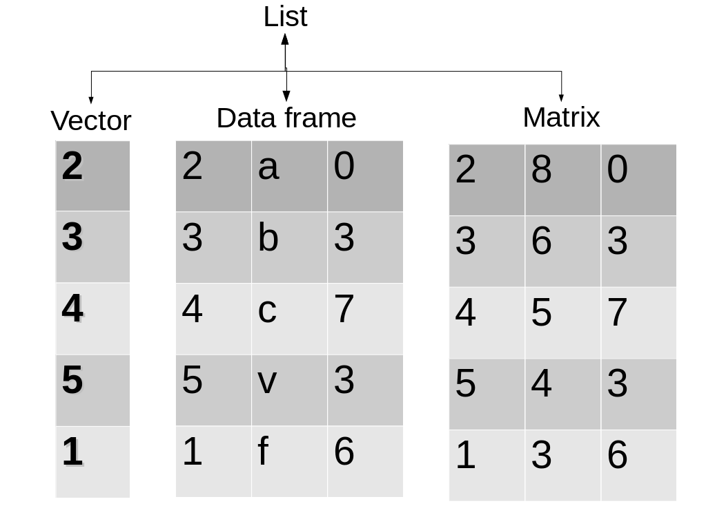
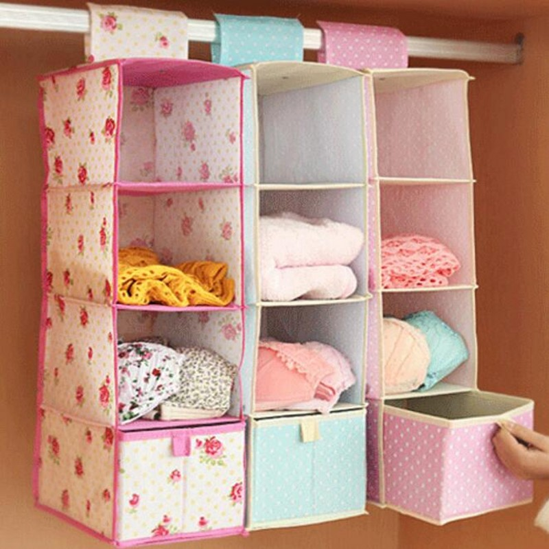
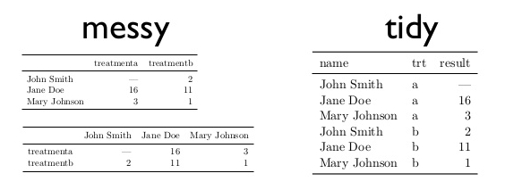

<style>
.reveal h1, .reveal h2, .reveal h3 {
  word-wrap: normal;
  -moz-hyphens: none;
}
</style>

<style>
.small-code pre code {
  font-size: 1em;
}
</style>

Práctico 1 Introducción a R
========================================================
author: Derek Corcoran
date: "06/03, 2018"
autosize: true
transition: rotate

En esta Clase
=============
incremental: true

- R y Rstudio
  + Paneles y como importar datos
  + Que son los paquetes (y a cuales creerles)
  + aprendiendo R desde R
- Estructuras de datos
  + Vectores, data frames y otros
- Como filtrar y resumir datos
- Gráficos
  + histográmas
  + boxplots
  + violin plots

R y RStudio
========================================================
incremental: true

- Programa escrito por estadísticos
- RStudio (IDE para R, Python, C++, etc) facilita su uso
- extensión en base a [paquetes](https://cran.r-project.org/web/packages/available_packages_by_name.html)
  + Los mejores publicados en [Journal of Statistical Software](https://www.jstatsoft.org/index), Methods in Ecology and Evolution u otro journal
  + Stackoverflow, siempre ver la reputación de los autores
- Aprendiendo R desde R con [Swirl](http://swirlstats.com/students.html)

Estructura de datos
========================================================
incremental: true

- Vector: Un conjunto lineal de datos (secuencia génica, serie de tiempo)
- Matrix: Una tabla con solo números
- Data Frame: Una tabla donde cada columna tiene un tipo de datos (estándar dorado)
- List: Aqui podemos meter lo que queramos

***



Vector
========================================================
left: 60%
incremental: true

* Secuencia lineal de datos
* Pueden ser de muchos tipos (numéricos, de carácteres, lógicos, etc.)
* Ejemplo data(uspop)
* para crear uno c(1,4,6,7,8)
* para subsetear un vector se pone el índice entre []
* uspop[4], uspop[2:10], uspop[c(3,5,8)]

***


Data Frame
========================================================
incremental: true
* Una tabla, cada columna un tipo de datos (Numérico, lógico, etc)
* Cada columna un vector
* Ejemplo data(iris)
* Para subsetear data.frame[filas,columnas]
* Ejemplos iris[,3], iris[,"Petal.Length"], iris[2:5,c(1,5)], iris$Petal.Length


***



Tidy Data 
========================================================
incremental: true


* Cada columna una variable
* Cada fila una observación

untidy data
===========


untidy data
===========



tidyverse
========================================================
incremental: true
 
Paquete con pocas funciones [muy poderosas](https://www.rstudio.com/wp-content/uploads/2015/02/data-wrangling-cheatsheet.pdf), trabajaremos con


- *summarize*
- *group_by*
- *filter* 
- *%>%* pipeline

summarize y group_by
=================
- *summarize* resume una variable
- *Group_by* reune observaciones según una variable
- Usadas en conjunto muy poderosas


```r
library(dplyr)
library(knitr)
MEAN <- summarize(iris, MEAN.PETAL = mean(Petal.Length))
kable(MEAN)
```


| MEAN.PETAL|
|----------:|
|      3.758|

summarize y group_by (continuado)
=================


```r
library(dplyr)
library(knitr)
MEAN <- group_by(iris, Species)
MEAN <- summarize(MEAN, MEAN.PETAL = mean(Petal.Length))
kable(MEAN)
```


|Species    | MEAN.PETAL|
|:----------|----------:|
|setosa     |      1.462|
|versicolor |      4.260|
|virginica  |      5.552|

Pipeline (%>%)
=================
class: small-code

- Ahorra líneas, se parte con un data.frame
- Se agregan funciones de dplyr hasta llegar al resultado deseado


```r
library(dplyr)
library(knitr)
MEAN <- iris %>% group_by(Species) %>% summarize(MEAN.PETAL = mean(Petal.Length))
kable(MEAN)
```


|Species    | MEAN.PETAL|
|:----------|----------:|
|setosa     |      1.462|
|versicolor |      4.260|
|virginica  |      5.552|

Pipeline (%>%) otro ejemplo
==========================


```r
library(dplyr)
library(knitr)
MEAN <- iris %>% group_by(Species) %>% summarize_all(mean)
kable(MEAN)
```


|Species    | Sepal.Length| Sepal.Width| Petal.Length| Petal.Width|
|:----------|------------:|-----------:|------------:|-----------:|
|setosa     |        5.006|       3.428|        1.462|       0.246|
|versicolor |        5.936|       2.770|        4.260|       1.326|
|virginica  |        6.588|       2.974|        5.552|       2.026|

Filter
=======
incremental:true
- Selecciona según una o más variables

|simbolo |significado     |simbolo_cont |significado_cont |
|:-------|:---------------|:------------|:----------------|
|<       |Menor que       |!=           |distinto a       |
|>       |Mayor que       |%in%         |dentro del grupo |
|==      |Igual a         |is.na        |es NA            |
|>=      |mayor o igual a |!is.na       |no es NA         |
|<=      |menor o igual a |&#124; &     |o, y             |

Ejemplos de filter agregando a lo anterior
===============================
class: small-code


```r
library(dplyr)
data("iris")
DF <- iris %>% filter(Species != "versicolor") %>% group_by(Species) %>% summarise_all(funs(mean, sd))
kable(DF)
```


|Species   | Sepal.Length_mean| Sepal.Width_mean| Petal.Length_mean| Petal.Width_mean| Sepal.Length_sd| Sepal.Width_sd| Petal.Length_sd| Petal.Width_sd|
|:---------|-----------------:|----------------:|-----------------:|----------------:|---------------:|--------------:|---------------:|--------------:|
|setosa    |             5.006|            3.428|             1.462|            0.246|       0.3524897|      0.3790644|       0.1736640|      0.1053856|
|virginica |             6.588|            2.974|             5.552|            2.026|       0.6358796|      0.3224966|       0.5518947|      0.2746501|


Select
=======================
class: small-code

* Selecciona columnas dentro de un data.frame


```r
library(dplyr)
library(knitr)
data(nasa)
Nasa2 <- as.data.frame(nasa)
Temp <- Nasa2 %>% filter(year != 1995) %>% group_by(year) %>% select(contains("temp")) %>% summarize_all(mean)
```
***

```r
kable(Temp)
```


| year| surftemp| temperature|
|----:|--------:|-----------:|
| 1996| 295.8562|    297.1005|
| 1997| 296.7291|    297.9566|
| 1998| 297.1221|    298.7028|
| 1999| 295.6850|    298.1364|
| 2000| 295.7263|    298.3358|


Ejercicios
========================================================
incremental: true

* Usando la base de datos *storm* del paquete *tidyverse*, calcula la velocidad promedio y diámetro promedio (hu_diameter) de las tormentas declaradas huracanes por año
    + solución:
    + storms %>% filter(status == "hurricane") %>% select(year, wind, hu_diameter) %>% group_by(year) %>% summarize_all(mean)

Visualización de datos (ggplot2)
========================================================
class: small-code

* <small>Paquete de visualización de datos de tidy data.</small>
* <small>ggplot(data.frame, aes(nombres de columna)).</small>
* <small>+ geom_algo(argumentos, aes(columnas)).</small>
* <small>+ theme_algo() estilo.</small>
* <small>Personalización de ejes y leyendas.</small>
* <small>Dos [links](http://zevross.com/blog/2014/08/04/beautiful-plotting-in-r-a-ggplot2-cheatsheet-3/) para aprender [mas](https://www.rstudio.com/wp-content/uploads/2015/03/ggplot2-cheatsheet.pdf).</small>


```r
library(ggplot2)
data("diamonds")
ggplot(diamonds, aes(x = carat, y=price)) + geom_point(aes(color = cut)) + theme_classic()
```

***


Argumentos para geoms
=================

* **color**: color de líneas o puntos 
* **alpha**: transparencia, de 0 (transparente) a 1 (sólido)
* **size**: tamaño de puntos
* **pch**: típo de punto
* **fill**: color dentro de un área (barras, intervalos)

color
=================
class: small-code


```r
library(ggplot2)
data("diamonds")
ggplot(diamonds, aes(x = carat, y=price)) + geom_point(aes(color = cut)) + theme_classic()
```


alpha
=================
class: small-code


```r
library(ggplot2)
data("diamonds")
ggplot(diamonds, aes(x = carat, y=price)) + geom_point(aes(color = cut), alpha = 0.1) + theme_classic()
```


size
=================
class: small-code


```r
library(ggplot2)
data("mtcars")
ggplot(mtcars, aes(x = wt, y=mpg)) + geom_point(aes(size = hp)) + theme_classic()
```


shape
=================
class: small-code


```r
library(ggplot2)
data("diamonds")
ggplot(diamonds, aes(x = carat, y=price)) + geom_point(aes(shape = cut)) + theme_classic()
```


fill
=================
class: small-code


```r
library(dplyr)
d2 <- diamonds %>% filter(clarity == "I1" | clarity == "IF")
ggplot(d2, aes(x = cut, y=price)) + geom_boxplot(aes(fill = clarity)) + theme_classic()
```


Una variable categórica una continua
===========

* geom_boxplot
* geom_jitter
* geom_violin
* geom_bar

geom_jitter
==================
class: small-code


```r
data("iris")
ggplot(iris, aes(x = Species, y = Petal.Length)) + geom_jitter(aes(color = Species))
```


geom_violin
================
class: small-code


```r
data("iris")
ggplot(iris, aes(x = Species, y = Petal.Length)) + geom_violin(fill = "red")
```


Se pueden combinar
============
class: small-code


```r
data("iris")
ggplot(iris, aes(x = Species, y = Petal.Length)) + geom_violin() + geom_jitter(aes(color = Species))
```


Pero el orden importa
============
class: small-code


```r
data("iris")
ggplot(iris, aes(x = Species, y = Petal.Length)) + geom_jitter(aes(color = Species)) + geom_violin()
```


