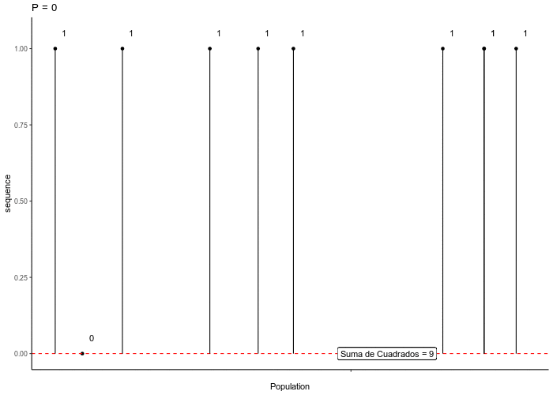
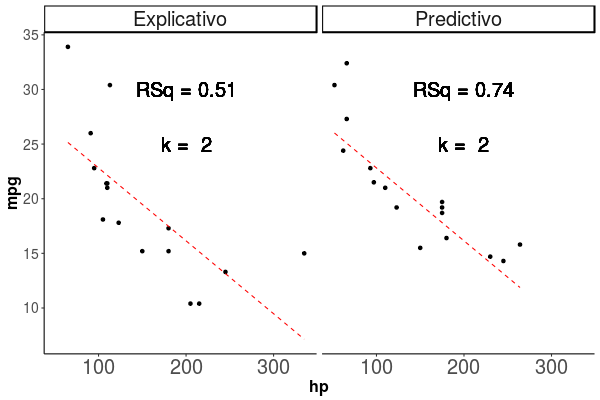

```{r, include=FALSE}
knitr::opts_chunk$set(echo = FALSE, warning = FALSE, message = FALSE)
suppressMessages(suppressWarnings(library(tidyverse, quietly = TRUE)))
options("kableExtra.html.bsTable" = T)
library(kableExtra)
```


## Diferencias de solución por mámima verosimilitud y mínimos cuadrados {.build}

* Partamos con un parámetro binomial:

```{r, echo = TRUE}
p.parameter <- 0.8
set.seed(2018)
sequence <- rbinom(10, 1, p.parameter)
sequence
```

```{r, echo= TRUE}
p_estimate <- mean(sequence)
p_estimate
```

```{r}
set.seed(2019)
Sequence <- data.frame(sequence = sequence, Population = "A", x = 1 + rnorm(length(sequence)))
```

# Mínimos cuadrados

## Usando mínimos cuadrados {.build}

```{r, echo = TRUE}
Posibles_p <- seq(0, 1, by = 0.025)
Posibles_p
```

```{r}
set.seed(2019)
Para_Test <- data.frame(Posibles_p = Posibles_p, Test = 1:length(Posibles_p))
Para_Test$Suma_Cuadrados <- NA
for(i in 1:nrow(Para_Test)){
  Sequence$Cuadrados <- (Para_Test$Posibles_p[i] - Sequence$sequence)^2
  Para_Test$Suma_Cuadrados[i] <- sum(Sequence$Cuadrados)
}
```

## Usando mínimos cuadrados {.build}

```{r}
# library(animation)
#  saveGIF(for(i in 1:nrow(Para_Test)){
#    Sequence$Cuadrados <- (Para_Test$Posibles_p[i] - Sequence$sequence)^2
#  
#  print(ggplot(Sequence, aes(x = x, y = sequence)) + geom_point() + geom_hline(yintercept = Para_Test$Posibles_p[i], color = "red", lty = 2) + geom_segment(aes(yend = Para_Test$Posibles_p[i], xend = x)) + geom_text(aes(label = round(Cuadrados,2)), nudge_y = 0.05, nudge_x = 0.05) + theme_classic() + scale_x_continuous(name = "Population", breaks = c(1), labels = "") + geom_label(label = paste("Suma de Cuadrados =", round(sum(Sequence$Cuadrados),2)), x = 1.2, y = 0) + ggtitle(paste("P =", Para_Test$Posibles_p[i])))
#  }
#  , movie.name = "Minimo_Cuadrado.gif", ani.height = 500, ani.width = 700)

```

## Usando mínimos cuadrados {.build}

```{r}
Minimo <- Para_Test %>% dplyr::filter(Suma_Cuadrados == min(Suma_Cuadrados))

ggplot(Para_Test, aes(x = Posibles_p, y = Suma_Cuadrados)) + geom_path() + theme_classic() + xlab("p") + ylab("Suma de Cuadrados") + geom_point(data = Minimo, color = "red") + geom_text(data = Minimo, aes(label = Posibles_p), nudge_y = 0.15)
```

# Maxima verosimilitud

## Con maxima verosimilitud {.build .small}

* Cual es la probabilidad de que la base de datos venga de una base de datos con parametro $\theta$
* Por ejemplo dada una distribución binomial, cual es la probabilidad de que `sequence` venga de una población con *p* = 0.2

$$L(p|x, n) = {n\choose x}p^x(1-p)^{n-x}$$

*  p = 0.2
*  n = 10
*  x = 9

## Con maxima verosimilitud {.build}


```{r, echo = TRUE}
Likelihood = function(p,n,x){
  choose(n = n, k = x)*(p^x)*((1-p)^(n-x))
}
```

Para *p = 0.2*

```{r}
Likelihood(p = 0.2, n = 10, x = 9)
```

## Función máxima verosimilitud {.build}

```{r, echo=T} 
DF <- data.frame(Posibles_p = seq(0, 1, by = 0.001)) %>% mutate(Verosimilitud = Likelihood(p = Posibles_p, n = 10, x = 9))
```

```{r}
ggplot(DF, aes(x = Posibles_p, y = Verosimilitud)) + geom_path() + theme_bw() + xlab("p") + ylab("Verosimilitud en función de p")
```


# Regresión lineal simple

## Rregresión lineal simple

$$y = \beta X_1 + c_1$$

```{r, echo = TRUE}
ggplot(mtcars, aes(x = mpg, y = wt))+ geom_smooth(method = "lm") + geom_point()+ theme_classic()
```

## Regresión lineal simple {.build}

$$y = \beta X_1 + c_1$$

```{r, echo = TRUE}
Modelo1 <- lm(mpg ~ wt, data = mtcars)
```

```{r, echo=TRUE, eval=FALSE}
broom::tidy(Modelo1)
```


```{r, echo=FALSE}
kable(broom::tidy(Modelo1)) %>% kable_styling("striped")
```

## Que tan bueno es el modelo? {.build}

```{r, echo=TRUE, eval=FALSE}
broom::glance(Modelo1)
```

```{r, echo=FALSE, eval=TRUE}
kable(broom::glance(Modelo1)) %>% kable_styling("striped")
```

## Que pasa si agregamos variables

```{r, echo = TRUE}
Modelo1 <- lm(mpg ~ wt, data = mtcars)
Modelo2 <- lm(mpg ~ wt + hp, data = mtcars)
Modelo3 <- lm(mpg ~ wt + hp + am, data = mtcars)
```


```{r, echo=FALSE, eval=TRUE}
Modelos <- list(Modelo1, Modelo2, Modelo3)

Mods <- list()

for(i in 1:length(Modelos)){
  Mods[[i]] <- broom::glance(Modelos[[i]]) %>% mutate(Nombre = paste("Modelo", i), K = i) %>% dplyr::select(r.squared, adj.r.squared, AIC, p.value, Nombre, K)
}

Mods <- bind_rows(Mods)

kable(Mods) %>% kable_styling("striped")
```

## Que pasa al complejizar el modelo

## Que pasa al complejizar el modelo

$$mpg = \beta_1 x_1 + \beta_2 x_2 + ... + \beta_12 x_{12} + c$$

```{r}
knitr::include_graphics("Explicativo.gif")
```


## Sobreajuste

```{r}

```

# Solución AIC

## Explicación o Predicción?

```{r}
knitr::include_graphics("Both.jpg", dpi = 80)
```

## AIC

* Balancea explicación y predicción
* Castiga el uso de muchos parámetros
* Menor AIC, mejor modelo

$$AIC = 2k  - \ln(L)$$

* Corregido

$$AICc = AIC + \frac{2k^2 + 2k}{n-k-1}$$

* Usualmente una diferencia de 2 en AIC, se considera "Significativa" 

# Busquen el "Mejor modelo" de acuerdo a AIC que explica el MPG de la base mtcars