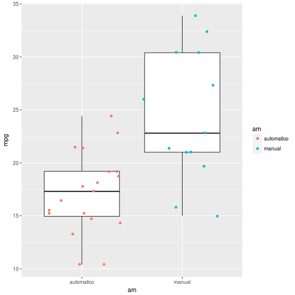

<style>
.reveal h1, .reveal h2, .reveal h3 {
  word-wrap: normal;
  -moz-hyphens: none;
}
</style>

<style>
.small-code pre code {
  font-size: 1em;
}
</style>

Prueba t de Student
========================================================
author: Derek Corcoran
date: "07/05, 2018"
autosize: true
transition: rotate


En este práctico
========================================================
incremental:true

* Probaremos el paquete `learnr`
* Pruebas de t de para una muestra
* Pruebas de t para dos muestras
* Supuestos y alternativas a la prueba **t de student**

Prueba de una muestra
========================================================
incremental:true

* $H_0$ media de una población = una media teórica 
* Ejemplo erupciones del géiser *Old Faithful*
* Guardaparque dice que géiser erupta cada 1 hora
* Base de datos `faithful`

Funcion t.test()
==============
incremental:true
class: small-code

* **x:** Un vector con los valores numéricos de a poner a prueba
* **mu:** La media teórica a poner a prueba
* **alternative:** Puede ser "two.sided", "less" o "greater", dependiendo de si 


```r
data("faithful")
t.test(x = faithful$waiting, mu = 60, alternative = "two.sided")
```

```

	One Sample t-test

data:  faithful$waiting
t = 13.22, df = 271, p-value < 2.2e-16
alternative hypothesis: true mean is not equal to 60
95 percent confidence interval:
 69.27418 72.51994
sample estimates:
mean of x 
 70.89706 
```

Ejercicio 1
=============
incremental:true

* Base de datos `airquality` 
* Partículas de ozono cada día de Mayo a Septiembre de 1973 entre 13:00 y 15:00
* Disminuir a la mitad los pasajes del metro de Nueva York los meses que en promedio tengan sobre 55 ppb. 
* Comprobar estadisticamente que meses tienen promedios sobre 55.
* ¿Si se tienen todos los días por que hay que hacer prueba estadística?
* Generen una tabla resumen con las medias y desviaciones estandar de ozono para cada mes

Resumen por meses
===========
incremental:true
class: small-code


```r
library(tidyverse)
SummMonth <- airquality %>% group_by(Month) %>% summarize(Mean = mean(Ozone, na.rm = TRUE), SD = sd(Ozone, na.rm = TRUE))
```


| Month|     Mean|       SD|
|-----:|--------:|--------:|
|     5| 23.61538| 22.22445|
|     6| 29.44444| 18.20790|
|     7| 59.11538| 31.63584|
|     8| 59.96154| 39.68121|
|     9| 31.44828| 24.14182|

Prueba de t
===========
incremental:true
class: small-code


```r
AirJuly <- airquality %>% filter(Month == 7)
AirAug <- airquality %>% filter(Month == 8)
t.test(AirJuly$Ozone, mu = 55, alternative = "greater")
```

```

	One Sample t-test

data:  AirJuly$Ozone
t = 0.66331, df = 25, p-value = 0.2566
alternative hypothesis: true mean is greater than 55
95 percent confidence interval:
 48.51757      Inf
sample estimates:
mean of x 
 59.11538 
```

```r
t.test(AirAug$Ozone, mu = 55, alternative = "greater")
```

```

	One Sample t-test

data:  AirAug$Ozone
t = 0.63756, df = 25, p-value = 0.2648
alternative hypothesis: true mean is greater than 55
95 percent confidence interval:
 46.66857      Inf
sample estimates:
mean of x 
 59.96154 
```

Prueba de t
===========

¿En que meses se debiera aplicar el descuento?

Pruebas de 2 muestras
========
incremental:true
class: small-code



***

* <small>En base de datos `mtcars` columna *am* designa si un vehiculo es automático (0) o manual (1)</small> 
* <small>Para prueba t de dos muestras debemos agregar el argumento `var.equal`</small>
* <small>Usamos nuevamente simbolo ~ explicado por</small>


```r
t.test(mpg ~ am, data = mtcars, var.equal =TRUE)
```

```

	Two Sample t-test

data:  mpg by am
t = -4.1061, df = 30, p-value = 0.000285
alternative hypothesis: true difference in means is not equal to 0
95 percent confidence interval:
 -10.84837  -3.64151
sample estimates:
mean in group 0 mean in group 1 
       17.14737        24.39231 
```


Ejercicio 2
===========
incremental:true
class: small-code

* Base de datos `BeerDark` en webcursos o en el siguiente [link](https://archive.org/download/BeerDark/BeerDark.csv). 
* **Estilo:** Separa las cervezas entre Porters y Stouts
* **Grado_Alcoholico:** El grado alcoholico de las cervezas
* **Amargor:** Valor IBU (International Bittering Units), a mayor valor más amarga la cerveza
* **Color:** A mayor valor más oscura la cerveza.
* Determinar si las cervezas Porter y Stouts son distintas en grado alcoholico, amargor y/o color. 

Ejercicio 2
===========
incremental:true
class: small-code


```
Error in open.connection(con, "rb") : 
  Timeout was reached: Resolving timed out after 10000 milliseconds
```
