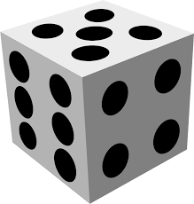

```{r setup, include=FALSE}
knitr::opts_chunk$set(echo = FALSE, warning = FALSE, message = FALSE)
suppressMessages(suppressWarnings(library(tidyverse, quietly = TRUE)))
```

# Volvamos a lo básico

## Probabilidad de que algo ocurra {.build}

Probabilidad de un 6

```{r, echo = TRUE, eval = FALSE}
p_dado6 <- 1/6
```


```{r, echo = FALSE}

```

## Probabilidad de que dos eventos ocurran {.build .small}

* $p(A) \cap p(B) = p(A) * p(B)$
* ¿Cuál es la probabilidad de que al lanzar tres veces un dado, obtengamos 6 las tres veces? 

```{r, echo = TRUE, eval = FALSE}
p_dado6 <- 1/6
```

```{r, echo = FALSE}

```

## Probabilidad de que algo no ocurra {.build}

$$p(6) + p(1,5) = 1$$

```{r, echo = TRUE, eval = FALSE}
p_dadoNo6 <- (1 - 1/6)
```

## Probabilidad de que dos eventos no ocurran {.build}

* Cual es la probabilidad que al lanzar cinco veces un dado, nunca obtengamos el valor de 6

```{r, echo = TRUE}
p_dadoNo6 <- (1 - 1/6)
```

## Probabilidad de que algo ocurra al menos una vez {.build}

* La probabilidad de que un evento $A$ no ocurra en $n$ intentos es:

$$(1-p(A))^n$$

* ¿Que es el complemento a esto?

$$1 - (1-p(A))^n$$

* Probabilidad de que algo ocurra al menos una vez


## Probabilidad de que algo ocurra al menos una vez {.build}

* Cual es la probabilidad de que al lanzar un dado cuatro veces al menos una vez obtengamos un valor de 6

```{r, echo = TRUE}
p_dado6 <- 1/6
```

## ¿Bonferroni? {.build}

* $\alpha = 0.05$ 
* $p = 0.05$
* Error tipo 1 = 95%

Considerando la ecuación 6, ¿cual es la probabilidad de que al hacer 6 comparaciones independientes podamos cometer un error de tipo 1?

```{r, echo = TRUE}
p_error <- 0.05
```

## Correccion de Bonferroni y otras {.build}

* Bonferroni ajusta el valor de p para poder disminuir el alza de errores tipo 1 Función `pairwise.t.test` con los argumentos:
* **x:** Vector de valores respuestas
* **g:** Vector de variable de agrupamiento para x
* **p.adjust.method:** El método a utilizar para ajustar el valor de p, las opciones son
    + "none"
    + "bonferroni"
    + "holm"
    + "hochberg"
    + "hommel"
    + "BH"
    + "BY"
    + "fdr"


## Ejemplo {.build .small}

```{r, echo = TRUE}
summary(aov(Ozone ~ Month, data = airquality))
```

## Ejemplo {.build .small}

```{r, echo=TRUE}
pairwise.t.test(x = airquality$Ozone, g = airquality$Month, p.adj = "none")
```

# Recreo

## ANOVA anidado {.build}

* Tenemos un factor jerarquicamente dentro de otro 
  + individuos dentro de una especie
  + hojas dentro de un árbol
  + en anova si el factor B esta anidado dendtro de A tenemos A/B

* Ejemplo individuos en la base de datos CO2

```{r, echo = TRUE}
ANOVAUptake <- aov(uptake  ~  Type + Treatment + Type/Plant, data=CO2)
```


## Tarea 1 {.build}

* La tarea 1 se encuentra en el siguiente [link](http://www.derek-corcoran-barrios.com/AyduantiaStats/_book/posthoc.html#tarea-1)
* Los generar un informe en estilo paper con lo siguiente:

    + Realiza un calculo de poder en base al archivo *Presamp.csv* para ver cual debiera ser tu número de mustras necesaria y explicalo
    + Establece si se cumplen los supuestos de los test a realizar y ejecuta deacurdo a tus conocimientos justificando
    + Determinar si alguna de las algas es mejor biorremediador (incluyendo comparaciones post-hoc)
    + Dentro de lo posible utiliza la menor cantidad posible de presupuesto, debes utilizar el presupuesto que te queda para proponer una medida de biorremediación
    