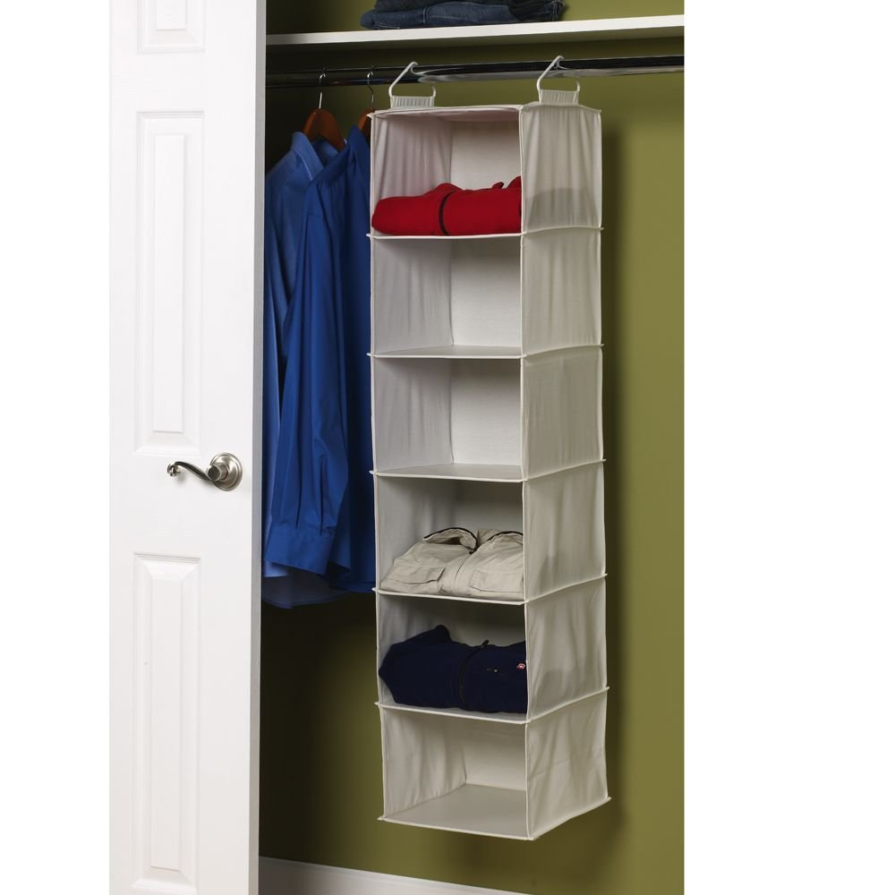

```{r setup, include=FALSE}
knitr::opts_chunk$set(echo = TRUE, warning = FALSE, message = FALSE, cache = FALSE, tidy = TRUE, tidy.opts = list(width.cutoff = 50))
library(tidyverse)
library(broom)
library(kableExtra)
options("kableExtra.html.bsTable" = T)
```

# Bienvenida

## Curso Análisis y manipulación de datos en R {.build}

Primeros pasos

* ¿Quien no ha usado nunca R? [Swirl](https://www.youtube.com/watch?v=w6L7Ye18yPE&feature=youtu.be)
* Evaluación sencilla (Informes reproducibles + presentación reproducible)
* Evaluación por pares (Quien evalua a los evaluadores)
* Mucho trabajo personal guiado
* Pagina donde esta [todo el curso](https://derek-corcoran-barrios.github.io/Libro/_book/index.html)

# Como se organizan los datos en R

## Estructura de datos {.build}

<div style="float: left; width: 40%;">

- Vector: Un conjunto lineal de datos (secuencia génica, serie de tiempo)
- Matrix: Una tabla con solo números
- Data Frame: Una tabla donde cada columna tiene un tipo de datos (estándar dorado)
- List: Aqui podemos meter lo que queramos

</div>

<div style="float: right; width: 60%;">

```{r, echo = FALSE}
knitr::include_graphics("Data.png")
```

</div>

## Vector {.build}

<div style="float: left; width: 40%;">

* Secuencia lineal de datos
* Pueden ser de muchos tipos (numéricos, de carácteres, lógicos, etc.)
* Ejemplo data(uspop)
* para crear uno c(1,4,6,7,8)
* para subsetear un vector se pone el índice entre []
* uspop[4], uspop[2:10], uspop[c(3,5,8)]

</div>

<div style="float: right; width: 60%;">

```{r, echo = FALSE}

```

</div>

## Data Frame {.build}

<div style="float: left; width: 40%;">

* Una tabla, cada columna un tipo de datos (Numérico, lógico, etc)
* Cada columna un vector
* Ejemplo data(iris)
* Para subsetear data.frame[filas,columnas]
* Ejemplos iris[,3], iris["Petal.Length"], iris[2:5,c(1,5)], iris$Petal.Length


</div>

<div style="float: right; width: 60%;">

```{r, echo = FALSE}
knitr::include_graphics("DataFrame.jpg")
```

</div>

# Principios de Tidydata

## Tidy Data  {.build}

```{r, echo = FALSE}
knitr::include_graphics("tidy.png")
```


* Cada columna una variable
* Cada fila una observación

## untidy data

```{r, echo=FALSE, message = FALSE, warning = FALSE,fig.width=8,fig.height=4.5,dpi=300,out.width="960px",out.height="700px"}
library(knitr)
include_graphics("UntidyONU.png")
```

## untidy data

```{r, echo=FALSE, message = FALSE, warning = FALSE,fig.width=8,fig.height=3,dpi=300,out.width="960px",out.height="450px"}
include_graphics("untidy.jpg")
```

## untidy data {.small .build}

<div style="float: left; width: 40%;">

* Tablas de contingencia
* Ejemplo data(HairEyeColor)

</div>

<div style="float: right; width: 60%;">

```{r, echo = FALSE}
data("HairEyeColor")
knitr::kable(HairEyeColor[,,1]) %>% kable_styling(bootstrap_options = c("striped", "hover", "condensed", "responsive"), full_width = F)
```

</div>

### Forma tidy

```{r, echo=FALSE}
library(epitools)
library(knitr)
H <- as.data.frame(HairEyeColor)
kable(H) %>% kable_styling(bootstrap_options = c("striped", "hover", "condensed", "responsive"), full_width = F) %>% scroll_box()
```

# Trabajemos tidy

## dplyr {.build}

* Paquete con pocas funciones [muy poderosas](https://www.rstudio.com/wp-content/uploads/2015/02/data-wrangling-cheatsheet.pdf) para ordenar datos 
* Parte del [tidyverse](https://www.tidyverse.org/)

- *group_by* (agrupa datos)
- *summarize* (resume datos agrupados)
- *filter* (Encuentra filas con ciertas condiciones)
- *select* junto a *starts_with*, *ends_with* o *contains*
- *mutate* (Genera variables nuevas)
- *%>%* pipeline
- *arrange* ordenar

## summarize y group_by {.build .small}

- *group_by* reune observaciones según una variable
- *summarize* resume una variable

```{r, eval=FALSE, echo = TRUE}
library(tidyverse)
Summary.Petal <- summarize(iris, Mean.Petal.Length = mean(Petal.Length), SD.Petal.Length = sd(Petal.Length))
```


```{r, echo = FALSE}
library(dplyr)
library(knitr)
Summary.Petal <- summarize(iris, Mean.Petal.Length = mean(Petal.Length), SD.Petal.Length = sd(Petal.Length))

kable(Summary.Petal) %>% kable_styling(bootstrap_options = c("striped", "hover", "condensed", "responsive"), full_width = F)
```

## summarize y group_by (continuado) {.small .build}

```{r, eval = FALSE}
Summary.Petal <- group_by(iris, Species)
Summary.Petal <- summarize(Summary.Petal, Mean.Petal.Length = mean(Petal.Length), SD.Petal.Length = sd(Petal.Length))
```


```{r, echo = FALSE}
library(dplyr)
library(knitr)
Summary.Petal <- group_by(iris, Species)
Summary.Petal <- summarize(Summary.Petal, Mean.Petal.Length = mean(Petal.Length), SD.Petal.Length = sd(Petal.Length))
kable(Summary.Petal) %>% kable_styling(bootstrap_options = c("striped", "hover", "condensed", "responsive"), full_width = F)
```

## summarize y group_by (continuado) {.small .build}
   
* Pueden agrupar por más de una variable a la vez

```{r, eval = FALSE}
data("mtcars")
Mtcars2 <- group_by(mtcars, am, cyl)
Consumo <- summarize(Mtcars2, Consumo_promedio = mean(mpg), desv = sd(mpg))
```


```{r, echo = FALSE}

data("mtcars")
Mtcars2 <- group_by(mtcars, am, cyl)
Consumo <- summarize(Mtcars2, Consumo_promedio = mean(mpg), desv = sd(mpg))
kable(Consumo) %>% kable_styling(bootstrap_options = c("striped", "hover", "condensed", "responsive"), full_width = F)
```

# Dudas?

## mutate {.small}

* Crea variables nuevas

```{r, eval = FALSE}
DF <- mutate(iris, Petal.Sepal.Ratio = Petal.Length/Sepal.Length)
```

```{r, echo = FALSE}
DF <- mutate(iris, Petal.Sepal.Ratio = round((Petal.Length/Sepal.Length),2))

kable(DF[seq(from = 15, to = 150, length.out = 10),], row.names = FALSE) %>% kable_styling(bootstrap_options = c("striped", "hover", "condensed", "responsive"), full_width = F) %>% scroll_box(width = "900px", height = "200px")
```

## Pipeline (%>%) {.small .build}

- Para realizar varias operaciones de forma secuencial 
- sin recurrir a parentesis anidados 
- sobrescribir multiples bases de datos

```{r, eval=FALSE}
x <- c(1,4,6,8)
y <- round(mean(sqrt(log(x))),2)
```

- Que hice ahí?

```{r, eval=FALSE}
x <- c(1,4,6,8)
y <- x %>% log() %>% sqrt() %>% mean() %>% round(2)
```

```{r, echo=FALSE}
x <- c(1,4,6,8)
x %>% log() %>% sqrt() %>% mean() %>% round(2)
```

## Pipeline (%>%) {.small .build}

* Muchos objetos intermedios

```{r, eval=FALSE}
DF <- mutate(iris, Petal.Sepal.Ratio = Petal.Length/Sepal.Length)
BySpecies <- group_by(DF, Species)
Summary.Byspecies <- summarize(BySpecies, MEAN = mean(Petal.Sepal.Ratio), SD = sd(Petal.Sepal.Ratio))
```


```{r, echo=FALSE}
DF <- mutate(iris, Petal.Sepal.Ratio = Petal.Length/Sepal.Length)
BySpecies <- group_by(DF, Species)
Summary.Byspecies <- summarize(BySpecies, MEAN = mean(Petal.Sepal.Ratio), SD = sd(Petal.Sepal.Ratio))
kable(Summary.Byspecies) %>% kable_styling(bootstrap_options = c("striped", "hover", "condensed", "responsive"), full_width = F)
```

## Pipeline (%>%) {.small .build}

* Con pipe

```{r, eval=FALSE}
Summary.Byspecies <- summarize(group_by(mutate(iris, Petal.Sepal.Ratio = Petal.Length/Sepal.Length), Species), MEAN = mean(Petal.Sepal.Ratio), SD = sd(Petal.Sepal.Ratio))
```


```{r, echo=FALSE}
Summary.Byspecies <- summarize(group_by(mutate(iris, Petal.Sepal.Ratio = Petal.Length/Sepal.Length), Species), MEAN = mean(Petal.Sepal.Ratio), SD = sd(Petal.Sepal.Ratio))

kable(Summary.Byspecies) %>% kable_styling(bootstrap_options = c("striped", "hover", "condensed", "responsive"), full_width = F)
```


## Pipeline (%>%) otro ejemplo

```{r, eval=FALSE}
library(tidyverse)
MEAN <- iris %>% group_by(Species) %>% summarize_all(.funs = list(Mean = mean, SD =sd))
```

```{r, echo=FALSE}
library(dplyr)
library(knitr)
MEAN <- iris %>% group_by(Species) %>% summarize_all(.funs = list(Mean = mean, SD =sd))
kable(MEAN) %>% kable_styling(bootstrap_options = c("striped", "hover", "condensed", "responsive"), full_width = F)
```
# Mas dudas?

## Filter {.build}

- Selecciona según una o más variables

```{r, echo=FALSE}
DF <- data.frame(simbolo = c(">", "<", "==", ">=", "<="), significado = c("Mayor que", "Menor que", "Igual a", "mayor o igual a", "menor o igual a"), simbolo_cont = c("!=","%in%", "is.na", "!is.na", "| &"), significado_cont = c("distinto a", "dentro del grupo", "es NA", "no es NA", "o, y"))
kable(DF) %>% kable_styling(bootstrap_options = c("striped", "hover", "condensed", "responsive"), full_width = F)
```

## Ejemplos de filter agregando a lo anterior {.small}

```{r, eval = FALSE}
data("iris")
DF <- iris %>% filter(Species != "versicolor") %>% group_by(Species) %>% summarise_all(mean)
```

```{r, echo = FALSE}
library(dplyr)
data("iris")
DF <- iris %>% filter(Species != "versicolor") %>% group_by(Species) %>% summarise_all(mean)
kable(DF) %>% kable_styling(bootstrap_options = c("striped", "hover", "condensed", "responsive"), full_width = F)
```

## Ejemplos de filter {.small}

```{r, eval = FALSE}
DF <- iris %>% filter(Petal.Length >= 4 & Sepal.Length >= 5) %>% group_by(Species) %>% summarise(N = n())
```

```{r, echo = FALSE}
DF <- iris %>% filter(Petal.Length >= 4 & Sepal.Length >= 5) %>% group_by(Species) %>% summarise(N = n())
kable(DF) %>% kable_styling(bootstrap_options = c("striped", "hover", "condensed", "responsive"), full_width = F)
```


## Más de una función {.small}

```{r, eval = FALSE}
data("iris")
DF <- iris %>% filter(Species != "versicolor") %>% group_by(Species) %>% summarise_all(.funs= list(Mean  = mean, SD = sd))
```

```{r, echo = FALSE}
library(dplyr)
data("iris")
DF <- iris %>% filter(Species != "versicolor") %>% group_by(Species) %>% summarise_all(.funs= list(Mean  = mean, SD = sd))
kable(DF) %>% kable_styling(bootstrap_options = c("striped", "hover", "condensed", "responsive"), full_width = F)
```

## Select {.small .build}

<div style="float: left; width: 40%;">

* Selecciona columnas dentro de un data.frame, se pueden restar

```{r, eval=FALSE}
iris %>% group_by(Species) %>% select(Petal.Length, Petal.Width) %>% summarize_all(mean)
```

```{r, eval=FALSE}
iris %>% group_by(Species) %>% select(-Sepal.Length, -Sepal.Width) %>% summarize_all(mean)
```

```{r, eval=FALSE}
iris %>% group_by(Species) %>% select(contains("Petal")) %>% summarize_all(mean)
```

```{r, eval=FALSE}
iris %>% group_by(Species) %>% select(-contains("Sepal")) %>% summarize_all(mean)
```

```{r, echo = FALSE}
DF <- iris %>% group_by(Species) %>% select(-contains("Sepal")) %>% summarize_all(mean)
```
</div>

<div style="float: right; width: 60%;">


```{r, echo = FALSE}
kable(DF) %>% kable_styling(bootstrap_options = c("striped", "hover", "condensed", "responsive"), full_width = F)
```

</div>

# Ejercicios

## Ejercicios {.build .small}

```{r}
Casos_Activos <- read_csv("https://raw.githubusercontent.com/MinCiencia/Datos-COVID19/master/output/producto19/CasosActivosPorComuna_std.csv")
```


Usando la base de datos del repositorio del ministerio de ciencias, genera un dataframe que responda lo siguiente:

* ¿Que proporción de las comunas ha tenido en algun momento mas de 50 casos por cada 100.000 habitantes?
* Genera un dataframe, donde aparezca para cada comuna que haya tenido sobre 50 casos por cada 100.000 habitantes, cuantos días ha tenido sobre ese valor.
* Genera una tabla de cuales comunas han tenido sobre 50 casos por cada 100.000 habitantes y de esas comunas crea una variable que sea la prevalencia máxima de dicha comuna.

## **Bonus** (Esto requiere investigar no basta con lo que aprendimos)

* Ve cuales son las 10 comunas que han tenido la mayor mediana de prevalencia, para cada una de estas 10 comunas, genera una tabla con la mediana, prevalencia máxima y fecha en que se alcanzó la prevalencia máxima

* Nos vemos a las 12:45

## Para la otra clase, es necesario: {.small .build}


* Crearse cuenta de [github](https://github.com/)
* Instalar los paquetes knitr, rmarkdown y kableExtra

