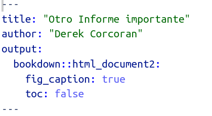

```{r setup, include=FALSE}
knitr::opts_chunk$set(echo = TRUE, warning = FALSE, message = FALSE, cache = FALSE, tidy = TRUE, tidy.opts = list(width.cutoff = 50))
library(tidyverse)
library(broom)
library(kableExtra)
library(knitr)
options("kableExtra.html.bsTable" = T)
```

## ggplot2

* ggplot(data.frame, aes(nombres de columna))
* + geom_algo(argumentos, aes(columnas))
* + theme_algo() estilo
* Personalización de ejes y leyendas
* Dos [links](https://ggplot2.tidyverse.org/) para aprender [mas](https://raw.githubusercontent.com/rstudio/cheatsheets/master/data-visualization-2.1.pdf).

```{r, eval=FALSE}
library(tidyverse)
data("diamonds")
ggplot(diamonds, aes(x = carat, y=price)) + geom_point(aes(color = cut)) + theme_classic()
```

## Ejemplo

```{r, echo=FALSE}
ggplot(diamonds, aes(x = carat, y=price)) + geom_point(aes(color = cut)) + theme_classic()
```

## Que diablos es aes() y por que +?

* en ggplot2 cada vez que mencionamos una columna debe ser dentro de aes()
* ggplot2 es el paquete mas antiguo del tidyverse, %>% no existia


## Argumentos para geoms

* **color**: color de líneas o puntos 
* **alpha**: transparencia, de 0 (transparente) a 1 (sólido)
* **size**: tamaño de puntos
* **shape**: típo de punto
* **fill**: color dentro de un área (barras, intervalos)

## color

```{r}
ggplot(diamonds, aes(x = carat, y=price)) + geom_point(aes(color = cut)) + theme_classic()
```

## alpha

```{r}
ggplot(diamonds, aes(x = carat, y=price)) + geom_point(aes(color = cut), alpha = 0.1) + theme_classic()
```

## size

```{r}
ggplot(mtcars, aes(x = wt, y=mpg)) + geom_point(aes(size = hp)) + theme_classic()
```

## shape

```{r}
ggplot(diamonds, aes(x = carat, y=price)) + geom_point(aes(shape = cut, color = cut)) + theme_classic()
```

## fill

```{r}
ggplot(iris, aes(x = Species, y=Sepal.Width)) + geom_boxplot(aes(fill = Species), notch = T) + theme_bw()
```

# Una variable categórica una continua

## Una variable categórica una continua

* geom_boxplot
* geom_jitter
* geom_violin
* geom_bar

## geom_jitter

```{r}
ggplot(iris, aes(x = Species, y = Sepal.Width)) + geom_jitter(aes(color = Species))
```

## geom_violin

```{r}
ggplot(iris, aes(x = Species, y = Sepal.Width)) + geom_violin(fill = "red")
```

## Se pueden combinar

```{r}
ggplot(iris, aes(x = Species, y = Sepal.Width)) + geom_violin() + geom_jitter(aes(color = Species))
```

## Pero el orden importa

```{r}
ggplot(iris, aes(x = Species, y = Sepal.Width)) + geom_jitter(aes(color = Species)) + geom_violin()
```

# Como reordenar las variables

## fct_reorder (Reordenar por otra variable)


```{r}
ggplot(iris, aes(x = fct_reorder(Species, Sepal.Width), y=Sepal.Width)) + geom_boxplot(aes(fill = Species), notch = T) + theme_bw()
```

## fct_reorder (cont)


```{r}
ggplot(iris, aes(x = fct_reorder(Species, Sepal.Width), y=Sepal.Width)) + geom_boxplot(aes(fill = Species), notch = T) + theme_bw() + xlab("lo que se me ocurra")
```

## fct_relevel

```{r}
ggplot(iris, aes(x = fct_relevel(Species, "setosa", "virginica"), y=Sepal.Width)) + geom_boxplot(aes(fill = Species), notch = T) + theme_bw() + xlab("lo que se me ocurra")
```


## Dos variables continuas

* geom_point
* geom_smooth
* geom_line
* geom_hex
* geom_rug

## geom_hex

```{r}
ggplot(diamonds, aes(carat, price)) + geom_hex() + scale_fill_viridis_c()
```

## geom_point y geom_smooth

```{r}
data("mtcars")
ggplot(mtcars, aes(x = wt, y = mpg)) + geom_smooth() + geom_point()
```

## geom_smooth, method

```{r}
data("mtcars")
ggplot(mtcars, aes(x = wt, y = mpg)) + geom_smooth(method = "lm") + geom_point()
```

## Datos de temperatura y humedad

```{r}
githubURL <- ("https://raw.githubusercontent.com/derek-corcoran-barrios/derek-corcoran-barrios.github.io/master/Clase4/TempHum.rds")
download.file(githubURL,"TempHum.rds", method="curl")
TempHum <- read_rds("TempHum.rds") %>% 
  mutate(Mes = as.numeric(Mes))
```


## stat_smooth más control que geom_smooth

```{r}
library(tidyverse)
PA <- TempHum %>% filter(Ciudad_localidad == "Punta Arenas") 
```

```{r, echo = FALSE}
kable(PA) %>% kable_styling(bootstrap_options = c("striped")) %>%
  scroll_box(width = "800px", height = "350px")
```


## stat_smooth más control que geom_smooth

```{r}
library(ggplot2)
ggplot(PA, aes(x = Mes, y = Temperatura)) + geom_point()
```

## stat_smooth más control que geom_smooth

```{r}
ggplot(PA, aes(x = Mes, y = Temperatura)) + geom_point() +  stat_smooth(method = "lm") 
```

## Ecuación cuadrática

```{r, echo=FALSE, out.width="400px"}
library(knitr)
include_graphics("Cuadratica.png")
```


## stat_smooth más control que geom_smooth

```{r}
ggplot(PA, aes(x = Mes, y = Temperatura)) + geom_point() +  stat_smooth(method = "lm", formula = y ~ x + I(x^2)) 
```

## Que podemos hacer con tidyr??

```{r}
library(tidyr)
San <- TempHum %>% filter(Ciudad_localidad == "Quinta Normal") %>%  pivot_longer(cols = c(Temperatura, Humedad),names_to= "Unidad", values_to = "medida")
```

## Que podemos hacer con tidyr?? (Cont.)

```{r}
ggplot(San, aes(x = Mes, y = medida)) + geom_point() +  stat_smooth(method = "lm", formula = y ~ x + I(x^2), aes(fill = Unidad, color = Unidad)) 
```


## incluirlo en rmd con leyenda abajo

```{r, echo=FALSE, out.width="500px"}
include_graphics("YAML.png")
```


```{r, echo=FALSE, out.width="500px"}
include_graphics("Chunk.png")
```

## Agregar referencias a imagenes con bookdown

```{r, echo=FALSE, out.width="500px"}

```


## Primera evaluación exploración de datos

* Generar un informe rmd
* Debe tener
    + chunks
    + inline code
    + tabla con leyenda (kable, stargazer)
    + figura con leyenda
    + para el xx de Septiembre

## Como combinar gráficos con facet_wrap

```{r}
Algunos <- TempHum %>% filter(Ciudad_localidad %in% c("Arica", "Rapa Nui", "La Serena", "Valparaíso", "Quinta Normal", "Concepción", "Valdivia", "Punta Arenas")) %>% pivot_longer(cols = c(Temperatura, Humedad),names_to= "Unidad", values_to = "medida")

```

## Como combinar gráficos

```{r}
ggplot(Algunos , aes(x = Mes, y = medida)) + geom_point(aes(color = Unidad)) +  stat_smooth(method = "lm", formula = y ~ x + I(x^2), aes(fill = Unidad, color = Unidad), alpha = 0.5) + facet_wrap(~Ciudad_localidad, ncol = 2)
```

## Como combinar gráficos (Cont)

```{r}
ggplot(Algunos , aes(x = Mes, y = medida)) + geom_point(aes(color = Unidad)) +  stat_smooth(method = "lm", formula = y ~ x + I(x^2), aes(fill = Unidad, color = Unidad), alpha = 0.5) + facet_wrap(~Ciudad_localidad, ncol = 2, scales = "free_y")
```

## Como combinar gráficos (Cont)

```{r}
Algunos <- Algunos %>% mutate(Humerdad = fct_relevel(Unidad, "Temperatura"))
ggplot(Algunos , aes(x = Mes, y = medida)) + geom_point(aes(color = Unidad)) +  stat_smooth(method = "lm", formula = y ~ x + I(x^2), aes(fill = Unidad, color = Unidad), alpha = 0.5) + facet_wrap(~Ciudad_localidad, ncol = 2, scales = "free_y")
```

## Como combinar gráficos (Cont)

```{r}
Algunos <- Algunos %>% filter(Ciudad_localidad %in% c("Arica", "Quinta Normal", "Valdivia", "Punta Arenas")) 

ggplot(Algunos , aes(x = Mes, y = medida)) + geom_point(aes(color = Unidad)) +  stat_smooth(method = "lm", formula = y ~ x + I(x^2), aes(fill = Unidad, color = Unidad), alpha = 0.5) + facet_wrap(Ciudad_localidad~Unidad, scales = "free", ncol = 2)
```
    
# Mapas en ggplot2