<style>
.reveal h1, .reveal h2, .reveal h3 {
  word-wrap: normal;
  -moz-hyphens: none;
}
</style>

<style>
.small-code pre code {
  font-size: 1em;
}
</style>

Clase 4 visualización de datos
========================================================
author: Derek Corcoran
date: "19/08, 2018"
autosize: true
transition: rotate

ggplot2
========================================================
class: small-code

* <small>Paquete de visualización de datos de tidy data.</small>
* <small>ggplot(data.frame, aes(nombres de columna)).</small>
* <small>+ geom_algo(argumentos, aes(columnas)).</small>
* <small>+ theme_algo() estilo.</small>
* <small>Personalización de ejes y leyendas.</small>
* <small>Dos [links](http://zevross.com/blog/2014/08/04/beautiful-plotting-in-r-a-ggplot2-cheatsheet-3/) para aprender [mas](https://www.rstudio.com/wp-content/uploads/2015/03/ggplot2-cheatsheet.pdf).</small>


```r
library(ggplot2)
data("diamonds")
ggplot(diamonds, aes(x = carat, y=price)) + geom_point(aes(color = cut)) + theme_classic()
```

***

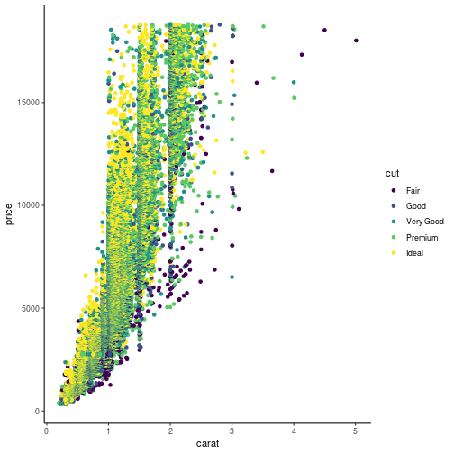

Que diablos es aes() y por que +?
==============
incremental:true

* en ggplot2 cada vez que mencionamos una columna debe ser dentro de aes()
* ggplot2 es el paquete mas antiguo del tidyverse, %>% no existia


Argumentos para geoms
=================

* **color**: color de líneas o puntos 
* **alpha**: transparencia, de 0 (transparente) a 1 (sólido)
* **size**: tamaño de puntos
* **shape**: típo de punto
* **fill**: color dentro de un área (barras, intervalos)

color
=================
class: small-code


```r
library(ggplot2)
data("diamonds")
ggplot(diamonds, aes(x = carat, y=price)) + geom_point(aes(color = cut)) + theme_classic()
```


alpha
=================
class: small-code


```r
library(ggplot2)
data("diamonds")
ggplot(diamonds, aes(x = carat, y=price)) + geom_point(aes(color = cut), alpha = 0.1) + theme_classic()
```

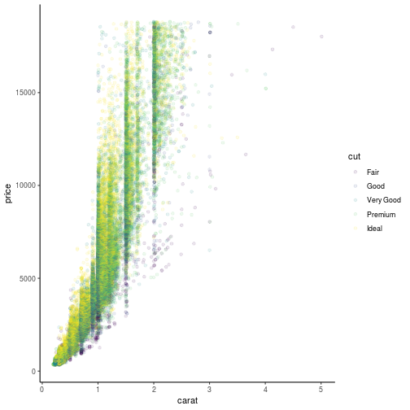

size
=================
class: small-code


```r
library(ggplot2)
data("mtcars")
ggplot(mtcars, aes(x = wt, y=mpg)) + geom_point(aes(size = hp)) + theme_classic()
```

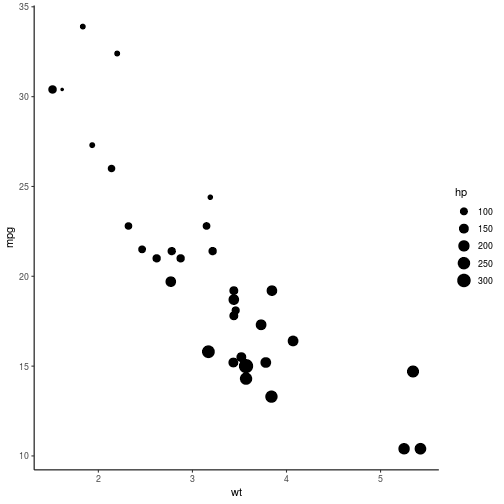

shape
=================
class: small-code


```r
library(ggplot2)
data("diamonds")
ggplot(diamonds, aes(x = carat, y=price)) + geom_point(aes(shape = cut)) + theme_classic()
```

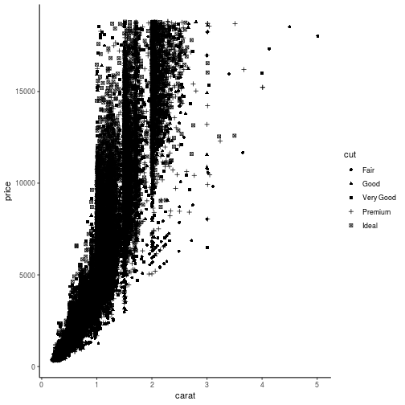

fill
=================
class: small-code


```r
library(dplyr)
d2 <- diamonds %>% filter(clarity == "I1" | clarity == "IF")
ggplot(d2, aes(x = cut, y=price)) + geom_boxplot(aes(fill = clarity)) + theme_classic()
```

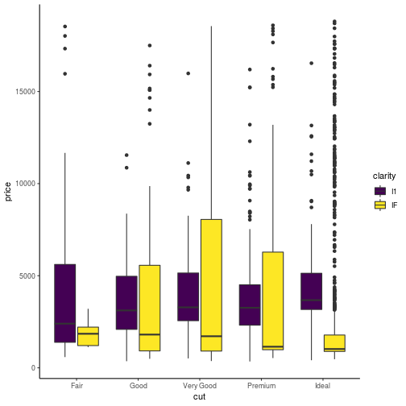

Una variable categórica una continua
===========

* geom_boxplot
* geom_jitter
* geom_violin
* geom_bar

geom_jitter
==================
class: small-code


```r
data("iris")
ggplot(iris, aes(x = Species, y = Petal.Length)) + geom_jitter(aes(color = Species))
```

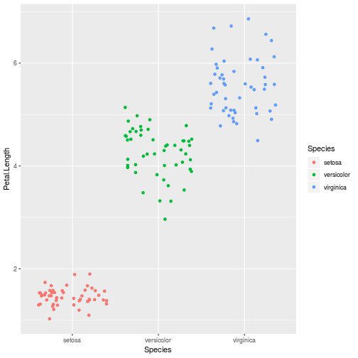

geom_violin
================
class: small-code


```r
data("iris")
ggplot(iris, aes(x = Species, y = Petal.Length)) + geom_violin(fill = "red")
```


Se pueden combinar
============
class: small-code


```r
data("iris")
ggplot(iris, aes(x = Species, y = Petal.Length)) + geom_violin() + geom_jitter(aes(color = Species))
```

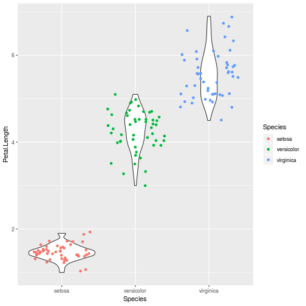

Pero el orden importa
============
class: small-code


```r
data("iris")
ggplot(iris, aes(x = Species, y = Petal.Length)) + geom_jitter(aes(color = Species)) + geom_violin()
```

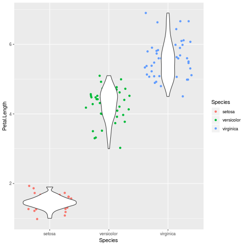


Dos variables continuas
===========

* geom_point
* geom_smooth
* geom_line
* geom_hex
* geom_rug

geom_hex
========================

```r
ggplot(diamonds, aes(carat, price)) + geom_hex()
```

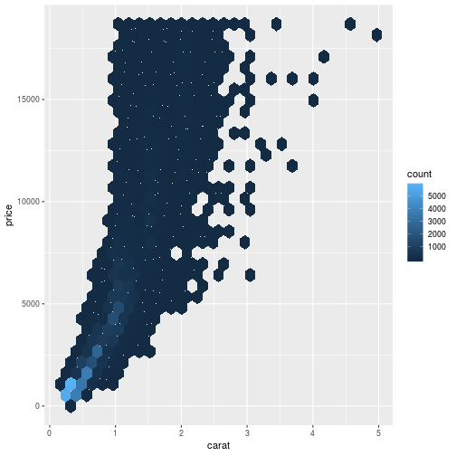

geom_point y geom_smooth
================
class: small-code


```r
data("mtcars")
ggplot(mtcars, aes(x = wt, y = mpg)) + geom_smooth() + geom_point()
```

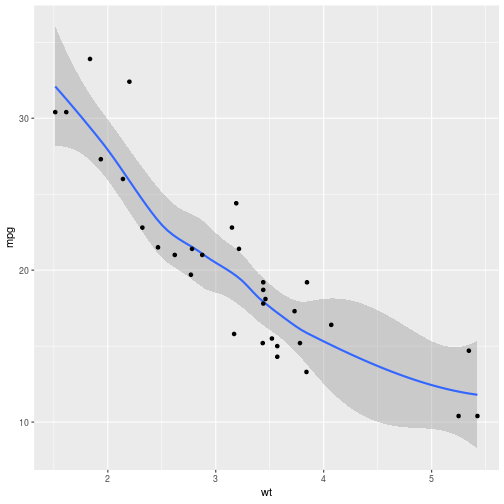

geom_smooth, method
================
class: small-code


```r
data("mtcars")
ggplot(mtcars, aes(x = wt, y = mpg)) + geom_smooth(method = "lm") + geom_point()
```

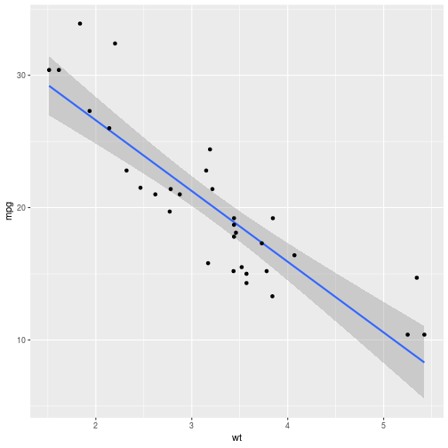

stat_smooth más control que geom_smooth
========================================
class: small-code


```r
library(dplyr)
library(knitr)
TempHum <- readRDS("TempHum.rds")
PA <- TempHum %>% filter(Ciudad_localidad == "Punta Arenas")
kable(PA)
```


|Fecha      | Year| mes| TempMedia|Ciudad_localidad | HumMedia|
|:----------|----:|---:|---------:|:----------------|--------:|
|1981-01-01 | 1981|   1|      10.8|Punta Arenas     |       NA|
|1981-02-01 | 1981|   2|      10.2|Punta Arenas     |       NA|
|1981-03-01 | 1981|   3|       8.0|Punta Arenas     |       NA|
|1981-04-01 | 1981|   4|       6.5|Punta Arenas     |       NA|
|1981-05-01 | 1981|   5|       3.4|Punta Arenas     |       NA|
|1981-06-01 | 1981|   6|       1.9|Punta Arenas     |       NA|
|1981-07-01 | 1981|   7|       1.8|Punta Arenas     |       NA|
|1981-08-01 | 1981|   8|       2.6|Punta Arenas     |       NA|
|1981-09-01 | 1981|   9|       3.8|Punta Arenas     |       NA|
|1981-10-01 | 1981|  10|       7.5|Punta Arenas     |       NA|
|1981-11-01 | 1981|  11|       8.2|Punta Arenas     |       NA|
|1981-12-01 | 1981|  12|       9.8|Punta Arenas     |       NA|
|1982-01-01 | 1982|   1|      12.0|Punta Arenas     |       NA|
|1982-02-01 | 1982|   2|      10.8|Punta Arenas     |       NA|
|1982-03-01 | 1982|   3|       8.7|Punta Arenas     |       NA|
|1982-04-01 | 1982|   4|       7.1|Punta Arenas     |       NA|
|1982-05-01 | 1982|   5|       5.0|Punta Arenas     |       NA|
|1982-06-01 | 1982|   6|       3.0|Punta Arenas     |       NA|
|1982-07-01 | 1982|   7|       0.2|Punta Arenas     |       NA|
|1982-08-01 | 1982|   8|       1.6|Punta Arenas     |       NA|
|1982-09-01 | 1982|   9|       3.8|Punta Arenas     |       NA|
|1982-10-01 | 1982|  10|       5.7|Punta Arenas     |       NA|
|1982-11-01 | 1982|  11|       9.0|Punta Arenas     |       NA|
|1982-12-01 | 1982|  12|      10.3|Punta Arenas     |       NA|
|1983-01-01 | 1983|   1|      11.2|Punta Arenas     |       NA|
|1983-02-01 | 1983|   2|       9.4|Punta Arenas     |       NA|
|1983-03-01 | 1983|   3|       8.9|Punta Arenas     |       NA|
|1983-04-01 | 1983|   4|       6.7|Punta Arenas     |       NA|
|1983-05-01 | 1983|   5|       3.8|Punta Arenas     |       NA|
|1983-06-01 | 1983|   6|       1.8|Punta Arenas     |       NA|
|1983-07-01 | 1983|   7|       2.4|Punta Arenas     |       NA|
|1983-08-01 | 1983|   8|       3.3|Punta Arenas     |       NA|
|1983-09-01 | 1983|   9|       4.3|Punta Arenas     |       NA|
|1983-10-01 | 1983|  10|       6.7|Punta Arenas     |       NA|
|1983-11-01 | 1983|  11|       8.8|Punta Arenas     |       NA|
|1983-12-01 | 1983|  12|      10.8|Punta Arenas     |       NA|
|1984-01-01 | 1984|   1|      10.1|Punta Arenas     |       NA|
|1984-02-01 | 1984|   2|       9.5|Punta Arenas     |       NA|
|1984-03-01 | 1984|   3|       8.2|Punta Arenas     |       NA|
|1984-04-01 | 1984|   4|       6.3|Punta Arenas     |       NA|
|1984-05-01 | 1984|   5|       1.3|Punta Arenas     |       NA|
|1984-06-01 | 1984|   6|       0.2|Punta Arenas     |       NA|
|1984-07-01 | 1984|   7|      -0.7|Punta Arenas     |       NA|
|1984-08-01 | 1984|   8|       1.3|Punta Arenas     |       NA|
|1984-09-01 | 1984|   9|       5.0|Punta Arenas     |       NA|
|1984-10-01 | 1984|  10|       6.4|Punta Arenas     |       NA|
|1984-11-01 | 1984|  11|       8.9|Punta Arenas     |       NA|
|1984-12-01 | 1984|  12|      11.2|Punta Arenas     |       NA|
|1985-01-01 | 1985|   1|      12.2|Punta Arenas     |       NA|
|1985-02-01 | 1985|   2|      11.5|Punta Arenas     |       NA|
|1985-03-01 | 1985|   3|       7.2|Punta Arenas     |       NA|
|1985-04-01 | 1985|   4|       5.8|Punta Arenas     |       NA|
|1985-05-01 | 1985|   5|       2.8|Punta Arenas     |       NA|
|1985-06-01 | 1985|   6|       2.2|Punta Arenas     |       NA|
|1985-07-01 | 1985|   7|       2.3|Punta Arenas     |       NA|
|1985-08-01 | 1985|   8|       3.6|Punta Arenas     |       NA|
|1985-09-01 | 1985|   9|       4.5|Punta Arenas     |       NA|
|1985-10-01 | 1985|  10|       6.4|Punta Arenas     |       NA|
|1985-11-01 | 1985|  11|       9.2|Punta Arenas     |       NA|
|1985-12-01 | 1985|  12|      10.3|Punta Arenas     |       NA|
|1986-01-01 | 1986|   1|      10.4|Punta Arenas     |       NA|
|1986-02-01 | 1986|   2|       8.7|Punta Arenas     |       NA|
|1986-03-01 | 1986|   3|       7.5|Punta Arenas     |       NA|
|1986-04-01 | 1986|   4|       4.7|Punta Arenas     |       NA|
|1986-05-01 | 1986|   5|       2.4|Punta Arenas     |       NA|
|1986-06-01 | 1986|   6|       0.6|Punta Arenas     |       NA|
|1986-07-01 | 1986|   7|       1.3|Punta Arenas     |       NA|
|1986-08-01 | 1986|   8|       3.0|Punta Arenas     |       NA|
|1986-09-01 | 1986|   9|       3.7|Punta Arenas     |       NA|
|1986-10-01 | 1986|  10|       6.6|Punta Arenas     |       NA|
|1986-11-01 | 1986|  11|       7.5|Punta Arenas     |       NA|
|1986-12-01 | 1986|  12|       9.8|Punta Arenas     |       NA|
|1987-01-01 | 1987|   1|      10.2|Punta Arenas     |       NA|
|1987-02-01 | 1987|   2|      10.1|Punta Arenas     |       NA|
|1987-03-01 | 1987|   3|       8.3|Punta Arenas     |       NA|
|1987-04-01 | 1987|   4|       6.9|Punta Arenas     |       NA|
|1987-05-01 | 1987|   5|       5.1|Punta Arenas     |       NA|
|1987-06-01 | 1987|   6|       2.8|Punta Arenas     |       NA|
|1987-07-01 | 1987|   7|       1.5|Punta Arenas     |       NA|
|1987-08-01 | 1987|   8|       1.5|Punta Arenas     |       NA|
|1987-09-01 | 1987|   9|       3.3|Punta Arenas     |       NA|
|1987-10-01 | 1987|  10|       6.9|Punta Arenas     |       NA|
|1987-11-01 | 1987|  11|       9.4|Punta Arenas     |       NA|
|1987-12-01 | 1987|  12|      10.5|Punta Arenas     |       NA|
|1988-01-01 | 1988|   1|      10.3|Punta Arenas     |       NA|
|1988-02-01 | 1988|   2|      11.1|Punta Arenas     |       NA|
|1988-03-01 | 1988|   3|       9.6|Punta Arenas     |       NA|
|1988-04-01 | 1988|   4|       5.9|Punta Arenas     |       NA|
|1988-05-01 | 1988|   5|       5.2|Punta Arenas     |       NA|
|1988-06-01 | 1988|   6|       2.4|Punta Arenas     |       NA|
|1988-07-01 | 1988|   7|       1.4|Punta Arenas     |       NA|
|1988-08-01 | 1988|   8|       2.2|Punta Arenas     |       NA|
|1988-09-01 | 1988|   9|       4.9|Punta Arenas     |       NA|
|1988-10-01 | 1988|  10|       5.9|Punta Arenas     |       NA|
|1988-11-01 | 1988|  11|       8.6|Punta Arenas     |       NA|
|1988-12-01 | 1988|  12|       9.2|Punta Arenas     |       NA|
|1989-01-01 | 1989|   1|      10.5|Punta Arenas     |       NA|
|1989-02-01 | 1989|   2|      10.8|Punta Arenas     |       NA|
|1989-03-01 | 1989|   3|       8.7|Punta Arenas     |       NA|
|1989-04-01 | 1989|   4|       6.0|Punta Arenas     |       NA|
|1989-05-01 | 1989|   5|       4.5|Punta Arenas     |       NA|
|1989-06-01 | 1989|   6|       1.4|Punta Arenas     |       NA|
|1989-07-01 | 1989|   7|       2.1|Punta Arenas     |       NA|
|1989-08-01 | 1989|   8|       2.1|Punta Arenas     |       NA|
|1989-09-01 | 1989|   9|       3.5|Punta Arenas     |       NA|
|1989-10-01 | 1989|  10|       7.3|Punta Arenas     |       NA|
|1989-11-01 | 1989|  11|       9.0|Punta Arenas     |       NA|
|1989-12-01 | 1989|  12|       9.8|Punta Arenas     |       NA|
|1990-01-01 | 1990|   1|      10.4|Punta Arenas     |       NA|
|1990-02-01 | 1990|   2|      12.0|Punta Arenas     |       NA|
|1990-03-01 | 1990|   3|       8.9|Punta Arenas     |       NA|
|1990-04-01 | 1990|   4|       4.9|Punta Arenas     |       NA|
|1990-05-01 | 1990|   5|       4.7|Punta Arenas     |       NA|
|1990-06-01 | 1990|   6|       1.8|Punta Arenas     |       NA|
|1990-07-01 | 1990|   7|       2.1|Punta Arenas     |       NA|
|1990-08-01 | 1990|   8|       2.0|Punta Arenas     |       NA|
|1990-09-01 | 1990|   9|       4.0|Punta Arenas     |       NA|
|1990-10-01 | 1990|  10|       6.7|Punta Arenas     |       NA|
|1990-11-01 | 1990|  11|       7.1|Punta Arenas     |       NA|
|1990-12-01 | 1990|  12|       9.7|Punta Arenas     |       NA|
|1991-01-01 | 1991|   1|      10.9|Punta Arenas     |       NA|
|1991-02-01 | 1991|   2|      10.0|Punta Arenas     |       NA|
|1991-03-01 | 1991|   3|       8.1|Punta Arenas     |       NA|
|1991-04-01 | 1991|   4|       6.1|Punta Arenas     |       NA|
|1991-05-01 | 1991|   5|       4.0|Punta Arenas     |       NA|
|1991-06-01 | 1991|   6|       1.1|Punta Arenas     |       NA|
|1991-07-01 | 1991|   7|       0.4|Punta Arenas     |       NA|
|1991-08-01 | 1991|   8|       1.6|Punta Arenas     |       NA|
|1991-09-01 | 1991|   9|       3.6|Punta Arenas     |       NA|
|1991-10-01 | 1991|  10|       5.7|Punta Arenas     |       NA|
|1991-11-01 | 1991|  11|       8.0|Punta Arenas     |       NA|
|1991-12-01 | 1991|  12|       7.9|Punta Arenas     |       NA|
|1992-01-01 | 1992|   1|      12.0|Punta Arenas     |       NA|
|1992-02-01 | 1992|   2|       9.4|Punta Arenas     |       NA|
|1992-03-01 | 1992|   3|       8.0|Punta Arenas     |       NA|
|1992-04-01 | 1992|   4|       6.3|Punta Arenas     |       NA|
|1992-05-01 | 1992|   5|       2.8|Punta Arenas     |       NA|
|1992-06-01 | 1992|   6|      -0.2|Punta Arenas     |       NA|
|1992-07-01 | 1992|   7|      -0.5|Punta Arenas     |       NA|
|1992-08-01 | 1992|   8|       2.1|Punta Arenas     |       NA|
|1992-09-01 | 1992|   9|       3.5|Punta Arenas     |       NA|
|1992-10-01 | 1992|  10|       5.8|Punta Arenas     |       NA|
|1992-11-01 | 1992|  11|       8.8|Punta Arenas     |       NA|
|1992-12-01 | 1992|  12|      10.7|Punta Arenas     |       NA|
|1993-01-01 | 1993|   1|      10.2|Punta Arenas     |       NA|
|1993-02-01 | 1993|   2|      10.9|Punta Arenas     |       NA|
|1993-03-01 | 1993|   3|       8.5|Punta Arenas     |       NA|
|1993-04-01 | 1993|   4|       5.3|Punta Arenas     |       NA|
|1993-05-01 | 1993|   5|       3.0|Punta Arenas     |       NA|
|1993-06-01 | 1993|   6|      -0.1|Punta Arenas     |       NA|
|1993-07-01 | 1993|   7|       2.1|Punta Arenas     |       NA|
|1993-08-01 | 1993|   8|       3.4|Punta Arenas     |       NA|
|1993-09-01 | 1993|   9|       5.0|Punta Arenas     |       NA|
|1993-10-01 | 1993|  10|       7.1|Punta Arenas     |       NA|
|1993-11-01 | 1993|  11|       9.0|Punta Arenas     |       NA|
|1993-12-01 | 1993|  12|       9.6|Punta Arenas     |       NA|
|1994-01-01 | 1994|   1|      11.6|Punta Arenas     |       NA|
|1994-02-01 | 1994|   2|       9.8|Punta Arenas     |       NA|
|1994-03-01 | 1994|   3|       8.3|Punta Arenas     |       NA|
|1994-04-01 | 1994|   4|       6.8|Punta Arenas     |       NA|
|1994-05-01 | 1994|   5|       2.2|Punta Arenas     |       NA|
|1994-06-01 | 1994|   6|       1.1|Punta Arenas     |       NA|
|1994-07-01 | 1994|   7|       0.8|Punta Arenas     |       NA|
|1994-08-01 | 1994|   8|       2.9|Punta Arenas     |       NA|
|1994-09-01 | 1994|   9|       2.9|Punta Arenas     |       NA|
|1994-10-01 | 1994|  10|       5.3|Punta Arenas     |       NA|
|1994-11-01 | 1994|  11|       9.3|Punta Arenas     |       NA|
|1994-12-01 | 1994|  12|       9.8|Punta Arenas     |       NA|
|1995-01-01 | 1995|   1|      11.1|Punta Arenas     |       NA|
|1995-02-01 | 1995|   2|      10.6|Punta Arenas     |       NA|
|1995-03-01 | 1995|   3|       7.6|Punta Arenas     |       NA|
|1995-04-01 | 1995|   4|       7.2|Punta Arenas     |       NA|
|1995-05-01 | 1995|   5|       4.6|Punta Arenas     |       NA|
|1995-06-01 | 1995|   6|       0.3|Punta Arenas     |       NA|
|1995-07-01 | 1995|   7|      -1.1|Punta Arenas     |       NA|
|1995-08-01 | 1995|   8|       0.1|Punta Arenas     |       NA|
|1995-09-01 | 1995|   9|       3.9|Punta Arenas     |       NA|
|1995-10-01 | 1995|  10|       6.5|Punta Arenas     |       NA|
|1995-11-01 | 1995|  11|       8.2|Punta Arenas     |       NA|
|1995-12-01 | 1995|  12|      10.4|Punta Arenas     |       NA|
|1996-01-01 | 1996|   1|      10.4|Punta Arenas     |       NA|
|1996-02-01 | 1996|   2|       8.9|Punta Arenas     |       NA|
|1996-03-01 | 1996|   3|       8.6|Punta Arenas     |       NA|
|1996-04-01 | 1996|   4|       5.6|Punta Arenas     |       NA|
|1996-05-01 | 1996|   5|       2.6|Punta Arenas     |       NA|
|1996-06-01 | 1996|   6|       1.6|Punta Arenas     |       NA|
|1996-07-01 | 1996|   7|      -0.1|Punta Arenas     |       NA|
|1996-08-01 | 1996|   8|       2.3|Punta Arenas     |       NA|
|1996-09-01 | 1996|   9|       3.6|Punta Arenas     |       NA|
|1996-10-01 | 1996|  10|       6.0|Punta Arenas     |       NA|
|1996-11-01 | 1996|  11|       8.7|Punta Arenas     |       NA|
|1996-12-01 | 1996|  12|       9.4|Punta Arenas     |       NA|
|1997-01-01 | 1997|   1|      10.4|Punta Arenas     |       NA|
|1997-02-01 | 1997|   2|       8.9|Punta Arenas     |       NA|
|1997-03-01 | 1997|   3|       8.6|Punta Arenas     |       NA|
|1997-04-01 | 1997|   4|       5.6|Punta Arenas     |       NA|
|1997-05-01 | 1997|   5|       2.6|Punta Arenas     |       NA|
|1997-06-01 | 1997|   6|       1.6|Punta Arenas     |       NA|
|1997-07-01 | 1997|   7|      -0.1|Punta Arenas     |       NA|
|1997-08-01 | 1997|   8|       2.3|Punta Arenas     |       NA|
|1997-09-01 | 1997|   9|       3.6|Punta Arenas     |       NA|
|1997-10-01 | 1997|  10|       6.0|Punta Arenas     |       NA|
|1997-11-01 | 1997|  11|       8.7|Punta Arenas     |       NA|
|1997-12-01 | 1997|  12|       9.4|Punta Arenas     |       NA|
|1998-01-01 | 1998|   1|      10.7|Punta Arenas     |       NA|
|1998-02-01 | 1998|   2|      11.1|Punta Arenas     |       NA|
|1998-03-01 | 1998|   3|       9.4|Punta Arenas     |       NA|
|1998-04-01 | 1998|   4|       7.1|Punta Arenas     |       NA|
|1998-05-01 | 1998|   5|       4.4|Punta Arenas     |       NA|
|1998-06-01 | 1998|   6|       3.6|Punta Arenas     |       NA|
|1998-07-01 | 1998|   7|       3.0|Punta Arenas     |       NA|
|1998-08-01 | 1998|   8|       3.2|Punta Arenas     |       NA|
|1998-09-01 | 1998|   9|       3.9|Punta Arenas     |       NA|
|1998-10-01 | 1998|  10|       6.6|Punta Arenas     |       NA|
|1998-11-01 | 1998|  11|       8.5|Punta Arenas     |       NA|
|1998-12-01 | 1998|  12|       9.4|Punta Arenas     |       NA|
|1999-01-01 | 1999|   1|      10.9|Punta Arenas     |       NA|
|1999-02-01 | 1999|   2|       9.9|Punta Arenas     |       NA|
|1999-03-01 | 1999|   3|       8.4|Punta Arenas     |       NA|
|1999-04-01 | 1999|   4|       6.7|Punta Arenas     |       NA|
|1999-05-01 | 1999|   5|       3.7|Punta Arenas     |       NA|
|1999-06-01 | 1999|   6|       0.7|Punta Arenas     |       NA|
|1999-07-01 | 1999|   7|       1.8|Punta Arenas     |       NA|
|1999-08-01 | 1999|   8|       2.1|Punta Arenas     |       NA|
|1999-09-01 | 1999|   9|       3.6|Punta Arenas     |       NA|
|1999-10-01 | 1999|  10|       7.2|Punta Arenas     |       NA|
|1999-11-01 | 1999|  11|       9.6|Punta Arenas     |       NA|
|1999-12-01 | 1999|  12|       9.6|Punta Arenas     |       NA|
|2000-01-01 | 2000|   1|       9.8|Punta Arenas     |       NA|
|2000-02-01 | 2000|   2|       9.6|Punta Arenas     |       NA|
|2000-03-01 | 2000|   3|       8.3|Punta Arenas     |       NA|
|2000-04-01 | 2000|   4|       6.9|Punta Arenas     |       NA|
|2000-05-01 | 2000|   5|       4.2|Punta Arenas     |       NA|
|2000-06-01 | 2000|   6|       0.8|Punta Arenas     |       NA|
|2000-07-01 | 2000|   7|       0.6|Punta Arenas     |       NA|
|2000-08-01 | 2000|   8|       2.8|Punta Arenas     |       NA|
|2000-09-01 | 2000|   9|       2.2|Punta Arenas     |       NA|
|2000-10-01 | 2000|  10|       5.9|Punta Arenas     |       NA|
|2000-11-01 | 2000|  11|       8.0|Punta Arenas     |       NA|
|2000-12-01 | 2000|  12|       8.8|Punta Arenas     |       NA|
|2001-01-01 | 2001|   1|      10.4|Punta Arenas     |       NA|
|2001-02-01 | 2001|   2|       9.3|Punta Arenas     |       NA|
|2001-03-01 | 2001|   3|       7.5|Punta Arenas     |       NA|
|2001-04-01 | 2001|   4|       6.5|Punta Arenas     |       NA|
|2001-05-01 | 2001|   5|       3.6|Punta Arenas     |       NA|
|2001-06-01 | 2001|   6|       2.0|Punta Arenas     |       NA|
|2001-07-01 | 2001|   7|       0.0|Punta Arenas     |       NA|
|2001-08-01 | 2001|   8|       1.7|Punta Arenas     |       NA|
|2001-09-01 | 2001|   9|       4.2|Punta Arenas     |       NA|
|2001-10-01 | 2001|  10|       7.0|Punta Arenas     |       NA|
|2001-11-01 | 2001|  11|       7.8|Punta Arenas     |       NA|
|2001-12-01 | 2001|  12|      10.0|Punta Arenas     |       NA|
|2002-01-01 | 2002|   1|      10.5|Punta Arenas     |       NA|
|2002-02-01 | 2002|   2|      10.9|Punta Arenas     |       NA|
|2002-03-01 | 2002|   3|       6.9|Punta Arenas     |       NA|
|2002-04-01 | 2002|   4|       5.8|Punta Arenas     |       NA|
|2002-05-01 | 2002|   5|       0.9|Punta Arenas     |       NA|
|2002-06-01 | 2002|   6|      -0.1|Punta Arenas     |       NA|
|2002-07-01 | 2002|   7|       1.2|Punta Arenas     |       NA|
|2002-08-01 | 2002|   8|       1.9|Punta Arenas     |       NA|
|2002-09-01 | 2002|   9|       4.3|Punta Arenas     |       NA|
|2002-10-01 | 2002|  10|       5.1|Punta Arenas     |       NA|
|2002-11-01 | 2002|  11|       7.7|Punta Arenas     |       NA|
|2002-12-01 | 2002|  12|      10.7|Punta Arenas     |       NA|
|2003-01-01 | 2003|   1|      10.1|Punta Arenas     |       NA|
|2003-02-01 | 2003|   2|      10.3|Punta Arenas     |       NA|
|2003-03-01 | 2003|   3|       8.0|Punta Arenas     |       NA|
|2003-04-01 | 2003|   4|       6.5|Punta Arenas     |       NA|
|2003-05-01 | 2003|   5|       5.6|Punta Arenas     |       NA|
|2003-06-01 | 2003|   6|       1.7|Punta Arenas     |       NA|
|2003-07-01 | 2003|   7|       3.8|Punta Arenas     |       NA|
|2003-08-01 | 2003|   8|       3.5|Punta Arenas     |       NA|
|2003-09-01 | 2003|   9|       4.5|Punta Arenas     |       NA|
|2003-10-01 | 2003|  10|       5.7|Punta Arenas     |       NA|
|2003-11-01 | 2003|  11|       7.8|Punta Arenas     |       NA|
|2003-12-01 | 2003|  12|       9.9|Punta Arenas     |       NA|
|2004-01-01 | 2004|   1|      11.7|Punta Arenas     |       NA|
|2004-02-01 | 2004|   2|      12.8|Punta Arenas     |       NA|
|2004-03-01 | 2004|   3|       9.0|Punta Arenas     |       NA|
|2004-04-01 | 2004|   4|       6.5|Punta Arenas     |       NA|
|2004-05-01 | 2004|   5|       5.3|Punta Arenas     |       NA|
|2004-06-01 | 2004|   6|       4.1|Punta Arenas     |       NA|
|2004-07-01 | 2004|   7|       1.3|Punta Arenas     |       NA|
|2004-08-01 | 2004|   8|       3.3|Punta Arenas     |       NA|
|2004-09-01 | 2004|   9|       4.5|Punta Arenas     |       NA|
|2004-10-01 | 2004|  10|       7.0|Punta Arenas     |       NA|
|2004-11-01 | 2004|  11|      10.1|Punta Arenas     |       NA|
|2004-12-01 | 2004|  12|      10.8|Punta Arenas     |       NA|
|2005-01-01 | 2005|   1|      10.5|Punta Arenas     |       NA|
|2005-02-01 | 2005|   2|      11.9|Punta Arenas     |       NA|
|2005-03-01 | 2005|   3|       8.3|Punta Arenas     |       NA|
|2005-04-01 | 2005|   4|       6.3|Punta Arenas     |       NA|
|2005-05-01 | 2005|   5|       2.9|Punta Arenas     |       NA|
|2005-06-01 | 2005|   6|      -0.1|Punta Arenas     |       NA|
|2005-07-01 | 2005|   7|       2.1|Punta Arenas     |       NA|
|2005-08-01 | 2005|   8|       2.3|Punta Arenas     |       NA|
|2005-09-01 | 2005|   9|       5.5|Punta Arenas     |       NA|
|2005-10-01 | 2005|  10|       6.4|Punta Arenas     |       NA|
|2005-11-01 | 2005|  11|       8.6|Punta Arenas     |       NA|
|2005-12-01 | 2005|  12|      10.2|Punta Arenas     |       NA|
|2006-01-01 | 2006|   1|      11.5|Punta Arenas     |       NA|
|2006-02-01 | 2006|   2|      10.6|Punta Arenas     |       NA|
|2006-03-01 | 2006|   3|       9.3|Punta Arenas     |       NA|
|2006-04-01 | 2006|   4|       6.0|Punta Arenas     |       NA|
|2006-05-01 | 2006|   5|       5.3|Punta Arenas     |       NA|
|2006-06-01 | 2006|   6|       1.6|Punta Arenas     |       NA|
|2006-07-01 | 2006|   7|       2.1|Punta Arenas     |       NA|
|2006-08-01 | 2006|   8|       2.9|Punta Arenas     |       NA|
|2006-09-01 | 2006|   9|       4.1|Punta Arenas     |       NA|
|2006-10-01 | 2006|  10|       7.1|Punta Arenas     |       NA|
|2006-11-01 | 2006|  11|       8.6|Punta Arenas     |       NA|
|2006-12-01 | 2006|  12|       9.4|Punta Arenas     |       NA|
|2007-01-01 | 2007|   1|      10.8|Punta Arenas     |       NA|
|2007-02-01 | 2007|   2|       9.9|Punta Arenas     |       NA|
|2007-03-01 | 2007|   3|       8.9|Punta Arenas     |       NA|
|2007-04-01 | 2007|   4|       6.0|Punta Arenas     |       NA|
|2007-05-01 | 2007|   5|       3.3|Punta Arenas     |       NA|
|2007-06-01 | 2007|   6|       2.3|Punta Arenas     |       NA|
|2007-07-01 | 2007|   7|       1.4|Punta Arenas     |       NA|
|2007-08-01 | 2007|   8|       3.2|Punta Arenas     |       NA|
|2007-09-01 | 2007|   9|       5.0|Punta Arenas     |       NA|
|2007-10-01 | 2007|  10|       5.9|Punta Arenas     |       NA|
|2007-11-01 | 2007|  11|       7.9|Punta Arenas     |       NA|
|2007-12-01 | 2007|  12|      10.2|Punta Arenas     |       NA|
|2008-01-01 | 2008|   1|      11.6|Punta Arenas     |       NA|
|2008-02-01 | 2008|   2|      11.3|Punta Arenas     |       NA|
|2008-03-01 | 2008|   3|      10.3|Punta Arenas     |       NA|
|2008-04-01 | 2008|   4|       5.8|Punta Arenas     |       NA|
|2008-05-01 | 2008|   5|       3.1|Punta Arenas     |       NA|
|2008-06-01 | 2008|   6|       1.6|Punta Arenas     |       NA|
|2008-07-01 | 2008|   7|       1.7|Punta Arenas     |       NA|
|2008-08-01 | 2008|   8|       1.0|Punta Arenas     |       NA|
|2008-09-01 | 2008|   9|       5.3|Punta Arenas     |       NA|
|2008-10-01 | 2008|  10|       7.0|Punta Arenas     |       NA|
|2008-11-01 | 2008|  11|       8.3|Punta Arenas     |       NA|
|2008-12-01 | 2008|  12|      11.0|Punta Arenas     |       NA|
|2009-01-01 | 2009|   1|      11.3|Punta Arenas     |       NA|
|2009-02-01 | 2009|   2|      10.3|Punta Arenas     |       NA|
|2009-03-01 | 2009|   3|       9.0|Punta Arenas     |       NA|
|2009-04-01 | 2009|   4|       6.4|Punta Arenas     |       NA|
|2009-05-01 | 2009|   5|       3.1|Punta Arenas     |       NA|
|2009-06-01 | 2009|   6|       3.4|Punta Arenas     |       NA|
|2009-07-01 | 2009|   7|       2.2|Punta Arenas     |       NA|
|2009-08-01 | 2009|   8|       2.6|Punta Arenas     |       NA|
|2009-09-01 | 2009|   9|       5.2|Punta Arenas     |       NA|
|2009-10-01 | 2009|  10|       5.4|Punta Arenas     |       NA|
|2009-11-01 | 2009|  11|       5.6|Punta Arenas     |       NA|
|2009-12-01 | 2009|  12|       9.9|Punta Arenas     |       NA|
|2010-01-01 | 2010|   1|      10.2|Punta Arenas     |       NA|
|2010-02-01 | 2010|   2|       8.9|Punta Arenas     |       NA|
|2010-03-01 | 2010|   3|       8.6|Punta Arenas     |       NA|
|2010-04-01 | 2010|   4|       6.3|Punta Arenas     |       NA|
|2010-05-01 | 2010|   5|       4.8|Punta Arenas     |       NA|
|2010-06-01 | 2010|   6|       1.3|Punta Arenas     |       NA|
|2010-07-01 | 2010|   7|       0.8|Punta Arenas     |       NA|
|2010-08-01 | 2010|   8|       2.4|Punta Arenas     |       NA|
|2010-09-01 | 2010|   9|       4.6|Punta Arenas     |       NA|
|2010-10-01 | 2010|  10|       7.2|Punta Arenas     |       NA|
|2010-11-01 | 2010|  11|       8.7|Punta Arenas     |       NA|
|2010-12-01 | 2010|  12|       8.8|Punta Arenas     |       NA|
|2011-01-01 | 2011|   1|      10.5|Punta Arenas     |       NA|
|2011-02-01 | 2011|   2|      11.2|Punta Arenas     |       NA|
|2011-03-01 | 2011|   3|       8.8|Punta Arenas     |       NA|
|2011-04-01 | 2011|   4|       5.4|Punta Arenas     |       NA|
|2011-05-01 | 2011|   5|       4.6|Punta Arenas     |       NA|
|2011-06-01 | 2011|   6|       2.1|Punta Arenas     |       NA|
|2011-07-01 | 2011|   7|       1.5|Punta Arenas     |       NA|
|2011-08-01 | 2011|   8|       1.8|Punta Arenas     |       NA|
|2011-09-01 | 2011|   9|       3.7|Punta Arenas     |       NA|
|2011-10-01 | 2011|  10|       6.9|Punta Arenas     |       NA|
|2011-11-01 | 2011|  11|       8.8|Punta Arenas     |       NA|
|2011-12-01 | 2011|  12|      11.6|Punta Arenas     |       NA|
|2012-01-01 | 2012|   1|      11.6|Punta Arenas     |       NA|
|2012-02-01 | 2012|   2|       8.3|Punta Arenas     |       NA|
|2012-03-01 | 2012|   3|       9.7|Punta Arenas     |       NA|
|2012-04-01 | 2012|   4|       5.3|Punta Arenas     |       NA|
|2012-05-01 | 2012|   5|       2.6|Punta Arenas     |       NA|
|2012-06-01 | 2012|   6|       1.1|Punta Arenas     |       NA|
|2012-07-01 | 2012|   7|       1.7|Punta Arenas     |       NA|
|2012-08-01 | 2012|   8|       3.3|Punta Arenas     |       NA|
|2012-09-01 | 2012|   9|       4.9|Punta Arenas     |       NA|
|2012-10-01 | 2012|  10|       6.6|Punta Arenas     |       NA|
|2012-11-01 | 2012|  11|       8.7|Punta Arenas     |       NA|
|2012-12-01 | 2012|  12|       8.7|Punta Arenas     |       NA|
|2013-01-01 | 2013|   1|      12.7|Punta Arenas     |     65.7|
|2013-02-01 | 2013|   2|      10.7|Punta Arenas     |     69.7|
|2013-03-01 | 2013|   3|       9.3|Punta Arenas     |     76.2|
|2013-04-01 | 2013|   4|       7.8|Punta Arenas     |     78.8|
|2013-05-01 | 2013|   5|       4.4|Punta Arenas     |     81.6|
|2013-06-01 | 2013|   6|       3.0|Punta Arenas     |     83.3|
|2013-07-01 | 2013|   7|       3.2|Punta Arenas     |     81.1|
|2013-08-01 | 2013|   8|       1.5|Punta Arenas     |     80.4|
|2013-09-01 | 2013|   9|       4.0|Punta Arenas     |     76.9|
|2013-10-01 | 2013|  10|       6.9|Punta Arenas     |     67.7|
|2013-11-01 | 2013|  11|       7.6|Punta Arenas     |     64.7|
|2013-12-01 | 2013|  12|       8.9|Punta Arenas     |     65.8|
|2014-01-01 | 2014|   1|       9.2|Punta Arenas     |     65.1|
|2014-02-01 | 2014|   2|      10.5|Punta Arenas     |     69.2|
|2014-03-01 | 2014|   3|       8.1|Punta Arenas     |     72.1|
|2014-04-01 | 2014|   4|       6.2|Punta Arenas     |     79.0|
|2014-05-01 | 2014|   5|       3.9|Punta Arenas     |     80.0|
|2014-06-01 | 2014|   6|       2.0|Punta Arenas     |     85.4|
|2014-07-01 | 2014|   7|       1.3|Punta Arenas     |     84.1|
|2014-08-01 | 2014|   8|       3.0|Punta Arenas     |     86.2|
|2014-09-01 | 2014|   9|       4.4|Punta Arenas     |     78.2|
|2014-10-01 | 2014|  10|       6.5|Punta Arenas     |     67.4|
|2014-11-01 | 2014|  11|       8.0|Punta Arenas     |     66.0|
|2014-12-01 | 2014|  12|       9.8|Punta Arenas     |     63.0|
|2015-01-01 | 2015|   1|      10.7|Punta Arenas     |     60.4|
|2015-02-01 | 2015|   2|      10.6|Punta Arenas     |     64.3|
|2015-03-01 | 2015|   3|       9.3|Punta Arenas     |     74.2|
|2015-04-01 | 2015|   4|       6.0|Punta Arenas     |     79.0|
|2015-05-01 | 2015|   5|       4.1|Punta Arenas     |     84.4|
|2015-06-01 | 2015|   6|       2.4|Punta Arenas     |     83.4|
|2015-07-01 | 2015|   7|       1.3|Punta Arenas     |     86.3|
|2015-08-01 | 2015|   8|       2.4|Punta Arenas     |     81.7|
|2015-09-01 | 2015|   9|       3.8|Punta Arenas     |     73.6|
|2015-10-01 | 2015|  10|       6.2|Punta Arenas     |     67.7|
|2015-11-01 | 2015|  11|       8.2|Punta Arenas     |     60.7|
|2015-12-01 | 2015|  12|       9.2|Punta Arenas     |     59.5|

stat_smooth más control que geom_smooth
========================================
class: small-code


```r
library(ggplot2)
ggplot(PA, aes(x = mes, y = TempMedia)) + geom_point()
```

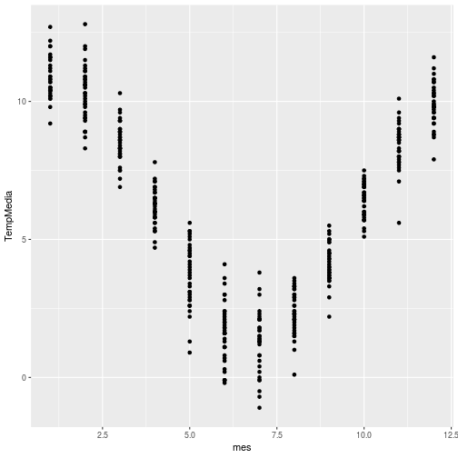

stat_smooth más control que geom_smooth
========================================
class: small-code


```r
ggplot(PA, aes(x = mes, y = TempMedia)) + geom_point() +  stat_smooth(method = "lm") 
```

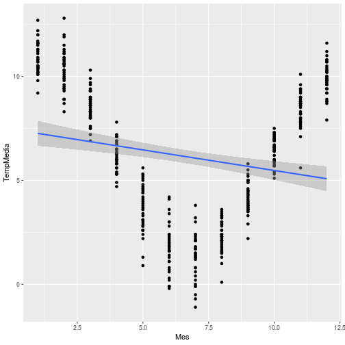

Ecuación cuadrática
========================================
class: small-code
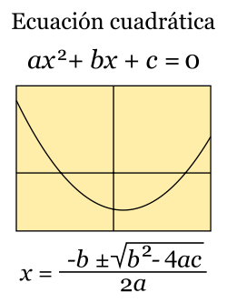

***

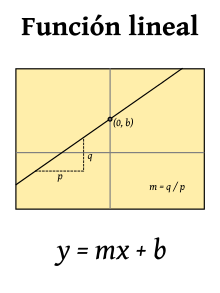

stat_smooth más control que geom_smooth
========================================
class: small-code


```r
ggplot(PA, aes(x = mes, y = TempMedia)) + geom_point() +  stat_smooth(method = "lm", formula = y ~ x + I(x^2)) 
```


Que podemos hacer con tidyr??
========================================
class: small-code


```r
library(tidyr)
San <- TempHum %>% filter(Ciudad_localidad == "Quinta Normal")
SATH <- gather(San, key = Unidad, value = medida, TempMedia, HumMedia)
ggplot(SATH, aes(x = mes, y = medida)) + geom_point() +  stat_smooth(method = "lm", formula = y ~ x + I(x^2), aes(fill = Unidad, color = Unidad)) 
```

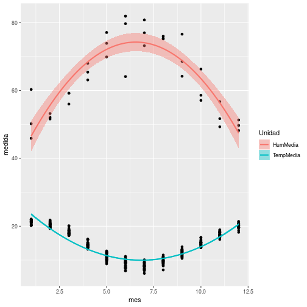

incluirlo en rmd con leyenda abajo
========================================
class: small-code

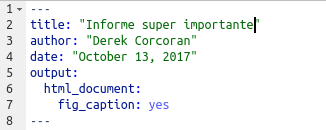


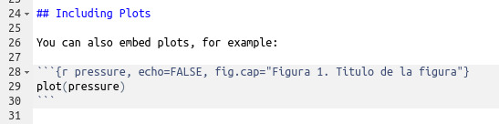

Primera evaluación
========================================
incremental:true

* Generar un rmd
* Debe tener
    + Al menos un chunk
    + Al menos un inline code
    + Al menos una tabla con leyenda (kable, stargazer)
    + Al menos una figura (con leyenda)

***

* Enviar por correo con subject evaluación 1 R
    + El link de rpubs con el documento publicado
    + El archivo rmd con el que generaron el documento
    + Para el martes 24 de Octubre

Como combinar gráficos
======================================
class: small-code


```r
Ari <- TempHum %>% filter(Ciudad_localidad == "Arica")
Ari  <- ggplot(Ari , aes(x = mes, y = TempMedia)) + geom_point() +  stat_smooth(method = "lm", formula = y ~ x + I(x^2)) + ggtitle("Arica")
Jua <- TempHum %>% filter(Ciudad_localidad == "Isla Juan Fernández")
Jua  <- ggplot(Jua , aes(x = mes, y = TempMedia)) + geom_point() +  stat_smooth(method = "lm", formula = y ~ x + I(x^2)) + ggtitle("Juan Fernandez")
San <- TempHum %>% filter(Ciudad_localidad == "Quinta Normal")
San <- ggplot(San, aes(x = mes, y = TempMedia)) + geom_point() +  stat_smooth(method = "lm", formula = y ~ x + I(x^2)) + ggtitle("Santiago")
Con <- TempHum %>% filter(Ciudad_localidad == "Concepción")
Con <- ggplot(Con, aes(x = mes, y = TempMedia)) + geom_point() +  stat_smooth(method = "lm", formula = y ~ x + I(x^2)) + ggtitle("Concepcion")
Pun <- TempHum %>% filter(Ciudad_localidad == "Punta Arenas")
Pun <- ggplot(Pun, aes(x = mes, y = TempMedia)) + geom_point() +  stat_smooth(method = "lm", formula = y ~ x + I(x^2)) + ggtitle("Punta Arenas")
Ant <- TempHum %>% filter(Ciudad_localidad == "Antártica Chilena")
Ant <- ggplot(Ant, aes(x = mes, y = TempMedia)) + geom_point() +  stat_smooth(method = "lm", formula = y ~ x + I(x^2)) + ggtitle("Antartica")
```

Como combinar gráficos
======================================
class: small-code


```r
library(gridExtra)
grid.arrange(Ari, Jua, San, Con, Pun, Ant, nrow = 3, ncol = 2)
```

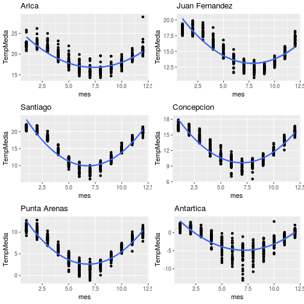
    
Algunos gráficos interesantes hechos con ggplot
======================================
class: small-code


```r
library(SpatialBall2)
data("season2017")
ShotSeasonGraphPlayer(season2017, player = "Stephen Curry")
```

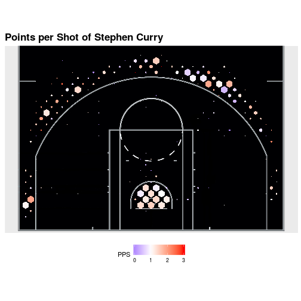

    
Algunos gráficos interesantes
======================================
class: small-code


```r
ggplot(Weekly, aes(x = Semana, y = mean)) + 
geom_ribbon(aes(ymax = max, ymin = min, fill = "red")) + 
geom_ribbon(aes(ymax = mean + sd, ymin = mean - sd, fill = "blue"), alpha = 1) + 
geom_line() + 
  scale_fill_manual(name = "leyenda", values = c("blue", "red"), labels = c('Error estándar','Extremos')) + 
ylab("polen de platano oriental /m³ de aire") + theme_classic()  + theme(legend.position="bottom") + 
scale_x_continuous(breaks=seq(from = 2.5, to = 49.5, by = 4), labels = c("Ene", "Feb", "Mar", "Abr", "May", "Jun", "Jul", "Ago", "Sep", "Oct", "Nov", "Dic"))
```

Algunos gráficos interesantes
======================================
class: small-code


```
processing file: Clase4Visualizacion.Rpres

Attaching package: 'dplyr'

The following objects are masked from 'package:stats':

    filter, lag

The following objects are masked from 'package:base':

    intersect, setdiff, setequal, union

`geom_smooth()` using method = 'loess' and formula 'y ~ x'

Attaching package: 'gridExtra'

The following object is masked from 'package:dplyr':

    combine

Don't know how to automatically pick scale for object of type function. Defaulting to continuous.
Quitting from lines 343-351 (Clase4Visualizacion.Rpres) 
Error: Columns `ymax`, `ymin`, `y` must be 1d atomic vectors or lists
In addition: Warning messages:
1: Using shapes for an ordinal variable is not advised 
2: Removed 384 rows containing non-finite values (stat_smooth). 
3: Removed 384 rows containing missing values (geom_point). 
Execution halted
```
