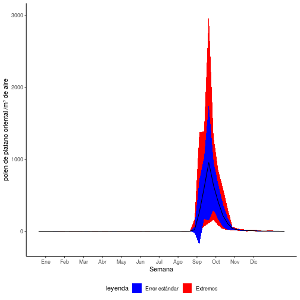

<style>
.reveal h1, .reveal h2, .reveal h3 {
  word-wrap: normal;
  -moz-hyphens: none;
}
</style>

<style>
.small-code pre code {
  font-size: 1em;
}
</style>

Clase 4 visualización de datos
========================================================
author: Derek Corcoran
date: "20/08, 2018"
autosize: true
transition: rotate

ggplot2
========================================================
class: small-code

* <small>Paquete de visualización de datos de tidy data.</small>
* <small>ggplot(data.frame, aes(nombres de columna)).</small>
* <small>+ geom_algo(argumentos, aes(columnas)).</small>
* <small>+ theme_algo() estilo.</small>
* <small>Personalización de ejes y leyendas.</small>
* <small>Dos [links](http://zevross.com/blog/2014/08/04/beautiful-plotting-in-r-a-ggplot2-cheatsheet-3/) para aprender [mas](https://www.rstudio.com/wp-content/uploads/2015/03/ggplot2-cheatsheet.pdf).</small>


```r
library(ggplot2)
data("diamonds")
ggplot(diamonds, aes(x = carat, y=price)) + geom_point(aes(color = cut)) + theme_classic()
```

***


Que diablos es aes() y por que +?
==============
incremental:true

* en ggplot2 cada vez que mencionamos una columna debe ser dentro de aes()
* ggplot2 es el paquete mas antiguo del tidyverse, %>% no existia


Argumentos para geoms
=================

* **color**: color de líneas o puntos 
* **alpha**: transparencia, de 0 (transparente) a 1 (sólido)
* **size**: tamaño de puntos
* **shape**: típo de punto
* **fill**: color dentro de un área (barras, intervalos)

color
=================
class: small-code


```r
library(ggplot2)
data("diamonds")
ggplot(diamonds, aes(x = carat, y=price)) + geom_point(aes(color = cut)) + theme_classic()
```


alpha
=================
class: small-code


```r
library(ggplot2)
data("diamonds")
ggplot(diamonds, aes(x = carat, y=price)) + geom_point(aes(color = cut), alpha = 0.1) + theme_classic()
```


size
=================
class: small-code


```r
library(ggplot2)
data("mtcars")
ggplot(mtcars, aes(x = wt, y=mpg)) + geom_point(aes(size = hp)) + theme_classic()
```


shape
=================
class: small-code


```r
library(ggplot2)
data("diamonds")
ggplot(diamonds, aes(x = carat, y=price)) + geom_point(aes(shape = cut)) + theme_classic()
```


fill
=================
class: small-code


```r
library(dplyr)
d2 <- diamonds %>% filter(clarity == "I1" | clarity == "IF")
ggplot(d2, aes(x = cut, y=price)) + geom_boxplot(aes(fill = clarity)) + theme_classic()
```


Una variable categórica una continua
===========

* geom_boxplot
* geom_jitter
* geom_violin
* geom_bar

geom_jitter
==================
class: small-code


```r
data("iris")
ggplot(iris, aes(x = Species, y = Petal.Length)) + geom_jitter(aes(color = Species))
```


geom_violin
================
class: small-code


```r
data("iris")
ggplot(iris, aes(x = Species, y = Petal.Length)) + geom_violin(fill = "red")
```


Se pueden combinar
============
class: small-code


```r
data("iris")
ggplot(iris, aes(x = Species, y = Petal.Length)) + geom_violin() + geom_jitter(aes(color = Species))
```


Pero el orden importa
============
class: small-code


```r
data("iris")
ggplot(iris, aes(x = Species, y = Petal.Length)) + geom_jitter(aes(color = Species)) + geom_violin()
```


Dos variables continuas
===========

* geom_point
* geom_smooth
* geom_line
* geom_hex
* geom_rug

geom_hex
========================

```r
ggplot(diamonds, aes(carat, price)) + geom_hex()
```


geom_point y geom_smooth
================
class: small-code


```r
data("mtcars")
ggplot(mtcars, aes(x = wt, y = mpg)) + geom_smooth() + geom_point()
```


geom_smooth, method
================
class: small-code


```r
data("mtcars")
ggplot(mtcars, aes(x = wt, y = mpg)) + geom_smooth(method = "lm") + geom_point()
```


stat_smooth más control que geom_smooth
========================================
class: small-code


```r
library(dplyr)
library(knitr)
TempHum <- readRDS("TempHum.rds")
PA <- TempHum %>% filter(Ciudad_localidad == "Punta Arenas")
kable(PA)
```


| Mes| Year| TempMedia|Ciudad_localidad | HumMedia|
|---:|----:|---------:|:----------------|--------:|
|   1| 1981|      10.8|Punta Arenas     |       NA|
|   2| 1981|      10.2|Punta Arenas     |       NA|
|   3| 1981|       8.0|Punta Arenas     |       NA|
|   4| 1981|       6.5|Punta Arenas     |       NA|
|   5| 1981|       3.4|Punta Arenas     |       NA|
|   6| 1981|       1.9|Punta Arenas     |       NA|
|   7| 1981|       1.8|Punta Arenas     |       NA|
|   8| 1981|       2.6|Punta Arenas     |       NA|
|   9| 1981|       3.8|Punta Arenas     |       NA|
|  10| 1981|       7.5|Punta Arenas     |       NA|
|  11| 1981|       8.2|Punta Arenas     |       NA|
|  12| 1981|       9.8|Punta Arenas     |       NA|
|   1| 1982|      12.0|Punta Arenas     |       NA|
|   2| 1982|      10.8|Punta Arenas     |       NA|
|   3| 1982|       8.7|Punta Arenas     |       NA|
|   4| 1982|       7.1|Punta Arenas     |       NA|
|   5| 1982|       5.0|Punta Arenas     |       NA|
|   6| 1982|       3.0|Punta Arenas     |       NA|
|   7| 1982|       0.2|Punta Arenas     |       NA|
|   8| 1982|       1.6|Punta Arenas     |       NA|
|   9| 1982|       3.8|Punta Arenas     |       NA|
|  10| 1982|       5.7|Punta Arenas     |       NA|
|  11| 1982|       9.0|Punta Arenas     |       NA|
|  12| 1982|      10.3|Punta Arenas     |       NA|
|   1| 1983|      11.2|Punta Arenas     |       NA|
|   2| 1983|       9.4|Punta Arenas     |       NA|
|   3| 1983|       8.9|Punta Arenas     |       NA|
|   4| 1983|       6.7|Punta Arenas     |       NA|
|   5| 1983|       3.8|Punta Arenas     |       NA|
|   6| 1983|       1.8|Punta Arenas     |       NA|
|   7| 1983|       2.4|Punta Arenas     |       NA|
|   8| 1983|       3.3|Punta Arenas     |       NA|
|   9| 1983|       4.3|Punta Arenas     |       NA|
|  10| 1983|       6.7|Punta Arenas     |       NA|
|  11| 1983|       8.8|Punta Arenas     |       NA|
|  12| 1983|      10.8|Punta Arenas     |       NA|
|   1| 1984|      10.1|Punta Arenas     |       NA|
|   2| 1984|       9.5|Punta Arenas     |       NA|
|   3| 1984|       8.2|Punta Arenas     |       NA|
|   4| 1984|       6.3|Punta Arenas     |       NA|
|   5| 1984|       1.3|Punta Arenas     |       NA|
|   6| 1984|       0.2|Punta Arenas     |       NA|
|   7| 1984|      -0.7|Punta Arenas     |       NA|
|   8| 1984|       1.3|Punta Arenas     |       NA|
|   9| 1984|       5.0|Punta Arenas     |       NA|
|  10| 1984|       6.4|Punta Arenas     |       NA|
|  11| 1984|       8.9|Punta Arenas     |       NA|
|  12| 1984|      11.2|Punta Arenas     |       NA|
|   1| 1985|      12.2|Punta Arenas     |       NA|
|   2| 1985|      11.5|Punta Arenas     |       NA|
|   3| 1985|       7.2|Punta Arenas     |       NA|
|   4| 1985|       5.8|Punta Arenas     |       NA|
|   5| 1985|       2.8|Punta Arenas     |       NA|
|   6| 1985|       2.2|Punta Arenas     |       NA|
|   7| 1985|       2.3|Punta Arenas     |       NA|
|   8| 1985|       3.6|Punta Arenas     |       NA|
|   9| 1985|       4.5|Punta Arenas     |       NA|
|  10| 1985|       6.4|Punta Arenas     |       NA|
|  11| 1985|       9.2|Punta Arenas     |       NA|
|  12| 1985|      10.3|Punta Arenas     |       NA|
|   1| 1986|      10.4|Punta Arenas     |       NA|
|   2| 1986|       8.7|Punta Arenas     |       NA|
|   3| 1986|       7.5|Punta Arenas     |       NA|
|   4| 1986|       4.7|Punta Arenas     |       NA|
|   5| 1986|       2.4|Punta Arenas     |       NA|
|   6| 1986|       0.6|Punta Arenas     |       NA|
|   7| 1986|       1.3|Punta Arenas     |       NA|
|   8| 1986|       3.0|Punta Arenas     |       NA|
|   9| 1986|       3.7|Punta Arenas     |       NA|
|  10| 1986|       6.6|Punta Arenas     |       NA|
|  11| 1986|       7.5|Punta Arenas     |       NA|
|  12| 1986|       9.8|Punta Arenas     |       NA|
|   1| 1987|      10.2|Punta Arenas     |       NA|
|   2| 1987|      10.1|Punta Arenas     |       NA|
|   3| 1987|       8.3|Punta Arenas     |       NA|
|   4| 1987|       6.9|Punta Arenas     |       NA|
|   5| 1987|       5.1|Punta Arenas     |       NA|
|   6| 1987|       2.8|Punta Arenas     |       NA|
|   7| 1987|       1.5|Punta Arenas     |       NA|
|   8| 1987|       1.5|Punta Arenas     |       NA|
|   9| 1987|       3.3|Punta Arenas     |       NA|
|  10| 1987|       6.9|Punta Arenas     |       NA|
|  11| 1987|       9.4|Punta Arenas     |       NA|
|  12| 1987|      10.5|Punta Arenas     |       NA|
|   1| 1988|      10.3|Punta Arenas     |       NA|
|   2| 1988|      11.1|Punta Arenas     |       NA|
|   3| 1988|       9.6|Punta Arenas     |       NA|
|   4| 1988|       5.9|Punta Arenas     |       NA|
|   5| 1988|       5.2|Punta Arenas     |       NA|
|   6| 1988|       2.4|Punta Arenas     |       NA|
|   7| 1988|       1.4|Punta Arenas     |       NA|
|   8| 1988|       2.2|Punta Arenas     |       NA|
|   9| 1988|       4.9|Punta Arenas     |       NA|
|  10| 1988|       5.9|Punta Arenas     |       NA|
|  11| 1988|       8.6|Punta Arenas     |       NA|
|  12| 1988|       9.2|Punta Arenas     |       NA|
|   1| 1989|      10.5|Punta Arenas     |       NA|
|   2| 1989|      10.8|Punta Arenas     |       NA|
|   3| 1989|       8.7|Punta Arenas     |       NA|
|   4| 1989|       6.0|Punta Arenas     |       NA|
|   5| 1989|       4.5|Punta Arenas     |       NA|
|   6| 1989|       1.4|Punta Arenas     |       NA|
|   7| 1989|       2.1|Punta Arenas     |       NA|
|   8| 1989|       2.1|Punta Arenas     |       NA|
|   9| 1989|       3.5|Punta Arenas     |       NA|
|  10| 1989|       7.3|Punta Arenas     |       NA|
|  11| 1989|       9.0|Punta Arenas     |       NA|
|  12| 1989|       9.8|Punta Arenas     |       NA|
|   1| 1990|      10.4|Punta Arenas     |       NA|
|   2| 1990|      12.0|Punta Arenas     |       NA|
|   3| 1990|       8.9|Punta Arenas     |       NA|
|   4| 1990|       4.9|Punta Arenas     |       NA|
|   5| 1990|       4.7|Punta Arenas     |       NA|
|   6| 1990|       1.8|Punta Arenas     |       NA|
|   7| 1990|       2.1|Punta Arenas     |       NA|
|   8| 1990|       2.0|Punta Arenas     |       NA|
|   9| 1990|       4.0|Punta Arenas     |       NA|
|  10| 1990|       6.7|Punta Arenas     |       NA|
|  11| 1990|       7.1|Punta Arenas     |       NA|
|  12| 1990|       9.7|Punta Arenas     |       NA|
|   1| 1991|      10.9|Punta Arenas     |       NA|
|   2| 1991|      10.0|Punta Arenas     |       NA|
|   3| 1991|       8.1|Punta Arenas     |       NA|
|   4| 1991|       6.1|Punta Arenas     |       NA|
|   5| 1991|       4.0|Punta Arenas     |       NA|
|   6| 1991|       1.1|Punta Arenas     |       NA|
|   7| 1991|       0.4|Punta Arenas     |       NA|
|   8| 1991|       1.6|Punta Arenas     |       NA|
|   9| 1991|       3.6|Punta Arenas     |       NA|
|  10| 1991|       5.7|Punta Arenas     |       NA|
|  11| 1991|       8.0|Punta Arenas     |       NA|
|  12| 1991|       7.9|Punta Arenas     |       NA|
|   1| 1992|      12.0|Punta Arenas     |       NA|
|   2| 1992|       9.4|Punta Arenas     |       NA|
|   3| 1992|       8.0|Punta Arenas     |       NA|
|   4| 1992|       6.3|Punta Arenas     |       NA|
|   5| 1992|       2.8|Punta Arenas     |       NA|
|   6| 1992|      -0.2|Punta Arenas     |       NA|
|   7| 1992|      -0.5|Punta Arenas     |       NA|
|   8| 1992|       2.1|Punta Arenas     |       NA|
|   9| 1992|       3.5|Punta Arenas     |       NA|
|  10| 1992|       5.8|Punta Arenas     |       NA|
|  11| 1992|       8.8|Punta Arenas     |       NA|
|  12| 1992|      10.7|Punta Arenas     |       NA|
|   1| 1993|      10.2|Punta Arenas     |       NA|
|   2| 1993|      10.9|Punta Arenas     |       NA|
|   3| 1993|       8.5|Punta Arenas     |       NA|
|   4| 1993|       5.3|Punta Arenas     |       NA|
|   5| 1993|       3.0|Punta Arenas     |       NA|
|   6| 1993|      -0.1|Punta Arenas     |       NA|
|   7| 1993|       2.1|Punta Arenas     |       NA|
|   8| 1993|       3.4|Punta Arenas     |       NA|
|   9| 1993|       5.0|Punta Arenas     |       NA|
|  10| 1993|       7.1|Punta Arenas     |       NA|
|  11| 1993|       9.0|Punta Arenas     |       NA|
|  12| 1993|       9.6|Punta Arenas     |       NA|
|   1| 1994|      11.6|Punta Arenas     |       NA|
|   2| 1994|       9.8|Punta Arenas     |       NA|
|   3| 1994|       8.3|Punta Arenas     |       NA|
|   4| 1994|       6.8|Punta Arenas     |       NA|
|   5| 1994|       2.2|Punta Arenas     |       NA|
|   6| 1994|       1.1|Punta Arenas     |       NA|
|   7| 1994|       0.8|Punta Arenas     |       NA|
|   8| 1994|       2.9|Punta Arenas     |       NA|
|   9| 1994|       2.9|Punta Arenas     |       NA|
|  10| 1994|       5.3|Punta Arenas     |       NA|
|  11| 1994|       9.3|Punta Arenas     |       NA|
|  12| 1994|       9.8|Punta Arenas     |       NA|
|   1| 1995|      11.1|Punta Arenas     |       NA|
|   2| 1995|      10.6|Punta Arenas     |       NA|
|   3| 1995|       7.6|Punta Arenas     |       NA|
|   4| 1995|       7.2|Punta Arenas     |       NA|
|   5| 1995|       4.6|Punta Arenas     |       NA|
|   6| 1995|       0.3|Punta Arenas     |       NA|
|   7| 1995|      -1.1|Punta Arenas     |       NA|
|   8| 1995|       0.1|Punta Arenas     |       NA|
|   9| 1995|       3.9|Punta Arenas     |       NA|
|  10| 1995|       6.5|Punta Arenas     |       NA|
|  11| 1995|       8.2|Punta Arenas     |       NA|
|  12| 1995|      10.4|Punta Arenas     |       NA|
|   1| 1996|      10.4|Punta Arenas     |       NA|
|   2| 1996|       8.9|Punta Arenas     |       NA|
|   3| 1996|       8.6|Punta Arenas     |       NA|
|   4| 1996|       5.6|Punta Arenas     |       NA|
|   5| 1996|       2.6|Punta Arenas     |       NA|
|   6| 1996|       1.6|Punta Arenas     |       NA|
|   7| 1996|      -0.1|Punta Arenas     |       NA|
|   8| 1996|       2.3|Punta Arenas     |       NA|
|   9| 1996|       3.6|Punta Arenas     |       NA|
|  10| 1996|       6.0|Punta Arenas     |       NA|
|  11| 1996|       8.7|Punta Arenas     |       NA|
|  12| 1996|       9.4|Punta Arenas     |       NA|
|   1| 1997|      10.4|Punta Arenas     |       NA|
|   2| 1997|       8.9|Punta Arenas     |       NA|
|   3| 1997|       8.6|Punta Arenas     |       NA|
|   4| 1997|       5.6|Punta Arenas     |       NA|
|   5| 1997|       2.6|Punta Arenas     |       NA|
|   6| 1997|       1.6|Punta Arenas     |       NA|
|   7| 1997|      -0.1|Punta Arenas     |       NA|
|   8| 1997|       2.3|Punta Arenas     |       NA|
|   9| 1997|       3.6|Punta Arenas     |       NA|
|  10| 1997|       6.0|Punta Arenas     |       NA|
|  11| 1997|       8.7|Punta Arenas     |       NA|
|  12| 1997|       9.4|Punta Arenas     |       NA|
|   1| 1998|      10.7|Punta Arenas     |       NA|
|   2| 1998|      11.1|Punta Arenas     |       NA|
|   3| 1998|       9.4|Punta Arenas     |       NA|
|   4| 1998|       7.1|Punta Arenas     |       NA|
|   5| 1998|       4.4|Punta Arenas     |       NA|
|   6| 1998|       3.6|Punta Arenas     |       NA|
|   7| 1998|       3.0|Punta Arenas     |       NA|
|   8| 1998|       3.2|Punta Arenas     |       NA|
|   9| 1998|       3.9|Punta Arenas     |       NA|
|  10| 1998|       6.6|Punta Arenas     |       NA|
|  11| 1998|       8.5|Punta Arenas     |       NA|
|  12| 1998|       9.4|Punta Arenas     |       NA|
|   1| 1999|      10.9|Punta Arenas     |       NA|
|   2| 1999|       9.9|Punta Arenas     |       NA|
|   3| 1999|       8.4|Punta Arenas     |       NA|
|   4| 1999|       6.7|Punta Arenas     |       NA|
|   5| 1999|       3.7|Punta Arenas     |       NA|
|   6| 1999|       0.7|Punta Arenas     |       NA|
|   7| 1999|       1.8|Punta Arenas     |       NA|
|   8| 1999|       2.1|Punta Arenas     |       NA|
|   9| 1999|       3.6|Punta Arenas     |       NA|
|  10| 1999|       7.2|Punta Arenas     |       NA|
|  11| 1999|       9.6|Punta Arenas     |       NA|
|  12| 1999|       9.6|Punta Arenas     |       NA|
|   1| 2000|       9.8|Punta Arenas     |       NA|
|   2| 2000|       9.6|Punta Arenas     |       NA|
|   3| 2000|       8.3|Punta Arenas     |       NA|
|   4| 2000|       6.9|Punta Arenas     |       NA|
|   5| 2000|       4.2|Punta Arenas     |       NA|
|   6| 2000|       0.8|Punta Arenas     |       NA|
|   7| 2000|       0.6|Punta Arenas     |       NA|
|   8| 2000|       2.8|Punta Arenas     |       NA|
|   9| 2000|       2.2|Punta Arenas     |       NA|
|  10| 2000|       5.9|Punta Arenas     |       NA|
|  11| 2000|       8.0|Punta Arenas     |       NA|
|  12| 2000|       8.8|Punta Arenas     |       NA|
|   1| 2001|      10.4|Punta Arenas     |       NA|
|   2| 2001|       9.3|Punta Arenas     |       NA|
|   3| 2001|       7.5|Punta Arenas     |       NA|
|   4| 2001|       6.5|Punta Arenas     |       NA|
|   5| 2001|       3.6|Punta Arenas     |       NA|
|   6| 2001|       2.0|Punta Arenas     |       NA|
|   7| 2001|       0.0|Punta Arenas     |       NA|
|   8| 2001|       1.7|Punta Arenas     |       NA|
|   9| 2001|       4.2|Punta Arenas     |       NA|
|  10| 2001|       7.0|Punta Arenas     |       NA|
|  11| 2001|       7.8|Punta Arenas     |       NA|
|  12| 2001|      10.0|Punta Arenas     |       NA|
|   1| 2002|      10.5|Punta Arenas     |       NA|
|   2| 2002|      10.9|Punta Arenas     |       NA|
|   3| 2002|       6.9|Punta Arenas     |       NA|
|   4| 2002|       5.8|Punta Arenas     |       NA|
|   5| 2002|       0.9|Punta Arenas     |       NA|
|   6| 2002|      -0.1|Punta Arenas     |       NA|
|   7| 2002|       1.2|Punta Arenas     |       NA|
|   8| 2002|       1.9|Punta Arenas     |       NA|
|   9| 2002|       4.3|Punta Arenas     |       NA|
|  10| 2002|       5.1|Punta Arenas     |       NA|
|  11| 2002|       7.7|Punta Arenas     |       NA|
|  12| 2002|      10.7|Punta Arenas     |       NA|
|   1| 2003|      10.1|Punta Arenas     |       NA|
|   2| 2003|      10.3|Punta Arenas     |       NA|
|   3| 2003|       8.0|Punta Arenas     |       NA|
|   4| 2003|       6.5|Punta Arenas     |       NA|
|   5| 2003|       5.6|Punta Arenas     |       NA|
|   6| 2003|       1.7|Punta Arenas     |       NA|
|   7| 2003|       3.8|Punta Arenas     |       NA|
|   8| 2003|       3.5|Punta Arenas     |       NA|
|   9| 2003|       4.5|Punta Arenas     |       NA|
|  10| 2003|       5.7|Punta Arenas     |       NA|
|  11| 2003|       7.8|Punta Arenas     |       NA|
|  12| 2003|       9.9|Punta Arenas     |       NA|
|   1| 2004|      11.7|Punta Arenas     |       NA|
|   2| 2004|      12.8|Punta Arenas     |       NA|
|   3| 2004|       9.0|Punta Arenas     |       NA|
|   4| 2004|       6.5|Punta Arenas     |       NA|
|   5| 2004|       5.3|Punta Arenas     |       NA|
|   6| 2004|       4.1|Punta Arenas     |       NA|
|   7| 2004|       1.3|Punta Arenas     |       NA|
|   8| 2004|       3.3|Punta Arenas     |       NA|
|   9| 2004|       4.5|Punta Arenas     |       NA|
|  10| 2004|       7.0|Punta Arenas     |       NA|
|  11| 2004|      10.1|Punta Arenas     |       NA|
|  12| 2004|      10.8|Punta Arenas     |       NA|
|   1| 2005|      10.5|Punta Arenas     |       NA|
|   2| 2005|      11.9|Punta Arenas     |       NA|
|   3| 2005|       8.3|Punta Arenas     |       NA|
|   4| 2005|       6.3|Punta Arenas     |       NA|
|   5| 2005|       2.9|Punta Arenas     |       NA|
|   6| 2005|      -0.1|Punta Arenas     |       NA|
|   7| 2005|       2.1|Punta Arenas     |       NA|
|   8| 2005|       2.3|Punta Arenas     |       NA|
|   9| 2005|       5.5|Punta Arenas     |       NA|
|  10| 2005|       6.4|Punta Arenas     |       NA|
|  11| 2005|       8.6|Punta Arenas     |       NA|
|  12| 2005|      10.2|Punta Arenas     |       NA|
|   1| 2006|      11.5|Punta Arenas     |       NA|
|   2| 2006|      10.6|Punta Arenas     |       NA|
|   3| 2006|       9.3|Punta Arenas     |       NA|
|   4| 2006|       6.0|Punta Arenas     |       NA|
|   5| 2006|       5.3|Punta Arenas     |       NA|
|   6| 2006|       1.6|Punta Arenas     |       NA|
|   7| 2006|       2.1|Punta Arenas     |       NA|
|   8| 2006|       2.9|Punta Arenas     |       NA|
|   9| 2006|       4.1|Punta Arenas     |       NA|
|  10| 2006|       7.1|Punta Arenas     |       NA|
|  11| 2006|       8.6|Punta Arenas     |       NA|
|  12| 2006|       9.4|Punta Arenas     |       NA|
|   1| 2007|      10.8|Punta Arenas     |       NA|
|   2| 2007|       9.9|Punta Arenas     |       NA|
|   3| 2007|       8.9|Punta Arenas     |       NA|
|   4| 2007|       6.0|Punta Arenas     |       NA|
|   5| 2007|       3.3|Punta Arenas     |       NA|
|   6| 2007|       2.3|Punta Arenas     |       NA|
|   7| 2007|       1.4|Punta Arenas     |       NA|
|   8| 2007|       3.2|Punta Arenas     |       NA|
|   9| 2007|       5.0|Punta Arenas     |       NA|
|  10| 2007|       5.9|Punta Arenas     |       NA|
|  11| 2007|       7.9|Punta Arenas     |       NA|
|  12| 2007|      10.2|Punta Arenas     |       NA|
|   1| 2008|      11.6|Punta Arenas     |       NA|
|   2| 2008|      11.3|Punta Arenas     |       NA|
|   3| 2008|      10.3|Punta Arenas     |       NA|
|   4| 2008|       5.8|Punta Arenas     |       NA|
|   5| 2008|       3.1|Punta Arenas     |       NA|
|   6| 2008|       1.6|Punta Arenas     |       NA|
|   7| 2008|       1.7|Punta Arenas     |       NA|
|   8| 2008|       1.0|Punta Arenas     |       NA|
|   9| 2008|       5.3|Punta Arenas     |       NA|
|  10| 2008|       7.0|Punta Arenas     |       NA|
|  11| 2008|       8.3|Punta Arenas     |       NA|
|  12| 2008|      11.0|Punta Arenas     |       NA|
|   1| 2009|      11.3|Punta Arenas     |       NA|
|   2| 2009|      10.3|Punta Arenas     |       NA|
|   3| 2009|       9.0|Punta Arenas     |       NA|
|   4| 2009|       6.4|Punta Arenas     |       NA|
|   5| 2009|       3.1|Punta Arenas     |       NA|
|   6| 2009|       3.4|Punta Arenas     |       NA|
|   7| 2009|       2.2|Punta Arenas     |       NA|
|   8| 2009|       2.6|Punta Arenas     |       NA|
|   9| 2009|       5.2|Punta Arenas     |       NA|
|  10| 2009|       5.4|Punta Arenas     |       NA|
|  11| 2009|       5.6|Punta Arenas     |       NA|
|  12| 2009|       9.9|Punta Arenas     |       NA|
|   1| 2010|      10.2|Punta Arenas     |       NA|
|   2| 2010|       8.9|Punta Arenas     |       NA|
|   3| 2010|       8.6|Punta Arenas     |       NA|
|   4| 2010|       6.3|Punta Arenas     |       NA|
|   5| 2010|       4.8|Punta Arenas     |       NA|
|   6| 2010|       1.3|Punta Arenas     |       NA|
|   7| 2010|       0.8|Punta Arenas     |       NA|
|   8| 2010|       2.4|Punta Arenas     |       NA|
|   9| 2010|       4.6|Punta Arenas     |       NA|
|  10| 2010|       7.2|Punta Arenas     |       NA|
|  11| 2010|       8.7|Punta Arenas     |       NA|
|  12| 2010|       8.8|Punta Arenas     |       NA|
|   1| 2011|      10.5|Punta Arenas     |       NA|
|   2| 2011|      11.2|Punta Arenas     |       NA|
|   3| 2011|       8.8|Punta Arenas     |       NA|
|   4| 2011|       5.4|Punta Arenas     |       NA|
|   5| 2011|       4.6|Punta Arenas     |       NA|
|   6| 2011|       2.1|Punta Arenas     |       NA|
|   7| 2011|       1.5|Punta Arenas     |       NA|
|   8| 2011|       1.8|Punta Arenas     |       NA|
|   9| 2011|       3.7|Punta Arenas     |       NA|
|  10| 2011|       6.9|Punta Arenas     |       NA|
|  11| 2011|       8.8|Punta Arenas     |       NA|
|  12| 2011|      11.6|Punta Arenas     |       NA|
|   1| 2012|      11.6|Punta Arenas     |       NA|
|   2| 2012|       8.3|Punta Arenas     |       NA|
|   3| 2012|       9.7|Punta Arenas     |       NA|
|   4| 2012|       5.3|Punta Arenas     |       NA|
|   5| 2012|       2.6|Punta Arenas     |       NA|
|   6| 2012|       1.1|Punta Arenas     |       NA|
|   7| 2012|       1.7|Punta Arenas     |       NA|
|   8| 2012|       3.3|Punta Arenas     |       NA|
|   9| 2012|       4.9|Punta Arenas     |       NA|
|  10| 2012|       6.6|Punta Arenas     |       NA|
|  11| 2012|       8.7|Punta Arenas     |       NA|
|  12| 2012|       8.7|Punta Arenas     |       NA|
|   1| 2013|      12.7|Punta Arenas     |     65.7|
|   2| 2013|      10.7|Punta Arenas     |     69.7|
|   3| 2013|       9.3|Punta Arenas     |     76.2|
|   4| 2013|       7.8|Punta Arenas     |     78.8|
|   5| 2013|       4.4|Punta Arenas     |     81.6|
|   6| 2013|       3.0|Punta Arenas     |     83.3|
|   7| 2013|       3.2|Punta Arenas     |     81.1|
|   8| 2013|       1.5|Punta Arenas     |     80.4|
|   9| 2013|       4.0|Punta Arenas     |     76.9|
|  10| 2013|       6.9|Punta Arenas     |     67.7|
|  11| 2013|       7.6|Punta Arenas     |     64.7|
|  12| 2013|       8.9|Punta Arenas     |     65.8|
|   1| 2014|       9.2|Punta Arenas     |     65.1|
|   2| 2014|      10.5|Punta Arenas     |     69.2|
|   3| 2014|       8.1|Punta Arenas     |     72.1|
|   4| 2014|       6.2|Punta Arenas     |     79.0|
|   5| 2014|       3.9|Punta Arenas     |     80.0|
|   6| 2014|       2.0|Punta Arenas     |     85.4|
|   7| 2014|       1.3|Punta Arenas     |     84.1|
|   8| 2014|       3.0|Punta Arenas     |     86.2|
|   9| 2014|       4.4|Punta Arenas     |     78.2|
|  10| 2014|       6.5|Punta Arenas     |     67.4|
|  11| 2014|       8.0|Punta Arenas     |     66.0|
|  12| 2014|       9.8|Punta Arenas     |     63.0|
|   1| 2015|      10.7|Punta Arenas     |     60.4|
|   2| 2015|      10.6|Punta Arenas     |     64.3|
|   3| 2015|       9.3|Punta Arenas     |     74.2|
|   4| 2015|       6.0|Punta Arenas     |     79.0|
|   5| 2015|       4.1|Punta Arenas     |     84.4|
|   6| 2015|       2.4|Punta Arenas     |     83.4|
|   7| 2015|       1.3|Punta Arenas     |     86.3|
|   8| 2015|       2.4|Punta Arenas     |     81.7|
|   9| 2015|       3.8|Punta Arenas     |     73.6|
|  10| 2015|       6.2|Punta Arenas     |     67.7|
|  11| 2015|       8.2|Punta Arenas     |     60.7|
|  12| 2015|       9.2|Punta Arenas     |     59.5|
|  10| 2016|       7.3|Punta Arenas     |     69.0|
|  11| 2016|       9.4|Punta Arenas     |     62.0|
|   1| 2016|      11.3|Punta Arenas     |     59.0|
|   2| 2016|      10.6|Punta Arenas     |     66.0|
|   3| 2016|       9.9|Punta Arenas     |     70.0|
|   4| 2016|       5.3|Punta Arenas     |     75.0|
|   5| 2016|       3.6|Punta Arenas     |     86.0|
|   6| 2016|       4.2|Punta Arenas     |     83.0|
|   7| 2016|       2.4|Punta Arenas     |     87.0|
|   8| 2016|       2.4|Punta Arenas     |     81.0|
|   9| 2016|       5.8|Punta Arenas     |     70.0|
|  12| 2016|      10.0|Punta Arenas     |     62.0|

stat_smooth más control que geom_smooth
========================================
class: small-code


```r
library(ggplot2)
ggplot(PA, aes(x = Mes, y = TempMedia)) + geom_point()
```


stat_smooth más control que geom_smooth
========================================
class: small-code


```r
ggplot(PA, aes(x = Mes, y = TempMedia)) + geom_point() +  stat_smooth(method = "lm") 
```


Ecuación cuadrática
========================================
class: small-code


***


stat_smooth más control que geom_smooth
========================================
class: small-code


```r
ggplot(PA, aes(x = Mes, y = TempMedia)) + geom_point() +  stat_smooth(method = "lm", formula = y ~ x + I(x^2)) 
```


Que podemos hacer con tidyr??
========================================
class: small-code


```r
library(tidyr)
San <- TempHum %>% filter(Ciudad_localidad == "Quinta Normal") %>%  gather(key = Unidad, value = medida, TempMedia, HumMedia)
ggplot(San, aes(x = Mes, y = medida)) + geom_point() +  stat_smooth(method = "lm", formula = y ~ x + I(x^2), aes(fill = Unidad, color = Unidad)) 
```


incluirlo en rmd con leyenda abajo
========================================
class: small-code


Primera evaluación exploración de datos
========================================
incremental:true

* Generar un informe rmd
* Debe tener
    + chunks
    + inline code
    + tabla con leyenda (kable, stargazer)
    + figura con leyenda

***

* Enviar por correo con subject evaluación 1 R
    + El link de rpubs con el documento publicado
    + El archivo rmd con el que generaron el documento
    + El repositorio de github donde tienen ambas cosas
    + Para el martes 28 de Agosto

Como combinar gráficos con facet_wrap
======================================
class: small-code


```r
Algunos <- TempHum %>% filter(Ciudad_localidad %in% c("Arica", "Rapa Nui", "La Serena", "Valparaíso", "Quinta Normal", "Concepción", "Valdivia", "Punta Arenas")) %>% gather(key = Unidad, value = medida, TempMedia, HumMedia)
```

Como combinar gráficos
======================================
class: small-code


```r
ggplot(Algunos , aes(x = Mes, y = medida)) + geom_point(aes(color = Unidad)) +  stat_smooth(method = "lm", formula = y ~ x + I(x^2), aes(fill = Unidad), alpha = 0.5) + facet_wrap(~Ciudad_localidad, ncol = 2)
```


    
Algunos gráficos interesantes hechos con ggplot
======================================
class: small-code


```r
library(SpatialBall2)
data("season2017")
ShotSeasonGraphPlayer(season2017, player = "Stephen Curry")
```


    
Algunos gráficos interesantes
======================================
class: small-code


```r
Weekly <- readRDS("Alergia.rds") %>% group_by(Semana) %>% summarize(mean = mean(platano_oriental, na.rm = TRUE), max = max(platano_oriental, na.rm = TRUEl), min = min(platano_oriental, na.rm = TRUE), sd = sd(platano_oriental, na.rm = TRUE))
ggplot(Weekly, aes(x = Semana, y = mean)) + 
geom_ribbon(aes(ymax = max, ymin = min, fill = "red")) + 
geom_ribbon(aes(ymax = mean + sd, ymin = mean - sd, fill = "blue"), alpha = 1) + 
geom_line() + 
  scale_fill_manual(name = "leyenda", values = c("blue", "red"), labels = c('Error estándar','Extremos')) + 
ylab("polen de platano oriental /m³ de aire") + theme_classic()  + theme(legend.position="bottom") + 
scale_x_continuous(breaks=seq(from = 2.5, to = 49.5, by = 4), labels = c("Ene", "Feb", "Mar", "Abr", "May", "Jun", "Jul", "Ago", "Sep", "Oct", "Nov", "Dic"))
```

Algunos gráficos interesantes
======================================
class: small-code


