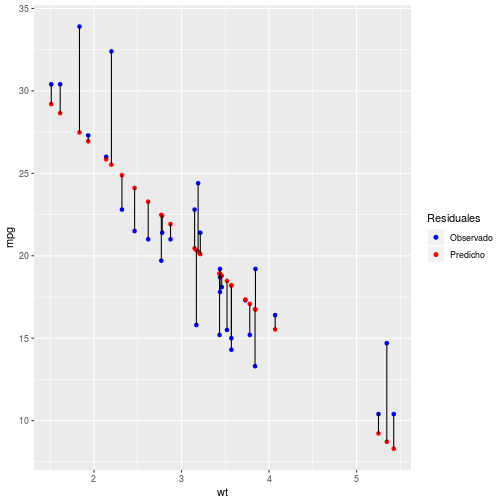
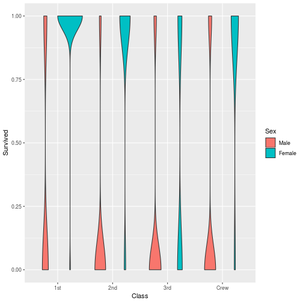
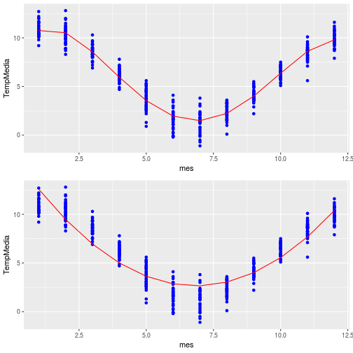

<style>
.reveal h1, .reveal h2, .reveal h3 {
  word-wrap: normal;
  -moz-hyphens: none;
}
</style>

<style>
.small-code pre code {
  font-size: 1em;
}
</style>

Clase 5 Modelos
========================================================
author: Derek Corcoran
date: "21/08, 2018"
autosize: true
transition: rotate

<STYLE TYPE="text/css">
<!--
  td{
    font-family: Arial; 
    font-size: 4pt;
    padding:0px;
    cellpadding="0";
    cellspacing="0"
  }
  th {
    font-family: Arial; 
    font-size: 4pt;
    height: 20px;
    font-weight: bold;
    text-align: right;
    background-color: #ccccff;
  }
  table { 
    border-spacing: 0px;
    border-collapse: collapse;
  }
--->
</STYLE>


Modelo lineal simple
========================================================
class: small-code

```r
library(tidyverse)
TempHum <- readRDS("TempHum.rds")
Pun <- TempHum %>% filter(Ciudad_localidad == "Punta Arenas")
Lineal <- lm(TempMedia ~ mes, data = Pun)
Cuad <- lm(TempMedia ~ mes + I(mes^2), data = Pun)
stargazer::stargazer(Lineal, Cuad, type = "html",  single.row = TRUE, model.names = TRUE, model.numbers = FALSE)
```

***

<table style="text-align:center"><tr><td colspan="3" style="border-bottom: 1px solid black"></td></tr><tr><td style="text-align:left"></td><td colspan="2"><em>Dependent variable:</em></td></tr>
<tr><td></td><td colspan="2" style="border-bottom: 1px solid black"></td></tr>
<tr><td style="text-align:left"></td><td colspan="2">TempMedia</td></tr>
<tr><td style="text-align:left"></td><td>(1)</td><td>(2)</td></tr>
<tr><td colspan="3" style="border-bottom: 1px solid black"></td></tr><tr><td style="text-align:left">mes</td><td>-0.199<sup>***</sup> (0.048)</td><td>-3.987<sup>***</sup> (0.084)</td></tr>
<tr><td style="text-align:left">I(mes2)</td><td></td><td>0.291<sup>***</sup> (0.006)</td></tr>
<tr><td style="text-align:left">Constant</td><td>7.445<sup>***</sup> (0.350)</td><td>16.283<sup>***</sup> (0.237)</td></tr>
<tr><td colspan="3" style="border-bottom: 1px solid black"></td></tr><tr><td style="text-align:left">Observations</td><td>420</td><td>420</td></tr>
<tr><td style="text-align:left">R<sup>2</sup></td><td>0.040</td><td>0.845</td></tr>
<tr><td style="text-align:left">Adjusted R<sup>2</sup></td><td>0.038</td><td>0.844</td></tr>
<tr><td style="text-align:left">Residual Std. Error</td><td>3.364 (df = 418)</td><td>1.355 (df = 417)</td></tr>
<tr><td style="text-align:left">F Statistic</td><td>17.564<sup>***</sup> (df = 1; 418)</td><td>1,133.228<sup>***</sup> (df = 2; 417)</td></tr>
<tr><td colspan="3" style="border-bottom: 1px solid black"></td></tr><tr><td style="text-align:left"><em>Note:</em></td><td colspan="2" style="text-align:right"><sup>*</sup>p<0.1; <sup>**</sup>p<0.05; <sup>***</sup>p<0.01</td></tr>
</table>

Sacando más de los modelos con Broom
============================
class: small-code

```r
library(broom)
data("mtcars")
Eficiencia <- lm(mpg ~ wt , data = mtcars)
tidy(Eficiencia)
```

```
# A tibble: 2 x 5
  term        estimate std.error statistic  p.value
  <chr>          <dbl>     <dbl>     <dbl>    <dbl>
1 (Intercept)    37.3      1.88      19.9  8.24e-19
2 wt             -5.34     0.559     -9.56 1.29e-10
```

```r
glance(Eficiencia)
```

```
# A tibble: 1 x 11
  r.squared adj.r.squared sigma statistic  p.value    df logLik   AIC   BIC
*     <dbl>         <dbl> <dbl>     <dbl>    <dbl> <int>  <dbl> <dbl> <dbl>
1     0.753         0.745  3.05      91.4 1.29e-10     2  -80.0  166.  170.
# ... with 2 more variables: deviance <dbl>, df.residual <int>
```

Sacando más de los modelos con Broom
============================
class: small-code


```r
tidy(Eficiencia)
```

```
# A tibble: 2 x 5
  term        estimate std.error statistic  p.value
  <chr>          <dbl>     <dbl>     <dbl>    <dbl>
1 (Intercept)    37.3      1.88      19.9  8.24e-19
2 wt             -5.34     0.559     -9.56 1.29e-10
```

Sacando más de los modelos con Broom
============================
class: small-code


```r
library(ggplot2)
ggplot(mtcars, aes(x = wt, y = mpg)) + geom_smooth(method = "lm")
```


Sacando más de los modelos con Broom
============================
class: small-code


```r
MasDatos <- augment(Eficiencia)
knitr::kable(head(MasDatos, 10))
```


|.rownames         |  mpg|    wt|  .fitted|   .se.fit|     .resid|      .hat|   .sigma|   .cooksd| .std.resid|
|:-----------------|----:|-----:|--------:|---------:|----------:|---------:|--------:|---------:|----------:|
|Mazda RX4         | 21.0| 2.620| 23.28261| 0.6335798| -2.2826106| 0.0432690| 3.067494| 0.0132741| -0.7661677|
|Mazda RX4 Wag     | 21.0| 2.875| 21.91977| 0.5714319| -0.9197704| 0.0351968| 3.093068| 0.0017240| -0.3074305|
|Datsun 710        | 22.8| 2.320| 24.88595| 0.7359177| -2.0859521| 0.0583757| 3.072127| 0.0154394| -0.7057525|
|Hornet 4 Drive    | 21.4| 3.215| 20.10265| 0.5384424|  1.2973499| 0.0312502| 3.088268| 0.0030206|  0.4327511|
|Hornet Sportabout | 18.7| 3.440| 18.90014| 0.5526562| -0.2001440| 0.0329218| 3.097722| 0.0000760| -0.0668188|
|Valiant           | 18.1| 3.460| 18.79325| 0.5552829| -0.6932545| 0.0332355| 3.095184| 0.0009211| -0.2314831|
|Duster 360        | 14.3| 3.570| 18.20536| 0.5734244| -3.9053627| 0.0354426| 3.008664| 0.0313139| -1.3055222|
|Merc 240D         | 24.4| 3.190| 20.23626| 0.5386565|  4.1637381| 0.0312750| 2.996697| 0.0311392|  1.3888971|
|Merc 230          | 22.8| 3.150| 20.45004| 0.5397522|  2.3499593| 0.0314024| 3.066058| 0.0099619|  0.7839269|
|Merc 280          | 19.2| 3.440| 18.90014| 0.5526562|  0.2998560| 0.0329218| 3.097435| 0.0001706|  0.1001080|

Sacando más de los modelos con Broom
============================
class: small-code


```r
library(ggplot2)
ggplot(MasDatos, aes(x = wt, y = mpg)) + geom_point(aes(color = "blue")) + geom_point(aes(color = "red",y = .fitted)) + scale_color_manual(name = "Residuales", values = c("blue", "red"), labels = c("Observado", "Predicho")) + geom_segment(aes(xend = wt, yend = .fitted))
```




Sacando más de los modelos con Broom
============================
class: small-code


```r
hist(MasDatos$.resid)
```


***


```r
shapiro.test(MasDatos$.resid)
```

```

	Shapiro-Wilk normality test

data:  MasDatos$.resid
W = 0.94508, p-value = 0.1044
```

* Para mas sobre supuestos de test básicos de estadística, [este link](https://cran.r-project.org/doc/contrib/Martinez-RforBiologistv1.1.pdf)

Modelo lineal generalizado
========================================================
incremental:true
* Se agrega el argumento **family =**
* gaussian (variable independiente continua)
* binomial (variable independiente 0 o 1)
* poissson (variable independiente cuentas 1, 2 ,3 ,4 ,5)
* gamma (variable independiente continua solo positiva)


Modelo lineal generalizado (familia: binomial)
========================================================
class: small-code


```r
data("Titanic")
library(epitools)
Titanic2 <- expand.table(Titanic)
Titanic2$Survived <- ifelse(Titanic2$Survived == "Yes", 1, 0)
knitr::kable(head(Titanic2))
```


|Class |Sex  |Age   | Survived|
|:-----|:----|:-----|--------:|
|1st   |Male |Child |        1|
|1st   |Male |Child |        1|
|1st   |Male |Child |        1|
|1st   |Male |Child |        1|
|1st   |Male |Child |        1|
|1st   |Male |Adult |        0|

Modelo lineal generalizado (familia: binomial)
========================================================
class: small-code


```r
library(ggplot2)
ggplot(Titanic2, aes(x = Class, y = Survived)) + geom_violin(aes(fill = Sex)) 
```



Modelo lineal generalizado (familia: binomial)
========================================================
class: small-code

```r
ModeloTitanic <- glm(Survived ~.,family=binomial() ,data = Titanic2)
stargazer::stargazer(ModeloTitanic, type = "html",  single.row = TRUE)
```


<table style="text-align:center"><tr><td colspan="2" style="border-bottom: 1px solid black"></td></tr><tr><td style="text-align:left"></td><td><em>Dependent variable:</em></td></tr>
<tr><td></td><td colspan="1" style="border-bottom: 1px solid black"></td></tr>
<tr><td style="text-align:left"></td><td>Survived</td></tr>
<tr><td colspan="2" style="border-bottom: 1px solid black"></td></tr><tr><td style="text-align:left">Class2nd</td><td>-1.018<sup>***</sup> (0.196)</td></tr>
<tr><td style="text-align:left">Class3rd</td><td>-1.778<sup>***</sup> (0.172)</td></tr>
<tr><td style="text-align:left">ClassCrew</td><td>-0.858<sup>***</sup> (0.157)</td></tr>
<tr><td style="text-align:left">SexFemale</td><td>2.420<sup>***</sup> (0.140)</td></tr>
<tr><td style="text-align:left">AgeAdult</td><td>-1.062<sup>***</sup> (0.244)</td></tr>
<tr><td style="text-align:left">Constant</td><td>0.685<sup>**</sup> (0.273)</td></tr>
<tr><td colspan="2" style="border-bottom: 1px solid black"></td></tr><tr><td style="text-align:left">Observations</td><td>2,201</td></tr>
<tr><td style="text-align:left">Log Likelihood</td><td>-1,105.031</td></tr>
<tr><td style="text-align:left">Akaike Inf. Crit.</td><td>2,222.061</td></tr>
<tr><td colspan="2" style="border-bottom: 1px solid black"></td></tr><tr><td style="text-align:left"><em>Note:</em></td><td style="text-align:right"><sup>*</sup>p<0.1; <sup>**</sup>p<0.05; <sup>***</sup>p<0.01</td></tr>
</table>

Selección de modelos
=======================
class: small-code
incremental:true


```r
data("mtcars")
Eficiencia <- glm(mpg ~. , data = mtcars)
```
* Se parte del modelo general (Muchos predictores) 
* ~. Explicado por todas las otras variables
* Paquete MuMIn calcula AICc (o [AIC](http://izt.ciens.ucv.ve/ecologia/Archivos/ECO_POB%202014/ECOPO2_2014/Aho%20et%20al%202014.pdf) o [BIC](https://faculty.washington.edu/skalski/classes/QERM597/papers_xtra/Burnham%20and%20Anderson.pdf)) para cada modelo
* Se ordena desde el menor IC al mayor IC
* En general reportamos un delta AIC de 2

Selección de modelos
=======================
class: small-code

```r
library(MuMIn)
library(kableExtra)
library(knitr)
options(na.action = "na.fail")
Select <- dredge(Eficiencia)
Select <-subset(Select, delta <= 2)
Mejor <- get.models(Select, subset = 1)[[1]]
Select <-as.data.frame(Select)
Select <- Select[,colSums(is.na(Select))<nrow(Select)]
kable(Select, digits = 2)
```


|    | (Intercept)|   am|  carb|   cyl|    hp| qsec|    wt| df| logLik|   AICc| delta| weight|
|:---|-----------:|----:|-----:|-----:|-----:|----:|-----:|--:|------:|------:|-----:|------:|
|642 |        9.62| 2.94|    NA|    NA|    NA| 1.23| -3.92|  5| -72.06| 156.43|  0.00|   0.23|
|517 |       39.69|   NA|    NA| -1.51|    NA|   NA| -3.19|  4| -74.01| 157.49|  1.06|   0.13|
|706 |       17.44| 2.93|    NA|    NA| -0.02| 0.81| -3.24|  6| -71.16| 157.69|  1.26|   0.12|
|581 |       38.75|   NA|    NA| -0.94| -0.02|   NA| -3.17|  5| -72.74| 157.78|  1.36|   0.12|
|644 |       12.90| 3.51| -0.49|    NA|    NA| 1.02| -3.43|  6| -71.28| 157.92|  1.50|   0.11|
|519 |       39.60|   NA| -0.49| -1.29|    NA|   NA| -3.16|  5| -72.81| 157.93|  1.50|   0.11|
|577 |       37.23|   NA|    NA|    NA| -0.03|   NA| -3.88|  4| -74.33| 158.13|  1.71|   0.10|
|641 |       19.75|   NA|    NA|    NA|    NA| 0.93| -5.05|  4| -74.36| 158.20|  1.77|   0.09|

Selección de modelos (binomial)
========================================================
class: small-code

```r
library(MuMIn)
options(na.action = "na.fail")
select <- dredge(ModeloTitanic)
select <-subset(select, delta <= 20)
knitr::kable(select)
```


|   | (Intercept)|Age |Class |Sex | df|    logLik|     AICc|    delta|      weight|
|:--|-----------:|:---|:-----|:---|--:|---------:|--------:|--------:|-----------:|
|8  |   0.6853195|+   |+     |+   |  6| -1105.031| 2222.099|  0.00000| 0.999779718|
|7  |  -0.3531200|NA  |+     |+   |  5| -1114.456| 2238.940| 16.84076| 0.000220282|

Selección de modelos (Entendiendo relaciones)
========================================================
class: small-code

```r
library(MuMIn)
options(na.action = "na.fail")
select <- dredge(glm(TempMedia ~ mes + I(mes^2) + I(mes^3) + I(mes^4) + I(mes^5), data = Pun))
select <-subset(select, delta <= 2)
knitr::kable(select)
```


|   | (Intercept)|      mes|  I(mes^2)|  I(mes^3)|   I(mes^4)|  I(mes^5)| df|    logLik|     AICc|    delta|    weight|
|:--|-----------:|--------:|---------:|---------:|----------:|---------:|--:|---------:|--------:|--------:|---------:|
|16 |    7.867330| 4.954460| -2.353265| 0.2915816| -0.0107301|        NA|  6| -540.4758| 1093.155| 0.000000| 0.7289686|
|32 |    8.022727| 4.723586| -2.247572| 0.2713073| -0.0090162| -5.27e-05|  7| -540.4310| 1095.134| 1.978792| 0.2710314|

Selección de modelos (Entendiendo relaciones)
========================================================
class: small-code


```r
library(broom)
mejor <-glm(TempMedia ~ mes + I(mes^2) + I(mes^3) + I(mes^4), data = Pun)
MasDatos <-augment(mejor)

masomenos <- glm(TempMedia ~ mes + I(mes^2), data = Pun)
MasoMenosDatos <-augment(masomenos)

library(ggplot2)

MejorGraph <- ggplot(MasDatos, aes(x = mes, y = TempMedia)) + geom_point(color = "blue") + geom_line(aes(y = .fitted), color = "red")

MasMenosGraph <- ggplot(MasoMenosDatos, aes(x = mes, y = TempMedia)) + geom_point(color = "blue") + geom_line(aes(y = .fitted), color = "red")
```

Selección de modelos (Entendiendo relaciones)
========================================================
class: small-code


```r
library(gridExtra)
grid.arrange(MejorGraph, MasMenosGraph, ncol = 1)
```




Expandiendo los modelos que puedo usar paquete caret
===========================================
incremental:true

* Paquete [caret](http://topepo.github.io/caret/index.html), 238 tipos de modelos distintos 
* Si quieren aprender mucho más acá hay un [tutorial](https://www.youtube.com/watch?v=7Jbb2ItbTC4&t=3s)
* En lo más básico solo una función *train*
* Curso de de machine learning en R?

función train
===================
class: small-code

* Sirve para cualquier modelo, solo hay que cambiar method

```r
library(caret)
Eficiencia <- train(mpg ~ wt, method = "lm", data = mtcars)
glance(Eficiencia$finalModel)
```

```
# A tibble: 1 x 11
  r.squared adj.r.squared sigma statistic  p.value    df logLik   AIC   BIC
*     <dbl>         <dbl> <dbl>     <dbl>    <dbl> <int>  <dbl> <dbl> <dbl>
1     0.753         0.745  3.05      91.4 1.29e-10     2  -80.0  166.  170.
# ... with 2 more variables: deviance <dbl>, df.residual <int>
```
***

```r
library(caret)
Eficiencia2 <- train(mpg ~ wt, method = "glm", data = mtcars)
glance(Eficiencia2$finalModel)
```

```
# A tibble: 1 x 7
  null.deviance df.null logLik   AIC   BIC deviance df.residual
          <dbl>   <int>  <dbl> <dbl> <dbl>    <dbl>       <int>
1         1126.      31  -80.0  166.  170.     278.          30
```

función train
===================
class: small-code


```r
library(caret)
Eficiencia3 <- train(mpg ~ wt, method = "bagEarth", data = mtcars)
Eficiencia3$results
```

```
  degree nprune     RMSE  Rsquared    RMSESD RsquaredSD
1      1      2 3.089513 0.7582406 0.8052680  0.1126395
2      1      3 3.039855 0.7588059 0.7055485  0.1055907
3      1      5 3.011795 0.7628268 0.7078696  0.1002260
```

función train (clasificación)
===================
class: small-code


```r
library(caret)
Especies <- train(Species ~. , method = "glm", data = iris)
```

función train (clasificación)
===================
class: small-code


```r
library(caret)
Especies <- train(Species ~. , method = "rpart", data = iris)
Especies$results
```

```
    cp  Accuracy     Kappa AccuracySD    KappaSD
1 0.00 0.9320893 0.8971945 0.02342326 0.03532024
2 0.44 0.7636762 0.6538023 0.16309942 0.23479285
3 0.50 0.5347993 0.3274016 0.16211794 0.21563307
```

función train (clasificación)
===================
class: small-code

```r
library(rattle)
library(rpart.plot)
rpart.plot(Especies$finalModel)
```


Para la próxima clase
=====================
incremental:true

* Loops normales y con purrr (instalar *purrr*)
* Plantillas de Journals para trabajar desde r (Instalar *rticles*)
* Hay que poder knitear a pdf (intentarlo sino instalar [Miketex](https://miktex.org/) instalación completa o lo que les pida su RStudio)
