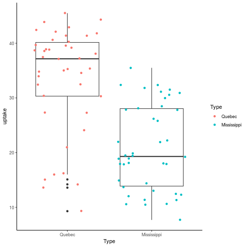
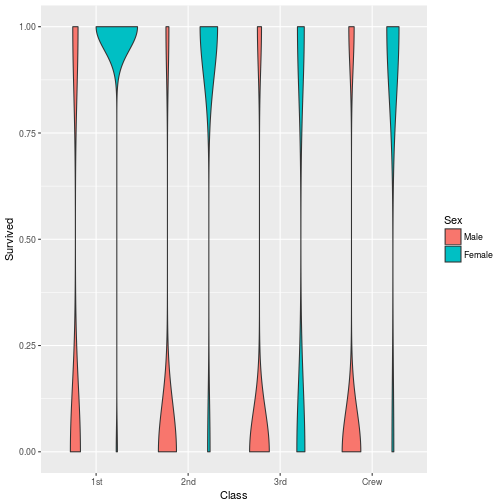
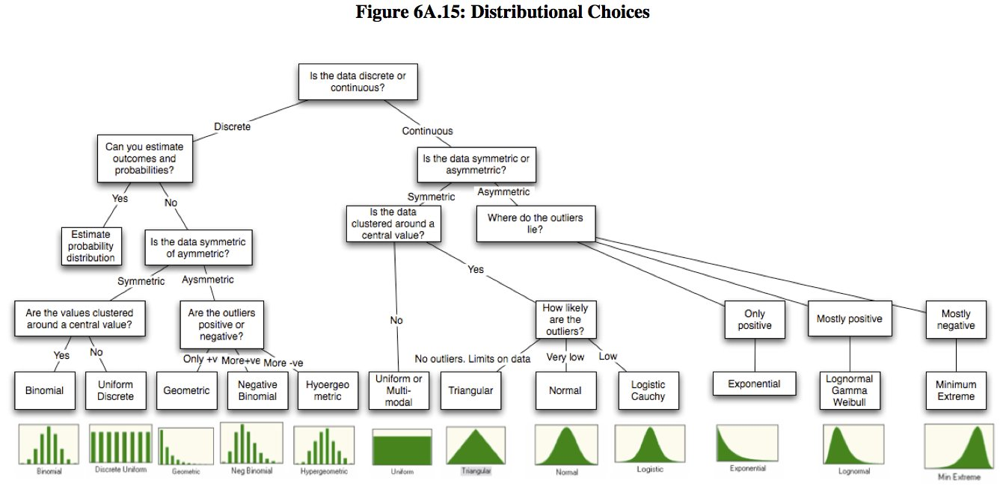
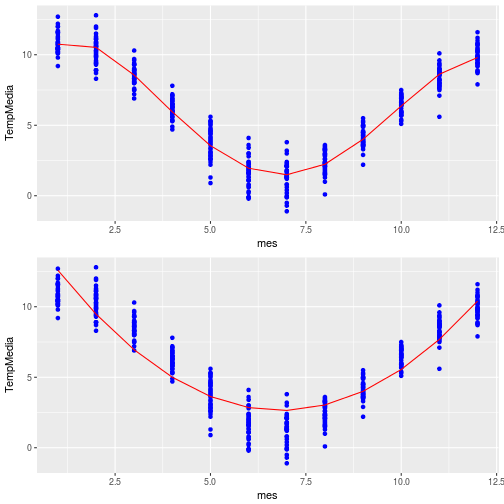
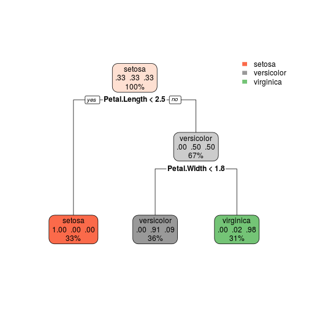
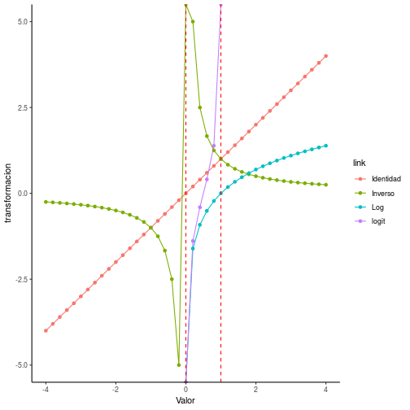

<style>
.reveal h1, .reveal h2, .reveal h3 {
  word-wrap: normal;
  -moz-hyphens: none;
}
</style>

<style>
.small-code pre code {
  font-size: 1em;
}
</style>

Clase 5 Modelos
========================================================
author: Derek Corcoran
date: "23/08, 2018"
autosize: true
transition: rotate

<STYLE TYPE="text/css">
<!--
  td{
    font-family: Arial; 
    font-size: 4pt;
    padding:0px;
    cellpadding="0";
    cellspacing="0"
  }
  th {
    font-family: Arial; 
    font-size: 4pt;
    height: 20px;
    font-weight: bold;
    text-align: right;
    background-color: #ccccff;
  }
  table { 
    border-spacing: 0px;
    border-collapse: collapse;
  }
--->
</STYLE>


¿Qué es un modelo?
=================
incremental:true


* Un modelo es una versión simplificada de la realidad que nos permite hacer inferencias o prediccións sobre una población
* Un modelo es un resumen adecuado de la realidad
* Un modelo es una simplificación or aproximación a la realidad y por ende no reflejará toda la realidad (Burnham y Anderson)
* Todos los modelos estan equivocados, algunos son útiles (George Box)

Veamos un ejemplo
================

* ¿Cuánto $CO_2$ captan las plantas?

<table>
 <thead>
  <tr>
   <th style="text-align:left;"> Plant </th>
   <th style="text-align:left;"> Type </th>
   <th style="text-align:left;"> Treatment </th>
   <th style="text-align:right;"> conc </th>
   <th style="text-align:right;"> uptake </th>
  </tr>
 </thead>
<tbody>
  <tr>
   <td style="text-align:left;"> Mn2 </td>
   <td style="text-align:left;"> Mississippi </td>
   <td style="text-align:left;"> nonchilled </td>
   <td style="text-align:right;"> 175 </td>
   <td style="text-align:right;"> 22.0 </td>
  </tr>
  <tr>
   <td style="text-align:left;"> Qc3 </td>
   <td style="text-align:left;"> Quebec </td>
   <td style="text-align:left;"> chilled </td>
   <td style="text-align:right;"> 1000 </td>
   <td style="text-align:right;"> 41.4 </td>
  </tr>
  <tr>
   <td style="text-align:left;"> Qn2 </td>
   <td style="text-align:left;"> Quebec </td>
   <td style="text-align:left;"> nonchilled </td>
   <td style="text-align:right;"> 175 </td>
   <td style="text-align:right;"> 27.3 </td>
  </tr>
  <tr>
   <td style="text-align:left;"> Qn2 </td>
   <td style="text-align:left;"> Quebec </td>
   <td style="text-align:left;"> nonchilled </td>
   <td style="text-align:right;"> 95 </td>
   <td style="text-align:right;"> 13.6 </td>
  </tr>
  <tr>
   <td style="text-align:left;"> Qc3 </td>
   <td style="text-align:left;"> Quebec </td>
   <td style="text-align:left;"> chilled </td>
   <td style="text-align:right;"> 95 </td>
   <td style="text-align:right;"> 15.1 </td>
  </tr>
  <tr>
   <td style="text-align:left;"> Qc1 </td>
   <td style="text-align:left;"> Quebec </td>
   <td style="text-align:left;"> chilled </td>
   <td style="text-align:right;"> 95 </td>
   <td style="text-align:right;"> 14.2 </td>
  </tr>
  <tr>
   <td style="text-align:left;"> Qc2 </td>
   <td style="text-align:left;"> Quebec </td>
   <td style="text-align:left;"> chilled </td>
   <td style="text-align:right;"> 95 </td>
   <td style="text-align:right;"> 9.3 </td>
  </tr>
  <tr>
   <td style="text-align:left;"> Mc2 </td>
   <td style="text-align:left;"> Mississippi </td>
   <td style="text-align:left;"> chilled </td>
   <td style="text-align:right;"> 500 </td>
   <td style="text-align:right;"> 12.5 </td>
  </tr>
  <tr>
   <td style="text-align:left;"> Qc2 </td>
   <td style="text-align:left;"> Quebec </td>
   <td style="text-align:left;"> chilled </td>
   <td style="text-align:right;"> 175 </td>
   <td style="text-align:right;"> 27.3 </td>
  </tr>
  <tr>
   <td style="text-align:left;"> Qn1 </td>
   <td style="text-align:left;"> Quebec </td>
   <td style="text-align:left;"> nonchilled </td>
   <td style="text-align:right;"> 175 </td>
   <td style="text-align:right;"> 30.4 </td>
  </tr>
  <tr>
   <td style="text-align:left;"> Mc2 </td>
   <td style="text-align:left;"> Mississippi </td>
   <td style="text-align:left;"> chilled </td>
   <td style="text-align:right;"> 250 </td>
   <td style="text-align:right;"> 12.3 </td>
  </tr>
  <tr>
   <td style="text-align:left;"> Mn1 </td>
   <td style="text-align:left;"> Mississippi </td>
   <td style="text-align:left;"> nonchilled </td>
   <td style="text-align:right;"> 250 </td>
   <td style="text-align:right;"> 26.2 </td>
  </tr>
  <tr>
   <td style="text-align:left;"> Mc3 </td>
   <td style="text-align:left;"> Mississippi </td>
   <td style="text-align:left;"> chilled </td>
   <td style="text-align:right;"> 1000 </td>
   <td style="text-align:right;"> 19.9 </td>
  </tr>
  <tr>
   <td style="text-align:left;"> Mc3 </td>
   <td style="text-align:left;"> Mississippi </td>
   <td style="text-align:left;"> chilled </td>
   <td style="text-align:right;"> 675 </td>
   <td style="text-align:right;"> 18.9 </td>
  </tr>
  <tr>
   <td style="text-align:left;"> Mc1 </td>
   <td style="text-align:left;"> Mississippi </td>
   <td style="text-align:left;"> chilled </td>
   <td style="text-align:right;"> 1000 </td>
   <td style="text-align:right;"> 21.9 </td>
  </tr>
  <tr>
   <td style="text-align:left;"> Qn3 </td>
   <td style="text-align:left;"> Quebec </td>
   <td style="text-align:left;"> nonchilled </td>
   <td style="text-align:right;"> 675 </td>
   <td style="text-align:right;"> 43.9 </td>
  </tr>
  <tr>
   <td style="text-align:left;"> Mn3 </td>
   <td style="text-align:left;"> Mississippi </td>
   <td style="text-align:left;"> nonchilled </td>
   <td style="text-align:right;"> 350 </td>
   <td style="text-align:right;"> 27.9 </td>
  </tr>
  <tr>
   <td style="text-align:left;"> Mc3 </td>
   <td style="text-align:left;"> Mississippi </td>
   <td style="text-align:left;"> chilled </td>
   <td style="text-align:right;"> 500 </td>
   <td style="text-align:right;"> 17.9 </td>
  </tr>
  <tr>
   <td style="text-align:left;"> Mn2 </td>
   <td style="text-align:left;"> Mississippi </td>
   <td style="text-align:left;"> nonchilled </td>
   <td style="text-align:right;"> 1000 </td>
   <td style="text-align:right;"> 31.5 </td>
  </tr>
  <tr>
   <td style="text-align:left;"> Mn1 </td>
   <td style="text-align:left;"> Mississippi </td>
   <td style="text-align:left;"> nonchilled </td>
   <td style="text-align:right;"> 675 </td>
   <td style="text-align:right;"> 32.4 </td>
  </tr>
</tbody>
</table>

¿Será la subespecie?
================



¿Como lo determinamos?

Formula de un modelo
=====================


```r
alguna_funcion(Y ~ X1 + X2 + ... + Xn, data = data.frame)
```

* **Y:** Variable respuesta (Captación de $CO_2$)
* **`~`:** Explicado por
* **$X_n$:** Variable explicativa n (Subespecie, tratamiento, etc.)
* **data.frame:*** Base de datos (CO2)
* **alguna_funcion:** El modelo a testear (nuestra simplificación de la realidad)

Algunos modelos en R
====================


|Modelos                    |Funcion  |
|:--------------------------|:--------|
|Prueba de t                |t.test() |
|ANOVA                      |aov()    |
|Modelo lineal simple       |lm()     |
|modelo lineal generalizado |glm()    |
|Modelo aditivo             |gam()    |
|Modelo no lineal           |nls()    |
|modelos lineales mixtos    |lmer()   |
|Boosted regression trees   |gbm()    |

¿Cual usamos para estudiar lo de la planta?
==============


```r
Fit1 <- lm(uptake ~ Type, data = CO2)
```

* por este ejercicio usaremos un modelo lineal simple

Usando broom para sacarle mas a tu modelo (glance)
==============

* Para ver datos generales del modelo


|      | r.squared| adj.r.squared|    sigma| statistic| p.value| df|    logLik|      AIC|      BIC| deviance| df.residual|
|:-----|---------:|-------------:|--------:|---------:|-------:|--:|---------:|--------:|--------:|--------:|-----------:|
|value |  0.346713|     0.3387461| 8.794012|   43.5191|       0|  2| -300.8007| 607.6014| 614.8939| 6341.441|          82|

Usando broom para sacarle mas a tu modelo (tidy)
==============

* Para ver parametros del modelo


|term            |  estimate| std.error| statistic| p.value|
|:---------------|---------:|---------:|---------:|-------:|
|(Intercept)     |  33.54286|  1.356945| 24.719384|       0|
|TypeMississippi | -12.65952|  1.919011| -6.596901|       0|


Usando broom para sacarle mas a tu modelo (augment)
==============

* Para ver predicciones y residuales del modelo


| uptake|Type        |  .fitted|  .se.fit|      .resid|      .hat|   .sigma|   .cooksd| .std.resid|
|------:|:-----------|--------:|--------:|-----------:|---------:|--------:|---------:|----------:|
|   16.0|Quebec      | 33.54286| 1.356945| -17.5428571| 0.0238095| 8.625388| 0.0497139| -2.0190449|
|   30.4|Quebec      | 33.54286| 1.356945|  -3.1428571| 0.0238095| 8.841068| 0.0015956| -0.3617181|
|   34.8|Quebec      | 33.54286| 1.356945|   1.2571429| 0.0238095| 8.847000| 0.0002553|  0.1446873|
|   37.2|Quebec      | 33.54286| 1.356945|   3.6571429| 0.0238095| 8.838566| 0.0021605|  0.4209084|
|   35.3|Quebec      | 33.54286| 1.356945|   1.7571429| 0.0238095| 8.845923| 0.0004988|  0.2022333|
|   39.2|Quebec      | 33.54286| 1.356945|   5.6571429| 0.0238095| 8.825228| 0.0051698|  0.6510927|
|   39.7|Quebec      | 33.54286| 1.356945|   6.1571429| 0.0238095| 8.820995| 0.0061240|  0.7086387|
|   13.6|Quebec      | 33.54286| 1.356945| -19.9428571| 0.0238095| 8.559179| 0.0642469| -2.2952661|
|   27.3|Quebec      | 33.54286| 1.356945|  -6.2428571| 0.0238095| 8.820233| 0.0062957| -0.7185038|
|   37.1|Quebec      | 33.54286| 1.356945|   3.5571429| 0.0238095| 8.839082| 0.0020440|  0.4093992|
|   41.8|Quebec      | 33.54286| 1.356945|   8.2571429| 0.0238095| 8.799269| 0.0110138|  0.9503322|
|   40.6|Quebec      | 33.54286| 1.356945|   7.0571429| 0.0238095| 8.812465| 0.0080452|  0.8122217|
|   41.4|Quebec      | 33.54286| 1.356945|   7.8571429| 0.0238095| 8.803900| 0.0099726|  0.9042954|
|   44.3|Quebec      | 33.54286| 1.356945|  10.7571429| 0.0238095| 8.765042| 0.0186927|  1.2380626|
|   16.2|Quebec      | 33.54286| 1.356945| -17.3428571| 0.0238095| 8.630502| 0.0485869| -1.9960265|
|   32.4|Quebec      | 33.54286| 1.356945|  -1.1428571| 0.0238095| 8.847196| 0.0002110| -0.1315339|
|   40.3|Quebec      | 33.54286| 1.356945|   6.7571429| 0.0238095| 8.815439| 0.0073757|  0.7776940|
|   42.1|Quebec      | 33.54286| 1.356945|   8.5571429| 0.0238095| 8.795643| 0.0118286|  0.9848599|
|   42.9|Quebec      | 33.54286| 1.356945|   9.3571429| 0.0238095| 8.785334| 0.0141437|  1.0769336|
|   43.9|Quebec      | 33.54286| 1.356945|  10.3571429| 0.0238095| 8.771133| 0.0173284|  1.1920257|
|   45.5|Quebec      | 33.54286| 1.356945|  11.9571429| 0.0238095| 8.745356| 0.0230958|  1.3761731|
|   14.2|Quebec      | 33.54286| 1.356945| -19.3428571| 0.0238095| 8.576576| 0.0604392| -2.2262108|
|   24.1|Quebec      | 33.54286| 1.356945|  -9.4428571| 0.0238095| 8.784174| 0.0144040| -1.0867986|
|   30.3|Quebec      | 33.54286| 1.356945|  -3.2428571| 0.0238095| 8.840611| 0.0016988| -0.3732274|
|   34.6|Quebec      | 33.54286| 1.356945|   1.0571429| 0.0238095| 8.847331| 0.0001805|  0.1216688|
|   32.5|Quebec      | 33.54286| 1.356945|  -1.0428571| 0.0238095| 8.847352| 0.0001757| -0.1200247|
|   35.4|Quebec      | 33.54286| 1.356945|   1.8571429| 0.0238095| 8.845664| 0.0005571|  0.2137425|
|   38.7|Quebec      | 33.54286| 1.356945|   5.1571429| 0.0238095| 8.829102| 0.0042963|  0.5935466|
|    9.3|Quebec      | 33.54286| 1.356945| -24.2428571| 0.0238095| 8.417641| 0.0949391| -2.7901623|
|   27.3|Quebec      | 33.54286| 1.356945|  -6.2428571| 0.0238095| 8.820233| 0.0062957| -0.7185038|
|   35.0|Quebec      | 33.54286| 1.356945|   1.4571429| 0.0238095| 8.846612| 0.0003430|  0.1677057|
|   38.8|Quebec      | 33.54286| 1.356945|   5.2571429| 0.0238095| 8.828356| 0.0044645|  0.6050558|
|   38.6|Quebec      | 33.54286| 1.356945|   5.0571429| 0.0238095| 8.829833| 0.0041313|  0.5820374|
|   37.5|Quebec      | 33.54286| 1.356945|   3.9571429| 0.0238095| 8.836932| 0.0025295|  0.4554360|
|   42.4|Quebec      | 33.54286| 1.356945|   8.8571429| 0.0238095| 8.791887| 0.0126726|  1.0193875|
|   15.1|Quebec      | 33.54286| 1.356945| -18.4428571| 0.0238095| 8.601612| 0.0549457| -2.1226279|
|   21.0|Quebec      | 33.54286| 1.356945| -12.5428571| 0.0238095| 8.734974| 0.0254138| -1.4435842|
|   38.1|Quebec      | 33.54286| 1.356945|   4.5571429| 0.0238095| 8.833275| 0.0033548|  0.5244913|
|   34.0|Quebec      | 33.54286| 1.356945|   0.4571429| 0.0238095| 8.847980| 0.0000338|  0.0526135|
|   38.9|Quebec      | 33.54286| 1.356945|   5.3571429| 0.0238095| 8.827596| 0.0046360|  0.6165650|
|   39.6|Quebec      | 33.54286| 1.356945|   6.0571429| 0.0238095| 8.821870| 0.0059267|  0.6971295|
|   41.4|Quebec      | 33.54286| 1.356945|   7.8571429| 0.0238095| 8.803900| 0.0099726|  0.9042954|
|   10.6|Mississippi | 20.88333| 1.356945| -10.2833333| 0.0238095| 8.772231| 0.0170823| -1.1835308|
|   19.2|Mississippi | 20.88333| 1.356945|  -1.6833333| 0.0238095| 8.846104| 0.0004577| -0.1937384|
|   26.2|Mississippi | 20.88333| 1.356945|   5.3166667| 0.0238095| 8.827905| 0.0045662|  0.6119065|
|   30.0|Mississippi | 20.88333| 1.356945|   9.1166667| 0.0238095| 8.788531| 0.0134261|  1.0492567|
|   30.9|Mississippi | 20.88333| 1.356945|  10.0166667| 0.0238095| 8.776132| 0.0162078|  1.1528396|
|   32.4|Mississippi | 20.88333| 1.356945|  11.5166667| 0.0238095| 8.752828| 0.0214255|  1.3254778|
|   35.5|Mississippi | 20.88333| 1.356945|  14.6166667| 0.0238095| 8.694104| 0.0345123|  1.6822634|
|   12.0|Mississippi | 20.88333| 1.356945|  -8.8833333| 0.0238095| 8.791552| 0.0127476| -1.0224018|
|   22.0|Mississippi | 20.88333| 1.356945|   1.1166667| 0.0238095| 8.847238| 0.0002014|  0.1285196|
|   30.6|Mississippi | 20.88333| 1.356945|   9.7166667| 0.0238095| 8.780397| 0.0152515|  1.1183119|
|   31.8|Mississippi | 20.88333| 1.356945|  10.9166667| 0.0238095| 8.762547| 0.0192512|  1.2564225|
|   32.4|Mississippi | 20.88333| 1.356945|  11.5166667| 0.0238095| 8.752828| 0.0214255|  1.3254778|
|   31.1|Mississippi | 20.88333| 1.356945|  10.2166667| 0.0238095| 8.773216| 0.0168615|  1.1758580|
|   31.5|Mississippi | 20.88333| 1.356945|  10.6166667| 0.0238095| 8.767208| 0.0182076|  1.2218949|
|   11.3|Mississippi | 20.88333| 1.356945|  -9.5833333| 0.0238095| 8.782250| 0.0148358| -1.1029663|
|   19.4|Mississippi | 20.88333| 1.356945|  -1.4833333| 0.0238095| 8.846557| 0.0003554| -0.1707200|
|   25.8|Mississippi | 20.88333| 1.356945|   4.9166667| 0.0238095| 8.830837| 0.0039050|  0.5658697|
|   27.9|Mississippi | 20.88333| 1.356945|   7.0166667| 0.0238095| 8.812874| 0.0079531|  0.8075632|
|   28.5|Mississippi | 20.88333| 1.356945|   7.6166667| 0.0238095| 8.806572| 0.0093715|  0.8766185|
|   28.1|Mississippi | 20.88333| 1.356945|   7.2166667| 0.0238095| 8.810831| 0.0084130|  0.8305816|
|   27.8|Mississippi | 20.88333| 1.356945|   6.9166667| 0.0238095| 8.813874| 0.0077281|  0.7960540|
|   10.5|Mississippi | 20.88333| 1.356945| -10.3833333| 0.0238095| 8.770741| 0.0174161| -1.1950400|
|   14.9|Mississippi | 20.88333| 1.356945|  -5.9833333| 0.0238095| 8.822508| 0.0057831| -0.6886346|
|   18.1|Mississippi | 20.88333| 1.356945|  -2.7833333| 0.0238095| 8.842591| 0.0012514| -0.3203398|
|   18.9|Mississippi | 20.88333| 1.356945|  -1.9833333| 0.0238095| 8.845318| 0.0006354| -0.2282661|
|   19.5|Mississippi | 20.88333| 1.356945|  -1.3833333| 0.0238095| 8.846762| 0.0003091| -0.1592108|
|   22.2|Mississippi | 20.88333| 1.356945|   1.3166667| 0.0238095| 8.846891| 0.0002800|  0.1515380|
|   21.9|Mississippi | 20.88333| 1.356945|   1.0166667| 0.0238095| 8.847391| 0.0001670|  0.1170103|
|    7.7|Mississippi | 20.88333| 1.356945| -13.1833333| 0.0238095| 8.723037| 0.0280755| -1.5172980|
|   11.4|Mississippi | 20.88333| 1.356945|  -9.4833333| 0.0238095| 8.783623| 0.0145278| -1.0914571|
|   12.3|Mississippi | 20.88333| 1.356945|  -8.5833333| 0.0238095| 8.795321| 0.0119012| -0.9878742|
|   13.0|Mississippi | 20.88333| 1.356945|  -7.8833333| 0.0238095| 8.803604| 0.0100392| -0.9073097|
|   12.5|Mississippi | 20.88333| 1.356945|  -8.3833333| 0.0238095| 8.797760| 0.0113530| -0.9648558|
|   13.7|Mississippi | 20.88333| 1.356945|  -7.1833333| 0.0238095| 8.811176| 0.0083355| -0.8267452|
|   14.4|Mississippi | 20.88333| 1.356945|  -6.4833333| 0.0238095| 8.818039| 0.0067901| -0.7461807|
|   10.6|Mississippi | 20.88333| 1.356945| -10.2833333| 0.0238095| 8.772231| 0.0170823| -1.1835308|
|   18.0|Mississippi | 20.88333| 1.356945|  -2.8833333| 0.0238095| 8.842186| 0.0013430| -0.3318490|
|   17.9|Mississippi | 20.88333| 1.356945|  -2.9833333| 0.0238095| 8.841767| 0.0014377| -0.3433582|
|   17.9|Mississippi | 20.88333| 1.356945|  -2.9833333| 0.0238095| 8.841767| 0.0014377| -0.3433582|
|   17.9|Mississippi | 20.88333| 1.356945|  -2.9833333| 0.0238095| 8.841767| 0.0014377| -0.3433582|
|   18.9|Mississippi | 20.88333| 1.356945|  -1.9833333| 0.0238095| 8.845318| 0.0006354| -0.2282661|
|   19.9|Mississippi | 20.88333| 1.356945|  -0.9833333| 0.0238095| 8.847439| 0.0001562| -0.1131739|

Selección de modelos
=======================
class: small-code
incremental:true

* Basado en criterios de información
* Trabajaremos con AIC
* $K$ número de parámetros
* $\ln{(\hat{L})}$ ajuste, mas positivo mejor, mas negativo es malo

$$AIC = 2 K - 2 \ln{(\hat{L})}$$

Modelos candidatos
=======================
class: small-code
incremental:true




Modelos candidatos
=======================
class: small-code
incremental:true


```r
Fit1 <- lm(uptake ~ Type, data = CO2)
Fit2 <- lm(uptake ~ Treatment, data = CO2)
Fit3 <- lm(uptake ~ conc, data = CO2)
Fit4 <- lm(uptake ~ Type + Treatment + conc, data = CO2)
```

Selección de modelos con broom
=======================
class: small-code
incremental:true


```r
Modelo1 <- glance(Fit1) %>% dplyr::select(r.squared, AIC) %>% mutate(Modelo = "Fit1")
Modelo2 <- glance(Fit2) %>% dplyr::select(r.squared, AIC) %>% mutate(Modelo = "Fit2")
Modelo3 <- glance(Fit3) %>% dplyr::select(r.squared, AIC) %>% mutate(Modelo = "Fit3")
Modelo4 <- glance(Fit3) %>% dplyr::select(r.squared, AIC) %>% mutate(Modelo = "Fit3")

Modelos <- bind_rows(Modelo1, Modelo2, Modelo3, Modelo4) %>% arrange(AIC) %>% mutate(DeltaAIC = AIC-min(AIC))
```

Selección de modelos con broom
=======================
class: small-code
incremental:true


| r.squared|      AIC|Modelo | DeltaAIC|
|---------:|--------:|:------|--------:|
| 0.3467130| 607.6014|Fit1   |  0.00000|
| 0.2353971| 620.8180|Fit3   | 13.21656|
| 0.2353971| 620.8180|Fit3   | 13.21656|
| 0.1017943| 634.3456|Fit2   | 26.74414|

Selección de modelos en una variable (forma)
=======


GLMs
===========

Distribuciones
=========================




Estructura de error
========================================================
incremental:true
* **family =**
* gaussian (variable dependiente continua)
* binomial (variable dependiente 0 o 1)
* poisson (variable dependiente cuentas 1, 2 ,3 ,4 ,5)
* gamma (variable dependiente continua solo positiva)


Modelo lineal generalizado (familia: binomial)
========================================================
class: small-code

<table>
 <thead>
  <tr>
   <th style="text-align:right;"> Survived </th>
   <th style="text-align:right;"> Pclass </th>
   <th style="text-align:left;"> Sex </th>
   <th style="text-align:right;"> Age </th>
   <th style="text-align:right;"> Fare </th>
   <th style="text-align:left;"> Cabin </th>
   <th style="text-align:left;"> Embarked </th>
  </tr>
 </thead>
<tbody>
  <tr>
   <td style="text-align:right;"> 0 </td>
   <td style="text-align:right;"> 3 </td>
   <td style="text-align:left;"> male </td>
   <td style="text-align:right;"> 22 </td>
   <td style="text-align:right;"> 7.2500 </td>
   <td style="text-align:left;"> NA </td>
   <td style="text-align:left;"> S </td>
  </tr>
  <tr>
   <td style="text-align:right;"> 1 </td>
   <td style="text-align:right;"> 3 </td>
   <td style="text-align:left;"> female </td>
   <td style="text-align:right;"> 26 </td>
   <td style="text-align:right;"> 7.9250 </td>
   <td style="text-align:left;"> NA </td>
   <td style="text-align:left;"> S </td>
  </tr>
  <tr>
   <td style="text-align:right;"> 1 </td>
   <td style="text-align:right;"> 1 </td>
   <td style="text-align:left;"> female </td>
   <td style="text-align:right;"> 35 </td>
   <td style="text-align:right;"> 53.1000 </td>
   <td style="text-align:left;"> C123 </td>
   <td style="text-align:left;"> S </td>
  </tr>
  <tr>
   <td style="text-align:right;"> 0 </td>
   <td style="text-align:right;"> 3 </td>
   <td style="text-align:left;"> male </td>
   <td style="text-align:right;"> 35 </td>
   <td style="text-align:right;"> 8.0500 </td>
   <td style="text-align:left;"> NA </td>
   <td style="text-align:left;"> S </td>
  </tr>
  <tr>
   <td style="text-align:right;"> 0 </td>
   <td style="text-align:right;"> 1 </td>
   <td style="text-align:left;"> male </td>
   <td style="text-align:right;"> 54 </td>
   <td style="text-align:right;"> 51.8625 </td>
   <td style="text-align:left;"> E46 </td>
   <td style="text-align:left;"> S </td>
  </tr>
  <tr>
   <td style="text-align:right;"> 0 </td>
   <td style="text-align:right;"> 3 </td>
   <td style="text-align:left;"> male </td>
   <td style="text-align:right;"> 2 </td>
   <td style="text-align:right;"> 21.0750 </td>
   <td style="text-align:left;"> NA </td>
   <td style="text-align:left;"> S </td>
  </tr>
</tbody>
</table>

Modelo lineal generalizado (familia: binomial)
========================================================
class: small-code




Modelo lineal generalizado (familia: binomial)
========================================================


|term        |   estimate| std.error|  statistic|  p.value|
|:-----------|----------:|---------:|----------:|--------:|
|(Intercept) |  0.6165752| 0.0333236|  18.502645| 0.00e+00|
|Fare        |  0.0018864| 0.0004542|   4.152808| 3.73e-05|
|Sexmale     | -0.4829290| 0.0350604| -13.774197| 0.00e+00|


| null.deviance| df.null|    logLik|      AIC|      BIC| deviance| df.residual|
|-------------:|-------:|---------:|--------:|--------:|--------:|-----------:|
|      143.8804|     643| -327.3111| 662.6221| 680.4929| 104.2004|         641|

$R^2$: 0.3737256


Modelo lineal generalizado (familia: binomial)
========================================================
class: small-code


Modelo lineal generalizado (familia: binomial)
========================================================
class: small-code



Modelo lineal generalizado (familia: binomial)
========================================================


|term         |   estimate| std.error|  statistic|   p.value|
|:------------|----------:|---------:|----------:|---------:|
|(Intercept)  |  0.3418628| 0.2187141|  1.5630579| 0.1180390|
|Fare         |  0.0138686| 0.0055200|  2.5124456| 0.0119898|
|Sexmale      | -2.1310117| 0.2700674| -7.8906661| 0.0000000|
|Fare:Sexmale | -0.0040442| 0.0066630| -0.6069597| 0.5438776|


| null.deviance| df.null|   logLik|      AIC|      BIC| deviance| df.residual|
|-------------:|-------:|--------:|--------:|--------:|--------:|-----------:|
|       823.027|     643| -321.812| 651.6239| 669.4947| 643.6239|         640|

$R^2$: 0.3370364

Modelo lineal generalizado (familia: binomial)
========================================================
class: small-code


Función link
=========== 
incremental:true

* Actua sobre $Y$
* family Gaussian, link = identidad
* family Gamma, link = inverso
* family poisson, link  = log
* family binomial, link = logit

$$Logit = log{\frac{p}{1-p}}$$

Función link
=========== 


| Valor| Identidad|    Inverso|        Log|     logit|
|-----:|---------:|----------:|----------:|---------:|
|  -1.0|      -1.0| -1.0000000|        NaN|       NaN|
|  -0.8|      -0.8| -1.2500000|        NaN|       NaN|
|   0.1|       0.1| 10.0000000| -2.3025851| -2.197225|
|   0.2|       0.2|  5.0000000| -1.6094379| -1.386294|
|   0.5|       0.5|  2.0000000| -0.6931472|  0.000000|
|   0.8|       0.8|  1.2500000| -0.2231436|  1.386294|
|   1.0|       1.0|  1.0000000|  0.0000000|       Inf|
|   2.0|       2.0|  0.5000000|  0.6931472|       NaN|
|   2.3|       2.3|  0.4347826|  0.8329091|       NaN|

Función link
=========== 



Ajuste
===========

Pseudo $R^2$

Expandiendo los modelos que puedo usar paquete caret
===========================================
incremental:true

* Paquete [caret](http://topepo.github.io/caret/index.html), 238 tipos de modelos distintos 
* Si quieren aprender mucho más acá hay un [tutorial](https://www.youtube.com/watch?v=7Jbb2ItbTC4&t=3s)
* En lo más básico solo una función *train*
* Curso de de machine learning en R?

función train
===================
class: small-code

* Sirve para cualquier modelo, solo hay que cambiar method

```
# A tibble: 1 x 11
  r.squared adj.r.squared sigma statistic  p.value    df logLik   AIC   BIC
*     <dbl>         <dbl> <dbl>     <dbl>    <dbl> <int>  <dbl> <dbl> <dbl>
1     0.753         0.745  3.05      91.4 1.29e-10     2  -80.0  166.  170.
# ... with 2 more variables: deviance <dbl>, df.residual <int>
```
***

```
# A tibble: 1 x 7
  null.deviance df.null logLik   AIC   BIC deviance df.residual
          <dbl>   <int>  <dbl> <dbl> <dbl>    <dbl>       <int>
1         1126.      31  -80.0  166.  170.     278.          30
```

función train
===================
class: small-code


```
  degree nprune     RMSE  Rsquared      MAE    RMSESD RsquaredSD     MAESD
1      1      2 3.288263 0.7549687 2.737440 0.6336106 0.10187907 0.5921061
2      1      3 3.023776 0.8002691 2.574289 0.4816554 0.07829047 0.4371074
3      1      5 3.077165 0.7930861 2.610816 0.5275867 0.07778704 0.4216421
```

función train (clasificación)
===================
class: small-code


función train (clasificación)
===================
class: small-code


```
    cp  Accuracy     Kappa AccuracySD    KappaSD
1 0.00 0.9434097 0.9143478  0.0345249 0.05234149
2 0.44 0.7850898 0.6862999  0.1622601 0.23204238
3 0.50 0.5257025 0.3137163  0.1614505 0.22289133
```

función train (clasificación)
===================
class: small-code


Para la próxima clase
=====================
incremental:true

* Loops normales y con purrr
* Plantillas de Journals para trabajar desde r (Instalar *rticles*)
* Hay que poder knitear a pdf instalar *tinytex*
