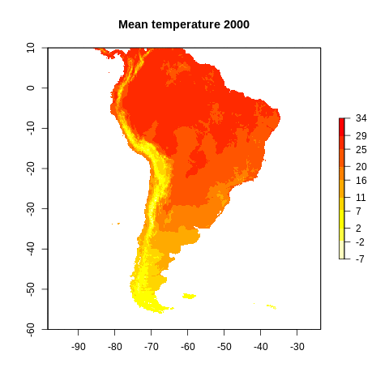

```{r setup, include=FALSE}
knitr::opts_chunk$set(echo = TRUE, warning = FALSE, message = FALSE, tidy = TRUE)
library(tidyverse)
options("kableExtra.html.bsTable" = T)
```

## Empecemos con un ejercicio {.smaller .build}

* Descarguemos la siguiente base de datos:

```{r}
download.file("https://github.com/derek-corcoran-barrios/TH_Data/blob/master/T&H.zip?raw=true", "Botones.zip")
unzip("Botones.zip")
```

```{r, echo = FALSE, message=FALSE, warning=F}
file.remove("Botones.zip")
```


* Tomemos estas bases de datos de temperatura y humedad relativa
* Leeamos la temperatura del sitio H1F102
* Para cada día tomemos las temperaturas promedio, máxima y mínima para cada día
* Agreguemos una columna con el año y una con el mes
* Agreguemos una columna con el nombre del sitio

## Empecemos con un ejercicio (cont) {.smaller .build}

* Leemos los datos

```{r}
library(tidyverse)
library(lubridate)
H1F102Tem <- read_csv("T&H/H1F102Tem.csv")
```

* Tranfromemos la columna `Date/Time` en una de día para poder promediar por día y saquemos variables innecesarias

```{r}
H1F102Tem <- H1F102Tem %>% 
  mutate(DateH = lubridate::dmy_hm(`Date/Time`), Date = date(DateH)) %>% 
  dplyr::select(-`Date/Time`, -Unit, -a)
```


* Agreguemos aparte el mes, el año y el nombre de la estación

```{r}
H1F102Tem <- H1F102Tem %>% 
  mutate(Year = lubridate::year(Date), Month = lubridate::month(Date), Name = "H1F102")
```


## Empecemos con un ejercicio (cont 2) {.smaller .build}

* Agrupamos sacamos el promedio por día 

```{r}
H1F102Tem <- H1F102Tem %>% 
  group_by(Date, Month, Year, Name) %>% 
  summarise_at(.vars = "Value", list(Mean = mean, Min = min, Max = max))
```


```{r, echo=FALSE}
library(kableExtra)
knitr::kable(H1F102Tem)  %>%
  kable_styling(bootstrap_options = c("striped", "hover", "condensed")) %>%
  scroll_box(width = "100%", height = "200px")
```

# ¿Como lo hacemos con todos los archivos de la carpeta T&H ya tenemos una receta

## ¿Qué es un loop?

### Para Cada x has y {.columns-2 .smaller}

<div style="float: left; width: 40%;">
* Creamos la receta
* Copiar y pegar
* for loops
* familia apply
* purrr!!!!!
</div>

<div style="float: right; width: 60%;">

```{r, echo = FALSE, fig.height= 40}
knitr::include_graphics("purrr.jpg")
```

</div>

## map(.x , .f) {.smaller .build}

* para cada elemento de .x, has .f
* .x = puede ser un vector o lista
* .f = usualmente una función
* Siempre entrega una lista

```{r}
library(purrr)
x <- c(1,2,3,4,5,6,7,8,9,10)
map(.x =x, .f = sqrt)
```

## Volvamos a la receta basica {.smaller .build}

```{r, eval=FALSE}
H1F102Tem <- read_csv("T&H/H1F102Tem.csv") %>% 
  mutate(DateH = lubridate::dmy_hm(`Date/Time`), Date = date(DateH)) %>% 
  dplyr::select(-`Date/Time`, -Unit, -a) %>% 
  mutate(Year = lubridate::year(Date), Month = lubridate::month(Date), Name = "H1F102") %>% 
  group_by(Date, Month, Year, Name) %>% 
  summarise_at(.vars = "Value", list(Mean = mean, Min = min, Max = max))
```

* Vamos a la primera parte

```{r, eval=FALSE}
H1F102Tem <- read_csv("T&H/H1F102Tem.csv")
```

* ¿Que queremos?

```{r, eval=FALSE}
Temperaturas <- map(.x = Archivos, .f = read_csv)
```

* Necesitamos un vector o lista *Archivos* que contenga todos los archivos que vamos a leer

## Si solo existiera una función que leyera todos los archivos de una carpeta {.smaller .build}

```{r, echo=FALSE}
knitr::include_graphics("Dexter_thinking.jpg")
```

```{r}
Archivos <- list.files("T&H", full.names = TRUE)
Archivos <- Archivos[str_detect(Archivos, "Tem")]
```

## Empezemos nuestro loop {.smaller .build}

```{r}
Temp <- map(Archivos, read_csv)
```

* Si le agregamos argumentos a una función agregamos un ~ antes de la función y un .x en vez de los datos

```{r}
Temp <- map(Archivos, read_csv) %>% map(~mutate(.x, DateH = lubridate::dmy_hm(`Date/Time`), Date = date(DateH)))
```

* Fijemonos en los 3 primeros archivos

## Corrección


```{r}
Temp <- map(Archivos, read_csv) %>% map(~mutate(.x, DateH = lubridate::dmy_hms(`Date/Time`, truncated = 1), Date = date(DateH)))
```

## Sigamos

* A partir de esto podemos avanzar mucho

```{r}
Temp <- map(Archivos, read_csv) %>% map(~mutate(.x, DateH = lubridate::dmy_hms(`Date/Time`, truncated = 1), Date = date(DateH)))%>% 
  map(~dplyr::select(.x, -`Date/Time`, -Unit, -a)) %>% 
  map(~mutate(.x, Year = lubridate::year(Date), Month = lubridate::month(Date))) %>% 
  map(~group_by(.x, Date, Month, Year)) %>% 
  map(~summarise_at(.x, .vars = "Value", list(Mean = mean, Min = min, Max = max)))
```


## Para finalizar el ejercicio {.smaller .build}

* Tenemos una lista con 114 data frames
* Falta el nombre
* Necesitamos guardarlo en uno
* funcion *reduce* de purrr

```{r, eval=FALSE}
x <- c(1,2,3,4,5,6,7,8,9,10)
map(.x =x, .f = sqrt)
```

```{r}
x <- c(1,2,3,4,5,6,7,8,9,10)
map(.x =x, .f = sqrt) %>% reduce(c)
```

* Para unir varios data frame *bind_rows*

## Para finalizar el ejercicio {.smaller .build}

```{r, echo = TRUE}
Temp <- map(Archivos, read_csv) %>% map(~mutate(.x, DateH = lubridate::dmy_hms(`Date/Time`, truncated = 1), Date = date(DateH)))%>% 
  map(~dplyr::select(.x, -`Date/Time`, -Unit, -a)) %>% 
  map(~mutate(.x, Year = lubridate::year(Date), Month = lubridate::month(Date))) %>% 
  map(~group_by(.x, Date, Month, Year)) %>% 
  map(~summarise_at(.x, .vars = "Value", list(Mean = mean, Min = min, Max = max))) %>%   reduce(bind_rows)
```

```{r, echo = F}
library(kableExtra)
knitr::kable(Temp)  %>%
  kable_styling(bootstrap_options = c("striped", "hover", "condensed")) %>%
  scroll_box(width = "100%", height = "200px")
```

# Falta el nombre

## Para finalizar el ejercicio (Map2)

```{r}
Nombres <- Archivos %>% str_remove_all("T&H/") %>% str_remove_all(".csv")

Temp <- map(Archivos, read_csv) %>% map(~mutate(.x, DateH = lubridate::dmy_hms(`Date/Time`, truncated = 1), Date = date(DateH)))%>% 
  map(~dplyr::select(.x, -`Date/Time`, -Unit, -a)) %>% 
  map(~mutate(.x, Year = lubridate::year(Date), Month = lubridate::month(Date))) %>% 
  map(~group_by(.x, Date, Month, Year)) %>% 
  map(~summarise_at(.x, .vars = "Value", list(Mean = mean, Min = min, Max = max))) %>%
  map2(.y = Nombres,~mutate(.x, Nombre = .y)) %>% 
  reduce(bind_rows)
```

```{r, echo = F}
library(kableExtra)
knitr::kable(Temp)  %>%
  kable_styling(bootstrap_options = c("striped", "hover", "condensed")) %>%
  scroll_box(width = "100%", height = "200px")
```


## for loops {.smaller .build}

* for(i in 1:n){funcion, remplazando cada elemento por una i}
* Por ejemplo para graficar

```{r}
library(raster)
bio.stack <- readRDS("bio.stack.rds")
plot(bio.stack)
```

## for loops {.smaller .build}

```{r}
brks <- round(seq(floor(cellStats(bio.stack[[1]], stat = "min", na.rm = TRUE)), ceiling(cellStats(bio.stack[[8]], stat = "max", na.rm = TRUE)), length.out = 10), 0)
nb <- length(brks)-1 
colors <- rev(heat.colors(nb))
plot(bio.stack, col = colors, breaks = brks)
```

## for loops {.smaller .build}

<div style="float: left; width: 50%;">

```{r}
plot(bio.stack[[1]], col = colors, breaks = brks)
```

<div style="float: right; width: 50%;">

```{r}
years <- as.character(seq(2000, 2070, by = 10))
plot(bio.stack[[1]], col = colors, breaks = brks, main = paste("Mean temperature", years[1]))
```

## for loops {.smaller .build}


```{r, message=FALSE, results='hide'}
library(animation)
saveGIF(
for(i in 1:8){
  plot(bio.stack[[i]], col = colors, breaks = brks, main = paste("Mean temperature", years[i]))
}
,movie.name = "Mean_temp.gif", img.name = "Rplot", convert = "convert", clean = TRUE)
```

```{r, echo = FALSE}

```


## rticles {.smaller .build} 

<div style="float: left; width: 50%;">

```{r, echo=FALSE}
knitr::include_graphics("Rticles.png")
```

<div style="float: right; width: 50%;">

```{r, echo=FALSE}
knitr::include_graphics("rticles2.png")
```

## rticles {.smaller .build} 

<div style="float: left; width: 50%;">

```{r, echo=FALSE}
knitr::include_graphics("Citation1.png")
```

```{r, echo=FALSE}
knitr::include_graphics("Citation2.png")
```

<div style="float: left; width: 50%;">


```{r, echo=FALSE}
knitr::include_graphics("Citation3.png")
```

## rticles {.smaller .build} 

```{r, echo=FALSE}
knitr::include_graphics("Citation4.png")
```

## rticles {.smaller .build} 

```{r, echo=FALSE}
knitr::include_graphics("Citation5.png")
```

## Bibliofrafía en Rmd {.build} 

```{r, echo=FALSE}
knitr::include_graphics("Citation6.png")
```

para más informacion revisar [acá](http://rmarkdown.rstudio.com/authoring_bibliographies_and_citations.html).

## Bibliofrafía en Rmd {.build} 

* Una presentación en Rmd
* Debe tener
    + chunks
    + inline codes
    + figuras
    + Modelos
    + Martes 29 de Septiembre
