<style>
.reveal h1, .reveal h2, .reveal h3 {
  word-wrap: normal;
  -moz-hyphens: none;
}
</style>

<style>
.small-code pre code {
  font-size: 1em;
}
</style>


Clase6 Loops (purrr) y bibliografía (rticles)
========================================================
author: Derek Corcoran
date: "26/08, 2018"
autosize: true
transition: rotate


Ejercicio
===================
incremental:true
class: small-code

* Leer el archivo IB15Tem.csv de la carpeta T&H
* Este archivo es la temperatura medida cada una hora del sitio de estudio IB15
* Asegurarse que las fechas estén en formato fecha y no texto
* Eliminar columnas innecesarias
* Agregar una columna con el ID del sitio, en este caso IB15


```r
library(readr)
library(lubridate)
library(dplyr)
library(ggplot2)
```


Ejercicio
===================
incremental:true
class: small-code


```r
IB15Tem <- read_csv("~/Documents/CursoR/Clase6/T&H/IB15Tem.csv")
```


```r
IB15Tem <- read_csv("~/Documents/CursoR/Clase6/T&H/IB15Tem.csv") %>% rename(Temperatura = Value, Date.Time = `Date/Time`)
```


```r
IB15Tem <- read_csv("~/Documents/CursoR/Clase6/T&H/IB15Tem.csv") %>% rename(Temperatura = Value, Date.Time = `Date/Time`) %>% select(Date.Time, Temperatura)
```


```r
IB15Tem <- read_csv("~/Documents/CursoR/Clase6/T&H/IB15Tem.csv") %>% rename(Temperatura = Value, Date.Time = `Date/Time`) %>% select(Date.Time, Temperatura) %>% mutate(Date.Time = dmy_hms(Date.Time)) %>% mutate(ID = "IB15")
```

Ejercicio
===================
class: small-code

```r
knitr::kable(IB15Tem)
```


|Date.Time           | Temperatura|ID   |
|:-------------------|-----------:|:----|
|2015-06-30 20:34:01 |          32|IB15 |
|2015-06-30 21:34:01 |          29|IB15 |
|2015-06-30 22:34:01 |          28|IB15 |
|2015-06-30 23:34:01 |          27|IB15 |
|2015-07-01 00:34:01 |          26|IB15 |
|2015-07-01 01:34:01 |          25|IB15 |
|2015-07-01 02:34:01 |          24|IB15 |
|2015-07-01 03:34:01 |          23|IB15 |
|2015-07-01 04:34:01 |          23|IB15 |
|2015-07-01 05:34:01 |          22|IB15 |
|2015-07-01 06:34:01 |          22|IB15 |
|2015-07-01 07:34:01 |          22|IB15 |
|2015-07-01 08:34:01 |          24|IB15 |
|2015-07-01 09:34:01 |          28|IB15 |
|2015-07-01 10:34:01 |          32|IB15 |
|2015-07-01 11:34:01 |          35|IB15 |
|2015-07-01 12:34:01 |          34|IB15 |
|2015-07-01 13:34:01 |          36|IB15 |
|2015-07-01 14:34:01 |          37|IB15 |
|2015-07-01 15:34:01 |          38|IB15 |
|2015-07-01 16:34:01 |          36|IB15 |
|2015-07-01 17:34:01 |          37|IB15 |
|2015-07-01 18:34:01 |          26|IB15 |
|2015-07-01 19:34:01 |          21|IB15 |
|2015-07-01 20:34:01 |          18|IB15 |
|2015-07-01 21:34:01 |          16|IB15 |
|2015-07-01 22:34:01 |          15|IB15 |
|2015-07-01 23:34:01 |          14|IB15 |
|2015-07-02 00:34:01 |          13|IB15 |
|2015-07-02 01:34:01 |          13|IB15 |
|2015-07-02 02:34:01 |          13|IB15 |
|2015-07-02 03:34:01 |          12|IB15 |
|2015-07-02 04:34:01 |          12|IB15 |
|2015-07-02 05:34:01 |          13|IB15 |
|2015-07-02 06:34:01 |          17|IB15 |
|2015-07-02 07:34:01 |          25|IB15 |
|2015-07-02 08:34:01 |          32|IB15 |
|2015-07-02 09:34:01 |          46|IB15 |
|2015-07-02 10:34:01 |          61|IB15 |
|2015-07-02 11:34:01 |          54|IB15 |
|2015-07-02 12:34:01 |          36|IB15 |
|2015-07-02 13:34:01 |          35|IB15 |
|2015-07-02 14:34:01 |          42|IB15 |
|2015-07-02 15:34:01 |          34|IB15 |
|2015-07-02 16:34:01 |          27|IB15 |
|2015-07-02 17:34:01 |          26|IB15 |
|2015-07-02 18:34:01 |          25|IB15 |
|2015-07-02 19:34:01 |          23|IB15 |
|2015-07-02 20:34:01 |          19|IB15 |
|2015-07-02 21:34:01 |          19|IB15 |
|2015-07-02 22:34:01 |          18|IB15 |
|2015-07-02 23:34:01 |          18|IB15 |
|2015-07-03 00:34:01 |          17|IB15 |
|2015-07-03 01:34:01 |          17|IB15 |
|2015-07-03 02:34:01 |          17|IB15 |
|2015-07-03 03:34:01 |          17|IB15 |
|2015-07-03 04:34:01 |          17|IB15 |
|2015-07-03 05:34:01 |          17|IB15 |
|2015-07-03 06:34:01 |          18|IB15 |
|2015-07-03 07:34:01 |          23|IB15 |
|2015-07-03 08:34:01 |          32|IB15 |
|2015-07-03 09:34:01 |          44|IB15 |
|2015-07-03 10:34:01 |          61|IB15 |
|2015-07-03 11:34:01 |          56|IB15 |
|2015-07-03 12:34:01 |          34|IB15 |
|2015-07-03 13:34:01 |          32|IB15 |
|2015-07-03 14:34:01 |          24|IB15 |
|2015-07-03 15:34:01 |          26|IB15 |
|2015-07-03 16:34:01 |          28|IB15 |
|2015-07-03 17:34:01 |          47|IB15 |
|2015-07-03 18:34:01 |          25|IB15 |
|2015-07-03 19:34:01 |          20|IB15 |
|2015-07-03 20:34:01 |          17|IB15 |
|2015-07-03 21:34:01 |          16|IB15 |
|2015-07-03 22:34:01 |          14|IB15 |
|2015-07-03 23:34:01 |          13|IB15 |
|2015-07-04 00:34:01 |          12|IB15 |
|2015-07-04 01:34:01 |          11|IB15 |
|2015-07-04 02:34:01 |          11|IB15 |
|2015-07-04 03:34:01 |          11|IB15 |
|2015-07-04 04:34:01 |          10|IB15 |
|2015-07-04 05:34:01 |          11|IB15 |
|2015-07-04 06:34:01 |          15|IB15 |
|2015-07-04 07:34:01 |          22|IB15 |
|2015-07-04 08:34:01 |          28|IB15 |
|2015-07-04 09:34:01 |          36|IB15 |
|2015-07-04 10:34:01 |          50|IB15 |
|2015-07-04 11:34:01 |          33|IB15 |
|2015-07-04 12:34:01 |          29|IB15 |
|2015-07-04 13:34:01 |          29|IB15 |
|2015-07-04 14:34:01 |          30|IB15 |
|2015-07-04 15:34:01 |          30|IB15 |
|2015-07-04 16:34:01 |          27|IB15 |
|2015-07-04 17:34:01 |          25|IB15 |
|2015-07-04 18:34:01 |          23|IB15 |
|2015-07-04 19:34:01 |          20|IB15 |
|2015-07-04 20:34:01 |          19|IB15 |
|2015-07-04 21:34:01 |          18|IB15 |
|2015-07-04 22:34:01 |          17|IB15 |
|2015-07-04 23:34:01 |          16|IB15 |
|2015-07-05 00:34:01 |          16|IB15 |
|2015-07-05 01:34:01 |          15|IB15 |
|2015-07-05 02:34:01 |          14|IB15 |
|2015-07-05 03:34:01 |          12|IB15 |
|2015-07-05 04:34:01 |          11|IB15 |
|2015-07-05 05:34:01 |          11|IB15 |
|2015-07-05 06:34:01 |          16|IB15 |
|2015-07-05 07:34:01 |          23|IB15 |
|2015-07-05 08:34:01 |          32|IB15 |
|2015-07-05 09:34:01 |          50|IB15 |
|2015-07-05 10:34:01 |          59|IB15 |
|2015-07-05 11:34:01 |          56|IB15 |
|2015-07-05 12:34:01 |          31|IB15 |
|2015-07-05 13:34:01 |          30|IB15 |
|2015-07-05 14:34:01 |          37|IB15 |
|2015-07-05 15:34:01 |          43|IB15 |
|2015-07-05 16:34:01 |          50|IB15 |
|2015-07-05 17:34:01 |          44|IB15 |
|2015-07-05 18:34:01 |          27|IB15 |
|2015-07-05 19:34:01 |          25|IB15 |
|2015-07-05 20:34:01 |          24|IB15 |
|2015-07-05 21:34:01 |          21|IB15 |
|2015-07-05 22:34:01 |          19|IB15 |
|2015-07-05 23:34:01 |          17|IB15 |
|2015-07-06 00:34:01 |          16|IB15 |
|2015-07-06 01:34:01 |          15|IB15 |
|2015-07-06 02:34:01 |          14|IB15 |
|2015-07-06 03:34:01 |          13|IB15 |
|2015-07-06 04:34:01 |          12|IB15 |
|2015-07-06 05:34:01 |          12|IB15 |
|2015-07-06 06:34:01 |          12|IB15 |
|2015-07-06 07:34:01 |          15|IB15 |
|2015-07-06 08:34:01 |          23|IB15 |
|2015-07-06 09:34:01 |          22|IB15 |
|2015-07-06 10:34:01 |          22|IB15 |
|2015-07-06 11:34:01 |          23|IB15 |
|2015-07-06 12:34:01 |          24|IB15 |
|2015-07-06 13:34:01 |          25|IB15 |
|2015-07-06 14:34:01 |          26|IB15 |
|2015-07-06 15:34:01 |          26|IB15 |
|2015-07-06 16:34:01 |          28|IB15 |
|2015-07-06 17:34:01 |          29|IB15 |
|2015-07-06 18:34:01 |          29|IB15 |
|2015-07-06 19:34:01 |          28|IB15 |
|2015-07-06 20:34:01 |          27|IB15 |
|2015-07-06 21:34:01 |          26|IB15 |
|2015-07-06 22:34:01 |          25|IB15 |
|2015-07-06 23:34:01 |          24|IB15 |
|2015-07-07 00:34:01 |          24|IB15 |
|2015-07-07 01:34:01 |          23|IB15 |
|2015-07-07 02:34:01 |          22|IB15 |
|2015-07-07 03:34:01 |          21|IB15 |
|2015-07-07 04:34:01 |          21|IB15 |
|2015-07-07 05:34:01 |          20|IB15 |
|2015-07-07 06:34:01 |          20|IB15 |
|2015-07-07 07:34:01 |          20|IB15 |
|2015-07-07 08:34:01 |          21|IB15 |
|2015-07-07 09:34:01 |          22|IB15 |
|2015-07-07 10:34:01 |          23|IB15 |
|2015-07-07 11:34:01 |          25|IB15 |
|2015-07-07 12:34:01 |          26|IB15 |
|2015-07-07 13:34:01 |          27|IB15 |
|2015-07-07 14:34:01 |          28|IB15 |
|2015-07-07 15:34:01 |          28|IB15 |
|2015-07-07 16:34:01 |          27|IB15 |
|2015-07-07 17:34:01 |          25|IB15 |
|2015-07-07 18:34:01 |          24|IB15 |
|2015-07-07 19:34:01 |          24|IB15 |
|2015-07-07 20:34:01 |          22|IB15 |

Ejercicio
===================
class: small-code


```r
ggplot(IB15Tem, aes(x = Date.Time, y = Temperatura)) + geom_line() + theme_classic()
```

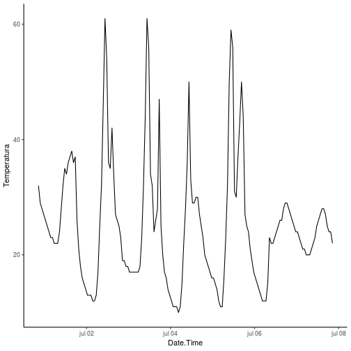


========================================================
# ¿Cómo lo hacemos con todos los archivos de la carpeta H&T?

ya tenemos una receta

¿Qué es un loop?
========================================================
incremental:true

### Para Cada x has y

* Creamos la receta
* Copiar y pegar
* for loops
* familia apply
* purrr!!!!!

***
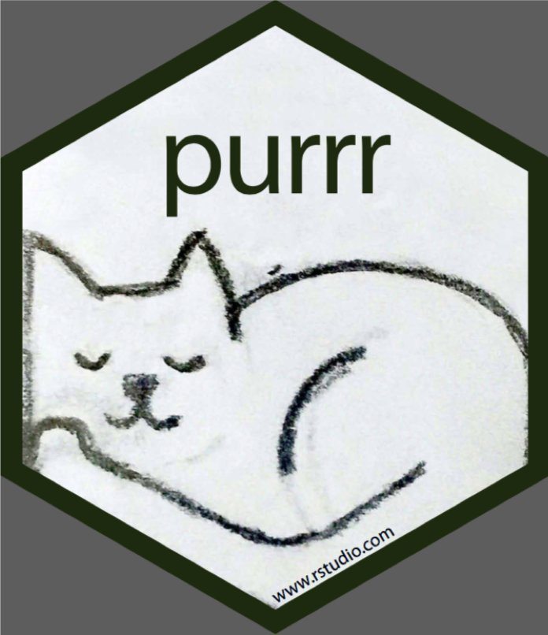

========================================================
class: small-code

# map(.x , .f)

* para cada elemento de .x, has .f
* .x = puede ser un vector o lista
* .f = usualmente una función
* Siempre entrega una lista


```r
library(purrr)
x <- c(1,2,3,4,5,6,7,8,9,10)
map(.x =x, .f = sqrt)
```

```
[[1]]
[1] 1

[[2]]
[1] 1.414214

[[3]]
[1] 1.732051

[[4]]
[1] 2

[[5]]
[1] 2.236068

[[6]]
[1] 2.44949

[[7]]
[1] 2.645751

[[8]]
[1] 2.828427

[[9]]
[1] 3

[[10]]
[1] 3.162278
```

Volvamos a la receta basica
===========
class: small-code
incremental:true

```r
IB15Tem <- read_csv("~/Documents/CursoR/Clase6/T&H/IB15Tem.csv") %>% rename(Temperatura = Value, Date.Time = `Date/Time`) %>% select(Date.Time, Value) %>% mutate(Date.Time = dmy_hms(Date.Time)) %>% mutate(ID = "IB15")
```

* Vamos a la primera parte


```r
IB15Tem <- read_csv("~/Documents/CursoR/Clase6/T&H/IB15Tem.csv")
```

* ¿Que queremos?


```r
Temperaturas <- map(.x = ArchivosTemp, .f = read_csv)
```

* Necesitamos un vector o lista *ArchivosTemp* que contenga todos los archivos que vamos a leer

Si solo existiera una función que leyera todos los archivos de una carpeta
========
class: small-code
incremental:true


```r
setwd("/home/derek/Documents/CursoR/Clase6/T&H")
Archivos <- list.files()
```


```r
ArchivosTemp <- list.files(pattern = "Tem.csv")
```

Empezemos nuestro loop
====
class: small-code
incremental:true


```r
Temperaturas <- map(.x = ArchivosTemp, .f = read_csv)
```

* Si le agregamos argumentos a una función agregamos un ~ antes de la función y un .x en vez de los datos


```r
Temperaturas <- map(.x = ArchivosTemp, .f = read_csv) %>% map(~rename(.x, Temperatura = Value, Date.Time = `Date/Time`))
```

* A partir de esto podemos avanzar mucho


```r
Temperaturas <- ArchivosTemp %>% map(read_csv) %>% map(~rename(.x, Temperatura = Value, Date.Time = `Date/Time`)) %>% map(~mutate(.x, Date.Time = dmy_hms(Date.Time))) %>% map(~select(.x, Date.Time, Temperatura))
```

¿Qué nos falta?
====
class: small-code
incremental:true


```r
IB15Tem <- read_csv("~/Documents/CursoR/Clase6/T&H/IB15Tem.csv") %>% rename(Temperatura = Value, Date.Time = `Date/Time`) %>% select(Date.Time, Value) %>% mutate(Date.Time = dmy_hms(Date.Time)) %>% mutate(ID = "IB15")
```


```r
... %>% mutate(ID = "IB15")
```

* Necesitamos un vector con todos lo ID de los sitios
* *stringr*, paquete adyacente al tidyverso que nos permite trabajar con caracteres
* Donde tenemos los nombres de los sitios?


```r
library(stringr)
setwd("/home/derek/Documents/CursoR/Clase6/T&H")
ArchivosTemp <- list.files(pattern = "Tem.csv")
IDs <- str_replace(ArchivosTemp, "Tem.csv", "")
IDs
```

```
  [1] "H1F102"  "H1F105"  "H1F106"  "H1F107"  "H1F108"  "H1FS3"   "H1FS4"  
  [8] "H1FS5"   "H1FS8"   "H1NF109" "H1NF111" "H1NF112" "H1NF113" "H1NF114"
 [15] "H1NF115" "H1NF116" "H1NF118" "H1NFS11" "H1NFS12" "H1NFS5"  "H1NFS9" 
 [22] "H2F119"  "H2F120"  "H2F121"  "H2F123"  "H2F124"  "H2F126"  "H2FS12" 
 [29] "H2FS2"   "H2FS5"   "H2FS6"   "H2N128"  "H2NF127" "H2NF130" "H2NF132"
 [36] "H2NF133" "H2NF134" "H2NF135" "H2NF137" "H2NF138" "H2NF140" "H2NF141"
 [43] "H2NF142" "H2NF143" "H2NFS4"  "H2NFS5"  "H2NFS6"  "H2NFS8"  "H2NFS9" 
 [50] "H3F144"  "H3F146"  "H3F147"  "H3F148"  "H3F150"  "H3F151"  "H3FS12" 
 [57] "H3FS7"   "H3FS8"   "H3NF152" "H3NF153" "H3NF154" "H3NF155" "H3NF156"
 [64] "H3NF157" "H3NF159" "H3NFS10" "H3NFS1"  "H3NFS3"  "H3NFS4"  "H3NFS9" 
 [71] "H4F160"  "H4F161"  "H4F164"  "H4F165"  "H4F166"  "H4FS11"  "H4FS7"  
 [78] "H4FS8"   "H4FS9"   "H4NF170" "H4NF171" "H4NF172" "H4NF173" "H4NF174"
 [85] "H4NF175" "H4NFS10" "H4NFS1"  "H4NFS4"  "H4NFS5"  "H4NFS9"  "H5F176" 
 [92] "H5F177"  "H5F179"  "H5F182"  "H5FS10"  "H5FS12"  "H5FS3"   "H5FS4"  
 [99] "H5FS7"   "H5NF183" "H5NF184" "H5NF185" "H5NF186" "H5NF187" "H5NF190"
[106] "H5NF192" "H5NFS10" "H5NFS2"  "H5NFS6"  "IB10"    "IB15"    "IB26"   
[113] "IB27"    "OB4"    
```

Ahora necesitamos trabajar con 2 archivos
=====
incremental:true
# map2(.x , .y, .f)

* para cada elemento de .x, has .f
* .x = puede ser un vector, lista o dataframe (para cada columna)
* .y = segundo archivo, puede ser un vector, lista o dataframe 
* .f = usualmente una función
* Siempre entrega una lista

Sigamos con el ejercicio
===========


```r
Temperaturas <- ArchivosTemp %>% map(read_csv) %>% map(~rename(.x, Temperatura = Value, Date.Time = `Date/Time`)) %>% map(~mutate(.x, Date.Time = dmy_hms(Date.Time, truncated = 1))) %>% map(~select(.x, Date.Time, Temperatura)) %>% map2(.y = IDs, ~ mutate(.x, ID = .y))
```

Para finalizar el ejercicio
===========
class: small-code
incremental:true

* Tenemos una lista con 114 data frames
* Necesitamos guardarlo en uno
* funcion *reduce* de purrr


```r
library(purrr)
x <- c(1,2,3,4,5,6,7,8,9,10)
map(.x =x, .f = sqrt)
```


```r
library(purrr)
x <- c(1,2,3,4,5,6,7,8,9,10)
map(.x =x, .f = sqrt) %>% reduce(c)
```

```
 [1] 1.000000 1.414214 1.732051 2.000000 2.236068 2.449490 2.645751
 [8] 2.828427 3.000000 3.162278
```

* Para unir varios data frame *rbind*

Para finalizar el ejercicio
===========
class: small-code


```r
library(readr)
library(lubridate)
library(dplyr)
library(ggplot2)
library(stringr)
library(stringr)
setwd("/home/derek/Documents/CursoR/Clase6/T&H")
ArchivosTemp <- list.files(pattern = "Tem.csv")
IDs <- str_replace(ArchivosTemp, "Tem.csv", "")
Temperaturas <- ArchivosTemp %>% map(read_csv) %>% map(~rename(.x, Temperatura = Value, Date.Time = `Date/Time`)) %>% map(~mutate(.x, Date.Time = dmy_hms(Date.Time, truncated = 1))) %>% map(~select(.x, Date.Time, Temperatura)) %>% map2(.y = IDs, ~ mutate(.x, ID = .y)) %>% reduce(rbind) 

Temperaturas
```

```
# A tibble: 20,223 x 3
   Date.Time           Temperatura ID    
   <dttm>                    <int> <chr> 
 1 2016-07-01 14:55:00          28 H1F102
 2 2016-07-01 15:55:00          24 H1F102
 3 2016-07-01 16:55:00          25 H1F102
 4 2016-07-01 17:55:00          25 H1F102
 5 2016-07-01 18:55:00          25 H1F102
 6 2016-07-01 19:55:00          25 H1F102
 7 2016-07-01 20:55:00          24 H1F102
 8 2016-07-01 21:55:00          24 H1F102
 9 2016-07-01 22:55:00          25 H1F102
10 2016-07-01 23:55:00          25 H1F102
# ... with 20,213 more rows
```

for loops
=========
class: small-code
incremental:true
* for(i in 1:n){funcion, remplazando cada elemento por una i}
* Por ejemplo para graficar

```r
setwd("/home/derek/Documents/CursoR/Clase6")
library(raster)
bio.stack <- readRDS("bio.stack.rds")
plot(bio.stack)
```

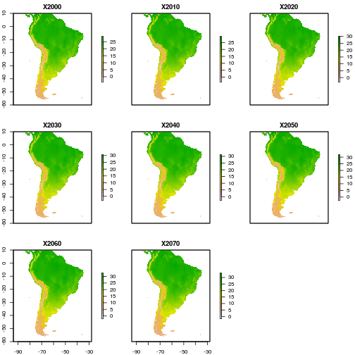

for loops
======
class: small-code

```r
brks <- round(seq(floor(cellStats(bio.stack[[1]], stat = "min", na.rm = TRUE)), ceiling(cellStats(bio.stack[[8]], stat = "max", na.rm = TRUE)), length.out = 10), 0)
nb <- length(brks)-1 
colors <- rev(heat.colors(nb))
plot(bio.stack, col = colors, breaks = brks)
```

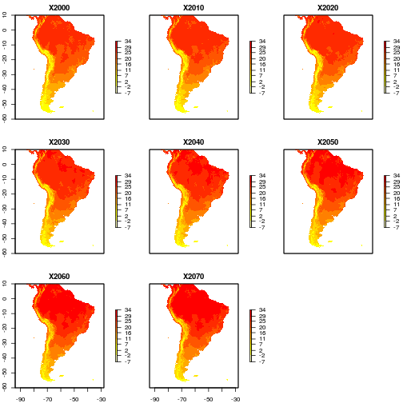

for loops
======
class: small-code

```r
plot(bio.stack[[1]], col = colors, breaks = brks)
```

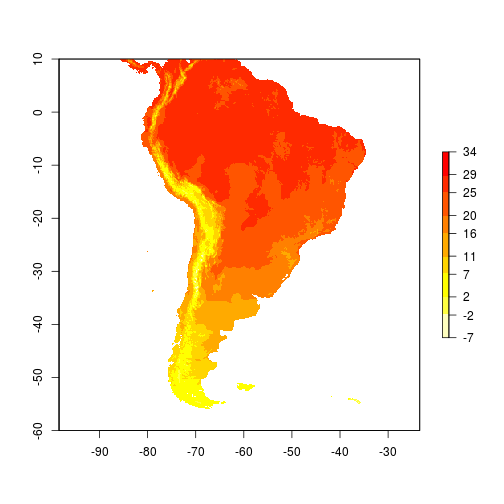
***


```r
years <- as.character(seq(2000, 2070, by = 10))
plot(bio.stack[[1]], col = colors, breaks = brks, main = paste("Mean temperature", years[1]))
```

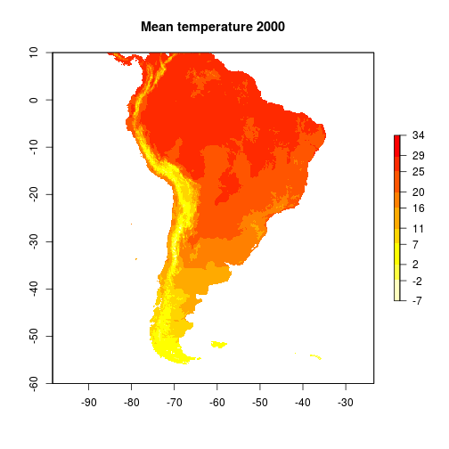

for loops
======
class: small-code

```r
library(animation)
saveGIF(
for(i in 1:8){
  plot(bio.stack[[i]], col = colors, breaks = brks, main = paste("Mean temperature", years[i]))
}
,movie.name = "Mean_temp.gif", img.name = "Rplot", convert = "convert", clean = TRUE)
```

rticles
======

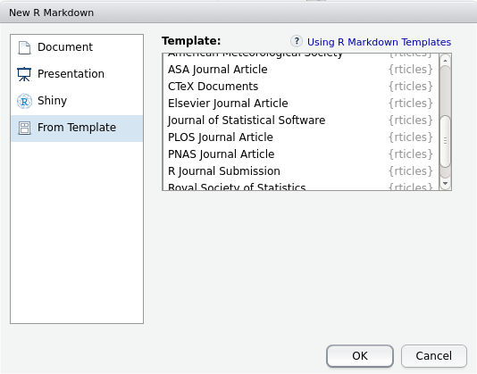

***

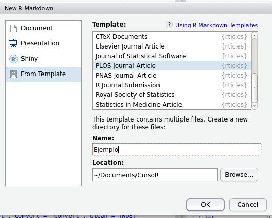

rticles
======

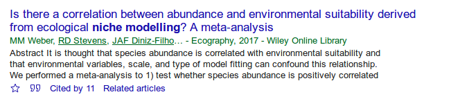

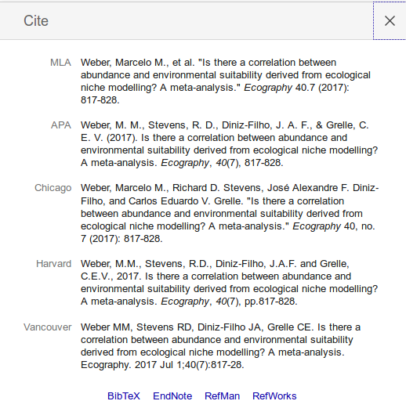
***

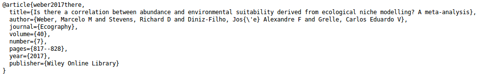

rticles
======

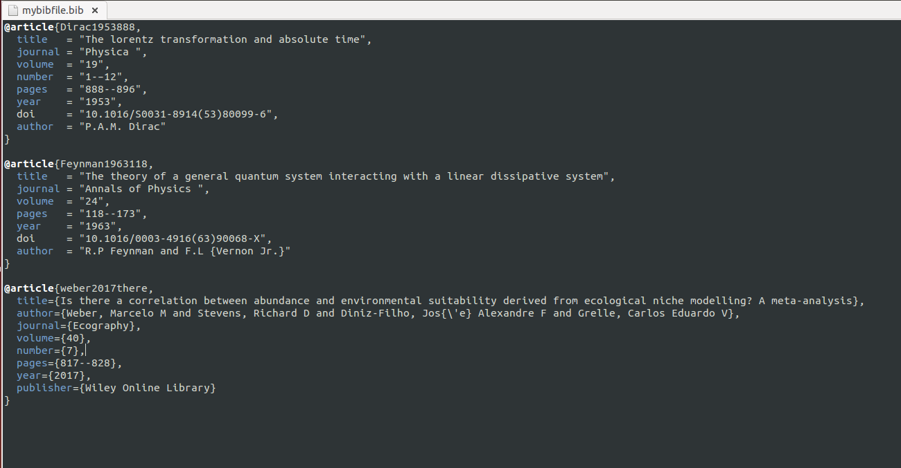

rticles
======

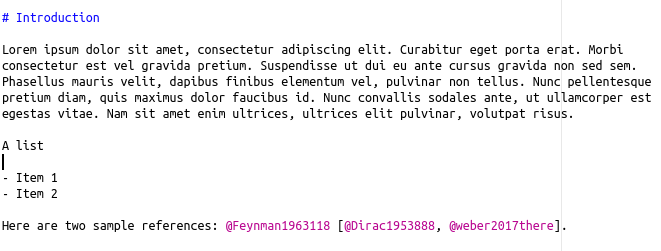

Bibliofrafía en no Rmd
======

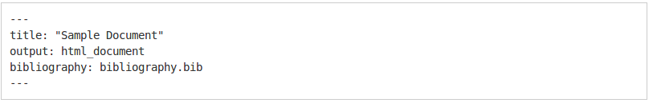

para más informacion revisar [acá](http://rmarkdown.rstudio.com/authoring_bibliographies_and_citations.html).

Bibliofrafía en no Rmd
======
incremental:true

Evaluación 2 (31 de Octubre)

* Transformar Rpubs de html a PDF
* Debe tener
    + Al menos un chunk
    + Al menos un inline code
    + Al menos una tabla con leyenda
    + Al menos una figura con leyenda
    + Al menos una cita y su bibliografía

***

Evaluación Final

* Una presentación en Rpubs
* Máximo 5 minutos
* Debe tener
    + Al menos un chunk
    + Al menos un inline code
    + Al menos una figura
    + Para el martes 31 de Octubre
    + Mínimo 3 diapositivas
    
