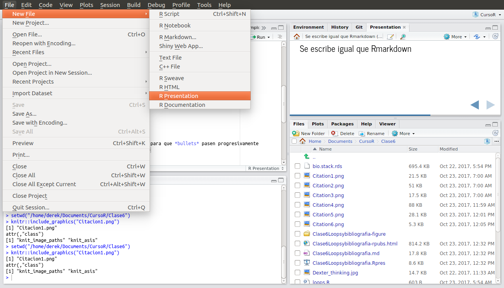
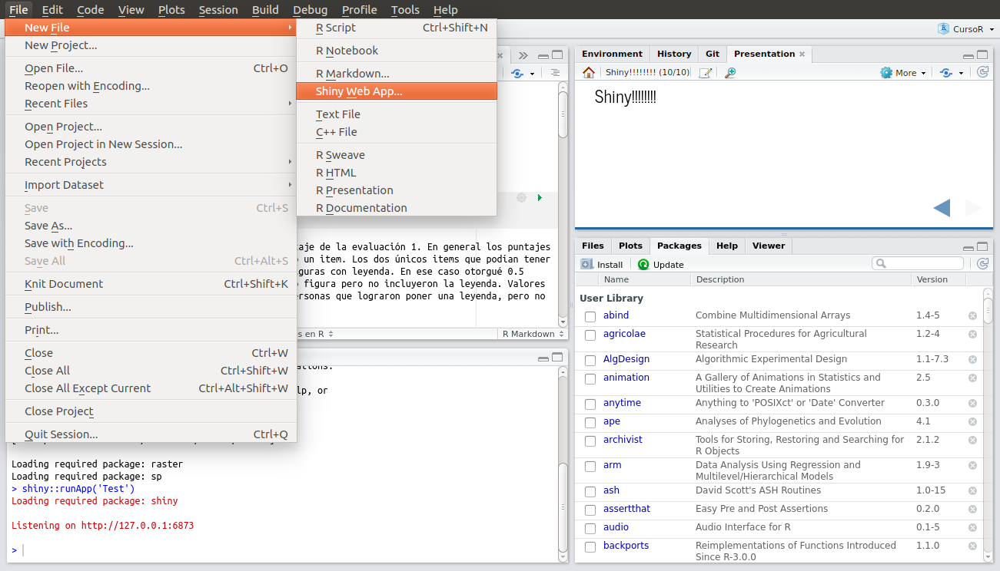
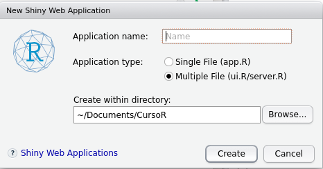
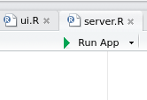
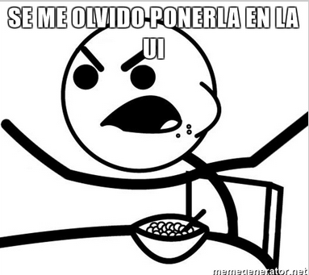

```{r setup, include=FALSE}
knitr::opts_chunk$set(echo = TRUE, warning = FALSE, message = FALSE, tidy = TRUE)
library(tidyverse)
library(kableExtra)
options("kableExtra.html.bsTable" = T)
```

## Tipos de presentaciones en R

- [Ioslides](https://bookdown.org/yihui/rmarkdown/ioslides-presentation.html)
- [Slidy](https://bookdown.org/yihui/rmarkdown/slidy-presentation.html)
- [Beamer](https://bookdown.org/yihui/rmarkdown/beamer-presentation.html) (PDF)
- [ppt](https://bookdown.org/yihui/rmarkdown/powerpoint-presentation.html)

## Como abrir nueva presentación

```{r, echo =FALSE, fig.align='center'}

```


## Se escribe igual que Rmarkdown

* \## es para pasar de una a otra diapo
* {.smaller} texto mas pequeño
* {.build} empezando de a poco


## Ecuaciones

```{r, eval=FALSE}
$$
  \begin{aligned}
  \dot{x} & = \sigma(y-x) \\
  \end{aligned}
$$  
```

$$
  \begin{aligned}
  \dot{x} & = \sigma(y-x) \\
  \end{aligned}
$$  


* [acá](http://www.statpower.net/Content/310/R%20Stuff/SampleMarkdown.html) pueden ver varios ejemplos de como hacer ecuaciones


# Shiny

## Shiny!!!!!!!!

<div class="columns-2">

```{r, echo=FALSE}

```

```{r, echo=FALSE}

```

* Dos archivos, server y app

</div>

## server, donde se hacen las cosas

* Generamos gráficos, tablas, calculos, modelos, etc.
* Estos outputs se crean en base a inputs que bienen de ui
* la función principal es renderAlgo (renderTable, renderPlot, renderDataTable, etc.)
* El orden no importa

## ui donde se muestran las cosas y 

* Generamos inputs en sliders, cajas de selección, etc.
* Al mover los inputs cambiamos los outputs
* Escribimos tiulos parrafos y seleccionamos estilos
* El orden importa

## Generando nuestro primer server

```{r, eval=FALSE}
library(shiny)
library(ggplot2)
data("mtcars")

shinyServer(function(input, output) {
   
  output$distPlot <- renderPlot({
    ggplot(mtcars, aes(x = mpg, y = wt)) + geom_point()
  })
  
})
```

```{r, echo=FALSE}

```

## 

<div class="columns-2">

```{r, echo=FALSE}
knitr::include_graphics("AgregarTabla.png")
```

```{r, eval=FALSE}
shinyServer(function(input, output) {
   
  output$distPlot <- renderPlot({
    ggplot(mtcars, aes(x = mpg, y = wt)) + geom_point()
  })
  output$Table <- renderTable({
    mtcars
  })
  
})
```

```{r, echo=FALSE}

```

</div>

## 


```{r, echo=FALSE, fig.align='center', dpi=70}

```


```{r, echo=FALSE, fig.align='center', dpi=70}

```


## Arreglemos el UI {.smaller}

```{r, echo=TRUE, eval=FALSE}
library(shiny)

shinyUI(fluidPage(
  
  titlePanel("Old Faithful Geyser Data"),
  
  sidebarLayout(
    sidebarPanel(
       sliderInput("bins",
                   "Number of bins:",
                   min = 1,
                   max = 50,
                   value = 30)
    ),
    mainPanel(
       plotOutput("distPlot")
    )
  )
))

```

## arreglemos la UI {.smaller}

```{r, eval=FALSE}
library(shiny)

shinyUI(fluidPage(
  
  titlePanel("Datos de motor trends de 1974"),
  
  sidebarLayout(
    sidebarPanel(
       sliderInput("bins",
                   "Number of bins:",
                   min = 1,
                   max = 50,
                   value = 30)
    ),
    mainPanel(
       plotOutput("distPlot"),
       tableOutput("Table")
    )
  )
))
```


## Agreguemos un input a la UI {.smaller}

```{r, eval=FALSE}
library(shiny)

shinyUI(fluidPage(
  
  titlePanel("Datos de motor trends de 1974"),
  
  sidebarLayout(
    sidebarPanel(
      selectInput("Variable",
                  "Selecciona la Variable y:",
                  choices = c("cyl", "disp", "hp", "drat", "wt", "qsec", "vs", "am", 
                              "gear", "carb"),
                  selected = "wt")
    ),
    mainPanel(
       plotOutput("distPlot"),
       tableOutput("Table")
    )
  )
))

```

## Ha interactuar con el input!!!!!!

* Vamos a server
* Saquemos la tabla por ahora

```{r, eval=FALSE}
shinyServer(function(input, output) {
  
  output$distPlot <- renderPlot({
    ggplot(mtcars, aes_string(x = input$Variable, y = "mpg")) + geom_point()
  })
  output$Table <- renderTable({
    mtcars
  })
  
})
```

## Generando mas interacción

* UI
```{r, eval=FALSE}
    mainPanel(
       plotOutput("distPlot"),
       selectInput("Modelo", "Selecciona el tipo de modelo:",
                   choices = c("lm", "loess", "gam"), selected = "lm")
    )
```

* Server

```{r, eval=FALSE}
output$distPlot <- renderPlot({
    ggplot(mtcars, aes_string(x = input$Variable, y = "mpg")) + geom_smooth(method = input$Modelo) + geom_point()
  })
```

## Otros tipos de input (slider)

* UI

```{r, eval=FALSE}
    sidebarPanel(
      selectInput("Variable",
                  "Selecciona la Variable x:",
                  choices = c("cyl", "disp", "hp", "drat", "wt", "qsec", "vs", "am", 
                              "gear", "carb"),
                  selected = "wt"),
      sliderInput("YLIM", "Selecciona los límites del eje y:", min = 0, max = 40, 
                  step = 2, value = c(0,20)
                  )
    )
```

* Server

```{r, eval=FALSE}
  output$distPlot <- renderPlot({
    p <- ggplot(mtcars, aes_string(x = input$Variable, y = "mpg")) + geom_smooth(method = input$Modelo) + geom_point()
    p + ylim(input$YLIM)
  })

```

## Otros tipos de input (text)

* UI

```{r, eval=FALSE}
        mainPanel(
       plotOutput("distPlot"),
       textInput("Formula", "Escribe la formula de tu modelo:",
                   value =  "y ~ x + I(x^2)")
    )
```

* Server

```{r, eval=FALSE}
  output$distPlot <- renderPlot({
    p <- ggplot(mtcars, aes_string(x = input$Variable, y = "mpg")) + stat_smooth(method = "lm", formula = input$Formula) + geom_point()
    p + ylim(input$YLIM)
  })

```

## Botón de submit

```{r, eval =FALSE}
    mainPanel(
       plotOutput("distPlot"),
       textInput("Formula", "Escribe la formula de tu modelo:",
                   value =  "y ~ x + I(x^2)"),
       submitButton("Actualizar modelo", icon("refresh"))
    )
```

## Transformemos algunas variables en factores? {.smaller}

* ui

```{r, eval=FALSE}
sliderInput("YLIM", "Selecciona los límites del eje y:", min = 0, max = 40, 
                  step = 2, value = c(0,20)
                  ),
checkboxGroupInput("Factores", "Transformar en factores:",
                   c("cyl", "disp", "hp", "drat", "wt", "qsec", "vs", "am", 
                      "gear", "carb"), selected = "am")
```


* Server

```{r, eval=FALSE}

  output$distPlot <- renderPlot({
    mt <- as.data.frame(map_at(mtcars, factor, .at = input$Factores))
    p <- ggplot(mt, aes_string(x = input$Variable, y = "mpg")) + stat_smooth(method = "lm", formula = input$Formula) + geom_point()
    p + ylim(input$YLIM)
  })

```

## Variables en factores (Para que?)

```{r, eval=FALSE}
  output$distPlot <- renderPlot({
    mt <- as.data.frame(map_at(mtcars, factor, .at = input$Factores))
    p<- ggplot(mt, aes_string(x = input$Variable, y = "mpg")) 
    if (class(mt[,input$Variable]) == "numeric"){
      p <- p + stat_smooth(method = "lm", formula = input$Formula) + geom_point()
    }
    if (class(mt[,input$Variable]) == "factor"){
      p <- p + geom_boxplot()
    }
    p + ylim(input$YLIM)
  })
```

## Relleno según otra variable {.smaller}

* UI

```{r, eval=FALSE}
checkboxGroupInput("Factores", "Transformar en factores:",
                         c("cyl", "disp", "hp", "drat", "wt", "qsec", "vs", "am", 
                           "gear", "carb"), selected = "am"),
      selectInput("Color",
                  "Color segun la variable:",
                  choices = c("cyl", "disp", "hp", "drat", "wt", "qsec", "vs", "am", 
                              "gear", "carb"))
```

* server
```{r, eval=FALSE, tidy = TRUE}
  output$distPlot <- renderPlot({
    mt <- as.data.frame(map_at(mtcars, factor, .at = input$Factores))
    p<- ggplot(mt, aes_string(x = input$Variable, y = "mpg")) 
    if (class(mt[,input$Variable]) == "numeric"){
      p <- p + stat_smooth(method = "lm", formula = input$Formula, aes_string(fill = input$Color)) + geom_point()
    }
    if (class(mt[,input$Variable]) == "factor"){
      p <- p + geom_boxplot(aes_string(fill = input$Color))
    }
    p + ylim(input$YLIM)
  })
```

## Evaluación Final

Evaluación final (Viernes 14 de Septiembre)

* Informe en PDF
* Debe tener 
    + Introducción
    + Métodos
    + Resultados
    + Conclusiones
    + Bibliografía