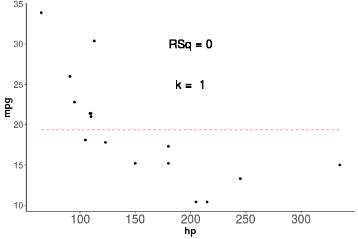

```{r setup, include=FALSE}
knitr::opts_chunk$set(echo = TRUE, warning = FALSE, message = FALSE, cache = TRUE, tidy = TRUE, tidy.opts = list(width.cutoff = 50))
library(tidyverse)
library(broom)
library(caret)
library(kableExtra)
options("kableExtra.html.bsTable" = T)
```

# Modelos explicativos y predictivos

## Modelos estadísticos {.build}

* Modelo no determinista que utiliza una muestra de una población para intentar determinar patrones de esta población. 
    + ANOVA 
    + regresión lineal
    + una regresión no lineal
* Poder explicativo != Poder predictivo
* Poder explivativo ($R^2$)
* Poder Predictivo ($R^2$, en una nueva base de datos)

## Ejemplo

¿Podemos explicar o predecir la eficiencia de combustible (*mpg*) a partir de los caballos de fuerza (*hp*) de un Vehículo?


```{r patron, out.width='60%', fig.asp=.75, fig.align='center', echo=FALSE}
ggplot(mtcars, aes(x = hp, y = mpg)) + geom_point() + theme_classic()
```

## Datos de entrenamiento y de prueba

* Para mostrar poder explicativo vs predictivo
* Datos de entrenamiento (ajustar el modelo y ver poder explicativo)
* Datos de prueba (Ver el poder predictivo)

```{r, echo=TRUE}
set.seed(2018)
index <- sample(1:nrow(mtcars), size = round(nrow(mtcars)/2))

Train <- mtcars[index,]

Test <- mtcars[-index,]
```


$$mpg = \beta_1 hp + \beta_2 hp^2 + c$$

## Entrenamos el modelo {.build}

* Ajustemos un modelo lineal

```{r, echo = TRUE}
Modelo <- lm(mpg ~ hp + I(hp^2), data = Train)
```


## Poder explicativo:

* Veamos el poder explicativo

```{r, echo=TRUE, eval = FALSE}
glance(Modelo)
```

```{r Tab, tidy=TRUE, echo = FALSE}
kable(glance(Modelo) %>% select(r.squared, p.value, df), caption = "R cuadrado, valor de p y grados de libertad del modelo")  %>% kable_styling(bootstrap_options = c("striped", "hover"))
```

* podemos explicar un `r (glance(Modelo) %>% mutate(r.squared = round(r.squared*100, 2)) %>% pull(r.squared))`% de la variación en la eficiencia del vehículo.

## Observemos el modelo gráficamente

```{r, echo=FALSE}
Train$Pred <- predict(Modelo, Train)
```


```{r Pred1, fig.cap= "Los puntos representan las observaciones con las que se entrenó el modelo, la linea roja segmentada representa la predicción del modelo", echo = FALSE}
ggplot(Train, aes(x = hp, y = mpg)) + geom_point() + geom_line(aes(y = Pred), color = "red", lty = 2) + theme_classic()
```

## Poder Predictivo:

* Generemos una predicción en la base de datos de prueba

```{r, echo=TRUE}
Test$Pred <- predict(Modelo, Test)
Test <- Test %>% mutate(resid = mpg - Pred) %>% select(hp, mpg, Pred, resid)
```


```{r, echo = FALSE}
kable(Test, digits = 2)  %>% kable_styling(bootstrap_options = c("striped", "hover")) %>%
  scroll_box(width = "800px", height = "400px")
```

## Poder Predictivo (Calculo)

```{r, echo=TRUE}
library(caret)
postResample(pred = Test$Pred, obs = Test$mpg)
```


## Poder Predictivo (Visual)

```{r PredPowerFig, echo = FALSE}
ggplot(Test, aes(x = hp, y = mpg)) + geom_point() + geom_line(aes(y = Pred), color = "red", lty = 2) + theme_classic()
```

# Sobreajuste

## Que pasa al complejizar el modelo


$$mpg = \beta_1 hp + \beta_2 hp^2 + ... + \beta_12 hp^{12}  c$$


```{r GifExplicativo, fig.cap= "Los puntos representan las observaciones con las que se entrenó el modelo, la linea roja segmentada representa la predicción del modelo", echo = FALSE}

```


## Sobreajuste {.build}


* Al complejizar el modelo el poder explicativo aumenta ($R^2$)
* No hay errores de explicación
* Solo es valido para los datos de entrenamiento (*Train*)

```{r SobreAjuste, echo = FALSE}
knitr::include_graphics("Predictivo.gif")
```

##  ¿Cuando me puede interesar el maximizar el poder predictivo? {.build}


* Texto predictivo del celular
* Auto-corrector
* Efectos de cambio climático
* Detección de caras en redes sociales
* Eficiencia de medidas ante epidemias
* Maximizar metrica en base de prueba (*Test*)
* Machine learning


##  ¿Cuando me puede interesar el maximizar el poder explicativo?


* Pruebas a hipótesis causales
* ¿Que causa el cambio climático?

En general para trabajar bajo esta aproximación debemos seguir los siguientes pasos:

* Generación de hipótesis (plural)
* Generación de modelos para cada hipótesis
* Interpretación de resultados en base a modelos e hipótesis

# Explicación o Predicción? {#Dilema}

## Explicación o Predicción? {.build}

<div class="columns-2">
```{r Dilema, fig.cap=  "Que hacer?", echo = FALSE}
knitr::include_graphics("Dilema.jpg", dpi = 150)
```


```{r, echo = FALSE}
knitr::include_graphics("BothIsGood.gif", dpi = 200)
```

## Criterio de Información de Akaike {.build}


$$AIC = 2k  - \ln(L)$$

* $K$ = Numero de parametros
* $\ln(L)$ = Log likelihood


$$AICc = AIC + \frac{2k^2 + 2k}{n-k-1}$$
* $n$ = número de observaciones


## Calculo AICc


```{r, echo = TRUE}
library(MuMIn)
Modelo <- lm(mpg ~ hp + I(hp^2), data = Train)
AICc(Modelo)
```


## Relación entre AICc y R cuadrado


* $R^2$ Siempre aumenta con $K$
* Cuando la pendiente de $R^2$ vs $K$ se aplana, se minimiza *AICc*

```{r AICRsq, fig.cap=  "Relación entre AICc y R cuadrado", echo= FALSE}
library(MuMIn)
library(tidyverse)

Fit1 <- glm(mpg ~., data = mtcars)
options(na.action = "na.fail")
dd <- dredge(Fit1, extra = "R^2")
dd <- as.data.frame(dd) 
colnames(dd) <- make.names(colnames(dd))
SUMM <- dd %>% group_by(df) %>% summarize(RSq = max(R.2), AICc = min(AICc))

dfAICmin <- filter(SUMM, AICc == min(AICc))$df

SUMM <- SUMM %>% pivot_longer(-df)

ggplot(SUMM, aes(x = df, y = value)) + geom_line() + geom_point() + facet_wrap(~name, scales = "free_y", strip.position = "left") + theme_bw() + ylab("") + geom_vline(xintercept =dfAICmin, col = "red") + xlab("Número de parámetros") + scale_x_continuous(breaks = c(3, 5, 7, 9, 11))
```


# Ejercicio

## Ejercicio

Tomando la base de datos `mtcars` explora la relacion entre AICc, $R^2$ Exploratorio y $R^2$ Predictivo.

Para eso genera un data frame con las siguientes columnas:

* AICc
* K
* $R^2$ Exploratorio
* $R^2$ Predictivo
* Id modelo


## Resolviendo el Ejercicio

* Usaré los mismos *Train* y *Test* usados anteriormente

```{r}
set.seed(2018)
index <- sample(1:nrow(mtcars), size = round(nrow(mtcars)/2))
Train <- mtcars[index,]
Test <- mtcars[-index,]
```

## Resolviendo el Ejercicio para un modelo {.build}

* Generamos el data.frame a ser llenado

```{r}
DF <- tibble(Formula = NA,  Model = NA, K = NA, R_2_Train = NA, R_2_Test = NA, AICc = NA)
```

* Guardamos el modelo como texto para usarlo despues

```{r}
DF$Formula <- "mpg ~ hp + wt"
```

* Ajustamos el modelo con train

```{r}
DF$Model <- list(lm(as.formula(DF$Formula), data = Train))
```

## Resolviendo el Ejercicio para un modelo (cont.) {.build}

* Agregamos los $R_2$ y el AICc

```{r}
DF$K <- 3
DF$R_2_Train <- R2(pred = predict(DF$Model[[1]], Train), obs = Train$mpg)
DF$R_2_Test <- R2(pred = predict(DF$Model[[1]], Test), obs = Test$mpg)
DF$AICc <- AICc(DF$Model[[1]])
DF <- DF %>% select(-Model)
```

```{r tidy=TRUE, echo = FALSE}
kable(DF)  %>% kable_styling(bootstrap_options = c("striped", "hover"))
```

## Resolviendo el Ejercicio para una lista de modelos {.build}

* Generamos el data.frame a ser llenado

```{r}
DF <- tibble(Formula = rep(NA, 3),  Model = rep(NA, 3), K = rep(NA, 3), R_2_Train = rep(NA, 3), R_2_Test = rep(NA, 3), AICc = rep(NA, 3))
```

* Guardamos el modelo como texto para usarlo despues

```{r}
DF$Formula <- c("mpg ~ hp + wt","mpg ~ hp + disp", "mpg ~ wt + disp")
```

* Ajustamos el modelo con train

```{r}
for(i in 1:nrow(DF)){
  DF$Model[i] <- list(lm(as.formula(DF$Formula[i]), data = Train))
}
```

## Resolviendo el Ejercicio para una lista de modelos {.build}

* Agregamos los $R_2$ y el AICc

```{r}
DF$K <- 3
for(i in 1:nrow(DF)){
  DF$R_2_Train[i] <- R2(pred = predict(DF$Model[i][[1]], Train), obs = Train$mpg)
  DF$R_2_Test[i] <- R2(pred = predict(DF$Model[i][[1]], Test), obs = Test$mpg)
  DF$AICc[i] <- AICc(DF$Model[i][[1]])
}
DF <- DF %>% select(-Model)
```

```{r tidy=TRUE, echo = FALSE}
kable(DF)  %>% kable_styling(bootstrap_options = c("striped", "hover"))
```

## Para todos los modelos

```{r}
Data <- list()
for(i in c(1:12)){
  Data[[i]] <- tibble(Formula = purrr::map(as.data.frame(combn(c("cyl", "disp", "hp", "drat", "wt", "qsec", "vs", "am", "gear", "carb", "I(wt^2)", "I(hp^2)"),i)), ~paste(.x, collapse = "+")) %>% reduce(c),
         Model = purrr::map(as.data.frame(combn(c("cyl", "disp", "hp", "drat", "wt", "qsec", "vs", "am", "gear", "carb", "I(wt^2)", "I(hp^2)"),i)), ~paste(.x, collapse = "+")) %>% purrr::map(~paste("mpg ~", .x)) %>% purrr::map(as.formula) %>% purrr::map(~lm(.x, data = Train)),
         K = i + 1
         )
}
Data <- bind_rows(Data)
```

## Cont

```{r}
Data$R_2_Train <- NA
Data$R_2_Test <- NA
Data$AICc <- NA
for(i in 1:nrow(Data)){
  Data$R_2_Train[i] <-  R2(pred = predict(Data$Model[i][[1]], Train),obs =Train$mpg)
  Data$R_2_Test[i] <-  R2(pred = predict(Data$Model[i][[1]], Test),obs =Test$mpg)
  Data$AICc[i] <-  AICc(Data$Model[i][[1]])
}
Data <- Data %>% dplyr::select(-Model) %>% arrange(AICc)
```

```{r, echo = FALSE}
kable(Data, digits = 2)  %>% kable_styling(bootstrap_options = c("striped", "hover"), font_size = 14) %>%
  scroll_box(width = "800px", height = "400px")
```


## Relaciones 

```{r, echo = FALSE}
ggplot(Data, aes(x = R_2_Train, y = R_2_Test)) + geom_point(aes(color = K)) + geom_abline(slope = 1, lty = 2, color = "red") + theme_classic()
```


## Relaciones 2

```{r, echo = FALSE}
Data2 <- Data %>% pivot_longer(cols = starts_with("R_2"), names_to = "Test_train", values_to = "R_2") %>% pivot_longer(cols = c("R_2", "AICc"), names_to = "Measurement") %>% mutate(Test_train = str_remove_all(Test_train,"R_2_"))

ggplot(Data2, aes(x = K,y = value)) + geom_point() + facet_wrap(~Test_train + Measurement, scales = "free") + theme_classic() 

```

