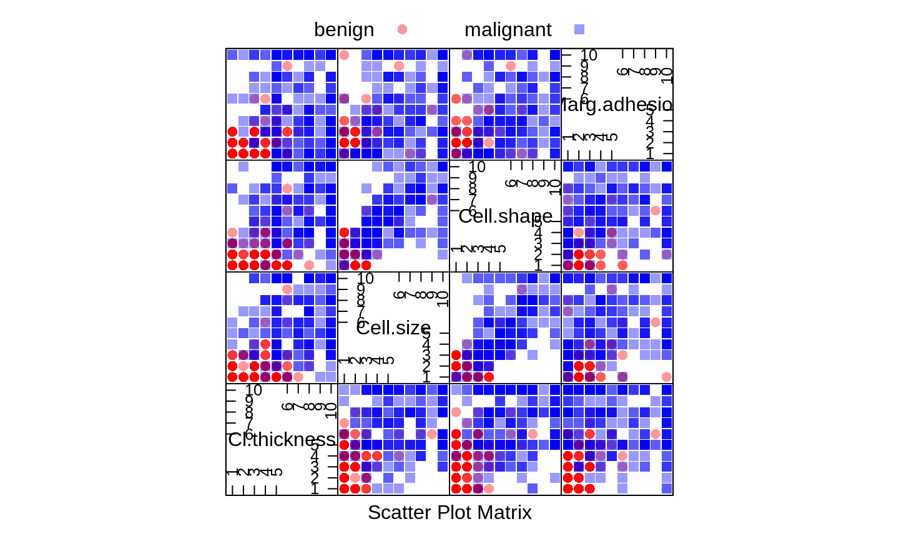
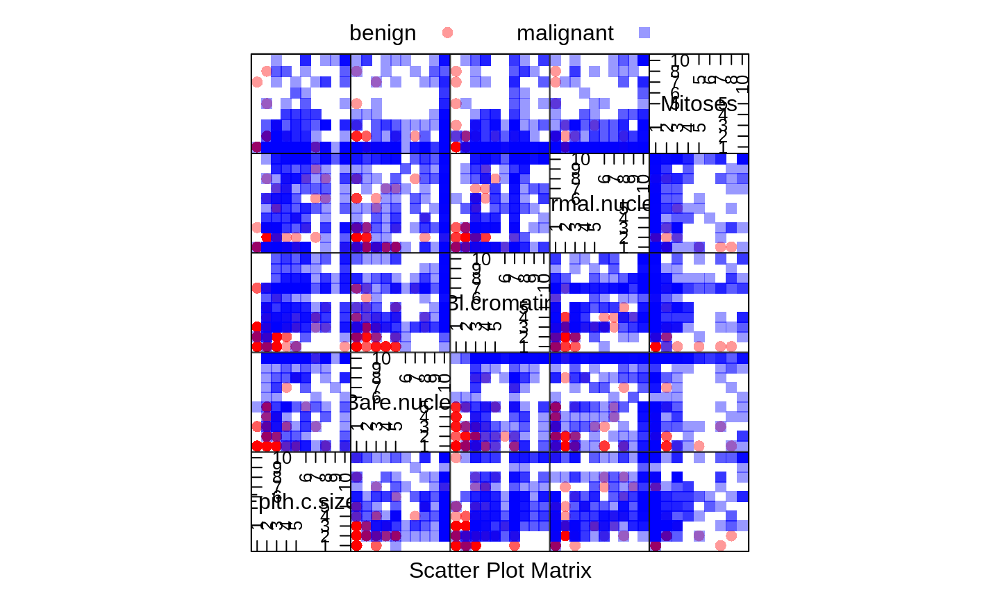
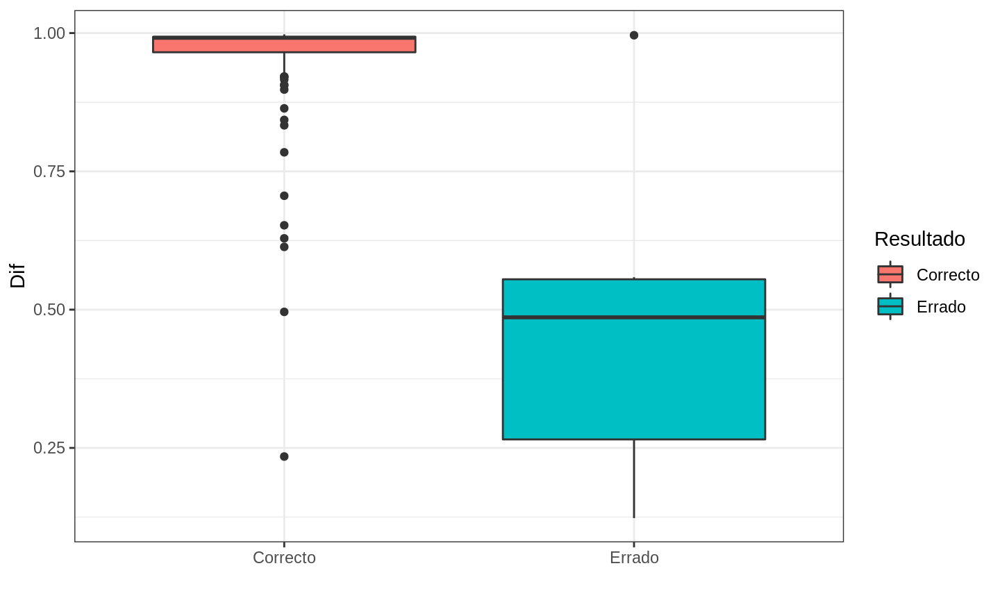
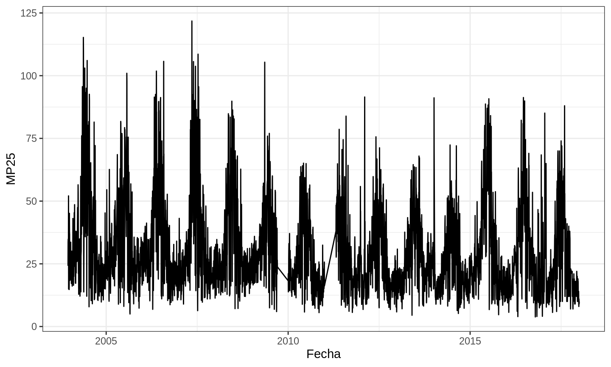
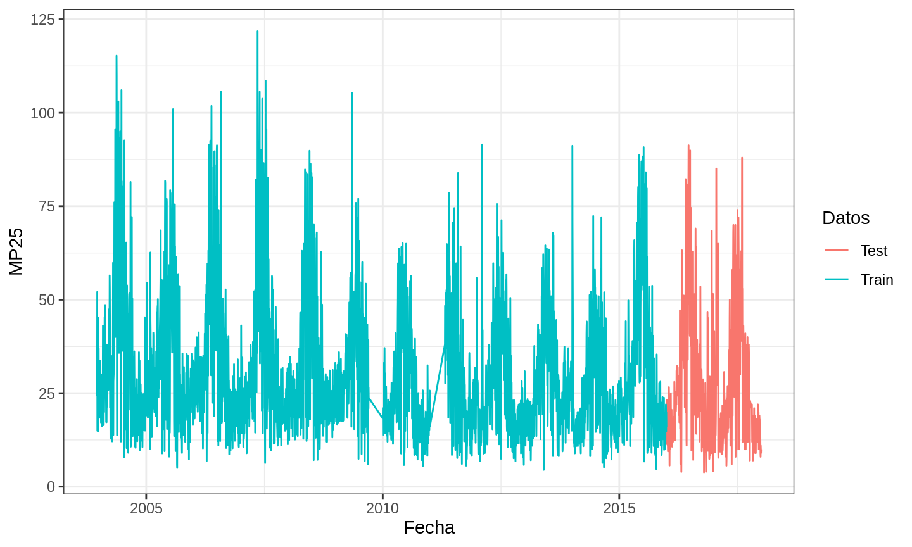
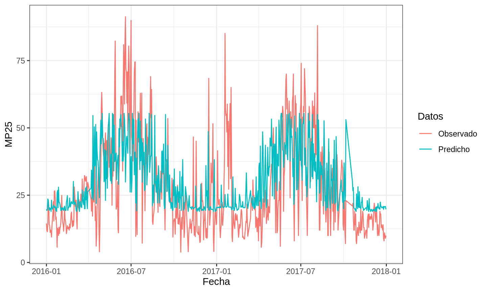

# Mas detalles de crossvalidation

## Crossvalidation

* Finalidad
    + Simular que hay datos nuevos
* k-fold-n-crossvalidation es bueno cuando el estudio no es temporal
* Hay mas opciones a k-fold-n-crossvalidation
* ¿Que pasa con series de tiempo?

## Veamos con algunnos problemas


```r
data("BreastCancer")
transparentTheme(trans = 0.4)
featurePlot(x = BreastCancer[, 2:5], y = BreastCancer$Class, 
    plot = "pairs", auto.key = list(columns = 2))
```



## Mas exploración



## Separación en Entrenamiento y Prueba


```r
set.seed(2020)
Index <- createDataPartition(BreastCancer$Class, list = FALSE, 
    p = 0.8)
Train <- BreastCancer[Index, -1]
Test <- BreastCancer[-Index, -1]
```

* Luego preparo el entrenamiento 10 fold repeated Crossvalidation


```r
fitControl <- trainControl(method = "repeatedcv", number = 10, 
    repeats = 10)
```

## Entrenamos el modelo


```r
gbmFit1 <- train(Class ~ ., data = Train, method = "gbm", trControl = fitControl, 
    verbose = FALSE)
```
* Que error hay?
* Que hacemos?

## Eliminamos los NA si son pocos


```r
BC2 <- BreastCancer[complete.cases(BreastCancer), ]
set.seed(2020)
Index <- createDataPartition(BC2$Class, list = FALSE, p = 0.8)
Train <- BC2[Index, -1]
Test <- BC2[-Index, -1]
gbmFit1 <- train(Class ~ ., data = Train, method = "gbm", trControl = fitControl, 
    verbose = FALSE)
```

* También podemos imputar (no recomendado)

## Que tal funcionó


```r
confusionMatrix(data = predict(gbmFit1, Test), reference = Test$Class)
```

```
## Confusion Matrix and Statistics
## 
##            Reference
## Prediction  benign malignant
##   benign        86         5
##   malignant      2        42
##                                           
##                Accuracy : 0.9481          
##                  95% CI : (0.8961, 0.9789)
##     No Information Rate : 0.6519          
##     P-Value [Acc > NIR] : <2e-16          
##                                           
##                   Kappa : 0.884           
##                                           
##  Mcnemar's Test P-Value : 0.4497          
##                                           
##             Sensitivity : 0.9773          
##             Specificity : 0.8936          
##          Pos Pred Value : 0.9451          
##          Neg Pred Value : 0.9545          
##              Prevalence : 0.6519          
##          Detection Rate : 0.6370          
##    Detection Prevalence : 0.6741          
##       Balanced Accuracy : 0.9354          
##                                           
##        'Positive' Class : benign          
## 
```

## Predicciones


```r
predict(gbmFit1, Test, type = "raw")
predict(gbmFit1, Test, type = "prob")
```


<div style="border: 1px solid #ddd; padding: 0px; overflow-y: scroll; height:400px; overflow-x: scroll; width:100%; "><table class="table table-striped table-hover" style="margin-left: auto; margin-right: auto;">
 <thead>
  <tr>
   <th style="text-align:left;position: sticky; top:0; background-color: #FFFFFF;"> Clase </th>
   <th style="text-align:left;position: sticky; top:0; background-color: #FFFFFF;"> Prediccion </th>
   <th style="text-align:left;position: sticky; top:0; background-color: #FFFFFF;"> correcto </th>
   <th style="text-align:right;position: sticky; top:0; background-color: #FFFFFF;"> benign </th>
   <th style="text-align:right;position: sticky; top:0; background-color: #FFFFFF;"> malignant </th>
   <th style="text-align:right;position: sticky; top:0; background-color: #FFFFFF;"> Dif </th>
  </tr>
 </thead>
<tbody>
  <tr>
   <td style="text-align:left;"> malignant </td>
   <td style="text-align:left;"> malignant </td>
   <td style="text-align:left;"> Correcto </td>
   <td style="text-align:right;"> 0.001 </td>
   <td style="text-align:right;"> 0.999 </td>
   <td style="text-align:right;"> 0.998 </td>
  </tr>
  <tr>
   <td style="text-align:left;"> malignant </td>
   <td style="text-align:left;"> malignant </td>
   <td style="text-align:left;"> Correcto </td>
   <td style="text-align:right;"> 0.002 </td>
   <td style="text-align:right;"> 0.998 </td>
   <td style="text-align:right;"> 0.996 </td>
  </tr>
  <tr>
   <td style="text-align:left;"> malignant </td>
   <td style="text-align:left;"> benign </td>
   <td style="text-align:left;"> Errado </td>
   <td style="text-align:right;"> 0.998 </td>
   <td style="text-align:right;"> 0.002 </td>
   <td style="text-align:right;"> 0.996 </td>
  </tr>
  <tr>
   <td style="text-align:left;"> malignant </td>
   <td style="text-align:left;"> malignant </td>
   <td style="text-align:left;"> Correcto </td>
   <td style="text-align:right;"> 0.002 </td>
   <td style="text-align:right;"> 0.998 </td>
   <td style="text-align:right;"> 0.996 </td>
  </tr>
  <tr>
   <td style="text-align:left;"> malignant </td>
   <td style="text-align:left;"> malignant </td>
   <td style="text-align:left;"> Correcto </td>
   <td style="text-align:right;"> 0.002 </td>
   <td style="text-align:right;"> 0.998 </td>
   <td style="text-align:right;"> 0.996 </td>
  </tr>
  <tr>
   <td style="text-align:left;"> malignant </td>
   <td style="text-align:left;"> malignant </td>
   <td style="text-align:left;"> Correcto </td>
   <td style="text-align:right;"> 0.002 </td>
   <td style="text-align:right;"> 0.998 </td>
   <td style="text-align:right;"> 0.996 </td>
  </tr>
  <tr>
   <td style="text-align:left;"> malignant </td>
   <td style="text-align:left;"> malignant </td>
   <td style="text-align:left;"> Correcto </td>
   <td style="text-align:right;"> 0.002 </td>
   <td style="text-align:right;"> 0.998 </td>
   <td style="text-align:right;"> 0.995 </td>
  </tr>
  <tr>
   <td style="text-align:left;"> malignant </td>
   <td style="text-align:left;"> malignant </td>
   <td style="text-align:left;"> Correcto </td>
   <td style="text-align:right;"> 0.002 </td>
   <td style="text-align:right;"> 0.998 </td>
   <td style="text-align:right;"> 0.995 </td>
  </tr>
  <tr>
   <td style="text-align:left;"> malignant </td>
   <td style="text-align:left;"> malignant </td>
   <td style="text-align:left;"> Correcto </td>
   <td style="text-align:right;"> 0.002 </td>
   <td style="text-align:right;"> 0.998 </td>
   <td style="text-align:right;"> 0.995 </td>
  </tr>
  <tr>
   <td style="text-align:left;"> benign </td>
   <td style="text-align:left;"> benign </td>
   <td style="text-align:left;"> Correcto </td>
   <td style="text-align:right;"> 0.997 </td>
   <td style="text-align:right;"> 0.003 </td>
   <td style="text-align:right;"> 0.995 </td>
  </tr>
  <tr>
   <td style="text-align:left;"> benign </td>
   <td style="text-align:left;"> benign </td>
   <td style="text-align:left;"> Correcto </td>
   <td style="text-align:right;"> 0.997 </td>
   <td style="text-align:right;"> 0.003 </td>
   <td style="text-align:right;"> 0.995 </td>
  </tr>
  <tr>
   <td style="text-align:left;"> malignant </td>
   <td style="text-align:left;"> malignant </td>
   <td style="text-align:left;"> Correcto </td>
   <td style="text-align:right;"> 0.003 </td>
   <td style="text-align:right;"> 0.997 </td>
   <td style="text-align:right;"> 0.995 </td>
  </tr>
  <tr>
   <td style="text-align:left;"> malignant </td>
   <td style="text-align:left;"> malignant </td>
   <td style="text-align:left;"> Correcto </td>
   <td style="text-align:right;"> 0.003 </td>
   <td style="text-align:right;"> 0.997 </td>
   <td style="text-align:right;"> 0.995 </td>
  </tr>
  <tr>
   <td style="text-align:left;"> malignant </td>
   <td style="text-align:left;"> malignant </td>
   <td style="text-align:left;"> Correcto </td>
   <td style="text-align:right;"> 0.003 </td>
   <td style="text-align:right;"> 0.997 </td>
   <td style="text-align:right;"> 0.995 </td>
  </tr>
  <tr>
   <td style="text-align:left;"> malignant </td>
   <td style="text-align:left;"> malignant </td>
   <td style="text-align:left;"> Correcto </td>
   <td style="text-align:right;"> 0.003 </td>
   <td style="text-align:right;"> 0.997 </td>
   <td style="text-align:right;"> 0.994 </td>
  </tr>
  <tr>
   <td style="text-align:left;"> malignant </td>
   <td style="text-align:left;"> malignant </td>
   <td style="text-align:left;"> Correcto </td>
   <td style="text-align:right;"> 0.003 </td>
   <td style="text-align:right;"> 0.997 </td>
   <td style="text-align:right;"> 0.994 </td>
  </tr>
  <tr>
   <td style="text-align:left;"> benign </td>
   <td style="text-align:left;"> benign </td>
   <td style="text-align:left;"> Correcto </td>
   <td style="text-align:right;"> 0.997 </td>
   <td style="text-align:right;"> 0.003 </td>
   <td style="text-align:right;"> 0.994 </td>
  </tr>
  <tr>
   <td style="text-align:left;"> benign </td>
   <td style="text-align:left;"> benign </td>
   <td style="text-align:left;"> Correcto </td>
   <td style="text-align:right;"> 0.997 </td>
   <td style="text-align:right;"> 0.003 </td>
   <td style="text-align:right;"> 0.994 </td>
  </tr>
  <tr>
   <td style="text-align:left;"> benign </td>
   <td style="text-align:left;"> benign </td>
   <td style="text-align:left;"> Correcto </td>
   <td style="text-align:right;"> 0.997 </td>
   <td style="text-align:right;"> 0.003 </td>
   <td style="text-align:right;"> 0.994 </td>
  </tr>
  <tr>
   <td style="text-align:left;"> benign </td>
   <td style="text-align:left;"> benign </td>
   <td style="text-align:left;"> Correcto </td>
   <td style="text-align:right;"> 0.997 </td>
   <td style="text-align:right;"> 0.003 </td>
   <td style="text-align:right;"> 0.994 </td>
  </tr>
  <tr>
   <td style="text-align:left;"> benign </td>
   <td style="text-align:left;"> benign </td>
   <td style="text-align:left;"> Correcto </td>
   <td style="text-align:right;"> 0.997 </td>
   <td style="text-align:right;"> 0.003 </td>
   <td style="text-align:right;"> 0.994 </td>
  </tr>
  <tr>
   <td style="text-align:left;"> benign </td>
   <td style="text-align:left;"> benign </td>
   <td style="text-align:left;"> Correcto </td>
   <td style="text-align:right;"> 0.997 </td>
   <td style="text-align:right;"> 0.003 </td>
   <td style="text-align:right;"> 0.994 </td>
  </tr>
  <tr>
   <td style="text-align:left;"> malignant </td>
   <td style="text-align:left;"> malignant </td>
   <td style="text-align:left;"> Correcto </td>
   <td style="text-align:right;"> 0.003 </td>
   <td style="text-align:right;"> 0.997 </td>
   <td style="text-align:right;"> 0.994 </td>
  </tr>
  <tr>
   <td style="text-align:left;"> malignant </td>
   <td style="text-align:left;"> malignant </td>
   <td style="text-align:left;"> Correcto </td>
   <td style="text-align:right;"> 0.003 </td>
   <td style="text-align:right;"> 0.997 </td>
   <td style="text-align:right;"> 0.994 </td>
  </tr>
  <tr>
   <td style="text-align:left;"> benign </td>
   <td style="text-align:left;"> benign </td>
   <td style="text-align:left;"> Correcto </td>
   <td style="text-align:right;"> 0.997 </td>
   <td style="text-align:right;"> 0.003 </td>
   <td style="text-align:right;"> 0.994 </td>
  </tr>
  <tr>
   <td style="text-align:left;"> benign </td>
   <td style="text-align:left;"> benign </td>
   <td style="text-align:left;"> Correcto </td>
   <td style="text-align:right;"> 0.997 </td>
   <td style="text-align:right;"> 0.003 </td>
   <td style="text-align:right;"> 0.994 </td>
  </tr>
  <tr>
   <td style="text-align:left;"> benign </td>
   <td style="text-align:left;"> benign </td>
   <td style="text-align:left;"> Correcto </td>
   <td style="text-align:right;"> 0.997 </td>
   <td style="text-align:right;"> 0.003 </td>
   <td style="text-align:right;"> 0.994 </td>
  </tr>
  <tr>
   <td style="text-align:left;"> malignant </td>
   <td style="text-align:left;"> malignant </td>
   <td style="text-align:left;"> Correcto </td>
   <td style="text-align:right;"> 0.003 </td>
   <td style="text-align:right;"> 0.997 </td>
   <td style="text-align:right;"> 0.994 </td>
  </tr>
  <tr>
   <td style="text-align:left;"> benign </td>
   <td style="text-align:left;"> benign </td>
   <td style="text-align:left;"> Correcto </td>
   <td style="text-align:right;"> 0.997 </td>
   <td style="text-align:right;"> 0.003 </td>
   <td style="text-align:right;"> 0.993 </td>
  </tr>
  <tr>
   <td style="text-align:left;"> benign </td>
   <td style="text-align:left;"> benign </td>
   <td style="text-align:left;"> Correcto </td>
   <td style="text-align:right;"> 0.997 </td>
   <td style="text-align:right;"> 0.003 </td>
   <td style="text-align:right;"> 0.993 </td>
  </tr>
  <tr>
   <td style="text-align:left;"> benign </td>
   <td style="text-align:left;"> benign </td>
   <td style="text-align:left;"> Correcto </td>
   <td style="text-align:right;"> 0.997 </td>
   <td style="text-align:right;"> 0.003 </td>
   <td style="text-align:right;"> 0.993 </td>
  </tr>
  <tr>
   <td style="text-align:left;"> benign </td>
   <td style="text-align:left;"> benign </td>
   <td style="text-align:left;"> Correcto </td>
   <td style="text-align:right;"> 0.997 </td>
   <td style="text-align:right;"> 0.003 </td>
   <td style="text-align:right;"> 0.993 </td>
  </tr>
  <tr>
   <td style="text-align:left;"> benign </td>
   <td style="text-align:left;"> benign </td>
   <td style="text-align:left;"> Correcto </td>
   <td style="text-align:right;"> 0.997 </td>
   <td style="text-align:right;"> 0.003 </td>
   <td style="text-align:right;"> 0.993 </td>
  </tr>
  <tr>
   <td style="text-align:left;"> benign </td>
   <td style="text-align:left;"> benign </td>
   <td style="text-align:left;"> Correcto </td>
   <td style="text-align:right;"> 0.997 </td>
   <td style="text-align:right;"> 0.003 </td>
   <td style="text-align:right;"> 0.993 </td>
  </tr>
  <tr>
   <td style="text-align:left;"> benign </td>
   <td style="text-align:left;"> benign </td>
   <td style="text-align:left;"> Correcto </td>
   <td style="text-align:right;"> 0.997 </td>
   <td style="text-align:right;"> 0.003 </td>
   <td style="text-align:right;"> 0.993 </td>
  </tr>
  <tr>
   <td style="text-align:left;"> benign </td>
   <td style="text-align:left;"> benign </td>
   <td style="text-align:left;"> Correcto </td>
   <td style="text-align:right;"> 0.997 </td>
   <td style="text-align:right;"> 0.003 </td>
   <td style="text-align:right;"> 0.993 </td>
  </tr>
  <tr>
   <td style="text-align:left;"> benign </td>
   <td style="text-align:left;"> benign </td>
   <td style="text-align:left;"> Correcto </td>
   <td style="text-align:right;"> 0.997 </td>
   <td style="text-align:right;"> 0.003 </td>
   <td style="text-align:right;"> 0.993 </td>
  </tr>
  <tr>
   <td style="text-align:left;"> benign </td>
   <td style="text-align:left;"> benign </td>
   <td style="text-align:left;"> Correcto </td>
   <td style="text-align:right;"> 0.997 </td>
   <td style="text-align:right;"> 0.003 </td>
   <td style="text-align:right;"> 0.993 </td>
  </tr>
  <tr>
   <td style="text-align:left;"> benign </td>
   <td style="text-align:left;"> benign </td>
   <td style="text-align:left;"> Correcto </td>
   <td style="text-align:right;"> 0.997 </td>
   <td style="text-align:right;"> 0.003 </td>
   <td style="text-align:right;"> 0.993 </td>
  </tr>
  <tr>
   <td style="text-align:left;"> benign </td>
   <td style="text-align:left;"> benign </td>
   <td style="text-align:left;"> Correcto </td>
   <td style="text-align:right;"> 0.997 </td>
   <td style="text-align:right;"> 0.003 </td>
   <td style="text-align:right;"> 0.993 </td>
  </tr>
  <tr>
   <td style="text-align:left;"> benign </td>
   <td style="text-align:left;"> benign </td>
   <td style="text-align:left;"> Correcto </td>
   <td style="text-align:right;"> 0.997 </td>
   <td style="text-align:right;"> 0.003 </td>
   <td style="text-align:right;"> 0.993 </td>
  </tr>
  <tr>
   <td style="text-align:left;"> benign </td>
   <td style="text-align:left;"> benign </td>
   <td style="text-align:left;"> Correcto </td>
   <td style="text-align:right;"> 0.997 </td>
   <td style="text-align:right;"> 0.003 </td>
   <td style="text-align:right;"> 0.993 </td>
  </tr>
  <tr>
   <td style="text-align:left;"> benign </td>
   <td style="text-align:left;"> benign </td>
   <td style="text-align:left;"> Correcto </td>
   <td style="text-align:right;"> 0.997 </td>
   <td style="text-align:right;"> 0.003 </td>
   <td style="text-align:right;"> 0.993 </td>
  </tr>
  <tr>
   <td style="text-align:left;"> benign </td>
   <td style="text-align:left;"> benign </td>
   <td style="text-align:left;"> Correcto </td>
   <td style="text-align:right;"> 0.997 </td>
   <td style="text-align:right;"> 0.003 </td>
   <td style="text-align:right;"> 0.993 </td>
  </tr>
  <tr>
   <td style="text-align:left;"> benign </td>
   <td style="text-align:left;"> benign </td>
   <td style="text-align:left;"> Correcto </td>
   <td style="text-align:right;"> 0.997 </td>
   <td style="text-align:right;"> 0.003 </td>
   <td style="text-align:right;"> 0.993 </td>
  </tr>
  <tr>
   <td style="text-align:left;"> benign </td>
   <td style="text-align:left;"> benign </td>
   <td style="text-align:left;"> Correcto </td>
   <td style="text-align:right;"> 0.997 </td>
   <td style="text-align:right;"> 0.003 </td>
   <td style="text-align:right;"> 0.993 </td>
  </tr>
  <tr>
   <td style="text-align:left;"> benign </td>
   <td style="text-align:left;"> benign </td>
   <td style="text-align:left;"> Correcto </td>
   <td style="text-align:right;"> 0.997 </td>
   <td style="text-align:right;"> 0.003 </td>
   <td style="text-align:right;"> 0.993 </td>
  </tr>
  <tr>
   <td style="text-align:left;"> benign </td>
   <td style="text-align:left;"> benign </td>
   <td style="text-align:left;"> Correcto </td>
   <td style="text-align:right;"> 0.997 </td>
   <td style="text-align:right;"> 0.003 </td>
   <td style="text-align:right;"> 0.993 </td>
  </tr>
  <tr>
   <td style="text-align:left;"> benign </td>
   <td style="text-align:left;"> benign </td>
   <td style="text-align:left;"> Correcto </td>
   <td style="text-align:right;"> 0.996 </td>
   <td style="text-align:right;"> 0.004 </td>
   <td style="text-align:right;"> 0.993 </td>
  </tr>
  <tr>
   <td style="text-align:left;"> benign </td>
   <td style="text-align:left;"> benign </td>
   <td style="text-align:left;"> Correcto </td>
   <td style="text-align:right;"> 0.996 </td>
   <td style="text-align:right;"> 0.004 </td>
   <td style="text-align:right;"> 0.993 </td>
  </tr>
  <tr>
   <td style="text-align:left;"> benign </td>
   <td style="text-align:left;"> benign </td>
   <td style="text-align:left;"> Correcto </td>
   <td style="text-align:right;"> 0.996 </td>
   <td style="text-align:right;"> 0.004 </td>
   <td style="text-align:right;"> 0.993 </td>
  </tr>
  <tr>
   <td style="text-align:left;"> benign </td>
   <td style="text-align:left;"> benign </td>
   <td style="text-align:left;"> Correcto </td>
   <td style="text-align:right;"> 0.996 </td>
   <td style="text-align:right;"> 0.004 </td>
   <td style="text-align:right;"> 0.993 </td>
  </tr>
  <tr>
   <td style="text-align:left;"> benign </td>
   <td style="text-align:left;"> benign </td>
   <td style="text-align:left;"> Correcto </td>
   <td style="text-align:right;"> 0.996 </td>
   <td style="text-align:right;"> 0.004 </td>
   <td style="text-align:right;"> 0.992 </td>
  </tr>
  <tr>
   <td style="text-align:left;"> benign </td>
   <td style="text-align:left;"> benign </td>
   <td style="text-align:left;"> Correcto </td>
   <td style="text-align:right;"> 0.996 </td>
   <td style="text-align:right;"> 0.004 </td>
   <td style="text-align:right;"> 0.992 </td>
  </tr>
  <tr>
   <td style="text-align:left;"> benign </td>
   <td style="text-align:left;"> benign </td>
   <td style="text-align:left;"> Correcto </td>
   <td style="text-align:right;"> 0.996 </td>
   <td style="text-align:right;"> 0.004 </td>
   <td style="text-align:right;"> 0.992 </td>
  </tr>
  <tr>
   <td style="text-align:left;"> benign </td>
   <td style="text-align:left;"> benign </td>
   <td style="text-align:left;"> Correcto </td>
   <td style="text-align:right;"> 0.996 </td>
   <td style="text-align:right;"> 0.004 </td>
   <td style="text-align:right;"> 0.992 </td>
  </tr>
  <tr>
   <td style="text-align:left;"> benign </td>
   <td style="text-align:left;"> benign </td>
   <td style="text-align:left;"> Correcto </td>
   <td style="text-align:right;"> 0.996 </td>
   <td style="text-align:right;"> 0.004 </td>
   <td style="text-align:right;"> 0.992 </td>
  </tr>
  <tr>
   <td style="text-align:left;"> benign </td>
   <td style="text-align:left;"> benign </td>
   <td style="text-align:left;"> Correcto </td>
   <td style="text-align:right;"> 0.996 </td>
   <td style="text-align:right;"> 0.004 </td>
   <td style="text-align:right;"> 0.992 </td>
  </tr>
  <tr>
   <td style="text-align:left;"> benign </td>
   <td style="text-align:left;"> benign </td>
   <td style="text-align:left;"> Correcto </td>
   <td style="text-align:right;"> 0.996 </td>
   <td style="text-align:right;"> 0.004 </td>
   <td style="text-align:right;"> 0.992 </td>
  </tr>
  <tr>
   <td style="text-align:left;"> benign </td>
   <td style="text-align:left;"> benign </td>
   <td style="text-align:left;"> Correcto </td>
   <td style="text-align:right;"> 0.996 </td>
   <td style="text-align:right;"> 0.004 </td>
   <td style="text-align:right;"> 0.992 </td>
  </tr>
  <tr>
   <td style="text-align:left;"> benign </td>
   <td style="text-align:left;"> benign </td>
   <td style="text-align:left;"> Correcto </td>
   <td style="text-align:right;"> 0.996 </td>
   <td style="text-align:right;"> 0.004 </td>
   <td style="text-align:right;"> 0.992 </td>
  </tr>
  <tr>
   <td style="text-align:left;"> benign </td>
   <td style="text-align:left;"> benign </td>
   <td style="text-align:left;"> Correcto </td>
   <td style="text-align:right;"> 0.996 </td>
   <td style="text-align:right;"> 0.004 </td>
   <td style="text-align:right;"> 0.992 </td>
  </tr>
  <tr>
   <td style="text-align:left;"> benign </td>
   <td style="text-align:left;"> benign </td>
   <td style="text-align:left;"> Correcto </td>
   <td style="text-align:right;"> 0.996 </td>
   <td style="text-align:right;"> 0.004 </td>
   <td style="text-align:right;"> 0.992 </td>
  </tr>
  <tr>
   <td style="text-align:left;"> benign </td>
   <td style="text-align:left;"> benign </td>
   <td style="text-align:left;"> Correcto </td>
   <td style="text-align:right;"> 0.996 </td>
   <td style="text-align:right;"> 0.004 </td>
   <td style="text-align:right;"> 0.992 </td>
  </tr>
  <tr>
   <td style="text-align:left;"> benign </td>
   <td style="text-align:left;"> benign </td>
   <td style="text-align:left;"> Correcto </td>
   <td style="text-align:right;"> 0.996 </td>
   <td style="text-align:right;"> 0.004 </td>
   <td style="text-align:right;"> 0.992 </td>
  </tr>
  <tr>
   <td style="text-align:left;"> benign </td>
   <td style="text-align:left;"> benign </td>
   <td style="text-align:left;"> Correcto </td>
   <td style="text-align:right;"> 0.996 </td>
   <td style="text-align:right;"> 0.004 </td>
   <td style="text-align:right;"> 0.991 </td>
  </tr>
  <tr>
   <td style="text-align:left;"> benign </td>
   <td style="text-align:left;"> benign </td>
   <td style="text-align:left;"> Correcto </td>
   <td style="text-align:right;"> 0.995 </td>
   <td style="text-align:right;"> 0.005 </td>
   <td style="text-align:right;"> 0.991 </td>
  </tr>
  <tr>
   <td style="text-align:left;"> benign </td>
   <td style="text-align:left;"> benign </td>
   <td style="text-align:left;"> Correcto </td>
   <td style="text-align:right;"> 0.995 </td>
   <td style="text-align:right;"> 0.005 </td>
   <td style="text-align:right;"> 0.991 </td>
  </tr>
  <tr>
   <td style="text-align:left;"> benign </td>
   <td style="text-align:left;"> benign </td>
   <td style="text-align:left;"> Correcto </td>
   <td style="text-align:right;"> 0.995 </td>
   <td style="text-align:right;"> 0.005 </td>
   <td style="text-align:right;"> 0.991 </td>
  </tr>
  <tr>
   <td style="text-align:left;"> benign </td>
   <td style="text-align:left;"> benign </td>
   <td style="text-align:left;"> Correcto </td>
   <td style="text-align:right;"> 0.995 </td>
   <td style="text-align:right;"> 0.005 </td>
   <td style="text-align:right;"> 0.991 </td>
  </tr>
  <tr>
   <td style="text-align:left;"> benign </td>
   <td style="text-align:left;"> benign </td>
   <td style="text-align:left;"> Correcto </td>
   <td style="text-align:right;"> 0.995 </td>
   <td style="text-align:right;"> 0.005 </td>
   <td style="text-align:right;"> 0.991 </td>
  </tr>
  <tr>
   <td style="text-align:left;"> benign </td>
   <td style="text-align:left;"> benign </td>
   <td style="text-align:left;"> Correcto </td>
   <td style="text-align:right;"> 0.995 </td>
   <td style="text-align:right;"> 0.005 </td>
   <td style="text-align:right;"> 0.991 </td>
  </tr>
  <tr>
   <td style="text-align:left;"> benign </td>
   <td style="text-align:left;"> benign </td>
   <td style="text-align:left;"> Correcto </td>
   <td style="text-align:right;"> 0.995 </td>
   <td style="text-align:right;"> 0.005 </td>
   <td style="text-align:right;"> 0.991 </td>
  </tr>
  <tr>
   <td style="text-align:left;"> malignant </td>
   <td style="text-align:left;"> malignant </td>
   <td style="text-align:left;"> Correcto </td>
   <td style="text-align:right;"> 0.005 </td>
   <td style="text-align:right;"> 0.995 </td>
   <td style="text-align:right;"> 0.991 </td>
  </tr>
  <tr>
   <td style="text-align:left;"> benign </td>
   <td style="text-align:left;"> benign </td>
   <td style="text-align:left;"> Correcto </td>
   <td style="text-align:right;"> 0.995 </td>
   <td style="text-align:right;"> 0.005 </td>
   <td style="text-align:right;"> 0.990 </td>
  </tr>
  <tr>
   <td style="text-align:left;"> benign </td>
   <td style="text-align:left;"> benign </td>
   <td style="text-align:left;"> Correcto </td>
   <td style="text-align:right;"> 0.995 </td>
   <td style="text-align:right;"> 0.005 </td>
   <td style="text-align:right;"> 0.990 </td>
  </tr>
  <tr>
   <td style="text-align:left;"> benign </td>
   <td style="text-align:left;"> benign </td>
   <td style="text-align:left;"> Correcto </td>
   <td style="text-align:right;"> 0.995 </td>
   <td style="text-align:right;"> 0.005 </td>
   <td style="text-align:right;"> 0.990 </td>
  </tr>
  <tr>
   <td style="text-align:left;"> benign </td>
   <td style="text-align:left;"> benign </td>
   <td style="text-align:left;"> Correcto </td>
   <td style="text-align:right;"> 0.994 </td>
   <td style="text-align:right;"> 0.006 </td>
   <td style="text-align:right;"> 0.988 </td>
  </tr>
  <tr>
   <td style="text-align:left;"> benign </td>
   <td style="text-align:left;"> benign </td>
   <td style="text-align:left;"> Correcto </td>
   <td style="text-align:right;"> 0.994 </td>
   <td style="text-align:right;"> 0.006 </td>
   <td style="text-align:right;"> 0.988 </td>
  </tr>
  <tr>
   <td style="text-align:left;"> malignant </td>
   <td style="text-align:left;"> malignant </td>
   <td style="text-align:left;"> Correcto </td>
   <td style="text-align:right;"> 0.006 </td>
   <td style="text-align:right;"> 0.994 </td>
   <td style="text-align:right;"> 0.988 </td>
  </tr>
  <tr>
   <td style="text-align:left;"> malignant </td>
   <td style="text-align:left;"> malignant </td>
   <td style="text-align:left;"> Correcto </td>
   <td style="text-align:right;"> 0.006 </td>
   <td style="text-align:right;"> 0.994 </td>
   <td style="text-align:right;"> 0.988 </td>
  </tr>
  <tr>
   <td style="text-align:left;"> malignant </td>
   <td style="text-align:left;"> malignant </td>
   <td style="text-align:left;"> Correcto </td>
   <td style="text-align:right;"> 0.007 </td>
   <td style="text-align:right;"> 0.993 </td>
   <td style="text-align:right;"> 0.986 </td>
  </tr>
  <tr>
   <td style="text-align:left;"> malignant </td>
   <td style="text-align:left;"> malignant </td>
   <td style="text-align:left;"> Correcto </td>
   <td style="text-align:right;"> 0.008 </td>
   <td style="text-align:right;"> 0.992 </td>
   <td style="text-align:right;"> 0.984 </td>
  </tr>
  <tr>
   <td style="text-align:left;"> benign </td>
   <td style="text-align:left;"> benign </td>
   <td style="text-align:left;"> Correcto </td>
   <td style="text-align:right;"> 0.991 </td>
   <td style="text-align:right;"> 0.009 </td>
   <td style="text-align:right;"> 0.982 </td>
  </tr>
  <tr>
   <td style="text-align:left;"> benign </td>
   <td style="text-align:left;"> benign </td>
   <td style="text-align:left;"> Correcto </td>
   <td style="text-align:right;"> 0.991 </td>
   <td style="text-align:right;"> 0.009 </td>
   <td style="text-align:right;"> 0.982 </td>
  </tr>
  <tr>
   <td style="text-align:left;"> benign </td>
   <td style="text-align:left;"> benign </td>
   <td style="text-align:left;"> Correcto </td>
   <td style="text-align:right;"> 0.991 </td>
   <td style="text-align:right;"> 0.009 </td>
   <td style="text-align:right;"> 0.982 </td>
  </tr>
  <tr>
   <td style="text-align:left;"> malignant </td>
   <td style="text-align:left;"> malignant </td>
   <td style="text-align:left;"> Correcto </td>
   <td style="text-align:right;"> 0.009 </td>
   <td style="text-align:right;"> 0.991 </td>
   <td style="text-align:right;"> 0.982 </td>
  </tr>
  <tr>
   <td style="text-align:left;"> benign </td>
   <td style="text-align:left;"> benign </td>
   <td style="text-align:left;"> Correcto </td>
   <td style="text-align:right;"> 0.991 </td>
   <td style="text-align:right;"> 0.009 </td>
   <td style="text-align:right;"> 0.982 </td>
  </tr>
  <tr>
   <td style="text-align:left;"> malignant </td>
   <td style="text-align:left;"> malignant </td>
   <td style="text-align:left;"> Correcto </td>
   <td style="text-align:right;"> 0.009 </td>
   <td style="text-align:right;"> 0.991 </td>
   <td style="text-align:right;"> 0.981 </td>
  </tr>
  <tr>
   <td style="text-align:left;"> benign </td>
   <td style="text-align:left;"> benign </td>
   <td style="text-align:left;"> Correcto </td>
   <td style="text-align:right;"> 0.990 </td>
   <td style="text-align:right;"> 0.010 </td>
   <td style="text-align:right;"> 0.981 </td>
  </tr>
  <tr>
   <td style="text-align:left;"> benign </td>
   <td style="text-align:left;"> benign </td>
   <td style="text-align:left;"> Correcto </td>
   <td style="text-align:right;"> 0.990 </td>
   <td style="text-align:right;"> 0.010 </td>
   <td style="text-align:right;"> 0.980 </td>
  </tr>
  <tr>
   <td style="text-align:left;"> malignant </td>
   <td style="text-align:left;"> malignant </td>
   <td style="text-align:left;"> Correcto </td>
   <td style="text-align:right;"> 0.011 </td>
   <td style="text-align:right;"> 0.989 </td>
   <td style="text-align:right;"> 0.978 </td>
  </tr>
  <tr>
   <td style="text-align:left;"> malignant </td>
   <td style="text-align:left;"> malignant </td>
   <td style="text-align:left;"> Correcto </td>
   <td style="text-align:right;"> 0.012 </td>
   <td style="text-align:right;"> 0.988 </td>
   <td style="text-align:right;"> 0.976 </td>
  </tr>
  <tr>
   <td style="text-align:left;"> malignant </td>
   <td style="text-align:left;"> malignant </td>
   <td style="text-align:left;"> Correcto </td>
   <td style="text-align:right;"> 0.012 </td>
   <td style="text-align:right;"> 0.988 </td>
   <td style="text-align:right;"> 0.975 </td>
  </tr>
  <tr>
   <td style="text-align:left;"> malignant </td>
   <td style="text-align:left;"> malignant </td>
   <td style="text-align:left;"> Correcto </td>
   <td style="text-align:right;"> 0.015 </td>
   <td style="text-align:right;"> 0.985 </td>
   <td style="text-align:right;"> 0.971 </td>
  </tr>
  <tr>
   <td style="text-align:left;"> benign </td>
   <td style="text-align:left;"> benign </td>
   <td style="text-align:left;"> Correcto </td>
   <td style="text-align:right;"> 0.983 </td>
   <td style="text-align:right;"> 0.017 </td>
   <td style="text-align:right;"> 0.967 </td>
  </tr>
  <tr>
   <td style="text-align:left;"> benign </td>
   <td style="text-align:left;"> benign </td>
   <td style="text-align:left;"> Correcto </td>
   <td style="text-align:right;"> 0.983 </td>
   <td style="text-align:right;"> 0.017 </td>
   <td style="text-align:right;"> 0.967 </td>
  </tr>
  <tr>
   <td style="text-align:left;"> malignant </td>
   <td style="text-align:left;"> malignant </td>
   <td style="text-align:left;"> Correcto </td>
   <td style="text-align:right;"> 0.019 </td>
   <td style="text-align:right;"> 0.981 </td>
   <td style="text-align:right;"> 0.962 </td>
  </tr>
  <tr>
   <td style="text-align:left;"> benign </td>
   <td style="text-align:left;"> benign </td>
   <td style="text-align:left;"> Correcto </td>
   <td style="text-align:right;"> 0.981 </td>
   <td style="text-align:right;"> 0.019 </td>
   <td style="text-align:right;"> 0.962 </td>
  </tr>
  <tr>
   <td style="text-align:left;"> benign </td>
   <td style="text-align:left;"> benign </td>
   <td style="text-align:left;"> Correcto </td>
   <td style="text-align:right;"> 0.981 </td>
   <td style="text-align:right;"> 0.019 </td>
   <td style="text-align:right;"> 0.962 </td>
  </tr>
  <tr>
   <td style="text-align:left;"> benign </td>
   <td style="text-align:left;"> benign </td>
   <td style="text-align:left;"> Correcto </td>
   <td style="text-align:right;"> 0.981 </td>
   <td style="text-align:right;"> 0.019 </td>
   <td style="text-align:right;"> 0.962 </td>
  </tr>
  <tr>
   <td style="text-align:left;"> malignant </td>
   <td style="text-align:left;"> malignant </td>
   <td style="text-align:left;"> Correcto </td>
   <td style="text-align:right;"> 0.020 </td>
   <td style="text-align:right;"> 0.980 </td>
   <td style="text-align:right;"> 0.960 </td>
  </tr>
  <tr>
   <td style="text-align:left;"> benign </td>
   <td style="text-align:left;"> benign </td>
   <td style="text-align:left;"> Correcto </td>
   <td style="text-align:right;"> 0.977 </td>
   <td style="text-align:right;"> 0.023 </td>
   <td style="text-align:right;"> 0.954 </td>
  </tr>
  <tr>
   <td style="text-align:left;"> benign </td>
   <td style="text-align:left;"> benign </td>
   <td style="text-align:left;"> Correcto </td>
   <td style="text-align:right;"> 0.975 </td>
   <td style="text-align:right;"> 0.025 </td>
   <td style="text-align:right;"> 0.951 </td>
  </tr>
  <tr>
   <td style="text-align:left;"> benign </td>
   <td style="text-align:left;"> benign </td>
   <td style="text-align:left;"> Correcto </td>
   <td style="text-align:right;"> 0.975 </td>
   <td style="text-align:right;"> 0.025 </td>
   <td style="text-align:right;"> 0.951 </td>
  </tr>
  <tr>
   <td style="text-align:left;"> benign </td>
   <td style="text-align:left;"> benign </td>
   <td style="text-align:left;"> Correcto </td>
   <td style="text-align:right;"> 0.975 </td>
   <td style="text-align:right;"> 0.025 </td>
   <td style="text-align:right;"> 0.951 </td>
  </tr>
  <tr>
   <td style="text-align:left;"> malignant </td>
   <td style="text-align:left;"> malignant </td>
   <td style="text-align:left;"> Correcto </td>
   <td style="text-align:right;"> 0.028 </td>
   <td style="text-align:right;"> 0.972 </td>
   <td style="text-align:right;"> 0.944 </td>
  </tr>
  <tr>
   <td style="text-align:left;"> benign </td>
   <td style="text-align:left;"> benign </td>
   <td style="text-align:left;"> Correcto </td>
   <td style="text-align:right;"> 0.970 </td>
   <td style="text-align:right;"> 0.030 </td>
   <td style="text-align:right;"> 0.940 </td>
  </tr>
  <tr>
   <td style="text-align:left;"> malignant </td>
   <td style="text-align:left;"> malignant </td>
   <td style="text-align:left;"> Correcto </td>
   <td style="text-align:right;"> 0.031 </td>
   <td style="text-align:right;"> 0.969 </td>
   <td style="text-align:right;"> 0.937 </td>
  </tr>
  <tr>
   <td style="text-align:left;"> malignant </td>
   <td style="text-align:left;"> malignant </td>
   <td style="text-align:left;"> Correcto </td>
   <td style="text-align:right;"> 0.033 </td>
   <td style="text-align:right;"> 0.967 </td>
   <td style="text-align:right;"> 0.934 </td>
  </tr>
  <tr>
   <td style="text-align:left;"> benign </td>
   <td style="text-align:left;"> benign </td>
   <td style="text-align:left;"> Correcto </td>
   <td style="text-align:right;"> 0.966 </td>
   <td style="text-align:right;"> 0.034 </td>
   <td style="text-align:right;"> 0.931 </td>
  </tr>
  <tr>
   <td style="text-align:left;"> malignant </td>
   <td style="text-align:left;"> malignant </td>
   <td style="text-align:left;"> Correcto </td>
   <td style="text-align:right;"> 0.036 </td>
   <td style="text-align:right;"> 0.964 </td>
   <td style="text-align:right;"> 0.928 </td>
  </tr>
  <tr>
   <td style="text-align:left;"> benign </td>
   <td style="text-align:left;"> benign </td>
   <td style="text-align:left;"> Correcto </td>
   <td style="text-align:right;"> 0.961 </td>
   <td style="text-align:right;"> 0.039 </td>
   <td style="text-align:right;"> 0.921 </td>
  </tr>
  <tr>
   <td style="text-align:left;"> benign </td>
   <td style="text-align:left;"> benign </td>
   <td style="text-align:left;"> Correcto </td>
   <td style="text-align:right;"> 0.961 </td>
   <td style="text-align:right;"> 0.039 </td>
   <td style="text-align:right;"> 0.921 </td>
  </tr>
  <tr>
   <td style="text-align:left;"> malignant </td>
   <td style="text-align:left;"> malignant </td>
   <td style="text-align:left;"> Correcto </td>
   <td style="text-align:right;"> 0.040 </td>
   <td style="text-align:right;"> 0.960 </td>
   <td style="text-align:right;"> 0.920 </td>
  </tr>
  <tr>
   <td style="text-align:left;"> benign </td>
   <td style="text-align:left;"> benign </td>
   <td style="text-align:left;"> Correcto </td>
   <td style="text-align:right;"> 0.958 </td>
   <td style="text-align:right;"> 0.042 </td>
   <td style="text-align:right;"> 0.916 </td>
  </tr>
  <tr>
   <td style="text-align:left;"> malignant </td>
   <td style="text-align:left;"> malignant </td>
   <td style="text-align:left;"> Correcto </td>
   <td style="text-align:right;"> 0.047 </td>
   <td style="text-align:right;"> 0.953 </td>
   <td style="text-align:right;"> 0.906 </td>
  </tr>
  <tr>
   <td style="text-align:left;"> malignant </td>
   <td style="text-align:left;"> malignant </td>
   <td style="text-align:left;"> Correcto </td>
   <td style="text-align:right;"> 0.047 </td>
   <td style="text-align:right;"> 0.953 </td>
   <td style="text-align:right;"> 0.906 </td>
  </tr>
  <tr>
   <td style="text-align:left;"> benign </td>
   <td style="text-align:left;"> benign </td>
   <td style="text-align:left;"> Correcto </td>
   <td style="text-align:right;"> 0.949 </td>
   <td style="text-align:right;"> 0.051 </td>
   <td style="text-align:right;"> 0.898 </td>
  </tr>
  <tr>
   <td style="text-align:left;"> malignant </td>
   <td style="text-align:left;"> malignant </td>
   <td style="text-align:left;"> Correcto </td>
   <td style="text-align:right;"> 0.068 </td>
   <td style="text-align:right;"> 0.932 </td>
   <td style="text-align:right;"> 0.864 </td>
  </tr>
  <tr>
   <td style="text-align:left;"> benign </td>
   <td style="text-align:left;"> benign </td>
   <td style="text-align:left;"> Correcto </td>
   <td style="text-align:right;"> 0.922 </td>
   <td style="text-align:right;"> 0.078 </td>
   <td style="text-align:right;"> 0.843 </td>
  </tr>
  <tr>
   <td style="text-align:left;"> benign </td>
   <td style="text-align:left;"> benign </td>
   <td style="text-align:left;"> Correcto </td>
   <td style="text-align:right;"> 0.917 </td>
   <td style="text-align:right;"> 0.083 </td>
   <td style="text-align:right;"> 0.833 </td>
  </tr>
  <tr>
   <td style="text-align:left;"> malignant </td>
   <td style="text-align:left;"> malignant </td>
   <td style="text-align:left;"> Correcto </td>
   <td style="text-align:right;"> 0.108 </td>
   <td style="text-align:right;"> 0.892 </td>
   <td style="text-align:right;"> 0.784 </td>
  </tr>
  <tr>
   <td style="text-align:left;"> benign </td>
   <td style="text-align:left;"> benign </td>
   <td style="text-align:left;"> Correcto </td>
   <td style="text-align:right;"> 0.853 </td>
   <td style="text-align:right;"> 0.147 </td>
   <td style="text-align:right;"> 0.706 </td>
  </tr>
  <tr>
   <td style="text-align:left;"> benign </td>
   <td style="text-align:left;"> benign </td>
   <td style="text-align:left;"> Correcto </td>
   <td style="text-align:right;"> 0.826 </td>
   <td style="text-align:right;"> 0.174 </td>
   <td style="text-align:right;"> 0.652 </td>
  </tr>
  <tr>
   <td style="text-align:left;"> malignant </td>
   <td style="text-align:left;"> malignant </td>
   <td style="text-align:left;"> Correcto </td>
   <td style="text-align:right;"> 0.186 </td>
   <td style="text-align:right;"> 0.814 </td>
   <td style="text-align:right;"> 0.629 </td>
  </tr>
  <tr>
   <td style="text-align:left;"> malignant </td>
   <td style="text-align:left;"> malignant </td>
   <td style="text-align:left;"> Correcto </td>
   <td style="text-align:right;"> 0.193 </td>
   <td style="text-align:right;"> 0.807 </td>
   <td style="text-align:right;"> 0.613 </td>
  </tr>
  <tr>
   <td style="text-align:left;"> benign </td>
   <td style="text-align:left;"> malignant </td>
   <td style="text-align:left;"> Errado </td>
   <td style="text-align:right;"> 0.221 </td>
   <td style="text-align:right;"> 0.779 </td>
   <td style="text-align:right;"> 0.559 </td>
  </tr>
  <tr>
   <td style="text-align:left;"> malignant </td>
   <td style="text-align:left;"> benign </td>
   <td style="text-align:left;"> Errado </td>
   <td style="text-align:right;"> 0.776 </td>
   <td style="text-align:right;"> 0.224 </td>
   <td style="text-align:right;"> 0.551 </td>
  </tr>
  <tr>
   <td style="text-align:left;"> malignant </td>
   <td style="text-align:left;"> malignant </td>
   <td style="text-align:left;"> Correcto </td>
   <td style="text-align:right;"> 0.252 </td>
   <td style="text-align:right;"> 0.748 </td>
   <td style="text-align:right;"> 0.496 </td>
  </tr>
  <tr>
   <td style="text-align:left;"> malignant </td>
   <td style="text-align:left;"> benign </td>
   <td style="text-align:left;"> Errado </td>
   <td style="text-align:right;"> 0.743 </td>
   <td style="text-align:right;"> 0.257 </td>
   <td style="text-align:right;"> 0.486 </td>
  </tr>
  <tr>
   <td style="text-align:left;"> malignant </td>
   <td style="text-align:left;"> benign </td>
   <td style="text-align:left;"> Errado </td>
   <td style="text-align:right;"> 0.670 </td>
   <td style="text-align:right;"> 0.330 </td>
   <td style="text-align:right;"> 0.340 </td>
  </tr>
  <tr>
   <td style="text-align:left;"> malignant </td>
   <td style="text-align:left;"> malignant </td>
   <td style="text-align:left;"> Correcto </td>
   <td style="text-align:right;"> 0.383 </td>
   <td style="text-align:right;"> 0.617 </td>
   <td style="text-align:right;"> 0.234 </td>
  </tr>
  <tr>
   <td style="text-align:left;"> benign </td>
   <td style="text-align:left;"> malignant </td>
   <td style="text-align:left;"> Errado </td>
   <td style="text-align:right;"> 0.405 </td>
   <td style="text-align:right;"> 0.595 </td>
   <td style="text-align:right;"> 0.191 </td>
  </tr>
  <tr>
   <td style="text-align:left;"> malignant </td>
   <td style="text-align:left;"> benign </td>
   <td style="text-align:left;"> Errado </td>
   <td style="text-align:right;"> 0.562 </td>
   <td style="text-align:right;"> 0.438 </td>
   <td style="text-align:right;"> 0.123 </td>
  </tr>
</tbody>
</table></div>

## Predicciones



# Series de Tiempo

## Series de tiempo


```r
Contaminacion <- read_csv("https://raw.githubusercontent.com/derek-corcoran-barrios/derek-corcoran-barrios.github.io/master/CursoMultiPres/Capitulo_7/Contaminacion.csv")
```


<div style="border: 1px solid #ddd; padding: 0px; overflow-y: scroll; height:400px; overflow-x: scroll; width:100%; "><table class="table table-striped table-hover" style="margin-left: auto; margin-right: auto;">
 <thead>
  <tr>
   <th style="text-align:left;position: sticky; top:0; background-color: #FFFFFF;"> Fecha </th>
   <th style="text-align:right;position: sticky; top:0; background-color: #FFFFFF;"> DireccionMedia </th>
   <th style="text-align:right;position: sticky; top:0; background-color: #FFFFFF;"> MaxVient </th>
   <th style="text-align:right;position: sticky; top:0; background-color: #FFFFFF;"> MinVient </th>
   <th style="text-align:right;position: sticky; top:0; background-color: #FFFFFF;"> VientoMedio </th>
   <th style="text-align:right;position: sticky; top:0; background-color: #FFFFFF;"> TempMedia </th>
   <th style="text-align:right;position: sticky; top:0; background-color: #FFFFFF;"> TempMin </th>
   <th style="text-align:right;position: sticky; top:0; background-color: #FFFFFF;"> TempMax </th>
   <th style="text-align:right;position: sticky; top:0; background-color: #FFFFFF;"> MaxHum </th>
   <th style="text-align:right;position: sticky; top:0; background-color: #FFFFFF;"> MinHum </th>
   <th style="text-align:right;position: sticky; top:0; background-color: #FFFFFF;"> HumedadMedia </th>
   <th style="text-align:right;position: sticky; top:0; background-color: #FFFFFF;"> MP25 </th>
  </tr>
 </thead>
<tbody>
  <tr>
   <td style="text-align:left;"> 2003-12-15 </td>
   <td style="text-align:right;"> 201.956 </td>
   <td style="text-align:right;"> 3.099 </td>
   <td style="text-align:right;"> 0.041 </td>
   <td style="text-align:right;"> 1.911 </td>
   <td style="text-align:right;"> 24.053 </td>
   <td style="text-align:right;"> 17.517 </td>
   <td style="text-align:right;"> 27.933 </td>
   <td style="text-align:right;"> 40.600 </td>
   <td style="text-align:right;"> 19.333 </td>
   <td style="text-align:right;"> 28.557 </td>
   <td style="text-align:right;"> 24.208 </td>
  </tr>
  <tr>
   <td style="text-align:left;"> 2003-12-16 </td>
   <td style="text-align:right;"> 213.772 </td>
   <td style="text-align:right;"> 2.883 </td>
   <td style="text-align:right;"> 0.305 </td>
   <td style="text-align:right;"> 1.300 </td>
   <td style="text-align:right;"> 23.940 </td>
   <td style="text-align:right;"> 12.508 </td>
   <td style="text-align:right;"> 33.092 </td>
   <td style="text-align:right;"> 58.667 </td>
   <td style="text-align:right;"> 12.250 </td>
   <td style="text-align:right;"> 29.340 </td>
   <td style="text-align:right;"> 33.667 </td>
  </tr>
  <tr>
   <td style="text-align:left;"> 2003-12-17 </td>
   <td style="text-align:right;"> 194.851 </td>
   <td style="text-align:right;"> 3.901 </td>
   <td style="text-align:right;"> 0.074 </td>
   <td style="text-align:right;"> 1.688 </td>
   <td style="text-align:right;"> 24.446 </td>
   <td style="text-align:right;"> 16.133 </td>
   <td style="text-align:right;"> 32.775 </td>
   <td style="text-align:right;"> 58.583 </td>
   <td style="text-align:right;"> 17.083 </td>
   <td style="text-align:right;"> 35.382 </td>
   <td style="text-align:right;"> 34.833 </td>
  </tr>
  <tr>
   <td style="text-align:left;"> 2003-12-18 </td>
   <td style="text-align:right;"> 231.147 </td>
   <td style="text-align:right;"> 3.711 </td>
   <td style="text-align:right;"> 0.640 </td>
   <td style="text-align:right;"> 1.908 </td>
   <td style="text-align:right;"> 21.456 </td>
   <td style="text-align:right;"> 13.783 </td>
   <td style="text-align:right;"> 28.758 </td>
   <td style="text-align:right;"> 72.416 </td>
   <td style="text-align:right;"> 33.583 </td>
   <td style="text-align:right;"> 52.708 </td>
   <td style="text-align:right;"> 29.250 </td>
  </tr>
  <tr>
   <td style="text-align:left;"> 2003-12-19 </td>
   <td style="text-align:right;"> 225.339 </td>
   <td style="text-align:right;"> 3.543 </td>
   <td style="text-align:right;"> 0.525 </td>
   <td style="text-align:right;"> 1.865 </td>
   <td style="text-align:right;"> 22.188 </td>
   <td style="text-align:right;"> 14.217 </td>
   <td style="text-align:right;"> 29.808 </td>
   <td style="text-align:right;"> 85.333 </td>
   <td style="text-align:right;"> 37.417 </td>
   <td style="text-align:right;"> 58.330 </td>
   <td style="text-align:right;"> 27.875 </td>
  </tr>
  <tr>
   <td style="text-align:left;"> 2003-12-20 </td>
   <td style="text-align:right;"> 210.883 </td>
   <td style="text-align:right;"> 3.927 </td>
   <td style="text-align:right;"> 0.226 </td>
   <td style="text-align:right;"> 1.677 </td>
   <td style="text-align:right;"> 23.463 </td>
   <td style="text-align:right;"> 16.667 </td>
   <td style="text-align:right;"> 31.592 </td>
   <td style="text-align:right;"> 80.416 </td>
   <td style="text-align:right;"> 30.500 </td>
   <td style="text-align:right;"> 48.104 </td>
   <td style="text-align:right;"> 52.083 </td>
  </tr>
  <tr>
   <td style="text-align:left;"> 2003-12-21 </td>
   <td style="text-align:right;"> 225.536 </td>
   <td style="text-align:right;"> 3.371 </td>
   <td style="text-align:right;"> 0.312 </td>
   <td style="text-align:right;"> 2.009 </td>
   <td style="text-align:right;"> 20.018 </td>
   <td style="text-align:right;"> 11.467 </td>
   <td style="text-align:right;"> 27.458 </td>
   <td style="text-align:right;"> 82.333 </td>
   <td style="text-align:right;"> 21.167 </td>
   <td style="text-align:right;"> 50.160 </td>
   <td style="text-align:right;"> 14.958 </td>
  </tr>
  <tr>
   <td style="text-align:left;"> 2003-12-22 </td>
   <td style="text-align:right;"> 233.267 </td>
   <td style="text-align:right;"> 3.386 </td>
   <td style="text-align:right;"> 0.165 </td>
   <td style="text-align:right;"> 1.625 </td>
   <td style="text-align:right;"> 22.895 </td>
   <td style="text-align:right;"> 13.733 </td>
   <td style="text-align:right;"> 31.200 </td>
   <td style="text-align:right;"> 63.917 </td>
   <td style="text-align:right;"> 19.667 </td>
   <td style="text-align:right;"> 38.292 </td>
   <td style="text-align:right;"> 24.550 </td>
  </tr>
  <tr>
   <td style="text-align:left;"> 2003-12-24 </td>
   <td style="text-align:right;"> 227.926 </td>
   <td style="text-align:right;"> 3.968 </td>
   <td style="text-align:right;"> 0.561 </td>
   <td style="text-align:right;"> 1.938 </td>
   <td style="text-align:right;"> 20.258 </td>
   <td style="text-align:right;"> 12.692 </td>
   <td style="text-align:right;"> 27.217 </td>
   <td style="text-align:right;"> 74.833 </td>
   <td style="text-align:right;"> 35.417 </td>
   <td style="text-align:right;"> 52.362 </td>
   <td style="text-align:right;"> 26.750 </td>
  </tr>
  <tr>
   <td style="text-align:left;"> 2003-12-25 </td>
   <td style="text-align:right;"> 225.261 </td>
   <td style="text-align:right;"> 3.648 </td>
   <td style="text-align:right;"> 0.364 </td>
   <td style="text-align:right;"> 1.862 </td>
   <td style="text-align:right;"> 21.224 </td>
   <td style="text-align:right;"> 12.424 </td>
   <td style="text-align:right;"> 29.700 </td>
   <td style="text-align:right;"> 88.416 </td>
   <td style="text-align:right;"> 31.333 </td>
   <td style="text-align:right;"> 55.771 </td>
   <td style="text-align:right;"> 19.542 </td>
  </tr>
  <tr>
   <td style="text-align:left;"> 2003-12-26 </td>
   <td style="text-align:right;"> 225.996 </td>
   <td style="text-align:right;"> 3.537 </td>
   <td style="text-align:right;"> 0.587 </td>
   <td style="text-align:right;"> 2.088 </td>
   <td style="text-align:right;"> 20.279 </td>
   <td style="text-align:right;"> 13.558 </td>
   <td style="text-align:right;"> 27.308 </td>
   <td style="text-align:right;"> 81.083 </td>
   <td style="text-align:right;"> 30.417 </td>
   <td style="text-align:right;"> 52.663 </td>
   <td style="text-align:right;"> 14.750 </td>
  </tr>
  <tr>
   <td style="text-align:left;"> 2003-12-27 </td>
   <td style="text-align:right;"> 224.901 </td>
   <td style="text-align:right;"> 3.060 </td>
   <td style="text-align:right;"> 1.021 </td>
   <td style="text-align:right;"> 2.017 </td>
   <td style="text-align:right;"> 19.060 </td>
   <td style="text-align:right;"> 11.892 </td>
   <td style="text-align:right;"> 26.575 </td>
   <td style="text-align:right;"> 69.333 </td>
   <td style="text-align:right;"> 29.333 </td>
   <td style="text-align:right;"> 46.254 </td>
   <td style="text-align:right;"> 17.458 </td>
  </tr>
  <tr>
   <td style="text-align:left;"> 2003-12-28 </td>
   <td style="text-align:right;"> 211.297 </td>
   <td style="text-align:right;"> 3.204 </td>
   <td style="text-align:right;"> 0.167 </td>
   <td style="text-align:right;"> 1.567 </td>
   <td style="text-align:right;"> 21.565 </td>
   <td style="text-align:right;"> 11.467 </td>
   <td style="text-align:right;"> 30.725 </td>
   <td style="text-align:right;"> 57.500 </td>
   <td style="text-align:right;"> 13.333 </td>
   <td style="text-align:right;"> 32.953 </td>
   <td style="text-align:right;"> 32.000 </td>
  </tr>
  <tr>
   <td style="text-align:left;"> 2003-12-29 </td>
   <td style="text-align:right;"> 219.438 </td>
   <td style="text-align:right;"> 3.806 </td>
   <td style="text-align:right;"> 0.294 </td>
   <td style="text-align:right;"> 1.734 </td>
   <td style="text-align:right;"> 21.364 </td>
   <td style="text-align:right;"> 14.075 </td>
   <td style="text-align:right;"> 28.317 </td>
   <td style="text-align:right;"> 65.166 </td>
   <td style="text-align:right;"> 28.417 </td>
   <td style="text-align:right;"> 42.194 </td>
   <td style="text-align:right;"> 45.125 </td>
  </tr>
  <tr>
   <td style="text-align:left;"> 2003-12-30 </td>
   <td style="text-align:right;"> 233.959 </td>
   <td style="text-align:right;"> 3.768 </td>
   <td style="text-align:right;"> 0.152 </td>
   <td style="text-align:right;"> 1.781 </td>
   <td style="text-align:right;"> 22.179 </td>
   <td style="text-align:right;"> 13.842 </td>
   <td style="text-align:right;"> 29.867 </td>
   <td style="text-align:right;"> 78.666 </td>
   <td style="text-align:right;"> 28.417 </td>
   <td style="text-align:right;"> 49.464 </td>
   <td style="text-align:right;"> 37.083 </td>
  </tr>
  <tr>
   <td style="text-align:left;"> 2003-12-31 </td>
   <td style="text-align:right;"> 225.985 </td>
   <td style="text-align:right;"> 3.816 </td>
   <td style="text-align:right;"> 0.446 </td>
   <td style="text-align:right;"> 1.899 </td>
   <td style="text-align:right;"> 22.151 </td>
   <td style="text-align:right;"> 14.900 </td>
   <td style="text-align:right;"> 28.500 </td>
   <td style="text-align:right;"> 79.250 </td>
   <td style="text-align:right;"> 34.167 </td>
   <td style="text-align:right;"> 53.517 </td>
   <td style="text-align:right;"> 37.042 </td>
  </tr>
  <tr>
   <td style="text-align:left;"> 2004-01-01 </td>
   <td style="text-align:right;"> 224.708 </td>
   <td style="text-align:right;"> 3.626 </td>
   <td style="text-align:right;"> 0.425 </td>
   <td style="text-align:right;"> 1.772 </td>
   <td style="text-align:right;"> 22.768 </td>
   <td style="text-align:right;"> 14.533 </td>
   <td style="text-align:right;"> 30.142 </td>
   <td style="text-align:right;"> 84.083 </td>
   <td style="text-align:right;"> 34.667 </td>
   <td style="text-align:right;"> 54.108 </td>
   <td style="text-align:right;"> 24.708 </td>
  </tr>
  <tr>
   <td style="text-align:left;"> 2004-01-02 </td>
   <td style="text-align:right;"> 221.654 </td>
   <td style="text-align:right;"> 3.683 </td>
   <td style="text-align:right;"> 0.379 </td>
   <td style="text-align:right;"> 1.779 </td>
   <td style="text-align:right;"> 23.695 </td>
   <td style="text-align:right;"> 15.083 </td>
   <td style="text-align:right;"> 32.158 </td>
   <td style="text-align:right;"> 79.083 </td>
   <td style="text-align:right;"> 25.167 </td>
   <td style="text-align:right;"> 48.976 </td>
   <td style="text-align:right;"> 19.625 </td>
  </tr>
  <tr>
   <td style="text-align:left;"> 2004-01-03 </td>
   <td style="text-align:right;"> 216.783 </td>
   <td style="text-align:right;"> 4.155 </td>
   <td style="text-align:right;"> 0.565 </td>
   <td style="text-align:right;"> 1.892 </td>
   <td style="text-align:right;"> 23.502 </td>
   <td style="text-align:right;"> 14.625 </td>
   <td style="text-align:right;"> 31.508 </td>
   <td style="text-align:right;"> 80.666 </td>
   <td style="text-align:right;"> 19.250 </td>
   <td style="text-align:right;"> 47.910 </td>
   <td style="text-align:right;"> 20.333 </td>
  </tr>
  <tr>
   <td style="text-align:left;"> 2004-01-04 </td>
   <td style="text-align:right;"> 226.927 </td>
   <td style="text-align:right;"> 3.879 </td>
   <td style="text-align:right;"> 0.729 </td>
   <td style="text-align:right;"> 2.044 </td>
   <td style="text-align:right;"> 21.913 </td>
   <td style="text-align:right;"> 13.842 </td>
   <td style="text-align:right;"> 30.042 </td>
   <td style="text-align:right;"> 86.583 </td>
   <td style="text-align:right;"> 34.500 </td>
   <td style="text-align:right;"> 56.264 </td>
   <td style="text-align:right;"> 18.417 </td>
  </tr>
  <tr>
   <td style="text-align:left;"> 2004-01-05 </td>
   <td style="text-align:right;"> 215.068 </td>
   <td style="text-align:right;"> 3.627 </td>
   <td style="text-align:right;"> 0.394 </td>
   <td style="text-align:right;"> 1.597 </td>
   <td style="text-align:right;"> 22.982 </td>
   <td style="text-align:right;"> 14.233 </td>
   <td style="text-align:right;"> 30.625 </td>
   <td style="text-align:right;"> 78.583 </td>
   <td style="text-align:right;"> 29.083 </td>
   <td style="text-align:right;"> 47.594 </td>
   <td style="text-align:right;"> 19.500 </td>
  </tr>
  <tr>
   <td style="text-align:left;"> 2004-01-06 </td>
   <td style="text-align:right;"> 220.697 </td>
   <td style="text-align:right;"> 3.734 </td>
   <td style="text-align:right;"> 0.388 </td>
   <td style="text-align:right;"> 1.956 </td>
   <td style="text-align:right;"> 22.916 </td>
   <td style="text-align:right;"> 16.525 </td>
   <td style="text-align:right;"> 30.050 </td>
   <td style="text-align:right;"> 67.166 </td>
   <td style="text-align:right;"> 28.500 </td>
   <td style="text-align:right;"> 46.934 </td>
   <td style="text-align:right;"> 20.208 </td>
  </tr>
  <tr>
   <td style="text-align:left;"> 2004-01-07 </td>
   <td style="text-align:right;"> 226.926 </td>
   <td style="text-align:right;"> 3.542 </td>
   <td style="text-align:right;"> 0.580 </td>
   <td style="text-align:right;"> 1.894 </td>
   <td style="text-align:right;"> 21.832 </td>
   <td style="text-align:right;"> 14.608 </td>
   <td style="text-align:right;"> 28.767 </td>
   <td style="text-align:right;"> 83.000 </td>
   <td style="text-align:right;"> 41.167 </td>
   <td style="text-align:right;"> 59.639 </td>
   <td style="text-align:right;"> 21.167 </td>
  </tr>
  <tr>
   <td style="text-align:left;"> 2004-01-08 </td>
   <td style="text-align:right;"> 226.522 </td>
   <td style="text-align:right;"> 3.942 </td>
   <td style="text-align:right;"> 0.347 </td>
   <td style="text-align:right;"> 1.947 </td>
   <td style="text-align:right;"> 21.682 </td>
   <td style="text-align:right;"> 15.592 </td>
   <td style="text-align:right;"> 27.067 </td>
   <td style="text-align:right;"> 83.166 </td>
   <td style="text-align:right;"> 47.583 </td>
   <td style="text-align:right;"> 61.462 </td>
   <td style="text-align:right;"> 22.333 </td>
  </tr>
  <tr>
   <td style="text-align:left;"> 2004-01-09 </td>
   <td style="text-align:right;"> 234.153 </td>
   <td style="text-align:right;"> 3.440 </td>
   <td style="text-align:right;"> 0.611 </td>
   <td style="text-align:right;"> 1.785 </td>
   <td style="text-align:right;"> 23.177 </td>
   <td style="text-align:right;"> 14.242 </td>
   <td style="text-align:right;"> 31.117 </td>
   <td style="text-align:right;"> 81.750 </td>
   <td style="text-align:right;"> 35.417 </td>
   <td style="text-align:right;"> 52.943 </td>
   <td style="text-align:right;"> 33.208 </td>
  </tr>
  <tr>
   <td style="text-align:left;"> 2004-01-10 </td>
   <td style="text-align:right;"> 240.089 </td>
   <td style="text-align:right;"> 3.336 </td>
   <td style="text-align:right;"> 0.439 </td>
   <td style="text-align:right;"> 1.692 </td>
   <td style="text-align:right;"> 25.177 </td>
   <td style="text-align:right;"> 17.125 </td>
   <td style="text-align:right;"> 32.508 </td>
   <td style="text-align:right;"> 70.083 </td>
   <td style="text-align:right;"> 21.250 </td>
   <td style="text-align:right;"> 41.420 </td>
   <td style="text-align:right;"> 23.750 </td>
  </tr>
  <tr>
   <td style="text-align:left;"> 2004-01-11 </td>
   <td style="text-align:right;"> 230.284 </td>
   <td style="text-align:right;"> 4.093 </td>
   <td style="text-align:right;"> 0.175 </td>
   <td style="text-align:right;"> 1.846 </td>
   <td style="text-align:right;"> 24.843 </td>
   <td style="text-align:right;"> 17.525 </td>
   <td style="text-align:right;"> 31.575 </td>
   <td style="text-align:right;"> 55.667 </td>
   <td style="text-align:right;"> 24.250 </td>
   <td style="text-align:right;"> 36.969 </td>
   <td style="text-align:right;"> 33.625 </td>
  </tr>
  <tr>
   <td style="text-align:left;"> 2004-01-12 </td>
   <td style="text-align:right;"> 227.538 </td>
   <td style="text-align:right;"> 3.631 </td>
   <td style="text-align:right;"> 0.561 </td>
   <td style="text-align:right;"> 1.902 </td>
   <td style="text-align:right;"> 22.362 </td>
   <td style="text-align:right;"> 15.633 </td>
   <td style="text-align:right;"> 29.283 </td>
   <td style="text-align:right;"> 67.083 </td>
   <td style="text-align:right;"> 27.833 </td>
   <td style="text-align:right;"> 48.757 </td>
   <td style="text-align:right;"> 27.708 </td>
  </tr>
  <tr>
   <td style="text-align:left;"> 2004-01-13 </td>
   <td style="text-align:right;"> 225.017 </td>
   <td style="text-align:right;"> 3.919 </td>
   <td style="text-align:right;"> 0.079 </td>
   <td style="text-align:right;"> 1.786 </td>
   <td style="text-align:right;"> 21.320 </td>
   <td style="text-align:right;"> 15.083 </td>
   <td style="text-align:right;"> 30.258 </td>
   <td style="text-align:right;"> 76.833 </td>
   <td style="text-align:right;"> 35.083 </td>
   <td style="text-align:right;"> 57.163 </td>
   <td style="text-align:right;"> 27.042 </td>
  </tr>
  <tr>
   <td style="text-align:left;"> 2004-01-14 </td>
   <td style="text-align:right;"> 225.401 </td>
   <td style="text-align:right;"> 4.203 </td>
   <td style="text-align:right;"> 0.601 </td>
   <td style="text-align:right;"> 2.011 </td>
   <td style="text-align:right;"> 18.037 </td>
   <td style="text-align:right;"> 12.458 </td>
   <td style="text-align:right;"> 22.883 </td>
   <td style="text-align:right;"> 84.182 </td>
   <td style="text-align:right;"> 50.250 </td>
   <td style="text-align:right;"> 64.926 </td>
   <td style="text-align:right;"> 27.917 </td>
  </tr>
  <tr>
   <td style="text-align:left;"> 2004-01-15 </td>
   <td style="text-align:right;"> 223.212 </td>
   <td style="text-align:right;"> 3.245 </td>
   <td style="text-align:right;"> 0.847 </td>
   <td style="text-align:right;"> 1.836 </td>
   <td style="text-align:right;"> 16.575 </td>
   <td style="text-align:right;"> 11.258 </td>
   <td style="text-align:right;"> 24.383 </td>
   <td style="text-align:right;"> 87.583 </td>
   <td style="text-align:right;"> 44.333 </td>
   <td style="text-align:right;"> 67.873 </td>
   <td style="text-align:right;"> 18.708 </td>
  </tr>
  <tr>
   <td style="text-align:left;"> 2004-01-16 </td>
   <td style="text-align:right;"> 219.744 </td>
   <td style="text-align:right;"> 3.293 </td>
   <td style="text-align:right;"> 0.969 </td>
   <td style="text-align:right;"> 1.853 </td>
   <td style="text-align:right;"> 16.448 </td>
   <td style="text-align:right;"> 11.183 </td>
   <td style="text-align:right;"> 21.875 </td>
   <td style="text-align:right;"> 84.583 </td>
   <td style="text-align:right;"> 52.000 </td>
   <td style="text-align:right;"> 67.663 </td>
   <td style="text-align:right;"> 19.125 </td>
  </tr>
  <tr>
   <td style="text-align:left;"> 2004-01-17 </td>
   <td style="text-align:right;"> 228.734 </td>
   <td style="text-align:right;"> 4.129 </td>
   <td style="text-align:right;"> 0.414 </td>
   <td style="text-align:right;"> 1.801 </td>
   <td style="text-align:right;"> 19.117 </td>
   <td style="text-align:right;"> 12.125 </td>
   <td style="text-align:right;"> 26.967 </td>
   <td style="text-align:right;"> 81.083 </td>
   <td style="text-align:right;"> 33.167 </td>
   <td style="text-align:right;"> 57.920 </td>
   <td style="text-align:right;"> 24.333 </td>
  </tr>
  <tr>
   <td style="text-align:left;"> 2004-01-18 </td>
   <td style="text-align:right;"> 220.012 </td>
   <td style="text-align:right;"> 3.779 </td>
   <td style="text-align:right;"> 0.368 </td>
   <td style="text-align:right;"> 1.801 </td>
   <td style="text-align:right;"> 20.111 </td>
   <td style="text-align:right;"> 12.942 </td>
   <td style="text-align:right;"> 27.900 </td>
   <td style="text-align:right;"> 79.916 </td>
   <td style="text-align:right;"> 29.917 </td>
   <td style="text-align:right;"> 52.292 </td>
   <td style="text-align:right;"> 17.167 </td>
  </tr>
  <tr>
   <td style="text-align:left;"> 2004-01-19 </td>
   <td style="text-align:right;"> 223.540 </td>
   <td style="text-align:right;"> 3.471 </td>
   <td style="text-align:right;"> 0.285 </td>
   <td style="text-align:right;"> 1.753 </td>
   <td style="text-align:right;"> 20.107 </td>
   <td style="text-align:right;"> 12.167 </td>
   <td style="text-align:right;"> 28.833 </td>
   <td style="text-align:right;"> 75.916 </td>
   <td style="text-align:right;"> 27.833 </td>
   <td style="text-align:right;"> 50.281 </td>
   <td style="text-align:right;"> 20.667 </td>
  </tr>
  <tr>
   <td style="text-align:left;"> 2004-01-20 </td>
   <td style="text-align:right;"> 224.182 </td>
   <td style="text-align:right;"> 3.673 </td>
   <td style="text-align:right;"> 0.580 </td>
   <td style="text-align:right;"> 1.860 </td>
   <td style="text-align:right;"> 18.561 </td>
   <td style="text-align:right;"> 9.725 </td>
   <td style="text-align:right;"> 27.525 </td>
   <td style="text-align:right;"> 95.833 </td>
   <td style="text-align:right;"> 36.500 </td>
   <td style="text-align:right;"> 61.660 </td>
   <td style="text-align:right;"> 19.708 </td>
  </tr>
  <tr>
   <td style="text-align:left;"> 2004-01-21 </td>
   <td style="text-align:right;"> 224.467 </td>
   <td style="text-align:right;"> 3.852 </td>
   <td style="text-align:right;"> 0.169 </td>
   <td style="text-align:right;"> 1.985 </td>
   <td style="text-align:right;"> 19.911 </td>
   <td style="text-align:right;"> 13.692 </td>
   <td style="text-align:right;"> 27.217 </td>
   <td style="text-align:right;"> 81.333 </td>
   <td style="text-align:right;"> 37.667 </td>
   <td style="text-align:right;"> 57.729 </td>
   <td style="text-align:right;"> 23.750 </td>
  </tr>
  <tr>
   <td style="text-align:left;"> 2004-01-22 </td>
   <td style="text-align:right;"> 222.915 </td>
   <td style="text-align:right;"> 3.588 </td>
   <td style="text-align:right;"> 0.435 </td>
   <td style="text-align:right;"> 1.883 </td>
   <td style="text-align:right;"> 18.525 </td>
   <td style="text-align:right;"> 11.567 </td>
   <td style="text-align:right;"> 25.592 </td>
   <td style="text-align:right;"> 81.750 </td>
   <td style="text-align:right;"> 36.750 </td>
   <td style="text-align:right;"> 57.545 </td>
   <td style="text-align:right;"> 30.042 </td>
  </tr>
  <tr>
   <td style="text-align:left;"> 2004-01-23 </td>
   <td style="text-align:right;"> 227.434 </td>
   <td style="text-align:right;"> 3.658 </td>
   <td style="text-align:right;"> 0.520 </td>
   <td style="text-align:right;"> 1.841 </td>
   <td style="text-align:right;"> 18.151 </td>
   <td style="text-align:right;"> 11.608 </td>
   <td style="text-align:right;"> 25.433 </td>
   <td style="text-align:right;"> 78.500 </td>
   <td style="text-align:right;"> 39.667 </td>
   <td style="text-align:right;"> 57.681 </td>
   <td style="text-align:right;"> 25.375 </td>
  </tr>
  <tr>
   <td style="text-align:left;"> 2004-01-24 </td>
   <td style="text-align:right;"> 228.153 </td>
   <td style="text-align:right;"> 3.919 </td>
   <td style="text-align:right;"> 0.288 </td>
   <td style="text-align:right;"> 1.804 </td>
   <td style="text-align:right;"> 19.397 </td>
   <td style="text-align:right;"> 12.275 </td>
   <td style="text-align:right;"> 26.792 </td>
   <td style="text-align:right;"> 79.750 </td>
   <td style="text-align:right;"> 33.250 </td>
   <td style="text-align:right;"> 53.077 </td>
   <td style="text-align:right;"> 20.833 </td>
  </tr>
  <tr>
   <td style="text-align:left;"> 2004-01-25 </td>
   <td style="text-align:right;"> 217.353 </td>
   <td style="text-align:right;"> 3.504 </td>
   <td style="text-align:right;"> 0.287 </td>
   <td style="text-align:right;"> 1.739 </td>
   <td style="text-align:right;"> 19.752 </td>
   <td style="text-align:right;"> 11.825 </td>
   <td style="text-align:right;"> 27.275 </td>
   <td style="text-align:right;"> 80.166 </td>
   <td style="text-align:right;"> 33.417 </td>
   <td style="text-align:right;"> 54.090 </td>
   <td style="text-align:right;"> 17.208 </td>
  </tr>
  <tr>
   <td style="text-align:left;"> 2004-01-26 </td>
   <td style="text-align:right;"> 224.692 </td>
   <td style="text-align:right;"> 3.575 </td>
   <td style="text-align:right;"> 0.382 </td>
   <td style="text-align:right;"> 1.843 </td>
   <td style="text-align:right;"> 20.670 </td>
   <td style="text-align:right;"> 13.783 </td>
   <td style="text-align:right;"> 28.550 </td>
   <td style="text-align:right;"> 87.000 </td>
   <td style="text-align:right;"> 33.917 </td>
   <td style="text-align:right;"> 60.148 </td>
   <td style="text-align:right;"> 16.125 </td>
  </tr>
  <tr>
   <td style="text-align:left;"> 2004-01-27 </td>
   <td style="text-align:right;"> 230.425 </td>
   <td style="text-align:right;"> 3.471 </td>
   <td style="text-align:right;"> 0.486 </td>
   <td style="text-align:right;"> 1.733 </td>
   <td style="text-align:right;"> 21.466 </td>
   <td style="text-align:right;"> 14.033 </td>
   <td style="text-align:right;"> 28.933 </td>
   <td style="text-align:right;"> 78.500 </td>
   <td style="text-align:right;"> 32.083 </td>
   <td style="text-align:right;"> 50.351 </td>
   <td style="text-align:right;"> 21.125 </td>
  </tr>
  <tr>
   <td style="text-align:left;"> 2004-01-28 </td>
   <td style="text-align:right;"> 224.877 </td>
   <td style="text-align:right;"> 4.051 </td>
   <td style="text-align:right;"> 0.285 </td>
   <td style="text-align:right;"> 1.543 </td>
   <td style="text-align:right;"> 21.897 </td>
   <td style="text-align:right;"> 14.167 </td>
   <td style="text-align:right;"> 29.392 </td>
   <td style="text-align:right;"> 76.083 </td>
   <td style="text-align:right;"> 30.750 </td>
   <td style="text-align:right;"> 48.476 </td>
   <td style="text-align:right;"> 23.792 </td>
  </tr>
  <tr>
   <td style="text-align:left;"> 2004-01-29 </td>
   <td style="text-align:right;"> 230.243 </td>
   <td style="text-align:right;"> 3.689 </td>
   <td style="text-align:right;"> 0.214 </td>
   <td style="text-align:right;"> 1.764 </td>
   <td style="text-align:right;"> 22.135 </td>
   <td style="text-align:right;"> 15.033 </td>
   <td style="text-align:right;"> 29.667 </td>
   <td style="text-align:right;"> 78.666 </td>
   <td style="text-align:right;"> 28.833 </td>
   <td style="text-align:right;"> 50.885 </td>
   <td style="text-align:right;"> 17.833 </td>
  </tr>
  <tr>
   <td style="text-align:left;"> 2004-01-30 </td>
   <td style="text-align:right;"> 222.252 </td>
   <td style="text-align:right;"> 3.980 </td>
   <td style="text-align:right;"> 0.502 </td>
   <td style="text-align:right;"> 1.987 </td>
   <td style="text-align:right;"> 20.243 </td>
   <td style="text-align:right;"> 14.683 </td>
   <td style="text-align:right;"> 27.125 </td>
   <td style="text-align:right;"> 75.583 </td>
   <td style="text-align:right;"> 38.417 </td>
   <td style="text-align:right;"> 54.681 </td>
   <td style="text-align:right;"> 18.333 </td>
  </tr>
  <tr>
   <td style="text-align:left;"> 2004-01-31 </td>
   <td style="text-align:right;"> 228.516 </td>
   <td style="text-align:right;"> 3.536 </td>
   <td style="text-align:right;"> 0.611 </td>
   <td style="text-align:right;"> 1.768 </td>
   <td style="text-align:right;"> 20.087 </td>
   <td style="text-align:right;"> 12.683 </td>
   <td style="text-align:right;"> 27.225 </td>
   <td style="text-align:right;"> 80.500 </td>
   <td style="text-align:right;"> 35.667 </td>
   <td style="text-align:right;"> 52.428 </td>
   <td style="text-align:right;"> 21.042 </td>
  </tr>
  <tr>
   <td style="text-align:left;"> 2004-02-01 </td>
   <td style="text-align:right;"> 217.478 </td>
   <td style="text-align:right;"> 3.709 </td>
   <td style="text-align:right;"> 0.223 </td>
   <td style="text-align:right;"> 1.790 </td>
   <td style="text-align:right;"> 20.207 </td>
   <td style="text-align:right;"> 13.283 </td>
   <td style="text-align:right;"> 27.483 </td>
   <td style="text-align:right;"> 72.083 </td>
   <td style="text-align:right;"> 31.000 </td>
   <td style="text-align:right;"> 46.299 </td>
   <td style="text-align:right;"> 30.542 </td>
  </tr>
  <tr>
   <td style="text-align:left;"> 2004-02-02 </td>
   <td style="text-align:right;"> 228.538 </td>
   <td style="text-align:right;"> 3.752 </td>
   <td style="text-align:right;"> 0.624 </td>
   <td style="text-align:right;"> 1.827 </td>
   <td style="text-align:right;"> 17.816 </td>
   <td style="text-align:right;"> 9.942 </td>
   <td style="text-align:right;"> 25.758 </td>
   <td style="text-align:right;"> 87.083 </td>
   <td style="text-align:right;"> 32.417 </td>
   <td style="text-align:right;"> 56.774 </td>
   <td style="text-align:right;"> 43.083 </td>
  </tr>
  <tr>
   <td style="text-align:left;"> 2004-02-03 </td>
   <td style="text-align:right;"> 219.580 </td>
   <td style="text-align:right;"> 3.689 </td>
   <td style="text-align:right;"> 0.268 </td>
   <td style="text-align:right;"> 1.685 </td>
   <td style="text-align:right;"> 18.828 </td>
   <td style="text-align:right;"> 11.500 </td>
   <td style="text-align:right;"> 25.683 </td>
   <td style="text-align:right;"> 80.250 </td>
   <td style="text-align:right;"> 23.500 </td>
   <td style="text-align:right;"> 47.226 </td>
   <td style="text-align:right;"> 40.000 </td>
  </tr>
  <tr>
   <td style="text-align:left;"> 2004-02-04 </td>
   <td style="text-align:right;"> 223.262 </td>
   <td style="text-align:right;"> 3.208 </td>
   <td style="text-align:right;"> 0.336 </td>
   <td style="text-align:right;"> 1.473 </td>
   <td style="text-align:right;"> 19.390 </td>
   <td style="text-align:right;"> 10.767 </td>
   <td style="text-align:right;"> 28.042 </td>
   <td style="text-align:right;"> 66.666 </td>
   <td style="text-align:right;"> 19.750 </td>
   <td style="text-align:right;"> 36.917 </td>
   <td style="text-align:right;"> 41.789 </td>
  </tr>
  <tr>
   <td style="text-align:left;"> 2004-02-06 </td>
   <td style="text-align:right;"> 223.559 </td>
   <td style="text-align:right;"> 3.544 </td>
   <td style="text-align:right;"> 0.313 </td>
   <td style="text-align:right;"> 1.874 </td>
   <td style="text-align:right;"> 20.279 </td>
   <td style="text-align:right;"> 14.258 </td>
   <td style="text-align:right;"> 27.233 </td>
   <td style="text-align:right;"> 78.833 </td>
   <td style="text-align:right;"> 40.750 </td>
   <td style="text-align:right;"> 60.451 </td>
   <td style="text-align:right;"> 35.625 </td>
  </tr>
  <tr>
   <td style="text-align:left;"> 2004-02-07 </td>
   <td style="text-align:right;"> 225.464 </td>
   <td style="text-align:right;"> 3.516 </td>
   <td style="text-align:right;"> 0.597 </td>
   <td style="text-align:right;"> 1.996 </td>
   <td style="text-align:right;"> 19.315 </td>
   <td style="text-align:right;"> 13.717 </td>
   <td style="text-align:right;"> 26.092 </td>
   <td style="text-align:right;"> 94.166 </td>
   <td style="text-align:right;"> 44.750 </td>
   <td style="text-align:right;"> 70.378 </td>
   <td style="text-align:right;"> 23.375 </td>
  </tr>
  <tr>
   <td style="text-align:left;"> 2004-02-08 </td>
   <td style="text-align:right;"> 226.471 </td>
   <td style="text-align:right;"> 3.239 </td>
   <td style="text-align:right;"> 0.871 </td>
   <td style="text-align:right;"> 1.820 </td>
   <td style="text-align:right;"> 20.443 </td>
   <td style="text-align:right;"> 13.600 </td>
   <td style="text-align:right;"> 28.667 </td>
   <td style="text-align:right;"> 84.400 </td>
   <td style="text-align:right;"> 33.667 </td>
   <td style="text-align:right;"> 59.034 </td>
   <td style="text-align:right;"> 16.458 </td>
  </tr>
  <tr>
   <td style="text-align:left;"> 2004-02-09 </td>
   <td style="text-align:right;"> 221.464 </td>
   <td style="text-align:right;"> 3.531 </td>
   <td style="text-align:right;"> 0.238 </td>
   <td style="text-align:right;"> 1.335 </td>
   <td style="text-align:right;"> 23.923 </td>
   <td style="text-align:right;"> 14.842 </td>
   <td style="text-align:right;"> 32.208 </td>
   <td style="text-align:right;"> 76.166 </td>
   <td style="text-align:right;"> 28.500 </td>
   <td style="text-align:right;"> 47.295 </td>
   <td style="text-align:right;"> 30.958 </td>
  </tr>
  <tr>
   <td style="text-align:left;"> 2004-02-10 </td>
   <td style="text-align:right;"> 210.074 </td>
   <td style="text-align:right;"> 3.908 </td>
   <td style="text-align:right;"> 0.286 </td>
   <td style="text-align:right;"> 1.939 </td>
   <td style="text-align:right;"> 23.483 </td>
   <td style="text-align:right;"> 17.958 </td>
   <td style="text-align:right;"> 29.183 </td>
   <td style="text-align:right;"> 70.000 </td>
   <td style="text-align:right;"> 32.667 </td>
   <td style="text-align:right;"> 48.278 </td>
   <td style="text-align:right;"> 36.917 </td>
  </tr>
  <tr>
   <td style="text-align:left;"> 2004-02-11 </td>
   <td style="text-align:right;"> 222.444 </td>
   <td style="text-align:right;"> 3.715 </td>
   <td style="text-align:right;"> 0.787 </td>
   <td style="text-align:right;"> 2.072 </td>
   <td style="text-align:right;"> 19.242 </td>
   <td style="text-align:right;"> 14.850 </td>
   <td style="text-align:right;"> 25.858 </td>
   <td style="text-align:right;"> 90.416 </td>
   <td style="text-align:right;"> 49.917 </td>
   <td style="text-align:right;"> 72.125 </td>
   <td style="text-align:right;"> 19.958 </td>
  </tr>
  <tr>
   <td style="text-align:left;"> 2004-02-12 </td>
   <td style="text-align:right;"> 227.611 </td>
   <td style="text-align:right;"> 3.285 </td>
   <td style="text-align:right;"> 0.101 </td>
   <td style="text-align:right;"> 1.522 </td>
   <td style="text-align:right;"> 21.995 </td>
   <td style="text-align:right;"> 13.700 </td>
   <td style="text-align:right;"> 30.575 </td>
   <td style="text-align:right;"> 89.083 </td>
   <td style="text-align:right;"> 34.250 </td>
   <td style="text-align:right;"> 61.848 </td>
   <td style="text-align:right;"> 25.250 </td>
  </tr>
  <tr>
   <td style="text-align:left;"> 2004-02-13 </td>
   <td style="text-align:right;"> 217.880 </td>
   <td style="text-align:right;"> 3.639 </td>
   <td style="text-align:right;"> 0.186 </td>
   <td style="text-align:right;"> 1.684 </td>
   <td style="text-align:right;"> 23.114 </td>
   <td style="text-align:right;"> 15.700 </td>
   <td style="text-align:right;"> 30.500 </td>
   <td style="text-align:right;"> 80.833 </td>
   <td style="text-align:right;"> 33.083 </td>
   <td style="text-align:right;"> 54.126 </td>
   <td style="text-align:right;"> 27.125 </td>
  </tr>
  <tr>
   <td style="text-align:left;"> 2004-02-14 </td>
   <td style="text-align:right;"> 222.459 </td>
   <td style="text-align:right;"> 3.580 </td>
   <td style="text-align:right;"> 0.342 </td>
   <td style="text-align:right;"> 1.670 </td>
   <td style="text-align:right;"> 22.674 </td>
   <td style="text-align:right;"> 15.858 </td>
   <td style="text-align:right;"> 30.400 </td>
   <td style="text-align:right;"> 78.166 </td>
   <td style="text-align:right;"> 27.083 </td>
   <td style="text-align:right;"> 51.121 </td>
   <td style="text-align:right;"> 31.583 </td>
  </tr>
  <tr>
   <td style="text-align:left;"> 2004-02-15 </td>
   <td style="text-align:right;"> 216.189 </td>
   <td style="text-align:right;"> 4.088 </td>
   <td style="text-align:right;"> 0.313 </td>
   <td style="text-align:right;"> 1.991 </td>
   <td style="text-align:right;"> 20.188 </td>
   <td style="text-align:right;"> 14.225 </td>
   <td style="text-align:right;"> 26.933 </td>
   <td style="text-align:right;"> 82.833 </td>
   <td style="text-align:right;"> 40.167 </td>
   <td style="text-align:right;"> 58.951 </td>
   <td style="text-align:right;"> 45.375 </td>
  </tr>
  <tr>
   <td style="text-align:left;"> 2004-02-16 </td>
   <td style="text-align:right;"> 226.976 </td>
   <td style="text-align:right;"> 2.982 </td>
   <td style="text-align:right;"> 0.140 </td>
   <td style="text-align:right;"> 1.577 </td>
   <td style="text-align:right;"> 18.991 </td>
   <td style="text-align:right;"> 12.792 </td>
   <td style="text-align:right;"> 26.758 </td>
   <td style="text-align:right;"> 90.416 </td>
   <td style="text-align:right;"> 30.250 </td>
   <td style="text-align:right;"> 62.303 </td>
   <td style="text-align:right;"> 43.833 </td>
  </tr>
  <tr>
   <td style="text-align:left;"> 2004-02-18 </td>
   <td style="text-align:right;"> 202.681 </td>
   <td style="text-align:right;"> 3.569 </td>
   <td style="text-align:right;"> 0.543 </td>
   <td style="text-align:right;"> 1.827 </td>
   <td style="text-align:right;"> 26.255 </td>
   <td style="text-align:right;"> 20.625 </td>
   <td style="text-align:right;"> 31.217 </td>
   <td style="text-align:right;"> 37.833 </td>
   <td style="text-align:right;"> 13.833 </td>
   <td style="text-align:right;"> 22.240 </td>
   <td style="text-align:right;"> 40.250 </td>
  </tr>
  <tr>
   <td style="text-align:left;"> 2004-02-19 </td>
   <td style="text-align:right;"> 189.929 </td>
   <td style="text-align:right;"> 3.802 </td>
   <td style="text-align:right;"> 0.169 </td>
   <td style="text-align:right;"> 1.558 </td>
   <td style="text-align:right;"> 23.262 </td>
   <td style="text-align:right;"> 14.967 </td>
   <td style="text-align:right;"> 33.292 </td>
   <td style="text-align:right;"> 71.333 </td>
   <td style="text-align:right;"> 15.583 </td>
   <td style="text-align:right;"> 41.509 </td>
   <td style="text-align:right;"> 48.583 </td>
  </tr>
  <tr>
   <td style="text-align:left;"> 2004-02-20 </td>
   <td style="text-align:right;"> 227.695 </td>
   <td style="text-align:right;"> 3.600 </td>
   <td style="text-align:right;"> 0.667 </td>
   <td style="text-align:right;"> 1.896 </td>
   <td style="text-align:right;"> 18.605 </td>
   <td style="text-align:right;"> 13.292 </td>
   <td style="text-align:right;"> 24.875 </td>
   <td style="text-align:right;"> 91.916 </td>
   <td style="text-align:right;"> 52.167 </td>
   <td style="text-align:right;"> 73.141 </td>
   <td style="text-align:right;"> 29.375 </td>
  </tr>
  <tr>
   <td style="text-align:left;"> 2004-02-21 </td>
   <td style="text-align:right;"> 228.635 </td>
   <td style="text-align:right;"> 3.003 </td>
   <td style="text-align:right;"> 0.704 </td>
   <td style="text-align:right;"> 1.702 </td>
   <td style="text-align:right;"> 19.806 </td>
   <td style="text-align:right;"> 13.375 </td>
   <td style="text-align:right;"> 27.367 </td>
   <td style="text-align:right;"> 92.916 </td>
   <td style="text-align:right;"> 44.917 </td>
   <td style="text-align:right;"> 68.156 </td>
   <td style="text-align:right;"> 24.333 </td>
  </tr>
  <tr>
   <td style="text-align:left;"> 2004-02-22 </td>
   <td style="text-align:right;"> 232.230 </td>
   <td style="text-align:right;"> 3.288 </td>
   <td style="text-align:right;"> 0.626 </td>
   <td style="text-align:right;"> 1.497 </td>
   <td style="text-align:right;"> 21.708 </td>
   <td style="text-align:right;"> 13.692 </td>
   <td style="text-align:right;"> 29.933 </td>
   <td style="text-align:right;"> 87.250 </td>
   <td style="text-align:right;"> 37.667 </td>
   <td style="text-align:right;"> 61.781 </td>
   <td style="text-align:right;"> 24.000 </td>
  </tr>
  <tr>
   <td style="text-align:left;"> 2004-02-23 </td>
   <td style="text-align:right;"> 234.297 </td>
   <td style="text-align:right;"> 3.428 </td>
   <td style="text-align:right;"> 0.411 </td>
   <td style="text-align:right;"> 1.587 </td>
   <td style="text-align:right;"> 22.950 </td>
   <td style="text-align:right;"> 16.167 </td>
   <td style="text-align:right;"> 30.892 </td>
   <td style="text-align:right;"> 81.166 </td>
   <td style="text-align:right;"> 32.417 </td>
   <td style="text-align:right;"> 58.593 </td>
   <td style="text-align:right;"> 25.875 </td>
  </tr>
  <tr>
   <td style="text-align:left;"> 2004-02-24 </td>
   <td style="text-align:right;"> 227.273 </td>
   <td style="text-align:right;"> 3.343 </td>
   <td style="text-align:right;"> 0.733 </td>
   <td style="text-align:right;"> 1.825 </td>
   <td style="text-align:right;"> 19.918 </td>
   <td style="text-align:right;"> 13.358 </td>
   <td style="text-align:right;"> 27.292 </td>
   <td style="text-align:right;"> 97.333 </td>
   <td style="text-align:right;"> 49.083 </td>
   <td style="text-align:right;"> 69.544 </td>
   <td style="text-align:right;"> 24.750 </td>
  </tr>
  <tr>
   <td style="text-align:left;"> 2004-02-25 </td>
   <td style="text-align:right;"> 226.038 </td>
   <td style="text-align:right;"> 3.599 </td>
   <td style="text-align:right;"> 0.834 </td>
   <td style="text-align:right;"> 1.867 </td>
   <td style="text-align:right;"> 18.200 </td>
   <td style="text-align:right;"> 12.217 </td>
   <td style="text-align:right;"> 25.267 </td>
   <td style="text-align:right;"> 96.000 </td>
   <td style="text-align:right;"> 49.917 </td>
   <td style="text-align:right;"> 73.273 </td>
   <td style="text-align:right;"> 25.833 </td>
  </tr>
  <tr>
   <td style="text-align:left;"> 2004-02-26 </td>
   <td style="text-align:right;"> 214.365 </td>
   <td style="text-align:right;"> 3.194 </td>
   <td style="text-align:right;"> 0.304 </td>
   <td style="text-align:right;"> 1.633 </td>
   <td style="text-align:right;"> 19.909 </td>
   <td style="text-align:right;"> 13.708 </td>
   <td style="text-align:right;"> 27.217 </td>
   <td style="text-align:right;"> 87.583 </td>
   <td style="text-align:right;"> 41.167 </td>
   <td style="text-align:right;"> 62.064 </td>
   <td style="text-align:right;"> 22.375 </td>
  </tr>
  <tr>
   <td style="text-align:left;"> 2004-02-27 </td>
   <td style="text-align:right;"> 214.550 </td>
   <td style="text-align:right;"> 2.928 </td>
   <td style="text-align:right;"> 0.377 </td>
   <td style="text-align:right;"> 1.534 </td>
   <td style="text-align:right;"> 19.927 </td>
   <td style="text-align:right;"> 14.150 </td>
   <td style="text-align:right;"> 27.008 </td>
   <td style="text-align:right;"> 71.000 </td>
   <td style="text-align:right;"> 38.167 </td>
   <td style="text-align:right;"> 55.576 </td>
   <td style="text-align:right;"> 17.292 </td>
  </tr>
  <tr>
   <td style="text-align:left;"> 2004-02-28 </td>
   <td style="text-align:right;"> 223.307 </td>
   <td style="text-align:right;"> 3.220 </td>
   <td style="text-align:right;"> 0.142 </td>
   <td style="text-align:right;"> 1.400 </td>
   <td style="text-align:right;"> 20.475 </td>
   <td style="text-align:right;"> 13.142 </td>
   <td style="text-align:right;"> 28.508 </td>
   <td style="text-align:right;"> 87.583 </td>
   <td style="text-align:right;"> 33.417 </td>
   <td style="text-align:right;"> 58.431 </td>
   <td style="text-align:right;"> 18.875 </td>
  </tr>
  <tr>
   <td style="text-align:left;"> 2004-02-29 </td>
   <td style="text-align:right;"> 226.011 </td>
   <td style="text-align:right;"> 3.659 </td>
   <td style="text-align:right;"> 0.068 </td>
   <td style="text-align:right;"> 1.414 </td>
   <td style="text-align:right;"> 21.161 </td>
   <td style="text-align:right;"> 13.983 </td>
   <td style="text-align:right;"> 29.292 </td>
   <td style="text-align:right;"> 82.916 </td>
   <td style="text-align:right;"> 32.750 </td>
   <td style="text-align:right;"> 57.170 </td>
   <td style="text-align:right;"> 18.458 </td>
  </tr>
  <tr>
   <td style="text-align:left;"> 2004-03-01 </td>
   <td style="text-align:right;"> 216.523 </td>
   <td style="text-align:right;"> 3.533 </td>
   <td style="text-align:right;"> 0.499 </td>
   <td style="text-align:right;"> 1.584 </td>
   <td style="text-align:right;"> 18.300 </td>
   <td style="text-align:right;"> 15.008 </td>
   <td style="text-align:right;"> 24.083 </td>
   <td style="text-align:right;"> 82.500 </td>
   <td style="text-align:right;"> 46.000 </td>
   <td style="text-align:right;"> 69.281 </td>
   <td style="text-align:right;"> 17.250 </td>
  </tr>
  <tr>
   <td style="text-align:left;"> 2004-03-02 </td>
   <td style="text-align:right;"> 203.725 </td>
   <td style="text-align:right;"> 2.613 </td>
   <td style="text-align:right;"> 0.190 </td>
   <td style="text-align:right;"> 1.174 </td>
   <td style="text-align:right;"> 20.075 </td>
   <td style="text-align:right;"> 12.275 </td>
   <td style="text-align:right;"> 27.992 </td>
   <td style="text-align:right;"> 92.416 </td>
   <td style="text-align:right;"> 29.667 </td>
   <td style="text-align:right;"> 59.979 </td>
   <td style="text-align:right;"> 24.708 </td>
  </tr>
  <tr>
   <td style="text-align:left;"> 2004-03-03 </td>
   <td style="text-align:right;"> 173.422 </td>
   <td style="text-align:right;"> 1.639 </td>
   <td style="text-align:right;"> 0.251 </td>
   <td style="text-align:right;"> 0.646 </td>
   <td style="text-align:right;"> 20.238 </td>
   <td style="text-align:right;"> 13.058 </td>
   <td style="text-align:right;"> 33.233 </td>
   <td style="text-align:right;"> 76.000 </td>
   <td style="text-align:right;"> 20.500 </td>
   <td style="text-align:right;"> 55.268 </td>
   <td style="text-align:right;"> 38.000 </td>
  </tr>
  <tr>
   <td style="text-align:left;"> 2004-03-04 </td>
   <td style="text-align:right;"> 224.272 </td>
   <td style="text-align:right;"> 3.939 </td>
   <td style="text-align:right;"> 1.069 </td>
   <td style="text-align:right;"> 2.324 </td>
   <td style="text-align:right;"> 23.780 </td>
   <td style="text-align:right;"> 16.533 </td>
   <td style="text-align:right;"> 30.050 </td>
   <td style="text-align:right;"> 84.083 </td>
   <td style="text-align:right;"> 31.000 </td>
   <td style="text-align:right;"> 52.950 </td>
   <td style="text-align:right;"> 32.875 </td>
  </tr>
  <tr>
   <td style="text-align:left;"> 2004-03-05 </td>
   <td style="text-align:right;"> 222.086 </td>
   <td style="text-align:right;"> 3.209 </td>
   <td style="text-align:right;"> 0.469 </td>
   <td style="text-align:right;"> 1.662 </td>
   <td style="text-align:right;"> 17.971 </td>
   <td style="text-align:right;"> 13.708 </td>
   <td style="text-align:right;"> 23.900 </td>
   <td style="text-align:right;"> 98.250 </td>
   <td style="text-align:right;"> 48.917 </td>
   <td style="text-align:right;"> 76.750 </td>
   <td style="text-align:right;"> 23.792 </td>
  </tr>
  <tr>
   <td style="text-align:left;"> 2004-03-06 </td>
   <td style="text-align:right;"> 228.600 </td>
   <td style="text-align:right;"> 3.466 </td>
   <td style="text-align:right;"> 0.249 </td>
   <td style="text-align:right;"> 1.514 </td>
   <td style="text-align:right;"> 19.968 </td>
   <td style="text-align:right;"> 13.583 </td>
   <td style="text-align:right;"> 26.958 </td>
   <td style="text-align:right;"> 92.500 </td>
   <td style="text-align:right;"> 33.917 </td>
   <td style="text-align:right;"> 60.409 </td>
   <td style="text-align:right;"> 21.375 </td>
  </tr>
  <tr>
   <td style="text-align:left;"> 2004-03-07 </td>
   <td style="text-align:right;"> 216.862 </td>
   <td style="text-align:right;"> 2.400 </td>
   <td style="text-align:right;"> 0.153 </td>
   <td style="text-align:right;"> 0.993 </td>
   <td style="text-align:right;"> 21.875 </td>
   <td style="text-align:right;"> 12.883 </td>
   <td style="text-align:right;"> 30.367 </td>
   <td style="text-align:right;"> 74.416 </td>
   <td style="text-align:right;"> 18.583 </td>
   <td style="text-align:right;"> 44.035 </td>
   <td style="text-align:right;"> 29.167 </td>
  </tr>
  <tr>
   <td style="text-align:left;"> 2004-03-08 </td>
   <td style="text-align:right;"> 213.188 </td>
   <td style="text-align:right;"> 3.310 </td>
   <td style="text-align:right;"> 0.171 </td>
   <td style="text-align:right;"> 1.404 </td>
   <td style="text-align:right;"> 21.046 </td>
   <td style="text-align:right;"> 13.800 </td>
   <td style="text-align:right;"> 29.233 </td>
   <td style="text-align:right;"> 76.750 </td>
   <td style="text-align:right;"> 29.167 </td>
   <td style="text-align:right;"> 51.062 </td>
   <td style="text-align:right;"> 27.208 </td>
  </tr>
  <tr>
   <td style="text-align:left;"> 2004-03-09 </td>
   <td style="text-align:right;"> 231.458 </td>
   <td style="text-align:right;"> 3.043 </td>
   <td style="text-align:right;"> 0.569 </td>
   <td style="text-align:right;"> 1.486 </td>
   <td style="text-align:right;"> 19.109 </td>
   <td style="text-align:right;"> 11.333 </td>
   <td style="text-align:right;"> 28.150 </td>
   <td style="text-align:right;"> 98.750 </td>
   <td style="text-align:right;"> 35.250 </td>
   <td style="text-align:right;"> 67.757 </td>
   <td style="text-align:right;"> 37.789 </td>
  </tr>
  <tr>
   <td style="text-align:left;"> 2004-03-10 </td>
   <td style="text-align:right;"> 218.138 </td>
   <td style="text-align:right;"> 3.397 </td>
   <td style="text-align:right;"> 0.279 </td>
   <td style="text-align:right;"> 1.548 </td>
   <td style="text-align:right;"> 20.582 </td>
   <td style="text-align:right;"> 14.392 </td>
   <td style="text-align:right;"> 28.733 </td>
   <td style="text-align:right;"> 88.083 </td>
   <td style="text-align:right;"> 40.250 </td>
   <td style="text-align:right;"> 66.847 </td>
   <td style="text-align:right;"> 37.792 </td>
  </tr>
  <tr>
   <td style="text-align:left;"> 2004-03-11 </td>
   <td style="text-align:right;"> 212.840 </td>
   <td style="text-align:right;"> 2.996 </td>
   <td style="text-align:right;"> 0.693 </td>
   <td style="text-align:right;"> 1.437 </td>
   <td style="text-align:right;"> 17.535 </td>
   <td style="text-align:right;"> 14.042 </td>
   <td style="text-align:right;"> 23.150 </td>
   <td style="text-align:right;"> 97.833 </td>
   <td style="text-align:right;"> 58.167 </td>
   <td style="text-align:right;"> 81.781 </td>
   <td style="text-align:right;"> 33.000 </td>
  </tr>
  <tr>
   <td style="text-align:left;"> 2004-03-12 </td>
   <td style="text-align:right;"> 219.644 </td>
   <td style="text-align:right;"> 3.291 </td>
   <td style="text-align:right;"> 0.173 </td>
   <td style="text-align:right;"> 1.470 </td>
   <td style="text-align:right;"> 18.690 </td>
   <td style="text-align:right;"> 12.950 </td>
   <td style="text-align:right;"> 26.300 </td>
   <td style="text-align:right;"> 96.500 </td>
   <td style="text-align:right;"> 44.750 </td>
   <td style="text-align:right;"> 75.129 </td>
   <td style="text-align:right;"> 30.250 </td>
  </tr>
  <tr>
   <td style="text-align:left;"> 2004-03-13 </td>
   <td style="text-align:right;"> 222.484 </td>
   <td style="text-align:right;"> 3.659 </td>
   <td style="text-align:right;"> 0.096 </td>
   <td style="text-align:right;"> 1.724 </td>
   <td style="text-align:right;"> 16.671 </td>
   <td style="text-align:right;"> 13.517 </td>
   <td style="text-align:right;"> 21.342 </td>
   <td style="text-align:right;"> 98.666 </td>
   <td style="text-align:right;"> 64.416 </td>
   <td style="text-align:right;"> 83.137 </td>
   <td style="text-align:right;"> 29.250 </td>
  </tr>
  <tr>
   <td style="text-align:left;"> 2004-03-14 </td>
   <td style="text-align:right;"> 236.432 </td>
   <td style="text-align:right;"> 2.706 </td>
   <td style="text-align:right;"> 0.696 </td>
   <td style="text-align:right;"> 1.505 </td>
   <td style="text-align:right;"> 19.838 </td>
   <td style="text-align:right;"> 15.175 </td>
   <td style="text-align:right;"> 27.008 </td>
   <td style="text-align:right;"> 86.000 </td>
   <td style="text-align:right;"> 35.417 </td>
   <td style="text-align:right;"> 65.211 </td>
   <td style="text-align:right;"> 25.875 </td>
  </tr>
  <tr>
   <td style="text-align:left;"> 2004-03-15 </td>
   <td style="text-align:right;"> 204.839 </td>
   <td style="text-align:right;"> 2.755 </td>
   <td style="text-align:right;"> 0.112 </td>
   <td style="text-align:right;"> 1.154 </td>
   <td style="text-align:right;"> 22.107 </td>
   <td style="text-align:right;"> 13.542 </td>
   <td style="text-align:right;"> 30.308 </td>
   <td style="text-align:right;"> 85.000 </td>
   <td style="text-align:right;"> 27.167 </td>
   <td style="text-align:right;"> 55.059 </td>
   <td style="text-align:right;"> 27.125 </td>
  </tr>
  <tr>
   <td style="text-align:left;"> 2004-03-16 </td>
   <td style="text-align:right;"> 207.192 </td>
   <td style="text-align:right;"> 3.094 </td>
   <td style="text-align:right;"> 0.167 </td>
   <td style="text-align:right;"> 1.296 </td>
   <td style="text-align:right;"> 22.990 </td>
   <td style="text-align:right;"> 15.583 </td>
   <td style="text-align:right;"> 30.058 </td>
   <td style="text-align:right;"> 79.166 </td>
   <td style="text-align:right;"> 30.833 </td>
   <td style="text-align:right;"> 51.042 </td>
   <td style="text-align:right;"> 32.458 </td>
  </tr>
  <tr>
   <td style="text-align:left;"> 2004-03-17 </td>
   <td style="text-align:right;"> 236.050 </td>
   <td style="text-align:right;"> 2.600 </td>
   <td style="text-align:right;"> 0.109 </td>
   <td style="text-align:right;"> 1.176 </td>
   <td style="text-align:right;"> 22.503 </td>
   <td style="text-align:right;"> 14.925 </td>
   <td style="text-align:right;"> 30.083 </td>
   <td style="text-align:right;"> 82.333 </td>
   <td style="text-align:right;"> 34.250 </td>
   <td style="text-align:right;"> 52.816 </td>
   <td style="text-align:right;"> 26.167 </td>
  </tr>
  <tr>
   <td style="text-align:left;"> 2004-03-18 </td>
   <td style="text-align:right;"> 216.574 </td>
   <td style="text-align:right;"> 3.097 </td>
   <td style="text-align:right;"> 0.202 </td>
   <td style="text-align:right;"> 1.099 </td>
   <td style="text-align:right;"> 23.134 </td>
   <td style="text-align:right;"> 15.250 </td>
   <td style="text-align:right;"> 31.142 </td>
   <td style="text-align:right;"> 78.666 </td>
   <td style="text-align:right;"> 25.083 </td>
   <td style="text-align:right;"> 49.920 </td>
   <td style="text-align:right;"> 34.083 </td>
  </tr>
  <tr>
   <td style="text-align:left;"> 2004-03-19 </td>
   <td style="text-align:right;"> 203.192 </td>
   <td style="text-align:right;"> 2.877 </td>
   <td style="text-align:right;"> 0.173 </td>
   <td style="text-align:right;"> 1.287 </td>
   <td style="text-align:right;"> 22.762 </td>
   <td style="text-align:right;"> 14.558 </td>
   <td style="text-align:right;"> 30.833 </td>
   <td style="text-align:right;"> 76.416 </td>
   <td style="text-align:right;"> 23.250 </td>
   <td style="text-align:right;"> 45.691 </td>
   <td style="text-align:right;"> 41.750 </td>
  </tr>
  <tr>
   <td style="text-align:left;"> 2004-03-20 </td>
   <td style="text-align:right;"> 209.049 </td>
   <td style="text-align:right;"> 2.966 </td>
   <td style="text-align:right;"> 0.125 </td>
   <td style="text-align:right;"> 1.041 </td>
   <td style="text-align:right;"> 22.016 </td>
   <td style="text-align:right;"> 14.550 </td>
   <td style="text-align:right;"> 30.708 </td>
   <td style="text-align:right;"> 75.000 </td>
   <td style="text-align:right;"> 24.833 </td>
   <td style="text-align:right;"> 47.965 </td>
   <td style="text-align:right;"> 47.458 </td>
  </tr>
  <tr>
   <td style="text-align:left;"> 2004-03-21 </td>
   <td style="text-align:right;"> 221.247 </td>
   <td style="text-align:right;"> 3.167 </td>
   <td style="text-align:right;"> 0.212 </td>
   <td style="text-align:right;"> 1.326 </td>
   <td style="text-align:right;"> 20.107 </td>
   <td style="text-align:right;"> 13.942 </td>
   <td style="text-align:right;"> 27.100 </td>
   <td style="text-align:right;"> 77.916 </td>
   <td style="text-align:right;"> 37.333 </td>
   <td style="text-align:right;"> 58.628 </td>
   <td style="text-align:right;"> 46.667 </td>
  </tr>
  <tr>
   <td style="text-align:left;"> 2004-03-22 </td>
   <td style="text-align:right;"> 231.711 </td>
   <td style="text-align:right;"> 3.027 </td>
   <td style="text-align:right;"> 0.268 </td>
   <td style="text-align:right;"> 1.248 </td>
   <td style="text-align:right;"> 20.241 </td>
   <td style="text-align:right;"> 12.725 </td>
   <td style="text-align:right;"> 28.833 </td>
   <td style="text-align:right;"> 88.833 </td>
   <td style="text-align:right;"> 36.250 </td>
   <td style="text-align:right;"> 64.660 </td>
   <td style="text-align:right;"> 36.375 </td>
  </tr>
  <tr>
   <td style="text-align:left;"> 2004-03-23 </td>
   <td style="text-align:right;"> 226.268 </td>
   <td style="text-align:right;"> 3.248 </td>
   <td style="text-align:right;"> 0.400 </td>
   <td style="text-align:right;"> 1.201 </td>
   <td style="text-align:right;"> 21.429 </td>
   <td style="text-align:right;"> 13.183 </td>
   <td style="text-align:right;"> 29.600 </td>
   <td style="text-align:right;"> 90.500 </td>
   <td style="text-align:right;"> 37.500 </td>
   <td style="text-align:right;"> 62.274 </td>
   <td style="text-align:right;"> 38.542 </td>
  </tr>
  <tr>
   <td style="text-align:left;"> 2004-03-24 </td>
   <td style="text-align:right;"> 206.212 </td>
   <td style="text-align:right;"> 2.747 </td>
   <td style="text-align:right;"> 0.302 </td>
   <td style="text-align:right;"> 1.119 </td>
   <td style="text-align:right;"> 23.041 </td>
   <td style="text-align:right;"> 15.600 </td>
   <td style="text-align:right;"> 31.292 </td>
   <td style="text-align:right;"> 80.166 </td>
   <td style="text-align:right;"> 27.333 </td>
   <td style="text-align:right;"> 51.708 </td>
   <td style="text-align:right;"> 44.083 </td>
  </tr>
  <tr>
   <td style="text-align:left;"> 2004-03-25 </td>
   <td style="text-align:right;"> 189.496 </td>
   <td style="text-align:right;"> 3.055 </td>
   <td style="text-align:right;"> 0.108 </td>
   <td style="text-align:right;"> 1.113 </td>
   <td style="text-align:right;"> 22.256 </td>
   <td style="text-align:right;"> 14.917 </td>
   <td style="text-align:right;"> 30.433 </td>
   <td style="text-align:right;"> 76.500 </td>
   <td style="text-align:right;"> 25.667 </td>
   <td style="text-align:right;"> 49.875 </td>
   <td style="text-align:right;"> 56.500 </td>
  </tr>
  <tr>
   <td style="text-align:left;"> 2004-03-26 </td>
   <td style="text-align:right;"> 218.746 </td>
   <td style="text-align:right;"> 2.707 </td>
   <td style="text-align:right;"> 0.114 </td>
   <td style="text-align:right;"> 1.030 </td>
   <td style="text-align:right;"> 22.585 </td>
   <td style="text-align:right;"> 14.750 </td>
   <td style="text-align:right;"> 30.475 </td>
   <td style="text-align:right;"> 72.833 </td>
   <td style="text-align:right;"> 24.083 </td>
   <td style="text-align:right;"> 46.602 </td>
   <td style="text-align:right;"> 52.958 </td>
  </tr>
  <tr>
   <td style="text-align:left;"> 2004-03-27 </td>
   <td style="text-align:right;"> 206.092 </td>
   <td style="text-align:right;"> 3.656 </td>
   <td style="text-align:right;"> 0.328 </td>
   <td style="text-align:right;"> 1.327 </td>
   <td style="text-align:right;"> 22.286 </td>
   <td style="text-align:right;"> 15.517 </td>
   <td style="text-align:right;"> 31.525 </td>
   <td style="text-align:right;"> 75.416 </td>
   <td style="text-align:right;"> 23.333 </td>
   <td style="text-align:right;"> 50.052 </td>
   <td style="text-align:right;"> 44.583 </td>
  </tr>
  <tr>
   <td style="text-align:left;"> 2004-03-28 </td>
   <td style="text-align:right;"> 173.647 </td>
   <td style="text-align:right;"> 2.860 </td>
   <td style="text-align:right;"> 0.443 </td>
   <td style="text-align:right;"> 1.514 </td>
   <td style="text-align:right;"> 16.629 </td>
   <td style="text-align:right;"> 13.633 </td>
   <td style="text-align:right;"> 21.317 </td>
   <td style="text-align:right;"> 92.363 </td>
   <td style="text-align:right;"> 58.750 </td>
   <td style="text-align:right;"> 78.240 </td>
   <td style="text-align:right;"> 21.125 </td>
  </tr>
  <tr>
   <td style="text-align:left;"> 2004-03-29 </td>
   <td style="text-align:right;"> 195.607 </td>
   <td style="text-align:right;"> 2.642 </td>
   <td style="text-align:right;"> 0.039 </td>
   <td style="text-align:right;"> 1.253 </td>
   <td style="text-align:right;"> 19.302 </td>
   <td style="text-align:right;"> 14.958 </td>
   <td style="text-align:right;"> 24.408 </td>
   <td style="text-align:right;"> 85.083 </td>
   <td style="text-align:right;"> 50.750 </td>
   <td style="text-align:right;"> 67.663 </td>
   <td style="text-align:right;"> 32.048 </td>
  </tr>
  <tr>
   <td style="text-align:left;"> 2004-03-30 </td>
   <td style="text-align:right;"> 201.069 </td>
   <td style="text-align:right;"> 1.841 </td>
   <td style="text-align:right;"> 0.094 </td>
   <td style="text-align:right;"> 0.904 </td>
   <td style="text-align:right;"> 17.679 </td>
   <td style="text-align:right;"> 14.967 </td>
   <td style="text-align:right;"> 20.600 </td>
   <td style="text-align:right;"> 88.333 </td>
   <td style="text-align:right;"> 61.083 </td>
   <td style="text-align:right;"> 71.503 </td>
   <td style="text-align:right;"> 24.875 </td>
  </tr>
  <tr>
   <td style="text-align:left;"> 2004-03-31 </td>
   <td style="text-align:right;"> 184.214 </td>
   <td style="text-align:right;"> 2.844 </td>
   <td style="text-align:right;"> 0.261 </td>
   <td style="text-align:right;"> 1.259 </td>
   <td style="text-align:right;"> 17.312 </td>
   <td style="text-align:right;"> 14.892 </td>
   <td style="text-align:right;"> 21.575 </td>
   <td style="text-align:right;"> 98.400 </td>
   <td style="text-align:right;"> 57.583 </td>
   <td style="text-align:right;"> 79.480 </td>
   <td style="text-align:right;"> 12.875 </td>
  </tr>
  <tr>
   <td style="text-align:left;"> 2004-04-01 </td>
   <td style="text-align:right;"> 204.596 </td>
   <td style="text-align:right;"> 1.913 </td>
   <td style="text-align:right;"> 0.069 </td>
   <td style="text-align:right;"> 0.719 </td>
   <td style="text-align:right;"> 15.468 </td>
   <td style="text-align:right;"> 11.842 </td>
   <td style="text-align:right;"> 19.283 </td>
   <td style="text-align:right;"> 87.833 </td>
   <td style="text-align:right;"> 58.667 </td>
   <td style="text-align:right;"> 75.410 </td>
   <td style="text-align:right;"> 30.500 </td>
  </tr>
  <tr>
   <td style="text-align:left;"> 2004-04-02 </td>
   <td style="text-align:right;"> 202.141 </td>
   <td style="text-align:right;"> 2.225 </td>
   <td style="text-align:right;"> 0.075 </td>
   <td style="text-align:right;"> 1.163 </td>
   <td style="text-align:right;"> 20.126 </td>
   <td style="text-align:right;"> 13.917 </td>
   <td style="text-align:right;"> 28.008 </td>
   <td style="text-align:right;"> 90.500 </td>
   <td style="text-align:right;"> 23.500 </td>
   <td style="text-align:right;"> 58.451 </td>
   <td style="text-align:right;"> 26.417 </td>
  </tr>
  <tr>
   <td style="text-align:left;"> 2004-04-03 </td>
   <td style="text-align:right;"> 205.729 </td>
   <td style="text-align:right;"> 2.628 </td>
   <td style="text-align:right;"> 0.126 </td>
   <td style="text-align:right;"> 1.049 </td>
   <td style="text-align:right;"> 19.544 </td>
   <td style="text-align:right;"> 12.667 </td>
   <td style="text-align:right;"> 26.700 </td>
   <td style="text-align:right;"> 86.166 </td>
   <td style="text-align:right;"> 31.083 </td>
   <td style="text-align:right;"> 56.913 </td>
   <td style="text-align:right;"> 27.042 </td>
  </tr>
  <tr>
   <td style="text-align:left;"> 2004-04-04 </td>
   <td style="text-align:right;"> 236.077 </td>
   <td style="text-align:right;"> 3.034 </td>
   <td style="text-align:right;"> 0.243 </td>
   <td style="text-align:right;"> 1.236 </td>
   <td style="text-align:right;"> 18.551 </td>
   <td style="text-align:right;"> 12.308 </td>
   <td style="text-align:right;"> 25.458 </td>
   <td style="text-align:right;"> 92.000 </td>
   <td style="text-align:right;"> 43.833 </td>
   <td style="text-align:right;"> 69.611 </td>
   <td style="text-align:right;"> 15.458 </td>
  </tr>
  <tr>
   <td style="text-align:left;"> 2004-04-05 </td>
   <td style="text-align:right;"> 191.159 </td>
   <td style="text-align:right;"> 1.607 </td>
   <td style="text-align:right;"> 0.503 </td>
   <td style="text-align:right;"> 0.973 </td>
   <td style="text-align:right;"> 14.845 </td>
   <td style="text-align:right;"> 12.817 </td>
   <td style="text-align:right;"> 17.223 </td>
   <td style="text-align:right;"> 100.000 </td>
   <td style="text-align:right;"> 71.666 </td>
   <td style="text-align:right;"> 86.742 </td>
   <td style="text-align:right;"> 18.333 </td>
  </tr>
  <tr>
   <td style="text-align:left;"> 2004-04-06 </td>
   <td style="text-align:right;"> 242.452 </td>
   <td style="text-align:right;"> 1.934 </td>
   <td style="text-align:right;"> 0.166 </td>
   <td style="text-align:right;"> 0.920 </td>
   <td style="text-align:right;"> 18.040 </td>
   <td style="text-align:right;"> 12.242 </td>
   <td style="text-align:right;"> 25.092 </td>
   <td style="text-align:right;"> 93.000 </td>
   <td style="text-align:right;"> 29.500 </td>
   <td style="text-align:right;"> 66.264 </td>
   <td style="text-align:right;"> 24.500 </td>
  </tr>
  <tr>
   <td style="text-align:left;"> 2004-04-07 </td>
   <td style="text-align:right;"> 185.709 </td>
   <td style="text-align:right;"> 3.589 </td>
   <td style="text-align:right;"> 0.183 </td>
   <td style="text-align:right;"> 1.170 </td>
   <td style="text-align:right;"> 19.139 </td>
   <td style="text-align:right;"> 11.833 </td>
   <td style="text-align:right;"> 26.800 </td>
   <td style="text-align:right;"> 87.416 </td>
   <td style="text-align:right;"> 26.417 </td>
   <td style="text-align:right;"> 56.458 </td>
   <td style="text-align:right;"> 29.667 </td>
  </tr>
  <tr>
   <td style="text-align:left;"> 2004-04-08 </td>
   <td style="text-align:right;"> 186.256 </td>
   <td style="text-align:right;"> 2.630 </td>
   <td style="text-align:right;"> 0.108 </td>
   <td style="text-align:right;"> 0.927 </td>
   <td style="text-align:right;"> 19.989 </td>
   <td style="text-align:right;"> 11.575 </td>
   <td style="text-align:right;"> 28.350 </td>
   <td style="text-align:right;"> 76.666 </td>
   <td style="text-align:right;"> 24.333 </td>
   <td style="text-align:right;"> 47.583 </td>
   <td style="text-align:right;"> 34.917 </td>
  </tr>
  <tr>
   <td style="text-align:left;"> 2004-04-09 </td>
   <td style="text-align:right;"> 181.471 </td>
   <td style="text-align:right;"> 2.206 </td>
   <td style="text-align:right;"> 0.184 </td>
   <td style="text-align:right;"> 0.996 </td>
   <td style="text-align:right;"> 20.189 </td>
   <td style="text-align:right;"> 13.250 </td>
   <td style="text-align:right;"> 26.275 </td>
   <td style="text-align:right;"> 76.833 </td>
   <td style="text-align:right;"> 37.083 </td>
   <td style="text-align:right;"> 58.566 </td>
   <td style="text-align:right;"> 34.750 </td>
  </tr>
  <tr>
   <td style="text-align:left;"> 2004-04-10 </td>
   <td style="text-align:right;"> 187.531 </td>
   <td style="text-align:right;"> 2.913 </td>
   <td style="text-align:right;"> 0.232 </td>
   <td style="text-align:right;"> 1.000 </td>
   <td style="text-align:right;"> 21.026 </td>
   <td style="text-align:right;"> 13.300 </td>
   <td style="text-align:right;"> 28.958 </td>
   <td style="text-align:right;"> 94.250 </td>
   <td style="text-align:right;"> 31.250 </td>
   <td style="text-align:right;"> 59.382 </td>
   <td style="text-align:right;"> 26.809 </td>
  </tr>
  <tr>
   <td style="text-align:left;"> 2004-04-11 </td>
   <td style="text-align:right;"> 194.242 </td>
   <td style="text-align:right;"> 2.062 </td>
   <td style="text-align:right;"> 0.139 </td>
   <td style="text-align:right;"> 0.913 </td>
   <td style="text-align:right;"> 20.216 </td>
   <td style="text-align:right;"> 12.742 </td>
   <td style="text-align:right;"> 27.850 </td>
   <td style="text-align:right;"> 81.416 </td>
   <td style="text-align:right;"> 27.167 </td>
   <td style="text-align:right;"> 54.910 </td>
   <td style="text-align:right;"> 26.917 </td>
  </tr>
  <tr>
   <td style="text-align:left;"> 2004-04-12 </td>
   <td style="text-align:right;"> 201.546 </td>
   <td style="text-align:right;"> 1.486 </td>
   <td style="text-align:right;"> 0.159 </td>
   <td style="text-align:right;"> 0.725 </td>
   <td style="text-align:right;"> 19.584 </td>
   <td style="text-align:right;"> 17.375 </td>
   <td style="text-align:right;"> 22.373 </td>
   <td style="text-align:right;"> 83.250 </td>
   <td style="text-align:right;"> 64.363 </td>
   <td style="text-align:right;"> 73.571 </td>
   <td style="text-align:right;"> 21.875 </td>
  </tr>
  <tr>
   <td style="text-align:left;"> 2004-04-13 </td>
   <td style="text-align:right;"> 213.839 </td>
   <td style="text-align:right;"> 3.006 </td>
   <td style="text-align:right;"> 0.159 </td>
   <td style="text-align:right;"> 1.350 </td>
   <td style="text-align:right;"> 17.390 </td>
   <td style="text-align:right;"> 13.142 </td>
   <td style="text-align:right;"> 21.983 </td>
   <td style="text-align:right;"> 90.833 </td>
   <td style="text-align:right;"> 57.417 </td>
   <td style="text-align:right;"> 82.782 </td>
   <td style="text-align:right;"> 12.125 </td>
  </tr>
  <tr>
   <td style="text-align:left;"> 2004-04-14 </td>
   <td style="text-align:right;"> 210.274 </td>
   <td style="text-align:right;"> 1.766 </td>
   <td style="text-align:right;"> 0.315 </td>
   <td style="text-align:right;"> 0.987 </td>
   <td style="text-align:right;"> 15.382 </td>
   <td style="text-align:right;"> 13.175 </td>
   <td style="text-align:right;"> 18.458 </td>
   <td style="text-align:right;"> 92.700 </td>
   <td style="text-align:right;"> 73.833 </td>
   <td style="text-align:right;"> 84.410 </td>
   <td style="text-align:right;"> 19.958 </td>
  </tr>
  <tr>
   <td style="text-align:left;"> 2004-04-15 </td>
   <td style="text-align:right;"> 201.523 </td>
   <td style="text-align:right;"> 2.140 </td>
   <td style="text-align:right;"> 0.394 </td>
   <td style="text-align:right;"> 1.058 </td>
   <td style="text-align:right;"> 14.498 </td>
   <td style="text-align:right;"> 12.500 </td>
   <td style="text-align:right;"> 17.075 </td>
   <td style="text-align:right;"> 95.250 </td>
   <td style="text-align:right;"> 73.500 </td>
   <td style="text-align:right;"> 85.309 </td>
   <td style="text-align:right;"> 16.125 </td>
  </tr>
  <tr>
   <td style="text-align:left;"> 2004-04-16 </td>
   <td style="text-align:right;"> 196.233 </td>
   <td style="text-align:right;"> 2.072 </td>
   <td style="text-align:right;"> 0.182 </td>
   <td style="text-align:right;"> 0.858 </td>
   <td style="text-align:right;"> 15.667 </td>
   <td style="text-align:right;"> 11.583 </td>
   <td style="text-align:right;"> 21.417 </td>
   <td style="text-align:right;"> 97.000 </td>
   <td style="text-align:right;"> 54.167 </td>
   <td style="text-align:right;"> 72.768 </td>
   <td style="text-align:right;"> 26.750 </td>
  </tr>
  <tr>
   <td style="text-align:left;"> 2004-04-17 </td>
   <td style="text-align:right;"> 171.298 </td>
   <td style="text-align:right;"> 2.819 </td>
   <td style="text-align:right;"> 0.281 </td>
   <td style="text-align:right;"> 0.986 </td>
   <td style="text-align:right;"> 17.337 </td>
   <td style="text-align:right;"> 10.692 </td>
   <td style="text-align:right;"> 25.817 </td>
   <td style="text-align:right;"> 94.000 </td>
   <td style="text-align:right;"> 37.333 </td>
   <td style="text-align:right;"> 70.010 </td>
   <td style="text-align:right;"> 35.042 </td>
  </tr>
  <tr>
   <td style="text-align:left;"> 2004-04-18 </td>
   <td style="text-align:right;"> 206.170 </td>
   <td style="text-align:right;"> 3.064 </td>
   <td style="text-align:right;"> 0.300 </td>
   <td style="text-align:right;"> 1.182 </td>
   <td style="text-align:right;"> 16.855 </td>
   <td style="text-align:right;"> 11.892 </td>
   <td style="text-align:right;"> 23.358 </td>
   <td style="text-align:right;"> 89.250 </td>
   <td style="text-align:right;"> 29.583 </td>
   <td style="text-align:right;"> 62.062 </td>
   <td style="text-align:right;"> 23.083 </td>
  </tr>
  <tr>
   <td style="text-align:left;"> 2004-04-19 </td>
   <td style="text-align:right;"> 172.510 </td>
   <td style="text-align:right;"> 2.105 </td>
   <td style="text-align:right;"> 0.103 </td>
   <td style="text-align:right;"> 0.750 </td>
   <td style="text-align:right;"> 16.184 </td>
   <td style="text-align:right;"> 8.867 </td>
   <td style="text-align:right;"> 24.833 </td>
   <td style="text-align:right;"> 84.916 </td>
   <td style="text-align:right;"> 26.833 </td>
   <td style="text-align:right;"> 57.715 </td>
   <td style="text-align:right;"> 41.000 </td>
  </tr>
  <tr>
   <td style="text-align:left;"> 2004-04-20 </td>
   <td style="text-align:right;"> 182.175 </td>
   <td style="text-align:right;"> 1.825 </td>
   <td style="text-align:right;"> 0.103 </td>
   <td style="text-align:right;"> 0.706 </td>
   <td style="text-align:right;"> 13.172 </td>
   <td style="text-align:right;"> 9.267 </td>
   <td style="text-align:right;"> 17.992 </td>
   <td style="text-align:right;"> 80.500 </td>
   <td style="text-align:right;"> 41.500 </td>
   <td style="text-align:right;"> 65.042 </td>
   <td style="text-align:right;"> 59.875 </td>
  </tr>
  <tr>
   <td style="text-align:left;"> 2004-04-21 </td>
   <td style="text-align:right;"> 154.237 </td>
   <td style="text-align:right;"> 6.086 </td>
   <td style="text-align:right;"> 0.222 </td>
   <td style="text-align:right;"> 2.312 </td>
   <td style="text-align:right;"> 11.865 </td>
   <td style="text-align:right;"> 10.100 </td>
   <td style="text-align:right;"> 13.733 </td>
   <td style="text-align:right;"> 92.583 </td>
   <td style="text-align:right;"> 59.583 </td>
   <td style="text-align:right;"> 76.003 </td>
   <td style="text-align:right;"> 25.292 </td>
  </tr>
  <tr>
   <td style="text-align:left;"> 2004-04-22 </td>
   <td style="text-align:right;"> 195.236 </td>
   <td style="text-align:right;"> 4.689 </td>
   <td style="text-align:right;"> 0.184 </td>
   <td style="text-align:right;"> 1.168 </td>
   <td style="text-align:right;"> 11.711 </td>
   <td style="text-align:right;"> 8.117 </td>
   <td style="text-align:right;"> 17.433 </td>
   <td style="text-align:right;"> 88.500 </td>
   <td style="text-align:right;"> 40.750 </td>
   <td style="text-align:right;"> 68.705 </td>
   <td style="text-align:right;"> 13.833 </td>
  </tr>
  <tr>
   <td style="text-align:left;"> 2004-04-23 </td>
   <td style="text-align:right;"> 191.973 </td>
   <td style="text-align:right;"> 1.656 </td>
   <td style="text-align:right;"> 0.116 </td>
   <td style="text-align:right;"> 0.770 </td>
   <td style="text-align:right;"> 11.920 </td>
   <td style="text-align:right;"> 5.825 </td>
   <td style="text-align:right;"> 18.075 </td>
   <td style="text-align:right;"> 92.000 </td>
   <td style="text-align:right;"> 42.500 </td>
   <td style="text-align:right;"> 70.566 </td>
   <td style="text-align:right;"> 28.125 </td>
  </tr>
  <tr>
   <td style="text-align:left;"> 2004-04-24 </td>
   <td style="text-align:right;"> 204.354 </td>
   <td style="text-align:right;"> 1.888 </td>
   <td style="text-align:right;"> 0.145 </td>
   <td style="text-align:right;"> 0.883 </td>
   <td style="text-align:right;"> 13.782 </td>
   <td style="text-align:right;"> 10.233 </td>
   <td style="text-align:right;"> 18.783 </td>
   <td style="text-align:right;"> 82.500 </td>
   <td style="text-align:right;"> 51.250 </td>
   <td style="text-align:right;"> 69.465 </td>
   <td style="text-align:right;"> 29.167 </td>
  </tr>
  <tr>
   <td style="text-align:left;"> 2004-04-25 </td>
   <td style="text-align:right;"> 189.841 </td>
   <td style="text-align:right;"> 2.017 </td>
   <td style="text-align:right;"> 0.200 </td>
   <td style="text-align:right;"> 0.778 </td>
   <td style="text-align:right;"> 13.846 </td>
   <td style="text-align:right;"> 8.508 </td>
   <td style="text-align:right;"> 19.192 </td>
   <td style="text-align:right;"> 93.500 </td>
   <td style="text-align:right;"> 47.583 </td>
   <td style="text-align:right;"> 76.358 </td>
   <td style="text-align:right;"> 30.083 </td>
  </tr>
  <tr>
   <td style="text-align:left;"> 2004-04-26 </td>
   <td style="text-align:right;"> 174.742 </td>
   <td style="text-align:right;"> 1.679 </td>
   <td style="text-align:right;"> 0.095 </td>
   <td style="text-align:right;"> 0.609 </td>
   <td style="text-align:right;"> 15.486 </td>
   <td style="text-align:right;"> 8.192 </td>
   <td style="text-align:right;"> 24.900 </td>
   <td style="text-align:right;"> 96.583 </td>
   <td style="text-align:right;"> 26.917 </td>
   <td style="text-align:right;"> 69.417 </td>
   <td style="text-align:right;"> 42.542 </td>
  </tr>
  <tr>
   <td style="text-align:left;"> 2004-04-27 </td>
   <td style="text-align:right;"> 197.663 </td>
   <td style="text-align:right;"> 2.927 </td>
   <td style="text-align:right;"> 0.088 </td>
   <td style="text-align:right;"> 1.224 </td>
   <td style="text-align:right;"> 11.502 </td>
   <td style="text-align:right;"> 9.000 </td>
   <td style="text-align:right;"> 14.367 </td>
   <td style="text-align:right;"> 97.000 </td>
   <td style="text-align:right;"> 77.750 </td>
   <td style="text-align:right;"> 87.670 </td>
   <td style="text-align:right;"> 55.750 </td>
  </tr>
  <tr>
   <td style="text-align:left;"> 2004-04-28 </td>
   <td style="text-align:right;"> 196.954 </td>
   <td style="text-align:right;"> 2.854 </td>
   <td style="text-align:right;"> 0.551 </td>
   <td style="text-align:right;"> 1.329 </td>
   <td style="text-align:right;"> 12.847 </td>
   <td style="text-align:right;"> 9.942 </td>
   <td style="text-align:right;"> 17.833 </td>
   <td style="text-align:right;"> 95.916 </td>
   <td style="text-align:right;"> 55.083 </td>
   <td style="text-align:right;"> 78.612 </td>
   <td style="text-align:right;"> 36.708 </td>
  </tr>
  <tr>
   <td style="text-align:left;"> 2004-04-29 </td>
   <td style="text-align:right;"> 207.150 </td>
   <td style="text-align:right;"> 1.636 </td>
   <td style="text-align:right;"> 0.135 </td>
   <td style="text-align:right;"> 0.755 </td>
   <td style="text-align:right;"> 13.499 </td>
   <td style="text-align:right;"> 9.617 </td>
   <td style="text-align:right;"> 19.467 </td>
   <td style="text-align:right;"> 88.750 </td>
   <td style="text-align:right;"> 51.667 </td>
   <td style="text-align:right;"> 74.378 </td>
   <td style="text-align:right;"> 53.792 </td>
  </tr>
  <tr>
   <td style="text-align:left;"> 2004-04-30 </td>
   <td style="text-align:right;"> 151.583 </td>
   <td style="text-align:right;"> 1.699 </td>
   <td style="text-align:right;"> 0.173 </td>
   <td style="text-align:right;"> 0.757 </td>
   <td style="text-align:right;"> 13.870 </td>
   <td style="text-align:right;"> 7.175 </td>
   <td style="text-align:right;"> 22.083 </td>
   <td style="text-align:right;"> 92.500 </td>
   <td style="text-align:right;"> 38.083 </td>
   <td style="text-align:right;"> 70.285 </td>
   <td style="text-align:right;"> 76.042 </td>
  </tr>
  <tr>
   <td style="text-align:left;"> 2004-05-01 </td>
   <td style="text-align:right;"> 175.200 </td>
   <td style="text-align:right;"> 2.319 </td>
   <td style="text-align:right;"> 0.281 </td>
   <td style="text-align:right;"> 0.920 </td>
   <td style="text-align:right;"> 14.757 </td>
   <td style="text-align:right;"> 8.058 </td>
   <td style="text-align:right;"> 22.975 </td>
   <td style="text-align:right;"> 87.166 </td>
   <td style="text-align:right;"> 33.417 </td>
   <td style="text-align:right;"> 63.333 </td>
   <td style="text-align:right;"> 63.333 </td>
  </tr>
  <tr>
   <td style="text-align:left;"> 2004-05-02 </td>
   <td style="text-align:right;"> 183.736 </td>
   <td style="text-align:right;"> 2.132 </td>
   <td style="text-align:right;"> 0.073 </td>
   <td style="text-align:right;"> 0.840 </td>
   <td style="text-align:right;"> 14.838 </td>
   <td style="text-align:right;"> 9.958 </td>
   <td style="text-align:right;"> 21.575 </td>
   <td style="text-align:right;"> 88.583 </td>
   <td style="text-align:right;"> 35.583 </td>
   <td style="text-align:right;"> 64.604 </td>
   <td style="text-align:right;"> 42.542 </td>
  </tr>
  <tr>
   <td style="text-align:left;"> 2004-05-03 </td>
   <td style="text-align:right;"> 160.888 </td>
   <td style="text-align:right;"> 2.111 </td>
   <td style="text-align:right;"> 0.155 </td>
   <td style="text-align:right;"> 0.779 </td>
   <td style="text-align:right;"> 14.769 </td>
   <td style="text-align:right;"> 7.842 </td>
   <td style="text-align:right;"> 22.650 </td>
   <td style="text-align:right;"> 96.583 </td>
   <td style="text-align:right;"> 28.667 </td>
   <td style="text-align:right;"> 71.163 </td>
   <td style="text-align:right;"> 51.083 </td>
  </tr>
  <tr>
   <td style="text-align:left;"> 2004-05-04 </td>
   <td style="text-align:right;"> 160.435 </td>
   <td style="text-align:right;"> 1.900 </td>
   <td style="text-align:right;"> 0.268 </td>
   <td style="text-align:right;"> 0.765 </td>
   <td style="text-align:right;"> 15.568 </td>
   <td style="text-align:right;"> 7.125 </td>
   <td style="text-align:right;"> 25.908 </td>
   <td style="text-align:right;"> 83.500 </td>
   <td style="text-align:right;"> 20.417 </td>
   <td style="text-align:right;"> 56.462 </td>
   <td style="text-align:right;"> 64.542 </td>
  </tr>
  <tr>
   <td style="text-align:left;"> 2004-05-05 </td>
   <td style="text-align:right;"> 177.884 </td>
   <td style="text-align:right;"> 2.353 </td>
   <td style="text-align:right;"> 0.187 </td>
   <td style="text-align:right;"> 1.072 </td>
   <td style="text-align:right;"> 14.244 </td>
   <td style="text-align:right;"> 7.267 </td>
   <td style="text-align:right;"> 22.350 </td>
   <td style="text-align:right;"> 91.833 </td>
   <td style="text-align:right;"> 32.333 </td>
   <td style="text-align:right;"> 62.285 </td>
   <td style="text-align:right;"> 49.250 </td>
  </tr>
  <tr>
   <td style="text-align:left;"> 2004-05-06 </td>
   <td style="text-align:right;"> 197.162 </td>
   <td style="text-align:right;"> 2.699 </td>
   <td style="text-align:right;"> 0.154 </td>
   <td style="text-align:right;"> 0.930 </td>
   <td style="text-align:right;"> 13.455 </td>
   <td style="text-align:right;"> 5.975 </td>
   <td style="text-align:right;"> 23.000 </td>
   <td style="text-align:right;"> 96.500 </td>
   <td style="text-align:right;"> 32.583 </td>
   <td style="text-align:right;"> 73.035 </td>
   <td style="text-align:right;"> 59.375 </td>
  </tr>
  <tr>
   <td style="text-align:left;"> 2004-05-07 </td>
   <td style="text-align:right;"> 179.135 </td>
   <td style="text-align:right;"> 1.456 </td>
   <td style="text-align:right;"> 0.149 </td>
   <td style="text-align:right;"> 0.655 </td>
   <td style="text-align:right;"> 15.531 </td>
   <td style="text-align:right;"> 6.717 </td>
   <td style="text-align:right;"> 27.467 </td>
   <td style="text-align:right;"> 96.916 </td>
   <td style="text-align:right;"> 20.167 </td>
   <td style="text-align:right;"> 65.082 </td>
   <td style="text-align:right;"> 95.625 </td>
  </tr>
  <tr>
   <td style="text-align:left;"> 2004-05-08 </td>
   <td style="text-align:right;"> 183.761 </td>
   <td style="text-align:right;"> 2.787 </td>
   <td style="text-align:right;"> 0.265 </td>
   <td style="text-align:right;"> 1.120 </td>
   <td style="text-align:right;"> 15.644 </td>
   <td style="text-align:right;"> 8.675 </td>
   <td style="text-align:right;"> 28.400 </td>
   <td style="text-align:right;"> 98.666 </td>
   <td style="text-align:right;"> 17.583 </td>
   <td style="text-align:right;"> 58.058 </td>
   <td style="text-align:right;"> 53.292 </td>
  </tr>
  <tr>
   <td style="text-align:left;"> 2004-05-09 </td>
   <td style="text-align:right;"> 216.794 </td>
   <td style="text-align:right;"> 1.675 </td>
   <td style="text-align:right;"> 0.549 </td>
   <td style="text-align:right;"> 1.008 </td>
   <td style="text-align:right;"> 9.977 </td>
   <td style="text-align:right;"> 8.642 </td>
   <td style="text-align:right;"> 11.142 </td>
   <td style="text-align:right;"> 101.000 </td>
   <td style="text-align:right;"> 88.333 </td>
   <td style="text-align:right;"> 93.029 </td>
   <td style="text-align:right;"> 40.042 </td>
  </tr>
  <tr>
   <td style="text-align:left;"> 2004-05-10 </td>
   <td style="text-align:right;"> 223.940 </td>
   <td style="text-align:right;"> 1.702 </td>
   <td style="text-align:right;"> 0.228 </td>
   <td style="text-align:right;"> 0.828 </td>
   <td style="text-align:right;"> 11.861 </td>
   <td style="text-align:right;"> 8.750 </td>
   <td style="text-align:right;"> 16.300 </td>
   <td style="text-align:right;"> 95.083 </td>
   <td style="text-align:right;"> 64.083 </td>
   <td style="text-align:right;"> 80.859 </td>
   <td style="text-align:right;"> 61.042 </td>
  </tr>
  <tr>
   <td style="text-align:left;"> 2004-05-11 </td>
   <td style="text-align:right;"> 212.793 </td>
   <td style="text-align:right;"> 1.786 </td>
   <td style="text-align:right;"> 0.139 </td>
   <td style="text-align:right;"> 0.946 </td>
   <td style="text-align:right;"> 9.758 </td>
   <td style="text-align:right;"> 7.092 </td>
   <td style="text-align:right;"> 11.483 </td>
   <td style="text-align:right;"> 98.000 </td>
   <td style="text-align:right;"> 74.166 </td>
   <td style="text-align:right;"> 86.453 </td>
   <td style="text-align:right;"> 70.905 </td>
  </tr>
  <tr>
   <td style="text-align:left;"> 2004-05-12 </td>
   <td style="text-align:right;"> 238.914 </td>
   <td style="text-align:right;"> 1.686 </td>
   <td style="text-align:right;"> 0.129 </td>
   <td style="text-align:right;"> 0.700 </td>
   <td style="text-align:right;"> 11.694 </td>
   <td style="text-align:right;"> 7.144 </td>
   <td style="text-align:right;"> 18.542 </td>
   <td style="text-align:right;"> 95.111 </td>
   <td style="text-align:right;"> 39.667 </td>
   <td style="text-align:right;"> 73.715 </td>
   <td style="text-align:right;"> 58.625 </td>
  </tr>
  <tr>
   <td style="text-align:left;"> 2004-05-13 </td>
   <td style="text-align:right;"> 165.578 </td>
   <td style="text-align:right;"> 2.113 </td>
   <td style="text-align:right;"> 0.207 </td>
   <td style="text-align:right;"> 0.751 </td>
   <td style="text-align:right;"> 12.117 </td>
   <td style="text-align:right;"> 4.517 </td>
   <td style="text-align:right;"> 22.050 </td>
   <td style="text-align:right;"> 91.416 </td>
   <td style="text-align:right;"> 21.750 </td>
   <td style="text-align:right;"> 63.205 </td>
   <td style="text-align:right;"> 75.833 </td>
  </tr>
  <tr>
   <td style="text-align:left;"> 2004-05-14 </td>
   <td style="text-align:right;"> 148.661 </td>
   <td style="text-align:right;"> 1.894 </td>
   <td style="text-align:right;"> 0.221 </td>
   <td style="text-align:right;"> 0.872 </td>
   <td style="text-align:right;"> 14.190 </td>
   <td style="text-align:right;"> 5.108 </td>
   <td style="text-align:right;"> 25.775 </td>
   <td style="text-align:right;"> 71.416 </td>
   <td style="text-align:right;"> 11.583 </td>
   <td style="text-align:right;"> 44.649 </td>
   <td style="text-align:right;"> 70.500 </td>
  </tr>
  <tr>
   <td style="text-align:left;"> 2004-05-15 </td>
   <td style="text-align:right;"> 157.107 </td>
   <td style="text-align:right;"> 2.002 </td>
   <td style="text-align:right;"> 0.022 </td>
   <td style="text-align:right;"> 0.903 </td>
   <td style="text-align:right;"> 12.357 </td>
   <td style="text-align:right;"> 5.408 </td>
   <td style="text-align:right;"> 20.317 </td>
   <td style="text-align:right;"> 84.916 </td>
   <td style="text-align:right;"> 24.250 </td>
   <td style="text-align:right;"> 53.378 </td>
   <td style="text-align:right;"> 64.458 </td>
  </tr>
  <tr>
   <td style="text-align:left;"> 2004-05-16 </td>
   <td style="text-align:right;"> 214.941 </td>
   <td style="text-align:right;"> 2.200 </td>
   <td style="text-align:right;"> 0.059 </td>
   <td style="text-align:right;"> 0.942 </td>
   <td style="text-align:right;"> 10.049 </td>
   <td style="text-align:right;"> 6.825 </td>
   <td style="text-align:right;"> 15.617 </td>
   <td style="text-align:right;"> 99.900 </td>
   <td style="text-align:right;"> 62.083 </td>
   <td style="text-align:right;"> 82.878 </td>
   <td style="text-align:right;"> 69.333 </td>
  </tr>
  <tr>
   <td style="text-align:left;"> 2004-05-17 </td>
   <td style="text-align:right;"> 182.220 </td>
   <td style="text-align:right;"> 1.377 </td>
   <td style="text-align:right;"> 0.055 </td>
   <td style="text-align:right;"> 0.514 </td>
   <td style="text-align:right;"> 11.473 </td>
   <td style="text-align:right;"> 4.300 </td>
   <td style="text-align:right;"> 17.917 </td>
   <td style="text-align:right;"> 97.333 </td>
   <td style="text-align:right;"> 50.917 </td>
   <td style="text-align:right;"> 76.892 </td>
   <td style="text-align:right;"> 115.250 </td>
  </tr>
  <tr>
   <td style="text-align:left;"> 2004-05-18 </td>
   <td style="text-align:right;"> 204.878 </td>
   <td style="text-align:right;"> 1.945 </td>
   <td style="text-align:right;"> 0.223 </td>
   <td style="text-align:right;"> 0.649 </td>
   <td style="text-align:right;"> 12.823 </td>
   <td style="text-align:right;"> 9.075 </td>
   <td style="text-align:right;"> 18.775 </td>
   <td style="text-align:right;"> 91.583 </td>
   <td style="text-align:right;"> 42.500 </td>
   <td style="text-align:right;"> 71.682 </td>
   <td style="text-align:right;"> 109.792 </td>
  </tr>
  <tr>
   <td style="text-align:left;"> 2004-05-19 </td>
   <td style="text-align:right;"> 196.621 </td>
   <td style="text-align:right;"> 2.266 </td>
   <td style="text-align:right;"> 0.147 </td>
   <td style="text-align:right;"> 0.907 </td>
   <td style="text-align:right;"> 10.712 </td>
   <td style="text-align:right;"> 8.175 </td>
   <td style="text-align:right;"> 14.133 </td>
   <td style="text-align:right;"> 100.000 </td>
   <td style="text-align:right;"> 71.333 </td>
   <td style="text-align:right;"> 86.292 </td>
   <td style="text-align:right;"> 83.625 </td>
  </tr>
  <tr>
   <td style="text-align:left;"> 2004-05-20 </td>
   <td style="text-align:right;"> 183.099 </td>
   <td style="text-align:right;"> 2.053 </td>
   <td style="text-align:right;"> 0.355 </td>
   <td style="text-align:right;"> 0.960 </td>
   <td style="text-align:right;"> 11.591 </td>
   <td style="text-align:right;"> 9.525 </td>
   <td style="text-align:right;"> 15.725 </td>
   <td style="text-align:right;"> 100.000 </td>
   <td style="text-align:right;"> 61.333 </td>
   <td style="text-align:right;"> 87.012 </td>
   <td style="text-align:right;"> 28.417 </td>
  </tr>
  <tr>
   <td style="text-align:left;"> 2004-05-21 </td>
   <td style="text-align:right;"> 152.455 </td>
   <td style="text-align:right;"> 3.757 </td>
   <td style="text-align:right;"> 0.174 </td>
   <td style="text-align:right;"> 1.531 </td>
   <td style="text-align:right;"> 10.074 </td>
   <td style="text-align:right;"> 8.333 </td>
   <td style="text-align:right;"> 13.517 </td>
   <td style="text-align:right;"> 98.750 </td>
   <td style="text-align:right;"> 78.083 </td>
   <td style="text-align:right;"> 88.470 </td>
   <td style="text-align:right;"> 13.792 </td>
  </tr>
  <tr>
   <td style="text-align:left;"> 2004-05-22 </td>
   <td style="text-align:right;"> 205.936 </td>
   <td style="text-align:right;"> 1.977 </td>
   <td style="text-align:right;"> 0.115 </td>
   <td style="text-align:right;"> 0.782 </td>
   <td style="text-align:right;"> 11.229 </td>
   <td style="text-align:right;"> 5.675 </td>
   <td style="text-align:right;"> 16.617 </td>
   <td style="text-align:right;"> 99.000 </td>
   <td style="text-align:right;"> 60.167 </td>
   <td style="text-align:right;"> 80.034 </td>
   <td style="text-align:right;"> 24.833 </td>
  </tr>
  <tr>
   <td style="text-align:left;"> 2004-05-23 </td>
   <td style="text-align:right;"> 185.338 </td>
   <td style="text-align:right;"> 1.813 </td>
   <td style="text-align:right;"> 0.048 </td>
   <td style="text-align:right;"> 0.791 </td>
   <td style="text-align:right;"> 11.546 </td>
   <td style="text-align:right;"> 6.442 </td>
   <td style="text-align:right;"> 17.950 </td>
   <td style="text-align:right;"> 97.583 </td>
   <td style="text-align:right;"> 41.333 </td>
   <td style="text-align:right;"> 74.524 </td>
   <td style="text-align:right;"> 32.250 </td>
  </tr>
  <tr>
   <td style="text-align:left;"> 2004-05-24 </td>
   <td style="text-align:right;"> 166.751 </td>
   <td style="text-align:right;"> 1.859 </td>
   <td style="text-align:right;"> 0.290 </td>
   <td style="text-align:right;"> 0.926 </td>
   <td style="text-align:right;"> 11.290 </td>
   <td style="text-align:right;"> 5.158 </td>
   <td style="text-align:right;"> 18.942 </td>
   <td style="text-align:right;"> 90.916 </td>
   <td style="text-align:right;"> 33.000 </td>
   <td style="text-align:right;"> 69.677 </td>
   <td style="text-align:right;"> 49.042 </td>
  </tr>
  <tr>
   <td style="text-align:left;"> 2004-05-25 </td>
   <td style="text-align:right;"> 175.236 </td>
   <td style="text-align:right;"> 1.670 </td>
   <td style="text-align:right;"> 0.159 </td>
   <td style="text-align:right;"> 0.725 </td>
   <td style="text-align:right;"> 11.783 </td>
   <td style="text-align:right;"> 5.008 </td>
   <td style="text-align:right;"> 20.550 </td>
   <td style="text-align:right;"> 89.916 </td>
   <td style="text-align:right;"> 33.667 </td>
   <td style="text-align:right;"> 70.771 </td>
   <td style="text-align:right;"> 62.083 </td>
  </tr>
  <tr>
   <td style="text-align:left;"> 2004-05-26 </td>
   <td style="text-align:right;"> 150.896 </td>
   <td style="text-align:right;"> 1.046 </td>
   <td style="text-align:right;"> 0.189 </td>
   <td style="text-align:right;"> 0.740 </td>
   <td style="text-align:right;"> 12.620 </td>
   <td style="text-align:right;"> 5.050 </td>
   <td style="text-align:right;"> 23.467 </td>
   <td style="text-align:right;"> 85.583 </td>
   <td style="text-align:right;"> 22.833 </td>
   <td style="text-align:right;"> 61.333 </td>
   <td style="text-align:right;"> 80.417 </td>
  </tr>
  <tr>
   <td style="text-align:left;"> 2004-05-27 </td>
   <td style="text-align:right;"> 186.910 </td>
   <td style="text-align:right;"> 2.742 </td>
   <td style="text-align:right;"> 0.119 </td>
   <td style="text-align:right;"> 1.095 </td>
   <td style="text-align:right;"> 10.208 </td>
   <td style="text-align:right;"> 5.258 </td>
   <td style="text-align:right;"> 16.350 </td>
   <td style="text-align:right;"> 96.416 </td>
   <td style="text-align:right;"> 48.583 </td>
   <td style="text-align:right;"> 71.793 </td>
   <td style="text-align:right;"> 52.125 </td>
  </tr>
  <tr>
   <td style="text-align:left;"> 2004-05-28 </td>
   <td style="text-align:right;"> 170.245 </td>
   <td style="text-align:right;"> 1.931 </td>
   <td style="text-align:right;"> 0.249 </td>
   <td style="text-align:right;"> 1.062 </td>
   <td style="text-align:right;"> 8.927 </td>
   <td style="text-align:right;"> 8.117 </td>
   <td style="text-align:right;"> 10.458 </td>
   <td style="text-align:right;"> 95.778 </td>
   <td style="text-align:right;"> 72.583 </td>
   <td style="text-align:right;"> 85.794 </td>
   <td style="text-align:right;"> 50.958 </td>
  </tr>
  <tr>
   <td style="text-align:left;"> 2004-05-29 </td>
   <td style="text-align:right;"> 176.501 </td>
   <td style="text-align:right;"> 1.698 </td>
   <td style="text-align:right;"> 0.217 </td>
   <td style="text-align:right;"> 0.714 </td>
   <td style="text-align:right;"> 10.943 </td>
   <td style="text-align:right;"> 5.258 </td>
   <td style="text-align:right;"> 17.617 </td>
   <td style="text-align:right;"> 96.000 </td>
   <td style="text-align:right;"> 44.917 </td>
   <td style="text-align:right;"> 74.413 </td>
   <td style="text-align:right;"> 73.333 </td>
  </tr>
  <tr>
   <td style="text-align:left;"> 2004-05-30 </td>
   <td style="text-align:right;"> 158.385 </td>
   <td style="text-align:right;"> 1.155 </td>
   <td style="text-align:right;"> 0.264 </td>
   <td style="text-align:right;"> 0.639 </td>
   <td style="text-align:right;"> 10.656 </td>
   <td style="text-align:right;"> 7.275 </td>
   <td style="text-align:right;"> 16.992 </td>
   <td style="text-align:right;"> 87.666 </td>
   <td style="text-align:right;"> 51.417 </td>
   <td style="text-align:right;"> 75.847 </td>
   <td style="text-align:right;"> 78.500 </td>
  </tr>
  <tr>
   <td style="text-align:left;"> 2004-05-31 </td>
   <td style="text-align:right;"> 183.856 </td>
   <td style="text-align:right;"> 1.061 </td>
   <td style="text-align:right;"> 0.148 </td>
   <td style="text-align:right;"> 0.622 </td>
   <td style="text-align:right;"> 9.937 </td>
   <td style="text-align:right;"> 6.783 </td>
   <td style="text-align:right;"> 14.142 </td>
   <td style="text-align:right;"> 92.750 </td>
   <td style="text-align:right;"> 68.333 </td>
   <td style="text-align:right;"> 81.420 </td>
   <td style="text-align:right;"> 103.042 </td>
  </tr>
  <tr>
   <td style="text-align:left;"> 2004-06-01 </td>
   <td style="text-align:right;"> 169.495 </td>
   <td style="text-align:right;"> 1.463 </td>
   <td style="text-align:right;"> 0.191 </td>
   <td style="text-align:right;"> 0.717 </td>
   <td style="text-align:right;"> 12.280 </td>
   <td style="text-align:right;"> 4.667 </td>
   <td style="text-align:right;"> 21.708 </td>
   <td style="text-align:right;"> 92.900 </td>
   <td style="text-align:right;"> 31.667 </td>
   <td style="text-align:right;"> 67.708 </td>
   <td style="text-align:right;"> 79.125 </td>
  </tr>
  <tr>
   <td style="text-align:left;"> 2004-06-02 </td>
   <td style="text-align:right;"> 156.218 </td>
   <td style="text-align:right;"> 1.210 </td>
   <td style="text-align:right;"> 0.180 </td>
   <td style="text-align:right;"> 0.634 </td>
   <td style="text-align:right;"> 13.581 </td>
   <td style="text-align:right;"> 6.258 </td>
   <td style="text-align:right;"> 23.958 </td>
   <td style="text-align:right;"> 83.166 </td>
   <td style="text-align:right;"> 26.417 </td>
   <td style="text-align:right;"> 61.246 </td>
   <td style="text-align:right;"> 77.958 </td>
  </tr>
  <tr>
   <td style="text-align:left;"> 2004-06-03 </td>
   <td style="text-align:right;"> 170.956 </td>
   <td style="text-align:right;"> 1.416 </td>
   <td style="text-align:right;"> 0.188 </td>
   <td style="text-align:right;"> 0.726 </td>
   <td style="text-align:right;"> 14.156 </td>
   <td style="text-align:right;"> 7.375 </td>
   <td style="text-align:right;"> 24.008 </td>
   <td style="text-align:right;"> 74.833 </td>
   <td style="text-align:right;"> 25.667 </td>
   <td style="text-align:right;"> 57.174 </td>
   <td style="text-align:right;"> 72.250 </td>
  </tr>
  <tr>
   <td style="text-align:left;"> 2004-06-04 </td>
   <td style="text-align:right;"> 169.593 </td>
   <td style="text-align:right;"> 2.232 </td>
   <td style="text-align:right;"> 0.352 </td>
   <td style="text-align:right;"> 1.019 </td>
   <td style="text-align:right;"> 12.181 </td>
   <td style="text-align:right;"> 7.458 </td>
   <td style="text-align:right;"> 19.223 </td>
   <td style="text-align:right;"> 88.500 </td>
   <td style="text-align:right;"> 42.083 </td>
   <td style="text-align:right;"> 68.985 </td>
   <td style="text-align:right;"> 67.000 </td>
  </tr>
  <tr>
   <td style="text-align:left;"> 2004-06-05 </td>
   <td style="text-align:right;"> 193.010 </td>
   <td style="text-align:right;"> 3.469 </td>
   <td style="text-align:right;"> 0.079 </td>
   <td style="text-align:right;"> 0.983 </td>
   <td style="text-align:right;"> 10.575 </td>
   <td style="text-align:right;"> 6.667 </td>
   <td style="text-align:right;"> 15.667 </td>
   <td style="text-align:right;"> 93.416 </td>
   <td style="text-align:right;"> 50.833 </td>
   <td style="text-align:right;"> 77.156 </td>
   <td style="text-align:right;"> 35.792 </td>
  </tr>
  <tr>
   <td style="text-align:left;"> 2004-06-06 </td>
   <td style="text-align:right;"> 177.492 </td>
   <td style="text-align:right;"> 1.643 </td>
   <td style="text-align:right;"> 0.176 </td>
   <td style="text-align:right;"> 0.666 </td>
   <td style="text-align:right;"> 8.742 </td>
   <td style="text-align:right;"> 2.967 </td>
   <td style="text-align:right;"> 16.458 </td>
   <td style="text-align:right;"> 93.750 </td>
   <td style="text-align:right;"> 45.833 </td>
   <td style="text-align:right;"> 73.583 </td>
   <td style="text-align:right;"> 65.167 </td>
  </tr>
  <tr>
   <td style="text-align:left;"> 2004-06-07 </td>
   <td style="text-align:right;"> 183.002 </td>
   <td style="text-align:right;"> 2.226 </td>
   <td style="text-align:right;"> 0.201 </td>
   <td style="text-align:right;"> 0.892 </td>
   <td style="text-align:right;"> 10.517 </td>
   <td style="text-align:right;"> 2.892 </td>
   <td style="text-align:right;"> 19.100 </td>
   <td style="text-align:right;"> 88.750 </td>
   <td style="text-align:right;"> 32.667 </td>
   <td style="text-align:right;"> 62.868 </td>
   <td style="text-align:right;"> 54.875 </td>
  </tr>
  <tr>
   <td style="text-align:left;"> 2004-06-08 </td>
   <td style="text-align:right;"> 206.452 </td>
   <td style="text-align:right;"> 1.834 </td>
   <td style="text-align:right;"> 0.263 </td>
   <td style="text-align:right;"> 0.824 </td>
   <td style="text-align:right;"> 12.369 </td>
   <td style="text-align:right;"> 9.608 </td>
   <td style="text-align:right;"> 15.700 </td>
   <td style="text-align:right;"> 67.750 </td>
   <td style="text-align:right;"> 43.000 </td>
   <td style="text-align:right;"> 58.569 </td>
   <td style="text-align:right;"> 66.417 </td>
  </tr>
  <tr>
   <td style="text-align:left;"> 2004-06-09 </td>
   <td style="text-align:right;"> 158.449 </td>
   <td style="text-align:right;"> 5.322 </td>
   <td style="text-align:right;"> 0.177 </td>
   <td style="text-align:right;"> 1.415 </td>
   <td style="text-align:right;"> 8.493 </td>
   <td style="text-align:right;"> 3.567 </td>
   <td style="text-align:right;"> 12.000 </td>
   <td style="text-align:right;"> 95.333 </td>
   <td style="text-align:right;"> 66.333 </td>
   <td style="text-align:right;"> 83.882 </td>
   <td style="text-align:right;"> 42.625 </td>
  </tr>
  <tr>
   <td style="text-align:left;"> 2004-06-10 </td>
   <td style="text-align:right;"> 207.466 </td>
   <td style="text-align:right;"> 1.976 </td>
   <td style="text-align:right;"> 0.158 </td>
   <td style="text-align:right;"> 0.727 </td>
   <td style="text-align:right;"> 5.958 </td>
   <td style="text-align:right;"> 0.683 </td>
   <td style="text-align:right;"> 12.658 </td>
   <td style="text-align:right;"> 98.583 </td>
   <td style="text-align:right;"> 48.917 </td>
   <td style="text-align:right;"> 79.816 </td>
   <td style="text-align:right;"> 37.292 </td>
  </tr>
  <tr>
   <td style="text-align:left;"> 2004-06-11 </td>
   <td style="text-align:right;"> 168.708 </td>
   <td style="text-align:right;"> 1.462 </td>
   <td style="text-align:right;"> 0.084 </td>
   <td style="text-align:right;"> 0.725 </td>
   <td style="text-align:right;"> 7.209 </td>
   <td style="text-align:right;"> 0.492 </td>
   <td style="text-align:right;"> 16.150 </td>
   <td style="text-align:right;"> 97.250 </td>
   <td style="text-align:right;"> 27.167 </td>
   <td style="text-align:right;"> 67.639 </td>
   <td style="text-align:right;"> 66.042 </td>
  </tr>
  <tr>
   <td style="text-align:left;"> 2004-06-12 </td>
   <td style="text-align:right;"> 157.940 </td>
   <td style="text-align:right;"> 1.297 </td>
   <td style="text-align:right;"> 0.459 </td>
   <td style="text-align:right;"> 0.806 </td>
   <td style="text-align:right;"> 9.692 </td>
   <td style="text-align:right;"> 1.042 </td>
   <td style="text-align:right;"> 22.342 </td>
   <td style="text-align:right;"> 83.500 </td>
   <td style="text-align:right;"> 19.250 </td>
   <td style="text-align:right;"> 59.778 </td>
   <td style="text-align:right;"> 93.375 </td>
  </tr>
  <tr>
   <td style="text-align:left;"> 2004-06-13 </td>
   <td style="text-align:right;"> 173.458 </td>
   <td style="text-align:right;"> 2.052 </td>
   <td style="text-align:right;"> 0.105 </td>
   <td style="text-align:right;"> 0.912 </td>
   <td style="text-align:right;"> 10.820 </td>
   <td style="text-align:right;"> 5.517 </td>
   <td style="text-align:right;"> 15.467 </td>
   <td style="text-align:right;"> 70.916 </td>
   <td style="text-align:right;"> 35.250 </td>
   <td style="text-align:right;"> 55.174 </td>
   <td style="text-align:right;"> 46.125 </td>
  </tr>
  <tr>
   <td style="text-align:left;"> 2004-06-14 </td>
   <td style="text-align:right;"> 176.485 </td>
   <td style="text-align:right;"> 1.765 </td>
   <td style="text-align:right;"> 0.090 </td>
   <td style="text-align:right;"> 0.755 </td>
   <td style="text-align:right;"> 14.592 </td>
   <td style="text-align:right;"> 8.792 </td>
   <td style="text-align:right;"> 22.433 </td>
   <td style="text-align:right;"> 70.833 </td>
   <td style="text-align:right;"> 25.500 </td>
   <td style="text-align:right;"> 49.246 </td>
   <td style="text-align:right;"> 78.167 </td>
  </tr>
  <tr>
   <td style="text-align:left;"> 2004-06-15 </td>
   <td style="text-align:right;"> 160.340 </td>
   <td style="text-align:right;"> 1.367 </td>
   <td style="text-align:right;"> 0.042 </td>
   <td style="text-align:right;"> 0.653 </td>
   <td style="text-align:right;"> 13.650 </td>
   <td style="text-align:right;"> 8.692 </td>
   <td style="text-align:right;"> 19.742 </td>
   <td style="text-align:right;"> 77.500 </td>
   <td style="text-align:right;"> 40.167 </td>
   <td style="text-align:right;"> 63.880 </td>
   <td style="text-align:right;"> 95.000 </td>
  </tr>
  <tr>
   <td style="text-align:left;"> 2004-06-16 </td>
   <td style="text-align:right;"> 180.302 </td>
   <td style="text-align:right;"> 1.932 </td>
   <td style="text-align:right;"> 0.022 </td>
   <td style="text-align:right;"> 0.859 </td>
   <td style="text-align:right;"> 13.541 </td>
   <td style="text-align:right;"> 11.242 </td>
   <td style="text-align:right;"> 17.583 </td>
   <td style="text-align:right;"> 97.166 </td>
   <td style="text-align:right;"> 67.750 </td>
   <td style="text-align:right;"> 84.371 </td>
   <td style="text-align:right;"> 53.875 </td>
  </tr>
  <tr>
   <td style="text-align:left;"> 2004-06-17 </td>
   <td style="text-align:right;"> 148.553 </td>
   <td style="text-align:right;"> 1.662 </td>
   <td style="text-align:right;"> 0.143 </td>
   <td style="text-align:right;"> 0.739 </td>
   <td style="text-align:right;"> 13.308 </td>
   <td style="text-align:right;"> 10.792 </td>
   <td style="text-align:right;"> 19.067 </td>
   <td style="text-align:right;"> 97.166 </td>
   <td style="text-align:right;"> 54.417 </td>
   <td style="text-align:right;"> 84.669 </td>
   <td style="text-align:right;"> 84.208 </td>
  </tr>
  <tr>
   <td style="text-align:left;"> 2004-06-18 </td>
   <td style="text-align:right;"> 174.644 </td>
   <td style="text-align:right;"> 2.141 </td>
   <td style="text-align:right;"> 0.088 </td>
   <td style="text-align:right;"> 0.827 </td>
   <td style="text-align:right;"> 13.843 </td>
   <td style="text-align:right;"> 9.758 </td>
   <td style="text-align:right;"> 20.175 </td>
   <td style="text-align:right;"> 93.166 </td>
   <td style="text-align:right;"> 37.750 </td>
   <td style="text-align:right;"> 73.983 </td>
   <td style="text-align:right;"> 77.667 </td>
  </tr>
  <tr>
   <td style="text-align:left;"> 2004-06-19 </td>
   <td style="text-align:right;"> 158.784 </td>
   <td style="text-align:right;"> 2.748 </td>
   <td style="text-align:right;"> 0.244 </td>
   <td style="text-align:right;"> 1.099 </td>
   <td style="text-align:right;"> 12.243 </td>
   <td style="text-align:right;"> 7.900 </td>
   <td style="text-align:right;"> 16.325 </td>
   <td style="text-align:right;"> 93.500 </td>
   <td style="text-align:right;"> 58.333 </td>
   <td style="text-align:right;"> 77.826 </td>
   <td style="text-align:right;"> 48.292 </td>
  </tr>
  <tr>
   <td style="text-align:left;"> 2004-06-20 </td>
   <td style="text-align:right;"> 175.159 </td>
   <td style="text-align:right;"> 2.470 </td>
   <td style="text-align:right;"> 0.178 </td>
   <td style="text-align:right;"> 0.939 </td>
   <td style="text-align:right;"> 11.740 </td>
   <td style="text-align:right;"> 9.083 </td>
   <td style="text-align:right;"> 16.358 </td>
   <td style="text-align:right;"> 96.583 </td>
   <td style="text-align:right;"> 55.667 </td>
   <td style="text-align:right;"> 83.042 </td>
   <td style="text-align:right;"> 12.083 </td>
  </tr>
  <tr>
   <td style="text-align:left;"> 2004-06-21 </td>
   <td style="text-align:right;"> 166.089 </td>
   <td style="text-align:right;"> 1.332 </td>
   <td style="text-align:right;"> 0.150 </td>
   <td style="text-align:right;"> 0.730 </td>
   <td style="text-align:right;"> 9.287 </td>
   <td style="text-align:right;"> 4.850 </td>
   <td style="text-align:right;"> 13.825 </td>
   <td style="text-align:right;"> 93.666 </td>
   <td style="text-align:right;"> 63.833 </td>
   <td style="text-align:right;"> 82.743 </td>
   <td style="text-align:right;"> 64.125 </td>
  </tr>
  <tr>
   <td style="text-align:left;"> 2004-06-22 </td>
   <td style="text-align:right;"> 193.029 </td>
   <td style="text-align:right;"> 1.787 </td>
   <td style="text-align:right;"> 0.165 </td>
   <td style="text-align:right;"> 0.912 </td>
   <td style="text-align:right;"> 9.938 </td>
   <td style="text-align:right;"> 7.183 </td>
   <td style="text-align:right;"> 12.125 </td>
   <td style="text-align:right;"> 90.500 </td>
   <td style="text-align:right;"> 74.250 </td>
   <td style="text-align:right;"> 82.382 </td>
   <td style="text-align:right;"> 60.667 </td>
  </tr>
  <tr>
   <td style="text-align:left;"> 2004-06-23 </td>
   <td style="text-align:right;"> 156.504 </td>
   <td style="text-align:right;"> 1.710 </td>
   <td style="text-align:right;"> 0.057 </td>
   <td style="text-align:right;"> 0.641 </td>
   <td style="text-align:right;"> 10.332 </td>
   <td style="text-align:right;"> 5.375 </td>
   <td style="text-align:right;"> 18.292 </td>
   <td style="text-align:right;"> 93.666 </td>
   <td style="text-align:right;"> 41.083 </td>
   <td style="text-align:right;"> 74.993 </td>
   <td style="text-align:right;"> 65.958 </td>
  </tr>
  <tr>
   <td style="text-align:left;"> 2004-06-24 </td>
   <td style="text-align:right;"> 208.409 </td>
   <td style="text-align:right;"> 1.512 </td>
   <td style="text-align:right;"> 0.256 </td>
   <td style="text-align:right;"> 0.685 </td>
   <td style="text-align:right;"> 10.707 </td>
   <td style="text-align:right;"> 8.792 </td>
   <td style="text-align:right;"> 12.800 </td>
   <td style="text-align:right;"> 92.750 </td>
   <td style="text-align:right;"> 78.250 </td>
   <td style="text-align:right;"> 86.813 </td>
   <td style="text-align:right;"> 106.048 </td>
  </tr>
  <tr>
   <td style="text-align:left;"> 2004-06-25 </td>
   <td style="text-align:right;"> 211.502 </td>
   <td style="text-align:right;"> 2.117 </td>
   <td style="text-align:right;"> 0.119 </td>
   <td style="text-align:right;"> 0.815 </td>
   <td style="text-align:right;"> 12.858 </td>
   <td style="text-align:right;"> 9.958 </td>
   <td style="text-align:right;"> 18.183 </td>
   <td style="text-align:right;"> 93.250 </td>
   <td style="text-align:right;"> 54.083 </td>
   <td style="text-align:right;"> 80.746 </td>
   <td style="text-align:right;"> 58.417 </td>
  </tr>
  <tr>
   <td style="text-align:left;"> 2004-06-27 </td>
   <td style="text-align:right;"> 210.684 </td>
   <td style="text-align:right;"> 1.761 </td>
   <td style="text-align:right;"> 0.185 </td>
   <td style="text-align:right;"> 0.772 </td>
   <td style="text-align:right;"> 10.998 </td>
   <td style="text-align:right;"> 7.525 </td>
   <td style="text-align:right;"> 19.083 </td>
   <td style="text-align:right;"> 101.000 </td>
   <td style="text-align:right;"> 55.750 </td>
   <td style="text-align:right;"> 81.743 </td>
   <td style="text-align:right;"> 59.000 </td>
  </tr>
  <tr>
   <td style="text-align:left;"> 2004-06-28 </td>
   <td style="text-align:right;"> 175.859 </td>
   <td style="text-align:right;"> 2.724 </td>
   <td style="text-align:right;"> 0.421 </td>
   <td style="text-align:right;"> 1.187 </td>
   <td style="text-align:right;"> 10.851 </td>
   <td style="text-align:right;"> 5.100 </td>
   <td style="text-align:right;"> 21.417 </td>
   <td style="text-align:right;"> 99.333 </td>
   <td style="text-align:right;"> 31.750 </td>
   <td style="text-align:right;"> 74.417 </td>
   <td style="text-align:right;"> 36.292 </td>
  </tr>
  <tr>
   <td style="text-align:left;"> 2004-06-29 </td>
   <td style="text-align:right;"> 223.685 </td>
   <td style="text-align:right;"> 2.025 </td>
   <td style="text-align:right;"> 0.293 </td>
   <td style="text-align:right;"> 0.829 </td>
   <td style="text-align:right;"> 9.318 </td>
   <td style="text-align:right;"> 7.517 </td>
   <td style="text-align:right;"> 12.433 </td>
   <td style="text-align:right;"> 97.333 </td>
   <td style="text-align:right;"> 69.250 </td>
   <td style="text-align:right;"> 85.834 </td>
   <td style="text-align:right;"> 41.333 </td>
  </tr>
  <tr>
   <td style="text-align:left;"> 2004-06-30 </td>
   <td style="text-align:right;"> 196.122 </td>
   <td style="text-align:right;"> 2.473 </td>
   <td style="text-align:right;"> 0.014 </td>
   <td style="text-align:right;"> 1.060 </td>
   <td style="text-align:right;"> 9.047 </td>
   <td style="text-align:right;"> 5.742 </td>
   <td style="text-align:right;"> 14.983 </td>
   <td style="text-align:right;"> 98.750 </td>
   <td style="text-align:right;"> 65.416 </td>
   <td style="text-align:right;"> 88.992 </td>
   <td style="text-align:right;"> 55.500 </td>
  </tr>
  <tr>
   <td style="text-align:left;"> 2004-07-01 </td>
   <td style="text-align:right;"> 187.009 </td>
   <td style="text-align:right;"> 2.297 </td>
   <td style="text-align:right;"> 0.049 </td>
   <td style="text-align:right;"> 0.946 </td>
   <td style="text-align:right;"> 11.024 </td>
   <td style="text-align:right;"> 4.317 </td>
   <td style="text-align:right;"> 19.558 </td>
   <td style="text-align:right;"> 99.083 </td>
   <td style="text-align:right;"> 36.917 </td>
   <td style="text-align:right;"> 73.356 </td>
   <td style="text-align:right;"> 76.875 </td>
  </tr>
  <tr>
   <td style="text-align:left;"> 2004-07-02 </td>
   <td style="text-align:right;"> 187.659 </td>
   <td style="text-align:right;"> 2.096 </td>
   <td style="text-align:right;"> 0.135 </td>
   <td style="text-align:right;"> 0.894 </td>
   <td style="text-align:right;"> 11.881 </td>
   <td style="text-align:right;"> 6.083 </td>
   <td style="text-align:right;"> 18.975 </td>
   <td style="text-align:right;"> 83.500 </td>
   <td style="text-align:right;"> 35.500 </td>
   <td style="text-align:right;"> 66.865 </td>
   <td style="text-align:right;"> 63.500 </td>
  </tr>
  <tr>
   <td style="text-align:left;"> 2004-07-03 </td>
   <td style="text-align:right;"> 167.563 </td>
   <td style="text-align:right;"> 1.800 </td>
   <td style="text-align:right;"> 0.261 </td>
   <td style="text-align:right;"> 0.822 </td>
   <td style="text-align:right;"> 12.580 </td>
   <td style="text-align:right;"> 7.342 </td>
   <td style="text-align:right;"> 19.908 </td>
   <td style="text-align:right;"> 90.333 </td>
   <td style="text-align:right;"> 36.250 </td>
   <td style="text-align:right;"> 68.604 </td>
   <td style="text-align:right;"> 80.208 </td>
  </tr>
  <tr>
   <td style="text-align:left;"> 2004-07-04 </td>
   <td style="text-align:right;"> 186.166 </td>
   <td style="text-align:right;"> 1.865 </td>
   <td style="text-align:right;"> 0.388 </td>
   <td style="text-align:right;"> 0.891 </td>
   <td style="text-align:right;"> 13.502 </td>
   <td style="text-align:right;"> 6.442 </td>
   <td style="text-align:right;"> 22.717 </td>
   <td style="text-align:right;"> 85.333 </td>
   <td style="text-align:right;"> 31.500 </td>
   <td style="text-align:right;"> 65.069 </td>
   <td style="text-align:right;"> 52.167 </td>
  </tr>
  <tr>
   <td style="text-align:left;"> 2004-07-05 </td>
   <td style="text-align:right;"> 164.462 </td>
   <td style="text-align:right;"> 1.423 </td>
   <td style="text-align:right;"> 0.225 </td>
   <td style="text-align:right;"> 0.775 </td>
   <td style="text-align:right;"> 14.515 </td>
   <td style="text-align:right;"> 7.300 </td>
   <td style="text-align:right;"> 24.450 </td>
   <td style="text-align:right;"> 86.000 </td>
   <td style="text-align:right;"> 33.083 </td>
   <td style="text-align:right;"> 64.351 </td>
   <td style="text-align:right;"> 57.833 </td>
  </tr>
  <tr>
   <td style="text-align:left;"> 2004-07-06 </td>
   <td style="text-align:right;"> 184.579 </td>
   <td style="text-align:right;"> 2.225 </td>
   <td style="text-align:right;"> 0.258 </td>
   <td style="text-align:right;"> 0.898 </td>
   <td style="text-align:right;"> 13.582 </td>
   <td style="text-align:right;"> 7.767 </td>
   <td style="text-align:right;"> 21.483 </td>
   <td style="text-align:right;"> 87.250 </td>
   <td style="text-align:right;"> 37.833 </td>
   <td style="text-align:right;"> 68.951 </td>
   <td style="text-align:right;"> 63.417 </td>
  </tr>
  <tr>
   <td style="text-align:left;"> 2004-07-07 </td>
   <td style="text-align:right;"> 201.704 </td>
   <td style="text-align:right;"> 2.011 </td>
   <td style="text-align:right;"> 0.154 </td>
   <td style="text-align:right;"> 0.844 </td>
   <td style="text-align:right;"> 11.876 </td>
   <td style="text-align:right;"> 9.342 </td>
   <td style="text-align:right;"> 16.758 </td>
   <td style="text-align:right;"> 90.916 </td>
   <td style="text-align:right;"> 32.583 </td>
   <td style="text-align:right;"> 65.479 </td>
   <td style="text-align:right;"> 48.917 </td>
  </tr>
  <tr>
   <td style="text-align:left;"> 2004-07-08 </td>
   <td style="text-align:right;"> 190.304 </td>
   <td style="text-align:right;"> 1.349 </td>
   <td style="text-align:right;"> 0.168 </td>
   <td style="text-align:right;"> 0.676 </td>
   <td style="text-align:right;"> 11.260 </td>
   <td style="text-align:right;"> 6.017 </td>
   <td style="text-align:right;"> 18.008 </td>
   <td style="text-align:right;"> 80.416 </td>
   <td style="text-align:right;"> 37.917 </td>
   <td style="text-align:right;"> 60.208 </td>
   <td style="text-align:right;"> 63.125 </td>
  </tr>
  <tr>
   <td style="text-align:left;"> 2004-07-09 </td>
   <td style="text-align:right;"> 185.372 </td>
   <td style="text-align:right;"> 1.505 </td>
   <td style="text-align:right;"> 0.131 </td>
   <td style="text-align:right;"> 0.795 </td>
   <td style="text-align:right;"> 9.756 </td>
   <td style="text-align:right;"> 5.967 </td>
   <td style="text-align:right;"> 11.917 </td>
   <td style="text-align:right;"> 78.166 </td>
   <td style="text-align:right;"> 48.000 </td>
   <td style="text-align:right;"> 60.715 </td>
   <td style="text-align:right;"> 64.792 </td>
  </tr>
  <tr>
   <td style="text-align:left;"> 2004-07-10 </td>
   <td style="text-align:right;"> 169.499 </td>
   <td style="text-align:right;"> 1.459 </td>
   <td style="text-align:right;"> 0.424 </td>
   <td style="text-align:right;"> 0.801 </td>
   <td style="text-align:right;"> 10.165 </td>
   <td style="text-align:right;"> 2.725 </td>
   <td style="text-align:right;"> 21.425 </td>
   <td style="text-align:right;"> 85.666 </td>
   <td style="text-align:right;"> 26.000 </td>
   <td style="text-align:right;"> 61.483 </td>
   <td style="text-align:right;"> 81.696 </td>
  </tr>
  <tr>
   <td style="text-align:left;"> 2004-07-12 </td>
   <td style="text-align:right;"> 166.999 </td>
   <td style="text-align:right;"> 1.817 </td>
   <td style="text-align:right;"> 0.181 </td>
   <td style="text-align:right;"> 0.967 </td>
   <td style="text-align:right;"> 8.910 </td>
   <td style="text-align:right;"> 6.333 </td>
   <td style="text-align:right;"> 11.200 </td>
   <td style="text-align:right;"> 93.750 </td>
   <td style="text-align:right;"> 70.250 </td>
   <td style="text-align:right;"> 82.626 </td>
   <td style="text-align:right;"> 63.958 </td>
  </tr>
  <tr>
   <td style="text-align:left;"> 2004-07-13 </td>
   <td style="text-align:right;"> 124.242 </td>
   <td style="text-align:right;"> 4.934 </td>
   <td style="text-align:right;"> 0.269 </td>
   <td style="text-align:right;"> 1.609 </td>
   <td style="text-align:right;"> 8.746 </td>
   <td style="text-align:right;"> 7.267 </td>
   <td style="text-align:right;"> 10.567 </td>
   <td style="text-align:right;"> 97.700 </td>
   <td style="text-align:right;"> 77.833 </td>
   <td style="text-align:right;"> 91.988 </td>
   <td style="text-align:right;"> 7.875 </td>
  </tr>
  <tr>
   <td style="text-align:left;"> 2004-07-14 </td>
   <td style="text-align:right;"> 201.629 </td>
   <td style="text-align:right;"> 2.288 </td>
   <td style="text-align:right;"> 0.174 </td>
   <td style="text-align:right;"> 0.930 </td>
   <td style="text-align:right;"> 8.476 </td>
   <td style="text-align:right;"> 4.358 </td>
   <td style="text-align:right;"> 12.442 </td>
   <td style="text-align:right;"> 99.750 </td>
   <td style="text-align:right;"> 64.083 </td>
   <td style="text-align:right;"> 83.891 </td>
   <td style="text-align:right;"> 18.619 </td>
  </tr>
  <tr>
   <td style="text-align:left;"> 2004-07-15 </td>
   <td style="text-align:right;"> 170.169 </td>
   <td style="text-align:right;"> 1.369 </td>
   <td style="text-align:right;"> 0.207 </td>
   <td style="text-align:right;"> 0.565 </td>
   <td style="text-align:right;"> 7.496 </td>
   <td style="text-align:right;"> 3.117 </td>
   <td style="text-align:right;"> 13.425 </td>
   <td style="text-align:right;"> 99.000 </td>
   <td style="text-align:right;"> 55.583 </td>
   <td style="text-align:right;"> 80.080 </td>
   <td style="text-align:right;"> 53.625 </td>
  </tr>
  <tr>
   <td style="text-align:left;"> 2004-07-16 </td>
   <td style="text-align:right;"> 158.510 </td>
   <td style="text-align:right;"> 1.226 </td>
   <td style="text-align:right;"> 0.286 </td>
   <td style="text-align:right;"> 0.674 </td>
   <td style="text-align:right;"> 7.591 </td>
   <td style="text-align:right;"> 2.250 </td>
   <td style="text-align:right;"> 12.692 </td>
   <td style="text-align:right;"> 97.416 </td>
   <td style="text-align:right;"> 64.000 </td>
   <td style="text-align:right;"> 84.149 </td>
   <td style="text-align:right;"> 92.583 </td>
  </tr>
  <tr>
   <td style="text-align:left;"> 2004-07-17 </td>
   <td style="text-align:right;"> 194.349 </td>
   <td style="text-align:right;"> 1.777 </td>
   <td style="text-align:right;"> 0.056 </td>
   <td style="text-align:right;"> 0.641 </td>
   <td style="text-align:right;"> 11.239 </td>
   <td style="text-align:right;"> 6.267 </td>
   <td style="text-align:right;"> 18.575 </td>
   <td style="text-align:right;"> 94.583 </td>
   <td style="text-align:right;"> 31.333 </td>
   <td style="text-align:right;"> 70.430 </td>
   <td style="text-align:right;"> 90.375 </td>
  </tr>
  <tr>
   <td style="text-align:left;"> 2004-07-18 </td>
   <td style="text-align:right;"> 192.669 </td>
   <td style="text-align:right;"> 1.860 </td>
   <td style="text-align:right;"> 0.101 </td>
   <td style="text-align:right;"> 0.884 </td>
   <td style="text-align:right;"> 12.336 </td>
   <td style="text-align:right;"> 6.192 </td>
   <td style="text-align:right;"> 20.492 </td>
   <td style="text-align:right;"> 86.083 </td>
   <td style="text-align:right;"> 31.417 </td>
   <td style="text-align:right;"> 62.108 </td>
   <td style="text-align:right;"> 42.083 </td>
  </tr>
  <tr>
   <td style="text-align:left;"> 2004-07-19 </td>
   <td style="text-align:right;"> 198.381 </td>
   <td style="text-align:right;"> 1.414 </td>
   <td style="text-align:right;"> 0.210 </td>
   <td style="text-align:right;"> 0.727 </td>
   <td style="text-align:right;"> 12.611 </td>
   <td style="text-align:right;"> 8.317 </td>
   <td style="text-align:right;"> 18.775 </td>
   <td style="text-align:right;"> 73.750 </td>
   <td style="text-align:right;"> 25.750 </td>
   <td style="text-align:right;"> 51.278 </td>
   <td style="text-align:right;"> 31.875 </td>
  </tr>
  <tr>
   <td style="text-align:left;"> 2004-07-20 </td>
   <td style="text-align:right;"> 153.846 </td>
   <td style="text-align:right;"> 1.994 </td>
   <td style="text-align:right;"> 0.142 </td>
   <td style="text-align:right;"> 0.871 </td>
   <td style="text-align:right;"> 11.192 </td>
   <td style="text-align:right;"> 9.483 </td>
   <td style="text-align:right;"> 14.250 </td>
   <td style="text-align:right;"> 82.666 </td>
   <td style="text-align:right;"> 54.583 </td>
   <td style="text-align:right;"> 73.535 </td>
   <td style="text-align:right;"> 54.045 </td>
  </tr>
  <tr>
   <td style="text-align:left;"> 2004-07-21 </td>
   <td style="text-align:right;"> 174.688 </td>
   <td style="text-align:right;"> 3.226 </td>
   <td style="text-align:right;"> 0.149 </td>
   <td style="text-align:right;"> 1.378 </td>
   <td style="text-align:right;"> 10.276 </td>
   <td style="text-align:right;"> 8.050 </td>
   <td style="text-align:right;"> 13.250 </td>
   <td style="text-align:right;"> 96.416 </td>
   <td style="text-align:right;"> 53.583 </td>
   <td style="text-align:right;"> 76.962 </td>
   <td style="text-align:right;"> 17.250 </td>
  </tr>
  <tr>
   <td style="text-align:left;"> 2004-07-22 </td>
   <td style="text-align:right;"> 204.881 </td>
   <td style="text-align:right;"> 1.648 </td>
   <td style="text-align:right;"> 0.168 </td>
   <td style="text-align:right;"> 0.677 </td>
   <td style="text-align:right;"> 9.526 </td>
   <td style="text-align:right;"> 7.358 </td>
   <td style="text-align:right;"> 11.725 </td>
   <td style="text-align:right;"> 89.416 </td>
   <td style="text-align:right;"> 51.583 </td>
   <td style="text-align:right;"> 77.601 </td>
   <td style="text-align:right;"> 53.542 </td>
  </tr>
  <tr>
   <td style="text-align:left;"> 2004-07-23 </td>
   <td style="text-align:right;"> 163.221 </td>
   <td style="text-align:right;"> 2.047 </td>
   <td style="text-align:right;"> 0.166 </td>
   <td style="text-align:right;"> 0.832 </td>
   <td style="text-align:right;"> 11.494 </td>
   <td style="text-align:right;"> 6.475 </td>
   <td style="text-align:right;"> 17.433 </td>
   <td style="text-align:right;"> 85.416 </td>
   <td style="text-align:right;"> 38.250 </td>
   <td style="text-align:right;"> 63.687 </td>
   <td style="text-align:right;"> 24.708 </td>
  </tr>
  <tr>
   <td style="text-align:left;"> 2004-07-24 </td>
   <td style="text-align:right;"> 183.994 </td>
   <td style="text-align:right;"> 1.812 </td>
   <td style="text-align:right;"> 0.195 </td>
   <td style="text-align:right;"> 0.822 </td>
   <td style="text-align:right;"> 11.259 </td>
   <td style="text-align:right;"> 9.033 </td>
   <td style="text-align:right;"> 15.892 </td>
   <td style="text-align:right;"> 91.166 </td>
   <td style="text-align:right;"> 53.083 </td>
   <td style="text-align:right;"> 76.898 </td>
   <td style="text-align:right;"> 47.762 </td>
  </tr>
  <tr>
   <td style="text-align:left;"> 2004-07-25 </td>
   <td style="text-align:right;"> 177.114 </td>
   <td style="text-align:right;"> 1.711 </td>
   <td style="text-align:right;"> 0.172 </td>
   <td style="text-align:right;"> 0.857 </td>
   <td style="text-align:right;"> 9.896 </td>
   <td style="text-align:right;"> 9.100 </td>
   <td style="text-align:right;"> 11.067 </td>
   <td style="text-align:right;"> 97.583 </td>
   <td style="text-align:right;"> 79.250 </td>
   <td style="text-align:right;"> 88.746 </td>
   <td style="text-align:right;"> 20.333 </td>
  </tr>
  <tr>
   <td style="text-align:left;"> 2004-07-26 </td>
   <td style="text-align:right;"> 166.833 </td>
   <td style="text-align:right;"> 1.403 </td>
   <td style="text-align:right;"> 0.162 </td>
   <td style="text-align:right;"> 0.775 </td>
   <td style="text-align:right;"> 10.207 </td>
   <td style="text-align:right;"> 7.408 </td>
   <td style="text-align:right;"> 13.167 </td>
   <td style="text-align:right;"> 95.250 </td>
   <td style="text-align:right;"> 68.500 </td>
   <td style="text-align:right;"> 83.760 </td>
   <td style="text-align:right;"> 36.375 </td>
  </tr>
  <tr>
   <td style="text-align:left;"> 2004-07-27 </td>
   <td style="text-align:right;"> 188.448 </td>
   <td style="text-align:right;"> 4.414 </td>
   <td style="text-align:right;"> 0.501 </td>
   <td style="text-align:right;"> 1.513 </td>
   <td style="text-align:right;"> 8.901 </td>
   <td style="text-align:right;"> 7.542 </td>
   <td style="text-align:right;"> 10.492 </td>
   <td style="text-align:right;"> 97.666 </td>
   <td style="text-align:right;"> 81.500 </td>
   <td style="text-align:right;"> 89.674 </td>
   <td style="text-align:right;"> 15.375 </td>
  </tr>
  <tr>
   <td style="text-align:left;"> 2004-07-28 </td>
   <td style="text-align:right;"> 185.505 </td>
   <td style="text-align:right;"> 1.685 </td>
   <td style="text-align:right;"> 0.180 </td>
   <td style="text-align:right;"> 0.645 </td>
   <td style="text-align:right;"> 8.850 </td>
   <td style="text-align:right;"> 5.325 </td>
   <td style="text-align:right;"> 13.967 </td>
   <td style="text-align:right;"> 99.000 </td>
   <td style="text-align:right;"> 58.500 </td>
   <td style="text-align:right;"> 81.420 </td>
   <td style="text-align:right;"> 22.208 </td>
  </tr>
  <tr>
   <td style="text-align:left;"> 2004-07-29 </td>
   <td style="text-align:right;"> 164.012 </td>
   <td style="text-align:right;"> 1.637 </td>
   <td style="text-align:right;"> 0.275 </td>
   <td style="text-align:right;"> 0.698 </td>
   <td style="text-align:right;"> 9.384 </td>
   <td style="text-align:right;"> 2.475 </td>
   <td style="text-align:right;"> 17.800 </td>
   <td style="text-align:right;"> 97.583 </td>
   <td style="text-align:right;"> 36.500 </td>
   <td style="text-align:right;"> 74.545 </td>
   <td style="text-align:right;"> 62.708 </td>
  </tr>
  <tr>
   <td style="text-align:left;"> 2004-07-30 </td>
   <td style="text-align:right;"> 187.940 </td>
   <td style="text-align:right;"> 1.239 </td>
   <td style="text-align:right;"> 0.234 </td>
   <td style="text-align:right;"> 0.807 </td>
   <td style="text-align:right;"> 12.539 </td>
   <td style="text-align:right;"> 3.217 </td>
   <td style="text-align:right;"> 25.075 </td>
   <td style="text-align:right;"> 89.333 </td>
   <td style="text-align:right;"> 14.917 </td>
   <td style="text-align:right;"> 61.462 </td>
   <td style="text-align:right;"> 65.292 </td>
  </tr>
  <tr>
   <td style="text-align:left;"> 2004-07-31 </td>
   <td style="text-align:right;"> 178.707 </td>
   <td style="text-align:right;"> 1.968 </td>
   <td style="text-align:right;"> 0.139 </td>
   <td style="text-align:right;"> 0.960 </td>
   <td style="text-align:right;"> 12.298 </td>
   <td style="text-align:right;"> 5.675 </td>
   <td style="text-align:right;"> 22.417 </td>
   <td style="text-align:right;"> 99.416 </td>
   <td style="text-align:right;"> 26.667 </td>
   <td style="text-align:right;"> 67.062 </td>
   <td style="text-align:right;"> 50.208 </td>
  </tr>
  <tr>
   <td style="text-align:left;"> 2004-08-01 </td>
   <td style="text-align:right;"> 169.969 </td>
   <td style="text-align:right;"> 1.716 </td>
   <td style="text-align:right;"> 0.147 </td>
   <td style="text-align:right;"> 0.936 </td>
   <td style="text-align:right;"> 8.485 </td>
   <td style="text-align:right;"> 7.217 </td>
   <td style="text-align:right;"> 9.700 </td>
   <td style="text-align:right;"> 101.000 </td>
   <td style="text-align:right;"> 80.166 </td>
   <td style="text-align:right;"> 86.274 </td>
   <td style="text-align:right;"> 28.083 </td>
  </tr>
  <tr>
   <td style="text-align:left;"> 2004-08-02 </td>
   <td style="text-align:right;"> 174.388 </td>
   <td style="text-align:right;"> 3.127 </td>
   <td style="text-align:right;"> 0.262 </td>
   <td style="text-align:right;"> 1.219 </td>
   <td style="text-align:right;"> 8.612 </td>
   <td style="text-align:right;"> 6.483 </td>
   <td style="text-align:right;"> 11.642 </td>
   <td style="text-align:right;"> 97.250 </td>
   <td style="text-align:right;"> 77.000 </td>
   <td style="text-align:right;"> 89.309 </td>
   <td style="text-align:right;"> 17.042 </td>
  </tr>
  <tr>
   <td style="text-align:left;"> 2004-08-03 </td>
   <td style="text-align:right;"> 229.772 </td>
   <td style="text-align:right;"> 2.240 </td>
   <td style="text-align:right;"> 0.147 </td>
   <td style="text-align:right;"> 1.083 </td>
   <td style="text-align:right;"> 8.607 </td>
   <td style="text-align:right;"> 6.042 </td>
   <td style="text-align:right;"> 13.408 </td>
   <td style="text-align:right;"> 97.916 </td>
   <td style="text-align:right;"> 54.333 </td>
   <td style="text-align:right;"> 83.458 </td>
   <td style="text-align:right;"> 10.333 </td>
  </tr>
  <tr>
   <td style="text-align:left;"> 2004-08-04 </td>
   <td style="text-align:right;"> 144.105 </td>
   <td style="text-align:right;"> 3.495 </td>
   <td style="text-align:right;"> 0.168 </td>
   <td style="text-align:right;"> 1.448 </td>
   <td style="text-align:right;"> 7.350 </td>
   <td style="text-align:right;"> 4.708 </td>
   <td style="text-align:right;"> 9.975 </td>
   <td style="text-align:right;"> 95.416 </td>
   <td style="text-align:right;"> 68.083 </td>
   <td style="text-align:right;"> 85.785 </td>
   <td style="text-align:right;"> 21.167 </td>
  </tr>
  <tr>
   <td style="text-align:left;"> 2004-08-05 </td>
   <td style="text-align:right;"> 189.395 </td>
   <td style="text-align:right;"> 1.855 </td>
   <td style="text-align:right;"> 0.148 </td>
   <td style="text-align:right;"> 0.765 </td>
   <td style="text-align:right;"> 7.946 </td>
   <td style="text-align:right;"> 2.367 </td>
   <td style="text-align:right;"> 14.492 </td>
   <td style="text-align:right;"> 98.416 </td>
   <td style="text-align:right;"> 40.583 </td>
   <td style="text-align:right;"> 76.476 </td>
   <td style="text-align:right;"> 41.042 </td>
  </tr>
  <tr>
   <td style="text-align:left;"> 2004-08-06 </td>
   <td style="text-align:right;"> 178.603 </td>
   <td style="text-align:right;"> 1.709 </td>
   <td style="text-align:right;"> 0.269 </td>
   <td style="text-align:right;"> 0.817 </td>
   <td style="text-align:right;"> 8.997 </td>
   <td style="text-align:right;"> 1.225 </td>
   <td style="text-align:right;"> 18.392 </td>
   <td style="text-align:right;"> 90.000 </td>
   <td style="text-align:right;"> 26.667 </td>
   <td style="text-align:right;"> 61.944 </td>
   <td style="text-align:right;"> 53.833 </td>
  </tr>
  <tr>
   <td style="text-align:left;"> 2004-08-07 </td>
   <td style="text-align:right;"> 195.922 </td>
   <td style="text-align:right;"> 1.632 </td>
   <td style="text-align:right;"> 0.143 </td>
   <td style="text-align:right;"> 0.787 </td>
   <td style="text-align:right;"> 13.180 </td>
   <td style="text-align:right;"> 2.617 </td>
   <td style="text-align:right;"> 27.583 </td>
   <td style="text-align:right;"> 82.750 </td>
   <td style="text-align:right;"> 15.417 </td>
   <td style="text-align:right;"> 54.236 </td>
   <td style="text-align:right;"> 38.542 </td>
  </tr>
  <tr>
   <td style="text-align:left;"> 2004-08-08 </td>
   <td style="text-align:right;"> 204.226 </td>
   <td style="text-align:right;"> 1.910 </td>
   <td style="text-align:right;"> 0.076 </td>
   <td style="text-align:right;"> 0.927 </td>
   <td style="text-align:right;"> 8.263 </td>
   <td style="text-align:right;"> 4.242 </td>
   <td style="text-align:right;"> 11.117 </td>
   <td style="text-align:right;"> 99.500 </td>
   <td style="text-align:right;"> 85.250 </td>
   <td style="text-align:right;"> 92.806 </td>
   <td style="text-align:right;"> 46.417 </td>
  </tr>
  <tr>
   <td style="text-align:left;"> 2004-08-09 </td>
   <td style="text-align:right;"> 207.080 </td>
   <td style="text-align:right;"> 1.768 </td>
   <td style="text-align:right;"> 0.212 </td>
   <td style="text-align:right;"> 0.918 </td>
   <td style="text-align:right;"> 9.326 </td>
   <td style="text-align:right;"> 8.025 </td>
   <td style="text-align:right;"> 10.983 </td>
   <td style="text-align:right;"> 99.250 </td>
   <td style="text-align:right;"> 74.250 </td>
   <td style="text-align:right;"> 87.742 </td>
   <td style="text-align:right;"> 31.625 </td>
  </tr>
  <tr>
   <td style="text-align:left;"> 2004-08-10 </td>
   <td style="text-align:right;"> 224.286 </td>
   <td style="text-align:right;"> 2.659 </td>
   <td style="text-align:right;"> 0.191 </td>
   <td style="text-align:right;"> 1.024 </td>
   <td style="text-align:right;"> 11.569 </td>
   <td style="text-align:right;"> 6.675 </td>
   <td style="text-align:right;"> 17.542 </td>
   <td style="text-align:right;"> 97.583 </td>
   <td style="text-align:right;"> 52.583 </td>
   <td style="text-align:right;"> 79.111 </td>
   <td style="text-align:right;"> 35.500 </td>
  </tr>
  <tr>
   <td style="text-align:left;"> 2004-08-11 </td>
   <td style="text-align:right;"> 190.047 </td>
   <td style="text-align:right;"> 2.337 </td>
   <td style="text-align:right;"> 0.011 </td>
   <td style="text-align:right;"> 0.835 </td>
   <td style="text-align:right;"> 12.094 </td>
   <td style="text-align:right;"> 8.708 </td>
   <td style="text-align:right;"> 17.183 </td>
   <td style="text-align:right;"> 91.583 </td>
   <td style="text-align:right;"> 50.833 </td>
   <td style="text-align:right;"> 74.576 </td>
   <td style="text-align:right;"> 30.750 </td>
  </tr>
  <tr>
   <td style="text-align:left;"> 2004-08-12 </td>
   <td style="text-align:right;"> 189.248 </td>
   <td style="text-align:right;"> 2.135 </td>
   <td style="text-align:right;"> 0.193 </td>
   <td style="text-align:right;"> 0.945 </td>
   <td style="text-align:right;"> 12.595 </td>
   <td style="text-align:right;"> 4.767 </td>
   <td style="text-align:right;"> 22.383 </td>
   <td style="text-align:right;"> 94.416 </td>
   <td style="text-align:right;"> 33.917 </td>
   <td style="text-align:right;"> 71.111 </td>
   <td style="text-align:right;"> 42.542 </td>
  </tr>
  <tr>
   <td style="text-align:left;"> 2004-08-13 </td>
   <td style="text-align:right;"> 182.612 </td>
   <td style="text-align:right;"> 2.033 </td>
   <td style="text-align:right;"> 0.227 </td>
   <td style="text-align:right;"> 1.048 </td>
   <td style="text-align:right;"> 8.989 </td>
   <td style="text-align:right;"> 7.600 </td>
   <td style="text-align:right;"> 10.825 </td>
   <td style="text-align:right;"> 101.000 </td>
   <td style="text-align:right;"> 73.500 </td>
   <td style="text-align:right;"> 83.050 </td>
   <td style="text-align:right;"> 28.042 </td>
  </tr>
  <tr>
   <td style="text-align:left;"> 2004-08-14 </td>
   <td style="text-align:right;"> 188.878 </td>
   <td style="text-align:right;"> 2.884 </td>
   <td style="text-align:right;"> 0.232 </td>
   <td style="text-align:right;"> 1.397 </td>
   <td style="text-align:right;"> 10.115 </td>
   <td style="text-align:right;"> 5.900 </td>
   <td style="text-align:right;"> 14.800 </td>
   <td style="text-align:right;"> 97.000 </td>
   <td style="text-align:right;"> 54.083 </td>
   <td style="text-align:right;"> 79.123 </td>
   <td style="text-align:right;"> 26.792 </td>
  </tr>
  <tr>
   <td style="text-align:left;"> 2004-08-15 </td>
   <td style="text-align:right;"> 221.177 </td>
   <td style="text-align:right;"> 2.188 </td>
   <td style="text-align:right;"> 0.322 </td>
   <td style="text-align:right;"> 1.267 </td>
   <td style="text-align:right;"> 8.764 </td>
   <td style="text-align:right;"> 6.758 </td>
   <td style="text-align:right;"> 11.725 </td>
   <td style="text-align:right;"> 90.250 </td>
   <td style="text-align:right;"> 62.250 </td>
   <td style="text-align:right;"> 77.410 </td>
   <td style="text-align:right;"> 9.083 </td>
  </tr>
  <tr>
   <td style="text-align:left;"> 2004-08-16 </td>
   <td style="text-align:right;"> 166.627 </td>
   <td style="text-align:right;"> 2.549 </td>
   <td style="text-align:right;"> 0.186 </td>
   <td style="text-align:right;"> 0.966 </td>
   <td style="text-align:right;"> 8.637 </td>
   <td style="text-align:right;"> 6.808 </td>
   <td style="text-align:right;"> 11.408 </td>
   <td style="text-align:right;"> 86.083 </td>
   <td style="text-align:right;"> 64.333 </td>
   <td style="text-align:right;"> 78.385 </td>
   <td style="text-align:right;"> 26.625 </td>
  </tr>
  <tr>
   <td style="text-align:left;"> 2004-08-17 </td>
   <td style="text-align:right;"> 210.417 </td>
   <td style="text-align:right;"> 2.124 </td>
   <td style="text-align:right;"> 0.313 </td>
   <td style="text-align:right;"> 1.062 </td>
   <td style="text-align:right;"> 10.112 </td>
   <td style="text-align:right;"> 4.683 </td>
   <td style="text-align:right;"> 15.825 </td>
   <td style="text-align:right;"> 95.833 </td>
   <td style="text-align:right;"> 36.250 </td>
   <td style="text-align:right;"> 68.771 </td>
   <td style="text-align:right;"> 22.333 </td>
  </tr>
  <tr>
   <td style="text-align:left;"> 2004-08-18 </td>
   <td style="text-align:right;"> 214.076 </td>
   <td style="text-align:right;"> 2.838 </td>
   <td style="text-align:right;"> 0.118 </td>
   <td style="text-align:right;"> 1.043 </td>
   <td style="text-align:right;"> 10.315 </td>
   <td style="text-align:right;"> 5.583 </td>
   <td style="text-align:right;"> 15.425 </td>
   <td style="text-align:right;"> 87.833 </td>
   <td style="text-align:right;"> 42.167 </td>
   <td style="text-align:right;"> 68.875 </td>
   <td style="text-align:right;"> 21.375 </td>
  </tr>
  <tr>
   <td style="text-align:left;"> 2004-08-19 </td>
   <td style="text-align:right;"> 224.375 </td>
   <td style="text-align:right;"> 2.824 </td>
   <td style="text-align:right;"> 0.076 </td>
   <td style="text-align:right;"> 1.284 </td>
   <td style="text-align:right;"> 9.040 </td>
   <td style="text-align:right;"> 5.908 </td>
   <td style="text-align:right;"> 13.692 </td>
   <td style="text-align:right;"> 96.166 </td>
   <td style="text-align:right;"> 49.167 </td>
   <td style="text-align:right;"> 78.029 </td>
   <td style="text-align:right;"> 20.583 </td>
  </tr>
  <tr>
   <td style="text-align:left;"> 2004-08-20 </td>
   <td style="text-align:right;"> 228.497 </td>
   <td style="text-align:right;"> 1.911 </td>
   <td style="text-align:right;"> 0.177 </td>
   <td style="text-align:right;"> 0.895 </td>
   <td style="text-align:right;"> 9.159 </td>
   <td style="text-align:right;"> 2.867 </td>
   <td style="text-align:right;"> 15.733 </td>
   <td style="text-align:right;"> 95.666 </td>
   <td style="text-align:right;"> 27.000 </td>
   <td style="text-align:right;"> 66.358 </td>
   <td style="text-align:right;"> 28.625 </td>
  </tr>
  <tr>
   <td style="text-align:left;"> 2004-08-21 </td>
   <td style="text-align:right;"> 170.108 </td>
   <td style="text-align:right;"> 2.251 </td>
   <td style="text-align:right;"> 0.125 </td>
   <td style="text-align:right;"> 0.867 </td>
   <td style="text-align:right;"> 10.033 </td>
   <td style="text-align:right;"> 2.725 </td>
   <td style="text-align:right;"> 18.733 </td>
   <td style="text-align:right;"> 83.833 </td>
   <td style="text-align:right;"> 25.000 </td>
   <td style="text-align:right;"> 56.795 </td>
   <td style="text-align:right;"> 47.125 </td>
  </tr>
  <tr>
   <td style="text-align:left;"> 2004-08-22 </td>
   <td style="text-align:right;"> 183.614 </td>
   <td style="text-align:right;"> 2.161 </td>
   <td style="text-align:right;"> 0.097 </td>
   <td style="text-align:right;"> 0.880 </td>
   <td style="text-align:right;"> 9.920 </td>
   <td style="text-align:right;"> 3.533 </td>
   <td style="text-align:right;"> 17.367 </td>
   <td style="text-align:right;"> 88.083 </td>
   <td style="text-align:right;"> 42.083 </td>
   <td style="text-align:right;"> 69.312 </td>
   <td style="text-align:right;"> 50.542 </td>
  </tr>
  <tr>
   <td style="text-align:left;"> 2004-08-23 </td>
   <td style="text-align:right;"> 195.217 </td>
   <td style="text-align:right;"> 1.363 </td>
   <td style="text-align:right;"> 0.069 </td>
   <td style="text-align:right;"> 0.779 </td>
   <td style="text-align:right;"> 13.533 </td>
   <td style="text-align:right;"> 4.208 </td>
   <td style="text-align:right;"> 24.775 </td>
   <td style="text-align:right;"> 89.000 </td>
   <td style="text-align:right;"> 21.167 </td>
   <td style="text-align:right;"> 55.272 </td>
   <td style="text-align:right;"> 51.583 </td>
  </tr>
  <tr>
   <td style="text-align:left;"> 2004-08-24 </td>
   <td style="text-align:right;"> 203.707 </td>
   <td style="text-align:right;"> 2.716 </td>
   <td style="text-align:right;"> 0.065 </td>
   <td style="text-align:right;"> 1.037 </td>
   <td style="text-align:right;"> 15.214 </td>
   <td style="text-align:right;"> 7.500 </td>
   <td style="text-align:right;"> 24.167 </td>
   <td style="text-align:right;"> 79.166 </td>
   <td style="text-align:right;"> 25.417 </td>
   <td style="text-align:right;"> 56.208 </td>
   <td style="text-align:right;"> 42.750 </td>
  </tr>
  <tr>
   <td style="text-align:left;"> 2004-08-25 </td>
   <td style="text-align:right;"> 183.136 </td>
   <td style="text-align:right;"> 2.883 </td>
   <td style="text-align:right;"> 0.184 </td>
   <td style="text-align:right;"> 1.391 </td>
   <td style="text-align:right;"> 14.152 </td>
   <td style="text-align:right;"> 8.008 </td>
   <td style="text-align:right;"> 21.125 </td>
   <td style="text-align:right;"> 96.166 </td>
   <td style="text-align:right;"> 53.000 </td>
   <td style="text-align:right;"> 75.569 </td>
   <td style="text-align:right;"> 41.182 </td>
  </tr>
  <tr>
   <td style="text-align:left;"> 2004-08-26 </td>
   <td style="text-align:right;"> 217.545 </td>
   <td style="text-align:right;"> 1.528 </td>
   <td style="text-align:right;"> 0.229 </td>
   <td style="text-align:right;"> 0.917 </td>
   <td style="text-align:right;"> 13.048 </td>
   <td style="text-align:right;"> 11.592 </td>
   <td style="text-align:right;"> 14.367 </td>
   <td style="text-align:right;"> 97.583 </td>
   <td style="text-align:right;"> 82.666 </td>
   <td style="text-align:right;"> 87.026 </td>
   <td style="text-align:right;"> 38.250 </td>
  </tr>
  <tr>
   <td style="text-align:left;"> 2004-08-27 </td>
   <td style="text-align:right;"> 236.393 </td>
   <td style="text-align:right;"> 1.928 </td>
   <td style="text-align:right;"> 0.136 </td>
   <td style="text-align:right;"> 0.832 </td>
   <td style="text-align:right;"> 16.071 </td>
   <td style="text-align:right;"> 10.800 </td>
   <td style="text-align:right;"> 22.575 </td>
   <td style="text-align:right;"> 97.727 </td>
   <td style="text-align:right;"> 29.750 </td>
   <td style="text-align:right;"> 71.843 </td>
   <td style="text-align:right;"> 44.667 </td>
  </tr>
  <tr>
   <td style="text-align:left;"> 2004-08-28 </td>
   <td style="text-align:right;"> 191.256 </td>
   <td style="text-align:right;"> 2.013 </td>
   <td style="text-align:right;"> 0.216 </td>
   <td style="text-align:right;"> 0.890 </td>
   <td style="text-align:right;"> 18.522 </td>
   <td style="text-align:right;"> 13.575 </td>
   <td style="text-align:right;"> 25.950 </td>
   <td style="text-align:right;"> 89.416 </td>
   <td style="text-align:right;"> 33.917 </td>
   <td style="text-align:right;"> 66.937 </td>
   <td style="text-align:right;"> 51.875 </td>
  </tr>
  <tr>
   <td style="text-align:left;"> 2004-08-29 </td>
   <td style="text-align:right;"> 183.320 </td>
   <td style="text-align:right;"> 2.503 </td>
   <td style="text-align:right;"> 0.126 </td>
   <td style="text-align:right;"> 0.904 </td>
   <td style="text-align:right;"> 18.893 </td>
   <td style="text-align:right;"> 10.700 </td>
   <td style="text-align:right;"> 28.383 </td>
   <td style="text-align:right;"> 87.833 </td>
   <td style="text-align:right;"> 14.667 </td>
   <td style="text-align:right;"> 49.806 </td>
   <td style="text-align:right;"> 33.542 </td>
  </tr>
  <tr>
   <td style="text-align:left;"> 2004-08-30 </td>
   <td style="text-align:right;"> 180.405 </td>
   <td style="text-align:right;"> 2.994 </td>
   <td style="text-align:right;"> 0.166 </td>
   <td style="text-align:right;"> 1.257 </td>
   <td style="text-align:right;"> 17.941 </td>
   <td style="text-align:right;"> 10.833 </td>
   <td style="text-align:right;"> 26.442 </td>
   <td style="text-align:right;"> 85.250 </td>
   <td style="text-align:right;"> 24.667 </td>
   <td style="text-align:right;"> 53.038 </td>
   <td style="text-align:right;"> 29.417 </td>
  </tr>
  <tr>
   <td style="text-align:left;"> 2004-08-31 </td>
   <td style="text-align:right;"> 196.485 </td>
   <td style="text-align:right;"> 3.119 </td>
   <td style="text-align:right;"> 0.113 </td>
   <td style="text-align:right;"> 1.109 </td>
   <td style="text-align:right;"> 14.963 </td>
   <td style="text-align:right;"> 10.242 </td>
   <td style="text-align:right;"> 22.375 </td>
   <td style="text-align:right;"> 95.250 </td>
   <td style="text-align:right;"> 42.250 </td>
   <td style="text-align:right;"> 75.549 </td>
   <td style="text-align:right;"> 34.583 </td>
  </tr>
  <tr>
   <td style="text-align:left;"> 2004-09-01 </td>
   <td style="text-align:right;"> 193.650 </td>
   <td style="text-align:right;"> 2.451 </td>
   <td style="text-align:right;"> 0.037 </td>
   <td style="text-align:right;"> 0.810 </td>
   <td style="text-align:right;"> 16.343 </td>
   <td style="text-align:right;"> 8.667 </td>
   <td style="text-align:right;"> 24.223 </td>
   <td style="text-align:right;"> 97.666 </td>
   <td style="text-align:right;"> 40.250 </td>
   <td style="text-align:right;"> 70.844 </td>
   <td style="text-align:right;"> 45.375 </td>
  </tr>
  <tr>
   <td style="text-align:left;"> 2004-09-02 </td>
   <td style="text-align:right;"> 207.203 </td>
   <td style="text-align:right;"> 1.747 </td>
   <td style="text-align:right;"> 0.102 </td>
   <td style="text-align:right;"> 0.706 </td>
   <td style="text-align:right;"> 18.727 </td>
   <td style="text-align:right;"> 14.600 </td>
   <td style="text-align:right;"> 25.992 </td>
   <td style="text-align:right;"> 81.833 </td>
   <td style="text-align:right;"> 33.417 </td>
   <td style="text-align:right;"> 63.021 </td>
   <td style="text-align:right;"> 81.500 </td>
  </tr>
  <tr>
   <td style="text-align:left;"> 2004-09-03 </td>
   <td style="text-align:right;"> 179.720 </td>
   <td style="text-align:right;"> 2.675 </td>
   <td style="text-align:right;"> 0.441 </td>
   <td style="text-align:right;"> 1.423 </td>
   <td style="text-align:right;"> 12.125 </td>
   <td style="text-align:right;"> 10.333 </td>
   <td style="text-align:right;"> 14.458 </td>
   <td style="text-align:right;"> 99.583 </td>
   <td style="text-align:right;"> 68.583 </td>
   <td style="text-align:right;"> 84.829 </td>
   <td style="text-align:right;"> 25.542 </td>
  </tr>
  <tr>
   <td style="text-align:left;"> 2004-09-04 </td>
   <td style="text-align:right;"> 169.402 </td>
   <td style="text-align:right;"> 2.224 </td>
   <td style="text-align:right;"> 0.260 </td>
   <td style="text-align:right;"> 1.045 </td>
   <td style="text-align:right;"> 12.769 </td>
   <td style="text-align:right;"> 10.233 </td>
   <td style="text-align:right;"> 16.658 </td>
   <td style="text-align:right;"> 97.666 </td>
   <td style="text-align:right;"> 67.250 </td>
   <td style="text-align:right;"> 84.731 </td>
   <td style="text-align:right;"> 10.708 </td>
  </tr>
  <tr>
   <td style="text-align:left;"> 2004-09-05 </td>
   <td style="text-align:right;"> 206.143 </td>
   <td style="text-align:right;"> 1.659 </td>
   <td style="text-align:right;"> 0.033 </td>
   <td style="text-align:right;"> 0.833 </td>
   <td style="text-align:right;"> 13.380 </td>
   <td style="text-align:right;"> 10.017 </td>
   <td style="text-align:right;"> 17.025 </td>
   <td style="text-align:right;"> 97.000 </td>
   <td style="text-align:right;"> 55.667 </td>
   <td style="text-align:right;"> 77.503 </td>
   <td style="text-align:right;"> 21.750 </td>
  </tr>
  <tr>
   <td style="text-align:left;"> 2004-09-06 </td>
   <td style="text-align:right;"> 190.727 </td>
   <td style="text-align:right;"> 2.964 </td>
   <td style="text-align:right;"> 0.300 </td>
   <td style="text-align:right;"> 1.437 </td>
   <td style="text-align:right;"> 10.286 </td>
   <td style="text-align:right;"> 7.758 </td>
   <td style="text-align:right;"> 12.667 </td>
   <td style="text-align:right;"> 98.333 </td>
   <td style="text-align:right;"> 65.916 </td>
   <td style="text-align:right;"> 90.189 </td>
   <td style="text-align:right;"> 11.417 </td>
  </tr>
  <tr>
   <td style="text-align:left;"> 2004-09-07 </td>
   <td style="text-align:right;"> 171.372 </td>
   <td style="text-align:right;"> 2.112 </td>
   <td style="text-align:right;"> 0.304 </td>
   <td style="text-align:right;"> 1.056 </td>
   <td style="text-align:right;"> 9.088 </td>
   <td style="text-align:right;"> 7.225 </td>
   <td style="text-align:right;"> 11.858 </td>
   <td style="text-align:right;"> 95.833 </td>
   <td style="text-align:right;"> 70.916 </td>
   <td style="text-align:right;"> 82.329 </td>
   <td style="text-align:right;"> 11.042 </td>
  </tr>
  <tr>
   <td style="text-align:left;"> 2004-09-08 </td>
   <td style="text-align:right;"> 236.512 </td>
   <td style="text-align:right;"> 2.143 </td>
   <td style="text-align:right;"> 0.391 </td>
   <td style="text-align:right;"> 1.225 </td>
   <td style="text-align:right;"> 10.282 </td>
   <td style="text-align:right;"> 6.125 </td>
   <td style="text-align:right;"> 15.525 </td>
   <td style="text-align:right;"> 86.666 </td>
   <td style="text-align:right;"> 38.333 </td>
   <td style="text-align:right;"> 65.677 </td>
   <td style="text-align:right;"> 17.083 </td>
  </tr>
  <tr>
   <td style="text-align:left;"> 2004-09-09 </td>
   <td style="text-align:right;"> 221.507 </td>
   <td style="text-align:right;"> 2.630 </td>
   <td style="text-align:right;"> 0.278 </td>
   <td style="text-align:right;"> 1.080 </td>
   <td style="text-align:right;"> 10.751 </td>
   <td style="text-align:right;"> 3.967 </td>
   <td style="text-align:right;"> 17.842 </td>
   <td style="text-align:right;"> 93.916 </td>
   <td style="text-align:right;"> 40.917 </td>
   <td style="text-align:right;"> 67.694 </td>
   <td style="text-align:right;"> 27.500 </td>
  </tr>
  <tr>
   <td style="text-align:left;"> 2004-09-10 </td>
   <td style="text-align:right;"> 209.346 </td>
   <td style="text-align:right;"> 2.487 </td>
   <td style="text-align:right;"> 0.246 </td>
   <td style="text-align:right;"> 1.087 </td>
   <td style="text-align:right;"> 11.251 </td>
   <td style="text-align:right;"> 5.150 </td>
   <td style="text-align:right;"> 17.533 </td>
   <td style="text-align:right;"> 91.916 </td>
   <td style="text-align:right;"> 45.583 </td>
   <td style="text-align:right;"> 69.785 </td>
   <td style="text-align:right;"> 28.042 </td>
  </tr>
  <tr>
   <td style="text-align:left;"> 2004-09-11 </td>
   <td style="text-align:right;"> 201.324 </td>
   <td style="text-align:right;"> 2.422 </td>
   <td style="text-align:right;"> 0.124 </td>
   <td style="text-align:right;"> 0.906 </td>
   <td style="text-align:right;"> 14.338 </td>
   <td style="text-align:right;"> 5.283 </td>
   <td style="text-align:right;"> 25.100 </td>
   <td style="text-align:right;"> 95.000 </td>
   <td style="text-align:right;"> 17.667 </td>
   <td style="text-align:right;"> 58.712 </td>
   <td style="text-align:right;"> 44.375 </td>
  </tr>
  <tr>
   <td style="text-align:left;"> 2004-09-12 </td>
   <td style="text-align:right;"> 168.126 </td>
   <td style="text-align:right;"> 1.861 </td>
   <td style="text-align:right;"> 0.059 </td>
   <td style="text-align:right;"> 0.796 </td>
   <td style="text-align:right;"> 18.201 </td>
   <td style="text-align:right;"> 7.150 </td>
   <td style="text-align:right;"> 30.358 </td>
   <td style="text-align:right;"> 77.333 </td>
   <td style="text-align:right;"> 10.000 </td>
   <td style="text-align:right;"> 46.306 </td>
   <td style="text-align:right;"> 72.125 </td>
  </tr>
  <tr>
   <td style="text-align:left;"> 2004-09-13 </td>
   <td style="text-align:right;"> 201.199 </td>
   <td style="text-align:right;"> 3.180 </td>
   <td style="text-align:right;"> 0.119 </td>
   <td style="text-align:right;"> 1.315 </td>
   <td style="text-align:right;"> 15.322 </td>
   <td style="text-align:right;"> 9.908 </td>
   <td style="text-align:right;"> 22.933 </td>
   <td style="text-align:right;"> 90.416 </td>
   <td style="text-align:right;"> 46.000 </td>
   <td style="text-align:right;"> 69.139 </td>
   <td style="text-align:right;"> 38.917 </td>
  </tr>
  <tr>
   <td style="text-align:left;"> 2004-09-14 </td>
   <td style="text-align:right;"> 215.136 </td>
   <td style="text-align:right;"> 2.533 </td>
   <td style="text-align:right;"> 0.150 </td>
   <td style="text-align:right;"> 1.046 </td>
   <td style="text-align:right;"> 15.395 </td>
   <td style="text-align:right;"> 9.450 </td>
   <td style="text-align:right;"> 23.575 </td>
   <td style="text-align:right;"> 97.000 </td>
   <td style="text-align:right;"> 37.667 </td>
   <td style="text-align:right;"> 74.326 </td>
   <td style="text-align:right;"> 38.917 </td>
  </tr>
  <tr>
   <td style="text-align:left;"> 2004-09-15 </td>
   <td style="text-align:right;"> 186.775 </td>
   <td style="text-align:right;"> 3.210 </td>
   <td style="text-align:right;"> 0.069 </td>
   <td style="text-align:right;"> 1.122 </td>
   <td style="text-align:right;"> 17.644 </td>
   <td style="text-align:right;"> 9.783 </td>
   <td style="text-align:right;"> 26.167 </td>
   <td style="text-align:right;"> 87.916 </td>
   <td style="text-align:right;"> 28.417 </td>
   <td style="text-align:right;"> 59.657 </td>
   <td style="text-align:right;"> 50.042 </td>
  </tr>
  <tr>
   <td style="text-align:left;"> 2004-09-16 </td>
   <td style="text-align:right;"> 215.231 </td>
   <td style="text-align:right;"> 2.909 </td>
   <td style="text-align:right;"> 0.248 </td>
   <td style="text-align:right;"> 1.477 </td>
   <td style="text-align:right;"> 18.271 </td>
   <td style="text-align:right;"> 11.217 </td>
   <td style="text-align:right;"> 28.200 </td>
   <td style="text-align:right;"> 98.083 </td>
   <td style="text-align:right;"> 28.833 </td>
   <td style="text-align:right;"> 63.545 </td>
   <td style="text-align:right;"> 50.292 </td>
  </tr>
  <tr>
   <td style="text-align:left;"> 2004-09-17 </td>
   <td style="text-align:right;"> 211.354 </td>
   <td style="text-align:right;"> 3.724 </td>
   <td style="text-align:right;"> 0.444 </td>
   <td style="text-align:right;"> 1.727 </td>
   <td style="text-align:right;"> 13.160 </td>
   <td style="text-align:right;"> 10.525 </td>
   <td style="text-align:right;"> 17.767 </td>
   <td style="text-align:right;"> 99.416 </td>
   <td style="text-align:right;"> 63.273 </td>
   <td style="text-align:right;"> 84.060 </td>
   <td style="text-align:right;"> 19.000 </td>
  </tr>
  <tr>
   <td style="text-align:left;"> 2004-09-18 </td>
   <td style="text-align:right;"> 214.060 </td>
   <td style="text-align:right;"> 3.264 </td>
   <td style="text-align:right;"> 0.470 </td>
   <td style="text-align:right;"> 1.776 </td>
   <td style="text-align:right;"> 12.912 </td>
   <td style="text-align:right;"> 10.908 </td>
   <td style="text-align:right;"> 17.733 </td>
   <td style="text-align:right;"> 88.083 </td>
   <td style="text-align:right;"> 49.000 </td>
   <td style="text-align:right;"> 75.106 </td>
   <td style="text-align:right;"> 13.458 </td>
  </tr>
  <tr>
   <td style="text-align:left;"> 2004-09-19 </td>
   <td style="text-align:right;"> 210.887 </td>
   <td style="text-align:right;"> 2.201 </td>
   <td style="text-align:right;"> 0.154 </td>
   <td style="text-align:right;"> 1.177 </td>
   <td style="text-align:right;"> 13.654 </td>
   <td style="text-align:right;"> 9.400 </td>
   <td style="text-align:right;"> 19.358 </td>
   <td style="text-align:right;"> 89.666 </td>
   <td style="text-align:right;"> 39.833 </td>
   <td style="text-align:right;"> 66.152 </td>
   <td style="text-align:right;"> 13.917 </td>
  </tr>
  <tr>
   <td style="text-align:left;"> 2004-09-20 </td>
   <td style="text-align:right;"> 205.293 </td>
   <td style="text-align:right;"> 3.888 </td>
   <td style="text-align:right;"> 0.369 </td>
   <td style="text-align:right;"> 1.780 </td>
   <td style="text-align:right;"> 13.389 </td>
   <td style="text-align:right;"> 7.800 </td>
   <td style="text-align:right;"> 20.633 </td>
   <td style="text-align:right;"> 90.583 </td>
   <td style="text-align:right;"> 43.083 </td>
   <td style="text-align:right;"> 68.468 </td>
   <td style="text-align:right;"> 17.042 </td>
  </tr>
  <tr>
   <td style="text-align:left;"> 2004-09-21 </td>
   <td style="text-align:right;"> 222.619 </td>
   <td style="text-align:right;"> 1.947 </td>
   <td style="text-align:right;"> 0.697 </td>
   <td style="text-align:right;"> 1.310 </td>
   <td style="text-align:right;"> 11.805 </td>
   <td style="text-align:right;"> 8.083 </td>
   <td style="text-align:right;"> 17.250 </td>
   <td style="text-align:right;"> 83.636 </td>
   <td style="text-align:right;"> 42.333 </td>
   <td style="text-align:right;"> 65.964 </td>
   <td style="text-align:right;"> 18.750 </td>
  </tr>
  <tr>
   <td style="text-align:left;"> 2004-09-22 </td>
   <td style="text-align:right;"> 236.144 </td>
   <td style="text-align:right;"> 2.518 </td>
   <td style="text-align:right;"> 0.062 </td>
   <td style="text-align:right;"> 1.194 </td>
   <td style="text-align:right;"> 14.050 </td>
   <td style="text-align:right;"> 6.483 </td>
   <td style="text-align:right;"> 22.600 </td>
   <td style="text-align:right;"> 88.666 </td>
   <td style="text-align:right;"> 23.333 </td>
   <td style="text-align:right;"> 55.670 </td>
   <td style="text-align:right;"> 28.583 </td>
  </tr>
  <tr>
   <td style="text-align:left;"> 2004-09-23 </td>
   <td style="text-align:right;"> 210.990 </td>
   <td style="text-align:right;"> 3.453 </td>
   <td style="text-align:right;"> 0.092 </td>
   <td style="text-align:right;"> 1.258 </td>
   <td style="text-align:right;"> 15.487 </td>
   <td style="text-align:right;"> 7.458 </td>
   <td style="text-align:right;"> 24.242 </td>
   <td style="text-align:right;"> 79.250 </td>
   <td style="text-align:right;"> 16.583 </td>
   <td style="text-align:right;"> 46.191 </td>
   <td style="text-align:right;"> 29.000 </td>
  </tr>
  <tr>
   <td style="text-align:left;"> 2004-09-24 </td>
   <td style="text-align:right;"> 191.807 </td>
   <td style="text-align:right;"> 2.501 </td>
   <td style="text-align:right;"> 0.196 </td>
   <td style="text-align:right;"> 0.835 </td>
   <td style="text-align:right;"> 17.514 </td>
   <td style="text-align:right;"> 7.042 </td>
   <td style="text-align:right;"> 27.417 </td>
   <td style="text-align:right;"> 76.666 </td>
   <td style="text-align:right;"> 19.500 </td>
   <td style="text-align:right;"> 47.146 </td>
   <td style="text-align:right;"> 34.667 </td>
  </tr>
  <tr>
   <td style="text-align:left;"> 2004-09-25 </td>
   <td style="text-align:right;"> 222.480 </td>
   <td style="text-align:right;"> 3.322 </td>
   <td style="text-align:right;"> 0.216 </td>
   <td style="text-align:right;"> 1.283 </td>
   <td style="text-align:right;"> 15.860 </td>
   <td style="text-align:right;"> 9.692 </td>
   <td style="text-align:right;"> 22.392 </td>
   <td style="text-align:right;"> 89.500 </td>
   <td style="text-align:right;"> 50.250 </td>
   <td style="text-align:right;"> 69.837 </td>
   <td style="text-align:right;"> 32.667 </td>
  </tr>
  <tr>
   <td style="text-align:left;"> 2004-09-26 </td>
   <td style="text-align:right;"> 204.170 </td>
   <td style="text-align:right;"> 3.546 </td>
   <td style="text-align:right;"> 0.265 </td>
   <td style="text-align:right;"> 1.500 </td>
   <td style="text-align:right;"> 15.332 </td>
   <td style="text-align:right;"> 10.425 </td>
   <td style="text-align:right;"> 22.358 </td>
   <td style="text-align:right;"> 97.666 </td>
   <td style="text-align:right;"> 53.833 </td>
   <td style="text-align:right;"> 79.396 </td>
   <td style="text-align:right;"> 23.000 </td>
  </tr>
  <tr>
   <td style="text-align:left;"> 2004-09-27 </td>
   <td style="text-align:right;"> 237.244 </td>
   <td style="text-align:right;"> 3.091 </td>
   <td style="text-align:right;"> 0.297 </td>
   <td style="text-align:right;"> 1.365 </td>
   <td style="text-align:right;"> 15.586 </td>
   <td style="text-align:right;"> 10.958 </td>
   <td style="text-align:right;"> 21.600 </td>
   <td style="text-align:right;"> 96.833 </td>
   <td style="text-align:right;"> 45.750 </td>
   <td style="text-align:right;"> 70.688 </td>
   <td style="text-align:right;"> 22.542 </td>
  </tr>
  <tr>
   <td style="text-align:left;"> 2004-09-28 </td>
   <td style="text-align:right;"> 213.235 </td>
   <td style="text-align:right;"> 2.713 </td>
   <td style="text-align:right;"> 0.075 </td>
   <td style="text-align:right;"> 0.922 </td>
   <td style="text-align:right;"> 17.461 </td>
   <td style="text-align:right;"> 8.958 </td>
   <td style="text-align:right;"> 26.417 </td>
   <td style="text-align:right;"> 91.750 </td>
   <td style="text-align:right;"> 22.333 </td>
   <td style="text-align:right;"> 57.000 </td>
   <td style="text-align:right;"> 32.619 </td>
  </tr>
  <tr>
   <td style="text-align:left;"> 2004-09-29 </td>
   <td style="text-align:right;"> 189.870 </td>
   <td style="text-align:right;"> 2.753 </td>
   <td style="text-align:right;"> 0.093 </td>
   <td style="text-align:right;"> 1.106 </td>
   <td style="text-align:right;"> 15.948 </td>
   <td style="text-align:right;"> 12.525 </td>
   <td style="text-align:right;"> 19.892 </td>
   <td style="text-align:right;"> 82.166 </td>
   <td style="text-align:right;"> 48.417 </td>
   <td style="text-align:right;"> 63.934 </td>
   <td style="text-align:right;"> 29.917 </td>
  </tr>
  <tr>
   <td style="text-align:left;"> 2004-09-30 </td>
   <td style="text-align:right;"> 197.570 </td>
   <td style="text-align:right;"> 2.285 </td>
   <td style="text-align:right;"> 0.197 </td>
   <td style="text-align:right;"> 0.957 </td>
   <td style="text-align:right;"> 17.339 </td>
   <td style="text-align:right;"> 8.725 </td>
   <td style="text-align:right;"> 26.517 </td>
   <td style="text-align:right;"> 94.250 </td>
   <td style="text-align:right;"> 25.750 </td>
   <td style="text-align:right;"> 60.033 </td>
   <td style="text-align:right;"> 31.458 </td>
  </tr>
  <tr>
   <td style="text-align:left;"> 2004-10-01 </td>
   <td style="text-align:right;"> 200.626 </td>
   <td style="text-align:right;"> 3.150 </td>
   <td style="text-align:right;"> 0.074 </td>
   <td style="text-align:right;"> 1.130 </td>
   <td style="text-align:right;"> 19.533 </td>
   <td style="text-align:right;"> 10.533 </td>
   <td style="text-align:right;"> 29.267 </td>
   <td style="text-align:right;"> 76.750 </td>
   <td style="text-align:right;"> 19.250 </td>
   <td style="text-align:right;"> 53.337 </td>
   <td style="text-align:right;"> 36.190 </td>
  </tr>
  <tr>
   <td style="text-align:left;"> 2004-10-02 </td>
   <td style="text-align:right;"> 220.007 </td>
   <td style="text-align:right;"> 3.286 </td>
   <td style="text-align:right;"> 0.321 </td>
   <td style="text-align:right;"> 1.170 </td>
   <td style="text-align:right;"> 19.929 </td>
   <td style="text-align:right;"> 14.308 </td>
   <td style="text-align:right;"> 26.917 </td>
   <td style="text-align:right;"> 80.000 </td>
   <td style="text-align:right;"> 32.917 </td>
   <td style="text-align:right;"> 58.649 </td>
   <td style="text-align:right;"> 30.167 </td>
  </tr>
  <tr>
   <td style="text-align:left;"> 2004-10-03 </td>
   <td style="text-align:right;"> 222.315 </td>
   <td style="text-align:right;"> 3.367 </td>
   <td style="text-align:right;"> 0.058 </td>
   <td style="text-align:right;"> 1.068 </td>
   <td style="text-align:right;"> 19.287 </td>
   <td style="text-align:right;"> 12.400 </td>
   <td style="text-align:right;"> 26.892 </td>
   <td style="text-align:right;"> 87.333 </td>
   <td style="text-align:right;"> 36.000 </td>
   <td style="text-align:right;"> 64.160 </td>
   <td style="text-align:right;"> 25.500 </td>
  </tr>
  <tr>
   <td style="text-align:left;"> 2004-10-04 </td>
   <td style="text-align:right;"> 233.562 </td>
   <td style="text-align:right;"> 2.978 </td>
   <td style="text-align:right;"> 0.173 </td>
   <td style="text-align:right;"> 1.362 </td>
   <td style="text-align:right;"> 19.872 </td>
   <td style="text-align:right;"> 13.358 </td>
   <td style="text-align:right;"> 28.417 </td>
   <td style="text-align:right;"> 92.889 </td>
   <td style="text-align:right;"> 35.500 </td>
   <td style="text-align:right;"> 67.533 </td>
   <td style="text-align:right;"> 25.208 </td>
  </tr>
  <tr>
   <td style="text-align:left;"> 2004-10-05 </td>
   <td style="text-align:right;"> 219.593 </td>
   <td style="text-align:right;"> 2.883 </td>
   <td style="text-align:right;"> 0.695 </td>
   <td style="text-align:right;"> 1.514 </td>
   <td style="text-align:right;"> 12.611 </td>
   <td style="text-align:right;"> 10.608 </td>
   <td style="text-align:right;"> 15.342 </td>
   <td style="text-align:right;"> 99.500 </td>
   <td style="text-align:right;"> 75.416 </td>
   <td style="text-align:right;"> 87.740 </td>
   <td style="text-align:right;"> 17.292 </td>
  </tr>
  <tr>
   <td style="text-align:left;"> 2004-10-06 </td>
   <td style="text-align:right;"> 210.979 </td>
   <td style="text-align:right;"> 2.781 </td>
   <td style="text-align:right;"> 0.147 </td>
   <td style="text-align:right;"> 1.448 </td>
   <td style="text-align:right;"> 12.910 </td>
   <td style="text-align:right;"> 11.058 </td>
   <td style="text-align:right;"> 15.625 </td>
   <td style="text-align:right;"> 95.333 </td>
   <td style="text-align:right;"> 71.083 </td>
   <td style="text-align:right;"> 85.059 </td>
   <td style="text-align:right;"> 16.583 </td>
  </tr>
  <tr>
   <td style="text-align:left;"> 2004-10-07 </td>
   <td style="text-align:right;"> 216.094 </td>
   <td style="text-align:right;"> 2.407 </td>
   <td style="text-align:right;"> 0.150 </td>
   <td style="text-align:right;"> 1.558 </td>
   <td style="text-align:right;"> 11.848 </td>
   <td style="text-align:right;"> 10.117 </td>
   <td style="text-align:right;"> 15.217 </td>
   <td style="text-align:right;"> 86.333 </td>
   <td style="text-align:right;"> 60.917 </td>
   <td style="text-align:right;"> 76.421 </td>
   <td style="text-align:right;"> 10.708 </td>
  </tr>
  <tr>
   <td style="text-align:left;"> 2004-10-08 </td>
   <td style="text-align:right;"> 210.716 </td>
   <td style="text-align:right;"> 2.883 </td>
   <td style="text-align:right;"> 0.138 </td>
   <td style="text-align:right;"> 1.045 </td>
   <td style="text-align:right;"> 14.835 </td>
   <td style="text-align:right;"> 9.500 </td>
   <td style="text-align:right;"> 21.858 </td>
   <td style="text-align:right;"> 90.583 </td>
   <td style="text-align:right;"> 32.833 </td>
   <td style="text-align:right;"> 68.278 </td>
   <td style="text-align:right;"> 14.500 </td>
  </tr>
  <tr>
   <td style="text-align:left;"> 2004-10-09 </td>
   <td style="text-align:right;"> 224.810 </td>
   <td style="text-align:right;"> 3.394 </td>
   <td style="text-align:right;"> 0.122 </td>
   <td style="text-align:right;"> 1.555 </td>
   <td style="text-align:right;"> 14.085 </td>
   <td style="text-align:right;"> 10.258 </td>
   <td style="text-align:right;"> 19.308 </td>
   <td style="text-align:right;"> 87.500 </td>
   <td style="text-align:right;"> 51.583 </td>
   <td style="text-align:right;"> 74.066 </td>
   <td style="text-align:right;"> 13.583 </td>
  </tr>
  <tr>
   <td style="text-align:left;"> 2004-10-10 </td>
   <td style="text-align:right;"> 212.220 </td>
   <td style="text-align:right;"> 2.455 </td>
   <td style="text-align:right;"> 0.307 </td>
   <td style="text-align:right;"> 1.101 </td>
   <td style="text-align:right;"> 12.203 </td>
   <td style="text-align:right;"> 8.683 </td>
   <td style="text-align:right;"> 16.533 </td>
   <td style="text-align:right;"> 89.833 </td>
   <td style="text-align:right;"> 63.250 </td>
   <td style="text-align:right;"> 78.212 </td>
   <td style="text-align:right;"> 18.125 </td>
  </tr>
  <tr>
   <td style="text-align:left;"> 2004-10-11 </td>
   <td style="text-align:right;"> 189.874 </td>
   <td style="text-align:right;"> 3.240 </td>
   <td style="text-align:right;"> 0.628 </td>
   <td style="text-align:right;"> 1.884 </td>
   <td style="text-align:right;"> 11.395 </td>
   <td style="text-align:right;"> 8.967 </td>
   <td style="text-align:right;"> 14.242 </td>
   <td style="text-align:right;"> 91.000 </td>
   <td style="text-align:right;"> 64.166 </td>
   <td style="text-align:right;"> 75.785 </td>
   <td style="text-align:right;"> 10.417 </td>
  </tr>
  <tr>
   <td style="text-align:left;"> 2004-10-12 </td>
   <td style="text-align:right;"> 216.055 </td>
   <td style="text-align:right;"> 3.222 </td>
   <td style="text-align:right;"> 0.425 </td>
   <td style="text-align:right;"> 1.283 </td>
   <td style="text-align:right;"> 13.851 </td>
   <td style="text-align:right;"> 7.208 </td>
   <td style="text-align:right;"> 20.167 </td>
   <td style="text-align:right;"> 87.083 </td>
   <td style="text-align:right;"> 24.250 </td>
   <td style="text-align:right;"> 58.058 </td>
   <td style="text-align:right;"> 26.268 </td>
  </tr>
  <tr>
   <td style="text-align:left;"> 2004-10-14 </td>
   <td style="text-align:right;"> 203.907 </td>
   <td style="text-align:right;"> 3.415 </td>
   <td style="text-align:right;"> 0.586 </td>
   <td style="text-align:right;"> 1.658 </td>
   <td style="text-align:right;"> 12.856 </td>
   <td style="text-align:right;"> 8.725 </td>
   <td style="text-align:right;"> 19.292 </td>
   <td style="text-align:right;"> 93.416 </td>
   <td style="text-align:right;"> 47.583 </td>
   <td style="text-align:right;"> 71.670 </td>
   <td style="text-align:right;"> 17.208 </td>
  </tr>
  <tr>
   <td style="text-align:left;"> 2004-10-15 </td>
   <td style="text-align:right;"> 215.380 </td>
   <td style="text-align:right;"> 4.145 </td>
   <td style="text-align:right;"> 0.244 </td>
   <td style="text-align:right;"> 1.873 </td>
   <td style="text-align:right;"> 13.568 </td>
   <td style="text-align:right;"> 7.475 </td>
   <td style="text-align:right;"> 19.975 </td>
   <td style="text-align:right;"> 86.500 </td>
   <td style="text-align:right;"> 30.167 </td>
   <td style="text-align:right;"> 62.031 </td>
   <td style="text-align:right;"> 14.208 </td>
  </tr>
  <tr>
   <td style="text-align:left;"> 2004-10-16 </td>
   <td style="text-align:right;"> 204.718 </td>
   <td style="text-align:right;"> 3.041 </td>
   <td style="text-align:right;"> 0.295 </td>
   <td style="text-align:right;"> 1.366 </td>
   <td style="text-align:right;"> 15.062 </td>
   <td style="text-align:right;"> 8.742 </td>
   <td style="text-align:right;"> 21.575 </td>
   <td style="text-align:right;"> 89.583 </td>
   <td style="text-align:right;"> 34.417 </td>
   <td style="text-align:right;"> 63.267 </td>
   <td style="text-align:right;"> 15.750 </td>
  </tr>
  <tr>
   <td style="text-align:left;"> 2004-10-17 </td>
   <td style="text-align:right;"> 232.933 </td>
   <td style="text-align:right;"> 3.325 </td>
   <td style="text-align:right;"> 0.136 </td>
   <td style="text-align:right;"> 1.612 </td>
   <td style="text-align:right;"> 14.295 </td>
   <td style="text-align:right;"> 8.883 </td>
   <td style="text-align:right;"> 20.050 </td>
   <td style="text-align:right;"> 94.416 </td>
   <td style="text-align:right;"> 45.000 </td>
   <td style="text-align:right;"> 70.684 </td>
   <td style="text-align:right;"> 12.833 </td>
  </tr>
  <tr>
   <td style="text-align:left;"> 2004-10-18 </td>
   <td style="text-align:right;"> 208.398 </td>
   <td style="text-align:right;"> 2.895 </td>
   <td style="text-align:right;"> 0.237 </td>
   <td style="text-align:right;"> 1.191 </td>
   <td style="text-align:right;"> 16.722 </td>
   <td style="text-align:right;"> 8.392 </td>
   <td style="text-align:right;"> 24.375 </td>
   <td style="text-align:right;"> 89.583 </td>
   <td style="text-align:right;"> 27.833 </td>
   <td style="text-align:right;"> 55.805 </td>
   <td style="text-align:right;"> 20.042 </td>
  </tr>
  <tr>
   <td style="text-align:left;"> 2004-10-19 </td>
   <td style="text-align:right;"> 214.749 </td>
   <td style="text-align:right;"> 3.120 </td>
   <td style="text-align:right;"> 0.232 </td>
   <td style="text-align:right;"> 1.265 </td>
   <td style="text-align:right;"> 18.660 </td>
   <td style="text-align:right;"> 11.075 </td>
   <td style="text-align:right;"> 27.517 </td>
   <td style="text-align:right;"> 75.750 </td>
   <td style="text-align:right;"> 23.083 </td>
   <td style="text-align:right;"> 50.639 </td>
   <td style="text-align:right;"> 27.792 </td>
  </tr>
  <tr>
   <td style="text-align:left;"> 2004-10-20 </td>
   <td style="text-align:right;"> 232.863 </td>
   <td style="text-align:right;"> 3.238 </td>
   <td style="text-align:right;"> 0.449 </td>
   <td style="text-align:right;"> 1.729 </td>
   <td style="text-align:right;"> 15.848 </td>
   <td style="text-align:right;"> 10.125 </td>
   <td style="text-align:right;"> 23.242 </td>
   <td style="text-align:right;"> 95.750 </td>
   <td style="text-align:right;"> 45.417 </td>
   <td style="text-align:right;"> 70.132 </td>
   <td style="text-align:right;"> 19.667 </td>
  </tr>
  <tr>
   <td style="text-align:left;"> 2004-10-21 </td>
   <td style="text-align:right;"> 228.111 </td>
   <td style="text-align:right;"> 2.829 </td>
   <td style="text-align:right;"> 0.397 </td>
   <td style="text-align:right;"> 1.418 </td>
   <td style="text-align:right;"> 14.734 </td>
   <td style="text-align:right;"> 10.633 </td>
   <td style="text-align:right;"> 19.283 </td>
   <td style="text-align:right;"> 96.166 </td>
   <td style="text-align:right;"> 62.833 </td>
   <td style="text-align:right;"> 80.261 </td>
   <td style="text-align:right;"> 28.792 </td>
  </tr>
  <tr>
   <td style="text-align:left;"> 2004-10-22 </td>
   <td style="text-align:right;"> 221.975 </td>
   <td style="text-align:right;"> 3.759 </td>
   <td style="text-align:right;"> 0.091 </td>
   <td style="text-align:right;"> 1.747 </td>
   <td style="text-align:right;"> 16.691 </td>
   <td style="text-align:right;"> 12.175 </td>
   <td style="text-align:right;"> 22.242 </td>
   <td style="text-align:right;"> 91.750 </td>
   <td style="text-align:right;"> 40.917 </td>
   <td style="text-align:right;"> 67.937 </td>
   <td style="text-align:right;"> 19.625 </td>
  </tr>
  <tr>
   <td style="text-align:left;"> 2004-10-23 </td>
   <td style="text-align:right;"> 239.388 </td>
   <td style="text-align:right;"> 3.623 </td>
   <td style="text-align:right;"> 0.298 </td>
   <td style="text-align:right;"> 1.669 </td>
   <td style="text-align:right;"> 15.581 </td>
   <td style="text-align:right;"> 8.950 </td>
   <td style="text-align:right;"> 21.942 </td>
   <td style="text-align:right;"> 88.833 </td>
   <td style="text-align:right;"> 18.833 </td>
   <td style="text-align:right;"> 58.694 </td>
   <td style="text-align:right;"> 16.542 </td>
  </tr>
  <tr>
   <td style="text-align:left;"> 2004-10-24 </td>
   <td style="text-align:right;"> 230.203 </td>
   <td style="text-align:right;"> 2.566 </td>
   <td style="text-align:right;"> 0.123 </td>
   <td style="text-align:right;"> 1.530 </td>
   <td style="text-align:right;"> 16.157 </td>
   <td style="text-align:right;"> 11.233 </td>
   <td style="text-align:right;"> 21.550 </td>
   <td style="text-align:right;"> 68.166 </td>
   <td style="text-align:right;"> 26.417 </td>
   <td style="text-align:right;"> 48.868 </td>
   <td style="text-align:right;"> 12.167 </td>
  </tr>
  <tr>
   <td style="text-align:left;"> 2004-10-25 </td>
   <td style="text-align:right;"> 222.512 </td>
   <td style="text-align:right;"> 2.446 </td>
   <td style="text-align:right;"> 0.179 </td>
   <td style="text-align:right;"> 1.002 </td>
   <td style="text-align:right;"> 15.051 </td>
   <td style="text-align:right;"> 10.708 </td>
   <td style="text-align:right;"> 19.508 </td>
   <td style="text-align:right;"> 77.666 </td>
   <td style="text-align:right;"> 42.833 </td>
   <td style="text-align:right;"> 63.687 </td>
   <td style="text-align:right;"> 21.083 </td>
  </tr>
  <tr>
   <td style="text-align:left;"> 2004-10-26 </td>
   <td style="text-align:right;"> 202.443 </td>
   <td style="text-align:right;"> 3.253 </td>
   <td style="text-align:right;"> 0.122 </td>
   <td style="text-align:right;"> 1.283 </td>
   <td style="text-align:right;"> 18.057 </td>
   <td style="text-align:right;"> 12.383 </td>
   <td style="text-align:right;"> 23.758 </td>
   <td style="text-align:right;"> 93.833 </td>
   <td style="text-align:right;"> 40.583 </td>
   <td style="text-align:right;"> 66.528 </td>
   <td style="text-align:right;"> 17.458 </td>
  </tr>
  <tr>
   <td style="text-align:left;"> 2004-10-27 </td>
   <td style="text-align:right;"> 227.357 </td>
   <td style="text-align:right;"> 2.743 </td>
   <td style="text-align:right;"> 0.249 </td>
   <td style="text-align:right;"> 1.444 </td>
   <td style="text-align:right;"> 20.368 </td>
   <td style="text-align:right;"> 12.158 </td>
   <td style="text-align:right;"> 27.408 </td>
   <td style="text-align:right;"> 91.166 </td>
   <td style="text-align:right;"> 35.000 </td>
   <td style="text-align:right;"> 61.958 </td>
   <td style="text-align:right;"> 20.083 </td>
  </tr>
  <tr>
   <td style="text-align:left;"> 2004-10-28 </td>
   <td style="text-align:right;"> 223.579 </td>
   <td style="text-align:right;"> 3.453 </td>
   <td style="text-align:right;"> 0.358 </td>
   <td style="text-align:right;"> 1.599 </td>
   <td style="text-align:right;"> 20.586 </td>
   <td style="text-align:right;"> 14.967 </td>
   <td style="text-align:right;"> 26.975 </td>
   <td style="text-align:right;"> 81.333 </td>
   <td style="text-align:right;"> 35.750 </td>
   <td style="text-align:right;"> 54.729 </td>
   <td style="text-align:right;"> 21.542 </td>
  </tr>
  <tr>
   <td style="text-align:left;"> 2004-10-29 </td>
   <td style="text-align:right;"> 227.262 </td>
   <td style="text-align:right;"> 3.365 </td>
   <td style="text-align:right;"> 0.139 </td>
   <td style="text-align:right;"> 1.760 </td>
   <td style="text-align:right;"> 18.199 </td>
   <td style="text-align:right;"> 12.525 </td>
   <td style="text-align:right;"> 24.483 </td>
   <td style="text-align:right;"> 75.416 </td>
   <td style="text-align:right;"> 37.250 </td>
   <td style="text-align:right;"> 56.406 </td>
   <td style="text-align:right;"> 24.458 </td>
  </tr>
  <tr>
   <td style="text-align:left;"> 2004-10-30 </td>
   <td style="text-align:right;"> 214.081 </td>
   <td style="text-align:right;"> 3.212 </td>
   <td style="text-align:right;"> 0.127 </td>
   <td style="text-align:right;"> 1.505 </td>
   <td style="text-align:right;"> 19.064 </td>
   <td style="text-align:right;"> 11.683 </td>
   <td style="text-align:right;"> 25.983 </td>
   <td style="text-align:right;"> 85.250 </td>
   <td style="text-align:right;"> 26.750 </td>
   <td style="text-align:right;"> 57.318 </td>
   <td style="text-align:right;"> 21.833 </td>
  </tr>
  <tr>
   <td style="text-align:left;"> 2004-10-31 </td>
   <td style="text-align:right;"> 214.591 </td>
   <td style="text-align:right;"> 2.822 </td>
   <td style="text-align:right;"> 0.118 </td>
   <td style="text-align:right;"> 1.325 </td>
   <td style="text-align:right;"> 20.604 </td>
   <td style="text-align:right;"> 12.350 </td>
   <td style="text-align:right;"> 28.400 </td>
   <td style="text-align:right;"> 77.166 </td>
   <td style="text-align:right;"> 29.167 </td>
   <td style="text-align:right;"> 48.854 </td>
   <td style="text-align:right;"> 20.208 </td>
  </tr>
  <tr>
   <td style="text-align:left;"> 2004-11-01 </td>
   <td style="text-align:right;"> 202.560 </td>
   <td style="text-align:right;"> 3.540 </td>
   <td style="text-align:right;"> 0.199 </td>
   <td style="text-align:right;"> 1.259 </td>
   <td style="text-align:right;"> 20.908 </td>
   <td style="text-align:right;"> 12.792 </td>
   <td style="text-align:right;"> 28.425 </td>
   <td style="text-align:right;"> 73.833 </td>
   <td style="text-align:right;"> 25.500 </td>
   <td style="text-align:right;"> 47.705 </td>
   <td style="text-align:right;"> 22.125 </td>
  </tr>
  <tr>
   <td style="text-align:left;"> 2004-11-02 </td>
   <td style="text-align:right;"> 208.830 </td>
   <td style="text-align:right;"> 2.526 </td>
   <td style="text-align:right;"> 0.270 </td>
   <td style="text-align:right;"> 1.279 </td>
   <td style="text-align:right;"> 18.043 </td>
   <td style="text-align:right;"> 14.642 </td>
   <td style="text-align:right;"> 22.408 </td>
   <td style="text-align:right;"> 82.666 </td>
   <td style="text-align:right;"> 42.833 </td>
   <td style="text-align:right;"> 64.104 </td>
   <td style="text-align:right;"> 18.875 </td>
  </tr>
  <tr>
   <td style="text-align:left;"> 2004-11-03 </td>
   <td style="text-align:right;"> 212.699 </td>
   <td style="text-align:right;"> 3.622 </td>
   <td style="text-align:right;"> 0.231 </td>
   <td style="text-align:right;"> 1.628 </td>
   <td style="text-align:right;"> 16.584 </td>
   <td style="text-align:right;"> 12.300 </td>
   <td style="text-align:right;"> 23.467 </td>
   <td style="text-align:right;"> 88.250 </td>
   <td style="text-align:right;"> 36.833 </td>
   <td style="text-align:right;"> 63.931 </td>
   <td style="text-align:right;"> 19.042 </td>
  </tr>
  <tr>
   <td style="text-align:left;"> 2004-11-04 </td>
   <td style="text-align:right;"> 222.042 </td>
   <td style="text-align:right;"> 2.968 </td>
   <td style="text-align:right;"> 0.901 </td>
   <td style="text-align:right;"> 1.845 </td>
   <td style="text-align:right;"> 13.920 </td>
   <td style="text-align:right;"> 9.542 </td>
   <td style="text-align:right;"> 19.633 </td>
   <td style="text-align:right;"> 71.583 </td>
   <td style="text-align:right;"> 19.167 </td>
   <td style="text-align:right;"> 47.878 </td>
   <td style="text-align:right;"> 13.833 </td>
  </tr>
  <tr>
   <td style="text-align:left;"> 2004-11-05 </td>
   <td style="text-align:right;"> 216.495 </td>
   <td style="text-align:right;"> 2.626 </td>
   <td style="text-align:right;"> 0.117 </td>
   <td style="text-align:right;"> 1.100 </td>
   <td style="text-align:right;"> 17.491 </td>
   <td style="text-align:right;"> 7.708 </td>
   <td style="text-align:right;"> 25.867 </td>
   <td style="text-align:right;"> 72.750 </td>
   <td style="text-align:right;"> 16.333 </td>
   <td style="text-align:right;"> 38.087 </td>
   <td style="text-align:right;"> 24.917 </td>
  </tr>
  <tr>
   <td style="text-align:left;"> 2004-11-06 </td>
   <td style="text-align:right;"> 172.634 </td>
   <td style="text-align:right;"> 2.879 </td>
   <td style="text-align:right;"> 0.196 </td>
   <td style="text-align:right;"> 1.262 </td>
   <td style="text-align:right;"> 20.882 </td>
   <td style="text-align:right;"> 10.092 </td>
   <td style="text-align:right;"> 30.175 </td>
   <td style="text-align:right;"> 62.167 </td>
   <td style="text-align:right;"> 11.083 </td>
   <td style="text-align:right;"> 33.851 </td>
   <td style="text-align:right;"> 35.958 </td>
  </tr>
  <tr>
   <td style="text-align:left;"> 2004-11-07 </td>
   <td style="text-align:right;"> 236.461 </td>
   <td style="text-align:right;"> 3.702 </td>
   <td style="text-align:right;"> 0.099 </td>
   <td style="text-align:right;"> 1.352 </td>
   <td style="text-align:right;"> 18.858 </td>
   <td style="text-align:right;"> 13.525 </td>
   <td style="text-align:right;"> 26.125 </td>
   <td style="text-align:right;"> 69.250 </td>
   <td style="text-align:right;"> 29.333 </td>
   <td style="text-align:right;"> 53.420 </td>
   <td style="text-align:right;"> 30.000 </td>
  </tr>
  <tr>
   <td style="text-align:left;"> 2004-11-08 </td>
   <td style="text-align:right;"> 195.299 </td>
   <td style="text-align:right;"> 3.067 </td>
   <td style="text-align:right;"> 0.123 </td>
   <td style="text-align:right;"> 1.712 </td>
   <td style="text-align:right;"> 14.281 </td>
   <td style="text-align:right;"> 11.692 </td>
   <td style="text-align:right;"> 19.075 </td>
   <td style="text-align:right;"> 87.000 </td>
   <td style="text-align:right;"> 57.750 </td>
   <td style="text-align:right;"> 76.819 </td>
   <td style="text-align:right;"> 17.792 </td>
  </tr>
  <tr>
   <td style="text-align:left;"> 2004-11-09 </td>
   <td style="text-align:right;"> 230.701 </td>
   <td style="text-align:right;"> 2.901 </td>
   <td style="text-align:right;"> 0.418 </td>
   <td style="text-align:right;"> 1.605 </td>
   <td style="text-align:right;"> 17.741 </td>
   <td style="text-align:right;"> 12.742 </td>
   <td style="text-align:right;"> 24.258 </td>
   <td style="text-align:right;"> 83.500 </td>
   <td style="text-align:right;"> 31.250 </td>
   <td style="text-align:right;"> 59.940 </td>
   <td style="text-align:right;"> 20.958 </td>
  </tr>
  <tr>
   <td style="text-align:left;"> 2004-11-10 </td>
   <td style="text-align:right;"> 211.565 </td>
   <td style="text-align:right;"> 3.072 </td>
   <td style="text-align:right;"> 0.380 </td>
   <td style="text-align:right;"> 1.432 </td>
   <td style="text-align:right;"> 19.852 </td>
   <td style="text-align:right;"> 11.550 </td>
   <td style="text-align:right;"> 27.567 </td>
   <td style="text-align:right;"> 85.833 </td>
   <td style="text-align:right;"> 26.667 </td>
   <td style="text-align:right;"> 53.703 </td>
   <td style="text-align:right;"> 23.833 </td>
  </tr>
  <tr>
   <td style="text-align:left;"> 2004-11-11 </td>
   <td style="text-align:right;"> 231.446 </td>
   <td style="text-align:right;"> 2.600 </td>
   <td style="text-align:right;"> 0.110 </td>
   <td style="text-align:right;"> 1.026 </td>
   <td style="text-align:right;"> 17.878 </td>
   <td style="text-align:right;"> 14.550 </td>
   <td style="text-align:right;"> 21.492 </td>
   <td style="text-align:right;"> 75.750 </td>
   <td style="text-align:right;"> 53.583 </td>
   <td style="text-align:right;"> 67.281 </td>
   <td style="text-align:right;"> 33.708 </td>
  </tr>
  <tr>
   <td style="text-align:left;"> 2004-11-12 </td>
   <td style="text-align:right;"> 191.376 </td>
   <td style="text-align:right;"> 2.124 </td>
   <td style="text-align:right;"> 0.275 </td>
   <td style="text-align:right;"> 0.998 </td>
   <td style="text-align:right;"> 15.309 </td>
   <td style="text-align:right;"> 13.408 </td>
   <td style="text-align:right;"> 17.550 </td>
   <td style="text-align:right;"> 98.583 </td>
   <td style="text-align:right;"> 80.750 </td>
   <td style="text-align:right;"> 90.260 </td>
   <td style="text-align:right;"> 17.833 </td>
  </tr>
  <tr>
   <td style="text-align:left;"> 2004-11-13 </td>
   <td style="text-align:right;"> 157.994 </td>
   <td style="text-align:right;"> 3.150 </td>
   <td style="text-align:right;"> 0.357 </td>
   <td style="text-align:right;"> 1.410 </td>
   <td style="text-align:right;"> 13.994 </td>
   <td style="text-align:right;"> 11.667 </td>
   <td style="text-align:right;"> 18.858 </td>
   <td style="text-align:right;"> 98.583 </td>
   <td style="text-align:right;"> 46.333 </td>
   <td style="text-align:right;"> 78.822 </td>
   <td style="text-align:right;"> 9.792 </td>
  </tr>
  <tr>
   <td style="text-align:left;"> 2004-11-14 </td>
   <td style="text-align:right;"> 240.907 </td>
   <td style="text-align:right;"> 3.515 </td>
   <td style="text-align:right;"> 0.180 </td>
   <td style="text-align:right;"> 1.504 </td>
   <td style="text-align:right;"> 16.002 </td>
   <td style="text-align:right;"> 9.817 </td>
   <td style="text-align:right;"> 22.892 </td>
   <td style="text-align:right;"> 92.500 </td>
   <td style="text-align:right;"> 43.917 </td>
   <td style="text-align:right;"> 66.045 </td>
   <td style="text-align:right;"> 15.792 </td>
  </tr>
  <tr>
   <td style="text-align:left;"> 2004-11-15 </td>
   <td style="text-align:right;"> 225.353 </td>
   <td style="text-align:right;"> 2.771 </td>
   <td style="text-align:right;"> 0.136 </td>
   <td style="text-align:right;"> 1.594 </td>
   <td style="text-align:right;"> 16.648 </td>
   <td style="text-align:right;"> 10.367 </td>
   <td style="text-align:right;"> 23.008 </td>
   <td style="text-align:right;"> 82.750 </td>
   <td style="text-align:right;"> 34.500 </td>
   <td style="text-align:right;"> 59.180 </td>
   <td style="text-align:right;"> 13.375 </td>
  </tr>
  <tr>
   <td style="text-align:left;"> 2004-11-16 </td>
   <td style="text-align:right;"> 226.904 </td>
   <td style="text-align:right;"> 2.965 </td>
   <td style="text-align:right;"> 0.233 </td>
   <td style="text-align:right;"> 1.147 </td>
   <td style="text-align:right;"> 19.490 </td>
   <td style="text-align:right;"> 10.792 </td>
   <td style="text-align:right;"> 27.236 </td>
   <td style="text-align:right;"> 83.666 </td>
   <td style="text-align:right;"> 28.454 </td>
   <td style="text-align:right;"> 53.831 </td>
   <td style="text-align:right;"> 21.575 </td>
  </tr>
  <tr>
   <td style="text-align:left;"> 2004-11-17 </td>
   <td style="text-align:right;"> 193.553 </td>
   <td style="text-align:right;"> 3.493 </td>
   <td style="text-align:right;"> 0.150 </td>
   <td style="text-align:right;"> 1.444 </td>
   <td style="text-align:right;"> 21.703 </td>
   <td style="text-align:right;"> 13.192 </td>
   <td style="text-align:right;"> 29.975 </td>
   <td style="text-align:right;"> 85.250 </td>
   <td style="text-align:right;"> 26.000 </td>
   <td style="text-align:right;"> 48.312 </td>
   <td style="text-align:right;"> 25.917 </td>
  </tr>
  <tr>
   <td style="text-align:left;"> 2004-11-19 </td>
   <td style="text-align:right;"> 226.047 </td>
   <td style="text-align:right;"> 3.486 </td>
   <td style="text-align:right;"> 0.374 </td>
   <td style="text-align:right;"> 1.535 </td>
   <td style="text-align:right;"> 21.455 </td>
   <td style="text-align:right;"> 13.283 </td>
   <td style="text-align:right;"> 28.592 </td>
   <td style="text-align:right;"> 90.416 </td>
   <td style="text-align:right;"> 38.667 </td>
   <td style="text-align:right;"> 60.555 </td>
   <td style="text-align:right;"> 27.417 </td>
  </tr>
  <tr>
   <td style="text-align:left;"> 2004-11-20 </td>
   <td style="text-align:right;"> 219.490 </td>
   <td style="text-align:right;"> 3.981 </td>
   <td style="text-align:right;"> 0.373 </td>
   <td style="text-align:right;"> 1.700 </td>
   <td style="text-align:right;"> 21.674 </td>
   <td style="text-align:right;"> 14.783 </td>
   <td style="text-align:right;"> 29.792 </td>
   <td style="text-align:right;"> 79.916 </td>
   <td style="text-align:right;"> 35.750 </td>
   <td style="text-align:right;"> 53.062 </td>
   <td style="text-align:right;"> 23.750 </td>
  </tr>
  <tr>
   <td style="text-align:left;"> 2004-11-23 </td>
   <td style="text-align:right;"> 216.492 </td>
   <td style="text-align:right;"> 3.064 </td>
   <td style="text-align:right;"> 1.204 </td>
   <td style="text-align:right;"> 2.037 </td>
   <td style="text-align:right;"> 16.278 </td>
   <td style="text-align:right;"> 12.433 </td>
   <td style="text-align:right;"> 21.608 </td>
   <td style="text-align:right;"> 94.083 </td>
   <td style="text-align:right;"> 50.250 </td>
   <td style="text-align:right;"> 75.267 </td>
   <td style="text-align:right;"> 12.375 </td>
  </tr>
  <tr>
   <td style="text-align:left;"> 2004-11-24 </td>
   <td style="text-align:right;"> 220.486 </td>
   <td style="text-align:right;"> 3.870 </td>
   <td style="text-align:right;"> 0.746 </td>
   <td style="text-align:right;"> 1.967 </td>
   <td style="text-align:right;"> 16.166 </td>
   <td style="text-align:right;"> 13.292 </td>
   <td style="text-align:right;"> 20.358 </td>
   <td style="text-align:right;"> 80.833 </td>
   <td style="text-align:right;"> 58.167 </td>
   <td style="text-align:right;"> 70.156 </td>
   <td style="text-align:right;"> 13.250 </td>
  </tr>
  <tr>
   <td style="text-align:left;"> 2004-11-25 </td>
   <td style="text-align:right;"> 215.064 </td>
   <td style="text-align:right;"> 4.220 </td>
   <td style="text-align:right;"> 0.752 </td>
   <td style="text-align:right;"> 2.110 </td>
   <td style="text-align:right;"> 16.332 </td>
   <td style="text-align:right;"> 12.192 </td>
   <td style="text-align:right;"> 22.525 </td>
   <td style="text-align:right;"> 86.333 </td>
   <td style="text-align:right;"> 45.833 </td>
   <td style="text-align:right;"> 68.152 </td>
   <td style="text-align:right;"> 13.250 </td>
  </tr>
  <tr>
   <td style="text-align:left;"> 2004-11-26 </td>
   <td style="text-align:right;"> 224.022 </td>
   <td style="text-align:right;"> 3.560 </td>
   <td style="text-align:right;"> 0.071 </td>
   <td style="text-align:right;"> 1.590 </td>
   <td style="text-align:right;"> 17.361 </td>
   <td style="text-align:right;"> 10.608 </td>
   <td style="text-align:right;"> 23.717 </td>
   <td style="text-align:right;"> 94.000 </td>
   <td style="text-align:right;"> 38.833 </td>
   <td style="text-align:right;"> 65.156 </td>
   <td style="text-align:right;"> 16.208 </td>
  </tr>
  <tr>
   <td style="text-align:left;"> 2004-11-27 </td>
   <td style="text-align:right;"> 216.422 </td>
   <td style="text-align:right;"> 3.225 </td>
   <td style="text-align:right;"> 0.382 </td>
   <td style="text-align:right;"> 1.390 </td>
   <td style="text-align:right;"> 21.403 </td>
   <td style="text-align:right;"> 12.383 </td>
   <td style="text-align:right;"> 30.233 </td>
   <td style="text-align:right;"> 91.416 </td>
   <td style="text-align:right;"> 27.583 </td>
   <td style="text-align:right;"> 58.472 </td>
   <td style="text-align:right;"> 25.083 </td>
  </tr>
  <tr>
   <td style="text-align:left;"> 2004-11-28 </td>
   <td style="text-align:right;"> 230.279 </td>
   <td style="text-align:right;"> 3.277 </td>
   <td style="text-align:right;"> 0.297 </td>
   <td style="text-align:right;"> 1.508 </td>
   <td style="text-align:right;"> 22.995 </td>
   <td style="text-align:right;"> 14.958 </td>
   <td style="text-align:right;"> 30.283 </td>
   <td style="text-align:right;"> 82.833 </td>
   <td style="text-align:right;"> 30.583 </td>
   <td style="text-align:right;"> 53.990 </td>
   <td style="text-align:right;"> 20.917 </td>
  </tr>
  <tr>
   <td style="text-align:left;"> 2004-11-29 </td>
   <td style="text-align:right;"> 215.618 </td>
   <td style="text-align:right;"> 3.586 </td>
   <td style="text-align:right;"> 0.196 </td>
   <td style="text-align:right;"> 1.560 </td>
   <td style="text-align:right;"> 24.338 </td>
   <td style="text-align:right;"> 17.158 </td>
   <td style="text-align:right;"> 31.236 </td>
   <td style="text-align:right;"> 69.833 </td>
   <td style="text-align:right;"> 26.364 </td>
   <td style="text-align:right;"> 43.379 </td>
   <td style="text-align:right;"> 16.708 </td>
  </tr>
  <tr>
   <td style="text-align:left;"> 2004-11-30 </td>
   <td style="text-align:right;"> 220.777 </td>
   <td style="text-align:right;"> 3.694 </td>
   <td style="text-align:right;"> 0.139 </td>
   <td style="text-align:right;"> 1.871 </td>
   <td style="text-align:right;"> 22.417 </td>
   <td style="text-align:right;"> 15.642 </td>
   <td style="text-align:right;"> 29.220 </td>
   <td style="text-align:right;"> 77.000 </td>
   <td style="text-align:right;"> 34.250 </td>
   <td style="text-align:right;"> 51.522 </td>
   <td style="text-align:right;"> 15.458 </td>
  </tr>
  <tr>
   <td style="text-align:left;"> 2004-12-01 </td>
   <td style="text-align:right;"> 218.961 </td>
   <td style="text-align:right;"> 3.647 </td>
   <td style="text-align:right;"> 0.417 </td>
   <td style="text-align:right;"> 1.795 </td>
   <td style="text-align:right;"> 20.589 </td>
   <td style="text-align:right;"> 13.308 </td>
   <td style="text-align:right;"> 28.000 </td>
   <td style="text-align:right;"> 88.333 </td>
   <td style="text-align:right;"> 33.500 </td>
   <td style="text-align:right;"> 55.667 </td>
   <td style="text-align:right;"> 12.167 </td>
  </tr>
  <tr>
   <td style="text-align:left;"> 2004-12-02 </td>
   <td style="text-align:right;"> 227.017 </td>
   <td style="text-align:right;"> 3.410 </td>
   <td style="text-align:right;"> 0.362 </td>
   <td style="text-align:right;"> 1.698 </td>
   <td style="text-align:right;"> 19.769 </td>
   <td style="text-align:right;"> 16.367 </td>
   <td style="text-align:right;"> 24.742 </td>
   <td style="text-align:right;"> 74.000 </td>
   <td style="text-align:right;"> 48.250 </td>
   <td style="text-align:right;"> 61.611 </td>
   <td style="text-align:right;"> 17.333 </td>
  </tr>
  <tr>
   <td style="text-align:left;"> 2004-12-03 </td>
   <td style="text-align:right;"> 220.897 </td>
   <td style="text-align:right;"> 4.248 </td>
   <td style="text-align:right;"> 0.351 </td>
   <td style="text-align:right;"> 1.801 </td>
   <td style="text-align:right;"> 20.494 </td>
   <td style="text-align:right;"> 15.400 </td>
   <td style="text-align:right;"> 25.867 </td>
   <td style="text-align:right;"> 76.750 </td>
   <td style="text-align:right;"> 40.083 </td>
   <td style="text-align:right;"> 57.012 </td>
   <td style="text-align:right;"> 10.625 </td>
  </tr>
  <tr>
   <td style="text-align:left;"> 2004-12-04 </td>
   <td style="text-align:right;"> 235.140 </td>
   <td style="text-align:right;"> 2.922 </td>
   <td style="text-align:right;"> 0.347 </td>
   <td style="text-align:right;"> 1.460 </td>
   <td style="text-align:right;"> 21.250 </td>
   <td style="text-align:right;"> 12.792 </td>
   <td style="text-align:right;"> 28.417 </td>
   <td style="text-align:right;"> 82.416 </td>
   <td style="text-align:right;"> 29.750 </td>
   <td style="text-align:right;"> 52.448 </td>
   <td style="text-align:right;"> 16.708 </td>
  </tr>
  <tr>
   <td style="text-align:left;"> 2004-12-05 </td>
   <td style="text-align:right;"> 232.571 </td>
   <td style="text-align:right;"> 3.126 </td>
   <td style="text-align:right;"> 0.031 </td>
   <td style="text-align:right;"> 1.582 </td>
   <td style="text-align:right;"> 22.521 </td>
   <td style="text-align:right;"> 15.367 </td>
   <td style="text-align:right;"> 29.367 </td>
   <td style="text-align:right;"> 72.833 </td>
   <td style="text-align:right;"> 28.583 </td>
   <td style="text-align:right;"> 47.893 </td>
   <td style="text-align:right;"> 16.458 </td>
  </tr>
  <tr>
   <td style="text-align:left;"> 2004-12-06 </td>
   <td style="text-align:right;"> 227.748 </td>
   <td style="text-align:right;"> 3.175 </td>
   <td style="text-align:right;"> 0.446 </td>
   <td style="text-align:right;"> 1.538 </td>
   <td style="text-align:right;"> 22.016 </td>
   <td style="text-align:right;"> 17.117 </td>
   <td style="text-align:right;"> 28.725 </td>
   <td style="text-align:right;"> 64.666 </td>
   <td style="text-align:right;"> 28.250 </td>
   <td style="text-align:right;"> 44.623 </td>
   <td style="text-align:right;"> 15.417 </td>
  </tr>
  <tr>
   <td style="text-align:left;"> 2004-12-07 </td>
   <td style="text-align:right;"> 216.794 </td>
   <td style="text-align:right;"> 3.204 </td>
   <td style="text-align:right;"> 0.191 </td>
   <td style="text-align:right;"> 1.643 </td>
   <td style="text-align:right;"> 23.699 </td>
   <td style="text-align:right;"> 14.825 </td>
   <td style="text-align:right;"> 30.792 </td>
   <td style="text-align:right;"> 61.583 </td>
   <td style="text-align:right;"> 24.417 </td>
   <td style="text-align:right;"> 37.290 </td>
   <td style="text-align:right;"> 23.083 </td>
  </tr>
  <tr>
   <td style="text-align:left;"> 2004-12-08 </td>
   <td style="text-align:right;"> 222.818 </td>
   <td style="text-align:right;"> 3.288 </td>
   <td style="text-align:right;"> 0.406 </td>
   <td style="text-align:right;"> 1.649 </td>
   <td style="text-align:right;"> 23.495 </td>
   <td style="text-align:right;"> 17.242 </td>
   <td style="text-align:right;"> 30.142 </td>
   <td style="text-align:right;"> 66.250 </td>
   <td style="text-align:right;"> 30.667 </td>
   <td style="text-align:right;"> 47.612 </td>
   <td style="text-align:right;"> 18.250 </td>
  </tr>
  <tr>
   <td style="text-align:left;"> 2004-12-09 </td>
   <td style="text-align:right;"> 219.821 </td>
   <td style="text-align:right;"> 4.073 </td>
   <td style="text-align:right;"> 0.340 </td>
   <td style="text-align:right;"> 1.939 </td>
   <td style="text-align:right;"> 22.976 </td>
   <td style="text-align:right;"> 16.133 </td>
   <td style="text-align:right;"> 29.742 </td>
   <td style="text-align:right;"> 77.833 </td>
   <td style="text-align:right;"> 34.500 </td>
   <td style="text-align:right;"> 53.330 </td>
   <td style="text-align:right;"> 22.125 </td>
  </tr>
  <tr>
   <td style="text-align:left;"> 2004-12-10 </td>
   <td style="text-align:right;"> 226.408 </td>
   <td style="text-align:right;"> 3.201 </td>
   <td style="text-align:right;"> 0.262 </td>
   <td style="text-align:right;"> 1.678 </td>
   <td style="text-align:right;"> 22.743 </td>
   <td style="text-align:right;"> 13.300 </td>
   <td style="text-align:right;"> 30.342 </td>
   <td style="text-align:right;"> 85.916 </td>
   <td style="text-align:right;"> 34.250 </td>
   <td style="text-align:right;"> 54.910 </td>
   <td style="text-align:right;"> 24.750 </td>
  </tr>
  <tr>
   <td style="text-align:left;"> 2004-12-11 </td>
   <td style="text-align:right;"> 241.056 </td>
   <td style="text-align:right;"> 3.271 </td>
   <td style="text-align:right;"> 0.374 </td>
   <td style="text-align:right;"> 1.740 </td>
   <td style="text-align:right;"> 23.314 </td>
   <td style="text-align:right;"> 17.150 </td>
   <td style="text-align:right;"> 29.083 </td>
   <td style="text-align:right;"> 71.416 </td>
   <td style="text-align:right;"> 31.917 </td>
   <td style="text-align:right;"> 48.781 </td>
   <td style="text-align:right;"> 21.417 </td>
  </tr>
  <tr>
   <td style="text-align:left;"> 2004-12-12 </td>
   <td style="text-align:right;"> 238.463 </td>
   <td style="text-align:right;"> 3.180 </td>
   <td style="text-align:right;"> 0.388 </td>
   <td style="text-align:right;"> 1.659 </td>
   <td style="text-align:right;"> 23.960 </td>
   <td style="text-align:right;"> 15.350 </td>
   <td style="text-align:right;"> 31.600 </td>
   <td style="text-align:right;"> 61.250 </td>
   <td style="text-align:right;"> 22.250 </td>
   <td style="text-align:right;"> 39.535 </td>
   <td style="text-align:right;"> 20.792 </td>
  </tr>
  <tr>
   <td style="text-align:left;"> 2004-12-13 </td>
   <td style="text-align:right;"> 232.286 </td>
   <td style="text-align:right;"> 3.535 </td>
   <td style="text-align:right;"> 0.513 </td>
   <td style="text-align:right;"> 1.745 </td>
   <td style="text-align:right;"> 23.184 </td>
   <td style="text-align:right;"> 17.208 </td>
   <td style="text-align:right;"> 29.883 </td>
   <td style="text-align:right;"> 63.083 </td>
   <td style="text-align:right;"> 28.750 </td>
   <td style="text-align:right;"> 45.038 </td>
   <td style="text-align:right;"> 22.042 </td>
  </tr>
  <tr>
   <td style="text-align:left;"> 2004-12-14 </td>
   <td style="text-align:right;"> 231.518 </td>
   <td style="text-align:right;"> 4.673 </td>
   <td style="text-align:right;"> 0.389 </td>
   <td style="text-align:right;"> 1.939 </td>
   <td style="text-align:right;"> 20.319 </td>
   <td style="text-align:right;"> 14.733 </td>
   <td style="text-align:right;"> 26.992 </td>
   <td style="text-align:right;"> 74.583 </td>
   <td style="text-align:right;"> 34.417 </td>
   <td style="text-align:right;"> 49.410 </td>
   <td style="text-align:right;"> 20.792 </td>
  </tr>
  <tr>
   <td style="text-align:left;"> 2004-12-15 </td>
   <td style="text-align:right;"> 227.387 </td>
   <td style="text-align:right;"> 3.476 </td>
   <td style="text-align:right;"> 0.388 </td>
   <td style="text-align:right;"> 1.804 </td>
   <td style="text-align:right;"> 18.319 </td>
   <td style="text-align:right;"> 12.692 </td>
   <td style="text-align:right;"> 24.742 </td>
   <td style="text-align:right;"> 85.833 </td>
   <td style="text-align:right;"> 40.583 </td>
   <td style="text-align:right;"> 61.958 </td>
   <td style="text-align:right;"> 15.125 </td>
  </tr>
  <tr>
   <td style="text-align:left;"> 2004-12-16 </td>
   <td style="text-align:right;"> 230.093 </td>
   <td style="text-align:right;"> 3.609 </td>
   <td style="text-align:right;"> 0.214 </td>
   <td style="text-align:right;"> 1.579 </td>
   <td style="text-align:right;"> 20.936 </td>
   <td style="text-align:right;"> 12.483 </td>
   <td style="text-align:right;"> 28.967 </td>
   <td style="text-align:right;"> 73.666 </td>
   <td style="text-align:right;"> 27.583 </td>
   <td style="text-align:right;"> 47.341 </td>
   <td style="text-align:right;"> 20.167 </td>
  </tr>
  <tr>
   <td style="text-align:left;"> 2004-12-17 </td>
   <td style="text-align:right;"> 229.738 </td>
   <td style="text-align:right;"> 3.497 </td>
   <td style="text-align:right;"> 0.490 </td>
   <td style="text-align:right;"> 1.703 </td>
   <td style="text-align:right;"> 20.476 </td>
   <td style="text-align:right;"> 12.458 </td>
   <td style="text-align:right;"> 28.042 </td>
   <td style="text-align:right;"> 67.000 </td>
   <td style="text-align:right;"> 29.333 </td>
   <td style="text-align:right;"> 45.576 </td>
   <td style="text-align:right;"> 18.958 </td>
  </tr>
  <tr>
   <td style="text-align:left;"> 2004-12-20 </td>
   <td style="text-align:right;"> 208.499 </td>
   <td style="text-align:right;"> 3.580 </td>
   <td style="text-align:right;"> 0.278 </td>
   <td style="text-align:right;"> 1.860 </td>
   <td style="text-align:right;"> 22.642 </td>
   <td style="text-align:right;"> 14.733 </td>
   <td style="text-align:right;"> 29.808 </td>
   <td style="text-align:right;"> 60.833 </td>
   <td style="text-align:right;"> 26.667 </td>
   <td style="text-align:right;"> 37.104 </td>
   <td style="text-align:right;"> 25.958 </td>
  </tr>
  <tr>
   <td style="text-align:left;"> 2004-12-21 </td>
   <td style="text-align:right;"> 221.520 </td>
   <td style="text-align:right;"> 3.492 </td>
   <td style="text-align:right;"> 0.321 </td>
   <td style="text-align:right;"> 1.635 </td>
   <td style="text-align:right;"> 22.662 </td>
   <td style="text-align:right;"> 14.317 </td>
   <td style="text-align:right;"> 30.075 </td>
   <td style="text-align:right;"> 65.750 </td>
   <td style="text-align:right;"> 26.167 </td>
   <td style="text-align:right;"> 40.872 </td>
   <td style="text-align:right;"> 45.292 </td>
  </tr>
  <tr>
   <td style="text-align:left;"> 2004-12-22 </td>
   <td style="text-align:right;"> 206.195 </td>
   <td style="text-align:right;"> 3.195 </td>
   <td style="text-align:right;"> 0.253 </td>
   <td style="text-align:right;"> 1.554 </td>
   <td style="text-align:right;"> 24.361 </td>
   <td style="text-align:right;"> 15.650 </td>
   <td style="text-align:right;"> 32.525 </td>
   <td style="text-align:right;"> 70.583 </td>
   <td style="text-align:right;"> 20.833 </td>
   <td style="text-align:right;"> 40.163 </td>
   <td style="text-align:right;"> 26.708 </td>
  </tr>
  <tr>
   <td style="text-align:left;"> 2004-12-23 </td>
   <td style="text-align:right;"> 219.999 </td>
   <td style="text-align:right;"> 4.141 </td>
   <td style="text-align:right;"> 0.484 </td>
   <td style="text-align:right;"> 2.365 </td>
   <td style="text-align:right;"> 20.867 </td>
   <td style="text-align:right;"> 15.333 </td>
   <td style="text-align:right;"> 25.633 </td>
   <td style="text-align:right;"> 64.166 </td>
   <td style="text-align:right;"> 28.750 </td>
   <td style="text-align:right;"> 45.258 </td>
   <td style="text-align:right;"> 15.000 </td>
  </tr>
  <tr>
   <td style="text-align:left;"> 2004-12-27 </td>
   <td style="text-align:right;"> 228.671 </td>
   <td style="text-align:right;"> 2.866 </td>
   <td style="text-align:right;"> 0.731 </td>
   <td style="text-align:right;"> 1.608 </td>
   <td style="text-align:right;"> 20.173 </td>
   <td style="text-align:right;"> 14.625 </td>
   <td style="text-align:right;"> 26.117 </td>
   <td style="text-align:right;"> 85.500 </td>
   <td style="text-align:right;"> 47.083 </td>
   <td style="text-align:right;"> 67.349 </td>
   <td style="text-align:right;"> 25.125 </td>
  </tr>
  <tr>
   <td style="text-align:left;"> 2004-12-28 </td>
   <td style="text-align:right;"> 233.138 </td>
   <td style="text-align:right;"> 3.997 </td>
   <td style="text-align:right;"> 0.351 </td>
   <td style="text-align:right;"> 1.521 </td>
   <td style="text-align:right;"> 20.751 </td>
   <td style="text-align:right;"> 16.617 </td>
   <td style="text-align:right;"> 25.967 </td>
   <td style="text-align:right;"> 81.500 </td>
   <td style="text-align:right;"> 52.667 </td>
   <td style="text-align:right;"> 67.249 </td>
   <td style="text-align:right;"> 26.625 </td>
  </tr>
  <tr>
   <td style="text-align:left;"> 2004-12-29 </td>
   <td style="text-align:right;"> 223.698 </td>
   <td style="text-align:right;"> 3.311 </td>
   <td style="text-align:right;"> 0.018 </td>
   <td style="text-align:right;"> 1.579 </td>
   <td style="text-align:right;"> 22.716 </td>
   <td style="text-align:right;"> 14.242 </td>
   <td style="text-align:right;"> 30.975 </td>
   <td style="text-align:right;"> 86.083 </td>
   <td style="text-align:right;"> 25.667 </td>
   <td style="text-align:right;"> 52.431 </td>
   <td style="text-align:right;"> 30.042 </td>
  </tr>
  <tr>
   <td style="text-align:left;"> 2004-12-30 </td>
   <td style="text-align:right;"> 231.642 </td>
   <td style="text-align:right;"> 3.808 </td>
   <td style="text-align:right;"> 0.412 </td>
   <td style="text-align:right;"> 1.823 </td>
   <td style="text-align:right;"> 22.993 </td>
   <td style="text-align:right;"> 15.992 </td>
   <td style="text-align:right;"> 30.317 </td>
   <td style="text-align:right;"> 69.750 </td>
   <td style="text-align:right;"> 29.333 </td>
   <td style="text-align:right;"> 44.580 </td>
   <td style="text-align:right;"> 19.875 </td>
  </tr>
  <tr>
   <td style="text-align:left;"> 2004-12-31 </td>
   <td style="text-align:right;"> 230.727 </td>
   <td style="text-align:right;"> 3.656 </td>
   <td style="text-align:right;"> 0.317 </td>
   <td style="text-align:right;"> 1.749 </td>
   <td style="text-align:right;"> 23.701 </td>
   <td style="text-align:right;"> 15.583 </td>
   <td style="text-align:right;"> 30.942 </td>
   <td style="text-align:right;"> 74.833 </td>
   <td style="text-align:right;"> 31.000 </td>
   <td style="text-align:right;"> 46.558 </td>
   <td style="text-align:right;"> 25.053 </td>
  </tr>
  <tr>
   <td style="text-align:left;"> 2005-01-03 </td>
   <td style="text-align:right;"> 226.737 </td>
   <td style="text-align:right;"> 4.437 </td>
   <td style="text-align:right;"> 0.396 </td>
   <td style="text-align:right;"> 1.673 </td>
   <td style="text-align:right;"> 26.075 </td>
   <td style="text-align:right;"> 18.958 </td>
   <td style="text-align:right;"> 34.475 </td>
   <td style="text-align:right;"> 64.333 </td>
   <td style="text-align:right;"> 18.333 </td>
   <td style="text-align:right;"> 42.181 </td>
   <td style="text-align:right;"> 20.250 </td>
  </tr>
  <tr>
   <td style="text-align:left;"> 2005-01-04 </td>
   <td style="text-align:right;"> 229.177 </td>
   <td style="text-align:right;"> 3.883 </td>
   <td style="text-align:right;"> 0.271 </td>
   <td style="text-align:right;"> 1.978 </td>
   <td style="text-align:right;"> 22.108 </td>
   <td style="text-align:right;"> 15.725 </td>
   <td style="text-align:right;"> 27.725 </td>
   <td style="text-align:right;"> 73.916 </td>
   <td style="text-align:right;"> 38.917 </td>
   <td style="text-align:right;"> 53.726 </td>
   <td style="text-align:right;"> 24.292 </td>
  </tr>
  <tr>
   <td style="text-align:left;"> 2005-01-05 </td>
   <td style="text-align:right;"> 225.492 </td>
   <td style="text-align:right;"> 3.431 </td>
   <td style="text-align:right;"> 0.399 </td>
   <td style="text-align:right;"> 1.736 </td>
   <td style="text-align:right;"> 23.198 </td>
   <td style="text-align:right;"> 15.292 </td>
   <td style="text-align:right;"> 30.850 </td>
   <td style="text-align:right;"> 84.666 </td>
   <td style="text-align:right;"> 23.500 </td>
   <td style="text-align:right;"> 53.524 </td>
   <td style="text-align:right;"> 19.042 </td>
  </tr>
  <tr>
   <td style="text-align:left;"> 2005-01-06 </td>
   <td style="text-align:right;"> 240.993 </td>
   <td style="text-align:right;"> 3.617 </td>
   <td style="text-align:right;"> 0.410 </td>
   <td style="text-align:right;"> 1.762 </td>
   <td style="text-align:right;"> 24.381 </td>
   <td style="text-align:right;"> 17.400 </td>
   <td style="text-align:right;"> 31.800 </td>
   <td style="text-align:right;"> 74.250 </td>
   <td style="text-align:right;"> 21.917 </td>
   <td style="text-align:right;"> 42.608 </td>
   <td style="text-align:right;"> 25.417 </td>
  </tr>
  <tr>
   <td style="text-align:left;"> 2005-01-07 </td>
   <td style="text-align:right;"> 227.245 </td>
   <td style="text-align:right;"> 4.013 </td>
   <td style="text-align:right;"> 0.404 </td>
   <td style="text-align:right;"> 1.725 </td>
   <td style="text-align:right;"> 22.972 </td>
   <td style="text-align:right;"> 15.575 </td>
   <td style="text-align:right;"> 29.833 </td>
   <td style="text-align:right;"> 60.500 </td>
   <td style="text-align:right;"> 24.250 </td>
   <td style="text-align:right;"> 37.571 </td>
   <td style="text-align:right;"> 54.542 </td>
  </tr>
  <tr>
   <td style="text-align:left;"> 2005-01-08 </td>
   <td style="text-align:right;"> 210.106 </td>
   <td style="text-align:right;"> 3.474 </td>
   <td style="text-align:right;"> 0.028 </td>
   <td style="text-align:right;"> 1.523 </td>
   <td style="text-align:right;"> 24.368 </td>
   <td style="text-align:right;"> 16.075 </td>
   <td style="text-align:right;"> 31.833 </td>
   <td style="text-align:right;"> 56.167 </td>
   <td style="text-align:right;"> 21.417 </td>
   <td style="text-align:right;"> 36.472 </td>
   <td style="text-align:right;"> 35.625 </td>
  </tr>
  <tr>
   <td style="text-align:left;"> 2005-01-09 </td>
   <td style="text-align:right;"> 235.384 </td>
   <td style="text-align:right;"> 3.365 </td>
   <td style="text-align:right;"> 0.109 </td>
   <td style="text-align:right;"> 1.527 </td>
   <td style="text-align:right;"> 25.500 </td>
   <td style="text-align:right;"> 17.400 </td>
   <td style="text-align:right;"> 33.675 </td>
   <td style="text-align:right;"> 58.667 </td>
   <td style="text-align:right;"> 19.083 </td>
   <td style="text-align:right;"> 37.913 </td>
   <td style="text-align:right;"> 25.417 </td>
  </tr>
  <tr>
   <td style="text-align:left;"> 2005-01-10 </td>
   <td style="text-align:right;"> 233.614 </td>
   <td style="text-align:right;"> 3.622 </td>
   <td style="text-align:right;"> 0.585 </td>
   <td style="text-align:right;"> 1.770 </td>
   <td style="text-align:right;"> 23.943 </td>
   <td style="text-align:right;"> 16.483 </td>
   <td style="text-align:right;"> 30.733 </td>
   <td style="text-align:right;"> 64.416 </td>
   <td style="text-align:right;"> 26.667 </td>
   <td style="text-align:right;"> 40.905 </td>
   <td style="text-align:right;"> 21.136 </td>
  </tr>
  <tr>
   <td style="text-align:left;"> 2005-01-11 </td>
   <td style="text-align:right;"> 223.561 </td>
   <td style="text-align:right;"> 3.428 </td>
   <td style="text-align:right;"> 0.274 </td>
   <td style="text-align:right;"> 1.704 </td>
   <td style="text-align:right;"> 24.422 </td>
   <td style="text-align:right;"> 16.583 </td>
   <td style="text-align:right;"> 31.100 </td>
   <td style="text-align:right;"> 61.333 </td>
   <td style="text-align:right;"> 28.500 </td>
   <td style="text-align:right;"> 40.342 </td>
   <td style="text-align:right;"> 30.208 </td>
  </tr>
  <tr>
   <td style="text-align:left;"> 2005-01-12 </td>
   <td style="text-align:right;"> 239.696 </td>
   <td style="text-align:right;"> 3.253 </td>
   <td style="text-align:right;"> 0.489 </td>
   <td style="text-align:right;"> 1.560 </td>
   <td style="text-align:right;"> 25.174 </td>
   <td style="text-align:right;"> 18.275 </td>
   <td style="text-align:right;"> 31.883 </td>
   <td style="text-align:right;"> 61.000 </td>
   <td style="text-align:right;"> 26.667 </td>
   <td style="text-align:right;"> 41.253 </td>
   <td style="text-align:right;"> 24.875 </td>
  </tr>
  <tr>
   <td style="text-align:left;"> 2005-01-13 </td>
   <td style="text-align:right;"> 226.467 </td>
   <td style="text-align:right;"> 3.867 </td>
   <td style="text-align:right;"> 0.392 </td>
   <td style="text-align:right;"> 1.847 </td>
   <td style="text-align:right;"> 26.027 </td>
   <td style="text-align:right;"> 19.717 </td>
   <td style="text-align:right;"> 32.933 </td>
   <td style="text-align:right;"> 54.667 </td>
   <td style="text-align:right;"> 11.583 </td>
   <td style="text-align:right;"> 33.858 </td>
   <td style="text-align:right;"> 24.500 </td>
  </tr>
  <tr>
   <td style="text-align:left;"> 2005-01-14 </td>
   <td style="text-align:right;"> 215.270 </td>
   <td style="text-align:right;"> 3.923 </td>
   <td style="text-align:right;"> 0.738 </td>
   <td style="text-align:right;"> 2.070 </td>
   <td style="text-align:right;"> 20.174 </td>
   <td style="text-align:right;"> 12.992 </td>
   <td style="text-align:right;"> 26.358 </td>
   <td style="text-align:right;"> 75.000 </td>
   <td style="text-align:right;"> 20.333 </td>
   <td style="text-align:right;"> 44.840 </td>
   <td style="text-align:right;"> 18.458 </td>
  </tr>
  <tr>
   <td style="text-align:left;"> 2005-01-15 </td>
   <td style="text-align:right;"> 203.295 </td>
   <td style="text-align:right;"> 2.931 </td>
   <td style="text-align:right;"> 0.268 </td>
   <td style="text-align:right;"> 1.413 </td>
   <td style="text-align:right;"> 23.480 </td>
   <td style="text-align:right;"> 14.950 </td>
   <td style="text-align:right;"> 32.192 </td>
   <td style="text-align:right;"> 66.000 </td>
   <td style="text-align:right;"> 15.083 </td>
   <td style="text-align:right;"> 40.490 </td>
   <td style="text-align:right;"> 22.375 </td>
  </tr>
  <tr>
   <td style="text-align:left;"> 2005-01-16 </td>
   <td style="text-align:right;"> 216.785 </td>
   <td style="text-align:right;"> 4.160 </td>
   <td style="text-align:right;"> 0.193 </td>
   <td style="text-align:right;"> 1.781 </td>
   <td style="text-align:right;"> 24.326 </td>
   <td style="text-align:right;"> 17.367 </td>
   <td style="text-align:right;"> 31.808 </td>
   <td style="text-align:right;"> 65.182 </td>
   <td style="text-align:right;"> 26.417 </td>
   <td style="text-align:right;"> 43.966 </td>
   <td style="text-align:right;"> 33.708 </td>
  </tr>
  <tr>
   <td style="text-align:left;"> 2005-01-17 </td>
   <td style="text-align:right;"> 229.446 </td>
   <td style="text-align:right;"> 3.309 </td>
   <td style="text-align:right;"> 0.596 </td>
   <td style="text-align:right;"> 1.734 </td>
   <td style="text-align:right;"> 22.192 </td>
   <td style="text-align:right;"> 14.125 </td>
   <td style="text-align:right;"> 29.583 </td>
   <td style="text-align:right;"> 88.833 </td>
   <td style="text-align:right;"> 38.667 </td>
   <td style="text-align:right;"> 59.444 </td>
   <td style="text-align:right;"> 30.750 </td>
  </tr>
  <tr>
   <td style="text-align:left;"> 2005-01-18 </td>
   <td style="text-align:right;"> 222.822 </td>
   <td style="text-align:right;"> 3.396 </td>
   <td style="text-align:right;"> 0.605 </td>
   <td style="text-align:right;"> 1.696 </td>
   <td style="text-align:right;"> 22.427 </td>
   <td style="text-align:right;"> 1.283 </td>
   <td style="text-align:right;"> 30.967 </td>
   <td style="text-align:right;"> 76.250 </td>
   <td style="text-align:right;"> 35.000 </td>
   <td style="text-align:right;"> 54.010 </td>
   <td style="text-align:right;"> 25.708 </td>
  </tr>
  <tr>
   <td style="text-align:left;"> 2005-01-19 </td>
   <td style="text-align:right;"> 224.099 </td>
   <td style="text-align:right;"> 3.639 </td>
   <td style="text-align:right;"> 0.486 </td>
   <td style="text-align:right;"> 1.740 </td>
   <td style="text-align:right;"> 24.448 </td>
   <td style="text-align:right;"> 16.683 </td>
   <td style="text-align:right;"> 31.733 </td>
   <td style="text-align:right;"> 76.500 </td>
   <td style="text-align:right;"> 26.083 </td>
   <td style="text-align:right;"> 46.375 </td>
   <td style="text-align:right;"> 25.917 </td>
  </tr>
  <tr>
   <td style="text-align:left;"> 2005-01-20 </td>
   <td style="text-align:right;"> 223.841 </td>
   <td style="text-align:right;"> 3.809 </td>
   <td style="text-align:right;"> 0.485 </td>
   <td style="text-align:right;"> 2.061 </td>
   <td style="text-align:right;"> 21.240 </td>
   <td style="text-align:right;"> 15.858 </td>
   <td style="text-align:right;"> 27.567 </td>
   <td style="text-align:right;"> 75.000 </td>
   <td style="text-align:right;"> 37.250 </td>
   <td style="text-align:right;"> 53.503 </td>
   <td style="text-align:right;"> 28.000 </td>
  </tr>
  <tr>
   <td style="text-align:left;"> 2005-01-21 </td>
   <td style="text-align:right;"> 227.847 </td>
   <td style="text-align:right;"> 3.306 </td>
   <td style="text-align:right;"> 1.176 </td>
   <td style="text-align:right;"> 2.026 </td>
   <td style="text-align:right;"> 18.762 </td>
   <td style="text-align:right;"> 12.475 </td>
   <td style="text-align:right;"> 26.233 </td>
   <td style="text-align:right;"> 91.916 </td>
   <td style="text-align:right;"> 40.250 </td>
   <td style="text-align:right;"> 67.885 </td>
   <td style="text-align:right;"> 21.667 </td>
  </tr>
  <tr>
   <td style="text-align:left;"> 2005-01-22 </td>
   <td style="text-align:right;"> 217.798 </td>
   <td style="text-align:right;"> 3.367 </td>
   <td style="text-align:right;"> 0.566 </td>
   <td style="text-align:right;"> 1.690 </td>
   <td style="text-align:right;"> 22.923 </td>
   <td style="text-align:right;"> 13.775 </td>
   <td style="text-align:right;"> 31.842 </td>
   <td style="text-align:right;"> 85.500 </td>
   <td style="text-align:right;"> 19.167 </td>
   <td style="text-align:right;"> 50.511 </td>
   <td style="text-align:right;"> 19.958 </td>
  </tr>
  <tr>
   <td style="text-align:left;"> 2005-01-23 </td>
   <td style="text-align:right;"> 207.615 </td>
   <td style="text-align:right;"> 3.563 </td>
   <td style="text-align:right;"> 0.367 </td>
   <td style="text-align:right;"> 1.615 </td>
   <td style="text-align:right;"> 24.472 </td>
   <td style="text-align:right;"> 16.892 </td>
   <td style="text-align:right;"> 31.442 </td>
   <td style="text-align:right;"> 68.083 </td>
   <td style="text-align:right;"> 28.083 </td>
   <td style="text-align:right;"> 41.882 </td>
   <td style="text-align:right;"> 20.958 </td>
  </tr>
  <tr>
   <td style="text-align:left;"> 2005-01-24 </td>
   <td style="text-align:right;"> 221.204 </td>
   <td style="text-align:right;"> 3.175 </td>
   <td style="text-align:right;"> 0.363 </td>
   <td style="text-align:right;"> 1.578 </td>
   <td style="text-align:right;"> 24.673 </td>
   <td style="text-align:right;"> 17.000 </td>
   <td style="text-align:right;"> 31.633 </td>
   <td style="text-align:right;"> 57.583 </td>
   <td style="text-align:right;"> 21.917 </td>
   <td style="text-align:right;"> 36.899 </td>
   <td style="text-align:right;"> 25.875 </td>
  </tr>
  <tr>
   <td style="text-align:left;"> 2005-01-25 </td>
   <td style="text-align:right;"> 228.305 </td>
   <td style="text-align:right;"> 3.733 </td>
   <td style="text-align:right;"> 0.261 </td>
   <td style="text-align:right;"> 1.785 </td>
   <td style="text-align:right;"> 23.676 </td>
   <td style="text-align:right;"> 17.192 </td>
   <td style="text-align:right;"> 31.008 </td>
   <td style="text-align:right;"> 65.416 </td>
   <td style="text-align:right;"> 25.667 </td>
   <td style="text-align:right;"> 42.153 </td>
   <td style="text-align:right;"> 26.292 </td>
  </tr>
  <tr>
   <td style="text-align:left;"> 2005-01-26 </td>
   <td style="text-align:right;"> 223.476 </td>
   <td style="text-align:right;"> 4.102 </td>
   <td style="text-align:right;"> 0.771 </td>
   <td style="text-align:right;"> 2.090 </td>
   <td style="text-align:right;"> 19.937 </td>
   <td style="text-align:right;"> 14.400 </td>
   <td style="text-align:right;"> 26.825 </td>
   <td style="text-align:right;"> 80.166 </td>
   <td style="text-align:right;"> 31.917 </td>
   <td style="text-align:right;"> 54.917 </td>
   <td style="text-align:right;"> 24.917 </td>
  </tr>
  <tr>
   <td style="text-align:left;"> 2005-01-27 </td>
   <td style="text-align:right;"> 221.420 </td>
   <td style="text-align:right;"> 3.043 </td>
   <td style="text-align:right;"> 0.554 </td>
   <td style="text-align:right;"> 1.713 </td>
   <td style="text-align:right;"> 19.428 </td>
   <td style="text-align:right;"> 11.808 </td>
   <td style="text-align:right;"> 28.325 </td>
   <td style="text-align:right;"> 93.083 </td>
   <td style="text-align:right;"> 25.833 </td>
   <td style="text-align:right;"> 59.826 </td>
   <td style="text-align:right;"> 23.542 </td>
  </tr>
  <tr>
   <td style="text-align:left;"> 2005-01-28 </td>
   <td style="text-align:right;"> 224.346 </td>
   <td style="text-align:right;"> 3.232 </td>
   <td style="text-align:right;"> 0.400 </td>
   <td style="text-align:right;"> 1.600 </td>
   <td style="text-align:right;"> 22.702 </td>
   <td style="text-align:right;"> 14.333 </td>
   <td style="text-align:right;"> 30.433 </td>
   <td style="text-align:right;"> 74.833 </td>
   <td style="text-align:right;"> 25.083 </td>
   <td style="text-align:right;"> 44.642 </td>
   <td style="text-align:right;"> 20.750 </td>
  </tr>
  <tr>
   <td style="text-align:left;"> 2005-01-29 </td>
   <td style="text-align:right;"> 206.940 </td>
   <td style="text-align:right;"> 3.981 </td>
   <td style="text-align:right;"> 0.534 </td>
   <td style="text-align:right;"> 2.112 </td>
   <td style="text-align:right;"> 17.908 </td>
   <td style="text-align:right;"> 13.242 </td>
   <td style="text-align:right;"> 23.483 </td>
   <td style="text-align:right;"> 78.083 </td>
   <td style="text-align:right;"> 39.917 </td>
   <td style="text-align:right;"> 55.347 </td>
   <td style="text-align:right;"> 10.917 </td>
  </tr>
  <tr>
   <td style="text-align:left;"> 2005-01-30 </td>
   <td style="text-align:right;"> 212.715 </td>
   <td style="text-align:right;"> 2.990 </td>
   <td style="text-align:right;"> 0.721 </td>
   <td style="text-align:right;"> 1.600 </td>
   <td style="text-align:right;"> 15.184 </td>
   <td style="text-align:right;"> 9.617 </td>
   <td style="text-align:right;"> 20.900 </td>
   <td style="text-align:right;"> 67.416 </td>
   <td style="text-align:right;"> 20.583 </td>
   <td style="text-align:right;"> 46.543 </td>
   <td style="text-align:right;"> 10.083 </td>
  </tr>
  <tr>
   <td style="text-align:left;"> 2005-01-31 </td>
   <td style="text-align:right;"> 205.675 </td>
   <td style="text-align:right;"> 2.729 </td>
   <td style="text-align:right;"> 0.350 </td>
   <td style="text-align:right;"> 1.198 </td>
   <td style="text-align:right;"> 18.887 </td>
   <td style="text-align:right;"> 10.358 </td>
   <td style="text-align:right;"> 26.600 </td>
   <td style="text-align:right;"> 73.500 </td>
   <td style="text-align:right;"> 22.333 </td>
   <td style="text-align:right;"> 43.431 </td>
   <td style="text-align:right;"> 21.375 </td>
  </tr>
  <tr>
   <td style="text-align:left;"> 2005-02-01 </td>
   <td style="text-align:right;"> 166.281 </td>
   <td style="text-align:right;"> 3.727 </td>
   <td style="text-align:right;"> 0.213 </td>
   <td style="text-align:right;"> 1.419 </td>
   <td style="text-align:right;"> 23.436 </td>
   <td style="text-align:right;"> 14.342 </td>
   <td style="text-align:right;"> 32.067 </td>
   <td style="text-align:right;"> 64.416 </td>
   <td style="text-align:right;"> 15.917 </td>
   <td style="text-align:right;"> 34.382 </td>
   <td style="text-align:right;"> 33.292 </td>
  </tr>
  <tr>
   <td style="text-align:left;"> 2005-02-02 </td>
   <td style="text-align:right;"> 200.231 </td>
   <td style="text-align:right;"> 3.527 </td>
   <td style="text-align:right;"> 0.219 </td>
   <td style="text-align:right;"> 1.584 </td>
   <td style="text-align:right;"> 22.102 </td>
   <td style="text-align:right;"> 15.375 </td>
   <td style="text-align:right;"> 29.833 </td>
   <td style="text-align:right;"> 61.917 </td>
   <td style="text-align:right;"> 19.333 </td>
   <td style="text-align:right;"> 41.250 </td>
   <td style="text-align:right;"> 62.625 </td>
  </tr>
  <tr>
   <td style="text-align:left;"> 2005-02-03 </td>
   <td style="text-align:right;"> 230.353 </td>
   <td style="text-align:right;"> 3.547 </td>
   <td style="text-align:right;"> 0.690 </td>
   <td style="text-align:right;"> 1.774 </td>
   <td style="text-align:right;"> 20.368 </td>
   <td style="text-align:right;"> 13.258 </td>
   <td style="text-align:right;"> 27.625 </td>
   <td style="text-align:right;"> 85.000 </td>
   <td style="text-align:right;"> 36.833 </td>
   <td style="text-align:right;"> 59.180 </td>
   <td style="text-align:right;"> 44.417 </td>
  </tr>
  <tr>
   <td style="text-align:left;"> 2005-02-04 </td>
   <td style="text-align:right;"> 227.231 </td>
   <td style="text-align:right;"> 3.085 </td>
   <td style="text-align:right;"> 0.505 </td>
   <td style="text-align:right;"> 1.637 </td>
   <td style="text-align:right;"> 21.871 </td>
   <td style="text-align:right;"> 13.683 </td>
   <td style="text-align:right;"> 30.750 </td>
   <td style="text-align:right;"> 80.666 </td>
   <td style="text-align:right;"> 28.667 </td>
   <td style="text-align:right;"> 55.289 </td>
   <td style="text-align:right;"> 41.750 </td>
  </tr>
  <tr>
   <td style="text-align:left;"> 2005-02-05 </td>
   <td style="text-align:right;"> 221.275 </td>
   <td style="text-align:right;"> 3.530 </td>
   <td style="text-align:right;"> 0.584 </td>
   <td style="text-align:right;"> 1.943 </td>
   <td style="text-align:right;"> 19.992 </td>
   <td style="text-align:right;"> 14.042 </td>
   <td style="text-align:right;"> 27.383 </td>
   <td style="text-align:right;"> 82.833 </td>
   <td style="text-align:right;"> 43.000 </td>
   <td style="text-align:right;"> 64.115 </td>
   <td style="text-align:right;"> 34.375 </td>
  </tr>
  <tr>
   <td style="text-align:left;"> 2005-02-06 </td>
   <td style="text-align:right;"> 232.062 </td>
   <td style="text-align:right;"> 3.291 </td>
   <td style="text-align:right;"> 0.316 </td>
   <td style="text-align:right;"> 1.726 </td>
   <td style="text-align:right;"> 20.343 </td>
   <td style="text-align:right;"> 12.833 </td>
   <td style="text-align:right;"> 28.775 </td>
   <td style="text-align:right;"> 90.000 </td>
   <td style="text-align:right;"> 37.083 </td>
   <td style="text-align:right;"> 62.793 </td>
   <td style="text-align:right;"> 28.667 </td>
  </tr>
  <tr>
   <td style="text-align:left;"> 2005-02-07 </td>
   <td style="text-align:right;"> 226.590 </td>
   <td style="text-align:right;"> 3.229 </td>
   <td style="text-align:right;"> 0.398 </td>
   <td style="text-align:right;"> 1.744 </td>
   <td style="text-align:right;"> 21.070 </td>
   <td style="text-align:right;"> 13.592 </td>
   <td style="text-align:right;"> 28.808 </td>
   <td style="text-align:right;"> 84.083 </td>
   <td style="text-align:right;"> 30.000 </td>
   <td style="text-align:right;"> 58.351 </td>
   <td style="text-align:right;"> 20.954 </td>
  </tr>
  <tr>
   <td style="text-align:left;"> 2005-02-08 </td>
   <td style="text-align:right;"> 191.920 </td>
   <td style="text-align:right;"> 3.286 </td>
   <td style="text-align:right;"> 0.133 </td>
   <td style="text-align:right;"> 1.351 </td>
   <td style="text-align:right;"> 24.659 </td>
   <td style="text-align:right;"> 14.992 </td>
   <td style="text-align:right;"> 34.800 </td>
   <td style="text-align:right;"> 82.416 </td>
   <td style="text-align:right;"> 15.167 </td>
   <td style="text-align:right;"> 46.826 </td>
   <td style="text-align:right;"> 26.750 </td>
  </tr>
  <tr>
   <td style="text-align:left;"> 2005-02-09 </td>
   <td style="text-align:right;"> 204.756 </td>
   <td style="text-align:right;"> 3.545 </td>
   <td style="text-align:right;"> 0.339 </td>
   <td style="text-align:right;"> 1.658 </td>
   <td style="text-align:right;"> 24.985 </td>
   <td style="text-align:right;"> 17.292 </td>
   <td style="text-align:right;"> 34.342 </td>
   <td style="text-align:right;"> 74.250 </td>
   <td style="text-align:right;"> 20.667 </td>
   <td style="text-align:right;"> 49.632 </td>
   <td style="text-align:right;"> 37.083 </td>
  </tr>
  <tr>
   <td style="text-align:left;"> 2005-02-10 </td>
   <td style="text-align:right;"> 228.089 </td>
   <td style="text-align:right;"> 3.728 </td>
   <td style="text-align:right;"> 0.650 </td>
   <td style="text-align:right;"> 1.661 </td>
   <td style="text-align:right;"> 22.840 </td>
   <td style="text-align:right;"> 15.200 </td>
   <td style="text-align:right;"> 31.133 </td>
   <td style="text-align:right;"> 89.833 </td>
   <td style="text-align:right;"> 35.583 </td>
   <td style="text-align:right;"> 64.257 </td>
   <td style="text-align:right;"> 31.750 </td>
  </tr>
  <tr>
   <td style="text-align:left;"> 2005-02-11 </td>
   <td style="text-align:right;"> 221.787 </td>
   <td style="text-align:right;"> 3.080 </td>
   <td style="text-align:right;"> 0.995 </td>
   <td style="text-align:right;"> 1.817 </td>
   <td style="text-align:right;"> 17.613 </td>
   <td style="text-align:right;"> 14.817 </td>
   <td style="text-align:right;"> 21.958 </td>
   <td style="text-align:right;"> 100.000 </td>
   <td style="text-align:right;"> 67.583 </td>
   <td style="text-align:right;"> 84.979 </td>
   <td style="text-align:right;"> 23.750 </td>
  </tr>
  <tr>
   <td style="text-align:left;"> 2005-02-12 </td>
   <td style="text-align:right;"> 213.185 </td>
   <td style="text-align:right;"> 2.153 </td>
   <td style="text-align:right;"> 0.769 </td>
   <td style="text-align:right;"> 1.418 </td>
   <td style="text-align:right;"> 18.554 </td>
   <td style="text-align:right;"> 15.792 </td>
   <td style="text-align:right;"> 23.750 </td>
   <td style="text-align:right;"> 97.400 </td>
   <td style="text-align:right;"> 59.417 </td>
   <td style="text-align:right;"> 80.444 </td>
   <td style="text-align:right;"> 17.000 </td>
  </tr>
  <tr>
   <td style="text-align:left;"> 2005-02-13 </td>
   <td style="text-align:right;"> 216.098 </td>
   <td style="text-align:right;"> 2.912 </td>
   <td style="text-align:right;"> 0.426 </td>
   <td style="text-align:right;"> 1.552 </td>
   <td style="text-align:right;"> 20.434 </td>
   <td style="text-align:right;"> 14.858 </td>
   <td style="text-align:right;"> 27.850 </td>
   <td style="text-align:right;"> 84.916 </td>
   <td style="text-align:right;"> 41.500 </td>
   <td style="text-align:right;"> 62.736 </td>
   <td style="text-align:right;"> 13.250 </td>
  </tr>
  <tr>
   <td style="text-align:left;"> 2005-02-14 </td>
   <td style="text-align:right;"> 215.609 </td>
   <td style="text-align:right;"> 2.886 </td>
   <td style="text-align:right;"> 0.343 </td>
   <td style="text-align:right;"> 1.587 </td>
   <td style="text-align:right;"> 21.117 </td>
   <td style="text-align:right;"> 13.800 </td>
   <td style="text-align:right;"> 29.458 </td>
   <td style="text-align:right;"> 87.000 </td>
   <td style="text-align:right;"> 33.750 </td>
   <td style="text-align:right;"> 57.010 </td>
   <td style="text-align:right;"> 16.000 </td>
  </tr>
  <tr>
   <td style="text-align:left;"> 2005-02-15 </td>
   <td style="text-align:right;"> 210.349 </td>
   <td style="text-align:right;"> 3.330 </td>
   <td style="text-align:right;"> 0.220 </td>
   <td style="text-align:right;"> 1.390 </td>
   <td style="text-align:right;"> 22.314 </td>
   <td style="text-align:right;"> 14.008 </td>
   <td style="text-align:right;"> 30.900 </td>
   <td style="text-align:right;"> 80.250 </td>
   <td style="text-align:right;"> 27.667 </td>
   <td style="text-align:right;"> 53.451 </td>
   <td style="text-align:right;"> 27.500 </td>
  </tr>
  <tr>
   <td style="text-align:left;"> 2005-02-16 </td>
   <td style="text-align:right;"> 232.534 </td>
   <td style="text-align:right;"> 3.414 </td>
   <td style="text-align:right;"> 0.489 </td>
   <td style="text-align:right;"> 1.722 </td>
   <td style="text-align:right;"> 22.372 </td>
   <td style="text-align:right;"> 14.842 </td>
   <td style="text-align:right;"> 30.367 </td>
   <td style="text-align:right;"> 86.500 </td>
   <td style="text-align:right;"> 35.750 </td>
   <td style="text-align:right;"> 61.052 </td>
   <td style="text-align:right;"> 31.167 </td>
  </tr>
  <tr>
   <td style="text-align:left;"> 2005-02-17 </td>
   <td style="text-align:right;"> 225.942 </td>
   <td style="text-align:right;"> 3.260 </td>
   <td style="text-align:right;"> 0.156 </td>
   <td style="text-align:right;"> 1.741 </td>
   <td style="text-align:right;"> 18.962 </td>
   <td style="text-align:right;"> 14.658 </td>
   <td style="text-align:right;"> 24.867 </td>
   <td style="text-align:right;"> 98.500 </td>
   <td style="text-align:right;"> 58.333 </td>
   <td style="text-align:right;"> 77.075 </td>
   <td style="text-align:right;"> 24.917 </td>
  </tr>
  <tr>
   <td style="text-align:left;"> 2005-02-18 </td>
   <td style="text-align:right;"> 226.808 </td>
   <td style="text-align:right;"> 3.435 </td>
   <td style="text-align:right;"> 0.379 </td>
   <td style="text-align:right;"> 1.541 </td>
   <td style="text-align:right;"> 22.166 </td>
   <td style="text-align:right;"> 14.883 </td>
   <td style="text-align:right;"> 31.075 </td>
   <td style="text-align:right;"> 95.166 </td>
   <td style="text-align:right;"> 31.083 </td>
   <td style="text-align:right;"> 67.233 </td>
   <td style="text-align:right;"> 31.833 </td>
  </tr>
  <tr>
   <td style="text-align:left;"> 2005-02-19 </td>
   <td style="text-align:right;"> 222.184 </td>
   <td style="text-align:right;"> 2.529 </td>
   <td style="text-align:right;"> 0.295 </td>
   <td style="text-align:right;"> 1.364 </td>
   <td style="text-align:right;"> 21.962 </td>
   <td style="text-align:right;"> 14.892 </td>
   <td style="text-align:right;"> 28.992 </td>
   <td style="text-align:right;"> 96.833 </td>
   <td style="text-align:right;"> 37.917 </td>
   <td style="text-align:right;"> 68.167 </td>
   <td style="text-align:right;"> 35.250 </td>
  </tr>
  <tr>
   <td style="text-align:left;"> 2005-02-20 </td>
   <td style="text-align:right;"> 221.075 </td>
   <td style="text-align:right;"> 3.316 </td>
   <td style="text-align:right;"> 0.326 </td>
   <td style="text-align:right;"> 1.587 </td>
   <td style="text-align:right;"> 23.442 </td>
   <td style="text-align:right;"> 17.642 </td>
   <td style="text-align:right;"> 31.200 </td>
   <td style="text-align:right;"> 84.750 </td>
   <td style="text-align:right;"> 37.250 </td>
   <td style="text-align:right;"> 61.712 </td>
   <td style="text-align:right;"> 24.917 </td>
  </tr>
  <tr>
   <td style="text-align:left;"> 2005-02-21 </td>
   <td style="text-align:right;"> 236.515 </td>
   <td style="text-align:right;"> 3.464 </td>
   <td style="text-align:right;"> 0.235 </td>
   <td style="text-align:right;"> 1.544 </td>
   <td style="text-align:right;"> 23.388 </td>
   <td style="text-align:right;"> 15.742 </td>
   <td style="text-align:right;"> 30.550 </td>
   <td style="text-align:right;"> 86.083 </td>
   <td style="text-align:right;"> 36.833 </td>
   <td style="text-align:right;"> 57.926 </td>
   <td style="text-align:right;"> 24.083 </td>
  </tr>
  <tr>
   <td style="text-align:left;"> 2005-02-22 </td>
   <td style="text-align:right;"> 220.742 </td>
   <td style="text-align:right;"> 3.098 </td>
   <td style="text-align:right;"> 0.280 </td>
   <td style="text-align:right;"> 1.524 </td>
   <td style="text-align:right;"> 23.881 </td>
   <td style="text-align:right;"> 15.725 </td>
   <td style="text-align:right;"> 31.858 </td>
   <td style="text-align:right;"> 82.750 </td>
   <td style="text-align:right;"> 21.833 </td>
   <td style="text-align:right;"> 49.562 </td>
   <td style="text-align:right;"> 23.625 </td>
  </tr>
  <tr>
   <td style="text-align:left;"> 2005-02-23 </td>
   <td style="text-align:right;"> 215.282 </td>
   <td style="text-align:right;"> 3.004 </td>
   <td style="text-align:right;"> 0.202 </td>
   <td style="text-align:right;"> 1.373 </td>
   <td style="text-align:right;"> 24.475 </td>
   <td style="text-align:right;"> 16.367 </td>
   <td style="text-align:right;"> 32.367 </td>
   <td style="text-align:right;"> 77.666 </td>
   <td style="text-align:right;"> 26.083 </td>
   <td style="text-align:right;"> 48.312 </td>
   <td style="text-align:right;"> 25.208 </td>
  </tr>
  <tr>
   <td style="text-align:left;"> 2005-02-24 </td>
   <td style="text-align:right;"> 224.346 </td>
   <td style="text-align:right;"> 2.744 </td>
   <td style="text-align:right;"> 0.281 </td>
   <td style="text-align:right;"> 1.229 </td>
   <td style="text-align:right;"> 24.294 </td>
   <td style="text-align:right;"> 17.125 </td>
   <td style="text-align:right;"> 30.667 </td>
   <td style="text-align:right;"> 73.000 </td>
   <td style="text-align:right;"> 32.667 </td>
   <td style="text-align:right;"> 50.368 </td>
   <td style="text-align:right;"> 30.542 </td>
  </tr>
  <tr>
   <td style="text-align:left;"> 2005-02-25 </td>
   <td style="text-align:right;"> 208.669 </td>
   <td style="text-align:right;"> 2.378 </td>
   <td style="text-align:right;"> 0.137 </td>
   <td style="text-align:right;"> 1.017 </td>
   <td style="text-align:right;"> 27.126 </td>
   <td style="text-align:right;"> 18.408 </td>
   <td style="text-align:right;"> 36.208 </td>
   <td style="text-align:right;"> 76.750 </td>
   <td style="text-align:right;"> 16.083 </td>
   <td style="text-align:right;"> 44.528 </td>
   <td style="text-align:right;"> 41.167 </td>
  </tr>
  <tr>
   <td style="text-align:left;"> 2005-02-26 </td>
   <td style="text-align:right;"> 185.318 </td>
   <td style="text-align:right;"> 4.285 </td>
   <td style="text-align:right;"> 0.180 </td>
   <td style="text-align:right;"> 1.788 </td>
   <td style="text-align:right;"> 24.672 </td>
   <td style="text-align:right;"> 17.917 </td>
   <td style="text-align:right;"> 32.092 </td>
   <td style="text-align:right;"> 85.416 </td>
   <td style="text-align:right;"> 27.667 </td>
   <td style="text-align:right;"> 50.490 </td>
   <td style="text-align:right;"> 40.500 </td>
  </tr>
  <tr>
   <td style="text-align:left;"> 2005-02-27 </td>
   <td style="text-align:right;"> 227.072 </td>
   <td style="text-align:right;"> 3.017 </td>
   <td style="text-align:right;"> 0.791 </td>
   <td style="text-align:right;"> 1.718 </td>
   <td style="text-align:right;"> 19.954 </td>
   <td style="text-align:right;"> 16.033 </td>
   <td style="text-align:right;"> 25.683 </td>
   <td style="text-align:right;"> 93.750 </td>
   <td style="text-align:right;"> 55.167 </td>
   <td style="text-align:right;"> 76.446 </td>
   <td style="text-align:right;"> 25.250 </td>
  </tr>
  <tr>
   <td style="text-align:left;"> 2005-02-28 </td>
   <td style="text-align:right;"> 216.614 </td>
   <td style="text-align:right;"> 2.940 </td>
   <td style="text-align:right;"> 0.597 </td>
   <td style="text-align:right;"> 1.622 </td>
   <td style="text-align:right;"> 18.299 </td>
   <td style="text-align:right;"> 15.742 </td>
   <td style="text-align:right;"> 21.983 </td>
   <td style="text-align:right;"> 91.416 </td>
   <td style="text-align:right;"> 66.500 </td>
   <td style="text-align:right;"> 81.658 </td>
   <td style="text-align:right;"> 22.542 </td>
  </tr>
  <tr>
   <td style="text-align:left;"> 2005-03-01 </td>
   <td style="text-align:right;"> 222.878 </td>
   <td style="text-align:right;"> 2.699 </td>
   <td style="text-align:right;"> 0.408 </td>
   <td style="text-align:right;"> 1.593 </td>
   <td style="text-align:right;"> 20.179 </td>
   <td style="text-align:right;"> 17.075 </td>
   <td style="text-align:right;"> 25.433 </td>
   <td style="text-align:right;"> 84.250 </td>
   <td style="text-align:right;"> 53.750 </td>
   <td style="text-align:right;"> 70.701 </td>
   <td style="text-align:right;"> 20.875 </td>
  </tr>
  <tr>
   <td style="text-align:left;"> 2005-03-02 </td>
   <td style="text-align:right;"> 232.174 </td>
   <td style="text-align:right;"> 2.787 </td>
   <td style="text-align:right;"> 0.149 </td>
   <td style="text-align:right;"> 1.115 </td>
   <td style="text-align:right;"> 22.549 </td>
   <td style="text-align:right;"> 13.883 </td>
   <td style="text-align:right;"> 32.208 </td>
   <td style="text-align:right;"> 91.666 </td>
   <td style="text-align:right;"> 26.417 </td>
   <td style="text-align:right;"> 59.625 </td>
   <td style="text-align:right;"> 25.792 </td>
  </tr>
  <tr>
   <td style="text-align:left;"> 2005-03-03 </td>
   <td style="text-align:right;"> 190.675 </td>
   <td style="text-align:right;"> 3.226 </td>
   <td style="text-align:right;"> 0.125 </td>
   <td style="text-align:right;"> 1.460 </td>
   <td style="text-align:right;"> 24.673 </td>
   <td style="text-align:right;"> 17.683 </td>
   <td style="text-align:right;"> 33.433 </td>
   <td style="text-align:right;"> 74.000 </td>
   <td style="text-align:right;"> 25.250 </td>
   <td style="text-align:right;"> 49.322 </td>
   <td style="text-align:right;"> 31.208 </td>
  </tr>
  <tr>
   <td style="text-align:left;"> 2005-03-04 </td>
   <td style="text-align:right;"> 208.788 </td>
   <td style="text-align:right;"> 2.889 </td>
   <td style="text-align:right;"> 0.037 </td>
   <td style="text-align:right;"> 1.383 </td>
   <td style="text-align:right;"> 23.894 </td>
   <td style="text-align:right;"> 17.042 </td>
   <td style="text-align:right;"> 30.892 </td>
   <td style="text-align:right;"> 82.416 </td>
   <td style="text-align:right;"> 38.833 </td>
   <td style="text-align:right;"> 60.069 </td>
   <td style="text-align:right;"> 23.333 </td>
  </tr>
  <tr>
   <td style="text-align:left;"> 2005-03-05 </td>
   <td style="text-align:right;"> 230.208 </td>
   <td style="text-align:right;"> 3.262 </td>
   <td style="text-align:right;"> 0.274 </td>
   <td style="text-align:right;"> 1.414 </td>
   <td style="text-align:right;"> 24.550 </td>
   <td style="text-align:right;"> 17.450 </td>
   <td style="text-align:right;"> 31.892 </td>
   <td style="text-align:right;"> 71.166 </td>
   <td style="text-align:right;"> 22.167 </td>
   <td style="text-align:right;"> 45.774 </td>
   <td style="text-align:right;"> 19.958 </td>
  </tr>
  <tr>
   <td style="text-align:left;"> 2005-03-06 </td>
   <td style="text-align:right;"> 217.949 </td>
   <td style="text-align:right;"> 3.211 </td>
   <td style="text-align:right;"> 0.120 </td>
   <td style="text-align:right;"> 1.576 </td>
   <td style="text-align:right;"> 19.113 </td>
   <td style="text-align:right;"> 16.242 </td>
   <td style="text-align:right;"> 23.000 </td>
   <td style="text-align:right;"> 60.583 </td>
   <td style="text-align:right;"> 32.000 </td>
   <td style="text-align:right;"> 47.990 </td>
   <td style="text-align:right;"> 26.625 </td>
  </tr>
  <tr>
   <td style="text-align:left;"> 2005-03-07 </td>
   <td style="text-align:right;"> 207.979 </td>
   <td style="text-align:right;"> 2.351 </td>
   <td style="text-align:right;"> 0.425 </td>
   <td style="text-align:right;"> 1.341 </td>
   <td style="text-align:right;"> 15.919 </td>
   <td style="text-align:right;"> 13.750 </td>
   <td style="text-align:right;"> 17.742 </td>
   <td style="text-align:right;"> 77.500 </td>
   <td style="text-align:right;"> 59.417 </td>
   <td style="text-align:right;"> 68.927 </td>
   <td style="text-align:right;"> 24.476 </td>
  </tr>
  <tr>
   <td style="text-align:left;"> 2005-03-08 </td>
   <td style="text-align:right;"> 211.089 </td>
   <td style="text-align:right;"> 2.763 </td>
   <td style="text-align:right;"> 0.168 </td>
   <td style="text-align:right;"> 1.165 </td>
   <td style="text-align:right;"> 18.019 </td>
   <td style="text-align:right;"> 10.300 </td>
   <td style="text-align:right;"> 25.750 </td>
   <td style="text-align:right;"> 90.182 </td>
   <td style="text-align:right;"> 37.167 </td>
   <td style="text-align:right;"> 62.349 </td>
   <td style="text-align:right;"> 21.833 </td>
  </tr>
  <tr>
   <td style="text-align:left;"> 2005-03-09 </td>
   <td style="text-align:right;"> 202.528 </td>
   <td style="text-align:right;"> 2.879 </td>
   <td style="text-align:right;"> 0.033 </td>
   <td style="text-align:right;"> 1.054 </td>
   <td style="text-align:right;"> 22.799 </td>
   <td style="text-align:right;"> 13.908 </td>
   <td style="text-align:right;"> 31.817 </td>
   <td style="text-align:right;"> 82.416 </td>
   <td style="text-align:right;"> 27.000 </td>
   <td style="text-align:right;"> 49.507 </td>
   <td style="text-align:right;"> 31.750 </td>
  </tr>
  <tr>
   <td style="text-align:left;"> 2005-03-10 </td>
   <td style="text-align:right;"> 175.388 </td>
   <td style="text-align:right;"> 2.925 </td>
   <td style="text-align:right;"> 0.063 </td>
   <td style="text-align:right;"> 1.333 </td>
   <td style="text-align:right;"> 23.727 </td>
   <td style="text-align:right;"> 16.675 </td>
   <td style="text-align:right;"> 31.250 </td>
   <td style="text-align:right;"> 73.666 </td>
   <td style="text-align:right;"> 27.167 </td>
   <td style="text-align:right;"> 46.833 </td>
   <td style="text-align:right;"> 30.250 </td>
  </tr>
  <tr>
   <td style="text-align:left;"> 2005-03-11 </td>
   <td style="text-align:right;"> 196.717 </td>
   <td style="text-align:right;"> 2.883 </td>
   <td style="text-align:right;"> 0.486 </td>
   <td style="text-align:right;"> 1.205 </td>
   <td style="text-align:right;"> 17.862 </td>
   <td style="text-align:right;"> 15.575 </td>
   <td style="text-align:right;"> 22.442 </td>
   <td style="text-align:right;"> 98.583 </td>
   <td style="text-align:right;"> 43.583 </td>
   <td style="text-align:right;"> 69.432 </td>
   <td style="text-align:right;"> 28.333 </td>
  </tr>
  <tr>
   <td style="text-align:left;"> 2005-03-13 </td>
   <td style="text-align:right;"> 180.215 </td>
   <td style="text-align:right;"> 2.565 </td>
   <td style="text-align:right;"> 0.168 </td>
   <td style="text-align:right;"> 0.943 </td>
   <td style="text-align:right;"> 21.533 </td>
   <td style="text-align:right;"> 11.908 </td>
   <td style="text-align:right;"> 31.667 </td>
   <td style="text-align:right;"> 93.833 </td>
   <td style="text-align:right;"> 18.083 </td>
   <td style="text-align:right;"> 58.792 </td>
   <td style="text-align:right;"> 27.750 </td>
  </tr>
  <tr>
   <td style="text-align:left;"> 2005-03-14 </td>
   <td style="text-align:right;"> 189.967 </td>
   <td style="text-align:right;"> 3.279 </td>
   <td style="text-align:right;"> 0.306 </td>
   <td style="text-align:right;"> 1.425 </td>
   <td style="text-align:right;"> 20.789 </td>
   <td style="text-align:right;"> 13.950 </td>
   <td style="text-align:right;"> 28.300 </td>
   <td style="text-align:right;"> 91.166 </td>
   <td style="text-align:right;"> 36.333 </td>
   <td style="text-align:right;"> 61.743 </td>
   <td style="text-align:right;"> 25.458 </td>
  </tr>
  <tr>
   <td style="text-align:left;"> 2005-03-15 </td>
   <td style="text-align:right;"> 222.774 </td>
   <td style="text-align:right;"> 3.175 </td>
   <td style="text-align:right;"> 0.745 </td>
   <td style="text-align:right;"> 1.648 </td>
   <td style="text-align:right;"> 17.448 </td>
   <td style="text-align:right;"> 11.842 </td>
   <td style="text-align:right;"> 23.858 </td>
   <td style="text-align:right;"> 97.333 </td>
   <td style="text-align:right;"> 43.000 </td>
   <td style="text-align:right;"> 71.871 </td>
   <td style="text-align:right;"> 18.958 </td>
  </tr>
  <tr>
   <td style="text-align:left;"> 2005-03-16 </td>
   <td style="text-align:right;"> 228.107 </td>
   <td style="text-align:right;"> 2.631 </td>
   <td style="text-align:right;"> 0.165 </td>
   <td style="text-align:right;"> 1.411 </td>
   <td style="text-align:right;"> 19.153 </td>
   <td style="text-align:right;"> 12.317 </td>
   <td style="text-align:right;"> 26.183 </td>
   <td style="text-align:right;"> 92.833 </td>
   <td style="text-align:right;"> 38.250 </td>
   <td style="text-align:right;"> 66.434 </td>
   <td style="text-align:right;"> 22.833 </td>
  </tr>
  <tr>
   <td style="text-align:left;"> 2005-03-17 </td>
   <td style="text-align:right;"> 233.213 </td>
   <td style="text-align:right;"> 2.486 </td>
   <td style="text-align:right;"> 0.405 </td>
   <td style="text-align:right;"> 1.377 </td>
   <td style="text-align:right;"> 19.597 </td>
   <td style="text-align:right;"> 14.150 </td>
   <td style="text-align:right;"> 25.625 </td>
   <td style="text-align:right;"> 83.166 </td>
   <td style="text-align:right;"> 41.917 </td>
   <td style="text-align:right;"> 61.017 </td>
   <td style="text-align:right;"> 20.167 </td>
  </tr>
  <tr>
   <td style="text-align:left;"> 2005-03-18 </td>
   <td style="text-align:right;"> 218.335 </td>
   <td style="text-align:right;"> 2.320 </td>
   <td style="text-align:right;"> 0.344 </td>
   <td style="text-align:right;"> 1.084 </td>
   <td style="text-align:right;"> 21.042 </td>
   <td style="text-align:right;"> 13.308 </td>
   <td style="text-align:right;"> 29.250 </td>
   <td style="text-align:right;"> 71.833 </td>
   <td style="text-align:right;"> 18.750 </td>
   <td style="text-align:right;"> 41.417 </td>
   <td style="text-align:right;"> 25.000 </td>
  </tr>
  <tr>
   <td style="text-align:left;"> 2005-03-19 </td>
   <td style="text-align:right;"> 199.494 </td>
   <td style="text-align:right;"> 3.114 </td>
   <td style="text-align:right;"> 0.142 </td>
   <td style="text-align:right;"> 1.227 </td>
   <td style="text-align:right;"> 21.638 </td>
   <td style="text-align:right;"> 13.492 </td>
   <td style="text-align:right;"> 29.992 </td>
   <td style="text-align:right;"> 67.916 </td>
   <td style="text-align:right;"> 19.500 </td>
   <td style="text-align:right;"> 38.036 </td>
   <td style="text-align:right;"> 36.125 </td>
  </tr>
  <tr>
   <td style="text-align:left;"> 2005-03-20 </td>
   <td style="text-align:right;"> 217.849 </td>
   <td style="text-align:right;"> 2.157 </td>
   <td style="text-align:right;"> 0.139 </td>
   <td style="text-align:right;"> 0.974 </td>
   <td style="text-align:right;"> 20.949 </td>
   <td style="text-align:right;"> 16.383 </td>
   <td style="text-align:right;"> 27.175 </td>
   <td style="text-align:right;"> 70.833 </td>
   <td style="text-align:right;"> 29.917 </td>
   <td style="text-align:right;"> 48.113 </td>
   <td style="text-align:right;"> 32.750 </td>
  </tr>
  <tr>
   <td style="text-align:left;"> 2005-03-21 </td>
   <td style="text-align:right;"> 236.661 </td>
   <td style="text-align:right;"> 3.244 </td>
   <td style="text-align:right;"> 0.549 </td>
   <td style="text-align:right;"> 1.221 </td>
   <td style="text-align:right;"> 20.799 </td>
   <td style="text-align:right;"> 17.033 </td>
   <td style="text-align:right;"> 27.925 </td>
   <td style="text-align:right;"> 77.500 </td>
   <td style="text-align:right;"> 37.583 </td>
   <td style="text-align:right;"> 60.615 </td>
   <td style="text-align:right;"> 23.809 </td>
  </tr>
  <tr>
   <td style="text-align:left;"> 2005-03-22 </td>
   <td style="text-align:right;"> 199.472 </td>
   <td style="text-align:right;"> 2.965 </td>
   <td style="text-align:right;"> 0.099 </td>
   <td style="text-align:right;"> 1.105 </td>
   <td style="text-align:right;"> 21.257 </td>
   <td style="text-align:right;"> 13.925 </td>
   <td style="text-align:right;"> 29.317 </td>
   <td style="text-align:right;"> 81.000 </td>
   <td style="text-align:right;"> 29.083 </td>
   <td style="text-align:right;"> 52.264 </td>
   <td style="text-align:right;"> 30.292 </td>
  </tr>
  <tr>
   <td style="text-align:left;"> 2005-03-23 </td>
   <td style="text-align:right;"> 191.351 </td>
   <td style="text-align:right;"> 3.077 </td>
   <td style="text-align:right;"> 0.264 </td>
   <td style="text-align:right;"> 1.208 </td>
   <td style="text-align:right;"> 23.476 </td>
   <td style="text-align:right;"> 15.308 </td>
   <td style="text-align:right;"> 32.767 </td>
   <td style="text-align:right;"> 74.666 </td>
   <td style="text-align:right;"> 22.000 </td>
   <td style="text-align:right;"> 45.198 </td>
   <td style="text-align:right;"> 37.000 </td>
  </tr>
  <tr>
   <td style="text-align:left;"> 2005-03-24 </td>
   <td style="text-align:right;"> 194.294 </td>
   <td style="text-align:right;"> 3.046 </td>
   <td style="text-align:right;"> 0.285 </td>
   <td style="text-align:right;"> 1.272 </td>
   <td style="text-align:right;"> 22.404 </td>
   <td style="text-align:right;"> 15.525 </td>
   <td style="text-align:right;"> 30.025 </td>
   <td style="text-align:right;"> 71.000 </td>
   <td style="text-align:right;"> 26.000 </td>
   <td style="text-align:right;"> 47.788 </td>
   <td style="text-align:right;"> 46.542 </td>
  </tr>
  <tr>
   <td style="text-align:left;"> 2005-03-25 </td>
   <td style="text-align:right;"> 201.280 </td>
   <td style="text-align:right;"> 3.063 </td>
   <td style="text-align:right;"> 0.050 </td>
   <td style="text-align:right;"> 1.378 </td>
   <td style="text-align:right;"> 21.078 </td>
   <td style="text-align:right;"> 14.942 </td>
   <td style="text-align:right;"> 28.267 </td>
   <td style="text-align:right;"> 77.333 </td>
   <td style="text-align:right;"> 32.500 </td>
   <td style="text-align:right;"> 52.917 </td>
   <td style="text-align:right;"> 38.167 </td>
  </tr>
  <tr>
   <td style="text-align:left;"> 2005-03-26 </td>
   <td style="text-align:right;"> 229.607 </td>
   <td style="text-align:right;"> 2.391 </td>
   <td style="text-align:right;"> 0.656 </td>
   <td style="text-align:right;"> 1.479 </td>
   <td style="text-align:right;"> 15.456 </td>
   <td style="text-align:right;"> 11.417 </td>
   <td style="text-align:right;"> 20.742 </td>
   <td style="text-align:right;"> 90.583 </td>
   <td style="text-align:right;"> 44.000 </td>
   <td style="text-align:right;"> 70.785 </td>
   <td style="text-align:right;"> 16.208 </td>
  </tr>
  <tr>
   <td style="text-align:left;"> 2005-03-27 </td>
   <td style="text-align:right;"> 238.539 </td>
   <td style="text-align:right;"> 2.531 </td>
   <td style="text-align:right;"> 0.062 </td>
   <td style="text-align:right;"> 1.126 </td>
   <td style="text-align:right;"> 17.034 </td>
   <td style="text-align:right;"> 8.992 </td>
   <td style="text-align:right;"> 25.792 </td>
   <td style="text-align:right;"> 95.750 </td>
   <td style="text-align:right;"> 35.500 </td>
   <td style="text-align:right;"> 65.215 </td>
   <td style="text-align:right;"> 24.000 </td>
  </tr>
  <tr>
   <td style="text-align:left;"> 2005-03-28 </td>
   <td style="text-align:right;"> 204.576 </td>
   <td style="text-align:right;"> 2.774 </td>
   <td style="text-align:right;"> 0.181 </td>
   <td style="text-align:right;"> 1.230 </td>
   <td style="text-align:right;"> 18.352 </td>
   <td style="text-align:right;"> 12.000 </td>
   <td style="text-align:right;"> 25.058 </td>
   <td style="text-align:right;"> 85.166 </td>
   <td style="text-align:right;"> 27.667 </td>
   <td style="text-align:right;"> 54.955 </td>
   <td style="text-align:right;"> 32.625 </td>
  </tr>
  <tr>
   <td style="text-align:left;"> 2005-03-29 </td>
   <td style="text-align:right;"> 213.428 </td>
   <td style="text-align:right;"> 2.203 </td>
   <td style="text-align:right;"> 0.134 </td>
   <td style="text-align:right;"> 0.957 </td>
   <td style="text-align:right;"> 18.224 </td>
   <td style="text-align:right;"> 11.992 </td>
   <td style="text-align:right;"> 25.425 </td>
   <td style="text-align:right;"> 74.416 </td>
   <td style="text-align:right;"> 27.833 </td>
   <td style="text-align:right;"> 50.695 </td>
   <td style="text-align:right;"> 47.500 </td>
  </tr>
  <tr>
   <td style="text-align:left;"> 2005-03-30 </td>
   <td style="text-align:right;"> 231.980 </td>
   <td style="text-align:right;"> 1.750 </td>
   <td style="text-align:right;"> 0.150 </td>
   <td style="text-align:right;"> 0.875 </td>
   <td style="text-align:right;"> 16.372 </td>
   <td style="text-align:right;"> 13.658 </td>
   <td style="text-align:right;"> 20.058 </td>
   <td style="text-align:right;"> 74.083 </td>
   <td style="text-align:right;"> 44.333 </td>
   <td style="text-align:right;"> 60.437 </td>
   <td style="text-align:right;"> 48.375 </td>
  </tr>
  <tr>
   <td style="text-align:left;"> 2005-03-31 </td>
   <td style="text-align:right;"> 213.438 </td>
   <td style="text-align:right;"> 2.722 </td>
   <td style="text-align:right;"> 0.311 </td>
   <td style="text-align:right;"> 1.069 </td>
   <td style="text-align:right;"> 15.169 </td>
   <td style="text-align:right;"> 12.217 </td>
   <td style="text-align:right;"> 19.508 </td>
   <td style="text-align:right;"> 77.916 </td>
   <td style="text-align:right;"> 53.750 </td>
   <td style="text-align:right;"> 68.528 </td>
   <td style="text-align:right;"> 44.913 </td>
  </tr>
  <tr>
   <td style="text-align:left;"> 2005-04-01 </td>
   <td style="text-align:right;"> 240.681 </td>
   <td style="text-align:right;"> 4.972 </td>
   <td style="text-align:right;"> 0.081 </td>
   <td style="text-align:right;"> 1.490 </td>
   <td style="text-align:right;"> 17.294 </td>
   <td style="text-align:right;"> 13.125 </td>
   <td style="text-align:right;"> 22.925 </td>
   <td style="text-align:right;"> 75.500 </td>
   <td style="text-align:right;"> 29.300 </td>
   <td style="text-align:right;"> 56.693 </td>
   <td style="text-align:right;"> 50.158 </td>
  </tr>
  <tr>
   <td style="text-align:left;"> 2005-04-02 </td>
   <td style="text-align:right;"> 220.609 </td>
   <td style="text-align:right;"> 2.623 </td>
   <td style="text-align:right;"> 0.093 </td>
   <td style="text-align:right;"> 0.879 </td>
   <td style="text-align:right;"> 17.080 </td>
   <td style="text-align:right;"> 9.525 </td>
   <td style="text-align:right;"> 25.025 </td>
   <td style="text-align:right;"> 80.666 </td>
   <td style="text-align:right;"> 29.917 </td>
   <td style="text-align:right;"> 56.194 </td>
   <td style="text-align:right;"> 36.625 </td>
  </tr>
  <tr>
   <td style="text-align:left;"> 2005-04-03 </td>
   <td style="text-align:right;"> 181.114 </td>
   <td style="text-align:right;"> 2.743 </td>
   <td style="text-align:right;"> 0.171 </td>
   <td style="text-align:right;"> 1.067 </td>
   <td style="text-align:right;"> 18.605 </td>
   <td style="text-align:right;"> 9.708 </td>
   <td style="text-align:right;"> 27.867 </td>
   <td style="text-align:right;"> 77.583 </td>
   <td style="text-align:right;"> 19.250 </td>
   <td style="text-align:right;"> 48.444 </td>
   <td style="text-align:right;"> 33.458 </td>
  </tr>
  <tr>
   <td style="text-align:left;"> 2005-04-04 </td>
   <td style="text-align:right;"> 189.145 </td>
   <td style="text-align:right;"> 3.231 </td>
   <td style="text-align:right;"> 0.173 </td>
   <td style="text-align:right;"> 1.153 </td>
   <td style="text-align:right;"> 18.346 </td>
   <td style="text-align:right;"> 10.733 </td>
   <td style="text-align:right;"> 26.625 </td>
   <td style="text-align:right;"> 78.500 </td>
   <td style="text-align:right;"> 24.417 </td>
   <td style="text-align:right;"> 49.729 </td>
   <td style="text-align:right;"> 32.625 </td>
  </tr>
  <tr>
   <td style="text-align:left;"> 2005-04-05 </td>
   <td style="text-align:right;"> 214.377 </td>
   <td style="text-align:right;"> 2.300 </td>
   <td style="text-align:right;"> 0.092 </td>
   <td style="text-align:right;"> 1.017 </td>
   <td style="text-align:right;"> 17.083 </td>
   <td style="text-align:right;"> 10.450 </td>
   <td style="text-align:right;"> 23.900 </td>
   <td style="text-align:right;"> 85.916 </td>
   <td style="text-align:right;"> 35.167 </td>
   <td style="text-align:right;"> 58.712 </td>
   <td style="text-align:right;"> 35.375 </td>
  </tr>
  <tr>
   <td style="text-align:left;"> 2005-04-06 </td>
   <td style="text-align:right;"> 215.419 </td>
   <td style="text-align:right;"> 3.344 </td>
   <td style="text-align:right;"> 0.156 </td>
   <td style="text-align:right;"> 1.445 </td>
   <td style="text-align:right;"> 15.550 </td>
   <td style="text-align:right;"> 10.058 </td>
   <td style="text-align:right;"> 22.042 </td>
   <td style="text-align:right;"> 75.416 </td>
   <td style="text-align:right;"> 40.167 </td>
   <td style="text-align:right;"> 54.656 </td>
   <td style="text-align:right;"> 23.958 </td>
  </tr>
  <tr>
   <td style="text-align:left;"> 2005-04-07 </td>
   <td style="text-align:right;"> 204.366 </td>
   <td style="text-align:right;"> 1.896 </td>
   <td style="text-align:right;"> 0.072 </td>
   <td style="text-align:right;"> 0.924 </td>
   <td style="text-align:right;"> 14.905 </td>
   <td style="text-align:right;"> 7.700 </td>
   <td style="text-align:right;"> 22.550 </td>
   <td style="text-align:right;"> 70.250 </td>
   <td style="text-align:right;"> 30.250 </td>
   <td style="text-align:right;"> 48.622 </td>
   <td style="text-align:right;"> 31.083 </td>
  </tr>
  <tr>
   <td style="text-align:left;"> 2005-04-08 </td>
   <td style="text-align:right;"> 199.209 </td>
   <td style="text-align:right;"> 2.546 </td>
   <td style="text-align:right;"> 0.223 </td>
   <td style="text-align:right;"> 0.963 </td>
   <td style="text-align:right;"> 16.495 </td>
   <td style="text-align:right;"> 8.667 </td>
   <td style="text-align:right;"> 25.342 </td>
   <td style="text-align:right;"> 83.583 </td>
   <td style="text-align:right;"> 25.417 </td>
   <td style="text-align:right;"> 54.014 </td>
   <td style="text-align:right;"> 39.958 </td>
  </tr>
  <tr>
   <td style="text-align:left;"> 2005-04-09 </td>
   <td style="text-align:right;"> 193.735 </td>
   <td style="text-align:right;"> 2.676 </td>
   <td style="text-align:right;"> 0.082 </td>
   <td style="text-align:right;"> 0.968 </td>
   <td style="text-align:right;"> 16.871 </td>
   <td style="text-align:right;"> 9.392 </td>
   <td style="text-align:right;"> 24.792 </td>
   <td style="text-align:right;"> 82.000 </td>
   <td style="text-align:right;"> 29.750 </td>
   <td style="text-align:right;"> 53.841 </td>
   <td style="text-align:right;"> 35.500 </td>
  </tr>
  <tr>
   <td style="text-align:left;"> 2005-04-10 </td>
   <td style="text-align:right;"> 208.408 </td>
   <td style="text-align:right;"> 2.619 </td>
   <td style="text-align:right;"> 0.278 </td>
   <td style="text-align:right;"> 1.183 </td>
   <td style="text-align:right;"> 16.261 </td>
   <td style="text-align:right;"> 9.975 </td>
   <td style="text-align:right;"> 23.583 </td>
   <td style="text-align:right;"> 79.916 </td>
   <td style="text-align:right;"> 32.250 </td>
   <td style="text-align:right;"> 55.854 </td>
   <td style="text-align:right;"> 31.333 </td>
  </tr>
  <tr>
   <td style="text-align:left;"> 2005-04-11 </td>
   <td style="text-align:right;"> 217.088 </td>
   <td style="text-align:right;"> 2.413 </td>
   <td style="text-align:right;"> 0.088 </td>
   <td style="text-align:right;"> 1.017 </td>
   <td style="text-align:right;"> 15.110 </td>
   <td style="text-align:right;"> 9.258 </td>
   <td style="text-align:right;"> 21.633 </td>
   <td style="text-align:right;"> 86.666 </td>
   <td style="text-align:right;"> 38.083 </td>
   <td style="text-align:right;"> 63.944 </td>
   <td style="text-align:right;"> 26.375 </td>
  </tr>
  <tr>
   <td style="text-align:left;"> 2005-04-12 </td>
   <td style="text-align:right;"> 229.078 </td>
   <td style="text-align:right;"> 2.387 </td>
   <td style="text-align:right;"> 0.184 </td>
   <td style="text-align:right;"> 0.957 </td>
   <td style="text-align:right;"> 14.328 </td>
   <td style="text-align:right;"> 10.750 </td>
   <td style="text-align:right;"> 19.342 </td>
   <td style="text-align:right;"> 87.333 </td>
   <td style="text-align:right;"> 54.500 </td>
   <td style="text-align:right;"> 73.555 </td>
   <td style="text-align:right;"> 35.458 </td>
  </tr>
  <tr>
   <td style="text-align:left;"> 2005-04-18 </td>
   <td style="text-align:right;"> 157.044 </td>
   <td style="text-align:right;"> 2.677 </td>
   <td style="text-align:right;"> 0.142 </td>
   <td style="text-align:right;"> 0.893 </td>
   <td style="text-align:right;"> 17.997 </td>
   <td style="text-align:right;"> 10.483 </td>
   <td style="text-align:right;"> 26.467 </td>
   <td style="text-align:right;"> 78.833 </td>
   <td style="text-align:right;"> 17.167 </td>
   <td style="text-align:right;"> 49.767 </td>
   <td style="text-align:right;"> 45.526 </td>
  </tr>
  <tr>
   <td style="text-align:left;"> 2005-04-21 </td>
   <td style="text-align:right;"> 153.609 </td>
   <td style="text-align:right;"> 2.306 </td>
   <td style="text-align:right;"> 0.126 </td>
   <td style="text-align:right;"> 0.870 </td>
   <td style="text-align:right;"> 18.185 </td>
   <td style="text-align:right;"> 10.042 </td>
   <td style="text-align:right;"> 27.150 </td>
   <td style="text-align:right;"> 66.083 </td>
   <td style="text-align:right;"> 21.167 </td>
   <td style="text-align:right;"> 43.122 </td>
   <td style="text-align:right;"> 54.833 </td>
  </tr>
  <tr>
   <td style="text-align:left;"> 2005-04-22 </td>
   <td style="text-align:right;"> 176.305 </td>
   <td style="text-align:right;"> 2.347 </td>
   <td style="text-align:right;"> 0.060 </td>
   <td style="text-align:right;"> 0.818 </td>
   <td style="text-align:right;"> 17.819 </td>
   <td style="text-align:right;"> 10.408 </td>
   <td style="text-align:right;"> 26.050 </td>
   <td style="text-align:right;"> 67.750 </td>
   <td style="text-align:right;"> 19.417 </td>
   <td style="text-align:right;"> 42.465 </td>
   <td style="text-align:right;"> 62.292 </td>
  </tr>
  <tr>
   <td style="text-align:left;"> 2005-04-23 </td>
   <td style="text-align:right;"> 179.017 </td>
   <td style="text-align:right;"> 1.624 </td>
   <td style="text-align:right;"> 0.339 </td>
   <td style="text-align:right;"> 0.809 </td>
   <td style="text-align:right;"> 16.759 </td>
   <td style="text-align:right;"> 12.150 </td>
   <td style="text-align:right;"> 22.217 </td>
   <td style="text-align:right;"> 77.916 </td>
   <td style="text-align:right;"> 29.417 </td>
   <td style="text-align:right;"> 49.590 </td>
   <td style="text-align:right;"> 68.542 </td>
  </tr>
  <tr>
   <td style="text-align:left;"> 2005-04-24 </td>
   <td style="text-align:right;"> 174.839 </td>
   <td style="text-align:right;"> 2.371 </td>
   <td style="text-align:right;"> 0.198 </td>
   <td style="text-align:right;"> 0.850 </td>
   <td style="text-align:right;"> 18.783 </td>
   <td style="text-align:right;"> 13.258 </td>
   <td style="text-align:right;"> 25.908 </td>
   <td style="text-align:right;"> 89.833 </td>
   <td style="text-align:right;"> 28.333 </td>
   <td style="text-align:right;"> 57.521 </td>
   <td style="text-align:right;"> 39.125 </td>
  </tr>
  <tr>
   <td style="text-align:left;"> 2005-04-25 </td>
   <td style="text-align:right;"> 212.493 </td>
   <td style="text-align:right;"> 3.156 </td>
   <td style="text-align:right;"> 0.103 </td>
   <td style="text-align:right;"> 1.028 </td>
   <td style="text-align:right;"> 16.725 </td>
   <td style="text-align:right;"> 12.050 </td>
   <td style="text-align:right;"> 23.342 </td>
   <td style="text-align:right;"> 95.500 </td>
   <td style="text-align:right;"> 37.417 </td>
   <td style="text-align:right;"> 65.451 </td>
   <td style="text-align:right;"> 28.667 </td>
  </tr>
  <tr>
   <td style="text-align:left;"> 2005-04-26 </td>
   <td style="text-align:right;"> 210.929 </td>
   <td style="text-align:right;"> 3.047 </td>
   <td style="text-align:right;"> 0.185 </td>
   <td style="text-align:right;"> 1.324 </td>
   <td style="text-align:right;"> 13.850 </td>
   <td style="text-align:right;"> 9.433 </td>
   <td style="text-align:right;"> 18.058 </td>
   <td style="text-align:right;"> 99.000 </td>
   <td style="text-align:right;"> 64.250 </td>
   <td style="text-align:right;"> 83.574 </td>
   <td style="text-align:right;"> 47.833 </td>
  </tr>
  <tr>
   <td style="text-align:left;"> 2005-04-27 </td>
   <td style="text-align:right;"> 198.504 </td>
   <td style="text-align:right;"> 2.459 </td>
   <td style="text-align:right;"> 0.178 </td>
   <td style="text-align:right;"> 0.946 </td>
   <td style="text-align:right;"> 12.004 </td>
   <td style="text-align:right;"> 9.058 </td>
   <td style="text-align:right;"> 14.225 </td>
   <td style="text-align:right;"> 99.636 </td>
   <td style="text-align:right;"> 81.778 </td>
   <td style="text-align:right;"> 90.115 </td>
   <td style="text-align:right;"> 41.708 </td>
  </tr>
  <tr>
   <td style="text-align:left;"> 2005-04-28 </td>
   <td style="text-align:right;"> 209.235 </td>
   <td style="text-align:right;"> 1.698 </td>
   <td style="text-align:right;"> 0.129 </td>
   <td style="text-align:right;"> 0.915 </td>
   <td style="text-align:right;"> 15.275 </td>
   <td style="text-align:right;"> 11.767 </td>
   <td style="text-align:right;"> 21.700 </td>
   <td style="text-align:right;"> 95.583 </td>
   <td style="text-align:right;"> 41.167 </td>
   <td style="text-align:right;"> 73.146 </td>
   <td style="text-align:right;"> 31.833 </td>
  </tr>
  <tr>
   <td style="text-align:left;"> 2005-04-29 </td>
   <td style="text-align:right;"> 158.482 </td>
   <td style="text-align:right;"> 1.403 </td>
   <td style="text-align:right;"> 0.069 </td>
   <td style="text-align:right;"> 0.727 </td>
   <td style="text-align:right;"> 17.508 </td>
   <td style="text-align:right;"> 8.883 </td>
   <td style="text-align:right;"> 28.008 </td>
   <td style="text-align:right;"> 92.500 </td>
   <td style="text-align:right;"> 21.333 </td>
   <td style="text-align:right;"> 61.076 </td>
   <td style="text-align:right;"> 55.333 </td>
  </tr>
  <tr>
   <td style="text-align:left;"> 2005-04-30 </td>
   <td style="text-align:right;"> 171.223 </td>
   <td style="text-align:right;"> 2.414 </td>
   <td style="text-align:right;"> 0.129 </td>
   <td style="text-align:right;"> 0.920 </td>
   <td style="text-align:right;"> 18.632 </td>
   <td style="text-align:right;"> 11.433 </td>
   <td style="text-align:right;"> 28.050 </td>
   <td style="text-align:right;"> 78.333 </td>
   <td style="text-align:right;"> 26.000 </td>
   <td style="text-align:right;"> 54.038 </td>
   <td style="text-align:right;"> 43.792 </td>
  </tr>
  <tr>
   <td style="text-align:left;"> 2005-05-01 </td>
   <td style="text-align:right;"> 193.043 </td>
   <td style="text-align:right;"> 2.130 </td>
   <td style="text-align:right;"> 0.109 </td>
   <td style="text-align:right;"> 1.020 </td>
   <td style="text-align:right;"> 15.556 </td>
   <td style="text-align:right;"> 9.100 </td>
   <td style="text-align:right;"> 24.442 </td>
   <td style="text-align:right;"> 95.083 </td>
   <td style="text-align:right;"> 35.917 </td>
   <td style="text-align:right;"> 66.236 </td>
   <td style="text-align:right;"> 33.708 </td>
  </tr>
  <tr>
   <td style="text-align:left;"> 2005-05-02 </td>
   <td style="text-align:right;"> 216.153 </td>
   <td style="text-align:right;"> 2.518 </td>
   <td style="text-align:right;"> 0.328 </td>
   <td style="text-align:right;"> 1.264 </td>
   <td style="text-align:right;"> 11.750 </td>
   <td style="text-align:right;"> 7.542 </td>
   <td style="text-align:right;"> 19.242 </td>
   <td style="text-align:right;"> 98.750 </td>
   <td style="text-align:right;"> 53.083 </td>
   <td style="text-align:right;"> 79.960 </td>
   <td style="text-align:right;"> 37.042 </td>
  </tr>
  <tr>
   <td style="text-align:left;"> 2005-05-03 </td>
   <td style="text-align:right;"> 221.939 </td>
   <td style="text-align:right;"> 2.372 </td>
   <td style="text-align:right;"> 0.169 </td>
   <td style="text-align:right;"> 1.330 </td>
   <td style="text-align:right;"> 13.364 </td>
   <td style="text-align:right;"> 8.783 </td>
   <td style="text-align:right;"> 17.650 </td>
   <td style="text-align:right;"> 93.916 </td>
   <td style="text-align:right;"> 52.750 </td>
   <td style="text-align:right;"> 74.316 </td>
   <td style="text-align:right;"> 23.833 </td>
  </tr>
  <tr>
   <td style="text-align:left;"> 2005-05-04 </td>
   <td style="text-align:right;"> 201.565 </td>
   <td style="text-align:right;"> 2.638 </td>
   <td style="text-align:right;"> 0.330 </td>
   <td style="text-align:right;"> 1.470 </td>
   <td style="text-align:right;"> 12.258 </td>
   <td style="text-align:right;"> 8.692 </td>
   <td style="text-align:right;"> 15.058 </td>
   <td style="text-align:right;"> 88.833 </td>
   <td style="text-align:right;"> 60.417 </td>
   <td style="text-align:right;"> 77.455 </td>
   <td style="text-align:right;"> 8.917 </td>
  </tr>
  <tr>
   <td style="text-align:left;"> 2005-05-05 </td>
   <td style="text-align:right;"> 221.657 </td>
   <td style="text-align:right;"> 1.879 </td>
   <td style="text-align:right;"> 0.238 </td>
   <td style="text-align:right;"> 0.891 </td>
   <td style="text-align:right;"> 9.922 </td>
   <td style="text-align:right;"> 7.375 </td>
   <td style="text-align:right;"> 14.567 </td>
   <td style="text-align:right;"> 96.666 </td>
   <td style="text-align:right;"> 58.000 </td>
   <td style="text-align:right;"> 74.857 </td>
   <td style="text-align:right;"> 19.125 </td>
  </tr>
  <tr>
   <td style="text-align:left;"> 2005-05-06 </td>
   <td style="text-align:right;"> 181.878 </td>
   <td style="text-align:right;"> 2.106 </td>
   <td style="text-align:right;"> 0.076 </td>
   <td style="text-align:right;"> 0.905 </td>
   <td style="text-align:right;"> 11.419 </td>
   <td style="text-align:right;"> 5.100 </td>
   <td style="text-align:right;"> 19.250 </td>
   <td style="text-align:right;"> 92.333 </td>
   <td style="text-align:right;"> 39.917 </td>
   <td style="text-align:right;"> 70.868 </td>
   <td style="text-align:right;"> 39.292 </td>
  </tr>
  <tr>
   <td style="text-align:left;"> 2005-05-07 </td>
   <td style="text-align:right;"> 167.907 </td>
   <td style="text-align:right;"> 1.879 </td>
   <td style="text-align:right;"> 0.067 </td>
   <td style="text-align:right;"> 0.812 </td>
   <td style="text-align:right;"> 12.103 </td>
   <td style="text-align:right;"> 7.467 </td>
   <td style="text-align:right;"> 16.592 </td>
   <td style="text-align:right;"> 87.583 </td>
   <td style="text-align:right;"> 50.333 </td>
   <td style="text-align:right;"> 70.240 </td>
   <td style="text-align:right;"> 41.833 </td>
  </tr>
  <tr>
   <td style="text-align:left;"> 2005-05-08 </td>
   <td style="text-align:right;"> 186.116 </td>
   <td style="text-align:right;"> 2.217 </td>
   <td style="text-align:right;"> 0.033 </td>
   <td style="text-align:right;"> 1.051 </td>
   <td style="text-align:right;"> 15.636 </td>
   <td style="text-align:right;"> 11.183 </td>
   <td style="text-align:right;"> 21.325 </td>
   <td style="text-align:right;"> 80.333 </td>
   <td style="text-align:right;"> 36.167 </td>
   <td style="text-align:right;"> 60.278 </td>
   <td style="text-align:right;"> 20.208 </td>
  </tr>
  <tr>
   <td style="text-align:left;"> 2005-05-09 </td>
   <td style="text-align:right;"> 187.514 </td>
   <td style="text-align:right;"> 3.351 </td>
   <td style="text-align:right;"> 0.029 </td>
   <td style="text-align:right;"> 0.958 </td>
   <td style="text-align:right;"> 14.314 </td>
   <td style="text-align:right;"> 12.675 </td>
   <td style="text-align:right;"> 16.508 </td>
   <td style="text-align:right;"> 80.750 </td>
   <td style="text-align:right;"> 61.167 </td>
   <td style="text-align:right;"> 71.930 </td>
   <td style="text-align:right;"> 36.750 </td>
  </tr>
  <tr>
   <td style="text-align:left;"> 2005-05-10 </td>
   <td style="text-align:right;"> 161.073 </td>
   <td style="text-align:right;"> 1.955 </td>
   <td style="text-align:right;"> 0.070 </td>
   <td style="text-align:right;"> 0.910 </td>
   <td style="text-align:right;"> 11.512 </td>
   <td style="text-align:right;"> 7.942 </td>
   <td style="text-align:right;"> 13.875 </td>
   <td style="text-align:right;"> 98.750 </td>
   <td style="text-align:right;"> 64.750 </td>
   <td style="text-align:right;"> 85.898 </td>
   <td style="text-align:right;"> 21.167 </td>
  </tr>
  <tr>
   <td style="text-align:left;"> 2005-05-11 </td>
   <td style="text-align:right;"> 163.631 </td>
   <td style="text-align:right;"> 1.411 </td>
   <td style="text-align:right;"> 0.390 </td>
   <td style="text-align:right;"> 0.779 </td>
   <td style="text-align:right;"> 9.128 </td>
   <td style="text-align:right;"> 4.292 </td>
   <td style="text-align:right;"> 13.217 </td>
   <td style="text-align:right;"> 96.583 </td>
   <td style="text-align:right;"> 67.416 </td>
   <td style="text-align:right;"> 84.295 </td>
   <td style="text-align:right;"> 55.208 </td>
  </tr>
  <tr>
   <td style="text-align:left;"> 2005-05-12 </td>
   <td style="text-align:right;"> 180.708 </td>
   <td style="text-align:right;"> 2.493 </td>
   <td style="text-align:right;"> 0.164 </td>
   <td style="text-align:right;"> 1.033 </td>
   <td style="text-align:right;"> 12.600 </td>
   <td style="text-align:right;"> 7.067 </td>
   <td style="text-align:right;"> 19.742 </td>
   <td style="text-align:right;"> 96.833 </td>
   <td style="text-align:right;"> 22.417 </td>
   <td style="text-align:right;"> 70.694 </td>
   <td style="text-align:right;"> 51.208 </td>
  </tr>
  <tr>
   <td style="text-align:left;"> 2005-05-13 </td>
   <td style="text-align:right;"> 200.150 </td>
   <td style="text-align:right;"> 1.986 </td>
   <td style="text-align:right;"> 0.244 </td>
   <td style="text-align:right;"> 0.955 </td>
   <td style="text-align:right;"> 11.057 </td>
   <td style="text-align:right;"> 9.142 </td>
   <td style="text-align:right;"> 12.408 </td>
   <td style="text-align:right;"> 100.000 </td>
   <td style="text-align:right;"> 85.000 </td>
   <td style="text-align:right;"> 92.835 </td>
   <td style="text-align:right;"> 16.625 </td>
  </tr>
  <tr>
   <td style="text-align:left;"> 2005-05-14 </td>
   <td style="text-align:right;"> 194.250 </td>
   <td style="text-align:right;"> 1.392 </td>
   <td style="text-align:right;"> 0.107 </td>
   <td style="text-align:right;"> 0.752 </td>
   <td style="text-align:right;"> 9.671 </td>
   <td style="text-align:right;"> 7.967 </td>
   <td style="text-align:right;"> 11.992 </td>
   <td style="text-align:right;"> 98.166 </td>
   <td style="text-align:right;"> 76.333 </td>
   <td style="text-align:right;"> 87.470 </td>
   <td style="text-align:right;"> 19.208 </td>
  </tr>
  <tr>
   <td style="text-align:left;"> 2005-05-15 </td>
   <td style="text-align:right;"> 202.015 </td>
   <td style="text-align:right;"> 2.402 </td>
   <td style="text-align:right;"> 0.104 </td>
   <td style="text-align:right;"> 0.779 </td>
   <td style="text-align:right;"> 10.024 </td>
   <td style="text-align:right;"> 6.667 </td>
   <td style="text-align:right;"> 15.667 </td>
   <td style="text-align:right;"> 96.500 </td>
   <td style="text-align:right;"> 54.500 </td>
   <td style="text-align:right;"> 80.719 </td>
   <td style="text-align:right;"> 25.458 </td>
  </tr>
  <tr>
   <td style="text-align:left;"> 2005-05-16 </td>
   <td style="text-align:right;"> 166.534 </td>
   <td style="text-align:right;"> 1.906 </td>
   <td style="text-align:right;"> 0.225 </td>
   <td style="text-align:right;"> 0.845 </td>
   <td style="text-align:right;"> 9.259 </td>
   <td style="text-align:right;"> 3.600 </td>
   <td style="text-align:right;"> 15.667 </td>
   <td style="text-align:right;"> 97.583 </td>
   <td style="text-align:right;"> 42.750 </td>
   <td style="text-align:right;"> 67.647 </td>
   <td style="text-align:right;"> 32.125 </td>
  </tr>
  <tr>
   <td style="text-align:left;"> 2005-05-17 </td>
   <td style="text-align:right;"> 138.844 </td>
   <td style="text-align:right;"> 1.827 </td>
   <td style="text-align:right;"> 0.119 </td>
   <td style="text-align:right;"> 0.782 </td>
   <td style="text-align:right;"> 7.757 </td>
   <td style="text-align:right;"> 3.700 </td>
   <td style="text-align:right;"> 11.325 </td>
   <td style="text-align:right;"> 94.916 </td>
   <td style="text-align:right;"> 45.167 </td>
   <td style="text-align:right;"> 77.156 </td>
   <td style="text-align:right;"> 34.042 </td>
  </tr>
  <tr>
   <td style="text-align:left;"> 2005-05-18 </td>
   <td style="text-align:right;"> 195.675 </td>
   <td style="text-align:right;"> 5.924 </td>
   <td style="text-align:right;"> 0.141 </td>
   <td style="text-align:right;"> 1.897 </td>
   <td style="text-align:right;"> 7.141 </td>
   <td style="text-align:right;"> 3.808 </td>
   <td style="text-align:right;"> 11.200 </td>
   <td style="text-align:right;"> 99.500 </td>
   <td style="text-align:right;"> 65.666 </td>
   <td style="text-align:right;"> 88.096 </td>
   <td style="text-align:right;"> 15.375 </td>
  </tr>
  <tr>
   <td style="text-align:left;"> 2005-05-19 </td>
   <td style="text-align:right;"> 194.117 </td>
   <td style="text-align:right;"> 2.049 </td>
   <td style="text-align:right;"> 0.132 </td>
   <td style="text-align:right;"> 0.998 </td>
   <td style="text-align:right;"> 6.724 </td>
   <td style="text-align:right;"> 1.467 </td>
   <td style="text-align:right;"> 11.842 </td>
   <td style="text-align:right;"> 99.833 </td>
   <td style="text-align:right;"> 53.667 </td>
   <td style="text-align:right;"> 75.940 </td>
   <td style="text-align:right;"> 29.958 </td>
  </tr>
  <tr>
   <td style="text-align:left;"> 2005-05-20 </td>
   <td style="text-align:right;"> 202.509 </td>
   <td style="text-align:right;"> 1.840 </td>
   <td style="text-align:right;"> 0.088 </td>
   <td style="text-align:right;"> 0.905 </td>
   <td style="text-align:right;"> 7.979 </td>
   <td style="text-align:right;"> 3.725 </td>
   <td style="text-align:right;"> 13.475 </td>
   <td style="text-align:right;"> 96.333 </td>
   <td style="text-align:right;"> 39.333 </td>
   <td style="text-align:right;"> 73.501 </td>
   <td style="text-align:right;"> 25.417 </td>
  </tr>
  <tr>
   <td style="text-align:left;"> 2005-05-21 </td>
   <td style="text-align:right;"> 153.729 </td>
   <td style="text-align:right;"> 1.433 </td>
   <td style="text-align:right;"> 0.291 </td>
   <td style="text-align:right;"> 0.690 </td>
   <td style="text-align:right;"> 8.070 </td>
   <td style="text-align:right;"> 0.542 </td>
   <td style="text-align:right;"> 18.008 </td>
   <td style="text-align:right;"> 93.182 </td>
   <td style="text-align:right;"> 23.583 </td>
   <td style="text-align:right;"> 69.379 </td>
   <td style="text-align:right;"> 62.875 </td>
  </tr>
  <tr>
   <td style="text-align:left;"> 2005-05-22 </td>
   <td style="text-align:right;"> 190.716 </td>
   <td style="text-align:right;"> 1.226 </td>
   <td style="text-align:right;"> 0.119 </td>
   <td style="text-align:right;"> 0.607 </td>
   <td style="text-align:right;"> 8.100 </td>
   <td style="text-align:right;"> 6.150 </td>
   <td style="text-align:right;"> 10.642 </td>
   <td style="text-align:right;"> 82.583 </td>
   <td style="text-align:right;"> 61.000 </td>
   <td style="text-align:right;"> 75.128 </td>
   <td style="text-align:right;"> 59.792 </td>
  </tr>
  <tr>
   <td style="text-align:left;"> 2005-05-23 </td>
   <td style="text-align:right;"> 184.019 </td>
   <td style="text-align:right;"> 5.258 </td>
   <td style="text-align:right;"> 0.536 </td>
   <td style="text-align:right;"> 1.607 </td>
   <td style="text-align:right;"> 9.285 </td>
   <td style="text-align:right;"> 7.925 </td>
   <td style="text-align:right;"> 12.258 </td>
   <td style="text-align:right;"> 96.083 </td>
   <td style="text-align:right;"> 48.333 </td>
   <td style="text-align:right;"> 81.148 </td>
   <td style="text-align:right;"> 9.500 </td>
  </tr>
  <tr>
   <td style="text-align:left;"> 2005-05-24 </td>
   <td style="text-align:right;"> 186.129 </td>
   <td style="text-align:right;"> 1.575 </td>
   <td style="text-align:right;"> 0.195 </td>
   <td style="text-align:right;"> 0.650 </td>
   <td style="text-align:right;"> 9.341 </td>
   <td style="text-align:right;"> -2.860 </td>
   <td style="text-align:right;"> 15.133 </td>
   <td style="text-align:right;"> 98.833 </td>
   <td style="text-align:right;"> 52.417 </td>
   <td style="text-align:right;"> 78.540 </td>
   <td style="text-align:right;"> 30.083 </td>
  </tr>
  <tr>
   <td style="text-align:left;"> 2005-05-25 </td>
   <td style="text-align:right;"> 171.193 </td>
   <td style="text-align:right;"> 2.406 </td>
   <td style="text-align:right;"> 0.208 </td>
   <td style="text-align:right;"> 0.949 </td>
   <td style="text-align:right;"> 11.024 </td>
   <td style="text-align:right;"> 9.025 </td>
   <td style="text-align:right;"> 13.858 </td>
   <td style="text-align:right;"> 93.250 </td>
   <td style="text-align:right;"> 69.916 </td>
   <td style="text-align:right;"> 84.738 </td>
   <td style="text-align:right;"> 40.333 </td>
  </tr>
  <tr>
   <td style="text-align:left;"> 2005-05-26 </td>
   <td style="text-align:right;"> 202.088 </td>
   <td style="text-align:right;"> 1.299 </td>
   <td style="text-align:right;"> 0.156 </td>
   <td style="text-align:right;"> 0.640 </td>
   <td style="text-align:right;"> 11.741 </td>
   <td style="text-align:right;"> 10.383 </td>
   <td style="text-align:right;"> 13.692 </td>
   <td style="text-align:right;"> 92.916 </td>
   <td style="text-align:right;"> 78.583 </td>
   <td style="text-align:right;"> 87.680 </td>
   <td style="text-align:right;"> 70.583 </td>
  </tr>
  <tr>
   <td style="text-align:left;"> 2005-05-27 </td>
   <td style="text-align:right;"> 184.824 </td>
   <td style="text-align:right;"> 1.447 </td>
   <td style="text-align:right;"> 0.181 </td>
   <td style="text-align:right;"> 0.694 </td>
   <td style="text-align:right;"> 12.975 </td>
   <td style="text-align:right;"> 10.808 </td>
   <td style="text-align:right;"> 15.925 </td>
   <td style="text-align:right;"> 94.833 </td>
   <td style="text-align:right;"> 54.667 </td>
   <td style="text-align:right;"> 77.177 </td>
   <td style="text-align:right;"> 81.762 </td>
  </tr>
  <tr>
   <td style="text-align:left;"> 2005-05-28 </td>
   <td style="text-align:right;"> 135.254 </td>
   <td style="text-align:right;"> 1.850 </td>
   <td style="text-align:right;"> 0.249 </td>
   <td style="text-align:right;"> 0.810 </td>
   <td style="text-align:right;"> 12.314 </td>
   <td style="text-align:right;"> 9.158 </td>
   <td style="text-align:right;"> 15.583 </td>
   <td style="text-align:right;"> 91.833 </td>
   <td style="text-align:right;"> 57.500 </td>
   <td style="text-align:right;"> 79.344 </td>
   <td style="text-align:right;"> 81.167 </td>
  </tr>
  <tr>
   <td style="text-align:left;"> 2005-05-29 </td>
   <td style="text-align:right;"> 171.443 </td>
   <td style="text-align:right;"> 1.399 </td>
   <td style="text-align:right;"> 0.179 </td>
   <td style="text-align:right;"> 0.793 </td>
   <td style="text-align:right;"> 13.501 </td>
   <td style="text-align:right;"> 9.158 </td>
   <td style="text-align:right;"> 18.883 </td>
   <td style="text-align:right;"> 95.250 </td>
   <td style="text-align:right;"> 62.917 </td>
   <td style="text-align:right;"> 82.771 </td>
   <td style="text-align:right;"> 46.833 </td>
  </tr>
  <tr>
   <td style="text-align:left;"> 2005-05-30 </td>
   <td style="text-align:right;"> 151.493 </td>
   <td style="text-align:right;"> 1.382 </td>
   <td style="text-align:right;"> 0.348 </td>
   <td style="text-align:right;"> 0.750 </td>
   <td style="text-align:right;"> 13.671 </td>
   <td style="text-align:right;"> 6.583 </td>
   <td style="text-align:right;"> 24.083 </td>
   <td style="text-align:right;"> 95.925 </td>
   <td style="text-align:right;"> 31.667 </td>
   <td style="text-align:right;"> 72.451 </td>
   <td style="text-align:right;"> 68.208 </td>
  </tr>
  <tr>
   <td style="text-align:left;"> 2005-05-31 </td>
   <td style="text-align:right;"> 167.027 </td>
   <td style="text-align:right;"> 1.953 </td>
   <td style="text-align:right;"> 0.200 </td>
   <td style="text-align:right;"> 0.818 </td>
   <td style="text-align:right;"> 13.702 </td>
   <td style="text-align:right;"> 7.633 </td>
   <td style="text-align:right;"> 22.142 </td>
   <td style="text-align:right;"> 90.750 </td>
   <td style="text-align:right;"> 38.250 </td>
   <td style="text-align:right;"> 70.562 </td>
   <td style="text-align:right;"> 59.958 </td>
  </tr>
  <tr>
   <td style="text-align:left;"> 2005-06-01 </td>
   <td style="text-align:right;"> 193.503 </td>
   <td style="text-align:right;"> 1.998 </td>
   <td style="text-align:right;"> 0.130 </td>
   <td style="text-align:right;"> 0.801 </td>
   <td style="text-align:right;"> 13.653 </td>
   <td style="text-align:right;"> 7.225 </td>
   <td style="text-align:right;"> 21.900 </td>
   <td style="text-align:right;"> 95.083 </td>
   <td style="text-align:right;"> 39.250 </td>
   <td style="text-align:right;"> 74.493 </td>
   <td style="text-align:right;"> 65.125 </td>
  </tr>
  <tr>
   <td style="text-align:left;"> 2005-06-02 </td>
   <td style="text-align:right;"> 201.446 </td>
   <td style="text-align:right;"> 2.193 </td>
   <td style="text-align:right;"> 0.121 </td>
   <td style="text-align:right;"> 1.023 </td>
   <td style="text-align:right;"> 11.740 </td>
   <td style="text-align:right;"> 11.017 </td>
   <td style="text-align:right;"> 12.600 </td>
   <td style="text-align:right;"> 95.583 </td>
   <td style="text-align:right;"> 86.000 </td>
   <td style="text-align:right;"> 92.302 </td>
   <td style="text-align:right;"> 35.083 </td>
  </tr>
  <tr>
   <td style="text-align:left;"> 2005-06-03 </td>
   <td style="text-align:right;"> 226.771 </td>
   <td style="text-align:right;"> 1.926 </td>
   <td style="text-align:right;"> 0.064 </td>
   <td style="text-align:right;"> 0.863 </td>
   <td style="text-align:right;"> 11.435 </td>
   <td style="text-align:right;"> 8.458 </td>
   <td style="text-align:right;"> 13.875 </td>
   <td style="text-align:right;"> 97.500 </td>
   <td style="text-align:right;"> 74.666 </td>
   <td style="text-align:right;"> 87.565 </td>
   <td style="text-align:right;"> 17.875 </td>
  </tr>
  <tr>
   <td style="text-align:left;"> 2005-06-04 </td>
   <td style="text-align:right;"> 194.030 </td>
   <td style="text-align:right;"> 1.131 </td>
   <td style="text-align:right;"> 0.155 </td>
   <td style="text-align:right;"> 0.548 </td>
   <td style="text-align:right;"> 10.860 </td>
   <td style="text-align:right;"> 7.508 </td>
   <td style="text-align:right;"> 16.567 </td>
   <td style="text-align:right;"> 94.666 </td>
   <td style="text-align:right;"> 54.167 </td>
   <td style="text-align:right;"> 80.662 </td>
   <td style="text-align:right;"> 62.250 </td>
  </tr>
  <tr>
   <td style="text-align:left;"> 2005-06-05 </td>
   <td style="text-align:right;"> 195.299 </td>
   <td style="text-align:right;"> 1.051 </td>
   <td style="text-align:right;"> 0.041 </td>
   <td style="text-align:right;"> 0.544 </td>
   <td style="text-align:right;"> 9.393 </td>
   <td style="text-align:right;"> 3.983 </td>
   <td style="text-align:right;"> 14.975 </td>
   <td style="text-align:right;"> 92.750 </td>
   <td style="text-align:right;"> 53.000 </td>
   <td style="text-align:right;"> 76.080 </td>
   <td style="text-align:right;"> 70.875 </td>
  </tr>
  <tr>
   <td style="text-align:left;"> 2005-06-06 </td>
   <td style="text-align:right;"> 188.185 </td>
   <td style="text-align:right;"> 2.360 </td>
   <td style="text-align:right;"> 0.117 </td>
   <td style="text-align:right;"> 0.819 </td>
   <td style="text-align:right;"> 11.594 </td>
   <td style="text-align:right;"> 5.700 </td>
   <td style="text-align:right;"> 19.575 </td>
   <td style="text-align:right;"> 93.833 </td>
   <td style="text-align:right;"> 27.417 </td>
   <td style="text-align:right;"> 67.149 </td>
   <td style="text-align:right;"> 60.583 </td>
  </tr>
  <tr>
   <td style="text-align:left;"> 2005-06-07 </td>
   <td style="text-align:right;"> 166.330 </td>
   <td style="text-align:right;"> 2.995 </td>
   <td style="text-align:right;"> 0.128 </td>
   <td style="text-align:right;"> 1.111 </td>
   <td style="text-align:right;"> 11.314 </td>
   <td style="text-align:right;"> 8.850 </td>
   <td style="text-align:right;"> 13.425 </td>
   <td style="text-align:right;"> 80.333 </td>
   <td style="text-align:right;"> 64.666 </td>
   <td style="text-align:right;"> 72.451 </td>
   <td style="text-align:right;"> 73.000 </td>
  </tr>
  <tr>
   <td style="text-align:left;"> 2005-06-08 </td>
   <td style="text-align:right;"> 215.450 </td>
   <td style="text-align:right;"> 1.967 </td>
   <td style="text-align:right;"> 0.014 </td>
   <td style="text-align:right;"> 0.689 </td>
   <td style="text-align:right;"> 13.081 </td>
   <td style="text-align:right;"> 9.033 </td>
   <td style="text-align:right;"> 20.783 </td>
   <td style="text-align:right;"> 89.000 </td>
   <td style="text-align:right;"> 32.917 </td>
   <td style="text-align:right;"> 71.937 </td>
   <td style="text-align:right;"> 76.958 </td>
  </tr>
  <tr>
   <td style="text-align:left;"> 2005-06-09 </td>
   <td style="text-align:right;"> 215.507 </td>
   <td style="text-align:right;"> 1.319 </td>
   <td style="text-align:right;"> 0.179 </td>
   <td style="text-align:right;"> 0.711 </td>
   <td style="text-align:right;"> 13.140 </td>
   <td style="text-align:right;"> 10.867 </td>
   <td style="text-align:right;"> 16.375 </td>
   <td style="text-align:right;"> 87.083 </td>
   <td style="text-align:right;"> 64.333 </td>
   <td style="text-align:right;"> 79.111 </td>
   <td style="text-align:right;"> 76.042 </td>
  </tr>
  <tr>
   <td style="text-align:left;"> 2005-06-10 </td>
   <td style="text-align:right;"> 162.249 </td>
   <td style="text-align:right;"> 4.394 </td>
   <td style="text-align:right;"> 0.208 </td>
   <td style="text-align:right;"> 1.197 </td>
   <td style="text-align:right;"> 10.506 </td>
   <td style="text-align:right;"> 9.333 </td>
   <td style="text-align:right;"> 13.142 </td>
   <td style="text-align:right;"> 100.000 </td>
   <td style="text-align:right;"> 83.083 </td>
   <td style="text-align:right;"> 90.150 </td>
   <td style="text-align:right;"> 23.625 </td>
  </tr>
  <tr>
   <td style="text-align:left;"> 2005-06-11 </td>
   <td style="text-align:right;"> 201.824 </td>
   <td style="text-align:right;"> 1.284 </td>
   <td style="text-align:right;"> 0.352 </td>
   <td style="text-align:right;"> 0.830 </td>
   <td style="text-align:right;"> 10.372 </td>
   <td style="text-align:right;"> 8.808 </td>
   <td style="text-align:right;"> 12.567 </td>
   <td style="text-align:right;"> 96.900 </td>
   <td style="text-align:right;"> 78.833 </td>
   <td style="text-align:right;"> 86.065 </td>
   <td style="text-align:right;"> 15.417 </td>
  </tr>
  <tr>
   <td style="text-align:left;"> 2005-06-12 </td>
   <td style="text-align:right;"> 182.671 </td>
   <td style="text-align:right;"> 1.877 </td>
   <td style="text-align:right;"> 0.161 </td>
   <td style="text-align:right;"> 0.681 </td>
   <td style="text-align:right;"> 10.707 </td>
   <td style="text-align:right;"> 9.125 </td>
   <td style="text-align:right;"> 12.658 </td>
   <td style="text-align:right;"> 91.166 </td>
   <td style="text-align:right;"> 74.333 </td>
   <td style="text-align:right;"> 83.566 </td>
   <td style="text-align:right;"> 27.750 </td>
  </tr>
  <tr>
   <td style="text-align:left;"> 2005-06-13 </td>
   <td style="text-align:right;"> 193.773 </td>
   <td style="text-align:right;"> 3.161 </td>
   <td style="text-align:right;"> 0.054 </td>
   <td style="text-align:right;"> 1.132 </td>
   <td style="text-align:right;"> 12.770 </td>
   <td style="text-align:right;"> 9.925 </td>
   <td style="text-align:right;"> 15.608 </td>
   <td style="text-align:right;"> 96.500 </td>
   <td style="text-align:right;"> 63.250 </td>
   <td style="text-align:right;"> 77.496 </td>
   <td style="text-align:right;"> 29.542 </td>
  </tr>
  <tr>
   <td style="text-align:left;"> 2005-06-14 </td>
   <td style="text-align:right;"> 177.481 </td>
   <td style="text-align:right;"> 1.716 </td>
   <td style="text-align:right;"> 0.218 </td>
   <td style="text-align:right;"> 0.832 </td>
   <td style="text-align:right;"> 10.887 </td>
   <td style="text-align:right;"> 9.817 </td>
   <td style="text-align:right;"> 12.558 </td>
   <td style="text-align:right;"> 97.416 </td>
   <td style="text-align:right;"> 72.250 </td>
   <td style="text-align:right;"> 90.610 </td>
   <td style="text-align:right;"> 23.417 </td>
  </tr>
  <tr>
   <td style="text-align:left;"> 2005-06-15 </td>
   <td style="text-align:right;"> 213.439 </td>
   <td style="text-align:right;"> 2.231 </td>
   <td style="text-align:right;"> 0.195 </td>
   <td style="text-align:right;"> 0.899 </td>
   <td style="text-align:right;"> 11.938 </td>
   <td style="text-align:right;"> 9.883 </td>
   <td style="text-align:right;"> 14.933 </td>
   <td style="text-align:right;"> 96.250 </td>
   <td style="text-align:right;"> 67.250 </td>
   <td style="text-align:right;"> 85.267 </td>
   <td style="text-align:right;"> 23.458 </td>
  </tr>
  <tr>
   <td style="text-align:left;"> 2005-06-16 </td>
   <td style="text-align:right;"> 236.195 </td>
   <td style="text-align:right;"> 1.776 </td>
   <td style="text-align:right;"> 0.047 </td>
   <td style="text-align:right;"> 0.682 </td>
   <td style="text-align:right;"> 12.756 </td>
   <td style="text-align:right;"> 9.967 </td>
   <td style="text-align:right;"> 16.583 </td>
   <td style="text-align:right;"> 99.750 </td>
   <td style="text-align:right;"> 69.916 </td>
   <td style="text-align:right;"> 88.078 </td>
   <td style="text-align:right;"> 23.333 </td>
  </tr>
  <tr>
   <td style="text-align:left;"> 2005-06-17 </td>
   <td style="text-align:right;"> 209.280 </td>
   <td style="text-align:right;"> 1.865 </td>
   <td style="text-align:right;"> 0.134 </td>
   <td style="text-align:right;"> 0.784 </td>
   <td style="text-align:right;"> 12.633 </td>
   <td style="text-align:right;"> 11.100 </td>
   <td style="text-align:right;"> 14.208 </td>
   <td style="text-align:right;"> 98.889 </td>
   <td style="text-align:right;"> 89.500 </td>
   <td style="text-align:right;"> 93.755 </td>
   <td style="text-align:right;"> 50.417 </td>
  </tr>
  <tr>
   <td style="text-align:left;"> 2005-06-18 </td>
   <td style="text-align:right;"> 173.019 </td>
   <td style="text-align:right;"> 1.667 </td>
   <td style="text-align:right;"> 0.259 </td>
   <td style="text-align:right;"> 0.876 </td>
   <td style="text-align:right;"> 13.486 </td>
   <td style="text-align:right;"> 12.367 </td>
   <td style="text-align:right;"> 15.333 </td>
   <td style="text-align:right;"> 99.000 </td>
   <td style="text-align:right;"> 89.666 </td>
   <td style="text-align:right;"> 96.135 </td>
   <td style="text-align:right;"> 19.750 </td>
  </tr>
  <tr>
   <td style="text-align:left;"> 2005-06-19 </td>
   <td style="text-align:right;"> 214.771 </td>
   <td style="text-align:right;"> 1.217 </td>
   <td style="text-align:right;"> 0.116 </td>
   <td style="text-align:right;"> 0.583 </td>
   <td style="text-align:right;"> 14.085 </td>
   <td style="text-align:right;"> 12.217 </td>
   <td style="text-align:right;"> 17.492 </td>
   <td style="text-align:right;"> 99.555 </td>
   <td style="text-align:right;"> 75.083 </td>
   <td style="text-align:right;"> 90.623 </td>
   <td style="text-align:right;"> 39.500 </td>
  </tr>
  <tr>
   <td style="text-align:left;"> 2005-06-20 </td>
   <td style="text-align:right;"> 176.486 </td>
   <td style="text-align:right;"> 1.103 </td>
   <td style="text-align:right;"> 0.022 </td>
   <td style="text-align:right;"> 0.573 </td>
   <td style="text-align:right;"> 13.818 </td>
   <td style="text-align:right;"> 10.233 </td>
   <td style="text-align:right;"> 17.492 </td>
   <td style="text-align:right;"> 99.818 </td>
   <td style="text-align:right;"> 71.833 </td>
   <td style="text-align:right;"> 86.069 </td>
   <td style="text-align:right;"> 51.958 </td>
  </tr>
  <tr>
   <td style="text-align:left;"> 2005-06-23 </td>
   <td style="text-align:right;"> 152.956 </td>
   <td style="text-align:right;"> 1.944 </td>
   <td style="text-align:right;"> 0.327 </td>
   <td style="text-align:right;"> 0.983 </td>
   <td style="text-align:right;"> 13.495 </td>
   <td style="text-align:right;"> 8.467 </td>
   <td style="text-align:right;"> 19.408 </td>
   <td style="text-align:right;"> 94.916 </td>
   <td style="text-align:right;"> 57.750 </td>
   <td style="text-align:right;"> 82.315 </td>
   <td style="text-align:right;"> 56.375 </td>
  </tr>
  <tr>
   <td style="text-align:left;"> 2005-06-24 </td>
   <td style="text-align:right;"> 180.755 </td>
   <td style="text-align:right;"> 1.572 </td>
   <td style="text-align:right;"> 0.052 </td>
   <td style="text-align:right;"> 0.648 </td>
   <td style="text-align:right;"> 13.675 </td>
   <td style="text-align:right;"> 9.133 </td>
   <td style="text-align:right;"> 18.975 </td>
   <td style="text-align:right;"> 98.166 </td>
   <td style="text-align:right;"> 61.583 </td>
   <td style="text-align:right;"> 83.611 </td>
   <td style="text-align:right;"> 55.208 </td>
  </tr>
  <tr>
   <td style="text-align:left;"> 2005-06-25 </td>
   <td style="text-align:right;"> 169.145 </td>
   <td style="text-align:right;"> 1.276 </td>
   <td style="text-align:right;"> 0.189 </td>
   <td style="text-align:right;"> 0.674 </td>
   <td style="text-align:right;"> 13.686 </td>
   <td style="text-align:right;"> 10.358 </td>
   <td style="text-align:right;"> 19.825 </td>
   <td style="text-align:right;"> 95.250 </td>
   <td style="text-align:right;"> 51.500 </td>
   <td style="text-align:right;"> 80.566 </td>
   <td style="text-align:right;"> 59.250 </td>
  </tr>
  <tr>
   <td style="text-align:left;"> 2005-06-26 </td>
   <td style="text-align:right;"> 161.027 </td>
   <td style="text-align:right;"> 1.784 </td>
   <td style="text-align:right;"> 0.266 </td>
   <td style="text-align:right;"> 1.047 </td>
   <td style="text-align:right;"> 12.911 </td>
   <td style="text-align:right;"> 9.817 </td>
   <td style="text-align:right;"> 15.850 </td>
   <td style="text-align:right;"> 95.333 </td>
   <td style="text-align:right;"> 59.917 </td>
   <td style="text-align:right;"> 75.635 </td>
   <td style="text-align:right;"> 41.958 </td>
  </tr>
  <tr>
   <td style="text-align:left;"> 2005-06-27 </td>
   <td style="text-align:right;"> 156.200 </td>
   <td style="text-align:right;"> 2.553 </td>
   <td style="text-align:right;"> 0.265 </td>
   <td style="text-align:right;"> 1.184 </td>
   <td style="text-align:right;"> 11.835 </td>
   <td style="text-align:right;"> 10.325 </td>
   <td style="text-align:right;"> 13.150 </td>
   <td style="text-align:right;"> 98.363 </td>
   <td style="text-align:right;"> 74.333 </td>
   <td style="text-align:right;"> 92.450 </td>
   <td style="text-align:right;"> 8.045 </td>
  </tr>
  <tr>
   <td style="text-align:left;"> 2005-06-28 </td>
   <td style="text-align:right;"> 147.853 </td>
   <td style="text-align:right;"> 2.340 </td>
   <td style="text-align:right;"> 0.234 </td>
   <td style="text-align:right;"> 1.087 </td>
   <td style="text-align:right;"> 12.485 </td>
   <td style="text-align:right;"> 9.492 </td>
   <td style="text-align:right;"> 16.933 </td>
   <td style="text-align:right;"> 97.833 </td>
   <td style="text-align:right;"> 71.500 </td>
   <td style="text-align:right;"> 89.545 </td>
   <td style="text-align:right;"> 22.667 </td>
  </tr>
  <tr>
   <td style="text-align:left;"> 2005-06-29 </td>
   <td style="text-align:right;"> 152.369 </td>
   <td style="text-align:right;"> 1.546 </td>
   <td style="text-align:right;"> 0.171 </td>
   <td style="text-align:right;"> 0.889 </td>
   <td style="text-align:right;"> 14.156 </td>
   <td style="text-align:right;"> 11.075 </td>
   <td style="text-align:right;"> 19.400 </td>
   <td style="text-align:right;"> 98.500 </td>
   <td style="text-align:right;"> 46.750 </td>
   <td style="text-align:right;"> 78.760 </td>
   <td style="text-align:right;"> 41.167 </td>
  </tr>
  <tr>
   <td style="text-align:left;"> 2005-06-30 </td>
   <td style="text-align:right;"> 178.484 </td>
   <td style="text-align:right;"> 2.944 </td>
   <td style="text-align:right;"> 0.206 </td>
   <td style="text-align:right;"> 1.110 </td>
   <td style="text-align:right;"> 11.921 </td>
   <td style="text-align:right;"> 8.417 </td>
   <td style="text-align:right;"> 15.342 </td>
   <td style="text-align:right;"> 93.333 </td>
   <td style="text-align:right;"> 77.583 </td>
   <td style="text-align:right;"> 86.271 </td>
   <td style="text-align:right;"> 32.167 </td>
  </tr>
  <tr>
   <td style="text-align:left;"> 2005-07-01 </td>
   <td style="text-align:right;"> 167.132 </td>
   <td style="text-align:right;"> 2.666 </td>
   <td style="text-align:right;"> 0.054 </td>
   <td style="text-align:right;"> 1.022 </td>
   <td style="text-align:right;"> 11.452 </td>
   <td style="text-align:right;"> 7.767 </td>
   <td style="text-align:right;"> 15.442 </td>
   <td style="text-align:right;"> 99.000 </td>
   <td style="text-align:right;"> 69.000 </td>
   <td style="text-align:right;"> 85.446 </td>
   <td style="text-align:right;"> 35.708 </td>
  </tr>
  <tr>
   <td style="text-align:left;"> 2005-07-02 </td>
   <td style="text-align:right;"> 151.336 </td>
   <td style="text-align:right;"> 1.767 </td>
   <td style="text-align:right;"> 0.128 </td>
   <td style="text-align:right;"> 0.870 </td>
   <td style="text-align:right;"> 11.419 </td>
   <td style="text-align:right;"> 9.983 </td>
   <td style="text-align:right;"> 13.908 </td>
   <td style="text-align:right;"> 98.750 </td>
   <td style="text-align:right;"> 83.833 </td>
   <td style="text-align:right;"> 93.310 </td>
   <td style="text-align:right;"> 14.417 </td>
  </tr>
  <tr>
   <td style="text-align:left;"> 2005-07-03 </td>
   <td style="text-align:right;"> 206.631 </td>
   <td style="text-align:right;"> 2.069 </td>
   <td style="text-align:right;"> 0.070 </td>
   <td style="text-align:right;"> 0.858 </td>
   <td style="text-align:right;"> 11.215 </td>
   <td style="text-align:right;"> 9.758 </td>
   <td style="text-align:right;"> 13.008 </td>
   <td style="text-align:right;"> 99.666 </td>
   <td style="text-align:right;"> 76.166 </td>
   <td style="text-align:right;"> 88.580 </td>
   <td style="text-align:right;"> 18.375 </td>
  </tr>
  <tr>
   <td style="text-align:left;"> 2005-07-04 </td>
   <td style="text-align:right;"> 222.206 </td>
   <td style="text-align:right;"> 1.410 </td>
   <td style="text-align:right;"> 0.153 </td>
   <td style="text-align:right;"> 0.589 </td>
   <td style="text-align:right;"> 10.676 </td>
   <td style="text-align:right;"> 7.317 </td>
   <td style="text-align:right;"> 15.858 </td>
   <td style="text-align:right;"> 98.250 </td>
   <td style="text-align:right;"> 51.917 </td>
   <td style="text-align:right;"> 79.175 </td>
   <td style="text-align:right;"> 34.958 </td>
  </tr>
  <tr>
   <td style="text-align:left;"> 2005-07-05 </td>
   <td style="text-align:right;"> 143.535 </td>
   <td style="text-align:right;"> 1.557 </td>
   <td style="text-align:right;"> 0.057 </td>
   <td style="text-align:right;"> 0.716 </td>
   <td style="text-align:right;"> 9.981 </td>
   <td style="text-align:right;"> 5.200 </td>
   <td style="text-align:right;"> 16.775 </td>
   <td style="text-align:right;"> 94.666 </td>
   <td style="text-align:right;"> 44.083 </td>
   <td style="text-align:right;"> 77.378 </td>
   <td style="text-align:right;"> 79.292 </td>
  </tr>
  <tr>
   <td style="text-align:left;"> 2005-07-06 </td>
   <td style="text-align:right;"> 174.186 </td>
   <td style="text-align:right;"> 2.040 </td>
   <td style="text-align:right;"> 0.203 </td>
   <td style="text-align:right;"> 0.971 </td>
   <td style="text-align:right;"> 11.031 </td>
   <td style="text-align:right;"> 7.042 </td>
   <td style="text-align:right;"> 18.325 </td>
   <td style="text-align:right;"> 97.000 </td>
   <td style="text-align:right;"> 36.167 </td>
   <td style="text-align:right;"> 73.625 </td>
   <td style="text-align:right;"> 48.750 </td>
  </tr>
  <tr>
   <td style="text-align:left;"> 2005-07-07 </td>
   <td style="text-align:right;"> 185.526 </td>
   <td style="text-align:right;"> 1.639 </td>
   <td style="text-align:right;"> 0.346 </td>
   <td style="text-align:right;"> 0.905 </td>
   <td style="text-align:right;"> 9.401 </td>
   <td style="text-align:right;"> 7.175 </td>
   <td style="text-align:right;"> 11.033 </td>
   <td style="text-align:right;"> 99.000 </td>
   <td style="text-align:right;"> 80.750 </td>
   <td style="text-align:right;"> 90.347 </td>
   <td style="text-align:right;"> 49.333 </td>
  </tr>
  <tr>
   <td style="text-align:left;"> 2005-07-08 </td>
   <td style="text-align:right;"> 195.632 </td>
   <td style="text-align:right;"> 1.442 </td>
   <td style="text-align:right;"> 0.096 </td>
   <td style="text-align:right;"> 0.775 </td>
   <td style="text-align:right;"> 11.721 </td>
   <td style="text-align:right;"> 8.058 </td>
   <td style="text-align:right;"> 17.658 </td>
   <td style="text-align:right;"> 96.250 </td>
   <td style="text-align:right;"> 54.083 </td>
   <td style="text-align:right;"> 81.705 </td>
   <td style="text-align:right;"> 78.524 </td>
  </tr>
  <tr>
   <td style="text-align:left;"> 2005-07-09 </td>
   <td style="text-align:right;"> 172.065 </td>
   <td style="text-align:right;"> 2.131 </td>
   <td style="text-align:right;"> 0.055 </td>
   <td style="text-align:right;"> 0.720 </td>
   <td style="text-align:right;"> 12.215 </td>
   <td style="text-align:right;"> 6.017 </td>
   <td style="text-align:right;"> 21.533 </td>
   <td style="text-align:right;"> 95.416 </td>
   <td style="text-align:right;"> 39.333 </td>
   <td style="text-align:right;"> 77.066 </td>
   <td style="text-align:right;"> 73.708 </td>
  </tr>
  <tr>
   <td style="text-align:left;"> 2005-07-20 </td>
   <td style="text-align:right;"> 203.195 </td>
   <td style="text-align:right;"> 1.518 </td>
   <td style="text-align:right;"> 0.145 </td>
   <td style="text-align:right;"> 0.864 </td>
   <td style="text-align:right;"> 7.061 </td>
   <td style="text-align:right;"> 5.783 </td>
   <td style="text-align:right;"> 8.442 </td>
   <td style="text-align:right;"> 99.000 </td>
   <td style="text-align:right;"> 83.000 </td>
   <td style="text-align:right;"> 90.118 </td>
   <td style="text-align:right;"> 35.875 </td>
  </tr>
  <tr>
   <td style="text-align:left;"> 2005-07-21 </td>
   <td style="text-align:right;"> 219.879 </td>
   <td style="text-align:right;"> 1.654 </td>
   <td style="text-align:right;"> 0.103 </td>
   <td style="text-align:right;"> 0.867 </td>
   <td style="text-align:right;"> 7.963 </td>
   <td style="text-align:right;"> 4.850 </td>
   <td style="text-align:right;"> 13.483 </td>
   <td style="text-align:right;"> 100.000 </td>
   <td style="text-align:right;"> 53.250 </td>
   <td style="text-align:right;"> 83.448 </td>
   <td style="text-align:right;"> 55.333 </td>
  </tr>
  <tr>
   <td style="text-align:left;"> 2005-07-22 </td>
   <td style="text-align:right;"> 158.686 </td>
   <td style="text-align:right;"> 2.576 </td>
   <td style="text-align:right;"> 0.132 </td>
   <td style="text-align:right;"> 0.869 </td>
   <td style="text-align:right;"> 9.274 </td>
   <td style="text-align:right;"> 2.208 </td>
   <td style="text-align:right;"> 17.600 </td>
   <td style="text-align:right;"> 94.666 </td>
   <td style="text-align:right;"> 31.333 </td>
   <td style="text-align:right;"> 69.437 </td>
   <td style="text-align:right;"> 68.042 </td>
  </tr>
  <tr>
   <td style="text-align:left;"> 2005-07-23 </td>
   <td style="text-align:right;"> 182.075 </td>
   <td style="text-align:right;"> 1.618 </td>
   <td style="text-align:right;"> 0.175 </td>
   <td style="text-align:right;"> 0.639 </td>
   <td style="text-align:right;"> 10.384 </td>
   <td style="text-align:right;"> 3.283 </td>
   <td style="text-align:right;"> 19.883 </td>
   <td style="text-align:right;"> 88.666 </td>
   <td style="text-align:right;"> 27.833 </td>
   <td style="text-align:right;"> 66.479 </td>
   <td style="text-align:right;"> 75.542 </td>
  </tr>
  <tr>
   <td style="text-align:left;"> 2005-07-24 </td>
   <td style="text-align:right;"> 143.557 </td>
   <td style="text-align:right;"> 1.532 </td>
   <td style="text-align:right;"> 0.350 </td>
   <td style="text-align:right;"> 0.858 </td>
   <td style="text-align:right;"> 11.550 </td>
   <td style="text-align:right;"> 3.342 </td>
   <td style="text-align:right;"> 21.992 </td>
   <td style="text-align:right;"> 85.750 </td>
   <td style="text-align:right;"> 19.583 </td>
   <td style="text-align:right;"> 58.410 </td>
   <td style="text-align:right;"> 55.417 </td>
  </tr>
  <tr>
   <td style="text-align:left;"> 2005-07-25 </td>
   <td style="text-align:right;"> 171.187 </td>
   <td style="text-align:right;"> 1.293 </td>
   <td style="text-align:right;"> 0.213 </td>
   <td style="text-align:right;"> 0.793 </td>
   <td style="text-align:right;"> 13.237 </td>
   <td style="text-align:right;"> 4.342 </td>
   <td style="text-align:right;"> 24.408 </td>
   <td style="text-align:right;"> 74.833 </td>
   <td style="text-align:right;"> 16.083 </td>
   <td style="text-align:right;"> 48.510 </td>
   <td style="text-align:right;"> 63.750 </td>
  </tr>
  <tr>
   <td style="text-align:left;"> 2005-07-26 </td>
   <td style="text-align:right;"> 184.324 </td>
   <td style="text-align:right;"> 2.026 </td>
   <td style="text-align:right;"> 0.269 </td>
   <td style="text-align:right;"> 0.953 </td>
   <td style="text-align:right;"> 11.814 </td>
   <td style="text-align:right;"> 4.825 </td>
   <td style="text-align:right;"> 22.350 </td>
   <td style="text-align:right;"> 84.166 </td>
   <td style="text-align:right;"> 21.333 </td>
   <td style="text-align:right;"> 59.285 </td>
   <td style="text-align:right;"> 60.125 </td>
  </tr>
  <tr>
   <td style="text-align:left;"> 2005-07-27 </td>
   <td style="text-align:right;"> 207.389 </td>
   <td style="text-align:right;"> 1.318 </td>
   <td style="text-align:right;"> 0.206 </td>
   <td style="text-align:right;"> 0.779 </td>
   <td style="text-align:right;"> 12.823 </td>
   <td style="text-align:right;"> 6.092 </td>
   <td style="text-align:right;"> 20.967 </td>
   <td style="text-align:right;"> 89.916 </td>
   <td style="text-align:right;"> 32.000 </td>
   <td style="text-align:right;"> 66.326 </td>
   <td style="text-align:right;"> 100.958 </td>
  </tr>
  <tr>
   <td style="text-align:left;"> 2005-07-28 </td>
   <td style="text-align:right;"> 181.744 </td>
   <td style="text-align:right;"> 2.075 </td>
   <td style="text-align:right;"> 0.138 </td>
   <td style="text-align:right;"> 1.078 </td>
   <td style="text-align:right;"> 12.492 </td>
   <td style="text-align:right;"> 9.242 </td>
   <td style="text-align:right;"> 16.617 </td>
   <td style="text-align:right;"> 94.083 </td>
   <td style="text-align:right;"> 57.833 </td>
   <td style="text-align:right;"> 75.083 </td>
   <td style="text-align:right;"> 97.625 </td>
  </tr>
  <tr>
   <td style="text-align:left;"> 2005-07-29 </td>
   <td style="text-align:right;"> 191.277 </td>
   <td style="text-align:right;"> 2.067 </td>
   <td style="text-align:right;"> 0.222 </td>
   <td style="text-align:right;"> 1.000 </td>
   <td style="text-align:right;"> 10.626 </td>
   <td style="text-align:right;"> 8.317 </td>
   <td style="text-align:right;"> 14.225 </td>
   <td style="text-align:right;"> 97.250 </td>
   <td style="text-align:right;"> 72.166 </td>
   <td style="text-align:right;"> 87.719 </td>
   <td style="text-align:right;"> 50.208 </td>
  </tr>
  <tr>
   <td style="text-align:left;"> 2005-07-30 </td>
   <td style="text-align:right;"> 150.846 </td>
   <td style="text-align:right;"> 1.990 </td>
   <td style="text-align:right;"> 0.131 </td>
   <td style="text-align:right;"> 0.915 </td>
   <td style="text-align:right;"> 11.499 </td>
   <td style="text-align:right;"> 9.042 </td>
   <td style="text-align:right;"> 14.583 </td>
   <td style="text-align:right;"> 95.416 </td>
   <td style="text-align:right;"> 71.250 </td>
   <td style="text-align:right;"> 86.358 </td>
   <td style="text-align:right;"> 42.417 </td>
  </tr>
  <tr>
   <td style="text-align:left;"> 2005-07-31 </td>
   <td style="text-align:right;"> 209.036 </td>
   <td style="text-align:right;"> 2.843 </td>
   <td style="text-align:right;"> 0.188 </td>
   <td style="text-align:right;"> 1.048 </td>
   <td style="text-align:right;"> 11.343 </td>
   <td style="text-align:right;"> 9.700 </td>
   <td style="text-align:right;"> 13.267 </td>
   <td style="text-align:right;"> 99.083 </td>
   <td style="text-align:right;"> 81.000 </td>
   <td style="text-align:right;"> 89.449 </td>
   <td style="text-align:right;"> 44.792 </td>
  </tr>
  <tr>
   <td style="text-align:left;"> 2005-08-01 </td>
   <td style="text-align:right;"> 173.805 </td>
   <td style="text-align:right;"> 2.053 </td>
   <td style="text-align:right;"> 0.118 </td>
   <td style="text-align:right;"> 0.976 </td>
   <td style="text-align:right;"> 11.796 </td>
   <td style="text-align:right;"> 10.583 </td>
   <td style="text-align:right;"> 14.050 </td>
   <td style="text-align:right;"> 92.583 </td>
   <td style="text-align:right;"> 63.917 </td>
   <td style="text-align:right;"> 81.934 </td>
   <td style="text-align:right;"> 54.208 </td>
  </tr>
  <tr>
   <td style="text-align:left;"> 2005-08-02 </td>
   <td style="text-align:right;"> 164.622 </td>
   <td style="text-align:right;"> 1.585 </td>
   <td style="text-align:right;"> 0.171 </td>
   <td style="text-align:right;"> 0.825 </td>
   <td style="text-align:right;"> 12.363 </td>
   <td style="text-align:right;"> 10.233 </td>
   <td style="text-align:right;"> 14.583 </td>
   <td style="text-align:right;"> 93.091 </td>
   <td style="text-align:right;"> 69.666 </td>
   <td style="text-align:right;"> 81.584 </td>
   <td style="text-align:right;"> 59.500 </td>
  </tr>
  <tr>
   <td style="text-align:left;"> 2005-08-03 </td>
   <td style="text-align:right;"> 166.429 </td>
   <td style="text-align:right;"> 2.309 </td>
   <td style="text-align:right;"> 0.417 </td>
   <td style="text-align:right;"> 1.146 </td>
   <td style="text-align:right;"> 13.712 </td>
   <td style="text-align:right;"> 11.883 </td>
   <td style="text-align:right;"> 16.555 </td>
   <td style="text-align:right;"> 96.416 </td>
   <td style="text-align:right;"> 48.667 </td>
   <td style="text-align:right;"> 79.685 </td>
   <td style="text-align:right;"> 37.417 </td>
  </tr>
  <tr>
   <td style="text-align:left;"> 2005-08-04 </td>
   <td style="text-align:right;"> 211.060 </td>
   <td style="text-align:right;"> 3.262 </td>
   <td style="text-align:right;"> 0.491 </td>
   <td style="text-align:right;"> 1.551 </td>
   <td style="text-align:right;"> 11.595 </td>
   <td style="text-align:right;"> 5.792 </td>
   <td style="text-align:right;"> 16.883 </td>
   <td style="text-align:right;"> 95.916 </td>
   <td style="text-align:right;"> 72.250 </td>
   <td style="text-align:right;"> 87.230 </td>
   <td style="text-align:right;"> 18.083 </td>
  </tr>
  <tr>
   <td style="text-align:left;"> 2005-08-05 </td>
   <td style="text-align:right;"> 210.047 </td>
   <td style="text-align:right;"> 1.711 </td>
   <td style="text-align:right;"> 0.148 </td>
   <td style="text-align:right;"> 1.030 </td>
   <td style="text-align:right;"> 8.349 </td>
   <td style="text-align:right;"> 4.325 </td>
   <td style="text-align:right;"> 14.283 </td>
   <td style="text-align:right;"> 96.000 </td>
   <td style="text-align:right;"> 57.333 </td>
   <td style="text-align:right;"> 79.221 </td>
   <td style="text-align:right;"> 13.542 </td>
  </tr>
  <tr>
   <td style="text-align:left;"> 2005-08-06 </td>
   <td style="text-align:right;"> 210.997 </td>
   <td style="text-align:right;"> 1.168 </td>
   <td style="text-align:right;"> 0.100 </td>
   <td style="text-align:right;"> 0.665 </td>
   <td style="text-align:right;"> 8.802 </td>
   <td style="text-align:right;"> 3.683 </td>
   <td style="text-align:right;"> 15.467 </td>
   <td style="text-align:right;"> 96.833 </td>
   <td style="text-align:right;"> 52.000 </td>
   <td style="text-align:right;"> 75.958 </td>
   <td style="text-align:right;"> 38.250 </td>
  </tr>
  <tr>
   <td style="text-align:left;"> 2005-08-07 </td>
   <td style="text-align:right;"> 189.456 </td>
   <td style="text-align:right;"> 1.844 </td>
   <td style="text-align:right;"> 0.015 </td>
   <td style="text-align:right;"> 0.785 </td>
   <td style="text-align:right;"> 11.937 </td>
   <td style="text-align:right;"> 4.000 </td>
   <td style="text-align:right;"> 21.633 </td>
   <td style="text-align:right;"> 95.083 </td>
   <td style="text-align:right;"> 28.500 </td>
   <td style="text-align:right;"> 68.201 </td>
   <td style="text-align:right;"> 65.750 </td>
  </tr>
  <tr>
   <td style="text-align:left;"> 2005-08-08 </td>
   <td style="text-align:right;"> 166.643 </td>
   <td style="text-align:right;"> 1.663 </td>
   <td style="text-align:right;"> 0.197 </td>
   <td style="text-align:right;"> 0.823 </td>
   <td style="text-align:right;"> 15.347 </td>
   <td style="text-align:right;"> 6.733 </td>
   <td style="text-align:right;"> 25.817 </td>
   <td style="text-align:right;"> 87.916 </td>
   <td style="text-align:right;"> 27.417 </td>
   <td style="text-align:right;"> 62.333 </td>
   <td style="text-align:right;"> 69.625 </td>
  </tr>
  <tr>
   <td style="text-align:left;"> 2005-08-09 </td>
   <td style="text-align:right;"> 173.906 </td>
   <td style="text-align:right;"> 2.261 </td>
   <td style="text-align:right;"> 0.163 </td>
   <td style="text-align:right;"> 0.905 </td>
   <td style="text-align:right;"> 15.888 </td>
   <td style="text-align:right;"> 9.833 </td>
   <td style="text-align:right;"> 23.725 </td>
   <td style="text-align:right;"> 90.500 </td>
   <td style="text-align:right;"> 40.917 </td>
   <td style="text-align:right;"> 71.740 </td>
   <td style="text-align:right;"> 73.958 </td>
  </tr>
  <tr>
   <td style="text-align:left;"> 2005-08-10 </td>
   <td style="text-align:right;"> 165.143 </td>
   <td style="text-align:right;"> 2.045 </td>
   <td style="text-align:right;"> 0.092 </td>
   <td style="text-align:right;"> 0.891 </td>
   <td style="text-align:right;"> 15.960 </td>
   <td style="text-align:right;"> 12.017 </td>
   <td style="text-align:right;"> 21.250 </td>
   <td style="text-align:right;"> 90.166 </td>
   <td style="text-align:right;"> 50.917 </td>
   <td style="text-align:right;"> 72.865 </td>
   <td style="text-align:right;"> 75.500 </td>
  </tr>
  <tr>
   <td style="text-align:left;"> 2005-08-11 </td>
   <td style="text-align:right;"> 172.467 </td>
   <td style="text-align:right;"> 3.101 </td>
   <td style="text-align:right;"> 0.249 </td>
   <td style="text-align:right;"> 1.166 </td>
   <td style="text-align:right;"> 16.586 </td>
   <td style="text-align:right;"> 9.767 </td>
   <td style="text-align:right;"> 26.183 </td>
   <td style="text-align:right;"> 89.500 </td>
   <td style="text-align:right;"> 28.000 </td>
   <td style="text-align:right;"> 65.184 </td>
   <td style="text-align:right;"> 55.875 </td>
  </tr>
  <tr>
   <td style="text-align:left;"> 2005-08-12 </td>
   <td style="text-align:right;"> 178.702 </td>
   <td style="text-align:right;"> 1.725 </td>
   <td style="text-align:right;"> 0.060 </td>
   <td style="text-align:right;"> 0.868 </td>
   <td style="text-align:right;"> 16.224 </td>
   <td style="text-align:right;"> 12.775 </td>
   <td style="text-align:right;"> 21.542 </td>
   <td style="text-align:right;"> 82.083 </td>
   <td style="text-align:right;"> 48.583 </td>
   <td style="text-align:right;"> 70.212 </td>
   <td style="text-align:right;"> 64.250 </td>
  </tr>
  <tr>
   <td style="text-align:left;"> 2005-08-13 </td>
   <td style="text-align:right;"> 197.335 </td>
   <td style="text-align:right;"> 2.030 </td>
   <td style="text-align:right;"> 0.291 </td>
   <td style="text-align:right;"> 1.126 </td>
   <td style="text-align:right;"> 14.053 </td>
   <td style="text-align:right;"> 12.542 </td>
   <td style="text-align:right;"> 15.800 </td>
   <td style="text-align:right;"> 96.250 </td>
   <td style="text-align:right;"> 80.250 </td>
   <td style="text-align:right;"> 88.723 </td>
   <td style="text-align:right;"> 19.458 </td>
  </tr>
  <tr>
   <td style="text-align:left;"> 2005-08-14 </td>
   <td style="text-align:right;"> 181.293 </td>
   <td style="text-align:right;"> 1.601 </td>
   <td style="text-align:right;"> 0.167 </td>
   <td style="text-align:right;"> 1.008 </td>
   <td style="text-align:right;"> 13.114 </td>
   <td style="text-align:right;"> 10.992 </td>
   <td style="text-align:right;"> 16.233 </td>
   <td style="text-align:right;"> 92.250 </td>
   <td style="text-align:right;"> 66.666 </td>
   <td style="text-align:right;"> 78.135 </td>
   <td style="text-align:right;"> 17.750 </td>
  </tr>
  <tr>
   <td style="text-align:left;"> 2005-08-15 </td>
   <td style="text-align:right;"> 162.369 </td>
   <td style="text-align:right;"> 3.505 </td>
   <td style="text-align:right;"> 0.080 </td>
   <td style="text-align:right;"> 0.959 </td>
   <td style="text-align:right;"> 14.062 </td>
   <td style="text-align:right;"> 12.000 </td>
   <td style="text-align:right;"> 17.575 </td>
   <td style="text-align:right;"> 88.166 </td>
   <td style="text-align:right;"> 53.500 </td>
   <td style="text-align:right;"> 73.285 </td>
   <td style="text-align:right;"> 34.125 </td>
  </tr>
  <tr>
   <td style="text-align:left;"> 2005-08-16 </td>
   <td style="text-align:right;"> 249.100 </td>
   <td style="text-align:right;"> 6.143 </td>
   <td style="text-align:right;"> 0.154 </td>
   <td style="text-align:right;"> 2.144 </td>
   <td style="text-align:right;"> 11.271 </td>
   <td style="text-align:right;"> 8.492 </td>
   <td style="text-align:right;"> 14.633 </td>
   <td style="text-align:right;"> 98.500 </td>
   <td style="text-align:right;"> 56.083 </td>
   <td style="text-align:right;"> 83.541 </td>
   <td style="text-align:right;"> 9.542 </td>
  </tr>
  <tr>
   <td style="text-align:left;"> 2005-08-17 </td>
   <td style="text-align:right;"> 169.880 </td>
   <td style="text-align:right;"> 1.405 </td>
   <td style="text-align:right;"> 0.015 </td>
   <td style="text-align:right;"> 0.567 </td>
   <td style="text-align:right;"> 10.487 </td>
   <td style="text-align:right;"> 5.817 </td>
   <td style="text-align:right;"> 15.367 </td>
   <td style="text-align:right;"> 99.750 </td>
   <td style="text-align:right;"> 59.417 </td>
   <td style="text-align:right;"> 82.043 </td>
   <td style="text-align:right;"> 37.917 </td>
  </tr>
  <tr>
   <td style="text-align:left;"> 2005-08-18 </td>
   <td style="text-align:right;"> 149.778 </td>
   <td style="text-align:right;"> 1.837 </td>
   <td style="text-align:right;"> 0.158 </td>
   <td style="text-align:right;"> 0.842 </td>
   <td style="text-align:right;"> 14.212 </td>
   <td style="text-align:right;"> 9.383 </td>
   <td style="text-align:right;"> 21.875 </td>
   <td style="text-align:right;"> 93.916 </td>
   <td style="text-align:right;"> 32.083 </td>
   <td style="text-align:right;"> 72.219 </td>
   <td style="text-align:right;"> 61.500 </td>
  </tr>
  <tr>
   <td style="text-align:left;"> 2005-08-19 </td>
   <td style="text-align:right;"> 178.655 </td>
   <td style="text-align:right;"> 2.806 </td>
   <td style="text-align:right;"> 0.347 </td>
   <td style="text-align:right;"> 1.393 </td>
   <td style="text-align:right;"> 13.176 </td>
   <td style="text-align:right;"> 8.500 </td>
   <td style="text-align:right;"> 19.858 </td>
   <td style="text-align:right;"> 97.583 </td>
   <td style="text-align:right;"> 49.250 </td>
   <td style="text-align:right;"> 76.496 </td>
   <td style="text-align:right;"> 44.000 </td>
  </tr>
  <tr>
   <td style="text-align:left;"> 2005-08-20 </td>
   <td style="text-align:right;"> 184.585 </td>
   <td style="text-align:right;"> 2.657 </td>
   <td style="text-align:right;"> 0.329 </td>
   <td style="text-align:right;"> 1.149 </td>
   <td style="text-align:right;"> 11.810 </td>
   <td style="text-align:right;"> 9.275 </td>
   <td style="text-align:right;"> 16.167 </td>
   <td style="text-align:right;"> 99.000 </td>
   <td style="text-align:right;"> 65.000 </td>
   <td style="text-align:right;"> 82.588 </td>
   <td style="text-align:right;"> 29.083 </td>
  </tr>
  <tr>
   <td style="text-align:left;"> 2005-08-21 </td>
   <td style="text-align:right;"> 192.775 </td>
   <td style="text-align:right;"> 2.445 </td>
   <td style="text-align:right;"> 0.127 </td>
   <td style="text-align:right;"> 1.224 </td>
   <td style="text-align:right;"> 11.211 </td>
   <td style="text-align:right;"> 6.883 </td>
   <td style="text-align:right;"> 15.625 </td>
   <td style="text-align:right;"> 99.916 </td>
   <td style="text-align:right;"> 66.000 </td>
   <td style="text-align:right;"> 86.671 </td>
   <td style="text-align:right;"> 29.417 </td>
  </tr>
  <tr>
   <td style="text-align:left;"> 2005-08-22 </td>
   <td style="text-align:right;"> 200.991 </td>
   <td style="text-align:right;"> 2.131 </td>
   <td style="text-align:right;"> 0.384 </td>
   <td style="text-align:right;"> 1.036 </td>
   <td style="text-align:right;"> 10.449 </td>
   <td style="text-align:right;"> 9.125 </td>
   <td style="text-align:right;"> 11.483 </td>
   <td style="text-align:right;"> 98.916 </td>
   <td style="text-align:right;"> 78.583 </td>
   <td style="text-align:right;"> 89.394 </td>
   <td style="text-align:right;"> 13.792 </td>
  </tr>
  <tr>
   <td style="text-align:left;"> 2005-08-23 </td>
   <td style="text-align:right;"> 212.541 </td>
   <td style="text-align:right;"> 1.592 </td>
   <td style="text-align:right;"> 0.198 </td>
   <td style="text-align:right;"> 0.730 </td>
   <td style="text-align:right;"> 11.088 </td>
   <td style="text-align:right;"> 8.492 </td>
   <td style="text-align:right;"> 15.517 </td>
   <td style="text-align:right;"> 98.750 </td>
   <td style="text-align:right;"> 60.917 </td>
   <td style="text-align:right;"> 82.855 </td>
   <td style="text-align:right;"> 26.583 </td>
  </tr>
  <tr>
   <td style="text-align:left;"> 2005-08-24 </td>
   <td style="text-align:right;"> 184.552 </td>
   <td style="text-align:right;"> 2.002 </td>
   <td style="text-align:right;"> 0.258 </td>
   <td style="text-align:right;"> 0.888 </td>
   <td style="text-align:right;"> 13.595 </td>
   <td style="text-align:right;"> 6.067 </td>
   <td style="text-align:right;"> 21.991 </td>
   <td style="text-align:right;"> 96.250 </td>
   <td style="text-align:right;"> 35.273 </td>
   <td style="text-align:right;"> 72.408 </td>
   <td style="text-align:right;"> 36.917 </td>
  </tr>
  <tr>
   <td style="text-align:left;"> 2005-08-25 </td>
   <td style="text-align:right;"> 229.051 </td>
   <td style="text-align:right;"> 2.499 </td>
   <td style="text-align:right;"> 0.243 </td>
   <td style="text-align:right;"> 1.095 </td>
   <td style="text-align:right;"> 14.412 </td>
   <td style="text-align:right;"> 11.217 </td>
   <td style="text-align:right;"> 18.700 </td>
   <td style="text-align:right;"> 92.583 </td>
   <td style="text-align:right;"> 59.083 </td>
   <td style="text-align:right;"> 79.544 </td>
   <td style="text-align:right;"> 32.000 </td>
  </tr>
  <tr>
   <td style="text-align:left;"> 2005-08-26 </td>
   <td style="text-align:right;"> 160.855 </td>
   <td style="text-align:right;"> 1.953 </td>
   <td style="text-align:right;"> 0.399 </td>
   <td style="text-align:right;"> 0.894 </td>
   <td style="text-align:right;"> 13.484 </td>
   <td style="text-align:right;"> 12.358 </td>
   <td style="text-align:right;"> 15.675 </td>
   <td style="text-align:right;"> 96.750 </td>
   <td style="text-align:right;"> 66.250 </td>
   <td style="text-align:right;"> 88.711 </td>
   <td style="text-align:right;"> 45.000 </td>
  </tr>
  <tr>
   <td style="text-align:left;"> 2005-08-27 </td>
   <td style="text-align:right;"> 196.303 </td>
   <td style="text-align:right;"> 2.913 </td>
   <td style="text-align:right;"> 0.415 </td>
   <td style="text-align:right;"> 1.137 </td>
   <td style="text-align:right;"> 11.426 </td>
   <td style="text-align:right;"> 10.033 </td>
   <td style="text-align:right;"> 12.608 </td>
   <td style="text-align:right;"> 100.000 </td>
   <td style="text-align:right;"> 93.833 </td>
   <td style="text-align:right;"> 97.439 </td>
   <td style="text-align:right;"> 5.833 </td>
  </tr>
  <tr>
   <td style="text-align:left;"> 2005-08-28 </td>
   <td style="text-align:right;"> 177.352 </td>
   <td style="text-align:right;"> 4.137 </td>
   <td style="text-align:right;"> 0.329 </td>
   <td style="text-align:right;"> 1.573 </td>
   <td style="text-align:right;"> 8.939 </td>
   <td style="text-align:right;"> 5.150 </td>
   <td style="text-align:right;"> 12.258 </td>
   <td style="text-align:right;"> 98.500 </td>
   <td style="text-align:right;"> 72.750 </td>
   <td style="text-align:right;"> 91.431 </td>
   <td style="text-align:right;"> 5.000 </td>
  </tr>
  <tr>
   <td style="text-align:left;"> 2005-08-29 </td>
   <td style="text-align:right;"> 168.100 </td>
   <td style="text-align:right;"> 2.603 </td>
   <td style="text-align:right;"> 0.278 </td>
   <td style="text-align:right;"> 1.189 </td>
   <td style="text-align:right;"> 7.501 </td>
   <td style="text-align:right;"> 3.717 </td>
   <td style="text-align:right;"> 12.283 </td>
   <td style="text-align:right;"> 97.583 </td>
   <td style="text-align:right;"> 48.333 </td>
   <td style="text-align:right;"> 79.302 </td>
   <td style="text-align:right;"> 17.875 </td>
  </tr>
  <tr>
   <td style="text-align:left;"> 2005-08-30 </td>
   <td style="text-align:right;"> 211.948 </td>
   <td style="text-align:right;"> 2.461 </td>
   <td style="text-align:right;"> 0.115 </td>
   <td style="text-align:right;"> 1.004 </td>
   <td style="text-align:right;"> 8.019 </td>
   <td style="text-align:right;"> 3.883 </td>
   <td style="text-align:right;"> 12.892 </td>
   <td style="text-align:right;"> 98.000 </td>
   <td style="text-align:right;"> 55.500 </td>
   <td style="text-align:right;"> 81.558 </td>
   <td style="text-align:right;"> 28.167 </td>
  </tr>
  <tr>
   <td style="text-align:left;"> 2005-08-31 </td>
   <td style="text-align:right;"> 212.260 </td>
   <td style="text-align:right;"> 2.520 </td>
   <td style="text-align:right;"> 0.276 </td>
   <td style="text-align:right;"> 1.244 </td>
   <td style="text-align:right;"> 9.659 </td>
   <td style="text-align:right;"> 4.692 </td>
   <td style="text-align:right;"> 15.258 </td>
   <td style="text-align:right;"> 97.166 </td>
   <td style="text-align:right;"> 34.667 </td>
   <td style="text-align:right;"> 73.821 </td>
   <td style="text-align:right;"> 17.208 </td>
  </tr>
  <tr>
   <td style="text-align:left;"> 2005-09-01 </td>
   <td style="text-align:right;"> 221.871 </td>
   <td style="text-align:right;"> 1.989 </td>
   <td style="text-align:right;"> 0.097 </td>
   <td style="text-align:right;"> 0.805 </td>
   <td style="text-align:right;"> 11.101 </td>
   <td style="text-align:right;"> 5.367 </td>
   <td style="text-align:right;"> 17.575 </td>
   <td style="text-align:right;"> 98.000 </td>
   <td style="text-align:right;"> 28.667 </td>
   <td style="text-align:right;"> 66.424 </td>
   <td style="text-align:right;"> 29.708 </td>
  </tr>
  <tr>
   <td style="text-align:left;"> 2005-09-02 </td>
   <td style="text-align:right;"> 170.632 </td>
   <td style="text-align:right;"> 4.560 </td>
   <td style="text-align:right;"> 0.291 </td>
   <td style="text-align:right;"> 1.268 </td>
   <td style="text-align:right;"> 10.264 </td>
   <td style="text-align:right;"> 5.533 </td>
   <td style="text-align:right;"> 15.892 </td>
   <td style="text-align:right;"> 84.333 </td>
   <td style="text-align:right;"> 40.000 </td>
   <td style="text-align:right;"> 73.642 </td>
   <td style="text-align:right;"> 38.708 </td>
  </tr>
  <tr>
   <td style="text-align:left;"> 2005-09-03 </td>
   <td style="text-align:right;"> 201.753 </td>
   <td style="text-align:right;"> 3.503 </td>
   <td style="text-align:right;"> 0.145 </td>
   <td style="text-align:right;"> 1.610 </td>
   <td style="text-align:right;"> 8.551 </td>
   <td style="text-align:right;"> 6.267 </td>
   <td style="text-align:right;"> 10.992 </td>
   <td style="text-align:right;"> 94.250 </td>
   <td style="text-align:right;"> 56.667 </td>
   <td style="text-align:right;"> 80.055 </td>
   <td style="text-align:right;"> 19.208 </td>
  </tr>
  <tr>
   <td style="text-align:left;"> 2005-09-04 </td>
   <td style="text-align:right;"> 186.659 </td>
   <td style="text-align:right;"> 1.169 </td>
   <td style="text-align:right;"> 0.088 </td>
   <td style="text-align:right;"> 0.556 </td>
   <td style="text-align:right;"> 8.090 </td>
   <td style="text-align:right;"> 2.925 </td>
   <td style="text-align:right;"> 13.025 </td>
   <td style="text-align:right;"> 98.000 </td>
   <td style="text-align:right;"> 55.917 </td>
   <td style="text-align:right;"> 76.350 </td>
   <td style="text-align:right;"> 41.458 </td>
  </tr>
  <tr>
   <td style="text-align:left;"> 2005-09-05 </td>
   <td style="text-align:right;"> 221.207 </td>
   <td style="text-align:right;"> 1.495 </td>
   <td style="text-align:right;"> 0.189 </td>
   <td style="text-align:right;"> 0.597 </td>
   <td style="text-align:right;"> 12.175 </td>
   <td style="text-align:right;"> 8.958 </td>
   <td style="text-align:right;"> 17.325 </td>
   <td style="text-align:right;"> 89.916 </td>
   <td style="text-align:right;"> 49.167 </td>
   <td style="text-align:right;"> 75.170 </td>
   <td style="text-align:right;"> 56.875 </td>
  </tr>
  <tr>
   <td style="text-align:left;"> 2005-09-06 </td>
   <td style="text-align:right;"> 199.958 </td>
   <td style="text-align:right;"> 2.249 </td>
   <td style="text-align:right;"> 0.273 </td>
   <td style="text-align:right;"> 0.912 </td>
   <td style="text-align:right;"> 15.236 </td>
   <td style="text-align:right;"> 8.658 </td>
   <td style="text-align:right;"> 22.958 </td>
   <td style="text-align:right;"> 95.000 </td>
   <td style="text-align:right;"> 39.500 </td>
   <td style="text-align:right;"> 70.135 </td>
   <td style="text-align:right;"> 47.583 </td>
  </tr>
  <tr>
   <td style="text-align:left;"> 2005-09-07 </td>
   <td style="text-align:right;"> 201.683 </td>
   <td style="text-align:right;"> 2.801 </td>
   <td style="text-align:right;"> 0.251 </td>
   <td style="text-align:right;"> 1.048 </td>
   <td style="text-align:right;"> 16.693 </td>
   <td style="text-align:right;"> 9.492 </td>
   <td style="text-align:right;"> 24.483 </td>
   <td style="text-align:right;"> 93.416 </td>
   <td style="text-align:right;"> 35.000 </td>
   <td style="text-align:right;"> 69.716 </td>
   <td style="text-align:right;"> 43.458 </td>
  </tr>
  <tr>
   <td style="text-align:left;"> 2005-09-08 </td>
   <td style="text-align:right;"> 195.285 </td>
   <td style="text-align:right;"> 3.253 </td>
   <td style="text-align:right;"> 0.230 </td>
   <td style="text-align:right;"> 1.241 </td>
   <td style="text-align:right;"> 16.104 </td>
   <td style="text-align:right;"> 10.508 </td>
   <td style="text-align:right;"> 23.283 </td>
   <td style="text-align:right;"> 94.333 </td>
   <td style="text-align:right;"> 46.083 </td>
   <td style="text-align:right;"> 76.319 </td>
   <td style="text-align:right;"> 35.083 </td>
  </tr>
  <tr>
   <td style="text-align:left;"> 2005-09-09 </td>
   <td style="text-align:right;"> 163.392 </td>
   <td style="text-align:right;"> 4.234 </td>
   <td style="text-align:right;"> 0.499 </td>
   <td style="text-align:right;"> 1.386 </td>
   <td style="text-align:right;"> 11.205 </td>
   <td style="text-align:right;"> 8.958 </td>
   <td style="text-align:right;"> 13.408 </td>
   <td style="text-align:right;"> 96.083 </td>
   <td style="text-align:right;"> 76.583 </td>
   <td style="text-align:right;"> 86.861 </td>
   <td style="text-align:right;"> 18.042 </td>
  </tr>
  <tr>
   <td style="text-align:left;"> 2005-09-10 </td>
   <td style="text-align:right;"> 201.509 </td>
   <td style="text-align:right;"> 2.272 </td>
   <td style="text-align:right;"> 0.249 </td>
   <td style="text-align:right;"> 1.545 </td>
   <td style="text-align:right;"> 9.011 </td>
   <td style="text-align:right;"> 6.058 </td>
   <td style="text-align:right;"> 12.917 </td>
   <td style="text-align:right;"> 93.333 </td>
   <td style="text-align:right;"> 47.583 </td>
   <td style="text-align:right;"> 75.517 </td>
   <td style="text-align:right;"> 14.625 </td>
  </tr>
  <tr>
   <td style="text-align:left;"> 2005-09-11 </td>
   <td style="text-align:right;"> 202.754 </td>
   <td style="text-align:right;"> 3.038 </td>
   <td style="text-align:right;"> 0.138 </td>
   <td style="text-align:right;"> 1.135 </td>
   <td style="text-align:right;"> 8.666 </td>
   <td style="text-align:right;"> 2.642 </td>
   <td style="text-align:right;"> 14.883 </td>
   <td style="text-align:right;"> 94.666 </td>
   <td style="text-align:right;"> 29.417 </td>
   <td style="text-align:right;"> 62.493 </td>
   <td style="text-align:right;"> 39.583 </td>
  </tr>
  <tr>
   <td style="text-align:left;"> 2005-09-12 </td>
   <td style="text-align:right;"> 198.757 </td>
   <td style="text-align:right;"> 2.620 </td>
   <td style="text-align:right;"> 0.201 </td>
   <td style="text-align:right;"> 1.129 </td>
   <td style="text-align:right;"> 10.211 </td>
   <td style="text-align:right;"> 2.592 </td>
   <td style="text-align:right;"> 17.542 </td>
   <td style="text-align:right;"> 80.416 </td>
   <td style="text-align:right;"> 24.250 </td>
   <td style="text-align:right;"> 53.264 </td>
   <td style="text-align:right;"> 34.500 </td>
  </tr>
  <tr>
   <td style="text-align:left;"> 2005-09-13 </td>
   <td style="text-align:right;"> 173.471 </td>
   <td style="text-align:right;"> 3.096 </td>
   <td style="text-align:right;"> 0.227 </td>
   <td style="text-align:right;"> 1.570 </td>
   <td style="text-align:right;"> 10.165 </td>
   <td style="text-align:right;"> 4.108 </td>
   <td style="text-align:right;"> 15.867 </td>
   <td style="text-align:right;"> 83.166 </td>
   <td style="text-align:right;"> 33.583 </td>
   <td style="text-align:right;"> 61.844 </td>
   <td style="text-align:right;"> 28.042 </td>
  </tr>
  <tr>
   <td style="text-align:left;"> 2005-09-14 </td>
   <td style="text-align:right;"> 221.806 </td>
   <td style="text-align:right;"> 3.173 </td>
   <td style="text-align:right;"> 0.299 </td>
   <td style="text-align:right;"> 1.411 </td>
   <td style="text-align:right;"> 11.189 </td>
   <td style="text-align:right;"> 8.033 </td>
   <td style="text-align:right;"> 15.492 </td>
   <td style="text-align:right;"> 89.083 </td>
   <td style="text-align:right;"> 38.417 </td>
   <td style="text-align:right;"> 66.448 </td>
   <td style="text-align:right;"> 16.875 </td>
  </tr>
  <tr>
   <td style="text-align:left;"> 2005-09-15 </td>
   <td style="text-align:right;"> 206.474 </td>
   <td style="text-align:right;"> 2.115 </td>
   <td style="text-align:right;"> 0.150 </td>
   <td style="text-align:right;"> 0.848 </td>
   <td style="text-align:right;"> 12.061 </td>
   <td style="text-align:right;"> 4.925 </td>
   <td style="text-align:right;"> 19.192 </td>
   <td style="text-align:right;"> 94.500 </td>
   <td style="text-align:right;"> 35.750 </td>
   <td style="text-align:right;"> 66.187 </td>
   <td style="text-align:right;"> 35.500 </td>
  </tr>
  <tr>
   <td style="text-align:left;"> 2005-09-16 </td>
   <td style="text-align:right;"> 216.619 </td>
   <td style="text-align:right;"> 2.936 </td>
   <td style="text-align:right;"> 0.150 </td>
   <td style="text-align:right;"> 1.137 </td>
   <td style="text-align:right;"> 14.288 </td>
   <td style="text-align:right;"> 6.758 </td>
   <td style="text-align:right;"> 22.133 </td>
   <td style="text-align:right;"> 85.333 </td>
   <td style="text-align:right;"> 34.167 </td>
   <td style="text-align:right;"> 64.924 </td>
   <td style="text-align:right;"> 44.750 </td>
  </tr>
  <tr>
   <td style="text-align:left;"> 2005-09-17 </td>
   <td style="text-align:right;"> 217.399 </td>
   <td style="text-align:right;"> 3.303 </td>
   <td style="text-align:right;"> 0.157 </td>
   <td style="text-align:right;"> 1.267 </td>
   <td style="text-align:right;"> 12.901 </td>
   <td style="text-align:right;"> 7.833 </td>
   <td style="text-align:right;"> 18.942 </td>
   <td style="text-align:right;"> 96.636 </td>
   <td style="text-align:right;"> 54.750 </td>
   <td style="text-align:right;"> 78.658 </td>
   <td style="text-align:right;"> 45.792 </td>
  </tr>
  <tr>
   <td style="text-align:left;"> 2005-09-18 </td>
   <td style="text-align:right;"> 224.096 </td>
   <td style="text-align:right;"> 2.523 </td>
   <td style="text-align:right;"> 0.311 </td>
   <td style="text-align:right;"> 1.136 </td>
   <td style="text-align:right;"> 14.994 </td>
   <td style="text-align:right;"> 6.675 </td>
   <td style="text-align:right;"> 24.292 </td>
   <td style="text-align:right;"> 97.666 </td>
   <td style="text-align:right;"> 30.583 </td>
   <td style="text-align:right;"> 70.174 </td>
   <td style="text-align:right;"> 53.667 </td>
  </tr>
  <tr>
   <td style="text-align:left;"> 2005-09-19 </td>
   <td style="text-align:right;"> 237.709 </td>
   <td style="text-align:right;"> 3.128 </td>
   <td style="text-align:right;"> 0.032 </td>
   <td style="text-align:right;"> 1.421 </td>
   <td style="text-align:right;"> 12.912 </td>
   <td style="text-align:right;"> 7.525 </td>
   <td style="text-align:right;"> 20.292 </td>
   <td style="text-align:right;"> 100.000 </td>
   <td style="text-align:right;"> 54.833 </td>
   <td style="text-align:right;"> 82.996 </td>
   <td style="text-align:right;"> 24.750 </td>
  </tr>
  <tr>
   <td style="text-align:left;"> 2005-09-20 </td>
   <td style="text-align:right;"> 227.267 </td>
   <td style="text-align:right;"> 1.845 </td>
   <td style="text-align:right;"> 0.198 </td>
   <td style="text-align:right;"> 0.914 </td>
   <td style="text-align:right;"> 13.967 </td>
   <td style="text-align:right;"> 10.592 </td>
   <td style="text-align:right;"> 20.783 </td>
   <td style="text-align:right;"> 98.750 </td>
   <td style="text-align:right;"> 47.833 </td>
   <td style="text-align:right;"> 81.662 </td>
   <td style="text-align:right;"> 30.042 </td>
  </tr>
  <tr>
   <td style="text-align:left;"> 2005-09-21 </td>
   <td style="text-align:right;"> 215.366 </td>
   <td style="text-align:right;"> 2.736 </td>
   <td style="text-align:right;"> 0.187 </td>
   <td style="text-align:right;"> 1.336 </td>
   <td style="text-align:right;"> 12.755 </td>
   <td style="text-align:right;"> 7.675 </td>
   <td style="text-align:right;"> 19.258 </td>
   <td style="text-align:right;"> 99.000 </td>
   <td style="text-align:right;"> 61.583 </td>
   <td style="text-align:right;"> 80.614 </td>
   <td style="text-align:right;"> 24.375 </td>
  </tr>
  <tr>
   <td style="text-align:left;"> 2005-09-22 </td>
   <td style="text-align:right;"> 222.830 </td>
   <td style="text-align:right;"> 2.507 </td>
   <td style="text-align:right;"> 0.382 </td>
   <td style="text-align:right;"> 1.295 </td>
   <td style="text-align:right;"> 14.093 </td>
   <td style="text-align:right;"> 10.558 </td>
   <td style="text-align:right;"> 18.883 </td>
   <td style="text-align:right;"> 81.166 </td>
   <td style="text-align:right;"> 50.583 </td>
   <td style="text-align:right;"> 69.494 </td>
   <td style="text-align:right;"> 22.889 </td>
  </tr>
  <tr>
   <td style="text-align:left;"> 2005-09-23 </td>
   <td style="text-align:right;"> 208.394 </td>
   <td style="text-align:right;"> 2.056 </td>
   <td style="text-align:right;"> 0.315 </td>
   <td style="text-align:right;"> 1.341 </td>
   <td style="text-align:right;"> 12.562 </td>
   <td style="text-align:right;"> 9.217 </td>
   <td style="text-align:right;"> 17.583 </td>
   <td style="text-align:right;"> 91.083 </td>
   <td style="text-align:right;"> 47.417 </td>
   <td style="text-align:right;"> 73.538 </td>
   <td style="text-align:right;"> 20.333 </td>
  </tr>
  <tr>
   <td style="text-align:left;"> 2005-09-24 </td>
   <td style="text-align:right;"> 230.514 </td>
   <td style="text-align:right;"> 2.708 </td>
   <td style="text-align:right;"> 0.101 </td>
   <td style="text-align:right;"> 1.205 </td>
   <td style="text-align:right;"> 13.972 </td>
   <td style="text-align:right;"> 7.575 </td>
   <td style="text-align:right;"> 20.092 </td>
   <td style="text-align:right;"> 92.500 </td>
   <td style="text-align:right;"> 40.667 </td>
   <td style="text-align:right;"> 68.483 </td>
   <td style="text-align:right;"> 21.292 </td>
  </tr>
  <tr>
   <td style="text-align:left;"> 2005-09-25 </td>
   <td style="text-align:right;"> 209.426 </td>
   <td style="text-align:right;"> 2.559 </td>
   <td style="text-align:right;"> 0.292 </td>
   <td style="text-align:right;"> 1.142 </td>
   <td style="text-align:right;"> 15.214 </td>
   <td style="text-align:right;"> 8.042 </td>
   <td style="text-align:right;"> 21.867 </td>
   <td style="text-align:right;"> 90.916 </td>
   <td style="text-align:right;"> 37.083 </td>
   <td style="text-align:right;"> 65.597 </td>
   <td style="text-align:right;"> 23.958 </td>
  </tr>
  <tr>
   <td style="text-align:left;"> 2005-09-26 </td>
   <td style="text-align:right;"> 197.025 </td>
   <td style="text-align:right;"> 2.753 </td>
   <td style="text-align:right;"> 0.071 </td>
   <td style="text-align:right;"> 1.105 </td>
   <td style="text-align:right;"> 16.293 </td>
   <td style="text-align:right;"> 8.958 </td>
   <td style="text-align:right;"> 24.733 </td>
   <td style="text-align:right;"> 89.583 </td>
   <td style="text-align:right;"> 35.167 </td>
   <td style="text-align:right;"> 66.517 </td>
   <td style="text-align:right;"> 25.125 </td>
  </tr>
  <tr>
   <td style="text-align:left;"> 2005-09-27 </td>
   <td style="text-align:right;"> 223.947 </td>
   <td style="text-align:right;"> 2.831 </td>
   <td style="text-align:right;"> 0.589 </td>
   <td style="text-align:right;"> 1.390 </td>
   <td style="text-align:right;"> 11.784 </td>
   <td style="text-align:right;"> 9.383 </td>
   <td style="text-align:right;"> 15.883 </td>
   <td style="text-align:right;"> 99.000 </td>
   <td style="text-align:right;"> 74.250 </td>
   <td style="text-align:right;"> 86.628 </td>
   <td style="text-align:right;"> 20.208 </td>
  </tr>
  <tr>
   <td style="text-align:left;"> 2005-09-28 </td>
   <td style="text-align:right;"> 224.456 </td>
   <td style="text-align:right;"> 3.530 </td>
   <td style="text-align:right;"> 0.829 </td>
   <td style="text-align:right;"> 1.921 </td>
   <td style="text-align:right;"> 11.941 </td>
   <td style="text-align:right;"> 9.183 </td>
   <td style="text-align:right;"> 15.467 </td>
   <td style="text-align:right;"> 95.000 </td>
   <td style="text-align:right;"> 56.500 </td>
   <td style="text-align:right;"> 79.318 </td>
   <td style="text-align:right;"> 15.125 </td>
  </tr>
  <tr>
   <td style="text-align:left;"> 2005-09-29 </td>
   <td style="text-align:right;"> 189.073 </td>
   <td style="text-align:right;"> 5.618 </td>
   <td style="text-align:right;"> 0.576 </td>
   <td style="text-align:right;"> 1.603 </td>
   <td style="text-align:right;"> 12.360 </td>
   <td style="text-align:right;"> 9.217 </td>
   <td style="text-align:right;"> 17.425 </td>
   <td style="text-align:right;"> 93.750 </td>
   <td style="text-align:right;"> 42.333 </td>
   <td style="text-align:right;"> 70.781 </td>
   <td style="text-align:right;"> 13.083 </td>
  </tr>
  <tr>
   <td style="text-align:left;"> 2005-09-30 </td>
   <td style="text-align:right;"> 233.928 </td>
   <td style="text-align:right;"> 2.233 </td>
   <td style="text-align:right;"> 0.209 </td>
   <td style="text-align:right;"> 1.033 </td>
   <td style="text-align:right;"> 14.416 </td>
   <td style="text-align:right;"> 5.867 </td>
   <td style="text-align:right;"> 22.192 </td>
   <td style="text-align:right;"> 89.083 </td>
   <td style="text-align:right;"> 26.583 </td>
   <td style="text-align:right;"> 58.344 </td>
   <td style="text-align:right;"> 21.875 </td>
  </tr>
  <tr>
   <td style="text-align:left;"> 2005-10-01 </td>
   <td style="text-align:right;"> 209.838 </td>
   <td style="text-align:right;"> 3.239 </td>
   <td style="text-align:right;"> 0.077 </td>
   <td style="text-align:right;"> 1.302 </td>
   <td style="text-align:right;"> 14.778 </td>
   <td style="text-align:right;"> 10.367 </td>
   <td style="text-align:right;"> 20.017 </td>
   <td style="text-align:right;"> 89.666 </td>
   <td style="text-align:right;"> 44.083 </td>
   <td style="text-align:right;"> 67.362 </td>
   <td style="text-align:right;"> 27.208 </td>
  </tr>
  <tr>
   <td style="text-align:left;"> 2005-10-02 </td>
   <td style="text-align:right;"> 188.036 </td>
   <td style="text-align:right;"> 3.099 </td>
   <td style="text-align:right;"> 0.816 </td>
   <td style="text-align:right;"> 1.692 </td>
   <td style="text-align:right;"> 10.036 </td>
   <td style="text-align:right;"> 8.667 </td>
   <td style="text-align:right;"> 13.492 </td>
   <td style="text-align:right;"> 98.500 </td>
   <td style="text-align:right;"> 70.666 </td>
   <td style="text-align:right;"> 90.389 </td>
   <td style="text-align:right;"> 13.417 </td>
  </tr>
  <tr>
   <td style="text-align:left;"> 2005-10-03 </td>
   <td style="text-align:right;"> 191.942 </td>
   <td style="text-align:right;"> 4.014 </td>
   <td style="text-align:right;"> 0.164 </td>
   <td style="text-align:right;"> 1.722 </td>
   <td style="text-align:right;"> 13.057 </td>
   <td style="text-align:right;"> 7.092 </td>
   <td style="text-align:right;"> 19.483 </td>
   <td style="text-align:right;"> 98.900 </td>
   <td style="text-align:right;"> 41.364 </td>
   <td style="text-align:right;"> 68.719 </td>
   <td style="text-align:right;"> 12.292 </td>
  </tr>
  <tr>
   <td style="text-align:left;"> 2005-10-04 </td>
   <td style="text-align:right;"> 203.750 </td>
   <td style="text-align:right;"> 3.021 </td>
   <td style="text-align:right;"> 0.386 </td>
   <td style="text-align:right;"> 1.499 </td>
   <td style="text-align:right;"> 13.623 </td>
   <td style="text-align:right;"> 8.300 </td>
   <td style="text-align:right;"> 18.592 </td>
   <td style="text-align:right;"> 94.166 </td>
   <td style="text-align:right;"> 31.750 </td>
   <td style="text-align:right;"> 63.729 </td>
   <td style="text-align:right;"> 9.042 </td>
  </tr>
  <tr>
   <td style="text-align:left;"> 2005-10-05 </td>
   <td style="text-align:right;"> 195.637 </td>
   <td style="text-align:right;"> 3.144 </td>
   <td style="text-align:right;"> 0.086 </td>
   <td style="text-align:right;"> 1.218 </td>
   <td style="text-align:right;"> 14.676 </td>
   <td style="text-align:right;"> 7.750 </td>
   <td style="text-align:right;"> 22.717 </td>
   <td style="text-align:right;"> 94.250 </td>
   <td style="text-align:right;"> 25.750 </td>
   <td style="text-align:right;"> 62.201 </td>
   <td style="text-align:right;"> 18.042 </td>
  </tr>
  <tr>
   <td style="text-align:left;"> 2005-10-06 </td>
   <td style="text-align:right;"> 219.874 </td>
   <td style="text-align:right;"> 3.177 </td>
   <td style="text-align:right;"> 0.610 </td>
   <td style="text-align:right;"> 1.710 </td>
   <td style="text-align:right;"> 11.354 </td>
   <td style="text-align:right;"> 6.967 </td>
   <td style="text-align:right;"> 15.025 </td>
   <td style="text-align:right;"> 99.833 </td>
   <td style="text-align:right;"> 68.500 </td>
   <td style="text-align:right;"> 81.456 </td>
   <td style="text-align:right;"> 20.375 </td>
  </tr>
  <tr>
   <td style="text-align:left;"> 2005-10-07 </td>
   <td style="text-align:right;"> 246.978 </td>
   <td style="text-align:right;"> 2.826 </td>
   <td style="text-align:right;"> 0.540 </td>
   <td style="text-align:right;"> 1.487 </td>
   <td style="text-align:right;"> 14.649 </td>
   <td style="text-align:right;"> 10.517 </td>
   <td style="text-align:right;"> 19.933 </td>
   <td style="text-align:right;"> 91.333 </td>
   <td style="text-align:right;"> 48.833 </td>
   <td style="text-align:right;"> 72.680 </td>
   <td style="text-align:right;"> 23.250 </td>
  </tr>
  <tr>
   <td style="text-align:left;"> 2005-10-08 </td>
   <td style="text-align:right;"> 200.737 </td>
   <td style="text-align:right;"> 2.446 </td>
   <td style="text-align:right;"> 0.167 </td>
   <td style="text-align:right;"> 0.866 </td>
   <td style="text-align:right;"> 18.113 </td>
   <td style="text-align:right;"> 8.983 </td>
   <td style="text-align:right;"> 27.592 </td>
   <td style="text-align:right;"> 95.500 </td>
   <td style="text-align:right;"> 24.417 </td>
   <td style="text-align:right;"> 60.285 </td>
   <td style="text-align:right;"> 35.625 </td>
  </tr>
  <tr>
   <td style="text-align:left;"> 2005-10-09 </td>
   <td style="text-align:right;"> 185.537 </td>
   <td style="text-align:right;"> 3.175 </td>
   <td style="text-align:right;"> 0.282 </td>
   <td style="text-align:right;"> 1.572 </td>
   <td style="text-align:right;"> 17.941 </td>
   <td style="text-align:right;"> 11.183 </td>
   <td style="text-align:right;"> 26.808 </td>
   <td style="text-align:right;"> 98.750 </td>
   <td style="text-align:right;"> 30.083 </td>
   <td style="text-align:right;"> 61.441 </td>
   <td style="text-align:right;"> 26.917 </td>
  </tr>
  <tr>
   <td style="text-align:left;"> 2005-10-10 </td>
   <td style="text-align:right;"> 220.324 </td>
   <td style="text-align:right;"> 3.599 </td>
   <td style="text-align:right;"> 0.179 </td>
   <td style="text-align:right;"> 1.550 </td>
   <td style="text-align:right;"> 16.194 </td>
   <td style="text-align:right;"> 10.767 </td>
   <td style="text-align:right;"> 25.233 </td>
   <td style="text-align:right;"> 99.916 </td>
   <td style="text-align:right;"> 42.667 </td>
   <td style="text-align:right;"> 77.100 </td>
   <td style="text-align:right;"> 21.625 </td>
  </tr>
  <tr>
   <td style="text-align:left;"> 2005-10-11 </td>
   <td style="text-align:right;"> 222.480 </td>
   <td style="text-align:right;"> 3.379 </td>
   <td style="text-align:right;"> 0.700 </td>
   <td style="text-align:right;"> 1.641 </td>
   <td style="text-align:right;"> 13.956 </td>
   <td style="text-align:right;"> 9.675 </td>
   <td style="text-align:right;"> 20.242 </td>
   <td style="text-align:right;"> 99.916 </td>
   <td style="text-align:right;"> 39.583 </td>
   <td style="text-align:right;"> 72.220 </td>
   <td style="text-align:right;"> 15.583 </td>
  </tr>
  <tr>
   <td style="text-align:left;"> 2005-10-12 </td>
   <td style="text-align:right;"> 224.279 </td>
   <td style="text-align:right;"> 3.240 </td>
   <td style="text-align:right;"> 0.179 </td>
   <td style="text-align:right;"> 1.404 </td>
   <td style="text-align:right;"> 16.322 </td>
   <td style="text-align:right;"> 10.508 </td>
   <td style="text-align:right;"> 22.950 </td>
   <td style="text-align:right;"> 91.833 </td>
   <td style="text-align:right;"> 42.333 </td>
   <td style="text-align:right;"> 69.191 </td>
   <td style="text-align:right;"> 16.208 </td>
  </tr>
  <tr>
   <td style="text-align:left;"> 2005-10-13 </td>
   <td style="text-align:right;"> 228.810 </td>
   <td style="text-align:right;"> 2.894 </td>
   <td style="text-align:right;"> 0.311 </td>
   <td style="text-align:right;"> 1.327 </td>
   <td style="text-align:right;"> 15.993 </td>
   <td style="text-align:right;"> 10.517 </td>
   <td style="text-align:right;"> 22.025 </td>
   <td style="text-align:right;"> 80.250 </td>
   <td style="text-align:right;"> 37.250 </td>
   <td style="text-align:right;"> 59.371 </td>
   <td style="text-align:right;"> 19.000 </td>
  </tr>
  <tr>
   <td style="text-align:left;"> 2005-10-14 </td>
   <td style="text-align:right;"> 227.080 </td>
   <td style="text-align:right;"> 3.509 </td>
   <td style="text-align:right;"> 0.196 </td>
   <td style="text-align:right;"> 1.607 </td>
   <td style="text-align:right;"> 15.976 </td>
   <td style="text-align:right;"> 9.092 </td>
   <td style="text-align:right;"> 23.425 </td>
   <td style="text-align:right;"> 77.166 </td>
   <td style="text-align:right;"> 34.250 </td>
   <td style="text-align:right;"> 50.410 </td>
   <td style="text-align:right;"> 21.125 </td>
  </tr>
  <tr>
   <td style="text-align:left;"> 2005-10-15 </td>
   <td style="text-align:right;"> 210.870 </td>
   <td style="text-align:right;"> 2.689 </td>
   <td style="text-align:right;"> 0.429 </td>
   <td style="text-align:right;"> 1.677 </td>
   <td style="text-align:right;"> 9.806 </td>
   <td style="text-align:right;"> 6.542 </td>
   <td style="text-align:right;"> 12.633 </td>
   <td style="text-align:right;"> 93.166 </td>
   <td style="text-align:right;"> 66.166 </td>
   <td style="text-align:right;"> 76.829 </td>
   <td style="text-align:right;"> 13.875 </td>
  </tr>
  <tr>
   <td style="text-align:left;"> 2005-10-16 </td>
   <td style="text-align:right;"> 235.674 </td>
   <td style="text-align:right;"> 2.365 </td>
   <td style="text-align:right;"> 0.262 </td>
   <td style="text-align:right;"> 1.145 </td>
   <td style="text-align:right;"> 14.976 </td>
   <td style="text-align:right;"> 8.200 </td>
   <td style="text-align:right;"> 22.642 </td>
   <td style="text-align:right;"> 88.916 </td>
   <td style="text-align:right;"> 30.083 </td>
   <td style="text-align:right;"> 61.368 </td>
   <td style="text-align:right;"> 20.792 </td>
  </tr>
  <tr>
   <td style="text-align:left;"> 2005-10-17 </td>
   <td style="text-align:right;"> 203.982 </td>
   <td style="text-align:right;"> 2.559 </td>
   <td style="text-align:right;"> 0.049 </td>
   <td style="text-align:right;"> 1.072 </td>
   <td style="text-align:right;"> 16.091 </td>
   <td style="text-align:right;"> 9.958 </td>
   <td style="text-align:right;"> 22.083 </td>
   <td style="text-align:right;"> 86.333 </td>
   <td style="text-align:right;"> 36.917 </td>
   <td style="text-align:right;"> 64.457 </td>
   <td style="text-align:right;"> 25.875 </td>
  </tr>
  <tr>
   <td style="text-align:left;"> 2005-10-18 </td>
   <td style="text-align:right;"> 206.285 </td>
   <td style="text-align:right;"> 2.583 </td>
   <td style="text-align:right;"> 0.197 </td>
   <td style="text-align:right;"> 1.127 </td>
   <td style="text-align:right;"> 19.524 </td>
   <td style="text-align:right;"> 10.200 </td>
   <td style="text-align:right;"> 27.975 </td>
   <td style="text-align:right;"> 84.916 </td>
   <td style="text-align:right;"> 29.250 </td>
   <td style="text-align:right;"> 55.354 </td>
   <td style="text-align:right;"> 29.542 </td>
  </tr>
  <tr>
   <td style="text-align:left;"> 2005-10-19 </td>
   <td style="text-align:right;"> 188.941 </td>
   <td style="text-align:right;"> 2.942 </td>
   <td style="text-align:right;"> 0.318 </td>
   <td style="text-align:right;"> 1.339 </td>
   <td style="text-align:right;"> 22.513 </td>
   <td style="text-align:right;"> 12.975 </td>
   <td style="text-align:right;"> 31.842 </td>
   <td style="text-align:right;"> 76.416 </td>
   <td style="text-align:right;"> 22.333 </td>
   <td style="text-align:right;"> 48.608 </td>
   <td style="text-align:right;"> 32.000 </td>
  </tr>
  <tr>
   <td style="text-align:left;"> 2005-10-20 </td>
   <td style="text-align:right;"> 231.819 </td>
   <td style="text-align:right;"> 3.221 </td>
   <td style="text-align:right;"> 0.517 </td>
   <td style="text-align:right;"> 1.779 </td>
   <td style="text-align:right;"> 16.854 </td>
   <td style="text-align:right;"> 11.117 </td>
   <td style="text-align:right;"> 22.608 </td>
   <td style="text-align:right;"> 93.583 </td>
   <td style="text-align:right;"> 49.917 </td>
   <td style="text-align:right;"> 73.253 </td>
   <td style="text-align:right;"> 24.625 </td>
  </tr>
  <tr>
   <td style="text-align:left;"> 2005-10-21 </td>
   <td style="text-align:right;"> 227.816 </td>
   <td style="text-align:right;"> 3.452 </td>
   <td style="text-align:right;"> 0.494 </td>
   <td style="text-align:right;"> 1.707 </td>
   <td style="text-align:right;"> 16.469 </td>
   <td style="text-align:right;"> 10.300 </td>
   <td style="text-align:right;"> 22.450 </td>
   <td style="text-align:right;"> 99.916 </td>
   <td style="text-align:right;"> 56.167 </td>
   <td style="text-align:right;"> 77.456 </td>
   <td style="text-align:right;"> 20.750 </td>
  </tr>
  <tr>
   <td style="text-align:left;"> 2005-10-22 </td>
   <td style="text-align:right;"> 225.557 </td>
   <td style="text-align:right;"> 3.339 </td>
   <td style="text-align:right;"> 0.239 </td>
   <td style="text-align:right;"> 1.397 </td>
   <td style="text-align:right;"> 18.639 </td>
   <td style="text-align:right;"> 12.500 </td>
   <td style="text-align:right;"> 25.900 </td>
   <td style="text-align:right;"> 94.000 </td>
   <td style="text-align:right;"> 34.083 </td>
   <td style="text-align:right;"> 62.800 </td>
   <td style="text-align:right;"> 18.875 </td>
  </tr>
  <tr>
   <td style="text-align:left;"> 2005-10-23 </td>
   <td style="text-align:right;"> 223.665 </td>
   <td style="text-align:right;"> 4.308 </td>
   <td style="text-align:right;"> 0.129 </td>
   <td style="text-align:right;"> 1.909 </td>
   <td style="text-align:right;"> 16.242 </td>
   <td style="text-align:right;"> 10.458 </td>
   <td style="text-align:right;"> 22.825 </td>
   <td style="text-align:right;"> 84.166 </td>
   <td style="text-align:right;"> 45.583 </td>
   <td style="text-align:right;"> 64.076 </td>
   <td style="text-align:right;"> 19.417 </td>
  </tr>
  <tr>
   <td style="text-align:left;"> 2005-10-24 </td>
   <td style="text-align:right;"> 196.940 </td>
   <td style="text-align:right;"> 2.574 </td>
   <td style="text-align:right;"> 0.277 </td>
   <td style="text-align:right;"> 1.295 </td>
   <td style="text-align:right;"> 11.817 </td>
   <td style="text-align:right;"> 9.808 </td>
   <td style="text-align:right;"> 14.017 </td>
   <td style="text-align:right;"> 96.666 </td>
   <td style="text-align:right;"> 74.750 </td>
   <td style="text-align:right;"> 85.894 </td>
   <td style="text-align:right;"> 16.625 </td>
  </tr>
  <tr>
   <td style="text-align:left;"> 2005-10-25 </td>
   <td style="text-align:right;"> 224.320 </td>
   <td style="text-align:right;"> 3.612 </td>
   <td style="text-align:right;"> 0.415 </td>
   <td style="text-align:right;"> 1.545 </td>
   <td style="text-align:right;"> 13.528 </td>
   <td style="text-align:right;"> 8.967 </td>
   <td style="text-align:right;"> 20.092 </td>
   <td style="text-align:right;"> 89.700 </td>
   <td style="text-align:right;"> 46.750 </td>
   <td style="text-align:right;"> 73.009 </td>
   <td style="text-align:right;"> 20.292 </td>
  </tr>
  <tr>
   <td style="text-align:left;"> 2005-10-26 </td>
   <td style="text-align:right;"> 219.376 </td>
   <td style="text-align:right;"> 3.114 </td>
   <td style="text-align:right;"> 0.645 </td>
   <td style="text-align:right;"> 1.758 </td>
   <td style="text-align:right;"> 13.915 </td>
   <td style="text-align:right;"> 9.417 </td>
   <td style="text-align:right;"> 18.550 </td>
   <td style="text-align:right;"> 85.500 </td>
   <td style="text-align:right;"> 51.417 </td>
   <td style="text-align:right;"> 67.177 </td>
   <td style="text-align:right;"> 15.091 </td>
  </tr>
  <tr>
   <td style="text-align:left;"> 2005-10-27 </td>
   <td style="text-align:right;"> 225.452 </td>
   <td style="text-align:right;"> 3.261 </td>
   <td style="text-align:right;"> 0.155 </td>
   <td style="text-align:right;"> 1.469 </td>
   <td style="text-align:right;"> 12.815 </td>
   <td style="text-align:right;"> 8.300 </td>
   <td style="text-align:right;"> 18.358 </td>
   <td style="text-align:right;"> 85.750 </td>
   <td style="text-align:right;"> 51.083 </td>
   <td style="text-align:right;"> 67.392 </td>
   <td style="text-align:right;"> 14.208 </td>
  </tr>
  <tr>
   <td style="text-align:left;"> 2005-10-28 </td>
   <td style="text-align:right;"> 219.120 </td>
   <td style="text-align:right;"> 3.878 </td>
   <td style="text-align:right;"> 0.380 </td>
   <td style="text-align:right;"> 1.858 </td>
   <td style="text-align:right;"> 13.734 </td>
   <td style="text-align:right;"> 9.350 </td>
   <td style="text-align:right;"> 19.092 </td>
   <td style="text-align:right;"> 80.500 </td>
   <td style="text-align:right;"> 32.917 </td>
   <td style="text-align:right;"> 60.969 </td>
   <td style="text-align:right;"> 12.042 </td>
  </tr>
  <tr>
   <td style="text-align:left;"> 2005-10-29 </td>
   <td style="text-align:right;"> 247.616 </td>
   <td style="text-align:right;"> 2.713 </td>
   <td style="text-align:right;"> 0.371 </td>
   <td style="text-align:right;"> 1.372 </td>
   <td style="text-align:right;"> 15.464 </td>
   <td style="text-align:right;"> 8.508 </td>
   <td style="text-align:right;"> 22.633 </td>
   <td style="text-align:right;"> 87.916 </td>
   <td style="text-align:right;"> 27.417 </td>
   <td style="text-align:right;"> 55.890 </td>
   <td style="text-align:right;"> 16.417 </td>
  </tr>
  <tr>
   <td style="text-align:left;"> 2005-10-30 </td>
   <td style="text-align:right;"> 229.897 </td>
   <td style="text-align:right;"> 2.663 </td>
   <td style="text-align:right;"> 0.142 </td>
   <td style="text-align:right;"> 1.110 </td>
   <td style="text-align:right;"> 18.567 </td>
   <td style="text-align:right;"> 9.367 </td>
   <td style="text-align:right;"> 26.675 </td>
   <td style="text-align:right;"> 82.333 </td>
   <td style="text-align:right;"> 19.500 </td>
   <td style="text-align:right;"> 45.441 </td>
   <td style="text-align:right;"> 19.333 </td>
  </tr>
  <tr>
   <td style="text-align:left;"> 2005-10-31 </td>
   <td style="text-align:right;"> 207.350 </td>
   <td style="text-align:right;"> 2.885 </td>
   <td style="text-align:right;"> 0.104 </td>
   <td style="text-align:right;"> 1.246 </td>
   <td style="text-align:right;"> 20.539 </td>
   <td style="text-align:right;"> 11.492 </td>
   <td style="text-align:right;"> 28.458 </td>
   <td style="text-align:right;"> 74.000 </td>
   <td style="text-align:right;"> 21.583 </td>
   <td style="text-align:right;"> 43.764 </td>
   <td style="text-align:right;"> 24.583 </td>
  </tr>
  <tr>
   <td style="text-align:left;"> 2005-11-01 </td>
   <td style="text-align:right;"> 229.206 </td>
   <td style="text-align:right;"> 3.420 </td>
   <td style="text-align:right;"> 0.210 </td>
   <td style="text-align:right;"> 1.673 </td>
   <td style="text-align:right;"> 19.757 </td>
   <td style="text-align:right;"> 13.325 </td>
   <td style="text-align:right;"> 27.125 </td>
   <td style="text-align:right;"> 78.750 </td>
   <td style="text-align:right;"> 33.917 </td>
   <td style="text-align:right;"> 53.771 </td>
   <td style="text-align:right;"> 19.000 </td>
  </tr>
  <tr>
   <td style="text-align:left;"> 2005-11-02 </td>
   <td style="text-align:right;"> 220.555 </td>
   <td style="text-align:right;"> 3.551 </td>
   <td style="text-align:right;"> 0.544 </td>
   <td style="text-align:right;"> 1.768 </td>
   <td style="text-align:right;"> 18.262 </td>
   <td style="text-align:right;"> 10.500 </td>
   <td style="text-align:right;"> 26.542 </td>
   <td style="text-align:right;"> 86.166 </td>
   <td style="text-align:right;"> 38.417 </td>
   <td style="text-align:right;"> 60.625 </td>
   <td style="text-align:right;"> 19.625 </td>
  </tr>
  <tr>
   <td style="text-align:left;"> 2005-11-03 </td>
   <td style="text-align:right;"> 223.079 </td>
   <td style="text-align:right;"> 3.244 </td>
   <td style="text-align:right;"> 0.411 </td>
   <td style="text-align:right;"> 1.757 </td>
   <td style="text-align:right;"> 17.770 </td>
   <td style="text-align:right;"> 10.850 </td>
   <td style="text-align:right;"> 24.925 </td>
   <td style="text-align:right;"> 91.500 </td>
   <td style="text-align:right;"> 35.583 </td>
   <td style="text-align:right;"> 63.764 </td>
   <td style="text-align:right;"> 17.800 </td>
  </tr>
  <tr>
   <td style="text-align:left;"> 2005-11-04 </td>
   <td style="text-align:right;"> 222.124 </td>
   <td style="text-align:right;"> 3.876 </td>
   <td style="text-align:right;"> 0.326 </td>
   <td style="text-align:right;"> 1.718 </td>
   <td style="text-align:right;"> 18.736 </td>
   <td style="text-align:right;"> 11.208 </td>
   <td style="text-align:right;"> 26.167 </td>
   <td style="text-align:right;"> 82.750 </td>
   <td style="text-align:right;"> 16.667 </td>
   <td style="text-align:right;"> 48.854 </td>
   <td style="text-align:right;"> 19.250 </td>
  </tr>
  <tr>
   <td style="text-align:left;"> 2005-11-05 </td>
   <td style="text-align:right;"> 214.444 </td>
   <td style="text-align:right;"> 4.278 </td>
   <td style="text-align:right;"> 0.201 </td>
   <td style="text-align:right;"> 1.600 </td>
   <td style="text-align:right;"> 18.274 </td>
   <td style="text-align:right;"> 11.800 </td>
   <td style="text-align:right;"> 26.867 </td>
   <td style="text-align:right;"> 68.750 </td>
   <td style="text-align:right;"> 20.750 </td>
   <td style="text-align:right;"> 47.271 </td>
   <td style="text-align:right;"> 30.458 </td>
  </tr>
  <tr>
   <td style="text-align:left;"> 2005-11-06 </td>
   <td style="text-align:right;"> 231.741 </td>
   <td style="text-align:right;"> 3.327 </td>
   <td style="text-align:right;"> 0.263 </td>
   <td style="text-align:right;"> 1.412 </td>
   <td style="text-align:right;"> 18.065 </td>
   <td style="text-align:right;"> 9.133 </td>
   <td style="text-align:right;"> 26.100 </td>
   <td style="text-align:right;"> 84.250 </td>
   <td style="text-align:right;"> 23.250 </td>
   <td style="text-align:right;"> 51.115 </td>
   <td style="text-align:right;"> 25.000 </td>
  </tr>
  <tr>
   <td style="text-align:left;"> 2005-11-07 </td>
   <td style="text-align:right;"> 219.979 </td>
   <td style="text-align:right;"> 3.750 </td>
   <td style="text-align:right;"> 0.076 </td>
   <td style="text-align:right;"> 1.430 </td>
   <td style="text-align:right;"> 20.232 </td>
   <td style="text-align:right;"> 11.450 </td>
   <td style="text-align:right;"> 29.308 </td>
   <td style="text-align:right;"> 76.916 </td>
   <td style="text-align:right;"> 25.083 </td>
   <td style="text-align:right;"> 49.451 </td>
   <td style="text-align:right;"> 30.375 </td>
  </tr>
  <tr>
   <td style="text-align:left;"> 2005-11-08 </td>
   <td style="text-align:right;"> 217.348 </td>
   <td style="text-align:right;"> 3.021 </td>
   <td style="text-align:right;"> 0.308 </td>
   <td style="text-align:right;"> 1.368 </td>
   <td style="text-align:right;"> 19.565 </td>
   <td style="text-align:right;"> 13.150 </td>
   <td style="text-align:right;"> 27.842 </td>
   <td style="text-align:right;"> 83.916 </td>
   <td style="text-align:right;"> 32.000 </td>
   <td style="text-align:right;"> 60.476 </td>
   <td style="text-align:right;"> 34.833 </td>
  </tr>
  <tr>
   <td style="text-align:left;"> 2005-11-09 </td>
   <td style="text-align:right;"> 226.394 </td>
   <td style="text-align:right;"> 3.430 </td>
   <td style="text-align:right;"> 0.456 </td>
   <td style="text-align:right;"> 1.416 </td>
   <td style="text-align:right;"> 18.863 </td>
   <td style="text-align:right;"> 11.442 </td>
   <td style="text-align:right;"> 27.275 </td>
   <td style="text-align:right;"> 92.083 </td>
   <td style="text-align:right;"> 40.917 </td>
   <td style="text-align:right;"> 64.772 </td>
   <td style="text-align:right;"> 32.625 </td>
  </tr>
  <tr>
   <td style="text-align:left;"> 2005-11-10 </td>
   <td style="text-align:right;"> 229.686 </td>
   <td style="text-align:right;"> 2.920 </td>
   <td style="text-align:right;"> 0.177 </td>
   <td style="text-align:right;"> 1.227 </td>
   <td style="text-align:right;"> 22.544 </td>
   <td style="text-align:right;"> 13.550 </td>
   <td style="text-align:right;"> 30.467 </td>
   <td style="text-align:right;"> 79.333 </td>
   <td style="text-align:right;"> 30.000 </td>
   <td style="text-align:right;"> 51.250 </td>
   <td style="text-align:right;"> 35.458 </td>
  </tr>
  <tr>
   <td style="text-align:left;"> 2005-11-11 </td>
   <td style="text-align:right;"> 216.078 </td>
   <td style="text-align:right;"> 3.647 </td>
   <td style="text-align:right;"> 0.229 </td>
   <td style="text-align:right;"> 1.583 </td>
   <td style="text-align:right;"> 22.573 </td>
   <td style="text-align:right;"> 15.567 </td>
   <td style="text-align:right;"> 30.900 </td>
   <td style="text-align:right;"> 78.666 </td>
   <td style="text-align:right;"> 29.917 </td>
   <td style="text-align:right;"> 48.508 </td>
   <td style="text-align:right;"> 34.833 </td>
  </tr>
  <tr>
   <td style="text-align:left;"> 2005-11-12 </td>
   <td style="text-align:right;"> 226.526 </td>
   <td style="text-align:right;"> 3.841 </td>
   <td style="text-align:right;"> 0.366 </td>
   <td style="text-align:right;"> 1.967 </td>
   <td style="text-align:right;"> 16.708 </td>
   <td style="text-align:right;"> 10.683 </td>
   <td style="text-align:right;"> 22.675 </td>
   <td style="text-align:right;"> 95.583 </td>
   <td style="text-align:right;"> 52.750 </td>
   <td style="text-align:right;"> 71.378 </td>
   <td style="text-align:right;"> 27.125 </td>
  </tr>
  <tr>
   <td style="text-align:left;"> 2005-11-13 </td>
   <td style="text-align:right;"> 221.957 </td>
   <td style="text-align:right;"> 3.455 </td>
   <td style="text-align:right;"> 0.756 </td>
   <td style="text-align:right;"> 1.745 </td>
   <td style="text-align:right;"> 16.866 </td>
   <td style="text-align:right;"> 10.858 </td>
   <td style="text-align:right;"> 25.633 </td>
   <td style="text-align:right;"> 95.000 </td>
   <td style="text-align:right;"> 45.583 </td>
   <td style="text-align:right;"> 73.451 </td>
   <td style="text-align:right;"> 24.792 </td>
  </tr>
  <tr>
   <td style="text-align:left;"> 2005-11-16 </td>
   <td style="text-align:right;"> 220.784 </td>
   <td style="text-align:right;"> 2.923 </td>
   <td style="text-align:right;"> 0.176 </td>
   <td style="text-align:right;"> 1.439 </td>
   <td style="text-align:right;"> 19.496 </td>
   <td style="text-align:right;"> 11.942 </td>
   <td style="text-align:right;"> 26.525 </td>
   <td style="text-align:right;"> 71.166 </td>
   <td style="text-align:right;"> 33.500 </td>
   <td style="text-align:right;"> 48.153 </td>
   <td style="text-align:right;"> 26.750 </td>
  </tr>
  <tr>
   <td style="text-align:left;"> 2005-11-17 </td>
   <td style="text-align:right;"> 226.526 </td>
   <td style="text-align:right;"> 3.170 </td>
   <td style="text-align:right;"> 0.227 </td>
   <td style="text-align:right;"> 1.473 </td>
   <td style="text-align:right;"> 20.699 </td>
   <td style="text-align:right;"> 15.542 </td>
   <td style="text-align:right;"> 26.992 </td>
   <td style="text-align:right;"> 76.416 </td>
   <td style="text-align:right;"> 30.583 </td>
   <td style="text-align:right;"> 54.625 </td>
   <td style="text-align:right;"> 21.583 </td>
  </tr>
  <tr>
   <td style="text-align:left;"> 2005-11-18 </td>
   <td style="text-align:right;"> 212.236 </td>
   <td style="text-align:right;"> 3.322 </td>
   <td style="text-align:right;"> 0.604 </td>
   <td style="text-align:right;"> 1.714 </td>
   <td style="text-align:right;"> 21.179 </td>
   <td style="text-align:right;"> 14.200 </td>
   <td style="text-align:right;"> 27.950 </td>
   <td style="text-align:right;"> 82.166 </td>
   <td style="text-align:right;"> 34.333 </td>
   <td style="text-align:right;"> 52.869 </td>
   <td style="text-align:right;"> 23.750 </td>
  </tr>
  <tr>
   <td style="text-align:left;"> 2005-11-19 </td>
   <td style="text-align:right;"> 224.732 </td>
   <td style="text-align:right;"> 3.621 </td>
   <td style="text-align:right;"> 0.460 </td>
   <td style="text-align:right;"> 1.442 </td>
   <td style="text-align:right;"> 22.411 </td>
   <td style="text-align:right;"> 14.242 </td>
   <td style="text-align:right;"> 30.525 </td>
   <td style="text-align:right;"> 73.333 </td>
   <td style="text-align:right;"> 22.667 </td>
   <td style="text-align:right;"> 46.319 </td>
   <td style="text-align:right;"> 35.000 </td>
  </tr>
  <tr>
   <td style="text-align:left;"> 2005-11-20 </td>
   <td style="text-align:right;"> 228.419 </td>
   <td style="text-align:right;"> 3.667 </td>
   <td style="text-align:right;"> 0.513 </td>
   <td style="text-align:right;"> 1.813 </td>
   <td style="text-align:right;"> 21.474 </td>
   <td style="text-align:right;"> 15.400 </td>
   <td style="text-align:right;"> 28.417 </td>
   <td style="text-align:right;"> 72.833 </td>
   <td style="text-align:right;"> 28.917 </td>
   <td style="text-align:right;"> 47.868 </td>
   <td style="text-align:right;"> 25.750 </td>
  </tr>
  <tr>
   <td style="text-align:left;"> 2005-11-21 </td>
   <td style="text-align:right;"> 231.375 </td>
   <td style="text-align:right;"> 3.833 </td>
   <td style="text-align:right;"> 0.586 </td>
   <td style="text-align:right;"> 1.894 </td>
   <td style="text-align:right;"> 20.063 </td>
   <td style="text-align:right;"> 12.925 </td>
   <td style="text-align:right;"> 27.458 </td>
   <td style="text-align:right;"> 85.500 </td>
   <td style="text-align:right;"> 36.167 </td>
   <td style="text-align:right;"> 58.594 </td>
   <td style="text-align:right;"> 24.000 </td>
  </tr>
  <tr>
   <td style="text-align:left;"> 2005-11-22 </td>
   <td style="text-align:right;"> 223.604 </td>
   <td style="text-align:right;"> 4.349 </td>
   <td style="text-align:right;"> 0.469 </td>
   <td style="text-align:right;"> 1.981 </td>
   <td style="text-align:right;"> 18.887 </td>
   <td style="text-align:right;"> 12.658 </td>
   <td style="text-align:right;"> 27.008 </td>
   <td style="text-align:right;"> 92.166 </td>
   <td style="text-align:right;"> 36.833 </td>
   <td style="text-align:right;"> 67.221 </td>
   <td style="text-align:right;"> 21.333 </td>
  </tr>
  <tr>
   <td style="text-align:left;"> 2005-11-23 </td>
   <td style="text-align:right;"> 204.122 </td>
   <td style="text-align:right;"> 3.950 </td>
   <td style="text-align:right;"> 0.738 </td>
   <td style="text-align:right;"> 1.816 </td>
   <td style="text-align:right;"> 15.498 </td>
   <td style="text-align:right;"> 13.300 </td>
   <td style="text-align:right;"> 19.542 </td>
   <td style="text-align:right;"> 86.166 </td>
   <td style="text-align:right;"> 60.667 </td>
   <td style="text-align:right;"> 76.653 </td>
   <td style="text-align:right;"> 10.042 </td>
  </tr>
  <tr>
   <td style="text-align:left;"> 2005-11-24 </td>
   <td style="text-align:right;"> 233.942 </td>
   <td style="text-align:right;"> 2.753 </td>
   <td style="text-align:right;"> 0.246 </td>
   <td style="text-align:right;"> 1.427 </td>
   <td style="text-align:right;"> 18.984 </td>
   <td style="text-align:right;"> 10.875 </td>
   <td style="text-align:right;"> 26.125 </td>
   <td style="text-align:right;"> 95.454 </td>
   <td style="text-align:right;"> 32.667 </td>
   <td style="text-align:right;"> 59.842 </td>
   <td style="text-align:right;"> 24.458 </td>
  </tr>
  <tr>
   <td style="text-align:left;"> 2005-11-25 </td>
   <td style="text-align:right;"> 219.780 </td>
   <td style="text-align:right;"> 2.690 </td>
   <td style="text-align:right;"> 0.360 </td>
   <td style="text-align:right;"> 1.420 </td>
   <td style="text-align:right;"> 22.702 </td>
   <td style="text-align:right;"> 13.308 </td>
   <td style="text-align:right;"> 30.575 </td>
   <td style="text-align:right;"> 78.750 </td>
   <td style="text-align:right;"> 25.917 </td>
   <td style="text-align:right;"> 46.118 </td>
   <td style="text-align:right;"> 29.045 </td>
  </tr>
  <tr>
   <td style="text-align:left;"> 2005-11-26 </td>
   <td style="text-align:right;"> 230.770 </td>
   <td style="text-align:right;"> 3.928 </td>
   <td style="text-align:right;"> 0.435 </td>
   <td style="text-align:right;"> 1.849 </td>
   <td style="text-align:right;"> 21.675 </td>
   <td style="text-align:right;"> 15.717 </td>
   <td style="text-align:right;"> 28.758 </td>
   <td style="text-align:right;"> 74.666 </td>
   <td style="text-align:right;"> 33.167 </td>
   <td style="text-align:right;"> 54.830 </td>
   <td style="text-align:right;"> 21.250 </td>
  </tr>
  <tr>
   <td style="text-align:left;"> 2005-11-27 </td>
   <td style="text-align:right;"> 222.189 </td>
   <td style="text-align:right;"> 3.418 </td>
   <td style="text-align:right;"> 0.594 </td>
   <td style="text-align:right;"> 1.773 </td>
   <td style="text-align:right;"> 17.092 </td>
   <td style="text-align:right;"> 12.300 </td>
   <td style="text-align:right;"> 23.650 </td>
   <td style="text-align:right;"> 98.700 </td>
   <td style="text-align:right;"> 53.083 </td>
   <td style="text-align:right;"> 77.301 </td>
   <td style="text-align:right;"> 7.333 </td>
  </tr>
  <tr>
   <td style="text-align:left;"> 2005-11-28 </td>
   <td style="text-align:right;"> 219.523 </td>
   <td style="text-align:right;"> 3.369 </td>
   <td style="text-align:right;"> 0.767 </td>
   <td style="text-align:right;"> 1.845 </td>
   <td style="text-align:right;"> 19.414 </td>
   <td style="text-align:right;"> 13.958 </td>
   <td style="text-align:right;"> 26.258 </td>
   <td style="text-align:right;"> 90.166 </td>
   <td style="text-align:right;"> 42.000 </td>
   <td style="text-align:right;"> 67.555 </td>
   <td style="text-align:right;"> 23.095 </td>
  </tr>
  <tr>
   <td style="text-align:left;"> 2005-11-29 </td>
   <td style="text-align:right;"> 222.201 </td>
   <td style="text-align:right;"> 3.495 </td>
   <td style="text-align:right;"> 0.400 </td>
   <td style="text-align:right;"> 1.728 </td>
   <td style="text-align:right;"> 19.646 </td>
   <td style="text-align:right;"> 12.817 </td>
   <td style="text-align:right;"> 25.692 </td>
   <td style="text-align:right;"> 84.583 </td>
   <td style="text-align:right;"> 33.083 </td>
   <td style="text-align:right;"> 56.532 </td>
   <td style="text-align:right;"> 19.667 </td>
  </tr>
  <tr>
   <td style="text-align:left;"> 2005-11-30 </td>
   <td style="text-align:right;"> 228.425 </td>
   <td style="text-align:right;"> 3.332 </td>
   <td style="text-align:right;"> 0.309 </td>
   <td style="text-align:right;"> 1.519 </td>
   <td style="text-align:right;"> 20.873 </td>
   <td style="text-align:right;"> 13.858 </td>
   <td style="text-align:right;"> 26.825 </td>
   <td style="text-align:right;"> 72.333 </td>
   <td style="text-align:right;"> 26.167 </td>
   <td style="text-align:right;"> 45.660 </td>
   <td style="text-align:right;"> 22.250 </td>
  </tr>
  <tr>
   <td style="text-align:left;"> 2005-12-01 </td>
   <td style="text-align:right;"> 232.000 </td>
   <td style="text-align:right;"> 3.540 </td>
   <td style="text-align:right;"> 0.239 </td>
   <td style="text-align:right;"> 1.564 </td>
   <td style="text-align:right;"> 21.573 </td>
   <td style="text-align:right;"> 13.983 </td>
   <td style="text-align:right;"> 28.625 </td>
   <td style="text-align:right;"> 61.417 </td>
   <td style="text-align:right;"> 27.083 </td>
   <td style="text-align:right;"> 37.962 </td>
   <td style="text-align:right;"> 20.625 </td>
  </tr>
  <tr>
   <td style="text-align:left;"> 2005-12-02 </td>
   <td style="text-align:right;"> 215.931 </td>
   <td style="text-align:right;"> 4.040 </td>
   <td style="text-align:right;"> 0.188 </td>
   <td style="text-align:right;"> 2.023 </td>
   <td style="text-align:right;"> 18.753 </td>
   <td style="text-align:right;"> 12.242 </td>
   <td style="text-align:right;"> 24.767 </td>
   <td style="text-align:right;"> 71.583 </td>
   <td style="text-align:right;"> 21.000 </td>
   <td style="text-align:right;"> 38.976 </td>
   <td style="text-align:right;"> 25.875 </td>
  </tr>
  <tr>
   <td style="text-align:left;"> 2005-12-03 </td>
   <td style="text-align:right;"> 219.496 </td>
   <td style="text-align:right;"> 2.935 </td>
   <td style="text-align:right;"> 0.318 </td>
   <td style="text-align:right;"> 1.777 </td>
   <td style="text-align:right;"> 17.567 </td>
   <td style="text-align:right;"> 10.342 </td>
   <td style="text-align:right;"> 25.167 </td>
   <td style="text-align:right;"> 86.416 </td>
   <td style="text-align:right;"> 21.250 </td>
   <td style="text-align:right;"> 53.236 </td>
   <td style="text-align:right;"> 18.833 </td>
  </tr>
  <tr>
   <td style="text-align:left;"> 2005-12-04 </td>
   <td style="text-align:right;"> 215.971 </td>
   <td style="text-align:right;"> 3.517 </td>
   <td style="text-align:right;"> 0.344 </td>
   <td style="text-align:right;"> 1.864 </td>
   <td style="text-align:right;"> 17.069 </td>
   <td style="text-align:right;"> 11.125 </td>
   <td style="text-align:right;"> 22.650 </td>
   <td style="text-align:right;"> 79.416 </td>
   <td style="text-align:right;"> 39.083 </td>
   <td style="text-align:right;"> 57.062 </td>
   <td style="text-align:right;"> 11.958 </td>
  </tr>
  <tr>
   <td style="text-align:left;"> 2005-12-05 </td>
   <td style="text-align:right;"> 217.296 </td>
   <td style="text-align:right;"> 2.961 </td>
   <td style="text-align:right;"> 0.626 </td>
   <td style="text-align:right;"> 1.562 </td>
   <td style="text-align:right;"> 16.827 </td>
   <td style="text-align:right;"> 11.433 </td>
   <td style="text-align:right;"> 23.267 </td>
   <td style="text-align:right;"> 90.916 </td>
   <td style="text-align:right;"> 37.167 </td>
   <td style="text-align:right;"> 62.642 </td>
   <td style="text-align:right;"> 15.792 </td>
  </tr>
  <tr>
   <td style="text-align:left;"> 2005-12-06 </td>
   <td style="text-align:right;"> 237.418 </td>
   <td style="text-align:right;"> 3.484 </td>
   <td style="text-align:right;"> 0.226 </td>
   <td style="text-align:right;"> 1.669 </td>
   <td style="text-align:right;"> 19.220 </td>
   <td style="text-align:right;"> 10.975 </td>
   <td style="text-align:right;"> 26.550 </td>
   <td style="text-align:right;"> 71.583 </td>
   <td style="text-align:right;"> 27.083 </td>
   <td style="text-align:right;"> 45.010 </td>
   <td style="text-align:right;"> 25.667 </td>
  </tr>
  <tr>
   <td style="text-align:left;"> 2005-12-07 </td>
   <td style="text-align:right;"> 222.878 </td>
   <td style="text-align:right;"> 3.403 </td>
   <td style="text-align:right;"> 0.713 </td>
   <td style="text-align:right;"> 1.796 </td>
   <td style="text-align:right;"> 19.481 </td>
   <td style="text-align:right;"> 13.658 </td>
   <td style="text-align:right;"> 26.325 </td>
   <td style="text-align:right;"> 51.917 </td>
   <td style="text-align:right;"> 26.667 </td>
   <td style="text-align:right;"> 37.118 </td>
   <td style="text-align:right;"> 17.000 </td>
  </tr>
  <tr>
   <td style="text-align:left;"> 2005-12-08 </td>
   <td style="text-align:right;"> 223.606 </td>
   <td style="text-align:right;"> 2.620 </td>
   <td style="text-align:right;"> 0.488 </td>
   <td style="text-align:right;"> 1.254 </td>
   <td style="text-align:right;"> 20.319 </td>
   <td style="text-align:right;"> 14.800 </td>
   <td style="text-align:right;"> 28.058 </td>
   <td style="text-align:right;"> 70.333 </td>
   <td style="text-align:right;"> 23.167 </td>
   <td style="text-align:right;"> 49.899 </td>
   <td style="text-align:right;"> 22.792 </td>
  </tr>
  <tr>
   <td style="text-align:left;"> 2005-12-09 </td>
   <td style="text-align:right;"> 223.475 </td>
   <td style="text-align:right;"> 2.792 </td>
   <td style="text-align:right;"> 0.288 </td>
   <td style="text-align:right;"> 1.317 </td>
   <td style="text-align:right;"> 23.764 </td>
   <td style="text-align:right;"> 14.667 </td>
   <td style="text-align:right;"> 31.192 </td>
   <td style="text-align:right;"> 83.416 </td>
   <td style="text-align:right;"> 28.833 </td>
   <td style="text-align:right;"> 48.830 </td>
   <td style="text-align:right;"> 23.375 </td>
  </tr>
  <tr>
   <td style="text-align:left;"> 2005-12-10 </td>
   <td style="text-align:right;"> 208.524 </td>
   <td style="text-align:right;"> 3.421 </td>
   <td style="text-align:right;"> 0.213 </td>
   <td style="text-align:right;"> 1.553 </td>
   <td style="text-align:right;"> 25.740 </td>
   <td style="text-align:right;"> 16.908 </td>
   <td style="text-align:right;"> 34.058 </td>
   <td style="text-align:right;"> 72.250 </td>
   <td style="text-align:right;"> 24.083 </td>
   <td style="text-align:right;"> 40.520 </td>
   <td style="text-align:right;"> 30.625 </td>
  </tr>
  <tr>
   <td style="text-align:left;"> 2005-12-11 </td>
   <td style="text-align:right;"> 203.652 </td>
   <td style="text-align:right;"> 3.898 </td>
   <td style="text-align:right;"> 0.213 </td>
   <td style="text-align:right;"> 2.098 </td>
   <td style="text-align:right;"> 22.220 </td>
   <td style="text-align:right;"> 14.433 </td>
   <td style="text-align:right;"> 28.192 </td>
   <td style="text-align:right;"> 85.916 </td>
   <td style="text-align:right;"> 31.833 </td>
   <td style="text-align:right;"> 52.246 </td>
   <td style="text-align:right;"> 31.583 </td>
  </tr>
  <tr>
   <td style="text-align:left;"> 2005-12-12 </td>
   <td style="text-align:right;"> 218.225 </td>
   <td style="text-align:right;"> 3.121 </td>
   <td style="text-align:right;"> 0.985 </td>
   <td style="text-align:right;"> 2.000 </td>
   <td style="text-align:right;"> 18.832 </td>
   <td style="text-align:right;"> 13.475 </td>
   <td style="text-align:right;"> 25.358 </td>
   <td style="text-align:right;"> 91.166 </td>
   <td style="text-align:right;"> 51.667 </td>
   <td style="text-align:right;"> 72.531 </td>
   <td style="text-align:right;"> 19.917 </td>
  </tr>
  <tr>
   <td style="text-align:left;"> 2005-12-13 </td>
   <td style="text-align:right;"> 225.053 </td>
   <td style="text-align:right;"> 3.523 </td>
   <td style="text-align:right;"> 0.455 </td>
   <td style="text-align:right;"> 1.788 </td>
   <td style="text-align:right;"> 22.045 </td>
   <td style="text-align:right;"> 13.717 </td>
   <td style="text-align:right;"> 30.092 </td>
   <td style="text-align:right;"> 88.555 </td>
   <td style="text-align:right;"> 30.417 </td>
   <td style="text-align:right;"> 60.395 </td>
   <td style="text-align:right;"> 25.875 </td>
  </tr>
  <tr>
   <td style="text-align:left;"> 2005-12-14 </td>
   <td style="text-align:right;"> 238.963 </td>
   <td style="text-align:right;"> 3.848 </td>
   <td style="text-align:right;"> 0.064 </td>
   <td style="text-align:right;"> 1.926 </td>
   <td style="text-align:right;"> 21.933 </td>
   <td style="text-align:right;"> 16.092 </td>
   <td style="text-align:right;"> 28.425 </td>
   <td style="text-align:right;"> 84.500 </td>
   <td style="text-align:right;"> 43.667 </td>
   <td style="text-align:right;"> 64.199 </td>
   <td style="text-align:right;"> 29.500 </td>
  </tr>
  <tr>
   <td style="text-align:left;"> 2005-12-15 </td>
   <td style="text-align:right;"> 227.946 </td>
   <td style="text-align:right;"> 3.759 </td>
   <td style="text-align:right;"> 0.727 </td>
   <td style="text-align:right;"> 2.038 </td>
   <td style="text-align:right;"> 18.186 </td>
   <td style="text-align:right;"> 13.900 </td>
   <td style="text-align:right;"> 22.800 </td>
   <td style="text-align:right;"> 95.700 </td>
   <td style="text-align:right;"> 63.250 </td>
   <td style="text-align:right;"> 79.317 </td>
   <td style="text-align:right;"> 24.375 </td>
  </tr>
  <tr>
   <td style="text-align:left;"> 2005-12-16 </td>
   <td style="text-align:right;"> 232.772 </td>
   <td style="text-align:right;"> 3.746 </td>
   <td style="text-align:right;"> 0.558 </td>
   <td style="text-align:right;"> 1.853 </td>
   <td style="text-align:right;"> 20.530 </td>
   <td style="text-align:right;"> 14.992 </td>
   <td style="text-align:right;"> 26.958 </td>
   <td style="text-align:right;"> 89.333 </td>
   <td style="text-align:right;"> 41.667 </td>
   <td style="text-align:right;"> 67.866 </td>
   <td style="text-align:right;"> 29.083 </td>
  </tr>
  <tr>
   <td style="text-align:left;"> 2005-12-17 </td>
   <td style="text-align:right;"> 214.277 </td>
   <td style="text-align:right;"> 3.648 </td>
   <td style="text-align:right;"> 0.462 </td>
   <td style="text-align:right;"> 1.600 </td>
   <td style="text-align:right;"> 23.148 </td>
   <td style="text-align:right;"> 14.717 </td>
   <td style="text-align:right;"> 31.267 </td>
   <td style="text-align:right;"> 91.000 </td>
   <td style="text-align:right;"> 23.167 </td>
   <td style="text-align:right;"> 53.812 </td>
   <td style="text-align:right;"> 35.542 </td>
  </tr>
  <tr>
   <td style="text-align:left;"> 2005-12-18 </td>
   <td style="text-align:right;"> 209.472 </td>
   <td style="text-align:right;"> 3.371 </td>
   <td style="text-align:right;"> 0.192 </td>
   <td style="text-align:right;"> 1.593 </td>
   <td style="text-align:right;"> 24.136 </td>
   <td style="text-align:right;"> 16.283 </td>
   <td style="text-align:right;"> 31.308 </td>
   <td style="text-align:right;"> 73.250 </td>
   <td style="text-align:right;"> 20.583 </td>
   <td style="text-align:right;"> 40.920 </td>
   <td style="text-align:right;"> 26.875 </td>
  </tr>
  <tr>
   <td style="text-align:left;"> 2005-12-19 </td>
   <td style="text-align:right;"> 223.980 </td>
   <td style="text-align:right;"> 3.085 </td>
   <td style="text-align:right;"> 0.230 </td>
   <td style="text-align:right;"> 1.596 </td>
   <td style="text-align:right;"> 24.038 </td>
   <td style="text-align:right;"> 15.808 </td>
   <td style="text-align:right;"> 30.733 </td>
   <td style="text-align:right;"> 64.833 </td>
   <td style="text-align:right;"> 23.750 </td>
   <td style="text-align:right;"> 37.316 </td>
   <td style="text-align:right;"> 25.708 </td>
  </tr>
  <tr>
   <td style="text-align:left;"> 2005-12-20 </td>
   <td style="text-align:right;"> 217.518 </td>
   <td style="text-align:right;"> 4.323 </td>
   <td style="text-align:right;"> 0.193 </td>
   <td style="text-align:right;"> 1.737 </td>
   <td style="text-align:right;"> 23.417 </td>
   <td style="text-align:right;"> 16.092 </td>
   <td style="text-align:right;"> 31.517 </td>
   <td style="text-align:right;"> 70.333 </td>
   <td style="text-align:right;"> 26.167 </td>
   <td style="text-align:right;"> 41.226 </td>
   <td style="text-align:right;"> 34.792 </td>
  </tr>
  <tr>
   <td style="text-align:left;"> 2005-12-21 </td>
   <td style="text-align:right;"> 220.576 </td>
   <td style="text-align:right;"> 3.459 </td>
   <td style="text-align:right;"> 0.451 </td>
   <td style="text-align:right;"> 1.888 </td>
   <td style="text-align:right;"> 19.648 </td>
   <td style="text-align:right;"> 15.650 </td>
   <td style="text-align:right;"> 23.733 </td>
   <td style="text-align:right;"> 78.833 </td>
   <td style="text-align:right;"> 46.583 </td>
   <td style="text-align:right;"> 62.361 </td>
   <td style="text-align:right;"> 27.375 </td>
  </tr>
  <tr>
   <td style="text-align:left;"> 2005-12-22 </td>
   <td style="text-align:right;"> 227.562 </td>
   <td style="text-align:right;"> 3.407 </td>
   <td style="text-align:right;"> 0.556 </td>
   <td style="text-align:right;"> 1.751 </td>
   <td style="text-align:right;"> 20.419 </td>
   <td style="text-align:right;"> 13.158 </td>
   <td style="text-align:right;"> 27.692 </td>
   <td style="text-align:right;"> 89.000 </td>
   <td style="text-align:right;"> 41.500 </td>
   <td style="text-align:right;"> 63.919 </td>
   <td style="text-align:right;"> 24.833 </td>
  </tr>
  <tr>
   <td style="text-align:left;"> 2005-12-23 </td>
   <td style="text-align:right;"> 229.960 </td>
   <td style="text-align:right;"> 3.723 </td>
   <td style="text-align:right;"> 0.279 </td>
   <td style="text-align:right;"> 1.855 </td>
   <td style="text-align:right;"> 21.733 </td>
   <td style="text-align:right;"> 14.800 </td>
   <td style="text-align:right;"> 28.767 </td>
   <td style="text-align:right;"> 81.416 </td>
   <td style="text-align:right;"> 37.417 </td>
   <td style="text-align:right;"> 58.961 </td>
   <td style="text-align:right;"> 29.792 </td>
  </tr>
  <tr>
   <td style="text-align:left;"> 2005-12-24 </td>
   <td style="text-align:right;"> 220.693 </td>
   <td style="text-align:right;"> 3.877 </td>
   <td style="text-align:right;"> 0.314 </td>
   <td style="text-align:right;"> 1.603 </td>
   <td style="text-align:right;"> 23.706 </td>
   <td style="text-align:right;"> 15.133 </td>
   <td style="text-align:right;"> 31.983 </td>
   <td style="text-align:right;"> 86.833 </td>
   <td style="text-align:right;"> 30.417 </td>
   <td style="text-align:right;"> 52.042 </td>
   <td style="text-align:right;"> 33.542 </td>
  </tr>
  <tr>
   <td style="text-align:left;"> 2005-12-25 </td>
   <td style="text-align:right;"> 226.066 </td>
   <td style="text-align:right;"> 3.944 </td>
   <td style="text-align:right;"> 0.389 </td>
   <td style="text-align:right;"> 2.016 </td>
   <td style="text-align:right;"> 21.518 </td>
   <td style="text-align:right;"> 16.125 </td>
   <td style="text-align:right;"> 26.733 </td>
   <td style="text-align:right;"> 81.166 </td>
   <td style="text-align:right;"> 40.250 </td>
   <td style="text-align:right;"> 61.080 </td>
   <td style="text-align:right;"> 29.333 </td>
  </tr>
  <tr>
   <td style="text-align:left;"> 2005-12-26 </td>
   <td style="text-align:right;"> 223.524 </td>
   <td style="text-align:right;"> 3.493 </td>
   <td style="text-align:right;"> 1.046 </td>
   <td style="text-align:right;"> 2.205 </td>
   <td style="text-align:right;"> 17.926 </td>
   <td style="text-align:right;"> 13.175 </td>
   <td style="text-align:right;"> 24.767 </td>
   <td style="text-align:right;"> 96.500 </td>
   <td style="text-align:right;"> 55.417 </td>
   <td style="text-align:right;"> 78.604 </td>
   <td style="text-align:right;"> 22.167 </td>
  </tr>
  <tr>
   <td style="text-align:left;"> 2005-12-27 </td>
   <td style="text-align:right;"> 224.836 </td>
   <td style="text-align:right;"> 2.848 </td>
   <td style="text-align:right;"> 0.745 </td>
   <td style="text-align:right;"> 1.596 </td>
   <td style="text-align:right;"> 17.650 </td>
   <td style="text-align:right;"> 13.292 </td>
   <td style="text-align:right;"> 22.792 </td>
   <td style="text-align:right;"> 98.200 </td>
   <td style="text-align:right;"> 54.417 </td>
   <td style="text-align:right;"> 76.596 </td>
   <td style="text-align:right;"> 16.500 </td>
  </tr>
  <tr>
   <td style="text-align:left;"> 2005-12-28 </td>
   <td style="text-align:right;"> 208.766 </td>
   <td style="text-align:right;"> 3.803 </td>
   <td style="text-align:right;"> 0.247 </td>
   <td style="text-align:right;"> 1.581 </td>
   <td style="text-align:right;"> 21.401 </td>
   <td style="text-align:right;"> 14.058 </td>
   <td style="text-align:right;"> 30.217 </td>
   <td style="text-align:right;"> 88.000 </td>
   <td style="text-align:right;"> 24.500 </td>
   <td style="text-align:right;"> 56.029 </td>
   <td style="text-align:right;"> 31.458 </td>
  </tr>
  <tr>
   <td style="text-align:left;"> 2005-12-29 </td>
   <td style="text-align:right;"> 223.513 </td>
   <td style="text-align:right;"> 4.095 </td>
   <td style="text-align:right;"> 0.569 </td>
   <td style="text-align:right;"> 1.912 </td>
   <td style="text-align:right;"> 20.621 </td>
   <td style="text-align:right;"> 13.617 </td>
   <td style="text-align:right;"> 28.508 </td>
   <td style="text-align:right;"> 85.250 </td>
   <td style="text-align:right;"> 34.250 </td>
   <td style="text-align:right;"> 58.757 </td>
   <td style="text-align:right;"> 28.708 </td>
  </tr>
  <tr>
   <td style="text-align:left;"> 2005-12-30 </td>
   <td style="text-align:right;"> 227.299 </td>
   <td style="text-align:right;"> 3.624 </td>
   <td style="text-align:right;"> 0.612 </td>
   <td style="text-align:right;"> 1.849 </td>
   <td style="text-align:right;"> 21.425 </td>
   <td style="text-align:right;"> 13.175 </td>
   <td style="text-align:right;"> 29.400 </td>
   <td style="text-align:right;"> 89.666 </td>
   <td style="text-align:right;"> 35.083 </td>
   <td style="text-align:right;"> 58.960 </td>
   <td style="text-align:right;"> 30.458 </td>
  </tr>
  <tr>
   <td style="text-align:left;"> 2005-12-31 </td>
   <td style="text-align:right;"> 220.886 </td>
   <td style="text-align:right;"> 4.321 </td>
   <td style="text-align:right;"> 0.214 </td>
   <td style="text-align:right;"> 1.951 </td>
   <td style="text-align:right;"> 21.993 </td>
   <td style="text-align:right;"> 15.792 </td>
   <td style="text-align:right;"> 28.792 </td>
   <td style="text-align:right;"> 81.500 </td>
   <td style="text-align:right;"> 39.000 </td>
   <td style="text-align:right;"> 56.365 </td>
   <td style="text-align:right;"> 33.792 </td>
  </tr>
  <tr>
   <td style="text-align:left;"> 2006-01-01 </td>
   <td style="text-align:right;"> 226.798 </td>
   <td style="text-align:right;"> 3.497 </td>
   <td style="text-align:right;"> 0.720 </td>
   <td style="text-align:right;"> 1.882 </td>
   <td style="text-align:right;"> 20.951 </td>
   <td style="text-align:right;"> 14.117 </td>
   <td style="text-align:right;"> 28.458 </td>
   <td style="text-align:right;"> 80.666 </td>
   <td style="text-align:right;"> 34.250 </td>
   <td style="text-align:right;"> 53.145 </td>
   <td style="text-align:right;"> 17.083 </td>
  </tr>
  <tr>
   <td style="text-align:left;"> 2006-01-02 </td>
   <td style="text-align:right;"> 224.805 </td>
   <td style="text-align:right;"> 3.699 </td>
   <td style="text-align:right;"> 0.010 </td>
   <td style="text-align:right;"> 1.482 </td>
   <td style="text-align:right;"> 23.237 </td>
   <td style="text-align:right;"> 14.458 </td>
   <td style="text-align:right;"> 31.250 </td>
   <td style="text-align:right;"> 73.250 </td>
   <td style="text-align:right;"> 27.833 </td>
   <td style="text-align:right;"> 45.088 </td>
   <td style="text-align:right;"> 22.667 </td>
  </tr>
  <tr>
   <td style="text-align:left;"> 2006-01-03 </td>
   <td style="text-align:right;"> 216.498 </td>
   <td style="text-align:right;"> 3.639 </td>
   <td style="text-align:right;"> 0.303 </td>
   <td style="text-align:right;"> 1.848 </td>
   <td style="text-align:right;"> 23.525 </td>
   <td style="text-align:right;"> 16.892 </td>
   <td style="text-align:right;"> 31.375 </td>
   <td style="text-align:right;"> 71.000 </td>
   <td style="text-align:right;"> 27.833 </td>
   <td style="text-align:right;"> 47.538 </td>
   <td style="text-align:right;"> 25.292 </td>
  </tr>
  <tr>
   <td style="text-align:left;"> 2006-01-04 </td>
   <td style="text-align:right;"> 222.919 </td>
   <td style="text-align:right;"> 3.592 </td>
   <td style="text-align:right;"> 0.142 </td>
   <td style="text-align:right;"> 1.874 </td>
   <td style="text-align:right;"> 22.218 </td>
   <td style="text-align:right;"> 15.600 </td>
   <td style="text-align:right;"> 28.925 </td>
   <td style="text-align:right;"> 67.000 </td>
   <td style="text-align:right;"> 35.500 </td>
   <td style="text-align:right;"> 49.059 </td>
   <td style="text-align:right;"> 22.583 </td>
  </tr>
  <tr>
   <td style="text-align:left;"> 2006-01-05 </td>
   <td style="text-align:right;"> 231.440 </td>
   <td style="text-align:right;"> 3.679 </td>
   <td style="text-align:right;"> 0.224 </td>
   <td style="text-align:right;"> 1.987 </td>
   <td style="text-align:right;"> 22.774 </td>
   <td style="text-align:right;"> 14.717 </td>
   <td style="text-align:right;"> 29.700 </td>
   <td style="text-align:right;"> 81.166 </td>
   <td style="text-align:right;"> 32.667 </td>
   <td style="text-align:right;"> 52.646 </td>
   <td style="text-align:right;"> 23.875 </td>
  </tr>
  <tr>
   <td style="text-align:left;"> 2006-01-06 </td>
   <td style="text-align:right;"> 235.913 </td>
   <td style="text-align:right;"> 3.466 </td>
   <td style="text-align:right;"> 0.658 </td>
   <td style="text-align:right;"> 1.913 </td>
   <td style="text-align:right;"> 24.179 </td>
   <td style="text-align:right;"> 16.600 </td>
   <td style="text-align:right;"> 31.375 </td>
   <td style="text-align:right;"> 89.333 </td>
   <td style="text-align:right;"> 36.500 </td>
   <td style="text-align:right;"> 57.274 </td>
   <td style="text-align:right;"> 19.000 </td>
  </tr>
  <tr>
   <td style="text-align:left;"> 2006-01-07 </td>
   <td style="text-align:right;"> 226.089 </td>
   <td style="text-align:right;"> 3.910 </td>
   <td style="text-align:right;"> 0.577 </td>
   <td style="text-align:right;"> 1.996 </td>
   <td style="text-align:right;"> 23.479 </td>
   <td style="text-align:right;"> 18.442 </td>
   <td style="text-align:right;"> 28.617 </td>
   <td style="text-align:right;"> 49.167 </td>
   <td style="text-align:right;"> 21.417 </td>
   <td style="text-align:right;"> 36.260 </td>
   <td style="text-align:right;"> 29.250 </td>
  </tr>
  <tr>
   <td style="text-align:left;"> 2006-01-08 </td>
   <td style="text-align:right;"> 229.619 </td>
   <td style="text-align:right;"> 2.951 </td>
   <td style="text-align:right;"> 0.091 </td>
   <td style="text-align:right;"> 1.413 </td>
   <td style="text-align:right;"> 24.693 </td>
   <td style="text-align:right;"> 15.875 </td>
   <td style="text-align:right;"> 33.075 </td>
   <td style="text-align:right;"> 50.250 </td>
   <td style="text-align:right;"> 18.417 </td>
   <td style="text-align:right;"> 33.743 </td>
   <td style="text-align:right;"> 30.333 </td>
  </tr>
  <tr>
   <td style="text-align:left;"> 2006-01-09 </td>
   <td style="text-align:right;"> 216.912 </td>
   <td style="text-align:right;"> 4.290 </td>
   <td style="text-align:right;"> 0.312 </td>
   <td style="text-align:right;"> 1.875 </td>
   <td style="text-align:right;"> 23.578 </td>
   <td style="text-align:right;"> 17.642 </td>
   <td style="text-align:right;"> 30.883 </td>
   <td style="text-align:right;"> 76.750 </td>
   <td style="text-align:right;"> 29.333 </td>
   <td style="text-align:right;"> 49.380 </td>
   <td style="text-align:right;"> 25.708 </td>
  </tr>
  <tr>
   <td style="text-align:left;"> 2006-01-10 </td>
   <td style="text-align:right;"> 222.427 </td>
   <td style="text-align:right;"> 3.622 </td>
   <td style="text-align:right;"> 0.379 </td>
   <td style="text-align:right;"> 1.805 </td>
   <td style="text-align:right;"> 23.082 </td>
   <td style="text-align:right;"> 16.142 </td>
   <td style="text-align:right;"> 30.250 </td>
   <td style="text-align:right;"> 91.166 </td>
   <td style="text-align:right;"> 33.250 </td>
   <td style="text-align:right;"> 57.154 </td>
   <td style="text-align:right;"> 18.250 </td>
  </tr>
  <tr>
   <td style="text-align:left;"> 2006-01-11 </td>
   <td style="text-align:right;"> 227.562 </td>
   <td style="text-align:right;"> 3.700 </td>
   <td style="text-align:right;"> 0.562 </td>
   <td style="text-align:right;"> 1.772 </td>
   <td style="text-align:right;"> 22.549 </td>
   <td style="text-align:right;"> 15.600 </td>
   <td style="text-align:right;"> 29.500 </td>
   <td style="text-align:right;"> 66.166 </td>
   <td style="text-align:right;"> 35.000 </td>
   <td style="text-align:right;"> 48.582 </td>
   <td style="text-align:right;"> 29.792 </td>
  </tr>
  <tr>
   <td style="text-align:left;"> 2006-01-12 </td>
   <td style="text-align:right;"> 237.476 </td>
   <td style="text-align:right;"> 2.961 </td>
   <td style="text-align:right;"> 0.253 </td>
   <td style="text-align:right;"> 1.540 </td>
   <td style="text-align:right;"> 24.154 </td>
   <td style="text-align:right;"> 15.950 </td>
   <td style="text-align:right;"> 31.292 </td>
   <td style="text-align:right;"> 66.166 </td>
   <td style="text-align:right;"> 25.500 </td>
   <td style="text-align:right;"> 41.246 </td>
   <td style="text-align:right;"> 33.375 </td>
  </tr>
  <tr>
   <td style="text-align:left;"> 2006-01-13 </td>
   <td style="text-align:right;"> 210.698 </td>
   <td style="text-align:right;"> 4.098 </td>
   <td style="text-align:right;"> 0.129 </td>
   <td style="text-align:right;"> 1.695 </td>
   <td style="text-align:right;"> 23.805 </td>
   <td style="text-align:right;"> 17.125 </td>
   <td style="text-align:right;"> 31.025 </td>
   <td style="text-align:right;"> 62.667 </td>
   <td style="text-align:right;"> 15.833 </td>
   <td style="text-align:right;"> 38.080 </td>
   <td style="text-align:right;"> 32.708 </td>
  </tr>
  <tr>
   <td style="text-align:left;"> 2006-01-14 </td>
   <td style="text-align:right;"> 228.241 </td>
   <td style="text-align:right;"> 3.903 </td>
   <td style="text-align:right;"> 0.337 </td>
   <td style="text-align:right;"> 2.017 </td>
   <td style="text-align:right;"> 20.849 </td>
   <td style="text-align:right;"> 14.742 </td>
   <td style="text-align:right;"> 25.992 </td>
   <td style="text-align:right;"> 69.333 </td>
   <td style="text-align:right;"> 34.417 </td>
   <td style="text-align:right;"> 48.837 </td>
   <td style="text-align:right;"> 31.583 </td>
  </tr>
  <tr>
   <td style="text-align:left;"> 2006-01-15 </td>
   <td style="text-align:right;"> 220.107 </td>
   <td style="text-align:right;"> 3.062 </td>
   <td style="text-align:right;"> 0.273 </td>
   <td style="text-align:right;"> 1.575 </td>
   <td style="text-align:right;"> 21.795 </td>
   <td style="text-align:right;"> 13.333 </td>
   <td style="text-align:right;"> 29.358 </td>
   <td style="text-align:right;"> 75.416 </td>
   <td style="text-align:right;"> 32.500 </td>
   <td style="text-align:right;"> 49.524 </td>
   <td style="text-align:right;"> 21.583 </td>
  </tr>
  <tr>
   <td style="text-align:left;"> 2006-01-16 </td>
   <td style="text-align:right;"> 206.814 </td>
   <td style="text-align:right;"> 3.131 </td>
   <td style="text-align:right;"> 0.368 </td>
   <td style="text-align:right;"> 1.563 </td>
   <td style="text-align:right;"> 24.969 </td>
   <td style="text-align:right;"> 15.717 </td>
   <td style="text-align:right;"> 34.142 </td>
   <td style="text-align:right;"> 61.333 </td>
   <td style="text-align:right;"> 17.083 </td>
   <td style="text-align:right;"> 37.503 </td>
   <td style="text-align:right;"> 31.750 </td>
  </tr>
  <tr>
   <td style="text-align:left;"> 2006-01-17 </td>
   <td style="text-align:right;"> 218.721 </td>
   <td style="text-align:right;"> 4.197 </td>
   <td style="text-align:right;"> 0.220 </td>
   <td style="text-align:right;"> 1.898 </td>
   <td style="text-align:right;"> 23.203 </td>
   <td style="text-align:right;"> 17.108 </td>
   <td style="text-align:right;"> 30.117 </td>
   <td style="text-align:right;"> 69.333 </td>
   <td style="text-align:right;"> 27.167 </td>
   <td style="text-align:right;"> 44.080 </td>
   <td style="text-align:right;"> 37.227 </td>
  </tr>
  <tr>
   <td style="text-align:left;"> 2006-01-18 </td>
   <td style="text-align:right;"> 226.665 </td>
   <td style="text-align:right;"> 3.632 </td>
   <td style="text-align:right;"> 0.594 </td>
   <td style="text-align:right;"> 2.010 </td>
   <td style="text-align:right;"> 19.679 </td>
   <td style="text-align:right;"> 14.125 </td>
   <td style="text-align:right;"> 25.550 </td>
   <td style="text-align:right;"> 87.250 </td>
   <td style="text-align:right;"> 49.500 </td>
   <td style="text-align:right;"> 67.382 </td>
   <td style="text-align:right;"> 27.000 </td>
  </tr>
  <tr>
   <td style="text-align:left;"> 2006-01-19 </td>
   <td style="text-align:right;"> 222.881 </td>
   <td style="text-align:right;"> 3.448 </td>
   <td style="text-align:right;"> 0.642 </td>
   <td style="text-align:right;"> 2.002 </td>
   <td style="text-align:right;"> 20.544 </td>
   <td style="text-align:right;"> 13.233 </td>
   <td style="text-align:right;"> 27.883 </td>
   <td style="text-align:right;"> 93.000 </td>
   <td style="text-align:right;"> 40.583 </td>
   <td style="text-align:right;"> 65.898 </td>
   <td style="text-align:right;"> 21.917 </td>
  </tr>
  <tr>
   <td style="text-align:left;"> 2006-01-20 </td>
   <td style="text-align:right;"> 231.945 </td>
   <td style="text-align:right;"> 3.331 </td>
   <td style="text-align:right;"> 0.389 </td>
   <td style="text-align:right;"> 1.658 </td>
   <td style="text-align:right;"> 23.024 </td>
   <td style="text-align:right;"> 15.583 </td>
   <td style="text-align:right;"> 30.758 </td>
   <td style="text-align:right;"> 79.833 </td>
   <td style="text-align:right;"> 33.667 </td>
   <td style="text-align:right;"> 56.188 </td>
   <td style="text-align:right;"> 29.667 </td>
  </tr>
  <tr>
   <td style="text-align:left;"> 2006-01-21 </td>
   <td style="text-align:right;"> 227.019 </td>
   <td style="text-align:right;"> 4.102 </td>
   <td style="text-align:right;"> 0.299 </td>
   <td style="text-align:right;"> 1.817 </td>
   <td style="text-align:right;"> 23.003 </td>
   <td style="text-align:right;"> 16.992 </td>
   <td style="text-align:right;"> 29.892 </td>
   <td style="text-align:right;"> 75.833 </td>
   <td style="text-align:right;"> 37.333 </td>
   <td style="text-align:right;"> 55.000 </td>
   <td style="text-align:right;"> 28.667 </td>
  </tr>
  <tr>
   <td style="text-align:left;"> 2006-01-22 </td>
   <td style="text-align:right;"> 216.040 </td>
   <td style="text-align:right;"> 3.027 </td>
   <td style="text-align:right;"> 0.259 </td>
   <td style="text-align:right;"> 1.484 </td>
   <td style="text-align:right;"> 23.656 </td>
   <td style="text-align:right;"> 16.417 </td>
   <td style="text-align:right;"> 31.025 </td>
   <td style="text-align:right;"> 67.666 </td>
   <td style="text-align:right;"> 33.417 </td>
   <td style="text-align:right;"> 46.055 </td>
   <td style="text-align:right;"> 24.917 </td>
  </tr>
  <tr>
   <td style="text-align:left;"> 2006-01-23 </td>
   <td style="text-align:right;"> 210.221 </td>
   <td style="text-align:right;"> 3.874 </td>
   <td style="text-align:right;"> 0.084 </td>
   <td style="text-align:right;"> 1.619 </td>
   <td style="text-align:right;"> 25.474 </td>
   <td style="text-align:right;"> 18.567 </td>
   <td style="text-align:right;"> 32.525 </td>
   <td style="text-align:right;"> 57.833 </td>
   <td style="text-align:right;"> 27.333 </td>
   <td style="text-align:right;"> 37.722 </td>
   <td style="text-align:right;"> 31.208 </td>
  </tr>
  <tr>
   <td style="text-align:left;"> 2006-01-24 </td>
   <td style="text-align:right;"> 223.595 </td>
   <td style="text-align:right;"> 3.596 </td>
   <td style="text-align:right;"> 0.281 </td>
   <td style="text-align:right;"> 1.663 </td>
   <td style="text-align:right;"> 24.736 </td>
   <td style="text-align:right;"> 16.950 </td>
   <td style="text-align:right;"> 31.725 </td>
   <td style="text-align:right;"> 70.083 </td>
   <td style="text-align:right;"> 29.667 </td>
   <td style="text-align:right;"> 44.514 </td>
   <td style="text-align:right;"> 31.458 </td>
  </tr>
  <tr>
   <td style="text-align:left;"> 2006-01-25 </td>
   <td style="text-align:right;"> 202.753 </td>
   <td style="text-align:right;"> 3.340 </td>
   <td style="text-align:right;"> 0.222 </td>
   <td style="text-align:right;"> 1.279 </td>
   <td style="text-align:right;"> 27.246 </td>
   <td style="text-align:right;"> 18.317 </td>
   <td style="text-align:right;"> 36.442 </td>
   <td style="text-align:right;"> 71.416 </td>
   <td style="text-align:right;"> 17.833 </td>
   <td style="text-align:right;"> 41.490 </td>
   <td style="text-align:right;"> 35.250 </td>
  </tr>
  <tr>
   <td style="text-align:left;"> 2006-01-26 </td>
   <td style="text-align:right;"> 214.765 </td>
   <td style="text-align:right;"> 3.481 </td>
   <td style="text-align:right;"> 0.307 </td>
   <td style="text-align:right;"> 1.569 </td>
   <td style="text-align:right;"> 26.624 </td>
   <td style="text-align:right;"> 19.133 </td>
   <td style="text-align:right;"> 34.375 </td>
   <td style="text-align:right;"> 62.083 </td>
   <td style="text-align:right;"> 23.250 </td>
   <td style="text-align:right;"> 40.521 </td>
   <td style="text-align:right;"> 37.000 </td>
  </tr>
  <tr>
   <td style="text-align:left;"> 2006-01-27 </td>
   <td style="text-align:right;"> 228.821 </td>
   <td style="text-align:right;"> 3.719 </td>
   <td style="text-align:right;"> 0.439 </td>
   <td style="text-align:right;"> 1.813 </td>
   <td style="text-align:right;"> 24.267 </td>
   <td style="text-align:right;"> 17.967 </td>
   <td style="text-align:right;"> 31.767 </td>
   <td style="text-align:right;"> 77.916 </td>
   <td style="text-align:right;"> 35.667 </td>
   <td style="text-align:right;"> 57.809 </td>
   <td style="text-align:right;"> 39.958 </td>
  </tr>
  <tr>
   <td style="text-align:left;"> 2006-01-28 </td>
   <td style="text-align:right;"> 231.676 </td>
   <td style="text-align:right;"> 2.921 </td>
   <td style="text-align:right;"> 0.910 </td>
   <td style="text-align:right;"> 1.835 </td>
   <td style="text-align:right;"> 20.829 </td>
   <td style="text-align:right;"> 14.617 </td>
   <td style="text-align:right;"> 28.575 </td>
   <td style="text-align:right;"> 98.333 </td>
   <td style="text-align:right;"> 49.500 </td>
   <td style="text-align:right;"> 73.462 </td>
   <td style="text-align:right;"> 29.708 </td>
  </tr>
  <tr>
   <td style="text-align:left;"> 2006-01-29 </td>
   <td style="text-align:right;"> 226.412 </td>
   <td style="text-align:right;"> 3.379 </td>
   <td style="text-align:right;"> 0.416 </td>
   <td style="text-align:right;"> 1.746 </td>
   <td style="text-align:right;"> 23.172 </td>
   <td style="text-align:right;"> 17.717 </td>
   <td style="text-align:right;"> 30.092 </td>
   <td style="text-align:right;"> 87.583 </td>
   <td style="text-align:right;"> 41.583 </td>
   <td style="text-align:right;"> 67.708 </td>
   <td style="text-align:right;"> 28.292 </td>
  </tr>
  <tr>
   <td style="text-align:left;"> 2006-01-30 </td>
   <td style="text-align:right;"> 225.301 </td>
   <td style="text-align:right;"> 3.498 </td>
   <td style="text-align:right;"> 0.343 </td>
   <td style="text-align:right;"> 1.802 </td>
   <td style="text-align:right;"> 23.990 </td>
   <td style="text-align:right;"> 18.450 </td>
   <td style="text-align:right;"> 30.333 </td>
   <td style="text-align:right;"> 83.666 </td>
   <td style="text-align:right;"> 37.167 </td>
   <td style="text-align:right;"> 61.948 </td>
   <td style="text-align:right;"> 23.667 </td>
  </tr>
  <tr>
   <td style="text-align:left;"> 2006-01-31 </td>
   <td style="text-align:right;"> 228.060 </td>
   <td style="text-align:right;"> 3.374 </td>
   <td style="text-align:right;"> 0.663 </td>
   <td style="text-align:right;"> 2.011 </td>
   <td style="text-align:right;"> 21.533 </td>
   <td style="text-align:right;"> 15.633 </td>
   <td style="text-align:right;"> 27.783 </td>
   <td style="text-align:right;"> 88.750 </td>
   <td style="text-align:right;"> 50.667 </td>
   <td style="text-align:right;"> 70.146 </td>
   <td style="text-align:right;"> 24.958 </td>
  </tr>
  <tr>
   <td style="text-align:left;"> 2006-02-01 </td>
   <td style="text-align:right;"> 222.213 </td>
   <td style="text-align:right;"> 3.475 </td>
   <td style="text-align:right;"> 0.741 </td>
   <td style="text-align:right;"> 1.789 </td>
   <td style="text-align:right;"> 18.620 </td>
   <td style="text-align:right;"> 14.417 </td>
   <td style="text-align:right;"> 23.742 </td>
   <td style="text-align:right;"> 99.583 </td>
   <td style="text-align:right;"> 63.583 </td>
   <td style="text-align:right;"> 82.797 </td>
   <td style="text-align:right;"> 21.125 </td>
  </tr>
  <tr>
   <td style="text-align:left;"> 2006-02-02 </td>
   <td style="text-align:right;"> 220.312 </td>
   <td style="text-align:right;"> 3.213 </td>
   <td style="text-align:right;"> 0.408 </td>
   <td style="text-align:right;"> 1.569 </td>
   <td style="text-align:right;"> 20.038 </td>
   <td style="text-align:right;"> 16.025 </td>
   <td style="text-align:right;"> 26.025 </td>
   <td style="text-align:right;"> 96.500 </td>
   <td style="text-align:right;"> 57.167 </td>
   <td style="text-align:right;"> 77.822 </td>
   <td style="text-align:right;"> 23.375 </td>
  </tr>
  <tr>
   <td style="text-align:left;"> 2006-02-03 </td>
   <td style="text-align:right;"> 226.530 </td>
   <td style="text-align:right;"> 3.421 </td>
   <td style="text-align:right;"> 0.516 </td>
   <td style="text-align:right;"> 1.698 </td>
   <td style="text-align:right;"> 21.079 </td>
   <td style="text-align:right;"> 15.408 </td>
   <td style="text-align:right;"> 28.367 </td>
   <td style="text-align:right;"> 91.916 </td>
   <td style="text-align:right;"> 44.667 </td>
   <td style="text-align:right;"> 69.526 </td>
   <td style="text-align:right;"> 20.042 </td>
  </tr>
  <tr>
   <td style="text-align:left;"> 2006-02-04 </td>
   <td style="text-align:right;"> 229.226 </td>
   <td style="text-align:right;"> 3.239 </td>
   <td style="text-align:right;"> 0.594 </td>
   <td style="text-align:right;"> 1.765 </td>
   <td style="text-align:right;"> 21.795 </td>
   <td style="text-align:right;"> 14.842 </td>
   <td style="text-align:right;"> 29.258 </td>
   <td style="text-align:right;"> 94.545 </td>
   <td style="text-align:right;"> 37.917 </td>
   <td style="text-align:right;"> 67.946 </td>
   <td style="text-align:right;"> 24.833 </td>
  </tr>
  <tr>
   <td style="text-align:left;"> 2006-02-05 </td>
   <td style="text-align:right;"> 214.270 </td>
   <td style="text-align:right;"> 3.251 </td>
   <td style="text-align:right;"> 0.318 </td>
   <td style="text-align:right;"> 1.474 </td>
   <td style="text-align:right;"> 24.040 </td>
   <td style="text-align:right;"> 16.467 </td>
   <td style="text-align:right;"> 32.058 </td>
   <td style="text-align:right;"> 86.916 </td>
   <td style="text-align:right;"> 26.417 </td>
   <td style="text-align:right;"> 53.833 </td>
   <td style="text-align:right;"> 23.917 </td>
  </tr>
  <tr>
   <td style="text-align:left;"> 2006-02-06 </td>
   <td style="text-align:right;"> 202.909 </td>
   <td style="text-align:right;"> 3.895 </td>
   <td style="text-align:right;"> 0.240 </td>
   <td style="text-align:right;"> 1.820 </td>
   <td style="text-align:right;"> 23.526 </td>
   <td style="text-align:right;"> 16.900 </td>
   <td style="text-align:right;"> 28.892 </td>
   <td style="text-align:right;"> 70.500 </td>
   <td style="text-align:right;"> 36.333 </td>
   <td style="text-align:right;"> 48.548 </td>
   <td style="text-align:right;"> 35.444 </td>
  </tr>
  <tr>
   <td style="text-align:left;"> 2006-02-08 </td>
   <td style="text-align:right;"> 217.083 </td>
   <td style="text-align:right;"> 3.422 </td>
   <td style="text-align:right;"> 0.366 </td>
   <td style="text-align:right;"> 1.698 </td>
   <td style="text-align:right;"> 23.867 </td>
   <td style="text-align:right;"> 16.392 </td>
   <td style="text-align:right;"> 31.625 </td>
   <td style="text-align:right;"> 81.500 </td>
   <td style="text-align:right;"> 26.917 </td>
   <td style="text-align:right;"> 51.983 </td>
   <td style="text-align:right;"> 31.250 </td>
  </tr>
  <tr>
   <td style="text-align:left;"> 2006-02-09 </td>
   <td style="text-align:right;"> 211.022 </td>
   <td style="text-align:right;"> 3.420 </td>
   <td style="text-align:right;"> 0.316 </td>
   <td style="text-align:right;"> 1.415 </td>
   <td style="text-align:right;"> 24.453 </td>
   <td style="text-align:right;"> 16.925 </td>
   <td style="text-align:right;"> 32.600 </td>
   <td style="text-align:right;"> 72.666 </td>
   <td style="text-align:right;"> 27.750 </td>
   <td style="text-align:right;"> 46.549 </td>
   <td style="text-align:right;"> 38.333 </td>
  </tr>
  <tr>
   <td style="text-align:left;"> 2006-02-10 </td>
   <td style="text-align:right;"> 220.115 </td>
   <td style="text-align:right;"> 3.314 </td>
   <td style="text-align:right;"> 0.423 </td>
   <td style="text-align:right;"> 1.597 </td>
   <td style="text-align:right;"> 24.050 </td>
   <td style="text-align:right;"> 17.833 </td>
   <td style="text-align:right;"> 30.333 </td>
   <td style="text-align:right;"> 68.583 </td>
   <td style="text-align:right;"> 32.167 </td>
   <td style="text-align:right;"> 48.733 </td>
   <td style="text-align:right;"> 41.250 </td>
  </tr>
  <tr>
   <td style="text-align:left;"> 2006-02-11 </td>
   <td style="text-align:right;"> 227.450 </td>
   <td style="text-align:right;"> 3.477 </td>
   <td style="text-align:right;"> 0.249 </td>
   <td style="text-align:right;"> 1.846 </td>
   <td style="text-align:right;"> 22.823 </td>
   <td style="text-align:right;"> 17.325 </td>
   <td style="text-align:right;"> 28.642 </td>
   <td style="text-align:right;"> 80.166 </td>
   <td style="text-align:right;"> 43.750 </td>
   <td style="text-align:right;"> 61.271 </td>
   <td style="text-align:right;"> 32.542 </td>
  </tr>
  <tr>
   <td style="text-align:left;"> 2006-02-12 </td>
   <td style="text-align:right;"> 222.964 </td>
   <td style="text-align:right;"> 4.017 </td>
   <td style="text-align:right;"> 0.315 </td>
   <td style="text-align:right;"> 1.900 </td>
   <td style="text-align:right;"> 21.716 </td>
   <td style="text-align:right;"> 17.067 </td>
   <td style="text-align:right;"> 27.567 </td>
   <td style="text-align:right;"> 84.916 </td>
   <td style="text-align:right;"> 48.250 </td>
   <td style="text-align:right;"> 68.327 </td>
   <td style="text-align:right;"> 26.500 </td>
  </tr>
  <tr>
   <td style="text-align:left;"> 2006-02-13 </td>
   <td style="text-align:right;"> 221.412 </td>
   <td style="text-align:right;"> 4.198 </td>
   <td style="text-align:right;"> 0.274 </td>
   <td style="text-align:right;"> 1.735 </td>
   <td style="text-align:right;"> 22.649 </td>
   <td style="text-align:right;"> 16.483 </td>
   <td style="text-align:right;"> 30.192 </td>
   <td style="text-align:right;"> 89.916 </td>
   <td style="text-align:right;"> 42.583 </td>
   <td style="text-align:right;"> 64.576 </td>
   <td style="text-align:right;"> 28.083 </td>
  </tr>
  <tr>
   <td style="text-align:left;"> 2006-02-14 </td>
   <td style="text-align:right;"> 212.944 </td>
   <td style="text-align:right;"> 3.678 </td>
   <td style="text-align:right;"> 0.247 </td>
   <td style="text-align:right;"> 1.687 </td>
   <td style="text-align:right;"> 23.161 </td>
   <td style="text-align:right;"> 18.225 </td>
   <td style="text-align:right;"> 29.625 </td>
   <td style="text-align:right;"> 81.416 </td>
   <td style="text-align:right;"> 39.833 </td>
   <td style="text-align:right;"> 63.121 </td>
   <td style="text-align:right;"> 28.458 </td>
  </tr>
  <tr>
   <td style="text-align:left;"> 2006-02-15 </td>
   <td style="text-align:right;"> 226.833 </td>
   <td style="text-align:right;"> 3.308 </td>
   <td style="text-align:right;"> 0.714 </td>
   <td style="text-align:right;"> 1.727 </td>
   <td style="text-align:right;"> 21.943 </td>
   <td style="text-align:right;"> 15.450 </td>
   <td style="text-align:right;"> 29.542 </td>
   <td style="text-align:right;"> 93.250 </td>
   <td style="text-align:right;"> 41.917 </td>
   <td style="text-align:right;"> 67.045 </td>
   <td style="text-align:right;"> 24.333 </td>
  </tr>
  <tr>
   <td style="text-align:left;"> 2006-02-16 </td>
   <td style="text-align:right;"> 226.906 </td>
   <td style="text-align:right;"> 2.951 </td>
   <td style="text-align:right;"> 0.409 </td>
   <td style="text-align:right;"> 1.592 </td>
   <td style="text-align:right;"> 23.095 </td>
   <td style="text-align:right;"> 16.158 </td>
   <td style="text-align:right;"> 31.533 </td>
   <td style="text-align:right;"> 87.333 </td>
   <td style="text-align:right;"> 36.000 </td>
   <td style="text-align:right;"> 62.913 </td>
   <td style="text-align:right;"> 23.000 </td>
  </tr>
  <tr>
   <td style="text-align:left;"> 2006-02-17 </td>
   <td style="text-align:right;"> 229.372 </td>
   <td style="text-align:right;"> 3.313 </td>
   <td style="text-align:right;"> 0.619 </td>
   <td style="text-align:right;"> 1.769 </td>
   <td style="text-align:right;"> 23.314 </td>
   <td style="text-align:right;"> 16.517 </td>
   <td style="text-align:right;"> 30.775 </td>
   <td style="text-align:right;"> 84.666 </td>
   <td style="text-align:right;"> 40.000 </td>
   <td style="text-align:right;"> 61.472 </td>
   <td style="text-align:right;"> 24.333 </td>
  </tr>
  <tr>
   <td style="text-align:left;"> 2006-02-18 </td>
   <td style="text-align:right;"> 227.626 </td>
   <td style="text-align:right;"> 3.368 </td>
   <td style="text-align:right;"> 0.519 </td>
   <td style="text-align:right;"> 1.706 </td>
   <td style="text-align:right;"> 22.986 </td>
   <td style="text-align:right;"> 16.267 </td>
   <td style="text-align:right;"> 30.317 </td>
   <td style="text-align:right;"> 84.416 </td>
   <td style="text-align:right;"> 42.000 </td>
   <td style="text-align:right;"> 61.232 </td>
   <td style="text-align:right;"> 20.833 </td>
  </tr>
  <tr>
   <td style="text-align:left;"> 2006-02-19 </td>
   <td style="text-align:right;"> 235.901 </td>
   <td style="text-align:right;"> 3.383 </td>
   <td style="text-align:right;"> 0.328 </td>
   <td style="text-align:right;"> 1.666 </td>
   <td style="text-align:right;"> 22.569 </td>
   <td style="text-align:right;"> 15.375 </td>
   <td style="text-align:right;"> 30.033 </td>
   <td style="text-align:right;"> 83.250 </td>
   <td style="text-align:right;"> 41.583 </td>
   <td style="text-align:right;"> 60.757 </td>
   <td style="text-align:right;"> 17.500 </td>
  </tr>
  <tr>
   <td style="text-align:left;"> 2006-02-20 </td>
   <td style="text-align:right;"> 226.062 </td>
   <td style="text-align:right;"> 3.510 </td>
   <td style="text-align:right;"> 0.461 </td>
   <td style="text-align:right;"> 1.859 </td>
   <td style="text-align:right;"> 21.885 </td>
   <td style="text-align:right;"> 16.217 </td>
   <td style="text-align:right;"> 29.033 </td>
   <td style="text-align:right;"> 87.333 </td>
   <td style="text-align:right;"> 46.833 </td>
   <td style="text-align:right;"> 68.379 </td>
   <td style="text-align:right;"> 21.625 </td>
  </tr>
  <tr>
   <td style="text-align:left;"> 2006-02-21 </td>
   <td style="text-align:right;"> 216.706 </td>
   <td style="text-align:right;"> 2.715 </td>
   <td style="text-align:right;"> 0.606 </td>
   <td style="text-align:right;"> 1.706 </td>
   <td style="text-align:right;"> 19.671 </td>
   <td style="text-align:right;"> 15.500 </td>
   <td style="text-align:right;"> 27.308 </td>
   <td style="text-align:right;"> 94.166 </td>
   <td style="text-align:right;"> 43.333 </td>
   <td style="text-align:right;"> 73.553 </td>
   <td style="text-align:right;"> 22.458 </td>
  </tr>
  <tr>
   <td style="text-align:left;"> 2006-02-22 </td>
   <td style="text-align:right;"> 217.211 </td>
   <td style="text-align:right;"> 2.337 </td>
   <td style="text-align:right;"> 0.361 </td>
   <td style="text-align:right;"> 1.336 </td>
   <td style="text-align:right;"> 19.655 </td>
   <td style="text-align:right;"> 14.158 </td>
   <td style="text-align:right;"> 25.333 </td>
   <td style="text-align:right;"> 93.000 </td>
   <td style="text-align:right;"> 44.917 </td>
   <td style="text-align:right;"> 67.610 </td>
   <td style="text-align:right;"> 17.792 </td>
  </tr>
  <tr>
   <td style="text-align:left;"> 2006-02-23 </td>
   <td style="text-align:right;"> 209.989 </td>
   <td style="text-align:right;"> 2.741 </td>
   <td style="text-align:right;"> 0.155 </td>
   <td style="text-align:right;"> 1.268 </td>
   <td style="text-align:right;"> 22.138 </td>
   <td style="text-align:right;"> 14.225 </td>
   <td style="text-align:right;"> 30.583 </td>
   <td style="text-align:right;"> 74.000 </td>
   <td style="text-align:right;"> 17.833 </td>
   <td style="text-align:right;"> 48.149 </td>
   <td style="text-align:right;"> 24.583 </td>
  </tr>
  <tr>
   <td style="text-align:left;"> 2006-02-24 </td>
   <td style="text-align:right;"> 211.148 </td>
   <td style="text-align:right;"> 3.541 </td>
   <td style="text-align:right;"> 0.107 </td>
   <td style="text-align:right;"> 1.474 </td>
   <td style="text-align:right;"> 22.955 </td>
   <td style="text-align:right;"> 15.567 </td>
   <td style="text-align:right;"> 30.792 </td>
   <td style="text-align:right;"> 72.500 </td>
   <td style="text-align:right;"> 26.417 </td>
   <td style="text-align:right;"> 47.153 </td>
   <td style="text-align:right;"> 34.750 </td>
  </tr>
  <tr>
   <td style="text-align:left;"> 2006-02-25 </td>
   <td style="text-align:right;"> 210.472 </td>
   <td style="text-align:right;"> 3.370 </td>
   <td style="text-align:right;"> 0.023 </td>
   <td style="text-align:right;"> 1.654 </td>
   <td style="text-align:right;"> 21.520 </td>
   <td style="text-align:right;"> 15.375 </td>
   <td style="text-align:right;"> 27.917 </td>
   <td style="text-align:right;"> 82.333 </td>
   <td style="text-align:right;"> 39.083 </td>
   <td style="text-align:right;"> 60.340 </td>
   <td style="text-align:right;"> 29.958 </td>
  </tr>
  <tr>
   <td style="text-align:left;"> 2006-02-26 </td>
   <td style="text-align:right;"> 209.128 </td>
   <td style="text-align:right;"> 3.200 </td>
   <td style="text-align:right;"> 0.279 </td>
   <td style="text-align:right;"> 1.397 </td>
   <td style="text-align:right;"> 17.887 </td>
   <td style="text-align:right;"> 13.975 </td>
   <td style="text-align:right;"> 23.933 </td>
   <td style="text-align:right;"> 93.750 </td>
   <td style="text-align:right;"> 55.583 </td>
   <td style="text-align:right;"> 77.138 </td>
   <td style="text-align:right;"> 21.375 </td>
  </tr>
  <tr>
   <td style="text-align:left;"> 2006-02-27 </td>
   <td style="text-align:right;"> 211.402 </td>
   <td style="text-align:right;"> 2.911 </td>
   <td style="text-align:right;"> 0.233 </td>
   <td style="text-align:right;"> 1.329 </td>
   <td style="text-align:right;"> 20.138 </td>
   <td style="text-align:right;"> 13.150 </td>
   <td style="text-align:right;"> 27.225 </td>
   <td style="text-align:right;"> 94.666 </td>
   <td style="text-align:right;"> 34.750 </td>
   <td style="text-align:right;"> 61.375 </td>
   <td style="text-align:right;"> 23.083 </td>
  </tr>
  <tr>
   <td style="text-align:left;"> 2006-02-28 </td>
   <td style="text-align:right;"> 220.940 </td>
   <td style="text-align:right;"> 3.662 </td>
   <td style="text-align:right;"> 0.240 </td>
   <td style="text-align:right;"> 1.326 </td>
   <td style="text-align:right;"> 21.088 </td>
   <td style="text-align:right;"> 13.733 </td>
   <td style="text-align:right;"> 28.500 </td>
   <td style="text-align:right;"> 67.833 </td>
   <td style="text-align:right;"> 29.250 </td>
   <td style="text-align:right;"> 42.722 </td>
   <td style="text-align:right;"> 26.350 </td>
  </tr>
  <tr>
   <td style="text-align:left;"> 2006-03-01 </td>
   <td style="text-align:right;"> 208.716 </td>
   <td style="text-align:right;"> 3.426 </td>
   <td style="text-align:right;"> 0.333 </td>
   <td style="text-align:right;"> 1.509 </td>
   <td style="text-align:right;"> 19.848 </td>
   <td style="text-align:right;"> 13.292 </td>
   <td style="text-align:right;"> 27.075 </td>
   <td style="text-align:right;"> 65.916 </td>
   <td style="text-align:right;"> 24.750 </td>
   <td style="text-align:right;"> 41.826 </td>
   <td style="text-align:right;"> 19.458 </td>
  </tr>
  <tr>
   <td style="text-align:left;"> 2006-03-02 </td>
   <td style="text-align:right;"> 203.340 </td>
   <td style="text-align:right;"> 3.413 </td>
   <td style="text-align:right;"> 0.277 </td>
   <td style="text-align:right;"> 1.603 </td>
   <td style="text-align:right;"> 18.837 </td>
   <td style="text-align:right;"> 13.500 </td>
   <td style="text-align:right;"> 25.217 </td>
   <td style="text-align:right;"> 71.583 </td>
   <td style="text-align:right;"> 30.917 </td>
   <td style="text-align:right;"> 49.500 </td>
   <td style="text-align:right;"> 19.042 </td>
  </tr>
  <tr>
   <td style="text-align:left;"> 2006-03-03 </td>
   <td style="text-align:right;"> 216.067 </td>
   <td style="text-align:right;"> 2.731 </td>
   <td style="text-align:right;"> 0.223 </td>
   <td style="text-align:right;"> 1.041 </td>
   <td style="text-align:right;"> 21.642 </td>
   <td style="text-align:right;"> 11.400 </td>
   <td style="text-align:right;"> 31.658 </td>
   <td style="text-align:right;"> 90.916 </td>
   <td style="text-align:right;"> 12.583 </td>
   <td style="text-align:right;"> 46.871 </td>
   <td style="text-align:right;"> 22.958 </td>
  </tr>
  <tr>
   <td style="text-align:left;"> 2006-03-04 </td>
   <td style="text-align:right;"> 185.141 </td>
   <td style="text-align:right;"> 3.479 </td>
   <td style="text-align:right;"> 0.190 </td>
   <td style="text-align:right;"> 1.419 </td>
   <td style="text-align:right;"> 22.339 </td>
   <td style="text-align:right;"> 14.425 </td>
   <td style="text-align:right;"> 31.058 </td>
   <td style="text-align:right;"> 64.750 </td>
   <td style="text-align:right;"> 22.167 </td>
   <td style="text-align:right;"> 44.017 </td>
   <td style="text-align:right;"> 34.583 </td>
  </tr>
  <tr>
   <td style="text-align:left;"> 2006-03-05 </td>
   <td style="text-align:right;"> 229.963 </td>
   <td style="text-align:right;"> 3.566 </td>
   <td style="text-align:right;"> 0.613 </td>
   <td style="text-align:right;"> 1.630 </td>
   <td style="text-align:right;"> 19.336 </td>
   <td style="text-align:right;"> 11.025 </td>
   <td style="text-align:right;"> 27.558 </td>
   <td style="text-align:right;"> 96.666 </td>
   <td style="text-align:right;"> 37.667 </td>
   <td style="text-align:right;"> 63.785 </td>
   <td style="text-align:right;"> 23.333 </td>
  </tr>
  <tr>
   <td style="text-align:left;"> 2006-03-06 </td>
   <td style="text-align:right;"> 222.269 </td>
   <td style="text-align:right;"> 3.212 </td>
   <td style="text-align:right;"> 0.337 </td>
   <td style="text-align:right;"> 1.573 </td>
   <td style="text-align:right;"> 20.552 </td>
   <td style="text-align:right;"> 12.850 </td>
   <td style="text-align:right;"> 28.567 </td>
   <td style="text-align:right;"> 85.416 </td>
   <td style="text-align:right;"> 22.083 </td>
   <td style="text-align:right;"> 54.760 </td>
   <td style="text-align:right;"> 14.417 </td>
  </tr>
  <tr>
   <td style="text-align:left;"> 2006-03-07 </td>
   <td style="text-align:right;"> 220.900 </td>
   <td style="text-align:right;"> 3.108 </td>
   <td style="text-align:right;"> 0.208 </td>
   <td style="text-align:right;"> 1.424 </td>
   <td style="text-align:right;"> 20.340 </td>
   <td style="text-align:right;"> 13.700 </td>
   <td style="text-align:right;"> 27.108 </td>
   <td style="text-align:right;"> 88.833 </td>
   <td style="text-align:right;"> 33.583 </td>
   <td style="text-align:right;"> 56.281 </td>
   <td style="text-align:right;"> 15.250 </td>
  </tr>
  <tr>
   <td style="text-align:left;"> 2006-03-08 </td>
   <td style="text-align:right;"> 226.927 </td>
   <td style="text-align:right;"> 2.584 </td>
   <td style="text-align:right;"> 0.248 </td>
   <td style="text-align:right;"> 1.212 </td>
   <td style="text-align:right;"> 21.080 </td>
   <td style="text-align:right;"> 13.233 </td>
   <td style="text-align:right;"> 28.783 </td>
   <td style="text-align:right;"> 72.250 </td>
   <td style="text-align:right;"> 24.667 </td>
   <td style="text-align:right;"> 46.437 </td>
   <td style="text-align:right;"> 20.792 </td>
  </tr>
  <tr>
   <td style="text-align:left;"> 2006-03-09 </td>
   <td style="text-align:right;"> 208.034 </td>
   <td style="text-align:right;"> 2.888 </td>
   <td style="text-align:right;"> 0.031 </td>
   <td style="text-align:right;"> 1.191 </td>
   <td style="text-align:right;"> 22.770 </td>
   <td style="text-align:right;"> 14.700 </td>
   <td style="text-align:right;"> 30.992 </td>
   <td style="text-align:right;"> 72.250 </td>
   <td style="text-align:right;"> 21.417 </td>
   <td style="text-align:right;"> 44.679 </td>
   <td style="text-align:right;"> 26.458 </td>
  </tr>
  <tr>
   <td style="text-align:left;"> 2006-03-10 </td>
   <td style="text-align:right;"> 211.575 </td>
   <td style="text-align:right;"> 3.523 </td>
   <td style="text-align:right;"> 0.254 </td>
   <td style="text-align:right;"> 1.634 </td>
   <td style="text-align:right;"> 20.266 </td>
   <td style="text-align:right;"> 15.125 </td>
   <td style="text-align:right;"> 25.525 </td>
   <td style="text-align:right;"> 74.416 </td>
   <td style="text-align:right;"> 38.667 </td>
   <td style="text-align:right;"> 55.440 </td>
   <td style="text-align:right;"> 22.583 </td>
  </tr>
  <tr>
   <td style="text-align:left;"> 2006-03-11 </td>
   <td style="text-align:right;"> 214.152 </td>
   <td style="text-align:right;"> 2.527 </td>
   <td style="text-align:right;"> 0.368 </td>
   <td style="text-align:right;"> 1.114 </td>
   <td style="text-align:right;"> 21.844 </td>
   <td style="text-align:right;"> 13.900 </td>
   <td style="text-align:right;"> 30.475 </td>
   <td style="text-align:right;"> 81.166 </td>
   <td style="text-align:right;"> 27.083 </td>
   <td style="text-align:right;"> 50.910 </td>
   <td style="text-align:right;"> 25.208 </td>
  </tr>
  <tr>
   <td style="text-align:left;"> 2006-03-12 </td>
   <td style="text-align:right;"> 214.041 </td>
   <td style="text-align:right;"> 3.746 </td>
   <td style="text-align:right;"> 0.247 </td>
   <td style="text-align:right;"> 1.616 </td>
   <td style="text-align:right;"> 21.024 </td>
   <td style="text-align:right;"> 15.500 </td>
   <td style="text-align:right;"> 28.167 </td>
   <td style="text-align:right;"> 74.416 </td>
   <td style="text-align:right;"> 29.917 </td>
   <td style="text-align:right;"> 51.052 </td>
   <td style="text-align:right;"> 24.000 </td>
  </tr>
  <tr>
   <td style="text-align:left;"> 2006-03-13 </td>
   <td style="text-align:right;"> 217.405 </td>
   <td style="text-align:right;"> 3.181 </td>
   <td style="text-align:right;"> 0.334 </td>
   <td style="text-align:right;"> 1.536 </td>
   <td style="text-align:right;"> 19.193 </td>
   <td style="text-align:right;"> 12.217 </td>
   <td style="text-align:right;"> 26.617 </td>
   <td style="text-align:right;"> 88.833 </td>
   <td style="text-align:right;"> 27.833 </td>
   <td style="text-align:right;"> 60.485 </td>
   <td style="text-align:right;"> 19.458 </td>
  </tr>
  <tr>
   <td style="text-align:left;"> 2006-03-14 </td>
   <td style="text-align:right;"> 209.918 </td>
   <td style="text-align:right;"> 3.157 </td>
   <td style="text-align:right;"> 0.085 </td>
   <td style="text-align:right;"> 1.551 </td>
   <td style="text-align:right;"> 20.360 </td>
   <td style="text-align:right;"> 14.117 </td>
   <td style="text-align:right;"> 27.842 </td>
   <td style="text-align:right;"> 86.083 </td>
   <td style="text-align:right;"> 36.250 </td>
   <td style="text-align:right;"> 59.257 </td>
   <td style="text-align:right;"> 15.792 </td>
  </tr>
  <tr>
   <td style="text-align:left;"> 2006-03-15 </td>
   <td style="text-align:right;"> 206.286 </td>
   <td style="text-align:right;"> 2.817 </td>
   <td style="text-align:right;"> 0.262 </td>
   <td style="text-align:right;"> 1.667 </td>
   <td style="text-align:right;"> 16.968 </td>
   <td style="text-align:right;"> 11.442 </td>
   <td style="text-align:right;"> 23.050 </td>
   <td style="text-align:right;"> 72.583 </td>
   <td style="text-align:right;"> 35.917 </td>
   <td style="text-align:right;"> 55.222 </td>
   <td style="text-align:right;"> 10.250 </td>
  </tr>
  <tr>
   <td style="text-align:left;"> 2006-03-16 </td>
   <td style="text-align:right;"> 203.632 </td>
   <td style="text-align:right;"> 2.707 </td>
   <td style="text-align:right;"> 0.283 </td>
   <td style="text-align:right;"> 1.227 </td>
   <td style="text-align:right;"> 18.934 </td>
   <td style="text-align:right;"> 11.000 </td>
   <td style="text-align:right;"> 27.283 </td>
   <td style="text-align:right;"> 81.500 </td>
   <td style="text-align:right;"> 19.417 </td>
   <td style="text-align:right;"> 48.368 </td>
   <td style="text-align:right;"> 21.250 </td>
  </tr>
  <tr>
   <td style="text-align:left;"> 2006-03-17 </td>
   <td style="text-align:right;"> 233.433 </td>
   <td style="text-align:right;"> 2.399 </td>
   <td style="text-align:right;"> 0.241 </td>
   <td style="text-align:right;"> 1.063 </td>
   <td style="text-align:right;"> 20.042 </td>
   <td style="text-align:right;"> 11.867 </td>
   <td style="text-align:right;"> 28.342 </td>
   <td style="text-align:right;"> 67.750 </td>
   <td style="text-align:right;"> 21.917 </td>
   <td style="text-align:right;"> 43.111 </td>
   <td style="text-align:right;"> 25.500 </td>
  </tr>
  <tr>
   <td style="text-align:left;"> 2006-03-18 </td>
   <td style="text-align:right;"> 189.350 </td>
   <td style="text-align:right;"> 2.979 </td>
   <td style="text-align:right;"> 0.096 </td>
   <td style="text-align:right;"> 1.035 </td>
   <td style="text-align:right;"> 21.668 </td>
   <td style="text-align:right;"> 12.517 </td>
   <td style="text-align:right;"> 31.400 </td>
   <td style="text-align:right;"> 72.500 </td>
   <td style="text-align:right;"> 18.333 </td>
   <td style="text-align:right;"> 44.818 </td>
   <td style="text-align:right;"> 35.042 </td>
  </tr>
  <tr>
   <td style="text-align:left;"> 2006-03-19 </td>
   <td style="text-align:right;"> 199.060 </td>
   <td style="text-align:right;"> 3.068 </td>
   <td style="text-align:right;"> 0.132 </td>
   <td style="text-align:right;"> 1.145 </td>
   <td style="text-align:right;"> 21.764 </td>
   <td style="text-align:right;"> 14.050 </td>
   <td style="text-align:right;"> 29.842 </td>
   <td style="text-align:right;"> 71.250 </td>
   <td style="text-align:right;"> 28.917 </td>
   <td style="text-align:right;"> 48.639 </td>
   <td style="text-align:right;"> 32.375 </td>
  </tr>
  <tr>
   <td style="text-align:left;"> 2006-03-20 </td>
   <td style="text-align:right;"> 184.464 </td>
   <td style="text-align:right;"> 2.904 </td>
   <td style="text-align:right;"> 0.236 </td>
   <td style="text-align:right;"> 1.394 </td>
   <td style="text-align:right;"> 21.257 </td>
   <td style="text-align:right;"> 14.825 </td>
   <td style="text-align:right;"> 28.842 </td>
   <td style="text-align:right;"> 78.666 </td>
   <td style="text-align:right;"> 30.583 </td>
   <td style="text-align:right;"> 56.007 </td>
   <td style="text-align:right;"> 27.167 </td>
  </tr>
  <tr>
   <td style="text-align:left;"> 2006-03-21 </td>
   <td style="text-align:right;"> 223.204 </td>
   <td style="text-align:right;"> 3.082 </td>
   <td style="text-align:right;"> 0.271 </td>
   <td style="text-align:right;"> 1.406 </td>
   <td style="text-align:right;"> 19.948 </td>
   <td style="text-align:right;"> 13.433 </td>
   <td style="text-align:right;"> 27.133 </td>
   <td style="text-align:right;"> 84.833 </td>
   <td style="text-align:right;"> 33.667 </td>
   <td style="text-align:right;"> 57.830 </td>
   <td style="text-align:right;"> 22.875 </td>
  </tr>
  <tr>
   <td style="text-align:left;"> 2006-03-22 </td>
   <td style="text-align:right;"> 226.278 </td>
   <td style="text-align:right;"> 2.937 </td>
   <td style="text-align:right;"> 0.085 </td>
   <td style="text-align:right;"> 1.224 </td>
   <td style="text-align:right;"> 20.273 </td>
   <td style="text-align:right;"> 12.342 </td>
   <td style="text-align:right;"> 29.008 </td>
   <td style="text-align:right;"> 80.500 </td>
   <td style="text-align:right;"> 31.167 </td>
   <td style="text-align:right;"> 54.861 </td>
   <td style="text-align:right;"> 28.250 </td>
  </tr>
  <tr>
   <td style="text-align:left;"> 2006-03-23 </td>
   <td style="text-align:right;"> 211.549 </td>
   <td style="text-align:right;"> 3.254 </td>
   <td style="text-align:right;"> 0.132 </td>
   <td style="text-align:right;"> 1.523 </td>
   <td style="text-align:right;"> 19.064 </td>
   <td style="text-align:right;"> 12.958 </td>
   <td style="text-align:right;"> 26.167 </td>
   <td style="text-align:right;"> 83.916 </td>
   <td style="text-align:right;"> 40.750 </td>
   <td style="text-align:right;"> 62.392 </td>
   <td style="text-align:right;"> 31.083 </td>
  </tr>
  <tr>
   <td style="text-align:left;"> 2006-03-24 </td>
   <td style="text-align:right;"> 209.088 </td>
   <td style="text-align:right;"> 3.225 </td>
   <td style="text-align:right;"> 0.106 </td>
   <td style="text-align:right;"> 1.338 </td>
   <td style="text-align:right;"> 18.723 </td>
   <td style="text-align:right;"> 12.617 </td>
   <td style="text-align:right;"> 25.025 </td>
   <td style="text-align:right;"> 84.583 </td>
   <td style="text-align:right;"> 34.417 </td>
   <td style="text-align:right;"> 56.809 </td>
   <td style="text-align:right;"> 19.917 </td>
  </tr>
  <tr>
   <td style="text-align:left;"> 2006-03-25 </td>
   <td style="text-align:right;"> 200.595 </td>
   <td style="text-align:right;"> 3.262 </td>
   <td style="text-align:right;"> 0.251 </td>
   <td style="text-align:right;"> 1.233 </td>
   <td style="text-align:right;"> 20.313 </td>
   <td style="text-align:right;"> 11.492 </td>
   <td style="text-align:right;"> 30.800 </td>
   <td style="text-align:right;"> 74.666 </td>
   <td style="text-align:right;"> 14.833 </td>
   <td style="text-align:right;"> 41.597 </td>
   <td style="text-align:right;"> 29.000 </td>
  </tr>
  <tr>
   <td style="text-align:left;"> 2006-03-26 </td>
   <td style="text-align:right;"> 182.629 </td>
   <td style="text-align:right;"> 2.740 </td>
   <td style="text-align:right;"> 0.097 </td>
   <td style="text-align:right;"> 0.991 </td>
   <td style="text-align:right;"> 20.501 </td>
   <td style="text-align:right;"> 12.517 </td>
   <td style="text-align:right;"> 29.483 </td>
   <td style="text-align:right;"> 62.167 </td>
   <td style="text-align:right;"> 16.500 </td>
   <td style="text-align:right;"> 37.826 </td>
   <td style="text-align:right;"> 28.292 </td>
  </tr>
  <tr>
   <td style="text-align:left;"> 2006-03-27 </td>
   <td style="text-align:right;"> 186.562 </td>
   <td style="text-align:right;"> 2.756 </td>
   <td style="text-align:right;"> 0.111 </td>
   <td style="text-align:right;"> 1.065 </td>
   <td style="text-align:right;"> 20.992 </td>
   <td style="text-align:right;"> 13.242 </td>
   <td style="text-align:right;"> 28.950 </td>
   <td style="text-align:right;"> 63.917 </td>
   <td style="text-align:right;"> 23.833 </td>
   <td style="text-align:right;"> 39.590 </td>
   <td style="text-align:right;"> 28.333 </td>
  </tr>
  <tr>
   <td style="text-align:left;"> 2006-03-28 </td>
   <td style="text-align:right;"> 189.011 </td>
   <td style="text-align:right;"> 2.728 </td>
   <td style="text-align:right;"> 0.257 </td>
   <td style="text-align:right;"> 1.122 </td>
   <td style="text-align:right;"> 21.699 </td>
   <td style="text-align:right;"> 12.708 </td>
   <td style="text-align:right;"> 30.808 </td>
   <td style="text-align:right;"> 69.916 </td>
   <td style="text-align:right;"> 17.833 </td>
   <td style="text-align:right;"> 38.486 </td>
   <td style="text-align:right;"> 35.909 </td>
  </tr>
  <tr>
   <td style="text-align:left;"> 2006-03-29 </td>
   <td style="text-align:right;"> 204.578 </td>
   <td style="text-align:right;"> 3.349 </td>
   <td style="text-align:right;"> 0.182 </td>
   <td style="text-align:right;"> 1.462 </td>
   <td style="text-align:right;"> 18.268 </td>
   <td style="text-align:right;"> 12.467 </td>
   <td style="text-align:right;"> 25.283 </td>
   <td style="text-align:right;"> 79.666 </td>
   <td style="text-align:right;"> 30.333 </td>
   <td style="text-align:right;"> 52.191 </td>
   <td style="text-align:right;"> 40.958 </td>
  </tr>
  <tr>
   <td style="text-align:left;"> 2006-03-30 </td>
   <td style="text-align:right;"> 219.618 </td>
   <td style="text-align:right;"> 3.393 </td>
   <td style="text-align:right;"> 0.620 </td>
   <td style="text-align:right;"> 1.608 </td>
   <td style="text-align:right;"> 13.136 </td>
   <td style="text-align:right;"> 9.408 </td>
   <td style="text-align:right;"> 17.600 </td>
   <td style="text-align:right;"> 97.500 </td>
   <td style="text-align:right;"> 61.417 </td>
   <td style="text-align:right;"> 79.488 </td>
   <td style="text-align:right;"> 25.917 </td>
  </tr>
  <tr>
   <td style="text-align:left;"> 2006-03-31 </td>
   <td style="text-align:right;"> 222.742 </td>
   <td style="text-align:right;"> 2.869 </td>
   <td style="text-align:right;"> 0.069 </td>
   <td style="text-align:right;"> 1.044 </td>
   <td style="text-align:right;"> 16.529 </td>
   <td style="text-align:right;"> 8.783 </td>
   <td style="text-align:right;"> 24.533 </td>
   <td style="text-align:right;"> 91.666 </td>
   <td style="text-align:right;"> 37.000 </td>
   <td style="text-align:right;"> 64.865 </td>
   <td style="text-align:right;"> 26.833 </td>
  </tr>
  <tr>
   <td style="text-align:left;"> 2006-04-01 </td>
   <td style="text-align:right;"> 209.345 </td>
   <td style="text-align:right;"> 2.824 </td>
   <td style="text-align:right;"> 0.133 </td>
   <td style="text-align:right;"> 1.207 </td>
   <td style="text-align:right;"> 19.167 </td>
   <td style="text-align:right;"> 11.517 </td>
   <td style="text-align:right;"> 27.508 </td>
   <td style="text-align:right;"> 87.000 </td>
   <td style="text-align:right;"> 33.917 </td>
   <td style="text-align:right;"> 58.949 </td>
   <td style="text-align:right;"> 46.333 </td>
  </tr>
  <tr>
   <td style="text-align:left;"> 2006-04-02 </td>
   <td style="text-align:right;"> 211.561 </td>
   <td style="text-align:right;"> 2.349 </td>
   <td style="text-align:right;"> 0.144 </td>
   <td style="text-align:right;"> 1.022 </td>
   <td style="text-align:right;"> 18.750 </td>
   <td style="text-align:right;"> 12.883 </td>
   <td style="text-align:right;"> 25.942 </td>
   <td style="text-align:right;"> 78.833 </td>
   <td style="text-align:right;"> 38.833 </td>
   <td style="text-align:right;"> 60.986 </td>
   <td style="text-align:right;"> 41.125 </td>
  </tr>
  <tr>
   <td style="text-align:left;"> 2006-04-03 </td>
   <td style="text-align:right;"> 222.516 </td>
   <td style="text-align:right;"> 3.220 </td>
   <td style="text-align:right;"> 0.137 </td>
   <td style="text-align:right;"> 1.119 </td>
   <td style="text-align:right;"> 18.201 </td>
   <td style="text-align:right;"> 12.725 </td>
   <td style="text-align:right;"> 26.158 </td>
   <td style="text-align:right;"> 85.166 </td>
   <td style="text-align:right;"> 38.000 </td>
   <td style="text-align:right;"> 65.226 </td>
   <td style="text-align:right;"> 34.417 </td>
  </tr>
  <tr>
   <td style="text-align:left;"> 2006-04-04 </td>
   <td style="text-align:right;"> 196.580 </td>
   <td style="text-align:right;"> 2.560 </td>
   <td style="text-align:right;"> 0.115 </td>
   <td style="text-align:right;"> 1.096 </td>
   <td style="text-align:right;"> 18.968 </td>
   <td style="text-align:right;"> 11.392 </td>
   <td style="text-align:right;"> 26.708 </td>
   <td style="text-align:right;"> 90.916 </td>
   <td style="text-align:right;"> 36.417 </td>
   <td style="text-align:right;"> 62.340 </td>
   <td style="text-align:right;"> 41.083 </td>
  </tr>
  <tr>
   <td style="text-align:left;"> 2006-04-05 </td>
   <td style="text-align:right;"> 230.359 </td>
   <td style="text-align:right;"> 2.527 </td>
   <td style="text-align:right;"> 0.253 </td>
   <td style="text-align:right;"> 0.992 </td>
   <td style="text-align:right;"> 19.316 </td>
   <td style="text-align:right;"> 12.667 </td>
   <td style="text-align:right;"> 26.650 </td>
   <td style="text-align:right;"> 82.583 </td>
   <td style="text-align:right;"> 32.167 </td>
   <td style="text-align:right;"> 53.884 </td>
   <td style="text-align:right;"> 34.375 </td>
  </tr>
  <tr>
   <td style="text-align:left;"> 2006-04-06 </td>
   <td style="text-align:right;"> 198.185 </td>
   <td style="text-align:right;"> 3.295 </td>
   <td style="text-align:right;"> 0.146 </td>
   <td style="text-align:right;"> 1.237 </td>
   <td style="text-align:right;"> 17.898 </td>
   <td style="text-align:right;"> 11.883 </td>
   <td style="text-align:right;"> 26.225 </td>
   <td style="text-align:right;"> 81.000 </td>
   <td style="text-align:right;"> 28.583 </td>
   <td style="text-align:right;"> 55.569 </td>
   <td style="text-align:right;"> 36.000 </td>
  </tr>
  <tr>
   <td style="text-align:left;"> 2006-04-07 </td>
   <td style="text-align:right;"> 202.895 </td>
   <td style="text-align:right;"> 2.380 </td>
   <td style="text-align:right;"> 0.235 </td>
   <td style="text-align:right;"> 1.320 </td>
   <td style="text-align:right;"> 14.433 </td>
   <td style="text-align:right;"> 8.692 </td>
   <td style="text-align:right;"> 21.142 </td>
   <td style="text-align:right;"> 96.333 </td>
   <td style="text-align:right;"> 48.333 </td>
   <td style="text-align:right;"> 71.324 </td>
   <td style="text-align:right;"> 37.417 </td>
  </tr>
  <tr>
   <td style="text-align:left;"> 2006-04-08 </td>
   <td style="text-align:right;"> 191.703 </td>
   <td style="text-align:right;"> 1.754 </td>
   <td style="text-align:right;"> 0.190 </td>
   <td style="text-align:right;"> 0.705 </td>
   <td style="text-align:right;"> 18.732 </td>
   <td style="text-align:right;"> 9.933 </td>
   <td style="text-align:right;"> 29.133 </td>
   <td style="text-align:right;"> 88.333 </td>
   <td style="text-align:right;"> 19.167 </td>
   <td style="text-align:right;"> 53.156 </td>
   <td style="text-align:right;"> 51.458 </td>
  </tr>
  <tr>
   <td style="text-align:left;"> 2006-04-09 </td>
   <td style="text-align:right;"> 182.335 </td>
   <td style="text-align:right;"> 2.743 </td>
   <td style="text-align:right;"> 0.109 </td>
   <td style="text-align:right;"> 1.086 </td>
   <td style="text-align:right;"> 18.938 </td>
   <td style="text-align:right;"> 11.483 </td>
   <td style="text-align:right;"> 28.158 </td>
   <td style="text-align:right;"> 69.250 </td>
   <td style="text-align:right;"> 23.500 </td>
   <td style="text-align:right;"> 49.111 </td>
   <td style="text-align:right;"> 41.500 </td>
  </tr>
  <tr>
   <td style="text-align:left;"> 2006-04-10 </td>
   <td style="text-align:right;"> 216.404 </td>
   <td style="text-align:right;"> 2.871 </td>
   <td style="text-align:right;"> 0.018 </td>
   <td style="text-align:right;"> 1.131 </td>
   <td style="text-align:right;"> 16.933 </td>
   <td style="text-align:right;"> 10.708 </td>
   <td style="text-align:right;"> 24.683 </td>
   <td style="text-align:right;"> 86.833 </td>
   <td style="text-align:right;"> 38.083 </td>
   <td style="text-align:right;"> 65.948 </td>
   <td style="text-align:right;"> 36.292 </td>
  </tr>
  <tr>
   <td style="text-align:left;"> 2006-04-11 </td>
   <td style="text-align:right;"> 217.604 </td>
   <td style="text-align:right;"> 3.009 </td>
   <td style="text-align:right;"> 0.143 </td>
   <td style="text-align:right;"> 1.518 </td>
   <td style="text-align:right;"> 14.435 </td>
   <td style="text-align:right;"> 9.717 </td>
   <td style="text-align:right;"> 23.225 </td>
   <td style="text-align:right;"> 100.000 </td>
   <td style="text-align:right;"> 47.083 </td>
   <td style="text-align:right;"> 76.010 </td>
   <td style="text-align:right;"> 54.000 </td>
  </tr>
  <tr>
   <td style="text-align:left;"> 2006-04-12 </td>
   <td style="text-align:right;"> 211.692 </td>
   <td style="text-align:right;"> 2.134 </td>
   <td style="text-align:right;"> 0.312 </td>
   <td style="text-align:right;"> 1.052 </td>
   <td style="text-align:right;"> 14.944 </td>
   <td style="text-align:right;"> 13.358 </td>
   <td style="text-align:right;"> 17.842 </td>
   <td style="text-align:right;"> 85.916 </td>
   <td style="text-align:right;"> 63.333 </td>
   <td style="text-align:right;"> 76.906 </td>
   <td style="text-align:right;"> 32.542 </td>
  </tr>
  <tr>
   <td style="text-align:left;"> 2006-04-13 </td>
   <td style="text-align:right;"> 203.637 </td>
   <td style="text-align:right;"> 2.432 </td>
   <td style="text-align:right;"> 0.501 </td>
   <td style="text-align:right;"> 1.616 </td>
   <td style="text-align:right;"> 11.924 </td>
   <td style="text-align:right;"> 9.767 </td>
   <td style="text-align:right;"> 14.658 </td>
   <td style="text-align:right;"> 97.500 </td>
   <td style="text-align:right;"> 62.583 </td>
   <td style="text-align:right;"> 81.872 </td>
   <td style="text-align:right;"> 6.870 </td>
  </tr>
  <tr>
   <td style="text-align:left;"> 2006-04-14 </td>
   <td style="text-align:right;"> 191.378 </td>
   <td style="text-align:right;"> 1.865 </td>
   <td style="text-align:right;"> 0.095 </td>
   <td style="text-align:right;"> 0.886 </td>
   <td style="text-align:right;"> 12.497 </td>
   <td style="text-align:right;"> 5.883 </td>
   <td style="text-align:right;"> 20.025 </td>
   <td style="text-align:right;"> 92.500 </td>
   <td style="text-align:right;"> 36.250 </td>
   <td style="text-align:right;"> 64.229 </td>
   <td style="text-align:right;"> 17.417 </td>
  </tr>
  <tr>
   <td style="text-align:left;"> 2006-04-15 </td>
   <td style="text-align:right;"> 161.260 </td>
   <td style="text-align:right;"> 2.060 </td>
   <td style="text-align:right;"> 0.157 </td>
   <td style="text-align:right;"> 0.802 </td>
   <td style="text-align:right;"> 14.192 </td>
   <td style="text-align:right;"> 5.958 </td>
   <td style="text-align:right;"> 23.550 </td>
   <td style="text-align:right;"> 86.916 </td>
   <td style="text-align:right;"> 21.917 </td>
   <td style="text-align:right;"> 55.413 </td>
   <td style="text-align:right;"> 33.833 </td>
  </tr>
  <tr>
   <td style="text-align:left;"> 2006-04-16 </td>
   <td style="text-align:right;"> 141.343 </td>
   <td style="text-align:right;"> 2.454 </td>
   <td style="text-align:right;"> 0.237 </td>
   <td style="text-align:right;"> 0.882 </td>
   <td style="text-align:right;"> 17.628 </td>
   <td style="text-align:right;"> 7.225 </td>
   <td style="text-align:right;"> 29.133 </td>
   <td style="text-align:right;"> 71.000 </td>
   <td style="text-align:right;"> 10.667 </td>
   <td style="text-align:right;"> 40.385 </td>
   <td style="text-align:right;"> 31.542 </td>
  </tr>
  <tr>
   <td style="text-align:left;"> 2006-04-17 </td>
   <td style="text-align:right;"> 163.560 </td>
   <td style="text-align:right;"> 2.627 </td>
   <td style="text-align:right;"> 0.308 </td>
   <td style="text-align:right;"> 0.996 </td>
   <td style="text-align:right;"> 18.944 </td>
   <td style="text-align:right;"> 9.233 </td>
   <td style="text-align:right;"> 30.767 </td>
   <td style="text-align:right;"> 52.750 </td>
   <td style="text-align:right;"> 9.333 </td>
   <td style="text-align:right;"> 33.417 </td>
   <td style="text-align:right;"> 34.042 </td>
  </tr>
  <tr>
   <td style="text-align:left;"> 2006-04-18 </td>
   <td style="text-align:right;"> 204.753 </td>
   <td style="text-align:right;"> 1.355 </td>
   <td style="text-align:right;"> 0.097 </td>
   <td style="text-align:right;"> 0.754 </td>
   <td style="text-align:right;"> 14.925 </td>
   <td style="text-align:right;"> 11.608 </td>
   <td style="text-align:right;"> 19.375 </td>
   <td style="text-align:right;"> 62.583 </td>
   <td style="text-align:right;"> 35.083 </td>
   <td style="text-align:right;"> 50.382 </td>
   <td style="text-align:right;"> 55.667 </td>
  </tr>
  <tr>
   <td style="text-align:left;"> 2006-04-19 </td>
   <td style="text-align:right;"> 159.768 </td>
   <td style="text-align:right;"> 1.782 </td>
   <td style="text-align:right;"> 0.076 </td>
   <td style="text-align:right;"> 0.810 </td>
   <td style="text-align:right;"> 17.052 </td>
   <td style="text-align:right;"> 10.850 </td>
   <td style="text-align:right;"> 23.275 </td>
   <td style="text-align:right;"> 83.500 </td>
   <td style="text-align:right;"> 18.667 </td>
   <td style="text-align:right;"> 53.805 </td>
   <td style="text-align:right;"> 59.667 </td>
  </tr>
  <tr>
   <td style="text-align:left;"> 2006-04-20 </td>
   <td style="text-align:right;"> 211.557 </td>
   <td style="text-align:right;"> 2.714 </td>
   <td style="text-align:right;"> 0.245 </td>
   <td style="text-align:right;"> 1.440 </td>
   <td style="text-align:right;"> 17.009 </td>
   <td style="text-align:right;"> 13.250 </td>
   <td style="text-align:right;"> 21.742 </td>
   <td style="text-align:right;"> 92.833 </td>
   <td style="text-align:right;"> 61.500 </td>
   <td style="text-align:right;"> 77.971 </td>
   <td style="text-align:right;"> 14.350 </td>
  </tr>
  <tr>
   <td style="text-align:left;"> 2006-04-22 </td>
   <td style="text-align:right;"> 171.028 </td>
   <td style="text-align:right;"> 2.576 </td>
   <td style="text-align:right;"> 0.180 </td>
   <td style="text-align:right;"> 1.006 </td>
   <td style="text-align:right;"> 19.109 </td>
   <td style="text-align:right;"> 11.025 </td>
   <td style="text-align:right;"> 28.508 </td>
   <td style="text-align:right;"> 67.250 </td>
   <td style="text-align:right;"> 24.333 </td>
   <td style="text-align:right;"> 46.705 </td>
   <td style="text-align:right;"> 38.083 </td>
  </tr>
  <tr>
   <td style="text-align:left;"> 2006-04-23 </td>
   <td style="text-align:right;"> 185.976 </td>
   <td style="text-align:right;"> 3.011 </td>
   <td style="text-align:right;"> 0.040 </td>
   <td style="text-align:right;"> 1.042 </td>
   <td style="text-align:right;"> 18.842 </td>
   <td style="text-align:right;"> 11.908 </td>
   <td style="text-align:right;"> 27.167 </td>
   <td style="text-align:right;"> 84.750 </td>
   <td style="text-align:right;"> 32.417 </td>
   <td style="text-align:right;"> 62.080 </td>
   <td style="text-align:right;"> 34.583 </td>
  </tr>
  <tr>
   <td style="text-align:left;"> 2006-04-24 </td>
   <td style="text-align:right;"> 217.464 </td>
   <td style="text-align:right;"> 2.902 </td>
   <td style="text-align:right;"> 0.128 </td>
   <td style="text-align:right;"> 0.960 </td>
   <td style="text-align:right;"> 16.609 </td>
   <td style="text-align:right;"> 11.667 </td>
   <td style="text-align:right;"> 23.100 </td>
   <td style="text-align:right;"> 93.166 </td>
   <td style="text-align:right;"> 49.083 </td>
   <td style="text-align:right;"> 73.198 </td>
   <td style="text-align:right;"> 29.667 </td>
  </tr>
  <tr>
   <td style="text-align:left;"> 2006-04-25 </td>
   <td style="text-align:right;"> 165.400 </td>
   <td style="text-align:right;"> 1.822 </td>
   <td style="text-align:right;"> 0.007 </td>
   <td style="text-align:right;"> 0.672 </td>
   <td style="text-align:right;"> 17.801 </td>
   <td style="text-align:right;"> 10.400 </td>
   <td style="text-align:right;"> 26.850 </td>
   <td style="text-align:right;"> 92.273 </td>
   <td style="text-align:right;"> 27.167 </td>
   <td style="text-align:right;"> 63.004 </td>
   <td style="text-align:right;"> 45.083 </td>
  </tr>
  <tr>
   <td style="text-align:left;"> 2006-04-26 </td>
   <td style="text-align:right;"> 152.695 </td>
   <td style="text-align:right;"> 2.107 </td>
   <td style="text-align:right;"> 0.050 </td>
   <td style="text-align:right;"> 0.805 </td>
   <td style="text-align:right;"> 19.603 </td>
   <td style="text-align:right;"> 11.108 </td>
   <td style="text-align:right;"> 29.825 </td>
   <td style="text-align:right;"> 80.083 </td>
   <td style="text-align:right;"> 21.250 </td>
   <td style="text-align:right;"> 53.233 </td>
   <td style="text-align:right;"> 63.167 </td>
  </tr>
  <tr>
   <td style="text-align:left;"> 2006-04-27 </td>
   <td style="text-align:right;"> 198.675 </td>
   <td style="text-align:right;"> 2.978 </td>
   <td style="text-align:right;"> 0.060 </td>
   <td style="text-align:right;"> 1.276 </td>
   <td style="text-align:right;"> 16.233 </td>
   <td style="text-align:right;"> 11.675 </td>
   <td style="text-align:right;"> 23.383 </td>
   <td style="text-align:right;"> 91.333 </td>
   <td style="text-align:right;"> 42.167 </td>
   <td style="text-align:right;"> 67.746 </td>
   <td style="text-align:right;"> 51.042 </td>
  </tr>
  <tr>
   <td style="text-align:left;"> 2006-04-28 </td>
   <td style="text-align:right;"> 198.041 </td>
   <td style="text-align:right;"> 1.819 </td>
   <td style="text-align:right;"> 0.117 </td>
   <td style="text-align:right;"> 0.682 </td>
   <td style="text-align:right;"> 14.659 </td>
   <td style="text-align:right;"> 9.892 </td>
   <td style="text-align:right;"> 20.992 </td>
   <td style="text-align:right;"> 96.666 </td>
   <td style="text-align:right;"> 55.333 </td>
   <td style="text-align:right;"> 81.396 </td>
   <td style="text-align:right;"> 70.458 </td>
  </tr>
  <tr>
   <td style="text-align:left;"> 2006-04-29 </td>
   <td style="text-align:right;"> 189.991 </td>
   <td style="text-align:right;"> 1.691 </td>
   <td style="text-align:right;"> 0.022 </td>
   <td style="text-align:right;"> 0.627 </td>
   <td style="text-align:right;"> 17.810 </td>
   <td style="text-align:right;"> 11.383 </td>
   <td style="text-align:right;"> 26.408 </td>
   <td style="text-align:right;"> 91.091 </td>
   <td style="text-align:right;"> 34.750 </td>
   <td style="text-align:right;"> 68.174 </td>
   <td style="text-align:right;"> 91.458 </td>
  </tr>
  <tr>
   <td style="text-align:left;"> 2006-04-30 </td>
   <td style="text-align:right;"> 180.474 </td>
   <td style="text-align:right;"> 2.521 </td>
   <td style="text-align:right;"> 0.021 </td>
   <td style="text-align:right;"> 0.859 </td>
   <td style="text-align:right;"> 18.826 </td>
   <td style="text-align:right;"> 11.567 </td>
   <td style="text-align:right;"> 28.975 </td>
   <td style="text-align:right;"> 84.583 </td>
   <td style="text-align:right;"> 25.917 </td>
   <td style="text-align:right;"> 58.924 </td>
   <td style="text-align:right;"> 66.458 </td>
  </tr>
  <tr>
   <td style="text-align:left;"> 2006-05-01 </td>
   <td style="text-align:right;"> 181.558 </td>
   <td style="text-align:right;"> 2.798 </td>
   <td style="text-align:right;"> 0.148 </td>
   <td style="text-align:right;"> 1.098 </td>
   <td style="text-align:right;"> 16.188 </td>
   <td style="text-align:right;"> 10.950 </td>
   <td style="text-align:right;"> 24.167 </td>
   <td style="text-align:right;"> 93.000 </td>
   <td style="text-align:right;"> 38.833 </td>
   <td style="text-align:right;"> 67.549 </td>
   <td style="text-align:right;"> 44.042 </td>
  </tr>
  <tr>
   <td style="text-align:left;"> 2006-05-02 </td>
   <td style="text-align:right;"> 228.835 </td>
   <td style="text-align:right;"> 1.932 </td>
   <td style="text-align:right;"> 0.135 </td>
   <td style="text-align:right;"> 0.895 </td>
   <td style="text-align:right;"> 14.052 </td>
   <td style="text-align:right;"> 7.983 </td>
   <td style="text-align:right;"> 23.217 </td>
   <td style="text-align:right;"> 99.833 </td>
   <td style="text-align:right;"> 41.667 </td>
   <td style="text-align:right;"> 74.819 </td>
   <td style="text-align:right;"> 47.125 </td>
  </tr>
  <tr>
   <td style="text-align:left;"> 2006-05-03 </td>
   <td style="text-align:right;"> 181.044 </td>
   <td style="text-align:right;"> 3.043 </td>
   <td style="text-align:right;"> 0.301 </td>
   <td style="text-align:right;"> 1.336 </td>
   <td style="text-align:right;"> 14.355 </td>
   <td style="text-align:right;"> 9.867 </td>
   <td style="text-align:right;"> 21.817 </td>
   <td style="text-align:right;"> 94.166 </td>
   <td style="text-align:right;"> 46.917 </td>
   <td style="text-align:right;"> 76.351 </td>
   <td style="text-align:right;"> 56.792 </td>
  </tr>
  <tr>
   <td style="text-align:left;"> 2006-05-04 </td>
   <td style="text-align:right;"> 207.355 </td>
   <td style="text-align:right;"> 2.104 </td>
   <td style="text-align:right;"> 0.252 </td>
   <td style="text-align:right;"> 1.072 </td>
   <td style="text-align:right;"> 14.696 </td>
   <td style="text-align:right;"> 10.450 </td>
   <td style="text-align:right;"> 21.275 </td>
   <td style="text-align:right;"> 93.750 </td>
   <td style="text-align:right;"> 43.333 </td>
   <td style="text-align:right;"> 76.576 </td>
   <td style="text-align:right;"> 43.458 </td>
  </tr>
  <tr>
   <td style="text-align:left;"> 2006-05-05 </td>
   <td style="text-align:right;"> 212.633 </td>
   <td style="text-align:right;"> 2.087 </td>
   <td style="text-align:right;"> 0.259 </td>
   <td style="text-align:right;"> 1.011 </td>
   <td style="text-align:right;"> 11.325 </td>
   <td style="text-align:right;"> 9.442 </td>
   <td style="text-align:right;"> 15.808 </td>
   <td style="text-align:right;"> 100.000 </td>
   <td style="text-align:right;"> 75.083 </td>
   <td style="text-align:right;"> 91.713 </td>
   <td style="text-align:right;"> 46.958 </td>
  </tr>
  <tr>
   <td style="text-align:left;"> 2006-05-06 </td>
   <td style="text-align:right;"> 207.373 </td>
   <td style="text-align:right;"> 1.687 </td>
   <td style="text-align:right;"> 0.160 </td>
   <td style="text-align:right;"> 0.834 </td>
   <td style="text-align:right;"> 14.888 </td>
   <td style="text-align:right;"> 8.692 </td>
   <td style="text-align:right;"> 25.083 </td>
   <td style="text-align:right;"> 100.000 </td>
   <td style="text-align:right;"> 33.333 </td>
   <td style="text-align:right;"> 62.852 </td>
   <td style="text-align:right;"> 63.667 </td>
  </tr>
  <tr>
   <td style="text-align:left;"> 2006-05-07 </td>
   <td style="text-align:right;"> 149.256 </td>
   <td style="text-align:right;"> 1.923 </td>
   <td style="text-align:right;"> 0.253 </td>
   <td style="text-align:right;"> 0.711 </td>
   <td style="text-align:right;"> 16.350 </td>
   <td style="text-align:right;"> 8.100 </td>
   <td style="text-align:right;"> 27.283 </td>
   <td style="text-align:right;"> 83.750 </td>
   <td style="text-align:right;"> 21.333 </td>
   <td style="text-align:right;"> 58.521 </td>
   <td style="text-align:right;"> 63.125 </td>
  </tr>
  <tr>
   <td style="text-align:left;"> 2006-05-08 </td>
   <td style="text-align:right;"> 150.086 </td>
   <td style="text-align:right;"> 1.679 </td>
   <td style="text-align:right;"> 0.105 </td>
   <td style="text-align:right;"> 0.799 </td>
   <td style="text-align:right;"> 17.142 </td>
   <td style="text-align:right;"> 8.433 </td>
   <td style="text-align:right;"> 27.858 </td>
   <td style="text-align:right;"> 71.750 </td>
   <td style="text-align:right;"> 17.250 </td>
   <td style="text-align:right;"> 48.083 </td>
   <td style="text-align:right;"> 65.792 </td>
  </tr>
  <tr>
   <td style="text-align:left;"> 2006-05-09 </td>
   <td style="text-align:right;"> 169.331 </td>
   <td style="text-align:right;"> 2.155 </td>
   <td style="text-align:right;"> 0.053 </td>
   <td style="text-align:right;"> 0.832 </td>
   <td style="text-align:right;"> 16.333 </td>
   <td style="text-align:right;"> 8.767 </td>
   <td style="text-align:right;"> 27.108 </td>
   <td style="text-align:right;"> 81.916 </td>
   <td style="text-align:right;"> 18.500 </td>
   <td style="text-align:right;"> 49.618 </td>
   <td style="text-align:right;"> 62.792 </td>
  </tr>
  <tr>
   <td style="text-align:left;"> 2006-05-10 </td>
   <td style="text-align:right;"> 163.132 </td>
   <td style="text-align:right;"> 1.786 </td>
   <td style="text-align:right;"> 0.119 </td>
   <td style="text-align:right;"> 0.733 </td>
   <td style="text-align:right;"> 15.957 </td>
   <td style="text-align:right;"> 8.342 </td>
   <td style="text-align:right;"> 27.575 </td>
   <td style="text-align:right;"> 83.833 </td>
   <td style="text-align:right;"> 17.667 </td>
   <td style="text-align:right;"> 54.771 </td>
   <td style="text-align:right;"> 85.458 </td>
  </tr>
  <tr>
   <td style="text-align:left;"> 2006-05-11 </td>
   <td style="text-align:right;"> 190.106 </td>
   <td style="text-align:right;"> 2.168 </td>
   <td style="text-align:right;"> 0.100 </td>
   <td style="text-align:right;"> 0.905 </td>
   <td style="text-align:right;"> 14.508 </td>
   <td style="text-align:right;"> 7.742 </td>
   <td style="text-align:right;"> 24.075 </td>
   <td style="text-align:right;"> 96.000 </td>
   <td style="text-align:right;"> 29.750 </td>
   <td style="text-align:right;"> 61.764 </td>
   <td style="text-align:right;"> 92.542 </td>
  </tr>
  <tr>
   <td style="text-align:left;"> 2006-05-12 </td>
   <td style="text-align:right;"> 216.292 </td>
   <td style="text-align:right;"> 2.268 </td>
   <td style="text-align:right;"> 0.184 </td>
   <td style="text-align:right;"> 1.003 </td>
   <td style="text-align:right;"> 10.234 </td>
   <td style="text-align:right;"> 6.383 </td>
   <td style="text-align:right;"> 17.383 </td>
   <td style="text-align:right;"> 100.000 </td>
   <td style="text-align:right;"> 56.000 </td>
   <td style="text-align:right;"> 82.657 </td>
   <td style="text-align:right;"> 72.042 </td>
  </tr>
  <tr>
   <td style="text-align:left;"> 2006-05-13 </td>
   <td style="text-align:right;"> 179.833 </td>
   <td style="text-align:right;"> 2.540 </td>
   <td style="text-align:right;"> 0.070 </td>
   <td style="text-align:right;"> 1.001 </td>
   <td style="text-align:right;"> 10.628 </td>
   <td style="text-align:right;"> 5.058 </td>
   <td style="text-align:right;"> 19.875 </td>
   <td style="text-align:right;"> 99.666 </td>
   <td style="text-align:right;"> 40.000 </td>
   <td style="text-align:right;"> 75.522 </td>
   <td style="text-align:right;"> 80.750 </td>
  </tr>
  <tr>
   <td style="text-align:left;"> 2006-05-14 </td>
   <td style="text-align:right;"> 198.609 </td>
   <td style="text-align:right;"> 1.920 </td>
   <td style="text-align:right;"> 0.140 </td>
   <td style="text-align:right;"> 1.019 </td>
   <td style="text-align:right;"> 9.337 </td>
   <td style="text-align:right;"> 5.892 </td>
   <td style="text-align:right;"> 16.183 </td>
   <td style="text-align:right;"> 101.000 </td>
   <td style="text-align:right;"> 56.917 </td>
   <td style="text-align:right;"> 79.144 </td>
   <td style="text-align:right;"> 60.042 </td>
  </tr>
  <tr>
   <td style="text-align:left;"> 2006-05-15 </td>
   <td style="text-align:right;"> 176.642 </td>
   <td style="text-align:right;"> 1.698 </td>
   <td style="text-align:right;"> 0.184 </td>
   <td style="text-align:right;"> 1.013 </td>
   <td style="text-align:right;"> 10.683 </td>
   <td style="text-align:right;"> 5.717 </td>
   <td style="text-align:right;"> 17.025 </td>
   <td style="text-align:right;"> 99.500 </td>
   <td style="text-align:right;"> 53.667 </td>
   <td style="text-align:right;"> 76.189 </td>
   <td style="text-align:right;"> 71.375 </td>
  </tr>
  <tr>
   <td style="text-align:left;"> 2006-05-16 </td>
   <td style="text-align:right;"> 202.137 </td>
   <td style="text-align:right;"> 2.750 </td>
   <td style="text-align:right;"> 0.385 </td>
   <td style="text-align:right;"> 1.239 </td>
   <td style="text-align:right;"> 14.893 </td>
   <td style="text-align:right;"> 10.825 </td>
   <td style="text-align:right;"> 19.825 </td>
   <td style="text-align:right;"> 95.666 </td>
   <td style="text-align:right;"> 54.917 </td>
   <td style="text-align:right;"> 75.764 </td>
   <td style="text-align:right;"> 40.042 </td>
  </tr>
  <tr>
   <td style="text-align:left;"> 2006-05-17 </td>
   <td style="text-align:right;"> 228.800 </td>
   <td style="text-align:right;"> 2.113 </td>
   <td style="text-align:right;"> 0.120 </td>
   <td style="text-align:right;"> 0.987 </td>
   <td style="text-align:right;"> 14.212 </td>
   <td style="text-align:right;"> 9.750 </td>
   <td style="text-align:right;"> 19.658 </td>
   <td style="text-align:right;"> 97.583 </td>
   <td style="text-align:right;"> 39.667 </td>
   <td style="text-align:right;"> 71.668 </td>
   <td style="text-align:right;"> 29.792 </td>
  </tr>
  <tr>
   <td style="text-align:left;"> 2006-05-18 </td>
   <td style="text-align:right;"> 226.419 </td>
   <td style="text-align:right;"> 1.712 </td>
   <td style="text-align:right;"> 0.103 </td>
   <td style="text-align:right;"> 0.765 </td>
   <td style="text-align:right;"> 13.252 </td>
   <td style="text-align:right;"> 9.325 </td>
   <td style="text-align:right;"> 19.075 </td>
   <td style="text-align:right;"> 86.750 </td>
   <td style="text-align:right;"> 42.417 </td>
   <td style="text-align:right;"> 63.000 </td>
   <td style="text-align:right;"> 29.900 </td>
  </tr>
  <tr>
   <td style="text-align:left;"> 2006-05-19 </td>
   <td style="text-align:right;"> 196.884 </td>
   <td style="text-align:right;"> 1.243 </td>
   <td style="text-align:right;"> 0.051 </td>
   <td style="text-align:right;"> 0.581 </td>
   <td style="text-align:right;"> 9.693 </td>
   <td style="text-align:right;"> 6.642 </td>
   <td style="text-align:right;"> 13.183 </td>
   <td style="text-align:right;"> 84.500 </td>
   <td style="text-align:right;"> 59.500 </td>
   <td style="text-align:right;"> 73.712 </td>
   <td style="text-align:right;"> 89.917 </td>
  </tr>
  <tr>
   <td style="text-align:left;"> 2006-05-20 </td>
   <td style="text-align:right;"> 209.499 </td>
   <td style="text-align:right;"> 1.572 </td>
   <td style="text-align:right;"> 0.121 </td>
   <td style="text-align:right;"> 0.691 </td>
   <td style="text-align:right;"> 12.269 </td>
   <td style="text-align:right;"> 9.292 </td>
   <td style="text-align:right;"> 16.158 </td>
   <td style="text-align:right;"> 83.833 </td>
   <td style="text-align:right;"> 45.833 </td>
   <td style="text-align:right;"> 65.384 </td>
   <td style="text-align:right;"> 101.833 </td>
  </tr>
  <tr>
   <td style="text-align:left;"> 2006-05-21 </td>
   <td style="text-align:right;"> 156.083 </td>
   <td style="text-align:right;"> 2.433 </td>
   <td style="text-align:right;"> 0.140 </td>
   <td style="text-align:right;"> 0.606 </td>
   <td style="text-align:right;"> 13.673 </td>
   <td style="text-align:right;"> 7.658 </td>
   <td style="text-align:right;"> 21.475 </td>
   <td style="text-align:right;"> 85.750 </td>
   <td style="text-align:right;"> 27.833 </td>
   <td style="text-align:right;"> 58.382 </td>
   <td style="text-align:right;"> 82.500 </td>
  </tr>
  <tr>
   <td style="text-align:left;"> 2006-05-22 </td>
   <td style="text-align:right;"> 193.847 </td>
   <td style="text-align:right;"> 1.718 </td>
   <td style="text-align:right;"> 0.104 </td>
   <td style="text-align:right;"> 0.775 </td>
   <td style="text-align:right;"> 15.369 </td>
   <td style="text-align:right;"> 9.858 </td>
   <td style="text-align:right;"> 22.208 </td>
   <td style="text-align:right;"> 78.916 </td>
   <td style="text-align:right;"> 34.750 </td>
   <td style="text-align:right;"> 58.156 </td>
   <td style="text-align:right;"> 85.542 </td>
  </tr>
  <tr>
   <td style="text-align:left;"> 2006-05-23 </td>
   <td style="text-align:right;"> 159.915 </td>
   <td style="text-align:right;"> 1.881 </td>
   <td style="text-align:right;"> 0.120 </td>
   <td style="text-align:right;"> 0.960 </td>
   <td style="text-align:right;"> 17.896 </td>
   <td style="text-align:right;"> 15.042 </td>
   <td style="text-align:right;"> 21.958 </td>
   <td style="text-align:right;"> 67.750 </td>
   <td style="text-align:right;"> 45.000 </td>
   <td style="text-align:right;"> 55.906 </td>
   <td style="text-align:right;"> 64.792 </td>
  </tr>
  <tr>
   <td style="text-align:left;"> 2006-05-24 </td>
   <td style="text-align:right;"> 184.970 </td>
   <td style="text-align:right;"> 1.603 </td>
   <td style="text-align:right;"> 0.132 </td>
   <td style="text-align:right;"> 0.776 </td>
   <td style="text-align:right;"> 15.999 </td>
   <td style="text-align:right;"> 14.108 </td>
   <td style="text-align:right;"> 17.775 </td>
   <td style="text-align:right;"> 72.833 </td>
   <td style="text-align:right;"> 51.083 </td>
   <td style="text-align:right;"> 60.451 </td>
   <td style="text-align:right;"> 53.667 </td>
  </tr>
  <tr>
   <td style="text-align:left;"> 2006-05-25 </td>
   <td style="text-align:right;"> 180.394 </td>
   <td style="text-align:right;"> 2.384 </td>
   <td style="text-align:right;"> 0.150 </td>
   <td style="text-align:right;"> 1.153 </td>
   <td style="text-align:right;"> 15.160 </td>
   <td style="text-align:right;"> 12.433 </td>
   <td style="text-align:right;"> 18.875 </td>
   <td style="text-align:right;"> 96.416 </td>
   <td style="text-align:right;"> 50.917 </td>
   <td style="text-align:right;"> 70.956 </td>
   <td style="text-align:right;"> 48.708 </td>
  </tr>
  <tr>
   <td style="text-align:left;"> 2006-05-26 </td>
   <td style="text-align:right;"> 194.062 </td>
   <td style="text-align:right;"> 2.322 </td>
   <td style="text-align:right;"> 0.260 </td>
   <td style="text-align:right;"> 0.979 </td>
   <td style="text-align:right;"> 15.307 </td>
   <td style="text-align:right;"> 13.317 </td>
   <td style="text-align:right;"> 18.542 </td>
   <td style="text-align:right;"> 98.250 </td>
   <td style="text-align:right;"> 73.000 </td>
   <td style="text-align:right;"> 87.572 </td>
   <td style="text-align:right;"> 22.458 </td>
  </tr>
  <tr>
   <td style="text-align:left;"> 2006-05-27 </td>
   <td style="text-align:right;"> 209.939 </td>
   <td style="text-align:right;"> 2.069 </td>
   <td style="text-align:right;"> 0.091 </td>
   <td style="text-align:right;"> 0.693 </td>
   <td style="text-align:right;"> 14.964 </td>
   <td style="text-align:right;"> 11.708 </td>
   <td style="text-align:right;"> 21.042 </td>
   <td style="text-align:right;"> 99.916 </td>
   <td style="text-align:right;"> 52.917 </td>
   <td style="text-align:right;"> 83.185 </td>
   <td style="text-align:right;"> 45.792 </td>
  </tr>
  <tr>
   <td style="text-align:left;"> 2006-05-28 </td>
   <td style="text-align:right;"> 187.320 </td>
   <td style="text-align:right;"> 2.823 </td>
   <td style="text-align:right;"> 0.077 </td>
   <td style="text-align:right;"> 1.014 </td>
   <td style="text-align:right;"> 13.332 </td>
   <td style="text-align:right;"> 9.158 </td>
   <td style="text-align:right;"> 20.833 </td>
   <td style="text-align:right;"> 97.000 </td>
   <td style="text-align:right;"> 45.833 </td>
   <td style="text-align:right;"> 77.837 </td>
   <td style="text-align:right;"> 39.583 </td>
  </tr>
  <tr>
   <td style="text-align:left;"> 2006-05-29 </td>
   <td style="text-align:right;"> 215.102 </td>
   <td style="text-align:right;"> 2.741 </td>
   <td style="text-align:right;"> 0.140 </td>
   <td style="text-align:right;"> 1.109 </td>
   <td style="text-align:right;"> 12.139 </td>
   <td style="text-align:right;"> 8.433 </td>
   <td style="text-align:right;"> 18.383 </td>
   <td style="text-align:right;"> 99.000 </td>
   <td style="text-align:right;"> 44.083 </td>
   <td style="text-align:right;"> 79.561 </td>
   <td style="text-align:right;"> 41.500 </td>
  </tr>
  <tr>
   <td style="text-align:left;"> 2006-05-30 </td>
   <td style="text-align:right;"> 178.543 </td>
   <td style="text-align:right;"> 2.168 </td>
   <td style="text-align:right;"> 0.107 </td>
   <td style="text-align:right;"> 0.848 </td>
   <td style="text-align:right;"> 13.927 </td>
   <td style="text-align:right;"> 9.975 </td>
   <td style="text-align:right;"> 19.975 </td>
   <td style="text-align:right;"> 89.333 </td>
   <td style="text-align:right;"> 42.833 </td>
   <td style="text-align:right;"> 70.128 </td>
   <td style="text-align:right;"> 42.750 </td>
  </tr>
  <tr>
   <td style="text-align:left;"> 2006-05-31 </td>
   <td style="text-align:right;"> 188.075 </td>
   <td style="text-align:right;"> 2.165 </td>
   <td style="text-align:right;"> 0.005 </td>
   <td style="text-align:right;"> 0.829 </td>
   <td style="text-align:right;"> 12.989 </td>
   <td style="text-align:right;"> 9.958 </td>
   <td style="text-align:right;"> 16.850 </td>
   <td style="text-align:right;"> 82.583 </td>
   <td style="text-align:right;"> 52.000 </td>
   <td style="text-align:right;"> 71.097 </td>
   <td style="text-align:right;"> 53.625 </td>
  </tr>
  <tr>
   <td style="text-align:left;"> 2006-06-01 </td>
   <td style="text-align:right;"> 175.909 </td>
   <td style="text-align:right;"> 1.376 </td>
   <td style="text-align:right;"> 0.160 </td>
   <td style="text-align:right;"> 0.643 </td>
   <td style="text-align:right;"> 13.269 </td>
   <td style="text-align:right;"> 10.958 </td>
   <td style="text-align:right;"> 16.358 </td>
   <td style="text-align:right;"> 85.666 </td>
   <td style="text-align:right;"> 60.500 </td>
   <td style="text-align:right;"> 74.819 </td>
   <td style="text-align:right;"> 62.958 </td>
  </tr>
  <tr>
   <td style="text-align:left;"> 2006-06-02 </td>
   <td style="text-align:right;"> 201.174 </td>
   <td style="text-align:right;"> 1.844 </td>
   <td style="text-align:right;"> 0.101 </td>
   <td style="text-align:right;"> 0.898 </td>
   <td style="text-align:right;"> 13.899 </td>
   <td style="text-align:right;"> 11.125 </td>
   <td style="text-align:right;"> 19.350 </td>
   <td style="text-align:right;"> 83.583 </td>
   <td style="text-align:right;"> 39.000 </td>
   <td style="text-align:right;"> 68.951 </td>
   <td style="text-align:right;"> 61.417 </td>
  </tr>
  <tr>
   <td style="text-align:left;"> 2006-06-03 </td>
   <td style="text-align:right;"> 173.097 </td>
   <td style="text-align:right;"> 2.055 </td>
   <td style="text-align:right;"> 0.093 </td>
   <td style="text-align:right;"> 0.955 </td>
   <td style="text-align:right;"> 12.363 </td>
   <td style="text-align:right;"> 7.542 </td>
   <td style="text-align:right;"> 17.875 </td>
   <td style="text-align:right;"> 89.083 </td>
   <td style="text-align:right;"> 54.667 </td>
   <td style="text-align:right;"> 75.399 </td>
   <td style="text-align:right;"> 59.417 </td>
  </tr>
  <tr>
   <td style="text-align:left;"> 2006-06-04 </td>
   <td style="text-align:right;"> 210.522 </td>
   <td style="text-align:right;"> 1.849 </td>
   <td style="text-align:right;"> 0.170 </td>
   <td style="text-align:right;"> 0.876 </td>
   <td style="text-align:right;"> 14.268 </td>
   <td style="text-align:right;"> 10.908 </td>
   <td style="text-align:right;"> 20.167 </td>
   <td style="text-align:right;"> 96.083 </td>
   <td style="text-align:right;"> 39.750 </td>
   <td style="text-align:right;"> 75.930 </td>
   <td style="text-align:right;"> 37.333 </td>
  </tr>
  <tr>
   <td style="text-align:left;"> 2006-06-05 </td>
   <td style="text-align:right;"> 173.246 </td>
   <td style="text-align:right;"> 1.531 </td>
   <td style="text-align:right;"> 0.147 </td>
   <td style="text-align:right;"> 0.601 </td>
   <td style="text-align:right;"> 12.489 </td>
   <td style="text-align:right;"> 11.375 </td>
   <td style="text-align:right;"> 14.300 </td>
   <td style="text-align:right;"> 95.500 </td>
   <td style="text-align:right;"> 77.333 </td>
   <td style="text-align:right;"> 85.219 </td>
   <td style="text-align:right;"> 48.917 </td>
  </tr>
  <tr>
   <td style="text-align:left;"> 2006-06-06 </td>
   <td style="text-align:right;"> 169.828 </td>
   <td style="text-align:right;"> 1.979 </td>
   <td style="text-align:right;"> 0.129 </td>
   <td style="text-align:right;"> 0.845 </td>
   <td style="text-align:right;"> 12.724 </td>
   <td style="text-align:right;"> 11.592 </td>
   <td style="text-align:right;"> 14.375 </td>
   <td style="text-align:right;"> 94.750 </td>
   <td style="text-align:right;"> 72.500 </td>
   <td style="text-align:right;"> 87.983 </td>
   <td style="text-align:right;"> 64.917 </td>
  </tr>
  <tr>
   <td style="text-align:left;"> 2006-06-07 </td>
   <td style="text-align:right;"> 126.283 </td>
   <td style="text-align:right;"> 1.998 </td>
   <td style="text-align:right;"> 0.062 </td>
   <td style="text-align:right;"> 1.204 </td>
   <td style="text-align:right;"> 12.449 </td>
   <td style="text-align:right;"> 11.000 </td>
   <td style="text-align:right;"> 14.242 </td>
   <td style="text-align:right;"> 97.583 </td>
   <td style="text-align:right;"> 74.166 </td>
   <td style="text-align:right;"> 86.764 </td>
   <td style="text-align:right;"> 31.917 </td>
  </tr>
  <tr>
   <td style="text-align:left;"> 2006-06-08 </td>
   <td style="text-align:right;"> 133.260 </td>
   <td style="text-align:right;"> 1.502 </td>
   <td style="text-align:right;"> 0.246 </td>
   <td style="text-align:right;"> 0.921 </td>
   <td style="text-align:right;"> 10.133 </td>
   <td style="text-align:right;"> 9.608 </td>
   <td style="text-align:right;"> 10.650 </td>
   <td style="text-align:right;"> 97.750 </td>
   <td style="text-align:right;"> 87.583 </td>
   <td style="text-align:right;"> 94.032 </td>
   <td style="text-align:right;"> 18.917 </td>
  </tr>
  <tr>
   <td style="text-align:left;"> 2006-06-09 </td>
   <td style="text-align:right;"> 201.914 </td>
   <td style="text-align:right;"> 2.029 </td>
   <td style="text-align:right;"> 0.088 </td>
   <td style="text-align:right;"> 0.942 </td>
   <td style="text-align:right;"> 10.978 </td>
   <td style="text-align:right;"> 8.667 </td>
   <td style="text-align:right;"> 14.858 </td>
   <td style="text-align:right;"> 97.916 </td>
   <td style="text-align:right;"> 56.000 </td>
   <td style="text-align:right;"> 80.101 </td>
   <td style="text-align:right;"> 28.292 </td>
  </tr>
  <tr>
   <td style="text-align:left;"> 2006-06-10 </td>
   <td style="text-align:right;"> 157.271 </td>
   <td style="text-align:right;"> 1.381 </td>
   <td style="text-align:right;"> 0.132 </td>
   <td style="text-align:right;"> 0.682 </td>
   <td style="text-align:right;"> 8.515 </td>
   <td style="text-align:right;"> 4.783 </td>
   <td style="text-align:right;"> 12.200 </td>
   <td style="text-align:right;"> 98.000 </td>
   <td style="text-align:right;"> 72.083 </td>
   <td style="text-align:right;"> 87.156 </td>
   <td style="text-align:right;"> 51.458 </td>
  </tr>
  <tr>
   <td style="text-align:left;"> 2006-06-11 </td>
   <td style="text-align:right;"> 157.185 </td>
   <td style="text-align:right;"> 1.653 </td>
   <td style="text-align:right;"> 0.195 </td>
   <td style="text-align:right;"> 0.658 </td>
   <td style="text-align:right;"> 9.857 </td>
   <td style="text-align:right;"> 7.125 </td>
   <td style="text-align:right;"> 12.825 </td>
   <td style="text-align:right;"> 96.250 </td>
   <td style="text-align:right;"> 72.083 </td>
   <td style="text-align:right;"> 85.514 </td>
   <td style="text-align:right;"> 89.625 </td>
  </tr>
  <tr>
   <td style="text-align:left;"> 2006-06-12 </td>
   <td style="text-align:right;"> 170.050 </td>
   <td style="text-align:right;"> 2.632 </td>
   <td style="text-align:right;"> 0.078 </td>
   <td style="text-align:right;"> 0.857 </td>
   <td style="text-align:right;"> 11.986 </td>
   <td style="text-align:right;"> 9.100 </td>
   <td style="text-align:right;"> 15.042 </td>
   <td style="text-align:right;"> 83.916 </td>
   <td style="text-align:right;"> 48.500 </td>
   <td style="text-align:right;"> 68.701 </td>
   <td style="text-align:right;"> 49.773 </td>
  </tr>
  <tr>
   <td style="text-align:left;"> 2006-06-13 </td>
   <td style="text-align:right;"> 152.850 </td>
   <td style="text-align:right;"> 1.416 </td>
   <td style="text-align:right;"> 0.111 </td>
   <td style="text-align:right;"> 0.706 </td>
   <td style="text-align:right;"> 12.852 </td>
   <td style="text-align:right;"> 10.283 </td>
   <td style="text-align:right;"> 16.408 </td>
   <td style="text-align:right;"> 90.166 </td>
   <td style="text-align:right;"> 50.583 </td>
   <td style="text-align:right;"> 72.861 </td>
   <td style="text-align:right;"> 89.708 </td>
  </tr>
  <tr>
   <td style="text-align:left;"> 2006-06-14 </td>
   <td style="text-align:right;"> 169.028 </td>
   <td style="text-align:right;"> 1.163 </td>
   <td style="text-align:right;"> 0.068 </td>
   <td style="text-align:right;"> 0.609 </td>
   <td style="text-align:right;"> 13.851 </td>
   <td style="text-align:right;"> 8.458 </td>
   <td style="text-align:right;"> 22.633 </td>
   <td style="text-align:right;"> 92.333 </td>
   <td style="text-align:right;"> 37.583 </td>
   <td style="text-align:right;"> 74.549 </td>
   <td style="text-align:right;"> 72.583 </td>
  </tr>
  <tr>
   <td style="text-align:left;"> 2006-06-15 </td>
   <td style="text-align:right;"> 173.319 </td>
   <td style="text-align:right;"> 1.369 </td>
   <td style="text-align:right;"> 0.116 </td>
   <td style="text-align:right;"> 0.610 </td>
   <td style="text-align:right;"> 13.869 </td>
   <td style="text-align:right;"> 9.025 </td>
   <td style="text-align:right;"> 20.750 </td>
   <td style="text-align:right;"> 95.083 </td>
   <td style="text-align:right;"> 49.583 </td>
   <td style="text-align:right;"> 76.639 </td>
   <td style="text-align:right;"> 86.042 </td>
  </tr>
  <tr>
   <td style="text-align:left;"> 2006-06-16 </td>
   <td style="text-align:right;"> 172.912 </td>
   <td style="text-align:right;"> 2.284 </td>
   <td style="text-align:right;"> 0.216 </td>
   <td style="text-align:right;"> 0.997 </td>
   <td style="text-align:right;"> 14.519 </td>
   <td style="text-align:right;"> 9.133 </td>
   <td style="text-align:right;"> 23.717 </td>
   <td style="text-align:right;"> 99.000 </td>
   <td style="text-align:right;"> 30.833 </td>
   <td style="text-align:right;"> 73.725 </td>
   <td style="text-align:right;"> 62.792 </td>
  </tr>
  <tr>
   <td style="text-align:left;"> 2006-06-17 </td>
   <td style="text-align:right;"> 201.661 </td>
   <td style="text-align:right;"> 2.669 </td>
   <td style="text-align:right;"> 0.100 </td>
   <td style="text-align:right;"> 1.050 </td>
   <td style="text-align:right;"> 12.512 </td>
   <td style="text-align:right;"> 10.650 </td>
   <td style="text-align:right;"> 16.500 </td>
   <td style="text-align:right;"> 98.666 </td>
   <td style="text-align:right;"> 66.583 </td>
   <td style="text-align:right;"> 87.107 </td>
   <td style="text-align:right;"> 36.458 </td>
  </tr>
  <tr>
   <td style="text-align:left;"> 2006-06-18 </td>
   <td style="text-align:right;"> 212.824 </td>
   <td style="text-align:right;"> 1.631 </td>
   <td style="text-align:right;"> 0.130 </td>
   <td style="text-align:right;"> 0.615 </td>
   <td style="text-align:right;"> 13.369 </td>
   <td style="text-align:right;"> 10.500 </td>
   <td style="text-align:right;"> 18.975 </td>
   <td style="text-align:right;"> 98.000 </td>
   <td style="text-align:right;"> 52.417 </td>
   <td style="text-align:right;"> 81.285 </td>
   <td style="text-align:right;"> 59.500 </td>
  </tr>
  <tr>
   <td style="text-align:left;"> 2006-06-19 </td>
   <td style="text-align:right;"> 194.686 </td>
   <td style="text-align:right;"> 1.946 </td>
   <td style="text-align:right;"> 0.173 </td>
   <td style="text-align:right;"> 0.670 </td>
   <td style="text-align:right;"> 11.376 </td>
   <td style="text-align:right;"> 8.733 </td>
   <td style="text-align:right;"> 15.083 </td>
   <td style="text-align:right;"> 99.000 </td>
   <td style="text-align:right;"> 64.916 </td>
   <td style="text-align:right;"> 87.561 </td>
   <td style="text-align:right;"> 55.042 </td>
  </tr>
  <tr>
   <td style="text-align:left;"> 2006-06-20 </td>
   <td style="text-align:right;"> 179.305 </td>
   <td style="text-align:right;"> 1.577 </td>
   <td style="text-align:right;"> 0.067 </td>
   <td style="text-align:right;"> 0.598 </td>
   <td style="text-align:right;"> 9.000 </td>
   <td style="text-align:right;"> 6.358 </td>
   <td style="text-align:right;"> 13.917 </td>
   <td style="text-align:right;"> 100.000 </td>
   <td style="text-align:right;"> 60.917 </td>
   <td style="text-align:right;"> 84.429 </td>
   <td style="text-align:right;"> 55.125 </td>
  </tr>
  <tr>
   <td style="text-align:left;"> 2006-06-21 </td>
   <td style="text-align:right;"> 170.107 </td>
   <td style="text-align:right;"> 1.206 </td>
   <td style="text-align:right;"> 0.155 </td>
   <td style="text-align:right;"> 0.696 </td>
   <td style="text-align:right;"> 9.306 </td>
   <td style="text-align:right;"> 3.650 </td>
   <td style="text-align:right;"> 16.733 </td>
   <td style="text-align:right;"> 93.083 </td>
   <td style="text-align:right;"> 38.083 </td>
   <td style="text-align:right;"> 71.871 </td>
   <td style="text-align:right;"> 77.542 </td>
  </tr>
  <tr>
   <td style="text-align:left;"> 2006-06-22 </td>
   <td style="text-align:right;"> 168.938 </td>
   <td style="text-align:right;"> 1.316 </td>
   <td style="text-align:right;"> 0.002 </td>
   <td style="text-align:right;"> 0.716 </td>
   <td style="text-align:right;"> 12.802 </td>
   <td style="text-align:right;"> 5.342 </td>
   <td style="text-align:right;"> 23.317 </td>
   <td style="text-align:right;"> 85.083 </td>
   <td style="text-align:right;"> 23.083 </td>
   <td style="text-align:right;"> 60.424 </td>
   <td style="text-align:right;"> 73.542 </td>
  </tr>
  <tr>
   <td style="text-align:left;"> 2006-06-23 </td>
   <td style="text-align:right;"> 175.202 </td>
   <td style="text-align:right;"> 2.529 </td>
   <td style="text-align:right;"> 0.122 </td>
   <td style="text-align:right;"> 0.938 </td>
   <td style="text-align:right;"> 11.242 </td>
   <td style="text-align:right;"> 6.142 </td>
   <td style="text-align:right;"> 18.383 </td>
   <td style="text-align:right;"> 88.666 </td>
   <td style="text-align:right;"> 37.667 </td>
   <td style="text-align:right;"> 69.420 </td>
   <td style="text-align:right;"> 56.917 </td>
  </tr>
  <tr>
   <td style="text-align:left;"> 2006-06-24 </td>
   <td style="text-align:right;"> 192.779 </td>
   <td style="text-align:right;"> 2.212 </td>
   <td style="text-align:right;"> 0.170 </td>
   <td style="text-align:right;"> 0.965 </td>
   <td style="text-align:right;"> 10.215 </td>
   <td style="text-align:right;"> 8.267 </td>
   <td style="text-align:right;"> 11.358 </td>
   <td style="text-align:right;"> 98.583 </td>
   <td style="text-align:right;"> 81.000 </td>
   <td style="text-align:right;"> 88.562 </td>
   <td style="text-align:right;"> 43.417 </td>
  </tr>
  <tr>
   <td style="text-align:left;"> 2006-06-25 </td>
   <td style="text-align:right;"> 186.605 </td>
   <td style="text-align:right;"> 1.132 </td>
   <td style="text-align:right;"> 0.097 </td>
   <td style="text-align:right;"> 0.635 </td>
   <td style="text-align:right;"> 9.886 </td>
   <td style="text-align:right;"> 3.317 </td>
   <td style="text-align:right;"> 18.433 </td>
   <td style="text-align:right;"> 100.000 </td>
   <td style="text-align:right;"> 42.750 </td>
   <td style="text-align:right;"> 76.765 </td>
   <td style="text-align:right;"> 46.625 </td>
  </tr>
  <tr>
   <td style="text-align:left;"> 2006-06-26 </td>
   <td style="text-align:right;"> 176.421 </td>
   <td style="text-align:right;"> 1.170 </td>
   <td style="text-align:right;"> 0.220 </td>
   <td style="text-align:right;"> 0.782 </td>
   <td style="text-align:right;"> 13.286 </td>
   <td style="text-align:right;"> 5.300 </td>
   <td style="text-align:right;"> 23.267 </td>
   <td style="text-align:right;"> 91.833 </td>
   <td style="text-align:right;"> 27.000 </td>
   <td style="text-align:right;"> 64.187 </td>
   <td style="text-align:right;"> 52.750 </td>
  </tr>
  <tr>
   <td style="text-align:left;"> 2006-06-27 </td>
   <td style="text-align:right;"> 161.796 </td>
   <td style="text-align:right;"> 3.243 </td>
   <td style="text-align:right;"> 0.662 </td>
   <td style="text-align:right;"> 1.339 </td>
   <td style="text-align:right;"> 12.061 </td>
   <td style="text-align:right;"> 8.292 </td>
   <td style="text-align:right;"> 15.550 </td>
   <td style="text-align:right;"> 87.666 </td>
   <td style="text-align:right;"> 68.250 </td>
   <td style="text-align:right;"> 77.470 </td>
   <td style="text-align:right;"> 36.409 </td>
  </tr>
  <tr>
   <td style="text-align:left;"> 2006-06-28 </td>
   <td style="text-align:right;"> 190.396 </td>
   <td style="text-align:right;"> 2.092 </td>
   <td style="text-align:right;"> 0.207 </td>
   <td style="text-align:right;"> 0.914 </td>
   <td style="text-align:right;"> 13.781 </td>
   <td style="text-align:right;"> 9.717 </td>
   <td style="text-align:right;"> 20.883 </td>
   <td style="text-align:right;"> 95.583 </td>
   <td style="text-align:right;"> 48.667 </td>
   <td style="text-align:right;"> 79.465 </td>
   <td style="text-align:right;"> 55.750 </td>
  </tr>
  <tr>
   <td style="text-align:left;"> 2006-06-29 </td>
   <td style="text-align:right;"> 187.100 </td>
   <td style="text-align:right;"> 1.520 </td>
   <td style="text-align:right;"> 0.145 </td>
   <td style="text-align:right;"> 0.852 </td>
   <td style="text-align:right;"> 10.066 </td>
   <td style="text-align:right;"> 8.425 </td>
   <td style="text-align:right;"> 11.492 </td>
   <td style="text-align:right;"> 99.000 </td>
   <td style="text-align:right;"> 85.083 </td>
   <td style="text-align:right;"> 92.043 </td>
   <td style="text-align:right;"> 61.125 </td>
  </tr>
  <tr>
   <td style="text-align:left;"> 2006-06-30 </td>
   <td style="text-align:right;"> 182.578 </td>
   <td style="text-align:right;"> 1.992 </td>
   <td style="text-align:right;"> 0.084 </td>
   <td style="text-align:right;"> 0.698 </td>
   <td style="text-align:right;"> 11.569 </td>
   <td style="text-align:right;"> 7.225 </td>
   <td style="text-align:right;"> 16.083 </td>
   <td style="text-align:right;"> 99.555 </td>
   <td style="text-align:right;"> 63.917 </td>
   <td style="text-align:right;"> 82.708 </td>
   <td style="text-align:right;"> 90.292 </td>
  </tr>
  <tr>
   <td style="text-align:left;"> 2006-07-01 </td>
   <td style="text-align:right;"> 164.243 </td>
   <td style="text-align:right;"> 1.764 </td>
   <td style="text-align:right;"> 0.220 </td>
   <td style="text-align:right;"> 0.747 </td>
   <td style="text-align:right;"> 14.838 </td>
   <td style="text-align:right;"> 9.758 </td>
   <td style="text-align:right;"> 23.225 </td>
   <td style="text-align:right;"> 94.250 </td>
   <td style="text-align:right;"> 35.917 </td>
   <td style="text-align:right;"> 70.479 </td>
   <td style="text-align:right;"> 91.292 </td>
  </tr>
  <tr>
   <td style="text-align:left;"> 2006-07-02 </td>
   <td style="text-align:right;"> 174.295 </td>
   <td style="text-align:right;"> 1.232 </td>
   <td style="text-align:right;"> 0.275 </td>
   <td style="text-align:right;"> 0.894 </td>
   <td style="text-align:right;"> 16.786 </td>
   <td style="text-align:right;"> 9.117 </td>
   <td style="text-align:right;"> 26.900 </td>
   <td style="text-align:right;"> 80.000 </td>
   <td style="text-align:right;"> 25.333 </td>
   <td style="text-align:right;"> 56.075 </td>
   <td style="text-align:right;"> 41.136 </td>
  </tr>
  <tr>
   <td style="text-align:left;"> 2006-07-03 </td>
   <td style="text-align:right;"> 167.651 </td>
   <td style="text-align:right;"> 1.213 </td>
   <td style="text-align:right;"> 0.097 </td>
   <td style="text-align:right;"> 0.725 </td>
   <td style="text-align:right;"> 16.460 </td>
   <td style="text-align:right;"> 10.508 </td>
   <td style="text-align:right;"> 25.317 </td>
   <td style="text-align:right;"> 76.250 </td>
   <td style="text-align:right;"> 27.833 </td>
   <td style="text-align:right;"> 56.069 </td>
   <td style="text-align:right;"> 40.000 </td>
  </tr>
  <tr>
   <td style="text-align:left;"> 2006-07-04 </td>
   <td style="text-align:right;"> 173.393 </td>
   <td style="text-align:right;"> 1.320 </td>
   <td style="text-align:right;"> 0.179 </td>
   <td style="text-align:right;"> 0.735 </td>
   <td style="text-align:right;"> 16.075 </td>
   <td style="text-align:right;"> 8.775 </td>
   <td style="text-align:right;"> 26.000 </td>
   <td style="text-align:right;"> 75.583 </td>
   <td style="text-align:right;"> 24.750 </td>
   <td style="text-align:right;"> 55.417 </td>
   <td style="text-align:right;"> 58.625 </td>
  </tr>
  <tr>
   <td style="text-align:left;"> 2006-07-05 </td>
   <td style="text-align:right;"> 195.867 </td>
   <td style="text-align:right;"> 2.801 </td>
   <td style="text-align:right;"> 0.154 </td>
   <td style="text-align:right;"> 1.135 </td>
   <td style="text-align:right;"> 9.793 </td>
   <td style="text-align:right;"> 6.650 </td>
   <td style="text-align:right;"> 13.392 </td>
   <td style="text-align:right;"> 99.833 </td>
   <td style="text-align:right;"> 76.500 </td>
   <td style="text-align:right;"> 88.570 </td>
   <td style="text-align:right;"> 43.375 </td>
  </tr>
  <tr>
   <td style="text-align:left;"> 2006-07-06 </td>
   <td style="text-align:right;"> 203.773 </td>
   <td style="text-align:right;"> 3.002 </td>
   <td style="text-align:right;"> 0.367 </td>
   <td style="text-align:right;"> 1.243 </td>
   <td style="text-align:right;"> 13.113 </td>
   <td style="text-align:right;"> 9.883 </td>
   <td style="text-align:right;"> 16.517 </td>
   <td style="text-align:right;"> 92.000 </td>
   <td style="text-align:right;"> 63.917 </td>
   <td style="text-align:right;"> 80.002 </td>
   <td style="text-align:right;"> 39.292 </td>
  </tr>
  <tr>
   <td style="text-align:left;"> 2006-07-07 </td>
   <td style="text-align:right;"> 139.165 </td>
   <td style="text-align:right;"> 3.321 </td>
   <td style="text-align:right;"> 0.274 </td>
   <td style="text-align:right;"> 1.515 </td>
   <td style="text-align:right;"> 12.475 </td>
   <td style="text-align:right;"> 11.492 </td>
   <td style="text-align:right;"> 14.317 </td>
   <td style="text-align:right;"> 97.750 </td>
   <td style="text-align:right;"> 63.917 </td>
   <td style="text-align:right;"> 81.949 </td>
   <td style="text-align:right;"> 14.125 </td>
  </tr>
  <tr>
   <td style="text-align:left;"> 2006-07-08 </td>
   <td style="text-align:right;"> 152.255 </td>
   <td style="text-align:right;"> 3.479 </td>
   <td style="text-align:right;"> 0.263 </td>
   <td style="text-align:right;"> 1.323 </td>
   <td style="text-align:right;"> 8.789 </td>
   <td style="text-align:right;"> 7.142 </td>
   <td style="text-align:right;"> 10.633 </td>
   <td style="text-align:right;"> 97.666 </td>
   <td style="text-align:right;"> 79.166 </td>
   <td style="text-align:right;"> 91.010 </td>
   <td style="text-align:right;"> 12.167 </td>
  </tr>
  <tr>
   <td style="text-align:left;"> 2006-07-09 </td>
   <td style="text-align:right;"> 220.215 </td>
   <td style="text-align:right;"> 1.618 </td>
   <td style="text-align:right;"> 0.078 </td>
   <td style="text-align:right;"> 0.714 </td>
   <td style="text-align:right;"> 9.350 </td>
   <td style="text-align:right;"> 6.908 </td>
   <td style="text-align:right;"> 12.450 </td>
   <td style="text-align:right;"> 96.583 </td>
   <td style="text-align:right;"> 70.083 </td>
   <td style="text-align:right;"> 87.226 </td>
   <td style="text-align:right;"> 27.958 </td>
  </tr>
  <tr>
   <td style="text-align:left;"> 2006-07-10 </td>
   <td style="text-align:right;"> 165.449 </td>
   <td style="text-align:right;"> 1.413 </td>
   <td style="text-align:right;"> 0.114 </td>
   <td style="text-align:right;"> 0.680 </td>
   <td style="text-align:right;"> 11.770 </td>
   <td style="text-align:right;"> 9.208 </td>
   <td style="text-align:right;"> 14.217 </td>
   <td style="text-align:right;"> 94.500 </td>
   <td style="text-align:right;"> 72.833 </td>
   <td style="text-align:right;"> 82.760 </td>
   <td style="text-align:right;"> 69.958 </td>
  </tr>
  <tr>
   <td style="text-align:left;"> 2006-07-11 </td>
   <td style="text-align:right;"> 150.630 </td>
   <td style="text-align:right;"> 3.201 </td>
   <td style="text-align:right;"> 0.184 </td>
   <td style="text-align:right;"> 1.509 </td>
   <td style="text-align:right;"> 12.501 </td>
   <td style="text-align:right;"> 11.317 </td>
   <td style="text-align:right;"> 14.350 </td>
   <td style="text-align:right;"> 95.583 </td>
   <td style="text-align:right;"> 76.750 </td>
   <td style="text-align:right;"> 86.894 </td>
   <td style="text-align:right;"> 24.125 </td>
  </tr>
  <tr>
   <td style="text-align:left;"> 2006-07-12 </td>
   <td style="text-align:right;"> 175.499 </td>
   <td style="text-align:right;"> 1.627 </td>
   <td style="text-align:right;"> 0.046 </td>
   <td style="text-align:right;"> 0.872 </td>
   <td style="text-align:right;"> 12.201 </td>
   <td style="text-align:right;"> 10.125 </td>
   <td style="text-align:right;"> 13.592 </td>
   <td style="text-align:right;"> 99.000 </td>
   <td style="text-align:right;"> 90.833 </td>
   <td style="text-align:right;"> 95.825 </td>
   <td style="text-align:right;"> 11.042 </td>
  </tr>
  <tr>
   <td style="text-align:left;"> 2006-07-13 </td>
   <td style="text-align:right;"> 246.923 </td>
   <td style="text-align:right;"> 1.472 </td>
   <td style="text-align:right;"> 0.124 </td>
   <td style="text-align:right;"> 0.850 </td>
   <td style="text-align:right;"> 10.945 </td>
   <td style="text-align:right;"> 8.692 </td>
   <td style="text-align:right;"> 12.900 </td>
   <td style="text-align:right;"> 100.000 </td>
   <td style="text-align:right;"> 82.583 </td>
   <td style="text-align:right;"> 91.290 </td>
   <td style="text-align:right;"> 24.625 </td>
  </tr>
  <tr>
   <td style="text-align:left;"> 2006-07-14 </td>
   <td style="text-align:right;"> 232.640 </td>
   <td style="text-align:right;"> 1.212 </td>
   <td style="text-align:right;"> 0.141 </td>
   <td style="text-align:right;"> 0.609 </td>
   <td style="text-align:right;"> 12.392 </td>
   <td style="text-align:right;"> 9.908 </td>
   <td style="text-align:right;"> 18.133 </td>
   <td style="text-align:right;"> 100.000 </td>
   <td style="text-align:right;"> 69.833 </td>
   <td style="text-align:right;"> 89.618 </td>
   <td style="text-align:right;"> 74.000 </td>
  </tr>
  <tr>
   <td style="text-align:left;"> 2006-07-15 </td>
   <td style="text-align:right;"> 166.205 </td>
   <td style="text-align:right;"> 1.784 </td>
   <td style="text-align:right;"> 0.184 </td>
   <td style="text-align:right;"> 0.895 </td>
   <td style="text-align:right;"> 13.795 </td>
   <td style="text-align:right;"> 8.683 </td>
   <td style="text-align:right;"> 20.767 </td>
   <td style="text-align:right;"> 98.416 </td>
   <td style="text-align:right;"> 43.000 </td>
   <td style="text-align:right;"> 76.185 </td>
   <td style="text-align:right;"> 57.500 </td>
  </tr>
  <tr>
   <td style="text-align:left;"> 2006-07-16 </td>
   <td style="text-align:right;"> 171.899 </td>
   <td style="text-align:right;"> 1.865 </td>
   <td style="text-align:right;"> 0.088 </td>
   <td style="text-align:right;"> 0.775 </td>
   <td style="text-align:right;"> 14.215 </td>
   <td style="text-align:right;"> 10.350 </td>
   <td style="text-align:right;"> 21.342 </td>
   <td style="text-align:right;"> 89.083 </td>
   <td style="text-align:right;"> 38.250 </td>
   <td style="text-align:right;"> 71.111 </td>
   <td style="text-align:right;"> 57.500 </td>
  </tr>
  <tr>
   <td style="text-align:left;"> 2006-07-17 </td>
   <td style="text-align:right;"> 151.717 </td>
   <td style="text-align:right;"> 1.578 </td>
   <td style="text-align:right;"> 0.140 </td>
   <td style="text-align:right;"> 0.837 </td>
   <td style="text-align:right;"> 14.920 </td>
   <td style="text-align:right;"> 8.108 </td>
   <td style="text-align:right;"> 23.833 </td>
   <td style="text-align:right;"> 88.916 </td>
   <td style="text-align:right;"> 28.417 </td>
   <td style="text-align:right;"> 65.486 </td>
   <td style="text-align:right;"> 56.375 </td>
  </tr>
  <tr>
   <td style="text-align:left;"> 2006-07-18 </td>
   <td style="text-align:right;"> 162.497 </td>
   <td style="text-align:right;"> 2.166 </td>
   <td style="text-align:right;"> 0.293 </td>
   <td style="text-align:right;"> 0.960 </td>
   <td style="text-align:right;"> 15.770 </td>
   <td style="text-align:right;"> 8.883 </td>
   <td style="text-align:right;"> 26.425 </td>
   <td style="text-align:right;"> 84.583 </td>
   <td style="text-align:right;"> 27.250 </td>
   <td style="text-align:right;"> 62.174 </td>
   <td style="text-align:right;"> 64.625 </td>
  </tr>
  <tr>
   <td style="text-align:left;"> 2006-07-19 </td>
   <td style="text-align:right;"> 182.357 </td>
   <td style="text-align:right;"> 1.797 </td>
   <td style="text-align:right;"> 0.241 </td>
   <td style="text-align:right;"> 0.949 </td>
   <td style="text-align:right;"> 16.048 </td>
   <td style="text-align:right;"> 8.317 </td>
   <td style="text-align:right;"> 25.883 </td>
   <td style="text-align:right;"> 83.750 </td>
   <td style="text-align:right;"> 28.833 </td>
   <td style="text-align:right;"> 60.241 </td>
   <td style="text-align:right;"> 58.917 </td>
  </tr>
  <tr>
   <td style="text-align:left;"> 2006-07-20 </td>
   <td style="text-align:right;"> 197.165 </td>
   <td style="text-align:right;"> 2.496 </td>
   <td style="text-align:right;"> 0.254 </td>
   <td style="text-align:right;"> 1.250 </td>
   <td style="text-align:right;"> 13.072 </td>
   <td style="text-align:right;"> 8.850 </td>
   <td style="text-align:right;"> 19.158 </td>
   <td style="text-align:right;"> 97.666 </td>
   <td style="text-align:right;"> 58.250 </td>
   <td style="text-align:right;"> 81.438 </td>
   <td style="text-align:right;"> 41.583 </td>
  </tr>
  <tr>
   <td style="text-align:left;"> 2006-07-21 </td>
   <td style="text-align:right;"> 220.680 </td>
   <td style="text-align:right;"> 2.112 </td>
   <td style="text-align:right;"> 0.309 </td>
   <td style="text-align:right;"> 1.085 </td>
   <td style="text-align:right;"> 12.281 </td>
   <td style="text-align:right;"> 11.167 </td>
   <td style="text-align:right;"> 13.658 </td>
   <td style="text-align:right;"> 96.416 </td>
   <td style="text-align:right;"> 80.000 </td>
   <td style="text-align:right;"> 88.091 </td>
   <td style="text-align:right;"> 28.333 </td>
  </tr>
  <tr>
   <td style="text-align:left;"> 2006-07-22 </td>
   <td style="text-align:right;"> 180.005 </td>
   <td style="text-align:right;"> 1.809 </td>
   <td style="text-align:right;"> 0.386 </td>
   <td style="text-align:right;"> 1.086 </td>
   <td style="text-align:right;"> 9.648 </td>
   <td style="text-align:right;"> 8.608 </td>
   <td style="text-align:right;"> 11.000 </td>
   <td style="text-align:right;"> 96.416 </td>
   <td style="text-align:right;"> 76.916 </td>
   <td style="text-align:right;"> 86.281 </td>
   <td style="text-align:right;"> 17.958 </td>
  </tr>
  <tr>
   <td style="text-align:left;"> 2006-07-23 </td>
   <td style="text-align:right;"> 201.318 </td>
   <td style="text-align:right;"> 2.451 </td>
   <td style="text-align:right;"> 0.129 </td>
   <td style="text-align:right;"> 1.090 </td>
   <td style="text-align:right;"> 11.322 </td>
   <td style="text-align:right;"> 7.192 </td>
   <td style="text-align:right;"> 17.950 </td>
   <td style="text-align:right;"> 96.363 </td>
   <td style="text-align:right;"> 46.833 </td>
   <td style="text-align:right;"> 78.589 </td>
   <td style="text-align:right;"> 50.792 </td>
  </tr>
  <tr>
   <td style="text-align:left;"> 2006-07-25 </td>
   <td style="text-align:right;"> 178.039 </td>
   <td style="text-align:right;"> 2.096 </td>
   <td style="text-align:right;"> 0.198 </td>
   <td style="text-align:right;"> 1.003 </td>
   <td style="text-align:right;"> 9.365 </td>
   <td style="text-align:right;"> 8.108 </td>
   <td style="text-align:right;"> 11.150 </td>
   <td style="text-align:right;"> 97.750 </td>
   <td style="text-align:right;"> 83.833 </td>
   <td style="text-align:right;"> 90.663 </td>
   <td style="text-align:right;"> 26.042 </td>
  </tr>
  <tr>
   <td style="text-align:left;"> 2006-07-26 </td>
   <td style="text-align:right;"> 161.174 </td>
   <td style="text-align:right;"> 2.597 </td>
   <td style="text-align:right;"> 0.251 </td>
   <td style="text-align:right;"> 1.383 </td>
   <td style="text-align:right;"> 5.561 </td>
   <td style="text-align:right;"> 3.800 </td>
   <td style="text-align:right;"> 9.092 </td>
   <td style="text-align:right;"> 96.083 </td>
   <td style="text-align:right;"> 87.416 </td>
   <td style="text-align:right;"> 93.394 </td>
   <td style="text-align:right;"> 12.208 </td>
  </tr>
  <tr>
   <td style="text-align:left;"> 2006-07-27 </td>
   <td style="text-align:right;"> 182.773 </td>
   <td style="text-align:right;"> 1.873 </td>
   <td style="text-align:right;"> 0.052 </td>
   <td style="text-align:right;"> 0.762 </td>
   <td style="text-align:right;"> 7.531 </td>
   <td style="text-align:right;"> 2.025 </td>
   <td style="text-align:right;"> 13.200 </td>
   <td style="text-align:right;"> 99.250 </td>
   <td style="text-align:right;"> 44.250 </td>
   <td style="text-align:right;"> 77.297 </td>
   <td style="text-align:right;"> 27.958 </td>
  </tr>
  <tr>
   <td style="text-align:left;"> 2006-07-28 </td>
   <td style="text-align:right;"> 199.722 </td>
   <td style="text-align:right;"> 1.580 </td>
   <td style="text-align:right;"> 0.231 </td>
   <td style="text-align:right;"> 0.635 </td>
   <td style="text-align:right;"> 8.807 </td>
   <td style="text-align:right;"> 4.150 </td>
   <td style="text-align:right;"> 15.225 </td>
   <td style="text-align:right;"> 96.666 </td>
   <td style="text-align:right;"> 38.750 </td>
   <td style="text-align:right;"> 72.837 </td>
   <td style="text-align:right;"> 50.167 </td>
  </tr>
  <tr>
   <td style="text-align:left;"> 2006-07-29 </td>
   <td style="text-align:right;"> 184.133 </td>
   <td style="text-align:right;"> 1.486 </td>
   <td style="text-align:right;"> 0.109 </td>
   <td style="text-align:right;"> 0.626 </td>
   <td style="text-align:right;"> 7.891 </td>
   <td style="text-align:right;"> 3.292 </td>
   <td style="text-align:right;"> 13.275 </td>
   <td style="text-align:right;"> 88.916 </td>
   <td style="text-align:right;"> 38.167 </td>
   <td style="text-align:right;"> 70.861 </td>
   <td style="text-align:right;"> 52.792 </td>
  </tr>
  <tr>
   <td style="text-align:left;"> 2006-07-30 </td>
   <td style="text-align:right;"> 184.985 </td>
   <td style="text-align:right;"> 1.517 </td>
   <td style="text-align:right;"> 0.136 </td>
   <td style="text-align:right;"> 0.640 </td>
   <td style="text-align:right;"> 8.972 </td>
   <td style="text-align:right;"> 1.767 </td>
   <td style="text-align:right;"> 17.375 </td>
   <td style="text-align:right;"> 97.750 </td>
   <td style="text-align:right;"> 32.167 </td>
   <td style="text-align:right;"> 71.972 </td>
   <td style="text-align:right;"> 67.875 </td>
  </tr>
  <tr>
   <td style="text-align:left;"> 2006-07-31 </td>
   <td style="text-align:right;"> 214.119 </td>
   <td style="text-align:right;"> 1.672 </td>
   <td style="text-align:right;"> 0.300 </td>
   <td style="text-align:right;"> 0.781 </td>
   <td style="text-align:right;"> 11.077 </td>
   <td style="text-align:right;"> 6.050 </td>
   <td style="text-align:right;"> 18.433 </td>
   <td style="text-align:right;"> 87.666 </td>
   <td style="text-align:right;"> 35.417 </td>
   <td style="text-align:right;"> 69.167 </td>
   <td style="text-align:right;"> 60.042 </td>
  </tr>
  <tr>
   <td style="text-align:left;"> 2006-08-01 </td>
   <td style="text-align:right;"> 165.724 </td>
   <td style="text-align:right;"> 1.102 </td>
   <td style="text-align:right;"> 0.064 </td>
   <td style="text-align:right;"> 0.528 </td>
   <td style="text-align:right;"> 11.491 </td>
   <td style="text-align:right;"> 5.917 </td>
   <td style="text-align:right;"> 17.050 </td>
   <td style="text-align:right;"> 92.833 </td>
   <td style="text-align:right;"> 50.167 </td>
   <td style="text-align:right;"> 74.069 </td>
   <td style="text-align:right;"> 105.708 </td>
  </tr>
  <tr>
   <td style="text-align:left;"> 2006-08-02 </td>
   <td style="text-align:right;"> 217.781 </td>
   <td style="text-align:right;"> 1.643 </td>
   <td style="text-align:right;"> 0.028 </td>
   <td style="text-align:right;"> 0.765 </td>
   <td style="text-align:right;"> 11.408 </td>
   <td style="text-align:right;"> 8.575 </td>
   <td style="text-align:right;"> 14.425 </td>
   <td style="text-align:right;"> 92.250 </td>
   <td style="text-align:right;"> 66.500 </td>
   <td style="text-align:right;"> 81.264 </td>
   <td style="text-align:right;"> 67.583 </td>
  </tr>
  <tr>
   <td style="text-align:left;"> 2006-08-03 </td>
   <td style="text-align:right;"> 158.305 </td>
   <td style="text-align:right;"> 1.878 </td>
   <td style="text-align:right;"> 0.210 </td>
   <td style="text-align:right;"> 0.742 </td>
   <td style="text-align:right;"> 12.491 </td>
   <td style="text-align:right;"> 9.067 </td>
   <td style="text-align:right;"> 17.158 </td>
   <td style="text-align:right;"> 93.416 </td>
   <td style="text-align:right;"> 44.833 </td>
   <td style="text-align:right;"> 74.528 </td>
   <td style="text-align:right;"> 68.792 </td>
  </tr>
  <tr>
   <td style="text-align:left;"> 2006-08-04 </td>
   <td style="text-align:right;"> 177.270 </td>
   <td style="text-align:right;"> 2.444 </td>
   <td style="text-align:right;"> 0.188 </td>
   <td style="text-align:right;"> 0.945 </td>
   <td style="text-align:right;"> 11.579 </td>
   <td style="text-align:right;"> 7.733 </td>
   <td style="text-align:right;"> 16.625 </td>
   <td style="text-align:right;"> 91.416 </td>
   <td style="text-align:right;"> 57.500 </td>
   <td style="text-align:right;"> 81.854 </td>
   <td style="text-align:right;"> 38.792 </td>
  </tr>
  <tr>
   <td style="text-align:left;"> 2006-08-05 </td>
   <td style="text-align:right;"> 215.819 </td>
   <td style="text-align:right;"> 3.659 </td>
   <td style="text-align:right;"> 0.115 </td>
   <td style="text-align:right;"> 0.882 </td>
   <td style="text-align:right;"> 13.150 </td>
   <td style="text-align:right;"> 9.875 </td>
   <td style="text-align:right;"> 18.658 </td>
   <td style="text-align:right;"> 94.666 </td>
   <td style="text-align:right;"> 50.583 </td>
   <td style="text-align:right;"> 79.448 </td>
   <td style="text-align:right;"> 38.292 </td>
  </tr>
  <tr>
   <td style="text-align:left;"> 2006-08-06 </td>
   <td style="text-align:right;"> 202.831 </td>
   <td style="text-align:right;"> 2.772 </td>
   <td style="text-align:right;"> 0.140 </td>
   <td style="text-align:right;"> 1.085 </td>
   <td style="text-align:right;"> 10.357 </td>
   <td style="text-align:right;"> 6.800 </td>
   <td style="text-align:right;"> 12.275 </td>
   <td style="text-align:right;"> 97.583 </td>
   <td style="text-align:right;"> 79.666 </td>
   <td style="text-align:right;"> 88.446 </td>
   <td style="text-align:right;"> 19.750 </td>
  </tr>
  <tr>
   <td style="text-align:left;"> 2006-08-07 </td>
   <td style="text-align:right;"> 209.845 </td>
   <td style="text-align:right;"> 2.428 </td>
   <td style="text-align:right;"> 0.143 </td>
   <td style="text-align:right;"> 0.782 </td>
   <td style="text-align:right;"> 9.836 </td>
   <td style="text-align:right;"> 5.025 </td>
   <td style="text-align:right;"> 15.567 </td>
   <td style="text-align:right;"> 99.000 </td>
   <td style="text-align:right;"> 56.250 </td>
   <td style="text-align:right;"> 82.256 </td>
   <td style="text-align:right;"> 17.083 </td>
  </tr>
  <tr>
   <td style="text-align:left;"> 2006-08-08 </td>
   <td style="text-align:right;"> 144.491 </td>
   <td style="text-align:right;"> 2.485 </td>
   <td style="text-align:right;"> 0.108 </td>
   <td style="text-align:right;"> 0.971 </td>
   <td style="text-align:right;"> 8.322 </td>
   <td style="text-align:right;"> 5.867 </td>
   <td style="text-align:right;"> 10.992 </td>
   <td style="text-align:right;"> 97.833 </td>
   <td style="text-align:right;"> 66.000 </td>
   <td style="text-align:right;"> 85.148 </td>
   <td style="text-align:right;"> 24.958 </td>
  </tr>
  <tr>
   <td style="text-align:left;"> 2006-08-09 </td>
   <td style="text-align:right;"> 175.471 </td>
   <td style="text-align:right;"> 2.248 </td>
   <td style="text-align:right;"> 0.248 </td>
   <td style="text-align:right;"> 1.003 </td>
   <td style="text-align:right;"> 9.241 </td>
   <td style="text-align:right;"> 5.917 </td>
   <td style="text-align:right;"> 14.650 </td>
   <td style="text-align:right;"> 96.916 </td>
   <td style="text-align:right;"> 48.917 </td>
   <td style="text-align:right;"> 81.020 </td>
   <td style="text-align:right;"> 17.292 </td>
  </tr>
  <tr>
   <td style="text-align:left;"> 2006-08-10 </td>
   <td style="text-align:right;"> 176.585 </td>
   <td style="text-align:right;"> 1.823 </td>
   <td style="text-align:right;"> 0.082 </td>
   <td style="text-align:right;"> 0.741 </td>
   <td style="text-align:right;"> 9.474 </td>
   <td style="text-align:right;"> 7.492 </td>
   <td style="text-align:right;"> 12.792 </td>
   <td style="text-align:right;"> 92.666 </td>
   <td style="text-align:right;"> 66.166 </td>
   <td style="text-align:right;"> 82.243 </td>
   <td style="text-align:right;"> 41.375 </td>
  </tr>
  <tr>
   <td style="text-align:left;"> 2006-08-11 </td>
   <td style="text-align:right;"> 178.529 </td>
   <td style="text-align:right;"> 2.097 </td>
   <td style="text-align:right;"> 0.205 </td>
   <td style="text-align:right;"> 1.068 </td>
   <td style="text-align:right;"> 11.437 </td>
   <td style="text-align:right;"> 8.233 </td>
   <td style="text-align:right;"> 14.750 </td>
   <td style="text-align:right;"> 97.545 </td>
   <td style="text-align:right;"> 75.916 </td>
   <td style="text-align:right;"> 86.433 </td>
   <td style="text-align:right;"> 22.750 </td>
  </tr>
  <tr>
   <td style="text-align:left;"> 2006-08-12 </td>
   <td style="text-align:right;"> 185.715 </td>
   <td style="text-align:right;"> 1.634 </td>
   <td style="text-align:right;"> 0.224 </td>
   <td style="text-align:right;"> 0.738 </td>
   <td style="text-align:right;"> 12.650 </td>
   <td style="text-align:right;"> 10.433 </td>
   <td style="text-align:right;"> 15.125 </td>
   <td style="text-align:right;"> 91.916 </td>
   <td style="text-align:right;"> 66.916 </td>
   <td style="text-align:right;"> 76.184 </td>
   <td style="text-align:right;"> 43.250 </td>
  </tr>
  <tr>
   <td style="text-align:left;"> 2006-08-13 </td>
   <td style="text-align:right;"> 174.683 </td>
   <td style="text-align:right;"> 3.345 </td>
   <td style="text-align:right;"> 0.223 </td>
   <td style="text-align:right;"> 1.154 </td>
   <td style="text-align:right;"> 10.073 </td>
   <td style="text-align:right;"> 8.892 </td>
   <td style="text-align:right;"> 13.800 </td>
   <td style="text-align:right;"> 95.750 </td>
   <td style="text-align:right;"> 73.833 </td>
   <td style="text-align:right;"> 88.670 </td>
   <td style="text-align:right;"> 32.917 </td>
  </tr>
  <tr>
   <td style="text-align:left;"> 2006-08-14 </td>
   <td style="text-align:right;"> 221.096 </td>
   <td style="text-align:right;"> 1.970 </td>
   <td style="text-align:right;"> 0.284 </td>
   <td style="text-align:right;"> 1.043 </td>
   <td style="text-align:right;"> 10.059 </td>
   <td style="text-align:right;"> 8.533 </td>
   <td style="text-align:right;"> 13.592 </td>
   <td style="text-align:right;"> 95.666 </td>
   <td style="text-align:right;"> 64.916 </td>
   <td style="text-align:right;"> 83.635 </td>
   <td style="text-align:right;"> 28.458 </td>
  </tr>
  <tr>
   <td style="text-align:left;"> 2006-08-15 </td>
   <td style="text-align:right;"> 225.416 </td>
   <td style="text-align:right;"> 2.264 </td>
   <td style="text-align:right;"> 0.218 </td>
   <td style="text-align:right;"> 1.110 </td>
   <td style="text-align:right;"> 10.584 </td>
   <td style="text-align:right;"> 7.842 </td>
   <td style="text-align:right;"> 15.875 </td>
   <td style="text-align:right;"> 91.833 </td>
   <td style="text-align:right;"> 50.583 </td>
   <td style="text-align:right;"> 77.783 </td>
   <td style="text-align:right;"> 26.750 </td>
  </tr>
  <tr>
   <td style="text-align:left;"> 2006-08-16 </td>
   <td style="text-align:right;"> 241.124 </td>
   <td style="text-align:right;"> 1.982 </td>
   <td style="text-align:right;"> 0.084 </td>
   <td style="text-align:right;"> 0.716 </td>
   <td style="text-align:right;"> 10.458 </td>
   <td style="text-align:right;"> 5.300 </td>
   <td style="text-align:right;"> 16.850 </td>
   <td style="text-align:right;"> 97.500 </td>
   <td style="text-align:right;"> 47.500 </td>
   <td style="text-align:right;"> 78.721 </td>
   <td style="text-align:right;"> 39.809 </td>
  </tr>
  <tr>
   <td style="text-align:left;"> 2006-08-17 </td>
   <td style="text-align:right;"> 176.445 </td>
   <td style="text-align:right;"> 1.007 </td>
   <td style="text-align:right;"> 0.114 </td>
   <td style="text-align:right;"> 0.599 </td>
   <td style="text-align:right;"> 11.696 </td>
   <td style="text-align:right;"> 4.608 </td>
   <td style="text-align:right;"> 20.317 </td>
   <td style="text-align:right;"> 93.583 </td>
   <td style="text-align:right;"> 27.083 </td>
   <td style="text-align:right;"> 62.951 </td>
   <td style="text-align:right;"> 50.333 </td>
  </tr>
  <tr>
   <td style="text-align:left;"> 2006-08-18 </td>
   <td style="text-align:right;"> 184.880 </td>
   <td style="text-align:right;"> 2.262 </td>
   <td style="text-align:right;"> 0.066 </td>
   <td style="text-align:right;"> 0.861 </td>
   <td style="text-align:right;"> 14.355 </td>
   <td style="text-align:right;"> 5.208 </td>
   <td style="text-align:right;"> 25.250 </td>
   <td style="text-align:right;"> 82.750 </td>
   <td style="text-align:right;"> 16.333 </td>
   <td style="text-align:right;"> 51.823 </td>
   <td style="text-align:right;"> 48.292 </td>
  </tr>
  <tr>
   <td style="text-align:left;"> 2006-08-19 </td>
   <td style="text-align:right;"> 191.086 </td>
   <td style="text-align:right;"> 3.187 </td>
   <td style="text-align:right;"> 0.313 </td>
   <td style="text-align:right;"> 1.096 </td>
   <td style="text-align:right;"> 15.412 </td>
   <td style="text-align:right;"> 7.100 </td>
   <td style="text-align:right;"> 24.600 </td>
   <td style="text-align:right;"> 78.083 </td>
   <td style="text-align:right;"> 18.333 </td>
   <td style="text-align:right;"> 48.885 </td>
   <td style="text-align:right;"> 42.542 </td>
  </tr>
  <tr>
   <td style="text-align:left;"> 2006-08-20 </td>
   <td style="text-align:right;"> 141.362 </td>
   <td style="text-align:right;"> 1.968 </td>
   <td style="text-align:right;"> 0.311 </td>
   <td style="text-align:right;"> 0.812 </td>
   <td style="text-align:right;"> 17.536 </td>
   <td style="text-align:right;"> 8.192 </td>
   <td style="text-align:right;"> 28.142 </td>
   <td style="text-align:right;"> 77.083 </td>
   <td style="text-align:right;"> 19.583 </td>
   <td style="text-align:right;"> 52.378 </td>
   <td style="text-align:right;"> 46.458 </td>
  </tr>
  <tr>
   <td style="text-align:left;"> 2006-08-21 </td>
   <td style="text-align:right;"> 180.601 </td>
   <td style="text-align:right;"> 2.481 </td>
   <td style="text-align:right;"> 0.091 </td>
   <td style="text-align:right;"> 1.156 </td>
   <td style="text-align:right;"> 17.456 </td>
   <td style="text-align:right;"> 10.417 </td>
   <td style="text-align:right;"> 28.792 </td>
   <td style="text-align:right;"> 99.400 </td>
   <td style="text-align:right;"> 23.750 </td>
   <td style="text-align:right;"> 59.961 </td>
   <td style="text-align:right;"> 35.125 </td>
  </tr>
  <tr>
   <td style="text-align:left;"> 2006-08-22 </td>
   <td style="text-align:right;"> 206.709 </td>
   <td style="text-align:right;"> 2.191 </td>
   <td style="text-align:right;"> 0.061 </td>
   <td style="text-align:right;"> 0.933 </td>
   <td style="text-align:right;"> 16.693 </td>
   <td style="text-align:right;"> 8.650 </td>
   <td style="text-align:right;"> 28.817 </td>
   <td style="text-align:right;"> 98.916 </td>
   <td style="text-align:right;"> 25.500 </td>
   <td style="text-align:right;"> 65.208 </td>
   <td style="text-align:right;"> 42.375 </td>
  </tr>
  <tr>
   <td style="text-align:left;"> 2006-08-23 </td>
   <td style="text-align:right;"> 224.447 </td>
   <td style="text-align:right;"> 2.025 </td>
   <td style="text-align:right;"> 0.102 </td>
   <td style="text-align:right;"> 1.082 </td>
   <td style="text-align:right;"> 11.418 </td>
   <td style="text-align:right;"> 8.550 </td>
   <td style="text-align:right;"> 18.592 </td>
   <td style="text-align:right;"> 100.000 </td>
   <td style="text-align:right;"> 64.500 </td>
   <td style="text-align:right;"> 84.609 </td>
   <td style="text-align:right;"> 29.708 </td>
  </tr>
  <tr>
   <td style="text-align:left;"> 2006-08-24 </td>
   <td style="text-align:right;"> 221.582 </td>
   <td style="text-align:right;"> 2.946 </td>
   <td style="text-align:right;"> 0.550 </td>
   <td style="text-align:right;"> 1.510 </td>
   <td style="text-align:right;"> 10.983 </td>
   <td style="text-align:right;"> 9.742 </td>
   <td style="text-align:right;"> 13.708 </td>
   <td style="text-align:right;"> 100.000 </td>
   <td style="text-align:right;"> 82.416 </td>
   <td style="text-align:right;"> 89.459 </td>
   <td style="text-align:right;"> 30.000 </td>
  </tr>
  <tr>
   <td style="text-align:left;"> 2006-08-25 </td>
   <td style="text-align:right;"> 208.112 </td>
   <td style="text-align:right;"> 2.584 </td>
   <td style="text-align:right;"> 0.368 </td>
   <td style="text-align:right;"> 1.034 </td>
   <td style="text-align:right;"> 12.907 </td>
   <td style="text-align:right;"> 9.842 </td>
   <td style="text-align:right;"> 17.242 </td>
   <td style="text-align:right;"> 95.250 </td>
   <td style="text-align:right;"> 58.750 </td>
   <td style="text-align:right;"> 81.456 </td>
   <td style="text-align:right;"> 24.042 </td>
  </tr>
  <tr>
   <td style="text-align:left;"> 2006-08-26 </td>
   <td style="text-align:right;"> 198.271 </td>
   <td style="text-align:right;"> 2.744 </td>
   <td style="text-align:right;"> 0.228 </td>
   <td style="text-align:right;"> 1.018 </td>
   <td style="text-align:right;"> 13.132 </td>
   <td style="text-align:right;"> 9.083 </td>
   <td style="text-align:right;"> 18.775 </td>
   <td style="text-align:right;"> 99.000 </td>
   <td style="text-align:right;"> 57.250 </td>
   <td style="text-align:right;"> 83.080 </td>
   <td style="text-align:right;"> 41.750 </td>
  </tr>
  <tr>
   <td style="text-align:left;"> 2006-08-27 </td>
   <td style="text-align:right;"> 228.736 </td>
   <td style="text-align:right;"> 1.724 </td>
   <td style="text-align:right;"> 0.111 </td>
   <td style="text-align:right;"> 0.913 </td>
   <td style="text-align:right;"> 14.998 </td>
   <td style="text-align:right;"> 11.475 </td>
   <td style="text-align:right;"> 20.583 </td>
   <td style="text-align:right;"> 91.000 </td>
   <td style="text-align:right;"> 51.667 </td>
   <td style="text-align:right;"> 73.080 </td>
   <td style="text-align:right;"> 33.208 </td>
  </tr>
  <tr>
   <td style="text-align:left;"> 2006-08-28 </td>
   <td style="text-align:right;"> 188.531 </td>
   <td style="text-align:right;"> 2.914 </td>
   <td style="text-align:right;"> 0.056 </td>
   <td style="text-align:right;"> 0.977 </td>
   <td style="text-align:right;"> 15.977 </td>
   <td style="text-align:right;"> 8.150 </td>
   <td style="text-align:right;"> 25.600 </td>
   <td style="text-align:right;"> 88.583 </td>
   <td style="text-align:right;"> 28.167 </td>
   <td style="text-align:right;"> 63.156 </td>
   <td style="text-align:right;"> 34.667 </td>
  </tr>
  <tr>
   <td style="text-align:left;"> 2006-08-29 </td>
   <td style="text-align:right;"> 171.113 </td>
   <td style="text-align:right;"> 1.763 </td>
   <td style="text-align:right;"> 0.407 </td>
   <td style="text-align:right;"> 1.103 </td>
   <td style="text-align:right;"> 10.426 </td>
   <td style="text-align:right;"> 8.075 </td>
   <td style="text-align:right;"> 12.358 </td>
   <td style="text-align:right;"> 100.000 </td>
   <td style="text-align:right;"> 76.250 </td>
   <td style="text-align:right;"> 87.550 </td>
   <td style="text-align:right;"> 30.833 </td>
  </tr>
  <tr>
   <td style="text-align:left;"> 2006-08-30 </td>
   <td style="text-align:right;"> 192.951 </td>
   <td style="text-align:right;"> 2.712 </td>
   <td style="text-align:right;"> 0.317 </td>
   <td style="text-align:right;"> 1.117 </td>
   <td style="text-align:right;"> 11.439 </td>
   <td style="text-align:right;"> 9.508 </td>
   <td style="text-align:right;"> 14.175 </td>
   <td style="text-align:right;"> 91.083 </td>
   <td style="text-align:right;"> 68.750 </td>
   <td style="text-align:right;"> 78.481 </td>
   <td style="text-align:right;"> 18.500 </td>
  </tr>
  <tr>
   <td style="text-align:left;"> 2006-08-31 </td>
   <td style="text-align:right;"> 204.813 </td>
   <td style="text-align:right;"> 3.344 </td>
   <td style="text-align:right;"> 0.142 </td>
   <td style="text-align:right;"> 1.411 </td>
   <td style="text-align:right;"> 11.547 </td>
   <td style="text-align:right;"> 8.725 </td>
   <td style="text-align:right;"> 17.958 </td>
   <td style="text-align:right;"> 97.250 </td>
   <td style="text-align:right;"> 48.833 </td>
   <td style="text-align:right;"> 77.125 </td>
   <td style="text-align:right;"> 22.375 </td>
  </tr>
  <tr>
   <td style="text-align:left;"> 2006-09-01 </td>
   <td style="text-align:right;"> 220.731 </td>
   <td style="text-align:right;"> 2.147 </td>
   <td style="text-align:right;"> 0.242 </td>
   <td style="text-align:right;"> 0.977 </td>
   <td style="text-align:right;"> 11.024 </td>
   <td style="text-align:right;"> 6.350 </td>
   <td style="text-align:right;"> 16.883 </td>
   <td style="text-align:right;"> 98.333 </td>
   <td style="text-align:right;"> 46.667 </td>
   <td style="text-align:right;"> 76.832 </td>
   <td style="text-align:right;"> 17.458 </td>
  </tr>
  <tr>
   <td style="text-align:left;"> 2006-09-02 </td>
   <td style="text-align:right;"> 212.748 </td>
   <td style="text-align:right;"> 2.036 </td>
   <td style="text-align:right;"> 0.061 </td>
   <td style="text-align:right;"> 0.990 </td>
   <td style="text-align:right;"> 11.672 </td>
   <td style="text-align:right;"> 7.508 </td>
   <td style="text-align:right;"> 17.450 </td>
   <td style="text-align:right;"> 93.500 </td>
   <td style="text-align:right;"> 33.500 </td>
   <td style="text-align:right;"> 67.899 </td>
   <td style="text-align:right;"> 38.875 </td>
  </tr>
  <tr>
   <td style="text-align:left;"> 2006-09-03 </td>
   <td style="text-align:right;"> 209.172 </td>
   <td style="text-align:right;"> 2.877 </td>
   <td style="text-align:right;"> 0.176 </td>
   <td style="text-align:right;"> 0.863 </td>
   <td style="text-align:right;"> 12.080 </td>
   <td style="text-align:right;"> 5.592 </td>
   <td style="text-align:right;"> 20.050 </td>
   <td style="text-align:right;"> 88.333 </td>
   <td style="text-align:right;"> 34.250 </td>
   <td style="text-align:right;"> 62.201 </td>
   <td style="text-align:right;"> 38.583 </td>
  </tr>
  <tr>
   <td style="text-align:left;"> 2006-09-04 </td>
   <td style="text-align:right;"> 164.309 </td>
   <td style="text-align:right;"> 2.028 </td>
   <td style="text-align:right;"> 0.271 </td>
   <td style="text-align:right;"> 0.839 </td>
   <td style="text-align:right;"> 15.374 </td>
   <td style="text-align:right;"> 6.175 </td>
   <td style="text-align:right;"> 24.792 </td>
   <td style="text-align:right;"> 85.333 </td>
   <td style="text-align:right;"> 24.333 </td>
   <td style="text-align:right;"> 57.635 </td>
   <td style="text-align:right;"> 43.792 </td>
  </tr>
  <tr>
   <td style="text-align:left;"> 2006-09-05 </td>
   <td style="text-align:right;"> 200.435 </td>
   <td style="text-align:right;"> 2.205 </td>
   <td style="text-align:right;"> 0.196 </td>
   <td style="text-align:right;"> 0.760 </td>
   <td style="text-align:right;"> 15.882 </td>
   <td style="text-align:right;"> 9.975 </td>
   <td style="text-align:right;"> 22.667 </td>
   <td style="text-align:right;"> 84.000 </td>
   <td style="text-align:right;"> 33.500 </td>
   <td style="text-align:right;"> 60.257 </td>
   <td style="text-align:right;"> 48.083 </td>
  </tr>
  <tr>
   <td style="text-align:left;"> 2006-09-06 </td>
   <td style="text-align:right;"> 199.035 </td>
   <td style="text-align:right;"> 2.346 </td>
   <td style="text-align:right;"> 0.120 </td>
   <td style="text-align:right;"> 0.918 </td>
   <td style="text-align:right;"> 14.117 </td>
   <td style="text-align:right;"> 10.133 </td>
   <td style="text-align:right;"> 17.717 </td>
   <td style="text-align:right;"> 77.500 </td>
   <td style="text-align:right;"> 24.250 </td>
   <td style="text-align:right;"> 57.132 </td>
   <td style="text-align:right;"> 52.750 </td>
  </tr>
  <tr>
   <td style="text-align:left;"> 2006-09-07 </td>
   <td style="text-align:right;"> 177.012 </td>
   <td style="text-align:right;"> 2.329 </td>
   <td style="text-align:right;"> 0.190 </td>
   <td style="text-align:right;"> 1.156 </td>
   <td style="text-align:right;"> 13.223 </td>
   <td style="text-align:right;"> 8.775 </td>
   <td style="text-align:right;"> 19.900 </td>
   <td style="text-align:right;"> 85.333 </td>
   <td style="text-align:right;"> 42.833 </td>
   <td style="text-align:right;"> 58.628 </td>
   <td style="text-align:right;"> 38.000 </td>
  </tr>
  <tr>
   <td style="text-align:left;"> 2006-09-08 </td>
   <td style="text-align:right;"> 212.920 </td>
   <td style="text-align:right;"> 2.393 </td>
   <td style="text-align:right;"> 0.139 </td>
   <td style="text-align:right;"> 0.985 </td>
   <td style="text-align:right;"> 14.968 </td>
   <td style="text-align:right;"> 7.475 </td>
   <td style="text-align:right;"> 22.225 </td>
   <td style="text-align:right;"> 95.416 </td>
   <td style="text-align:right;"> 32.083 </td>
   <td style="text-align:right;"> 63.486 </td>
   <td style="text-align:right;"> 25.000 </td>
  </tr>
  <tr>
   <td style="text-align:left;"> 2006-09-09 </td>
   <td style="text-align:right;"> 209.604 </td>
   <td style="text-align:right;"> 2.173 </td>
   <td style="text-align:right;"> 0.031 </td>
   <td style="text-align:right;"> 0.981 </td>
   <td style="text-align:right;"> 17.680 </td>
   <td style="text-align:right;"> 11.783 </td>
   <td style="text-align:right;"> 23.858 </td>
   <td style="text-align:right;"> 77.666 </td>
   <td style="text-align:right;"> 33.750 </td>
   <td style="text-align:right;"> 55.712 </td>
   <td style="text-align:right;"> 40.792 </td>
  </tr>
  <tr>
   <td style="text-align:left;"> 2006-09-10 </td>
   <td style="text-align:right;"> 216.907 </td>
   <td style="text-align:right;"> 2.294 </td>
   <td style="text-align:right;"> 0.150 </td>
   <td style="text-align:right;"> 1.228 </td>
   <td style="text-align:right;"> 14.881 </td>
   <td style="text-align:right;"> 12.958 </td>
   <td style="text-align:right;"> 17.592 </td>
   <td style="text-align:right;"> 89.500 </td>
   <td style="text-align:right;"> 58.750 </td>
   <td style="text-align:right;"> 73.348 </td>
   <td style="text-align:right;"> 10.375 </td>
  </tr>
  <tr>
   <td style="text-align:left;"> 2006-09-11 </td>
   <td style="text-align:right;"> 195.454 </td>
   <td style="text-align:right;"> 2.439 </td>
   <td style="text-align:right;"> 0.108 </td>
   <td style="text-align:right;"> 1.253 </td>
   <td style="text-align:right;"> 12.324 </td>
   <td style="text-align:right;"> 11.200 </td>
   <td style="text-align:right;"> 13.642 </td>
   <td style="text-align:right;"> 95.500 </td>
   <td style="text-align:right;"> 78.833 </td>
   <td style="text-align:right;"> 86.299 </td>
   <td style="text-align:right;"> 17.792 </td>
  </tr>
  <tr>
   <td style="text-align:left;"> 2006-09-12 </td>
   <td style="text-align:right;"> 207.452 </td>
   <td style="text-align:right;"> 2.589 </td>
   <td style="text-align:right;"> 0.320 </td>
   <td style="text-align:right;"> 1.206 </td>
   <td style="text-align:right;"> 13.143 </td>
   <td style="text-align:right;"> 9.475 </td>
   <td style="text-align:right;"> 18.283 </td>
   <td style="text-align:right;"> 87.916 </td>
   <td style="text-align:right;"> 45.833 </td>
   <td style="text-align:right;"> 69.803 </td>
   <td style="text-align:right;"> 26.958 </td>
  </tr>
  <tr>
   <td style="text-align:left;"> 2006-09-13 </td>
   <td style="text-align:right;"> 212.652 </td>
   <td style="text-align:right;"> 3.526 </td>
   <td style="text-align:right;"> 0.619 </td>
   <td style="text-align:right;"> 1.613 </td>
   <td style="text-align:right;"> 12.107 </td>
   <td style="text-align:right;"> 8.633 </td>
   <td style="text-align:right;"> 16.292 </td>
   <td style="text-align:right;"> 81.750 </td>
   <td style="text-align:right;"> 52.917 </td>
   <td style="text-align:right;"> 70.586 </td>
   <td style="text-align:right;"> 16.250 </td>
  </tr>
  <tr>
   <td style="text-align:left;"> 2006-09-14 </td>
   <td style="text-align:right;"> 239.704 </td>
   <td style="text-align:right;"> 2.366 </td>
   <td style="text-align:right;"> 0.294 </td>
   <td style="text-align:right;"> 1.063 </td>
   <td style="text-align:right;"> 12.345 </td>
   <td style="text-align:right;"> 8.625 </td>
   <td style="text-align:right;"> 17.842 </td>
   <td style="text-align:right;"> 82.833 </td>
   <td style="text-align:right;"> 42.750 </td>
   <td style="text-align:right;"> 66.079 </td>
   <td style="text-align:right;"> 23.750 </td>
  </tr>
  <tr>
   <td style="text-align:left;"> 2006-09-15 </td>
   <td style="text-align:right;"> 189.691 </td>
   <td style="text-align:right;"> 1.994 </td>
   <td style="text-align:right;"> 0.081 </td>
   <td style="text-align:right;"> 0.866 </td>
   <td style="text-align:right;"> 14.414 </td>
   <td style="text-align:right;"> 5.925 </td>
   <td style="text-align:right;"> 23.608 </td>
   <td style="text-align:right;"> 90.666 </td>
   <td style="text-align:right;"> 23.000 </td>
   <td style="text-align:right;"> 58.656 </td>
   <td style="text-align:right;"> 34.625 </td>
  </tr>
  <tr>
   <td style="text-align:left;"> 2006-09-16 </td>
   <td style="text-align:right;"> 192.763 </td>
   <td style="text-align:right;"> 2.570 </td>
   <td style="text-align:right;"> 0.161 </td>
   <td style="text-align:right;"> 1.341 </td>
   <td style="text-align:right;"> 14.420 </td>
   <td style="text-align:right;"> 8.033 </td>
   <td style="text-align:right;"> 21.000 </td>
   <td style="text-align:right;"> 88.083 </td>
   <td style="text-align:right;"> 40.917 </td>
   <td style="text-align:right;"> 65.694 </td>
   <td style="text-align:right;"> 39.417 </td>
  </tr>
  <tr>
   <td style="text-align:left;"> 2006-09-19 </td>
   <td style="text-align:right;"> 203.533 </td>
   <td style="text-align:right;"> 1.944 </td>
   <td style="text-align:right;"> 0.279 </td>
   <td style="text-align:right;"> 0.934 </td>
   <td style="text-align:right;"> 14.032 </td>
   <td style="text-align:right;"> 10.150 </td>
   <td style="text-align:right;"> 19.742 </td>
   <td style="text-align:right;"> 95.583 </td>
   <td style="text-align:right;"> 41.000 </td>
   <td style="text-align:right;"> 70.851 </td>
   <td style="text-align:right;"> 26.667 </td>
  </tr>
  <tr>
   <td style="text-align:left;"> 2006-09-20 </td>
   <td style="text-align:right;"> 185.359 </td>
   <td style="text-align:right;"> 2.924 </td>
   <td style="text-align:right;"> 0.234 </td>
   <td style="text-align:right;"> 1.224 </td>
   <td style="text-align:right;"> 16.598 </td>
   <td style="text-align:right;"> 7.783 </td>
   <td style="text-align:right;"> 24.933 </td>
   <td style="text-align:right;"> 89.166 </td>
   <td style="text-align:right;"> 23.333 </td>
   <td style="text-align:right;"> 58.083 </td>
   <td style="text-align:right;"> 25.167 </td>
  </tr>
  <tr>
   <td style="text-align:left;"> 2006-09-21 </td>
   <td style="text-align:right;"> 210.023 </td>
   <td style="text-align:right;"> 1.734 </td>
   <td style="text-align:right;"> 0.093 </td>
   <td style="text-align:right;"> 0.930 </td>
   <td style="text-align:right;"> 13.985 </td>
   <td style="text-align:right;"> 12.092 </td>
   <td style="text-align:right;"> 15.258 </td>
   <td style="text-align:right;"> 84.166 </td>
   <td style="text-align:right;"> 68.083 </td>
   <td style="text-align:right;"> 76.972 </td>
   <td style="text-align:right;"> 19.208 </td>
  </tr>
  <tr>
   <td style="text-align:left;"> 2006-09-22 </td>
   <td style="text-align:right;"> 219.814 </td>
   <td style="text-align:right;"> 2.085 </td>
   <td style="text-align:right;"> 0.376 </td>
   <td style="text-align:right;"> 1.233 </td>
   <td style="text-align:right;"> 13.366 </td>
   <td style="text-align:right;"> 10.592 </td>
   <td style="text-align:right;"> 18.033 </td>
   <td style="text-align:right;"> 94.583 </td>
   <td style="text-align:right;"> 45.167 </td>
   <td style="text-align:right;"> 69.729 </td>
   <td style="text-align:right;"> 11.083 </td>
  </tr>
  <tr>
   <td style="text-align:left;"> 2006-09-23 </td>
   <td style="text-align:right;"> 188.773 </td>
   <td style="text-align:right;"> 2.325 </td>
   <td style="text-align:right;"> 0.122 </td>
   <td style="text-align:right;"> 1.024 </td>
   <td style="text-align:right;"> 17.082 </td>
   <td style="text-align:right;"> 9.467 </td>
   <td style="text-align:right;"> 25.450 </td>
   <td style="text-align:right;"> 88.416 </td>
   <td style="text-align:right;"> 23.083 </td>
   <td style="text-align:right;"> 52.705 </td>
   <td style="text-align:right;"> 25.917 </td>
  </tr>
  <tr>
   <td style="text-align:left;"> 2006-09-24 </td>
   <td style="text-align:right;"> 172.137 </td>
   <td style="text-align:right;"> 2.155 </td>
   <td style="text-align:right;"> 0.286 </td>
   <td style="text-align:right;"> 0.995 </td>
   <td style="text-align:right;"> 21.129 </td>
   <td style="text-align:right;"> 11.000 </td>
   <td style="text-align:right;"> 31.750 </td>
   <td style="text-align:right;"> 73.666 </td>
   <td style="text-align:right;"> 14.000 </td>
   <td style="text-align:right;"> 38.764 </td>
   <td style="text-align:right;"> 29.292 </td>
  </tr>
  <tr>
   <td style="text-align:left;"> 2006-09-25 </td>
   <td style="text-align:right;"> 170.946 </td>
   <td style="text-align:right;"> 3.242 </td>
   <td style="text-align:right;"> 0.424 </td>
   <td style="text-align:right;"> 1.764 </td>
   <td style="text-align:right;"> 17.756 </td>
   <td style="text-align:right;"> 12.550 </td>
   <td style="text-align:right;"> 25.183 </td>
   <td style="text-align:right;"> 92.833 </td>
   <td style="text-align:right;"> 35.500 </td>
   <td style="text-align:right;"> 59.799 </td>
   <td style="text-align:right;"> 22.042 </td>
  </tr>
  <tr>
   <td style="text-align:left;"> 2006-09-26 </td>
   <td style="text-align:right;"> 227.485 </td>
   <td style="text-align:right;"> 1.767 </td>
   <td style="text-align:right;"> 0.313 </td>
   <td style="text-align:right;"> 1.060 </td>
   <td style="text-align:right;"> 13.970 </td>
   <td style="text-align:right;"> 11.917 </td>
   <td style="text-align:right;"> 17.208 </td>
   <td style="text-align:right;"> 96.545 </td>
   <td style="text-align:right;"> 67.166 </td>
   <td style="text-align:right;"> 83.731 </td>
   <td style="text-align:right;"> 25.583 </td>
  </tr>
  <tr>
   <td style="text-align:left;"> 2006-09-27 </td>
   <td style="text-align:right;"> 211.697 </td>
   <td style="text-align:right;"> 2.484 </td>
   <td style="text-align:right;"> 0.142 </td>
   <td style="text-align:right;"> 0.937 </td>
   <td style="text-align:right;"> 17.160 </td>
   <td style="text-align:right;"> 8.925 </td>
   <td style="text-align:right;"> 26.592 </td>
   <td style="text-align:right;"> 95.666 </td>
   <td style="text-align:right;"> 29.250 </td>
   <td style="text-align:right;"> 65.010 </td>
   <td style="text-align:right;"> 37.250 </td>
  </tr>
  <tr>
   <td style="text-align:left;"> 2006-09-28 </td>
   <td style="text-align:right;"> 199.497 </td>
   <td style="text-align:right;"> 3.017 </td>
   <td style="text-align:right;"> 0.139 </td>
   <td style="text-align:right;"> 1.075 </td>
   <td style="text-align:right;"> 19.184 </td>
   <td style="text-align:right;"> 10.775 </td>
   <td style="text-align:right;"> 28.225 </td>
   <td style="text-align:right;"> 83.666 </td>
   <td style="text-align:right;"> 26.333 </td>
   <td style="text-align:right;"> 56.920 </td>
   <td style="text-align:right;"> 40.292 </td>
  </tr>
  <tr>
   <td style="text-align:left;"> 2006-09-29 </td>
   <td style="text-align:right;"> 229.593 </td>
   <td style="text-align:right;"> 3.111 </td>
   <td style="text-align:right;"> 0.161 </td>
   <td style="text-align:right;"> 1.312 </td>
   <td style="text-align:right;"> 18.893 </td>
   <td style="text-align:right;"> 12.250 </td>
   <td style="text-align:right;"> 26.675 </td>
   <td style="text-align:right;"> 90.166 </td>
   <td style="text-align:right;"> 36.083 </td>
   <td style="text-align:right;"> 64.194 </td>
   <td style="text-align:right;"> 33.208 </td>
  </tr>
  <tr>
   <td style="text-align:left;"> 2006-09-30 </td>
   <td style="text-align:right;"> 213.909 </td>
   <td style="text-align:right;"> 3.493 </td>
   <td style="text-align:right;"> 0.034 </td>
   <td style="text-align:right;"> 1.292 </td>
   <td style="text-align:right;"> 16.623 </td>
   <td style="text-align:right;"> 12.467 </td>
   <td style="text-align:right;"> 23.858 </td>
   <td style="text-align:right;"> 88.583 </td>
   <td style="text-align:right;"> 42.167 </td>
   <td style="text-align:right;"> 71.371 </td>
   <td style="text-align:right;"> 27.375 </td>
  </tr>
  <tr>
   <td style="text-align:left;"> 2006-10-01 </td>
   <td style="text-align:right;"> 223.495 </td>
   <td style="text-align:right;"> 3.345 </td>
   <td style="text-align:right;"> 0.507 </td>
   <td style="text-align:right;"> 1.478 </td>
   <td style="text-align:right;"> 14.889 </td>
   <td style="text-align:right;"> 10.742 </td>
   <td style="text-align:right;"> 20.833 </td>
   <td style="text-align:right;"> 99.333 </td>
   <td style="text-align:right;"> 53.917 </td>
   <td style="text-align:right;"> 76.833 </td>
   <td style="text-align:right;"> 28.375 </td>
  </tr>
  <tr>
   <td style="text-align:left;"> 2006-10-02 </td>
   <td style="text-align:right;"> 192.236 </td>
   <td style="text-align:right;"> 1.785 </td>
   <td style="text-align:right;"> 0.285 </td>
   <td style="text-align:right;"> 1.096 </td>
   <td style="text-align:right;"> 16.022 </td>
   <td style="text-align:right;"> 12.400 </td>
   <td style="text-align:right;"> 20.275 </td>
   <td style="text-align:right;"> 91.833 </td>
   <td style="text-align:right;"> 59.750 </td>
   <td style="text-align:right;"> 76.410 </td>
   <td style="text-align:right;"> 24.667 </td>
  </tr>
  <tr>
   <td style="text-align:left;"> 2006-10-03 </td>
   <td style="text-align:right;"> 211.487 </td>
   <td style="text-align:right;"> 3.194 </td>
   <td style="text-align:right;"> 0.398 </td>
   <td style="text-align:right;"> 1.513 </td>
   <td style="text-align:right;"> 13.148 </td>
   <td style="text-align:right;"> 10.408 </td>
   <td style="text-align:right;"> 15.283 </td>
   <td style="text-align:right;"> 89.083 </td>
   <td style="text-align:right;"> 73.166 </td>
   <td style="text-align:right;"> 81.315 </td>
   <td style="text-align:right;"> 16.833 </td>
  </tr>
  <tr>
   <td style="text-align:left;"> 2006-10-04 </td>
   <td style="text-align:right;"> 209.419 </td>
   <td style="text-align:right;"> 2.255 </td>
   <td style="text-align:right;"> 0.136 </td>
   <td style="text-align:right;"> 1.317 </td>
   <td style="text-align:right;"> 12.257 </td>
   <td style="text-align:right;"> 8.950 </td>
   <td style="text-align:right;"> 17.175 </td>
   <td style="text-align:right;"> 90.416 </td>
   <td style="text-align:right;"> 35.833 </td>
   <td style="text-align:right;"> 67.108 </td>
   <td style="text-align:right;"> 8.708 </td>
  </tr>
  <tr>
   <td style="text-align:left;"> 2006-10-05 </td>
   <td style="text-align:right;"> 192.085 </td>
   <td style="text-align:right;"> 2.713 </td>
   <td style="text-align:right;"> 0.134 </td>
   <td style="text-align:right;"> 0.990 </td>
   <td style="text-align:right;"> 15.165 </td>
   <td style="text-align:right;"> 5.508 </td>
   <td style="text-align:right;"> 24.900 </td>
   <td style="text-align:right;"> 88.500 </td>
   <td style="text-align:right;"> 18.583 </td>
   <td style="text-align:right;"> 48.809 </td>
   <td style="text-align:right;"> 21.500 </td>
  </tr>
  <tr>
   <td style="text-align:left;"> 2006-10-06 </td>
   <td style="text-align:right;"> 226.466 </td>
   <td style="text-align:right;"> 2.865 </td>
   <td style="text-align:right;"> 0.245 </td>
   <td style="text-align:right;"> 1.339 </td>
   <td style="text-align:right;"> 16.950 </td>
   <td style="text-align:right;"> 11.150 </td>
   <td style="text-align:right;"> 24.150 </td>
   <td style="text-align:right;"> 76.500 </td>
   <td style="text-align:right;"> 22.167 </td>
   <td style="text-align:right;"> 48.722 </td>
   <td style="text-align:right;"> 21.875 </td>
  </tr>
  <tr>
   <td style="text-align:left;"> 2006-10-07 </td>
   <td style="text-align:right;"> 194.896 </td>
   <td style="text-align:right;"> 2.541 </td>
   <td style="text-align:right;"> 0.110 </td>
   <td style="text-align:right;"> 0.899 </td>
   <td style="text-align:right;"> 19.487 </td>
   <td style="text-align:right;"> 9.583 </td>
   <td style="text-align:right;"> 29.250 </td>
   <td style="text-align:right;"> 77.750 </td>
   <td style="text-align:right;"> 13.833 </td>
   <td style="text-align:right;"> 40.531 </td>
   <td style="text-align:right;"> 26.042 </td>
  </tr>
  <tr>
   <td style="text-align:left;"> 2006-10-08 </td>
   <td style="text-align:right;"> 214.911 </td>
   <td style="text-align:right;"> 2.527 </td>
   <td style="text-align:right;"> 0.127 </td>
   <td style="text-align:right;"> 1.015 </td>
   <td style="text-align:right;"> 20.184 </td>
   <td style="text-align:right;"> 11.525 </td>
   <td style="text-align:right;"> 29.067 </td>
   <td style="text-align:right;"> 61.250 </td>
   <td style="text-align:right;"> 18.083 </td>
   <td style="text-align:right;"> 39.906 </td>
   <td style="text-align:right;"> 24.542 </td>
  </tr>
  <tr>
   <td style="text-align:left;"> 2006-10-09 </td>
   <td style="text-align:right;"> 206.116 </td>
   <td style="text-align:right;"> 3.937 </td>
   <td style="text-align:right;"> 0.143 </td>
   <td style="text-align:right;"> 1.417 </td>
   <td style="text-align:right;"> 18.879 </td>
   <td style="text-align:right;"> 11.567 </td>
   <td style="text-align:right;"> 27.750 </td>
   <td style="text-align:right;"> 76.416 </td>
   <td style="text-align:right;"> 27.250 </td>
   <td style="text-align:right;"> 53.726 </td>
   <td style="text-align:right;"> 23.333 </td>
  </tr>
  <tr>
   <td style="text-align:left;"> 2006-10-10 </td>
   <td style="text-align:right;"> 228.271 </td>
   <td style="text-align:right;"> 3.402 </td>
   <td style="text-align:right;"> 0.340 </td>
   <td style="text-align:right;"> 1.412 </td>
   <td style="text-align:right;"> 17.918 </td>
   <td style="text-align:right;"> 11.442 </td>
   <td style="text-align:right;"> 25.092 </td>
   <td style="text-align:right;"> 92.083 </td>
   <td style="text-align:right;"> 39.833 </td>
   <td style="text-align:right;"> 69.046 </td>
   <td style="text-align:right;"> 17.500 </td>
  </tr>
  <tr>
   <td style="text-align:left;"> 2006-10-11 </td>
   <td style="text-align:right;"> 215.579 </td>
   <td style="text-align:right;"> 2.506 </td>
   <td style="text-align:right;"> 0.311 </td>
   <td style="text-align:right;"> 1.406 </td>
   <td style="text-align:right;"> 18.901 </td>
   <td style="text-align:right;"> 13.508 </td>
   <td style="text-align:right;"> 25.158 </td>
   <td style="text-align:right;"> 90.916 </td>
   <td style="text-align:right;"> 43.500 </td>
   <td style="text-align:right;"> 67.951 </td>
   <td style="text-align:right;"> 21.250 </td>
  </tr>
  <tr>
   <td style="text-align:left;"> 2006-10-12 </td>
   <td style="text-align:right;"> 187.953 </td>
   <td style="text-align:right;"> 3.286 </td>
   <td style="text-align:right;"> 0.344 </td>
   <td style="text-align:right;"> 1.267 </td>
   <td style="text-align:right;"> 15.605 </td>
   <td style="text-align:right;"> 13.458 </td>
   <td style="text-align:right;"> 18.250 </td>
   <td style="text-align:right;"> 90.916 </td>
   <td style="text-align:right;"> 68.333 </td>
   <td style="text-align:right;"> 78.709 </td>
   <td style="text-align:right;"> 18.750 </td>
  </tr>
  <tr>
   <td style="text-align:left;"> 2006-10-13 </td>
   <td style="text-align:right;"> 221.335 </td>
   <td style="text-align:right;"> 4.023 </td>
   <td style="text-align:right;"> 0.228 </td>
   <td style="text-align:right;"> 1.588 </td>
   <td style="text-align:right;"> 11.414 </td>
   <td style="text-align:right;"> 6.983 </td>
   <td style="text-align:right;"> 14.925 </td>
   <td style="text-align:right;"> 97.250 </td>
   <td style="text-align:right;"> 81.583 </td>
   <td style="text-align:right;"> 91.233 </td>
   <td style="text-align:right;"> 12.917 </td>
  </tr>
  <tr>
   <td style="text-align:left;"> 2006-10-14 </td>
   <td style="text-align:right;"> 225.138 </td>
   <td style="text-align:right;"> 3.442 </td>
   <td style="text-align:right;"> 0.069 </td>
   <td style="text-align:right;"> 1.459 </td>
   <td style="text-align:right;"> 11.968 </td>
   <td style="text-align:right;"> 5.125 </td>
   <td style="text-align:right;"> 18.900 </td>
   <td style="text-align:right;"> 97.666 </td>
   <td style="text-align:right;"> 34.750 </td>
   <td style="text-align:right;"> 70.799 </td>
   <td style="text-align:right;"> 9.667 </td>
  </tr>
  <tr>
   <td style="text-align:left;"> 2006-10-15 </td>
   <td style="text-align:right;"> 207.629 </td>
   <td style="text-align:right;"> 2.842 </td>
   <td style="text-align:right;"> 0.262 </td>
   <td style="text-align:right;"> 1.099 </td>
   <td style="text-align:right;"> 15.804 </td>
   <td style="text-align:right;"> 7.383 </td>
   <td style="text-align:right;"> 24.133 </td>
   <td style="text-align:right;"> 96.750 </td>
   <td style="text-align:right;"> 35.417 </td>
   <td style="text-align:right;"> 65.948 </td>
   <td style="text-align:right;"> 20.083 </td>
  </tr>
  <tr>
   <td style="text-align:left;"> 2006-10-16 </td>
   <td style="text-align:right;"> 217.005 </td>
   <td style="text-align:right;"> 3.227 </td>
   <td style="text-align:right;"> 0.157 </td>
   <td style="text-align:right;"> 1.382 </td>
   <td style="text-align:right;"> 15.739 </td>
   <td style="text-align:right;"> 11.283 </td>
   <td style="text-align:right;"> 20.642 </td>
   <td style="text-align:right;"> 91.000 </td>
   <td style="text-align:right;"> 58.417 </td>
   <td style="text-align:right;"> 74.427 </td>
   <td style="text-align:right;"> 17.000 </td>
  </tr>
  <tr>
   <td style="text-align:left;"> 2006-10-17 </td>
   <td style="text-align:right;"> 229.263 </td>
   <td style="text-align:right;"> 2.871 </td>
   <td style="text-align:right;"> 0.552 </td>
   <td style="text-align:right;"> 1.647 </td>
   <td style="text-align:right;"> 13.262 </td>
   <td style="text-align:right;"> 10.642 </td>
   <td style="text-align:right;"> 17.417 </td>
   <td style="text-align:right;"> 91.889 </td>
   <td style="text-align:right;"> 64.333 </td>
   <td style="text-align:right;"> 80.002 </td>
   <td style="text-align:right;"> 18.125 </td>
  </tr>
  <tr>
   <td style="text-align:left;"> 2006-10-18 </td>
   <td style="text-align:right;"> 221.809 </td>
   <td style="text-align:right;"> 2.573 </td>
   <td style="text-align:right;"> 0.623 </td>
   <td style="text-align:right;"> 1.478 </td>
   <td style="text-align:right;"> 12.995 </td>
   <td style="text-align:right;"> 10.267 </td>
   <td style="text-align:right;"> 17.325 </td>
   <td style="text-align:right;"> 96.416 </td>
   <td style="text-align:right;"> 68.916 </td>
   <td style="text-align:right;"> 83.278 </td>
   <td style="text-align:right;"> 22.125 </td>
  </tr>
  <tr>
   <td style="text-align:left;"> 2006-10-19 </td>
   <td style="text-align:right;"> 227.076 </td>
   <td style="text-align:right;"> 3.018 </td>
   <td style="text-align:right;"> 0.441 </td>
   <td style="text-align:right;"> 1.440 </td>
   <td style="text-align:right;"> 17.064 </td>
   <td style="text-align:right;"> 11.392 </td>
   <td style="text-align:right;"> 23.283 </td>
   <td style="text-align:right;"> 88.333 </td>
   <td style="text-align:right;"> 42.167 </td>
   <td style="text-align:right;"> 66.045 </td>
   <td style="text-align:right;"> 22.750 </td>
  </tr>
  <tr>
   <td style="text-align:left;"> 2006-10-20 </td>
   <td style="text-align:right;"> 220.732 </td>
   <td style="text-align:right;"> 2.769 </td>
   <td style="text-align:right;"> 0.308 </td>
   <td style="text-align:right;"> 1.225 </td>
   <td style="text-align:right;"> 20.269 </td>
   <td style="text-align:right;"> 11.817 </td>
   <td style="text-align:right;"> 28.583 </td>
   <td style="text-align:right;"> 91.666 </td>
   <td style="text-align:right;"> 27.333 </td>
   <td style="text-align:right;"> 59.698 </td>
   <td style="text-align:right;"> 25.375 </td>
  </tr>
  <tr>
   <td style="text-align:left;"> 2006-10-21 </td>
   <td style="text-align:right;"> 225.132 </td>
   <td style="text-align:right;"> 3.455 </td>
   <td style="text-align:right;"> 0.017 </td>
   <td style="text-align:right;"> 1.342 </td>
   <td style="text-align:right;"> 21.133 </td>
   <td style="text-align:right;"> 13.933 </td>
   <td style="text-align:right;"> 28.558 </td>
   <td style="text-align:right;"> 89.000 </td>
   <td style="text-align:right;"> 35.667 </td>
   <td style="text-align:right;"> 60.792 </td>
   <td style="text-align:right;"> 24.917 </td>
  </tr>
  <tr>
   <td style="text-align:left;"> 2006-10-22 </td>
   <td style="text-align:right;"> 237.977 </td>
   <td style="text-align:right;"> 3.383 </td>
   <td style="text-align:right;"> 0.237 </td>
   <td style="text-align:right;"> 1.404 </td>
   <td style="text-align:right;"> 20.350 </td>
   <td style="text-align:right;"> 13.358 </td>
   <td style="text-align:right;"> 27.133 </td>
   <td style="text-align:right;"> 84.333 </td>
   <td style="text-align:right;"> 43.917 </td>
   <td style="text-align:right;"> 62.649 </td>
   <td style="text-align:right;"> 19.542 </td>
  </tr>
  <tr>
   <td style="text-align:left;"> 2006-10-23 </td>
   <td style="text-align:right;"> 213.632 </td>
   <td style="text-align:right;"> 3.186 </td>
   <td style="text-align:right;"> 0.106 </td>
   <td style="text-align:right;"> 1.609 </td>
   <td style="text-align:right;"> 20.068 </td>
   <td style="text-align:right;"> 13.900 </td>
   <td style="text-align:right;"> 26.642 </td>
   <td style="text-align:right;"> 86.083 </td>
   <td style="text-align:right;"> 37.000 </td>
   <td style="text-align:right;"> 59.014 </td>
   <td style="text-align:right;"> 17.458 </td>
  </tr>
  <tr>
   <td style="text-align:left;"> 2006-10-24 </td>
   <td style="text-align:right;"> 228.956 </td>
   <td style="text-align:right;"> 3.947 </td>
   <td style="text-align:right;"> 0.488 </td>
   <td style="text-align:right;"> 1.811 </td>
   <td style="text-align:right;"> 17.040 </td>
   <td style="text-align:right;"> 11.008 </td>
   <td style="text-align:right;"> 22.933 </td>
   <td style="text-align:right;"> 83.000 </td>
   <td style="text-align:right;"> 38.750 </td>
   <td style="text-align:right;"> 61.028 </td>
   <td style="text-align:right;"> 14.875 </td>
  </tr>
  <tr>
   <td style="text-align:left;"> 2006-10-25 </td>
   <td style="text-align:right;"> 215.775 </td>
   <td style="text-align:right;"> 2.504 </td>
   <td style="text-align:right;"> 0.230 </td>
   <td style="text-align:right;"> 1.170 </td>
   <td style="text-align:right;"> 20.023 </td>
   <td style="text-align:right;"> 10.850 </td>
   <td style="text-align:right;"> 30.542 </td>
   <td style="text-align:right;"> 91.666 </td>
   <td style="text-align:right;"> 21.917 </td>
   <td style="text-align:right;"> 58.184 </td>
   <td style="text-align:right;"> 23.708 </td>
  </tr>
  <tr>
   <td style="text-align:left;"> 2006-10-26 </td>
   <td style="text-align:right;"> 199.759 </td>
   <td style="text-align:right;"> 3.787 </td>
   <td style="text-align:right;"> 0.843 </td>
   <td style="text-align:right;"> 1.826 </td>
   <td style="text-align:right;"> 15.888 </td>
   <td style="text-align:right;"> 12.217 </td>
   <td style="text-align:right;"> 19.217 </td>
   <td style="text-align:right;"> 92.500 </td>
   <td style="text-align:right;"> 58.167 </td>
   <td style="text-align:right;"> 72.996 </td>
   <td style="text-align:right;"> 14.833 </td>
  </tr>
  <tr>
   <td style="text-align:left;"> 2006-10-27 </td>
   <td style="text-align:right;"> 198.011 </td>
   <td style="text-align:right;"> 1.891 </td>
   <td style="text-align:right;"> 0.464 </td>
   <td style="text-align:right;"> 1.249 </td>
   <td style="text-align:right;"> 14.324 </td>
   <td style="text-align:right;"> 11.383 </td>
   <td style="text-align:right;"> 18.550 </td>
   <td style="text-align:right;"> 93.000 </td>
   <td style="text-align:right;"> 54.833 </td>
   <td style="text-align:right;"> 77.254 </td>
   <td style="text-align:right;"> 14.667 </td>
  </tr>
  <tr>
   <td style="text-align:left;"> 2006-10-28 </td>
   <td style="text-align:right;"> 221.625 </td>
   <td style="text-align:right;"> 3.067 </td>
   <td style="text-align:right;"> 0.532 </td>
   <td style="text-align:right;"> 1.454 </td>
   <td style="text-align:right;"> 14.809 </td>
   <td style="text-align:right;"> 11.317 </td>
   <td style="text-align:right;"> 21.100 </td>
   <td style="text-align:right;"> 84.166 </td>
   <td style="text-align:right;"> 39.750 </td>
   <td style="text-align:right;"> 69.553 </td>
   <td style="text-align:right;"> 12.333 </td>
  </tr>
  <tr>
   <td style="text-align:left;"> 2006-10-29 </td>
   <td style="text-align:right;"> 210.049 </td>
   <td style="text-align:right;"> 3.551 </td>
   <td style="text-align:right;"> 0.165 </td>
   <td style="text-align:right;"> 1.710 </td>
   <td style="text-align:right;"> 15.885 </td>
   <td style="text-align:right;"> 8.725 </td>
   <td style="text-align:right;"> 23.592 </td>
   <td style="text-align:right;"> 92.833 </td>
   <td style="text-align:right;"> 35.833 </td>
   <td style="text-align:right;"> 61.566 </td>
   <td style="text-align:right;"> 12.542 </td>
  </tr>
  <tr>
   <td style="text-align:left;"> 2006-10-30 </td>
   <td style="text-align:right;"> 226.485 </td>
   <td style="text-align:right;"> 2.687 </td>
   <td style="text-align:right;"> 0.619 </td>
   <td style="text-align:right;"> 1.528 </td>
   <td style="text-align:right;"> 15.418 </td>
   <td style="text-align:right;"> 9.008 </td>
   <td style="text-align:right;"> 22.208 </td>
   <td style="text-align:right;"> 75.583 </td>
   <td style="text-align:right;"> 24.167 </td>
   <td style="text-align:right;"> 54.375 </td>
   <td style="text-align:right;"> 10.292 </td>
  </tr>
  <tr>
   <td style="text-align:left;"> 2006-10-31 </td>
   <td style="text-align:right;"> 250.818 </td>
   <td style="text-align:right;"> 2.727 </td>
   <td style="text-align:right;"> 0.790 </td>
   <td style="text-align:right;"> 1.540 </td>
   <td style="text-align:right;"> 16.658 </td>
   <td style="text-align:right;"> 9.908 </td>
   <td style="text-align:right;"> 23.467 </td>
   <td style="text-align:right;"> 84.500 </td>
   <td style="text-align:right;"> 20.417 </td>
   <td style="text-align:right;"> 54.285 </td>
   <td style="text-align:right;"> 15.125 </td>
  </tr>
  <tr>
   <td style="text-align:left;"> 2006-11-01 </td>
   <td style="text-align:right;"> 209.835 </td>
   <td style="text-align:right;"> 2.350 </td>
   <td style="text-align:right;"> 0.091 </td>
   <td style="text-align:right;"> 1.074 </td>
   <td style="text-align:right;"> 15.592 </td>
   <td style="text-align:right;"> 10.642 </td>
   <td style="text-align:right;"> 20.175 </td>
   <td style="text-align:right;"> 71.666 </td>
   <td style="text-align:right;"> 37.583 </td>
   <td style="text-align:right;"> 54.774 </td>
   <td style="text-align:right;"> 20.000 </td>
  </tr>
  <tr>
   <td style="text-align:left;"> 2006-11-02 </td>
   <td style="text-align:right;"> 213.663 </td>
   <td style="text-align:right;"> 1.966 </td>
   <td style="text-align:right;"> 0.327 </td>
   <td style="text-align:right;"> 1.031 </td>
   <td style="text-align:right;"> 15.815 </td>
   <td style="text-align:right;"> 12.008 </td>
   <td style="text-align:right;"> 20.908 </td>
   <td style="text-align:right;"> 74.250 </td>
   <td style="text-align:right;"> 41.583 </td>
   <td style="text-align:right;"> 58.833 </td>
   <td style="text-align:right;"> 24.625 </td>
  </tr>
  <tr>
   <td style="text-align:left;"> 2006-11-03 </td>
   <td style="text-align:right;"> 214.447 </td>
   <td style="text-align:right;"> 3.188 </td>
   <td style="text-align:right;"> 0.107 </td>
   <td style="text-align:right;"> 1.369 </td>
   <td style="text-align:right;"> 19.415 </td>
   <td style="text-align:right;"> 12.875 </td>
   <td style="text-align:right;"> 26.900 </td>
   <td style="text-align:right;"> 77.000 </td>
   <td style="text-align:right;"> 29.500 </td>
   <td style="text-align:right;"> 55.684 </td>
   <td style="text-align:right;"> 29.500 </td>
  </tr>
  <tr>
   <td style="text-align:left;"> 2006-11-04 </td>
   <td style="text-align:right;"> 201.716 </td>
   <td style="text-align:right;"> 3.615 </td>
   <td style="text-align:right;"> 0.121 </td>
   <td style="text-align:right;"> 1.862 </td>
   <td style="text-align:right;"> 18.278 </td>
   <td style="text-align:right;"> 12.567 </td>
   <td style="text-align:right;"> 25.167 </td>
   <td style="text-align:right;"> 89.166 </td>
   <td style="text-align:right;"> 43.833 </td>
   <td style="text-align:right;"> 68.590 </td>
   <td style="text-align:right;"> 23.917 </td>
  </tr>
  <tr>
   <td style="text-align:left;"> 2006-11-05 </td>
   <td style="text-align:right;"> 214.528 </td>
   <td style="text-align:right;"> 3.035 </td>
   <td style="text-align:right;"> 0.459 </td>
   <td style="text-align:right;"> 1.625 </td>
   <td style="text-align:right;"> 14.955 </td>
   <td style="text-align:right;"> 10.900 </td>
   <td style="text-align:right;"> 20.517 </td>
   <td style="text-align:right;"> 98.889 </td>
   <td style="text-align:right;"> 48.083 </td>
   <td style="text-align:right;"> 74.927 </td>
   <td style="text-align:right;"> 19.458 </td>
  </tr>
  <tr>
   <td style="text-align:left;"> 2006-11-06 </td>
   <td style="text-align:right;"> 227.712 </td>
   <td style="text-align:right;"> 2.972 </td>
   <td style="text-align:right;"> 0.208 </td>
   <td style="text-align:right;"> 1.187 </td>
   <td style="text-align:right;"> 19.098 </td>
   <td style="text-align:right;"> 9.917 </td>
   <td style="text-align:right;"> 28.150 </td>
   <td style="text-align:right;"> 95.250 </td>
   <td style="text-align:right;"> 18.917 </td>
   <td style="text-align:right;"> 54.764 </td>
   <td style="text-align:right;"> 16.375 </td>
  </tr>
  <tr>
   <td style="text-align:left;"> 2006-11-07 </td>
   <td style="text-align:right;"> 209.110 </td>
   <td style="text-align:right;"> 3.996 </td>
   <td style="text-align:right;"> 0.150 </td>
   <td style="text-align:right;"> 1.649 </td>
   <td style="text-align:right;"> 18.949 </td>
   <td style="text-align:right;"> 12.158 </td>
   <td style="text-align:right;"> 26.142 </td>
   <td style="text-align:right;"> 78.000 </td>
   <td style="text-align:right;"> 31.417 </td>
   <td style="text-align:right;"> 49.715 </td>
   <td style="text-align:right;"> 20.667 </td>
  </tr>
  <tr>
   <td style="text-align:left;"> 2006-11-08 </td>
   <td style="text-align:right;"> 225.208 </td>
   <td style="text-align:right;"> 3.438 </td>
   <td style="text-align:right;"> 0.263 </td>
   <td style="text-align:right;"> 1.396 </td>
   <td style="text-align:right;"> 17.724 </td>
   <td style="text-align:right;"> 9.892 </td>
   <td style="text-align:right;"> 24.442 </td>
   <td style="text-align:right;"> 78.000 </td>
   <td style="text-align:right;"> 22.750 </td>
   <td style="text-align:right;"> 48.712 </td>
   <td style="text-align:right;"> 20.750 </td>
  </tr>
  <tr>
   <td style="text-align:left;"> 2006-11-09 </td>
   <td style="text-align:right;"> 204.761 </td>
   <td style="text-align:right;"> 2.907 </td>
   <td style="text-align:right;"> 0.346 </td>
   <td style="text-align:right;"> 1.317 </td>
   <td style="text-align:right;"> 21.676 </td>
   <td style="text-align:right;"> 12.533 </td>
   <td style="text-align:right;"> 29.842 </td>
   <td style="text-align:right;"> 79.666 </td>
   <td style="text-align:right;"> 21.917 </td>
   <td style="text-align:right;"> 47.198 </td>
   <td style="text-align:right;"> 27.208 </td>
  </tr>
  <tr>
   <td style="text-align:left;"> 2006-11-10 </td>
   <td style="text-align:right;"> 205.957 </td>
   <td style="text-align:right;"> 3.559 </td>
   <td style="text-align:right;"> 0.028 </td>
   <td style="text-align:right;"> 1.609 </td>
   <td style="text-align:right;"> 22.292 </td>
   <td style="text-align:right;"> 14.800 </td>
   <td style="text-align:right;"> 30.275 </td>
   <td style="text-align:right;"> 77.166 </td>
   <td style="text-align:right;"> 30.417 </td>
   <td style="text-align:right;"> 52.639 </td>
   <td style="text-align:right;"> 32.750 </td>
  </tr>
  <tr>
   <td style="text-align:left;"> 2006-11-11 </td>
   <td style="text-align:right;"> 232.868 </td>
   <td style="text-align:right;"> 4.059 </td>
   <td style="text-align:right;"> 0.668 </td>
   <td style="text-align:right;"> 1.901 </td>
   <td style="text-align:right;"> 16.079 </td>
   <td style="text-align:right;"> 11.408 </td>
   <td style="text-align:right;"> 23.892 </td>
   <td style="text-align:right;"> 98.833 </td>
   <td style="text-align:right;"> 48.583 </td>
   <td style="text-align:right;"> 76.367 </td>
   <td style="text-align:right;"> 26.417 </td>
  </tr>
  <tr>
   <td style="text-align:left;"> 2006-11-12 </td>
   <td style="text-align:right;"> 232.492 </td>
   <td style="text-align:right;"> 2.707 </td>
   <td style="text-align:right;"> 0.286 </td>
   <td style="text-align:right;"> 1.368 </td>
   <td style="text-align:right;"> 16.515 </td>
   <td style="text-align:right;"> 11.875 </td>
   <td style="text-align:right;"> 25.217 </td>
   <td style="text-align:right;"> 98.000 </td>
   <td style="text-align:right;"> 41.083 </td>
   <td style="text-align:right;"> 74.110 </td>
   <td style="text-align:right;"> 14.625 </td>
  </tr>
  <tr>
   <td style="text-align:left;"> 2006-11-13 </td>
   <td style="text-align:right;"> 220.863 </td>
   <td style="text-align:right;"> 3.856 </td>
   <td style="text-align:right;"> 0.087 </td>
   <td style="text-align:right;"> 1.838 </td>
   <td style="text-align:right;"> 17.881 </td>
   <td style="text-align:right;"> 11.417 </td>
   <td style="text-align:right;"> 25.158 </td>
   <td style="text-align:right;"> 90.583 </td>
   <td style="text-align:right;"> 41.667 </td>
   <td style="text-align:right;"> 64.751 </td>
   <td style="text-align:right;"> 22.905 </td>
  </tr>
  <tr>
   <td style="text-align:left;"> 2006-11-14 </td>
   <td style="text-align:right;"> 225.902 </td>
   <td style="text-align:right;"> 3.645 </td>
   <td style="text-align:right;"> 0.332 </td>
   <td style="text-align:right;"> 1.900 </td>
   <td style="text-align:right;"> 18.253 </td>
   <td style="text-align:right;"> 13.983 </td>
   <td style="text-align:right;"> 24.417 </td>
   <td style="text-align:right;"> 66.833 </td>
   <td style="text-align:right;"> 36.083 </td>
   <td style="text-align:right;"> 53.489 </td>
   <td style="text-align:right;"> 14.625 </td>
  </tr>
  <tr>
   <td style="text-align:left;"> 2006-11-15 </td>
   <td style="text-align:right;"> 230.548 </td>
   <td style="text-align:right;"> 3.712 </td>
   <td style="text-align:right;"> 0.480 </td>
   <td style="text-align:right;"> 1.881 </td>
   <td style="text-align:right;"> 17.155 </td>
   <td style="text-align:right;"> 10.908 </td>
   <td style="text-align:right;"> 23.667 </td>
   <td style="text-align:right;"> 80.083 </td>
   <td style="text-align:right;"> 39.250 </td>
   <td style="text-align:right;"> 58.007 </td>
   <td style="text-align:right;"> 19.500 </td>
  </tr>
  <tr>
   <td style="text-align:left;"> 2006-11-16 </td>
   <td style="text-align:right;"> 225.789 </td>
   <td style="text-align:right;"> 3.812 </td>
   <td style="text-align:right;"> 0.358 </td>
   <td style="text-align:right;"> 2.110 </td>
   <td style="text-align:right;"> 15.598 </td>
   <td style="text-align:right;"> 10.200 </td>
   <td style="text-align:right;"> 21.842 </td>
   <td style="text-align:right;"> 87.083 </td>
   <td style="text-align:right;"> 47.167 </td>
   <td style="text-align:right;"> 62.802 </td>
   <td style="text-align:right;"> 15.250 </td>
  </tr>
  <tr>
   <td style="text-align:left;"> 2006-11-17 </td>
   <td style="text-align:right;"> 212.391 </td>
   <td style="text-align:right;"> 3.724 </td>
   <td style="text-align:right;"> 0.872 </td>
   <td style="text-align:right;"> 2.043 </td>
   <td style="text-align:right;"> 12.630 </td>
   <td style="text-align:right;"> 9.433 </td>
   <td style="text-align:right;"> 16.783 </td>
   <td style="text-align:right;"> 80.333 </td>
   <td style="text-align:right;"> 56.333 </td>
   <td style="text-align:right;"> 68.844 </td>
   <td style="text-align:right;"> 12.292 </td>
  </tr>
  <tr>
   <td style="text-align:left;"> 2006-11-18 </td>
   <td style="text-align:right;"> 226.092 </td>
   <td style="text-align:right;"> 4.449 </td>
   <td style="text-align:right;"> 0.346 </td>
   <td style="text-align:right;"> 1.896 </td>
   <td style="text-align:right;"> 17.701 </td>
   <td style="text-align:right;"> 10.533 </td>
   <td style="text-align:right;"> 25.325 </td>
   <td style="text-align:right;"> 80.583 </td>
   <td style="text-align:right;"> 24.083 </td>
   <td style="text-align:right;"> 53.465 </td>
   <td style="text-align:right;"> 20.167 </td>
  </tr>
  <tr>
   <td style="text-align:left;"> 2006-11-19 </td>
   <td style="text-align:right;"> 196.784 </td>
   <td style="text-align:right;"> 3.739 </td>
   <td style="text-align:right;"> 0.179 </td>
   <td style="text-align:right;"> 1.256 </td>
   <td style="text-align:right;"> 23.411 </td>
   <td style="text-align:right;"> 12.783 </td>
   <td style="text-align:right;"> 33.875 </td>
   <td style="text-align:right;"> 74.916 </td>
   <td style="text-align:right;"> 14.000 </td>
   <td style="text-align:right;"> 41.549 </td>
   <td style="text-align:right;"> 23.792 </td>
  </tr>
  <tr>
   <td style="text-align:left;"> 2006-11-20 </td>
   <td style="text-align:right;"> 223.796 </td>
   <td style="text-align:right;"> 3.757 </td>
   <td style="text-align:right;"> 0.154 </td>
   <td style="text-align:right;"> 1.875 </td>
   <td style="text-align:right;"> 19.172 </td>
   <td style="text-align:right;"> 13.475 </td>
   <td style="text-align:right;"> 24.200 </td>
   <td style="text-align:right;"> 86.166 </td>
   <td style="text-align:right;"> 45.917 </td>
   <td style="text-align:right;"> 61.281 </td>
   <td style="text-align:right;"> 23.542 </td>
  </tr>
  <tr>
   <td style="text-align:left;"> 2006-11-21 </td>
   <td style="text-align:right;"> 206.868 </td>
   <td style="text-align:right;"> 3.222 </td>
   <td style="text-align:right;"> 0.192 </td>
   <td style="text-align:right;"> 1.460 </td>
   <td style="text-align:right;"> 22.085 </td>
   <td style="text-align:right;"> 13.467 </td>
   <td style="text-align:right;"> 31.208 </td>
   <td style="text-align:right;"> 89.500 </td>
   <td style="text-align:right;"> 27.750 </td>
   <td style="text-align:right;"> 58.368 </td>
   <td style="text-align:right;"> 26.042 </td>
  </tr>
  <tr>
   <td style="text-align:left;"> 2006-11-22 </td>
   <td style="text-align:right;"> 221.974 </td>
   <td style="text-align:right;"> 3.831 </td>
   <td style="text-align:right;"> 0.122 </td>
   <td style="text-align:right;"> 1.688 </td>
   <td style="text-align:right;"> 22.584 </td>
   <td style="text-align:right;"> 15.725 </td>
   <td style="text-align:right;"> 30.308 </td>
   <td style="text-align:right;"> 75.083 </td>
   <td style="text-align:right;"> 34.833 </td>
   <td style="text-align:right;"> 50.826 </td>
   <td style="text-align:right;"> 24.333 </td>
  </tr>
  <tr>
   <td style="text-align:left;"> 2006-11-23 </td>
   <td style="text-align:right;"> 227.932 </td>
   <td style="text-align:right;"> 3.562 </td>
   <td style="text-align:right;"> 0.500 </td>
   <td style="text-align:right;"> 1.711 </td>
   <td style="text-align:right;"> 21.299 </td>
   <td style="text-align:right;"> 12.975 </td>
   <td style="text-align:right;"> 28.000 </td>
   <td style="text-align:right;"> 83.416 </td>
   <td style="text-align:right;"> 37.917 </td>
   <td style="text-align:right;"> 54.132 </td>
   <td style="text-align:right;"> 21.250 </td>
  </tr>
  <tr>
   <td style="text-align:left;"> 2006-11-24 </td>
   <td style="text-align:right;"> 229.922 </td>
   <td style="text-align:right;"> 3.529 </td>
   <td style="text-align:right;"> 0.276 </td>
   <td style="text-align:right;"> 1.641 </td>
   <td style="text-align:right;"> 22.573 </td>
   <td style="text-align:right;"> 15.008 </td>
   <td style="text-align:right;"> 29.592 </td>
   <td style="text-align:right;"> 75.000 </td>
   <td style="text-align:right;"> 28.333 </td>
   <td style="text-align:right;"> 48.590 </td>
   <td style="text-align:right;"> 20.250 </td>
  </tr>
  <tr>
   <td style="text-align:left;"> 2006-11-25 </td>
   <td style="text-align:right;"> 228.796 </td>
   <td style="text-align:right;"> 3.633 </td>
   <td style="text-align:right;"> 0.256 </td>
   <td style="text-align:right;"> 1.673 </td>
   <td style="text-align:right;"> 21.972 </td>
   <td style="text-align:right;"> 14.900 </td>
   <td style="text-align:right;"> 29.125 </td>
   <td style="text-align:right;"> 68.750 </td>
   <td style="text-align:right;"> 21.917 </td>
   <td style="text-align:right;"> 43.458 </td>
   <td style="text-align:right;"> 17.292 </td>
  </tr>
  <tr>
   <td style="text-align:left;"> 2006-11-26 </td>
   <td style="text-align:right;"> 225.331 </td>
   <td style="text-align:right;"> 3.677 </td>
   <td style="text-align:right;"> 0.583 </td>
   <td style="text-align:right;"> 1.896 </td>
   <td style="text-align:right;"> 19.320 </td>
   <td style="text-align:right;"> 12.117 </td>
   <td style="text-align:right;"> 26.217 </td>
   <td style="text-align:right;"> 71.500 </td>
   <td style="text-align:right;"> 20.167 </td>
   <td style="text-align:right;"> 44.451 </td>
   <td style="text-align:right;"> 16.917 </td>
  </tr>
  <tr>
   <td style="text-align:left;"> 2006-11-27 </td>
   <td style="text-align:right;"> 226.502 </td>
   <td style="text-align:right;"> 3.588 </td>
   <td style="text-align:right;"> 0.626 </td>
   <td style="text-align:right;"> 1.747 </td>
   <td style="text-align:right;"> 18.879 </td>
   <td style="text-align:right;"> 11.417 </td>
   <td style="text-align:right;"> 25.417 </td>
   <td style="text-align:right;"> 85.916 </td>
   <td style="text-align:right;"> 33.167 </td>
   <td style="text-align:right;"> 56.676 </td>
   <td style="text-align:right;"> 21.917 </td>
  </tr>
  <tr>
   <td style="text-align:left;"> 2006-11-28 </td>
   <td style="text-align:right;"> 225.711 </td>
   <td style="text-align:right;"> 2.713 </td>
   <td style="text-align:right;"> 0.262 </td>
   <td style="text-align:right;"> 1.443 </td>
   <td style="text-align:right;"> 21.678 </td>
   <td style="text-align:right;"> 12.892 </td>
   <td style="text-align:right;"> 29.000 </td>
   <td style="text-align:right;"> 82.916 </td>
   <td style="text-align:right;"> 25.833 </td>
   <td style="text-align:right;"> 46.585 </td>
   <td style="text-align:right;"> 21.917 </td>
  </tr>
  <tr>
   <td style="text-align:left;"> 2006-11-29 </td>
   <td style="text-align:right;"> 221.750 </td>
   <td style="text-align:right;"> 3.029 </td>
   <td style="text-align:right;"> 0.392 </td>
   <td style="text-align:right;"> 1.442 </td>
   <td style="text-align:right;"> 24.002 </td>
   <td style="text-align:right;"> 14.675 </td>
   <td style="text-align:right;"> 31.892 </td>
   <td style="text-align:right;"> 67.916 </td>
   <td style="text-align:right;"> 16.000 </td>
   <td style="text-align:right;"> 36.431 </td>
   <td style="text-align:right;"> 22.750 </td>
  </tr>
  <tr>
   <td style="text-align:left;"> 2006-11-30 </td>
   <td style="text-align:right;"> 231.141 </td>
   <td style="text-align:right;"> 3.854 </td>
   <td style="text-align:right;"> 0.282 </td>
   <td style="text-align:right;"> 2.047 </td>
   <td style="text-align:right;"> 20.161 </td>
   <td style="text-align:right;"> 13.025 </td>
   <td style="text-align:right;"> 25.667 </td>
   <td style="text-align:right;"> 90.166 </td>
   <td style="text-align:right;"> 39.667 </td>
   <td style="text-align:right;"> 56.882 </td>
   <td style="text-align:right;"> 25.458 </td>
  </tr>
  <tr>
   <td style="text-align:left;"> 2006-12-01 </td>
   <td style="text-align:right;"> 216.903 </td>
   <td style="text-align:right;"> 3.152 </td>
   <td style="text-align:right;"> 0.929 </td>
   <td style="text-align:right;"> 1.867 </td>
   <td style="text-align:right;"> 16.040 </td>
   <td style="text-align:right;"> 12.458 </td>
   <td style="text-align:right;"> 21.200 </td>
   <td style="text-align:right;"> 94.333 </td>
   <td style="text-align:right;"> 50.833 </td>
   <td style="text-align:right;"> 76.429 </td>
   <td style="text-align:right;"> 21.833 </td>
  </tr>
  <tr>
   <td style="text-align:left;"> 2006-12-02 </td>
   <td style="text-align:right;"> 223.301 </td>
   <td style="text-align:right;"> 3.530 </td>
   <td style="text-align:right;"> 0.204 </td>
   <td style="text-align:right;"> 1.601 </td>
   <td style="text-align:right;"> 19.744 </td>
   <td style="text-align:right;"> 11.508 </td>
   <td style="text-align:right;"> 27.600 </td>
   <td style="text-align:right;"> 91.666 </td>
   <td style="text-align:right;"> 25.250 </td>
   <td style="text-align:right;"> 55.055 </td>
   <td style="text-align:right;"> 18.708 </td>
  </tr>
  <tr>
   <td style="text-align:left;"> 2006-12-03 </td>
   <td style="text-align:right;"> 213.579 </td>
   <td style="text-align:right;"> 3.543 </td>
   <td style="text-align:right;"> 0.245 </td>
   <td style="text-align:right;"> 1.512 </td>
   <td style="text-align:right;"> 21.382 </td>
   <td style="text-align:right;"> 12.467 </td>
   <td style="text-align:right;"> 30.842 </td>
   <td style="text-align:right;"> 62.750 </td>
   <td style="text-align:right;"> 16.000 </td>
   <td style="text-align:right;"> 41.625 </td>
   <td style="text-align:right;"> 16.125 </td>
  </tr>
  <tr>
   <td style="text-align:left;"> 2006-12-04 </td>
   <td style="text-align:right;"> 222.153 </td>
   <td style="text-align:right;"> 3.570 </td>
   <td style="text-align:right;"> 0.433 </td>
   <td style="text-align:right;"> 1.813 </td>
   <td style="text-align:right;"> 20.847 </td>
   <td style="text-align:right;"> 13.292 </td>
   <td style="text-align:right;"> 27.908 </td>
   <td style="text-align:right;"> 74.333 </td>
   <td style="text-align:right;"> 33.500 </td>
   <td style="text-align:right;"> 49.253 </td>
   <td style="text-align:right;"> 19.750 </td>
  </tr>
  <tr>
   <td style="text-align:left;"> 2006-12-05 </td>
   <td style="text-align:right;"> 234.242 </td>
   <td style="text-align:right;"> 3.506 </td>
   <td style="text-align:right;"> 0.497 </td>
   <td style="text-align:right;"> 1.655 </td>
   <td style="text-align:right;"> 22.105 </td>
   <td style="text-align:right;"> 13.275 </td>
   <td style="text-align:right;"> 29.683 </td>
   <td style="text-align:right;"> 77.166 </td>
   <td style="text-align:right;"> 31.250 </td>
   <td style="text-align:right;"> 48.558 </td>
   <td style="text-align:right;"> 25.375 </td>
  </tr>
  <tr>
   <td style="text-align:left;"> 2006-12-06 </td>
   <td style="text-align:right;"> 224.921 </td>
   <td style="text-align:right;"> 3.224 </td>
   <td style="text-align:right;"> 0.219 </td>
   <td style="text-align:right;"> 1.491 </td>
   <td style="text-align:right;"> 23.343 </td>
   <td style="text-align:right;"> 14.867 </td>
   <td style="text-align:right;"> 31.433 </td>
   <td style="text-align:right;"> 67.750 </td>
   <td style="text-align:right;"> 24.250 </td>
   <td style="text-align:right;"> 43.979 </td>
   <td style="text-align:right;"> 24.042 </td>
  </tr>
  <tr>
   <td style="text-align:left;"> 2006-12-07 </td>
   <td style="text-align:right;"> 237.830 </td>
   <td style="text-align:right;"> 4.172 </td>
   <td style="text-align:right;"> 0.359 </td>
   <td style="text-align:right;"> 2.052 </td>
   <td style="text-align:right;"> 21.435 </td>
   <td style="text-align:right;"> 15.467 </td>
   <td style="text-align:right;"> 28.492 </td>
   <td style="text-align:right;"> 71.000 </td>
   <td style="text-align:right;"> 25.417 </td>
   <td style="text-align:right;"> 46.201 </td>
   <td style="text-align:right;"> 24.083 </td>
  </tr>
  <tr>
   <td style="text-align:left;"> 2006-12-08 </td>
   <td style="text-align:right;"> 228.112 </td>
   <td style="text-align:right;"> 3.292 </td>
   <td style="text-align:right;"> 0.465 </td>
   <td style="text-align:right;"> 1.620 </td>
   <td style="text-align:right;"> 19.924 </td>
   <td style="text-align:right;"> 11.217 </td>
   <td style="text-align:right;"> 27.482 </td>
   <td style="text-align:right;"> 82.833 </td>
   <td style="text-align:right;"> 34.250 </td>
   <td style="text-align:right;"> 52.314 </td>
   <td style="text-align:right;"> 20.958 </td>
  </tr>
  <tr>
   <td style="text-align:left;"> 2006-12-09 </td>
   <td style="text-align:right;"> 235.264 </td>
   <td style="text-align:right;"> 3.622 </td>
   <td style="text-align:right;"> 0.260 </td>
   <td style="text-align:right;"> 1.700 </td>
   <td style="text-align:right;"> 21.982 </td>
   <td style="text-align:right;"> 14.308 </td>
   <td style="text-align:right;"> 29.150 </td>
   <td style="text-align:right;"> 75.666 </td>
   <td style="text-align:right;"> 29.417 </td>
   <td style="text-align:right;"> 46.993 </td>
   <td style="text-align:right;"> 34.042 </td>
  </tr>
  <tr>
   <td style="text-align:left;"> 2006-12-10 </td>
   <td style="text-align:right;"> 213.587 </td>
   <td style="text-align:right;"> 3.397 </td>
   <td style="text-align:right;"> 0.340 </td>
   <td style="text-align:right;"> 1.630 </td>
   <td style="text-align:right;"> 22.310 </td>
   <td style="text-align:right;"> 14.117 </td>
   <td style="text-align:right;"> 30.142 </td>
   <td style="text-align:right;"> 69.750 </td>
   <td style="text-align:right;"> 30.083 </td>
   <td style="text-align:right;"> 45.069 </td>
   <td style="text-align:right;"> 17.125 </td>
  </tr>
  <tr>
   <td style="text-align:left;"> 2006-12-11 </td>
   <td style="text-align:right;"> 227.237 </td>
   <td style="text-align:right;"> 3.801 </td>
   <td style="text-align:right;"> 0.675 </td>
   <td style="text-align:right;"> 1.891 </td>
   <td style="text-align:right;"> 20.961 </td>
   <td style="text-align:right;"> 13.358 </td>
   <td style="text-align:right;"> 28.308 </td>
   <td style="text-align:right;"> 82.750 </td>
   <td style="text-align:right;"> 33.167 </td>
   <td style="text-align:right;"> 54.351 </td>
   <td style="text-align:right;"> 19.636 </td>
  </tr>
  <tr>
   <td style="text-align:left;"> 2006-12-12 </td>
   <td style="text-align:right;"> 217.016 </td>
   <td style="text-align:right;"> 3.799 </td>
   <td style="text-align:right;"> 0.296 </td>
   <td style="text-align:right;"> 1.882 </td>
   <td style="text-align:right;"> 21.029 </td>
   <td style="text-align:right;"> 13.575 </td>
   <td style="text-align:right;"> 29.217 </td>
   <td style="text-align:right;"> 84.416 </td>
   <td style="text-align:right;"> 33.750 </td>
   <td style="text-align:right;"> 52.726 </td>
   <td style="text-align:right;"> 17.042 </td>
  </tr>
  <tr>
   <td style="text-align:left;"> 2006-12-13 </td>
   <td style="text-align:right;"> 227.606 </td>
   <td style="text-align:right;"> 3.114 </td>
   <td style="text-align:right;"> 0.913 </td>
   <td style="text-align:right;"> 1.944 </td>
   <td style="text-align:right;"> 17.996 </td>
   <td style="text-align:right;"> 12.733 </td>
   <td style="text-align:right;"> 24.325 </td>
   <td style="text-align:right;"> 87.083 </td>
   <td style="text-align:right;"> 38.417 </td>
   <td style="text-align:right;"> 64.243 </td>
   <td style="text-align:right;"> 14.333 </td>
  </tr>
  <tr>
   <td style="text-align:left;"> 2006-12-14 </td>
   <td style="text-align:right;"> 230.904 </td>
   <td style="text-align:right;"> 3.127 </td>
   <td style="text-align:right;"> 0.446 </td>
   <td style="text-align:right;"> 1.662 </td>
   <td style="text-align:right;"> 20.240 </td>
   <td style="text-align:right;"> 12.967 </td>
   <td style="text-align:right;"> 28.250 </td>
   <td style="text-align:right;"> 94.000 </td>
   <td style="text-align:right;"> 31.167 </td>
   <td style="text-align:right;"> 60.558 </td>
   <td style="text-align:right;"> 15.792 </td>
  </tr>
  <tr>
   <td style="text-align:left;"> 2006-12-15 </td>
   <td style="text-align:right;"> 220.351 </td>
   <td style="text-align:right;"> 4.337 </td>
   <td style="text-align:right;"> 0.466 </td>
   <td style="text-align:right;"> 1.996 </td>
   <td style="text-align:right;"> 19.304 </td>
   <td style="text-align:right;"> 13.233 </td>
   <td style="text-align:right;"> 27.067 </td>
   <td style="text-align:right;"> 80.666 </td>
   <td style="text-align:right;"> 33.500 </td>
   <td style="text-align:right;"> 59.868 </td>
   <td style="text-align:right;"> 16.667 </td>
  </tr>
  <tr>
   <td style="text-align:left;"> 2006-12-16 </td>
   <td style="text-align:right;"> 201.619 </td>
   <td style="text-align:right;"> 3.174 </td>
   <td style="text-align:right;"> 0.525 </td>
   <td style="text-align:right;"> 1.639 </td>
   <td style="text-align:right;"> 18.729 </td>
   <td style="text-align:right;"> 12.792 </td>
   <td style="text-align:right;"> 24.767 </td>
   <td style="text-align:right;"> 85.166 </td>
   <td style="text-align:right;"> 36.333 </td>
   <td style="text-align:right;"> 61.080 </td>
   <td style="text-align:right;"> 11.042 </td>
  </tr>
  <tr>
   <td style="text-align:left;"> 2006-12-17 </td>
   <td style="text-align:right;"> 223.932 </td>
   <td style="text-align:right;"> 3.919 </td>
   <td style="text-align:right;"> 0.162 </td>
   <td style="text-align:right;"> 1.717 </td>
   <td style="text-align:right;"> 20.210 </td>
   <td style="text-align:right;"> 13.958 </td>
   <td style="text-align:right;"> 27.217 </td>
   <td style="text-align:right;"> 85.500 </td>
   <td style="text-align:right;"> 40.500 </td>
   <td style="text-align:right;"> 59.628 </td>
   <td style="text-align:right;"> 10.625 </td>
  </tr>
  <tr>
   <td style="text-align:left;"> 2006-12-18 </td>
   <td style="text-align:right;"> 228.353 </td>
   <td style="text-align:right;"> 3.606 </td>
   <td style="text-align:right;"> 0.266 </td>
   <td style="text-align:right;"> 1.780 </td>
   <td style="text-align:right;"> 20.925 </td>
   <td style="text-align:right;"> 13.075 </td>
   <td style="text-align:right;"> 28.458 </td>
   <td style="text-align:right;"> 75.666 </td>
   <td style="text-align:right;"> 33.333 </td>
   <td style="text-align:right;"> 49.742 </td>
   <td style="text-align:right;"> 15.125 </td>
  </tr>
  <tr>
   <td style="text-align:left;"> 2006-12-19 </td>
   <td style="text-align:right;"> 237.768 </td>
   <td style="text-align:right;"> 3.667 </td>
   <td style="text-align:right;"> 0.897 </td>
   <td style="text-align:right;"> 1.939 </td>
   <td style="text-align:right;"> 20.356 </td>
   <td style="text-align:right;"> 13.242 </td>
   <td style="text-align:right;"> 26.508 </td>
   <td style="text-align:right;"> 86.166 </td>
   <td style="text-align:right;"> 39.833 </td>
   <td style="text-align:right;"> 56.889 </td>
   <td style="text-align:right;"> 15.375 </td>
  </tr>
  <tr>
   <td style="text-align:left;"> 2006-12-20 </td>
   <td style="text-align:right;"> 231.829 </td>
   <td style="text-align:right;"> 3.931 </td>
   <td style="text-align:right;"> 0.295 </td>
   <td style="text-align:right;"> 1.811 </td>
   <td style="text-align:right;"> 21.224 </td>
   <td style="text-align:right;"> 14.508 </td>
   <td style="text-align:right;"> 28.617 </td>
   <td style="text-align:right;"> 75.166 </td>
   <td style="text-align:right;"> 33.750 </td>
   <td style="text-align:right;"> 49.028 </td>
   <td style="text-align:right;"> 19.750 </td>
  </tr>
  <tr>
   <td style="text-align:left;"> 2006-12-21 </td>
   <td style="text-align:right;"> 227.434 </td>
   <td style="text-align:right;"> 3.579 </td>
   <td style="text-align:right;"> 0.494 </td>
   <td style="text-align:right;"> 1.723 </td>
   <td style="text-align:right;"> 20.784 </td>
   <td style="text-align:right;"> 13.183 </td>
   <td style="text-align:right;"> 28.017 </td>
   <td style="text-align:right;"> 56.583 </td>
   <td style="text-align:right;"> 26.083 </td>
   <td style="text-align:right;"> 39.965 </td>
   <td style="text-align:right;"> 24.167 </td>
  </tr>
  <tr>
   <td style="text-align:left;"> 2006-12-22 </td>
   <td style="text-align:right;"> 218.778 </td>
   <td style="text-align:right;"> 3.476 </td>
   <td style="text-align:right;"> 0.267 </td>
   <td style="text-align:right;"> 1.715 </td>
   <td style="text-align:right;"> 22.172 </td>
   <td style="text-align:right;"> 14.367 </td>
   <td style="text-align:right;"> 29.967 </td>
   <td style="text-align:right;"> 58.833 </td>
   <td style="text-align:right;"> 22.250 </td>
   <td style="text-align:right;"> 35.285 </td>
   <td style="text-align:right;"> 22.591 </td>
  </tr>
  <tr>
   <td style="text-align:left;"> 2006-12-23 </td>
   <td style="text-align:right;"> 213.982 </td>
   <td style="text-align:right;"> 2.840 </td>
   <td style="text-align:right;"> 0.095 </td>
   <td style="text-align:right;"> 1.330 </td>
   <td style="text-align:right;"> 19.567 </td>
   <td style="text-align:right;"> 14.575 </td>
   <td style="text-align:right;"> 24.192 </td>
   <td style="text-align:right;"> 73.750 </td>
   <td style="text-align:right;"> 29.083 </td>
   <td style="text-align:right;"> 49.792 </td>
   <td style="text-align:right;"> 21.458 </td>
  </tr>
  <tr>
   <td style="text-align:left;"> 2006-12-24 </td>
   <td style="text-align:right;"> 212.832 </td>
   <td style="text-align:right;"> 4.174 </td>
   <td style="text-align:right;"> 0.540 </td>
   <td style="text-align:right;"> 1.962 </td>
   <td style="text-align:right;"> 19.936 </td>
   <td style="text-align:right;"> 16.000 </td>
   <td style="text-align:right;"> 24.208 </td>
   <td style="text-align:right;"> 82.000 </td>
   <td style="text-align:right;"> 42.083 </td>
   <td style="text-align:right;"> 64.312 </td>
   <td style="text-align:right;"> 11.625 </td>
  </tr>
  <tr>
   <td style="text-align:left;"> 2006-12-25 </td>
   <td style="text-align:right;"> 228.018 </td>
   <td style="text-align:right;"> 3.554 </td>
   <td style="text-align:right;"> 0.264 </td>
   <td style="text-align:right;"> 1.583 </td>
   <td style="text-align:right;"> 21.760 </td>
   <td style="text-align:right;"> 13.867 </td>
   <td style="text-align:right;"> 29.358 </td>
   <td style="text-align:right;"> 84.416 </td>
   <td style="text-align:right;"> 28.083 </td>
   <td style="text-align:right;"> 52.998 </td>
   <td style="text-align:right;"> 13.000 </td>
  </tr>
  <tr>
   <td style="text-align:left;"> 2006-12-26 </td>
   <td style="text-align:right;"> 215.576 </td>
   <td style="text-align:right;"> 3.514 </td>
   <td style="text-align:right;"> 0.308 </td>
   <td style="text-align:right;"> 1.599 </td>
   <td style="text-align:right;"> 23.229 </td>
   <td style="text-align:right;"> 14.742 </td>
   <td style="text-align:right;"> 31.150 </td>
   <td style="text-align:right;"> 51.667 </td>
   <td style="text-align:right;"> 19.333 </td>
   <td style="text-align:right;"> 33.472 </td>
   <td style="text-align:right;"> 16.208 </td>
  </tr>
  <tr>
   <td style="text-align:left;"> 2006-12-27 </td>
   <td style="text-align:right;"> 228.423 </td>
   <td style="text-align:right;"> 3.085 </td>
   <td style="text-align:right;"> 0.575 </td>
   <td style="text-align:right;"> 1.754 </td>
   <td style="text-align:right;"> 23.972 </td>
   <td style="text-align:right;"> 16.167 </td>
   <td style="text-align:right;"> 31.825 </td>
   <td style="text-align:right;"> 58.833 </td>
   <td style="text-align:right;"> 23.000 </td>
   <td style="text-align:right;"> 39.788 </td>
   <td style="text-align:right;"> 19.667 </td>
  </tr>
  <tr>
   <td style="text-align:left;"> 2006-12-28 </td>
   <td style="text-align:right;"> 224.667 </td>
   <td style="text-align:right;"> 3.324 </td>
   <td style="text-align:right;"> 0.136 </td>
   <td style="text-align:right;"> 1.565 </td>
   <td style="text-align:right;"> 25.487 </td>
   <td style="text-align:right;"> 17.067 </td>
   <td style="text-align:right;"> 32.850 </td>
   <td style="text-align:right;"> 65.083 </td>
   <td style="text-align:right;"> 25.500 </td>
   <td style="text-align:right;"> 41.639 </td>
   <td style="text-align:right;"> 29.000 </td>
  </tr>
  <tr>
   <td style="text-align:left;"> 2006-12-29 </td>
   <td style="text-align:right;"> 241.598 </td>
   <td style="text-align:right;"> 3.235 </td>
   <td style="text-align:right;"> 0.434 </td>
   <td style="text-align:right;"> 1.667 </td>
   <td style="text-align:right;"> 26.796 </td>
   <td style="text-align:right;"> 18.008 </td>
   <td style="text-align:right;"> 34.225 </td>
   <td style="text-align:right;"> 56.667 </td>
   <td style="text-align:right;"> 22.500 </td>
   <td style="text-align:right;"> 37.494 </td>
   <td style="text-align:right;"> 29.105 </td>
  </tr>
  <tr>
   <td style="text-align:left;"> 2006-12-31 </td>
   <td style="text-align:right;"> 245.157 </td>
   <td style="text-align:right;"> 4.416 </td>
   <td style="text-align:right;"> 0.235 </td>
   <td style="text-align:right;"> 2.091 </td>
   <td style="text-align:right;"> 25.069 </td>
   <td style="text-align:right;"> 15.675 </td>
   <td style="text-align:right;"> 32.117 </td>
   <td style="text-align:right;"> 83.666 </td>
   <td style="text-align:right;"> 33.333 </td>
   <td style="text-align:right;"> 48.701 </td>
   <td style="text-align:right;"> 16.609 </td>
  </tr>
  <tr>
   <td style="text-align:left;"> 2007-01-01 </td>
   <td style="text-align:right;"> 233.628 </td>
   <td style="text-align:right;"> 3.486 </td>
   <td style="text-align:right;"> 0.324 </td>
   <td style="text-align:right;"> 1.913 </td>
   <td style="text-align:right;"> 22.043 </td>
   <td style="text-align:right;"> 14.367 </td>
   <td style="text-align:right;"> 29.508 </td>
   <td style="text-align:right;"> 90.833 </td>
   <td style="text-align:right;"> 39.583 </td>
   <td style="text-align:right;"> 61.462 </td>
   <td style="text-align:right;"> 15.875 </td>
  </tr>
  <tr>
   <td style="text-align:left;"> 2007-01-02 </td>
   <td style="text-align:right;"> 229.670 </td>
   <td style="text-align:right;"> 3.497 </td>
   <td style="text-align:right;"> 0.784 </td>
   <td style="text-align:right;"> 1.840 </td>
   <td style="text-align:right;"> 22.474 </td>
   <td style="text-align:right;"> 15.767 </td>
   <td style="text-align:right;"> 29.567 </td>
   <td style="text-align:right;"> 75.666 </td>
   <td style="text-align:right;"> 32.833 </td>
   <td style="text-align:right;"> 49.674 </td>
   <td style="text-align:right;"> 18.083 </td>
  </tr>
  <tr>
   <td style="text-align:left;"> 2007-01-03 </td>
   <td style="text-align:right;"> 229.658 </td>
   <td style="text-align:right;"> 3.578 </td>
   <td style="text-align:right;"> 0.232 </td>
   <td style="text-align:right;"> 1.706 </td>
   <td style="text-align:right;"> 23.460 </td>
   <td style="text-align:right;"> 15.917 </td>
   <td style="text-align:right;"> 30.842 </td>
   <td style="text-align:right;"> 55.750 </td>
   <td style="text-align:right;"> 29.083 </td>
   <td style="text-align:right;"> 38.220 </td>
   <td style="text-align:right;"> 20.792 </td>
  </tr>
  <tr>
   <td style="text-align:left;"> 2007-01-04 </td>
   <td style="text-align:right;"> 225.345 </td>
   <td style="text-align:right;"> 3.125 </td>
   <td style="text-align:right;"> 0.193 </td>
   <td style="text-align:right;"> 1.408 </td>
   <td style="text-align:right;"> 25.113 </td>
   <td style="text-align:right;"> 16.275 </td>
   <td style="text-align:right;"> 33.025 </td>
   <td style="text-align:right;"> 52.333 </td>
   <td style="text-align:right;"> 27.333 </td>
   <td style="text-align:right;"> 37.278 </td>
   <td style="text-align:right;"> 43.125 </td>
  </tr>
  <tr>
   <td style="text-align:left;"> 2007-01-05 </td>
   <td style="text-align:right;"> 212.573 </td>
   <td style="text-align:right;"> 3.820 </td>
   <td style="text-align:right;"> 0.238 </td>
   <td style="text-align:right;"> 1.758 </td>
   <td style="text-align:right;"> 25.272 </td>
   <td style="text-align:right;"> 18.758 </td>
   <td style="text-align:right;"> 31.942 </td>
   <td style="text-align:right;"> 63.917 </td>
   <td style="text-align:right;"> 31.500 </td>
   <td style="text-align:right;"> 46.115 </td>
   <td style="text-align:right;"> 31.667 </td>
  </tr>
  <tr>
   <td style="text-align:left;"> 2007-01-06 </td>
   <td style="text-align:right;"> 225.052 </td>
   <td style="text-align:right;"> 3.832 </td>
   <td style="text-align:right;"> 0.688 </td>
   <td style="text-align:right;"> 2.035 </td>
   <td style="text-align:right;"> 21.141 </td>
   <td style="text-align:right;"> 15.458 </td>
   <td style="text-align:right;"> 27.883 </td>
   <td style="text-align:right;"> 84.500 </td>
   <td style="text-align:right;"> 45.417 </td>
   <td style="text-align:right;"> 65.382 </td>
   <td style="text-align:right;"> 26.917 </td>
  </tr>
  <tr>
   <td style="text-align:left;"> 2007-01-07 </td>
   <td style="text-align:right;"> 232.989 </td>
   <td style="text-align:right;"> 3.326 </td>
   <td style="text-align:right;"> 0.181 </td>
   <td style="text-align:right;"> 1.727 </td>
   <td style="text-align:right;"> 22.408 </td>
   <td style="text-align:right;"> 15.408 </td>
   <td style="text-align:right;"> 29.700 </td>
   <td style="text-align:right;"> 87.416 </td>
   <td style="text-align:right;"> 36.583 </td>
   <td style="text-align:right;"> 58.892 </td>
   <td style="text-align:right;"> 14.292 </td>
  </tr>
  <tr>
   <td style="text-align:left;"> 2007-01-08 </td>
   <td style="text-align:right;"> 225.133 </td>
   <td style="text-align:right;"> 3.370 </td>
   <td style="text-align:right;"> 0.420 </td>
   <td style="text-align:right;"> 1.729 </td>
   <td style="text-align:right;"> 24.237 </td>
   <td style="text-align:right;"> 16.200 </td>
   <td style="text-align:right;"> 32.000 </td>
   <td style="text-align:right;"> 81.500 </td>
   <td style="text-align:right;"> 28.583 </td>
   <td style="text-align:right;"> 53.193 </td>
   <td style="text-align:right;"> 19.667 </td>
  </tr>
  <tr>
   <td style="text-align:left;"> 2007-01-09 </td>
   <td style="text-align:right;"> 223.994 </td>
   <td style="text-align:right;"> 3.663 </td>
   <td style="text-align:right;"> 0.181 </td>
   <td style="text-align:right;"> 1.603 </td>
   <td style="text-align:right;"> 20.133 </td>
   <td style="text-align:right;"> -18.627 </td>
   <td style="text-align:right;"> 29.736 </td>
   <td style="text-align:right;"> 79.250 </td>
   <td style="text-align:right;"> 18.636 </td>
   <td style="text-align:right;"> 55.428 </td>
   <td style="text-align:right;"> 20.708 </td>
  </tr>
  <tr>
   <td style="text-align:left;"> 2007-01-10 </td>
   <td style="text-align:right;"> 226.184 </td>
   <td style="text-align:right;"> 3.468 </td>
   <td style="text-align:right;"> 0.650 </td>
   <td style="text-align:right;"> 1.865 </td>
   <td style="text-align:right;"> 22.287 </td>
   <td style="text-align:right;"> 14.850 </td>
   <td style="text-align:right;"> 29.733 </td>
   <td style="text-align:right;"> 80.083 </td>
   <td style="text-align:right;"> 34.750 </td>
   <td style="text-align:right;"> 55.677 </td>
   <td style="text-align:right;"> 22.500 </td>
  </tr>
  <tr>
   <td style="text-align:left;"> 2007-01-11 </td>
   <td style="text-align:right;"> 228.240 </td>
   <td style="text-align:right;"> 2.927 </td>
   <td style="text-align:right;"> 0.477 </td>
   <td style="text-align:right;"> 1.591 </td>
   <td style="text-align:right;"> 24.776 </td>
   <td style="text-align:right;"> 16.333 </td>
   <td style="text-align:right;"> 32.267 </td>
   <td style="text-align:right;"> 75.750 </td>
   <td style="text-align:right;"> 24.000 </td>
   <td style="text-align:right;"> 45.198 </td>
   <td style="text-align:right;"> 22.542 </td>
  </tr>
  <tr>
   <td style="text-align:left;"> 2007-01-12 </td>
   <td style="text-align:right;"> 222.355 </td>
   <td style="text-align:right;"> 3.256 </td>
   <td style="text-align:right;"> 0.186 </td>
   <td style="text-align:right;"> 1.505 </td>
   <td style="text-align:right;"> 26.641 </td>
   <td style="text-align:right;"> 18.725 </td>
   <td style="text-align:right;"> 34.933 </td>
   <td style="text-align:right;"> 61.083 </td>
   <td style="text-align:right;"> 21.417 </td>
   <td style="text-align:right;"> 38.197 </td>
   <td style="text-align:right;"> 31.667 </td>
  </tr>
  <tr>
   <td style="text-align:left;"> 2007-01-13 </td>
   <td style="text-align:right;"> 219.106 </td>
   <td style="text-align:right;"> 3.860 </td>
   <td style="text-align:right;"> 0.071 </td>
   <td style="text-align:right;"> 1.874 </td>
   <td style="text-align:right;"> 24.406 </td>
   <td style="text-align:right;"> 18.750 </td>
   <td style="text-align:right;"> 31.075 </td>
   <td style="text-align:right;"> 69.083 </td>
   <td style="text-align:right;"> 32.417 </td>
   <td style="text-align:right;"> 47.385 </td>
   <td style="text-align:right;"> 34.542 </td>
  </tr>
  <tr>
   <td style="text-align:left;"> 2007-01-14 </td>
   <td style="text-align:right;"> 224.760 </td>
   <td style="text-align:right;"> 3.477 </td>
   <td style="text-align:right;"> 0.793 </td>
   <td style="text-align:right;"> 1.905 </td>
   <td style="text-align:right;"> 22.868 </td>
   <td style="text-align:right;"> 16.142 </td>
   <td style="text-align:right;"> 29.975 </td>
   <td style="text-align:right;"> 80.416 </td>
   <td style="text-align:right;"> 39.250 </td>
   <td style="text-align:right;"> 58.991 </td>
   <td style="text-align:right;"> 21.583 </td>
  </tr>
  <tr>
   <td style="text-align:left;"> 2007-01-15 </td>
   <td style="text-align:right;"> 215.753 </td>
   <td style="text-align:right;"> 3.461 </td>
   <td style="text-align:right;"> 0.596 </td>
   <td style="text-align:right;"> 2.018 </td>
   <td style="text-align:right;"> 22.112 </td>
   <td style="text-align:right;"> 16.417 </td>
   <td style="text-align:right;"> 28.575 </td>
   <td style="text-align:right;"> 78.500 </td>
   <td style="text-align:right;"> 43.833 </td>
   <td style="text-align:right;"> 60.193 </td>
   <td style="text-align:right;"> 19.208 </td>
  </tr>
  <tr>
   <td style="text-align:left;"> 2007-01-16 </td>
   <td style="text-align:right;"> 220.437 </td>
   <td style="text-align:right;"> 3.489 </td>
   <td style="text-align:right;"> 0.821 </td>
   <td style="text-align:right;"> 1.836 </td>
   <td style="text-align:right;"> 22.760 </td>
   <td style="text-align:right;"> 16.983 </td>
   <td style="text-align:right;"> 30.033 </td>
   <td style="text-align:right;"> 80.400 </td>
   <td style="text-align:right;"> 40.083 </td>
   <td style="text-align:right;"> 60.218 </td>
   <td style="text-align:right;"> 21.167 </td>
  </tr>
  <tr>
   <td style="text-align:left;"> 2007-01-17 </td>
   <td style="text-align:right;"> 223.063 </td>
   <td style="text-align:right;"> 3.902 </td>
   <td style="text-align:right;"> 0.652 </td>
   <td style="text-align:right;"> 1.722 </td>
   <td style="text-align:right;"> 22.933 </td>
   <td style="text-align:right;"> 16.717 </td>
   <td style="text-align:right;"> 30.750 </td>
   <td style="text-align:right;"> 77.666 </td>
   <td style="text-align:right;"> 36.750 </td>
   <td style="text-align:right;"> 57.646 </td>
   <td style="text-align:right;"> 22.042 </td>
  </tr>
  <tr>
   <td style="text-align:left;"> 2007-01-18 </td>
   <td style="text-align:right;"> 226.911 </td>
   <td style="text-align:right;"> 4.376 </td>
   <td style="text-align:right;"> 0.625 </td>
   <td style="text-align:right;"> 1.956 </td>
   <td style="text-align:right;"> 22.598 </td>
   <td style="text-align:right;"> 17.025 </td>
   <td style="text-align:right;"> 29.733 </td>
   <td style="text-align:right;"> 82.500 </td>
   <td style="text-align:right;"> 39.083 </td>
   <td style="text-align:right;"> 60.010 </td>
   <td style="text-align:right;"> 26.292 </td>
  </tr>
  <tr>
   <td style="text-align:left;"> 2007-01-19 </td>
   <td style="text-align:right;"> 208.620 </td>
   <td style="text-align:right;"> 2.947 </td>
   <td style="text-align:right;"> 1.052 </td>
   <td style="text-align:right;"> 1.751 </td>
   <td style="text-align:right;"> 20.248 </td>
   <td style="text-align:right;"> 16.092 </td>
   <td style="text-align:right;"> 26.300 </td>
   <td style="text-align:right;"> 90.083 </td>
   <td style="text-align:right;"> 47.000 </td>
   <td style="text-align:right;"> 68.903 </td>
   <td style="text-align:right;"> 17.792 </td>
  </tr>
  <tr>
   <td style="text-align:left;"> 2007-01-20 </td>
   <td style="text-align:right;"> 223.970 </td>
   <td style="text-align:right;"> 3.833 </td>
   <td style="text-align:right;"> 0.236 </td>
   <td style="text-align:right;"> 1.747 </td>
   <td style="text-align:right;"> 22.387 </td>
   <td style="text-align:right;"> 15.175 </td>
   <td style="text-align:right;"> 30.450 </td>
   <td style="text-align:right;"> 77.750 </td>
   <td style="text-align:right;"> 34.000 </td>
   <td style="text-align:right;"> 55.226 </td>
   <td style="text-align:right;"> 16.292 </td>
  </tr>
  <tr>
   <td style="text-align:left;"> 2007-01-21 </td>
   <td style="text-align:right;"> 225.147 </td>
   <td style="text-align:right;"> 3.547 </td>
   <td style="text-align:right;"> 0.558 </td>
   <td style="text-align:right;"> 1.839 </td>
   <td style="text-align:right;"> 20.875 </td>
   <td style="text-align:right;"> 14.892 </td>
   <td style="text-align:right;"> 27.342 </td>
   <td style="text-align:right;"> 80.583 </td>
   <td style="text-align:right;"> 39.167 </td>
   <td style="text-align:right;"> 60.326 </td>
   <td style="text-align:right;"> 10.667 </td>
  </tr>
  <tr>
   <td style="text-align:left;"> 2007-01-22 </td>
   <td style="text-align:right;"> 203.194 </td>
   <td style="text-align:right;"> 2.663 </td>
   <td style="text-align:right;"> 0.603 </td>
   <td style="text-align:right;"> 1.521 </td>
   <td style="text-align:right;"> 19.740 </td>
   <td style="text-align:right;"> 15.517 </td>
   <td style="text-align:right;"> 25.858 </td>
   <td style="text-align:right;"> 80.833 </td>
   <td style="text-align:right;"> 37.500 </td>
   <td style="text-align:right;"> 61.787 </td>
   <td style="text-align:right;"> 12.125 </td>
  </tr>
  <tr>
   <td style="text-align:left;"> 2007-01-23 </td>
   <td style="text-align:right;"> 212.081 </td>
   <td style="text-align:right;"> 3.229 </td>
   <td style="text-align:right;"> 0.267 </td>
   <td style="text-align:right;"> 1.475 </td>
   <td style="text-align:right;"> 22.811 </td>
   <td style="text-align:right;"> 14.850 </td>
   <td style="text-align:right;"> 30.583 </td>
   <td style="text-align:right;"> 77.416 </td>
   <td style="text-align:right;"> 23.167 </td>
   <td style="text-align:right;"> 50.989 </td>
   <td style="text-align:right;"> 13.417 </td>
  </tr>
  <tr>
   <td style="text-align:left;"> 2007-01-24 </td>
   <td style="text-align:right;"> 215.377 </td>
   <td style="text-align:right;"> 3.740 </td>
   <td style="text-align:right;"> 0.333 </td>
   <td style="text-align:right;"> 1.733 </td>
   <td style="text-align:right;"> 23.113 </td>
   <td style="text-align:right;"> 16.558 </td>
   <td style="text-align:right;"> 30.650 </td>
   <td style="text-align:right;"> 74.000 </td>
   <td style="text-align:right;"> 33.333 </td>
   <td style="text-align:right;"> 51.260 </td>
   <td style="text-align:right;"> 16.375 </td>
  </tr>
  <tr>
   <td style="text-align:left;"> 2007-01-25 </td>
   <td style="text-align:right;"> 221.263 </td>
   <td style="text-align:right;"> 3.661 </td>
   <td style="text-align:right;"> 0.191 </td>
   <td style="text-align:right;"> 1.959 </td>
   <td style="text-align:right;"> 21.557 </td>
   <td style="text-align:right;"> 15.525 </td>
   <td style="text-align:right;"> 27.575 </td>
   <td style="text-align:right;"> 70.166 </td>
   <td style="text-align:right;"> 37.917 </td>
   <td style="text-align:right;"> 50.222 </td>
   <td style="text-align:right;"> 12.792 </td>
  </tr>
  <tr>
   <td style="text-align:left;"> 2007-01-26 </td>
   <td style="text-align:right;"> 219.800 </td>
   <td style="text-align:right;"> 3.388 </td>
   <td style="text-align:right;"> 0.593 </td>
   <td style="text-align:right;"> 1.800 </td>
   <td style="text-align:right;"> 20.998 </td>
   <td style="text-align:right;"> 14.200 </td>
   <td style="text-align:right;"> 28.575 </td>
   <td style="text-align:right;"> 85.583 </td>
   <td style="text-align:right;"> 31.833 </td>
   <td style="text-align:right;"> 56.493 </td>
   <td style="text-align:right;"> 13.958 </td>
  </tr>
  <tr>
   <td style="text-align:left;"> 2007-01-27 </td>
   <td style="text-align:right;"> 219.799 </td>
   <td style="text-align:right;"> 3.819 </td>
   <td style="text-align:right;"> 0.077 </td>
   <td style="text-align:right;"> 1.715 </td>
   <td style="text-align:right;"> 22.915 </td>
   <td style="text-align:right;"> 15.592 </td>
   <td style="text-align:right;"> 30.550 </td>
   <td style="text-align:right;"> 78.833 </td>
   <td style="text-align:right;"> 30.167 </td>
   <td style="text-align:right;"> 51.014 </td>
   <td style="text-align:right;"> 15.542 </td>
  </tr>
  <tr>
   <td style="text-align:left;"> 2007-01-28 </td>
   <td style="text-align:right;"> 218.392 </td>
   <td style="text-align:right;"> 3.941 </td>
   <td style="text-align:right;"> 0.551 </td>
   <td style="text-align:right;"> 1.891 </td>
   <td style="text-align:right;"> 21.167 </td>
   <td style="text-align:right;"> 15.392 </td>
   <td style="text-align:right;"> 27.767 </td>
   <td style="text-align:right;"> 71.833 </td>
   <td style="text-align:right;"> 36.000 </td>
   <td style="text-align:right;"> 49.892 </td>
   <td style="text-align:right;"> 14.125 </td>
  </tr>
  <tr>
   <td style="text-align:left;"> 2007-01-29 </td>
   <td style="text-align:right;"> 225.912 </td>
   <td style="text-align:right;"> 3.162 </td>
   <td style="text-align:right;"> 0.521 </td>
   <td style="text-align:right;"> 1.579 </td>
   <td style="text-align:right;"> 21.110 </td>
   <td style="text-align:right;"> 12.617 </td>
   <td style="text-align:right;"> 29.142 </td>
   <td style="text-align:right;"> 81.666 </td>
   <td style="text-align:right;"> 23.750 </td>
   <td style="text-align:right;"> 49.014 </td>
   <td style="text-align:right;"> 14.458 </td>
  </tr>
  <tr>
   <td style="text-align:left;"> 2007-01-30 </td>
   <td style="text-align:right;"> 213.007 </td>
   <td style="text-align:right;"> 3.474 </td>
   <td style="text-align:right;"> 0.293 </td>
   <td style="text-align:right;"> 1.431 </td>
   <td style="text-align:right;"> 24.189 </td>
   <td style="text-align:right;"> 15.967 </td>
   <td style="text-align:right;"> 32.033 </td>
   <td style="text-align:right;"> 68.833 </td>
   <td style="text-align:right;"> 20.167 </td>
   <td style="text-align:right;"> 40.490 </td>
   <td style="text-align:right;"> 22.375 </td>
  </tr>
  <tr>
   <td style="text-align:left;"> 2007-01-31 </td>
   <td style="text-align:right;"> 222.965 </td>
   <td style="text-align:right;"> 3.251 </td>
   <td style="text-align:right;"> 0.381 </td>
   <td style="text-align:right;"> 1.572 </td>
   <td style="text-align:right;"> 24.036 </td>
   <td style="text-align:right;"> 16.158 </td>
   <td style="text-align:right;"> 31.342 </td>
   <td style="text-align:right;"> 65.416 </td>
   <td style="text-align:right;"> 26.583 </td>
   <td style="text-align:right;"> 42.354 </td>
   <td style="text-align:right;"> 24.364 </td>
  </tr>
  <tr>
   <td style="text-align:left;"> 2007-02-01 </td>
   <td style="text-align:right;"> 222.110 </td>
   <td style="text-align:right;"> 3.613 </td>
   <td style="text-align:right;"> 0.237 </td>
   <td style="text-align:right;"> 1.596 </td>
   <td style="text-align:right;"> 25.082 </td>
   <td style="text-align:right;"> 17.175 </td>
   <td style="text-align:right;"> 33.325 </td>
   <td style="text-align:right;"> 71.666 </td>
   <td style="text-align:right;"> 23.000 </td>
   <td style="text-align:right;"> 43.573 </td>
   <td style="text-align:right;"> 29.375 </td>
  </tr>
  <tr>
   <td style="text-align:left;"> 2007-02-02 </td>
   <td style="text-align:right;"> 228.412 </td>
   <td style="text-align:right;"> 3.183 </td>
   <td style="text-align:right;"> 0.127 </td>
   <td style="text-align:right;"> 1.560 </td>
   <td style="text-align:right;"> 24.238 </td>
   <td style="text-align:right;"> 17.908 </td>
   <td style="text-align:right;"> 31.225 </td>
   <td style="text-align:right;"> 63.500 </td>
   <td style="text-align:right;"> 27.417 </td>
   <td style="text-align:right;"> 45.625 </td>
   <td style="text-align:right;"> 26.625 </td>
  </tr>
  <tr>
   <td style="text-align:left;"> 2007-02-03 </td>
   <td style="text-align:right;"> 222.601 </td>
   <td style="text-align:right;"> 3.604 </td>
   <td style="text-align:right;"> 1.014 </td>
   <td style="text-align:right;"> 1.986 </td>
   <td style="text-align:right;"> 20.075 </td>
   <td style="text-align:right;"> 13.542 </td>
   <td style="text-align:right;"> 27.092 </td>
   <td style="text-align:right;"> 95.416 </td>
   <td style="text-align:right;"> 44.917 </td>
   <td style="text-align:right;"> 68.091 </td>
   <td style="text-align:right;"> 17.667 </td>
  </tr>
  <tr>
   <td style="text-align:left;"> 2007-02-04 </td>
   <td style="text-align:right;"> 227.222 </td>
   <td style="text-align:right;"> 3.368 </td>
   <td style="text-align:right;"> 0.749 </td>
   <td style="text-align:right;"> 1.763 </td>
   <td style="text-align:right;"> 21.430 </td>
   <td style="text-align:right;"> 13.275 </td>
   <td style="text-align:right;"> 30.492 </td>
   <td style="text-align:right;"> 96.583 </td>
   <td style="text-align:right;"> 36.750 </td>
   <td style="text-align:right;"> 65.962 </td>
   <td style="text-align:right;"> 17.042 </td>
  </tr>
  <tr>
   <td style="text-align:left;"> 2007-02-05 </td>
   <td style="text-align:right;"> 219.923 </td>
   <td style="text-align:right;"> 3.905 </td>
   <td style="text-align:right;"> 0.821 </td>
   <td style="text-align:right;"> 2.043 </td>
   <td style="text-align:right;"> 17.945 </td>
   <td style="text-align:right;"> 14.483 </td>
   <td style="text-align:right;"> 23.625 </td>
   <td style="text-align:right;"> 96.636 </td>
   <td style="text-align:right;"> 59.833 </td>
   <td style="text-align:right;"> 78.815 </td>
   <td style="text-align:right;"> 16.958 </td>
  </tr>
  <tr>
   <td style="text-align:left;"> 2007-02-06 </td>
   <td style="text-align:right;"> 223.481 </td>
   <td style="text-align:right;"> 3.443 </td>
   <td style="text-align:right;"> 0.809 </td>
   <td style="text-align:right;"> 1.832 </td>
   <td style="text-align:right;"> 21.092 </td>
   <td style="text-align:right;"> 17.358 </td>
   <td style="text-align:right;"> 26.333 </td>
   <td style="text-align:right;"> 83.833 </td>
   <td style="text-align:right;"> 47.000 </td>
   <td style="text-align:right;"> 66.879 </td>
   <td style="text-align:right;"> 21.208 </td>
  </tr>
  <tr>
   <td style="text-align:left;"> 2007-02-07 </td>
   <td style="text-align:right;"> 219.059 </td>
   <td style="text-align:right;"> 2.995 </td>
   <td style="text-align:right;"> 0.408 </td>
   <td style="text-align:right;"> 1.416 </td>
   <td style="text-align:right;"> 23.439 </td>
   <td style="text-align:right;"> 15.700 </td>
   <td style="text-align:right;"> 30.517 </td>
   <td style="text-align:right;"> 87.833 </td>
   <td style="text-align:right;"> 29.833 </td>
   <td style="text-align:right;"> 54.156 </td>
   <td style="text-align:right;"> 17.833 </td>
  </tr>
  <tr>
   <td style="text-align:left;"> 2007-02-08 </td>
   <td style="text-align:right;"> 204.963 </td>
   <td style="text-align:right;"> 3.639 </td>
   <td style="text-align:right;"> 0.116 </td>
   <td style="text-align:right;"> 1.658 </td>
   <td style="text-align:right;"> 23.716 </td>
   <td style="text-align:right;"> 17.125 </td>
   <td style="text-align:right;"> 29.800 </td>
   <td style="text-align:right;"> 66.416 </td>
   <td style="text-align:right;"> 28.083 </td>
   <td style="text-align:right;"> 43.229 </td>
   <td style="text-align:right;"> 23.625 </td>
  </tr>
  <tr>
   <td style="text-align:left;"> 2007-02-09 </td>
   <td style="text-align:right;"> 222.622 </td>
   <td style="text-align:right;"> 3.402 </td>
   <td style="text-align:right;"> 0.301 </td>
   <td style="text-align:right;"> 1.556 </td>
   <td style="text-align:right;"> 23.794 </td>
   <td style="text-align:right;"> 16.008 </td>
   <td style="text-align:right;"> 32.050 </td>
   <td style="text-align:right;"> 67.666 </td>
   <td style="text-align:right;"> 23.583 </td>
   <td style="text-align:right;"> 43.389 </td>
   <td style="text-align:right;"> 23.583 </td>
  </tr>
  <tr>
   <td style="text-align:left;"> 2007-02-10 </td>
   <td style="text-align:right;"> 201.776 </td>
   <td style="text-align:right;"> 3.909 </td>
   <td style="text-align:right;"> 0.066 </td>
   <td style="text-align:right;"> 1.716 </td>
   <td style="text-align:right;"> 23.398 </td>
   <td style="text-align:right;"> 17.375 </td>
   <td style="text-align:right;"> 30.842 </td>
   <td style="text-align:right;"> 74.500 </td>
   <td style="text-align:right;"> 28.333 </td>
   <td style="text-align:right;"> 50.580 </td>
   <td style="text-align:right;"> 30.583 </td>
  </tr>
  <tr>
   <td style="text-align:left;"> 2007-02-11 </td>
   <td style="text-align:right;"> 220.237 </td>
   <td style="text-align:right;"> 3.376 </td>
   <td style="text-align:right;"> 0.810 </td>
   <td style="text-align:right;"> 1.660 </td>
   <td style="text-align:right;"> 20.093 </td>
   <td style="text-align:right;"> 14.725 </td>
   <td style="text-align:right;"> 27.083 </td>
   <td style="text-align:right;"> 92.166 </td>
   <td style="text-align:right;"> 45.250 </td>
   <td style="text-align:right;"> 69.653 </td>
   <td style="text-align:right;"> 27.542 </td>
  </tr>
  <tr>
   <td style="text-align:left;"> 2007-02-12 </td>
   <td style="text-align:right;"> 221.787 </td>
   <td style="text-align:right;"> 3.861 </td>
   <td style="text-align:right;"> 0.278 </td>
   <td style="text-align:right;"> 1.742 </td>
   <td style="text-align:right;"> 21.812 </td>
   <td style="text-align:right;"> 15.383 </td>
   <td style="text-align:right;"> 29.933 </td>
   <td style="text-align:right;"> 85.666 </td>
   <td style="text-align:right;"> 34.000 </td>
   <td style="text-align:right;"> 61.844 </td>
   <td style="text-align:right;"> 20.958 </td>
  </tr>
  <tr>
   <td style="text-align:left;"> 2007-02-13 </td>
   <td style="text-align:right;"> 226.763 </td>
   <td style="text-align:right;"> 3.434 </td>
   <td style="text-align:right;"> 0.786 </td>
   <td style="text-align:right;"> 1.922 </td>
   <td style="text-align:right;"> 20.069 </td>
   <td style="text-align:right;"> 13.883 </td>
   <td style="text-align:right;"> 26.583 </td>
   <td style="text-align:right;"> 88.250 </td>
   <td style="text-align:right;"> 43.833 </td>
   <td style="text-align:right;"> 64.337 </td>
   <td style="text-align:right;"> 16.875 </td>
  </tr>
  <tr>
   <td style="text-align:left;"> 2007-02-14 </td>
   <td style="text-align:right;"> 231.251 </td>
   <td style="text-align:right;"> 3.583 </td>
   <td style="text-align:right;"> 0.158 </td>
   <td style="text-align:right;"> 1.702 </td>
   <td style="text-align:right;"> 20.497 </td>
   <td style="text-align:right;"> 14.167 </td>
   <td style="text-align:right;"> 28.467 </td>
   <td style="text-align:right;"> 82.666 </td>
   <td style="text-align:right;"> 36.833 </td>
   <td style="text-align:right;"> 57.973 </td>
   <td style="text-align:right;"> 18.583 </td>
  </tr>
  <tr>
   <td style="text-align:left;"> 2007-02-15 </td>
   <td style="text-align:right;"> 215.407 </td>
   <td style="text-align:right;"> 3.780 </td>
   <td style="text-align:right;"> 0.525 </td>
   <td style="text-align:right;"> 1.878 </td>
   <td style="text-align:right;"> 19.070 </td>
   <td style="text-align:right;"> 13.067 </td>
   <td style="text-align:right;"> 26.183 </td>
   <td style="text-align:right;"> 72.583 </td>
   <td style="text-align:right;"> 33.091 </td>
   <td style="text-align:right;"> 53.132 </td>
   <td style="text-align:right;"> 12.208 </td>
  </tr>
  <tr>
   <td style="text-align:left;"> 2007-02-16 </td>
   <td style="text-align:right;"> 169.932 </td>
   <td style="text-align:right;"> 6.310 </td>
   <td style="text-align:right;"> 0.048 </td>
   <td style="text-align:right;"> 2.433 </td>
   <td style="text-align:right;"> 12.621 </td>
   <td style="text-align:right;"> 8.475 </td>
   <td style="text-align:right;"> 16.583 </td>
   <td style="text-align:right;"> 90.000 </td>
   <td style="text-align:right;"> 59.917 </td>
   <td style="text-align:right;"> 74.281 </td>
   <td style="text-align:right;"> 8.958 </td>
  </tr>
  <tr>
   <td style="text-align:left;"> 2007-02-17 </td>
   <td style="text-align:right;"> 200.417 </td>
   <td style="text-align:right;"> 2.798 </td>
   <td style="text-align:right;"> 0.192 </td>
   <td style="text-align:right;"> 1.097 </td>
   <td style="text-align:right;"> 16.907 </td>
   <td style="text-align:right;"> 9.633 </td>
   <td style="text-align:right;"> 24.900 </td>
   <td style="text-align:right;"> 95.583 </td>
   <td style="text-align:right;"> 38.083 </td>
   <td style="text-align:right;"> 64.462 </td>
   <td style="text-align:right;"> 20.667 </td>
  </tr>
  <tr>
   <td style="text-align:left;"> 2007-02-18 </td>
   <td style="text-align:right;"> 204.726 </td>
   <td style="text-align:right;"> 3.432 </td>
   <td style="text-align:right;"> 0.088 </td>
   <td style="text-align:right;"> 1.320 </td>
   <td style="text-align:right;"> 20.395 </td>
   <td style="text-align:right;"> 13.150 </td>
   <td style="text-align:right;"> 27.792 </td>
   <td style="text-align:right;"> 86.083 </td>
   <td style="text-align:right;"> 35.000 </td>
   <td style="text-align:right;"> 54.948 </td>
   <td style="text-align:right;"> 17.042 </td>
  </tr>
  <tr>
   <td style="text-align:left;"> 2007-02-19 </td>
   <td style="text-align:right;"> 224.111 </td>
   <td style="text-align:right;"> 3.736 </td>
   <td style="text-align:right;"> 0.218 </td>
   <td style="text-align:right;"> 1.535 </td>
   <td style="text-align:right;"> 20.769 </td>
   <td style="text-align:right;"> 13.708 </td>
   <td style="text-align:right;"> 27.875 </td>
   <td style="text-align:right;"> 70.500 </td>
   <td style="text-align:right;"> 33.083 </td>
   <td style="text-align:right;"> 50.778 </td>
   <td style="text-align:right;"> 17.583 </td>
  </tr>
  <tr>
   <td style="text-align:left;"> 2007-02-20 </td>
   <td style="text-align:right;"> 219.723 </td>
   <td style="text-align:right;"> 3.884 </td>
   <td style="text-align:right;"> 0.181 </td>
   <td style="text-align:right;"> 1.926 </td>
   <td style="text-align:right;"> 18.110 </td>
   <td style="text-align:right;"> 13.567 </td>
   <td style="text-align:right;"> 22.708 </td>
   <td style="text-align:right;"> 76.833 </td>
   <td style="text-align:right;"> 49.750 </td>
   <td style="text-align:right;"> 64.031 </td>
   <td style="text-align:right;"> 16.917 </td>
  </tr>
  <tr>
   <td style="text-align:left;"> 2007-02-22 </td>
   <td style="text-align:right;"> 232.571 </td>
   <td style="text-align:right;"> 3.207 </td>
   <td style="text-align:right;"> 0.356 </td>
   <td style="text-align:right;"> 1.398 </td>
   <td style="text-align:right;"> 20.671 </td>
   <td style="text-align:right;"> 12.875 </td>
   <td style="text-align:right;"> 28.800 </td>
   <td style="text-align:right;"> 86.916 </td>
   <td style="text-align:right;"> 27.083 </td>
   <td style="text-align:right;"> 56.003 </td>
   <td style="text-align:right;"> 25.042 </td>
  </tr>
  <tr>
   <td style="text-align:left;"> 2007-02-23 </td>
   <td style="text-align:right;"> 230.248 </td>
   <td style="text-align:right;"> 2.825 </td>
   <td style="text-align:right;"> 0.328 </td>
   <td style="text-align:right;"> 1.280 </td>
   <td style="text-align:right;"> 22.936 </td>
   <td style="text-align:right;"> 15.217 </td>
   <td style="text-align:right;"> 30.958 </td>
   <td style="text-align:right;"> 74.333 </td>
   <td style="text-align:right;"> 20.667 </td>
   <td style="text-align:right;"> 47.368 </td>
   <td style="text-align:right;"> 25.958 </td>
  </tr>
  <tr>
   <td style="text-align:left;"> 2007-02-24 </td>
   <td style="text-align:right;"> 209.077 </td>
   <td style="text-align:right;"> 2.766 </td>
   <td style="text-align:right;"> 0.006 </td>
   <td style="text-align:right;"> 1.056 </td>
   <td style="text-align:right;"> 24.762 </td>
   <td style="text-align:right;"> 16.033 </td>
   <td style="text-align:right;"> 34.108 </td>
   <td style="text-align:right;"> 74.250 </td>
   <td style="text-align:right;"> 15.833 </td>
   <td style="text-align:right;"> 42.056 </td>
   <td style="text-align:right;"> 27.958 </td>
  </tr>
  <tr>
   <td style="text-align:left;"> 2007-02-25 </td>
   <td style="text-align:right;"> 201.065 </td>
   <td style="text-align:right;"> 3.081 </td>
   <td style="text-align:right;"> 0.187 </td>
   <td style="text-align:right;"> 1.476 </td>
   <td style="text-align:right;"> 23.792 </td>
   <td style="text-align:right;"> 16.475 </td>
   <td style="text-align:right;"> 30.867 </td>
   <td style="text-align:right;"> 71.416 </td>
   <td style="text-align:right;"> 23.167 </td>
   <td style="text-align:right;"> 44.885 </td>
   <td style="text-align:right;"> 20.708 </td>
  </tr>
  <tr>
   <td style="text-align:left;"> 2007-02-26 </td>
   <td style="text-align:right;"> 233.235 </td>
   <td style="text-align:right;"> 3.723 </td>
   <td style="text-align:right;"> 0.289 </td>
   <td style="text-align:right;"> 1.764 </td>
   <td style="text-align:right;"> 20.839 </td>
   <td style="text-align:right;"> 15.442 </td>
   <td style="text-align:right;"> 26.742 </td>
   <td style="text-align:right;"> 77.500 </td>
   <td style="text-align:right;"> 40.500 </td>
   <td style="text-align:right;"> 57.326 </td>
   <td style="text-align:right;"> 18.667 </td>
  </tr>
  <tr>
   <td style="text-align:left;"> 2007-02-27 </td>
   <td style="text-align:right;"> 229.315 </td>
   <td style="text-align:right;"> 3.429 </td>
   <td style="text-align:right;"> 0.611 </td>
   <td style="text-align:right;"> 1.694 </td>
   <td style="text-align:right;"> 19.971 </td>
   <td style="text-align:right;"> 12.883 </td>
   <td style="text-align:right;"> 27.492 </td>
   <td style="text-align:right;"> 97.000 </td>
   <td style="text-align:right;"> 42.250 </td>
   <td style="text-align:right;"> 65.038 </td>
   <td style="text-align:right;"> 28.125 </td>
  </tr>
  <tr>
   <td style="text-align:left;"> 2007-02-28 </td>
   <td style="text-align:right;"> 224.703 </td>
   <td style="text-align:right;"> 3.582 </td>
   <td style="text-align:right;"> 0.447 </td>
   <td style="text-align:right;"> 1.678 </td>
   <td style="text-align:right;"> 19.636 </td>
   <td style="text-align:right;"> 14.417 </td>
   <td style="text-align:right;"> 25.775 </td>
   <td style="text-align:right;"> 82.416 </td>
   <td style="text-align:right;"> 30.667 </td>
   <td style="text-align:right;"> 53.542 </td>
   <td style="text-align:right;"> 18.292 </td>
  </tr>
  <tr>
   <td style="text-align:left;"> 2007-03-01 </td>
   <td style="text-align:right;"> 227.642 </td>
   <td style="text-align:right;"> 2.727 </td>
   <td style="text-align:right;"> 0.268 </td>
   <td style="text-align:right;"> 1.266 </td>
   <td style="text-align:right;"> 19.486 </td>
   <td style="text-align:right;"> 12.075 </td>
   <td style="text-align:right;"> 26.742 </td>
   <td style="text-align:right;"> 57.500 </td>
   <td style="text-align:right;"> 26.000 </td>
   <td style="text-align:right;"> 38.437 </td>
   <td style="text-align:right;"> 19.500 </td>
  </tr>
  <tr>
   <td style="text-align:left;"> 2007-03-02 </td>
   <td style="text-align:right;"> 207.791 </td>
   <td style="text-align:right;"> 2.967 </td>
   <td style="text-align:right;"> 0.021 </td>
   <td style="text-align:right;"> 1.230 </td>
   <td style="text-align:right;"> 21.065 </td>
   <td style="text-align:right;"> 12.875 </td>
   <td style="text-align:right;"> 29.475 </td>
   <td style="text-align:right;"> 70.250 </td>
   <td style="text-align:right;"> 15.083 </td>
   <td style="text-align:right;"> 39.576 </td>
   <td style="text-align:right;"> 24.292 </td>
  </tr>
  <tr>
   <td style="text-align:left;"> 2007-03-03 </td>
   <td style="text-align:right;"> 223.395 </td>
   <td style="text-align:right;"> 3.598 </td>
   <td style="text-align:right;"> 0.385 </td>
   <td style="text-align:right;"> 1.431 </td>
   <td style="text-align:right;"> 20.662 </td>
   <td style="text-align:right;"> 12.850 </td>
   <td style="text-align:right;"> 28.300 </td>
   <td style="text-align:right;"> 67.500 </td>
   <td style="text-align:right;"> 21.833 </td>
   <td style="text-align:right;"> 40.278 </td>
   <td style="text-align:right;"> 24.375 </td>
  </tr>
  <tr>
   <td style="text-align:left;"> 2007-03-04 </td>
   <td style="text-align:right;"> 216.664 </td>
   <td style="text-align:right;"> 2.494 </td>
   <td style="text-align:right;"> 0.131 </td>
   <td style="text-align:right;"> 1.050 </td>
   <td style="text-align:right;"> 23.113 </td>
   <td style="text-align:right;"> 13.375 </td>
   <td style="text-align:right;"> 32.517 </td>
   <td style="text-align:right;"> 66.916 </td>
   <td style="text-align:right;"> 13.083 </td>
   <td style="text-align:right;"> 35.976 </td>
   <td style="text-align:right;"> 27.333 </td>
  </tr>
  <tr>
   <td style="text-align:left;"> 2007-03-05 </td>
   <td style="text-align:right;"> 184.096 </td>
   <td style="text-align:right;"> 3.877 </td>
   <td style="text-align:right;"> 0.243 </td>
   <td style="text-align:right;"> 1.348 </td>
   <td style="text-align:right;"> 23.449 </td>
   <td style="text-align:right;"> 15.317 </td>
   <td style="text-align:right;"> 33.033 </td>
   <td style="text-align:right;"> 59.917 </td>
   <td style="text-align:right;"> 14.000 </td>
   <td style="text-align:right;"> 36.118 </td>
   <td style="text-align:right;"> 30.208 </td>
  </tr>
  <tr>
   <td style="text-align:left;"> 2007-03-06 </td>
   <td style="text-align:right;"> 226.805 </td>
   <td style="text-align:right;"> 3.397 </td>
   <td style="text-align:right;"> 0.139 </td>
   <td style="text-align:right;"> 1.600 </td>
   <td style="text-align:right;"> 20.123 </td>
   <td style="text-align:right;"> 13.433 </td>
   <td style="text-align:right;"> 27.383 </td>
   <td style="text-align:right;"> 73.666 </td>
   <td style="text-align:right;"> 30.917 </td>
   <td style="text-align:right;"> 52.621 </td>
   <td style="text-align:right;"> 33.333 </td>
  </tr>
  <tr>
   <td style="text-align:left;"> 2007-03-07 </td>
   <td style="text-align:right;"> 222.148 </td>
   <td style="text-align:right;"> 3.283 </td>
   <td style="text-align:right;"> 0.806 </td>
   <td style="text-align:right;"> 1.831 </td>
   <td style="text-align:right;"> 18.136 </td>
   <td style="text-align:right;"> 12.875 </td>
   <td style="text-align:right;"> 23.442 </td>
   <td style="text-align:right;"> 96.250 </td>
   <td style="text-align:right;"> 56.167 </td>
   <td style="text-align:right;"> 72.591 </td>
   <td style="text-align:right;"> 24.375 </td>
  </tr>
  <tr>
   <td style="text-align:left;"> 2007-03-08 </td>
   <td style="text-align:right;"> 221.829 </td>
   <td style="text-align:right;"> 2.941 </td>
   <td style="text-align:right;"> 0.620 </td>
   <td style="text-align:right;"> 1.595 </td>
   <td style="text-align:right;"> 19.842 </td>
   <td style="text-align:right;"> 14.475 </td>
   <td style="text-align:right;"> 26.892 </td>
   <td style="text-align:right;"> 86.666 </td>
   <td style="text-align:right;"> 24.417 </td>
   <td style="text-align:right;"> 61.910 </td>
   <td style="text-align:right;"> 16.125 </td>
  </tr>
  <tr>
   <td style="text-align:left;"> 2007-03-09 </td>
   <td style="text-align:right;"> 246.223 </td>
   <td style="text-align:right;"> 3.065 </td>
   <td style="text-align:right;"> 0.139 </td>
   <td style="text-align:right;"> 1.167 </td>
   <td style="text-align:right;"> 21.088 </td>
   <td style="text-align:right;"> 13.767 </td>
   <td style="text-align:right;"> 28.775 </td>
   <td style="text-align:right;"> 85.833 </td>
   <td style="text-align:right;"> 20.500 </td>
   <td style="text-align:right;"> 52.424 </td>
   <td style="text-align:right;"> 18.167 </td>
  </tr>
  <tr>
   <td style="text-align:left;"> 2007-03-10 </td>
   <td style="text-align:right;"> 223.039 </td>
   <td style="text-align:right;"> 2.834 </td>
   <td style="text-align:right;"> 0.070 </td>
   <td style="text-align:right;"> 1.136 </td>
   <td style="text-align:right;"> 22.349 </td>
   <td style="text-align:right;"> 14.017 </td>
   <td style="text-align:right;"> 30.875 </td>
   <td style="text-align:right;"> 70.166 </td>
   <td style="text-align:right;"> 17.333 </td>
   <td style="text-align:right;"> 41.080 </td>
   <td style="text-align:right;"> 27.000 </td>
  </tr>
  <tr>
   <td style="text-align:left;"> 2007-03-11 </td>
   <td style="text-align:right;"> 204.848 </td>
   <td style="text-align:right;"> 2.944 </td>
   <td style="text-align:right;"> 0.013 </td>
   <td style="text-align:right;"> 1.136 </td>
   <td style="text-align:right;"> 23.547 </td>
   <td style="text-align:right;"> 15.158 </td>
   <td style="text-align:right;"> 31.958 </td>
   <td style="text-align:right;"> 72.000 </td>
   <td style="text-align:right;"> 18.000 </td>
   <td style="text-align:right;"> 43.545 </td>
   <td style="text-align:right;"> 24.833 </td>
  </tr>
  <tr>
   <td style="text-align:left;"> 2007-03-12 </td>
   <td style="text-align:right;"> 209.911 </td>
   <td style="text-align:right;"> 2.604 </td>
   <td style="text-align:right;"> 0.143 </td>
   <td style="text-align:right;"> 1.172 </td>
   <td style="text-align:right;"> 24.198 </td>
   <td style="text-align:right;"> 16.333 </td>
   <td style="text-align:right;"> 32.033 </td>
   <td style="text-align:right;"> 71.333 </td>
   <td style="text-align:right;"> 21.000 </td>
   <td style="text-align:right;"> 45.358 </td>
   <td style="text-align:right;"> 25.500 </td>
  </tr>
  <tr>
   <td style="text-align:left;"> 2007-03-13 </td>
   <td style="text-align:right;"> 219.227 </td>
   <td style="text-align:right;"> 3.462 </td>
   <td style="text-align:right;"> 0.065 </td>
   <td style="text-align:right;"> 1.571 </td>
   <td style="text-align:right;"> 23.003 </td>
   <td style="text-align:right;"> 17.167 </td>
   <td style="text-align:right;"> 29.808 </td>
   <td style="text-align:right;"> 76.000 </td>
   <td style="text-align:right;"> 35.833 </td>
   <td style="text-align:right;"> 57.632 </td>
   <td style="text-align:right;"> 23.958 </td>
  </tr>
  <tr>
   <td style="text-align:left;"> 2007-03-14 </td>
   <td style="text-align:right;"> 224.691 </td>
   <td style="text-align:right;"> 3.203 </td>
   <td style="text-align:right;"> 0.355 </td>
   <td style="text-align:right;"> 1.489 </td>
   <td style="text-align:right;"> 21.041 </td>
   <td style="text-align:right;"> 14.967 </td>
   <td style="text-align:right;"> 28.183 </td>
   <td style="text-align:right;"> 88.500 </td>
   <td style="text-align:right;"> 41.833 </td>
   <td style="text-align:right;"> 65.965 </td>
   <td style="text-align:right;"> 26.500 </td>
  </tr>
  <tr>
   <td style="text-align:left;"> 2007-03-15 </td>
   <td style="text-align:right;"> 222.423 </td>
   <td style="text-align:right;"> 2.700 </td>
   <td style="text-align:right;"> 0.391 </td>
   <td style="text-align:right;"> 1.380 </td>
   <td style="text-align:right;"> 19.996 </td>
   <td style="text-align:right;"> 16.258 </td>
   <td style="text-align:right;"> 24.433 </td>
   <td style="text-align:right;"> 82.750 </td>
   <td style="text-align:right;"> 55.667 </td>
   <td style="text-align:right;"> 69.815 </td>
   <td style="text-align:right;"> 25.667 </td>
  </tr>
  <tr>
   <td style="text-align:left;"> 2007-03-16 </td>
   <td style="text-align:right;"> 218.532 </td>
   <td style="text-align:right;"> 3.174 </td>
   <td style="text-align:right;"> 0.450 </td>
   <td style="text-align:right;"> 1.195 </td>
   <td style="text-align:right;"> 22.485 </td>
   <td style="text-align:right;"> 15.708 </td>
   <td style="text-align:right;"> 30.608 </td>
   <td style="text-align:right;"> 89.500 </td>
   <td style="text-align:right;"> 20.167 </td>
   <td style="text-align:right;"> 58.547 </td>
   <td style="text-align:right;"> 25.292 </td>
  </tr>
  <tr>
   <td style="text-align:left;"> 2007-03-17 </td>
   <td style="text-align:right;"> 192.635 </td>
   <td style="text-align:right;"> 2.851 </td>
   <td style="text-align:right;"> 0.140 </td>
   <td style="text-align:right;"> 1.026 </td>
   <td style="text-align:right;"> 24.832 </td>
   <td style="text-align:right;"> 15.875 </td>
   <td style="text-align:right;"> 34.042 </td>
   <td style="text-align:right;"> 79.250 </td>
   <td style="text-align:right;"> 14.667 </td>
   <td style="text-align:right;"> 45.538 </td>
   <td style="text-align:right;"> 37.833 </td>
  </tr>
  <tr>
   <td style="text-align:left;"> 2007-03-18 </td>
   <td style="text-align:right;"> 174.272 </td>
   <td style="text-align:right;"> 3.328 </td>
   <td style="text-align:right;"> 0.216 </td>
   <td style="text-align:right;"> 1.485 </td>
   <td style="text-align:right;"> 23.227 </td>
   <td style="text-align:right;"> 17.392 </td>
   <td style="text-align:right;"> 29.775 </td>
   <td style="text-align:right;"> 74.500 </td>
   <td style="text-align:right;"> 30.917 </td>
   <td style="text-align:right;"> 50.847 </td>
   <td style="text-align:right;"> 33.792 </td>
  </tr>
  <tr>
   <td style="text-align:left;"> 2007-03-19 </td>
   <td style="text-align:right;"> 221.233 </td>
   <td style="text-align:right;"> 3.440 </td>
   <td style="text-align:right;"> 0.335 </td>
   <td style="text-align:right;"> 1.655 </td>
   <td style="text-align:right;"> 20.498 </td>
   <td style="text-align:right;"> 15.333 </td>
   <td style="text-align:right;"> 26.750 </td>
   <td style="text-align:right;"> 86.833 </td>
   <td style="text-align:right;"> 48.500 </td>
   <td style="text-align:right;"> 69.632 </td>
   <td style="text-align:right;"> 24.333 </td>
  </tr>
  <tr>
   <td style="text-align:left;"> 2007-03-20 </td>
   <td style="text-align:right;"> 208.246 </td>
   <td style="text-align:right;"> 3.807 </td>
   <td style="text-align:right;"> 0.147 </td>
   <td style="text-align:right;"> 1.557 </td>
   <td style="text-align:right;"> 21.142 </td>
   <td style="text-align:right;"> 16.267 </td>
   <td style="text-align:right;"> 27.625 </td>
   <td style="text-align:right;"> 88.333 </td>
   <td style="text-align:right;"> 48.083 </td>
   <td style="text-align:right;"> 70.090 </td>
   <td style="text-align:right;"> 32.333 </td>
  </tr>
  <tr>
   <td style="text-align:left;"> 2007-03-21 </td>
   <td style="text-align:right;"> 213.882 </td>
   <td style="text-align:right;"> 3.336 </td>
   <td style="text-align:right;"> 0.186 </td>
   <td style="text-align:right;"> 1.630 </td>
   <td style="text-align:right;"> 19.791 </td>
   <td style="text-align:right;"> 14.650 </td>
   <td style="text-align:right;"> 26.433 </td>
   <td style="text-align:right;"> 94.250 </td>
   <td style="text-align:right;"> 44.583 </td>
   <td style="text-align:right;"> 71.463 </td>
   <td style="text-align:right;"> 26.875 </td>
  </tr>
  <tr>
   <td style="text-align:left;"> 2007-03-22 </td>
   <td style="text-align:right;"> 215.700 </td>
   <td style="text-align:right;"> 2.214 </td>
   <td style="text-align:right;"> 0.212 </td>
   <td style="text-align:right;"> 1.333 </td>
   <td style="text-align:right;"> 17.745 </td>
   <td style="text-align:right;"> 13.942 </td>
   <td style="text-align:right;"> 23.825 </td>
   <td style="text-align:right;"> 94.166 </td>
   <td style="text-align:right;"> 50.000 </td>
   <td style="text-align:right;"> 76.851 </td>
   <td style="text-align:right;"> 25.375 </td>
  </tr>
  <tr>
   <td style="text-align:left;"> 2007-03-23 </td>
   <td style="text-align:right;"> 218.639 </td>
   <td style="text-align:right;"> 2.531 </td>
   <td style="text-align:right;"> 0.112 </td>
   <td style="text-align:right;"> 0.880 </td>
   <td style="text-align:right;"> 21.225 </td>
   <td style="text-align:right;"> 13.308 </td>
   <td style="text-align:right;"> 30.083 </td>
   <td style="text-align:right;"> 94.083 </td>
   <td style="text-align:right;"> 25.333 </td>
   <td style="text-align:right;"> 60.430 </td>
   <td style="text-align:right;"> 27.667 </td>
  </tr>
  <tr>
   <td style="text-align:left;"> 2007-03-24 </td>
   <td style="text-align:right;"> 199.831 </td>
   <td style="text-align:right;"> 3.103 </td>
   <td style="text-align:right;"> 0.185 </td>
   <td style="text-align:right;"> 1.266 </td>
   <td style="text-align:right;"> 21.989 </td>
   <td style="text-align:right;"> 14.950 </td>
   <td style="text-align:right;"> 30.167 </td>
   <td style="text-align:right;"> 71.583 </td>
   <td style="text-align:right;"> 25.750 </td>
   <td style="text-align:right;"> 47.937 </td>
   <td style="text-align:right;"> 32.000 </td>
  </tr>
  <tr>
   <td style="text-align:left;"> 2007-03-25 </td>
   <td style="text-align:right;"> 228.257 </td>
   <td style="text-align:right;"> 2.983 </td>
   <td style="text-align:right;"> 0.297 </td>
   <td style="text-align:right;"> 1.536 </td>
   <td style="text-align:right;"> 18.820 </td>
   <td style="text-align:right;"> 12.300 </td>
   <td style="text-align:right;"> 26.483 </td>
   <td style="text-align:right;"> 83.500 </td>
   <td style="text-align:right;"> 37.417 </td>
   <td style="text-align:right;"> 59.743 </td>
   <td style="text-align:right;"> 26.583 </td>
  </tr>
  <tr>
   <td style="text-align:left;"> 2007-03-26 </td>
   <td style="text-align:right;"> 213.434 </td>
   <td style="text-align:right;"> 2.730 </td>
   <td style="text-align:right;"> 0.174 </td>
   <td style="text-align:right;"> 1.471 </td>
   <td style="text-align:right;"> 15.119 </td>
   <td style="text-align:right;"> 12.567 </td>
   <td style="text-align:right;"> 20.458 </td>
   <td style="text-align:right;"> 89.333 </td>
   <td style="text-align:right;"> 50.167 </td>
   <td style="text-align:right;"> 76.337 </td>
   <td style="text-align:right;"> 21.762 </td>
  </tr>
  <tr>
   <td style="text-align:left;"> 2007-03-27 </td>
   <td style="text-align:right;"> 189.204 </td>
   <td style="text-align:right;"> 2.143 </td>
   <td style="text-align:right;"> 0.504 </td>
   <td style="text-align:right;"> 1.223 </td>
   <td style="text-align:right;"> 14.705 </td>
   <td style="text-align:right;"> 12.892 </td>
   <td style="text-align:right;"> 18.758 </td>
   <td style="text-align:right;"> 83.500 </td>
   <td style="text-align:right;"> 56.833 </td>
   <td style="text-align:right;"> 72.333 </td>
   <td style="text-align:right;"> 20.125 </td>
  </tr>
  <tr>
   <td style="text-align:left;"> 2007-03-28 </td>
   <td style="text-align:right;"> 239.623 </td>
   <td style="text-align:right;"> 2.779 </td>
   <td style="text-align:right;"> 0.213 </td>
   <td style="text-align:right;"> 1.034 </td>
   <td style="text-align:right;"> 15.811 </td>
   <td style="text-align:right;"> 12.592 </td>
   <td style="text-align:right;"> 20.717 </td>
   <td style="text-align:right;"> 83.833 </td>
   <td style="text-align:right;"> 46.667 </td>
   <td style="text-align:right;"> 63.784 </td>
   <td style="text-align:right;"> 21.417 </td>
  </tr>
  <tr>
   <td style="text-align:left;"> 2007-03-29 </td>
   <td style="text-align:right;"> 213.664 </td>
   <td style="text-align:right;"> 2.424 </td>
   <td style="text-align:right;"> 0.302 </td>
   <td style="text-align:right;"> 0.937 </td>
   <td style="text-align:right;"> 13.510 </td>
   <td style="text-align:right;"> 11.217 </td>
   <td style="text-align:right;"> 15.892 </td>
   <td style="text-align:right;"> 91.750 </td>
   <td style="text-align:right;"> 71.500 </td>
   <td style="text-align:right;"> 81.911 </td>
   <td style="text-align:right;"> 27.167 </td>
  </tr>
  <tr>
   <td style="text-align:left;"> 2007-03-30 </td>
   <td style="text-align:right;"> 218.071 </td>
   <td style="text-align:right;"> 2.777 </td>
   <td style="text-align:right;"> 0.136 </td>
   <td style="text-align:right;"> 1.369 </td>
   <td style="text-align:right;"> 17.951 </td>
   <td style="text-align:right;"> 13.825 </td>
   <td style="text-align:right;"> 24.208 </td>
   <td style="text-align:right;"> 81.416 </td>
   <td style="text-align:right;"> 36.917 </td>
   <td style="text-align:right;"> 61.993 </td>
   <td style="text-align:right;"> 25.958 </td>
  </tr>
  <tr>
   <td style="text-align:left;"> 2007-03-31 </td>
   <td style="text-align:right;"> 181.773 </td>
   <td style="text-align:right;"> 3.086 </td>
   <td style="text-align:right;"> 0.352 </td>
   <td style="text-align:right;"> 1.308 </td>
   <td style="text-align:right;"> 19.718 </td>
   <td style="text-align:right;"> 11.233 </td>
   <td style="text-align:right;"> 29.142 </td>
   <td style="text-align:right;"> 83.083 </td>
   <td style="text-align:right;"> 20.333 </td>
   <td style="text-align:right;"> 57.226 </td>
   <td style="text-align:right;"> 34.500 </td>
  </tr>
  <tr>
   <td style="text-align:left;"> 2007-04-01 </td>
   <td style="text-align:right;"> 214.004 </td>
   <td style="text-align:right;"> 2.287 </td>
   <td style="text-align:right;"> 0.304 </td>
   <td style="text-align:right;"> 1.258 </td>
   <td style="text-align:right;"> 16.483 </td>
   <td style="text-align:right;"> 11.858 </td>
   <td style="text-align:right;"> 23.975 </td>
   <td style="text-align:right;"> 98.000 </td>
   <td style="text-align:right;"> 43.167 </td>
   <td style="text-align:right;"> 73.553 </td>
   <td style="text-align:right;"> 26.542 </td>
  </tr>
  <tr>
   <td style="text-align:left;"> 2007-04-02 </td>
   <td style="text-align:right;"> 210.348 </td>
   <td style="text-align:right;"> 2.719 </td>
   <td style="text-align:right;"> 0.170 </td>
   <td style="text-align:right;"> 1.205 </td>
   <td style="text-align:right;"> 17.034 </td>
   <td style="text-align:right;"> 11.392 </td>
   <td style="text-align:right;"> 23.483 </td>
   <td style="text-align:right;"> 90.083 </td>
   <td style="text-align:right;"> 45.083 </td>
   <td style="text-align:right;"> 67.881 </td>
   <td style="text-align:right;"> 18.167 </td>
  </tr>
  <tr>
   <td style="text-align:left;"> 2007-04-03 </td>
   <td style="text-align:right;"> 233.183 </td>
   <td style="text-align:right;"> 1.820 </td>
   <td style="text-align:right;"> 0.154 </td>
   <td style="text-align:right;"> 0.842 </td>
   <td style="text-align:right;"> 17.776 </td>
   <td style="text-align:right;"> 12.308 </td>
   <td style="text-align:right;"> 23.683 </td>
   <td style="text-align:right;"> 84.166 </td>
   <td style="text-align:right;"> 45.500 </td>
   <td style="text-align:right;"> 65.667 </td>
   <td style="text-align:right;"> 30.208 </td>
  </tr>
  <tr>
   <td style="text-align:left;"> 2007-04-04 </td>
   <td style="text-align:right;"> 232.979 </td>
   <td style="text-align:right;"> 2.975 </td>
   <td style="text-align:right;"> 0.136 </td>
   <td style="text-align:right;"> 1.312 </td>
   <td style="text-align:right;"> 16.610 </td>
   <td style="text-align:right;"> 10.317 </td>
   <td style="text-align:right;"> 23.483 </td>
   <td style="text-align:right;"> 95.666 </td>
   <td style="text-align:right;"> 49.583 </td>
   <td style="text-align:right;"> 74.753 </td>
   <td style="text-align:right;"> 37.125 </td>
  </tr>
  <tr>
   <td style="text-align:left;"> 2007-04-05 </td>
   <td style="text-align:right;"> 225.913 </td>
   <td style="text-align:right;"> 3.136 </td>
   <td style="text-align:right;"> 0.121 </td>
   <td style="text-align:right;"> 1.339 </td>
   <td style="text-align:right;"> 15.302 </td>
   <td style="text-align:right;"> 10.658 </td>
   <td style="text-align:right;"> 22.717 </td>
   <td style="text-align:right;"> 98.000 </td>
   <td style="text-align:right;"> 53.917 </td>
   <td style="text-align:right;"> 81.261 </td>
   <td style="text-align:right;"> 38.708 </td>
  </tr>
  <tr>
   <td style="text-align:left;"> 2007-04-06 </td>
   <td style="text-align:right;"> 222.382 </td>
   <td style="text-align:right;"> 1.997 </td>
   <td style="text-align:right;"> 0.128 </td>
   <td style="text-align:right;"> 0.881 </td>
   <td style="text-align:right;"> 17.466 </td>
   <td style="text-align:right;"> 10.425 </td>
   <td style="text-align:right;"> 27.058 </td>
   <td style="text-align:right;"> 97.000 </td>
   <td style="text-align:right;"> 34.167 </td>
   <td style="text-align:right;"> 62.260 </td>
   <td style="text-align:right;"> 38.083 </td>
  </tr>
  <tr>
   <td style="text-align:left;"> 2007-04-07 </td>
   <td style="text-align:right;"> 156.539 </td>
   <td style="text-align:right;"> 2.259 </td>
   <td style="text-align:right;"> 0.084 </td>
   <td style="text-align:right;"> 0.863 </td>
   <td style="text-align:right;"> 20.658 </td>
   <td style="text-align:right;"> 11.892 </td>
   <td style="text-align:right;"> 30.633 </td>
   <td style="text-align:right;"> 76.750 </td>
   <td style="text-align:right;"> 17.833 </td>
   <td style="text-align:right;"> 47.333 </td>
   <td style="text-align:right;"> 36.583 </td>
  </tr>
  <tr>
   <td style="text-align:left;"> 2007-04-08 </td>
   <td style="text-align:right;"> 156.094 </td>
   <td style="text-align:right;"> 2.658 </td>
   <td style="text-align:right;"> 0.075 </td>
   <td style="text-align:right;"> 1.092 </td>
   <td style="text-align:right;"> 21.142 </td>
   <td style="text-align:right;"> 12.450 </td>
   <td style="text-align:right;"> 31.150 </td>
   <td style="text-align:right;"> 66.083 </td>
   <td style="text-align:right;"> 16.750 </td>
   <td style="text-align:right;"> 42.892 </td>
   <td style="text-align:right;"> 29.667 </td>
  </tr>
  <tr>
   <td style="text-align:left;"> 2007-04-09 </td>
   <td style="text-align:right;"> 207.924 </td>
   <td style="text-align:right;"> 2.376 </td>
   <td style="text-align:right;"> 0.340 </td>
   <td style="text-align:right;"> 1.424 </td>
   <td style="text-align:right;"> 14.115 </td>
   <td style="text-align:right;"> 10.758 </td>
   <td style="text-align:right;"> 16.475 </td>
   <td style="text-align:right;"> 98.000 </td>
   <td style="text-align:right;"> 70.833 </td>
   <td style="text-align:right;"> 81.837 </td>
   <td style="text-align:right;"> 21.875 </td>
  </tr>
  <tr>
   <td style="text-align:left;"> 2007-04-10 </td>
   <td style="text-align:right;"> 222.173 </td>
   <td style="text-align:right;"> 2.311 </td>
   <td style="text-align:right;"> 0.400 </td>
   <td style="text-align:right;"> 1.285 </td>
   <td style="text-align:right;"> 14.991 </td>
   <td style="text-align:right;"> 11.867 </td>
   <td style="text-align:right;"> 20.058 </td>
   <td style="text-align:right;"> 91.916 </td>
   <td style="text-align:right;"> 47.750 </td>
   <td style="text-align:right;"> 74.743 </td>
   <td style="text-align:right;"> 26.167 </td>
  </tr>
  <tr>
   <td style="text-align:left;"> 2007-04-11 </td>
   <td style="text-align:right;"> 207.258 </td>
   <td style="text-align:right;"> 2.415 </td>
   <td style="text-align:right;"> 0.139 </td>
   <td style="text-align:right;"> 1.018 </td>
   <td style="text-align:right;"> 15.310 </td>
   <td style="text-align:right;"> 11.758 </td>
   <td style="text-align:right;"> 19.608 </td>
   <td style="text-align:right;"> 79.166 </td>
   <td style="text-align:right;"> 47.750 </td>
   <td style="text-align:right;"> 63.104 </td>
   <td style="text-align:right;"> 20.000 </td>
  </tr>
  <tr>
   <td style="text-align:left;"> 2007-04-12 </td>
   <td style="text-align:right;"> 176.816 </td>
   <td style="text-align:right;"> 1.977 </td>
   <td style="text-align:right;"> 0.170 </td>
   <td style="text-align:right;"> 0.845 </td>
   <td style="text-align:right;"> 17.540 </td>
   <td style="text-align:right;"> 8.908 </td>
   <td style="text-align:right;"> 26.983 </td>
   <td style="text-align:right;"> 87.833 </td>
   <td style="text-align:right;"> 21.167 </td>
   <td style="text-align:right;"> 50.931 </td>
   <td style="text-align:right;"> 38.833 </td>
  </tr>
  <tr>
   <td style="text-align:left;"> 2007-04-13 </td>
   <td style="text-align:right;"> 169.267 </td>
   <td style="text-align:right;"> 3.207 </td>
   <td style="text-align:right;"> 0.261 </td>
   <td style="text-align:right;"> 1.470 </td>
   <td style="text-align:right;"> 17.191 </td>
   <td style="text-align:right;"> 10.808 </td>
   <td style="text-align:right;"> 24.233 </td>
   <td style="text-align:right;"> 82.500 </td>
   <td style="text-align:right;"> 25.500 </td>
   <td style="text-align:right;"> 50.819 </td>
   <td style="text-align:right;"> 37.417 </td>
  </tr>
  <tr>
   <td style="text-align:left;"> 2007-04-14 </td>
   <td style="text-align:right;"> 182.293 </td>
   <td style="text-align:right;"> 1.693 </td>
   <td style="text-align:right;"> 0.139 </td>
   <td style="text-align:right;"> 1.072 </td>
   <td style="text-align:right;"> 13.842 </td>
   <td style="text-align:right;"> 11.442 </td>
   <td style="text-align:right;"> 17.867 </td>
   <td style="text-align:right;"> 89.166 </td>
   <td style="text-align:right;"> 58.333 </td>
   <td style="text-align:right;"> 76.993 </td>
   <td style="text-align:right;"> 40.000 </td>
  </tr>
  <tr>
   <td style="text-align:left;"> 2007-04-15 </td>
   <td style="text-align:right;"> 215.658 </td>
   <td style="text-align:right;"> 2.425 </td>
   <td style="text-align:right;"> 0.260 </td>
   <td style="text-align:right;"> 1.025 </td>
   <td style="text-align:right;"> 17.719 </td>
   <td style="text-align:right;"> 10.958 </td>
   <td style="text-align:right;"> 26.675 </td>
   <td style="text-align:right;"> 89.500 </td>
   <td style="text-align:right;"> 22.500 </td>
   <td style="text-align:right;"> 58.656 </td>
   <td style="text-align:right;"> 52.292 </td>
  </tr>
  <tr>
   <td style="text-align:left;"> 2007-04-16 </td>
   <td style="text-align:right;"> 201.702 </td>
   <td style="text-align:right;"> 3.345 </td>
   <td style="text-align:right;"> 0.157 </td>
   <td style="text-align:right;"> 1.348 </td>
   <td style="text-align:right;"> 16.204 </td>
   <td style="text-align:right;"> 12.750 </td>
   <td style="text-align:right;"> 22.267 </td>
   <td style="text-align:right;"> 85.916 </td>
   <td style="text-align:right;"> 46.583 </td>
   <td style="text-align:right;"> 68.902 </td>
   <td style="text-align:right;"> 17.500 </td>
  </tr>
  <tr>
   <td style="text-align:left;"> 2007-04-17 </td>
   <td style="text-align:right;"> 177.812 </td>
   <td style="text-align:right;"> 2.470 </td>
   <td style="text-align:right;"> 0.130 </td>
   <td style="text-align:right;"> 0.948 </td>
   <td style="text-align:right;"> 17.847 </td>
   <td style="text-align:right;"> 10.658 </td>
   <td style="text-align:right;"> 25.808 </td>
   <td style="text-align:right;"> 88.750 </td>
   <td style="text-align:right;"> 27.500 </td>
   <td style="text-align:right;"> 58.587 </td>
   <td style="text-align:right;"> 27.917 </td>
  </tr>
  <tr>
   <td style="text-align:left;"> 2007-04-18 </td>
   <td style="text-align:right;"> 179.096 </td>
   <td style="text-align:right;"> 2.307 </td>
   <td style="text-align:right;"> 0.174 </td>
   <td style="text-align:right;"> 1.026 </td>
   <td style="text-align:right;"> 17.592 </td>
   <td style="text-align:right;"> 10.858 </td>
   <td style="text-align:right;"> 24.958 </td>
   <td style="text-align:right;"> 81.166 </td>
   <td style="text-align:right;"> 34.833 </td>
   <td style="text-align:right;"> 57.549 </td>
   <td style="text-align:right;"> 36.542 </td>
  </tr>
  <tr>
   <td style="text-align:left;"> 2007-04-19 </td>
   <td style="text-align:right;"> 189.263 </td>
   <td style="text-align:right;"> 2.697 </td>
   <td style="text-align:right;"> 0.103 </td>
   <td style="text-align:right;"> 1.151 </td>
   <td style="text-align:right;"> 16.502 </td>
   <td style="text-align:right;"> 11.192 </td>
   <td style="text-align:right;"> 22.833 </td>
   <td style="text-align:right;"> 83.833 </td>
   <td style="text-align:right;"> 35.917 </td>
   <td style="text-align:right;"> 61.733 </td>
   <td style="text-align:right;"> 22.417 </td>
  </tr>
  <tr>
   <td style="text-align:left;"> 2007-04-20 </td>
   <td style="text-align:right;"> 210.504 </td>
   <td style="text-align:right;"> 2.106 </td>
   <td style="text-align:right;"> 0.306 </td>
   <td style="text-align:right;"> 0.955 </td>
   <td style="text-align:right;"> 15.052 </td>
   <td style="text-align:right;"> 8.575 </td>
   <td style="text-align:right;"> 22.500 </td>
   <td style="text-align:right;"> 94.750 </td>
   <td style="text-align:right;"> 38.167 </td>
   <td style="text-align:right;"> 66.167 </td>
   <td style="text-align:right;"> 35.000 </td>
  </tr>
  <tr>
   <td style="text-align:left;"> 2007-04-21 </td>
   <td style="text-align:right;"> 184.285 </td>
   <td style="text-align:right;"> 1.761 </td>
   <td style="text-align:right;"> 0.038 </td>
   <td style="text-align:right;"> 0.821 </td>
   <td style="text-align:right;"> 15.050 </td>
   <td style="text-align:right;"> 9.008 </td>
   <td style="text-align:right;"> 22.125 </td>
   <td style="text-align:right;"> 84.083 </td>
   <td style="text-align:right;"> 35.417 </td>
   <td style="text-align:right;"> 58.739 </td>
   <td style="text-align:right;"> 43.375 </td>
  </tr>
  <tr>
   <td style="text-align:left;"> 2007-04-22 </td>
   <td style="text-align:right;"> 166.977 </td>
   <td style="text-align:right;"> 2.412 </td>
   <td style="text-align:right;"> 0.016 </td>
   <td style="text-align:right;"> 1.218 </td>
   <td style="text-align:right;"> 11.307 </td>
   <td style="text-align:right;"> 8.533 </td>
   <td style="text-align:right;"> 13.800 </td>
   <td style="text-align:right;"> 87.583 </td>
   <td style="text-align:right;"> 63.417 </td>
   <td style="text-align:right;"> 75.609 </td>
   <td style="text-align:right;"> 14.458 </td>
  </tr>
  <tr>
   <td style="text-align:left;"> 2007-04-23 </td>
   <td style="text-align:right;"> 184.236 </td>
   <td style="text-align:right;"> 1.419 </td>
   <td style="text-align:right;"> 0.274 </td>
   <td style="text-align:right;"> 0.647 </td>
   <td style="text-align:right;"> 10.532 </td>
   <td style="text-align:right;"> 6.633 </td>
   <td style="text-align:right;"> 13.783 </td>
   <td style="text-align:right;"> 91.416 </td>
   <td style="text-align:right;"> 66.000 </td>
   <td style="text-align:right;"> 77.483 </td>
   <td style="text-align:right;"> 52.667 </td>
  </tr>
  <tr>
   <td style="text-align:left;"> 2007-04-24 </td>
   <td style="text-align:right;"> 201.112 </td>
   <td style="text-align:right;"> 2.640 </td>
   <td style="text-align:right;"> 0.018 </td>
   <td style="text-align:right;"> 0.939 </td>
   <td style="text-align:right;"> 12.513 </td>
   <td style="text-align:right;"> 6.642 </td>
   <td style="text-align:right;"> 19.933 </td>
   <td style="text-align:right;"> 91.666 </td>
   <td style="text-align:right;"> 24.750 </td>
   <td style="text-align:right;"> 60.934 </td>
   <td style="text-align:right;"> 38.625 </td>
  </tr>
  <tr>
   <td style="text-align:left;"> 2007-04-25 </td>
   <td style="text-align:right;"> 177.663 </td>
   <td style="text-align:right;"> 1.914 </td>
   <td style="text-align:right;"> 0.098 </td>
   <td style="text-align:right;"> 0.765 </td>
   <td style="text-align:right;"> 12.617 </td>
   <td style="text-align:right;"> 5.492 </td>
   <td style="text-align:right;"> 20.375 </td>
   <td style="text-align:right;"> 86.333 </td>
   <td style="text-align:right;"> 27.750 </td>
   <td style="text-align:right;"> 57.521 </td>
   <td style="text-align:right;"> 49.417 </td>
  </tr>
  <tr>
   <td style="text-align:left;"> 2007-04-26 </td>
   <td style="text-align:right;"> 148.303 </td>
   <td style="text-align:right;"> 1.371 </td>
   <td style="text-align:right;"> 0.104 </td>
   <td style="text-align:right;"> 0.712 </td>
   <td style="text-align:right;"> 14.598 </td>
   <td style="text-align:right;"> 6.042 </td>
   <td style="text-align:right;"> 25.183 </td>
   <td style="text-align:right;"> 73.666 </td>
   <td style="text-align:right;"> 17.083 </td>
   <td style="text-align:right;"> 47.139 </td>
   <td style="text-align:right;"> 78.550 </td>
  </tr>
  <tr>
   <td style="text-align:left;"> 2007-04-27 </td>
   <td style="text-align:right;"> 189.633 </td>
   <td style="text-align:right;"> 2.678 </td>
   <td style="text-align:right;"> 0.236 </td>
   <td style="text-align:right;"> 1.108 </td>
   <td style="text-align:right;"> 16.847 </td>
   <td style="text-align:right;"> 7.992 </td>
   <td style="text-align:right;"> 29.075 </td>
   <td style="text-align:right;"> 81.166 </td>
   <td style="text-align:right;"> 10.417 </td>
   <td style="text-align:right;"> 44.427 </td>
   <td style="text-align:right;"> 60.458 </td>
  </tr>
  <tr>
   <td style="text-align:left;"> 2007-04-28 </td>
   <td style="text-align:right;"> 177.119 </td>
   <td style="text-align:right;"> 1.942 </td>
   <td style="text-align:right;"> 0.198 </td>
   <td style="text-align:right;"> 0.939 </td>
   <td style="text-align:right;"> 13.702 </td>
   <td style="text-align:right;"> 9.275 </td>
   <td style="text-align:right;"> 21.292 </td>
   <td style="text-align:right;"> 98.000 </td>
   <td style="text-align:right;"> 45.417 </td>
   <td style="text-align:right;"> 74.436 </td>
   <td style="text-align:right;"> 82.167 </td>
  </tr>
  <tr>
   <td style="text-align:left;"> 2007-04-29 </td>
   <td style="text-align:right;"> 179.809 </td>
   <td style="text-align:right;"> 3.586 </td>
   <td style="text-align:right;"> 0.032 </td>
   <td style="text-align:right;"> 1.258 </td>
   <td style="text-align:right;"> 13.057 </td>
   <td style="text-align:right;"> 8.858 </td>
   <td style="text-align:right;"> 17.625 </td>
   <td style="text-align:right;"> 85.583 </td>
   <td style="text-align:right;"> 57.667 </td>
   <td style="text-align:right;"> 71.934 </td>
   <td style="text-align:right;"> 62.667 </td>
  </tr>
  <tr>
   <td style="text-align:left;"> 2007-04-30 </td>
   <td style="text-align:right;"> 181.291 </td>
   <td style="text-align:right;"> 2.520 </td>
   <td style="text-align:right;"> 0.098 </td>
   <td style="text-align:right;"> 0.979 </td>
   <td style="text-align:right;"> 13.742 </td>
   <td style="text-align:right;"> 10.333 </td>
   <td style="text-align:right;"> 18.000 </td>
   <td style="text-align:right;"> 85.916 </td>
   <td style="text-align:right;"> 51.250 </td>
   <td style="text-align:right;"> 70.788 </td>
   <td style="text-align:right;"> 40.958 </td>
  </tr>
  <tr>
   <td style="text-align:left;"> 2007-05-01 </td>
   <td style="text-align:right;"> 153.065 </td>
   <td style="text-align:right;"> 1.575 </td>
   <td style="text-align:right;"> 0.197 </td>
   <td style="text-align:right;"> 0.691 </td>
   <td style="text-align:right;"> 14.100 </td>
   <td style="text-align:right;"> 8.617 </td>
   <td style="text-align:right;"> 18.950 </td>
   <td style="text-align:right;"> 87.083 </td>
   <td style="text-align:right;"> 49.500 </td>
   <td style="text-align:right;"> 69.035 </td>
   <td style="text-align:right;"> 54.667 </td>
  </tr>
  <tr>
   <td style="text-align:left;"> 2007-05-02 </td>
   <td style="text-align:right;"> 202.186 </td>
   <td style="text-align:right;"> 2.118 </td>
   <td style="text-align:right;"> 0.031 </td>
   <td style="text-align:right;"> 0.828 </td>
   <td style="text-align:right;"> 16.829 </td>
   <td style="text-align:right;"> 11.767 </td>
   <td style="text-align:right;"> 23.400 </td>
   <td style="text-align:right;"> 84.583 </td>
   <td style="text-align:right;"> 35.833 </td>
   <td style="text-align:right;"> 63.503 </td>
   <td style="text-align:right;"> 42.667 </td>
  </tr>
  <tr>
   <td style="text-align:left;"> 2007-05-03 </td>
   <td style="text-align:right;"> 192.579 </td>
   <td style="text-align:right;"> 2.567 </td>
   <td style="text-align:right;"> 0.193 </td>
   <td style="text-align:right;"> 0.927 </td>
   <td style="text-align:right;"> 14.874 </td>
   <td style="text-align:right;"> 9.892 </td>
   <td style="text-align:right;"> 21.750 </td>
   <td style="text-align:right;"> 90.583 </td>
   <td style="text-align:right;"> 41.583 </td>
   <td style="text-align:right;"> 67.417 </td>
   <td style="text-align:right;"> 25.292 </td>
  </tr>
  <tr>
   <td style="text-align:left;"> 2007-05-04 </td>
   <td style="text-align:right;"> 187.432 </td>
   <td style="text-align:right;"> 1.816 </td>
   <td style="text-align:right;"> 0.190 </td>
   <td style="text-align:right;"> 0.732 </td>
   <td style="text-align:right;"> 13.336 </td>
   <td style="text-align:right;"> 7.650 </td>
   <td style="text-align:right;"> 18.900 </td>
   <td style="text-align:right;"> 94.583 </td>
   <td style="text-align:right;"> 38.083 </td>
   <td style="text-align:right;"> 67.996 </td>
   <td style="text-align:right;"> 38.542 </td>
  </tr>
  <tr>
   <td style="text-align:left;"> 2007-05-05 </td>
   <td style="text-align:right;"> 197.771 </td>
   <td style="text-align:right;"> 2.269 </td>
   <td style="text-align:right;"> 0.054 </td>
   <td style="text-align:right;"> 0.901 </td>
   <td style="text-align:right;"> 13.537 </td>
   <td style="text-align:right;"> 8.858 </td>
   <td style="text-align:right;"> 20.075 </td>
   <td style="text-align:right;"> 87.500 </td>
   <td style="text-align:right;"> 38.333 </td>
   <td style="text-align:right;"> 68.760 </td>
   <td style="text-align:right;"> 56.208 </td>
  </tr>
  <tr>
   <td style="text-align:left;"> 2007-05-06 </td>
   <td style="text-align:right;"> 203.814 </td>
   <td style="text-align:right;"> 1.433 </td>
   <td style="text-align:right;"> 0.140 </td>
   <td style="text-align:right;"> 0.690 </td>
   <td style="text-align:right;"> 12.899 </td>
   <td style="text-align:right;"> 8.950 </td>
   <td style="text-align:right;"> 18.408 </td>
   <td style="text-align:right;"> 95.666 </td>
   <td style="text-align:right;"> 48.750 </td>
   <td style="text-align:right;"> 75.245 </td>
   <td style="text-align:right;"> 35.708 </td>
  </tr>
  <tr>
   <td style="text-align:left;"> 2007-05-07 </td>
   <td style="text-align:right;"> 195.911 </td>
   <td style="text-align:right;"> 1.794 </td>
   <td style="text-align:right;"> 0.171 </td>
   <td style="text-align:right;"> 0.764 </td>
   <td style="text-align:right;"> 12.884 </td>
   <td style="text-align:right;"> 7.150 </td>
   <td style="text-align:right;"> 21.250 </td>
   <td style="text-align:right;"> 89.750 </td>
   <td style="text-align:right;"> 30.667 </td>
   <td style="text-align:right;"> 64.753 </td>
   <td style="text-align:right;"> 48.542 </td>
  </tr>
  <tr>
   <td style="text-align:left;"> 2007-05-08 </td>
   <td style="text-align:right;"> 147.612 </td>
   <td style="text-align:right;"> 1.885 </td>
   <td style="text-align:right;"> 0.357 </td>
   <td style="text-align:right;"> 0.867 </td>
   <td style="text-align:right;"> 14.753 </td>
   <td style="text-align:right;"> 6.000 </td>
   <td style="text-align:right;"> 25.700 </td>
   <td style="text-align:right;"> 73.583 </td>
   <td style="text-align:right;"> 9.833 </td>
   <td style="text-align:right;"> 45.378 </td>
   <td style="text-align:right;"> 61.450 </td>
  </tr>
  <tr>
   <td style="text-align:left;"> 2007-05-09 </td>
   <td style="text-align:right;"> 173.389 </td>
   <td style="text-align:right;"> 2.786 </td>
   <td style="text-align:right;"> 0.542 </td>
   <td style="text-align:right;"> 1.268 </td>
   <td style="text-align:right;"> 13.551 </td>
   <td style="text-align:right;"> 7.025 </td>
   <td style="text-align:right;"> 21.408 </td>
   <td style="text-align:right;"> 90.000 </td>
   <td style="text-align:right;"> 25.083 </td>
   <td style="text-align:right;"> 50.090 </td>
   <td style="text-align:right;"> 47.750 </td>
  </tr>
  <tr>
   <td style="text-align:left;"> 2007-05-10 </td>
   <td style="text-align:right;"> 179.476 </td>
   <td style="text-align:right;"> 1.702 </td>
   <td style="text-align:right;"> 0.064 </td>
   <td style="text-align:right;"> 0.781 </td>
   <td style="text-align:right;"> 12.469 </td>
   <td style="text-align:right;"> 8.308 </td>
   <td style="text-align:right;"> 19.483 </td>
   <td style="text-align:right;"> 94.416 </td>
   <td style="text-align:right;"> 43.417 </td>
   <td style="text-align:right;"> 75.417 </td>
   <td style="text-align:right;"> 75.042 </td>
  </tr>
  <tr>
   <td style="text-align:left;"> 2007-05-11 </td>
   <td style="text-align:right;"> 156.225 </td>
   <td style="text-align:right;"> 1.204 </td>
   <td style="text-align:right;"> 0.178 </td>
   <td style="text-align:right;"> 0.618 </td>
   <td style="text-align:right;"> 14.234 </td>
   <td style="text-align:right;"> 8.817 </td>
   <td style="text-align:right;"> 20.808 </td>
   <td style="text-align:right;"> 85.416 </td>
   <td style="text-align:right;"> 35.250 </td>
   <td style="text-align:right;"> 62.490 </td>
   <td style="text-align:right;"> 121.792 </td>
  </tr>
  <tr>
   <td style="text-align:left;"> 2007-05-12 </td>
   <td style="text-align:right;"> 147.977 </td>
   <td style="text-align:right;"> 2.985 </td>
   <td style="text-align:right;"> 0.382 </td>
   <td style="text-align:right;"> 1.073 </td>
   <td style="text-align:right;"> 12.691 </td>
   <td style="text-align:right;"> 9.117 </td>
   <td style="text-align:right;"> 18.750 </td>
   <td style="text-align:right;"> 82.166 </td>
   <td style="text-align:right;"> 33.083 </td>
   <td style="text-align:right;"> 61.660 </td>
   <td style="text-align:right;"> 65.542 </td>
  </tr>
  <tr>
   <td style="text-align:left;"> 2007-05-13 </td>
   <td style="text-align:right;"> 182.758 </td>
   <td style="text-align:right;"> 1.009 </td>
   <td style="text-align:right;"> 0.058 </td>
   <td style="text-align:right;"> 0.459 </td>
   <td style="text-align:right;"> 11.728 </td>
   <td style="text-align:right;"> 7.125 </td>
   <td style="text-align:right;"> 15.558 </td>
   <td style="text-align:right;"> 92.000 </td>
   <td style="text-align:right;"> 57.167 </td>
   <td style="text-align:right;"> 75.153 </td>
   <td style="text-align:right;"> 75.625 </td>
  </tr>
  <tr>
   <td style="text-align:left;"> 2007-05-14 </td>
   <td style="text-align:right;"> 168.426 </td>
   <td style="text-align:right;"> 1.154 </td>
   <td style="text-align:right;"> 0.153 </td>
   <td style="text-align:right;"> 0.524 </td>
   <td style="text-align:right;"> 12.999 </td>
   <td style="text-align:right;"> 8.658 </td>
   <td style="text-align:right;"> 17.575 </td>
   <td style="text-align:right;"> 88.083 </td>
   <td style="text-align:right;"> 48.083 </td>
   <td style="text-align:right;"> 67.722 </td>
   <td style="text-align:right;"> 92.458 </td>
  </tr>
  <tr>
   <td style="text-align:left;"> 2007-05-15 </td>
   <td style="text-align:right;"> 190.629 </td>
   <td style="text-align:right;"> 1.760 </td>
   <td style="text-align:right;"> 0.217 </td>
   <td style="text-align:right;"> 0.877 </td>
   <td style="text-align:right;"> 12.415 </td>
   <td style="text-align:right;"> 10.333 </td>
   <td style="text-align:right;"> 14.667 </td>
   <td style="text-align:right;"> 75.250 </td>
   <td style="text-align:right;"> 56.333 </td>
   <td style="text-align:right;"> 66.014 </td>
   <td style="text-align:right;"> 73.208 </td>
  </tr>
  <tr>
   <td style="text-align:left;"> 2007-05-16 </td>
   <td style="text-align:right;"> 219.958 </td>
   <td style="text-align:right;"> 2.243 </td>
   <td style="text-align:right;"> 0.186 </td>
   <td style="text-align:right;"> 0.722 </td>
   <td style="text-align:right;"> 11.133 </td>
   <td style="text-align:right;"> 5.408 </td>
   <td style="text-align:right;"> 19.425 </td>
   <td style="text-align:right;"> 92.833 </td>
   <td style="text-align:right;"> 31.583 </td>
   <td style="text-align:right;"> 63.812 </td>
   <td style="text-align:right;"> 41.542 </td>
  </tr>
  <tr>
   <td style="text-align:left;"> 2007-05-17 </td>
   <td style="text-align:right;"> 178.927 </td>
   <td style="text-align:right;"> 1.940 </td>
   <td style="text-align:right;"> 0.174 </td>
   <td style="text-align:right;"> 0.983 </td>
   <td style="text-align:right;"> 11.051 </td>
   <td style="text-align:right;"> 4.700 </td>
   <td style="text-align:right;"> 19.467 </td>
   <td style="text-align:right;"> 79.250 </td>
   <td style="text-align:right;"> 24.750 </td>
   <td style="text-align:right;"> 52.038 </td>
   <td style="text-align:right;"> 49.792 </td>
  </tr>
  <tr>
   <td style="text-align:left;"> 2007-05-18 </td>
   <td style="text-align:right;"> 187.399 </td>
   <td style="text-align:right;"> 1.976 </td>
   <td style="text-align:right;"> 0.094 </td>
   <td style="text-align:right;"> 0.808 </td>
   <td style="text-align:right;"> 12.036 </td>
   <td style="text-align:right;"> 5.125 </td>
   <td style="text-align:right;"> 20.567 </td>
   <td style="text-align:right;"> 73.000 </td>
   <td style="text-align:right;"> 25.667 </td>
   <td style="text-align:right;"> 50.931 </td>
   <td style="text-align:right;"> 64.083 </td>
  </tr>
  <tr>
   <td style="text-align:left;"> 2007-05-19 </td>
   <td style="text-align:right;"> 181.445 </td>
   <td style="text-align:right;"> 2.515 </td>
   <td style="text-align:right;"> 0.262 </td>
   <td style="text-align:right;"> 0.990 </td>
   <td style="text-align:right;"> 12.309 </td>
   <td style="text-align:right;"> 6.467 </td>
   <td style="text-align:right;"> 19.967 </td>
   <td style="text-align:right;"> 79.666 </td>
   <td style="text-align:right;"> 30.000 </td>
   <td style="text-align:right;"> 56.802 </td>
   <td style="text-align:right;"> 76.000 </td>
  </tr>
  <tr>
   <td style="text-align:left;"> 2007-05-20 </td>
   <td style="text-align:right;"> 206.338 </td>
   <td style="text-align:right;"> 2.446 </td>
   <td style="text-align:right;"> 0.036 </td>
   <td style="text-align:right;"> 0.808 </td>
   <td style="text-align:right;"> 9.737 </td>
   <td style="text-align:right;"> 5.000 </td>
   <td style="text-align:right;"> 16.442 </td>
   <td style="text-align:right;"> 92.833 </td>
   <td style="text-align:right;"> 50.000 </td>
   <td style="text-align:right;"> 76.649 </td>
   <td style="text-align:right;"> 56.333 </td>
  </tr>
  <tr>
   <td style="text-align:left;"> 2007-05-21 </td>
   <td style="text-align:right;"> 171.850 </td>
   <td style="text-align:right;"> 2.178 </td>
   <td style="text-align:right;"> 0.266 </td>
   <td style="text-align:right;"> 0.923 </td>
   <td style="text-align:right;"> 8.578 </td>
   <td style="text-align:right;"> 4.058 </td>
   <td style="text-align:right;"> 14.692 </td>
   <td style="text-align:right;"> 93.416 </td>
   <td style="text-align:right;"> 57.750 </td>
   <td style="text-align:right;"> 79.399 </td>
   <td style="text-align:right;"> 60.333 </td>
  </tr>
  <tr>
   <td style="text-align:left;"> 2007-05-22 </td>
   <td style="text-align:right;"> 184.474 </td>
   <td style="text-align:right;"> 1.461 </td>
   <td style="text-align:right;"> 0.113 </td>
   <td style="text-align:right;"> 0.671 </td>
   <td style="text-align:right;"> 9.120 </td>
   <td style="text-align:right;"> 2.850 </td>
   <td style="text-align:right;"> 17.267 </td>
   <td style="text-align:right;"> 94.916 </td>
   <td style="text-align:right;"> 39.750 </td>
   <td style="text-align:right;"> 70.808 </td>
   <td style="text-align:right;"> 66.048 </td>
  </tr>
  <tr>
   <td style="text-align:left;"> 2007-05-23 </td>
   <td style="text-align:right;"> 159.418 </td>
   <td style="text-align:right;"> 1.046 </td>
   <td style="text-align:right;"> 0.208 </td>
   <td style="text-align:right;"> 0.713 </td>
   <td style="text-align:right;"> 12.068 </td>
   <td style="text-align:right;"> 3.067 </td>
   <td style="text-align:right;"> 23.908 </td>
   <td style="text-align:right;"> 77.333 </td>
   <td style="text-align:right;"> 10.083 </td>
   <td style="text-align:right;"> 47.267 </td>
   <td style="text-align:right;"> 81.458 </td>
  </tr>
  <tr>
   <td style="text-align:left;"> 2007-05-24 </td>
   <td style="text-align:right;"> 182.482 </td>
   <td style="text-align:right;"> 2.374 </td>
   <td style="text-align:right;"> 0.021 </td>
   <td style="text-align:right;"> 1.096 </td>
   <td style="text-align:right;"> 12.796 </td>
   <td style="text-align:right;"> 4.800 </td>
   <td style="text-align:right;"> 23.508 </td>
   <td style="text-align:right;"> 91.583 </td>
   <td style="text-align:right;"> 12.083 </td>
   <td style="text-align:right;"> 42.615 </td>
   <td style="text-align:right;"> 56.583 </td>
  </tr>
  <tr>
   <td style="text-align:left;"> 2007-05-25 </td>
   <td style="text-align:right;"> 181.558 </td>
   <td style="text-align:right;"> 1.859 </td>
   <td style="text-align:right;"> 0.034 </td>
   <td style="text-align:right;"> 0.816 </td>
   <td style="text-align:right;"> 7.159 </td>
   <td style="text-align:right;"> 4.075 </td>
   <td style="text-align:right;"> 10.950 </td>
   <td style="text-align:right;"> 98.000 </td>
   <td style="text-align:right;"> 73.083 </td>
   <td style="text-align:right;"> 88.857 </td>
   <td style="text-align:right;"> 86.000 </td>
  </tr>
  <tr>
   <td style="text-align:left;"> 2007-05-26 </td>
   <td style="text-align:right;"> 177.906 </td>
   <td style="text-align:right;"> 1.809 </td>
   <td style="text-align:right;"> 0.105 </td>
   <td style="text-align:right;"> 0.831 </td>
   <td style="text-align:right;"> 8.097 </td>
   <td style="text-align:right;"> 5.133 </td>
   <td style="text-align:right;"> 10.308 </td>
   <td style="text-align:right;"> 93.333 </td>
   <td style="text-align:right;"> 72.000 </td>
   <td style="text-align:right;"> 83.982 </td>
   <td style="text-align:right;"> 97.333 </td>
  </tr>
  <tr>
   <td style="text-align:left;"> 2007-05-27 </td>
   <td style="text-align:right;"> 189.308 </td>
   <td style="text-align:right;"> 1.136 </td>
   <td style="text-align:right;"> 0.053 </td>
   <td style="text-align:right;"> 0.572 </td>
   <td style="text-align:right;"> 9.568 </td>
   <td style="text-align:right;"> 6.550 </td>
   <td style="text-align:right;"> 15.908 </td>
   <td style="text-align:right;"> 88.500 </td>
   <td style="text-align:right;"> 47.167 </td>
   <td style="text-align:right;"> 74.806 </td>
   <td style="text-align:right;"> 105.625 </td>
  </tr>
  <tr>
   <td style="text-align:left;"> 2007-05-28 </td>
   <td style="text-align:right;"> 177.600 </td>
   <td style="text-align:right;"> 2.521 </td>
   <td style="text-align:right;"> 0.239 </td>
   <td style="text-align:right;"> 1.066 </td>
   <td style="text-align:right;"> 9.887 </td>
   <td style="text-align:right;"> 4.025 </td>
   <td style="text-align:right;"> 17.350 </td>
   <td style="text-align:right;"> 84.750 </td>
   <td style="text-align:right;"> 38.250 </td>
   <td style="text-align:right;"> 63.639 </td>
   <td style="text-align:right;"> 66.750 </td>
  </tr>
  <tr>
   <td style="text-align:left;"> 2007-05-29 </td>
   <td style="text-align:right;"> 191.773 </td>
   <td style="text-align:right;"> 1.707 </td>
   <td style="text-align:right;"> 0.204 </td>
   <td style="text-align:right;"> 0.872 </td>
   <td style="text-align:right;"> 9.405 </td>
   <td style="text-align:right;"> 7.583 </td>
   <td style="text-align:right;"> 11.642 </td>
   <td style="text-align:right;"> 85.833 </td>
   <td style="text-align:right;"> 67.916 </td>
   <td style="text-align:right;"> 73.907 </td>
   <td style="text-align:right;"> 32.958 </td>
  </tr>
  <tr>
   <td style="text-align:left;"> 2007-05-30 </td>
   <td style="text-align:right;"> 175.572 </td>
   <td style="text-align:right;"> 1.210 </td>
   <td style="text-align:right;"> 0.054 </td>
   <td style="text-align:right;"> 0.584 </td>
   <td style="text-align:right;"> 9.958 </td>
   <td style="text-align:right;"> 7.042 </td>
   <td style="text-align:right;"> 13.808 </td>
   <td style="text-align:right;"> 90.416 </td>
   <td style="text-align:right;"> 58.500 </td>
   <td style="text-align:right;"> 77.562 </td>
   <td style="text-align:right;"> 64.167 </td>
  </tr>
  <tr>
   <td style="text-align:left;"> 2007-05-31 </td>
   <td style="text-align:right;"> 155.189 </td>
   <td style="text-align:right;"> 3.086 </td>
   <td style="text-align:right;"> 0.031 </td>
   <td style="text-align:right;"> 0.945 </td>
   <td style="text-align:right;"> 9.230 </td>
   <td style="text-align:right;"> 6.817 </td>
   <td style="text-align:right;"> 13.692 </td>
   <td style="text-align:right;"> 96.000 </td>
   <td style="text-align:right;"> 58.167 </td>
   <td style="text-align:right;"> 82.910 </td>
   <td style="text-align:right;"> 37.083 </td>
  </tr>
  <tr>
   <td style="text-align:left;"> 2007-06-01 </td>
   <td style="text-align:right;"> 193.488 </td>
   <td style="text-align:right;"> 1.435 </td>
   <td style="text-align:right;"> 0.196 </td>
   <td style="text-align:right;"> 0.750 </td>
   <td style="text-align:right;"> 7.713 </td>
   <td style="text-align:right;"> 3.567 </td>
   <td style="text-align:right;"> 14.608 </td>
   <td style="text-align:right;"> 97.333 </td>
   <td style="text-align:right;"> 45.833 </td>
   <td style="text-align:right;"> 77.195 </td>
   <td style="text-align:right;"> 36.167 </td>
  </tr>
  <tr>
   <td style="text-align:left;"> 2007-06-02 </td>
   <td style="text-align:right;"> 177.958 </td>
   <td style="text-align:right;"> 1.771 </td>
   <td style="text-align:right;"> 0.315 </td>
   <td style="text-align:right;"> 0.716 </td>
   <td style="text-align:right;"> 8.492 </td>
   <td style="text-align:right;"> 2.000 </td>
   <td style="text-align:right;"> 16.875 </td>
   <td style="text-align:right;"> 92.000 </td>
   <td style="text-align:right;"> 31.500 </td>
   <td style="text-align:right;"> 68.677 </td>
   <td style="text-align:right;"> 63.667 </td>
  </tr>
  <tr>
   <td style="text-align:left;"> 2007-06-03 </td>
   <td style="text-align:right;"> 123.327 </td>
   <td style="text-align:right;"> 1.057 </td>
   <td style="text-align:right;"> 0.058 </td>
   <td style="text-align:right;"> 0.709 </td>
   <td style="text-align:right;"> 10.992 </td>
   <td style="text-align:right;"> 2.492 </td>
   <td style="text-align:right;"> 23.025 </td>
   <td style="text-align:right;"> 83.833 </td>
   <td style="text-align:right;"> 12.583 </td>
   <td style="text-align:right;"> 53.729 </td>
   <td style="text-align:right;"> 64.042 </td>
  </tr>
  <tr>
   <td style="text-align:left;"> 2007-06-04 </td>
   <td style="text-align:right;"> 166.763 </td>
   <td style="text-align:right;"> 2.135 </td>
   <td style="text-align:right;"> 0.117 </td>
   <td style="text-align:right;"> 0.894 </td>
   <td style="text-align:right;"> 10.090 </td>
   <td style="text-align:right;"> 4.350 </td>
   <td style="text-align:right;"> 18.017 </td>
   <td style="text-align:right;"> 90.000 </td>
   <td style="text-align:right;"> 33.667 </td>
   <td style="text-align:right;"> 62.538 </td>
   <td style="text-align:right;"> 48.500 </td>
  </tr>
  <tr>
   <td style="text-align:left;"> 2007-06-05 </td>
   <td style="text-align:right;"> 169.575 </td>
   <td style="text-align:right;"> 2.208 </td>
   <td style="text-align:right;"> 0.139 </td>
   <td style="text-align:right;"> 1.064 </td>
   <td style="text-align:right;"> 8.037 </td>
   <td style="text-align:right;"> 6.008 </td>
   <td style="text-align:right;"> 11.500 </td>
   <td style="text-align:right;"> 90.833 </td>
   <td style="text-align:right;"> 68.083 </td>
   <td style="text-align:right;"> 81.379 </td>
   <td style="text-align:right;"> 72.583 </td>
  </tr>
  <tr>
   <td style="text-align:left;"> 2007-06-06 </td>
   <td style="text-align:right;"> 211.034 </td>
   <td style="text-align:right;"> 1.695 </td>
   <td style="text-align:right;"> 0.096 </td>
   <td style="text-align:right;"> 0.800 </td>
   <td style="text-align:right;"> 9.163 </td>
   <td style="text-align:right;"> 5.825 </td>
   <td style="text-align:right;"> 13.633 </td>
   <td style="text-align:right;"> 88.000 </td>
   <td style="text-align:right;"> 53.583 </td>
   <td style="text-align:right;"> 75.287 </td>
   <td style="text-align:right;"> 77.167 </td>
  </tr>
  <tr>
   <td style="text-align:left;"> 2007-06-07 </td>
   <td style="text-align:right;"> 192.580 </td>
   <td style="text-align:right;"> 1.451 </td>
   <td style="text-align:right;"> 0.154 </td>
   <td style="text-align:right;"> 0.603 </td>
   <td style="text-align:right;"> 8.035 </td>
   <td style="text-align:right;"> 2.417 </td>
   <td style="text-align:right;"> 15.392 </td>
   <td style="text-align:right;"> 94.000 </td>
   <td style="text-align:right;"> 40.750 </td>
   <td style="text-align:right;"> 71.840 </td>
   <td style="text-align:right;"> 90.083 </td>
  </tr>
  <tr>
   <td style="text-align:left;"> 2007-06-08 </td>
   <td style="text-align:right;"> 170.631 </td>
   <td style="text-align:right;"> 1.729 </td>
   <td style="text-align:right;"> 0.183 </td>
   <td style="text-align:right;"> 0.693 </td>
   <td style="text-align:right;"> 9.102 </td>
   <td style="text-align:right;"> 6.525 </td>
   <td style="text-align:right;"> 14.125 </td>
   <td style="text-align:right;"> 83.916 </td>
   <td style="text-align:right;"> 41.333 </td>
   <td style="text-align:right;"> 67.965 </td>
   <td style="text-align:right;"> 84.042 </td>
  </tr>
  <tr>
   <td style="text-align:left;"> 2007-06-09 </td>
   <td style="text-align:right;"> 176.798 </td>
   <td style="text-align:right;"> 1.559 </td>
   <td style="text-align:right;"> 0.305 </td>
   <td style="text-align:right;"> 0.767 </td>
   <td style="text-align:right;"> 9.200 </td>
   <td style="text-align:right;"> 4.733 </td>
   <td style="text-align:right;"> 16.083 </td>
   <td style="text-align:right;"> 90.833 </td>
   <td style="text-align:right;"> 28.250 </td>
   <td style="text-align:right;"> 63.958 </td>
   <td style="text-align:right;"> 39.292 </td>
  </tr>
  <tr>
   <td style="text-align:left;"> 2007-06-10 </td>
   <td style="text-align:right;"> 159.431 </td>
   <td style="text-align:right;"> 1.436 </td>
   <td style="text-align:right;"> 0.169 </td>
   <td style="text-align:right;"> 0.738 </td>
   <td style="text-align:right;"> 6.097 </td>
   <td style="text-align:right;"> 1.575 </td>
   <td style="text-align:right;"> 10.192 </td>
   <td style="text-align:right;"> 76.916 </td>
   <td style="text-align:right;"> 50.667 </td>
   <td style="text-align:right;"> 65.694 </td>
   <td style="text-align:right;"> 67.708 </td>
  </tr>
  <tr>
   <td style="text-align:left;"> 2007-06-11 </td>
   <td style="text-align:right;"> 185.763 </td>
   <td style="text-align:right;"> 1.692 </td>
   <td style="text-align:right;"> 0.116 </td>
   <td style="text-align:right;"> 0.709 </td>
   <td style="text-align:right;"> 8.403 </td>
   <td style="text-align:right;"> 5.800 </td>
   <td style="text-align:right;"> 11.350 </td>
   <td style="text-align:right;"> 75.500 </td>
   <td style="text-align:right;"> 44.417 </td>
   <td style="text-align:right;"> 60.128 </td>
   <td style="text-align:right;"> 86.500 </td>
  </tr>
  <tr>
   <td style="text-align:left;"> 2007-06-12 </td>
   <td style="text-align:right;"> 191.257 </td>
   <td style="text-align:right;"> 1.628 </td>
   <td style="text-align:right;"> 0.223 </td>
   <td style="text-align:right;"> 0.821 </td>
   <td style="text-align:right;"> 9.990 </td>
   <td style="text-align:right;"> 6.908 </td>
   <td style="text-align:right;"> 15.658 </td>
   <td style="text-align:right;"> 69.000 </td>
   <td style="text-align:right;"> 31.917 </td>
   <td style="text-align:right;"> 53.837 </td>
   <td style="text-align:right;"> 74.792 </td>
  </tr>
  <tr>
   <td style="text-align:left;"> 2007-06-13 </td>
   <td style="text-align:right;"> 140.708 </td>
   <td style="text-align:right;"> 1.865 </td>
   <td style="text-align:right;"> 0.343 </td>
   <td style="text-align:right;"> 1.054 </td>
   <td style="text-align:right;"> 10.572 </td>
   <td style="text-align:right;"> 9.442 </td>
   <td style="text-align:right;"> 11.492 </td>
   <td style="text-align:right;"> 96.916 </td>
   <td style="text-align:right;"> 52.917 </td>
   <td style="text-align:right;"> 87.313 </td>
   <td style="text-align:right;"> 20.375 </td>
  </tr>
  <tr>
   <td style="text-align:left;"> 2007-06-14 </td>
   <td style="text-align:right;"> 145.582 </td>
   <td style="text-align:right;"> 3.840 </td>
   <td style="text-align:right;"> 0.286 </td>
   <td style="text-align:right;"> 1.181 </td>
   <td style="text-align:right;"> 8.096 </td>
   <td style="text-align:right;"> 4.692 </td>
   <td style="text-align:right;"> 10.333 </td>
   <td style="text-align:right;"> 96.833 </td>
   <td style="text-align:right;"> 84.083 </td>
   <td style="text-align:right;"> 91.464 </td>
   <td style="text-align:right;"> 22.381 </td>
  </tr>
  <tr>
   <td style="text-align:left;"> 2007-06-15 </td>
   <td style="text-align:right;"> 190.113 </td>
   <td style="text-align:right;"> 1.099 </td>
   <td style="text-align:right;"> 0.073 </td>
   <td style="text-align:right;"> 0.646 </td>
   <td style="text-align:right;"> 7.303 </td>
   <td style="text-align:right;"> 1.492 </td>
   <td style="text-align:right;"> 14.825 </td>
   <td style="text-align:right;"> 98.000 </td>
   <td style="text-align:right;"> 45.083 </td>
   <td style="text-align:right;"> 73.659 </td>
   <td style="text-align:right;"> 50.667 </td>
  </tr>
  <tr>
   <td style="text-align:left;"> 2007-06-16 </td>
   <td style="text-align:right;"> 179.410 </td>
   <td style="text-align:right;"> 1.459 </td>
   <td style="text-align:right;"> 0.155 </td>
   <td style="text-align:right;"> 0.638 </td>
   <td style="text-align:right;"> 8.027 </td>
   <td style="text-align:right;"> 6.158 </td>
   <td style="text-align:right;"> 10.083 </td>
   <td style="text-align:right;"> 93.000 </td>
   <td style="text-align:right;"> 75.166 </td>
   <td style="text-align:right;"> 85.476 </td>
   <td style="text-align:right;"> 103.750 </td>
  </tr>
  <tr>
   <td style="text-align:left;"> 2007-06-17 </td>
   <td style="text-align:right;"> 218.478 </td>
   <td style="text-align:right;"> 1.536 </td>
   <td style="text-align:right;"> 0.034 </td>
   <td style="text-align:right;"> 0.631 </td>
   <td style="text-align:right;"> 8.556 </td>
   <td style="text-align:right;"> 4.092 </td>
   <td style="text-align:right;"> 15.208 </td>
   <td style="text-align:right;"> 97.000 </td>
   <td style="text-align:right;"> 48.833 </td>
   <td style="text-align:right;"> 79.276 </td>
   <td style="text-align:right;"> 68.375 </td>
  </tr>
  <tr>
   <td style="text-align:left;"> 2007-06-18 </td>
   <td style="text-align:right;"> 198.657 </td>
   <td style="text-align:right;"> 1.655 </td>
   <td style="text-align:right;"> 0.076 </td>
   <td style="text-align:right;"> 0.750 </td>
   <td style="text-align:right;"> 9.258 </td>
   <td style="text-align:right;"> 5.358 </td>
   <td style="text-align:right;"> 14.367 </td>
   <td style="text-align:right;"> 94.833 </td>
   <td style="text-align:right;"> 53.750 </td>
   <td style="text-align:right;"> 78.812 </td>
   <td style="text-align:right;"> 69.708 </td>
  </tr>
  <tr>
   <td style="text-align:left;"> 2007-06-19 </td>
   <td style="text-align:right;"> 181.345 </td>
   <td style="text-align:right;"> 1.787 </td>
   <td style="text-align:right;"> 0.281 </td>
   <td style="text-align:right;"> 0.985 </td>
   <td style="text-align:right;"> 10.371 </td>
   <td style="text-align:right;"> 8.200 </td>
   <td style="text-align:right;"> 12.350 </td>
   <td style="text-align:right;"> 86.666 </td>
   <td style="text-align:right;"> 72.250 </td>
   <td style="text-align:right;"> 80.719 </td>
   <td style="text-align:right;"> 40.250 </td>
  </tr>
  <tr>
   <td style="text-align:left;"> 2007-06-20 </td>
   <td style="text-align:right;"> 156.061 </td>
   <td style="text-align:right;"> 2.841 </td>
   <td style="text-align:right;"> 0.161 </td>
   <td style="text-align:right;"> 1.301 </td>
   <td style="text-align:right;"> 7.975 </td>
   <td style="text-align:right;"> 4.517 </td>
   <td style="text-align:right;"> 11.792 </td>
   <td style="text-align:right;"> 97.000 </td>
   <td style="text-align:right;"> 65.833 </td>
   <td style="text-align:right;"> 85.147 </td>
   <td style="text-align:right;"> 14.292 </td>
  </tr>
  <tr>
   <td style="text-align:left;"> 2007-06-21 </td>
   <td style="text-align:right;"> 174.124 </td>
   <td style="text-align:right;"> 2.260 </td>
   <td style="text-align:right;"> 0.024 </td>
   <td style="text-align:right;"> 0.894 </td>
   <td style="text-align:right;"> 6.536 </td>
   <td style="text-align:right;"> 1.617 </td>
   <td style="text-align:right;"> 12.583 </td>
   <td style="text-align:right;"> 95.750 </td>
   <td style="text-align:right;"> 54.833 </td>
   <td style="text-align:right;"> 77.987 </td>
   <td style="text-align:right;"> 35.500 </td>
  </tr>
  <tr>
   <td style="text-align:left;"> 2007-06-22 </td>
   <td style="text-align:right;"> 169.849 </td>
   <td style="text-align:right;"> 4.648 </td>
   <td style="text-align:right;"> 0.052 </td>
   <td style="text-align:right;"> 1.141 </td>
   <td style="text-align:right;"> 4.662 </td>
   <td style="text-align:right;"> 2.342 </td>
   <td style="text-align:right;"> 8.067 </td>
   <td style="text-align:right;"> 94.750 </td>
   <td style="text-align:right;"> 64.000 </td>
   <td style="text-align:right;"> 88.017 </td>
   <td style="text-align:right;"> 43.708 </td>
  </tr>
  <tr>
   <td style="text-align:left;"> 2007-06-23 </td>
   <td style="text-align:right;"> 210.585 </td>
   <td style="text-align:right;"> 1.247 </td>
   <td style="text-align:right;"> 0.051 </td>
   <td style="text-align:right;"> 0.529 </td>
   <td style="text-align:right;"> 4.561 </td>
   <td style="text-align:right;"> 1.542 </td>
   <td style="text-align:right;"> 9.392 </td>
   <td style="text-align:right;"> 96.666 </td>
   <td style="text-align:right;"> 67.500 </td>
   <td style="text-align:right;"> 86.287 </td>
   <td style="text-align:right;"> 50.042 </td>
  </tr>
  <tr>
   <td style="text-align:left;"> 2007-06-24 </td>
   <td style="text-align:right;"> 138.693 </td>
   <td style="text-align:right;"> 1.032 </td>
   <td style="text-align:right;"> 0.160 </td>
   <td style="text-align:right;"> 0.620 </td>
   <td style="text-align:right;"> 6.797 </td>
   <td style="text-align:right;"> -0.250 </td>
   <td style="text-align:right;"> 17.292 </td>
   <td style="text-align:right;"> 95.900 </td>
   <td style="text-align:right;"> 33.917 </td>
   <td style="text-align:right;"> 66.851 </td>
   <td style="text-align:right;"> 63.500 </td>
  </tr>
  <tr>
   <td style="text-align:left;"> 2007-06-25 </td>
   <td style="text-align:right;"> 183.043 </td>
   <td style="text-align:right;"> 1.846 </td>
   <td style="text-align:right;"> 0.008 </td>
   <td style="text-align:right;"> 0.961 </td>
   <td style="text-align:right;"> 7.563 </td>
   <td style="text-align:right;"> 1.583 </td>
   <td style="text-align:right;"> 15.350 </td>
   <td style="text-align:right;"> 95.666 </td>
   <td style="text-align:right;"> 44.083 </td>
   <td style="text-align:right;"> 73.521 </td>
   <td style="text-align:right;"> 43.292 </td>
  </tr>
  <tr>
   <td style="text-align:left;"> 2007-06-26 </td>
   <td style="text-align:right;"> 182.699 </td>
   <td style="text-align:right;"> 1.476 </td>
   <td style="text-align:right;"> 0.246 </td>
   <td style="text-align:right;"> 0.793 </td>
   <td style="text-align:right;"> 7.459 </td>
   <td style="text-align:right;"> 4.658 </td>
   <td style="text-align:right;"> 13.900 </td>
   <td style="text-align:right;"> 98.000 </td>
   <td style="text-align:right;"> 61.750 </td>
   <td style="text-align:right;"> 82.131 </td>
   <td style="text-align:right;"> 72.000 </td>
  </tr>
  <tr>
   <td style="text-align:left;"> 2007-06-27 </td>
   <td style="text-align:right;"> 148.897 </td>
   <td style="text-align:right;"> 1.246 </td>
   <td style="text-align:right;"> 0.226 </td>
   <td style="text-align:right;"> 0.858 </td>
   <td style="text-align:right;"> 10.843 </td>
   <td style="text-align:right;"> 2.483 </td>
   <td style="text-align:right;"> 22.858 </td>
   <td style="text-align:right;"> 90.250 </td>
   <td style="text-align:right;"> 17.000 </td>
   <td style="text-align:right;"> 59.045 </td>
   <td style="text-align:right;"> 86.542 </td>
  </tr>
  <tr>
   <td style="text-align:left;"> 2007-06-28 </td>
   <td style="text-align:right;"> 154.561 </td>
   <td style="text-align:right;"> 1.364 </td>
   <td style="text-align:right;"> 0.276 </td>
   <td style="text-align:right;"> 0.864 </td>
   <td style="text-align:right;"> 13.141 </td>
   <td style="text-align:right;"> 4.467 </td>
   <td style="text-align:right;"> 25.083 </td>
   <td style="text-align:right;"> 76.166 </td>
   <td style="text-align:right;"> 13.917 </td>
   <td style="text-align:right;"> 49.861 </td>
   <td style="text-align:right;"> 77.500 </td>
  </tr>
  <tr>
   <td style="text-align:left;"> 2007-06-29 </td>
   <td style="text-align:right;"> 178.609 </td>
   <td style="text-align:right;"> 1.220 </td>
   <td style="text-align:right;"> 0.158 </td>
   <td style="text-align:right;"> 0.804 </td>
   <td style="text-align:right;"> 15.349 </td>
   <td style="text-align:right;"> 6.733 </td>
   <td style="text-align:right;"> 27.750 </td>
   <td style="text-align:right;"> 71.916 </td>
   <td style="text-align:right;"> 14.000 </td>
   <td style="text-align:right;"> 45.309 </td>
   <td style="text-align:right;"> 76.125 </td>
  </tr>
  <tr>
   <td style="text-align:left;"> 2007-06-30 </td>
   <td style="text-align:right;"> 221.388 </td>
   <td style="text-align:right;"> 1.896 </td>
   <td style="text-align:right;"> 0.271 </td>
   <td style="text-align:right;"> 1.057 </td>
   <td style="text-align:right;"> 7.640 </td>
   <td style="text-align:right;"> 5.625 </td>
   <td style="text-align:right;"> 10.833 </td>
   <td style="text-align:right;"> 98.000 </td>
   <td style="text-align:right;"> 79.500 </td>
   <td style="text-align:right;"> 92.451 </td>
   <td style="text-align:right;"> 43.333 </td>
  </tr>
  <tr>
   <td style="text-align:left;"> 2007-07-01 </td>
   <td style="text-align:right;"> 220.783 </td>
   <td style="text-align:right;"> 2.125 </td>
   <td style="text-align:right;"> 0.198 </td>
   <td style="text-align:right;"> 0.901 </td>
   <td style="text-align:right;"> 9.234 </td>
   <td style="text-align:right;"> 6.058 </td>
   <td style="text-align:right;"> 17.150 </td>
   <td style="text-align:right;"> 96.500 </td>
   <td style="text-align:right;"> 52.333 </td>
   <td style="text-align:right;"> 78.602 </td>
   <td style="text-align:right;"> 49.042 </td>
  </tr>
  <tr>
   <td style="text-align:left;"> 2007-07-02 </td>
   <td style="text-align:right;"> 167.396 </td>
   <td style="text-align:right;"> 1.711 </td>
   <td style="text-align:right;"> 0.054 </td>
   <td style="text-align:right;"> 0.774 </td>
   <td style="text-align:right;"> 9.879 </td>
   <td style="text-align:right;"> 3.075 </td>
   <td style="text-align:right;"> 19.258 </td>
   <td style="text-align:right;"> 96.000 </td>
   <td style="text-align:right;"> 33.250 </td>
   <td style="text-align:right;"> 69.123 </td>
   <td style="text-align:right;"> 71.792 </td>
  </tr>
  <tr>
   <td style="text-align:left;"> 2007-07-03 </td>
   <td style="text-align:right;"> 182.065 </td>
   <td style="text-align:right;"> 1.430 </td>
   <td style="text-align:right;"> 0.147 </td>
   <td style="text-align:right;"> 0.639 </td>
   <td style="text-align:right;"> 11.134 </td>
   <td style="text-align:right;"> 5.067 </td>
   <td style="text-align:right;"> 17.842 </td>
   <td style="text-align:right;"> 85.666 </td>
   <td style="text-align:right;"> 37.250 </td>
   <td style="text-align:right;"> 61.951 </td>
   <td style="text-align:right;"> 75.500 </td>
  </tr>
  <tr>
   <td style="text-align:left;"> 2007-07-04 </td>
   <td style="text-align:right;"> 189.070 </td>
   <td style="text-align:right;"> 1.693 </td>
   <td style="text-align:right;"> 0.112 </td>
   <td style="text-align:right;"> 0.697 </td>
   <td style="text-align:right;"> 13.616 </td>
   <td style="text-align:right;"> 8.825 </td>
   <td style="text-align:right;"> 19.767 </td>
   <td style="text-align:right;"> 83.000 </td>
   <td style="text-align:right;"> 38.417 </td>
   <td style="text-align:right;"> 66.389 </td>
   <td style="text-align:right;"> 83.417 </td>
  </tr>
  <tr>
   <td style="text-align:left;"> 2007-07-05 </td>
   <td style="text-align:right;"> 174.040 </td>
   <td style="text-align:right;"> 3.539 </td>
   <td style="text-align:right;"> 0.077 </td>
   <td style="text-align:right;"> 1.008 </td>
   <td style="text-align:right;"> 13.063 </td>
   <td style="text-align:right;"> 11.592 </td>
   <td style="text-align:right;"> 17.808 </td>
   <td style="text-align:right;"> 95.500 </td>
   <td style="text-align:right;"> 61.083 </td>
   <td style="text-align:right;"> 87.528 </td>
   <td style="text-align:right;"> 21.042 </td>
  </tr>
  <tr>
   <td style="text-align:left;"> 2007-07-06 </td>
   <td style="text-align:right;"> 200.433 </td>
   <td style="text-align:right;"> 2.038 </td>
   <td style="text-align:right;"> 0.253 </td>
   <td style="text-align:right;"> 1.014 </td>
   <td style="text-align:right;"> 10.985 </td>
   <td style="text-align:right;"> 9.475 </td>
   <td style="text-align:right;"> 12.617 </td>
   <td style="text-align:right;"> 98.000 </td>
   <td style="text-align:right;"> 87.916 </td>
   <td style="text-align:right;"> 92.405 </td>
   <td style="text-align:right;"> 20.750 </td>
  </tr>
  <tr>
   <td style="text-align:left;"> 2007-07-07 </td>
   <td style="text-align:right;"> 197.026 </td>
   <td style="text-align:right;"> 3.043 </td>
   <td style="text-align:right;"> 0.303 </td>
   <td style="text-align:right;"> 1.523 </td>
   <td style="text-align:right;"> 9.489 </td>
   <td style="text-align:right;"> 7.275 </td>
   <td style="text-align:right;"> 12.100 </td>
   <td style="text-align:right;"> 91.416 </td>
   <td style="text-align:right;"> 72.416 </td>
   <td style="text-align:right;"> 81.882 </td>
   <td style="text-align:right;"> 12.833 </td>
  </tr>
  <tr>
   <td style="text-align:left;"> 2007-07-08 </td>
   <td style="text-align:right;"> 182.651 </td>
   <td style="text-align:right;"> 1.852 </td>
   <td style="text-align:right;"> 0.538 </td>
   <td style="text-align:right;"> 1.210 </td>
   <td style="text-align:right;"> 6.508 </td>
   <td style="text-align:right;"> 5.050 </td>
   <td style="text-align:right;"> 9.150 </td>
   <td style="text-align:right;"> 82.583 </td>
   <td style="text-align:right;"> 39.000 </td>
   <td style="text-align:right;"> 63.299 </td>
   <td style="text-align:right;"> 6.333 </td>
  </tr>
  <tr>
   <td style="text-align:left;"> 2007-07-09 </td>
   <td style="text-align:right;"> 233.952 </td>
   <td style="text-align:right;"> 2.205 </td>
   <td style="text-align:right;"> 0.185 </td>
   <td style="text-align:right;"> 0.947 </td>
   <td style="text-align:right;"> 5.935 </td>
   <td style="text-align:right;"> 1.642 </td>
   <td style="text-align:right;"> 10.658 </td>
   <td style="text-align:right;"> 90.416 </td>
   <td style="text-align:right;"> 39.833 </td>
   <td style="text-align:right;"> 66.121 </td>
   <td style="text-align:right;"> 23.542 </td>
  </tr>
  <tr>
   <td style="text-align:left;"> 2007-07-10 </td>
   <td style="text-align:right;"> 172.160 </td>
   <td style="text-align:right;"> 1.139 </td>
   <td style="text-align:right;"> 0.273 </td>
   <td style="text-align:right;"> 0.653 </td>
   <td style="text-align:right;"> 5.797 </td>
   <td style="text-align:right;"> -0.242 </td>
   <td style="text-align:right;"> 13.708 </td>
   <td style="text-align:right;"> 85.500 </td>
   <td style="text-align:right;"> 25.333 </td>
   <td style="text-align:right;"> 60.045 </td>
   <td style="text-align:right;"> 56.792 </td>
  </tr>
  <tr>
   <td style="text-align:left;"> 2007-07-11 </td>
   <td style="text-align:right;"> 171.719 </td>
   <td style="text-align:right;"> 1.339 </td>
   <td style="text-align:right;"> 0.225 </td>
   <td style="text-align:right;"> 0.762 </td>
   <td style="text-align:right;"> 7.325 </td>
   <td style="text-align:right;"> -0.367 </td>
   <td style="text-align:right;"> 17.483 </td>
   <td style="text-align:right;"> 78.818 </td>
   <td style="text-align:right;"> 16.167 </td>
   <td style="text-align:right;"> 51.551 </td>
   <td style="text-align:right;"> 69.250 </td>
  </tr>
  <tr>
   <td style="text-align:left;"> 2007-07-12 </td>
   <td style="text-align:right;"> 160.553 </td>
   <td style="text-align:right;"> 1.549 </td>
   <td style="text-align:right;"> 0.221 </td>
   <td style="text-align:right;"> 0.810 </td>
   <td style="text-align:right;"> 6.353 </td>
   <td style="text-align:right;"> 2.783 </td>
   <td style="text-align:right;"> 9.833 </td>
   <td style="text-align:right;"> 69.000 </td>
   <td style="text-align:right;"> 42.917 </td>
   <td style="text-align:right;"> 56.896 </td>
   <td style="text-align:right;"> 108.571 </td>
  </tr>
  <tr>
   <td style="text-align:left;"> 2007-07-13 </td>
   <td style="text-align:right;"> 127.318 </td>
   <td style="text-align:right;"> 3.096 </td>
   <td style="text-align:right;"> 0.086 </td>
   <td style="text-align:right;"> 1.307 </td>
   <td style="text-align:right;"> 7.564 </td>
   <td style="text-align:right;"> 4.592 </td>
   <td style="text-align:right;"> 8.817 </td>
   <td style="text-align:right;"> 96.000 </td>
   <td style="text-align:right;"> 56.083 </td>
   <td style="text-align:right;"> 81.765 </td>
   <td style="text-align:right;"> 34.500 </td>
  </tr>
  <tr>
   <td style="text-align:left;"> 2007-07-14 </td>
   <td style="text-align:right;"> 153.527 </td>
   <td style="text-align:right;"> 0.971 </td>
   <td style="text-align:right;"> 0.219 </td>
   <td style="text-align:right;"> 0.586 </td>
   <td style="text-align:right;"> 8.132 </td>
   <td style="text-align:right;"> 4.100 </td>
   <td style="text-align:right;"> 15.750 </td>
   <td style="text-align:right;"> 95.916 </td>
   <td style="text-align:right;"> 49.167 </td>
   <td style="text-align:right;"> 78.181 </td>
   <td style="text-align:right;"> 56.375 </td>
  </tr>
  <tr>
   <td style="text-align:left;"> 2007-07-15 </td>
   <td style="text-align:right;"> 172.123 </td>
   <td style="text-align:right;"> 1.674 </td>
   <td style="text-align:right;"> 0.230 </td>
   <td style="text-align:right;"> 0.831 </td>
   <td style="text-align:right;"> 10.016 </td>
   <td style="text-align:right;"> 3.908 </td>
   <td style="text-align:right;"> 17.700 </td>
   <td style="text-align:right;"> 95.833 </td>
   <td style="text-align:right;"> 35.333 </td>
   <td style="text-align:right;"> 69.465 </td>
   <td style="text-align:right;"> 45.000 </td>
  </tr>
  <tr>
   <td style="text-align:left;"> 2007-07-16 </td>
   <td style="text-align:right;"> 140.928 </td>
   <td style="text-align:right;"> 1.694 </td>
   <td style="text-align:right;"> 0.088 </td>
   <td style="text-align:right;"> 0.668 </td>
   <td style="text-align:right;"> 10.313 </td>
   <td style="text-align:right;"> 9.242 </td>
   <td style="text-align:right;"> 12.250 </td>
   <td style="text-align:right;"> 93.500 </td>
   <td style="text-align:right;"> 64.000 </td>
   <td style="text-align:right;"> 81.361 </td>
   <td style="text-align:right;"> 38.542 </td>
  </tr>
  <tr>
   <td style="text-align:left;"> 2007-07-17 </td>
   <td style="text-align:right;"> 225.193 </td>
   <td style="text-align:right;"> 1.551 </td>
   <td style="text-align:right;"> 0.071 </td>
   <td style="text-align:right;"> 0.670 </td>
   <td style="text-align:right;"> 11.784 </td>
   <td style="text-align:right;"> 5.617 </td>
   <td style="text-align:right;"> 19.125 </td>
   <td style="text-align:right;"> 97.454 </td>
   <td style="text-align:right;"> 45.000 </td>
   <td style="text-align:right;"> 77.791 </td>
   <td style="text-align:right;"> 54.167 </td>
  </tr>
  <tr>
   <td style="text-align:left;"> 2007-07-18 </td>
   <td style="text-align:right;"> 170.599 </td>
   <td style="text-align:right;"> 1.262 </td>
   <td style="text-align:right;"> 0.187 </td>
   <td style="text-align:right;"> 0.612 </td>
   <td style="text-align:right;"> 11.758 </td>
   <td style="text-align:right;"> 9.550 </td>
   <td style="text-align:right;"> 14.042 </td>
   <td style="text-align:right;"> 90.833 </td>
   <td style="text-align:right;"> 71.166 </td>
   <td style="text-align:right;"> 81.260 </td>
   <td style="text-align:right;"> 95.583 </td>
  </tr>
  <tr>
   <td style="text-align:left;"> 2007-07-19 </td>
   <td style="text-align:right;"> 177.880 </td>
   <td style="text-align:right;"> 1.951 </td>
   <td style="text-align:right;"> 0.230 </td>
   <td style="text-align:right;"> 0.854 </td>
   <td style="text-align:right;"> 11.111 </td>
   <td style="text-align:right;"> 7.775 </td>
   <td style="text-align:right;"> 14.100 </td>
   <td style="text-align:right;"> 91.083 </td>
   <td style="text-align:right;"> 62.000 </td>
   <td style="text-align:right;"> 78.260 </td>
   <td style="text-align:right;"> 73.333 </td>
  </tr>
  <tr>
   <td style="text-align:left;"> 2007-07-20 </td>
   <td style="text-align:right;"> 180.234 </td>
   <td style="text-align:right;"> 1.606 </td>
   <td style="text-align:right;"> 0.241 </td>
   <td style="text-align:right;"> 0.827 </td>
   <td style="text-align:right;"> 8.743 </td>
   <td style="text-align:right;"> 4.408 </td>
   <td style="text-align:right;"> 13.883 </td>
   <td style="text-align:right;"> 94.500 </td>
   <td style="text-align:right;"> 65.833 </td>
   <td style="text-align:right;"> 85.014 </td>
   <td style="text-align:right;"> 71.917 </td>
  </tr>
  <tr>
   <td style="text-align:left;"> 2007-07-21 </td>
   <td style="text-align:right;"> 178.921 </td>
   <td style="text-align:right;"> 3.220 </td>
   <td style="text-align:right;"> 0.176 </td>
   <td style="text-align:right;"> 1.316 </td>
   <td style="text-align:right;"> 7.070 </td>
   <td style="text-align:right;"> 3.225 </td>
   <td style="text-align:right;"> 10.333 </td>
   <td style="text-align:right;"> 94.333 </td>
   <td style="text-align:right;"> 62.833 </td>
   <td style="text-align:right;"> 83.469 </td>
   <td style="text-align:right;"> 15.542 </td>
  </tr>
  <tr>
   <td style="text-align:left;"> 2007-07-22 </td>
   <td style="text-align:right;"> 208.826 </td>
   <td style="text-align:right;"> 1.531 </td>
   <td style="text-align:right;"> 0.223 </td>
   <td style="text-align:right;"> 0.803 </td>
   <td style="text-align:right;"> 6.349 </td>
   <td style="text-align:right;"> 0.383 </td>
   <td style="text-align:right;"> 11.883 </td>
   <td style="text-align:right;"> 96.000 </td>
   <td style="text-align:right;"> 37.083 </td>
   <td style="text-align:right;"> 67.591 </td>
   <td style="text-align:right;"> 22.542 </td>
  </tr>
  <tr>
   <td style="text-align:left;"> 2007-07-23 </td>
   <td style="text-align:right;"> 175.258 </td>
   <td style="text-align:right;"> 2.284 </td>
   <td style="text-align:right;"> 0.218 </td>
   <td style="text-align:right;"> 0.960 </td>
   <td style="text-align:right;"> 7.339 </td>
   <td style="text-align:right;"> 5.817 </td>
   <td style="text-align:right;"> 8.900 </td>
   <td style="text-align:right;"> 94.750 </td>
   <td style="text-align:right;"> 68.250 </td>
   <td style="text-align:right;"> 81.642 </td>
   <td style="text-align:right;"> 20.750 </td>
  </tr>
  <tr>
   <td style="text-align:left;"> 2007-07-24 </td>
   <td style="text-align:right;"> 197.037 </td>
   <td style="text-align:right;"> 1.611 </td>
   <td style="text-align:right;"> 0.151 </td>
   <td style="text-align:right;"> 0.831 </td>
   <td style="text-align:right;"> 7.430 </td>
   <td style="text-align:right;"> 3.300 </td>
   <td style="text-align:right;"> 12.658 </td>
   <td style="text-align:right;"> 96.500 </td>
   <td style="text-align:right;"> 42.167 </td>
   <td style="text-align:right;"> 71.884 </td>
   <td style="text-align:right;"> 22.708 </td>
  </tr>
  <tr>
   <td style="text-align:left;"> 2007-07-25 </td>
   <td style="text-align:right;"> 164.769 </td>
   <td style="text-align:right;"> 1.440 </td>
   <td style="text-align:right;"> 0.371 </td>
   <td style="text-align:right;"> 0.745 </td>
   <td style="text-align:right;"> 7.902 </td>
   <td style="text-align:right;"> 1.433 </td>
   <td style="text-align:right;"> 15.783 </td>
   <td style="text-align:right;"> 89.666 </td>
   <td style="text-align:right;"> 32.167 </td>
   <td style="text-align:right;"> 65.003 </td>
   <td style="text-align:right;"> 51.583 </td>
  </tr>
  <tr>
   <td style="text-align:left;"> 2007-07-26 </td>
   <td style="text-align:right;"> 176.470 </td>
   <td style="text-align:right;"> 1.416 </td>
   <td style="text-align:right;"> 0.277 </td>
   <td style="text-align:right;"> 0.809 </td>
   <td style="text-align:right;"> 11.499 </td>
   <td style="text-align:right;"> 3.317 </td>
   <td style="text-align:right;"> 22.750 </td>
   <td style="text-align:right;"> 84.250 </td>
   <td style="text-align:right;"> 17.917 </td>
   <td style="text-align:right;"> 57.722 </td>
   <td style="text-align:right;"> 63.625 </td>
  </tr>
  <tr>
   <td style="text-align:left;"> 2007-07-27 </td>
   <td style="text-align:right;"> 168.600 </td>
   <td style="text-align:right;"> 2.157 </td>
   <td style="text-align:right;"> 0.066 </td>
   <td style="text-align:right;"> 0.694 </td>
   <td style="text-align:right;"> 12.351 </td>
   <td style="text-align:right;"> 5.142 </td>
   <td style="text-align:right;"> 22.350 </td>
   <td style="text-align:right;"> 80.000 </td>
   <td style="text-align:right;"> 21.917 </td>
   <td style="text-align:right;"> 59.177 </td>
   <td style="text-align:right;"> 67.042 </td>
  </tr>
  <tr>
   <td style="text-align:left;"> 2007-07-28 </td>
   <td style="text-align:right;"> 181.344 </td>
   <td style="text-align:right;"> 1.746 </td>
   <td style="text-align:right;"> 0.266 </td>
   <td style="text-align:right;"> 0.909 </td>
   <td style="text-align:right;"> 12.378 </td>
   <td style="text-align:right;"> 5.158 </td>
   <td style="text-align:right;"> 21.600 </td>
   <td style="text-align:right;"> 86.250 </td>
   <td style="text-align:right;"> 23.750 </td>
   <td style="text-align:right;"> 60.861 </td>
   <td style="text-align:right;"> 60.542 </td>
  </tr>
  <tr>
   <td style="text-align:left;"> 2007-07-29 </td>
   <td style="text-align:right;"> 204.880 </td>
   <td style="text-align:right;"> 2.213 </td>
   <td style="text-align:right;"> 0.484 </td>
   <td style="text-align:right;"> 1.056 </td>
   <td style="text-align:right;"> 6.520 </td>
   <td style="text-align:right;"> 5.600 </td>
   <td style="text-align:right;"> 8.150 </td>
   <td style="text-align:right;"> 97.666 </td>
   <td style="text-align:right;"> 88.333 </td>
   <td style="text-align:right;"> 93.791 </td>
   <td style="text-align:right;"> 47.917 </td>
  </tr>
  <tr>
   <td style="text-align:left;"> 2007-07-30 </td>
   <td style="text-align:right;"> 195.706 </td>
   <td style="text-align:right;"> 2.015 </td>
   <td style="text-align:right;"> 0.266 </td>
   <td style="text-align:right;"> 0.965 </td>
   <td style="text-align:right;"> 9.179 </td>
   <td style="text-align:right;"> 4.492 </td>
   <td style="text-align:right;"> 13.808 </td>
   <td style="text-align:right;"> 98.000 </td>
   <td style="text-align:right;"> 58.167 </td>
   <td style="text-align:right;"> 73.829 </td>
   <td style="text-align:right;"> 82.583 </td>
  </tr>
  <tr>
   <td style="text-align:left;"> 2007-07-31 </td>
   <td style="text-align:right;"> 205.001 </td>
   <td style="text-align:right;"> 2.710 </td>
   <td style="text-align:right;"> 0.215 </td>
   <td style="text-align:right;"> 1.309 </td>
   <td style="text-align:right;"> 10.777 </td>
   <td style="text-align:right;"> 7.900 </td>
   <td style="text-align:right;"> 14.942 </td>
   <td style="text-align:right;"> 79.583 </td>
   <td style="text-align:right;"> 44.750 </td>
   <td style="text-align:right;"> 68.753 </td>
   <td style="text-align:right;"> 54.750 </td>
  </tr>
  <tr>
   <td style="text-align:left;"> 2007-08-01 </td>
   <td style="text-align:right;"> 211.323 </td>
   <td style="text-align:right;"> 1.645 </td>
   <td style="text-align:right;"> 0.633 </td>
   <td style="text-align:right;"> 1.125 </td>
   <td style="text-align:right;"> 7.428 </td>
   <td style="text-align:right;"> 5.658 </td>
   <td style="text-align:right;"> 9.758 </td>
   <td style="text-align:right;"> 80.583 </td>
   <td style="text-align:right;"> 65.416 </td>
   <td style="text-align:right;"> 73.769 </td>
   <td style="text-align:right;"> 23.792 </td>
  </tr>
  <tr>
   <td style="text-align:left;"> 2007-08-02 </td>
   <td style="text-align:right;"> 212.565 </td>
   <td style="text-align:right;"> 2.996 </td>
   <td style="text-align:right;"> 0.257 </td>
   <td style="text-align:right;"> 1.158 </td>
   <td style="text-align:right;"> 7.568 </td>
   <td style="text-align:right;"> 4.775 </td>
   <td style="text-align:right;"> 10.967 </td>
   <td style="text-align:right;"> 80.250 </td>
   <td style="text-align:right;"> 50.583 </td>
   <td style="text-align:right;"> 65.302 </td>
   <td style="text-align:right;"> 29.250 </td>
  </tr>
  <tr>
   <td style="text-align:left;"> 2007-08-03 </td>
   <td style="text-align:right;"> 186.634 </td>
   <td style="text-align:right;"> 1.387 </td>
   <td style="text-align:right;"> 0.015 </td>
   <td style="text-align:right;"> 0.601 </td>
   <td style="text-align:right;"> 7.260 </td>
   <td style="text-align:right;"> 1.292 </td>
   <td style="text-align:right;"> 14.225 </td>
   <td style="text-align:right;"> 86.250 </td>
   <td style="text-align:right;"> 34.750 </td>
   <td style="text-align:right;"> 63.101 </td>
   <td style="text-align:right;"> 51.958 </td>
  </tr>
  <tr>
   <td style="text-align:left;"> 2007-08-04 </td>
   <td style="text-align:right;"> 166.745 </td>
   <td style="text-align:right;"> 1.641 </td>
   <td style="text-align:right;"> 0.249 </td>
   <td style="text-align:right;"> 0.828 </td>
   <td style="text-align:right;"> 7.774 </td>
   <td style="text-align:right;"> 1.367 </td>
   <td style="text-align:right;"> 14.225 </td>
   <td style="text-align:right;"> 85.083 </td>
   <td style="text-align:right;"> 35.250 </td>
   <td style="text-align:right;"> 62.934 </td>
   <td style="text-align:right;"> 60.833 </td>
  </tr>
  <tr>
   <td style="text-align:left;"> 2007-08-05 </td>
   <td style="text-align:right;"> 181.020 </td>
   <td style="text-align:right;"> 2.735 </td>
   <td style="text-align:right;"> 0.121 </td>
   <td style="text-align:right;"> 1.285 </td>
   <td style="text-align:right;"> 7.485 </td>
   <td style="text-align:right;"> 4.975 </td>
   <td style="text-align:right;"> 10.567 </td>
   <td style="text-align:right;"> 80.750 </td>
   <td style="text-align:right;"> 51.500 </td>
   <td style="text-align:right;"> 69.924 </td>
   <td style="text-align:right;"> 43.083 </td>
  </tr>
  <tr>
   <td style="text-align:left;"> 2007-08-06 </td>
   <td style="text-align:right;"> 192.730 </td>
   <td style="text-align:right;"> 1.269 </td>
   <td style="text-align:right;"> 0.127 </td>
   <td style="text-align:right;"> 0.711 </td>
   <td style="text-align:right;"> 8.867 </td>
   <td style="text-align:right;"> 3.892 </td>
   <td style="text-align:right;"> 14.542 </td>
   <td style="text-align:right;"> 89.666 </td>
   <td style="text-align:right;"> 41.500 </td>
   <td style="text-align:right;"> 67.127 </td>
   <td style="text-align:right;"> 29.542 </td>
  </tr>
  <tr>
   <td style="text-align:left;"> 2007-08-07 </td>
   <td style="text-align:right;"> 178.424 </td>
   <td style="text-align:right;"> 2.582 </td>
   <td style="text-align:right;"> 0.187 </td>
   <td style="text-align:right;"> 1.086 </td>
   <td style="text-align:right;"> 9.403 </td>
   <td style="text-align:right;"> 3.025 </td>
   <td style="text-align:right;"> 17.317 </td>
   <td style="text-align:right;"> 85.000 </td>
   <td style="text-align:right;"> 33.750 </td>
   <td style="text-align:right;"> 62.871 </td>
   <td style="text-align:right;"> 45.042 </td>
  </tr>
  <tr>
   <td style="text-align:left;"> 2007-08-08 </td>
   <td style="text-align:right;"> 189.760 </td>
   <td style="text-align:right;"> 3.345 </td>
   <td style="text-align:right;"> 0.251 </td>
   <td style="text-align:right;"> 1.188 </td>
   <td style="text-align:right;"> 5.420 </td>
   <td style="text-align:right;"> 1.300 </td>
   <td style="text-align:right;"> 8.750 </td>
   <td style="text-align:right;"> 95.166 </td>
   <td style="text-align:right;"> 70.083 </td>
   <td style="text-align:right;"> 85.555 </td>
   <td style="text-align:right;"> 20.191 </td>
  </tr>
  <tr>
   <td style="text-align:left;"> 2007-08-09 </td>
   <td style="text-align:right;"> 153.392 </td>
   <td style="text-align:right;"> 1.877 </td>
   <td style="text-align:right;"> 0.125 </td>
   <td style="text-align:right;"> 0.918 </td>
   <td style="text-align:right;"> 3.855 </td>
   <td style="text-align:right;"> 1.342 </td>
   <td style="text-align:right;"> 7.642 </td>
   <td style="text-align:right;"> 96.000 </td>
   <td style="text-align:right;"> 57.583 </td>
   <td style="text-align:right;"> 81.087 </td>
   <td style="text-align:right;"> 38.833 </td>
  </tr>
  <tr>
   <td style="text-align:left;"> 2007-08-10 </td>
   <td style="text-align:right;"> 145.461 </td>
   <td style="text-align:right;"> 1.297 </td>
   <td style="text-align:right;"> 0.209 </td>
   <td style="text-align:right;"> 0.711 </td>
   <td style="text-align:right;"> 6.637 </td>
   <td style="text-align:right;"> -1.058 </td>
   <td style="text-align:right;"> 16.425 </td>
   <td style="text-align:right;"> 91.166 </td>
   <td style="text-align:right;"> 19.250 </td>
   <td style="text-align:right;"> 58.538 </td>
   <td style="text-align:right;"> 47.542 </td>
  </tr>
  <tr>
   <td style="text-align:left;"> 2007-08-11 </td>
   <td style="text-align:right;"> 178.365 </td>
   <td style="text-align:right;"> 2.705 </td>
   <td style="text-align:right;"> 0.248 </td>
   <td style="text-align:right;"> 1.115 </td>
   <td style="text-align:right;"> 11.698 </td>
   <td style="text-align:right;"> 2.400 </td>
   <td style="text-align:right;"> 21.575 </td>
   <td style="text-align:right;"> 77.333 </td>
   <td style="text-align:right;"> 15.417 </td>
   <td style="text-align:right;"> 49.333 </td>
   <td style="text-align:right;"> 43.250 </td>
  </tr>
  <tr>
   <td style="text-align:left;"> 2007-08-12 </td>
   <td style="text-align:right;"> 154.786 </td>
   <td style="text-align:right;"> 2.209 </td>
   <td style="text-align:right;"> 0.234 </td>
   <td style="text-align:right;"> 1.091 </td>
   <td style="text-align:right;"> 8.034 </td>
   <td style="text-align:right;"> 5.333 </td>
   <td style="text-align:right;"> 12.025 </td>
   <td style="text-align:right;"> 97.833 </td>
   <td style="text-align:right;"> 58.500 </td>
   <td style="text-align:right;"> 82.160 </td>
   <td style="text-align:right;"> 46.708 </td>
  </tr>
  <tr>
   <td style="text-align:left;"> 2007-08-13 </td>
   <td style="text-align:right;"> 176.340 </td>
   <td style="text-align:right;"> 1.758 </td>
   <td style="text-align:right;"> 0.235 </td>
   <td style="text-align:right;"> 1.004 </td>
   <td style="text-align:right;"> 9.558 </td>
   <td style="text-align:right;"> 3.075 </td>
   <td style="text-align:right;"> 17.658 </td>
   <td style="text-align:right;"> 94.916 </td>
   <td style="text-align:right;"> 37.500 </td>
   <td style="text-align:right;"> 71.698 </td>
   <td style="text-align:right;"> 26.958 </td>
  </tr>
  <tr>
   <td style="text-align:left;"> 2007-08-14 </td>
   <td style="text-align:right;"> 196.418 </td>
   <td style="text-align:right;"> 3.004 </td>
   <td style="text-align:right;"> 0.587 </td>
   <td style="text-align:right;"> 1.803 </td>
   <td style="text-align:right;"> 9.514 </td>
   <td style="text-align:right;"> 5.508 </td>
   <td style="text-align:right;"> 13.825 </td>
   <td style="text-align:right;"> 93.250 </td>
   <td style="text-align:right;"> 42.333 </td>
   <td style="text-align:right;"> 70.320 </td>
   <td style="text-align:right;"> 10.458 </td>
  </tr>
  <tr>
   <td style="text-align:left;"> 2007-08-15 </td>
   <td style="text-align:right;"> 205.533 </td>
   <td style="text-align:right;"> 3.900 </td>
   <td style="text-align:right;"> 0.176 </td>
   <td style="text-align:right;"> 1.453 </td>
   <td style="text-align:right;"> 7.433 </td>
   <td style="text-align:right;"> 4.425 </td>
   <td style="text-align:right;"> 11.050 </td>
   <td style="text-align:right;"> 93.666 </td>
   <td style="text-align:right;"> 52.500 </td>
   <td style="text-align:right;"> 75.987 </td>
   <td style="text-align:right;"> 14.417 </td>
  </tr>
  <tr>
   <td style="text-align:left;"> 2007-08-16 </td>
   <td style="text-align:right;"> 228.827 </td>
   <td style="text-align:right;"> 1.992 </td>
   <td style="text-align:right;"> 0.203 </td>
   <td style="text-align:right;"> 1.002 </td>
   <td style="text-align:right;"> 6.890 </td>
   <td style="text-align:right;"> 3.325 </td>
   <td style="text-align:right;"> 12.617 </td>
   <td style="text-align:right;"> 86.833 </td>
   <td style="text-align:right;"> 31.917 </td>
   <td style="text-align:right;"> 70.010 </td>
   <td style="text-align:right;"> 17.167 </td>
  </tr>
  <tr>
   <td style="text-align:left;"> 2007-08-17 </td>
   <td style="text-align:right;"> 210.864 </td>
   <td style="text-align:right;"> 1.704 </td>
   <td style="text-align:right;"> 0.047 </td>
   <td style="text-align:right;"> 0.787 </td>
   <td style="text-align:right;"> 8.655 </td>
   <td style="text-align:right;"> 1.742 </td>
   <td style="text-align:right;"> 15.942 </td>
   <td style="text-align:right;"> 93.166 </td>
   <td style="text-align:right;"> 20.333 </td>
   <td style="text-align:right;"> 57.920 </td>
   <td style="text-align:right;"> 38.083 </td>
  </tr>
  <tr>
   <td style="text-align:left;"> 2007-08-18 </td>
   <td style="text-align:right;"> 200.632 </td>
   <td style="text-align:right;"> 2.202 </td>
   <td style="text-align:right;"> 0.124 </td>
   <td style="text-align:right;"> 0.718 </td>
   <td style="text-align:right;"> 10.492 </td>
   <td style="text-align:right;"> 5.025 </td>
   <td style="text-align:right;"> 17.550 </td>
   <td style="text-align:right;"> 80.916 </td>
   <td style="text-align:right;"> 20.417 </td>
   <td style="text-align:right;"> 52.632 </td>
   <td style="text-align:right;"> 44.292 </td>
  </tr>
  <tr>
   <td style="text-align:left;"> 2007-08-19 </td>
   <td style="text-align:right;"> 158.409 </td>
   <td style="text-align:right;"> 1.666 </td>
   <td style="text-align:right;"> 0.117 </td>
   <td style="text-align:right;"> 0.855 </td>
   <td style="text-align:right;"> 11.329 </td>
   <td style="text-align:right;"> 2.950 </td>
   <td style="text-align:right;"> 21.475 </td>
   <td style="text-align:right;"> 73.250 </td>
   <td style="text-align:right;"> 16.083 </td>
   <td style="text-align:right;"> 45.799 </td>
   <td style="text-align:right;"> 44.833 </td>
  </tr>
  <tr>
   <td style="text-align:left;"> 2007-08-20 </td>
   <td style="text-align:right;"> 184.407 </td>
   <td style="text-align:right;"> 3.194 </td>
   <td style="text-align:right;"> 0.100 </td>
   <td style="text-align:right;"> 1.257 </td>
   <td style="text-align:right;"> 12.644 </td>
   <td style="text-align:right;"> 3.850 </td>
   <td style="text-align:right;"> 22.192 </td>
   <td style="text-align:right;"> 69.833 </td>
   <td style="text-align:right;"> 17.583 </td>
   <td style="text-align:right;"> 44.097 </td>
   <td style="text-align:right;"> 30.042 </td>
  </tr>
  <tr>
   <td style="text-align:left;"> 2007-08-21 </td>
   <td style="text-align:right;"> 223.856 </td>
   <td style="text-align:right;"> 2.175 </td>
   <td style="text-align:right;"> 0.102 </td>
   <td style="text-align:right;"> 1.126 </td>
   <td style="text-align:right;"> 9.837 </td>
   <td style="text-align:right;"> 3.158 </td>
   <td style="text-align:right;"> 17.400 </td>
   <td style="text-align:right;"> 98.000 </td>
   <td style="text-align:right;"> 41.917 </td>
   <td style="text-align:right;"> 69.058 </td>
   <td style="text-align:right;"> 39.667 </td>
  </tr>
  <tr>
   <td style="text-align:left;"> 2007-08-22 </td>
   <td style="text-align:right;"> 220.915 </td>
   <td style="text-align:right;"> 2.490 </td>
   <td style="text-align:right;"> 0.169 </td>
   <td style="text-align:right;"> 1.003 </td>
   <td style="text-align:right;"> 10.152 </td>
   <td style="text-align:right;"> 6.117 </td>
   <td style="text-align:right;"> 16.792 </td>
   <td style="text-align:right;"> 96.416 </td>
   <td style="text-align:right;"> 49.500 </td>
   <td style="text-align:right;"> 79.749 </td>
   <td style="text-align:right;"> 39.417 </td>
  </tr>
  <tr>
   <td style="text-align:left;"> 2007-08-23 </td>
   <td style="text-align:right;"> 200.046 </td>
   <td style="text-align:right;"> 2.288 </td>
   <td style="text-align:right;"> 0.659 </td>
   <td style="text-align:right;"> 1.516 </td>
   <td style="text-align:right;"> 10.217 </td>
   <td style="text-align:right;"> 8.500 </td>
   <td style="text-align:right;"> 13.217 </td>
   <td style="text-align:right;"> 91.583 </td>
   <td style="text-align:right;"> 54.917 </td>
   <td style="text-align:right;"> 72.405 </td>
   <td style="text-align:right;"> 21.542 </td>
  </tr>
  <tr>
   <td style="text-align:left;"> 2007-08-24 </td>
   <td style="text-align:right;"> 183.864 </td>
   <td style="text-align:right;"> 2.005 </td>
   <td style="text-align:right;"> 0.442 </td>
   <td style="text-align:right;"> 1.272 </td>
   <td style="text-align:right;"> 7.118 </td>
   <td style="text-align:right;"> 4.567 </td>
   <td style="text-align:right;"> 8.458 </td>
   <td style="text-align:right;"> 91.000 </td>
   <td style="text-align:right;"> 72.416 </td>
   <td style="text-align:right;"> 79.552 </td>
   <td style="text-align:right;"> 9.708 </td>
  </tr>
  <tr>
   <td style="text-align:left;"> 2007-08-25 </td>
   <td style="text-align:right;"> 238.331 </td>
   <td style="text-align:right;"> 3.223 </td>
   <td style="text-align:right;"> 0.291 </td>
   <td style="text-align:right;"> 0.948 </td>
   <td style="text-align:right;"> 6.860 </td>
   <td style="text-align:right;"> 2.900 </td>
   <td style="text-align:right;"> 11.800 </td>
   <td style="text-align:right;"> 94.333 </td>
   <td style="text-align:right;"> 33.833 </td>
   <td style="text-align:right;"> 65.913 </td>
   <td style="text-align:right;"> 15.750 </td>
  </tr>
  <tr>
   <td style="text-align:left;"> 2007-08-26 </td>
   <td style="text-align:right;"> 208.714 </td>
   <td style="text-align:right;"> 1.451 </td>
   <td style="text-align:right;"> 0.143 </td>
   <td style="text-align:right;"> 0.693 </td>
   <td style="text-align:right;"> 8.665 </td>
   <td style="text-align:right;"> 1.050 </td>
   <td style="text-align:right;"> 17.100 </td>
   <td style="text-align:right;"> 87.333 </td>
   <td style="text-align:right;"> 23.500 </td>
   <td style="text-align:right;"> 55.326 </td>
   <td style="text-align:right;"> 30.750 </td>
  </tr>
  <tr>
   <td style="text-align:left;"> 2007-08-27 </td>
   <td style="text-align:right;"> 180.725 </td>
   <td style="text-align:right;"> 2.712 </td>
   <td style="text-align:right;"> 0.135 </td>
   <td style="text-align:right;"> 1.106 </td>
   <td style="text-align:right;"> 11.214 </td>
   <td style="text-align:right;"> 3.650 </td>
   <td style="text-align:right;"> 19.258 </td>
   <td style="text-align:right;"> 77.166 </td>
   <td style="text-align:right;"> 28.750 </td>
   <td style="text-align:right;"> 52.406 </td>
   <td style="text-align:right;"> 36.417 </td>
  </tr>
  <tr>
   <td style="text-align:left;"> 2007-08-28 </td>
   <td style="text-align:right;"> 215.394 </td>
   <td style="text-align:right;"> 2.430 </td>
   <td style="text-align:right;"> 0.128 </td>
   <td style="text-align:right;"> 0.878 </td>
   <td style="text-align:right;"> 12.317 </td>
   <td style="text-align:right;"> 6.333 </td>
   <td style="text-align:right;"> 19.375 </td>
   <td style="text-align:right;"> 75.916 </td>
   <td style="text-align:right;"> 28.167 </td>
   <td style="text-align:right;"> 51.951 </td>
   <td style="text-align:right;"> 36.792 </td>
  </tr>
  <tr>
   <td style="text-align:left;"> 2007-08-29 </td>
   <td style="text-align:right;"> 214.840 </td>
   <td style="text-align:right;"> 2.435 </td>
   <td style="text-align:right;"> 0.030 </td>
   <td style="text-align:right;"> 0.802 </td>
   <td style="text-align:right;"> 13.277 </td>
   <td style="text-align:right;"> 5.975 </td>
   <td style="text-align:right;"> 21.050 </td>
   <td style="text-align:right;"> 79.916 </td>
   <td style="text-align:right;"> 29.083 </td>
   <td style="text-align:right;"> 56.172 </td>
   <td style="text-align:right;"> 42.500 </td>
  </tr>
  <tr>
   <td style="text-align:left;"> 2007-08-30 </td>
   <td style="text-align:right;"> 191.392 </td>
   <td style="text-align:right;"> 2.365 </td>
   <td style="text-align:right;"> 0.204 </td>
   <td style="text-align:right;"> 0.862 </td>
   <td style="text-align:right;"> 15.196 </td>
   <td style="text-align:right;"> 6.667 </td>
   <td style="text-align:right;"> 24.700 </td>
   <td style="text-align:right;"> 78.416 </td>
   <td style="text-align:right;"> 21.583 </td>
   <td style="text-align:right;"> 55.316 </td>
   <td style="text-align:right;"> 56.333 </td>
  </tr>
  <tr>
   <td style="text-align:left;"> 2007-08-31 </td>
   <td style="text-align:right;"> 201.723 </td>
   <td style="text-align:right;"> 2.198 </td>
   <td style="text-align:right;"> 0.140 </td>
   <td style="text-align:right;"> 0.998 </td>
   <td style="text-align:right;"> 16.144 </td>
   <td style="text-align:right;"> 7.850 </td>
   <td style="text-align:right;"> 25.758 </td>
   <td style="text-align:right;"> 83.583 </td>
   <td style="text-align:right;"> 22.417 </td>
   <td style="text-align:right;"> 55.198 </td>
   <td style="text-align:right;"> 55.792 </td>
  </tr>
  <tr>
   <td style="text-align:left;"> 2007-09-01 </td>
   <td style="text-align:right;"> 219.412 </td>
   <td style="text-align:right;"> 1.810 </td>
   <td style="text-align:right;"> 0.103 </td>
   <td style="text-align:right;"> 0.926 </td>
   <td style="text-align:right;"> 16.142 </td>
   <td style="text-align:right;"> 9.083 </td>
   <td style="text-align:right;"> 25.167 </td>
   <td style="text-align:right;"> 82.500 </td>
   <td style="text-align:right;"> 27.917 </td>
   <td style="text-align:right;"> 58.906 </td>
   <td style="text-align:right;"> 50.583 </td>
  </tr>
  <tr>
   <td style="text-align:left;"> 2007-09-02 </td>
   <td style="text-align:right;"> 206.584 </td>
   <td style="text-align:right;"> 3.390 </td>
   <td style="text-align:right;"> 0.247 </td>
   <td style="text-align:right;"> 1.325 </td>
   <td style="text-align:right;"> 11.768 </td>
   <td style="text-align:right;"> 7.492 </td>
   <td style="text-align:right;"> 19.092 </td>
   <td style="text-align:right;"> 96.916 </td>
   <td style="text-align:right;"> 53.250 </td>
   <td style="text-align:right;"> 78.746 </td>
   <td style="text-align:right;"> 39.833 </td>
  </tr>
  <tr>
   <td style="text-align:left;"> 2007-09-03 </td>
   <td style="text-align:right;"> 219.849 </td>
   <td style="text-align:right;"> 2.797 </td>
   <td style="text-align:right;"> 0.479 </td>
   <td style="text-align:right;"> 1.250 </td>
   <td style="text-align:right;"> 9.949 </td>
   <td style="text-align:right;"> 7.608 </td>
   <td style="text-align:right;"> 15.708 </td>
   <td style="text-align:right;"> 98.000 </td>
   <td style="text-align:right;"> 56.417 </td>
   <td style="text-align:right;"> 81.527 </td>
   <td style="text-align:right;"> 30.667 </td>
  </tr>
  <tr>
   <td style="text-align:left;"> 2007-09-04 </td>
   <td style="text-align:right;"> 209.660 </td>
   <td style="text-align:right;"> 2.304 </td>
   <td style="text-align:right;"> 0.170 </td>
   <td style="text-align:right;"> 0.989 </td>
   <td style="text-align:right;"> 11.654 </td>
   <td style="text-align:right;"> 6.133 </td>
   <td style="text-align:right;"> 18.583 </td>
   <td style="text-align:right;"> 90.916 </td>
   <td style="text-align:right;"> 42.917 </td>
   <td style="text-align:right;"> 73.264 </td>
   <td style="text-align:right;"> 34.250 </td>
  </tr>
  <tr>
   <td style="text-align:left;"> 2007-09-05 </td>
   <td style="text-align:right;"> 197.158 </td>
   <td style="text-align:right;"> 2.065 </td>
   <td style="text-align:right;"> 0.145 </td>
   <td style="text-align:right;"> 0.853 </td>
   <td style="text-align:right;"> 14.757 </td>
   <td style="text-align:right;"> 7.050 </td>
   <td style="text-align:right;"> 24.158 </td>
   <td style="text-align:right;"> 92.166 </td>
   <td style="text-align:right;"> 18.667 </td>
   <td style="text-align:right;"> 61.483 </td>
   <td style="text-align:right;"> 45.125 </td>
  </tr>
  <tr>
   <td style="text-align:left;"> 2007-09-06 </td>
   <td style="text-align:right;"> 174.048 </td>
   <td style="text-align:right;"> 3.023 </td>
   <td style="text-align:right;"> 0.184 </td>
   <td style="text-align:right;"> 0.916 </td>
   <td style="text-align:right;"> 17.020 </td>
   <td style="text-align:right;"> 8.417 </td>
   <td style="text-align:right;"> 27.558 </td>
   <td style="text-align:right;"> 74.916 </td>
   <td style="text-align:right;"> 18.083 </td>
   <td style="text-align:right;"> 50.976 </td>
   <td style="text-align:right;"> 52.667 </td>
  </tr>
  <tr>
   <td style="text-align:left;"> 2007-09-07 </td>
   <td style="text-align:right;"> 189.016 </td>
   <td style="text-align:right;"> 3.371 </td>
   <td style="text-align:right;"> 0.166 </td>
   <td style="text-align:right;"> 1.282 </td>
   <td style="text-align:right;"> 16.495 </td>
   <td style="text-align:right;"> 9.750 </td>
   <td style="text-align:right;"> 25.367 </td>
   <td style="text-align:right;"> 82.416 </td>
   <td style="text-align:right;"> 31.417 </td>
   <td style="text-align:right;"> 58.493 </td>
   <td style="text-align:right;"> 40.250 </td>
  </tr>
  <tr>
   <td style="text-align:left;"> 2007-09-08 </td>
   <td style="text-align:right;"> 215.351 </td>
   <td style="text-align:right;"> 2.214 </td>
   <td style="text-align:right;"> 0.419 </td>
   <td style="text-align:right;"> 1.314 </td>
   <td style="text-align:right;"> 9.370 </td>
   <td style="text-align:right;"> 6.783 </td>
   <td style="text-align:right;"> 13.950 </td>
   <td style="text-align:right;"> 97.666 </td>
   <td style="text-align:right;"> 64.583 </td>
   <td style="text-align:right;"> 80.366 </td>
   <td style="text-align:right;"> 20.667 </td>
  </tr>
  <tr>
   <td style="text-align:left;"> 2007-09-09 </td>
   <td style="text-align:right;"> 204.443 </td>
   <td style="text-align:right;"> 3.419 </td>
   <td style="text-align:right;"> 0.203 </td>
   <td style="text-align:right;"> 1.282 </td>
   <td style="text-align:right;"> 11.524 </td>
   <td style="text-align:right;"> 7.250 </td>
   <td style="text-align:right;"> 16.533 </td>
   <td style="text-align:right;"> 89.583 </td>
   <td style="text-align:right;"> 48.667 </td>
   <td style="text-align:right;"> 72.073 </td>
   <td style="text-align:right;"> 22.500 </td>
  </tr>
  <tr>
   <td style="text-align:left;"> 2007-09-10 </td>
   <td style="text-align:right;"> 208.374 </td>
   <td style="text-align:right;"> 2.363 </td>
   <td style="text-align:right;"> 0.106 </td>
   <td style="text-align:right;"> 0.921 </td>
   <td style="text-align:right;"> 11.991 </td>
   <td style="text-align:right;"> 6.775 </td>
   <td style="text-align:right;"> 17.942 </td>
   <td style="text-align:right;"> 95.000 </td>
   <td style="text-align:right;"> 48.583 </td>
   <td style="text-align:right;"> 72.486 </td>
   <td style="text-align:right;"> 23.250 </td>
  </tr>
  <tr>
   <td style="text-align:left;"> 2007-09-11 </td>
   <td style="text-align:right;"> 215.831 </td>
   <td style="text-align:right;"> 3.161 </td>
   <td style="text-align:right;"> 0.166 </td>
   <td style="text-align:right;"> 1.226 </td>
   <td style="text-align:right;"> 13.155 </td>
   <td style="text-align:right;"> 7.667 </td>
   <td style="text-align:right;"> 20.158 </td>
   <td style="text-align:right;"> 86.166 </td>
   <td style="text-align:right;"> 42.583 </td>
   <td style="text-align:right;"> 66.465 </td>
   <td style="text-align:right;"> 35.375 </td>
  </tr>
  <tr>
   <td style="text-align:left;"> 2007-09-12 </td>
   <td style="text-align:right;"> 193.425 </td>
   <td style="text-align:right;"> 3.013 </td>
   <td style="text-align:right;"> 0.186 </td>
   <td style="text-align:right;"> 1.593 </td>
   <td style="text-align:right;"> 12.432 </td>
   <td style="text-align:right;"> 7.483 </td>
   <td style="text-align:right;"> 18.825 </td>
   <td style="text-align:right;"> 90.083 </td>
   <td style="text-align:right;"> 47.250 </td>
   <td style="text-align:right;"> 71.639 </td>
   <td style="text-align:right;"> 41.917 </td>
  </tr>
  <tr>
   <td style="text-align:left;"> 2007-09-13 </td>
   <td style="text-align:right;"> 213.785 </td>
   <td style="text-align:right;"> 2.216 </td>
   <td style="text-align:right;"> 0.316 </td>
   <td style="text-align:right;"> 1.679 </td>
   <td style="text-align:right;"> 9.049 </td>
   <td style="text-align:right;"> 7.075 </td>
   <td style="text-align:right;"> 11.508 </td>
   <td style="text-align:right;"> 96.666 </td>
   <td style="text-align:right;"> 68.666 </td>
   <td style="text-align:right;"> 83.785 </td>
   <td style="text-align:right;"> 11.500 </td>
  </tr>
  <tr>
   <td style="text-align:left;"> 2007-09-14 </td>
   <td style="text-align:right;"> 186.967 </td>
   <td style="text-align:right;"> 3.286 </td>
   <td style="text-align:right;"> 0.092 </td>
   <td style="text-align:right;"> 1.391 </td>
   <td style="text-align:right;"> 9.653 </td>
   <td style="text-align:right;"> 4.083 </td>
   <td style="text-align:right;"> 16.458 </td>
   <td style="text-align:right;"> 93.166 </td>
   <td style="text-align:right;"> 48.667 </td>
   <td style="text-align:right;"> 74.163 </td>
   <td style="text-align:right;"> 35.381 </td>
  </tr>
  <tr>
   <td style="text-align:left;"> 2007-09-15 </td>
   <td style="text-align:right;"> 219.814 </td>
   <td style="text-align:right;"> 2.125 </td>
   <td style="text-align:right;"> 0.693 </td>
   <td style="text-align:right;"> 1.431 </td>
   <td style="text-align:right;"> 10.244 </td>
   <td style="text-align:right;"> 7.533 </td>
   <td style="text-align:right;"> 14.100 </td>
   <td style="text-align:right;"> 76.083 </td>
   <td style="text-align:right;"> 56.083 </td>
   <td style="text-align:right;"> 68.855 </td>
   <td style="text-align:right;"> 18.833 </td>
  </tr>
  <tr>
   <td style="text-align:left;"> 2007-09-16 </td>
   <td style="text-align:right;"> 220.928 </td>
   <td style="text-align:right;"> 2.938 </td>
   <td style="text-align:right;"> 0.650 </td>
   <td style="text-align:right;"> 1.439 </td>
   <td style="text-align:right;"> 11.393 </td>
   <td style="text-align:right;"> 7.600 </td>
   <td style="text-align:right;"> 17.842 </td>
   <td style="text-align:right;"> 76.666 </td>
   <td style="text-align:right;"> 39.000 </td>
   <td style="text-align:right;"> 61.208 </td>
   <td style="text-align:right;"> 11.833 </td>
  </tr>
  <tr>
   <td style="text-align:left;"> 2007-09-17 </td>
   <td style="text-align:right;"> 199.282 </td>
   <td style="text-align:right;"> 2.948 </td>
   <td style="text-align:right;"> 0.325 </td>
   <td style="text-align:right;"> 1.079 </td>
   <td style="text-align:right;"> 10.988 </td>
   <td style="text-align:right;"> 7.592 </td>
   <td style="text-align:right;"> 16.575 </td>
   <td style="text-align:right;"> 81.083 </td>
   <td style="text-align:right;"> 35.667 </td>
   <td style="text-align:right;"> 60.465 </td>
   <td style="text-align:right;"> 14.167 </td>
  </tr>
  <tr>
   <td style="text-align:left;"> 2007-09-18 </td>
   <td style="text-align:right;"> 214.366 </td>
   <td style="text-align:right;"> 2.278 </td>
   <td style="text-align:right;"> 0.086 </td>
   <td style="text-align:right;"> 1.055 </td>
   <td style="text-align:right;"> 12.844 </td>
   <td style="text-align:right;"> 4.617 </td>
   <td style="text-align:right;"> 21.550 </td>
   <td style="text-align:right;"> 83.833 </td>
   <td style="text-align:right;"> 23.417 </td>
   <td style="text-align:right;"> 51.694 </td>
   <td style="text-align:right;"> 25.625 </td>
  </tr>
  <tr>
   <td style="text-align:left;"> 2007-09-19 </td>
   <td style="text-align:right;"> 182.673 </td>
   <td style="text-align:right;"> 3.762 </td>
   <td style="text-align:right;"> 0.084 </td>
   <td style="text-align:right;"> 1.658 </td>
   <td style="text-align:right;"> 11.763 </td>
   <td style="text-align:right;"> 6.225 </td>
   <td style="text-align:right;"> 17.475 </td>
   <td style="text-align:right;"> 73.833 </td>
   <td style="text-align:right;"> 30.333 </td>
   <td style="text-align:right;"> 54.420 </td>
   <td style="text-align:right;"> 12.750 </td>
  </tr>
  <tr>
   <td style="text-align:left;"> 2007-09-20 </td>
   <td style="text-align:right;"> 214.036 </td>
   <td style="text-align:right;"> 3.277 </td>
   <td style="text-align:right;"> 0.388 </td>
   <td style="text-align:right;"> 1.578 </td>
   <td style="text-align:right;"> 11.091 </td>
   <td style="text-align:right;"> 7.175 </td>
   <td style="text-align:right;"> 15.683 </td>
   <td style="text-align:right;"> 83.916 </td>
   <td style="text-align:right;"> 40.333 </td>
   <td style="text-align:right;"> 64.956 </td>
   <td style="text-align:right;"> 11.667 </td>
  </tr>
  <tr>
   <td style="text-align:left;"> 2007-09-21 </td>
   <td style="text-align:right;"> 232.337 </td>
   <td style="text-align:right;"> 2.334 </td>
   <td style="text-align:right;"> 0.251 </td>
   <td style="text-align:right;"> 1.340 </td>
   <td style="text-align:right;"> 11.996 </td>
   <td style="text-align:right;"> 5.692 </td>
   <td style="text-align:right;"> 17.258 </td>
   <td style="text-align:right;"> 90.666 </td>
   <td style="text-align:right;"> 33.167 </td>
   <td style="text-align:right;"> 57.138 </td>
   <td style="text-align:right;"> 16.000 </td>
  </tr>
  <tr>
   <td style="text-align:left;"> 2007-09-22 </td>
   <td style="text-align:right;"> 236.460 </td>
   <td style="text-align:right;"> 2.625 </td>
   <td style="text-align:right;"> 0.523 </td>
   <td style="text-align:right;"> 1.529 </td>
   <td style="text-align:right;"> 12.939 </td>
   <td style="text-align:right;"> 8.908 </td>
   <td style="text-align:right;"> 18.575 </td>
   <td style="text-align:right;"> 63.000 </td>
   <td style="text-align:right;"> 26.333 </td>
   <td style="text-align:right;"> 45.725 </td>
   <td style="text-align:right;"> 17.583 </td>
  </tr>
  <tr>
   <td style="text-align:left;"> 2007-09-23 </td>
   <td style="text-align:right;"> 236.119 </td>
   <td style="text-align:right;"> 2.923 </td>
   <td style="text-align:right;"> 0.188 </td>
   <td style="text-align:right;"> 1.102 </td>
   <td style="text-align:right;"> 12.630 </td>
   <td style="text-align:right;"> 4.742 </td>
   <td style="text-align:right;"> 20.350 </td>
   <td style="text-align:right;"> 74.416 </td>
   <td style="text-align:right;"> 21.083 </td>
   <td style="text-align:right;"> 47.812 </td>
   <td style="text-align:right;"> 26.625 </td>
  </tr>
  <tr>
   <td style="text-align:left;"> 2007-09-24 </td>
   <td style="text-align:right;"> 204.178 </td>
   <td style="text-align:right;"> 2.324 </td>
   <td style="text-align:right;"> 0.077 </td>
   <td style="text-align:right;"> 0.959 </td>
   <td style="text-align:right;"> 15.588 </td>
   <td style="text-align:right;"> 6.283 </td>
   <td style="text-align:right;"> 24.400 </td>
   <td style="text-align:right;"> 71.666 </td>
   <td style="text-align:right;"> 15.083 </td>
   <td style="text-align:right;"> 43.274 </td>
   <td style="text-align:right;"> 28.708 </td>
  </tr>
  <tr>
   <td style="text-align:left;"> 2007-09-25 </td>
   <td style="text-align:right;"> 212.160 </td>
   <td style="text-align:right;"> 3.116 </td>
   <td style="text-align:right;"> 0.369 </td>
   <td style="text-align:right;"> 1.867 </td>
   <td style="text-align:right;"> 11.864 </td>
   <td style="text-align:right;"> 8.525 </td>
   <td style="text-align:right;"> 15.400 </td>
   <td style="text-align:right;"> 83.750 </td>
   <td style="text-align:right;"> 51.417 </td>
   <td style="text-align:right;"> 68.553 </td>
   <td style="text-align:right;"> 22.750 </td>
  </tr>
  <tr>
   <td style="text-align:left;"> 2007-09-26 </td>
   <td style="text-align:right;"> 231.386 </td>
   <td style="text-align:right;"> 2.838 </td>
   <td style="text-align:right;"> 0.549 </td>
   <td style="text-align:right;"> 1.433 </td>
   <td style="text-align:right;"> 13.106 </td>
   <td style="text-align:right;"> 9.633 </td>
   <td style="text-align:right;"> 19.467 </td>
   <td style="text-align:right;"> 80.916 </td>
   <td style="text-align:right;"> 39.250 </td>
   <td style="text-align:right;"> 64.360 </td>
   <td style="text-align:right;"> 24.250 </td>
  </tr>
  <tr>
   <td style="text-align:left;"> 2007-09-27 </td>
   <td style="text-align:right;"> 229.048 </td>
   <td style="text-align:right;"> 2.890 </td>
   <td style="text-align:right;"> 0.046 </td>
   <td style="text-align:right;"> 1.179 </td>
   <td style="text-align:right;"> 14.670 </td>
   <td style="text-align:right;"> 7.683 </td>
   <td style="text-align:right;"> 22.200 </td>
   <td style="text-align:right;"> 85.666 </td>
   <td style="text-align:right;"> 32.250 </td>
   <td style="text-align:right;"> 61.395 </td>
   <td style="text-align:right;"> 37.042 </td>
  </tr>
  <tr>
   <td style="text-align:left;"> 2007-09-28 </td>
   <td style="text-align:right;"> 201.890 </td>
   <td style="text-align:right;"> 2.820 </td>
   <td style="text-align:right;"> 0.119 </td>
   <td style="text-align:right;"> 1.151 </td>
   <td style="text-align:right;"> 17.408 </td>
   <td style="text-align:right;"> 8.417 </td>
   <td style="text-align:right;"> 26.767 </td>
   <td style="text-align:right;"> 87.416 </td>
   <td style="text-align:right;"> 21.667 </td>
   <td style="text-align:right;"> 54.552 </td>
   <td style="text-align:right;"> 48.053 </td>
  </tr>
  <tr>
   <td style="text-align:left;"> 2007-09-29 </td>
   <td style="text-align:right;"> 212.923 </td>
   <td style="text-align:right;"> 3.537 </td>
   <td style="text-align:right;"> 0.252 </td>
   <td style="text-align:right;"> 1.319 </td>
   <td style="text-align:right;"> 17.503 </td>
   <td style="text-align:right;"> 9.725 </td>
   <td style="text-align:right;"> 26.392 </td>
   <td style="text-align:right;"> 80.666 </td>
   <td style="text-align:right;"> 25.083 </td>
   <td style="text-align:right;"> 54.229 </td>
   <td style="text-align:right;"> 41.750 </td>
  </tr>
  <tr>
   <td style="text-align:left;"> 2007-09-30 </td>
   <td style="text-align:right;"> 225.453 </td>
   <td style="text-align:right;"> 4.047 </td>
   <td style="text-align:right;"> 0.436 </td>
   <td style="text-align:right;"> 1.941 </td>
   <td style="text-align:right;"> 9.887 </td>
   <td style="text-align:right;"> 6.325 </td>
   <td style="text-align:right;"> 12.375 </td>
   <td style="text-align:right;"> 96.500 </td>
   <td style="text-align:right;"> 75.666 </td>
   <td style="text-align:right;"> 83.684 </td>
   <td style="text-align:right;"> 20.583 </td>
  </tr>
  <tr>
   <td style="text-align:left;"> 2007-10-01 </td>
   <td style="text-align:right;"> 220.055 </td>
   <td style="text-align:right;"> 3.012 </td>
   <td style="text-align:right;"> 0.127 </td>
   <td style="text-align:right;"> 1.439 </td>
   <td style="text-align:right;"> 13.290 </td>
   <td style="text-align:right;"> 8.025 </td>
   <td style="text-align:right;"> 20.942 </td>
   <td style="text-align:right;"> 95.083 </td>
   <td style="text-align:right;"> 35.583 </td>
   <td style="text-align:right;"> 69.025 </td>
   <td style="text-align:right;"> 17.333 </td>
  </tr>
  <tr>
   <td style="text-align:left;"> 2007-10-02 </td>
   <td style="text-align:right;"> 195.583 </td>
   <td style="text-align:right;"> 3.630 </td>
   <td style="text-align:right;"> 0.090 </td>
   <td style="text-align:right;"> 1.425 </td>
   <td style="text-align:right;"> 15.535 </td>
   <td style="text-align:right;"> 8.217 </td>
   <td style="text-align:right;"> 24.550 </td>
   <td style="text-align:right;"> 86.916 </td>
   <td style="text-align:right;"> 28.083 </td>
   <td style="text-align:right;"> 61.465 </td>
   <td style="text-align:right;"> 28.708 </td>
  </tr>
  <tr>
   <td style="text-align:left;"> 2007-10-03 </td>
   <td style="text-align:right;"> 216.854 </td>
   <td style="text-align:right;"> 3.510 </td>
   <td style="text-align:right;"> 0.050 </td>
   <td style="text-align:right;"> 1.450 </td>
   <td style="text-align:right;"> 15.092 </td>
   <td style="text-align:right;"> 8.600 </td>
   <td style="text-align:right;"> 21.200 </td>
   <td style="text-align:right;"> 86.416 </td>
   <td style="text-align:right;"> 43.500 </td>
   <td style="text-align:right;"> 64.924 </td>
   <td style="text-align:right;"> 22.417 </td>
  </tr>
  <tr>
   <td style="text-align:left;"> 2007-10-04 </td>
   <td style="text-align:right;"> 230.565 </td>
   <td style="text-align:right;"> 2.345 </td>
   <td style="text-align:right;"> 0.279 </td>
   <td style="text-align:right;"> 1.267 </td>
   <td style="text-align:right;"> 14.879 </td>
   <td style="text-align:right;"> 11.400 </td>
   <td style="text-align:right;"> 18.558 </td>
   <td style="text-align:right;"> 82.583 </td>
   <td style="text-align:right;"> 53.417 </td>
   <td style="text-align:right;"> 69.875 </td>
   <td style="text-align:right;"> 20.208 </td>
  </tr>
  <tr>
   <td style="text-align:left;"> 2007-10-05 </td>
   <td style="text-align:right;"> 230.202 </td>
   <td style="text-align:right;"> 2.167 </td>
   <td style="text-align:right;"> 0.633 </td>
   <td style="text-align:right;"> 1.158 </td>
   <td style="text-align:right;"> 14.012 </td>
   <td style="text-align:right;"> 11.242 </td>
   <td style="text-align:right;"> 18.492 </td>
   <td style="text-align:right;"> 87.416 </td>
   <td style="text-align:right;"> 50.833 </td>
   <td style="text-align:right;"> 73.911 </td>
   <td style="text-align:right;"> 19.333 </td>
  </tr>
  <tr>
   <td style="text-align:left;"> 2007-10-06 </td>
   <td style="text-align:right;"> 232.358 </td>
   <td style="text-align:right;"> 2.475 </td>
   <td style="text-align:right;"> 0.137 </td>
   <td style="text-align:right;"> 1.174 </td>
   <td style="text-align:right;"> 16.199 </td>
   <td style="text-align:right;"> 8.367 </td>
   <td style="text-align:right;"> 24.075 </td>
   <td style="text-align:right;"> 92.083 </td>
   <td style="text-align:right;"> 26.417 </td>
   <td style="text-align:right;"> 57.267 </td>
   <td style="text-align:right;"> 23.667 </td>
  </tr>
  <tr>
   <td style="text-align:left;"> 2007-10-07 </td>
   <td style="text-align:right;"> 195.898 </td>
   <td style="text-align:right;"> 2.631 </td>
   <td style="text-align:right;"> 0.021 </td>
   <td style="text-align:right;"> 1.095 </td>
   <td style="text-align:right;"> 17.698 </td>
   <td style="text-align:right;"> 9.758 </td>
   <td style="text-align:right;"> 25.792 </td>
   <td style="text-align:right;"> 73.583 </td>
   <td style="text-align:right;"> 21.250 </td>
   <td style="text-align:right;"> 44.274 </td>
   <td style="text-align:right;"> 26.917 </td>
  </tr>
  <tr>
   <td style="text-align:left;"> 2007-10-08 </td>
   <td style="text-align:right;"> 215.721 </td>
   <td style="text-align:right;"> 3.976 </td>
   <td style="text-align:right;"> 0.435 </td>
   <td style="text-align:right;"> 2.128 </td>
   <td style="text-align:right;"> 13.320 </td>
   <td style="text-align:right;"> 10.342 </td>
   <td style="text-align:right;"> 16.092 </td>
   <td style="text-align:right;"> 76.083 </td>
   <td style="text-align:right;"> 43.417 </td>
   <td style="text-align:right;"> 59.833 </td>
   <td style="text-align:right;"> 20.375 </td>
  </tr>
  <tr>
   <td style="text-align:left;"> 2007-10-09 </td>
   <td style="text-align:right;"> 211.910 </td>
   <td style="text-align:right;"> 3.218 </td>
   <td style="text-align:right;"> 0.659 </td>
   <td style="text-align:right;"> 1.701 </td>
   <td style="text-align:right;"> 14.700 </td>
   <td style="text-align:right;"> 9.808 </td>
   <td style="text-align:right;"> 20.925 </td>
   <td style="text-align:right;"> 81.416 </td>
   <td style="text-align:right;"> 26.667 </td>
   <td style="text-align:right;"> 56.270 </td>
   <td style="text-align:right;"> 16.167 </td>
  </tr>
  <tr>
   <td style="text-align:left;"> 2007-10-10 </td>
   <td style="text-align:right;"> 217.712 </td>
   <td style="text-align:right;"> 3.692 </td>
   <td style="text-align:right;"> 0.060 </td>
   <td style="text-align:right;"> 1.610 </td>
   <td style="text-align:right;"> 14.401 </td>
   <td style="text-align:right;"> 7.458 </td>
   <td style="text-align:right;"> 21.525 </td>
   <td style="text-align:right;"> 85.166 </td>
   <td style="text-align:right;"> 32.750 </td>
   <td style="text-align:right;"> 57.365 </td>
   <td style="text-align:right;"> 15.208 </td>
  </tr>
  <tr>
   <td style="text-align:left;"> 2007-10-11 </td>
   <td style="text-align:right;"> 214.941 </td>
   <td style="text-align:right;"> 2.934 </td>
   <td style="text-align:right;"> 0.312 </td>
   <td style="text-align:right;"> 1.539 </td>
   <td style="text-align:right;"> 13.692 </td>
   <td style="text-align:right;"> 8.583 </td>
   <td style="text-align:right;"> 19.975 </td>
   <td style="text-align:right;"> 92.583 </td>
   <td style="text-align:right;"> 35.500 </td>
   <td style="text-align:right;"> 63.531 </td>
   <td style="text-align:right;"> 13.167 </td>
  </tr>
  <tr>
   <td style="text-align:left;"> 2007-10-12 </td>
   <td style="text-align:right;"> 213.221 </td>
   <td style="text-align:right;"> 3.970 </td>
   <td style="text-align:right;"> 0.301 </td>
   <td style="text-align:right;"> 1.547 </td>
   <td style="text-align:right;"> 14.459 </td>
   <td style="text-align:right;"> 7.383 </td>
   <td style="text-align:right;"> 22.700 </td>
   <td style="text-align:right;"> 90.250 </td>
   <td style="text-align:right;"> 21.833 </td>
   <td style="text-align:right;"> 58.937 </td>
   <td style="text-align:right;"> 15.750 </td>
  </tr>
  <tr>
   <td style="text-align:left;"> 2007-10-13 </td>
   <td style="text-align:right;"> 206.674 </td>
   <td style="text-align:right;"> 3.086 </td>
   <td style="text-align:right;"> 0.676 </td>
   <td style="text-align:right;"> 1.957 </td>
   <td style="text-align:right;"> 11.540 </td>
   <td style="text-align:right;"> 8.717 </td>
   <td style="text-align:right;"> 15.992 </td>
   <td style="text-align:right;"> 85.750 </td>
   <td style="text-align:right;"> 47.750 </td>
   <td style="text-align:right;"> 68.205 </td>
   <td style="text-align:right;"> 11.000 </td>
  </tr>
  <tr>
   <td style="text-align:left;"> 2007-10-14 </td>
   <td style="text-align:right;"> 228.594 </td>
   <td style="text-align:right;"> 2.589 </td>
   <td style="text-align:right;"> 0.160 </td>
   <td style="text-align:right;"> 1.330 </td>
   <td style="text-align:right;"> 11.668 </td>
   <td style="text-align:right;"> 5.775 </td>
   <td style="text-align:right;"> 17.167 </td>
   <td style="text-align:right;"> 90.250 </td>
   <td style="text-align:right;"> 37.500 </td>
   <td style="text-align:right;"> 64.424 </td>
   <td style="text-align:right;"> 12.583 </td>
  </tr>
  <tr>
   <td style="text-align:left;"> 2007-10-15 </td>
   <td style="text-align:right;"> 221.660 </td>
   <td style="text-align:right;"> 2.829 </td>
   <td style="text-align:right;"> 0.132 </td>
   <td style="text-align:right;"> 1.251 </td>
   <td style="text-align:right;"> 14.446 </td>
   <td style="text-align:right;"> 7.942 </td>
   <td style="text-align:right;"> 21.350 </td>
   <td style="text-align:right;"> 79.583 </td>
   <td style="text-align:right;"> 28.333 </td>
   <td style="text-align:right;"> 56.844 </td>
   <td style="text-align:right;"> 13.125 </td>
  </tr>
  <tr>
   <td style="text-align:left;"> 2007-10-16 </td>
   <td style="text-align:right;"> 218.978 </td>
   <td style="text-align:right;"> 2.754 </td>
   <td style="text-align:right;"> 0.040 </td>
   <td style="text-align:right;"> 0.943 </td>
   <td style="text-align:right;"> 18.493 </td>
   <td style="text-align:right;"> 8.592 </td>
   <td style="text-align:right;"> 28.208 </td>
   <td style="text-align:right;"> 88.333 </td>
   <td style="text-align:right;"> 12.167 </td>
   <td style="text-align:right;"> 45.691 </td>
   <td style="text-align:right;"> 21.292 </td>
  </tr>
  <tr>
   <td style="text-align:left;"> 2007-10-17 </td>
   <td style="text-align:right;"> 174.210 </td>
   <td style="text-align:right;"> 3.268 </td>
   <td style="text-align:right;"> 0.109 </td>
   <td style="text-align:right;"> 1.287 </td>
   <td style="text-align:right;"> 19.590 </td>
   <td style="text-align:right;"> 10.833 </td>
   <td style="text-align:right;"> 27.492 </td>
   <td style="text-align:right;"> 63.833 </td>
   <td style="text-align:right;"> 21.833 </td>
   <td style="text-align:right;"> 38.303 </td>
   <td style="text-align:right;"> 39.450 </td>
  </tr>
  <tr>
   <td style="text-align:left;"> 2007-10-18 </td>
   <td style="text-align:right;"> 222.762 </td>
   <td style="text-align:right;"> 3.430 </td>
   <td style="text-align:right;"> 0.104 </td>
   <td style="text-align:right;"> 1.689 </td>
   <td style="text-align:right;"> 24.336 </td>
   <td style="text-align:right;"> 18.483 </td>
   <td style="text-align:right;"> 28.850 </td>
   <td style="text-align:right;"> 52.083 </td>
   <td style="text-align:right;"> 20.250 </td>
   <td style="text-align:right;"> 33.956 </td>
   <td style="text-align:right;"> 30.667 </td>
  </tr>
  <tr>
   <td style="text-align:left;"> 2007-10-19 </td>
   <td style="text-align:right;"> 205.226 </td>
   <td style="text-align:right;"> 3.837 </td>
   <td style="text-align:right;"> 0.146 </td>
   <td style="text-align:right;"> 1.493 </td>
   <td style="text-align:right;"> 18.335 </td>
   <td style="text-align:right;"> 13.367 </td>
   <td style="text-align:right;"> 24.450 </td>
   <td style="text-align:right;"> 73.250 </td>
   <td style="text-align:right;"> 36.750 </td>
   <td style="text-align:right;"> 53.830 </td>
   <td style="text-align:right;"> 22.917 </td>
  </tr>
  <tr>
   <td style="text-align:left;"> 2007-10-20 </td>
   <td style="text-align:right;"> 220.701 </td>
   <td style="text-align:right;"> 2.356 </td>
   <td style="text-align:right;"> 0.135 </td>
   <td style="text-align:right;"> 1.007 </td>
   <td style="text-align:right;"> 18.525 </td>
   <td style="text-align:right;"> 10.833 </td>
   <td style="text-align:right;"> 26.533 </td>
   <td style="text-align:right;"> 85.500 </td>
   <td style="text-align:right;"> 21.500 </td>
   <td style="text-align:right;"> 54.066 </td>
   <td style="text-align:right;"> 19.958 </td>
  </tr>
  <tr>
   <td style="text-align:left;"> 2007-10-21 </td>
   <td style="text-align:right;"> 214.257 </td>
   <td style="text-align:right;"> 3.201 </td>
   <td style="text-align:right;"> 0.037 </td>
   <td style="text-align:right;"> 1.252 </td>
   <td style="text-align:right;"> 20.530 </td>
   <td style="text-align:right;"> 12.717 </td>
   <td style="text-align:right;"> 29.242 </td>
   <td style="text-align:right;"> 80.750 </td>
   <td style="text-align:right;"> 20.583 </td>
   <td style="text-align:right;"> 49.191 </td>
   <td style="text-align:right;"> 21.375 </td>
  </tr>
  <tr>
   <td style="text-align:left;"> 2007-10-22 </td>
   <td style="text-align:right;"> 230.265 </td>
   <td style="text-align:right;"> 2.949 </td>
   <td style="text-align:right;"> 0.106 </td>
   <td style="text-align:right;"> 1.415 </td>
   <td style="text-align:right;"> 20.596 </td>
   <td style="text-align:right;"> 13.017 </td>
   <td style="text-align:right;"> 28.942 </td>
   <td style="text-align:right;"> 75.500 </td>
   <td style="text-align:right;"> 22.333 </td>
   <td style="text-align:right;"> 46.948 </td>
   <td style="text-align:right;"> 18.250 </td>
  </tr>
  <tr>
   <td style="text-align:left;"> 2007-10-23 </td>
   <td style="text-align:right;"> 206.605 </td>
   <td style="text-align:right;"> 3.136 </td>
   <td style="text-align:right;"> 0.042 </td>
   <td style="text-align:right;"> 1.316 </td>
   <td style="text-align:right;"> 22.214 </td>
   <td style="text-align:right;"> 12.900 </td>
   <td style="text-align:right;"> 31.808 </td>
   <td style="text-align:right;"> 76.750 </td>
   <td style="text-align:right;"> 16.083 </td>
   <td style="text-align:right;"> 42.354 </td>
   <td style="text-align:right;"> 26.833 </td>
  </tr>
  <tr>
   <td style="text-align:left;"> 2007-10-24 </td>
   <td style="text-align:right;"> 213.300 </td>
   <td style="text-align:right;"> 3.942 </td>
   <td style="text-align:right;"> 0.346 </td>
   <td style="text-align:right;"> 2.059 </td>
   <td style="text-align:right;"> 14.585 </td>
   <td style="text-align:right;"> 10.083 </td>
   <td style="text-align:right;"> 17.558 </td>
   <td style="text-align:right;"> 92.166 </td>
   <td style="text-align:right;"> 43.333 </td>
   <td style="text-align:right;"> 68.121 </td>
   <td style="text-align:right;"> 21.708 </td>
  </tr>
  <tr>
   <td style="text-align:left;"> 2007-10-25 </td>
   <td style="text-align:right;"> 238.556 </td>
   <td style="text-align:right;"> 2.750 </td>
   <td style="text-align:right;"> 0.266 </td>
   <td style="text-align:right;"> 1.386 </td>
   <td style="text-align:right;"> 18.373 </td>
   <td style="text-align:right;"> 10.792 </td>
   <td style="text-align:right;"> 27.275 </td>
   <td style="text-align:right;"> 86.916 </td>
   <td style="text-align:right;"> 11.333 </td>
   <td style="text-align:right;"> 51.898 </td>
   <td style="text-align:right;"> 21.750 </td>
  </tr>
  <tr>
   <td style="text-align:left;"> 2007-10-26 </td>
   <td style="text-align:right;"> 182.582 </td>
   <td style="text-align:right;"> 2.532 </td>
   <td style="text-align:right;"> 0.121 </td>
   <td style="text-align:right;"> 1.286 </td>
   <td style="text-align:right;"> 20.354 </td>
   <td style="text-align:right;"> 12.125 </td>
   <td style="text-align:right;"> 28.483 </td>
   <td style="text-align:right;"> 69.750 </td>
   <td style="text-align:right;"> 18.000 </td>
   <td style="text-align:right;"> 39.434 </td>
   <td style="text-align:right;"> 23.458 </td>
  </tr>
  <tr>
   <td style="text-align:left;"> 2007-10-27 </td>
   <td style="text-align:right;"> 189.103 </td>
   <td style="text-align:right;"> 3.397 </td>
   <td style="text-align:right;"> 0.155 </td>
   <td style="text-align:right;"> 1.488 </td>
   <td style="text-align:right;"> 21.310 </td>
   <td style="text-align:right;"> 12.817 </td>
   <td style="text-align:right;"> 30.233 </td>
   <td style="text-align:right;"> 58.417 </td>
   <td style="text-align:right;"> 12.417 </td>
   <td style="text-align:right;"> 31.382 </td>
   <td style="text-align:right;"> 25.625 </td>
  </tr>
  <tr>
   <td style="text-align:left;"> 2007-10-28 </td>
   <td style="text-align:right;"> 222.674 </td>
   <td style="text-align:right;"> 3.535 </td>
   <td style="text-align:right;"> 0.772 </td>
   <td style="text-align:right;"> 1.860 </td>
   <td style="text-align:right;"> 15.572 </td>
   <td style="text-align:right;"> 8.517 </td>
   <td style="text-align:right;"> 22.425 </td>
   <td style="text-align:right;"> 84.750 </td>
   <td style="text-align:right;"> 29.417 </td>
   <td style="text-align:right;"> 53.920 </td>
   <td style="text-align:right;"> 14.792 </td>
  </tr>
  <tr>
   <td style="text-align:left;"> 2007-10-29 </td>
   <td style="text-align:right;"> 201.377 </td>
   <td style="text-align:right;"> 3.841 </td>
   <td style="text-align:right;"> 0.177 </td>
   <td style="text-align:right;"> 1.475 </td>
   <td style="text-align:right;"> 17.733 </td>
   <td style="text-align:right;"> 10.433 </td>
   <td style="text-align:right;"> 25.367 </td>
   <td style="text-align:right;"> 79.583 </td>
   <td style="text-align:right;"> 26.083 </td>
   <td style="text-align:right;"> 49.472 </td>
   <td style="text-align:right;"> 19.833 </td>
  </tr>
  <tr>
   <td style="text-align:left;"> 2007-10-30 </td>
   <td style="text-align:right;"> 221.708 </td>
   <td style="text-align:right;"> 3.764 </td>
   <td style="text-align:right;"> 0.139 </td>
   <td style="text-align:right;"> 1.884 </td>
   <td style="text-align:right;"> 15.803 </td>
   <td style="text-align:right;"> 9.867 </td>
   <td style="text-align:right;"> 22.900 </td>
   <td style="text-align:right;"> 71.250 </td>
   <td style="text-align:right;"> 29.083 </td>
   <td style="text-align:right;"> 48.059 </td>
   <td style="text-align:right;"> 16.875 </td>
  </tr>
  <tr>
   <td style="text-align:left;"> 2007-10-31 </td>
   <td style="text-align:right;"> 212.156 </td>
   <td style="text-align:right;"> 3.116 </td>
   <td style="text-align:right;"> 0.496 </td>
   <td style="text-align:right;"> 1.705 </td>
   <td style="text-align:right;"> 14.621 </td>
   <td style="text-align:right;"> 8.925 </td>
   <td style="text-align:right;"> 19.900 </td>
   <td style="text-align:right;"> 80.166 </td>
   <td style="text-align:right;"> 38.833 </td>
   <td style="text-align:right;"> 59.210 </td>
   <td style="text-align:right;"> 13.208 </td>
  </tr>
  <tr>
   <td style="text-align:left;"> 2007-11-01 </td>
   <td style="text-align:right;"> 213.038 </td>
   <td style="text-align:right;"> 3.063 </td>
   <td style="text-align:right;"> 0.090 </td>
   <td style="text-align:right;"> 1.355 </td>
   <td style="text-align:right;"> 16.753 </td>
   <td style="text-align:right;"> 10.108 </td>
   <td style="text-align:right;"> 23.183 </td>
   <td style="text-align:right;"> 77.500 </td>
   <td style="text-align:right;"> 28.833 </td>
   <td style="text-align:right;"> 50.125 </td>
   <td style="text-align:right;"> 17.417 </td>
  </tr>
  <tr>
   <td style="text-align:left;"> 2007-11-02 </td>
   <td style="text-align:right;"> 231.790 </td>
   <td style="text-align:right;"> 3.517 </td>
   <td style="text-align:right;"> 0.183 </td>
   <td style="text-align:right;"> 1.441 </td>
   <td style="text-align:right;"> 18.160 </td>
   <td style="text-align:right;"> 12.642 </td>
   <td style="text-align:right;"> 24.558 </td>
   <td style="text-align:right;"> 68.583 </td>
   <td style="text-align:right;"> 30.167 </td>
   <td style="text-align:right;"> 51.569 </td>
   <td style="text-align:right;"> 19.500 </td>
  </tr>
  <tr>
   <td style="text-align:left;"> 2007-11-03 </td>
   <td style="text-align:right;"> 213.381 </td>
   <td style="text-align:right;"> 2.592 </td>
   <td style="text-align:right;"> 0.084 </td>
   <td style="text-align:right;"> 1.093 </td>
   <td style="text-align:right;"> 20.243 </td>
   <td style="text-align:right;"> 12.808 </td>
   <td style="text-align:right;"> 27.767 </td>
   <td style="text-align:right;"> 79.083 </td>
   <td style="text-align:right;"> 19.750 </td>
   <td style="text-align:right;"> 47.399 </td>
   <td style="text-align:right;"> 20.542 </td>
  </tr>
  <tr>
   <td style="text-align:left;"> 2007-11-04 </td>
   <td style="text-align:right;"> 208.212 </td>
   <td style="text-align:right;"> 3.519 </td>
   <td style="text-align:right;"> 0.102 </td>
   <td style="text-align:right;"> 1.178 </td>
   <td style="text-align:right;"> 21.941 </td>
   <td style="text-align:right;"> 13.167 </td>
   <td style="text-align:right;"> 30.675 </td>
   <td style="text-align:right;"> 67.916 </td>
   <td style="text-align:right;"> 18.000 </td>
   <td style="text-align:right;"> 39.380 </td>
   <td style="text-align:right;"> 21.917 </td>
  </tr>
  <tr>
   <td style="text-align:left;"> 2007-11-05 </td>
   <td style="text-align:right;"> 220.082 </td>
   <td style="text-align:right;"> 2.944 </td>
   <td style="text-align:right;"> 0.239 </td>
   <td style="text-align:right;"> 1.348 </td>
   <td style="text-align:right;"> 21.793 </td>
   <td style="text-align:right;"> 13.367 </td>
   <td style="text-align:right;"> 29.225 </td>
   <td style="text-align:right;"> 61.667 </td>
   <td style="text-align:right;"> 18.333 </td>
   <td style="text-align:right;"> 37.243 </td>
   <td style="text-align:right;"> 23.000 </td>
  </tr>
  <tr>
   <td style="text-align:left;"> 2007-11-06 </td>
   <td style="text-align:right;"> 212.239 </td>
   <td style="text-align:right;"> 3.133 </td>
   <td style="text-align:right;"> 0.165 </td>
   <td style="text-align:right;"> 1.223 </td>
   <td style="text-align:right;"> 24.019 </td>
   <td style="text-align:right;"> 14.225 </td>
   <td style="text-align:right;"> 32.525 </td>
   <td style="text-align:right;"> 65.000 </td>
   <td style="text-align:right;"> 13.667 </td>
   <td style="text-align:right;"> 33.848 </td>
   <td style="text-align:right;"> 24.000 </td>
  </tr>
  <tr>
   <td style="text-align:left;"> 2007-11-07 </td>
   <td style="text-align:right;"> 232.492 </td>
   <td style="text-align:right;"> 3.584 </td>
   <td style="text-align:right;"> 0.099 </td>
   <td style="text-align:right;"> 1.451 </td>
   <td style="text-align:right;"> 23.152 </td>
   <td style="text-align:right;"> 15.208 </td>
   <td style="text-align:right;"> 30.725 </td>
   <td style="text-align:right;"> 53.750 </td>
   <td style="text-align:right;"> 15.833 </td>
   <td style="text-align:right;"> 33.184 </td>
   <td style="text-align:right;"> 31.375 </td>
  </tr>
  <tr>
   <td style="text-align:left;"> 2007-11-08 </td>
   <td style="text-align:right;"> 210.520 </td>
   <td style="text-align:right;"> 4.347 </td>
   <td style="text-align:right;"> 0.172 </td>
   <td style="text-align:right;"> 2.140 </td>
   <td style="text-align:right;"> 17.612 </td>
   <td style="text-align:right;"> 12.625 </td>
   <td style="text-align:right;"> 22.658 </td>
   <td style="text-align:right;"> 82.500 </td>
   <td style="text-align:right;"> 44.833 </td>
   <td style="text-align:right;"> 60.035 </td>
   <td style="text-align:right;"> 25.292 </td>
  </tr>
  <tr>
   <td style="text-align:left;"> 2007-11-09 </td>
   <td style="text-align:right;"> 201.152 </td>
   <td style="text-align:right;"> 3.452 </td>
   <td style="text-align:right;"> 0.854 </td>
   <td style="text-align:right;"> 2.046 </td>
   <td style="text-align:right;"> 13.338 </td>
   <td style="text-align:right;"> 11.300 </td>
   <td style="text-align:right;"> 17.825 </td>
   <td style="text-align:right;"> 93.416 </td>
   <td style="text-align:right;"> 51.417 </td>
   <td style="text-align:right;"> 76.212 </td>
   <td style="text-align:right;"> 11.042 </td>
  </tr>
  <tr>
   <td style="text-align:left;"> 2007-11-10 </td>
   <td style="text-align:right;"> 217.502 </td>
   <td style="text-align:right;"> 2.663 </td>
   <td style="text-align:right;"> 0.292 </td>
   <td style="text-align:right;"> 1.308 </td>
   <td style="text-align:right;"> 16.558 </td>
   <td style="text-align:right;"> 9.992 </td>
   <td style="text-align:right;"> 23.258 </td>
   <td style="text-align:right;"> 88.666 </td>
   <td style="text-align:right;"> 27.167 </td>
   <td style="text-align:right;"> 55.986 </td>
   <td style="text-align:right;"> 12.208 </td>
  </tr>
  <tr>
   <td style="text-align:left;"> 2007-11-11 </td>
   <td style="text-align:right;"> 199.788 </td>
   <td style="text-align:right;"> 3.017 </td>
   <td style="text-align:right;"> 0.186 </td>
   <td style="text-align:right;"> 1.281 </td>
   <td style="text-align:right;"> 19.109 </td>
   <td style="text-align:right;"> 10.500 </td>
   <td style="text-align:right;"> 26.550 </td>
   <td style="text-align:right;"> 76.250 </td>
   <td style="text-align:right;"> 16.500 </td>
   <td style="text-align:right;"> 44.452 </td>
   <td style="text-align:right;"> 20.474 </td>
  </tr>
  <tr>
   <td style="text-align:left;"> 2007-11-13 </td>
   <td style="text-align:right;"> 231.580 </td>
   <td style="text-align:right;"> 3.136 </td>
   <td style="text-align:right;"> 0.271 </td>
   <td style="text-align:right;"> 1.553 </td>
   <td style="text-align:right;"> 16.949 </td>
   <td style="text-align:right;"> 8.042 </td>
   <td style="text-align:right;"> 24.283 </td>
   <td style="text-align:right;"> 69.333 </td>
   <td style="text-align:right;"> 13.167 </td>
   <td style="text-align:right;"> 34.076 </td>
   <td style="text-align:right;"> 19.542 </td>
  </tr>
  <tr>
   <td style="text-align:left;"> 2007-11-14 </td>
   <td style="text-align:right;"> 206.622 </td>
   <td style="text-align:right;"> 2.853 </td>
   <td style="text-align:right;"> 0.114 </td>
   <td style="text-align:right;"> 1.199 </td>
   <td style="text-align:right;"> 21.069 </td>
   <td style="text-align:right;"> 11.017 </td>
   <td style="text-align:right;"> 30.917 </td>
   <td style="text-align:right;"> 57.167 </td>
   <td style="text-align:right;"> 9.083 </td>
   <td style="text-align:right;"> 29.941 </td>
   <td style="text-align:right;"> 26.125 </td>
  </tr>
  <tr>
   <td style="text-align:left;"> 2007-11-15 </td>
   <td style="text-align:right;"> 203.880 </td>
   <td style="text-align:right;"> 3.766 </td>
   <td style="text-align:right;"> 0.176 </td>
   <td style="text-align:right;"> 1.923 </td>
   <td style="text-align:right;"> 18.368 </td>
   <td style="text-align:right;"> 10.308 </td>
   <td style="text-align:right;"> 26.200 </td>
   <td style="text-align:right;"> 76.916 </td>
   <td style="text-align:right;"> 20.250 </td>
   <td style="text-align:right;"> 39.187 </td>
   <td style="text-align:right;"> 27.208 </td>
  </tr>
  <tr>
   <td style="text-align:left;"> 2007-11-16 </td>
   <td style="text-align:right;"> 214.795 </td>
   <td style="text-align:right;"> 3.473 </td>
   <td style="text-align:right;"> 0.430 </td>
   <td style="text-align:right;"> 1.761 </td>
   <td style="text-align:right;"> 15.456 </td>
   <td style="text-align:right;"> 8.075 </td>
   <td style="text-align:right;"> 24.083 </td>
   <td style="text-align:right;"> 88.166 </td>
   <td style="text-align:right;"> 29.417 </td>
   <td style="text-align:right;"> 57.910 </td>
   <td style="text-align:right;"> 19.958 </td>
  </tr>
  <tr>
   <td style="text-align:left;"> 2007-11-17 </td>
   <td style="text-align:right;"> 222.388 </td>
   <td style="text-align:right;"> 3.179 </td>
   <td style="text-align:right;"> 0.256 </td>
   <td style="text-align:right;"> 1.434 </td>
   <td style="text-align:right;"> 17.802 </td>
   <td style="text-align:right;"> 8.900 </td>
   <td style="text-align:right;"> 26.392 </td>
   <td style="text-align:right;"> 80.833 </td>
   <td style="text-align:right;"> 23.083 </td>
   <td style="text-align:right;"> 49.340 </td>
   <td style="text-align:right;"> 16.750 </td>
  </tr>
  <tr>
   <td style="text-align:left;"> 2007-11-18 </td>
   <td style="text-align:right;"> 195.721 </td>
   <td style="text-align:right;"> 3.093 </td>
   <td style="text-align:right;"> 0.106 </td>
   <td style="text-align:right;"> 1.289 </td>
   <td style="text-align:right;"> 21.597 </td>
   <td style="text-align:right;"> 12.083 </td>
   <td style="text-align:right;"> 30.408 </td>
   <td style="text-align:right;"> 81.500 </td>
   <td style="text-align:right;"> 18.333 </td>
   <td style="text-align:right;"> 44.871 </td>
   <td style="text-align:right;"> 18.833 </td>
  </tr>
  <tr>
   <td style="text-align:left;"> 2007-11-19 </td>
   <td style="text-align:right;"> 210.538 </td>
   <td style="text-align:right;"> 2.698 </td>
   <td style="text-align:right;"> 0.119 </td>
   <td style="text-align:right;"> 1.086 </td>
   <td style="text-align:right;"> 25.190 </td>
   <td style="text-align:right;"> 14.208 </td>
   <td style="text-align:right;"> 35.083 </td>
   <td style="text-align:right;"> 67.416 </td>
   <td style="text-align:right;"> 9.167 </td>
   <td style="text-align:right;"> 33.137 </td>
   <td style="text-align:right;"> 23.625 </td>
  </tr>
  <tr>
   <td style="text-align:left;"> 2007-11-20 </td>
   <td style="text-align:right;"> 180.316 </td>
   <td style="text-align:right;"> 4.411 </td>
   <td style="text-align:right;"> 0.028 </td>
   <td style="text-align:right;"> 1.637 </td>
   <td style="text-align:right;"> 24.599 </td>
   <td style="text-align:right;"> 16.758 </td>
   <td style="text-align:right;"> 33.658 </td>
   <td style="text-align:right;"> 56.750 </td>
   <td style="text-align:right;"> 14.167 </td>
   <td style="text-align:right;"> 32.392 </td>
   <td style="text-align:right;"> 31.792 </td>
  </tr>
  <tr>
   <td style="text-align:left;"> 2007-11-21 </td>
   <td style="text-align:right;"> 221.438 </td>
   <td style="text-align:right;"> 3.430 </td>
   <td style="text-align:right;"> 0.381 </td>
   <td style="text-align:right;"> 1.893 </td>
   <td style="text-align:right;"> 20.389 </td>
   <td style="text-align:right;"> 13.933 </td>
   <td style="text-align:right;"> 27.275 </td>
   <td style="text-align:right;"> 77.583 </td>
   <td style="text-align:right;"> 36.917 </td>
   <td style="text-align:right;"> 54.817 </td>
   <td style="text-align:right;"> 25.958 </td>
  </tr>
  <tr>
   <td style="text-align:left;"> 2007-11-22 </td>
   <td style="text-align:right;"> 231.133 </td>
   <td style="text-align:right;"> 3.718 </td>
   <td style="text-align:right;"> 0.537 </td>
   <td style="text-align:right;"> 1.750 </td>
   <td style="text-align:right;"> 18.339 </td>
   <td style="text-align:right;"> 11.242 </td>
   <td style="text-align:right;"> 27.092 </td>
   <td style="text-align:right;"> 92.916 </td>
   <td style="text-align:right;"> 28.333 </td>
   <td style="text-align:right;"> 58.235 </td>
   <td style="text-align:right;"> 17.083 </td>
  </tr>
  <tr>
   <td style="text-align:left;"> 2007-11-23 </td>
   <td style="text-align:right;"> 235.429 </td>
   <td style="text-align:right;"> 3.171 </td>
   <td style="text-align:right;"> 0.299 </td>
   <td style="text-align:right;"> 1.617 </td>
   <td style="text-align:right;"> 21.327 </td>
   <td style="text-align:right;"> 12.942 </td>
   <td style="text-align:right;"> 29.417 </td>
   <td style="text-align:right;"> 66.750 </td>
   <td style="text-align:right;"> 17.250 </td>
   <td style="text-align:right;"> 39.264 </td>
   <td style="text-align:right;"> 19.667 </td>
  </tr>
  <tr>
   <td style="text-align:left;"> 2007-11-24 </td>
   <td style="text-align:right;"> 221.976 </td>
   <td style="text-align:right;"> 3.736 </td>
   <td style="text-align:right;"> 0.844 </td>
   <td style="text-align:right;"> 2.142 </td>
   <td style="text-align:right;"> 17.412 </td>
   <td style="text-align:right;"> 10.983 </td>
   <td style="text-align:right;"> 24.492 </td>
   <td style="text-align:right;"> 83.583 </td>
   <td style="text-align:right;"> 36.833 </td>
   <td style="text-align:right;"> 59.894 </td>
   <td style="text-align:right;"> 20.667 </td>
  </tr>
  <tr>
   <td style="text-align:left;"> 2007-11-25 </td>
   <td style="text-align:right;"> 219.811 </td>
   <td style="text-align:right;"> 2.879 </td>
   <td style="text-align:right;"> 0.081 </td>
   <td style="text-align:right;"> 1.768 </td>
   <td style="text-align:right;"> 16.617 </td>
   <td style="text-align:right;"> 10.542 </td>
   <td style="text-align:right;"> 24.833 </td>
   <td style="text-align:right;"> 92.916 </td>
   <td style="text-align:right;"> 39.167 </td>
   <td style="text-align:right;"> 68.868 </td>
   <td style="text-align:right;"> 20.125 </td>
  </tr>
  <tr>
   <td style="text-align:left;"> 2007-11-26 </td>
   <td style="text-align:right;"> 224.480 </td>
   <td style="text-align:right;"> 3.353 </td>
   <td style="text-align:right;"> 0.816 </td>
   <td style="text-align:right;"> 1.926 </td>
   <td style="text-align:right;"> 17.949 </td>
   <td style="text-align:right;"> 10.975 </td>
   <td style="text-align:right;"> 26.225 </td>
   <td style="text-align:right;"> 86.000 </td>
   <td style="text-align:right;"> 36.750 </td>
   <td style="text-align:right;"> 62.812 </td>
   <td style="text-align:right;"> 19.458 </td>
  </tr>
  <tr>
   <td style="text-align:left;"> 2007-11-27 </td>
   <td style="text-align:right;"> 221.804 </td>
   <td style="text-align:right;"> 2.960 </td>
   <td style="text-align:right;"> 0.569 </td>
   <td style="text-align:right;"> 1.729 </td>
   <td style="text-align:right;"> 19.637 </td>
   <td style="text-align:right;"> 10.942 </td>
   <td style="text-align:right;"> 29.225 </td>
   <td style="text-align:right;"> 84.666 </td>
   <td style="text-align:right;"> 25.583 </td>
   <td style="text-align:right;"> 55.496 </td>
   <td style="text-align:right;"> 19.708 </td>
  </tr>
  <tr>
   <td style="text-align:left;"> 2007-11-28 </td>
   <td style="text-align:right;"> 209.304 </td>
   <td style="text-align:right;"> 3.200 </td>
   <td style="text-align:right;"> 0.311 </td>
   <td style="text-align:right;"> 1.690 </td>
   <td style="text-align:right;"> 21.732 </td>
   <td style="text-align:right;"> 13.025 </td>
   <td style="text-align:right;"> 30.083 </td>
   <td style="text-align:right;"> 80.583 </td>
   <td style="text-align:right;"> 25.900 </td>
   <td style="text-align:right;"> 48.475 </td>
   <td style="text-align:right;"> 20.792 </td>
  </tr>
  <tr>
   <td style="text-align:left;"> 2007-11-29 </td>
   <td style="text-align:right;"> 221.300 </td>
   <td style="text-align:right;"> 3.617 </td>
   <td style="text-align:right;"> 0.281 </td>
   <td style="text-align:right;"> 1.784 </td>
   <td style="text-align:right;"> 21.325 </td>
   <td style="text-align:right;"> 13.658 </td>
   <td style="text-align:right;"> 28.608 </td>
   <td style="text-align:right;"> 71.750 </td>
   <td style="text-align:right;"> 28.583 </td>
   <td style="text-align:right;"> 45.066 </td>
   <td style="text-align:right;"> 20.583 </td>
  </tr>
  <tr>
   <td style="text-align:left;"> 2007-11-30 </td>
   <td style="text-align:right;"> 222.512 </td>
   <td style="text-align:right;"> 4.055 </td>
   <td style="text-align:right;"> 0.423 </td>
   <td style="text-align:right;"> 1.987 </td>
   <td style="text-align:right;"> 20.339 </td>
   <td style="text-align:right;"> 13.542 </td>
   <td style="text-align:right;"> 28.317 </td>
   <td style="text-align:right;"> 72.166 </td>
   <td style="text-align:right;"> 32.333 </td>
   <td style="text-align:right;"> 48.951 </td>
   <td style="text-align:right;"> 21.292 </td>
  </tr>
  <tr>
   <td style="text-align:left;"> 2007-12-01 </td>
   <td style="text-align:right;"> 237.083 </td>
   <td style="text-align:right;"> 2.962 </td>
   <td style="text-align:right;"> 0.318 </td>
   <td style="text-align:right;"> 1.489 </td>
   <td style="text-align:right;"> 21.391 </td>
   <td style="text-align:right;"> 12.400 </td>
   <td style="text-align:right;"> 29.625 </td>
   <td style="text-align:right;"> 83.333 </td>
   <td style="text-align:right;"> 18.667 </td>
   <td style="text-align:right;"> 46.531 </td>
   <td style="text-align:right;"> 17.458 </td>
  </tr>
  <tr>
   <td style="text-align:left;"> 2007-12-02 </td>
   <td style="text-align:right;"> 216.677 </td>
   <td style="text-align:right;"> 3.750 </td>
   <td style="text-align:right;"> 0.170 </td>
   <td style="text-align:right;"> 1.611 </td>
   <td style="text-align:right;"> 22.291 </td>
   <td style="text-align:right;"> 14.658 </td>
   <td style="text-align:right;"> 30.042 </td>
   <td style="text-align:right;"> 56.250 </td>
   <td style="text-align:right;"> 15.250 </td>
   <td style="text-align:right;"> 30.698 </td>
   <td style="text-align:right;"> 18.125 </td>
  </tr>
  <tr>
   <td style="text-align:left;"> 2007-12-03 </td>
   <td style="text-align:right;"> 219.361 </td>
   <td style="text-align:right;"> 4.055 </td>
   <td style="text-align:right;"> 0.362 </td>
   <td style="text-align:right;"> 1.900 </td>
   <td style="text-align:right;"> 18.969 </td>
   <td style="text-align:right;"> 11.775 </td>
   <td style="text-align:right;"> 25.792 </td>
   <td style="text-align:right;"> 59.583 </td>
   <td style="text-align:right;"> 19.917 </td>
   <td style="text-align:right;"> 36.142 </td>
   <td style="text-align:right;"> 19.250 </td>
  </tr>
  <tr>
   <td style="text-align:left;"> 2007-12-04 </td>
   <td style="text-align:right;"> 228.677 </td>
   <td style="text-align:right;"> 4.152 </td>
   <td style="text-align:right;"> 0.585 </td>
   <td style="text-align:right;"> 1.880 </td>
   <td style="text-align:right;"> 18.671 </td>
   <td style="text-align:right;"> 11.308 </td>
   <td style="text-align:right;"> 25.633 </td>
   <td style="text-align:right;"> 84.000 </td>
   <td style="text-align:right;"> 29.083 </td>
   <td style="text-align:right;"> 49.451 </td>
   <td style="text-align:right;"> 20.333 </td>
  </tr>
  <tr>
   <td style="text-align:left;"> 2007-12-05 </td>
   <td style="text-align:right;"> 207.723 </td>
   <td style="text-align:right;"> 3.806 </td>
   <td style="text-align:right;"> 0.179 </td>
   <td style="text-align:right;"> 1.594 </td>
   <td style="text-align:right;"> 19.977 </td>
   <td style="text-align:right;"> 11.392 </td>
   <td style="text-align:right;"> 27.433 </td>
   <td style="text-align:right;"> 66.416 </td>
   <td style="text-align:right;"> 20.250 </td>
   <td style="text-align:right;"> 36.098 </td>
   <td style="text-align:right;"> 18.125 </td>
  </tr>
  <tr>
   <td style="text-align:left;"> 2007-12-06 </td>
   <td style="text-align:right;"> 225.971 </td>
   <td style="text-align:right;"> 3.636 </td>
   <td style="text-align:right;"> 0.331 </td>
   <td style="text-align:right;"> 1.656 </td>
   <td style="text-align:right;"> 19.100 </td>
   <td style="text-align:right;"> 11.792 </td>
   <td style="text-align:right;"> 25.408 </td>
   <td style="text-align:right;"> 62.917 </td>
   <td style="text-align:right;"> 24.750 </td>
   <td style="text-align:right;"> 39.669 </td>
   <td style="text-align:right;"> 23.542 </td>
  </tr>
  <tr>
   <td style="text-align:left;"> 2007-12-07 </td>
   <td style="text-align:right;"> 214.483 </td>
   <td style="text-align:right;"> 3.467 </td>
   <td style="text-align:right;"> 0.292 </td>
   <td style="text-align:right;"> 1.524 </td>
   <td style="text-align:right;"> 20.098 </td>
   <td style="text-align:right;"> 13.117 </td>
   <td style="text-align:right;"> 27.483 </td>
   <td style="text-align:right;"> 76.666 </td>
   <td style="text-align:right;"> 20.000 </td>
   <td style="text-align:right;"> 47.569 </td>
   <td style="text-align:right;"> 17.833 </td>
  </tr>
  <tr>
   <td style="text-align:left;"> 2007-12-08 </td>
   <td style="text-align:right;"> 209.520 </td>
   <td style="text-align:right;"> 3.484 </td>
   <td style="text-align:right;"> 0.399 </td>
   <td style="text-align:right;"> 1.824 </td>
   <td style="text-align:right;"> 20.149 </td>
   <td style="text-align:right;"> 13.158 </td>
   <td style="text-align:right;"> 27.517 </td>
   <td style="text-align:right;"> 79.416 </td>
   <td style="text-align:right;"> 31.917 </td>
   <td style="text-align:right;"> 53.260 </td>
   <td style="text-align:right;"> 15.417 </td>
  </tr>
  <tr>
   <td style="text-align:left;"> 2007-12-09 </td>
   <td style="text-align:right;"> 218.662 </td>
   <td style="text-align:right;"> 4.376 </td>
   <td style="text-align:right;"> 0.447 </td>
   <td style="text-align:right;"> 2.213 </td>
   <td style="text-align:right;"> 18.387 </td>
   <td style="text-align:right;"> 12.367 </td>
   <td style="text-align:right;"> 24.142 </td>
   <td style="text-align:right;"> 82.583 </td>
   <td style="text-align:right;"> 44.417 </td>
   <td style="text-align:right;"> 59.510 </td>
   <td style="text-align:right;"> 14.958 </td>
  </tr>
  <tr>
   <td style="text-align:left;"> 2007-12-10 </td>
   <td style="text-align:right;"> 215.513 </td>
   <td style="text-align:right;"> 3.615 </td>
   <td style="text-align:right;"> 0.258 </td>
   <td style="text-align:right;"> 1.640 </td>
   <td style="text-align:right;"> 20.006 </td>
   <td style="text-align:right;"> 10.625 </td>
   <td style="text-align:right;"> 27.850 </td>
   <td style="text-align:right;"> 81.583 </td>
   <td style="text-align:right;"> 19.917 </td>
   <td style="text-align:right;"> 46.965 </td>
   <td style="text-align:right;"> 16.042 </td>
  </tr>
  <tr>
   <td style="text-align:left;"> 2007-12-11 </td>
   <td style="text-align:right;"> 207.891 </td>
   <td style="text-align:right;"> 3.257 </td>
   <td style="text-align:right;"> 0.061 </td>
   <td style="text-align:right;"> 1.291 </td>
   <td style="text-align:right;"> 24.228 </td>
   <td style="text-align:right;"> 13.767 </td>
   <td style="text-align:right;"> 33.517 </td>
   <td style="text-align:right;"> 70.833 </td>
   <td style="text-align:right;"> 9.917 </td>
   <td style="text-align:right;"> 34.135 </td>
   <td style="text-align:right;"> 22.042 </td>
  </tr>
  <tr>
   <td style="text-align:left;"> 2007-12-12 </td>
   <td style="text-align:right;"> 198.518 </td>
   <td style="text-align:right;"> 3.823 </td>
   <td style="text-align:right;"> 0.144 </td>
   <td style="text-align:right;"> 1.687 </td>
   <td style="text-align:right;"> 24.034 </td>
   <td style="text-align:right;"> 16.208 </td>
   <td style="text-align:right;"> 32.350 </td>
   <td style="text-align:right;"> 56.083 </td>
   <td style="text-align:right;"> 17.333 </td>
   <td style="text-align:right;"> 30.951 </td>
   <td style="text-align:right;"> 23.042 </td>
  </tr>
  <tr>
   <td style="text-align:left;"> 2007-12-13 </td>
   <td style="text-align:right;"> 218.329 </td>
   <td style="text-align:right;"> 3.545 </td>
   <td style="text-align:right;"> 1.301 </td>
   <td style="text-align:right;"> 2.323 </td>
   <td style="text-align:right;"> 15.959 </td>
   <td style="text-align:right;"> 9.383 </td>
   <td style="text-align:right;"> 21.825 </td>
   <td style="text-align:right;"> 86.083 </td>
   <td style="text-align:right;"> 34.167 </td>
   <td style="text-align:right;"> 56.073 </td>
   <td style="text-align:right;"> 15.417 </td>
  </tr>
  <tr>
   <td style="text-align:left;"> 2007-12-14 </td>
   <td style="text-align:right;"> 238.038 </td>
   <td style="text-align:right;"> 3.244 </td>
   <td style="text-align:right;"> 0.260 </td>
   <td style="text-align:right;"> 1.468 </td>
   <td style="text-align:right;"> 20.292 </td>
   <td style="text-align:right;"> 10.692 </td>
   <td style="text-align:right;"> 29.042 </td>
   <td style="text-align:right;"> 76.916 </td>
   <td style="text-align:right;"> 16.500 </td>
   <td style="text-align:right;"> 43.187 </td>
   <td style="text-align:right;"> 18.917 </td>
  </tr>
  <tr>
   <td style="text-align:left;"> 2007-12-15 </td>
   <td style="text-align:right;"> 215.615 </td>
   <td style="text-align:right;"> 3.755 </td>
   <td style="text-align:right;"> 0.109 </td>
   <td style="text-align:right;"> 1.793 </td>
   <td style="text-align:right;"> 21.894 </td>
   <td style="text-align:right;"> 14.417 </td>
   <td style="text-align:right;"> 29.850 </td>
   <td style="text-align:right;"> 53.667 </td>
   <td style="text-align:right;"> 19.250 </td>
   <td style="text-align:right;"> 33.399 </td>
   <td style="text-align:right;"> 22.208 </td>
  </tr>
  <tr>
   <td style="text-align:left;"> 2007-12-16 </td>
   <td style="text-align:right;"> 225.059 </td>
   <td style="text-align:right;"> 3.253 </td>
   <td style="text-align:right;"> 0.437 </td>
   <td style="text-align:right;"> 1.945 </td>
   <td style="text-align:right;"> 19.707 </td>
   <td style="text-align:right;"> 12.833 </td>
   <td style="text-align:right;"> 27.183 </td>
   <td style="text-align:right;"> 70.916 </td>
   <td style="text-align:right;"> 33.333 </td>
   <td style="text-align:right;"> 48.038 </td>
   <td style="text-align:right;"> 26.167 </td>
  </tr>
  <tr>
   <td style="text-align:left;"> 2007-12-17 </td>
   <td style="text-align:right;"> 224.136 </td>
   <td style="text-align:right;"> 3.142 </td>
   <td style="text-align:right;"> 0.742 </td>
   <td style="text-align:right;"> 1.740 </td>
   <td style="text-align:right;"> 20.748 </td>
   <td style="text-align:right;"> 12.750 </td>
   <td style="text-align:right;"> 28.617 </td>
   <td style="text-align:right;"> 82.083 </td>
   <td style="text-align:right;"> 34.667 </td>
   <td style="text-align:right;"> 56.632 </td>
   <td style="text-align:right;"> 22.375 </td>
  </tr>
  <tr>
   <td style="text-align:left;"> 2007-12-18 </td>
   <td style="text-align:right;"> 220.739 </td>
   <td style="text-align:right;"> 3.793 </td>
   <td style="text-align:right;"> 0.358 </td>
   <td style="text-align:right;"> 1.726 </td>
   <td style="text-align:right;"> 23.774 </td>
   <td style="text-align:right;"> 15.567 </td>
   <td style="text-align:right;"> 32.567 </td>
   <td style="text-align:right;"> 75.000 </td>
   <td style="text-align:right;"> 27.500 </td>
   <td style="text-align:right;"> 48.944 </td>
   <td style="text-align:right;"> 25.136 </td>
  </tr>
  <tr>
   <td style="text-align:left;"> 2007-12-19 </td>
   <td style="text-align:right;"> 218.420 </td>
   <td style="text-align:right;"> 3.983 </td>
   <td style="text-align:right;"> 0.436 </td>
   <td style="text-align:right;"> 1.896 </td>
   <td style="text-align:right;"> 23.241 </td>
   <td style="text-align:right;"> 15.425 </td>
   <td style="text-align:right;"> 30.942 </td>
   <td style="text-align:right;"> 78.916 </td>
   <td style="text-align:right;"> 29.750 </td>
   <td style="text-align:right;"> 49.501 </td>
   <td style="text-align:right;"> 23.208 </td>
  </tr>
  <tr>
   <td style="text-align:left;"> 2007-12-20 </td>
   <td style="text-align:right;"> 224.887 </td>
   <td style="text-align:right;"> 4.104 </td>
   <td style="text-align:right;"> 0.319 </td>
   <td style="text-align:right;"> 1.938 </td>
   <td style="text-align:right;"> 22.548 </td>
   <td style="text-align:right;"> 15.592 </td>
   <td style="text-align:right;"> 29.308 </td>
   <td style="text-align:right;"> 76.916 </td>
   <td style="text-align:right;"> 32.333 </td>
   <td style="text-align:right;"> 51.498 </td>
   <td style="text-align:right;"> 29.500 </td>
  </tr>
  <tr>
   <td style="text-align:left;"> 2007-12-21 </td>
   <td style="text-align:right;"> 222.944 </td>
   <td style="text-align:right;"> 3.824 </td>
   <td style="text-align:right;"> 0.567 </td>
   <td style="text-align:right;"> 1.995 </td>
   <td style="text-align:right;"> 22.022 </td>
   <td style="text-align:right;"> 14.733 </td>
   <td style="text-align:right;"> 29.192 </td>
   <td style="text-align:right;"> 82.500 </td>
   <td style="text-align:right;"> 36.417 </td>
   <td style="text-align:right;"> 56.842 </td>
   <td style="text-align:right;"> 30.500 </td>
  </tr>
  <tr>
   <td style="text-align:left;"> 2007-12-22 </td>
   <td style="text-align:right;"> 225.052 </td>
   <td style="text-align:right;"> 3.962 </td>
   <td style="text-align:right;"> 0.296 </td>
   <td style="text-align:right;"> 1.834 </td>
   <td style="text-align:right;"> 22.908 </td>
   <td style="text-align:right;"> 15.442 </td>
   <td style="text-align:right;"> 29.625 </td>
   <td style="text-align:right;"> 80.750 </td>
   <td style="text-align:right;"> 35.750 </td>
   <td style="text-align:right;"> 53.310 </td>
   <td style="text-align:right;"> 26.333 </td>
  </tr>
  <tr>
   <td style="text-align:left;"> 2007-12-23 </td>
   <td style="text-align:right;"> 215.701 </td>
   <td style="text-align:right;"> 3.706 </td>
   <td style="text-align:right;"> 0.306 </td>
   <td style="text-align:right;"> 1.633 </td>
   <td style="text-align:right;"> 24.851 </td>
   <td style="text-align:right;"> 16.158 </td>
   <td style="text-align:right;"> 33.225 </td>
   <td style="text-align:right;"> 75.750 </td>
   <td style="text-align:right;"> 19.917 </td>
   <td style="text-align:right;"> 39.781 </td>
   <td style="text-align:right;"> 20.292 </td>
  </tr>
  <tr>
   <td style="text-align:left;"> 2007-12-24 </td>
   <td style="text-align:right;"> 210.579 </td>
   <td style="text-align:right;"> 4.226 </td>
   <td style="text-align:right;"> 0.319 </td>
   <td style="text-align:right;"> 1.940 </td>
   <td style="text-align:right;"> 23.602 </td>
   <td style="text-align:right;"> 14.950 </td>
   <td style="text-align:right;"> 32.283 </td>
   <td style="text-align:right;"> 80.166 </td>
   <td style="text-align:right;"> 17.583 </td>
   <td style="text-align:right;"> 38.233 </td>
   <td style="text-align:right;"> 28.708 </td>
  </tr>
  <tr>
   <td style="text-align:left;"> 2007-12-25 </td>
   <td style="text-align:right;"> 217.717 </td>
   <td style="text-align:right;"> 3.516 </td>
   <td style="text-align:right;"> 0.912 </td>
   <td style="text-align:right;"> 2.171 </td>
   <td style="text-align:right;"> 17.895 </td>
   <td style="text-align:right;"> 13.367 </td>
   <td style="text-align:right;"> 24.442 </td>
   <td style="text-align:right;"> 90.666 </td>
   <td style="text-align:right;"> 46.250 </td>
   <td style="text-align:right;"> 68.552 </td>
   <td style="text-align:right;"> 15.583 </td>
  </tr>
  <tr>
   <td style="text-align:left;"> 2007-12-26 </td>
   <td style="text-align:right;"> 225.660 </td>
   <td style="text-align:right;"> 3.036 </td>
   <td style="text-align:right;"> 0.810 </td>
   <td style="text-align:right;"> 1.813 </td>
   <td style="text-align:right;"> 17.785 </td>
   <td style="text-align:right;"> 11.900 </td>
   <td style="text-align:right;"> 24.342 </td>
   <td style="text-align:right;"> 86.583 </td>
   <td style="text-align:right;"> 45.917 </td>
   <td style="text-align:right;"> 64.623 </td>
   <td style="text-align:right;"> 15.292 </td>
  </tr>
  <tr>
   <td style="text-align:left;"> 2007-12-27 </td>
   <td style="text-align:right;"> 216.155 </td>
   <td style="text-align:right;"> 3.635 </td>
   <td style="text-align:right;"> 0.263 </td>
   <td style="text-align:right;"> 1.662 </td>
   <td style="text-align:right;"> 20.773 </td>
   <td style="text-align:right;"> 13.283 </td>
   <td style="text-align:right;"> 28.300 </td>
   <td style="text-align:right;"> 79.583 </td>
   <td style="text-align:right;"> 32.333 </td>
   <td style="text-align:right;"> 55.937 </td>
   <td style="text-align:right;"> 22.625 </td>
  </tr>
  <tr>
   <td style="text-align:left;"> 2007-12-28 </td>
   <td style="text-align:right;"> 223.435 </td>
   <td style="text-align:right;"> 3.749 </td>
   <td style="text-align:right;"> 0.306 </td>
   <td style="text-align:right;"> 1.913 </td>
   <td style="text-align:right;"> 22.236 </td>
   <td style="text-align:right;"> 14.808 </td>
   <td style="text-align:right;"> 29.317 </td>
   <td style="text-align:right;"> 84.500 </td>
   <td style="text-align:right;"> 33.000 </td>
   <td style="text-align:right;"> 56.871 </td>
   <td style="text-align:right;"> 31.650 </td>
  </tr>
  <tr>
   <td style="text-align:left;"> 2007-12-30 </td>
   <td style="text-align:right;"> 218.024 </td>
   <td style="text-align:right;"> 3.162 </td>
   <td style="text-align:right;"> 0.239 </td>
   <td style="text-align:right;"> 1.577 </td>
   <td style="text-align:right;"> 23.093 </td>
   <td style="text-align:right;"> 14.492 </td>
   <td style="text-align:right;"> 31.375 </td>
   <td style="text-align:right;"> 78.916 </td>
   <td style="text-align:right;"> 19.000 </td>
   <td style="text-align:right;"> 47.187 </td>
   <td style="text-align:right;"> 11.333 </td>
  </tr>
  <tr>
   <td style="text-align:left;"> 2007-12-31 </td>
   <td style="text-align:right;"> 213.711 </td>
   <td style="text-align:right;"> 3.300 </td>
   <td style="text-align:right;"> 0.254 </td>
   <td style="text-align:right;"> 1.554 </td>
   <td style="text-align:right;"> 25.910 </td>
   <td style="text-align:right;"> 16.775 </td>
   <td style="text-align:right;"> 33.617 </td>
   <td style="text-align:right;"> 70.083 </td>
   <td style="text-align:right;"> 18.417 </td>
   <td style="text-align:right;"> 38.996 </td>
   <td style="text-align:right;"> 17.708 </td>
  </tr>
  <tr>
   <td style="text-align:left;"> 2008-01-02 </td>
   <td style="text-align:right;"> 210.294 </td>
   <td style="text-align:right;"> 3.706 </td>
   <td style="text-align:right;"> 0.827 </td>
   <td style="text-align:right;"> 2.704 </td>
   <td style="text-align:right;"> 27.207 </td>
   <td style="text-align:right;"> 20.725 </td>
   <td style="text-align:right;"> 31.608 </td>
   <td style="text-align:right;"> 51.500 </td>
   <td style="text-align:right;"> 28.500 </td>
   <td style="text-align:right;"> 36.722 </td>
   <td style="text-align:right;"> 19.250 </td>
  </tr>
  <tr>
   <td style="text-align:left;"> 2008-01-03 </td>
   <td style="text-align:right;"> 219.449 </td>
   <td style="text-align:right;"> 4.080 </td>
   <td style="text-align:right;"> 0.328 </td>
   <td style="text-align:right;"> 1.734 </td>
   <td style="text-align:right;"> 24.884 </td>
   <td style="text-align:right;"> 17.083 </td>
   <td style="text-align:right;"> 31.583 </td>
   <td style="text-align:right;"> 72.250 </td>
   <td style="text-align:right;"> 27.917 </td>
   <td style="text-align:right;"> 45.552 </td>
   <td style="text-align:right;"> 25.958 </td>
  </tr>
  <tr>
   <td style="text-align:left;"> 2008-01-04 </td>
   <td style="text-align:right;"> 220.266 </td>
   <td style="text-align:right;"> 3.585 </td>
   <td style="text-align:right;"> 0.100 </td>
   <td style="text-align:right;"> 1.529 </td>
   <td style="text-align:right;"> 26.160 </td>
   <td style="text-align:right;"> 17.400 </td>
   <td style="text-align:right;"> 34.242 </td>
   <td style="text-align:right;"> 71.333 </td>
   <td style="text-align:right;"> 18.250 </td>
   <td style="text-align:right;"> 39.420 </td>
   <td style="text-align:right;"> 25.125 </td>
  </tr>
  <tr>
   <td style="text-align:left;"> 2008-01-05 </td>
   <td style="text-align:right;"> 199.060 </td>
   <td style="text-align:right;"> 3.925 </td>
   <td style="text-align:right;"> 0.071 </td>
   <td style="text-align:right;"> 1.683 </td>
   <td style="text-align:right;"> 26.203 </td>
   <td style="text-align:right;"> 18.642 </td>
   <td style="text-align:right;"> 34.333 </td>
   <td style="text-align:right;"> 52.667 </td>
   <td style="text-align:right;"> 16.750 </td>
   <td style="text-align:right;"> 33.021 </td>
   <td style="text-align:right;"> 32.083 </td>
  </tr>
  <tr>
   <td style="text-align:left;"> 2008-01-06 </td>
   <td style="text-align:right;"> 225.579 </td>
   <td style="text-align:right;"> 3.543 </td>
   <td style="text-align:right;"> 0.739 </td>
   <td style="text-align:right;"> 2.027 </td>
   <td style="text-align:right;"> 23.504 </td>
   <td style="text-align:right;"> 17.025 </td>
   <td style="text-align:right;"> 30.500 </td>
   <td style="text-align:right;"> 69.750 </td>
   <td style="text-align:right;"> 35.083 </td>
   <td style="text-align:right;"> 51.566 </td>
   <td style="text-align:right;"> 32.750 </td>
  </tr>
  <tr>
   <td style="text-align:left;"> 2008-01-07 </td>
   <td style="text-align:right;"> 223.091 </td>
   <td style="text-align:right;"> 3.753 </td>
   <td style="text-align:right;"> 0.551 </td>
   <td style="text-align:right;"> 1.955 </td>
   <td style="text-align:right;"> 23.712 </td>
   <td style="text-align:right;"> 17.483 </td>
   <td style="text-align:right;"> 29.800 </td>
   <td style="text-align:right;"> 76.250 </td>
   <td style="text-align:right;"> 35.250 </td>
   <td style="text-align:right;"> 54.384 </td>
   <td style="text-align:right;"> 27.333 </td>
  </tr>
  <tr>
   <td style="text-align:left;"> 2008-01-08 </td>
   <td style="text-align:right;"> 225.809 </td>
   <td style="text-align:right;"> 3.610 </td>
   <td style="text-align:right;"> 0.478 </td>
   <td style="text-align:right;"> 1.830 </td>
   <td style="text-align:right;"> 24.275 </td>
   <td style="text-align:right;"> 16.683 </td>
   <td style="text-align:right;"> 31.783 </td>
   <td style="text-align:right;"> 79.000 </td>
   <td style="text-align:right;"> 25.833 </td>
   <td style="text-align:right;"> 50.424 </td>
   <td style="text-align:right;"> 21.792 </td>
  </tr>
  <tr>
   <td style="text-align:left;"> 2008-01-09 </td>
   <td style="text-align:right;"> 220.528 </td>
   <td style="text-align:right;"> 3.845 </td>
   <td style="text-align:right;"> 0.441 </td>
   <td style="text-align:right;"> 1.991 </td>
   <td style="text-align:right;"> 22.908 </td>
   <td style="text-align:right;"> 17.242 </td>
   <td style="text-align:right;"> 29.758 </td>
   <td style="text-align:right;"> 75.833 </td>
   <td style="text-align:right;"> 31.833 </td>
   <td style="text-align:right;"> 51.847 </td>
   <td style="text-align:right;"> 14.083 </td>
  </tr>
  <tr>
   <td style="text-align:left;"> 2008-01-10 </td>
   <td style="text-align:right;"> 223.508 </td>
   <td style="text-align:right;"> 3.086 </td>
   <td style="text-align:right;"> 0.226 </td>
   <td style="text-align:right;"> 1.755 </td>
   <td style="text-align:right;"> 21.791 </td>
   <td style="text-align:right;"> 15.508 </td>
   <td style="text-align:right;"> 28.408 </td>
   <td style="text-align:right;"> 76.083 </td>
   <td style="text-align:right;"> 27.000 </td>
   <td style="text-align:right;"> 48.621 </td>
   <td style="text-align:right;"> 12.500 </td>
  </tr>
  <tr>
   <td style="text-align:left;"> 2008-01-11 </td>
   <td style="text-align:right;"> 221.148 </td>
   <td style="text-align:right;"> 3.217 </td>
   <td style="text-align:right;"> 0.303 </td>
   <td style="text-align:right;"> 1.421 </td>
   <td style="text-align:right;"> 24.219 </td>
   <td style="text-align:right;"> 14.500 </td>
   <td style="text-align:right;"> 32.667 </td>
   <td style="text-align:right;"> 53.750 </td>
   <td style="text-align:right;"> 12.583 </td>
   <td style="text-align:right;"> 28.326 </td>
   <td style="text-align:right;"> 19.792 </td>
  </tr>
  <tr>
   <td style="text-align:left;"> 2008-01-12 </td>
   <td style="text-align:right;"> 213.757 </td>
   <td style="text-align:right;"> 3.826 </td>
   <td style="text-align:right;"> 0.329 </td>
   <td style="text-align:right;"> 1.810 </td>
   <td style="text-align:right;"> 23.701 </td>
   <td style="text-align:right;"> 16.058 </td>
   <td style="text-align:right;"> 29.842 </td>
   <td style="text-align:right;"> 43.833 </td>
   <td style="text-align:right;"> 17.167 </td>
   <td style="text-align:right;"> 29.448 </td>
   <td style="text-align:right;"> 29.833 </td>
  </tr>
  <tr>
   <td style="text-align:left;"> 2008-01-13 </td>
   <td style="text-align:right;"> 209.580 </td>
   <td style="text-align:right;"> 3.537 </td>
   <td style="text-align:right;"> 0.162 </td>
   <td style="text-align:right;"> 1.589 </td>
   <td style="text-align:right;"> 25.146 </td>
   <td style="text-align:right;"> 16.608 </td>
   <td style="text-align:right;"> 32.750 </td>
   <td style="text-align:right;"> 62.167 </td>
   <td style="text-align:right;"> 24.000 </td>
   <td style="text-align:right;"> 39.174 </td>
   <td style="text-align:right;"> 28.667 </td>
  </tr>
  <tr>
   <td style="text-align:left;"> 2008-01-14 </td>
   <td style="text-align:right;"> 256.049 </td>
   <td style="text-align:right;"> 3.091 </td>
   <td style="text-align:right;"> 0.154 </td>
   <td style="text-align:right;"> 1.391 </td>
   <td style="text-align:right;"> 22.737 </td>
   <td style="text-align:right;"> -8.583 </td>
   <td style="text-align:right;"> 32.567 </td>
   <td style="text-align:right;"> 70.000 </td>
   <td style="text-align:right;"> 22.417 </td>
   <td style="text-align:right;"> 44.282 </td>
   <td style="text-align:right;"> 18.833 </td>
  </tr>
  <tr>
   <td style="text-align:left;"> 2008-01-15 </td>
   <td style="text-align:right;"> 267.967 </td>
   <td style="text-align:right;"> 3.107 </td>
   <td style="text-align:right;"> 0.233 </td>
   <td style="text-align:right;"> 1.474 </td>
   <td style="text-align:right;"> 27.474 </td>
   <td style="text-align:right;"> 19.142 </td>
   <td style="text-align:right;"> 34.833 </td>
   <td style="text-align:right;"> 65.000 </td>
   <td style="text-align:right;"> 21.333 </td>
   <td style="text-align:right;"> 38.997 </td>
   <td style="text-align:right;"> 20.591 </td>
  </tr>
  <tr>
   <td style="text-align:left;"> 2008-01-16 </td>
   <td style="text-align:right;"> 250.385 </td>
   <td style="text-align:right;"> 4.152 </td>
   <td style="text-align:right;"> 0.198 </td>
   <td style="text-align:right;"> 1.721 </td>
   <td style="text-align:right;"> 26.264 </td>
   <td style="text-align:right;"> 18.933 </td>
   <td style="text-align:right;"> 34.192 </td>
   <td style="text-align:right;"> 59.333 </td>
   <td style="text-align:right;"> 18.167 </td>
   <td style="text-align:right;"> 36.003 </td>
   <td style="text-align:right;"> 34.708 </td>
  </tr>
  <tr>
   <td style="text-align:left;"> 2008-01-17 </td>
   <td style="text-align:right;"> 311.554 </td>
   <td style="text-align:right;"> 4.233 </td>
   <td style="text-align:right;"> 0.495 </td>
   <td style="text-align:right;"> 1.940 </td>
   <td style="text-align:right;"> 22.467 </td>
   <td style="text-align:right;"> 16.425 </td>
   <td style="text-align:right;"> 29.583 </td>
   <td style="text-align:right;"> 66.666 </td>
   <td style="text-align:right;"> 32.333 </td>
   <td style="text-align:right;"> 47.285 </td>
   <td style="text-align:right;"> 29.750 </td>
  </tr>
  <tr>
   <td style="text-align:left;"> 2008-01-18 </td>
   <td style="text-align:right;"> 294.251 </td>
   <td style="text-align:right;"> 3.472 </td>
   <td style="text-align:right;"> 0.352 </td>
   <td style="text-align:right;"> 1.897 </td>
   <td style="text-align:right;"> 22.141 </td>
   <td style="text-align:right;"> 13.708 </td>
   <td style="text-align:right;"> 29.567 </td>
   <td style="text-align:right;"> 84.333 </td>
   <td style="text-align:right;"> 35.500 </td>
   <td style="text-align:right;"> 54.653 </td>
   <td style="text-align:right;"> 25.083 </td>
  </tr>
  <tr>
   <td style="text-align:left;"> 2008-01-19 </td>
   <td style="text-align:right;"> 299.115 </td>
   <td style="text-align:right;"> 3.345 </td>
   <td style="text-align:right;"> 0.065 </td>
   <td style="text-align:right;"> 1.658 </td>
   <td style="text-align:right;"> 24.012 </td>
   <td style="text-align:right;"> 15.867 </td>
   <td style="text-align:right;"> 31.350 </td>
   <td style="text-align:right;"> 73.833 </td>
   <td style="text-align:right;"> 27.750 </td>
   <td style="text-align:right;"> 45.608 </td>
   <td style="text-align:right;"> 29.292 </td>
  </tr>
  <tr>
   <td style="text-align:left;"> 2008-01-20 </td>
   <td style="text-align:right;"> 308.319 </td>
   <td style="text-align:right;"> 3.758 </td>
   <td style="text-align:right;"> 0.224 </td>
   <td style="text-align:right;"> 1.797 </td>
   <td style="text-align:right;"> 23.234 </td>
   <td style="text-align:right;"> 16.167 </td>
   <td style="text-align:right;"> 29.717 </td>
   <td style="text-align:right;"> 71.166 </td>
   <td style="text-align:right;"> 29.000 </td>
   <td style="text-align:right;"> 45.069 </td>
   <td style="text-align:right;"> 21.000 </td>
  </tr>
  <tr>
   <td style="text-align:left;"> 2008-01-21 </td>
   <td style="text-align:right;"> 274.799 </td>
   <td style="text-align:right;"> 3.950 </td>
   <td style="text-align:right;"> 0.387 </td>
   <td style="text-align:right;"> 1.808 </td>
   <td style="text-align:right;"> 23.410 </td>
   <td style="text-align:right;"> 16.042 </td>
   <td style="text-align:right;"> 30.308 </td>
   <td style="text-align:right;"> 72.666 </td>
   <td style="text-align:right;"> 31.333 </td>
   <td style="text-align:right;"> 47.821 </td>
   <td style="text-align:right;"> 23.958 </td>
  </tr>
  <tr>
   <td style="text-align:left;"> 2008-01-22 </td>
   <td style="text-align:right;"> 301.574 </td>
   <td style="text-align:right;"> 3.861 </td>
   <td style="text-align:right;"> 0.257 </td>
   <td style="text-align:right;"> 1.950 </td>
   <td style="text-align:right;"> 22.986 </td>
   <td style="text-align:right;"> 16.650 </td>
   <td style="text-align:right;"> 29.017 </td>
   <td style="text-align:right;"> 71.500 </td>
   <td style="text-align:right;"> 31.917 </td>
   <td style="text-align:right;"> 48.788 </td>
   <td style="text-align:right;"> 31.762 </td>
  </tr>
  <tr>
   <td style="text-align:left;"> 2008-01-23 </td>
   <td style="text-align:right;"> 309.941 </td>
   <td style="text-align:right;"> 3.855 </td>
   <td style="text-align:right;"> 0.780 </td>
   <td style="text-align:right;"> 1.813 </td>
   <td style="text-align:right;"> 22.317 </td>
   <td style="text-align:right;"> 14.083 </td>
   <td style="text-align:right;"> 30.350 </td>
   <td style="text-align:right;"> 80.666 </td>
   <td style="text-align:right;"> 26.000 </td>
   <td style="text-align:right;"> 50.853 </td>
   <td style="text-align:right;"> 32.792 </td>
  </tr>
  <tr>
   <td style="text-align:left;"> 2008-01-24 </td>
   <td style="text-align:right;"> 308.601 </td>
   <td style="text-align:right;"> 3.542 </td>
   <td style="text-align:right;"> 0.532 </td>
   <td style="text-align:right;"> 1.909 </td>
   <td style="text-align:right;"> 20.937 </td>
   <td style="text-align:right;"> 14.083 </td>
   <td style="text-align:right;"> 28.208 </td>
   <td style="text-align:right;"> 79.833 </td>
   <td style="text-align:right;"> 33.000 </td>
   <td style="text-align:right;"> 54.451 </td>
   <td style="text-align:right;"> 21.500 </td>
  </tr>
  <tr>
   <td style="text-align:left;"> 2008-01-25 </td>
   <td style="text-align:right;"> 308.545 </td>
   <td style="text-align:right;"> 3.779 </td>
   <td style="text-align:right;"> 0.506 </td>
   <td style="text-align:right;"> 1.796 </td>
   <td style="text-align:right;"> 21.370 </td>
   <td style="text-align:right;"> 15.083 </td>
   <td style="text-align:right;"> 29.217 </td>
   <td style="text-align:right;"> 77.833 </td>
   <td style="text-align:right;"> 34.250 </td>
   <td style="text-align:right;"> 56.094 </td>
   <td style="text-align:right;"> 20.167 </td>
  </tr>
  <tr>
   <td style="text-align:left;"> 2008-01-26 </td>
   <td style="text-align:right;"> 301.837 </td>
   <td style="text-align:right;"> 3.297 </td>
   <td style="text-align:right;"> 0.200 </td>
   <td style="text-align:right;"> 1.524 </td>
   <td style="text-align:right;"> 21.753 </td>
   <td style="text-align:right;"> 15.008 </td>
   <td style="text-align:right;"> 29.450 </td>
   <td style="text-align:right;"> 78.083 </td>
   <td style="text-align:right;"> 35.250 </td>
   <td style="text-align:right;"> 55.413 </td>
   <td style="text-align:right;"> 15.583 </td>
  </tr>
  <tr>
   <td style="text-align:left;"> 2008-01-27 </td>
   <td style="text-align:right;"> 296.296 </td>
   <td style="text-align:right;"> 3.361 </td>
   <td style="text-align:right;"> 0.176 </td>
   <td style="text-align:right;"> 1.400 </td>
   <td style="text-align:right;"> 24.894 </td>
   <td style="text-align:right;"> 16.567 </td>
   <td style="text-align:right;"> 33.467 </td>
   <td style="text-align:right;"> 73.833 </td>
   <td style="text-align:right;"> 21.583 </td>
   <td style="text-align:right;"> 46.729 </td>
   <td style="text-align:right;"> 24.042 </td>
  </tr>
  <tr>
   <td style="text-align:left;"> 2008-01-28 </td>
   <td style="text-align:right;"> 305.623 </td>
   <td style="text-align:right;"> 4.064 </td>
   <td style="text-align:right;"> 0.112 </td>
   <td style="text-align:right;"> 1.886 </td>
   <td style="text-align:right;"> 23.363 </td>
   <td style="text-align:right;"> 17.175 </td>
   <td style="text-align:right;"> 30.208 </td>
   <td style="text-align:right;"> 79.083 </td>
   <td style="text-align:right;"> 34.000 </td>
   <td style="text-align:right;"> 54.774 </td>
   <td style="text-align:right;"> 29.500 </td>
  </tr>
  <tr>
   <td style="text-align:left;"> 2008-01-29 </td>
   <td style="text-align:right;"> 307.103 </td>
   <td style="text-align:right;"> 3.276 </td>
   <td style="text-align:right;"> 1.074 </td>
   <td style="text-align:right;"> 1.963 </td>
   <td style="text-align:right;"> 18.199 </td>
   <td style="text-align:right;"> 14.067 </td>
   <td style="text-align:right;"> 24.308 </td>
   <td style="text-align:right;"> 95.000 </td>
   <td style="text-align:right;"> 55.750 </td>
   <td style="text-align:right;"> 76.254 </td>
   <td style="text-align:right;"> 25.458 </td>
  </tr>
  <tr>
   <td style="text-align:left;"> 2008-01-30 </td>
   <td style="text-align:right;"> 305.630 </td>
   <td style="text-align:right;"> 3.204 </td>
   <td style="text-align:right;"> 0.874 </td>
   <td style="text-align:right;"> 1.719 </td>
   <td style="text-align:right;"> 19.789 </td>
   <td style="text-align:right;"> 14.208 </td>
   <td style="text-align:right;"> 27.500 </td>
   <td style="text-align:right;"> 87.250 </td>
   <td style="text-align:right;"> 40.917 </td>
   <td style="text-align:right;"> 67.170 </td>
   <td style="text-align:right;"> 20.000 </td>
  </tr>
  <tr>
   <td style="text-align:left;"> 2008-01-31 </td>
   <td style="text-align:right;"> 313.949 </td>
   <td style="text-align:right;"> 3.567 </td>
   <td style="text-align:right;"> 0.551 </td>
   <td style="text-align:right;"> 1.743 </td>
   <td style="text-align:right;"> 20.747 </td>
   <td style="text-align:right;"> 14.300 </td>
   <td style="text-align:right;"> 27.708 </td>
   <td style="text-align:right;"> 82.333 </td>
   <td style="text-align:right;"> 37.417 </td>
   <td style="text-align:right;"> 59.951 </td>
   <td style="text-align:right;"> 19.083 </td>
  </tr>
  <tr>
   <td style="text-align:left;"> 2008-02-01 </td>
   <td style="text-align:right;"> 301.606 </td>
   <td style="text-align:right;"> 3.360 </td>
   <td style="text-align:right;"> 0.120 </td>
   <td style="text-align:right;"> 1.438 </td>
   <td style="text-align:right;"> 22.293 </td>
   <td style="text-align:right;"> 15.233 </td>
   <td style="text-align:right;"> 29.542 </td>
   <td style="text-align:right;"> 81.083 </td>
   <td style="text-align:right;"> 34.417 </td>
   <td style="text-align:right;"> 58.680 </td>
   <td style="text-align:right;"> 20.292 </td>
  </tr>
  <tr>
   <td style="text-align:left;"> 2008-02-02 </td>
   <td style="text-align:right;"> 301.768 </td>
   <td style="text-align:right;"> 3.841 </td>
   <td style="text-align:right;"> 0.503 </td>
   <td style="text-align:right;"> 1.671 </td>
   <td style="text-align:right;"> 23.306 </td>
   <td style="text-align:right;"> 16.325 </td>
   <td style="text-align:right;"> 31.242 </td>
   <td style="text-align:right;"> 84.416 </td>
   <td style="text-align:right;"> 30.167 </td>
   <td style="text-align:right;"> 59.017 </td>
   <td style="text-align:right;"> 23.667 </td>
  </tr>
  <tr>
   <td style="text-align:left;"> 2008-02-03 </td>
   <td style="text-align:right;"> 313.395 </td>
   <td style="text-align:right;"> 3.399 </td>
   <td style="text-align:right;"> 0.640 </td>
   <td style="text-align:right;"> 1.883 </td>
   <td style="text-align:right;"> 22.717 </td>
   <td style="text-align:right;"> 16.375 </td>
   <td style="text-align:right;"> 30.025 </td>
   <td style="text-align:right;"> 88.166 </td>
   <td style="text-align:right;"> 40.750 </td>
   <td style="text-align:right;"> 63.292 </td>
   <td style="text-align:right;"> 18.625 </td>
  </tr>
  <tr>
   <td style="text-align:left;"> 2008-02-04 </td>
   <td style="text-align:right;"> 304.023 </td>
   <td style="text-align:right;"> 3.489 </td>
   <td style="text-align:right;"> 0.950 </td>
   <td style="text-align:right;"> 1.891 </td>
   <td style="text-align:right;"> 21.053 </td>
   <td style="text-align:right;"> 14.517 </td>
   <td style="text-align:right;"> 28.717 </td>
   <td style="text-align:right;"> 93.833 </td>
   <td style="text-align:right;"> 43.917 </td>
   <td style="text-align:right;"> 67.528 </td>
   <td style="text-align:right;"> 22.000 </td>
  </tr>
  <tr>
   <td style="text-align:left;"> 2008-02-05 </td>
   <td style="text-align:right;"> 309.227 </td>
   <td style="text-align:right;"> 3.768 </td>
   <td style="text-align:right;"> 0.797 </td>
   <td style="text-align:right;"> 2.001 </td>
   <td style="text-align:right;"> 21.654 </td>
   <td style="text-align:right;"> 15.708 </td>
   <td style="text-align:right;"> 29.442 </td>
   <td style="text-align:right;"> 83.833 </td>
   <td style="text-align:right;"> 38.000 </td>
   <td style="text-align:right;"> 62.907 </td>
   <td style="text-align:right;"> 19.958 </td>
  </tr>
  <tr>
   <td style="text-align:left;"> 2008-02-06 </td>
   <td style="text-align:right;"> 297.184 </td>
   <td style="text-align:right;"> 3.177 </td>
   <td style="text-align:right;"> 0.506 </td>
   <td style="text-align:right;"> 1.595 </td>
   <td style="text-align:right;"> 19.763 </td>
   <td style="text-align:right;"> 14.975 </td>
   <td style="text-align:right;"> 25.950 </td>
   <td style="text-align:right;"> 84.416 </td>
   <td style="text-align:right;"> 44.083 </td>
   <td style="text-align:right;"> 65.645 </td>
   <td style="text-align:right;"> 13.375 </td>
  </tr>
  <tr>
   <td style="text-align:left;"> 2008-02-07 </td>
   <td style="text-align:right;"> 290.944 </td>
   <td style="text-align:right;"> 3.377 </td>
   <td style="text-align:right;"> 0.161 </td>
   <td style="text-align:right;"> 1.486 </td>
   <td style="text-align:right;"> 21.888 </td>
   <td style="text-align:right;"> 15.092 </td>
   <td style="text-align:right;"> 30.700 </td>
   <td style="text-align:right;"> 85.250 </td>
   <td style="text-align:right;"> 25.333 </td>
   <td style="text-align:right;"> 59.920 </td>
   <td style="text-align:right;"> 18.083 </td>
  </tr>
  <tr>
   <td style="text-align:left;"> 2008-02-08 </td>
   <td style="text-align:right;"> 304.672 </td>
   <td style="text-align:right;"> 3.471 </td>
   <td style="text-align:right;"> 0.308 </td>
   <td style="text-align:right;"> 1.785 </td>
   <td style="text-align:right;"> 21.744 </td>
   <td style="text-align:right;"> 15.517 </td>
   <td style="text-align:right;"> 28.275 </td>
   <td style="text-align:right;"> 92.666 </td>
   <td style="text-align:right;"> 39.333 </td>
   <td style="text-align:right;"> 63.194 </td>
   <td style="text-align:right;"> 22.125 </td>
  </tr>
  <tr>
   <td style="text-align:left;"> 2008-02-09 </td>
   <td style="text-align:right;"> 311.484 </td>
   <td style="text-align:right;"> 3.204 </td>
   <td style="text-align:right;"> 0.218 </td>
   <td style="text-align:right;"> 1.451 </td>
   <td style="text-align:right;"> 22.793 </td>
   <td style="text-align:right;"> 14.833 </td>
   <td style="text-align:right;"> 29.942 </td>
   <td style="text-align:right;"> 78.500 </td>
   <td style="text-align:right;"> 21.500 </td>
   <td style="text-align:right;"> 48.667 </td>
   <td style="text-align:right;"> 19.875 </td>
  </tr>
  <tr>
   <td style="text-align:left;"> 2008-02-10 </td>
   <td style="text-align:right;"> 261.763 </td>
   <td style="text-align:right;"> 3.036 </td>
   <td style="text-align:right;"> 0.035 </td>
   <td style="text-align:right;"> 0.977 </td>
   <td style="text-align:right;"> 25.377 </td>
   <td style="text-align:right;"> 16.000 </td>
   <td style="text-align:right;"> 34.383 </td>
   <td style="text-align:right;"> 67.583 </td>
   <td style="text-align:right;"> 13.083 </td>
   <td style="text-align:right;"> 36.306 </td>
   <td style="text-align:right;"> 20.958 </td>
  </tr>
  <tr>
   <td style="text-align:left;"> 2008-02-11 </td>
   <td style="text-align:right;"> 285.329 </td>
   <td style="text-align:right;"> 4.065 </td>
   <td style="text-align:right;"> 0.102 </td>
   <td style="text-align:right;"> 1.590 </td>
   <td style="text-align:right;"> 24.716 </td>
   <td style="text-align:right;"> 16.983 </td>
   <td style="text-align:right;"> 32.267 </td>
   <td style="text-align:right;"> 59.500 </td>
   <td style="text-align:right;"> 21.333 </td>
   <td style="text-align:right;"> 40.226 </td>
   <td style="text-align:right;"> 30.958 </td>
  </tr>
  <tr>
   <td style="text-align:left;"> 2008-02-12 </td>
   <td style="text-align:right;"> 309.241 </td>
   <td style="text-align:right;"> 3.811 </td>
   <td style="text-align:right;"> 0.231 </td>
   <td style="text-align:right;"> 1.641 </td>
   <td style="text-align:right;"> 23.744 </td>
   <td style="text-align:right;"> 16.250 </td>
   <td style="text-align:right;"> 31.892 </td>
   <td style="text-align:right;"> 80.083 </td>
   <td style="text-align:right;"> 28.250 </td>
   <td style="text-align:right;"> 51.906 </td>
   <td style="text-align:right;"> 30.542 </td>
  </tr>
  <tr>
   <td style="text-align:left;"> 2008-02-13 </td>
   <td style="text-align:right;"> 267.931 </td>
   <td style="text-align:right;"> 3.862 </td>
   <td style="text-align:right;"> 0.411 </td>
   <td style="text-align:right;"> 1.665 </td>
   <td style="text-align:right;"> 20.976 </td>
   <td style="text-align:right;"> 12.410 </td>
   <td style="text-align:right;"> 29.800 </td>
   <td style="text-align:right;"> 86.500 </td>
   <td style="text-align:right;"> 29.000 </td>
   <td style="text-align:right;"> 58.354 </td>
   <td style="text-align:right;"> 28.792 </td>
  </tr>
  <tr>
   <td style="text-align:left;"> 2008-02-14 </td>
   <td style="text-align:right;"> 226.715 </td>
   <td style="text-align:right;"> 3.594 </td>
   <td style="text-align:right;"> 0.458 </td>
   <td style="text-align:right;"> 1.545 </td>
   <td style="text-align:right;"> 23.359 </td>
   <td style="text-align:right;"> 14.983 </td>
   <td style="text-align:right;"> 31.608 </td>
   <td style="text-align:right;"> 84.250 </td>
   <td style="text-align:right;"> 28.333 </td>
   <td style="text-align:right;"> 50.983 </td>
   <td style="text-align:right;"> 23.125 </td>
  </tr>
  <tr>
   <td style="text-align:left;"> 2008-02-15 </td>
   <td style="text-align:right;"> 214.978 </td>
   <td style="text-align:right;"> 3.660 </td>
   <td style="text-align:right;"> 0.196 </td>
   <td style="text-align:right;"> 1.515 </td>
   <td style="text-align:right;"> 24.364 </td>
   <td style="text-align:right;"> 16.267 </td>
   <td style="text-align:right;"> 32.417 </td>
   <td style="text-align:right;"> 72.500 </td>
   <td style="text-align:right;"> 21.333 </td>
   <td style="text-align:right;"> 42.022 </td>
   <td style="text-align:right;"> 23.826 </td>
  </tr>
  <tr>
   <td style="text-align:left;"> 2008-02-16 </td>
   <td style="text-align:right;"> 224.843 </td>
   <td style="text-align:right;"> 3.361 </td>
   <td style="text-align:right;"> 0.192 </td>
   <td style="text-align:right;"> 1.499 </td>
   <td style="text-align:right;"> 23.456 </td>
   <td style="text-align:right;"> 15.933 </td>
   <td style="text-align:right;"> 30.692 </td>
   <td style="text-align:right;"> 69.333 </td>
   <td style="text-align:right;"> 28.417 </td>
   <td style="text-align:right;"> 43.108 </td>
   <td style="text-align:right;"> 21.958 </td>
  </tr>
  <tr>
   <td style="text-align:left;"> 2008-02-17 </td>
   <td style="text-align:right;"> 224.394 </td>
   <td style="text-align:right;"> 3.186 </td>
   <td style="text-align:right;"> 0.388 </td>
   <td style="text-align:right;"> 1.484 </td>
   <td style="text-align:right;"> 23.226 </td>
   <td style="text-align:right;"> 16.442 </td>
   <td style="text-align:right;"> 29.500 </td>
   <td style="text-align:right;"> 57.333 </td>
   <td style="text-align:right;"> 29.917 </td>
   <td style="text-align:right;"> 40.819 </td>
   <td style="text-align:right;"> 18.583 </td>
  </tr>
  <tr>
   <td style="text-align:left;"> 2008-02-18 </td>
   <td style="text-align:right;"> 207.235 </td>
   <td style="text-align:right;"> 3.197 </td>
   <td style="text-align:right;"> 0.187 </td>
   <td style="text-align:right;"> 1.377 </td>
   <td style="text-align:right;"> 24.871 </td>
   <td style="text-align:right;"> 17.292 </td>
   <td style="text-align:right;"> 32.442 </td>
   <td style="text-align:right;"> 62.750 </td>
   <td style="text-align:right;"> 22.750 </td>
   <td style="text-align:right;"> 40.083 </td>
   <td style="text-align:right;"> 23.625 </td>
  </tr>
  <tr>
   <td style="text-align:left;"> 2008-02-19 </td>
   <td style="text-align:right;"> 206.890 </td>
   <td style="text-align:right;"> 3.197 </td>
   <td style="text-align:right;"> 0.269 </td>
   <td style="text-align:right;"> 1.496 </td>
   <td style="text-align:right;"> 25.289 </td>
   <td style="text-align:right;"> 17.358 </td>
   <td style="text-align:right;"> 33.083 </td>
   <td style="text-align:right;"> 66.583 </td>
   <td style="text-align:right;"> 19.917 </td>
   <td style="text-align:right;"> 37.403 </td>
   <td style="text-align:right;"> 24.917 </td>
  </tr>
  <tr>
   <td style="text-align:left;"> 2008-02-20 </td>
   <td style="text-align:right;"> 218.337 </td>
   <td style="text-align:right;"> 3.898 </td>
   <td style="text-align:right;"> 0.199 </td>
   <td style="text-align:right;"> 1.779 </td>
   <td style="text-align:right;"> 22.294 </td>
   <td style="text-align:right;"> 16.858 </td>
   <td style="text-align:right;"> 28.925 </td>
   <td style="text-align:right;"> 72.166 </td>
   <td style="text-align:right;"> 29.833 </td>
   <td style="text-align:right;"> 48.434 </td>
   <td style="text-align:right;"> 28.792 </td>
  </tr>
  <tr>
   <td style="text-align:left;"> 2008-02-21 </td>
   <td style="text-align:right;"> 227.841 </td>
   <td style="text-align:right;"> 3.533 </td>
   <td style="text-align:right;"> 0.654 </td>
   <td style="text-align:right;"> 1.707 </td>
   <td style="text-align:right;"> 20.756 </td>
   <td style="text-align:right;"> 13.975 </td>
   <td style="text-align:right;"> 28.175 </td>
   <td style="text-align:right;"> 86.909 </td>
   <td style="text-align:right;"> 38.833 </td>
   <td style="text-align:right;"> 60.761 </td>
   <td style="text-align:right;"> 22.750 </td>
  </tr>
  <tr>
   <td style="text-align:left;"> 2008-02-22 </td>
   <td style="text-align:right;"> 227.025 </td>
   <td style="text-align:right;"> 3.646 </td>
   <td style="text-align:right;"> 0.283 </td>
   <td style="text-align:right;"> 1.772 </td>
   <td style="text-align:right;"> 21.365 </td>
   <td style="text-align:right;"> 14.242 </td>
   <td style="text-align:right;"> 29.142 </td>
   <td style="text-align:right;"> 84.416 </td>
   <td style="text-align:right;"> 35.333 </td>
   <td style="text-align:right;"> 59.090 </td>
   <td style="text-align:right;"> 24.000 </td>
  </tr>
  <tr>
   <td style="text-align:left;"> 2008-02-23 </td>
   <td style="text-align:right;"> 222.102 </td>
   <td style="text-align:right;"> 3.168 </td>
   <td style="text-align:right;"> 0.666 </td>
   <td style="text-align:right;"> 1.805 </td>
   <td style="text-align:right;"> 21.031 </td>
   <td style="text-align:right;"> 14.050 </td>
   <td style="text-align:right;"> 29.092 </td>
   <td style="text-align:right;"> 87.500 </td>
   <td style="text-align:right;"> 34.667 </td>
   <td style="text-align:right;"> 60.605 </td>
   <td style="text-align:right;"> 15.875 </td>
  </tr>
  <tr>
   <td style="text-align:left;"> 2008-02-24 </td>
   <td style="text-align:right;"> 225.480 </td>
   <td style="text-align:right;"> 3.330 </td>
   <td style="text-align:right;"> 0.435 </td>
   <td style="text-align:right;"> 1.712 </td>
   <td style="text-align:right;"> 20.554 </td>
   <td style="text-align:right;"> 13.958 </td>
   <td style="text-align:right;"> 28.267 </td>
   <td style="text-align:right;"> 82.750 </td>
   <td style="text-align:right;"> 33.417 </td>
   <td style="text-align:right;"> 59.228 </td>
   <td style="text-align:right;"> 12.625 </td>
  </tr>
  <tr>
   <td style="text-align:left;"> 2008-02-25 </td>
   <td style="text-align:right;"> 225.135 </td>
   <td style="text-align:right;"> 3.332 </td>
   <td style="text-align:right;"> 0.496 </td>
   <td style="text-align:right;"> 1.523 </td>
   <td style="text-align:right;"> 21.256 </td>
   <td style="text-align:right;"> 13.608 </td>
   <td style="text-align:right;"> 29.892 </td>
   <td style="text-align:right;"> 82.333 </td>
   <td style="text-align:right;"> 28.417 </td>
   <td style="text-align:right;"> 57.424 </td>
   <td style="text-align:right;"> 16.273 </td>
  </tr>
  <tr>
   <td style="text-align:left;"> 2008-02-26 </td>
   <td style="text-align:right;"> 223.693 </td>
   <td style="text-align:right;"> 3.458 </td>
   <td style="text-align:right;"> 0.225 </td>
   <td style="text-align:right;"> 1.750 </td>
   <td style="text-align:right;"> 20.967 </td>
   <td style="text-align:right;"> 14.525 </td>
   <td style="text-align:right;"> 27.917 </td>
   <td style="text-align:right;"> 85.000 </td>
   <td style="text-align:right;"> 39.417 </td>
   <td style="text-align:right;"> 63.275 </td>
   <td style="text-align:right;"> 25.250 </td>
  </tr>
  <tr>
   <td style="text-align:left;"> 2008-02-27 </td>
   <td style="text-align:right;"> 229.121 </td>
   <td style="text-align:right;"> 3.038 </td>
   <td style="text-align:right;"> 0.466 </td>
   <td style="text-align:right;"> 1.723 </td>
   <td style="text-align:right;"> 20.057 </td>
   <td style="text-align:right;"> 13.542 </td>
   <td style="text-align:right;"> 26.825 </td>
   <td style="text-align:right;"> 96.818 </td>
   <td style="text-align:right;"> 47.667 </td>
   <td style="text-align:right;"> 72.135 </td>
   <td style="text-align:right;"> 23.792 </td>
  </tr>
  <tr>
   <td style="text-align:left;"> 2008-02-28 </td>
   <td style="text-align:right;"> 198.405 </td>
   <td style="text-align:right;"> 3.500 </td>
   <td style="text-align:right;"> 0.246 </td>
   <td style="text-align:right;"> 1.476 </td>
   <td style="text-align:right;"> 23.385 </td>
   <td style="text-align:right;"> 16.125 </td>
   <td style="text-align:right;"> 31.558 </td>
   <td style="text-align:right;"> 87.416 </td>
   <td style="text-align:right;"> 28.667 </td>
   <td style="text-align:right;"> 58.274 </td>
   <td style="text-align:right;"> 25.125 </td>
  </tr>
  <tr>
   <td style="text-align:left;"> 2008-02-29 </td>
   <td style="text-align:right;"> 223.925 </td>
   <td style="text-align:right;"> 3.660 </td>
   <td style="text-align:right;"> 0.305 </td>
   <td style="text-align:right;"> 1.695 </td>
   <td style="text-align:right;"> 22.765 </td>
   <td style="text-align:right;"> 15.933 </td>
   <td style="text-align:right;"> 29.975 </td>
   <td style="text-align:right;"> 86.833 </td>
   <td style="text-align:right;"> 34.083 </td>
   <td style="text-align:right;"> 60.267 </td>
   <td style="text-align:right;"> 21.875 </td>
  </tr>
  <tr>
   <td style="text-align:left;"> 2008-03-01 </td>
   <td style="text-align:right;"> 224.623 </td>
   <td style="text-align:right;"> 3.548 </td>
   <td style="text-align:right;"> 0.532 </td>
   <td style="text-align:right;"> 1.531 </td>
   <td style="text-align:right;"> 22.411 </td>
   <td style="text-align:right;"> 15.142 </td>
   <td style="text-align:right;"> 29.408 </td>
   <td style="text-align:right;"> 92.750 </td>
   <td style="text-align:right;"> 38.000 </td>
   <td style="text-align:right;"> 64.263 </td>
   <td style="text-align:right;"> 18.458 </td>
  </tr>
  <tr>
   <td style="text-align:left;"> 2008-03-02 </td>
   <td style="text-align:right;"> 204.039 </td>
   <td style="text-align:right;"> 3.300 </td>
   <td style="text-align:right;"> 0.173 </td>
   <td style="text-align:right;"> 1.257 </td>
   <td style="text-align:right;"> 23.933 </td>
   <td style="text-align:right;"> 16.567 </td>
   <td style="text-align:right;"> 31.517 </td>
   <td style="text-align:right;"> 90.250 </td>
   <td style="text-align:right;"> 31.000 </td>
   <td style="text-align:right;"> 57.562 </td>
   <td style="text-align:right;"> 13.917 </td>
  </tr>
  <tr>
   <td style="text-align:left;"> 2008-03-03 </td>
   <td style="text-align:right;"> 205.455 </td>
   <td style="text-align:right;"> 3.517 </td>
   <td style="text-align:right;"> 0.189 </td>
   <td style="text-align:right;"> 1.463 </td>
   <td style="text-align:right;"> 23.837 </td>
   <td style="text-align:right;"> 16.625 </td>
   <td style="text-align:right;"> 31.517 </td>
   <td style="text-align:right;"> 71.583 </td>
   <td style="text-align:right;"> 30.917 </td>
   <td style="text-align:right;"> 47.875 </td>
   <td style="text-align:right;"> 20.042 </td>
  </tr>
  <tr>
   <td style="text-align:left;"> 2008-03-05 </td>
   <td style="text-align:right;"> 219.667 </td>
   <td style="text-align:right;"> 3.238 </td>
   <td style="text-align:right;"> 0.303 </td>
   <td style="text-align:right;"> 1.496 </td>
   <td style="text-align:right;"> 21.765 </td>
   <td style="text-align:right;"> 14.517 </td>
   <td style="text-align:right;"> 28.792 </td>
   <td style="text-align:right;"> 77.666 </td>
   <td style="text-align:right;"> 31.333 </td>
   <td style="text-align:right;"> 49.036 </td>
   <td style="text-align:right;"> 26.000 </td>
  </tr>
  <tr>
   <td style="text-align:left;"> 2008-03-06 </td>
   <td style="text-align:right;"> 221.912 </td>
   <td style="text-align:right;"> 3.302 </td>
   <td style="text-align:right;"> 0.088 </td>
   <td style="text-align:right;"> 1.585 </td>
   <td style="text-align:right;"> 19.665 </td>
   <td style="text-align:right;"> 14.992 </td>
   <td style="text-align:right;"> 24.433 </td>
   <td style="text-align:right;"> 72.083 </td>
   <td style="text-align:right;"> 36.833 </td>
   <td style="text-align:right;"> 56.877 </td>
   <td style="text-align:right;"> 24.792 </td>
  </tr>
  <tr>
   <td style="text-align:left;"> 2008-03-09 </td>
   <td style="text-align:right;"> 211.483 </td>
   <td style="text-align:right;"> 2.739 </td>
   <td style="text-align:right;"> 0.193 </td>
   <td style="text-align:right;"> 1.226 </td>
   <td style="text-align:right;"> 21.414 </td>
   <td style="text-align:right;"> 14.108 </td>
   <td style="text-align:right;"> 28.525 </td>
   <td style="text-align:right;"> 86.916 </td>
   <td style="text-align:right;"> 35.667 </td>
   <td style="text-align:right;"> 60.010 </td>
   <td style="text-align:right;"> 14.333 </td>
  </tr>
  <tr>
   <td style="text-align:left;"> 2008-03-10 </td>
   <td style="text-align:right;"> 209.184 </td>
   <td style="text-align:right;"> 3.411 </td>
   <td style="text-align:right;"> 0.162 </td>
   <td style="text-align:right;"> 1.670 </td>
   <td style="text-align:right;"> 20.626 </td>
   <td style="text-align:right;"> 15.000 </td>
   <td style="text-align:right;"> 27.200 </td>
   <td style="text-align:right;"> 84.333 </td>
   <td style="text-align:right;"> 40.417 </td>
   <td style="text-align:right;"> 62.642 </td>
   <td style="text-align:right;"> 15.500 </td>
  </tr>
  <tr>
   <td style="text-align:left;"> 2008-03-11 </td>
   <td style="text-align:right;"> 212.323 </td>
   <td style="text-align:right;"> 1.887 </td>
   <td style="text-align:right;"> 0.228 </td>
   <td style="text-align:right;"> 1.273 </td>
   <td style="text-align:right;"> 17.790 </td>
   <td style="text-align:right;"> 13.975 </td>
   <td style="text-align:right;"> 23.583 </td>
   <td style="text-align:right;"> 89.500 </td>
   <td style="text-align:right;"> 52.167 </td>
   <td style="text-align:right;"> 73.759 </td>
   <td style="text-align:right;"> 28.316 </td>
  </tr>
  <tr>
   <td style="text-align:left;"> 2008-03-12 </td>
   <td style="text-align:right;"> 196.292 </td>
   <td style="text-align:right;"> 2.950 </td>
   <td style="text-align:right;"> 0.057 </td>
   <td style="text-align:right;"> 1.156 </td>
   <td style="text-align:right;"> 21.220 </td>
   <td style="text-align:right;"> 13.750 </td>
   <td style="text-align:right;"> 29.642 </td>
   <td style="text-align:right;"> 92.000 </td>
   <td style="text-align:right;"> 28.167 </td>
   <td style="text-align:right;"> 59.580 </td>
   <td style="text-align:right;"> 32.958 </td>
  </tr>
  <tr>
   <td style="text-align:left;"> 2008-03-13 </td>
   <td style="text-align:right;"> 202.809 </td>
   <td style="text-align:right;"> 2.900 </td>
   <td style="text-align:right;"> 0.119 </td>
   <td style="text-align:right;"> 1.047 </td>
   <td style="text-align:right;"> 22.587 </td>
   <td style="text-align:right;"> 14.633 </td>
   <td style="text-align:right;"> 31.100 </td>
   <td style="text-align:right;"> 85.500 </td>
   <td style="text-align:right;"> 21.333 </td>
   <td style="text-align:right;"> 53.854 </td>
   <td style="text-align:right;"> 26.708 </td>
  </tr>
  <tr>
   <td style="text-align:left;"> 2008-03-14 </td>
   <td style="text-align:right;"> 215.608 </td>
   <td style="text-align:right;"> 4.041 </td>
   <td style="text-align:right;"> 0.162 </td>
   <td style="text-align:right;"> 1.578 </td>
   <td style="text-align:right;"> 21.014 </td>
   <td style="text-align:right;"> 15.900 </td>
   <td style="text-align:right;"> 26.958 </td>
   <td style="text-align:right;"> 79.666 </td>
   <td style="text-align:right;"> 35.917 </td>
   <td style="text-align:right;"> 57.778 </td>
   <td style="text-align:right;"> 30.667 </td>
  </tr>
  <tr>
   <td style="text-align:left;"> 2008-03-15 </td>
   <td style="text-align:right;"> 220.591 </td>
   <td style="text-align:right;"> 2.871 </td>
   <td style="text-align:right;"> 0.243 </td>
   <td style="text-align:right;"> 1.316 </td>
   <td style="text-align:right;"> 20.387 </td>
   <td style="text-align:right;"> 13.492 </td>
   <td style="text-align:right;"> 27.650 </td>
   <td style="text-align:right;"> 90.250 </td>
   <td style="text-align:right;"> 29.583 </td>
   <td style="text-align:right;"> 60.677 </td>
   <td style="text-align:right;"> 18.167 </td>
  </tr>
  <tr>
   <td style="text-align:left;"> 2008-03-16 </td>
   <td style="text-align:right;"> 218.666 </td>
   <td style="text-align:right;"> 2.168 </td>
   <td style="text-align:right;"> 0.094 </td>
   <td style="text-align:right;"> 1.123 </td>
   <td style="text-align:right;"> 20.910 </td>
   <td style="text-align:right;"> 14.667 </td>
   <td style="text-align:right;"> 26.750 </td>
   <td style="text-align:right;"> 89.083 </td>
   <td style="text-align:right;"> 38.083 </td>
   <td style="text-align:right;"> 59.469 </td>
   <td style="text-align:right;"> 13.542 </td>
  </tr>
  <tr>
   <td style="text-align:left;"> 2008-03-17 </td>
   <td style="text-align:right;"> 212.492 </td>
   <td style="text-align:right;"> 2.217 </td>
   <td style="text-align:right;"> 0.258 </td>
   <td style="text-align:right;"> 1.081 </td>
   <td style="text-align:right;"> 22.068 </td>
   <td style="text-align:right;"> 15.233 </td>
   <td style="text-align:right;"> 29.825 </td>
   <td style="text-align:right;"> 70.583 </td>
   <td style="text-align:right;"> 29.250 </td>
   <td style="text-align:right;"> 49.264 </td>
   <td style="text-align:right;"> 22.083 </td>
  </tr>
  <tr>
   <td style="text-align:left;"> 2008-03-18 </td>
   <td style="text-align:right;"> 193.367 </td>
   <td style="text-align:right;"> 3.522 </td>
   <td style="text-align:right;"> 0.167 </td>
   <td style="text-align:right;"> 1.595 </td>
   <td style="text-align:right;"> 21.894 </td>
   <td style="text-align:right;"> 15.625 </td>
   <td style="text-align:right;"> 29.742 </td>
   <td style="text-align:right;"> 69.916 </td>
   <td style="text-align:right;"> 26.500 </td>
   <td style="text-align:right;"> 47.358 </td>
   <td style="text-align:right;"> 29.417 </td>
  </tr>
  <tr>
   <td style="text-align:left;"> 2008-03-19 </td>
   <td style="text-align:right;"> 227.518 </td>
   <td style="text-align:right;"> 3.096 </td>
   <td style="text-align:right;"> 0.135 </td>
   <td style="text-align:right;"> 1.376 </td>
   <td style="text-align:right;"> 19.601 </td>
   <td style="text-align:right;"> 12.758 </td>
   <td style="text-align:right;"> 27.300 </td>
   <td style="text-align:right;"> 83.583 </td>
   <td style="text-align:right;"> 27.083 </td>
   <td style="text-align:right;"> 52.719 </td>
   <td style="text-align:right;"> 20.667 </td>
  </tr>
  <tr>
   <td style="text-align:left;"> 2008-03-20 </td>
   <td style="text-align:right;"> 196.321 </td>
   <td style="text-align:right;"> 2.610 </td>
   <td style="text-align:right;"> 0.036 </td>
   <td style="text-align:right;"> 1.075 </td>
   <td style="text-align:right;"> 21.883 </td>
   <td style="text-align:right;"> 13.783 </td>
   <td style="text-align:right;"> 30.833 </td>
   <td style="text-align:right;"> 70.583 </td>
   <td style="text-align:right;"> 18.917 </td>
   <td style="text-align:right;"> 45.139 </td>
   <td style="text-align:right;"> 29.875 </td>
  </tr>
  <tr>
   <td style="text-align:left;"> 2008-03-21 </td>
   <td style="text-align:right;"> 209.649 </td>
   <td style="text-align:right;"> 3.209 </td>
   <td style="text-align:right;"> 0.029 </td>
   <td style="text-align:right;"> 1.059 </td>
   <td style="text-align:right;"> 21.637 </td>
   <td style="text-align:right;"> 14.650 </td>
   <td style="text-align:right;"> 28.975 </td>
   <td style="text-align:right;"> 78.250 </td>
   <td style="text-align:right;"> 30.167 </td>
   <td style="text-align:right;"> 52.323 </td>
   <td style="text-align:right;"> 27.208 </td>
  </tr>
  <tr>
   <td style="text-align:left;"> 2008-03-22 </td>
   <td style="text-align:right;"> 210.782 </td>
   <td style="text-align:right;"> 3.468 </td>
   <td style="text-align:right;"> 0.106 </td>
   <td style="text-align:right;"> 1.406 </td>
   <td style="text-align:right;"> 21.178 </td>
   <td style="text-align:right;"> 14.825 </td>
   <td style="text-align:right;"> 28.892 </td>
   <td style="text-align:right;"> 79.083 </td>
   <td style="text-align:right;"> 34.583 </td>
   <td style="text-align:right;"> 58.674 </td>
   <td style="text-align:right;"> 29.750 </td>
  </tr>
  <tr>
   <td style="text-align:left;"> 2008-03-23 </td>
   <td style="text-align:right;"> 217.614 </td>
   <td style="text-align:right;"> 3.071 </td>
   <td style="text-align:right;"> 0.407 </td>
   <td style="text-align:right;"> 1.504 </td>
   <td style="text-align:right;"> 18.531 </td>
   <td style="text-align:right;"> 13.467 </td>
   <td style="text-align:right;"> 25.833 </td>
   <td style="text-align:right;"> 97.000 </td>
   <td style="text-align:right;"> 42.500 </td>
   <td style="text-align:right;"> 71.242 </td>
   <td style="text-align:right;"> 25.958 </td>
  </tr>
  <tr>
   <td style="text-align:left;"> 2008-03-24 </td>
   <td style="text-align:right;"> 230.360 </td>
   <td style="text-align:right;"> 2.681 </td>
   <td style="text-align:right;"> 0.236 </td>
   <td style="text-align:right;"> 1.385 </td>
   <td style="text-align:right;"> 19.087 </td>
   <td style="text-align:right;"> 13.633 </td>
   <td style="text-align:right;"> 25.483 </td>
   <td style="text-align:right;"> 84.500 </td>
   <td style="text-align:right;"> 43.000 </td>
   <td style="text-align:right;"> 63.629 </td>
   <td style="text-align:right;"> 18.750 </td>
  </tr>
  <tr>
   <td style="text-align:left;"> 2008-03-25 </td>
   <td style="text-align:right;"> 224.442 </td>
   <td style="text-align:right;"> 3.012 </td>
   <td style="text-align:right;"> 0.115 </td>
   <td style="text-align:right;"> 1.363 </td>
   <td style="text-align:right;"> 18.984 </td>
   <td style="text-align:right;"> 12.858 </td>
   <td style="text-align:right;"> 26.042 </td>
   <td style="text-align:right;"> 85.416 </td>
   <td style="text-align:right;"> 38.500 </td>
   <td style="text-align:right;"> 63.305 </td>
   <td style="text-align:right;"> 18.417 </td>
  </tr>
  <tr>
   <td style="text-align:left;"> 2008-03-26 </td>
   <td style="text-align:right;"> 213.786 </td>
   <td style="text-align:right;"> 2.997 </td>
   <td style="text-align:right;"> 0.124 </td>
   <td style="text-align:right;"> 1.142 </td>
   <td style="text-align:right;"> 20.840 </td>
   <td style="text-align:right;"> 13.342 </td>
   <td style="text-align:right;"> 28.567 </td>
   <td style="text-align:right;"> 84.916 </td>
   <td style="text-align:right;"> 28.083 </td>
   <td style="text-align:right;"> 54.517 </td>
   <td style="text-align:right;"> 26.167 </td>
  </tr>
  <tr>
   <td style="text-align:left;"> 2008-03-27 </td>
   <td style="text-align:right;"> 224.778 </td>
   <td style="text-align:right;"> 2.856 </td>
   <td style="text-align:right;"> 0.148 </td>
   <td style="text-align:right;"> 1.139 </td>
   <td style="text-align:right;"> 20.668 </td>
   <td style="text-align:right;"> 14.033 </td>
   <td style="text-align:right;"> 28.175 </td>
   <td style="text-align:right;"> 73.500 </td>
   <td style="text-align:right;"> 26.000 </td>
   <td style="text-align:right;"> 49.132 </td>
   <td style="text-align:right;"> 29.542 </td>
  </tr>
  <tr>
   <td style="text-align:left;"> 2008-03-28 </td>
   <td style="text-align:right;"> 213.065 </td>
   <td style="text-align:right;"> 3.002 </td>
   <td style="text-align:right;"> 0.173 </td>
   <td style="text-align:right;"> 1.220 </td>
   <td style="text-align:right;"> 19.891 </td>
   <td style="text-align:right;"> 13.050 </td>
   <td style="text-align:right;"> 27.242 </td>
   <td style="text-align:right;"> 76.833 </td>
   <td style="text-align:right;"> 29.083 </td>
   <td style="text-align:right;"> 49.917 </td>
   <td style="text-align:right;"> 37.000 </td>
  </tr>
  <tr>
   <td style="text-align:left;"> 2008-03-29 </td>
   <td style="text-align:right;"> 211.500 </td>
   <td style="text-align:right;"> 3.267 </td>
   <td style="text-align:right;"> 0.029 </td>
   <td style="text-align:right;"> 1.433 </td>
   <td style="text-align:right;"> 17.524 </td>
   <td style="text-align:right;"> 11.342 </td>
   <td style="text-align:right;"> 24.275 </td>
   <td style="text-align:right;"> 69.916 </td>
   <td style="text-align:right;"> 31.833 </td>
   <td style="text-align:right;"> 51.861 </td>
   <td style="text-align:right;"> 31.542 </td>
  </tr>
  <tr>
   <td style="text-align:left;"> 2008-03-30 </td>
   <td style="text-align:right;"> 239.892 </td>
   <td style="text-align:right;"> 2.691 </td>
   <td style="text-align:right;"> 0.113 </td>
   <td style="text-align:right;"> 1.090 </td>
   <td style="text-align:right;"> 17.321 </td>
   <td style="text-align:right;"> 9.858 </td>
   <td style="text-align:right;"> 25.083 </td>
   <td style="text-align:right;"> 87.916 </td>
   <td style="text-align:right;"> 32.250 </td>
   <td style="text-align:right;"> 58.865 </td>
   <td style="text-align:right;"> 19.583 </td>
  </tr>
  <tr>
   <td style="text-align:left;"> 2008-03-31 </td>
   <td style="text-align:right;"> 203.163 </td>
   <td style="text-align:right;"> 2.846 </td>
   <td style="text-align:right;"> 0.185 </td>
   <td style="text-align:right;"> 1.040 </td>
   <td style="text-align:right;"> 18.525 </td>
   <td style="text-align:right;"> 11.550 </td>
   <td style="text-align:right;"> 26.983 </td>
   <td style="text-align:right;"> 81.500 </td>
   <td style="text-align:right;"> 25.750 </td>
   <td style="text-align:right;"> 53.674 </td>
   <td style="text-align:right;"> 22.652 </td>
  </tr>
  <tr>
   <td style="text-align:left;"> 2008-04-01 </td>
   <td style="text-align:right;"> 214.873 </td>
   <td style="text-align:right;"> 2.078 </td>
   <td style="text-align:right;"> 0.271 </td>
   <td style="text-align:right;"> 0.957 </td>
   <td style="text-align:right;"> 19.431 </td>
   <td style="text-align:right;"> 12.258 </td>
   <td style="text-align:right;"> 27.208 </td>
   <td style="text-align:right;"> 75.166 </td>
   <td style="text-align:right;"> 26.583 </td>
   <td style="text-align:right;"> 49.462 </td>
   <td style="text-align:right;"> 31.773 </td>
  </tr>
  <tr>
   <td style="text-align:left;"> 2008-04-02 </td>
   <td style="text-align:right;"> 194.500 </td>
   <td style="text-align:right;"> 2.600 </td>
   <td style="text-align:right;"> 0.153 </td>
   <td style="text-align:right;"> 0.925 </td>
   <td style="text-align:right;"> 20.392 </td>
   <td style="text-align:right;"> 12.800 </td>
   <td style="text-align:right;"> 29.167 </td>
   <td style="text-align:right;"> 73.083 </td>
   <td style="text-align:right;"> 21.583 </td>
   <td style="text-align:right;"> 46.635 </td>
   <td style="text-align:right;"> 35.458 </td>
  </tr>
  <tr>
   <td style="text-align:left;"> 2008-04-03 </td>
   <td style="text-align:right;"> 208.634 </td>
   <td style="text-align:right;"> 2.718 </td>
   <td style="text-align:right;"> 0.152 </td>
   <td style="text-align:right;"> 1.025 </td>
   <td style="text-align:right;"> 19.317 </td>
   <td style="text-align:right;"> 12.142 </td>
   <td style="text-align:right;"> 27.900 </td>
   <td style="text-align:right;"> 78.666 </td>
   <td style="text-align:right;"> 27.583 </td>
   <td style="text-align:right;"> 53.924 </td>
   <td style="text-align:right;"> 43.583 </td>
  </tr>
  <tr>
   <td style="text-align:left;"> 2008-04-04 </td>
   <td style="text-align:right;"> 217.150 </td>
   <td style="text-align:right;"> 3.211 </td>
   <td style="text-align:right;"> 0.177 </td>
   <td style="text-align:right;"> 0.898 </td>
   <td style="text-align:right;"> 20.173 </td>
   <td style="text-align:right;"> 12.317 </td>
   <td style="text-align:right;"> 29.392 </td>
   <td style="text-align:right;"> 83.333 </td>
   <td style="text-align:right;"> 25.000 </td>
   <td style="text-align:right;"> 56.774 </td>
   <td style="text-align:right;"> 46.542 </td>
  </tr>
  <tr>
   <td style="text-align:left;"> 2008-04-05 </td>
   <td style="text-align:right;"> 196.759 </td>
   <td style="text-align:right;"> 3.017 </td>
   <td style="text-align:right;"> 0.086 </td>
   <td style="text-align:right;"> 1.104 </td>
   <td style="text-align:right;"> 21.324 </td>
   <td style="text-align:right;"> 14.375 </td>
   <td style="text-align:right;"> 29.125 </td>
   <td style="text-align:right;"> 79.333 </td>
   <td style="text-align:right;"> 29.583 </td>
   <td style="text-align:right;"> 54.851 </td>
   <td style="text-align:right;"> 37.333 </td>
  </tr>
  <tr>
   <td style="text-align:left;"> 2008-04-06 </td>
   <td style="text-align:right;"> 210.055 </td>
   <td style="text-align:right;"> 2.652 </td>
   <td style="text-align:right;"> 0.184 </td>
   <td style="text-align:right;"> 1.314 </td>
   <td style="text-align:right;"> 20.756 </td>
   <td style="text-align:right;"> 14.267 </td>
   <td style="text-align:right;"> 28.225 </td>
   <td style="text-align:right;"> 76.000 </td>
   <td style="text-align:right;"> 28.250 </td>
   <td style="text-align:right;"> 54.732 </td>
   <td style="text-align:right;"> 25.458 </td>
  </tr>
  <tr>
   <td style="text-align:left;"> 2008-04-07 </td>
   <td style="text-align:right;"> 208.481 </td>
   <td style="text-align:right;"> 2.686 </td>
   <td style="text-align:right;"> 0.057 </td>
   <td style="text-align:right;"> 1.352 </td>
   <td style="text-align:right;"> 19.589 </td>
   <td style="text-align:right;"> 15.108 </td>
   <td style="text-align:right;"> 24.742 </td>
   <td style="text-align:right;"> 66.333 </td>
   <td style="text-align:right;"> 34.250 </td>
   <td style="text-align:right;"> 47.729 </td>
   <td style="text-align:right;"> 13.958 </td>
  </tr>
  <tr>
   <td style="text-align:left;"> 2008-04-08 </td>
   <td style="text-align:right;"> 192.329 </td>
   <td style="text-align:right;"> 1.971 </td>
   <td style="text-align:right;"> 0.071 </td>
   <td style="text-align:right;"> 0.710 </td>
   <td style="text-align:right;"> 19.930 </td>
   <td style="text-align:right;"> 12.167 </td>
   <td style="text-align:right;"> 29.242 </td>
   <td style="text-align:right;"> 72.750 </td>
   <td style="text-align:right;"> 16.083 </td>
   <td style="text-align:right;"> 41.740 </td>
   <td style="text-align:right;"> 35.583 </td>
  </tr>
  <tr>
   <td style="text-align:left;"> 2008-04-09 </td>
   <td style="text-align:right;"> 187.194 </td>
   <td style="text-align:right;"> 3.234 </td>
   <td style="text-align:right;"> 0.113 </td>
   <td style="text-align:right;"> 1.158 </td>
   <td style="text-align:right;"> 19.691 </td>
   <td style="text-align:right;"> 12.225 </td>
   <td style="text-align:right;"> 27.875 </td>
   <td style="text-align:right;"> 59.667 </td>
   <td style="text-align:right;"> 21.000 </td>
   <td style="text-align:right;"> 40.288 </td>
   <td style="text-align:right;"> 39.833 </td>
  </tr>
  <tr>
   <td style="text-align:left;"> 2008-04-10 </td>
   <td style="text-align:right;"> 225.295 </td>
   <td style="text-align:right;"> 2.860 </td>
   <td style="text-align:right;"> 0.103 </td>
   <td style="text-align:right;"> 1.302 </td>
   <td style="text-align:right;"> 17.254 </td>
   <td style="text-align:right;"> 11.533 </td>
   <td style="text-align:right;"> 24.450 </td>
   <td style="text-align:right;"> 79.500 </td>
   <td style="text-align:right;"> 34.917 </td>
   <td style="text-align:right;"> 56.080 </td>
   <td style="text-align:right;"> 29.083 </td>
  </tr>
  <tr>
   <td style="text-align:left;"> 2008-04-11 </td>
   <td style="text-align:right;"> 195.973 </td>
   <td style="text-align:right;"> 2.469 </td>
   <td style="text-align:right;"> 0.143 </td>
   <td style="text-align:right;"> 0.999 </td>
   <td style="text-align:right;"> 15.474 </td>
   <td style="text-align:right;"> 12.633 </td>
   <td style="text-align:right;"> 19.775 </td>
   <td style="text-align:right;"> 74.083 </td>
   <td style="text-align:right;"> 44.333 </td>
   <td style="text-align:right;"> 61.187 </td>
   <td style="text-align:right;"> 23.333 </td>
  </tr>
  <tr>
   <td style="text-align:left;"> 2008-04-12 </td>
   <td style="text-align:right;"> 198.138 </td>
   <td style="text-align:right;"> 3.056 </td>
   <td style="text-align:right;"> 0.188 </td>
   <td style="text-align:right;"> 1.594 </td>
   <td style="text-align:right;"> 15.114 </td>
   <td style="text-align:right;"> 10.992 </td>
   <td style="text-align:right;"> 19.850 </td>
   <td style="text-align:right;"> 86.666 </td>
   <td style="text-align:right;"> 53.583 </td>
   <td style="text-align:right;"> 69.073 </td>
   <td style="text-align:right;"> 23.958 </td>
  </tr>
  <tr>
   <td style="text-align:left;"> 2008-04-13 </td>
   <td style="text-align:right;"> 247.323 </td>
   <td style="text-align:right;"> 2.538 </td>
   <td style="text-align:right;"> 0.280 </td>
   <td style="text-align:right;"> 1.232 </td>
   <td style="text-align:right;"> 13.725 </td>
   <td style="text-align:right;"> 9.375 </td>
   <td style="text-align:right;"> 19.558 </td>
   <td style="text-align:right;"> 64.416 </td>
   <td style="text-align:right;"> 36.833 </td>
   <td style="text-align:right;"> 51.417 </td>
   <td style="text-align:right;"> 15.625 </td>
  </tr>
  <tr>
   <td style="text-align:left;"> 2008-04-14 </td>
   <td style="text-align:right;"> 190.198 </td>
   <td style="text-align:right;"> 2.461 </td>
   <td style="text-align:right;"> 0.016 </td>
   <td style="text-align:right;"> 0.869 </td>
   <td style="text-align:right;"> 15.480 </td>
   <td style="text-align:right;"> 7.042 </td>
   <td style="text-align:right;"> 25.242 </td>
   <td style="text-align:right;"> 80.750 </td>
   <td style="text-align:right;"> 20.917 </td>
   <td style="text-align:right;"> 50.413 </td>
   <td style="text-align:right;"> 31.292 </td>
  </tr>
  <tr>
   <td style="text-align:left;"> 2008-04-15 </td>
   <td style="text-align:right;"> 249.757 </td>
   <td style="text-align:right;"> 2.919 </td>
   <td style="text-align:right;"> 0.127 </td>
   <td style="text-align:right;"> 1.002 </td>
   <td style="text-align:right;"> 14.394 </td>
   <td style="text-align:right;"> 8.117 </td>
   <td style="text-align:right;"> 22.125 </td>
   <td style="text-align:right;"> 73.416 </td>
   <td style="text-align:right;"> 28.917 </td>
   <td style="text-align:right;"> 55.031 </td>
   <td style="text-align:right;"> 29.958 </td>
  </tr>
  <tr>
   <td style="text-align:left;"> 2008-04-16 </td>
   <td style="text-align:right;"> 183.625 </td>
   <td style="text-align:right;"> 1.818 </td>
   <td style="text-align:right;"> 0.199 </td>
   <td style="text-align:right;"> 0.713 </td>
   <td style="text-align:right;"> 16.529 </td>
   <td style="text-align:right;"> 8.883 </td>
   <td style="text-align:right;"> 25.308 </td>
   <td style="text-align:right;"> 82.000 </td>
   <td style="text-align:right;"> 26.667 </td>
   <td style="text-align:right;"> 54.743 </td>
   <td style="text-align:right;"> 40.333 </td>
  </tr>
  <tr>
   <td style="text-align:left;"> 2008-04-17 </td>
   <td style="text-align:right;"> 167.228 </td>
   <td style="text-align:right;"> 1.944 </td>
   <td style="text-align:right;"> 0.250 </td>
   <td style="text-align:right;"> 0.753 </td>
   <td style="text-align:right;"> 19.376 </td>
   <td style="text-align:right;"> 10.158 </td>
   <td style="text-align:right;"> 30.150 </td>
   <td style="text-align:right;"> 73.333 </td>
   <td style="text-align:right;"> 15.083 </td>
   <td style="text-align:right;"> 45.597 </td>
   <td style="text-align:right;"> 63.083 </td>
  </tr>
  <tr>
   <td style="text-align:left;"> 2008-04-18 </td>
   <td style="text-align:right;"> 168.292 </td>
   <td style="text-align:right;"> 2.112 </td>
   <td style="text-align:right;"> 0.179 </td>
   <td style="text-align:right;"> 0.885 </td>
   <td style="text-align:right;"> 19.935 </td>
   <td style="text-align:right;"> 11.683 </td>
   <td style="text-align:right;"> 28.775 </td>
   <td style="text-align:right;"> 61.750 </td>
   <td style="text-align:right;"> 17.833 </td>
   <td style="text-align:right;"> 41.476 </td>
   <td style="text-align:right;"> 57.417 </td>
  </tr>
  <tr>
   <td style="text-align:left;"> 2008-04-19 </td>
   <td style="text-align:right;"> 160.998 </td>
   <td style="text-align:right;"> 1.795 </td>
   <td style="text-align:right;"> 0.127 </td>
   <td style="text-align:right;"> 0.822 </td>
   <td style="text-align:right;"> 20.829 </td>
   <td style="text-align:right;"> 11.858 </td>
   <td style="text-align:right;"> 31.325 </td>
   <td style="text-align:right;"> 60.417 </td>
   <td style="text-align:right;"> 11.500 </td>
   <td style="text-align:right;"> 38.372 </td>
   <td style="text-align:right;"> 56.583 </td>
  </tr>
  <tr>
   <td style="text-align:left;"> 2008-04-20 </td>
   <td style="text-align:right;"> 166.799 </td>
   <td style="text-align:right;"> 2.727 </td>
   <td style="text-align:right;"> 0.165 </td>
   <td style="text-align:right;"> 1.256 </td>
   <td style="text-align:right;"> 19.352 </td>
   <td style="text-align:right;"> 12.125 </td>
   <td style="text-align:right;"> 28.083 </td>
   <td style="text-align:right;"> 69.416 </td>
   <td style="text-align:right;"> 22.417 </td>
   <td style="text-align:right;"> 45.000 </td>
   <td style="text-align:right;"> 43.708 </td>
  </tr>
  <tr>
   <td style="text-align:left;"> 2008-04-21 </td>
   <td style="text-align:right;"> 225.056 </td>
   <td style="text-align:right;"> 2.740 </td>
   <td style="text-align:right;"> 0.055 </td>
   <td style="text-align:right;"> 1.254 </td>
   <td style="text-align:right;"> 14.703 </td>
   <td style="text-align:right;"> 9.642 </td>
   <td style="text-align:right;"> 20.408 </td>
   <td style="text-align:right;"> 95.166 </td>
   <td style="text-align:right;"> 54.917 </td>
   <td style="text-align:right;"> 76.388 </td>
   <td style="text-align:right;"> 42.792 </td>
  </tr>
  <tr>
   <td style="text-align:left;"> 2008-04-22 </td>
   <td style="text-align:right;"> 219.752 </td>
   <td style="text-align:right;"> 2.346 </td>
   <td style="text-align:right;"> 0.195 </td>
   <td style="text-align:right;"> 1.089 </td>
   <td style="text-align:right;"> 15.190 </td>
   <td style="text-align:right;"> 12.250 </td>
   <td style="text-align:right;"> 20.517 </td>
   <td style="text-align:right;"> 95.000 </td>
   <td style="text-align:right;"> 60.500 </td>
   <td style="text-align:right;"> 78.974 </td>
   <td style="text-align:right;"> 48.708 </td>
  </tr>
  <tr>
   <td style="text-align:left;"> 2008-04-23 </td>
   <td style="text-align:right;"> 201.618 </td>
   <td style="text-align:right;"> 2.577 </td>
   <td style="text-align:right;"> 0.257 </td>
   <td style="text-align:right;"> 1.055 </td>
   <td style="text-align:right;"> 14.990 </td>
   <td style="text-align:right;"> 9.275 </td>
   <td style="text-align:right;"> 23.200 </td>
   <td style="text-align:right;"> 94.750 </td>
   <td style="text-align:right;"> 36.417 </td>
   <td style="text-align:right;"> 73.637 </td>
   <td style="text-align:right;"> 52.583 </td>
  </tr>
  <tr>
   <td style="text-align:left;"> 2008-04-24 </td>
   <td style="text-align:right;"> 234.530 </td>
   <td style="text-align:right;"> 2.798 </td>
   <td style="text-align:right;"> 0.175 </td>
   <td style="text-align:right;"> 0.877 </td>
   <td style="text-align:right;"> 14.713 </td>
   <td style="text-align:right;"> 7.842 </td>
   <td style="text-align:right;"> 24.850 </td>
   <td style="text-align:right;"> 96.666 </td>
   <td style="text-align:right;"> 38.000 </td>
   <td style="text-align:right;"> 75.192 </td>
   <td style="text-align:right;"> 55.000 </td>
  </tr>
  <tr>
   <td style="text-align:left;"> 2008-04-25 </td>
   <td style="text-align:right;"> 201.338 </td>
   <td style="text-align:right;"> 2.275 </td>
   <td style="text-align:right;"> 0.599 </td>
   <td style="text-align:right;"> 1.256 </td>
   <td style="text-align:right;"> 10.706 </td>
   <td style="text-align:right;"> 9.292 </td>
   <td style="text-align:right;"> 12.342 </td>
   <td style="text-align:right;"> 97.000 </td>
   <td style="text-align:right;"> 79.250 </td>
   <td style="text-align:right;"> 88.161 </td>
   <td style="text-align:right;"> 24.333 </td>
  </tr>
  <tr>
   <td style="text-align:left;"> 2008-04-26 </td>
   <td style="text-align:right;"> 224.566 </td>
   <td style="text-align:right;"> 1.869 </td>
   <td style="text-align:right;"> 0.338 </td>
   <td style="text-align:right;"> 1.082 </td>
   <td style="text-align:right;"> 14.326 </td>
   <td style="text-align:right;"> 11.175 </td>
   <td style="text-align:right;"> 19.408 </td>
   <td style="text-align:right;"> 80.583 </td>
   <td style="text-align:right;"> 44.667 </td>
   <td style="text-align:right;"> 66.351 </td>
   <td style="text-align:right;"> 39.625 </td>
  </tr>
  <tr>
   <td style="text-align:left;"> 2008-04-27 </td>
   <td style="text-align:right;"> 209.732 </td>
   <td style="text-align:right;"> 3.922 </td>
   <td style="text-align:right;"> 0.076 </td>
   <td style="text-align:right;"> 1.131 </td>
   <td style="text-align:right;"> 12.084 </td>
   <td style="text-align:right;"> 9.592 </td>
   <td style="text-align:right;"> 15.525 </td>
   <td style="text-align:right;"> 86.333 </td>
   <td style="text-align:right;"> 61.917 </td>
   <td style="text-align:right;"> 75.296 </td>
   <td style="text-align:right;"> 20.250 </td>
  </tr>
  <tr>
   <td style="text-align:left;"> 2008-04-28 </td>
   <td style="text-align:right;"> 176.037 </td>
   <td style="text-align:right;"> 1.566 </td>
   <td style="text-align:right;"> 0.260 </td>
   <td style="text-align:right;"> 0.948 </td>
   <td style="text-align:right;"> 13.845 </td>
   <td style="text-align:right;"> 10.700 </td>
   <td style="text-align:right;"> 18.208 </td>
   <td style="text-align:right;"> 94.166 </td>
   <td style="text-align:right;"> 60.417 </td>
   <td style="text-align:right;"> 80.539 </td>
   <td style="text-align:right;"> 12.833 </td>
  </tr>
  <tr>
   <td style="text-align:left;"> 2008-04-29 </td>
   <td style="text-align:right;"> 192.306 </td>
   <td style="text-align:right;"> 2.893 </td>
   <td style="text-align:right;"> 0.222 </td>
   <td style="text-align:right;"> 1.087 </td>
   <td style="text-align:right;"> 13.284 </td>
   <td style="text-align:right;"> 7.558 </td>
   <td style="text-align:right;"> 19.458 </td>
   <td style="text-align:right;"> 96.000 </td>
   <td style="text-align:right;"> 54.250 </td>
   <td style="text-align:right;"> 77.039 </td>
   <td style="text-align:right;"> 30.833 </td>
  </tr>
  <tr>
   <td style="text-align:left;"> 2008-04-30 </td>
   <td style="text-align:right;"> 186.884 </td>
   <td style="text-align:right;"> 1.755 </td>
   <td style="text-align:right;"> 0.128 </td>
   <td style="text-align:right;"> 0.932 </td>
   <td style="text-align:right;"> 11.825 </td>
   <td style="text-align:right;"> 9.450 </td>
   <td style="text-align:right;"> 14.683 </td>
   <td style="text-align:right;"> 97.000 </td>
   <td style="text-align:right;"> 65.416 </td>
   <td style="text-align:right;"> 81.513 </td>
   <td style="text-align:right;"> 28.625 </td>
  </tr>
  <tr>
   <td style="text-align:left;"> 2008-05-01 </td>
   <td style="text-align:right;"> 159.483 </td>
   <td style="text-align:right;"> 1.971 </td>
   <td style="text-align:right;"> 0.110 </td>
   <td style="text-align:right;"> 0.676 </td>
   <td style="text-align:right;"> 12.555 </td>
   <td style="text-align:right;"> 6.233 </td>
   <td style="text-align:right;"> 20.217 </td>
   <td style="text-align:right;"> 93.333 </td>
   <td style="text-align:right;"> 39.083 </td>
   <td style="text-align:right;"> 71.299 </td>
   <td style="text-align:right;"> 43.208 </td>
  </tr>
  <tr>
   <td style="text-align:left;"> 2008-05-02 </td>
   <td style="text-align:right;"> 162.598 </td>
   <td style="text-align:right;"> 1.191 </td>
   <td style="text-align:right;"> 0.345 </td>
   <td style="text-align:right;"> 0.719 </td>
   <td style="text-align:right;"> 15.233 </td>
   <td style="text-align:right;"> 7.267 </td>
   <td style="text-align:right;"> 25.108 </td>
   <td style="text-align:right;"> 84.416 </td>
   <td style="text-align:right;"> 23.000 </td>
   <td style="text-align:right;"> 58.212 </td>
   <td style="text-align:right;"> 64.955 </td>
  </tr>
  <tr>
   <td style="text-align:left;"> 2008-05-03 </td>
   <td style="text-align:right;"> 166.077 </td>
   <td style="text-align:right;"> 2.043 </td>
   <td style="text-align:right;"> 0.140 </td>
   <td style="text-align:right;"> 0.948 </td>
   <td style="text-align:right;"> 16.554 </td>
   <td style="text-align:right;"> 8.708 </td>
   <td style="text-align:right;"> 25.700 </td>
   <td style="text-align:right;"> 75.083 </td>
   <td style="text-align:right;"> 24.250 </td>
   <td style="text-align:right;"> 51.806 </td>
   <td style="text-align:right;"> 44.083 </td>
  </tr>
  <tr>
   <td style="text-align:left;"> 2008-05-04 </td>
   <td style="text-align:right;"> 189.548 </td>
   <td style="text-align:right;"> 2.323 </td>
   <td style="text-align:right;"> 0.059 </td>
   <td style="text-align:right;"> 0.748 </td>
   <td style="text-align:right;"> 15.258 </td>
   <td style="text-align:right;"> 8.067 </td>
   <td style="text-align:right;"> 24.292 </td>
   <td style="text-align:right;"> 82.916 </td>
   <td style="text-align:right;"> 29.250 </td>
   <td style="text-align:right;"> 61.042 </td>
   <td style="text-align:right;"> 51.333 </td>
  </tr>
  <tr>
   <td style="text-align:left;"> 2008-05-05 </td>
   <td style="text-align:right;"> 172.108 </td>
   <td style="text-align:right;"> 1.928 </td>
   <td style="text-align:right;"> 0.128 </td>
   <td style="text-align:right;"> 0.845 </td>
   <td style="text-align:right;"> 15.747 </td>
   <td style="text-align:right;"> 8.658 </td>
   <td style="text-align:right;"> 25.527 </td>
   <td style="text-align:right;"> 85.000 </td>
   <td style="text-align:right;"> 25.500 </td>
   <td style="text-align:right;"> 58.705 </td>
   <td style="text-align:right;"> 50.375 </td>
  </tr>
  <tr>
   <td style="text-align:left;"> 2008-05-06 </td>
   <td style="text-align:right;"> 174.701 </td>
   <td style="text-align:right;"> 3.118 </td>
   <td style="text-align:right;"> 0.099 </td>
   <td style="text-align:right;"> 1.189 </td>
   <td style="text-align:right;"> 14.952 </td>
   <td style="text-align:right;"> 10.800 </td>
   <td style="text-align:right;"> 19.892 </td>
   <td style="text-align:right;"> 89.000 </td>
   <td style="text-align:right;"> 52.667 </td>
   <td style="text-align:right;"> 69.111 </td>
   <td style="text-align:right;"> 44.875 </td>
  </tr>
  <tr>
   <td style="text-align:left;"> 2008-05-07 </td>
   <td style="text-align:right;"> 200.497 </td>
   <td style="text-align:right;"> 2.032 </td>
   <td style="text-align:right;"> 0.048 </td>
   <td style="text-align:right;"> 0.887 </td>
   <td style="text-align:right;"> 13.531 </td>
   <td style="text-align:right;"> 10.933 </td>
   <td style="text-align:right;"> 17.758 </td>
   <td style="text-align:right;"> 93.666 </td>
   <td style="text-align:right;"> 64.166 </td>
   <td style="text-align:right;"> 82.227 </td>
   <td style="text-align:right;"> 56.625 </td>
  </tr>
  <tr>
   <td style="text-align:left;"> 2008-05-08 </td>
   <td style="text-align:right;"> 196.847 </td>
   <td style="text-align:right;"> 1.994 </td>
   <td style="text-align:right;"> 0.100 </td>
   <td style="text-align:right;"> 0.739 </td>
   <td style="text-align:right;"> 13.789 </td>
   <td style="text-align:right;"> 7.733 </td>
   <td style="text-align:right;"> 21.758 </td>
   <td style="text-align:right;"> 93.833 </td>
   <td style="text-align:right;"> 40.750 </td>
   <td style="text-align:right;"> 70.395 </td>
   <td style="text-align:right;"> 56.583 </td>
  </tr>
  <tr>
   <td style="text-align:left;"> 2008-05-09 </td>
   <td style="text-align:right;"> 191.263 </td>
   <td style="text-align:right;"> 2.124 </td>
   <td style="text-align:right;"> 0.162 </td>
   <td style="text-align:right;"> 0.854 </td>
   <td style="text-align:right;"> 12.975 </td>
   <td style="text-align:right;"> 7.775 </td>
   <td style="text-align:right;"> 20.150 </td>
   <td style="text-align:right;"> 84.916 </td>
   <td style="text-align:right;"> 41.917 </td>
   <td style="text-align:right;"> 68.330 </td>
   <td style="text-align:right;"> 53.625 </td>
  </tr>
  <tr>
   <td style="text-align:left;"> 2008-05-10 </td>
   <td style="text-align:right;"> 172.380 </td>
   <td style="text-align:right;"> 2.189 </td>
   <td style="text-align:right;"> 0.172 </td>
   <td style="text-align:right;"> 0.696 </td>
   <td style="text-align:right;"> 12.821 </td>
   <td style="text-align:right;"> 6.250 </td>
   <td style="text-align:right;"> 22.575 </td>
   <td style="text-align:right;"> 90.000 </td>
   <td style="text-align:right;"> 27.667 </td>
   <td style="text-align:right;"> 65.510 </td>
   <td style="text-align:right;"> 68.792 </td>
  </tr>
  <tr>
   <td style="text-align:left;"> 2008-05-11 </td>
   <td style="text-align:right;"> 173.776 </td>
   <td style="text-align:right;"> 1.172 </td>
   <td style="text-align:right;"> 0.063 </td>
   <td style="text-align:right;"> 0.562 </td>
   <td style="text-align:right;"> 12.983 </td>
   <td style="text-align:right;"> 5.842 </td>
   <td style="text-align:right;"> 22.650 </td>
   <td style="text-align:right;"> 88.583 </td>
   <td style="text-align:right;"> 24.333 </td>
   <td style="text-align:right;"> 61.354 </td>
   <td style="text-align:right;"> 84.833 </td>
  </tr>
  <tr>
   <td style="text-align:left;"> 2008-05-12 </td>
   <td style="text-align:right;"> 177.319 </td>
   <td style="text-align:right;"> 1.732 </td>
   <td style="text-align:right;"> 0.146 </td>
   <td style="text-align:right;"> 0.741 </td>
   <td style="text-align:right;"> 13.884 </td>
   <td style="text-align:right;"> 5.667 </td>
   <td style="text-align:right;"> 24.608 </td>
   <td style="text-align:right;"> 76.916 </td>
   <td style="text-align:right;"> 16.833 </td>
   <td style="text-align:right;"> 50.771 </td>
   <td style="text-align:right;"> 58.667 </td>
  </tr>
  <tr>
   <td style="text-align:left;"> 2008-05-13 </td>
   <td style="text-align:right;"> 183.765 </td>
   <td style="text-align:right;"> 1.549 </td>
   <td style="text-align:right;"> 0.617 </td>
   <td style="text-align:right;"> 0.943 </td>
   <td style="text-align:right;"> 13.652 </td>
   <td style="text-align:right;"> 6.300 </td>
   <td style="text-align:right;"> 23.675 </td>
   <td style="text-align:right;"> 91.166 </td>
   <td style="text-align:right;"> 23.333 </td>
   <td style="text-align:right;"> 54.031 </td>
   <td style="text-align:right;"> 55.417 </td>
  </tr>
  <tr>
   <td style="text-align:left;"> 2008-05-14 </td>
   <td style="text-align:right;"> 204.882 </td>
   <td style="text-align:right;"> 2.294 </td>
   <td style="text-align:right;"> 0.186 </td>
   <td style="text-align:right;"> 0.822 </td>
   <td style="text-align:right;"> 12.722 </td>
   <td style="text-align:right;"> 4.958 </td>
   <td style="text-align:right;"> 22.033 </td>
   <td style="text-align:right;"> 98.000 </td>
   <td style="text-align:right;"> 33.250 </td>
   <td style="text-align:right;"> 64.917 </td>
   <td style="text-align:right;"> 61.750 </td>
  </tr>
  <tr>
   <td style="text-align:left;"> 2008-05-15 </td>
   <td style="text-align:right;"> 162.119 </td>
   <td style="text-align:right;"> 1.368 </td>
   <td style="text-align:right;"> 0.244 </td>
   <td style="text-align:right;"> 0.691 </td>
   <td style="text-align:right;"> 14.576 </td>
   <td style="text-align:right;"> 6.858 </td>
   <td style="text-align:right;"> 24.208 </td>
   <td style="text-align:right;"> 86.583 </td>
   <td style="text-align:right;"> 26.333 </td>
   <td style="text-align:right;"> 58.535 </td>
   <td style="text-align:right;"> 84.167 </td>
  </tr>
  <tr>
   <td style="text-align:left;"> 2008-05-16 </td>
   <td style="text-align:right;"> 172.246 </td>
   <td style="text-align:right;"> 2.526 </td>
   <td style="text-align:right;"> 0.201 </td>
   <td style="text-align:right;"> 1.192 </td>
   <td style="text-align:right;"> 14.665 </td>
   <td style="text-align:right;"> 8.000 </td>
   <td style="text-align:right;"> 24.950 </td>
   <td style="text-align:right;"> 85.666 </td>
   <td style="text-align:right;"> 25.333 </td>
   <td style="text-align:right;"> 58.281 </td>
   <td style="text-align:right;"> 68.167 </td>
  </tr>
  <tr>
   <td style="text-align:left;"> 2008-05-17 </td>
   <td style="text-align:right;"> 183.157 </td>
   <td style="text-align:right;"> 1.643 </td>
   <td style="text-align:right;"> 0.077 </td>
   <td style="text-align:right;"> 0.849 </td>
   <td style="text-align:right;"> 11.822 </td>
   <td style="text-align:right;"> 9.400 </td>
   <td style="text-align:right;"> 13.758 </td>
   <td style="text-align:right;"> 91.583 </td>
   <td style="text-align:right;"> 70.333 </td>
   <td style="text-align:right;"> 79.753 </td>
   <td style="text-align:right;"> 37.000 </td>
  </tr>
  <tr>
   <td style="text-align:left;"> 2008-05-18 </td>
   <td style="text-align:right;"> 184.986 </td>
   <td style="text-align:right;"> 3.187 </td>
   <td style="text-align:right;"> 0.142 </td>
   <td style="text-align:right;"> 1.078 </td>
   <td style="text-align:right;"> 14.635 </td>
   <td style="text-align:right;"> 11.492 </td>
   <td style="text-align:right;"> 21.642 </td>
   <td style="text-align:right;"> 80.500 </td>
   <td style="text-align:right;"> 30.917 </td>
   <td style="text-align:right;"> 64.326 </td>
   <td style="text-align:right;"> 31.542 </td>
  </tr>
  <tr>
   <td style="text-align:left;"> 2008-05-19 </td>
   <td style="text-align:right;"> 148.738 </td>
   <td style="text-align:right;"> 4.754 </td>
   <td style="text-align:right;"> 0.119 </td>
   <td style="text-align:right;"> 1.192 </td>
   <td style="text-align:right;"> 15.891 </td>
   <td style="text-align:right;"> 13.058 </td>
   <td style="text-align:right;"> 18.933 </td>
   <td style="text-align:right;"> 92.250 </td>
   <td style="text-align:right;"> 60.000 </td>
   <td style="text-align:right;"> 76.910 </td>
   <td style="text-align:right;"> 18.583 </td>
  </tr>
  <tr>
   <td style="text-align:left;"> 2008-05-20 </td>
   <td style="text-align:right;"> 122.043 </td>
   <td style="text-align:right;"> 1.769 </td>
   <td style="text-align:right;"> 0.100 </td>
   <td style="text-align:right;"> 0.781 </td>
   <td style="text-align:right;"> 14.525 </td>
   <td style="text-align:right;"> 12.433 </td>
   <td style="text-align:right;"> 16.792 </td>
   <td style="text-align:right;"> 93.833 </td>
   <td style="text-align:right;"> 64.750 </td>
   <td style="text-align:right;"> 79.055 </td>
   <td style="text-align:right;"> 34.000 </td>
  </tr>
  <tr>
   <td style="text-align:left;"> 2008-05-21 </td>
   <td style="text-align:right;"> 122.663 </td>
   <td style="text-align:right;"> 1.752 </td>
   <td style="text-align:right;"> 0.099 </td>
   <td style="text-align:right;"> 0.828 </td>
   <td style="text-align:right;"> 14.819 </td>
   <td style="text-align:right;"> 12.700 </td>
   <td style="text-align:right;"> 17.700 </td>
   <td style="text-align:right;"> 94.916 </td>
   <td style="text-align:right;"> 86.500 </td>
   <td style="text-align:right;"> 91.948 </td>
   <td style="text-align:right;"> 20.417 </td>
  </tr>
  <tr>
   <td style="text-align:left;"> 2008-05-22 </td>
   <td style="text-align:right;"> 182.200 </td>
   <td style="text-align:right;"> 2.808 </td>
   <td style="text-align:right;"> 0.199 </td>
   <td style="text-align:right;"> 1.013 </td>
   <td style="text-align:right;"> 16.514 </td>
   <td style="text-align:right;"> 14.142 </td>
   <td style="text-align:right;"> 22.333 </td>
   <td style="text-align:right;"> 96.916 </td>
   <td style="text-align:right;"> 59.250 </td>
   <td style="text-align:right;"> 87.028 </td>
   <td style="text-align:right;"> 29.958 </td>
  </tr>
  <tr>
   <td style="text-align:left;"> 2008-05-23 </td>
   <td style="text-align:right;"> 186.186 </td>
   <td style="text-align:right;"> 2.156 </td>
   <td style="text-align:right;"> 0.059 </td>
   <td style="text-align:right;"> 1.060 </td>
   <td style="text-align:right;"> 15.944 </td>
   <td style="text-align:right;"> 12.492 </td>
   <td style="text-align:right;"> 21.517 </td>
   <td style="text-align:right;"> 96.416 </td>
   <td style="text-align:right;"> 50.583 </td>
   <td style="text-align:right;"> 78.980 </td>
   <td style="text-align:right;"> 12.250 </td>
  </tr>
  <tr>
   <td style="text-align:left;"> 2008-05-24 </td>
   <td style="text-align:right;"> 195.734 </td>
   <td style="text-align:right;"> 1.512 </td>
   <td style="text-align:right;"> 0.164 </td>
   <td style="text-align:right;"> 0.778 </td>
   <td style="text-align:right;"> 13.276 </td>
   <td style="text-align:right;"> 9.450 </td>
   <td style="text-align:right;"> 19.408 </td>
   <td style="text-align:right;"> 97.083 </td>
   <td style="text-align:right;"> 58.583 </td>
   <td style="text-align:right;"> 86.288 </td>
   <td style="text-align:right;"> 41.167 </td>
  </tr>
  <tr>
   <td style="text-align:left;"> 2008-05-25 </td>
   <td style="text-align:right;"> 200.211 </td>
   <td style="text-align:right;"> 2.065 </td>
   <td style="text-align:right;"> 0.158 </td>
   <td style="text-align:right;"> 0.982 </td>
   <td style="text-align:right;"> 12.164 </td>
   <td style="text-align:right;"> 10.833 </td>
   <td style="text-align:right;"> 14.700 </td>
   <td style="text-align:right;"> 95.750 </td>
   <td style="text-align:right;"> 81.833 </td>
   <td style="text-align:right;"> 90.220 </td>
   <td style="text-align:right;"> 47.667 </td>
  </tr>
  <tr>
   <td style="text-align:left;"> 2008-05-26 </td>
   <td style="text-align:right;"> 195.281 </td>
   <td style="text-align:right;"> 1.718 </td>
   <td style="text-align:right;"> 0.136 </td>
   <td style="text-align:right;"> 0.842 </td>
   <td style="text-align:right;"> 11.709 </td>
   <td style="text-align:right;"> 11.100 </td>
   <td style="text-align:right;"> 12.925 </td>
   <td style="text-align:right;"> 97.000 </td>
   <td style="text-align:right;"> 88.416 </td>
   <td style="text-align:right;"> 91.801 </td>
   <td style="text-align:right;"> 35.083 </td>
  </tr>
  <tr>
   <td style="text-align:left;"> 2008-05-27 </td>
   <td style="text-align:right;"> 167.091 </td>
   <td style="text-align:right;"> 2.089 </td>
   <td style="text-align:right;"> 0.022 </td>
   <td style="text-align:right;"> 0.997 </td>
   <td style="text-align:right;"> 10.108 </td>
   <td style="text-align:right;"> 7.033 </td>
   <td style="text-align:right;"> 11.892 </td>
   <td style="text-align:right;"> 96.416 </td>
   <td style="text-align:right;"> 89.916 </td>
   <td style="text-align:right;"> 94.284 </td>
   <td style="text-align:right;"> 12.833 </td>
  </tr>
  <tr>
   <td style="text-align:left;"> 2008-05-28 </td>
   <td style="text-align:right;"> 178.548 </td>
   <td style="text-align:right;"> 2.002 </td>
   <td style="text-align:right;"> 0.172 </td>
   <td style="text-align:right;"> 1.194 </td>
   <td style="text-align:right;"> 8.176 </td>
   <td style="text-align:right;"> 4.975 </td>
   <td style="text-align:right;"> 11.708 </td>
   <td style="text-align:right;"> 91.500 </td>
   <td style="text-align:right;"> 58.667 </td>
   <td style="text-align:right;"> 78.858 </td>
   <td style="text-align:right;"> 26.083 </td>
  </tr>
  <tr>
   <td style="text-align:left;"> 2008-05-29 </td>
   <td style="text-align:right;"> 180.644 </td>
   <td style="text-align:right;"> 1.032 </td>
   <td style="text-align:right;"> 0.126 </td>
   <td style="text-align:right;"> 0.593 </td>
   <td style="text-align:right;"> 8.085 </td>
   <td style="text-align:right;"> 1.600 </td>
   <td style="text-align:right;"> 17.208 </td>
   <td style="text-align:right;"> 94.727 </td>
   <td style="text-align:right;"> 28.333 </td>
   <td style="text-align:right;"> 69.130 </td>
   <td style="text-align:right;"> 60.083 </td>
  </tr>
  <tr>
   <td style="text-align:left;"> 2008-05-30 </td>
   <td style="text-align:right;"> 155.009 </td>
   <td style="text-align:right;"> 1.429 </td>
   <td style="text-align:right;"> 0.129 </td>
   <td style="text-align:right;"> 0.779 </td>
   <td style="text-align:right;"> 8.888 </td>
   <td style="text-align:right;"> 1.658 </td>
   <td style="text-align:right;"> 17.725 </td>
   <td style="text-align:right;"> 83.250 </td>
   <td style="text-align:right;"> 22.333 </td>
   <td style="text-align:right;"> 59.083 </td>
   <td style="text-align:right;"> 61.333 </td>
  </tr>
  <tr>
   <td style="text-align:left;"> 2008-05-31 </td>
   <td style="text-align:right;"> 163.815 </td>
   <td style="text-align:right;"> 1.388 </td>
   <td style="text-align:right;"> 0.148 </td>
   <td style="text-align:right;"> 0.680 </td>
   <td style="text-align:right;"> 10.793 </td>
   <td style="text-align:right;"> 4.225 </td>
   <td style="text-align:right;"> 18.583 </td>
   <td style="text-align:right;"> 84.250 </td>
   <td style="text-align:right;"> 25.250 </td>
   <td style="text-align:right;"> 59.983 </td>
   <td style="text-align:right;"> 83.476 </td>
  </tr>
  <tr>
   <td style="text-align:left;"> 2008-06-01 </td>
   <td style="text-align:right;"> 190.246 </td>
   <td style="text-align:right;"> 1.495 </td>
   <td style="text-align:right;"> 0.160 </td>
   <td style="text-align:right;"> 0.659 </td>
   <td style="text-align:right;"> 12.864 </td>
   <td style="text-align:right;"> 8.725 </td>
   <td style="text-align:right;"> 20.150 </td>
   <td style="text-align:right;"> 76.666 </td>
   <td style="text-align:right;"> 27.667 </td>
   <td style="text-align:right;"> 59.055 </td>
   <td style="text-align:right;"> 53.000 </td>
  </tr>
  <tr>
   <td style="text-align:left;"> 2008-06-02 </td>
   <td style="text-align:right;"> 172.048 </td>
   <td style="text-align:right;"> 2.116 </td>
   <td style="text-align:right;"> 0.200 </td>
   <td style="text-align:right;"> 0.826 </td>
   <td style="text-align:right;"> 12.108 </td>
   <td style="text-align:right;"> 8.275 </td>
   <td style="text-align:right;"> 17.167 </td>
   <td style="text-align:right;"> 92.416 </td>
   <td style="text-align:right;"> 48.583 </td>
   <td style="text-align:right;"> 74.948 </td>
   <td style="text-align:right;"> 54.333 </td>
  </tr>
  <tr>
   <td style="text-align:left;"> 2008-06-03 </td>
   <td style="text-align:right;"> 208.750 </td>
   <td style="text-align:right;"> 1.746 </td>
   <td style="text-align:right;"> 0.184 </td>
   <td style="text-align:right;"> 0.779 </td>
   <td style="text-align:right;"> 12.194 </td>
   <td style="text-align:right;"> 11.042 </td>
   <td style="text-align:right;"> 13.533 </td>
   <td style="text-align:right;"> 89.916 </td>
   <td style="text-align:right;"> 70.666 </td>
   <td style="text-align:right;"> 77.868 </td>
   <td style="text-align:right;"> 61.667 </td>
  </tr>
  <tr>
   <td style="text-align:left;"> 2008-06-04 </td>
   <td style="text-align:right;"> 162.409 </td>
   <td style="text-align:right;"> 2.383 </td>
   <td style="text-align:right;"> 0.266 </td>
   <td style="text-align:right;"> 1.171 </td>
   <td style="text-align:right;"> 11.901 </td>
   <td style="text-align:right;"> 10.767 </td>
   <td style="text-align:right;"> 13.300 </td>
   <td style="text-align:right;"> 95.545 </td>
   <td style="text-align:right;"> 82.083 </td>
   <td style="text-align:right;"> 91.519 </td>
   <td style="text-align:right;"> 26.375 </td>
  </tr>
  <tr>
   <td style="text-align:left;"> 2008-06-05 </td>
   <td style="text-align:right;"> 181.420 </td>
   <td style="text-align:right;"> 1.631 </td>
   <td style="text-align:right;"> 0.202 </td>
   <td style="text-align:right;"> 0.752 </td>
   <td style="text-align:right;"> 13.662 </td>
   <td style="text-align:right;"> 9.925 </td>
   <td style="text-align:right;"> 18.225 </td>
   <td style="text-align:right;"> 96.416 </td>
   <td style="text-align:right;"> 56.167 </td>
   <td style="text-align:right;"> 78.171 </td>
   <td style="text-align:right;"> 16.208 </td>
  </tr>
  <tr>
   <td style="text-align:left;"> 2008-06-06 </td>
   <td style="text-align:right;"> 162.284 </td>
   <td style="text-align:right;"> 2.391 </td>
   <td style="text-align:right;"> 0.423 </td>
   <td style="text-align:right;"> 0.990 </td>
   <td style="text-align:right;"> 11.678 </td>
   <td style="text-align:right;"> 5.883 </td>
   <td style="text-align:right;"> 18.242 </td>
   <td style="text-align:right;"> 94.666 </td>
   <td style="text-align:right;"> 49.000 </td>
   <td style="text-align:right;"> 75.670 </td>
   <td style="text-align:right;"> 53.208 </td>
  </tr>
  <tr>
   <td style="text-align:left;"> 2008-06-07 </td>
   <td style="text-align:right;"> 175.290 </td>
   <td style="text-align:right;"> 2.471 </td>
   <td style="text-align:right;"> 0.199 </td>
   <td style="text-align:right;"> 0.901 </td>
   <td style="text-align:right;"> 10.499 </td>
   <td style="text-align:right;"> 5.958 </td>
   <td style="text-align:right;"> 15.833 </td>
   <td style="text-align:right;"> 86.583 </td>
   <td style="text-align:right;"> 38.000 </td>
   <td style="text-align:right;"> 70.785 </td>
   <td style="text-align:right;"> 55.368 </td>
  </tr>
  <tr>
   <td style="text-align:left;"> 2008-06-13 </td>
   <td style="text-align:right;"> 181.874 </td>
   <td style="text-align:right;"> 1.869 </td>
   <td style="text-align:right;"> 0.147 </td>
   <td style="text-align:right;"> 0.756 </td>
   <td style="text-align:right;"> 10.368 </td>
   <td style="text-align:right;"> 4.000 </td>
   <td style="text-align:right;"> 19.092 </td>
   <td style="text-align:right;"> 84.583 </td>
   <td style="text-align:right;"> 31.917 </td>
   <td style="text-align:right;"> 63.799 </td>
   <td style="text-align:right;"> 71.250 </td>
  </tr>
  <tr>
   <td style="text-align:left;"> 2008-06-14 </td>
   <td style="text-align:right;"> 197.319 </td>
   <td style="text-align:right;"> 2.514 </td>
   <td style="text-align:right;"> 0.018 </td>
   <td style="text-align:right;"> 0.811 </td>
   <td style="text-align:right;"> 10.068 </td>
   <td style="text-align:right;"> 3.950 </td>
   <td style="text-align:right;"> 18.783 </td>
   <td style="text-align:right;"> 86.666 </td>
   <td style="text-align:right;"> 18.250 </td>
   <td style="text-align:right;"> 54.302 </td>
   <td style="text-align:right;"> 53.750 </td>
  </tr>
  <tr>
   <td style="text-align:left;"> 2008-06-15 </td>
   <td style="text-align:right;"> 169.700 </td>
   <td style="text-align:right;"> 1.179 </td>
   <td style="text-align:right;"> 0.207 </td>
   <td style="text-align:right;"> 0.723 </td>
   <td style="text-align:right;"> 10.612 </td>
   <td style="text-align:right;"> 2.350 </td>
   <td style="text-align:right;"> 22.292 </td>
   <td style="text-align:right;"> 83.000 </td>
   <td style="text-align:right;"> 21.833 </td>
   <td style="text-align:right;"> 54.555 </td>
   <td style="text-align:right;"> 89.833 </td>
  </tr>
  <tr>
   <td style="text-align:left;"> 2008-06-16 </td>
   <td style="text-align:right;"> 193.838 </td>
   <td style="text-align:right;"> 2.014 </td>
   <td style="text-align:right;"> 0.208 </td>
   <td style="text-align:right;"> 1.015 </td>
   <td style="text-align:right;"> 12.894 </td>
   <td style="text-align:right;"> 5.300 </td>
   <td style="text-align:right;"> 23.683 </td>
   <td style="text-align:right;"> 88.250 </td>
   <td style="text-align:right;"> 18.500 </td>
   <td style="text-align:right;"> 54.163 </td>
   <td style="text-align:right;"> 46.042 </td>
  </tr>
  <tr>
   <td style="text-align:left;"> 2008-06-17 </td>
   <td style="text-align:right;"> 226.436 </td>
   <td style="text-align:right;"> 1.472 </td>
   <td style="text-align:right;"> 0.389 </td>
   <td style="text-align:right;"> 0.846 </td>
   <td style="text-align:right;"> 7.892 </td>
   <td style="text-align:right;"> 3.050 </td>
   <td style="text-align:right;"> 16.558 </td>
   <td style="text-align:right;"> 97.750 </td>
   <td style="text-align:right;"> 56.083 </td>
   <td style="text-align:right;"> 83.732 </td>
   <td style="text-align:right;"> 58.208 </td>
  </tr>
  <tr>
   <td style="text-align:left;"> 2008-06-18 </td>
   <td style="text-align:right;"> 172.257 </td>
   <td style="text-align:right;"> 1.567 </td>
   <td style="text-align:right;"> 0.244 </td>
   <td style="text-align:right;"> 0.962 </td>
   <td style="text-align:right;"> 6.582 </td>
   <td style="text-align:right;"> 3.667 </td>
   <td style="text-align:right;"> 9.875 </td>
   <td style="text-align:right;"> 94.583 </td>
   <td style="text-align:right;"> 89.166 </td>
   <td style="text-align:right;"> 92.613 </td>
   <td style="text-align:right;"> 51.125 </td>
  </tr>
  <tr>
   <td style="text-align:left;"> 2008-06-19 </td>
   <td style="text-align:right;"> 171.780 </td>
   <td style="text-align:right;"> 2.690 </td>
   <td style="text-align:right;"> 0.152 </td>
   <td style="text-align:right;"> 0.984 </td>
   <td style="text-align:right;"> 8.982 </td>
   <td style="text-align:right;"> 7.442 </td>
   <td style="text-align:right;"> 10.192 </td>
   <td style="text-align:right;"> 96.583 </td>
   <td style="text-align:right;"> 79.750 </td>
   <td style="text-align:right;"> 89.000 </td>
   <td style="text-align:right;"> 17.958 </td>
  </tr>
  <tr>
   <td style="text-align:left;"> 2008-06-20 </td>
   <td style="text-align:right;"> 202.407 </td>
   <td style="text-align:right;"> 1.561 </td>
   <td style="text-align:right;"> 0.148 </td>
   <td style="text-align:right;"> 0.808 </td>
   <td style="text-align:right;"> 7.527 </td>
   <td style="text-align:right;"> 4.358 </td>
   <td style="text-align:right;"> 11.575 </td>
   <td style="text-align:right;"> 98.000 </td>
   <td style="text-align:right;"> 73.500 </td>
   <td style="text-align:right;"> 87.792 </td>
   <td style="text-align:right;"> 42.583 </td>
  </tr>
  <tr>
   <td style="text-align:left;"> 2008-06-21 </td>
   <td style="text-align:right;"> 196.853 </td>
   <td style="text-align:right;"> 1.397 </td>
   <td style="text-align:right;"> 0.093 </td>
   <td style="text-align:right;"> 0.601 </td>
   <td style="text-align:right;"> 9.529 </td>
   <td style="text-align:right;"> 5.750 </td>
   <td style="text-align:right;"> 15.800 </td>
   <td style="text-align:right;"> 96.833 </td>
   <td style="text-align:right;"> 42.417 </td>
   <td style="text-align:right;"> 78.327 </td>
   <td style="text-align:right;"> 80.667 </td>
  </tr>
  <tr>
   <td style="text-align:left;"> 2008-06-22 </td>
   <td style="text-align:right;"> 154.753 </td>
   <td style="text-align:right;"> 0.940 </td>
   <td style="text-align:right;"> 0.039 </td>
   <td style="text-align:right;"> 0.600 </td>
   <td style="text-align:right;"> 8.482 </td>
   <td style="text-align:right;"> 4.350 </td>
   <td style="text-align:right;"> 13.525 </td>
   <td style="text-align:right;"> 91.750 </td>
   <td style="text-align:right;"> 60.833 </td>
   <td style="text-align:right;"> 80.003 </td>
   <td style="text-align:right;"> 80.375 </td>
  </tr>
  <tr>
   <td style="text-align:left;"> 2008-06-23 </td>
   <td style="text-align:right;"> 159.273 </td>
   <td style="text-align:right;"> 1.083 </td>
   <td style="text-align:right;"> 0.104 </td>
   <td style="text-align:right;"> 0.661 </td>
   <td style="text-align:right;"> 6.874 </td>
   <td style="text-align:right;"> 2.792 </td>
   <td style="text-align:right;"> 12.325 </td>
   <td style="text-align:right;"> 90.416 </td>
   <td style="text-align:right;"> 62.250 </td>
   <td style="text-align:right;"> 79.250 </td>
   <td style="text-align:right;"> 86.333 </td>
  </tr>
  <tr>
   <td style="text-align:left;"> 2008-06-24 </td>
   <td style="text-align:right;"> 157.166 </td>
   <td style="text-align:right;"> 1.206 </td>
   <td style="text-align:right;"> 0.035 </td>
   <td style="text-align:right;"> 0.669 </td>
   <td style="text-align:right;"> 7.535 </td>
   <td style="text-align:right;"> 2.192 </td>
   <td style="text-align:right;"> 12.700 </td>
   <td style="text-align:right;"> 86.166 </td>
   <td style="text-align:right;"> 50.083 </td>
   <td style="text-align:right;"> 73.142 </td>
   <td style="text-align:right;"> 77.500 </td>
  </tr>
  <tr>
   <td style="text-align:left;"> 2008-06-25 </td>
   <td style="text-align:right;"> 163.382 </td>
   <td style="text-align:right;"> 1.940 </td>
   <td style="text-align:right;"> 0.095 </td>
   <td style="text-align:right;"> 0.803 </td>
   <td style="text-align:right;"> 9.820 </td>
   <td style="text-align:right;"> 5.408 </td>
   <td style="text-align:right;"> 16.883 </td>
   <td style="text-align:right;"> 88.416 </td>
   <td style="text-align:right;"> 35.667 </td>
   <td style="text-align:right;"> 69.153 </td>
   <td style="text-align:right;"> 83.667 </td>
  </tr>
  <tr>
   <td style="text-align:left;"> 2008-06-26 </td>
   <td style="text-align:right;"> 185.761 </td>
   <td style="text-align:right;"> 2.323 </td>
   <td style="text-align:right;"> 0.222 </td>
   <td style="text-align:right;"> 0.967 </td>
   <td style="text-align:right;"> 9.543 </td>
   <td style="text-align:right;"> 3.725 </td>
   <td style="text-align:right;"> 17.283 </td>
   <td style="text-align:right;"> 87.166 </td>
   <td style="text-align:right;"> 39.667 </td>
   <td style="text-align:right;"> 70.257 </td>
   <td style="text-align:right;"> 52.000 </td>
  </tr>
  <tr>
   <td style="text-align:left;"> 2008-06-27 </td>
   <td style="text-align:right;"> 172.961 </td>
   <td style="text-align:right;"> 1.658 </td>
   <td style="text-align:right;"> 0.169 </td>
   <td style="text-align:right;"> 0.683 </td>
   <td style="text-align:right;"> 10.175 </td>
   <td style="text-align:right;"> 3.867 </td>
   <td style="text-align:right;"> 19.225 </td>
   <td style="text-align:right;"> 92.500 </td>
   <td style="text-align:right;"> 37.417 </td>
   <td style="text-align:right;"> 72.958 </td>
   <td style="text-align:right;"> 78.000 </td>
  </tr>
  <tr>
   <td style="text-align:left;"> 2008-06-28 </td>
   <td style="text-align:right;"> 158.703 </td>
   <td style="text-align:right;"> 1.403 </td>
   <td style="text-align:right;"> 0.373 </td>
   <td style="text-align:right;"> 0.846 </td>
   <td style="text-align:right;"> 12.419 </td>
   <td style="text-align:right;"> 5.250 </td>
   <td style="text-align:right;"> 22.042 </td>
   <td style="text-align:right;"> 86.083 </td>
   <td style="text-align:right;"> 28.500 </td>
   <td style="text-align:right;"> 64.538 </td>
   <td style="text-align:right;"> 81.500 </td>
  </tr>
  <tr>
   <td style="text-align:left;"> 2008-06-29 </td>
   <td style="text-align:right;"> 158.890 </td>
   <td style="text-align:right;"> 1.557 </td>
   <td style="text-align:right;"> 0.222 </td>
   <td style="text-align:right;"> 0.789 </td>
   <td style="text-align:right;"> 12.742 </td>
   <td style="text-align:right;"> 6.042 </td>
   <td style="text-align:right;"> 20.875 </td>
   <td style="text-align:right;"> 81.833 </td>
   <td style="text-align:right;"> 36.333 </td>
   <td style="text-align:right;"> 64.830 </td>
   <td style="text-align:right;"> 58.417 </td>
  </tr>
  <tr>
   <td style="text-align:left;"> 2008-06-30 </td>
   <td style="text-align:right;"> 178.167 </td>
   <td style="text-align:right;"> 1.501 </td>
   <td style="text-align:right;"> 0.094 </td>
   <td style="text-align:right;"> 0.572 </td>
   <td style="text-align:right;"> 11.759 </td>
   <td style="text-align:right;"> 6.067 </td>
   <td style="text-align:right;"> 19.308 </td>
   <td style="text-align:right;"> 92.750 </td>
   <td style="text-align:right;"> 47.083 </td>
   <td style="text-align:right;"> 75.805 </td>
   <td style="text-align:right;"> 83.917 </td>
  </tr>
  <tr>
   <td style="text-align:left;"> 2008-07-01 </td>
   <td style="text-align:right;"> 163.355 </td>
   <td style="text-align:right;"> 1.912 </td>
   <td style="text-align:right;"> 0.069 </td>
   <td style="text-align:right;"> 0.839 </td>
   <td style="text-align:right;"> 12.755 </td>
   <td style="text-align:right;"> 5.633 </td>
   <td style="text-align:right;"> 21.525 </td>
   <td style="text-align:right;"> 87.083 </td>
   <td style="text-align:right;"> 34.000 </td>
   <td style="text-align:right;"> 65.566 </td>
   <td style="text-align:right;"> 76.333 </td>
  </tr>
  <tr>
   <td style="text-align:left;"> 2008-07-02 </td>
   <td style="text-align:right;"> 155.040 </td>
   <td style="text-align:right;"> 2.161 </td>
   <td style="text-align:right;"> 0.226 </td>
   <td style="text-align:right;"> 0.997 </td>
   <td style="text-align:right;"> 13.009 </td>
   <td style="text-align:right;"> 6.733 </td>
   <td style="text-align:right;"> 21.100 </td>
   <td style="text-align:right;"> 83.500 </td>
   <td style="text-align:right;"> 37.167 </td>
   <td style="text-align:right;"> 65.045 </td>
   <td style="text-align:right;"> 59.125 </td>
  </tr>
  <tr>
   <td style="text-align:left;"> 2008-07-03 </td>
   <td style="text-align:right;"> 181.022 </td>
   <td style="text-align:right;"> 1.983 </td>
   <td style="text-align:right;"> 0.328 </td>
   <td style="text-align:right;"> 1.011 </td>
   <td style="text-align:right;"> 12.721 </td>
   <td style="text-align:right;"> 5.575 </td>
   <td style="text-align:right;"> 22.100 </td>
   <td style="text-align:right;"> 96.416 </td>
   <td style="text-align:right;"> 31.417 </td>
   <td style="text-align:right;"> 65.441 </td>
   <td style="text-align:right;"> 43.208 </td>
  </tr>
  <tr>
   <td style="text-align:left;"> 2008-07-04 </td>
   <td style="text-align:right;"> 155.240 </td>
   <td style="text-align:right;"> 2.333 </td>
   <td style="text-align:right;"> 0.469 </td>
   <td style="text-align:right;"> 1.315 </td>
   <td style="text-align:right;"> 8.963 </td>
   <td style="text-align:right;"> 7.350 </td>
   <td style="text-align:right;"> 10.392 </td>
   <td style="text-align:right;"> 98.000 </td>
   <td style="text-align:right;"> 73.222 </td>
   <td style="text-align:right;"> 83.266 </td>
   <td style="text-align:right;"> 29.045 </td>
  </tr>
  <tr>
   <td style="text-align:left;"> 2008-07-05 </td>
   <td style="text-align:right;"> 176.476 </td>
   <td style="text-align:right;"> 1.392 </td>
   <td style="text-align:right;"> 0.293 </td>
   <td style="text-align:right;"> 0.712 </td>
   <td style="text-align:right;"> 9.192 </td>
   <td style="text-align:right;"> 4.033 </td>
   <td style="text-align:right;"> 13.742 </td>
   <td style="text-align:right;"> 92.425 </td>
   <td style="text-align:right;"> 61.083 </td>
   <td style="text-align:right;"> 78.861 </td>
   <td style="text-align:right;"> 52.708 </td>
  </tr>
  <tr>
   <td style="text-align:left;"> 2008-07-06 </td>
   <td style="text-align:right;"> 159.822 </td>
   <td style="text-align:right;"> 1.409 </td>
   <td style="text-align:right;"> 0.052 </td>
   <td style="text-align:right;"> 0.583 </td>
   <td style="text-align:right;"> 10.636 </td>
   <td style="text-align:right;"> 7.525 </td>
   <td style="text-align:right;"> 16.017 </td>
   <td style="text-align:right;"> 92.916 </td>
   <td style="text-align:right;"> 59.167 </td>
   <td style="text-align:right;"> 82.464 </td>
   <td style="text-align:right;"> 67.917 </td>
  </tr>
  <tr>
   <td style="text-align:left;"> 2008-07-07 </td>
   <td style="text-align:right;"> 190.455 </td>
   <td style="text-align:right;"> 1.553 </td>
   <td style="text-align:right;"> 0.079 </td>
   <td style="text-align:right;"> 0.746 </td>
   <td style="text-align:right;"> 9.895 </td>
   <td style="text-align:right;"> 5.175 </td>
   <td style="text-align:right;"> 17.142 </td>
   <td style="text-align:right;"> 96.000 </td>
   <td style="text-align:right;"> 54.917 </td>
   <td style="text-align:right;"> 81.906 </td>
   <td style="text-align:right;"> 54.167 </td>
  </tr>
  <tr>
   <td style="text-align:left;"> 2008-07-08 </td>
   <td style="text-align:right;"> 182.508 </td>
   <td style="text-align:right;"> 1.300 </td>
   <td style="text-align:right;"> 0.208 </td>
   <td style="text-align:right;"> 0.766 </td>
   <td style="text-align:right;"> 13.055 </td>
   <td style="text-align:right;"> 8.467 </td>
   <td style="text-align:right;"> 21.175 </td>
   <td style="text-align:right;"> 92.000 </td>
   <td style="text-align:right;"> 39.167 </td>
   <td style="text-align:right;"> 73.080 </td>
   <td style="text-align:right;"> 82.750 </td>
  </tr>
  <tr>
   <td style="text-align:left;"> 2008-07-09 </td>
   <td style="text-align:right;"> 164.564 </td>
   <td style="text-align:right;"> 2.983 </td>
   <td style="text-align:right;"> 0.417 </td>
   <td style="text-align:right;"> 1.186 </td>
   <td style="text-align:right;"> 11.996 </td>
   <td style="text-align:right;"> 6.742 </td>
   <td style="text-align:right;"> 20.900 </td>
   <td style="text-align:right;"> 93.166 </td>
   <td style="text-align:right;"> 34.667 </td>
   <td style="text-align:right;"> 69.543 </td>
   <td style="text-align:right;"> 52.042 </td>
  </tr>
  <tr>
   <td style="text-align:left;"> 2008-07-10 </td>
   <td style="text-align:right;"> 225.731 </td>
   <td style="text-align:right;"> 2.242 </td>
   <td style="text-align:right;"> 0.333 </td>
   <td style="text-align:right;"> 1.227 </td>
   <td style="text-align:right;"> 9.855 </td>
   <td style="text-align:right;"> 8.817 </td>
   <td style="text-align:right;"> 11.900 </td>
   <td style="text-align:right;"> 92.333 </td>
   <td style="text-align:right;"> 74.250 </td>
   <td style="text-align:right;"> 84.874 </td>
   <td style="text-align:right;"> 49.333 </td>
  </tr>
  <tr>
   <td style="text-align:left;"> 2008-07-11 </td>
   <td style="text-align:right;"> 244.458 </td>
   <td style="text-align:right;"> 2.970 </td>
   <td style="text-align:right;"> 0.324 </td>
   <td style="text-align:right;"> 1.221 </td>
   <td style="text-align:right;"> 8.681 </td>
   <td style="text-align:right;"> 6.492 </td>
   <td style="text-align:right;"> 10.592 </td>
   <td style="text-align:right;"> 89.833 </td>
   <td style="text-align:right;"> 73.583 </td>
   <td style="text-align:right;"> 82.457 </td>
   <td style="text-align:right;"> 46.000 </td>
  </tr>
  <tr>
   <td style="text-align:left;"> 2008-07-12 </td>
   <td style="text-align:right;"> 176.665 </td>
   <td style="text-align:right;"> 2.808 </td>
   <td style="text-align:right;"> 0.232 </td>
   <td style="text-align:right;"> 1.011 </td>
   <td style="text-align:right;"> 8.234 </td>
   <td style="text-align:right;"> 6.333 </td>
   <td style="text-align:right;"> 10.492 </td>
   <td style="text-align:right;"> 95.500 </td>
   <td style="text-align:right;"> 79.083 </td>
   <td style="text-align:right;"> 87.272 </td>
   <td style="text-align:right;"> 43.375 </td>
  </tr>
  <tr>
   <td style="text-align:left;"> 2008-07-13 </td>
   <td style="text-align:right;"> 157.856 </td>
   <td style="text-align:right;"> 2.306 </td>
   <td style="text-align:right;"> 0.127 </td>
   <td style="text-align:right;"> 0.798 </td>
   <td style="text-align:right;"> 11.204 </td>
   <td style="text-align:right;"> 6.092 </td>
   <td style="text-align:right;"> 19.400 </td>
   <td style="text-align:right;"> 96.000 </td>
   <td style="text-align:right;"> 47.417 </td>
   <td style="text-align:right;"> 79.050 </td>
   <td style="text-align:right;"> 41.167 </td>
  </tr>
  <tr>
   <td style="text-align:left;"> 2008-07-14 </td>
   <td style="text-align:right;"> 157.365 </td>
   <td style="text-align:right;"> 1.305 </td>
   <td style="text-align:right;"> 0.245 </td>
   <td style="text-align:right;"> 0.789 </td>
   <td style="text-align:right;"> 13.418 </td>
   <td style="text-align:right;"> 6.633 </td>
   <td style="text-align:right;"> 22.467 </td>
   <td style="text-align:right;"> 92.416 </td>
   <td style="text-align:right;"> 39.250 </td>
   <td style="text-align:right;"> 74.095 </td>
   <td style="text-align:right;"> 54.417 </td>
  </tr>
  <tr>
   <td style="text-align:left;"> 2008-07-15 </td>
   <td style="text-align:right;"> 162.847 </td>
   <td style="text-align:right;"> 2.777 </td>
   <td style="text-align:right;"> 0.217 </td>
   <td style="text-align:right;"> 1.323 </td>
   <td style="text-align:right;"> 10.563 </td>
   <td style="text-align:right;"> 6.850 </td>
   <td style="text-align:right;"> 16.967 </td>
   <td style="text-align:right;"> 96.750 </td>
   <td style="text-align:right;"> 47.833 </td>
   <td style="text-align:right;"> 77.083 </td>
   <td style="text-align:right;"> 37.292 </td>
  </tr>
  <tr>
   <td style="text-align:left;"> 2008-07-16 </td>
   <td style="text-align:right;"> 207.924 </td>
   <td style="text-align:right;"> 2.109 </td>
   <td style="text-align:right;"> 0.071 </td>
   <td style="text-align:right;"> 0.949 </td>
   <td style="text-align:right;"> 10.904 </td>
   <td style="text-align:right;"> 8.300 </td>
   <td style="text-align:right;"> 16.717 </td>
   <td style="text-align:right;"> 93.750 </td>
   <td style="text-align:right;"> 49.917 </td>
   <td style="text-align:right;"> 78.754 </td>
   <td style="text-align:right;"> 38.792 </td>
  </tr>
  <tr>
   <td style="text-align:left;"> 2008-07-17 </td>
   <td style="text-align:right;"> 192.174 </td>
   <td style="text-align:right;"> 1.969 </td>
   <td style="text-align:right;"> 0.351 </td>
   <td style="text-align:right;"> 1.081 </td>
   <td style="text-align:right;"> 11.570 </td>
   <td style="text-align:right;"> 9.225 </td>
   <td style="text-align:right;"> 14.808 </td>
   <td style="text-align:right;"> 94.727 </td>
   <td style="text-align:right;"> 61.417 </td>
   <td style="text-align:right;"> 81.090 </td>
   <td style="text-align:right;"> 7.125 </td>
  </tr>
  <tr>
   <td style="text-align:left;"> 2008-07-18 </td>
   <td style="text-align:right;"> 228.030 </td>
   <td style="text-align:right;"> 1.414 </td>
   <td style="text-align:right;"> 0.039 </td>
   <td style="text-align:right;"> 0.541 </td>
   <td style="text-align:right;"> 8.985 </td>
   <td style="text-align:right;"> 6.233 </td>
   <td style="text-align:right;"> 13.117 </td>
   <td style="text-align:right;"> 95.400 </td>
   <td style="text-align:right;"> 67.416 </td>
   <td style="text-align:right;"> 85.243 </td>
   <td style="text-align:right;"> 44.292 </td>
  </tr>
  <tr>
   <td style="text-align:left;"> 2008-07-19 </td>
   <td style="text-align:right;"> 202.209 </td>
   <td style="text-align:right;"> 1.707 </td>
   <td style="text-align:right;"> 0.047 </td>
   <td style="text-align:right;"> 0.702 </td>
   <td style="text-align:right;"> 8.073 </td>
   <td style="text-align:right;"> 5.083 </td>
   <td style="text-align:right;"> 12.067 </td>
   <td style="text-align:right;"> 95.583 </td>
   <td style="text-align:right;"> 74.416 </td>
   <td style="text-align:right;"> 87.817 </td>
   <td style="text-align:right;"> 70.042 </td>
  </tr>
  <tr>
   <td style="text-align:left;"> 2008-07-20 </td>
   <td style="text-align:right;"> 159.233 </td>
   <td style="text-align:right;"> 2.002 </td>
   <td style="text-align:right;"> 0.042 </td>
   <td style="text-align:right;"> 0.833 </td>
   <td style="text-align:right;"> 9.604 </td>
   <td style="text-align:right;"> 7.275 </td>
   <td style="text-align:right;"> 12.125 </td>
   <td style="text-align:right;"> 91.333 </td>
   <td style="text-align:right;"> 68.833 </td>
   <td style="text-align:right;"> 81.159 </td>
   <td style="text-align:right;"> 42.875 </td>
  </tr>
  <tr>
   <td style="text-align:left;"> 2008-07-21 </td>
   <td style="text-align:right;"> 208.110 </td>
   <td style="text-align:right;"> 1.312 </td>
   <td style="text-align:right;"> 0.173 </td>
   <td style="text-align:right;"> 0.673 </td>
   <td style="text-align:right;"> 10.011 </td>
   <td style="text-align:right;"> 7.033 </td>
   <td style="text-align:right;"> 14.425 </td>
   <td style="text-align:right;"> 94.583 </td>
   <td style="text-align:right;"> 63.417 </td>
   <td style="text-align:right;"> 84.667 </td>
   <td style="text-align:right;"> 45.625 </td>
  </tr>
  <tr>
   <td style="text-align:left;"> 2008-07-22 </td>
   <td style="text-align:right;"> 173.626 </td>
   <td style="text-align:right;"> 3.591 </td>
   <td style="text-align:right;"> 0.212 </td>
   <td style="text-align:right;"> 0.886 </td>
   <td style="text-align:right;"> 9.966 </td>
   <td style="text-align:right;"> 6.633 </td>
   <td style="text-align:right;"> 13.558 </td>
   <td style="text-align:right;"> 95.166 </td>
   <td style="text-align:right;"> 67.416 </td>
   <td style="text-align:right;"> 84.312 </td>
   <td style="text-align:right;"> 45.250 </td>
  </tr>
  <tr>
   <td style="text-align:left;"> 2008-07-23 </td>
   <td style="text-align:right;"> 203.407 </td>
   <td style="text-align:right;"> 4.840 </td>
   <td style="text-align:right;"> 0.082 </td>
   <td style="text-align:right;"> 1.138 </td>
   <td style="text-align:right;"> 9.494 </td>
   <td style="text-align:right;"> 4.758 </td>
   <td style="text-align:right;"> 15.108 </td>
   <td style="text-align:right;"> 94.833 </td>
   <td style="text-align:right;"> 39.667 </td>
   <td style="text-align:right;"> 72.757 </td>
   <td style="text-align:right;"> 16.375 </td>
  </tr>
  <tr>
   <td style="text-align:left;"> 2008-07-24 </td>
   <td style="text-align:right;"> 182.010 </td>
   <td style="text-align:right;"> 1.521 </td>
   <td style="text-align:right;"> 0.059 </td>
   <td style="text-align:right;"> 0.629 </td>
   <td style="text-align:right;"> 9.746 </td>
   <td style="text-align:right;"> 3.558 </td>
   <td style="text-align:right;"> 16.725 </td>
   <td style="text-align:right;"> 87.750 </td>
   <td style="text-align:right;"> 32.917 </td>
   <td style="text-align:right;"> 67.236 </td>
   <td style="text-align:right;"> 66.000 </td>
  </tr>
  <tr>
   <td style="text-align:left;"> 2008-07-25 </td>
   <td style="text-align:right;"> 188.139 </td>
   <td style="text-align:right;"> 1.659 </td>
   <td style="text-align:right;"> 0.129 </td>
   <td style="text-align:right;"> 0.832 </td>
   <td style="text-align:right;"> 10.499 </td>
   <td style="text-align:right;"> 7.000 </td>
   <td style="text-align:right;"> 15.142 </td>
   <td style="text-align:right;"> 84.750 </td>
   <td style="text-align:right;"> 35.083 </td>
   <td style="text-align:right;"> 63.031 </td>
   <td style="text-align:right;"> 66.458 </td>
  </tr>
  <tr>
   <td style="text-align:left;"> 2008-07-26 </td>
   <td style="text-align:right;"> 183.361 </td>
   <td style="text-align:right;"> 2.734 </td>
   <td style="text-align:right;"> 0.171 </td>
   <td style="text-align:right;"> 1.260 </td>
   <td style="text-align:right;"> 11.254 </td>
   <td style="text-align:right;"> 6.992 </td>
   <td style="text-align:right;"> 16.117 </td>
   <td style="text-align:right;"> 89.833 </td>
   <td style="text-align:right;"> 39.000 </td>
   <td style="text-align:right;"> 65.590 </td>
   <td style="text-align:right;"> 50.333 </td>
  </tr>
  <tr>
   <td style="text-align:left;"> 2008-07-27 </td>
   <td style="text-align:right;"> 234.075 </td>
   <td style="text-align:right;"> 1.262 </td>
   <td style="text-align:right;"> 0.222 </td>
   <td style="text-align:right;"> 0.722 </td>
   <td style="text-align:right;"> 10.560 </td>
   <td style="text-align:right;"> 7.600 </td>
   <td style="text-align:right;"> 14.050 </td>
   <td style="text-align:right;"> 88.583 </td>
   <td style="text-align:right;"> 58.417 </td>
   <td style="text-align:right;"> 77.191 </td>
   <td style="text-align:right;"> 34.458 </td>
  </tr>
  <tr>
   <td style="text-align:left;"> 2008-07-28 </td>
   <td style="text-align:right;"> 244.150 </td>
   <td style="text-align:right;"> 1.201 </td>
   <td style="text-align:right;"> 0.128 </td>
   <td style="text-align:right;"> 0.631 </td>
   <td style="text-align:right;"> 9.549 </td>
   <td style="text-align:right;"> 7.000 </td>
   <td style="text-align:right;"> 12.950 </td>
   <td style="text-align:right;"> 93.500 </td>
   <td style="text-align:right;"> 69.916 </td>
   <td style="text-align:right;"> 82.788 </td>
   <td style="text-align:right;"> 54.833 </td>
  </tr>
  <tr>
   <td style="text-align:left;"> 2008-07-29 </td>
   <td style="text-align:right;"> 186.596 </td>
   <td style="text-align:right;"> 1.829 </td>
   <td style="text-align:right;"> 0.089 </td>
   <td style="text-align:right;"> 0.824 </td>
   <td style="text-align:right;"> 9.291 </td>
   <td style="text-align:right;"> 4.125 </td>
   <td style="text-align:right;"> 16.217 </td>
   <td style="text-align:right;"> 94.166 </td>
   <td style="text-align:right;"> 49.583 </td>
   <td style="text-align:right;"> 76.559 </td>
   <td style="text-align:right;"> 53.833 </td>
  </tr>
  <tr>
   <td style="text-align:left;"> 2008-07-30 </td>
   <td style="text-align:right;"> 209.865 </td>
   <td style="text-align:right;"> 1.799 </td>
   <td style="text-align:right;"> 0.215 </td>
   <td style="text-align:right;"> 0.973 </td>
   <td style="text-align:right;"> 9.967 </td>
   <td style="text-align:right;"> 6.467 </td>
   <td style="text-align:right;"> 13.258 </td>
   <td style="text-align:right;"> 87.833 </td>
   <td style="text-align:right;"> 63.583 </td>
   <td style="text-align:right;"> 76.271 </td>
   <td style="text-align:right;"> 53.917 </td>
  </tr>
  <tr>
   <td style="text-align:left;"> 2008-07-31 </td>
   <td style="text-align:right;"> 198.234 </td>
   <td style="text-align:right;"> 2.317 </td>
   <td style="text-align:right;"> 0.142 </td>
   <td style="text-align:right;"> 0.926 </td>
   <td style="text-align:right;"> 12.889 </td>
   <td style="text-align:right;"> 7.900 </td>
   <td style="text-align:right;"> 18.375 </td>
   <td style="text-align:right;"> 89.333 </td>
   <td style="text-align:right;"> 42.500 </td>
   <td style="text-align:right;"> 71.868 </td>
   <td style="text-align:right;"> 45.583 </td>
  </tr>
  <tr>
   <td style="text-align:left;"> 2008-08-01 </td>
   <td style="text-align:right;"> 199.046 </td>
   <td style="text-align:right;"> 2.045 </td>
   <td style="text-align:right;"> 0.046 </td>
   <td style="text-align:right;"> 0.887 </td>
   <td style="text-align:right;"> 11.990 </td>
   <td style="text-align:right;"> 10.933 </td>
   <td style="text-align:right;"> 13.342 </td>
   <td style="text-align:right;"> 95.916 </td>
   <td style="text-align:right;"> 81.583 </td>
   <td style="text-align:right;"> 90.117 </td>
   <td style="text-align:right;"> 24.048 </td>
  </tr>
  <tr>
   <td style="text-align:left;"> 2008-08-02 </td>
   <td style="text-align:right;"> 172.735 </td>
   <td style="text-align:right;"> 2.241 </td>
   <td style="text-align:right;"> 0.188 </td>
   <td style="text-align:right;"> 1.102 </td>
   <td style="text-align:right;"> 13.101 </td>
   <td style="text-align:right;"> 9.983 </td>
   <td style="text-align:right;"> 17.525 </td>
   <td style="text-align:right;"> 96.500 </td>
   <td style="text-align:right;"> 56.917 </td>
   <td style="text-align:right;"> 83.071 </td>
   <td style="text-align:right;"> 13.083 </td>
  </tr>
  <tr>
   <td style="text-align:left;"> 2008-08-03 </td>
   <td style="text-align:right;"> 161.156 </td>
   <td style="text-align:right;"> 1.914 </td>
   <td style="text-align:right;"> 0.124 </td>
   <td style="text-align:right;"> 0.917 </td>
   <td style="text-align:right;"> 12.010 </td>
   <td style="text-align:right;"> 7.617 </td>
   <td style="text-align:right;"> 18.875 </td>
   <td style="text-align:right;"> 96.750 </td>
   <td style="text-align:right;"> 46.167 </td>
   <td style="text-align:right;"> 78.631 </td>
   <td style="text-align:right;"> 31.958 </td>
  </tr>
  <tr>
   <td style="text-align:left;"> 2008-08-04 </td>
   <td style="text-align:right;"> 198.164 </td>
   <td style="text-align:right;"> 3.161 </td>
   <td style="text-align:right;"> 0.067 </td>
   <td style="text-align:right;"> 1.132 </td>
   <td style="text-align:right;"> 9.134 </td>
   <td style="text-align:right;"> 6.733 </td>
   <td style="text-align:right;"> 12.875 </td>
   <td style="text-align:right;"> 97.454 </td>
   <td style="text-align:right;"> 61.917 </td>
   <td style="text-align:right;"> 88.086 </td>
   <td style="text-align:right;"> 27.045 </td>
  </tr>
  <tr>
   <td style="text-align:left;"> 2008-08-05 </td>
   <td style="text-align:right;"> 184.133 </td>
   <td style="text-align:right;"> 2.159 </td>
   <td style="text-align:right;"> 0.435 </td>
   <td style="text-align:right;"> 0.951 </td>
   <td style="text-align:right;"> 8.695 </td>
   <td style="text-align:right;"> 2.500 </td>
   <td style="text-align:right;"> 17.625 </td>
   <td style="text-align:right;"> 95.833 </td>
   <td style="text-align:right;"> 29.917 </td>
   <td style="text-align:right;"> 74.142 </td>
   <td style="text-align:right;"> 31.083 </td>
  </tr>
  <tr>
   <td style="text-align:left;"> 2008-08-06 </td>
   <td style="text-align:right;"> 212.198 </td>
   <td style="text-align:right;"> 2.391 </td>
   <td style="text-align:right;"> 0.202 </td>
   <td style="text-align:right;"> 0.915 </td>
   <td style="text-align:right;"> 9.548 </td>
   <td style="text-align:right;"> 4.300 </td>
   <td style="text-align:right;"> 16.092 </td>
   <td style="text-align:right;"> 93.250 </td>
   <td style="text-align:right;"> 50.500 </td>
   <td style="text-align:right;"> 75.274 </td>
   <td style="text-align:right;"> 36.417 </td>
  </tr>
  <tr>
   <td style="text-align:left;"> 2008-08-07 </td>
   <td style="text-align:right;"> 208.473 </td>
   <td style="text-align:right;"> 1.888 </td>
   <td style="text-align:right;"> 0.084 </td>
   <td style="text-align:right;"> 0.747 </td>
   <td style="text-align:right;"> 10.685 </td>
   <td style="text-align:right;"> 4.350 </td>
   <td style="text-align:right;"> 17.758 </td>
   <td style="text-align:right;"> 91.583 </td>
   <td style="text-align:right;"> 32.500 </td>
   <td style="text-align:right;"> 63.965 </td>
   <td style="text-align:right;"> 39.875 </td>
  </tr>
  <tr>
   <td style="text-align:left;"> 2008-08-08 </td>
   <td style="text-align:right;"> 177.477 </td>
   <td style="text-align:right;"> 1.640 </td>
   <td style="text-align:right;"> 0.125 </td>
   <td style="text-align:right;"> 0.777 </td>
   <td style="text-align:right;"> 12.973 </td>
   <td style="text-align:right;"> 5.358 </td>
   <td style="text-align:right;"> 21.758 </td>
   <td style="text-align:right;"> 86.166 </td>
   <td style="text-align:right;"> 30.250 </td>
   <td style="text-align:right;"> 57.354 </td>
   <td style="text-align:right;"> 51.333 </td>
  </tr>
  <tr>
   <td style="text-align:left;"> 2008-08-09 </td>
   <td style="text-align:right;"> 155.936 </td>
   <td style="text-align:right;"> 1.791 </td>
   <td style="text-align:right;"> 0.117 </td>
   <td style="text-align:right;"> 0.745 </td>
   <td style="text-align:right;"> 14.098 </td>
   <td style="text-align:right;"> 8.425 </td>
   <td style="text-align:right;"> 21.750 </td>
   <td style="text-align:right;"> 78.000 </td>
   <td style="text-align:right;"> 31.500 </td>
   <td style="text-align:right;"> 60.847 </td>
   <td style="text-align:right;"> 67.417 </td>
  </tr>
  <tr>
   <td style="text-align:left;"> 2008-08-10 </td>
   <td style="text-align:right;"> 161.666 </td>
   <td style="text-align:right;"> 1.838 </td>
   <td style="text-align:right;"> 0.415 </td>
   <td style="text-align:right;"> 0.937 </td>
   <td style="text-align:right;"> 11.740 </td>
   <td style="text-align:right;"> 9.750 </td>
   <td style="text-align:right;"> 13.550 </td>
   <td style="text-align:right;"> 84.750 </td>
   <td style="text-align:right;"> 68.416 </td>
   <td style="text-align:right;"> 75.142 </td>
   <td style="text-align:right;"> 68.000 </td>
  </tr>
  <tr>
   <td style="text-align:left;"> 2008-08-11 </td>
   <td style="text-align:right;"> 202.424 </td>
   <td style="text-align:right;"> 2.327 </td>
   <td style="text-align:right;"> 0.201 </td>
   <td style="text-align:right;"> 1.063 </td>
   <td style="text-align:right;"> 10.566 </td>
   <td style="text-align:right;"> 7.167 </td>
   <td style="text-align:right;"> 14.125 </td>
   <td style="text-align:right;"> 92.000 </td>
   <td style="text-align:right;"> 60.083 </td>
   <td style="text-align:right;"> 80.420 </td>
   <td style="text-align:right;"> 25.792 </td>
  </tr>
  <tr>
   <td style="text-align:left;"> 2008-08-12 </td>
   <td style="text-align:right;"> 195.083 </td>
   <td style="text-align:right;"> 1.774 </td>
   <td style="text-align:right;"> 0.064 </td>
   <td style="text-align:right;"> 0.803 </td>
   <td style="text-align:right;"> 11.096 </td>
   <td style="text-align:right;"> 3.517 </td>
   <td style="text-align:right;"> 20.317 </td>
   <td style="text-align:right;"> 94.166 </td>
   <td style="text-align:right;"> 23.417 </td>
   <td style="text-align:right;"> 62.691 </td>
   <td style="text-align:right;"> 34.292 </td>
  </tr>
  <tr>
   <td style="text-align:left;"> 2008-08-13 </td>
   <td style="text-align:right;"> 189.654 </td>
   <td style="text-align:right;"> 2.067 </td>
   <td style="text-align:right;"> 0.166 </td>
   <td style="text-align:right;"> 0.901 </td>
   <td style="text-align:right;"> 11.505 </td>
   <td style="text-align:right;"> 7.875 </td>
   <td style="text-align:right;"> 16.233 </td>
   <td style="text-align:right;"> 75.833 </td>
   <td style="text-align:right;"> 44.500 </td>
   <td style="text-align:right;"> 63.368 </td>
   <td style="text-align:right;"> 46.708 </td>
  </tr>
  <tr>
   <td style="text-align:left;"> 2008-08-14 </td>
   <td style="text-align:right;"> 237.996 </td>
   <td style="text-align:right;"> 1.975 </td>
   <td style="text-align:right;"> 0.133 </td>
   <td style="text-align:right;"> 0.683 </td>
   <td style="text-align:right;"> 11.473 </td>
   <td style="text-align:right;"> 7.933 </td>
   <td style="text-align:right;"> 15.325 </td>
   <td style="text-align:right;"> 92.500 </td>
   <td style="text-align:right;"> 48.417 </td>
   <td style="text-align:right;"> 73.167 </td>
   <td style="text-align:right;"> 50.917 </td>
  </tr>
  <tr>
   <td style="text-align:left;"> 2008-08-15 </td>
   <td style="text-align:right;"> 120.792 </td>
   <td style="text-align:right;"> 3.292 </td>
   <td style="text-align:right;"> 0.307 </td>
   <td style="text-align:right;"> 1.416 </td>
   <td style="text-align:right;"> 11.818 </td>
   <td style="text-align:right;"> 9.483 </td>
   <td style="text-align:right;"> 14.075 </td>
   <td style="text-align:right;"> 92.416 </td>
   <td style="text-align:right;"> 51.167 </td>
   <td style="text-align:right;"> 77.906 </td>
   <td style="text-align:right;"> 19.375 </td>
  </tr>
  <tr>
   <td style="text-align:left;"> 2008-08-16 </td>
   <td style="text-align:right;"> 197.469 </td>
   <td style="text-align:right;"> 2.444 </td>
   <td style="text-align:right;"> 0.224 </td>
   <td style="text-align:right;"> 1.145 </td>
   <td style="text-align:right;"> 11.591 </td>
   <td style="text-align:right;"> 7.633 </td>
   <td style="text-align:right;"> 15.425 </td>
   <td style="text-align:right;"> 95.583 </td>
   <td style="text-align:right;"> 58.083 </td>
   <td style="text-align:right;"> 79.583 </td>
   <td style="text-align:right;"> 7.208 </td>
  </tr>
  <tr>
   <td style="text-align:left;"> 2008-08-17 </td>
   <td style="text-align:right;"> 203.580 </td>
   <td style="text-align:right;"> 2.989 </td>
   <td style="text-align:right;"> 0.485 </td>
   <td style="text-align:right;"> 1.230 </td>
   <td style="text-align:right;"> 10.492 </td>
   <td style="text-align:right;"> 4.483 </td>
   <td style="text-align:right;"> 16.750 </td>
   <td style="text-align:right;"> 93.333 </td>
   <td style="text-align:right;"> 46.000 </td>
   <td style="text-align:right;"> 76.240 </td>
   <td style="text-align:right;"> 21.167 </td>
  </tr>
  <tr>
   <td style="text-align:left;"> 2008-08-18 </td>
   <td style="text-align:right;"> 209.203 </td>
   <td style="text-align:right;"> 2.011 </td>
   <td style="text-align:right;"> 0.466 </td>
   <td style="text-align:right;"> 1.215 </td>
   <td style="text-align:right;"> 9.805 </td>
   <td style="text-align:right;"> 7.842 </td>
   <td style="text-align:right;"> 13.150 </td>
   <td style="text-align:right;"> 91.666 </td>
   <td style="text-align:right;"> 66.166 </td>
   <td style="text-align:right;"> 84.120 </td>
   <td style="text-align:right;"> 18.792 </td>
  </tr>
  <tr>
   <td style="text-align:left;"> 2008-08-19 </td>
   <td style="text-align:right;"> 213.116 </td>
   <td style="text-align:right;"> 3.139 </td>
   <td style="text-align:right;"> 0.578 </td>
   <td style="text-align:right;"> 1.647 </td>
   <td style="text-align:right;"> 10.441 </td>
   <td style="text-align:right;"> 7.950 </td>
   <td style="text-align:right;"> 14.825 </td>
   <td style="text-align:right;"> 93.333 </td>
   <td style="text-align:right;"> 47.333 </td>
   <td style="text-align:right;"> 73.865 </td>
   <td style="text-align:right;"> 13.125 </td>
  </tr>
  <tr>
   <td style="text-align:left;"> 2008-08-20 </td>
   <td style="text-align:right;"> 222.083 </td>
   <td style="text-align:right;"> 2.571 </td>
   <td style="text-align:right;"> 0.149 </td>
   <td style="text-align:right;"> 1.019 </td>
   <td style="text-align:right;"> 9.815 </td>
   <td style="text-align:right;"> 5.317 </td>
   <td style="text-align:right;"> 14.983 </td>
   <td style="text-align:right;"> 92.166 </td>
   <td style="text-align:right;"> 44.833 </td>
   <td style="text-align:right;"> 71.903 </td>
   <td style="text-align:right;"> 18.125 </td>
  </tr>
  <tr>
   <td style="text-align:left;"> 2008-08-21 </td>
   <td style="text-align:right;"> 224.169 </td>
   <td style="text-align:right;"> 2.222 </td>
   <td style="text-align:right;"> 0.133 </td>
   <td style="text-align:right;"> 0.887 </td>
   <td style="text-align:right;"> 9.486 </td>
   <td style="text-align:right;"> 4.042 </td>
   <td style="text-align:right;"> 16.067 </td>
   <td style="text-align:right;"> 94.889 </td>
   <td style="text-align:right;"> 31.083 </td>
   <td style="text-align:right;"> 64.770 </td>
   <td style="text-align:right;"> 27.625 </td>
  </tr>
  <tr>
   <td style="text-align:left;"> 2008-08-22 </td>
   <td style="text-align:right;"> 177.524 </td>
   <td style="text-align:right;"> 1.939 </td>
   <td style="text-align:right;"> 0.247 </td>
   <td style="text-align:right;"> 0.923 </td>
   <td style="text-align:right;"> 9.609 </td>
   <td style="text-align:right;"> 2.833 </td>
   <td style="text-align:right;"> 17.792 </td>
   <td style="text-align:right;"> 86.666 </td>
   <td style="text-align:right;"> 31.667 </td>
   <td style="text-align:right;"> 64.322 </td>
   <td style="text-align:right;"> 39.792 </td>
  </tr>
  <tr>
   <td style="text-align:left;"> 2008-08-23 </td>
   <td style="text-align:right;"> 144.889 </td>
   <td style="text-align:right;"> 1.682 </td>
   <td style="text-align:right;"> 0.268 </td>
   <td style="text-align:right;"> 0.978 </td>
   <td style="text-align:right;"> 7.823 </td>
   <td style="text-align:right;"> 5.183 </td>
   <td style="text-align:right;"> 11.025 </td>
   <td style="text-align:right;"> 89.333 </td>
   <td style="text-align:right;"> 66.000 </td>
   <td style="text-align:right;"> 80.551 </td>
   <td style="text-align:right;"> 34.542 </td>
  </tr>
  <tr>
   <td style="text-align:left;"> 2008-08-24 </td>
   <td style="text-align:right;"> 200.581 </td>
   <td style="text-align:right;"> 2.880 </td>
   <td style="text-align:right;"> 0.235 </td>
   <td style="text-align:right;"> 1.177 </td>
   <td style="text-align:right;"> 10.809 </td>
   <td style="text-align:right;"> 2.050 </td>
   <td style="text-align:right;"> 21.392 </td>
   <td style="text-align:right;"> 92.083 </td>
   <td style="text-align:right;"> 21.083 </td>
   <td style="text-align:right;"> 66.674 </td>
   <td style="text-align:right;"> 39.750 </td>
  </tr>
  <tr>
   <td style="text-align:left;"> 2008-08-25 </td>
   <td style="text-align:right;"> 212.175 </td>
   <td style="text-align:right;"> 2.438 </td>
   <td style="text-align:right;"> 0.136 </td>
   <td style="text-align:right;"> 1.068 </td>
   <td style="text-align:right;"> 12.139 </td>
   <td style="text-align:right;"> 4.583 </td>
   <td style="text-align:right;"> 21.617 </td>
   <td style="text-align:right;"> 92.583 </td>
   <td style="text-align:right;"> 31.167 </td>
   <td style="text-align:right;"> 69.108 </td>
   <td style="text-align:right;"> 26.417 </td>
  </tr>
  <tr>
   <td style="text-align:left;"> 2008-08-26 </td>
   <td style="text-align:right;"> 199.624 </td>
   <td style="text-align:right;"> 4.151 </td>
   <td style="text-align:right;"> 0.045 </td>
   <td style="text-align:right;"> 1.510 </td>
   <td style="text-align:right;"> 11.130 </td>
   <td style="text-align:right;"> 6.950 </td>
   <td style="text-align:right;"> 17.075 </td>
   <td style="text-align:right;"> 93.166 </td>
   <td style="text-align:right;"> 49.083 </td>
   <td style="text-align:right;"> 80.964 </td>
   <td style="text-align:right;"> 14.833 </td>
  </tr>
  <tr>
   <td style="text-align:left;"> 2008-08-27 </td>
   <td style="text-align:right;"> 220.609 </td>
   <td style="text-align:right;"> 3.509 </td>
   <td style="text-align:right;"> 0.581 </td>
   <td style="text-align:right;"> 1.557 </td>
   <td style="text-align:right;"> 11.459 </td>
   <td style="text-align:right;"> 8.317 </td>
   <td style="text-align:right;"> 14.292 </td>
   <td style="text-align:right;"> 93.400 </td>
   <td style="text-align:right;"> 34.667 </td>
   <td style="text-align:right;"> 59.294 </td>
   <td style="text-align:right;"> 11.708 </td>
  </tr>
  <tr>
   <td style="text-align:left;"> 2008-08-28 </td>
   <td style="text-align:right;"> 190.438 </td>
   <td style="text-align:right;"> 2.567 </td>
   <td style="text-align:right;"> 0.209 </td>
   <td style="text-align:right;"> 1.122 </td>
   <td style="text-align:right;"> 11.645 </td>
   <td style="text-align:right;"> 5.692 </td>
   <td style="text-align:right;"> 17.867 </td>
   <td style="text-align:right;"> 90.750 </td>
   <td style="text-align:right;"> 32.333 </td>
   <td style="text-align:right;"> 63.163 </td>
   <td style="text-align:right;"> 13.542 </td>
  </tr>
  <tr>
   <td style="text-align:left;"> 2008-08-29 </td>
   <td style="text-align:right;"> 163.673 </td>
   <td style="text-align:right;"> 1.949 </td>
   <td style="text-align:right;"> 0.103 </td>
   <td style="text-align:right;"> 0.809 </td>
   <td style="text-align:right;"> 15.070 </td>
   <td style="text-align:right;"> 8.642 </td>
   <td style="text-align:right;"> 23.200 </td>
   <td style="text-align:right;"> 85.583 </td>
   <td style="text-align:right;"> 21.833 </td>
   <td style="text-align:right;"> 55.503 </td>
   <td style="text-align:right;"> 34.292 </td>
  </tr>
  <tr>
   <td style="text-align:left;"> 2008-08-30 </td>
   <td style="text-align:right;"> 179.430 </td>
   <td style="text-align:right;"> 2.581 </td>
   <td style="text-align:right;"> 0.088 </td>
   <td style="text-align:right;"> 1.064 </td>
   <td style="text-align:right;"> 16.842 </td>
   <td style="text-align:right;"> 8.408 </td>
   <td style="text-align:right;"> 26.483 </td>
   <td style="text-align:right;"> 76.166 </td>
   <td style="text-align:right;"> 18.083 </td>
   <td style="text-align:right;"> 51.996 </td>
   <td style="text-align:right;"> 37.708 </td>
  </tr>
  <tr>
   <td style="text-align:left;"> 2008-08-31 </td>
   <td style="text-align:right;"> 212.353 </td>
   <td style="text-align:right;"> 2.965 </td>
   <td style="text-align:right;"> 0.054 </td>
   <td style="text-align:right;"> 0.991 </td>
   <td style="text-align:right;"> 14.159 </td>
   <td style="text-align:right;"> 9.258 </td>
   <td style="text-align:right;"> 20.758 </td>
   <td style="text-align:right;"> 88.833 </td>
   <td style="text-align:right;"> 36.583 </td>
   <td style="text-align:right;"> 67.371 </td>
   <td style="text-align:right;"> 35.792 </td>
  </tr>
  <tr>
   <td style="text-align:left;"> 2008-09-01 </td>
   <td style="text-align:right;"> 199.725 </td>
   <td style="text-align:right;"> 3.406 </td>
   <td style="text-align:right;"> 0.068 </td>
   <td style="text-align:right;"> 1.380 </td>
   <td style="text-align:right;"> 13.007 </td>
   <td style="text-align:right;"> 7.867 </td>
   <td style="text-align:right;"> 20.350 </td>
   <td style="text-align:right;"> 94.750 </td>
   <td style="text-align:right;"> 46.250 </td>
   <td style="text-align:right;"> 74.940 </td>
   <td style="text-align:right;"> 10.583 </td>
  </tr>
  <tr>
   <td style="text-align:left;"> 2008-09-02 </td>
   <td style="text-align:right;"> 196.264 </td>
   <td style="text-align:right;"> 3.212 </td>
   <td style="text-align:right;"> 0.492 </td>
   <td style="text-align:right;"> 1.691 </td>
   <td style="text-align:right;"> 10.573 </td>
   <td style="text-align:right;"> 8.525 </td>
   <td style="text-align:right;"> 12.492 </td>
   <td style="text-align:right;"> 88.000 </td>
   <td style="text-align:right;"> 73.250 </td>
   <td style="text-align:right;"> 77.954 </td>
   <td style="text-align:right;"> 10.125 </td>
  </tr>
  <tr>
   <td style="text-align:left;"> 2008-09-03 </td>
   <td style="text-align:right;"> 188.113 </td>
   <td style="text-align:right;"> 3.426 </td>
   <td style="text-align:right;"> 0.154 </td>
   <td style="text-align:right;"> 1.401 </td>
   <td style="text-align:right;"> 9.107 </td>
   <td style="text-align:right;"> 7.675 </td>
   <td style="text-align:right;"> 10.808 </td>
   <td style="text-align:right;"> 93.250 </td>
   <td style="text-align:right;"> 60.167 </td>
   <td style="text-align:right;"> 77.116 </td>
   <td style="text-align:right;"> 13.000 </td>
  </tr>
  <tr>
   <td style="text-align:left;"> 2008-09-04 </td>
   <td style="text-align:right;"> 216.495 </td>
   <td style="text-align:right;"> 2.284 </td>
   <td style="text-align:right;"> 0.104 </td>
   <td style="text-align:right;"> 1.029 </td>
   <td style="text-align:right;"> 10.037 </td>
   <td style="text-align:right;"> 7.592 </td>
   <td style="text-align:right;"> 13.858 </td>
   <td style="text-align:right;"> 87.500 </td>
   <td style="text-align:right;"> 49.500 </td>
   <td style="text-align:right;"> 74.817 </td>
   <td style="text-align:right;"> 21.250 </td>
  </tr>
  <tr>
   <td style="text-align:left;"> 2008-09-05 </td>
   <td style="text-align:right;"> 182.280 </td>
   <td style="text-align:right;"> 1.766 </td>
   <td style="text-align:right;"> 0.455 </td>
   <td style="text-align:right;"> 1.024 </td>
   <td style="text-align:right;"> 9.701 </td>
   <td style="text-align:right;"> 7.542 </td>
   <td style="text-align:right;"> 11.592 </td>
   <td style="text-align:right;"> 89.666 </td>
   <td style="text-align:right;"> 69.416 </td>
   <td style="text-align:right;"> 78.781 </td>
   <td style="text-align:right;"> 27.167 </td>
  </tr>
  <tr>
   <td style="text-align:left;"> 2008-09-06 </td>
   <td style="text-align:right;"> 216.937 </td>
   <td style="text-align:right;"> 2.406 </td>
   <td style="text-align:right;"> 0.102 </td>
   <td style="text-align:right;"> 0.904 </td>
   <td style="text-align:right;"> 11.014 </td>
   <td style="text-align:right;"> 4.642 </td>
   <td style="text-align:right;"> 18.200 </td>
   <td style="text-align:right;"> 94.250 </td>
   <td style="text-align:right;"> 42.000 </td>
   <td style="text-align:right;"> 71.684 </td>
   <td style="text-align:right;"> 36.792 </td>
  </tr>
  <tr>
   <td style="text-align:left;"> 2008-09-07 </td>
   <td style="text-align:right;"> 215.192 </td>
   <td style="text-align:right;"> 1.551 </td>
   <td style="text-align:right;"> 0.132 </td>
   <td style="text-align:right;"> 0.544 </td>
   <td style="text-align:right;"> 12.177 </td>
   <td style="text-align:right;"> 7.800 </td>
   <td style="text-align:right;"> 18.383 </td>
   <td style="text-align:right;"> 92.000 </td>
   <td style="text-align:right;"> 41.000 </td>
   <td style="text-align:right;"> 71.209 </td>
   <td style="text-align:right;"> 30.917 </td>
  </tr>
  <tr>
   <td style="text-align:left;"> 2008-09-08 </td>
   <td style="text-align:right;"> 193.923 </td>
   <td style="text-align:right;"> 2.884 </td>
   <td style="text-align:right;"> 0.151 </td>
   <td style="text-align:right;"> 0.979 </td>
   <td style="text-align:right;"> 13.366 </td>
   <td style="text-align:right;"> 7.233 </td>
   <td style="text-align:right;"> 19.475 </td>
   <td style="text-align:right;"> 87.750 </td>
   <td style="text-align:right;"> 36.417 </td>
   <td style="text-align:right;"> 66.118 </td>
   <td style="text-align:right;"> 32.375 </td>
  </tr>
  <tr>
   <td style="text-align:left;"> 2008-09-09 </td>
   <td style="text-align:right;"> 229.800 </td>
   <td style="text-align:right;"> 1.497 </td>
   <td style="text-align:right;"> 0.091 </td>
   <td style="text-align:right;"> 0.798 </td>
   <td style="text-align:right;"> 12.912 </td>
   <td style="text-align:right;"> 8.800 </td>
   <td style="text-align:right;"> 16.708 </td>
   <td style="text-align:right;"> 89.500 </td>
   <td style="text-align:right;"> 61.000 </td>
   <td style="text-align:right;"> 76.413 </td>
   <td style="text-align:right;"> 28.875 </td>
  </tr>
  <tr>
   <td style="text-align:left;"> 2008-09-10 </td>
   <td style="text-align:right;"> 228.991 </td>
   <td style="text-align:right;"> 3.227 </td>
   <td style="text-align:right;"> 0.231 </td>
   <td style="text-align:right;"> 1.271 </td>
   <td style="text-align:right;"> 13.191 </td>
   <td style="text-align:right;"> 9.567 </td>
   <td style="text-align:right;"> 17.883 </td>
   <td style="text-align:right;"> 86.000 </td>
   <td style="text-align:right;"> 41.833 </td>
   <td style="text-align:right;"> 70.228 </td>
   <td style="text-align:right;"> 16.875 </td>
  </tr>
  <tr>
   <td style="text-align:left;"> 2008-09-11 </td>
   <td style="text-align:right;"> 207.699 </td>
   <td style="text-align:right;"> 3.343 </td>
   <td style="text-align:right;"> 0.064 </td>
   <td style="text-align:right;"> 1.113 </td>
   <td style="text-align:right;"> 12.426 </td>
   <td style="text-align:right;"> 6.167 </td>
   <td style="text-align:right;"> 18.933 </td>
   <td style="text-align:right;"> 92.666 </td>
   <td style="text-align:right;"> 35.583 </td>
   <td style="text-align:right;"> 69.410 </td>
   <td style="text-align:right;"> 31.500 </td>
  </tr>
  <tr>
   <td style="text-align:left;"> 2008-09-12 </td>
   <td style="text-align:right;"> 203.954 </td>
   <td style="text-align:right;"> 1.878 </td>
   <td style="text-align:right;"> 0.120 </td>
   <td style="text-align:right;"> 0.852 </td>
   <td style="text-align:right;"> 14.363 </td>
   <td style="text-align:right;"> 6.725 </td>
   <td style="text-align:right;"> 23.075 </td>
   <td style="text-align:right;"> 84.083 </td>
   <td style="text-align:right;"> 21.917 </td>
   <td style="text-align:right;"> 54.017 </td>
   <td style="text-align:right;"> 62.750 </td>
  </tr>
  <tr>
   <td style="text-align:left;"> 2008-09-13 </td>
   <td style="text-align:right;"> 199.232 </td>
   <td style="text-align:right;"> 2.456 </td>
   <td style="text-align:right;"> 0.266 </td>
   <td style="text-align:right;"> 1.014 </td>
   <td style="text-align:right;"> 16.201 </td>
   <td style="text-align:right;"> 7.517 </td>
   <td style="text-align:right;"> 24.617 </td>
   <td style="text-align:right;"> 74.416 </td>
   <td style="text-align:right;"> 23.500 </td>
   <td style="text-align:right;"> 48.684 </td>
   <td style="text-align:right;"> 44.500 </td>
  </tr>
  <tr>
   <td style="text-align:left;"> 2008-09-14 </td>
   <td style="text-align:right;"> 196.626 </td>
   <td style="text-align:right;"> 2.630 </td>
   <td style="text-align:right;"> 0.158 </td>
   <td style="text-align:right;"> 0.958 </td>
   <td style="text-align:right;"> 16.800 </td>
   <td style="text-align:right;"> 9.433 </td>
   <td style="text-align:right;"> 24.375 </td>
   <td style="text-align:right;"> 80.666 </td>
   <td style="text-align:right;"> 31.250 </td>
   <td style="text-align:right;"> 57.878 </td>
   <td style="text-align:right;"> 43.292 </td>
  </tr>
  <tr>
   <td style="text-align:left;"> 2008-09-15 </td>
   <td style="text-align:right;"> 204.379 </td>
   <td style="text-align:right;"> 1.998 </td>
   <td style="text-align:right;"> 0.218 </td>
   <td style="text-align:right;"> 0.828 </td>
   <td style="text-align:right;"> 18.721 </td>
   <td style="text-align:right;"> 9.525 </td>
   <td style="text-align:right;"> 28.150 </td>
   <td style="text-align:right;"> 81.000 </td>
   <td style="text-align:right;"> 17.500 </td>
   <td style="text-align:right;"> 53.514 </td>
   <td style="text-align:right;"> 36.250 </td>
  </tr>
  <tr>
   <td style="text-align:left;"> 2008-09-16 </td>
   <td style="text-align:right;"> 188.210 </td>
   <td style="text-align:right;"> 3.177 </td>
   <td style="text-align:right;"> 0.375 </td>
   <td style="text-align:right;"> 1.410 </td>
   <td style="text-align:right;"> 17.366 </td>
   <td style="text-align:right;"> 10.417 </td>
   <td style="text-align:right;"> 26.117 </td>
   <td style="text-align:right;"> 88.916 </td>
   <td style="text-align:right;"> 29.167 </td>
   <td style="text-align:right;"> 57.476 </td>
   <td style="text-align:right;"> 40.182 </td>
  </tr>
  <tr>
   <td style="text-align:left;"> 2008-09-17 </td>
   <td style="text-align:right;"> 229.312 </td>
   <td style="text-align:right;"> 3.034 </td>
   <td style="text-align:right;"> 0.691 </td>
   <td style="text-align:right;"> 1.476 </td>
   <td style="text-align:right;"> 13.630 </td>
   <td style="text-align:right;"> 9.425 </td>
   <td style="text-align:right;"> 19.783 </td>
   <td style="text-align:right;"> 97.000 </td>
   <td style="text-align:right;"> 57.417 </td>
   <td style="text-align:right;"> 75.000 </td>
   <td style="text-align:right;"> 23.958 </td>
  </tr>
  <tr>
   <td style="text-align:left;"> 2008-09-18 </td>
   <td style="text-align:right;"> 202.147 </td>
   <td style="text-align:right;"> 1.921 </td>
   <td style="text-align:right;"> 0.618 </td>
   <td style="text-align:right;"> 1.213 </td>
   <td style="text-align:right;"> 12.739 </td>
   <td style="text-align:right;"> 10.033 </td>
   <td style="text-align:right;"> 15.033 </td>
   <td style="text-align:right;"> 89.750 </td>
   <td style="text-align:right;"> 65.666 </td>
   <td style="text-align:right;"> 76.883 </td>
   <td style="text-align:right;"> 23.958 </td>
  </tr>
  <tr>
   <td style="text-align:left;"> 2008-09-19 </td>
   <td style="text-align:right;"> 214.738 </td>
   <td style="text-align:right;"> 2.377 </td>
   <td style="text-align:right;"> 0.394 </td>
   <td style="text-align:right;"> 1.008 </td>
   <td style="text-align:right;"> 14.782 </td>
   <td style="text-align:right;"> 7.383 </td>
   <td style="text-align:right;"> 22.242 </td>
   <td style="text-align:right;"> 85.083 </td>
   <td style="text-align:right;"> 35.500 </td>
   <td style="text-align:right;"> 62.708 </td>
   <td style="text-align:right;"> 26.583 </td>
  </tr>
  <tr>
   <td style="text-align:left;"> 2008-09-20 </td>
   <td style="text-align:right;"> 195.967 </td>
   <td style="text-align:right;"> 2.263 </td>
   <td style="text-align:right;"> 0.111 </td>
   <td style="text-align:right;"> 0.808 </td>
   <td style="text-align:right;"> 17.930 </td>
   <td style="text-align:right;"> 9.400 </td>
   <td style="text-align:right;"> 26.950 </td>
   <td style="text-align:right;"> 81.500 </td>
   <td style="text-align:right;"> 20.917 </td>
   <td style="text-align:right;"> 54.295 </td>
   <td style="text-align:right;"> 48.708 </td>
  </tr>
  <tr>
   <td style="text-align:left;"> 2008-09-21 </td>
   <td style="text-align:right;"> 196.281 </td>
   <td style="text-align:right;"> 4.119 </td>
   <td style="text-align:right;"> 0.340 </td>
   <td style="text-align:right;"> 1.520 </td>
   <td style="text-align:right;"> 19.165 </td>
   <td style="text-align:right;"> 10.883 </td>
   <td style="text-align:right;"> 30.417 </td>
   <td style="text-align:right;"> 88.666 </td>
   <td style="text-align:right;"> 15.750 </td>
   <td style="text-align:right;"> 55.080 </td>
   <td style="text-align:right;"> 35.167 </td>
  </tr>
  <tr>
   <td style="text-align:left;"> 2008-09-22 </td>
   <td style="text-align:right;"> 237.135 </td>
   <td style="text-align:right;"> 2.577 </td>
   <td style="text-align:right;"> 0.511 </td>
   <td style="text-align:right;"> 1.465 </td>
   <td style="text-align:right;"> 13.648 </td>
   <td style="text-align:right;"> 11.433 </td>
   <td style="text-align:right;"> 17.267 </td>
   <td style="text-align:right;"> 93.666 </td>
   <td style="text-align:right;"> 65.083 </td>
   <td style="text-align:right;"> 81.291 </td>
   <td style="text-align:right;"> 29.278 </td>
  </tr>
  <tr>
   <td style="text-align:left;"> 2008-09-23 </td>
   <td style="text-align:right;"> 237.276 </td>
   <td style="text-align:right;"> 2.837 </td>
   <td style="text-align:right;"> 0.274 </td>
   <td style="text-align:right;"> 1.297 </td>
   <td style="text-align:right;"> 14.933 </td>
   <td style="text-align:right;"> 10.867 </td>
   <td style="text-align:right;"> 20.717 </td>
   <td style="text-align:right;"> 85.583 </td>
   <td style="text-align:right;"> 47.833 </td>
   <td style="text-align:right;"> 68.706 </td>
   <td style="text-align:right;"> 25.500 </td>
  </tr>
  <tr>
   <td style="text-align:left;"> 2008-09-24 </td>
   <td style="text-align:right;"> 231.859 </td>
   <td style="text-align:right;"> 2.383 </td>
   <td style="text-align:right;"> 0.138 </td>
   <td style="text-align:right;"> 0.845 </td>
   <td style="text-align:right;"> 17.256 </td>
   <td style="text-align:right;"> 9.183 </td>
   <td style="text-align:right;"> 27.433 </td>
   <td style="text-align:right;"> 91.583 </td>
   <td style="text-align:right;"> 25.083 </td>
   <td style="text-align:right;"> 64.095 </td>
   <td style="text-align:right;"> 30.571 </td>
  </tr>
  <tr>
   <td style="text-align:left;"> 2008-09-25 </td>
   <td style="text-align:right;"> 210.306 </td>
   <td style="text-align:right;"> 4.037 </td>
   <td style="text-align:right;"> 0.099 </td>
   <td style="text-align:right;"> 1.653 </td>
   <td style="text-align:right;"> 14.906 </td>
   <td style="text-align:right;"> 11.200 </td>
   <td style="text-align:right;"> 18.917 </td>
   <td style="text-align:right;"> 87.500 </td>
   <td style="text-align:right;"> 57.583 </td>
   <td style="text-align:right;"> 74.917 </td>
   <td style="text-align:right;"> 31.611 </td>
  </tr>
  <tr>
   <td style="text-align:left;"> 2008-09-27 </td>
   <td style="text-align:right;"> 210.599 </td>
   <td style="text-align:right;"> 2.434 </td>
   <td style="text-align:right;"> 0.673 </td>
   <td style="text-align:right;"> 1.373 </td>
   <td style="text-align:right;"> 13.216 </td>
   <td style="text-align:right;"> 9.925 </td>
   <td style="text-align:right;"> 19.475 </td>
   <td style="text-align:right;"> 80.250 </td>
   <td style="text-align:right;"> 41.833 </td>
   <td style="text-align:right;"> 66.513 </td>
   <td style="text-align:right;"> 13.625 </td>
  </tr>
  <tr>
   <td style="text-align:left;"> 2008-09-28 </td>
   <td style="text-align:right;"> 207.323 </td>
   <td style="text-align:right;"> 2.999 </td>
   <td style="text-align:right;"> 0.115 </td>
   <td style="text-align:right;"> 1.212 </td>
   <td style="text-align:right;"> 14.513 </td>
   <td style="text-align:right;"> 9.575 </td>
   <td style="text-align:right;"> 20.233 </td>
   <td style="text-align:right;"> 83.500 </td>
   <td style="text-align:right;"> 41.417 </td>
   <td style="text-align:right;"> 64.573 </td>
   <td style="text-align:right;"> 17.250 </td>
  </tr>
  <tr>
   <td style="text-align:left;"> 2008-09-29 </td>
   <td style="text-align:right;"> 208.046 </td>
   <td style="text-align:right;"> 2.718 </td>
   <td style="text-align:right;"> 0.089 </td>
   <td style="text-align:right;"> 1.280 </td>
   <td style="text-align:right;"> 15.759 </td>
   <td style="text-align:right;"> 8.525 </td>
   <td style="text-align:right;"> 24.417 </td>
   <td style="text-align:right;"> 90.333 </td>
   <td style="text-align:right;"> 31.917 </td>
   <td style="text-align:right;"> 65.287 </td>
   <td style="text-align:right;"> 20.579 </td>
  </tr>
  <tr>
   <td style="text-align:left;"> 2008-09-30 </td>
   <td style="text-align:right;"> 207.486 </td>
   <td style="text-align:right;"> 2.482 </td>
   <td style="text-align:right;"> 0.880 </td>
   <td style="text-align:right;"> 1.640 </td>
   <td style="text-align:right;"> 10.949 </td>
   <td style="text-align:right;"> 9.850 </td>
   <td style="text-align:right;"> 12.092 </td>
   <td style="text-align:right;"> 95.333 </td>
   <td style="text-align:right;"> 74.583 </td>
   <td style="text-align:right;"> 84.361 </td>
   <td style="text-align:right;"> 15.708 </td>
  </tr>
  <tr>
   <td style="text-align:left;"> 2008-10-02 </td>
   <td style="text-align:right;"> 207.870 </td>
   <td style="text-align:right;"> 2.712 </td>
   <td style="text-align:right;"> 0.187 </td>
   <td style="text-align:right;"> 1.236 </td>
   <td style="text-align:right;"> 14.121 </td>
   <td style="text-align:right;"> 8.150 </td>
   <td style="text-align:right;"> 20.067 </td>
   <td style="text-align:right;"> 91.833 </td>
   <td style="text-align:right;"> 40.917 </td>
   <td style="text-align:right;"> 68.437 </td>
   <td style="text-align:right;"> 20.917 </td>
  </tr>
  <tr>
   <td style="text-align:left;"> 2008-10-03 </td>
   <td style="text-align:right;"> 223.657 </td>
   <td style="text-align:right;"> 2.553 </td>
   <td style="text-align:right;"> 0.297 </td>
   <td style="text-align:right;"> 1.291 </td>
   <td style="text-align:right;"> 13.417 </td>
   <td style="text-align:right;"> 10.533 </td>
   <td style="text-align:right;"> 18.308 </td>
   <td style="text-align:right;"> 86.000 </td>
   <td style="text-align:right;"> 49.583 </td>
   <td style="text-align:right;"> 71.258 </td>
   <td style="text-align:right;"> 16.083 </td>
  </tr>
  <tr>
   <td style="text-align:left;"> 2008-10-04 </td>
   <td style="text-align:right;"> 203.692 </td>
   <td style="text-align:right;"> 2.900 </td>
   <td style="text-align:right;"> 0.102 </td>
   <td style="text-align:right;"> 1.058 </td>
   <td style="text-align:right;"> 14.624 </td>
   <td style="text-align:right;"> 6.400 </td>
   <td style="text-align:right;"> 21.983 </td>
   <td style="text-align:right;"> 84.416 </td>
   <td style="text-align:right;"> 27.583 </td>
   <td style="text-align:right;"> 57.434 </td>
   <td style="text-align:right;"> 23.542 </td>
  </tr>
  <tr>
   <td style="text-align:left;"> 2008-10-05 </td>
   <td style="text-align:right;"> 230.501 </td>
   <td style="text-align:right;"> 3.061 </td>
   <td style="text-align:right;"> 0.150 </td>
   <td style="text-align:right;"> 1.218 </td>
   <td style="text-align:right;"> 15.535 </td>
   <td style="text-align:right;"> 10.425 </td>
   <td style="text-align:right;"> 21.692 </td>
   <td style="text-align:right;"> 66.583 </td>
   <td style="text-align:right;"> 32.833 </td>
   <td style="text-align:right;"> 50.201 </td>
   <td style="text-align:right;"> 20.375 </td>
  </tr>
  <tr>
   <td style="text-align:left;"> 2008-10-06 </td>
   <td style="text-align:right;"> 209.036 </td>
   <td style="text-align:right;"> 2.879 </td>
   <td style="text-align:right;"> 0.123 </td>
   <td style="text-align:right;"> 0.973 </td>
   <td style="text-align:right;"> 19.005 </td>
   <td style="text-align:right;"> 9.308 </td>
   <td style="text-align:right;"> 28.500 </td>
   <td style="text-align:right;"> 80.333 </td>
   <td style="text-align:right;"> 23.333 </td>
   <td style="text-align:right;"> 48.205 </td>
   <td style="text-align:right;"> 23.292 </td>
  </tr>
  <tr>
   <td style="text-align:left;"> 2008-10-07 </td>
   <td style="text-align:right;"> 203.870 </td>
   <td style="text-align:right;"> 3.033 </td>
   <td style="text-align:right;"> 0.171 </td>
   <td style="text-align:right;"> 1.282 </td>
   <td style="text-align:right;"> 19.599 </td>
   <td style="text-align:right;"> 12.633 </td>
   <td style="text-align:right;"> 27.483 </td>
   <td style="text-align:right;"> 72.333 </td>
   <td style="text-align:right;"> 25.917 </td>
   <td style="text-align:right;"> 50.774 </td>
   <td style="text-align:right;"> 25.917 </td>
  </tr>
  <tr>
   <td style="text-align:left;"> 2008-10-08 </td>
   <td style="text-align:right;"> 229.934 </td>
   <td style="text-align:right;"> 3.003 </td>
   <td style="text-align:right;"> 0.517 </td>
   <td style="text-align:right;"> 1.551 </td>
   <td style="text-align:right;"> 15.028 </td>
   <td style="text-align:right;"> 9.283 </td>
   <td style="text-align:right;"> 21.525 </td>
   <td style="text-align:right;"> 94.500 </td>
   <td style="text-align:right;"> 54.167 </td>
   <td style="text-align:right;"> 74.466 </td>
   <td style="text-align:right;"> 23.042 </td>
  </tr>
  <tr>
   <td style="text-align:left;"> 2008-10-09 </td>
   <td style="text-align:right;"> 226.420 </td>
   <td style="text-align:right;"> 2.862 </td>
   <td style="text-align:right;"> 0.266 </td>
   <td style="text-align:right;"> 1.432 </td>
   <td style="text-align:right;"> 16.191 </td>
   <td style="text-align:right;"> 10.408 </td>
   <td style="text-align:right;"> 23.608 </td>
   <td style="text-align:right;"> 93.500 </td>
   <td style="text-align:right;"> 51.250 </td>
   <td style="text-align:right;"> 76.094 </td>
   <td style="text-align:right;"> 28.042 </td>
  </tr>
  <tr>
   <td style="text-align:left;"> 2008-10-10 </td>
   <td style="text-align:right;"> 222.547 </td>
   <td style="text-align:right;"> 3.053 </td>
   <td style="text-align:right;"> 0.353 </td>
   <td style="text-align:right;"> 1.542 </td>
   <td style="text-align:right;"> 13.442 </td>
   <td style="text-align:right;"> 9.800 </td>
   <td style="text-align:right;"> 19.158 </td>
   <td style="text-align:right;"> 95.916 </td>
   <td style="text-align:right;"> 62.167 </td>
   <td style="text-align:right;"> 83.430 </td>
   <td style="text-align:right;"> 22.792 </td>
  </tr>
  <tr>
   <td style="text-align:left;"> 2008-10-11 </td>
   <td style="text-align:right;"> 199.082 </td>
   <td style="text-align:right;"> 2.310 </td>
   <td style="text-align:right;"> 0.248 </td>
   <td style="text-align:right;"> 0.918 </td>
   <td style="text-align:right;"> 13.973 </td>
   <td style="text-align:right;"> 10.008 </td>
   <td style="text-align:right;"> 17.483 </td>
   <td style="text-align:right;"> 91.416 </td>
   <td style="text-align:right;"> 53.083 </td>
   <td style="text-align:right;"> 74.892 </td>
   <td style="text-align:right;"> 18.000 </td>
  </tr>
  <tr>
   <td style="text-align:left;"> 2008-10-12 </td>
   <td style="text-align:right;"> 193.803 </td>
   <td style="text-align:right;"> 3.885 </td>
   <td style="text-align:right;"> 0.160 </td>
   <td style="text-align:right;"> 1.433 </td>
   <td style="text-align:right;"> 12.966 </td>
   <td style="text-align:right;"> 9.150 </td>
   <td style="text-align:right;"> 17.400 </td>
   <td style="text-align:right;"> 92.166 </td>
   <td style="text-align:right;"> 57.167 </td>
   <td style="text-align:right;"> 76.517 </td>
   <td style="text-align:right;"> 22.054 </td>
  </tr>
  <tr>
   <td style="text-align:left;"> 2008-10-14 </td>
   <td style="text-align:right;"> 195.388 </td>
   <td style="text-align:right;"> 3.206 </td>
   <td style="text-align:right;"> 0.164 </td>
   <td style="text-align:right;"> 1.183 </td>
   <td style="text-align:right;"> 14.324 </td>
   <td style="text-align:right;"> 7.342 </td>
   <td style="text-align:right;"> 21.208 </td>
   <td style="text-align:right;"> 89.416 </td>
   <td style="text-align:right;"> 30.500 </td>
   <td style="text-align:right;"> 60.309 </td>
   <td style="text-align:right;"> 18.458 </td>
  </tr>
  <tr>
   <td style="text-align:left;"> 2008-10-15 </td>
   <td style="text-align:right;"> 219.850 </td>
   <td style="text-align:right;"> 2.503 </td>
   <td style="text-align:right;"> 0.138 </td>
   <td style="text-align:right;"> 0.878 </td>
   <td style="text-align:right;"> 16.945 </td>
   <td style="text-align:right;"> 8.508 </td>
   <td style="text-align:right;"> 25.200 </td>
   <td style="text-align:right;"> 87.000 </td>
   <td style="text-align:right;"> 19.333 </td>
   <td style="text-align:right;"> 53.990 </td>
   <td style="text-align:right;"> 22.500 </td>
  </tr>
  <tr>
   <td style="text-align:left;"> 2008-10-16 </td>
   <td style="text-align:right;"> 197.953 </td>
   <td style="text-align:right;"> 3.261 </td>
   <td style="text-align:right;"> 0.171 </td>
   <td style="text-align:right;"> 1.236 </td>
   <td style="text-align:right;"> 18.663 </td>
   <td style="text-align:right;"> 10.675 </td>
   <td style="text-align:right;"> 26.383 </td>
   <td style="text-align:right;"> 75.000 </td>
   <td style="text-align:right;"> 24.167 </td>
   <td style="text-align:right;"> 50.562 </td>
   <td style="text-align:right;"> 26.458 </td>
  </tr>
  <tr>
   <td style="text-align:left;"> 2008-10-17 </td>
   <td style="text-align:right;"> 194.923 </td>
   <td style="text-align:right;"> 3.009 </td>
   <td style="text-align:right;"> 0.105 </td>
   <td style="text-align:right;"> 1.116 </td>
   <td style="text-align:right;"> 20.063 </td>
   <td style="text-align:right;"> 11.767 </td>
   <td style="text-align:right;"> 28.483 </td>
   <td style="text-align:right;"> 81.250 </td>
   <td style="text-align:right;"> 23.167 </td>
   <td style="text-align:right;"> 53.201 </td>
   <td style="text-align:right;"> 29.500 </td>
  </tr>
  <tr>
   <td style="text-align:left;"> 2008-10-18 </td>
   <td style="text-align:right;"> 208.651 </td>
   <td style="text-align:right;"> 2.980 </td>
   <td style="text-align:right;"> 0.109 </td>
   <td style="text-align:right;"> 1.131 </td>
   <td style="text-align:right;"> 21.115 </td>
   <td style="text-align:right;"> 13.408 </td>
   <td style="text-align:right;"> 28.658 </td>
   <td style="text-align:right;"> 81.750 </td>
   <td style="text-align:right;"> 23.833 </td>
   <td style="text-align:right;"> 48.875 </td>
   <td style="text-align:right;"> 30.125 </td>
  </tr>
  <tr>
   <td style="text-align:left;"> 2008-10-19 </td>
   <td style="text-align:right;"> 209.929 </td>
   <td style="text-align:right;"> 3.177 </td>
   <td style="text-align:right;"> 0.124 </td>
   <td style="text-align:right;"> 1.273 </td>
   <td style="text-align:right;"> 20.642 </td>
   <td style="text-align:right;"> 13.817 </td>
   <td style="text-align:right;"> 27.508 </td>
   <td style="text-align:right;"> 73.500 </td>
   <td style="text-align:right;"> 19.917 </td>
   <td style="text-align:right;"> 45.878 </td>
   <td style="text-align:right;"> 20.667 </td>
  </tr>
  <tr>
   <td style="text-align:left;"> 2008-10-20 </td>
   <td style="text-align:right;"> 229.141 </td>
   <td style="text-align:right;"> 3.472 </td>
   <td style="text-align:right;"> 0.043 </td>
   <td style="text-align:right;"> 1.624 </td>
   <td style="text-align:right;"> 17.757 </td>
   <td style="text-align:right;"> 13.158 </td>
   <td style="text-align:right;"> 24.067 </td>
   <td style="text-align:right;"> 73.666 </td>
   <td style="text-align:right;"> 34.250 </td>
   <td style="text-align:right;"> 56.184 </td>
   <td style="text-align:right;"> 12.042 </td>
  </tr>
  <tr>
   <td style="text-align:left;"> 2008-10-21 </td>
   <td style="text-align:right;"> 224.589 </td>
   <td style="text-align:right;"> 2.877 </td>
   <td style="text-align:right;"> 0.240 </td>
   <td style="text-align:right;"> 1.372 </td>
   <td style="text-align:right;"> 17.427 </td>
   <td style="text-align:right;"> 9.558 </td>
   <td style="text-align:right;"> 24.725 </td>
   <td style="text-align:right;"> 84.166 </td>
   <td style="text-align:right;"> 28.917 </td>
   <td style="text-align:right;"> 52.370 </td>
   <td style="text-align:right;"> 14.417 </td>
  </tr>
  <tr>
   <td style="text-align:left;"> 2008-10-22 </td>
   <td style="text-align:right;"> 216.281 </td>
   <td style="text-align:right;"> 3.582 </td>
   <td style="text-align:right;"> 0.170 </td>
   <td style="text-align:right;"> 1.548 </td>
   <td style="text-align:right;"> 17.962 </td>
   <td style="text-align:right;"> 10.642 </td>
   <td style="text-align:right;"> 24.500 </td>
   <td style="text-align:right;"> 62.833 </td>
   <td style="text-align:right;"> 26.917 </td>
   <td style="text-align:right;"> 41.062 </td>
   <td style="text-align:right;"> 21.750 </td>
  </tr>
  <tr>
   <td style="text-align:left;"> 2008-10-23 </td>
   <td style="text-align:right;"> 222.822 </td>
   <td style="text-align:right;"> 2.956 </td>
   <td style="text-align:right;"> 0.109 </td>
   <td style="text-align:right;"> 1.272 </td>
   <td style="text-align:right;"> 19.245 </td>
   <td style="text-align:right;"> 10.733 </td>
   <td style="text-align:right;"> 27.300 </td>
   <td style="text-align:right;"> 70.250 </td>
   <td style="text-align:right;"> 25.000 </td>
   <td style="text-align:right;"> 46.417 </td>
   <td style="text-align:right;"> 25.083 </td>
  </tr>
  <tr>
   <td style="text-align:left;"> 2008-10-24 </td>
   <td style="text-align:right;"> 222.045 </td>
   <td style="text-align:right;"> 3.224 </td>
   <td style="text-align:right;"> 0.209 </td>
   <td style="text-align:right;"> 1.639 </td>
   <td style="text-align:right;"> 18.509 </td>
   <td style="text-align:right;"> 12.392 </td>
   <td style="text-align:right;"> 25.300 </td>
   <td style="text-align:right;"> 78.083 </td>
   <td style="text-align:right;"> 36.833 </td>
   <td style="text-align:right;"> 57.625 </td>
   <td style="text-align:right;"> 25.833 </td>
  </tr>
  <tr>
   <td style="text-align:left;"> 2008-10-25 </td>
   <td style="text-align:right;"> 214.566 </td>
   <td style="text-align:right;"> 2.310 </td>
   <td style="text-align:right;"> 0.473 </td>
   <td style="text-align:right;"> 1.411 </td>
   <td style="text-align:right;"> 13.349 </td>
   <td style="text-align:right;"> 10.550 </td>
   <td style="text-align:right;"> 15.933 </td>
   <td style="text-align:right;"> 93.000 </td>
   <td style="text-align:right;"> 72.000 </td>
   <td style="text-align:right;"> 82.446 </td>
   <td style="text-align:right;"> 17.292 </td>
  </tr>
  <tr>
   <td style="text-align:left;"> 2008-10-26 </td>
   <td style="text-align:right;"> 228.819 </td>
   <td style="text-align:right;"> 3.168 </td>
   <td style="text-align:right;"> 0.378 </td>
   <td style="text-align:right;"> 1.344 </td>
   <td style="text-align:right;"> 19.141 </td>
   <td style="text-align:right;"> 12.917 </td>
   <td style="text-align:right;"> 26.908 </td>
   <td style="text-align:right;"> 86.250 </td>
   <td style="text-align:right;"> 21.250 </td>
   <td style="text-align:right;"> 59.424 </td>
   <td style="text-align:right;"> 23.458 </td>
  </tr>
  <tr>
   <td style="text-align:left;"> 2008-10-27 </td>
   <td style="text-align:right;"> 204.387 </td>
   <td style="text-align:right;"> 3.960 </td>
   <td style="text-align:right;"> 0.202 </td>
   <td style="text-align:right;"> 1.955 </td>
   <td style="text-align:right;"> 15.807 </td>
   <td style="text-align:right;"> 11.333 </td>
   <td style="text-align:right;"> 21.433 </td>
   <td style="text-align:right;"> 83.750 </td>
   <td style="text-align:right;"> 53.500 </td>
   <td style="text-align:right;"> 69.688 </td>
   <td style="text-align:right;"> 19.750 </td>
  </tr>
  <tr>
   <td style="text-align:left;"> 2008-10-28 </td>
   <td style="text-align:right;"> 208.819 </td>
   <td style="text-align:right;"> 2.701 </td>
   <td style="text-align:right;"> 0.184 </td>
   <td style="text-align:right;"> 1.495 </td>
   <td style="text-align:right;"> 14.996 </td>
   <td style="text-align:right;"> 9.817 </td>
   <td style="text-align:right;"> 21.183 </td>
   <td style="text-align:right;"> 86.166 </td>
   <td style="text-align:right;"> 33.833 </td>
   <td style="text-align:right;"> 60.272 </td>
   <td style="text-align:right;"> 12.000 </td>
  </tr>
  <tr>
   <td style="text-align:left;"> 2008-10-29 </td>
   <td style="text-align:right;"> 237.610 </td>
   <td style="text-align:right;"> 3.077 </td>
   <td style="text-align:right;"> 0.136 </td>
   <td style="text-align:right;"> 1.128 </td>
   <td style="text-align:right;"> 18.373 </td>
   <td style="text-align:right;"> 9.450 </td>
   <td style="text-align:right;"> 27.517 </td>
   <td style="text-align:right;"> 83.416 </td>
   <td style="text-align:right;"> 19.833 </td>
   <td style="text-align:right;"> 51.785 </td>
   <td style="text-align:right;"> 22.625 </td>
  </tr>
  <tr>
   <td style="text-align:left;"> 2008-10-30 </td>
   <td style="text-align:right;"> 236.207 </td>
   <td style="text-align:right;"> 3.536 </td>
   <td style="text-align:right;"> 0.184 </td>
   <td style="text-align:right;"> 1.508 </td>
   <td style="text-align:right;"> 18.401 </td>
   <td style="text-align:right;"> 11.958 </td>
   <td style="text-align:right;"> 25.033 </td>
   <td style="text-align:right;"> 78.250 </td>
   <td style="text-align:right;"> 37.167 </td>
   <td style="text-align:right;"> 57.281 </td>
   <td style="text-align:right;"> 29.333 </td>
  </tr>
  <tr>
   <td style="text-align:left;"> 2008-10-31 </td>
   <td style="text-align:right;"> 227.708 </td>
   <td style="text-align:right;"> 3.064 </td>
   <td style="text-align:right;"> 0.732 </td>
   <td style="text-align:right;"> 1.688 </td>
   <td style="text-align:right;"> 16.252 </td>
   <td style="text-align:right;"> 9.450 </td>
   <td style="text-align:right;"> 24.158 </td>
   <td style="text-align:right;"> 96.000 </td>
   <td style="text-align:right;"> 47.083 </td>
   <td style="text-align:right;"> 71.507 </td>
   <td style="text-align:right;"> 23.583 </td>
  </tr>
  <tr>
   <td style="text-align:left;"> 2008-11-01 </td>
   <td style="text-align:right;"> 225.628 </td>
   <td style="text-align:right;"> 3.222 </td>
   <td style="text-align:right;"> 0.540 </td>
   <td style="text-align:right;"> 1.601 </td>
   <td style="text-align:right;"> 16.651 </td>
   <td style="text-align:right;"> 10.442 </td>
   <td style="text-align:right;"> 23.725 </td>
   <td style="text-align:right;"> 97.000 </td>
   <td style="text-align:right;"> 47.250 </td>
   <td style="text-align:right;"> 68.567 </td>
   <td style="text-align:right;"> 21.042 </td>
  </tr>
  <tr>
   <td style="text-align:left;"> 2008-11-02 </td>
   <td style="text-align:right;"> 231.269 </td>
   <td style="text-align:right;"> 3.707 </td>
   <td style="text-align:right;"> 0.246 </td>
   <td style="text-align:right;"> 1.515 </td>
   <td style="text-align:right;"> 19.539 </td>
   <td style="text-align:right;"> 11.267 </td>
   <td style="text-align:right;"> 27.442 </td>
   <td style="text-align:right;"> 90.916 </td>
   <td style="text-align:right;"> 33.250 </td>
   <td style="text-align:right;"> 60.660 </td>
   <td style="text-align:right;"> 21.375 </td>
  </tr>
  <tr>
   <td style="text-align:left;"> 2008-11-03 </td>
   <td style="text-align:right;"> 226.065 </td>
   <td style="text-align:right;"> 3.665 </td>
   <td style="text-align:right;"> 0.314 </td>
   <td style="text-align:right;"> 1.711 </td>
   <td style="text-align:right;"> 17.869 </td>
   <td style="text-align:right;"> 11.808 </td>
   <td style="text-align:right;"> 23.417 </td>
   <td style="text-align:right;"> 88.500 </td>
   <td style="text-align:right;"> 44.167 </td>
   <td style="text-align:right;"> 65.962 </td>
   <td style="text-align:right;"> 22.375 </td>
  </tr>
  <tr>
   <td style="text-align:left;"> 2008-11-04 </td>
   <td style="text-align:right;"> 221.023 </td>
   <td style="text-align:right;"> 3.561 </td>
   <td style="text-align:right;"> 0.315 </td>
   <td style="text-align:right;"> 1.474 </td>
   <td style="text-align:right;"> 19.647 </td>
   <td style="text-align:right;"> 11.283 </td>
   <td style="text-align:right;"> 28.250 </td>
   <td style="text-align:right;"> 87.416 </td>
   <td style="text-align:right;"> 29.000 </td>
   <td style="text-align:right;"> 57.993 </td>
   <td style="text-align:right;"> 26.000 </td>
  </tr>
  <tr>
   <td style="text-align:left;"> 2008-11-05 </td>
   <td style="text-align:right;"> 227.326 </td>
   <td style="text-align:right;"> 3.384 </td>
   <td style="text-align:right;"> 0.348 </td>
   <td style="text-align:right;"> 1.675 </td>
   <td style="text-align:right;"> 18.891 </td>
   <td style="text-align:right;"> 11.667 </td>
   <td style="text-align:right;"> 26.758 </td>
   <td style="text-align:right;"> 83.916 </td>
   <td style="text-align:right;"> 33.167 </td>
   <td style="text-align:right;"> 58.580 </td>
   <td style="text-align:right;"> 21.417 </td>
  </tr>
  <tr>
   <td style="text-align:left;"> 2008-11-06 </td>
   <td style="text-align:right;"> 218.760 </td>
   <td style="text-align:right;"> 3.875 </td>
   <td style="text-align:right;"> 0.405 </td>
   <td style="text-align:right;"> 1.859 </td>
   <td style="text-align:right;"> 17.684 </td>
   <td style="text-align:right;"> 11.117 </td>
   <td style="text-align:right;"> 26.200 </td>
   <td style="text-align:right;"> 88.333 </td>
   <td style="text-align:right;"> 34.833 </td>
   <td style="text-align:right;"> 64.177 </td>
   <td style="text-align:right;"> 18.958 </td>
  </tr>
  <tr>
   <td style="text-align:left;"> 2008-11-07 </td>
   <td style="text-align:right;"> 217.162 </td>
   <td style="text-align:right;"> 3.366 </td>
   <td style="text-align:right;"> 0.712 </td>
   <td style="text-align:right;"> 1.822 </td>
   <td style="text-align:right;"> 15.482 </td>
   <td style="text-align:right;"> 11.917 </td>
   <td style="text-align:right;"> 20.417 </td>
   <td style="text-align:right;"> 93.416 </td>
   <td style="text-align:right;"> 55.083 </td>
   <td style="text-align:right;"> 74.791 </td>
   <td style="text-align:right;"> 16.542 </td>
  </tr>
  <tr>
   <td style="text-align:left;"> 2008-11-08 </td>
   <td style="text-align:right;"> 226.844 </td>
   <td style="text-align:right;"> 2.815 </td>
   <td style="text-align:right;"> 0.474 </td>
   <td style="text-align:right;"> 1.517 </td>
   <td style="text-align:right;"> 18.558 </td>
   <td style="text-align:right;"> 12.008 </td>
   <td style="text-align:right;"> 25.575 </td>
   <td style="text-align:right;"> 89.363 </td>
   <td style="text-align:right;"> 29.333 </td>
   <td style="text-align:right;"> 59.610 </td>
   <td style="text-align:right;"> 16.500 </td>
  </tr>
  <tr>
   <td style="text-align:left;"> 2008-11-09 </td>
   <td style="text-align:right;"> 214.793 </td>
   <td style="text-align:right;"> 3.079 </td>
   <td style="text-align:right;"> 0.104 </td>
   <td style="text-align:right;"> 1.410 </td>
   <td style="text-align:right;"> 20.216 </td>
   <td style="text-align:right;"> 12.058 </td>
   <td style="text-align:right;"> 28.017 </td>
   <td style="text-align:right;"> 81.083 </td>
   <td style="text-align:right;"> 26.833 </td>
   <td style="text-align:right;"> 53.333 </td>
   <td style="text-align:right;"> 19.417 </td>
  </tr>
  <tr>
   <td style="text-align:left;"> 2008-11-10 </td>
   <td style="text-align:right;"> 217.873 </td>
   <td style="text-align:right;"> 3.077 </td>
   <td style="text-align:right;"> 0.075 </td>
   <td style="text-align:right;"> 1.212 </td>
   <td style="text-align:right;"> 22.704 </td>
   <td style="text-align:right;"> 13.725 </td>
   <td style="text-align:right;"> 30.742 </td>
   <td style="text-align:right;"> 79.083 </td>
   <td style="text-align:right;"> 21.250 </td>
   <td style="text-align:right;"> 48.427 </td>
   <td style="text-align:right;"> 22.000 </td>
  </tr>
  <tr>
   <td style="text-align:left;"> 2008-11-11 </td>
   <td style="text-align:right;"> 232.072 </td>
   <td style="text-align:right;"> 3.531 </td>
   <td style="text-align:right;"> 0.199 </td>
   <td style="text-align:right;"> 1.313 </td>
   <td style="text-align:right;"> 23.625 </td>
   <td style="text-align:right;"> 16.000 </td>
   <td style="text-align:right;"> 31.308 </td>
   <td style="text-align:right;"> 73.666 </td>
   <td style="text-align:right;"> 19.917 </td>
   <td style="text-align:right;"> 45.878 </td>
   <td style="text-align:right;"> 26.250 </td>
  </tr>
  <tr>
   <td style="text-align:left;"> 2008-11-12 </td>
   <td style="text-align:right;"> 219.732 </td>
   <td style="text-align:right;"> 3.959 </td>
   <td style="text-align:right;"> 0.139 </td>
   <td style="text-align:right;"> 1.575 </td>
   <td style="text-align:right;"> 22.390 </td>
   <td style="text-align:right;"> 15.050 </td>
   <td style="text-align:right;"> 31.675 </td>
   <td style="text-align:right;"> 75.166 </td>
   <td style="text-align:right;"> 25.917 </td>
   <td style="text-align:right;"> 50.377 </td>
   <td style="text-align:right;"> 28.250 </td>
  </tr>
  <tr>
   <td style="text-align:left;"> 2008-11-13 </td>
   <td style="text-align:right;"> 220.567 </td>
   <td style="text-align:right;"> 3.641 </td>
   <td style="text-align:right;"> 0.447 </td>
   <td style="text-align:right;"> 1.967 </td>
   <td style="text-align:right;"> 17.237 </td>
   <td style="text-align:right;"> 10.633 </td>
   <td style="text-align:right;"> 25.808 </td>
   <td style="text-align:right;"> 95.250 </td>
   <td style="text-align:right;"> 42.167 </td>
   <td style="text-align:right;"> 70.535 </td>
   <td style="text-align:right;"> 24.625 </td>
  </tr>
  <tr>
   <td style="text-align:left;"> 2008-11-14 </td>
   <td style="text-align:right;"> 216.439 </td>
   <td style="text-align:right;"> 2.871 </td>
   <td style="text-align:right;"> 0.509 </td>
   <td style="text-align:right;"> 1.606 </td>
   <td style="text-align:right;"> 15.092 </td>
   <td style="text-align:right;"> 12.742 </td>
   <td style="text-align:right;"> 19.475 </td>
   <td style="text-align:right;"> 94.818 </td>
   <td style="text-align:right;"> 62.917 </td>
   <td style="text-align:right;"> 81.266 </td>
   <td style="text-align:right;"> 16.833 </td>
  </tr>
  <tr>
   <td style="text-align:left;"> 2008-11-15 </td>
   <td style="text-align:right;"> 221.331 </td>
   <td style="text-align:right;"> 3.033 </td>
   <td style="text-align:right;"> 0.265 </td>
   <td style="text-align:right;"> 1.481 </td>
   <td style="text-align:right;"> 18.614 </td>
   <td style="text-align:right;"> 14.225 </td>
   <td style="text-align:right;"> 24.442 </td>
   <td style="text-align:right;"> 81.833 </td>
   <td style="text-align:right;"> 42.583 </td>
   <td style="text-align:right;"> 63.833 </td>
   <td style="text-align:right;"> 17.458 </td>
  </tr>
  <tr>
   <td style="text-align:left;"> 2008-11-16 </td>
   <td style="text-align:right;"> 205.882 </td>
   <td style="text-align:right;"> 3.371 </td>
   <td style="text-align:right;"> 0.135 </td>
   <td style="text-align:right;"> 1.376 </td>
   <td style="text-align:right;"> 20.845 </td>
   <td style="text-align:right;"> 12.542 </td>
   <td style="text-align:right;"> 29.183 </td>
   <td style="text-align:right;"> 86.833 </td>
   <td style="text-align:right;"> 27.167 </td>
   <td style="text-align:right;"> 54.330 </td>
   <td style="text-align:right;"> 25.042 </td>
  </tr>
  <tr>
   <td style="text-align:left;"> 2008-11-17 </td>
   <td style="text-align:right;"> 198.950 </td>
   <td style="text-align:right;"> 3.442 </td>
   <td style="text-align:right;"> 0.103 </td>
   <td style="text-align:right;"> 1.368 </td>
   <td style="text-align:right;"> 22.465 </td>
   <td style="text-align:right;"> 14.200 </td>
   <td style="text-align:right;"> 30.800 </td>
   <td style="text-align:right;"> 70.500 </td>
   <td style="text-align:right;"> 23.333 </td>
   <td style="text-align:right;"> 42.142 </td>
   <td style="text-align:right;"> 25.750 </td>
  </tr>
  <tr>
   <td style="text-align:left;"> 2008-11-18 </td>
   <td style="text-align:right;"> 204.364 </td>
   <td style="text-align:right;"> 3.417 </td>
   <td style="text-align:right;"> 0.227 </td>
   <td style="text-align:right;"> 1.437 </td>
   <td style="text-align:right;"> 23.081 </td>
   <td style="text-align:right;"> 13.875 </td>
   <td style="text-align:right;"> 31.458 </td>
   <td style="text-align:right;"> 73.250 </td>
   <td style="text-align:right;"> 23.083 </td>
   <td style="text-align:right;"> 43.767 </td>
   <td style="text-align:right;"> 31.083 </td>
  </tr>
  <tr>
   <td style="text-align:left;"> 2008-11-19 </td>
   <td style="text-align:right;"> 221.966 </td>
   <td style="text-align:right;"> 3.740 </td>
   <td style="text-align:right;"> 0.127 </td>
   <td style="text-align:right;"> 1.528 </td>
   <td style="text-align:right;"> 22.471 </td>
   <td style="text-align:right;"> 14.683 </td>
   <td style="text-align:right;"> 30.783 </td>
   <td style="text-align:right;"> 78.000 </td>
   <td style="text-align:right;"> 26.083 </td>
   <td style="text-align:right;"> 45.817 </td>
   <td style="text-align:right;"> 27.917 </td>
  </tr>
  <tr>
   <td style="text-align:left;"> 2008-11-20 </td>
   <td style="text-align:right;"> 224.445 </td>
   <td style="text-align:right;"> 3.770 </td>
   <td style="text-align:right;"> 0.492 </td>
   <td style="text-align:right;"> 1.781 </td>
   <td style="text-align:right;"> 20.893 </td>
   <td style="text-align:right;"> 12.417 </td>
   <td style="text-align:right;"> 29.500 </td>
   <td style="text-align:right;"> 75.333 </td>
   <td style="text-align:right;"> 27.333 </td>
   <td style="text-align:right;"> 46.094 </td>
   <td style="text-align:right;"> 23.042 </td>
  </tr>
  <tr>
   <td style="text-align:left;"> 2008-11-21 </td>
   <td style="text-align:right;"> 221.082 </td>
   <td style="text-align:right;"> 3.520 </td>
   <td style="text-align:right;"> 0.616 </td>
   <td style="text-align:right;"> 1.789 </td>
   <td style="text-align:right;"> 19.966 </td>
   <td style="text-align:right;"> 11.642 </td>
   <td style="text-align:right;"> 27.342 </td>
   <td style="text-align:right;"> 80.916 </td>
   <td style="text-align:right;"> 33.417 </td>
   <td style="text-align:right;"> 48.936 </td>
   <td style="text-align:right;"> 21.667 </td>
  </tr>
  <tr>
   <td style="text-align:left;"> 2008-11-22 </td>
   <td style="text-align:right;"> 226.423 </td>
   <td style="text-align:right;"> 3.919 </td>
   <td style="text-align:right;"> 0.147 </td>
   <td style="text-align:right;"> 1.851 </td>
   <td style="text-align:right;"> 19.790 </td>
   <td style="text-align:right;"> 13.417 </td>
   <td style="text-align:right;"> 27.067 </td>
   <td style="text-align:right;"> 72.083 </td>
   <td style="text-align:right;"> 32.000 </td>
   <td style="text-align:right;"> 48.350 </td>
   <td style="text-align:right;"> 20.875 </td>
  </tr>
  <tr>
   <td style="text-align:left;"> 2008-11-23 </td>
   <td style="text-align:right;"> 228.385 </td>
   <td style="text-align:right;"> 3.292 </td>
   <td style="text-align:right;"> 0.609 </td>
   <td style="text-align:right;"> 1.542 </td>
   <td style="text-align:right;"> 20.283 </td>
   <td style="text-align:right;"> 11.683 </td>
   <td style="text-align:right;"> 28.633 </td>
   <td style="text-align:right;"> 73.583 </td>
   <td style="text-align:right;"> 29.333 </td>
   <td style="text-align:right;"> 47.472 </td>
   <td style="text-align:right;"> 23.083 </td>
  </tr>
  <tr>
   <td style="text-align:left;"> 2008-11-24 </td>
   <td style="text-align:right;"> 220.972 </td>
   <td style="text-align:right;"> 3.014 </td>
   <td style="text-align:right;"> 0.394 </td>
   <td style="text-align:right;"> 1.593 </td>
   <td style="text-align:right;"> 22.149 </td>
   <td style="text-align:right;"> 13.342 </td>
   <td style="text-align:right;"> 30.508 </td>
   <td style="text-align:right;"> 76.916 </td>
   <td style="text-align:right;"> 27.750 </td>
   <td style="text-align:right;"> 48.288 </td>
   <td style="text-align:right;"> 22.042 </td>
  </tr>
  <tr>
   <td style="text-align:left;"> 2008-11-25 </td>
   <td style="text-align:right;"> 224.818 </td>
   <td style="text-align:right;"> 3.784 </td>
   <td style="text-align:right;"> 0.577 </td>
   <td style="text-align:right;"> 1.682 </td>
   <td style="text-align:right;"> 21.337 </td>
   <td style="text-align:right;"> 14.292 </td>
   <td style="text-align:right;"> 29.425 </td>
   <td style="text-align:right;"> 74.416 </td>
   <td style="text-align:right;"> 31.167 </td>
   <td style="text-align:right;"> 52.746 </td>
   <td style="text-align:right;"> 23.292 </td>
  </tr>
  <tr>
   <td style="text-align:left;"> 2008-11-26 </td>
   <td style="text-align:right;"> 222.242 </td>
   <td style="text-align:right;"> 3.676 </td>
   <td style="text-align:right;"> 0.890 </td>
   <td style="text-align:right;"> 2.250 </td>
   <td style="text-align:right;"> 16.653 </td>
   <td style="text-align:right;"> 11.975 </td>
   <td style="text-align:right;"> 22.425 </td>
   <td style="text-align:right;"> 91.500 </td>
   <td style="text-align:right;"> 54.250 </td>
   <td style="text-align:right;"> 74.239 </td>
   <td style="text-align:right;"> 25.125 </td>
  </tr>
  <tr>
   <td style="text-align:left;"> 2008-11-27 </td>
   <td style="text-align:right;"> 216.117 </td>
   <td style="text-align:right;"> 3.202 </td>
   <td style="text-align:right;"> 1.026 </td>
   <td style="text-align:right;"> 1.885 </td>
   <td style="text-align:right;"> 17.614 </td>
   <td style="text-align:right;"> 13.417 </td>
   <td style="text-align:right;"> 23.717 </td>
   <td style="text-align:right;"> 90.083 </td>
   <td style="text-align:right;"> 40.167 </td>
   <td style="text-align:right;"> 67.105 </td>
   <td style="text-align:right;"> 18.917 </td>
  </tr>
  <tr>
   <td style="text-align:left;"> 2008-11-28 </td>
   <td style="text-align:right;"> 233.159 </td>
   <td style="text-align:right;"> 3.589 </td>
   <td style="text-align:right;"> 0.443 </td>
   <td style="text-align:right;"> 1.739 </td>
   <td style="text-align:right;"> 19.515 </td>
   <td style="text-align:right;"> 11.975 </td>
   <td style="text-align:right;"> 26.850 </td>
   <td style="text-align:right;"> 85.416 </td>
   <td style="text-align:right;"> 36.167 </td>
   <td style="text-align:right;"> 58.580 </td>
   <td style="text-align:right;"> 18.042 </td>
  </tr>
  <tr>
   <td style="text-align:left;"> 2008-11-29 </td>
   <td style="text-align:right;"> 228.915 </td>
   <td style="text-align:right;"> 2.888 </td>
   <td style="text-align:right;"> 0.517 </td>
   <td style="text-align:right;"> 1.386 </td>
   <td style="text-align:right;"> 21.906 </td>
   <td style="text-align:right;"> 13.358 </td>
   <td style="text-align:right;"> 29.925 </td>
   <td style="text-align:right;"> 89.583 </td>
   <td style="text-align:right;"> 24.167 </td>
   <td style="text-align:right;"> 55.694 </td>
   <td style="text-align:right;"> 17.458 </td>
  </tr>
  <tr>
   <td style="text-align:left;"> 2008-11-30 </td>
   <td style="text-align:right;"> 217.134 </td>
   <td style="text-align:right;"> 3.701 </td>
   <td style="text-align:right;"> 0.079 </td>
   <td style="text-align:right;"> 1.531 </td>
   <td style="text-align:right;"> 23.258 </td>
   <td style="text-align:right;"> 16.142 </td>
   <td style="text-align:right;"> 30.608 </td>
   <td style="text-align:right;"> 81.166 </td>
   <td style="text-align:right;"> 31.750 </td>
   <td style="text-align:right;"> 52.062 </td>
   <td style="text-align:right;"> 18.667 </td>
  </tr>
  <tr>
   <td style="text-align:left;"> 2008-12-01 </td>
   <td style="text-align:right;"> 220.982 </td>
   <td style="text-align:right;"> 3.730 </td>
   <td style="text-align:right;"> 0.299 </td>
   <td style="text-align:right;"> 1.905 </td>
   <td style="text-align:right;"> 20.341 </td>
   <td style="text-align:right;"> 14.783 </td>
   <td style="text-align:right;"> 25.725 </td>
   <td style="text-align:right;"> 83.000 </td>
   <td style="text-align:right;"> 39.833 </td>
   <td style="text-align:right;"> 57.160 </td>
   <td style="text-align:right;"> 22.458 </td>
  </tr>
  <tr>
   <td style="text-align:left;"> 2008-12-02 </td>
   <td style="text-align:right;"> 223.661 </td>
   <td style="text-align:right;"> 3.930 </td>
   <td style="text-align:right;"> 0.552 </td>
   <td style="text-align:right;"> 2.055 </td>
   <td style="text-align:right;"> 18.742 </td>
   <td style="text-align:right;"> 12.858 </td>
   <td style="text-align:right;"> 24.892 </td>
   <td style="text-align:right;"> 91.333 </td>
   <td style="text-align:right;"> 51.500 </td>
   <td style="text-align:right;"> 71.406 </td>
   <td style="text-align:right;"> 24.417 </td>
  </tr>
  <tr>
   <td style="text-align:left;"> 2008-12-03 </td>
   <td style="text-align:right;"> 219.545 </td>
   <td style="text-align:right;"> 3.277 </td>
   <td style="text-align:right;"> 0.287 </td>
   <td style="text-align:right;"> 1.683 </td>
   <td style="text-align:right;"> 18.063 </td>
   <td style="text-align:right;"> 14.450 </td>
   <td style="text-align:right;"> 22.033 </td>
   <td style="text-align:right;"> 89.545 </td>
   <td style="text-align:right;"> 57.833 </td>
   <td style="text-align:right;"> 73.235 </td>
   <td style="text-align:right;"> 22.833 </td>
  </tr>
  <tr>
   <td style="text-align:left;"> 2008-12-04 </td>
   <td style="text-align:right;"> 215.404 </td>
   <td style="text-align:right;"> 3.265 </td>
   <td style="text-align:right;"> 0.309 </td>
   <td style="text-align:right;"> 1.618 </td>
   <td style="text-align:right;"> 21.261 </td>
   <td style="text-align:right;"> 12.900 </td>
   <td style="text-align:right;"> 29.700 </td>
   <td style="text-align:right;"> 88.166 </td>
   <td style="text-align:right;"> 26.500 </td>
   <td style="text-align:right;"> 57.641 </td>
   <td style="text-align:right;"> 22.542 </td>
  </tr>
  <tr>
   <td style="text-align:left;"> 2008-12-05 </td>
   <td style="text-align:right;"> 227.853 </td>
   <td style="text-align:right;"> 3.531 </td>
   <td style="text-align:right;"> 0.302 </td>
   <td style="text-align:right;"> 1.810 </td>
   <td style="text-align:right;"> 21.663 </td>
   <td style="text-align:right;"> 14.700 </td>
   <td style="text-align:right;"> 28.800 </td>
   <td style="text-align:right;"> 79.833 </td>
   <td style="text-align:right;"> 35.417 </td>
   <td style="text-align:right;"> 57.240 </td>
   <td style="text-align:right;"> 25.667 </td>
  </tr>
  <tr>
   <td style="text-align:left;"> 2008-12-06 </td>
   <td style="text-align:right;"> 221.899 </td>
   <td style="text-align:right;"> 3.563 </td>
   <td style="text-align:right;"> 0.920 </td>
   <td style="text-align:right;"> 2.060 </td>
   <td style="text-align:right;"> 19.221 </td>
   <td style="text-align:right;"> 12.625 </td>
   <td style="text-align:right;"> 26.267 </td>
   <td style="text-align:right;"> 94.583 </td>
   <td style="text-align:right;"> 47.000 </td>
   <td style="text-align:right;"> 69.569 </td>
   <td style="text-align:right;"> 21.000 </td>
  </tr>
  <tr>
   <td style="text-align:left;"> 2008-12-07 </td>
   <td style="text-align:right;"> 221.123 </td>
   <td style="text-align:right;"> 3.052 </td>
   <td style="text-align:right;"> 1.117 </td>
   <td style="text-align:right;"> 1.926 </td>
   <td style="text-align:right;"> 18.775 </td>
   <td style="text-align:right;"> 13.825 </td>
   <td style="text-align:right;"> 25.492 </td>
   <td style="text-align:right;"> 89.500 </td>
   <td style="text-align:right;"> 42.250 </td>
   <td style="text-align:right;"> 69.601 </td>
   <td style="text-align:right;"> 16.500 </td>
  </tr>
  <tr>
   <td style="text-align:left;"> 2008-12-08 </td>
   <td style="text-align:right;"> 226.329 </td>
   <td style="text-align:right;"> 3.599 </td>
   <td style="text-align:right;"> 0.041 </td>
   <td style="text-align:right;"> 1.706 </td>
   <td style="text-align:right;"> 20.157 </td>
   <td style="text-align:right;"> 13.342 </td>
   <td style="text-align:right;"> 28.292 </td>
   <td style="text-align:right;"> 82.666 </td>
   <td style="text-align:right;"> 35.833 </td>
   <td style="text-align:right;"> 58.456 </td>
   <td style="text-align:right;"> 13.167 </td>
  </tr>
  <tr>
   <td style="text-align:left;"> 2008-12-09 </td>
   <td style="text-align:right;"> 208.671 </td>
   <td style="text-align:right;"> 3.322 </td>
   <td style="text-align:right;"> 0.072 </td>
   <td style="text-align:right;"> 1.411 </td>
   <td style="text-align:right;"> 22.515 </td>
   <td style="text-align:right;"> 13.408 </td>
   <td style="text-align:right;"> 30.958 </td>
   <td style="text-align:right;"> 76.500 </td>
   <td style="text-align:right;"> 18.917 </td>
   <td style="text-align:right;"> 47.431 </td>
   <td style="text-align:right;"> 19.375 </td>
  </tr>
  <tr>
   <td style="text-align:left;"> 2008-12-10 </td>
   <td style="text-align:right;"> 193.928 </td>
   <td style="text-align:right;"> 3.687 </td>
   <td style="text-align:right;"> 0.046 </td>
   <td style="text-align:right;"> 1.441 </td>
   <td style="text-align:right;"> 24.732 </td>
   <td style="text-align:right;"> 16.183 </td>
   <td style="text-align:right;"> 32.800 </td>
   <td style="text-align:right;"> 78.750 </td>
   <td style="text-align:right;"> 19.750 </td>
   <td style="text-align:right;"> 45.675 </td>
   <td style="text-align:right;"> 24.208 </td>
  </tr>
  <tr>
   <td style="text-align:left;"> 2008-12-11 </td>
   <td style="text-align:right;"> 218.430 </td>
   <td style="text-align:right;"> 4.296 </td>
   <td style="text-align:right;"> 0.283 </td>
   <td style="text-align:right;"> 1.970 </td>
   <td style="text-align:right;"> 22.423 </td>
   <td style="text-align:right;"> 16.892 </td>
   <td style="text-align:right;"> 28.767 </td>
   <td style="text-align:right;"> 72.916 </td>
   <td style="text-align:right;"> 33.333 </td>
   <td style="text-align:right;"> 53.076 </td>
   <td style="text-align:right;"> 31.208 </td>
  </tr>
  <tr>
   <td style="text-align:left;"> 2008-12-12 </td>
   <td style="text-align:right;"> 219.285 </td>
   <td style="text-align:right;"> 3.437 </td>
   <td style="text-align:right;"> 0.801 </td>
   <td style="text-align:right;"> 1.795 </td>
   <td style="text-align:right;"> 21.079 </td>
   <td style="text-align:right;"> 13.975 </td>
   <td style="text-align:right;"> 29.100 </td>
   <td style="text-align:right;"> 85.916 </td>
   <td style="text-align:right;"> 34.000 </td>
   <td style="text-align:right;"> 61.562 </td>
   <td style="text-align:right;"> 23.167 </td>
  </tr>
  <tr>
   <td style="text-align:left;"> 2008-12-13 </td>
   <td style="text-align:right;"> 230.815 </td>
   <td style="text-align:right;"> 3.083 </td>
   <td style="text-align:right;"> 0.785 </td>
   <td style="text-align:right;"> 1.737 </td>
   <td style="text-align:right;"> 22.161 </td>
   <td style="text-align:right;"> 14.333 </td>
   <td style="text-align:right;"> 29.958 </td>
   <td style="text-align:right;"> 85.909 </td>
   <td style="text-align:right;"> 34.000 </td>
   <td style="text-align:right;"> 60.966 </td>
   <td style="text-align:right;"> 23.375 </td>
  </tr>
  <tr>
   <td style="text-align:left;"> 2008-12-14 </td>
   <td style="text-align:right;"> 226.388 </td>
   <td style="text-align:right;"> 3.822 </td>
   <td style="text-align:right;"> 0.663 </td>
   <td style="text-align:right;"> 1.951 </td>
   <td style="text-align:right;"> 22.349 </td>
   <td style="text-align:right;"> 14.950 </td>
   <td style="text-align:right;"> 30.750 </td>
   <td style="text-align:right;"> 90.500 </td>
   <td style="text-align:right;"> 39.000 </td>
   <td style="text-align:right;"> 63.534 </td>
   <td style="text-align:right;"> 21.375 </td>
  </tr>
  <tr>
   <td style="text-align:left;"> 2008-12-15 </td>
   <td style="text-align:right;"> 218.975 </td>
   <td style="text-align:right;"> 3.317 </td>
   <td style="text-align:right;"> 0.957 </td>
   <td style="text-align:right;"> 2.053 </td>
   <td style="text-align:right;"> 18.022 </td>
   <td style="text-align:right;"> 14.225 </td>
   <td style="text-align:right;"> 23.675 </td>
   <td style="text-align:right;"> 93.666 </td>
   <td style="text-align:right;"> 56.083 </td>
   <td style="text-align:right;"> 75.703 </td>
   <td style="text-align:right;"> 15.625 </td>
  </tr>
  <tr>
   <td style="text-align:left;"> 2008-12-16 </td>
   <td style="text-align:right;"> 216.199 </td>
   <td style="text-align:right;"> 3.203 </td>
   <td style="text-align:right;"> 0.690 </td>
   <td style="text-align:right;"> 1.696 </td>
   <td style="text-align:right;"> 18.862 </td>
   <td style="text-align:right;"> 14.467 </td>
   <td style="text-align:right;"> 25.217 </td>
   <td style="text-align:right;"> 83.444 </td>
   <td style="text-align:right;"> 51.083 </td>
   <td style="text-align:right;"> 70.202 </td>
   <td style="text-align:right;"> 15.292 </td>
  </tr>
  <tr>
   <td style="text-align:left;"> 2008-12-17 </td>
   <td style="text-align:right;"> 219.175 </td>
   <td style="text-align:right;"> 3.669 </td>
   <td style="text-align:right;"> 0.347 </td>
   <td style="text-align:right;"> 1.619 </td>
   <td style="text-align:right;"> 21.587 </td>
   <td style="text-align:right;"> 16.425 </td>
   <td style="text-align:right;"> 28.967 </td>
   <td style="text-align:right;"> 81.583 </td>
   <td style="text-align:right;"> 36.333 </td>
   <td style="text-align:right;"> 60.271 </td>
   <td style="text-align:right;"> 23.708 </td>
  </tr>
  <tr>
   <td style="text-align:left;"> 2008-12-18 </td>
   <td style="text-align:right;"> 227.450 </td>
   <td style="text-align:right;"> 3.738 </td>
   <td style="text-align:right;"> 0.272 </td>
   <td style="text-align:right;"> 1.548 </td>
   <td style="text-align:right;"> 22.514 </td>
   <td style="text-align:right;"> 15.125 </td>
   <td style="text-align:right;"> 29.425 </td>
   <td style="text-align:right;"> 73.500 </td>
   <td style="text-align:right;"> 35.583 </td>
   <td style="text-align:right;"> 51.441 </td>
   <td style="text-align:right;"> 22.250 </td>
  </tr>
  <tr>
   <td style="text-align:left;"> 2008-12-19 </td>
   <td style="text-align:right;"> 219.001 </td>
   <td style="text-align:right;"> 3.867 </td>
   <td style="text-align:right;"> 0.288 </td>
   <td style="text-align:right;"> 1.728 </td>
   <td style="text-align:right;"> 22.138 </td>
   <td style="text-align:right;"> 15.092 </td>
   <td style="text-align:right;"> 29.900 </td>
   <td style="text-align:right;"> 77.333 </td>
   <td style="text-align:right;"> 31.917 </td>
   <td style="text-align:right;"> 51.399 </td>
   <td style="text-align:right;"> 22.875 </td>
  </tr>
  <tr>
   <td style="text-align:left;"> 2008-12-20 </td>
   <td style="text-align:right;"> 214.652 </td>
   <td style="text-align:right;"> 3.682 </td>
   <td style="text-align:right;"> 0.285 </td>
   <td style="text-align:right;"> 1.868 </td>
   <td style="text-align:right;"> 20.784 </td>
   <td style="text-align:right;"> 14.967 </td>
   <td style="text-align:right;"> 26.542 </td>
   <td style="text-align:right;"> 71.500 </td>
   <td style="text-align:right;"> 18.417 </td>
   <td style="text-align:right;"> 47.459 </td>
   <td style="text-align:right;"> 19.000 </td>
  </tr>
  <tr>
   <td style="text-align:left;"> 2008-12-21 </td>
   <td style="text-align:right;"> 225.071 </td>
   <td style="text-align:right;"> 3.452 </td>
   <td style="text-align:right;"> 0.146 </td>
   <td style="text-align:right;"> 1.706 </td>
   <td style="text-align:right;"> 21.590 </td>
   <td style="text-align:right;"> 13.783 </td>
   <td style="text-align:right;"> 28.733 </td>
   <td style="text-align:right;"> 82.416 </td>
   <td style="text-align:right;"> 30.917 </td>
   <td style="text-align:right;"> 52.216 </td>
   <td style="text-align:right;"> 16.917 </td>
  </tr>
  <tr>
   <td style="text-align:left;"> 2008-12-22 </td>
   <td style="text-align:right;"> 230.360 </td>
   <td style="text-align:right;"> 3.654 </td>
   <td style="text-align:right;"> 0.331 </td>
   <td style="text-align:right;"> 1.694 </td>
   <td style="text-align:right;"> 22.384 </td>
   <td style="text-align:right;"> 14.575 </td>
   <td style="text-align:right;"> 30.042 </td>
   <td style="text-align:right;"> 69.166 </td>
   <td style="text-align:right;"> 29.750 </td>
   <td style="text-align:right;"> 45.746 </td>
   <td style="text-align:right;"> 20.333 </td>
  </tr>
  <tr>
   <td style="text-align:left;"> 2008-12-23 </td>
   <td style="text-align:right;"> 211.903 </td>
   <td style="text-align:right;"> 3.565 </td>
   <td style="text-align:right;"> 0.266 </td>
   <td style="text-align:right;"> 1.560 </td>
   <td style="text-align:right;"> 23.553 </td>
   <td style="text-align:right;"> 15.383 </td>
   <td style="text-align:right;"> 31.033 </td>
   <td style="text-align:right;"> 63.417 </td>
   <td style="text-align:right;"> 26.100 </td>
   <td style="text-align:right;"> 41.872 </td>
   <td style="text-align:right;"> 27.000 </td>
  </tr>
  <tr>
   <td style="text-align:left;"> 2008-12-24 </td>
   <td style="text-align:right;"> 225.755 </td>
   <td style="text-align:right;"> 3.871 </td>
   <td style="text-align:right;"> 0.459 </td>
   <td style="text-align:right;"> 1.802 </td>
   <td style="text-align:right;"> 22.929 </td>
   <td style="text-align:right;"> 15.408 </td>
   <td style="text-align:right;"> 29.900 </td>
   <td style="text-align:right;"> 79.333 </td>
   <td style="text-align:right;"> 32.500 </td>
   <td style="text-align:right;"> 51.660 </td>
   <td style="text-align:right;"> 21.833 </td>
  </tr>
  <tr>
   <td style="text-align:left;"> 2008-12-25 </td>
   <td style="text-align:right;"> 224.182 </td>
   <td style="text-align:right;"> 3.853 </td>
   <td style="text-align:right;"> 0.333 </td>
   <td style="text-align:right;"> 1.649 </td>
   <td style="text-align:right;"> 23.508 </td>
   <td style="text-align:right;"> 15.950 </td>
   <td style="text-align:right;"> 31.033 </td>
   <td style="text-align:right;"> 76.750 </td>
   <td style="text-align:right;"> 21.583 </td>
   <td style="text-align:right;"> 46.830 </td>
   <td style="text-align:right;"> 20.000 </td>
  </tr>
  <tr>
   <td style="text-align:left;"> 2008-12-26 </td>
   <td style="text-align:right;"> 225.757 </td>
   <td style="text-align:right;"> 4.183 </td>
   <td style="text-align:right;"> 0.525 </td>
   <td style="text-align:right;"> 1.949 </td>
   <td style="text-align:right;"> 21.327 </td>
   <td style="text-align:right;"> 14.783 </td>
   <td style="text-align:right;"> 28.475 </td>
   <td style="text-align:right;"> 79.583 </td>
   <td style="text-align:right;"> 33.583 </td>
   <td style="text-align:right;"> 54.538 </td>
   <td style="text-align:right;"> 27.875 </td>
  </tr>
  <tr>
   <td style="text-align:left;"> 2008-12-27 </td>
   <td style="text-align:right;"> 226.591 </td>
   <td style="text-align:right;"> 3.892 </td>
   <td style="text-align:right;"> 0.615 </td>
   <td style="text-align:right;"> 1.957 </td>
   <td style="text-align:right;"> 19.049 </td>
   <td style="text-align:right;"> 12.892 </td>
   <td style="text-align:right;"> 25.642 </td>
   <td style="text-align:right;"> 93.333 </td>
   <td style="text-align:right;"> 43.667 </td>
   <td style="text-align:right;"> 69.174 </td>
   <td style="text-align:right;"> 26.667 </td>
  </tr>
  <tr>
   <td style="text-align:left;"> 2008-12-28 </td>
   <td style="text-align:right;"> 210.834 </td>
   <td style="text-align:right;"> 3.019 </td>
   <td style="text-align:right;"> 0.228 </td>
   <td style="text-align:right;"> 1.529 </td>
   <td style="text-align:right;"> 22.497 </td>
   <td style="text-align:right;"> 13.450 </td>
   <td style="text-align:right;"> 31.025 </td>
   <td style="text-align:right;"> 90.000 </td>
   <td style="text-align:right;"> 25.333 </td>
   <td style="text-align:right;"> 54.052 </td>
   <td style="text-align:right;"> 18.458 </td>
  </tr>
  <tr>
   <td style="text-align:left;"> 2008-12-29 </td>
   <td style="text-align:right;"> 207.787 </td>
   <td style="text-align:right;"> 3.838 </td>
   <td style="text-align:right;"> 0.123 </td>
   <td style="text-align:right;"> 1.448 </td>
   <td style="text-align:right;"> 25.529 </td>
   <td style="text-align:right;"> 17.142 </td>
   <td style="text-align:right;"> 33.725 </td>
   <td style="text-align:right;"> 76.333 </td>
   <td style="text-align:right;"> 19.667 </td>
   <td style="text-align:right;"> 42.712 </td>
   <td style="text-align:right;"> 23.333 </td>
  </tr>
  <tr>
   <td style="text-align:left;"> 2008-12-30 </td>
   <td style="text-align:right;"> 221.990 </td>
   <td style="text-align:right;"> 3.692 </td>
   <td style="text-align:right;"> 0.190 </td>
   <td style="text-align:right;"> 1.622 </td>
   <td style="text-align:right;"> 24.805 </td>
   <td style="text-align:right;"> 16.658 </td>
   <td style="text-align:right;"> 31.833 </td>
   <td style="text-align:right;"> 62.500 </td>
   <td style="text-align:right;"> 24.083 </td>
   <td style="text-align:right;"> 40.743 </td>
   <td style="text-align:right;"> 28.333 </td>
  </tr>
  <tr>
   <td style="text-align:left;"> 2008-12-31 </td>
   <td style="text-align:right;"> 214.179 </td>
   <td style="text-align:right;"> 4.325 </td>
   <td style="text-align:right;"> 0.110 </td>
   <td style="text-align:right;"> 1.795 </td>
   <td style="text-align:right;"> 24.488 </td>
   <td style="text-align:right;"> 17.158 </td>
   <td style="text-align:right;"> 31.742 </td>
   <td style="text-align:right;"> 76.583 </td>
   <td style="text-align:right;"> 28.333 </td>
   <td style="text-align:right;"> 46.729 </td>
   <td style="text-align:right;"> 33.125 </td>
  </tr>
  <tr>
   <td style="text-align:left;"> 2009-01-01 </td>
   <td style="text-align:right;"> 226.292 </td>
   <td style="text-align:right;"> 3.733 </td>
   <td style="text-align:right;"> 0.287 </td>
   <td style="text-align:right;"> 1.992 </td>
   <td style="text-align:right;"> 21.505 </td>
   <td style="text-align:right;"> 15.192 </td>
   <td style="text-align:right;"> 28.508 </td>
   <td style="text-align:right;"> 75.416 </td>
   <td style="text-align:right;"> 35.667 </td>
   <td style="text-align:right;"> 53.305 </td>
   <td style="text-align:right;"> 27.375 </td>
  </tr>
  <tr>
   <td style="text-align:left;"> 2009-01-02 </td>
   <td style="text-align:right;"> 213.390 </td>
   <td style="text-align:right;"> 3.668 </td>
   <td style="text-align:right;"> 0.085 </td>
   <td style="text-align:right;"> 1.458 </td>
   <td style="text-align:right;"> 23.860 </td>
   <td style="text-align:right;"> 14.442 </td>
   <td style="text-align:right;"> 32.267 </td>
   <td style="text-align:right;"> 85.583 </td>
   <td style="text-align:right;"> 23.750 </td>
   <td style="text-align:right;"> 51.451 </td>
   <td style="text-align:right;"> 27.208 </td>
  </tr>
  <tr>
   <td style="text-align:left;"> 2009-01-03 </td>
   <td style="text-align:right;"> 218.910 </td>
   <td style="text-align:right;"> 3.913 </td>
   <td style="text-align:right;"> 0.086 </td>
   <td style="text-align:right;"> 1.754 </td>
   <td style="text-align:right;"> 24.903 </td>
   <td style="text-align:right;"> 17.908 </td>
   <td style="text-align:right;"> 32.533 </td>
   <td style="text-align:right;"> 71.916 </td>
   <td style="text-align:right;"> 23.250 </td>
   <td style="text-align:right;"> 48.746 </td>
   <td style="text-align:right;"> 31.250 </td>
  </tr>
  <tr>
   <td style="text-align:left;"> 2009-01-04 </td>
   <td style="text-align:right;"> 224.492 </td>
   <td style="text-align:right;"> 3.613 </td>
   <td style="text-align:right;"> 0.753 </td>
   <td style="text-align:right;"> 2.036 </td>
   <td style="text-align:right;"> 22.101 </td>
   <td style="text-align:right;"> 15.800 </td>
   <td style="text-align:right;"> 29.425 </td>
   <td style="text-align:right;"> 85.666 </td>
   <td style="text-align:right;"> 40.833 </td>
   <td style="text-align:right;"> 64.059 </td>
   <td style="text-align:right;"> 25.708 </td>
  </tr>
  <tr>
   <td style="text-align:left;"> 2009-01-05 </td>
   <td style="text-align:right;"> 219.244 </td>
   <td style="text-align:right;"> 3.609 </td>
   <td style="text-align:right;"> 0.281 </td>
   <td style="text-align:right;"> 1.762 </td>
   <td style="text-align:right;"> 24.213 </td>
   <td style="text-align:right;"> 16.617 </td>
   <td style="text-align:right;"> 32.017 </td>
   <td style="text-align:right;"> 83.333 </td>
   <td style="text-align:right;"> 19.833 </td>
   <td style="text-align:right;"> 52.281 </td>
   <td style="text-align:right;"> 23.091 </td>
  </tr>
  <tr>
   <td style="text-align:left;"> 2009-01-06 </td>
   <td style="text-align:right;"> 208.903 </td>
   <td style="text-align:right;"> 3.492 </td>
   <td style="text-align:right;"> 0.083 </td>
   <td style="text-align:right;"> 1.818 </td>
   <td style="text-align:right;"> 23.179 </td>
   <td style="text-align:right;"> 16.208 </td>
   <td style="text-align:right;"> 29.783 </td>
   <td style="text-align:right;"> 77.416 </td>
   <td style="text-align:right;"> 26.000 </td>
   <td style="text-align:right;"> 47.028 </td>
   <td style="text-align:right;"> 17.417 </td>
  </tr>
  <tr>
   <td style="text-align:left;"> 2009-01-07 </td>
   <td style="text-align:right;"> 221.183 </td>
   <td style="text-align:right;"> 3.513 </td>
   <td style="text-align:right;"> 0.265 </td>
   <td style="text-align:right;"> 1.649 </td>
   <td style="text-align:right;"> 22.789 </td>
   <td style="text-align:right;"> 15.342 </td>
   <td style="text-align:right;"> 29.483 </td>
   <td style="text-align:right;"> 65.500 </td>
   <td style="text-align:right;"> 28.750 </td>
   <td style="text-align:right;"> 42.413 </td>
   <td style="text-align:right;"> 19.292 </td>
  </tr>
  <tr>
   <td style="text-align:left;"> 2009-01-08 </td>
   <td style="text-align:right;"> 220.609 </td>
   <td style="text-align:right;"> 3.141 </td>
   <td style="text-align:right;"> 0.291 </td>
   <td style="text-align:right;"> 1.594 </td>
   <td style="text-align:right;"> 23.987 </td>
   <td style="text-align:right;"> 15.092 </td>
   <td style="text-align:right;"> 32.125 </td>
   <td style="text-align:right;"> 75.583 </td>
   <td style="text-align:right;"> 24.167 </td>
   <td style="text-align:right;"> 41.545 </td>
   <td style="text-align:right;"> 22.917 </td>
  </tr>
  <tr>
   <td style="text-align:left;"> 2009-01-09 </td>
   <td style="text-align:right;"> 217.185 </td>
   <td style="text-align:right;"> 3.495 </td>
   <td style="text-align:right;"> 0.279 </td>
   <td style="text-align:right;"> 1.596 </td>
   <td style="text-align:right;"> 24.925 </td>
   <td style="text-align:right;"> 16.058 </td>
   <td style="text-align:right;"> 33.400 </td>
   <td style="text-align:right;"> 65.416 </td>
   <td style="text-align:right;"> 18.083 </td>
   <td style="text-align:right;"> 36.156 </td>
   <td style="text-align:right;"> 27.083 </td>
  </tr>
  <tr>
   <td style="text-align:left;"> 2009-01-10 </td>
   <td style="text-align:right;"> 225.030 </td>
   <td style="text-align:right;"> 3.312 </td>
   <td style="text-align:right;"> 0.479 </td>
   <td style="text-align:right;"> 1.617 </td>
   <td style="text-align:right;"> 23.897 </td>
   <td style="text-align:right;"> 14.567 </td>
   <td style="text-align:right;"> 32.508 </td>
   <td style="text-align:right;"> 78.166 </td>
   <td style="text-align:right;"> 24.000 </td>
   <td style="text-align:right;"> 45.125 </td>
   <td style="text-align:right;"> 28.375 </td>
  </tr>
  <tr>
   <td style="text-align:left;"> 2009-01-11 </td>
   <td style="text-align:right;"> 216.375 </td>
   <td style="text-align:right;"> 3.251 </td>
   <td style="text-align:right;"> 0.136 </td>
   <td style="text-align:right;"> 1.642 </td>
   <td style="text-align:right;"> 24.397 </td>
   <td style="text-align:right;"> 17.033 </td>
   <td style="text-align:right;"> 31.483 </td>
   <td style="text-align:right;"> 68.333 </td>
   <td style="text-align:right;"> 23.833 </td>
   <td style="text-align:right;"> 41.552 </td>
   <td style="text-align:right;"> 30.625 </td>
  </tr>
  <tr>
   <td style="text-align:left;"> 2009-01-12 </td>
   <td style="text-align:right;"> 221.052 </td>
   <td style="text-align:right;"> 3.851 </td>
   <td style="text-align:right;"> 0.299 </td>
   <td style="text-align:right;"> 1.671 </td>
   <td style="text-align:right;"> 23.854 </td>
   <td style="text-align:right;"> 16.017 </td>
   <td style="text-align:right;"> 31.408 </td>
   <td style="text-align:right;"> 73.750 </td>
   <td style="text-align:right;"> 25.417 </td>
   <td style="text-align:right;"> 44.501 </td>
   <td style="text-align:right;"> 23.208 </td>
  </tr>
  <tr>
   <td style="text-align:left;"> 2009-01-13 </td>
   <td style="text-align:right;"> 219.803 </td>
   <td style="text-align:right;"> 3.835 </td>
   <td style="text-align:right;"> 0.260 </td>
   <td style="text-align:right;"> 1.678 </td>
   <td style="text-align:right;"> 24.527 </td>
   <td style="text-align:right;"> 16.292 </td>
   <td style="text-align:right;"> 32.592 </td>
   <td style="text-align:right;"> 66.083 </td>
   <td style="text-align:right;"> 17.917 </td>
   <td style="text-align:right;"> 38.490 </td>
   <td style="text-align:right;"> 26.667 </td>
  </tr>
  <tr>
   <td style="text-align:left;"> 2009-01-14 </td>
   <td style="text-align:right;"> 221.018 </td>
   <td style="text-align:right;"> 3.416 </td>
   <td style="text-align:right;"> 0.589 </td>
   <td style="text-align:right;"> 1.791 </td>
   <td style="text-align:right;"> 22.406 </td>
   <td style="text-align:right;"> 15.742 </td>
   <td style="text-align:right;"> 28.692 </td>
   <td style="text-align:right;"> 73.250 </td>
   <td style="text-align:right;"> 32.750 </td>
   <td style="text-align:right;"> 49.250 </td>
   <td style="text-align:right;"> 16.583 </td>
  </tr>
  <tr>
   <td style="text-align:left;"> 2009-01-15 </td>
   <td style="text-align:right;"> 222.158 </td>
   <td style="text-align:right;"> 3.580 </td>
   <td style="text-align:right;"> 0.065 </td>
   <td style="text-align:right;"> 1.486 </td>
   <td style="text-align:right;"> 24.590 </td>
   <td style="text-align:right;"> 17.100 </td>
   <td style="text-align:right;"> 32.067 </td>
   <td style="text-align:right;"> 65.000 </td>
   <td style="text-align:right;"> 23.167 </td>
   <td style="text-align:right;"> 42.134 </td>
   <td style="text-align:right;"> 22.583 </td>
  </tr>
  <tr>
   <td style="text-align:left;"> 2009-01-16 </td>
   <td style="text-align:right;"> 212.607 </td>
   <td style="text-align:right;"> 3.345 </td>
   <td style="text-align:right;"> 0.091 </td>
   <td style="text-align:right;"> 1.477 </td>
   <td style="text-align:right;"> 25.251 </td>
   <td style="text-align:right;"> 17.050 </td>
   <td style="text-align:right;"> 32.867 </td>
   <td style="text-align:right;"> 58.250 </td>
   <td style="text-align:right;"> 14.750 </td>
   <td style="text-align:right;"> 31.715 </td>
   <td style="text-align:right;"> 23.708 </td>
  </tr>
  <tr>
   <td style="text-align:left;"> 2009-01-17 </td>
   <td style="text-align:right;"> 226.763 </td>
   <td style="text-align:right;"> 3.668 </td>
   <td style="text-align:right;"> 0.315 </td>
   <td style="text-align:right;"> 1.676 </td>
   <td style="text-align:right;"> 22.769 </td>
   <td style="text-align:right;"> 15.858 </td>
   <td style="text-align:right;"> 29.850 </td>
   <td style="text-align:right;"> 60.636 </td>
   <td style="text-align:right;"> 19.167 </td>
   <td style="text-align:right;"> 38.950 </td>
   <td style="text-align:right;"> 32.583 </td>
  </tr>
  <tr>
   <td style="text-align:left;"> 2009-01-18 </td>
   <td style="text-align:right;"> 207.866 </td>
   <td style="text-align:right;"> 3.154 </td>
   <td style="text-align:right;"> 0.172 </td>
   <td style="text-align:right;"> 1.372 </td>
   <td style="text-align:right;"> 23.654 </td>
   <td style="text-align:right;"> 15.975 </td>
   <td style="text-align:right;"> 30.758 </td>
   <td style="text-align:right;"> 76.250 </td>
   <td style="text-align:right;"> 29.750 </td>
   <td style="text-align:right;"> 48.934 </td>
   <td style="text-align:right;"> 20.917 </td>
  </tr>
  <tr>
   <td style="text-align:left;"> 2009-01-19 </td>
   <td style="text-align:right;"> 210.211 </td>
   <td style="text-align:right;"> 3.610 </td>
   <td style="text-align:right;"> 0.255 </td>
   <td style="text-align:right;"> 1.589 </td>
   <td style="text-align:right;"> 25.446 </td>
   <td style="text-align:right;"> 17.692 </td>
   <td style="text-align:right;"> 32.333 </td>
   <td style="text-align:right;"> 62.167 </td>
   <td style="text-align:right;"> 23.167 </td>
   <td style="text-align:right;"> 38.597 </td>
   <td style="text-align:right;"> 24.375 </td>
  </tr>
  <tr>
   <td style="text-align:left;"> 2009-01-20 </td>
   <td style="text-align:right;"> 220.115 </td>
   <td style="text-align:right;"> 4.209 </td>
   <td style="text-align:right;"> 0.154 </td>
   <td style="text-align:right;"> 1.638 </td>
   <td style="text-align:right;"> 24.431 </td>
   <td style="text-align:right;"> 17.617 </td>
   <td style="text-align:right;"> 32.192 </td>
   <td style="text-align:right;"> 58.500 </td>
   <td style="text-align:right;"> 28.167 </td>
   <td style="text-align:right;"> 42.393 </td>
   <td style="text-align:right;"> 30.150 </td>
  </tr>
  <tr>
   <td style="text-align:left;"> 2009-01-21 </td>
   <td style="text-align:right;"> 223.065 </td>
   <td style="text-align:right;"> 4.017 </td>
   <td style="text-align:right;"> 0.302 </td>
   <td style="text-align:right;"> 1.689 </td>
   <td style="text-align:right;"> 24.235 </td>
   <td style="text-align:right;"> 17.742 </td>
   <td style="text-align:right;"> 32.100 </td>
   <td style="text-align:right;"> 71.166 </td>
   <td style="text-align:right;"> 29.667 </td>
   <td style="text-align:right;"> 48.649 </td>
   <td style="text-align:right;"> 29.958 </td>
  </tr>
  <tr>
   <td style="text-align:left;"> 2009-01-22 </td>
   <td style="text-align:right;"> 223.950 </td>
   <td style="text-align:right;"> 3.913 </td>
   <td style="text-align:right;"> 0.303 </td>
   <td style="text-align:right;"> 1.801 </td>
   <td style="text-align:right;"> 23.821 </td>
   <td style="text-align:right;"> 16.908 </td>
   <td style="text-align:right;"> 31.333 </td>
   <td style="text-align:right;"> 74.750 </td>
   <td style="text-align:right;"> 35.917 </td>
   <td style="text-align:right;"> 54.101 </td>
   <td style="text-align:right;"> 29.458 </td>
  </tr>
  <tr>
   <td style="text-align:left;"> 2009-01-23 </td>
   <td style="text-align:right;"> 217.143 </td>
   <td style="text-align:right;"> 4.287 </td>
   <td style="text-align:right;"> 0.317 </td>
   <td style="text-align:right;"> 1.946 </td>
   <td style="text-align:right;"> 22.873 </td>
   <td style="text-align:right;"> 16.083 </td>
   <td style="text-align:right;"> 31.025 </td>
   <td style="text-align:right;"> 83.083 </td>
   <td style="text-align:right;"> 39.417 </td>
   <td style="text-align:right;"> 61.323 </td>
   <td style="text-align:right;"> 33.208 </td>
  </tr>
  <tr>
   <td style="text-align:left;"> 2009-01-24 </td>
   <td style="text-align:right;"> 208.512 </td>
   <td style="text-align:right;"> 2.452 </td>
   <td style="text-align:right;"> 0.645 </td>
   <td style="text-align:right;"> 1.556 </td>
   <td style="text-align:right;"> 18.635 </td>
   <td style="text-align:right;"> 14.783 </td>
   <td style="text-align:right;"> 25.292 </td>
   <td style="text-align:right;"> 89.916 </td>
   <td style="text-align:right;"> 46.083 </td>
   <td style="text-align:right;"> 72.971 </td>
   <td style="text-align:right;"> 19.042 </td>
  </tr>
  <tr>
   <td style="text-align:left;"> 2009-01-25 </td>
   <td style="text-align:right;"> 226.934 </td>
   <td style="text-align:right;"> 3.587 </td>
   <td style="text-align:right;"> 0.068 </td>
   <td style="text-align:right;"> 1.477 </td>
   <td style="text-align:right;"> 23.354 </td>
   <td style="text-align:right;"> 14.992 </td>
   <td style="text-align:right;"> 31.808 </td>
   <td style="text-align:right;"> 88.000 </td>
   <td style="text-align:right;"> 26.083 </td>
   <td style="text-align:right;"> 52.812 </td>
   <td style="text-align:right;"> 17.167 </td>
  </tr>
  <tr>
   <td style="text-align:left;"> 2009-01-26 </td>
   <td style="text-align:right;"> 226.426 </td>
   <td style="text-align:right;"> 3.692 </td>
   <td style="text-align:right;"> 0.094 </td>
   <td style="text-align:right;"> 1.415 </td>
   <td style="text-align:right;"> 23.752 </td>
   <td style="text-align:right;"> 15.233 </td>
   <td style="text-align:right;"> 31.758 </td>
   <td style="text-align:right;"> 62.083 </td>
   <td style="text-align:right;"> 20.250 </td>
   <td style="text-align:right;"> 37.861 </td>
   <td style="text-align:right;"> 22.208 </td>
  </tr>
  <tr>
   <td style="text-align:left;"> 2009-01-27 </td>
   <td style="text-align:right;"> 207.708 </td>
   <td style="text-align:right;"> 2.893 </td>
   <td style="text-align:right;"> 0.137 </td>
   <td style="text-align:right;"> 1.217 </td>
   <td style="text-align:right;"> 25.847 </td>
   <td style="text-align:right;"> 16.133 </td>
   <td style="text-align:right;"> 34.550 </td>
   <td style="text-align:right;"> 60.083 </td>
   <td style="text-align:right;"> 12.750 </td>
   <td style="text-align:right;"> 33.239 </td>
   <td style="text-align:right;"> 32.708 </td>
  </tr>
  <tr>
   <td style="text-align:left;"> 2009-01-28 </td>
   <td style="text-align:right;"> 192.686 </td>
   <td style="text-align:right;"> 4.661 </td>
   <td style="text-align:right;"> 0.146 </td>
   <td style="text-align:right;"> 1.667 </td>
   <td style="text-align:right;"> 25.079 </td>
   <td style="text-align:right;"> 17.667 </td>
   <td style="text-align:right;"> 34.092 </td>
   <td style="text-align:right;"> 59.917 </td>
   <td style="text-align:right;"> 17.667 </td>
   <td style="text-align:right;"> 37.243 </td>
   <td style="text-align:right;"> 35.958 </td>
  </tr>
  <tr>
   <td style="text-align:left;"> 2009-01-29 </td>
   <td style="text-align:right;"> 223.381 </td>
   <td style="text-align:right;"> 3.652 </td>
   <td style="text-align:right;"> 0.699 </td>
   <td style="text-align:right;"> 1.932 </td>
   <td style="text-align:right;"> 21.351 </td>
   <td style="text-align:right;"> 14.225 </td>
   <td style="text-align:right;"> 28.258 </td>
   <td style="text-align:right;"> 88.416 </td>
   <td style="text-align:right;"> 42.417 </td>
   <td style="text-align:right;"> 61.913 </td>
   <td style="text-align:right;"> 29.333 </td>
  </tr>
  <tr>
   <td style="text-align:left;"> 2009-01-30 </td>
   <td style="text-align:right;"> 226.058 </td>
   <td style="text-align:right;"> 3.256 </td>
   <td style="text-align:right;"> 0.416 </td>
   <td style="text-align:right;"> 1.611 </td>
   <td style="text-align:right;"> 22.910 </td>
   <td style="text-align:right;"> 15.117 </td>
   <td style="text-align:right;"> 30.358 </td>
   <td style="text-align:right;"> 85.250 </td>
   <td style="text-align:right;"> 34.667 </td>
   <td style="text-align:right;"> 59.221 </td>
   <td style="text-align:right;"> 25.583 </td>
  </tr>
  <tr>
   <td style="text-align:left;"> 2009-01-31 </td>
   <td style="text-align:right;"> 208.577 </td>
   <td style="text-align:right;"> 4.406 </td>
   <td style="text-align:right;"> 0.165 </td>
   <td style="text-align:right;"> 1.656 </td>
   <td style="text-align:right;"> 23.938 </td>
   <td style="text-align:right;"> 17.967 </td>
   <td style="text-align:right;"> 31.367 </td>
   <td style="text-align:right;"> 76.833 </td>
   <td style="text-align:right;"> 24.833 </td>
   <td style="text-align:right;"> 48.823 </td>
   <td style="text-align:right;"> 22.542 </td>
  </tr>
  <tr>
   <td style="text-align:left;"> 2009-02-01 </td>
   <td style="text-align:right;"> 226.373 </td>
   <td style="text-align:right;"> 4.071 </td>
   <td style="text-align:right;"> 0.468 </td>
   <td style="text-align:right;"> 1.748 </td>
   <td style="text-align:right;"> 22.166 </td>
   <td style="text-align:right;"> 15.508 </td>
   <td style="text-align:right;"> 29.725 </td>
   <td style="text-align:right;"> 62.000 </td>
   <td style="text-align:right;"> 20.583 </td>
   <td style="text-align:right;"> 39.496 </td>
   <td style="text-align:right;"> 25.667 </td>
  </tr>
  <tr>
   <td style="text-align:left;"> 2009-02-02 </td>
   <td style="text-align:right;"> 223.644 </td>
   <td style="text-align:right;"> 3.565 </td>
   <td style="text-align:right;"> 0.433 </td>
   <td style="text-align:right;"> 1.634 </td>
   <td style="text-align:right;"> 20.376 </td>
   <td style="text-align:right;"> 12.333 </td>
   <td style="text-align:right;"> 27.300 </td>
   <td style="text-align:right;"> 80.416 </td>
   <td style="text-align:right;"> 28.333 </td>
   <td style="text-align:right;"> 45.628 </td>
   <td style="text-align:right;"> 22.958 </td>
  </tr>
  <tr>
   <td style="text-align:left;"> 2009-02-03 </td>
   <td style="text-align:right;"> 204.494 </td>
   <td style="text-align:right;"> 2.981 </td>
   <td style="text-align:right;"> 0.234 </td>
   <td style="text-align:right;"> 1.321 </td>
   <td style="text-align:right;"> 23.272 </td>
   <td style="text-align:right;"> 13.725 </td>
   <td style="text-align:right;"> 31.783 </td>
   <td style="text-align:right;"> 70.583 </td>
   <td style="text-align:right;"> 21.333 </td>
   <td style="text-align:right;"> 40.674 </td>
   <td style="text-align:right;"> 27.583 </td>
  </tr>
  <tr>
   <td style="text-align:left;"> 2009-02-04 </td>
   <td style="text-align:right;"> 208.094 </td>
   <td style="text-align:right;"> 4.083 </td>
   <td style="text-align:right;"> 0.125 </td>
   <td style="text-align:right;"> 1.587 </td>
   <td style="text-align:right;"> 23.349 </td>
   <td style="text-align:right;"> 16.417 </td>
   <td style="text-align:right;"> 31.200 </td>
   <td style="text-align:right;"> 78.500 </td>
   <td style="text-align:right;"> 21.083 </td>
   <td style="text-align:right;"> 46.208 </td>
   <td style="text-align:right;"> 17.583 </td>
  </tr>
  <tr>
   <td style="text-align:left;"> 2009-02-05 </td>
   <td style="text-align:right;"> 204.544 </td>
   <td style="text-align:right;"> 3.031 </td>
   <td style="text-align:right;"> 0.329 </td>
   <td style="text-align:right;"> 1.518 </td>
   <td style="text-align:right;"> 22.579 </td>
   <td style="text-align:right;"> 14.375 </td>
   <td style="text-align:right;"> 30.325 </td>
   <td style="text-align:right;"> 77.416 </td>
   <td style="text-align:right;"> 18.833 </td>
   <td style="text-align:right;"> 45.319 </td>
   <td style="text-align:right;"> 20.958 </td>
  </tr>
  <tr>
   <td style="text-align:left;"> 2009-02-06 </td>
   <td style="text-align:right;"> 225.204 </td>
   <td style="text-align:right;"> 3.267 </td>
   <td style="text-align:right;"> 0.063 </td>
   <td style="text-align:right;"> 1.311 </td>
   <td style="text-align:right;"> 23.463 </td>
   <td style="text-align:right;"> 15.342 </td>
   <td style="text-align:right;"> 31.767 </td>
   <td style="text-align:right;"> 62.917 </td>
   <td style="text-align:right;"> 17.250 </td>
   <td style="text-align:right;"> 36.595 </td>
   <td style="text-align:right;"> 23.958 </td>
  </tr>
  <tr>
   <td style="text-align:left;"> 2009-02-07 </td>
   <td style="text-align:right;"> 224.744 </td>
   <td style="text-align:right;"> 3.287 </td>
   <td style="text-align:right;"> 0.132 </td>
   <td style="text-align:right;"> 1.541 </td>
   <td style="text-align:right;"> 21.732 </td>
   <td style="text-align:right;"> 14.183 </td>
   <td style="text-align:right;"> 28.867 </td>
   <td style="text-align:right;"> 63.000 </td>
   <td style="text-align:right;"> 25.583 </td>
   <td style="text-align:right;"> 39.794 </td>
   <td style="text-align:right;"> 25.792 </td>
  </tr>
  <tr>
   <td style="text-align:left;"> 2009-02-08 </td>
   <td style="text-align:right;"> 203.076 </td>
   <td style="text-align:right;"> 2.939 </td>
   <td style="text-align:right;"> 0.280 </td>
   <td style="text-align:right;"> 1.253 </td>
   <td style="text-align:right;"> 23.450 </td>
   <td style="text-align:right;"> 14.933 </td>
   <td style="text-align:right;"> 31.767 </td>
   <td style="text-align:right;"> 68.333 </td>
   <td style="text-align:right;"> 21.833 </td>
   <td style="text-align:right;"> 40.219 </td>
   <td style="text-align:right;"> 23.042 </td>
  </tr>
  <tr>
   <td style="text-align:left;"> 2009-02-09 </td>
   <td style="text-align:right;"> 205.391 </td>
   <td style="text-align:right;"> 3.580 </td>
   <td style="text-align:right;"> 0.203 </td>
   <td style="text-align:right;"> 1.592 </td>
   <td style="text-align:right;"> 22.126 </td>
   <td style="text-align:right;"> 16.608 </td>
   <td style="text-align:right;"> 29.558 </td>
   <td style="text-align:right;"> 71.166 </td>
   <td style="text-align:right;"> 26.917 </td>
   <td style="text-align:right;"> 48.365 </td>
   <td style="text-align:right;"> 28.167 </td>
  </tr>
  <tr>
   <td style="text-align:left;"> 2009-02-10 </td>
   <td style="text-align:right;"> 211.233 </td>
   <td style="text-align:right;"> 3.205 </td>
   <td style="text-align:right;"> 0.062 </td>
   <td style="text-align:right;"> 1.520 </td>
   <td style="text-align:right;"> 23.466 </td>
   <td style="text-align:right;"> 15.658 </td>
   <td style="text-align:right;"> 31.708 </td>
   <td style="text-align:right;"> 81.416 </td>
   <td style="text-align:right;"> 21.833 </td>
   <td style="text-align:right;"> 49.052 </td>
   <td style="text-align:right;"> 29.708 </td>
  </tr>
  <tr>
   <td style="text-align:left;"> 2009-02-11 </td>
   <td style="text-align:right;"> 207.606 </td>
   <td style="text-align:right;"> 3.169 </td>
   <td style="text-align:right;"> 0.145 </td>
   <td style="text-align:right;"> 1.136 </td>
   <td style="text-align:right;"> 26.128 </td>
   <td style="text-align:right;"> 16.408 </td>
   <td style="text-align:right;"> 34.608 </td>
   <td style="text-align:right;"> 67.083 </td>
   <td style="text-align:right;"> 15.667 </td>
   <td style="text-align:right;"> 35.896 </td>
   <td style="text-align:right;"> 32.500 </td>
  </tr>
  <tr>
   <td style="text-align:left;"> 2009-02-12 </td>
   <td style="text-align:right;"> 184.513 </td>
   <td style="text-align:right;"> 4.034 </td>
   <td style="text-align:right;"> 0.056 </td>
   <td style="text-align:right;"> 1.526 </td>
   <td style="text-align:right;"> 24.987 </td>
   <td style="text-align:right;"> 18.217 </td>
   <td style="text-align:right;"> 32.450 </td>
   <td style="text-align:right;"> 59.083 </td>
   <td style="text-align:right;"> 17.667 </td>
   <td style="text-align:right;"> 33.670 </td>
   <td style="text-align:right;"> 34.167 </td>
  </tr>
  <tr>
   <td style="text-align:left;"> 2009-02-13 </td>
   <td style="text-align:right;"> 223.712 </td>
   <td style="text-align:right;"> 3.100 </td>
   <td style="text-align:right;"> 0.145 </td>
   <td style="text-align:right;"> 1.432 </td>
   <td style="text-align:right;"> 23.732 </td>
   <td style="text-align:right;"> 15.050 </td>
   <td style="text-align:right;"> 31.358 </td>
   <td style="text-align:right;"> 68.333 </td>
   <td style="text-align:right;"> 20.333 </td>
   <td style="text-align:right;"> 42.014 </td>
   <td style="text-align:right;"> 27.042 </td>
  </tr>
  <tr>
   <td style="text-align:left;"> 2009-02-14 </td>
   <td style="text-align:right;"> 205.995 </td>
   <td style="text-align:right;"> 3.857 </td>
   <td style="text-align:right;"> 0.198 </td>
   <td style="text-align:right;"> 1.543 </td>
   <td style="text-align:right;"> 23.901 </td>
   <td style="text-align:right;"> 18.100 </td>
   <td style="text-align:right;"> 31.758 </td>
   <td style="text-align:right;"> 68.916 </td>
   <td style="text-align:right;"> 27.417 </td>
   <td style="text-align:right;"> 49.485 </td>
   <td style="text-align:right;"> 29.542 </td>
  </tr>
  <tr>
   <td style="text-align:left;"> 2009-02-15 </td>
   <td style="text-align:right;"> 221.058 </td>
   <td style="text-align:right;"> 4.552 </td>
   <td style="text-align:right;"> 0.164 </td>
   <td style="text-align:right;"> 1.685 </td>
   <td style="text-align:right;"> 21.405 </td>
   <td style="text-align:right;"> 15.808 </td>
   <td style="text-align:right;"> 28.967 </td>
   <td style="text-align:right;"> 77.750 </td>
   <td style="text-align:right;"> 38.250 </td>
   <td style="text-align:right;"> 60.406 </td>
   <td style="text-align:right;"> 30.500 </td>
  </tr>
  <tr>
   <td style="text-align:left;"> 2009-02-17 </td>
   <td style="text-align:right;"> 199.501 </td>
   <td style="text-align:right;"> 3.167 </td>
   <td style="text-align:right;"> 0.155 </td>
   <td style="text-align:right;"> 1.477 </td>
   <td style="text-align:right;"> 25.290 </td>
   <td style="text-align:right;"> 17.500 </td>
   <td style="text-align:right;"> 33.025 </td>
   <td style="text-align:right;"> 75.166 </td>
   <td style="text-align:right;"> 24.417 </td>
   <td style="text-align:right;"> 45.337 </td>
   <td style="text-align:right;"> 21.417 </td>
  </tr>
  <tr>
   <td style="text-align:left;"> 2009-02-18 </td>
   <td style="text-align:right;"> 212.818 </td>
   <td style="text-align:right;"> 3.461 </td>
   <td style="text-align:right;"> 0.337 </td>
   <td style="text-align:right;"> 1.531 </td>
   <td style="text-align:right;"> 23.082 </td>
   <td style="text-align:right;"> 16.792 </td>
   <td style="text-align:right;"> 30.850 </td>
   <td style="text-align:right;"> 68.833 </td>
   <td style="text-align:right;"> 28.333 </td>
   <td style="text-align:right;"> 43.135 </td>
   <td style="text-align:right;"> 22.833 </td>
  </tr>
  <tr>
   <td style="text-align:left;"> 2009-02-19 </td>
   <td style="text-align:right;"> 216.696 </td>
   <td style="text-align:right;"> 3.612 </td>
   <td style="text-align:right;"> 0.169 </td>
   <td style="text-align:right;"> 1.800 </td>
   <td style="text-align:right;"> 21.491 </td>
   <td style="text-align:right;"> 15.767 </td>
   <td style="text-align:right;"> 27.808 </td>
   <td style="text-align:right;"> 80.500 </td>
   <td style="text-align:right;"> 36.167 </td>
   <td style="text-align:right;"> 57.281 </td>
   <td style="text-align:right;"> 22.042 </td>
  </tr>
  <tr>
   <td style="text-align:left;"> 2009-02-20 </td>
   <td style="text-align:right;"> 207.847 </td>
   <td style="text-align:right;"> 3.187 </td>
   <td style="text-align:right;"> 0.123 </td>
   <td style="text-align:right;"> 1.509 </td>
   <td style="text-align:right;"> 22.411 </td>
   <td style="text-align:right;"> 15.725 </td>
   <td style="text-align:right;"> 29.467 </td>
   <td style="text-align:right;"> 76.500 </td>
   <td style="text-align:right;"> 31.750 </td>
   <td style="text-align:right;"> 50.778 </td>
   <td style="text-align:right;"> 17.500 </td>
  </tr>
  <tr>
   <td style="text-align:left;"> 2009-02-21 </td>
   <td style="text-align:right;"> 217.415 </td>
   <td style="text-align:right;"> 3.502 </td>
   <td style="text-align:right;"> 0.285 </td>
   <td style="text-align:right;"> 1.680 </td>
   <td style="text-align:right;"> 20.254 </td>
   <td style="text-align:right;"> 15.992 </td>
   <td style="text-align:right;"> 25.750 </td>
   <td style="text-align:right;"> 60.750 </td>
   <td style="text-align:right;"> 27.083 </td>
   <td style="text-align:right;"> 40.825 </td>
   <td style="text-align:right;"> 19.875 </td>
  </tr>
  <tr>
   <td style="text-align:left;"> 2009-02-22 </td>
   <td style="text-align:right;"> 201.501 </td>
   <td style="text-align:right;"> 2.402 </td>
   <td style="text-align:right;"> 0.122 </td>
   <td style="text-align:right;"> 1.067 </td>
   <td style="text-align:right;"> 22.274 </td>
   <td style="text-align:right;"> 12.533 </td>
   <td style="text-align:right;"> 31.492 </td>
   <td style="text-align:right;"> 70.833 </td>
   <td style="text-align:right;"> 14.833 </td>
   <td style="text-align:right;"> 37.472 </td>
   <td style="text-align:right;"> 20.542 </td>
  </tr>
  <tr>
   <td style="text-align:left;"> 2009-02-23 </td>
   <td style="text-align:right;"> 184.586 </td>
   <td style="text-align:right;"> 3.795 </td>
   <td style="text-align:right;"> 0.099 </td>
   <td style="text-align:right;"> 1.517 </td>
   <td style="text-align:right;"> 23.035 </td>
   <td style="text-align:right;"> 15.758 </td>
   <td style="text-align:right;"> 31.533 </td>
   <td style="text-align:right;"> 67.500 </td>
   <td style="text-align:right;"> 19.417 </td>
   <td style="text-align:right;"> 41.958 </td>
   <td style="text-align:right;"> 30.042 </td>
  </tr>
  <tr>
   <td style="text-align:left;"> 2009-02-24 </td>
   <td style="text-align:right;"> 225.256 </td>
   <td style="text-align:right;"> 3.357 </td>
   <td style="text-align:right;"> 0.117 </td>
   <td style="text-align:right;"> 1.543 </td>
   <td style="text-align:right;"> 21.370 </td>
   <td style="text-align:right;"> 14.100 </td>
   <td style="text-align:right;"> 28.350 </td>
   <td style="text-align:right;"> 81.416 </td>
   <td style="text-align:right;"> 38.667 </td>
   <td style="text-align:right;"> 58.395 </td>
   <td style="text-align:right;"> 23.375 </td>
  </tr>
  <tr>
   <td style="text-align:left;"> 2009-02-25 </td>
   <td style="text-align:right;"> 217.351 </td>
   <td style="text-align:right;"> 3.460 </td>
   <td style="text-align:right;"> 0.215 </td>
   <td style="text-align:right;"> 1.499 </td>
   <td style="text-align:right;"> 22.255 </td>
   <td style="text-align:right;"> 15.550 </td>
   <td style="text-align:right;"> 29.667 </td>
   <td style="text-align:right;"> 83.666 </td>
   <td style="text-align:right;"> 32.667 </td>
   <td style="text-align:right;"> 59.743 </td>
   <td style="text-align:right;"> 28.250 </td>
  </tr>
  <tr>
   <td style="text-align:left;"> 2009-02-26 </td>
   <td style="text-align:right;"> 226.491 </td>
   <td style="text-align:right;"> 3.637 </td>
   <td style="text-align:right;"> 0.167 </td>
   <td style="text-align:right;"> 1.514 </td>
   <td style="text-align:right;"> 22.205 </td>
   <td style="text-align:right;"> 16.258 </td>
   <td style="text-align:right;"> 28.283 </td>
   <td style="text-align:right;"> 80.166 </td>
   <td style="text-align:right;"> 40.917 </td>
   <td style="text-align:right;"> 60.598 </td>
   <td style="text-align:right;"> 28.125 </td>
  </tr>
  <tr>
   <td style="text-align:left;"> 2009-02-27 </td>
   <td style="text-align:right;"> 217.862 </td>
   <td style="text-align:right;"> 3.659 </td>
   <td style="text-align:right;"> 0.333 </td>
   <td style="text-align:right;"> 1.786 </td>
   <td style="text-align:right;"> 21.104 </td>
   <td style="text-align:right;"> 15.875 </td>
   <td style="text-align:right;"> 26.742 </td>
   <td style="text-align:right;"> 82.833 </td>
   <td style="text-align:right;"> 46.833 </td>
   <td style="text-align:right;"> 64.058 </td>
   <td style="text-align:right;"> 27.500 </td>
  </tr>
  <tr>
   <td style="text-align:left;"> 2009-02-28 </td>
   <td style="text-align:right;"> 233.448 </td>
   <td style="text-align:right;"> 1.628 </td>
   <td style="text-align:right;"> 0.108 </td>
   <td style="text-align:right;"> 1.025 </td>
   <td style="text-align:right;"> 18.424 </td>
   <td style="text-align:right;"> 14.967 </td>
   <td style="text-align:right;"> 23.083 </td>
   <td style="text-align:right;"> 85.750 </td>
   <td style="text-align:right;"> 62.167 </td>
   <td style="text-align:right;"> 76.517 </td>
   <td style="text-align:right;"> 24.042 </td>
  </tr>
  <tr>
   <td style="text-align:left;"> 2009-03-01 </td>
   <td style="text-align:right;"> 229.808 </td>
   <td style="text-align:right;"> 3.195 </td>
   <td style="text-align:right;"> 0.488 </td>
   <td style="text-align:right;"> 1.531 </td>
   <td style="text-align:right;"> 20.441 </td>
   <td style="text-align:right;"> 13.708 </td>
   <td style="text-align:right;"> 28.350 </td>
   <td style="text-align:right;"> 89.916 </td>
   <td style="text-align:right;"> 37.917 </td>
   <td style="text-align:right;"> 66.036 </td>
   <td style="text-align:right;"> 17.583 </td>
  </tr>
  <tr>
   <td style="text-align:left;"> 2009-03-02 </td>
   <td style="text-align:right;"> 212.612 </td>
   <td style="text-align:right;"> 3.746 </td>
   <td style="text-align:right;"> 0.185 </td>
   <td style="text-align:right;"> 1.576 </td>
   <td style="text-align:right;"> 21.110 </td>
   <td style="text-align:right;"> 13.842 </td>
   <td style="text-align:right;"> 28.792 </td>
   <td style="text-align:right;"> 87.583 </td>
   <td style="text-align:right;"> 33.000 </td>
   <td style="text-align:right;"> 61.890 </td>
   <td style="text-align:right;"> 18.864 </td>
  </tr>
  <tr>
   <td style="text-align:left;"> 2009-03-03 </td>
   <td style="text-align:right;"> 195.707 </td>
   <td style="text-align:right;"> 3.415 </td>
   <td style="text-align:right;"> 0.300 </td>
   <td style="text-align:right;"> 1.689 </td>
   <td style="text-align:right;"> 15.640 </td>
   <td style="text-align:right;"> 13.117 </td>
   <td style="text-align:right;"> 17.820 </td>
   <td style="text-align:right;"> 93.833 </td>
   <td style="text-align:right;"> 76.083 </td>
   <td style="text-align:right;"> 82.837 </td>
   <td style="text-align:right;"> 17.727 </td>
  </tr>
  <tr>
   <td style="text-align:left;"> 2009-03-04 </td>
   <td style="text-align:right;"> 198.113 </td>
   <td style="text-align:right;"> 2.587 </td>
   <td style="text-align:right;"> 0.158 </td>
   <td style="text-align:right;"> 1.035 </td>
   <td style="text-align:right;"> 21.283 </td>
   <td style="text-align:right;"> 13.300 </td>
   <td style="text-align:right;"> 29.575 </td>
   <td style="text-align:right;"> 89.083 </td>
   <td style="text-align:right;"> 20.917 </td>
   <td style="text-align:right;"> 56.892 </td>
   <td style="text-align:right;"> 19.958 </td>
  </tr>
  <tr>
   <td style="text-align:left;"> 2009-03-05 </td>
   <td style="text-align:right;"> 190.016 </td>
   <td style="text-align:right;"> 2.619 </td>
   <td style="text-align:right;"> 0.016 </td>
   <td style="text-align:right;"> 1.114 </td>
   <td style="text-align:right;"> 24.225 </td>
   <td style="text-align:right;"> 15.283 </td>
   <td style="text-align:right;"> 32.950 </td>
   <td style="text-align:right;"> 74.916 </td>
   <td style="text-align:right;"> 18.500 </td>
   <td style="text-align:right;"> 42.021 </td>
   <td style="text-align:right;"> 28.458 </td>
  </tr>
  <tr>
   <td style="text-align:left;"> 2009-03-06 </td>
   <td style="text-align:right;"> 180.892 </td>
   <td style="text-align:right;"> 3.279 </td>
   <td style="text-align:right;"> 0.064 </td>
   <td style="text-align:right;"> 1.110 </td>
   <td style="text-align:right;"> 24.857 </td>
   <td style="text-align:right;"> 16.792 </td>
   <td style="text-align:right;"> 32.900 </td>
   <td style="text-align:right;"> 59.833 </td>
   <td style="text-align:right;"> 16.333 </td>
   <td style="text-align:right;"> 35.326 </td>
   <td style="text-align:right;"> 30.875 </td>
  </tr>
  <tr>
   <td style="text-align:left;"> 2009-03-07 </td>
   <td style="text-align:right;"> 171.422 </td>
   <td style="text-align:right;"> 2.704 </td>
   <td style="text-align:right;"> 0.057 </td>
   <td style="text-align:right;"> 1.046 </td>
   <td style="text-align:right;"> 24.267 </td>
   <td style="text-align:right;"> 16.133 </td>
   <td style="text-align:right;"> 32.642 </td>
   <td style="text-align:right;"> 60.917 </td>
   <td style="text-align:right;"> 14.250 </td>
   <td style="text-align:right;"> 35.003 </td>
   <td style="text-align:right;"> 26.500 </td>
  </tr>
  <tr>
   <td style="text-align:left;"> 2009-03-08 </td>
   <td style="text-align:right;"> 190.508 </td>
   <td style="text-align:right;"> 2.714 </td>
   <td style="text-align:right;"> 0.082 </td>
   <td style="text-align:right;"> 1.221 </td>
   <td style="text-align:right;"> 23.900 </td>
   <td style="text-align:right;"> 15.758 </td>
   <td style="text-align:right;"> 31.475 </td>
   <td style="text-align:right;"> 62.417 </td>
   <td style="text-align:right;"> 20.333 </td>
   <td style="text-align:right;"> 38.125 </td>
   <td style="text-align:right;"> 25.792 </td>
  </tr>
  <tr>
   <td style="text-align:left;"> 2009-03-09 </td>
   <td style="text-align:right;"> 215.738 </td>
   <td style="text-align:right;"> 3.251 </td>
   <td style="text-align:right;"> 0.173 </td>
   <td style="text-align:right;"> 1.404 </td>
   <td style="text-align:right;"> 23.486 </td>
   <td style="text-align:right;"> 16.400 </td>
   <td style="text-align:right;"> 32.100 </td>
   <td style="text-align:right;"> 73.416 </td>
   <td style="text-align:right;"> 28.000 </td>
   <td style="text-align:right;"> 49.608 </td>
   <td style="text-align:right;"> 27.708 </td>
  </tr>
  <tr>
   <td style="text-align:left;"> 2009-03-10 </td>
   <td style="text-align:right;"> 222.724 </td>
   <td style="text-align:right;"> 3.340 </td>
   <td style="text-align:right;"> 0.772 </td>
   <td style="text-align:right;"> 1.857 </td>
   <td style="text-align:right;"> 18.936 </td>
   <td style="text-align:right;"> 13.433 </td>
   <td style="text-align:right;"> 25.042 </td>
   <td style="text-align:right;"> 94.500 </td>
   <td style="text-align:right;"> 52.667 </td>
   <td style="text-align:right;"> 73.403 </td>
   <td style="text-align:right;"> 24.833 </td>
  </tr>
  <tr>
   <td style="text-align:left;"> 2009-03-11 </td>
   <td style="text-align:right;"> 226.031 </td>
   <td style="text-align:right;"> 2.985 </td>
   <td style="text-align:right;"> 0.374 </td>
   <td style="text-align:right;"> 1.257 </td>
   <td style="text-align:right;"> 21.023 </td>
   <td style="text-align:right;"> 14.017 </td>
   <td style="text-align:right;"> 29.083 </td>
   <td style="text-align:right;"> 90.000 </td>
   <td style="text-align:right;"> 40.833 </td>
   <td style="text-align:right;"> 67.108 </td>
   <td style="text-align:right;"> 26.833 </td>
  </tr>
  <tr>
   <td style="text-align:left;"> 2009-03-12 </td>
   <td style="text-align:right;"> 201.715 </td>
   <td style="text-align:right;"> 3.103 </td>
   <td style="text-align:right;"> 0.092 </td>
   <td style="text-align:right;"> 1.185 </td>
   <td style="text-align:right;"> 23.575 </td>
   <td style="text-align:right;"> 15.908 </td>
   <td style="text-align:right;"> 32.100 </td>
   <td style="text-align:right;"> 85.916 </td>
   <td style="text-align:right;"> 24.083 </td>
   <td style="text-align:right;"> 55.962 </td>
   <td style="text-align:right;"> 26.250 </td>
  </tr>
  <tr>
   <td style="text-align:left;"> 2009-03-13 </td>
   <td style="text-align:right;"> 204.541 </td>
   <td style="text-align:right;"> 2.759 </td>
   <td style="text-align:right;"> 0.040 </td>
   <td style="text-align:right;"> 1.124 </td>
   <td style="text-align:right;"> 23.864 </td>
   <td style="text-align:right;"> 15.675 </td>
   <td style="text-align:right;"> 31.483 </td>
   <td style="text-align:right;"> 81.833 </td>
   <td style="text-align:right;"> 32.000 </td>
   <td style="text-align:right;"> 53.462 </td>
   <td style="text-align:right;"> 27.833 </td>
  </tr>
  <tr>
   <td style="text-align:left;"> 2009-03-14 </td>
   <td style="text-align:right;"> 211.055 </td>
   <td style="text-align:right;"> 2.881 </td>
   <td style="text-align:right;"> 0.182 </td>
   <td style="text-align:right;"> 1.116 </td>
   <td style="text-align:right;"> 24.354 </td>
   <td style="text-align:right;"> 16.983 </td>
   <td style="text-align:right;"> 32.008 </td>
   <td style="text-align:right;"> 75.750 </td>
   <td style="text-align:right;"> 22.167 </td>
   <td style="text-align:right;"> 46.597 </td>
   <td style="text-align:right;"> 27.792 </td>
  </tr>
  <tr>
   <td style="text-align:left;"> 2009-03-15 </td>
   <td style="text-align:right;"> 177.511 </td>
   <td style="text-align:right;"> 3.576 </td>
   <td style="text-align:right;"> 0.064 </td>
   <td style="text-align:right;"> 1.157 </td>
   <td style="text-align:right;"> 23.961 </td>
   <td style="text-align:right;"> 16.200 </td>
   <td style="text-align:right;"> 33.867 </td>
   <td style="text-align:right;"> 67.083 </td>
   <td style="text-align:right;"> 16.667 </td>
   <td style="text-align:right;"> 38.931 </td>
   <td style="text-align:right;"> 28.167 </td>
  </tr>
  <tr>
   <td style="text-align:left;"> 2009-03-16 </td>
   <td style="text-align:right;"> 215.217 </td>
   <td style="text-align:right;"> 3.144 </td>
   <td style="text-align:right;"> 0.247 </td>
   <td style="text-align:right;"> 1.448 </td>
   <td style="text-align:right;"> 21.359 </td>
   <td style="text-align:right;"> 13.708 </td>
   <td style="text-align:right;"> 28.283 </td>
   <td style="text-align:right;"> 65.000 </td>
   <td style="text-align:right;"> 25.667 </td>
   <td style="text-align:right;"> 43.101 </td>
   <td style="text-align:right;"> 26.263 </td>
  </tr>
  <tr>
   <td style="text-align:left;"> 2009-03-17 </td>
   <td style="text-align:right;"> 232.507 </td>
   <td style="text-align:right;"> 3.028 </td>
   <td style="text-align:right;"> 0.182 </td>
   <td style="text-align:right;"> 0.974 </td>
   <td style="text-align:right;"> 22.540 </td>
   <td style="text-align:right;"> 13.733 </td>
   <td style="text-align:right;"> 32.183 </td>
   <td style="text-align:right;"> 73.666 </td>
   <td style="text-align:right;"> 18.333 </td>
   <td style="text-align:right;"> 44.396 </td>
   <td style="text-align:right;"> 32.542 </td>
  </tr>
  <tr>
   <td style="text-align:left;"> 2009-03-18 </td>
   <td style="text-align:right;"> 206.622 </td>
   <td style="text-align:right;"> 3.496 </td>
   <td style="text-align:right;"> 0.119 </td>
   <td style="text-align:right;"> 1.352 </td>
   <td style="text-align:right;"> 21.577 </td>
   <td style="text-align:right;"> 15.358 </td>
   <td style="text-align:right;"> 29.375 </td>
   <td style="text-align:right;"> 70.000 </td>
   <td style="text-align:right;"> 29.333 </td>
   <td style="text-align:right;"> 51.056 </td>
   <td style="text-align:right;"> 35.833 </td>
  </tr>
  <tr>
   <td style="text-align:left;"> 2009-03-19 </td>
   <td style="text-align:right;"> 224.796 </td>
   <td style="text-align:right;"> 3.149 </td>
   <td style="text-align:right;"> 0.245 </td>
   <td style="text-align:right;"> 1.547 </td>
   <td style="text-align:right;"> 18.039 </td>
   <td style="text-align:right;"> 13.333 </td>
   <td style="text-align:right;"> 23.942 </td>
   <td style="text-align:right;"> 86.333 </td>
   <td style="text-align:right;"> 52.083 </td>
   <td style="text-align:right;"> 71.601 </td>
   <td style="text-align:right;"> 27.500 </td>
  </tr>
  <tr>
   <td style="text-align:left;"> 2009-03-20 </td>
   <td style="text-align:right;"> 200.196 </td>
   <td style="text-align:right;"> 2.781 </td>
   <td style="text-align:right;"> 0.105 </td>
   <td style="text-align:right;"> 1.096 </td>
   <td style="text-align:right;"> 20.388 </td>
   <td style="text-align:right;"> 12.883 </td>
   <td style="text-align:right;"> 28.367 </td>
   <td style="text-align:right;"> 90.333 </td>
   <td style="text-align:right;"> 32.333 </td>
   <td style="text-align:right;"> 62.351 </td>
   <td style="text-align:right;"> 34.792 </td>
  </tr>
  <tr>
   <td style="text-align:left;"> 2009-03-21 </td>
   <td style="text-align:right;"> 206.360 </td>
   <td style="text-align:right;"> 3.575 </td>
   <td style="text-align:right;"> 0.049 </td>
   <td style="text-align:right;"> 1.118 </td>
   <td style="text-align:right;"> 21.231 </td>
   <td style="text-align:right;"> 14.200 </td>
   <td style="text-align:right;"> 29.367 </td>
   <td style="text-align:right;"> 83.000 </td>
   <td style="text-align:right;"> 30.750 </td>
   <td style="text-align:right;"> 55.899 </td>
   <td style="text-align:right;"> 37.333 </td>
  </tr>
  <tr>
   <td style="text-align:left;"> 2009-03-22 </td>
   <td style="text-align:right;"> 199.908 </td>
   <td style="text-align:right;"> 2.685 </td>
   <td style="text-align:right;"> 0.100 </td>
   <td style="text-align:right;"> 1.019 </td>
   <td style="text-align:right;"> 21.178 </td>
   <td style="text-align:right;"> 14.558 </td>
   <td style="text-align:right;"> 28.883 </td>
   <td style="text-align:right;"> 74.000 </td>
   <td style="text-align:right;"> 25.917 </td>
   <td style="text-align:right;"> 49.031 </td>
   <td style="text-align:right;"> 40.833 </td>
  </tr>
  <tr>
   <td style="text-align:left;"> 2009-03-23 </td>
   <td style="text-align:right;"> 198.197 </td>
   <td style="text-align:right;"> 2.816 </td>
   <td style="text-align:right;"> 0.112 </td>
   <td style="text-align:right;"> 1.159 </td>
   <td style="text-align:right;"> 20.803 </td>
   <td style="text-align:right;"> 14.017 </td>
   <td style="text-align:right;"> 29.025 </td>
   <td style="text-align:right;"> 71.833 </td>
   <td style="text-align:right;"> 21.833 </td>
   <td style="text-align:right;"> 44.358 </td>
   <td style="text-align:right;"> 33.917 </td>
  </tr>
  <tr>
   <td style="text-align:left;"> 2009-03-24 </td>
   <td style="text-align:right;"> 220.574 </td>
   <td style="text-align:right;"> 3.118 </td>
   <td style="text-align:right;"> 0.225 </td>
   <td style="text-align:right;"> 1.326 </td>
   <td style="text-align:right;"> 19.611 </td>
   <td style="text-align:right;"> 11.792 </td>
   <td style="text-align:right;"> 27.242 </td>
   <td style="text-align:right;"> 80.083 </td>
   <td style="text-align:right;"> 30.167 </td>
   <td style="text-align:right;"> 53.653 </td>
   <td style="text-align:right;"> 28.583 </td>
  </tr>
  <tr>
   <td style="text-align:left;"> 2009-03-25 </td>
   <td style="text-align:right;"> 220.600 </td>
   <td style="text-align:right;"> 3.087 </td>
   <td style="text-align:right;"> 0.290 </td>
   <td style="text-align:right;"> 1.308 </td>
   <td style="text-align:right;"> 20.506 </td>
   <td style="text-align:right;"> 13.067 </td>
   <td style="text-align:right;"> 27.842 </td>
   <td style="text-align:right;"> 83.666 </td>
   <td style="text-align:right;"> 34.083 </td>
   <td style="text-align:right;"> 57.781 </td>
   <td style="text-align:right;"> 36.250 </td>
  </tr>
  <tr>
   <td style="text-align:left;"> 2009-03-26 </td>
   <td style="text-align:right;"> 204.844 </td>
   <td style="text-align:right;"> 3.247 </td>
   <td style="text-align:right;"> 0.163 </td>
   <td style="text-align:right;"> 1.419 </td>
   <td style="text-align:right;"> 21.356 </td>
   <td style="text-align:right;"> 14.917 </td>
   <td style="text-align:right;"> 29.133 </td>
   <td style="text-align:right;"> 80.666 </td>
   <td style="text-align:right;"> 28.417 </td>
   <td style="text-align:right;"> 55.427 </td>
   <td style="text-align:right;"> 39.250 </td>
  </tr>
  <tr>
   <td style="text-align:left;"> 2009-03-27 </td>
   <td style="text-align:right;"> 217.388 </td>
   <td style="text-align:right;"> 3.328 </td>
   <td style="text-align:right;"> 0.060 </td>
   <td style="text-align:right;"> 1.213 </td>
   <td style="text-align:right;"> 19.937 </td>
   <td style="text-align:right;"> 13.275 </td>
   <td style="text-align:right;"> 28.208 </td>
   <td style="text-align:right;"> 84.250 </td>
   <td style="text-align:right;"> 35.500 </td>
   <td style="text-align:right;"> 60.309 </td>
   <td style="text-align:right;"> 29.833 </td>
  </tr>
  <tr>
   <td style="text-align:left;"> 2009-03-28 </td>
   <td style="text-align:right;"> 217.370 </td>
   <td style="text-align:right;"> 3.132 </td>
   <td style="text-align:right;"> 0.035 </td>
   <td style="text-align:right;"> 1.029 </td>
   <td style="text-align:right;"> 21.019 </td>
   <td style="text-align:right;"> 14.083 </td>
   <td style="text-align:right;"> 30.125 </td>
   <td style="text-align:right;"> 82.500 </td>
   <td style="text-align:right;"> 28.333 </td>
   <td style="text-align:right;"> 56.809 </td>
   <td style="text-align:right;"> 40.583 </td>
  </tr>
  <tr>
   <td style="text-align:left;"> 2009-03-29 </td>
   <td style="text-align:right;"> 221.619 </td>
   <td style="text-align:right;"> 2.666 </td>
   <td style="text-align:right;"> 0.079 </td>
   <td style="text-align:right;"> 1.145 </td>
   <td style="text-align:right;"> 20.707 </td>
   <td style="text-align:right;"> 14.000 </td>
   <td style="text-align:right;"> 27.792 </td>
   <td style="text-align:right;"> 89.333 </td>
   <td style="text-align:right;"> 36.583 </td>
   <td style="text-align:right;"> 61.778 </td>
   <td style="text-align:right;"> 18.708 </td>
  </tr>
  <tr>
   <td style="text-align:left;"> 2009-03-30 </td>
   <td style="text-align:right;"> 211.995 </td>
   <td style="text-align:right;"> 2.617 </td>
   <td style="text-align:right;"> 0.070 </td>
   <td style="text-align:right;"> 0.943 </td>
   <td style="text-align:right;"> 22.088 </td>
   <td style="text-align:right;"> 14.800 </td>
   <td style="text-align:right;"> 30.242 </td>
   <td style="text-align:right;"> 88.500 </td>
   <td style="text-align:right;"> 30.667 </td>
   <td style="text-align:right;"> 60.104 </td>
   <td style="text-align:right;"> 26.333 </td>
  </tr>
  <tr>
   <td style="text-align:left;"> 2009-03-31 </td>
   <td style="text-align:right;"> 196.089 </td>
   <td style="text-align:right;"> 2.480 </td>
   <td style="text-align:right;"> 0.202 </td>
   <td style="text-align:right;"> 0.925 </td>
   <td style="text-align:right;"> 23.207 </td>
   <td style="text-align:right;"> 15.358 </td>
   <td style="text-align:right;"> 31.467 </td>
   <td style="text-align:right;"> 81.750 </td>
   <td style="text-align:right;"> 20.333 </td>
   <td style="text-align:right;"> 48.750 </td>
   <td style="text-align:right;"> 29.708 </td>
  </tr>
  <tr>
   <td style="text-align:left;"> 2009-04-01 </td>
   <td style="text-align:right;"> 201.913 </td>
   <td style="text-align:right;"> 3.458 </td>
   <td style="text-align:right;"> 0.173 </td>
   <td style="text-align:right;"> 1.545 </td>
   <td style="text-align:right;"> 20.977 </td>
   <td style="text-align:right;"> 15.300 </td>
   <td style="text-align:right;"> 27.975 </td>
   <td style="text-align:right;"> 67.750 </td>
   <td style="text-align:right;"> 29.000 </td>
   <td style="text-align:right;"> 45.851 </td>
   <td style="text-align:right;"> 28.333 </td>
  </tr>
  <tr>
   <td style="text-align:left;"> 2009-04-02 </td>
   <td style="text-align:right;"> 225.799 </td>
   <td style="text-align:right;"> 3.556 </td>
   <td style="text-align:right;"> 0.534 </td>
   <td style="text-align:right;"> 2.530 </td>
   <td style="text-align:right;"> 20.156 </td>
   <td style="text-align:right;"> 12.808 </td>
   <td style="text-align:right;"> 27.392 </td>
   <td style="text-align:right;"> 76.500 </td>
   <td style="text-align:right;"> 28.750 </td>
   <td style="text-align:right;"> 50.358 </td>
   <td style="text-align:right;"> 27.417 </td>
  </tr>
  <tr>
   <td style="text-align:left;"> 2009-04-03 </td>
   <td style="text-align:right;"> 218.101 </td>
   <td style="text-align:right;"> 3.958 </td>
   <td style="text-align:right;"> 0.415 </td>
   <td style="text-align:right;"> 2.558 </td>
   <td style="text-align:right;"> 17.828 </td>
   <td style="text-align:right;"> 12.308 </td>
   <td style="text-align:right;"> 23.392 </td>
   <td style="text-align:right;"> 95.916 </td>
   <td style="text-align:right;"> 50.667 </td>
   <td style="text-align:right;"> 70.174 </td>
   <td style="text-align:right;"> 19.042 </td>
  </tr>
  <tr>
   <td style="text-align:left;"> 2009-04-04 </td>
   <td style="text-align:right;"> 240.225 </td>
   <td style="text-align:right;"> 3.436 </td>
   <td style="text-align:right;"> 0.246 </td>
   <td style="text-align:right;"> 2.076 </td>
   <td style="text-align:right;"> 19.189 </td>
   <td style="text-align:right;"> 13.683 </td>
   <td style="text-align:right;"> 26.725 </td>
   <td style="text-align:right;"> 90.250 </td>
   <td style="text-align:right;"> 31.333 </td>
   <td style="text-align:right;"> 63.774 </td>
   <td style="text-align:right;"> 18.417 </td>
  </tr>
  <tr>
   <td style="text-align:left;"> 2009-04-05 </td>
   <td style="text-align:right;"> 197.095 </td>
   <td style="text-align:right;"> 3.452 </td>
   <td style="text-align:right;"> 0.630 </td>
   <td style="text-align:right;"> 1.974 </td>
   <td style="text-align:right;"> 20.537 </td>
   <td style="text-align:right;"> 12.575 </td>
   <td style="text-align:right;"> 29.283 </td>
   <td style="text-align:right;"> 80.833 </td>
   <td style="text-align:right;"> 21.583 </td>
   <td style="text-align:right;"> 49.771 </td>
   <td style="text-align:right;"> 27.958 </td>
  </tr>
  <tr>
   <td style="text-align:left;"> 2009-04-06 </td>
   <td style="text-align:right;"> 152.932 </td>
   <td style="text-align:right;"> 4.005 </td>
   <td style="text-align:right;"> 0.307 </td>
   <td style="text-align:right;"> 1.971 </td>
   <td style="text-align:right;"> 21.619 </td>
   <td style="text-align:right;"> 12.733 </td>
   <td style="text-align:right;"> 30.550 </td>
   <td style="text-align:right;"> 68.666 </td>
   <td style="text-align:right;"> 18.917 </td>
   <td style="text-align:right;"> 43.792 </td>
   <td style="text-align:right;"> 34.208 </td>
  </tr>
  <tr>
   <td style="text-align:left;"> 2009-04-07 </td>
   <td style="text-align:right;"> 169.111 </td>
   <td style="text-align:right;"> 3.635 </td>
   <td style="text-align:right;"> 0.252 </td>
   <td style="text-align:right;"> 1.989 </td>
   <td style="text-align:right;"> 22.470 </td>
   <td style="text-align:right;"> 15.342 </td>
   <td style="text-align:right;"> 29.975 </td>
   <td style="text-align:right;"> 68.083 </td>
   <td style="text-align:right;"> 30.667 </td>
   <td style="text-align:right;"> 50.003 </td>
   <td style="text-align:right;"> 39.667 </td>
  </tr>
  <tr>
   <td style="text-align:left;"> 2009-04-08 </td>
   <td style="text-align:right;"> 203.218 </td>
   <td style="text-align:right;"> 4.068 </td>
   <td style="text-align:right;"> 0.562 </td>
   <td style="text-align:right;"> 2.326 </td>
   <td style="text-align:right;"> 20.773 </td>
   <td style="text-align:right;"> 15.333 </td>
   <td style="text-align:right;"> 27.858 </td>
   <td style="text-align:right;"> 75.833 </td>
   <td style="text-align:right;"> 34.667 </td>
   <td style="text-align:right;"> 57.990 </td>
   <td style="text-align:right;"> 37.042 </td>
  </tr>
  <tr>
   <td style="text-align:left;"> 2009-04-09 </td>
   <td style="text-align:right;"> 225.640 </td>
   <td style="text-align:right;"> 2.885 </td>
   <td style="text-align:right;"> 0.028 </td>
   <td style="text-align:right;"> 1.451 </td>
   <td style="text-align:right;"> 15.539 </td>
   <td style="text-align:right;"> -0.264 </td>
   <td style="text-align:right;"> 23.892 </td>
   <td style="text-align:right;"> 85.750 </td>
   <td style="text-align:right;"> 30.833 </td>
   <td style="text-align:right;"> 66.389 </td>
   <td style="text-align:right;"> 34.954 </td>
  </tr>
  <tr>
   <td style="text-align:left;"> 2009-04-10 </td>
   <td style="text-align:right;"> 210.695 </td>
   <td style="text-align:right;"> 2.966 </td>
   <td style="text-align:right;"> 0.039 </td>
   <td style="text-align:right;"> 1.114 </td>
   <td style="text-align:right;"> 18.298 </td>
   <td style="text-align:right;"> 13.383 </td>
   <td style="text-align:right;"> 24.683 </td>
   <td style="text-align:right;"> 90.000 </td>
   <td style="text-align:right;"> 34.250 </td>
   <td style="text-align:right;"> 66.816 </td>
   <td style="text-align:right;"> 27.000 </td>
  </tr>
  <tr>
   <td style="text-align:left;"> 2009-04-11 </td>
   <td style="text-align:right;"> 227.494 </td>
   <td style="text-align:right;"> 2.988 </td>
   <td style="text-align:right;"> 0.183 </td>
   <td style="text-align:right;"> 1.232 </td>
   <td style="text-align:right;"> 17.794 </td>
   <td style="text-align:right;"> 12.192 </td>
   <td style="text-align:right;"> 24.933 </td>
   <td style="text-align:right;"> 89.000 </td>
   <td style="text-align:right;"> 40.000 </td>
   <td style="text-align:right;"> 68.906 </td>
   <td style="text-align:right;"> 25.042 </td>
  </tr>
  <tr>
   <td style="text-align:left;"> 2009-04-12 </td>
   <td style="text-align:right;"> 232.606 </td>
   <td style="text-align:right;"> 3.291 </td>
   <td style="text-align:right;"> 0.153 </td>
   <td style="text-align:right;"> 1.097 </td>
   <td style="text-align:right;"> 17.603 </td>
   <td style="text-align:right;"> 11.850 </td>
   <td style="text-align:right;"> 24.208 </td>
   <td style="text-align:right;"> 88.083 </td>
   <td style="text-align:right;"> 43.333 </td>
   <td style="text-align:right;"> 67.524 </td>
   <td style="text-align:right;"> 22.292 </td>
  </tr>
  <tr>
   <td style="text-align:left;"> 2009-04-13 </td>
   <td style="text-align:right;"> 216.032 </td>
   <td style="text-align:right;"> 2.832 </td>
   <td style="text-align:right;"> 0.135 </td>
   <td style="text-align:right;"> 0.890 </td>
   <td style="text-align:right;"> 19.237 </td>
   <td style="text-align:right;"> 11.483 </td>
   <td style="text-align:right;"> 28.133 </td>
   <td style="text-align:right;"> 87.666 </td>
   <td style="text-align:right;"> 34.500 </td>
   <td style="text-align:right;"> 61.309 </td>
   <td style="text-align:right;"> 26.583 </td>
  </tr>
  <tr>
   <td style="text-align:left;"> 2009-04-14 </td>
   <td style="text-align:right;"> 167.017 </td>
   <td style="text-align:right;"> 1.724 </td>
   <td style="text-align:right;"> 0.226 </td>
   <td style="text-align:right;"> 0.686 </td>
   <td style="text-align:right;"> 15.818 </td>
   <td style="text-align:right;"> -18.245 </td>
   <td style="text-align:right;"> 27.158 </td>
   <td style="text-align:right;"> 77.916 </td>
   <td style="text-align:right;"> 14.250 </td>
   <td style="text-align:right;"> 55.553 </td>
   <td style="text-align:right;"> 40.208 </td>
  </tr>
  <tr>
   <td style="text-align:left;"> 2009-04-15 </td>
   <td style="text-align:right;"> 217.005 </td>
   <td style="text-align:right;"> 1.955 </td>
   <td style="text-align:right;"> 0.304 </td>
   <td style="text-align:right;"> 1.054 </td>
   <td style="text-align:right;"> 18.062 </td>
   <td style="text-align:right;"> 10.233 </td>
   <td style="text-align:right;"> 27.517 </td>
   <td style="text-align:right;"> 94.416 </td>
   <td style="text-align:right;"> 33.917 </td>
   <td style="text-align:right;"> 66.281 </td>
   <td style="text-align:right;"> 43.208 </td>
  </tr>
  <tr>
   <td style="text-align:left;"> 2009-04-16 </td>
   <td style="text-align:right;"> 179.884 </td>
   <td style="text-align:right;"> 2.613 </td>
   <td style="text-align:right;"> 0.051 </td>
   <td style="text-align:right;"> 0.961 </td>
   <td style="text-align:right;"> 18.623 </td>
   <td style="text-align:right;"> 11.958 </td>
   <td style="text-align:right;"> 26.325 </td>
   <td style="text-align:right;"> 90.700 </td>
   <td style="text-align:right;"> 38.000 </td>
   <td style="text-align:right;"> 64.751 </td>
   <td style="text-align:right;"> 38.417 </td>
  </tr>
  <tr>
   <td style="text-align:left;"> 2009-04-17 </td>
   <td style="text-align:right;"> 193.457 </td>
   <td style="text-align:right;"> 2.327 </td>
   <td style="text-align:right;"> 0.183 </td>
   <td style="text-align:right;"> 0.849 </td>
   <td style="text-align:right;"> 18.283 </td>
   <td style="text-align:right;"> 12.408 </td>
   <td style="text-align:right;"> 25.958 </td>
   <td style="text-align:right;"> 86.416 </td>
   <td style="text-align:right;"> 34.250 </td>
   <td style="text-align:right;"> 61.007 </td>
   <td style="text-align:right;"> 40.917 </td>
  </tr>
  <tr>
   <td style="text-align:left;"> 2009-04-18 </td>
   <td style="text-align:right;"> 160.908 </td>
   <td style="text-align:right;"> 2.429 </td>
   <td style="text-align:right;"> 0.033 </td>
   <td style="text-align:right;"> 0.685 </td>
   <td style="text-align:right;"> 19.702 </td>
   <td style="text-align:right;"> 11.842 </td>
   <td style="text-align:right;"> 30.592 </td>
   <td style="text-align:right;"> 77.083 </td>
   <td style="text-align:right;"> 12.167 </td>
   <td style="text-align:right;"> 46.514 </td>
   <td style="text-align:right;"> 49.292 </td>
  </tr>
  <tr>
   <td style="text-align:left;"> 2009-04-19 </td>
   <td style="text-align:right;"> 174.118 </td>
   <td style="text-align:right;"> 2.029 </td>
   <td style="text-align:right;"> 0.031 </td>
   <td style="text-align:right;"> 0.719 </td>
   <td style="text-align:right;"> 20.361 </td>
   <td style="text-align:right;"> 11.508 </td>
   <td style="text-align:right;"> 30.417 </td>
   <td style="text-align:right;"> 58.500 </td>
   <td style="text-align:right;"> 13.167 </td>
   <td style="text-align:right;"> 36.587 </td>
   <td style="text-align:right;"> 39.125 </td>
  </tr>
  <tr>
   <td style="text-align:left;"> 2009-04-20 </td>
   <td style="text-align:right;"> 168.126 </td>
   <td style="text-align:right;"> 2.509 </td>
   <td style="text-align:right;"> 0.059 </td>
   <td style="text-align:right;"> 0.850 </td>
   <td style="text-align:right;"> 20.309 </td>
   <td style="text-align:right;"> 12.625 </td>
   <td style="text-align:right;"> 28.833 </td>
   <td style="text-align:right;"> 61.333 </td>
   <td style="text-align:right;"> 20.667 </td>
   <td style="text-align:right;"> 40.840 </td>
   <td style="text-align:right;"> 38.292 </td>
  </tr>
  <tr>
   <td style="text-align:left;"> 2009-04-21 </td>
   <td style="text-align:right;"> 157.384 </td>
   <td style="text-align:right;"> 2.163 </td>
   <td style="text-align:right;"> 0.233 </td>
   <td style="text-align:right;"> 0.893 </td>
   <td style="text-align:right;"> 20.275 </td>
   <td style="text-align:right;"> 12.767 </td>
   <td style="text-align:right;"> 28.508 </td>
   <td style="text-align:right;"> 63.250 </td>
   <td style="text-align:right;"> 24.167 </td>
   <td style="text-align:right;"> 44.945 </td>
   <td style="text-align:right;"> 46.708 </td>
  </tr>
  <tr>
   <td style="text-align:left;"> 2009-04-22 </td>
   <td style="text-align:right;"> 186.080 </td>
   <td style="text-align:right;"> 2.841 </td>
   <td style="text-align:right;"> 0.245 </td>
   <td style="text-align:right;"> 1.160 </td>
   <td style="text-align:right;"> 19.578 </td>
   <td style="text-align:right;"> 13.667 </td>
   <td style="text-align:right;"> 27.042 </td>
   <td style="text-align:right;"> 69.333 </td>
   <td style="text-align:right;"> 34.583 </td>
   <td style="text-align:right;"> 52.059 </td>
   <td style="text-align:right;"> 38.208 </td>
  </tr>
  <tr>
   <td style="text-align:left;"> 2009-04-23 </td>
   <td style="text-align:right;"> 211.355 </td>
   <td style="text-align:right;"> 2.080 </td>
   <td style="text-align:right;"> 0.146 </td>
   <td style="text-align:right;"> 0.865 </td>
   <td style="text-align:right;"> 18.410 </td>
   <td style="text-align:right;"> 12.958 </td>
   <td style="text-align:right;"> 25.333 </td>
   <td style="text-align:right;"> 84.250 </td>
   <td style="text-align:right;"> 33.000 </td>
   <td style="text-align:right;"> 59.844 </td>
   <td style="text-align:right;"> 28.708 </td>
  </tr>
  <tr>
   <td style="text-align:left;"> 2009-04-24 </td>
   <td style="text-align:right;"> 183.138 </td>
   <td style="text-align:right;"> 2.098 </td>
   <td style="text-align:right;"> 0.283 </td>
   <td style="text-align:right;"> 0.761 </td>
   <td style="text-align:right;"> 17.453 </td>
   <td style="text-align:right;"> 9.667 </td>
   <td style="text-align:right;"> 26.067 </td>
   <td style="text-align:right;"> 83.250 </td>
   <td style="text-align:right;"> 27.417 </td>
   <td style="text-align:right;"> 56.274 </td>
   <td style="text-align:right;"> 48.167 </td>
  </tr>
  <tr>
   <td style="text-align:left;"> 2009-04-25 </td>
   <td style="text-align:right;"> 169.037 </td>
   <td style="text-align:right;"> 2.040 </td>
   <td style="text-align:right;"> 0.318 </td>
   <td style="text-align:right;"> 0.712 </td>
   <td style="text-align:right;"> 17.734 </td>
   <td style="text-align:right;"> 10.192 </td>
   <td style="text-align:right;"> 26.717 </td>
   <td style="text-align:right;"> 77.083 </td>
   <td style="text-align:right;"> 23.000 </td>
   <td style="text-align:right;"> 50.510 </td>
   <td style="text-align:right;"> 55.917 </td>
  </tr>
  <tr>
   <td style="text-align:left;"> 2009-04-26 </td>
   <td style="text-align:right;"> 157.454 </td>
   <td style="text-align:right;"> 2.277 </td>
   <td style="text-align:right;"> 0.180 </td>
   <td style="text-align:right;"> 0.842 </td>
   <td style="text-align:right;"> 17.969 </td>
   <td style="text-align:right;"> 10.167 </td>
   <td style="text-align:right;"> 27.450 </td>
   <td style="text-align:right;"> 68.166 </td>
   <td style="text-align:right;"> 20.333 </td>
   <td style="text-align:right;"> 45.104 </td>
   <td style="text-align:right;"> 51.833 </td>
  </tr>
  <tr>
   <td style="text-align:left;"> 2009-04-27 </td>
   <td style="text-align:right;"> 192.846 </td>
   <td style="text-align:right;"> 2.606 </td>
   <td style="text-align:right;"> 0.044 </td>
   <td style="text-align:right;"> 0.879 </td>
   <td style="text-align:right;"> 15.056 </td>
   <td style="text-align:right;"> 8.658 </td>
   <td style="text-align:right;"> 22.683 </td>
   <td style="text-align:right;"> 86.333 </td>
   <td style="text-align:right;"> 37.167 </td>
   <td style="text-align:right;"> 65.094 </td>
   <td style="text-align:right;"> 40.292 </td>
  </tr>
  <tr>
   <td style="text-align:left;"> 2009-04-28 </td>
   <td style="text-align:right;"> 197.104 </td>
   <td style="text-align:right;"> 2.398 </td>
   <td style="text-align:right;"> 0.206 </td>
   <td style="text-align:right;"> 0.995 </td>
   <td style="text-align:right;"> 14.246 </td>
   <td style="text-align:right;"> 8.225 </td>
   <td style="text-align:right;"> 21.850 </td>
   <td style="text-align:right;"> 91.083 </td>
   <td style="text-align:right;"> 42.000 </td>
   <td style="text-align:right;"> 70.507 </td>
   <td style="text-align:right;"> 57.167 </td>
  </tr>
  <tr>
   <td style="text-align:left;"> 2009-04-29 </td>
   <td style="text-align:right;"> 212.740 </td>
   <td style="text-align:right;"> 1.763 </td>
   <td style="text-align:right;"> 0.095 </td>
   <td style="text-align:right;"> 0.926 </td>
   <td style="text-align:right;"> 12.468 </td>
   <td style="text-align:right;"> 7.892 </td>
   <td style="text-align:right;"> 20.700 </td>
   <td style="text-align:right;"> 97.000 </td>
   <td style="text-align:right;"> 49.667 </td>
   <td style="text-align:right;"> 76.671 </td>
   <td style="text-align:right;"> 51.333 </td>
  </tr>
  <tr>
   <td style="text-align:left;"> 2009-04-30 </td>
   <td style="text-align:right;"> 205.280 </td>
   <td style="text-align:right;"> 2.082 </td>
   <td style="text-align:right;"> 0.310 </td>
   <td style="text-align:right;"> 1.029 </td>
   <td style="text-align:right;"> 10.234 </td>
   <td style="text-align:right;"> 7.875 </td>
   <td style="text-align:right;"> 15.333 </td>
   <td style="text-align:right;"> 97.000 </td>
   <td style="text-align:right;"> 70.833 </td>
   <td style="text-align:right;"> 87.593 </td>
   <td style="text-align:right;"> 38.000 </td>
  </tr>
  <tr>
   <td style="text-align:left;"> 2009-05-01 </td>
   <td style="text-align:right;"> 200.273 </td>
   <td style="text-align:right;"> 2.216 </td>
   <td style="text-align:right;"> 0.050 </td>
   <td style="text-align:right;"> 0.862 </td>
   <td style="text-align:right;"> 14.009 </td>
   <td style="text-align:right;"> 7.008 </td>
   <td style="text-align:right;"> 26.583 </td>
   <td style="text-align:right;"> 97.916 </td>
   <td style="text-align:right;"> 25.000 </td>
   <td style="text-align:right;"> 64.110 </td>
   <td style="text-align:right;"> 56.625 </td>
  </tr>
  <tr>
   <td style="text-align:left;"> 2009-05-02 </td>
   <td style="text-align:right;"> 218.636 </td>
   <td style="text-align:right;"> 1.945 </td>
   <td style="text-align:right;"> 0.074 </td>
   <td style="text-align:right;"> 1.092 </td>
   <td style="text-align:right;"> 9.004 </td>
   <td style="text-align:right;"> 5.883 </td>
   <td style="text-align:right;"> 14.208 </td>
   <td style="text-align:right;"> 96.400 </td>
   <td style="text-align:right;"> 71.000 </td>
   <td style="text-align:right;"> 88.157 </td>
   <td style="text-align:right;"> 42.250 </td>
  </tr>
  <tr>
   <td style="text-align:left;"> 2009-05-03 </td>
   <td style="text-align:right;"> 198.279 </td>
   <td style="text-align:right;"> 4.262 </td>
   <td style="text-align:right;"> 0.281 </td>
   <td style="text-align:right;"> 1.557 </td>
   <td style="text-align:right;"> 12.337 </td>
   <td style="text-align:right;"> 7.983 </td>
   <td style="text-align:right;"> 17.325 </td>
   <td style="text-align:right;"> 96.900 </td>
   <td style="text-align:right;"> 53.583 </td>
   <td style="text-align:right;"> 74.060 </td>
   <td style="text-align:right;"> 33.917 </td>
  </tr>
  <tr>
   <td style="text-align:left;"> 2009-05-04 </td>
   <td style="text-align:right;"> 221.590 </td>
   <td style="text-align:right;"> 2.705 </td>
   <td style="text-align:right;"> 0.166 </td>
   <td style="text-align:right;"> 0.856 </td>
   <td style="text-align:right;"> 13.969 </td>
   <td style="text-align:right;"> 9.675 </td>
   <td style="text-align:right;"> 20.733 </td>
   <td style="text-align:right;"> 91.916 </td>
   <td style="text-align:right;"> 35.083 </td>
   <td style="text-align:right;"> 67.180 </td>
   <td style="text-align:right;"> 16.042 </td>
  </tr>
  <tr>
   <td style="text-align:left;"> 2009-05-05 </td>
   <td style="text-align:right;"> 148.038 </td>
   <td style="text-align:right;"> 1.166 </td>
   <td style="text-align:right;"> 0.041 </td>
   <td style="text-align:right;"> 0.537 </td>
   <td style="text-align:right;"> 15.476 </td>
   <td style="text-align:right;"> 6.867 </td>
   <td style="text-align:right;"> 26.517 </td>
   <td style="text-align:right;"> 83.666 </td>
   <td style="text-align:right;"> 19.417 </td>
   <td style="text-align:right;"> 57.059 </td>
   <td style="text-align:right;"> 53.833 </td>
  </tr>
  <tr>
   <td style="text-align:left;"> 2009-05-06 </td>
   <td style="text-align:right;"> 166.640 </td>
   <td style="text-align:right;"> 3.088 </td>
   <td style="text-align:right;"> 0.246 </td>
   <td style="text-align:right;"> 0.957 </td>
   <td style="text-align:right;"> 13.003 </td>
   <td style="text-align:right;"> 9.558 </td>
   <td style="text-align:right;"> 17.600 </td>
   <td style="text-align:right;"> 86.083 </td>
   <td style="text-align:right;"> 55.917 </td>
   <td style="text-align:right;"> 72.778 </td>
   <td style="text-align:right;"> 53.636 </td>
  </tr>
  <tr>
   <td style="text-align:left;"> 2009-05-07 </td>
   <td style="text-align:right;"> 155.153 </td>
   <td style="text-align:right;"> 1.893 </td>
   <td style="text-align:right;"> 0.263 </td>
   <td style="text-align:right;"> 0.971 </td>
   <td style="text-align:right;"> 11.537 </td>
   <td style="text-align:right;"> 8.808 </td>
   <td style="text-align:right;"> 15.492 </td>
   <td style="text-align:right;"> 95.416 </td>
   <td style="text-align:right;"> 67.500 </td>
   <td style="text-align:right;"> 83.703 </td>
   <td style="text-align:right;"> 55.375 </td>
  </tr>
  <tr>
   <td style="text-align:left;"> 2009-05-08 </td>
   <td style="text-align:right;"> 167.499 </td>
   <td style="text-align:right;"> 2.700 </td>
   <td style="text-align:right;"> 0.151 </td>
   <td style="text-align:right;"> 0.920 </td>
   <td style="text-align:right;"> 14.044 </td>
   <td style="text-align:right;"> 7.000 </td>
   <td style="text-align:right;"> 23.750 </td>
   <td style="text-align:right;"> 92.250 </td>
   <td style="text-align:right;"> 32.917 </td>
   <td style="text-align:right;"> 70.226 </td>
   <td style="text-align:right;"> 53.000 </td>
  </tr>
  <tr>
   <td style="text-align:left;"> 2009-05-09 </td>
   <td style="text-align:right;"> 192.044 </td>
   <td style="text-align:right;"> 1.806 </td>
   <td style="text-align:right;"> 0.114 </td>
   <td style="text-align:right;"> 0.719 </td>
   <td style="text-align:right;"> 13.743 </td>
   <td style="text-align:right;"> 7.633 </td>
   <td style="text-align:right;"> 22.325 </td>
   <td style="text-align:right;"> 97.000 </td>
   <td style="text-align:right;"> 44.250 </td>
   <td style="text-align:right;"> 74.882 </td>
   <td style="text-align:right;"> 38.708 </td>
  </tr>
  <tr>
   <td style="text-align:left;"> 2009-05-10 </td>
   <td style="text-align:right;"> 156.937 </td>
   <td style="text-align:right;"> 2.127 </td>
   <td style="text-align:right;"> 0.054 </td>
   <td style="text-align:right;"> 0.682 </td>
   <td style="text-align:right;"> 14.009 </td>
   <td style="text-align:right;"> 8.083 </td>
   <td style="text-align:right;"> 19.058 </td>
   <td style="text-align:right;"> 92.333 </td>
   <td style="text-align:right;"> 53.667 </td>
   <td style="text-align:right;"> 75.851 </td>
   <td style="text-align:right;"> 80.750 </td>
  </tr>
  <tr>
   <td style="text-align:left;"> 2009-05-11 </td>
   <td style="text-align:right;"> 153.700 </td>
   <td style="text-align:right;"> 1.135 </td>
   <td style="text-align:right;"> 0.141 </td>
   <td style="text-align:right;"> 0.539 </td>
   <td style="text-align:right;"> 15.613 </td>
   <td style="text-align:right;"> 12.175 </td>
   <td style="text-align:right;"> 20.642 </td>
   <td style="text-align:right;"> 87.250 </td>
   <td style="text-align:right;"> 43.000 </td>
   <td style="text-align:right;"> 68.476 </td>
   <td style="text-align:right;"> 105.375 </td>
  </tr>
  <tr>
   <td style="text-align:left;"> 2009-05-12 </td>
   <td style="text-align:right;"> 166.040 </td>
   <td style="text-align:right;"> 1.739 </td>
   <td style="text-align:right;"> 0.225 </td>
   <td style="text-align:right;"> 0.846 </td>
   <td style="text-align:right;"> 16.304 </td>
   <td style="text-align:right;"> 12.175 </td>
   <td style="text-align:right;"> 21.308 </td>
   <td style="text-align:right;"> 93.583 </td>
   <td style="text-align:right;"> 36.750 </td>
   <td style="text-align:right;"> 66.573 </td>
   <td style="text-align:right;"> 57.833 </td>
  </tr>
  <tr>
   <td style="text-align:left;"> 2009-05-13 </td>
   <td style="text-align:right;"> 164.282 </td>
   <td style="text-align:right;"> 1.285 </td>
   <td style="text-align:right;"> 0.056 </td>
   <td style="text-align:right;"> 0.730 </td>
   <td style="text-align:right;"> 16.374 </td>
   <td style="text-align:right;"> 14.283 </td>
   <td style="text-align:right;"> 19.692 </td>
   <td style="text-align:right;"> 96.000 </td>
   <td style="text-align:right;"> 73.916 </td>
   <td style="text-align:right;"> 87.958 </td>
   <td style="text-align:right;"> 23.000 </td>
  </tr>
  <tr>
   <td style="text-align:left;"> 2009-05-14 </td>
   <td style="text-align:right;"> 165.986 </td>
   <td style="text-align:right;"> 1.660 </td>
   <td style="text-align:right;"> 0.250 </td>
   <td style="text-align:right;"> 0.718 </td>
   <td style="text-align:right;"> 15.434 </td>
   <td style="text-align:right;"> 12.408 </td>
   <td style="text-align:right;"> 21.100 </td>
   <td style="text-align:right;"> 97.000 </td>
   <td style="text-align:right;"> 61.083 </td>
   <td style="text-align:right;"> 84.307 </td>
   <td style="text-align:right;"> 31.667 </td>
  </tr>
  <tr>
   <td style="text-align:left;"> 2009-05-15 </td>
   <td style="text-align:right;"> 199.339 </td>
   <td style="text-align:right;"> 1.808 </td>
   <td style="text-align:right;"> 0.095 </td>
   <td style="text-align:right;"> 0.702 </td>
   <td style="text-align:right;"> 15.225 </td>
   <td style="text-align:right;"> 10.183 </td>
   <td style="text-align:right;"> 23.158 </td>
   <td style="text-align:right;"> 96.666 </td>
   <td style="text-align:right;"> 43.667 </td>
   <td style="text-align:right;"> 77.553 </td>
   <td style="text-align:right;"> 31.625 </td>
  </tr>
  <tr>
   <td style="text-align:left;"> 2009-05-16 </td>
   <td style="text-align:right;"> 161.782 </td>
   <td style="text-align:right;"> 1.891 </td>
   <td style="text-align:right;"> 0.254 </td>
   <td style="text-align:right;"> 0.862 </td>
   <td style="text-align:right;"> 14.943 </td>
   <td style="text-align:right;"> 11.517 </td>
   <td style="text-align:right;"> 19.842 </td>
   <td style="text-align:right;"> 86.333 </td>
   <td style="text-align:right;"> 51.417 </td>
   <td style="text-align:right;"> 74.035 </td>
   <td style="text-align:right;"> 38.417 </td>
  </tr>
  <tr>
   <td style="text-align:left;"> 2009-05-17 </td>
   <td style="text-align:right;"> 174.700 </td>
   <td style="text-align:right;"> 2.518 </td>
   <td style="text-align:right;"> 0.153 </td>
   <td style="text-align:right;"> 1.244 </td>
   <td style="text-align:right;"> 15.012 </td>
   <td style="text-align:right;"> 12.692 </td>
   <td style="text-align:right;"> 18.267 </td>
   <td style="text-align:right;"> 91.250 </td>
   <td style="text-align:right;"> 64.750 </td>
   <td style="text-align:right;"> 80.772 </td>
   <td style="text-align:right;"> 20.250 </td>
  </tr>
  <tr>
   <td style="text-align:left;"> 2009-05-18 </td>
   <td style="text-align:right;"> 173.341 </td>
   <td style="text-align:right;"> 1.612 </td>
   <td style="text-align:right;"> 0.254 </td>
   <td style="text-align:right;"> 0.758 </td>
   <td style="text-align:right;"> 15.867 </td>
   <td style="text-align:right;"> 11.858 </td>
   <td style="text-align:right;"> 23.592 </td>
   <td style="text-align:right;"> 91.916 </td>
   <td style="text-align:right;"> 44.250 </td>
   <td style="text-align:right;"> 73.304 </td>
   <td style="text-align:right;"> 27.750 </td>
  </tr>
  <tr>
   <td style="text-align:left;"> 2009-05-19 </td>
   <td style="text-align:right;"> 157.540 </td>
   <td style="text-align:right;"> 1.733 </td>
   <td style="text-align:right;"> 0.078 </td>
   <td style="text-align:right;"> 0.759 </td>
   <td style="text-align:right;"> 15.937 </td>
   <td style="text-align:right;"> 8.850 </td>
   <td style="text-align:right;"> 26.017 </td>
   <td style="text-align:right;"> 88.666 </td>
   <td style="text-align:right;"> 19.500 </td>
   <td style="text-align:right;"> 62.694 </td>
   <td style="text-align:right;"> 36.667 </td>
  </tr>
  <tr>
   <td style="text-align:left;"> 2009-05-20 </td>
   <td style="text-align:right;"> 160.617 </td>
   <td style="text-align:right;"> 2.841 </td>
   <td style="text-align:right;"> 0.154 </td>
   <td style="text-align:right;"> 0.864 </td>
   <td style="text-align:right;"> 15.076 </td>
   <td style="text-align:right;"> 8.592 </td>
   <td style="text-align:right;"> 23.008 </td>
   <td style="text-align:right;"> 82.916 </td>
   <td style="text-align:right;"> 33.750 </td>
   <td style="text-align:right;"> 60.958 </td>
   <td style="text-align:right;"> 51.583 </td>
  </tr>
  <tr>
   <td style="text-align:left;"> 2009-05-21 </td>
   <td style="text-align:right;"> 141.123 </td>
   <td style="text-align:right;"> 1.445 </td>
   <td style="text-align:right;"> 0.216 </td>
   <td style="text-align:right;"> 0.727 </td>
   <td style="text-align:right;"> 16.492 </td>
   <td style="text-align:right;"> 8.325 </td>
   <td style="text-align:right;"> 26.933 </td>
   <td style="text-align:right;"> 79.583 </td>
   <td style="text-align:right;"> 19.500 </td>
   <td style="text-align:right;"> 51.389 </td>
   <td style="text-align:right;"> 50.833 </td>
  </tr>
  <tr>
   <td style="text-align:left;"> 2009-05-22 </td>
   <td style="text-align:right;"> 145.464 </td>
   <td style="text-align:right;"> 1.939 </td>
   <td style="text-align:right;"> 0.175 </td>
   <td style="text-align:right;"> 0.864 </td>
   <td style="text-align:right;"> 17.074 </td>
   <td style="text-align:right;"> 9.283 </td>
   <td style="text-align:right;"> 26.733 </td>
   <td style="text-align:right;"> 75.416 </td>
   <td style="text-align:right;"> 20.917 </td>
   <td style="text-align:right;"> 50.590 </td>
   <td style="text-align:right;"> 40.042 </td>
  </tr>
  <tr>
   <td style="text-align:left;"> 2009-05-23 </td>
   <td style="text-align:right;"> 174.669 </td>
   <td style="text-align:right;"> 1.590 </td>
   <td style="text-align:right;"> 0.128 </td>
   <td style="text-align:right;"> 0.715 </td>
   <td style="text-align:right;"> 16.175 </td>
   <td style="text-align:right;"> 9.600 </td>
   <td style="text-align:right;"> 23.783 </td>
   <td style="text-align:right;"> 83.583 </td>
   <td style="text-align:right;"> 36.917 </td>
   <td style="text-align:right;"> 61.514 </td>
   <td style="text-align:right;"> 44.458 </td>
  </tr>
  <tr>
   <td style="text-align:left;"> 2009-05-24 </td>
   <td style="text-align:right;"> 167.379 </td>
   <td style="text-align:right;"> 2.116 </td>
   <td style="text-align:right;"> 0.112 </td>
   <td style="text-align:right;"> 0.705 </td>
   <td style="text-align:right;"> 14.873 </td>
   <td style="text-align:right;"> 12.708 </td>
   <td style="text-align:right;"> 17.625 </td>
   <td style="text-align:right;"> 87.416 </td>
   <td style="text-align:right;"> 74.250 </td>
   <td style="text-align:right;"> 81.361 </td>
   <td style="text-align:right;"> 52.167 </td>
  </tr>
  <tr>
   <td style="text-align:left;"> 2009-05-25 </td>
   <td style="text-align:right;"> 199.484 </td>
   <td style="text-align:right;"> 1.569 </td>
   <td style="text-align:right;"> 0.337 </td>
   <td style="text-align:right;"> 0.901 </td>
   <td style="text-align:right;"> 13.802 </td>
   <td style="text-align:right;"> 12.608 </td>
   <td style="text-align:right;"> 15.050 </td>
   <td style="text-align:right;"> 93.083 </td>
   <td style="text-align:right;"> 83.666 </td>
   <td style="text-align:right;"> 89.270 </td>
   <td style="text-align:right;"> 15.417 </td>
  </tr>
  <tr>
   <td style="text-align:left;"> 2009-05-26 </td>
   <td style="text-align:right;"> 217.741 </td>
   <td style="text-align:right;"> 2.182 </td>
   <td style="text-align:right;"> 0.105 </td>
   <td style="text-align:right;"> 0.990 </td>
   <td style="text-align:right;"> 12.315 </td>
   <td style="text-align:right;"> 8.242 </td>
   <td style="text-align:right;"> 17.200 </td>
   <td style="text-align:right;"> 90.000 </td>
   <td style="text-align:right;"> 60.750 </td>
   <td style="text-align:right;"> 78.807 </td>
   <td style="text-align:right;"> 16.667 </td>
  </tr>
  <tr>
   <td style="text-align:left;"> 2009-05-27 </td>
   <td style="text-align:right;"> 200.258 </td>
   <td style="text-align:right;"> 1.239 </td>
   <td style="text-align:right;"> 0.156 </td>
   <td style="text-align:right;"> 0.607 </td>
   <td style="text-align:right;"> 10.463 </td>
   <td style="text-align:right;"> 5.608 </td>
   <td style="text-align:right;"> 15.433 </td>
   <td style="text-align:right;"> 93.555 </td>
   <td style="text-align:right;"> 57.083 </td>
   <td style="text-align:right;"> 76.397 </td>
   <td style="text-align:right;"> 45.708 </td>
  </tr>
  <tr>
   <td style="text-align:left;"> 2009-05-28 </td>
   <td style="text-align:right;"> 200.566 </td>
   <td style="text-align:right;"> 2.350 </td>
   <td style="text-align:right;"> 0.066 </td>
   <td style="text-align:right;"> 0.950 </td>
   <td style="text-align:right;"> 11.170 </td>
   <td style="text-align:right;"> 7.317 </td>
   <td style="text-align:right;"> 15.675 </td>
   <td style="text-align:right;"> 91.000 </td>
   <td style="text-align:right;"> 56.250 </td>
   <td style="text-align:right;"> 77.652 </td>
   <td style="text-align:right;"> 40.000 </td>
  </tr>
  <tr>
   <td style="text-align:left;"> 2009-05-29 </td>
   <td style="text-align:right;"> 162.191 </td>
   <td style="text-align:right;"> 1.454 </td>
   <td style="text-align:right;"> 0.217 </td>
   <td style="text-align:right;"> 0.769 </td>
   <td style="text-align:right;"> 11.809 </td>
   <td style="text-align:right;"> 8.242 </td>
   <td style="text-align:right;"> 14.300 </td>
   <td style="text-align:right;"> 91.000 </td>
   <td style="text-align:right;"> 61.667 </td>
   <td style="text-align:right;"> 75.562 </td>
   <td style="text-align:right;"> 38.417 </td>
  </tr>
  <tr>
   <td style="text-align:left;"> 2009-05-30 </td>
   <td style="text-align:right;"> 197.397 </td>
   <td style="text-align:right;"> 2.040 </td>
   <td style="text-align:right;"> 0.263 </td>
   <td style="text-align:right;"> 0.784 </td>
   <td style="text-align:right;"> 12.264 </td>
   <td style="text-align:right;"> 10.075 </td>
   <td style="text-align:right;"> 15.250 </td>
   <td style="text-align:right;"> 92.916 </td>
   <td style="text-align:right;"> 61.583 </td>
   <td style="text-align:right;"> 82.369 </td>
   <td style="text-align:right;"> 33.542 </td>
  </tr>
  <tr>
   <td style="text-align:left;"> 2009-05-31 </td>
   <td style="text-align:right;"> 166.567 </td>
   <td style="text-align:right;"> 0.988 </td>
   <td style="text-align:right;"> 0.231 </td>
   <td style="text-align:right;"> 0.558 </td>
   <td style="text-align:right;"> 12.409 </td>
   <td style="text-align:right;"> 4.992 </td>
   <td style="text-align:right;"> 21.517 </td>
   <td style="text-align:right;"> 92.166 </td>
   <td style="text-align:right;"> 26.500 </td>
   <td style="text-align:right;"> 66.483 </td>
   <td style="text-align:right;"> 34.792 </td>
  </tr>
  <tr>
   <td style="text-align:left;"> 2009-06-01 </td>
   <td style="text-align:right;"> 134.215 </td>
   <td style="text-align:right;"> 2.603 </td>
   <td style="text-align:right;"> 0.150 </td>
   <td style="text-align:right;"> 0.830 </td>
   <td style="text-align:right;"> 14.501 </td>
   <td style="text-align:right;"> 6.475 </td>
   <td style="text-align:right;"> 26.025 </td>
   <td style="text-align:right;"> 77.166 </td>
   <td style="text-align:right;"> 16.000 </td>
   <td style="text-align:right;"> 51.751 </td>
   <td style="text-align:right;"> 45.083 </td>
  </tr>
  <tr>
   <td style="text-align:left;"> 2009-06-02 </td>
   <td style="text-align:right;"> 146.341 </td>
   <td style="text-align:right;"> 1.375 </td>
   <td style="text-align:right;"> 0.341 </td>
   <td style="text-align:right;"> 0.798 </td>
   <td style="text-align:right;"> 15.716 </td>
   <td style="text-align:right;"> 7.733 </td>
   <td style="text-align:right;"> 27.150 </td>
   <td style="text-align:right;"> 64.833 </td>
   <td style="text-align:right;"> 13.000 </td>
   <td style="text-align:right;"> 43.719 </td>
   <td style="text-align:right;"> 50.083 </td>
  </tr>
  <tr>
   <td style="text-align:left;"> 2009-06-03 </td>
   <td style="text-align:right;"> 154.439 </td>
   <td style="text-align:right;"> 2.079 </td>
   <td style="text-align:right;"> 0.090 </td>
   <td style="text-align:right;"> 0.725 </td>
   <td style="text-align:right;"> 14.600 </td>
   <td style="text-align:right;"> 8.317 </td>
   <td style="text-align:right;"> 22.758 </td>
   <td style="text-align:right;"> 65.750 </td>
   <td style="text-align:right;"> 24.583 </td>
   <td style="text-align:right;"> 49.590 </td>
   <td style="text-align:right;"> 51.750 </td>
  </tr>
  <tr>
   <td style="text-align:left;"> 2009-06-04 </td>
   <td style="text-align:right;"> 166.647 </td>
   <td style="text-align:right;"> 2.348 </td>
   <td style="text-align:right;"> 0.106 </td>
   <td style="text-align:right;"> 0.824 </td>
   <td style="text-align:right;"> 15.090 </td>
   <td style="text-align:right;"> 9.517 </td>
   <td style="text-align:right;"> 22.450 </td>
   <td style="text-align:right;"> 79.916 </td>
   <td style="text-align:right;"> 29.000 </td>
   <td style="text-align:right;"> 56.035 </td>
   <td style="text-align:right;"> 56.500 </td>
  </tr>
  <tr>
   <td style="text-align:left;"> 2009-06-05 </td>
   <td style="text-align:right;"> 146.745 </td>
   <td style="text-align:right;"> 1.137 </td>
   <td style="text-align:right;"> 0.207 </td>
   <td style="text-align:right;"> 0.679 </td>
   <td style="text-align:right;"> 14.843 </td>
   <td style="text-align:right;"> 6.917 </td>
   <td style="text-align:right;"> 25.950 </td>
   <td style="text-align:right;"> 75.416 </td>
   <td style="text-align:right;"> 16.167 </td>
   <td style="text-align:right;"> 47.808 </td>
   <td style="text-align:right;"> 57.250 </td>
  </tr>
  <tr>
   <td style="text-align:left;"> 2009-06-06 </td>
   <td style="text-align:right;"> 178.672 </td>
   <td style="text-align:right;"> 2.203 </td>
   <td style="text-align:right;"> 0.218 </td>
   <td style="text-align:right;"> 0.868 </td>
   <td style="text-align:right;"> 11.456 </td>
   <td style="text-align:right;"> 5.658 </td>
   <td style="text-align:right;"> 20.408 </td>
   <td style="text-align:right;"> 92.666 </td>
   <td style="text-align:right;"> 28.333 </td>
   <td style="text-align:right;"> 58.996 </td>
   <td style="text-align:right;"> 58.000 </td>
  </tr>
  <tr>
   <td style="text-align:left;"> 2009-06-07 </td>
   <td style="text-align:right;"> 198.457 </td>
   <td style="text-align:right;"> 1.629 </td>
   <td style="text-align:right;"> 0.205 </td>
   <td style="text-align:right;"> 0.888 </td>
   <td style="text-align:right;"> 8.241 </td>
   <td style="text-align:right;"> 6.908 </td>
   <td style="text-align:right;"> 10.842 </td>
   <td style="text-align:right;"> 95.750 </td>
   <td style="text-align:right;"> 75.750 </td>
   <td style="text-align:right;"> 87.603 </td>
   <td style="text-align:right;"> 54.417 </td>
  </tr>
  <tr>
   <td style="text-align:left;"> 2009-06-08 </td>
   <td style="text-align:right;"> 196.238 </td>
   <td style="text-align:right;"> 1.407 </td>
   <td style="text-align:right;"> 0.191 </td>
   <td style="text-align:right;"> 0.745 </td>
   <td style="text-align:right;"> 11.122 </td>
   <td style="text-align:right;"> 7.567 </td>
   <td style="text-align:right;"> 17.992 </td>
   <td style="text-align:right;"> 83.916 </td>
   <td style="text-align:right;"> 39.417 </td>
   <td style="text-align:right;"> 70.231 </td>
   <td style="text-align:right;"> 75.917 </td>
  </tr>
  <tr>
   <td style="text-align:left;"> 2009-06-09 </td>
   <td style="text-align:right;"> 146.251 </td>
   <td style="text-align:right;"> 1.007 </td>
   <td style="text-align:right;"> 0.170 </td>
   <td style="text-align:right;"> 0.683 </td>
   <td style="text-align:right;"> 12.115 </td>
   <td style="text-align:right;"> 4.925 </td>
   <td style="text-align:right;"> 22.325 </td>
   <td style="text-align:right;"> 79.250 </td>
   <td style="text-align:right;"> 16.667 </td>
   <td style="text-align:right;"> 49.653 </td>
   <td style="text-align:right;"> 70.375 </td>
  </tr>
  <tr>
   <td style="text-align:left;"> 2009-06-10 </td>
   <td style="text-align:right;"> 139.298 </td>
   <td style="text-align:right;"> 1.603 </td>
   <td style="text-align:right;"> 0.296 </td>
   <td style="text-align:right;"> 0.801 </td>
   <td style="text-align:right;"> 13.020 </td>
   <td style="text-align:right;"> 5.500 </td>
   <td style="text-align:right;"> 22.900 </td>
   <td style="text-align:right;"> 62.833 </td>
   <td style="text-align:right;"> 17.750 </td>
   <td style="text-align:right;"> 42.934 </td>
   <td style="text-align:right;"> 60.917 </td>
  </tr>
  <tr>
   <td style="text-align:left;"> 2009-06-11 </td>
   <td style="text-align:right;"> 148.600 </td>
   <td style="text-align:right;"> 1.302 </td>
   <td style="text-align:right;"> 0.086 </td>
   <td style="text-align:right;"> 0.782 </td>
   <td style="text-align:right;"> 14.002 </td>
   <td style="text-align:right;"> 5.858 </td>
   <td style="text-align:right;"> 25.367 </td>
   <td style="text-align:right;"> 58.583 </td>
   <td style="text-align:right;"> 12.917 </td>
   <td style="text-align:right;"> 39.066 </td>
   <td style="text-align:right;"> 70.208 </td>
  </tr>
  <tr>
   <td style="text-align:left;"> 2009-06-12 </td>
   <td style="text-align:right;"> 179.106 </td>
   <td style="text-align:right;"> 1.996 </td>
   <td style="text-align:right;"> 0.483 </td>
   <td style="text-align:right;"> 1.123 </td>
   <td style="text-align:right;"> 10.406 </td>
   <td style="text-align:right;"> 5.200 </td>
   <td style="text-align:right;"> 19.875 </td>
   <td style="text-align:right;"> 93.666 </td>
   <td style="text-align:right;"> 21.667 </td>
   <td style="text-align:right;"> 56.483 </td>
   <td style="text-align:right;"> 64.292 </td>
  </tr>
  <tr>
   <td style="text-align:left;"> 2009-06-13 </td>
   <td style="text-align:right;"> 205.958 </td>
   <td style="text-align:right;"> 2.567 </td>
   <td style="text-align:right;"> 0.320 </td>
   <td style="text-align:right;"> 1.135 </td>
   <td style="text-align:right;"> 9.411 </td>
   <td style="text-align:right;"> 6.175 </td>
   <td style="text-align:right;"> 15.908 </td>
   <td style="text-align:right;"> 92.166 </td>
   <td style="text-align:right;"> 45.583 </td>
   <td style="text-align:right;"> 75.663 </td>
   <td style="text-align:right;"> 60.250 </td>
  </tr>
  <tr>
   <td style="text-align:left;"> 2009-06-14 </td>
   <td style="text-align:right;"> 191.136 </td>
   <td style="text-align:right;"> 2.613 </td>
   <td style="text-align:right;"> 0.176 </td>
   <td style="text-align:right;"> 0.836 </td>
   <td style="text-align:right;"> 9.054 </td>
   <td style="text-align:right;"> 8.208 </td>
   <td style="text-align:right;"> 10.208 </td>
   <td style="text-align:right;"> 96.000 </td>
   <td style="text-align:right;"> 73.666 </td>
   <td style="text-align:right;"> 86.965 </td>
   <td style="text-align:right;"> 39.917 </td>
  </tr>
  <tr>
   <td style="text-align:left;"> 2009-06-15 </td>
   <td style="text-align:right;"> 144.385 </td>
   <td style="text-align:right;"> 0.995 </td>
   <td style="text-align:right;"> 0.155 </td>
   <td style="text-align:right;"> 0.554 </td>
   <td style="text-align:right;"> 9.591 </td>
   <td style="text-align:right;"> 7.683 </td>
   <td style="text-align:right;"> 12.150 </td>
   <td style="text-align:right;"> 96.916 </td>
   <td style="text-align:right;"> 78.000 </td>
   <td style="text-align:right;"> 88.839 </td>
   <td style="text-align:right;"> 32.000 </td>
  </tr>
  <tr>
   <td style="text-align:left;"> 2009-06-16 </td>
   <td style="text-align:right;"> 163.012 </td>
   <td style="text-align:right;"> 1.890 </td>
   <td style="text-align:right;"> 0.156 </td>
   <td style="text-align:right;"> 0.836 </td>
   <td style="text-align:right;"> 11.629 </td>
   <td style="text-align:right;"> 6.558 </td>
   <td style="text-align:right;"> 16.892 </td>
   <td style="text-align:right;"> 95.583 </td>
   <td style="text-align:right;"> 53.417 </td>
   <td style="text-align:right;"> 75.500 </td>
   <td style="text-align:right;"> 44.375 </td>
  </tr>
  <tr>
   <td style="text-align:left;"> 2009-06-17 </td>
   <td style="text-align:right;"> 178.673 </td>
   <td style="text-align:right;"> 2.020 </td>
   <td style="text-align:right;"> 0.135 </td>
   <td style="text-align:right;"> 1.042 </td>
   <td style="text-align:right;"> 13.327 </td>
   <td style="text-align:right;"> 11.467 </td>
   <td style="text-align:right;"> 16.217 </td>
   <td style="text-align:right;"> 78.583 </td>
   <td style="text-align:right;"> 48.833 </td>
   <td style="text-align:right;"> 63.507 </td>
   <td style="text-align:right;"> 28.542 </td>
  </tr>
  <tr>
   <td style="text-align:left;"> 2009-06-18 </td>
   <td style="text-align:right;"> 162.250 </td>
   <td style="text-align:right;"> 1.906 </td>
   <td style="text-align:right;"> 0.263 </td>
   <td style="text-align:right;"> 0.707 </td>
   <td style="text-align:right;"> 13.164 </td>
   <td style="text-align:right;"> 11.608 </td>
   <td style="text-align:right;"> 15.675 </td>
   <td style="text-align:right;"> 72.083 </td>
   <td style="text-align:right;"> 51.833 </td>
   <td style="text-align:right;"> 61.931 </td>
   <td style="text-align:right;"> 55.333 </td>
  </tr>
  <tr>
   <td style="text-align:left;"> 2009-06-19 </td>
   <td style="text-align:right;"> 129.687 </td>
   <td style="text-align:right;"> 4.912 </td>
   <td style="text-align:right;"> 0.158 </td>
   <td style="text-align:right;"> 1.155 </td>
   <td style="text-align:right;"> 10.751 </td>
   <td style="text-align:right;"> 9.583 </td>
   <td style="text-align:right;"> 12.125 </td>
   <td style="text-align:right;"> 95.000 </td>
   <td style="text-align:right;"> 63.167 </td>
   <td style="text-align:right;"> 77.822 </td>
   <td style="text-align:right;"> 43.708 </td>
  </tr>
  <tr>
   <td style="text-align:left;"> 2009-06-20 </td>
   <td style="text-align:right;"> 206.385 </td>
   <td style="text-align:right;"> 1.551 </td>
   <td style="text-align:right;"> 0.491 </td>
   <td style="text-align:right;"> 1.090 </td>
   <td style="text-align:right;"> 9.379 </td>
   <td style="text-align:right;"> 8.450 </td>
   <td style="text-align:right;"> 10.367 </td>
   <td style="text-align:right;"> 97.000 </td>
   <td style="text-align:right;"> 89.333 </td>
   <td style="text-align:right;"> 92.581 </td>
   <td style="text-align:right;"> 13.583 </td>
  </tr>
  <tr>
   <td style="text-align:left;"> 2009-06-21 </td>
   <td style="text-align:right;"> 209.406 </td>
   <td style="text-align:right;"> 1.150 </td>
   <td style="text-align:right;"> 0.103 </td>
   <td style="text-align:right;"> 0.737 </td>
   <td style="text-align:right;"> 8.858 </td>
   <td style="text-align:right;"> 6.133 </td>
   <td style="text-align:right;"> 12.533 </td>
   <td style="text-align:right;"> 89.000 </td>
   <td style="text-align:right;"> 63.667 </td>
   <td style="text-align:right;"> 77.421 </td>
   <td style="text-align:right;"> 21.125 </td>
  </tr>
  <tr>
   <td style="text-align:left;"> 2009-06-22 </td>
   <td style="text-align:right;"> 190.934 </td>
   <td style="text-align:right;"> 1.300 </td>
   <td style="text-align:right;"> 0.104 </td>
   <td style="text-align:right;"> 0.577 </td>
   <td style="text-align:right;"> 6.262 </td>
   <td style="text-align:right;"> 3.100 </td>
   <td style="text-align:right;"> 10.117 </td>
   <td style="text-align:right;"> 92.250 </td>
   <td style="text-align:right;"> 62.333 </td>
   <td style="text-align:right;"> 79.246 </td>
   <td style="text-align:right;"> 43.667 </td>
  </tr>
  <tr>
   <td style="text-align:left;"> 2009-06-23 </td>
   <td style="text-align:right;"> 170.165 </td>
   <td style="text-align:right;"> 1.284 </td>
   <td style="text-align:right;"> 0.186 </td>
   <td style="text-align:right;"> 0.671 </td>
   <td style="text-align:right;"> 7.155 </td>
   <td style="text-align:right;"> 1.383 </td>
   <td style="text-align:right;"> 15.675 </td>
   <td style="text-align:right;"> 93.166 </td>
   <td style="text-align:right;"> 43.333 </td>
   <td style="text-align:right;"> 75.948 </td>
   <td style="text-align:right;"> 68.417 </td>
  </tr>
  <tr>
   <td style="text-align:left;"> 2009-06-24 </td>
   <td style="text-align:right;"> 158.410 </td>
   <td style="text-align:right;"> 1.387 </td>
   <td style="text-align:right;"> 0.307 </td>
   <td style="text-align:right;"> 0.722 </td>
   <td style="text-align:right;"> 8.794 </td>
   <td style="text-align:right;"> 2.192 </td>
   <td style="text-align:right;"> 17.342 </td>
   <td style="text-align:right;"> 87.500 </td>
   <td style="text-align:right;"> 31.750 </td>
   <td style="text-align:right;"> 68.305 </td>
   <td style="text-align:right;"> 72.000 </td>
  </tr>
  <tr>
   <td style="text-align:left;"> 2009-06-25 </td>
   <td style="text-align:right;"> 164.335 </td>
   <td style="text-align:right;"> 1.355 </td>
   <td style="text-align:right;"> 0.168 </td>
   <td style="text-align:right;"> 0.666 </td>
   <td style="text-align:right;"> 9.000 </td>
   <td style="text-align:right;"> 5.458 </td>
   <td style="text-align:right;"> 12.575 </td>
   <td style="text-align:right;"> 83.750 </td>
   <td style="text-align:right;"> 54.000 </td>
   <td style="text-align:right;"> 72.389 </td>
   <td style="text-align:right;"> 65.542 </td>
  </tr>
  <tr>
   <td style="text-align:left;"> 2009-06-26 </td>
   <td style="text-align:right;"> 141.514 </td>
   <td style="text-align:right;"> 1.666 </td>
   <td style="text-align:right;"> 0.154 </td>
   <td style="text-align:right;"> 0.756 </td>
   <td style="text-align:right;"> 11.275 </td>
   <td style="text-align:right;"> 5.867 </td>
   <td style="text-align:right;"> 17.342 </td>
   <td style="text-align:right;"> 90.333 </td>
   <td style="text-align:right;"> 36.833 </td>
   <td style="text-align:right;"> 65.069 </td>
   <td style="text-align:right;"> 77.000 </td>
  </tr>
  <tr>
   <td style="text-align:left;"> 2009-06-27 </td>
   <td style="text-align:right;"> 148.754 </td>
   <td style="text-align:right;"> 1.650 </td>
   <td style="text-align:right;"> 0.312 </td>
   <td style="text-align:right;"> 0.833 </td>
   <td style="text-align:right;"> 11.938 </td>
   <td style="text-align:right;"> 7.625 </td>
   <td style="text-align:right;"> 16.550 </td>
   <td style="text-align:right;"> 84.333 </td>
   <td style="text-align:right;"> 40.417 </td>
   <td style="text-align:right;"> 62.055 </td>
   <td style="text-align:right;"> 51.042 </td>
  </tr>
  <tr>
   <td style="text-align:left;"> 2009-06-28 </td>
   <td style="text-align:right;"> 156.442 </td>
   <td style="text-align:right;"> 5.439 </td>
   <td style="text-align:right;"> 0.341 </td>
   <td style="text-align:right;"> 1.719 </td>
   <td style="text-align:right;"> 8.785 </td>
   <td style="text-align:right;"> 7.517 </td>
   <td style="text-align:right;"> 10.317 </td>
   <td style="text-align:right;"> 93.727 </td>
   <td style="text-align:right;"> 75.916 </td>
   <td style="text-align:right;"> 88.405 </td>
   <td style="text-align:right;"> 7.458 </td>
  </tr>
  <tr>
   <td style="text-align:left;"> 2009-06-29 </td>
   <td style="text-align:right;"> 174.293 </td>
   <td style="text-align:right;"> 1.153 </td>
   <td style="text-align:right;"> 0.046 </td>
   <td style="text-align:right;"> 0.553 </td>
   <td style="text-align:right;"> 8.908 </td>
   <td style="text-align:right;"> 3.383 </td>
   <td style="text-align:right;"> 14.050 </td>
   <td style="text-align:right;"> 96.500 </td>
   <td style="text-align:right;"> 52.667 </td>
   <td style="text-align:right;"> 78.346 </td>
   <td style="text-align:right;"> 23.917 </td>
  </tr>
  <tr>
   <td style="text-align:left;"> 2009-06-30 </td>
   <td style="text-align:right;"> 156.060 </td>
   <td style="text-align:right;"> 2.712 </td>
   <td style="text-align:right;"> 0.219 </td>
   <td style="text-align:right;"> 0.998 </td>
   <td style="text-align:right;"> 9.983 </td>
   <td style="text-align:right;"> 8.117 </td>
   <td style="text-align:right;"> 13.367 </td>
   <td style="text-align:right;"> 92.666 </td>
   <td style="text-align:right;"> 44.833 </td>
   <td style="text-align:right;"> 76.424 </td>
   <td style="text-align:right;"> 31.875 </td>
  </tr>
  <tr>
   <td style="text-align:left;"> 2009-07-01 </td>
   <td style="text-align:right;"> 221.510 </td>
   <td style="text-align:right;"> 2.062 </td>
   <td style="text-align:right;"> 0.103 </td>
   <td style="text-align:right;"> 0.727 </td>
   <td style="text-align:right;"> 9.790 </td>
   <td style="text-align:right;"> 5.883 </td>
   <td style="text-align:right;"> 15.208 </td>
   <td style="text-align:right;"> 96.091 </td>
   <td style="text-align:right;"> 57.000 </td>
   <td style="text-align:right;"> 79.988 </td>
   <td style="text-align:right;"> 22.708 </td>
  </tr>
  <tr>
   <td style="text-align:left;"> 2009-07-02 </td>
   <td style="text-align:right;"> 178.343 </td>
   <td style="text-align:right;"> 1.263 </td>
   <td style="text-align:right;"> 0.109 </td>
   <td style="text-align:right;"> 0.586 </td>
   <td style="text-align:right;"> 12.535 </td>
   <td style="text-align:right;"> 8.517 </td>
   <td style="text-align:right;"> 18.358 </td>
   <td style="text-align:right;"> 92.916 </td>
   <td style="text-align:right;"> 45.167 </td>
   <td style="text-align:right;"> 72.645 </td>
   <td style="text-align:right;"> 36.250 </td>
  </tr>
  <tr>
   <td style="text-align:left;"> 2009-07-03 </td>
   <td style="text-align:right;"> 147.893 </td>
   <td style="text-align:right;"> 1.719 </td>
   <td style="text-align:right;"> 0.197 </td>
   <td style="text-align:right;"> 0.687 </td>
   <td style="text-align:right;"> 12.413 </td>
   <td style="text-align:right;"> 9.533 </td>
   <td style="text-align:right;"> 16.033 </td>
   <td style="text-align:right;"> 85.916 </td>
   <td style="text-align:right;"> 55.167 </td>
   <td style="text-align:right;"> 72.899 </td>
   <td style="text-align:right;"> 60.875 </td>
  </tr>
  <tr>
   <td style="text-align:left;"> 2009-07-04 </td>
   <td style="text-align:right;"> 165.377 </td>
   <td style="text-align:right;"> 1.461 </td>
   <td style="text-align:right;"> 0.100 </td>
   <td style="text-align:right;"> 0.602 </td>
   <td style="text-align:right;"> 10.861 </td>
   <td style="text-align:right;"> 8.908 </td>
   <td style="text-align:right;"> 12.925 </td>
   <td style="text-align:right;"> 89.750 </td>
   <td style="text-align:right;"> 67.416 </td>
   <td style="text-align:right;"> 80.292 </td>
   <td style="text-align:right;"> 65.750 </td>
  </tr>
  <tr>
   <td style="text-align:left;"> 2009-07-05 </td>
   <td style="text-align:right;"> 157.612 </td>
   <td style="text-align:right;"> 1.654 </td>
   <td style="text-align:right;"> 0.181 </td>
   <td style="text-align:right;"> 0.648 </td>
   <td style="text-align:right;"> 11.500 </td>
   <td style="text-align:right;"> 8.883 </td>
   <td style="text-align:right;"> 15.050 </td>
   <td style="text-align:right;"> 88.500 </td>
   <td style="text-align:right;"> 68.083 </td>
   <td style="text-align:right;"> 80.416 </td>
   <td style="text-align:right;"> 64.167 </td>
  </tr>
  <tr>
   <td style="text-align:left;"> 2009-07-06 </td>
   <td style="text-align:right;"> 175.188 </td>
   <td style="text-align:right;"> 2.387 </td>
   <td style="text-align:right;"> 0.177 </td>
   <td style="text-align:right;"> 1.001 </td>
   <td style="text-align:right;"> 12.386 </td>
   <td style="text-align:right;"> 7.042 </td>
   <td style="text-align:right;"> 19.608 </td>
   <td style="text-align:right;"> 93.083 </td>
   <td style="text-align:right;"> 47.167 </td>
   <td style="text-align:right;"> 76.712 </td>
   <td style="text-align:right;"> 30.875 </td>
  </tr>
  <tr>
   <td style="text-align:left;"> 2009-07-07 </td>
   <td style="text-align:right;"> 170.150 </td>
   <td style="text-align:right;"> 1.645 </td>
   <td style="text-align:right;"> 0.317 </td>
   <td style="text-align:right;"> 0.829 </td>
   <td style="text-align:right;"> 10.468 </td>
   <td style="text-align:right;"> 5.458 </td>
   <td style="text-align:right;"> 16.867 </td>
   <td style="text-align:right;"> 93.333 </td>
   <td style="text-align:right;"> 51.333 </td>
   <td style="text-align:right;"> 77.590 </td>
   <td style="text-align:right;"> 25.375 </td>
  </tr>
  <tr>
   <td style="text-align:left;"> 2009-07-08 </td>
   <td style="text-align:right;"> 166.903 </td>
   <td style="text-align:right;"> 1.229 </td>
   <td style="text-align:right;"> 0.202 </td>
   <td style="text-align:right;"> 0.579 </td>
   <td style="text-align:right;"> 9.041 </td>
   <td style="text-align:right;"> 3.508 </td>
   <td style="text-align:right;"> 17.358 </td>
   <td style="text-align:right;"> 95.000 </td>
   <td style="text-align:right;"> 35.833 </td>
   <td style="text-align:right;"> 66.746 </td>
   <td style="text-align:right;"> 39.917 </td>
  </tr>
  <tr>
   <td style="text-align:left;"> 2009-07-09 </td>
   <td style="text-align:right;"> 160.723 </td>
   <td style="text-align:right;"> 2.573 </td>
   <td style="text-align:right;"> 0.211 </td>
   <td style="text-align:right;"> 0.916 </td>
   <td style="text-align:right;"> 9.672 </td>
   <td style="text-align:right;"> 2.933 </td>
   <td style="text-align:right;"> 17.133 </td>
   <td style="text-align:right;"> 87.083 </td>
   <td style="text-align:right;"> 28.167 </td>
   <td style="text-align:right;"> 57.378 </td>
   <td style="text-align:right;"> 54.722 </td>
  </tr>
  <tr>
   <td style="text-align:left;"> 2009-07-10 </td>
   <td style="text-align:right;"> 179.337 </td>
   <td style="text-align:right;"> 1.628 </td>
   <td style="text-align:right;"> 0.080 </td>
   <td style="text-align:right;"> 0.705 </td>
   <td style="text-align:right;"> 10.838 </td>
   <td style="text-align:right;"> 6.100 </td>
   <td style="text-align:right;"> 16.717 </td>
   <td style="text-align:right;"> 85.500 </td>
   <td style="text-align:right;"> 38.833 </td>
   <td style="text-align:right;"> 62.431 </td>
   <td style="text-align:right;"> 28.542 </td>
  </tr>
  <tr>
   <td style="text-align:left;"> 2009-07-11 </td>
   <td style="text-align:right;"> 145.114 </td>
   <td style="text-align:right;"> 1.418 </td>
   <td style="text-align:right;"> 0.157 </td>
   <td style="text-align:right;"> 0.717 </td>
   <td style="text-align:right;"> 10.886 </td>
   <td style="text-align:right;"> 4.067 </td>
   <td style="text-align:right;"> 20.667 </td>
   <td style="text-align:right;"> 83.333 </td>
   <td style="text-align:right;"> 25.333 </td>
   <td style="text-align:right;"> 59.458 </td>
   <td style="text-align:right;"> 42.917 </td>
  </tr>
  <tr>
   <td style="text-align:left;"> 2009-07-12 </td>
   <td style="text-align:right;"> 150.549 </td>
   <td style="text-align:right;"> 1.698 </td>
   <td style="text-align:right;"> 0.059 </td>
   <td style="text-align:right;"> 0.807 </td>
   <td style="text-align:right;"> 8.361 </td>
   <td style="text-align:right;"> 4.908 </td>
   <td style="text-align:right;"> 12.675 </td>
   <td style="text-align:right;"> 86.083 </td>
   <td style="text-align:right;"> 46.750 </td>
   <td style="text-align:right;"> 70.630 </td>
   <td style="text-align:right;"> 43.292 </td>
  </tr>
  <tr>
   <td style="text-align:left;"> 2009-07-13 </td>
   <td style="text-align:right;"> 195.173 </td>
   <td style="text-align:right;"> 1.320 </td>
   <td style="text-align:right;"> 0.116 </td>
   <td style="text-align:right;"> 0.649 </td>
   <td style="text-align:right;"> 11.658 </td>
   <td style="text-align:right;"> 7.875 </td>
   <td style="text-align:right;"> 19.550 </td>
   <td style="text-align:right;"> 87.583 </td>
   <td style="text-align:right;"> 36.250 </td>
   <td style="text-align:right;"> 67.192 </td>
   <td style="text-align:right;"> 40.833 </td>
  </tr>
  <tr>
   <td style="text-align:left;"> 2009-07-14 </td>
   <td style="text-align:right;"> 163.315 </td>
   <td style="text-align:right;"> 2.972 </td>
   <td style="text-align:right;"> 0.307 </td>
   <td style="text-align:right;"> 1.205 </td>
   <td style="text-align:right;"> 12.202 </td>
   <td style="text-align:right;"> 6.592 </td>
   <td style="text-align:right;"> 21.742 </td>
   <td style="text-align:right;"> 82.416 </td>
   <td style="text-align:right;"> 21.583 </td>
   <td style="text-align:right;"> 61.764 </td>
   <td style="text-align:right;"> 40.458 </td>
  </tr>
  <tr>
   <td style="text-align:left;"> 2009-07-15 </td>
   <td style="text-align:right;"> 167.982 </td>
   <td style="text-align:right;"> 1.501 </td>
   <td style="text-align:right;"> 0.128 </td>
   <td style="text-align:right;"> 0.693 </td>
   <td style="text-align:right;"> 11.601 </td>
   <td style="text-align:right;"> 7.317 </td>
   <td style="text-align:right;"> 16.942 </td>
   <td style="text-align:right;"> 92.916 </td>
   <td style="text-align:right;"> 51.750 </td>
   <td style="text-align:right;"> 74.773 </td>
   <td style="text-align:right;"> 33.625 </td>
  </tr>
  <tr>
   <td style="text-align:left;"> 2009-07-16 </td>
   <td style="text-align:right;"> 138.813 </td>
   <td style="text-align:right;"> 1.465 </td>
   <td style="text-align:right;"> 0.063 </td>
   <td style="text-align:right;"> 0.695 </td>
   <td style="text-align:right;"> 12.481 </td>
   <td style="text-align:right;"> 4.850 </td>
   <td style="text-align:right;"> 22.750 </td>
   <td style="text-align:right;"> 87.583 </td>
   <td style="text-align:right;"> 24.583 </td>
   <td style="text-align:right;"> 64.694 </td>
   <td style="text-align:right;"> 46.125 </td>
  </tr>
  <tr>
   <td style="text-align:left;"> 2009-07-17 </td>
   <td style="text-align:right;"> 176.591 </td>
   <td style="text-align:right;"> 2.008 </td>
   <td style="text-align:right;"> 0.232 </td>
   <td style="text-align:right;"> 0.998 </td>
   <td style="text-align:right;"> 10.345 </td>
   <td style="text-align:right;"> 7.308 </td>
   <td style="text-align:right;"> 15.667 </td>
   <td style="text-align:right;"> 96.916 </td>
   <td style="text-align:right;"> 56.750 </td>
   <td style="text-align:right;"> 77.617 </td>
   <td style="text-align:right;"> 43.958 </td>
  </tr>
  <tr>
   <td style="text-align:left;"> 2009-07-18 </td>
   <td style="text-align:right;"> 173.294 </td>
   <td style="text-align:right;"> 1.975 </td>
   <td style="text-align:right;"> 0.136 </td>
   <td style="text-align:right;"> 0.899 </td>
   <td style="text-align:right;"> 10.015 </td>
   <td style="text-align:right;"> 5.175 </td>
   <td style="text-align:right;"> 16.275 </td>
   <td style="text-align:right;"> 91.583 </td>
   <td style="text-align:right;"> 52.500 </td>
   <td style="text-align:right;"> 77.031 </td>
   <td style="text-align:right;"> 37.458 </td>
  </tr>
  <tr>
   <td style="text-align:left;"> 2009-07-19 </td>
   <td style="text-align:right;"> 175.195 </td>
   <td style="text-align:right;"> 1.866 </td>
   <td style="text-align:right;"> 0.237 </td>
   <td style="text-align:right;"> 0.753 </td>
   <td style="text-align:right;"> 8.637 </td>
   <td style="text-align:right;"> 4.867 </td>
   <td style="text-align:right;"> 11.925 </td>
   <td style="text-align:right;"> 93.500 </td>
   <td style="text-align:right;"> 71.166 </td>
   <td style="text-align:right;"> 85.464 </td>
   <td style="text-align:right;"> 47.667 </td>
  </tr>
  <tr>
   <td style="text-align:left;"> 2009-07-20 </td>
   <td style="text-align:right;"> 203.508 </td>
   <td style="text-align:right;"> 1.658 </td>
   <td style="text-align:right;"> 0.114 </td>
   <td style="text-align:right;"> 0.749 </td>
   <td style="text-align:right;"> 10.222 </td>
   <td style="text-align:right;"> 8.142 </td>
   <td style="text-align:right;"> 13.825 </td>
   <td style="text-align:right;"> 93.000 </td>
   <td style="text-align:right;"> 58.083 </td>
   <td style="text-align:right;"> 78.307 </td>
   <td style="text-align:right;"> 35.875 </td>
  </tr>
  <tr>
   <td style="text-align:left;"> 2009-07-21 </td>
   <td style="text-align:right;"> 153.165 </td>
   <td style="text-align:right;"> 2.106 </td>
   <td style="text-align:right;"> 0.156 </td>
   <td style="text-align:right;"> 1.140 </td>
   <td style="text-align:right;"> 8.344 </td>
   <td style="text-align:right;"> 5.367 </td>
   <td style="text-align:right;"> 11.683 </td>
   <td style="text-align:right;"> 93.166 </td>
   <td style="text-align:right;"> 60.917 </td>
   <td style="text-align:right;"> 83.011 </td>
   <td style="text-align:right;"> 16.292 </td>
  </tr>
  <tr>
   <td style="text-align:left;"> 2009-07-22 </td>
   <td style="text-align:right;"> 191.176 </td>
   <td style="text-align:right;"> 2.613 </td>
   <td style="text-align:right;"> 0.159 </td>
   <td style="text-align:right;"> 1.043 </td>
   <td style="text-align:right;"> 6.689 </td>
   <td style="text-align:right;"> 3.592 </td>
   <td style="text-align:right;"> 10.358 </td>
   <td style="text-align:right;"> 92.416 </td>
   <td style="text-align:right;"> 48.333 </td>
   <td style="text-align:right;"> 74.333 </td>
   <td style="text-align:right;"> 8.750 </td>
  </tr>
  <tr>
   <td style="text-align:left;"> 2009-07-23 </td>
   <td style="text-align:right;"> 164.904 </td>
   <td style="text-align:right;"> 0.851 </td>
   <td style="text-align:right;"> 0.084 </td>
   <td style="text-align:right;"> 0.530 </td>
   <td style="text-align:right;"> 6.408 </td>
   <td style="text-align:right;"> 0.208 </td>
   <td style="text-align:right;"> 14.917 </td>
   <td style="text-align:right;"> 92.083 </td>
   <td style="text-align:right;"> 23.333 </td>
   <td style="text-align:right;"> 66.503 </td>
   <td style="text-align:right;"> 32.292 </td>
  </tr>
  <tr>
   <td style="text-align:left;"> 2009-07-24 </td>
   <td style="text-align:right;"> 157.420 </td>
   <td style="text-align:right;"> 0.909 </td>
   <td style="text-align:right;"> 0.033 </td>
   <td style="text-align:right;"> 0.679 </td>
   <td style="text-align:right;"> 8.517 </td>
   <td style="text-align:right;"> 0.342 </td>
   <td style="text-align:right;"> 18.475 </td>
   <td style="text-align:right;"> 80.916 </td>
   <td style="text-align:right;"> 18.833 </td>
   <td style="text-align:right;"> 54.292 </td>
   <td style="text-align:right;"> 54.667 </td>
  </tr>
  <tr>
   <td style="text-align:left;"> 2009-07-25 </td>
   <td style="text-align:right;"> 155.968 </td>
   <td style="text-align:right;"> 1.617 </td>
   <td style="text-align:right;"> 0.362 </td>
   <td style="text-align:right;"> 0.835 </td>
   <td style="text-align:right;"> 9.412 </td>
   <td style="text-align:right;"> 3.258 </td>
   <td style="text-align:right;"> 17.275 </td>
   <td style="text-align:right;"> 72.250 </td>
   <td style="text-align:right;"> 28.167 </td>
   <td style="text-align:right;"> 52.889 </td>
   <td style="text-align:right;"> 49.833 </td>
  </tr>
  <tr>
   <td style="text-align:left;"> 2009-07-26 </td>
   <td style="text-align:right;"> 157.828 </td>
   <td style="text-align:right;"> 1.460 </td>
   <td style="text-align:right;"> 0.078 </td>
   <td style="text-align:right;"> 0.673 </td>
   <td style="text-align:right;"> 10.014 </td>
   <td style="text-align:right;"> 2.258 </td>
   <td style="text-align:right;"> 19.525 </td>
   <td style="text-align:right;"> 80.250 </td>
   <td style="text-align:right;"> 25.583 </td>
   <td style="text-align:right;"> 56.729 </td>
   <td style="text-align:right;"> 58.542 </td>
  </tr>
  <tr>
   <td style="text-align:left;"> 2009-07-27 </td>
   <td style="text-align:right;"> 175.111 </td>
   <td style="text-align:right;"> 1.450 </td>
   <td style="text-align:right;"> 0.086 </td>
   <td style="text-align:right;"> 0.757 </td>
   <td style="text-align:right;"> 10.618 </td>
   <td style="text-align:right;"> 6.767 </td>
   <td style="text-align:right;"> 15.800 </td>
   <td style="text-align:right;"> 75.750 </td>
   <td style="text-align:right;"> 38.833 </td>
   <td style="text-align:right;"> 62.125 </td>
   <td style="text-align:right;"> 60.042 </td>
  </tr>
  <tr>
   <td style="text-align:left;"> 2009-07-28 </td>
   <td style="text-align:right;"> 169.868 </td>
   <td style="text-align:right;"> 1.362 </td>
   <td style="text-align:right;"> 0.144 </td>
   <td style="text-align:right;"> 0.651 </td>
   <td style="text-align:right;"> 11.412 </td>
   <td style="text-align:right;"> 3.892 </td>
   <td style="text-align:right;"> 20.058 </td>
   <td style="text-align:right;"> 87.083 </td>
   <td style="text-align:right;"> 23.583 </td>
   <td style="text-align:right;"> 55.788 </td>
   <td style="text-align:right;"> 51.792 </td>
  </tr>
  <tr>
   <td style="text-align:left;"> 2009-07-29 </td>
   <td style="text-align:right;"> 149.072 </td>
   <td style="text-align:right;"> 2.363 </td>
   <td style="text-align:right;"> 0.138 </td>
   <td style="text-align:right;"> 0.835 </td>
   <td style="text-align:right;"> 12.303 </td>
   <td style="text-align:right;"> 4.167 </td>
   <td style="text-align:right;"> 22.908 </td>
   <td style="text-align:right;"> 71.166 </td>
   <td style="text-align:right;"> 16.333 </td>
   <td style="text-align:right;"> 49.080 </td>
   <td style="text-align:right;"> 44.833 </td>
  </tr>
  <tr>
   <td style="text-align:left;"> 2009-07-30 </td>
   <td style="text-align:right;"> 170.005 </td>
   <td style="text-align:right;"> 2.734 </td>
   <td style="text-align:right;"> 0.173 </td>
   <td style="text-align:right;"> 1.036 </td>
   <td style="text-align:right;"> 11.901 </td>
   <td style="text-align:right;"> 5.242 </td>
   <td style="text-align:right;"> 19.567 </td>
   <td style="text-align:right;"> 75.750 </td>
   <td style="text-align:right;"> 25.500 </td>
   <td style="text-align:right;"> 52.174 </td>
   <td style="text-align:right;"> 46.208 </td>
  </tr>
  <tr>
   <td style="text-align:left;"> 2009-07-31 </td>
   <td style="text-align:right;"> 190.240 </td>
   <td style="text-align:right;"> 2.389 </td>
   <td style="text-align:right;"> 0.085 </td>
   <td style="text-align:right;"> 1.044 </td>
   <td style="text-align:right;"> 10.678 </td>
   <td style="text-align:right;"> 7.500 </td>
   <td style="text-align:right;"> 14.758 </td>
   <td style="text-align:right;"> 89.083 </td>
   <td style="text-align:right;"> 29.000 </td>
   <td style="text-align:right;"> 61.125 </td>
   <td style="text-align:right;"> 29.083 </td>
  </tr>
  <tr>
   <td style="text-align:left;"> 2009-08-01 </td>
   <td style="text-align:right;"> 147.784 </td>
   <td style="text-align:right;"> 1.497 </td>
   <td style="text-align:right;"> 0.151 </td>
   <td style="text-align:right;"> 0.666 </td>
   <td style="text-align:right;"> 10.688 </td>
   <td style="text-align:right;"> 4.092 </td>
   <td style="text-align:right;"> 19.583 </td>
   <td style="text-align:right;"> 94.000 </td>
   <td style="text-align:right;"> 31.083 </td>
   <td style="text-align:right;"> 69.250 </td>
   <td style="text-align:right;"> 38.500 </td>
  </tr>
  <tr>
   <td style="text-align:left;"> 2009-08-02 </td>
   <td style="text-align:right;"> 169.043 </td>
   <td style="text-align:right;"> 1.483 </td>
   <td style="text-align:right;"> 0.102 </td>
   <td style="text-align:right;"> 0.740 </td>
   <td style="text-align:right;"> 13.218 </td>
   <td style="text-align:right;"> 5.033 </td>
   <td style="text-align:right;"> 22.975 </td>
   <td style="text-align:right;"> 83.666 </td>
   <td style="text-align:right;"> 19.833 </td>
   <td style="text-align:right;"> 56.545 </td>
   <td style="text-align:right;"> 42.792 </td>
  </tr>
  <tr>
   <td style="text-align:left;"> 2009-08-03 </td>
   <td style="text-align:right;"> 189.208 </td>
   <td style="text-align:right;"> 1.636 </td>
   <td style="text-align:right;"> 0.226 </td>
   <td style="text-align:right;"> 0.932 </td>
   <td style="text-align:right;"> 13.862 </td>
   <td style="text-align:right;"> 6.892 </td>
   <td style="text-align:right;"> 22.958 </td>
   <td style="text-align:right;"> 82.166 </td>
   <td style="text-align:right;"> 22.000 </td>
   <td style="text-align:right;"> 59.444 </td>
   <td style="text-align:right;"> 39.542 </td>
  </tr>
  <tr>
   <td style="text-align:left;"> 2009-08-04 </td>
   <td style="text-align:right;"> 189.648 </td>
   <td style="text-align:right;"> 3.161 </td>
   <td style="text-align:right;"> 0.316 </td>
   <td style="text-align:right;"> 1.677 </td>
   <td style="text-align:right;"> 10.015 </td>
   <td style="text-align:right;"> 6.417 </td>
   <td style="text-align:right;"> 14.092 </td>
   <td style="text-align:right;"> 97.000 </td>
   <td style="text-align:right;"> 62.500 </td>
   <td style="text-align:right;"> 79.160 </td>
   <td style="text-align:right;"> 16.125 </td>
  </tr>
  <tr>
   <td style="text-align:left;"> 2009-08-05 </td>
   <td style="text-align:right;"> 172.125 </td>
   <td style="text-align:right;"> 2.500 </td>
   <td style="text-align:right;"> 0.263 </td>
   <td style="text-align:right;"> 0.980 </td>
   <td style="text-align:right;"> 10.183 </td>
   <td style="text-align:right;"> 6.650 </td>
   <td style="text-align:right;"> 13.533 </td>
   <td style="text-align:right;"> 92.750 </td>
   <td style="text-align:right;"> 57.917 </td>
   <td style="text-align:right;"> 80.135 </td>
   <td style="text-align:right;"> 14.292 </td>
  </tr>
  <tr>
   <td style="text-align:left;"> 2009-08-06 </td>
   <td style="text-align:right;"> 203.917 </td>
   <td style="text-align:right;"> 1.497 </td>
   <td style="text-align:right;"> 0.195 </td>
   <td style="text-align:right;"> 0.618 </td>
   <td style="text-align:right;"> 7.905 </td>
   <td style="text-align:right;"> 5.683 </td>
   <td style="text-align:right;"> 10.150 </td>
   <td style="text-align:right;"> 87.000 </td>
   <td style="text-align:right;"> 67.583 </td>
   <td style="text-align:right;"> 78.153 </td>
   <td style="text-align:right;"> 43.208 </td>
  </tr>
  <tr>
   <td style="text-align:left;"> 2009-08-07 </td>
   <td style="text-align:right;"> 201.187 </td>
   <td style="text-align:right;"> 2.804 </td>
   <td style="text-align:right;"> 0.160 </td>
   <td style="text-align:right;"> 0.940 </td>
   <td style="text-align:right;"> 8.808 </td>
   <td style="text-align:right;"> 4.900 </td>
   <td style="text-align:right;"> 15.100 </td>
   <td style="text-align:right;"> 81.916 </td>
   <td style="text-align:right;"> 32.167 </td>
   <td style="text-align:right;"> 60.729 </td>
   <td style="text-align:right;"> 23.042 </td>
  </tr>
  <tr>
   <td style="text-align:left;"> 2009-08-08 </td>
   <td style="text-align:right;"> 185.876 </td>
   <td style="text-align:right;"> 2.414 </td>
   <td style="text-align:right;"> 0.134 </td>
   <td style="text-align:right;"> 0.888 </td>
   <td style="text-align:right;"> 9.603 </td>
   <td style="text-align:right;"> 2.158 </td>
   <td style="text-align:right;"> 17.967 </td>
   <td style="text-align:right;"> 85.500 </td>
   <td style="text-align:right;"> 27.333 </td>
   <td style="text-align:right;"> 57.566 </td>
   <td style="text-align:right;"> 43.125 </td>
  </tr>
  <tr>
   <td style="text-align:left;"> 2009-08-09 </td>
   <td style="text-align:right;"> 169.115 </td>
   <td style="text-align:right;"> 1.692 </td>
   <td style="text-align:right;"> 0.148 </td>
   <td style="text-align:right;"> 0.697 </td>
   <td style="text-align:right;"> 10.916 </td>
   <td style="text-align:right;"> 4.225 </td>
   <td style="text-align:right;"> 18.817 </td>
   <td style="text-align:right;"> 80.500 </td>
   <td style="text-align:right;"> 22.167 </td>
   <td style="text-align:right;"> 54.528 </td>
   <td style="text-align:right;"> 42.458 </td>
  </tr>
  <tr>
   <td style="text-align:left;"> 2009-08-10 </td>
   <td style="text-align:right;"> 144.827 </td>
   <td style="text-align:right;"> 1.977 </td>
   <td style="text-align:right;"> 0.206 </td>
   <td style="text-align:right;"> 0.857 </td>
   <td style="text-align:right;"> 12.593 </td>
   <td style="text-align:right;"> 4.225 </td>
   <td style="text-align:right;"> 22.567 </td>
   <td style="text-align:right;"> 75.250 </td>
   <td style="text-align:right;"> 19.500 </td>
   <td style="text-align:right;"> 50.251 </td>
   <td style="text-align:right;"> 41.708 </td>
  </tr>
  <tr>
   <td style="text-align:left;"> 2009-08-11 </td>
   <td style="text-align:right;"> 149.249 </td>
   <td style="text-align:right;"> 1.854 </td>
   <td style="text-align:right;"> 0.098 </td>
   <td style="text-align:right;"> 0.909 </td>
   <td style="text-align:right;"> 16.162 </td>
   <td style="text-align:right;"> 7.700 </td>
   <td style="text-align:right;"> 24.983 </td>
   <td style="text-align:right;"> 65.666 </td>
   <td style="text-align:right;"> 18.500 </td>
   <td style="text-align:right;"> 45.865 </td>
   <td style="text-align:right;"> 45.250 </td>
  </tr>
  <tr>
   <td style="text-align:left;"> 2009-08-12 </td>
   <td style="text-align:right;"> 185.058 </td>
   <td style="text-align:right;"> 2.116 </td>
   <td style="text-align:right;"> 0.324 </td>
   <td style="text-align:right;"> 0.984 </td>
   <td style="text-align:right;"> 11.627 </td>
   <td style="text-align:right;"> 9.225 </td>
   <td style="text-align:right;"> 14.758 </td>
   <td style="text-align:right;"> 91.416 </td>
   <td style="text-align:right;"> 70.000 </td>
   <td style="text-align:right;"> 82.275 </td>
   <td style="text-align:right;"> 25.182 </td>
  </tr>
  <tr>
   <td style="text-align:left;"> 2009-08-13 </td>
   <td style="text-align:right;"> 158.303 </td>
   <td style="text-align:right;"> 2.305 </td>
   <td style="text-align:right;"> 0.199 </td>
   <td style="text-align:right;"> 0.663 </td>
   <td style="text-align:right;"> 13.940 </td>
   <td style="text-align:right;"> 9.033 </td>
   <td style="text-align:right;"> 19.508 </td>
   <td style="text-align:right;"> 93.416 </td>
   <td style="text-align:right;"> 47.417 </td>
   <td style="text-align:right;"> 73.165 </td>
   <td style="text-align:right;"> 35.708 </td>
  </tr>
  <tr>
   <td style="text-align:left;"> 2009-08-14 </td>
   <td style="text-align:right;"> 139.929 </td>
   <td style="text-align:right;"> 2.476 </td>
   <td style="text-align:right;"> 0.267 </td>
   <td style="text-align:right;"> 1.147 </td>
   <td style="text-align:right;"> 14.138 </td>
   <td style="text-align:right;"> 11.500 </td>
   <td style="text-align:right;"> 18.275 </td>
   <td style="text-align:right;"> 88.416 </td>
   <td style="text-align:right;"> 48.833 </td>
   <td style="text-align:right;"> 74.391 </td>
   <td style="text-align:right;"> 36.792 </td>
  </tr>
  <tr>
   <td style="text-align:left;"> 2009-08-15 </td>
   <td style="text-align:right;"> 179.661 </td>
   <td style="text-align:right;"> 3.626 </td>
   <td style="text-align:right;"> 0.228 </td>
   <td style="text-align:right;"> 1.887 </td>
   <td style="text-align:right;"> 8.227 </td>
   <td style="text-align:right;"> 5.200 </td>
   <td style="text-align:right;"> 11.700 </td>
   <td style="text-align:right;"> 93.750 </td>
   <td style="text-align:right;"> 76.833 </td>
   <td style="text-align:right;"> 86.553 </td>
   <td style="text-align:right;"> 6.875 </td>
  </tr>
  <tr>
   <td style="text-align:left;"> 2009-08-16 </td>
   <td style="text-align:right;"> 211.523 </td>
   <td style="text-align:right;"> 2.162 </td>
   <td style="text-align:right;"> 0.109 </td>
   <td style="text-align:right;"> 0.865 </td>
   <td style="text-align:right;"> 9.112 </td>
   <td style="text-align:right;"> 5.475 </td>
   <td style="text-align:right;"> 14.542 </td>
   <td style="text-align:right;"> 92.583 </td>
   <td style="text-align:right;"> 42.167 </td>
   <td style="text-align:right;"> 72.814 </td>
   <td style="text-align:right;"> 16.333 </td>
  </tr>
  <tr>
   <td style="text-align:left;"> 2009-08-17 </td>
   <td style="text-align:right;"> 184.549 </td>
   <td style="text-align:right;"> 1.611 </td>
   <td style="text-align:right;"> 0.094 </td>
   <td style="text-align:right;"> 0.672 </td>
   <td style="text-align:right;"> 9.304 </td>
   <td style="text-align:right;"> 6.317 </td>
   <td style="text-align:right;"> 12.192 </td>
   <td style="text-align:right;"> 86.500 </td>
   <td style="text-align:right;"> 56.500 </td>
   <td style="text-align:right;"> 73.535 </td>
   <td style="text-align:right;"> 29.542 </td>
  </tr>
  <tr>
   <td style="text-align:left;"> 2009-08-18 </td>
   <td style="text-align:right;"> 175.774 </td>
   <td style="text-align:right;"> 2.138 </td>
   <td style="text-align:right;"> 0.197 </td>
   <td style="text-align:right;"> 1.029 </td>
   <td style="text-align:right;"> 8.633 </td>
   <td style="text-align:right;"> 7.417 </td>
   <td style="text-align:right;"> 9.758 </td>
   <td style="text-align:right;"> 93.750 </td>
   <td style="text-align:right;"> 82.083 </td>
   <td style="text-align:right;"> 88.667 </td>
   <td style="text-align:right;"> 16.875 </td>
  </tr>
  <tr>
   <td style="text-align:left;"> 2009-08-19 </td>
   <td style="text-align:right;"> 179.471 </td>
   <td style="text-align:right;"> 2.440 </td>
   <td style="text-align:right;"> 0.322 </td>
   <td style="text-align:right;"> 0.981 </td>
   <td style="text-align:right;"> 11.459 </td>
   <td style="text-align:right;"> 6.458 </td>
   <td style="text-align:right;"> 17.108 </td>
   <td style="text-align:right;"> 95.000 </td>
   <td style="text-align:right;"> 46.833 </td>
   <td style="text-align:right;"> 72.579 </td>
   <td style="text-align:right;"> 15.875 </td>
  </tr>
  <tr>
   <td style="text-align:left;"> 2009-08-20 </td>
   <td style="text-align:right;"> 187.831 </td>
   <td style="text-align:right;"> 1.983 </td>
   <td style="text-align:right;"> 0.104 </td>
   <td style="text-align:right;"> 0.777 </td>
   <td style="text-align:right;"> 12.214 </td>
   <td style="text-align:right;"> 5.933 </td>
   <td style="text-align:right;"> 18.233 </td>
   <td style="text-align:right;"> 91.833 </td>
   <td style="text-align:right;"> 47.000 </td>
   <td style="text-align:right;"> 73.591 </td>
   <td style="text-align:right;"> 30.125 </td>
  </tr>
  <tr>
   <td style="text-align:left;"> 2009-08-21 </td>
   <td style="text-align:right;"> 217.338 </td>
   <td style="text-align:right;"> 1.506 </td>
   <td style="text-align:right;"> 0.060 </td>
   <td style="text-align:right;"> 0.691 </td>
   <td style="text-align:right;"> 11.785 </td>
   <td style="text-align:right;"> 10.517 </td>
   <td style="text-align:right;"> 13.600 </td>
   <td style="text-align:right;"> 91.500 </td>
   <td style="text-align:right;"> 76.416 </td>
   <td style="text-align:right;"> 84.729 </td>
   <td style="text-align:right;"> 38.208 </td>
  </tr>
  <tr>
   <td style="text-align:left;"> 2009-08-22 </td>
   <td style="text-align:right;"> 183.702 </td>
   <td style="text-align:right;"> 2.598 </td>
   <td style="text-align:right;"> 0.262 </td>
   <td style="text-align:right;"> 1.057 </td>
   <td style="text-align:right;"> 12.124 </td>
   <td style="text-align:right;"> 9.000 </td>
   <td style="text-align:right;"> 16.733 </td>
   <td style="text-align:right;"> 96.000 </td>
   <td style="text-align:right;"> 61.167 </td>
   <td style="text-align:right;"> 78.571 </td>
   <td style="text-align:right;"> 35.500 </td>
  </tr>
  <tr>
   <td style="text-align:left;"> 2009-08-23 </td>
   <td style="text-align:right;"> 194.229 </td>
   <td style="text-align:right;"> 1.811 </td>
   <td style="text-align:right;"> 0.046 </td>
   <td style="text-align:right;"> 0.721 </td>
   <td style="text-align:right;"> 11.630 </td>
   <td style="text-align:right;"> 7.108 </td>
   <td style="text-align:right;"> 17.467 </td>
   <td style="text-align:right;"> 94.222 </td>
   <td style="text-align:right;"> 58.667 </td>
   <td style="text-align:right;"> 81.881 </td>
   <td style="text-align:right;"> 38.292 </td>
  </tr>
  <tr>
   <td style="text-align:left;"> 2009-08-24 </td>
   <td style="text-align:right;"> 176.011 </td>
   <td style="text-align:right;"> 1.928 </td>
   <td style="text-align:right;"> 0.144 </td>
   <td style="text-align:right;"> 0.727 </td>
   <td style="text-align:right;"> 13.084 </td>
   <td style="text-align:right;"> 9.492 </td>
   <td style="text-align:right;"> 18.500 </td>
   <td style="text-align:right;"> 92.250 </td>
   <td style="text-align:right;"> 57.333 </td>
   <td style="text-align:right;"> 78.953 </td>
   <td style="text-align:right;"> 54.292 </td>
  </tr>
  <tr>
   <td style="text-align:left;"> 2009-08-25 </td>
   <td style="text-align:right;"> 168.373 </td>
   <td style="text-align:right;"> 2.013 </td>
   <td style="text-align:right;"> 0.178 </td>
   <td style="text-align:right;"> 0.774 </td>
   <td style="text-align:right;"> 15.261 </td>
   <td style="text-align:right;"> 7.350 </td>
   <td style="text-align:right;"> 23.917 </td>
   <td style="text-align:right;"> 91.583 </td>
   <td style="text-align:right;"> 32.500 </td>
   <td style="text-align:right;"> 62.788 </td>
   <td style="text-align:right;"> 50.750 </td>
  </tr>
  <tr>
   <td style="text-align:left;"> 2009-08-26 </td>
   <td style="text-align:right;"> 178.376 </td>
   <td style="text-align:right;"> 1.381 </td>
   <td style="text-align:right;"> 0.016 </td>
   <td style="text-align:right;"> 0.667 </td>
   <td style="text-align:right;"> 17.743 </td>
   <td style="text-align:right;"> 11.075 </td>
   <td style="text-align:right;"> 27.025 </td>
   <td style="text-align:right;"> 81.750 </td>
   <td style="text-align:right;"> 22.333 </td>
   <td style="text-align:right;"> 54.000 </td>
   <td style="text-align:right;"> 53.750 </td>
  </tr>
  <tr>
   <td style="text-align:left;"> 2009-08-27 </td>
   <td style="text-align:right;"> 179.843 </td>
   <td style="text-align:right;"> 2.255 </td>
   <td style="text-align:right;"> 0.155 </td>
   <td style="text-align:right;"> 0.906 </td>
   <td style="text-align:right;"> 18.918 </td>
   <td style="text-align:right;"> 10.275 </td>
   <td style="text-align:right;"> 28.325 </td>
   <td style="text-align:right;"> 75.166 </td>
   <td style="text-align:right;"> 25.500 </td>
   <td style="text-align:right;"> 50.507 </td>
   <td style="text-align:right;"> 44.500 </td>
  </tr>
  <tr>
   <td style="text-align:left;"> 2009-08-28 </td>
   <td style="text-align:right;"> 171.113 </td>
   <td style="text-align:right;"> 2.582 </td>
   <td style="text-align:right;"> 0.097 </td>
   <td style="text-align:right;"> 1.002 </td>
   <td style="text-align:right;"> 17.755 </td>
   <td style="text-align:right;"> 10.992 </td>
   <td style="text-align:right;"> 26.433 </td>
   <td style="text-align:right;"> 84.083 </td>
   <td style="text-align:right;"> 32.750 </td>
   <td style="text-align:right;"> 63.590 </td>
   <td style="text-align:right;"> 42.083 </td>
  </tr>
  <tr>
   <td style="text-align:left;"> 2009-08-29 </td>
   <td style="text-align:right;"> 217.942 </td>
   <td style="text-align:right;"> 2.765 </td>
   <td style="text-align:right;"> 0.281 </td>
   <td style="text-align:right;"> 1.291 </td>
   <td style="text-align:right;"> 12.726 </td>
   <td style="text-align:right;"> 8.067 </td>
   <td style="text-align:right;"> 18.017 </td>
   <td style="text-align:right;"> 97.000 </td>
   <td style="text-align:right;"> 61.667 </td>
   <td style="text-align:right;"> 81.739 </td>
   <td style="text-align:right;"> 21.917 </td>
  </tr>
  <tr>
   <td style="text-align:left;"> 2009-08-30 </td>
   <td style="text-align:right;"> 217.708 </td>
   <td style="text-align:right;"> 2.496 </td>
   <td style="text-align:right;"> 0.219 </td>
   <td style="text-align:right;"> 1.028 </td>
   <td style="text-align:right;"> 13.637 </td>
   <td style="text-align:right;"> 11.358 </td>
   <td style="text-align:right;"> 17.692 </td>
   <td style="text-align:right;"> 87.083 </td>
   <td style="text-align:right;"> 56.833 </td>
   <td style="text-align:right;"> 76.307 </td>
   <td style="text-align:right;"> 22.708 </td>
  </tr>
  <tr>
   <td style="text-align:left;"> 2009-08-31 </td>
   <td style="text-align:right;"> 214.945 </td>
   <td style="text-align:right;"> 1.891 </td>
   <td style="text-align:right;"> 0.215 </td>
   <td style="text-align:right;"> 1.016 </td>
   <td style="text-align:right;"> 12.763 </td>
   <td style="text-align:right;"> 11.658 </td>
   <td style="text-align:right;"> 14.375 </td>
   <td style="text-align:right;"> 92.250 </td>
   <td style="text-align:right;"> 76.000 </td>
   <td style="text-align:right;"> 86.038 </td>
   <td style="text-align:right;"> 21.583 </td>
  </tr>
  <tr>
   <td style="text-align:left;"> 2009-09-01 </td>
   <td style="text-align:right;"> 220.354 </td>
   <td style="text-align:right;"> 1.614 </td>
   <td style="text-align:right;"> 0.209 </td>
   <td style="text-align:right;"> 0.899 </td>
   <td style="text-align:right;"> 12.427 </td>
   <td style="text-align:right;"> 10.583 </td>
   <td style="text-align:right;"> 14.775 </td>
   <td style="text-align:right;"> 94.833 </td>
   <td style="text-align:right;"> 72.583 </td>
   <td style="text-align:right;"> 84.815 </td>
   <td style="text-align:right;"> 30.136 </td>
  </tr>
  <tr>
   <td style="text-align:left;"> 2009-09-02 </td>
   <td style="text-align:right;"> 210.226 </td>
   <td style="text-align:right;"> 2.330 </td>
   <td style="text-align:right;"> 0.081 </td>
   <td style="text-align:right;"> 1.250 </td>
   <td style="text-align:right;"> 9.491 </td>
   <td style="text-align:right;"> 7.808 </td>
   <td style="text-align:right;"> 11.642 </td>
   <td style="text-align:right;"> 95.000 </td>
   <td style="text-align:right;"> 88.500 </td>
   <td style="text-align:right;"> 90.885 </td>
   <td style="text-align:right;"> 14.500 </td>
  </tr>
  <tr>
   <td style="text-align:left;"> 2009-09-03 </td>
   <td style="text-align:right;"> 195.497 </td>
   <td style="text-align:right;"> 1.720 </td>
   <td style="text-align:right;"> 0.079 </td>
   <td style="text-align:right;"> 0.872 </td>
   <td style="text-align:right;"> 10.085 </td>
   <td style="text-align:right;"> 7.150 </td>
   <td style="text-align:right;"> 15.217 </td>
   <td style="text-align:right;"> 94.583 </td>
   <td style="text-align:right;"> 53.167 </td>
   <td style="text-align:right;"> 75.509 </td>
   <td style="text-align:right;"> 25.417 </td>
  </tr>
  <tr>
   <td style="text-align:left;"> 2009-09-04 </td>
   <td style="text-align:right;"> 180.160 </td>
   <td style="text-align:right;"> 1.633 </td>
   <td style="text-align:right;"> 0.347 </td>
   <td style="text-align:right;"> 0.752 </td>
   <td style="text-align:right;"> 12.327 </td>
   <td style="text-align:right;"> 6.408 </td>
   <td style="text-align:right;"> 18.408 </td>
   <td style="text-align:right;"> 89.916 </td>
   <td style="text-align:right;"> 40.167 </td>
   <td style="text-align:right;"> 69.368 </td>
   <td style="text-align:right;"> 43.417 </td>
  </tr>
  <tr>
   <td style="text-align:left;"> 2009-09-05 </td>
   <td style="text-align:right;"> 172.759 </td>
   <td style="text-align:right;"> 2.191 </td>
   <td style="text-align:right;"> 0.234 </td>
   <td style="text-align:right;"> 0.888 </td>
   <td style="text-align:right;"> 11.436 </td>
   <td style="text-align:right;"> 9.800 </td>
   <td style="text-align:right;"> 12.942 </td>
   <td style="text-align:right;"> 96.000 </td>
   <td style="text-align:right;"> 59.083 </td>
   <td style="text-align:right;"> 78.875 </td>
   <td style="text-align:right;"> 35.333 </td>
  </tr>
  <tr>
   <td style="text-align:left;"> 2009-09-06 </td>
   <td style="text-align:right;"> 191.883 </td>
   <td style="text-align:right;"> 2.670 </td>
   <td style="text-align:right;"> 0.376 </td>
   <td style="text-align:right;"> 1.478 </td>
   <td style="text-align:right;"> 12.057 </td>
   <td style="text-align:right;"> 8.850 </td>
   <td style="text-align:right;"> 14.267 </td>
   <td style="text-align:right;"> 94.750 </td>
   <td style="text-align:right;"> 83.333 </td>
   <td style="text-align:right;"> 90.280 </td>
   <td style="text-align:right;"> 13.708 </td>
  </tr>
  <tr>
   <td style="text-align:left;"> 2009-09-07 </td>
   <td style="text-align:right;"> 191.131 </td>
   <td style="text-align:right;"> 1.672 </td>
   <td style="text-align:right;"> 0.225 </td>
   <td style="text-align:right;"> 1.209 </td>
   <td style="text-align:right;"> 8.466 </td>
   <td style="text-align:right;"> 6.483 </td>
   <td style="text-align:right;"> 10.200 </td>
   <td style="text-align:right;"> 93.833 </td>
   <td style="text-align:right;"> 62.250 </td>
   <td style="text-align:right;"> 77.803 </td>
   <td style="text-align:right;"> 5.958 </td>
  </tr>
  <tr>
   <td style="text-align:left;"> 2009-09-08 </td>
   <td style="text-align:right;"> 220.688 </td>
   <td style="text-align:right;"> 1.721 </td>
   <td style="text-align:right;"> 0.196 </td>
   <td style="text-align:right;"> 1.024 </td>
   <td style="text-align:right;"> 8.656 </td>
   <td style="text-align:right;"> 5.367 </td>
   <td style="text-align:right;"> 12.442 </td>
   <td style="text-align:right;"> 79.416 </td>
   <td style="text-align:right;"> 44.333 </td>
   <td style="text-align:right;"> 64.517 </td>
   <td style="text-align:right;"> 14.250 </td>
  </tr>
  <tr>
   <td style="text-align:left;"> 2009-09-09 </td>
   <td style="text-align:right;"> 195.505 </td>
   <td style="text-align:right;"> 2.223 </td>
   <td style="text-align:right;"> 0.189 </td>
   <td style="text-align:right;"> 1.002 </td>
   <td style="text-align:right;"> 9.144 </td>
   <td style="text-align:right;"> 2.867 </td>
   <td style="text-align:right;"> 15.600 </td>
   <td style="text-align:right;"> 89.333 </td>
   <td style="text-align:right;"> 34.333 </td>
   <td style="text-align:right;"> 63.042 </td>
   <td style="text-align:right;"> 25.958 </td>
  </tr>
  <tr>
   <td style="text-align:left;"> 2009-09-10 </td>
   <td style="text-align:right;"> 201.610 </td>
   <td style="text-align:right;"> 1.704 </td>
   <td style="text-align:right;"> 0.147 </td>
   <td style="text-align:right;"> 0.740 </td>
   <td style="text-align:right;"> 11.612 </td>
   <td style="text-align:right;"> 3.592 </td>
   <td style="text-align:right;"> 19.775 </td>
   <td style="text-align:right;"> 86.916 </td>
   <td style="text-align:right;"> 28.917 </td>
   <td style="text-align:right;"> 60.028 </td>
   <td style="text-align:right;"> 26.042 </td>
  </tr>
  <tr>
   <td style="text-align:left;"> 2009-09-11 </td>
   <td style="text-align:right;"> 181.251 </td>
   <td style="text-align:right;"> 2.329 </td>
   <td style="text-align:right;"> 0.130 </td>
   <td style="text-align:right;"> 0.913 </td>
   <td style="text-align:right;"> 14.617 </td>
   <td style="text-align:right;"> 6.050 </td>
   <td style="text-align:right;"> 23.508 </td>
   <td style="text-align:right;"> 83.166 </td>
   <td style="text-align:right;"> 26.750 </td>
   <td style="text-align:right;"> 60.250 </td>
   <td style="text-align:right;"> 36.458 </td>
  </tr>
  <tr>
   <td style="text-align:left;"> 2009-09-12 </td>
   <td style="text-align:right;"> 196.655 </td>
   <td style="text-align:right;"> 3.300 </td>
   <td style="text-align:right;"> 0.180 </td>
   <td style="text-align:right;"> 1.104 </td>
   <td style="text-align:right;"> 16.016 </td>
   <td style="text-align:right;"> 8.042 </td>
   <td style="text-align:right;"> 25.258 </td>
   <td style="text-align:right;"> 85.250 </td>
   <td style="text-align:right;"> 23.667 </td>
   <td style="text-align:right;"> 58.396 </td>
   <td style="text-align:right;"> 39.167 </td>
  </tr>
  <tr>
   <td style="text-align:left;"> 2009-09-13 </td>
   <td style="text-align:right;"> 215.077 </td>
   <td style="text-align:right;"> 2.467 </td>
   <td style="text-align:right;"> 0.452 </td>
   <td style="text-align:right;"> 1.249 </td>
   <td style="text-align:right;"> 11.545 </td>
   <td style="text-align:right;"> 8.067 </td>
   <td style="text-align:right;"> 18.233 </td>
   <td style="text-align:right;"> 97.416 </td>
   <td style="text-align:right;"> 56.750 </td>
   <td style="text-align:right;"> 80.770 </td>
   <td style="text-align:right;"> 20.917 </td>
  </tr>
  <tr>
   <td style="text-align:left;"> 2009-09-14 </td>
   <td style="text-align:right;"> 216.469 </td>
   <td style="text-align:right;"> 1.905 </td>
   <td style="text-align:right;"> 0.034 </td>
   <td style="text-align:right;"> 1.045 </td>
   <td style="text-align:right;"> 13.231 </td>
   <td style="text-align:right;"> 10.225 </td>
   <td style="text-align:right;"> 17.500 </td>
   <td style="text-align:right;"> 90.166 </td>
   <td style="text-align:right;"> 49.083 </td>
   <td style="text-align:right;"> 72.679 </td>
   <td style="text-align:right;"> 26.500 </td>
  </tr>
  <tr>
   <td style="text-align:left;"> 2009-09-15 </td>
   <td style="text-align:right;"> 197.169 </td>
   <td style="text-align:right;"> 1.820 </td>
   <td style="text-align:right;"> 0.213 </td>
   <td style="text-align:right;"> 0.818 </td>
   <td style="text-align:right;"> 12.656 </td>
   <td style="text-align:right;"> 6.083 </td>
   <td style="text-align:right;"> 18.558 </td>
   <td style="text-align:right;"> 87.750 </td>
   <td style="text-align:right;"> 44.083 </td>
   <td style="text-align:right;"> 72.949 </td>
   <td style="text-align:right;"> 23.792 </td>
  </tr>
  <tr>
   <td style="text-align:left;"> 2010-01-01 </td>
   <td style="text-align:right;"> 225.109 </td>
   <td style="text-align:right;"> 3.125 </td>
   <td style="text-align:right;"> 0.633 </td>
   <td style="text-align:right;"> 1.660 </td>
   <td style="text-align:right;"> 21.618 </td>
   <td style="text-align:right;"> 10.950 </td>
   <td style="text-align:right;"> 30.767 </td>
   <td style="text-align:right;"> 77.083 </td>
   <td style="text-align:right;"> 26.000 </td>
   <td style="text-align:right;"> 48.288 </td>
   <td style="text-align:right;"> 18.250 </td>
  </tr>
  <tr>
   <td style="text-align:left;"> 2010-01-02 </td>
   <td style="text-align:right;"> 211.725 </td>
   <td style="text-align:right;"> 3.808 </td>
   <td style="text-align:right;"> 0.500 </td>
   <td style="text-align:right;"> 1.844 </td>
   <td style="text-align:right;"> 24.809 </td>
   <td style="text-align:right;"> 15.133 </td>
   <td style="text-align:right;"> 34.775 </td>
   <td style="text-align:right;"> 69.333 </td>
   <td style="text-align:right;"> 18.250 </td>
   <td style="text-align:right;"> 39.021 </td>
   <td style="text-align:right;"> 21.042 </td>
  </tr>
  <tr>
   <td style="text-align:left;"> 2010-01-03 </td>
   <td style="text-align:right;"> 221.271 </td>
   <td style="text-align:right;"> 3.817 </td>
   <td style="text-align:right;"> 0.700 </td>
   <td style="text-align:right;"> 2.268 </td>
   <td style="text-align:right;"> 18.729 </td>
   <td style="text-align:right;"> 11.125 </td>
   <td style="text-align:right;"> 25.633 </td>
   <td style="text-align:right;"> 79.583 </td>
   <td style="text-align:right;"> 41.333 </td>
   <td style="text-align:right;"> 55.927 </td>
   <td style="text-align:right;"> 13.833 </td>
  </tr>
  <tr>
   <td style="text-align:left;"> 2010-01-04 </td>
   <td style="text-align:right;"> 221.274 </td>
   <td style="text-align:right;"> 4.025 </td>
   <td style="text-align:right;"> 0.867 </td>
   <td style="text-align:right;"> 2.191 </td>
   <td style="text-align:right;"> 19.212 </td>
   <td style="text-align:right;"> 11.750 </td>
   <td style="text-align:right;"> 26.708 </td>
   <td style="text-align:right;"> 88.083 </td>
   <td style="text-align:right;"> 42.000 </td>
   <td style="text-align:right;"> 62.121 </td>
   <td style="text-align:right;"> 14.042 </td>
  </tr>
  <tr>
   <td style="text-align:left;"> 2010-01-05 </td>
   <td style="text-align:right;"> 218.576 </td>
   <td style="text-align:right;"> 3.275 </td>
   <td style="text-align:right;"> 0.458 </td>
   <td style="text-align:right;"> 1.982 </td>
   <td style="text-align:right;"> 20.776 </td>
   <td style="text-align:right;"> 13.750 </td>
   <td style="text-align:right;"> 28.725 </td>
   <td style="text-align:right;"> 95.250 </td>
   <td style="text-align:right;"> 25.250 </td>
   <td style="text-align:right;"> 54.358 </td>
   <td style="text-align:right;"> 15.583 </td>
  </tr>
  <tr>
   <td style="text-align:left;"> 2010-01-06 </td>
   <td style="text-align:right;"> 228.565 </td>
   <td style="text-align:right;"> 3.508 </td>
   <td style="text-align:right;"> 0.583 </td>
   <td style="text-align:right;"> 1.887 </td>
   <td style="text-align:right;"> 22.215 </td>
   <td style="text-align:right;"> 13.925 </td>
   <td style="text-align:right;"> 30.342 </td>
   <td style="text-align:right;"> 75.666 </td>
   <td style="text-align:right;"> 25.583 </td>
   <td style="text-align:right;"> 47.736 </td>
   <td style="text-align:right;"> 17.917 </td>
  </tr>
  <tr>
   <td style="text-align:left;"> 2010-01-07 </td>
   <td style="text-align:right;"> 212.236 </td>
   <td style="text-align:right;"> 3.875 </td>
   <td style="text-align:right;"> 0.467 </td>
   <td style="text-align:right;"> 1.945 </td>
   <td style="text-align:right;"> 21.911 </td>
   <td style="text-align:right;"> 13.675 </td>
   <td style="text-align:right;"> 30.608 </td>
   <td style="text-align:right;"> 62.000 </td>
   <td style="text-align:right;"> 12.083 </td>
   <td style="text-align:right;"> 38.031 </td>
   <td style="text-align:right;"> 27.375 </td>
  </tr>
  <tr>
   <td style="text-align:left;"> 2010-01-08 </td>
   <td style="text-align:right;"> 203.645 </td>
   <td style="text-align:right;"> 3.283 </td>
   <td style="text-align:right;"> 0.408 </td>
   <td style="text-align:right;"> 1.698 </td>
   <td style="text-align:right;"> 22.699 </td>
   <td style="text-align:right;"> 13.100 </td>
   <td style="text-align:right;"> 31.492 </td>
   <td style="text-align:right;"> 61.417 </td>
   <td style="text-align:right;"> 15.667 </td>
   <td style="text-align:right;"> 38.205 </td>
   <td style="text-align:right;"> 30.833 </td>
  </tr>
  <tr>
   <td style="text-align:left;"> 2010-01-09 </td>
   <td style="text-align:right;"> 212.975 </td>
   <td style="text-align:right;"> 3.558 </td>
   <td style="text-align:right;"> 0.417 </td>
   <td style="text-align:right;"> 1.764 </td>
   <td style="text-align:right;"> 23.535 </td>
   <td style="text-align:right;"> 14.100 </td>
   <td style="text-align:right;"> 32.750 </td>
   <td style="text-align:right;"> 57.500 </td>
   <td style="text-align:right;"> 19.000 </td>
   <td style="text-align:right;"> 36.274 </td>
   <td style="text-align:right;"> 33.083 </td>
  </tr>
  <tr>
   <td style="text-align:left;"> 2010-01-10 </td>
   <td style="text-align:right;"> 224.809 </td>
   <td style="text-align:right;"> 3.875 </td>
   <td style="text-align:right;"> 0.425 </td>
   <td style="text-align:right;"> 2.018 </td>
   <td style="text-align:right;"> 22.214 </td>
   <td style="text-align:right;"> 14.350 </td>
   <td style="text-align:right;"> 30.058 </td>
   <td style="text-align:right;"> 61.833 </td>
   <td style="text-align:right;"> 19.500 </td>
   <td style="text-align:right;"> 35.521 </td>
   <td style="text-align:right;"> 23.667 </td>
  </tr>
  <tr>
   <td style="text-align:left;"> 2010-01-11 </td>
   <td style="text-align:right;"> 192.485 </td>
   <td style="text-align:right;"> 4.242 </td>
   <td style="text-align:right;"> 0.358 </td>
   <td style="text-align:right;"> 2.193 </td>
   <td style="text-align:right;"> 18.416 </td>
   <td style="text-align:right;"> 11.592 </td>
   <td style="text-align:right;"> 24.825 </td>
   <td style="text-align:right;"> 72.250 </td>
   <td style="text-align:right;"> 25.167 </td>
   <td style="text-align:right;"> 41.896 </td>
   <td style="text-align:right;"> 14.542 </td>
  </tr>
  <tr>
   <td style="text-align:left;"> 2010-01-12 </td>
   <td style="text-align:right;"> 220.308 </td>
   <td style="text-align:right;"> 3.167 </td>
   <td style="text-align:right;"> 0.600 </td>
   <td style="text-align:right;"> 1.707 </td>
   <td style="text-align:right;"> 20.102 </td>
   <td style="text-align:right;"> 10.500 </td>
   <td style="text-align:right;"> 30.025 </td>
   <td style="text-align:right;"> 78.583 </td>
   <td style="text-align:right;"> 20.250 </td>
   <td style="text-align:right;"> 45.087 </td>
   <td style="text-align:right;"> 21.083 </td>
  </tr>
  <tr>
   <td style="text-align:left;"> 2010-01-13 </td>
   <td style="text-align:right;"> 202.957 </td>
   <td style="text-align:right;"> 3.233 </td>
   <td style="text-align:right;"> 0.367 </td>
   <td style="text-align:right;"> 1.755 </td>
   <td style="text-align:right;"> 23.001 </td>
   <td style="text-align:right;"> 11.900 </td>
   <td style="text-align:right;"> 33.083 </td>
   <td style="text-align:right;"> 63.333 </td>
   <td style="text-align:right;"> 15.333 </td>
   <td style="text-align:right;"> 33.917 </td>
   <td style="text-align:right;"> 27.250 </td>
  </tr>
  <tr>
   <td style="text-align:left;"> 2010-01-14 </td>
   <td style="text-align:right;"> 203.092 </td>
   <td style="text-align:right;"> 4.275 </td>
   <td style="text-align:right;"> 0.342 </td>
   <td style="text-align:right;"> 1.953 </td>
   <td style="text-align:right;"> 23.019 </td>
   <td style="text-align:right;"> 14.308 </td>
   <td style="text-align:right;"> 33.375 </td>
   <td style="text-align:right;"> 60.500 </td>
   <td style="text-align:right;"> 14.417 </td>
   <td style="text-align:right;"> 38.295 </td>
   <td style="text-align:right;"> 32.625 </td>
  </tr>
  <tr>
   <td style="text-align:left;"> 2010-01-15 </td>
   <td style="text-align:right;"> 217.914 </td>
   <td style="text-align:right;"> 3.582 </td>
   <td style="text-align:right;"> 0.708 </td>
   <td style="text-align:right;"> 1.887 </td>
   <td style="text-align:right;"> 20.990 </td>
   <td style="text-align:right;"> 13.592 </td>
   <td style="text-align:right;"> 28.525 </td>
   <td style="text-align:right;"> 73.166 </td>
   <td style="text-align:right;"> 35.333 </td>
   <td style="text-align:right;"> 52.450 </td>
   <td style="text-align:right;"> 37.083 </td>
  </tr>
  <tr>
   <td style="text-align:left;"> 2010-01-16 </td>
   <td style="text-align:right;"> 210.541 </td>
   <td style="text-align:right;"> 3.675 </td>
   <td style="text-align:right;"> 0.467 </td>
   <td style="text-align:right;"> 1.852 </td>
   <td style="text-align:right;"> 21.900 </td>
   <td style="text-align:right;"> 13.750 </td>
   <td style="text-align:right;"> 30.283 </td>
   <td style="text-align:right;"> 75.833 </td>
   <td style="text-align:right;"> 36.417 </td>
   <td style="text-align:right;"> 53.494 </td>
   <td style="text-align:right;"> 28.667 </td>
  </tr>
  <tr>
   <td style="text-align:left;"> 2010-01-17 </td>
   <td style="text-align:right;"> 205.772 </td>
   <td style="text-align:right;"> 4.050 </td>
   <td style="text-align:right;"> 0.475 </td>
   <td style="text-align:right;"> 1.895 </td>
   <td style="text-align:right;"> 22.333 </td>
   <td style="text-align:right;"> 14.325 </td>
   <td style="text-align:right;"> 30.625 </td>
   <td style="text-align:right;"> 72.500 </td>
   <td style="text-align:right;"> 33.917 </td>
   <td style="text-align:right;"> 49.759 </td>
   <td style="text-align:right;"> 22.583 </td>
  </tr>
  <tr>
   <td style="text-align:left;"> 2010-01-18 </td>
   <td style="text-align:right;"> 212.489 </td>
   <td style="text-align:right;"> 2.942 </td>
   <td style="text-align:right;"> 0.750 </td>
   <td style="text-align:right;"> 1.636 </td>
   <td style="text-align:right;"> 19.628 </td>
   <td style="text-align:right;"> 15.067 </td>
   <td style="text-align:right;"> 26.050 </td>
   <td style="text-align:right;"> 87.750 </td>
   <td style="text-align:right;"> 42.833 </td>
   <td style="text-align:right;"> 58.365 </td>
   <td style="text-align:right;"> 14.292 </td>
  </tr>
  <tr>
   <td style="text-align:left;"> 2010-01-19 </td>
   <td style="text-align:right;"> 208.885 </td>
   <td style="text-align:right;"> 3.250 </td>
   <td style="text-align:right;"> 0.492 </td>
   <td style="text-align:right;"> 1.752 </td>
   <td style="text-align:right;"> 22.640 </td>
   <td style="text-align:right;"> 13.042 </td>
   <td style="text-align:right;"> 31.508 </td>
   <td style="text-align:right;"> 71.000 </td>
   <td style="text-align:right;"> 23.167 </td>
   <td style="text-align:right;"> 45.712 </td>
   <td style="text-align:right;"> 19.250 </td>
  </tr>
  <tr>
   <td style="text-align:left;"> 2010-01-20 </td>
   <td style="text-align:right;"> 198.208 </td>
   <td style="text-align:right;"> 3.233 </td>
   <td style="text-align:right;"> 0.408 </td>
   <td style="text-align:right;"> 1.622 </td>
   <td style="text-align:right;"> 26.240 </td>
   <td style="text-align:right;"> 15.567 </td>
   <td style="text-align:right;"> 36.008 </td>
   <td style="text-align:right;"> 64.666 </td>
   <td style="text-align:right;"> 19.583 </td>
   <td style="text-align:right;"> 36.945 </td>
   <td style="text-align:right;"> 28.583 </td>
  </tr>
  <tr>
   <td style="text-align:left;"> 2010-01-21 </td>
   <td style="text-align:right;"> 207.514 </td>
   <td style="text-align:right;"> 3.783 </td>
   <td style="text-align:right;"> 0.433 </td>
   <td style="text-align:right;"> 1.877 </td>
   <td style="text-align:right;"> 26.283 </td>
   <td style="text-align:right;"> 17.742 </td>
   <td style="text-align:right;"> 34.600 </td>
   <td style="text-align:right;"> 65.250 </td>
   <td style="text-align:right;"> 27.833 </td>
   <td style="text-align:right;"> 44.420 </td>
   <td style="text-align:right;"> 30.292 </td>
  </tr>
  <tr>
   <td style="text-align:left;"> 2010-01-22 </td>
   <td style="text-align:right;"> 215.847 </td>
   <td style="text-align:right;"> 3.933 </td>
   <td style="text-align:right;"> 0.400 </td>
   <td style="text-align:right;"> 1.738 </td>
   <td style="text-align:right;"> 24.249 </td>
   <td style="text-align:right;"> 16.550 </td>
   <td style="text-align:right;"> 32.192 </td>
   <td style="text-align:right;"> 71.916 </td>
   <td style="text-align:right;"> 28.167 </td>
   <td style="text-align:right;"> 48.670 </td>
   <td style="text-align:right;"> 23.125 </td>
  </tr>
  <tr>
   <td style="text-align:left;"> 2010-01-23 </td>
   <td style="text-align:right;"> 205.243 </td>
   <td style="text-align:right;"> 4.508 </td>
   <td style="text-align:right;"> 0.392 </td>
   <td style="text-align:right;"> 2.145 </td>
   <td style="text-align:right;"> 22.557 </td>
   <td style="text-align:right;"> 16.758 </td>
   <td style="text-align:right;"> 29.342 </td>
   <td style="text-align:right;"> 72.083 </td>
   <td style="text-align:right;"> 39.833 </td>
   <td style="text-align:right;"> 53.575 </td>
   <td style="text-align:right;"> 26.042 </td>
  </tr>
  <tr>
   <td style="text-align:left;"> 2010-01-24 </td>
   <td style="text-align:right;"> 221.054 </td>
   <td style="text-align:right;"> 4.017 </td>
   <td style="text-align:right;"> 0.625 </td>
   <td style="text-align:right;"> 1.974 </td>
   <td style="text-align:right;"> 22.566 </td>
   <td style="text-align:right;"> 14.817 </td>
   <td style="text-align:right;"> 30.133 </td>
   <td style="text-align:right;"> 74.083 </td>
   <td style="text-align:right;"> 37.500 </td>
   <td style="text-align:right;"> 54.953 </td>
   <td style="text-align:right;"> 25.875 </td>
  </tr>
  <tr>
   <td style="text-align:left;"> 2010-01-25 </td>
   <td style="text-align:right;"> 199.921 </td>
   <td style="text-align:right;"> 4.300 </td>
   <td style="text-align:right;"> 0.533 </td>
   <td style="text-align:right;"> 2.137 </td>
   <td style="text-align:right;"> 22.970 </td>
   <td style="text-align:right;"> 16.358 </td>
   <td style="text-align:right;"> 29.517 </td>
   <td style="text-align:right;"> 79.750 </td>
   <td style="text-align:right;"> 40.750 </td>
   <td style="text-align:right;"> 55.076 </td>
   <td style="text-align:right;"> 23.250 </td>
  </tr>
  <tr>
   <td style="text-align:left;"> 2010-01-26 </td>
   <td style="text-align:right;"> 225.833 </td>
   <td style="text-align:right;"> 3.642 </td>
   <td style="text-align:right;"> 0.442 </td>
   <td style="text-align:right;"> 1.798 </td>
   <td style="text-align:right;"> 23.377 </td>
   <td style="text-align:right;"> 16.358 </td>
   <td style="text-align:right;"> 30.708 </td>
   <td style="text-align:right;"> 71.416 </td>
   <td style="text-align:right;"> 37.833 </td>
   <td style="text-align:right;"> 52.385 </td>
   <td style="text-align:right;"> 20.708 </td>
  </tr>
  <tr>
   <td style="text-align:left;"> 2010-01-27 </td>
   <td style="text-align:right;"> 214.858 </td>
   <td style="text-align:right;"> 3.917 </td>
   <td style="text-align:right;"> 0.392 </td>
   <td style="text-align:right;"> 1.630 </td>
   <td style="text-align:right;"> 25.636 </td>
   <td style="text-align:right;"> 16.767 </td>
   <td style="text-align:right;"> 35.517 </td>
   <td style="text-align:right;"> 68.166 </td>
   <td style="text-align:right;"> 27.333 </td>
   <td style="text-align:right;"> 45.344 </td>
   <td style="text-align:right;"> 26.833 </td>
  </tr>
  <tr>
   <td style="text-align:left;"> 2010-01-28 </td>
   <td style="text-align:right;"> 216.076 </td>
   <td style="text-align:right;"> 4.433 </td>
   <td style="text-align:right;"> 0.425 </td>
   <td style="text-align:right;"> 2.008 </td>
   <td style="text-align:right;"> 24.216 </td>
   <td style="text-align:right;"> 18.117 </td>
   <td style="text-align:right;"> 32.025 </td>
   <td style="text-align:right;"> 61.000 </td>
   <td style="text-align:right;"> 30.250 </td>
   <td style="text-align:right;"> 45.236 </td>
   <td style="text-align:right;"> 24.708 </td>
  </tr>
  <tr>
   <td style="text-align:left;"> 2010-01-29 </td>
   <td style="text-align:right;"> 226.701 </td>
   <td style="text-align:right;"> 3.850 </td>
   <td style="text-align:right;"> 0.517 </td>
   <td style="text-align:right;"> 1.823 </td>
   <td style="text-align:right;"> 23.042 </td>
   <td style="text-align:right;"> 14.500 </td>
   <td style="text-align:right;"> 31.658 </td>
   <td style="text-align:right;"> 73.166 </td>
   <td style="text-align:right;"> 23.917 </td>
   <td style="text-align:right;"> 47.576 </td>
   <td style="text-align:right;"> 19.917 </td>
  </tr>
  <tr>
   <td style="text-align:left;"> 2010-01-30 </td>
   <td style="text-align:right;"> 231.378 </td>
   <td style="text-align:right;"> 3.617 </td>
   <td style="text-align:right;"> 0.417 </td>
   <td style="text-align:right;"> 1.708 </td>
   <td style="text-align:right;"> 23.733 </td>
   <td style="text-align:right;"> 15.333 </td>
   <td style="text-align:right;"> 32.075 </td>
   <td style="text-align:right;"> 64.083 </td>
   <td style="text-align:right;"> 22.917 </td>
   <td style="text-align:right;"> 40.927 </td>
   <td style="text-align:right;"> 18.292 </td>
  </tr>
  <tr>
   <td style="text-align:left;"> 2010-01-31 </td>
   <td style="text-align:right;"> 204.244 </td>
   <td style="text-align:right;"> 3.667 </td>
   <td style="text-align:right;"> 0.383 </td>
   <td style="text-align:right;"> 1.668 </td>
   <td style="text-align:right;"> 24.400 </td>
   <td style="text-align:right;"> 14.850 </td>
   <td style="text-align:right;"> 32.600 </td>
   <td style="text-align:right;"> 54.000 </td>
   <td style="text-align:right;"> 17.250 </td>
   <td style="text-align:right;"> 33.667 </td>
   <td style="text-align:right;"> 19.500 </td>
  </tr>
  <tr>
   <td style="text-align:left;"> 2010-02-01 </td>
   <td style="text-align:right;"> 207.029 </td>
   <td style="text-align:right;"> 3.950 </td>
   <td style="text-align:right;"> 0.400 </td>
   <td style="text-align:right;"> 1.872 </td>
   <td style="text-align:right;"> 23.476 </td>
   <td style="text-align:right;"> 15.367 </td>
   <td style="text-align:right;"> 31.833 </td>
   <td style="text-align:right;"> 55.417 </td>
   <td style="text-align:right;"> 21.750 </td>
   <td style="text-align:right;"> 35.121 </td>
   <td style="text-align:right;"> 18.125 </td>
  </tr>
  <tr>
   <td style="text-align:left;"> 2010-02-02 </td>
   <td style="text-align:right;"> 210.045 </td>
   <td style="text-align:right;"> 4.017 </td>
   <td style="text-align:right;"> 0.417 </td>
   <td style="text-align:right;"> 2.149 </td>
   <td style="text-align:right;"> 19.196 </td>
   <td style="text-align:right;"> 12.600 </td>
   <td style="text-align:right;"> 26.958 </td>
   <td style="text-align:right;"> 67.833 </td>
   <td style="text-align:right;"> 30.833 </td>
   <td style="text-align:right;"> 47.455 </td>
   <td style="text-align:right;"> 18.333 </td>
  </tr>
  <tr>
   <td style="text-align:left;"> 2010-02-03 </td>
   <td style="text-align:right;"> 218.188 </td>
   <td style="text-align:right;"> 3.517 </td>
   <td style="text-align:right;"> 0.775 </td>
   <td style="text-align:right;"> 1.934 </td>
   <td style="text-align:right;"> 18.424 </td>
   <td style="text-align:right;"> 10.308 </td>
   <td style="text-align:right;"> 26.283 </td>
   <td style="text-align:right;"> 79.833 </td>
   <td style="text-align:right;"> 28.250 </td>
   <td style="text-align:right;"> 55.719 </td>
   <td style="text-align:right;"> 13.625 </td>
  </tr>
  <tr>
   <td style="text-align:left;"> 2010-02-04 </td>
   <td style="text-align:right;"> 199.009 </td>
   <td style="text-align:right;"> 3.483 </td>
   <td style="text-align:right;"> 0.533 </td>
   <td style="text-align:right;"> 1.918 </td>
   <td style="text-align:right;"> 20.574 </td>
   <td style="text-align:right;"> 12.675 </td>
   <td style="text-align:right;"> 28.808 </td>
   <td style="text-align:right;"> 73.833 </td>
   <td style="text-align:right;"> 26.917 </td>
   <td style="text-align:right;"> 48.507 </td>
   <td style="text-align:right;"> 17.333 </td>
  </tr>
  <tr>
   <td style="text-align:left;"> 2010-02-05 </td>
   <td style="text-align:right;"> 227.945 </td>
   <td style="text-align:right;"> 4.008 </td>
   <td style="text-align:right;"> 0.450 </td>
   <td style="text-align:right;"> 1.878 </td>
   <td style="text-align:right;"> 19.920 </td>
   <td style="text-align:right;"> 12.850 </td>
   <td style="text-align:right;"> 27.608 </td>
   <td style="text-align:right;"> 58.583 </td>
   <td style="text-align:right;"> 29.667 </td>
   <td style="text-align:right;"> 41.793 </td>
   <td style="text-align:right;"> 18.625 </td>
  </tr>
  <tr>
   <td style="text-align:left;"> 2010-02-06 </td>
   <td style="text-align:right;"> 205.909 </td>
   <td style="text-align:right;"> 3.992 </td>
   <td style="text-align:right;"> 0.625 </td>
   <td style="text-align:right;"> 1.943 </td>
   <td style="text-align:right;"> 18.291 </td>
   <td style="text-align:right;"> 10.508 </td>
   <td style="text-align:right;"> 27.442 </td>
   <td style="text-align:right;"> 75.583 </td>
   <td style="text-align:right;"> 31.417 </td>
   <td style="text-align:right;"> 49.088 </td>
   <td style="text-align:right;"> 14.500 </td>
  </tr>
  <tr>
   <td style="text-align:left;"> 2010-02-07 </td>
   <td style="text-align:right;"> 205.006 </td>
   <td style="text-align:right;"> 2.975 </td>
   <td style="text-align:right;"> 0.475 </td>
   <td style="text-align:right;"> 1.674 </td>
   <td style="text-align:right;"> 20.378 </td>
   <td style="text-align:right;"> 13.425 </td>
   <td style="text-align:right;"> 29.167 </td>
   <td style="text-align:right;"> 64.416 </td>
   <td style="text-align:right;"> 28.333 </td>
   <td style="text-align:right;"> 47.045 </td>
   <td style="text-align:right;"> 12.042 </td>
  </tr>
  <tr>
   <td style="text-align:left;"> 2010-02-08 </td>
   <td style="text-align:right;"> 222.545 </td>
   <td style="text-align:right;"> 3.067 </td>
   <td style="text-align:right;"> 0.358 </td>
   <td style="text-align:right;"> 1.556 </td>
   <td style="text-align:right;"> 23.099 </td>
   <td style="text-align:right;"> 13.142 </td>
   <td style="text-align:right;"> 32.708 </td>
   <td style="text-align:right;"> 83.166 </td>
   <td style="text-align:right;"> 16.833 </td>
   <td style="text-align:right;"> 50.472 </td>
   <td style="text-align:right;"> 14.375 </td>
  </tr>
  <tr>
   <td style="text-align:left;"> 2010-02-09 </td>
   <td style="text-align:right;"> 219.924 </td>
   <td style="text-align:right;"> 3.500 </td>
   <td style="text-align:right;"> 0.458 </td>
   <td style="text-align:right;"> 1.689 </td>
   <td style="text-align:right;"> 23.642 </td>
   <td style="text-align:right;"> 15.083 </td>
   <td style="text-align:right;"> 31.992 </td>
   <td style="text-align:right;"> 69.250 </td>
   <td style="text-align:right;"> 25.750 </td>
   <td style="text-align:right;"> 45.785 </td>
   <td style="text-align:right;"> 17.125 </td>
  </tr>
  <tr>
   <td style="text-align:left;"> 2010-02-10 </td>
   <td style="text-align:right;"> 205.586 </td>
   <td style="text-align:right;"> 3.733 </td>
   <td style="text-align:right;"> 0.342 </td>
   <td style="text-align:right;"> 1.719 </td>
   <td style="text-align:right;"> 23.871 </td>
   <td style="text-align:right;"> 15.467 </td>
   <td style="text-align:right;"> 33.217 </td>
   <td style="text-align:right;"> 69.583 </td>
   <td style="text-align:right;"> 23.083 </td>
   <td style="text-align:right;"> 44.233 </td>
   <td style="text-align:right;"> 18.875 </td>
  </tr>
  <tr>
   <td style="text-align:left;"> 2010-02-11 </td>
   <td style="text-align:right;"> 216.598 </td>
   <td style="text-align:right;"> 3.708 </td>
   <td style="text-align:right;"> 0.425 </td>
   <td style="text-align:right;"> 1.911 </td>
   <td style="text-align:right;"> 20.575 </td>
   <td style="text-align:right;"> 14.192 </td>
   <td style="text-align:right;"> 27.542 </td>
   <td style="text-align:right;"> 66.916 </td>
   <td style="text-align:right;"> 34.833 </td>
   <td style="text-align:right;"> 47.794 </td>
   <td style="text-align:right;"> 20.125 </td>
  </tr>
  <tr>
   <td style="text-align:left;"> 2010-02-12 </td>
   <td style="text-align:right;"> 210.338 </td>
   <td style="text-align:right;"> 3.467 </td>
   <td style="text-align:right;"> 0.483 </td>
   <td style="text-align:right;"> 1.544 </td>
   <td style="text-align:right;"> 22.270 </td>
   <td style="text-align:right;"> 13.592 </td>
   <td style="text-align:right;"> 33.033 </td>
   <td style="text-align:right;"> 74.750 </td>
   <td style="text-align:right;"> 26.917 </td>
   <td style="text-align:right;"> 51.281 </td>
   <td style="text-align:right;"> 23.292 </td>
  </tr>
  <tr>
   <td style="text-align:left;"> 2010-02-13 </td>
   <td style="text-align:right;"> 191.662 </td>
   <td style="text-align:right;"> 3.417 </td>
   <td style="text-align:right;"> 0.475 </td>
   <td style="text-align:right;"> 1.549 </td>
   <td style="text-align:right;"> 23.988 </td>
   <td style="text-align:right;"> 15.275 </td>
   <td style="text-align:right;"> 33.458 </td>
   <td style="text-align:right;"> 64.750 </td>
   <td style="text-align:right;"> 19.583 </td>
   <td style="text-align:right;"> 40.368 </td>
   <td style="text-align:right;"> 23.167 </td>
  </tr>
  <tr>
   <td style="text-align:left;"> 2010-02-14 </td>
   <td style="text-align:right;"> 211.137 </td>
   <td style="text-align:right;"> 3.592 </td>
   <td style="text-align:right;"> 0.475 </td>
   <td style="text-align:right;"> 1.707 </td>
   <td style="text-align:right;"> 22.083 </td>
   <td style="text-align:right;"> 14.967 </td>
   <td style="text-align:right;"> 29.792 </td>
   <td style="text-align:right;"> 66.250 </td>
   <td style="text-align:right;"> 21.750 </td>
   <td style="text-align:right;"> 42.646 </td>
   <td style="text-align:right;"> 17.792 </td>
  </tr>
  <tr>
   <td style="text-align:left;"> 2010-02-15 </td>
   <td style="text-align:right;"> 214.790 </td>
   <td style="text-align:right;"> 3.400 </td>
   <td style="text-align:right;"> 0.433 </td>
   <td style="text-align:right;"> 1.565 </td>
   <td style="text-align:right;"> 21.949 </td>
   <td style="text-align:right;"> 12.408 </td>
   <td style="text-align:right;"> 31.050 </td>
   <td style="text-align:right;"> 72.500 </td>
   <td style="text-align:right;"> 24.917 </td>
   <td style="text-align:right;"> 44.747 </td>
   <td style="text-align:right;"> 19.292 </td>
  </tr>
  <tr>
   <td style="text-align:left;"> 2010-02-16 </td>
   <td style="text-align:right;"> 205.060 </td>
   <td style="text-align:right;"> 4.008 </td>
   <td style="text-align:right;"> 0.450 </td>
   <td style="text-align:right;"> 1.818 </td>
   <td style="text-align:right;"> 21.797 </td>
   <td style="text-align:right;"> 13.425 </td>
   <td style="text-align:right;"> 30.292 </td>
   <td style="text-align:right;"> 67.083 </td>
   <td style="text-align:right;"> 23.667 </td>
   <td style="text-align:right;"> 41.455 </td>
   <td style="text-align:right;"> 19.042 </td>
  </tr>
  <tr>
   <td style="text-align:left;"> 2010-02-17 </td>
   <td style="text-align:right;"> 192.767 </td>
   <td style="text-align:right;"> 3.875 </td>
   <td style="text-align:right;"> 0.375 </td>
   <td style="text-align:right;"> 1.719 </td>
   <td style="text-align:right;"> 20.467 </td>
   <td style="text-align:right;"> 13.708 </td>
   <td style="text-align:right;"> 29.867 </td>
   <td style="text-align:right;"> 77.500 </td>
   <td style="text-align:right;"> 19.583 </td>
   <td style="text-align:right;"> 43.597 </td>
   <td style="text-align:right;"> 20.208 </td>
  </tr>
  <tr>
   <td style="text-align:left;"> 2010-02-18 </td>
   <td style="text-align:right;"> 204.292 </td>
   <td style="text-align:right;"> 3.450 </td>
   <td style="text-align:right;"> 0.483 </td>
   <td style="text-align:right;"> 2.014 </td>
   <td style="text-align:right;"> 19.197 </td>
   <td style="text-align:right;"> 11.450 </td>
   <td style="text-align:right;"> 27.075 </td>
   <td style="text-align:right;"> 66.000 </td>
   <td style="text-align:right;"> 26.000 </td>
   <td style="text-align:right;"> 43.076 </td>
   <td style="text-align:right;"> 17.750 </td>
  </tr>
  <tr>
   <td style="text-align:left;"> 2010-02-19 </td>
   <td style="text-align:right;"> 215.035 </td>
   <td style="text-align:right;"> 3.158 </td>
   <td style="text-align:right;"> 0.467 </td>
   <td style="text-align:right;"> 1.653 </td>
   <td style="text-align:right;"> 20.469 </td>
   <td style="text-align:right;"> 11.817 </td>
   <td style="text-align:right;"> 28.733 </td>
   <td style="text-align:right;"> 80.666 </td>
   <td style="text-align:right;"> 31.917 </td>
   <td style="text-align:right;"> 54.587 </td>
   <td style="text-align:right;"> 14.708 </td>
  </tr>
  <tr>
   <td style="text-align:left;"> 2010-02-20 </td>
   <td style="text-align:right;"> 208.601 </td>
   <td style="text-align:right;"> 3.333 </td>
   <td style="text-align:right;"> 0.417 </td>
   <td style="text-align:right;"> 1.687 </td>
   <td style="text-align:right;"> 22.214 </td>
   <td style="text-align:right;"> 13.650 </td>
   <td style="text-align:right;"> 31.108 </td>
   <td style="text-align:right;"> 69.666 </td>
   <td style="text-align:right;"> 30.167 </td>
   <td style="text-align:right;"> 45.944 </td>
   <td style="text-align:right;"> 20.667 </td>
  </tr>
  <tr>
   <td style="text-align:left;"> 2010-02-21 </td>
   <td style="text-align:right;"> 201.328 </td>
   <td style="text-align:right;"> 3.842 </td>
   <td style="text-align:right;"> 0.383 </td>
   <td style="text-align:right;"> 2.008 </td>
   <td style="text-align:right;"> 19.101 </td>
   <td style="text-align:right;"> 11.817 </td>
   <td style="text-align:right;"> 28.183 </td>
   <td style="text-align:right;"> 76.083 </td>
   <td style="text-align:right;"> 32.667 </td>
   <td style="text-align:right;"> 49.649 </td>
   <td style="text-align:right;"> 16.417 </td>
  </tr>
  <tr>
   <td style="text-align:left;"> 2010-02-22 </td>
   <td style="text-align:right;"> 227.462 </td>
   <td style="text-align:right;"> 2.975 </td>
   <td style="text-align:right;"> 0.617 </td>
   <td style="text-align:right;"> 1.759 </td>
   <td style="text-align:right;"> 15.106 </td>
   <td style="text-align:right;"> 10.367 </td>
   <td style="text-align:right;"> 21.100 </td>
   <td style="text-align:right;"> 86.000 </td>
   <td style="text-align:right;"> 52.417 </td>
   <td style="text-align:right;"> 70.965 </td>
   <td style="text-align:right;"> 14.958 </td>
  </tr>
  <tr>
   <td style="text-align:left;"> 2010-02-23 </td>
   <td style="text-align:right;"> 212.990 </td>
   <td style="text-align:right;"> 3.025 </td>
   <td style="text-align:right;"> 0.358 </td>
   <td style="text-align:right;"> 1.457 </td>
   <td style="text-align:right;"> 19.224 </td>
   <td style="text-align:right;"> 9.775 </td>
   <td style="text-align:right;"> 29.717 </td>
   <td style="text-align:right;"> 83.500 </td>
   <td style="text-align:right;"> 20.000 </td>
   <td style="text-align:right;"> 53.865 </td>
   <td style="text-align:right;"> 20.125 </td>
  </tr>
  <tr>
   <td style="text-align:left;"> 2010-02-24 </td>
   <td style="text-align:right;"> 205.134 </td>
   <td style="text-align:right;"> 3.675 </td>
   <td style="text-align:right;"> 0.375 </td>
   <td style="text-align:right;"> 1.916 </td>
   <td style="text-align:right;"> 19.039 </td>
   <td style="text-align:right;"> 12.383 </td>
   <td style="text-align:right;"> 26.258 </td>
   <td style="text-align:right;"> 73.500 </td>
   <td style="text-align:right;"> 38.917 </td>
   <td style="text-align:right;"> 55.235 </td>
   <td style="text-align:right;"> 22.667 </td>
  </tr>
  <tr>
   <td style="text-align:left;"> 2010-02-25 </td>
   <td style="text-align:right;"> 212.881 </td>
   <td style="text-align:right;"> 4.567 </td>
   <td style="text-align:right;"> 1.067 </td>
   <td style="text-align:right;"> 2.057 </td>
   <td style="text-align:right;"> 15.803 </td>
   <td style="text-align:right;"> 11.675 </td>
   <td style="text-align:right;"> 22.125 </td>
   <td style="text-align:right;"> 95.500 </td>
   <td style="text-align:right;"> 50.250 </td>
   <td style="text-align:right;"> 70.477 </td>
   <td style="text-align:right;"> 15.333 </td>
  </tr>
  <tr>
   <td style="text-align:left;"> 2010-02-26 </td>
   <td style="text-align:right;"> 217.305 </td>
   <td style="text-align:right;"> 3.242 </td>
   <td style="text-align:right;"> 0.408 </td>
   <td style="text-align:right;"> 1.495 </td>
   <td style="text-align:right;"> 18.227 </td>
   <td style="text-align:right;"> 10.750 </td>
   <td style="text-align:right;"> 26.825 </td>
   <td style="text-align:right;"> 86.333 </td>
   <td style="text-align:right;"> 36.917 </td>
   <td style="text-align:right;"> 60.483 </td>
   <td style="text-align:right;"> 19.417 </td>
  </tr>
  <tr>
   <td style="text-align:left;"> 2010-03-03 </td>
   <td style="text-align:right;"> 157.816 </td>
   <td style="text-align:right;"> 4.633 </td>
   <td style="text-align:right;"> 0.608 </td>
   <td style="text-align:right;"> 2.879 </td>
   <td style="text-align:right;"> 22.221 </td>
   <td style="text-align:right;"> 14.183 </td>
   <td style="text-align:right;"> 27.167 </td>
   <td style="text-align:right;"> 78.750 </td>
   <td style="text-align:right;"> 35.000 </td>
   <td style="text-align:right;"> 55.421 </td>
   <td style="text-align:right;"> 13.913 </td>
  </tr>
  <tr>
   <td style="text-align:left;"> 2010-03-04 </td>
   <td style="text-align:right;"> 218.764 </td>
   <td style="text-align:right;"> 5.883 </td>
   <td style="text-align:right;"> 0.300 </td>
   <td style="text-align:right;"> 2.899 </td>
   <td style="text-align:right;"> 21.200 </td>
   <td style="text-align:right;"> 11.683 </td>
   <td style="text-align:right;"> 31.083 </td>
   <td style="text-align:right;"> 78.666 </td>
   <td style="text-align:right;"> 25.583 </td>
   <td style="text-align:right;"> 52.681 </td>
   <td style="text-align:right;"> 16.375 </td>
  </tr>
  <tr>
   <td style="text-align:left;"> 2010-03-05 </td>
   <td style="text-align:right;"> 204.910 </td>
   <td style="text-align:right;"> 3.067 </td>
   <td style="text-align:right;"> 0.317 </td>
   <td style="text-align:right;"> 1.545 </td>
   <td style="text-align:right;"> 24.128 </td>
   <td style="text-align:right;"> 16.350 </td>
   <td style="text-align:right;"> 33.058 </td>
   <td style="text-align:right;"> 73.416 </td>
   <td style="text-align:right;"> 20.583 </td>
   <td style="text-align:right;"> 46.111 </td>
   <td style="text-align:right;"> 24.542 </td>
  </tr>
  <tr>
   <td style="text-align:left;"> 2010-03-06 </td>
   <td style="text-align:right;"> 197.718 </td>
   <td style="text-align:right;"> 4.067 </td>
   <td style="text-align:right;"> 0.417 </td>
   <td style="text-align:right;"> 1.894 </td>
   <td style="text-align:right;"> 23.976 </td>
   <td style="text-align:right;"> 16.308 </td>
   <td style="text-align:right;"> 34.342 </td>
   <td style="text-align:right;"> 71.083 </td>
   <td style="text-align:right;"> 21.917 </td>
   <td style="text-align:right;"> 44.712 </td>
   <td style="text-align:right;"> 25.083 </td>
  </tr>
  <tr>
   <td style="text-align:left;"> 2010-03-07 </td>
   <td style="text-align:right;"> 211.691 </td>
   <td style="text-align:right;"> 3.883 </td>
   <td style="text-align:right;"> 0.800 </td>
   <td style="text-align:right;"> 1.977 </td>
   <td style="text-align:right;"> 17.731 </td>
   <td style="text-align:right;"> 12.025 </td>
   <td style="text-align:right;"> 23.717 </td>
   <td style="text-align:right;"> 81.333 </td>
   <td style="text-align:right;"> 45.083 </td>
   <td style="text-align:right;"> 59.920 </td>
   <td style="text-align:right;"> 12.917 </td>
  </tr>
  <tr>
   <td style="text-align:left;"> 2010-03-08 </td>
   <td style="text-align:right;"> 222.221 </td>
   <td style="text-align:right;"> 2.642 </td>
   <td style="text-align:right;"> 0.558 </td>
   <td style="text-align:right;"> 1.460 </td>
   <td style="text-align:right;"> 19.474 </td>
   <td style="text-align:right;"> 10.967 </td>
   <td style="text-align:right;"> 28.250 </td>
   <td style="text-align:right;"> 99.166 </td>
   <td style="text-align:right;"> 30.333 </td>
   <td style="text-align:right;"> 56.472 </td>
   <td style="text-align:right;"> 12.542 </td>
  </tr>
  <tr>
   <td style="text-align:left;"> 2010-03-09 </td>
   <td style="text-align:right;"> 187.750 </td>
   <td style="text-align:right;"> 4.392 </td>
   <td style="text-align:right;"> 0.333 </td>
   <td style="text-align:right;"> 1.965 </td>
   <td style="text-align:right;"> 21.830 </td>
   <td style="text-align:right;"> 11.700 </td>
   <td style="text-align:right;"> 31.742 </td>
   <td style="text-align:right;"> 70.333 </td>
   <td style="text-align:right;"> 23.083 </td>
   <td style="text-align:right;"> 43.215 </td>
   <td style="text-align:right;"> 24.167 </td>
  </tr>
  <tr>
   <td style="text-align:left;"> 2010-03-10 </td>
   <td style="text-align:right;"> 199.842 </td>
   <td style="text-align:right;"> 3.375 </td>
   <td style="text-align:right;"> 0.342 </td>
   <td style="text-align:right;"> 1.659 </td>
   <td style="text-align:right;"> 20.465 </td>
   <td style="text-align:right;"> 11.808 </td>
   <td style="text-align:right;"> 29.492 </td>
   <td style="text-align:right;"> 67.166 </td>
   <td style="text-align:right;"> 26.583 </td>
   <td style="text-align:right;"> 45.274 </td>
   <td style="text-align:right;"> 27.792 </td>
  </tr>
  <tr>
   <td style="text-align:left;"> 2010-03-11 </td>
   <td style="text-align:right;"> 220.884 </td>
   <td style="text-align:right;"> 3.750 </td>
   <td style="text-align:right;"> 0.525 </td>
   <td style="text-align:right;"> 1.862 </td>
   <td style="text-align:right;"> 16.949 </td>
   <td style="text-align:right;"> 10.850 </td>
   <td style="text-align:right;"> 25.300 </td>
   <td style="text-align:right;"> 83.250 </td>
   <td style="text-align:right;"> 43.250 </td>
   <td style="text-align:right;"> 65.597 </td>
   <td style="text-align:right;"> 19.375 </td>
  </tr>
  <tr>
   <td style="text-align:left;"> 2010-03-12 </td>
   <td style="text-align:right;"> 215.156 </td>
   <td style="text-align:right;"> 3.067 </td>
   <td style="text-align:right;"> 0.767 </td>
   <td style="text-align:right;"> 1.762 </td>
   <td style="text-align:right;"> 17.203 </td>
   <td style="text-align:right;"> 11.183 </td>
   <td style="text-align:right;"> 23.508 </td>
   <td style="text-align:right;"> 99.666 </td>
   <td style="text-align:right;"> 49.833 </td>
   <td style="text-align:right;"> 71.496 </td>
   <td style="text-align:right;"> 22.458 </td>
  </tr>
  <tr>
   <td style="text-align:left;"> 2010-03-13 </td>
   <td style="text-align:right;"> 224.254 </td>
   <td style="text-align:right;"> 3.425 </td>
   <td style="text-align:right;"> 0.383 </td>
   <td style="text-align:right;"> 1.641 </td>
   <td style="text-align:right;"> 17.819 </td>
   <td style="text-align:right;"> 10.933 </td>
   <td style="text-align:right;"> 25.617 </td>
   <td style="text-align:right;"> 87.444 </td>
   <td style="text-align:right;"> 38.583 </td>
   <td style="text-align:right;"> 65.786 </td>
   <td style="text-align:right;"> 20.542 </td>
  </tr>
  <tr>
   <td style="text-align:left;"> 2010-03-14 </td>
   <td style="text-align:right;"> 217.706 </td>
   <td style="text-align:right;"> 3.233 </td>
   <td style="text-align:right;"> 0.517 </td>
   <td style="text-align:right;"> 1.441 </td>
   <td style="text-align:right;"> 19.634 </td>
   <td style="text-align:right;"> 10.317 </td>
   <td style="text-align:right;"> 28.733 </td>
   <td style="text-align:right;"> 89.583 </td>
   <td style="text-align:right;"> 31.417 </td>
   <td style="text-align:right;"> 60.067 </td>
   <td style="text-align:right;"> 21.191 </td>
  </tr>
  <tr>
   <td style="text-align:left;"> 2010-03-16 </td>
   <td style="text-align:right;"> 207.397 </td>
   <td style="text-align:right;"> 3.350 </td>
   <td style="text-align:right;"> 0.300 </td>
   <td style="text-align:right;"> 1.832 </td>
   <td style="text-align:right;"> 17.078 </td>
   <td style="text-align:right;"> 12.175 </td>
   <td style="text-align:right;"> 23.608 </td>
   <td style="text-align:right;"> 81.000 </td>
   <td style="text-align:right;"> 45.917 </td>
   <td style="text-align:right;"> 62.069 </td>
   <td style="text-align:right;"> 16.875 </td>
  </tr>
  <tr>
   <td style="text-align:left;"> 2010-03-17 </td>
   <td style="text-align:right;"> 226.795 </td>
   <td style="text-align:right;"> 2.758 </td>
   <td style="text-align:right;"> 0.883 </td>
   <td style="text-align:right;"> 1.690 </td>
   <td style="text-align:right;"> 17.207 </td>
   <td style="text-align:right;"> 12.925 </td>
   <td style="text-align:right;"> 23.258 </td>
   <td style="text-align:right;"> 96.333 </td>
   <td style="text-align:right;"> 45.333 </td>
   <td style="text-align:right;"> 70.180 </td>
   <td style="text-align:right;"> 16.667 </td>
  </tr>
  <tr>
   <td style="text-align:left;"> 2010-03-18 </td>
   <td style="text-align:right;"> 220.147 </td>
   <td style="text-align:right;"> 2.992 </td>
   <td style="text-align:right;"> 0.308 </td>
   <td style="text-align:right;"> 1.447 </td>
   <td style="text-align:right;"> 17.309 </td>
   <td style="text-align:right;"> 9.442 </td>
   <td style="text-align:right;"> 26.392 </td>
   <td style="text-align:right;"> 83.416 </td>
   <td style="text-align:right;"> 37.583 </td>
   <td style="text-align:right;"> 63.055 </td>
   <td style="text-align:right;"> 17.500 </td>
  </tr>
  <tr>
   <td style="text-align:left;"> 2010-03-19 </td>
   <td style="text-align:right;"> 185.252 </td>
   <td style="text-align:right;"> 4.892 </td>
   <td style="text-align:right;"> 0.458 </td>
   <td style="text-align:right;"> 1.790 </td>
   <td style="text-align:right;"> 20.482 </td>
   <td style="text-align:right;"> 11.575 </td>
   <td style="text-align:right;"> 29.583 </td>
   <td style="text-align:right;"> 86.583 </td>
   <td style="text-align:right;"> 20.500 </td>
   <td style="text-align:right;"> 56.083 </td>
   <td style="text-align:right;"> 24.375 </td>
  </tr>
  <tr>
   <td style="text-align:left;"> 2010-03-20 </td>
   <td style="text-align:right;"> 139.024 </td>
   <td style="text-align:right;"> 7.333 </td>
   <td style="text-align:right;"> 0.742 </td>
   <td style="text-align:right;"> 2.946 </td>
   <td style="text-align:right;"> 20.430 </td>
   <td style="text-align:right;"> 14.600 </td>
   <td style="text-align:right;"> 27.100 </td>
   <td style="text-align:right;"> 89.500 </td>
   <td style="text-align:right;"> 17.833 </td>
   <td style="text-align:right;"> 55.694 </td>
   <td style="text-align:right;"> 24.708 </td>
  </tr>
  <tr>
   <td style="text-align:left;"> 2010-03-21 </td>
   <td style="text-align:right;"> 180.185 </td>
   <td style="text-align:right;"> 2.867 </td>
   <td style="text-align:right;"> 0.633 </td>
   <td style="text-align:right;"> 1.830 </td>
   <td style="text-align:right;"> 17.927 </td>
   <td style="text-align:right;"> 12.783 </td>
   <td style="text-align:right;"> 24.267 </td>
   <td style="text-align:right;"> 103.667 </td>
   <td style="text-align:right;"> 38.083 </td>
   <td style="text-align:right;"> 65.899 </td>
   <td style="text-align:right;"> 11.458 </td>
  </tr>
  <tr>
   <td style="text-align:left;"> 2010-03-22 </td>
   <td style="text-align:right;"> 205.286 </td>
   <td style="text-align:right;"> 3.267 </td>
   <td style="text-align:right;"> 0.483 </td>
   <td style="text-align:right;"> 1.445 </td>
   <td style="text-align:right;"> 16.577 </td>
   <td style="text-align:right;"> 10.225 </td>
   <td style="text-align:right;"> 24.217 </td>
   <td style="text-align:right;"> 77.166 </td>
   <td style="text-align:right;"> 34.667 </td>
   <td style="text-align:right;"> 57.035 </td>
   <td style="text-align:right;"> 15.417 </td>
  </tr>
  <tr>
   <td style="text-align:left;"> 2010-03-23 </td>
   <td style="text-align:right;"> 194.552 </td>
   <td style="text-align:right;"> 2.308 </td>
   <td style="text-align:right;"> 0.375 </td>
   <td style="text-align:right;"> 1.201 </td>
   <td style="text-align:right;"> 18.982 </td>
   <td style="text-align:right;"> 10.342 </td>
   <td style="text-align:right;"> 28.167 </td>
   <td style="text-align:right;"> 77.333 </td>
   <td style="text-align:right;"> 25.750 </td>
   <td style="text-align:right;"> 48.705 </td>
   <td style="text-align:right;"> 23.583 </td>
  </tr>
  <tr>
   <td style="text-align:left;"> 2010-03-24 </td>
   <td style="text-align:right;"> 190.055 </td>
   <td style="text-align:right;"> 3.175 </td>
   <td style="text-align:right;"> 0.583 </td>
   <td style="text-align:right;"> 1.325 </td>
   <td style="text-align:right;"> 21.508 </td>
   <td style="text-align:right;"> 11.933 </td>
   <td style="text-align:right;"> 32.367 </td>
   <td style="text-align:right;"> 63.750 </td>
   <td style="text-align:right;"> 18.333 </td>
   <td style="text-align:right;"> 42.757 </td>
   <td style="text-align:right;"> 28.792 </td>
  </tr>
  <tr>
   <td style="text-align:left;"> 2010-03-25 </td>
   <td style="text-align:right;"> 208.155 </td>
   <td style="text-align:right;"> 3.208 </td>
   <td style="text-align:right;"> 0.358 </td>
   <td style="text-align:right;"> 1.305 </td>
   <td style="text-align:right;"> 21.970 </td>
   <td style="text-align:right;"> 13.283 </td>
   <td style="text-align:right;"> 31.642 </td>
   <td style="text-align:right;"> 68.750 </td>
   <td style="text-align:right;"> 20.667 </td>
   <td style="text-align:right;"> 44.191 </td>
   <td style="text-align:right;"> 32.000 </td>
  </tr>
  <tr>
   <td style="text-align:left;"> 2010-03-26 </td>
   <td style="text-align:right;"> 198.669 </td>
   <td style="text-align:right;"> 3.417 </td>
   <td style="text-align:right;"> 0.350 </td>
   <td style="text-align:right;"> 1.463 </td>
   <td style="text-align:right;"> 20.534 </td>
   <td style="text-align:right;"> 12.050 </td>
   <td style="text-align:right;"> 29.117 </td>
   <td style="text-align:right;"> 75.416 </td>
   <td style="text-align:right;"> 30.167 </td>
   <td style="text-align:right;"> 50.812 </td>
   <td style="text-align:right;"> 26.792 </td>
  </tr>
  <tr>
   <td style="text-align:left;"> 2010-03-27 </td>
   <td style="text-align:right;"> 207.969 </td>
   <td style="text-align:right;"> 3.083 </td>
   <td style="text-align:right;"> 0.417 </td>
   <td style="text-align:right;"> 1.380 </td>
   <td style="text-align:right;"> 20.819 </td>
   <td style="text-align:right;"> 13.200 </td>
   <td style="text-align:right;"> 29.783 </td>
   <td style="text-align:right;"> 72.000 </td>
   <td style="text-align:right;"> 27.083 </td>
   <td style="text-align:right;"> 49.851 </td>
   <td style="text-align:right;"> 27.583 </td>
  </tr>
  <tr>
   <td style="text-align:left;"> 2010-03-28 </td>
   <td style="text-align:right;"> 200.657 </td>
   <td style="text-align:right;"> 2.800 </td>
   <td style="text-align:right;"> 0.367 </td>
   <td style="text-align:right;"> 1.362 </td>
   <td style="text-align:right;"> 20.128 </td>
   <td style="text-align:right;"> 12.708 </td>
   <td style="text-align:right;"> 28.608 </td>
   <td style="text-align:right;"> 81.583 </td>
   <td style="text-align:right;"> 29.917 </td>
   <td style="text-align:right;"> 56.326 </td>
   <td style="text-align:right;"> 22.708 </td>
  </tr>
  <tr>
   <td style="text-align:left;"> 2010-03-29 </td>
   <td style="text-align:right;"> 214.909 </td>
   <td style="text-align:right;"> 2.958 </td>
   <td style="text-align:right;"> 0.450 </td>
   <td style="text-align:right;"> 1.362 </td>
   <td style="text-align:right;"> 21.862 </td>
   <td style="text-align:right;"> 12.850 </td>
   <td style="text-align:right;"> 31.767 </td>
   <td style="text-align:right;"> 83.833 </td>
   <td style="text-align:right;"> 28.917 </td>
   <td style="text-align:right;"> 54.132 </td>
   <td style="text-align:right;"> 29.042 </td>
  </tr>
  <tr>
   <td style="text-align:left;"> 2010-03-30 </td>
   <td style="text-align:right;"> 200.622 </td>
   <td style="text-align:right;"> 3.117 </td>
   <td style="text-align:right;"> 0.300 </td>
   <td style="text-align:right;"> 1.231 </td>
   <td style="text-align:right;"> 22.264 </td>
   <td style="text-align:right;"> 13.208 </td>
   <td style="text-align:right;"> 31.708 </td>
   <td style="text-align:right;"> 70.416 </td>
   <td style="text-align:right;"> 23.917 </td>
   <td style="text-align:right;"> 47.042 </td>
   <td style="text-align:right;"> 36.167 </td>
  </tr>
  <tr>
   <td style="text-align:left;"> 2010-03-31 </td>
   <td style="text-align:right;"> 197.295 </td>
   <td style="text-align:right;"> 3.250 </td>
   <td style="text-align:right;"> 0.425 </td>
   <td style="text-align:right;"> 1.558 </td>
   <td style="text-align:right;"> 18.294 </td>
   <td style="text-align:right;"> 11.858 </td>
   <td style="text-align:right;"> 25.000 </td>
   <td style="text-align:right;"> 78.666 </td>
   <td style="text-align:right;"> 41.667 </td>
   <td style="text-align:right;"> 59.288 </td>
   <td style="text-align:right;"> 32.667 </td>
  </tr>
  <tr>
   <td style="text-align:left;"> 2010-04-01 </td>
   <td style="text-align:right;"> 196.574 </td>
   <td style="text-align:right;"> 2.083 </td>
   <td style="text-align:right;"> 0.350 </td>
   <td style="text-align:right;"> 1.030 </td>
   <td style="text-align:right;"> 17.109 </td>
   <td style="text-align:right;"> 11.933 </td>
   <td style="text-align:right;"> 22.692 </td>
   <td style="text-align:right;"> 87.416 </td>
   <td style="text-align:right;"> 46.833 </td>
   <td style="text-align:right;"> 67.337 </td>
   <td style="text-align:right;"> 26.417 </td>
  </tr>
  <tr>
   <td style="text-align:left;"> 2010-04-02 </td>
   <td style="text-align:right;"> 212.557 </td>
   <td style="text-align:right;"> 2.450 </td>
   <td style="text-align:right;"> 0.417 </td>
   <td style="text-align:right;"> 1.244 </td>
   <td style="text-align:right;"> 17.678 </td>
   <td style="text-align:right;"> 9.975 </td>
   <td style="text-align:right;"> 25.925 </td>
   <td style="text-align:right;"> 75.500 </td>
   <td style="text-align:right;"> 32.667 </td>
   <td style="text-align:right;"> 50.469 </td>
   <td style="text-align:right;"> 21.000 </td>
  </tr>
  <tr>
   <td style="text-align:left;"> 2010-04-03 </td>
   <td style="text-align:right;"> 168.645 </td>
   <td style="text-align:right;"> 2.550 </td>
   <td style="text-align:right;"> 0.342 </td>
   <td style="text-align:right;"> 1.111 </td>
   <td style="text-align:right;"> 19.020 </td>
   <td style="text-align:right;"> 10.017 </td>
   <td style="text-align:right;"> 30.042 </td>
   <td style="text-align:right;"> 69.583 </td>
   <td style="text-align:right;"> 16.250 </td>
   <td style="text-align:right;"> 44.062 </td>
   <td style="text-align:right;"> 19.542 </td>
  </tr>
  <tr>
   <td style="text-align:left;"> 2010-04-04 </td>
   <td style="text-align:right;"> 192.227 </td>
   <td style="text-align:right;"> 2.775 </td>
   <td style="text-align:right;"> 0.392 </td>
   <td style="text-align:right;"> 1.258 </td>
   <td style="text-align:right;"> 20.110 </td>
   <td style="text-align:right;"> 10.183 </td>
   <td style="text-align:right;"> 31.283 </td>
   <td style="text-align:right;"> 66.583 </td>
   <td style="text-align:right;"> 17.083 </td>
   <td style="text-align:right;"> 41.733 </td>
   <td style="text-align:right;"> 23.792 </td>
  </tr>
  <tr>
   <td style="text-align:left;"> 2010-04-05 </td>
   <td style="text-align:right;"> 211.056 </td>
   <td style="text-align:right;"> 4.692 </td>
   <td style="text-align:right;"> 0.333 </td>
   <td style="text-align:right;"> 1.748 </td>
   <td style="text-align:right;"> 17.413 </td>
   <td style="text-align:right;"> 10.250 </td>
   <td style="text-align:right;"> 25.792 </td>
   <td style="text-align:right;"> 80.916 </td>
   <td style="text-align:right;"> 30.417 </td>
   <td style="text-align:right;"> 53.844 </td>
   <td style="text-align:right;"> 24.292 </td>
  </tr>
  <tr>
   <td style="text-align:left;"> 2010-04-06 </td>
   <td style="text-align:right;"> 214.656 </td>
   <td style="text-align:right;"> 2.892 </td>
   <td style="text-align:right;"> 0.592 </td>
   <td style="text-align:right;"> 1.446 </td>
   <td style="text-align:right;"> 13.486 </td>
   <td style="text-align:right;"> 8.908 </td>
   <td style="text-align:right;"> 18.192 </td>
   <td style="text-align:right;"> 99.916 </td>
   <td style="text-align:right;"> 66.000 </td>
   <td style="text-align:right;"> 80.766 </td>
   <td style="text-align:right;"> 21.042 </td>
  </tr>
  <tr>
   <td style="text-align:left;"> 2010-04-07 </td>
   <td style="text-align:right;"> 203.599 </td>
   <td style="text-align:right;"> 2.283 </td>
   <td style="text-align:right;"> 0.342 </td>
   <td style="text-align:right;"> 1.197 </td>
   <td style="text-align:right;"> 16.539 </td>
   <td style="text-align:right;"> 9.958 </td>
   <td style="text-align:right;"> 25.708 </td>
   <td style="text-align:right;"> 104.889 </td>
   <td style="text-align:right;"> 37.333 </td>
   <td style="text-align:right;"> 70.376 </td>
   <td style="text-align:right;"> 32.583 </td>
  </tr>
  <tr>
   <td style="text-align:left;"> 2010-04-08 </td>
   <td style="text-align:right;"> 214.913 </td>
   <td style="text-align:right;"> 2.867 </td>
   <td style="text-align:right;"> 0.375 </td>
   <td style="text-align:right;"> 1.246 </td>
   <td style="text-align:right;"> 18.241 </td>
   <td style="text-align:right;"> 9.125 </td>
   <td style="text-align:right;"> 28.550 </td>
   <td style="text-align:right;"> 84.333 </td>
   <td style="text-align:right;"> 25.000 </td>
   <td style="text-align:right;"> 56.207 </td>
   <td style="text-align:right;"> 36.292 </td>
  </tr>
  <tr>
   <td style="text-align:left;"> 2010-04-09 </td>
   <td style="text-align:right;"> 213.011 </td>
   <td style="text-align:right;"> 3.117 </td>
   <td style="text-align:right;"> 0.392 </td>
   <td style="text-align:right;"> 1.452 </td>
   <td style="text-align:right;"> 14.343 </td>
   <td style="text-align:right;"> 8.858 </td>
   <td style="text-align:right;"> 21.933 </td>
   <td style="text-align:right;"> 90.916 </td>
   <td style="text-align:right;"> 46.417 </td>
   <td style="text-align:right;"> 71.646 </td>
   <td style="text-align:right;"> 29.667 </td>
  </tr>
  <tr>
   <td style="text-align:left;"> 2010-04-10 </td>
   <td style="text-align:right;"> 213.877 </td>
   <td style="text-align:right;"> 2.583 </td>
   <td style="text-align:right;"> 0.542 </td>
   <td style="text-align:right;"> 1.369 </td>
   <td style="text-align:right;"> 14.641 </td>
   <td style="text-align:right;"> 7.158 </td>
   <td style="text-align:right;"> 22.617 </td>
   <td style="text-align:right;"> 94.000 </td>
   <td style="text-align:right;"> 46.500 </td>
   <td style="text-align:right;"> 67.488 </td>
   <td style="text-align:right;"> 29.333 </td>
  </tr>
  <tr>
   <td style="text-align:left;"> 2010-04-11 </td>
   <td style="text-align:right;"> 186.861 </td>
   <td style="text-align:right;"> 2.242 </td>
   <td style="text-align:right;"> 0.375 </td>
   <td style="text-align:right;"> 1.102 </td>
   <td style="text-align:right;"> 16.486 </td>
   <td style="text-align:right;"> 7.683 </td>
   <td style="text-align:right;"> 26.983 </td>
   <td style="text-align:right;"> 80.083 </td>
   <td style="text-align:right;"> 24.500 </td>
   <td style="text-align:right;"> 53.389 </td>
   <td style="text-align:right;"> 41.083 </td>
  </tr>
  <tr>
   <td style="text-align:left;"> 2010-04-12 </td>
   <td style="text-align:right;"> 207.714 </td>
   <td style="text-align:right;"> 2.075 </td>
   <td style="text-align:right;"> 0.433 </td>
   <td style="text-align:right;"> 1.130 </td>
   <td style="text-align:right;"> 16.484 </td>
   <td style="text-align:right;"> 9.250 </td>
   <td style="text-align:right;"> 25.800 </td>
   <td style="text-align:right;"> 72.833 </td>
   <td style="text-align:right;"> 20.167 </td>
   <td style="text-align:right;"> 50.094 </td>
   <td style="text-align:right;"> 27.458 </td>
  </tr>
  <tr>
   <td style="text-align:left;"> 2010-04-13 </td>
   <td style="text-align:right;"> 180.203 </td>
   <td style="text-align:right;"> 2.983 </td>
   <td style="text-align:right;"> 0.408 </td>
   <td style="text-align:right;"> 1.338 </td>
   <td style="text-align:right;"> 16.420 </td>
   <td style="text-align:right;"> 8.308 </td>
   <td style="text-align:right;"> 27.517 </td>
   <td style="text-align:right;"> 72.416 </td>
   <td style="text-align:right;"> 17.000 </td>
   <td style="text-align:right;"> 47.042 </td>
   <td style="text-align:right;"> 30.708 </td>
  </tr>
  <tr>
   <td style="text-align:left;"> 2010-04-14 </td>
   <td style="text-align:right;"> 178.949 </td>
   <td style="text-align:right;"> 3.808 </td>
   <td style="text-align:right;"> 0.417 </td>
   <td style="text-align:right;"> 1.341 </td>
   <td style="text-align:right;"> 15.692 </td>
   <td style="text-align:right;"> 7.017 </td>
   <td style="text-align:right;"> 24.958 </td>
   <td style="text-align:right;"> 66.750 </td>
   <td style="text-align:right;"> 24.500 </td>
   <td style="text-align:right;"> 46.649 </td>
   <td style="text-align:right;"> 30.375 </td>
  </tr>
  <tr>
   <td style="text-align:left;"> 2010-04-15 </td>
   <td style="text-align:right;"> 218.073 </td>
   <td style="text-align:right;"> 3.000 </td>
   <td style="text-align:right;"> 0.433 </td>
   <td style="text-align:right;"> 1.374 </td>
   <td style="text-align:right;"> 16.846 </td>
   <td style="text-align:right;"> 8.333 </td>
   <td style="text-align:right;"> 27.958 </td>
   <td style="text-align:right;"> 87.916 </td>
   <td style="text-align:right;"> 23.667 </td>
   <td style="text-align:right;"> 53.330 </td>
   <td style="text-align:right;"> 32.417 </td>
  </tr>
  <tr>
   <td style="text-align:left;"> 2010-04-16 </td>
   <td style="text-align:right;"> 200.895 </td>
   <td style="text-align:right;"> 2.392 </td>
   <td style="text-align:right;"> 0.442 </td>
   <td style="text-align:right;"> 1.190 </td>
   <td style="text-align:right;"> 13.053 </td>
   <td style="text-align:right;"> 9.317 </td>
   <td style="text-align:right;"> 17.000 </td>
   <td style="text-align:right;"> 105.000 </td>
   <td style="text-align:right;"> 62.500 </td>
   <td style="text-align:right;"> 81.987 </td>
   <td style="text-align:right;"> 26.958 </td>
  </tr>
  <tr>
   <td style="text-align:left;"> 2010-04-17 </td>
   <td style="text-align:right;"> 196.761 </td>
   <td style="text-align:right;"> 2.558 </td>
   <td style="text-align:right;"> 0.333 </td>
   <td style="text-align:right;"> 1.182 </td>
   <td style="text-align:right;"> 14.397 </td>
   <td style="text-align:right;"> 9.042 </td>
   <td style="text-align:right;"> 20.825 </td>
   <td style="text-align:right;"> 93.500 </td>
   <td style="text-align:right;"> 44.750 </td>
   <td style="text-align:right;"> 68.586 </td>
   <td style="text-align:right;"> 26.042 </td>
  </tr>
  <tr>
   <td style="text-align:left;"> 2010-04-18 </td>
   <td style="text-align:right;"> 193.388 </td>
   <td style="text-align:right;"> 2.325 </td>
   <td style="text-align:right;"> 0.317 </td>
   <td style="text-align:right;"> 1.016 </td>
   <td style="text-align:right;"> 13.461 </td>
   <td style="text-align:right;"> 9.767 </td>
   <td style="text-align:right;"> 19.083 </td>
   <td style="text-align:right;"> 82.000 </td>
   <td style="text-align:right;"> 57.917 </td>
   <td style="text-align:right;"> 69.799 </td>
   <td style="text-align:right;"> 17.250 </td>
  </tr>
  <tr>
   <td style="text-align:left;"> 2010-04-19 </td>
   <td style="text-align:right;"> 210.038 </td>
   <td style="text-align:right;"> 2.375 </td>
   <td style="text-align:right;"> 0.358 </td>
   <td style="text-align:right;"> 1.173 </td>
   <td style="text-align:right;"> 15.223 </td>
   <td style="text-align:right;"> 10.250 </td>
   <td style="text-align:right;"> 21.475 </td>
   <td style="text-align:right;"> 92.916 </td>
   <td style="text-align:right;"> 36.500 </td>
   <td style="text-align:right;"> 63.476 </td>
   <td style="text-align:right;"> 19.792 </td>
  </tr>
  <tr>
   <td style="text-align:left;"> 2010-04-20 </td>
   <td style="text-align:right;"> 211.937 </td>
   <td style="text-align:right;"> 1.658 </td>
   <td style="text-align:right;"> 0.367 </td>
   <td style="text-align:right;"> 0.880 </td>
   <td style="text-align:right;"> 12.514 </td>
   <td style="text-align:right;"> 7.992 </td>
   <td style="text-align:right;"> 19.067 </td>
   <td style="text-align:right;"> 79.000 </td>
   <td style="text-align:right;"> 47.583 </td>
   <td style="text-align:right;"> 64.969 </td>
   <td style="text-align:right;"> 24.958 </td>
  </tr>
  <tr>
   <td style="text-align:left;"> 2010-04-21 </td>
   <td style="text-align:right;"> 207.118 </td>
   <td style="text-align:right;"> 2.617 </td>
   <td style="text-align:right;"> 0.317 </td>
   <td style="text-align:right;"> 1.089 </td>
   <td style="text-align:right;"> 12.072 </td>
   <td style="text-align:right;"> 4.708 </td>
   <td style="text-align:right;"> 19.617 </td>
   <td style="text-align:right;"> 85.416 </td>
   <td style="text-align:right;"> 34.083 </td>
   <td style="text-align:right;"> 61.241 </td>
   <td style="text-align:right;"> 25.956 </td>
  </tr>
  <tr>
   <td style="text-align:left;"> 2010-04-22 </td>
   <td style="text-align:right;"> 207.873 </td>
   <td style="text-align:right;"> 2.017 </td>
   <td style="text-align:right;"> 0.392 </td>
   <td style="text-align:right;"> 1.175 </td>
   <td style="text-align:right;"> 12.198 </td>
   <td style="text-align:right;"> 4.383 </td>
   <td style="text-align:right;"> 21.167 </td>
   <td style="text-align:right;"> 81.000 </td>
   <td style="text-align:right;"> 27.000 </td>
   <td style="text-align:right;"> 54.087 </td>
   <td style="text-align:right;"> 26.833 </td>
  </tr>
  <tr>
   <td style="text-align:left;"> 2010-04-23 </td>
   <td style="text-align:right;"> 211.001 </td>
   <td style="text-align:right;"> 2.608 </td>
   <td style="text-align:right;"> 0.300 </td>
   <td style="text-align:right;"> 1.122 </td>
   <td style="text-align:right;"> 11.941 </td>
   <td style="text-align:right;"> 4.575 </td>
   <td style="text-align:right;"> 19.942 </td>
   <td style="text-align:right;"> 70.833 </td>
   <td style="text-align:right;"> 18.333 </td>
   <td style="text-align:right;"> 45.687 </td>
   <td style="text-align:right;"> 27.000 </td>
  </tr>
  <tr>
   <td style="text-align:left;"> 2010-04-24 </td>
   <td style="text-align:right;"> 221.945 </td>
   <td style="text-align:right;"> 2.367 </td>
   <td style="text-align:right;"> 0.475 </td>
   <td style="text-align:right;"> 1.241 </td>
   <td style="text-align:right;"> 9.658 </td>
   <td style="text-align:right;"> 4.150 </td>
   <td style="text-align:right;"> 16.917 </td>
   <td style="text-align:right;"> 78.750 </td>
   <td style="text-align:right;"> 35.000 </td>
   <td style="text-align:right;"> 59.194 </td>
   <td style="text-align:right;"> 17.500 </td>
  </tr>
  <tr>
   <td style="text-align:left;"> 2010-04-25 </td>
   <td style="text-align:right;"> 216.517 </td>
   <td style="text-align:right;"> 2.108 </td>
   <td style="text-align:right;"> 0.300 </td>
   <td style="text-align:right;"> 0.982 </td>
   <td style="text-align:right;"> 6.431 </td>
   <td style="text-align:right;"> -38.050 </td>
   <td style="text-align:right;"> 18.142 </td>
   <td style="text-align:right;"> 87.833 </td>
   <td style="text-align:right;"> 38.083 </td>
   <td style="text-align:right;"> 64.021 </td>
   <td style="text-align:right;"> 31.042 </td>
  </tr>
  <tr>
   <td style="text-align:left;"> 2010-04-26 </td>
   <td style="text-align:right;"> 208.061 </td>
   <td style="text-align:right;"> 1.867 </td>
   <td style="text-align:right;"> 0.333 </td>
   <td style="text-align:right;"> 0.850 </td>
   <td style="text-align:right;"> 10.154 </td>
   <td style="text-align:right;"> 3.592 </td>
   <td style="text-align:right;"> 18.450 </td>
   <td style="text-align:right;"> 81.416 </td>
   <td style="text-align:right;"> 37.750 </td>
   <td style="text-align:right;"> 63.045 </td>
   <td style="text-align:right;"> 41.000 </td>
  </tr>
  <tr>
   <td style="text-align:left;"> 2010-04-27 </td>
   <td style="text-align:right;"> 175.433 </td>
   <td style="text-align:right;"> 2.850 </td>
   <td style="text-align:right;"> 0.308 </td>
   <td style="text-align:right;"> 1.110 </td>
   <td style="text-align:right;"> 11.567 </td>
   <td style="text-align:right;"> 3.742 </td>
   <td style="text-align:right;"> 20.108 </td>
   <td style="text-align:right;"> 81.500 </td>
   <td style="text-align:right;"> 26.583 </td>
   <td style="text-align:right;"> 56.337 </td>
   <td style="text-align:right;"> 46.917 </td>
  </tr>
  <tr>
   <td style="text-align:left;"> 2010-04-28 </td>
   <td style="text-align:right;"> 175.557 </td>
   <td style="text-align:right;"> 1.783 </td>
   <td style="text-align:right;"> 0.367 </td>
   <td style="text-align:right;"> 0.956 </td>
   <td style="text-align:right;"> 11.959 </td>
   <td style="text-align:right;"> 3.875 </td>
   <td style="text-align:right;"> 21.325 </td>
   <td style="text-align:right;"> 78.000 </td>
   <td style="text-align:right;"> 30.333 </td>
   <td style="text-align:right;"> 55.097 </td>
   <td style="text-align:right;"> 50.333 </td>
  </tr>
  <tr>
   <td style="text-align:left;"> 2010-04-29 </td>
   <td style="text-align:right;"> 178.355 </td>
   <td style="text-align:right;"> 2.233 </td>
   <td style="text-align:right;"> 0.400 </td>
   <td style="text-align:right;"> 1.066 </td>
   <td style="text-align:right;"> 14.507 </td>
   <td style="text-align:right;"> 4.508 </td>
   <td style="text-align:right;"> 27.025 </td>
   <td style="text-align:right;"> 69.916 </td>
   <td style="text-align:right;"> 16.583 </td>
   <td style="text-align:right;"> 46.083 </td>
   <td style="text-align:right;"> 59.750 </td>
  </tr>
  <tr>
   <td style="text-align:left;"> 2010-04-30 </td>
   <td style="text-align:right;"> 171.949 </td>
   <td style="text-align:right;"> 2.867 </td>
   <td style="text-align:right;"> 0.325 </td>
   <td style="text-align:right;"> 1.262 </td>
   <td style="text-align:right;"> 13.524 </td>
   <td style="text-align:right;"> 6.442 </td>
   <td style="text-align:right;"> 21.500 </td>
   <td style="text-align:right;"> 75.500 </td>
   <td style="text-align:right;"> 29.250 </td>
   <td style="text-align:right;"> 50.517 </td>
   <td style="text-align:right;"> 50.667 </td>
  </tr>
  <tr>
   <td style="text-align:left;"> 2010-05-01 </td>
   <td style="text-align:right;"> 201.613 </td>
   <td style="text-align:right;"> 2.292 </td>
   <td style="text-align:right;"> 0.333 </td>
   <td style="text-align:right;"> 0.952 </td>
   <td style="text-align:right;"> 14.448 </td>
   <td style="text-align:right;"> 5.792 </td>
   <td style="text-align:right;"> 24.483 </td>
   <td style="text-align:right;"> 79.416 </td>
   <td style="text-align:right;"> 22.083 </td>
   <td style="text-align:right;"> 54.406 </td>
   <td style="text-align:right;"> 58.167 </td>
  </tr>
  <tr>
   <td style="text-align:left;"> 2010-05-02 </td>
   <td style="text-align:right;"> 189.303 </td>
   <td style="text-align:right;"> 1.892 </td>
   <td style="text-align:right;"> 0.333 </td>
   <td style="text-align:right;"> 0.999 </td>
   <td style="text-align:right;"> 14.544 </td>
   <td style="text-align:right;"> 10.383 </td>
   <td style="text-align:right;"> 18.917 </td>
   <td style="text-align:right;"> 79.666 </td>
   <td style="text-align:right;"> 50.667 </td>
   <td style="text-align:right;"> 64.760 </td>
   <td style="text-align:right;"> 31.750 </td>
  </tr>
  <tr>
   <td style="text-align:left;"> 2010-05-03 </td>
   <td style="text-align:right;"> 178.556 </td>
   <td style="text-align:right;"> 1.867 </td>
   <td style="text-align:right;"> 0.442 </td>
   <td style="text-align:right;"> 1.004 </td>
   <td style="text-align:right;"> 16.351 </td>
   <td style="text-align:right;"> 8.292 </td>
   <td style="text-align:right;"> 26.400 </td>
   <td style="text-align:right;"> 78.333 </td>
   <td style="text-align:right;"> 26.500 </td>
   <td style="text-align:right;"> 55.840 </td>
   <td style="text-align:right;"> 27.625 </td>
  </tr>
  <tr>
   <td style="text-align:left;"> 2010-05-04 </td>
   <td style="text-align:right;"> 200.586 </td>
   <td style="text-align:right;"> 3.083 </td>
   <td style="text-align:right;"> 0.458 </td>
   <td style="text-align:right;"> 1.309 </td>
   <td style="text-align:right;"> 15.865 </td>
   <td style="text-align:right;"> 8.875 </td>
   <td style="text-align:right;"> 26.008 </td>
   <td style="text-align:right;"> 87.333 </td>
   <td style="text-align:right;"> 28.083 </td>
   <td style="text-align:right;"> 57.733 </td>
   <td style="text-align:right;"> 30.125 </td>
  </tr>
  <tr>
   <td style="text-align:left;"> 2010-05-05 </td>
   <td style="text-align:right;"> 179.635 </td>
   <td style="text-align:right;"> 2.542 </td>
   <td style="text-align:right;"> 0.875 </td>
   <td style="text-align:right;"> 1.461 </td>
   <td style="text-align:right;"> 12.823 </td>
   <td style="text-align:right;"> 9.850 </td>
   <td style="text-align:right;"> 15.317 </td>
   <td style="text-align:right;"> 97.916 </td>
   <td style="text-align:right;"> 60.500 </td>
   <td style="text-align:right;"> 77.597 </td>
   <td style="text-align:right;"> 22.750 </td>
  </tr>
  <tr>
   <td style="text-align:left;"> 2010-05-06 </td>
   <td style="text-align:right;"> 197.644 </td>
   <td style="text-align:right;"> 2.308 </td>
   <td style="text-align:right;"> 0.450 </td>
   <td style="text-align:right;"> 1.205 </td>
   <td style="text-align:right;"> 12.071 </td>
   <td style="text-align:right;"> 7.433 </td>
   <td style="text-align:right;"> 17.950 </td>
   <td style="text-align:right;"> 97.111 </td>
   <td style="text-align:right;"> 49.750 </td>
   <td style="text-align:right;"> 75.131 </td>
   <td style="text-align:right;"> 15.417 </td>
  </tr>
  <tr>
   <td style="text-align:left;"> 2010-05-07 </td>
   <td style="text-align:right;"> 203.187 </td>
   <td style="text-align:right;"> 1.900 </td>
   <td style="text-align:right;"> 0.400 </td>
   <td style="text-align:right;"> 0.975 </td>
   <td style="text-align:right;"> 12.095 </td>
   <td style="text-align:right;"> 5.417 </td>
   <td style="text-align:right;"> 21.408 </td>
   <td style="text-align:right;"> 87.333 </td>
   <td style="text-align:right;"> 37.167 </td>
   <td style="text-align:right;"> 66.111 </td>
   <td style="text-align:right;"> 35.818 </td>
  </tr>
  <tr>
   <td style="text-align:left;"> 2010-05-08 </td>
   <td style="text-align:right;"> 185.117 </td>
   <td style="text-align:right;"> 1.825 </td>
   <td style="text-align:right;"> 0.350 </td>
   <td style="text-align:right;"> 0.864 </td>
   <td style="text-align:right;"> 14.169 </td>
   <td style="text-align:right;"> 4.875 </td>
   <td style="text-align:right;"> 26.325 </td>
   <td style="text-align:right;"> 78.833 </td>
   <td style="text-align:right;"> 20.000 </td>
   <td style="text-align:right;"> 54.819 </td>
   <td style="text-align:right;"> 63.708 </td>
  </tr>
  <tr>
   <td style="text-align:left;"> 2010-05-09 </td>
   <td style="text-align:right;"> 167.458 </td>
   <td style="text-align:right;"> 2.258 </td>
   <td style="text-align:right;"> 0.325 </td>
   <td style="text-align:right;"> 0.932 </td>
   <td style="text-align:right;"> 16.294 </td>
   <td style="text-align:right;"> 6.117 </td>
   <td style="text-align:right;"> 29.492 </td>
   <td style="text-align:right;"> 62.667 </td>
   <td style="text-align:right;"> 10.833 </td>
   <td style="text-align:right;"> 39.371 </td>
   <td style="text-align:right;"> 43.208 </td>
  </tr>
  <tr>
   <td style="text-align:left;"> 2010-05-10 </td>
   <td style="text-align:right;"> 174.710 </td>
   <td style="text-align:right;"> 2.192 </td>
   <td style="text-align:right;"> 0.408 </td>
   <td style="text-align:right;"> 1.028 </td>
   <td style="text-align:right;"> 15.832 </td>
   <td style="text-align:right;"> 6.542 </td>
   <td style="text-align:right;"> 28.558 </td>
   <td style="text-align:right;"> 67.583 </td>
   <td style="text-align:right;"> 13.000 </td>
   <td style="text-align:right;"> 42.858 </td>
   <td style="text-align:right;"> 38.682 </td>
  </tr>
  <tr>
   <td style="text-align:left;"> 2010-05-11 </td>
   <td style="text-align:right;"> 180.416 </td>
   <td style="text-align:right;"> 2.058 </td>
   <td style="text-align:right;"> 0.467 </td>
   <td style="text-align:right;"> 1.043 </td>
   <td style="text-align:right;"> 13.655 </td>
   <td style="text-align:right;"> 7.550 </td>
   <td style="text-align:right;"> 23.633 </td>
   <td style="text-align:right;"> 79.666 </td>
   <td style="text-align:right;"> 32.333 </td>
   <td style="text-align:right;"> 56.115 </td>
   <td style="text-align:right;"> 53.375 </td>
  </tr>
  <tr>
   <td style="text-align:left;"> 2010-05-12 </td>
   <td style="text-align:right;"> 185.589 </td>
   <td style="text-align:right;"> 3.025 </td>
   <td style="text-align:right;"> 0.450 </td>
   <td style="text-align:right;"> 1.469 </td>
   <td style="text-align:right;"> 13.540 </td>
   <td style="text-align:right;"> 5.750 </td>
   <td style="text-align:right;"> 21.542 </td>
   <td style="text-align:right;"> 89.583 </td>
   <td style="text-align:right;"> 12.667 </td>
   <td style="text-align:right;"> 63.396 </td>
   <td style="text-align:right;"> 61.500 </td>
  </tr>
  <tr>
   <td style="text-align:left;"> 2010-05-13 </td>
   <td style="text-align:right;"> 207.757 </td>
   <td style="text-align:right;"> 2.783 </td>
   <td style="text-align:right;"> 0.842 </td>
   <td style="text-align:right;"> 1.434 </td>
   <td style="text-align:right;"> 12.586 </td>
   <td style="text-align:right;"> 9.308 </td>
   <td style="text-align:right;"> 16.233 </td>
   <td style="text-align:right;"> 87.250 </td>
   <td style="text-align:right;"> 46.417 </td>
   <td style="text-align:right;"> 69.920 </td>
   <td style="text-align:right;"> 51.792 </td>
  </tr>
  <tr>
   <td style="text-align:left;"> 2010-05-14 </td>
   <td style="text-align:right;"> 221.921 </td>
   <td style="text-align:right;"> 2.008 </td>
   <td style="text-align:right;"> 0.458 </td>
   <td style="text-align:right;"> 1.005 </td>
   <td style="text-align:right;"> 11.011 </td>
   <td style="text-align:right;"> 9.325 </td>
   <td style="text-align:right;"> 13.025 </td>
   <td style="text-align:right;"> 99.200 </td>
   <td style="text-align:right;"> 12.008 </td>
   <td style="text-align:right;"> 87.607 </td>
   <td style="text-align:right;"> 35.833 </td>
  </tr>
  <tr>
   <td style="text-align:left;"> 2010-05-15 </td>
   <td style="text-align:right;"> 211.620 </td>
   <td style="text-align:right;"> 1.617 </td>
   <td style="text-align:right;"> 0.425 </td>
   <td style="text-align:right;"> 1.008 </td>
   <td style="text-align:right;"> 11.450 </td>
   <td style="text-align:right;"> 7.742 </td>
   <td style="text-align:right;"> 16.567 </td>
   <td style="text-align:right;"> 99.750 </td>
   <td style="text-align:right;"> 58.500 </td>
   <td style="text-align:right;"> 82.354 </td>
   <td style="text-align:right;"> 18.750 </td>
  </tr>
  <tr>
   <td style="text-align:left;"> 2010-05-16 </td>
   <td style="text-align:right;"> 194.162 </td>
   <td style="text-align:right;"> 1.683 </td>
   <td style="text-align:right;"> 0.358 </td>
   <td style="text-align:right;"> 0.927 </td>
   <td style="text-align:right;"> 10.664 </td>
   <td style="text-align:right;"> 7.433 </td>
   <td style="text-align:right;"> 15.358 </td>
   <td style="text-align:right;"> 99.182 </td>
   <td style="text-align:right;"> 59.333 </td>
   <td style="text-align:right;"> 83.702 </td>
   <td style="text-align:right;"> 21.875 </td>
  </tr>
  <tr>
   <td style="text-align:left;"> 2010-05-17 </td>
   <td style="text-align:right;"> 210.449 </td>
   <td style="text-align:right;"> 2.175 </td>
   <td style="text-align:right;"> 0.417 </td>
   <td style="text-align:right;"> 1.053 </td>
   <td style="text-align:right;"> 9.782 </td>
   <td style="text-align:right;"> 5.008 </td>
   <td style="text-align:right;"> 16.433 </td>
   <td style="text-align:right;"> 94.666 </td>
   <td style="text-align:right;"> 50.333 </td>
   <td style="text-align:right;"> 77.288 </td>
   <td style="text-align:right;"> 20.696 </td>
  </tr>
  <tr>
   <td style="text-align:left;"> 2010-05-18 </td>
   <td style="text-align:right;"> 201.101 </td>
   <td style="text-align:right;"> 2.442 </td>
   <td style="text-align:right;"> 0.308 </td>
   <td style="text-align:right;"> 1.041 </td>
   <td style="text-align:right;"> 9.809 </td>
   <td style="text-align:right;"> 4.800 </td>
   <td style="text-align:right;"> 18.275 </td>
   <td style="text-align:right;"> 98.583 </td>
   <td style="text-align:right;"> 50.417 </td>
   <td style="text-align:right;"> 82.510 </td>
   <td style="text-align:right;"> 38.833 </td>
  </tr>
  <tr>
   <td style="text-align:left;"> 2010-05-19 </td>
   <td style="text-align:right;"> 195.363 </td>
   <td style="text-align:right;"> 2.017 </td>
   <td style="text-align:right;"> 0.392 </td>
   <td style="text-align:right;"> 1.053 </td>
   <td style="text-align:right;"> 11.822 </td>
   <td style="text-align:right;"> 5.208 </td>
   <td style="text-align:right;"> 20.600 </td>
   <td style="text-align:right;"> 96.916 </td>
   <td style="text-align:right;"> 37.833 </td>
   <td style="text-align:right;"> 74.382 </td>
   <td style="text-align:right;"> 56.833 </td>
  </tr>
  <tr>
   <td style="text-align:left;"> 2010-05-20 </td>
   <td style="text-align:right;"> 216.034 </td>
   <td style="text-align:right;"> 1.817 </td>
   <td style="text-align:right;"> 0.508 </td>
   <td style="text-align:right;"> 0.978 </td>
   <td style="text-align:right;"> 12.335 </td>
   <td style="text-align:right;"> 4.992 </td>
   <td style="text-align:right;"> 21.833 </td>
   <td style="text-align:right;"> 91.666 </td>
   <td style="text-align:right;"> 33.417 </td>
   <td style="text-align:right;"> 66.729 </td>
   <td style="text-align:right;"> 53.400 </td>
  </tr>
  <tr>
   <td style="text-align:left;"> 2010-05-21 </td>
   <td style="text-align:right;"> 203.094 </td>
   <td style="text-align:right;"> 1.717 </td>
   <td style="text-align:right;"> 0.383 </td>
   <td style="text-align:right;"> 0.966 </td>
   <td style="text-align:right;"> 10.480 </td>
   <td style="text-align:right;"> 6.292 </td>
   <td style="text-align:right;"> 16.183 </td>
   <td style="text-align:right;"> 92.250 </td>
   <td style="text-align:right;"> 54.250 </td>
   <td style="text-align:right;"> 77.816 </td>
   <td style="text-align:right;"> 55.870 </td>
  </tr>
  <tr>
   <td style="text-align:left;"> 2010-05-23 </td>
   <td style="text-align:right;"> 206.825 </td>
   <td style="text-align:right;"> 1.867 </td>
   <td style="text-align:right;"> 0.350 </td>
   <td style="text-align:right;"> 1.040 </td>
   <td style="text-align:right;"> 7.362 </td>
   <td style="text-align:right;"> 3.658 </td>
   <td style="text-align:right;"> 11.583 </td>
   <td style="text-align:right;"> 98.500 </td>
   <td style="text-align:right;"> 55.750 </td>
   <td style="text-align:right;"> 82.856 </td>
   <td style="text-align:right;"> 8.875 </td>
  </tr>
  <tr>
   <td style="text-align:left;"> 2010-05-24 </td>
   <td style="text-align:right;"> 205.490 </td>
   <td style="text-align:right;"> 2.167 </td>
   <td style="text-align:right;"> 0.350 </td>
   <td style="text-align:right;"> 0.992 </td>
   <td style="text-align:right;"> 8.315 </td>
   <td style="text-align:right;"> 2.408 </td>
   <td style="text-align:right;"> 15.867 </td>
   <td style="text-align:right;"> 96.500 </td>
   <td style="text-align:right;"> 41.750 </td>
   <td style="text-align:right;"> 75.523 </td>
   <td style="text-align:right;"> 33.292 </td>
  </tr>
  <tr>
   <td style="text-align:left;"> 2010-05-25 </td>
   <td style="text-align:right;"> 208.382 </td>
   <td style="text-align:right;"> 1.325 </td>
   <td style="text-align:right;"> 0.417 </td>
   <td style="text-align:right;"> 0.812 </td>
   <td style="text-align:right;"> 7.381 </td>
   <td style="text-align:right;"> 2.917 </td>
   <td style="text-align:right;"> 11.017 </td>
   <td style="text-align:right;"> 94.833 </td>
   <td style="text-align:right;"> 64.416 </td>
   <td style="text-align:right;"> 80.508 </td>
   <td style="text-align:right;"> 64.083 </td>
  </tr>
  <tr>
   <td style="text-align:left;"> 2010-05-26 </td>
   <td style="text-align:right;"> 184.594 </td>
   <td style="text-align:right;"> 1.800 </td>
   <td style="text-align:right;"> 0.333 </td>
   <td style="text-align:right;"> 0.954 </td>
   <td style="text-align:right;"> 9.616 </td>
   <td style="text-align:right;"> 6.467 </td>
   <td style="text-align:right;"> 14.367 </td>
   <td style="text-align:right;"> 88.000 </td>
   <td style="text-align:right;"> 53.667 </td>
   <td style="text-align:right;"> 75.137 </td>
   <td style="text-align:right;"> 56.292 </td>
  </tr>
  <tr>
   <td style="text-align:left;"> 2010-05-27 </td>
   <td style="text-align:right;"> 200.006 </td>
   <td style="text-align:right;"> 1.817 </td>
   <td style="text-align:right;"> 0.300 </td>
   <td style="text-align:right;"> 0.970 </td>
   <td style="text-align:right;"> 11.361 </td>
   <td style="text-align:right;"> 3.875 </td>
   <td style="text-align:right;"> 21.417 </td>
   <td style="text-align:right;"> 92.666 </td>
   <td style="text-align:right;"> 30.667 </td>
   <td style="text-align:right;"> 69.792 </td>
   <td style="text-align:right;"> 53.542 </td>
  </tr>
  <tr>
   <td style="text-align:left;"> 2010-05-28 </td>
   <td style="text-align:right;"> 209.084 </td>
   <td style="text-align:right;"> 2.492 </td>
   <td style="text-align:right;"> 0.575 </td>
   <td style="text-align:right;"> 1.427 </td>
   <td style="text-align:right;"> 10.115 </td>
   <td style="text-align:right;"> 7.183 </td>
   <td style="text-align:right;"> 13.533 </td>
   <td style="text-align:right;"> 89.000 </td>
   <td style="text-align:right;"> 67.166 </td>
   <td style="text-align:right;"> 81.712 </td>
   <td style="text-align:right;"> 41.125 </td>
  </tr>
  <tr>
   <td style="text-align:left;"> 2010-05-30 </td>
   <td style="text-align:right;"> 208.452 </td>
   <td style="text-align:right;"> 1.808 </td>
   <td style="text-align:right;"> 0.333 </td>
   <td style="text-align:right;"> 0.855 </td>
   <td style="text-align:right;"> 10.389 </td>
   <td style="text-align:right;"> 3.758 </td>
   <td style="text-align:right;"> 21.083 </td>
   <td style="text-align:right;"> 100.000 </td>
   <td style="text-align:right;"> 5.983 </td>
   <td style="text-align:right;"> 70.643 </td>
   <td style="text-align:right;"> 36.958 </td>
  </tr>
  <tr>
   <td style="text-align:left;"> 2010-05-31 </td>
   <td style="text-align:right;"> 173.854 </td>
   <td style="text-align:right;"> 1.800 </td>
   <td style="text-align:right;"> 0.367 </td>
   <td style="text-align:right;"> 0.826 </td>
   <td style="text-align:right;"> 10.809 </td>
   <td style="text-align:right;"> 2.917 </td>
   <td style="text-align:right;"> 21.717 </td>
   <td style="text-align:right;"> 88.416 </td>
   <td style="text-align:right;"> 25.083 </td>
   <td style="text-align:right;"> 64.785 </td>
   <td style="text-align:right;"> 41.375 </td>
  </tr>
  <tr>
   <td style="text-align:left;"> 2010-06-01 </td>
   <td style="text-align:right;"> 198.500 </td>
   <td style="text-align:right;"> 2.475 </td>
   <td style="text-align:right;"> 0.433 </td>
   <td style="text-align:right;"> 1.226 </td>
   <td style="text-align:right;"> 8.976 </td>
   <td style="text-align:right;"> 4.258 </td>
   <td style="text-align:right;"> 14.167 </td>
   <td style="text-align:right;"> 94.750 </td>
   <td style="text-align:right;"> 62.667 </td>
   <td style="text-align:right;"> 80.698 </td>
   <td style="text-align:right;"> 44.042 </td>
  </tr>
  <tr>
   <td style="text-align:left;"> 2010-06-02 </td>
   <td style="text-align:right;"> 238.553 </td>
   <td style="text-align:right;"> 1.433 </td>
   <td style="text-align:right;"> 0.592 </td>
   <td style="text-align:right;"> 0.973 </td>
   <td style="text-align:right;"> 8.241 </td>
   <td style="text-align:right;"> 5.142 </td>
   <td style="text-align:right;"> 10.725 </td>
   <td style="text-align:right;"> 94.000 </td>
   <td style="text-align:right;"> 8.742 </td>
   <td style="text-align:right;"> 83.565 </td>
   <td style="text-align:right;"> 44.833 </td>
  </tr>
  <tr>
   <td style="text-align:left;"> 2010-06-03 </td>
   <td style="text-align:right;"> 217.820 </td>
   <td style="text-align:right;"> 1.892 </td>
   <td style="text-align:right;"> 0.300 </td>
   <td style="text-align:right;"> 0.982 </td>
   <td style="text-align:right;"> 9.444 </td>
   <td style="text-align:right;"> 5.442 </td>
   <td style="text-align:right;"> 13.217 </td>
   <td style="text-align:right;"> 92.100 </td>
   <td style="text-align:right;"> 58.333 </td>
   <td style="text-align:right;"> 78.476 </td>
   <td style="text-align:right;"> 45.917 </td>
  </tr>
  <tr>
   <td style="text-align:left;"> 2010-06-04 </td>
   <td style="text-align:right;"> 182.478 </td>
   <td style="text-align:right;"> 1.758 </td>
   <td style="text-align:right;"> 0.558 </td>
   <td style="text-align:right;"> 0.911 </td>
   <td style="text-align:right;"> 8.863 </td>
   <td style="text-align:right;"> 1.867 </td>
   <td style="text-align:right;"> 18.667 </td>
   <td style="text-align:right;"> 95.166 </td>
   <td style="text-align:right;"> 33.083 </td>
   <td style="text-align:right;"> 72.799 </td>
   <td style="text-align:right;"> 65.125 </td>
  </tr>
  <tr>
   <td style="text-align:left;"> 2010-06-05 </td>
   <td style="text-align:right;"> 165.345 </td>
   <td style="text-align:right;"> 1.575 </td>
   <td style="text-align:right;"> 0.333 </td>
   <td style="text-align:right;"> 0.869 </td>
   <td style="text-align:right;"> 10.168 </td>
   <td style="text-align:right;"> 2.167 </td>
   <td style="text-align:right;"> 21.258 </td>
   <td style="text-align:right;"> 83.083 </td>
   <td style="text-align:right;"> 24.750 </td>
   <td style="text-align:right;"> 58.965 </td>
   <td style="text-align:right;"> 53.958 </td>
  </tr>
  <tr>
   <td style="text-align:left;"> 2010-06-06 </td>
   <td style="text-align:right;"> 181.151 </td>
   <td style="text-align:right;"> 1.800 </td>
   <td style="text-align:right;"> 0.325 </td>
   <td style="text-align:right;"> 0.879 </td>
   <td style="text-align:right;"> 9.713 </td>
   <td style="text-align:right;"> 2.317 </td>
   <td style="text-align:right;"> 19.750 </td>
   <td style="text-align:right;"> 79.916 </td>
   <td style="text-align:right;"> 29.750 </td>
   <td style="text-align:right;"> 62.764 </td>
   <td style="text-align:right;"> 45.458 </td>
  </tr>
  <tr>
   <td style="text-align:left;"> 2010-06-07 </td>
   <td style="text-align:right;"> 177.391 </td>
   <td style="text-align:right;"> 1.808 </td>
   <td style="text-align:right;"> 0.383 </td>
   <td style="text-align:right;"> 0.930 </td>
   <td style="text-align:right;"> 9.784 </td>
   <td style="text-align:right;"> 2.275 </td>
   <td style="text-align:right;"> 21.217 </td>
   <td style="text-align:right;"> 87.250 </td>
   <td style="text-align:right;"> 24.000 </td>
   <td style="text-align:right;"> 63.264 </td>
   <td style="text-align:right;"> 56.542 </td>
  </tr>
  <tr>
   <td style="text-align:left;"> 2010-06-08 </td>
   <td style="text-align:right;"> 191.360 </td>
   <td style="text-align:right;"> 2.067 </td>
   <td style="text-align:right;"> 0.425 </td>
   <td style="text-align:right;"> 0.976 </td>
   <td style="text-align:right;"> 10.958 </td>
   <td style="text-align:right;"> 2.617 </td>
   <td style="text-align:right;"> 22.608 </td>
   <td style="text-align:right;"> 89.000 </td>
   <td style="text-align:right;"> 18.000 </td>
   <td style="text-align:right;"> 56.896 </td>
   <td style="text-align:right;"> 44.500 </td>
  </tr>
  <tr>
   <td style="text-align:left;"> 2010-06-09 </td>
   <td style="text-align:right;"> 214.348 </td>
   <td style="text-align:right;"> 2.133 </td>
   <td style="text-align:right;"> 0.333 </td>
   <td style="text-align:right;"> 1.137 </td>
   <td style="text-align:right;"> 9.176 </td>
   <td style="text-align:right;"> 7.158 </td>
   <td style="text-align:right;"> 11.792 </td>
   <td style="text-align:right;"> 93.583 </td>
   <td style="text-align:right;"> 64.166 </td>
   <td style="text-align:right;"> 79.830 </td>
   <td style="text-align:right;"> 37.565 </td>
  </tr>
  <tr>
   <td style="text-align:left;"> 2010-06-10 </td>
   <td style="text-align:right;"> 194.763 </td>
   <td style="text-align:right;"> 1.617 </td>
   <td style="text-align:right;"> 0.467 </td>
   <td style="text-align:right;"> 0.976 </td>
   <td style="text-align:right;"> 7.489 </td>
   <td style="text-align:right;"> 5.150 </td>
   <td style="text-align:right;"> 10.708 </td>
   <td style="text-align:right;"> 89.166 </td>
   <td style="text-align:right;"> 69.416 </td>
   <td style="text-align:right;"> 80.453 </td>
   <td style="text-align:right;"> 35.833 </td>
  </tr>
  <tr>
   <td style="text-align:left;"> 2010-06-11 </td>
   <td style="text-align:right;"> 192.093 </td>
   <td style="text-align:right;"> 2.367 </td>
   <td style="text-align:right;"> 0.392 </td>
   <td style="text-align:right;"> 1.179 </td>
   <td style="text-align:right;"> 8.689 </td>
   <td style="text-align:right;"> 2.442 </td>
   <td style="text-align:right;"> 14.983 </td>
   <td style="text-align:right;"> 96.083 </td>
   <td style="text-align:right;"> 49.000 </td>
   <td style="text-align:right;"> 79.753 </td>
   <td style="text-align:right;"> 36.542 </td>
  </tr>
  <tr>
   <td style="text-align:left;"> 2010-06-12 </td>
   <td style="text-align:right;"> 210.137 </td>
   <td style="text-align:right;"> 1.608 </td>
   <td style="text-align:right;"> 0.425 </td>
   <td style="text-align:right;"> 0.822 </td>
   <td style="text-align:right;"> 9.309 </td>
   <td style="text-align:right;"> 1.908 </td>
   <td style="text-align:right;"> 16.300 </td>
   <td style="text-align:right;"> 96.666 </td>
   <td style="text-align:right;"> 48.250 </td>
   <td style="text-align:right;"> 79.451 </td>
   <td style="text-align:right;"> 48.667 </td>
  </tr>
  <tr>
   <td style="text-align:left;"> 2010-06-13 </td>
   <td style="text-align:right;"> 189.303 </td>
   <td style="text-align:right;"> 4.325 </td>
   <td style="text-align:right;"> 0.458 </td>
   <td style="text-align:right;"> 1.521 </td>
   <td style="text-align:right;"> 9.301 </td>
   <td style="text-align:right;"> 3.592 </td>
   <td style="text-align:right;"> 17.625 </td>
   <td style="text-align:right;"> 91.000 </td>
   <td style="text-align:right;"> 37.917 </td>
   <td style="text-align:right;"> 68.903 </td>
   <td style="text-align:right;"> 31.292 </td>
  </tr>
  <tr>
   <td style="text-align:left;"> 2010-06-14 </td>
   <td style="text-align:right;"> 212.285 </td>
   <td style="text-align:right;"> 4.283 </td>
   <td style="text-align:right;"> 0.425 </td>
   <td style="text-align:right;"> 1.848 </td>
   <td style="text-align:right;"> 9.589 </td>
   <td style="text-align:right;"> 5.325 </td>
   <td style="text-align:right;"> 13.575 </td>
   <td style="text-align:right;"> 91.666 </td>
   <td style="text-align:right;"> 45.417 </td>
   <td style="text-align:right;"> 70.413 </td>
   <td style="text-align:right;"> 5.792 </td>
  </tr>
  <tr>
   <td style="text-align:left;"> 2010-06-15 </td>
   <td style="text-align:right;"> 230.778 </td>
   <td style="text-align:right;"> 1.933 </td>
   <td style="text-align:right;"> 0.500 </td>
   <td style="text-align:right;"> 1.012 </td>
   <td style="text-align:right;"> 8.586 </td>
   <td style="text-align:right;"> 4.367 </td>
   <td style="text-align:right;"> 13.217 </td>
   <td style="text-align:right;"> 90.666 </td>
   <td style="text-align:right;"> 54.667 </td>
   <td style="text-align:right;"> 74.785 </td>
   <td style="text-align:right;"> 19.042 </td>
  </tr>
  <tr>
   <td style="text-align:left;"> 2010-06-16 </td>
   <td style="text-align:right;"> 201.531 </td>
   <td style="text-align:right;"> 1.917 </td>
   <td style="text-align:right;"> 0.425 </td>
   <td style="text-align:right;"> 1.109 </td>
   <td style="text-align:right;"> 8.924 </td>
   <td style="text-align:right;"> 7.317 </td>
   <td style="text-align:right;"> 12.600 </td>
   <td style="text-align:right;"> 87.750 </td>
   <td style="text-align:right;"> 63.500 </td>
   <td style="text-align:right;"> 80.861 </td>
   <td style="text-align:right;"> 31.417 </td>
  </tr>
  <tr>
   <td style="text-align:left;"> 2010-06-17 </td>
   <td style="text-align:right;"> 189.150 </td>
   <td style="text-align:right;"> 1.492 </td>
   <td style="text-align:right;"> 0.325 </td>
   <td style="text-align:right;"> 0.869 </td>
   <td style="text-align:right;"> 9.700 </td>
   <td style="text-align:right;"> 6.033 </td>
   <td style="text-align:right;"> 15.925 </td>
   <td style="text-align:right;"> 94.000 </td>
   <td style="text-align:right;"> 53.917 </td>
   <td style="text-align:right;"> 77.837 </td>
   <td style="text-align:right;"> 59.375 </td>
  </tr>
  <tr>
   <td style="text-align:left;"> 2010-06-18 </td>
   <td style="text-align:right;"> 175.081 </td>
   <td style="text-align:right;"> 4.142 </td>
   <td style="text-align:right;"> 0.400 </td>
   <td style="text-align:right;"> 1.584 </td>
   <td style="text-align:right;"> 9.386 </td>
   <td style="text-align:right;"> 6.200 </td>
   <td style="text-align:right;"> 12.858 </td>
   <td style="text-align:right;"> 95.416 </td>
   <td style="text-align:right;"> 63.833 </td>
   <td style="text-align:right;"> 86.736 </td>
   <td style="text-align:right;"> 9.167 </td>
  </tr>
  <tr>
   <td style="text-align:left;"> 2010-06-19 </td>
   <td style="text-align:right;"> 213.623 </td>
   <td style="text-align:right;"> 1.758 </td>
   <td style="text-align:right;"> 0.358 </td>
   <td style="text-align:right;"> 0.905 </td>
   <td style="text-align:right;"> 7.983 </td>
   <td style="text-align:right;"> 3.742 </td>
   <td style="text-align:right;"> 12.542 </td>
   <td style="text-align:right;"> 97.166 </td>
   <td style="text-align:right;"> 53.083 </td>
   <td style="text-align:right;"> 84.309 </td>
   <td style="text-align:right;"> 10.333 </td>
  </tr>
  <tr>
   <td style="text-align:left;"> 2010-06-20 </td>
   <td style="text-align:right;"> 196.048 </td>
   <td style="text-align:right;"> 1.825 </td>
   <td style="text-align:right;"> 0.392 </td>
   <td style="text-align:right;"> 1.069 </td>
   <td style="text-align:right;"> 6.864 </td>
   <td style="text-align:right;"> 3.250 </td>
   <td style="text-align:right;"> 13.008 </td>
   <td style="text-align:right;"> 97.916 </td>
   <td style="text-align:right;"> 51.500 </td>
   <td style="text-align:right;"> 81.910 </td>
   <td style="text-align:right;"> 34.826 </td>
  </tr>
  <tr>
   <td style="text-align:left;"> 2010-06-21 </td>
   <td style="text-align:right;"> 211.819 </td>
   <td style="text-align:right;"> 1.408 </td>
   <td style="text-align:right;"> 0.442 </td>
   <td style="text-align:right;"> 0.914 </td>
   <td style="text-align:right;"> 7.581 </td>
   <td style="text-align:right;"> 4.592 </td>
   <td style="text-align:right;"> 10.383 </td>
   <td style="text-align:right;"> 91.916 </td>
   <td style="text-align:right;"> 66.583 </td>
   <td style="text-align:right;"> 82.746 </td>
   <td style="text-align:right;"> 55.042 </td>
  </tr>
  <tr>
   <td style="text-align:left;"> 2010-06-22 </td>
   <td style="text-align:right;"> 196.035 </td>
   <td style="text-align:right;"> 1.617 </td>
   <td style="text-align:right;"> 0.342 </td>
   <td style="text-align:right;"> 0.811 </td>
   <td style="text-align:right;"> 11.353 </td>
   <td style="text-align:right;"> 5.575 </td>
   <td style="text-align:right;"> 20.708 </td>
   <td style="text-align:right;"> 91.666 </td>
   <td style="text-align:right;"> 21.750 </td>
   <td style="text-align:right;"> 66.806 </td>
   <td style="text-align:right;"> 52.000 </td>
  </tr>
  <tr>
   <td style="text-align:left;"> 2010-06-23 </td>
   <td style="text-align:right;"> 172.731 </td>
   <td style="text-align:right;"> 2.950 </td>
   <td style="text-align:right;"> 0.558 </td>
   <td style="text-align:right;"> 1.303 </td>
   <td style="text-align:right;"> 7.902 </td>
   <td style="text-align:right;"> 4.325 </td>
   <td style="text-align:right;"> 10.792 </td>
   <td style="text-align:right;"> 96.900 </td>
   <td style="text-align:right;"> 72.416 </td>
   <td style="text-align:right;"> 86.839 </td>
   <td style="text-align:right;"> 38.833 </td>
  </tr>
  <tr>
   <td style="text-align:left;"> 2010-06-24 </td>
   <td style="text-align:right;"> 192.207 </td>
   <td style="text-align:right;"> 2.933 </td>
   <td style="text-align:right;"> 0.333 </td>
   <td style="text-align:right;"> 1.237 </td>
   <td style="text-align:right;"> 8.222 </td>
   <td style="text-align:right;"> 3.392 </td>
   <td style="text-align:right;"> 14.167 </td>
   <td style="text-align:right;"> 96.416 </td>
   <td style="text-align:right;"> 55.500 </td>
   <td style="text-align:right;"> 80.750 </td>
   <td style="text-align:right;"> 14.917 </td>
  </tr>
  <tr>
   <td style="text-align:left;"> 2010-06-25 </td>
   <td style="text-align:right;"> 189.429 </td>
   <td style="text-align:right;"> 1.858 </td>
   <td style="text-align:right;"> 0.333 </td>
   <td style="text-align:right;"> 0.940 </td>
   <td style="text-align:right;"> 7.296 </td>
   <td style="text-align:right;"> 2.458 </td>
   <td style="text-align:right;"> 15.100 </td>
   <td style="text-align:right;"> 96.636 </td>
   <td style="text-align:right;"> 53.000 </td>
   <td style="text-align:right;"> 83.745 </td>
   <td style="text-align:right;"> 50.333 </td>
  </tr>
  <tr>
   <td style="text-align:left;"> 2010-06-26 </td>
   <td style="text-align:right;"> 175.049 </td>
   <td style="text-align:right;"> 1.833 </td>
   <td style="text-align:right;"> 0.383 </td>
   <td style="text-align:right;"> 0.845 </td>
   <td style="text-align:right;"> 5.320 </td>
   <td style="text-align:right;"> 1.425 </td>
   <td style="text-align:right;"> 9.500 </td>
   <td style="text-align:right;"> 97.083 </td>
   <td style="text-align:right;"> 62.667 </td>
   <td style="text-align:right;"> 83.517 </td>
   <td style="text-align:right;"> 50.000 </td>
  </tr>
  <tr>
   <td style="text-align:left;"> 2010-06-27 </td>
   <td style="text-align:right;"> 176.833 </td>
   <td style="text-align:right;"> 1.667 </td>
   <td style="text-align:right;"> 0.333 </td>
   <td style="text-align:right;"> 0.873 </td>
   <td style="text-align:right;"> 4.699 </td>
   <td style="text-align:right;"> -2.125 </td>
   <td style="text-align:right;"> 13.317 </td>
   <td style="text-align:right;"> 97.000 </td>
   <td style="text-align:right;"> 37.917 </td>
   <td style="text-align:right;"> 73.312 </td>
   <td style="text-align:right;"> 49.542 </td>
  </tr>
  <tr>
   <td style="text-align:left;"> 2010-06-28 </td>
   <td style="text-align:right;"> 178.992 </td>
   <td style="text-align:right;"> 1.900 </td>
   <td style="text-align:right;"> 0.483 </td>
   <td style="text-align:right;"> 0.998 </td>
   <td style="text-align:right;"> 6.191 </td>
   <td style="text-align:right;"> -1.475 </td>
   <td style="text-align:right;"> 17.008 </td>
   <td style="text-align:right;"> 90.666 </td>
   <td style="text-align:right;"> 28.000 </td>
   <td style="text-align:right;"> 66.750 </td>
   <td style="text-align:right;"> 48.042 </td>
  </tr>
  <tr>
   <td style="text-align:left;"> 2010-06-29 </td>
   <td style="text-align:right;"> 185.299 </td>
   <td style="text-align:right;"> 1.775 </td>
   <td style="text-align:right;"> 0.392 </td>
   <td style="text-align:right;"> 1.007 </td>
   <td style="text-align:right;"> 6.453 </td>
   <td style="text-align:right;"> 0.725 </td>
   <td style="text-align:right;"> 13.683 </td>
   <td style="text-align:right;"> 90.166 </td>
   <td style="text-align:right;"> 53.250 </td>
   <td style="text-align:right;"> 75.566 </td>
   <td style="text-align:right;"> 51.125 </td>
  </tr>
  <tr>
   <td style="text-align:left;"> 2010-06-30 </td>
   <td style="text-align:right;"> 188.417 </td>
   <td style="text-align:right;"> 1.625 </td>
   <td style="text-align:right;"> 0.325 </td>
   <td style="text-align:right;"> 0.934 </td>
   <td style="text-align:right;"> 9.110 </td>
   <td style="text-align:right;"> 0.675 </td>
   <td style="text-align:right;"> 21.467 </td>
   <td style="text-align:right;"> 93.833 </td>
   <td style="text-align:right;"> 24.000 </td>
   <td style="text-align:right;"> 66.288 </td>
   <td style="text-align:right;"> 64.958 </td>
  </tr>
  <tr>
   <td style="text-align:left;"> 2010-07-01 </td>
   <td style="text-align:right;"> 185.520 </td>
   <td style="text-align:right;"> 2.500 </td>
   <td style="text-align:right;"> 0.375 </td>
   <td style="text-align:right;"> 1.247 </td>
   <td style="text-align:right;"> 8.803 </td>
   <td style="text-align:right;"> 2.350 </td>
   <td style="text-align:right;"> 20.150 </td>
   <td style="text-align:right;"> 97.000 </td>
   <td style="text-align:right;"> 24.417 </td>
   <td style="text-align:right;"> 68.969 </td>
   <td style="text-align:right;"> 41.833 </td>
  </tr>
  <tr>
   <td style="text-align:left;"> 2010-07-02 </td>
   <td style="text-align:right;"> 209.113 </td>
   <td style="text-align:right;"> 2.600 </td>
   <td style="text-align:right;"> 0.317 </td>
   <td style="text-align:right;"> 1.249 </td>
   <td style="text-align:right;"> 7.986 </td>
   <td style="text-align:right;"> 3.608 </td>
   <td style="text-align:right;"> 14.858 </td>
   <td style="text-align:right;"> 95.500 </td>
   <td style="text-align:right;"> 40.000 </td>
   <td style="text-align:right;"> 77.413 </td>
   <td style="text-align:right;"> 52.917 </td>
  </tr>
  <tr>
   <td style="text-align:left;"> 2010-07-03 </td>
   <td style="text-align:right;"> 190.670 </td>
   <td style="text-align:right;"> 2.200 </td>
   <td style="text-align:right;"> 0.358 </td>
   <td style="text-align:right;"> 1.313 </td>
   <td style="text-align:right;"> 7.772 </td>
   <td style="text-align:right;"> 0.733 </td>
   <td style="text-align:right;"> 17.017 </td>
   <td style="text-align:right;"> 97.833 </td>
   <td style="text-align:right;"> 32.833 </td>
   <td style="text-align:right;"> 71.753 </td>
   <td style="text-align:right;"> 50.708 </td>
  </tr>
  <tr>
   <td style="text-align:left;"> 2010-07-04 </td>
   <td style="text-align:right;"> 184.068 </td>
   <td style="text-align:right;"> 2.608 </td>
   <td style="text-align:right;"> 0.725 </td>
   <td style="text-align:right;"> 1.427 </td>
   <td style="text-align:right;"> 8.979 </td>
   <td style="text-align:right;"> 5.475 </td>
   <td style="text-align:right;"> 15.892 </td>
   <td style="text-align:right;"> 92.666 </td>
   <td style="text-align:right;"> 39.167 </td>
   <td style="text-align:right;"> 74.434 </td>
   <td style="text-align:right;"> 22.956 </td>
  </tr>
  <tr>
   <td style="text-align:left;"> 2010-07-05 </td>
   <td style="text-align:right;"> 192.654 </td>
   <td style="text-align:right;"> 1.808 </td>
   <td style="text-align:right;"> 0.483 </td>
   <td style="text-align:right;"> 1.074 </td>
   <td style="text-align:right;"> 8.628 </td>
   <td style="text-align:right;"> 1.917 </td>
   <td style="text-align:right;"> 12.892 </td>
   <td style="text-align:right;"> 95.000 </td>
   <td style="text-align:right;"> 55.333 </td>
   <td style="text-align:right;"> 77.924 </td>
   <td style="text-align:right;"> 18.875 </td>
  </tr>
  <tr>
   <td style="text-align:left;"> 2010-07-06 </td>
   <td style="text-align:right;"> 195.647 </td>
   <td style="text-align:right;"> 5.908 </td>
   <td style="text-align:right;"> 0.467 </td>
   <td style="text-align:right;"> 2.230 </td>
   <td style="text-align:right;"> 7.078 </td>
   <td style="text-align:right;"> 3.667 </td>
   <td style="text-align:right;"> 10.833 </td>
   <td style="text-align:right;"> 89.750 </td>
   <td style="text-align:right;"> 54.500 </td>
   <td style="text-align:right;"> 81.945 </td>
   <td style="text-align:right;"> 19.565 </td>
  </tr>
  <tr>
   <td style="text-align:left;"> 2010-07-07 </td>
   <td style="text-align:right;"> 183.238 </td>
   <td style="text-align:right;"> 1.892 </td>
   <td style="text-align:right;"> 0.350 </td>
   <td style="text-align:right;"> 1.012 </td>
   <td style="text-align:right;"> 5.440 </td>
   <td style="text-align:right;"> -0.233 </td>
   <td style="text-align:right;"> 11.417 </td>
   <td style="text-align:right;"> 97.000 </td>
   <td style="text-align:right;"> 3.508 </td>
   <td style="text-align:right;"> 73.816 </td>
   <td style="text-align:right;"> 24.458 </td>
  </tr>
  <tr>
   <td style="text-align:left;"> 2010-07-08 </td>
   <td style="text-align:right;"> 216.511 </td>
   <td style="text-align:right;"> 1.858 </td>
   <td style="text-align:right;"> 0.383 </td>
   <td style="text-align:right;"> 1.082 </td>
   <td style="text-align:right;"> 8.030 </td>
   <td style="text-align:right;"> 1.958 </td>
   <td style="text-align:right;"> 15.683 </td>
   <td style="text-align:right;"> 93.166 </td>
   <td style="text-align:right;"> 40.833 </td>
   <td style="text-align:right;"> 69.510 </td>
   <td style="text-align:right;"> 39.542 </td>
  </tr>
  <tr>
   <td style="text-align:left;"> 2010-07-09 </td>
   <td style="text-align:right;"> 198.323 </td>
   <td style="text-align:right;"> 1.483 </td>
   <td style="text-align:right;"> 0.367 </td>
   <td style="text-align:right;"> 0.805 </td>
   <td style="text-align:right;"> 8.777 </td>
   <td style="text-align:right;"> 1.475 </td>
   <td style="text-align:right;"> 18.550 </td>
   <td style="text-align:right;"> 89.000 </td>
   <td style="text-align:right;"> 32.000 </td>
   <td style="text-align:right;"> 67.108 </td>
   <td style="text-align:right;"> 53.083 </td>
  </tr>
  <tr>
   <td style="text-align:left;"> 2010-07-10 </td>
   <td style="text-align:right;"> 197.757 </td>
   <td style="text-align:right;"> 1.825 </td>
   <td style="text-align:right;"> 0.333 </td>
   <td style="text-align:right;"> 1.115 </td>
   <td style="text-align:right;"> 11.090 </td>
   <td style="text-align:right;"> 6.283 </td>
   <td style="text-align:right;"> 19.875 </td>
   <td style="text-align:right;"> 92.000 </td>
   <td style="text-align:right;"> 28.167 </td>
   <td style="text-align:right;"> 68.296 </td>
   <td style="text-align:right;"> 44.333 </td>
  </tr>
  <tr>
   <td style="text-align:left;"> 2010-07-11 </td>
   <td style="text-align:right;"> 224.675 </td>
   <td style="text-align:right;"> 2.783 </td>
   <td style="text-align:right;"> 0.642 </td>
   <td style="text-align:right;"> 1.532 </td>
   <td style="text-align:right;"> 6.180 </td>
   <td style="text-align:right;"> 3.233 </td>
   <td style="text-align:right;"> 8.825 </td>
   <td style="text-align:right;"> 98.000 </td>
   <td style="text-align:right;"> 73.500 </td>
   <td style="text-align:right;"> 83.540 </td>
   <td style="text-align:right;"> 10.542 </td>
  </tr>
  <tr>
   <td style="text-align:left;"> 2010-07-12 </td>
   <td style="text-align:right;"> 206.154 </td>
   <td style="text-align:right;"> 1.483 </td>
   <td style="text-align:right;"> 0.358 </td>
   <td style="text-align:right;"> 0.937 </td>
   <td style="text-align:right;"> 5.281 </td>
   <td style="text-align:right;"> 0.208 </td>
   <td style="text-align:right;"> 10.933 </td>
   <td style="text-align:right;"> 89.666 </td>
   <td style="text-align:right;"> 46.833 </td>
   <td style="text-align:right;"> 71.910 </td>
   <td style="text-align:right;"> 27.542 </td>
  </tr>
  <tr>
   <td style="text-align:left;"> 2010-07-13 </td>
   <td style="text-align:right;"> 186.328 </td>
   <td style="text-align:right;"> 1.508 </td>
   <td style="text-align:right;"> 0.425 </td>
   <td style="text-align:right;"> 1.028 </td>
   <td style="text-align:right;"> 4.719 </td>
   <td style="text-align:right;"> -2.258 </td>
   <td style="text-align:right;"> 14.383 </td>
   <td style="text-align:right;"> 91.416 </td>
   <td style="text-align:right;"> 31.583 </td>
   <td style="text-align:right;"> 65.403 </td>
   <td style="text-align:right;"> 53.208 </td>
  </tr>
  <tr>
   <td style="text-align:left;"> 2010-07-14 </td>
   <td style="text-align:right;"> 197.014 </td>
   <td style="text-align:right;"> 2.608 </td>
   <td style="text-align:right;"> 0.367 </td>
   <td style="text-align:right;"> 1.253 </td>
   <td style="text-align:right;"> 4.574 </td>
   <td style="text-align:right;"> -2.075 </td>
   <td style="text-align:right;"> 12.617 </td>
   <td style="text-align:right;"> 81.250 </td>
   <td style="text-align:right;"> 38.167 </td>
   <td style="text-align:right;"> 63.083 </td>
   <td style="text-align:right;"> 46.500 </td>
  </tr>
  <tr>
   <td style="text-align:left;"> 2010-07-15 </td>
   <td style="text-align:right;"> 209.357 </td>
   <td style="text-align:right;"> 1.883 </td>
   <td style="text-align:right;"> 0.300 </td>
   <td style="text-align:right;"> 0.899 </td>
   <td style="text-align:right;"> 4.108 </td>
   <td style="text-align:right;"> -1.983 </td>
   <td style="text-align:right;"> 10.300 </td>
   <td style="text-align:right;"> 91.833 </td>
   <td style="text-align:right;"> 49.167 </td>
   <td style="text-align:right;"> 73.618 </td>
   <td style="text-align:right;"> 37.583 </td>
  </tr>
  <tr>
   <td style="text-align:left;"> 2010-07-16 </td>
   <td style="text-align:right;"> 193.232 </td>
   <td style="text-align:right;"> 2.517 </td>
   <td style="text-align:right;"> 0.425 </td>
   <td style="text-align:right;"> 1.344 </td>
   <td style="text-align:right;"> 4.199 </td>
   <td style="text-align:right;"> -2.167 </td>
   <td style="text-align:right;"> 10.758 </td>
   <td style="text-align:right;"> 88.083 </td>
   <td style="text-align:right;"> 51.000 </td>
   <td style="text-align:right;"> 74.417 </td>
   <td style="text-align:right;"> 42.583 </td>
  </tr>
  <tr>
   <td style="text-align:left;"> 2010-07-17 </td>
   <td style="text-align:right;"> 221.615 </td>
   <td style="text-align:right;"> 2.350 </td>
   <td style="text-align:right;"> 0.450 </td>
   <td style="text-align:right;"> 1.104 </td>
   <td style="text-align:right;"> 6.828 </td>
   <td style="text-align:right;"> 2.267 </td>
   <td style="text-align:right;"> 11.792 </td>
   <td style="text-align:right;"> 95.000 </td>
   <td style="text-align:right;"> 37.917 </td>
   <td style="text-align:right;"> 71.434 </td>
   <td style="text-align:right;"> 31.542 </td>
  </tr>
  <tr>
   <td style="text-align:left;"> 2010-07-18 </td>
   <td style="text-align:right;"> 198.526 </td>
   <td style="text-align:right;"> 2.450 </td>
   <td style="text-align:right;"> 0.542 </td>
   <td style="text-align:right;"> 1.177 </td>
   <td style="text-align:right;"> 5.098 </td>
   <td style="text-align:right;"> -1.325 </td>
   <td style="text-align:right;"> 13.033 </td>
   <td style="text-align:right;"> 89.000 </td>
   <td style="text-align:right;"> 30.583 </td>
   <td style="text-align:right;"> 66.118 </td>
   <td style="text-align:right;"> 36.000 </td>
  </tr>
  <tr>
   <td style="text-align:left;"> 2010-07-19 </td>
   <td style="text-align:right;"> 178.206 </td>
   <td style="text-align:right;"> 1.725 </td>
   <td style="text-align:right;"> 0.333 </td>
   <td style="text-align:right;"> 0.947 </td>
   <td style="text-align:right;"> 5.522 </td>
   <td style="text-align:right;"> -1.458 </td>
   <td style="text-align:right;"> 14.533 </td>
   <td style="text-align:right;"> 84.416 </td>
   <td style="text-align:right;"> 24.417 </td>
   <td style="text-align:right;"> 58.958 </td>
   <td style="text-align:right;"> 41.500 </td>
  </tr>
  <tr>
   <td style="text-align:left;"> 2010-07-20 </td>
   <td style="text-align:right;"> 169.982 </td>
   <td style="text-align:right;"> 2.433 </td>
   <td style="text-align:right;"> 0.350 </td>
   <td style="text-align:right;"> 1.228 </td>
   <td style="text-align:right;"> 4.158 </td>
   <td style="text-align:right;"> -0.533 </td>
   <td style="text-align:right;"> 10.033 </td>
   <td style="text-align:right;"> 86.166 </td>
   <td style="text-align:right;"> 48.583 </td>
   <td style="text-align:right;"> 70.486 </td>
   <td style="text-align:right;"> 37.792 </td>
  </tr>
  <tr>
   <td style="text-align:left;"> 2010-07-21 </td>
   <td style="text-align:right;"> 194.026 </td>
   <td style="text-align:right;"> 2.475 </td>
   <td style="text-align:right;"> 0.367 </td>
   <td style="text-align:right;"> 1.071 </td>
   <td style="text-align:right;"> 4.456 </td>
   <td style="text-align:right;"> 0.358 </td>
   <td style="text-align:right;"> 8.742 </td>
   <td style="text-align:right;"> 92.500 </td>
   <td style="text-align:right;"> 72.500 </td>
   <td style="text-align:right;"> 84.264 </td>
   <td style="text-align:right;"> 31.250 </td>
  </tr>
  <tr>
   <td style="text-align:left;"> 2010-07-22 </td>
   <td style="text-align:right;"> 182.796 </td>
   <td style="text-align:right;"> 2.167 </td>
   <td style="text-align:right;"> 0.400 </td>
   <td style="text-align:right;"> 1.008 </td>
   <td style="text-align:right;"> 6.607 </td>
   <td style="text-align:right;"> 0.050 </td>
   <td style="text-align:right;"> 13.850 </td>
   <td style="text-align:right;"> 95.666 </td>
   <td style="text-align:right;"> 32.667 </td>
   <td style="text-align:right;"> 69.264 </td>
   <td style="text-align:right;"> 26.458 </td>
  </tr>
  <tr>
   <td style="text-align:left;"> 2010-07-23 </td>
   <td style="text-align:right;"> 150.799 </td>
   <td style="text-align:right;"> 2.717 </td>
   <td style="text-align:right;"> 0.625 </td>
   <td style="text-align:right;"> 1.519 </td>
   <td style="text-align:right;"> 5.788 </td>
   <td style="text-align:right;"> 4.133 </td>
   <td style="text-align:right;"> 9.025 </td>
   <td style="text-align:right;"> 86.666 </td>
   <td style="text-align:right;"> 47.417 </td>
   <td style="text-align:right;"> 73.222 </td>
   <td style="text-align:right;"> 33.125 </td>
  </tr>
  <tr>
   <td style="text-align:left;"> 2010-07-24 </td>
   <td style="text-align:right;"> 191.193 </td>
   <td style="text-align:right;"> 2.117 </td>
   <td style="text-align:right;"> 0.358 </td>
   <td style="text-align:right;"> 1.108 </td>
   <td style="text-align:right;"> 5.189 </td>
   <td style="text-align:right;"> 1.725 </td>
   <td style="text-align:right;"> 7.383 </td>
   <td style="text-align:right;"> 95.583 </td>
   <td style="text-align:right;"> 71.250 </td>
   <td style="text-align:right;"> 86.419 </td>
   <td style="text-align:right;"> 20.208 </td>
  </tr>
  <tr>
   <td style="text-align:left;"> 2010-07-25 </td>
   <td style="text-align:right;"> 166.441 </td>
   <td style="text-align:right;"> 1.875 </td>
   <td style="text-align:right;"> 0.300 </td>
   <td style="text-align:right;"> 0.985 </td>
   <td style="text-align:right;"> 6.218 </td>
   <td style="text-align:right;"> -2.742 </td>
   <td style="text-align:right;"> 14.442 </td>
   <td style="text-align:right;"> 95.900 </td>
   <td style="text-align:right;"> 35.000 </td>
   <td style="text-align:right;"> 72.111 </td>
   <td style="text-align:right;"> 34.000 </td>
  </tr>
  <tr>
   <td style="text-align:left;"> 2010-07-26 </td>
   <td style="text-align:right;"> 177.324 </td>
   <td style="text-align:right;"> 1.983 </td>
   <td style="text-align:right;"> 0.458 </td>
   <td style="text-align:right;"> 1.030 </td>
   <td style="text-align:right;"> 7.479 </td>
   <td style="text-align:right;"> -1.133 </td>
   <td style="text-align:right;"> 18.925 </td>
   <td style="text-align:right;"> 84.000 </td>
   <td style="text-align:right;"> 23.583 </td>
   <td style="text-align:right;"> 58.486 </td>
   <td style="text-align:right;"> 36.458 </td>
  </tr>
  <tr>
   <td style="text-align:left;"> 2010-07-27 </td>
   <td style="text-align:right;"> 186.827 </td>
   <td style="text-align:right;"> 4.250 </td>
   <td style="text-align:right;"> 0.483 </td>
   <td style="text-align:right;"> 1.462 </td>
   <td style="text-align:right;"> 6.216 </td>
   <td style="text-align:right;"> 1.450 </td>
   <td style="text-align:right;"> 12.433 </td>
   <td style="text-align:right;"> 93.333 </td>
   <td style="text-align:right;"> 53.583 </td>
   <td style="text-align:right;"> 75.594 </td>
   <td style="text-align:right;"> 38.917 </td>
  </tr>
  <tr>
   <td style="text-align:left;"> 2010-07-28 </td>
   <td style="text-align:right;"> 195.443 </td>
   <td style="text-align:right;"> 1.433 </td>
   <td style="text-align:right;"> 0.350 </td>
   <td style="text-align:right;"> 0.908 </td>
   <td style="text-align:right;"> 9.416 </td>
   <td style="text-align:right;"> 3.833 </td>
   <td style="text-align:right;"> 16.583 </td>
   <td style="text-align:right;"> 87.333 </td>
   <td style="text-align:right;"> 36.583 </td>
   <td style="text-align:right;"> 69.142 </td>
   <td style="text-align:right;"> 40.292 </td>
  </tr>
  <tr>
   <td style="text-align:left;"> 2010-07-29 </td>
   <td style="text-align:right;"> 198.690 </td>
   <td style="text-align:right;"> 1.717 </td>
   <td style="text-align:right;"> 0.342 </td>
   <td style="text-align:right;"> 0.999 </td>
   <td style="text-align:right;"> 4.906 </td>
   <td style="text-align:right;"> 1.375 </td>
   <td style="text-align:right;"> 7.783 </td>
   <td style="text-align:right;"> 84.666 </td>
   <td style="text-align:right;"> 65.083 </td>
   <td style="text-align:right;"> 78.762 </td>
   <td style="text-align:right;"> 50.875 </td>
  </tr>
  <tr>
   <td style="text-align:left;"> 2010-07-30 </td>
   <td style="text-align:right;"> 213.178 </td>
   <td style="text-align:right;"> 2.150 </td>
   <td style="text-align:right;"> 0.500 </td>
   <td style="text-align:right;"> 1.010 </td>
   <td style="text-align:right;"> 4.438 </td>
   <td style="text-align:right;"> 2.333 </td>
   <td style="text-align:right;"> 7.708 </td>
   <td style="text-align:right;"> 95.454 </td>
   <td style="text-align:right;"> 66.250 </td>
   <td style="text-align:right;"> 84.422 </td>
   <td style="text-align:right;"> 43.042 </td>
  </tr>
  <tr>
   <td style="text-align:left;"> 2010-07-31 </td>
   <td style="text-align:right;"> 208.801 </td>
   <td style="text-align:right;"> 1.783 </td>
   <td style="text-align:right;"> 0.400 </td>
   <td style="text-align:right;"> 0.924 </td>
   <td style="text-align:right;"> 4.705 </td>
   <td style="text-align:right;"> -1.033 </td>
   <td style="text-align:right;"> 10.058 </td>
   <td style="text-align:right;"> 97.000 </td>
   <td style="text-align:right;"> 55.750 </td>
   <td style="text-align:right;"> 78.187 </td>
   <td style="text-align:right;"> 54.917 </td>
  </tr>
  <tr>
   <td style="text-align:left;"> 2010-08-01 </td>
   <td style="text-align:right;"> 205.781 </td>
   <td style="text-align:right;"> 1.850 </td>
   <td style="text-align:right;"> 0.375 </td>
   <td style="text-align:right;"> 0.971 </td>
   <td style="text-align:right;"> 5.768 </td>
   <td style="text-align:right;"> 4.508 </td>
   <td style="text-align:right;"> 7.117 </td>
   <td style="text-align:right;"> 97.000 </td>
   <td style="text-align:right;"> 73.833 </td>
   <td style="text-align:right;"> 86.358 </td>
   <td style="text-align:right;"> 36.333 </td>
  </tr>
  <tr>
   <td style="text-align:left;"> 2010-08-02 </td>
   <td style="text-align:right;"> 203.341 </td>
   <td style="text-align:right;"> 1.800 </td>
   <td style="text-align:right;"> 0.400 </td>
   <td style="text-align:right;"> 0.898 </td>
   <td style="text-align:right;"> 6.027 </td>
   <td style="text-align:right;"> -0.117 </td>
   <td style="text-align:right;"> 14.633 </td>
   <td style="text-align:right;"> 98.666 </td>
   <td style="text-align:right;"> 45.250 </td>
   <td style="text-align:right;"> 75.576 </td>
   <td style="text-align:right;"> 31.750 </td>
  </tr>
  <tr>
   <td style="text-align:left;"> 2010-08-03 </td>
   <td style="text-align:right;"> 188.665 </td>
   <td style="text-align:right;"> 2.900 </td>
   <td style="text-align:right;"> 0.383 </td>
   <td style="text-align:right;"> 1.263 </td>
   <td style="text-align:right;"> 6.418 </td>
   <td style="text-align:right;"> -0.767 </td>
   <td style="text-align:right;"> 13.817 </td>
   <td style="text-align:right;"> 91.166 </td>
   <td style="text-align:right;"> 39.417 </td>
   <td style="text-align:right;"> 64.003 </td>
   <td style="text-align:right;"> 35.917 </td>
  </tr>
  <tr>
   <td style="text-align:left;"> 2010-08-04 </td>
   <td style="text-align:right;"> 246.518 </td>
   <td style="text-align:right;"> 1.692 </td>
   <td style="text-align:right;"> 0.425 </td>
   <td style="text-align:right;"> 1.047 </td>
   <td style="text-align:right;"> 5.862 </td>
   <td style="text-align:right;"> -1.000 </td>
   <td style="text-align:right;"> 12.692 </td>
   <td style="text-align:right;"> 84.083 </td>
   <td style="text-align:right;"> 40.000 </td>
   <td style="text-align:right;"> 64.038 </td>
   <td style="text-align:right;"> 50.708 </td>
  </tr>
  <tr>
   <td style="text-align:left;"> 2010-08-05 </td>
   <td style="text-align:right;"> 216.647 </td>
   <td style="text-align:right;"> 1.908 </td>
   <td style="text-align:right;"> 0.367 </td>
   <td style="text-align:right;"> 0.999 </td>
   <td style="text-align:right;"> 7.120 </td>
   <td style="text-align:right;"> 3.267 </td>
   <td style="text-align:right;"> 13.908 </td>
   <td style="text-align:right;"> 92.583 </td>
   <td style="text-align:right;"> 50.833 </td>
   <td style="text-align:right;"> 72.969 </td>
   <td style="text-align:right;"> 53.667 </td>
  </tr>
  <tr>
   <td style="text-align:left;"> 2010-08-06 </td>
   <td style="text-align:right;"> 202.938 </td>
   <td style="text-align:right;"> 1.992 </td>
   <td style="text-align:right;"> 0.358 </td>
   <td style="text-align:right;"> 1.134 </td>
   <td style="text-align:right;"> 7.823 </td>
   <td style="text-align:right;"> 1.492 </td>
   <td style="text-align:right;"> 15.533 </td>
   <td style="text-align:right;"> 94.800 </td>
   <td style="text-align:right;"> 43.083 </td>
   <td style="text-align:right;"> 74.644 </td>
   <td style="text-align:right;"> 56.417 </td>
  </tr>
  <tr>
   <td style="text-align:left;"> 2010-08-07 </td>
   <td style="text-align:right;"> 195.316 </td>
   <td style="text-align:right;"> 3.308 </td>
   <td style="text-align:right;"> 0.450 </td>
   <td style="text-align:right;"> 1.413 </td>
   <td style="text-align:right;"> 7.765 </td>
   <td style="text-align:right;"> 2.933 </td>
   <td style="text-align:right;"> 14.625 </td>
   <td style="text-align:right;"> 90.250 </td>
   <td style="text-align:right;"> 53.417 </td>
   <td style="text-align:right;"> 73.708 </td>
   <td style="text-align:right;"> 43.250 </td>
  </tr>
  <tr>
   <td style="text-align:left;"> 2010-08-08 </td>
   <td style="text-align:right;"> 176.093 </td>
   <td style="text-align:right;"> 1.808 </td>
   <td style="text-align:right;"> 0.325 </td>
   <td style="text-align:right;"> 0.930 </td>
   <td style="text-align:right;"> 6.669 </td>
   <td style="text-align:right;"> 0.175 </td>
   <td style="text-align:right;"> 13.967 </td>
   <td style="text-align:right;"> 86.333 </td>
   <td style="text-align:right;"> 37.833 </td>
   <td style="text-align:right;"> 65.580 </td>
   <td style="text-align:right;"> 30.292 </td>
  </tr>
  <tr>
   <td style="text-align:left;"> 2010-08-09 </td>
   <td style="text-align:right;"> 186.114 </td>
   <td style="text-align:right;"> 2.250 </td>
   <td style="text-align:right;"> 0.342 </td>
   <td style="text-align:right;"> 1.212 </td>
   <td style="text-align:right;"> 9.450 </td>
   <td style="text-align:right;"> 0.183 </td>
   <td style="text-align:right;"> 20.458 </td>
   <td style="text-align:right;"> 84.750 </td>
   <td style="text-align:right;"> 19.667 </td>
   <td style="text-align:right;"> 57.049 </td>
   <td style="text-align:right;"> 33.875 </td>
  </tr>
  <tr>
   <td style="text-align:left;"> 2010-08-10 </td>
   <td style="text-align:right;"> 227.138 </td>
   <td style="text-align:right;"> 3.208 </td>
   <td style="text-align:right;"> 0.300 </td>
   <td style="text-align:right;"> 1.290 </td>
   <td style="text-align:right;"> 7.547 </td>
   <td style="text-align:right;"> 3.033 </td>
   <td style="text-align:right;"> 13.182 </td>
   <td style="text-align:right;"> 89.000 </td>
   <td style="text-align:right;"> 54.818 </td>
   <td style="text-align:right;"> 74.735 </td>
   <td style="text-align:right;"> 42.792 </td>
  </tr>
  <tr>
   <td style="text-align:left;"> 2010-08-11 </td>
   <td style="text-align:right;"> 192.150 </td>
   <td style="text-align:right;"> 2.083 </td>
   <td style="text-align:right;"> 0.592 </td>
   <td style="text-align:right;"> 1.125 </td>
   <td style="text-align:right;"> 7.626 </td>
   <td style="text-align:right;"> 4.350 </td>
   <td style="text-align:right;"> 10.192 </td>
   <td style="text-align:right;"> 94.818 </td>
   <td style="text-align:right;"> 77.166 </td>
   <td style="text-align:right;"> 86.204 </td>
   <td style="text-align:right;"> 26.375 </td>
  </tr>
  <tr>
   <td style="text-align:left;"> 2010-08-12 </td>
   <td style="text-align:right;"> 218.519 </td>
   <td style="text-align:right;"> 1.750 </td>
   <td style="text-align:right;"> 0.417 </td>
   <td style="text-align:right;"> 0.929 </td>
   <td style="text-align:right;"> 9.662 </td>
   <td style="text-align:right;"> 5.383 </td>
   <td style="text-align:right;"> 15.350 </td>
   <td style="text-align:right;"> 93.750 </td>
   <td style="text-align:right;"> 48.167 </td>
   <td style="text-align:right;"> 73.623 </td>
   <td style="text-align:right;"> 33.625 </td>
  </tr>
  <tr>
   <td style="text-align:left;"> 2010-08-13 </td>
   <td style="text-align:right;"> 194.777 </td>
   <td style="text-align:right;"> 3.458 </td>
   <td style="text-align:right;"> 0.375 </td>
   <td style="text-align:right;"> 1.095 </td>
   <td style="text-align:right;"> 9.747 </td>
   <td style="text-align:right;"> 1.617 </td>
   <td style="text-align:right;"> 19.442 </td>
   <td style="text-align:right;"> 92.250 </td>
   <td style="text-align:right;"> 25.583 </td>
   <td style="text-align:right;"> 66.274 </td>
   <td style="text-align:right;"> 42.250 </td>
  </tr>
  <tr>
   <td style="text-align:left;"> 2010-08-14 </td>
   <td style="text-align:right;"> 209.927 </td>
   <td style="text-align:right;"> 3.142 </td>
   <td style="text-align:right;"> 0.364 </td>
   <td style="text-align:right;"> 1.158 </td>
   <td style="text-align:right;"> 10.654 </td>
   <td style="text-align:right;"> 2.383 </td>
   <td style="text-align:right;"> 22.142 </td>
   <td style="text-align:right;"> 88.333 </td>
   <td style="text-align:right;"> 23.583 </td>
   <td style="text-align:right;"> 62.889 </td>
   <td style="text-align:right;"> 39.833 </td>
  </tr>
  <tr>
   <td style="text-align:left;"> 2010-08-15 </td>
   <td style="text-align:right;"> 179.818 </td>
   <td style="text-align:right;"> 2.467 </td>
   <td style="text-align:right;"> 0.625 </td>
   <td style="text-align:right;"> 1.555 </td>
   <td style="text-align:right;"> 6.483 </td>
   <td style="text-align:right;"> 0.850 </td>
   <td style="text-align:right;"> 10.350 </td>
   <td style="text-align:right;"> 98.666 </td>
   <td style="text-align:right;"> 71.916 </td>
   <td style="text-align:right;"> 84.989 </td>
   <td style="text-align:right;"> 18.208 </td>
  </tr>
  <tr>
   <td style="text-align:left;"> 2010-08-16 </td>
   <td style="text-align:right;"> 189.208 </td>
   <td style="text-align:right;"> 1.742 </td>
   <td style="text-align:right;"> 0.450 </td>
   <td style="text-align:right;"> 1.004 </td>
   <td style="text-align:right;"> 8.272 </td>
   <td style="text-align:right;"> 4.950 </td>
   <td style="text-align:right;"> 13.017 </td>
   <td style="text-align:right;"> 94.166 </td>
   <td style="text-align:right;"> 61.667 </td>
   <td style="text-align:right;"> 77.012 </td>
   <td style="text-align:right;"> 33.417 </td>
  </tr>
  <tr>
   <td style="text-align:left;"> 2010-08-17 </td>
   <td style="text-align:right;"> 189.406 </td>
   <td style="text-align:right;"> 2.142 </td>
   <td style="text-align:right;"> 0.458 </td>
   <td style="text-align:right;"> 1.326 </td>
   <td style="text-align:right;"> 10.354 </td>
   <td style="text-align:right;"> 5.958 </td>
   <td style="text-align:right;"> 15.092 </td>
   <td style="text-align:right;"> 87.166 </td>
   <td style="text-align:right;"> 49.083 </td>
   <td style="text-align:right;"> 68.441 </td>
   <td style="text-align:right;"> 30.792 </td>
  </tr>
  <tr>
   <td style="text-align:left;"> 2010-08-18 </td>
   <td style="text-align:right;"> 226.269 </td>
   <td style="text-align:right;"> 2.458 </td>
   <td style="text-align:right;"> 0.358 </td>
   <td style="text-align:right;"> 1.070 </td>
   <td style="text-align:right;"> 11.011 </td>
   <td style="text-align:right;"> 4.983 </td>
   <td style="text-align:right;"> 18.475 </td>
   <td style="text-align:right;"> 92.333 </td>
   <td style="text-align:right;"> 47.500 </td>
   <td style="text-align:right;"> 72.646 </td>
   <td style="text-align:right;"> 25.292 </td>
  </tr>
  <tr>
   <td style="text-align:left;"> 2010-08-19 </td>
   <td style="text-align:right;"> 194.366 </td>
   <td style="text-align:right;"> 2.817 </td>
   <td style="text-align:right;"> 0.342 </td>
   <td style="text-align:right;"> 1.068 </td>
   <td style="text-align:right;"> 12.976 </td>
   <td style="text-align:right;"> 4.250 </td>
   <td style="text-align:right;"> 23.267 </td>
   <td style="text-align:right;"> 93.750 </td>
   <td style="text-align:right;"> 15.833 </td>
   <td style="text-align:right;"> 59.639 </td>
   <td style="text-align:right;"> 35.375 </td>
  </tr>
  <tr>
   <td style="text-align:left;"> 2010-08-20 </td>
   <td style="text-align:right;"> 180.703 </td>
   <td style="text-align:right;"> 2.583 </td>
   <td style="text-align:right;"> 0.483 </td>
   <td style="text-align:right;"> 1.225 </td>
   <td style="text-align:right;"> 14.430 </td>
   <td style="text-align:right;"> 5.533 </td>
   <td style="text-align:right;"> 24.150 </td>
   <td style="text-align:right;"> 78.833 </td>
   <td style="text-align:right;"> 25.833 </td>
   <td style="text-align:right;"> 54.944 </td>
   <td style="text-align:right;"> 36.000 </td>
  </tr>
  <tr>
   <td style="text-align:left;"> 2010-08-21 </td>
   <td style="text-align:right;"> 218.194 </td>
   <td style="text-align:right;"> 2.842 </td>
   <td style="text-align:right;"> 0.308 </td>
   <td style="text-align:right;"> 1.231 </td>
   <td style="text-align:right;"> 13.528 </td>
   <td style="text-align:right;"> 6.942 </td>
   <td style="text-align:right;"> 22.592 </td>
   <td style="text-align:right;"> 96.833 </td>
   <td style="text-align:right;"> 37.167 </td>
   <td style="text-align:right;"> 69.507 </td>
   <td style="text-align:right;"> 36.583 </td>
  </tr>
  <tr>
   <td style="text-align:left;"> 2010-08-22 </td>
   <td style="text-align:right;"> 230.665 </td>
   <td style="text-align:right;"> 3.008 </td>
   <td style="text-align:right;"> 0.650 </td>
   <td style="text-align:right;"> 1.557 </td>
   <td style="text-align:right;"> 9.482 </td>
   <td style="text-align:right;"> 6.308 </td>
   <td style="text-align:right;"> 12.867 </td>
   <td style="text-align:right;"> 99.916 </td>
   <td style="text-align:right;"> 7.942 </td>
   <td style="text-align:right;"> 71.592 </td>
   <td style="text-align:right;"> 19.542 </td>
  </tr>
  <tr>
   <td style="text-align:left;"> 2010-08-23 </td>
   <td style="text-align:right;"> 236.981 </td>
   <td style="text-align:right;"> 2.450 </td>
   <td style="text-align:right;"> 0.333 </td>
   <td style="text-align:right;"> 1.368 </td>
   <td style="text-align:right;"> 11.678 </td>
   <td style="text-align:right;"> 7.392 </td>
   <td style="text-align:right;"> 15.475 </td>
   <td style="text-align:right;"> 96.750 </td>
   <td style="text-align:right;"> 8.125 </td>
   <td style="text-align:right;"> 77.729 </td>
   <td style="text-align:right;"> 13.042 </td>
  </tr>
  <tr>
   <td style="text-align:left;"> 2010-08-24 </td>
   <td style="text-align:right;"> 229.889 </td>
   <td style="text-align:right;"> 3.658 </td>
   <td style="text-align:right;"> 0.300 </td>
   <td style="text-align:right;"> 1.334 </td>
   <td style="text-align:right;"> 12.057 </td>
   <td style="text-align:right;"> 4.783 </td>
   <td style="text-align:right;"> 18.250 </td>
   <td style="text-align:right;"> 95.833 </td>
   <td style="text-align:right;"> 43.667 </td>
   <td style="text-align:right;"> 70.306 </td>
   <td style="text-align:right;"> 16.875 </td>
  </tr>
  <tr>
   <td style="text-align:left;"> 2010-08-25 </td>
   <td style="text-align:right;"> 209.637 </td>
   <td style="text-align:right;"> 2.492 </td>
   <td style="text-align:right;"> 0.300 </td>
   <td style="text-align:right;"> 1.070 </td>
   <td style="text-align:right;"> 11.537 </td>
   <td style="text-align:right;"> 5.950 </td>
   <td style="text-align:right;"> 18.983 </td>
   <td style="text-align:right;"> 89.833 </td>
   <td style="text-align:right;"> 32.750 </td>
   <td style="text-align:right;"> 66.337 </td>
   <td style="text-align:right;"> 21.542 </td>
  </tr>
  <tr>
   <td style="text-align:left;"> 2010-08-26 </td>
   <td style="text-align:right;"> 219.694 </td>
   <td style="text-align:right;"> 3.682 </td>
   <td style="text-align:right;"> 0.358 </td>
   <td style="text-align:right;"> 1.468 </td>
   <td style="text-align:right;"> 10.414 </td>
   <td style="text-align:right;"> 4.292 </td>
   <td style="text-align:right;"> 17.775 </td>
   <td style="text-align:right;"> 93.416 </td>
   <td style="text-align:right;"> 40.000 </td>
   <td style="text-align:right;"> 69.611 </td>
   <td style="text-align:right;"> 17.417 </td>
  </tr>
  <tr>
   <td style="text-align:left;"> 2010-08-27 </td>
   <td style="text-align:right;"> 209.556 </td>
   <td style="text-align:right;"> 3.033 </td>
   <td style="text-align:right;"> 0.517 </td>
   <td style="text-align:right;"> 1.542 </td>
   <td style="text-align:right;"> 11.963 </td>
   <td style="text-align:right;"> 6.158 </td>
   <td style="text-align:right;"> 18.808 </td>
   <td style="text-align:right;"> 86.416 </td>
   <td style="text-align:right;"> 34.500 </td>
   <td style="text-align:right;"> 64.726 </td>
   <td style="text-align:right;"> 14.857 </td>
  </tr>
  <tr>
   <td style="text-align:left;"> 2010-08-28 </td>
   <td style="text-align:right;"> 206.014 </td>
   <td style="text-align:right;"> 2.533 </td>
   <td style="text-align:right;"> 0.475 </td>
   <td style="text-align:right;"> 1.483 </td>
   <td style="text-align:right;"> 11.178 </td>
   <td style="text-align:right;"> 7.567 </td>
   <td style="text-align:right;"> 15.383 </td>
   <td style="text-align:right;"> 94.916 </td>
   <td style="text-align:right;"> 54.917 </td>
   <td style="text-align:right;"> 78.064 </td>
   <td style="text-align:right;"> 10.375 </td>
  </tr>
  <tr>
   <td style="text-align:left;"> 2010-08-29 </td>
   <td style="text-align:right;"> 234.560 </td>
   <td style="text-align:right;"> 2.375 </td>
   <td style="text-align:right;"> 0.358 </td>
   <td style="text-align:right;"> 1.262 </td>
   <td style="text-align:right;"> 12.540 </td>
   <td style="text-align:right;"> 5.400 </td>
   <td style="text-align:right;"> 21.133 </td>
   <td style="text-align:right;"> 97.916 </td>
   <td style="text-align:right;"> 41.083 </td>
   <td style="text-align:right;"> 72.601 </td>
   <td style="text-align:right;"> 22.417 </td>
  </tr>
  <tr>
   <td style="text-align:left;"> 2010-08-30 </td>
   <td style="text-align:right;"> 217.369 </td>
   <td style="text-align:right;"> 2.308 </td>
   <td style="text-align:right;"> 0.467 </td>
   <td style="text-align:right;"> 1.343 </td>
   <td style="text-align:right;"> 9.387 </td>
   <td style="text-align:right;"> 5.217 </td>
   <td style="text-align:right;"> 13.000 </td>
   <td style="text-align:right;"> 91.416 </td>
   <td style="text-align:right;"> 58.417 </td>
   <td style="text-align:right;"> 75.726 </td>
   <td style="text-align:right;"> 12.917 </td>
  </tr>
  <tr>
   <td style="text-align:left;"> 2010-08-31 </td>
   <td style="text-align:right;"> 230.021 </td>
   <td style="text-align:right;"> 2.533 </td>
   <td style="text-align:right;"> 0.742 </td>
   <td style="text-align:right;"> 1.514 </td>
   <td style="text-align:right;"> 8.274 </td>
   <td style="text-align:right;"> 6.075 </td>
   <td style="text-align:right;"> 9.533 </td>
   <td style="text-align:right;"> 91.250 </td>
   <td style="text-align:right;"> 69.000 </td>
   <td style="text-align:right;"> 80.176 </td>
   <td style="text-align:right;"> 13.833 </td>
  </tr>
  <tr>
   <td style="text-align:left;"> 2010-09-01 </td>
   <td style="text-align:right;"> 235.556 </td>
   <td style="text-align:right;"> 3.067 </td>
   <td style="text-align:right;"> 0.417 </td>
   <td style="text-align:right;"> 1.498 </td>
   <td style="text-align:right;"> 8.797 </td>
   <td style="text-align:right;"> 4.100 </td>
   <td style="text-align:right;"> 12.525 </td>
   <td style="text-align:right;"> 87.333 </td>
   <td style="text-align:right;"> 58.833 </td>
   <td style="text-align:right;"> 76.264 </td>
   <td style="text-align:right;"> 19.542 </td>
  </tr>
  <tr>
   <td style="text-align:left;"> 2010-09-02 </td>
   <td style="text-align:right;"> 191.167 </td>
   <td style="text-align:right;"> 3.217 </td>
   <td style="text-align:right;"> 0.717 </td>
   <td style="text-align:right;"> 1.923 </td>
   <td style="text-align:right;"> 8.467 </td>
   <td style="text-align:right;"> 5.258 </td>
   <td style="text-align:right;"> 13.667 </td>
   <td style="text-align:right;"> 92.333 </td>
   <td style="text-align:right;"> 49.333 </td>
   <td style="text-align:right;"> 76.430 </td>
   <td style="text-align:right;"> 8.500 </td>
  </tr>
  <tr>
   <td style="text-align:left;"> 2010-09-03 </td>
   <td style="text-align:right;"> 185.905 </td>
   <td style="text-align:right;"> 2.725 </td>
   <td style="text-align:right;"> 0.550 </td>
   <td style="text-align:right;"> 1.351 </td>
   <td style="text-align:right;"> 9.214 </td>
   <td style="text-align:right;"> 4.800 </td>
   <td style="text-align:right;"> 14.200 </td>
   <td style="text-align:right;"> 96.000 </td>
   <td style="text-align:right;"> 48.500 </td>
   <td style="text-align:right;"> 74.513 </td>
   <td style="text-align:right;"> 14.625 </td>
  </tr>
  <tr>
   <td style="text-align:left;"> 2010-09-04 </td>
   <td style="text-align:right;"> 206.345 </td>
   <td style="text-align:right;"> 2.058 </td>
   <td style="text-align:right;"> 0.425 </td>
   <td style="text-align:right;"> 1.098 </td>
   <td style="text-align:right;"> 10.381 </td>
   <td style="text-align:right;"> 2.650 </td>
   <td style="text-align:right;"> 19.125 </td>
   <td style="text-align:right;"> 91.666 </td>
   <td style="text-align:right;"> 34.917 </td>
   <td style="text-align:right;"> 65.135 </td>
   <td style="text-align:right;"> 30.000 </td>
  </tr>
  <tr>
   <td style="text-align:left;"> 2010-09-05 </td>
   <td style="text-align:right;"> 200.667 </td>
   <td style="text-align:right;"> 2.825 </td>
   <td style="text-align:right;"> 0.383 </td>
   <td style="text-align:right;"> 1.278 </td>
   <td style="text-align:right;"> 12.927 </td>
   <td style="text-align:right;"> 3.742 </td>
   <td style="text-align:right;"> 23.358 </td>
   <td style="text-align:right;"> 87.583 </td>
   <td style="text-align:right;"> 24.917 </td>
   <td style="text-align:right;"> 63.198 </td>
   <td style="text-align:right;"> 38.792 </td>
  </tr>
  <tr>
   <td style="text-align:left;"> 2010-09-06 </td>
   <td style="text-align:right;"> 198.099 </td>
   <td style="text-align:right;"> 2.583 </td>
   <td style="text-align:right;"> 0.433 </td>
   <td style="text-align:right;"> 1.196 </td>
   <td style="text-align:right;"> 14.696 </td>
   <td style="text-align:right;"> 6.383 </td>
   <td style="text-align:right;"> 24.600 </td>
   <td style="text-align:right;"> 88.000 </td>
   <td style="text-align:right;"> 28.083 </td>
   <td style="text-align:right;"> 65.031 </td>
   <td style="text-align:right;"> 34.625 </td>
  </tr>
  <tr>
   <td style="text-align:left;"> 2010-09-07 </td>
   <td style="text-align:right;"> 222.750 </td>
   <td style="text-align:right;"> 2.208 </td>
   <td style="text-align:right;"> 0.300 </td>
   <td style="text-align:right;"> 1.114 </td>
   <td style="text-align:right;"> 17.449 </td>
   <td style="text-align:right;"> 7.000 </td>
   <td style="text-align:right;"> 27.867 </td>
   <td style="text-align:right;"> 86.166 </td>
   <td style="text-align:right;"> 20.833 </td>
   <td style="text-align:right;"> 52.219 </td>
   <td style="text-align:right;"> 39.583 </td>
  </tr>
  <tr>
   <td style="text-align:left;"> 2010-09-08 </td>
   <td style="text-align:right;"> 207.319 </td>
   <td style="text-align:right;"> 3.225 </td>
   <td style="text-align:right;"> 0.433 </td>
   <td style="text-align:right;"> 1.548 </td>
   <td style="text-align:right;"> 16.539 </td>
   <td style="text-align:right;"> 10.350 </td>
   <td style="text-align:right;"> 23.650 </td>
   <td style="text-align:right;"> 77.000 </td>
   <td style="text-align:right;"> 28.250 </td>
   <td style="text-align:right;"> 54.621 </td>
   <td style="text-align:right;"> 30.542 </td>
  </tr>
  <tr>
   <td style="text-align:left;"> 2010-09-09 </td>
   <td style="text-align:right;"> 225.455 </td>
   <td style="text-align:right;"> 3.200 </td>
   <td style="text-align:right;"> 0.392 </td>
   <td style="text-align:right;"> 1.424 </td>
   <td style="text-align:right;"> 14.307 </td>
   <td style="text-align:right;"> 7.892 </td>
   <td style="text-align:right;"> 21.250 </td>
   <td style="text-align:right;"> 90.416 </td>
   <td style="text-align:right;"> 34.500 </td>
   <td style="text-align:right;"> 64.851 </td>
   <td style="text-align:right;"> 21.917 </td>
  </tr>
  <tr>
   <td style="text-align:left;"> 2010-09-10 </td>
   <td style="text-align:right;"> 233.504 </td>
   <td style="text-align:right;"> 2.442 </td>
   <td style="text-align:right;"> 0.425 </td>
   <td style="text-align:right;"> 1.427 </td>
   <td style="text-align:right;"> 13.360 </td>
   <td style="text-align:right;"> 7.775 </td>
   <td style="text-align:right;"> 20.133 </td>
   <td style="text-align:right;"> 88.000 </td>
   <td style="text-align:right;"> 41.583 </td>
   <td style="text-align:right;"> 69.875 </td>
   <td style="text-align:right;"> 16.333 </td>
  </tr>
  <tr>
   <td style="text-align:left;"> 2010-09-11 </td>
   <td style="text-align:right;"> 219.031 </td>
   <td style="text-align:right;"> 3.058 </td>
   <td style="text-align:right;"> 0.350 </td>
   <td style="text-align:right;"> 1.432 </td>
   <td style="text-align:right;"> 12.710 </td>
   <td style="text-align:right;"> 7.717 </td>
   <td style="text-align:right;"> 18.667 </td>
   <td style="text-align:right;"> 90.750 </td>
   <td style="text-align:right;"> 44.083 </td>
   <td style="text-align:right;"> 68.694 </td>
   <td style="text-align:right;"> 23.167 </td>
  </tr>
  <tr>
   <td style="text-align:left;"> 2010-09-12 </td>
   <td style="text-align:right;"> 187.559 </td>
   <td style="text-align:right;"> 2.942 </td>
   <td style="text-align:right;"> 0.900 </td>
   <td style="text-align:right;"> 1.938 </td>
   <td style="text-align:right;"> 8.615 </td>
   <td style="text-align:right;"> 6.742 </td>
   <td style="text-align:right;"> 10.517 </td>
   <td style="text-align:right;"> 87.750 </td>
   <td style="text-align:right;"> 68.750 </td>
   <td style="text-align:right;"> 78.479 </td>
   <td style="text-align:right;"> 8.708 </td>
  </tr>
  <tr>
   <td style="text-align:left;"> 2010-09-13 </td>
   <td style="text-align:right;"> 203.523 </td>
   <td style="text-align:right;"> 3.317 </td>
   <td style="text-align:right;"> 0.300 </td>
   <td style="text-align:right;"> 1.252 </td>
   <td style="text-align:right;"> 10.731 </td>
   <td style="text-align:right;"> 2.558 </td>
   <td style="text-align:right;"> 19.325 </td>
   <td style="text-align:right;"> 96.416 </td>
   <td style="text-align:right;"> 28.000 </td>
   <td style="text-align:right;"> 65.990 </td>
   <td style="text-align:right;"> 15.708 </td>
  </tr>
  <tr>
   <td style="text-align:left;"> 2010-09-14 </td>
   <td style="text-align:right;"> 192.403 </td>
   <td style="text-align:right;"> 2.300 </td>
   <td style="text-align:right;"> 0.333 </td>
   <td style="text-align:right;"> 1.122 </td>
   <td style="text-align:right;"> 11.542 </td>
   <td style="text-align:right;"> 4.525 </td>
   <td style="text-align:right;"> 19.008 </td>
   <td style="text-align:right;"> 82.750 </td>
   <td style="text-align:right;"> 34.667 </td>
   <td style="text-align:right;"> 59.115 </td>
   <td style="text-align:right;"> 31.083 </td>
  </tr>
  <tr>
   <td style="text-align:left;"> 2010-09-15 </td>
   <td style="text-align:right;"> 203.608 </td>
   <td style="text-align:right;"> 2.850 </td>
   <td style="text-align:right;"> 0.367 </td>
   <td style="text-align:right;"> 1.362 </td>
   <td style="text-align:right;"> 13.749 </td>
   <td style="text-align:right;"> 6.550 </td>
   <td style="text-align:right;"> 21.183 </td>
   <td style="text-align:right;"> 80.583 </td>
   <td style="text-align:right;"> 23.417 </td>
   <td style="text-align:right;"> 55.941 </td>
   <td style="text-align:right;"> 33.875 </td>
  </tr>
  <tr>
   <td style="text-align:left;"> 2010-09-16 </td>
   <td style="text-align:right;"> 222.576 </td>
   <td style="text-align:right;"> 2.550 </td>
   <td style="text-align:right;"> 0.400 </td>
   <td style="text-align:right;"> 1.294 </td>
   <td style="text-align:right;"> 13.868 </td>
   <td style="text-align:right;"> 5.925 </td>
   <td style="text-align:right;"> 21.367 </td>
   <td style="text-align:right;"> 90.333 </td>
   <td style="text-align:right;"> 38.000 </td>
   <td style="text-align:right;"> 62.212 </td>
   <td style="text-align:right;"> 22.083 </td>
  </tr>
  <tr>
   <td style="text-align:left;"> 2010-09-17 </td>
   <td style="text-align:right;"> 214.527 </td>
   <td style="text-align:right;"> 2.883 </td>
   <td style="text-align:right;"> 0.350 </td>
   <td style="text-align:right;"> 1.269 </td>
   <td style="text-align:right;"> 15.624 </td>
   <td style="text-align:right;"> 6.542 </td>
   <td style="text-align:right;"> 25.567 </td>
   <td style="text-align:right;"> 85.416 </td>
   <td style="text-align:right;"> 18.833 </td>
   <td style="text-align:right;"> 50.674 </td>
   <td style="text-align:right;"> 33.125 </td>
  </tr>
  <tr>
   <td style="text-align:left;"> 2010-09-18 </td>
   <td style="text-align:right;"> 235.274 </td>
   <td style="text-align:right;"> 2.975 </td>
   <td style="text-align:right;"> 0.375 </td>
   <td style="text-align:right;"> 1.174 </td>
   <td style="text-align:right;"> 15.233 </td>
   <td style="text-align:right;"> 8.708 </td>
   <td style="text-align:right;"> 23.017 </td>
   <td style="text-align:right;"> 72.666 </td>
   <td style="text-align:right;"> 21.083 </td>
   <td style="text-align:right;"> 46.469 </td>
   <td style="text-align:right;"> 34.625 </td>
  </tr>
  <tr>
   <td style="text-align:left;"> 2010-09-19 </td>
   <td style="text-align:right;"> 210.917 </td>
   <td style="text-align:right;"> 2.633 </td>
   <td style="text-align:right;"> 0.425 </td>
   <td style="text-align:right;"> 1.315 </td>
   <td style="text-align:right;"> 16.133 </td>
   <td style="text-align:right;"> 6.383 </td>
   <td style="text-align:right;"> 25.667 </td>
   <td style="text-align:right;"> 71.750 </td>
   <td style="text-align:right;"> 15.583 </td>
   <td style="text-align:right;"> 40.878 </td>
   <td style="text-align:right;"> 29.750 </td>
  </tr>
  <tr>
   <td style="text-align:left;"> 2010-09-20 </td>
   <td style="text-align:right;"> 213.670 </td>
   <td style="text-align:right;"> 3.342 </td>
   <td style="text-align:right;"> 0.417 </td>
   <td style="text-align:right;"> 1.371 </td>
   <td style="text-align:right;"> 13.693 </td>
   <td style="text-align:right;"> 6.900 </td>
   <td style="text-align:right;"> 21.517 </td>
   <td style="text-align:right;"> 70.166 </td>
   <td style="text-align:right;"> 11.583 </td>
   <td style="text-align:right;"> 41.694 </td>
   <td style="text-align:right;"> 16.833 </td>
  </tr>
  <tr>
   <td style="text-align:left;"> 2010-09-22 </td>
   <td style="text-align:right;"> 211.200 </td>
   <td style="text-align:right;"> 2.917 </td>
   <td style="text-align:right;"> 0.325 </td>
   <td style="text-align:right;"> 1.457 </td>
   <td style="text-align:right;"> 12.850 </td>
   <td style="text-align:right;"> 5.400 </td>
   <td style="text-align:right;"> 19.650 </td>
   <td style="text-align:right;"> 91.583 </td>
   <td style="text-align:right;"> 38.167 </td>
   <td style="text-align:right;"> 63.580 </td>
   <td style="text-align:right;"> 8.429 </td>
  </tr>
  <tr>
   <td style="text-align:left;"> 2010-09-23 </td>
   <td style="text-align:right;"> 232.896 </td>
   <td style="text-align:right;"> 3.675 </td>
   <td style="text-align:right;"> 0.350 </td>
   <td style="text-align:right;"> 1.579 </td>
   <td style="text-align:right;"> 12.228 </td>
   <td style="text-align:right;"> 5.558 </td>
   <td style="text-align:right;"> 19.167 </td>
   <td style="text-align:right;"> 85.500 </td>
   <td style="text-align:right;"> 41.750 </td>
   <td style="text-align:right;"> 64.778 </td>
   <td style="text-align:right;"> 15.750 </td>
  </tr>
  <tr>
   <td style="text-align:left;"> 2010-09-24 </td>
   <td style="text-align:right;"> 222.700 </td>
   <td style="text-align:right;"> 3.742 </td>
   <td style="text-align:right;"> 0.708 </td>
   <td style="text-align:right;"> 1.847 </td>
   <td style="text-align:right;"> 11.489 </td>
   <td style="text-align:right;"> 3.400 </td>
   <td style="text-align:right;"> 20.983 </td>
   <td style="text-align:right;"> 98.000 </td>
   <td style="text-align:right;"> 31.667 </td>
   <td style="text-align:right;"> 75.223 </td>
   <td style="text-align:right;"> 20.917 </td>
  </tr>
  <tr>
   <td style="text-align:left;"> 2010-09-25 </td>
   <td style="text-align:right;"> 231.514 </td>
   <td style="text-align:right;"> 2.142 </td>
   <td style="text-align:right;"> 0.850 </td>
   <td style="text-align:right;"> 1.527 </td>
   <td style="text-align:right;"> 10.730 </td>
   <td style="text-align:right;"> 5.917 </td>
   <td style="text-align:right;"> 16.092 </td>
   <td style="text-align:right;"> 95.583 </td>
   <td style="text-align:right;"> 47.583 </td>
   <td style="text-align:right;"> 72.256 </td>
   <td style="text-align:right;"> 12.500 </td>
  </tr>
  <tr>
   <td style="text-align:left;"> 2010-09-26 </td>
   <td style="text-align:right;"> 212.855 </td>
   <td style="text-align:right;"> 3.108 </td>
   <td style="text-align:right;"> 0.467 </td>
   <td style="text-align:right;"> 1.654 </td>
   <td style="text-align:right;"> 10.443 </td>
   <td style="text-align:right;"> 4.483 </td>
   <td style="text-align:right;"> 18.433 </td>
   <td style="text-align:right;"> 83.416 </td>
   <td style="text-align:right;"> 39.583 </td>
   <td style="text-align:right;"> 63.406 </td>
   <td style="text-align:right;"> 12.250 </td>
  </tr>
  <tr>
   <td style="text-align:left;"> 2010-09-27 </td>
   <td style="text-align:right;"> 204.252 </td>
   <td style="text-align:right;"> 3.225 </td>
   <td style="text-align:right;"> 0.600 </td>
   <td style="text-align:right;"> 1.669 </td>
   <td style="text-align:right;"> 10.785 </td>
   <td style="text-align:right;"> 6.475 </td>
   <td style="text-align:right;"> 17.058 </td>
   <td style="text-align:right;"> 90.500 </td>
   <td style="text-align:right;"> 37.000 </td>
   <td style="text-align:right;"> 65.972 </td>
   <td style="text-align:right;"> 7.292 </td>
  </tr>
  <tr>
   <td style="text-align:left;"> 2010-09-28 </td>
   <td style="text-align:right;"> 239.979 </td>
   <td style="text-align:right;"> 2.842 </td>
   <td style="text-align:right;"> 0.342 </td>
   <td style="text-align:right;"> 1.458 </td>
   <td style="text-align:right;"> 12.660 </td>
   <td style="text-align:right;"> 4.308 </td>
   <td style="text-align:right;"> 20.258 </td>
   <td style="text-align:right;"> 90.000 </td>
   <td style="text-align:right;"> 34.667 </td>
   <td style="text-align:right;"> 63.613 </td>
   <td style="text-align:right;"> 15.250 </td>
  </tr>
  <tr>
   <td style="text-align:left;"> 2010-09-29 </td>
   <td style="text-align:right;"> 234.924 </td>
   <td style="text-align:right;"> 3.900 </td>
   <td style="text-align:right;"> 0.342 </td>
   <td style="text-align:right;"> 1.711 </td>
   <td style="text-align:right;"> 12.668 </td>
   <td style="text-align:right;"> 7.217 </td>
   <td style="text-align:right;"> 19.642 </td>
   <td style="text-align:right;"> 88.250 </td>
   <td style="text-align:right;"> 44.917 </td>
   <td style="text-align:right;"> 67.993 </td>
   <td style="text-align:right;"> 16.917 </td>
  </tr>
  <tr>
   <td style="text-align:left;"> 2010-09-30 </td>
   <td style="text-align:right;"> 235.604 </td>
   <td style="text-align:right;"> 3.500 </td>
   <td style="text-align:right;"> 0.650 </td>
   <td style="text-align:right;"> 1.814 </td>
   <td style="text-align:right;"> 12.992 </td>
   <td style="text-align:right;"> 7.833 </td>
   <td style="text-align:right;"> 18.967 </td>
   <td style="text-align:right;"> 75.166 </td>
   <td style="text-align:right;"> 27.833 </td>
   <td style="text-align:right;"> 53.705 </td>
   <td style="text-align:right;"> 13.417 </td>
  </tr>
  <tr>
   <td style="text-align:left;"> 2010-10-01 </td>
   <td style="text-align:right;"> 243.359 </td>
   <td style="text-align:right;"> 2.558 </td>
   <td style="text-align:right;"> 0.392 </td>
   <td style="text-align:right;"> 1.509 </td>
   <td style="text-align:right;"> 11.875 </td>
   <td style="text-align:right;"> 2.867 </td>
   <td style="text-align:right;"> 20.825 </td>
   <td style="text-align:right;"> 73.666 </td>
   <td style="text-align:right;"> 19.750 </td>
   <td style="text-align:right;"> 42.087 </td>
   <td style="text-align:right;"> 15.333 </td>
  </tr>
  <tr>
   <td style="text-align:left;"> 2010-10-02 </td>
   <td style="text-align:right;"> 221.242 </td>
   <td style="text-align:right;"> 2.842 </td>
   <td style="text-align:right;"> 0.325 </td>
   <td style="text-align:right;"> 1.374 </td>
   <td style="text-align:right;"> 14.885 </td>
   <td style="text-align:right;"> 4.492 </td>
   <td style="text-align:right;"> 24.783 </td>
   <td style="text-align:right;"> 69.916 </td>
   <td style="text-align:right;"> 17.000 </td>
   <td style="text-align:right;"> 43.996 </td>
   <td style="text-align:right;"> 25.042 </td>
  </tr>
  <tr>
   <td style="text-align:left;"> 2010-10-03 </td>
   <td style="text-align:right;"> 218.110 </td>
   <td style="text-align:right;"> 3.558 </td>
   <td style="text-align:right;"> 0.458 </td>
   <td style="text-align:right;"> 1.916 </td>
   <td style="text-align:right;"> 12.583 </td>
   <td style="text-align:right;"> 7.283 </td>
   <td style="text-align:right;"> 17.667 </td>
   <td style="text-align:right;"> 88.833 </td>
   <td style="text-align:right;"> 54.667 </td>
   <td style="text-align:right;"> 68.746 </td>
   <td style="text-align:right;"> 21.167 </td>
  </tr>
  <tr>
   <td style="text-align:left;"> 2010-10-04 </td>
   <td style="text-align:right;"> 242.528 </td>
   <td style="text-align:right;"> 2.825 </td>
   <td style="text-align:right;"> 0.642 </td>
   <td style="text-align:right;"> 1.597 </td>
   <td style="text-align:right;"> 11.416 </td>
   <td style="text-align:right;"> 7.092 </td>
   <td style="text-align:right;"> 14.483 </td>
   <td style="text-align:right;"> 88.600 </td>
   <td style="text-align:right;"> 69.916 </td>
   <td style="text-align:right;"> 80.673 </td>
   <td style="text-align:right;"> 17.250 </td>
  </tr>
  <tr>
   <td style="text-align:left;"> 2010-10-05 </td>
   <td style="text-align:right;"> 223.836 </td>
   <td style="text-align:right;"> 2.467 </td>
   <td style="text-align:right;"> 0.350 </td>
   <td style="text-align:right;"> 1.490 </td>
   <td style="text-align:right;"> 11.211 </td>
   <td style="text-align:right;"> 7.008 </td>
   <td style="text-align:right;"> 18.108 </td>
   <td style="text-align:right;"> 94.916 </td>
   <td style="text-align:right;"> 45.333 </td>
   <td style="text-align:right;"> 76.449 </td>
   <td style="text-align:right;"> 17.542 </td>
  </tr>
  <tr>
   <td style="text-align:left;"> 2010-10-06 </td>
   <td style="text-align:right;"> 221.199 </td>
   <td style="text-align:right;"> 3.333 </td>
   <td style="text-align:right;"> 0.608 </td>
   <td style="text-align:right;"> 1.759 </td>
   <td style="text-align:right;"> 12.090 </td>
   <td style="text-align:right;"> 6.917 </td>
   <td style="text-align:right;"> 17.683 </td>
   <td style="text-align:right;"> 83.166 </td>
   <td style="text-align:right;"> 46.333 </td>
   <td style="text-align:right;"> 65.142 </td>
   <td style="text-align:right;"> 12.167 </td>
  </tr>
  <tr>
   <td style="text-align:left;"> 2010-10-07 </td>
   <td style="text-align:right;"> 216.952 </td>
   <td style="text-align:right;"> 2.825 </td>
   <td style="text-align:right;"> 0.317 </td>
   <td style="text-align:right;"> 1.346 </td>
   <td style="text-align:right;"> 15.722 </td>
   <td style="text-align:right;"> 5.617 </td>
   <td style="text-align:right;"> 26.408 </td>
   <td style="text-align:right;"> 87.000 </td>
   <td style="text-align:right;"> 22.917 </td>
   <td style="text-align:right;"> 54.878 </td>
   <td style="text-align:right;"> 21.292 </td>
  </tr>
  <tr>
   <td style="text-align:left;"> 2010-10-08 </td>
   <td style="text-align:right;"> 228.180 </td>
   <td style="text-align:right;"> 3.333 </td>
   <td style="text-align:right;"> 0.475 </td>
   <td style="text-align:right;"> 1.600 </td>
   <td style="text-align:right;"> 16.886 </td>
   <td style="text-align:right;"> 8.125 </td>
   <td style="text-align:right;"> 26.167 </td>
   <td style="text-align:right;"> 79.750 </td>
   <td style="text-align:right;"> 22.083 </td>
   <td style="text-align:right;"> 49.604 </td>
   <td style="text-align:right;"> 18.375 </td>
  </tr>
  <tr>
   <td style="text-align:left;"> 2010-10-09 </td>
   <td style="text-align:right;"> 228.764 </td>
   <td style="text-align:right;"> 3.008 </td>
   <td style="text-align:right;"> 0.367 </td>
   <td style="text-align:right;"> 1.552 </td>
   <td style="text-align:right;"> 16.494 </td>
   <td style="text-align:right;"> 8.392 </td>
   <td style="text-align:right;"> 24.967 </td>
   <td style="text-align:right;"> 81.916 </td>
   <td style="text-align:right;"> 34.833 </td>
   <td style="text-align:right;"> 57.951 </td>
   <td style="text-align:right;"> 20.583 </td>
  </tr>
  <tr>
   <td style="text-align:left;"> 2010-10-10 </td>
   <td style="text-align:right;"> 224.182 </td>
   <td style="text-align:right;"> 3.492 </td>
   <td style="text-align:right;"> 0.450 </td>
   <td style="text-align:right;"> 1.609 </td>
   <td style="text-align:right;"> 16.719 </td>
   <td style="text-align:right;"> 9.367 </td>
   <td style="text-align:right;"> 25.333 </td>
   <td style="text-align:right;"> 88.500 </td>
   <td style="text-align:right;"> 36.917 </td>
   <td style="text-align:right;"> 65.274 </td>
   <td style="text-align:right;"> 21.875 </td>
  </tr>
  <tr>
   <td style="text-align:left;"> 2010-10-11 </td>
   <td style="text-align:right;"> 233.344 </td>
   <td style="text-align:right;"> 2.400 </td>
   <td style="text-align:right;"> 0.775 </td>
   <td style="text-align:right;"> 1.530 </td>
   <td style="text-align:right;"> 11.639 </td>
   <td style="text-align:right;"> 8.492 </td>
   <td style="text-align:right;"> 17.208 </td>
   <td style="text-align:right;"> 98.833 </td>
   <td style="text-align:right;"> 10.375 </td>
   <td style="text-align:right;"> 83.315 </td>
   <td style="text-align:right;"> 16.417 </td>
  </tr>
  <tr>
   <td style="text-align:left;"> 2010-10-12 </td>
   <td style="text-align:right;"> 232.757 </td>
   <td style="text-align:right;"> 3.258 </td>
   <td style="text-align:right;"> 1.167 </td>
   <td style="text-align:right;"> 1.833 </td>
   <td style="text-align:right;"> 13.023 </td>
   <td style="text-align:right;"> 8.733 </td>
   <td style="text-align:right;"> 18.917 </td>
   <td style="text-align:right;"> 96.833 </td>
   <td style="text-align:right;"> 8.908 </td>
   <td style="text-align:right;"> 73.441 </td>
   <td style="text-align:right;"> 14.375 </td>
  </tr>
  <tr>
   <td style="text-align:left;"> 2010-10-13 </td>
   <td style="text-align:right;"> 229.788 </td>
   <td style="text-align:right;"> 2.525 </td>
   <td style="text-align:right;"> 0.417 </td>
   <td style="text-align:right;"> 1.574 </td>
   <td style="text-align:right;"> 12.054 </td>
   <td style="text-align:right;"> 7.717 </td>
   <td style="text-align:right;"> 17.650 </td>
   <td style="text-align:right;"> 96.500 </td>
   <td style="text-align:right;"> 55.417 </td>
   <td style="text-align:right;"> 76.792 </td>
   <td style="text-align:right;"> 11.833 </td>
  </tr>
  <tr>
   <td style="text-align:left;"> 2010-10-14 </td>
   <td style="text-align:right;"> 223.900 </td>
   <td style="text-align:right;"> 3.158 </td>
   <td style="text-align:right;"> 0.358 </td>
   <td style="text-align:right;"> 1.701 </td>
   <td style="text-align:right;"> 10.782 </td>
   <td style="text-align:right;"> 6.775 </td>
   <td style="text-align:right;"> 15.217 </td>
   <td style="text-align:right;"> 89.916 </td>
   <td style="text-align:right;"> 62.250 </td>
   <td style="text-align:right;"> 79.295 </td>
   <td style="text-align:right;"> 16.292 </td>
  </tr>
  <tr>
   <td style="text-align:left;"> 2010-10-15 </td>
   <td style="text-align:right;"> 237.088 </td>
   <td style="text-align:right;"> 2.292 </td>
   <td style="text-align:right;"> 0.808 </td>
   <td style="text-align:right;"> 1.486 </td>
   <td style="text-align:right;"> 12.360 </td>
   <td style="text-align:right;"> 6.842 </td>
   <td style="text-align:right;"> 19.317 </td>
   <td style="text-align:right;"> 85.500 </td>
   <td style="text-align:right;"> 45.833 </td>
   <td style="text-align:right;"> 68.479 </td>
   <td style="text-align:right;"> 14.333 </td>
  </tr>
  <tr>
   <td style="text-align:left;"> 2010-10-16 </td>
   <td style="text-align:right;"> 217.892 </td>
   <td style="text-align:right;"> 3.100 </td>
   <td style="text-align:right;"> 0.325 </td>
   <td style="text-align:right;"> 1.423 </td>
   <td style="text-align:right;"> 15.399 </td>
   <td style="text-align:right;"> 6.467 </td>
   <td style="text-align:right;"> 24.983 </td>
   <td style="text-align:right;"> 87.416 </td>
   <td style="text-align:right;"> 19.500 </td>
   <td style="text-align:right;"> 54.705 </td>
   <td style="text-align:right;"> 20.458 </td>
  </tr>
  <tr>
   <td style="text-align:left;"> 2010-10-17 </td>
   <td style="text-align:right;"> 213.443 </td>
   <td style="text-align:right;"> 3.617 </td>
   <td style="text-align:right;"> 0.617 </td>
   <td style="text-align:right;"> 1.507 </td>
   <td style="text-align:right;"> 17.892 </td>
   <td style="text-align:right;"> 8.300 </td>
   <td style="text-align:right;"> 26.742 </td>
   <td style="text-align:right;"> 76.333 </td>
   <td style="text-align:right;"> 20.417 </td>
   <td style="text-align:right;"> 46.226 </td>
   <td style="text-align:right;"> 21.625 </td>
  </tr>
  <tr>
   <td style="text-align:left;"> 2010-10-18 </td>
   <td style="text-align:right;"> 207.708 </td>
   <td style="text-align:right;"> 3.458 </td>
   <td style="text-align:right;"> 0.342 </td>
   <td style="text-align:right;"> 1.406 </td>
   <td style="text-align:right;"> 18.544 </td>
   <td style="text-align:right;"> 9.775 </td>
   <td style="text-align:right;"> 26.483 </td>
   <td style="text-align:right;"> 80.833 </td>
   <td style="text-align:right;"> 17.167 </td>
   <td style="text-align:right;"> 47.156 </td>
   <td style="text-align:right;"> 19.458 </td>
  </tr>
  <tr>
   <td style="text-align:left;"> 2010-10-19 </td>
   <td style="text-align:right;"> 232.204 </td>
   <td style="text-align:right;"> 3.683 </td>
   <td style="text-align:right;"> 0.308 </td>
   <td style="text-align:right;"> 1.625 </td>
   <td style="text-align:right;"> 18.630 </td>
   <td style="text-align:right;"> 9.658 </td>
   <td style="text-align:right;"> 28.150 </td>
   <td style="text-align:right;"> 71.500 </td>
   <td style="text-align:right;"> 20.333 </td>
   <td style="text-align:right;"> 47.087 </td>
   <td style="text-align:right;"> 18.333 </td>
  </tr>
  <tr>
   <td style="text-align:left;"> 2010-10-21 </td>
   <td style="text-align:right;"> 223.517 </td>
   <td style="text-align:right;"> 3.342 </td>
   <td style="text-align:right;"> 0.583 </td>
   <td style="text-align:right;"> 1.681 </td>
   <td style="text-align:right;"> 16.047 </td>
   <td style="text-align:right;"> 5.967 </td>
   <td style="text-align:right;"> 25.400 </td>
   <td style="text-align:right;"> 96.916 </td>
   <td style="text-align:right;"> 32.000 </td>
   <td style="text-align:right;"> 68.615 </td>
   <td style="text-align:right;"> 17.050 </td>
  </tr>
  <tr>
   <td style="text-align:left;"> 2010-10-22 </td>
   <td style="text-align:right;"> 233.892 </td>
   <td style="text-align:right;"> 3.775 </td>
   <td style="text-align:right;"> 0.633 </td>
   <td style="text-align:right;"> 1.999 </td>
   <td style="text-align:right;"> 12.271 </td>
   <td style="text-align:right;"> 8.900 </td>
   <td style="text-align:right;"> 16.575 </td>
   <td style="text-align:right;"> 88.000 </td>
   <td style="text-align:right;"> 65.083 </td>
   <td style="text-align:right;"> 78.008 </td>
   <td style="text-align:right;"> 14.500 </td>
  </tr>
  <tr>
   <td style="text-align:left;"> 2010-10-23 </td>
   <td style="text-align:right;"> 234.021 </td>
   <td style="text-align:right;"> 2.742 </td>
   <td style="text-align:right;"> 0.825 </td>
   <td style="text-align:right;"> 1.577 </td>
   <td style="text-align:right;"> 14.336 </td>
   <td style="text-align:right;"> 9.042 </td>
   <td style="text-align:right;"> 20.658 </td>
   <td style="text-align:right;"> 86.583 </td>
   <td style="text-align:right;"> 33.000 </td>
   <td style="text-align:right;"> 65.012 </td>
   <td style="text-align:right;"> 14.292 </td>
  </tr>
  <tr>
   <td style="text-align:left;"> 2010-10-24 </td>
   <td style="text-align:right;"> 200.493 </td>
   <td style="text-align:right;"> 3.508 </td>
   <td style="text-align:right;"> 0.458 </td>
   <td style="text-align:right;"> 1.540 </td>
   <td style="text-align:right;"> 16.765 </td>
   <td style="text-align:right;"> 7.883 </td>
   <td style="text-align:right;"> 25.058 </td>
   <td style="text-align:right;"> 86.750 </td>
   <td style="text-align:right;"> 26.917 </td>
   <td style="text-align:right;"> 53.910 </td>
   <td style="text-align:right;"> 15.250 </td>
  </tr>
  <tr>
   <td style="text-align:left;"> 2010-10-25 </td>
   <td style="text-align:right;"> 217.603 </td>
   <td style="text-align:right;"> 3.750 </td>
   <td style="text-align:right;"> 0.392 </td>
   <td style="text-align:right;"> 1.739 </td>
   <td style="text-align:right;"> 17.976 </td>
   <td style="text-align:right;"> 8.225 </td>
   <td style="text-align:right;"> 27.467 </td>
   <td style="text-align:right;"> 80.666 </td>
   <td style="text-align:right;"> 23.333 </td>
   <td style="text-align:right;"> 49.132 </td>
   <td style="text-align:right;"> 16.826 </td>
  </tr>
  <tr>
   <td style="text-align:left;"> 2010-10-26 </td>
   <td style="text-align:right;"> 227.790 </td>
   <td style="text-align:right;"> 4.558 </td>
   <td style="text-align:right;"> 0.342 </td>
   <td style="text-align:right;"> 2.084 </td>
   <td style="text-align:right;"> 14.643 </td>
   <td style="text-align:right;"> 8.083 </td>
   <td style="text-align:right;"> 22.758 </td>
   <td style="text-align:right;"> 81.000 </td>
   <td style="text-align:right;"> 37.750 </td>
   <td style="text-align:right;"> 60.062 </td>
   <td style="text-align:right;"> 22.750 </td>
  </tr>
  <tr>
   <td style="text-align:left;"> 2010-10-27 </td>
   <td style="text-align:right;"> 209.793 </td>
   <td style="text-align:right;"> 3.567 </td>
   <td style="text-align:right;"> 0.558 </td>
   <td style="text-align:right;"> 1.975 </td>
   <td style="text-align:right;"> 14.265 </td>
   <td style="text-align:right;"> 8.350 </td>
   <td style="text-align:right;"> 20.383 </td>
   <td style="text-align:right;"> 80.000 </td>
   <td style="text-align:right;"> 36.333 </td>
   <td style="text-align:right;"> 60.576 </td>
   <td style="text-align:right;"> 13.333 </td>
  </tr>
  <tr>
   <td style="text-align:left;"> 2010-10-28 </td>
   <td style="text-align:right;"> 220.221 </td>
   <td style="text-align:right;"> 4.275 </td>
   <td style="text-align:right;"> 0.417 </td>
   <td style="text-align:right;"> 2.124 </td>
   <td style="text-align:right;"> 11.061 </td>
   <td style="text-align:right;"> 3.350 </td>
   <td style="text-align:right;"> 17.900 </td>
   <td style="text-align:right;"> 90.000 </td>
   <td style="text-align:right;"> 31.417 </td>
   <td style="text-align:right;"> 72.409 </td>
   <td style="text-align:right;"> 11.208 </td>
  </tr>
  <tr>
   <td style="text-align:left;"> 2010-10-29 </td>
   <td style="text-align:right;"> 218.403 </td>
   <td style="text-align:right;"> 3.350 </td>
   <td style="text-align:right;"> 0.883 </td>
   <td style="text-align:right;"> 1.970 </td>
   <td style="text-align:right;"> 9.017 </td>
   <td style="text-align:right;"> 3.575 </td>
   <td style="text-align:right;"> 15.708 </td>
   <td style="text-align:right;"> 87.833 </td>
   <td style="text-align:right;"> 31.917 </td>
   <td style="text-align:right;"> 62.559 </td>
   <td style="text-align:right;"> 7.125 </td>
  </tr>
  <tr>
   <td style="text-align:left;"> 2010-10-30 </td>
   <td style="text-align:right;"> 229.049 </td>
   <td style="text-align:right;"> 2.392 </td>
   <td style="text-align:right;"> 0.358 </td>
   <td style="text-align:right;"> 1.371 </td>
   <td style="text-align:right;"> 14.061 </td>
   <td style="text-align:right;"> 3.325 </td>
   <td style="text-align:right;"> 24.767 </td>
   <td style="text-align:right;"> 92.333 </td>
   <td style="text-align:right;"> 16.250 </td>
   <td style="text-align:right;"> 51.187 </td>
   <td style="text-align:right;"> 18.583 </td>
  </tr>
  <tr>
   <td style="text-align:left;"> 2010-10-31 </td>
   <td style="text-align:right;"> 203.052 </td>
   <td style="text-align:right;"> 3.108 </td>
   <td style="text-align:right;"> 0.458 </td>
   <td style="text-align:right;"> 1.429 </td>
   <td style="text-align:right;"> 19.704 </td>
   <td style="text-align:right;"> 8.133 </td>
   <td style="text-align:right;"> 30.608 </td>
   <td style="text-align:right;"> 74.666 </td>
   <td style="text-align:right;"> 14.000 </td>
   <td style="text-align:right;"> 41.802 </td>
   <td style="text-align:right;"> 23.208 </td>
  </tr>
  <tr>
   <td style="text-align:left;"> 2010-11-01 </td>
   <td style="text-align:right;"> 220.744 </td>
   <td style="text-align:right;"> 3.108 </td>
   <td style="text-align:right;"> 0.492 </td>
   <td style="text-align:right;"> 1.397 </td>
   <td style="text-align:right;"> 23.018 </td>
   <td style="text-align:right;"> 12.108 </td>
   <td style="text-align:right;"> 33.708 </td>
   <td style="text-align:right;"> 71.166 </td>
   <td style="text-align:right;"> 12.250 </td>
   <td style="text-align:right;"> 43.392 </td>
   <td style="text-align:right;"> 20.583 </td>
  </tr>
  <tr>
   <td style="text-align:left;"> 2010-11-02 </td>
   <td style="text-align:right;"> 219.774 </td>
   <td style="text-align:right;"> 4.292 </td>
   <td style="text-align:right;"> 0.475 </td>
   <td style="text-align:right;"> 2.078 </td>
   <td style="text-align:right;"> 19.843 </td>
   <td style="text-align:right;"> 12.567 </td>
   <td style="text-align:right;"> 28.500 </td>
   <td style="text-align:right;"> 87.333 </td>
   <td style="text-align:right;"> 39.167 </td>
   <td style="text-align:right;"> 63.986 </td>
   <td style="text-align:right;"> 17.667 </td>
  </tr>
  <tr>
   <td style="text-align:left;"> 2010-11-03 </td>
   <td style="text-align:right;"> 237.313 </td>
   <td style="text-align:right;"> 2.700 </td>
   <td style="text-align:right;"> 0.833 </td>
   <td style="text-align:right;"> 1.562 </td>
   <td style="text-align:right;"> 14.968 </td>
   <td style="text-align:right;"> 10.875 </td>
   <td style="text-align:right;"> 19.025 </td>
   <td style="text-align:right;"> 92.750 </td>
   <td style="text-align:right;"> 64.416 </td>
   <td style="text-align:right;"> 77.792 </td>
   <td style="text-align:right;"> 16.167 </td>
  </tr>
  <tr>
   <td style="text-align:left;"> 2010-11-04 </td>
   <td style="text-align:right;"> 227.502 </td>
   <td style="text-align:right;"> 2.800 </td>
   <td style="text-align:right;"> 0.592 </td>
   <td style="text-align:right;"> 1.647 </td>
   <td style="text-align:right;"> 16.877 </td>
   <td style="text-align:right;"> 9.775 </td>
   <td style="text-align:right;"> 24.942 </td>
   <td style="text-align:right;"> 86.500 </td>
   <td style="text-align:right;"> 32.000 </td>
   <td style="text-align:right;"> 62.187 </td>
   <td style="text-align:right;"> 16.333 </td>
  </tr>
  <tr>
   <td style="text-align:left;"> 2010-11-05 </td>
   <td style="text-align:right;"> 219.814 </td>
   <td style="text-align:right;"> 3.383 </td>
   <td style="text-align:right;"> 0.350 </td>
   <td style="text-align:right;"> 1.614 </td>
   <td style="text-align:right;"> 19.884 </td>
   <td style="text-align:right;"> 10.208 </td>
   <td style="text-align:right;"> 27.617 </td>
   <td style="text-align:right;"> 82.666 </td>
   <td style="text-align:right;"> 26.667 </td>
   <td style="text-align:right;"> 49.493 </td>
   <td style="text-align:right;"> 20.042 </td>
  </tr>
  <tr>
   <td style="text-align:left;"> 2010-11-06 </td>
   <td style="text-align:right;"> 225.490 </td>
   <td style="text-align:right;"> 2.942 </td>
   <td style="text-align:right;"> 0.508 </td>
   <td style="text-align:right;"> 1.725 </td>
   <td style="text-align:right;"> 22.492 </td>
   <td style="text-align:right;"> 12.608 </td>
   <td style="text-align:right;"> 31.292 </td>
   <td style="text-align:right;"> 66.750 </td>
   <td style="text-align:right;"> 16.583 </td>
   <td style="text-align:right;"> 41.097 </td>
   <td style="text-align:right;"> 25.750 </td>
  </tr>
  <tr>
   <td style="text-align:left;"> 2010-11-07 </td>
   <td style="text-align:right;"> 203.424 </td>
   <td style="text-align:right;"> 5.133 </td>
   <td style="text-align:right;"> 1.217 </td>
   <td style="text-align:right;"> 2.610 </td>
   <td style="text-align:right;"> 10.966 </td>
   <td style="text-align:right;"> 3.517 </td>
   <td style="text-align:right;"> 17.508 </td>
   <td style="text-align:right;"> 96.416 </td>
   <td style="text-align:right;"> 58.833 </td>
   <td style="text-align:right;"> 85.257 </td>
   <td style="text-align:right;"> 5.542 </td>
  </tr>
  <tr>
   <td style="text-align:left;"> 2010-11-08 </td>
   <td style="text-align:right;"> 195.345 </td>
   <td style="text-align:right;"> 3.275 </td>
   <td style="text-align:right;"> 0.425 </td>
   <td style="text-align:right;"> 1.471 </td>
   <td style="text-align:right;"> 8.886 </td>
   <td style="text-align:right;"> 2.892 </td>
   <td style="text-align:right;"> 14.558 </td>
   <td style="text-align:right;"> 95.454 </td>
   <td style="text-align:right;"> 36.667 </td>
   <td style="text-align:right;"> 69.679 </td>
   <td style="text-align:right;"> 7.083 </td>
  </tr>
  <tr>
   <td style="text-align:left;"> 2010-11-09 </td>
   <td style="text-align:right;"> 197.919 </td>
   <td style="text-align:right;"> 2.442 </td>
   <td style="text-align:right;"> 0.400 </td>
   <td style="text-align:right;"> 1.139 </td>
   <td style="text-align:right;"> 14.630 </td>
   <td style="text-align:right;"> 3.150 </td>
   <td style="text-align:right;"> 24.717 </td>
   <td style="text-align:right;"> 90.083 </td>
   <td style="text-align:right;"> 18.500 </td>
   <td style="text-align:right;"> 51.257 </td>
   <td style="text-align:right;"> 17.917 </td>
  </tr>
  <tr>
   <td style="text-align:left;"> 2010-11-10 </td>
   <td style="text-align:right;"> 202.458 </td>
   <td style="text-align:right;"> 3.833 </td>
   <td style="text-align:right;"> 0.425 </td>
   <td style="text-align:right;"> 1.770 </td>
   <td style="text-align:right;"> 18.014 </td>
   <td style="text-align:right;"> 8.167 </td>
   <td style="text-align:right;"> 27.908 </td>
   <td style="text-align:right;"> 83.666 </td>
   <td style="text-align:right;"> 25.167 </td>
   <td style="text-align:right;"> 52.288 </td>
   <td style="text-align:right;"> 24.750 </td>
  </tr>
  <tr>
   <td style="text-align:left;"> 2010-11-11 </td>
   <td style="text-align:right;"> 231.636 </td>
   <td style="text-align:right;"> 3.300 </td>
   <td style="text-align:right;"> 0.742 </td>
   <td style="text-align:right;"> 1.988 </td>
   <td style="text-align:right;"> 16.372 </td>
   <td style="text-align:right;"> 7.225 </td>
   <td style="text-align:right;"> 24.908 </td>
   <td style="text-align:right;"> 96.833 </td>
   <td style="text-align:right;"> 41.583 </td>
   <td style="text-align:right;"> 67.118 </td>
   <td style="text-align:right;"> 20.333 </td>
  </tr>
  <tr>
   <td style="text-align:left;"> 2010-11-12 </td>
   <td style="text-align:right;"> 233.089 </td>
   <td style="text-align:right;"> 3.800 </td>
   <td style="text-align:right;"> 0.408 </td>
   <td style="text-align:right;"> 1.841 </td>
   <td style="text-align:right;"> 17.823 </td>
   <td style="text-align:right;"> 10.425 </td>
   <td style="text-align:right;"> 26.500 </td>
   <td style="text-align:right;"> 88.916 </td>
   <td style="text-align:right;"> 39.000 </td>
   <td style="text-align:right;"> 62.347 </td>
   <td style="text-align:right;"> 20.417 </td>
  </tr>
  <tr>
   <td style="text-align:left;"> 2010-11-14 </td>
   <td style="text-align:right;"> 228.294 </td>
   <td style="text-align:right;"> 3.350 </td>
   <td style="text-align:right;"> 0.550 </td>
   <td style="text-align:right;"> 1.751 </td>
   <td style="text-align:right;"> 19.273 </td>
   <td style="text-align:right;"> 10.658 </td>
   <td style="text-align:right;"> 27.683 </td>
   <td style="text-align:right;"> 76.500 </td>
   <td style="text-align:right;"> 24.083 </td>
   <td style="text-align:right;"> 49.139 </td>
   <td style="text-align:right;"> 13.542 </td>
  </tr>
  <tr>
   <td style="text-align:left;"> 2010-11-15 </td>
   <td style="text-align:right;"> 223.304 </td>
   <td style="text-align:right;"> 3.692 </td>
   <td style="text-align:right;"> 0.358 </td>
   <td style="text-align:right;"> 1.750 </td>
   <td style="text-align:right;"> 19.547 </td>
   <td style="text-align:right;"> 11.217 </td>
   <td style="text-align:right;"> 27.742 </td>
   <td style="text-align:right;"> 82.000 </td>
   <td style="text-align:right;"> 24.333 </td>
   <td style="text-align:right;"> 47.215 </td>
   <td style="text-align:right;"> 16.708 </td>
  </tr>
  <tr>
   <td style="text-align:left;"> 2010-11-16 </td>
   <td style="text-align:right;"> 230.791 </td>
   <td style="text-align:right;"> 3.450 </td>
   <td style="text-align:right;"> 0.600 </td>
   <td style="text-align:right;"> 1.757 </td>
   <td style="text-align:right;"> 18.894 </td>
   <td style="text-align:right;"> 10.858 </td>
   <td style="text-align:right;"> 26.667 </td>
   <td style="text-align:right;"> 81.500 </td>
   <td style="text-align:right;"> 22.917 </td>
   <td style="text-align:right;"> 53.458 </td>
   <td style="text-align:right;"> 18.292 </td>
  </tr>
  <tr>
   <td style="text-align:left;"> 2010-11-17 </td>
   <td style="text-align:right;"> 233.691 </td>
   <td style="text-align:right;"> 3.483 </td>
   <td style="text-align:right;"> 0.700 </td>
   <td style="text-align:right;"> 2.051 </td>
   <td style="text-align:right;"> 17.440 </td>
   <td style="text-align:right;"> 9.658 </td>
   <td style="text-align:right;"> 24.983 </td>
   <td style="text-align:right;"> 85.500 </td>
   <td style="text-align:right;"> 43.833 </td>
   <td style="text-align:right;"> 64.000 </td>
   <td style="text-align:right;"> 16.750 </td>
  </tr>
  <tr>
   <td style="text-align:left;"> 2010-11-18 </td>
   <td style="text-align:right;"> 235.859 </td>
   <td style="text-align:right;"> 4.483 </td>
   <td style="text-align:right;"> 1.067 </td>
   <td style="text-align:right;"> 2.277 </td>
   <td style="text-align:right;"> 15.462 </td>
   <td style="text-align:right;"> 9.383 </td>
   <td style="text-align:right;"> 22.317 </td>
   <td style="text-align:right;"> 96.166 </td>
   <td style="text-align:right;"> 48.417 </td>
   <td style="text-align:right;"> 68.856 </td>
   <td style="text-align:right;"> 17.958 </td>
  </tr>
  <tr>
   <td style="text-align:left;"> 2010-11-19 </td>
   <td style="text-align:right;"> 239.612 </td>
   <td style="text-align:right;"> 3.142 </td>
   <td style="text-align:right;"> 0.867 </td>
   <td style="text-align:right;"> 1.663 </td>
   <td style="text-align:right;"> 15.200 </td>
   <td style="text-align:right;"> 8.092 </td>
   <td style="text-align:right;"> 22.533 </td>
   <td style="text-align:right;"> 91.333 </td>
   <td style="text-align:right;"> 36.583 </td>
   <td style="text-align:right;"> 64.924 </td>
   <td style="text-align:right;"> 12.833 </td>
  </tr>
  <tr>
   <td style="text-align:left;"> 2010-11-20 </td>
   <td style="text-align:right;"> 224.981 </td>
   <td style="text-align:right;"> 4.008 </td>
   <td style="text-align:right;"> 0.667 </td>
   <td style="text-align:right;"> 2.191 </td>
   <td style="text-align:right;"> 16.608 </td>
   <td style="text-align:right;"> 10.308 </td>
   <td style="text-align:right;"> 24.858 </td>
   <td style="text-align:right;"> 79.916 </td>
   <td style="text-align:right;"> 34.167 </td>
   <td style="text-align:right;"> 58.816 </td>
   <td style="text-align:right;"> 11.583 </td>
  </tr>
  <tr>
   <td style="text-align:left;"> 2010-11-21 </td>
   <td style="text-align:right;"> 227.302 </td>
   <td style="text-align:right;"> 3.975 </td>
   <td style="text-align:right;"> 0.433 </td>
   <td style="text-align:right;"> 1.825 </td>
   <td style="text-align:right;"> 17.601 </td>
   <td style="text-align:right;"> 9.333 </td>
   <td style="text-align:right;"> 25.067 </td>
   <td style="text-align:right;"> 84.666 </td>
   <td style="text-align:right;"> 33.333 </td>
   <td style="text-align:right;"> 57.774 </td>
   <td style="text-align:right;"> 8.750 </td>
  </tr>
  <tr>
   <td style="text-align:left;"> 2010-11-22 </td>
   <td style="text-align:right;"> 235.011 </td>
   <td style="text-align:right;"> 3.325 </td>
   <td style="text-align:right;"> 0.450 </td>
   <td style="text-align:right;"> 1.737 </td>
   <td style="text-align:right;"> 20.380 </td>
   <td style="text-align:right;"> 13.075 </td>
   <td style="text-align:right;"> 28.092 </td>
   <td style="text-align:right;"> 79.666 </td>
   <td style="text-align:right;"> 28.167 </td>
   <td style="text-align:right;"> 55.115 </td>
   <td style="text-align:right;"> 14.250 </td>
  </tr>
  <tr>
   <td style="text-align:left;"> 2010-11-23 </td>
   <td style="text-align:right;"> 234.249 </td>
   <td style="text-align:right;"> 3.283 </td>
   <td style="text-align:right;"> 0.450 </td>
   <td style="text-align:right;"> 1.728 </td>
   <td style="text-align:right;"> 20.956 </td>
   <td style="text-align:right;"> 11.942 </td>
   <td style="text-align:right;"> 29.133 </td>
   <td style="text-align:right;"> 81.916 </td>
   <td style="text-align:right;"> 26.333 </td>
   <td style="text-align:right;"> 51.580 </td>
   <td style="text-align:right;"> 17.167 </td>
  </tr>
  <tr>
   <td style="text-align:left;"> 2010-11-24 </td>
   <td style="text-align:right;"> 228.353 </td>
   <td style="text-align:right;"> 3.775 </td>
   <td style="text-align:right;"> 0.517 </td>
   <td style="text-align:right;"> 1.975 </td>
   <td style="text-align:right;"> 20.943 </td>
   <td style="text-align:right;"> 14.392 </td>
   <td style="text-align:right;"> 28.733 </td>
   <td style="text-align:right;"> 77.833 </td>
   <td style="text-align:right;"> 29.583 </td>
   <td style="text-align:right;"> 50.912 </td>
   <td style="text-align:right;"> 17.333 </td>
  </tr>
  <tr>
   <td style="text-align:left;"> 2010-11-25 </td>
   <td style="text-align:right;"> 234.388 </td>
   <td style="text-align:right;"> 3.558 </td>
   <td style="text-align:right;"> 0.608 </td>
   <td style="text-align:right;"> 2.018 </td>
   <td style="text-align:right;"> 19.665 </td>
   <td style="text-align:right;"> 12.092 </td>
   <td style="text-align:right;"> 27.708 </td>
   <td style="text-align:right;"> 82.250 </td>
   <td style="text-align:right;"> 31.333 </td>
   <td style="text-align:right;"> 54.639 </td>
   <td style="text-align:right;"> 17.833 </td>
  </tr>
  <tr>
   <td style="text-align:left;"> 2010-11-26 </td>
   <td style="text-align:right;"> 234.434 </td>
   <td style="text-align:right;"> 3.758 </td>
   <td style="text-align:right;"> 0.442 </td>
   <td style="text-align:right;"> 1.917 </td>
   <td style="text-align:right;"> 20.663 </td>
   <td style="text-align:right;"> 12.025 </td>
   <td style="text-align:right;"> 28.517 </td>
   <td style="text-align:right;"> 83.916 </td>
   <td style="text-align:right;"> 27.500 </td>
   <td style="text-align:right;"> 50.837 </td>
   <td style="text-align:right;"> 18.292 </td>
  </tr>
  <tr>
   <td style="text-align:left;"> 2010-11-27 </td>
   <td style="text-align:right;"> 239.378 </td>
   <td style="text-align:right;"> 4.025 </td>
   <td style="text-align:right;"> 0.642 </td>
   <td style="text-align:right;"> 2.112 </td>
   <td style="text-align:right;"> 17.484 </td>
   <td style="text-align:right;"> 10.508 </td>
   <td style="text-align:right;"> 24.675 </td>
   <td style="text-align:right;"> 73.833 </td>
   <td style="text-align:right;"> 32.917 </td>
   <td style="text-align:right;"> 52.750 </td>
   <td style="text-align:right;"> 16.583 </td>
  </tr>
  <tr>
   <td style="text-align:left;"> 2010-11-28 </td>
   <td style="text-align:right;"> 240.298 </td>
   <td style="text-align:right;"> 3.625 </td>
   <td style="text-align:right;"> 0.767 </td>
   <td style="text-align:right;"> 2.048 </td>
   <td style="text-align:right;"> 16.717 </td>
   <td style="text-align:right;"> 9.283 </td>
   <td style="text-align:right;"> 25.617 </td>
   <td style="text-align:right;"> 86.500 </td>
   <td style="text-align:right;"> 33.667 </td>
   <td style="text-align:right;"> 60.326 </td>
   <td style="text-align:right;"> 14.750 </td>
  </tr>
  <tr>
   <td style="text-align:left;"> 2010-11-29 </td>
   <td style="text-align:right;"> 239.436 </td>
   <td style="text-align:right;"> 3.675 </td>
   <td style="text-align:right;"> 0.600 </td>
   <td style="text-align:right;"> 1.893 </td>
   <td style="text-align:right;"> 17.338 </td>
   <td style="text-align:right;"> 7.425 </td>
   <td style="text-align:right;"> 25.808 </td>
   <td style="text-align:right;"> 95.083 </td>
   <td style="text-align:right;"> 29.250 </td>
   <td style="text-align:right;"> 60.774 </td>
   <td style="text-align:right;"> 20.083 </td>
  </tr>
  <tr>
   <td style="text-align:left;"> 2010-11-30 </td>
   <td style="text-align:right;"> 235.476 </td>
   <td style="text-align:right;"> 3.600 </td>
   <td style="text-align:right;"> 0.700 </td>
   <td style="text-align:right;"> 1.958 </td>
   <td style="text-align:right;"> 19.029 </td>
   <td style="text-align:right;"> 11.517 </td>
   <td style="text-align:right;"> 27.183 </td>
   <td style="text-align:right;"> 75.750 </td>
   <td style="text-align:right;"> 24.667 </td>
   <td style="text-align:right;"> 49.660 </td>
   <td style="text-align:right;"> 16.500 </td>
  </tr>
  <tr>
   <td style="text-align:left;"> 2010-12-01 </td>
   <td style="text-align:right;"> 234.998 </td>
   <td style="text-align:right;"> 3.742 </td>
   <td style="text-align:right;"> 0.692 </td>
   <td style="text-align:right;"> 2.175 </td>
   <td style="text-align:right;"> 15.897 </td>
   <td style="text-align:right;"> 9.117 </td>
   <td style="text-align:right;"> 24.542 </td>
   <td style="text-align:right;"> 82.083 </td>
   <td style="text-align:right;"> 28.583 </td>
   <td style="text-align:right;"> 54.615 </td>
   <td style="text-align:right;"> 15.042 </td>
  </tr>
  <tr>
   <td style="text-align:left;"> 2010-12-02 </td>
   <td style="text-align:right;"> 226.942 </td>
   <td style="text-align:right;"> 3.483 </td>
   <td style="text-align:right;"> 0.767 </td>
   <td style="text-align:right;"> 1.834 </td>
   <td style="text-align:right;"> 14.053 </td>
   <td style="text-align:right;"> 6.467 </td>
   <td style="text-align:right;"> 23.558 </td>
   <td style="text-align:right;"> 80.916 </td>
   <td style="text-align:right;"> 28.167 </td>
   <td style="text-align:right;"> 56.521 </td>
   <td style="text-align:right;"> 10.250 </td>
  </tr>
  <tr>
   <td style="text-align:left;"> 2010-12-03 </td>
   <td style="text-align:right;"> 230.388 </td>
   <td style="text-align:right;"> 3.375 </td>
   <td style="text-align:right;"> 0.533 </td>
   <td style="text-align:right;"> 1.967 </td>
   <td style="text-align:right;"> 14.923 </td>
   <td style="text-align:right;"> 8.167 </td>
   <td style="text-align:right;"> 20.883 </td>
   <td style="text-align:right;"> 80.833 </td>
   <td style="text-align:right;"> 42.667 </td>
   <td style="text-align:right;"> 58.917 </td>
   <td style="text-align:right;"> 11.125 </td>
  </tr>
  <tr>
   <td style="text-align:left;"> 2010-12-04 </td>
   <td style="text-align:right;"> 224.228 </td>
   <td style="text-align:right;"> 3.258 </td>
   <td style="text-align:right;"> 0.350 </td>
   <td style="text-align:right;"> 1.600 </td>
   <td style="text-align:right;"> 17.793 </td>
   <td style="text-align:right;"> 7.275 </td>
   <td style="text-align:right;"> 28.475 </td>
   <td style="text-align:right;"> 80.916 </td>
   <td style="text-align:right;"> 20.083 </td>
   <td style="text-align:right;"> 50.517 </td>
   <td style="text-align:right;"> 14.167 </td>
  </tr>
  <tr>
   <td style="text-align:left;"> 2010-12-05 </td>
   <td style="text-align:right;"> 211.631 </td>
   <td style="text-align:right;"> 4.167 </td>
   <td style="text-align:right;"> 0.425 </td>
   <td style="text-align:right;"> 1.938 </td>
   <td style="text-align:right;"> 19.309 </td>
   <td style="text-align:right;"> 10.850 </td>
   <td style="text-align:right;"> 27.717 </td>
   <td style="text-align:right;"> 74.166 </td>
   <td style="text-align:right;"> 29.583 </td>
   <td style="text-align:right;"> 48.302 </td>
   <td style="text-align:right;"> 16.750 </td>
  </tr>
  <tr>
   <td style="text-align:left;"> 2010-12-06 </td>
   <td style="text-align:right;"> 231.125 </td>
   <td style="text-align:right;"> 3.992 </td>
   <td style="text-align:right;"> 0.925 </td>
   <td style="text-align:right;"> 2.271 </td>
   <td style="text-align:right;"> 15.247 </td>
   <td style="text-align:right;"> 8.750 </td>
   <td style="text-align:right;"> 21.433 </td>
   <td style="text-align:right;"> 96.250 </td>
   <td style="text-align:right;"> 52.167 </td>
   <td style="text-align:right;"> 70.660 </td>
   <td style="text-align:right;"> 14.500 </td>
  </tr>
  <tr>
   <td style="text-align:left;"> 2010-12-07 </td>
   <td style="text-align:right;"> 237.135 </td>
   <td style="text-align:right;"> 3.667 </td>
   <td style="text-align:right;"> 0.600 </td>
   <td style="text-align:right;"> 1.922 </td>
   <td style="text-align:right;"> 16.988 </td>
   <td style="text-align:right;"> 7.717 </td>
   <td style="text-align:right;"> 25.000 </td>
   <td style="text-align:right;"> 92.333 </td>
   <td style="text-align:right;"> 29.167 </td>
   <td style="text-align:right;"> 60.548 </td>
   <td style="text-align:right;"> 13.833 </td>
  </tr>
  <tr>
   <td style="text-align:left;"> 2010-12-08 </td>
   <td style="text-align:right;"> 219.656 </td>
   <td style="text-align:right;"> 4.333 </td>
   <td style="text-align:right;"> 0.317 </td>
   <td style="text-align:right;"> 1.926 </td>
   <td style="text-align:right;"> 19.487 </td>
   <td style="text-align:right;"> 10.817 </td>
   <td style="text-align:right;"> 28.933 </td>
   <td style="text-align:right;"> 83.833 </td>
   <td style="text-align:right;"> 23.333 </td>
   <td style="text-align:right;"> 48.115 </td>
   <td style="text-align:right;"> 13.583 </td>
  </tr>
  <tr>
   <td style="text-align:left;"> 2010-12-09 </td>
   <td style="text-align:right;"> 224.656 </td>
   <td style="text-align:right;"> 3.683 </td>
   <td style="text-align:right;"> 0.567 </td>
   <td style="text-align:right;"> 2.009 </td>
   <td style="text-align:right;"> 16.371 </td>
   <td style="text-align:right;"> 8.000 </td>
   <td style="text-align:right;"> 24.350 </td>
   <td style="text-align:right;"> 73.416 </td>
   <td style="text-align:right;"> 25.000 </td>
   <td style="text-align:right;"> 40.944 </td>
   <td style="text-align:right;"> 10.417 </td>
  </tr>
  <tr>
   <td style="text-align:left;"> 2010-12-10 </td>
   <td style="text-align:right;"> 219.527 </td>
   <td style="text-align:right;"> 4.092 </td>
   <td style="text-align:right;"> 0.417 </td>
   <td style="text-align:right;"> 2.071 </td>
   <td style="text-align:right;"> 15.303 </td>
   <td style="text-align:right;"> 7.442 </td>
   <td style="text-align:right;"> 23.583 </td>
   <td style="text-align:right;"> 83.333 </td>
   <td style="text-align:right;"> 30.500 </td>
   <td style="text-align:right;"> 55.514 </td>
   <td style="text-align:right;"> 9.583 </td>
  </tr>
  <tr>
   <td style="text-align:left;"> 2010-12-11 </td>
   <td style="text-align:right;"> 220.588 </td>
   <td style="text-align:right;"> 4.408 </td>
   <td style="text-align:right;"> 0.875 </td>
   <td style="text-align:right;"> 2.110 </td>
   <td style="text-align:right;"> 14.016 </td>
   <td style="text-align:right;"> 9.942 </td>
   <td style="text-align:right;"> 20.767 </td>
   <td style="text-align:right;"> 77.166 </td>
   <td style="text-align:right;"> 36.833 </td>
   <td style="text-align:right;"> 60.276 </td>
   <td style="text-align:right;"> 8.250 </td>
  </tr>
  <tr>
   <td style="text-align:left;"> 2010-12-12 </td>
   <td style="text-align:right;"> 221.846 </td>
   <td style="text-align:right;"> 3.592 </td>
   <td style="text-align:right;"> 0.933 </td>
   <td style="text-align:right;"> 2.295 </td>
   <td style="text-align:right;"> 14.477 </td>
   <td style="text-align:right;"> 6.258 </td>
   <td style="text-align:right;"> 22.883 </td>
   <td style="text-align:right;"> 77.000 </td>
   <td style="text-align:right;"> 20.167 </td>
   <td style="text-align:right;"> 45.358 </td>
   <td style="text-align:right;"> 8.375 </td>
  </tr>
  <tr>
   <td style="text-align:left;"> 2010-12-13 </td>
   <td style="text-align:right;"> 224.229 </td>
   <td style="text-align:right;"> 3.275 </td>
   <td style="text-align:right;"> 0.458 </td>
   <td style="text-align:right;"> 1.607 </td>
   <td style="text-align:right;"> 18.536 </td>
   <td style="text-align:right;"> 7.750 </td>
   <td style="text-align:right;"> 29.067 </td>
   <td style="text-align:right;"> 73.333 </td>
   <td style="text-align:right;"> 17.583 </td>
   <td style="text-align:right;"> 43.799 </td>
   <td style="text-align:right;"> 32.458 </td>
  </tr>
  <tr>
   <td style="text-align:left;"> 2010-12-14 </td>
   <td style="text-align:right;"> 219.772 </td>
   <td style="text-align:right;"> 3.617 </td>
   <td style="text-align:right;"> 0.367 </td>
   <td style="text-align:right;"> 1.974 </td>
   <td style="text-align:right;"> 19.286 </td>
   <td style="text-align:right;"> 11.550 </td>
   <td style="text-align:right;"> 27.025 </td>
   <td style="text-align:right;"> 76.916 </td>
   <td style="text-align:right;"> 33.667 </td>
   <td style="text-align:right;"> 54.059 </td>
   <td style="text-align:right;"> 27.000 </td>
  </tr>
  <tr>
   <td style="text-align:left;"> 2010-12-15 </td>
   <td style="text-align:right;"> 237.212 </td>
   <td style="text-align:right;"> 3.283 </td>
   <td style="text-align:right;"> 0.842 </td>
   <td style="text-align:right;"> 1.996 </td>
   <td style="text-align:right;"> 17.653 </td>
   <td style="text-align:right;"> 9.767 </td>
   <td style="text-align:right;"> 26.050 </td>
   <td style="text-align:right;"> 93.666 </td>
   <td style="text-align:right;"> 35.417 </td>
   <td style="text-align:right;"> 63.858 </td>
   <td style="text-align:right;"> 21.125 </td>
  </tr>
  <tr>
   <td style="text-align:left;"> 2010-12-16 </td>
   <td style="text-align:right;"> 236.146 </td>
   <td style="text-align:right;"> 4.058 </td>
   <td style="text-align:right;"> 0.683 </td>
   <td style="text-align:right;"> 2.233 </td>
   <td style="text-align:right;"> 17.727 </td>
   <td style="text-align:right;"> 11.442 </td>
   <td style="text-align:right;"> 25.850 </td>
   <td style="text-align:right;"> 87.250 </td>
   <td style="text-align:right;"> 32.417 </td>
   <td style="text-align:right;"> 63.139 </td>
   <td style="text-align:right;"> 17.083 </td>
  </tr>
  <tr>
   <td style="text-align:left;"> 2010-12-17 </td>
   <td style="text-align:right;"> 238.422 </td>
   <td style="text-align:right;"> 3.750 </td>
   <td style="text-align:right;"> 0.658 </td>
   <td style="text-align:right;"> 2.101 </td>
   <td style="text-align:right;"> 16.757 </td>
   <td style="text-align:right;"> 8.758 </td>
   <td style="text-align:right;"> 25.583 </td>
   <td style="text-align:right;"> 91.000 </td>
   <td style="text-align:right;"> 26.167 </td>
   <td style="text-align:right;"> 60.881 </td>
   <td style="text-align:right;"> 12.208 </td>
  </tr>
  <tr>
   <td style="text-align:left;"> 2010-12-18 </td>
   <td style="text-align:right;"> 213.538 </td>
   <td style="text-align:right;"> 4.092 </td>
   <td style="text-align:right;"> 0.300 </td>
   <td style="text-align:right;"> 1.909 </td>
   <td style="text-align:right;"> 18.712 </td>
   <td style="text-align:right;"> 10.117 </td>
   <td style="text-align:right;"> 26.592 </td>
   <td style="text-align:right;"> 84.500 </td>
   <td style="text-align:right;"> 32.500 </td>
   <td style="text-align:right;"> 52.215 </td>
   <td style="text-align:right;"> 11.542 </td>
  </tr>
  <tr>
   <td style="text-align:left;"> 2010-12-19 </td>
   <td style="text-align:right;"> 229.490 </td>
   <td style="text-align:right;"> 3.267 </td>
   <td style="text-align:right;"> 0.583 </td>
   <td style="text-align:right;"> 1.802 </td>
   <td style="text-align:right;"> 19.094 </td>
   <td style="text-align:right;"> 9.658 </td>
   <td style="text-align:right;"> 27.817 </td>
   <td style="text-align:right;"> 70.000 </td>
   <td style="text-align:right;"> 24.083 </td>
   <td style="text-align:right;"> 44.125 </td>
   <td style="text-align:right;"> 12.250 </td>
  </tr>
  <tr>
   <td style="text-align:left;"> 2010-12-20 </td>
   <td style="text-align:right;"> 207.911 </td>
   <td style="text-align:right;"> 3.675 </td>
   <td style="text-align:right;"> 0.383 </td>
   <td style="text-align:right;"> 1.789 </td>
   <td style="text-align:right;"> 23.309 </td>
   <td style="text-align:right;"> 12.058 </td>
   <td style="text-align:right;"> 32.675 </td>
   <td style="text-align:right;"> 67.166 </td>
   <td style="text-align:right;"> 14.583 </td>
   <td style="text-align:right;"> 35.691 </td>
   <td style="text-align:right;"> 19.417 </td>
  </tr>
  <tr>
   <td style="text-align:left;"> 2010-12-21 </td>
   <td style="text-align:right;"> 220.793 </td>
   <td style="text-align:right;"> 3.525 </td>
   <td style="text-align:right;"> 0.417 </td>
   <td style="text-align:right;"> 1.747 </td>
   <td style="text-align:right;"> 23.707 </td>
   <td style="text-align:right;"> 14.158 </td>
   <td style="text-align:right;"> 32.158 </td>
   <td style="text-align:right;"> 67.416 </td>
   <td style="text-align:right;"> 17.917 </td>
   <td style="text-align:right;"> 37.743 </td>
   <td style="text-align:right;"> 22.833 </td>
  </tr>
  <tr>
   <td style="text-align:left;"> 2010-12-22 </td>
   <td style="text-align:right;"> 236.708 </td>
   <td style="text-align:right;"> 3.942 </td>
   <td style="text-align:right;"> 0.608 </td>
   <td style="text-align:right;"> 2.347 </td>
   <td style="text-align:right;"> 17.908 </td>
   <td style="text-align:right;"> 12.608 </td>
   <td style="text-align:right;"> 22.992 </td>
   <td style="text-align:right;"> 81.333 </td>
   <td style="text-align:right;"> 47.833 </td>
   <td style="text-align:right;"> 62.310 </td>
   <td style="text-align:right;"> 20.625 </td>
  </tr>
  <tr>
   <td style="text-align:left;"> 2010-12-23 </td>
   <td style="text-align:right;"> 232.894 </td>
   <td style="text-align:right;"> 3.367 </td>
   <td style="text-align:right;"> 0.683 </td>
   <td style="text-align:right;"> 1.977 </td>
   <td style="text-align:right;"> 16.534 </td>
   <td style="text-align:right;"> 9.867 </td>
   <td style="text-align:right;"> 23.950 </td>
   <td style="text-align:right;"> 92.250 </td>
   <td style="text-align:right;"> 39.333 </td>
   <td style="text-align:right;"> 69.253 </td>
   <td style="text-align:right;"> 13.750 </td>
  </tr>
  <tr>
   <td style="text-align:left;"> 2010-12-24 </td>
   <td style="text-align:right;"> 224.347 </td>
   <td style="text-align:right;"> 3.442 </td>
   <td style="text-align:right;"> 0.342 </td>
   <td style="text-align:right;"> 1.768 </td>
   <td style="text-align:right;"> 20.775 </td>
   <td style="text-align:right;"> 10.800 </td>
   <td style="text-align:right;"> 29.992 </td>
   <td style="text-align:right;"> 87.500 </td>
   <td style="text-align:right;"> 19.000 </td>
   <td style="text-align:right;"> 53.465 </td>
   <td style="text-align:right;"> 18.125 </td>
  </tr>
  <tr>
   <td style="text-align:left;"> 2010-12-25 </td>
   <td style="text-align:right;"> 217.735 </td>
   <td style="text-align:right;"> 4.075 </td>
   <td style="text-align:right;"> 0.308 </td>
   <td style="text-align:right;"> 1.787 </td>
   <td style="text-align:right;"> 22.740 </td>
   <td style="text-align:right;"> 13.525 </td>
   <td style="text-align:right;"> 31.800 </td>
   <td style="text-align:right;"> 73.666 </td>
   <td style="text-align:right;"> 22.917 </td>
   <td style="text-align:right;"> 43.021 </td>
   <td style="text-align:right;"> 16.125 </td>
  </tr>
  <tr>
   <td style="text-align:left;"> 2010-12-26 </td>
   <td style="text-align:right;"> 227.374 </td>
   <td style="text-align:right;"> 3.883 </td>
   <td style="text-align:right;"> 0.400 </td>
   <td style="text-align:right;"> 1.966 </td>
   <td style="text-align:right;"> 21.779 </td>
   <td style="text-align:right;"> 13.300 </td>
   <td style="text-align:right;"> 29.867 </td>
   <td style="text-align:right;"> 69.666 </td>
   <td style="text-align:right;"> 26.833 </td>
   <td style="text-align:right;"> 47.351 </td>
   <td style="text-align:right;"> 15.333 </td>
  </tr>
  <tr>
   <td style="text-align:left;"> 2010-12-27 </td>
   <td style="text-align:right;"> 233.830 </td>
   <td style="text-align:right;"> 3.833 </td>
   <td style="text-align:right;"> 0.517 </td>
   <td style="text-align:right;"> 2.066 </td>
   <td style="text-align:right;"> 21.375 </td>
   <td style="text-align:right;"> 14.842 </td>
   <td style="text-align:right;"> 28.708 </td>
   <td style="text-align:right;"> 84.583 </td>
   <td style="text-align:right;"> 39.917 </td>
   <td style="text-align:right;"> 59.781 </td>
   <td style="text-align:right;"> 15.208 </td>
  </tr>
  <tr>
   <td style="text-align:left;"> 2010-12-28 </td>
   <td style="text-align:right;"> 232.066 </td>
   <td style="text-align:right;"> 4.275 </td>
   <td style="text-align:right;"> 0.458 </td>
   <td style="text-align:right;"> 2.088 </td>
   <td style="text-align:right;"> 20.555 </td>
   <td style="text-align:right;"> 13.533 </td>
   <td style="text-align:right;"> 28.367 </td>
   <td style="text-align:right;"> 84.583 </td>
   <td style="text-align:right;"> 41.167 </td>
   <td style="text-align:right;"> 60.375 </td>
   <td style="text-align:right;"> 18.458 </td>
  </tr>
  <tr>
   <td style="text-align:left;"> 2010-12-29 </td>
   <td style="text-align:right;"> 235.008 </td>
   <td style="text-align:right;"> 3.125 </td>
   <td style="text-align:right;"> 0.867 </td>
   <td style="text-align:right;"> 1.727 </td>
   <td style="text-align:right;"> 18.117 </td>
   <td style="text-align:right;"> 11.300 </td>
   <td style="text-align:right;"> 26.125 </td>
   <td style="text-align:right;"> 92.083 </td>
   <td style="text-align:right;"> 43.417 </td>
   <td style="text-align:right;"> 69.328 </td>
   <td style="text-align:right;"> 23.625 </td>
  </tr>
  <tr>
   <td style="text-align:left;"> 2010-12-30 </td>
   <td style="text-align:right;"> 239.386 </td>
   <td style="text-align:right;"> 3.975 </td>
   <td style="text-align:right;"> 0.883 </td>
   <td style="text-align:right;"> 2.183 </td>
   <td style="text-align:right;"> 17.276 </td>
   <td style="text-align:right;"> 11.183 </td>
   <td style="text-align:right;"> 23.917 </td>
   <td style="text-align:right;"> 97.000 </td>
   <td style="text-align:right;"> 52.167 </td>
   <td style="text-align:right;"> 73.745 </td>
   <td style="text-align:right;"> 25.708 </td>
  </tr>
  <tr>
   <td style="text-align:left;"> 2010-12-31 </td>
   <td style="text-align:right;"> 236.781 </td>
   <td style="text-align:right;"> 3.317 </td>
   <td style="text-align:right;"> 0.550 </td>
   <td style="text-align:right;"> 1.897 </td>
   <td style="text-align:right;"> 18.234 </td>
   <td style="text-align:right;"> 10.592 </td>
   <td style="text-align:right;"> 26.550 </td>
   <td style="text-align:right;"> 93.833 </td>
   <td style="text-align:right;"> 42.083 </td>
   <td style="text-align:right;"> 69.194 </td>
   <td style="text-align:right;"> 16.167 </td>
  </tr>
  <tr>
   <td style="text-align:left;"> 2011-04-26 </td>
   <td style="text-align:right;"> 257.929 </td>
   <td style="text-align:right;"> 2.102 </td>
   <td style="text-align:right;"> 0.100 </td>
   <td style="text-align:right;"> 0.917 </td>
   <td style="text-align:right;"> 12.945 </td>
   <td style="text-align:right;"> 7.058 </td>
   <td style="text-align:right;"> 20.733 </td>
   <td style="text-align:right;"> 91.083 </td>
   <td style="text-align:right;"> 46.167 </td>
   <td style="text-align:right;"> 70.806 </td>
   <td style="text-align:right;"> 38.042 </td>
  </tr>
  <tr>
   <td style="text-align:left;"> 2011-04-27 </td>
   <td style="text-align:right;"> 203.518 </td>
   <td style="text-align:right;"> 1.917 </td>
   <td style="text-align:right;"> 0.072 </td>
   <td style="text-align:right;"> 0.683 </td>
   <td style="text-align:right;"> 13.881 </td>
   <td style="text-align:right;"> 7.583 </td>
   <td style="text-align:right;"> 23.867 </td>
   <td style="text-align:right;"> 94.833 </td>
   <td style="text-align:right;"> 40.083 </td>
   <td style="text-align:right;"> 74.938 </td>
   <td style="text-align:right;"> 48.375 </td>
  </tr>
  <tr>
   <td style="text-align:left;"> 2011-04-28 </td>
   <td style="text-align:right;"> 180.003 </td>
   <td style="text-align:right;"> 2.752 </td>
   <td style="text-align:right;"> 0.199 </td>
   <td style="text-align:right;"> 1.000 </td>
   <td style="text-align:right;"> 10.836 </td>
   <td style="text-align:right;"> 7.000 </td>
   <td style="text-align:right;"> 15.017 </td>
   <td style="text-align:right;"> 95.000 </td>
   <td style="text-align:right;"> 67.667 </td>
   <td style="text-align:right;"> 80.538 </td>
   <td style="text-align:right;"> 27.667 </td>
  </tr>
  <tr>
   <td style="text-align:left;"> 2011-04-29 </td>
   <td style="text-align:right;"> 199.029 </td>
   <td style="text-align:right;"> 1.471 </td>
   <td style="text-align:right;"> 0.082 </td>
   <td style="text-align:right;"> 0.710 </td>
   <td style="text-align:right;"> 11.510 </td>
   <td style="text-align:right;"> 3.883 </td>
   <td style="text-align:right;"> 20.108 </td>
   <td style="text-align:right;"> 93.250 </td>
   <td style="text-align:right;"> 34.917 </td>
   <td style="text-align:right;"> 66.635 </td>
   <td style="text-align:right;"> 28.375 </td>
  </tr>
  <tr>
   <td style="text-align:left;"> 2011-04-30 </td>
   <td style="text-align:right;"> 167.175 </td>
   <td style="text-align:right;"> 1.909 </td>
   <td style="text-align:right;"> 0.000 </td>
   <td style="text-align:right;"> 0.555 </td>
   <td style="text-align:right;"> 11.781 </td>
   <td style="text-align:right;"> 4.575 </td>
   <td style="text-align:right;"> 21.708 </td>
   <td style="text-align:right;"> 87.083 </td>
   <td style="text-align:right;"> 2.000 </td>
   <td style="text-align:right;"> 62.464 </td>
   <td style="text-align:right;"> 44.350 </td>
  </tr>
  <tr>
   <td style="text-align:left;"> 2011-05-01 </td>
   <td style="text-align:right;"> 146.542 </td>
   <td style="text-align:right;"> 1.675 </td>
   <td style="text-align:right;"> 0.168 </td>
   <td style="text-align:right;"> 0.534 </td>
   <td style="text-align:right;"> 13.478 </td>
   <td style="text-align:right;"> 4.992 </td>
   <td style="text-align:right;"> 24.700 </td>
   <td style="text-align:right;"> 83.417 </td>
   <td style="text-align:right;"> 21.250 </td>
   <td style="text-align:right;"> 60.021 </td>
   <td style="text-align:right;"> 49.250 </td>
  </tr>
  <tr>
   <td style="text-align:left;"> 2011-05-02 </td>
   <td style="text-align:right;"> 148.452 </td>
   <td style="text-align:right;"> 1.935 </td>
   <td style="text-align:right;"> 0.028 </td>
   <td style="text-align:right;"> 0.635 </td>
   <td style="text-align:right;"> 14.764 </td>
   <td style="text-align:right;"> 6.008 </td>
   <td style="text-align:right;"> 26.217 </td>
   <td style="text-align:right;"> 68.583 </td>
   <td style="text-align:right;"> 13.083 </td>
   <td style="text-align:right;"> 49.135 </td>
   <td style="text-align:right;"> 42.125 </td>
  </tr>
  <tr>
   <td style="text-align:left;"> 2011-05-03 </td>
   <td style="text-align:right;"> 182.617 </td>
   <td style="text-align:right;"> 1.703 </td>
   <td style="text-align:right;"> 0.075 </td>
   <td style="text-align:right;"> 0.627 </td>
   <td style="text-align:right;"> 13.948 </td>
   <td style="text-align:right;"> 5.717 </td>
   <td style="text-align:right;"> 24.408 </td>
   <td style="text-align:right;"> 69.583 </td>
   <td style="text-align:right;"> 20.167 </td>
   <td style="text-align:right;"> 50.177 </td>
   <td style="text-align:right;"> 44.292 </td>
  </tr>
  <tr>
   <td style="text-align:left;"> 2011-05-04 </td>
   <td style="text-align:right;"> 162.029 </td>
   <td style="text-align:right;"> 1.335 </td>
   <td style="text-align:right;"> 0.164 </td>
   <td style="text-align:right;"> 0.620 </td>
   <td style="text-align:right;"> 14.966 </td>
   <td style="text-align:right;"> 6.250 </td>
   <td style="text-align:right;"> 28.167 </td>
   <td style="text-align:right;"> 72.500 </td>
   <td style="text-align:right;"> 16.167 </td>
   <td style="text-align:right;"> 45.153 </td>
   <td style="text-align:right;"> 51.750 </td>
  </tr>
  <tr>
   <td style="text-align:left;"> 2011-05-05 </td>
   <td style="text-align:right;"> 171.595 </td>
   <td style="text-align:right;"> 2.585 </td>
   <td style="text-align:right;"> 0.098 </td>
   <td style="text-align:right;"> 0.982 </td>
   <td style="text-align:right;"> 12.469 </td>
   <td style="text-align:right;"> 6.158 </td>
   <td style="text-align:right;"> 19.933 </td>
   <td style="text-align:right;"> 92.167 </td>
   <td style="text-align:right;"> 37.833 </td>
   <td style="text-align:right;"> 63.552 </td>
   <td style="text-align:right;"> 38.458 </td>
  </tr>
  <tr>
   <td style="text-align:left;"> 2011-05-06 </td>
   <td style="text-align:right;"> 201.696 </td>
   <td style="text-align:right;"> 1.641 </td>
   <td style="text-align:right;"> 0.154 </td>
   <td style="text-align:right;"> 0.857 </td>
   <td style="text-align:right;"> 7.558 </td>
   <td style="text-align:right;"> 3.367 </td>
   <td style="text-align:right;"> 10.058 </td>
   <td style="text-align:right;"> 97.000 </td>
   <td style="text-align:right;"> 83.500 </td>
   <td style="text-align:right;"> 89.572 </td>
   <td style="text-align:right;"> 37.000 </td>
  </tr>
  <tr>
   <td style="text-align:left;"> 2011-05-07 </td>
   <td style="text-align:right;"> 209.728 </td>
   <td style="text-align:right;"> 1.803 </td>
   <td style="text-align:right;"> 0.192 </td>
   <td style="text-align:right;"> 0.986 </td>
   <td style="text-align:right;"> 9.543 </td>
   <td style="text-align:right;"> 5.542 </td>
   <td style="text-align:right;"> 13.358 </td>
   <td style="text-align:right;"> 89.500 </td>
   <td style="text-align:right;"> 61.750 </td>
   <td style="text-align:right;"> 79.476 </td>
   <td style="text-align:right;"> 47.375 </td>
  </tr>
  <tr>
   <td style="text-align:left;"> 2011-05-08 </td>
   <td style="text-align:right;"> 175.712 </td>
   <td style="text-align:right;"> 1.353 </td>
   <td style="text-align:right;"> 0.089 </td>
   <td style="text-align:right;"> 0.518 </td>
   <td style="text-align:right;"> 10.879 </td>
   <td style="text-align:right;"> 2.142 </td>
   <td style="text-align:right;"> 23.183 </td>
   <td style="text-align:right;"> 91.250 </td>
   <td style="text-align:right;"> 23.083 </td>
   <td style="text-align:right;"> 66.122 </td>
   <td style="text-align:right;"> 52.583 </td>
  </tr>
  <tr>
   <td style="text-align:left;"> 2011-05-09 </td>
   <td style="text-align:right;"> 157.537 </td>
   <td style="text-align:right;"> 2.010 </td>
   <td style="text-align:right;"> 0.066 </td>
   <td style="text-align:right;"> 0.662 </td>
   <td style="text-align:right;"> 11.570 </td>
   <td style="text-align:right;"> 3.192 </td>
   <td style="text-align:right;"> 22.108 </td>
   <td style="text-align:right;"> 84.833 </td>
   <td style="text-align:right;"> 27.333 </td>
   <td style="text-align:right;"> 61.833 </td>
   <td style="text-align:right;"> 46.042 </td>
  </tr>
  <tr>
   <td style="text-align:left;"> 2011-05-10 </td>
   <td style="text-align:right;"> 244.934 </td>
   <td style="text-align:right;"> 3.083 </td>
   <td style="text-align:right;"> 0.124 </td>
   <td style="text-align:right;"> 0.962 </td>
   <td style="text-align:right;"> 7.823 </td>
   <td style="text-align:right;"> 1.925 </td>
   <td style="text-align:right;"> 19.033 </td>
   <td style="text-align:right;"> 96.667 </td>
   <td style="text-align:right;"> 44.000 </td>
   <td style="text-align:right;"> 80.996 </td>
   <td style="text-align:right;"> 41.833 </td>
  </tr>
  <tr>
   <td style="text-align:left;"> 2011-05-11 </td>
   <td style="text-align:right;"> 208.431 </td>
   <td style="text-align:right;"> 1.453 </td>
   <td style="text-align:right;"> 0.015 </td>
   <td style="text-align:right;"> 0.571 </td>
   <td style="text-align:right;"> 11.769 </td>
   <td style="text-align:right;"> 5.267 </td>
   <td style="text-align:right;"> 21.233 </td>
   <td style="text-align:right;"> 93.583 </td>
   <td style="text-align:right;"> 32.583 </td>
   <td style="text-align:right;"> 63.735 </td>
   <td style="text-align:right;"> 64.875 </td>
  </tr>
  <tr>
   <td style="text-align:left;"> 2011-05-12 </td>
   <td style="text-align:right;"> 176.687 </td>
   <td style="text-align:right;"> 1.884 </td>
   <td style="text-align:right;"> 0.073 </td>
   <td style="text-align:right;"> 0.629 </td>
   <td style="text-align:right;"> 14.515 </td>
   <td style="text-align:right;"> 7.792 </td>
   <td style="text-align:right;"> 24.858 </td>
   <td style="text-align:right;"> 67.167 </td>
   <td style="text-align:right;"> 16.917 </td>
   <td style="text-align:right;"> 47.903 </td>
   <td style="text-align:right;"> 50.958 </td>
  </tr>
  <tr>
   <td style="text-align:left;"> 2011-05-13 </td>
   <td style="text-align:right;"> 173.233 </td>
   <td style="text-align:right;"> 1.545 </td>
   <td style="text-align:right;"> 0.102 </td>
   <td style="text-align:right;"> 0.551 </td>
   <td style="text-align:right;"> 13.785 </td>
   <td style="text-align:right;"> 4.617 </td>
   <td style="text-align:right;"> 25.225 </td>
   <td style="text-align:right;"> 78.417 </td>
   <td style="text-align:right;"> 17.667 </td>
   <td style="text-align:right;"> 52.066 </td>
   <td style="text-align:right;"> 52.261 </td>
  </tr>
  <tr>
   <td style="text-align:left;"> 2011-05-14 </td>
   <td style="text-align:right;"> 185.677 </td>
   <td style="text-align:right;"> 1.532 </td>
   <td style="text-align:right;"> 0.035 </td>
   <td style="text-align:right;"> 0.589 </td>
   <td style="text-align:right;"> 13.489 </td>
   <td style="text-align:right;"> 6.392 </td>
   <td style="text-align:right;"> 23.567 </td>
   <td style="text-align:right;"> 81.583 </td>
   <td style="text-align:right;"> 28.583 </td>
   <td style="text-align:right;"> 58.128 </td>
   <td style="text-align:right;"> 54.417 </td>
  </tr>
  <tr>
   <td style="text-align:left;"> 2011-05-15 </td>
   <td style="text-align:right;"> 210.580 </td>
   <td style="text-align:right;"> 2.106 </td>
   <td style="text-align:right;"> 0.099 </td>
   <td style="text-align:right;"> 0.884 </td>
   <td style="text-align:right;"> 10.884 </td>
   <td style="text-align:right;"> 5.567 </td>
   <td style="text-align:right;"> 20.033 </td>
   <td style="text-align:right;"> 96.500 </td>
   <td style="text-align:right;"> 44.833 </td>
   <td style="text-align:right;"> 72.996 </td>
   <td style="text-align:right;"> 46.500 </td>
  </tr>
  <tr>
   <td style="text-align:left;"> 2011-05-16 </td>
   <td style="text-align:right;"> 212.167 </td>
   <td style="text-align:right;"> 1.879 </td>
   <td style="text-align:right;"> 0.105 </td>
   <td style="text-align:right;"> 0.717 </td>
   <td style="text-align:right;"> 10.540 </td>
   <td style="text-align:right;"> 6.467 </td>
   <td style="text-align:right;"> 18.183 </td>
   <td style="text-align:right;"> 98.000 </td>
   <td style="text-align:right;"> 35.667 </td>
   <td style="text-align:right;"> 72.714 </td>
   <td style="text-align:right;"> 33.792 </td>
  </tr>
  <tr>
   <td style="text-align:left;"> 2011-05-17 </td>
   <td style="text-align:right;"> 186.412 </td>
   <td style="text-align:right;"> 1.534 </td>
   <td style="text-align:right;"> 0.010 </td>
   <td style="text-align:right;"> 0.625 </td>
   <td style="text-align:right;"> 11.782 </td>
   <td style="text-align:right;"> 5.150 </td>
   <td style="text-align:right;"> 21.100 </td>
   <td style="text-align:right;"> 81.333 </td>
   <td style="text-align:right;"> 27.750 </td>
   <td style="text-align:right;"> 59.965 </td>
   <td style="text-align:right;"> 40.833 </td>
  </tr>
  <tr>
   <td style="text-align:left;"> 2011-05-18 </td>
   <td style="text-align:right;"> 207.506 </td>
   <td style="text-align:right;"> 1.617 </td>
   <td style="text-align:right;"> 0.064 </td>
   <td style="text-align:right;"> 0.847 </td>
   <td style="text-align:right;"> 10.150 </td>
   <td style="text-align:right;"> 3.425 </td>
   <td style="text-align:right;"> 18.625 </td>
   <td style="text-align:right;"> 94.500 </td>
   <td style="text-align:right;"> 42.917 </td>
   <td style="text-align:right;"> 72.177 </td>
   <td style="text-align:right;"> 42.333 </td>
  </tr>
  <tr>
   <td style="text-align:left;"> 2011-05-19 </td>
   <td style="text-align:right;"> 196.087 </td>
   <td style="text-align:right;"> 2.023 </td>
   <td style="text-align:right;"> 0.278 </td>
   <td style="text-align:right;"> 1.038 </td>
   <td style="text-align:right;"> 8.805 </td>
   <td style="text-align:right;"> 6.692 </td>
   <td style="text-align:right;"> 11.783 </td>
   <td style="text-align:right;"> 93.750 </td>
   <td style="text-align:right;"> 65.167 </td>
   <td style="text-align:right;"> 78.821 </td>
   <td style="text-align:right;"> 29.833 </td>
  </tr>
  <tr>
   <td style="text-align:left;"> 2011-05-20 </td>
   <td style="text-align:right;"> 174.019 </td>
   <td style="text-align:right;"> 1.792 </td>
   <td style="text-align:right;"> 0.082 </td>
   <td style="text-align:right;"> 0.706 </td>
   <td style="text-align:right;"> 9.472 </td>
   <td style="text-align:right;"> 5.992 </td>
   <td style="text-align:right;"> 14.933 </td>
   <td style="text-align:right;"> 89.417 </td>
   <td style="text-align:right;"> 54.250 </td>
   <td style="text-align:right;"> 75.757 </td>
   <td style="text-align:right;"> 42.167 </td>
  </tr>
  <tr>
   <td style="text-align:left;"> 2011-05-21 </td>
   <td style="text-align:right;"> 213.463 </td>
   <td style="text-align:right;"> 1.771 </td>
   <td style="text-align:right;"> 0.138 </td>
   <td style="text-align:right;"> 0.738 </td>
   <td style="text-align:right;"> 10.079 </td>
   <td style="text-align:right;"> 6.067 </td>
   <td style="text-align:right;"> 16.342 </td>
   <td style="text-align:right;"> 90.750 </td>
   <td style="text-align:right;"> 51.750 </td>
   <td style="text-align:right;"> 75.652 </td>
   <td style="text-align:right;"> 39.917 </td>
  </tr>
  <tr>
   <td style="text-align:left;"> 2011-05-22 </td>
   <td style="text-align:right;"> 165.593 </td>
   <td style="text-align:right;"> 1.242 </td>
   <td style="text-align:right;"> 0.119 </td>
   <td style="text-align:right;"> 0.589 </td>
   <td style="text-align:right;"> 11.169 </td>
   <td style="text-align:right;"> 5.367 </td>
   <td style="text-align:right;"> 17.900 </td>
   <td style="text-align:right;"> 91.500 </td>
   <td style="text-align:right;"> 46.000 </td>
   <td style="text-align:right;"> 71.598 </td>
   <td style="text-align:right;"> 18.458 </td>
  </tr>
  <tr>
   <td style="text-align:left;"> 2011-05-23 </td>
   <td style="text-align:right;"> 169.357 </td>
   <td style="text-align:right;"> 2.603 </td>
   <td style="text-align:right;"> 0.183 </td>
   <td style="text-align:right;"> 0.891 </td>
   <td style="text-align:right;"> 9.876 </td>
   <td style="text-align:right;"> 3.600 </td>
   <td style="text-align:right;"> 21.036 </td>
   <td style="text-align:right;"> 90.333 </td>
   <td style="text-align:right;"> 14.500 </td>
   <td style="text-align:right;"> 70.392 </td>
   <td style="text-align:right;"> 27.708 </td>
  </tr>
  <tr>
   <td style="text-align:left;"> 2011-05-24 </td>
   <td style="text-align:right;"> 188.935 </td>
   <td style="text-align:right;"> 1.662 </td>
   <td style="text-align:right;"> 0.165 </td>
   <td style="text-align:right;"> 0.756 </td>
   <td style="text-align:right;"> 9.010 </td>
   <td style="text-align:right;"> 5.400 </td>
   <td style="text-align:right;"> 14.175 </td>
   <td style="text-align:right;"> 90.167 </td>
   <td style="text-align:right;"> 56.250 </td>
   <td style="text-align:right;"> 78.196 </td>
   <td style="text-align:right;"> 31.083 </td>
  </tr>
  <tr>
   <td style="text-align:left;"> 2011-05-25 </td>
   <td style="text-align:right;"> 148.143 </td>
   <td style="text-align:right;"> 1.155 </td>
   <td style="text-align:right;"> 0.197 </td>
   <td style="text-align:right;"> 0.589 </td>
   <td style="text-align:right;"> 10.158 </td>
   <td style="text-align:right;"> 2.342 </td>
   <td style="text-align:right;"> 21.200 </td>
   <td style="text-align:right;"> 92.083 </td>
   <td style="text-align:right;"> 18.917 </td>
   <td style="text-align:right;"> 62.031 </td>
   <td style="text-align:right;"> 46.500 </td>
  </tr>
  <tr>
   <td style="text-align:left;"> 2011-05-26 </td>
   <td style="text-align:right;"> 137.206 </td>
   <td style="text-align:right;"> 1.879 </td>
   <td style="text-align:right;"> 0.120 </td>
   <td style="text-align:right;"> 0.760 </td>
   <td style="text-align:right;"> 11.800 </td>
   <td style="text-align:right;"> 3.475 </td>
   <td style="text-align:right;"> 22.033 </td>
   <td style="text-align:right;"> 68.417 </td>
   <td style="text-align:right;"> 19.917 </td>
   <td style="text-align:right;"> 47.399 </td>
   <td style="text-align:right;"> 44.167 </td>
  </tr>
  <tr>
   <td style="text-align:left;"> 2011-05-27 </td>
   <td style="text-align:right;"> 177.605 </td>
   <td style="text-align:right;"> 1.515 </td>
   <td style="text-align:right;"> 0.093 </td>
   <td style="text-align:right;"> 0.595 </td>
   <td style="text-align:right;"> 11.089 </td>
   <td style="text-align:right;"> 3.642 </td>
   <td style="text-align:right;"> 20.600 </td>
   <td style="text-align:right;"> 75.250 </td>
   <td style="text-align:right;"> 25.083 </td>
   <td style="text-align:right;"> 55.507 </td>
   <td style="text-align:right;"> 57.208 </td>
  </tr>
  <tr>
   <td style="text-align:left;"> 2011-05-28 </td>
   <td style="text-align:right;"> 151.254 </td>
   <td style="text-align:right;"> 0.923 </td>
   <td style="text-align:right;"> 0.065 </td>
   <td style="text-align:right;"> 0.483 </td>
   <td style="text-align:right;"> 9.895 </td>
   <td style="text-align:right;"> 4.242 </td>
   <td style="text-align:right;"> 18.042 </td>
   <td style="text-align:right;"> 75.333 </td>
   <td style="text-align:right;"> 31.750 </td>
   <td style="text-align:right;"> 58.111 </td>
   <td style="text-align:right;"> 78.625 </td>
  </tr>
  <tr>
   <td style="text-align:left;"> 2011-05-29 </td>
   <td style="text-align:right;"> 152.729 </td>
   <td style="text-align:right;"> 1.326 </td>
   <td style="text-align:right;"> 0.157 </td>
   <td style="text-align:right;"> 0.712 </td>
   <td style="text-align:right;"> 10.162 </td>
   <td style="text-align:right;"> 1.850 </td>
   <td style="text-align:right;"> 21.000 </td>
   <td style="text-align:right;"> 71.167 </td>
   <td style="text-align:right;"> 16.917 </td>
   <td style="text-align:right;"> 50.399 </td>
   <td style="text-align:right;"> 51.208 </td>
  </tr>
  <tr>
   <td style="text-align:left;"> 2011-05-30 </td>
   <td style="text-align:right;"> 149.428 </td>
   <td style="text-align:right;"> 1.458 </td>
   <td style="text-align:right;"> 0.078 </td>
   <td style="text-align:right;"> 0.620 </td>
   <td style="text-align:right;"> 10.088 </td>
   <td style="text-align:right;"> 3.867 </td>
   <td style="text-align:right;"> 20.175 </td>
   <td style="text-align:right;"> 64.750 </td>
   <td style="text-align:right;"> 25.250 </td>
   <td style="text-align:right;"> 50.257 </td>
   <td style="text-align:right;"> 52.500 </td>
  </tr>
  <tr>
   <td style="text-align:left;"> 2011-05-31 </td>
   <td style="text-align:right;"> 149.105 </td>
   <td style="text-align:right;"> 1.198 </td>
   <td style="text-align:right;"> 0.166 </td>
   <td style="text-align:right;"> 0.624 </td>
   <td style="text-align:right;"> 10.837 </td>
   <td style="text-align:right;"> 2.133 </td>
   <td style="text-align:right;"> 23.183 </td>
   <td style="text-align:right;"> 65.333 </td>
   <td style="text-align:right;"> 11.583 </td>
   <td style="text-align:right;"> 43.014 </td>
   <td style="text-align:right;"> 60.250 </td>
  </tr>
  <tr>
   <td style="text-align:left;"> 2011-06-01 </td>
   <td style="text-align:right;"> 215.957 </td>
   <td style="text-align:right;"> 2.259 </td>
   <td style="text-align:right;"> 0.208 </td>
   <td style="text-align:right;"> 0.791 </td>
   <td style="text-align:right;"> 7.517 </td>
   <td style="text-align:right;"> 0.483 </td>
   <td style="text-align:right;"> 16.775 </td>
   <td style="text-align:right;"> 96.818 </td>
   <td style="text-align:right;"> 39.667 </td>
   <td style="text-align:right;"> 67.637 </td>
   <td style="text-align:right;"> 49.917 </td>
  </tr>
  <tr>
   <td style="text-align:left;"> 2011-06-02 </td>
   <td style="text-align:right;"> 170.250 </td>
   <td style="text-align:right;"> 2.241 </td>
   <td style="text-align:right;"> 0.053 </td>
   <td style="text-align:right;"> 0.645 </td>
   <td style="text-align:right;"> 7.097 </td>
   <td style="text-align:right;"> 0.200 </td>
   <td style="text-align:right;"> 16.575 </td>
   <td style="text-align:right;"> 95.750 </td>
   <td style="text-align:right;"> 28.917 </td>
   <td style="text-align:right;"> 70.132 </td>
   <td style="text-align:right;"> 51.208 </td>
  </tr>
  <tr>
   <td style="text-align:left;"> 2011-06-03 </td>
   <td style="text-align:right;"> 152.229 </td>
   <td style="text-align:right;"> 0.893 </td>
   <td style="text-align:right;"> 0.161 </td>
   <td style="text-align:right;"> 0.520 </td>
   <td style="text-align:right;"> 9.357 </td>
   <td style="text-align:right;"> 2.033 </td>
   <td style="text-align:right;"> 20.900 </td>
   <td style="text-align:right;"> 69.083 </td>
   <td style="text-align:right;"> 15.750 </td>
   <td style="text-align:right;"> 48.146 </td>
   <td style="text-align:right;"> 56.292 </td>
  </tr>
  <tr>
   <td style="text-align:left;"> 2011-06-04 </td>
   <td style="text-align:right;"> 163.573 </td>
   <td style="text-align:right;"> 2.614 </td>
   <td style="text-align:right;"> 0.176 </td>
   <td style="text-align:right;"> 0.873 </td>
   <td style="text-align:right;"> 7.940 </td>
   <td style="text-align:right;"> 1.942 </td>
   <td style="text-align:right;"> 15.608 </td>
   <td style="text-align:right;"> 79.917 </td>
   <td style="text-align:right;"> 37.083 </td>
   <td style="text-align:right;"> 58.507 </td>
   <td style="text-align:right;"> 45.708 </td>
  </tr>
  <tr>
   <td style="text-align:left;"> 2011-06-05 </td>
   <td style="text-align:right;"> 160.020 </td>
   <td style="text-align:right;"> 2.344 </td>
   <td style="text-align:right;"> 0.162 </td>
   <td style="text-align:right;"> 0.841 </td>
   <td style="text-align:right;"> 8.523 </td>
   <td style="text-align:right;"> 4.875 </td>
   <td style="text-align:right;"> 12.325 </td>
   <td style="text-align:right;"> 93.083 </td>
   <td style="text-align:right;"> 57.083 </td>
   <td style="text-align:right;"> 74.062 </td>
   <td style="text-align:right;"> 36.500 </td>
  </tr>
  <tr>
   <td style="text-align:left;"> 2011-06-06 </td>
   <td style="text-align:right;"> 160.770 </td>
   <td style="text-align:right;"> 1.820 </td>
   <td style="text-align:right;"> 0.098 </td>
   <td style="text-align:right;"> 0.660 </td>
   <td style="text-align:right;"> 9.450 </td>
   <td style="text-align:right;"> 6.425 </td>
   <td style="text-align:right;"> 15.717 </td>
   <td style="text-align:right;"> 97.000 </td>
   <td style="text-align:right;"> 46.500 </td>
   <td style="text-align:right;"> 78.433 </td>
   <td style="text-align:right;"> 17.125 </td>
  </tr>
  <tr>
   <td style="text-align:left;"> 2011-06-07 </td>
   <td style="text-align:right;"> 195.977 </td>
   <td style="text-align:right;"> 1.994 </td>
   <td style="text-align:right;"> 0.055 </td>
   <td style="text-align:right;"> 0.528 </td>
   <td style="text-align:right;"> 8.549 </td>
   <td style="text-align:right;"> 6.483 </td>
   <td style="text-align:right;"> 10.658 </td>
   <td style="text-align:right;"> 87.917 </td>
   <td style="text-align:right;"> 70.833 </td>
   <td style="text-align:right;"> 79.993 </td>
   <td style="text-align:right;"> 48.375 </td>
  </tr>
  <tr>
   <td style="text-align:left;"> 2011-06-08 </td>
   <td style="text-align:right;"> 184.368 </td>
   <td style="text-align:right;"> 2.411 </td>
   <td style="text-align:right;"> 0.113 </td>
   <td style="text-align:right;"> 0.873 </td>
   <td style="text-align:right;"> 8.906 </td>
   <td style="text-align:right;"> 4.833 </td>
   <td style="text-align:right;"> 14.183 </td>
   <td style="text-align:right;"> 93.500 </td>
   <td style="text-align:right;"> 60.500 </td>
   <td style="text-align:right;"> 80.122 </td>
   <td style="text-align:right;"> 28.250 </td>
  </tr>
  <tr>
   <td style="text-align:left;"> 2011-06-09 </td>
   <td style="text-align:right;"> 178.809 </td>
   <td style="text-align:right;"> 1.433 </td>
   <td style="text-align:right;"> 0.188 </td>
   <td style="text-align:right;"> 0.638 </td>
   <td style="text-align:right;"> 10.502 </td>
   <td style="text-align:right;"> 5.700 </td>
   <td style="text-align:right;"> 18.558 </td>
   <td style="text-align:right;"> 93.167 </td>
   <td style="text-align:right;"> 44.333 </td>
   <td style="text-align:right;"> 73.059 </td>
   <td style="text-align:right;"> 43.042 </td>
  </tr>
  <tr>
   <td style="text-align:left;"> 2011-06-10 </td>
   <td style="text-align:right;"> 157.453 </td>
   <td style="text-align:right;"> 1.468 </td>
   <td style="text-align:right;"> 0.161 </td>
   <td style="text-align:right;"> 0.693 </td>
   <td style="text-align:right;"> 11.519 </td>
   <td style="text-align:right;"> 3.592 </td>
   <td style="text-align:right;"> 22.525 </td>
   <td style="text-align:right;"> 82.667 </td>
   <td style="text-align:right;"> 20.167 </td>
   <td style="text-align:right;"> 58.927 </td>
   <td style="text-align:right;"> 40.875 </td>
  </tr>
  <tr>
   <td style="text-align:left;"> 2011-06-11 </td>
   <td style="text-align:right;"> 161.378 </td>
   <td style="text-align:right;"> 2.106 </td>
   <td style="text-align:right;"> 0.187 </td>
   <td style="text-align:right;"> 0.861 </td>
   <td style="text-align:right;"> 11.829 </td>
   <td style="text-align:right;"> 4.475 </td>
   <td style="text-align:right;"> 20.483 </td>
   <td style="text-align:right;"> 73.833 </td>
   <td style="text-align:right;"> 27.500 </td>
   <td style="text-align:right;"> 55.080 </td>
   <td style="text-align:right;"> 35.136 </td>
  </tr>
  <tr>
   <td style="text-align:left;"> 2011-06-12 </td>
   <td style="text-align:right;"> 164.813 </td>
   <td style="text-align:right;"> 1.132 </td>
   <td style="text-align:right;"> 0.071 </td>
   <td style="text-align:right;"> 0.510 </td>
   <td style="text-align:right;"> 11.486 </td>
   <td style="text-align:right;"> 6.483 </td>
   <td style="text-align:right;"> 18.875 </td>
   <td style="text-align:right;"> 94.417 </td>
   <td style="text-align:right;"> 43.833 </td>
   <td style="text-align:right;"> 71.993 </td>
   <td style="text-align:right;"> 33.042 </td>
  </tr>
  <tr>
   <td style="text-align:left;"> 2011-06-13 </td>
   <td style="text-align:right;"> 131.326 </td>
   <td style="text-align:right;"> 1.079 </td>
   <td style="text-align:right;"> 0.154 </td>
   <td style="text-align:right;"> 0.606 </td>
   <td style="text-align:right;"> 11.230 </td>
   <td style="text-align:right;"> 2.825 </td>
   <td style="text-align:right;"> 22.933 </td>
   <td style="text-align:right;"> 83.333 </td>
   <td style="text-align:right;"> 15.583 </td>
   <td style="text-align:right;"> 56.132 </td>
   <td style="text-align:right;"> 40.625 </td>
  </tr>
  <tr>
   <td style="text-align:left;"> 2011-06-14 </td>
   <td style="text-align:right;"> 162.081 </td>
   <td style="text-align:right;"> 2.233 </td>
   <td style="text-align:right;"> 0.242 </td>
   <td style="text-align:right;"> 1.089 </td>
   <td style="text-align:right;"> 7.210 </td>
   <td style="text-align:right;"> 2.783 </td>
   <td style="text-align:right;"> 12.900 </td>
   <td style="text-align:right;"> 86.333 </td>
   <td style="text-align:right;"> 51.167 </td>
   <td style="text-align:right;"> 68.806 </td>
   <td style="text-align:right;"> 40.000 </td>
  </tr>
  <tr>
   <td style="text-align:left;"> 2011-06-15 </td>
   <td style="text-align:right;"> 219.460 </td>
   <td style="text-align:right;"> 1.614 </td>
   <td style="text-align:right;"> 0.149 </td>
   <td style="text-align:right;"> 0.823 </td>
   <td style="text-align:right;"> 5.444 </td>
   <td style="text-align:right;"> 1.433 </td>
   <td style="text-align:right;"> 8.833 </td>
   <td style="text-align:right;"> 95.000 </td>
   <td style="text-align:right;"> 70.917 </td>
   <td style="text-align:right;"> 85.681 </td>
   <td style="text-align:right;"> 48.083 </td>
  </tr>
  <tr>
   <td style="text-align:left;"> 2011-06-16 </td>
   <td style="text-align:right;"> 198.920 </td>
   <td style="text-align:right;"> 1.693 </td>
   <td style="text-align:right;"> 0.057 </td>
   <td style="text-align:right;"> 0.794 </td>
   <td style="text-align:right;"> 5.230 </td>
   <td style="text-align:right;"> -0.475 </td>
   <td style="text-align:right;"> 13.767 </td>
   <td style="text-align:right;"> 97.000 </td>
   <td style="text-align:right;"> 42.000 </td>
   <td style="text-align:right;"> 69.768 </td>
   <td style="text-align:right;"> 51.708 </td>
  </tr>
  <tr>
   <td style="text-align:left;"> 2011-06-17 </td>
   <td style="text-align:right;"> 142.265 </td>
   <td style="text-align:right;"> 2.630 </td>
   <td style="text-align:right;"> 0.147 </td>
   <td style="text-align:right;"> 0.930 </td>
   <td style="text-align:right;"> 6.410 </td>
   <td style="text-align:right;"> -0.108 </td>
   <td style="text-align:right;"> 13.700 </td>
   <td style="text-align:right;"> 86.750 </td>
   <td style="text-align:right;"> 44.833 </td>
   <td style="text-align:right;"> 67.615 </td>
   <td style="text-align:right;"> 42.167 </td>
  </tr>
  <tr>
   <td style="text-align:left;"> 2011-06-18 </td>
   <td style="text-align:right;"> 223.176 </td>
   <td style="text-align:right;"> 3.794 </td>
   <td style="text-align:right;"> 0.089 </td>
   <td style="text-align:right;"> 1.306 </td>
   <td style="text-align:right;"> 5.340 </td>
   <td style="text-align:right;"> 1.875 </td>
   <td style="text-align:right;"> 8.967 </td>
   <td style="text-align:right;"> 90.333 </td>
   <td style="text-align:right;"> 64.417 </td>
   <td style="text-align:right;"> 80.840 </td>
   <td style="text-align:right;"> 26.708 </td>
  </tr>
  <tr>
   <td style="text-align:left;"> 2011-06-19 </td>
   <td style="text-align:right;"> 146.082 </td>
   <td style="text-align:right;"> 2.040 </td>
   <td style="text-align:right;"> 0.099 </td>
   <td style="text-align:right;"> 1.017 </td>
   <td style="text-align:right;"> 8.460 </td>
   <td style="text-align:right;"> 5.842 </td>
   <td style="text-align:right;"> 12.858 </td>
   <td style="text-align:right;"> 85.167 </td>
   <td style="text-align:right;"> 46.917 </td>
   <td style="text-align:right;"> 71.122 </td>
   <td style="text-align:right;"> 8.500 </td>
  </tr>
  <tr>
   <td style="text-align:left;"> 2011-06-20 </td>
   <td style="text-align:right;"> 200.269 </td>
   <td style="text-align:right;"> 2.380 </td>
   <td style="text-align:right;"> 0.061 </td>
   <td style="text-align:right;"> 0.793 </td>
   <td style="text-align:right;"> 6.802 </td>
   <td style="text-align:right;"> 5.192 </td>
   <td style="text-align:right;"> 8.883 </td>
   <td style="text-align:right;"> 90.167 </td>
   <td style="text-align:right;"> 78.917 </td>
   <td style="text-align:right;"> 84.115 </td>
   <td style="text-align:right;"> 17.250 </td>
  </tr>
  <tr>
   <td style="text-align:left;"> 2011-06-21 </td>
   <td style="text-align:right;"> 171.187 </td>
   <td style="text-align:right;"> 1.823 </td>
   <td style="text-align:right;"> 0.073 </td>
   <td style="text-align:right;"> 0.688 </td>
   <td style="text-align:right;"> 6.993 </td>
   <td style="text-align:right;"> 3.733 </td>
   <td style="text-align:right;"> 11.808 </td>
   <td style="text-align:right;"> 91.667 </td>
   <td style="text-align:right;"> 58.167 </td>
   <td style="text-align:right;"> 82.115 </td>
   <td style="text-align:right;"> 21.125 </td>
  </tr>
  <tr>
   <td style="text-align:left;"> 2011-06-22 </td>
   <td style="text-align:right;"> 167.679 </td>
   <td style="text-align:right;"> 1.525 </td>
   <td style="text-align:right;"> 0.093 </td>
   <td style="text-align:right;"> 0.698 </td>
   <td style="text-align:right;"> 6.030 </td>
   <td style="text-align:right;"> -0.142 </td>
   <td style="text-align:right;"> 14.100 </td>
   <td style="text-align:right;"> 92.417 </td>
   <td style="text-align:right;"> 42.167 </td>
   <td style="text-align:right;"> 74.806 </td>
   <td style="text-align:right;"> 33.375 </td>
  </tr>
  <tr>
   <td style="text-align:left;"> 2011-06-23 </td>
   <td style="text-align:right;"> 176.798 </td>
   <td style="text-align:right;"> 1.839 </td>
   <td style="text-align:right;"> 0.045 </td>
   <td style="text-align:right;"> 0.676 </td>
   <td style="text-align:right;"> 6.466 </td>
   <td style="text-align:right;"> -0.142 </td>
   <td style="text-align:right;"> 16.067 </td>
   <td style="text-align:right;"> 85.417 </td>
   <td style="text-align:right;"> 28.750 </td>
   <td style="text-align:right;"> 65.087 </td>
   <td style="text-align:right;"> 37.750 </td>
  </tr>
  <tr>
   <td style="text-align:left;"> 2011-06-24 </td>
   <td style="text-align:right;"> 181.814 </td>
   <td style="text-align:right;"> 1.994 </td>
   <td style="text-align:right;"> 0.059 </td>
   <td style="text-align:right;"> 0.607 </td>
   <td style="text-align:right;"> 4.917 </td>
   <td style="text-align:right;"> -0.075 </td>
   <td style="text-align:right;"> 13.267 </td>
   <td style="text-align:right;"> 89.250 </td>
   <td style="text-align:right;"> 41.250 </td>
   <td style="text-align:right;"> 71.219 </td>
   <td style="text-align:right;"> 43.625 </td>
  </tr>
  <tr>
   <td style="text-align:left;"> 2011-06-25 </td>
   <td style="text-align:right;"> 137.118 </td>
   <td style="text-align:right;"> 0.994 </td>
   <td style="text-align:right;"> 0.119 </td>
   <td style="text-align:right;"> 0.539 </td>
   <td style="text-align:right;"> 5.891 </td>
   <td style="text-align:right;"> -1.017 </td>
   <td style="text-align:right;"> 16.475 </td>
   <td style="text-align:right;"> 89.417 </td>
   <td style="text-align:right;"> 31.000 </td>
   <td style="text-align:right;"> 66.420 </td>
   <td style="text-align:right;"> 70.583 </td>
  </tr>
  <tr>
   <td style="text-align:left;"> 2011-06-26 </td>
   <td style="text-align:right;"> 140.929 </td>
   <td style="text-align:right;"> 0.936 </td>
   <td style="text-align:right;"> 0.351 </td>
   <td style="text-align:right;"> 0.707 </td>
   <td style="text-align:right;"> 7.555 </td>
   <td style="text-align:right;"> -1.908 </td>
   <td style="text-align:right;"> 20.375 </td>
   <td style="text-align:right;"> 75.000 </td>
   <td style="text-align:right;"> 14.167 </td>
   <td style="text-align:right;"> 49.222 </td>
   <td style="text-align:right;"> 50.958 </td>
  </tr>
  <tr>
   <td style="text-align:left;"> 2011-06-27 </td>
   <td style="text-align:right;"> 156.296 </td>
   <td style="text-align:right;"> 1.763 </td>
   <td style="text-align:right;"> 0.060 </td>
   <td style="text-align:right;"> 0.770 </td>
   <td style="text-align:right;"> 4.703 </td>
   <td style="text-align:right;"> -1.142 </td>
   <td style="text-align:right;"> 11.933 </td>
   <td style="text-align:right;"> 90.250 </td>
   <td style="text-align:right;"> 48.750 </td>
   <td style="text-align:right;"> 68.097 </td>
   <td style="text-align:right;"> 40.250 </td>
  </tr>
  <tr>
   <td style="text-align:left;"> 2011-06-28 </td>
   <td style="text-align:right;"> 126.650 </td>
   <td style="text-align:right;"> 1.722 </td>
   <td style="text-align:right;"> 0.065 </td>
   <td style="text-align:right;"> 0.666 </td>
   <td style="text-align:right;"> 3.626 </td>
   <td style="text-align:right;"> -0.775 </td>
   <td style="text-align:right;"> 7.692 </td>
   <td style="text-align:right;"> 91.667 </td>
   <td style="text-align:right;"> 65.833 </td>
   <td style="text-align:right;"> 80.712 </td>
   <td style="text-align:right;"> 55.208 </td>
  </tr>
  <tr>
   <td style="text-align:left;"> 2011-06-29 </td>
   <td style="text-align:right;"> 166.723 </td>
   <td style="text-align:right;"> 1.979 </td>
   <td style="text-align:right;"> 0.157 </td>
   <td style="text-align:right;"> 0.833 </td>
   <td style="text-align:right;"> 4.451 </td>
   <td style="text-align:right;"> 1.692 </td>
   <td style="text-align:right;"> 6.675 </td>
   <td style="text-align:right;"> 95.833 </td>
   <td style="text-align:right;"> 79.500 </td>
   <td style="text-align:right;"> 86.920 </td>
   <td style="text-align:right;"> 59.417 </td>
  </tr>
  <tr>
   <td style="text-align:left;"> 2011-06-30 </td>
   <td style="text-align:right;"> 230.975 </td>
   <td style="text-align:right;"> 1.815 </td>
   <td style="text-align:right;"> 0.120 </td>
   <td style="text-align:right;"> 0.833 </td>
   <td style="text-align:right;"> 4.717 </td>
   <td style="text-align:right;"> 0.067 </td>
   <td style="text-align:right;"> 9.458 </td>
   <td style="text-align:right;"> 94.700 </td>
   <td style="text-align:right;"> 60.500 </td>
   <td style="text-align:right;"> 78.204 </td>
   <td style="text-align:right;"> 10.833 </td>
  </tr>
  <tr>
   <td style="text-align:left;"> 2011-07-01 </td>
   <td style="text-align:right;"> 184.161 </td>
   <td style="text-align:right;"> 1.571 </td>
   <td style="text-align:right;"> 0.088 </td>
   <td style="text-align:right;"> 0.624 </td>
   <td style="text-align:right;"> 2.392 </td>
   <td style="text-align:right;"> -3.117 </td>
   <td style="text-align:right;"> 9.942 </td>
   <td style="text-align:right;"> 94.167 </td>
   <td style="text-align:right;"> 46.833 </td>
   <td style="text-align:right;"> 72.681 </td>
   <td style="text-align:right;"> 39.042 </td>
  </tr>
  <tr>
   <td style="text-align:left;"> 2011-07-02 </td>
   <td style="text-align:right;"> 163.783 </td>
   <td style="text-align:right;"> 1.286 </td>
   <td style="text-align:right;"> 0.124 </td>
   <td style="text-align:right;"> 0.581 </td>
   <td style="text-align:right;"> 2.268 </td>
   <td style="text-align:right;"> -3.375 </td>
   <td style="text-align:right;"> 9.983 </td>
   <td style="text-align:right;"> 88.250 </td>
   <td style="text-align:right;"> 44.083 </td>
   <td style="text-align:right;"> 71.139 </td>
   <td style="text-align:right;"> 50.917 </td>
  </tr>
  <tr>
   <td style="text-align:left;"> 2011-07-03 </td>
   <td style="text-align:right;"> 135.701 </td>
   <td style="text-align:right;"> 1.169 </td>
   <td style="text-align:right;"> 0.323 </td>
   <td style="text-align:right;"> 0.637 </td>
   <td style="text-align:right;"> 4.349 </td>
   <td style="text-align:right;"> -4.008 </td>
   <td style="text-align:right;"> 16.583 </td>
   <td style="text-align:right;"> 85.750 </td>
   <td style="text-align:right;"> 17.917 </td>
   <td style="text-align:right;"> 59.865 </td>
   <td style="text-align:right;"> 48.958 </td>
  </tr>
  <tr>
   <td style="text-align:left;"> 2011-07-04 </td>
   <td style="text-align:right;"> 169.247 </td>
   <td style="text-align:right;"> 2.254 </td>
   <td style="text-align:right;"> 0.142 </td>
   <td style="text-align:right;"> 1.042 </td>
   <td style="text-align:right;"> 4.648 </td>
   <td style="text-align:right;"> -1.825 </td>
   <td style="text-align:right;"> 12.425 </td>
   <td style="text-align:right;"> 93.667 </td>
   <td style="text-align:right;"> 33.000 </td>
   <td style="text-align:right;"> 63.910 </td>
   <td style="text-align:right;"> 36.875 </td>
  </tr>
  <tr>
   <td style="text-align:left;"> 2011-07-05 </td>
   <td style="text-align:right;"> 180.610 </td>
   <td style="text-align:right;"> 2.182 </td>
   <td style="text-align:right;"> 0.072 </td>
   <td style="text-align:right;"> 0.853 </td>
   <td style="text-align:right;"> 6.302 </td>
   <td style="text-align:right;"> 2.458 </td>
   <td style="text-align:right;"> 11.033 </td>
   <td style="text-align:right;"> 89.667 </td>
   <td style="text-align:right;"> 55.083 </td>
   <td style="text-align:right;"> 73.046 </td>
   <td style="text-align:right;"> 34.348 </td>
  </tr>
  <tr>
   <td style="text-align:left;"> 2011-07-06 </td>
   <td style="text-align:right;"> 194.835 </td>
   <td style="text-align:right;"> 1.294 </td>
   <td style="text-align:right;"> 0.093 </td>
   <td style="text-align:right;"> 0.628 </td>
   <td style="text-align:right;"> 6.607 </td>
   <td style="text-align:right;"> 1.117 </td>
   <td style="text-align:right;"> 13.333 </td>
   <td style="text-align:right;"> 92.833 </td>
   <td style="text-align:right;"> 49.250 </td>
   <td style="text-align:right;"> 73.726 </td>
   <td style="text-align:right;"> 55.250 </td>
  </tr>
  <tr>
   <td style="text-align:left;"> 2011-07-07 </td>
   <td style="text-align:right;"> 153.058 </td>
   <td style="text-align:right;"> 0.970 </td>
   <td style="text-align:right;"> 0.137 </td>
   <td style="text-align:right;"> 0.638 </td>
   <td style="text-align:right;"> 9.505 </td>
   <td style="text-align:right;"> -0.567 </td>
   <td style="text-align:right;"> 22.567 </td>
   <td style="text-align:right;"> 85.833 </td>
   <td style="text-align:right;"> 15.000 </td>
   <td style="text-align:right;"> 55.556 </td>
   <td style="text-align:right;"> 74.500 </td>
  </tr>
  <tr>
   <td style="text-align:left;"> 2011-07-08 </td>
   <td style="text-align:right;"> 183.516 </td>
   <td style="text-align:right;"> 2.013 </td>
   <td style="text-align:right;"> 0.149 </td>
   <td style="text-align:right;"> 0.907 </td>
   <td style="text-align:right;"> 10.210 </td>
   <td style="text-align:right;"> 6.858 </td>
   <td style="text-align:right;"> 16.442 </td>
   <td style="text-align:right;"> 80.750 </td>
   <td style="text-align:right;"> 47.083 </td>
   <td style="text-align:right;"> 59.524 </td>
   <td style="text-align:right;"> 49.583 </td>
  </tr>
  <tr>
   <td style="text-align:left;"> 2011-07-09 </td>
   <td style="text-align:right;"> 174.673 </td>
   <td style="text-align:right;"> 2.207 </td>
   <td style="text-align:right;"> 0.000 </td>
   <td style="text-align:right;"> 0.815 </td>
   <td style="text-align:right;"> 9.297 </td>
   <td style="text-align:right;"> 3.433 </td>
   <td style="text-align:right;"> 16.158 </td>
   <td style="text-align:right;"> 93.333 </td>
   <td style="text-align:right;"> 1.083 </td>
   <td style="text-align:right;"> 63.417 </td>
   <td style="text-align:right;"> 51.750 </td>
  </tr>
  <tr>
   <td style="text-align:left;"> 2011-07-10 </td>
   <td style="text-align:right;"> 191.253 </td>
   <td style="text-align:right;"> 0.555 </td>
   <td style="text-align:right;"> 0.000 </td>
   <td style="text-align:right;"> 0.260 </td>
   <td style="text-align:right;"> 10.438 </td>
   <td style="text-align:right;"> 7.867 </td>
   <td style="text-align:right;"> 14.900 </td>
   <td style="text-align:right;"> 85.833 </td>
   <td style="text-align:right;"> 1.000 </td>
   <td style="text-align:right;"> 36.006 </td>
   <td style="text-align:right;"> 38.833 </td>
  </tr>
  <tr>
   <td style="text-align:left;"> 2011-07-11 </td>
   <td style="text-align:right;"> 144.761 </td>
   <td style="text-align:right;"> 2.147 </td>
   <td style="text-align:right;"> 0.258 </td>
   <td style="text-align:right;"> 1.133 </td>
   <td style="text-align:right;"> 8.169 </td>
   <td style="text-align:right;"> 4.875 </td>
   <td style="text-align:right;"> 13.575 </td>
   <td style="text-align:right;"> 96.833 </td>
   <td style="text-align:right;"> 57.000 </td>
   <td style="text-align:right;"> 77.260 </td>
   <td style="text-align:right;"> 21.542 </td>
  </tr>
  <tr>
   <td style="text-align:left;"> 2011-07-12 </td>
   <td style="text-align:right;"> 150.798 </td>
   <td style="text-align:right;"> 1.286 </td>
   <td style="text-align:right;"> 0.202 </td>
   <td style="text-align:right;"> 0.591 </td>
   <td style="text-align:right;"> 8.331 </td>
   <td style="text-align:right;"> 1.958 </td>
   <td style="text-align:right;"> 16.917 </td>
   <td style="text-align:right;"> 92.167 </td>
   <td style="text-align:right;"> 39.667 </td>
   <td style="text-align:right;"> 71.722 </td>
   <td style="text-align:right;"> 37.208 </td>
  </tr>
  <tr>
   <td style="text-align:left;"> 2011-07-13 </td>
   <td style="text-align:right;"> 161.443 </td>
   <td style="text-align:right;"> 2.261 </td>
   <td style="text-align:right;"> 0.229 </td>
   <td style="text-align:right;"> 0.940 </td>
   <td style="text-align:right;"> 7.774 </td>
   <td style="text-align:right;"> 1.417 </td>
   <td style="text-align:right;"> 15.958 </td>
   <td style="text-align:right;"> 87.583 </td>
   <td style="text-align:right;"> 39.333 </td>
   <td style="text-align:right;"> 70.045 </td>
   <td style="text-align:right;"> 36.500 </td>
  </tr>
  <tr>
   <td style="text-align:left;"> 2011-07-14 </td>
   <td style="text-align:right;"> 173.660 </td>
   <td style="text-align:right;"> 4.096 </td>
   <td style="text-align:right;"> 0.342 </td>
   <td style="text-align:right;"> 1.354 </td>
   <td style="text-align:right;"> 6.186 </td>
   <td style="text-align:right;"> 0.850 </td>
   <td style="text-align:right;"> 12.708 </td>
   <td style="text-align:right;"> 93.167 </td>
   <td style="text-align:right;"> 41.833 </td>
   <td style="text-align:right;"> 75.097 </td>
   <td style="text-align:right;"> 28.045 </td>
  </tr>
  <tr>
   <td style="text-align:left;"> 2011-07-15 </td>
   <td style="text-align:right;"> 169.052 </td>
   <td style="text-align:right;"> 2.362 </td>
   <td style="text-align:right;"> 0.210 </td>
   <td style="text-align:right;"> 0.975 </td>
   <td style="text-align:right;"> 5.759 </td>
   <td style="text-align:right;"> 3.717 </td>
   <td style="text-align:right;"> 7.492 </td>
   <td style="text-align:right;"> 94.167 </td>
   <td style="text-align:right;"> 65.833 </td>
   <td style="text-align:right;"> 83.420 </td>
   <td style="text-align:right;"> 11.333 </td>
  </tr>
  <tr>
   <td style="text-align:left;"> 2011-07-16 </td>
   <td style="text-align:right;"> 185.122 </td>
   <td style="text-align:right;"> 1.921 </td>
   <td style="text-align:right;"> 0.212 </td>
   <td style="text-align:right;"> 0.817 </td>
   <td style="text-align:right;"> 5.920 </td>
   <td style="text-align:right;"> 2.917 </td>
   <td style="text-align:right;"> 11.192 </td>
   <td style="text-align:right;"> 94.000 </td>
   <td style="text-align:right;"> 49.250 </td>
   <td style="text-align:right;"> 76.788 </td>
   <td style="text-align:right;"> 9.833 </td>
  </tr>
  <tr>
   <td style="text-align:left;"> 2011-07-17 </td>
   <td style="text-align:right;"> 199.095 </td>
   <td style="text-align:right;"> 1.328 </td>
   <td style="text-align:right;"> 0.140 </td>
   <td style="text-align:right;"> 0.674 </td>
   <td style="text-align:right;"> 4.627 </td>
   <td style="text-align:right;"> -0.133 </td>
   <td style="text-align:right;"> 10.675 </td>
   <td style="text-align:right;"> 94.667 </td>
   <td style="text-align:right;"> 46.917 </td>
   <td style="text-align:right;"> 74.028 </td>
   <td style="text-align:right;"> 23.167 </td>
  </tr>
  <tr>
   <td style="text-align:left;"> 2011-07-18 </td>
   <td style="text-align:right;"> 179.868 </td>
   <td style="text-align:right;"> 1.386 </td>
   <td style="text-align:right;"> 0.147 </td>
   <td style="text-align:right;"> 0.776 </td>
   <td style="text-align:right;"> 4.996 </td>
   <td style="text-align:right;"> 1.967 </td>
   <td style="text-align:right;"> 9.075 </td>
   <td style="text-align:right;"> 85.333 </td>
   <td style="text-align:right;"> 48.833 </td>
   <td style="text-align:right;"> 70.292 </td>
   <td style="text-align:right;"> 12.667 </td>
  </tr>
  <tr>
   <td style="text-align:left;"> 2011-07-19 </td>
   <td style="text-align:right;"> 153.518 </td>
   <td style="text-align:right;"> 1.849 </td>
   <td style="text-align:right;"> 0.227 </td>
   <td style="text-align:right;"> 0.694 </td>
   <td style="text-align:right;"> 4.685 </td>
   <td style="text-align:right;"> -1.850 </td>
   <td style="text-align:right;"> 13.067 </td>
   <td style="text-align:right;"> 90.833 </td>
   <td style="text-align:right;"> 37.583 </td>
   <td style="text-align:right;"> 70.101 </td>
   <td style="text-align:right;"> 32.083 </td>
  </tr>
  <tr>
   <td style="text-align:left;"> 2011-07-20 </td>
   <td style="text-align:right;"> 181.439 </td>
   <td style="text-align:right;"> 2.035 </td>
   <td style="text-align:right;"> 0.042 </td>
   <td style="text-align:right;"> 0.674 </td>
   <td style="text-align:right;"> 5.433 </td>
   <td style="text-align:right;"> 0.242 </td>
   <td style="text-align:right;"> 12.742 </td>
   <td style="text-align:right;"> 91.333 </td>
   <td style="text-align:right;"> 32.917 </td>
   <td style="text-align:right;"> 70.816 </td>
   <td style="text-align:right;"> 42.542 </td>
  </tr>
  <tr>
   <td style="text-align:left;"> 2011-07-21 </td>
   <td style="text-align:right;"> 164.749 </td>
   <td style="text-align:right;"> 1.140 </td>
   <td style="text-align:right;"> 0.227 </td>
   <td style="text-align:right;"> 0.595 </td>
   <td style="text-align:right;"> 7.340 </td>
   <td style="text-align:right;"> -0.342 </td>
   <td style="text-align:right;"> 17.542 </td>
   <td style="text-align:right;"> 85.667 </td>
   <td style="text-align:right;"> 26.000 </td>
   <td style="text-align:right;"> 61.983 </td>
   <td style="text-align:right;"> 56.208 </td>
  </tr>
  <tr>
   <td style="text-align:left;"> 2011-07-22 </td>
   <td style="text-align:right;"> 137.075 </td>
   <td style="text-align:right;"> 1.215 </td>
   <td style="text-align:right;"> 0.377 </td>
   <td style="text-align:right;"> 0.700 </td>
   <td style="text-align:right;"> 10.468 </td>
   <td style="text-align:right;"> 0.942 </td>
   <td style="text-align:right;"> 22.808 </td>
   <td style="text-align:right;"> 78.667 </td>
   <td style="text-align:right;"> 18.167 </td>
   <td style="text-align:right;"> 51.667 </td>
   <td style="text-align:right;"> 59.750 </td>
  </tr>
  <tr>
   <td style="text-align:left;"> 2011-07-23 </td>
   <td style="text-align:right;"> 169.250 </td>
   <td style="text-align:right;"> 1.216 </td>
   <td style="text-align:right;"> 0.149 </td>
   <td style="text-align:right;"> 0.603 </td>
   <td style="text-align:right;"> 12.151 </td>
   <td style="text-align:right;"> 2.950 </td>
   <td style="text-align:right;"> 25.092 </td>
   <td style="text-align:right;"> 76.583 </td>
   <td style="text-align:right;"> 13.417 </td>
   <td style="text-align:right;"> 49.740 </td>
   <td style="text-align:right;"> 40.625 </td>
  </tr>
  <tr>
   <td style="text-align:left;"> 2011-07-24 </td>
   <td style="text-align:right;"> 178.106 </td>
   <td style="text-align:right;"> 2.151 </td>
   <td style="text-align:right;"> 0.063 </td>
   <td style="text-align:right;"> 0.993 </td>
   <td style="text-align:right;"> 4.867 </td>
   <td style="text-align:right;"> 1.183 </td>
   <td style="text-align:right;"> 6.550 </td>
   <td style="text-align:right;"> 96.889 </td>
   <td style="text-align:right;"> 76.417 </td>
   <td style="text-align:right;"> 87.665 </td>
   <td style="text-align:right;"> 34.292 </td>
  </tr>
  <tr>
   <td style="text-align:left;"> 2011-07-25 </td>
   <td style="text-align:right;"> 175.925 </td>
   <td style="text-align:right;"> 5.594 </td>
   <td style="text-align:right;"> 0.158 </td>
   <td style="text-align:right;"> 1.300 </td>
   <td style="text-align:right;"> 7.191 </td>
   <td style="text-align:right;"> 3.300 </td>
   <td style="text-align:right;"> 13.092 </td>
   <td style="text-align:right;"> 94.750 </td>
   <td style="text-align:right;"> 48.000 </td>
   <td style="text-align:right;"> 74.882 </td>
   <td style="text-align:right;"> 12.917 </td>
  </tr>
  <tr>
   <td style="text-align:left;"> 2011-07-26 </td>
   <td style="text-align:right;"> 192.181 </td>
   <td style="text-align:right;"> 1.678 </td>
   <td style="text-align:right;"> 0.064 </td>
   <td style="text-align:right;"> 0.659 </td>
   <td style="text-align:right;"> 7.409 </td>
   <td style="text-align:right;"> -0.475 </td>
   <td style="text-align:right;"> 16.775 </td>
   <td style="text-align:right;"> 89.417 </td>
   <td style="text-align:right;"> 28.750 </td>
   <td style="text-align:right;"> 65.028 </td>
   <td style="text-align:right;"> 30.333 </td>
  </tr>
  <tr>
   <td style="text-align:left;"> 2011-07-27 </td>
   <td style="text-align:right;"> 196.437 </td>
   <td style="text-align:right;"> 1.628 </td>
   <td style="text-align:right;"> 0.091 </td>
   <td style="text-align:right;"> 0.635 </td>
   <td style="text-align:right;"> 6.725 </td>
   <td style="text-align:right;"> 2.275 </td>
   <td style="text-align:right;"> 13.167 </td>
   <td style="text-align:right;"> 89.917 </td>
   <td style="text-align:right;"> 48.750 </td>
   <td style="text-align:right;"> 73.427 </td>
   <td style="text-align:right;"> 44.625 </td>
  </tr>
  <tr>
   <td style="text-align:left;"> 2011-07-28 </td>
   <td style="text-align:right;"> 184.452 </td>
   <td style="text-align:right;"> 2.301 </td>
   <td style="text-align:right;"> 0.108 </td>
   <td style="text-align:right;"> 1.026 </td>
   <td style="text-align:right;"> 6.567 </td>
   <td style="text-align:right;"> 0.750 </td>
   <td style="text-align:right;"> 13.600 </td>
   <td style="text-align:right;"> 94.250 </td>
   <td style="text-align:right;"> 52.083 </td>
   <td style="text-align:right;"> 80.388 </td>
   <td style="text-align:right;"> 41.292 </td>
  </tr>
  <tr>
   <td style="text-align:left;"> 2011-07-29 </td>
   <td style="text-align:right;"> 219.575 </td>
   <td style="text-align:right;"> 2.535 </td>
   <td style="text-align:right;"> 0.355 </td>
   <td style="text-align:right;"> 1.288 </td>
   <td style="text-align:right;"> 7.608 </td>
   <td style="text-align:right;"> 5.658 </td>
   <td style="text-align:right;"> 11.567 </td>
   <td style="text-align:right;"> 91.417 </td>
   <td style="text-align:right;"> 54.667 </td>
   <td style="text-align:right;"> 77.139 </td>
   <td style="text-align:right;"> 9.458 </td>
  </tr>
  <tr>
   <td style="text-align:left;"> 2011-07-30 </td>
   <td style="text-align:right;"> 196.642 </td>
   <td style="text-align:right;"> 2.623 </td>
   <td style="text-align:right;"> 0.384 </td>
   <td style="text-align:right;"> 1.232 </td>
   <td style="text-align:right;"> 5.018 </td>
   <td style="text-align:right;"> 2.842 </td>
   <td style="text-align:right;"> 6.550 </td>
   <td style="text-align:right;"> 91.833 </td>
   <td style="text-align:right;"> 68.250 </td>
   <td style="text-align:right;"> 81.456 </td>
   <td style="text-align:right;"> 7.667 </td>
  </tr>
  <tr>
   <td style="text-align:left;"> 2011-07-31 </td>
   <td style="text-align:right;"> 234.692 </td>
   <td style="text-align:right;"> 2.900 </td>
   <td style="text-align:right;"> 0.065 </td>
   <td style="text-align:right;"> 0.923 </td>
   <td style="text-align:right;"> 5.069 </td>
   <td style="text-align:right;"> 0.792 </td>
   <td style="text-align:right;"> 11.550 </td>
   <td style="text-align:right;"> 93.333 </td>
   <td style="text-align:right;"> 42.750 </td>
   <td style="text-align:right;"> 77.424 </td>
   <td style="text-align:right;"> 13.667 </td>
  </tr>
  <tr>
   <td style="text-align:left;"> 2011-08-01 </td>
   <td style="text-align:right;"> 159.794 </td>
   <td style="text-align:right;"> 2.003 </td>
   <td style="text-align:right;"> 0.187 </td>
   <td style="text-align:right;"> 0.949 </td>
   <td style="text-align:right;"> 5.848 </td>
   <td style="text-align:right;"> 0.225 </td>
   <td style="text-align:right;"> 12.350 </td>
   <td style="text-align:right;"> 93.750 </td>
   <td style="text-align:right;"> 45.667 </td>
   <td style="text-align:right;"> 73.587 </td>
   <td style="text-align:right;"> 19.083 </td>
  </tr>
  <tr>
   <td style="text-align:left;"> 2011-08-02 </td>
   <td style="text-align:right;"> 170.946 </td>
   <td style="text-align:right;"> 2.154 </td>
   <td style="text-align:right;"> 0.041 </td>
   <td style="text-align:right;"> 0.914 </td>
   <td style="text-align:right;"> 5.751 </td>
   <td style="text-align:right;"> 2.250 </td>
   <td style="text-align:right;"> 9.817 </td>
   <td style="text-align:right;"> 89.417 </td>
   <td style="text-align:right;"> 53.417 </td>
   <td style="text-align:right;"> 75.634 </td>
   <td style="text-align:right;"> 15.583 </td>
  </tr>
  <tr>
   <td style="text-align:left;"> 2011-08-03 </td>
   <td style="text-align:right;"> 150.473 </td>
   <td style="text-align:right;"> 1.357 </td>
   <td style="text-align:right;"> 0.155 </td>
   <td style="text-align:right;"> 0.578 </td>
   <td style="text-align:right;"> 5.812 </td>
   <td style="text-align:right;"> -2.000 </td>
   <td style="text-align:right;"> 14.658 </td>
   <td style="text-align:right;"> 89.167 </td>
   <td style="text-align:right;"> 32.667 </td>
   <td style="text-align:right;"> 63.493 </td>
   <td style="text-align:right;"> 37.708 </td>
  </tr>
  <tr>
   <td style="text-align:left;"> 2011-08-04 </td>
   <td style="text-align:right;"> 171.379 </td>
   <td style="text-align:right;"> 1.745 </td>
   <td style="text-align:right;"> 0.167 </td>
   <td style="text-align:right;"> 0.706 </td>
   <td style="text-align:right;"> 5.044 </td>
   <td style="text-align:right;"> 1.483 </td>
   <td style="text-align:right;"> 8.150 </td>
   <td style="text-align:right;"> 80.250 </td>
   <td style="text-align:right;"> 53.500 </td>
   <td style="text-align:right;"> 70.274 </td>
   <td style="text-align:right;"> 54.542 </td>
  </tr>
  <tr>
   <td style="text-align:left;"> 2011-08-05 </td>
   <td style="text-align:right;"> 202.188 </td>
   <td style="text-align:right;"> 0.981 </td>
   <td style="text-align:right;"> 0.159 </td>
   <td style="text-align:right;"> 0.472 </td>
   <td style="text-align:right;"> 5.193 </td>
   <td style="text-align:right;"> 1.892 </td>
   <td style="text-align:right;"> 7.267 </td>
   <td style="text-align:right;"> 89.500 </td>
   <td style="text-align:right;"> 66.167 </td>
   <td style="text-align:right;"> 76.625 </td>
   <td style="text-align:right;"> 83.875 </td>
  </tr>
  <tr>
   <td style="text-align:left;"> 2011-08-06 </td>
   <td style="text-align:right;"> 184.894 </td>
   <td style="text-align:right;"> 1.883 </td>
   <td style="text-align:right;"> 0.187 </td>
   <td style="text-align:right;"> 0.730 </td>
   <td style="text-align:right;"> 7.516 </td>
   <td style="text-align:right;"> 5.408 </td>
   <td style="text-align:right;"> 9.458 </td>
   <td style="text-align:right;"> 83.500 </td>
   <td style="text-align:right;"> 64.417 </td>
   <td style="text-align:right;"> 73.437 </td>
   <td style="text-align:right;"> 65.792 </td>
  </tr>
  <tr>
   <td style="text-align:left;"> 2011-08-07 </td>
   <td style="text-align:right;"> 152.672 </td>
   <td style="text-align:right;"> 2.051 </td>
   <td style="text-align:right;"> 0.144 </td>
   <td style="text-align:right;"> 0.649 </td>
   <td style="text-align:right;"> 7.678 </td>
   <td style="text-align:right;"> 3.625 </td>
   <td style="text-align:right;"> 12.358 </td>
   <td style="text-align:right;"> 95.167 </td>
   <td style="text-align:right;"> 55.750 </td>
   <td style="text-align:right;"> 81.663 </td>
   <td style="text-align:right;"> 43.750 </td>
  </tr>
  <tr>
   <td style="text-align:left;"> 2011-08-08 </td>
   <td style="text-align:right;"> 186.598 </td>
   <td style="text-align:right;"> 3.069 </td>
   <td style="text-align:right;"> 0.088 </td>
   <td style="text-align:right;"> 1.006 </td>
   <td style="text-align:right;"> 12.509 </td>
   <td style="text-align:right;"> 7.800 </td>
   <td style="text-align:right;"> 19.175 </td>
   <td style="text-align:right;"> 94.000 </td>
   <td style="text-align:right;"> 42.083 </td>
   <td style="text-align:right;"> 72.132 </td>
   <td style="text-align:right;"> 26.667 </td>
  </tr>
  <tr>
   <td style="text-align:left;"> 2011-08-09 </td>
   <td style="text-align:right;"> 162.433 </td>
   <td style="text-align:right;"> 2.598 </td>
   <td style="text-align:right;"> 0.207 </td>
   <td style="text-align:right;"> 0.929 </td>
   <td style="text-align:right;"> 12.903 </td>
   <td style="text-align:right;"> 7.100 </td>
   <td style="text-align:right;"> 20.842 </td>
   <td style="text-align:right;"> 92.167 </td>
   <td style="text-align:right;"> 32.333 </td>
   <td style="text-align:right;"> 66.889 </td>
   <td style="text-align:right;"> 32.792 </td>
  </tr>
  <tr>
   <td style="text-align:left;"> 2011-08-10 </td>
   <td style="text-align:right;"> 190.552 </td>
   <td style="text-align:right;"> 1.894 </td>
   <td style="text-align:right;"> 0.092 </td>
   <td style="text-align:right;"> 0.720 </td>
   <td style="text-align:right;"> 12.624 </td>
   <td style="text-align:right;"> 5.350 </td>
   <td style="text-align:right;"> 21.425 </td>
   <td style="text-align:right;"> 92.083 </td>
   <td style="text-align:right;"> 38.000 </td>
   <td style="text-align:right;"> 69.156 </td>
   <td style="text-align:right;"> 25.792 </td>
  </tr>
  <tr>
   <td style="text-align:left;"> 2011-08-11 </td>
   <td style="text-align:right;"> 192.643 </td>
   <td style="text-align:right;"> 2.219 </td>
   <td style="text-align:right;"> 0.147 </td>
   <td style="text-align:right;"> 0.912 </td>
   <td style="text-align:right;"> 12.849 </td>
   <td style="text-align:right;"> 5.867 </td>
   <td style="text-align:right;"> 20.317 </td>
   <td style="text-align:right;"> 94.500 </td>
   <td style="text-align:right;"> 37.000 </td>
   <td style="text-align:right;"> 68.194 </td>
   <td style="text-align:right;"> 19.667 </td>
  </tr>
  <tr>
   <td style="text-align:left;"> 2011-08-12 </td>
   <td style="text-align:right;"> 208.328 </td>
   <td style="text-align:right;"> 3.102 </td>
   <td style="text-align:right;"> 0.138 </td>
   <td style="text-align:right;"> 1.447 </td>
   <td style="text-align:right;"> 10.739 </td>
   <td style="text-align:right;"> 5.242 </td>
   <td style="text-align:right;"> 16.775 </td>
   <td style="text-align:right;"> 90.667 </td>
   <td style="text-align:right;"> 56.417 </td>
   <td style="text-align:right;"> 76.580 </td>
   <td style="text-align:right;"> 18.000 </td>
  </tr>
  <tr>
   <td style="text-align:left;"> 2011-08-13 </td>
   <td style="text-align:right;"> 219.472 </td>
   <td style="text-align:right;"> 1.806 </td>
   <td style="text-align:right;"> 0.210 </td>
   <td style="text-align:right;"> 0.958 </td>
   <td style="text-align:right;"> 10.944 </td>
   <td style="text-align:right;"> 6.392 </td>
   <td style="text-align:right;"> 16.842 </td>
   <td style="text-align:right;"> 79.818 </td>
   <td style="text-align:right;"> 45.167 </td>
   <td style="text-align:right;"> 64.481 </td>
   <td style="text-align:right;"> 11.500 </td>
  </tr>
  <tr>
   <td style="text-align:left;"> 2011-08-14 </td>
   <td style="text-align:right;"> 184.378 </td>
   <td style="text-align:right;"> 2.636 </td>
   <td style="text-align:right;"> 0.066 </td>
   <td style="text-align:right;"> 1.334 </td>
   <td style="text-align:right;"> 8.078 </td>
   <td style="text-align:right;"> 2.217 </td>
   <td style="text-align:right;"> 14.950 </td>
   <td style="text-align:right;"> 90.167 </td>
   <td style="text-align:right;"> 51.083 </td>
   <td style="text-align:right;"> 71.868 </td>
   <td style="text-align:right;"> 27.625 </td>
  </tr>
  <tr>
   <td style="text-align:left;"> 2011-08-15 </td>
   <td style="text-align:right;"> 195.615 </td>
   <td style="text-align:right;"> 1.960 </td>
   <td style="text-align:right;"> 0.268 </td>
   <td style="text-align:right;"> 1.223 </td>
   <td style="text-align:right;"> 6.222 </td>
   <td style="text-align:right;"> 5.050 </td>
   <td style="text-align:right;"> 7.592 </td>
   <td style="text-align:right;"> 85.833 </td>
   <td style="text-align:right;"> 58.500 </td>
   <td style="text-align:right;"> 68.729 </td>
   <td style="text-align:right;"> 11.333 </td>
  </tr>
  <tr>
   <td style="text-align:left;"> 2011-08-16 </td>
   <td style="text-align:right;"> 206.361 </td>
   <td style="text-align:right;"> 4.944 </td>
   <td style="text-align:right;"> 0.180 </td>
   <td style="text-align:right;"> 1.626 </td>
   <td style="text-align:right;"> 7.700 </td>
   <td style="text-align:right;"> 3.917 </td>
   <td style="text-align:right;"> 12.308 </td>
   <td style="text-align:right;"> 92.417 </td>
   <td style="text-align:right;"> 50.917 </td>
   <td style="text-align:right;"> 75.722 </td>
   <td style="text-align:right;"> 8.417 </td>
  </tr>
  <tr>
   <td style="text-align:left;"> 2011-08-18 </td>
   <td style="text-align:right;"> 166.595 </td>
   <td style="text-align:right;"> 4.093 </td>
   <td style="text-align:right;"> 0.119 </td>
   <td style="text-align:right;"> 1.585 </td>
   <td style="text-align:right;"> 3.327 </td>
   <td style="text-align:right;"> 0.867 </td>
   <td style="text-align:right;"> 6.108 </td>
   <td style="text-align:right;"> 91.000 </td>
   <td style="text-align:right;"> 78.667 </td>
   <td style="text-align:right;"> 85.344 </td>
   <td style="text-align:right;"> 12.167 </td>
  </tr>
  <tr>
   <td style="text-align:left;"> 2011-08-19 </td>
   <td style="text-align:right;"> 203.406 </td>
   <td style="text-align:right;"> 1.791 </td>
   <td style="text-align:right;"> 0.067 </td>
   <td style="text-align:right;"> 0.612 </td>
   <td style="text-align:right;"> 5.041 </td>
   <td style="text-align:right;"> -1.792 </td>
   <td style="text-align:right;"> 12.550 </td>
   <td style="text-align:right;"> 94.583 </td>
   <td style="text-align:right;"> 38.083 </td>
   <td style="text-align:right;"> 68.201 </td>
   <td style="text-align:right;"> 25.958 </td>
  </tr>
  <tr>
   <td style="text-align:left;"> 2011-08-20 </td>
   <td style="text-align:right;"> 165.053 </td>
   <td style="text-align:right;"> 2.313 </td>
   <td style="text-align:right;"> 0.245 </td>
   <td style="text-align:right;"> 0.860 </td>
   <td style="text-align:right;"> 7.461 </td>
   <td style="text-align:right;"> -1.700 </td>
   <td style="text-align:right;"> 17.708 </td>
   <td style="text-align:right;"> 81.917 </td>
   <td style="text-align:right;"> 21.333 </td>
   <td style="text-align:right;"> 55.691 </td>
   <td style="text-align:right;"> 34.875 </td>
  </tr>
  <tr>
   <td style="text-align:left;"> 2011-08-21 </td>
   <td style="text-align:right;"> 183.815 </td>
   <td style="text-align:right;"> 2.816 </td>
   <td style="text-align:right;"> 0.195 </td>
   <td style="text-align:right;"> 0.969 </td>
   <td style="text-align:right;"> 8.596 </td>
   <td style="text-align:right;"> 0.342 </td>
   <td style="text-align:right;"> 18.125 </td>
   <td style="text-align:right;"> 85.500 </td>
   <td style="text-align:right;"> 26.917 </td>
   <td style="text-align:right;"> 58.979 </td>
   <td style="text-align:right;"> 35.917 </td>
  </tr>
  <tr>
   <td style="text-align:left;"> 2011-08-22 </td>
   <td style="text-align:right;"> 212.035 </td>
   <td style="text-align:right;"> 2.602 </td>
   <td style="text-align:right;"> 0.048 </td>
   <td style="text-align:right;"> 0.749 </td>
   <td style="text-align:right;"> 8.495 </td>
   <td style="text-align:right;"> 0.833 </td>
   <td style="text-align:right;"> 17.908 </td>
   <td style="text-align:right;"> 94.250 </td>
   <td style="text-align:right;"> 33.167 </td>
   <td style="text-align:right;"> 71.722 </td>
   <td style="text-align:right;"> 31.043 </td>
  </tr>
  <tr>
   <td style="text-align:left;"> 2011-08-23 </td>
   <td style="text-align:right;"> 170.898 </td>
   <td style="text-align:right;"> 1.926 </td>
   <td style="text-align:right;"> 0.121 </td>
   <td style="text-align:right;"> 0.823 </td>
   <td style="text-align:right;"> 9.903 </td>
   <td style="text-align:right;"> 2.708 </td>
   <td style="text-align:right;"> 18.650 </td>
   <td style="text-align:right;"> 90.583 </td>
   <td style="text-align:right;"> 28.083 </td>
   <td style="text-align:right;"> 64.726 </td>
   <td style="text-align:right;"> 40.583 </td>
  </tr>
  <tr>
   <td style="text-align:left;"> 2011-08-24 </td>
   <td style="text-align:right;"> 188.672 </td>
   <td style="text-align:right;"> 2.239 </td>
   <td style="text-align:right;"> 0.109 </td>
   <td style="text-align:right;"> 0.986 </td>
   <td style="text-align:right;"> 8.856 </td>
   <td style="text-align:right;"> 5.700 </td>
   <td style="text-align:right;"> 12.542 </td>
   <td style="text-align:right;"> 93.250 </td>
   <td style="text-align:right;"> 59.083 </td>
   <td style="text-align:right;"> 76.746 </td>
   <td style="text-align:right;"> 26.208 </td>
  </tr>
  <tr>
   <td style="text-align:left;"> 2011-08-25 </td>
   <td style="text-align:right;"> 197.973 </td>
   <td style="text-align:right;"> 1.452 </td>
   <td style="text-align:right;"> 0.024 </td>
   <td style="text-align:right;"> 0.617 </td>
   <td style="text-align:right;"> 8.631 </td>
   <td style="text-align:right;"> 1.733 </td>
   <td style="text-align:right;"> 13.892 </td>
   <td style="text-align:right;"> 93.917 </td>
   <td style="text-align:right;"> 57.583 </td>
   <td style="text-align:right;"> 75.580 </td>
   <td style="text-align:right;"> 64.250 </td>
  </tr>
  <tr>
   <td style="text-align:left;"> 2011-08-26 </td>
   <td style="text-align:right;"> 160.644 </td>
   <td style="text-align:right;"> 3.131 </td>
   <td style="text-align:right;"> 0.149 </td>
   <td style="text-align:right;"> 1.282 </td>
   <td style="text-align:right;"> 8.900 </td>
   <td style="text-align:right;"> 7.508 </td>
   <td style="text-align:right;"> 10.042 </td>
   <td style="text-align:right;"> 80.750 </td>
   <td style="text-align:right;"> 65.333 </td>
   <td style="text-align:right;"> 75.529 </td>
   <td style="text-align:right;"> 41.542 </td>
  </tr>
  <tr>
   <td style="text-align:left;"> 2011-08-27 </td>
   <td style="text-align:right;"> 204.290 </td>
   <td style="text-align:right;"> 2.539 </td>
   <td style="text-align:right;"> 0.110 </td>
   <td style="text-align:right;"> 0.877 </td>
   <td style="text-align:right;"> 9.155 </td>
   <td style="text-align:right;"> 5.725 </td>
   <td style="text-align:right;"> 14.950 </td>
   <td style="text-align:right;"> 92.000 </td>
   <td style="text-align:right;"> 43.500 </td>
   <td style="text-align:right;"> 71.556 </td>
   <td style="text-align:right;"> 9.167 </td>
  </tr>
  <tr>
   <td style="text-align:left;"> 2011-08-28 </td>
   <td style="text-align:right;"> 151.555 </td>
   <td style="text-align:right;"> 3.790 </td>
   <td style="text-align:right;"> 0.141 </td>
   <td style="text-align:right;"> 1.383 </td>
   <td style="text-align:right;"> 8.320 </td>
   <td style="text-align:right;"> 5.117 </td>
   <td style="text-align:right;"> 12.417 </td>
   <td style="text-align:right;"> 88.250 </td>
   <td style="text-align:right;"> 44.083 </td>
   <td style="text-align:right;"> 73.101 </td>
   <td style="text-align:right;"> 17.042 </td>
  </tr>
  <tr>
   <td style="text-align:left;"> 2011-08-29 </td>
   <td style="text-align:right;"> 218.651 </td>
   <td style="text-align:right;"> 2.054 </td>
   <td style="text-align:right;"> 0.220 </td>
   <td style="text-align:right;"> 0.872 </td>
   <td style="text-align:right;"> 6.703 </td>
   <td style="text-align:right;"> 1.625 </td>
   <td style="text-align:right;"> 13.125 </td>
   <td style="text-align:right;"> 96.000 </td>
   <td style="text-align:right;"> 41.333 </td>
   <td style="text-align:right;"> 72.543 </td>
   <td style="text-align:right;"> 14.167 </td>
  </tr>
  <tr>
   <td style="text-align:left;"> 2011-08-30 </td>
   <td style="text-align:right;"> 172.908 </td>
   <td style="text-align:right;"> 1.208 </td>
   <td style="text-align:right;"> 0.201 </td>
   <td style="text-align:right;"> 0.645 </td>
   <td style="text-align:right;"> 9.005 </td>
   <td style="text-align:right;"> -0.367 </td>
   <td style="text-align:right;"> 19.608 </td>
   <td style="text-align:right;"> 89.250 </td>
   <td style="text-align:right;"> 14.333 </td>
   <td style="text-align:right;"> 52.594 </td>
   <td style="text-align:right;"> 29.167 </td>
  </tr>
  <tr>
   <td style="text-align:left;"> 2011-08-31 </td>
   <td style="text-align:right;"> 153.642 </td>
   <td style="text-align:right;"> 2.632 </td>
   <td style="text-align:right;"> 0.161 </td>
   <td style="text-align:right;"> 0.869 </td>
   <td style="text-align:right;"> 15.543 </td>
   <td style="text-align:right;"> 4.325 </td>
   <td style="text-align:right;"> 29.250 </td>
   <td style="text-align:right;"> 65.833 </td>
   <td style="text-align:right;"> 6.000 </td>
   <td style="text-align:right;"> 38.372 </td>
   <td style="text-align:right;"> 33.333 </td>
  </tr>
  <tr>
   <td style="text-align:left;"> 2011-09-01 </td>
   <td style="text-align:right;"> 182.297 </td>
   <td style="text-align:right;"> 4.265 </td>
   <td style="text-align:right;"> 0.405 </td>
   <td style="text-align:right;"> 1.272 </td>
   <td style="text-align:right;"> 12.999 </td>
   <td style="text-align:right;"> 6.092 </td>
   <td style="text-align:right;"> 22.692 </td>
   <td style="text-align:right;"> 89.500 </td>
   <td style="text-align:right;"> 11.833 </td>
   <td style="text-align:right;"> 50.861 </td>
   <td style="text-align:right;"> 27.542 </td>
  </tr>
  <tr>
   <td style="text-align:left;"> 2011-09-02 </td>
   <td style="text-align:right;"> 212.190 </td>
   <td style="text-align:right;"> 2.928 </td>
   <td style="text-align:right;"> 0.359 </td>
   <td style="text-align:right;"> 1.491 </td>
   <td style="text-align:right;"> 9.517 </td>
   <td style="text-align:right;"> 5.058 </td>
   <td style="text-align:right;"> 15.592 </td>
   <td style="text-align:right;"> 95.417 </td>
   <td style="text-align:right;"> 43.667 </td>
   <td style="text-align:right;"> 73.174 </td>
   <td style="text-align:right;"> 24.130 </td>
  </tr>
  <tr>
   <td style="text-align:left;"> 2011-09-03 </td>
   <td style="text-align:right;"> 214.727 </td>
   <td style="text-align:right;"> 3.086 </td>
   <td style="text-align:right;"> 0.276 </td>
   <td style="text-align:right;"> 1.481 </td>
   <td style="text-align:right;"> 9.479 </td>
   <td style="text-align:right;"> 5.558 </td>
   <td style="text-align:right;"> 14.175 </td>
   <td style="text-align:right;"> 87.000 </td>
   <td style="text-align:right;"> 49.917 </td>
   <td style="text-align:right;"> 71.819 </td>
   <td style="text-align:right;"> 11.000 </td>
  </tr>
  <tr>
   <td style="text-align:left;"> 2011-09-04 </td>
   <td style="text-align:right;"> 187.163 </td>
   <td style="text-align:right;"> 2.432 </td>
   <td style="text-align:right;"> 0.305 </td>
   <td style="text-align:right;"> 1.206 </td>
   <td style="text-align:right;"> 8.404 </td>
   <td style="text-align:right;"> 4.233 </td>
   <td style="text-align:right;"> 14.458 </td>
   <td style="text-align:right;"> 86.500 </td>
   <td style="text-align:right;"> 26.917 </td>
   <td style="text-align:right;"> 63.118 </td>
   <td style="text-align:right;"> 6.083 </td>
  </tr>
  <tr>
   <td style="text-align:left;"> 2011-09-05 </td>
   <td style="text-align:right;"> 213.260 </td>
   <td style="text-align:right;"> 2.024 </td>
   <td style="text-align:right;"> 0.078 </td>
   <td style="text-align:right;"> 0.777 </td>
   <td style="text-align:right;"> 9.031 </td>
   <td style="text-align:right;"> 0.933 </td>
   <td style="text-align:right;"> 17.942 </td>
   <td style="text-align:right;"> 90.750 </td>
   <td style="text-align:right;"> 24.917 </td>
   <td style="text-align:right;"> 57.635 </td>
   <td style="text-align:right;"> 18.667 </td>
  </tr>
  <tr>
   <td style="text-align:left;"> 2011-09-06 </td>
   <td style="text-align:right;"> 183.412 </td>
   <td style="text-align:right;"> 2.625 </td>
   <td style="text-align:right;"> 0.205 </td>
   <td style="text-align:right;"> 1.021 </td>
   <td style="text-align:right;"> 10.337 </td>
   <td style="text-align:right;"> 3.717 </td>
   <td style="text-align:right;"> 18.083 </td>
   <td style="text-align:right;"> 73.500 </td>
   <td style="text-align:right;"> 22.667 </td>
   <td style="text-align:right;"> 51.691 </td>
   <td style="text-align:right;"> 27.208 </td>
  </tr>
  <tr>
   <td style="text-align:left;"> 2011-09-07 </td>
   <td style="text-align:right;"> 218.689 </td>
   <td style="text-align:right;"> 2.285 </td>
   <td style="text-align:right;"> 0.061 </td>
   <td style="text-align:right;"> 0.896 </td>
   <td style="text-align:right;"> 9.261 </td>
   <td style="text-align:right;"> 2.892 </td>
   <td style="text-align:right;"> 16.475 </td>
   <td style="text-align:right;"> 91.167 </td>
   <td style="text-align:right;"> 34.167 </td>
   <td style="text-align:right;"> 62.858 </td>
   <td style="text-align:right;"> 20.458 </td>
  </tr>
  <tr>
   <td style="text-align:left;"> 2011-09-08 </td>
   <td style="text-align:right;"> 206.068 </td>
   <td style="text-align:right;"> 2.272 </td>
   <td style="text-align:right;"> 0.089 </td>
   <td style="text-align:right;"> 0.842 </td>
   <td style="text-align:right;"> 10.885 </td>
   <td style="text-align:right;"> 3.467 </td>
   <td style="text-align:right;"> 18.117 </td>
   <td style="text-align:right;"> 82.083 </td>
   <td style="text-align:right;"> 31.333 </td>
   <td style="text-align:right;"> 59.750 </td>
   <td style="text-align:right;"> 26.458 </td>
  </tr>
  <tr>
   <td style="text-align:left;"> 2011-09-09 </td>
   <td style="text-align:right;"> 214.096 </td>
   <td style="text-align:right;"> 2.604 </td>
   <td style="text-align:right;"> 0.174 </td>
   <td style="text-align:right;"> 1.267 </td>
   <td style="text-align:right;"> 13.051 </td>
   <td style="text-align:right;"> 9.392 </td>
   <td style="text-align:right;"> 18.550 </td>
   <td style="text-align:right;"> 91.500 </td>
   <td style="text-align:right;"> 40.500 </td>
   <td style="text-align:right;"> 69.153 </td>
   <td style="text-align:right;"> 20.083 </td>
  </tr>
  <tr>
   <td style="text-align:left;"> 2011-09-10 </td>
   <td style="text-align:right;"> 217.864 </td>
   <td style="text-align:right;"> 2.274 </td>
   <td style="text-align:right;"> 0.147 </td>
   <td style="text-align:right;"> 0.965 </td>
   <td style="text-align:right;"> 14.733 </td>
   <td style="text-align:right;"> 9.725 </td>
   <td style="text-align:right;"> 21.983 </td>
   <td style="text-align:right;"> 93.000 </td>
   <td style="text-align:right;"> 41.083 </td>
   <td style="text-align:right;"> 67.003 </td>
   <td style="text-align:right;"> 20.000 </td>
  </tr>
  <tr>
   <td style="text-align:left;"> 2011-09-11 </td>
   <td style="text-align:right;"> 163.316 </td>
   <td style="text-align:right;"> 2.314 </td>
   <td style="text-align:right;"> 0.068 </td>
   <td style="text-align:right;"> 0.889 </td>
   <td style="text-align:right;"> 16.452 </td>
   <td style="text-align:right;"> 7.392 </td>
   <td style="text-align:right;"> 27.242 </td>
   <td style="text-align:right;"> 84.000 </td>
   <td style="text-align:right;"> 12.667 </td>
   <td style="text-align:right;"> 47.937 </td>
   <td style="text-align:right;"> 32.167 </td>
  </tr>
  <tr>
   <td style="text-align:left;"> 2011-09-12 </td>
   <td style="text-align:right;"> 191.615 </td>
   <td style="text-align:right;"> 3.246 </td>
   <td style="text-align:right;"> 0.084 </td>
   <td style="text-align:right;"> 0.949 </td>
   <td style="text-align:right;"> 16.351 </td>
   <td style="text-align:right;"> 7.175 </td>
   <td style="text-align:right;"> 26.042 </td>
   <td style="text-align:right;"> 69.917 </td>
   <td style="text-align:right;"> 15.083 </td>
   <td style="text-align:right;"> 41.955 </td>
   <td style="text-align:right;"> 44.625 </td>
  </tr>
  <tr>
   <td style="text-align:left;"> 2011-09-13 </td>
   <td style="text-align:right;"> 183.274 </td>
   <td style="text-align:right;"> 3.384 </td>
   <td style="text-align:right;"> 0.047 </td>
   <td style="text-align:right;"> 1.110 </td>
   <td style="text-align:right;"> 16.245 </td>
   <td style="text-align:right;"> 7.750 </td>
   <td style="text-align:right;"> 26.250 </td>
   <td style="text-align:right;"> 77.333 </td>
   <td style="text-align:right;"> 23.500 </td>
   <td style="text-align:right;"> 53.493 </td>
   <td style="text-align:right;"> 30.261 </td>
  </tr>
  <tr>
   <td style="text-align:left;"> 2011-09-14 </td>
   <td style="text-align:right;"> 215.510 </td>
   <td style="text-align:right;"> 3.577 </td>
   <td style="text-align:right;"> 0.223 </td>
   <td style="text-align:right;"> 1.496 </td>
   <td style="text-align:right;"> 11.425 </td>
   <td style="text-align:right;"> 6.717 </td>
   <td style="text-align:right;"> 17.083 </td>
   <td style="text-align:right;"> 91.917 </td>
   <td style="text-align:right;"> 58.167 </td>
   <td style="text-align:right;"> 77.278 </td>
   <td style="text-align:right;"> 26.375 </td>
  </tr>
  <tr>
   <td style="text-align:left;"> 2011-09-15 </td>
   <td style="text-align:right;"> 209.467 </td>
   <td style="text-align:right;"> 2.689 </td>
   <td style="text-align:right;"> 0.229 </td>
   <td style="text-align:right;"> 1.464 </td>
   <td style="text-align:right;"> 13.107 </td>
   <td style="text-align:right;"> 7.192 </td>
   <td style="text-align:right;"> 22.900 </td>
   <td style="text-align:right;"> 94.500 </td>
   <td style="text-align:right;"> 25.167 </td>
   <td style="text-align:right;"> 70.872 </td>
   <td style="text-align:right;"> 30.708 </td>
  </tr>
  <tr>
   <td style="text-align:left;"> 2011-09-16 </td>
   <td style="text-align:right;"> 205.536 </td>
   <td style="text-align:right;"> 3.068 </td>
   <td style="text-align:right;"> 0.302 </td>
   <td style="text-align:right;"> 1.348 </td>
   <td style="text-align:right;"> 11.079 </td>
   <td style="text-align:right;"> 7.192 </td>
   <td style="text-align:right;"> 17.750 </td>
   <td style="text-align:right;"> 91.083 </td>
   <td style="text-align:right;"> 45.333 </td>
   <td style="text-align:right;"> 70.941 </td>
   <td style="text-align:right;"> 18.625 </td>
  </tr>
  <tr>
   <td style="text-align:left;"> 2011-09-18 </td>
   <td style="text-align:right;"> 234.750 </td>
   <td style="text-align:right;"> 2.797 </td>
   <td style="text-align:right;"> 0.014 </td>
   <td style="text-align:right;"> 1.235 </td>
   <td style="text-align:right;"> 12.068 </td>
   <td style="text-align:right;"> 5.525 </td>
   <td style="text-align:right;"> 20.333 </td>
   <td style="text-align:right;"> 90.583 </td>
   <td style="text-align:right;"> 39.000 </td>
   <td style="text-align:right;"> 65.781 </td>
   <td style="text-align:right;"> 19.208 </td>
  </tr>
  <tr>
   <td style="text-align:left;"> 2011-09-19 </td>
   <td style="text-align:right;"> 201.240 </td>
   <td style="text-align:right;"> 1.997 </td>
   <td style="text-align:right;"> 0.039 </td>
   <td style="text-align:right;"> 0.862 </td>
   <td style="text-align:right;"> 13.905 </td>
   <td style="text-align:right;"> 6.208 </td>
   <td style="text-align:right;"> 25.517 </td>
   <td style="text-align:right;"> 93.750 </td>
   <td style="text-align:right;"> 16.500 </td>
   <td style="text-align:right;"> 65.497 </td>
   <td style="text-align:right;"> 31.417 </td>
  </tr>
  <tr>
   <td style="text-align:left;"> 2011-09-20 </td>
   <td style="text-align:right;"> 207.585 </td>
   <td style="text-align:right;"> 3.000 </td>
   <td style="text-align:right;"> 0.125 </td>
   <td style="text-align:right;"> 0.812 </td>
   <td style="text-align:right;"> 16.621 </td>
   <td style="text-align:right;"> 6.625 </td>
   <td style="text-align:right;"> 28.350 </td>
   <td style="text-align:right;"> 80.333 </td>
   <td style="text-align:right;"> 15.333 </td>
   <td style="text-align:right;"> 54.392 </td>
   <td style="text-align:right;"> 31.125 </td>
  </tr>
  <tr>
   <td style="text-align:left;"> 2011-09-21 </td>
   <td style="text-align:right;"> 213.747 </td>
   <td style="text-align:right;"> 3.455 </td>
   <td style="text-align:right;"> 0.132 </td>
   <td style="text-align:right;"> 1.451 </td>
   <td style="text-align:right;"> 14.195 </td>
   <td style="text-align:right;"> 9.042 </td>
   <td style="text-align:right;"> 22.767 </td>
   <td style="text-align:right;"> 89.083 </td>
   <td style="text-align:right;"> 38.667 </td>
   <td style="text-align:right;"> 70.385 </td>
   <td style="text-align:right;"> 25.875 </td>
  </tr>
  <tr>
   <td style="text-align:left;"> 2011-09-22 </td>
   <td style="text-align:right;"> 215.846 </td>
   <td style="text-align:right;"> 2.873 </td>
   <td style="text-align:right;"> 0.300 </td>
   <td style="text-align:right;"> 1.287 </td>
   <td style="text-align:right;"> 12.478 </td>
   <td style="text-align:right;"> 7.233 </td>
   <td style="text-align:right;"> 20.317 </td>
   <td style="text-align:right;"> 95.250 </td>
   <td style="text-align:right;"> 36.417 </td>
   <td style="text-align:right;"> 72.833 </td>
   <td style="text-align:right;"> 12.125 </td>
  </tr>
  <tr>
   <td style="text-align:left;"> 2011-09-23 </td>
   <td style="text-align:right;"> 181.507 </td>
   <td style="text-align:right;"> 2.556 </td>
   <td style="text-align:right;"> 0.110 </td>
   <td style="text-align:right;"> 0.676 </td>
   <td style="text-align:right;"> 15.530 </td>
   <td style="text-align:right;"> 6.258 </td>
   <td style="text-align:right;"> 25.733 </td>
   <td style="text-align:right;"> 91.250 </td>
   <td style="text-align:right;"> 21.583 </td>
   <td style="text-align:right;"> 56.420 </td>
   <td style="text-align:right;"> 27.917 </td>
  </tr>
  <tr>
   <td style="text-align:left;"> 2011-09-24 </td>
   <td style="text-align:right;"> 207.315 </td>
   <td style="text-align:right;"> 2.652 </td>
   <td style="text-align:right;"> 0.128 </td>
   <td style="text-align:right;"> 1.041 </td>
   <td style="text-align:right;"> 17.718 </td>
   <td style="text-align:right;"> 8.108 </td>
   <td style="text-align:right;"> 27.658 </td>
   <td style="text-align:right;"> 80.750 </td>
   <td style="text-align:right;"> 17.833 </td>
   <td style="text-align:right;"> 49.580 </td>
   <td style="text-align:right;"> 31.895 </td>
  </tr>
  <tr>
   <td style="text-align:left;"> 2011-09-26 </td>
   <td style="text-align:right;"> 148.423 </td>
   <td style="text-align:right;"> 2.694 </td>
   <td style="text-align:right;"> 0.072 </td>
   <td style="text-align:right;"> 0.841 </td>
   <td style="text-align:right;"> 19.245 </td>
   <td style="text-align:right;"> 9.500 </td>
   <td style="text-align:right;"> 31.167 </td>
   <td style="text-align:right;"> 70.667 </td>
   <td style="text-align:right;"> 9.500 </td>
   <td style="text-align:right;"> 42.764 </td>
   <td style="text-align:right;"> 27.125 </td>
  </tr>
  <tr>
   <td style="text-align:left;"> 2011-09-27 </td>
   <td style="text-align:right;"> 177.104 </td>
   <td style="text-align:right;"> 3.767 </td>
   <td style="text-align:right;"> 0.103 </td>
   <td style="text-align:right;"> 1.219 </td>
   <td style="text-align:right;"> 19.544 </td>
   <td style="text-align:right;"> 11.883 </td>
   <td style="text-align:right;"> 29.892 </td>
   <td style="text-align:right;"> 63.250 </td>
   <td style="text-align:right;"> 17.833 </td>
   <td style="text-align:right;"> 36.396 </td>
   <td style="text-align:right;"> 27.250 </td>
  </tr>
  <tr>
   <td style="text-align:left;"> 2011-09-28 </td>
   <td style="text-align:right;"> 221.035 </td>
   <td style="text-align:right;"> 3.456 </td>
   <td style="text-align:right;"> 0.123 </td>
   <td style="text-align:right;"> 1.404 </td>
   <td style="text-align:right;"> 15.164 </td>
   <td style="text-align:right;"> 7.550 </td>
   <td style="text-align:right;"> 23.775 </td>
   <td style="text-align:right;"> 89.750 </td>
   <td style="text-align:right;"> 14.083 </td>
   <td style="text-align:right;"> 46.799 </td>
   <td style="text-align:right;"> 16.083 </td>
  </tr>
  <tr>
   <td style="text-align:left;"> 2011-09-29 </td>
   <td style="text-align:right;"> 222.711 </td>
   <td style="text-align:right;"> 2.538 </td>
   <td style="text-align:right;"> 0.027 </td>
   <td style="text-align:right;"> 1.044 </td>
   <td style="text-align:right;"> 16.245 </td>
   <td style="text-align:right;"> 7.975 </td>
   <td style="text-align:right;"> 24.533 </td>
   <td style="text-align:right;"> 95.250 </td>
   <td style="text-align:right;"> 36.083 </td>
   <td style="text-align:right;"> 63.372 </td>
   <td style="text-align:right;"> 17.458 </td>
  </tr>
  <tr>
   <td style="text-align:left;"> 2011-09-30 </td>
   <td style="text-align:right;"> 206.999 </td>
   <td style="text-align:right;"> 3.388 </td>
   <td style="text-align:right;"> 0.085 </td>
   <td style="text-align:right;"> 1.231 </td>
   <td style="text-align:right;"> 16.172 </td>
   <td style="text-align:right;"> 9.183 </td>
   <td style="text-align:right;"> 26.175 </td>
   <td style="text-align:right;"> 78.750 </td>
   <td style="text-align:right;"> 17.833 </td>
   <td style="text-align:right;"> 51.431 </td>
   <td style="text-align:right;"> 20.167 </td>
  </tr>
  <tr>
   <td style="text-align:left;"> 2011-10-01 </td>
   <td style="text-align:right;"> 231.923 </td>
   <td style="text-align:right;"> 2.996 </td>
   <td style="text-align:right;"> 0.322 </td>
   <td style="text-align:right;"> 1.307 </td>
   <td style="text-align:right;"> 15.585 </td>
   <td style="text-align:right;"> 7.558 </td>
   <td style="text-align:right;"> 23.875 </td>
   <td style="text-align:right;"> 73.917 </td>
   <td style="text-align:right;"> 25.917 </td>
   <td style="text-align:right;"> 48.540 </td>
   <td style="text-align:right;"> 14.625 </td>
  </tr>
  <tr>
   <td style="text-align:left;"> 2011-10-02 </td>
   <td style="text-align:right;"> 186.792 </td>
   <td style="text-align:right;"> 2.176 </td>
   <td style="text-align:right;"> 0.108 </td>
   <td style="text-align:right;"> 0.853 </td>
   <td style="text-align:right;"> 19.081 </td>
   <td style="text-align:right;"> 7.975 </td>
   <td style="text-align:right;"> 30.308 </td>
   <td style="text-align:right;"> 76.000 </td>
   <td style="text-align:right;"> 12.667 </td>
   <td style="text-align:right;"> 42.753 </td>
   <td style="text-align:right;"> 23.125 </td>
  </tr>
  <tr>
   <td style="text-align:left;"> 2011-10-03 </td>
   <td style="text-align:right;"> 194.560 </td>
   <td style="text-align:right;"> 3.775 </td>
   <td style="text-align:right;"> 0.109 </td>
   <td style="text-align:right;"> 1.838 </td>
   <td style="text-align:right;"> 13.036 </td>
   <td style="text-align:right;"> 9.042 </td>
   <td style="text-align:right;"> 17.250 </td>
   <td style="text-align:right;"> 82.417 </td>
   <td style="text-align:right;"> 54.417 </td>
   <td style="text-align:right;"> 65.677 </td>
   <td style="text-align:right;"> 20.167 </td>
  </tr>
  <tr>
   <td style="text-align:left;"> 2011-10-04 </td>
   <td style="text-align:right;"> 225.344 </td>
   <td style="text-align:right;"> 2.304 </td>
   <td style="text-align:right;"> 0.471 </td>
   <td style="text-align:right;"> 1.365 </td>
   <td style="text-align:right;"> 14.339 </td>
   <td style="text-align:right;"> 8.625 </td>
   <td style="text-align:right;"> 20.667 </td>
   <td style="text-align:right;"> 83.917 </td>
   <td style="text-align:right;"> 42.333 </td>
   <td style="text-align:right;"> 62.317 </td>
   <td style="text-align:right;"> 16.273 </td>
  </tr>
  <tr>
   <td style="text-align:left;"> 2011-10-05 </td>
   <td style="text-align:right;"> 201.013 </td>
   <td style="text-align:right;"> 2.977 </td>
   <td style="text-align:right;"> 0.154 </td>
   <td style="text-align:right;"> 1.176 </td>
   <td style="text-align:right;"> 15.593 </td>
   <td style="text-align:right;"> 9.408 </td>
   <td style="text-align:right;"> 24.608 </td>
   <td style="text-align:right;"> 84.083 </td>
   <td style="text-align:right;"> 30.500 </td>
   <td style="text-align:right;"> 60.677 </td>
   <td style="text-align:right;"> 20.417 </td>
  </tr>
  <tr>
   <td style="text-align:left;"> 2011-10-06 </td>
   <td style="text-align:right;"> 210.135 </td>
   <td style="text-align:right;"> 2.524 </td>
   <td style="text-align:right;"> 0.229 </td>
   <td style="text-align:right;"> 1.332 </td>
   <td style="text-align:right;"> 11.939 </td>
   <td style="text-align:right;"> 7.200 </td>
   <td style="text-align:right;"> 16.983 </td>
   <td style="text-align:right;"> 88.000 </td>
   <td style="text-align:right;"> 41.917 </td>
   <td style="text-align:right;"> 67.285 </td>
   <td style="text-align:right;"> 15.208 </td>
  </tr>
  <tr>
   <td style="text-align:left;"> 2011-10-07 </td>
   <td style="text-align:right;"> 211.240 </td>
   <td style="text-align:right;"> 2.750 </td>
   <td style="text-align:right;"> 0.219 </td>
   <td style="text-align:right;"> 1.828 </td>
   <td style="text-align:right;"> 10.756 </td>
   <td style="text-align:right;"> 6.783 </td>
   <td style="text-align:right;"> 14.992 </td>
   <td style="text-align:right;"> 91.417 </td>
   <td style="text-align:right;"> 49.083 </td>
   <td style="text-align:right;"> 71.736 </td>
   <td style="text-align:right;"> 5.625 </td>
  </tr>
  <tr>
   <td style="text-align:left;"> 2011-10-08 </td>
   <td style="text-align:right;"> 219.304 </td>
   <td style="text-align:right;"> 2.608 </td>
   <td style="text-align:right;"> 0.091 </td>
   <td style="text-align:right;"> 1.286 </td>
   <td style="text-align:right;"> 9.732 </td>
   <td style="text-align:right;"> 4.083 </td>
   <td style="text-align:right;"> 15.342 </td>
   <td style="text-align:right;"> 80.917 </td>
   <td style="text-align:right;"> 27.167 </td>
   <td style="text-align:right;"> 55.410 </td>
   <td style="text-align:right;"> 7.708 </td>
  </tr>
  <tr>
   <td style="text-align:left;"> 2011-10-09 </td>
   <td style="text-align:right;"> 187.309 </td>
   <td style="text-align:right;"> 2.655 </td>
   <td style="text-align:right;"> 0.155 </td>
   <td style="text-align:right;"> 1.045 </td>
   <td style="text-align:right;"> 12.841 </td>
   <td style="text-align:right;"> 3.042 </td>
   <td style="text-align:right;"> 24.258 </td>
   <td style="text-align:right;"> 77.250 </td>
   <td style="text-align:right;"> 14.917 </td>
   <td style="text-align:right;"> 50.258 </td>
   <td style="text-align:right;"> 16.750 </td>
  </tr>
  <tr>
   <td style="text-align:left;"> 2011-10-10 </td>
   <td style="text-align:right;"> 224.712 </td>
   <td style="text-align:right;"> 2.850 </td>
   <td style="text-align:right;"> 0.493 </td>
   <td style="text-align:right;"> 1.397 </td>
   <td style="text-align:right;"> 11.334 </td>
   <td style="text-align:right;"> 5.483 </td>
   <td style="text-align:right;"> 18.017 </td>
   <td style="text-align:right;"> 87.667 </td>
   <td style="text-align:right;"> 46.083 </td>
   <td style="text-align:right;"> 67.892 </td>
   <td style="text-align:right;"> 12.125 </td>
  </tr>
  <tr>
   <td style="text-align:left;"> 2011-10-11 </td>
   <td style="text-align:right;"> 216.634 </td>
   <td style="text-align:right;"> 3.743 </td>
   <td style="text-align:right;"> 0.145 </td>
   <td style="text-align:right;"> 1.984 </td>
   <td style="text-align:right;"> 9.757 </td>
   <td style="text-align:right;"> 6.225 </td>
   <td style="text-align:right;"> 14.508 </td>
   <td style="text-align:right;"> 84.667 </td>
   <td style="text-align:right;"> 52.167 </td>
   <td style="text-align:right;"> 66.283 </td>
   <td style="text-align:right;"> 8.417 </td>
  </tr>
  <tr>
   <td style="text-align:left;"> 2011-10-12 </td>
   <td style="text-align:right;"> 197.707 </td>
   <td style="text-align:right;"> 3.172 </td>
   <td style="text-align:right;"> 0.651 </td>
   <td style="text-align:right;"> 1.665 </td>
   <td style="text-align:right;"> 10.017 </td>
   <td style="text-align:right;"> 5.208 </td>
   <td style="text-align:right;"> 15.850 </td>
   <td style="text-align:right;"> 68.583 </td>
   <td style="text-align:right;"> 36.083 </td>
   <td style="text-align:right;"> 54.664 </td>
   <td style="text-align:right;"> 7.417 </td>
  </tr>
  <tr>
   <td style="text-align:left;"> 2011-10-13 </td>
   <td style="text-align:right;"> 212.721 </td>
   <td style="text-align:right;"> 3.119 </td>
   <td style="text-align:right;"> 0.133 </td>
   <td style="text-align:right;"> 1.282 </td>
   <td style="text-align:right;"> 11.601 </td>
   <td style="text-align:right;"> 6.542 </td>
   <td style="text-align:right;"> 17.975 </td>
   <td style="text-align:right;"> 68.833 </td>
   <td style="text-align:right;"> 38.250 </td>
   <td style="text-align:right;"> 54.300 </td>
   <td style="text-align:right;"> 10.625 </td>
  </tr>
  <tr>
   <td style="text-align:left;"> 2011-10-14 </td>
   <td style="text-align:right;"> 203.423 </td>
   <td style="text-align:right;"> 3.323 </td>
   <td style="text-align:right;"> 0.320 </td>
   <td style="text-align:right;"> 1.600 </td>
   <td style="text-align:right;"> 11.537 </td>
   <td style="text-align:right;"> 7.083 </td>
   <td style="text-align:right;"> 17.225 </td>
   <td style="text-align:right;"> 84.750 </td>
   <td style="text-align:right;"> 42.500 </td>
   <td style="text-align:right;"> 62.309 </td>
   <td style="text-align:right;"> 10.875 </td>
  </tr>
  <tr>
   <td style="text-align:left;"> 2011-10-15 </td>
   <td style="text-align:right;"> 206.324 </td>
   <td style="text-align:right;"> 2.589 </td>
   <td style="text-align:right;"> 0.282 </td>
   <td style="text-align:right;"> 1.081 </td>
   <td style="text-align:right;"> 13.947 </td>
   <td style="text-align:right;"> 5.767 </td>
   <td style="text-align:right;"> 22.917 </td>
   <td style="text-align:right;"> 90.333 </td>
   <td style="text-align:right;"> 25.917 </td>
   <td style="text-align:right;"> 58.156 </td>
   <td style="text-align:right;"> 13.875 </td>
  </tr>
  <tr>
   <td style="text-align:left;"> 2011-10-16 </td>
   <td style="text-align:right;"> 182.368 </td>
   <td style="text-align:right;"> 2.673 </td>
   <td style="text-align:right;"> 0.033 </td>
   <td style="text-align:right;"> 1.025 </td>
   <td style="text-align:right;"> 15.868 </td>
   <td style="text-align:right;"> 7.967 </td>
   <td style="text-align:right;"> 22.450 </td>
   <td style="text-align:right;"> 80.750 </td>
   <td style="text-align:right;"> 31.583 </td>
   <td style="text-align:right;"> 52.062 </td>
   <td style="text-align:right;"> 19.042 </td>
  </tr>
  <tr>
   <td style="text-align:left;"> 2011-10-17 </td>
   <td style="text-align:right;"> 204.588 </td>
   <td style="text-align:right;"> 3.190 </td>
   <td style="text-align:right;"> 0.018 </td>
   <td style="text-align:right;"> 1.274 </td>
   <td style="text-align:right;"> 15.804 </td>
   <td style="text-align:right;"> 11.433 </td>
   <td style="text-align:right;"> 21.075 </td>
   <td style="text-align:right;"> 68.900 </td>
   <td style="text-align:right;"> 40.417 </td>
   <td style="text-align:right;"> 54.610 </td>
   <td style="text-align:right;"> 16.083 </td>
  </tr>
  <tr>
   <td style="text-align:left;"> 2011-10-18 </td>
   <td style="text-align:right;"> 229.777 </td>
   <td style="text-align:right;"> 2.644 </td>
   <td style="text-align:right;"> 0.339 </td>
   <td style="text-align:right;"> 1.178 </td>
   <td style="text-align:right;"> 17.548 </td>
   <td style="text-align:right;"> 10.617 </td>
   <td style="text-align:right;"> 25.767 </td>
   <td style="text-align:right;"> 72.500 </td>
   <td style="text-align:right;"> 25.833 </td>
   <td style="text-align:right;"> 51.115 </td>
   <td style="text-align:right;"> 17.500 </td>
  </tr>
  <tr>
   <td style="text-align:left;"> 2011-10-19 </td>
   <td style="text-align:right;"> 194.245 </td>
   <td style="text-align:right;"> 2.774 </td>
   <td style="text-align:right;"> 0.113 </td>
   <td style="text-align:right;"> 1.098 </td>
   <td style="text-align:right;"> 19.738 </td>
   <td style="text-align:right;"> 10.058 </td>
   <td style="text-align:right;"> 29.083 </td>
   <td style="text-align:right;"> 77.500 </td>
   <td style="text-align:right;"> 20.583 </td>
   <td style="text-align:right;"> 48.583 </td>
   <td style="text-align:right;"> 20.125 </td>
  </tr>
  <tr>
   <td style="text-align:left;"> 2011-10-20 </td>
   <td style="text-align:right;"> 213.482 </td>
   <td style="text-align:right;"> 3.477 </td>
   <td style="text-align:right;"> 0.221 </td>
   <td style="text-align:right;"> 1.357 </td>
   <td style="text-align:right;"> 19.962 </td>
   <td style="text-align:right;"> 11.300 </td>
   <td style="text-align:right;"> 29.375 </td>
   <td style="text-align:right;"> 81.000 </td>
   <td style="text-align:right;"> 24.500 </td>
   <td style="text-align:right;"> 50.365 </td>
   <td style="text-align:right;"> 19.750 </td>
  </tr>
  <tr>
   <td style="text-align:left;"> 2011-10-21 </td>
   <td style="text-align:right;"> 224.929 </td>
   <td style="text-align:right;"> 2.799 </td>
   <td style="text-align:right;"> 0.183 </td>
   <td style="text-align:right;"> 1.360 </td>
   <td style="text-align:right;"> 17.991 </td>
   <td style="text-align:right;"> 9.800 </td>
   <td style="text-align:right;"> 26.058 </td>
   <td style="text-align:right;"> 76.083 </td>
   <td style="text-align:right;"> 32.750 </td>
   <td style="text-align:right;"> 54.660 </td>
   <td style="text-align:right;"> 19.583 </td>
  </tr>
  <tr>
   <td style="text-align:left;"> 2011-10-22 </td>
   <td style="text-align:right;"> 222.305 </td>
   <td style="text-align:right;"> 3.384 </td>
   <td style="text-align:right;"> 0.210 </td>
   <td style="text-align:right;"> 1.321 </td>
   <td style="text-align:right;"> 18.051 </td>
   <td style="text-align:right;"> 10.383 </td>
   <td style="text-align:right;"> 26.300 </td>
   <td style="text-align:right;"> 86.417 </td>
   <td style="text-align:right;"> 33.417 </td>
   <td style="text-align:right;"> 57.552 </td>
   <td style="text-align:right;"> 15.542 </td>
  </tr>
  <tr>
   <td style="text-align:left;"> 2011-10-23 </td>
   <td style="text-align:right;"> 222.235 </td>
   <td style="text-align:right;"> 3.633 </td>
   <td style="text-align:right;"> 0.076 </td>
   <td style="text-align:right;"> 1.602 </td>
   <td style="text-align:right;"> 16.823 </td>
   <td style="text-align:right;"> 9.483 </td>
   <td style="text-align:right;"> 23.650 </td>
   <td style="text-align:right;"> 78.417 </td>
   <td style="text-align:right;"> 34.583 </td>
   <td style="text-align:right;"> 54.632 </td>
   <td style="text-align:right;"> 19.792 </td>
  </tr>
  <tr>
   <td style="text-align:left;"> 2011-10-24 </td>
   <td style="text-align:right;"> 214.221 </td>
   <td style="text-align:right;"> 2.748 </td>
   <td style="text-align:right;"> 0.513 </td>
   <td style="text-align:right;"> 1.530 </td>
   <td style="text-align:right;"> 13.786 </td>
   <td style="text-align:right;"> 8.183 </td>
   <td style="text-align:right;"> 22.750 </td>
   <td style="text-align:right;"> 85.917 </td>
   <td style="text-align:right;"> 38.333 </td>
   <td style="text-align:right;"> 65.654 </td>
   <td style="text-align:right;"> 20.125 </td>
  </tr>
  <tr>
   <td style="text-align:left;"> 2011-10-25 </td>
   <td style="text-align:right;"> 201.404 </td>
   <td style="text-align:right;"> 3.015 </td>
   <td style="text-align:right;"> 0.161 </td>
   <td style="text-align:right;"> 1.221 </td>
   <td style="text-align:right;"> 17.204 </td>
   <td style="text-align:right;"> 7.617 </td>
   <td style="text-align:right;"> 26.325 </td>
   <td style="text-align:right;"> 84.833 </td>
   <td style="text-align:right;"> 28.167 </td>
   <td style="text-align:right;"> 53.326 </td>
   <td style="text-align:right;"> 19.826 </td>
  </tr>
  <tr>
   <td style="text-align:left;"> 2011-10-26 </td>
   <td style="text-align:right;"> 219.524 </td>
   <td style="text-align:right;"> 3.418 </td>
   <td style="text-align:right;"> 0.161 </td>
   <td style="text-align:right;"> 1.263 </td>
   <td style="text-align:right;"> 17.415 </td>
   <td style="text-align:right;"> 9.167 </td>
   <td style="text-align:right;"> 26.883 </td>
   <td style="text-align:right;"> 78.667 </td>
   <td style="text-align:right;"> 20.167 </td>
   <td style="text-align:right;"> 44.899 </td>
   <td style="text-align:right;"> 18.875 </td>
  </tr>
  <tr>
   <td style="text-align:left;"> 2011-10-27 </td>
   <td style="text-align:right;"> 225.166 </td>
   <td style="text-align:right;"> 3.666 </td>
   <td style="text-align:right;"> 0.131 </td>
   <td style="text-align:right;"> 1.668 </td>
   <td style="text-align:right;"> 13.790 </td>
   <td style="text-align:right;"> 5.717 </td>
   <td style="text-align:right;"> 21.817 </td>
   <td style="text-align:right;"> 91.917 </td>
   <td style="text-align:right;"> 29.833 </td>
   <td style="text-align:right;"> 53.507 </td>
   <td style="text-align:right;"> 23.875 </td>
  </tr>
  <tr>
   <td style="text-align:left;"> 2011-10-28 </td>
   <td style="text-align:right;"> 233.534 </td>
   <td style="text-align:right;"> 2.931 </td>
   <td style="text-align:right;"> 0.078 </td>
   <td style="text-align:right;"> 1.257 </td>
   <td style="text-align:right;"> 14.885 </td>
   <td style="text-align:right;"> 5.675 </td>
   <td style="text-align:right;"> 23.158 </td>
   <td style="text-align:right;"> 77.667 </td>
   <td style="text-align:right;"> 20.083 </td>
   <td style="text-align:right;"> 47.014 </td>
   <td style="text-align:right;"> 20.250 </td>
  </tr>
  <tr>
   <td style="text-align:left;"> 2011-10-29 </td>
   <td style="text-align:right;"> 237.901 </td>
   <td style="text-align:right;"> 2.328 </td>
   <td style="text-align:right;"> 0.264 </td>
   <td style="text-align:right;"> 1.038 </td>
   <td style="text-align:right;"> 17.730 </td>
   <td style="text-align:right;"> 8.625 </td>
   <td style="text-align:right;"> 26.683 </td>
   <td style="text-align:right;"> 73.750 </td>
   <td style="text-align:right;"> 14.083 </td>
   <td style="text-align:right;"> 44.427 </td>
   <td style="text-align:right;"> 20.000 </td>
  </tr>
  <tr>
   <td style="text-align:left;"> 2011-10-30 </td>
   <td style="text-align:right;"> 218.100 </td>
   <td style="text-align:right;"> 3.272 </td>
   <td style="text-align:right;"> 0.081 </td>
   <td style="text-align:right;"> 1.101 </td>
   <td style="text-align:right;"> 19.326 </td>
   <td style="text-align:right;"> 9.583 </td>
   <td style="text-align:right;"> 29.117 </td>
   <td style="text-align:right;"> 74.750 </td>
   <td style="text-align:right;"> 18.250 </td>
   <td style="text-align:right;"> 41.951 </td>
   <td style="text-align:right;"> 24.792 </td>
  </tr>
  <tr>
   <td style="text-align:left;"> 2011-10-31 </td>
   <td style="text-align:right;"> 217.824 </td>
   <td style="text-align:right;"> 3.692 </td>
   <td style="text-align:right;"> 0.156 </td>
   <td style="text-align:right;"> 1.605 </td>
   <td style="text-align:right;"> 16.746 </td>
   <td style="text-align:right;"> 8.583 </td>
   <td style="text-align:right;"> 26.833 </td>
   <td style="text-align:right;"> 83.333 </td>
   <td style="text-align:right;"> 26.667 </td>
   <td style="text-align:right;"> 51.837 </td>
   <td style="text-align:right;"> 33.792 </td>
  </tr>
  <tr>
   <td style="text-align:left;"> 2011-11-01 </td>
   <td style="text-align:right;"> 220.197 </td>
   <td style="text-align:right;"> 2.269 </td>
   <td style="text-align:right;"> 0.265 </td>
   <td style="text-align:right;"> 1.405 </td>
   <td style="text-align:right;"> 12.430 </td>
   <td style="text-align:right;"> 7.375 </td>
   <td style="text-align:right;"> 20.483 </td>
   <td style="text-align:right;"> 89.833 </td>
   <td style="text-align:right;"> 44.250 </td>
   <td style="text-align:right;"> 70.040 </td>
   <td style="text-align:right;"> 35.750 </td>
  </tr>
  <tr>
   <td style="text-align:left;"> 2011-11-02 </td>
   <td style="text-align:right;"> 208.192 </td>
   <td style="text-align:right;"> 3.174 </td>
   <td style="text-align:right;"> 0.113 </td>
   <td style="text-align:right;"> 1.322 </td>
   <td style="text-align:right;"> 17.784 </td>
   <td style="text-align:right;"> 7.417 </td>
   <td style="text-align:right;"> 27.542 </td>
   <td style="text-align:right;"> 87.167 </td>
   <td style="text-align:right;"> 21.583 </td>
   <td style="text-align:right;"> 51.146 </td>
   <td style="text-align:right;"> 31.500 </td>
  </tr>
  <tr>
   <td style="text-align:left;"> 2011-11-03 </td>
   <td style="text-align:right;"> 208.781 </td>
   <td style="text-align:right;"> 3.431 </td>
   <td style="text-align:right;"> 0.059 </td>
   <td style="text-align:right;"> 1.375 </td>
   <td style="text-align:right;"> 18.522 </td>
   <td style="text-align:right;"> 9.758 </td>
   <td style="text-align:right;"> 27.008 </td>
   <td style="text-align:right;"> 77.500 </td>
   <td style="text-align:right;"> 23.083 </td>
   <td style="text-align:right;"> 46.748 </td>
   <td style="text-align:right;"> 20.158 </td>
  </tr>
  <tr>
   <td style="text-align:left;"> 2011-11-04 </td>
   <td style="text-align:right;"> 227.400 </td>
   <td style="text-align:right;"> 3.328 </td>
   <td style="text-align:right;"> 0.025 </td>
   <td style="text-align:right;"> 1.351 </td>
   <td style="text-align:right;"> 18.131 </td>
   <td style="text-align:right;"> 8.433 </td>
   <td style="text-align:right;"> 27.008 </td>
   <td style="text-align:right;"> 81.750 </td>
   <td style="text-align:right;"> 22.250 </td>
   <td style="text-align:right;"> 48.823 </td>
   <td style="text-align:right;"> 11.100 </td>
  </tr>
  <tr>
   <td style="text-align:left;"> 2011-11-05 </td>
   <td style="text-align:right;"> 205.552 </td>
   <td style="text-align:right;"> 2.449 </td>
   <td style="text-align:right;"> 0.093 </td>
   <td style="text-align:right;"> 0.952 </td>
   <td style="text-align:right;"> 21.172 </td>
   <td style="text-align:right;"> 10.600 </td>
   <td style="text-align:right;"> 30.858 </td>
   <td style="text-align:right;"> 72.583 </td>
   <td style="text-align:right;"> 19.500 </td>
   <td style="text-align:right;"> 42.361 </td>
   <td style="text-align:right;"> 17.542 </td>
  </tr>
  <tr>
   <td style="text-align:left;"> 2011-11-06 </td>
   <td style="text-align:right;"> 207.180 </td>
   <td style="text-align:right;"> 3.699 </td>
   <td style="text-align:right;"> 0.043 </td>
   <td style="text-align:right;"> 1.530 </td>
   <td style="text-align:right;"> 20.701 </td>
   <td style="text-align:right;"> 12.933 </td>
   <td style="text-align:right;"> 28.658 </td>
   <td style="text-align:right;"> 63.250 </td>
   <td style="text-align:right;"> 17.833 </td>
   <td style="text-align:right;"> 35.918 </td>
   <td style="text-align:right;"> 15.476 </td>
  </tr>
  <tr>
   <td style="text-align:left;"> 2011-11-07 </td>
   <td style="text-align:right;"> 219.682 </td>
   <td style="text-align:right;"> 2.936 </td>
   <td style="text-align:right;"> 0.217 </td>
   <td style="text-align:right;"> 1.305 </td>
   <td style="text-align:right;"> 17.382 </td>
   <td style="text-align:right;"> 10.833 </td>
   <td style="text-align:right;"> 24.333 </td>
   <td style="text-align:right;"> 63.000 </td>
   <td style="text-align:right;"> 25.333 </td>
   <td style="text-align:right;"> 43.941 </td>
   <td style="text-align:right;"> 14.292 </td>
  </tr>
  <tr>
   <td style="text-align:left;"> 2011-11-08 </td>
   <td style="text-align:right;"> 213.863 </td>
   <td style="text-align:right;"> 2.340 </td>
   <td style="text-align:right;"> 0.172 </td>
   <td style="text-align:right;"> 1.333 </td>
   <td style="text-align:right;"> 13.505 </td>
   <td style="text-align:right;"> 11.042 </td>
   <td style="text-align:right;"> 17.333 </td>
   <td style="text-align:right;"> 75.917 </td>
   <td style="text-align:right;"> 49.083 </td>
   <td style="text-align:right;"> 61.895 </td>
   <td style="text-align:right;"> 12.625 </td>
  </tr>
  <tr>
   <td style="text-align:left;"> 2011-11-09 </td>
   <td style="text-align:right;"> 205.891 </td>
   <td style="text-align:right;"> 2.459 </td>
   <td style="text-align:right;"> 0.404 </td>
   <td style="text-align:right;"> 1.398 </td>
   <td style="text-align:right;"> 15.247 </td>
   <td style="text-align:right;"> 7.717 </td>
   <td style="text-align:right;"> 22.608 </td>
   <td style="text-align:right;"> 85.000 </td>
   <td style="text-align:right;"> 27.500 </td>
   <td style="text-align:right;"> 54.573 </td>
   <td style="text-align:right;"> 8.917 </td>
  </tr>
  <tr>
   <td style="text-align:left;"> 2011-11-10 </td>
   <td style="text-align:right;"> 202.951 </td>
   <td style="text-align:right;"> 2.829 </td>
   <td style="text-align:right;"> 0.182 </td>
   <td style="text-align:right;"> 1.131 </td>
   <td style="text-align:right;"> 19.254 </td>
   <td style="text-align:right;"> 7.367 </td>
   <td style="text-align:right;"> 29.567 </td>
   <td style="text-align:right;"> 77.667 </td>
   <td style="text-align:right;"> 7.417 </td>
   <td style="text-align:right;"> 38.653 </td>
   <td style="text-align:right;"> 16.083 </td>
  </tr>
  <tr>
   <td style="text-align:left;"> 2011-11-11 </td>
   <td style="text-align:right;"> 214.077 </td>
   <td style="text-align:right;"> 3.559 </td>
   <td style="text-align:right;"> 0.121 </td>
   <td style="text-align:right;"> 1.487 </td>
   <td style="text-align:right;"> 20.444 </td>
   <td style="text-align:right;"> 11.100 </td>
   <td style="text-align:right;"> 29.300 </td>
   <td style="text-align:right;"> 65.000 </td>
   <td style="text-align:right;"> 11.750 </td>
   <td style="text-align:right;"> 35.014 </td>
   <td style="text-align:right;"> 21.292 </td>
  </tr>
  <tr>
   <td style="text-align:left;"> 2011-11-12 </td>
   <td style="text-align:right;"> 225.851 </td>
   <td style="text-align:right;"> 3.411 </td>
   <td style="text-align:right;"> 0.334 </td>
   <td style="text-align:right;"> 1.993 </td>
   <td style="text-align:right;"> 14.255 </td>
   <td style="text-align:right;"> 8.550 </td>
   <td style="text-align:right;"> 20.842 </td>
   <td style="text-align:right;"> 77.917 </td>
   <td style="text-align:right;"> 45.750 </td>
   <td style="text-align:right;"> 61.760 </td>
   <td style="text-align:right;"> 15.792 </td>
  </tr>
  <tr>
   <td style="text-align:left;"> 2011-11-13 </td>
   <td style="text-align:right;"> 207.579 </td>
   <td style="text-align:right;"> 2.354 </td>
   <td style="text-align:right;"> 0.231 </td>
   <td style="text-align:right;"> 1.441 </td>
   <td style="text-align:right;"> 15.392 </td>
   <td style="text-align:right;"> 10.042 </td>
   <td style="text-align:right;"> 22.358 </td>
   <td style="text-align:right;"> 77.417 </td>
   <td style="text-align:right;"> 40.667 </td>
   <td style="text-align:right;"> 61.799 </td>
   <td style="text-align:right;"> 15.958 </td>
  </tr>
  <tr>
   <td style="text-align:left;"> 2011-11-14 </td>
   <td style="text-align:right;"> 193.364 </td>
   <td style="text-align:right;"> 2.715 </td>
   <td style="text-align:right;"> 0.082 </td>
   <td style="text-align:right;"> 0.982 </td>
   <td style="text-align:right;"> 20.309 </td>
   <td style="text-align:right;"> 8.908 </td>
   <td style="text-align:right;"> 31.392 </td>
   <td style="text-align:right;"> 82.917 </td>
   <td style="text-align:right;"> 7.250 </td>
   <td style="text-align:right;"> 44.639 </td>
   <td style="text-align:right;"> 18.250 </td>
  </tr>
  <tr>
   <td style="text-align:left;"> 2011-11-15 </td>
   <td style="text-align:right;"> 209.814 </td>
   <td style="text-align:right;"> 3.411 </td>
   <td style="text-align:right;"> 0.156 </td>
   <td style="text-align:right;"> 1.682 </td>
   <td style="text-align:right;"> 19.606 </td>
   <td style="text-align:right;"> 11.825 </td>
   <td style="text-align:right;"> 27.508 </td>
   <td style="text-align:right;"> 78.000 </td>
   <td style="text-align:right;"> 32.417 </td>
   <td style="text-align:right;"> 53.875 </td>
   <td style="text-align:right;"> 23.292 </td>
  </tr>
  <tr>
   <td style="text-align:left;"> 2011-11-16 </td>
   <td style="text-align:right;"> 224.207 </td>
   <td style="text-align:right;"> 3.526 </td>
   <td style="text-align:right;"> 0.501 </td>
   <td style="text-align:right;"> 1.900 </td>
   <td style="text-align:right;"> 14.293 </td>
   <td style="text-align:right;"> 9.425 </td>
   <td style="text-align:right;"> 21.764 </td>
   <td style="text-align:right;"> 97.000 </td>
   <td style="text-align:right;"> 50.833 </td>
   <td style="text-align:right;"> 76.413 </td>
   <td style="text-align:right;"> 21.875 </td>
  </tr>
  <tr>
   <td style="text-align:left;"> 2011-11-17 </td>
   <td style="text-align:right;"> 221.934 </td>
   <td style="text-align:right;"> 2.744 </td>
   <td style="text-align:right;"> 0.403 </td>
   <td style="text-align:right;"> 1.506 </td>
   <td style="text-align:right;"> 16.460 </td>
   <td style="text-align:right;"> 8.733 </td>
   <td style="text-align:right;"> 26.258 </td>
   <td style="text-align:right;"> 92.750 </td>
   <td style="text-align:right;"> 21.417 </td>
   <td style="text-align:right;"> 62.205 </td>
   <td style="text-align:right;"> 18.167 </td>
  </tr>
  <tr>
   <td style="text-align:left;"> 2011-11-18 </td>
   <td style="text-align:right;"> 222.186 </td>
   <td style="text-align:right;"> 2.741 </td>
   <td style="text-align:right;"> 0.871 </td>
   <td style="text-align:right;"> 1.728 </td>
   <td style="text-align:right;"> 13.372 </td>
   <td style="text-align:right;"> 8.100 </td>
   <td style="text-align:right;"> 19.333 </td>
   <td style="text-align:right;"> 93.250 </td>
   <td style="text-align:right;"> 51.667 </td>
   <td style="text-align:right;"> 72.403 </td>
   <td style="text-align:right;"> 11.667 </td>
  </tr>
  <tr>
   <td style="text-align:left;"> 2011-11-19 </td>
   <td style="text-align:right;"> 214.530 </td>
   <td style="text-align:right;"> 3.600 </td>
   <td style="text-align:right;"> 0.400 </td>
   <td style="text-align:right;"> 1.595 </td>
   <td style="text-align:right;"> 14.227 </td>
   <td style="text-align:right;"> 8.358 </td>
   <td style="text-align:right;"> 23.475 </td>
   <td style="text-align:right;"> 78.833 </td>
   <td style="text-align:right;"> 30.750 </td>
   <td style="text-align:right;"> 58.054 </td>
   <td style="text-align:right;"> 9.208 </td>
  </tr>
  <tr>
   <td style="text-align:left;"> 2011-11-20 </td>
   <td style="text-align:right;"> 217.199 </td>
   <td style="text-align:right;"> 3.686 </td>
   <td style="text-align:right;"> 0.278 </td>
   <td style="text-align:right;"> 1.479 </td>
   <td style="text-align:right;"> 14.361 </td>
   <td style="text-align:right;"> 8.208 </td>
   <td style="text-align:right;"> 22.183 </td>
   <td style="text-align:right;"> 77.583 </td>
   <td style="text-align:right;"> 32.833 </td>
   <td style="text-align:right;"> 57.971 </td>
   <td style="text-align:right;"> 8.250 </td>
  </tr>
  <tr>
   <td style="text-align:left;"> 2011-11-21 </td>
   <td style="text-align:right;"> 200.607 </td>
   <td style="text-align:right;"> 2.767 </td>
   <td style="text-align:right;"> 0.191 </td>
   <td style="text-align:right;"> 1.168 </td>
   <td style="text-align:right;"> 18.990 </td>
   <td style="text-align:right;"> 8.017 </td>
   <td style="text-align:right;"> 28.592 </td>
   <td style="text-align:right;"> 88.167 </td>
   <td style="text-align:right;"> 13.000 </td>
   <td style="text-align:right;"> 47.733 </td>
   <td style="text-align:right;"> 13.083 </td>
  </tr>
  <tr>
   <td style="text-align:left;"> 2011-11-22 </td>
   <td style="text-align:right;"> 203.126 </td>
   <td style="text-align:right;"> 3.610 </td>
   <td style="text-align:right;"> 0.048 </td>
   <td style="text-align:right;"> 1.529 </td>
   <td style="text-align:right;"> 21.027 </td>
   <td style="text-align:right;"> 11.933 </td>
   <td style="text-align:right;"> 30.958 </td>
   <td style="text-align:right;"> 72.167 </td>
   <td style="text-align:right;"> 18.000 </td>
   <td style="text-align:right;"> 37.451 </td>
   <td style="text-align:right;"> 17.583 </td>
  </tr>
  <tr>
   <td style="text-align:left;"> 2011-11-23 </td>
   <td style="text-align:right;"> 215.706 </td>
   <td style="text-align:right;"> 3.138 </td>
   <td style="text-align:right;"> 0.351 </td>
   <td style="text-align:right;"> 1.662 </td>
   <td style="text-align:right;"> 18.005 </td>
   <td style="text-align:right;"> 9.233 </td>
   <td style="text-align:right;"> 26.958 </td>
   <td style="text-align:right;"> 71.583 </td>
   <td style="text-align:right;"> 14.083 </td>
   <td style="text-align:right;"> 42.545 </td>
   <td style="text-align:right;"> 12.667 </td>
  </tr>
  <tr>
   <td style="text-align:left;"> 2011-11-24 </td>
   <td style="text-align:right;"> 209.065 </td>
   <td style="text-align:right;"> 3.377 </td>
   <td style="text-align:right;"> 0.059 </td>
   <td style="text-align:right;"> 1.481 </td>
   <td style="text-align:right;"> 19.773 </td>
   <td style="text-align:right;"> 11.092 </td>
   <td style="text-align:right;"> 29.708 </td>
   <td style="text-align:right;"> 83.667 </td>
   <td style="text-align:right;"> 18.583 </td>
   <td style="text-align:right;"> 52.903 </td>
   <td style="text-align:right;"> 15.458 </td>
  </tr>
  <tr>
   <td style="text-align:left;"> 2011-11-25 </td>
   <td style="text-align:right;"> 228.456 </td>
   <td style="text-align:right;"> 2.926 </td>
   <td style="text-align:right;"> 0.282 </td>
   <td style="text-align:right;"> 1.294 </td>
   <td style="text-align:right;"> 21.743 </td>
   <td style="text-align:right;"> 11.800 </td>
   <td style="text-align:right;"> 30.950 </td>
   <td style="text-align:right;"> 75.250 </td>
   <td style="text-align:right;"> 22.750 </td>
   <td style="text-align:right;"> 46.156 </td>
   <td style="text-align:right;"> 17.292 </td>
  </tr>
  <tr>
   <td style="text-align:left;"> 2011-11-26 </td>
   <td style="text-align:right;"> 221.215 </td>
   <td style="text-align:right;"> 3.874 </td>
   <td style="text-align:right;"> 0.260 </td>
   <td style="text-align:right;"> 1.782 </td>
   <td style="text-align:right;"> 20.464 </td>
   <td style="text-align:right;"> 11.358 </td>
   <td style="text-align:right;"> 29.008 </td>
   <td style="text-align:right;"> 76.250 </td>
   <td style="text-align:right;"> 27.417 </td>
   <td style="text-align:right;"> 46.090 </td>
   <td style="text-align:right;"> 19.375 </td>
  </tr>
  <tr>
   <td style="text-align:left;"> 2011-11-27 </td>
   <td style="text-align:right;"> 218.857 </td>
   <td style="text-align:right;"> 3.051 </td>
   <td style="text-align:right;"> 0.594 </td>
   <td style="text-align:right;"> 1.842 </td>
   <td style="text-align:right;"> 15.990 </td>
   <td style="text-align:right;"> 8.883 </td>
   <td style="text-align:right;"> 23.900 </td>
   <td style="text-align:right;"> 90.750 </td>
   <td style="text-align:right;"> 30.333 </td>
   <td style="text-align:right;"> 60.878 </td>
   <td style="text-align:right;"> 15.417 </td>
  </tr>
  <tr>
   <td style="text-align:left;"> 2011-11-28 </td>
   <td style="text-align:right;"> 226.031 </td>
   <td style="text-align:right;"> 2.987 </td>
   <td style="text-align:right;"> 0.140 </td>
   <td style="text-align:right;"> 1.208 </td>
   <td style="text-align:right;"> 20.905 </td>
   <td style="text-align:right;"> 9.817 </td>
   <td style="text-align:right;"> 30.883 </td>
   <td style="text-align:right;"> 79.167 </td>
   <td style="text-align:right;"> 18.167 </td>
   <td style="text-align:right;"> 45.868 </td>
   <td style="text-align:right;"> 20.792 </td>
  </tr>
  <tr>
   <td style="text-align:left;"> 2011-11-29 </td>
   <td style="text-align:right;"> 227.980 </td>
   <td style="text-align:right;"> 2.775 </td>
   <td style="text-align:right;"> 0.185 </td>
   <td style="text-align:right;"> 1.249 </td>
   <td style="text-align:right;"> 24.127 </td>
   <td style="text-align:right;"> 13.575 </td>
   <td style="text-align:right;"> 33.275 </td>
   <td style="text-align:right;"> 67.250 </td>
   <td style="text-align:right;"> 14.917 </td>
   <td style="text-align:right;"> 34.899 </td>
   <td style="text-align:right;"> 18.333 </td>
  </tr>
  <tr>
   <td style="text-align:left;"> 2011-11-30 </td>
   <td style="text-align:right;"> 196.807 </td>
   <td style="text-align:right;"> 3.813 </td>
   <td style="text-align:right;"> 0.018 </td>
   <td style="text-align:right;"> 1.520 </td>
   <td style="text-align:right;"> 23.308 </td>
   <td style="text-align:right;"> 14.500 </td>
   <td style="text-align:right;"> 33.175 </td>
   <td style="text-align:right;"> 60.833 </td>
   <td style="text-align:right;"> 9.583 </td>
   <td style="text-align:right;"> 36.122 </td>
   <td style="text-align:right;"> 25.583 </td>
  </tr>
  <tr>
   <td style="text-align:left;"> 2011-12-01 </td>
   <td style="text-align:right;"> 225.240 </td>
   <td style="text-align:right;"> 3.685 </td>
   <td style="text-align:right;"> 0.575 </td>
   <td style="text-align:right;"> 1.809 </td>
   <td style="text-align:right;"> 19.015 </td>
   <td style="text-align:right;"> 11.767 </td>
   <td style="text-align:right;"> 26.508 </td>
   <td style="text-align:right;"> 79.167 </td>
   <td style="text-align:right;"> 37.167 </td>
   <td style="text-align:right;"> 57.535 </td>
   <td style="text-align:right;"> 27.875 </td>
  </tr>
  <tr>
   <td style="text-align:left;"> 2011-12-02 </td>
   <td style="text-align:right;"> 220.738 </td>
   <td style="text-align:right;"> 3.480 </td>
   <td style="text-align:right;"> 0.622 </td>
   <td style="text-align:right;"> 1.884 </td>
   <td style="text-align:right;"> 15.709 </td>
   <td style="text-align:right;"> 9.142 </td>
   <td style="text-align:right;"> 23.208 </td>
   <td style="text-align:right;"> 93.167 </td>
   <td style="text-align:right;"> 45.167 </td>
   <td style="text-align:right;"> 68.497 </td>
   <td style="text-align:right;"> 23.167 </td>
  </tr>
  <tr>
   <td style="text-align:left;"> 2011-12-03 </td>
   <td style="text-align:right;"> 218.382 </td>
   <td style="text-align:right;"> 3.253 </td>
   <td style="text-align:right;"> 0.464 </td>
   <td style="text-align:right;"> 1.737 </td>
   <td style="text-align:right;"> 16.681 </td>
   <td style="text-align:right;"> 8.542 </td>
   <td style="text-align:right;"> 26.367 </td>
   <td style="text-align:right;"> 85.000 </td>
   <td style="text-align:right;"> 25.833 </td>
   <td style="text-align:right;"> 59.340 </td>
   <td style="text-align:right;"> 28.583 </td>
  </tr>
  <tr>
   <td style="text-align:left;"> 2011-12-04 </td>
   <td style="text-align:right;"> 199.221 </td>
   <td style="text-align:right;"> 3.309 </td>
   <td style="text-align:right;"> 0.329 </td>
   <td style="text-align:right;"> 1.535 </td>
   <td style="text-align:right;"> 18.629 </td>
   <td style="text-align:right;"> 10.625 </td>
   <td style="text-align:right;"> 26.950 </td>
   <td style="text-align:right;"> 85.917 </td>
   <td style="text-align:right;"> 33.500 </td>
   <td style="text-align:right;"> 56.522 </td>
   <td style="text-align:right;"> 28.609 </td>
  </tr>
  <tr>
   <td style="text-align:left;"> 2011-12-05 </td>
   <td style="text-align:right;"> 212.131 </td>
   <td style="text-align:right;"> 3.306 </td>
   <td style="text-align:right;"> 0.374 </td>
   <td style="text-align:right;"> 1.488 </td>
   <td style="text-align:right;"> 20.548 </td>
   <td style="text-align:right;"> 11.292 </td>
   <td style="text-align:right;"> 29.075 </td>
   <td style="text-align:right;"> 76.833 </td>
   <td style="text-align:right;"> 28.083 </td>
   <td style="text-align:right;"> 46.865 </td>
   <td style="text-align:right;"> 18.571 </td>
  </tr>
  <tr>
   <td style="text-align:left;"> 2011-12-06 </td>
   <td style="text-align:right;"> 225.981 </td>
   <td style="text-align:right;"> 3.568 </td>
   <td style="text-align:right;"> 0.558 </td>
   <td style="text-align:right;"> 1.888 </td>
   <td style="text-align:right;"> 19.042 </td>
   <td style="text-align:right;"> 12.292 </td>
   <td style="text-align:right;"> 25.967 </td>
   <td style="text-align:right;"> 77.750 </td>
   <td style="text-align:right;"> 38.917 </td>
   <td style="text-align:right;"> 55.705 </td>
   <td style="text-align:right;"> 18.542 </td>
  </tr>
  <tr>
   <td style="text-align:left;"> 2011-12-07 </td>
   <td style="text-align:right;"> 224.498 </td>
   <td style="text-align:right;"> 3.126 </td>
   <td style="text-align:right;"> 0.601 </td>
   <td style="text-align:right;"> 1.639 </td>
   <td style="text-align:right;"> 18.535 </td>
   <td style="text-align:right;"> 10.825 </td>
   <td style="text-align:right;"> 27.008 </td>
   <td style="text-align:right;"> 94.333 </td>
   <td style="text-align:right;"> 42.250 </td>
   <td style="text-align:right;"> 66.896 </td>
   <td style="text-align:right;"> 22.833 </td>
  </tr>
  <tr>
   <td style="text-align:left;"> 2011-12-08 </td>
   <td style="text-align:right;"> 198.164 </td>
   <td style="text-align:right;"> 3.780 </td>
   <td style="text-align:right;"> 0.193 </td>
   <td style="text-align:right;"> 1.582 </td>
   <td style="text-align:right;"> 22.371 </td>
   <td style="text-align:right;"> 14.217 </td>
   <td style="text-align:right;"> 31.483 </td>
   <td style="text-align:right;"> 77.917 </td>
   <td style="text-align:right;"> 31.083 </td>
   <td style="text-align:right;"> 53.865 </td>
   <td style="text-align:right;"> 28.750 </td>
  </tr>
  <tr>
   <td style="text-align:left;"> 2011-12-09 </td>
   <td style="text-align:right;"> 229.065 </td>
   <td style="text-align:right;"> 3.565 </td>
   <td style="text-align:right;"> 0.613 </td>
   <td style="text-align:right;"> 1.796 </td>
   <td style="text-align:right;"> 21.376 </td>
   <td style="text-align:right;"> 12.842 </td>
   <td style="text-align:right;"> 30.083 </td>
   <td style="text-align:right;"> 83.417 </td>
   <td style="text-align:right;"> 35.917 </td>
   <td style="text-align:right;"> 55.815 </td>
   <td style="text-align:right;"> 25.417 </td>
  </tr>
  <tr>
   <td style="text-align:left;"> 2011-12-10 </td>
   <td style="text-align:right;"> 225.262 </td>
   <td style="text-align:right;"> 3.474 </td>
   <td style="text-align:right;"> 0.892 </td>
   <td style="text-align:right;"> 1.959 </td>
   <td style="text-align:right;"> 19.393 </td>
   <td style="text-align:right;"> 11.075 </td>
   <td style="text-align:right;"> 27.400 </td>
   <td style="text-align:right;"> 88.500 </td>
   <td style="text-align:right;"> 32.167 </td>
   <td style="text-align:right;"> 58.639 </td>
   <td style="text-align:right;"> 20.000 </td>
  </tr>
  <tr>
   <td style="text-align:left;"> 2011-12-11 </td>
   <td style="text-align:right;"> 221.867 </td>
   <td style="text-align:right;"> 3.158 </td>
   <td style="text-align:right;"> 0.325 </td>
   <td style="text-align:right;"> 1.477 </td>
   <td style="text-align:right;"> 21.897 </td>
   <td style="text-align:right;"> 12.675 </td>
   <td style="text-align:right;"> 30.083 </td>
   <td style="text-align:right;"> 81.500 </td>
   <td style="text-align:right;"> 23.750 </td>
   <td style="text-align:right;"> 48.365 </td>
   <td style="text-align:right;"> 14.250 </td>
  </tr>
  <tr>
   <td style="text-align:left;"> 2011-12-12 </td>
   <td style="text-align:right;"> 226.937 </td>
   <td style="text-align:right;"> 3.359 </td>
   <td style="text-align:right;"> 0.132 </td>
   <td style="text-align:right;"> 1.470 </td>
   <td style="text-align:right;"> 23.116 </td>
   <td style="text-align:right;"> 13.867 </td>
   <td style="text-align:right;"> 31.425 </td>
   <td style="text-align:right;"> 64.333 </td>
   <td style="text-align:right;"> 16.167 </td>
   <td style="text-align:right;"> 36.861 </td>
   <td style="text-align:right;"> 24.208 </td>
  </tr>
  <tr>
   <td style="text-align:left;"> 2011-12-13 </td>
   <td style="text-align:right;"> 215.953 </td>
   <td style="text-align:right;"> 3.677 </td>
   <td style="text-align:right;"> 0.247 </td>
   <td style="text-align:right;"> 1.689 </td>
   <td style="text-align:right;"> 21.854 </td>
   <td style="text-align:right;"> 13.500 </td>
   <td style="text-align:right;"> 29.275 </td>
   <td style="text-align:right;"> 65.583 </td>
   <td style="text-align:right;"> 29.000 </td>
   <td style="text-align:right;"> 45.000 </td>
   <td style="text-align:right;"> 31.818 </td>
  </tr>
  <tr>
   <td style="text-align:left;"> 2011-12-14 </td>
   <td style="text-align:right;"> 227.207 </td>
   <td style="text-align:right;"> 3.811 </td>
   <td style="text-align:right;"> 0.701 </td>
   <td style="text-align:right;"> 2.016 </td>
   <td style="text-align:right;"> 18.484 </td>
   <td style="text-align:right;"> 12.092 </td>
   <td style="text-align:right;"> 25.458 </td>
   <td style="text-align:right;"> 84.417 </td>
   <td style="text-align:right;"> 45.833 </td>
   <td style="text-align:right;"> 64.875 </td>
   <td style="text-align:right;"> 20.737 </td>
  </tr>
  <tr>
   <td style="text-align:left;"> 2011-12-16 </td>
   <td style="text-align:right;"> 226.892 </td>
   <td style="text-align:right;"> 3.992 </td>
   <td style="text-align:right;"> 0.789 </td>
   <td style="text-align:right;"> 1.947 </td>
   <td style="text-align:right;"> 16.860 </td>
   <td style="text-align:right;"> 11.892 </td>
   <td style="text-align:right;"> 22.633 </td>
   <td style="text-align:right;"> 87.250 </td>
   <td style="text-align:right;"> 54.417 </td>
   <td style="text-align:right;"> 71.961 </td>
   <td style="text-align:right;"> 24.055 </td>
  </tr>
  <tr>
   <td style="text-align:left;"> 2011-12-17 </td>
   <td style="text-align:right;"> 227.296 </td>
   <td style="text-align:right;"> 3.462 </td>
   <td style="text-align:right;"> 0.422 </td>
   <td style="text-align:right;"> 1.683 </td>
   <td style="text-align:right;"> 20.182 </td>
   <td style="text-align:right;"> 12.117 </td>
   <td style="text-align:right;"> 28.375 </td>
   <td style="text-align:right;"> 87.750 </td>
   <td style="text-align:right;"> 38.417 </td>
   <td style="text-align:right;"> 63.133 </td>
   <td style="text-align:right;"> 16.417 </td>
  </tr>
  <tr>
   <td style="text-align:left;"> 2011-12-18 </td>
   <td style="text-align:right;"> 210.783 </td>
   <td style="text-align:right;"> 3.339 </td>
   <td style="text-align:right;"> 0.263 </td>
   <td style="text-align:right;"> 1.426 </td>
   <td style="text-align:right;"> 23.552 </td>
   <td style="text-align:right;"> 13.917 </td>
   <td style="text-align:right;"> 32.308 </td>
   <td style="text-align:right;"> 85.667 </td>
   <td style="text-align:right;"> 29.583 </td>
   <td style="text-align:right;"> 52.753 </td>
   <td style="text-align:right;"> 14.625 </td>
  </tr>
  <tr>
   <td style="text-align:left;"> 2011-12-19 </td>
   <td style="text-align:right;"> 212.484 </td>
   <td style="text-align:right;"> 3.676 </td>
   <td style="text-align:right;"> 0.047 </td>
   <td style="text-align:right;"> 1.570 </td>
   <td style="text-align:right;"> 24.074 </td>
   <td style="text-align:right;"> 15.558 </td>
   <td style="text-align:right;"> 31.767 </td>
   <td style="text-align:right;"> 68.917 </td>
   <td style="text-align:right;"> 21.167 </td>
   <td style="text-align:right;"> 39.083 </td>
   <td style="text-align:right;"> 11.750 </td>
  </tr>
  <tr>
   <td style="text-align:left;"> 2011-12-20 </td>
   <td style="text-align:right;"> 223.665 </td>
   <td style="text-align:right;"> 3.377 </td>
   <td style="text-align:right;"> 0.049 </td>
   <td style="text-align:right;"> 1.598 </td>
   <td style="text-align:right;"> 23.179 </td>
   <td style="text-align:right;"> 13.917 </td>
   <td style="text-align:right;"> 32.017 </td>
   <td style="text-align:right;"> 58.000 </td>
   <td style="text-align:right;"> 16.917 </td>
   <td style="text-align:right;"> 35.594 </td>
   <td style="text-align:right;"> 19.000 </td>
  </tr>
  <tr>
   <td style="text-align:left;"> 2011-12-21 </td>
   <td style="text-align:right;"> 228.937 </td>
   <td style="text-align:right;"> 3.598 </td>
   <td style="text-align:right;"> 0.364 </td>
   <td style="text-align:right;"> 1.886 </td>
   <td style="text-align:right;"> 21.092 </td>
   <td style="text-align:right;"> 13.842 </td>
   <td style="text-align:right;"> 28.308 </td>
   <td style="text-align:right;"> 71.000 </td>
   <td style="text-align:right;"> 28.917 </td>
   <td style="text-align:right;"> 47.149 </td>
   <td style="text-align:right;"> 15.583 </td>
  </tr>
  <tr>
   <td style="text-align:left;"> 2011-12-22 </td>
   <td style="text-align:right;"> 224.583 </td>
   <td style="text-align:right;"> 3.087 </td>
   <td style="text-align:right;"> 0.555 </td>
   <td style="text-align:right;"> 1.625 </td>
   <td style="text-align:right;"> 21.524 </td>
   <td style="text-align:right;"> 12.542 </td>
   <td style="text-align:right;"> 30.033 </td>
   <td style="text-align:right;"> 64.583 </td>
   <td style="text-align:right;"> 21.250 </td>
   <td style="text-align:right;"> 40.467 </td>
   <td style="text-align:right;"> 24.500 </td>
  </tr>
  <tr>
   <td style="text-align:left;"> 2011-12-23 </td>
   <td style="text-align:right;"> 227.433 </td>
   <td style="text-align:right;"> 3.095 </td>
   <td style="text-align:right;"> 0.293 </td>
   <td style="text-align:right;"> 1.493 </td>
   <td style="text-align:right;"> 22.599 </td>
   <td style="text-align:right;"> 13.342 </td>
   <td style="text-align:right;"> 30.708 </td>
   <td style="text-align:right;"> 54.417 </td>
   <td style="text-align:right;"> 14.750 </td>
   <td style="text-align:right;"> 30.882 </td>
   <td style="text-align:right;"> 21.708 </td>
  </tr>
  <tr>
   <td style="text-align:left;"> 2011-12-24 </td>
   <td style="text-align:right;"> 222.052 </td>
   <td style="text-align:right;"> 3.304 </td>
   <td style="text-align:right;"> 0.294 </td>
   <td style="text-align:right;"> 1.508 </td>
   <td style="text-align:right;"> 23.607 </td>
   <td style="text-align:right;"> 13.717 </td>
   <td style="text-align:right;"> 32.542 </td>
   <td style="text-align:right;"> 52.583 </td>
   <td style="text-align:right;"> 8.417 </td>
   <td style="text-align:right;"> 25.169 </td>
   <td style="text-align:right;"> 29.667 </td>
  </tr>
  <tr>
   <td style="text-align:left;"> 2011-12-25 </td>
   <td style="text-align:right;"> 209.788 </td>
   <td style="text-align:right;"> 3.361 </td>
   <td style="text-align:right;"> 0.071 </td>
   <td style="text-align:right;"> 1.581 </td>
   <td style="text-align:right;"> 23.374 </td>
   <td style="text-align:right;"> 13.583 </td>
   <td style="text-align:right;"> 32.333 </td>
   <td style="text-align:right;"> 53.417 </td>
   <td style="text-align:right;"> 14.500 </td>
   <td style="text-align:right;"> 28.704 </td>
   <td style="text-align:right;"> 29.875 </td>
  </tr>
  <tr>
   <td style="text-align:left;"> 2011-12-26 </td>
   <td style="text-align:right;"> 223.061 </td>
   <td style="text-align:right;"> 2.735 </td>
   <td style="text-align:right;"> 0.175 </td>
   <td style="text-align:right;"> 1.218 </td>
   <td style="text-align:right;"> 23.848 </td>
   <td style="text-align:right;"> 14.592 </td>
   <td style="text-align:right;"> 32.400 </td>
   <td style="text-align:right;"> 51.833 </td>
   <td style="text-align:right;"> 19.750 </td>
   <td style="text-align:right;"> 34.302 </td>
   <td style="text-align:right;"> 28.542 </td>
  </tr>
  <tr>
   <td style="text-align:left;"> 2011-12-27 </td>
   <td style="text-align:right;"> 227.016 </td>
   <td style="text-align:right;"> 3.821 </td>
   <td style="text-align:right;"> 0.154 </td>
   <td style="text-align:right;"> 1.731 </td>
   <td style="text-align:right;"> 23.594 </td>
   <td style="text-align:right;"> 15.825 </td>
   <td style="text-align:right;"> 32.242 </td>
   <td style="text-align:right;"> 67.250 </td>
   <td style="text-align:right;"> 28.500 </td>
   <td style="text-align:right;"> 46.187 </td>
   <td style="text-align:right;"> 55.833 </td>
  </tr>
  <tr>
   <td style="text-align:left;"> 2011-12-28 </td>
   <td style="text-align:right;"> 226.206 </td>
   <td style="text-align:right;"> 3.604 </td>
   <td style="text-align:right;"> 0.700 </td>
   <td style="text-align:right;"> 1.830 </td>
   <td style="text-align:right;"> 21.926 </td>
   <td style="text-align:right;"> 13.500 </td>
   <td style="text-align:right;"> 31.408 </td>
   <td style="text-align:right;"> 82.500 </td>
   <td style="text-align:right;"> 32.417 </td>
   <td style="text-align:right;"> 56.691 </td>
   <td style="text-align:right;"> 44.375 </td>
  </tr>
  <tr>
   <td style="text-align:left;"> 2011-12-29 </td>
   <td style="text-align:right;"> 233.375 </td>
   <td style="text-align:right;"> 3.747 </td>
   <td style="text-align:right;"> 0.565 </td>
   <td style="text-align:right;"> 1.752 </td>
   <td style="text-align:right;"> 22.461 </td>
   <td style="text-align:right;"> 12.142 </td>
   <td style="text-align:right;"> 32.458 </td>
   <td style="text-align:right;"> 88.750 </td>
   <td style="text-align:right;"> 31.500 </td>
   <td style="text-align:right;"> 56.347 </td>
   <td style="text-align:right;"> 46.000 </td>
  </tr>
  <tr>
   <td style="text-align:left;"> 2011-12-30 </td>
   <td style="text-align:right;"> 221.027 </td>
   <td style="text-align:right;"> 3.950 </td>
   <td style="text-align:right;"> 0.251 </td>
   <td style="text-align:right;"> 1.882 </td>
   <td style="text-align:right;"> 22.559 </td>
   <td style="text-align:right;"> 15.600 </td>
   <td style="text-align:right;"> 30.092 </td>
   <td style="text-align:right;"> 77.500 </td>
   <td style="text-align:right;"> 30.000 </td>
   <td style="text-align:right;"> 52.681 </td>
   <td style="text-align:right;"> 31.318 </td>
  </tr>
  <tr>
   <td style="text-align:left;"> 2011-12-31 </td>
   <td style="text-align:right;"> 230.517 </td>
   <td style="text-align:right;"> 3.538 </td>
   <td style="text-align:right;"> 0.560 </td>
   <td style="text-align:right;"> 1.723 </td>
   <td style="text-align:right;"> 20.840 </td>
   <td style="text-align:right;"> 13.208 </td>
   <td style="text-align:right;"> 27.725 </td>
   <td style="text-align:right;"> 82.250 </td>
   <td style="text-align:right;"> 42.083 </td>
   <td style="text-align:right;"> 59.223 </td>
   <td style="text-align:right;"> 24.917 </td>
  </tr>
  <tr>
   <td style="text-align:left;"> 2012-01-01 </td>
   <td style="text-align:right;"> 227.588 </td>
   <td style="text-align:right;"> 3.371 </td>
   <td style="text-align:right;"> 0.246 </td>
   <td style="text-align:right;"> 1.576 </td>
   <td style="text-align:right;"> 22.196 </td>
   <td style="text-align:right;"> 14.650 </td>
   <td style="text-align:right;"> 30.067 </td>
   <td style="text-align:right;"> 78.167 </td>
   <td style="text-align:right;"> 38.583 </td>
   <td style="text-align:right;"> 57.540 </td>
   <td style="text-align:right;"> 26.021 </td>
  </tr>
  <tr>
   <td style="text-align:left;"> 2012-01-02 </td>
   <td style="text-align:right;"> 222.048 </td>
   <td style="text-align:right;"> 3.412 </td>
   <td style="text-align:right;"> 0.152 </td>
   <td style="text-align:right;"> 1.527 </td>
   <td style="text-align:right;"> 24.971 </td>
   <td style="text-align:right;"> 16.975 </td>
   <td style="text-align:right;"> 33.183 </td>
   <td style="text-align:right;"> 73.667 </td>
   <td style="text-align:right;"> 31.500 </td>
   <td style="text-align:right;"> 49.228 </td>
   <td style="text-align:right;"> 27.167 </td>
  </tr>
  <tr>
   <td style="text-align:left;"> 2012-01-03 </td>
   <td style="text-align:right;"> 226.378 </td>
   <td style="text-align:right;"> 3.679 </td>
   <td style="text-align:right;"> 0.307 </td>
   <td style="text-align:right;"> 1.607 </td>
   <td style="text-align:right;"> 24.641 </td>
   <td style="text-align:right;"> 16.908 </td>
   <td style="text-align:right;"> 31.367 </td>
   <td style="text-align:right;"> 66.083 </td>
   <td style="text-align:right;"> 31.583 </td>
   <td style="text-align:right;"> 44.556 </td>
   <td style="text-align:right;"> 28.479 </td>
  </tr>
  <tr>
   <td style="text-align:left;"> 2012-01-04 </td>
   <td style="text-align:right;"> 225.485 </td>
   <td style="text-align:right;"> 3.739 </td>
   <td style="text-align:right;"> 0.388 </td>
   <td style="text-align:right;"> 1.842 </td>
   <td style="text-align:right;"> 23.396 </td>
   <td style="text-align:right;"> 15.292 </td>
   <td style="text-align:right;"> 30.575 </td>
   <td style="text-align:right;"> 77.083 </td>
   <td style="text-align:right;"> 35.000 </td>
   <td style="text-align:right;"> 51.816 </td>
   <td style="text-align:right;"> 28.042 </td>
  </tr>
  <tr>
   <td style="text-align:left;"> 2012-01-05 </td>
   <td style="text-align:right;"> 227.905 </td>
   <td style="text-align:right;"> 3.452 </td>
   <td style="text-align:right;"> 0.686 </td>
   <td style="text-align:right;"> 1.857 </td>
   <td style="text-align:right;"> 21.102 </td>
   <td style="text-align:right;"> 14.592 </td>
   <td style="text-align:right;"> 28.467 </td>
   <td style="text-align:right;"> 81.500 </td>
   <td style="text-align:right;"> 40.667 </td>
   <td style="text-align:right;"> 61.191 </td>
   <td style="text-align:right;"> 27.583 </td>
  </tr>
  <tr>
   <td style="text-align:left;"> 2012-01-06 </td>
   <td style="text-align:right;"> 224.846 </td>
   <td style="text-align:right;"> 3.048 </td>
   <td style="text-align:right;"> 0.698 </td>
   <td style="text-align:right;"> 1.734 </td>
   <td style="text-align:right;"> 19.941 </td>
   <td style="text-align:right;"> 13.583 </td>
   <td style="text-align:right;"> 26.050 </td>
   <td style="text-align:right;"> 87.778 </td>
   <td style="text-align:right;"> 47.250 </td>
   <td style="text-align:right;"> 66.630 </td>
   <td style="text-align:right;"> 19.979 </td>
  </tr>
  <tr>
   <td style="text-align:left;"> 2012-01-07 </td>
   <td style="text-align:right;"> 218.176 </td>
   <td style="text-align:right;"> 3.557 </td>
   <td style="text-align:right;"> 0.921 </td>
   <td style="text-align:right;"> 1.925 </td>
   <td style="text-align:right;"> 19.460 </td>
   <td style="text-align:right;"> 13.133 </td>
   <td style="text-align:right;"> 27.933 </td>
   <td style="text-align:right;"> 87.917 </td>
   <td style="text-align:right;"> 42.000 </td>
   <td style="text-align:right;"> 65.109 </td>
   <td style="text-align:right;"> 14.375 </td>
  </tr>
  <tr>
   <td style="text-align:left;"> 2012-01-08 </td>
   <td style="text-align:right;"> 211.881 </td>
   <td style="text-align:right;"> 3.414 </td>
   <td style="text-align:right;"> 0.299 </td>
   <td style="text-align:right;"> 1.591 </td>
   <td style="text-align:right;"> 20.683 </td>
   <td style="text-align:right;"> 12.883 </td>
   <td style="text-align:right;"> 29.100 </td>
   <td style="text-align:right;"> 77.667 </td>
   <td style="text-align:right;"> 33.083 </td>
   <td style="text-align:right;"> 54.222 </td>
   <td style="text-align:right;"> 11.146 </td>
  </tr>
  <tr>
   <td style="text-align:left;"> 2012-01-09 </td>
   <td style="text-align:right;"> 220.079 </td>
   <td style="text-align:right;"> 3.490 </td>
   <td style="text-align:right;"> 0.206 </td>
   <td style="text-align:right;"> 1.607 </td>
   <td style="text-align:right;"> 20.421 </td>
   <td style="text-align:right;"> 13.458 </td>
   <td style="text-align:right;"> 27.592 </td>
   <td style="text-align:right;"> 75.333 </td>
   <td style="text-align:right;"> 36.583 </td>
   <td style="text-align:right;"> 55.635 </td>
   <td style="text-align:right;"> 8.813 </td>
  </tr>
  <tr>
   <td style="text-align:left;"> 2012-01-10 </td>
   <td style="text-align:right;"> 208.760 </td>
   <td style="text-align:right;"> 3.328 </td>
   <td style="text-align:right;"> 0.255 </td>
   <td style="text-align:right;"> 1.713 </td>
   <td style="text-align:right;"> 21.148 </td>
   <td style="text-align:right;"> 14.683 </td>
   <td style="text-align:right;"> 28.433 </td>
   <td style="text-align:right;"> 85.750 </td>
   <td style="text-align:right;"> 35.083 </td>
   <td style="text-align:right;"> 58.160 </td>
   <td style="text-align:right;"> 9.917 </td>
  </tr>
  <tr>
   <td style="text-align:left;"> 2012-01-11 </td>
   <td style="text-align:right;"> 226.385 </td>
   <td style="text-align:right;"> 2.525 </td>
   <td style="text-align:right;"> 0.306 </td>
   <td style="text-align:right;"> 1.244 </td>
   <td style="text-align:right;"> 21.971 </td>
   <td style="text-align:right;"> 13.442 </td>
   <td style="text-align:right;"> 31.675 </td>
   <td style="text-align:right;"> 73.500 </td>
   <td style="text-align:right;"> 25.917 </td>
   <td style="text-align:right;"> 48.375 </td>
   <td style="text-align:right;"> 17.857 </td>
  </tr>
  <tr>
   <td style="text-align:left;"> 2012-01-12 </td>
   <td style="text-align:right;"> 222.328 </td>
   <td style="text-align:right;"> 3.527 </td>
   <td style="text-align:right;"> 0.204 </td>
   <td style="text-align:right;"> 1.529 </td>
   <td style="text-align:right;"> 24.669 </td>
   <td style="text-align:right;"> 15.858 </td>
   <td style="text-align:right;"> 33.758 </td>
   <td style="text-align:right;"> 66.500 </td>
   <td style="text-align:right;"> 21.167 </td>
   <td style="text-align:right;"> 41.986 </td>
   <td style="text-align:right;"> 20.562 </td>
  </tr>
  <tr>
   <td style="text-align:left;"> 2012-01-13 </td>
   <td style="text-align:right;"> 228.178 </td>
   <td style="text-align:right;"> 3.387 </td>
   <td style="text-align:right;"> 0.898 </td>
   <td style="text-align:right;"> 1.966 </td>
   <td style="text-align:right;"> 21.422 </td>
   <td style="text-align:right;"> 14.517 </td>
   <td style="text-align:right;"> 29.325 </td>
   <td style="text-align:right;"> 80.000 </td>
   <td style="text-align:right;"> 38.083 </td>
   <td style="text-align:right;"> 58.854 </td>
   <td style="text-align:right;"> 20.688 </td>
  </tr>
  <tr>
   <td style="text-align:left;"> 2012-01-14 </td>
   <td style="text-align:right;"> 226.381 </td>
   <td style="text-align:right;"> 3.597 </td>
   <td style="text-align:right;"> 1.006 </td>
   <td style="text-align:right;"> 1.973 </td>
   <td style="text-align:right;"> 19.851 </td>
   <td style="text-align:right;"> 13.525 </td>
   <td style="text-align:right;"> 27.033 </td>
   <td style="text-align:right;"> 85.833 </td>
   <td style="text-align:right;"> 46.583 </td>
   <td style="text-align:right;"> 66.302 </td>
   <td style="text-align:right;"> 17.062 </td>
  </tr>
  <tr>
   <td style="text-align:left;"> 2012-01-15 </td>
   <td style="text-align:right;"> 221.840 </td>
   <td style="text-align:right;"> 3.397 </td>
   <td style="text-align:right;"> 0.382 </td>
   <td style="text-align:right;"> 1.860 </td>
   <td style="text-align:right;"> 20.562 </td>
   <td style="text-align:right;"> 13.267 </td>
   <td style="text-align:right;"> 29.017 </td>
   <td style="text-align:right;"> 85.917 </td>
   <td style="text-align:right;"> 39.417 </td>
   <td style="text-align:right;"> 61.971 </td>
   <td style="text-align:right;"> 15.250 </td>
  </tr>
  <tr>
   <td style="text-align:left;"> 2012-01-16 </td>
   <td style="text-align:right;"> 224.935 </td>
   <td style="text-align:right;"> 3.338 </td>
   <td style="text-align:right;"> 0.580 </td>
   <td style="text-align:right;"> 1.911 </td>
   <td style="text-align:right;"> 19.877 </td>
   <td style="text-align:right;"> 12.850 </td>
   <td style="text-align:right;"> 28.250 </td>
   <td style="text-align:right;"> 83.917 </td>
   <td style="text-align:right;"> 38.083 </td>
   <td style="text-align:right;"> 61.021 </td>
   <td style="text-align:right;"> 14.146 </td>
  </tr>
  <tr>
   <td style="text-align:left;"> 2012-01-17 </td>
   <td style="text-align:right;"> 215.385 </td>
   <td style="text-align:right;"> 3.170 </td>
   <td style="text-align:right;"> 0.173 </td>
   <td style="text-align:right;"> 1.309 </td>
   <td style="text-align:right;"> 22.444 </td>
   <td style="text-align:right;"> 12.433 </td>
   <td style="text-align:right;"> 32.292 </td>
   <td style="text-align:right;"> 84.583 </td>
   <td style="text-align:right;"> 13.917 </td>
   <td style="text-align:right;"> 48.198 </td>
   <td style="text-align:right;"> 13.208 </td>
  </tr>
  <tr>
   <td style="text-align:left;"> 2012-01-18 </td>
   <td style="text-align:right;"> 222.765 </td>
   <td style="text-align:right;"> 3.955 </td>
   <td style="text-align:right;"> 0.036 </td>
   <td style="text-align:right;"> 1.644 </td>
   <td style="text-align:right;"> 23.293 </td>
   <td style="text-align:right;"> 14.683 </td>
   <td style="text-align:right;"> 32.458 </td>
   <td style="text-align:right;"> 70.917 </td>
   <td style="text-align:right;"> 19.750 </td>
   <td style="text-align:right;"> 45.281 </td>
   <td style="text-align:right;"> 17.438 </td>
  </tr>
  <tr>
   <td style="text-align:left;"> 2012-01-19 </td>
   <td style="text-align:right;"> 226.474 </td>
   <td style="text-align:right;"> 3.617 </td>
   <td style="text-align:right;"> 0.599 </td>
   <td style="text-align:right;"> 1.882 </td>
   <td style="text-align:right;"> 20.371 </td>
   <td style="text-align:right;"> 13.008 </td>
   <td style="text-align:right;"> 28.625 </td>
   <td style="text-align:right;"> 89.583 </td>
   <td style="text-align:right;"> 38.917 </td>
   <td style="text-align:right;"> 63.535 </td>
   <td style="text-align:right;"> 20.667 </td>
  </tr>
  <tr>
   <td style="text-align:left;"> 2012-01-20 </td>
   <td style="text-align:right;"> 225.739 </td>
   <td style="text-align:right;"> 3.545 </td>
   <td style="text-align:right;"> 0.540 </td>
   <td style="text-align:right;"> 2.019 </td>
   <td style="text-align:right;"> 18.092 </td>
   <td style="text-align:right;"> 12.400 </td>
   <td style="text-align:right;"> 24.767 </td>
   <td style="text-align:right;"> 89.222 </td>
   <td style="text-align:right;"> 51.250 </td>
   <td style="text-align:right;"> 70.184 </td>
   <td style="text-align:right;"> 17.833 </td>
  </tr>
  <tr>
   <td style="text-align:left;"> 2012-01-21 </td>
   <td style="text-align:right;"> 226.984 </td>
   <td style="text-align:right;"> 3.646 </td>
   <td style="text-align:right;"> 0.855 </td>
   <td style="text-align:right;"> 2.046 </td>
   <td style="text-align:right;"> 18.197 </td>
   <td style="text-align:right;"> 13.300 </td>
   <td style="text-align:right;"> 23.225 </td>
   <td style="text-align:right;"> 86.250 </td>
   <td style="text-align:right;"> 50.833 </td>
   <td style="text-align:right;"> 67.642 </td>
   <td style="text-align:right;"> 13.042 </td>
  </tr>
  <tr>
   <td style="text-align:left;"> 2012-01-22 </td>
   <td style="text-align:right;"> 220.272 </td>
   <td style="text-align:right;"> 3.435 </td>
   <td style="text-align:right;"> 0.349 </td>
   <td style="text-align:right;"> 1.723 </td>
   <td style="text-align:right;"> 19.361 </td>
   <td style="text-align:right;"> 12.633 </td>
   <td style="text-align:right;"> 27.292 </td>
   <td style="text-align:right;"> 79.833 </td>
   <td style="text-align:right;"> 37.250 </td>
   <td style="text-align:right;"> 58.924 </td>
   <td style="text-align:right;"> 9.583 </td>
  </tr>
  <tr>
   <td style="text-align:left;"> 2012-01-23 </td>
   <td style="text-align:right;"> 216.472 </td>
   <td style="text-align:right;"> 3.024 </td>
   <td style="text-align:right;"> 0.240 </td>
   <td style="text-align:right;"> 1.521 </td>
   <td style="text-align:right;"> 18.302 </td>
   <td style="text-align:right;"> 12.267 </td>
   <td style="text-align:right;"> 25.367 </td>
   <td style="text-align:right;"> 83.833 </td>
   <td style="text-align:right;"> 38.000 </td>
   <td style="text-align:right;"> 59.951 </td>
   <td style="text-align:right;"> 6.812 </td>
  </tr>
  <tr>
   <td style="text-align:left;"> 2012-01-24 </td>
   <td style="text-align:right;"> 213.717 </td>
   <td style="text-align:right;"> 3.127 </td>
   <td style="text-align:right;"> 0.094 </td>
   <td style="text-align:right;"> 1.102 </td>
   <td style="text-align:right;"> 21.818 </td>
   <td style="text-align:right;"> 11.750 </td>
   <td style="text-align:right;"> 31.650 </td>
   <td style="text-align:right;"> 84.333 </td>
   <td style="text-align:right;"> 18.250 </td>
   <td style="text-align:right;"> 47.615 </td>
   <td style="text-align:right;"> 14.063 </td>
  </tr>
  <tr>
   <td style="text-align:left;"> 2012-01-25 </td>
   <td style="text-align:right;"> 217.204 </td>
   <td style="text-align:right;"> 3.518 </td>
   <td style="text-align:right;"> 0.091 </td>
   <td style="text-align:right;"> 1.452 </td>
   <td style="text-align:right;"> 23.602 </td>
   <td style="text-align:right;"> 14.417 </td>
   <td style="text-align:right;"> 31.967 </td>
   <td style="text-align:right;"> 71.667 </td>
   <td style="text-align:right;"> 22.917 </td>
   <td style="text-align:right;"> 41.373 </td>
   <td style="text-align:right;"> 18.125 </td>
  </tr>
  <tr>
   <td style="text-align:left;"> 2012-01-26 </td>
   <td style="text-align:right;"> 219.811 </td>
   <td style="text-align:right;"> 3.666 </td>
   <td style="text-align:right;"> 0.093 </td>
   <td style="text-align:right;"> 1.649 </td>
   <td style="text-align:right;"> 21.541 </td>
   <td style="text-align:right;"> 13.967 </td>
   <td style="text-align:right;"> 28.875 </td>
   <td style="text-align:right;"> 70.917 </td>
   <td style="text-align:right;"> 29.333 </td>
   <td style="text-align:right;"> 47.101 </td>
   <td style="text-align:right;"> 17.062 </td>
  </tr>
  <tr>
   <td style="text-align:left;"> 2012-01-27 </td>
   <td style="text-align:right;"> 222.395 </td>
   <td style="text-align:right;"> 3.589 </td>
   <td style="text-align:right;"> 0.550 </td>
   <td style="text-align:right;"> 1.854 </td>
   <td style="text-align:right;"> 20.629 </td>
   <td style="text-align:right;"> 12.808 </td>
   <td style="text-align:right;"> 28.650 </td>
   <td style="text-align:right;"> 80.417 </td>
   <td style="text-align:right;"> 34.417 </td>
   <td style="text-align:right;"> 55.257 </td>
   <td style="text-align:right;"> 17.458 </td>
  </tr>
  <tr>
   <td style="text-align:left;"> 2012-01-28 </td>
   <td style="text-align:right;"> 221.234 </td>
   <td style="text-align:right;"> 3.270 </td>
   <td style="text-align:right;"> 0.373 </td>
   <td style="text-align:right;"> 1.569 </td>
   <td style="text-align:right;"> 21.744 </td>
   <td style="text-align:right;"> 13.058 </td>
   <td style="text-align:right;"> 30.058 </td>
   <td style="text-align:right;"> 81.091 </td>
   <td style="text-align:right;"> 31.167 </td>
   <td style="text-align:right;"> 50.726 </td>
   <td style="text-align:right;"> 14.955 </td>
  </tr>
  <tr>
   <td style="text-align:left;"> 2012-01-29 </td>
   <td style="text-align:right;"> 233.855 </td>
   <td style="text-align:right;"> 3.191 </td>
   <td style="text-align:right;"> 0.238 </td>
   <td style="text-align:right;"> 1.544 </td>
   <td style="text-align:right;"> 22.544 </td>
   <td style="text-align:right;"> 13.933 </td>
   <td style="text-align:right;"> 30.775 </td>
   <td style="text-align:right;"> 71.583 </td>
   <td style="text-align:right;"> 23.333 </td>
   <td style="text-align:right;"> 45.382 </td>
   <td style="text-align:right;"> 11.000 </td>
  </tr>
  <tr>
   <td style="text-align:left;"> 2012-01-30 </td>
   <td style="text-align:right;"> 220.168 </td>
   <td style="text-align:right;"> 3.368 </td>
   <td style="text-align:right;"> 0.194 </td>
   <td style="text-align:right;"> 1.609 </td>
   <td style="text-align:right;"> 21.564 </td>
   <td style="text-align:right;"> 14.150 </td>
   <td style="text-align:right;"> 29.408 </td>
   <td style="text-align:right;"> 70.750 </td>
   <td style="text-align:right;"> 29.500 </td>
   <td style="text-align:right;"> 48.184 </td>
   <td style="text-align:right;"> 12.125 </td>
  </tr>
  <tr>
   <td style="text-align:left;"> 2012-01-31 </td>
   <td style="text-align:right;"> 197.401 </td>
   <td style="text-align:right;"> 3.453 </td>
   <td style="text-align:right;"> 0.293 </td>
   <td style="text-align:right;"> 1.352 </td>
   <td style="text-align:right;"> 22.742 </td>
   <td style="text-align:right;"> 14.658 </td>
   <td style="text-align:right;"> 31.900 </td>
   <td style="text-align:right;"> 74.417 </td>
   <td style="text-align:right;"> 22.583 </td>
   <td style="text-align:right;"> 48.392 </td>
   <td style="text-align:right;"> 11.875 </td>
  </tr>
  <tr>
   <td style="text-align:left;"> 2012-02-01 </td>
   <td style="text-align:right;"> 218.718 </td>
   <td style="text-align:right;"> 2.973 </td>
   <td style="text-align:right;"> 0.545 </td>
   <td style="text-align:right;"> 1.536 </td>
   <td style="text-align:right;"> 23.594 </td>
   <td style="text-align:right;"> 16.833 </td>
   <td style="text-align:right;"> 30.858 </td>
   <td style="text-align:right;"> 60.333 </td>
   <td style="text-align:right;"> 25.667 </td>
   <td style="text-align:right;"> 41.042 </td>
   <td style="text-align:right;"> 14.167 </td>
  </tr>
  <tr>
   <td style="text-align:left;"> 2012-02-02 </td>
   <td style="text-align:right;"> 228.735 </td>
   <td style="text-align:right;"> 3.391 </td>
   <td style="text-align:right;"> 0.328 </td>
   <td style="text-align:right;"> 1.351 </td>
   <td style="text-align:right;"> 23.713 </td>
   <td style="text-align:right;"> 14.717 </td>
   <td style="text-align:right;"> 32.633 </td>
   <td style="text-align:right;"> 62.417 </td>
   <td style="text-align:right;"> 19.917 </td>
   <td style="text-align:right;"> 36.743 </td>
   <td style="text-align:right;"> 20.125 </td>
  </tr>
  <tr>
   <td style="text-align:left;"> 2012-02-03 </td>
   <td style="text-align:right;"> 211.068 </td>
   <td style="text-align:right;"> 3.616 </td>
   <td style="text-align:right;"> 0.183 </td>
   <td style="text-align:right;"> 1.638 </td>
   <td style="text-align:right;"> 22.829 </td>
   <td style="text-align:right;"> 14.442 </td>
   <td style="text-align:right;"> 30.875 </td>
   <td style="text-align:right;"> 59.167 </td>
   <td style="text-align:right;"> 19.167 </td>
   <td style="text-align:right;"> 36.208 </td>
   <td style="text-align:right;"> 25.042 </td>
  </tr>
  <tr>
   <td style="text-align:left;"> 2012-02-04 </td>
   <td style="text-align:right;"> 220.524 </td>
   <td style="text-align:right;"> 3.127 </td>
   <td style="text-align:right;"> 0.226 </td>
   <td style="text-align:right;"> 1.466 </td>
   <td style="text-align:right;"> 22.254 </td>
   <td style="text-align:right;"> 13.292 </td>
   <td style="text-align:right;"> 30.817 </td>
   <td style="text-align:right;"> 72.417 </td>
   <td style="text-align:right;"> 22.000 </td>
   <td style="text-align:right;"> 45.156 </td>
   <td style="text-align:right;"> 30.854 </td>
  </tr>
  <tr>
   <td style="text-align:left;"> 2012-02-05 </td>
   <td style="text-align:right;"> 227.393 </td>
   <td style="text-align:right;"> 3.460 </td>
   <td style="text-align:right;"> 0.164 </td>
   <td style="text-align:right;"> 1.458 </td>
   <td style="text-align:right;"> 22.792 </td>
   <td style="text-align:right;"> 14.267 </td>
   <td style="text-align:right;"> 31.400 </td>
   <td style="text-align:right;"> 80.333 </td>
   <td style="text-align:right;"> 27.833 </td>
   <td style="text-align:right;"> 50.778 </td>
   <td style="text-align:right;"> 22.688 </td>
  </tr>
  <tr>
   <td style="text-align:left;"> 2012-02-06 </td>
   <td style="text-align:right;"> 214.269 </td>
   <td style="text-align:right;"> 3.201 </td>
   <td style="text-align:right;"> 0.139 </td>
   <td style="text-align:right;"> 1.322 </td>
   <td style="text-align:right;"> 23.275 </td>
   <td style="text-align:right;"> 14.725 </td>
   <td style="text-align:right;"> 31.533 </td>
   <td style="text-align:right;"> 69.667 </td>
   <td style="text-align:right;"> 25.333 </td>
   <td style="text-align:right;"> 43.858 </td>
   <td style="text-align:right;"> 19.604 </td>
  </tr>
  <tr>
   <td style="text-align:left;"> 2012-02-08 </td>
   <td style="text-align:right;"> 235.326 </td>
   <td style="text-align:right;"> 3.047 </td>
   <td style="text-align:right;"> 0.141 </td>
   <td style="text-align:right;"> 1.202 </td>
   <td style="text-align:right;"> 23.524 </td>
   <td style="text-align:right;"> 14.067 </td>
   <td style="text-align:right;"> 32.050 </td>
   <td style="text-align:right;"> 69.250 </td>
   <td style="text-align:right;"> 17.833 </td>
   <td style="text-align:right;"> 42.361 </td>
   <td style="text-align:right;"> 91.500 </td>
  </tr>
  <tr>
   <td style="text-align:left;"> 2012-02-09 </td>
   <td style="text-align:right;"> 193.551 </td>
   <td style="text-align:right;"> 3.238 </td>
   <td style="text-align:right;"> 0.121 </td>
   <td style="text-align:right;"> 1.237 </td>
   <td style="text-align:right;"> 24.840 </td>
   <td style="text-align:right;"> 15.775 </td>
   <td style="text-align:right;"> 34.233 </td>
   <td style="text-align:right;"> 64.750 </td>
   <td style="text-align:right;"> 13.417 </td>
   <td style="text-align:right;"> 36.333 </td>
   <td style="text-align:right;"> 41.938 </td>
  </tr>
  <tr>
   <td style="text-align:left;"> 2012-02-10 </td>
   <td style="text-align:right;"> 203.970 </td>
   <td style="text-align:right;"> 3.281 </td>
   <td style="text-align:right;"> 0.191 </td>
   <td style="text-align:right;"> 1.272 </td>
   <td style="text-align:right;"> 25.011 </td>
   <td style="text-align:right;"> 16.242 </td>
   <td style="text-align:right;"> 33.592 </td>
   <td style="text-align:right;"> 61.000 </td>
   <td style="text-align:right;"> 15.833 </td>
   <td style="text-align:right;"> 34.764 </td>
   <td style="text-align:right;"> 34.450 </td>
  </tr>
  <tr>
   <td style="text-align:left;"> 2012-02-11 </td>
   <td style="text-align:right;"> 228.893 </td>
   <td style="text-align:right;"> 3.534 </td>
   <td style="text-align:right;"> 0.313 </td>
   <td style="text-align:right;"> 1.638 </td>
   <td style="text-align:right;"> 22.652 </td>
   <td style="text-align:right;"> 15.783 </td>
   <td style="text-align:right;"> 30.225 </td>
   <td style="text-align:right;"> 61.583 </td>
   <td style="text-align:right;"> 30.917 </td>
   <td style="text-align:right;"> 45.382 </td>
   <td style="text-align:right;"> 41.896 </td>
  </tr>
  <tr>
   <td style="text-align:left;"> 2012-02-12 </td>
   <td style="text-align:right;"> 227.058 </td>
   <td style="text-align:right;"> 3.478 </td>
   <td style="text-align:right;"> 0.090 </td>
   <td style="text-align:right;"> 1.502 </td>
   <td style="text-align:right;"> 22.711 </td>
   <td style="text-align:right;"> 14.667 </td>
   <td style="text-align:right;"> 30.592 </td>
   <td style="text-align:right;"> 72.750 </td>
   <td style="text-align:right;"> 33.250 </td>
   <td style="text-align:right;"> 51.003 </td>
   <td style="text-align:right;"> 24.062 </td>
  </tr>
  <tr>
   <td style="text-align:left;"> 2012-02-15 </td>
   <td style="text-align:right;"> 221.597 </td>
   <td style="text-align:right;"> 3.150 </td>
   <td style="text-align:right;"> 0.587 </td>
   <td style="text-align:right;"> 1.640 </td>
   <td style="text-align:right;"> 21.681 </td>
   <td style="text-align:right;"> 15.467 </td>
   <td style="text-align:right;"> 29.258 </td>
   <td style="text-align:right;"> 80.364 </td>
   <td style="text-align:right;"> 40.250 </td>
   <td style="text-align:right;"> 59.126 </td>
   <td style="text-align:right;"> 15.250 </td>
  </tr>
  <tr>
   <td style="text-align:left;"> 2012-02-16 </td>
   <td style="text-align:right;"> 219.865 </td>
   <td style="text-align:right;"> 3.209 </td>
   <td style="text-align:right;"> 0.477 </td>
   <td style="text-align:right;"> 1.650 </td>
   <td style="text-align:right;"> 21.861 </td>
   <td style="text-align:right;"> 15.233 </td>
   <td style="text-align:right;"> 29.917 </td>
   <td style="text-align:right;"> 74.222 </td>
   <td style="text-align:right;"> 31.667 </td>
   <td style="text-align:right;"> 55.550 </td>
   <td style="text-align:right;"> 17.325 </td>
  </tr>
  <tr>
   <td style="text-align:left;"> 2012-02-17 </td>
   <td style="text-align:right;"> 221.731 </td>
   <td style="text-align:right;"> 3.173 </td>
   <td style="text-align:right;"> 0.431 </td>
   <td style="text-align:right;"> 1.685 </td>
   <td style="text-align:right;"> 21.517 </td>
   <td style="text-align:right;"> 14.492 </td>
   <td style="text-align:right;"> 29.067 </td>
   <td style="text-align:right;"> 82.667 </td>
   <td style="text-align:right;"> 39.083 </td>
   <td style="text-align:right;"> 58.424 </td>
   <td style="text-align:right;"> 15.438 </td>
  </tr>
  <tr>
   <td style="text-align:left;"> 2012-02-18 </td>
   <td style="text-align:right;"> 213.270 </td>
   <td style="text-align:right;"> 3.273 </td>
   <td style="text-align:right;"> 0.536 </td>
   <td style="text-align:right;"> 1.730 </td>
   <td style="text-align:right;"> 21.347 </td>
   <td style="text-align:right;"> 15.575 </td>
   <td style="text-align:right;"> 27.750 </td>
   <td style="text-align:right;"> 81.667 </td>
   <td style="text-align:right;"> 40.917 </td>
   <td style="text-align:right;"> 61.174 </td>
   <td style="text-align:right;"> 9.375 </td>
  </tr>
  <tr>
   <td style="text-align:left;"> 2012-02-19 </td>
   <td style="text-align:right;"> 242.606 </td>
   <td style="text-align:right;"> 3.047 </td>
   <td style="text-align:right;"> 0.061 </td>
   <td style="text-align:right;"> 1.327 </td>
   <td style="text-align:right;"> 22.414 </td>
   <td style="text-align:right;"> 14.342 </td>
   <td style="text-align:right;"> 30.900 </td>
   <td style="text-align:right;"> 88.667 </td>
   <td style="text-align:right;"> 30.333 </td>
   <td style="text-align:right;"> 59.806 </td>
   <td style="text-align:right;"> 8.854 </td>
  </tr>
  <tr>
   <td style="text-align:left;"> 2012-02-20 </td>
   <td style="text-align:right;"> 234.088 </td>
   <td style="text-align:right;"> 3.174 </td>
   <td style="text-align:right;"> 0.322 </td>
   <td style="text-align:right;"> 1.466 </td>
   <td style="text-align:right;"> 23.032 </td>
   <td style="text-align:right;"> 16.242 </td>
   <td style="text-align:right;"> 30.575 </td>
   <td style="text-align:right;"> 73.917 </td>
   <td style="text-align:right;"> 31.500 </td>
   <td style="text-align:right;"> 49.802 </td>
   <td style="text-align:right;"> 12.896 </td>
  </tr>
  <tr>
   <td style="text-align:left;"> 2012-02-21 </td>
   <td style="text-align:right;"> 211.739 </td>
   <td style="text-align:right;"> 2.903 </td>
   <td style="text-align:right;"> 0.051 </td>
   <td style="text-align:right;"> 1.143 </td>
   <td style="text-align:right;"> 23.526 </td>
   <td style="text-align:right;"> 14.567 </td>
   <td style="text-align:right;"> 31.917 </td>
   <td style="text-align:right;"> 65.583 </td>
   <td style="text-align:right;"> 21.417 </td>
   <td style="text-align:right;"> 38.465 </td>
   <td style="text-align:right;"> 15.167 </td>
  </tr>
  <tr>
   <td style="text-align:left;"> 2012-02-22 </td>
   <td style="text-align:right;"> 230.891 </td>
   <td style="text-align:right;"> 2.802 </td>
   <td style="text-align:right;"> 0.172 </td>
   <td style="text-align:right;"> 1.226 </td>
   <td style="text-align:right;"> 23.908 </td>
   <td style="text-align:right;"> 14.458 </td>
   <td style="text-align:right;"> 32.592 </td>
   <td style="text-align:right;"> 58.750 </td>
   <td style="text-align:right;"> 16.250 </td>
   <td style="text-align:right;"> 36.729 </td>
   <td style="text-align:right;"> 17.833 </td>
  </tr>
  <tr>
   <td style="text-align:left;"> 2012-02-23 </td>
   <td style="text-align:right;"> 220.161 </td>
   <td style="text-align:right;"> 3.328 </td>
   <td style="text-align:right;"> 0.197 </td>
   <td style="text-align:right;"> 1.512 </td>
   <td style="text-align:right;"> 21.352 </td>
   <td style="text-align:right;"> 16.250 </td>
   <td style="text-align:right;"> 27.742 </td>
   <td style="text-align:right;"> 71.167 </td>
   <td style="text-align:right;"> 39.083 </td>
   <td style="text-align:right;"> 55.778 </td>
   <td style="text-align:right;"> 21.312 </td>
  </tr>
  <tr>
   <td style="text-align:left;"> 2012-02-24 </td>
   <td style="text-align:right;"> 222.148 </td>
   <td style="text-align:right;"> 3.534 </td>
   <td style="text-align:right;"> 0.575 </td>
   <td style="text-align:right;"> 1.687 </td>
   <td style="text-align:right;"> 18.874 </td>
   <td style="text-align:right;"> 12.142 </td>
   <td style="text-align:right;"> 25.283 </td>
   <td style="text-align:right;"> 89.333 </td>
   <td style="text-align:right;"> 46.333 </td>
   <td style="text-align:right;"> 65.778 </td>
   <td style="text-align:right;"> 20.625 </td>
  </tr>
  <tr>
   <td style="text-align:left;"> 2012-02-25 </td>
   <td style="text-align:right;"> 218.373 </td>
   <td style="text-align:right;"> 2.334 </td>
   <td style="text-align:right;"> 0.365 </td>
   <td style="text-align:right;"> 1.056 </td>
   <td style="text-align:right;"> 19.720 </td>
   <td style="text-align:right;"> 14.500 </td>
   <td style="text-align:right;"> 26.092 </td>
   <td style="text-align:right;"> 75.583 </td>
   <td style="text-align:right;"> 32.583 </td>
   <td style="text-align:right;"> 57.649 </td>
   <td style="text-align:right;"> 17.771 </td>
  </tr>
  <tr>
   <td style="text-align:left;"> 2012-02-26 </td>
   <td style="text-align:right;"> 230.255 </td>
   <td style="text-align:right;"> 2.720 </td>
   <td style="text-align:right;"> 0.113 </td>
   <td style="text-align:right;"> 1.038 </td>
   <td style="text-align:right;"> 22.845 </td>
   <td style="text-align:right;"> 13.408 </td>
   <td style="text-align:right;"> 31.917 </td>
   <td style="text-align:right;"> 80.000 </td>
   <td style="text-align:right;"> 23.333 </td>
   <td style="text-align:right;"> 46.799 </td>
   <td style="text-align:right;"> 14.521 </td>
  </tr>
  <tr>
   <td style="text-align:left;"> 2012-02-27 </td>
   <td style="text-align:right;"> 218.286 </td>
   <td style="text-align:right;"> 3.353 </td>
   <td style="text-align:right;"> 0.044 </td>
   <td style="text-align:right;"> 1.255 </td>
   <td style="text-align:right;"> 22.966 </td>
   <td style="text-align:right;"> 14.217 </td>
   <td style="text-align:right;"> 32.175 </td>
   <td style="text-align:right;"> 64.000 </td>
   <td style="text-align:right;"> 16.333 </td>
   <td style="text-align:right;"> 44.000 </td>
   <td style="text-align:right;"> 15.479 </td>
  </tr>
  <tr>
   <td style="text-align:left;"> 2012-02-28 </td>
   <td style="text-align:right;"> 218.145 </td>
   <td style="text-align:right;"> 3.417 </td>
   <td style="text-align:right;"> 0.474 </td>
   <td style="text-align:right;"> 1.658 </td>
   <td style="text-align:right;"> 20.537 </td>
   <td style="text-align:right;"> 15.642 </td>
   <td style="text-align:right;"> 26.858 </td>
   <td style="text-align:right;"> 72.750 </td>
   <td style="text-align:right;"> 36.917 </td>
   <td style="text-align:right;"> 56.483 </td>
   <td style="text-align:right;"> 9.000 </td>
  </tr>
  <tr>
   <td style="text-align:left;"> 2012-02-29 </td>
   <td style="text-align:right;"> 235.175 </td>
   <td style="text-align:right;"> 2.612 </td>
   <td style="text-align:right;"> 0.336 </td>
   <td style="text-align:right;"> 1.260 </td>
   <td style="text-align:right;"> 18.117 </td>
   <td style="text-align:right;"> 11.742 </td>
   <td style="text-align:right;"> 25.708 </td>
   <td style="text-align:right;"> 82.000 </td>
   <td style="text-align:right;"> 20.333 </td>
   <td style="text-align:right;"> 53.672 </td>
   <td style="text-align:right;"> 10.938 </td>
  </tr>
  <tr>
   <td style="text-align:left;"> 2012-03-01 </td>
   <td style="text-align:right;"> 194.931 </td>
   <td style="text-align:right;"> 2.336 </td>
   <td style="text-align:right;"> 0.103 </td>
   <td style="text-align:right;"> 0.847 </td>
   <td style="text-align:right;"> 22.332 </td>
   <td style="text-align:right;"> 11.067 </td>
   <td style="text-align:right;"> 33.950 </td>
   <td style="text-align:right;"> 66.917 </td>
   <td style="text-align:right;"> 6.250 </td>
   <td style="text-align:right;"> 34.385 </td>
   <td style="text-align:right;"> 18.125 </td>
  </tr>
  <tr>
   <td style="text-align:left;"> 2012-03-02 </td>
   <td style="text-align:right;"> 201.979 </td>
   <td style="text-align:right;"> 2.815 </td>
   <td style="text-align:right;"> 0.076 </td>
   <td style="text-align:right;"> 1.161 </td>
   <td style="text-align:right;"> 24.119 </td>
   <td style="text-align:right;"> 14.092 </td>
   <td style="text-align:right;"> 33.367 </td>
   <td style="text-align:right;"> 57.000 </td>
   <td style="text-align:right;"> 12.250 </td>
   <td style="text-align:right;"> 33.628 </td>
   <td style="text-align:right;"> 19.417 </td>
  </tr>
  <tr>
   <td style="text-align:left;"> 2012-03-04 </td>
   <td style="text-align:right;"> 231.714 </td>
   <td style="text-align:right;"> 3.052 </td>
   <td style="text-align:right;"> 0.097 </td>
   <td style="text-align:right;"> 1.430 </td>
   <td style="text-align:right;"> 25.015 </td>
   <td style="text-align:right;"> 17.183 </td>
   <td style="text-align:right;"> 32.958 </td>
   <td style="text-align:right;"> 75.000 </td>
   <td style="text-align:right;"> 23.750 </td>
   <td style="text-align:right;"> 45.427 </td>
   <td style="text-align:right;"> 12.313 </td>
  </tr>
  <tr>
   <td style="text-align:left;"> 2012-03-05 </td>
   <td style="text-align:right;"> 219.853 </td>
   <td style="text-align:right;"> 3.687 </td>
   <td style="text-align:right;"> 0.149 </td>
   <td style="text-align:right;"> 1.423 </td>
   <td style="text-align:right;"> 22.776 </td>
   <td style="text-align:right;"> 16.942 </td>
   <td style="text-align:right;"> 30.133 </td>
   <td style="text-align:right;"> 85.500 </td>
   <td style="text-align:right;"> 36.333 </td>
   <td style="text-align:right;"> 56.540 </td>
   <td style="text-align:right;"> 10.854 </td>
  </tr>
  <tr>
   <td style="text-align:left;"> 2012-03-06 </td>
   <td style="text-align:right;"> 227.021 </td>
   <td style="text-align:right;"> 3.100 </td>
   <td style="text-align:right;"> 0.089 </td>
   <td style="text-align:right;"> 1.303 </td>
   <td style="text-align:right;"> 21.670 </td>
   <td style="text-align:right;"> 13.892 </td>
   <td style="text-align:right;"> 29.742 </td>
   <td style="text-align:right;"> 79.083 </td>
   <td style="text-align:right;"> 32.167 </td>
   <td style="text-align:right;"> 50.792 </td>
   <td style="text-align:right;"> 15.729 </td>
  </tr>
  <tr>
   <td style="text-align:left;"> 2012-03-07 </td>
   <td style="text-align:right;"> 190.616 </td>
   <td style="text-align:right;"> 2.246 </td>
   <td style="text-align:right;"> 0.046 </td>
   <td style="text-align:right;"> 0.715 </td>
   <td style="text-align:right;"> 23.815 </td>
   <td style="text-align:right;"> 13.200 </td>
   <td style="text-align:right;"> 34.217 </td>
   <td style="text-align:right;"> 70.583 </td>
   <td style="text-align:right;"> 20.167 </td>
   <td style="text-align:right;"> 41.892 </td>
   <td style="text-align:right;"> 20.583 </td>
  </tr>
  <tr>
   <td style="text-align:left;"> 2012-03-08 </td>
   <td style="text-align:right;"> 204.413 </td>
   <td style="text-align:right;"> 3.443 </td>
   <td style="text-align:right;"> 0.129 </td>
   <td style="text-align:right;"> 1.407 </td>
   <td style="text-align:right;"> 23.848 </td>
   <td style="text-align:right;"> 16.300 </td>
   <td style="text-align:right;"> 31.958 </td>
   <td style="text-align:right;"> 63.500 </td>
   <td style="text-align:right;"> 19.667 </td>
   <td style="text-align:right;"> 39.472 </td>
   <td style="text-align:right;"> 25.917 </td>
  </tr>
  <tr>
   <td style="text-align:left;"> 2012-03-09 </td>
   <td style="text-align:right;"> 230.317 </td>
   <td style="text-align:right;"> 3.243 </td>
   <td style="text-align:right;"> 0.168 </td>
   <td style="text-align:right;"> 1.196 </td>
   <td style="text-align:right;"> 21.464 </td>
   <td style="text-align:right;"> 12.083 </td>
   <td style="text-align:right;"> 32.342 </td>
   <td style="text-align:right;"> 86.167 </td>
   <td style="text-align:right;"> 25.417 </td>
   <td style="text-align:right;"> 55.503 </td>
   <td style="text-align:right;"> 32.521 </td>
  </tr>
  <tr>
   <td style="text-align:left;"> 2012-03-10 </td>
   <td style="text-align:right;"> 220.395 </td>
   <td style="text-align:right;"> 2.931 </td>
   <td style="text-align:right;"> 0.060 </td>
   <td style="text-align:right;"> 1.395 </td>
   <td style="text-align:right;"> 21.008 </td>
   <td style="text-align:right;"> 14.367 </td>
   <td style="text-align:right;"> 30.633 </td>
   <td style="text-align:right;"> 79.750 </td>
   <td style="text-align:right;"> 29.417 </td>
   <td style="text-align:right;"> 57.451 </td>
   <td style="text-align:right;"> 28.062 </td>
  </tr>
  <tr>
   <td style="text-align:left;"> 2012-03-11 </td>
   <td style="text-align:right;"> 219.078 </td>
   <td style="text-align:right;"> 3.020 </td>
   <td style="text-align:right;"> 0.315 </td>
   <td style="text-align:right;"> 1.397 </td>
   <td style="text-align:right;"> 17.944 </td>
   <td style="text-align:right;"> 10.592 </td>
   <td style="text-align:right;"> 27.175 </td>
   <td style="text-align:right;"> 91.333 </td>
   <td style="text-align:right;"> 37.667 </td>
   <td style="text-align:right;"> 63.417 </td>
   <td style="text-align:right;"> 19.250 </td>
  </tr>
  <tr>
   <td style="text-align:left;"> 2012-03-13 </td>
   <td style="text-align:right;"> 227.292 </td>
   <td style="text-align:right;"> 2.423 </td>
   <td style="text-align:right;"> 0.076 </td>
   <td style="text-align:right;"> 0.888 </td>
   <td style="text-align:right;"> 21.364 </td>
   <td style="text-align:right;"> 12.258 </td>
   <td style="text-align:right;"> 30.300 </td>
   <td style="text-align:right;"> 78.667 </td>
   <td style="text-align:right;"> 25.333 </td>
   <td style="text-align:right;"> 49.420 </td>
   <td style="text-align:right;"> 18.478 </td>
  </tr>
  <tr>
   <td style="text-align:left;"> 2012-03-14 </td>
   <td style="text-align:right;"> 192.027 </td>
   <td style="text-align:right;"> 2.522 </td>
   <td style="text-align:right;"> 0.087 </td>
   <td style="text-align:right;"> 0.826 </td>
   <td style="text-align:right;"> 24.125 </td>
   <td style="text-align:right;"> 13.992 </td>
   <td style="text-align:right;"> 35.358 </td>
   <td style="text-align:right;"> 67.167 </td>
   <td style="text-align:right;"> 9.833 </td>
   <td style="text-align:right;"> 39.271 </td>
   <td style="text-align:right;"> 28.792 </td>
  </tr>
  <tr>
   <td style="text-align:left;"> 2012-03-16 </td>
   <td style="text-align:right;"> 226.944 </td>
   <td style="text-align:right;"> 2.925 </td>
   <td style="text-align:right;"> 0.590 </td>
   <td style="text-align:right;"> 1.586 </td>
   <td style="text-align:right;"> 17.309 </td>
   <td style="text-align:right;"> 11.558 </td>
   <td style="text-align:right;"> 24.742 </td>
   <td style="text-align:right;"> 93.083 </td>
   <td style="text-align:right;"> 46.583 </td>
   <td style="text-align:right;"> 71.170 </td>
   <td style="text-align:right;"> 23.042 </td>
  </tr>
  <tr>
   <td style="text-align:left;"> 2012-03-17 </td>
   <td style="text-align:right;"> 212.375 </td>
   <td style="text-align:right;"> 2.569 </td>
   <td style="text-align:right;"> 0.085 </td>
   <td style="text-align:right;"> 1.240 </td>
   <td style="text-align:right;"> 18.795 </td>
   <td style="text-align:right;"> 13.700 </td>
   <td style="text-align:right;"> 25.967 </td>
   <td style="text-align:right;"> 80.750 </td>
   <td style="text-align:right;"> 37.917 </td>
   <td style="text-align:right;"> 62.955 </td>
   <td style="text-align:right;"> 18.479 </td>
  </tr>
  <tr>
   <td style="text-align:left;"> 2012-03-18 </td>
   <td style="text-align:right;"> 201.565 </td>
   <td style="text-align:right;"> 2.924 </td>
   <td style="text-align:right;"> 0.023 </td>
   <td style="text-align:right;"> 1.340 </td>
   <td style="text-align:right;"> 19.685 </td>
   <td style="text-align:right;"> 12.183 </td>
   <td style="text-align:right;"> 28.425 </td>
   <td style="text-align:right;"> 80.083 </td>
   <td style="text-align:right;"> 26.833 </td>
   <td style="text-align:right;"> 55.460 </td>
   <td style="text-align:right;"> 12.625 </td>
  </tr>
  <tr>
   <td style="text-align:left;"> 2012-03-19 </td>
   <td style="text-align:right;"> 220.157 </td>
   <td style="text-align:right;"> 2.673 </td>
   <td style="text-align:right;"> 0.210 </td>
   <td style="text-align:right;"> 1.273 </td>
   <td style="text-align:right;"> 19.056 </td>
   <td style="text-align:right;"> 14.225 </td>
   <td style="text-align:right;"> 25.975 </td>
   <td style="text-align:right;"> 77.333 </td>
   <td style="text-align:right;"> 39.167 </td>
   <td style="text-align:right;"> 61.174 </td>
   <td style="text-align:right;"> 11.313 </td>
  </tr>
  <tr>
   <td style="text-align:left;"> 2012-03-20 </td>
   <td style="text-align:right;"> 193.081 </td>
   <td style="text-align:right;"> 2.397 </td>
   <td style="text-align:right;"> 0.115 </td>
   <td style="text-align:right;"> 0.999 </td>
   <td style="text-align:right;"> 19.055 </td>
   <td style="text-align:right;"> 12.017 </td>
   <td style="text-align:right;"> 27.300 </td>
   <td style="text-align:right;"> 90.250 </td>
   <td style="text-align:right;"> 36.083 </td>
   <td style="text-align:right;"> 62.524 </td>
   <td style="text-align:right;"> 13.458 </td>
  </tr>
  <tr>
   <td style="text-align:left;"> 2012-03-21 </td>
   <td style="text-align:right;"> 202.433 </td>
   <td style="text-align:right;"> 2.558 </td>
   <td style="text-align:right;"> 0.083 </td>
   <td style="text-align:right;"> 1.031 </td>
   <td style="text-align:right;"> 19.993 </td>
   <td style="text-align:right;"> 12.292 </td>
   <td style="text-align:right;"> 27.750 </td>
   <td style="text-align:right;"> 86.167 </td>
   <td style="text-align:right;"> 34.250 </td>
   <td style="text-align:right;"> 57.410 </td>
   <td style="text-align:right;"> 20.083 </td>
  </tr>
  <tr>
   <td style="text-align:left;"> 2012-03-22 </td>
   <td style="text-align:right;"> 220.946 </td>
   <td style="text-align:right;"> 2.514 </td>
   <td style="text-align:right;"> 0.095 </td>
   <td style="text-align:right;"> 0.909 </td>
   <td style="text-align:right;"> 21.384 </td>
   <td style="text-align:right;"> 12.692 </td>
   <td style="text-align:right;"> 30.892 </td>
   <td style="text-align:right;"> 81.833 </td>
   <td style="text-align:right;"> 23.333 </td>
   <td style="text-align:right;"> 48.569 </td>
   <td style="text-align:right;"> 22.625 </td>
  </tr>
  <tr>
   <td style="text-align:left;"> 2012-03-23 </td>
   <td style="text-align:right;"> 212.650 </td>
   <td style="text-align:right;"> 2.795 </td>
   <td style="text-align:right;"> 0.120 </td>
   <td style="text-align:right;"> 1.000 </td>
   <td style="text-align:right;"> 20.394 </td>
   <td style="text-align:right;"> 12.608 </td>
   <td style="text-align:right;"> 29.958 </td>
   <td style="text-align:right;"> 70.917 </td>
   <td style="text-align:right;"> 25.583 </td>
   <td style="text-align:right;"> 48.117 </td>
   <td style="text-align:right;"> 28.729 </td>
  </tr>
  <tr>
   <td style="text-align:left;"> 2012-03-24 </td>
   <td style="text-align:right;"> 218.387 </td>
   <td style="text-align:right;"> 2.321 </td>
   <td style="text-align:right;"> 0.164 </td>
   <td style="text-align:right;"> 0.997 </td>
   <td style="text-align:right;"> 19.583 </td>
   <td style="text-align:right;"> 11.750 </td>
   <td style="text-align:right;"> 28.175 </td>
   <td style="text-align:right;"> 78.083 </td>
   <td style="text-align:right;"> 26.250 </td>
   <td style="text-align:right;"> 53.132 </td>
   <td style="text-align:right;"> 33.896 </td>
  </tr>
  <tr>
   <td style="text-align:left;"> 2012-03-25 </td>
   <td style="text-align:right;"> 208.280 </td>
   <td style="text-align:right;"> 2.487 </td>
   <td style="text-align:right;"> 0.019 </td>
   <td style="text-align:right;"> 0.884 </td>
   <td style="text-align:right;"> 19.960 </td>
   <td style="text-align:right;"> 12.450 </td>
   <td style="text-align:right;"> 27.850 </td>
   <td style="text-align:right;"> 75.250 </td>
   <td style="text-align:right;"> 23.333 </td>
   <td style="text-align:right;"> 48.552 </td>
   <td style="text-align:right;"> 21.792 </td>
  </tr>
  <tr>
   <td style="text-align:left;"> 2012-03-26 </td>
   <td style="text-align:right;"> 181.884 </td>
   <td style="text-align:right;"> 2.620 </td>
   <td style="text-align:right;"> 0.047 </td>
   <td style="text-align:right;"> 0.698 </td>
   <td style="text-align:right;"> 20.667 </td>
   <td style="text-align:right;"> 11.317 </td>
   <td style="text-align:right;"> 31.867 </td>
   <td style="text-align:right;"> 70.667 </td>
   <td style="text-align:right;"> 12.250 </td>
   <td style="text-align:right;"> 41.097 </td>
   <td style="text-align:right;"> 23.833 </td>
  </tr>
  <tr>
   <td style="text-align:left;"> 2012-03-27 </td>
   <td style="text-align:right;"> 181.736 </td>
   <td style="text-align:right;"> 2.540 </td>
   <td style="text-align:right;"> 0.041 </td>
   <td style="text-align:right;"> 0.927 </td>
   <td style="text-align:right;"> 21.295 </td>
   <td style="text-align:right;"> 12.208 </td>
   <td style="text-align:right;"> 31.875 </td>
   <td style="text-align:right;"> 64.167 </td>
   <td style="text-align:right;"> 11.750 </td>
   <td style="text-align:right;"> 39.264 </td>
   <td style="text-align:right;"> 25.562 </td>
  </tr>
  <tr>
   <td style="text-align:left;"> 2012-03-28 </td>
   <td style="text-align:right;"> 210.365 </td>
   <td style="text-align:right;"> 2.855 </td>
   <td style="text-align:right;"> 0.098 </td>
   <td style="text-align:right;"> 0.912 </td>
   <td style="text-align:right;"> 18.859 </td>
   <td style="text-align:right;"> 11.283 </td>
   <td style="text-align:right;"> 28.275 </td>
   <td style="text-align:right;"> 73.750 </td>
   <td style="text-align:right;"> 25.333 </td>
   <td style="text-align:right;"> 52.694 </td>
   <td style="text-align:right;"> 32.563 </td>
  </tr>
  <tr>
   <td style="text-align:left;"> 2012-03-29 </td>
   <td style="text-align:right;"> 157.101 </td>
   <td style="text-align:right;"> 2.318 </td>
   <td style="text-align:right;"> 0.074 </td>
   <td style="text-align:right;"> 0.766 </td>
   <td style="text-align:right;"> 20.688 </td>
   <td style="text-align:right;"> 11.367 </td>
   <td style="text-align:right;"> 31.308 </td>
   <td style="text-align:right;"> 79.333 </td>
   <td style="text-align:right;"> 19.417 </td>
   <td style="text-align:right;"> 50.531 </td>
   <td style="text-align:right;"> 33.750 </td>
  </tr>
  <tr>
   <td style="text-align:left;"> 2012-03-30 </td>
   <td style="text-align:right;"> 183.006 </td>
   <td style="text-align:right;"> 2.740 </td>
   <td style="text-align:right;"> 0.133 </td>
   <td style="text-align:right;"> 0.916 </td>
   <td style="text-align:right;"> 21.790 </td>
   <td style="text-align:right;"> 12.975 </td>
   <td style="text-align:right;"> 31.833 </td>
   <td style="text-align:right;"> 70.167 </td>
   <td style="text-align:right;"> 20.917 </td>
   <td style="text-align:right;"> 43.594 </td>
   <td style="text-align:right;"> 37.958 </td>
  </tr>
  <tr>
   <td style="text-align:left;"> 2012-03-31 </td>
   <td style="text-align:right;"> 206.157 </td>
   <td style="text-align:right;"> 2.405 </td>
   <td style="text-align:right;"> 0.010 </td>
   <td style="text-align:right;"> 0.765 </td>
   <td style="text-align:right;"> 21.319 </td>
   <td style="text-align:right;"> 12.508 </td>
   <td style="text-align:right;"> 31.342 </td>
   <td style="text-align:right;"> 70.583 </td>
   <td style="text-align:right;"> 21.500 </td>
   <td style="text-align:right;"> 46.590 </td>
   <td style="text-align:right;"> 36.125 </td>
  </tr>
  <tr>
   <td style="text-align:left;"> 2012-04-01 </td>
   <td style="text-align:right;"> 193.635 </td>
   <td style="text-align:right;"> 2.297 </td>
   <td style="text-align:right;"> 0.041 </td>
   <td style="text-align:right;"> 0.876 </td>
   <td style="text-align:right;"> 21.398 </td>
   <td style="text-align:right;"> 13.608 </td>
   <td style="text-align:right;"> 30.383 </td>
   <td style="text-align:right;"> 76.000 </td>
   <td style="text-align:right;"> 25.167 </td>
   <td style="text-align:right;"> 49.167 </td>
   <td style="text-align:right;"> 33.417 </td>
  </tr>
  <tr>
   <td style="text-align:left;"> 2012-04-02 </td>
   <td style="text-align:right;"> 217.072 </td>
   <td style="text-align:right;"> 2.361 </td>
   <td style="text-align:right;"> 0.053 </td>
   <td style="text-align:right;"> 0.994 </td>
   <td style="text-align:right;"> 19.682 </td>
   <td style="text-align:right;"> 12.200 </td>
   <td style="text-align:right;"> 28.433 </td>
   <td style="text-align:right;"> 75.667 </td>
   <td style="text-align:right;"> 29.167 </td>
   <td style="text-align:right;"> 53.545 </td>
   <td style="text-align:right;"> 28.083 </td>
  </tr>
  <tr>
   <td style="text-align:left;"> 2012-04-03 </td>
   <td style="text-align:right;"> 219.121 </td>
   <td style="text-align:right;"> 3.325 </td>
   <td style="text-align:right;"> 0.269 </td>
   <td style="text-align:right;"> 1.535 </td>
   <td style="text-align:right;"> 16.346 </td>
   <td style="text-align:right;"> 10.842 </td>
   <td style="text-align:right;"> 23.817 </td>
   <td style="text-align:right;"> 87.167 </td>
   <td style="text-align:right;"> 45.083 </td>
   <td style="text-align:right;"> 69.623 </td>
   <td style="text-align:right;"> 27.396 </td>
  </tr>
  <tr>
   <td style="text-align:left;"> 2012-04-04 </td>
   <td style="text-align:right;"> 212.985 </td>
   <td style="text-align:right;"> 2.558 </td>
   <td style="text-align:right;"> 0.171 </td>
   <td style="text-align:right;"> 1.206 </td>
   <td style="text-align:right;"> 14.899 </td>
   <td style="text-align:right;"> 12.317 </td>
   <td style="text-align:right;"> 19.333 </td>
   <td style="text-align:right;"> 88.250 </td>
   <td style="text-align:right;"> 60.833 </td>
   <td style="text-align:right;"> 75.858 </td>
   <td style="text-align:right;"> 25.646 </td>
  </tr>
  <tr>
   <td style="text-align:left;"> 2012-04-05 </td>
   <td style="text-align:right;"> 207.324 </td>
   <td style="text-align:right;"> 2.229 </td>
   <td style="text-align:right;"> 0.063 </td>
   <td style="text-align:right;"> 0.886 </td>
   <td style="text-align:right;"> 16.653 </td>
   <td style="text-align:right;"> 9.067 </td>
   <td style="text-align:right;"> 26.650 </td>
   <td style="text-align:right;"> 88.750 </td>
   <td style="text-align:right;"> 12.333 </td>
   <td style="text-align:right;"> 52.128 </td>
   <td style="text-align:right;"> 28.917 </td>
  </tr>
  <tr>
   <td style="text-align:left;"> 2012-04-06 </td>
   <td style="text-align:right;"> 174.315 </td>
   <td style="text-align:right;"> 2.614 </td>
   <td style="text-align:right;"> 0.088 </td>
   <td style="text-align:right;"> 0.848 </td>
   <td style="text-align:right;"> 18.490 </td>
   <td style="text-align:right;"> 8.008 </td>
   <td style="text-align:right;"> 29.417 </td>
   <td style="text-align:right;"> 64.917 </td>
   <td style="text-align:right;"> 14.750 </td>
   <td style="text-align:right;"> 40.924 </td>
   <td style="text-align:right;"> 23.812 </td>
  </tr>
  <tr>
   <td style="text-align:left;"> 2012-04-07 </td>
   <td style="text-align:right;"> 194.753 </td>
   <td style="text-align:right;"> 2.396 </td>
   <td style="text-align:right;"> 0.099 </td>
   <td style="text-align:right;"> 0.801 </td>
   <td style="text-align:right;"> 20.086 </td>
   <td style="text-align:right;"> 11.025 </td>
   <td style="text-align:right;"> 30.217 </td>
   <td style="text-align:right;"> 73.750 </td>
   <td style="text-align:right;"> 17.000 </td>
   <td style="text-align:right;"> 45.632 </td>
   <td style="text-align:right;"> 16.625 </td>
  </tr>
  <tr>
   <td style="text-align:left;"> 2012-04-08 </td>
   <td style="text-align:right;"> 192.505 </td>
   <td style="text-align:right;"> 1.657 </td>
   <td style="text-align:right;"> 0.070 </td>
   <td style="text-align:right;"> 0.574 </td>
   <td style="text-align:right;"> 16.695 </td>
   <td style="text-align:right;"> 13.408 </td>
   <td style="text-align:right;"> 21.958 </td>
   <td style="text-align:right;"> 69.917 </td>
   <td style="text-align:right;"> 36.833 </td>
   <td style="text-align:right;"> 55.389 </td>
   <td style="text-align:right;"> 24.167 </td>
  </tr>
  <tr>
   <td style="text-align:left;"> 2012-04-09 </td>
   <td style="text-align:right;"> 182.250 </td>
   <td style="text-align:right;"> 3.026 </td>
   <td style="text-align:right;"> 0.024 </td>
   <td style="text-align:right;"> 1.239 </td>
   <td style="text-align:right;"> 13.378 </td>
   <td style="text-align:right;"> 9.642 </td>
   <td style="text-align:right;"> 15.642 </td>
   <td style="text-align:right;"> 80.750 </td>
   <td style="text-align:right;"> 62.917 </td>
   <td style="text-align:right;"> 70.646 </td>
   <td style="text-align:right;"> 20.208 </td>
  </tr>
  <tr>
   <td style="text-align:left;"> 2012-04-10 </td>
   <td style="text-align:right;"> 190.221 </td>
   <td style="text-align:right;"> 1.949 </td>
   <td style="text-align:right;"> 0.102 </td>
   <td style="text-align:right;"> 0.739 </td>
   <td style="text-align:right;"> 14.287 </td>
   <td style="text-align:right;"> 7.683 </td>
   <td style="text-align:right;"> 22.458 </td>
   <td style="text-align:right;"> 88.000 </td>
   <td style="text-align:right;"> 44.500 </td>
   <td style="text-align:right;"> 68.663 </td>
   <td style="text-align:right;"> 26.979 </td>
  </tr>
  <tr>
   <td style="text-align:left;"> 2012-04-11 </td>
   <td style="text-align:right;"> 187.145 </td>
   <td style="text-align:right;"> 1.200 </td>
   <td style="text-align:right;"> 0.101 </td>
   <td style="text-align:right;"> 0.472 </td>
   <td style="text-align:right;"> 18.660 </td>
   <td style="text-align:right;"> 9.858 </td>
   <td style="text-align:right;"> 28.792 </td>
   <td style="text-align:right;"> 87.667 </td>
   <td style="text-align:right;"> 31.250 </td>
   <td style="text-align:right;"> 60.233 </td>
   <td style="text-align:right;"> 29.771 </td>
  </tr>
  <tr>
   <td style="text-align:left;"> 2012-04-12 </td>
   <td style="text-align:right;"> 188.819 </td>
   <td style="text-align:right;"> 2.919 </td>
   <td style="text-align:right;"> 0.121 </td>
   <td style="text-align:right;"> 1.102 </td>
   <td style="text-align:right;"> 17.658 </td>
   <td style="text-align:right;"> 12.067 </td>
   <td style="text-align:right;"> 25.217 </td>
   <td style="text-align:right;"> 82.000 </td>
   <td style="text-align:right;"> 41.083 </td>
   <td style="text-align:right;"> 63.788 </td>
   <td style="text-align:right;"> 32.500 </td>
  </tr>
  <tr>
   <td style="text-align:left;"> 2012-04-13 </td>
   <td style="text-align:right;"> 186.158 </td>
   <td style="text-align:right;"> 2.058 </td>
   <td style="text-align:right;"> 0.227 </td>
   <td style="text-align:right;"> 1.026 </td>
   <td style="text-align:right;"> 12.693 </td>
   <td style="text-align:right;"> 9.750 </td>
   <td style="text-align:right;"> 14.583 </td>
   <td style="text-align:right;"> 96.000 </td>
   <td style="text-align:right;"> 77.083 </td>
   <td style="text-align:right;"> 84.556 </td>
   <td style="text-align:right;"> 21.021 </td>
  </tr>
  <tr>
   <td style="text-align:left;"> 2012-04-14 </td>
   <td style="text-align:right;"> 204.926 </td>
   <td style="text-align:right;"> 2.016 </td>
   <td style="text-align:right;"> 0.071 </td>
   <td style="text-align:right;"> 0.669 </td>
   <td style="text-align:right;"> 17.351 </td>
   <td style="text-align:right;"> 9.742 </td>
   <td style="text-align:right;"> 26.242 </td>
   <td style="text-align:right;"> 92.833 </td>
   <td style="text-align:right;"> 41.750 </td>
   <td style="text-align:right;"> 67.899 </td>
   <td style="text-align:right;"> 22.771 </td>
  </tr>
  <tr>
   <td style="text-align:left;"> 2012-04-15 </td>
   <td style="text-align:right;"> 189.484 </td>
   <td style="text-align:right;"> 2.604 </td>
   <td style="text-align:right;"> 0.090 </td>
   <td style="text-align:right;"> 0.822 </td>
   <td style="text-align:right;"> 18.240 </td>
   <td style="text-align:right;"> 10.908 </td>
   <td style="text-align:right;"> 27.342 </td>
   <td style="text-align:right;"> 89.917 </td>
   <td style="text-align:right;"> 33.250 </td>
   <td style="text-align:right;"> 60.476 </td>
   <td style="text-align:right;"> 27.146 </td>
  </tr>
  <tr>
   <td style="text-align:left;"> 2012-04-16 </td>
   <td style="text-align:right;"> 225.529 </td>
   <td style="text-align:right;"> 2.790 </td>
   <td style="text-align:right;"> 0.116 </td>
   <td style="text-align:right;"> 0.898 </td>
   <td style="text-align:right;"> 17.090 </td>
   <td style="text-align:right;"> 10.525 </td>
   <td style="text-align:right;"> 24.408 </td>
   <td style="text-align:right;"> 79.500 </td>
   <td style="text-align:right;"> 31.167 </td>
   <td style="text-align:right;"> 53.785 </td>
   <td style="text-align:right;"> 22.167 </td>
  </tr>
  <tr>
   <td style="text-align:left;"> 2012-04-17 </td>
   <td style="text-align:right;"> 158.530 </td>
   <td style="text-align:right;"> 2.208 </td>
   <td style="text-align:right;"> 0.120 </td>
   <td style="text-align:right;"> 0.681 </td>
   <td style="text-align:right;"> 17.810 </td>
   <td style="text-align:right;"> 9.092 </td>
   <td style="text-align:right;"> 28.033 </td>
   <td style="text-align:right;"> 83.833 </td>
   <td style="text-align:right;"> 21.167 </td>
   <td style="text-align:right;"> 50.448 </td>
   <td style="text-align:right;"> 32.542 </td>
  </tr>
  <tr>
   <td style="text-align:left;"> 2012-04-18 </td>
   <td style="text-align:right;"> 194.780 </td>
   <td style="text-align:right;"> 2.622 </td>
   <td style="text-align:right;"> 0.074 </td>
   <td style="text-align:right;"> 0.914 </td>
   <td style="text-align:right;"> 16.993 </td>
   <td style="text-align:right;"> 9.342 </td>
   <td style="text-align:right;"> 24.808 </td>
   <td style="text-align:right;"> 77.417 </td>
   <td style="text-align:right;"> 20.583 </td>
   <td style="text-align:right;"> 46.851 </td>
   <td style="text-align:right;"> 27.854 </td>
  </tr>
  <tr>
   <td style="text-align:left;"> 2012-04-19 </td>
   <td style="text-align:right;"> 182.917 </td>
   <td style="text-align:right;"> 1.942 </td>
   <td style="text-align:right;"> 0.087 </td>
   <td style="text-align:right;"> 0.634 </td>
   <td style="text-align:right;"> 17.082 </td>
   <td style="text-align:right;"> 7.942 </td>
   <td style="text-align:right;"> 27.500 </td>
   <td style="text-align:right;"> 76.750 </td>
   <td style="text-align:right;"> 20.917 </td>
   <td style="text-align:right;"> 48.237 </td>
   <td style="text-align:right;"> 32.396 </td>
  </tr>
  <tr>
   <td style="text-align:left;"> 2012-04-20 </td>
   <td style="text-align:right;"> 178.694 </td>
   <td style="text-align:right;"> 2.524 </td>
   <td style="text-align:right;"> 0.170 </td>
   <td style="text-align:right;"> 0.905 </td>
   <td style="text-align:right;"> 15.154 </td>
   <td style="text-align:right;"> 8.867 </td>
   <td style="text-align:right;"> 23.192 </td>
   <td style="text-align:right;"> 80.333 </td>
   <td style="text-align:right;"> 33.667 </td>
   <td style="text-align:right;"> 58.302 </td>
   <td style="text-align:right;"> 32.042 </td>
  </tr>
  <tr>
   <td style="text-align:left;"> 2012-04-21 </td>
   <td style="text-align:right;"> 177.512 </td>
   <td style="text-align:right;"> 2.414 </td>
   <td style="text-align:right;"> 0.076 </td>
   <td style="text-align:right;"> 0.732 </td>
   <td style="text-align:right;"> 16.040 </td>
   <td style="text-align:right;"> 7.908 </td>
   <td style="text-align:right;"> 27.033 </td>
   <td style="text-align:right;"> 84.250 </td>
   <td style="text-align:right;"> 25.583 </td>
   <td style="text-align:right;"> 60.181 </td>
   <td style="text-align:right;"> 43.875 </td>
  </tr>
  <tr>
   <td style="text-align:left;"> 2012-04-22 </td>
   <td style="text-align:right;"> 206.376 </td>
   <td style="text-align:right;"> 2.470 </td>
   <td style="text-align:right;"> 0.117 </td>
   <td style="text-align:right;"> 1.143 </td>
   <td style="text-align:right;"> 13.339 </td>
   <td style="text-align:right;"> 7.392 </td>
   <td style="text-align:right;"> 20.967 </td>
   <td style="text-align:right;"> 93.167 </td>
   <td style="text-align:right;"> 47.083 </td>
   <td style="text-align:right;"> 71.684 </td>
   <td style="text-align:right;"> 38.292 </td>
  </tr>
  <tr>
   <td style="text-align:left;"> 2012-04-23 </td>
   <td style="text-align:right;"> 196.143 </td>
   <td style="text-align:right;"> 2.068 </td>
   <td style="text-align:right;"> 0.357 </td>
   <td style="text-align:right;"> 1.061 </td>
   <td style="text-align:right;"> 10.564 </td>
   <td style="text-align:right;"> 8.383 </td>
   <td style="text-align:right;"> 13.050 </td>
   <td style="text-align:right;"> 95.750 </td>
   <td style="text-align:right;"> 74.417 </td>
   <td style="text-align:right;"> 81.821 </td>
   <td style="text-align:right;"> 30.917 </td>
  </tr>
  <tr>
   <td style="text-align:left;"> 2012-04-24 </td>
   <td style="text-align:right;"> 213.490 </td>
   <td style="text-align:right;"> 1.932 </td>
   <td style="text-align:right;"> 0.257 </td>
   <td style="text-align:right;"> 0.962 </td>
   <td style="text-align:right;"> 14.077 </td>
   <td style="text-align:right;"> 10.925 </td>
   <td style="text-align:right;"> 19.592 </td>
   <td style="text-align:right;"> 82.000 </td>
   <td style="text-align:right;"> 47.583 </td>
   <td style="text-align:right;"> 65.988 </td>
   <td style="text-align:right;"> 24.354 </td>
  </tr>
  <tr>
   <td style="text-align:left;"> 2012-04-25 </td>
   <td style="text-align:right;"> 230.241 </td>
   <td style="text-align:right;"> 2.293 </td>
   <td style="text-align:right;"> 0.166 </td>
   <td style="text-align:right;"> 0.872 </td>
   <td style="text-align:right;"> 13.237 </td>
   <td style="text-align:right;"> 9.050 </td>
   <td style="text-align:right;"> 18.950 </td>
   <td style="text-align:right;"> 83.250 </td>
   <td style="text-align:right;"> 51.167 </td>
   <td style="text-align:right;"> 68.913 </td>
   <td style="text-align:right;"> 24.854 </td>
  </tr>
  <tr>
   <td style="text-align:left;"> 2012-04-26 </td>
   <td style="text-align:right;"> 215.595 </td>
   <td style="text-align:right;"> 2.097 </td>
   <td style="text-align:right;"> 0.140 </td>
   <td style="text-align:right;"> 1.066 </td>
   <td style="text-align:right;"> 11.426 </td>
   <td style="text-align:right;"> 8.683 </td>
   <td style="text-align:right;"> 14.592 </td>
   <td style="text-align:right;"> 88.167 </td>
   <td style="text-align:right;"> 65.750 </td>
   <td style="text-align:right;"> 77.494 </td>
   <td style="text-align:right;"> 27.979 </td>
  </tr>
  <tr>
   <td style="text-align:left;"> 2012-04-27 </td>
   <td style="text-align:right;"> 170.587 </td>
   <td style="text-align:right;"> 2.839 </td>
   <td style="text-align:right;"> 0.166 </td>
   <td style="text-align:right;"> 1.250 </td>
   <td style="text-align:right;"> 9.266 </td>
   <td style="text-align:right;"> 6.617 </td>
   <td style="text-align:right;"> 11.892 </td>
   <td style="text-align:right;"> 91.000 </td>
   <td style="text-align:right;"> 77.167 </td>
   <td style="text-align:right;"> 84.273 </td>
   <td style="text-align:right;"> 15.375 </td>
  </tr>
  <tr>
   <td style="text-align:left;"> 2012-04-28 </td>
   <td style="text-align:right;"> 194.238 </td>
   <td style="text-align:right;"> 1.030 </td>
   <td style="text-align:right;"> 0.091 </td>
   <td style="text-align:right;"> 0.423 </td>
   <td style="text-align:right;"> 9.152 </td>
   <td style="text-align:right;"> 3.608 </td>
   <td style="text-align:right;"> 14.367 </td>
   <td style="text-align:right;"> 93.583 </td>
   <td style="text-align:right;"> 50.000 </td>
   <td style="text-align:right;"> 70.360 </td>
   <td style="text-align:right;"> 28.717 </td>
  </tr>
  <tr>
   <td style="text-align:left;"> 2012-04-29 </td>
   <td style="text-align:right;"> 141.157 </td>
   <td style="text-align:right;"> 1.015 </td>
   <td style="text-align:right;"> 0.221 </td>
   <td style="text-align:right;"> 0.559 </td>
   <td style="text-align:right;"> 12.133 </td>
   <td style="text-align:right;"> 3.350 </td>
   <td style="text-align:right;"> 22.925 </td>
   <td style="text-align:right;"> 90.000 </td>
   <td style="text-align:right;"> 20.500 </td>
   <td style="text-align:right;"> 60.003 </td>
   <td style="text-align:right;"> 29.609 </td>
  </tr>
  <tr>
   <td style="text-align:left;"> 2012-04-30 </td>
   <td style="text-align:right;"> 152.658 </td>
   <td style="text-align:right;"> 1.542 </td>
   <td style="text-align:right;"> 0.159 </td>
   <td style="text-align:right;"> 0.680 </td>
   <td style="text-align:right;"> 14.464 </td>
   <td style="text-align:right;"> 4.733 </td>
   <td style="text-align:right;"> 25.792 </td>
   <td style="text-align:right;"> 77.917 </td>
   <td style="text-align:right;"> 15.167 </td>
   <td style="text-align:right;"> 48.250 </td>
   <td style="text-align:right;"> 33.812 </td>
  </tr>
  <tr>
   <td style="text-align:left;"> 2012-05-01 </td>
   <td style="text-align:right;"> 155.342 </td>
   <td style="text-align:right;"> 1.762 </td>
   <td style="text-align:right;"> 0.015 </td>
   <td style="text-align:right;"> 0.620 </td>
   <td style="text-align:right;"> 14.346 </td>
   <td style="text-align:right;"> 6.475 </td>
   <td style="text-align:right;"> 24.425 </td>
   <td style="text-align:right;"> 70.667 </td>
   <td style="text-align:right;"> 18.833 </td>
   <td style="text-align:right;"> 49.670 </td>
   <td style="text-align:right;"> 39.917 </td>
  </tr>
  <tr>
   <td style="text-align:left;"> 2012-05-02 </td>
   <td style="text-align:right;"> 165.182 </td>
   <td style="text-align:right;"> 1.522 </td>
   <td style="text-align:right;"> 0.142 </td>
   <td style="text-align:right;"> 0.561 </td>
   <td style="text-align:right;"> 14.579 </td>
   <td style="text-align:right;"> 6.200 </td>
   <td style="text-align:right;"> 24.850 </td>
   <td style="text-align:right;"> 78.417 </td>
   <td style="text-align:right;"> 22.500 </td>
   <td style="text-align:right;"> 56.361 </td>
   <td style="text-align:right;"> 45.104 </td>
  </tr>
  <tr>
   <td style="text-align:left;"> 2012-05-03 </td>
   <td style="text-align:right;"> 133.960 </td>
   <td style="text-align:right;"> 0.979 </td>
   <td style="text-align:right;"> 0.166 </td>
   <td style="text-align:right;"> 0.498 </td>
   <td style="text-align:right;"> 15.423 </td>
   <td style="text-align:right;"> 7.258 </td>
   <td style="text-align:right;"> 25.217 </td>
   <td style="text-align:right;"> 80.083 </td>
   <td style="text-align:right;"> 25.000 </td>
   <td style="text-align:right;"> 55.642 </td>
   <td style="text-align:right;"> 59.771 </td>
  </tr>
  <tr>
   <td style="text-align:left;"> 2012-05-04 </td>
   <td style="text-align:right;"> 152.281 </td>
   <td style="text-align:right;"> 1.478 </td>
   <td style="text-align:right;"> 0.061 </td>
   <td style="text-align:right;"> 0.549 </td>
   <td style="text-align:right;"> 16.551 </td>
   <td style="text-align:right;"> 7.792 </td>
   <td style="text-align:right;"> 28.333 </td>
   <td style="text-align:right;"> 75.500 </td>
   <td style="text-align:right;"> 17.583 </td>
   <td style="text-align:right;"> 52.983 </td>
   <td style="text-align:right;"> 50.500 </td>
  </tr>
  <tr>
   <td style="text-align:left;"> 2012-05-05 </td>
   <td style="text-align:right;"> 198.826 </td>
   <td style="text-align:right;"> 2.221 </td>
   <td style="text-align:right;"> 0.068 </td>
   <td style="text-align:right;"> 1.046 </td>
   <td style="text-align:right;"> 14.578 </td>
   <td style="text-align:right;"> 8.300 </td>
   <td style="text-align:right;"> 24.825 </td>
   <td style="text-align:right;"> 89.667 </td>
   <td style="text-align:right;"> 35.083 </td>
   <td style="text-align:right;"> 65.483 </td>
   <td style="text-align:right;"> 45.958 </td>
  </tr>
  <tr>
   <td style="text-align:left;"> 2012-05-06 </td>
   <td style="text-align:right;"> 162.459 </td>
   <td style="text-align:right;"> 1.392 </td>
   <td style="text-align:right;"> 0.313 </td>
   <td style="text-align:right;"> 0.836 </td>
   <td style="text-align:right;"> 12.227 </td>
   <td style="text-align:right;"> 7.708 </td>
   <td style="text-align:right;"> 18.492 </td>
   <td style="text-align:right;"> 93.500 </td>
   <td style="text-align:right;"> 50.917 </td>
   <td style="text-align:right;"> 80.266 </td>
   <td style="text-align:right;"> 28.191 </td>
  </tr>
  <tr>
   <td style="text-align:left;"> 2012-05-07 </td>
   <td style="text-align:right;"> 210.670 </td>
   <td style="text-align:right;"> 1.107 </td>
   <td style="text-align:right;"> 0.098 </td>
   <td style="text-align:right;"> 0.509 </td>
   <td style="text-align:right;"> 14.047 </td>
   <td style="text-align:right;"> 10.158 </td>
   <td style="text-align:right;"> 20.750 </td>
   <td style="text-align:right;"> 92.500 </td>
   <td style="text-align:right;"> 47.833 </td>
   <td style="text-align:right;"> 75.657 </td>
   <td style="text-align:right;"> 29.271 </td>
  </tr>
  <tr>
   <td style="text-align:left;"> 2012-05-08 </td>
   <td style="text-align:right;"> 197.751 </td>
   <td style="text-align:right;"> 2.228 </td>
   <td style="text-align:right;"> 0.166 </td>
   <td style="text-align:right;"> 0.770 </td>
   <td style="text-align:right;"> 12.983 </td>
   <td style="text-align:right;"> 8.825 </td>
   <td style="text-align:right;"> 18.983 </td>
   <td style="text-align:right;"> 91.917 </td>
   <td style="text-align:right;"> 59.167 </td>
   <td style="text-align:right;"> 79.976 </td>
   <td style="text-align:right;"> 26.292 </td>
  </tr>
  <tr>
   <td style="text-align:left;"> 2012-05-09 </td>
   <td style="text-align:right;"> 215.605 </td>
   <td style="text-align:right;"> 1.706 </td>
   <td style="text-align:right;"> 0.066 </td>
   <td style="text-align:right;"> 0.806 </td>
   <td style="text-align:right;"> 12.451 </td>
   <td style="text-align:right;"> 8.250 </td>
   <td style="text-align:right;"> 18.042 </td>
   <td style="text-align:right;"> 86.833 </td>
   <td style="text-align:right;"> 49.167 </td>
   <td style="text-align:right;"> 74.341 </td>
   <td style="text-align:right;"> 26.333 </td>
  </tr>
  <tr>
   <td style="text-align:left;"> 2012-05-10 </td>
   <td style="text-align:right;"> 182.474 </td>
   <td style="text-align:right;"> 1.618 </td>
   <td style="text-align:right;"> 0.093 </td>
   <td style="text-align:right;"> 0.725 </td>
   <td style="text-align:right;"> 10.979 </td>
   <td style="text-align:right;"> 5.500 </td>
   <td style="text-align:right;"> 17.000 </td>
   <td style="text-align:right;"> 91.667 </td>
   <td style="text-align:right;"> 48.833 </td>
   <td style="text-align:right;"> 70.236 </td>
   <td style="text-align:right;"> 35.521 </td>
  </tr>
  <tr>
   <td style="text-align:left;"> 2012-05-11 </td>
   <td style="text-align:right;"> 170.899 </td>
   <td style="text-align:right;"> 1.203 </td>
   <td style="text-align:right;"> 0.103 </td>
   <td style="text-align:right;"> 0.527 </td>
   <td style="text-align:right;"> 13.209 </td>
   <td style="text-align:right;"> 9.558 </td>
   <td style="text-align:right;"> 20.933 </td>
   <td style="text-align:right;"> 71.667 </td>
   <td style="text-align:right;"> 31.417 </td>
   <td style="text-align:right;"> 58.434 </td>
   <td style="text-align:right;"> 45.125 </td>
  </tr>
  <tr>
   <td style="text-align:left;"> 2012-05-12 </td>
   <td style="text-align:right;"> 169.651 </td>
   <td style="text-align:right;"> 1.074 </td>
   <td style="text-align:right;"> 0.229 </td>
   <td style="text-align:right;"> 0.558 </td>
   <td style="text-align:right;"> 11.908 </td>
   <td style="text-align:right;"> 5.392 </td>
   <td style="text-align:right;"> 18.175 </td>
   <td style="text-align:right;"> 79.083 </td>
   <td style="text-align:right;"> 41.917 </td>
   <td style="text-align:right;"> 63.753 </td>
   <td style="text-align:right;"> 48.042 </td>
  </tr>
  <tr>
   <td style="text-align:left;"> 2012-05-13 </td>
   <td style="text-align:right;"> 217.173 </td>
   <td style="text-align:right;"> 2.614 </td>
   <td style="text-align:right;"> 0.130 </td>
   <td style="text-align:right;"> 1.161 </td>
   <td style="text-align:right;"> 10.450 </td>
   <td style="text-align:right;"> 7.975 </td>
   <td style="text-align:right;"> 12.042 </td>
   <td style="text-align:right;"> 91.500 </td>
   <td style="text-align:right;"> 74.333 </td>
   <td style="text-align:right;"> 83.721 </td>
   <td style="text-align:right;"> 28.333 </td>
  </tr>
  <tr>
   <td style="text-align:left;"> 2012-05-14 </td>
   <td style="text-align:right;"> 163.057 </td>
   <td style="text-align:right;"> 1.559 </td>
   <td style="text-align:right;"> 0.198 </td>
   <td style="text-align:right;"> 0.583 </td>
   <td style="text-align:right;"> 12.055 </td>
   <td style="text-align:right;"> 4.650 </td>
   <td style="text-align:right;"> 21.725 </td>
   <td style="text-align:right;"> 93.083 </td>
   <td style="text-align:right;"> 35.167 </td>
   <td style="text-align:right;"> 70.969 </td>
   <td style="text-align:right;"> 50.083 </td>
  </tr>
  <tr>
   <td style="text-align:left;"> 2012-05-15 </td>
   <td style="text-align:right;"> 180.356 </td>
   <td style="text-align:right;"> 2.769 </td>
   <td style="text-align:right;"> 0.033 </td>
   <td style="text-align:right;"> 1.014 </td>
   <td style="text-align:right;"> 10.165 </td>
   <td style="text-align:right;"> 4.425 </td>
   <td style="text-align:right;"> 16.225 </td>
   <td style="text-align:right;"> 94.500 </td>
   <td style="text-align:right;"> 61.667 </td>
   <td style="text-align:right;"> 76.795 </td>
   <td style="text-align:right;"> 38.146 </td>
  </tr>
  <tr>
   <td style="text-align:left;"> 2012-05-16 </td>
   <td style="text-align:right;"> 176.839 </td>
   <td style="text-align:right;"> 1.687 </td>
   <td style="text-align:right;"> 0.113 </td>
   <td style="text-align:right;"> 0.837 </td>
   <td style="text-align:right;"> 12.570 </td>
   <td style="text-align:right;"> 5.692 </td>
   <td style="text-align:right;"> 19.608 </td>
   <td style="text-align:right;"> 92.000 </td>
   <td style="text-align:right;"> 38.583 </td>
   <td style="text-align:right;"> 67.559 </td>
   <td style="text-align:right;"> 31.917 </td>
  </tr>
  <tr>
   <td style="text-align:left;"> 2012-05-17 </td>
   <td style="text-align:right;"> 202.909 </td>
   <td style="text-align:right;"> 2.101 </td>
   <td style="text-align:right;"> 0.203 </td>
   <td style="text-align:right;"> 0.920 </td>
   <td style="text-align:right;"> 10.311 </td>
   <td style="text-align:right;"> 8.967 </td>
   <td style="text-align:right;"> 11.758 </td>
   <td style="text-align:right;"> 93.667 </td>
   <td style="text-align:right;"> 75.667 </td>
   <td style="text-align:right;"> 85.576 </td>
   <td style="text-align:right;"> 23.167 </td>
  </tr>
  <tr>
   <td style="text-align:left;"> 2012-05-18 </td>
   <td style="text-align:right;"> 217.438 </td>
   <td style="text-align:right;"> 2.176 </td>
   <td style="text-align:right;"> 0.135 </td>
   <td style="text-align:right;"> 0.724 </td>
   <td style="text-align:right;"> 12.093 </td>
   <td style="text-align:right;"> 4.033 </td>
   <td style="text-align:right;"> 22.183 </td>
   <td style="text-align:right;"> 92.417 </td>
   <td style="text-align:right;"> 29.500 </td>
   <td style="text-align:right;"> 64.253 </td>
   <td style="text-align:right;"> 29.875 </td>
  </tr>
  <tr>
   <td style="text-align:left;"> 2012-05-19 </td>
   <td style="text-align:right;"> 163.427 </td>
   <td style="text-align:right;"> 1.464 </td>
   <td style="text-align:right;"> 0.006 </td>
   <td style="text-align:right;"> 0.464 </td>
   <td style="text-align:right;"> 12.170 </td>
   <td style="text-align:right;"> 4.725 </td>
   <td style="text-align:right;"> 21.958 </td>
   <td style="text-align:right;"> 80.917 </td>
   <td style="text-align:right;"> 25.500 </td>
   <td style="text-align:right;"> 57.229 </td>
   <td style="text-align:right;"> 49.521 </td>
  </tr>
  <tr>
   <td style="text-align:left;"> 2012-05-20 </td>
   <td style="text-align:right;"> 157.711 </td>
   <td style="text-align:right;"> 1.233 </td>
   <td style="text-align:right;"> 0.104 </td>
   <td style="text-align:right;"> 0.515 </td>
   <td style="text-align:right;"> 12.156 </td>
   <td style="text-align:right;"> 7.400 </td>
   <td style="text-align:right;"> 19.742 </td>
   <td style="text-align:right;"> 71.000 </td>
   <td style="text-align:right;"> 29.750 </td>
   <td style="text-align:right;"> 52.889 </td>
   <td style="text-align:right;"> 50.396 </td>
  </tr>
  <tr>
   <td style="text-align:left;"> 2012-05-21 </td>
   <td style="text-align:right;"> 155.880 </td>
   <td style="text-align:right;"> 1.399 </td>
   <td style="text-align:right;"> 0.047 </td>
   <td style="text-align:right;"> 0.586 </td>
   <td style="text-align:right;"> 13.338 </td>
   <td style="text-align:right;"> 5.508 </td>
   <td style="text-align:right;"> 23.142 </td>
   <td style="text-align:right;"> 72.583 </td>
   <td style="text-align:right;"> 21.000 </td>
   <td style="text-align:right;"> 50.392 </td>
   <td style="text-align:right;"> 41.042 </td>
  </tr>
  <tr>
   <td style="text-align:left;"> 2012-05-22 </td>
   <td style="text-align:right;"> 163.769 </td>
   <td style="text-align:right;"> 1.712 </td>
   <td style="text-align:right;"> 0.155 </td>
   <td style="text-align:right;"> 0.604 </td>
   <td style="text-align:right;"> 13.997 </td>
   <td style="text-align:right;"> 8.725 </td>
   <td style="text-align:right;"> 20.892 </td>
   <td style="text-align:right;"> 70.667 </td>
   <td style="text-align:right;"> 18.750 </td>
   <td style="text-align:right;"> 49.174 </td>
   <td style="text-align:right;"> 43.146 </td>
  </tr>
  <tr>
   <td style="text-align:left;"> 2012-05-23 </td>
   <td style="text-align:right;"> 147.044 </td>
   <td style="text-align:right;"> 1.369 </td>
   <td style="text-align:right;"> 0.084 </td>
   <td style="text-align:right;"> 0.627 </td>
   <td style="text-align:right;"> 13.451 </td>
   <td style="text-align:right;"> 5.375 </td>
   <td style="text-align:right;"> 24.592 </td>
   <td style="text-align:right;"> 66.750 </td>
   <td style="text-align:right;"> 15.417 </td>
   <td style="text-align:right;"> 46.972 </td>
   <td style="text-align:right;"> 49.083 </td>
  </tr>
  <tr>
   <td style="text-align:left;"> 2012-05-24 </td>
   <td style="text-align:right;"> 143.858 </td>
   <td style="text-align:right;"> 1.192 </td>
   <td style="text-align:right;"> 0.121 </td>
   <td style="text-align:right;"> 0.565 </td>
   <td style="text-align:right;"> 12.177 </td>
   <td style="text-align:right;"> 6.158 </td>
   <td style="text-align:right;"> 19.817 </td>
   <td style="text-align:right;"> 65.083 </td>
   <td style="text-align:right;"> 26.833 </td>
   <td style="text-align:right;"> 48.149 </td>
   <td style="text-align:right;"> 53.125 </td>
  </tr>
  <tr>
   <td style="text-align:left;"> 2012-05-25 </td>
   <td style="text-align:right;"> 186.072 </td>
   <td style="text-align:right;"> 2.999 </td>
   <td style="text-align:right;"> 0.153 </td>
   <td style="text-align:right;"> 1.010 </td>
   <td style="text-align:right;"> 9.558 </td>
   <td style="text-align:right;"> 6.867 </td>
   <td style="text-align:right;"> 11.775 </td>
   <td style="text-align:right;"> 91.667 </td>
   <td style="text-align:right;"> 71.167 </td>
   <td style="text-align:right;"> 79.882 </td>
   <td style="text-align:right;"> 46.312 </td>
  </tr>
  <tr>
   <td style="text-align:left;"> 2012-05-26 </td>
   <td style="text-align:right;"> 151.815 </td>
   <td style="text-align:right;"> 3.323 </td>
   <td style="text-align:right;"> 0.452 </td>
   <td style="text-align:right;"> 1.131 </td>
   <td style="text-align:right;"> 11.189 </td>
   <td style="text-align:right;"> 9.008 </td>
   <td style="text-align:right;"> 13.150 </td>
   <td style="text-align:right;"> 93.083 </td>
   <td style="text-align:right;"> 75.167 </td>
   <td style="text-align:right;"> 86.455 </td>
   <td style="text-align:right;"> 15.667 </td>
  </tr>
  <tr>
   <td style="text-align:left;"> 2012-05-27 </td>
   <td style="text-align:right;"> 149.764 </td>
   <td style="text-align:right;"> 3.231 </td>
   <td style="text-align:right;"> 0.096 </td>
   <td style="text-align:right;"> 0.820 </td>
   <td style="text-align:right;"> 12.576 </td>
   <td style="text-align:right;"> 11.000 </td>
   <td style="text-align:right;"> 14.758 </td>
   <td style="text-align:right;"> 95.750 </td>
   <td style="text-align:right;"> 80.750 </td>
   <td style="text-align:right;"> 91.255 </td>
   <td style="text-align:right;"> 13.938 </td>
  </tr>
  <tr>
   <td style="text-align:left;"> 2012-05-28 </td>
   <td style="text-align:right;"> 174.219 </td>
   <td style="text-align:right;"> 2.059 </td>
   <td style="text-align:right;"> 0.096 </td>
   <td style="text-align:right;"> 0.709 </td>
   <td style="text-align:right;"> 14.594 </td>
   <td style="text-align:right;"> 11.125 </td>
   <td style="text-align:right;"> 19.892 </td>
   <td style="text-align:right;"> 95.167 </td>
   <td style="text-align:right;"> 56.917 </td>
   <td style="text-align:right;"> 80.559 </td>
   <td style="text-align:right;"> 22.896 </td>
  </tr>
  <tr>
   <td style="text-align:left;"> 2012-05-29 </td>
   <td style="text-align:right;"> 186.067 </td>
   <td style="text-align:right;"> 2.097 </td>
   <td style="text-align:right;"> 0.098 </td>
   <td style="text-align:right;"> 0.763 </td>
   <td style="text-align:right;"> 13.005 </td>
   <td style="text-align:right;"> 9.408 </td>
   <td style="text-align:right;"> 19.075 </td>
   <td style="text-align:right;"> 97.000 </td>
   <td style="text-align:right;"> 65.250 </td>
   <td style="text-align:right;"> 84.598 </td>
   <td style="text-align:right;"> 32.646 </td>
  </tr>
  <tr>
   <td style="text-align:left;"> 2012-05-30 </td>
   <td style="text-align:right;"> 198.774 </td>
   <td style="text-align:right;"> 1.630 </td>
   <td style="text-align:right;"> 0.044 </td>
   <td style="text-align:right;"> 0.566 </td>
   <td style="text-align:right;"> 12.446 </td>
   <td style="text-align:right;"> 6.500 </td>
   <td style="text-align:right;"> 19.517 </td>
   <td style="text-align:right;"> 95.583 </td>
   <td style="text-align:right;"> 57.917 </td>
   <td style="text-align:right;"> 77.841 </td>
   <td style="text-align:right;"> 48.229 </td>
  </tr>
  <tr>
   <td style="text-align:left;"> 2012-05-31 </td>
   <td style="text-align:right;"> 167.902 </td>
   <td style="text-align:right;"> 0.844 </td>
   <td style="text-align:right;"> 0.048 </td>
   <td style="text-align:right;"> 0.475 </td>
   <td style="text-align:right;"> 13.447 </td>
   <td style="text-align:right;"> 10.008 </td>
   <td style="text-align:right;"> 20.475 </td>
   <td style="text-align:right;"> 87.167 </td>
   <td style="text-align:right;"> 46.167 </td>
   <td style="text-align:right;"> 72.628 </td>
   <td style="text-align:right;"> 75.625 </td>
  </tr>
  <tr>
   <td style="text-align:left;"> 2012-06-01 </td>
   <td style="text-align:right;"> 180.274 </td>
   <td style="text-align:right;"> 1.937 </td>
   <td style="text-align:right;"> 0.034 </td>
   <td style="text-align:right;"> 0.645 </td>
   <td style="text-align:right;"> 14.369 </td>
   <td style="text-align:right;"> 8.050 </td>
   <td style="text-align:right;"> 21.558 </td>
   <td style="text-align:right;"> 88.917 </td>
   <td style="text-align:right;"> 38.917 </td>
   <td style="text-align:right;"> 66.726 </td>
   <td style="text-align:right;"> 64.354 </td>
  </tr>
  <tr>
   <td style="text-align:left;"> 2012-06-02 </td>
   <td style="text-align:right;"> 181.443 </td>
   <td style="text-align:right;"> 1.663 </td>
   <td style="text-align:right;"> 0.058 </td>
   <td style="text-align:right;"> 0.792 </td>
   <td style="text-align:right;"> 14.877 </td>
   <td style="text-align:right;"> 9.542 </td>
   <td style="text-align:right;"> 21.725 </td>
   <td style="text-align:right;"> 89.417 </td>
   <td style="text-align:right;"> 43.583 </td>
   <td style="text-align:right;"> 67.701 </td>
   <td style="text-align:right;"> 30.854 </td>
  </tr>
  <tr>
   <td style="text-align:left;"> 2012-06-03 </td>
   <td style="text-align:right;"> 213.038 </td>
   <td style="text-align:right;"> 4.134 </td>
   <td style="text-align:right;"> 0.074 </td>
   <td style="text-align:right;"> 0.924 </td>
   <td style="text-align:right;"> 10.226 </td>
   <td style="text-align:right;"> 4.808 </td>
   <td style="text-align:right;"> 15.333 </td>
   <td style="text-align:right;"> 90.917 </td>
   <td style="text-align:right;"> 33.583 </td>
   <td style="text-align:right;"> 69.410 </td>
   <td style="text-align:right;"> 14.292 </td>
  </tr>
  <tr>
   <td style="text-align:left;"> 2012-06-04 </td>
   <td style="text-align:right;"> 220.429 </td>
   <td style="text-align:right;"> 1.109 </td>
   <td style="text-align:right;"> 0.031 </td>
   <td style="text-align:right;"> 0.503 </td>
   <td style="text-align:right;"> 6.830 </td>
   <td style="text-align:right;"> 1.158 </td>
   <td style="text-align:right;"> 14.042 </td>
   <td style="text-align:right;"> 91.083 </td>
   <td style="text-align:right;"> 40.250 </td>
   <td style="text-align:right;"> 67.660 </td>
   <td style="text-align:right;"> 17.568 </td>
  </tr>
  <tr>
   <td style="text-align:left;"> 2012-06-05 </td>
   <td style="text-align:right;"> 189.717 </td>
   <td style="text-align:right;"> 2.627 </td>
   <td style="text-align:right;"> 0.053 </td>
   <td style="text-align:right;"> 0.727 </td>
   <td style="text-align:right;"> 6.106 </td>
   <td style="text-align:right;"> 0.117 </td>
   <td style="text-align:right;"> 15.342 </td>
   <td style="text-align:right;"> 87.583 </td>
   <td style="text-align:right;"> 28.667 </td>
   <td style="text-align:right;"> 62.622 </td>
   <td style="text-align:right;"> 35.292 </td>
  </tr>
  <tr>
   <td style="text-align:left;"> 2012-06-06 </td>
   <td style="text-align:right;"> 183.411 </td>
   <td style="text-align:right;"> 0.949 </td>
   <td style="text-align:right;"> 0.144 </td>
   <td style="text-align:right;"> 0.566 </td>
   <td style="text-align:right;"> 6.585 </td>
   <td style="text-align:right;"> -1.217 </td>
   <td style="text-align:right;"> 18.050 </td>
   <td style="text-align:right;"> 83.917 </td>
   <td style="text-align:right;"> 21.250 </td>
   <td style="text-align:right;"> 56.899 </td>
   <td style="text-align:right;"> 49.854 </td>
  </tr>
  <tr>
   <td style="text-align:left;"> 2012-06-07 </td>
   <td style="text-align:right;"> 135.877 </td>
   <td style="text-align:right;"> 1.185 </td>
   <td style="text-align:right;"> 0.138 </td>
   <td style="text-align:right;"> 0.648 </td>
   <td style="text-align:right;"> 9.774 </td>
   <td style="text-align:right;"> -0.100 </td>
   <td style="text-align:right;"> 22.825 </td>
   <td style="text-align:right;"> 68.333 </td>
   <td style="text-align:right;"> 9.000 </td>
   <td style="text-align:right;"> 42.486 </td>
   <td style="text-align:right;"> 50.604 </td>
  </tr>
  <tr>
   <td style="text-align:left;"> 2012-06-08 </td>
   <td style="text-align:right;"> 181.165 </td>
   <td style="text-align:right;"> 1.999 </td>
   <td style="text-align:right;"> 0.030 </td>
   <td style="text-align:right;"> 0.826 </td>
   <td style="text-align:right;"> 10.961 </td>
   <td style="text-align:right;"> 3.900 </td>
   <td style="text-align:right;"> 21.508 </td>
   <td style="text-align:right;"> 79.833 </td>
   <td style="text-align:right;"> 15.667 </td>
   <td style="text-align:right;"> 45.514 </td>
   <td style="text-align:right;"> 38.146 </td>
  </tr>
  <tr>
   <td style="text-align:left;"> 2012-06-09 </td>
   <td style="text-align:right;"> 179.125 </td>
   <td style="text-align:right;"> 1.988 </td>
   <td style="text-align:right;"> 0.223 </td>
   <td style="text-align:right;"> 0.726 </td>
   <td style="text-align:right;"> 5.757 </td>
   <td style="text-align:right;"> 3.083 </td>
   <td style="text-align:right;"> 7.592 </td>
   <td style="text-align:right;"> 96.000 </td>
   <td style="text-align:right;"> 77.167 </td>
   <td style="text-align:right;"> 85.553 </td>
   <td style="text-align:right;"> 34.938 </td>
  </tr>
  <tr>
   <td style="text-align:left;"> 2012-06-10 </td>
   <td style="text-align:right;"> 196.261 </td>
   <td style="text-align:right;"> 1.467 </td>
   <td style="text-align:right;"> 0.118 </td>
   <td style="text-align:right;"> 0.497 </td>
   <td style="text-align:right;"> 8.490 </td>
   <td style="text-align:right;"> 2.592 </td>
   <td style="text-align:right;"> 14.967 </td>
   <td style="text-align:right;"> 89.417 </td>
   <td style="text-align:right;"> 47.583 </td>
   <td style="text-align:right;"> 72.545 </td>
   <td style="text-align:right;"> 66.792 </td>
  </tr>
  <tr>
   <td style="text-align:left;"> 2012-06-11 </td>
   <td style="text-align:right;"> 204.303 </td>
   <td style="text-align:right;"> 2.524 </td>
   <td style="text-align:right;"> 0.075 </td>
   <td style="text-align:right;"> 0.684 </td>
   <td style="text-align:right;"> 10.053 </td>
   <td style="text-align:right;"> 5.200 </td>
   <td style="text-align:right;"> 17.317 </td>
   <td style="text-align:right;"> 87.500 </td>
   <td style="text-align:right;"> 41.583 </td>
   <td style="text-align:right;"> 69.962 </td>
   <td style="text-align:right;"> 49.521 </td>
  </tr>
  <tr>
   <td style="text-align:left;"> 2012-06-12 </td>
   <td style="text-align:right;"> 177.702 </td>
   <td style="text-align:right;"> 2.221 </td>
   <td style="text-align:right;"> 0.182 </td>
   <td style="text-align:right;"> 1.024 </td>
   <td style="text-align:right;"> 11.370 </td>
   <td style="text-align:right;"> 9.842 </td>
   <td style="text-align:right;"> 14.425 </td>
   <td style="text-align:right;"> 88.917 </td>
   <td style="text-align:right;"> 54.917 </td>
   <td style="text-align:right;"> 73.774 </td>
   <td style="text-align:right;"> 14.979 </td>
  </tr>
  <tr>
   <td style="text-align:left;"> 2012-06-13 </td>
   <td style="text-align:right;"> 160.343 </td>
   <td style="text-align:right;"> 1.940 </td>
   <td style="text-align:right;"> 0.009 </td>
   <td style="text-align:right;"> 0.815 </td>
   <td style="text-align:right;"> 11.183 </td>
   <td style="text-align:right;"> 9.150 </td>
   <td style="text-align:right;"> 14.483 </td>
   <td style="text-align:right;"> 95.167 </td>
   <td style="text-align:right;"> 74.333 </td>
   <td style="text-align:right;"> 87.261 </td>
   <td style="text-align:right;"> 15.000 </td>
  </tr>
  <tr>
   <td style="text-align:left;"> 2012-06-14 </td>
   <td style="text-align:right;"> 182.103 </td>
   <td style="text-align:right;"> 1.085 </td>
   <td style="text-align:right;"> 0.076 </td>
   <td style="text-align:right;"> 0.474 </td>
   <td style="text-align:right;"> 10.832 </td>
   <td style="text-align:right;"> 7.542 </td>
   <td style="text-align:right;"> 15.233 </td>
   <td style="text-align:right;"> 95.917 </td>
   <td style="text-align:right;"> 70.250 </td>
   <td style="text-align:right;"> 86.725 </td>
   <td style="text-align:right;"> 58.854 </td>
  </tr>
  <tr>
   <td style="text-align:left;"> 2012-06-15 </td>
   <td style="text-align:right;"> 167.476 </td>
   <td style="text-align:right;"> 2.301 </td>
   <td style="text-align:right;"> 0.193 </td>
   <td style="text-align:right;"> 0.916 </td>
   <td style="text-align:right;"> 12.393 </td>
   <td style="text-align:right;"> 9.000 </td>
   <td style="text-align:right;"> 17.983 </td>
   <td style="text-align:right;"> 89.417 </td>
   <td style="text-align:right;"> 38.250 </td>
   <td style="text-align:right;"> 69.872 </td>
   <td style="text-align:right;"> 33.271 </td>
  </tr>
  <tr>
   <td style="text-align:left;"> 2012-06-16 </td>
   <td style="text-align:right;"> 210.673 </td>
   <td style="text-align:right;"> 1.946 </td>
   <td style="text-align:right;"> 0.100 </td>
   <td style="text-align:right;"> 0.759 </td>
   <td style="text-align:right;"> 12.055 </td>
   <td style="text-align:right;"> 8.875 </td>
   <td style="text-align:right;"> 17.292 </td>
   <td style="text-align:right;"> 93.417 </td>
   <td style="text-align:right;"> 59.667 </td>
   <td style="text-align:right;"> 81.417 </td>
   <td style="text-align:right;"> 16.354 </td>
  </tr>
  <tr>
   <td style="text-align:left;"> 2012-06-17 </td>
   <td style="text-align:right;"> 119.556 </td>
   <td style="text-align:right;"> 3.819 </td>
   <td style="text-align:right;"> 0.239 </td>
   <td style="text-align:right;"> 1.494 </td>
   <td style="text-align:right;"> 9.186 </td>
   <td style="text-align:right;"> 7.958 </td>
   <td style="text-align:right;"> 11.517 </td>
   <td style="text-align:right;"> 92.250 </td>
   <td style="text-align:right;"> 72.083 </td>
   <td style="text-align:right;"> 84.116 </td>
   <td style="text-align:right;"> 11.333 </td>
  </tr>
  <tr>
   <td style="text-align:left;"> 2012-06-18 </td>
   <td style="text-align:right;"> 185.896 </td>
   <td style="text-align:right;"> 1.899 </td>
   <td style="text-align:right;"> 0.083 </td>
   <td style="text-align:right;"> 0.725 </td>
   <td style="text-align:right;"> 10.514 </td>
   <td style="text-align:right;"> 5.642 </td>
   <td style="text-align:right;"> 16.433 </td>
   <td style="text-align:right;"> 94.833 </td>
   <td style="text-align:right;"> 52.417 </td>
   <td style="text-align:right;"> 77.623 </td>
   <td style="text-align:right;"> 19.458 </td>
  </tr>
  <tr>
   <td style="text-align:left;"> 2012-06-19 </td>
   <td style="text-align:right;"> 226.003 </td>
   <td style="text-align:right;"> 1.980 </td>
   <td style="text-align:right;"> 0.248 </td>
   <td style="text-align:right;"> 0.809 </td>
   <td style="text-align:right;"> 10.804 </td>
   <td style="text-align:right;"> 7.842 </td>
   <td style="text-align:right;"> 15.133 </td>
   <td style="text-align:right;"> 92.833 </td>
   <td style="text-align:right;"> 58.167 </td>
   <td style="text-align:right;"> 78.587 </td>
   <td style="text-align:right;"> 18.208 </td>
  </tr>
  <tr>
   <td style="text-align:left;"> 2012-06-20 </td>
   <td style="text-align:right;"> 198.807 </td>
   <td style="text-align:right;"> 2.953 </td>
   <td style="text-align:right;"> 0.202 </td>
   <td style="text-align:right;"> 1.065 </td>
   <td style="text-align:right;"> 9.101 </td>
   <td style="text-align:right;"> 7.100 </td>
   <td style="text-align:right;"> 10.058 </td>
   <td style="text-align:right;"> 91.250 </td>
   <td style="text-align:right;"> 73.917 </td>
   <td style="text-align:right;"> 84.534 </td>
   <td style="text-align:right;"> 19.354 </td>
  </tr>
  <tr>
   <td style="text-align:left;"> 2012-06-21 </td>
   <td style="text-align:right;"> 185.760 </td>
   <td style="text-align:right;"> 1.173 </td>
   <td style="text-align:right;"> 0.104 </td>
   <td style="text-align:right;"> 0.491 </td>
   <td style="text-align:right;"> 8.172 </td>
   <td style="text-align:right;"> 2.317 </td>
   <td style="text-align:right;"> 16.200 </td>
   <td style="text-align:right;"> 94.000 </td>
   <td style="text-align:right;"> 41.000 </td>
   <td style="text-align:right;"> 75.735 </td>
   <td style="text-align:right;"> 27.625 </td>
  </tr>
  <tr>
   <td style="text-align:left;"> 2012-06-22 </td>
   <td style="text-align:right;"> 141.016 </td>
   <td style="text-align:right;"> 1.328 </td>
   <td style="text-align:right;"> 0.068 </td>
   <td style="text-align:right;"> 0.584 </td>
   <td style="text-align:right;"> 9.043 </td>
   <td style="text-align:right;"> 2.200 </td>
   <td style="text-align:right;"> 17.967 </td>
   <td style="text-align:right;"> 90.583 </td>
   <td style="text-align:right;"> 37.583 </td>
   <td style="text-align:right;"> 68.674 </td>
   <td style="text-align:right;"> 50.563 </td>
  </tr>
  <tr>
   <td style="text-align:left;"> 2012-06-23 </td>
   <td style="text-align:right;"> 101.246 </td>
   <td style="text-align:right;"> 0.801 </td>
   <td style="text-align:right;"> 0.423 </td>
   <td style="text-align:right;"> 0.604 </td>
   <td style="text-align:right;"> 4.046 </td>
   <td style="text-align:right;"> 2.808 </td>
   <td style="text-align:right;"> 5.708 </td>
   <td style="text-align:right;"> 88.167 </td>
   <td style="text-align:right;"> 82.500 </td>
   <td style="text-align:right;"> 83.929 </td>
   <td style="text-align:right;"> 48.083 </td>
  </tr>
  <tr>
   <td style="text-align:left;"> 2012-06-26 </td>
   <td style="text-align:right;"> 222.522 </td>
   <td style="text-align:right;"> 2.388 </td>
   <td style="text-align:right;"> 0.981 </td>
   <td style="text-align:right;"> 1.542 </td>
   <td style="text-align:right;"> 12.015 </td>
   <td style="text-align:right;"> 7.033 </td>
   <td style="text-align:right;"> 20.025 </td>
   <td style="text-align:right;"> 90.667 </td>
   <td style="text-align:right;"> 30.917 </td>
   <td style="text-align:right;"> 63.733 </td>
   <td style="text-align:right;"> 37.292 </td>
  </tr>
  <tr>
   <td style="text-align:left;"> 2012-06-27 </td>
   <td style="text-align:right;"> 192.213 </td>
   <td style="text-align:right;"> 2.265 </td>
   <td style="text-align:right;"> 0.331 </td>
   <td style="text-align:right;"> 0.880 </td>
   <td style="text-align:right;"> 8.494 </td>
   <td style="text-align:right;"> 7.308 </td>
   <td style="text-align:right;"> 10.267 </td>
   <td style="text-align:right;"> 86.417 </td>
   <td style="text-align:right;"> 68.000 </td>
   <td style="text-align:right;"> 76.996 </td>
   <td style="text-align:right;"> 28.167 </td>
  </tr>
  <tr>
   <td style="text-align:left;"> 2012-06-28 </td>
   <td style="text-align:right;"> 211.860 </td>
   <td style="text-align:right;"> 1.701 </td>
   <td style="text-align:right;"> 0.092 </td>
   <td style="text-align:right;"> 0.632 </td>
   <td style="text-align:right;"> 7.893 </td>
   <td style="text-align:right;"> 6.617 </td>
   <td style="text-align:right;"> 8.942 </td>
   <td style="text-align:right;"> 93.000 </td>
   <td style="text-align:right;"> 77.750 </td>
   <td style="text-align:right;"> 87.355 </td>
   <td style="text-align:right;"> 45.354 </td>
  </tr>
  <tr>
   <td style="text-align:left;"> 2012-06-29 </td>
   <td style="text-align:right;"> 170.268 </td>
   <td style="text-align:right;"> 1.611 </td>
   <td style="text-align:right;"> 0.312 </td>
   <td style="text-align:right;"> 0.743 </td>
   <td style="text-align:right;"> 10.059 </td>
   <td style="text-align:right;"> 7.850 </td>
   <td style="text-align:right;"> 13.525 </td>
   <td style="text-align:right;"> 96.000 </td>
   <td style="text-align:right;"> 70.833 </td>
   <td style="text-align:right;"> 88.025 </td>
   <td style="text-align:right;"> 31.771 </td>
  </tr>
  <tr>
   <td style="text-align:left;"> 2012-06-30 </td>
   <td style="text-align:right;"> 170.905 </td>
   <td style="text-align:right;"> 1.187 </td>
   <td style="text-align:right;"> 0.089 </td>
   <td style="text-align:right;"> 0.564 </td>
   <td style="text-align:right;"> 11.108 </td>
   <td style="text-align:right;"> 9.850 </td>
   <td style="text-align:right;"> 13.583 </td>
   <td style="text-align:right;"> 96.833 </td>
   <td style="text-align:right;"> 80.417 </td>
   <td style="text-align:right;"> 89.924 </td>
   <td style="text-align:right;"> 32.417 </td>
  </tr>
  <tr>
   <td style="text-align:left;"> 2012-07-01 </td>
   <td style="text-align:right;"> 147.296 </td>
   <td style="text-align:right;"> 1.682 </td>
   <td style="text-align:right;"> 0.322 </td>
   <td style="text-align:right;"> 1.071 </td>
   <td style="text-align:right;"> 9.460 </td>
   <td style="text-align:right;"> 8.292 </td>
   <td style="text-align:right;"> 11.200 </td>
   <td style="text-align:right;"> 93.667 </td>
   <td style="text-align:right;"> 80.167 </td>
   <td style="text-align:right;"> 87.107 </td>
   <td style="text-align:right;"> 8.188 </td>
  </tr>
  <tr>
   <td style="text-align:left;"> 2012-07-02 </td>
   <td style="text-align:right;"> 204.412 </td>
   <td style="text-align:right;"> 2.304 </td>
   <td style="text-align:right;"> 0.335 </td>
   <td style="text-align:right;"> 1.322 </td>
   <td style="text-align:right;"> 5.843 </td>
   <td style="text-align:right;"> 3.467 </td>
   <td style="text-align:right;"> 8.550 </td>
   <td style="text-align:right;"> 90.667 </td>
   <td style="text-align:right;"> 63.500 </td>
   <td style="text-align:right;"> 76.895 </td>
   <td style="text-align:right;"> 7.479 </td>
  </tr>
  <tr>
   <td style="text-align:left;"> 2012-07-03 </td>
   <td style="text-align:right;"> 184.071 </td>
   <td style="text-align:right;"> 2.537 </td>
   <td style="text-align:right;"> 0.149 </td>
   <td style="text-align:right;"> 0.769 </td>
   <td style="text-align:right;"> 3.572 </td>
   <td style="text-align:right;"> -0.958 </td>
   <td style="text-align:right;"> 10.142 </td>
   <td style="text-align:right;"> 91.667 </td>
   <td style="text-align:right;"> 41.333 </td>
   <td style="text-align:right;"> 68.746 </td>
   <td style="text-align:right;"> 21.000 </td>
  </tr>
  <tr>
   <td style="text-align:left;"> 2012-07-04 </td>
   <td style="text-align:right;"> 206.114 </td>
   <td style="text-align:right;"> 2.271 </td>
   <td style="text-align:right;"> 0.025 </td>
   <td style="text-align:right;"> 0.873 </td>
   <td style="text-align:right;"> 2.752 </td>
   <td style="text-align:right;"> -0.717 </td>
   <td style="text-align:right;"> 6.783 </td>
   <td style="text-align:right;"> 93.083 </td>
   <td style="text-align:right;"> 57.167 </td>
   <td style="text-align:right;"> 75.157 </td>
   <td style="text-align:right;"> 31.542 </td>
  </tr>
  <tr>
   <td style="text-align:left;"> 2012-07-05 </td>
   <td style="text-align:right;"> 204.036 </td>
   <td style="text-align:right;"> 1.768 </td>
   <td style="text-align:right;"> 0.053 </td>
   <td style="text-align:right;"> 0.548 </td>
   <td style="text-align:right;"> 2.134 </td>
   <td style="text-align:right;"> 0.017 </td>
   <td style="text-align:right;"> 6.833 </td>
   <td style="text-align:right;"> 93.917 </td>
   <td style="text-align:right;"> 68.000 </td>
   <td style="text-align:right;"> 86.810 </td>
   <td style="text-align:right;"> 46.708 </td>
  </tr>
  <tr>
   <td style="text-align:left;"> 2012-07-06 </td>
   <td style="text-align:right;"> 183.031 </td>
   <td style="text-align:right;"> 0.892 </td>
   <td style="text-align:right;"> 0.117 </td>
   <td style="text-align:right;"> 0.476 </td>
   <td style="text-align:right;"> 2.985 </td>
   <td style="text-align:right;"> -1.683 </td>
   <td style="text-align:right;"> 11.017 </td>
   <td style="text-align:right;"> 92.333 </td>
   <td style="text-align:right;"> 44.417 </td>
   <td style="text-align:right;"> 75.336 </td>
   <td style="text-align:right;"> 71.250 </td>
  </tr>
  <tr>
   <td style="text-align:left;"> 2012-07-07 </td>
   <td style="text-align:right;"> 152.581 </td>
   <td style="text-align:right;"> 1.218 </td>
   <td style="text-align:right;"> 0.202 </td>
   <td style="text-align:right;"> 0.675 </td>
   <td style="text-align:right;"> 5.744 </td>
   <td style="text-align:right;"> -2.375 </td>
   <td style="text-align:right;"> 16.933 </td>
   <td style="text-align:right;"> 86.083 </td>
   <td style="text-align:right;"> 23.083 </td>
   <td style="text-align:right;"> 61.750 </td>
   <td style="text-align:right;"> 55.938 </td>
  </tr>
  <tr>
   <td style="text-align:left;"> 2012-07-08 </td>
   <td style="text-align:right;"> 135.817 </td>
   <td style="text-align:right;"> 1.162 </td>
   <td style="text-align:right;"> 0.250 </td>
   <td style="text-align:right;"> 0.649 </td>
   <td style="text-align:right;"> 6.956 </td>
   <td style="text-align:right;"> -0.483 </td>
   <td style="text-align:right;"> 17.375 </td>
   <td style="text-align:right;"> 82.000 </td>
   <td style="text-align:right;"> 21.083 </td>
   <td style="text-align:right;"> 59.931 </td>
   <td style="text-align:right;"> 47.667 </td>
  </tr>
  <tr>
   <td style="text-align:left;"> 2012-07-09 </td>
   <td style="text-align:right;"> 160.586 </td>
   <td style="text-align:right;"> 1.695 </td>
   <td style="text-align:right;"> 0.270 </td>
   <td style="text-align:right;"> 0.763 </td>
   <td style="text-align:right;"> 6.389 </td>
   <td style="text-align:right;"> -0.283 </td>
   <td style="text-align:right;"> 14.517 </td>
   <td style="text-align:right;"> 82.583 </td>
   <td style="text-align:right;"> 41.500 </td>
   <td style="text-align:right;"> 67.229 </td>
   <td style="text-align:right;"> 45.174 </td>
  </tr>
  <tr>
   <td style="text-align:left;"> 2012-07-10 </td>
   <td style="text-align:right;"> 192.576 </td>
   <td style="text-align:right;"> 1.767 </td>
   <td style="text-align:right;"> 0.042 </td>
   <td style="text-align:right;"> 0.600 </td>
   <td style="text-align:right;"> 7.252 </td>
   <td style="text-align:right;"> 1.000 </td>
   <td style="text-align:right;"> 16.625 </td>
   <td style="text-align:right;"> 91.167 </td>
   <td style="text-align:right;"> 38.583 </td>
   <td style="text-align:right;"> 70.213 </td>
   <td style="text-align:right;"> 57.544 </td>
  </tr>
  <tr>
   <td style="text-align:left;"> 2012-07-11 </td>
   <td style="text-align:right;"> 175.607 </td>
   <td style="text-align:right;"> 1.775 </td>
   <td style="text-align:right;"> 0.124 </td>
   <td style="text-align:right;"> 0.790 </td>
   <td style="text-align:right;"> 7.035 </td>
   <td style="text-align:right;"> 1.142 </td>
   <td style="text-align:right;"> 15.442 </td>
   <td style="text-align:right;"> 86.583 </td>
   <td style="text-align:right;"> 38.750 </td>
   <td style="text-align:right;"> 67.712 </td>
   <td style="text-align:right;"> 50.771 </td>
  </tr>
  <tr>
   <td style="text-align:left;"> 2012-07-12 </td>
   <td style="text-align:right;"> 142.592 </td>
   <td style="text-align:right;"> 1.085 </td>
   <td style="text-align:right;"> 0.139 </td>
   <td style="text-align:right;"> 0.552 </td>
   <td style="text-align:right;"> 8.150 </td>
   <td style="text-align:right;"> 0.375 </td>
   <td style="text-align:right;"> 18.167 </td>
   <td style="text-align:right;"> 86.083 </td>
   <td style="text-align:right;"> 31.000 </td>
   <td style="text-align:right;"> 63.670 </td>
   <td style="text-align:right;"> 50.521 </td>
  </tr>
  <tr>
   <td style="text-align:left;"> 2012-07-13 </td>
   <td style="text-align:right;"> 150.280 </td>
   <td style="text-align:right;"> 1.074 </td>
   <td style="text-align:right;"> 0.094 </td>
   <td style="text-align:right;"> 0.655 </td>
   <td style="text-align:right;"> 10.424 </td>
   <td style="text-align:right;"> 1.667 </td>
   <td style="text-align:right;"> 22.492 </td>
   <td style="text-align:right;"> 79.083 </td>
   <td style="text-align:right;"> 19.000 </td>
   <td style="text-align:right;"> 55.927 </td>
   <td style="text-align:right;"> 61.396 </td>
  </tr>
  <tr>
   <td style="text-align:left;"> 2012-07-14 </td>
   <td style="text-align:right;"> 138.584 </td>
   <td style="text-align:right;"> 2.234 </td>
   <td style="text-align:right;"> 0.154 </td>
   <td style="text-align:right;"> 0.939 </td>
   <td style="text-align:right;"> 7.848 </td>
   <td style="text-align:right;"> 1.908 </td>
   <td style="text-align:right;"> 12.375 </td>
   <td style="text-align:right;"> 80.917 </td>
   <td style="text-align:right;"> 60.333 </td>
   <td style="text-align:right;"> 69.924 </td>
   <td style="text-align:right;"> 37.271 </td>
  </tr>
  <tr>
   <td style="text-align:left;"> 2012-07-15 </td>
   <td style="text-align:right;"> 142.269 </td>
   <td style="text-align:right;"> 0.992 </td>
   <td style="text-align:right;"> 0.019 </td>
   <td style="text-align:right;"> 0.437 </td>
   <td style="text-align:right;"> 9.046 </td>
   <td style="text-align:right;"> 2.833 </td>
   <td style="text-align:right;"> 17.017 </td>
   <td style="text-align:right;"> 92.000 </td>
   <td style="text-align:right;"> 42.083 </td>
   <td style="text-align:right;"> 71.417 </td>
   <td style="text-align:right;"> 45.083 </td>
  </tr>
  <tr>
   <td style="text-align:left;"> 2012-07-16 </td>
   <td style="text-align:right;"> 158.332 </td>
   <td style="text-align:right;"> 1.467 </td>
   <td style="text-align:right;"> 0.184 </td>
   <td style="text-align:right;"> 0.654 </td>
   <td style="text-align:right;"> 10.044 </td>
   <td style="text-align:right;"> 1.967 </td>
   <td style="text-align:right;"> 20.958 </td>
   <td style="text-align:right;"> 86.500 </td>
   <td style="text-align:right;"> 27.917 </td>
   <td style="text-align:right;"> 59.552 </td>
   <td style="text-align:right;"> 35.625 </td>
  </tr>
  <tr>
   <td style="text-align:left;"> 2012-07-17 </td>
   <td style="text-align:right;"> 164.093 </td>
   <td style="text-align:right;"> 1.356 </td>
   <td style="text-align:right;"> 0.030 </td>
   <td style="text-align:right;"> 0.692 </td>
   <td style="text-align:right;"> 13.325 </td>
   <td style="text-align:right;"> 3.592 </td>
   <td style="text-align:right;"> 25.800 </td>
   <td style="text-align:right;"> 69.333 </td>
   <td style="text-align:right;"> 11.667 </td>
   <td style="text-align:right;"> 46.372 </td>
   <td style="text-align:right;"> 37.042 </td>
  </tr>
  <tr>
   <td style="text-align:left;"> 2012-07-18 </td>
   <td style="text-align:right;"> 157.360 </td>
   <td style="text-align:right;"> 2.249 </td>
   <td style="text-align:right;"> 0.346 </td>
   <td style="text-align:right;"> 0.750 </td>
   <td style="text-align:right;"> 15.157 </td>
   <td style="text-align:right;"> 6.058 </td>
   <td style="text-align:right;"> 27.458 </td>
   <td style="text-align:right;"> 69.333 </td>
   <td style="text-align:right;"> 18.500 </td>
   <td style="text-align:right;"> 48.451 </td>
   <td style="text-align:right;"> 51.625 </td>
  </tr>
  <tr>
   <td style="text-align:left;"> 2012-07-19 </td>
   <td style="text-align:right;"> 175.622 </td>
   <td style="text-align:right;"> 1.232 </td>
   <td style="text-align:right;"> 0.150 </td>
   <td style="text-align:right;"> 0.583 </td>
   <td style="text-align:right;"> 13.998 </td>
   <td style="text-align:right;"> 9.358 </td>
   <td style="text-align:right;"> 22.758 </td>
   <td style="text-align:right;"> 79.917 </td>
   <td style="text-align:right;"> 33.083 </td>
   <td style="text-align:right;"> 57.990 </td>
   <td style="text-align:right;"> 62.583 </td>
  </tr>
  <tr>
   <td style="text-align:left;"> 2012-07-20 </td>
   <td style="text-align:right;"> 175.015 </td>
   <td style="text-align:right;"> 1.434 </td>
   <td style="text-align:right;"> 0.047 </td>
   <td style="text-align:right;"> 0.551 </td>
   <td style="text-align:right;"> 12.494 </td>
   <td style="text-align:right;"> 6.317 </td>
   <td style="text-align:right;"> 21.158 </td>
   <td style="text-align:right;"> 81.667 </td>
   <td style="text-align:right;"> 24.917 </td>
   <td style="text-align:right;"> 59.427 </td>
   <td style="text-align:right;"> 51.063 </td>
  </tr>
  <tr>
   <td style="text-align:left;"> 2012-07-21 </td>
   <td style="text-align:right;"> 228.960 </td>
   <td style="text-align:right;"> 1.288 </td>
   <td style="text-align:right;"> 0.175 </td>
   <td style="text-align:right;"> 0.609 </td>
   <td style="text-align:right;"> 10.052 </td>
   <td style="text-align:right;"> 8.025 </td>
   <td style="text-align:right;"> 12.350 </td>
   <td style="text-align:right;"> 81.250 </td>
   <td style="text-align:right;"> 57.167 </td>
   <td style="text-align:right;"> 66.080 </td>
   <td style="text-align:right;"> 50.146 </td>
  </tr>
  <tr>
   <td style="text-align:left;"> 2012-07-22 </td>
   <td style="text-align:right;"> 199.427 </td>
   <td style="text-align:right;"> 2.321 </td>
   <td style="text-align:right;"> 0.198 </td>
   <td style="text-align:right;"> 0.774 </td>
   <td style="text-align:right;"> 9.862 </td>
   <td style="text-align:right;"> 4.017 </td>
   <td style="text-align:right;"> 17.208 </td>
   <td style="text-align:right;"> 90.917 </td>
   <td style="text-align:right;"> 48.167 </td>
   <td style="text-align:right;"> 73.576 </td>
   <td style="text-align:right;"> 52.375 </td>
  </tr>
  <tr>
   <td style="text-align:left;"> 2012-07-23 </td>
   <td style="text-align:right;"> 185.094 </td>
   <td style="text-align:right;"> 1.820 </td>
   <td style="text-align:right;"> 0.124 </td>
   <td style="text-align:right;"> 0.744 </td>
   <td style="text-align:right;"> 8.359 </td>
   <td style="text-align:right;"> 3.492 </td>
   <td style="text-align:right;"> 13.392 </td>
   <td style="text-align:right;"> 91.833 </td>
   <td style="text-align:right;"> 59.833 </td>
   <td style="text-align:right;"> 75.941 </td>
   <td style="text-align:right;"> 32.042 </td>
  </tr>
  <tr>
   <td style="text-align:left;"> 2012-07-24 </td>
   <td style="text-align:right;"> 191.252 </td>
   <td style="text-align:right;"> 1.854 </td>
   <td style="text-align:right;"> 0.025 </td>
   <td style="text-align:right;"> 0.723 </td>
   <td style="text-align:right;"> 7.635 </td>
   <td style="text-align:right;"> 2.267 </td>
   <td style="text-align:right;"> 14.458 </td>
   <td style="text-align:right;"> 92.250 </td>
   <td style="text-align:right;"> 49.667 </td>
   <td style="text-align:right;"> 72.809 </td>
   <td style="text-align:right;"> 28.500 </td>
  </tr>
  <tr>
   <td style="text-align:left;"> 2012-07-25 </td>
   <td style="text-align:right;"> 183.754 </td>
   <td style="text-align:right;"> 1.684 </td>
   <td style="text-align:right;"> 0.239 </td>
   <td style="text-align:right;"> 0.816 </td>
   <td style="text-align:right;"> 7.355 </td>
   <td style="text-align:right;"> 1.350 </td>
   <td style="text-align:right;"> 15.692 </td>
   <td style="text-align:right;"> 87.417 </td>
   <td style="text-align:right;"> 42.917 </td>
   <td style="text-align:right;"> 68.438 </td>
   <td style="text-align:right;"> 36.125 </td>
  </tr>
  <tr>
   <td style="text-align:left;"> 2012-07-26 </td>
   <td style="text-align:right;"> 196.096 </td>
   <td style="text-align:right;"> 2.036 </td>
   <td style="text-align:right;"> 0.143 </td>
   <td style="text-align:right;"> 0.697 </td>
   <td style="text-align:right;"> 7.063 </td>
   <td style="text-align:right;"> 0.650 </td>
   <td style="text-align:right;"> 15.900 </td>
   <td style="text-align:right;"> 85.917 </td>
   <td style="text-align:right;"> 40.833 </td>
   <td style="text-align:right;"> 67.385 </td>
   <td style="text-align:right;"> 43.271 </td>
  </tr>
  <tr>
   <td style="text-align:left;"> 2012-07-27 </td>
   <td style="text-align:right;"> 180.991 </td>
   <td style="text-align:right;"> 1.418 </td>
   <td style="text-align:right;"> 0.130 </td>
   <td style="text-align:right;"> 0.644 </td>
   <td style="text-align:right;"> 8.757 </td>
   <td style="text-align:right;"> 1.075 </td>
   <td style="text-align:right;"> 19.958 </td>
   <td style="text-align:right;"> 87.167 </td>
   <td style="text-align:right;"> 28.583 </td>
   <td style="text-align:right;"> 59.965 </td>
   <td style="text-align:right;"> 49.521 </td>
  </tr>
  <tr>
   <td style="text-align:left;"> 2012-07-28 </td>
   <td style="text-align:right;"> 186.686 </td>
   <td style="text-align:right;"> 2.585 </td>
   <td style="text-align:right;"> 0.087 </td>
   <td style="text-align:right;"> 0.944 </td>
   <td style="text-align:right;"> 7.688 </td>
   <td style="text-align:right;"> 1.908 </td>
   <td style="text-align:right;"> 15.700 </td>
   <td style="text-align:right;"> 77.667 </td>
   <td style="text-align:right;"> 33.083 </td>
   <td style="text-align:right;"> 60.094 </td>
   <td style="text-align:right;"> 49.188 </td>
  </tr>
  <tr>
   <td style="text-align:left;"> 2012-07-29 </td>
   <td style="text-align:right;"> 176.333 </td>
   <td style="text-align:right;"> 1.180 </td>
   <td style="text-align:right;"> 0.066 </td>
   <td style="text-align:right;"> 0.475 </td>
   <td style="text-align:right;"> 7.619 </td>
   <td style="text-align:right;"> 0.017 </td>
   <td style="text-align:right;"> 17.675 </td>
   <td style="text-align:right;"> 85.167 </td>
   <td style="text-align:right;"> 27.083 </td>
   <td style="text-align:right;"> 59.535 </td>
   <td style="text-align:right;"> 43.958 </td>
  </tr>
  <tr>
   <td style="text-align:left;"> 2012-07-30 </td>
   <td style="text-align:right;"> 169.933 </td>
   <td style="text-align:right;"> 1.542 </td>
   <td style="text-align:right;"> 0.084 </td>
   <td style="text-align:right;"> 0.737 </td>
   <td style="text-align:right;"> 9.572 </td>
   <td style="text-align:right;"> 0.692 </td>
   <td style="text-align:right;"> 19.817 </td>
   <td style="text-align:right;"> 75.417 </td>
   <td style="text-align:right;"> 20.083 </td>
   <td style="text-align:right;"> 54.326 </td>
   <td style="text-align:right;"> 38.708 </td>
  </tr>
  <tr>
   <td style="text-align:left;"> 2012-07-31 </td>
   <td style="text-align:right;"> 217.972 </td>
   <td style="text-align:right;"> 2.596 </td>
   <td style="text-align:right;"> 0.067 </td>
   <td style="text-align:right;"> 0.983 </td>
   <td style="text-align:right;"> 6.817 </td>
   <td style="text-align:right;"> 3.617 </td>
   <td style="text-align:right;"> 13.017 </td>
   <td style="text-align:right;"> 92.500 </td>
   <td style="text-align:right;"> 54.000 </td>
   <td style="text-align:right;"> 78.458 </td>
   <td style="text-align:right;"> 36.146 </td>
  </tr>
  <tr>
   <td style="text-align:left;"> 2012-08-01 </td>
   <td style="text-align:right;"> 189.704 </td>
   <td style="text-align:right;"> 1.369 </td>
   <td style="text-align:right;"> 0.144 </td>
   <td style="text-align:right;"> 0.725 </td>
   <td style="text-align:right;"> 7.824 </td>
   <td style="text-align:right;"> 3.175 </td>
   <td style="text-align:right;"> 14.933 </td>
   <td style="text-align:right;"> 92.250 </td>
   <td style="text-align:right;"> 43.083 </td>
   <td style="text-align:right;"> 74.480 </td>
   <td style="text-align:right;"> 33.125 </td>
  </tr>
  <tr>
   <td style="text-align:left;"> 2012-08-02 </td>
   <td style="text-align:right;"> 148.035 </td>
   <td style="text-align:right;"> 2.650 </td>
   <td style="text-align:right;"> 0.116 </td>
   <td style="text-align:right;"> 1.013 </td>
   <td style="text-align:right;"> 7.869 </td>
   <td style="text-align:right;"> 2.583 </td>
   <td style="text-align:right;"> 14.892 </td>
   <td style="text-align:right;"> 91.250 </td>
   <td style="text-align:right;"> 47.417 </td>
   <td style="text-align:right;"> 75.378 </td>
   <td style="text-align:right;"> 19.208 </td>
  </tr>
  <tr>
   <td style="text-align:left;"> 2012-08-03 </td>
   <td style="text-align:right;"> 187.773 </td>
   <td style="text-align:right;"> 2.397 </td>
   <td style="text-align:right;"> 0.110 </td>
   <td style="text-align:right;"> 0.986 </td>
   <td style="text-align:right;"> 6.280 </td>
   <td style="text-align:right;"> 3.608 </td>
   <td style="text-align:right;"> 9.575 </td>
   <td style="text-align:right;"> 92.333 </td>
   <td style="text-align:right;"> 65.917 </td>
   <td style="text-align:right;"> 80.458 </td>
   <td style="text-align:right;"> 20.604 </td>
  </tr>
  <tr>
   <td style="text-align:left;"> 2012-08-04 </td>
   <td style="text-align:right;"> 188.678 </td>
   <td style="text-align:right;"> 1.785 </td>
   <td style="text-align:right;"> 0.064 </td>
   <td style="text-align:right;"> 0.749 </td>
   <td style="text-align:right;"> 8.303 </td>
   <td style="text-align:right;"> 1.825 </td>
   <td style="text-align:right;"> 15.492 </td>
   <td style="text-align:right;"> 91.250 </td>
   <td style="text-align:right;"> 38.750 </td>
   <td style="text-align:right;"> 69.184 </td>
   <td style="text-align:right;"> 38.417 </td>
  </tr>
  <tr>
   <td style="text-align:left;"> 2012-08-05 </td>
   <td style="text-align:right;"> 196.658 </td>
   <td style="text-align:right;"> 2.318 </td>
   <td style="text-align:right;"> 0.160 </td>
   <td style="text-align:right;"> 1.074 </td>
   <td style="text-align:right;"> 8.273 </td>
   <td style="text-align:right;"> 2.425 </td>
   <td style="text-align:right;"> 16.200 </td>
   <td style="text-align:right;"> 93.583 </td>
   <td style="text-align:right;"> 42.750 </td>
   <td style="text-align:right;"> 71.753 </td>
   <td style="text-align:right;"> 30.062 </td>
  </tr>
  <tr>
   <td style="text-align:left;"> 2012-08-06 </td>
   <td style="text-align:right;"> 212.614 </td>
   <td style="text-align:right;"> 3.229 </td>
   <td style="text-align:right;"> 0.491 </td>
   <td style="text-align:right;"> 1.360 </td>
   <td style="text-align:right;"> 7.630 </td>
   <td style="text-align:right;"> 5.017 </td>
   <td style="text-align:right;"> 12.200 </td>
   <td style="text-align:right;"> 94.833 </td>
   <td style="text-align:right;"> 52.000 </td>
   <td style="text-align:right;"> 77.040 </td>
   <td style="text-align:right;"> 18.229 </td>
  </tr>
  <tr>
   <td style="text-align:left;"> 2012-08-07 </td>
   <td style="text-align:right;"> 198.419 </td>
   <td style="text-align:right;"> 1.934 </td>
   <td style="text-align:right;"> 0.083 </td>
   <td style="text-align:right;"> 0.695 </td>
   <td style="text-align:right;"> 8.003 </td>
   <td style="text-align:right;"> 1.642 </td>
   <td style="text-align:right;"> 15.417 </td>
   <td style="text-align:right;"> 89.083 </td>
   <td style="text-align:right;"> 31.917 </td>
   <td style="text-align:right;"> 64.677 </td>
   <td style="text-align:right;"> 25.250 </td>
  </tr>
  <tr>
   <td style="text-align:left;"> 2012-08-08 </td>
   <td style="text-align:right;"> 170.296 </td>
   <td style="text-align:right;"> 1.244 </td>
   <td style="text-align:right;"> 0.190 </td>
   <td style="text-align:right;"> 0.731 </td>
   <td style="text-align:right;"> 11.373 </td>
   <td style="text-align:right;"> 1.958 </td>
   <td style="text-align:right;"> 23.108 </td>
   <td style="text-align:right;"> 81.000 </td>
   <td style="text-align:right;"> 19.167 </td>
   <td style="text-align:right;"> 52.389 </td>
   <td style="text-align:right;"> 40.729 </td>
  </tr>
  <tr>
   <td style="text-align:left;"> 2012-08-09 </td>
   <td style="text-align:right;"> 181.033 </td>
   <td style="text-align:right;"> 1.680 </td>
   <td style="text-align:right;"> 0.147 </td>
   <td style="text-align:right;"> 0.774 </td>
   <td style="text-align:right;"> 9.867 </td>
   <td style="text-align:right;"> 4.733 </td>
   <td style="text-align:right;"> 17.108 </td>
   <td style="text-align:right;"> 88.417 </td>
   <td style="text-align:right;"> 46.167 </td>
   <td style="text-align:right;"> 64.972 </td>
   <td style="text-align:right;"> 43.708 </td>
  </tr>
  <tr>
   <td style="text-align:left;"> 2012-08-10 </td>
   <td style="text-align:right;"> 217.600 </td>
   <td style="text-align:right;"> 2.383 </td>
   <td style="text-align:right;"> 0.143 </td>
   <td style="text-align:right;"> 0.753 </td>
   <td style="text-align:right;"> 7.980 </td>
   <td style="text-align:right;"> 2.175 </td>
   <td style="text-align:right;"> 15.367 </td>
   <td style="text-align:right;"> 94.000 </td>
   <td style="text-align:right;"> 53.000 </td>
   <td style="text-align:right;"> 78.140 </td>
   <td style="text-align:right;"> 55.271 </td>
  </tr>
  <tr>
   <td style="text-align:left;"> 2012-08-11 </td>
   <td style="text-align:right;"> 213.114 </td>
   <td style="text-align:right;"> 1.815 </td>
   <td style="text-align:right;"> 0.144 </td>
   <td style="text-align:right;"> 0.702 </td>
   <td style="text-align:right;"> 6.359 </td>
   <td style="text-align:right;"> 2.733 </td>
   <td style="text-align:right;"> 9.658 </td>
   <td style="text-align:right;"> 91.083 </td>
   <td style="text-align:right;"> 67.000 </td>
   <td style="text-align:right;"> 81.724 </td>
   <td style="text-align:right;"> 38.750 </td>
  </tr>
  <tr>
   <td style="text-align:left;"> 2012-08-12 </td>
   <td style="text-align:right;"> 160.448 </td>
   <td style="text-align:right;"> 1.113 </td>
   <td style="text-align:right;"> 0.060 </td>
   <td style="text-align:right;"> 0.612 </td>
   <td style="text-align:right;"> 7.308 </td>
   <td style="text-align:right;"> 1.933 </td>
   <td style="text-align:right;"> 15.775 </td>
   <td style="text-align:right;"> 92.167 </td>
   <td style="text-align:right;"> 24.167 </td>
   <td style="text-align:right;"> 61.580 </td>
   <td style="text-align:right;"> 53.896 </td>
  </tr>
  <tr>
   <td style="text-align:left;"> 2012-08-13 </td>
   <td style="text-align:right;"> 164.227 </td>
   <td style="text-align:right;"> 1.127 </td>
   <td style="text-align:right;"> 0.038 </td>
   <td style="text-align:right;"> 0.562 </td>
   <td style="text-align:right;"> 7.207 </td>
   <td style="text-align:right;"> 3.875 </td>
   <td style="text-align:right;"> 10.608 </td>
   <td style="text-align:right;"> 70.750 </td>
   <td style="text-align:right;"> 45.917 </td>
   <td style="text-align:right;"> 59.590 </td>
   <td style="text-align:right;"> 56.804 </td>
  </tr>
  <tr>
   <td style="text-align:left;"> 2012-08-14 </td>
   <td style="text-align:right;"> 156.863 </td>
   <td style="text-align:right;"> 2.583 </td>
   <td style="text-align:right;"> 0.032 </td>
   <td style="text-align:right;"> 0.848 </td>
   <td style="text-align:right;"> 7.953 </td>
   <td style="text-align:right;"> 6.025 </td>
   <td style="text-align:right;"> 10.400 </td>
   <td style="text-align:right;"> 84.500 </td>
   <td style="text-align:right;"> 60.833 </td>
   <td style="text-align:right;"> 71.101 </td>
   <td style="text-align:right;"> 52.438 </td>
  </tr>
  <tr>
   <td style="text-align:left;"> 2012-08-15 </td>
   <td style="text-align:right;"> 140.753 </td>
   <td style="text-align:right;"> 3.190 </td>
   <td style="text-align:right;"> 0.192 </td>
   <td style="text-align:right;"> 1.184 </td>
   <td style="text-align:right;"> 9.799 </td>
   <td style="text-align:right;"> 6.292 </td>
   <td style="text-align:right;"> 15.733 </td>
   <td style="text-align:right;"> 86.000 </td>
   <td style="text-align:right;"> 44.000 </td>
   <td style="text-align:right;"> 68.601 </td>
   <td style="text-align:right;"> 31.646 </td>
  </tr>
  <tr>
   <td style="text-align:left;"> 2012-08-16 </td>
   <td style="text-align:right;"> 168.403 </td>
   <td style="text-align:right;"> 2.054 </td>
   <td style="text-align:right;"> 0.180 </td>
   <td style="text-align:right;"> 0.872 </td>
   <td style="text-align:right;"> 9.241 </td>
   <td style="text-align:right;"> 6.183 </td>
   <td style="text-align:right;"> 12.883 </td>
   <td style="text-align:right;"> 92.167 </td>
   <td style="text-align:right;"> 63.417 </td>
   <td style="text-align:right;"> 79.896 </td>
   <td style="text-align:right;"> 16.229 </td>
  </tr>
  <tr>
   <td style="text-align:left;"> 2012-08-17 </td>
   <td style="text-align:right;"> 207.272 </td>
   <td style="text-align:right;"> 1.595 </td>
   <td style="text-align:right;"> 0.085 </td>
   <td style="text-align:right;"> 0.652 </td>
   <td style="text-align:right;"> 8.925 </td>
   <td style="text-align:right;"> 5.658 </td>
   <td style="text-align:right;"> 13.750 </td>
   <td style="text-align:right;"> 94.000 </td>
   <td style="text-align:right;"> 51.750 </td>
   <td style="text-align:right;"> 79.300 </td>
   <td style="text-align:right;"> 14.909 </td>
  </tr>
  <tr>
   <td style="text-align:left;"> 2012-08-18 </td>
   <td style="text-align:right;"> 204.437 </td>
   <td style="text-align:right;"> 1.971 </td>
   <td style="text-align:right;"> 0.113 </td>
   <td style="text-align:right;"> 0.773 </td>
   <td style="text-align:right;"> 10.052 </td>
   <td style="text-align:right;"> 1.692 </td>
   <td style="text-align:right;"> 19.442 </td>
   <td style="text-align:right;"> 92.833 </td>
   <td style="text-align:right;"> 27.833 </td>
   <td style="text-align:right;"> 67.465 </td>
   <td style="text-align:right;"> 24.396 </td>
  </tr>
  <tr>
   <td style="text-align:left;"> 2012-08-19 </td>
   <td style="text-align:right;"> 156.476 </td>
   <td style="text-align:right;"> 1.886 </td>
   <td style="text-align:right;"> 0.024 </td>
   <td style="text-align:right;"> 0.664 </td>
   <td style="text-align:right;"> 9.311 </td>
   <td style="text-align:right;"> 6.733 </td>
   <td style="text-align:right;"> 11.633 </td>
   <td style="text-align:right;"> 89.500 </td>
   <td style="text-align:right;"> 69.500 </td>
   <td style="text-align:right;"> 79.146 </td>
   <td style="text-align:right;"> 39.208 </td>
  </tr>
  <tr>
   <td style="text-align:left;"> 2012-08-20 </td>
   <td style="text-align:right;"> 150.980 </td>
   <td style="text-align:right;"> 1.849 </td>
   <td style="text-align:right;"> 0.048 </td>
   <td style="text-align:right;"> 0.675 </td>
   <td style="text-align:right;"> 11.217 </td>
   <td style="text-align:right;"> 2.425 </td>
   <td style="text-align:right;"> 23.550 </td>
   <td style="text-align:right;"> 92.750 </td>
   <td style="text-align:right;"> 18.500 </td>
   <td style="text-align:right;"> 59.386 </td>
   <td style="text-align:right;"> 32.646 </td>
  </tr>
  <tr>
   <td style="text-align:left;"> 2012-08-21 </td>
   <td style="text-align:right;"> 172.946 </td>
   <td style="text-align:right;"> 1.928 </td>
   <td style="text-align:right;"> 0.259 </td>
   <td style="text-align:right;"> 0.797 </td>
   <td style="text-align:right;"> 10.883 </td>
   <td style="text-align:right;"> 6.317 </td>
   <td style="text-align:right;"> 16.975 </td>
   <td style="text-align:right;"> 83.333 </td>
   <td style="text-align:right;"> 35.667 </td>
   <td style="text-align:right;"> 64.649 </td>
   <td style="text-align:right;"> 30.167 </td>
  </tr>
  <tr>
   <td style="text-align:left;"> 2012-08-22 </td>
   <td style="text-align:right;"> 165.401 </td>
   <td style="text-align:right;"> 4.181 </td>
   <td style="text-align:right;"> 0.263 </td>
   <td style="text-align:right;"> 1.544 </td>
   <td style="text-align:right;"> 6.464 </td>
   <td style="text-align:right;"> 3.083 </td>
   <td style="text-align:right;"> 11.617 </td>
   <td style="text-align:right;"> 89.417 </td>
   <td style="text-align:right;"> 61.833 </td>
   <td style="text-align:right;"> 76.451 </td>
   <td style="text-align:right;"> 13.625 </td>
  </tr>
  <tr>
   <td style="text-align:left;"> 2012-08-23 </td>
   <td style="text-align:right;"> 227.632 </td>
   <td style="text-align:right;"> 2.126 </td>
   <td style="text-align:right;"> 0.233 </td>
   <td style="text-align:right;"> 0.909 </td>
   <td style="text-align:right;"> 5.366 </td>
   <td style="text-align:right;"> 2.108 </td>
   <td style="text-align:right;"> 10.675 </td>
   <td style="text-align:right;"> 90.417 </td>
   <td style="text-align:right;"> 51.417 </td>
   <td style="text-align:right;"> 76.413 </td>
   <td style="text-align:right;"> 10.625 </td>
  </tr>
  <tr>
   <td style="text-align:left;"> 2012-08-24 </td>
   <td style="text-align:right;"> 214.653 </td>
   <td style="text-align:right;"> 2.174 </td>
   <td style="text-align:right;"> 0.125 </td>
   <td style="text-align:right;"> 0.690 </td>
   <td style="text-align:right;"> 6.247 </td>
   <td style="text-align:right;"> -0.375 </td>
   <td style="text-align:right;"> 14.350 </td>
   <td style="text-align:right;"> 92.000 </td>
   <td style="text-align:right;"> 29.417 </td>
   <td style="text-align:right;"> 64.685 </td>
   <td style="text-align:right;"> 24.188 </td>
  </tr>
  <tr>
   <td style="text-align:left;"> 2012-08-25 </td>
   <td style="text-align:right;"> 188.486 </td>
   <td style="text-align:right;"> 2.273 </td>
   <td style="text-align:right;"> 0.071 </td>
   <td style="text-align:right;"> 0.793 </td>
   <td style="text-align:right;"> 7.180 </td>
   <td style="text-align:right;"> 0.208 </td>
   <td style="text-align:right;"> 15.950 </td>
   <td style="text-align:right;"> 81.833 </td>
   <td style="text-align:right;"> 24.667 </td>
   <td style="text-align:right;"> 57.448 </td>
   <td style="text-align:right;"> 29.208 </td>
  </tr>
  <tr>
   <td style="text-align:left;"> 2012-08-26 </td>
   <td style="text-align:right;"> 178.413 </td>
   <td style="text-align:right;"> 1.926 </td>
   <td style="text-align:right;"> 0.111 </td>
   <td style="text-align:right;"> 0.667 </td>
   <td style="text-align:right;"> 10.026 </td>
   <td style="text-align:right;"> 0.525 </td>
   <td style="text-align:right;"> 20.642 </td>
   <td style="text-align:right;"> 79.917 </td>
   <td style="text-align:right;"> 17.750 </td>
   <td style="text-align:right;"> 54.747 </td>
   <td style="text-align:right;"> 38.979 </td>
  </tr>
  <tr>
   <td style="text-align:left;"> 2012-08-27 </td>
   <td style="text-align:right;"> 161.385 </td>
   <td style="text-align:right;"> 1.820 </td>
   <td style="text-align:right;"> 0.208 </td>
   <td style="text-align:right;"> 0.671 </td>
   <td style="text-align:right;"> 12.994 </td>
   <td style="text-align:right;"> 3.358 </td>
   <td style="text-align:right;"> 23.975 </td>
   <td style="text-align:right;"> 78.500 </td>
   <td style="text-align:right;"> 19.667 </td>
   <td style="text-align:right;"> 55.781 </td>
   <td style="text-align:right;"> 39.979 </td>
  </tr>
  <tr>
   <td style="text-align:left;"> 2012-08-28 </td>
   <td style="text-align:right;"> 197.436 </td>
   <td style="text-align:right;"> 2.539 </td>
   <td style="text-align:right;"> 0.073 </td>
   <td style="text-align:right;"> 0.676 </td>
   <td style="text-align:right;"> 14.553 </td>
   <td style="text-align:right;"> 7.950 </td>
   <td style="text-align:right;"> 23.317 </td>
   <td style="text-align:right;"> 76.583 </td>
   <td style="text-align:right;"> 28.583 </td>
   <td style="text-align:right;"> 58.656 </td>
   <td style="text-align:right;"> 44.958 </td>
  </tr>
  <tr>
   <td style="text-align:left;"> 2012-08-29 </td>
   <td style="text-align:right;"> 183.959 </td>
   <td style="text-align:right;"> 2.899 </td>
   <td style="text-align:right;"> 0.122 </td>
   <td style="text-align:right;"> 1.025 </td>
   <td style="text-align:right;"> 15.347 </td>
   <td style="text-align:right;"> 8.242 </td>
   <td style="text-align:right;"> 23.300 </td>
   <td style="text-align:right;"> 87.333 </td>
   <td style="text-align:right;"> 37.167 </td>
   <td style="text-align:right;"> 61.250 </td>
   <td style="text-align:right;"> 41.063 </td>
  </tr>
  <tr>
   <td style="text-align:left;"> 2012-08-30 </td>
   <td style="text-align:right;"> 206.139 </td>
   <td style="text-align:right;"> 2.108 </td>
   <td style="text-align:right;"> 0.100 </td>
   <td style="text-align:right;"> 0.778 </td>
   <td style="text-align:right;"> 14.260 </td>
   <td style="text-align:right;"> 8.800 </td>
   <td style="text-align:right;"> 21.600 </td>
   <td style="text-align:right;"> 80.750 </td>
   <td style="text-align:right;"> 33.250 </td>
   <td style="text-align:right;"> 60.760 </td>
   <td style="text-align:right;"> 38.583 </td>
  </tr>
  <tr>
   <td style="text-align:left;"> 2012-08-31 </td>
   <td style="text-align:right;"> 213.522 </td>
   <td style="text-align:right;"> 2.229 </td>
   <td style="text-align:right;"> 0.050 </td>
   <td style="text-align:right;"> 0.787 </td>
   <td style="text-align:right;"> 14.981 </td>
   <td style="text-align:right;"> 6.458 </td>
   <td style="text-align:right;"> 25.050 </td>
   <td style="text-align:right;"> 84.250 </td>
   <td style="text-align:right;"> 21.167 </td>
   <td style="text-align:right;"> 51.865 </td>
   <td style="text-align:right;"> 41.729 </td>
  </tr>
  <tr>
   <td style="text-align:left;"> 2012-09-01 </td>
   <td style="text-align:right;"> 166.090 </td>
   <td style="text-align:right;"> 3.304 </td>
   <td style="text-align:right;"> 0.080 </td>
   <td style="text-align:right;"> 0.888 </td>
   <td style="text-align:right;"> 17.039 </td>
   <td style="text-align:right;"> 7.375 </td>
   <td style="text-align:right;"> 27.833 </td>
   <td style="text-align:right;"> 71.417 </td>
   <td style="text-align:right;"> 14.750 </td>
   <td style="text-align:right;"> 41.000 </td>
   <td style="text-align:right;"> 35.542 </td>
  </tr>
  <tr>
   <td style="text-align:left;"> 2012-09-02 </td>
   <td style="text-align:right;"> 178.889 </td>
   <td style="text-align:right;"> 3.188 </td>
   <td style="text-align:right;"> 0.175 </td>
   <td style="text-align:right;"> 1.455 </td>
   <td style="text-align:right;"> 13.233 </td>
   <td style="text-align:right;"> 7.883 </td>
   <td style="text-align:right;"> 19.300 </td>
   <td style="text-align:right;"> 84.250 </td>
   <td style="text-align:right;"> 41.583 </td>
   <td style="text-align:right;"> 62.807 </td>
   <td style="text-align:right;"> 32.667 </td>
  </tr>
  <tr>
   <td style="text-align:left;"> 2012-09-03 </td>
   <td style="text-align:right;"> 213.678 </td>
   <td style="text-align:right;"> 3.059 </td>
   <td style="text-align:right;"> 0.124 </td>
   <td style="text-align:right;"> 1.592 </td>
   <td style="text-align:right;"> 10.547 </td>
   <td style="text-align:right;"> 7.300 </td>
   <td style="text-align:right;"> 14.317 </td>
   <td style="text-align:right;"> 93.833 </td>
   <td style="text-align:right;"> 66.250 </td>
   <td style="text-align:right;"> 81.522 </td>
   <td style="text-align:right;"> 22.583 </td>
  </tr>
  <tr>
   <td style="text-align:left;"> 2012-09-04 </td>
   <td style="text-align:right;"> 162.675 </td>
   <td style="text-align:right;"> 1.635 </td>
   <td style="text-align:right;"> 0.081 </td>
   <td style="text-align:right;"> 0.852 </td>
   <td style="text-align:right;"> 11.527 </td>
   <td style="text-align:right;"> 8.383 </td>
   <td style="text-align:right;"> 16.417 </td>
   <td style="text-align:right;"> 91.273 </td>
   <td style="text-align:right;"> 53.167 </td>
   <td style="text-align:right;"> 74.011 </td>
   <td style="text-align:right;"> 17.271 </td>
  </tr>
  <tr>
   <td style="text-align:left;"> 2012-09-05 </td>
   <td style="text-align:right;"> 209.793 </td>
   <td style="text-align:right;"> 2.766 </td>
   <td style="text-align:right;"> 0.298 </td>
   <td style="text-align:right;"> 1.345 </td>
   <td style="text-align:right;"> 11.126 </td>
   <td style="text-align:right;"> 5.142 </td>
   <td style="text-align:right;"> 18.592 </td>
   <td style="text-align:right;"> 92.583 </td>
   <td style="text-align:right;"> 49.083 </td>
   <td style="text-align:right;"> 76.101 </td>
   <td style="text-align:right;"> 26.188 </td>
  </tr>
  <tr>
   <td style="text-align:left;"> 2012-09-06 </td>
   <td style="text-align:right;"> 184.669 </td>
   <td style="text-align:right;"> 2.337 </td>
   <td style="text-align:right;"> 0.047 </td>
   <td style="text-align:right;"> 1.043 </td>
   <td style="text-align:right;"> 10.153 </td>
   <td style="text-align:right;"> 7.083 </td>
   <td style="text-align:right;"> 15.575 </td>
   <td style="text-align:right;"> 94.000 </td>
   <td style="text-align:right;"> 51.750 </td>
   <td style="text-align:right;"> 77.140 </td>
   <td style="text-align:right;"> 13.896 </td>
  </tr>
  <tr>
   <td style="text-align:left;"> 2012-09-07 </td>
   <td style="text-align:right;"> 196.550 </td>
   <td style="text-align:right;"> 3.321 </td>
   <td style="text-align:right;"> 0.076 </td>
   <td style="text-align:right;"> 1.544 </td>
   <td style="text-align:right;"> 9.661 </td>
   <td style="text-align:right;"> 4.783 </td>
   <td style="text-align:right;"> 13.817 </td>
   <td style="text-align:right;"> 92.833 </td>
   <td style="text-align:right;"> 65.500 </td>
   <td style="text-align:right;"> 79.206 </td>
   <td style="text-align:right;"> 28.125 </td>
  </tr>
  <tr>
   <td style="text-align:left;"> 2012-09-08 </td>
   <td style="text-align:right;"> 237.249 </td>
   <td style="text-align:right;"> 1.148 </td>
   <td style="text-align:right;"> 0.138 </td>
   <td style="text-align:right;"> 0.718 </td>
   <td style="text-align:right;"> 12.589 </td>
   <td style="text-align:right;"> 8.425 </td>
   <td style="text-align:right;"> 19.883 </td>
   <td style="text-align:right;"> 88.917 </td>
   <td style="text-align:right;"> 37.833 </td>
   <td style="text-align:right;"> 65.455 </td>
   <td style="text-align:right;"> 21.917 </td>
  </tr>
  <tr>
   <td style="text-align:left;"> 2012-09-09 </td>
   <td style="text-align:right;"> 203.276 </td>
   <td style="text-align:right;"> 2.629 </td>
   <td style="text-align:right;"> 0.058 </td>
   <td style="text-align:right;"> 0.990 </td>
   <td style="text-align:right;"> 13.168 </td>
   <td style="text-align:right;"> 6.800 </td>
   <td style="text-align:right;"> 20.758 </td>
   <td style="text-align:right;"> 88.083 </td>
   <td style="text-align:right;"> 45.500 </td>
   <td style="text-align:right;"> 70.285 </td>
   <td style="text-align:right;"> 32.667 </td>
  </tr>
  <tr>
   <td style="text-align:left;"> 2012-09-10 </td>
   <td style="text-align:right;"> 220.267 </td>
   <td style="text-align:right;"> 2.546 </td>
   <td style="text-align:right;"> 0.036 </td>
   <td style="text-align:right;"> 0.918 </td>
   <td style="text-align:right;"> 14.999 </td>
   <td style="text-align:right;"> 6.725 </td>
   <td style="text-align:right;"> 25.542 </td>
   <td style="text-align:right;"> 93.000 </td>
   <td style="text-align:right;"> 30.250 </td>
   <td style="text-align:right;"> 66.088 </td>
   <td style="text-align:right;"> 29.125 </td>
  </tr>
  <tr>
   <td style="text-align:left;"> 2012-09-11 </td>
   <td style="text-align:right;"> 213.696 </td>
   <td style="text-align:right;"> 3.104 </td>
   <td style="text-align:right;"> 0.101 </td>
   <td style="text-align:right;"> 1.369 </td>
   <td style="text-align:right;"> 11.493 </td>
   <td style="text-align:right;"> 8.067 </td>
   <td style="text-align:right;"> 15.708 </td>
   <td style="text-align:right;"> 91.000 </td>
   <td style="text-align:right;"> 64.250 </td>
   <td style="text-align:right;"> 80.576 </td>
   <td style="text-align:right;"> 28.562 </td>
  </tr>
  <tr>
   <td style="text-align:left;"> 2012-09-12 </td>
   <td style="text-align:right;"> 215.853 </td>
   <td style="text-align:right;"> 2.391 </td>
   <td style="text-align:right;"> 0.060 </td>
   <td style="text-align:right;"> 0.857 </td>
   <td style="text-align:right;"> 14.699 </td>
   <td style="text-align:right;"> 6.033 </td>
   <td style="text-align:right;"> 25.758 </td>
   <td style="text-align:right;"> 94.500 </td>
   <td style="text-align:right;"> 21.417 </td>
   <td style="text-align:right;"> 61.625 </td>
   <td style="text-align:right;"> 50.500 </td>
  </tr>
  <tr>
   <td style="text-align:left;"> 2012-09-13 </td>
   <td style="text-align:right;"> 198.624 </td>
   <td style="text-align:right;"> 3.007 </td>
   <td style="text-align:right;"> 0.185 </td>
   <td style="text-align:right;"> 1.237 </td>
   <td style="text-align:right;"> 15.089 </td>
   <td style="text-align:right;"> 7.983 </td>
   <td style="text-align:right;"> 23.292 </td>
   <td style="text-align:right;"> 81.750 </td>
   <td style="text-align:right;"> 34.000 </td>
   <td style="text-align:right;"> 58.128 </td>
   <td style="text-align:right;"> 35.771 </td>
  </tr>
  <tr>
   <td style="text-align:left;"> 2012-09-14 </td>
   <td style="text-align:right;"> 230.683 </td>
   <td style="text-align:right;"> 2.910 </td>
   <td style="text-align:right;"> 0.403 </td>
   <td style="text-align:right;"> 1.457 </td>
   <td style="text-align:right;"> 10.449 </td>
   <td style="text-align:right;"> 5.692 </td>
   <td style="text-align:right;"> 15.942 </td>
   <td style="text-align:right;"> 95.833 </td>
   <td style="text-align:right;"> 63.583 </td>
   <td style="text-align:right;"> 83.032 </td>
   <td style="text-align:right;"> 18.938 </td>
  </tr>
  <tr>
   <td style="text-align:left;"> 2012-09-15 </td>
   <td style="text-align:right;"> 238.136 </td>
   <td style="text-align:right;"> 2.417 </td>
   <td style="text-align:right;"> 0.039 </td>
   <td style="text-align:right;"> 1.086 </td>
   <td style="text-align:right;"> 12.542 </td>
   <td style="text-align:right;"> 8.500 </td>
   <td style="text-align:right;"> 19.383 </td>
   <td style="text-align:right;"> 93.000 </td>
   <td style="text-align:right;"> 42.333 </td>
   <td style="text-align:right;"> 67.873 </td>
   <td style="text-align:right;"> 16.667 </td>
  </tr>
  <tr>
   <td style="text-align:left;"> 2012-09-16 </td>
   <td style="text-align:right;"> 225.122 </td>
   <td style="text-align:right;"> 2.772 </td>
   <td style="text-align:right;"> 0.292 </td>
   <td style="text-align:right;"> 1.139 </td>
   <td style="text-align:right;"> 11.485 </td>
   <td style="text-align:right;"> 7.083 </td>
   <td style="text-align:right;"> 16.317 </td>
   <td style="text-align:right;"> 91.250 </td>
   <td style="text-align:right;"> 54.250 </td>
   <td style="text-align:right;"> 72.049 </td>
   <td style="text-align:right;"> 16.979 </td>
  </tr>
  <tr>
   <td style="text-align:left;"> 2012-09-17 </td>
   <td style="text-align:right;"> 228.822 </td>
   <td style="text-align:right;"> 2.156 </td>
   <td style="text-align:right;"> 0.143 </td>
   <td style="text-align:right;"> 1.145 </td>
   <td style="text-align:right;"> 9.718 </td>
   <td style="text-align:right;"> 6.783 </td>
   <td style="text-align:right;"> 13.242 </td>
   <td style="text-align:right;"> 81.833 </td>
   <td style="text-align:right;"> 58.500 </td>
   <td style="text-align:right;"> 71.375 </td>
   <td style="text-align:right;"> 13.000 </td>
  </tr>
  <tr>
   <td style="text-align:left;"> 2012-09-18 </td>
   <td style="text-align:right;"> 181.463 </td>
   <td style="text-align:right;"> 2.733 </td>
   <td style="text-align:right;"> 0.134 </td>
   <td style="text-align:right;"> 1.189 </td>
   <td style="text-align:right;"> 8.355 </td>
   <td style="text-align:right;"> 4.750 </td>
   <td style="text-align:right;"> 12.833 </td>
   <td style="text-align:right;"> 78.750 </td>
   <td style="text-align:right;"> 43.583 </td>
   <td style="text-align:right;"> 63.865 </td>
   <td style="text-align:right;"> 12.229 </td>
  </tr>
  <tr>
   <td style="text-align:left;"> 2012-09-19 </td>
   <td style="text-align:right;"> 183.810 </td>
   <td style="text-align:right;"> 2.191 </td>
   <td style="text-align:right;"> 0.129 </td>
   <td style="text-align:right;"> 0.865 </td>
   <td style="text-align:right;"> 9.195 </td>
   <td style="text-align:right;"> 1.650 </td>
   <td style="text-align:right;"> 16.408 </td>
   <td style="text-align:right;"> 86.750 </td>
   <td style="text-align:right;"> 36.917 </td>
   <td style="text-align:right;"> 61.399 </td>
   <td style="text-align:right;"> 34.938 </td>
  </tr>
  <tr>
   <td style="text-align:left;"> 2012-09-20 </td>
   <td style="text-align:right;"> 201.062 </td>
   <td style="text-align:right;"> 2.784 </td>
   <td style="text-align:right;"> 0.079 </td>
   <td style="text-align:right;"> 1.152 </td>
   <td style="text-align:right;"> 11.481 </td>
   <td style="text-align:right;"> 5.517 </td>
   <td style="text-align:right;"> 18.392 </td>
   <td style="text-align:right;"> 77.333 </td>
   <td style="text-align:right;"> 32.917 </td>
   <td style="text-align:right;"> 58.660 </td>
   <td style="text-align:right;"> 10.542 </td>
  </tr>
  <tr>
   <td style="text-align:left;"> 2012-09-21 </td>
   <td style="text-align:right;"> 203.686 </td>
   <td style="text-align:right;"> 2.170 </td>
   <td style="text-align:right;"> 0.073 </td>
   <td style="text-align:right;"> 0.704 </td>
   <td style="text-align:right;"> 14.434 </td>
   <td style="text-align:right;"> 4.408 </td>
   <td style="text-align:right;"> 24.067 </td>
   <td style="text-align:right;"> 84.333 </td>
   <td style="text-align:right;"> 16.667 </td>
   <td style="text-align:right;"> 49.038 </td>
   <td style="text-align:right;"> 22.292 </td>
  </tr>
  <tr>
   <td style="text-align:left;"> 2012-09-22 </td>
   <td style="text-align:right;"> 162.795 </td>
   <td style="text-align:right;"> 2.670 </td>
   <td style="text-align:right;"> 0.156 </td>
   <td style="text-align:right;"> 0.986 </td>
   <td style="text-align:right;"> 17.447 </td>
   <td style="text-align:right;"> 6.708 </td>
   <td style="text-align:right;"> 29.025 </td>
   <td style="text-align:right;"> 66.167 </td>
   <td style="text-align:right;"> 12.250 </td>
   <td style="text-align:right;"> 42.236 </td>
   <td style="text-align:right;"> 27.812 </td>
  </tr>
  <tr>
   <td style="text-align:left;"> 2012-09-23 </td>
   <td style="text-align:right;"> 223.734 </td>
   <td style="text-align:right;"> 2.762 </td>
   <td style="text-align:right;"> 0.388 </td>
   <td style="text-align:right;"> 1.531 </td>
   <td style="text-align:right;"> 12.214 </td>
   <td style="text-align:right;"> 6.458 </td>
   <td style="text-align:right;"> 17.192 </td>
   <td style="text-align:right;"> 88.750 </td>
   <td style="text-align:right;"> 49.917 </td>
   <td style="text-align:right;"> 68.497 </td>
   <td style="text-align:right;"> 13.250 </td>
  </tr>
  <tr>
   <td style="text-align:left;"> 2012-09-24 </td>
   <td style="text-align:right;"> 231.627 </td>
   <td style="text-align:right;"> 2.091 </td>
   <td style="text-align:right;"> 0.057 </td>
   <td style="text-align:right;"> 0.945 </td>
   <td style="text-align:right;"> 14.501 </td>
   <td style="text-align:right;"> 8.175 </td>
   <td style="text-align:right;"> 22.800 </td>
   <td style="text-align:right;"> 83.083 </td>
   <td style="text-align:right;"> 33.750 </td>
   <td style="text-align:right;"> 60.564 </td>
   <td style="text-align:right;"> 14.818 </td>
  </tr>
  <tr>
   <td style="text-align:left;"> 2012-09-25 </td>
   <td style="text-align:right;"> 228.282 </td>
   <td style="text-align:right;"> 2.760 </td>
   <td style="text-align:right;"> 0.194 </td>
   <td style="text-align:right;"> 0.948 </td>
   <td style="text-align:right;"> 18.089 </td>
   <td style="text-align:right;"> 7.708 </td>
   <td style="text-align:right;"> 29.100 </td>
   <td style="text-align:right;"> 89.000 </td>
   <td style="text-align:right;"> 16.250 </td>
   <td style="text-align:right;"> 53.681 </td>
   <td style="text-align:right;"> 23.188 </td>
  </tr>
  <tr>
   <td style="text-align:left;"> 2012-09-26 </td>
   <td style="text-align:right;"> 212.498 </td>
   <td style="text-align:right;"> 3.577 </td>
   <td style="text-align:right;"> 0.116 </td>
   <td style="text-align:right;"> 1.646 </td>
   <td style="text-align:right;"> 14.430 </td>
   <td style="text-align:right;"> 8.308 </td>
   <td style="text-align:right;"> 22.967 </td>
   <td style="text-align:right;"> 90.917 </td>
   <td style="text-align:right;"> 40.167 </td>
   <td style="text-align:right;"> 68.764 </td>
   <td style="text-align:right;"> 23.042 </td>
  </tr>
  <tr>
   <td style="text-align:left;"> 2012-09-27 </td>
   <td style="text-align:right;"> 210.029 </td>
   <td style="text-align:right;"> 2.160 </td>
   <td style="text-align:right;"> 0.657 </td>
   <td style="text-align:right;"> 1.622 </td>
   <td style="text-align:right;"> 8.855 </td>
   <td style="text-align:right;"> 7.292 </td>
   <td style="text-align:right;"> 10.908 </td>
   <td style="text-align:right;"> 94.000 </td>
   <td style="text-align:right;"> 73.500 </td>
   <td style="text-align:right;"> 81.362 </td>
   <td style="text-align:right;"> 9.417 </td>
  </tr>
  <tr>
   <td style="text-align:left;"> 2012-09-28 </td>
   <td style="text-align:right;"> 229.775 </td>
   <td style="text-align:right;"> 2.162 </td>
   <td style="text-align:right;"> 0.219 </td>
   <td style="text-align:right;"> 1.199 </td>
   <td style="text-align:right;"> 12.855 </td>
   <td style="text-align:right;"> 7.625 </td>
   <td style="text-align:right;"> 19.875 </td>
   <td style="text-align:right;"> 85.833 </td>
   <td style="text-align:right;"> 40.000 </td>
   <td style="text-align:right;"> 65.880 </td>
   <td style="text-align:right;"> 16.542 </td>
  </tr>
  <tr>
   <td style="text-align:left;"> 2012-09-29 </td>
   <td style="text-align:right;"> 196.193 </td>
   <td style="text-align:right;"> 2.894 </td>
   <td style="text-align:right;"> 0.059 </td>
   <td style="text-align:right;"> 1.173 </td>
   <td style="text-align:right;"> 12.650 </td>
   <td style="text-align:right;"> 6.767 </td>
   <td style="text-align:right;"> 18.275 </td>
   <td style="text-align:right;"> 88.833 </td>
   <td style="text-align:right;"> 49.167 </td>
   <td style="text-align:right;"> 70.660 </td>
   <td style="text-align:right;"> 22.479 </td>
  </tr>
  <tr>
   <td style="text-align:left;"> 2012-09-30 </td>
   <td style="text-align:right;"> 219.247 </td>
   <td style="text-align:right;"> 3.642 </td>
   <td style="text-align:right;"> 0.106 </td>
   <td style="text-align:right;"> 1.595 </td>
   <td style="text-align:right;"> 10.697 </td>
   <td style="text-align:right;"> 7.800 </td>
   <td style="text-align:right;"> 15.867 </td>
   <td style="text-align:right;"> 84.750 </td>
   <td style="text-align:right;"> 56.917 </td>
   <td style="text-align:right;"> 73.462 </td>
   <td style="text-align:right;"> 9.250 </td>
  </tr>
  <tr>
   <td style="text-align:left;"> 2012-10-01 </td>
   <td style="text-align:right;"> 218.408 </td>
   <td style="text-align:right;"> 2.517 </td>
   <td style="text-align:right;"> 0.446 </td>
   <td style="text-align:right;"> 1.111 </td>
   <td style="text-align:right;"> 8.534 </td>
   <td style="text-align:right;"> 5.925 </td>
   <td style="text-align:right;"> 11.275 </td>
   <td style="text-align:right;"> 86.417 </td>
   <td style="text-align:right;"> 65.417 </td>
   <td style="text-align:right;"> 77.822 </td>
   <td style="text-align:right;"> 14.979 </td>
  </tr>
  <tr>
   <td style="text-align:left;"> 2012-10-02 </td>
   <td style="text-align:right;"> 195.948 </td>
   <td style="text-align:right;"> 2.537 </td>
   <td style="text-align:right;"> 0.193 </td>
   <td style="text-align:right;"> 1.068 </td>
   <td style="text-align:right;"> 10.074 </td>
   <td style="text-align:right;"> 2.517 </td>
   <td style="text-align:right;"> 18.483 </td>
   <td style="text-align:right;"> 90.917 </td>
   <td style="text-align:right;"> 26.750 </td>
   <td style="text-align:right;"> 63.816 </td>
   <td style="text-align:right;"> 17.708 </td>
  </tr>
  <tr>
   <td style="text-align:left;"> 2012-10-03 </td>
   <td style="text-align:right;"> 204.287 </td>
   <td style="text-align:right;"> 2.756 </td>
   <td style="text-align:right;"> 0.117 </td>
   <td style="text-align:right;"> 1.247 </td>
   <td style="text-align:right;"> 13.979 </td>
   <td style="text-align:right;"> 3.992 </td>
   <td style="text-align:right;"> 23.400 </td>
   <td style="text-align:right;"> 86.000 </td>
   <td style="text-align:right;"> 23.750 </td>
   <td style="text-align:right;"> 52.648 </td>
   <td style="text-align:right;"> 16.375 </td>
  </tr>
  <tr>
   <td style="text-align:left;"> 2012-10-04 </td>
   <td style="text-align:right;"> 198.588 </td>
   <td style="text-align:right;"> 3.214 </td>
   <td style="text-align:right;"> 0.207 </td>
   <td style="text-align:right;"> 1.440 </td>
   <td style="text-align:right;"> 12.722 </td>
   <td style="text-align:right;"> 6.100 </td>
   <td style="text-align:right;"> 20.267 </td>
   <td style="text-align:right;"> 79.000 </td>
   <td style="text-align:right;"> 33.000 </td>
   <td style="text-align:right;"> 54.111 </td>
   <td style="text-align:right;"> 13.375 </td>
  </tr>
  <tr>
   <td style="text-align:left;"> 2012-10-05 </td>
   <td style="text-align:right;"> 211.879 </td>
   <td style="text-align:right;"> 1.875 </td>
   <td style="text-align:right;"> 0.135 </td>
   <td style="text-align:right;"> 0.982 </td>
   <td style="text-align:right;"> 11.521 </td>
   <td style="text-align:right;"> 8.592 </td>
   <td style="text-align:right;"> 14.825 </td>
   <td style="text-align:right;"> 80.833 </td>
   <td style="text-align:right;"> 49.333 </td>
   <td style="text-align:right;"> 66.867 </td>
   <td style="text-align:right;"> 23.021 </td>
  </tr>
  <tr>
   <td style="text-align:left;"> 2012-10-06 </td>
   <td style="text-align:right;"> 175.315 </td>
   <td style="text-align:right;"> 2.967 </td>
   <td style="text-align:right;"> 0.383 </td>
   <td style="text-align:right;"> 1.207 </td>
   <td style="text-align:right;"> 8.681 </td>
   <td style="text-align:right;"> 7.583 </td>
   <td style="text-align:right;"> 9.858 </td>
   <td style="text-align:right;"> 92.833 </td>
   <td style="text-align:right;"> 78.500 </td>
   <td style="text-align:right;"> 87.218 </td>
   <td style="text-align:right;"> 15.333 </td>
  </tr>
  <tr>
   <td style="text-align:left;"> 2012-10-07 </td>
   <td style="text-align:right;"> 195.738 </td>
   <td style="text-align:right;"> 1.840 </td>
   <td style="text-align:right;"> 0.037 </td>
   <td style="text-align:right;"> 0.650 </td>
   <td style="text-align:right;"> 9.027 </td>
   <td style="text-align:right;"> 7.192 </td>
   <td style="text-align:right;"> 13.117 </td>
   <td style="text-align:right;"> 92.250 </td>
   <td style="text-align:right;"> 67.417 </td>
   <td style="text-align:right;"> 80.722 </td>
   <td style="text-align:right;"> 11.083 </td>
  </tr>
  <tr>
   <td style="text-align:left;"> 2012-10-08 </td>
   <td style="text-align:right;"> 217.673 </td>
   <td style="text-align:right;"> 1.879 </td>
   <td style="text-align:right;"> 0.411 </td>
   <td style="text-align:right;"> 0.839 </td>
   <td style="text-align:right;"> 9.423 </td>
   <td style="text-align:right;"> 6.592 </td>
   <td style="text-align:right;"> 13.942 </td>
   <td style="text-align:right;"> 91.667 </td>
   <td style="text-align:right;"> 62.333 </td>
   <td style="text-align:right;"> 76.563 </td>
   <td style="text-align:right;"> 7.604 </td>
  </tr>
  <tr>
   <td style="text-align:left;"> 2012-10-09 </td>
   <td style="text-align:right;"> 237.475 </td>
   <td style="text-align:right;"> 2.295 </td>
   <td style="text-align:right;"> 0.052 </td>
   <td style="text-align:right;"> 0.769 </td>
   <td style="text-align:right;"> 12.176 </td>
   <td style="text-align:right;"> 6.517 </td>
   <td style="text-align:right;"> 19.183 </td>
   <td style="text-align:right;"> 93.000 </td>
   <td style="text-align:right;"> 45.917 </td>
   <td style="text-align:right;"> 71.569 </td>
   <td style="text-align:right;"> 15.792 </td>
  </tr>
  <tr>
   <td style="text-align:left;"> 2012-10-10 </td>
   <td style="text-align:right;"> 193.339 </td>
   <td style="text-align:right;"> 2.605 </td>
   <td style="text-align:right;"> 0.087 </td>
   <td style="text-align:right;"> 0.857 </td>
   <td style="text-align:right;"> 16.311 </td>
   <td style="text-align:right;"> 6.675 </td>
   <td style="text-align:right;"> 26.450 </td>
   <td style="text-align:right;"> 93.000 </td>
   <td style="text-align:right;"> 28.333 </td>
   <td style="text-align:right;"> 62.333 </td>
   <td style="text-align:right;"> 23.188 </td>
  </tr>
  <tr>
   <td style="text-align:left;"> 2012-10-11 </td>
   <td style="text-align:right;"> 201.803 </td>
   <td style="text-align:right;"> 3.256 </td>
   <td style="text-align:right;"> 0.205 </td>
   <td style="text-align:right;"> 1.707 </td>
   <td style="text-align:right;"> 13.766 </td>
   <td style="text-align:right;"> 8.958 </td>
   <td style="text-align:right;"> 19.425 </td>
   <td style="text-align:right;"> 94.000 </td>
   <td style="text-align:right;"> 61.167 </td>
   <td style="text-align:right;"> 79.469 </td>
   <td style="text-align:right;"> 22.125 </td>
  </tr>
  <tr>
   <td style="text-align:left;"> 2012-10-12 </td>
   <td style="text-align:right;"> 229.926 </td>
   <td style="text-align:right;"> 2.823 </td>
   <td style="text-align:right;"> 0.697 </td>
   <td style="text-align:right;"> 1.539 </td>
   <td style="text-align:right;"> 11.856 </td>
   <td style="text-align:right;"> 10.125 </td>
   <td style="text-align:right;"> 15.767 </td>
   <td style="text-align:right;"> 93.250 </td>
   <td style="text-align:right;"> 73.333 </td>
   <td style="text-align:right;"> 83.713 </td>
   <td style="text-align:right;"> 17.646 </td>
  </tr>
  <tr>
   <td style="text-align:left;"> 2012-10-13 </td>
   <td style="text-align:right;"> 224.972 </td>
   <td style="text-align:right;"> 3.237 </td>
   <td style="text-align:right;"> 0.951 </td>
   <td style="text-align:right;"> 1.729 </td>
   <td style="text-align:right;"> 11.729 </td>
   <td style="text-align:right;"> 8.950 </td>
   <td style="text-align:right;"> 17.300 </td>
   <td style="text-align:right;"> 92.500 </td>
   <td style="text-align:right;"> 57.833 </td>
   <td style="text-align:right;"> 76.950 </td>
   <td style="text-align:right;"> 18.062 </td>
  </tr>
  <tr>
   <td style="text-align:left;"> 2012-10-14 </td>
   <td style="text-align:right;"> 220.252 </td>
   <td style="text-align:right;"> 2.909 </td>
   <td style="text-align:right;"> 0.076 </td>
   <td style="text-align:right;"> 1.572 </td>
   <td style="text-align:right;"> 10.912 </td>
   <td style="text-align:right;"> 7.317 </td>
   <td style="text-align:right;"> 16.650 </td>
   <td style="text-align:right;"> 89.667 </td>
   <td style="text-align:right;"> 50.417 </td>
   <td style="text-align:right;"> 72.483 </td>
   <td style="text-align:right;"> 11.854 </td>
  </tr>
  <tr>
   <td style="text-align:left;"> 2012-10-15 </td>
   <td style="text-align:right;"> 232.426 </td>
   <td style="text-align:right;"> 2.622 </td>
   <td style="text-align:right;"> 0.220 </td>
   <td style="text-align:right;"> 1.282 </td>
   <td style="text-align:right;"> 14.148 </td>
   <td style="text-align:right;"> 7.417 </td>
   <td style="text-align:right;"> 21.817 </td>
   <td style="text-align:right;"> 83.417 </td>
   <td style="text-align:right;"> 25.500 </td>
   <td style="text-align:right;"> 58.740 </td>
   <td style="text-align:right;"> 10.063 </td>
  </tr>
  <tr>
   <td style="text-align:left;"> 2012-10-16 </td>
   <td style="text-align:right;"> 182.525 </td>
   <td style="text-align:right;"> 2.512 </td>
   <td style="text-align:right;"> 0.250 </td>
   <td style="text-align:right;"> 1.010 </td>
   <td style="text-align:right;"> 18.378 </td>
   <td style="text-align:right;"> 7.167 </td>
   <td style="text-align:right;"> 29.050 </td>
   <td style="text-align:right;"> 81.250 </td>
   <td style="text-align:right;"> 13.167 </td>
   <td style="text-align:right;"> 46.118 </td>
   <td style="text-align:right;"> 17.042 </td>
  </tr>
  <tr>
   <td style="text-align:left;"> 2012-10-17 </td>
   <td style="text-align:right;"> 206.496 </td>
   <td style="text-align:right;"> 4.006 </td>
   <td style="text-align:right;"> 0.391 </td>
   <td style="text-align:right;"> 1.909 </td>
   <td style="text-align:right;"> 14.870 </td>
   <td style="text-align:right;"> 9.617 </td>
   <td style="text-align:right;"> 22.967 </td>
   <td style="text-align:right;"> 85.889 </td>
   <td style="text-align:right;"> 41.250 </td>
   <td style="text-align:right;"> 66.690 </td>
   <td style="text-align:right;"> 18.917 </td>
  </tr>
  <tr>
   <td style="text-align:left;"> 2012-10-18 </td>
   <td style="text-align:right;"> 232.035 </td>
   <td style="text-align:right;"> 3.116 </td>
   <td style="text-align:right;"> 0.833 </td>
   <td style="text-align:right;"> 1.885 </td>
   <td style="text-align:right;"> 13.168 </td>
   <td style="text-align:right;"> 7.958 </td>
   <td style="text-align:right;"> 19.983 </td>
   <td style="text-align:right;"> 82.167 </td>
   <td style="text-align:right;"> 43.833 </td>
   <td style="text-align:right;"> 69.534 </td>
   <td style="text-align:right;"> 19.333 </td>
  </tr>
  <tr>
   <td style="text-align:left;"> 2012-10-19 </td>
   <td style="text-align:right;"> 219.637 </td>
   <td style="text-align:right;"> 2.288 </td>
   <td style="text-align:right;"> 0.734 </td>
   <td style="text-align:right;"> 1.582 </td>
   <td style="text-align:right;"> 10.259 </td>
   <td style="text-align:right;"> 5.442 </td>
   <td style="text-align:right;"> 17.267 </td>
   <td style="text-align:right;"> 90.250 </td>
   <td style="text-align:right;"> 45.417 </td>
   <td style="text-align:right;"> 71.837 </td>
   <td style="text-align:right;"> 14.854 </td>
  </tr>
  <tr>
   <td style="text-align:left;"> 2012-10-20 </td>
   <td style="text-align:right;"> 216.673 </td>
   <td style="text-align:right;"> 2.148 </td>
   <td style="text-align:right;"> 0.120 </td>
   <td style="text-align:right;"> 1.224 </td>
   <td style="text-align:right;"> 12.321 </td>
   <td style="text-align:right;"> 7.992 </td>
   <td style="text-align:right;"> 17.317 </td>
   <td style="text-align:right;"> 80.333 </td>
   <td style="text-align:right;"> 45.583 </td>
   <td style="text-align:right;"> 65.385 </td>
   <td style="text-align:right;"> 18.938 </td>
  </tr>
  <tr>
   <td style="text-align:left;"> 2012-10-21 </td>
   <td style="text-align:right;"> 206.326 </td>
   <td style="text-align:right;"> 2.697 </td>
   <td style="text-align:right;"> 0.420 </td>
   <td style="text-align:right;"> 1.311 </td>
   <td style="text-align:right;"> 10.271 </td>
   <td style="text-align:right;"> 7.983 </td>
   <td style="text-align:right;"> 15.108 </td>
   <td style="text-align:right;"> 90.250 </td>
   <td style="text-align:right;"> 57.833 </td>
   <td style="text-align:right;"> 78.949 </td>
   <td style="text-align:right;"> 7.604 </td>
  </tr>
  <tr>
   <td style="text-align:left;"> 2012-10-22 </td>
   <td style="text-align:right;"> 183.045 </td>
   <td style="text-align:right;"> 4.193 </td>
   <td style="text-align:right;"> 0.309 </td>
   <td style="text-align:right;"> 1.581 </td>
   <td style="text-align:right;"> 11.717 </td>
   <td style="text-align:right;"> 5.458 </td>
   <td style="text-align:right;"> 18.575 </td>
   <td style="text-align:right;"> 89.917 </td>
   <td style="text-align:right;"> 37.167 </td>
   <td style="text-align:right;"> 62.681 </td>
   <td style="text-align:right;"> 6.792 </td>
  </tr>
  <tr>
   <td style="text-align:left;"> 2012-10-23 </td>
   <td style="text-align:right;"> 203.351 </td>
   <td style="text-align:right;"> 2.947 </td>
   <td style="text-align:right;"> 0.359 </td>
   <td style="text-align:right;"> 1.323 </td>
   <td style="text-align:right;"> 13.798 </td>
   <td style="text-align:right;"> 5.650 </td>
   <td style="text-align:right;"> 21.942 </td>
   <td style="text-align:right;"> 86.667 </td>
   <td style="text-align:right;"> 24.583 </td>
   <td style="text-align:right;"> 57.065 </td>
   <td style="text-align:right;"> 12.896 </td>
  </tr>
  <tr>
   <td style="text-align:left;"> 2012-10-24 </td>
   <td style="text-align:right;"> 209.712 </td>
   <td style="text-align:right;"> 3.142 </td>
   <td style="text-align:right;"> 0.225 </td>
   <td style="text-align:right;"> 1.434 </td>
   <td style="text-align:right;"> 15.680 </td>
   <td style="text-align:right;"> 9.283 </td>
   <td style="text-align:right;"> 22.475 </td>
   <td style="text-align:right;"> 80.500 </td>
   <td style="text-align:right;"> 31.417 </td>
   <td style="text-align:right;"> 57.125 </td>
   <td style="text-align:right;"> 12.174 </td>
  </tr>
  <tr>
   <td style="text-align:left;"> 2012-10-25 </td>
   <td style="text-align:right;"> 227.531 </td>
   <td style="text-align:right;"> 3.176 </td>
   <td style="text-align:right;"> 0.035 </td>
   <td style="text-align:right;"> 1.510 </td>
   <td style="text-align:right;"> 15.905 </td>
   <td style="text-align:right;"> 7.750 </td>
   <td style="text-align:right;"> 23.517 </td>
   <td style="text-align:right;"> 82.833 </td>
   <td style="text-align:right;"> 33.333 </td>
   <td style="text-align:right;"> 56.485 </td>
   <td style="text-align:right;"> 10.864 </td>
  </tr>
  <tr>
   <td style="text-align:left;"> 2012-10-26 </td>
   <td style="text-align:right;"> 223.703 </td>
   <td style="text-align:right;"> 3.334 </td>
   <td style="text-align:right;"> 0.120 </td>
   <td style="text-align:right;"> 1.536 </td>
   <td style="text-align:right;"> 15.842 </td>
   <td style="text-align:right;"> 8.158 </td>
   <td style="text-align:right;"> 22.642 </td>
   <td style="text-align:right;"> 82.083 </td>
   <td style="text-align:right;"> 38.167 </td>
   <td style="text-align:right;"> 57.865 </td>
   <td style="text-align:right;"> 13.500 </td>
  </tr>
  <tr>
   <td style="text-align:left;"> 2012-10-27 </td>
   <td style="text-align:right;"> 224.706 </td>
   <td style="text-align:right;"> 2.097 </td>
   <td style="text-align:right;"> 0.142 </td>
   <td style="text-align:right;"> 0.914 </td>
   <td style="text-align:right;"> 17.220 </td>
   <td style="text-align:right;"> 10.767 </td>
   <td style="text-align:right;"> 25.833 </td>
   <td style="text-align:right;"> 77.000 </td>
   <td style="text-align:right;"> 21.750 </td>
   <td style="text-align:right;"> 54.792 </td>
   <td style="text-align:right;"> 15.521 </td>
  </tr>
  <tr>
   <td style="text-align:left;"> 2012-10-28 </td>
   <td style="text-align:right;"> 219.776 </td>
   <td style="text-align:right;"> 3.268 </td>
   <td style="text-align:right;"> 0.113 </td>
   <td style="text-align:right;"> 1.493 </td>
   <td style="text-align:right;"> 19.207 </td>
   <td style="text-align:right;"> 11.825 </td>
   <td style="text-align:right;"> 27.525 </td>
   <td style="text-align:right;"> 74.667 </td>
   <td style="text-align:right;"> 26.333 </td>
   <td style="text-align:right;"> 49.965 </td>
   <td style="text-align:right;"> 16.354 </td>
  </tr>
  <tr>
   <td style="text-align:left;"> 2012-10-29 </td>
   <td style="text-align:right;"> 230.989 </td>
   <td style="text-align:right;"> 2.720 </td>
   <td style="text-align:right;"> 0.236 </td>
   <td style="text-align:right;"> 1.243 </td>
   <td style="text-align:right;"> 17.959 </td>
   <td style="text-align:right;"> 8.567 </td>
   <td style="text-align:right;"> 27.825 </td>
   <td style="text-align:right;"> 88.833 </td>
   <td style="text-align:right;"> 8.833 </td>
   <td style="text-align:right;"> 50.799 </td>
   <td style="text-align:right;"> 15.000 </td>
  </tr>
  <tr>
   <td style="text-align:left;"> 2012-10-30 </td>
   <td style="text-align:right;"> 207.550 </td>
   <td style="text-align:right;"> 3.443 </td>
   <td style="text-align:right;"> 0.110 </td>
   <td style="text-align:right;"> 1.715 </td>
   <td style="text-align:right;"> 16.206 </td>
   <td style="text-align:right;"> 9.408 </td>
   <td style="text-align:right;"> 22.275 </td>
   <td style="text-align:right;"> 82.083 </td>
   <td style="text-align:right;"> 27.417 </td>
   <td style="text-align:right;"> 55.257 </td>
   <td style="text-align:right;"> 17.500 </td>
  </tr>
  <tr>
   <td style="text-align:left;"> 2012-10-31 </td>
   <td style="text-align:right;"> 228.583 </td>
   <td style="text-align:right;"> 3.165 </td>
   <td style="text-align:right;"> 0.399 </td>
   <td style="text-align:right;"> 1.356 </td>
   <td style="text-align:right;"> 15.917 </td>
   <td style="text-align:right;"> 7.425 </td>
   <td style="text-align:right;"> 24.058 </td>
   <td style="text-align:right;"> 87.583 </td>
   <td style="text-align:right;"> 29.083 </td>
   <td style="text-align:right;"> 58.219 </td>
   <td style="text-align:right;"> 15.875 </td>
  </tr>
  <tr>
   <td style="text-align:left;"> 2012-11-01 </td>
   <td style="text-align:right;"> 217.225 </td>
   <td style="text-align:right;"> 2.967 </td>
   <td style="text-align:right;"> 0.122 </td>
   <td style="text-align:right;"> 1.171 </td>
   <td style="text-align:right;"> 18.779 </td>
   <td style="text-align:right;"> 10.008 </td>
   <td style="text-align:right;"> 27.142 </td>
   <td style="text-align:right;"> 70.417 </td>
   <td style="text-align:right;"> 26.417 </td>
   <td style="text-align:right;"> 47.413 </td>
   <td style="text-align:right;"> 15.771 </td>
  </tr>
  <tr>
   <td style="text-align:left;"> 2012-11-02 </td>
   <td style="text-align:right;"> 205.007 </td>
   <td style="text-align:right;"> 3.062 </td>
   <td style="text-align:right;"> 0.357 </td>
   <td style="text-align:right;"> 1.404 </td>
   <td style="text-align:right;"> 19.832 </td>
   <td style="text-align:right;"> 10.858 </td>
   <td style="text-align:right;"> 28.100 </td>
   <td style="text-align:right;"> 77.500 </td>
   <td style="text-align:right;"> 28.250 </td>
   <td style="text-align:right;"> 49.014 </td>
   <td style="text-align:right;"> 15.563 </td>
  </tr>
  <tr>
   <td style="text-align:left;"> 2012-11-03 </td>
   <td style="text-align:right;"> 217.208 </td>
   <td style="text-align:right;"> 3.155 </td>
   <td style="text-align:right;"> 0.084 </td>
   <td style="text-align:right;"> 1.369 </td>
   <td style="text-align:right;"> 20.154 </td>
   <td style="text-align:right;"> 11.325 </td>
   <td style="text-align:right;"> 28.050 </td>
   <td style="text-align:right;"> 69.333 </td>
   <td style="text-align:right;"> 29.000 </td>
   <td style="text-align:right;"> 48.441 </td>
   <td style="text-align:right;"> 14.604 </td>
  </tr>
  <tr>
   <td style="text-align:left;"> 2012-11-04 </td>
   <td style="text-align:right;"> 235.190 </td>
   <td style="text-align:right;"> 3.277 </td>
   <td style="text-align:right;"> 0.323 </td>
   <td style="text-align:right;"> 1.334 </td>
   <td style="text-align:right;"> 20.802 </td>
   <td style="text-align:right;"> 11.983 </td>
   <td style="text-align:right;"> 29.850 </td>
   <td style="text-align:right;"> 78.167 </td>
   <td style="text-align:right;"> 27.000 </td>
   <td style="text-align:right;"> 50.545 </td>
   <td style="text-align:right;"> 15.021 </td>
  </tr>
  <tr>
   <td style="text-align:left;"> 2012-11-05 </td>
   <td style="text-align:right;"> 234.229 </td>
   <td style="text-align:right;"> 2.933 </td>
   <td style="text-align:right;"> 0.085 </td>
   <td style="text-align:right;"> 1.233 </td>
   <td style="text-align:right;"> 21.965 </td>
   <td style="text-align:right;"> 12.033 </td>
   <td style="text-align:right;"> 30.792 </td>
   <td style="text-align:right;"> 77.000 </td>
   <td style="text-align:right;"> 22.000 </td>
   <td style="text-align:right;"> 43.708 </td>
   <td style="text-align:right;"> 17.333 </td>
  </tr>
  <tr>
   <td style="text-align:left;"> 2012-11-06 </td>
   <td style="text-align:right;"> 214.939 </td>
   <td style="text-align:right;"> 3.613 </td>
   <td style="text-align:right;"> 0.128 </td>
   <td style="text-align:right;"> 1.510 </td>
   <td style="text-align:right;"> 21.247 </td>
   <td style="text-align:right;"> 13.450 </td>
   <td style="text-align:right;"> 29.267 </td>
   <td style="text-align:right;"> 71.083 </td>
   <td style="text-align:right;"> 24.083 </td>
   <td style="text-align:right;"> 45.684 </td>
   <td style="text-align:right;"> 20.729 </td>
  </tr>
  <tr>
   <td style="text-align:left;"> 2012-11-07 </td>
   <td style="text-align:right;"> 218.054 </td>
   <td style="text-align:right;"> 3.714 </td>
   <td style="text-align:right;"> 0.441 </td>
   <td style="text-align:right;"> 1.914 </td>
   <td style="text-align:right;"> 16.378 </td>
   <td style="text-align:right;"> 9.042 </td>
   <td style="text-align:right;"> 24.025 </td>
   <td style="text-align:right;"> 94.833 </td>
   <td style="text-align:right;"> 48.167 </td>
   <td style="text-align:right;"> 69.335 </td>
   <td style="text-align:right;"> 18.000 </td>
  </tr>
  <tr>
   <td style="text-align:left;"> 2012-11-08 </td>
   <td style="text-align:right;"> 217.951 </td>
   <td style="text-align:right;"> 4.211 </td>
   <td style="text-align:right;"> 0.724 </td>
   <td style="text-align:right;"> 1.947 </td>
   <td style="text-align:right;"> 13.049 </td>
   <td style="text-align:right;"> 9.383 </td>
   <td style="text-align:right;"> 19.067 </td>
   <td style="text-align:right;"> 93.083 </td>
   <td style="text-align:right;"> 55.417 </td>
   <td style="text-align:right;"> 76.663 </td>
   <td style="text-align:right;"> 16.312 </td>
  </tr>
  <tr>
   <td style="text-align:left;"> 2012-11-09 </td>
   <td style="text-align:right;"> 201.864 </td>
   <td style="text-align:right;"> 4.021 </td>
   <td style="text-align:right;"> 0.292 </td>
   <td style="text-align:right;"> 1.833 </td>
   <td style="text-align:right;"> 14.453 </td>
   <td style="text-align:right;"> 11.025 </td>
   <td style="text-align:right;"> 19.525 </td>
   <td style="text-align:right;"> 76.083 </td>
   <td style="text-align:right;"> 45.917 </td>
   <td style="text-align:right;"> 63.020 </td>
   <td style="text-align:right;"> 14.438 </td>
  </tr>
  <tr>
   <td style="text-align:left;"> 2012-11-10 </td>
   <td style="text-align:right;"> 210.190 </td>
   <td style="text-align:right;"> 3.397 </td>
   <td style="text-align:right;"> 0.378 </td>
   <td style="text-align:right;"> 1.544 </td>
   <td style="text-align:right;"> 15.030 </td>
   <td style="text-align:right;"> 7.950 </td>
   <td style="text-align:right;"> 21.625 </td>
   <td style="text-align:right;"> 85.500 </td>
   <td style="text-align:right;"> 39.750 </td>
   <td style="text-align:right;"> 61.556 </td>
   <td style="text-align:right;"> 11.646 </td>
  </tr>
  <tr>
   <td style="text-align:left;"> 2012-11-11 </td>
   <td style="text-align:right;"> 188.217 </td>
   <td style="text-align:right;"> 2.263 </td>
   <td style="text-align:right;"> 0.091 </td>
   <td style="text-align:right;"> 0.880 </td>
   <td style="text-align:right;"> 20.580 </td>
   <td style="text-align:right;"> 9.550 </td>
   <td style="text-align:right;"> 31.025 </td>
   <td style="text-align:right;"> 85.167 </td>
   <td style="text-align:right;"> 12.750 </td>
   <td style="text-align:right;"> 45.358 </td>
   <td style="text-align:right;"> 20.229 </td>
  </tr>
  <tr>
   <td style="text-align:left;"> 2012-11-12 </td>
   <td style="text-align:right;"> 199.149 </td>
   <td style="text-align:right;"> 3.813 </td>
   <td style="text-align:right;"> 0.166 </td>
   <td style="text-align:right;"> 1.578 </td>
   <td style="text-align:right;"> 20.912 </td>
   <td style="text-align:right;"> 12.700 </td>
   <td style="text-align:right;"> 28.783 </td>
   <td style="text-align:right;"> 70.000 </td>
   <td style="text-align:right;"> 27.417 </td>
   <td style="text-align:right;"> 45.990 </td>
   <td style="text-align:right;"> 20.854 </td>
  </tr>
  <tr>
   <td style="text-align:left;"> 2012-11-13 </td>
   <td style="text-align:right;"> 227.288 </td>
   <td style="text-align:right;"> 3.492 </td>
   <td style="text-align:right;"> 0.304 </td>
   <td style="text-align:right;"> 1.728 </td>
   <td style="text-align:right;"> 18.720 </td>
   <td style="text-align:right;"> 9.208 </td>
   <td style="text-align:right;"> 27.525 </td>
   <td style="text-align:right;"> 93.917 </td>
   <td style="text-align:right;"> 35.583 </td>
   <td style="text-align:right;"> 59.841 </td>
   <td style="text-align:right;"> 21.542 </td>
  </tr>
  <tr>
   <td style="text-align:left;"> 2012-11-14 </td>
   <td style="text-align:right;"> 225.639 </td>
   <td style="text-align:right;"> 3.309 </td>
   <td style="text-align:right;"> 0.776 </td>
   <td style="text-align:right;"> 1.827 </td>
   <td style="text-align:right;"> 16.717 </td>
   <td style="text-align:right;"> 9.408 </td>
   <td style="text-align:right;"> 25.500 </td>
   <td style="text-align:right;"> 93.750 </td>
   <td style="text-align:right;"> 44.833 </td>
   <td style="text-align:right;"> 69.266 </td>
   <td style="text-align:right;"> 18.958 </td>
  </tr>
  <tr>
   <td style="text-align:left;"> 2012-11-15 </td>
   <td style="text-align:right;"> 213.631 </td>
   <td style="text-align:right;"> 3.469 </td>
   <td style="text-align:right;"> 0.285 </td>
   <td style="text-align:right;"> 1.838 </td>
   <td style="text-align:right;"> 16.604 </td>
   <td style="text-align:right;"> 10.650 </td>
   <td style="text-align:right;"> 25.258 </td>
   <td style="text-align:right;"> 94.250 </td>
   <td style="text-align:right;"> 44.333 </td>
   <td style="text-align:right;"> 72.438 </td>
   <td style="text-align:right;"> 21.958 </td>
  </tr>
  <tr>
   <td style="text-align:left;"> 2012-11-16 </td>
   <td style="text-align:right;"> 217.571 </td>
   <td style="text-align:right;"> 3.733 </td>
   <td style="text-align:right;"> 0.825 </td>
   <td style="text-align:right;"> 1.817 </td>
   <td style="text-align:right;"> 14.265 </td>
   <td style="text-align:right;"> 11.592 </td>
   <td style="text-align:right;"> 18.867 </td>
   <td style="text-align:right;"> 91.778 </td>
   <td style="text-align:right;"> 62.750 </td>
   <td style="text-align:right;"> 77.265 </td>
   <td style="text-align:right;"> 14.500 </td>
  </tr>
  <tr>
   <td style="text-align:left;"> 2012-11-17 </td>
   <td style="text-align:right;"> 219.245 </td>
   <td style="text-align:right;"> 3.035 </td>
   <td style="text-align:right;"> 0.114 </td>
   <td style="text-align:right;"> 1.328 </td>
   <td style="text-align:right;"> 16.958 </td>
   <td style="text-align:right;"> 9.700 </td>
   <td style="text-align:right;"> 26.033 </td>
   <td style="text-align:right;"> 92.250 </td>
   <td style="text-align:right;"> 27.667 </td>
   <td style="text-align:right;"> 62.402 </td>
   <td style="text-align:right;"> 13.958 </td>
  </tr>
  <tr>
   <td style="text-align:left;"> 2012-11-18 </td>
   <td style="text-align:right;"> 193.135 </td>
   <td style="text-align:right;"> 3.211 </td>
   <td style="text-align:right;"> 0.145 </td>
   <td style="text-align:right;"> 1.168 </td>
   <td style="text-align:right;"> 21.019 </td>
   <td style="text-align:right;"> 10.700 </td>
   <td style="text-align:right;"> 31.200 </td>
   <td style="text-align:right;"> 81.250 </td>
   <td style="text-align:right;"> 16.583 </td>
   <td style="text-align:right;"> 47.057 </td>
   <td style="text-align:right;"> 15.188 </td>
  </tr>
  <tr>
   <td style="text-align:left;"> 2012-11-19 </td>
   <td style="text-align:right;"> 203.125 </td>
   <td style="text-align:right;"> 3.584 </td>
   <td style="text-align:right;"> 0.078 </td>
   <td style="text-align:right;"> 1.511 </td>
   <td style="text-align:right;"> 21.486 </td>
   <td style="text-align:right;"> 12.725 </td>
   <td style="text-align:right;"> 29.833 </td>
   <td style="text-align:right;"> 71.333 </td>
   <td style="text-align:right;"> 24.083 </td>
   <td style="text-align:right;"> 45.597 </td>
   <td style="text-align:right;"> 17.958 </td>
  </tr>
  <tr>
   <td style="text-align:left;"> 2012-11-20 </td>
   <td style="text-align:right;"> 228.187 </td>
   <td style="text-align:right;"> 3.704 </td>
   <td style="text-align:right;"> 0.354 </td>
   <td style="text-align:right;"> 1.848 </td>
   <td style="text-align:right;"> 19.025 </td>
   <td style="text-align:right;"> 11.900 </td>
   <td style="text-align:right;"> 27.533 </td>
   <td style="text-align:right;"> 84.500 </td>
   <td style="text-align:right;"> 38.333 </td>
   <td style="text-align:right;"> 61.882 </td>
   <td style="text-align:right;"> 21.396 </td>
  </tr>
  <tr>
   <td style="text-align:left;"> 2012-11-21 </td>
   <td style="text-align:right;"> 221.060 </td>
   <td style="text-align:right;"> 3.380 </td>
   <td style="text-align:right;"> 0.842 </td>
   <td style="text-align:right;"> 1.871 </td>
   <td style="text-align:right;"> 15.854 </td>
   <td style="text-align:right;"> 10.858 </td>
   <td style="text-align:right;"> 23.742 </td>
   <td style="text-align:right;"> 90.500 </td>
   <td style="text-align:right;"> 47.500 </td>
   <td style="text-align:right;"> 68.346 </td>
   <td style="text-align:right;"> 18.250 </td>
  </tr>
  <tr>
   <td style="text-align:left;"> 2012-11-22 </td>
   <td style="text-align:right;"> 221.842 </td>
   <td style="text-align:right;"> 3.561 </td>
   <td style="text-align:right;"> 1.048 </td>
   <td style="text-align:right;"> 1.961 </td>
   <td style="text-align:right;"> 16.723 </td>
   <td style="text-align:right;"> 11.725 </td>
   <td style="text-align:right;"> 21.808 </td>
   <td style="text-align:right;"> 75.000 </td>
   <td style="text-align:right;"> 40.917 </td>
   <td style="text-align:right;"> 56.764 </td>
   <td style="text-align:right;"> 14.563 </td>
  </tr>
  <tr>
   <td style="text-align:left;"> 2012-11-23 </td>
   <td style="text-align:right;"> 232.499 </td>
   <td style="text-align:right;"> 2.688 </td>
   <td style="text-align:right;"> 0.552 </td>
   <td style="text-align:right;"> 1.620 </td>
   <td style="text-align:right;"> 17.823 </td>
   <td style="text-align:right;"> 9.375 </td>
   <td style="text-align:right;"> 25.292 </td>
   <td style="text-align:right;"> 60.833 </td>
   <td style="text-align:right;"> 17.667 </td>
   <td style="text-align:right;"> 37.167 </td>
   <td style="text-align:right;"> 16.104 </td>
  </tr>
  <tr>
   <td style="text-align:left;"> 2012-11-24 </td>
   <td style="text-align:right;"> 228.454 </td>
   <td style="text-align:right;"> 3.008 </td>
   <td style="text-align:right;"> 0.145 </td>
   <td style="text-align:right;"> 1.226 </td>
   <td style="text-align:right;"> 19.991 </td>
   <td style="text-align:right;"> 9.158 </td>
   <td style="text-align:right;"> 29.367 </td>
   <td style="text-align:right;"> 60.417 </td>
   <td style="text-align:right;"> 13.583 </td>
   <td style="text-align:right;"> 33.149 </td>
   <td style="text-align:right;"> 21.521 </td>
  </tr>
  <tr>
   <td style="text-align:left;"> 2012-11-25 </td>
   <td style="text-align:right;"> 220.700 </td>
   <td style="text-align:right;"> 3.266 </td>
   <td style="text-align:right;"> 0.222 </td>
   <td style="text-align:right;"> 1.389 </td>
   <td style="text-align:right;"> 21.641 </td>
   <td style="text-align:right;"> 11.050 </td>
   <td style="text-align:right;"> 30.683 </td>
   <td style="text-align:right;"> 65.833 </td>
   <td style="text-align:right;"> 13.833 </td>
   <td style="text-align:right;"> 34.274 </td>
   <td style="text-align:right;"> 21.771 </td>
  </tr>
  <tr>
   <td style="text-align:left;"> 2012-11-26 </td>
   <td style="text-align:right;"> 225.176 </td>
   <td style="text-align:right;"> 3.226 </td>
   <td style="text-align:right;"> 0.047 </td>
   <td style="text-align:right;"> 1.450 </td>
   <td style="text-align:right;"> 21.707 </td>
   <td style="text-align:right;"> 12.717 </td>
   <td style="text-align:right;"> 29.750 </td>
   <td style="text-align:right;"> 61.417 </td>
   <td style="text-align:right;"> 20.000 </td>
   <td style="text-align:right;"> 36.556 </td>
   <td style="text-align:right;"> 19.500 </td>
  </tr>
  <tr>
   <td style="text-align:left;"> 2012-11-27 </td>
   <td style="text-align:right;"> 203.238 </td>
   <td style="text-align:right;"> 3.216 </td>
   <td style="text-align:right;"> 0.064 </td>
   <td style="text-align:right;"> 1.400 </td>
   <td style="text-align:right;"> 22.168 </td>
   <td style="text-align:right;"> 13.042 </td>
   <td style="text-align:right;"> 32.367 </td>
   <td style="text-align:right;"> 65.500 </td>
   <td style="text-align:right;"> 15.000 </td>
   <td style="text-align:right;"> 39.712 </td>
   <td style="text-align:right;"> 22.125 </td>
  </tr>
  <tr>
   <td style="text-align:left;"> 2012-11-28 </td>
   <td style="text-align:right;"> 219.197 </td>
   <td style="text-align:right;"> 3.270 </td>
   <td style="text-align:right;"> 0.873 </td>
   <td style="text-align:right;"> 2.052 </td>
   <td style="text-align:right;"> 15.646 </td>
   <td style="text-align:right;"> 9.967 </td>
   <td style="text-align:right;"> 23.642 </td>
   <td style="text-align:right;"> 85.083 </td>
   <td style="text-align:right;"> 34.917 </td>
   <td style="text-align:right;"> 63.826 </td>
   <td style="text-align:right;"> 20.625 </td>
  </tr>
  <tr>
   <td style="text-align:left;"> 2012-11-29 </td>
   <td style="text-align:right;"> 199.467 </td>
   <td style="text-align:right;"> 3.076 </td>
   <td style="text-align:right;"> 0.396 </td>
   <td style="text-align:right;"> 1.676 </td>
   <td style="text-align:right;"> 14.341 </td>
   <td style="text-align:right;"> 10.908 </td>
   <td style="text-align:right;"> 20.433 </td>
   <td style="text-align:right;"> 82.667 </td>
   <td style="text-align:right;"> 43.167 </td>
   <td style="text-align:right;"> 66.332 </td>
   <td style="text-align:right;"> 11.625 </td>
  </tr>
  <tr>
   <td style="text-align:left;"> 2012-11-30 </td>
   <td style="text-align:right;"> 214.264 </td>
   <td style="text-align:right;"> 1.382 </td>
   <td style="text-align:right;"> 0.129 </td>
   <td style="text-align:right;"> 0.800 </td>
   <td style="text-align:right;"> 15.875 </td>
   <td style="text-align:right;"> 9.275 </td>
   <td style="text-align:right;"> 21.483 </td>
   <td style="text-align:right;"> 80.250 </td>
   <td style="text-align:right;"> 36.167 </td>
   <td style="text-align:right;"> 57.326 </td>
   <td style="text-align:right;"> 21.688 </td>
  </tr>
  <tr>
   <td style="text-align:left;"> 2012-12-01 </td>
   <td style="text-align:right;"> 205.987 </td>
   <td style="text-align:right;"> 1.994 </td>
   <td style="text-align:right;"> 0.049 </td>
   <td style="text-align:right;"> 1.060 </td>
   <td style="text-align:right;"> 19.985 </td>
   <td style="text-align:right;"> 12.517 </td>
   <td style="text-align:right;"> 28.508 </td>
   <td style="text-align:right;"> 71.667 </td>
   <td style="text-align:right;"> 22.500 </td>
   <td style="text-align:right;"> 47.208 </td>
   <td style="text-align:right;"> 19.625 </td>
  </tr>
  <tr>
   <td style="text-align:left;"> 2012-12-02 </td>
   <td style="text-align:right;"> 196.847 </td>
   <td style="text-align:right;"> 3.100 </td>
   <td style="text-align:right;"> 0.023 </td>
   <td style="text-align:right;"> 1.513 </td>
   <td style="text-align:right;"> 21.707 </td>
   <td style="text-align:right;"> 11.842 </td>
   <td style="text-align:right;"> 30.358 </td>
   <td style="text-align:right;"> 75.833 </td>
   <td style="text-align:right;"> 21.000 </td>
   <td style="text-align:right;"> 47.719 </td>
   <td style="text-align:right;"> 23.042 </td>
  </tr>
  <tr>
   <td style="text-align:left;"> 2012-12-03 </td>
   <td style="text-align:right;"> 221.377 </td>
   <td style="text-align:right;"> 4.208 </td>
   <td style="text-align:right;"> 0.240 </td>
   <td style="text-align:right;"> 1.594 </td>
   <td style="text-align:right;"> 20.799 </td>
   <td style="text-align:right;"> 14.250 </td>
   <td style="text-align:right;"> 29.367 </td>
   <td style="text-align:right;"> 87.667 </td>
   <td style="text-align:right;"> 32.083 </td>
   <td style="text-align:right;"> 56.035 </td>
   <td style="text-align:right;"> 8.917 </td>
  </tr>
  <tr>
   <td style="text-align:left;"> 2012-12-04 </td>
   <td style="text-align:right;"> 207.945 </td>
   <td style="text-align:right;"> 3.825 </td>
   <td style="text-align:right;"> 0.072 </td>
   <td style="text-align:right;"> 1.778 </td>
   <td style="text-align:right;"> 20.383 </td>
   <td style="text-align:right;"> 13.275 </td>
   <td style="text-align:right;"> 28.942 </td>
   <td style="text-align:right;"> 70.000 </td>
   <td style="text-align:right;"> 29.000 </td>
   <td style="text-align:right;"> 44.309 </td>
   <td style="text-align:right;"> 13.521 </td>
  </tr>
  <tr>
   <td style="text-align:left;"> 2012-12-05 </td>
   <td style="text-align:right;"> 206.119 </td>
   <td style="text-align:right;"> 3.481 </td>
   <td style="text-align:right;"> 0.219 </td>
   <td style="text-align:right;"> 1.784 </td>
   <td style="text-align:right;"> 18.062 </td>
   <td style="text-align:right;"> 11.625 </td>
   <td style="text-align:right;"> 26.608 </td>
   <td style="text-align:right;"> 66.833 </td>
   <td style="text-align:right;"> 26.417 </td>
   <td style="text-align:right;"> 48.951 </td>
   <td style="text-align:right;"> 15.458 </td>
  </tr>
  <tr>
   <td style="text-align:left;"> 2012-12-06 </td>
   <td style="text-align:right;"> 215.072 </td>
   <td style="text-align:right;"> 3.435 </td>
   <td style="text-align:right;"> 0.231 </td>
   <td style="text-align:right;"> 1.606 </td>
   <td style="text-align:right;"> 15.360 </td>
   <td style="text-align:right;"> 11.242 </td>
   <td style="text-align:right;"> 22.383 </td>
   <td style="text-align:right;"> 74.750 </td>
   <td style="text-align:right;"> 35.833 </td>
   <td style="text-align:right;"> 59.503 </td>
   <td style="text-align:right;"> 12.271 </td>
  </tr>
  <tr>
   <td style="text-align:left;"> 2012-12-07 </td>
   <td style="text-align:right;"> 224.732 </td>
   <td style="text-align:right;"> 2.827 </td>
   <td style="text-align:right;"> 0.063 </td>
   <td style="text-align:right;"> 1.244 </td>
   <td style="text-align:right;"> 18.792 </td>
   <td style="text-align:right;"> 8.508 </td>
   <td style="text-align:right;"> 28.275 </td>
   <td style="text-align:right;"> 83.667 </td>
   <td style="text-align:right;"> 21.667 </td>
   <td style="text-align:right;"> 50.549 </td>
   <td style="text-align:right;"> 18.167 </td>
  </tr>
  <tr>
   <td style="text-align:left;"> 2012-12-08 </td>
   <td style="text-align:right;"> 223.006 </td>
   <td style="text-align:right;"> 3.286 </td>
   <td style="text-align:right;"> 0.040 </td>
   <td style="text-align:right;"> 1.241 </td>
   <td style="text-align:right;"> 23.103 </td>
   <td style="text-align:right;"> 11.758 </td>
   <td style="text-align:right;"> 32.575 </td>
   <td style="text-align:right;"> 73.333 </td>
   <td style="text-align:right;"> 17.167 </td>
   <td style="text-align:right;"> 41.188 </td>
   <td style="text-align:right;"> 27.250 </td>
  </tr>
  <tr>
   <td style="text-align:left;"> 2012-12-09 </td>
   <td style="text-align:right;"> 213.897 </td>
   <td style="text-align:right;"> 3.963 </td>
   <td style="text-align:right;"> 0.102 </td>
   <td style="text-align:right;"> 1.617 </td>
   <td style="text-align:right;"> 23.040 </td>
   <td style="text-align:right;"> 14.442 </td>
   <td style="text-align:right;"> 32.017 </td>
   <td style="text-align:right;"> 68.500 </td>
   <td style="text-align:right;"> 23.333 </td>
   <td style="text-align:right;"> 42.503 </td>
   <td style="text-align:right;"> 28.208 </td>
  </tr>
  <tr>
   <td style="text-align:left;"> 2012-12-10 </td>
   <td style="text-align:right;"> 214.354 </td>
   <td style="text-align:right;"> 3.470 </td>
   <td style="text-align:right;"> 0.525 </td>
   <td style="text-align:right;"> 1.682 </td>
   <td style="text-align:right;"> 17.911 </td>
   <td style="text-align:right;"> 10.333 </td>
   <td style="text-align:right;"> 26.583 </td>
   <td style="text-align:right;"> 87.917 </td>
   <td style="text-align:right;"> 27.500 </td>
   <td style="text-align:right;"> 58.361 </td>
   <td style="text-align:right;"> 14.083 </td>
  </tr>
  <tr>
   <td style="text-align:left;"> 2012-12-11 </td>
   <td style="text-align:right;"> 221.892 </td>
   <td style="text-align:right;"> 3.683 </td>
   <td style="text-align:right;"> 0.030 </td>
   <td style="text-align:right;"> 1.746 </td>
   <td style="text-align:right;"> 19.940 </td>
   <td style="text-align:right;"> 12.642 </td>
   <td style="text-align:right;"> 26.842 </td>
   <td style="text-align:right;"> 74.667 </td>
   <td style="text-align:right;"> 34.083 </td>
   <td style="text-align:right;"> 49.979 </td>
   <td style="text-align:right;"> 19.229 </td>
  </tr>
  <tr>
   <td style="text-align:left;"> 2012-12-12 </td>
   <td style="text-align:right;"> 227.936 </td>
   <td style="text-align:right;"> 3.203 </td>
   <td style="text-align:right;"> 0.287 </td>
   <td style="text-align:right;"> 1.572 </td>
   <td style="text-align:right;"> 19.862 </td>
   <td style="text-align:right;"> 10.550 </td>
   <td style="text-align:right;"> 28.292 </td>
   <td style="text-align:right;"> 80.833 </td>
   <td style="text-align:right;"> 19.454 </td>
   <td style="text-align:right;"> 49.759 </td>
   <td style="text-align:right;"> 23.652 </td>
  </tr>
  <tr>
   <td style="text-align:left;"> 2012-12-13 </td>
   <td style="text-align:right;"> 210.265 </td>
   <td style="text-align:right;"> 3.601 </td>
   <td style="text-align:right;"> 0.241 </td>
   <td style="text-align:right;"> 1.801 </td>
   <td style="text-align:right;"> 22.034 </td>
   <td style="text-align:right;"> 13.575 </td>
   <td style="text-align:right;"> 30.267 </td>
   <td style="text-align:right;"> 71.583 </td>
   <td style="text-align:right;"> 16.917 </td>
   <td style="text-align:right;"> 38.756 </td>
   <td style="text-align:right;"> 17.188 </td>
  </tr>
  <tr>
   <td style="text-align:left;"> 2012-12-14 </td>
   <td style="text-align:right;"> 219.245 </td>
   <td style="text-align:right;"> 3.708 </td>
   <td style="text-align:right;"> 0.355 </td>
   <td style="text-align:right;"> 1.604 </td>
   <td style="text-align:right;"> 20.552 </td>
   <td style="text-align:right;"> 11.817 </td>
   <td style="text-align:right;"> 29.333 </td>
   <td style="text-align:right;"> 67.167 </td>
   <td style="text-align:right;"> 13.500 </td>
   <td style="text-align:right;"> 35.196 </td>
   <td style="text-align:right;"> 26.333 </td>
  </tr>
  <tr>
   <td style="text-align:left;"> 2012-12-15 </td>
   <td style="text-align:right;"> 227.066 </td>
   <td style="text-align:right;"> 3.694 </td>
   <td style="text-align:right;"> 0.090 </td>
   <td style="text-align:right;"> 1.561 </td>
   <td style="text-align:right;"> 20.385 </td>
   <td style="text-align:right;"> 12.275 </td>
   <td style="text-align:right;"> 28.408 </td>
   <td style="text-align:right;"> 71.250 </td>
   <td style="text-align:right;"> 17.167 </td>
   <td style="text-align:right;"> 45.257 </td>
   <td style="text-align:right;"> 19.771 </td>
  </tr>
  <tr>
   <td style="text-align:left;"> 2012-12-16 </td>
   <td style="text-align:right;"> 225.054 </td>
   <td style="text-align:right;"> 3.336 </td>
   <td style="text-align:right;"> 0.626 </td>
   <td style="text-align:right;"> 1.617 </td>
   <td style="text-align:right;"> 21.718 </td>
   <td style="text-align:right;"> 14.508 </td>
   <td style="text-align:right;"> 29.800 </td>
   <td style="text-align:right;"> 61.167 </td>
   <td style="text-align:right;"> 19.083 </td>
   <td style="text-align:right;"> 42.771 </td>
   <td style="text-align:right;"> 19.583 </td>
  </tr>
  <tr>
   <td style="text-align:left;"> 2012-12-17 </td>
   <td style="text-align:right;"> 207.940 </td>
   <td style="text-align:right;"> 3.859 </td>
   <td style="text-align:right;"> 0.126 </td>
   <td style="text-align:right;"> 1.947 </td>
   <td style="text-align:right;"> 21.004 </td>
   <td style="text-align:right;"> 14.817 </td>
   <td style="text-align:right;"> 27.508 </td>
   <td style="text-align:right;"> 71.333 </td>
   <td style="text-align:right;"> 34.667 </td>
   <td style="text-align:right;"> 52.698 </td>
   <td style="text-align:right;"> 21.727 </td>
  </tr>
  <tr>
   <td style="text-align:left;"> 2012-12-18 </td>
   <td style="text-align:right;"> 214.343 </td>
   <td style="text-align:right;"> 3.642 </td>
   <td style="text-align:right;"> 0.456 </td>
   <td style="text-align:right;"> 1.618 </td>
   <td style="text-align:right;"> 17.589 </td>
   <td style="text-align:right;"> 12.458 </td>
   <td style="text-align:right;"> 23.892 </td>
   <td style="text-align:right;"> 81.250 </td>
   <td style="text-align:right;"> 35.667 </td>
   <td style="text-align:right;"> 60.142 </td>
   <td style="text-align:right;"> 15.875 </td>
  </tr>
  <tr>
   <td style="text-align:left;"> 2012-12-19 </td>
   <td style="text-align:right;"> 174.064 </td>
   <td style="text-align:right;"> 2.410 </td>
   <td style="text-align:right;"> 0.560 </td>
   <td style="text-align:right;"> 1.430 </td>
   <td style="text-align:right;"> 11.790 </td>
   <td style="text-align:right;"> 9.992 </td>
   <td style="text-align:right;"> 14.900 </td>
   <td style="text-align:right;"> 91.167 </td>
   <td style="text-align:right;"> 73.417 </td>
   <td style="text-align:right;"> 84.471 </td>
   <td style="text-align:right;"> 7.792 </td>
  </tr>
  <tr>
   <td style="text-align:left;"> 2012-12-20 </td>
   <td style="text-align:right;"> 179.712 </td>
   <td style="text-align:right;"> 2.416 </td>
   <td style="text-align:right;"> 0.113 </td>
   <td style="text-align:right;"> 0.934 </td>
   <td style="text-align:right;"> 13.125 </td>
   <td style="text-align:right;"> 9.633 </td>
   <td style="text-align:right;"> 17.492 </td>
   <td style="text-align:right;"> 91.417 </td>
   <td style="text-align:right;"> 46.417 </td>
   <td style="text-align:right;"> 67.384 </td>
   <td style="text-align:right;"> 11.021 </td>
  </tr>
  <tr>
   <td style="text-align:left;"> 2012-12-21 </td>
   <td style="text-align:right;"> 201.884 </td>
   <td style="text-align:right;"> 2.883 </td>
   <td style="text-align:right;"> 0.067 </td>
   <td style="text-align:right;"> 1.005 </td>
   <td style="text-align:right;"> 18.466 </td>
   <td style="text-align:right;"> 7.367 </td>
   <td style="text-align:right;"> 29.208 </td>
   <td style="text-align:right;"> 90.833 </td>
   <td style="text-align:right;"> 18.000 </td>
   <td style="text-align:right;"> 52.431 </td>
   <td style="text-align:right;"> 16.500 </td>
  </tr>
  <tr>
   <td style="text-align:left;"> 2012-12-22 </td>
   <td style="text-align:right;"> 203.504 </td>
   <td style="text-align:right;"> 3.083 </td>
   <td style="text-align:right;"> 0.103 </td>
   <td style="text-align:right;"> 1.245 </td>
   <td style="text-align:right;"> 21.351 </td>
   <td style="text-align:right;"> 11.217 </td>
   <td style="text-align:right;"> 30.375 </td>
   <td style="text-align:right;"> 81.417 </td>
   <td style="text-align:right;"> 24.583 </td>
   <td style="text-align:right;"> 47.875 </td>
   <td style="text-align:right;"> 16.167 </td>
  </tr>
  <tr>
   <td style="text-align:left;"> 2012-12-23 </td>
   <td style="text-align:right;"> 221.067 </td>
   <td style="text-align:right;"> 3.259 </td>
   <td style="text-align:right;"> 0.099 </td>
   <td style="text-align:right;"> 1.812 </td>
   <td style="text-align:right;"> 19.162 </td>
   <td style="text-align:right;"> 11.608 </td>
   <td style="text-align:right;"> 26.817 </td>
   <td style="text-align:right;"> 79.583 </td>
   <td style="text-align:right;"> 37.917 </td>
   <td style="text-align:right;"> 55.637 </td>
   <td style="text-align:right;"> 11.396 </td>
  </tr>
  <tr>
   <td style="text-align:left;"> 2012-12-24 </td>
   <td style="text-align:right;"> 215.528 </td>
   <td style="text-align:right;"> 4.342 </td>
   <td style="text-align:right;"> 0.250 </td>
   <td style="text-align:right;"> 2.100 </td>
   <td style="text-align:right;"> 17.288 </td>
   <td style="text-align:right;"> 10.975 </td>
   <td style="text-align:right;"> 25.867 </td>
   <td style="text-align:right;"> 87.083 </td>
   <td style="text-align:right;"> 25.000 </td>
   <td style="text-align:right;"> 61.535 </td>
   <td style="text-align:right;"> 8.750 </td>
  </tr>
  <tr>
   <td style="text-align:left;"> 2012-12-25 </td>
   <td style="text-align:right;"> 203.034 </td>
   <td style="text-align:right;"> 3.038 </td>
   <td style="text-align:right;"> 0.506 </td>
   <td style="text-align:right;"> 1.867 </td>
   <td style="text-align:right;"> 17.988 </td>
   <td style="text-align:right;"> 11.533 </td>
   <td style="text-align:right;"> 24.708 </td>
   <td style="text-align:right;"> 71.417 </td>
   <td style="text-align:right;"> 27.083 </td>
   <td style="text-align:right;"> 48.215 </td>
   <td style="text-align:right;"> 5.833 </td>
  </tr>
  <tr>
   <td style="text-align:left;"> 2012-12-26 </td>
   <td style="text-align:right;"> 236.483 </td>
   <td style="text-align:right;"> 3.182 </td>
   <td style="text-align:right;"> 0.113 </td>
   <td style="text-align:right;"> 1.366 </td>
   <td style="text-align:right;"> 19.508 </td>
   <td style="text-align:right;"> 10.067 </td>
   <td style="text-align:right;"> 28.142 </td>
   <td style="text-align:right;"> 71.583 </td>
   <td style="text-align:right;"> 19.417 </td>
   <td style="text-align:right;"> 43.736 </td>
   <td style="text-align:right;"> 16.583 </td>
  </tr>
  <tr>
   <td style="text-align:left;"> 2012-12-27 </td>
   <td style="text-align:right;"> 236.265 </td>
   <td style="text-align:right;"> 2.923 </td>
   <td style="text-align:right;"> 0.204 </td>
   <td style="text-align:right;"> 1.363 </td>
   <td style="text-align:right;"> 20.994 </td>
   <td style="text-align:right;"> 11.242 </td>
   <td style="text-align:right;"> 29.258 </td>
   <td style="text-align:right;"> 77.000 </td>
   <td style="text-align:right;"> 16.167 </td>
   <td style="text-align:right;"> 45.417 </td>
   <td style="text-align:right;"> 22.312 </td>
  </tr>
  <tr>
   <td style="text-align:left;"> 2012-12-28 </td>
   <td style="text-align:right;"> 216.623 </td>
   <td style="text-align:right;"> 3.215 </td>
   <td style="text-align:right;"> 0.027 </td>
   <td style="text-align:right;"> 1.315 </td>
   <td style="text-align:right;"> 22.848 </td>
   <td style="text-align:right;"> 13.442 </td>
   <td style="text-align:right;"> 31.392 </td>
   <td style="text-align:right;"> 75.500 </td>
   <td style="text-align:right;"> 18.167 </td>
   <td style="text-align:right;"> 41.955 </td>
   <td style="text-align:right;"> 19.562 </td>
  </tr>
  <tr>
   <td style="text-align:left;"> 2012-12-29 </td>
   <td style="text-align:right;"> 225.968 </td>
   <td style="text-align:right;"> 3.268 </td>
   <td style="text-align:right;"> 0.088 </td>
   <td style="text-align:right;"> 1.364 </td>
   <td style="text-align:right;"> 23.440 </td>
   <td style="text-align:right;"> 14.067 </td>
   <td style="text-align:right;"> 32.525 </td>
   <td style="text-align:right;"> 71.583 </td>
   <td style="text-align:right;"> 21.417 </td>
   <td style="text-align:right;"> 41.125 </td>
   <td style="text-align:right;"> 18.958 </td>
  </tr>
  <tr>
   <td style="text-align:left;"> 2012-12-30 </td>
   <td style="text-align:right;"> 225.024 </td>
   <td style="text-align:right;"> 3.581 </td>
   <td style="text-align:right;"> 0.337 </td>
   <td style="text-align:right;"> 1.650 </td>
   <td style="text-align:right;"> 21.867 </td>
   <td style="text-align:right;"> 14.200 </td>
   <td style="text-align:right;"> 30.392 </td>
   <td style="text-align:right;"> 70.250 </td>
   <td style="text-align:right;"> 30.500 </td>
   <td style="text-align:right;"> 49.493 </td>
   <td style="text-align:right;"> 17.458 </td>
  </tr>
  <tr>
   <td style="text-align:left;"> 2012-12-31 </td>
   <td style="text-align:right;"> 221.947 </td>
   <td style="text-align:right;"> 3.538 </td>
   <td style="text-align:right;"> 0.532 </td>
   <td style="text-align:right;"> 1.696 </td>
   <td style="text-align:right;"> 21.444 </td>
   <td style="text-align:right;"> 12.142 </td>
   <td style="text-align:right;"> 30.158 </td>
   <td style="text-align:right;"> 88.583 </td>
   <td style="text-align:right;"> 30.250 </td>
   <td style="text-align:right;"> 56.687 </td>
   <td style="text-align:right;"> 20.521 </td>
  </tr>
  <tr>
   <td style="text-align:left;"> 2013-01-01 </td>
   <td style="text-align:right;"> 223.348 </td>
   <td style="text-align:right;"> 3.723 </td>
   <td style="text-align:right;"> 0.167 </td>
   <td style="text-align:right;"> 1.450 </td>
   <td style="text-align:right;"> 23.154 </td>
   <td style="text-align:right;"> 14.333 </td>
   <td style="text-align:right;"> 32.067 </td>
   <td style="text-align:right;"> 66.583 </td>
   <td style="text-align:right;"> 26.083 </td>
   <td style="text-align:right;"> 45.069 </td>
   <td style="text-align:right;"> 30.875 </td>
  </tr>
  <tr>
   <td style="text-align:left;"> 2013-01-02 </td>
   <td style="text-align:right;"> 228.601 </td>
   <td style="text-align:right;"> 3.452 </td>
   <td style="text-align:right;"> 0.102 </td>
   <td style="text-align:right;"> 1.757 </td>
   <td style="text-align:right;"> 21.160 </td>
   <td style="text-align:right;"> 14.117 </td>
   <td style="text-align:right;"> 28.875 </td>
   <td style="text-align:right;"> 74.250 </td>
   <td style="text-align:right;"> 35.583 </td>
   <td style="text-align:right;"> 53.056 </td>
   <td style="text-align:right;"> 14.917 </td>
  </tr>
  <tr>
   <td style="text-align:left;"> 2013-01-03 </td>
   <td style="text-align:right;"> 223.303 </td>
   <td style="text-align:right;"> 3.440 </td>
   <td style="text-align:right;"> 0.752 </td>
   <td style="text-align:right;"> 2.020 </td>
   <td style="text-align:right;"> 17.146 </td>
   <td style="text-align:right;"> 10.300 </td>
   <td style="text-align:right;"> 24.350 </td>
   <td style="text-align:right;"> 90.250 </td>
   <td style="text-align:right;"> 48.250 </td>
   <td style="text-align:right;"> 68.184 </td>
   <td style="text-align:right;"> 18.250 </td>
  </tr>
  <tr>
   <td style="text-align:left;"> 2013-01-04 </td>
   <td style="text-align:right;"> 222.921 </td>
   <td style="text-align:right;"> 3.112 </td>
   <td style="text-align:right;"> 0.577 </td>
   <td style="text-align:right;"> 1.748 </td>
   <td style="text-align:right;"> 18.599 </td>
   <td style="text-align:right;"> 12.850 </td>
   <td style="text-align:right;"> 26.450 </td>
   <td style="text-align:right;"> 79.333 </td>
   <td style="text-align:right;"> 40.583 </td>
   <td style="text-align:right;"> 62.142 </td>
   <td style="text-align:right;"> 18.125 </td>
  </tr>
  <tr>
   <td style="text-align:left;"> 2013-01-05 </td>
   <td style="text-align:right;"> 211.625 </td>
   <td style="text-align:right;"> 3.100 </td>
   <td style="text-align:right;"> 0.531 </td>
   <td style="text-align:right;"> 1.571 </td>
   <td style="text-align:right;"> 19.218 </td>
   <td style="text-align:right;"> 11.867 </td>
   <td style="text-align:right;"> 27.967 </td>
   <td style="text-align:right;"> 75.417 </td>
   <td style="text-align:right;"> 34.917 </td>
   <td style="text-align:right;"> 58.833 </td>
   <td style="text-align:right;"> 12.833 </td>
  </tr>
  <tr>
   <td style="text-align:left;"> 2013-01-06 </td>
   <td style="text-align:right;"> 210.250 </td>
   <td style="text-align:right;"> 3.455 </td>
   <td style="text-align:right;"> 0.388 </td>
   <td style="text-align:right;"> 1.420 </td>
   <td style="text-align:right;"> 21.222 </td>
   <td style="text-align:right;"> 14.433 </td>
   <td style="text-align:right;"> 29.817 </td>
   <td style="text-align:right;"> 81.917 </td>
   <td style="text-align:right;"> 31.333 </td>
   <td style="text-align:right;"> 57.121 </td>
   <td style="text-align:right;"> 16.789 </td>
  </tr>
  <tr>
   <td style="text-align:left;"> 2013-01-07 </td>
   <td style="text-align:right;"> 224.787 </td>
   <td style="text-align:right;"> 3.346 </td>
   <td style="text-align:right;"> 0.617 </td>
   <td style="text-align:right;"> 1.627 </td>
   <td style="text-align:right;"> 22.057 </td>
   <td style="text-align:right;"> 13.050 </td>
   <td style="text-align:right;"> 30.592 </td>
   <td style="text-align:right;"> 75.833 </td>
   <td style="text-align:right;"> 23.833 </td>
   <td style="text-align:right;"> 48.566 </td>
   <td style="text-align:right;"> 11.000 </td>
  </tr>
  <tr>
   <td style="text-align:left;"> 2013-01-08 </td>
   <td style="text-align:right;"> 222.620 </td>
   <td style="text-align:right;"> 3.021 </td>
   <td style="text-align:right;"> 0.056 </td>
   <td style="text-align:right;"> 1.326 </td>
   <td style="text-align:right;"> 24.157 </td>
   <td style="text-align:right;"> 14.267 </td>
   <td style="text-align:right;"> 32.492 </td>
   <td style="text-align:right;"> 76.583 </td>
   <td style="text-align:right;"> 28.917 </td>
   <td style="text-align:right;"> 48.854 </td>
   <td style="text-align:right;"> 18.958 </td>
  </tr>
  <tr>
   <td style="text-align:left;"> 2013-01-09 </td>
   <td style="text-align:right;"> 204.011 </td>
   <td style="text-align:right;"> 2.872 </td>
   <td style="text-align:right;"> 0.066 </td>
   <td style="text-align:right;"> 1.208 </td>
   <td style="text-align:right;"> 27.082 </td>
   <td style="text-align:right;"> 17.192 </td>
   <td style="text-align:right;"> 35.858 </td>
   <td style="text-align:right;"> 72.833 </td>
   <td style="text-align:right;"> 19.083 </td>
   <td style="text-align:right;"> 43.278 </td>
   <td style="text-align:right;"> 21.542 </td>
  </tr>
  <tr>
   <td style="text-align:left;"> 2013-01-10 </td>
   <td style="text-align:right;"> 219.015 </td>
   <td style="text-align:right;"> 3.358 </td>
   <td style="text-align:right;"> 0.174 </td>
   <td style="text-align:right;"> 1.595 </td>
   <td style="text-align:right;"> 25.420 </td>
   <td style="text-align:right;"> 18.533 </td>
   <td style="text-align:right;"> 31.583 </td>
   <td style="text-align:right;"> 65.833 </td>
   <td style="text-align:right;"> 29.500 </td>
   <td style="text-align:right;"> 46.590 </td>
   <td style="text-align:right;"> 22.958 </td>
  </tr>
  <tr>
   <td style="text-align:left;"> 2013-01-11 </td>
   <td style="text-align:right;"> 232.789 </td>
   <td style="text-align:right;"> 3.479 </td>
   <td style="text-align:right;"> 0.849 </td>
   <td style="text-align:right;"> 1.700 </td>
   <td style="text-align:right;"> 22.798 </td>
   <td style="text-align:right;"> 14.192 </td>
   <td style="text-align:right;"> 31.008 </td>
   <td style="text-align:right;"> 88.667 </td>
   <td style="text-align:right;"> 39.833 </td>
   <td style="text-align:right;"> 62.045 </td>
   <td style="text-align:right;"> 20.458 </td>
  </tr>
  <tr>
   <td style="text-align:left;"> 2013-01-12 </td>
   <td style="text-align:right;"> 227.452 </td>
   <td style="text-align:right;"> 3.362 </td>
   <td style="text-align:right;"> 0.206 </td>
   <td style="text-align:right;"> 1.857 </td>
   <td style="text-align:right;"> 21.810 </td>
   <td style="text-align:right;"> 16.650 </td>
   <td style="text-align:right;"> 28.050 </td>
   <td style="text-align:right;"> 81.833 </td>
   <td style="text-align:right;"> 47.583 </td>
   <td style="text-align:right;"> 65.722 </td>
   <td style="text-align:right;"> 19.375 </td>
  </tr>
  <tr>
   <td style="text-align:left;"> 2013-01-13 </td>
   <td style="text-align:right;"> 224.749 </td>
   <td style="text-align:right;"> 2.924 </td>
   <td style="text-align:right;"> 1.060 </td>
   <td style="text-align:right;"> 1.738 </td>
   <td style="text-align:right;"> 19.826 </td>
   <td style="text-align:right;"> 14.217 </td>
   <td style="text-align:right;"> 29.075 </td>
   <td style="text-align:right;"> 93.000 </td>
   <td style="text-align:right;"> 43.583 </td>
   <td style="text-align:right;"> 72.437 </td>
   <td style="text-align:right;"> 14.542 </td>
  </tr>
  <tr>
   <td style="text-align:left;"> 2013-01-14 </td>
   <td style="text-align:right;"> 227.565 </td>
   <td style="text-align:right;"> 3.730 </td>
   <td style="text-align:right;"> 0.984 </td>
   <td style="text-align:right;"> 1.959 </td>
   <td style="text-align:right;"> 20.145 </td>
   <td style="text-align:right;"> 13.408 </td>
   <td style="text-align:right;"> 26.717 </td>
   <td style="text-align:right;"> 85.250 </td>
   <td style="text-align:right;"> 44.583 </td>
   <td style="text-align:right;"> 65.177 </td>
   <td style="text-align:right;"> 13.542 </td>
  </tr>
  <tr>
   <td style="text-align:left;"> 2013-01-15 </td>
   <td style="text-align:right;"> 226.733 </td>
   <td style="text-align:right;"> 3.357 </td>
   <td style="text-align:right;"> 0.294 </td>
   <td style="text-align:right;"> 1.860 </td>
   <td style="text-align:right;"> 21.190 </td>
   <td style="text-align:right;"> 15.133 </td>
   <td style="text-align:right;"> 28.308 </td>
   <td style="text-align:right;"> 79.500 </td>
   <td style="text-align:right;"> 42.583 </td>
   <td style="text-align:right;"> 62.590 </td>
   <td style="text-align:right;"> 16.250 </td>
  </tr>
  <tr>
   <td style="text-align:left;"> 2013-01-16 </td>
   <td style="text-align:right;"> 228.660 </td>
   <td style="text-align:right;"> 3.717 </td>
   <td style="text-align:right;"> 0.506 </td>
   <td style="text-align:right;"> 1.723 </td>
   <td style="text-align:right;"> 21.367 </td>
   <td style="text-align:right;"> 14.958 </td>
   <td style="text-align:right;"> 29.142 </td>
   <td style="text-align:right;"> 80.417 </td>
   <td style="text-align:right;"> 45.833 </td>
   <td style="text-align:right;"> 64.653 </td>
   <td style="text-align:right;"> 18.708 </td>
  </tr>
  <tr>
   <td style="text-align:left;"> 2013-01-17 </td>
   <td style="text-align:right;"> 227.556 </td>
   <td style="text-align:right;"> 3.707 </td>
   <td style="text-align:right;"> 0.535 </td>
   <td style="text-align:right;"> 1.791 </td>
   <td style="text-align:right;"> 21.462 </td>
   <td style="text-align:right;"> 15.300 </td>
   <td style="text-align:right;"> 27.083 </td>
   <td style="text-align:right;"> 84.417 </td>
   <td style="text-align:right;"> 52.083 </td>
   <td style="text-align:right;"> 66.319 </td>
   <td style="text-align:right;"> 20.042 </td>
  </tr>
  <tr>
   <td style="text-align:left;"> 2013-01-18 </td>
   <td style="text-align:right;"> 225.671 </td>
   <td style="text-align:right;"> 3.037 </td>
   <td style="text-align:right;"> 0.585 </td>
   <td style="text-align:right;"> 1.823 </td>
   <td style="text-align:right;"> 20.698 </td>
   <td style="text-align:right;"> 14.033 </td>
   <td style="text-align:right;"> 28.650 </td>
   <td style="text-align:right;"> 89.083 </td>
   <td style="text-align:right;"> 47.750 </td>
   <td style="text-align:right;"> 69.271 </td>
   <td style="text-align:right;"> 15.792 </td>
  </tr>
  <tr>
   <td style="text-align:left;"> 2013-01-19 </td>
   <td style="text-align:right;"> 225.058 </td>
   <td style="text-align:right;"> 3.368 </td>
   <td style="text-align:right;"> 0.345 </td>
   <td style="text-align:right;"> 1.768 </td>
   <td style="text-align:right;"> 21.124 </td>
   <td style="text-align:right;"> 15.258 </td>
   <td style="text-align:right;"> 27.350 </td>
   <td style="text-align:right;"> 84.000 </td>
   <td style="text-align:right;"> 48.833 </td>
   <td style="text-align:right;"> 66.337 </td>
   <td style="text-align:right;"> 17.917 </td>
  </tr>
  <tr>
   <td style="text-align:left;"> 2013-01-20 </td>
   <td style="text-align:right;"> 225.377 </td>
   <td style="text-align:right;"> 3.049 </td>
   <td style="text-align:right;"> 0.872 </td>
   <td style="text-align:right;"> 1.859 </td>
   <td style="text-align:right;"> 20.771 </td>
   <td style="text-align:right;"> 13.250 </td>
   <td style="text-align:right;"> 28.325 </td>
   <td style="text-align:right;"> 91.250 </td>
   <td style="text-align:right;"> 47.417 </td>
   <td style="text-align:right;"> 67.997 </td>
   <td style="text-align:right;"> 15.250 </td>
  </tr>
  <tr>
   <td style="text-align:left;"> 2013-01-21 </td>
   <td style="text-align:right;"> 224.300 </td>
   <td style="text-align:right;"> 1.831 </td>
   <td style="text-align:right;"> 0.696 </td>
   <td style="text-align:right;"> 1.166 </td>
   <td style="text-align:right;"> 19.473 </td>
   <td style="text-align:right;"> 13.542 </td>
   <td style="text-align:right;"> 25.625 </td>
   <td style="text-align:right;"> 94.000 </td>
   <td style="text-align:right;"> 53.750 </td>
   <td style="text-align:right;"> 74.017 </td>
   <td style="text-align:right;"> 18.292 </td>
  </tr>
  <tr>
   <td style="text-align:left;"> 2013-01-22 </td>
   <td style="text-align:right;"> 222.978 </td>
   <td style="text-align:right;"> 3.532 </td>
   <td style="text-align:right;"> 0.320 </td>
   <td style="text-align:right;"> 1.704 </td>
   <td style="text-align:right;"> 21.895 </td>
   <td style="text-align:right;"> 15.633 </td>
   <td style="text-align:right;"> 30.008 </td>
   <td style="text-align:right;"> 87.500 </td>
   <td style="text-align:right;"> 42.667 </td>
   <td style="text-align:right;"> 67.101 </td>
   <td style="text-align:right;"> 18.667 </td>
  </tr>
  <tr>
   <td style="text-align:left;"> 2013-01-23 </td>
   <td style="text-align:right;"> 227.222 </td>
   <td style="text-align:right;"> 3.477 </td>
   <td style="text-align:right;"> 0.387 </td>
   <td style="text-align:right;"> 1.734 </td>
   <td style="text-align:right;"> 21.182 </td>
   <td style="text-align:right;"> 14.567 </td>
   <td style="text-align:right;"> 29.667 </td>
   <td style="text-align:right;"> 94.000 </td>
   <td style="text-align:right;"> 46.750 </td>
   <td style="text-align:right;"> 71.406 </td>
   <td style="text-align:right;"> 23.417 </td>
  </tr>
  <tr>
   <td style="text-align:left;"> 2013-01-24 </td>
   <td style="text-align:right;"> 227.813 </td>
   <td style="text-align:right;"> 3.276 </td>
   <td style="text-align:right;"> 0.405 </td>
   <td style="text-align:right;"> 1.746 </td>
   <td style="text-align:right;"> 19.391 </td>
   <td style="text-align:right;"> 14.025 </td>
   <td style="text-align:right;"> 26.258 </td>
   <td style="text-align:right;"> 95.833 </td>
   <td style="text-align:right;"> 56.000 </td>
   <td style="text-align:right;"> 77.118 </td>
   <td style="text-align:right;"> 20.333 </td>
  </tr>
  <tr>
   <td style="text-align:left;"> 2013-01-25 </td>
   <td style="text-align:right;"> 230.874 </td>
   <td style="text-align:right;"> 3.789 </td>
   <td style="text-align:right;"> 0.367 </td>
   <td style="text-align:right;"> 1.599 </td>
   <td style="text-align:right;"> 22.295 </td>
   <td style="text-align:right;"> 15.317 </td>
   <td style="text-align:right;"> 30.483 </td>
   <td style="text-align:right;"> 90.000 </td>
   <td style="text-align:right;"> 35.750 </td>
   <td style="text-align:right;"> 62.437 </td>
   <td style="text-align:right;"> 20.500 </td>
  </tr>
  <tr>
   <td style="text-align:left;"> 2013-01-26 </td>
   <td style="text-align:right;"> 213.050 </td>
   <td style="text-align:right;"> 3.467 </td>
   <td style="text-align:right;"> 0.028 </td>
   <td style="text-align:right;"> 1.509 </td>
   <td style="text-align:right;"> 23.412 </td>
   <td style="text-align:right;"> 14.417 </td>
   <td style="text-align:right;"> 31.333 </td>
   <td style="text-align:right;"> 87.500 </td>
   <td style="text-align:right;"> 29.083 </td>
   <td style="text-align:right;"> 53.538 </td>
   <td style="text-align:right;"> 19.917 </td>
  </tr>
  <tr>
   <td style="text-align:left;"> 2013-01-27 </td>
   <td style="text-align:right;"> 223.395 </td>
   <td style="text-align:right;"> 3.895 </td>
   <td style="text-align:right;"> 0.165 </td>
   <td style="text-align:right;"> 1.684 </td>
   <td style="text-align:right;"> 21.752 </td>
   <td style="text-align:right;"> 14.217 </td>
   <td style="text-align:right;"> 29.008 </td>
   <td style="text-align:right;"> 81.083 </td>
   <td style="text-align:right;"> 21.417 </td>
   <td style="text-align:right;"> 53.733 </td>
   <td style="text-align:right;"> 16.750 </td>
  </tr>
  <tr>
   <td style="text-align:left;"> 2013-01-28 </td>
   <td style="text-align:right;"> 212.467 </td>
   <td style="text-align:right;"> 3.337 </td>
   <td style="text-align:right;"> 0.782 </td>
   <td style="text-align:right;"> 1.928 </td>
   <td style="text-align:right;"> 18.451 </td>
   <td style="text-align:right;"> 12.925 </td>
   <td style="text-align:right;"> 25.300 </td>
   <td style="text-align:right;"> 86.750 </td>
   <td style="text-align:right;"> 46.250 </td>
   <td style="text-align:right;"> 66.628 </td>
   <td style="text-align:right;"> 12.417 </td>
  </tr>
  <tr>
   <td style="text-align:left;"> 2013-01-29 </td>
   <td style="text-align:right;"> 226.428 </td>
   <td style="text-align:right;"> 3.481 </td>
   <td style="text-align:right;"> 0.199 </td>
   <td style="text-align:right;"> 1.421 </td>
   <td style="text-align:right;"> 22.241 </td>
   <td style="text-align:right;"> 12.408 </td>
   <td style="text-align:right;"> 31.758 </td>
   <td style="text-align:right;"> 82.000 </td>
   <td style="text-align:right;"> 23.083 </td>
   <td style="text-align:right;"> 50.792 </td>
   <td style="text-align:right;"> 14.500 </td>
  </tr>
  <tr>
   <td style="text-align:left;"> 2013-01-30 </td>
   <td style="text-align:right;"> 224.103 </td>
   <td style="text-align:right;"> 3.182 </td>
   <td style="text-align:right;"> 0.097 </td>
   <td style="text-align:right;"> 1.551 </td>
   <td style="text-align:right;"> 21.356 </td>
   <td style="text-align:right;"> 13.650 </td>
   <td style="text-align:right;"> 29.133 </td>
   <td style="text-align:right;"> 77.917 </td>
   <td style="text-align:right;"> 33.833 </td>
   <td style="text-align:right;"> 54.316 </td>
   <td style="text-align:right;"> 15.125 </td>
  </tr>
  <tr>
   <td style="text-align:left;"> 2013-01-31 </td>
   <td style="text-align:right;"> 227.076 </td>
   <td style="text-align:right;"> 3.636 </td>
   <td style="text-align:right;"> 0.523 </td>
   <td style="text-align:right;"> 1.897 </td>
   <td style="text-align:right;"> 19.062 </td>
   <td style="text-align:right;"> 12.692 </td>
   <td style="text-align:right;"> 25.975 </td>
   <td style="text-align:right;"> 88.167 </td>
   <td style="text-align:right;"> 49.833 </td>
   <td style="text-align:right;"> 69.889 </td>
   <td style="text-align:right;"> 17.167 </td>
  </tr>
  <tr>
   <td style="text-align:left;"> 2013-02-01 </td>
   <td style="text-align:right;"> 218.592 </td>
   <td style="text-align:right;"> 3.384 </td>
   <td style="text-align:right;"> 0.031 </td>
   <td style="text-align:right;"> 1.434 </td>
   <td style="text-align:right;"> 19.808 </td>
   <td style="text-align:right;"> 12.950 </td>
   <td style="text-align:right;"> 28.092 </td>
   <td style="text-align:right;"> 93.000 </td>
   <td style="text-align:right;"> 46.333 </td>
   <td style="text-align:right;"> 71.118 </td>
   <td style="text-align:right;"> 22.917 </td>
  </tr>
  <tr>
   <td style="text-align:left;"> 2013-02-02 </td>
   <td style="text-align:right;"> 219.864 </td>
   <td style="text-align:right;"> 2.865 </td>
   <td style="text-align:right;"> 0.191 </td>
   <td style="text-align:right;"> 1.155 </td>
   <td style="text-align:right;"> 24.011 </td>
   <td style="text-align:right;"> 14.550 </td>
   <td style="text-align:right;"> 33.317 </td>
   <td style="text-align:right;"> 87.583 </td>
   <td style="text-align:right;"> 20.833 </td>
   <td style="text-align:right;"> 54.781 </td>
   <td style="text-align:right;"> 20.292 </td>
  </tr>
  <tr>
   <td style="text-align:left;"> 2013-02-03 </td>
   <td style="text-align:right;"> 204.559 </td>
   <td style="text-align:right;"> 3.600 </td>
   <td style="text-align:right;"> 0.133 </td>
   <td style="text-align:right;"> 1.299 </td>
   <td style="text-align:right;"> 25.878 </td>
   <td style="text-align:right;"> 16.533 </td>
   <td style="text-align:right;"> 35.783 </td>
   <td style="text-align:right;"> 76.750 </td>
   <td style="text-align:right;"> 19.667 </td>
   <td style="text-align:right;"> 44.340 </td>
   <td style="text-align:right;"> 15.250 </td>
  </tr>
  <tr>
   <td style="text-align:left;"> 2013-02-04 </td>
   <td style="text-align:right;"> 219.101 </td>
   <td style="text-align:right;"> 3.476 </td>
   <td style="text-align:right;"> 0.067 </td>
   <td style="text-align:right;"> 1.551 </td>
   <td style="text-align:right;"> 23.869 </td>
   <td style="text-align:right;"> 15.800 </td>
   <td style="text-align:right;"> 31.142 </td>
   <td style="text-align:right;"> 68.167 </td>
   <td style="text-align:right;"> 28.833 </td>
   <td style="text-align:right;"> 47.677 </td>
   <td style="text-align:right;"> 19.917 </td>
  </tr>
  <tr>
   <td style="text-align:left;"> 2013-02-05 </td>
   <td style="text-align:right;"> 223.895 </td>
   <td style="text-align:right;"> 3.449 </td>
   <td style="text-align:right;"> 0.360 </td>
   <td style="text-align:right;"> 1.760 </td>
   <td style="text-align:right;"> 21.794 </td>
   <td style="text-align:right;"> 15.775 </td>
   <td style="text-align:right;"> 27.717 </td>
   <td style="text-align:right;"> 80.083 </td>
   <td style="text-align:right;"> 44.917 </td>
   <td style="text-align:right;"> 62.056 </td>
   <td style="text-align:right;"> 20.583 </td>
  </tr>
  <tr>
   <td style="text-align:left;"> 2013-02-06 </td>
   <td style="text-align:right;"> 219.250 </td>
   <td style="text-align:right;"> 2.782 </td>
   <td style="text-align:right;"> 0.452 </td>
   <td style="text-align:right;"> 1.434 </td>
   <td style="text-align:right;"> 22.266 </td>
   <td style="text-align:right;"> 13.650 </td>
   <td style="text-align:right;"> 30.392 </td>
   <td style="text-align:right;"> 94.750 </td>
   <td style="text-align:right;"> 38.667 </td>
   <td style="text-align:right;"> 63.267 </td>
   <td style="text-align:right;"> 19.208 </td>
  </tr>
  <tr>
   <td style="text-align:left;"> 2013-02-07 </td>
   <td style="text-align:right;"> 219.398 </td>
   <td style="text-align:right;"> 3.021 </td>
   <td style="text-align:right;"> 0.615 </td>
   <td style="text-align:right;"> 1.672 </td>
   <td style="text-align:right;"> 24.086 </td>
   <td style="text-align:right;"> 18.633 </td>
   <td style="text-align:right;"> 30.867 </td>
   <td style="text-align:right;"> 67.167 </td>
   <td style="text-align:right;"> 38.667 </td>
   <td style="text-align:right;"> 54.156 </td>
   <td style="text-align:right;"> 15.708 </td>
  </tr>
  <tr>
   <td style="text-align:left;"> 2013-02-08 </td>
   <td style="text-align:right;"> 219.552 </td>
   <td style="text-align:right;"> 3.072 </td>
   <td style="text-align:right;"> 0.729 </td>
   <td style="text-align:right;"> 1.800 </td>
   <td style="text-align:right;"> 23.285 </td>
   <td style="text-align:right;"> 18.500 </td>
   <td style="text-align:right;"> 29.433 </td>
   <td style="text-align:right;"> 70.000 </td>
   <td style="text-align:right;"> 41.667 </td>
   <td style="text-align:right;"> 56.573 </td>
   <td style="text-align:right;"> 13.250 </td>
  </tr>
  <tr>
   <td style="text-align:left;"> 2013-02-09 </td>
   <td style="text-align:right;"> 196.801 </td>
   <td style="text-align:right;"> 2.735 </td>
   <td style="text-align:right;"> 0.486 </td>
   <td style="text-align:right;"> 1.396 </td>
   <td style="text-align:right;"> 19.966 </td>
   <td style="text-align:right;"> 17.525 </td>
   <td style="text-align:right;"> 23.642 </td>
   <td style="text-align:right;"> 73.667 </td>
   <td style="text-align:right;"> 51.750 </td>
   <td style="text-align:right;"> 65.368 </td>
   <td style="text-align:right;"> 10.417 </td>
  </tr>
  <tr>
   <td style="text-align:left;"> 2013-02-10 </td>
   <td style="text-align:right;"> 221.435 </td>
   <td style="text-align:right;"> 3.809 </td>
   <td style="text-align:right;"> 0.367 </td>
   <td style="text-align:right;"> 1.562 </td>
   <td style="text-align:right;"> 21.740 </td>
   <td style="text-align:right;"> 15.617 </td>
   <td style="text-align:right;"> 29.383 </td>
   <td style="text-align:right;"> 79.833 </td>
   <td style="text-align:right;"> 36.333 </td>
   <td style="text-align:right;"> 59.924 </td>
   <td style="text-align:right;"> 9.833 </td>
  </tr>
  <tr>
   <td style="text-align:left;"> 2013-02-11 </td>
   <td style="text-align:right;"> 206.696 </td>
   <td style="text-align:right;"> 3.338 </td>
   <td style="text-align:right;"> 0.201 </td>
   <td style="text-align:right;"> 1.308 </td>
   <td style="text-align:right;"> 22.212 </td>
   <td style="text-align:right;"> 14.375 </td>
   <td style="text-align:right;"> 31.017 </td>
   <td style="text-align:right;"> 85.917 </td>
   <td style="text-align:right;"> 29.250 </td>
   <td style="text-align:right;"> 55.948 </td>
   <td style="text-align:right;"> 10.917 </td>
  </tr>
  <tr>
   <td style="text-align:left;"> 2013-02-12 </td>
   <td style="text-align:right;"> 223.109 </td>
   <td style="text-align:right;"> 3.324 </td>
   <td style="text-align:right;"> 0.319 </td>
   <td style="text-align:right;"> 1.580 </td>
   <td style="text-align:right;"> 22.010 </td>
   <td style="text-align:right;"> 14.775 </td>
   <td style="text-align:right;"> 30.392 </td>
   <td style="text-align:right;"> 77.667 </td>
   <td style="text-align:right;"> 30.083 </td>
   <td style="text-align:right;"> 54.990 </td>
   <td style="text-align:right;"> 12.167 </td>
  </tr>
  <tr>
   <td style="text-align:left;"> 2013-02-13 </td>
   <td style="text-align:right;"> 223.575 </td>
   <td style="text-align:right;"> 2.634 </td>
   <td style="text-align:right;"> 0.222 </td>
   <td style="text-align:right;"> 1.296 </td>
   <td style="text-align:right;"> 22.476 </td>
   <td style="text-align:right;"> 14.317 </td>
   <td style="text-align:right;"> 31.725 </td>
   <td style="text-align:right;"> 83.083 </td>
   <td style="text-align:right;"> 22.000 </td>
   <td style="text-align:right;"> 53.913 </td>
   <td style="text-align:right;"> 14.583 </td>
  </tr>
  <tr>
   <td style="text-align:left;"> 2013-02-14 </td>
   <td style="text-align:right;"> 213.668 </td>
   <td style="text-align:right;"> 2.761 </td>
   <td style="text-align:right;"> 0.088 </td>
   <td style="text-align:right;"> 1.190 </td>
   <td style="text-align:right;"> 24.520 </td>
   <td style="text-align:right;"> 15.400 </td>
   <td style="text-align:right;"> 33.442 </td>
   <td style="text-align:right;"> 68.500 </td>
   <td style="text-align:right;"> 12.667 </td>
   <td style="text-align:right;"> 41.104 </td>
   <td style="text-align:right;"> 17.917 </td>
  </tr>
  <tr>
   <td style="text-align:left;"> 2013-02-15 </td>
   <td style="text-align:right;"> 228.303 </td>
   <td style="text-align:right;"> 3.652 </td>
   <td style="text-align:right;"> 0.242 </td>
   <td style="text-align:right;"> 1.419 </td>
   <td style="text-align:right;"> 24.521 </td>
   <td style="text-align:right;"> 16.092 </td>
   <td style="text-align:right;"> 33.475 </td>
   <td style="text-align:right;"> 74.500 </td>
   <td style="text-align:right;"> 20.083 </td>
   <td style="text-align:right;"> 42.167 </td>
   <td style="text-align:right;"> 22.750 </td>
  </tr>
  <tr>
   <td style="text-align:left;"> 2013-02-16 </td>
   <td style="text-align:right;"> 213.994 </td>
   <td style="text-align:right;"> 3.419 </td>
   <td style="text-align:right;"> 0.320 </td>
   <td style="text-align:right;"> 1.708 </td>
   <td style="text-align:right;"> 20.939 </td>
   <td style="text-align:right;"> 13.667 </td>
   <td style="text-align:right;"> 27.842 </td>
   <td style="text-align:right;"> 82.750 </td>
   <td style="text-align:right;"> 24.500 </td>
   <td style="text-align:right;"> 55.292 </td>
   <td style="text-align:right;"> 12.833 </td>
  </tr>
  <tr>
   <td style="text-align:left;"> 2013-02-17 </td>
   <td style="text-align:right;"> 221.768 </td>
   <td style="text-align:right;"> 3.170 </td>
   <td style="text-align:right;"> 0.548 </td>
   <td style="text-align:right;"> 1.746 </td>
   <td style="text-align:right;"> 20.122 </td>
   <td style="text-align:right;"> 15.217 </td>
   <td style="text-align:right;"> 25.292 </td>
   <td style="text-align:right;"> 90.583 </td>
   <td style="text-align:right;"> 38.667 </td>
   <td style="text-align:right;"> 61.969 </td>
   <td style="text-align:right;"> 7.083 </td>
  </tr>
  <tr>
   <td style="text-align:left;"> 2013-02-18 </td>
   <td style="text-align:right;"> 222.265 </td>
   <td style="text-align:right;"> 3.193 </td>
   <td style="text-align:right;"> 0.259 </td>
   <td style="text-align:right;"> 1.525 </td>
   <td style="text-align:right;"> 19.409 </td>
   <td style="text-align:right;"> 13.400 </td>
   <td style="text-align:right;"> 27.133 </td>
   <td style="text-align:right;"> 54.333 </td>
   <td style="text-align:right;"> 29.083 </td>
   <td style="text-align:right;"> 40.948 </td>
   <td style="text-align:right;"> 10.417 </td>
  </tr>
  <tr>
   <td style="text-align:left;"> 2013-02-19 </td>
   <td style="text-align:right;"> 210.305 </td>
   <td style="text-align:right;"> 3.012 </td>
   <td style="text-align:right;"> 0.147 </td>
   <td style="text-align:right;"> 1.355 </td>
   <td style="text-align:right;"> 18.882 </td>
   <td style="text-align:right;"> 9.383 </td>
   <td style="text-align:right;"> 27.475 </td>
   <td style="text-align:right;"> 65.417 </td>
   <td style="text-align:right;"> 20.833 </td>
   <td style="text-align:right;"> 39.448 </td>
   <td style="text-align:right;"> 13.333 </td>
  </tr>
  <tr>
   <td style="text-align:left;"> 2013-02-20 </td>
   <td style="text-align:right;"> 218.593 </td>
   <td style="text-align:right;"> 2.489 </td>
   <td style="text-align:right;"> 0.183 </td>
   <td style="text-align:right;"> 1.041 </td>
   <td style="text-align:right;"> 20.344 </td>
   <td style="text-align:right;"> 10.425 </td>
   <td style="text-align:right;"> 29.242 </td>
   <td style="text-align:right;"> 74.083 </td>
   <td style="text-align:right;"> 17.167 </td>
   <td style="text-align:right;"> 43.177 </td>
   <td style="text-align:right;"> 17.250 </td>
  </tr>
  <tr>
   <td style="text-align:left;"> 2013-02-21 </td>
   <td style="text-align:right;"> 187.262 </td>
   <td style="text-align:right;"> 2.708 </td>
   <td style="text-align:right;"> 0.069 </td>
   <td style="text-align:right;"> 1.079 </td>
   <td style="text-align:right;"> 23.330 </td>
   <td style="text-align:right;"> 12.867 </td>
   <td style="text-align:right;"> 33.350 </td>
   <td style="text-align:right;"> 70.500 </td>
   <td style="text-align:right;"> 11.667 </td>
   <td style="text-align:right;"> 38.580 </td>
   <td style="text-align:right;"> 19.917 </td>
  </tr>
  <tr>
   <td style="text-align:left;"> 2013-02-22 </td>
   <td style="text-align:right;"> 195.110 </td>
   <td style="text-align:right;"> 3.558 </td>
   <td style="text-align:right;"> 0.032 </td>
   <td style="text-align:right;"> 1.325 </td>
   <td style="text-align:right;"> 23.487 </td>
   <td style="text-align:right;"> 15.075 </td>
   <td style="text-align:right;"> 32.950 </td>
   <td style="text-align:right;"> 67.500 </td>
   <td style="text-align:right;"> 14.083 </td>
   <td style="text-align:right;"> 38.757 </td>
   <td style="text-align:right;"> 21.167 </td>
  </tr>
  <tr>
   <td style="text-align:left;"> 2013-02-23 </td>
   <td style="text-align:right;"> 229.545 </td>
   <td style="text-align:right;"> 2.924 </td>
   <td style="text-align:right;"> 0.222 </td>
   <td style="text-align:right;"> 1.286 </td>
   <td style="text-align:right;"> 21.966 </td>
   <td style="text-align:right;"> 14.967 </td>
   <td style="text-align:right;"> 29.400 </td>
   <td style="text-align:right;"> 69.833 </td>
   <td style="text-align:right;"> 24.750 </td>
   <td style="text-align:right;"> 44.608 </td>
   <td style="text-align:right;"> 15.042 </td>
  </tr>
  <tr>
   <td style="text-align:left;"> 2013-02-24 </td>
   <td style="text-align:right;"> 239.082 </td>
   <td style="text-align:right;"> 2.246 </td>
   <td style="text-align:right;"> 0.016 </td>
   <td style="text-align:right;"> 0.977 </td>
   <td style="text-align:right;"> 22.728 </td>
   <td style="text-align:right;"> 13.217 </td>
   <td style="text-align:right;"> 31.608 </td>
   <td style="text-align:right;"> 72.000 </td>
   <td style="text-align:right;"> 22.250 </td>
   <td style="text-align:right;"> 42.347 </td>
   <td style="text-align:right;"> 12.125 </td>
  </tr>
  <tr>
   <td style="text-align:left;"> 2013-02-25 </td>
   <td style="text-align:right;"> 174.644 </td>
   <td style="text-align:right;"> 2.649 </td>
   <td style="text-align:right;"> 0.033 </td>
   <td style="text-align:right;"> 1.093 </td>
   <td style="text-align:right;"> 23.859 </td>
   <td style="text-align:right;"> 13.817 </td>
   <td style="text-align:right;"> 33.983 </td>
   <td style="text-align:right;"> 64.583 </td>
   <td style="text-align:right;"> 10.250 </td>
   <td style="text-align:right;"> 37.712 </td>
   <td style="text-align:right;"> 18.167 </td>
  </tr>
  <tr>
   <td style="text-align:left;"> 2013-02-26 </td>
   <td style="text-align:right;"> 196.970 </td>
   <td style="text-align:right;"> 3.408 </td>
   <td style="text-align:right;"> 0.054 </td>
   <td style="text-align:right;"> 1.372 </td>
   <td style="text-align:right;"> 22.195 </td>
   <td style="text-align:right;"> 14.942 </td>
   <td style="text-align:right;"> 29.850 </td>
   <td style="text-align:right;"> 69.083 </td>
   <td style="text-align:right;"> 27.250 </td>
   <td style="text-align:right;"> 47.552 </td>
   <td style="text-align:right;"> 21.625 </td>
  </tr>
  <tr>
   <td style="text-align:left;"> 2013-02-27 </td>
   <td style="text-align:right;"> 216.655 </td>
   <td style="text-align:right;"> 3.415 </td>
   <td style="text-align:right;"> 0.093 </td>
   <td style="text-align:right;"> 1.461 </td>
   <td style="text-align:right;"> 21.164 </td>
   <td style="text-align:right;"> 13.233 </td>
   <td style="text-align:right;"> 28.883 </td>
   <td style="text-align:right;"> 84.333 </td>
   <td style="text-align:right;"> 30.917 </td>
   <td style="text-align:right;"> 55.007 </td>
   <td style="text-align:right;"> 21.583 </td>
  </tr>
  <tr>
   <td style="text-align:left;"> 2013-02-28 </td>
   <td style="text-align:right;"> 223.170 </td>
   <td style="text-align:right;"> 3.143 </td>
   <td style="text-align:right;"> 0.266 </td>
   <td style="text-align:right;"> 1.429 </td>
   <td style="text-align:right;"> 20.058 </td>
   <td style="text-align:right;"> 12.358 </td>
   <td style="text-align:right;"> 28.817 </td>
   <td style="text-align:right;"> 80.500 </td>
   <td style="text-align:right;"> 28.333 </td>
   <td style="text-align:right;"> 49.434 </td>
   <td style="text-align:right;"> 17.542 </td>
  </tr>
  <tr>
   <td style="text-align:left;"> 2013-03-01 </td>
   <td style="text-align:right;"> 228.096 </td>
   <td style="text-align:right;"> 2.882 </td>
   <td style="text-align:right;"> 0.161 </td>
   <td style="text-align:right;"> 1.469 </td>
   <td style="text-align:right;"> 16.815 </td>
   <td style="text-align:right;"> 9.583 </td>
   <td style="text-align:right;"> 23.717 </td>
   <td style="text-align:right;"> 75.667 </td>
   <td style="text-align:right;"> 25.833 </td>
   <td style="text-align:right;"> 47.712 </td>
   <td style="text-align:right;"> 10.958 </td>
  </tr>
  <tr>
   <td style="text-align:left;"> 2013-03-02 </td>
   <td style="text-align:right;"> 205.560 </td>
   <td style="text-align:right;"> 2.468 </td>
   <td style="text-align:right;"> 0.106 </td>
   <td style="text-align:right;"> 1.025 </td>
   <td style="text-align:right;"> 19.933 </td>
   <td style="text-align:right;"> 9.333 </td>
   <td style="text-align:right;"> 30.500 </td>
   <td style="text-align:right;"> 75.417 </td>
   <td style="text-align:right;"> 9.583 </td>
   <td style="text-align:right;"> 40.073 </td>
   <td style="text-align:right;"> 14.375 </td>
  </tr>
  <tr>
   <td style="text-align:left;"> 2013-03-03 </td>
   <td style="text-align:right;"> 195.007 </td>
   <td style="text-align:right;"> 2.704 </td>
   <td style="text-align:right;"> 0.058 </td>
   <td style="text-align:right;"> 0.993 </td>
   <td style="text-align:right;"> 21.024 </td>
   <td style="text-align:right;"> 11.358 </td>
   <td style="text-align:right;"> 30.408 </td>
   <td style="text-align:right;"> 66.167 </td>
   <td style="text-align:right;"> 15.250 </td>
   <td style="text-align:right;"> 40.135 </td>
   <td style="text-align:right;"> 19.792 </td>
  </tr>
  <tr>
   <td style="text-align:left;"> 2013-03-04 </td>
   <td style="text-align:right;"> 204.315 </td>
   <td style="text-align:right;"> 2.818 </td>
   <td style="text-align:right;"> 0.080 </td>
   <td style="text-align:right;"> 1.070 </td>
   <td style="text-align:right;"> 21.554 </td>
   <td style="text-align:right;"> 11.992 </td>
   <td style="text-align:right;"> 31.158 </td>
   <td style="text-align:right;"> 83.667 </td>
   <td style="text-align:right;"> 17.500 </td>
   <td style="text-align:right;"> 50.455 </td>
   <td style="text-align:right;"> 21.958 </td>
  </tr>
  <tr>
   <td style="text-align:left;"> 2013-03-05 </td>
   <td style="text-align:right;"> 220.343 </td>
   <td style="text-align:right;"> 3.836 </td>
   <td style="text-align:right;"> 0.139 </td>
   <td style="text-align:right;"> 1.752 </td>
   <td style="text-align:right;"> 17.799 </td>
   <td style="text-align:right;"> 11.208 </td>
   <td style="text-align:right;"> 25.317 </td>
   <td style="text-align:right;"> 80.833 </td>
   <td style="text-align:right;"> 41.583 </td>
   <td style="text-align:right;"> 61.691 </td>
   <td style="text-align:right;"> 19.625 </td>
  </tr>
  <tr>
   <td style="text-align:left;"> 2013-03-06 </td>
   <td style="text-align:right;"> 225.244 </td>
   <td style="text-align:right;"> 2.422 </td>
   <td style="text-align:right;"> 0.146 </td>
   <td style="text-align:right;"> 1.189 </td>
   <td style="text-align:right;"> 17.291 </td>
   <td style="text-align:right;"> 9.225 </td>
   <td style="text-align:right;"> 26.717 </td>
   <td style="text-align:right;"> 86.333 </td>
   <td style="text-align:right;"> 21.500 </td>
   <td style="text-align:right;"> 57.455 </td>
   <td style="text-align:right;"> 12.875 </td>
  </tr>
  <tr>
   <td style="text-align:left;"> 2013-03-07 </td>
   <td style="text-align:right;"> 218.544 </td>
   <td style="text-align:right;"> 2.213 </td>
   <td style="text-align:right;"> 0.024 </td>
   <td style="text-align:right;"> 0.853 </td>
   <td style="text-align:right;"> 19.083 </td>
   <td style="text-align:right;"> 13.383 </td>
   <td style="text-align:right;"> 25.425 </td>
   <td style="text-align:right;"> 67.667 </td>
   <td style="text-align:right;"> 33.333 </td>
   <td style="text-align:right;"> 50.003 </td>
   <td style="text-align:right;"> 21.125 </td>
  </tr>
  <tr>
   <td style="text-align:left;"> 2013-03-08 </td>
   <td style="text-align:right;"> 203.459 </td>
   <td style="text-align:right;"> 2.495 </td>
   <td style="text-align:right;"> 0.049 </td>
   <td style="text-align:right;"> 1.027 </td>
   <td style="text-align:right;"> 20.800 </td>
   <td style="text-align:right;"> 15.442 </td>
   <td style="text-align:right;"> 28.400 </td>
   <td style="text-align:right;"> 55.583 </td>
   <td style="text-align:right;"> 22.667 </td>
   <td style="text-align:right;"> 42.462 </td>
   <td style="text-align:right;"> 23.583 </td>
  </tr>
  <tr>
   <td style="text-align:left;"> 2013-03-09 </td>
   <td style="text-align:right;"> 175.423 </td>
   <td style="text-align:right;"> 2.642 </td>
   <td style="text-align:right;"> 0.035 </td>
   <td style="text-align:right;"> 1.015 </td>
   <td style="text-align:right;"> 21.626 </td>
   <td style="text-align:right;"> 12.142 </td>
   <td style="text-align:right;"> 30.925 </td>
   <td style="text-align:right;"> 70.667 </td>
   <td style="text-align:right;"> 11.250 </td>
   <td style="text-align:right;"> 41.406 </td>
   <td style="text-align:right;"> 22.708 </td>
  </tr>
  <tr>
   <td style="text-align:left;"> 2013-03-10 </td>
   <td style="text-align:right;"> 200.434 </td>
   <td style="text-align:right;"> 2.732 </td>
   <td style="text-align:right;"> 0.057 </td>
   <td style="text-align:right;"> 1.067 </td>
   <td style="text-align:right;"> 22.030 </td>
   <td style="text-align:right;"> 12.500 </td>
   <td style="text-align:right;"> 31.342 </td>
   <td style="text-align:right;"> 67.917 </td>
   <td style="text-align:right;"> 14.000 </td>
   <td style="text-align:right;"> 39.556 </td>
   <td style="text-align:right;"> 17.625 </td>
  </tr>
  <tr>
   <td style="text-align:left;"> 2013-03-11 </td>
   <td style="text-align:right;"> 223.138 </td>
   <td style="text-align:right;"> 2.892 </td>
   <td style="text-align:right;"> 0.061 </td>
   <td style="text-align:right;"> 1.335 </td>
   <td style="text-align:right;"> 19.672 </td>
   <td style="text-align:right;"> 11.150 </td>
   <td style="text-align:right;"> 27.808 </td>
   <td style="text-align:right;"> 76.000 </td>
   <td style="text-align:right;"> 21.333 </td>
   <td style="text-align:right;"> 46.844 </td>
   <td style="text-align:right;"> 13.375 </td>
  </tr>
  <tr>
   <td style="text-align:left;"> 2013-03-12 </td>
   <td style="text-align:right;"> 211.026 </td>
   <td style="text-align:right;"> 3.137 </td>
   <td style="text-align:right;"> 0.158 </td>
   <td style="text-align:right;"> 1.154 </td>
   <td style="text-align:right;"> 19.725 </td>
   <td style="text-align:right;"> 11.658 </td>
   <td style="text-align:right;"> 27.842 </td>
   <td style="text-align:right;"> 83.917 </td>
   <td style="text-align:right;"> 29.083 </td>
   <td style="text-align:right;"> 51.812 </td>
   <td style="text-align:right;"> 16.000 </td>
  </tr>
  <tr>
   <td style="text-align:left;"> 2013-03-13 </td>
   <td style="text-align:right;"> 214.849 </td>
   <td style="text-align:right;"> 3.005 </td>
   <td style="text-align:right;"> 0.042 </td>
   <td style="text-align:right;"> 1.156 </td>
   <td style="text-align:right;"> 19.190 </td>
   <td style="text-align:right;"> 10.875 </td>
   <td style="text-align:right;"> 27.092 </td>
   <td style="text-align:right;"> 62.417 </td>
   <td style="text-align:right;"> 28.333 </td>
   <td style="text-align:right;"> 42.076 </td>
   <td style="text-align:right;"> 16.667 </td>
  </tr>
  <tr>
   <td style="text-align:left;"> 2013-03-14 </td>
   <td style="text-align:right;"> 211.632 </td>
   <td style="text-align:right;"> 2.604 </td>
   <td style="text-align:right;"> 0.031 </td>
   <td style="text-align:right;"> 0.883 </td>
   <td style="text-align:right;"> 18.620 </td>
   <td style="text-align:right;"> 9.542 </td>
   <td style="text-align:right;"> 28.225 </td>
   <td style="text-align:right;"> 67.250 </td>
   <td style="text-align:right;"> 10.583 </td>
   <td style="text-align:right;"> 38.000 </td>
   <td style="text-align:right;"> 24.917 </td>
  </tr>
  <tr>
   <td style="text-align:left;"> 2013-03-15 </td>
   <td style="text-align:right;"> 201.685 </td>
   <td style="text-align:right;"> 3.054 </td>
   <td style="text-align:right;"> 0.102 </td>
   <td style="text-align:right;"> 0.818 </td>
   <td style="text-align:right;"> 21.172 </td>
   <td style="text-align:right;"> 10.700 </td>
   <td style="text-align:right;"> 32.450 </td>
   <td style="text-align:right;"> 59.083 </td>
   <td style="text-align:right;"> 7.833 </td>
   <td style="text-align:right;"> 32.156 </td>
   <td style="text-align:right;"> 27.800 </td>
  </tr>
  <tr>
   <td style="text-align:left;"> 2013-03-16 </td>
   <td style="text-align:right;"> 182.704 </td>
   <td style="text-align:right;"> 3.111 </td>
   <td style="text-align:right;"> 0.091 </td>
   <td style="text-align:right;"> 1.330 </td>
   <td style="text-align:right;"> 19.815 </td>
   <td style="text-align:right;"> 12.908 </td>
   <td style="text-align:right;"> 27.500 </td>
   <td style="text-align:right;"> 61.417 </td>
   <td style="text-align:right;"> 20.583 </td>
   <td style="text-align:right;"> 40.434 </td>
   <td style="text-align:right;"> 37.625 </td>
  </tr>
  <tr>
   <td style="text-align:left;"> 2013-03-17 </td>
   <td style="text-align:right;"> 204.090 </td>
   <td style="text-align:right;"> 2.719 </td>
   <td style="text-align:right;"> 0.088 </td>
   <td style="text-align:right;"> 0.981 </td>
   <td style="text-align:right;"> 18.881 </td>
   <td style="text-align:right;"> 9.942 </td>
   <td style="text-align:right;"> 28.375 </td>
   <td style="text-align:right;"> 81.917 </td>
   <td style="text-align:right;"> 23.417 </td>
   <td style="text-align:right;"> 50.580 </td>
   <td style="text-align:right;"> 22.625 </td>
  </tr>
  <tr>
   <td style="text-align:left;"> 2013-03-18 </td>
   <td style="text-align:right;"> 208.993 </td>
   <td style="text-align:right;"> 2.754 </td>
   <td style="text-align:right;"> 0.199 </td>
   <td style="text-align:right;"> 1.174 </td>
   <td style="text-align:right;"> 17.622 </td>
   <td style="text-align:right;"> 11.108 </td>
   <td style="text-align:right;"> 24.942 </td>
   <td style="text-align:right;"> 76.167 </td>
   <td style="text-align:right;"> 35.667 </td>
   <td style="text-align:right;"> 55.667 </td>
   <td style="text-align:right;"> 26.542 </td>
  </tr>
  <tr>
   <td style="text-align:left;"> 2013-03-19 </td>
   <td style="text-align:right;"> 225.394 </td>
   <td style="text-align:right;"> 2.959 </td>
   <td style="text-align:right;"> 0.535 </td>
   <td style="text-align:right;"> 1.379 </td>
   <td style="text-align:right;"> 16.173 </td>
   <td style="text-align:right;"> 8.875 </td>
   <td style="text-align:right;"> 25.083 </td>
   <td style="text-align:right;"> 94.750 </td>
   <td style="text-align:right;"> 37.667 </td>
   <td style="text-align:right;"> 66.583 </td>
   <td style="text-align:right;"> 26.458 </td>
  </tr>
  <tr>
   <td style="text-align:left;"> 2013-03-20 </td>
   <td style="text-align:right;"> 223.410 </td>
   <td style="text-align:right;"> 2.487 </td>
   <td style="text-align:right;"> 0.258 </td>
   <td style="text-align:right;"> 1.069 </td>
   <td style="text-align:right;"> 16.420 </td>
   <td style="text-align:right;"> 9.108 </td>
   <td style="text-align:right;"> 25.983 </td>
   <td style="text-align:right;"> 90.083 </td>
   <td style="text-align:right;"> 28.750 </td>
   <td style="text-align:right;"> 62.951 </td>
   <td style="text-align:right;"> 19.125 </td>
  </tr>
  <tr>
   <td style="text-align:left;"> 2013-03-21 </td>
   <td style="text-align:right;"> 219.441 </td>
   <td style="text-align:right;"> 2.504 </td>
   <td style="text-align:right;"> 0.063 </td>
   <td style="text-align:right;"> 0.816 </td>
   <td style="text-align:right;"> 18.908 </td>
   <td style="text-align:right;"> 9.650 </td>
   <td style="text-align:right;"> 28.492 </td>
   <td style="text-align:right;"> 84.167 </td>
   <td style="text-align:right;"> 26.583 </td>
   <td style="text-align:right;"> 53.361 </td>
   <td style="text-align:right;"> 22.500 </td>
  </tr>
  <tr>
   <td style="text-align:left;"> 2013-03-22 </td>
   <td style="text-align:right;"> 213.520 </td>
   <td style="text-align:right;"> 2.641 </td>
   <td style="text-align:right;"> 0.097 </td>
   <td style="text-align:right;"> 1.044 </td>
   <td style="text-align:right;"> 19.331 </td>
   <td style="text-align:right;"> 11.175 </td>
   <td style="text-align:right;"> 27.758 </td>
   <td style="text-align:right;"> 78.417 </td>
   <td style="text-align:right;"> 25.833 </td>
   <td style="text-align:right;"> 49.677 </td>
   <td style="text-align:right;"> 22.958 </td>
  </tr>
  <tr>
   <td style="text-align:left;"> 2013-03-23 </td>
   <td style="text-align:right;"> 195.916 </td>
   <td style="text-align:right;"> 2.169 </td>
   <td style="text-align:right;"> 0.039 </td>
   <td style="text-align:right;"> 0.830 </td>
   <td style="text-align:right;"> 18.519 </td>
   <td style="text-align:right;"> 10.808 </td>
   <td style="text-align:right;"> 26.933 </td>
   <td style="text-align:right;"> 69.750 </td>
   <td style="text-align:right;"> 28.250 </td>
   <td style="text-align:right;"> 49.135 </td>
   <td style="text-align:right;"> 25.708 </td>
  </tr>
  <tr>
   <td style="text-align:left;"> 2013-03-24 </td>
   <td style="text-align:right;"> 193.638 </td>
   <td style="text-align:right;"> 2.637 </td>
   <td style="text-align:right;"> 0.078 </td>
   <td style="text-align:right;"> 0.926 </td>
   <td style="text-align:right;"> 19.030 </td>
   <td style="text-align:right;"> 11.000 </td>
   <td style="text-align:right;"> 27.100 </td>
   <td style="text-align:right;"> 78.917 </td>
   <td style="text-align:right;"> 26.417 </td>
   <td style="text-align:right;"> 51.899 </td>
   <td style="text-align:right;"> 23.250 </td>
  </tr>
  <tr>
   <td style="text-align:left;"> 2013-03-25 </td>
   <td style="text-align:right;"> 167.558 </td>
   <td style="text-align:right;"> 2.236 </td>
   <td style="text-align:right;"> 0.074 </td>
   <td style="text-align:right;"> 0.706 </td>
   <td style="text-align:right;"> 20.356 </td>
   <td style="text-align:right;"> 11.183 </td>
   <td style="text-align:right;"> 30.442 </td>
   <td style="text-align:right;"> 75.000 </td>
   <td style="text-align:right;"> 12.500 </td>
   <td style="text-align:right;"> 40.448 </td>
   <td style="text-align:right;"> 20.417 </td>
  </tr>
  <tr>
   <td style="text-align:left;"> 2013-03-26 </td>
   <td style="text-align:right;"> 191.273 </td>
   <td style="text-align:right;"> 2.599 </td>
   <td style="text-align:right;"> 0.178 </td>
   <td style="text-align:right;"> 0.893 </td>
   <td style="text-align:right;"> 22.007 </td>
   <td style="text-align:right;"> 12.133 </td>
   <td style="text-align:right;"> 32.667 </td>
   <td style="text-align:right;"> 54.250 </td>
   <td style="text-align:right;"> 11.417 </td>
   <td style="text-align:right;"> 33.844 </td>
   <td style="text-align:right;"> 27.792 </td>
  </tr>
  <tr>
   <td style="text-align:left;"> 2013-03-29 </td>
   <td style="text-align:right;"> 222.423 </td>
   <td style="text-align:right;"> 2.422 </td>
   <td style="text-align:right;"> 0.280 </td>
   <td style="text-align:right;"> 1.187 </td>
   <td style="text-align:right;"> 17.310 </td>
   <td style="text-align:right;"> 11.567 </td>
   <td style="text-align:right;"> 26.433 </td>
   <td style="text-align:right;"> 94.000 </td>
   <td style="text-align:right;"> 35.333 </td>
   <td style="text-align:right;"> 70.469 </td>
   <td style="text-align:right;"> 31.208 </td>
  </tr>
  <tr>
   <td style="text-align:left;"> 2013-03-30 </td>
   <td style="text-align:right;"> 214.890 </td>
   <td style="text-align:right;"> 2.400 </td>
   <td style="text-align:right;"> 0.106 </td>
   <td style="text-align:right;"> 0.968 </td>
   <td style="text-align:right;"> 16.062 </td>
   <td style="text-align:right;"> 10.100 </td>
   <td style="text-align:right;"> 22.375 </td>
   <td style="text-align:right;"> 89.583 </td>
   <td style="text-align:right;"> 53.583 </td>
   <td style="text-align:right;"> 73.691 </td>
   <td style="text-align:right;"> 23.583 </td>
  </tr>
  <tr>
   <td style="text-align:left;"> 2013-03-31 </td>
   <td style="text-align:right;"> 210.731 </td>
   <td style="text-align:right;"> 2.954 </td>
   <td style="text-align:right;"> 0.093 </td>
   <td style="text-align:right;"> 1.417 </td>
   <td style="text-align:right;"> 14.823 </td>
   <td style="text-align:right;"> 12.317 </td>
   <td style="text-align:right;"> 20.317 </td>
   <td style="text-align:right;"> 85.917 </td>
   <td style="text-align:right;"> 59.500 </td>
   <td style="text-align:right;"> 78.816 </td>
   <td style="text-align:right;"> 16.417 </td>
  </tr>
  <tr>
   <td style="text-align:left;"> 2013-04-01 </td>
   <td style="text-align:right;"> 212.486 </td>
   <td style="text-align:right;"> 2.229 </td>
   <td style="text-align:right;"> 0.191 </td>
   <td style="text-align:right;"> 1.159 </td>
   <td style="text-align:right;"> 13.174 </td>
   <td style="text-align:right;"> 11.100 </td>
   <td style="text-align:right;"> 17.792 </td>
   <td style="text-align:right;"> 87.000 </td>
   <td style="text-align:right;"> 54.667 </td>
   <td style="text-align:right;"> 74.941 </td>
   <td style="text-align:right;"> 13.542 </td>
  </tr>
  <tr>
   <td style="text-align:left;"> 2013-04-02 </td>
   <td style="text-align:right;"> 190.758 </td>
   <td style="text-align:right;"> 1.670 </td>
   <td style="text-align:right;"> 0.044 </td>
   <td style="text-align:right;"> 0.724 </td>
   <td style="text-align:right;"> 16.345 </td>
   <td style="text-align:right;"> 9.950 </td>
   <td style="text-align:right;"> 24.117 </td>
   <td style="text-align:right;"> 82.167 </td>
   <td style="text-align:right;"> 29.833 </td>
   <td style="text-align:right;"> 59.413 </td>
   <td style="text-align:right;"> 20.625 </td>
  </tr>
  <tr>
   <td style="text-align:left;"> 2013-04-03 </td>
   <td style="text-align:right;"> 193.513 </td>
   <td style="text-align:right;"> 2.818 </td>
   <td style="text-align:right;"> 0.043 </td>
   <td style="text-align:right;"> 0.941 </td>
   <td style="text-align:right;"> 17.731 </td>
   <td style="text-align:right;"> 10.833 </td>
   <td style="text-align:right;"> 26.858 </td>
   <td style="text-align:right;"> 84.333 </td>
   <td style="text-align:right;"> 24.417 </td>
   <td style="text-align:right;"> 55.858 </td>
   <td style="text-align:right;"> 29.083 </td>
  </tr>
  <tr>
   <td style="text-align:left;"> 2013-04-04 </td>
   <td style="text-align:right;"> 206.430 </td>
   <td style="text-align:right;"> 2.539 </td>
   <td style="text-align:right;"> 0.194 </td>
   <td style="text-align:right;"> 1.176 </td>
   <td style="text-align:right;"> 13.712 </td>
   <td style="text-align:right;"> 8.675 </td>
   <td style="text-align:right;"> 20.617 </td>
   <td style="text-align:right;"> 95.000 </td>
   <td style="text-align:right;"> 51.500 </td>
   <td style="text-align:right;"> 76.285 </td>
   <td style="text-align:right;"> 34.542 </td>
  </tr>
  <tr>
   <td style="text-align:left;"> 2013-04-05 </td>
   <td style="text-align:right;"> 212.347 </td>
   <td style="text-align:right;"> 2.503 </td>
   <td style="text-align:right;"> 0.087 </td>
   <td style="text-align:right;"> 0.998 </td>
   <td style="text-align:right;"> 13.953 </td>
   <td style="text-align:right;"> 7.717 </td>
   <td style="text-align:right;"> 21.567 </td>
   <td style="text-align:right;"> 91.000 </td>
   <td style="text-align:right;"> 39.083 </td>
   <td style="text-align:right;"> 71.392 </td>
   <td style="text-align:right;"> 34.000 </td>
  </tr>
  <tr>
   <td style="text-align:left;"> 2013-04-06 </td>
   <td style="text-align:right;"> 199.883 </td>
   <td style="text-align:right;"> 1.990 </td>
   <td style="text-align:right;"> 0.140 </td>
   <td style="text-align:right;"> 0.796 </td>
   <td style="text-align:right;"> 15.991 </td>
   <td style="text-align:right;"> 7.675 </td>
   <td style="text-align:right;"> 24.717 </td>
   <td style="text-align:right;"> 88.667 </td>
   <td style="text-align:right;"> 31.750 </td>
   <td style="text-align:right;"> 60.399 </td>
   <td style="text-align:right;"> 34.708 </td>
  </tr>
  <tr>
   <td style="text-align:left;"> 2013-04-07 </td>
   <td style="text-align:right;"> 199.765 </td>
   <td style="text-align:right;"> 2.060 </td>
   <td style="text-align:right;"> 0.057 </td>
   <td style="text-align:right;"> 0.732 </td>
   <td style="text-align:right;"> 17.405 </td>
   <td style="text-align:right;"> 8.525 </td>
   <td style="text-align:right;"> 26.875 </td>
   <td style="text-align:right;"> 78.917 </td>
   <td style="text-align:right;"> 24.917 </td>
   <td style="text-align:right;"> 50.024 </td>
   <td style="text-align:right;"> 34.000 </td>
  </tr>
  <tr>
   <td style="text-align:left;"> 2013-04-08 </td>
   <td style="text-align:right;"> 181.440 </td>
   <td style="text-align:right;"> 2.846 </td>
   <td style="text-align:right;"> 0.141 </td>
   <td style="text-align:right;"> 0.876 </td>
   <td style="text-align:right;"> 18.594 </td>
   <td style="text-align:right;"> 9.592 </td>
   <td style="text-align:right;"> 29.283 </td>
   <td style="text-align:right;"> 69.583 </td>
   <td style="text-align:right;"> 16.167 </td>
   <td style="text-align:right;"> 43.101 </td>
   <td style="text-align:right;"> 32.167 </td>
  </tr>
  <tr>
   <td style="text-align:left;"> 2013-04-09 </td>
   <td style="text-align:right;"> 228.358 </td>
   <td style="text-align:right;"> 1.961 </td>
   <td style="text-align:right;"> 0.093 </td>
   <td style="text-align:right;"> 0.847 </td>
   <td style="text-align:right;"> 12.603 </td>
   <td style="text-align:right;"> 8.467 </td>
   <td style="text-align:right;"> 16.625 </td>
   <td style="text-align:right;"> 77.333 </td>
   <td style="text-align:right;"> 56.083 </td>
   <td style="text-align:right;"> 68.729 </td>
   <td style="text-align:right;"> 26.333 </td>
  </tr>
  <tr>
   <td style="text-align:left;"> 2013-04-10 </td>
   <td style="text-align:right;"> 199.873 </td>
   <td style="text-align:right;"> 2.677 </td>
   <td style="text-align:right;"> 0.165 </td>
   <td style="text-align:right;"> 1.158 </td>
   <td style="text-align:right;"> 14.824 </td>
   <td style="text-align:right;"> 8.925 </td>
   <td style="text-align:right;"> 22.750 </td>
   <td style="text-align:right;"> 90.000 </td>
   <td style="text-align:right;"> 21.833 </td>
   <td style="text-align:right;"> 62.306 </td>
   <td style="text-align:right;"> 23.250 </td>
  </tr>
  <tr>
   <td style="text-align:left;"> 2013-04-11 </td>
   <td style="text-align:right;"> 213.942 </td>
   <td style="text-align:right;"> 2.217 </td>
   <td style="text-align:right;"> 0.180 </td>
   <td style="text-align:right;"> 0.884 </td>
   <td style="text-align:right;"> 12.505 </td>
   <td style="text-align:right;"> 7.567 </td>
   <td style="text-align:right;"> 19.650 </td>
   <td style="text-align:right;"> 95.000 </td>
   <td style="text-align:right;"> 47.750 </td>
   <td style="text-align:right;"> 74.764 </td>
   <td style="text-align:right;"> 22.208 </td>
  </tr>
  <tr>
   <td style="text-align:left;"> 2013-04-12 </td>
   <td style="text-align:right;"> 187.732 </td>
   <td style="text-align:right;"> 1.852 </td>
   <td style="text-align:right;"> 0.161 </td>
   <td style="text-align:right;"> 0.752 </td>
   <td style="text-align:right;"> 14.558 </td>
   <td style="text-align:right;"> 6.033 </td>
   <td style="text-align:right;"> 23.692 </td>
   <td style="text-align:right;"> 89.583 </td>
   <td style="text-align:right;"> 21.917 </td>
   <td style="text-align:right;"> 57.569 </td>
   <td style="text-align:right;"> 28.375 </td>
  </tr>
  <tr>
   <td style="text-align:left;"> 2013-04-13 </td>
   <td style="text-align:right;"> 149.703 </td>
   <td style="text-align:right;"> 2.119 </td>
   <td style="text-align:right;"> 0.139 </td>
   <td style="text-align:right;"> 0.587 </td>
   <td style="text-align:right;"> 16.160 </td>
   <td style="text-align:right;"> 8.100 </td>
   <td style="text-align:right;"> 27.133 </td>
   <td style="text-align:right;"> 70.000 </td>
   <td style="text-align:right;"> 17.167 </td>
   <td style="text-align:right;"> 43.538 </td>
   <td style="text-align:right;"> 40.125 </td>
  </tr>
  <tr>
   <td style="text-align:left;"> 2013-04-14 </td>
   <td style="text-align:right;"> 163.303 </td>
   <td style="text-align:right;"> 1.805 </td>
   <td style="text-align:right;"> 0.125 </td>
   <td style="text-align:right;"> 0.632 </td>
   <td style="text-align:right;"> 19.295 </td>
   <td style="text-align:right;"> 8.242 </td>
   <td style="text-align:right;"> 32.242 </td>
   <td style="text-align:right;"> 62.583 </td>
   <td style="text-align:right;"> 8.750 </td>
   <td style="text-align:right;"> 36.510 </td>
   <td style="text-align:right;"> 43.417 </td>
  </tr>
  <tr>
   <td style="text-align:left;"> 2013-04-15 </td>
   <td style="text-align:right;"> 157.581 </td>
   <td style="text-align:right;"> 2.348 </td>
   <td style="text-align:right;"> 0.121 </td>
   <td style="text-align:right;"> 0.704 </td>
   <td style="text-align:right;"> 19.140 </td>
   <td style="text-align:right;"> 9.183 </td>
   <td style="text-align:right;"> 31.233 </td>
   <td style="text-align:right;"> 60.583 </td>
   <td style="text-align:right;"> 11.250 </td>
   <td style="text-align:right;"> 37.812 </td>
   <td style="text-align:right;"> 34.583 </td>
  </tr>
  <tr>
   <td style="text-align:left;"> 2013-04-16 </td>
   <td style="text-align:right;"> 211.357 </td>
   <td style="text-align:right;"> 2.708 </td>
   <td style="text-align:right;"> 0.048 </td>
   <td style="text-align:right;"> 0.747 </td>
   <td style="text-align:right;"> 16.841 </td>
   <td style="text-align:right;"> 8.833 </td>
   <td style="text-align:right;"> 27.867 </td>
   <td style="text-align:right;"> 78.166 </td>
   <td style="text-align:right;"> 22.917 </td>
   <td style="text-align:right;"> 55.194 </td>
   <td style="text-align:right;"> 40.500 </td>
  </tr>
  <tr>
   <td style="text-align:left;"> 2013-04-17 </td>
   <td style="text-align:right;"> 173.963 </td>
   <td style="text-align:right;"> 2.109 </td>
   <td style="text-align:right;"> 0.065 </td>
   <td style="text-align:right;"> 0.658 </td>
   <td style="text-align:right;"> 18.150 </td>
   <td style="text-align:right;"> 9.475 </td>
   <td style="text-align:right;"> 29.325 </td>
   <td style="text-align:right;"> 82.583 </td>
   <td style="text-align:right;"> 24.083 </td>
   <td style="text-align:right;"> 56.663 </td>
   <td style="text-align:right;"> 42.000 </td>
  </tr>
  <tr>
   <td style="text-align:left;"> 2013-04-18 </td>
   <td style="text-align:right;"> 192.791 </td>
   <td style="text-align:right;"> 2.283 </td>
   <td style="text-align:right;"> 0.033 </td>
   <td style="text-align:right;"> 0.794 </td>
   <td style="text-align:right;"> 15.815 </td>
   <td style="text-align:right;"> 9.100 </td>
   <td style="text-align:right;"> 25.017 </td>
   <td style="text-align:right;"> 86.000 </td>
   <td style="text-align:right;"> 34.583 </td>
   <td style="text-align:right;"> 65.177 </td>
   <td style="text-align:right;"> 39.792 </td>
  </tr>
  <tr>
   <td style="text-align:left;"> 2013-04-19 </td>
   <td style="text-align:right;"> 216.049 </td>
   <td style="text-align:right;"> 3.046 </td>
   <td style="text-align:right;"> 0.126 </td>
   <td style="text-align:right;"> 1.163 </td>
   <td style="text-align:right;"> 11.790 </td>
   <td style="text-align:right;"> 6.817 </td>
   <td style="text-align:right;"> 17.150 </td>
   <td style="text-align:right;"> 92.083 </td>
   <td style="text-align:right;"> 61.083 </td>
   <td style="text-align:right;"> 79.430 </td>
   <td style="text-align:right;"> 26.167 </td>
  </tr>
  <tr>
   <td style="text-align:left;"> 2013-04-20 </td>
   <td style="text-align:right;"> 163.434 </td>
   <td style="text-align:right;"> 2.200 </td>
   <td style="text-align:right;"> 0.185 </td>
   <td style="text-align:right;"> 0.993 </td>
   <td style="text-align:right;"> 13.661 </td>
   <td style="text-align:right;"> 8.908 </td>
   <td style="text-align:right;"> 20.958 </td>
   <td style="text-align:right;"> 90.917 </td>
   <td style="text-align:right;"> 45.833 </td>
   <td style="text-align:right;"> 71.135 </td>
   <td style="text-align:right;"> 19.333 </td>
  </tr>
  <tr>
   <td style="text-align:left;"> 2013-04-21 </td>
   <td style="text-align:right;"> 181.030 </td>
   <td style="text-align:right;"> 2.960 </td>
   <td style="text-align:right;"> 0.009 </td>
   <td style="text-align:right;"> 0.793 </td>
   <td style="text-align:right;"> 15.074 </td>
   <td style="text-align:right;"> 7.392 </td>
   <td style="text-align:right;"> 23.700 </td>
   <td style="text-align:right;"> 86.333 </td>
   <td style="text-align:right;"> 38.000 </td>
   <td style="text-align:right;"> 61.972 </td>
   <td style="text-align:right;"> 22.708 </td>
  </tr>
  <tr>
   <td style="text-align:left;"> 2013-04-22 </td>
   <td style="text-align:right;"> 185.873 </td>
   <td style="text-align:right;"> 1.798 </td>
   <td style="text-align:right;"> 0.130 </td>
   <td style="text-align:right;"> 0.508 </td>
   <td style="text-align:right;"> 15.435 </td>
   <td style="text-align:right;"> 7.892 </td>
   <td style="text-align:right;"> 24.183 </td>
   <td style="text-align:right;"> 88.500 </td>
   <td style="text-align:right;"> 37.667 </td>
   <td style="text-align:right;"> 64.385 </td>
   <td style="text-align:right;"> 23.250 </td>
  </tr>
  <tr>
   <td style="text-align:left;"> 2013-04-23 </td>
   <td style="text-align:right;"> 191.751 </td>
   <td style="text-align:right;"> 1.881 </td>
   <td style="text-align:right;"> 0.014 </td>
   <td style="text-align:right;"> 0.547 </td>
   <td style="text-align:right;"> 16.669 </td>
   <td style="text-align:right;"> 10.383 </td>
   <td style="text-align:right;"> 25.725 </td>
   <td style="text-align:right;"> 83.583 </td>
   <td style="text-align:right;"> 34.833 </td>
   <td style="text-align:right;"> 62.031 </td>
   <td style="text-align:right;"> 36.292 </td>
  </tr>
  <tr>
   <td style="text-align:left;"> 2013-04-24 </td>
   <td style="text-align:right;"> 183.741 </td>
   <td style="text-align:right;"> 2.484 </td>
   <td style="text-align:right;"> 0.032 </td>
   <td style="text-align:right;"> 0.741 </td>
   <td style="text-align:right;"> 15.624 </td>
   <td style="text-align:right;"> 8.508 </td>
   <td style="text-align:right;"> 24.100 </td>
   <td style="text-align:right;"> 85.833 </td>
   <td style="text-align:right;"> 39.750 </td>
   <td style="text-align:right;"> 62.951 </td>
   <td style="text-align:right;"> 38.792 </td>
  </tr>
  <tr>
   <td style="text-align:left;"> 2013-04-25 </td>
   <td style="text-align:right;"> 219.456 </td>
   <td style="text-align:right;"> 2.943 </td>
   <td style="text-align:right;"> 0.090 </td>
   <td style="text-align:right;"> 0.907 </td>
   <td style="text-align:right;"> 13.225 </td>
   <td style="text-align:right;"> 7.975 </td>
   <td style="text-align:right;"> 21.833 </td>
   <td style="text-align:right;"> 85.500 </td>
   <td style="text-align:right;"> 43.000 </td>
   <td style="text-align:right;"> 68.490 </td>
   <td style="text-align:right;"> 30.958 </td>
  </tr>
  <tr>
   <td style="text-align:left;"> 2013-04-26 </td>
   <td style="text-align:right;"> 195.725 </td>
   <td style="text-align:right;"> 2.173 </td>
   <td style="text-align:right;"> 0.157 </td>
   <td style="text-align:right;"> 0.936 </td>
   <td style="text-align:right;"> 9.980 </td>
   <td style="text-align:right;"> 6.583 </td>
   <td style="text-align:right;"> 16.633 </td>
   <td style="text-align:right;"> 95.000 </td>
   <td style="text-align:right;"> 48.917 </td>
   <td style="text-align:right;"> 78.531 </td>
   <td style="text-align:right;"> 26.125 </td>
  </tr>
  <tr>
   <td style="text-align:left;"> 2013-04-27 </td>
   <td style="text-align:right;"> 194.651 </td>
   <td style="text-align:right;"> 1.650 </td>
   <td style="text-align:right;"> 0.040 </td>
   <td style="text-align:right;"> 0.534 </td>
   <td style="text-align:right;"> 12.070 </td>
   <td style="text-align:right;"> 4.683 </td>
   <td style="text-align:right;"> 20.733 </td>
   <td style="text-align:right;"> 86.666 </td>
   <td style="text-align:right;"> 28.500 </td>
   <td style="text-align:right;"> 60.580 </td>
   <td style="text-align:right;"> 36.000 </td>
  </tr>
  <tr>
   <td style="text-align:left;"> 2013-04-28 </td>
   <td style="text-align:right;"> 124.320 </td>
   <td style="text-align:right;"> 1.997 </td>
   <td style="text-align:right;"> 0.111 </td>
   <td style="text-align:right;"> 0.574 </td>
   <td style="text-align:right;"> 12.755 </td>
   <td style="text-align:right;"> 6.142 </td>
   <td style="text-align:right;"> 22.417 </td>
   <td style="text-align:right;"> 73.083 </td>
   <td style="text-align:right;"> 26.000 </td>
   <td style="text-align:right;"> 53.913 </td>
   <td style="text-align:right;"> 40.625 </td>
  </tr>
  <tr>
   <td style="text-align:left;"> 2013-04-29 </td>
   <td style="text-align:right;"> 183.732 </td>
   <td style="text-align:right;"> 2.573 </td>
   <td style="text-align:right;"> 0.050 </td>
   <td style="text-align:right;"> 0.681 </td>
   <td style="text-align:right;"> 12.964 </td>
   <td style="text-align:right;"> 6.425 </td>
   <td style="text-align:right;"> 22.133 </td>
   <td style="text-align:right;"> 81.166 </td>
   <td style="text-align:right;"> 29.000 </td>
   <td style="text-align:right;"> 56.941 </td>
   <td style="text-align:right;"> 33.000 </td>
  </tr>
  <tr>
   <td style="text-align:left;"> 2013-04-30 </td>
   <td style="text-align:right;"> 215.286 </td>
   <td style="text-align:right;"> 2.491 </td>
   <td style="text-align:right;"> 0.145 </td>
   <td style="text-align:right;"> 0.922 </td>
   <td style="text-align:right;"> 11.829 </td>
   <td style="text-align:right;"> 4.142 </td>
   <td style="text-align:right;"> 20.642 </td>
   <td style="text-align:right;"> 91.416 </td>
   <td style="text-align:right;"> 38.583 </td>
   <td style="text-align:right;"> 69.142 </td>
   <td style="text-align:right;"> 29.625 </td>
  </tr>
  <tr>
   <td style="text-align:left;"> 2013-05-01 </td>
   <td style="text-align:right;"> 184.857 </td>
   <td style="text-align:right;"> 1.886 </td>
   <td style="text-align:right;"> 0.080 </td>
   <td style="text-align:right;"> 0.664 </td>
   <td style="text-align:right;"> 11.931 </td>
   <td style="text-align:right;"> 5.575 </td>
   <td style="text-align:right;"> 19.525 </td>
   <td style="text-align:right;"> 90.166 </td>
   <td style="text-align:right;"> 34.083 </td>
   <td style="text-align:right;"> 67.330 </td>
   <td style="text-align:right;"> 27.958 </td>
  </tr>
  <tr>
   <td style="text-align:left;"> 2013-05-02 </td>
   <td style="text-align:right;"> 138.090 </td>
   <td style="text-align:right;"> 1.897 </td>
   <td style="text-align:right;"> 0.074 </td>
   <td style="text-align:right;"> 0.618 </td>
   <td style="text-align:right;"> 12.662 </td>
   <td style="text-align:right;"> 8.958 </td>
   <td style="text-align:right;"> 17.133 </td>
   <td style="text-align:right;"> 76.166 </td>
   <td style="text-align:right;"> 48.583 </td>
   <td style="text-align:right;"> 65.958 </td>
   <td style="text-align:right;"> 34.667 </td>
  </tr>
  <tr>
   <td style="text-align:left;"> 2013-05-03 </td>
   <td style="text-align:right;"> 167.040 </td>
   <td style="text-align:right;"> 1.806 </td>
   <td style="text-align:right;"> 0.070 </td>
   <td style="text-align:right;"> 0.689 </td>
   <td style="text-align:right;"> 13.765 </td>
   <td style="text-align:right;"> 10.358 </td>
   <td style="text-align:right;"> 18.683 </td>
   <td style="text-align:right;"> 93.000 </td>
   <td style="text-align:right;"> 51.583 </td>
   <td style="text-align:right;"> 77.868 </td>
   <td style="text-align:right;"> 12.708 </td>
  </tr>
  <tr>
   <td style="text-align:left;"> 2013-05-04 </td>
   <td style="text-align:right;"> 161.348 </td>
   <td style="text-align:right;"> 1.670 </td>
   <td style="text-align:right;"> 0.087 </td>
   <td style="text-align:right;"> 0.494 </td>
   <td style="text-align:right;"> 13.632 </td>
   <td style="text-align:right;"> 7.425 </td>
   <td style="text-align:right;"> 22.625 </td>
   <td style="text-align:right;"> 94.500 </td>
   <td style="text-align:right;"> 39.000 </td>
   <td style="text-align:right;"> 71.028 </td>
   <td style="text-align:right;"> 24.875 </td>
  </tr>
  <tr>
   <td style="text-align:left;"> 2013-05-05 </td>
   <td style="text-align:right;"> 148.966 </td>
   <td style="text-align:right;"> 1.363 </td>
   <td style="text-align:right;"> 0.083 </td>
   <td style="text-align:right;"> 0.506 </td>
   <td style="text-align:right;"> 15.222 </td>
   <td style="text-align:right;"> 5.925 </td>
   <td style="text-align:right;"> 28.308 </td>
   <td style="text-align:right;"> 83.750 </td>
   <td style="text-align:right;"> 11.167 </td>
   <td style="text-align:right;"> 53.854 </td>
   <td style="text-align:right;"> 31.833 </td>
  </tr>
  <tr>
   <td style="text-align:left;"> 2013-05-06 </td>
   <td style="text-align:right;"> 176.208 </td>
   <td style="text-align:right;"> 2.178 </td>
   <td style="text-align:right;"> 0.150 </td>
   <td style="text-align:right;"> 0.594 </td>
   <td style="text-align:right;"> 13.917 </td>
   <td style="text-align:right;"> 6.267 </td>
   <td style="text-align:right;"> 24.442 </td>
   <td style="text-align:right;"> 73.000 </td>
   <td style="text-align:right;"> 20.250 </td>
   <td style="text-align:right;"> 51.420 </td>
   <td style="text-align:right;"> 30.250 </td>
  </tr>
  <tr>
   <td style="text-align:left;"> 2013-05-07 </td>
   <td style="text-align:right;"> 175.457 </td>
   <td style="text-align:right;"> 2.344 </td>
   <td style="text-align:right;"> 0.091 </td>
   <td style="text-align:right;"> 0.780 </td>
   <td style="text-align:right;"> 15.065 </td>
   <td style="text-align:right;"> 6.058 </td>
   <td style="text-align:right;"> 26.850 </td>
   <td style="text-align:right;"> 83.583 </td>
   <td style="text-align:right;"> 17.083 </td>
   <td style="text-align:right;"> 52.413 </td>
   <td style="text-align:right;"> 29.417 </td>
  </tr>
  <tr>
   <td style="text-align:left;"> 2013-05-08 </td>
   <td style="text-align:right;"> 222.881 </td>
   <td style="text-align:right;"> 2.739 </td>
   <td style="text-align:right;"> 0.074 </td>
   <td style="text-align:right;"> 0.788 </td>
   <td style="text-align:right;"> 11.957 </td>
   <td style="text-align:right;"> 5.992 </td>
   <td style="text-align:right;"> 21.092 </td>
   <td style="text-align:right;"> 92.916 </td>
   <td style="text-align:right;"> 43.750 </td>
   <td style="text-align:right;"> 73.094 </td>
   <td style="text-align:right;"> 33.958 </td>
  </tr>
  <tr>
   <td style="text-align:left;"> 2013-05-09 </td>
   <td style="text-align:right;"> 205.608 </td>
   <td style="text-align:right;"> 2.760 </td>
   <td style="text-align:right;"> 0.102 </td>
   <td style="text-align:right;"> 0.870 </td>
   <td style="text-align:right;"> 10.363 </td>
   <td style="text-align:right;"> 5.842 </td>
   <td style="text-align:right;"> 15.275 </td>
   <td style="text-align:right;"> 90.500 </td>
   <td style="text-align:right;"> 59.833 </td>
   <td style="text-align:right;"> 78.007 </td>
   <td style="text-align:right;"> 38.958 </td>
  </tr>
  <tr>
   <td style="text-align:left;"> 2013-05-10 </td>
   <td style="text-align:right;"> 192.094 </td>
   <td style="text-align:right;"> 2.345 </td>
   <td style="text-align:right;"> 0.155 </td>
   <td style="text-align:right;"> 0.918 </td>
   <td style="text-align:right;"> 12.997 </td>
   <td style="text-align:right;"> 9.067 </td>
   <td style="text-align:right;"> 19.317 </td>
   <td style="text-align:right;"> 86.083 </td>
   <td style="text-align:right;"> 43.500 </td>
   <td style="text-align:right;"> 69.059 </td>
   <td style="text-align:right;"> 23.833 </td>
  </tr>
  <tr>
   <td style="text-align:left;"> 2013-05-11 </td>
   <td style="text-align:right;"> 174.172 </td>
   <td style="text-align:right;"> 1.837 </td>
   <td style="text-align:right;"> 0.118 </td>
   <td style="text-align:right;"> 0.642 </td>
   <td style="text-align:right;"> 11.982 </td>
   <td style="text-align:right;"> 6.033 </td>
   <td style="text-align:right;"> 19.300 </td>
   <td style="text-align:right;"> 90.833 </td>
   <td style="text-align:right;"> 42.500 </td>
   <td style="text-align:right;"> 72.038 </td>
   <td style="text-align:right;"> 26.750 </td>
  </tr>
  <tr>
   <td style="text-align:left;"> 2013-05-12 </td>
   <td style="text-align:right;"> 205.113 </td>
   <td style="text-align:right;"> 1.196 </td>
   <td style="text-align:right;"> 0.134 </td>
   <td style="text-align:right;"> 0.496 </td>
   <td style="text-align:right;"> 10.233 </td>
   <td style="text-align:right;"> 6.825 </td>
   <td style="text-align:right;"> 14.017 </td>
   <td style="text-align:right;"> 89.333 </td>
   <td style="text-align:right;"> 61.083 </td>
   <td style="text-align:right;"> 76.757 </td>
   <td style="text-align:right;"> 51.042 </td>
  </tr>
  <tr>
   <td style="text-align:left;"> 2013-05-13 </td>
   <td style="text-align:right;"> 212.310 </td>
   <td style="text-align:right;"> 1.916 </td>
   <td style="text-align:right;"> 0.029 </td>
   <td style="text-align:right;"> 0.730 </td>
   <td style="text-align:right;"> 10.497 </td>
   <td style="text-align:right;"> 7.292 </td>
   <td style="text-align:right;"> 15.492 </td>
   <td style="text-align:right;"> 83.583 </td>
   <td style="text-align:right;"> 56.250 </td>
   <td style="text-align:right;"> 72.295 </td>
   <td style="text-align:right;"> 31.000 </td>
  </tr>
  <tr>
   <td style="text-align:left;"> 2013-05-14 </td>
   <td style="text-align:right;"> 199.115 </td>
   <td style="text-align:right;"> 2.017 </td>
   <td style="text-align:right;"> 0.035 </td>
   <td style="text-align:right;"> 0.678 </td>
   <td style="text-align:right;"> 7.986 </td>
   <td style="text-align:right;"> 2.925 </td>
   <td style="text-align:right;"> 14.525 </td>
   <td style="text-align:right;"> 87.666 </td>
   <td style="text-align:right;"> 43.167 </td>
   <td style="text-align:right;"> 67.365 </td>
   <td style="text-align:right;"> 31.375 </td>
  </tr>
  <tr>
   <td style="text-align:left;"> 2013-05-15 </td>
   <td style="text-align:right;"> 196.356 </td>
   <td style="text-align:right;"> 1.691 </td>
   <td style="text-align:right;"> 0.150 </td>
   <td style="text-align:right;"> 0.515 </td>
   <td style="text-align:right;"> 7.897 </td>
   <td style="text-align:right;"> 0.400 </td>
   <td style="text-align:right;"> 17.542 </td>
   <td style="text-align:right;"> 83.750 </td>
   <td style="text-align:right;"> 29.083 </td>
   <td style="text-align:right;"> 58.382 </td>
   <td style="text-align:right;"> 38.833 </td>
  </tr>
  <tr>
   <td style="text-align:left;"> 2013-05-16 </td>
   <td style="text-align:right;"> 177.781 </td>
   <td style="text-align:right;"> 2.198 </td>
   <td style="text-align:right;"> 0.105 </td>
   <td style="text-align:right;"> 0.735 </td>
   <td style="text-align:right;"> 10.406 </td>
   <td style="text-align:right;"> 2.358 </td>
   <td style="text-align:right;"> 20.708 </td>
   <td style="text-align:right;"> 83.333 </td>
   <td style="text-align:right;"> 20.917 </td>
   <td style="text-align:right;"> 54.406 </td>
   <td style="text-align:right;"> 40.417 </td>
  </tr>
  <tr>
   <td style="text-align:left;"> 2013-05-17 </td>
   <td style="text-align:right;"> 224.851 </td>
   <td style="text-align:right;"> 1.363 </td>
   <td style="text-align:right;"> 0.014 </td>
   <td style="text-align:right;"> 0.521 </td>
   <td style="text-align:right;"> 8.489 </td>
   <td style="text-align:right;"> 2.075 </td>
   <td style="text-align:right;"> 15.483 </td>
   <td style="text-align:right;"> 92.583 </td>
   <td style="text-align:right;"> 49.667 </td>
   <td style="text-align:right;"> 75.906 </td>
   <td style="text-align:right;"> 58.542 </td>
  </tr>
  <tr>
   <td style="text-align:left;"> 2013-05-18 </td>
   <td style="text-align:right;"> 189.394 </td>
   <td style="text-align:right;"> 2.563 </td>
   <td style="text-align:right;"> 0.303 </td>
   <td style="text-align:right;"> 1.226 </td>
   <td style="text-align:right;"> 10.570 </td>
   <td style="text-align:right;"> 8.292 </td>
   <td style="text-align:right;"> 14.483 </td>
   <td style="text-align:right;"> 92.666 </td>
   <td style="text-align:right;"> 66.583 </td>
   <td style="text-align:right;"> 85.562 </td>
   <td style="text-align:right;"> 22.458 </td>
  </tr>
  <tr>
   <td style="text-align:left;"> 2013-05-19 </td>
   <td style="text-align:right;"> 165.637 </td>
   <td style="text-align:right;"> 1.538 </td>
   <td style="text-align:right;"> 0.015 </td>
   <td style="text-align:right;"> 0.652 </td>
   <td style="text-align:right;"> 11.398 </td>
   <td style="text-align:right;"> 4.408 </td>
   <td style="text-align:right;"> 19.442 </td>
   <td style="text-align:right;"> 94.000 </td>
   <td style="text-align:right;"> 52.667 </td>
   <td style="text-align:right;"> 80.007 </td>
   <td style="text-align:right;"> 19.333 </td>
  </tr>
  <tr>
   <td style="text-align:left;"> 2013-05-20 </td>
   <td style="text-align:right;"> 165.985 </td>
   <td style="text-align:right;"> 2.419 </td>
   <td style="text-align:right;"> 0.106 </td>
   <td style="text-align:right;"> 0.674 </td>
   <td style="text-align:right;"> 11.398 </td>
   <td style="text-align:right;"> 5.058 </td>
   <td style="text-align:right;"> 20.975 </td>
   <td style="text-align:right;"> 93.000 </td>
   <td style="text-align:right;"> 41.583 </td>
   <td style="text-align:right;"> 76.590 </td>
   <td style="text-align:right;"> 31.417 </td>
  </tr>
  <tr>
   <td style="text-align:left;"> 2013-05-21 </td>
   <td style="text-align:right;"> 190.421 </td>
   <td style="text-align:right;"> 1.736 </td>
   <td style="text-align:right;"> 0.088 </td>
   <td style="text-align:right;"> 0.609 </td>
   <td style="text-align:right;"> 9.818 </td>
   <td style="text-align:right;"> 4.700 </td>
   <td style="text-align:right;"> 17.775 </td>
   <td style="text-align:right;"> 92.083 </td>
   <td style="text-align:right;"> 50.750 </td>
   <td style="text-align:right;"> 73.642 </td>
   <td style="text-align:right;"> 32.875 </td>
  </tr>
  <tr>
   <td style="text-align:left;"> 2013-05-22 </td>
   <td style="text-align:right;"> 189.602 </td>
   <td style="text-align:right;"> 1.202 </td>
   <td style="text-align:right;"> 0.067 </td>
   <td style="text-align:right;"> 0.414 </td>
   <td style="text-align:right;"> 10.987 </td>
   <td style="text-align:right;"> 5.617 </td>
   <td style="text-align:right;"> 17.917 </td>
   <td style="text-align:right;"> 87.416 </td>
   <td style="text-align:right;"> 42.500 </td>
   <td style="text-align:right;"> 68.201 </td>
   <td style="text-align:right;"> 45.125 </td>
  </tr>
  <tr>
   <td style="text-align:left;"> 2013-05-23 </td>
   <td style="text-align:right;"> 165.091 </td>
   <td style="text-align:right;"> 1.284 </td>
   <td style="text-align:right;"> 0.067 </td>
   <td style="text-align:right;"> 0.495 </td>
   <td style="text-align:right;"> 10.716 </td>
   <td style="text-align:right;"> 3.592 </td>
   <td style="text-align:right;"> 19.500 </td>
   <td style="text-align:right;"> 90.000 </td>
   <td style="text-align:right;"> 35.250 </td>
   <td style="text-align:right;"> 65.246 </td>
   <td style="text-align:right;"> 43.458 </td>
  </tr>
  <tr>
   <td style="text-align:left;"> 2013-05-24 </td>
   <td style="text-align:right;"> 150.766 </td>
   <td style="text-align:right;"> 0.936 </td>
   <td style="text-align:right;"> 0.116 </td>
   <td style="text-align:right;"> 0.430 </td>
   <td style="text-align:right;"> 12.491 </td>
   <td style="text-align:right;"> 4.283 </td>
   <td style="text-align:right;"> 24.650 </td>
   <td style="text-align:right;"> 83.666 </td>
   <td style="text-align:right;"> 20.750 </td>
   <td style="text-align:right;"> 58.951 </td>
   <td style="text-align:right;"> 62.167 </td>
  </tr>
  <tr>
   <td style="text-align:left;"> 2013-05-25 </td>
   <td style="text-align:right;"> 180.053 </td>
   <td style="text-align:right;"> 2.067 </td>
   <td style="text-align:right;"> 0.144 </td>
   <td style="text-align:right;"> 1.033 </td>
   <td style="text-align:right;"> 8.442 </td>
   <td style="text-align:right;"> 3.775 </td>
   <td style="text-align:right;"> 12.683 </td>
   <td style="text-align:right;"> 88.083 </td>
   <td style="text-align:right;"> 71.416 </td>
   <td style="text-align:right;"> 78.608 </td>
   <td style="text-align:right;"> 48.167 </td>
  </tr>
  <tr>
   <td style="text-align:left;"> 2013-05-26 </td>
   <td style="text-align:right;"> 227.133 </td>
   <td style="text-align:right;"> 1.951 </td>
   <td style="text-align:right;"> 0.142 </td>
   <td style="text-align:right;"> 0.835 </td>
   <td style="text-align:right;"> 10.536 </td>
   <td style="text-align:right;"> 8.367 </td>
   <td style="text-align:right;"> 14.692 </td>
   <td style="text-align:right;"> 85.000 </td>
   <td style="text-align:right;"> 57.333 </td>
   <td style="text-align:right;"> 75.573 </td>
   <td style="text-align:right;"> 40.458 </td>
  </tr>
  <tr>
   <td style="text-align:left;"> 2013-05-27 </td>
   <td style="text-align:right;"> 185.921 </td>
   <td style="text-align:right;"> 3.925 </td>
   <td style="text-align:right;"> 0.193 </td>
   <td style="text-align:right;"> 0.991 </td>
   <td style="text-align:right;"> 8.525 </td>
   <td style="text-align:right;"> 5.992 </td>
   <td style="text-align:right;"> 11.875 </td>
   <td style="text-align:right;"> 90.083 </td>
   <td style="text-align:right;"> 60.500 </td>
   <td style="text-align:right;"> 81.837 </td>
   <td style="text-align:right;"> 15.708 </td>
  </tr>
  <tr>
   <td style="text-align:left;"> 2013-05-28 </td>
   <td style="text-align:right;"> 225.367 </td>
   <td style="text-align:right;"> 3.777 </td>
   <td style="text-align:right;"> 0.272 </td>
   <td style="text-align:right;"> 1.946 </td>
   <td style="text-align:right;"> 9.124 </td>
   <td style="text-align:right;"> 6.358 </td>
   <td style="text-align:right;"> 12.217 </td>
   <td style="text-align:right;"> 92.000 </td>
   <td style="text-align:right;"> 65.750 </td>
   <td style="text-align:right;"> 77.913 </td>
   <td style="text-align:right;"> 4.500 </td>
  </tr>
  <tr>
   <td style="text-align:left;"> 2013-05-29 </td>
   <td style="text-align:right;"> 189.308 </td>
   <td style="text-align:right;"> 1.202 </td>
   <td style="text-align:right;"> 0.063 </td>
   <td style="text-align:right;"> 0.415 </td>
   <td style="text-align:right;"> 8.255 </td>
   <td style="text-align:right;"> 2.892 </td>
   <td style="text-align:right;"> 15.508 </td>
   <td style="text-align:right;"> 93.417 </td>
   <td style="text-align:right;"> 45.417 </td>
   <td style="text-align:right;"> 75.816 </td>
   <td style="text-align:right;"> 21.875 </td>
  </tr>
  <tr>
   <td style="text-align:left;"> 2013-05-30 </td>
   <td style="text-align:right;"> 167.963 </td>
   <td style="text-align:right;"> 1.675 </td>
   <td style="text-align:right;"> 0.121 </td>
   <td style="text-align:right;"> 0.770 </td>
   <td style="text-align:right;"> 10.490 </td>
   <td style="text-align:right;"> 4.417 </td>
   <td style="text-align:right;"> 18.517 </td>
   <td style="text-align:right;"> 90.333 </td>
   <td style="text-align:right;"> 38.750 </td>
   <td style="text-align:right;"> 67.983 </td>
   <td style="text-align:right;"> 36.667 </td>
  </tr>
  <tr>
   <td style="text-align:left;"> 2013-05-31 </td>
   <td style="text-align:right;"> 171.093 </td>
   <td style="text-align:right;"> 2.263 </td>
   <td style="text-align:right;"> 0.107 </td>
   <td style="text-align:right;"> 0.928 </td>
   <td style="text-align:right;"> 9.832 </td>
   <td style="text-align:right;"> 6.683 </td>
   <td style="text-align:right;"> 13.625 </td>
   <td style="text-align:right;"> 91.666 </td>
   <td style="text-align:right;"> 58.000 </td>
   <td style="text-align:right;"> 76.073 </td>
   <td style="text-align:right;"> 22.542 </td>
  </tr>
  <tr>
   <td style="text-align:left;"> 2013-06-01 </td>
   <td style="text-align:right;"> 193.780 </td>
   <td style="text-align:right;"> 2.088 </td>
   <td style="text-align:right;"> 0.166 </td>
   <td style="text-align:right;"> 0.691 </td>
   <td style="text-align:right;"> 12.256 </td>
   <td style="text-align:right;"> 8.433 </td>
   <td style="text-align:right;"> 19.342 </td>
   <td style="text-align:right;"> 89.000 </td>
   <td style="text-align:right;"> 32.000 </td>
   <td style="text-align:right;"> 68.875 </td>
   <td style="text-align:right;"> 25.708 </td>
  </tr>
  <tr>
   <td style="text-align:left;"> 2013-06-02 </td>
   <td style="text-align:right;"> 162.304 </td>
   <td style="text-align:right;"> 2.371 </td>
   <td style="text-align:right;"> 0.044 </td>
   <td style="text-align:right;"> 0.573 </td>
   <td style="text-align:right;"> 12.292 </td>
   <td style="text-align:right;"> 7.825 </td>
   <td style="text-align:right;"> 19.892 </td>
   <td style="text-align:right;"> 84.333 </td>
   <td style="text-align:right;"> 38.083 </td>
   <td style="text-align:right;"> 66.722 </td>
   <td style="text-align:right;"> 41.458 </td>
  </tr>
  <tr>
   <td style="text-align:left;"> 2013-06-03 </td>
   <td style="text-align:right;"> 190.240 </td>
   <td style="text-align:right;"> 0.943 </td>
   <td style="text-align:right;"> 0.034 </td>
   <td style="text-align:right;"> 0.473 </td>
   <td style="text-align:right;"> 12.141 </td>
   <td style="text-align:right;"> 5.333 </td>
   <td style="text-align:right;"> 21.525 </td>
   <td style="text-align:right;"> 86.666 </td>
   <td style="text-align:right;"> 36.917 </td>
   <td style="text-align:right;"> 67.729 </td>
   <td style="text-align:right;"> 43.583 </td>
  </tr>
  <tr>
   <td style="text-align:left;"> 2013-06-04 </td>
   <td style="text-align:right;"> 170.055 </td>
   <td style="text-align:right;"> 1.288 </td>
   <td style="text-align:right;"> 0.069 </td>
   <td style="text-align:right;"> 0.524 </td>
   <td style="text-align:right;"> 13.424 </td>
   <td style="text-align:right;"> 6.300 </td>
   <td style="text-align:right;"> 23.600 </td>
   <td style="text-align:right;"> 85.250 </td>
   <td style="text-align:right;"> 25.750 </td>
   <td style="text-align:right;"> 59.312 </td>
   <td style="text-align:right;"> 38.125 </td>
  </tr>
  <tr>
   <td style="text-align:left;"> 2013-06-05 </td>
   <td style="text-align:right;"> 185.769 </td>
   <td style="text-align:right;"> 1.809 </td>
   <td style="text-align:right;"> 0.111 </td>
   <td style="text-align:right;"> 0.590 </td>
   <td style="text-align:right;"> 12.675 </td>
   <td style="text-align:right;"> 6.533 </td>
   <td style="text-align:right;"> 21.933 </td>
   <td style="text-align:right;"> 82.666 </td>
   <td style="text-align:right;"> 35.583 </td>
   <td style="text-align:right;"> 63.538 </td>
   <td style="text-align:right;"> 41.542 </td>
  </tr>
  <tr>
   <td style="text-align:left;"> 2013-06-06 </td>
   <td style="text-align:right;"> 150.054 </td>
   <td style="text-align:right;"> 1.413 </td>
   <td style="text-align:right;"> 0.009 </td>
   <td style="text-align:right;"> 0.514 </td>
   <td style="text-align:right;"> 13.290 </td>
   <td style="text-align:right;"> 5.817 </td>
   <td style="text-align:right;"> 23.017 </td>
   <td style="text-align:right;"> 86.166 </td>
   <td style="text-align:right;"> 33.333 </td>
   <td style="text-align:right;"> 60.746 </td>
   <td style="text-align:right;"> 49.500 </td>
  </tr>
  <tr>
   <td style="text-align:left;"> 2013-06-07 </td>
   <td style="text-align:right;"> 196.979 </td>
   <td style="text-align:right;"> 1.809 </td>
   <td style="text-align:right;"> 0.024 </td>
   <td style="text-align:right;"> 0.618 </td>
   <td style="text-align:right;"> 12.419 </td>
   <td style="text-align:right;"> 6.150 </td>
   <td style="text-align:right;"> 21.800 </td>
   <td style="text-align:right;"> 83.416 </td>
   <td style="text-align:right;"> 35.000 </td>
   <td style="text-align:right;"> 65.253 </td>
   <td style="text-align:right;"> 53.500 </td>
  </tr>
  <tr>
   <td style="text-align:left;"> 2013-06-08 </td>
   <td style="text-align:right;"> 208.775 </td>
   <td style="text-align:right;"> 1.780 </td>
   <td style="text-align:right;"> 0.059 </td>
   <td style="text-align:right;"> 0.591 </td>
   <td style="text-align:right;"> 10.010 </td>
   <td style="text-align:right;"> 4.283 </td>
   <td style="text-align:right;"> 21.942 </td>
   <td style="text-align:right;"> 93.250 </td>
   <td style="text-align:right;"> 34.417 </td>
   <td style="text-align:right;"> 76.590 </td>
   <td style="text-align:right;"> 57.208 </td>
  </tr>
  <tr>
   <td style="text-align:left;"> 2013-06-09 </td>
   <td style="text-align:right;"> 202.315 </td>
   <td style="text-align:right;"> 1.392 </td>
   <td style="text-align:right;"> 0.065 </td>
   <td style="text-align:right;"> 0.531 </td>
   <td style="text-align:right;"> 10.265 </td>
   <td style="text-align:right;"> 2.817 </td>
   <td style="text-align:right;"> 21.125 </td>
   <td style="text-align:right;"> 94.166 </td>
   <td style="text-align:right;"> 36.917 </td>
   <td style="text-align:right;"> 72.934 </td>
   <td style="text-align:right;"> 64.542 </td>
  </tr>
  <tr>
   <td style="text-align:left;"> 2013-06-10 </td>
   <td style="text-align:right;"> 173.501 </td>
   <td style="text-align:right;"> 1.856 </td>
   <td style="text-align:right;"> 0.080 </td>
   <td style="text-align:right;"> 0.625 </td>
   <td style="text-align:right;"> 12.607 </td>
   <td style="text-align:right;"> 5.200 </td>
   <td style="text-align:right;"> 24.050 </td>
   <td style="text-align:right;"> 82.500 </td>
   <td style="text-align:right;"> 24.583 </td>
   <td style="text-align:right;"> 59.924 </td>
   <td style="text-align:right;"> 42.208 </td>
  </tr>
  <tr>
   <td style="text-align:left;"> 2013-06-11 </td>
   <td style="text-align:right;"> 181.467 </td>
   <td style="text-align:right;"> 1.644 </td>
   <td style="text-align:right;"> 0.056 </td>
   <td style="text-align:right;"> 0.515 </td>
   <td style="text-align:right;"> 11.218 </td>
   <td style="text-align:right;"> 4.667 </td>
   <td style="text-align:right;"> 20.833 </td>
   <td style="text-align:right;"> 87.750 </td>
   <td style="text-align:right;"> 37.250 </td>
   <td style="text-align:right;"> 69.937 </td>
   <td style="text-align:right;"> 56.500 </td>
  </tr>
  <tr>
   <td style="text-align:left;"> 2013-06-12 </td>
   <td style="text-align:right;"> 186.617 </td>
   <td style="text-align:right;"> 2.573 </td>
   <td style="text-align:right;"> 0.082 </td>
   <td style="text-align:right;"> 0.781 </td>
   <td style="text-align:right;"> 10.654 </td>
   <td style="text-align:right;"> 5.267 </td>
   <td style="text-align:right;"> 20.667 </td>
   <td style="text-align:right;"> 91.750 </td>
   <td style="text-align:right;"> 34.917 </td>
   <td style="text-align:right;"> 72.045 </td>
   <td style="text-align:right;"> 60.417 </td>
  </tr>
  <tr>
   <td style="text-align:left;"> 2013-06-13 </td>
   <td style="text-align:right;"> 209.238 </td>
   <td style="text-align:right;"> 1.742 </td>
   <td style="text-align:right;"> 0.055 </td>
   <td style="text-align:right;"> 0.545 </td>
   <td style="text-align:right;"> 11.231 </td>
   <td style="text-align:right;"> 4.058 </td>
   <td style="text-align:right;"> 22.992 </td>
   <td style="text-align:right;"> 93.000 </td>
   <td style="text-align:right;"> 30.083 </td>
   <td style="text-align:right;"> 70.840 </td>
   <td style="text-align:right;"> 53.542 </td>
  </tr>
  <tr>
   <td style="text-align:left;"> 2013-06-14 </td>
   <td style="text-align:right;"> 200.749 </td>
   <td style="text-align:right;"> 1.548 </td>
   <td style="text-align:right;"> 0.045 </td>
   <td style="text-align:right;"> 0.582 </td>
   <td style="text-align:right;"> 10.586 </td>
   <td style="text-align:right;"> 4.308 </td>
   <td style="text-align:right;"> 20.908 </td>
   <td style="text-align:right;"> 93.583 </td>
   <td style="text-align:right;"> 40.750 </td>
   <td style="text-align:right;"> 73.806 </td>
   <td style="text-align:right;"> 51.042 </td>
  </tr>
  <tr>
   <td style="text-align:left;"> 2013-06-15 </td>
   <td style="text-align:right;"> 233.458 </td>
   <td style="text-align:right;"> 2.054 </td>
   <td style="text-align:right;"> 0.285 </td>
   <td style="text-align:right;"> 0.852 </td>
   <td style="text-align:right;"> 8.549 </td>
   <td style="text-align:right;"> 5.767 </td>
   <td style="text-align:right;"> 16.167 </td>
   <td style="text-align:right;"> 96.000 </td>
   <td style="text-align:right;"> 59.083 </td>
   <td style="text-align:right;"> 88.177 </td>
   <td style="text-align:right;"> 37.625 </td>
  </tr>
  <tr>
   <td style="text-align:left;"> 2013-06-16 </td>
   <td style="text-align:right;"> 225.805 </td>
   <td style="text-align:right;"> 1.503 </td>
   <td style="text-align:right;"> 0.214 </td>
   <td style="text-align:right;"> 0.680 </td>
   <td style="text-align:right;"> 8.536 </td>
   <td style="text-align:right;"> 7.167 </td>
   <td style="text-align:right;"> 10.325 </td>
   <td style="text-align:right;"> 94.250 </td>
   <td style="text-align:right;"> 75.083 </td>
   <td style="text-align:right;"> 84.976 </td>
   <td style="text-align:right;"> 34.542 </td>
  </tr>
  <tr>
   <td style="text-align:left;"> 2013-06-17 </td>
   <td style="text-align:right;"> 236.985 </td>
   <td style="text-align:right;"> 1.910 </td>
   <td style="text-align:right;"> 0.151 </td>
   <td style="text-align:right;"> 0.875 </td>
   <td style="text-align:right;"> 7.688 </td>
   <td style="text-align:right;"> 1.067 </td>
   <td style="text-align:right;"> 12.958 </td>
   <td style="text-align:right;"> 83.000 </td>
   <td style="text-align:right;"> 59.583 </td>
   <td style="text-align:right;"> 75.625 </td>
   <td style="text-align:right;"> 33.000 </td>
  </tr>
  <tr>
   <td style="text-align:left;"> 2013-06-18 </td>
   <td style="text-align:right;"> 183.718 </td>
   <td style="text-align:right;"> 1.164 </td>
   <td style="text-align:right;"> 0.133 </td>
   <td style="text-align:right;"> 0.457 </td>
   <td style="text-align:right;"> 3.685 </td>
   <td style="text-align:right;"> -0.917 </td>
   <td style="text-align:right;"> 9.583 </td>
   <td style="text-align:right;"> 88.833 </td>
   <td style="text-align:right;"> 53.333 </td>
   <td style="text-align:right;"> 76.299 </td>
   <td style="text-align:right;"> 59.958 </td>
  </tr>
  <tr>
   <td style="text-align:left;"> 2013-06-19 </td>
   <td style="text-align:right;"> 207.757 </td>
   <td style="text-align:right;"> 1.304 </td>
   <td style="text-align:right;"> 0.125 </td>
   <td style="text-align:right;"> 0.563 </td>
   <td style="text-align:right;"> 4.525 </td>
   <td style="text-align:right;"> -1.458 </td>
   <td style="text-align:right;"> 12.767 </td>
   <td style="text-align:right;"> 89.500 </td>
   <td style="text-align:right;"> 40.917 </td>
   <td style="text-align:right;"> 73.108 </td>
   <td style="text-align:right;"> 50.217 </td>
  </tr>
  <tr>
   <td style="text-align:left;"> 2013-06-20 </td>
   <td style="text-align:right;"> 197.008 </td>
   <td style="text-align:right;"> 1.564 </td>
   <td style="text-align:right;"> 0.119 </td>
   <td style="text-align:right;"> 0.549 </td>
   <td style="text-align:right;"> 4.461 </td>
   <td style="text-align:right;"> -1.233 </td>
   <td style="text-align:right;"> 13.358 </td>
   <td style="text-align:right;"> 90.000 </td>
   <td style="text-align:right;"> 38.583 </td>
   <td style="text-align:right;"> 73.987 </td>
   <td style="text-align:right;"> 57.750 </td>
  </tr>
  <tr>
   <td style="text-align:left;"> 2013-06-21 </td>
   <td style="text-align:right;"> 163.452 </td>
   <td style="text-align:right;"> 1.619 </td>
   <td style="text-align:right;"> 0.175 </td>
   <td style="text-align:right;"> 0.677 </td>
   <td style="text-align:right;"> 5.785 </td>
   <td style="text-align:right;"> -1.108 </td>
   <td style="text-align:right;"> 14.533 </td>
   <td style="text-align:right;"> 87.250 </td>
   <td style="text-align:right;"> 35.667 </td>
   <td style="text-align:right;"> 66.937 </td>
   <td style="text-align:right;"> 63.625 </td>
  </tr>
  <tr>
   <td style="text-align:left;"> 2013-06-22 </td>
   <td style="text-align:right;"> 140.065 </td>
   <td style="text-align:right;"> 3.288 </td>
   <td style="text-align:right;"> 0.191 </td>
   <td style="text-align:right;"> 0.915 </td>
   <td style="text-align:right;"> 9.584 </td>
   <td style="text-align:right;"> 5.958 </td>
   <td style="text-align:right;"> 13.633 </td>
   <td style="text-align:right;"> 74.500 </td>
   <td style="text-align:right;"> 53.667 </td>
   <td style="text-align:right;"> 64.979 </td>
   <td style="text-align:right;"> 40.958 </td>
  </tr>
  <tr>
   <td style="text-align:left;"> 2013-06-23 </td>
   <td style="text-align:right;"> 154.774 </td>
   <td style="text-align:right;"> 1.675 </td>
   <td style="text-align:right;"> 0.130 </td>
   <td style="text-align:right;"> 0.688 </td>
   <td style="text-align:right;"> 9.589 </td>
   <td style="text-align:right;"> 6.100 </td>
   <td style="text-align:right;"> 15.017 </td>
   <td style="text-align:right;"> 89.666 </td>
   <td style="text-align:right;"> 51.250 </td>
   <td style="text-align:right;"> 73.868 </td>
   <td style="text-align:right;"> 33.000 </td>
  </tr>
  <tr>
   <td style="text-align:left;"> 2013-06-24 </td>
   <td style="text-align:right;"> 185.480 </td>
   <td style="text-align:right;"> 1.778 </td>
   <td style="text-align:right;"> 0.194 </td>
   <td style="text-align:right;"> 0.762 </td>
   <td style="text-align:right;"> 7.790 </td>
   <td style="text-align:right;"> 2.400 </td>
   <td style="text-align:right;"> 15.667 </td>
   <td style="text-align:right;"> 93.000 </td>
   <td style="text-align:right;"> 50.667 </td>
   <td style="text-align:right;"> 75.500 </td>
   <td style="text-align:right;"> 27.043 </td>
  </tr>
  <tr>
   <td style="text-align:left;"> 2013-06-25 </td>
   <td style="text-align:right;"> 229.745 </td>
   <td style="text-align:right;"> 2.132 </td>
   <td style="text-align:right;"> 0.097 </td>
   <td style="text-align:right;"> 0.728 </td>
   <td style="text-align:right;"> 6.050 </td>
   <td style="text-align:right;"> 0.258 </td>
   <td style="text-align:right;"> 14.883 </td>
   <td style="text-align:right;"> 94.000 </td>
   <td style="text-align:right;"> 52.750 </td>
   <td style="text-align:right;"> 81.892 </td>
   <td style="text-align:right;"> 39.458 </td>
  </tr>
  <tr>
   <td style="text-align:left;"> 2013-06-26 </td>
   <td style="text-align:right;"> 176.098 </td>
   <td style="text-align:right;"> 2.818 </td>
   <td style="text-align:right;"> 0.067 </td>
   <td style="text-align:right;"> 0.791 </td>
   <td style="text-align:right;"> 5.721 </td>
   <td style="text-align:right;"> 2.558 </td>
   <td style="text-align:right;"> 9.500 </td>
   <td style="text-align:right;"> 95.000 </td>
   <td style="text-align:right;"> 65.417 </td>
   <td style="text-align:right;"> 83.240 </td>
   <td style="text-align:right;"> 47.125 </td>
  </tr>
  <tr>
   <td style="text-align:left;"> 2013-06-27 </td>
   <td style="text-align:right;"> 184.829 </td>
   <td style="text-align:right;"> 4.747 </td>
   <td style="text-align:right;"> 0.089 </td>
   <td style="text-align:right;"> 1.492 </td>
   <td style="text-align:right;"> 9.030 </td>
   <td style="text-align:right;"> 6.492 </td>
   <td style="text-align:right;"> 12.708 </td>
   <td style="text-align:right;"> 91.750 </td>
   <td style="text-align:right;"> 46.667 </td>
   <td style="text-align:right;"> 67.444 </td>
   <td style="text-align:right;"> 16.292 </td>
  </tr>
  <tr>
   <td style="text-align:left;"> 2013-06-28 </td>
   <td style="text-align:right;"> 165.518 </td>
   <td style="text-align:right;"> 2.172 </td>
   <td style="text-align:right;"> 0.071 </td>
   <td style="text-align:right;"> 0.742 </td>
   <td style="text-align:right;"> 6.721 </td>
   <td style="text-align:right;"> 4.300 </td>
   <td style="text-align:right;"> 11.508 </td>
   <td style="text-align:right;"> 94.000 </td>
   <td style="text-align:right;"> 66.500 </td>
   <td style="text-align:right;"> 87.465 </td>
   <td style="text-align:right;"> 21.333 </td>
  </tr>
  <tr>
   <td style="text-align:left;"> 2013-06-29 </td>
   <td style="text-align:right;"> 193.064 </td>
   <td style="text-align:right;"> 1.887 </td>
   <td style="text-align:right;"> 0.141 </td>
   <td style="text-align:right;"> 0.577 </td>
   <td style="text-align:right;"> 5.640 </td>
   <td style="text-align:right;"> 2.450 </td>
   <td style="text-align:right;"> 11.258 </td>
   <td style="text-align:right;"> 95.000 </td>
   <td style="text-align:right;"> 57.250 </td>
   <td style="text-align:right;"> 84.285 </td>
   <td style="text-align:right;"> 34.542 </td>
  </tr>
  <tr>
   <td style="text-align:left;"> 2013-06-30 </td>
   <td style="text-align:right;"> 127.213 </td>
   <td style="text-align:right;"> 0.917 </td>
   <td style="text-align:right;"> 0.147 </td>
   <td style="text-align:right;"> 0.400 </td>
   <td style="text-align:right;"> 6.575 </td>
   <td style="text-align:right;"> 0.375 </td>
   <td style="text-align:right;"> 15.658 </td>
   <td style="text-align:right;"> 91.250 </td>
   <td style="text-align:right;"> 32.667 </td>
   <td style="text-align:right;"> 72.642 </td>
   <td style="text-align:right;"> 40.583 </td>
  </tr>
  <tr>
   <td style="text-align:left;"> 2013-07-01 </td>
   <td style="text-align:right;"> 159.341 </td>
   <td style="text-align:right;"> 1.046 </td>
   <td style="text-align:right;"> 0.139 </td>
   <td style="text-align:right;"> 0.579 </td>
   <td style="text-align:right;"> 8.482 </td>
   <td style="text-align:right;"> -0.150 </td>
   <td style="text-align:right;"> 19.600 </td>
   <td style="text-align:right;"> 86.417 </td>
   <td style="text-align:right;"> 25.083 </td>
   <td style="text-align:right;"> 62.917 </td>
   <td style="text-align:right;"> 39.125 </td>
  </tr>
  <tr>
   <td style="text-align:left;"> 2013-07-02 </td>
   <td style="text-align:right;"> 182.023 </td>
   <td style="text-align:right;"> 2.034 </td>
   <td style="text-align:right;"> 0.083 </td>
   <td style="text-align:right;"> 0.782 </td>
   <td style="text-align:right;"> 7.826 </td>
   <td style="text-align:right;"> 1.950 </td>
   <td style="text-align:right;"> 15.083 </td>
   <td style="text-align:right;"> 87.250 </td>
   <td style="text-align:right;"> 44.750 </td>
   <td style="text-align:right;"> 71.031 </td>
   <td style="text-align:right;"> 38.500 </td>
  </tr>
  <tr>
   <td style="text-align:left;"> 2013-07-03 </td>
   <td style="text-align:right;"> 199.724 </td>
   <td style="text-align:right;"> 2.616 </td>
   <td style="text-align:right;"> 0.154 </td>
   <td style="text-align:right;"> 0.896 </td>
   <td style="text-align:right;"> 7.589 </td>
   <td style="text-align:right;"> 5.942 </td>
   <td style="text-align:right;"> 9.558 </td>
   <td style="text-align:right;"> 88.333 </td>
   <td style="text-align:right;"> 70.750 </td>
   <td style="text-align:right;"> 81.517 </td>
   <td style="text-align:right;"> 42.500 </td>
  </tr>
  <tr>
   <td style="text-align:left;"> 2013-07-04 </td>
   <td style="text-align:right;"> 195.134 </td>
   <td style="text-align:right;"> 1.249 </td>
   <td style="text-align:right;"> 0.082 </td>
   <td style="text-align:right;"> 0.601 </td>
   <td style="text-align:right;"> 8.067 </td>
   <td style="text-align:right;"> 6.192 </td>
   <td style="text-align:right;"> 11.267 </td>
   <td style="text-align:right;"> 89.583 </td>
   <td style="text-align:right;"> 68.000 </td>
   <td style="text-align:right;"> 81.781 </td>
   <td style="text-align:right;"> 30.917 </td>
  </tr>
  <tr>
   <td style="text-align:left;"> 2013-07-05 </td>
   <td style="text-align:right;"> 193.100 </td>
   <td style="text-align:right;"> 1.207 </td>
   <td style="text-align:right;"> 0.109 </td>
   <td style="text-align:right;"> 0.492 </td>
   <td style="text-align:right;"> 6.479 </td>
   <td style="text-align:right;"> 4.908 </td>
   <td style="text-align:right;"> 8.550 </td>
   <td style="text-align:right;"> 93.500 </td>
   <td style="text-align:right;"> 79.833 </td>
   <td style="text-align:right;"> 88.549 </td>
   <td style="text-align:right;"> 51.292 </td>
  </tr>
  <tr>
   <td style="text-align:left;"> 2013-07-06 </td>
   <td style="text-align:right;"> 178.836 </td>
   <td style="text-align:right;"> 0.776 </td>
   <td style="text-align:right;"> 0.017 </td>
   <td style="text-align:right;"> 0.400 </td>
   <td style="text-align:right;"> 7.370 </td>
   <td style="text-align:right;"> 4.833 </td>
   <td style="text-align:right;"> 10.742 </td>
   <td style="text-align:right;"> 93.833 </td>
   <td style="text-align:right;"> 68.417 </td>
   <td style="text-align:right;"> 85.823 </td>
   <td style="text-align:right;"> 52.125 </td>
  </tr>
  <tr>
   <td style="text-align:left;"> 2013-07-07 </td>
   <td style="text-align:right;"> 169.635 </td>
   <td style="text-align:right;"> 1.088 </td>
   <td style="text-align:right;"> 0.020 </td>
   <td style="text-align:right;"> 0.427 </td>
   <td style="text-align:right;"> 9.058 </td>
   <td style="text-align:right;"> 5.375 </td>
   <td style="text-align:right;"> 15.275 </td>
   <td style="text-align:right;"> 91.500 </td>
   <td style="text-align:right;"> 48.750 </td>
   <td style="text-align:right;"> 78.222 </td>
   <td style="text-align:right;"> 63.417 </td>
  </tr>
  <tr>
   <td style="text-align:left;"> 2013-07-08 </td>
   <td style="text-align:right;"> 182.068 </td>
   <td style="text-align:right;"> 1.939 </td>
   <td style="text-align:right;"> 0.109 </td>
   <td style="text-align:right;"> 0.707 </td>
   <td style="text-align:right;"> 5.514 </td>
   <td style="text-align:right;"> 1.025 </td>
   <td style="text-align:right;"> 10.542 </td>
   <td style="text-align:right;"> 95.000 </td>
   <td style="text-align:right;"> 72.833 </td>
   <td style="text-align:right;"> 89.333 </td>
   <td style="text-align:right;"> 49.792 </td>
  </tr>
  <tr>
   <td style="text-align:left;"> 2013-07-09 </td>
   <td style="text-align:right;"> 171.024 </td>
   <td style="text-align:right;"> 1.639 </td>
   <td style="text-align:right;"> 0.094 </td>
   <td style="text-align:right;"> 0.577 </td>
   <td style="text-align:right;"> 9.140 </td>
   <td style="text-align:right;"> 4.267 </td>
   <td style="text-align:right;"> 15.392 </td>
   <td style="text-align:right;"> 93.083 </td>
   <td style="text-align:right;"> 50.750 </td>
   <td style="text-align:right;"> 76.608 </td>
   <td style="text-align:right;"> 55.250 </td>
  </tr>
  <tr>
   <td style="text-align:left;"> 2013-07-10 </td>
   <td style="text-align:right;"> 189.060 </td>
   <td style="text-align:right;"> 0.884 </td>
   <td style="text-align:right;"> 0.042 </td>
   <td style="text-align:right;"> 0.404 </td>
   <td style="text-align:right;"> 9.324 </td>
   <td style="text-align:right;"> 6.408 </td>
   <td style="text-align:right;"> 13.642 </td>
   <td style="text-align:right;"> 90.083 </td>
   <td style="text-align:right;"> 58.083 </td>
   <td style="text-align:right;"> 77.736 </td>
   <td style="text-align:right;"> 52.958 </td>
  </tr>
  <tr>
   <td style="text-align:left;"> 2013-07-11 </td>
   <td style="text-align:right;"> 168.836 </td>
   <td style="text-align:right;"> 1.440 </td>
   <td style="text-align:right;"> 0.109 </td>
   <td style="text-align:right;"> 0.571 </td>
   <td style="text-align:right;"> 8.782 </td>
   <td style="text-align:right;"> 3.275 </td>
   <td style="text-align:right;"> 16.108 </td>
   <td style="text-align:right;"> 92.917 </td>
   <td style="text-align:right;"> 51.750 </td>
   <td style="text-align:right;"> 77.990 </td>
   <td style="text-align:right;"> 37.333 </td>
  </tr>
  <tr>
   <td style="text-align:left;"> 2013-07-12 </td>
   <td style="text-align:right;"> 177.662 </td>
   <td style="text-align:right;"> 1.516 </td>
   <td style="text-align:right;"> 0.021 </td>
   <td style="text-align:right;"> 0.481 </td>
   <td style="text-align:right;"> 8.736 </td>
   <td style="text-align:right;"> 2.150 </td>
   <td style="text-align:right;"> 18.417 </td>
   <td style="text-align:right;"> 90.583 </td>
   <td style="text-align:right;"> 31.667 </td>
   <td style="text-align:right;"> 69.899 </td>
   <td style="text-align:right;"> 37.250 </td>
  </tr>
  <tr>
   <td style="text-align:left;"> 2013-07-13 </td>
   <td style="text-align:right;"> 160.417 </td>
   <td style="text-align:right;"> 0.829 </td>
   <td style="text-align:right;"> 0.159 </td>
   <td style="text-align:right;"> 0.473 </td>
   <td style="text-align:right;"> 8.932 </td>
   <td style="text-align:right;"> 1.375 </td>
   <td style="text-align:right;"> 18.083 </td>
   <td style="text-align:right;"> 87.167 </td>
   <td style="text-align:right;"> 27.333 </td>
   <td style="text-align:right;"> 62.104 </td>
   <td style="text-align:right;"> 52.458 </td>
  </tr>
  <tr>
   <td style="text-align:left;"> 2013-07-14 </td>
   <td style="text-align:right;"> 180.042 </td>
   <td style="text-align:right;"> 1.083 </td>
   <td style="text-align:right;"> 0.051 </td>
   <td style="text-align:right;"> 0.434 </td>
   <td style="text-align:right;"> 10.241 </td>
   <td style="text-align:right;"> 2.758 </td>
   <td style="text-align:right;"> 20.383 </td>
   <td style="text-align:right;"> 81.167 </td>
   <td style="text-align:right;"> 27.167 </td>
   <td style="text-align:right;"> 59.521 </td>
   <td style="text-align:right;"> 44.792 </td>
  </tr>
  <tr>
   <td style="text-align:left;"> 2013-07-15 </td>
   <td style="text-align:right;"> 154.848 </td>
   <td style="text-align:right;"> 1.292 </td>
   <td style="text-align:right;"> 0.128 </td>
   <td style="text-align:right;"> 0.564 </td>
   <td style="text-align:right;"> 11.309 </td>
   <td style="text-align:right;"> 3.833 </td>
   <td style="text-align:right;"> 22.125 </td>
   <td style="text-align:right;"> 79.500 </td>
   <td style="text-align:right;"> 30.667 </td>
   <td style="text-align:right;"> 59.472 </td>
   <td style="text-align:right;"> 37.667 </td>
  </tr>
  <tr>
   <td style="text-align:left;"> 2013-07-16 </td>
   <td style="text-align:right;"> 154.374 </td>
   <td style="text-align:right;"> 1.163 </td>
   <td style="text-align:right;"> 0.061 </td>
   <td style="text-align:right;"> 0.504 </td>
   <td style="text-align:right;"> 11.669 </td>
   <td style="text-align:right;"> 3.433 </td>
   <td style="text-align:right;"> 23.283 </td>
   <td style="text-align:right;"> 82.000 </td>
   <td style="text-align:right;"> 24.917 </td>
   <td style="text-align:right;"> 58.142 </td>
   <td style="text-align:right;"> 42.167 </td>
  </tr>
  <tr>
   <td style="text-align:left;"> 2013-07-17 </td>
   <td style="text-align:right;"> 163.971 </td>
   <td style="text-align:right;"> 1.932 </td>
   <td style="text-align:right;"> 0.249 </td>
   <td style="text-align:right;"> 0.699 </td>
   <td style="text-align:right;"> 11.336 </td>
   <td style="text-align:right;"> 3.900 </td>
   <td style="text-align:right;"> 22.108 </td>
   <td style="text-align:right;"> 77.750 </td>
   <td style="text-align:right;"> 24.333 </td>
   <td style="text-align:right;"> 59.601 </td>
   <td style="text-align:right;"> 39.167 </td>
  </tr>
  <tr>
   <td style="text-align:left;"> 2013-07-18 </td>
   <td style="text-align:right;"> 177.884 </td>
   <td style="text-align:right;"> 1.671 </td>
   <td style="text-align:right;"> 0.227 </td>
   <td style="text-align:right;"> 0.869 </td>
   <td style="text-align:right;"> 8.739 </td>
   <td style="text-align:right;"> 3.958 </td>
   <td style="text-align:right;"> 15.475 </td>
   <td style="text-align:right;"> 84.250 </td>
   <td style="text-align:right;"> 46.250 </td>
   <td style="text-align:right;"> 71.670 </td>
   <td style="text-align:right;"> 31.083 </td>
  </tr>
  <tr>
   <td style="text-align:left;"> 2013-07-19 </td>
   <td style="text-align:right;"> 220.574 </td>
   <td style="text-align:right;"> 2.353 </td>
   <td style="text-align:right;"> 0.231 </td>
   <td style="text-align:right;"> 1.083 </td>
   <td style="text-align:right;"> 6.762 </td>
   <td style="text-align:right;"> 5.142 </td>
   <td style="text-align:right;"> 9.317 </td>
   <td style="text-align:right;"> 85.583 </td>
   <td style="text-align:right;"> 70.750 </td>
   <td style="text-align:right;"> 78.552 </td>
   <td style="text-align:right;"> 19.833 </td>
  </tr>
  <tr>
   <td style="text-align:left;"> 2013-07-20 </td>
   <td style="text-align:right;"> 197.327 </td>
   <td style="text-align:right;"> 2.428 </td>
   <td style="text-align:right;"> 0.311 </td>
   <td style="text-align:right;"> 1.275 </td>
   <td style="text-align:right;"> 5.260 </td>
   <td style="text-align:right;"> 2.258 </td>
   <td style="text-align:right;"> 7.867 </td>
   <td style="text-align:right;"> 84.167 </td>
   <td style="text-align:right;"> 52.333 </td>
   <td style="text-align:right;"> 74.201 </td>
   <td style="text-align:right;"> 20.167 </td>
  </tr>
  <tr>
   <td style="text-align:left;"> 2013-07-21 </td>
   <td style="text-align:right;"> 211.252 </td>
   <td style="text-align:right;"> 1.250 </td>
   <td style="text-align:right;"> 0.083 </td>
   <td style="text-align:right;"> 0.541 </td>
   <td style="text-align:right;"> 3.325 </td>
   <td style="text-align:right;"> -1.300 </td>
   <td style="text-align:right;"> 9.217 </td>
   <td style="text-align:right;"> 91.167 </td>
   <td style="text-align:right;"> 41.750 </td>
   <td style="text-align:right;"> 71.764 </td>
   <td style="text-align:right;"> 15.125 </td>
  </tr>
  <tr>
   <td style="text-align:left;"> 2013-07-22 </td>
   <td style="text-align:right;"> 203.776 </td>
   <td style="text-align:right;"> 1.682 </td>
   <td style="text-align:right;"> 0.036 </td>
   <td style="text-align:right;"> 0.623 </td>
   <td style="text-align:right;"> 4.143 </td>
   <td style="text-align:right;"> -3.733 </td>
   <td style="text-align:right;"> 13.667 </td>
   <td style="text-align:right;"> 84.250 </td>
   <td style="text-align:right;"> 17.083 </td>
   <td style="text-align:right;"> 55.187 </td>
   <td style="text-align:right;"> 29.500 </td>
  </tr>
  <tr>
   <td style="text-align:left;"> 2013-07-23 </td>
   <td style="text-align:right;"> 157.027 </td>
   <td style="text-align:right;"> 1.008 </td>
   <td style="text-align:right;"> 0.060 </td>
   <td style="text-align:right;"> 0.553 </td>
   <td style="text-align:right;"> 6.866 </td>
   <td style="text-align:right;"> -1.442 </td>
   <td style="text-align:right;"> 17.792 </td>
   <td style="text-align:right;"> 70.500 </td>
   <td style="text-align:right;"> 14.417 </td>
   <td style="text-align:right;"> 46.587 </td>
   <td style="text-align:right;"> 43.750 </td>
  </tr>
  <tr>
   <td style="text-align:left;"> 2013-07-24 </td>
   <td style="text-align:right;"> 151.652 </td>
   <td style="text-align:right;"> 0.918 </td>
   <td style="text-align:right;"> 0.051 </td>
   <td style="text-align:right;"> 0.608 </td>
   <td style="text-align:right;"> 11.298 </td>
   <td style="text-align:right;"> 0.717 </td>
   <td style="text-align:right;"> 25.833 </td>
   <td style="text-align:right;"> 70.667 </td>
   <td style="text-align:right;"> 9.417 </td>
   <td style="text-align:right;"> 43.937 </td>
   <td style="text-align:right;"> 50.917 </td>
  </tr>
  <tr>
   <td style="text-align:left;"> 2013-07-25 </td>
   <td style="text-align:right;"> 183.758 </td>
   <td style="text-align:right;"> 2.619 </td>
   <td style="text-align:right;"> 0.117 </td>
   <td style="text-align:right;"> 1.129 </td>
   <td style="text-align:right;"> 8.767 </td>
   <td style="text-align:right;"> 3.225 </td>
   <td style="text-align:right;"> 17.592 </td>
   <td style="text-align:right;"> 89.583 </td>
   <td style="text-align:right;"> 33.000 </td>
   <td style="text-align:right;"> 63.066 </td>
   <td style="text-align:right;"> 42.125 </td>
  </tr>
  <tr>
   <td style="text-align:left;"> 2013-07-26 </td>
   <td style="text-align:right;"> 170.734 </td>
   <td style="text-align:right;"> 2.869 </td>
   <td style="text-align:right;"> 0.265 </td>
   <td style="text-align:right;"> 1.292 </td>
   <td style="text-align:right;"> 7.708 </td>
   <td style="text-align:right;"> 4.892 </td>
   <td style="text-align:right;"> 10.508 </td>
   <td style="text-align:right;"> 90.583 </td>
   <td style="text-align:right;"> 71.667 </td>
   <td style="text-align:right;"> 82.482 </td>
   <td style="text-align:right;"> 32.091 </td>
  </tr>
  <tr>
   <td style="text-align:left;"> 2013-07-27 </td>
   <td style="text-align:right;"> 169.131 </td>
   <td style="text-align:right;"> 1.489 </td>
   <td style="text-align:right;"> 0.025 </td>
   <td style="text-align:right;"> 0.617 </td>
   <td style="text-align:right;"> 10.466 </td>
   <td style="text-align:right;"> 3.292 </td>
   <td style="text-align:right;"> 20.133 </td>
   <td style="text-align:right;"> 91.417 </td>
   <td style="text-align:right;"> 35.917 </td>
   <td style="text-align:right;"> 70.406 </td>
   <td style="text-align:right;"> 39.500 </td>
  </tr>
  <tr>
   <td style="text-align:left;"> 2013-07-28 </td>
   <td style="text-align:right;"> 187.280 </td>
   <td style="text-align:right;"> 1.635 </td>
   <td style="text-align:right;"> 0.033 </td>
   <td style="text-align:right;"> 0.523 </td>
   <td style="text-align:right;"> 12.572 </td>
   <td style="text-align:right;"> 7.658 </td>
   <td style="text-align:right;"> 19.642 </td>
   <td style="text-align:right;"> 86.167 </td>
   <td style="text-align:right;"> 41.833 </td>
   <td style="text-align:right;"> 69.250 </td>
   <td style="text-align:right;"> 50.000 </td>
  </tr>
  <tr>
   <td style="text-align:left;"> 2013-07-29 </td>
   <td style="text-align:right;"> 207.023 </td>
   <td style="text-align:right;"> 1.892 </td>
   <td style="text-align:right;"> 0.089 </td>
   <td style="text-align:right;"> 0.942 </td>
   <td style="text-align:right;"> 6.608 </td>
   <td style="text-align:right;"> 3.692 </td>
   <td style="text-align:right;"> 10.258 </td>
   <td style="text-align:right;"> 95.000 </td>
   <td style="text-align:right;"> 77.583 </td>
   <td style="text-align:right;"> 89.937 </td>
   <td style="text-align:right;"> 34.833 </td>
  </tr>
  <tr>
   <td style="text-align:left;"> 2013-07-30 </td>
   <td style="text-align:right;"> 216.667 </td>
   <td style="text-align:right;"> 1.557 </td>
   <td style="text-align:right;"> 0.074 </td>
   <td style="text-align:right;"> 0.821 </td>
   <td style="text-align:right;"> 7.357 </td>
   <td style="text-align:right;"> 3.825 </td>
   <td style="text-align:right;"> 13.292 </td>
   <td style="text-align:right;"> 94.000 </td>
   <td style="text-align:right;"> 51.333 </td>
   <td style="text-align:right;"> 77.410 </td>
   <td style="text-align:right;"> 13.750 </td>
  </tr>
  <tr>
   <td style="text-align:left;"> 2013-07-31 </td>
   <td style="text-align:right;"> 172.957 </td>
   <td style="text-align:right;"> 2.275 </td>
   <td style="text-align:right;"> 0.039 </td>
   <td style="text-align:right;"> 0.704 </td>
   <td style="text-align:right;"> 7.588 </td>
   <td style="text-align:right;"> 0.283 </td>
   <td style="text-align:right;"> 15.850 </td>
   <td style="text-align:right;"> 90.750 </td>
   <td style="text-align:right;"> 36.917 </td>
   <td style="text-align:right;"> 70.583 </td>
   <td style="text-align:right;"> 29.708 </td>
  </tr>
  <tr>
   <td style="text-align:left;"> 2013-08-01 </td>
   <td style="text-align:right;"> 194.882 </td>
   <td style="text-align:right;"> 2.287 </td>
   <td style="text-align:right;"> 0.100 </td>
   <td style="text-align:right;"> 0.906 </td>
   <td style="text-align:right;"> 7.102 </td>
   <td style="text-align:right;"> 1.767 </td>
   <td style="text-align:right;"> 13.400 </td>
   <td style="text-align:right;"> 91.917 </td>
   <td style="text-align:right;"> 52.833 </td>
   <td style="text-align:right;"> 76.559 </td>
   <td style="text-align:right;"> 29.417 </td>
  </tr>
  <tr>
   <td style="text-align:left;"> 2013-08-02 </td>
   <td style="text-align:right;"> 194.007 </td>
   <td style="text-align:right;"> 2.713 </td>
   <td style="text-align:right;"> 0.273 </td>
   <td style="text-align:right;"> 1.060 </td>
   <td style="text-align:right;"> 6.552 </td>
   <td style="text-align:right;"> 0.583 </td>
   <td style="text-align:right;"> 15.342 </td>
   <td style="text-align:right;"> 93.000 </td>
   <td style="text-align:right;"> 45.333 </td>
   <td style="text-align:right;"> 77.712 </td>
   <td style="text-align:right;"> 31.417 </td>
  </tr>
  <tr>
   <td style="text-align:left;"> 2013-08-03 </td>
   <td style="text-align:right;"> 218.324 </td>
   <td style="text-align:right;"> 1.951 </td>
   <td style="text-align:right;"> 0.187 </td>
   <td style="text-align:right;"> 0.860 </td>
   <td style="text-align:right;"> 7.586 </td>
   <td style="text-align:right;"> 4.517 </td>
   <td style="text-align:right;"> 11.325 </td>
   <td style="text-align:right;"> 88.333 </td>
   <td style="text-align:right;"> 54.750 </td>
   <td style="text-align:right;"> 73.476 </td>
   <td style="text-align:right;"> 33.250 </td>
  </tr>
  <tr>
   <td style="text-align:left;"> 2013-08-04 </td>
   <td style="text-align:right;"> 164.936 </td>
   <td style="text-align:right;"> 1.478 </td>
   <td style="text-align:right;"> 0.081 </td>
   <td style="text-align:right;"> 0.633 </td>
   <td style="text-align:right;"> 9.714 </td>
   <td style="text-align:right;"> 5.383 </td>
   <td style="text-align:right;"> 17.292 </td>
   <td style="text-align:right;"> 83.750 </td>
   <td style="text-align:right;"> 33.667 </td>
   <td style="text-align:right;"> 64.594 </td>
   <td style="text-align:right;"> 53.500 </td>
  </tr>
  <tr>
   <td style="text-align:left;"> 2013-08-05 </td>
   <td style="text-align:right;"> 175.063 </td>
   <td style="text-align:right;"> 1.443 </td>
   <td style="text-align:right;"> 0.085 </td>
   <td style="text-align:right;"> 0.616 </td>
   <td style="text-align:right;"> 10.683 </td>
   <td style="text-align:right;"> 3.208 </td>
   <td style="text-align:right;"> 20.625 </td>
   <td style="text-align:right;"> 86.167 </td>
   <td style="text-align:right;"> 31.583 </td>
   <td style="text-align:right;"> 60.691 </td>
   <td style="text-align:right;"> 36.000 </td>
  </tr>
  <tr>
   <td style="text-align:left;"> 2013-08-06 </td>
   <td style="text-align:right;"> 169.191 </td>
   <td style="text-align:right;"> 1.084 </td>
   <td style="text-align:right;"> 0.069 </td>
   <td style="text-align:right;"> 0.417 </td>
   <td style="text-align:right;"> 9.611 </td>
   <td style="text-align:right;"> 5.975 </td>
   <td style="text-align:right;"> 13.992 </td>
   <td style="text-align:right;"> 74.583 </td>
   <td style="text-align:right;"> 49.333 </td>
   <td style="text-align:right;"> 62.858 </td>
   <td style="text-align:right;"> 67.958 </td>
  </tr>
  <tr>
   <td style="text-align:left;"> 2013-08-07 </td>
   <td style="text-align:right;"> 180.989 </td>
   <td style="text-align:right;"> 4.016 </td>
   <td style="text-align:right;"> 0.037 </td>
   <td style="text-align:right;"> 1.669 </td>
   <td style="text-align:right;"> 7.096 </td>
   <td style="text-align:right;"> 5.142 </td>
   <td style="text-align:right;"> 9.167 </td>
   <td style="text-align:right;"> 89.667 </td>
   <td style="text-align:right;"> 51.583 </td>
   <td style="text-align:right;"> 76.837 </td>
   <td style="text-align:right;"> 8.208 </td>
  </tr>
  <tr>
   <td style="text-align:left;"> 2013-08-08 </td>
   <td style="text-align:right;"> 233.858 </td>
   <td style="text-align:right;"> 2.177 </td>
   <td style="text-align:right;"> 0.072 </td>
   <td style="text-align:right;"> 0.766 </td>
   <td style="text-align:right;"> 5.308 </td>
   <td style="text-align:right;"> 1.075 </td>
   <td style="text-align:right;"> 9.767 </td>
   <td style="text-align:right;"> 93.417 </td>
   <td style="text-align:right;"> 52.000 </td>
   <td style="text-align:right;"> 77.031 </td>
   <td style="text-align:right;"> 13.958 </td>
  </tr>
  <tr>
   <td style="text-align:left;"> 2013-08-09 </td>
   <td style="text-align:right;"> 225.452 </td>
   <td style="text-align:right;"> 1.445 </td>
   <td style="text-align:right;"> 0.154 </td>
   <td style="text-align:right;"> 0.610 </td>
   <td style="text-align:right;"> 6.197 </td>
   <td style="text-align:right;"> -0.967 </td>
   <td style="text-align:right;"> 13.958 </td>
   <td style="text-align:right;"> 89.667 </td>
   <td style="text-align:right;"> 37.500 </td>
   <td style="text-align:right;"> 65.934 </td>
   <td style="text-align:right;"> 31.042 </td>
  </tr>
  <tr>
   <td style="text-align:left;"> 2013-08-10 </td>
   <td style="text-align:right;"> 191.654 </td>
   <td style="text-align:right;"> 1.552 </td>
   <td style="text-align:right;"> 0.156 </td>
   <td style="text-align:right;"> 0.608 </td>
   <td style="text-align:right;"> 8.131 </td>
   <td style="text-align:right;"> 0.100 </td>
   <td style="text-align:right;"> 17.383 </td>
   <td style="text-align:right;"> 84.333 </td>
   <td style="text-align:right;"> 21.667 </td>
   <td style="text-align:right;"> 57.573 </td>
   <td style="text-align:right;"> 42.708 </td>
  </tr>
  <tr>
   <td style="text-align:left;"> 2013-08-11 </td>
   <td style="text-align:right;"> 171.832 </td>
   <td style="text-align:right;"> 1.642 </td>
   <td style="text-align:right;"> 0.058 </td>
   <td style="text-align:right;"> 0.568 </td>
   <td style="text-align:right;"> 7.276 </td>
   <td style="text-align:right;"> 2.825 </td>
   <td style="text-align:right;"> 11.167 </td>
   <td style="text-align:right;"> 84.667 </td>
   <td style="text-align:right;"> 51.167 </td>
   <td style="text-align:right;"> 69.462 </td>
   <td style="text-align:right;"> 67.250 </td>
  </tr>
  <tr>
   <td style="text-align:left;"> 2013-08-12 </td>
   <td style="text-align:right;"> 192.267 </td>
   <td style="text-align:right;"> 2.077 </td>
   <td style="text-align:right;"> 0.129 </td>
   <td style="text-align:right;"> 0.779 </td>
   <td style="text-align:right;"> 8.399 </td>
   <td style="text-align:right;"> 4.433 </td>
   <td style="text-align:right;"> 13.775 </td>
   <td style="text-align:right;"> 92.250 </td>
   <td style="text-align:right;"> 51.583 </td>
   <td style="text-align:right;"> 77.559 </td>
   <td style="text-align:right;"> 28.875 </td>
  </tr>
  <tr>
   <td style="text-align:left;"> 2013-08-13 </td>
   <td style="text-align:right;"> 187.465 </td>
   <td style="text-align:right;"> 1.757 </td>
   <td style="text-align:right;"> 0.074 </td>
   <td style="text-align:right;"> 0.560 </td>
   <td style="text-align:right;"> 7.651 </td>
   <td style="text-align:right;"> 0.392 </td>
   <td style="text-align:right;"> 16.675 </td>
   <td style="text-align:right;"> 92.000 </td>
   <td style="text-align:right;"> 25.333 </td>
   <td style="text-align:right;"> 63.128 </td>
   <td style="text-align:right;"> 23.417 </td>
  </tr>
  <tr>
   <td style="text-align:left;"> 2013-08-14 </td>
   <td style="text-align:right;"> 162.131 </td>
   <td style="text-align:right;"> 1.229 </td>
   <td style="text-align:right;"> 0.155 </td>
   <td style="text-align:right;"> 0.632 </td>
   <td style="text-align:right;"> 11.358 </td>
   <td style="text-align:right;"> 1.133 </td>
   <td style="text-align:right;"> 23.633 </td>
   <td style="text-align:right;"> 80.833 </td>
   <td style="text-align:right;"> 13.167 </td>
   <td style="text-align:right;"> 50.486 </td>
   <td style="text-align:right;"> 46.958 </td>
  </tr>
  <tr>
   <td style="text-align:left;"> 2013-08-15 </td>
   <td style="text-align:right;"> 165.643 </td>
   <td style="text-align:right;"> 2.312 </td>
   <td style="text-align:right;"> 0.236 </td>
   <td style="text-align:right;"> 0.809 </td>
   <td style="text-align:right;"> 12.286 </td>
   <td style="text-align:right;"> 4.458 </td>
   <td style="text-align:right;"> 22.250 </td>
   <td style="text-align:right;"> 71.000 </td>
   <td style="text-align:right;"> 20.417 </td>
   <td style="text-align:right;"> 50.812 </td>
   <td style="text-align:right;"> 36.875 </td>
  </tr>
  <tr>
   <td style="text-align:left;"> 2013-08-16 </td>
   <td style="text-align:right;"> 154.644 </td>
   <td style="text-align:right;"> 1.754 </td>
   <td style="text-align:right;"> 0.204 </td>
   <td style="text-align:right;"> 0.645 </td>
   <td style="text-align:right;"> 12.544 </td>
   <td style="text-align:right;"> 3.667 </td>
   <td style="text-align:right;"> 22.925 </td>
   <td style="text-align:right;"> 78.250 </td>
   <td style="text-align:right;"> 25.250 </td>
   <td style="text-align:right;"> 52.736 </td>
   <td style="text-align:right;"> 43.333 </td>
  </tr>
  <tr>
   <td style="text-align:left;"> 2013-08-17 </td>
   <td style="text-align:right;"> 154.435 </td>
   <td style="text-align:right;"> 1.483 </td>
   <td style="text-align:right;"> 0.158 </td>
   <td style="text-align:right;"> 0.632 </td>
   <td style="text-align:right;"> 14.864 </td>
   <td style="text-align:right;"> 4.833 </td>
   <td style="text-align:right;"> 26.442 </td>
   <td style="text-align:right;"> 73.917 </td>
   <td style="text-align:right;"> 15.000 </td>
   <td style="text-align:right;"> 46.983 </td>
   <td style="text-align:right;"> 41.375 </td>
  </tr>
  <tr>
   <td style="text-align:left;"> 2013-08-18 </td>
   <td style="text-align:right;"> 178.478 </td>
   <td style="text-align:right;"> 3.156 </td>
   <td style="text-align:right;"> 0.174 </td>
   <td style="text-align:right;"> 1.349 </td>
   <td style="text-align:right;"> 10.565 </td>
   <td style="text-align:right;"> 6.067 </td>
   <td style="text-align:right;"> 17.292 </td>
   <td style="text-align:right;"> 89.417 </td>
   <td style="text-align:right;"> 43.250 </td>
   <td style="text-align:right;"> 67.580 </td>
   <td style="text-align:right;"> 39.083 </td>
  </tr>
  <tr>
   <td style="text-align:left;"> 2013-08-19 </td>
   <td style="text-align:right;"> 231.756 </td>
   <td style="text-align:right;"> 1.855 </td>
   <td style="text-align:right;"> 0.063 </td>
   <td style="text-align:right;"> 0.738 </td>
   <td style="text-align:right;"> 10.590 </td>
   <td style="text-align:right;"> 7.642 </td>
   <td style="text-align:right;"> 17.142 </td>
   <td style="text-align:right;"> 87.333 </td>
   <td style="text-align:right;"> 48.083 </td>
   <td style="text-align:right;"> 73.031 </td>
   <td style="text-align:right;"> 41.625 </td>
  </tr>
  <tr>
   <td style="text-align:left;"> 2013-08-20 </td>
   <td style="text-align:right;"> 205.770 </td>
   <td style="text-align:right;"> 2.691 </td>
   <td style="text-align:right;"> 0.119 </td>
   <td style="text-align:right;"> 0.938 </td>
   <td style="text-align:right;"> 10.440 </td>
   <td style="text-align:right;"> 3.675 </td>
   <td style="text-align:right;"> 18.925 </td>
   <td style="text-align:right;"> 90.083 </td>
   <td style="text-align:right;"> 41.583 </td>
   <td style="text-align:right;"> 69.056 </td>
   <td style="text-align:right;"> 33.500 </td>
  </tr>
  <tr>
   <td style="text-align:left;"> 2013-08-21 </td>
   <td style="text-align:right;"> 212.124 </td>
   <td style="text-align:right;"> 2.372 </td>
   <td style="text-align:right;"> 0.109 </td>
   <td style="text-align:right;"> 0.801 </td>
   <td style="text-align:right;"> 10.680 </td>
   <td style="text-align:right;"> 4.600 </td>
   <td style="text-align:right;"> 18.467 </td>
   <td style="text-align:right;"> 89.583 </td>
   <td style="text-align:right;"> 37.000 </td>
   <td style="text-align:right;"> 63.861 </td>
   <td style="text-align:right;"> 26.375 </td>
  </tr>
  <tr>
   <td style="text-align:left;"> 2013-08-22 </td>
   <td style="text-align:right;"> 217.238 </td>
   <td style="text-align:right;"> 2.048 </td>
   <td style="text-align:right;"> 0.055 </td>
   <td style="text-align:right;"> 0.719 </td>
   <td style="text-align:right;"> 10.069 </td>
   <td style="text-align:right;"> 3.058 </td>
   <td style="text-align:right;"> 18.333 </td>
   <td style="text-align:right;"> 79.667 </td>
   <td style="text-align:right;"> 26.083 </td>
   <td style="text-align:right;"> 51.174 </td>
   <td style="text-align:right;"> 31.708 </td>
  </tr>
  <tr>
   <td style="text-align:left;"> 2013-08-23 </td>
   <td style="text-align:right;"> 234.444 </td>
   <td style="text-align:right;"> 2.375 </td>
   <td style="text-align:right;"> 0.041 </td>
   <td style="text-align:right;"> 0.959 </td>
   <td style="text-align:right;"> 9.933 </td>
   <td style="text-align:right;"> 6.783 </td>
   <td style="text-align:right;"> 15.200 </td>
   <td style="text-align:right;"> 73.083 </td>
   <td style="text-align:right;"> 33.167 </td>
   <td style="text-align:right;"> 56.444 </td>
   <td style="text-align:right;"> 37.458 </td>
  </tr>
  <tr>
   <td style="text-align:left;"> 2013-08-24 </td>
   <td style="text-align:right;"> 224.004 </td>
   <td style="text-align:right;"> 1.997 </td>
   <td style="text-align:right;"> 0.117 </td>
   <td style="text-align:right;"> 0.879 </td>
   <td style="text-align:right;"> 9.172 </td>
   <td style="text-align:right;"> 4.342 </td>
   <td style="text-align:right;"> 15.658 </td>
   <td style="text-align:right;"> 85.250 </td>
   <td style="text-align:right;"> 45.333 </td>
   <td style="text-align:right;"> 68.899 </td>
   <td style="text-align:right;"> 25.583 </td>
  </tr>
  <tr>
   <td style="text-align:left;"> 2013-08-25 </td>
   <td style="text-align:right;"> 192.127 </td>
   <td style="text-align:right;"> 3.309 </td>
   <td style="text-align:right;"> 0.070 </td>
   <td style="text-align:right;"> 0.753 </td>
   <td style="text-align:right;"> 7.504 </td>
   <td style="text-align:right;"> 3.100 </td>
   <td style="text-align:right;"> 13.192 </td>
   <td style="text-align:right;"> 89.750 </td>
   <td style="text-align:right;"> 58.417 </td>
   <td style="text-align:right;"> 75.802 </td>
   <td style="text-align:right;"> 39.958 </td>
  </tr>
  <tr>
   <td style="text-align:left;"> 2013-08-26 </td>
   <td style="text-align:right;"> 200.038 </td>
   <td style="text-align:right;"> 2.269 </td>
   <td style="text-align:right;"> 0.159 </td>
   <td style="text-align:right;"> 0.681 </td>
   <td style="text-align:right;"> 9.752 </td>
   <td style="text-align:right;"> 2.017 </td>
   <td style="text-align:right;"> 18.625 </td>
   <td style="text-align:right;"> 90.083 </td>
   <td style="text-align:right;"> 34.000 </td>
   <td style="text-align:right;"> 64.778 </td>
   <td style="text-align:right;"> 37.958 </td>
  </tr>
  <tr>
   <td style="text-align:left;"> 2013-08-27 </td>
   <td style="text-align:right;"> 176.417 </td>
   <td style="text-align:right;"> 2.755 </td>
   <td style="text-align:right;"> 0.068 </td>
   <td style="text-align:right;"> 0.664 </td>
   <td style="text-align:right;"> 12.814 </td>
   <td style="text-align:right;"> 3.942 </td>
   <td style="text-align:right;"> 23.242 </td>
   <td style="text-align:right;"> 78.250 </td>
   <td style="text-align:right;"> 14.083 </td>
   <td style="text-align:right;"> 48.656 </td>
   <td style="text-align:right;"> 38.708 </td>
  </tr>
  <tr>
   <td style="text-align:left;"> 2013-08-28 </td>
   <td style="text-align:right;"> 160.179 </td>
   <td style="text-align:right;"> 1.768 </td>
   <td style="text-align:right;"> 0.151 </td>
   <td style="text-align:right;"> 0.594 </td>
   <td style="text-align:right;"> 17.219 </td>
   <td style="text-align:right;"> 6.375 </td>
   <td style="text-align:right;"> 30.617 </td>
   <td style="text-align:right;"> 70.750 </td>
   <td style="text-align:right;"> 10.583 </td>
   <td style="text-align:right;"> 41.233 </td>
   <td style="text-align:right;"> 35.917 </td>
  </tr>
  <tr>
   <td style="text-align:left;"> 2013-08-29 </td>
   <td style="text-align:right;"> 223.764 </td>
   <td style="text-align:right;"> 2.457 </td>
   <td style="text-align:right;"> 0.063 </td>
   <td style="text-align:right;"> 0.994 </td>
   <td style="text-align:right;"> 10.002 </td>
   <td style="text-align:right;"> 6.783 </td>
   <td style="text-align:right;"> 16.292 </td>
   <td style="text-align:right;"> 95.000 </td>
   <td style="text-align:right;"> 60.083 </td>
   <td style="text-align:right;"> 82.115 </td>
   <td style="text-align:right;"> 23.792 </td>
  </tr>
  <tr>
   <td style="text-align:left;"> 2013-08-30 </td>
   <td style="text-align:right;"> 217.308 </td>
   <td style="text-align:right;"> 1.835 </td>
   <td style="text-align:right;"> 0.216 </td>
   <td style="text-align:right;"> 0.982 </td>
   <td style="text-align:right;"> 8.927 </td>
   <td style="text-align:right;"> 6.392 </td>
   <td style="text-align:right;"> 10.158 </td>
   <td style="text-align:right;"> 94.000 </td>
   <td style="text-align:right;"> 79.333 </td>
   <td style="text-align:right;"> 86.729 </td>
   <td style="text-align:right;"> 30.333 </td>
  </tr>
  <tr>
   <td style="text-align:left;"> 2013-08-31 </td>
   <td style="text-align:right;"> 207.994 </td>
   <td style="text-align:right;"> 2.486 </td>
   <td style="text-align:right;"> 0.220 </td>
   <td style="text-align:right;"> 0.975 </td>
   <td style="text-align:right;"> 12.512 </td>
   <td style="text-align:right;"> 8.708 </td>
   <td style="text-align:right;"> 20.233 </td>
   <td style="text-align:right;"> 82.083 </td>
   <td style="text-align:right;"> 39.083 </td>
   <td style="text-align:right;"> 68.469 </td>
   <td style="text-align:right;"> 29.083 </td>
  </tr>
  <tr>
   <td style="text-align:left;"> 2013-09-01 </td>
   <td style="text-align:right;"> 187.258 </td>
   <td style="text-align:right;"> 2.279 </td>
   <td style="text-align:right;"> 0.158 </td>
   <td style="text-align:right;"> 0.923 </td>
   <td style="text-align:right;"> 11.900 </td>
   <td style="text-align:right;"> 7.650 </td>
   <td style="text-align:right;"> 18.050 </td>
   <td style="text-align:right;"> 87.333 </td>
   <td style="text-align:right;"> 46.000 </td>
   <td style="text-align:right;"> 71.472 </td>
   <td style="text-align:right;"> 36.958 </td>
  </tr>
  <tr>
   <td style="text-align:left;"> 2013-09-02 </td>
   <td style="text-align:right;"> 173.094 </td>
   <td style="text-align:right;"> 2.078 </td>
   <td style="text-align:right;"> 0.159 </td>
   <td style="text-align:right;"> 0.810 </td>
   <td style="text-align:right;"> 10.638 </td>
   <td style="text-align:right;"> 8.333 </td>
   <td style="text-align:right;"> 14.167 </td>
   <td style="text-align:right;"> 88.667 </td>
   <td style="text-align:right;"> 65.833 </td>
   <td style="text-align:right;"> 82.340 </td>
   <td style="text-align:right;"> 44.583 </td>
  </tr>
  <tr>
   <td style="text-align:left;"> 2013-09-03 </td>
   <td style="text-align:right;"> 189.464 </td>
   <td style="text-align:right;"> 1.537 </td>
   <td style="text-align:right;"> 0.050 </td>
   <td style="text-align:right;"> 0.497 </td>
   <td style="text-align:right;"> 15.734 </td>
   <td style="text-align:right;"> 7.058 </td>
   <td style="text-align:right;"> 25.300 </td>
   <td style="text-align:right;"> 94.000 </td>
   <td style="text-align:right;"> 28.833 </td>
   <td style="text-align:right;"> 63.729 </td>
   <td style="text-align:right;"> 38.542 </td>
  </tr>
  <tr>
   <td style="text-align:left;"> 2013-09-04 </td>
   <td style="text-align:right;"> 168.947 </td>
   <td style="text-align:right;"> 1.971 </td>
   <td style="text-align:right;"> 0.125 </td>
   <td style="text-align:right;"> 0.788 </td>
   <td style="text-align:right;"> 14.455 </td>
   <td style="text-align:right;"> 11.517 </td>
   <td style="text-align:right;"> 18.350 </td>
   <td style="text-align:right;"> 78.417 </td>
   <td style="text-align:right;"> 39.583 </td>
   <td style="text-align:right;"> 62.969 </td>
   <td style="text-align:right;"> 31.217 </td>
  </tr>
  <tr>
   <td style="text-align:left;"> 2013-09-05 </td>
   <td style="text-align:right;"> 223.443 </td>
   <td style="text-align:right;"> 2.172 </td>
   <td style="text-align:right;"> 0.125 </td>
   <td style="text-align:right;"> 0.928 </td>
   <td style="text-align:right;"> 14.002 </td>
   <td style="text-align:right;"> 7.642 </td>
   <td style="text-align:right;"> 20.458 </td>
   <td style="text-align:right;"> 87.417 </td>
   <td style="text-align:right;"> 41.833 </td>
   <td style="text-align:right;"> 66.062 </td>
   <td style="text-align:right;"> 20.167 </td>
  </tr>
  <tr>
   <td style="text-align:left;"> 2013-09-06 </td>
   <td style="text-align:right;"> 168.244 </td>
   <td style="text-align:right;"> 1.285 </td>
   <td style="text-align:right;"> 0.207 </td>
   <td style="text-align:right;"> 0.750 </td>
   <td style="text-align:right;"> 14.155 </td>
   <td style="text-align:right;"> 11.992 </td>
   <td style="text-align:right;"> 17.125 </td>
   <td style="text-align:right;"> 79.167 </td>
   <td style="text-align:right;"> 58.083 </td>
   <td style="text-align:right;"> 70.913 </td>
   <td style="text-align:right;"> 33.875 </td>
  </tr>
  <tr>
   <td style="text-align:left;"> 2013-09-07 </td>
   <td style="text-align:right;"> 217.761 </td>
   <td style="text-align:right;"> 1.792 </td>
   <td style="text-align:right;"> 0.064 </td>
   <td style="text-align:right;"> 0.615 </td>
   <td style="text-align:right;"> 15.665 </td>
   <td style="text-align:right;"> 10.567 </td>
   <td style="text-align:right;"> 21.683 </td>
   <td style="text-align:right;"> 93.000 </td>
   <td style="text-align:right;"> 45.333 </td>
   <td style="text-align:right;"> 70.507 </td>
   <td style="text-align:right;"> 30.958 </td>
  </tr>
  <tr>
   <td style="text-align:left;"> 2013-09-08 </td>
   <td style="text-align:right;"> 153.936 </td>
   <td style="text-align:right;"> 2.181 </td>
   <td style="text-align:right;"> 0.063 </td>
   <td style="text-align:right;"> 0.777 </td>
   <td style="text-align:right;"> 19.369 </td>
   <td style="text-align:right;"> 11.017 </td>
   <td style="text-align:right;"> 28.842 </td>
   <td style="text-align:right;"> 85.583 </td>
   <td style="text-align:right;"> 24.167 </td>
   <td style="text-align:right;"> 57.976 </td>
   <td style="text-align:right;"> 39.167 </td>
  </tr>
  <tr>
   <td style="text-align:left;"> 2013-09-09 </td>
   <td style="text-align:right;"> 165.842 </td>
   <td style="text-align:right;"> 2.639 </td>
   <td style="text-align:right;"> 0.169 </td>
   <td style="text-align:right;"> 1.321 </td>
   <td style="text-align:right;"> 17.875 </td>
   <td style="text-align:right;"> 12.167 </td>
   <td style="text-align:right;"> 24.475 </td>
   <td style="text-align:right;"> 87.417 </td>
   <td style="text-align:right;"> 38.500 </td>
   <td style="text-align:right;"> 63.726 </td>
   <td style="text-align:right;"> 28.250 </td>
  </tr>
  <tr>
   <td style="text-align:left;"> 2013-09-10 </td>
   <td style="text-align:right;"> 191.497 </td>
   <td style="text-align:right;"> 2.914 </td>
   <td style="text-align:right;"> 0.072 </td>
   <td style="text-align:right;"> 1.404 </td>
   <td style="text-align:right;"> 15.243 </td>
   <td style="text-align:right;"> 11.825 </td>
   <td style="text-align:right;"> 21.117 </td>
   <td style="text-align:right;"> 88.917 </td>
   <td style="text-align:right;"> 51.083 </td>
   <td style="text-align:right;"> 75.354 </td>
   <td style="text-align:right;"> 19.478 </td>
  </tr>
  <tr>
   <td style="text-align:left;"> 2013-09-11 </td>
   <td style="text-align:right;"> 216.333 </td>
   <td style="text-align:right;"> 3.035 </td>
   <td style="text-align:right;"> 0.193 </td>
   <td style="text-align:right;"> 1.749 </td>
   <td style="text-align:right;"> 12.902 </td>
   <td style="text-align:right;"> 9.667 </td>
   <td style="text-align:right;"> 17.375 </td>
   <td style="text-align:right;"> 90.667 </td>
   <td style="text-align:right;"> 57.250 </td>
   <td style="text-align:right;"> 76.434 </td>
   <td style="text-align:right;"> 10.625 </td>
  </tr>
  <tr>
   <td style="text-align:left;"> 2013-09-12 </td>
   <td style="text-align:right;"> 208.400 </td>
   <td style="text-align:right;"> 2.511 </td>
   <td style="text-align:right;"> 0.770 </td>
   <td style="text-align:right;"> 1.586 </td>
   <td style="text-align:right;"> 9.651 </td>
   <td style="text-align:right;"> 6.150 </td>
   <td style="text-align:right;"> 13.733 </td>
   <td style="text-align:right;"> 84.250 </td>
   <td style="text-align:right;"> 53.250 </td>
   <td style="text-align:right;"> 69.556 </td>
   <td style="text-align:right;"> 8.833 </td>
  </tr>
  <tr>
   <td style="text-align:left;"> 2013-09-13 </td>
   <td style="text-align:right;"> 217.153 </td>
   <td style="text-align:right;"> 2.191 </td>
   <td style="text-align:right;"> 0.077 </td>
   <td style="text-align:right;"> 0.889 </td>
   <td style="text-align:right;"> 7.018 </td>
   <td style="text-align:right;"> 1.767 </td>
   <td style="text-align:right;"> 12.717 </td>
   <td style="text-align:right;"> 83.917 </td>
   <td style="text-align:right;"> 46.583 </td>
   <td style="text-align:right;"> 62.851 </td>
   <td style="text-align:right;"> 21.958 </td>
  </tr>
  <tr>
   <td style="text-align:left;"> 2013-09-14 </td>
   <td style="text-align:right;"> 205.901 </td>
   <td style="text-align:right;"> 2.796 </td>
   <td style="text-align:right;"> 0.138 </td>
   <td style="text-align:right;"> 1.454 </td>
   <td style="text-align:right;"> 7.372 </td>
   <td style="text-align:right;"> 2.817 </td>
   <td style="text-align:right;"> 12.283 </td>
   <td style="text-align:right;"> 73.917 </td>
   <td style="text-align:right;"> 41.417 </td>
   <td style="text-align:right;"> 58.844 </td>
   <td style="text-align:right;"> 19.083 </td>
  </tr>
  <tr>
   <td style="text-align:left;"> 2013-09-15 </td>
   <td style="text-align:right;"> 226.786 </td>
   <td style="text-align:right;"> 2.794 </td>
   <td style="text-align:right;"> 0.669 </td>
   <td style="text-align:right;"> 1.376 </td>
   <td style="text-align:right;"> 7.274 </td>
   <td style="text-align:right;"> 3.625 </td>
   <td style="text-align:right;"> 12.892 </td>
   <td style="text-align:right;"> 71.000 </td>
   <td style="text-align:right;"> 32.583 </td>
   <td style="text-align:right;"> 55.420 </td>
   <td style="text-align:right;"> 8.458 </td>
  </tr>
  <tr>
   <td style="text-align:left;"> 2013-09-16 </td>
   <td style="text-align:right;"> 215.528 </td>
   <td style="text-align:right;"> 2.279 </td>
   <td style="text-align:right;"> 0.517 </td>
   <td style="text-align:right;"> 1.209 </td>
   <td style="text-align:right;"> 6.404 </td>
   <td style="text-align:right;"> 3.275 </td>
   <td style="text-align:right;"> 12.350 </td>
   <td style="text-align:right;"> 75.333 </td>
   <td style="text-align:right;"> 27.000 </td>
   <td style="text-align:right;"> 55.920 </td>
   <td style="text-align:right;"> 10.833 </td>
  </tr>
  <tr>
   <td style="text-align:left;"> 2013-09-17 </td>
   <td style="text-align:right;"> 226.392 </td>
   <td style="text-align:right;"> 2.390 </td>
   <td style="text-align:right;"> 0.084 </td>
   <td style="text-align:right;"> 0.742 </td>
   <td style="text-align:right;"> 7.979 </td>
   <td style="text-align:right;"> -0.808 </td>
   <td style="text-align:right;"> 16.817 </td>
   <td style="text-align:right;"> 78.667 </td>
   <td style="text-align:right;"> 14.333 </td>
   <td style="text-align:right;"> 45.958 </td>
   <td style="text-align:right;"> 21.250 </td>
  </tr>
  <tr>
   <td style="text-align:left;"> 2013-09-18 </td>
   <td style="text-align:right;"> 226.197 </td>
   <td style="text-align:right;"> 2.028 </td>
   <td style="text-align:right;"> 0.220 </td>
   <td style="text-align:right;"> 0.770 </td>
   <td style="text-align:right;"> 11.680 </td>
   <td style="text-align:right;"> 1.242 </td>
   <td style="text-align:right;"> 21.525 </td>
   <td style="text-align:right;"> 66.083 </td>
   <td style="text-align:right;"> 12.417 </td>
   <td style="text-align:right;"> 37.899 </td>
   <td style="text-align:right;"> 29.833 </td>
  </tr>
  <tr>
   <td style="text-align:left;"> 2013-09-19 </td>
   <td style="text-align:right;"> 226.190 </td>
   <td style="text-align:right;"> 3.010 </td>
   <td style="text-align:right;"> 0.010 </td>
   <td style="text-align:right;"> 1.225 </td>
   <td style="text-align:right;"> 12.087 </td>
   <td style="text-align:right;"> 6.675 </td>
   <td style="text-align:right;"> 17.942 </td>
   <td style="text-align:right;"> 60.583 </td>
   <td style="text-align:right;"> 28.417 </td>
   <td style="text-align:right;"> 45.438 </td>
   <td style="text-align:right;"> 29.208 </td>
  </tr>
  <tr>
   <td style="text-align:left;"> 2013-09-20 </td>
   <td style="text-align:right;"> 215.642 </td>
   <td style="text-align:right;"> 3.532 </td>
   <td style="text-align:right;"> 0.097 </td>
   <td style="text-align:right;"> 1.541 </td>
   <td style="text-align:right;"> 10.920 </td>
   <td style="text-align:right;"> 6.300 </td>
   <td style="text-align:right;"> 16.992 </td>
   <td style="text-align:right;"> 70.500 </td>
   <td style="text-align:right;"> 42.750 </td>
   <td style="text-align:right;"> 59.198 </td>
   <td style="text-align:right;"> 14.292 </td>
  </tr>
  <tr>
   <td style="text-align:left;"> 2013-09-21 </td>
   <td style="text-align:right;"> 199.379 </td>
   <td style="text-align:right;"> 2.020 </td>
   <td style="text-align:right;"> 0.124 </td>
   <td style="text-align:right;"> 1.131 </td>
   <td style="text-align:right;"> 6.875 </td>
   <td style="text-align:right;"> 3.958 </td>
   <td style="text-align:right;"> 12.083 </td>
   <td style="text-align:right;"> 85.750 </td>
   <td style="text-align:right;"> 37.000 </td>
   <td style="text-align:right;"> 63.837 </td>
   <td style="text-align:right;"> 8.167 </td>
  </tr>
  <tr>
   <td style="text-align:left;"> 2013-09-22 </td>
   <td style="text-align:right;"> 183.153 </td>
   <td style="text-align:right;"> 2.503 </td>
   <td style="text-align:right;"> 0.063 </td>
   <td style="text-align:right;"> 0.796 </td>
   <td style="text-align:right;"> 10.033 </td>
   <td style="text-align:right;"> 0.567 </td>
   <td style="text-align:right;"> 19.383 </td>
   <td style="text-align:right;"> 78.833 </td>
   <td style="text-align:right;"> 21.333 </td>
   <td style="text-align:right;"> 47.528 </td>
   <td style="text-align:right;"> 18.958 </td>
  </tr>
  <tr>
   <td style="text-align:left;"> 2013-09-23 </td>
   <td style="text-align:right;"> 193.893 </td>
   <td style="text-align:right;"> 1.882 </td>
   <td style="text-align:right;"> 0.048 </td>
   <td style="text-align:right;"> 0.562 </td>
   <td style="text-align:right;"> 15.044 </td>
   <td style="text-align:right;"> 2.883 </td>
   <td style="text-align:right;"> 27.608 </td>
   <td style="text-align:right;"> 71.583 </td>
   <td style="text-align:right;"> 3.000 </td>
   <td style="text-align:right;"> 33.361 </td>
   <td style="text-align:right;"> 26.833 </td>
  </tr>
  <tr>
   <td style="text-align:left;"> 2013-09-24 </td>
   <td style="text-align:right;"> 174.000 </td>
   <td style="text-align:right;"> 3.512 </td>
   <td style="text-align:right;"> 0.064 </td>
   <td style="text-align:right;"> 1.320 </td>
   <td style="text-align:right;"> 15.933 </td>
   <td style="text-align:right;"> 6.492 </td>
   <td style="text-align:right;"> 27.308 </td>
   <td style="text-align:right;"> 66.250 </td>
   <td style="text-align:right;"> 7.917 </td>
   <td style="text-align:right;"> 34.639 </td>
   <td style="text-align:right;"> 28.417 </td>
  </tr>
  <tr>
   <td style="text-align:left;"> 2013-09-25 </td>
   <td style="text-align:right;"> 215.449 </td>
   <td style="text-align:right;"> 3.950 </td>
   <td style="text-align:right;"> 0.144 </td>
   <td style="text-align:right;"> 1.351 </td>
   <td style="text-align:right;"> 13.074 </td>
   <td style="text-align:right;"> 4.883 </td>
   <td style="text-align:right;"> 21.850 </td>
   <td style="text-align:right;"> 85.833 </td>
   <td style="text-align:right;"> 26.750 </td>
   <td style="text-align:right;"> 55.087 </td>
   <td style="text-align:right;"> 27.792 </td>
  </tr>
  <tr>
   <td style="text-align:left;"> 2013-09-26 </td>
   <td style="text-align:right;"> 232.004 </td>
   <td style="text-align:right;"> 3.210 </td>
   <td style="text-align:right;"> 0.278 </td>
   <td style="text-align:right;"> 1.543 </td>
   <td style="text-align:right;"> 7.870 </td>
   <td style="text-align:right;"> 3.433 </td>
   <td style="text-align:right;"> 12.117 </td>
   <td style="text-align:right;"> 89.250 </td>
   <td style="text-align:right;"> 64.667 </td>
   <td style="text-align:right;"> 76.899 </td>
   <td style="text-align:right;"> 24.375 </td>
  </tr>
  <tr>
   <td style="text-align:left;"> 2013-09-27 </td>
   <td style="text-align:right;"> 218.423 </td>
   <td style="text-align:right;"> 2.786 </td>
   <td style="text-align:right;"> 0.266 </td>
   <td style="text-align:right;"> 1.429 </td>
   <td style="text-align:right;"> 10.325 </td>
   <td style="text-align:right;"> 4.867 </td>
   <td style="text-align:right;"> 16.592 </td>
   <td style="text-align:right;"> 85.000 </td>
   <td style="text-align:right;"> 21.250 </td>
   <td style="text-align:right;"> 56.788 </td>
   <td style="text-align:right;"> 23.250 </td>
  </tr>
  <tr>
   <td style="text-align:left;"> 2013-09-28 </td>
   <td style="text-align:right;"> 222.569 </td>
   <td style="text-align:right;"> 1.965 </td>
   <td style="text-align:right;"> 0.044 </td>
   <td style="text-align:right;"> 0.887 </td>
   <td style="text-align:right;"> 9.591 </td>
   <td style="text-align:right;"> 0.283 </td>
   <td style="text-align:right;"> 18.100 </td>
   <td style="text-align:right;"> 74.000 </td>
   <td style="text-align:right;"> 8.000 </td>
   <td style="text-align:right;"> 38.222 </td>
   <td style="text-align:right;"> 14.542 </td>
  </tr>
  <tr>
   <td style="text-align:left;"> 2013-09-29 </td>
   <td style="text-align:right;"> 176.067 </td>
   <td style="text-align:right;"> 2.601 </td>
   <td style="text-align:right;"> 0.249 </td>
   <td style="text-align:right;"> 0.973 </td>
   <td style="text-align:right;"> 10.709 </td>
   <td style="text-align:right;"> 3.267 </td>
   <td style="text-align:right;"> 19.675 </td>
   <td style="text-align:right;"> 57.417 </td>
   <td style="text-align:right;"> 16.417 </td>
   <td style="text-align:right;"> 35.816 </td>
   <td style="text-align:right;"> 21.583 </td>
  </tr>
  <tr>
   <td style="text-align:left;"> 2013-09-30 </td>
   <td style="text-align:right;"> 195.304 </td>
   <td style="text-align:right;"> 2.897 </td>
   <td style="text-align:right;"> 0.189 </td>
   <td style="text-align:right;"> 1.103 </td>
   <td style="text-align:right;"> 10.511 </td>
   <td style="text-align:right;"> 2.483 </td>
   <td style="text-align:right;"> 17.667 </td>
   <td style="text-align:right;"> 61.667 </td>
   <td style="text-align:right;"> 22.167 </td>
   <td style="text-align:right;"> 41.455 </td>
   <td style="text-align:right;"> 19.208 </td>
  </tr>
  <tr>
   <td style="text-align:left;"> 2013-10-01 </td>
   <td style="text-align:right;"> 221.637 </td>
   <td style="text-align:right;"> 3.018 </td>
   <td style="text-align:right;"> 0.097 </td>
   <td style="text-align:right;"> 1.250 </td>
   <td style="text-align:right;"> 12.712 </td>
   <td style="text-align:right;"> 4.942 </td>
   <td style="text-align:right;"> 19.358 </td>
   <td style="text-align:right;"> 75.000 </td>
   <td style="text-align:right;"> 22.250 </td>
   <td style="text-align:right;"> 48.247 </td>
   <td style="text-align:right;"> 17.167 </td>
  </tr>
  <tr>
   <td style="text-align:left;"> 2013-10-02 </td>
   <td style="text-align:right;"> 232.174 </td>
   <td style="text-align:right;"> 3.559 </td>
   <td style="text-align:right;"> 0.188 </td>
   <td style="text-align:right;"> 1.476 </td>
   <td style="text-align:right;"> 11.406 </td>
   <td style="text-align:right;"> 5.850 </td>
   <td style="text-align:right;"> 18.225 </td>
   <td style="text-align:right;"> 81.667 </td>
   <td style="text-align:right;"> 36.667 </td>
   <td style="text-align:right;"> 60.142 </td>
   <td style="text-align:right;"> 15.958 </td>
  </tr>
  <tr>
   <td style="text-align:left;"> 2013-10-03 </td>
   <td style="text-align:right;"> 235.496 </td>
   <td style="text-align:right;"> 2.337 </td>
   <td style="text-align:right;"> 0.154 </td>
   <td style="text-align:right;"> 0.970 </td>
   <td style="text-align:right;"> 12.454 </td>
   <td style="text-align:right;"> 4.958 </td>
   <td style="text-align:right;"> 20.192 </td>
   <td style="text-align:right;"> 81.667 </td>
   <td style="text-align:right;"> 22.917 </td>
   <td style="text-align:right;"> 55.052 </td>
   <td style="text-align:right;"> 14.000 </td>
  </tr>
  <tr>
   <td style="text-align:left;"> 2013-10-04 </td>
   <td style="text-align:right;"> 189.732 </td>
   <td style="text-align:right;"> 2.611 </td>
   <td style="text-align:right;"> 0.141 </td>
   <td style="text-align:right;"> 0.812 </td>
   <td style="text-align:right;"> 15.995 </td>
   <td style="text-align:right;"> 5.558 </td>
   <td style="text-align:right;"> 26.483 </td>
   <td style="text-align:right;"> 71.917 </td>
   <td style="text-align:right;"> 14.833 </td>
   <td style="text-align:right;"> 42.299 </td>
   <td style="text-align:right;"> 23.333 </td>
  </tr>
  <tr>
   <td style="text-align:left;"> 2013-10-05 </td>
   <td style="text-align:right;"> 170.243 </td>
   <td style="text-align:right;"> 2.707 </td>
   <td style="text-align:right;"> 0.083 </td>
   <td style="text-align:right;"> 0.920 </td>
   <td style="text-align:right;"> 17.785 </td>
   <td style="text-align:right;"> 7.125 </td>
   <td style="text-align:right;"> 27.442 </td>
   <td style="text-align:right;"> 67.833 </td>
   <td style="text-align:right;"> 12.083 </td>
   <td style="text-align:right;"> 39.757 </td>
   <td style="text-align:right;"> 22.417 </td>
  </tr>
  <tr>
   <td style="text-align:left;"> 2013-10-06 </td>
   <td style="text-align:right;"> 214.217 </td>
   <td style="text-align:right;"> 4.109 </td>
   <td style="text-align:right;"> 0.177 </td>
   <td style="text-align:right;"> 1.503 </td>
   <td style="text-align:right;"> 14.825 </td>
   <td style="text-align:right;"> 8.033 </td>
   <td style="text-align:right;"> 22.875 </td>
   <td style="text-align:right;"> 88.750 </td>
   <td style="text-align:right;"> 35.000 </td>
   <td style="text-align:right;"> 58.427 </td>
   <td style="text-align:right;"> 17.625 </td>
  </tr>
  <tr>
   <td style="text-align:left;"> 2013-10-07 </td>
   <td style="text-align:right;"> 225.557 </td>
   <td style="text-align:right;"> 3.242 </td>
   <td style="text-align:right;"> 0.272 </td>
   <td style="text-align:right;"> 1.358 </td>
   <td style="text-align:right;"> 15.543 </td>
   <td style="text-align:right;"> 7.875 </td>
   <td style="text-align:right;"> 25.500 </td>
   <td style="text-align:right;"> 90.333 </td>
   <td style="text-align:right;"> 28.417 </td>
   <td style="text-align:right;"> 61.389 </td>
   <td style="text-align:right;"> 17.375 </td>
  </tr>
  <tr>
   <td style="text-align:left;"> 2013-10-08 </td>
   <td style="text-align:right;"> 230.416 </td>
   <td style="text-align:right;"> 2.564 </td>
   <td style="text-align:right;"> 0.457 </td>
   <td style="text-align:right;"> 1.342 </td>
   <td style="text-align:right;"> 12.642 </td>
   <td style="text-align:right;"> 6.808 </td>
   <td style="text-align:right;"> 19.500 </td>
   <td style="text-align:right;"> 91.000 </td>
   <td style="text-align:right;"> 49.000 </td>
   <td style="text-align:right;"> 70.628 </td>
   <td style="text-align:right;"> 18.250 </td>
  </tr>
  <tr>
   <td style="text-align:left;"> 2013-10-09 </td>
   <td style="text-align:right;"> 205.426 </td>
   <td style="text-align:right;"> 2.854 </td>
   <td style="text-align:right;"> 0.080 </td>
   <td style="text-align:right;"> 1.008 </td>
   <td style="text-align:right;"> 15.401 </td>
   <td style="text-align:right;"> 7.092 </td>
   <td style="text-align:right;"> 23.908 </td>
   <td style="text-align:right;"> 88.000 </td>
   <td style="text-align:right;"> 27.667 </td>
   <td style="text-align:right;"> 55.639 </td>
   <td style="text-align:right;"> 18.958 </td>
  </tr>
  <tr>
   <td style="text-align:left;"> 2013-10-10 </td>
   <td style="text-align:right;"> 220.945 </td>
   <td style="text-align:right;"> 2.863 </td>
   <td style="text-align:right;"> 0.063 </td>
   <td style="text-align:right;"> 1.094 </td>
   <td style="text-align:right;"> 16.384 </td>
   <td style="text-align:right;"> 7.208 </td>
   <td style="text-align:right;"> 25.325 </td>
   <td style="text-align:right;"> 71.417 </td>
   <td style="text-align:right;"> 16.083 </td>
   <td style="text-align:right;"> 43.476 </td>
   <td style="text-align:right;"> 18.708 </td>
  </tr>
  <tr>
   <td style="text-align:left;"> 2013-10-11 </td>
   <td style="text-align:right;"> 198.420 </td>
   <td style="text-align:right;"> 2.754 </td>
   <td style="text-align:right;"> 0.041 </td>
   <td style="text-align:right;"> 1.130 </td>
   <td style="text-align:right;"> 16.650 </td>
   <td style="text-align:right;"> 7.508 </td>
   <td style="text-align:right;"> 25.925 </td>
   <td style="text-align:right;"> 74.917 </td>
   <td style="text-align:right;"> 20.167 </td>
   <td style="text-align:right;"> 47.858 </td>
   <td style="text-align:right;"> 19.958 </td>
  </tr>
  <tr>
   <td style="text-align:left;"> 2013-10-12 </td>
   <td style="text-align:right;"> 213.381 </td>
   <td style="text-align:right;"> 3.069 </td>
   <td style="text-align:right;"> 0.150 </td>
   <td style="text-align:right;"> 1.330 </td>
   <td style="text-align:right;"> 16.104 </td>
   <td style="text-align:right;"> 8.125 </td>
   <td style="text-align:right;"> 23.700 </td>
   <td style="text-align:right;"> 85.917 </td>
   <td style="text-align:right;"> 33.917 </td>
   <td style="text-align:right;"> 58.451 </td>
   <td style="text-align:right;"> 16.750 </td>
  </tr>
  <tr>
   <td style="text-align:left;"> 2013-10-13 </td>
   <td style="text-align:right;"> 212.764 </td>
   <td style="text-align:right;"> 2.986 </td>
   <td style="text-align:right;"> 0.109 </td>
   <td style="text-align:right;"> 1.181 </td>
   <td style="text-align:right;"> 16.980 </td>
   <td style="text-align:right;"> 7.875 </td>
   <td style="text-align:right;"> 24.983 </td>
   <td style="text-align:right;"> 86.250 </td>
   <td style="text-align:right;"> 31.333 </td>
   <td style="text-align:right;"> 56.521 </td>
   <td style="text-align:right;"> 17.125 </td>
  </tr>
  <tr>
   <td style="text-align:left;"> 2013-10-14 </td>
   <td style="text-align:right;"> 219.582 </td>
   <td style="text-align:right;"> 2.659 </td>
   <td style="text-align:right;"> 0.044 </td>
   <td style="text-align:right;"> 0.943 </td>
   <td style="text-align:right;"> 18.735 </td>
   <td style="text-align:right;"> 9.192 </td>
   <td style="text-align:right;"> 27.608 </td>
   <td style="text-align:right;"> 80.167 </td>
   <td style="text-align:right;"> 19.917 </td>
   <td style="text-align:right;"> 49.198 </td>
   <td style="text-align:right;"> 18.833 </td>
  </tr>
  <tr>
   <td style="text-align:left;"> 2013-10-15 </td>
   <td style="text-align:right;"> 194.311 </td>
   <td style="text-align:right;"> 3.309 </td>
   <td style="text-align:right;"> 0.125 </td>
   <td style="text-align:right;"> 1.290 </td>
   <td style="text-align:right;"> 19.136 </td>
   <td style="text-align:right;"> 10.817 </td>
   <td style="text-align:right;"> 28.750 </td>
   <td style="text-align:right;"> 71.917 </td>
   <td style="text-align:right;"> 22.083 </td>
   <td style="text-align:right;"> 47.122 </td>
   <td style="text-align:right;"> 21.792 </td>
  </tr>
  <tr>
   <td style="text-align:left;"> 2013-10-16 </td>
   <td style="text-align:right;"> 214.505 </td>
   <td style="text-align:right;"> 3.462 </td>
   <td style="text-align:right;"> 0.141 </td>
   <td style="text-align:right;"> 1.271 </td>
   <td style="text-align:right;"> 18.261 </td>
   <td style="text-align:right;"> 9.008 </td>
   <td style="text-align:right;"> 27.967 </td>
   <td style="text-align:right;"> 83.917 </td>
   <td style="text-align:right;"> 22.500 </td>
   <td style="text-align:right;"> 54.201 </td>
   <td style="text-align:right;"> 21.333 </td>
  </tr>
  <tr>
   <td style="text-align:left;"> 2013-10-17 </td>
   <td style="text-align:right;"> 201.751 </td>
   <td style="text-align:right;"> 3.046 </td>
   <td style="text-align:right;"> 0.095 </td>
   <td style="text-align:right;"> 1.202 </td>
   <td style="text-align:right;"> 19.566 </td>
   <td style="text-align:right;"> 9.458 </td>
   <td style="text-align:right;"> 29.258 </td>
   <td style="text-align:right;"> 83.417 </td>
   <td style="text-align:right;"> 21.500 </td>
   <td style="text-align:right;"> 50.826 </td>
   <td style="text-align:right;"> 23.792 </td>
  </tr>
  <tr>
   <td style="text-align:left;"> 2013-10-18 </td>
   <td style="text-align:right;"> 221.688 </td>
   <td style="text-align:right;"> 2.712 </td>
   <td style="text-align:right;"> 0.156 </td>
   <td style="text-align:right;"> 1.205 </td>
   <td style="text-align:right;"> 16.397 </td>
   <td style="text-align:right;"> 9.975 </td>
   <td style="text-align:right;"> 22.725 </td>
   <td style="text-align:right;"> 87.167 </td>
   <td style="text-align:right;"> 42.917 </td>
   <td style="text-align:right;"> 65.003 </td>
   <td style="text-align:right;"> 25.250 </td>
  </tr>
  <tr>
   <td style="text-align:left;"> 2013-10-19 </td>
   <td style="text-align:right;"> 222.897 </td>
   <td style="text-align:right;"> 3.825 </td>
   <td style="text-align:right;"> 0.457 </td>
   <td style="text-align:right;"> 1.885 </td>
   <td style="text-align:right;"> 13.409 </td>
   <td style="text-align:right;"> 8.675 </td>
   <td style="text-align:right;"> 18.533 </td>
   <td style="text-align:right;"> 91.417 </td>
   <td style="text-align:right;"> 49.000 </td>
   <td style="text-align:right;"> 70.621 </td>
   <td style="text-align:right;"> 17.000 </td>
  </tr>
  <tr>
   <td style="text-align:left;"> 2013-10-20 </td>
   <td style="text-align:right;"> 195.303 </td>
   <td style="text-align:right;"> 3.660 </td>
   <td style="text-align:right;"> 0.408 </td>
   <td style="text-align:right;"> 1.618 </td>
   <td style="text-align:right;"> 13.187 </td>
   <td style="text-align:right;"> 6.900 </td>
   <td style="text-align:right;"> 19.950 </td>
   <td style="text-align:right;"> 84.917 </td>
   <td style="text-align:right;"> 38.917 </td>
   <td style="text-align:right;"> 64.726 </td>
   <td style="text-align:right;"> 9.458 </td>
  </tr>
  <tr>
   <td style="text-align:left;"> 2013-10-21 </td>
   <td style="text-align:right;"> 218.067 </td>
   <td style="text-align:right;"> 3.164 </td>
   <td style="text-align:right;"> 0.086 </td>
   <td style="text-align:right;"> 1.316 </td>
   <td style="text-align:right;"> 15.229 </td>
   <td style="text-align:right;"> 6.900 </td>
   <td style="text-align:right;"> 23.950 </td>
   <td style="text-align:right;"> 91.167 </td>
   <td style="text-align:right;"> 24.667 </td>
   <td style="text-align:right;"> 60.288 </td>
   <td style="text-align:right;"> 10.167 </td>
  </tr>
  <tr>
   <td style="text-align:left;"> 2013-10-22 </td>
   <td style="text-align:right;"> 220.360 </td>
   <td style="text-align:right;"> 3.529 </td>
   <td style="text-align:right;"> 0.193 </td>
   <td style="text-align:right;"> 1.611 </td>
   <td style="text-align:right;"> 12.650 </td>
   <td style="text-align:right;"> 6.400 </td>
   <td style="text-align:right;"> 19.233 </td>
   <td style="text-align:right;"> 80.417 </td>
   <td style="text-align:right;"> 46.417 </td>
   <td style="text-align:right;"> 65.972 </td>
   <td style="text-align:right;"> 13.917 </td>
  </tr>
  <tr>
   <td style="text-align:left;"> 2013-10-23 </td>
   <td style="text-align:right;"> 216.161 </td>
   <td style="text-align:right;"> 1.899 </td>
   <td style="text-align:right;"> 0.099 </td>
   <td style="text-align:right;"> 0.956 </td>
   <td style="text-align:right;"> 13.001 </td>
   <td style="text-align:right;"> 5.933 </td>
   <td style="text-align:right;"> 21.183 </td>
   <td style="text-align:right;"> 78.167 </td>
   <td style="text-align:right;"> 26.333 </td>
   <td style="text-align:right;"> 53.437 </td>
   <td style="text-align:right;"> 13.000 </td>
  </tr>
  <tr>
   <td style="text-align:left;"> 2013-10-24 </td>
   <td style="text-align:right;"> 213.493 </td>
   <td style="text-align:right;"> 2.497 </td>
   <td style="text-align:right;"> 0.140 </td>
   <td style="text-align:right;"> 0.842 </td>
   <td style="text-align:right;"> 15.875 </td>
   <td style="text-align:right;"> 10.592 </td>
   <td style="text-align:right;"> 22.550 </td>
   <td style="text-align:right;"> 59.750 </td>
   <td style="text-align:right;"> 30.333 </td>
   <td style="text-align:right;"> 47.212 </td>
   <td style="text-align:right;"> 23.958 </td>
  </tr>
  <tr>
   <td style="text-align:left;"> 2013-10-25 </td>
   <td style="text-align:right;"> 223.330 </td>
   <td style="text-align:right;"> 3.252 </td>
   <td style="text-align:right;"> 0.189 </td>
   <td style="text-align:right;"> 1.655 </td>
   <td style="text-align:right;"> 14.188 </td>
   <td style="text-align:right;"> 8.867 </td>
   <td style="text-align:right;"> 21.367 </td>
   <td style="text-align:right;"> 74.000 </td>
   <td style="text-align:right;"> 38.917 </td>
   <td style="text-align:right;"> 56.868 </td>
   <td style="text-align:right;"> 20.167 </td>
  </tr>
  <tr>
   <td style="text-align:left;"> 2013-10-26 </td>
   <td style="text-align:right;"> 203.622 </td>
   <td style="text-align:right;"> 2.683 </td>
   <td style="text-align:right;"> 0.115 </td>
   <td style="text-align:right;"> 1.026 </td>
   <td style="text-align:right;"> 17.396 </td>
   <td style="text-align:right;"> 5.417 </td>
   <td style="text-align:right;"> 28.758 </td>
   <td style="text-align:right;"> 85.667 </td>
   <td style="text-align:right;"> 13.750 </td>
   <td style="text-align:right;"> 48.722 </td>
   <td style="text-align:right;"> 20.000 </td>
  </tr>
  <tr>
   <td style="text-align:left;"> 2013-10-27 </td>
   <td style="text-align:right;"> 186.663 </td>
   <td style="text-align:right;"> 3.482 </td>
   <td style="text-align:right;"> 0.017 </td>
   <td style="text-align:right;"> 1.213 </td>
   <td style="text-align:right;"> 19.938 </td>
   <td style="text-align:right;"> 11.792 </td>
   <td style="text-align:right;"> 29.500 </td>
   <td style="text-align:right;"> 67.417 </td>
   <td style="text-align:right;"> 16.917 </td>
   <td style="text-align:right;"> 41.778 </td>
   <td style="text-align:right;"> 23.583 </td>
  </tr>
  <tr>
   <td style="text-align:left;"> 2013-10-29 </td>
   <td style="text-align:right;"> 223.520 </td>
   <td style="text-align:right;"> 3.369 </td>
   <td style="text-align:right;"> 0.351 </td>
   <td style="text-align:right;"> 1.585 </td>
   <td style="text-align:right;"> 14.476 </td>
   <td style="text-align:right;"> 6.542 </td>
   <td style="text-align:right;"> 22.733 </td>
   <td style="text-align:right;"> 90.833 </td>
   <td style="text-align:right;"> 40.167 </td>
   <td style="text-align:right;"> 65.226 </td>
   <td style="text-align:right;"> 33.135 </td>
  </tr>
  <tr>
   <td style="text-align:left;"> 2013-10-30 </td>
   <td style="text-align:right;"> 224.909 </td>
   <td style="text-align:right;"> 3.143 </td>
   <td style="text-align:right;"> 0.338 </td>
   <td style="text-align:right;"> 1.520 </td>
   <td style="text-align:right;"> 11.856 </td>
   <td style="text-align:right;"> 8.333 </td>
   <td style="text-align:right;"> 17.975 </td>
   <td style="text-align:right;"> 83.250 </td>
   <td style="text-align:right;"> 54.083 </td>
   <td style="text-align:right;"> 73.056 </td>
   <td style="text-align:right;"> 32.212 </td>
  </tr>
  <tr>
   <td style="text-align:left;"> 2013-10-31 </td>
   <td style="text-align:right;"> 214.636 </td>
   <td style="text-align:right;"> 1.893 </td>
   <td style="text-align:right;"> 0.540 </td>
   <td style="text-align:right;"> 1.371 </td>
   <td style="text-align:right;"> 10.705 </td>
   <td style="text-align:right;"> 8.542 </td>
   <td style="text-align:right;"> 14.383 </td>
   <td style="text-align:right;"> 88.250 </td>
   <td style="text-align:right;"> 55.000 </td>
   <td style="text-align:right;"> 76.222 </td>
   <td style="text-align:right;"> 20.184 </td>
  </tr>
  <tr>
   <td style="text-align:left;"> 2013-11-01 </td>
   <td style="text-align:right;"> 234.518 </td>
   <td style="text-align:right;"> 3.301 </td>
   <td style="text-align:right;"> 0.160 </td>
   <td style="text-align:right;"> 1.332 </td>
   <td style="text-align:right;"> 14.079 </td>
   <td style="text-align:right;"> 8.958 </td>
   <td style="text-align:right;"> 22.492 </td>
   <td style="text-align:right;"> 84.083 </td>
   <td style="text-align:right;"> 39.000 </td>
   <td style="text-align:right;"> 64.993 </td>
   <td style="text-align:right;"> 25.208 </td>
  </tr>
  <tr>
   <td style="text-align:left;"> 2013-11-02 </td>
   <td style="text-align:right;"> 231.308 </td>
   <td style="text-align:right;"> 2.504 </td>
   <td style="text-align:right;"> 0.037 </td>
   <td style="text-align:right;"> 1.023 </td>
   <td style="text-align:right;"> 17.303 </td>
   <td style="text-align:right;"> 7.242 </td>
   <td style="text-align:right;"> 26.367 </td>
   <td style="text-align:right;"> 86.667 </td>
   <td style="text-align:right;"> 19.500 </td>
   <td style="text-align:right;"> 52.628 </td>
   <td style="text-align:right;"> 33.753 </td>
  </tr>
  <tr>
   <td style="text-align:left;"> 2013-11-03 </td>
   <td style="text-align:right;"> 192.909 </td>
   <td style="text-align:right;"> 2.769 </td>
   <td style="text-align:right;"> 0.077 </td>
   <td style="text-align:right;"> 0.959 </td>
   <td style="text-align:right;"> 21.446 </td>
   <td style="text-align:right;"> 9.792 </td>
   <td style="text-align:right;"> 32.400 </td>
   <td style="text-align:right;"> 78.500 </td>
   <td style="text-align:right;"> 8.750 </td>
   <td style="text-align:right;"> 41.861 </td>
   <td style="text-align:right;"> 35.882 </td>
  </tr>
  <tr>
   <td style="text-align:left;"> 2013-11-04 </td>
   <td style="text-align:right;"> 213.295 </td>
   <td style="text-align:right;"> 4.024 </td>
   <td style="text-align:right;"> 0.041 </td>
   <td style="text-align:right;"> 1.579 </td>
   <td style="text-align:right;"> 19.311 </td>
   <td style="text-align:right;"> 11.717 </td>
   <td style="text-align:right;"> 28.425 </td>
   <td style="text-align:right;"> 75.417 </td>
   <td style="text-align:right;"> 27.333 </td>
   <td style="text-align:right;"> 51.319 </td>
   <td style="text-align:right;"> 37.455 </td>
  </tr>
  <tr>
   <td style="text-align:left;"> 2013-11-05 </td>
   <td style="text-align:right;"> 224.067 </td>
   <td style="text-align:right;"> 3.506 </td>
   <td style="text-align:right;"> 0.331 </td>
   <td style="text-align:right;"> 1.583 </td>
   <td style="text-align:right;"> 17.353 </td>
   <td style="text-align:right;"> 9.150 </td>
   <td style="text-align:right;"> 26.233 </td>
   <td style="text-align:right;"> 86.917 </td>
   <td style="text-align:right;"> 36.250 </td>
   <td style="text-align:right;"> 59.944 </td>
   <td style="text-align:right;"> 28.115 </td>
  </tr>
  <tr>
   <td style="text-align:left;"> 2013-11-06 </td>
   <td style="text-align:right;"> 214.739 </td>
   <td style="text-align:right;"> 2.935 </td>
   <td style="text-align:right;"> 0.511 </td>
   <td style="text-align:right;"> 1.654 </td>
   <td style="text-align:right;"> 13.718 </td>
   <td style="text-align:right;"> 7.517 </td>
   <td style="text-align:right;"> 21.975 </td>
   <td style="text-align:right;"> 93.000 </td>
   <td style="text-align:right;"> 23.417 </td>
   <td style="text-align:right;"> 64.528 </td>
   <td style="text-align:right;"> 23.201 </td>
  </tr>
  <tr>
   <td style="text-align:left;"> 2013-11-07 </td>
   <td style="text-align:right;"> 227.263 </td>
   <td style="text-align:right;"> 2.874 </td>
   <td style="text-align:right;"> 0.241 </td>
   <td style="text-align:right;"> 1.218 </td>
   <td style="text-align:right;"> 17.637 </td>
   <td style="text-align:right;"> 7.733 </td>
   <td style="text-align:right;"> 26.000 </td>
   <td style="text-align:right;"> 87.833 </td>
   <td style="text-align:right;"> 16.083 </td>
   <td style="text-align:right;"> 49.580 </td>
   <td style="text-align:right;"> 29.021 </td>
  </tr>
  <tr>
   <td style="text-align:left;"> 2013-11-08 </td>
   <td style="text-align:right;"> 220.218 </td>
   <td style="text-align:right;"> 3.794 </td>
   <td style="text-align:right;"> 0.146 </td>
   <td style="text-align:right;"> 1.563 </td>
   <td style="text-align:right;"> 17.826 </td>
   <td style="text-align:right;"> 9.633 </td>
   <td style="text-align:right;"> 25.658 </td>
   <td style="text-align:right;"> 71.833 </td>
   <td style="text-align:right;"> 20.417 </td>
   <td style="text-align:right;"> 40.191 </td>
   <td style="text-align:right;"> 23.496 </td>
  </tr>
  <tr>
   <td style="text-align:left;"> 2013-11-09 </td>
   <td style="text-align:right;"> 203.960 </td>
   <td style="text-align:right;"> 4.015 </td>
   <td style="text-align:right;"> 0.087 </td>
   <td style="text-align:right;"> 1.630 </td>
   <td style="text-align:right;"> 14.286 </td>
   <td style="text-align:right;"> 7.825 </td>
   <td style="text-align:right;"> 23.267 </td>
   <td style="text-align:right;"> 68.167 </td>
   <td style="text-align:right;"> 20.750 </td>
   <td style="text-align:right;"> 49.295 </td>
   <td style="text-align:right;"> 18.118 </td>
  </tr>
  <tr>
   <td style="text-align:left;"> 2013-11-10 </td>
   <td style="text-align:right;"> 228.579 </td>
   <td style="text-align:right;"> 2.885 </td>
   <td style="text-align:right;"> 0.213 </td>
   <td style="text-align:right;"> 1.102 </td>
   <td style="text-align:right;"> 13.301 </td>
   <td style="text-align:right;"> 7.433 </td>
   <td style="text-align:right;"> 20.925 </td>
   <td style="text-align:right;"> 79.833 </td>
   <td style="text-align:right;"> 29.500 </td>
   <td style="text-align:right;"> 57.035 </td>
   <td style="text-align:right;"> 19.927 </td>
  </tr>
  <tr>
   <td style="text-align:left;"> 2013-11-11 </td>
   <td style="text-align:right;"> 195.138 </td>
   <td style="text-align:right;"> 2.771 </td>
   <td style="text-align:right;"> 0.077 </td>
   <td style="text-align:right;"> 1.060 </td>
   <td style="text-align:right;"> 17.791 </td>
   <td style="text-align:right;"> 8.058 </td>
   <td style="text-align:right;"> 26.867 </td>
   <td style="text-align:right;"> 85.250 </td>
   <td style="text-align:right;"> 23.500 </td>
   <td style="text-align:right;"> 47.830 </td>
   <td style="text-align:right;"> 33.551 </td>
  </tr>
  <tr>
   <td style="text-align:left;"> 2013-11-12 </td>
   <td style="text-align:right;"> 197.090 </td>
   <td style="text-align:right;"> 2.585 </td>
   <td style="text-align:right;"> 0.057 </td>
   <td style="text-align:right;"> 0.971 </td>
   <td style="text-align:right;"> 21.563 </td>
   <td style="text-align:right;"> 10.575 </td>
   <td style="text-align:right;"> 30.750 </td>
   <td style="text-align:right;"> 67.333 </td>
   <td style="text-align:right;"> 8.833 </td>
   <td style="text-align:right;"> 35.288 </td>
   <td style="text-align:right;"> 21.038 </td>
  </tr>
  <tr>
   <td style="text-align:left;"> 2013-11-13 </td>
   <td style="text-align:right;"> 202.222 </td>
   <td style="text-align:right;"> 3.654 </td>
   <td style="text-align:right;"> 0.203 </td>
   <td style="text-align:right;"> 1.428 </td>
   <td style="text-align:right;"> 22.807 </td>
   <td style="text-align:right;"> 12.692 </td>
   <td style="text-align:right;"> 33.842 </td>
   <td style="text-align:right;"> 61.167 </td>
   <td style="text-align:right;"> 8.917 </td>
   <td style="text-align:right;"> 28.809 </td>
   <td style="text-align:right;"> 11.743 </td>
  </tr>
  <tr>
   <td style="text-align:left;"> 2013-11-14 </td>
   <td style="text-align:right;"> 222.244 </td>
   <td style="text-align:right;"> 3.833 </td>
   <td style="text-align:right;"> 0.493 </td>
   <td style="text-align:right;"> 1.780 </td>
   <td style="text-align:right;"> 15.937 </td>
   <td style="text-align:right;"> 8.275 </td>
   <td style="text-align:right;"> 23.692 </td>
   <td style="text-align:right;"> 81.667 </td>
   <td style="text-align:right;"> 28.583 </td>
   <td style="text-align:right;"> 51.413 </td>
   <td style="text-align:right;"> 17.222 </td>
  </tr>
  <tr>
   <td style="text-align:left;"> 2013-11-15 </td>
   <td style="text-align:right;"> 202.183 </td>
   <td style="text-align:right;"> 2.373 </td>
   <td style="text-align:right;"> 0.126 </td>
   <td style="text-align:right;"> 0.861 </td>
   <td style="text-align:right;"> 20.645 </td>
   <td style="text-align:right;"> 8.625 </td>
   <td style="text-align:right;"> 32.025 </td>
   <td style="text-align:right;"> 76.667 </td>
   <td style="text-align:right;"> 12.083 </td>
   <td style="text-align:right;"> 38.351 </td>
   <td style="text-align:right;"> 28.989 </td>
  </tr>
  <tr>
   <td style="text-align:left;"> 2013-11-16 </td>
   <td style="text-align:right;"> 191.938 </td>
   <td style="text-align:right;"> 3.950 </td>
   <td style="text-align:right;"> 0.096 </td>
   <td style="text-align:right;"> 1.479 </td>
   <td style="text-align:right;"> 22.308 </td>
   <td style="text-align:right;"> 12.275 </td>
   <td style="text-align:right;"> 33.167 </td>
   <td style="text-align:right;"> 60.667 </td>
   <td style="text-align:right;"> 11.250 </td>
   <td style="text-align:right;"> 35.083 </td>
   <td style="text-align:right;"> 21.924 </td>
  </tr>
  <tr>
   <td style="text-align:left;"> 2013-11-17 </td>
   <td style="text-align:right;"> 221.653 </td>
   <td style="text-align:right;"> 3.443 </td>
   <td style="text-align:right;"> 0.601 </td>
   <td style="text-align:right;"> 1.805 </td>
   <td style="text-align:right;"> 15.278 </td>
   <td style="text-align:right;"> 10.467 </td>
   <td style="text-align:right;"> 22.858 </td>
   <td style="text-align:right;"> 87.083 </td>
   <td style="text-align:right;"> 45.917 </td>
   <td style="text-align:right;"> 69.569 </td>
   <td style="text-align:right;"> 25.090 </td>
  </tr>
  <tr>
   <td style="text-align:left;"> 2013-11-18 </td>
   <td style="text-align:right;"> 225.909 </td>
   <td style="text-align:right;"> 3.391 </td>
   <td style="text-align:right;"> 0.615 </td>
   <td style="text-align:right;"> 1.729 </td>
   <td style="text-align:right;"> 13.936 </td>
   <td style="text-align:right;"> 9.258 </td>
   <td style="text-align:right;"> 18.242 </td>
   <td style="text-align:right;"> 88.000 </td>
   <td style="text-align:right;"> 60.583 </td>
   <td style="text-align:right;"> 73.746 </td>
   <td style="text-align:right;"> 26.740 </td>
  </tr>
  <tr>
   <td style="text-align:left;"> 2013-11-19 </td>
   <td style="text-align:right;"> 225.943 </td>
   <td style="text-align:right;"> 2.829 </td>
   <td style="text-align:right;"> 0.326 </td>
   <td style="text-align:right;"> 1.393 </td>
   <td style="text-align:right;"> 16.007 </td>
   <td style="text-align:right;"> 10.258 </td>
   <td style="text-align:right;"> 23.242 </td>
   <td style="text-align:right;"> 86.000 </td>
   <td style="text-align:right;"> 42.167 </td>
   <td style="text-align:right;"> 66.247 </td>
   <td style="text-align:right;"> 29.278 </td>
  </tr>
  <tr>
   <td style="text-align:left;"> 2013-11-20 </td>
   <td style="text-align:right;"> 226.580 </td>
   <td style="text-align:right;"> 3.058 </td>
   <td style="text-align:right;"> 0.231 </td>
   <td style="text-align:right;"> 1.357 </td>
   <td style="text-align:right;"> 19.229 </td>
   <td style="text-align:right;"> 10.067 </td>
   <td style="text-align:right;"> 27.708 </td>
   <td style="text-align:right;"> 84.167 </td>
   <td style="text-align:right;"> 29.083 </td>
   <td style="text-align:right;"> 54.885 </td>
   <td style="text-align:right;"> 27.042 </td>
  </tr>
  <tr>
   <td style="text-align:left;"> 2013-11-21 </td>
   <td style="text-align:right;"> 212.917 </td>
   <td style="text-align:right;"> 3.002 </td>
   <td style="text-align:right;"> 0.104 </td>
   <td style="text-align:right;"> 1.185 </td>
   <td style="text-align:right;"> 23.374 </td>
   <td style="text-align:right;"> 11.892 </td>
   <td style="text-align:right;"> 34.167 </td>
   <td style="text-align:right;"> 76.333 </td>
   <td style="text-align:right;"> 6.167 </td>
   <td style="text-align:right;"> 39.701 </td>
   <td style="text-align:right;"> 28.458 </td>
  </tr>
  <tr>
   <td style="text-align:left;"> 2013-11-22 </td>
   <td style="text-align:right;"> 216.540 </td>
   <td style="text-align:right;"> 3.176 </td>
   <td style="text-align:right;"> 0.047 </td>
   <td style="text-align:right;"> 1.360 </td>
   <td style="text-align:right;"> 21.978 </td>
   <td style="text-align:right;"> 13.383 </td>
   <td style="text-align:right;"> 30.750 </td>
   <td style="text-align:right;"> 68.667 </td>
   <td style="text-align:right;"> 23.917 </td>
   <td style="text-align:right;"> 44.635 </td>
   <td style="text-align:right;"> 26.417 </td>
  </tr>
  <tr>
   <td style="text-align:left;"> 2013-11-23 </td>
   <td style="text-align:right;"> 227.657 </td>
   <td style="text-align:right;"> 3.534 </td>
   <td style="text-align:right;"> 0.409 </td>
   <td style="text-align:right;"> 1.698 </td>
   <td style="text-align:right;"> 18.225 </td>
   <td style="text-align:right;"> 12.517 </td>
   <td style="text-align:right;"> 24.650 </td>
   <td style="text-align:right;"> 76.667 </td>
   <td style="text-align:right;"> 40.917 </td>
   <td style="text-align:right;"> 58.087 </td>
   <td style="text-align:right;"> 21.163 </td>
  </tr>
  <tr>
   <td style="text-align:left;"> 2013-11-24 </td>
   <td style="text-align:right;"> 227.055 </td>
   <td style="text-align:right;"> 3.118 </td>
   <td style="text-align:right;"> 0.201 </td>
   <td style="text-align:right;"> 1.710 </td>
   <td style="text-align:right;"> 16.136 </td>
   <td style="text-align:right;"> 8.292 </td>
   <td style="text-align:right;"> 24.217 </td>
   <td style="text-align:right;"> 92.917 </td>
   <td style="text-align:right;"> 39.250 </td>
   <td style="text-align:right;"> 63.462 </td>
   <td style="text-align:right;"> 16.149 </td>
  </tr>
  <tr>
   <td style="text-align:left;"> 2013-11-25 </td>
   <td style="text-align:right;"> 221.808 </td>
   <td style="text-align:right;"> 3.376 </td>
   <td style="text-align:right;"> 0.281 </td>
   <td style="text-align:right;"> 1.709 </td>
   <td style="text-align:right;"> 16.639 </td>
   <td style="text-align:right;"> 9.217 </td>
   <td style="text-align:right;"> 24.758 </td>
   <td style="text-align:right;"> 71.167 </td>
   <td style="text-align:right;"> 35.167 </td>
   <td style="text-align:right;"> 53.087 </td>
   <td style="text-align:right;"> 16.625 </td>
  </tr>
  <tr>
   <td style="text-align:left;"> 2013-11-26 </td>
   <td style="text-align:right;"> 221.357 </td>
   <td style="text-align:right;"> 3.989 </td>
   <td style="text-align:right;"> 0.618 </td>
   <td style="text-align:right;"> 2.022 </td>
   <td style="text-align:right;"> 13.821 </td>
   <td style="text-align:right;"> 7.708 </td>
   <td style="text-align:right;"> 19.583 </td>
   <td style="text-align:right;"> 77.667 </td>
   <td style="text-align:right;"> 42.000 </td>
   <td style="text-align:right;"> 58.830 </td>
   <td style="text-align:right;"> 17.965 </td>
  </tr>
  <tr>
   <td style="text-align:left;"> 2013-11-27 </td>
   <td style="text-align:right;"> 215.782 </td>
   <td style="text-align:right;"> 3.243 </td>
   <td style="text-align:right;"> 0.293 </td>
   <td style="text-align:right;"> 1.677 </td>
   <td style="text-align:right;"> 16.050 </td>
   <td style="text-align:right;"> 6.350 </td>
   <td style="text-align:right;"> 25.867 </td>
   <td style="text-align:right;"> 84.500 </td>
   <td style="text-align:right;"> 15.500 </td>
   <td style="text-align:right;"> 50.312 </td>
   <td style="text-align:right;"> 15.795 </td>
  </tr>
  <tr>
   <td style="text-align:left;"> 2013-11-28 </td>
   <td style="text-align:right;"> 211.020 </td>
   <td style="text-align:right;"> 2.674 </td>
   <td style="text-align:right;"> 0.226 </td>
   <td style="text-align:right;"> 1.444 </td>
   <td style="text-align:right;"> 16.126 </td>
   <td style="text-align:right;"> 6.325 </td>
   <td style="text-align:right;"> 25.525 </td>
   <td style="text-align:right;"> 84.417 </td>
   <td style="text-align:right;"> 18.417 </td>
   <td style="text-align:right;"> 47.285 </td>
   <td style="text-align:right;"> 22.069 </td>
  </tr>
  <tr>
   <td style="text-align:left;"> 2013-11-29 </td>
   <td style="text-align:right;"> 206.868 </td>
   <td style="text-align:right;"> 3.121 </td>
   <td style="text-align:right;"> 0.070 </td>
   <td style="text-align:right;"> 1.212 </td>
   <td style="text-align:right;"> 19.404 </td>
   <td style="text-align:right;"> 8.858 </td>
   <td style="text-align:right;"> 29.208 </td>
   <td style="text-align:right;"> 76.667 </td>
   <td style="text-align:right;"> 16.833 </td>
   <td style="text-align:right;"> 41.726 </td>
   <td style="text-align:right;"> 26.579 </td>
  </tr>
  <tr>
   <td style="text-align:left;"> 2013-12-01 </td>
   <td style="text-align:right;"> 225.095 </td>
   <td style="text-align:right;"> 3.085 </td>
   <td style="text-align:right;"> 0.354 </td>
   <td style="text-align:right;"> 1.591 </td>
   <td style="text-align:right;"> 20.284 </td>
   <td style="text-align:right;"> 10.142 </td>
   <td style="text-align:right;"> 29.717 </td>
   <td style="text-align:right;"> 81.250 </td>
   <td style="text-align:right;"> 24.833 </td>
   <td style="text-align:right;"> 48.774 </td>
   <td style="text-align:right;"> 20.295 </td>
  </tr>
  <tr>
   <td style="text-align:left;"> 2013-12-02 </td>
   <td style="text-align:right;"> 219.919 </td>
   <td style="text-align:right;"> 2.789 </td>
   <td style="text-align:right;"> 0.126 </td>
   <td style="text-align:right;"> 1.389 </td>
   <td style="text-align:right;"> 21.324 </td>
   <td style="text-align:right;"> 10.817 </td>
   <td style="text-align:right;"> 29.908 </td>
   <td style="text-align:right;"> 79.667 </td>
   <td style="text-align:right;"> 15.417 </td>
   <td style="text-align:right;"> 43.687 </td>
   <td style="text-align:right;"> 23.281 </td>
  </tr>
  <tr>
   <td style="text-align:left;"> 2013-12-03 </td>
   <td style="text-align:right;"> 189.573 </td>
   <td style="text-align:right;"> 2.719 </td>
   <td style="text-align:right;"> 0.038 </td>
   <td style="text-align:right;"> 1.024 </td>
   <td style="text-align:right;"> 23.702 </td>
   <td style="text-align:right;"> 12.950 </td>
   <td style="text-align:right;"> 34.175 </td>
   <td style="text-align:right;"> 61.583 </td>
   <td style="text-align:right;"> 6.000 </td>
   <td style="text-align:right;"> 30.771 </td>
   <td style="text-align:right;"> 37.033 </td>
  </tr>
  <tr>
   <td style="text-align:left;"> 2013-12-04 </td>
   <td style="text-align:right;"> 218.339 </td>
   <td style="text-align:right;"> 3.878 </td>
   <td style="text-align:right;"> 0.259 </td>
   <td style="text-align:right;"> 1.700 </td>
   <td style="text-align:right;"> 20.781 </td>
   <td style="text-align:right;"> 12.700 </td>
   <td style="text-align:right;"> 28.942 </td>
   <td style="text-align:right;"> 62.083 </td>
   <td style="text-align:right;"> 16.667 </td>
   <td style="text-align:right;"> 38.861 </td>
   <td style="text-align:right;"> 34.747 </td>
  </tr>
  <tr>
   <td style="text-align:left;"> 2013-12-05 </td>
   <td style="text-align:right;"> 219.981 </td>
   <td style="text-align:right;"> 3.753 </td>
   <td style="text-align:right;"> 0.196 </td>
   <td style="text-align:right;"> 1.484 </td>
   <td style="text-align:right;"> 19.840 </td>
   <td style="text-align:right;"> 11.017 </td>
   <td style="text-align:right;"> 27.600 </td>
   <td style="text-align:right;"> 67.417 </td>
   <td style="text-align:right;"> 25.667 </td>
   <td style="text-align:right;"> 43.948 </td>
   <td style="text-align:right;"> 27.622 </td>
  </tr>
  <tr>
   <td style="text-align:left;"> 2013-12-06 </td>
   <td style="text-align:right;"> 215.239 </td>
   <td style="text-align:right;"> 3.482 </td>
   <td style="text-align:right;"> 0.198 </td>
   <td style="text-align:right;"> 1.512 </td>
   <td style="text-align:right;"> 20.474 </td>
   <td style="text-align:right;"> 10.850 </td>
   <td style="text-align:right;"> 28.917 </td>
   <td style="text-align:right;"> 74.917 </td>
   <td style="text-align:right;"> 25.083 </td>
   <td style="text-align:right;"> 41.733 </td>
   <td style="text-align:right;"> 26.069 </td>
  </tr>
  <tr>
   <td style="text-align:left;"> 2013-12-07 </td>
   <td style="text-align:right;"> 219.731 </td>
   <td style="text-align:right;"> 3.637 </td>
   <td style="text-align:right;"> 0.189 </td>
   <td style="text-align:right;"> 1.742 </td>
   <td style="text-align:right;"> 19.650 </td>
   <td style="text-align:right;"> 11.033 </td>
   <td style="text-align:right;"> 27.825 </td>
   <td style="text-align:right;"> 69.333 </td>
   <td style="text-align:right;"> 24.083 </td>
   <td style="text-align:right;"> 41.497 </td>
   <td style="text-align:right;"> 20.708 </td>
  </tr>
  <tr>
   <td style="text-align:left;"> 2013-12-08 </td>
   <td style="text-align:right;"> 216.390 </td>
   <td style="text-align:right;"> 2.970 </td>
   <td style="text-align:right;"> 0.926 </td>
   <td style="text-align:right;"> 2.043 </td>
   <td style="text-align:right;"> 14.102 </td>
   <td style="text-align:right;"> 9.425 </td>
   <td style="text-align:right;"> 20.600 </td>
   <td style="text-align:right;"> 83.667 </td>
   <td style="text-align:right;"> 44.500 </td>
   <td style="text-align:right;"> 64.319 </td>
   <td style="text-align:right;"> 14.264 </td>
  </tr>
  <tr>
   <td style="text-align:left;"> 2013-12-09 </td>
   <td style="text-align:right;"> 216.540 </td>
   <td style="text-align:right;"> 3.157 </td>
   <td style="text-align:right;"> 0.219 </td>
   <td style="text-align:right;"> 1.189 </td>
   <td style="text-align:right;"> 18.916 </td>
   <td style="text-align:right;"> 8.150 </td>
   <td style="text-align:right;"> 29.175 </td>
   <td style="text-align:right;"> 86.167 </td>
   <td style="text-align:right;"> 18.583 </td>
   <td style="text-align:right;"> 50.785 </td>
   <td style="text-align:right;"> 16.378 </td>
  </tr>
  <tr>
   <td style="text-align:left;"> 2013-12-10 </td>
   <td style="text-align:right;"> 219.059 </td>
   <td style="text-align:right;"> 3.617 </td>
   <td style="text-align:right;"> 0.134 </td>
   <td style="text-align:right;"> 1.345 </td>
   <td style="text-align:right;"> 22.614 </td>
   <td style="text-align:right;"> 12.925 </td>
   <td style="text-align:right;"> 31.917 </td>
   <td style="text-align:right;"> 72.000 </td>
   <td style="text-align:right;"> 16.750 </td>
   <td style="text-align:right;"> 40.597 </td>
   <td style="text-align:right;"> 24.095 </td>
  </tr>
  <tr>
   <td style="text-align:left;"> 2013-12-11 </td>
   <td style="text-align:right;"> 218.735 </td>
   <td style="text-align:right;"> 3.611 </td>
   <td style="text-align:right;"> 0.066 </td>
   <td style="text-align:right;"> 1.455 </td>
   <td style="text-align:right;"> 21.884 </td>
   <td style="text-align:right;"> 13.867 </td>
   <td style="text-align:right;"> 30.258 </td>
   <td style="text-align:right;"> 66.667 </td>
   <td style="text-align:right;"> 26.583 </td>
   <td style="text-align:right;"> 45.441 </td>
   <td style="text-align:right;"> 25.993 </td>
  </tr>
  <tr>
   <td style="text-align:left;"> 2013-12-12 </td>
   <td style="text-align:right;"> 226.650 </td>
   <td style="text-align:right;"> 3.613 </td>
   <td style="text-align:right;"> 0.373 </td>
   <td style="text-align:right;"> 1.729 </td>
   <td style="text-align:right;"> 21.024 </td>
   <td style="text-align:right;"> 13.417 </td>
   <td style="text-align:right;"> 28.600 </td>
   <td style="text-align:right;"> 76.917 </td>
   <td style="text-align:right;"> 31.500 </td>
   <td style="text-align:right;"> 52.469 </td>
   <td style="text-align:right;"> 26.754 </td>
  </tr>
  <tr>
   <td style="text-align:left;"> 2013-12-13 </td>
   <td style="text-align:right;"> 225.913 </td>
   <td style="text-align:right;"> 3.456 </td>
   <td style="text-align:right;"> 0.349 </td>
   <td style="text-align:right;"> 1.758 </td>
   <td style="text-align:right;"> 19.912 </td>
   <td style="text-align:right;"> 12.392 </td>
   <td style="text-align:right;"> 27.067 </td>
   <td style="text-align:right;"> 79.417 </td>
   <td style="text-align:right;"> 41.083 </td>
   <td style="text-align:right;"> 58.354 </td>
   <td style="text-align:right;"> 26.745 </td>
  </tr>
  <tr>
   <td style="text-align:left;"> 2013-12-15 </td>
   <td style="text-align:right;"> 228.259 </td>
   <td style="text-align:right;"> 3.337 </td>
   <td style="text-align:right;"> 0.581 </td>
   <td style="text-align:right;"> 1.829 </td>
   <td style="text-align:right;"> 19.715 </td>
   <td style="text-align:right;"> 12.575 </td>
   <td style="text-align:right;"> 27.025 </td>
   <td style="text-align:right;"> 80.583 </td>
   <td style="text-align:right;"> 40.750 </td>
   <td style="text-align:right;"> 60.462 </td>
   <td style="text-align:right;"> 24.433 </td>
  </tr>
  <tr>
   <td style="text-align:left;"> 2013-12-16 </td>
   <td style="text-align:right;"> 226.259 </td>
   <td style="text-align:right;"> 3.508 </td>
   <td style="text-align:right;"> 0.403 </td>
   <td style="text-align:right;"> 1.669 </td>
   <td style="text-align:right;"> 21.908 </td>
   <td style="text-align:right;"> 12.775 </td>
   <td style="text-align:right;"> 30.675 </td>
   <td style="text-align:right;"> 82.833 </td>
   <td style="text-align:right;"> 32.167 </td>
   <td style="text-align:right;"> 56.014 </td>
   <td style="text-align:right;"> 28.449 </td>
  </tr>
  <tr>
   <td style="text-align:left;"> 2013-12-17 </td>
   <td style="text-align:right;"> 229.453 </td>
   <td style="text-align:right;"> 3.593 </td>
   <td style="text-align:right;"> 0.468 </td>
   <td style="text-align:right;"> 1.769 </td>
   <td style="text-align:right;"> 21.898 </td>
   <td style="text-align:right;"> 13.942 </td>
   <td style="text-align:right;"> 29.767 </td>
   <td style="text-align:right;"> 77.667 </td>
   <td style="text-align:right;"> 36.917 </td>
   <td style="text-align:right;"> 56.274 </td>
   <td style="text-align:right;"> 26.486 </td>
  </tr>
  <tr>
   <td style="text-align:left;"> 2013-12-18 </td>
   <td style="text-align:right;"> 226.764 </td>
   <td style="text-align:right;"> 3.354 </td>
   <td style="text-align:right;"> 0.989 </td>
   <td style="text-align:right;"> 1.907 </td>
   <td style="text-align:right;"> 18.937 </td>
   <td style="text-align:right;"> 11.133 </td>
   <td style="text-align:right;"> 27.583 </td>
   <td style="text-align:right;"> 93.333 </td>
   <td style="text-align:right;"> 43.667 </td>
   <td style="text-align:right;"> 67.507 </td>
   <td style="text-align:right;"> 28.628 </td>
  </tr>
  <tr>
   <td style="text-align:left;"> 2013-12-19 </td>
   <td style="text-align:right;"> 217.546 </td>
   <td style="text-align:right;"> 3.170 </td>
   <td style="text-align:right;"> 0.690 </td>
   <td style="text-align:right;"> 1.855 </td>
   <td style="text-align:right;"> 19.082 </td>
   <td style="text-align:right;"> 11.500 </td>
   <td style="text-align:right;"> 28.083 </td>
   <td style="text-align:right;"> 93.417 </td>
   <td style="text-align:right;"> 40.250 </td>
   <td style="text-align:right;"> 68.073 </td>
   <td style="text-align:right;"> 30.496 </td>
  </tr>
  <tr>
   <td style="text-align:left;"> 2013-12-20 </td>
   <td style="text-align:right;"> 224.775 </td>
   <td style="text-align:right;"> 3.331 </td>
   <td style="text-align:right;"> 0.318 </td>
   <td style="text-align:right;"> 1.916 </td>
   <td style="text-align:right;"> 18.566 </td>
   <td style="text-align:right;"> 11.342 </td>
   <td style="text-align:right;"> 27.142 </td>
   <td style="text-align:right;"> 94.750 </td>
   <td style="text-align:right;"> 45.333 </td>
   <td style="text-align:right;"> 69.955 </td>
   <td style="text-align:right;"> 28.875 </td>
  </tr>
  <tr>
   <td style="text-align:left;"> 2013-12-21 </td>
   <td style="text-align:right;"> 228.609 </td>
   <td style="text-align:right;"> 3.477 </td>
   <td style="text-align:right;"> 0.613 </td>
   <td style="text-align:right;"> 1.720 </td>
   <td style="text-align:right;"> 19.947 </td>
   <td style="text-align:right;"> 11.458 </td>
   <td style="text-align:right;"> 28.900 </td>
   <td style="text-align:right;"> 91.500 </td>
   <td style="text-align:right;"> 37.000 </td>
   <td style="text-align:right;"> 63.677 </td>
   <td style="text-align:right;"> 31.743 </td>
  </tr>
  <tr>
   <td style="text-align:left;"> 2013-12-22 </td>
   <td style="text-align:right;"> 227.258 </td>
   <td style="text-align:right;"> 3.834 </td>
   <td style="text-align:right;"> 0.319 </td>
   <td style="text-align:right;"> 1.881 </td>
   <td style="text-align:right;"> 20.036 </td>
   <td style="text-align:right;"> 13.508 </td>
   <td style="text-align:right;"> 26.358 </td>
   <td style="text-align:right;"> 83.417 </td>
   <td style="text-align:right;"> 46.333 </td>
   <td style="text-align:right;"> 63.500 </td>
   <td style="text-align:right;"> 23.042 </td>
  </tr>
  <tr>
   <td style="text-align:left;"> 2013-12-24 </td>
   <td style="text-align:right;"> 225.697 </td>
   <td style="text-align:right;"> 3.354 </td>
   <td style="text-align:right;"> 0.633 </td>
   <td style="text-align:right;"> 2.029 </td>
   <td style="text-align:right;"> 18.756 </td>
   <td style="text-align:right;"> 13.883 </td>
   <td style="text-align:right;"> 24.675 </td>
   <td style="text-align:right;"> 84.333 </td>
   <td style="text-align:right;"> 52.750 </td>
   <td style="text-align:right;"> 69.792 </td>
   <td style="text-align:right;"> 33.525 </td>
  </tr>
  <tr>
   <td style="text-align:left;"> 2013-12-25 </td>
   <td style="text-align:right;"> 218.191 </td>
   <td style="text-align:right;"> 3.510 </td>
   <td style="text-align:right;"> 0.260 </td>
   <td style="text-align:right;"> 1.749 </td>
   <td style="text-align:right;"> 18.052 </td>
   <td style="text-align:right;"> 14.467 </td>
   <td style="text-align:right;"> 23.275 </td>
   <td style="text-align:right;"> 84.833 </td>
   <td style="text-align:right;"> 56.583 </td>
   <td style="text-align:right;"> 72.253 </td>
   <td style="text-align:right;"> 25.678 </td>
  </tr>
  <tr>
   <td style="text-align:left;"> 2013-12-26 </td>
   <td style="text-align:right;"> 219.400 </td>
   <td style="text-align:right;"> 3.177 </td>
   <td style="text-align:right;"> 0.191 </td>
   <td style="text-align:right;"> 1.507 </td>
   <td style="text-align:right;"> 22.362 </td>
   <td style="text-align:right;"> 13.983 </td>
   <td style="text-align:right;"> 30.617 </td>
   <td style="text-align:right;"> 83.083 </td>
   <td style="text-align:right;"> 30.417 </td>
   <td style="text-align:right;"> 52.819 </td>
   <td style="text-align:right;"> 22.118 </td>
  </tr>
  <tr>
   <td style="text-align:left;"> 2013-12-27 </td>
   <td style="text-align:right;"> 221.723 </td>
   <td style="text-align:right;"> 3.268 </td>
   <td style="text-align:right;"> 0.191 </td>
   <td style="text-align:right;"> 1.247 </td>
   <td style="text-align:right;"> 24.504 </td>
   <td style="text-align:right;"> 14.317 </td>
   <td style="text-align:right;"> 33.392 </td>
   <td style="text-align:right;"> 65.417 </td>
   <td style="text-align:right;"> 19.083 </td>
   <td style="text-align:right;"> 37.931 </td>
   <td style="text-align:right;"> 20.125 </td>
  </tr>
  <tr>
   <td style="text-align:left;"> 2013-12-28 </td>
   <td style="text-align:right;"> 214.638 </td>
   <td style="text-align:right;"> 3.387 </td>
   <td style="text-align:right;"> 0.023 </td>
   <td style="text-align:right;"> 1.300 </td>
   <td style="text-align:right;"> 25.277 </td>
   <td style="text-align:right;"> 16.183 </td>
   <td style="text-align:right;"> 34.108 </td>
   <td style="text-align:right;"> 57.833 </td>
   <td style="text-align:right;"> 15.417 </td>
   <td style="text-align:right;"> 32.927 </td>
   <td style="text-align:right;"> 23.219 </td>
  </tr>
  <tr>
   <td style="text-align:left;"> 2013-12-29 </td>
   <td style="text-align:right;"> 220.238 </td>
   <td style="text-align:right;"> 3.206 </td>
   <td style="text-align:right;"> 0.095 </td>
   <td style="text-align:right;"> 1.268 </td>
   <td style="text-align:right;"> 25.057 </td>
   <td style="text-align:right;"> 14.183 </td>
   <td style="text-align:right;"> 34.175 </td>
   <td style="text-align:right;"> 63.250 </td>
   <td style="text-align:right;"> 14.333 </td>
   <td style="text-align:right;"> 33.757 </td>
   <td style="text-align:right;"> 22.160 </td>
  </tr>
  <tr>
   <td style="text-align:left;"> 2013-12-30 </td>
   <td style="text-align:right;"> 232.301 </td>
   <td style="text-align:right;"> 3.675 </td>
   <td style="text-align:right;"> 0.339 </td>
   <td style="text-align:right;"> 1.748 </td>
   <td style="text-align:right;"> 24.007 </td>
   <td style="text-align:right;"> 16.500 </td>
   <td style="text-align:right;"> 31.717 </td>
   <td style="text-align:right;"> 64.000 </td>
   <td style="text-align:right;"> 24.833 </td>
   <td style="text-align:right;"> 42.003 </td>
   <td style="text-align:right;"> 14.986 </td>
  </tr>
  <tr>
   <td style="text-align:left;"> 2013-12-31 </td>
   <td style="text-align:right;"> 234.007 </td>
   <td style="text-align:right;"> 3.581 </td>
   <td style="text-align:right;"> 0.012 </td>
   <td style="text-align:right;"> 1.612 </td>
   <td style="text-align:right;"> 22.648 </td>
   <td style="text-align:right;"> 14.617 </td>
   <td style="text-align:right;"> 31.183 </td>
   <td style="text-align:right;"> 65.750 </td>
   <td style="text-align:right;"> 17.333 </td>
   <td style="text-align:right;"> 38.222 </td>
   <td style="text-align:right;"> 22.549 </td>
  </tr>
  <tr>
   <td style="text-align:left;"> 2014-01-01 </td>
   <td style="text-align:right;"> 230.400 </td>
   <td style="text-align:right;"> 3.370 </td>
   <td style="text-align:right;"> 0.238 </td>
   <td style="text-align:right;"> 1.708 </td>
   <td style="text-align:right;"> 21.268 </td>
   <td style="text-align:right;"> 12.408 </td>
   <td style="text-align:right;"> 29.183 </td>
   <td style="text-align:right;"> 60.917 </td>
   <td style="text-align:right;"> 18.417 </td>
   <td style="text-align:right;"> 38.837 </td>
   <td style="text-align:right;"> 15.000 </td>
  </tr>
  <tr>
   <td style="text-align:left;"> 2014-01-02 </td>
   <td style="text-align:right;"> 220.992 </td>
   <td style="text-align:right;"> 3.274 </td>
   <td style="text-align:right;"> 0.264 </td>
   <td style="text-align:right;"> 1.593 </td>
   <td style="text-align:right;"> 20.952 </td>
   <td style="text-align:right;"> 13.308 </td>
   <td style="text-align:right;"> 28.375 </td>
   <td style="text-align:right;"> 61.333 </td>
   <td style="text-align:right;"> 23.333 </td>
   <td style="text-align:right;"> 42.736 </td>
   <td style="text-align:right;"> 15.167 </td>
  </tr>
  <tr>
   <td style="text-align:left;"> 2014-01-03 </td>
   <td style="text-align:right;"> 217.906 </td>
   <td style="text-align:right;"> 3.429 </td>
   <td style="text-align:right;"> 0.313 </td>
   <td style="text-align:right;"> 1.404 </td>
   <td style="text-align:right;"> 23.659 </td>
   <td style="text-align:right;"> 12.833 </td>
   <td style="text-align:right;"> 33.225 </td>
   <td style="text-align:right;"> 56.917 </td>
   <td style="text-align:right;"> 8.000 </td>
   <td style="text-align:right;"> 27.684 </td>
   <td style="text-align:right;"> 20.708 </td>
  </tr>
  <tr>
   <td style="text-align:left;"> 2014-01-04 </td>
   <td style="text-align:right;"> 189.424 </td>
   <td style="text-align:right;"> 3.407 </td>
   <td style="text-align:right;"> 0.082 </td>
   <td style="text-align:right;"> 1.295 </td>
   <td style="text-align:right;"> 25.166 </td>
   <td style="text-align:right;"> 14.675 </td>
   <td style="text-align:right;"> 34.425 </td>
   <td style="text-align:right;"> 48.833 </td>
   <td style="text-align:right;"> 10.500 </td>
   <td style="text-align:right;"> 27.285 </td>
   <td style="text-align:right;"> 91.167 </td>
  </tr>
  <tr>
   <td style="text-align:left;"> 2014-01-05 </td>
   <td style="text-align:right;"> 219.965 </td>
   <td style="text-align:right;"> 3.182 </td>
   <td style="text-align:right;"> 0.133 </td>
   <td style="text-align:right;"> 1.601 </td>
   <td style="text-align:right;"> 23.124 </td>
   <td style="text-align:right;"> 15.933 </td>
   <td style="text-align:right;"> 30.933 </td>
   <td style="text-align:right;"> 56.250 </td>
   <td style="text-align:right;"> 28.333 </td>
   <td style="text-align:right;"> 42.177 </td>
   <td style="text-align:right;"> 70.958 </td>
  </tr>
  <tr>
   <td style="text-align:left;"> 2014-01-09 </td>
   <td style="text-align:right;"> 207.717 </td>
   <td style="text-align:right;"> 3.404 </td>
   <td style="text-align:right;"> 0.049 </td>
   <td style="text-align:right;"> 1.505 </td>
   <td style="text-align:right;"> 21.328 </td>
   <td style="text-align:right;"> 13.450 </td>
   <td style="text-align:right;"> 29.392 </td>
   <td style="text-align:right;"> 80.750 </td>
   <td style="text-align:right;"> 28.167 </td>
   <td style="text-align:right;"> 51.507 </td>
   <td style="text-align:right;"> 34.458 </td>
  </tr>
  <tr>
   <td style="text-align:left;"> 2014-01-10 </td>
   <td style="text-align:right;"> 225.173 </td>
   <td style="text-align:right;"> 3.224 </td>
   <td style="text-align:right;"> 0.154 </td>
   <td style="text-align:right;"> 1.414 </td>
   <td style="text-align:right;"> 23.353 </td>
   <td style="text-align:right;"> 14.242 </td>
   <td style="text-align:right;"> 31.925 </td>
   <td style="text-align:right;"> 61.833 </td>
   <td style="text-align:right;"> 16.500 </td>
   <td style="text-align:right;"> 37.226 </td>
   <td style="text-align:right;"> 29.750 </td>
  </tr>
  <tr>
   <td style="text-align:left;"> 2014-01-11 </td>
   <td style="text-align:right;"> 212.004 </td>
   <td style="text-align:right;"> 3.712 </td>
   <td style="text-align:right;"> 0.161 </td>
   <td style="text-align:right;"> 1.267 </td>
   <td style="text-align:right;"> 24.929 </td>
   <td style="text-align:right;"> 14.858 </td>
   <td style="text-align:right;"> 35.408 </td>
   <td style="text-align:right;"> 63.333 </td>
   <td style="text-align:right;"> 14.417 </td>
   <td style="text-align:right;"> 33.465 </td>
   <td style="text-align:right;"> 29.417 </td>
  </tr>
  <tr>
   <td style="text-align:left;"> 2014-01-12 </td>
   <td style="text-align:right;"> 217.081 </td>
   <td style="text-align:right;"> 4.132 </td>
   <td style="text-align:right;"> 0.076 </td>
   <td style="text-align:right;"> 1.570 </td>
   <td style="text-align:right;"> 23.574 </td>
   <td style="text-align:right;"> 15.042 </td>
   <td style="text-align:right;"> 33.608 </td>
   <td style="text-align:right;"> 55.917 </td>
   <td style="text-align:right;"> 17.667 </td>
   <td style="text-align:right;"> 36.708 </td>
   <td style="text-align:right;"> 21.083 </td>
  </tr>
  <tr>
   <td style="text-align:left;"> 2014-01-13 </td>
   <td style="text-align:right;"> 228.695 </td>
   <td style="text-align:right;"> 3.584 </td>
   <td style="text-align:right;"> 0.554 </td>
   <td style="text-align:right;"> 1.842 </td>
   <td style="text-align:right;"> 20.375 </td>
   <td style="text-align:right;"> 13.050 </td>
   <td style="text-align:right;"> 27.917 </td>
   <td style="text-align:right;"> 81.750 </td>
   <td style="text-align:right;"> 37.917 </td>
   <td style="text-align:right;"> 58.677 </td>
   <td style="text-align:right;"> 16.375 </td>
  </tr>
  <tr>
   <td style="text-align:left;"> 2014-01-14 </td>
   <td style="text-align:right;"> 221.623 </td>
   <td style="text-align:right;"> 3.136 </td>
   <td style="text-align:right;"> 0.010 </td>
   <td style="text-align:right;"> 1.349 </td>
   <td style="text-align:right;"> 23.450 </td>
   <td style="text-align:right;"> 15.117 </td>
   <td style="text-align:right;"> 31.958 </td>
   <td style="text-align:right;"> 75.583 </td>
   <td style="text-align:right;"> 23.250 </td>
   <td style="text-align:right;"> 49.569 </td>
   <td style="text-align:right;"> 17.292 </td>
  </tr>
  <tr>
   <td style="text-align:left;"> 2014-01-15 </td>
   <td style="text-align:right;"> 204.692 </td>
   <td style="text-align:right;"> 3.437 </td>
   <td style="text-align:right;"> 0.027 </td>
   <td style="text-align:right;"> 1.607 </td>
   <td style="text-align:right;"> 24.831 </td>
   <td style="text-align:right;"> 17.533 </td>
   <td style="text-align:right;"> 31.775 </td>
   <td style="text-align:right;"> 70.833 </td>
   <td style="text-align:right;"> 33.750 </td>
   <td style="text-align:right;"> 49.906 </td>
   <td style="text-align:right;"> 20.739 </td>
  </tr>
  <tr>
   <td style="text-align:left;"> 2014-01-16 </td>
   <td style="text-align:right;"> 219.133 </td>
   <td style="text-align:right;"> 3.342 </td>
   <td style="text-align:right;"> 0.765 </td>
   <td style="text-align:right;"> 1.775 </td>
   <td style="text-align:right;"> 22.720 </td>
   <td style="text-align:right;"> 15.292 </td>
   <td style="text-align:right;"> 30.983 </td>
   <td style="text-align:right;"> 79.083 </td>
   <td style="text-align:right;"> 34.917 </td>
   <td style="text-align:right;"> 56.639 </td>
   <td style="text-align:right;"> 14.750 </td>
  </tr>
  <tr>
   <td style="text-align:left;"> 2014-01-17 </td>
   <td style="text-align:right;"> 217.300 </td>
   <td style="text-align:right;"> 3.096 </td>
   <td style="text-align:right;"> 0.541 </td>
   <td style="text-align:right;"> 1.649 </td>
   <td style="text-align:right;"> 22.682 </td>
   <td style="text-align:right;"> 15.875 </td>
   <td style="text-align:right;"> 31.050 </td>
   <td style="text-align:right;"> 74.917 </td>
   <td style="text-align:right;"> 35.000 </td>
   <td style="text-align:right;"> 54.726 </td>
   <td style="text-align:right;"> 11.625 </td>
  </tr>
  <tr>
   <td style="text-align:left;"> 2014-01-18 </td>
   <td style="text-align:right;"> 208.998 </td>
   <td style="text-align:right;"> 2.211 </td>
   <td style="text-align:right;"> 0.137 </td>
   <td style="text-align:right;"> 1.027 </td>
   <td style="text-align:right;"> 22.474 </td>
   <td style="text-align:right;"> 16.500 </td>
   <td style="text-align:right;"> 29.100 </td>
   <td style="text-align:right;"> 69.333 </td>
   <td style="text-align:right;"> 38.833 </td>
   <td style="text-align:right;"> 53.503 </td>
   <td style="text-align:right;"> 13.083 </td>
  </tr>
  <tr>
   <td style="text-align:left;"> 2014-01-19 </td>
   <td style="text-align:right;"> 210.373 </td>
   <td style="text-align:right;"> 3.376 </td>
   <td style="text-align:right;"> 0.018 </td>
   <td style="text-align:right;"> 1.732 </td>
   <td style="text-align:right;"> 22.496 </td>
   <td style="text-align:right;"> 16.458 </td>
   <td style="text-align:right;"> 30.017 </td>
   <td style="text-align:right;"> 70.583 </td>
   <td style="text-align:right;"> 36.667 </td>
   <td style="text-align:right;"> 53.615 </td>
   <td style="text-align:right;"> 10.708 </td>
  </tr>
  <tr>
   <td style="text-align:left;"> 2014-01-20 </td>
   <td style="text-align:right;"> 214.551 </td>
   <td style="text-align:right;"> 3.973 </td>
   <td style="text-align:right;"> 0.357 </td>
   <td style="text-align:right;"> 1.686 </td>
   <td style="text-align:right;"> 20.833 </td>
   <td style="text-align:right;"> 14.233 </td>
   <td style="text-align:right;"> 30.258 </td>
   <td style="text-align:right;"> 75.333 </td>
   <td style="text-align:right;"> 34.000 </td>
   <td style="text-align:right;"> 55.042 </td>
   <td style="text-align:right;"> 11.833 </td>
  </tr>
  <tr>
   <td style="text-align:left;"> 2014-01-21 </td>
   <td style="text-align:right;"> 218.457 </td>
   <td style="text-align:right;"> 3.251 </td>
   <td style="text-align:right;"> 0.351 </td>
   <td style="text-align:right;"> 1.544 </td>
   <td style="text-align:right;"> 21.358 </td>
   <td style="text-align:right;"> 12.775 </td>
   <td style="text-align:right;"> 30.350 </td>
   <td style="text-align:right;"> 76.083 </td>
   <td style="text-align:right;"> 25.250 </td>
   <td style="text-align:right;"> 49.594 </td>
   <td style="text-align:right;"> 11.125 </td>
  </tr>
  <tr>
   <td style="text-align:left;"> 2014-01-22 </td>
   <td style="text-align:right;"> 221.607 </td>
   <td style="text-align:right;"> 3.106 </td>
   <td style="text-align:right;"> 0.395 </td>
   <td style="text-align:right;"> 1.613 </td>
   <td style="text-align:right;"> 20.594 </td>
   <td style="text-align:right;"> 14.292 </td>
   <td style="text-align:right;"> 27.775 </td>
   <td style="text-align:right;"> 78.667 </td>
   <td style="text-align:right;"> 35.167 </td>
   <td style="text-align:right;"> 53.444 </td>
   <td style="text-align:right;"> 10.625 </td>
  </tr>
  <tr>
   <td style="text-align:left;"> 2014-01-23 </td>
   <td style="text-align:right;"> 216.704 </td>
   <td style="text-align:right;"> 3.533 </td>
   <td style="text-align:right;"> 0.292 </td>
   <td style="text-align:right;"> 1.792 </td>
   <td style="text-align:right;"> 20.018 </td>
   <td style="text-align:right;"> 14.108 </td>
   <td style="text-align:right;"> 27.908 </td>
   <td style="text-align:right;"> 74.417 </td>
   <td style="text-align:right;"> 31.667 </td>
   <td style="text-align:right;"> 53.233 </td>
   <td style="text-align:right;"> 8.917 </td>
  </tr>
  <tr>
   <td style="text-align:left;"> 2014-01-24 </td>
   <td style="text-align:right;"> 220.785 </td>
   <td style="text-align:right;"> 3.256 </td>
   <td style="text-align:right;"> 0.193 </td>
   <td style="text-align:right;"> 1.442 </td>
   <td style="text-align:right;"> 21.055 </td>
   <td style="text-align:right;"> 13.167 </td>
   <td style="text-align:right;"> 29.383 </td>
   <td style="text-align:right;"> 81.917 </td>
   <td style="text-align:right;"> 31.000 </td>
   <td style="text-align:right;"> 51.597 </td>
   <td style="text-align:right;"> 9.375 </td>
  </tr>
  <tr>
   <td style="text-align:left;"> 2014-01-25 </td>
   <td style="text-align:right;"> 207.125 </td>
   <td style="text-align:right;"> 3.343 </td>
   <td style="text-align:right;"> 0.041 </td>
   <td style="text-align:right;"> 1.414 </td>
   <td style="text-align:right;"> 21.831 </td>
   <td style="text-align:right;"> 13.467 </td>
   <td style="text-align:right;"> 30.692 </td>
   <td style="text-align:right;"> 58.250 </td>
   <td style="text-align:right;"> 24.167 </td>
   <td style="text-align:right;"> 40.181 </td>
   <td style="text-align:right;"> 12.708 </td>
  </tr>
  <tr>
   <td style="text-align:left;"> 2014-01-26 </td>
   <td style="text-align:right;"> 225.250 </td>
   <td style="text-align:right;"> 3.177 </td>
   <td style="text-align:right;"> 0.248 </td>
   <td style="text-align:right;"> 1.646 </td>
   <td style="text-align:right;"> 20.545 </td>
   <td style="text-align:right;"> 13.450 </td>
   <td style="text-align:right;"> 29.092 </td>
   <td style="text-align:right;"> 61.417 </td>
   <td style="text-align:right;"> 31.083 </td>
   <td style="text-align:right;"> 46.087 </td>
   <td style="text-align:right;"> 15.458 </td>
  </tr>
  <tr>
   <td style="text-align:left;"> 2014-01-27 </td>
   <td style="text-align:right;"> 219.555 </td>
   <td style="text-align:right;"> 2.833 </td>
   <td style="text-align:right;"> 0.978 </td>
   <td style="text-align:right;"> 1.883 </td>
   <td style="text-align:right;"> 17.907 </td>
   <td style="text-align:right;"> 10.942 </td>
   <td style="text-align:right;"> 24.967 </td>
   <td style="text-align:right;"> 86.333 </td>
   <td style="text-align:right;"> 44.000 </td>
   <td style="text-align:right;"> 61.955 </td>
   <td style="text-align:right;"> 13.125 </td>
  </tr>
  <tr>
   <td style="text-align:left;"> 2014-01-28 </td>
   <td style="text-align:right;"> 216.450 </td>
   <td style="text-align:right;"> 2.987 </td>
   <td style="text-align:right;"> 0.213 </td>
   <td style="text-align:right;"> 1.316 </td>
   <td style="text-align:right;"> 21.200 </td>
   <td style="text-align:right;"> 11.867 </td>
   <td style="text-align:right;"> 30.542 </td>
   <td style="text-align:right;"> 75.667 </td>
   <td style="text-align:right;"> 24.417 </td>
   <td style="text-align:right;"> 50.983 </td>
   <td style="text-align:right;"> 12.917 </td>
  </tr>
  <tr>
   <td style="text-align:left;"> 2014-01-29 </td>
   <td style="text-align:right;"> 195.236 </td>
   <td style="text-align:right;"> 3.322 </td>
   <td style="text-align:right;"> 0.112 </td>
   <td style="text-align:right;"> 1.144 </td>
   <td style="text-align:right;"> 24.315 </td>
   <td style="text-align:right;"> 15.050 </td>
   <td style="text-align:right;"> 33.700 </td>
   <td style="text-align:right;"> 72.250 </td>
   <td style="text-align:right;"> 18.750 </td>
   <td style="text-align:right;"> 42.170 </td>
   <td style="text-align:right;"> 15.208 </td>
  </tr>
  <tr>
   <td style="text-align:left;"> 2014-01-30 </td>
   <td style="text-align:right;"> 204.986 </td>
   <td style="text-align:right;"> 3.284 </td>
   <td style="text-align:right;"> 0.082 </td>
   <td style="text-align:right;"> 1.439 </td>
   <td style="text-align:right;"> 23.603 </td>
   <td style="text-align:right;"> 15.525 </td>
   <td style="text-align:right;"> 31.417 </td>
   <td style="text-align:right;"> 64.500 </td>
   <td style="text-align:right;"> 25.583 </td>
   <td style="text-align:right;"> 43.740 </td>
   <td style="text-align:right;"> 16.875 </td>
  </tr>
  <tr>
   <td style="text-align:left;"> 2014-01-31 </td>
   <td style="text-align:right;"> 224.604 </td>
   <td style="text-align:right;"> 3.234 </td>
   <td style="text-align:right;"> 0.129 </td>
   <td style="text-align:right;"> 1.436 </td>
   <td style="text-align:right;"> 23.833 </td>
   <td style="text-align:right;"> 14.367 </td>
   <td style="text-align:right;"> 32.642 </td>
   <td style="text-align:right;"> 75.833 </td>
   <td style="text-align:right;"> 19.917 </td>
   <td style="text-align:right;"> 46.042 </td>
   <td style="text-align:right;"> 18.000 </td>
  </tr>
  <tr>
   <td style="text-align:left;"> 2014-02-01 </td>
   <td style="text-align:right;"> 224.172 </td>
   <td style="text-align:right;"> 3.444 </td>
   <td style="text-align:right;"> 0.303 </td>
   <td style="text-align:right;"> 1.555 </td>
   <td style="text-align:right;"> 22.140 </td>
   <td style="text-align:right;"> 15.483 </td>
   <td style="text-align:right;"> 29.383 </td>
   <td style="text-align:right;"> 68.833 </td>
   <td style="text-align:right;"> 22.333 </td>
   <td style="text-align:right;"> 42.153 </td>
   <td style="text-align:right;"> 17.739 </td>
  </tr>
  <tr>
   <td style="text-align:left;"> 2014-02-02 </td>
   <td style="text-align:right;"> 214.658 </td>
   <td style="text-align:right;"> 3.442 </td>
   <td style="text-align:right;"> 0.192 </td>
   <td style="text-align:right;"> 1.557 </td>
   <td style="text-align:right;"> 19.933 </td>
   <td style="text-align:right;"> 12.258 </td>
   <td style="text-align:right;"> 27.650 </td>
   <td style="text-align:right;"> 53.333 </td>
   <td style="text-align:right;"> 22.250 </td>
   <td style="text-align:right;"> 36.726 </td>
   <td style="text-align:right;"> 13.191 </td>
  </tr>
  <tr>
   <td style="text-align:left;"> 2014-02-03 </td>
   <td style="text-align:right;"> 228.681 </td>
   <td style="text-align:right;"> 2.919 </td>
   <td style="text-align:right;"> 0.169 </td>
   <td style="text-align:right;"> 1.433 </td>
   <td style="text-align:right;"> 20.718 </td>
   <td style="text-align:right;"> 11.850 </td>
   <td style="text-align:right;"> 29.375 </td>
   <td style="text-align:right;"> 74.500 </td>
   <td style="text-align:right;"> 21.250 </td>
   <td style="text-align:right;"> 44.878 </td>
   <td style="text-align:right;"> 10.875 </td>
  </tr>
  <tr>
   <td style="text-align:left;"> 2014-02-04 </td>
   <td style="text-align:right;"> 221.809 </td>
   <td style="text-align:right;"> 3.394 </td>
   <td style="text-align:right;"> 0.066 </td>
   <td style="text-align:right;"> 1.730 </td>
   <td style="text-align:right;"> 20.187 </td>
   <td style="text-align:right;"> 12.575 </td>
   <td style="text-align:right;"> 27.992 </td>
   <td style="text-align:right;"> 70.083 </td>
   <td style="text-align:right;"> 28.417 </td>
   <td style="text-align:right;"> 46.417 </td>
   <td style="text-align:right;"> 16.250 </td>
  </tr>
  <tr>
   <td style="text-align:left;"> 2014-02-05 </td>
   <td style="text-align:right;"> 230.835 </td>
   <td style="text-align:right;"> 3.293 </td>
   <td style="text-align:right;"> 0.442 </td>
   <td style="text-align:right;"> 1.478 </td>
   <td style="text-align:right;"> 19.591 </td>
   <td style="text-align:right;"> 11.533 </td>
   <td style="text-align:right;"> 27.558 </td>
   <td style="text-align:right;"> 80.167 </td>
   <td style="text-align:right;"> 25.750 </td>
   <td style="text-align:right;"> 52.694 </td>
   <td style="text-align:right;"> 11.917 </td>
  </tr>
  <tr>
   <td style="text-align:left;"> 2014-02-06 </td>
   <td style="text-align:right;"> 232.622 </td>
   <td style="text-align:right;"> 3.471 </td>
   <td style="text-align:right;"> 0.312 </td>
   <td style="text-align:right;"> 1.488 </td>
   <td style="text-align:right;"> 20.918 </td>
   <td style="text-align:right;"> 12.750 </td>
   <td style="text-align:right;"> 29.167 </td>
   <td style="text-align:right;"> 76.083 </td>
   <td style="text-align:right;"> 28.167 </td>
   <td style="text-align:right;"> 47.906 </td>
   <td style="text-align:right;"> 12.375 </td>
  </tr>
  <tr>
   <td style="text-align:left;"> 2014-02-07 </td>
   <td style="text-align:right;"> 213.429 </td>
   <td style="text-align:right;"> 3.192 </td>
   <td style="text-align:right;"> 0.148 </td>
   <td style="text-align:right;"> 1.338 </td>
   <td style="text-align:right;"> 21.179 </td>
   <td style="text-align:right;"> 11.867 </td>
   <td style="text-align:right;"> 30.067 </td>
   <td style="text-align:right;"> 60.083 </td>
   <td style="text-align:right;"> 22.750 </td>
   <td style="text-align:right;"> 37.517 </td>
   <td style="text-align:right;"> 18.917 </td>
  </tr>
  <tr>
   <td style="text-align:left;"> 2014-02-08 </td>
   <td style="text-align:right;"> 227.691 </td>
   <td style="text-align:right;"> 3.220 </td>
   <td style="text-align:right;"> 0.105 </td>
   <td style="text-align:right;"> 1.420 </td>
   <td style="text-align:right;"> 20.980 </td>
   <td style="text-align:right;"> 11.758 </td>
   <td style="text-align:right;"> 30.092 </td>
   <td style="text-align:right;"> 74.250 </td>
   <td style="text-align:right;"> 22.333 </td>
   <td style="text-align:right;"> 44.066 </td>
   <td style="text-align:right;"> 14.375 </td>
  </tr>
  <tr>
   <td style="text-align:left;"> 2014-02-09 </td>
   <td style="text-align:right;"> 220.565 </td>
   <td style="text-align:right;"> 3.133 </td>
   <td style="text-align:right;"> 0.046 </td>
   <td style="text-align:right;"> 1.224 </td>
   <td style="text-align:right;"> 22.536 </td>
   <td style="text-align:right;"> 13.450 </td>
   <td style="text-align:right;"> 31.608 </td>
   <td style="text-align:right;"> 75.583 </td>
   <td style="text-align:right;"> 23.917 </td>
   <td style="text-align:right;"> 48.250 </td>
   <td style="text-align:right;"> 12.792 </td>
  </tr>
  <tr>
   <td style="text-align:left;"> 2014-02-10 </td>
   <td style="text-align:right;"> 219.337 </td>
   <td style="text-align:right;"> 3.515 </td>
   <td style="text-align:right;"> 0.254 </td>
   <td style="text-align:right;"> 1.711 </td>
   <td style="text-align:right;"> 21.217 </td>
   <td style="text-align:right;"> 13.992 </td>
   <td style="text-align:right;"> 29.075 </td>
   <td style="text-align:right;"> 78.833 </td>
   <td style="text-align:right;"> 34.917 </td>
   <td style="text-align:right;"> 56.344 </td>
   <td style="text-align:right;"> 15.083 </td>
  </tr>
  <tr>
   <td style="text-align:left;"> 2014-02-11 </td>
   <td style="text-align:right;"> 213.182 </td>
   <td style="text-align:right;"> 3.027 </td>
   <td style="text-align:right;"> 0.078 </td>
   <td style="text-align:right;"> 1.363 </td>
   <td style="text-align:right;"> 21.293 </td>
   <td style="text-align:right;"> 11.225 </td>
   <td style="text-align:right;"> 31.375 </td>
   <td style="text-align:right;"> 88.667 </td>
   <td style="text-align:right;"> 25.583 </td>
   <td style="text-align:right;"> 56.760 </td>
   <td style="text-align:right;"> 14.750 </td>
  </tr>
  <tr>
   <td style="text-align:left;"> 2014-02-12 </td>
   <td style="text-align:right;"> 212.435 </td>
   <td style="text-align:right;"> 3.581 </td>
   <td style="text-align:right;"> 0.039 </td>
   <td style="text-align:right;"> 1.238 </td>
   <td style="text-align:right;"> 23.936 </td>
   <td style="text-align:right;"> 14.975 </td>
   <td style="text-align:right;"> 33.158 </td>
   <td style="text-align:right;"> 71.833 </td>
   <td style="text-align:right;"> 18.083 </td>
   <td style="text-align:right;"> 42.747 </td>
   <td style="text-align:right;"> 17.583 </td>
  </tr>
  <tr>
   <td style="text-align:left;"> 2014-02-13 </td>
   <td style="text-align:right;"> 216.415 </td>
   <td style="text-align:right;"> 4.075 </td>
   <td style="text-align:right;"> 0.113 </td>
   <td style="text-align:right;"> 1.721 </td>
   <td style="text-align:right;"> 21.392 </td>
   <td style="text-align:right;"> 14.208 </td>
   <td style="text-align:right;"> 29.650 </td>
   <td style="text-align:right;"> 77.417 </td>
   <td style="text-align:right;"> 22.833 </td>
   <td style="text-align:right;"> 48.618 </td>
   <td style="text-align:right;"> 19.958 </td>
  </tr>
  <tr>
   <td style="text-align:left;"> 2014-02-14 </td>
   <td style="text-align:right;"> 210.086 </td>
   <td style="text-align:right;"> 3.213 </td>
   <td style="text-align:right;"> 0.397 </td>
   <td style="text-align:right;"> 1.760 </td>
   <td style="text-align:right;"> 18.282 </td>
   <td style="text-align:right;"> 12.492 </td>
   <td style="text-align:right;"> 26.267 </td>
   <td style="text-align:right;"> 86.909 </td>
   <td style="text-align:right;"> 42.417 </td>
   <td style="text-align:right;"> 65.125 </td>
   <td style="text-align:right;"> 15.917 </td>
  </tr>
  <tr>
   <td style="text-align:left;"> 2014-02-15 </td>
   <td style="text-align:right;"> 219.272 </td>
   <td style="text-align:right;"> 2.376 </td>
   <td style="text-align:right;"> 0.684 </td>
   <td style="text-align:right;"> 1.448 </td>
   <td style="text-align:right;"> 16.745 </td>
   <td style="text-align:right;"> 11.717 </td>
   <td style="text-align:right;"> 23.683 </td>
   <td style="text-align:right;"> 82.167 </td>
   <td style="text-align:right;"> 45.500 </td>
   <td style="text-align:right;"> 64.913 </td>
   <td style="text-align:right;"> 10.875 </td>
  </tr>
  <tr>
   <td style="text-align:left;"> 2014-02-16 </td>
   <td style="text-align:right;"> 199.011 </td>
   <td style="text-align:right;"> 3.044 </td>
   <td style="text-align:right;"> 0.140 </td>
   <td style="text-align:right;"> 1.125 </td>
   <td style="text-align:right;"> 20.647 </td>
   <td style="text-align:right;"> 12.508 </td>
   <td style="text-align:right;"> 30.017 </td>
   <td style="text-align:right;"> 75.417 </td>
   <td style="text-align:right;"> 24.917 </td>
   <td style="text-align:right;"> 50.701 </td>
   <td style="text-align:right;"> 11.583 </td>
  </tr>
  <tr>
   <td style="text-align:left;"> 2014-02-17 </td>
   <td style="text-align:right;"> 207.938 </td>
   <td style="text-align:right;"> 3.341 </td>
   <td style="text-align:right;"> 0.041 </td>
   <td style="text-align:right;"> 1.284 </td>
   <td style="text-align:right;"> 21.699 </td>
   <td style="text-align:right;"> 13.192 </td>
   <td style="text-align:right;"> 30.292 </td>
   <td style="text-align:right;"> 78.333 </td>
   <td style="text-align:right;"> 28.833 </td>
   <td style="text-align:right;"> 53.045 </td>
   <td style="text-align:right;"> 16.208 </td>
  </tr>
  <tr>
   <td style="text-align:left;"> 2014-02-18 </td>
   <td style="text-align:right;"> 225.651 </td>
   <td style="text-align:right;"> 3.298 </td>
   <td style="text-align:right;"> 0.644 </td>
   <td style="text-align:right;"> 1.648 </td>
   <td style="text-align:right;"> 19.707 </td>
   <td style="text-align:right;"> 11.367 </td>
   <td style="text-align:right;"> 28.000 </td>
   <td style="text-align:right;"> 93.000 </td>
   <td style="text-align:right;"> 39.750 </td>
   <td style="text-align:right;"> 63.601 </td>
   <td style="text-align:right;"> 16.667 </td>
  </tr>
  <tr>
   <td style="text-align:left;"> 2014-02-19 </td>
   <td style="text-align:right;"> 224.163 </td>
   <td style="text-align:right;"> 3.311 </td>
   <td style="text-align:right;"> 0.179 </td>
   <td style="text-align:right;"> 1.394 </td>
   <td style="text-align:right;"> 21.647 </td>
   <td style="text-align:right;"> 12.917 </td>
   <td style="text-align:right;"> 30.667 </td>
   <td style="text-align:right;"> 84.167 </td>
   <td style="text-align:right;"> 23.667 </td>
   <td style="text-align:right;"> 54.028 </td>
   <td style="text-align:right;"> 16.542 </td>
  </tr>
  <tr>
   <td style="text-align:left;"> 2014-02-20 </td>
   <td style="text-align:right;"> 217.393 </td>
   <td style="text-align:right;"> 2.839 </td>
   <td style="text-align:right;"> 0.044 </td>
   <td style="text-align:right;"> 1.276 </td>
   <td style="text-align:right;"> 22.289 </td>
   <td style="text-align:right;"> 13.275 </td>
   <td style="text-align:right;"> 30.592 </td>
   <td style="text-align:right;"> 83.333 </td>
   <td style="text-align:right;"> 27.833 </td>
   <td style="text-align:right;"> 49.257 </td>
   <td style="text-align:right;"> 14.417 </td>
  </tr>
  <tr>
   <td style="text-align:left;"> 2014-02-21 </td>
   <td style="text-align:right;"> 206.756 </td>
   <td style="text-align:right;"> 2.963 </td>
   <td style="text-align:right;"> 0.160 </td>
   <td style="text-align:right;"> 1.248 </td>
   <td style="text-align:right;"> 22.744 </td>
   <td style="text-align:right;"> 14.092 </td>
   <td style="text-align:right;"> 30.892 </td>
   <td style="text-align:right;"> 60.833 </td>
   <td style="text-align:right;"> 14.500 </td>
   <td style="text-align:right;"> 35.351 </td>
   <td style="text-align:right;"> 15.708 </td>
  </tr>
  <tr>
   <td style="text-align:left;"> 2014-02-22 </td>
   <td style="text-align:right;"> 204.551 </td>
   <td style="text-align:right;"> 3.128 </td>
   <td style="text-align:right;"> 0.109 </td>
   <td style="text-align:right;"> 1.096 </td>
   <td style="text-align:right;"> 22.512 </td>
   <td style="text-align:right;"> 13.142 </td>
   <td style="text-align:right;"> 32.467 </td>
   <td style="text-align:right;"> 61.833 </td>
   <td style="text-align:right;"> 15.917 </td>
   <td style="text-align:right;"> 33.090 </td>
   <td style="text-align:right;"> 19.958 </td>
  </tr>
  <tr>
   <td style="text-align:left;"> 2014-02-23 </td>
   <td style="text-align:right;"> 212.520 </td>
   <td style="text-align:right;"> 3.719 </td>
   <td style="text-align:right;"> 0.028 </td>
   <td style="text-align:right;"> 1.589 </td>
   <td style="text-align:right;"> 18.809 </td>
   <td style="text-align:right;"> 11.533 </td>
   <td style="text-align:right;"> 26.625 </td>
   <td style="text-align:right;"> 77.833 </td>
   <td style="text-align:right;"> 25.833 </td>
   <td style="text-align:right;"> 45.524 </td>
   <td style="text-align:right;"> 15.208 </td>
  </tr>
  <tr>
   <td style="text-align:left;"> 2014-02-24 </td>
   <td style="text-align:right;"> 218.659 </td>
   <td style="text-align:right;"> 3.341 </td>
   <td style="text-align:right;"> 0.596 </td>
   <td style="text-align:right;"> 1.890 </td>
   <td style="text-align:right;"> 14.170 </td>
   <td style="text-align:right;"> 9.275 </td>
   <td style="text-align:right;"> 19.642 </td>
   <td style="text-align:right;"> 89.083 </td>
   <td style="text-align:right;"> 52.750 </td>
   <td style="text-align:right;"> 71.611 </td>
   <td style="text-align:right;"> 14.708 </td>
  </tr>
  <tr>
   <td style="text-align:left;"> 2014-02-25 </td>
   <td style="text-align:right;"> 203.689 </td>
   <td style="text-align:right;"> 2.097 </td>
   <td style="text-align:right;"> 0.032 </td>
   <td style="text-align:right;"> 0.969 </td>
   <td style="text-align:right;"> 18.652 </td>
   <td style="text-align:right;"> 12.192 </td>
   <td style="text-align:right;"> 27.017 </td>
   <td style="text-align:right;"> 73.750 </td>
   <td style="text-align:right;"> 27.167 </td>
   <td style="text-align:right;"> 54.326 </td>
   <td style="text-align:right;"> 13.792 </td>
  </tr>
  <tr>
   <td style="text-align:left;"> 2014-02-26 </td>
   <td style="text-align:right;"> 187.031 </td>
   <td style="text-align:right;"> 2.316 </td>
   <td style="text-align:right;"> 0.024 </td>
   <td style="text-align:right;"> 0.974 </td>
   <td style="text-align:right;"> 22.824 </td>
   <td style="text-align:right;"> 12.358 </td>
   <td style="text-align:right;"> 32.967 </td>
   <td style="text-align:right;"> 77.500 </td>
   <td style="text-align:right;"> 11.167 </td>
   <td style="text-align:right;"> 41.809 </td>
   <td style="text-align:right;"> 15.083 </td>
  </tr>
  <tr>
   <td style="text-align:left;"> 2014-02-27 </td>
   <td style="text-align:right;"> 205.062 </td>
   <td style="text-align:right;"> 3.367 </td>
   <td style="text-align:right;"> 0.013 </td>
   <td style="text-align:right;"> 1.371 </td>
   <td style="text-align:right;"> 21.537 </td>
   <td style="text-align:right;"> 12.733 </td>
   <td style="text-align:right;"> 31.442 </td>
   <td style="text-align:right;"> 73.000 </td>
   <td style="text-align:right;"> 21.583 </td>
   <td style="text-align:right;"> 44.087 </td>
   <td style="text-align:right;"> 16.750 </td>
  </tr>
  <tr>
   <td style="text-align:left;"> 2014-02-28 </td>
   <td style="text-align:right;"> 222.030 </td>
   <td style="text-align:right;"> 3.200 </td>
   <td style="text-align:right;"> 0.308 </td>
   <td style="text-align:right;"> 1.617 </td>
   <td style="text-align:right;"> 18.462 </td>
   <td style="text-align:right;"> 10.733 </td>
   <td style="text-align:right;"> 26.858 </td>
   <td style="text-align:right;"> 78.500 </td>
   <td style="text-align:right;"> 30.333 </td>
   <td style="text-align:right;"> 53.191 </td>
   <td style="text-align:right;"> 15.417 </td>
  </tr>
  <tr>
   <td style="text-align:left;"> 2014-03-01 </td>
   <td style="text-align:right;"> 220.236 </td>
   <td style="text-align:right;"> 3.632 </td>
   <td style="text-align:right;"> 0.474 </td>
   <td style="text-align:right;"> 1.702 </td>
   <td style="text-align:right;"> 16.126 </td>
   <td style="text-align:right;"> 10.383 </td>
   <td style="text-align:right;"> 22.850 </td>
   <td style="text-align:right;"> 83.833 </td>
   <td style="text-align:right;"> 43.833 </td>
   <td style="text-align:right;"> 63.392 </td>
   <td style="text-align:right;"> 11.875 </td>
  </tr>
  <tr>
   <td style="text-align:left;"> 2014-03-02 </td>
   <td style="text-align:right;"> 224.802 </td>
   <td style="text-align:right;"> 3.097 </td>
   <td style="text-align:right;"> 0.484 </td>
   <td style="text-align:right;"> 1.451 </td>
   <td style="text-align:right;"> 17.853 </td>
   <td style="text-align:right;"> 9.900 </td>
   <td style="text-align:right;"> 26.275 </td>
   <td style="text-align:right;"> 88.667 </td>
   <td style="text-align:right;"> 36.333 </td>
   <td style="text-align:right;"> 62.035 </td>
   <td style="text-align:right;"> 11.458 </td>
  </tr>
  <tr>
   <td style="text-align:left;"> 2014-03-03 </td>
   <td style="text-align:right;"> 227.577 </td>
   <td style="text-align:right;"> 3.154 </td>
   <td style="text-align:right;"> 0.060 </td>
   <td style="text-align:right;"> 1.378 </td>
   <td style="text-align:right;"> 18.445 </td>
   <td style="text-align:right;"> 9.575 </td>
   <td style="text-align:right;"> 26.858 </td>
   <td style="text-align:right;"> 90.750 </td>
   <td style="text-align:right;"> 37.833 </td>
   <td style="text-align:right;"> 61.639 </td>
   <td style="text-align:right;"> 12.667 </td>
  </tr>
  <tr>
   <td style="text-align:left;"> 2014-03-04 </td>
   <td style="text-align:right;"> 225.545 </td>
   <td style="text-align:right;"> 3.015 </td>
   <td style="text-align:right;"> 0.167 </td>
   <td style="text-align:right;"> 1.363 </td>
   <td style="text-align:right;"> 19.313 </td>
   <td style="text-align:right;"> 10.675 </td>
   <td style="text-align:right;"> 27.717 </td>
   <td style="text-align:right;"> 84.000 </td>
   <td style="text-align:right;"> 35.083 </td>
   <td style="text-align:right;"> 58.233 </td>
   <td style="text-align:right;"> 14.458 </td>
  </tr>
  <tr>
   <td style="text-align:left;"> 2014-03-05 </td>
   <td style="text-align:right;"> 207.103 </td>
   <td style="text-align:right;"> 3.099 </td>
   <td style="text-align:right;"> 0.116 </td>
   <td style="text-align:right;"> 1.319 </td>
   <td style="text-align:right;"> 20.685 </td>
   <td style="text-align:right;"> 12.150 </td>
   <td style="text-align:right;"> 29.833 </td>
   <td style="text-align:right;"> 79.417 </td>
   <td style="text-align:right;"> 25.167 </td>
   <td style="text-align:right;"> 51.340 </td>
   <td style="text-align:right;"> 14.917 </td>
  </tr>
  <tr>
   <td style="text-align:left;"> 2014-03-06 </td>
   <td style="text-align:right;"> 203.701 </td>
   <td style="text-align:right;"> 2.561 </td>
   <td style="text-align:right;"> 0.122 </td>
   <td style="text-align:right;"> 0.988 </td>
   <td style="text-align:right;"> 21.915 </td>
   <td style="text-align:right;"> 12.575 </td>
   <td style="text-align:right;"> 30.892 </td>
   <td style="text-align:right;"> 76.333 </td>
   <td style="text-align:right;"> 17.500 </td>
   <td style="text-align:right;"> 44.899 </td>
   <td style="text-align:right;"> 16.292 </td>
  </tr>
  <tr>
   <td style="text-align:left;"> 2014-03-07 </td>
   <td style="text-align:right;"> 206.459 </td>
   <td style="text-align:right;"> 3.052 </td>
   <td style="text-align:right;"> 0.057 </td>
   <td style="text-align:right;"> 0.902 </td>
   <td style="text-align:right;"> 22.885 </td>
   <td style="text-align:right;"> 12.775 </td>
   <td style="text-align:right;"> 32.708 </td>
   <td style="text-align:right;"> 65.583 </td>
   <td style="text-align:right;"> 14.250 </td>
   <td style="text-align:right;"> 35.906 </td>
   <td style="text-align:right;"> 20.917 </td>
  </tr>
  <tr>
   <td style="text-align:left;"> 2014-03-08 </td>
   <td style="text-align:right;"> 202.689 </td>
   <td style="text-align:right;"> 2.595 </td>
   <td style="text-align:right;"> 0.122 </td>
   <td style="text-align:right;"> 1.237 </td>
   <td style="text-align:right;"> 22.747 </td>
   <td style="text-align:right;"> 13.442 </td>
   <td style="text-align:right;"> 32.192 </td>
   <td style="text-align:right;"> 62.583 </td>
   <td style="text-align:right;"> 15.333 </td>
   <td style="text-align:right;"> 35.792 </td>
   <td style="text-align:right;"> 19.737 </td>
  </tr>
  <tr>
   <td style="text-align:left;"> 2014-03-09 </td>
   <td style="text-align:right;"> 234.052 </td>
   <td style="text-align:right;"> 2.921 </td>
   <td style="text-align:right;"> 0.230 </td>
   <td style="text-align:right;"> 1.286 </td>
   <td style="text-align:right;"> 20.328 </td>
   <td style="text-align:right;"> 12.608 </td>
   <td style="text-align:right;"> 27.850 </td>
   <td style="text-align:right;"> 68.250 </td>
   <td style="text-align:right;"> 27.917 </td>
   <td style="text-align:right;"> 47.330 </td>
   <td style="text-align:right;"> 10.167 </td>
  </tr>
  <tr>
   <td style="text-align:left;"> 2014-03-10 </td>
   <td style="text-align:right;"> 215.773 </td>
   <td style="text-align:right;"> 3.088 </td>
   <td style="text-align:right;"> 0.141 </td>
   <td style="text-align:right;"> 1.345 </td>
   <td style="text-align:right;"> 20.180 </td>
   <td style="text-align:right;"> 14.333 </td>
   <td style="text-align:right;"> 27.625 </td>
   <td style="text-align:right;"> 64.000 </td>
   <td style="text-align:right;"> 23.250 </td>
   <td style="text-align:right;"> 41.882 </td>
   <td style="text-align:right;"> 8.913 </td>
  </tr>
  <tr>
   <td style="text-align:left;"> 2014-03-11 </td>
   <td style="text-align:right;"> 214.798 </td>
   <td style="text-align:right;"> 2.685 </td>
   <td style="text-align:right;"> 0.144 </td>
   <td style="text-align:right;"> 1.059 </td>
   <td style="text-align:right;"> 19.705 </td>
   <td style="text-align:right;"> 10.367 </td>
   <td style="text-align:right;"> 28.658 </td>
   <td style="text-align:right;"> 59.667 </td>
   <td style="text-align:right;"> 18.500 </td>
   <td style="text-align:right;"> 35.865 </td>
   <td style="text-align:right;"> 16.250 </td>
  </tr>
  <tr>
   <td style="text-align:left;"> 2014-03-12 </td>
   <td style="text-align:right;"> 205.815 </td>
   <td style="text-align:right;"> 2.614 </td>
   <td style="text-align:right;"> 0.103 </td>
   <td style="text-align:right;"> 1.203 </td>
   <td style="text-align:right;"> 20.243 </td>
   <td style="text-align:right;"> 11.642 </td>
   <td style="text-align:right;"> 29.067 </td>
   <td style="text-align:right;"> 74.667 </td>
   <td style="text-align:right;"> 23.500 </td>
   <td style="text-align:right;"> 47.274 </td>
   <td style="text-align:right;"> 16.042 </td>
  </tr>
  <tr>
   <td style="text-align:left;"> 2014-03-13 </td>
   <td style="text-align:right;"> 220.716 </td>
   <td style="text-align:right;"> 3.764 </td>
   <td style="text-align:right;"> 0.202 </td>
   <td style="text-align:right;"> 1.518 </td>
   <td style="text-align:right;"> 18.061 </td>
   <td style="text-align:right;"> 11.525 </td>
   <td style="text-align:right;"> 25.642 </td>
   <td style="text-align:right;"> 81.000 </td>
   <td style="text-align:right;"> 34.750 </td>
   <td style="text-align:right;"> 56.757 </td>
   <td style="text-align:right;"> 13.417 </td>
  </tr>
  <tr>
   <td style="text-align:left;"> 2014-03-14 </td>
   <td style="text-align:right;"> 223.322 </td>
   <td style="text-align:right;"> 2.858 </td>
   <td style="text-align:right;"> 0.039 </td>
   <td style="text-align:right;"> 1.434 </td>
   <td style="text-align:right;"> 16.081 </td>
   <td style="text-align:right;"> 10.000 </td>
   <td style="text-align:right;"> 23.400 </td>
   <td style="text-align:right;"> 88.000 </td>
   <td style="text-align:right;"> 43.417 </td>
   <td style="text-align:right;"> 66.417 </td>
   <td style="text-align:right;"> 14.042 </td>
  </tr>
  <tr>
   <td style="text-align:left;"> 2014-03-15 </td>
   <td style="text-align:right;"> 202.335 </td>
   <td style="text-align:right;"> 2.771 </td>
   <td style="text-align:right;"> 0.109 </td>
   <td style="text-align:right;"> 1.001 </td>
   <td style="text-align:right;"> 17.403 </td>
   <td style="text-align:right;"> 10.658 </td>
   <td style="text-align:right;"> 27.108 </td>
   <td style="text-align:right;"> 83.083 </td>
   <td style="text-align:right;"> 31.000 </td>
   <td style="text-align:right;"> 57.903 </td>
   <td style="text-align:right;"> 16.458 </td>
  </tr>
  <tr>
   <td style="text-align:left;"> 2014-03-16 </td>
   <td style="text-align:right;"> 201.952 </td>
   <td style="text-align:right;"> 2.953 </td>
   <td style="text-align:right;"> 0.113 </td>
   <td style="text-align:right;"> 1.082 </td>
   <td style="text-align:right;"> 19.221 </td>
   <td style="text-align:right;"> 11.842 </td>
   <td style="text-align:right;"> 27.275 </td>
   <td style="text-align:right;"> 70.417 </td>
   <td style="text-align:right;"> 23.500 </td>
   <td style="text-align:right;"> 45.861 </td>
   <td style="text-align:right;"> 11.958 </td>
  </tr>
  <tr>
   <td style="text-align:left;"> 2014-03-17 </td>
   <td style="text-align:right;"> 199.369 </td>
   <td style="text-align:right;"> 3.116 </td>
   <td style="text-align:right;"> 0.130 </td>
   <td style="text-align:right;"> 1.106 </td>
   <td style="text-align:right;"> 20.259 </td>
   <td style="text-align:right;"> 11.492 </td>
   <td style="text-align:right;"> 29.908 </td>
   <td style="text-align:right;"> 72.750 </td>
   <td style="text-align:right;"> 22.167 </td>
   <td style="text-align:right;"> 45.406 </td>
   <td style="text-align:right;"> 12.833 </td>
  </tr>
  <tr>
   <td style="text-align:left;"> 2014-03-19 </td>
   <td style="text-align:right;"> 238.806 </td>
   <td style="text-align:right;"> 2.895 </td>
   <td style="text-align:right;"> 0.052 </td>
   <td style="text-align:right;"> 0.944 </td>
   <td style="text-align:right;"> 18.491 </td>
   <td style="text-align:right;"> 9.658 </td>
   <td style="text-align:right;"> 27.692 </td>
   <td style="text-align:right;"> 79.750 </td>
   <td style="text-align:right;"> 29.000 </td>
   <td style="text-align:right;"> 52.646 </td>
   <td style="text-align:right;"> 18.333 </td>
  </tr>
  <tr>
   <td style="text-align:left;"> 2014-03-20 </td>
   <td style="text-align:right;"> 207.319 </td>
   <td style="text-align:right;"> 2.851 </td>
   <td style="text-align:right;"> 0.075 </td>
   <td style="text-align:right;"> 1.027 </td>
   <td style="text-align:right;"> 21.037 </td>
   <td style="text-align:right;"> 12.200 </td>
   <td style="text-align:right;"> 30.492 </td>
   <td style="text-align:right;"> 77.083 </td>
   <td style="text-align:right;"> 22.250 </td>
   <td style="text-align:right;"> 48.437 </td>
   <td style="text-align:right;"> 23.125 </td>
  </tr>
  <tr>
   <td style="text-align:left;"> 2014-03-21 </td>
   <td style="text-align:right;"> 171.350 </td>
   <td style="text-align:right;"> 2.442 </td>
   <td style="text-align:right;"> 0.065 </td>
   <td style="text-align:right;"> 0.769 </td>
   <td style="text-align:right;"> 21.981 </td>
   <td style="text-align:right;"> 12.317 </td>
   <td style="text-align:right;"> 31.633 </td>
   <td style="text-align:right;"> 72.333 </td>
   <td style="text-align:right;"> 19.083 </td>
   <td style="text-align:right;"> 42.566 </td>
   <td style="text-align:right;"> 29.042 </td>
  </tr>
  <tr>
   <td style="text-align:left;"> 2014-03-22 </td>
   <td style="text-align:right;"> 159.954 </td>
   <td style="text-align:right;"> 3.202 </td>
   <td style="text-align:right;"> 0.036 </td>
   <td style="text-align:right;"> 1.043 </td>
   <td style="text-align:right;"> 22.435 </td>
   <td style="text-align:right;"> 13.192 </td>
   <td style="text-align:right;"> 34.242 </td>
   <td style="text-align:right;"> 66.750 </td>
   <td style="text-align:right;"> 10.750 </td>
   <td style="text-align:right;"> 40.528 </td>
   <td style="text-align:right;"> 28.708 </td>
  </tr>
  <tr>
   <td style="text-align:left;"> 2014-03-23 </td>
   <td style="text-align:right;"> 195.091 </td>
   <td style="text-align:right;"> 2.898 </td>
   <td style="text-align:right;"> 0.090 </td>
   <td style="text-align:right;"> 0.984 </td>
   <td style="text-align:right;"> 19.197 </td>
   <td style="text-align:right;"> 11.800 </td>
   <td style="text-align:right;"> 28.675 </td>
   <td style="text-align:right;"> 76.500 </td>
   <td style="text-align:right;"> 26.833 </td>
   <td style="text-align:right;"> 55.490 </td>
   <td style="text-align:right;"> 24.875 </td>
  </tr>
  <tr>
   <td style="text-align:left;"> 2014-03-24 </td>
   <td style="text-align:right;"> 216.819 </td>
   <td style="text-align:right;"> 2.772 </td>
   <td style="text-align:right;"> 0.131 </td>
   <td style="text-align:right;"> 1.144 </td>
   <td style="text-align:right;"> 18.364 </td>
   <td style="text-align:right;"> 11.133 </td>
   <td style="text-align:right;"> 27.108 </td>
   <td style="text-align:right;"> 85.583 </td>
   <td style="text-align:right;"> 35.000 </td>
   <td style="text-align:right;"> 61.260 </td>
   <td style="text-align:right;"> 28.667 </td>
  </tr>
  <tr>
   <td style="text-align:left;"> 2014-03-25 </td>
   <td style="text-align:right;"> 203.553 </td>
   <td style="text-align:right;"> 2.459 </td>
   <td style="text-align:right;"> 0.157 </td>
   <td style="text-align:right;"> 1.057 </td>
   <td style="text-align:right;"> 18.589 </td>
   <td style="text-align:right;"> 10.025 </td>
   <td style="text-align:right;"> 28.667 </td>
   <td style="text-align:right;"> 86.750 </td>
   <td style="text-align:right;"> 31.250 </td>
   <td style="text-align:right;"> 57.389 </td>
   <td style="text-align:right;"> 26.792 </td>
  </tr>
  <tr>
   <td style="text-align:left;"> 2014-03-26 </td>
   <td style="text-align:right;"> 225.093 </td>
   <td style="text-align:right;"> 2.801 </td>
   <td style="text-align:right;"> 0.708 </td>
   <td style="text-align:right;"> 1.515 </td>
   <td style="text-align:right;"> 14.609 </td>
   <td style="text-align:right;"> 8.325 </td>
   <td style="text-align:right;"> 22.625 </td>
   <td style="text-align:right;"> 90.417 </td>
   <td style="text-align:right;"> 40.000 </td>
   <td style="text-align:right;"> 67.764 </td>
   <td style="text-align:right;"> 23.792 </td>
  </tr>
  <tr>
   <td style="text-align:left;"> 2014-03-27 </td>
   <td style="text-align:right;"> 225.310 </td>
   <td style="text-align:right;"> 2.651 </td>
   <td style="text-align:right;"> 0.398 </td>
   <td style="text-align:right;"> 1.273 </td>
   <td style="text-align:right;"> 13.503 </td>
   <td style="text-align:right;"> 8.092 </td>
   <td style="text-align:right;"> 21.800 </td>
   <td style="text-align:right;"> 93.833 </td>
   <td style="text-align:right;"> 49.750 </td>
   <td style="text-align:right;"> 74.108 </td>
   <td style="text-align:right;"> 21.500 </td>
  </tr>
  <tr>
   <td style="text-align:left;"> 2014-03-28 </td>
   <td style="text-align:right;"> 222.013 </td>
   <td style="text-align:right;"> 2.550 </td>
   <td style="text-align:right;"> 0.123 </td>
   <td style="text-align:right;"> 1.210 </td>
   <td style="text-align:right;"> 15.295 </td>
   <td style="text-align:right;"> 8.050 </td>
   <td style="text-align:right;"> 24.167 </td>
   <td style="text-align:right;"> 88.417 </td>
   <td style="text-align:right;"> 36.667 </td>
   <td style="text-align:right;"> 66.236 </td>
   <td style="text-align:right;"> 24.250 </td>
  </tr>
  <tr>
   <td style="text-align:left;"> 2014-03-29 </td>
   <td style="text-align:right;"> 208.077 </td>
   <td style="text-align:right;"> 2.811 </td>
   <td style="text-align:right;"> 0.651 </td>
   <td style="text-align:right;"> 1.480 </td>
   <td style="text-align:right;"> 12.679 </td>
   <td style="text-align:right;"> 8.042 </td>
   <td style="text-align:right;"> 19.950 </td>
   <td style="text-align:right;"> 94.000 </td>
   <td style="text-align:right;"> 49.000 </td>
   <td style="text-align:right;"> 76.184 </td>
   <td style="text-align:right;"> 21.333 </td>
  </tr>
  <tr>
   <td style="text-align:left;"> 2014-03-30 </td>
   <td style="text-align:right;"> 212.351 </td>
   <td style="text-align:right;"> 3.047 </td>
   <td style="text-align:right;"> 0.173 </td>
   <td style="text-align:right;"> 1.397 </td>
   <td style="text-align:right;"> 14.912 </td>
   <td style="text-align:right;"> 10.333 </td>
   <td style="text-align:right;"> 21.342 </td>
   <td style="text-align:right;"> 88.167 </td>
   <td style="text-align:right;"> 43.750 </td>
   <td style="text-align:right;"> 64.684 </td>
   <td style="text-align:right;"> 10.833 </td>
  </tr>
  <tr>
   <td style="text-align:left;"> 2014-03-31 </td>
   <td style="text-align:right;"> 205.899 </td>
   <td style="text-align:right;"> 2.267 </td>
   <td style="text-align:right;"> 0.129 </td>
   <td style="text-align:right;"> 0.884 </td>
   <td style="text-align:right;"> 14.014 </td>
   <td style="text-align:right;"> 6.950 </td>
   <td style="text-align:right;"> 20.425 </td>
   <td style="text-align:right;"> 75.833 </td>
   <td style="text-align:right;"> 41.333 </td>
   <td style="text-align:right;"> 56.625 </td>
   <td style="text-align:right;"> 15.958 </td>
  </tr>
  <tr>
   <td style="text-align:left;"> 2014-04-01 </td>
   <td style="text-align:right;"> 165.541 </td>
   <td style="text-align:right;"> 2.550 </td>
   <td style="text-align:right;"> 0.104 </td>
   <td style="text-align:right;"> 0.927 </td>
   <td style="text-align:right;"> 16.856 </td>
   <td style="text-align:right;"> 8.308 </td>
   <td style="text-align:right;"> 26.150 </td>
   <td style="text-align:right;"> 81.583 </td>
   <td style="text-align:right;"> 28.333 </td>
   <td style="text-align:right;"> 54.601 </td>
   <td style="text-align:right;"> 21.292 </td>
  </tr>
  <tr>
   <td style="text-align:left;"> 2014-04-02 </td>
   <td style="text-align:right;"> 189.680 </td>
   <td style="text-align:right;"> 2.946 </td>
   <td style="text-align:right;"> 0.060 </td>
   <td style="text-align:right;"> 0.990 </td>
   <td style="text-align:right;"> 15.972 </td>
   <td style="text-align:right;"> 8.625 </td>
   <td style="text-align:right;"> 23.275 </td>
   <td style="text-align:right;"> 77.250 </td>
   <td style="text-align:right;"> 36.750 </td>
   <td style="text-align:right;"> 55.187 </td>
   <td style="text-align:right;"> 16.792 </td>
  </tr>
  <tr>
   <td style="text-align:left;"> 2014-04-03 </td>
   <td style="text-align:right;"> 224.755 </td>
   <td style="text-align:right;"> 2.655 </td>
   <td style="text-align:right;"> 0.173 </td>
   <td style="text-align:right;"> 1.099 </td>
   <td style="text-align:right;"> 14.893 </td>
   <td style="text-align:right;"> 7.250 </td>
   <td style="text-align:right;"> 23.208 </td>
   <td style="text-align:right;"> 85.167 </td>
   <td style="text-align:right;"> 34.417 </td>
   <td style="text-align:right;"> 60.937 </td>
   <td style="text-align:right;"> 19.042 </td>
  </tr>
  <tr>
   <td style="text-align:left;"> 2014-04-04 </td>
   <td style="text-align:right;"> 219.888 </td>
   <td style="text-align:right;"> 2.728 </td>
   <td style="text-align:right;"> 0.085 </td>
   <td style="text-align:right;"> 0.907 </td>
   <td style="text-align:right;"> 15.187 </td>
   <td style="text-align:right;"> 7.442 </td>
   <td style="text-align:right;"> 23.292 </td>
   <td style="text-align:right;"> 86.833 </td>
   <td style="text-align:right;"> 36.917 </td>
   <td style="text-align:right;"> 60.819 </td>
   <td style="text-align:right;"> 25.292 </td>
  </tr>
  <tr>
   <td style="text-align:left;"> 2014-04-05 </td>
   <td style="text-align:right;"> 216.409 </td>
   <td style="text-align:right;"> 2.668 </td>
   <td style="text-align:right;"> 0.031 </td>
   <td style="text-align:right;"> 0.974 </td>
   <td style="text-align:right;"> 14.549 </td>
   <td style="text-align:right;"> 7.233 </td>
   <td style="text-align:right;"> 23.525 </td>
   <td style="text-align:right;"> 84.000 </td>
   <td style="text-align:right;"> 32.250 </td>
   <td style="text-align:right;"> 59.872 </td>
   <td style="text-align:right;"> 29.792 </td>
  </tr>
  <tr>
   <td style="text-align:left;"> 2014-04-06 </td>
   <td style="text-align:right;"> 213.984 </td>
   <td style="text-align:right;"> 3.368 </td>
   <td style="text-align:right;"> 0.319 </td>
   <td style="text-align:right;"> 1.417 </td>
   <td style="text-align:right;"> 10.472 </td>
   <td style="text-align:right;"> 6.608 </td>
   <td style="text-align:right;"> 15.408 </td>
   <td style="text-align:right;"> 94.917 </td>
   <td style="text-align:right;"> 60.750 </td>
   <td style="text-align:right;"> 77.590 </td>
   <td style="text-align:right;"> 20.708 </td>
  </tr>
  <tr>
   <td style="text-align:left;"> 2014-04-07 </td>
   <td style="text-align:right;"> 202.786 </td>
   <td style="text-align:right;"> 2.594 </td>
   <td style="text-align:right;"> 0.079 </td>
   <td style="text-align:right;"> 1.161 </td>
   <td style="text-align:right;"> 12.664 </td>
   <td style="text-align:right;"> 6.700 </td>
   <td style="text-align:right;"> 18.700 </td>
   <td style="text-align:right;"> 86.750 </td>
   <td style="text-align:right;"> 36.833 </td>
   <td style="text-align:right;"> 62.260 </td>
   <td style="text-align:right;"> 12.875 </td>
  </tr>
  <tr>
   <td style="text-align:left;"> 2014-04-08 </td>
   <td style="text-align:right;"> 177.367 </td>
   <td style="text-align:right;"> 1.515 </td>
   <td style="text-align:right;"> 0.019 </td>
   <td style="text-align:right;"> 0.681 </td>
   <td style="text-align:right;"> 14.748 </td>
   <td style="text-align:right;"> 6.083 </td>
   <td style="text-align:right;"> 24.633 </td>
   <td style="text-align:right;"> 82.250 </td>
   <td style="text-align:right;"> 16.500 </td>
   <td style="text-align:right;"> 50.361 </td>
   <td style="text-align:right;"> 16.458 </td>
  </tr>
  <tr>
   <td style="text-align:left;"> 2014-04-09 </td>
   <td style="text-align:right;"> 193.401 </td>
   <td style="text-align:right;"> 1.911 </td>
   <td style="text-align:right;"> 0.215 </td>
   <td style="text-align:right;"> 1.006 </td>
   <td style="text-align:right;"> 15.802 </td>
   <td style="text-align:right;"> 7.783 </td>
   <td style="text-align:right;"> 24.433 </td>
   <td style="text-align:right;"> 74.083 </td>
   <td style="text-align:right;"> 19.500 </td>
   <td style="text-align:right;"> 47.378 </td>
   <td style="text-align:right;"> 22.333 </td>
  </tr>
  <tr>
   <td style="text-align:left;"> 2014-04-10 </td>
   <td style="text-align:right;"> 228.347 </td>
   <td style="text-align:right;"> 2.493 </td>
   <td style="text-align:right;"> 0.524 </td>
   <td style="text-align:right;"> 1.266 </td>
   <td style="text-align:right;"> 15.310 </td>
   <td style="text-align:right;"> 9.750 </td>
   <td style="text-align:right;"> 21.917 </td>
   <td style="text-align:right;"> 81.750 </td>
   <td style="text-align:right;"> 39.167 </td>
   <td style="text-align:right;"> 58.566 </td>
   <td style="text-align:right;"> 17.125 </td>
  </tr>
  <tr>
   <td style="text-align:left;"> 2014-04-11 </td>
   <td style="text-align:right;"> 208.775 </td>
   <td style="text-align:right;"> 2.070 </td>
   <td style="text-align:right;"> 0.153 </td>
   <td style="text-align:right;"> 0.836 </td>
   <td style="text-align:right;"> 12.516 </td>
   <td style="text-align:right;"> 7.117 </td>
   <td style="text-align:right;"> 18.417 </td>
   <td style="text-align:right;"> 73.583 </td>
   <td style="text-align:right;"> 38.500 </td>
   <td style="text-align:right;"> 55.632 </td>
   <td style="text-align:right;"> 23.958 </td>
  </tr>
  <tr>
   <td style="text-align:left;"> 2014-04-12 </td>
   <td style="text-align:right;"> 177.957 </td>
   <td style="text-align:right;"> 2.391 </td>
   <td style="text-align:right;"> 0.028 </td>
   <td style="text-align:right;"> 0.673 </td>
   <td style="text-align:right;"> 14.384 </td>
   <td style="text-align:right;"> 5.308 </td>
   <td style="text-align:right;"> 25.433 </td>
   <td style="text-align:right;"> 79.750 </td>
   <td style="text-align:right;"> 16.417 </td>
   <td style="text-align:right;"> 45.858 </td>
   <td style="text-align:right;"> 29.167 </td>
  </tr>
  <tr>
   <td style="text-align:left;"> 2014-04-13 </td>
   <td style="text-align:right;"> 148.540 </td>
   <td style="text-align:right;"> 2.560 </td>
   <td style="text-align:right;"> 0.204 </td>
   <td style="text-align:right;"> 0.662 </td>
   <td style="text-align:right;"> 17.292 </td>
   <td style="text-align:right;"> 6.033 </td>
   <td style="text-align:right;"> 29.917 </td>
   <td style="text-align:right;"> 63.167 </td>
   <td style="text-align:right;"> 3.417 </td>
   <td style="text-align:right;"> 31.674 </td>
   <td style="text-align:right;"> 26.042 </td>
  </tr>
  <tr>
   <td style="text-align:left;"> 2014-04-14 </td>
   <td style="text-align:right;"> 159.505 </td>
   <td style="text-align:right;"> 2.017 </td>
   <td style="text-align:right;"> 0.011 </td>
   <td style="text-align:right;"> 0.754 </td>
   <td style="text-align:right;"> 19.275 </td>
   <td style="text-align:right;"> 9.167 </td>
   <td style="text-align:right;"> 31.258 </td>
   <td style="text-align:right;"> 49.250 </td>
   <td style="text-align:right;"> 6.667 </td>
   <td style="text-align:right;"> 28.149 </td>
   <td style="text-align:right;"> 27.208 </td>
  </tr>
  <tr>
   <td style="text-align:left;"> 2014-04-15 </td>
   <td style="text-align:right;"> 179.173 </td>
   <td style="text-align:right;"> 2.792 </td>
   <td style="text-align:right;"> 0.013 </td>
   <td style="text-align:right;"> 1.028 </td>
   <td style="text-align:right;"> 18.445 </td>
   <td style="text-align:right;"> 9.558 </td>
   <td style="text-align:right;"> 28.592 </td>
   <td style="text-align:right;"> 69.417 </td>
   <td style="text-align:right;"> 19.000 </td>
   <td style="text-align:right;"> 43.535 </td>
   <td style="text-align:right;"> 29.792 </td>
  </tr>
  <tr>
   <td style="text-align:left;"> 2014-04-16 </td>
   <td style="text-align:right;"> 224.436 </td>
   <td style="text-align:right;"> 3.130 </td>
   <td style="text-align:right;"> 0.193 </td>
   <td style="text-align:right;"> 1.157 </td>
   <td style="text-align:right;"> 15.562 </td>
   <td style="text-align:right;"> 10.117 </td>
   <td style="text-align:right;"> 22.750 </td>
   <td style="text-align:right;"> 87.833 </td>
   <td style="text-align:right;"> 44.667 </td>
   <td style="text-align:right;"> 66.128 </td>
   <td style="text-align:right;"> 18.750 </td>
  </tr>
  <tr>
   <td style="text-align:left;"> 2014-04-17 </td>
   <td style="text-align:right;"> 211.674 </td>
   <td style="text-align:right;"> 1.530 </td>
   <td style="text-align:right;"> 0.034 </td>
   <td style="text-align:right;"> 0.496 </td>
   <td style="text-align:right;"> 13.947 </td>
   <td style="text-align:right;"> 8.167 </td>
   <td style="text-align:right;"> 22.908 </td>
   <td style="text-align:right;"> 80.667 </td>
   <td style="text-align:right;"> 25.000 </td>
   <td style="text-align:right;"> 56.573 </td>
   <td style="text-align:right;"> 28.917 </td>
  </tr>
  <tr>
   <td style="text-align:left;"> 2014-04-18 </td>
   <td style="text-align:right;"> 156.210 </td>
   <td style="text-align:right;"> 1.246 </td>
   <td style="text-align:right;"> 0.037 </td>
   <td style="text-align:right;"> 0.517 </td>
   <td style="text-align:right;"> 12.949 </td>
   <td style="text-align:right;"> 7.575 </td>
   <td style="text-align:right;"> 22.308 </td>
   <td style="text-align:right;"> 70.750 </td>
   <td style="text-align:right;"> 10.167 </td>
   <td style="text-align:right;"> 43.694 </td>
   <td style="text-align:right;"> 31.708 </td>
  </tr>
  <tr>
   <td style="text-align:left;"> 2014-04-19 </td>
   <td style="text-align:right;"> 136.660 </td>
   <td style="text-align:right;"> 1.999 </td>
   <td style="text-align:right;"> 0.222 </td>
   <td style="text-align:right;"> 0.619 </td>
   <td style="text-align:right;"> 15.366 </td>
   <td style="text-align:right;"> 5.183 </td>
   <td style="text-align:right;"> 27.600 </td>
   <td style="text-align:right;"> 66.917 </td>
   <td style="text-align:right;"> 9.000 </td>
   <td style="text-align:right;"> 35.882 </td>
   <td style="text-align:right;"> 26.833 </td>
  </tr>
  <tr>
   <td style="text-align:left;"> 2014-04-20 </td>
   <td style="text-align:right;"> 169.612 </td>
   <td style="text-align:right;"> 2.522 </td>
   <td style="text-align:right;"> 0.036 </td>
   <td style="text-align:right;"> 0.784 </td>
   <td style="text-align:right;"> 17.038 </td>
   <td style="text-align:right;"> 7.967 </td>
   <td style="text-align:right;"> 28.808 </td>
   <td style="text-align:right;"> 51.000 </td>
   <td style="text-align:right;"> 11.333 </td>
   <td style="text-align:right;"> 33.174 </td>
   <td style="text-align:right;"> 20.667 </td>
  </tr>
  <tr>
   <td style="text-align:left;"> 2014-04-21 </td>
   <td style="text-align:right;"> 160.342 </td>
   <td style="text-align:right;"> 1.964 </td>
   <td style="text-align:right;"> 0.159 </td>
   <td style="text-align:right;"> 0.619 </td>
   <td style="text-align:right;"> 15.871 </td>
   <td style="text-align:right;"> 7.350 </td>
   <td style="text-align:right;"> 25.808 </td>
   <td style="text-align:right;"> 62.833 </td>
   <td style="text-align:right;"> 16.917 </td>
   <td style="text-align:right;"> 39.788 </td>
   <td style="text-align:right;"> 25.625 </td>
  </tr>
  <tr>
   <td style="text-align:left;"> 2014-04-22 </td>
   <td style="text-align:right;"> 167.754 </td>
   <td style="text-align:right;"> 2.122 </td>
   <td style="text-align:right;"> 0.088 </td>
   <td style="text-align:right;"> 0.644 </td>
   <td style="text-align:right;"> 17.693 </td>
   <td style="text-align:right;"> 7.850 </td>
   <td style="text-align:right;"> 29.242 </td>
   <td style="text-align:right;"> 58.833 </td>
   <td style="text-align:right;"> 13.417 </td>
   <td style="text-align:right;"> 39.556 </td>
   <td style="text-align:right;"> 33.375 </td>
  </tr>
  <tr>
   <td style="text-align:left;"> 2014-04-23 </td>
   <td style="text-align:right;"> 195.231 </td>
   <td style="text-align:right;"> 2.579 </td>
   <td style="text-align:right;"> 0.039 </td>
   <td style="text-align:right;"> 1.047 </td>
   <td style="text-align:right;"> 15.070 </td>
   <td style="text-align:right;"> 8.183 </td>
   <td style="text-align:right;"> 23.592 </td>
   <td style="text-align:right;"> 83.750 </td>
   <td style="text-align:right;"> 33.417 </td>
   <td style="text-align:right;"> 57.115 </td>
   <td style="text-align:right;"> 40.875 </td>
  </tr>
  <tr>
   <td style="text-align:left;"> 2014-04-24 </td>
   <td style="text-align:right;"> 223.146 </td>
   <td style="text-align:right;"> 2.269 </td>
   <td style="text-align:right;"> 0.095 </td>
   <td style="text-align:right;"> 0.792 </td>
   <td style="text-align:right;"> 13.387 </td>
   <td style="text-align:right;"> 6.492 </td>
   <td style="text-align:right;"> 23.333 </td>
   <td style="text-align:right;"> 90.833 </td>
   <td style="text-align:right;"> 38.250 </td>
   <td style="text-align:right;"> 70.059 </td>
   <td style="text-align:right;"> 43.000 </td>
  </tr>
  <tr>
   <td style="text-align:left;"> 2014-04-25 </td>
   <td style="text-align:right;"> 201.318 </td>
   <td style="text-align:right;"> 2.730 </td>
   <td style="text-align:right;"> 0.098 </td>
   <td style="text-align:right;"> 1.076 </td>
   <td style="text-align:right;"> 11.775 </td>
   <td style="text-align:right;"> 7.125 </td>
   <td style="text-align:right;"> 19.583 </td>
   <td style="text-align:right;"> 89.250 </td>
   <td style="text-align:right;"> 49.583 </td>
   <td style="text-align:right;"> 74.483 </td>
   <td style="text-align:right;"> 44.167 </td>
  </tr>
  <tr>
   <td style="text-align:left;"> 2014-04-26 </td>
   <td style="text-align:right;"> 185.276 </td>
   <td style="text-align:right;"> 1.861 </td>
   <td style="text-align:right;"> 0.116 </td>
   <td style="text-align:right;"> 1.059 </td>
   <td style="text-align:right;"> 9.999 </td>
   <td style="text-align:right;"> 8.267 </td>
   <td style="text-align:right;"> 12.175 </td>
   <td style="text-align:right;"> 91.000 </td>
   <td style="text-align:right;"> 65.500 </td>
   <td style="text-align:right;"> 79.118 </td>
   <td style="text-align:right;"> 22.708 </td>
  </tr>
  <tr>
   <td style="text-align:left;"> 2014-04-27 </td>
   <td style="text-align:right;"> 172.748 </td>
   <td style="text-align:right;"> 1.374 </td>
   <td style="text-align:right;"> 0.051 </td>
   <td style="text-align:right;"> 0.516 </td>
   <td style="text-align:right;"> 12.518 </td>
   <td style="text-align:right;"> 5.700 </td>
   <td style="text-align:right;"> 19.975 </td>
   <td style="text-align:right;"> 88.250 </td>
   <td style="text-align:right;"> 39.833 </td>
   <td style="text-align:right;"> 65.170 </td>
   <td style="text-align:right;"> 23.000 </td>
  </tr>
  <tr>
   <td style="text-align:left;"> 2014-04-28 </td>
   <td style="text-align:right;"> 188.272 </td>
   <td style="text-align:right;"> 1.775 </td>
   <td style="text-align:right;"> 0.041 </td>
   <td style="text-align:right;"> 0.607 </td>
   <td style="text-align:right;"> 12.952 </td>
   <td style="text-align:right;"> 6.867 </td>
   <td style="text-align:right;"> 21.842 </td>
   <td style="text-align:right;"> 81.000 </td>
   <td style="text-align:right;"> 32.833 </td>
   <td style="text-align:right;"> 61.271 </td>
   <td style="text-align:right;"> 30.708 </td>
  </tr>
  <tr>
   <td style="text-align:left;"> 2014-04-29 </td>
   <td style="text-align:right;"> 207.991 </td>
   <td style="text-align:right;"> 2.246 </td>
   <td style="text-align:right;"> 0.029 </td>
   <td style="text-align:right;"> 0.707 </td>
   <td style="text-align:right;"> 13.191 </td>
   <td style="text-align:right;"> 7.050 </td>
   <td style="text-align:right;"> 21.933 </td>
   <td style="text-align:right;"> 78.917 </td>
   <td style="text-align:right;"> 27.917 </td>
   <td style="text-align:right;"> 55.941 </td>
   <td style="text-align:right;"> 35.875 </td>
  </tr>
  <tr>
   <td style="text-align:left;"> 2014-04-30 </td>
   <td style="text-align:right;"> 173.248 </td>
   <td style="text-align:right;"> 2.733 </td>
   <td style="text-align:right;"> 0.013 </td>
   <td style="text-align:right;"> 0.958 </td>
   <td style="text-align:right;"> 11.716 </td>
   <td style="text-align:right;"> 5.067 </td>
   <td style="text-align:right;"> 18.925 </td>
   <td style="text-align:right;"> 76.667 </td>
   <td style="text-align:right;"> 32.917 </td>
   <td style="text-align:right;"> 55.910 </td>
   <td style="text-align:right;"> 35.708 </td>
  </tr>
  <tr>
   <td style="text-align:left;"> 2014-05-01 </td>
   <td style="text-align:right;"> 189.506 </td>
   <td style="text-align:right;"> 2.243 </td>
   <td style="text-align:right;"> 0.273 </td>
   <td style="text-align:right;"> 0.801 </td>
   <td style="text-align:right;"> 11.825 </td>
   <td style="text-align:right;"> 9.700 </td>
   <td style="text-align:right;"> 15.850 </td>
   <td style="text-align:right;"> 75.667 </td>
   <td style="text-align:right;"> 48.250 </td>
   <td style="text-align:right;"> 64.017 </td>
   <td style="text-align:right;"> 26.625 </td>
  </tr>
  <tr>
   <td style="text-align:left;"> 2014-05-02 </td>
   <td style="text-align:right;"> 216.925 </td>
   <td style="text-align:right;"> 1.543 </td>
   <td style="text-align:right;"> 0.040 </td>
   <td style="text-align:right;"> 0.589 </td>
   <td style="text-align:right;"> 11.951 </td>
   <td style="text-align:right;"> 10.792 </td>
   <td style="text-align:right;"> 13.708 </td>
   <td style="text-align:right;"> 77.500 </td>
   <td style="text-align:right;"> 63.083 </td>
   <td style="text-align:right;"> 71.417 </td>
   <td style="text-align:right;"> 31.708 </td>
  </tr>
  <tr>
   <td style="text-align:left;"> 2014-05-03 </td>
   <td style="text-align:right;"> 188.678 </td>
   <td style="text-align:right;"> 2.702 </td>
   <td style="text-align:right;"> 0.115 </td>
   <td style="text-align:right;"> 1.121 </td>
   <td style="text-align:right;"> 15.292 </td>
   <td style="text-align:right;"> 10.208 </td>
   <td style="text-align:right;"> 23.425 </td>
   <td style="text-align:right;"> 89.500 </td>
   <td style="text-align:right;"> 34.833 </td>
   <td style="text-align:right;"> 67.163 </td>
   <td style="text-align:right;"> 15.125 </td>
  </tr>
  <tr>
   <td style="text-align:left;"> 2014-05-04 </td>
   <td style="text-align:right;"> 184.672 </td>
   <td style="text-align:right;"> 2.341 </td>
   <td style="text-align:right;"> 0.072 </td>
   <td style="text-align:right;"> 0.792 </td>
   <td style="text-align:right;"> 15.232 </td>
   <td style="text-align:right;"> 8.875 </td>
   <td style="text-align:right;"> 22.742 </td>
   <td style="text-align:right;"> 87.333 </td>
   <td style="text-align:right;"> 44.583 </td>
   <td style="text-align:right;"> 67.781 </td>
   <td style="text-align:right;"> 17.667 </td>
  </tr>
  <tr>
   <td style="text-align:left;"> 2014-05-05 </td>
   <td style="text-align:right;"> 201.005 </td>
   <td style="text-align:right;"> 1.021 </td>
   <td style="text-align:right;"> 0.077 </td>
   <td style="text-align:right;"> 0.456 </td>
   <td style="text-align:right;"> 14.952 </td>
   <td style="text-align:right;"> 12.008 </td>
   <td style="text-align:right;"> 19.633 </td>
   <td style="text-align:right;"> 86.250 </td>
   <td style="text-align:right;"> 56.083 </td>
   <td style="text-align:right;"> 75.587 </td>
   <td style="text-align:right;"> 23.292 </td>
  </tr>
  <tr>
   <td style="text-align:left;"> 2014-05-06 </td>
   <td style="text-align:right;"> 184.975 </td>
   <td style="text-align:right;"> 1.993 </td>
   <td style="text-align:right;"> 0.053 </td>
   <td style="text-align:right;"> 0.557 </td>
   <td style="text-align:right;"> 16.169 </td>
   <td style="text-align:right;"> 10.150 </td>
   <td style="text-align:right;"> 24.158 </td>
   <td style="text-align:right;"> 88.917 </td>
   <td style="text-align:right;"> 40.000 </td>
   <td style="text-align:right;"> 68.597 </td>
   <td style="text-align:right;"> 37.000 </td>
  </tr>
  <tr>
   <td style="text-align:left;"> 2014-05-07 </td>
   <td style="text-align:right;"> 158.007 </td>
   <td style="text-align:right;"> 1.631 </td>
   <td style="text-align:right;"> 0.029 </td>
   <td style="text-align:right;"> 0.561 </td>
   <td style="text-align:right;"> 16.090 </td>
   <td style="text-align:right;"> 8.617 </td>
   <td style="text-align:right;"> 25.350 </td>
   <td style="text-align:right;"> 84.250 </td>
   <td style="text-align:right;"> 26.083 </td>
   <td style="text-align:right;"> 59.413 </td>
   <td style="text-align:right;"> 28.375 </td>
  </tr>
  <tr>
   <td style="text-align:left;"> 2014-05-08 </td>
   <td style="text-align:right;"> 171.648 </td>
   <td style="text-align:right;"> 2.400 </td>
   <td style="text-align:right;"> 0.088 </td>
   <td style="text-align:right;"> 0.841 </td>
   <td style="text-align:right;"> 16.761 </td>
   <td style="text-align:right;"> 8.508 </td>
   <td style="text-align:right;"> 27.208 </td>
   <td style="text-align:right;"> 82.583 </td>
   <td style="text-align:right;"> 22.833 </td>
   <td style="text-align:right;"> 54.986 </td>
   <td style="text-align:right;"> 30.542 </td>
  </tr>
  <tr>
   <td style="text-align:left;"> 2014-05-09 </td>
   <td style="text-align:right;"> 232.288 </td>
   <td style="text-align:right;"> 3.164 </td>
   <td style="text-align:right;"> 0.011 </td>
   <td style="text-align:right;"> 1.099 </td>
   <td style="text-align:right;"> 12.267 </td>
   <td style="text-align:right;"> 7.533 </td>
   <td style="text-align:right;"> 19.300 </td>
   <td style="text-align:right;"> 92.667 </td>
   <td style="text-align:right;"> 59.500 </td>
   <td style="text-align:right;"> 83.038 </td>
   <td style="text-align:right;"> 24.042 </td>
  </tr>
  <tr>
   <td style="text-align:left;"> 2014-05-10 </td>
   <td style="text-align:right;"> 239.919 </td>
   <td style="text-align:right;"> 1.490 </td>
   <td style="text-align:right;"> 0.460 </td>
   <td style="text-align:right;"> 0.964 </td>
   <td style="text-align:right;"> 11.548 </td>
   <td style="text-align:right;"> 10.475 </td>
   <td style="text-align:right;"> 13.083 </td>
   <td style="text-align:right;"> 91.583 </td>
   <td style="text-align:right;"> 76.833 </td>
   <td style="text-align:right;"> 84.865 </td>
   <td style="text-align:right;"> 22.292 </td>
  </tr>
  <tr>
   <td style="text-align:left;"> 2014-05-11 </td>
   <td style="text-align:right;"> 229.096 </td>
   <td style="text-align:right;"> 1.649 </td>
   <td style="text-align:right;"> 0.300 </td>
   <td style="text-align:right;"> 1.003 </td>
   <td style="text-align:right;"> 11.943 </td>
   <td style="text-align:right;"> 10.767 </td>
   <td style="text-align:right;"> 13.250 </td>
   <td style="text-align:right;"> 82.417 </td>
   <td style="text-align:right;"> 66.750 </td>
   <td style="text-align:right;"> 74.257 </td>
   <td style="text-align:right;"> 24.167 </td>
  </tr>
  <tr>
   <td style="text-align:left;"> 2014-05-12 </td>
   <td style="text-align:right;"> 173.806 </td>
   <td style="text-align:right;"> 1.574 </td>
   <td style="text-align:right;"> 0.052 </td>
   <td style="text-align:right;"> 0.543 </td>
   <td style="text-align:right;"> 11.739 </td>
   <td style="text-align:right;"> 5.367 </td>
   <td style="text-align:right;"> 19.508 </td>
   <td style="text-align:right;"> 86.417 </td>
   <td style="text-align:right;"> 41.417 </td>
   <td style="text-align:right;"> 68.812 </td>
   <td style="text-align:right;"> 36.000 </td>
  </tr>
  <tr>
   <td style="text-align:left;"> 2014-05-13 </td>
   <td style="text-align:right;"> 166.029 </td>
   <td style="text-align:right;"> 2.538 </td>
   <td style="text-align:right;"> 0.080 </td>
   <td style="text-align:right;"> 0.699 </td>
   <td style="text-align:right;"> 12.932 </td>
   <td style="text-align:right;"> 6.442 </td>
   <td style="text-align:right;"> 21.300 </td>
   <td style="text-align:right;"> 86.167 </td>
   <td style="text-align:right;"> 36.167 </td>
   <td style="text-align:right;"> 64.476 </td>
   <td style="text-align:right;"> 39.875 </td>
  </tr>
  <tr>
   <td style="text-align:left;"> 2014-05-14 </td>
   <td style="text-align:right;"> 214.407 </td>
   <td style="text-align:right;"> 2.247 </td>
   <td style="text-align:right;"> 0.134 </td>
   <td style="text-align:right;"> 0.835 </td>
   <td style="text-align:right;"> 14.425 </td>
   <td style="text-align:right;"> 10.117 </td>
   <td style="text-align:right;"> 20.875 </td>
   <td style="text-align:right;"> 76.417 </td>
   <td style="text-align:right;"> 28.500 </td>
   <td style="text-align:right;"> 59.049 </td>
   <td style="text-align:right;"> 32.000 </td>
  </tr>
  <tr>
   <td style="text-align:left;"> 2014-05-15 </td>
   <td style="text-align:right;"> 161.623 </td>
   <td style="text-align:right;"> 1.765 </td>
   <td style="text-align:right;"> 0.138 </td>
   <td style="text-align:right;"> 0.577 </td>
   <td style="text-align:right;"> 14.706 </td>
   <td style="text-align:right;"> 8.500 </td>
   <td style="text-align:right;"> 21.983 </td>
   <td style="text-align:right;"> 78.833 </td>
   <td style="text-align:right;"> 35.750 </td>
   <td style="text-align:right;"> 60.122 </td>
   <td style="text-align:right;"> 28.167 </td>
  </tr>
  <tr>
   <td style="text-align:left;"> 2014-05-16 </td>
   <td style="text-align:right;"> 174.227 </td>
   <td style="text-align:right;"> 1.697 </td>
   <td style="text-align:right;"> 0.065 </td>
   <td style="text-align:right;"> 0.588 </td>
   <td style="text-align:right;"> 13.934 </td>
   <td style="text-align:right;"> 7.625 </td>
   <td style="text-align:right;"> 22.542 </td>
   <td style="text-align:right;"> 85.917 </td>
   <td style="text-align:right;"> 34.333 </td>
   <td style="text-align:right;"> 67.660 </td>
   <td style="text-align:right;"> 30.083 </td>
  </tr>
  <tr>
   <td style="text-align:left;"> 2014-05-17 </td>
   <td style="text-align:right;"> 172.744 </td>
   <td style="text-align:right;"> 1.112 </td>
   <td style="text-align:right;"> 0.098 </td>
   <td style="text-align:right;"> 0.519 </td>
   <td style="text-align:right;"> 13.412 </td>
   <td style="text-align:right;"> 6.300 </td>
   <td style="text-align:right;"> 22.158 </td>
   <td style="text-align:right;"> 87.333 </td>
   <td style="text-align:right;"> 37.500 </td>
   <td style="text-align:right;"> 64.910 </td>
   <td style="text-align:right;"> 51.250 </td>
  </tr>
  <tr>
   <td style="text-align:left;"> 2014-05-18 </td>
   <td style="text-align:right;"> 176.904 </td>
   <td style="text-align:right;"> 2.184 </td>
   <td style="text-align:right;"> 0.079 </td>
   <td style="text-align:right;"> 0.842 </td>
   <td style="text-align:right;"> 14.465 </td>
   <td style="text-align:right;"> 8.500 </td>
   <td style="text-align:right;"> 22.275 </td>
   <td style="text-align:right;"> 76.833 </td>
   <td style="text-align:right;"> 12.917 </td>
   <td style="text-align:right;"> 48.997 </td>
   <td style="text-align:right;"> 43.542 </td>
  </tr>
  <tr>
   <td style="text-align:left;"> 2014-05-19 </td>
   <td style="text-align:right;"> 187.163 </td>
   <td style="text-align:right;"> 2.004 </td>
   <td style="text-align:right;"> 0.056 </td>
   <td style="text-align:right;"> 0.661 </td>
   <td style="text-align:right;"> 10.652 </td>
   <td style="text-align:right;"> 4.325 </td>
   <td style="text-align:right;"> 18.267 </td>
   <td style="text-align:right;"> 82.750 </td>
   <td style="text-align:right;"> 28.167 </td>
   <td style="text-align:right;"> 57.156 </td>
   <td style="text-align:right;"> 28.917 </td>
  </tr>
  <tr>
   <td style="text-align:left;"> 2014-05-20 </td>
   <td style="text-align:right;"> 174.163 </td>
   <td style="text-align:right;"> 3.367 </td>
   <td style="text-align:right;"> 0.082 </td>
   <td style="text-align:right;"> 1.080 </td>
   <td style="text-align:right;"> 9.263 </td>
   <td style="text-align:right;"> 6.075 </td>
   <td style="text-align:right;"> 11.425 </td>
   <td style="text-align:right;"> 87.917 </td>
   <td style="text-align:right;"> 61.000 </td>
   <td style="text-align:right;"> 77.326 </td>
   <td style="text-align:right;"> 21.417 </td>
  </tr>
  <tr>
   <td style="text-align:left;"> 2014-05-21 </td>
   <td style="text-align:right;"> 192.190 </td>
   <td style="text-align:right;"> 2.684 </td>
   <td style="text-align:right;"> 0.164 </td>
   <td style="text-align:right;"> 0.882 </td>
   <td style="text-align:right;"> 7.932 </td>
   <td style="text-align:right;"> 5.292 </td>
   <td style="text-align:right;"> 13.125 </td>
   <td style="text-align:right;"> 91.000 </td>
   <td style="text-align:right;"> 54.833 </td>
   <td style="text-align:right;"> 82.031 </td>
   <td style="text-align:right;"> 8.167 </td>
  </tr>
  <tr>
   <td style="text-align:left;"> 2014-05-22 </td>
   <td style="text-align:right;"> 164.433 </td>
   <td style="text-align:right;"> 1.140 </td>
   <td style="text-align:right;"> 0.062 </td>
   <td style="text-align:right;"> 0.522 </td>
   <td style="text-align:right;"> 8.331 </td>
   <td style="text-align:right;"> 3.150 </td>
   <td style="text-align:right;"> 15.567 </td>
   <td style="text-align:right;"> 93.083 </td>
   <td style="text-align:right;"> 41.583 </td>
   <td style="text-align:right;"> 73.163 </td>
   <td style="text-align:right;"> 17.583 </td>
  </tr>
  <tr>
   <td style="text-align:left;"> 2014-05-23 </td>
   <td style="text-align:right;"> 146.864 </td>
   <td style="text-align:right;"> 1.985 </td>
   <td style="text-align:right;"> 0.159 </td>
   <td style="text-align:right;"> 0.699 </td>
   <td style="text-align:right;"> 9.451 </td>
   <td style="text-align:right;"> 1.658 </td>
   <td style="text-align:right;"> 19.517 </td>
   <td style="text-align:right;"> 82.750 </td>
   <td style="text-align:right;"> 23.417 </td>
   <td style="text-align:right;"> 58.795 </td>
   <td style="text-align:right;"> 28.208 </td>
  </tr>
  <tr>
   <td style="text-align:left;"> 2014-05-24 </td>
   <td style="text-align:right;"> 162.594 </td>
   <td style="text-align:right;"> 2.689 </td>
   <td style="text-align:right;"> 0.043 </td>
   <td style="text-align:right;"> 0.851 </td>
   <td style="text-align:right;"> 8.116 </td>
   <td style="text-align:right;"> 1.475 </td>
   <td style="text-align:right;"> 15.867 </td>
   <td style="text-align:right;"> 87.917 </td>
   <td style="text-align:right;"> 35.500 </td>
   <td style="text-align:right;"> 64.847 </td>
   <td style="text-align:right;"> 34.208 </td>
  </tr>
  <tr>
   <td style="text-align:left;"> 2014-05-25 </td>
   <td style="text-align:right;"> 188.263 </td>
   <td style="text-align:right;"> 1.574 </td>
   <td style="text-align:right;"> 0.094 </td>
   <td style="text-align:right;"> 0.643 </td>
   <td style="text-align:right;"> 7.146 </td>
   <td style="text-align:right;"> 2.842 </td>
   <td style="text-align:right;"> 14.167 </td>
   <td style="text-align:right;"> 94.000 </td>
   <td style="text-align:right;"> 52.833 </td>
   <td style="text-align:right;"> 79.906 </td>
   <td style="text-align:right;"> 40.750 </td>
  </tr>
  <tr>
   <td style="text-align:left;"> 2014-05-26 </td>
   <td style="text-align:right;"> 141.351 </td>
   <td style="text-align:right;"> 1.311 </td>
   <td style="text-align:right;"> 0.172 </td>
   <td style="text-align:right;"> 0.521 </td>
   <td style="text-align:right;"> 9.719 </td>
   <td style="text-align:right;"> 1.142 </td>
   <td style="text-align:right;"> 20.608 </td>
   <td style="text-align:right;"> 87.333 </td>
   <td style="text-align:right;"> 24.167 </td>
   <td style="text-align:right;"> 58.729 </td>
   <td style="text-align:right;"> 36.250 </td>
  </tr>
  <tr>
   <td style="text-align:left;"> 2014-05-27 </td>
   <td style="text-align:right;"> 130.119 </td>
   <td style="text-align:right;"> 0.839 </td>
   <td style="text-align:right;"> 0.102 </td>
   <td style="text-align:right;"> 0.559 </td>
   <td style="text-align:right;"> 12.484 </td>
   <td style="text-align:right;"> 3.000 </td>
   <td style="text-align:right;"> 26.317 </td>
   <td style="text-align:right;"> 74.833 </td>
   <td style="text-align:right;"> 12.083 </td>
   <td style="text-align:right;"> 47.521 </td>
   <td style="text-align:right;"> 52.083 </td>
  </tr>
  <tr>
   <td style="text-align:left;"> 2014-05-28 </td>
   <td style="text-align:right;"> 162.376 </td>
   <td style="text-align:right;"> 2.592 </td>
   <td style="text-align:right;"> 0.227 </td>
   <td style="text-align:right;"> 1.072 </td>
   <td style="text-align:right;"> 11.391 </td>
   <td style="text-align:right;"> 4.683 </td>
   <td style="text-align:right;"> 20.975 </td>
   <td style="text-align:right;"> 76.000 </td>
   <td style="text-align:right;"> 21.500 </td>
   <td style="text-align:right;"> 51.434 </td>
   <td style="text-align:right;"> 28.792 </td>
  </tr>
  <tr>
   <td style="text-align:left;"> 2014-05-29 </td>
   <td style="text-align:right;"> 187.919 </td>
   <td style="text-align:right;"> 2.719 </td>
   <td style="text-align:right;"> 0.075 </td>
   <td style="text-align:right;"> 0.918 </td>
   <td style="text-align:right;"> 10.834 </td>
   <td style="text-align:right;"> 6.217 </td>
   <td style="text-align:right;"> 17.100 </td>
   <td style="text-align:right;"> 85.000 </td>
   <td style="text-align:right;"> 46.917 </td>
   <td style="text-align:right;"> 70.156 </td>
   <td style="text-align:right;"> 19.739 </td>
  </tr>
  <tr>
   <td style="text-align:left;"> 2014-05-30 </td>
   <td style="text-align:right;"> 191.035 </td>
   <td style="text-align:right;"> 2.018 </td>
   <td style="text-align:right;"> 0.117 </td>
   <td style="text-align:right;"> 0.855 </td>
   <td style="text-align:right;"> 10.045 </td>
   <td style="text-align:right;"> 5.208 </td>
   <td style="text-align:right;"> 16.067 </td>
   <td style="text-align:right;"> 88.083 </td>
   <td style="text-align:right;"> 50.167 </td>
   <td style="text-align:right;"> 73.142 </td>
   <td style="text-align:right;"> 26.375 </td>
  </tr>
  <tr>
   <td style="text-align:left;"> 2014-05-31 </td>
   <td style="text-align:right;"> 183.103 </td>
   <td style="text-align:right;"> 1.645 </td>
   <td style="text-align:right;"> 0.118 </td>
   <td style="text-align:right;"> 0.675 </td>
   <td style="text-align:right;"> 9.695 </td>
   <td style="text-align:right;"> 3.600 </td>
   <td style="text-align:right;"> 17.850 </td>
   <td style="text-align:right;"> 88.167 </td>
   <td style="text-align:right;"> 40.667 </td>
   <td style="text-align:right;"> 72.153 </td>
   <td style="text-align:right;"> 36.958 </td>
  </tr>
  <tr>
   <td style="text-align:left;"> 2014-06-01 </td>
   <td style="text-align:right;"> 156.113 </td>
   <td style="text-align:right;"> 1.629 </td>
   <td style="text-align:right;"> 0.170 </td>
   <td style="text-align:right;"> 0.540 </td>
   <td style="text-align:right;"> 9.557 </td>
   <td style="text-align:right;"> 2.183 </td>
   <td style="text-align:right;"> 20.333 </td>
   <td style="text-align:right;"> 86.917 </td>
   <td style="text-align:right;"> 24.583 </td>
   <td style="text-align:right;"> 64.660 </td>
   <td style="text-align:right;"> 44.250 </td>
  </tr>
  <tr>
   <td style="text-align:left;"> 2014-06-02 </td>
   <td style="text-align:right;"> 158.647 </td>
   <td style="text-align:right;"> 1.216 </td>
   <td style="text-align:right;"> 0.096 </td>
   <td style="text-align:right;"> 0.470 </td>
   <td style="text-align:right;"> 7.796 </td>
   <td style="text-align:right;"> 3.017 </td>
   <td style="text-align:right;"> 13.742 </td>
   <td style="text-align:right;"> 79.500 </td>
   <td style="text-align:right;"> 43.500 </td>
   <td style="text-align:right;"> 64.872 </td>
   <td style="text-align:right;"> 50.125 </td>
  </tr>
  <tr>
   <td style="text-align:left;"> 2014-06-03 </td>
   <td style="text-align:right;"> 185.930 </td>
   <td style="text-align:right;"> 2.980 </td>
   <td style="text-align:right;"> 0.038 </td>
   <td style="text-align:right;"> 1.084 </td>
   <td style="text-align:right;"> 7.348 </td>
   <td style="text-align:right;"> 3.700 </td>
   <td style="text-align:right;"> 12.858 </td>
   <td style="text-align:right;"> 89.167 </td>
   <td style="text-align:right;"> 49.500 </td>
   <td style="text-align:right;"> 74.500 </td>
   <td style="text-align:right;"> 39.292 </td>
  </tr>
  <tr>
   <td style="text-align:left;"> 2014-06-04 </td>
   <td style="text-align:right;"> 185.951 </td>
   <td style="text-align:right;"> 3.298 </td>
   <td style="text-align:right;"> 0.141 </td>
   <td style="text-align:right;"> 1.160 </td>
   <td style="text-align:right;"> 7.366 </td>
   <td style="text-align:right;"> 2.883 </td>
   <td style="text-align:right;"> 13.517 </td>
   <td style="text-align:right;"> 90.000 </td>
   <td style="text-align:right;"> 39.500 </td>
   <td style="text-align:right;"> 70.705 </td>
   <td style="text-align:right;"> 10.042 </td>
  </tr>
  <tr>
   <td style="text-align:left;"> 2014-06-05 </td>
   <td style="text-align:right;"> 209.374 </td>
   <td style="text-align:right;"> 1.588 </td>
   <td style="text-align:right;"> 0.086 </td>
   <td style="text-align:right;"> 0.692 </td>
   <td style="text-align:right;"> 7.357 </td>
   <td style="text-align:right;"> 1.767 </td>
   <td style="text-align:right;"> 13.233 </td>
   <td style="text-align:right;"> 91.333 </td>
   <td style="text-align:right;"> 43.333 </td>
   <td style="text-align:right;"> 71.108 </td>
   <td style="text-align:right;"> 19.417 </td>
  </tr>
  <tr>
   <td style="text-align:left;"> 2014-06-06 </td>
   <td style="text-align:right;"> 252.476 </td>
   <td style="text-align:right;"> 3.961 </td>
   <td style="text-align:right;"> 0.119 </td>
   <td style="text-align:right;"> 1.214 </td>
   <td style="text-align:right;"> 6.328 </td>
   <td style="text-align:right;"> 1.867 </td>
   <td style="text-align:right;"> 11.608 </td>
   <td style="text-align:right;"> 86.583 </td>
   <td style="text-align:right;"> 37.250 </td>
   <td style="text-align:right;"> 69.187 </td>
   <td style="text-align:right;"> 26.000 </td>
  </tr>
  <tr>
   <td style="text-align:left;"> 2014-06-07 </td>
   <td style="text-align:right;"> 160.789 </td>
   <td style="text-align:right;"> 2.277 </td>
   <td style="text-align:right;"> 0.175 </td>
   <td style="text-align:right;"> 0.965 </td>
   <td style="text-align:right;"> 3.969 </td>
   <td style="text-align:right;"> 1.575 </td>
   <td style="text-align:right;"> 7.100 </td>
   <td style="text-align:right;"> 90.917 </td>
   <td style="text-align:right;"> 66.500 </td>
   <td style="text-align:right;"> 83.812 </td>
   <td style="text-align:right;"> 13.625 </td>
  </tr>
  <tr>
   <td style="text-align:left;"> 2014-06-08 </td>
   <td style="text-align:right;"> 124.352 </td>
   <td style="text-align:right;"> 3.667 </td>
   <td style="text-align:right;"> 0.254 </td>
   <td style="text-align:right;"> 0.959 </td>
   <td style="text-align:right;"> 4.935 </td>
   <td style="text-align:right;"> 1.500 </td>
   <td style="text-align:right;"> 7.508 </td>
   <td style="text-align:right;"> 91.250 </td>
   <td style="text-align:right;"> 68.000 </td>
   <td style="text-align:right;"> 84.260 </td>
   <td style="text-align:right;"> 19.667 </td>
  </tr>
  <tr>
   <td style="text-align:left;"> 2014-06-09 </td>
   <td style="text-align:right;"> 146.476 </td>
   <td style="text-align:right;"> 1.232 </td>
   <td style="text-align:right;"> 0.072 </td>
   <td style="text-align:right;"> 0.471 </td>
   <td style="text-align:right;"> 8.404 </td>
   <td style="text-align:right;"> 0.775 </td>
   <td style="text-align:right;"> 18.758 </td>
   <td style="text-align:right;"> 93.000 </td>
   <td style="text-align:right;"> 38.167 </td>
   <td style="text-align:right;"> 74.160 </td>
   <td style="text-align:right;"> 36.417 </td>
  </tr>
  <tr>
   <td style="text-align:left;"> 2014-06-10 </td>
   <td style="text-align:right;"> 178.772 </td>
   <td style="text-align:right;"> 2.945 </td>
   <td style="text-align:right;"> 0.024 </td>
   <td style="text-align:right;"> 0.837 </td>
   <td style="text-align:right;"> 7.799 </td>
   <td style="text-align:right;"> 3.925 </td>
   <td style="text-align:right;"> 12.625 </td>
   <td style="text-align:right;"> 86.917 </td>
   <td style="text-align:right;"> 64.417 </td>
   <td style="text-align:right;"> 80.580 </td>
   <td style="text-align:right;"> 36.000 </td>
  </tr>
  <tr>
   <td style="text-align:left;"> 2014-06-11 </td>
   <td style="text-align:right;"> 170.485 </td>
   <td style="text-align:right;"> 1.810 </td>
   <td style="text-align:right;"> 0.108 </td>
   <td style="text-align:right;"> 0.758 </td>
   <td style="text-align:right;"> 7.439 </td>
   <td style="text-align:right;"> 5.500 </td>
   <td style="text-align:right;"> 9.642 </td>
   <td style="text-align:right;"> 90.917 </td>
   <td style="text-align:right;"> 75.000 </td>
   <td style="text-align:right;"> 86.674 </td>
   <td style="text-align:right;"> 27.875 </td>
  </tr>
  <tr>
   <td style="text-align:left;"> 2014-06-12 </td>
   <td style="text-align:right;"> 147.142 </td>
   <td style="text-align:right;"> 3.914 </td>
   <td style="text-align:right;"> 0.024 </td>
   <td style="text-align:right;"> 1.081 </td>
   <td style="text-align:right;"> 3.790 </td>
   <td style="text-align:right;"> 1.375 </td>
   <td style="text-align:right;"> 6.108 </td>
   <td style="text-align:right;"> 92.000 </td>
   <td style="text-align:right;"> 70.083 </td>
   <td style="text-align:right;"> 86.163 </td>
   <td style="text-align:right;"> 10.958 </td>
  </tr>
  <tr>
   <td style="text-align:left;"> 2014-06-13 </td>
   <td style="text-align:right;"> 181.317 </td>
   <td style="text-align:right;"> 0.952 </td>
   <td style="text-align:right;"> 0.049 </td>
   <td style="text-align:right;"> 0.387 </td>
   <td style="text-align:right;"> 5.757 </td>
   <td style="text-align:right;"> -0.683 </td>
   <td style="text-align:right;"> 13.083 </td>
   <td style="text-align:right;"> 92.000 </td>
   <td style="text-align:right;"> 41.917 </td>
   <td style="text-align:right;"> 72.781 </td>
   <td style="text-align:right;"> 49.792 </td>
  </tr>
  <tr>
   <td style="text-align:left;"> 2014-06-14 </td>
   <td style="text-align:right;"> 146.546 </td>
   <td style="text-align:right;"> 1.207 </td>
   <td style="text-align:right;"> 0.105 </td>
   <td style="text-align:right;"> 0.518 </td>
   <td style="text-align:right;"> 8.115 </td>
   <td style="text-align:right;"> 4.917 </td>
   <td style="text-align:right;"> 13.592 </td>
   <td style="text-align:right;"> 83.083 </td>
   <td style="text-align:right;"> 48.583 </td>
   <td style="text-align:right;"> 70.622 </td>
   <td style="text-align:right;"> 72.375 </td>
  </tr>
  <tr>
   <td style="text-align:left;"> 2014-06-15 </td>
   <td style="text-align:right;"> 144.497 </td>
   <td style="text-align:right;"> 1.278 </td>
   <td style="text-align:right;"> 0.157 </td>
   <td style="text-align:right;"> 0.557 </td>
   <td style="text-align:right;"> 10.161 </td>
   <td style="text-align:right;"> 2.833 </td>
   <td style="text-align:right;"> 19.825 </td>
   <td style="text-align:right;"> 83.000 </td>
   <td style="text-align:right;"> 31.000 </td>
   <td style="text-align:right;"> 62.920 </td>
   <td style="text-align:right;"> 38.333 </td>
  </tr>
  <tr>
   <td style="text-align:left;"> 2014-06-16 </td>
   <td style="text-align:right;"> 141.282 </td>
   <td style="text-align:right;"> 1.014 </td>
   <td style="text-align:right;"> 0.064 </td>
   <td style="text-align:right;"> 0.573 </td>
   <td style="text-align:right;"> 11.343 </td>
   <td style="text-align:right;"> 3.608 </td>
   <td style="text-align:right;"> 21.900 </td>
   <td style="text-align:right;"> 83.833 </td>
   <td style="text-align:right;"> 29.833 </td>
   <td style="text-align:right;"> 61.580 </td>
   <td style="text-align:right;"> 41.125 </td>
  </tr>
  <tr>
   <td style="text-align:left;"> 2014-06-17 </td>
   <td style="text-align:right;"> 153.319 </td>
   <td style="text-align:right;"> 1.372 </td>
   <td style="text-align:right;"> 0.083 </td>
   <td style="text-align:right;"> 0.576 </td>
   <td style="text-align:right;"> 12.890 </td>
   <td style="text-align:right;"> 4.575 </td>
   <td style="text-align:right;"> 23.867 </td>
   <td style="text-align:right;"> 80.750 </td>
   <td style="text-align:right;"> 26.333 </td>
   <td style="text-align:right;"> 57.899 </td>
   <td style="text-align:right;"> 40.875 </td>
  </tr>
  <tr>
   <td style="text-align:left;"> 2014-06-18 </td>
   <td style="text-align:right;"> 187.861 </td>
   <td style="text-align:right;"> 1.225 </td>
   <td style="text-align:right;"> 0.147 </td>
   <td style="text-align:right;"> 0.595 </td>
   <td style="text-align:right;"> 12.991 </td>
   <td style="text-align:right;"> 5.358 </td>
   <td style="text-align:right;"> 25.317 </td>
   <td style="text-align:right;"> 89.167 </td>
   <td style="text-align:right;"> 19.250 </td>
   <td style="text-align:right;"> 57.774 </td>
   <td style="text-align:right;"> 31.125 </td>
  </tr>
  <tr>
   <td style="text-align:left;"> 2014-06-19 </td>
   <td style="text-align:right;"> 210.891 </td>
   <td style="text-align:right;"> 1.812 </td>
   <td style="text-align:right;"> 0.026 </td>
   <td style="text-align:right;"> 0.830 </td>
   <td style="text-align:right;"> 7.085 </td>
   <td style="text-align:right;"> 2.417 </td>
   <td style="text-align:right;"> 14.025 </td>
   <td style="text-align:right;"> 94.000 </td>
   <td style="text-align:right;"> 66.583 </td>
   <td style="text-align:right;"> 85.719 </td>
   <td style="text-align:right;"> 40.542 </td>
  </tr>
  <tr>
   <td style="text-align:left;"> 2014-06-20 </td>
   <td style="text-align:right;"> 209.356 </td>
   <td style="text-align:right;"> 1.779 </td>
   <td style="text-align:right;"> 0.135 </td>
   <td style="text-align:right;"> 0.921 </td>
   <td style="text-align:right;"> 6.772 </td>
   <td style="text-align:right;"> 4.267 </td>
   <td style="text-align:right;"> 13.400 </td>
   <td style="text-align:right;"> 95.000 </td>
   <td style="text-align:right;"> 62.167 </td>
   <td style="text-align:right;"> 88.497 </td>
   <td style="text-align:right;"> 34.292 </td>
  </tr>
  <tr>
   <td style="text-align:left;"> 2014-06-21 </td>
   <td style="text-align:right;"> 155.394 </td>
   <td style="text-align:right;"> 2.258 </td>
   <td style="text-align:right;"> 0.119 </td>
   <td style="text-align:right;"> 1.119 </td>
   <td style="text-align:right;"> 6.439 </td>
   <td style="text-align:right;"> 5.517 </td>
   <td style="text-align:right;"> 8.267 </td>
   <td style="text-align:right;"> 92.000 </td>
   <td style="text-align:right;"> 69.750 </td>
   <td style="text-align:right;"> 83.493 </td>
   <td style="text-align:right;"> 29.250 </td>
  </tr>
  <tr>
   <td style="text-align:left;"> 2014-06-22 </td>
   <td style="text-align:right;"> 197.001 </td>
   <td style="text-align:right;"> 0.894 </td>
   <td style="text-align:right;"> 0.115 </td>
   <td style="text-align:right;"> 0.394 </td>
   <td style="text-align:right;"> 6.301 </td>
   <td style="text-align:right;"> 2.392 </td>
   <td style="text-align:right;"> 11.450 </td>
   <td style="text-align:right;"> 92.250 </td>
   <td style="text-align:right;"> 58.833 </td>
   <td style="text-align:right;"> 81.000 </td>
   <td style="text-align:right;"> 44.708 </td>
  </tr>
  <tr>
   <td style="text-align:left;"> 2014-06-23 </td>
   <td style="text-align:right;"> 179.887 </td>
   <td style="text-align:right;"> 1.379 </td>
   <td style="text-align:right;"> 0.115 </td>
   <td style="text-align:right;"> 0.431 </td>
   <td style="text-align:right;"> 9.133 </td>
   <td style="text-align:right;"> 3.233 </td>
   <td style="text-align:right;"> 17.183 </td>
   <td style="text-align:right;"> 91.500 </td>
   <td style="text-align:right;"> 39.833 </td>
   <td style="text-align:right;"> 69.750 </td>
   <td style="text-align:right;"> 41.792 </td>
  </tr>
  <tr>
   <td style="text-align:left;"> 2014-06-24 </td>
   <td style="text-align:right;"> 195.486 </td>
   <td style="text-align:right;"> 2.287 </td>
   <td style="text-align:right;"> 0.113 </td>
   <td style="text-align:right;"> 0.739 </td>
   <td style="text-align:right;"> 8.314 </td>
   <td style="text-align:right;"> 3.900 </td>
   <td style="text-align:right;"> 15.075 </td>
   <td style="text-align:right;"> 86.917 </td>
   <td style="text-align:right;"> 45.167 </td>
   <td style="text-align:right;"> 71.028 </td>
   <td style="text-align:right;"> 42.042 </td>
  </tr>
  <tr>
   <td style="text-align:left;"> 2014-06-25 </td>
   <td style="text-align:right;"> 248.316 </td>
   <td style="text-align:right;"> 1.773 </td>
   <td style="text-align:right;"> 0.067 </td>
   <td style="text-align:right;"> 0.667 </td>
   <td style="text-align:right;"> 5.957 </td>
   <td style="text-align:right;"> 3.300 </td>
   <td style="text-align:right;"> 8.867 </td>
   <td style="text-align:right;"> 91.500 </td>
   <td style="text-align:right;"> 72.500 </td>
   <td style="text-align:right;"> 83.510 </td>
   <td style="text-align:right;"> 31.208 </td>
  </tr>
  <tr>
   <td style="text-align:left;"> 2014-06-26 </td>
   <td style="text-align:right;"> 230.722 </td>
   <td style="text-align:right;"> 1.588 </td>
   <td style="text-align:right;"> 0.084 </td>
   <td style="text-align:right;"> 0.833 </td>
   <td style="text-align:right;"> 6.649 </td>
   <td style="text-align:right;"> 2.267 </td>
   <td style="text-align:right;"> 11.600 </td>
   <td style="text-align:right;"> 89.833 </td>
   <td style="text-align:right;"> 57.083 </td>
   <td style="text-align:right;"> 78.528 </td>
   <td style="text-align:right;"> 37.542 </td>
  </tr>
  <tr>
   <td style="text-align:left;"> 2014-06-27 </td>
   <td style="text-align:right;"> 177.811 </td>
   <td style="text-align:right;"> 1.106 </td>
   <td style="text-align:right;"> 0.085 </td>
   <td style="text-align:right;"> 0.515 </td>
   <td style="text-align:right;"> 5.828 </td>
   <td style="text-align:right;"> -0.725 </td>
   <td style="text-align:right;"> 15.108 </td>
   <td style="text-align:right;"> 91.833 </td>
   <td style="text-align:right;"> 35.417 </td>
   <td style="text-align:right;"> 75.309 </td>
   <td style="text-align:right;"> 58.042 </td>
  </tr>
  <tr>
   <td style="text-align:left;"> 2014-06-28 </td>
   <td style="text-align:right;"> 179.327 </td>
   <td style="text-align:right;"> 1.485 </td>
   <td style="text-align:right;"> 0.215 </td>
   <td style="text-align:right;"> 0.607 </td>
   <td style="text-align:right;"> 6.261 </td>
   <td style="text-align:right;"> -0.242 </td>
   <td style="text-align:right;"> 15.533 </td>
   <td style="text-align:right;"> 91.000 </td>
   <td style="text-align:right;"> 38.167 </td>
   <td style="text-align:right;"> 71.347 </td>
   <td style="text-align:right;"> 53.375 </td>
  </tr>
  <tr>
   <td style="text-align:left;"> 2014-06-29 </td>
   <td style="text-align:right;"> 135.904 </td>
   <td style="text-align:right;"> 1.478 </td>
   <td style="text-align:right;"> 0.186 </td>
   <td style="text-align:right;"> 0.559 </td>
   <td style="text-align:right;"> 8.449 </td>
   <td style="text-align:right;"> -0.167 </td>
   <td style="text-align:right;"> 21.875 </td>
   <td style="text-align:right;"> 89.250 </td>
   <td style="text-align:right;"> 19.167 </td>
   <td style="text-align:right;"> 61.889 </td>
   <td style="text-align:right;"> 53.208 </td>
  </tr>
  <tr>
   <td style="text-align:left;"> 2014-06-30 </td>
   <td style="text-align:right;"> 181.631 </td>
   <td style="text-align:right;"> 1.649 </td>
   <td style="text-align:right;"> 0.037 </td>
   <td style="text-align:right;"> 0.920 </td>
   <td style="text-align:right;"> 2.887 </td>
   <td style="text-align:right;"> -0.175 </td>
   <td style="text-align:right;"> 4.783 </td>
   <td style="text-align:right;"> 94.000 </td>
   <td style="text-align:right;"> 79.750 </td>
   <td style="text-align:right;"> 89.083 </td>
   <td style="text-align:right;"> 31.833 </td>
  </tr>
  <tr>
   <td style="text-align:left;"> 2014-07-01 </td>
   <td style="text-align:right;"> 231.891 </td>
   <td style="text-align:right;"> 1.139 </td>
   <td style="text-align:right;"> 0.104 </td>
   <td style="text-align:right;"> 0.621 </td>
   <td style="text-align:right;"> 5.559 </td>
   <td style="text-align:right;"> 3.175 </td>
   <td style="text-align:right;"> 10.442 </td>
   <td style="text-align:right;"> 84.167 </td>
   <td style="text-align:right;"> 56.417 </td>
   <td style="text-align:right;"> 75.434 </td>
   <td style="text-align:right;"> 38.083 </td>
  </tr>
  <tr>
   <td style="text-align:left;"> 2014-07-02 </td>
   <td style="text-align:right;"> 153.594 </td>
   <td style="text-align:right;"> 4.816 </td>
   <td style="text-align:right;"> 0.115 </td>
   <td style="text-align:right;"> 0.998 </td>
   <td style="text-align:right;"> 6.777 </td>
   <td style="text-align:right;"> 3.983 </td>
   <td style="text-align:right;"> 13.067 </td>
   <td style="text-align:right;"> 88.917 </td>
   <td style="text-align:right;"> 49.583 </td>
   <td style="text-align:right;"> 75.351 </td>
   <td style="text-align:right;"> 27.182 </td>
  </tr>
  <tr>
   <td style="text-align:left;"> 2014-07-03 </td>
   <td style="text-align:right;"> 182.541 </td>
   <td style="text-align:right;"> 1.948 </td>
   <td style="text-align:right;"> 0.094 </td>
   <td style="text-align:right;"> 0.718 </td>
   <td style="text-align:right;"> 6.340 </td>
   <td style="text-align:right;"> 2.475 </td>
   <td style="text-align:right;"> 13.025 </td>
   <td style="text-align:right;"> 91.000 </td>
   <td style="text-align:right;"> 53.750 </td>
   <td style="text-align:right;"> 79.226 </td>
   <td style="text-align:right;"> 29.208 </td>
  </tr>
  <tr>
   <td style="text-align:left;"> 2014-07-04 </td>
   <td style="text-align:right;"> 197.288 </td>
   <td style="text-align:right;"> 1.941 </td>
   <td style="text-align:right;"> 0.141 </td>
   <td style="text-align:right;"> 1.056 </td>
   <td style="text-align:right;"> 6.491 </td>
   <td style="text-align:right;"> 4.617 </td>
   <td style="text-align:right;"> 9.933 </td>
   <td style="text-align:right;"> 88.250 </td>
   <td style="text-align:right;"> 62.833 </td>
   <td style="text-align:right;"> 78.410 </td>
   <td style="text-align:right;"> 14.652 </td>
  </tr>
  <tr>
   <td style="text-align:left;"> 2014-07-05 </td>
   <td style="text-align:right;"> 214.282 </td>
   <td style="text-align:right;"> 1.250 </td>
   <td style="text-align:right;"> 0.291 </td>
   <td style="text-align:right;"> 0.753 </td>
   <td style="text-align:right;"> 6.500 </td>
   <td style="text-align:right;"> 3.150 </td>
   <td style="text-align:right;"> 11.808 </td>
   <td style="text-align:right;"> 87.833 </td>
   <td style="text-align:right;"> 54.667 </td>
   <td style="text-align:right;"> 75.878 </td>
   <td style="text-align:right;"> 21.500 </td>
  </tr>
  <tr>
   <td style="text-align:left;"> 2014-07-06 </td>
   <td style="text-align:right;"> 136.277 </td>
   <td style="text-align:right;"> 0.673 </td>
   <td style="text-align:right;"> 0.080 </td>
   <td style="text-align:right;"> 0.442 </td>
   <td style="text-align:right;"> 6.317 </td>
   <td style="text-align:right;"> -0.600 </td>
   <td style="text-align:right;"> 15.300 </td>
   <td style="text-align:right;"> 90.083 </td>
   <td style="text-align:right;"> 34.250 </td>
   <td style="text-align:right;"> 67.955 </td>
   <td style="text-align:right;"> 39.167 </td>
  </tr>
  <tr>
   <td style="text-align:left;"> 2014-07-07 </td>
   <td style="text-align:right;"> 146.837 </td>
   <td style="text-align:right;"> 1.230 </td>
   <td style="text-align:right;"> 0.108 </td>
   <td style="text-align:right;"> 0.565 </td>
   <td style="text-align:right;"> 9.324 </td>
   <td style="text-align:right;"> 1.158 </td>
   <td style="text-align:right;"> 21.125 </td>
   <td style="text-align:right;"> 75.583 </td>
   <td style="text-align:right;"> 18.417 </td>
   <td style="text-align:right;"> 52.812 </td>
   <td style="text-align:right;"> 38.250 </td>
  </tr>
  <tr>
   <td style="text-align:left;"> 2014-07-08 </td>
   <td style="text-align:right;"> 155.313 </td>
   <td style="text-align:right;"> 1.843 </td>
   <td style="text-align:right;"> 0.104 </td>
   <td style="text-align:right;"> 0.733 </td>
   <td style="text-align:right;"> 10.173 </td>
   <td style="text-align:right;"> 2.950 </td>
   <td style="text-align:right;"> 21.167 </td>
   <td style="text-align:right;"> 76.750 </td>
   <td style="text-align:right;"> 21.417 </td>
   <td style="text-align:right;"> 55.038 </td>
   <td style="text-align:right;"> 38.000 </td>
  </tr>
  <tr>
   <td style="text-align:left;"> 2014-07-09 </td>
   <td style="text-align:right;"> 133.853 </td>
   <td style="text-align:right;"> 1.039 </td>
   <td style="text-align:right;"> 0.134 </td>
   <td style="text-align:right;"> 0.563 </td>
   <td style="text-align:right;"> 11.176 </td>
   <td style="text-align:right;"> 3.850 </td>
   <td style="text-align:right;"> 21.567 </td>
   <td style="text-align:right;"> 74.833 </td>
   <td style="text-align:right;"> 23.667 </td>
   <td style="text-align:right;"> 54.219 </td>
   <td style="text-align:right;"> 51.125 </td>
  </tr>
  <tr>
   <td style="text-align:left;"> 2014-07-10 </td>
   <td style="text-align:right;"> 166.913 </td>
   <td style="text-align:right;"> 2.688 </td>
   <td style="text-align:right;"> 0.490 </td>
   <td style="text-align:right;"> 1.254 </td>
   <td style="text-align:right;"> 7.434 </td>
   <td style="text-align:right;"> 3.033 </td>
   <td style="text-align:right;"> 15.042 </td>
   <td style="text-align:right;"> 88.750 </td>
   <td style="text-align:right;"> 35.000 </td>
   <td style="text-align:right;"> 67.802 </td>
   <td style="text-align:right;"> 39.542 </td>
  </tr>
  <tr>
   <td style="text-align:left;"> 2014-07-11 </td>
   <td style="text-align:right;"> 222.051 </td>
   <td style="text-align:right;"> 1.613 </td>
   <td style="text-align:right;"> 0.436 </td>
   <td style="text-align:right;"> 0.982 </td>
   <td style="text-align:right;"> 5.482 </td>
   <td style="text-align:right;"> 4.358 </td>
   <td style="text-align:right;"> 6.250 </td>
   <td style="text-align:right;"> 89.000 </td>
   <td style="text-align:right;"> 72.583 </td>
   <td style="text-align:right;"> 81.174 </td>
   <td style="text-align:right;"> 36.958 </td>
  </tr>
  <tr>
   <td style="text-align:left;"> 2014-07-12 </td>
   <td style="text-align:right;"> 209.908 </td>
   <td style="text-align:right;"> 1.310 </td>
   <td style="text-align:right;"> 0.128 </td>
   <td style="text-align:right;"> 0.588 </td>
   <td style="text-align:right;"> 8.931 </td>
   <td style="text-align:right;"> 4.200 </td>
   <td style="text-align:right;"> 15.408 </td>
   <td style="text-align:right;"> 79.333 </td>
   <td style="text-align:right;"> 40.667 </td>
   <td style="text-align:right;"> 63.083 </td>
   <td style="text-align:right;"> 43.542 </td>
  </tr>
  <tr>
   <td style="text-align:left;"> 2014-07-13 </td>
   <td style="text-align:right;"> 191.841 </td>
   <td style="text-align:right;"> 2.337 </td>
   <td style="text-align:right;"> 0.181 </td>
   <td style="text-align:right;"> 0.825 </td>
   <td style="text-align:right;"> 10.104 </td>
   <td style="text-align:right;"> 2.542 </td>
   <td style="text-align:right;"> 20.175 </td>
   <td style="text-align:right;"> 82.750 </td>
   <td style="text-align:right;"> 19.667 </td>
   <td style="text-align:right;"> 54.174 </td>
   <td style="text-align:right;"> 36.875 </td>
  </tr>
  <tr>
   <td style="text-align:left;"> 2014-07-14 </td>
   <td style="text-align:right;"> 195.560 </td>
   <td style="text-align:right;"> 2.147 </td>
   <td style="text-align:right;"> 0.108 </td>
   <td style="text-align:right;"> 1.027 </td>
   <td style="text-align:right;"> 7.722 </td>
   <td style="text-align:right;"> 5.333 </td>
   <td style="text-align:right;"> 12.592 </td>
   <td style="text-align:right;"> 92.000 </td>
   <td style="text-align:right;"> 57.000 </td>
   <td style="text-align:right;"> 83.746 </td>
   <td style="text-align:right;"> 18.542 </td>
  </tr>
  <tr>
   <td style="text-align:left;"> 2014-07-15 </td>
   <td style="text-align:right;"> 196.484 </td>
   <td style="text-align:right;"> 1.415 </td>
   <td style="text-align:right;"> 0.147 </td>
   <td style="text-align:right;"> 0.650 </td>
   <td style="text-align:right;"> 8.434 </td>
   <td style="text-align:right;"> 3.950 </td>
   <td style="text-align:right;"> 12.633 </td>
   <td style="text-align:right;"> 92.167 </td>
   <td style="text-align:right;"> 61.667 </td>
   <td style="text-align:right;"> 79.559 </td>
   <td style="text-align:right;"> 15.667 </td>
  </tr>
  <tr>
   <td style="text-align:left;"> 2014-07-16 </td>
   <td style="text-align:right;"> 194.103 </td>
   <td style="text-align:right;"> 1.357 </td>
   <td style="text-align:right;"> 0.150 </td>
   <td style="text-align:right;"> 0.723 </td>
   <td style="text-align:right;"> 10.665 </td>
   <td style="text-align:right;"> 7.525 </td>
   <td style="text-align:right;"> 15.925 </td>
   <td style="text-align:right;"> 87.583 </td>
   <td style="text-align:right;"> 52.500 </td>
   <td style="text-align:right;"> 73.049 </td>
   <td style="text-align:right;"> 24.792 </td>
  </tr>
  <tr>
   <td style="text-align:left;"> 2014-07-17 </td>
   <td style="text-align:right;"> 154.417 </td>
   <td style="text-align:right;"> 1.321 </td>
   <td style="text-align:right;"> 0.028 </td>
   <td style="text-align:right;"> 0.538 </td>
   <td style="text-align:right;"> 10.590 </td>
   <td style="text-align:right;"> 3.992 </td>
   <td style="text-align:right;"> 19.067 </td>
   <td style="text-align:right;"> 91.250 </td>
   <td style="text-align:right;"> 41.750 </td>
   <td style="text-align:right;"> 70.674 </td>
   <td style="text-align:right;"> 34.375 </td>
  </tr>
  <tr>
   <td style="text-align:left;"> 2014-07-18 </td>
   <td style="text-align:right;"> 133.363 </td>
   <td style="text-align:right;"> 1.027 </td>
   <td style="text-align:right;"> 0.072 </td>
   <td style="text-align:right;"> 0.523 </td>
   <td style="text-align:right;"> 12.852 </td>
   <td style="text-align:right;"> 4.342 </td>
   <td style="text-align:right;"> 24.750 </td>
   <td style="text-align:right;"> 87.833 </td>
   <td style="text-align:right;"> 26.750 </td>
   <td style="text-align:right;"> 60.990 </td>
   <td style="text-align:right;"> 47.250 </td>
  </tr>
  <tr>
   <td style="text-align:left;"> 2014-07-19 </td>
   <td style="text-align:right;"> 178.889 </td>
   <td style="text-align:right;"> 2.241 </td>
   <td style="text-align:right;"> 0.194 </td>
   <td style="text-align:right;"> 0.887 </td>
   <td style="text-align:right;"> 11.887 </td>
   <td style="text-align:right;"> 5.417 </td>
   <td style="text-align:right;"> 22.917 </td>
   <td style="text-align:right;"> 91.250 </td>
   <td style="text-align:right;"> 29.250 </td>
   <td style="text-align:right;"> 62.247 </td>
   <td style="text-align:right;"> 30.917 </td>
  </tr>
  <tr>
   <td style="text-align:left;"> 2014-07-20 </td>
   <td style="text-align:right;"> 166.274 </td>
   <td style="text-align:right;"> 2.269 </td>
   <td style="text-align:right;"> 0.030 </td>
   <td style="text-align:right;"> 0.931 </td>
   <td style="text-align:right;"> 5.656 </td>
   <td style="text-align:right;"> 2.675 </td>
   <td style="text-align:right;"> 7.475 </td>
   <td style="text-align:right;"> 95.000 </td>
   <td style="text-align:right;"> 76.917 </td>
   <td style="text-align:right;"> 89.878 </td>
   <td style="text-align:right;"> 18.632 </td>
  </tr>
  <tr>
   <td style="text-align:left;"> 2014-07-21 </td>
   <td style="text-align:right;"> 213.306 </td>
   <td style="text-align:right;"> 1.360 </td>
   <td style="text-align:right;"> 0.193 </td>
   <td style="text-align:right;"> 0.785 </td>
   <td style="text-align:right;"> 7.973 </td>
   <td style="text-align:right;"> 6.708 </td>
   <td style="text-align:right;"> 9.833 </td>
   <td style="text-align:right;"> 85.667 </td>
   <td style="text-align:right;"> 61.667 </td>
   <td style="text-align:right;"> 74.139 </td>
   <td style="text-align:right;"> 25.208 </td>
  </tr>
  <tr>
   <td style="text-align:left;"> 2014-07-22 </td>
   <td style="text-align:right;"> 218.907 </td>
   <td style="text-align:right;"> 2.305 </td>
   <td style="text-align:right;"> 0.467 </td>
   <td style="text-align:right;"> 1.170 </td>
   <td style="text-align:right;"> 6.376 </td>
   <td style="text-align:right;"> 5.133 </td>
   <td style="text-align:right;"> 7.258 </td>
   <td style="text-align:right;"> 88.250 </td>
   <td style="text-align:right;"> 74.167 </td>
   <td style="text-align:right;"> 81.354 </td>
   <td style="text-align:right;"> 16.417 </td>
  </tr>
  <tr>
   <td style="text-align:left;"> 2014-07-23 </td>
   <td style="text-align:right;"> 188.662 </td>
   <td style="text-align:right;"> 1.613 </td>
   <td style="text-align:right;"> 0.235 </td>
   <td style="text-align:right;"> 0.892 </td>
   <td style="text-align:right;"> 5.959 </td>
   <td style="text-align:right;"> 1.592 </td>
   <td style="text-align:right;"> 10.508 </td>
   <td style="text-align:right;"> 83.917 </td>
   <td style="text-align:right;"> 50.833 </td>
   <td style="text-align:right;"> 69.986 </td>
   <td style="text-align:right;"> 17.375 </td>
  </tr>
  <tr>
   <td style="text-align:left;"> 2014-07-24 </td>
   <td style="text-align:right;"> 171.422 </td>
   <td style="text-align:right;"> 1.105 </td>
   <td style="text-align:right;"> 0.051 </td>
   <td style="text-align:right;"> 0.493 </td>
   <td style="text-align:right;"> 5.319 </td>
   <td style="text-align:right;"> -1.292 </td>
   <td style="text-align:right;"> 13.875 </td>
   <td style="text-align:right;"> 88.583 </td>
   <td style="text-align:right;"> 33.583 </td>
   <td style="text-align:right;"> 65.306 </td>
   <td style="text-align:right;"> 30.458 </td>
  </tr>
  <tr>
   <td style="text-align:left;"> 2014-07-25 </td>
   <td style="text-align:right;"> 212.087 </td>
   <td style="text-align:right;"> 1.983 </td>
   <td style="text-align:right;"> 0.044 </td>
   <td style="text-align:right;"> 0.541 </td>
   <td style="text-align:right;"> 7.603 </td>
   <td style="text-align:right;"> 1.117 </td>
   <td style="text-align:right;"> 15.058 </td>
   <td style="text-align:right;"> 81.333 </td>
   <td style="text-align:right;"> 26.583 </td>
   <td style="text-align:right;"> 56.691 </td>
   <td style="text-align:right;"> 45.958 </td>
  </tr>
  <tr>
   <td style="text-align:left;"> 2014-07-26 </td>
   <td style="text-align:right;"> 183.379 </td>
   <td style="text-align:right;"> 1.503 </td>
   <td style="text-align:right;"> 0.100 </td>
   <td style="text-align:right;"> 0.611 </td>
   <td style="text-align:right;"> 8.167 </td>
   <td style="text-align:right;"> 2.258 </td>
   <td style="text-align:right;"> 13.950 </td>
   <td style="text-align:right;"> 79.083 </td>
   <td style="text-align:right;"> 35.750 </td>
   <td style="text-align:right;"> 57.892 </td>
   <td style="text-align:right;"> 50.917 </td>
  </tr>
  <tr>
   <td style="text-align:left;"> 2014-07-27 </td>
   <td style="text-align:right;"> 150.620 </td>
   <td style="text-align:right;"> 1.558 </td>
   <td style="text-align:right;"> 0.125 </td>
   <td style="text-align:right;"> 0.795 </td>
   <td style="text-align:right;"> 12.118 </td>
   <td style="text-align:right;"> 8.192 </td>
   <td style="text-align:right;"> 17.483 </td>
   <td style="text-align:right;"> 64.250 </td>
   <td style="text-align:right;"> 28.917 </td>
   <td style="text-align:right;"> 48.608 </td>
   <td style="text-align:right;"> 30.000 </td>
  </tr>
  <tr>
   <td style="text-align:left;"> 2014-07-28 </td>
   <td style="text-align:right;"> 183.574 </td>
   <td style="text-align:right;"> 1.146 </td>
   <td style="text-align:right;"> 0.079 </td>
   <td style="text-align:right;"> 0.641 </td>
   <td style="text-align:right;"> 11.985 </td>
   <td style="text-align:right;"> 8.617 </td>
   <td style="text-align:right;"> 17.175 </td>
   <td style="text-align:right;"> 74.833 </td>
   <td style="text-align:right;"> 39.250 </td>
   <td style="text-align:right;"> 58.684 </td>
   <td style="text-align:right;"> 42.917 </td>
  </tr>
  <tr>
   <td style="text-align:left;"> 2014-07-29 </td>
   <td style="text-align:right;"> 188.427 </td>
   <td style="text-align:right;"> 1.231 </td>
   <td style="text-align:right;"> 0.146 </td>
   <td style="text-align:right;"> 0.676 </td>
   <td style="text-align:right;"> 14.058 </td>
   <td style="text-align:right;"> 9.450 </td>
   <td style="text-align:right;"> 21.317 </td>
   <td style="text-align:right;"> 82.000 </td>
   <td style="text-align:right;"> 41.167 </td>
   <td style="text-align:right;"> 65.826 </td>
   <td style="text-align:right;"> 35.458 </td>
  </tr>
  <tr>
   <td style="text-align:left;"> 2014-07-30 </td>
   <td style="text-align:right;"> 197.746 </td>
   <td style="text-align:right;"> 2.521 </td>
   <td style="text-align:right;"> 0.153 </td>
   <td style="text-align:right;"> 0.732 </td>
   <td style="text-align:right;"> 12.583 </td>
   <td style="text-align:right;"> 10.467 </td>
   <td style="text-align:right;"> 16.467 </td>
   <td style="text-align:right;"> 83.750 </td>
   <td style="text-align:right;"> 59.583 </td>
   <td style="text-align:right;"> 75.729 </td>
   <td style="text-align:right;"> 28.250 </td>
  </tr>
  <tr>
   <td style="text-align:left;"> 2014-07-31 </td>
   <td style="text-align:right;"> 189.547 </td>
   <td style="text-align:right;"> 1.251 </td>
   <td style="text-align:right;"> 0.081 </td>
   <td style="text-align:right;"> 0.520 </td>
   <td style="text-align:right;"> 11.258 </td>
   <td style="text-align:right;"> 9.558 </td>
   <td style="text-align:right;"> 13.100 </td>
   <td style="text-align:right;"> 88.500 </td>
   <td style="text-align:right;"> 75.333 </td>
   <td style="text-align:right;"> 82.885 </td>
   <td style="text-align:right;"> 45.042 </td>
  </tr>
  <tr>
   <td style="text-align:left;"> 2014-08-01 </td>
   <td style="text-align:right;"> 177.301 </td>
   <td style="text-align:right;"> 1.378 </td>
   <td style="text-align:right;"> 0.102 </td>
   <td style="text-align:right;"> 0.731 </td>
   <td style="text-align:right;"> 14.706 </td>
   <td style="text-align:right;"> 7.075 </td>
   <td style="text-align:right;"> 24.017 </td>
   <td style="text-align:right;"> 91.333 </td>
   <td style="text-align:right;"> 28.833 </td>
   <td style="text-align:right;"> 62.837 </td>
   <td style="text-align:right;"> 45.083 </td>
  </tr>
  <tr>
   <td style="text-align:left;"> 2014-08-02 </td>
   <td style="text-align:right;"> 189.888 </td>
   <td style="text-align:right;"> 2.952 </td>
   <td style="text-align:right;"> 0.139 </td>
   <td style="text-align:right;"> 1.155 </td>
   <td style="text-align:right;"> 11.371 </td>
   <td style="text-align:right;"> 6.775 </td>
   <td style="text-align:right;"> 15.850 </td>
   <td style="text-align:right;"> 92.500 </td>
   <td style="text-align:right;"> 67.333 </td>
   <td style="text-align:right;"> 80.069 </td>
   <td style="text-align:right;"> 25.917 </td>
  </tr>
  <tr>
   <td style="text-align:left;"> 2014-08-03 </td>
   <td style="text-align:right;"> 199.950 </td>
   <td style="text-align:right;"> 2.622 </td>
   <td style="text-align:right;"> 0.233 </td>
   <td style="text-align:right;"> 1.096 </td>
   <td style="text-align:right;"> 10.844 </td>
   <td style="text-align:right;"> 7.150 </td>
   <td style="text-align:right;"> 15.725 </td>
   <td style="text-align:right;"> 90.333 </td>
   <td style="text-align:right;"> 45.750 </td>
   <td style="text-align:right;"> 73.476 </td>
   <td style="text-align:right;"> 17.500 </td>
  </tr>
  <tr>
   <td style="text-align:left;"> 2014-08-04 </td>
   <td style="text-align:right;"> 173.143 </td>
   <td style="text-align:right;"> 0.838 </td>
   <td style="text-align:right;"> 0.076 </td>
   <td style="text-align:right;"> 0.427 </td>
   <td style="text-align:right;"> 8.895 </td>
   <td style="text-align:right;"> 2.342 </td>
   <td style="text-align:right;"> 16.967 </td>
   <td style="text-align:right;"> 86.667 </td>
   <td style="text-align:right;"> 37.833 </td>
   <td style="text-align:right;"> 66.722 </td>
   <td style="text-align:right;"> 41.087 </td>
  </tr>
  <tr>
   <td style="text-align:left;"> 2014-08-05 </td>
   <td style="text-align:right;"> 184.528 </td>
   <td style="text-align:right;"> 2.352 </td>
   <td style="text-align:right;"> 0.098 </td>
   <td style="text-align:right;"> 0.879 </td>
   <td style="text-align:right;"> 9.829 </td>
   <td style="text-align:right;"> 2.992 </td>
   <td style="text-align:right;"> 17.592 </td>
   <td style="text-align:right;"> 81.833 </td>
   <td style="text-align:right;"> 18.833 </td>
   <td style="text-align:right;"> 58.604 </td>
   <td style="text-align:right;"> 37.958 </td>
  </tr>
  <tr>
   <td style="text-align:left;"> 2014-08-06 </td>
   <td style="text-align:right;"> 185.429 </td>
   <td style="text-align:right;"> 3.710 </td>
   <td style="text-align:right;"> 0.213 </td>
   <td style="text-align:right;"> 1.230 </td>
   <td style="text-align:right;"> 6.696 </td>
   <td style="text-align:right;"> 3.667 </td>
   <td style="text-align:right;"> 12.617 </td>
   <td style="text-align:right;"> 89.750 </td>
   <td style="text-align:right;"> 48.000 </td>
   <td style="text-align:right;"> 73.656 </td>
   <td style="text-align:right;"> 14.417 </td>
  </tr>
  <tr>
   <td style="text-align:left;"> 2014-08-07 </td>
   <td style="text-align:right;"> 170.102 </td>
   <td style="text-align:right;"> 1.077 </td>
   <td style="text-align:right;"> 0.301 </td>
   <td style="text-align:right;"> 0.540 </td>
   <td style="text-align:right;"> 7.919 </td>
   <td style="text-align:right;"> -0.142 </td>
   <td style="text-align:right;"> 18.483 </td>
   <td style="text-align:right;"> 89.583 </td>
   <td style="text-align:right;"> 30.167 </td>
   <td style="text-align:right;"> 64.260 </td>
   <td style="text-align:right;"> 41.792 </td>
  </tr>
  <tr>
   <td style="text-align:left;"> 2014-08-08 </td>
   <td style="text-align:right;"> 189.112 </td>
   <td style="text-align:right;"> 1.451 </td>
   <td style="text-align:right;"> 0.063 </td>
   <td style="text-align:right;"> 0.742 </td>
   <td style="text-align:right;"> 11.105 </td>
   <td style="text-align:right;"> 1.242 </td>
   <td style="text-align:right;"> 23.858 </td>
   <td style="text-align:right;"> 81.333 </td>
   <td style="text-align:right;"> 16.333 </td>
   <td style="text-align:right;"> 56.500 </td>
   <td style="text-align:right;"> 44.167 </td>
  </tr>
  <tr>
   <td style="text-align:left;"> 2014-08-09 </td>
   <td style="text-align:right;"> 202.405 </td>
   <td style="text-align:right;"> 2.633 </td>
   <td style="text-align:right;"> 0.034 </td>
   <td style="text-align:right;"> 0.989 </td>
   <td style="text-align:right;"> 8.316 </td>
   <td style="text-align:right;"> 3.667 </td>
   <td style="text-align:right;"> 16.425 </td>
   <td style="text-align:right;"> 89.917 </td>
   <td style="text-align:right;"> 50.833 </td>
   <td style="text-align:right;"> 76.913 </td>
   <td style="text-align:right;"> 42.333 </td>
  </tr>
  <tr>
   <td style="text-align:left;"> 2014-08-10 </td>
   <td style="text-align:right;"> 219.372 </td>
   <td style="text-align:right;"> 1.400 </td>
   <td style="text-align:right;"> 0.435 </td>
   <td style="text-align:right;"> 0.882 </td>
   <td style="text-align:right;"> 7.800 </td>
   <td style="text-align:right;"> 4.333 </td>
   <td style="text-align:right;"> 12.708 </td>
   <td style="text-align:right;"> 94.000 </td>
   <td style="text-align:right;"> 64.500 </td>
   <td style="text-align:right;"> 84.413 </td>
   <td style="text-align:right;"> 42.667 </td>
  </tr>
  <tr>
   <td style="text-align:left;"> 2014-08-11 </td>
   <td style="text-align:right;"> 208.676 </td>
   <td style="text-align:right;"> 1.954 </td>
   <td style="text-align:right;"> 0.332 </td>
   <td style="text-align:right;"> 1.047 </td>
   <td style="text-align:right;"> 10.107 </td>
   <td style="text-align:right;"> 5.325 </td>
   <td style="text-align:right;"> 15.758 </td>
   <td style="text-align:right;"> 85.917 </td>
   <td style="text-align:right;"> 52.583 </td>
   <td style="text-align:right;"> 71.806 </td>
   <td style="text-align:right;"> 28.375 </td>
  </tr>
  <tr>
   <td style="text-align:left;"> 2014-08-12 </td>
   <td style="text-align:right;"> 214.011 </td>
   <td style="text-align:right;"> 2.204 </td>
   <td style="text-align:right;"> 0.065 </td>
   <td style="text-align:right;"> 0.632 </td>
   <td style="text-align:right;"> 7.995 </td>
   <td style="text-align:right;"> 1.600 </td>
   <td style="text-align:right;"> 16.108 </td>
   <td style="text-align:right;"> 90.333 </td>
   <td style="text-align:right;"> 20.750 </td>
   <td style="text-align:right;"> 61.062 </td>
   <td style="text-align:right;"> 31.917 </td>
  </tr>
  <tr>
   <td style="text-align:left;"> 2014-08-13 </td>
   <td style="text-align:right;"> 148.141 </td>
   <td style="text-align:right;"> 0.888 </td>
   <td style="text-align:right;"> 0.096 </td>
   <td style="text-align:right;"> 0.489 </td>
   <td style="text-align:right;"> 11.291 </td>
   <td style="text-align:right;"> 0.850 </td>
   <td style="text-align:right;"> 24.075 </td>
   <td style="text-align:right;"> 78.000 </td>
   <td style="text-align:right;"> 9.000 </td>
   <td style="text-align:right;"> 46.233 </td>
   <td style="text-align:right;"> 58.333 </td>
  </tr>
  <tr>
   <td style="text-align:left;"> 2014-08-14 </td>
   <td style="text-align:right;"> 181.201 </td>
   <td style="text-align:right;"> 2.410 </td>
   <td style="text-align:right;"> 0.346 </td>
   <td style="text-align:right;"> 1.093 </td>
   <td style="text-align:right;"> 11.170 </td>
   <td style="text-align:right;"> 4.975 </td>
   <td style="text-align:right;"> 20.042 </td>
   <td style="text-align:right;"> 88.083 </td>
   <td style="text-align:right;"> 26.333 </td>
   <td style="text-align:right;"> 52.944 </td>
   <td style="text-align:right;"> 38.708 </td>
  </tr>
  <tr>
   <td style="text-align:left;"> 2014-08-15 </td>
   <td style="text-align:right;"> 199.461 </td>
   <td style="text-align:right;"> 1.767 </td>
   <td style="text-align:right;"> 0.028 </td>
   <td style="text-align:right;"> 0.606 </td>
   <td style="text-align:right;"> 11.983 </td>
   <td style="text-align:right;"> 3.558 </td>
   <td style="text-align:right;"> 23.392 </td>
   <td style="text-align:right;"> 93.000 </td>
   <td style="text-align:right;"> 28.083 </td>
   <td style="text-align:right;"> 64.854 </td>
   <td style="text-align:right;"> 51.125 </td>
  </tr>
  <tr>
   <td style="text-align:left;"> 2014-08-16 </td>
   <td style="text-align:right;"> 141.777 </td>
   <td style="text-align:right;"> 1.240 </td>
   <td style="text-align:right;"> 0.093 </td>
   <td style="text-align:right;"> 0.688 </td>
   <td style="text-align:right;"> 15.653 </td>
   <td style="text-align:right;"> 6.392 </td>
   <td style="text-align:right;"> 28.083 </td>
   <td style="text-align:right;"> 75.917 </td>
   <td style="text-align:right;"> 14.750 </td>
   <td style="text-align:right;"> 48.156 </td>
   <td style="text-align:right;"> 72.042 </td>
  </tr>
  <tr>
   <td style="text-align:left;"> 2014-08-17 </td>
   <td style="text-align:right;"> 127.940 </td>
   <td style="text-align:right;"> 1.688 </td>
   <td style="text-align:right;"> 0.322 </td>
   <td style="text-align:right;"> 0.807 </td>
   <td style="text-align:right;"> 18.248 </td>
   <td style="text-align:right;"> 7.742 </td>
   <td style="text-align:right;"> 30.975 </td>
   <td style="text-align:right;"> 63.167 </td>
   <td style="text-align:right;"> 10.167 </td>
   <td style="text-align:right;"> 37.868 </td>
   <td style="text-align:right;"> 41.792 </td>
  </tr>
  <tr>
   <td style="text-align:left;"> 2014-08-18 </td>
   <td style="text-align:right;"> 168.658 </td>
   <td style="text-align:right;"> 2.575 </td>
   <td style="text-align:right;"> 0.035 </td>
   <td style="text-align:right;"> 1.018 </td>
   <td style="text-align:right;"> 18.191 </td>
   <td style="text-align:right;"> 8.675 </td>
   <td style="text-align:right;"> 30.517 </td>
   <td style="text-align:right;"> 77.167 </td>
   <td style="text-align:right;"> 12.250 </td>
   <td style="text-align:right;"> 42.583 </td>
   <td style="text-align:right;"> 24.500 </td>
  </tr>
  <tr>
   <td style="text-align:left;"> 2014-08-19 </td>
   <td style="text-align:right;"> 216.219 </td>
   <td style="text-align:right;"> 2.139 </td>
   <td style="text-align:right;"> 0.526 </td>
   <td style="text-align:right;"> 1.225 </td>
   <td style="text-align:right;"> 8.430 </td>
   <td style="text-align:right;"> 6.383 </td>
   <td style="text-align:right;"> 10.500 </td>
   <td style="text-align:right;"> 95.000 </td>
   <td style="text-align:right;"> 80.167 </td>
   <td style="text-align:right;"> 88.663 </td>
   <td style="text-align:right;"> 26.667 </td>
  </tr>
  <tr>
   <td style="text-align:left;"> 2014-08-20 </td>
   <td style="text-align:right;"> 234.371 </td>
   <td style="text-align:right;"> 2.725 </td>
   <td style="text-align:right;"> 0.440 </td>
   <td style="text-align:right;"> 1.386 </td>
   <td style="text-align:right;"> 10.391 </td>
   <td style="text-align:right;"> 8.508 </td>
   <td style="text-align:right;"> 14.067 </td>
   <td style="text-align:right;"> 89.000 </td>
   <td style="text-align:right;"> 66.250 </td>
   <td style="text-align:right;"> 79.983 </td>
   <td style="text-align:right;"> 45.250 </td>
  </tr>
  <tr>
   <td style="text-align:left;"> 2014-08-21 </td>
   <td style="text-align:right;"> 241.190 </td>
   <td style="text-align:right;"> 2.544 </td>
   <td style="text-align:right;"> 0.116 </td>
   <td style="text-align:right;"> 1.128 </td>
   <td style="text-align:right;"> 11.300 </td>
   <td style="text-align:right;"> 8.033 </td>
   <td style="text-align:right;"> 16.225 </td>
   <td style="text-align:right;"> 85.750 </td>
   <td style="text-align:right;"> 54.167 </td>
   <td style="text-align:right;"> 73.677 </td>
   <td style="text-align:right;"> 49.333 </td>
  </tr>
  <tr>
   <td style="text-align:left;"> 2014-08-22 </td>
   <td style="text-align:right;"> 208.534 </td>
   <td style="text-align:right;"> 3.528 </td>
   <td style="text-align:right;"> 0.094 </td>
   <td style="text-align:right;"> 1.519 </td>
   <td style="text-align:right;"> 7.746 </td>
   <td style="text-align:right;"> 4.250 </td>
   <td style="text-align:right;"> 12.558 </td>
   <td style="text-align:right;"> 92.667 </td>
   <td style="text-align:right;"> 68.833 </td>
   <td style="text-align:right;"> 82.312 </td>
   <td style="text-align:right;"> 37.625 </td>
  </tr>
  <tr>
   <td style="text-align:left;"> 2014-08-23 </td>
   <td style="text-align:right;"> 166.180 </td>
   <td style="text-align:right;"> 2.397 </td>
   <td style="text-align:right;"> 0.441 </td>
   <td style="text-align:right;"> 1.243 </td>
   <td style="text-align:right;"> 7.858 </td>
   <td style="text-align:right;"> 4.658 </td>
   <td style="text-align:right;"> 10.842 </td>
   <td style="text-align:right;"> 89.333 </td>
   <td style="text-align:right;"> 66.833 </td>
   <td style="text-align:right;"> 82.226 </td>
   <td style="text-align:right;"> 15.792 </td>
  </tr>
  <tr>
   <td style="text-align:left;"> 2014-08-24 </td>
   <td style="text-align:right;"> 163.946 </td>
   <td style="text-align:right;"> 3.199 </td>
   <td style="text-align:right;"> 0.031 </td>
   <td style="text-align:right;"> 1.249 </td>
   <td style="text-align:right;"> 6.475 </td>
   <td style="text-align:right;"> 3.400 </td>
   <td style="text-align:right;"> 10.742 </td>
   <td style="text-align:right;"> 88.083 </td>
   <td style="text-align:right;"> 50.833 </td>
   <td style="text-align:right;"> 73.684 </td>
   <td style="text-align:right;"> 6.375 </td>
  </tr>
  <tr>
   <td style="text-align:left;"> 2014-08-25 </td>
   <td style="text-align:right;"> 166.715 </td>
   <td style="text-align:right;"> 1.786 </td>
   <td style="text-align:right;"> 0.070 </td>
   <td style="text-align:right;"> 0.696 </td>
   <td style="text-align:right;"> 8.398 </td>
   <td style="text-align:right;"> 0.033 </td>
   <td style="text-align:right;"> 18.092 </td>
   <td style="text-align:right;"> 90.333 </td>
   <td style="text-align:right;"> 26.750 </td>
   <td style="text-align:right;"> 63.198 </td>
   <td style="text-align:right;"> 24.583 </td>
  </tr>
  <tr>
   <td style="text-align:left;"> 2014-08-26 </td>
   <td style="text-align:right;"> 170.388 </td>
   <td style="text-align:right;"> 2.977 </td>
   <td style="text-align:right;"> 0.084 </td>
   <td style="text-align:right;"> 1.213 </td>
   <td style="text-align:right;"> 11.244 </td>
   <td style="text-align:right;"> 1.717 </td>
   <td style="text-align:right;"> 21.900 </td>
   <td style="text-align:right;"> 89.000 </td>
   <td style="text-align:right;"> 18.583 </td>
   <td style="text-align:right;"> 56.903 </td>
   <td style="text-align:right;"> 23.958 </td>
  </tr>
  <tr>
   <td style="text-align:left;"> 2014-08-27 </td>
   <td style="text-align:right;"> 192.087 </td>
   <td style="text-align:right;"> 2.120 </td>
   <td style="text-align:right;"> 0.500 </td>
   <td style="text-align:right;"> 1.027 </td>
   <td style="text-align:right;"> 7.990 </td>
   <td style="text-align:right;"> 6.383 </td>
   <td style="text-align:right;"> 10.683 </td>
   <td style="text-align:right;"> 92.417 </td>
   <td style="text-align:right;"> 67.500 </td>
   <td style="text-align:right;"> 81.871 </td>
   <td style="text-align:right;"> 32.083 </td>
  </tr>
  <tr>
   <td style="text-align:left;"> 2014-08-28 </td>
   <td style="text-align:right;"> 202.515 </td>
   <td style="text-align:right;"> 2.645 </td>
   <td style="text-align:right;"> 0.077 </td>
   <td style="text-align:right;"> 0.950 </td>
   <td style="text-align:right;"> 10.460 </td>
   <td style="text-align:right;"> 5.325 </td>
   <td style="text-align:right;"> 17.867 </td>
   <td style="text-align:right;"> 88.167 </td>
   <td style="text-align:right;"> 44.000 </td>
   <td style="text-align:right;"> 70.871 </td>
   <td style="text-align:right;"> 42.500 </td>
  </tr>
  <tr>
   <td style="text-align:left;"> 2014-08-29 </td>
   <td style="text-align:right;"> 209.546 </td>
   <td style="text-align:right;"> 2.702 </td>
   <td style="text-align:right;"> 0.140 </td>
   <td style="text-align:right;"> 1.258 </td>
   <td style="text-align:right;"> 12.058 </td>
   <td style="text-align:right;"> 5.942 </td>
   <td style="text-align:right;"> 21.308 </td>
   <td style="text-align:right;"> 88.250 </td>
   <td style="text-align:right;"> 34.333 </td>
   <td style="text-align:right;"> 68.000 </td>
   <td style="text-align:right;"> 32.208 </td>
  </tr>
  <tr>
   <td style="text-align:left;"> 2014-08-30 </td>
   <td style="text-align:right;"> 161.315 </td>
   <td style="text-align:right;"> 3.067 </td>
   <td style="text-align:right;"> 0.151 </td>
   <td style="text-align:right;"> 1.201 </td>
   <td style="text-align:right;"> 12.241 </td>
   <td style="text-align:right;"> 7.408 </td>
   <td style="text-align:right;"> 17.942 </td>
   <td style="text-align:right;"> 85.583 </td>
   <td style="text-align:right;"> 44.333 </td>
   <td style="text-align:right;"> 66.240 </td>
   <td style="text-align:right;"> 14.000 </td>
  </tr>
  <tr>
   <td style="text-align:left;"> 2014-08-31 </td>
   <td style="text-align:right;"> 183.865 </td>
   <td style="text-align:right;"> 2.703 </td>
   <td style="text-align:right;"> 0.064 </td>
   <td style="text-align:right;"> 0.823 </td>
   <td style="text-align:right;"> 10.800 </td>
   <td style="text-align:right;"> 8.325 </td>
   <td style="text-align:right;"> 14.300 </td>
   <td style="text-align:right;"> 86.083 </td>
   <td style="text-align:right;"> 62.250 </td>
   <td style="text-align:right;"> 78.705 </td>
   <td style="text-align:right;"> 30.458 </td>
  </tr>
  <tr>
   <td style="text-align:left;"> 2014-09-01 </td>
   <td style="text-align:right;"> 170.742 </td>
   <td style="text-align:right;"> 1.530 </td>
   <td style="text-align:right;"> 0.190 </td>
   <td style="text-align:right;"> 0.799 </td>
   <td style="text-align:right;"> 10.326 </td>
   <td style="text-align:right;"> 8.992 </td>
   <td style="text-align:right;"> 12.467 </td>
   <td style="text-align:right;"> 91.917 </td>
   <td style="text-align:right;"> 71.250 </td>
   <td style="text-align:right;"> 83.448 </td>
   <td style="text-align:right;"> 15.708 </td>
  </tr>
  <tr>
   <td style="text-align:left;"> 2014-09-02 </td>
   <td style="text-align:right;"> 198.800 </td>
   <td style="text-align:right;"> 2.160 </td>
   <td style="text-align:right;"> 0.116 </td>
   <td style="text-align:right;"> 0.774 </td>
   <td style="text-align:right;"> 10.245 </td>
   <td style="text-align:right;"> 7.750 </td>
   <td style="text-align:right;"> 14.617 </td>
   <td style="text-align:right;"> 94.000 </td>
   <td style="text-align:right;"> 63.500 </td>
   <td style="text-align:right;"> 81.837 </td>
   <td style="text-align:right;"> 16.792 </td>
  </tr>
  <tr>
   <td style="text-align:left;"> 2014-09-03 </td>
   <td style="text-align:right;"> 193.642 </td>
   <td style="text-align:right;"> 1.671 </td>
   <td style="text-align:right;"> 0.183 </td>
   <td style="text-align:right;"> 0.706 </td>
   <td style="text-align:right;"> 10.419 </td>
   <td style="text-align:right;"> 7.575 </td>
   <td style="text-align:right;"> 14.025 </td>
   <td style="text-align:right;"> 88.667 </td>
   <td style="text-align:right;"> 59.250 </td>
   <td style="text-align:right;"> 77.535 </td>
   <td style="text-align:right;"> 18.083 </td>
  </tr>
  <tr>
   <td style="text-align:left;"> 2014-09-04 </td>
   <td style="text-align:right;"> 182.539 </td>
   <td style="text-align:right;"> 3.097 </td>
   <td style="text-align:right;"> 0.185 </td>
   <td style="text-align:right;"> 1.273 </td>
   <td style="text-align:right;"> 10.453 </td>
   <td style="text-align:right;"> 6.242 </td>
   <td style="text-align:right;"> 16.358 </td>
   <td style="text-align:right;"> 88.417 </td>
   <td style="text-align:right;"> 54.417 </td>
   <td style="text-align:right;"> 76.865 </td>
   <td style="text-align:right;"> 20.542 </td>
  </tr>
  <tr>
   <td style="text-align:left;"> 2014-09-05 </td>
   <td style="text-align:right;"> 175.874 </td>
   <td style="text-align:right;"> 1.921 </td>
   <td style="text-align:right;"> 0.557 </td>
   <td style="text-align:right;"> 1.268 </td>
   <td style="text-align:right;"> 9.197 </td>
   <td style="text-align:right;"> 6.408 </td>
   <td style="text-align:right;"> 14.175 </td>
   <td style="text-align:right;"> 90.417 </td>
   <td style="text-align:right;"> 51.417 </td>
   <td style="text-align:right;"> 77.285 </td>
   <td style="text-align:right;"> 5.208 </td>
  </tr>
  <tr>
   <td style="text-align:left;"> 2014-09-06 </td>
   <td style="text-align:right;"> 206.228 </td>
   <td style="text-align:right;"> 1.632 </td>
   <td style="text-align:right;"> 0.119 </td>
   <td style="text-align:right;"> 0.595 </td>
   <td style="text-align:right;"> 10.171 </td>
   <td style="text-align:right;"> 3.458 </td>
   <td style="text-align:right;"> 15.983 </td>
   <td style="text-align:right;"> 91.833 </td>
   <td style="text-align:right;"> 44.667 </td>
   <td style="text-align:right;"> 67.535 </td>
   <td style="text-align:right;"> 31.208 </td>
  </tr>
  <tr>
   <td style="text-align:left;"> 2014-09-07 </td>
   <td style="text-align:right;"> 197.335 </td>
   <td style="text-align:right;"> 1.121 </td>
   <td style="text-align:right;"> 0.144 </td>
   <td style="text-align:right;"> 0.489 </td>
   <td style="text-align:right;"> 14.067 </td>
   <td style="text-align:right;"> 5.900 </td>
   <td style="text-align:right;"> 24.375 </td>
   <td style="text-align:right;"> 88.500 </td>
   <td style="text-align:right;"> 17.333 </td>
   <td style="text-align:right;"> 56.726 </td>
   <td style="text-align:right;"> 52.000 </td>
  </tr>
  <tr>
   <td style="text-align:left;"> 2014-09-08 </td>
   <td style="text-align:right;"> 181.938 </td>
   <td style="text-align:right;"> 2.830 </td>
   <td style="text-align:right;"> 0.050 </td>
   <td style="text-align:right;"> 1.319 </td>
   <td style="text-align:right;"> 11.983 </td>
   <td style="text-align:right;"> 8.300 </td>
   <td style="text-align:right;"> 16.842 </td>
   <td style="text-align:right;"> 90.167 </td>
   <td style="text-align:right;"> 49.917 </td>
   <td style="text-align:right;"> 70.028 </td>
   <td style="text-align:right;"> 19.375 </td>
  </tr>
  <tr>
   <td style="text-align:left;"> 2014-09-09 </td>
   <td style="text-align:right;"> 204.660 </td>
   <td style="text-align:right;"> 3.457 </td>
   <td style="text-align:right;"> 0.334 </td>
   <td style="text-align:right;"> 1.741 </td>
   <td style="text-align:right;"> 8.714 </td>
   <td style="text-align:right;"> 6.142 </td>
   <td style="text-align:right;"> 11.108 </td>
   <td style="text-align:right;"> 90.750 </td>
   <td style="text-align:right;"> 56.333 </td>
   <td style="text-align:right;"> 76.552 </td>
   <td style="text-align:right;"> 7.083 </td>
  </tr>
  <tr>
   <td style="text-align:left;"> 2014-09-10 </td>
   <td style="text-align:right;"> 196.391 </td>
   <td style="text-align:right;"> 1.877 </td>
   <td style="text-align:right;"> 0.081 </td>
   <td style="text-align:right;"> 0.738 </td>
   <td style="text-align:right;"> 9.133 </td>
   <td style="text-align:right;"> 2.658 </td>
   <td style="text-align:right;"> 16.633 </td>
   <td style="text-align:right;"> 82.583 </td>
   <td style="text-align:right;"> 23.917 </td>
   <td style="text-align:right;"> 56.851 </td>
   <td style="text-align:right;"> 16.375 </td>
  </tr>
  <tr>
   <td style="text-align:left;"> 2014-09-11 </td>
   <td style="text-align:right;"> 197.088 </td>
   <td style="text-align:right;"> 2.352 </td>
   <td style="text-align:right;"> 0.103 </td>
   <td style="text-align:right;"> 0.942 </td>
   <td style="text-align:right;"> 10.399 </td>
   <td style="text-align:right;"> 1.900 </td>
   <td style="text-align:right;"> 20.100 </td>
   <td style="text-align:right;"> 81.167 </td>
   <td style="text-align:right;"> 26.167 </td>
   <td style="text-align:right;"> 58.937 </td>
   <td style="text-align:right;"> 28.000 </td>
  </tr>
  <tr>
   <td style="text-align:left;"> 2014-09-12 </td>
   <td style="text-align:right;"> 210.642 </td>
   <td style="text-align:right;"> 3.248 </td>
   <td style="text-align:right;"> 0.136 </td>
   <td style="text-align:right;"> 1.297 </td>
   <td style="text-align:right;"> 10.730 </td>
   <td style="text-align:right;"> 3.667 </td>
   <td style="text-align:right;"> 19.550 </td>
   <td style="text-align:right;"> 88.667 </td>
   <td style="text-align:right;"> 36.500 </td>
   <td style="text-align:right;"> 68.712 </td>
   <td style="text-align:right;"> 36.542 </td>
  </tr>
  <tr>
   <td style="text-align:left;"> 2014-09-13 </td>
   <td style="text-align:right;"> 222.421 </td>
   <td style="text-align:right;"> 2.597 </td>
   <td style="text-align:right;"> 0.257 </td>
   <td style="text-align:right;"> 0.984 </td>
   <td style="text-align:right;"> 9.212 </td>
   <td style="text-align:right;"> 7.783 </td>
   <td style="text-align:right;"> 10.983 </td>
   <td style="text-align:right;"> 92.000 </td>
   <td style="text-align:right;"> 74.167 </td>
   <td style="text-align:right;"> 82.885 </td>
   <td style="text-align:right;"> 19.292 </td>
  </tr>
  <tr>
   <td style="text-align:left;"> 2014-09-14 </td>
   <td style="text-align:right;"> 210.844 </td>
   <td style="text-align:right;"> 1.686 </td>
   <td style="text-align:right;"> 0.063 </td>
   <td style="text-align:right;"> 0.531 </td>
   <td style="text-align:right;"> 13.400 </td>
   <td style="text-align:right;"> 6.067 </td>
   <td style="text-align:right;"> 21.983 </td>
   <td style="text-align:right;"> 93.091 </td>
   <td style="text-align:right;"> 31.750 </td>
   <td style="text-align:right;"> 65.368 </td>
   <td style="text-align:right;"> 14.958 </td>
  </tr>
  <tr>
   <td style="text-align:left;"> 2014-09-15 </td>
   <td style="text-align:right;"> 173.440 </td>
   <td style="text-align:right;"> 2.279 </td>
   <td style="text-align:right;"> 0.022 </td>
   <td style="text-align:right;"> 0.858 </td>
   <td style="text-align:right;"> 17.242 </td>
   <td style="text-align:right;"> 6.492 </td>
   <td style="text-align:right;"> 29.058 </td>
   <td style="text-align:right;"> 83.667 </td>
   <td style="text-align:right;"> 13.917 </td>
   <td style="text-align:right;"> 52.778 </td>
   <td style="text-align:right;"> 23.792 </td>
  </tr>
  <tr>
   <td style="text-align:left;"> 2014-09-16 </td>
   <td style="text-align:right;"> 237.315 </td>
   <td style="text-align:right;"> 2.403 </td>
   <td style="text-align:right;"> 0.060 </td>
   <td style="text-align:right;"> 1.307 </td>
   <td style="text-align:right;"> 10.362 </td>
   <td style="text-align:right;"> 6.792 </td>
   <td style="text-align:right;"> 13.392 </td>
   <td style="text-align:right;"> 93.417 </td>
   <td style="text-align:right;"> 71.667 </td>
   <td style="text-align:right;"> 81.479 </td>
   <td style="text-align:right;"> 26.833 </td>
  </tr>
  <tr>
   <td style="text-align:left;"> 2014-09-17 </td>
   <td style="text-align:right;"> 228.570 </td>
   <td style="text-align:right;"> 2.156 </td>
   <td style="text-align:right;"> 0.410 </td>
   <td style="text-align:right;"> 1.195 </td>
   <td style="text-align:right;"> 9.895 </td>
   <td style="text-align:right;"> 8.350 </td>
   <td style="text-align:right;"> 12.892 </td>
   <td style="text-align:right;"> 93.000 </td>
   <td style="text-align:right;"> 70.333 </td>
   <td style="text-align:right;"> 85.441 </td>
   <td style="text-align:right;"> 22.458 </td>
  </tr>
  <tr>
   <td style="text-align:left;"> 2014-09-18 </td>
   <td style="text-align:right;"> 222.061 </td>
   <td style="text-align:right;"> 3.030 </td>
   <td style="text-align:right;"> 0.316 </td>
   <td style="text-align:right;"> 1.353 </td>
   <td style="text-align:right;"> 10.810 </td>
   <td style="text-align:right;"> 7.467 </td>
   <td style="text-align:right;"> 15.300 </td>
   <td style="text-align:right;"> 90.000 </td>
   <td style="text-align:right;"> 54.667 </td>
   <td style="text-align:right;"> 75.316 </td>
   <td style="text-align:right;"> 26.292 </td>
  </tr>
  <tr>
   <td style="text-align:left;"> 2014-09-19 </td>
   <td style="text-align:right;"> 187.596 </td>
   <td style="text-align:right;"> 2.295 </td>
   <td style="text-align:right;"> 0.105 </td>
   <td style="text-align:right;"> 0.806 </td>
   <td style="text-align:right;"> 12.066 </td>
   <td style="text-align:right;"> 6.342 </td>
   <td style="text-align:right;"> 19.825 </td>
   <td style="text-align:right;"> 87.833 </td>
   <td style="text-align:right;"> 43.333 </td>
   <td style="text-align:right;"> 70.340 </td>
   <td style="text-align:right;"> 45.042 </td>
  </tr>
  <tr>
   <td style="text-align:left;"> 2014-09-20 </td>
   <td style="text-align:right;"> 198.163 </td>
   <td style="text-align:right;"> 2.432 </td>
   <td style="text-align:right;"> 0.092 </td>
   <td style="text-align:right;"> 0.713 </td>
   <td style="text-align:right;"> 15.061 </td>
   <td style="text-align:right;"> 6.367 </td>
   <td style="text-align:right;"> 23.733 </td>
   <td style="text-align:right;"> 88.333 </td>
   <td style="text-align:right;"> 29.333 </td>
   <td style="text-align:right;"> 62.858 </td>
   <td style="text-align:right;"> 34.208 </td>
  </tr>
  <tr>
   <td style="text-align:left;"> 2014-09-21 </td>
   <td style="text-align:right;"> 208.234 </td>
   <td style="text-align:right;"> 3.223 </td>
   <td style="text-align:right;"> 0.057 </td>
   <td style="text-align:right;"> 1.319 </td>
   <td style="text-align:right;"> 12.427 </td>
   <td style="text-align:right;"> 7.292 </td>
   <td style="text-align:right;"> 20.642 </td>
   <td style="text-align:right;"> 92.333 </td>
   <td style="text-align:right;"> 49.083 </td>
   <td style="text-align:right;"> 78.865 </td>
   <td style="text-align:right;"> 17.583 </td>
  </tr>
  <tr>
   <td style="text-align:left;"> 2014-09-22 </td>
   <td style="text-align:right;"> 195.444 </td>
   <td style="text-align:right;"> 1.682 </td>
   <td style="text-align:right;"> 0.380 </td>
   <td style="text-align:right;"> 1.191 </td>
   <td style="text-align:right;"> 8.410 </td>
   <td style="text-align:right;"> 6.342 </td>
   <td style="text-align:right;"> 10.808 </td>
   <td style="text-align:right;"> 92.000 </td>
   <td style="text-align:right;"> 69.500 </td>
   <td style="text-align:right;"> 81.045 </td>
   <td style="text-align:right;"> 7.625 </td>
  </tr>
  <tr>
   <td style="text-align:left;"> 2014-09-23 </td>
   <td style="text-align:right;"> 208.899 </td>
   <td style="text-align:right;"> 1.999 </td>
   <td style="text-align:right;"> 0.110 </td>
   <td style="text-align:right;"> 0.835 </td>
   <td style="text-align:right;"> 9.362 </td>
   <td style="text-align:right;"> 4.383 </td>
   <td style="text-align:right;"> 14.492 </td>
   <td style="text-align:right;"> 87.333 </td>
   <td style="text-align:right;"> 48.833 </td>
   <td style="text-align:right;"> 68.715 </td>
   <td style="text-align:right;"> 18.875 </td>
  </tr>
  <tr>
   <td style="text-align:left;"> 2014-09-24 </td>
   <td style="text-align:right;"> 200.391 </td>
   <td style="text-align:right;"> 2.435 </td>
   <td style="text-align:right;"> 0.272 </td>
   <td style="text-align:right;"> 0.823 </td>
   <td style="text-align:right;"> 9.976 </td>
   <td style="text-align:right;"> 7.167 </td>
   <td style="text-align:right;"> 13.967 </td>
   <td style="text-align:right;"> 81.000 </td>
   <td style="text-align:right;"> 55.167 </td>
   <td style="text-align:right;"> 69.149 </td>
   <td style="text-align:right;"> 28.125 </td>
  </tr>
  <tr>
   <td style="text-align:left;"> 2014-09-25 </td>
   <td style="text-align:right;"> 207.022 </td>
   <td style="text-align:right;"> 3.158 </td>
   <td style="text-align:right;"> 0.305 </td>
   <td style="text-align:right;"> 1.265 </td>
   <td style="text-align:right;"> 11.506 </td>
   <td style="text-align:right;"> 6.825 </td>
   <td style="text-align:right;"> 17.400 </td>
   <td style="text-align:right;"> 83.917 </td>
   <td style="text-align:right;"> 41.250 </td>
   <td style="text-align:right;"> 67.431 </td>
   <td style="text-align:right;"> 11.958 </td>
  </tr>
  <tr>
   <td style="text-align:left;"> 2014-09-26 </td>
   <td style="text-align:right;"> 210.518 </td>
   <td style="text-align:right;"> 2.136 </td>
   <td style="text-align:right;"> 0.174 </td>
   <td style="text-align:right;"> 0.911 </td>
   <td style="text-align:right;"> 12.646 </td>
   <td style="text-align:right;"> 7.275 </td>
   <td style="text-align:right;"> 19.667 </td>
   <td style="text-align:right;"> 87.833 </td>
   <td style="text-align:right;"> 30.833 </td>
   <td style="text-align:right;"> 64.392 </td>
   <td style="text-align:right;"> 19.000 </td>
  </tr>
  <tr>
   <td style="text-align:left;"> 2014-09-27 </td>
   <td style="text-align:right;"> 198.915 </td>
   <td style="text-align:right;"> 1.542 </td>
   <td style="text-align:right;"> 0.138 </td>
   <td style="text-align:right;"> 0.676 </td>
   <td style="text-align:right;"> 12.789 </td>
   <td style="text-align:right;"> 9.433 </td>
   <td style="text-align:right;"> 16.317 </td>
   <td style="text-align:right;"> 75.417 </td>
   <td style="text-align:right;"> 48.250 </td>
   <td style="text-align:right;"> 63.083 </td>
   <td style="text-align:right;"> 20.542 </td>
  </tr>
  <tr>
   <td style="text-align:left;"> 2014-09-28 </td>
   <td style="text-align:right;"> 237.551 </td>
   <td style="text-align:right;"> 2.720 </td>
   <td style="text-align:right;"> 0.114 </td>
   <td style="text-align:right;"> 1.169 </td>
   <td style="text-align:right;"> 15.012 </td>
   <td style="text-align:right;"> 8.250 </td>
   <td style="text-align:right;"> 21.692 </td>
   <td style="text-align:right;"> 82.917 </td>
   <td style="text-align:right;"> 32.083 </td>
   <td style="text-align:right;"> 62.028 </td>
   <td style="text-align:right;"> 23.875 </td>
  </tr>
  <tr>
   <td style="text-align:left;"> 2014-09-29 </td>
   <td style="text-align:right;"> 234.168 </td>
   <td style="text-align:right;"> 2.127 </td>
   <td style="text-align:right;"> 0.073 </td>
   <td style="text-align:right;"> 1.061 </td>
   <td style="text-align:right;"> 13.585 </td>
   <td style="text-align:right;"> 10.892 </td>
   <td style="text-align:right;"> 18.392 </td>
   <td style="text-align:right;"> 87.909 </td>
   <td style="text-align:right;"> 58.667 </td>
   <td style="text-align:right;"> 78.718 </td>
   <td style="text-align:right;"> 8.818 </td>
  </tr>
  <tr>
   <td style="text-align:left;"> 2014-09-30 </td>
   <td style="text-align:right;"> 229.085 </td>
   <td style="text-align:right;"> 2.782 </td>
   <td style="text-align:right;"> 0.052 </td>
   <td style="text-align:right;"> 0.971 </td>
   <td style="text-align:right;"> 17.143 </td>
   <td style="text-align:right;"> 10.450 </td>
   <td style="text-align:right;"> 24.508 </td>
   <td style="text-align:right;"> 89.833 </td>
   <td style="text-align:right;"> 29.333 </td>
   <td style="text-align:right;"> 61.378 </td>
   <td style="text-align:right;"> 22.375 </td>
  </tr>
  <tr>
   <td style="text-align:left;"> 2014-10-01 </td>
   <td style="text-align:right;"> 197.305 </td>
   <td style="text-align:right;"> 3.557 </td>
   <td style="text-align:right;"> 0.071 </td>
   <td style="text-align:right;"> 1.270 </td>
   <td style="text-align:right;"> 17.272 </td>
   <td style="text-align:right;"> 9.667 </td>
   <td style="text-align:right;"> 26.617 </td>
   <td style="text-align:right;"> 84.333 </td>
   <td style="text-align:right;"> 29.500 </td>
   <td style="text-align:right;"> 58.406 </td>
   <td style="text-align:right;"> 25.375 </td>
  </tr>
  <tr>
   <td style="text-align:left;"> 2014-10-02 </td>
   <td style="text-align:right;"> 229.349 </td>
   <td style="text-align:right;"> 3.214 </td>
   <td style="text-align:right;"> 0.440 </td>
   <td style="text-align:right;"> 1.537 </td>
   <td style="text-align:right;"> 14.042 </td>
   <td style="text-align:right;"> 7.533 </td>
   <td style="text-align:right;"> 22.925 </td>
   <td style="text-align:right;"> 95.000 </td>
   <td style="text-align:right;"> 37.917 </td>
   <td style="text-align:right;"> 72.726 </td>
   <td style="text-align:right;"> 23.208 </td>
  </tr>
  <tr>
   <td style="text-align:left;"> 2014-10-03 </td>
   <td style="text-align:right;"> 223.340 </td>
   <td style="text-align:right;"> 3.403 </td>
   <td style="text-align:right;"> 0.122 </td>
   <td style="text-align:right;"> 1.479 </td>
   <td style="text-align:right;"> 11.599 </td>
   <td style="text-align:right;"> 8.592 </td>
   <td style="text-align:right;"> 16.275 </td>
   <td style="text-align:right;"> 92.250 </td>
   <td style="text-align:right;"> 57.583 </td>
   <td style="text-align:right;"> 77.469 </td>
   <td style="text-align:right;"> 19.208 </td>
  </tr>
  <tr>
   <td style="text-align:left;"> 2014-10-04 </td>
   <td style="text-align:right;"> 214.275 </td>
   <td style="text-align:right;"> 2.635 </td>
   <td style="text-align:right;"> 0.365 </td>
   <td style="text-align:right;"> 1.598 </td>
   <td style="text-align:right;"> 12.144 </td>
   <td style="text-align:right;"> 9.017 </td>
   <td style="text-align:right;"> 17.733 </td>
   <td style="text-align:right;"> 82.417 </td>
   <td style="text-align:right;"> 45.250 </td>
   <td style="text-align:right;"> 69.431 </td>
   <td style="text-align:right;"> 9.417 </td>
  </tr>
  <tr>
   <td style="text-align:left;"> 2014-10-05 </td>
   <td style="text-align:right;"> 215.779 </td>
   <td style="text-align:right;"> 2.528 </td>
   <td style="text-align:right;"> 0.225 </td>
   <td style="text-align:right;"> 1.091 </td>
   <td style="text-align:right;"> 15.229 </td>
   <td style="text-align:right;"> 8.067 </td>
   <td style="text-align:right;"> 23.000 </td>
   <td style="text-align:right;"> 86.833 </td>
   <td style="text-align:right;"> 35.750 </td>
   <td style="text-align:right;"> 61.993 </td>
   <td style="text-align:right;"> 14.625 </td>
  </tr>
  <tr>
   <td style="text-align:left;"> 2014-10-06 </td>
   <td style="text-align:right;"> 195.868 </td>
   <td style="text-align:right;"> 3.477 </td>
   <td style="text-align:right;"> 0.114 </td>
   <td style="text-align:right;"> 1.239 </td>
   <td style="text-align:right;"> 17.997 </td>
   <td style="text-align:right;"> 8.717 </td>
   <td style="text-align:right;"> 28.533 </td>
   <td style="text-align:right;"> 83.000 </td>
   <td style="text-align:right;"> 25.167 </td>
   <td style="text-align:right;"> 53.760 </td>
   <td style="text-align:right;"> 22.125 </td>
  </tr>
  <tr>
   <td style="text-align:left;"> 2014-10-07 </td>
   <td style="text-align:right;"> 227.173 </td>
   <td style="text-align:right;"> 3.471 </td>
   <td style="text-align:right;"> 0.113 </td>
   <td style="text-align:right;"> 1.440 </td>
   <td style="text-align:right;"> 15.829 </td>
   <td style="text-align:right;"> 7.883 </td>
   <td style="text-align:right;"> 23.192 </td>
   <td style="text-align:right;"> 85.917 </td>
   <td style="text-align:right;"> 42.833 </td>
   <td style="text-align:right;"> 64.590 </td>
   <td style="text-align:right;"> 20.500 </td>
  </tr>
  <tr>
   <td style="text-align:left;"> 2014-10-08 </td>
   <td style="text-align:right;"> 225.762 </td>
   <td style="text-align:right;"> 3.513 </td>
   <td style="text-align:right;"> 0.105 </td>
   <td style="text-align:right;"> 1.544 </td>
   <td style="text-align:right;"> 11.747 </td>
   <td style="text-align:right;"> 8.608 </td>
   <td style="text-align:right;"> 18.308 </td>
   <td style="text-align:right;"> 95.000 </td>
   <td style="text-align:right;"> 60.250 </td>
   <td style="text-align:right;"> 82.521 </td>
   <td style="text-align:right;"> 20.130 </td>
  </tr>
  <tr>
   <td style="text-align:left;"> 2014-10-09 </td>
   <td style="text-align:right;"> 212.592 </td>
   <td style="text-align:right;"> 2.336 </td>
   <td style="text-align:right;"> 0.498 </td>
   <td style="text-align:right;"> 1.491 </td>
   <td style="text-align:right;"> 12.067 </td>
   <td style="text-align:right;"> 7.808 </td>
   <td style="text-align:right;"> 18.175 </td>
   <td style="text-align:right;"> 89.667 </td>
   <td style="text-align:right;"> 37.167 </td>
   <td style="text-align:right;"> 58.976 </td>
   <td style="text-align:right;"> 11.130 </td>
  </tr>
  <tr>
   <td style="text-align:left;"> 2014-10-10 </td>
   <td style="text-align:right;"> 209.058 </td>
   <td style="text-align:right;"> 3.118 </td>
   <td style="text-align:right;"> 0.103 </td>
   <td style="text-align:right;"> 1.086 </td>
   <td style="text-align:right;"> 12.753 </td>
   <td style="text-align:right;"> 4.017 </td>
   <td style="text-align:right;"> 20.867 </td>
   <td style="text-align:right;"> 73.583 </td>
   <td style="text-align:right;"> 32.083 </td>
   <td style="text-align:right;"> 49.167 </td>
   <td style="text-align:right;"> 16.500 </td>
  </tr>
  <tr>
   <td style="text-align:left;"> 2014-10-11 </td>
   <td style="text-align:right;"> 211.972 </td>
   <td style="text-align:right;"> 3.068 </td>
   <td style="text-align:right;"> 0.199 </td>
   <td style="text-align:right;"> 1.230 </td>
   <td style="text-align:right;"> 15.234 </td>
   <td style="text-align:right;"> 5.525 </td>
   <td style="text-align:right;"> 24.400 </td>
   <td style="text-align:right;"> 73.250 </td>
   <td style="text-align:right;"> 22.833 </td>
   <td style="text-align:right;"> 46.302 </td>
   <td style="text-align:right;"> 20.958 </td>
  </tr>
  <tr>
   <td style="text-align:left;"> 2014-10-12 </td>
   <td style="text-align:right;"> 202.934 </td>
   <td style="text-align:right;"> 2.248 </td>
   <td style="text-align:right;"> 0.177 </td>
   <td style="text-align:right;"> 0.826 </td>
   <td style="text-align:right;"> 17.506 </td>
   <td style="text-align:right;"> 7.650 </td>
   <td style="text-align:right;"> 28.258 </td>
   <td style="text-align:right;"> 73.917 </td>
   <td style="text-align:right;"> 11.083 </td>
   <td style="text-align:right;"> 39.014 </td>
   <td style="text-align:right;"> 17.583 </td>
  </tr>
  <tr>
   <td style="text-align:left;"> 2014-10-18 </td>
   <td style="text-align:right;"> 231.765 </td>
   <td style="text-align:right;"> 1.808 </td>
   <td style="text-align:right;"> 0.049 </td>
   <td style="text-align:right;"> 0.785 </td>
   <td style="text-align:right;"> 11.195 </td>
   <td style="text-align:right;"> 9.117 </td>
   <td style="text-align:right;"> 13.358 </td>
   <td style="text-align:right;"> 70.500 </td>
   <td style="text-align:right;"> 51.250 </td>
   <td style="text-align:right;"> 60.281 </td>
   <td style="text-align:right;"> 16.739 </td>
  </tr>
  <tr>
   <td style="text-align:left;"> 2014-10-19 </td>
   <td style="text-align:right;"> 201.811 </td>
   <td style="text-align:right;"> 2.816 </td>
   <td style="text-align:right;"> 0.138 </td>
   <td style="text-align:right;"> 1.037 </td>
   <td style="text-align:right;"> 16.669 </td>
   <td style="text-align:right;"> 6.975 </td>
   <td style="text-align:right;"> 26.108 </td>
   <td style="text-align:right;"> 84.500 </td>
   <td style="text-align:right;"> 24.167 </td>
   <td style="text-align:right;"> 53.010 </td>
   <td style="text-align:right;"> 26.000 </td>
  </tr>
  <tr>
   <td style="text-align:left;"> 2014-10-20 </td>
   <td style="text-align:right;"> 197.679 </td>
   <td style="text-align:right;"> 2.551 </td>
   <td style="text-align:right;"> 0.044 </td>
   <td style="text-align:right;"> 0.873 </td>
   <td style="text-align:right;"> 20.786 </td>
   <td style="text-align:right;"> 10.233 </td>
   <td style="text-align:right;"> 30.767 </td>
   <td style="text-align:right;"> 74.583 </td>
   <td style="text-align:right;"> 19.500 </td>
   <td style="text-align:right;"> 43.281 </td>
   <td style="text-align:right;"> 18.042 </td>
  </tr>
  <tr>
   <td style="text-align:left;"> 2014-10-21 </td>
   <td style="text-align:right;"> 176.184 </td>
   <td style="text-align:right;"> 3.767 </td>
   <td style="text-align:right;"> 0.138 </td>
   <td style="text-align:right;"> 1.467 </td>
   <td style="text-align:right;"> 20.765 </td>
   <td style="text-align:right;"> 12.500 </td>
   <td style="text-align:right;"> 30.558 </td>
   <td style="text-align:right;"> 73.500 </td>
   <td style="text-align:right;"> 23.750 </td>
   <td style="text-align:right;"> 49.552 </td>
   <td style="text-align:right;"> 19.458 </td>
  </tr>
  <tr>
   <td style="text-align:left;"> 2014-10-22 </td>
   <td style="text-align:right;"> 208.405 </td>
   <td style="text-align:right;"> 2.810 </td>
   <td style="text-align:right;"> 0.131 </td>
   <td style="text-align:right;"> 1.079 </td>
   <td style="text-align:right;"> 21.339 </td>
   <td style="text-align:right;"> 11.625 </td>
   <td style="text-align:right;"> 31.117 </td>
   <td style="text-align:right;"> 84.833 </td>
   <td style="text-align:right;"> 31.083 </td>
   <td style="text-align:right;"> 57.611 </td>
   <td style="text-align:right;"> 21.917 </td>
  </tr>
  <tr>
   <td style="text-align:left;"> 2014-10-23 </td>
   <td style="text-align:right;"> 216.969 </td>
   <td style="text-align:right;"> 3.278 </td>
   <td style="text-align:right;"> 0.045 </td>
   <td style="text-align:right;"> 1.299 </td>
   <td style="text-align:right;"> 22.522 </td>
   <td style="text-align:right;"> 14.542 </td>
   <td style="text-align:right;"> 30.892 </td>
   <td style="text-align:right;"> 82.833 </td>
   <td style="text-align:right;"> 32.500 </td>
   <td style="text-align:right;"> 53.531 </td>
   <td style="text-align:right;"> 21.167 </td>
  </tr>
  <tr>
   <td style="text-align:left;"> 2014-10-24 </td>
   <td style="text-align:right;"> 230.723 </td>
   <td style="text-align:right;"> 2.747 </td>
   <td style="text-align:right;"> 0.102 </td>
   <td style="text-align:right;"> 1.104 </td>
   <td style="text-align:right;"> 23.434 </td>
   <td style="text-align:right;"> 13.667 </td>
   <td style="text-align:right;"> 31.833 </td>
   <td style="text-align:right;"> 74.417 </td>
   <td style="text-align:right;"> 24.500 </td>
   <td style="text-align:right;"> 44.198 </td>
   <td style="text-align:right;"> 19.292 </td>
  </tr>
  <tr>
   <td style="text-align:left;"> 2014-10-25 </td>
   <td style="text-align:right;"> 216.604 </td>
   <td style="text-align:right;"> 3.250 </td>
   <td style="text-align:right;"> 0.075 </td>
   <td style="text-align:right;"> 1.330 </td>
   <td style="text-align:right;"> 22.976 </td>
   <td style="text-align:right;"> 14.792 </td>
   <td style="text-align:right;"> 31.558 </td>
   <td style="text-align:right;"> 63.750 </td>
   <td style="text-align:right;"> 22.417 </td>
   <td style="text-align:right;"> 40.858 </td>
   <td style="text-align:right;"> 21.917 </td>
  </tr>
  <tr>
   <td style="text-align:left;"> 2014-10-26 </td>
   <td style="text-align:right;"> 220.305 </td>
   <td style="text-align:right;"> 3.407 </td>
   <td style="text-align:right;"> 0.736 </td>
   <td style="text-align:right;"> 1.943 </td>
   <td style="text-align:right;"> 15.821 </td>
   <td style="text-align:right;"> 10.717 </td>
   <td style="text-align:right;"> 22.092 </td>
   <td style="text-align:right;"> 80.167 </td>
   <td style="text-align:right;"> 46.917 </td>
   <td style="text-align:right;"> 64.649 </td>
   <td style="text-align:right;"> 17.167 </td>
  </tr>
  <tr>
   <td style="text-align:left;"> 2014-10-27 </td>
   <td style="text-align:right;"> 195.235 </td>
   <td style="text-align:right;"> 2.180 </td>
   <td style="text-align:right;"> 0.501 </td>
   <td style="text-align:right;"> 1.383 </td>
   <td style="text-align:right;"> 17.640 </td>
   <td style="text-align:right;"> 11.750 </td>
   <td style="text-align:right;"> 24.217 </td>
   <td style="text-align:right;"> 89.583 </td>
   <td style="text-align:right;"> 39.667 </td>
   <td style="text-align:right;"> 63.038 </td>
   <td style="text-align:right;"> 14.250 </td>
  </tr>
  <tr>
   <td style="text-align:left;"> 2014-10-28 </td>
   <td style="text-align:right;"> 204.553 </td>
   <td style="text-align:right;"> 3.306 </td>
   <td style="text-align:right;"> 0.347 </td>
   <td style="text-align:right;"> 1.591 </td>
   <td style="text-align:right;"> 15.883 </td>
   <td style="text-align:right;"> 11.250 </td>
   <td style="text-align:right;"> 23.158 </td>
   <td style="text-align:right;"> 84.167 </td>
   <td style="text-align:right;"> 44.167 </td>
   <td style="text-align:right;"> 66.903 </td>
   <td style="text-align:right;"> 13.458 </td>
  </tr>
  <tr>
   <td style="text-align:left;"> 2014-10-29 </td>
   <td style="text-align:right;"> 215.453 </td>
   <td style="text-align:right;"> 3.250 </td>
   <td style="text-align:right;"> 0.689 </td>
   <td style="text-align:right;"> 1.869 </td>
   <td style="text-align:right;"> 15.555 </td>
   <td style="text-align:right;"> 10.975 </td>
   <td style="text-align:right;"> 21.517 </td>
   <td style="text-align:right;"> 79.833 </td>
   <td style="text-align:right;"> 37.000 </td>
   <td style="text-align:right;"> 59.802 </td>
   <td style="text-align:right;"> 10.625 </td>
  </tr>
  <tr>
   <td style="text-align:left;"> 2014-10-30 </td>
   <td style="text-align:right;"> 229.417 </td>
   <td style="text-align:right;"> 2.584 </td>
   <td style="text-align:right;"> 0.292 </td>
   <td style="text-align:right;"> 1.261 </td>
   <td style="text-align:right;"> 16.077 </td>
   <td style="text-align:right;"> 9.008 </td>
   <td style="text-align:right;"> 23.392 </td>
   <td style="text-align:right;"> 77.500 </td>
   <td style="text-align:right;"> 26.333 </td>
   <td style="text-align:right;"> 51.014 </td>
   <td style="text-align:right;"> 12.917 </td>
  </tr>
  <tr>
   <td style="text-align:left;"> 2014-10-31 </td>
   <td style="text-align:right;"> 234.552 </td>
   <td style="text-align:right;"> 3.179 </td>
   <td style="text-align:right;"> 0.284 </td>
   <td style="text-align:right;"> 1.373 </td>
   <td style="text-align:right;"> 17.170 </td>
   <td style="text-align:right;"> 7.967 </td>
   <td style="text-align:right;"> 25.142 </td>
   <td style="text-align:right;"> 76.333 </td>
   <td style="text-align:right;"> 19.500 </td>
   <td style="text-align:right;"> 43.319 </td>
   <td style="text-align:right;"> 12.250 </td>
  </tr>
  <tr>
   <td style="text-align:left;"> 2014-11-01 </td>
   <td style="text-align:right;"> 228.722 </td>
   <td style="text-align:right;"> 2.414 </td>
   <td style="text-align:right;"> 0.037 </td>
   <td style="text-align:right;"> 1.163 </td>
   <td style="text-align:right;"> 14.731 </td>
   <td style="text-align:right;"> 8.525 </td>
   <td style="text-align:right;"> 21.400 </td>
   <td style="text-align:right;"> 67.250 </td>
   <td style="text-align:right;"> 23.167 </td>
   <td style="text-align:right;"> 45.677 </td>
   <td style="text-align:right;"> 11.958 </td>
  </tr>
  <tr>
   <td style="text-align:left;"> 2014-11-02 </td>
   <td style="text-align:right;"> 223.126 </td>
   <td style="text-align:right;"> 3.278 </td>
   <td style="text-align:right;"> 0.697 </td>
   <td style="text-align:right;"> 1.729 </td>
   <td style="text-align:right;"> 13.851 </td>
   <td style="text-align:right;"> 7.183 </td>
   <td style="text-align:right;"> 20.800 </td>
   <td style="text-align:right;"> 73.750 </td>
   <td style="text-align:right;"> 27.000 </td>
   <td style="text-align:right;"> 47.455 </td>
   <td style="text-align:right;"> 7.292 </td>
  </tr>
  <tr>
   <td style="text-align:left;"> 2014-11-03 </td>
   <td style="text-align:right;"> 230.917 </td>
   <td style="text-align:right;"> 2.808 </td>
   <td style="text-align:right;"> 0.086 </td>
   <td style="text-align:right;"> 1.083 </td>
   <td style="text-align:right;"> 15.226 </td>
   <td style="text-align:right;"> 5.267 </td>
   <td style="text-align:right;"> 24.000 </td>
   <td style="text-align:right;"> 74.333 </td>
   <td style="text-align:right;"> 13.583 </td>
   <td style="text-align:right;"> 40.882 </td>
   <td style="text-align:right;"> 12.167 </td>
  </tr>
  <tr>
   <td style="text-align:left;"> 2014-11-04 </td>
   <td style="text-align:right;"> 198.298 </td>
   <td style="text-align:right;"> 3.399 </td>
   <td style="text-align:right;"> 0.070 </td>
   <td style="text-align:right;"> 1.324 </td>
   <td style="text-align:right;"> 17.482 </td>
   <td style="text-align:right;"> 7.383 </td>
   <td style="text-align:right;"> 26.783 </td>
   <td style="text-align:right;"> 64.667 </td>
   <td style="text-align:right;"> 14.917 </td>
   <td style="text-align:right;"> 33.604 </td>
   <td style="text-align:right;"> 17.708 </td>
  </tr>
  <tr>
   <td style="text-align:left;"> 2014-11-05 </td>
   <td style="text-align:right;"> 218.950 </td>
   <td style="text-align:right;"> 3.409 </td>
   <td style="text-align:right;"> 0.135 </td>
   <td style="text-align:right;"> 1.497 </td>
   <td style="text-align:right;"> 15.319 </td>
   <td style="text-align:right;"> 6.125 </td>
   <td style="text-align:right;"> 23.117 </td>
   <td style="text-align:right;"> 67.667 </td>
   <td style="text-align:right;"> 21.500 </td>
   <td style="text-align:right;"> 39.764 </td>
   <td style="text-align:right;"> 13.750 </td>
  </tr>
  <tr>
   <td style="text-align:left;"> 2014-11-06 </td>
   <td style="text-align:right;"> 221.078 </td>
   <td style="text-align:right;"> 3.315 </td>
   <td style="text-align:right;"> 0.145 </td>
   <td style="text-align:right;"> 1.432 </td>
   <td style="text-align:right;"> 16.893 </td>
   <td style="text-align:right;"> 6.517 </td>
   <td style="text-align:right;"> 26.283 </td>
   <td style="text-align:right;"> 80.417 </td>
   <td style="text-align:right;"> 14.917 </td>
   <td style="text-align:right;"> 47.170 </td>
   <td style="text-align:right;"> 14.042 </td>
  </tr>
  <tr>
   <td style="text-align:left;"> 2014-11-07 </td>
   <td style="text-align:right;"> 217.498 </td>
   <td style="text-align:right;"> 2.741 </td>
   <td style="text-align:right;"> 0.134 </td>
   <td style="text-align:right;"> 1.131 </td>
   <td style="text-align:right;"> 19.889 </td>
   <td style="text-align:right;"> 9.592 </td>
   <td style="text-align:right;"> 29.083 </td>
   <td style="text-align:right;"> 74.000 </td>
   <td style="text-align:right;"> 17.083 </td>
   <td style="text-align:right;"> 41.500 </td>
   <td style="text-align:right;"> 16.042 </td>
  </tr>
  <tr>
   <td style="text-align:left;"> 2014-11-08 </td>
   <td style="text-align:right;"> 217.685 </td>
   <td style="text-align:right;"> 3.025 </td>
   <td style="text-align:right;"> 0.091 </td>
   <td style="text-align:right;"> 1.137 </td>
   <td style="text-align:right;"> 21.461 </td>
   <td style="text-align:right;"> 11.208 </td>
   <td style="text-align:right;"> 30.008 </td>
   <td style="text-align:right;"> 69.667 </td>
   <td style="text-align:right;"> 16.833 </td>
   <td style="text-align:right;"> 40.014 </td>
   <td style="text-align:right;"> 24.625 </td>
  </tr>
  <tr>
   <td style="text-align:left;"> 2014-11-09 </td>
   <td style="text-align:right;"> 215.411 </td>
   <td style="text-align:right;"> 3.244 </td>
   <td style="text-align:right;"> 0.123 </td>
   <td style="text-align:right;"> 1.576 </td>
   <td style="text-align:right;"> 20.733 </td>
   <td style="text-align:right;"> 12.158 </td>
   <td style="text-align:right;"> 29.600 </td>
   <td style="text-align:right;"> 72.167 </td>
   <td style="text-align:right;"> 18.167 </td>
   <td style="text-align:right;"> 42.847 </td>
   <td style="text-align:right;"> 19.833 </td>
  </tr>
  <tr>
   <td style="text-align:left;"> 2014-11-10 </td>
   <td style="text-align:right;"> 224.025 </td>
   <td style="text-align:right;"> 3.734 </td>
   <td style="text-align:right;"> 0.626 </td>
   <td style="text-align:right;"> 1.759 </td>
   <td style="text-align:right;"> 17.503 </td>
   <td style="text-align:right;"> 7.933 </td>
   <td style="text-align:right;"> 26.817 </td>
   <td style="text-align:right;"> 85.917 </td>
   <td style="text-align:right;"> 20.417 </td>
   <td style="text-align:right;"> 51.889 </td>
   <td style="text-align:right;"> 17.417 </td>
  </tr>
  <tr>
   <td style="text-align:left;"> 2014-11-11 </td>
   <td style="text-align:right;"> 237.950 </td>
   <td style="text-align:right;"> 3.048 </td>
   <td style="text-align:right;"> 0.361 </td>
   <td style="text-align:right;"> 1.396 </td>
   <td style="text-align:right;"> 19.008 </td>
   <td style="text-align:right;"> 10.125 </td>
   <td style="text-align:right;"> 27.200 </td>
   <td style="text-align:right;"> 83.000 </td>
   <td style="text-align:right;"> 26.917 </td>
   <td style="text-align:right;"> 52.021 </td>
   <td style="text-align:right;"> 20.833 </td>
  </tr>
  <tr>
   <td style="text-align:left;"> 2014-11-12 </td>
   <td style="text-align:right;"> 236.008 </td>
   <td style="text-align:right;"> 3.241 </td>
   <td style="text-align:right;"> 0.283 </td>
   <td style="text-align:right;"> 1.403 </td>
   <td style="text-align:right;"> 20.583 </td>
   <td style="text-align:right;"> 11.442 </td>
   <td style="text-align:right;"> 28.333 </td>
   <td style="text-align:right;"> 70.167 </td>
   <td style="text-align:right;"> 14.667 </td>
   <td style="text-align:right;"> 40.090 </td>
   <td style="text-align:right;"> 18.125 </td>
  </tr>
  <tr>
   <td style="text-align:left;"> 2014-11-13 </td>
   <td style="text-align:right;"> 225.598 </td>
   <td style="text-align:right;"> 2.793 </td>
   <td style="text-align:right;"> 0.084 </td>
   <td style="text-align:right;"> 1.005 </td>
   <td style="text-align:right;"> 22.282 </td>
   <td style="text-align:right;"> 11.283 </td>
   <td style="text-align:right;"> 31.975 </td>
   <td style="text-align:right;"> 68.250 </td>
   <td style="text-align:right;"> 7.333 </td>
   <td style="text-align:right;"> 32.632 </td>
   <td style="text-align:right;"> 21.583 </td>
  </tr>
  <tr>
   <td style="text-align:left;"> 2014-11-14 </td>
   <td style="text-align:right;"> 208.926 </td>
   <td style="text-align:right;"> 3.424 </td>
   <td style="text-align:right;"> 0.015 </td>
   <td style="text-align:right;"> 1.483 </td>
   <td style="text-align:right;"> 21.270 </td>
   <td style="text-align:right;"> 12.575 </td>
   <td style="text-align:right;"> 29.542 </td>
   <td style="text-align:right;"> 63.667 </td>
   <td style="text-align:right;"> 20.333 </td>
   <td style="text-align:right;"> 41.288 </td>
   <td style="text-align:right;"> 26.833 </td>
  </tr>
  <tr>
   <td style="text-align:left;"> 2014-11-15 </td>
   <td style="text-align:right;"> 228.497 </td>
   <td style="text-align:right;"> 2.943 </td>
   <td style="text-align:right;"> 0.333 </td>
   <td style="text-align:right;"> 1.535 </td>
   <td style="text-align:right;"> 20.168 </td>
   <td style="text-align:right;"> 11.883 </td>
   <td style="text-align:right;"> 28.275 </td>
   <td style="text-align:right;"> 76.000 </td>
   <td style="text-align:right;"> 33.500 </td>
   <td style="text-align:right;"> 53.840 </td>
   <td style="text-align:right;"> 25.208 </td>
  </tr>
  <tr>
   <td style="text-align:left;"> 2014-11-18 </td>
   <td style="text-align:right;"> 221.972 </td>
   <td style="text-align:right;"> 3.590 </td>
   <td style="text-align:right;"> 0.739 </td>
   <td style="text-align:right;"> 1.998 </td>
   <td style="text-align:right;"> 14.583 </td>
   <td style="text-align:right;"> 9.975 </td>
   <td style="text-align:right;"> 20.158 </td>
   <td style="text-align:right;"> 93.500 </td>
   <td style="text-align:right;"> 57.500 </td>
   <td style="text-align:right;"> 73.878 </td>
   <td style="text-align:right;"> 16.833 </td>
  </tr>
  <tr>
   <td style="text-align:left;"> 2014-11-19 </td>
   <td style="text-align:right;"> 210.924 </td>
   <td style="text-align:right;"> 3.012 </td>
   <td style="text-align:right;"> 0.659 </td>
   <td style="text-align:right;"> 1.678 </td>
   <td style="text-align:right;"> 17.144 </td>
   <td style="text-align:right;"> 11.517 </td>
   <td style="text-align:right;"> 25.292 </td>
   <td style="text-align:right;"> 78.083 </td>
   <td style="text-align:right;"> 31.667 </td>
   <td style="text-align:right;"> 59.437 </td>
   <td style="text-align:right;"> 15.625 </td>
  </tr>
  <tr>
   <td style="text-align:left;"> 2014-11-20 </td>
   <td style="text-align:right;"> 220.510 </td>
   <td style="text-align:right;"> 3.306 </td>
   <td style="text-align:right;"> 0.238 </td>
   <td style="text-align:right;"> 1.592 </td>
   <td style="text-align:right;"> 16.555 </td>
   <td style="text-align:right;"> 9.342 </td>
   <td style="text-align:right;"> 24.408 </td>
   <td style="text-align:right;"> 75.833 </td>
   <td style="text-align:right;"> 32.500 </td>
   <td style="text-align:right;"> 52.792 </td>
   <td style="text-align:right;"> 15.200 </td>
  </tr>
  <tr>
   <td style="text-align:left;"> 2014-11-23 </td>
   <td style="text-align:right;"> 221.801 </td>
   <td style="text-align:right;"> 3.192 </td>
   <td style="text-align:right;"> 0.297 </td>
   <td style="text-align:right;"> 1.844 </td>
   <td style="text-align:right;"> 16.056 </td>
   <td style="text-align:right;"> 9.017 </td>
   <td style="text-align:right;"> 23.533 </td>
   <td style="text-align:right;"> 80.250 </td>
   <td style="text-align:right;"> 38.417 </td>
   <td style="text-align:right;"> 57.601 </td>
   <td style="text-align:right;"> 12.652 </td>
  </tr>
  <tr>
   <td style="text-align:left;"> 2014-11-24 </td>
   <td style="text-align:right;"> 178.488 </td>
   <td style="text-align:right;"> 1.736 </td>
   <td style="text-align:right;"> 0.184 </td>
   <td style="text-align:right;"> 0.846 </td>
   <td style="text-align:right;"> 15.650 </td>
   <td style="text-align:right;"> 11.558 </td>
   <td style="text-align:right;"> 21.242 </td>
   <td style="text-align:right;"> 78.000 </td>
   <td style="text-align:right;"> 42.833 </td>
   <td style="text-align:right;"> 60.806 </td>
   <td style="text-align:right;"> 15.864 </td>
  </tr>
  <tr>
   <td style="text-align:left;"> 2014-11-26 </td>
   <td style="text-align:right;"> 209.803 </td>
   <td style="text-align:right;"> 2.967 </td>
   <td style="text-align:right;"> 0.084 </td>
   <td style="text-align:right;"> 1.109 </td>
   <td style="text-align:right;"> 20.561 </td>
   <td style="text-align:right;"> 7.992 </td>
   <td style="text-align:right;"> 31.058 </td>
   <td style="text-align:right;"> 62.500 </td>
   <td style="text-align:right;"> 10.083 </td>
   <td style="text-align:right;"> 35.681 </td>
   <td style="text-align:right;"> 18.208 </td>
  </tr>
  <tr>
   <td style="text-align:left;"> 2014-11-27 </td>
   <td style="text-align:right;"> 213.825 </td>
   <td style="text-align:right;"> 3.668 </td>
   <td style="text-align:right;"> 0.076 </td>
   <td style="text-align:right;"> 1.535 </td>
   <td style="text-align:right;"> 19.836 </td>
   <td style="text-align:right;"> 12.617 </td>
   <td style="text-align:right;"> 27.133 </td>
   <td style="text-align:right;"> 71.833 </td>
   <td style="text-align:right;"> 32.000 </td>
   <td style="text-align:right;"> 49.875 </td>
   <td style="text-align:right;"> 21.208 </td>
  </tr>
  <tr>
   <td style="text-align:left;"> 2014-11-28 </td>
   <td style="text-align:right;"> 227.372 </td>
   <td style="text-align:right;"> 2.860 </td>
   <td style="text-align:right;"> 0.181 </td>
   <td style="text-align:right;"> 1.339 </td>
   <td style="text-align:right;"> 17.267 </td>
   <td style="text-align:right;"> 10.900 </td>
   <td style="text-align:right;"> 22.983 </td>
   <td style="text-align:right;"> 81.250 </td>
   <td style="text-align:right;"> 44.750 </td>
   <td style="text-align:right;"> 59.646 </td>
   <td style="text-align:right;"> 17.792 </td>
  </tr>
  <tr>
   <td style="text-align:left;"> 2014-11-29 </td>
   <td style="text-align:right;"> 209.561 </td>
   <td style="text-align:right;"> 2.617 </td>
   <td style="text-align:right;"> 0.472 </td>
   <td style="text-align:right;"> 1.378 </td>
   <td style="text-align:right;"> 11.709 </td>
   <td style="text-align:right;"> 9.467 </td>
   <td style="text-align:right;"> 14.208 </td>
   <td style="text-align:right;"> 89.917 </td>
   <td style="text-align:right;"> 58.917 </td>
   <td style="text-align:right;"> 74.969 </td>
   <td style="text-align:right;"> 11.875 </td>
  </tr>
  <tr>
   <td style="text-align:left;"> 2014-11-30 </td>
   <td style="text-align:right;"> 219.642 </td>
   <td style="text-align:right;"> 2.397 </td>
   <td style="text-align:right;"> 0.320 </td>
   <td style="text-align:right;"> 1.154 </td>
   <td style="text-align:right;"> 14.119 </td>
   <td style="text-align:right;"> 7.658 </td>
   <td style="text-align:right;"> 20.800 </td>
   <td style="text-align:right;"> 92.750 </td>
   <td style="text-align:right;"> 28.333 </td>
   <td style="text-align:right;"> 61.986 </td>
   <td style="text-align:right;"> 14.292 </td>
  </tr>
  <tr>
   <td style="text-align:left;"> 2014-12-01 </td>
   <td style="text-align:right;"> 193.086 </td>
   <td style="text-align:right;"> 2.351 </td>
   <td style="text-align:right;"> 0.031 </td>
   <td style="text-align:right;"> 0.888 </td>
   <td style="text-align:right;"> 19.452 </td>
   <td style="text-align:right;"> 8.458 </td>
   <td style="text-align:right;"> 28.558 </td>
   <td style="text-align:right;"> 80.417 </td>
   <td style="text-align:right;"> 9.583 </td>
   <td style="text-align:right;"> 44.003 </td>
   <td style="text-align:right;"> 17.208 </td>
  </tr>
  <tr>
   <td style="text-align:left;"> 2014-12-02 </td>
   <td style="text-align:right;"> 178.571 </td>
   <td style="text-align:right;"> 3.107 </td>
   <td style="text-align:right;"> 0.104 </td>
   <td style="text-align:right;"> 1.357 </td>
   <td style="text-align:right;"> 22.188 </td>
   <td style="text-align:right;"> 12.292 </td>
   <td style="text-align:right;"> 30.950 </td>
   <td style="text-align:right;"> 65.000 </td>
   <td style="text-align:right;"> 15.250 </td>
   <td style="text-align:right;"> 39.611 </td>
   <td style="text-align:right;"> 22.083 </td>
  </tr>
  <tr>
   <td style="text-align:left;"> 2014-12-03 </td>
   <td style="text-align:right;"> 199.586 </td>
   <td style="text-align:right;"> 2.932 </td>
   <td style="text-align:right;"> 0.223 </td>
   <td style="text-align:right;"> 1.270 </td>
   <td style="text-align:right;"> 24.211 </td>
   <td style="text-align:right;"> 12.783 </td>
   <td style="text-align:right;"> 34.433 </td>
   <td style="text-align:right;"> 80.750 </td>
   <td style="text-align:right;"> 13.250 </td>
   <td style="text-align:right;"> 41.292 </td>
   <td style="text-align:right;"> 23.167 </td>
  </tr>
  <tr>
   <td style="text-align:left;"> 2014-12-04 </td>
   <td style="text-align:right;"> 228.984 </td>
   <td style="text-align:right;"> 3.656 </td>
   <td style="text-align:right;"> 0.102 </td>
   <td style="text-align:right;"> 1.781 </td>
   <td style="text-align:right;"> 21.184 </td>
   <td style="text-align:right;"> 12.558 </td>
   <td style="text-align:right;"> 29.800 </td>
   <td style="text-align:right;"> 78.083 </td>
   <td style="text-align:right;"> 28.583 </td>
   <td style="text-align:right;"> 51.851 </td>
   <td style="text-align:right;"> 21.000 </td>
  </tr>
  <tr>
   <td style="text-align:left;"> 2014-12-05 </td>
   <td style="text-align:right;"> 211.628 </td>
   <td style="text-align:right;"> 3.131 </td>
   <td style="text-align:right;"> 0.702 </td>
   <td style="text-align:right;"> 1.807 </td>
   <td style="text-align:right;"> 15.111 </td>
   <td style="text-align:right;"> 9.558 </td>
   <td style="text-align:right;"> 23.700 </td>
   <td style="text-align:right;"> 91.083 </td>
   <td style="text-align:right;"> 46.750 </td>
   <td style="text-align:right;"> 72.663 </td>
   <td style="text-align:right;"> 22.042 </td>
  </tr>
  <tr>
   <td style="text-align:left;"> 2014-12-06 </td>
   <td style="text-align:right;"> 204.748 </td>
   <td style="text-align:right;"> 2.836 </td>
   <td style="text-align:right;"> 0.618 </td>
   <td style="text-align:right;"> 1.698 </td>
   <td style="text-align:right;"> 16.362 </td>
   <td style="text-align:right;"> 10.233 </td>
   <td style="text-align:right;"> 24.550 </td>
   <td style="text-align:right;"> 92.250 </td>
   <td style="text-align:right;"> 23.917 </td>
   <td style="text-align:right;"> 62.583 </td>
   <td style="text-align:right;"> 10.292 </td>
  </tr>
  <tr>
   <td style="text-align:left;"> 2014-12-07 </td>
   <td style="text-align:right;"> 198.127 </td>
   <td style="text-align:right;"> 2.917 </td>
   <td style="text-align:right;"> 0.082 </td>
   <td style="text-align:right;"> 1.053 </td>
   <td style="text-align:right;"> 21.577 </td>
   <td style="text-align:right;"> 11.033 </td>
   <td style="text-align:right;"> 31.300 </td>
   <td style="text-align:right;"> 76.083 </td>
   <td style="text-align:right;"> 17.417 </td>
   <td style="text-align:right;"> 45.062 </td>
   <td style="text-align:right;"> 15.750 </td>
  </tr>
  <tr>
   <td style="text-align:left;"> 2014-12-08 </td>
   <td style="text-align:right;"> 192.035 </td>
   <td style="text-align:right;"> 3.709 </td>
   <td style="text-align:right;"> 0.162 </td>
   <td style="text-align:right;"> 1.635 </td>
   <td style="text-align:right;"> 22.085 </td>
   <td style="text-align:right;"> 13.825 </td>
   <td style="text-align:right;"> 30.633 </td>
   <td style="text-align:right;"> 74.167 </td>
   <td style="text-align:right;"> 28.000 </td>
   <td style="text-align:right;"> 50.233 </td>
   <td style="text-align:right;"> 12.917 </td>
  </tr>
  <tr>
   <td style="text-align:left;"> 2014-12-09 </td>
   <td style="text-align:right;"> 220.702 </td>
   <td style="text-align:right;"> 3.811 </td>
   <td style="text-align:right;"> 0.435 </td>
   <td style="text-align:right;"> 1.840 </td>
   <td style="text-align:right;"> 19.488 </td>
   <td style="text-align:right;"> 11.583 </td>
   <td style="text-align:right;"> 27.867 </td>
   <td style="text-align:right;"> 87.833 </td>
   <td style="text-align:right;"> 41.917 </td>
   <td style="text-align:right;"> 62.410 </td>
   <td style="text-align:right;"> 16.125 </td>
  </tr>
  <tr>
   <td style="text-align:left;"> 2014-12-10 </td>
   <td style="text-align:right;"> 219.692 </td>
   <td style="text-align:right;"> 3.373 </td>
   <td style="text-align:right;"> 0.728 </td>
   <td style="text-align:right;"> 2.030 </td>
   <td style="text-align:right;"> 17.315 </td>
   <td style="text-align:right;"> 11.417 </td>
   <td style="text-align:right;"> 23.542 </td>
   <td style="text-align:right;"> 87.417 </td>
   <td style="text-align:right;"> 49.833 </td>
   <td style="text-align:right;"> 68.507 </td>
   <td style="text-align:right;"> 15.917 </td>
  </tr>
  <tr>
   <td style="text-align:left;"> 2014-12-11 </td>
   <td style="text-align:right;"> 221.739 </td>
   <td style="text-align:right;"> 3.132 </td>
   <td style="text-align:right;"> 0.208 </td>
   <td style="text-align:right;"> 1.537 </td>
   <td style="text-align:right;"> 19.963 </td>
   <td style="text-align:right;"> 11.792 </td>
   <td style="text-align:right;"> 29.008 </td>
   <td style="text-align:right;"> 84.917 </td>
   <td style="text-align:right;"> 30.750 </td>
   <td style="text-align:right;"> 59.240 </td>
   <td style="text-align:right;"> 18.250 </td>
  </tr>
  <tr>
   <td style="text-align:left;"> 2014-12-12 </td>
   <td style="text-align:right;"> 219.796 </td>
   <td style="text-align:right;"> 3.106 </td>
   <td style="text-align:right;"> 0.229 </td>
   <td style="text-align:right;"> 1.394 </td>
   <td style="text-align:right;"> 20.565 </td>
   <td style="text-align:right;"> 13.475 </td>
   <td style="text-align:right;"> 27.600 </td>
   <td style="text-align:right;"> 75.833 </td>
   <td style="text-align:right;"> 30.250 </td>
   <td style="text-align:right;"> 49.497 </td>
   <td style="text-align:right;"> 17.083 </td>
  </tr>
  <tr>
   <td style="text-align:left;"> 2014-12-13 </td>
   <td style="text-align:right;"> 222.450 </td>
   <td style="text-align:right;"> 3.632 </td>
   <td style="text-align:right;"> 0.122 </td>
   <td style="text-align:right;"> 1.544 </td>
   <td style="text-align:right;"> 20.124 </td>
   <td style="text-align:right;"> 11.925 </td>
   <td style="text-align:right;"> 27.700 </td>
   <td style="text-align:right;"> 67.917 </td>
   <td style="text-align:right;"> 24.333 </td>
   <td style="text-align:right;"> 38.226 </td>
   <td style="text-align:right;"> 14.542 </td>
  </tr>
  <tr>
   <td style="text-align:left;"> 2014-12-14 </td>
   <td style="text-align:right;"> 223.949 </td>
   <td style="text-align:right;"> 3.138 </td>
   <td style="text-align:right;"> 0.466 </td>
   <td style="text-align:right;"> 1.817 </td>
   <td style="text-align:right;"> 16.462 </td>
   <td style="text-align:right;"> 9.117 </td>
   <td style="text-align:right;"> 22.842 </td>
   <td style="text-align:right;"> 77.750 </td>
   <td style="text-align:right;"> 37.583 </td>
   <td style="text-align:right;"> 53.111 </td>
   <td style="text-align:right;"> 13.917 </td>
  </tr>
  <tr>
   <td style="text-align:left;"> 2014-12-15 </td>
   <td style="text-align:right;"> 224.682 </td>
   <td style="text-align:right;"> 3.188 </td>
   <td style="text-align:right;"> 0.947 </td>
   <td style="text-align:right;"> 1.947 </td>
   <td style="text-align:right;"> 15.443 </td>
   <td style="text-align:right;"> 8.008 </td>
   <td style="text-align:right;"> 23.575 </td>
   <td style="text-align:right;"> 86.417 </td>
   <td style="text-align:right;"> 38.000 </td>
   <td style="text-align:right;"> 62.806 </td>
   <td style="text-align:right;"> 11.333 </td>
  </tr>
  <tr>
   <td style="text-align:left;"> 2014-12-16 </td>
   <td style="text-align:right;"> 220.630 </td>
   <td style="text-align:right;"> 3.260 </td>
   <td style="text-align:right;"> 0.406 </td>
   <td style="text-align:right;"> 1.523 </td>
   <td style="text-align:right;"> 18.008 </td>
   <td style="text-align:right;"> 9.792 </td>
   <td style="text-align:right;"> 26.650 </td>
   <td style="text-align:right;"> 77.500 </td>
   <td style="text-align:right;"> 31.833 </td>
   <td style="text-align:right;"> 55.007 </td>
   <td style="text-align:right;"> 11.167 </td>
  </tr>
  <tr>
   <td style="text-align:left;"> 2014-12-17 </td>
   <td style="text-align:right;"> 216.714 </td>
   <td style="text-align:right;"> 3.167 </td>
   <td style="text-align:right;"> 0.333 </td>
   <td style="text-align:right;"> 1.415 </td>
   <td style="text-align:right;"> 20.730 </td>
   <td style="text-align:right;"> 11.025 </td>
   <td style="text-align:right;"> 29.333 </td>
   <td style="text-align:right;"> 82.583 </td>
   <td style="text-align:right;"> 24.750 </td>
   <td style="text-align:right;"> 48.358 </td>
   <td style="text-align:right;"> 15.458 </td>
  </tr>
  <tr>
   <td style="text-align:left;"> 2014-12-18 </td>
   <td style="text-align:right;"> 217.957 </td>
   <td style="text-align:right;"> 3.331 </td>
   <td style="text-align:right;"> 0.168 </td>
   <td style="text-align:right;"> 1.568 </td>
   <td style="text-align:right;"> 21.532 </td>
   <td style="text-align:right;"> 12.458 </td>
   <td style="text-align:right;"> 30.058 </td>
   <td style="text-align:right;"> 69.167 </td>
   <td style="text-align:right;"> 22.250 </td>
   <td style="text-align:right;"> 41.635 </td>
   <td style="text-align:right;"> 18.917 </td>
  </tr>
  <tr>
   <td style="text-align:left;"> 2014-12-19 </td>
   <td style="text-align:right;"> 221.883 </td>
   <td style="text-align:right;"> 3.549 </td>
   <td style="text-align:right;"> 0.304 </td>
   <td style="text-align:right;"> 1.949 </td>
   <td style="text-align:right;"> 17.613 </td>
   <td style="text-align:right;"> 11.233 </td>
   <td style="text-align:right;"> 24.883 </td>
   <td style="text-align:right;"> 78.083 </td>
   <td style="text-align:right;"> 36.667 </td>
   <td style="text-align:right;"> 55.219 </td>
   <td style="text-align:right;"> 16.826 </td>
  </tr>
  <tr>
   <td style="text-align:left;"> 2014-12-20 </td>
   <td style="text-align:right;"> 205.978 </td>
   <td style="text-align:right;"> 2.393 </td>
   <td style="text-align:right;"> 0.234 </td>
   <td style="text-align:right;"> 1.285 </td>
   <td style="text-align:right;"> 11.609 </td>
   <td style="text-align:right;"> 9.050 </td>
   <td style="text-align:right;"> 15.542 </td>
   <td style="text-align:right;"> 90.417 </td>
   <td style="text-align:right;"> 57.667 </td>
   <td style="text-align:right;"> 78.396 </td>
   <td style="text-align:right;"> 10.542 </td>
  </tr>
  <tr>
   <td style="text-align:left;"> 2014-12-21 </td>
   <td style="text-align:right;"> 214.327 </td>
   <td style="text-align:right;"> 2.869 </td>
   <td style="text-align:right;"> 0.636 </td>
   <td style="text-align:right;"> 1.542 </td>
   <td style="text-align:right;"> 14.628 </td>
   <td style="text-align:right;"> 9.917 </td>
   <td style="text-align:right;"> 22.033 </td>
   <td style="text-align:right;"> 89.667 </td>
   <td style="text-align:right;"> 23.167 </td>
   <td style="text-align:right;"> 61.358 </td>
   <td style="text-align:right;"> 9.250 </td>
  </tr>
  <tr>
   <td style="text-align:left;"> 2014-12-22 </td>
   <td style="text-align:right;"> 224.222 </td>
   <td style="text-align:right;"> 2.236 </td>
   <td style="text-align:right;"> 0.066 </td>
   <td style="text-align:right;"> 1.027 </td>
   <td style="text-align:right;"> 18.306 </td>
   <td style="text-align:right;"> 8.133 </td>
   <td style="text-align:right;"> 27.742 </td>
   <td style="text-align:right;"> 75.500 </td>
   <td style="text-align:right;"> 9.000 </td>
   <td style="text-align:right;"> 38.622 </td>
   <td style="text-align:right;"> 14.917 </td>
  </tr>
  <tr>
   <td style="text-align:left;"> 2014-12-23 </td>
   <td style="text-align:right;"> 192.778 </td>
   <td style="text-align:right;"> 3.434 </td>
   <td style="text-align:right;"> 0.079 </td>
   <td style="text-align:right;"> 1.458 </td>
   <td style="text-align:right;"> 22.255 </td>
   <td style="text-align:right;"> 10.300 </td>
   <td style="text-align:right;"> 32.533 </td>
   <td style="text-align:right;"> 55.083 </td>
   <td style="text-align:right;"> 11.750 </td>
   <td style="text-align:right;"> 28.747 </td>
   <td style="text-align:right;"> 18.083 </td>
  </tr>
  <tr>
   <td style="text-align:left;"> 2014-12-24 </td>
   <td style="text-align:right;"> 202.756 </td>
   <td style="text-align:right;"> 3.257 </td>
   <td style="text-align:right;"> 0.229 </td>
   <td style="text-align:right;"> 1.492 </td>
   <td style="text-align:right;"> 22.266 </td>
   <td style="text-align:right;"> 12.075 </td>
   <td style="text-align:right;"> 30.800 </td>
   <td style="text-align:right;"> 62.000 </td>
   <td style="text-align:right;"> 20.750 </td>
   <td style="text-align:right;"> 34.646 </td>
   <td style="text-align:right;"> 27.458 </td>
  </tr>
  <tr>
   <td style="text-align:left;"> 2014-12-25 </td>
   <td style="text-align:right;"> 213.101 </td>
   <td style="text-align:right;"> 3.380 </td>
   <td style="text-align:right;"> 0.213 </td>
   <td style="text-align:right;"> 1.624 </td>
   <td style="text-align:right;"> 22.142 </td>
   <td style="text-align:right;"> 13.400 </td>
   <td style="text-align:right;"> 31.017 </td>
   <td style="text-align:right;"> 70.167 </td>
   <td style="text-align:right;"> 25.333 </td>
   <td style="text-align:right;"> 43.236 </td>
   <td style="text-align:right;"> 21.917 </td>
  </tr>
  <tr>
   <td style="text-align:left;"> 2014-12-26 </td>
   <td style="text-align:right;"> 213.394 </td>
   <td style="text-align:right;"> 3.328 </td>
   <td style="text-align:right;"> 0.242 </td>
   <td style="text-align:right;"> 1.558 </td>
   <td style="text-align:right;"> 22.532 </td>
   <td style="text-align:right;"> 12.808 </td>
   <td style="text-align:right;"> 31.000 </td>
   <td style="text-align:right;"> 68.750 </td>
   <td style="text-align:right;"> 24.667 </td>
   <td style="text-align:right;"> 42.191 </td>
   <td style="text-align:right;"> 22.333 </td>
  </tr>
  <tr>
   <td style="text-align:left;"> 2014-12-27 </td>
   <td style="text-align:right;"> 215.198 </td>
   <td style="text-align:right;"> 3.405 </td>
   <td style="text-align:right;"> 0.414 </td>
   <td style="text-align:right;"> 1.788 </td>
   <td style="text-align:right;"> 21.294 </td>
   <td style="text-align:right;"> 14.167 </td>
   <td style="text-align:right;"> 29.067 </td>
   <td style="text-align:right;"> 66.417 </td>
   <td style="text-align:right;"> 30.000 </td>
   <td style="text-align:right;"> 47.542 </td>
   <td style="text-align:right;"> 17.875 </td>
  </tr>
  <tr>
   <td style="text-align:left;"> 2014-12-28 </td>
   <td style="text-align:right;"> 217.612 </td>
   <td style="text-align:right;"> 3.667 </td>
   <td style="text-align:right;"> 0.382 </td>
   <td style="text-align:right;"> 1.644 </td>
   <td style="text-align:right;"> 22.436 </td>
   <td style="text-align:right;"> 12.775 </td>
   <td style="text-align:right;"> 31.933 </td>
   <td style="text-align:right;"> 81.417 </td>
   <td style="text-align:right;"> 23.167 </td>
   <td style="text-align:right;"> 47.743 </td>
   <td style="text-align:right;"> 16.500 </td>
  </tr>
  <tr>
   <td style="text-align:left;"> 2014-12-29 </td>
   <td style="text-align:right;"> 223.359 </td>
   <td style="text-align:right;"> 3.901 </td>
   <td style="text-align:right;"> 0.223 </td>
   <td style="text-align:right;"> 1.896 </td>
   <td style="text-align:right;"> 20.730 </td>
   <td style="text-align:right;"> 14.408 </td>
   <td style="text-align:right;"> 29.417 </td>
   <td style="text-align:right;"> 78.667 </td>
   <td style="text-align:right;"> 32.833 </td>
   <td style="text-align:right;"> 54.049 </td>
   <td style="text-align:right;"> 19.042 </td>
  </tr>
  <tr>
   <td style="text-align:left;"> 2014-12-30 </td>
   <td style="text-align:right;"> 222.848 </td>
   <td style="text-align:right;"> 3.872 </td>
   <td style="text-align:right;"> 0.545 </td>
   <td style="text-align:right;"> 1.737 </td>
   <td style="text-align:right;"> 19.930 </td>
   <td style="text-align:right;"> 12.733 </td>
   <td style="text-align:right;"> 29.000 </td>
   <td style="text-align:right;"> 85.667 </td>
   <td style="text-align:right;"> 31.250 </td>
   <td style="text-align:right;"> 57.399 </td>
   <td style="text-align:right;"> 28.208 </td>
  </tr>
  <tr>
   <td style="text-align:left;"> 2014-12-31 </td>
   <td style="text-align:right;"> 217.633 </td>
   <td style="text-align:right;"> 3.740 </td>
   <td style="text-align:right;"> 0.442 </td>
   <td style="text-align:right;"> 1.854 </td>
   <td style="text-align:right;"> 20.690 </td>
   <td style="text-align:right;"> 15.350 </td>
   <td style="text-align:right;"> 27.917 </td>
   <td style="text-align:right;"> 68.750 </td>
   <td style="text-align:right;"> 29.000 </td>
   <td style="text-align:right;"> 51.476 </td>
   <td style="text-align:right;"> 19.417 </td>
  </tr>
  <tr>
   <td style="text-align:left;"> 2015-01-01 </td>
   <td style="text-align:right;"> 221.459 </td>
   <td style="text-align:right;"> 3.213 </td>
   <td style="text-align:right;"> 0.486 </td>
   <td style="text-align:right;"> 1.706 </td>
   <td style="text-align:right;"> 21.257 </td>
   <td style="text-align:right;"> 14.008 </td>
   <td style="text-align:right;"> 29.900 </td>
   <td style="text-align:right;"> 70.917 </td>
   <td style="text-align:right;"> 26.750 </td>
   <td style="text-align:right;"> 48.437 </td>
   <td style="text-align:right;"> 13.417 </td>
  </tr>
  <tr>
   <td style="text-align:left;"> 2015-01-02 </td>
   <td style="text-align:right;"> 200.453 </td>
   <td style="text-align:right;"> 3.401 </td>
   <td style="text-align:right;"> 0.101 </td>
   <td style="text-align:right;"> 1.360 </td>
   <td style="text-align:right;"> 23.231 </td>
   <td style="text-align:right;"> 13.533 </td>
   <td style="text-align:right;"> 31.625 </td>
   <td style="text-align:right;"> 60.750 </td>
   <td style="text-align:right;"> 20.583 </td>
   <td style="text-align:right;"> 33.747 </td>
   <td style="text-align:right;"> 15.875 </td>
  </tr>
  <tr>
   <td style="text-align:left;"> 2015-01-03 </td>
   <td style="text-align:right;"> 211.868 </td>
   <td style="text-align:right;"> 3.401 </td>
   <td style="text-align:right;"> 0.134 </td>
   <td style="text-align:right;"> 1.396 </td>
   <td style="text-align:right;"> 23.870 </td>
   <td style="text-align:right;"> 13.400 </td>
   <td style="text-align:right;"> 32.867 </td>
   <td style="text-align:right;"> 58.000 </td>
   <td style="text-align:right;"> 15.833 </td>
   <td style="text-align:right;"> 34.465 </td>
   <td style="text-align:right;"> 21.043 </td>
  </tr>
  <tr>
   <td style="text-align:left;"> 2015-01-04 </td>
   <td style="text-align:right;"> 220.438 </td>
   <td style="text-align:right;"> 3.603 </td>
   <td style="text-align:right;"> 0.236 </td>
   <td style="text-align:right;"> 1.549 </td>
   <td style="text-align:right;"> 24.446 </td>
   <td style="text-align:right;"> 14.508 </td>
   <td style="text-align:right;"> 33.708 </td>
   <td style="text-align:right;"> 74.333 </td>
   <td style="text-align:right;"> 20.917 </td>
   <td style="text-align:right;"> 44.562 </td>
   <td style="text-align:right;"> 23.652 </td>
  </tr>
  <tr>
   <td style="text-align:left;"> 2015-01-05 </td>
   <td style="text-align:right;"> 223.903 </td>
   <td style="text-align:right;"> 3.739 </td>
   <td style="text-align:right;"> 0.447 </td>
   <td style="text-align:right;"> 1.889 </td>
   <td style="text-align:right;"> 22.137 </td>
   <td style="text-align:right;"> 14.842 </td>
   <td style="text-align:right;"> 31.125 </td>
   <td style="text-align:right;"> 74.750 </td>
   <td style="text-align:right;"> 27.833 </td>
   <td style="text-align:right;"> 51.219 </td>
   <td style="text-align:right;"> 19.917 </td>
  </tr>
  <tr>
   <td style="text-align:left;"> 2015-01-06 </td>
   <td style="text-align:right;"> 229.455 </td>
   <td style="text-align:right;"> 3.418 </td>
   <td style="text-align:right;"> 0.098 </td>
   <td style="text-align:right;"> 1.704 </td>
   <td style="text-align:right;"> 21.027 </td>
   <td style="text-align:right;"> 12.750 </td>
   <td style="text-align:right;"> 30.475 </td>
   <td style="text-align:right;"> 82.909 </td>
   <td style="text-align:right;"> 33.167 </td>
   <td style="text-align:right;"> 57.201 </td>
   <td style="text-align:right;"> 25.750 </td>
  </tr>
  <tr>
   <td style="text-align:left;"> 2015-01-07 </td>
   <td style="text-align:right;"> 208.062 </td>
   <td style="text-align:right;"> 3.588 </td>
   <td style="text-align:right;"> 0.138 </td>
   <td style="text-align:right;"> 1.800 </td>
   <td style="text-align:right;"> 19.260 </td>
   <td style="text-align:right;"> 11.875 </td>
   <td style="text-align:right;"> 26.525 </td>
   <td style="text-align:right;"> 89.167 </td>
   <td style="text-align:right;"> 43.833 </td>
   <td style="text-align:right;"> 63.708 </td>
   <td style="text-align:right;"> 24.500 </td>
  </tr>
  <tr>
   <td style="text-align:left;"> 2015-01-08 </td>
   <td style="text-align:right;"> 207.168 </td>
   <td style="text-align:right;"> 2.811 </td>
   <td style="text-align:right;"> 0.068 </td>
   <td style="text-align:right;"> 1.165 </td>
   <td style="text-align:right;"> 23.787 </td>
   <td style="text-align:right;"> 13.183 </td>
   <td style="text-align:right;"> 33.558 </td>
   <td style="text-align:right;"> 80.583 </td>
   <td style="text-align:right;"> 14.167 </td>
   <td style="text-align:right;"> 46.309 </td>
   <td style="text-align:right;"> 20.522 </td>
  </tr>
  <tr>
   <td style="text-align:left;"> 2015-01-09 </td>
   <td style="text-align:right;"> 222.919 </td>
   <td style="text-align:right;"> 3.651 </td>
   <td style="text-align:right;"> 0.110 </td>
   <td style="text-align:right;"> 1.425 </td>
   <td style="text-align:right;"> 26.026 </td>
   <td style="text-align:right;"> 16.225 </td>
   <td style="text-align:right;"> 35.475 </td>
   <td style="text-align:right;"> 66.083 </td>
   <td style="text-align:right;"> 16.250 </td>
   <td style="text-align:right;"> 34.837 </td>
   <td style="text-align:right;"> 24.869 </td>
  </tr>
  <tr>
   <td style="text-align:left;"> 2015-01-10 </td>
   <td style="text-align:right;"> 212.271 </td>
   <td style="text-align:right;"> 3.427 </td>
   <td style="text-align:right;"> 0.236 </td>
   <td style="text-align:right;"> 1.556 </td>
   <td style="text-align:right;"> 23.945 </td>
   <td style="text-align:right;"> 14.383 </td>
   <td style="text-align:right;"> 32.550 </td>
   <td style="text-align:right;"> 67.750 </td>
   <td style="text-align:right;"> 20.583 </td>
   <td style="text-align:right;"> 40.753 </td>
   <td style="text-align:right;"> 22.417 </td>
  </tr>
  <tr>
   <td style="text-align:left;"> 2015-01-11 </td>
   <td style="text-align:right;"> 216.075 </td>
   <td style="text-align:right;"> 3.754 </td>
   <td style="text-align:right;"> 0.081 </td>
   <td style="text-align:right;"> 1.407 </td>
   <td style="text-align:right;"> 24.552 </td>
   <td style="text-align:right;"> 15.400 </td>
   <td style="text-align:right;"> 34.492 </td>
   <td style="text-align:right;"> 73.917 </td>
   <td style="text-align:right;"> 19.667 </td>
   <td style="text-align:right;"> 43.122 </td>
   <td style="text-align:right;"> 25.667 </td>
  </tr>
  <tr>
   <td style="text-align:left;"> 2015-01-12 </td>
   <td style="text-align:right;"> 219.973 </td>
   <td style="text-align:right;"> 3.597 </td>
   <td style="text-align:right;"> 0.363 </td>
   <td style="text-align:right;"> 1.657 </td>
   <td style="text-align:right;"> 22.298 </td>
   <td style="text-align:right;"> 13.992 </td>
   <td style="text-align:right;"> 30.650 </td>
   <td style="text-align:right;"> 72.500 </td>
   <td style="text-align:right;"> 24.917 </td>
   <td style="text-align:right;"> 45.986 </td>
   <td style="text-align:right;"> 26.375 </td>
  </tr>
  <tr>
   <td style="text-align:left;"> 2015-01-13 </td>
   <td style="text-align:right;"> 217.550 </td>
   <td style="text-align:right;"> 3.351 </td>
   <td style="text-align:right;"> 0.281 </td>
   <td style="text-align:right;"> 1.570 </td>
   <td style="text-align:right;"> 22.170 </td>
   <td style="text-align:right;"> 13.050 </td>
   <td style="text-align:right;"> 30.267 </td>
   <td style="text-align:right;"> 72.250 </td>
   <td style="text-align:right;"> 27.167 </td>
   <td style="text-align:right;"> 44.969 </td>
   <td style="text-align:right;"> 29.208 </td>
  </tr>
  <tr>
   <td style="text-align:left;"> 2015-01-14 </td>
   <td style="text-align:right;"> 223.557 </td>
   <td style="text-align:right;"> 3.419 </td>
   <td style="text-align:right;"> 0.150 </td>
   <td style="text-align:right;"> 1.466 </td>
   <td style="text-align:right;"> 23.717 </td>
   <td style="text-align:right;"> 14.217 </td>
   <td style="text-align:right;"> 33.325 </td>
   <td style="text-align:right;"> 71.833 </td>
   <td style="text-align:right;"> 20.250 </td>
   <td style="text-align:right;"> 42.597 </td>
   <td style="text-align:right;"> 26.667 </td>
  </tr>
  <tr>
   <td style="text-align:left;"> 2015-01-15 </td>
   <td style="text-align:right;"> 223.118 </td>
   <td style="text-align:right;"> 3.135 </td>
   <td style="text-align:right;"> 0.378 </td>
   <td style="text-align:right;"> 1.605 </td>
   <td style="text-align:right;"> 22.795 </td>
   <td style="text-align:right;"> 14.308 </td>
   <td style="text-align:right;"> 31.083 </td>
   <td style="text-align:right;"> 71.667 </td>
   <td style="text-align:right;"> 31.083 </td>
   <td style="text-align:right;"> 48.000 </td>
   <td style="text-align:right;"> 20.792 </td>
  </tr>
  <tr>
   <td style="text-align:left;"> 2015-01-16 </td>
   <td style="text-align:right;"> 230.309 </td>
   <td style="text-align:right;"> 3.124 </td>
   <td style="text-align:right;"> 0.468 </td>
   <td style="text-align:right;"> 1.611 </td>
   <td style="text-align:right;"> 23.092 </td>
   <td style="text-align:right;"> 14.350 </td>
   <td style="text-align:right;"> 31.575 </td>
   <td style="text-align:right;"> 77.833 </td>
   <td style="text-align:right;"> 32.750 </td>
   <td style="text-align:right;"> 53.188 </td>
   <td style="text-align:right;"> 25.167 </td>
  </tr>
  <tr>
   <td style="text-align:left;"> 2015-01-17 </td>
   <td style="text-align:right;"> 223.134 </td>
   <td style="text-align:right;"> 3.724 </td>
   <td style="text-align:right;"> 0.100 </td>
   <td style="text-align:right;"> 1.801 </td>
   <td style="text-align:right;"> 21.491 </td>
   <td style="text-align:right;"> 14.042 </td>
   <td style="text-align:right;"> 28.600 </td>
   <td style="text-align:right;"> 80.833 </td>
   <td style="text-align:right;"> 38.833 </td>
   <td style="text-align:right;"> 59.323 </td>
   <td style="text-align:right;"> 26.250 </td>
  </tr>
  <tr>
   <td style="text-align:left;"> 2015-01-18 </td>
   <td style="text-align:right;"> 224.848 </td>
   <td style="text-align:right;"> 3.769 </td>
   <td style="text-align:right;"> 0.599 </td>
   <td style="text-align:right;"> 2.039 </td>
   <td style="text-align:right;"> 18.078 </td>
   <td style="text-align:right;"> 12.492 </td>
   <td style="text-align:right;"> 23.150 </td>
   <td style="text-align:right;"> 89.000 </td>
   <td style="text-align:right;"> 58.083 </td>
   <td style="text-align:right;"> 72.531 </td>
   <td style="text-align:right;"> 21.625 </td>
  </tr>
  <tr>
   <td style="text-align:left;"> 2015-01-19 </td>
   <td style="text-align:right;"> 212.117 </td>
   <td style="text-align:right;"> 3.070 </td>
   <td style="text-align:right;"> 0.574 </td>
   <td style="text-align:right;"> 1.607 </td>
   <td style="text-align:right;"> 18.196 </td>
   <td style="text-align:right;"> 14.283 </td>
   <td style="text-align:right;"> 25.417 </td>
   <td style="text-align:right;"> 87.250 </td>
   <td style="text-align:right;"> 48.500 </td>
   <td style="text-align:right;"> 73.896 </td>
   <td style="text-align:right;"> 16.583 </td>
  </tr>
  <tr>
   <td style="text-align:left;"> 2015-01-20 </td>
   <td style="text-align:right;"> 221.260 </td>
   <td style="text-align:right;"> 3.070 </td>
   <td style="text-align:right;"> 0.793 </td>
   <td style="text-align:right;"> 1.696 </td>
   <td style="text-align:right;"> 19.815 </td>
   <td style="text-align:right;"> 13.500 </td>
   <td style="text-align:right;"> 27.567 </td>
   <td style="text-align:right;"> 86.833 </td>
   <td style="text-align:right;"> 44.167 </td>
   <td style="text-align:right;"> 66.844 </td>
   <td style="text-align:right;"> 17.458 </td>
  </tr>
  <tr>
   <td style="text-align:left;"> 2015-01-21 </td>
   <td style="text-align:right;"> 226.907 </td>
   <td style="text-align:right;"> 3.320 </td>
   <td style="text-align:right;"> 0.335 </td>
   <td style="text-align:right;"> 1.896 </td>
   <td style="text-align:right;"> 19.564 </td>
   <td style="text-align:right;"> 12.417 </td>
   <td style="text-align:right;"> 27.100 </td>
   <td style="text-align:right;"> 90.750 </td>
   <td style="text-align:right;"> 46.583 </td>
   <td style="text-align:right;"> 67.851 </td>
   <td style="text-align:right;"> 16.625 </td>
  </tr>
  <tr>
   <td style="text-align:left;"> 2015-01-22 </td>
   <td style="text-align:right;"> 220.100 </td>
   <td style="text-align:right;"> 3.407 </td>
   <td style="text-align:right;"> 0.320 </td>
   <td style="text-align:right;"> 1.565 </td>
   <td style="text-align:right;"> 21.450 </td>
   <td style="text-align:right;"> 13.592 </td>
   <td style="text-align:right;"> 30.033 </td>
   <td style="text-align:right;"> 84.417 </td>
   <td style="text-align:right;"> 36.500 </td>
   <td style="text-align:right;"> 61.031 </td>
   <td style="text-align:right;"> 18.833 </td>
  </tr>
  <tr>
   <td style="text-align:left;"> 2015-01-23 </td>
   <td style="text-align:right;"> 223.816 </td>
   <td style="text-align:right;"> 3.605 </td>
   <td style="text-align:right;"> 0.146 </td>
   <td style="text-align:right;"> 1.536 </td>
   <td style="text-align:right;"> 23.019 </td>
   <td style="text-align:right;"> 15.017 </td>
   <td style="text-align:right;"> 30.383 </td>
   <td style="text-align:right;"> 79.417 </td>
   <td style="text-align:right;"> 28.833 </td>
   <td style="text-align:right;"> 49.413 </td>
   <td style="text-align:right;"> 19.250 </td>
  </tr>
  <tr>
   <td style="text-align:left;"> 2015-01-24 </td>
   <td style="text-align:right;"> 220.893 </td>
   <td style="text-align:right;"> 3.651 </td>
   <td style="text-align:right;"> 0.133 </td>
   <td style="text-align:right;"> 1.417 </td>
   <td style="text-align:right;"> 23.575 </td>
   <td style="text-align:right;"> 14.325 </td>
   <td style="text-align:right;"> 32.867 </td>
   <td style="text-align:right;"> 73.333 </td>
   <td style="text-align:right;"> 20.000 </td>
   <td style="text-align:right;"> 45.333 </td>
   <td style="text-align:right;"> 16.458 </td>
  </tr>
  <tr>
   <td style="text-align:left;"> 2015-01-25 </td>
   <td style="text-align:right;"> 219.398 </td>
   <td style="text-align:right;"> 3.859 </td>
   <td style="text-align:right;"> 0.248 </td>
   <td style="text-align:right;"> 1.594 </td>
   <td style="text-align:right;"> 23.479 </td>
   <td style="text-align:right;"> 15.167 </td>
   <td style="text-align:right;"> 32.517 </td>
   <td style="text-align:right;"> 75.167 </td>
   <td style="text-align:right;"> 24.333 </td>
   <td style="text-align:right;"> 49.479 </td>
   <td style="text-align:right;"> 13.833 </td>
  </tr>
  <tr>
   <td style="text-align:left;"> 2015-01-26 </td>
   <td style="text-align:right;"> 217.454 </td>
   <td style="text-align:right;"> 3.354 </td>
   <td style="text-align:right;"> 0.276 </td>
   <td style="text-align:right;"> 1.547 </td>
   <td style="text-align:right;"> 23.843 </td>
   <td style="text-align:right;"> 14.817 </td>
   <td style="text-align:right;"> 32.625 </td>
   <td style="text-align:right;"> 79.583 </td>
   <td style="text-align:right;"> 29.000 </td>
   <td style="text-align:right;"> 50.299 </td>
   <td style="text-align:right;"> 11.750 </td>
  </tr>
  <tr>
   <td style="text-align:left;"> 2015-01-27 </td>
   <td style="text-align:right;"> 222.262 </td>
   <td style="text-align:right;"> 3.741 </td>
   <td style="text-align:right;"> 0.183 </td>
   <td style="text-align:right;"> 1.531 </td>
   <td style="text-align:right;"> 24.048 </td>
   <td style="text-align:right;"> 15.792 </td>
   <td style="text-align:right;"> 32.475 </td>
   <td style="text-align:right;"> 77.417 </td>
   <td style="text-align:right;"> 21.750 </td>
   <td style="text-align:right;"> 46.507 </td>
   <td style="text-align:right;"> 13.500 </td>
  </tr>
  <tr>
   <td style="text-align:left;"> 2015-01-28 </td>
   <td style="text-align:right;"> 222.589 </td>
   <td style="text-align:right;"> 3.545 </td>
   <td style="text-align:right;"> 0.301 </td>
   <td style="text-align:right;"> 1.489 </td>
   <td style="text-align:right;"> 23.368 </td>
   <td style="text-align:right;"> 14.925 </td>
   <td style="text-align:right;"> 32.150 </td>
   <td style="text-align:right;"> 68.250 </td>
   <td style="text-align:right;"> 23.167 </td>
   <td style="text-align:right;"> 41.997 </td>
   <td style="text-align:right;"> 17.417 </td>
  </tr>
  <tr>
   <td style="text-align:left;"> 2015-01-29 </td>
   <td style="text-align:right;"> 221.917 </td>
   <td style="text-align:right;"> 3.777 </td>
   <td style="text-align:right;"> 0.084 </td>
   <td style="text-align:right;"> 1.437 </td>
   <td style="text-align:right;"> 23.099 </td>
   <td style="text-align:right;"> 14.733 </td>
   <td style="text-align:right;"> 32.525 </td>
   <td style="text-align:right;"> 66.833 </td>
   <td style="text-align:right;"> 25.000 </td>
   <td style="text-align:right;"> 43.344 </td>
   <td style="text-align:right;"> 19.875 </td>
  </tr>
  <tr>
   <td style="text-align:left;"> 2015-01-30 </td>
   <td style="text-align:right;"> 228.071 </td>
   <td style="text-align:right;"> 3.391 </td>
   <td style="text-align:right;"> 0.406 </td>
   <td style="text-align:right;"> 1.568 </td>
   <td style="text-align:right;"> 22.543 </td>
   <td style="text-align:right;"> 14.125 </td>
   <td style="text-align:right;"> 31.725 </td>
   <td style="text-align:right;"> 75.583 </td>
   <td style="text-align:right;"> 31.667 </td>
   <td style="text-align:right;"> 50.653 </td>
   <td style="text-align:right;"> 21.333 </td>
  </tr>
  <tr>
   <td style="text-align:left;"> 2015-01-31 </td>
   <td style="text-align:right;"> 223.671 </td>
   <td style="text-align:right;"> 3.385 </td>
   <td style="text-align:right;"> 0.149 </td>
   <td style="text-align:right;"> 1.460 </td>
   <td style="text-align:right;"> 23.758 </td>
   <td style="text-align:right;"> 14.133 </td>
   <td style="text-align:right;"> 32.792 </td>
   <td style="text-align:right;"> 74.750 </td>
   <td style="text-align:right;"> 25.167 </td>
   <td style="text-align:right;"> 44.403 </td>
   <td style="text-align:right;"> 20.083 </td>
  </tr>
  <tr>
   <td style="text-align:left;"> 2015-02-01 </td>
   <td style="text-align:right;"> 215.650 </td>
   <td style="text-align:right;"> 3.296 </td>
   <td style="text-align:right;"> 0.196 </td>
   <td style="text-align:right;"> 1.396 </td>
   <td style="text-align:right;"> 24.193 </td>
   <td style="text-align:right;"> 15.150 </td>
   <td style="text-align:right;"> 32.633 </td>
   <td style="text-align:right;"> 64.167 </td>
   <td style="text-align:right;"> 21.583 </td>
   <td style="text-align:right;"> 40.181 </td>
   <td style="text-align:right;"> 23.875 </td>
  </tr>
  <tr>
   <td style="text-align:left;"> 2015-02-02 </td>
   <td style="text-align:right;"> 220.972 </td>
   <td style="text-align:right;"> 3.416 </td>
   <td style="text-align:right;"> 0.038 </td>
   <td style="text-align:right;"> 1.503 </td>
   <td style="text-align:right;"> 24.076 </td>
   <td style="text-align:right;"> 16.400 </td>
   <td style="text-align:right;"> 32.483 </td>
   <td style="text-align:right;"> 69.917 </td>
   <td style="text-align:right;"> 24.333 </td>
   <td style="text-align:right;"> 44.045 </td>
   <td style="text-align:right;"> 22.417 </td>
  </tr>
  <tr>
   <td style="text-align:left;"> 2015-02-03 </td>
   <td style="text-align:right;"> 217.497 </td>
   <td style="text-align:right;"> 3.263 </td>
   <td style="text-align:right;"> 0.359 </td>
   <td style="text-align:right;"> 1.514 </td>
   <td style="text-align:right;"> 22.996 </td>
   <td style="text-align:right;"> 14.858 </td>
   <td style="text-align:right;"> 31.458 </td>
   <td style="text-align:right;"> 72.917 </td>
   <td style="text-align:right;"> 26.667 </td>
   <td style="text-align:right;"> 45.858 </td>
   <td style="text-align:right;"> 22.542 </td>
  </tr>
  <tr>
   <td style="text-align:left;"> 2015-02-04 </td>
   <td style="text-align:right;"> 209.834 </td>
   <td style="text-align:right;"> 3.317 </td>
   <td style="text-align:right;"> 0.075 </td>
   <td style="text-align:right;"> 1.316 </td>
   <td style="text-align:right;"> 23.225 </td>
   <td style="text-align:right;"> 13.917 </td>
   <td style="text-align:right;"> 32.333 </td>
   <td style="text-align:right;"> 69.750 </td>
   <td style="text-align:right;"> 22.917 </td>
   <td style="text-align:right;"> 43.646 </td>
   <td style="text-align:right;"> 21.917 </td>
  </tr>
  <tr>
   <td style="text-align:left;"> 2015-02-05 </td>
   <td style="text-align:right;"> 227.948 </td>
   <td style="text-align:right;"> 3.561 </td>
   <td style="text-align:right;"> 0.216 </td>
   <td style="text-align:right;"> 1.649 </td>
   <td style="text-align:right;"> 22.270 </td>
   <td style="text-align:right;"> 14.675 </td>
   <td style="text-align:right;"> 28.817 </td>
   <td style="text-align:right;"> 73.750 </td>
   <td style="text-align:right;"> 34.750 </td>
   <td style="text-align:right;"> 51.288 </td>
   <td style="text-align:right;"> 21.708 </td>
  </tr>
  <tr>
   <td style="text-align:left;"> 2015-02-06 </td>
   <td style="text-align:right;"> 210.510 </td>
   <td style="text-align:right;"> 3.232 </td>
   <td style="text-align:right;"> 0.192 </td>
   <td style="text-align:right;"> 1.245 </td>
   <td style="text-align:right;"> 22.918 </td>
   <td style="text-align:right;"> 14.992 </td>
   <td style="text-align:right;"> 31.508 </td>
   <td style="text-align:right;"> 76.000 </td>
   <td style="text-align:right;"> 26.000 </td>
   <td style="text-align:right;"> 50.483 </td>
   <td style="text-align:right;"> 19.583 </td>
  </tr>
  <tr>
   <td style="text-align:left;"> 2015-02-07 </td>
   <td style="text-align:right;"> 213.119 </td>
   <td style="text-align:right;"> 3.680 </td>
   <td style="text-align:right;"> 0.049 </td>
   <td style="text-align:right;"> 1.538 </td>
   <td style="text-align:right;"> 22.860 </td>
   <td style="text-align:right;"> 14.950 </td>
   <td style="text-align:right;"> 30.592 </td>
   <td style="text-align:right;"> 75.000 </td>
   <td style="text-align:right;"> 27.833 </td>
   <td style="text-align:right;"> 47.580 </td>
   <td style="text-align:right;"> 19.333 </td>
  </tr>
  <tr>
   <td style="text-align:left;"> 2015-02-08 </td>
   <td style="text-align:right;"> 217.274 </td>
   <td style="text-align:right;"> 3.568 </td>
   <td style="text-align:right;"> 0.122 </td>
   <td style="text-align:right;"> 1.675 </td>
   <td style="text-align:right;"> 21.165 </td>
   <td style="text-align:right;"> 13.575 </td>
   <td style="text-align:right;"> 29.408 </td>
   <td style="text-align:right;"> 82.167 </td>
   <td style="text-align:right;"> 26.667 </td>
   <td style="text-align:right;"> 52.628 </td>
   <td style="text-align:right;"> 11.167 </td>
  </tr>
  <tr>
   <td style="text-align:left;"> 2015-02-09 </td>
   <td style="text-align:right;"> 216.803 </td>
   <td style="text-align:right;"> 3.539 </td>
   <td style="text-align:right;"> 0.173 </td>
   <td style="text-align:right;"> 1.204 </td>
   <td style="text-align:right;"> 20.107 </td>
   <td style="text-align:right;"> 13.558 </td>
   <td style="text-align:right;"> 25.592 </td>
   <td style="text-align:right;"> 74.167 </td>
   <td style="text-align:right;"> 39.000 </td>
   <td style="text-align:right;"> 51.618 </td>
   <td style="text-align:right;"> 20.000 </td>
  </tr>
  <tr>
   <td style="text-align:left;"> 2015-02-10 </td>
   <td style="text-align:right;"> 218.757 </td>
   <td style="text-align:right;"> 2.839 </td>
   <td style="text-align:right;"> 0.070 </td>
   <td style="text-align:right;"> 1.078 </td>
   <td style="text-align:right;"> 23.190 </td>
   <td style="text-align:right;"> 13.767 </td>
   <td style="text-align:right;"> 31.542 </td>
   <td style="text-align:right;"> 67.167 </td>
   <td style="text-align:right;"> 25.167 </td>
   <td style="text-align:right;"> 42.361 </td>
   <td style="text-align:right;"> 18.042 </td>
  </tr>
  <tr>
   <td style="text-align:left;"> 2015-02-11 </td>
   <td style="text-align:right;"> 185.343 </td>
   <td style="text-align:right;"> 3.174 </td>
   <td style="text-align:right;"> 0.175 </td>
   <td style="text-align:right;"> 1.403 </td>
   <td style="text-align:right;"> 25.218 </td>
   <td style="text-align:right;"> 16.675 </td>
   <td style="text-align:right;"> 33.633 </td>
   <td style="text-align:right;"> 63.500 </td>
   <td style="text-align:right;"> 20.333 </td>
   <td style="text-align:right;"> 36.580 </td>
   <td style="text-align:right;"> 18.833 </td>
  </tr>
  <tr>
   <td style="text-align:left;"> 2015-02-12 </td>
   <td style="text-align:right;"> 198.818 </td>
   <td style="text-align:right;"> 2.920 </td>
   <td style="text-align:right;"> 0.013 </td>
   <td style="text-align:right;"> 0.977 </td>
   <td style="text-align:right;"> 26.467 </td>
   <td style="text-align:right;"> 16.117 </td>
   <td style="text-align:right;"> 35.358 </td>
   <td style="text-align:right;"> 62.583 </td>
   <td style="text-align:right;"> 15.667 </td>
   <td style="text-align:right;"> 35.017 </td>
   <td style="text-align:right;"> 22.125 </td>
  </tr>
  <tr>
   <td style="text-align:left;"> 2015-02-13 </td>
   <td style="text-align:right;"> 198.646 </td>
   <td style="text-align:right;"> 3.520 </td>
   <td style="text-align:right;"> 0.088 </td>
   <td style="text-align:right;"> 1.250 </td>
   <td style="text-align:right;"> 26.778 </td>
   <td style="text-align:right;"> 18.225 </td>
   <td style="text-align:right;"> 35.825 </td>
   <td style="text-align:right;"> 58.000 </td>
   <td style="text-align:right;"> 8.750 </td>
   <td style="text-align:right;"> 32.219 </td>
   <td style="text-align:right;"> 24.958 </td>
  </tr>
  <tr>
   <td style="text-align:left;"> 2015-02-14 </td>
   <td style="text-align:right;"> 212.861 </td>
   <td style="text-align:right;"> 3.696 </td>
   <td style="text-align:right;"> 0.054 </td>
   <td style="text-align:right;"> 1.617 </td>
   <td style="text-align:right;"> 22.642 </td>
   <td style="text-align:right;"> 15.992 </td>
   <td style="text-align:right;"> 30.442 </td>
   <td style="text-align:right;"> 66.000 </td>
   <td style="text-align:right;"> 25.917 </td>
   <td style="text-align:right;"> 44.177 </td>
   <td style="text-align:right;"> 31.542 </td>
  </tr>
  <tr>
   <td style="text-align:left;"> 2015-02-15 </td>
   <td style="text-align:right;"> 213.158 </td>
   <td style="text-align:right;"> 3.796 </td>
   <td style="text-align:right;"> 0.070 </td>
   <td style="text-align:right;"> 1.530 </td>
   <td style="text-align:right;"> 21.612 </td>
   <td style="text-align:right;"> 13.783 </td>
   <td style="text-align:right;"> 30.492 </td>
   <td style="text-align:right;"> 80.909 </td>
   <td style="text-align:right;"> 28.417 </td>
   <td style="text-align:right;"> 53.656 </td>
   <td style="text-align:right;"> 26.583 </td>
  </tr>
  <tr>
   <td style="text-align:left;"> 2015-02-16 </td>
   <td style="text-align:right;"> 222.548 </td>
   <td style="text-align:right;"> 3.144 </td>
   <td style="text-align:right;"> 0.016 </td>
   <td style="text-align:right;"> 1.373 </td>
   <td style="text-align:right;"> 21.642 </td>
   <td style="text-align:right;"> 13.367 </td>
   <td style="text-align:right;"> 30.358 </td>
   <td style="text-align:right;"> 80.750 </td>
   <td style="text-align:right;"> 31.583 </td>
   <td style="text-align:right;"> 55.056 </td>
   <td style="text-align:right;"> 33.083 </td>
  </tr>
  <tr>
   <td style="text-align:left;"> 2015-02-17 </td>
   <td style="text-align:right;"> 228.451 </td>
   <td style="text-align:right;"> 3.719 </td>
   <td style="text-align:right;"> 0.175 </td>
   <td style="text-align:right;"> 1.501 </td>
   <td style="text-align:right;"> 21.997 </td>
   <td style="text-align:right;"> 14.133 </td>
   <td style="text-align:right;"> 31.642 </td>
   <td style="text-align:right;"> 80.000 </td>
   <td style="text-align:right;"> 19.250 </td>
   <td style="text-align:right;"> 48.191 </td>
   <td style="text-align:right;"> 26.333 </td>
  </tr>
  <tr>
   <td style="text-align:left;"> 2015-02-18 </td>
   <td style="text-align:right;"> 225.126 </td>
   <td style="text-align:right;"> 3.570 </td>
   <td style="text-align:right;"> 0.202 </td>
   <td style="text-align:right;"> 1.458 </td>
   <td style="text-align:right;"> 20.116 </td>
   <td style="text-align:right;"> 12.500 </td>
   <td style="text-align:right;"> 28.400 </td>
   <td style="text-align:right;"> 74.167 </td>
   <td style="text-align:right;"> 19.500 </td>
   <td style="text-align:right;"> 43.247 </td>
   <td style="text-align:right;"> 26.458 </td>
  </tr>
  <tr>
   <td style="text-align:left;"> 2015-02-19 </td>
   <td style="text-align:right;"> 225.015 </td>
   <td style="text-align:right;"> 3.805 </td>
   <td style="text-align:right;"> 0.059 </td>
   <td style="text-align:right;"> 1.477 </td>
   <td style="text-align:right;"> 18.150 </td>
   <td style="text-align:right;"> 11.058 </td>
   <td style="text-align:right;"> 25.808 </td>
   <td style="text-align:right;"> 66.500 </td>
   <td style="text-align:right;"> 26.083 </td>
   <td style="text-align:right;"> 46.615 </td>
   <td style="text-align:right;"> 36.833 </td>
  </tr>
  <tr>
   <td style="text-align:left;"> 2015-02-20 </td>
   <td style="text-align:right;"> 207.345 </td>
   <td style="text-align:right;"> 2.768 </td>
   <td style="text-align:right;"> 0.308 </td>
   <td style="text-align:right;"> 1.085 </td>
   <td style="text-align:right;"> 18.490 </td>
   <td style="text-align:right;"> 13.483 </td>
   <td style="text-align:right;"> 24.942 </td>
   <td style="text-align:right;"> 65.333 </td>
   <td style="text-align:right;"> 37.083 </td>
   <td style="text-align:right;"> 53.528 </td>
   <td style="text-align:right;"> 44.250 </td>
  </tr>
  <tr>
   <td style="text-align:left;"> 2015-02-21 </td>
   <td style="text-align:right;"> 228.617 </td>
   <td style="text-align:right;"> 3.110 </td>
   <td style="text-align:right;"> 0.040 </td>
   <td style="text-align:right;"> 1.323 </td>
   <td style="text-align:right;"> 20.152 </td>
   <td style="text-align:right;"> 11.975 </td>
   <td style="text-align:right;"> 27.783 </td>
   <td style="text-align:right;"> 81.917 </td>
   <td style="text-align:right;"> 36.000 </td>
   <td style="text-align:right;"> 56.910 </td>
   <td style="text-align:right;"> 22.000 </td>
  </tr>
  <tr>
   <td style="text-align:left;"> 2015-02-22 </td>
   <td style="text-align:right;"> 228.701 </td>
   <td style="text-align:right;"> 3.096 </td>
   <td style="text-align:right;"> 0.141 </td>
   <td style="text-align:right;"> 1.322 </td>
   <td style="text-align:right;"> 21.402 </td>
   <td style="text-align:right;"> 12.583 </td>
   <td style="text-align:right;"> 30.092 </td>
   <td style="text-align:right;"> 81.750 </td>
   <td style="text-align:right;"> 32.250 </td>
   <td style="text-align:right;"> 54.941 </td>
   <td style="text-align:right;"> 18.042 </td>
  </tr>
  <tr>
   <td style="text-align:left;"> 2015-02-23 </td>
   <td style="text-align:right;"> 223.211 </td>
   <td style="text-align:right;"> 3.365 </td>
   <td style="text-align:right;"> 0.132 </td>
   <td style="text-align:right;"> 1.531 </td>
   <td style="text-align:right;"> 21.517 </td>
   <td style="text-align:right;"> 14.025 </td>
   <td style="text-align:right;"> 30.592 </td>
   <td style="text-align:right;"> 78.000 </td>
   <td style="text-align:right;"> 32.500 </td>
   <td style="text-align:right;"> 55.608 </td>
   <td style="text-align:right;"> 22.409 </td>
  </tr>
  <tr>
   <td style="text-align:left;"> 2015-02-24 </td>
   <td style="text-align:right;"> 218.715 </td>
   <td style="text-align:right;"> 2.905 </td>
   <td style="text-align:right;"> 0.628 </td>
   <td style="text-align:right;"> 1.743 </td>
   <td style="text-align:right;"> 14.366 </td>
   <td style="text-align:right;"> 11.525 </td>
   <td style="text-align:right;"> 19.108 </td>
   <td style="text-align:right;"> 90.167 </td>
   <td style="text-align:right;"> 63.667 </td>
   <td style="text-align:right;"> 79.549 </td>
   <td style="text-align:right;"> 21.333 </td>
  </tr>
  <tr>
   <td style="text-align:left;"> 2015-02-25 </td>
   <td style="text-align:right;"> 225.551 </td>
   <td style="text-align:right;"> 2.819 </td>
   <td style="text-align:right;"> 0.264 </td>
   <td style="text-align:right;"> 1.416 </td>
   <td style="text-align:right;"> 19.867 </td>
   <td style="text-align:right;"> 13.717 </td>
   <td style="text-align:right;"> 28.425 </td>
   <td style="text-align:right;"> 81.083 </td>
   <td style="text-align:right;"> 31.000 </td>
   <td style="text-align:right;"> 60.517 </td>
   <td style="text-align:right;"> 27.958 </td>
  </tr>
  <tr>
   <td style="text-align:left;"> 2015-02-26 </td>
   <td style="text-align:right;"> 221.113 </td>
   <td style="text-align:right;"> 3.226 </td>
   <td style="text-align:right;"> 0.787 </td>
   <td style="text-align:right;"> 1.844 </td>
   <td style="text-align:right;"> 16.815 </td>
   <td style="text-align:right;"> 11.050 </td>
   <td style="text-align:right;"> 23.575 </td>
   <td style="text-align:right;"> 93.000 </td>
   <td style="text-align:right;"> 48.333 </td>
   <td style="text-align:right;"> 70.437 </td>
   <td style="text-align:right;"> 21.458 </td>
  </tr>
  <tr>
   <td style="text-align:left;"> 2015-02-27 </td>
   <td style="text-align:right;"> 209.807 </td>
   <td style="text-align:right;"> 2.990 </td>
   <td style="text-align:right;"> 0.289 </td>
   <td style="text-align:right;"> 1.207 </td>
   <td style="text-align:right;"> 19.227 </td>
   <td style="text-align:right;"> 11.925 </td>
   <td style="text-align:right;"> 28.650 </td>
   <td style="text-align:right;"> 83.583 </td>
   <td style="text-align:right;"> 31.333 </td>
   <td style="text-align:right;"> 59.698 </td>
   <td style="text-align:right;"> 17.167 </td>
  </tr>
  <tr>
   <td style="text-align:left;"> 2015-02-28 </td>
   <td style="text-align:right;"> 218.873 </td>
   <td style="text-align:right;"> 3.128 </td>
   <td style="text-align:right;"> 0.446 </td>
   <td style="text-align:right;"> 1.476 </td>
   <td style="text-align:right;"> 18.567 </td>
   <td style="text-align:right;"> 13.775 </td>
   <td style="text-align:right;"> 25.217 </td>
   <td style="text-align:right;"> 84.500 </td>
   <td style="text-align:right;"> 43.500 </td>
   <td style="text-align:right;"> 61.729 </td>
   <td style="text-align:right;"> 12.792 </td>
  </tr>
  <tr>
   <td style="text-align:left;"> 2015-03-01 </td>
   <td style="text-align:right;"> 216.407 </td>
   <td style="text-align:right;"> 2.901 </td>
   <td style="text-align:right;"> 0.132 </td>
   <td style="text-align:right;"> 1.156 </td>
   <td style="text-align:right;"> 20.342 </td>
   <td style="text-align:right;"> 12.000 </td>
   <td style="text-align:right;"> 29.492 </td>
   <td style="text-align:right;"> 85.417 </td>
   <td style="text-align:right;"> 29.333 </td>
   <td style="text-align:right;"> 57.878 </td>
   <td style="text-align:right;"> 12.542 </td>
  </tr>
  <tr>
   <td style="text-align:left;"> 2015-03-02 </td>
   <td style="text-align:right;"> 217.737 </td>
   <td style="text-align:right;"> 3.519 </td>
   <td style="text-align:right;"> 0.122 </td>
   <td style="text-align:right;"> 1.419 </td>
   <td style="text-align:right;"> 19.801 </td>
   <td style="text-align:right;"> 13.433 </td>
   <td style="text-align:right;"> 28.083 </td>
   <td style="text-align:right;"> 79.750 </td>
   <td style="text-align:right;"> 37.333 </td>
   <td style="text-align:right;"> 58.264 </td>
   <td style="text-align:right;"> 14.261 </td>
  </tr>
  <tr>
   <td style="text-align:left;"> 2015-03-03 </td>
   <td style="text-align:right;"> 222.016 </td>
   <td style="text-align:right;"> 3.157 </td>
   <td style="text-align:right;"> 0.180 </td>
   <td style="text-align:right;"> 1.345 </td>
   <td style="text-align:right;"> 19.872 </td>
   <td style="text-align:right;"> 11.617 </td>
   <td style="text-align:right;"> 28.633 </td>
   <td style="text-align:right;"> 83.833 </td>
   <td style="text-align:right;"> 33.917 </td>
   <td style="text-align:right;"> 57.517 </td>
   <td style="text-align:right;"> 20.667 </td>
  </tr>
  <tr>
   <td style="text-align:left;"> 2015-03-04 </td>
   <td style="text-align:right;"> 209.367 </td>
   <td style="text-align:right;"> 3.329 </td>
   <td style="text-align:right;"> 0.037 </td>
   <td style="text-align:right;"> 1.239 </td>
   <td style="text-align:right;"> 20.692 </td>
   <td style="text-align:right;"> 12.417 </td>
   <td style="text-align:right;"> 29.858 </td>
   <td style="text-align:right;"> 82.000 </td>
   <td style="text-align:right;"> 30.333 </td>
   <td style="text-align:right;"> 54.455 </td>
   <td style="text-align:right;"> 19.542 </td>
  </tr>
  <tr>
   <td style="text-align:left;"> 2015-03-05 </td>
   <td style="text-align:right;"> 215.704 </td>
   <td style="text-align:right;"> 2.442 </td>
   <td style="text-align:right;"> 0.162 </td>
   <td style="text-align:right;"> 1.106 </td>
   <td style="text-align:right;"> 21.339 </td>
   <td style="text-align:right;"> 11.550 </td>
   <td style="text-align:right;"> 31.267 </td>
   <td style="text-align:right;"> 82.417 </td>
   <td style="text-align:right;"> 26.000 </td>
   <td style="text-align:right;"> 50.802 </td>
   <td style="text-align:right;"> 20.167 </td>
  </tr>
  <tr>
   <td style="text-align:left;"> 2015-03-10 </td>
   <td style="text-align:right;"> 178.327 </td>
   <td style="text-align:right;"> 2.599 </td>
   <td style="text-align:right;"> 0.053 </td>
   <td style="text-align:right;"> 0.993 </td>
   <td style="text-align:right;"> 24.733 </td>
   <td style="text-align:right;"> 15.408 </td>
   <td style="text-align:right;"> 35.267 </td>
   <td style="text-align:right;"> 69.833 </td>
   <td style="text-align:right;"> 16.167 </td>
   <td style="text-align:right;"> 43.417 </td>
   <td style="text-align:right;"> 29.375 </td>
  </tr>
  <tr>
   <td style="text-align:left;"> 2015-03-11 </td>
   <td style="text-align:right;"> 192.344 </td>
   <td style="text-align:right;"> 3.010 </td>
   <td style="text-align:right;"> 0.168 </td>
   <td style="text-align:right;"> 1.175 </td>
   <td style="text-align:right;"> 24.345 </td>
   <td style="text-align:right;"> 16.867 </td>
   <td style="text-align:right;"> 33.650 </td>
   <td style="text-align:right;"> 68.667 </td>
   <td style="text-align:right;"> 21.083 </td>
   <td style="text-align:right;"> 45.198 </td>
   <td style="text-align:right;"> 32.833 </td>
  </tr>
  <tr>
   <td style="text-align:left;"> 2015-03-12 </td>
   <td style="text-align:right;"> 224.666 </td>
   <td style="text-align:right;"> 2.774 </td>
   <td style="text-align:right;"> 0.072 </td>
   <td style="text-align:right;"> 1.191 </td>
   <td style="text-align:right;"> 22.383 </td>
   <td style="text-align:right;"> 14.767 </td>
   <td style="text-align:right;"> 30.942 </td>
   <td style="text-align:right;"> 77.917 </td>
   <td style="text-align:right;"> 26.833 </td>
   <td style="text-align:right;"> 51.267 </td>
   <td style="text-align:right;"> 49.792 </td>
  </tr>
  <tr>
   <td style="text-align:left;"> 2015-03-13 </td>
   <td style="text-align:right;"> 199.255 </td>
   <td style="text-align:right;"> 2.654 </td>
   <td style="text-align:right;"> 0.033 </td>
   <td style="text-align:right;"> 0.991 </td>
   <td style="text-align:right;"> 22.147 </td>
   <td style="text-align:right;"> 14.167 </td>
   <td style="text-align:right;"> 30.725 </td>
   <td style="text-align:right;"> 70.083 </td>
   <td style="text-align:right;"> 19.667 </td>
   <td style="text-align:right;"> 41.264 </td>
   <td style="text-align:right;"> 41.250 </td>
  </tr>
  <tr>
   <td style="text-align:left;"> 2015-03-14 </td>
   <td style="text-align:right;"> 215.557 </td>
   <td style="text-align:right;"> 2.768 </td>
   <td style="text-align:right;"> 0.097 </td>
   <td style="text-align:right;"> 1.031 </td>
   <td style="text-align:right;"> 22.169 </td>
   <td style="text-align:right;"> 12.992 </td>
   <td style="text-align:right;"> 30.700 </td>
   <td style="text-align:right;"> 61.917 </td>
   <td style="text-align:right;"> 13.000 </td>
   <td style="text-align:right;"> 34.990 </td>
   <td style="text-align:right;"> 29.833 </td>
  </tr>
  <tr>
   <td style="text-align:left;"> 2015-03-15 </td>
   <td style="text-align:right;"> 181.622 </td>
   <td style="text-align:right;"> 2.300 </td>
   <td style="text-align:right;"> 0.138 </td>
   <td style="text-align:right;"> 0.841 </td>
   <td style="text-align:right;"> 22.985 </td>
   <td style="text-align:right;"> 12.975 </td>
   <td style="text-align:right;"> 33.458 </td>
   <td style="text-align:right;"> 59.750 </td>
   <td style="text-align:right;"> 11.750 </td>
   <td style="text-align:right;"> 32.528 </td>
   <td style="text-align:right;"> 29.125 </td>
  </tr>
  <tr>
   <td style="text-align:left;"> 2015-03-16 </td>
   <td style="text-align:right;"> 182.674 </td>
   <td style="text-align:right;"> 3.207 </td>
   <td style="text-align:right;"> 0.036 </td>
   <td style="text-align:right;"> 1.193 </td>
   <td style="text-align:right;"> 22.287 </td>
   <td style="text-align:right;"> 13.775 </td>
   <td style="text-align:right;"> 32.225 </td>
   <td style="text-align:right;"> 59.083 </td>
   <td style="text-align:right;"> 14.000 </td>
   <td style="text-align:right;"> 35.691 </td>
   <td style="text-align:right;"> 35.000 </td>
  </tr>
  <tr>
   <td style="text-align:left;"> 2015-03-17 </td>
   <td style="text-align:right;"> 211.184 </td>
   <td style="text-align:right;"> 2.825 </td>
   <td style="text-align:right;"> 0.050 </td>
   <td style="text-align:right;"> 0.877 </td>
   <td style="text-align:right;"> 22.034 </td>
   <td style="text-align:right;"> 12.300 </td>
   <td style="text-align:right;"> 32.042 </td>
   <td style="text-align:right;"> 72.000 </td>
   <td style="text-align:right;"> 18.417 </td>
   <td style="text-align:right;"> 43.483 </td>
   <td style="text-align:right;"> 27.375 </td>
  </tr>
  <tr>
   <td style="text-align:left;"> 2015-03-18 </td>
   <td style="text-align:right;"> 186.571 </td>
   <td style="text-align:right;"> 2.733 </td>
   <td style="text-align:right;"> 0.061 </td>
   <td style="text-align:right;"> 0.996 </td>
   <td style="text-align:right;"> 22.720 </td>
   <td style="text-align:right;"> 14.133 </td>
   <td style="text-align:right;"> 33.083 </td>
   <td style="text-align:right;"> 68.250 </td>
   <td style="text-align:right;"> 14.500 </td>
   <td style="text-align:right;"> 45.260 </td>
   <td style="text-align:right;"> 26.625 </td>
  </tr>
  <tr>
   <td style="text-align:left;"> 2015-03-19 </td>
   <td style="text-align:right;"> 215.735 </td>
   <td style="text-align:right;"> 2.687 </td>
   <td style="text-align:right;"> 0.177 </td>
   <td style="text-align:right;"> 1.077 </td>
   <td style="text-align:right;"> 22.461 </td>
   <td style="text-align:right;"> 13.675 </td>
   <td style="text-align:right;"> 32.025 </td>
   <td style="text-align:right;"> 81.083 </td>
   <td style="text-align:right;"> 26.250 </td>
   <td style="text-align:right;"> 53.062 </td>
   <td style="text-align:right;"> 23.875 </td>
  </tr>
  <tr>
   <td style="text-align:left;"> 2015-03-20 </td>
   <td style="text-align:right;"> 196.131 </td>
   <td style="text-align:right;"> 3.235 </td>
   <td style="text-align:right;"> 0.060 </td>
   <td style="text-align:right;"> 1.072 </td>
   <td style="text-align:right;"> 25.133 </td>
   <td style="text-align:right;"> 14.825 </td>
   <td style="text-align:right;"> 35.650 </td>
   <td style="text-align:right;"> 71.750 </td>
   <td style="text-align:right;"> 16.333 </td>
   <td style="text-align:right;"> 42.913 </td>
   <td style="text-align:right;"> 23.913 </td>
  </tr>
  <tr>
   <td style="text-align:left;"> 2015-03-22 </td>
   <td style="text-align:right;"> 210.577 </td>
   <td style="text-align:right;"> 3.128 </td>
   <td style="text-align:right;"> 0.025 </td>
   <td style="text-align:right;"> 1.413 </td>
   <td style="text-align:right;"> 19.417 </td>
   <td style="text-align:right;"> 13.183 </td>
   <td style="text-align:right;"> 26.742 </td>
   <td style="text-align:right;"> 89.000 </td>
   <td style="text-align:right;"> 46.333 </td>
   <td style="text-align:right;"> 69.076 </td>
   <td style="text-align:right;"> 19.417 </td>
  </tr>
  <tr>
   <td style="text-align:left;"> 2015-03-23 </td>
   <td style="text-align:right;"> 211.664 </td>
   <td style="text-align:right;"> 1.827 </td>
   <td style="text-align:right;"> 0.044 </td>
   <td style="text-align:right;"> 1.233 </td>
   <td style="text-align:right;"> 17.671 </td>
   <td style="text-align:right;"> 13.942 </td>
   <td style="text-align:right;"> 21.433 </td>
   <td style="text-align:right;"> 88.750 </td>
   <td style="text-align:right;"> 62.917 </td>
   <td style="text-align:right;"> 75.924 </td>
   <td style="text-align:right;"> 20.208 </td>
  </tr>
  <tr>
   <td style="text-align:left;"> 2015-03-24 </td>
   <td style="text-align:right;"> 224.674 </td>
   <td style="text-align:right;"> 2.136 </td>
   <td style="text-align:right;"> 0.412 </td>
   <td style="text-align:right;"> 1.090 </td>
   <td style="text-align:right;"> 17.415 </td>
   <td style="text-align:right;"> 15.342 </td>
   <td style="text-align:right;"> 20.567 </td>
   <td style="text-align:right;"> 87.833 </td>
   <td style="text-align:right;"> 67.833 </td>
   <td style="text-align:right;"> 79.170 </td>
   <td style="text-align:right;"> 22.292 </td>
  </tr>
  <tr>
   <td style="text-align:left;"> 2015-03-25 </td>
   <td style="text-align:right;"> 192.435 </td>
   <td style="text-align:right;"> 2.928 </td>
   <td style="text-align:right;"> 0.229 </td>
   <td style="text-align:right;"> 0.900 </td>
   <td style="text-align:right;"> 19.120 </td>
   <td style="text-align:right;"> 14.300 </td>
   <td style="text-align:right;"> 24.492 </td>
   <td style="text-align:right;"> 92.167 </td>
   <td style="text-align:right;"> 50.333 </td>
   <td style="text-align:right;"> 72.420 </td>
   <td style="text-align:right;"> 33.000 </td>
  </tr>
  <tr>
   <td style="text-align:left;"> 2015-03-26 </td>
   <td style="text-align:right;"> 171.748 </td>
   <td style="text-align:right;"> 5.494 </td>
   <td style="text-align:right;"> 0.143 </td>
   <td style="text-align:right;"> 2.035 </td>
   <td style="text-align:right;"> 19.541 </td>
   <td style="text-align:right;"> 14.175 </td>
   <td style="text-align:right;"> 25.892 </td>
   <td style="text-align:right;"> 75.333 </td>
   <td style="text-align:right;"> 31.667 </td>
   <td style="text-align:right;"> 54.274 </td>
   <td style="text-align:right;"> 10.875 </td>
  </tr>
  <tr>
   <td style="text-align:left;"> 2015-03-27 </td>
   <td style="text-align:right;"> 176.173 </td>
   <td style="text-align:right;"> 2.541 </td>
   <td style="text-align:right;"> 0.104 </td>
   <td style="text-align:right;"> 0.907 </td>
   <td style="text-align:right;"> 20.299 </td>
   <td style="text-align:right;"> 11.617 </td>
   <td style="text-align:right;"> 28.600 </td>
   <td style="text-align:right;"> 81.083 </td>
   <td style="text-align:right;"> 25.500 </td>
   <td style="text-align:right;"> 52.375 </td>
   <td style="text-align:right;"> 19.208 </td>
  </tr>
  <tr>
   <td style="text-align:left;"> 2015-03-28 </td>
   <td style="text-align:right;"> 162.704 </td>
   <td style="text-align:right;"> 2.733 </td>
   <td style="text-align:right;"> 0.030 </td>
   <td style="text-align:right;"> 0.880 </td>
   <td style="text-align:right;"> 21.565 </td>
   <td style="text-align:right;"> 13.150 </td>
   <td style="text-align:right;"> 30.150 </td>
   <td style="text-align:right;"> 81.083 </td>
   <td style="text-align:right;"> 26.250 </td>
   <td style="text-align:right;"> 49.816 </td>
   <td style="text-align:right;"> 26.417 </td>
  </tr>
  <tr>
   <td style="text-align:left;"> 2015-03-29 </td>
   <td style="text-align:right;"> 212.725 </td>
   <td style="text-align:right;"> 2.889 </td>
   <td style="text-align:right;"> 0.032 </td>
   <td style="text-align:right;"> 0.926 </td>
   <td style="text-align:right;"> 20.533 </td>
   <td style="text-align:right;"> 12.275 </td>
   <td style="text-align:right;"> 29.725 </td>
   <td style="text-align:right;"> 76.167 </td>
   <td style="text-align:right;"> 28.583 </td>
   <td style="text-align:right;"> 50.465 </td>
   <td style="text-align:right;"> 22.708 </td>
  </tr>
  <tr>
   <td style="text-align:left;"> 2015-03-30 </td>
   <td style="text-align:right;"> 225.564 </td>
   <td style="text-align:right;"> 2.292 </td>
   <td style="text-align:right;"> 0.129 </td>
   <td style="text-align:right;"> 1.099 </td>
   <td style="text-align:right;"> 18.136 </td>
   <td style="text-align:right;"> 13.608 </td>
   <td style="text-align:right;"> 24.942 </td>
   <td style="text-align:right;"> 78.833 </td>
   <td style="text-align:right;"> 38.167 </td>
   <td style="text-align:right;"> 59.917 </td>
   <td style="text-align:right;"> 21.417 </td>
  </tr>
  <tr>
   <td style="text-align:left;"> 2015-03-31 </td>
   <td style="text-align:right;"> 179.203 </td>
   <td style="text-align:right;"> 2.079 </td>
   <td style="text-align:right;"> 0.126 </td>
   <td style="text-align:right;"> 0.618 </td>
   <td style="text-align:right;"> 19.788 </td>
   <td style="text-align:right;"> 11.075 </td>
   <td style="text-align:right;"> 29.917 </td>
   <td style="text-align:right;"> 82.083 </td>
   <td style="text-align:right;"> 19.500 </td>
   <td style="text-align:right;"> 50.306 </td>
   <td style="text-align:right;"> 25.333 </td>
  </tr>
  <tr>
   <td style="text-align:left;"> 2015-04-01 </td>
   <td style="text-align:right;"> 205.870 </td>
   <td style="text-align:right;"> 2.096 </td>
   <td style="text-align:right;"> 0.046 </td>
   <td style="text-align:right;"> 0.795 </td>
   <td style="text-align:right;"> 20.843 </td>
   <td style="text-align:right;"> 12.083 </td>
   <td style="text-align:right;"> 30.100 </td>
   <td style="text-align:right;"> 70.583 </td>
   <td style="text-align:right;"> 20.750 </td>
   <td style="text-align:right;"> 41.976 </td>
   <td style="text-align:right;"> 30.958 </td>
  </tr>
  <tr>
   <td style="text-align:left;"> 2015-04-02 </td>
   <td style="text-align:right;"> 196.503 </td>
   <td style="text-align:right;"> 2.804 </td>
   <td style="text-align:right;"> 0.041 </td>
   <td style="text-align:right;"> 1.007 </td>
   <td style="text-align:right;"> 19.920 </td>
   <td style="text-align:right;"> 12.058 </td>
   <td style="text-align:right;"> 27.783 </td>
   <td style="text-align:right;"> 67.250 </td>
   <td style="text-align:right;"> 21.333 </td>
   <td style="text-align:right;"> 41.635 </td>
   <td style="text-align:right;"> 29.708 </td>
  </tr>
  <tr>
   <td style="text-align:left;"> 2015-04-03 </td>
   <td style="text-align:right;"> 213.787 </td>
   <td style="text-align:right;"> 2.463 </td>
   <td style="text-align:right;"> 0.189 </td>
   <td style="text-align:right;"> 1.131 </td>
   <td style="text-align:right;"> 18.052 </td>
   <td style="text-align:right;"> 10.233 </td>
   <td style="text-align:right;"> 26.292 </td>
   <td style="text-align:right;"> 83.667 </td>
   <td style="text-align:right;"> 27.250 </td>
   <td style="text-align:right;"> 57.517 </td>
   <td style="text-align:right;"> 18.208 </td>
  </tr>
  <tr>
   <td style="text-align:left;"> 2015-04-04 </td>
   <td style="text-align:right;"> 210.042 </td>
   <td style="text-align:right;"> 2.138 </td>
   <td style="text-align:right;"> 0.146 </td>
   <td style="text-align:right;"> 0.829 </td>
   <td style="text-align:right;"> 18.626 </td>
   <td style="text-align:right;"> 10.808 </td>
   <td style="text-align:right;"> 26.733 </td>
   <td style="text-align:right;"> 89.833 </td>
   <td style="text-align:right;"> 36.417 </td>
   <td style="text-align:right;"> 63.628 </td>
   <td style="text-align:right;"> 16.833 </td>
  </tr>
  <tr>
   <td style="text-align:left;"> 2015-04-05 </td>
   <td style="text-align:right;"> 158.372 </td>
   <td style="text-align:right;"> 2.820 </td>
   <td style="text-align:right;"> 0.104 </td>
   <td style="text-align:right;"> 0.842 </td>
   <td style="text-align:right;"> 20.669 </td>
   <td style="text-align:right;"> 11.675 </td>
   <td style="text-align:right;"> 30.650 </td>
   <td style="text-align:right;"> 83.167 </td>
   <td style="text-align:right;"> 20.833 </td>
   <td style="text-align:right;"> 53.472 </td>
   <td style="text-align:right;"> 21.125 </td>
  </tr>
  <tr>
   <td style="text-align:left;"> 2015-04-06 </td>
   <td style="text-align:right;"> 201.088 </td>
   <td style="text-align:right;"> 2.928 </td>
   <td style="text-align:right;"> 0.125 </td>
   <td style="text-align:right;"> 1.263 </td>
   <td style="text-align:right;"> 18.131 </td>
   <td style="text-align:right;"> 11.683 </td>
   <td style="text-align:right;"> 28.158 </td>
   <td style="text-align:right;"> 88.417 </td>
   <td style="text-align:right;"> 32.250 </td>
   <td style="text-align:right;"> 62.649 </td>
   <td style="text-align:right;"> 23.083 </td>
  </tr>
  <tr>
   <td style="text-align:left;"> 2015-04-07 </td>
   <td style="text-align:right;"> 207.091 </td>
   <td style="text-align:right;"> 1.614 </td>
   <td style="text-align:right;"> 0.114 </td>
   <td style="text-align:right;"> 0.977 </td>
   <td style="text-align:right;"> 15.922 </td>
   <td style="text-align:right;"> 12.858 </td>
   <td style="text-align:right;"> 22.533 </td>
   <td style="text-align:right;"> 87.583 </td>
   <td style="text-align:right;"> 50.083 </td>
   <td style="text-align:right;"> 74.917 </td>
   <td style="text-align:right;"> 23.375 </td>
  </tr>
  <tr>
   <td style="text-align:left;"> 2015-04-08 </td>
   <td style="text-align:right;"> 202.147 </td>
   <td style="text-align:right;"> 2.203 </td>
   <td style="text-align:right;"> 0.062 </td>
   <td style="text-align:right;"> 0.773 </td>
   <td style="text-align:right;"> 17.420 </td>
   <td style="text-align:right;"> 9.942 </td>
   <td style="text-align:right;"> 26.025 </td>
   <td style="text-align:right;"> 91.083 </td>
   <td style="text-align:right;"> 32.167 </td>
   <td style="text-align:right;"> 65.562 </td>
   <td style="text-align:right;"> 35.917 </td>
  </tr>
  <tr>
   <td style="text-align:left;"> 2015-04-09 </td>
   <td style="text-align:right;"> 205.077 </td>
   <td style="text-align:right;"> 2.287 </td>
   <td style="text-align:right;"> 0.107 </td>
   <td style="text-align:right;"> 0.725 </td>
   <td style="text-align:right;"> 19.109 </td>
   <td style="text-align:right;"> 10.875 </td>
   <td style="text-align:right;"> 28.233 </td>
   <td style="text-align:right;"> 84.750 </td>
   <td style="text-align:right;"> 23.917 </td>
   <td style="text-align:right;"> 54.410 </td>
   <td style="text-align:right;"> 27.292 </td>
  </tr>
  <tr>
   <td style="text-align:left;"> 2015-04-10 </td>
   <td style="text-align:right;"> 176.950 </td>
   <td style="text-align:right;"> 2.465 </td>
   <td style="text-align:right;"> 0.152 </td>
   <td style="text-align:right;"> 0.647 </td>
   <td style="text-align:right;"> 20.786 </td>
   <td style="text-align:right;"> 11.392 </td>
   <td style="text-align:right;"> 32.417 </td>
   <td style="text-align:right;"> 72.833 </td>
   <td style="text-align:right;"> 11.417 </td>
   <td style="text-align:right;"> 40.382 </td>
   <td style="text-align:right;"> 32.500 </td>
  </tr>
  <tr>
   <td style="text-align:left;"> 2015-04-11 </td>
   <td style="text-align:right;"> 188.582 </td>
   <td style="text-align:right;"> 2.916 </td>
   <td style="text-align:right;"> 0.070 </td>
   <td style="text-align:right;"> 1.110 </td>
   <td style="text-align:right;"> 19.328 </td>
   <td style="text-align:right;"> 11.767 </td>
   <td style="text-align:right;"> 28.400 </td>
   <td style="text-align:right;"> 79.583 </td>
   <td style="text-align:right;"> 22.083 </td>
   <td style="text-align:right;"> 47.146 </td>
   <td style="text-align:right;"> 37.458 </td>
  </tr>
  <tr>
   <td style="text-align:left;"> 2015-04-12 </td>
   <td style="text-align:right;"> 202.793 </td>
   <td style="text-align:right;"> 3.046 </td>
   <td style="text-align:right;"> 0.063 </td>
   <td style="text-align:right;"> 0.992 </td>
   <td style="text-align:right;"> 18.353 </td>
   <td style="text-align:right;"> 10.367 </td>
   <td style="text-align:right;"> 26.600 </td>
   <td style="text-align:right;"> 90.000 </td>
   <td style="text-align:right;"> 35.583 </td>
   <td style="text-align:right;"> 62.347 </td>
   <td style="text-align:right;"> 36.250 </td>
  </tr>
  <tr>
   <td style="text-align:left;"> 2015-04-13 </td>
   <td style="text-align:right;"> 224.248 </td>
   <td style="text-align:right;"> 2.405 </td>
   <td style="text-align:right;"> 0.214 </td>
   <td style="text-align:right;"> 1.139 </td>
   <td style="text-align:right;"> 16.738 </td>
   <td style="text-align:right;"> 9.850 </td>
   <td style="text-align:right;"> 25.592 </td>
   <td style="text-align:right;"> 93.917 </td>
   <td style="text-align:right;"> 38.917 </td>
   <td style="text-align:right;"> 70.073 </td>
   <td style="text-align:right;"> 38.958 </td>
  </tr>
  <tr>
   <td style="text-align:left;"> 2015-04-14 </td>
   <td style="text-align:right;"> 217.988 </td>
   <td style="text-align:right;"> 2.599 </td>
   <td style="text-align:right;"> 0.133 </td>
   <td style="text-align:right;"> 1.142 </td>
   <td style="text-align:right;"> 16.417 </td>
   <td style="text-align:right;"> 9.233 </td>
   <td style="text-align:right;"> 24.333 </td>
   <td style="text-align:right;"> 91.917 </td>
   <td style="text-align:right;"> 41.917 </td>
   <td style="text-align:right;"> 67.844 </td>
   <td style="text-align:right;"> 36.875 </td>
  </tr>
  <tr>
   <td style="text-align:left;"> 2015-04-15 </td>
   <td style="text-align:right;"> 216.206 </td>
   <td style="text-align:right;"> 2.442 </td>
   <td style="text-align:right;"> 0.222 </td>
   <td style="text-align:right;"> 1.186 </td>
   <td style="text-align:right;"> 14.493 </td>
   <td style="text-align:right;"> 10.950 </td>
   <td style="text-align:right;"> 19.817 </td>
   <td style="text-align:right;"> 80.500 </td>
   <td style="text-align:right;"> 51.333 </td>
   <td style="text-align:right;"> 65.642 </td>
   <td style="text-align:right;"> 21.417 </td>
  </tr>
  <tr>
   <td style="text-align:left;"> 2015-04-16 </td>
   <td style="text-align:right;"> 236.249 </td>
   <td style="text-align:right;"> 2.243 </td>
   <td style="text-align:right;"> 0.097 </td>
   <td style="text-align:right;"> 1.035 </td>
   <td style="text-align:right;"> 14.556 </td>
   <td style="text-align:right;"> 10.492 </td>
   <td style="text-align:right;"> 20.500 </td>
   <td style="text-align:right;"> 74.667 </td>
   <td style="text-align:right;"> 36.000 </td>
   <td style="text-align:right;"> 56.875 </td>
   <td style="text-align:right;"> 23.833 </td>
  </tr>
  <tr>
   <td style="text-align:left;"> 2015-04-17 </td>
   <td style="text-align:right;"> 178.530 </td>
   <td style="text-align:right;"> 1.478 </td>
   <td style="text-align:right;"> 0.077 </td>
   <td style="text-align:right;"> 0.513 </td>
   <td style="text-align:right;"> 15.634 </td>
   <td style="text-align:right;"> 7.033 </td>
   <td style="text-align:right;"> 26.333 </td>
   <td style="text-align:right;"> 80.333 </td>
   <td style="text-align:right;"> 25.167 </td>
   <td style="text-align:right;"> 52.861 </td>
   <td style="text-align:right;"> 35.130 </td>
  </tr>
  <tr>
   <td style="text-align:left;"> 2015-04-18 </td>
   <td style="text-align:right;"> 157.672 </td>
   <td style="text-align:right;"> 2.871 </td>
   <td style="text-align:right;"> 0.348 </td>
   <td style="text-align:right;"> 1.178 </td>
   <td style="text-align:right;"> 16.975 </td>
   <td style="text-align:right;"> 8.817 </td>
   <td style="text-align:right;"> 26.883 </td>
   <td style="text-align:right;"> 64.750 </td>
   <td style="text-align:right;"> 18.417 </td>
   <td style="text-align:right;"> 44.479 </td>
   <td style="text-align:right;"> 30.750 </td>
  </tr>
  <tr>
   <td style="text-align:left;"> 2015-04-19 </td>
   <td style="text-align:right;"> 208.452 </td>
   <td style="text-align:right;"> 1.204 </td>
   <td style="text-align:right;"> 0.447 </td>
   <td style="text-align:right;"> 0.695 </td>
   <td style="text-align:right;"> 12.777 </td>
   <td style="text-align:right;"> 8.192 </td>
   <td style="text-align:right;"> 17.925 </td>
   <td style="text-align:right;"> 78.917 </td>
   <td style="text-align:right;"> 38.667 </td>
   <td style="text-align:right;"> 60.170 </td>
   <td style="text-align:right;"> 18.583 </td>
  </tr>
  <tr>
   <td style="text-align:left;"> 2015-04-20 </td>
   <td style="text-align:right;"> 215.943 </td>
   <td style="text-align:right;"> 2.086 </td>
   <td style="text-align:right;"> 0.005 </td>
   <td style="text-align:right;"> 0.543 </td>
   <td style="text-align:right;"> 13.530 </td>
   <td style="text-align:right;"> 9.800 </td>
   <td style="text-align:right;"> 19.525 </td>
   <td style="text-align:right;"> 75.333 </td>
   <td style="text-align:right;"> 37.500 </td>
   <td style="text-align:right;"> 61.937 </td>
   <td style="text-align:right;"> 31.375 </td>
  </tr>
  <tr>
   <td style="text-align:left;"> 2015-04-21 </td>
   <td style="text-align:right;"> 191.077 </td>
   <td style="text-align:right;"> 1.981 </td>
   <td style="text-align:right;"> 0.057 </td>
   <td style="text-align:right;"> 0.579 </td>
   <td style="text-align:right;"> 14.499 </td>
   <td style="text-align:right;"> 7.208 </td>
   <td style="text-align:right;"> 22.708 </td>
   <td style="text-align:right;"> 86.917 </td>
   <td style="text-align:right;"> 38.167 </td>
   <td style="text-align:right;"> 64.788 </td>
   <td style="text-align:right;"> 37.125 </td>
  </tr>
  <tr>
   <td style="text-align:left;"> 2015-04-22 </td>
   <td style="text-align:right;"> 172.699 </td>
   <td style="text-align:right;"> 1.976 </td>
   <td style="text-align:right;"> 0.066 </td>
   <td style="text-align:right;"> 0.624 </td>
   <td style="text-align:right;"> 16.911 </td>
   <td style="text-align:right;"> 8.225 </td>
   <td style="text-align:right;"> 27.750 </td>
   <td style="text-align:right;"> 85.917 </td>
   <td style="text-align:right;"> 23.500 </td>
   <td style="text-align:right;"> 56.323 </td>
   <td style="text-align:right;"> 41.958 </td>
  </tr>
  <tr>
   <td style="text-align:left;"> 2015-04-23 </td>
   <td style="text-align:right;"> 170.968 </td>
   <td style="text-align:right;"> 2.157 </td>
   <td style="text-align:right;"> 0.146 </td>
   <td style="text-align:right;"> 0.656 </td>
   <td style="text-align:right;"> 18.426 </td>
   <td style="text-align:right;"> 9.725 </td>
   <td style="text-align:right;"> 29.867 </td>
   <td style="text-align:right;"> 72.750 </td>
   <td style="text-align:right;"> 14.417 </td>
   <td style="text-align:right;"> 45.003 </td>
   <td style="text-align:right;"> 38.542 </td>
  </tr>
  <tr>
   <td style="text-align:left;"> 2015-04-24 </td>
   <td style="text-align:right;"> 172.188 </td>
   <td style="text-align:right;"> 2.267 </td>
   <td style="text-align:right;"> 0.081 </td>
   <td style="text-align:right;"> 0.655 </td>
   <td style="text-align:right;"> 18.225 </td>
   <td style="text-align:right;"> 9.642 </td>
   <td style="text-align:right;"> 29.333 </td>
   <td style="text-align:right;"> 74.500 </td>
   <td style="text-align:right;"> 16.333 </td>
   <td style="text-align:right;"> 48.115 </td>
   <td style="text-align:right;"> 42.750 </td>
  </tr>
  <tr>
   <td style="text-align:left;"> 2015-04-25 </td>
   <td style="text-align:right;"> 173.357 </td>
   <td style="text-align:right;"> 2.906 </td>
   <td style="text-align:right;"> 0.138 </td>
   <td style="text-align:right;"> 1.181 </td>
   <td style="text-align:right;"> 14.685 </td>
   <td style="text-align:right;"> 8.717 </td>
   <td style="text-align:right;"> 22.433 </td>
   <td style="text-align:right;"> 84.917 </td>
   <td style="text-align:right;"> 38.417 </td>
   <td style="text-align:right;"> 63.503 </td>
   <td style="text-align:right;"> 56.083 </td>
  </tr>
  <tr>
   <td style="text-align:left;"> 2015-04-26 </td>
   <td style="text-align:right;"> 210.074 </td>
   <td style="text-align:right;"> 1.342 </td>
   <td style="text-align:right;"> 0.062 </td>
   <td style="text-align:right;"> 0.590 </td>
   <td style="text-align:right;"> 14.417 </td>
   <td style="text-align:right;"> 8.700 </td>
   <td style="text-align:right;"> 22.892 </td>
   <td style="text-align:right;"> 91.583 </td>
   <td style="text-align:right;"> 43.417 </td>
   <td style="text-align:right;"> 71.951 </td>
   <td style="text-align:right;"> 62.292 </td>
  </tr>
  <tr>
   <td style="text-align:left;"> 2015-04-27 </td>
   <td style="text-align:right;"> 196.714 </td>
   <td style="text-align:right;"> 2.370 </td>
   <td style="text-align:right;"> 0.151 </td>
   <td style="text-align:right;"> 0.750 </td>
   <td style="text-align:right;"> 16.355 </td>
   <td style="text-align:right;"> 8.817 </td>
   <td style="text-align:right;"> 26.075 </td>
   <td style="text-align:right;"> 88.250 </td>
   <td style="text-align:right;"> 33.833 </td>
   <td style="text-align:right;"> 64.385 </td>
   <td style="text-align:right;"> 65.917 </td>
  </tr>
  <tr>
   <td style="text-align:left;"> 2015-04-28 </td>
   <td style="text-align:right;"> 145.364 </td>
   <td style="text-align:right;"> 1.867 </td>
   <td style="text-align:right;"> 0.082 </td>
   <td style="text-align:right;"> 0.645 </td>
   <td style="text-align:right;"> 17.298 </td>
   <td style="text-align:right;"> 8.917 </td>
   <td style="text-align:right;"> 27.908 </td>
   <td style="text-align:right;"> 86.833 </td>
   <td style="text-align:right;"> 17.167 </td>
   <td style="text-align:right;"> 56.104 </td>
   <td style="text-align:right;"> 55.583 </td>
  </tr>
  <tr>
   <td style="text-align:left;"> 2015-04-29 </td>
   <td style="text-align:right;"> 143.094 </td>
   <td style="text-align:right;"> 1.987 </td>
   <td style="text-align:right;"> 0.090 </td>
   <td style="text-align:right;"> 0.633 </td>
   <td style="text-align:right;"> 17.545 </td>
   <td style="text-align:right;"> 9.250 </td>
   <td style="text-align:right;"> 27.892 </td>
   <td style="text-align:right;"> 77.250 </td>
   <td style="text-align:right;"> 20.667 </td>
   <td style="text-align:right;"> 51.142 </td>
   <td style="text-align:right;"> 49.625 </td>
  </tr>
  <tr>
   <td style="text-align:left;"> 2015-04-30 </td>
   <td style="text-align:right;"> 150.040 </td>
   <td style="text-align:right;"> 2.221 </td>
   <td style="text-align:right;"> 0.112 </td>
   <td style="text-align:right;"> 0.671 </td>
   <td style="text-align:right;"> 17.758 </td>
   <td style="text-align:right;"> 9.833 </td>
   <td style="text-align:right;"> 28.317 </td>
   <td style="text-align:right;"> 71.667 </td>
   <td style="text-align:right;"> 18.583 </td>
   <td style="text-align:right;"> 49.465 </td>
   <td style="text-align:right;"> 46.708 </td>
  </tr>
  <tr>
   <td style="text-align:left;"> 2015-05-01 </td>
   <td style="text-align:right;"> 193.769 </td>
   <td style="text-align:right;"> 2.176 </td>
   <td style="text-align:right;"> 0.130 </td>
   <td style="text-align:right;"> 0.690 </td>
   <td style="text-align:right;"> 14.249 </td>
   <td style="text-align:right;"> 11.333 </td>
   <td style="text-align:right;"> 18.742 </td>
   <td style="text-align:right;"> 68.417 </td>
   <td style="text-align:right;"> 43.333 </td>
   <td style="text-align:right;"> 57.420 </td>
   <td style="text-align:right;"> 49.833 </td>
  </tr>
  <tr>
   <td style="text-align:left;"> 2015-05-02 </td>
   <td style="text-align:right;"> 215.971 </td>
   <td style="text-align:right;"> 2.816 </td>
   <td style="text-align:right;"> 0.418 </td>
   <td style="text-align:right;"> 1.257 </td>
   <td style="text-align:right;"> 12.530 </td>
   <td style="text-align:right;"> 8.883 </td>
   <td style="text-align:right;"> 18.308 </td>
   <td style="text-align:right;"> 91.417 </td>
   <td style="text-align:right;"> 53.333 </td>
   <td style="text-align:right;"> 73.830 </td>
   <td style="text-align:right;"> 29.417 </td>
  </tr>
  <tr>
   <td style="text-align:left;"> 2015-05-03 </td>
   <td style="text-align:right;"> 187.137 </td>
   <td style="text-align:right;"> 1.277 </td>
   <td style="text-align:right;"> 0.047 </td>
   <td style="text-align:right;"> 0.593 </td>
   <td style="text-align:right;"> 12.552 </td>
   <td style="text-align:right;"> 5.650 </td>
   <td style="text-align:right;"> 21.383 </td>
   <td style="text-align:right;"> 86.250 </td>
   <td style="text-align:right;"> 36.750 </td>
   <td style="text-align:right;"> 65.646 </td>
   <td style="text-align:right;"> 26.958 </td>
  </tr>
  <tr>
   <td style="text-align:left;"> 2015-05-04 </td>
   <td style="text-align:right;"> 170.487 </td>
   <td style="text-align:right;"> 1.717 </td>
   <td style="text-align:right;"> 0.029 </td>
   <td style="text-align:right;"> 0.646 </td>
   <td style="text-align:right;"> 13.722 </td>
   <td style="text-align:right;"> 5.600 </td>
   <td style="text-align:right;"> 23.050 </td>
   <td style="text-align:right;"> 84.083 </td>
   <td style="text-align:right;"> 25.250 </td>
   <td style="text-align:right;"> 54.792 </td>
   <td style="text-align:right;"> 34.167 </td>
  </tr>
  <tr>
   <td style="text-align:left;"> 2015-05-05 </td>
   <td style="text-align:right;"> 169.946 </td>
   <td style="text-align:right;"> 1.598 </td>
   <td style="text-align:right;"> 0.094 </td>
   <td style="text-align:right;"> 0.625 </td>
   <td style="text-align:right;"> 14.086 </td>
   <td style="text-align:right;"> 6.167 </td>
   <td style="text-align:right;"> 23.575 </td>
   <td style="text-align:right;"> 73.917 </td>
   <td style="text-align:right;"> 24.750 </td>
   <td style="text-align:right;"> 50.413 </td>
   <td style="text-align:right;"> 38.958 </td>
  </tr>
  <tr>
   <td style="text-align:left;"> 2015-05-06 </td>
   <td style="text-align:right;"> 158.005 </td>
   <td style="text-align:right;"> 1.616 </td>
   <td style="text-align:right;"> 0.094 </td>
   <td style="text-align:right;"> 0.649 </td>
   <td style="text-align:right;"> 15.566 </td>
   <td style="text-align:right;"> 6.183 </td>
   <td style="text-align:right;"> 26.808 </td>
   <td style="text-align:right;"> 70.083 </td>
   <td style="text-align:right;"> 15.167 </td>
   <td style="text-align:right;"> 46.753 </td>
   <td style="text-align:right;"> 52.292 </td>
  </tr>
  <tr>
   <td style="text-align:left;"> 2015-05-07 </td>
   <td style="text-align:right;"> 180.130 </td>
   <td style="text-align:right;"> 3.048 </td>
   <td style="text-align:right;"> 0.081 </td>
   <td style="text-align:right;"> 0.982 </td>
   <td style="text-align:right;"> 15.160 </td>
   <td style="text-align:right;"> 10.492 </td>
   <td style="text-align:right;"> 22.433 </td>
   <td style="text-align:right;"> 81.917 </td>
   <td style="text-align:right;"> 26.000 </td>
   <td style="text-align:right;"> 52.889 </td>
   <td style="text-align:right;"> 43.167 </td>
  </tr>
  <tr>
   <td style="text-align:left;"> 2015-05-08 </td>
   <td style="text-align:right;"> 210.842 </td>
   <td style="text-align:right;"> 2.893 </td>
   <td style="text-align:right;"> 0.209 </td>
   <td style="text-align:right;"> 0.733 </td>
   <td style="text-align:right;"> 11.809 </td>
   <td style="text-align:right;"> 9.008 </td>
   <td style="text-align:right;"> 15.575 </td>
   <td style="text-align:right;"> 85.417 </td>
   <td style="text-align:right;"> 62.833 </td>
   <td style="text-align:right;"> 76.028 </td>
   <td style="text-align:right;"> 42.875 </td>
  </tr>
  <tr>
   <td style="text-align:left;"> 2015-05-09 </td>
   <td style="text-align:right;"> 180.315 </td>
   <td style="text-align:right;"> 1.307 </td>
   <td style="text-align:right;"> 0.030 </td>
   <td style="text-align:right;"> 0.576 </td>
   <td style="text-align:right;"> 12.353 </td>
   <td style="text-align:right;"> 6.508 </td>
   <td style="text-align:right;"> 20.775 </td>
   <td style="text-align:right;"> 91.250 </td>
   <td style="text-align:right;"> 34.167 </td>
   <td style="text-align:right;"> 67.309 </td>
   <td style="text-align:right;"> 54.958 </td>
  </tr>
  <tr>
   <td style="text-align:left;"> 2015-05-10 </td>
   <td style="text-align:right;"> 151.659 </td>
   <td style="text-align:right;"> 0.931 </td>
   <td style="text-align:right;"> 0.042 </td>
   <td style="text-align:right;"> 0.499 </td>
   <td style="text-align:right;"> 14.561 </td>
   <td style="text-align:right;"> 5.767 </td>
   <td style="text-align:right;"> 26.475 </td>
   <td style="text-align:right;"> 78.667 </td>
   <td style="text-align:right;"> 18.417 </td>
   <td style="text-align:right;"> 52.740 </td>
   <td style="text-align:right;"> 49.083 </td>
  </tr>
  <tr>
   <td style="text-align:left;"> 2015-05-11 </td>
   <td style="text-align:right;"> 176.166 </td>
   <td style="text-align:right;"> 1.287 </td>
   <td style="text-align:right;"> 0.204 </td>
   <td style="text-align:right;"> 0.619 </td>
   <td style="text-align:right;"> 14.961 </td>
   <td style="text-align:right;"> 6.825 </td>
   <td style="text-align:right;"> 24.933 </td>
   <td style="text-align:right;"> 63.417 </td>
   <td style="text-align:right;"> 21.250 </td>
   <td style="text-align:right;"> 45.201 </td>
   <td style="text-align:right;"> 45.458 </td>
  </tr>
  <tr>
   <td style="text-align:left;"> 2015-05-12 </td>
   <td style="text-align:right;"> 160.311 </td>
   <td style="text-align:right;"> 1.640 </td>
   <td style="text-align:right;"> 0.031 </td>
   <td style="text-align:right;"> 0.651 </td>
   <td style="text-align:right;"> 12.641 </td>
   <td style="text-align:right;"> 7.125 </td>
   <td style="text-align:right;"> 19.133 </td>
   <td style="text-align:right;"> 75.333 </td>
   <td style="text-align:right;"> 36.417 </td>
   <td style="text-align:right;"> 58.524 </td>
   <td style="text-align:right;"> 49.000 </td>
  </tr>
  <tr>
   <td style="text-align:left;"> 2015-05-13 </td>
   <td style="text-align:right;"> 117.042 </td>
   <td style="text-align:right;"> 1.517 </td>
   <td style="text-align:right;"> 0.114 </td>
   <td style="text-align:right;"> 0.521 </td>
   <td style="text-align:right;"> 13.388 </td>
   <td style="text-align:right;"> 5.925 </td>
   <td style="text-align:right;"> 23.425 </td>
   <td style="text-align:right;"> 78.750 </td>
   <td style="text-align:right;"> 24.833 </td>
   <td style="text-align:right;"> 55.170 </td>
   <td style="text-align:right;"> 53.292 </td>
  </tr>
  <tr>
   <td style="text-align:left;"> 2015-05-14 </td>
   <td style="text-align:right;"> 186.194 </td>
   <td style="text-align:right;"> 2.132 </td>
   <td style="text-align:right;"> 0.074 </td>
   <td style="text-align:right;"> 0.730 </td>
   <td style="text-align:right;"> 13.647 </td>
   <td style="text-align:right;"> 6.242 </td>
   <td style="text-align:right;"> 23.150 </td>
   <td style="text-align:right;"> 72.250 </td>
   <td style="text-align:right;"> 27.167 </td>
   <td style="text-align:right;"> 55.719 </td>
   <td style="text-align:right;"> 52.958 </td>
  </tr>
  <tr>
   <td style="text-align:left;"> 2015-05-15 </td>
   <td style="text-align:right;"> 170.200 </td>
   <td style="text-align:right;"> 1.982 </td>
   <td style="text-align:right;"> 0.169 </td>
   <td style="text-align:right;"> 0.527 </td>
   <td style="text-align:right;"> 14.207 </td>
   <td style="text-align:right;"> 8.508 </td>
   <td style="text-align:right;"> 22.517 </td>
   <td style="text-align:right;"> 78.000 </td>
   <td style="text-align:right;"> 31.917 </td>
   <td style="text-align:right;"> 58.552 </td>
   <td style="text-align:right;"> 52.083 </td>
  </tr>
  <tr>
   <td style="text-align:left;"> 2015-05-16 </td>
   <td style="text-align:right;"> 148.399 </td>
   <td style="text-align:right;"> 1.513 </td>
   <td style="text-align:right;"> 0.097 </td>
   <td style="text-align:right;"> 0.567 </td>
   <td style="text-align:right;"> 13.943 </td>
   <td style="text-align:right;"> 5.833 </td>
   <td style="text-align:right;"> 23.717 </td>
   <td style="text-align:right;"> 77.417 </td>
   <td style="text-align:right;"> 28.583 </td>
   <td style="text-align:right;"> 55.594 </td>
   <td style="text-align:right;"> 70.583 </td>
  </tr>
  <tr>
   <td style="text-align:left;"> 2015-05-17 </td>
   <td style="text-align:right;"> 171.121 </td>
   <td style="text-align:right;"> 2.168 </td>
   <td style="text-align:right;"> 0.069 </td>
   <td style="text-align:right;"> 0.626 </td>
   <td style="text-align:right;"> 12.913 </td>
   <td style="text-align:right;"> 5.650 </td>
   <td style="text-align:right;"> 22.917 </td>
   <td style="text-align:right;"> 83.417 </td>
   <td style="text-align:right;"> 32.667 </td>
   <td style="text-align:right;"> 63.094 </td>
   <td style="text-align:right;"> 60.875 </td>
  </tr>
  <tr>
   <td style="text-align:left;"> 2015-05-18 </td>
   <td style="text-align:right;"> 166.432 </td>
   <td style="text-align:right;"> 1.236 </td>
   <td style="text-align:right;"> 0.070 </td>
   <td style="text-align:right;"> 0.514 </td>
   <td style="text-align:right;"> 15.051 </td>
   <td style="text-align:right;"> 6.083 </td>
   <td style="text-align:right;"> 26.150 </td>
   <td style="text-align:right;"> 83.833 </td>
   <td style="text-align:right;"> 24.167 </td>
   <td style="text-align:right;"> 56.479 </td>
   <td style="text-align:right;"> 70.417 </td>
  </tr>
  <tr>
   <td style="text-align:left;"> 2015-05-19 </td>
   <td style="text-align:right;"> 179.875 </td>
   <td style="text-align:right;"> 2.072 </td>
   <td style="text-align:right;"> 0.106 </td>
   <td style="text-align:right;"> 0.888 </td>
   <td style="text-align:right;"> 16.806 </td>
   <td style="text-align:right;"> 8.508 </td>
   <td style="text-align:right;"> 30.975 </td>
   <td style="text-align:right;"> 92.250 </td>
   <td style="text-align:right;"> 8.500 </td>
   <td style="text-align:right;"> 50.542 </td>
   <td style="text-align:right;"> 53.708 </td>
  </tr>
  <tr>
   <td style="text-align:left;"> 2015-05-20 </td>
   <td style="text-align:right;"> 183.512 </td>
   <td style="text-align:right;"> 1.873 </td>
   <td style="text-align:right;"> 0.016 </td>
   <td style="text-align:right;"> 1.006 </td>
   <td style="text-align:right;"> 11.218 </td>
   <td style="text-align:right;"> 8.050 </td>
   <td style="text-align:right;"> 16.275 </td>
   <td style="text-align:right;"> 95.000 </td>
   <td style="text-align:right;"> 58.167 </td>
   <td style="text-align:right;"> 79.562 </td>
   <td style="text-align:right;"> 32.750 </td>
  </tr>
  <tr>
   <td style="text-align:left;"> 2015-05-21 </td>
   <td style="text-align:right;"> 179.901 </td>
   <td style="text-align:right;"> 1.493 </td>
   <td style="text-align:right;"> 0.086 </td>
   <td style="text-align:right;"> 0.611 </td>
   <td style="text-align:right;"> 11.721 </td>
   <td style="text-align:right;"> 6.967 </td>
   <td style="text-align:right;"> 18.417 </td>
   <td style="text-align:right;"> 88.417 </td>
   <td style="text-align:right;"> 49.500 </td>
   <td style="text-align:right;"> 74.608 </td>
   <td style="text-align:right;"> 39.000 </td>
  </tr>
  <tr>
   <td style="text-align:left;"> 2015-05-22 </td>
   <td style="text-align:right;"> 184.282 </td>
   <td style="text-align:right;"> 2.537 </td>
   <td style="text-align:right;"> 0.098 </td>
   <td style="text-align:right;"> 0.661 </td>
   <td style="text-align:right;"> 10.116 </td>
   <td style="text-align:right;"> 5.900 </td>
   <td style="text-align:right;"> 15.825 </td>
   <td style="text-align:right;"> 91.917 </td>
   <td style="text-align:right;"> 63.917 </td>
   <td style="text-align:right;"> 82.097 </td>
   <td style="text-align:right;"> 57.542 </td>
  </tr>
  <tr>
   <td style="text-align:left;"> 2015-05-23 </td>
   <td style="text-align:right;"> 201.463 </td>
   <td style="text-align:right;"> 1.458 </td>
   <td style="text-align:right;"> 0.189 </td>
   <td style="text-align:right;"> 0.683 </td>
   <td style="text-align:right;"> 9.791 </td>
   <td style="text-align:right;"> 6.167 </td>
   <td style="text-align:right;"> 15.367 </td>
   <td style="text-align:right;"> 90.917 </td>
   <td style="text-align:right;"> 50.500 </td>
   <td style="text-align:right;"> 73.597 </td>
   <td style="text-align:right;"> 43.042 </td>
  </tr>
  <tr>
   <td style="text-align:left;"> 2015-05-24 </td>
   <td style="text-align:right;"> 162.689 </td>
   <td style="text-align:right;"> 1.228 </td>
   <td style="text-align:right;"> 0.069 </td>
   <td style="text-align:right;"> 0.514 </td>
   <td style="text-align:right;"> 8.397 </td>
   <td style="text-align:right;"> 2.117 </td>
   <td style="text-align:right;"> 16.833 </td>
   <td style="text-align:right;"> 88.583 </td>
   <td style="text-align:right;"> 35.083 </td>
   <td style="text-align:right;"> 65.837 </td>
   <td style="text-align:right;"> 61.875 </td>
  </tr>
  <tr>
   <td style="text-align:left;"> 2015-05-25 </td>
   <td style="text-align:right;"> 168.318 </td>
   <td style="text-align:right;"> 1.295 </td>
   <td style="text-align:right;"> 0.138 </td>
   <td style="text-align:right;"> 0.595 </td>
   <td style="text-align:right;"> 7.618 </td>
   <td style="text-align:right;"> 1.850 </td>
   <td style="text-align:right;"> 13.875 </td>
   <td style="text-align:right;"> 77.167 </td>
   <td style="text-align:right;"> 41.417 </td>
   <td style="text-align:right;"> 62.538 </td>
   <td style="text-align:right;"> 65.000 </td>
  </tr>
  <tr>
   <td style="text-align:left;"> 2015-05-26 </td>
   <td style="text-align:right;"> 213.696 </td>
   <td style="text-align:right;"> 1.803 </td>
   <td style="text-align:right;"> 0.025 </td>
   <td style="text-align:right;"> 0.544 </td>
   <td style="text-align:right;"> 9.093 </td>
   <td style="text-align:right;"> 2.225 </td>
   <td style="text-align:right;"> 18.467 </td>
   <td style="text-align:right;"> 84.417 </td>
   <td style="text-align:right;"> 31.000 </td>
   <td style="text-align:right;"> 63.812 </td>
   <td style="text-align:right;"> 77.625 </td>
  </tr>
  <tr>
   <td style="text-align:left;"> 2015-05-27 </td>
   <td style="text-align:right;"> 150.668 </td>
   <td style="text-align:right;"> 1.377 </td>
   <td style="text-align:right;"> 0.130 </td>
   <td style="text-align:right;"> 0.552 </td>
   <td style="text-align:right;"> 12.134 </td>
   <td style="text-align:right;"> 3.708 </td>
   <td style="text-align:right;"> 24.333 </td>
   <td style="text-align:right;"> 81.333 </td>
   <td style="text-align:right;"> 20.250 </td>
   <td style="text-align:right;"> 55.670 </td>
   <td style="text-align:right;"> 80.167 </td>
  </tr>
  <tr>
   <td style="text-align:left;"> 2015-05-28 </td>
   <td style="text-align:right;"> 175.129 </td>
   <td style="text-align:right;"> 1.444 </td>
   <td style="text-align:right;"> 0.134 </td>
   <td style="text-align:right;"> 0.547 </td>
   <td style="text-align:right;"> 11.973 </td>
   <td style="text-align:right;"> 7.533 </td>
   <td style="text-align:right;"> 18.008 </td>
   <td style="text-align:right;"> 71.083 </td>
   <td style="text-align:right;"> 35.917 </td>
   <td style="text-align:right;"> 56.566 </td>
   <td style="text-align:right;"> 74.792 </td>
  </tr>
  <tr>
   <td style="text-align:left;"> 2015-05-29 </td>
   <td style="text-align:right;"> 166.256 </td>
   <td style="text-align:right;"> 2.476 </td>
   <td style="text-align:right;"> 0.078 </td>
   <td style="text-align:right;"> 0.840 </td>
   <td style="text-align:right;"> 13.168 </td>
   <td style="text-align:right;"> 8.717 </td>
   <td style="text-align:right;"> 19.875 </td>
   <td style="text-align:right;"> 81.000 </td>
   <td style="text-align:right;"> 32.833 </td>
   <td style="text-align:right;"> 56.493 </td>
   <td style="text-align:right;"> 47.750 </td>
  </tr>
  <tr>
   <td style="text-align:left;"> 2015-05-30 </td>
   <td style="text-align:right;"> 196.607 </td>
   <td style="text-align:right;"> 1.914 </td>
   <td style="text-align:right;"> 0.029 </td>
   <td style="text-align:right;"> 0.582 </td>
   <td style="text-align:right;"> 9.647 </td>
   <td style="text-align:right;"> 5.017 </td>
   <td style="text-align:right;"> 16.125 </td>
   <td style="text-align:right;"> 91.000 </td>
   <td style="text-align:right;"> 55.000 </td>
   <td style="text-align:right;"> 76.924 </td>
   <td style="text-align:right;"> 39.292 </td>
  </tr>
  <tr>
   <td style="text-align:left;"> 2015-05-31 </td>
   <td style="text-align:right;"> 166.240 </td>
   <td style="text-align:right;"> 1.739 </td>
   <td style="text-align:right;"> 0.168 </td>
   <td style="text-align:right;"> 0.700 </td>
   <td style="text-align:right;"> 9.151 </td>
   <td style="text-align:right;"> 4.075 </td>
   <td style="text-align:right;"> 17.400 </td>
   <td style="text-align:right;"> 89.667 </td>
   <td style="text-align:right;"> 46.667 </td>
   <td style="text-align:right;"> 72.639 </td>
   <td style="text-align:right;"> 61.208 </td>
  </tr>
  <tr>
   <td style="text-align:left;"> 2015-06-01 </td>
   <td style="text-align:right;"> 195.564 </td>
   <td style="text-align:right;"> 2.066 </td>
   <td style="text-align:right;"> 0.002 </td>
   <td style="text-align:right;"> 0.550 </td>
   <td style="text-align:right;"> 10.391 </td>
   <td style="text-align:right;"> 6.533 </td>
   <td style="text-align:right;"> 14.050 </td>
   <td style="text-align:right;"> 78.917 </td>
   <td style="text-align:right;"> 47.750 </td>
   <td style="text-align:right;"> 62.795 </td>
   <td style="text-align:right;"> 78.125 </td>
  </tr>
  <tr>
   <td style="text-align:left;"> 2015-06-02 </td>
   <td style="text-align:right;"> 160.673 </td>
   <td style="text-align:right;"> 1.580 </td>
   <td style="text-align:right;"> 0.067 </td>
   <td style="text-align:right;"> 0.668 </td>
   <td style="text-align:right;"> 12.714 </td>
   <td style="text-align:right;"> 6.817 </td>
   <td style="text-align:right;"> 20.775 </td>
   <td style="text-align:right;"> 72.417 </td>
   <td style="text-align:right;"> 19.333 </td>
   <td style="text-align:right;"> 50.250 </td>
   <td style="text-align:right;"> 63.333 </td>
  </tr>
  <tr>
   <td style="text-align:left;"> 2015-06-03 </td>
   <td style="text-align:right;"> 162.231 </td>
   <td style="text-align:right;"> 1.370 </td>
   <td style="text-align:right;"> 0.146 </td>
   <td style="text-align:right;"> 0.584 </td>
   <td style="text-align:right;"> 13.037 </td>
   <td style="text-align:right;"> 7.667 </td>
   <td style="text-align:right;"> 21.283 </td>
   <td style="text-align:right;"> 73.750 </td>
   <td style="text-align:right;"> 25.417 </td>
   <td style="text-align:right;"> 54.806 </td>
   <td style="text-align:right;"> 55.542 </td>
  </tr>
  <tr>
   <td style="text-align:left;"> 2015-06-04 </td>
   <td style="text-align:right;"> 165.944 </td>
   <td style="text-align:right;"> 1.142 </td>
   <td style="text-align:right;"> 0.053 </td>
   <td style="text-align:right;"> 0.492 </td>
   <td style="text-align:right;"> 13.076 </td>
   <td style="text-align:right;"> 9.608 </td>
   <td style="text-align:right;"> 18.450 </td>
   <td style="text-align:right;"> 68.500 </td>
   <td style="text-align:right;"> 42.500 </td>
   <td style="text-align:right;"> 56.795 </td>
   <td style="text-align:right;"> 88.708 </td>
  </tr>
  <tr>
   <td style="text-align:left;"> 2015-06-05 </td>
   <td style="text-align:right;"> 152.670 </td>
   <td style="text-align:right;"> 1.943 </td>
   <td style="text-align:right;"> 0.161 </td>
   <td style="text-align:right;"> 0.798 </td>
   <td style="text-align:right;"> 12.595 </td>
   <td style="text-align:right;"> 5.642 </td>
   <td style="text-align:right;"> 20.458 </td>
   <td style="text-align:right;"> 72.417 </td>
   <td style="text-align:right;"> 39.167 </td>
   <td style="text-align:right;"> 58.319 </td>
   <td style="text-align:right;"> 52.500 </td>
  </tr>
  <tr>
   <td style="text-align:left;"> 2015-06-06 </td>
   <td style="text-align:right;"> 167.800 </td>
   <td style="text-align:right;"> 2.684 </td>
   <td style="text-align:right;"> 0.226 </td>
   <td style="text-align:right;"> 1.101 </td>
   <td style="text-align:right;"> 11.953 </td>
   <td style="text-align:right;"> 5.617 </td>
   <td style="text-align:right;"> 17.950 </td>
   <td style="text-align:right;"> 84.917 </td>
   <td style="text-align:right;"> 48.583 </td>
   <td style="text-align:right;"> 72.774 </td>
   <td style="text-align:right;"> 30.625 </td>
  </tr>
  <tr>
   <td style="text-align:left;"> 2015-06-07 </td>
   <td style="text-align:right;"> 206.270 </td>
   <td style="text-align:right;"> 1.730 </td>
   <td style="text-align:right;"> 0.078 </td>
   <td style="text-align:right;"> 0.627 </td>
   <td style="text-align:right;"> 12.141 </td>
   <td style="text-align:right;"> 6.992 </td>
   <td style="text-align:right;"> 20.925 </td>
   <td style="text-align:right;"> 93.000 </td>
   <td style="text-align:right;"> 43.833 </td>
   <td style="text-align:right;"> 75.059 </td>
   <td style="text-align:right;"> 27.833 </td>
  </tr>
  <tr>
   <td style="text-align:left;"> 2015-06-08 </td>
   <td style="text-align:right;"> 166.063 </td>
   <td style="text-align:right;"> 2.267 </td>
   <td style="text-align:right;"> 0.111 </td>
   <td style="text-align:right;"> 0.765 </td>
   <td style="text-align:right;"> 11.170 </td>
   <td style="text-align:right;"> 5.275 </td>
   <td style="text-align:right;"> 19.825 </td>
   <td style="text-align:right;"> 84.250 </td>
   <td style="text-align:right;"> 32.250 </td>
   <td style="text-align:right;"> 64.691 </td>
   <td style="text-align:right;"> 34.792 </td>
  </tr>
  <tr>
   <td style="text-align:left;"> 2015-06-09 </td>
   <td style="text-align:right;"> 173.003 </td>
   <td style="text-align:right;"> 1.358 </td>
   <td style="text-align:right;"> 0.147 </td>
   <td style="text-align:right;"> 0.810 </td>
   <td style="text-align:right;"> 9.885 </td>
   <td style="text-align:right;"> 5.317 </td>
   <td style="text-align:right;"> 14.408 </td>
   <td style="text-align:right;"> 80.500 </td>
   <td style="text-align:right;"> 48.750 </td>
   <td style="text-align:right;"> 66.410 </td>
   <td style="text-align:right;"> 35.375 </td>
  </tr>
  <tr>
   <td style="text-align:left;"> 2015-06-10 </td>
   <td style="text-align:right;"> 176.169 </td>
   <td style="text-align:right;"> 2.360 </td>
   <td style="text-align:right;"> 0.083 </td>
   <td style="text-align:right;"> 0.964 </td>
   <td style="text-align:right;"> 9.109 </td>
   <td style="text-align:right;"> 5.458 </td>
   <td style="text-align:right;"> 15.208 </td>
   <td style="text-align:right;"> 88.167 </td>
   <td style="text-align:right;"> 46.917 </td>
   <td style="text-align:right;"> 68.899 </td>
   <td style="text-align:right;"> 28.167 </td>
  </tr>
  <tr>
   <td style="text-align:left;"> 2015-06-11 </td>
   <td style="text-align:right;"> 205.107 </td>
   <td style="text-align:right;"> 1.458 </td>
   <td style="text-align:right;"> 0.024 </td>
   <td style="text-align:right;"> 0.593 </td>
   <td style="text-align:right;"> 8.183 </td>
   <td style="text-align:right;"> 1.250 </td>
   <td style="text-align:right;"> 16.783 </td>
   <td style="text-align:right;"> 83.000 </td>
   <td style="text-align:right;"> 31.333 </td>
   <td style="text-align:right;"> 54.736 </td>
   <td style="text-align:right;"> 36.958 </td>
  </tr>
  <tr>
   <td style="text-align:left;"> 2015-06-12 </td>
   <td style="text-align:right;"> 166.571 </td>
   <td style="text-align:right;"> 2.034 </td>
   <td style="text-align:right;"> 0.220 </td>
   <td style="text-align:right;"> 0.889 </td>
   <td style="text-align:right;"> 7.632 </td>
   <td style="text-align:right;"> 1.708 </td>
   <td style="text-align:right;"> 14.975 </td>
   <td style="text-align:right;"> 76.250 </td>
   <td style="text-align:right;"> 33.000 </td>
   <td style="text-align:right;"> 57.285 </td>
   <td style="text-align:right;"> 50.042 </td>
  </tr>
  <tr>
   <td style="text-align:left;"> 2015-06-13 </td>
   <td style="text-align:right;"> 174.099 </td>
   <td style="text-align:right;"> 2.079 </td>
   <td style="text-align:right;"> 0.069 </td>
   <td style="text-align:right;"> 0.635 </td>
   <td style="text-align:right;"> 6.887 </td>
   <td style="text-align:right;"> 3.092 </td>
   <td style="text-align:right;"> 12.892 </td>
   <td style="text-align:right;"> 77.417 </td>
   <td style="text-align:right;"> 40.167 </td>
   <td style="text-align:right;"> 63.562 </td>
   <td style="text-align:right;"> 29.583 </td>
  </tr>
  <tr>
   <td style="text-align:left;"> 2015-06-14 </td>
   <td style="text-align:right;"> 160.875 </td>
   <td style="text-align:right;"> 0.954 </td>
   <td style="text-align:right;"> 0.134 </td>
   <td style="text-align:right;"> 0.514 </td>
   <td style="text-align:right;"> 6.160 </td>
   <td style="text-align:right;"> -0.050 </td>
   <td style="text-align:right;"> 15.075 </td>
   <td style="text-align:right;"> 84.333 </td>
   <td style="text-align:right;"> 30.333 </td>
   <td style="text-align:right;"> 60.872 </td>
   <td style="text-align:right;"> 47.625 </td>
  </tr>
  <tr>
   <td style="text-align:left;"> 2015-06-15 </td>
   <td style="text-align:right;"> 171.760 </td>
   <td style="text-align:right;"> 0.900 </td>
   <td style="text-align:right;"> 0.074 </td>
   <td style="text-align:right;"> 0.551 </td>
   <td style="text-align:right;"> 7.491 </td>
   <td style="text-align:right;"> -0.558 </td>
   <td style="text-align:right;"> 18.575 </td>
   <td style="text-align:right;"> 69.250 </td>
   <td style="text-align:right;"> 15.083 </td>
   <td style="text-align:right;"> 44.865 </td>
   <td style="text-align:right;"> 53.083 </td>
  </tr>
  <tr>
   <td style="text-align:left;"> 2015-06-16 </td>
   <td style="text-align:right;"> 167.500 </td>
   <td style="text-align:right;"> 1.862 </td>
   <td style="text-align:right;"> 0.054 </td>
   <td style="text-align:right;"> 0.877 </td>
   <td style="text-align:right;"> 7.168 </td>
   <td style="text-align:right;"> 0.642 </td>
   <td style="text-align:right;"> 15.983 </td>
   <td style="text-align:right;"> 80.917 </td>
   <td style="text-align:right;"> 22.750 </td>
   <td style="text-align:right;"> 48.424 </td>
   <td style="text-align:right;"> 56.792 </td>
  </tr>
  <tr>
   <td style="text-align:left;"> 2015-06-17 </td>
   <td style="text-align:right;"> 146.738 </td>
   <td style="text-align:right;"> 1.701 </td>
   <td style="text-align:right;"> 0.056 </td>
   <td style="text-align:right;"> 0.703 </td>
   <td style="text-align:right;"> 6.975 </td>
   <td style="text-align:right;"> -0.050 </td>
   <td style="text-align:right;"> 16.700 </td>
   <td style="text-align:right;"> 78.583 </td>
   <td style="text-align:right;"> 25.000 </td>
   <td style="text-align:right;"> 55.462 </td>
   <td style="text-align:right;"> 57.375 </td>
  </tr>
  <tr>
   <td style="text-align:left;"> 2015-06-18 </td>
   <td style="text-align:right;"> 124.802 </td>
   <td style="text-align:right;"> 1.084 </td>
   <td style="text-align:right;"> 0.131 </td>
   <td style="text-align:right;"> 0.668 </td>
   <td style="text-align:right;"> 9.845 </td>
   <td style="text-align:right;"> 0.092 </td>
   <td style="text-align:right;"> 23.525 </td>
   <td style="text-align:right;"> 63.750 </td>
   <td style="text-align:right;"> 10.500 </td>
   <td style="text-align:right;"> 39.097 </td>
   <td style="text-align:right;"> 71.708 </td>
  </tr>
  <tr>
   <td style="text-align:left;"> 2015-06-19 </td>
   <td style="text-align:right;"> 140.862 </td>
   <td style="text-align:right;"> 1.958 </td>
   <td style="text-align:right;"> 0.129 </td>
   <td style="text-align:right;"> 0.729 </td>
   <td style="text-align:right;"> 11.918 </td>
   <td style="text-align:right;"> 3.442 </td>
   <td style="text-align:right;"> 24.375 </td>
   <td style="text-align:right;"> 41.917 </td>
   <td style="text-align:right;"> 3.750 </td>
   <td style="text-align:right;"> 28.285 </td>
   <td style="text-align:right;"> 62.667 </td>
  </tr>
  <tr>
   <td style="text-align:left;"> 2015-06-20 </td>
   <td style="text-align:right;"> 121.398 </td>
   <td style="text-align:right;"> 1.050 </td>
   <td style="text-align:right;"> 0.028 </td>
   <td style="text-align:right;"> 0.543 </td>
   <td style="text-align:right;"> 11.700 </td>
   <td style="text-align:right;"> 3.950 </td>
   <td style="text-align:right;"> 23.075 </td>
   <td style="text-align:right;"> 51.083 </td>
   <td style="text-align:right;"> 9.667 </td>
   <td style="text-align:right;"> 33.135 </td>
   <td style="text-align:right;"> 84.708 </td>
  </tr>
  <tr>
   <td style="text-align:left;"> 2015-06-21 </td>
   <td style="text-align:right;"> 141.782 </td>
   <td style="text-align:right;"> 1.017 </td>
   <td style="text-align:right;"> 0.131 </td>
   <td style="text-align:right;"> 0.558 </td>
   <td style="text-align:right;"> 10.987 </td>
   <td style="text-align:right;"> 4.342 </td>
   <td style="text-align:right;"> 20.708 </td>
   <td style="text-align:right;"> 51.083 </td>
   <td style="text-align:right;"> 16.583 </td>
   <td style="text-align:right;"> 38.406 </td>
   <td style="text-align:right;"> 87.000 </td>
  </tr>
  <tr>
   <td style="text-align:left;"> 2015-06-22 </td>
   <td style="text-align:right;"> 136.654 </td>
   <td style="text-align:right;"> 0.991 </td>
   <td style="text-align:right;"> 0.040 </td>
   <td style="text-align:right;"> 0.517 </td>
   <td style="text-align:right;"> 11.366 </td>
   <td style="text-align:right;"> 5.242 </td>
   <td style="text-align:right;"> 21.700 </td>
   <td style="text-align:right;"> 62.167 </td>
   <td style="text-align:right;"> 12.083 </td>
   <td style="text-align:right;"> 41.924 </td>
   <td style="text-align:right;"> 86.375 </td>
  </tr>
  <tr>
   <td style="text-align:left;"> 2015-06-23 </td>
   <td style="text-align:right;"> 173.948 </td>
   <td style="text-align:right;"> 1.955 </td>
   <td style="text-align:right;"> 0.023 </td>
   <td style="text-align:right;"> 0.758 </td>
   <td style="text-align:right;"> 8.602 </td>
   <td style="text-align:right;"> 4.358 </td>
   <td style="text-align:right;"> 16.650 </td>
   <td style="text-align:right;"> 83.500 </td>
   <td style="text-align:right;"> 32.667 </td>
   <td style="text-align:right;"> 51.927 </td>
   <td style="text-align:right;"> 54.000 </td>
  </tr>
  <tr>
   <td style="text-align:left;"> 2015-06-24 </td>
   <td style="text-align:right;"> 168.296 </td>
   <td style="text-align:right;"> 1.782 </td>
   <td style="text-align:right;"> 0.043 </td>
   <td style="text-align:right;"> 0.681 </td>
   <td style="text-align:right;"> 8.551 </td>
   <td style="text-align:right;"> 2.300 </td>
   <td style="text-align:right;"> 16.325 </td>
   <td style="text-align:right;"> 88.500 </td>
   <td style="text-align:right;"> 46.917 </td>
   <td style="text-align:right;"> 71.545 </td>
   <td style="text-align:right;"> 57.083 </td>
  </tr>
  <tr>
   <td style="text-align:left;"> 2015-06-25 </td>
   <td style="text-align:right;"> 140.287 </td>
   <td style="text-align:right;"> 1.622 </td>
   <td style="text-align:right;"> 0.244 </td>
   <td style="text-align:right;"> 0.675 </td>
   <td style="text-align:right;"> 9.990 </td>
   <td style="text-align:right;"> 3.050 </td>
   <td style="text-align:right;"> 19.350 </td>
   <td style="text-align:right;"> 85.750 </td>
   <td style="text-align:right;"> 38.167 </td>
   <td style="text-align:right;"> 67.125 </td>
   <td style="text-align:right;"> 58.750 </td>
  </tr>
  <tr>
   <td style="text-align:left;"> 2015-06-26 </td>
   <td style="text-align:right;"> 147.987 </td>
   <td style="text-align:right;"> 1.017 </td>
   <td style="text-align:right;"> 0.135 </td>
   <td style="text-align:right;"> 0.625 </td>
   <td style="text-align:right;"> 10.874 </td>
   <td style="text-align:right;"> 3.150 </td>
   <td style="text-align:right;"> 21.933 </td>
   <td style="text-align:right;"> 75.000 </td>
   <td style="text-align:right;"> 25.833 </td>
   <td style="text-align:right;"> 55.656 </td>
   <td style="text-align:right;"> 75.783 </td>
  </tr>
  <tr>
   <td style="text-align:left;"> 2015-06-27 </td>
   <td style="text-align:right;"> 157.061 </td>
   <td style="text-align:right;"> 1.486 </td>
   <td style="text-align:right;"> 0.198 </td>
   <td style="text-align:right;"> 0.610 </td>
   <td style="text-align:right;"> 11.612 </td>
   <td style="text-align:right;"> 4.042 </td>
   <td style="text-align:right;"> 23.367 </td>
   <td style="text-align:right;"> 61.083 </td>
   <td style="text-align:right;"> 18.000 </td>
   <td style="text-align:right;"> 42.372 </td>
   <td style="text-align:right;"> 61.208 </td>
  </tr>
  <tr>
   <td style="text-align:left;"> 2015-06-28 </td>
   <td style="text-align:right;"> 155.057 </td>
   <td style="text-align:right;"> 1.603 </td>
   <td style="text-align:right;"> 0.064 </td>
   <td style="text-align:right;"> 0.731 </td>
   <td style="text-align:right;"> 10.397 </td>
   <td style="text-align:right;"> 3.358 </td>
   <td style="text-align:right;"> 20.367 </td>
   <td style="text-align:right;"> 61.333 </td>
   <td style="text-align:right;"> 19.250 </td>
   <td style="text-align:right;"> 44.194 </td>
   <td style="text-align:right;"> 59.333 </td>
  </tr>
  <tr>
   <td style="text-align:left;"> 2015-06-29 </td>
   <td style="text-align:right;"> 163.724 </td>
   <td style="text-align:right;"> 1.373 </td>
   <td style="text-align:right;"> 0.086 </td>
   <td style="text-align:right;"> 0.653 </td>
   <td style="text-align:right;"> 9.230 </td>
   <td style="text-align:right;"> 1.100 </td>
   <td style="text-align:right;"> 19.633 </td>
   <td style="text-align:right;"> 66.083 </td>
   <td style="text-align:right;"> 17.250 </td>
   <td style="text-align:right;"> 45.094 </td>
   <td style="text-align:right;"> 56.333 </td>
  </tr>
  <tr>
   <td style="text-align:left;"> 2015-06-30 </td>
   <td style="text-align:right;"> 150.560 </td>
   <td style="text-align:right;"> 1.374 </td>
   <td style="text-align:right;"> 0.077 </td>
   <td style="text-align:right;"> 0.609 </td>
   <td style="text-align:right;"> 9.577 </td>
   <td style="text-align:right;"> 3.533 </td>
   <td style="text-align:right;"> 17.042 </td>
   <td style="text-align:right;"> 59.917 </td>
   <td style="text-align:right;"> 25.083 </td>
   <td style="text-align:right;"> 43.618 </td>
   <td style="text-align:right;"> 88.292 </td>
  </tr>
  <tr>
   <td style="text-align:left;"> 2015-07-01 </td>
   <td style="text-align:right;"> 173.034 </td>
   <td style="text-align:right;"> 1.865 </td>
   <td style="text-align:right;"> 0.063 </td>
   <td style="text-align:right;"> 0.691 </td>
   <td style="text-align:right;"> 10.102 </td>
   <td style="text-align:right;"> 5.875 </td>
   <td style="text-align:right;"> 17.817 </td>
   <td style="text-align:right;"> 51.917 </td>
   <td style="text-align:right;"> 24.750 </td>
   <td style="text-align:right;"> 41.431 </td>
   <td style="text-align:right;"> 84.750 </td>
  </tr>
  <tr>
   <td style="text-align:left;"> 2015-07-03 </td>
   <td style="text-align:right;"> 170.369 </td>
   <td style="text-align:right;"> 0.912 </td>
   <td style="text-align:right;"> 0.172 </td>
   <td style="text-align:right;"> 0.647 </td>
   <td style="text-align:right;"> 13.212 </td>
   <td style="text-align:right;"> 5.450 </td>
   <td style="text-align:right;"> 20.308 </td>
   <td style="text-align:right;"> 47.750 </td>
   <td style="text-align:right;"> 16.750 </td>
   <td style="text-align:right;"> 33.739 </td>
   <td style="text-align:right;"> 75.500 </td>
  </tr>
  <tr>
   <td style="text-align:left;"> 2015-07-04 </td>
   <td style="text-align:right;"> 141.256 </td>
   <td style="text-align:right;"> 1.885 </td>
   <td style="text-align:right;"> 0.133 </td>
   <td style="text-align:right;"> 0.810 </td>
   <td style="text-align:right;"> 9.385 </td>
   <td style="text-align:right;"> 1.292 </td>
   <td style="text-align:right;"> 19.725 </td>
   <td style="text-align:right;"> 53.250 </td>
   <td style="text-align:right;"> 11.500 </td>
   <td style="text-align:right;"> 37.233 </td>
   <td style="text-align:right;"> 54.292 </td>
  </tr>
  <tr>
   <td style="text-align:left;"> 2015-07-05 </td>
   <td style="text-align:right;"> 145.218 </td>
   <td style="text-align:right;"> 2.056 </td>
   <td style="text-align:right;"> 0.087 </td>
   <td style="text-align:right;"> 0.784 </td>
   <td style="text-align:right;"> 8.005 </td>
   <td style="text-align:right;"> 5.958 </td>
   <td style="text-align:right;"> 11.967 </td>
   <td style="text-align:right;"> 81.750 </td>
   <td style="text-align:right;"> 41.250 </td>
   <td style="text-align:right;"> 60.101 </td>
   <td style="text-align:right;"> 73.208 </td>
  </tr>
  <tr>
   <td style="text-align:left;"> 2015-07-06 </td>
   <td style="text-align:right;"> 205.503 </td>
   <td style="text-align:right;"> 1.547 </td>
   <td style="text-align:right;"> 0.082 </td>
   <td style="text-align:right;"> 0.568 </td>
   <td style="text-align:right;"> 7.416 </td>
   <td style="text-align:right;"> 3.692 </td>
   <td style="text-align:right;"> 11.842 </td>
   <td style="text-align:right;"> 88.667 </td>
   <td style="text-align:right;"> 61.250 </td>
   <td style="text-align:right;"> 77.521 </td>
   <td style="text-align:right;"> 52.667 </td>
  </tr>
  <tr>
   <td style="text-align:left;"> 2015-07-07 </td>
   <td style="text-align:right;"> 195.981 </td>
   <td style="text-align:right;"> 1.272 </td>
   <td style="text-align:right;"> 0.149 </td>
   <td style="text-align:right;"> 0.544 </td>
   <td style="text-align:right;"> 9.791 </td>
   <td style="text-align:right;"> 2.550 </td>
   <td style="text-align:right;"> 19.958 </td>
   <td style="text-align:right;"> 90.917 </td>
   <td style="text-align:right;"> 34.250 </td>
   <td style="text-align:right;"> 70.295 </td>
   <td style="text-align:right;"> 53.000 </td>
  </tr>
  <tr>
   <td style="text-align:left;"> 2015-07-08 </td>
   <td style="text-align:right;"> 198.187 </td>
   <td style="text-align:right;"> 1.008 </td>
   <td style="text-align:right;"> 0.036 </td>
   <td style="text-align:right;"> 0.509 </td>
   <td style="text-align:right;"> 9.995 </td>
   <td style="text-align:right;"> 6.700 </td>
   <td style="text-align:right;"> 14.650 </td>
   <td style="text-align:right;"> 82.167 </td>
   <td style="text-align:right;"> 53.000 </td>
   <td style="text-align:right;"> 70.806 </td>
   <td style="text-align:right;"> 90.792 </td>
  </tr>
  <tr>
   <td style="text-align:left;"> 2015-07-09 </td>
   <td style="text-align:right;"> 189.712 </td>
   <td style="text-align:right;"> 1.679 </td>
   <td style="text-align:right;"> 0.067 </td>
   <td style="text-align:right;"> 0.803 </td>
   <td style="text-align:right;"> 11.990 </td>
   <td style="text-align:right;"> 9.333 </td>
   <td style="text-align:right;"> 15.833 </td>
   <td style="text-align:right;"> 80.167 </td>
   <td style="text-align:right;"> 44.167 </td>
   <td style="text-align:right;"> 67.201 </td>
   <td style="text-align:right;"> 65.875 </td>
  </tr>
  <tr>
   <td style="text-align:left;"> 2015-07-10 </td>
   <td style="text-align:right;"> 166.205 </td>
   <td style="text-align:right;"> 1.593 </td>
   <td style="text-align:right;"> 0.103 </td>
   <td style="text-align:right;"> 0.635 </td>
   <td style="text-align:right;"> 10.735 </td>
   <td style="text-align:right;"> 9.242 </td>
   <td style="text-align:right;"> 12.283 </td>
   <td style="text-align:right;"> 88.750 </td>
   <td style="text-align:right;"> 73.250 </td>
   <td style="text-align:right;"> 81.552 </td>
   <td style="text-align:right;"> 60.333 </td>
  </tr>
  <tr>
   <td style="text-align:left;"> 2015-07-11 </td>
   <td style="text-align:right;"> 179.520 </td>
   <td style="text-align:right;"> 1.354 </td>
   <td style="text-align:right;"> 0.118 </td>
   <td style="text-align:right;"> 0.609 </td>
   <td style="text-align:right;"> 9.772 </td>
   <td style="text-align:right;"> 8.183 </td>
   <td style="text-align:right;"> 11.133 </td>
   <td style="text-align:right;"> 91.250 </td>
   <td style="text-align:right;"> 81.833 </td>
   <td style="text-align:right;"> 86.906 </td>
   <td style="text-align:right;"> 69.833 </td>
  </tr>
  <tr>
   <td style="text-align:left;"> 2015-07-12 </td>
   <td style="text-align:right;"> 229.032 </td>
   <td style="text-align:right;"> 5.201 </td>
   <td style="text-align:right;"> 0.410 </td>
   <td style="text-align:right;"> 2.571 </td>
   <td style="text-align:right;"> 9.189 </td>
   <td style="text-align:right;"> 6.117 </td>
   <td style="text-align:right;"> 12.517 </td>
   <td style="text-align:right;"> 91.000 </td>
   <td style="text-align:right;"> 53.500 </td>
   <td style="text-align:right;"> 76.889 </td>
   <td style="text-align:right;"> 6.750 </td>
  </tr>
  <tr>
   <td style="text-align:left;"> 2015-07-13 </td>
   <td style="text-align:right;"> 205.892 </td>
   <td style="text-align:right;"> 2.037 </td>
   <td style="text-align:right;"> 0.151 </td>
   <td style="text-align:right;"> 0.847 </td>
   <td style="text-align:right;"> 6.250 </td>
   <td style="text-align:right;"> 4.100 </td>
   <td style="text-align:right;"> 9.025 </td>
   <td style="text-align:right;"> 90.000 </td>
   <td style="text-align:right;"> 62.833 </td>
   <td style="text-align:right;"> 77.521 </td>
   <td style="text-align:right;"> 10.458 </td>
  </tr>
  <tr>
   <td style="text-align:left;"> 2015-07-14 </td>
   <td style="text-align:right;"> 172.071 </td>
   <td style="text-align:right;"> 1.074 </td>
   <td style="text-align:right;"> 0.084 </td>
   <td style="text-align:right;"> 0.486 </td>
   <td style="text-align:right;"> 5.888 </td>
   <td style="text-align:right;"> 0.542 </td>
   <td style="text-align:right;"> 13.183 </td>
   <td style="text-align:right;"> 91.000 </td>
   <td style="text-align:right;"> 39.750 </td>
   <td style="text-align:right;"> 72.160 </td>
   <td style="text-align:right;"> 41.042 </td>
  </tr>
  <tr>
   <td style="text-align:left;"> 2015-07-15 </td>
   <td style="text-align:right;"> 182.992 </td>
   <td style="text-align:right;"> 1.254 </td>
   <td style="text-align:right;"> 0.171 </td>
   <td style="text-align:right;"> 0.574 </td>
   <td style="text-align:right;"> 5.466 </td>
   <td style="text-align:right;"> 1.692 </td>
   <td style="text-align:right;"> 9.717 </td>
   <td style="text-align:right;"> 79.500 </td>
   <td style="text-align:right;"> 56.250 </td>
   <td style="text-align:right;"> 72.069 </td>
   <td style="text-align:right;"> 64.917 </td>
  </tr>
  <tr>
   <td style="text-align:left;"> 2015-07-16 </td>
   <td style="text-align:right;"> 206.518 </td>
   <td style="text-align:right;"> 1.215 </td>
   <td style="text-align:right;"> 0.087 </td>
   <td style="text-align:right;"> 0.558 </td>
   <td style="text-align:right;"> 8.627 </td>
   <td style="text-align:right;"> 3.458 </td>
   <td style="text-align:right;"> 16.750 </td>
   <td style="text-align:right;"> 85.417 </td>
   <td style="text-align:right;"> 24.583 </td>
   <td style="text-align:right;"> 60.493 </td>
   <td style="text-align:right;"> 80.958 </td>
  </tr>
  <tr>
   <td style="text-align:left;"> 2015-07-17 </td>
   <td style="text-align:right;"> 160.288 </td>
   <td style="text-align:right;"> 2.365 </td>
   <td style="text-align:right;"> 0.219 </td>
   <td style="text-align:right;"> 0.826 </td>
   <td style="text-align:right;"> 8.989 </td>
   <td style="text-align:right;"> 4.008 </td>
   <td style="text-align:right;"> 17.542 </td>
   <td style="text-align:right;"> 75.333 </td>
   <td style="text-align:right;"> 30.083 </td>
   <td style="text-align:right;"> 58.649 </td>
   <td style="text-align:right;"> 59.083 </td>
  </tr>
  <tr>
   <td style="text-align:left;"> 2015-07-18 </td>
   <td style="text-align:right;"> 156.750 </td>
   <td style="text-align:right;"> 1.884 </td>
   <td style="text-align:right;"> 0.014 </td>
   <td style="text-align:right;"> 0.804 </td>
   <td style="text-align:right;"> 7.938 </td>
   <td style="text-align:right;"> 1.983 </td>
   <td style="text-align:right;"> 12.967 </td>
   <td style="text-align:right;"> 82.167 </td>
   <td style="text-align:right;"> 39.667 </td>
   <td style="text-align:right;"> 63.410 </td>
   <td style="text-align:right;"> 53.042 </td>
  </tr>
  <tr>
   <td style="text-align:left;"> 2015-07-19 </td>
   <td style="text-align:right;"> 179.616 </td>
   <td style="text-align:right;"> 1.219 </td>
   <td style="text-align:right;"> 0.139 </td>
   <td style="text-align:right;"> 0.560 </td>
   <td style="text-align:right;"> 6.216 </td>
   <td style="text-align:right;"> 2.950 </td>
   <td style="text-align:right;"> 9.200 </td>
   <td style="text-align:right;"> 89.833 </td>
   <td style="text-align:right;"> 69.500 </td>
   <td style="text-align:right;"> 78.201 </td>
   <td style="text-align:right;"> 35.417 </td>
  </tr>
  <tr>
   <td style="text-align:left;"> 2015-07-20 </td>
   <td style="text-align:right;"> 185.471 </td>
   <td style="text-align:right;"> 1.459 </td>
   <td style="text-align:right;"> 0.030 </td>
   <td style="text-align:right;"> 0.599 </td>
   <td style="text-align:right;"> 5.757 </td>
   <td style="text-align:right;"> -0.450 </td>
   <td style="text-align:right;"> 14.325 </td>
   <td style="text-align:right;"> 90.917 </td>
   <td style="text-align:right;"> 35.500 </td>
   <td style="text-align:right;"> 68.354 </td>
   <td style="text-align:right;"> 40.167 </td>
  </tr>
  <tr>
   <td style="text-align:left;"> 2015-07-21 </td>
   <td style="text-align:right;"> 149.933 </td>
   <td style="text-align:right;"> 1.062 </td>
   <td style="text-align:right;"> 0.158 </td>
   <td style="text-align:right;"> 0.593 </td>
   <td style="text-align:right;"> 6.099 </td>
   <td style="text-align:right;"> -0.083 </td>
   <td style="text-align:right;"> 16.008 </td>
   <td style="text-align:right;"> 80.917 </td>
   <td style="text-align:right;"> 35.250 </td>
   <td style="text-align:right;"> 62.618 </td>
   <td style="text-align:right;"> 76.958 </td>
  </tr>
  <tr>
   <td style="text-align:left;"> 2015-07-22 </td>
   <td style="text-align:right;"> 150.296 </td>
   <td style="text-align:right;"> 1.183 </td>
   <td style="text-align:right;"> 0.180 </td>
   <td style="text-align:right;"> 0.580 </td>
   <td style="text-align:right;"> 7.255 </td>
   <td style="text-align:right;"> 0.708 </td>
   <td style="text-align:right;"> 16.389 </td>
   <td style="text-align:right;"> 75.000 </td>
   <td style="text-align:right;"> 31.667 </td>
   <td style="text-align:right;"> 58.037 </td>
   <td style="text-align:right;"> 68.833 </td>
  </tr>
  <tr>
   <td style="text-align:left;"> 2015-07-23 </td>
   <td style="text-align:right;"> 151.834 </td>
   <td style="text-align:right;"> 1.095 </td>
   <td style="text-align:right;"> 0.140 </td>
   <td style="text-align:right;"> 0.590 </td>
   <td style="text-align:right;"> 9.889 </td>
   <td style="text-align:right;"> 1.600 </td>
   <td style="text-align:right;"> 21.408 </td>
   <td style="text-align:right;"> 73.750 </td>
   <td style="text-align:right;"> 18.167 </td>
   <td style="text-align:right;"> 50.882 </td>
   <td style="text-align:right;"> 68.261 </td>
  </tr>
  <tr>
   <td style="text-align:left;"> 2015-07-24 </td>
   <td style="text-align:right;"> 138.236 </td>
   <td style="text-align:right;"> 1.415 </td>
   <td style="text-align:right;"> 0.163 </td>
   <td style="text-align:right;"> 0.664 </td>
   <td style="text-align:right;"> 11.559 </td>
   <td style="text-align:right;"> 3.533 </td>
   <td style="text-align:right;"> 23.208 </td>
   <td style="text-align:right;"> 68.333 </td>
   <td style="text-align:right;"> 16.750 </td>
   <td style="text-align:right;"> 49.514 </td>
   <td style="text-align:right;"> 68.250 </td>
  </tr>
  <tr>
   <td style="text-align:left;"> 2015-07-25 </td>
   <td style="text-align:right;"> 150.178 </td>
   <td style="text-align:right;"> 1.239 </td>
   <td style="text-align:right;"> 0.141 </td>
   <td style="text-align:right;"> 0.540 </td>
   <td style="text-align:right;"> 12.759 </td>
   <td style="text-align:right;"> 7.350 </td>
   <td style="text-align:right;"> 20.875 </td>
   <td style="text-align:right;"> 66.417 </td>
   <td style="text-align:right;"> 26.750 </td>
   <td style="text-align:right;"> 49.132 </td>
   <td style="text-align:right;"> 84.083 </td>
  </tr>
  <tr>
   <td style="text-align:left;"> 2015-07-26 </td>
   <td style="text-align:right;"> 173.445 </td>
   <td style="text-align:right;"> 2.565 </td>
   <td style="text-align:right;"> 0.174 </td>
   <td style="text-align:right;"> 0.858 </td>
   <td style="text-align:right;"> 9.850 </td>
   <td style="text-align:right;"> 6.317 </td>
   <td style="text-align:right;"> 16.550 </td>
   <td style="text-align:right;"> 87.417 </td>
   <td style="text-align:right;"> 41.833 </td>
   <td style="text-align:right;"> 68.562 </td>
   <td style="text-align:right;"> 61.500 </td>
  </tr>
  <tr>
   <td style="text-align:left;"> 2015-07-27 </td>
   <td style="text-align:right;"> 187.796 </td>
   <td style="text-align:right;"> 1.555 </td>
   <td style="text-align:right;"> 0.043 </td>
   <td style="text-align:right;"> 0.672 </td>
   <td style="text-align:right;"> 9.166 </td>
   <td style="text-align:right;"> 4.867 </td>
   <td style="text-align:right;"> 14.583 </td>
   <td style="text-align:right;"> 91.667 </td>
   <td style="text-align:right;"> 55.750 </td>
   <td style="text-align:right;"> 80.222 </td>
   <td style="text-align:right;"> 31.750 </td>
  </tr>
  <tr>
   <td style="text-align:left;"> 2015-07-28 </td>
   <td style="text-align:right;"> 205.092 </td>
   <td style="text-align:right;"> 1.064 </td>
   <td style="text-align:right;"> 0.077 </td>
   <td style="text-align:right;"> 0.587 </td>
   <td style="text-align:right;"> 9.472 </td>
   <td style="text-align:right;"> 7.592 </td>
   <td style="text-align:right;"> 12.167 </td>
   <td style="text-align:right;"> 93.750 </td>
   <td style="text-align:right;"> 75.167 </td>
   <td style="text-align:right;"> 87.733 </td>
   <td style="text-align:right;"> 49.500 </td>
  </tr>
  <tr>
   <td style="text-align:left;"> 2015-07-29 </td>
   <td style="text-align:right;"> 176.330 </td>
   <td style="text-align:right;"> 2.307 </td>
   <td style="text-align:right;"> 0.084 </td>
   <td style="text-align:right;"> 0.812 </td>
   <td style="text-align:right;"> 12.016 </td>
   <td style="text-align:right;"> 4.000 </td>
   <td style="text-align:right;"> 23.025 </td>
   <td style="text-align:right;"> 93.833 </td>
   <td style="text-align:right;"> 25.833 </td>
   <td style="text-align:right;"> 66.983 </td>
   <td style="text-align:right;"> 57.875 </td>
  </tr>
  <tr>
   <td style="text-align:left;"> 2015-07-30 </td>
   <td style="text-align:right;"> 135.370 </td>
   <td style="text-align:right;"> 2.522 </td>
   <td style="text-align:right;"> 0.048 </td>
   <td style="text-align:right;"> 1.092 </td>
   <td style="text-align:right;"> 9.399 </td>
   <td style="text-align:right;"> 4.450 </td>
   <td style="text-align:right;"> 14.042 </td>
   <td style="text-align:right;"> 88.500 </td>
   <td style="text-align:right;"> 35.250 </td>
   <td style="text-align:right;"> 63.128 </td>
   <td style="text-align:right;"> 28.958 </td>
  </tr>
  <tr>
   <td style="text-align:left;"> 2015-07-31 </td>
   <td style="text-align:right;"> 217.456 </td>
   <td style="text-align:right;"> 1.817 </td>
   <td style="text-align:right;"> 0.094 </td>
   <td style="text-align:right;"> 0.608 </td>
   <td style="text-align:right;"> 8.483 </td>
   <td style="text-align:right;"> 4.117 </td>
   <td style="text-align:right;"> 12.833 </td>
   <td style="text-align:right;"> 93.833 </td>
   <td style="text-align:right;"> 58.083 </td>
   <td style="text-align:right;"> 80.649 </td>
   <td style="text-align:right;"> 33.958 </td>
  </tr>
  <tr>
   <td style="text-align:left;"> 2015-08-01 </td>
   <td style="text-align:right;"> 180.667 </td>
   <td style="text-align:right;"> 1.598 </td>
   <td style="text-align:right;"> 0.195 </td>
   <td style="text-align:right;"> 0.636 </td>
   <td style="text-align:right;"> 9.556 </td>
   <td style="text-align:right;"> 7.392 </td>
   <td style="text-align:right;"> 11.650 </td>
   <td style="text-align:right;"> 88.333 </td>
   <td style="text-align:right;"> 67.583 </td>
   <td style="text-align:right;"> 78.698 </td>
   <td style="text-align:right;"> 79.792 </td>
  </tr>
  <tr>
   <td style="text-align:left;"> 2015-08-02 </td>
   <td style="text-align:right;"> 185.234 </td>
   <td style="text-align:right;"> 1.063 </td>
   <td style="text-align:right;"> 0.025 </td>
   <td style="text-align:right;"> 0.545 </td>
   <td style="text-align:right;"> 8.665 </td>
   <td style="text-align:right;"> 7.592 </td>
   <td style="text-align:right;"> 10.217 </td>
   <td style="text-align:right;"> 91.000 </td>
   <td style="text-align:right;"> 79.917 </td>
   <td style="text-align:right;"> 86.726 </td>
   <td style="text-align:right;"> 36.833 </td>
  </tr>
  <tr>
   <td style="text-align:left;"> 2015-08-03 </td>
   <td style="text-align:right;"> 197.749 </td>
   <td style="text-align:right;"> 1.363 </td>
   <td style="text-align:right;"> 0.103 </td>
   <td style="text-align:right;"> 0.655 </td>
   <td style="text-align:right;"> 8.587 </td>
   <td style="text-align:right;"> 4.658 </td>
   <td style="text-align:right;"> 13.542 </td>
   <td style="text-align:right;"> 94.000 </td>
   <td style="text-align:right;"> 63.750 </td>
   <td style="text-align:right;"> 83.417 </td>
   <td style="text-align:right;"> 61.625 </td>
  </tr>
  <tr>
   <td style="text-align:left;"> 2015-08-04 </td>
   <td style="text-align:right;"> 140.104 </td>
   <td style="text-align:right;"> 2.117 </td>
   <td style="text-align:right;"> 0.133 </td>
   <td style="text-align:right;"> 0.872 </td>
   <td style="text-align:right;"> 15.074 </td>
   <td style="text-align:right;"> 7.550 </td>
   <td style="text-align:right;"> 24.458 </td>
   <td style="text-align:right;"> 83.583 </td>
   <td style="text-align:right;"> 17.583 </td>
   <td style="text-align:right;"> 52.705 </td>
   <td style="text-align:right;"> 45.167 </td>
  </tr>
  <tr>
   <td style="text-align:left;"> 2015-08-05 </td>
   <td style="text-align:right;"> 142.099 </td>
   <td style="text-align:right;"> 4.454 </td>
   <td style="text-align:right;"> 0.111 </td>
   <td style="text-align:right;"> 1.298 </td>
   <td style="text-align:right;"> 12.468 </td>
   <td style="text-align:right;"> 8.650 </td>
   <td style="text-align:right;"> 17.142 </td>
   <td style="text-align:right;"> 89.000 </td>
   <td style="text-align:right;"> 38.917 </td>
   <td style="text-align:right;"> 64.160 </td>
   <td style="text-align:right;"> 16.750 </td>
  </tr>
  <tr>
   <td style="text-align:left;"> 2015-08-06 </td>
   <td style="text-align:right;"> 182.446 </td>
   <td style="text-align:right;"> 3.789 </td>
   <td style="text-align:right;"> 0.127 </td>
   <td style="text-align:right;"> 1.336 </td>
   <td style="text-align:right;"> 8.915 </td>
   <td style="text-align:right;"> 6.992 </td>
   <td style="text-align:right;"> 10.775 </td>
   <td style="text-align:right;"> 93.250 </td>
   <td style="text-align:right;"> 70.667 </td>
   <td style="text-align:right;"> 86.277 </td>
   <td style="text-align:right;"> 9.042 </td>
  </tr>
  <tr>
   <td style="text-align:left;"> 2015-08-07 </td>
   <td style="text-align:right;"> 190.075 </td>
   <td style="text-align:right;"> 1.481 </td>
   <td style="text-align:right;"> 0.055 </td>
   <td style="text-align:right;"> 0.540 </td>
   <td style="text-align:right;"> 8.523 </td>
   <td style="text-align:right;"> 4.708 </td>
   <td style="text-align:right;"> 12.842 </td>
   <td style="text-align:right;"> 92.583 </td>
   <td style="text-align:right;"> 71.083 </td>
   <td style="text-align:right;"> 86.979 </td>
   <td style="text-align:right;"> 25.708 </td>
  </tr>
  <tr>
   <td style="text-align:left;"> 2015-08-08 </td>
   <td style="text-align:right;"> 202.552 </td>
   <td style="text-align:right;"> 4.935 </td>
   <td style="text-align:right;"> 0.130 </td>
   <td style="text-align:right;"> 2.120 </td>
   <td style="text-align:right;"> 10.432 </td>
   <td style="text-align:right;"> 7.075 </td>
   <td style="text-align:right;"> 15.975 </td>
   <td style="text-align:right;"> 92.000 </td>
   <td style="text-align:right;"> 37.083 </td>
   <td style="text-align:right;"> 69.559 </td>
   <td style="text-align:right;"> 14.000 </td>
  </tr>
  <tr>
   <td style="text-align:left;"> 2015-08-09 </td>
   <td style="text-align:right;"> 176.311 </td>
   <td style="text-align:right;"> 2.108 </td>
   <td style="text-align:right;"> 0.118 </td>
   <td style="text-align:right;"> 0.886 </td>
   <td style="text-align:right;"> 8.767 </td>
   <td style="text-align:right;"> 6.942 </td>
   <td style="text-align:right;"> 11.367 </td>
   <td style="text-align:right;"> 89.000 </td>
   <td style="text-align:right;"> 63.333 </td>
   <td style="text-align:right;"> 77.597 </td>
   <td style="text-align:right;"> 9.542 </td>
  </tr>
  <tr>
   <td style="text-align:left;"> 2015-08-10 </td>
   <td style="text-align:right;"> 203.018 </td>
   <td style="text-align:right;"> 2.026 </td>
   <td style="text-align:right;"> 0.181 </td>
   <td style="text-align:right;"> 0.947 </td>
   <td style="text-align:right;"> 7.774 </td>
   <td style="text-align:right;"> 6.200 </td>
   <td style="text-align:right;"> 10.342 </td>
   <td style="text-align:right;"> 91.000 </td>
   <td style="text-align:right;"> 67.417 </td>
   <td style="text-align:right;"> 82.510 </td>
   <td style="text-align:right;"> 13.833 </td>
  </tr>
  <tr>
   <td style="text-align:left;"> 2015-08-11 </td>
   <td style="text-align:right;"> 197.125 </td>
   <td style="text-align:right;"> 1.282 </td>
   <td style="text-align:right;"> 0.064 </td>
   <td style="text-align:right;"> 0.616 </td>
   <td style="text-align:right;"> 7.919 </td>
   <td style="text-align:right;"> 3.125 </td>
   <td style="text-align:right;"> 14.633 </td>
   <td style="text-align:right;"> 92.000 </td>
   <td style="text-align:right;"> 52.250 </td>
   <td style="text-align:right;"> 76.187 </td>
   <td style="text-align:right;"> 31.375 </td>
  </tr>
  <tr>
   <td style="text-align:left;"> 2015-08-12 </td>
   <td style="text-align:right;"> 197.535 </td>
   <td style="text-align:right;"> 2.562 </td>
   <td style="text-align:right;"> 0.033 </td>
   <td style="text-align:right;"> 0.645 </td>
   <td style="text-align:right;"> 7.049 </td>
   <td style="text-align:right;"> 4.333 </td>
   <td style="text-align:right;"> 11.900 </td>
   <td style="text-align:right;"> 91.833 </td>
   <td style="text-align:right;"> 54.583 </td>
   <td style="text-align:right;"> 81.524 </td>
   <td style="text-align:right;"> 32.542 </td>
  </tr>
  <tr>
   <td style="text-align:left;"> 2015-08-13 </td>
   <td style="text-align:right;"> 214.440 </td>
   <td style="text-align:right;"> 1.652 </td>
   <td style="text-align:right;"> 0.086 </td>
   <td style="text-align:right;"> 0.665 </td>
   <td style="text-align:right;"> 7.008 </td>
   <td style="text-align:right;"> 2.958 </td>
   <td style="text-align:right;"> 13.058 </td>
   <td style="text-align:right;"> 93.000 </td>
   <td style="text-align:right;"> 50.833 </td>
   <td style="text-align:right;"> 79.187 </td>
   <td style="text-align:right;"> 34.625 </td>
  </tr>
  <tr>
   <td style="text-align:left;"> 2015-08-14 </td>
   <td style="text-align:right;"> 205.074 </td>
   <td style="text-align:right;"> 2.716 </td>
   <td style="text-align:right;"> 0.223 </td>
   <td style="text-align:right;"> 0.972 </td>
   <td style="text-align:right;"> 8.892 </td>
   <td style="text-align:right;"> 4.442 </td>
   <td style="text-align:right;"> 14.142 </td>
   <td style="text-align:right;"> 88.917 </td>
   <td style="text-align:right;"> 50.167 </td>
   <td style="text-align:right;"> 74.736 </td>
   <td style="text-align:right;"> 39.750 </td>
  </tr>
  <tr>
   <td style="text-align:left;"> 2015-08-15 </td>
   <td style="text-align:right;"> 210.988 </td>
   <td style="text-align:right;"> 1.551 </td>
   <td style="text-align:right;"> 0.160 </td>
   <td style="text-align:right;"> 0.720 </td>
   <td style="text-align:right;"> 7.877 </td>
   <td style="text-align:right;"> 5.617 </td>
   <td style="text-align:right;"> 10.750 </td>
   <td style="text-align:right;"> 87.250 </td>
   <td style="text-align:right;"> 65.583 </td>
   <td style="text-align:right;"> 77.962 </td>
   <td style="text-align:right;"> 33.625 </td>
  </tr>
  <tr>
   <td style="text-align:left;"> 2015-08-18 </td>
   <td style="text-align:right;"> 166.475 </td>
   <td style="text-align:right;"> 1.154 </td>
   <td style="text-align:right;"> 0.056 </td>
   <td style="text-align:right;"> 0.512 </td>
   <td style="text-align:right;"> 10.685 </td>
   <td style="text-align:right;"> 3.142 </td>
   <td style="text-align:right;"> 20.442 </td>
   <td style="text-align:right;"> 91.417 </td>
   <td style="text-align:right;"> 33.250 </td>
   <td style="text-align:right;"> 67.469 </td>
   <td style="text-align:right;"> 47.250 </td>
  </tr>
  <tr>
   <td style="text-align:left;"> 2015-08-19 </td>
   <td style="text-align:right;"> 196.674 </td>
   <td style="text-align:right;"> 2.459 </td>
   <td style="text-align:right;"> 0.179 </td>
   <td style="text-align:right;"> 0.920 </td>
   <td style="text-align:right;"> 13.024 </td>
   <td style="text-align:right;"> 4.733 </td>
   <td style="text-align:right;"> 23.708 </td>
   <td style="text-align:right;"> 81.500 </td>
   <td style="text-align:right;"> 24.083 </td>
   <td style="text-align:right;"> 63.875 </td>
   <td style="text-align:right;"> 53.500 </td>
  </tr>
  <tr>
   <td style="text-align:left;"> 2015-08-20 </td>
   <td style="text-align:right;"> 209.526 </td>
   <td style="text-align:right;"> 3.522 </td>
   <td style="text-align:right;"> 0.194 </td>
   <td style="text-align:right;"> 1.395 </td>
   <td style="text-align:right;"> 13.344 </td>
   <td style="text-align:right;"> 9.467 </td>
   <td style="text-align:right;"> 19.833 </td>
   <td style="text-align:right;"> 87.333 </td>
   <td style="text-align:right;"> 47.917 </td>
   <td style="text-align:right;"> 71.823 </td>
   <td style="text-align:right;"> 39.750 </td>
  </tr>
  <tr>
   <td style="text-align:left;"> 2015-08-21 </td>
   <td style="text-align:right;"> 195.366 </td>
   <td style="text-align:right;"> 2.820 </td>
   <td style="text-align:right;"> 0.440 </td>
   <td style="text-align:right;"> 1.509 </td>
   <td style="text-align:right;"> 10.572 </td>
   <td style="text-align:right;"> 7.208 </td>
   <td style="text-align:right;"> 14.125 </td>
   <td style="text-align:right;"> 89.583 </td>
   <td style="text-align:right;"> 57.000 </td>
   <td style="text-align:right;"> 75.285 </td>
   <td style="text-align:right;"> 22.167 </td>
  </tr>
  <tr>
   <td style="text-align:left;"> 2015-08-22 </td>
   <td style="text-align:right;"> 201.855 </td>
   <td style="text-align:right;"> 2.353 </td>
   <td style="text-align:right;"> 0.190 </td>
   <td style="text-align:right;"> 0.893 </td>
   <td style="text-align:right;"> 10.207 </td>
   <td style="text-align:right;"> 4.492 </td>
   <td style="text-align:right;"> 15.642 </td>
   <td style="text-align:right;"> 90.000 </td>
   <td style="text-align:right;"> 48.833 </td>
   <td style="text-align:right;"> 67.802 </td>
   <td style="text-align:right;"> 10.583 </td>
  </tr>
  <tr>
   <td style="text-align:left;"> 2015-08-23 </td>
   <td style="text-align:right;"> 177.128 </td>
   <td style="text-align:right;"> 1.299 </td>
   <td style="text-align:right;"> 0.079 </td>
   <td style="text-align:right;"> 0.671 </td>
   <td style="text-align:right;"> 11.808 </td>
   <td style="text-align:right;"> 7.875 </td>
   <td style="text-align:right;"> 16.850 </td>
   <td style="text-align:right;"> 81.333 </td>
   <td style="text-align:right;"> 46.167 </td>
   <td style="text-align:right;"> 67.285 </td>
   <td style="text-align:right;"> 28.583 </td>
  </tr>
  <tr>
   <td style="text-align:left;"> 2015-08-24 </td>
   <td style="text-align:right;"> 187.655 </td>
   <td style="text-align:right;"> 2.322 </td>
   <td style="text-align:right;"> 0.077 </td>
   <td style="text-align:right;"> 0.836 </td>
   <td style="text-align:right;"> 13.737 </td>
   <td style="text-align:right;"> 6.208 </td>
   <td style="text-align:right;"> 22.850 </td>
   <td style="text-align:right;"> 87.500 </td>
   <td style="text-align:right;"> 28.333 </td>
   <td style="text-align:right;"> 60.882 </td>
   <td style="text-align:right;"> 40.250 </td>
  </tr>
  <tr>
   <td style="text-align:left;"> 2015-08-25 </td>
   <td style="text-align:right;"> 204.132 </td>
   <td style="text-align:right;"> 3.079 </td>
   <td style="text-align:right;"> 0.012 </td>
   <td style="text-align:right;"> 1.268 </td>
   <td style="text-align:right;"> 10.298 </td>
   <td style="text-align:right;"> 6.717 </td>
   <td style="text-align:right;"> 16.567 </td>
   <td style="text-align:right;"> 86.750 </td>
   <td style="text-align:right;"> 51.417 </td>
   <td style="text-align:right;"> 73.792 </td>
   <td style="text-align:right;"> 19.583 </td>
  </tr>
  <tr>
   <td style="text-align:left;"> 2015-08-26 </td>
   <td style="text-align:right;"> 218.846 </td>
   <td style="text-align:right;"> 1.444 </td>
   <td style="text-align:right;"> 0.137 </td>
   <td style="text-align:right;"> 0.736 </td>
   <td style="text-align:right;"> 12.464 </td>
   <td style="text-align:right;"> 8.733 </td>
   <td style="text-align:right;"> 17.833 </td>
   <td style="text-align:right;"> 87.000 </td>
   <td style="text-align:right;"> 38.167 </td>
   <td style="text-align:right;"> 65.375 </td>
   <td style="text-align:right;"> 16.833 </td>
  </tr>
  <tr>
   <td style="text-align:left;"> 2015-08-27 </td>
   <td style="text-align:right;"> 150.943 </td>
   <td style="text-align:right;"> 2.644 </td>
   <td style="text-align:right;"> 0.017 </td>
   <td style="text-align:right;"> 0.901 </td>
   <td style="text-align:right;"> 12.723 </td>
   <td style="text-align:right;"> 8.883 </td>
   <td style="text-align:right;"> 18.442 </td>
   <td style="text-align:right;"> 75.750 </td>
   <td style="text-align:right;"> 36.417 </td>
   <td style="text-align:right;"> 59.854 </td>
   <td style="text-align:right;"> 42.625 </td>
  </tr>
  <tr>
   <td style="text-align:left;"> 2015-08-28 </td>
   <td style="text-align:right;"> 199.335 </td>
   <td style="text-align:right;"> 2.188 </td>
   <td style="text-align:right;"> 0.057 </td>
   <td style="text-align:right;"> 0.883 </td>
   <td style="text-align:right;"> 15.156 </td>
   <td style="text-align:right;"> 9.958 </td>
   <td style="text-align:right;"> 25.967 </td>
   <td style="text-align:right;"> 63.333 </td>
   <td style="text-align:right;"> 8.833 </td>
   <td style="text-align:right;"> 45.024 </td>
   <td style="text-align:right;"> 38.667 </td>
  </tr>
  <tr>
   <td style="text-align:left;"> 2015-08-29 </td>
   <td style="text-align:right;"> 160.941 </td>
   <td style="text-align:right;"> 2.140 </td>
   <td style="text-align:right;"> 0.239 </td>
   <td style="text-align:right;"> 0.791 </td>
   <td style="text-align:right;"> 15.279 </td>
   <td style="text-align:right;"> 7.133 </td>
   <td style="text-align:right;"> 24.383 </td>
   <td style="text-align:right;"> 66.000 </td>
   <td style="text-align:right;"> 16.167 </td>
   <td style="text-align:right;"> 45.458 </td>
   <td style="text-align:right;"> 33.417 </td>
  </tr>
  <tr>
   <td style="text-align:left;"> 2015-08-30 </td>
   <td style="text-align:right;"> 186.626 </td>
   <td style="text-align:right;"> 2.209 </td>
   <td style="text-align:right;"> 0.236 </td>
   <td style="text-align:right;"> 0.890 </td>
   <td style="text-align:right;"> 16.248 </td>
   <td style="text-align:right;"> 7.450 </td>
   <td style="text-align:right;"> 25.475 </td>
   <td style="text-align:right;"> 74.750 </td>
   <td style="text-align:right;"> 34.000 </td>
   <td style="text-align:right;"> 54.170 </td>
   <td style="text-align:right;"> 34.417 </td>
  </tr>
  <tr>
   <td style="text-align:left;"> 2015-08-31 </td>
   <td style="text-align:right;"> 178.161 </td>
   <td style="text-align:right;"> 1.944 </td>
   <td style="text-align:right;"> 0.101 </td>
   <td style="text-align:right;"> 0.776 </td>
   <td style="text-align:right;"> 17.240 </td>
   <td style="text-align:right;"> 8.958 </td>
   <td style="text-align:right;"> 26.717 </td>
   <td style="text-align:right;"> 77.750 </td>
   <td style="text-align:right;"> 18.750 </td>
   <td style="text-align:right;"> 48.493 </td>
   <td style="text-align:right;"> 21.833 </td>
  </tr>
  <tr>
   <td style="text-align:left;"> 2015-09-01 </td>
   <td style="text-align:right;"> 175.130 </td>
   <td style="text-align:right;"> 2.292 </td>
   <td style="text-align:right;"> 0.198 </td>
   <td style="text-align:right;"> 0.908 </td>
   <td style="text-align:right;"> 17.866 </td>
   <td style="text-align:right;"> 8.792 </td>
   <td style="text-align:right;"> 28.000 </td>
   <td style="text-align:right;"> 70.500 </td>
   <td style="text-align:right;"> 16.750 </td>
   <td style="text-align:right;"> 44.809 </td>
   <td style="text-align:right;"> 28.792 </td>
  </tr>
  <tr>
   <td style="text-align:left;"> 2015-09-02 </td>
   <td style="text-align:right;"> 196.080 </td>
   <td style="text-align:right;"> 2.444 </td>
   <td style="text-align:right;"> 0.045 </td>
   <td style="text-align:right;"> 0.903 </td>
   <td style="text-align:right;"> 17.632 </td>
   <td style="text-align:right;"> 9.142 </td>
   <td style="text-align:right;"> 27.192 </td>
   <td style="text-align:right;"> 67.000 </td>
   <td style="text-align:right;"> 16.250 </td>
   <td style="text-align:right;"> 41.076 </td>
   <td style="text-align:right;"> 22.667 </td>
  </tr>
  <tr>
   <td style="text-align:left;"> 2015-09-03 </td>
   <td style="text-align:right;"> 206.852 </td>
   <td style="text-align:right;"> 2.165 </td>
   <td style="text-align:right;"> 0.055 </td>
   <td style="text-align:right;"> 0.784 </td>
   <td style="text-align:right;"> 17.536 </td>
   <td style="text-align:right;"> 9.042 </td>
   <td style="text-align:right;"> 26.942 </td>
   <td style="text-align:right;"> 66.750 </td>
   <td style="text-align:right;"> 17.750 </td>
   <td style="text-align:right;"> 42.684 </td>
   <td style="text-align:right;"> 27.708 </td>
  </tr>
  <tr>
   <td style="text-align:left;"> 2015-09-04 </td>
   <td style="text-align:right;"> 182.922 </td>
   <td style="text-align:right;"> 2.787 </td>
   <td style="text-align:right;"> 0.029 </td>
   <td style="text-align:right;"> 0.918 </td>
   <td style="text-align:right;"> 17.609 </td>
   <td style="text-align:right;"> 9.400 </td>
   <td style="text-align:right;"> 27.442 </td>
   <td style="text-align:right;"> 68.333 </td>
   <td style="text-align:right;"> 17.833 </td>
   <td style="text-align:right;"> 46.774 </td>
   <td style="text-align:right;"> 38.250 </td>
  </tr>
  <tr>
   <td style="text-align:left;"> 2015-09-05 </td>
   <td style="text-align:right;"> 185.504 </td>
   <td style="text-align:right;"> 3.945 </td>
   <td style="text-align:right;"> 0.142 </td>
   <td style="text-align:right;"> 1.447 </td>
   <td style="text-align:right;"> 13.833 </td>
   <td style="text-align:right;"> 8.758 </td>
   <td style="text-align:right;"> 24.108 </td>
   <td style="text-align:right;"> 83.750 </td>
   <td style="text-align:right;"> 34.083 </td>
   <td style="text-align:right;"> 66.493 </td>
   <td style="text-align:right;"> 41.125 </td>
  </tr>
  <tr>
   <td style="text-align:left;"> 2015-09-06 </td>
   <td style="text-align:right;"> 180.602 </td>
   <td style="text-align:right;"> 2.568 </td>
   <td style="text-align:right;"> 0.450 </td>
   <td style="text-align:right;"> 1.443 </td>
   <td style="text-align:right;"> 12.097 </td>
   <td style="text-align:right;"> 8.925 </td>
   <td style="text-align:right;"> 17.183 </td>
   <td style="text-align:right;"> 90.750 </td>
   <td style="text-align:right;"> 50.250 </td>
   <td style="text-align:right;"> 73.757 </td>
   <td style="text-align:right;"> 12.208 </td>
  </tr>
  <tr>
   <td style="text-align:left;"> 2015-09-07 </td>
   <td style="text-align:right;"> 140.119 </td>
   <td style="text-align:right;"> 2.161 </td>
   <td style="text-align:right;"> 0.127 </td>
   <td style="text-align:right;"> 1.086 </td>
   <td style="text-align:right;"> 10.244 </td>
   <td style="text-align:right;"> 7.658 </td>
   <td style="text-align:right;"> 11.750 </td>
   <td style="text-align:right;"> 92.083 </td>
   <td style="text-align:right;"> 72.083 </td>
   <td style="text-align:right;"> 84.066 </td>
   <td style="text-align:right;"> 9.087 </td>
  </tr>
  <tr>
   <td style="text-align:left;"> 2015-09-08 </td>
   <td style="text-align:right;"> 221.688 </td>
   <td style="text-align:right;"> 2.214 </td>
   <td style="text-align:right;"> 0.106 </td>
   <td style="text-align:right;"> 0.777 </td>
   <td style="text-align:right;"> 8.645 </td>
   <td style="text-align:right;"> 5.167 </td>
   <td style="text-align:right;"> 11.367 </td>
   <td style="text-align:right;"> 94.000 </td>
   <td style="text-align:right;"> 72.583 </td>
   <td style="text-align:right;"> 86.056 </td>
   <td style="text-align:right;"> 25.292 </td>
  </tr>
  <tr>
   <td style="text-align:left;"> 2015-09-09 </td>
   <td style="text-align:right;"> 194.240 </td>
   <td style="text-align:right;"> 2.490 </td>
   <td style="text-align:right;"> 0.203 </td>
   <td style="text-align:right;"> 0.906 </td>
   <td style="text-align:right;"> 8.835 </td>
   <td style="text-align:right;"> 7.642 </td>
   <td style="text-align:right;"> 10.975 </td>
   <td style="text-align:right;"> 89.000 </td>
   <td style="text-align:right;"> 71.833 </td>
   <td style="text-align:right;"> 81.250 </td>
   <td style="text-align:right;"> 27.125 </td>
  </tr>
  <tr>
   <td style="text-align:left;"> 2015-09-10 </td>
   <td style="text-align:right;"> 218.579 </td>
   <td style="text-align:right;"> 2.374 </td>
   <td style="text-align:right;"> 0.139 </td>
   <td style="text-align:right;"> 0.944 </td>
   <td style="text-align:right;"> 9.794 </td>
   <td style="text-align:right;"> 5.242 </td>
   <td style="text-align:right;"> 16.125 </td>
   <td style="text-align:right;"> 84.500 </td>
   <td style="text-align:right;"> 42.667 </td>
   <td style="text-align:right;"> 64.014 </td>
   <td style="text-align:right;"> 23.917 </td>
  </tr>
  <tr>
   <td style="text-align:left;"> 2015-09-11 </td>
   <td style="text-align:right;"> 192.520 </td>
   <td style="text-align:right;"> 2.244 </td>
   <td style="text-align:right;"> 0.115 </td>
   <td style="text-align:right;"> 0.795 </td>
   <td style="text-align:right;"> 10.776 </td>
   <td style="text-align:right;"> 2.292 </td>
   <td style="text-align:right;"> 20.008 </td>
   <td style="text-align:right;"> 84.833 </td>
   <td style="text-align:right;"> 22.583 </td>
   <td style="text-align:right;"> 51.281 </td>
   <td style="text-align:right;"> 31.125 </td>
  </tr>
  <tr>
   <td style="text-align:left;"> 2015-09-12 </td>
   <td style="text-align:right;"> 185.619 </td>
   <td style="text-align:right;"> 2.490 </td>
   <td style="text-align:right;"> 0.036 </td>
   <td style="text-align:right;"> 0.696 </td>
   <td style="text-align:right;"> 13.595 </td>
   <td style="text-align:right;"> 3.558 </td>
   <td style="text-align:right;"> 24.533 </td>
   <td style="text-align:right;"> 77.333 </td>
   <td style="text-align:right;"> 12.917 </td>
   <td style="text-align:right;"> 48.167 </td>
   <td style="text-align:right;"> 53.750 </td>
  </tr>
  <tr>
   <td style="text-align:left;"> 2015-09-13 </td>
   <td style="text-align:right;"> 157.207 </td>
   <td style="text-align:right;"> 2.714 </td>
   <td style="text-align:right;"> 0.090 </td>
   <td style="text-align:right;"> 0.860 </td>
   <td style="text-align:right;"> 16.091 </td>
   <td style="text-align:right;"> 5.925 </td>
   <td style="text-align:right;"> 26.192 </td>
   <td style="text-align:right;"> 71.583 </td>
   <td style="text-align:right;"> 14.500 </td>
   <td style="text-align:right;"> 42.924 </td>
   <td style="text-align:right;"> 33.292 </td>
  </tr>
  <tr>
   <td style="text-align:left;"> 2015-09-14 </td>
   <td style="text-align:right;"> 180.947 </td>
   <td style="text-align:right;"> 2.062 </td>
   <td style="text-align:right;"> 0.082 </td>
   <td style="text-align:right;"> 0.993 </td>
   <td style="text-align:right;"> 14.778 </td>
   <td style="text-align:right;"> 8.875 </td>
   <td style="text-align:right;"> 20.125 </td>
   <td style="text-align:right;"> 68.583 </td>
   <td style="text-align:right;"> 32.583 </td>
   <td style="text-align:right;"> 51.924 </td>
   <td style="text-align:right;"> 29.167 </td>
  </tr>
  <tr>
   <td style="text-align:left;"> 2015-09-15 </td>
   <td style="text-align:right;"> 221.395 </td>
   <td style="text-align:right;"> 1.781 </td>
   <td style="text-align:right;"> 0.321 </td>
   <td style="text-align:right;"> 0.999 </td>
   <td style="text-align:right;"> 8.976 </td>
   <td style="text-align:right;"> 6.692 </td>
   <td style="text-align:right;"> 12.833 </td>
   <td style="text-align:right;"> 84.500 </td>
   <td style="text-align:right;"> 60.500 </td>
   <td style="text-align:right;"> 73.448 </td>
   <td style="text-align:right;"> 24.583 </td>
  </tr>
  <tr>
   <td style="text-align:left;"> 2015-09-16 </td>
   <td style="text-align:right;"> 203.836 </td>
   <td style="text-align:right;"> 2.821 </td>
   <td style="text-align:right;"> 0.218 </td>
   <td style="text-align:right;"> 1.006 </td>
   <td style="text-align:right;"> 10.542 </td>
   <td style="text-align:right;"> 6.008 </td>
   <td style="text-align:right;"> 15.675 </td>
   <td style="text-align:right;"> 84.417 </td>
   <td style="text-align:right;"> 40.583 </td>
   <td style="text-align:right;"> 64.944 </td>
   <td style="text-align:right;"> 31.375 </td>
  </tr>
  <tr>
   <td style="text-align:left;"> 2015-09-17 </td>
   <td style="text-align:right;"> 224.264 </td>
   <td style="text-align:right;"> 3.020 </td>
   <td style="text-align:right;"> 0.052 </td>
   <td style="text-align:right;"> 1.275 </td>
   <td style="text-align:right;"> 11.918 </td>
   <td style="text-align:right;"> 8.108 </td>
   <td style="text-align:right;"> 18.392 </td>
   <td style="text-align:right;"> 85.000 </td>
   <td style="text-align:right;"> 37.667 </td>
   <td style="text-align:right;"> 68.014 </td>
   <td style="text-align:right;"> 17.292 </td>
  </tr>
  <tr>
   <td style="text-align:left;"> 2015-09-18 </td>
   <td style="text-align:right;"> 212.142 </td>
   <td style="text-align:right;"> 2.600 </td>
   <td style="text-align:right;"> 0.263 </td>
   <td style="text-align:right;"> 1.134 </td>
   <td style="text-align:right;"> 11.790 </td>
   <td style="text-align:right;"> 5.508 </td>
   <td style="text-align:right;"> 17.817 </td>
   <td style="text-align:right;"> 90.167 </td>
   <td style="text-align:right;"> 42.250 </td>
   <td style="text-align:right;"> 67.326 </td>
   <td style="text-align:right;"> 21.500 </td>
  </tr>
  <tr>
   <td style="text-align:left;"> 2015-09-19 </td>
   <td style="text-align:right;"> 191.838 </td>
   <td style="text-align:right;"> 1.201 </td>
   <td style="text-align:right;"> 0.082 </td>
   <td style="text-align:right;"> 0.609 </td>
   <td style="text-align:right;"> 12.028 </td>
   <td style="text-align:right;"> 5.700 </td>
   <td style="text-align:right;"> 17.992 </td>
   <td style="text-align:right;"> 87.417 </td>
   <td style="text-align:right;"> 39.833 </td>
   <td style="text-align:right;"> 62.823 </td>
   <td style="text-align:right;"> 40.375 </td>
  </tr>
  <tr>
   <td style="text-align:left;"> 2015-09-20 </td>
   <td style="text-align:right;"> 199.970 </td>
   <td style="text-align:right;"> 2.633 </td>
   <td style="text-align:right;"> 0.197 </td>
   <td style="text-align:right;"> 1.206 </td>
   <td style="text-align:right;"> 14.474 </td>
   <td style="text-align:right;"> 9.925 </td>
   <td style="text-align:right;"> 20.733 </td>
   <td style="text-align:right;"> 69.000 </td>
   <td style="text-align:right;"> 36.583 </td>
   <td style="text-align:right;"> 55.500 </td>
   <td style="text-align:right;"> 29.083 </td>
  </tr>
  <tr>
   <td style="text-align:left;"> 2015-09-21 </td>
   <td style="text-align:right;"> 201.781 </td>
   <td style="text-align:right;"> 2.602 </td>
   <td style="text-align:right;"> 0.497 </td>
   <td style="text-align:right;"> 1.390 </td>
   <td style="text-align:right;"> 12.184 </td>
   <td style="text-align:right;"> 8.750 </td>
   <td style="text-align:right;"> 16.950 </td>
   <td style="text-align:right;"> 80.750 </td>
   <td style="text-align:right;"> 49.750 </td>
   <td style="text-align:right;"> 67.549 </td>
   <td style="text-align:right;"> 16.708 </td>
  </tr>
  <tr>
   <td style="text-align:left;"> 2015-09-22 </td>
   <td style="text-align:right;"> 197.204 </td>
   <td style="text-align:right;"> 2.857 </td>
   <td style="text-align:right;"> 0.157 </td>
   <td style="text-align:right;"> 1.230 </td>
   <td style="text-align:right;"> 12.938 </td>
   <td style="text-align:right;"> 8.108 </td>
   <td style="text-align:right;"> 19.067 </td>
   <td style="text-align:right;"> 80.833 </td>
   <td style="text-align:right;"> 42.917 </td>
   <td style="text-align:right;"> 63.309 </td>
   <td style="text-align:right;"> 15.208 </td>
  </tr>
  <tr>
   <td style="text-align:left;"> 2015-09-23 </td>
   <td style="text-align:right;"> 219.053 </td>
   <td style="text-align:right;"> 3.386 </td>
   <td style="text-align:right;"> 0.169 </td>
   <td style="text-align:right;"> 1.459 </td>
   <td style="text-align:right;"> 13.358 </td>
   <td style="text-align:right;"> 7.192 </td>
   <td style="text-align:right;"> 19.292 </td>
   <td style="text-align:right;"> 77.000 </td>
   <td style="text-align:right;"> 39.833 </td>
   <td style="text-align:right;"> 57.712 </td>
   <td style="text-align:right;"> 12.500 </td>
  </tr>
  <tr>
   <td style="text-align:left;"> 2015-09-24 </td>
   <td style="text-align:right;"> 174.069 </td>
   <td style="text-align:right;"> 2.921 </td>
   <td style="text-align:right;"> 0.138 </td>
   <td style="text-align:right;"> 1.216 </td>
   <td style="text-align:right;"> 7.177 </td>
   <td style="text-align:right;"> 3.300 </td>
   <td style="text-align:right;"> 9.775 </td>
   <td style="text-align:right;"> 87.083 </td>
   <td style="text-align:right;"> 71.000 </td>
   <td style="text-align:right;"> 78.569 </td>
   <td style="text-align:right;"> 10.875 </td>
  </tr>
  <tr>
   <td style="text-align:left;"> 2015-09-25 </td>
   <td style="text-align:right;"> 198.207 </td>
   <td style="text-align:right;"> 2.060 </td>
   <td style="text-align:right;"> 0.185 </td>
   <td style="text-align:right;"> 0.724 </td>
   <td style="text-align:right;"> 8.493 </td>
   <td style="text-align:right;"> 1.675 </td>
   <td style="text-align:right;"> 15.058 </td>
   <td style="text-align:right;"> 90.583 </td>
   <td style="text-align:right;"> 33.500 </td>
   <td style="text-align:right;"> 64.448 </td>
   <td style="text-align:right;"> 20.708 </td>
  </tr>
  <tr>
   <td style="text-align:left;"> 2015-09-26 </td>
   <td style="text-align:right;"> 193.129 </td>
   <td style="text-align:right;"> 1.866 </td>
   <td style="text-align:right;"> 0.151 </td>
   <td style="text-align:right;"> 0.865 </td>
   <td style="text-align:right;"> 11.700 </td>
   <td style="text-align:right;"> 7.225 </td>
   <td style="text-align:right;"> 17.867 </td>
   <td style="text-align:right;"> 84.917 </td>
   <td style="text-align:right;"> 39.000 </td>
   <td style="text-align:right;"> 62.597 </td>
   <td style="text-align:right;"> 31.458 </td>
  </tr>
  <tr>
   <td style="text-align:left;"> 2015-09-27 </td>
   <td style="text-align:right;"> 204.340 </td>
   <td style="text-align:right;"> 1.214 </td>
   <td style="text-align:right;"> 0.197 </td>
   <td style="text-align:right;"> 0.581 </td>
   <td style="text-align:right;"> 12.339 </td>
   <td style="text-align:right;"> 8.117 </td>
   <td style="text-align:right;"> 17.292 </td>
   <td style="text-align:right;"> 85.909 </td>
   <td style="text-align:right;"> 43.750 </td>
   <td style="text-align:right;"> 67.955 </td>
   <td style="text-align:right;"> 34.333 </td>
  </tr>
  <tr>
   <td style="text-align:left;"> 2015-09-28 </td>
   <td style="text-align:right;"> 236.356 </td>
   <td style="text-align:right;"> 2.560 </td>
   <td style="text-align:right;"> 0.044 </td>
   <td style="text-align:right;"> 0.997 </td>
   <td style="text-align:right;"> 15.969 </td>
   <td style="text-align:right;"> 10.217 </td>
   <td style="text-align:right;"> 23.325 </td>
   <td style="text-align:right;"> 82.750 </td>
   <td style="text-align:right;"> 34.500 </td>
   <td style="text-align:right;"> 64.218 </td>
   <td style="text-align:right;"> 30.125 </td>
  </tr>
  <tr>
   <td style="text-align:left;"> 2015-09-29 </td>
   <td style="text-align:right;"> 212.930 </td>
   <td style="text-align:right;"> 2.794 </td>
   <td style="text-align:right;"> 0.089 </td>
   <td style="text-align:right;"> 0.901 </td>
   <td style="text-align:right;"> 16.788 </td>
   <td style="text-align:right;"> 9.508 </td>
   <td style="text-align:right;"> 24.508 </td>
   <td style="text-align:right;"> 91.750 </td>
   <td style="text-align:right;"> 34.667 </td>
   <td style="text-align:right;"> 67.160 </td>
   <td style="text-align:right;"> 21.417 </td>
  </tr>
  <tr>
   <td style="text-align:left;"> 2015-09-30 </td>
   <td style="text-align:right;"> 191.708 </td>
   <td style="text-align:right;"> 3.781 </td>
   <td style="text-align:right;"> 0.320 </td>
   <td style="text-align:right;"> 1.633 </td>
   <td style="text-align:right;"> 16.662 </td>
   <td style="text-align:right;"> 11.817 </td>
   <td style="text-align:right;"> 24.650 </td>
   <td style="text-align:right;"> 83.333 </td>
   <td style="text-align:right;"> 40.333 </td>
   <td style="text-align:right;"> 65.587 </td>
   <td style="text-align:right;"> 18.458 </td>
  </tr>
  <tr>
   <td style="text-align:left;"> 2015-10-01 </td>
   <td style="text-align:right;"> 195.463 </td>
   <td style="text-align:right;"> 2.879 </td>
   <td style="text-align:right;"> 0.403 </td>
   <td style="text-align:right;"> 1.508 </td>
   <td style="text-align:right;"> 12.004 </td>
   <td style="text-align:right;"> 7.758 </td>
   <td style="text-align:right;"> 17.283 </td>
   <td style="text-align:right;"> 89.083 </td>
   <td style="text-align:right;"> 43.500 </td>
   <td style="text-align:right;"> 76.149 </td>
   <td style="text-align:right;"> 8.917 </td>
  </tr>
  <tr>
   <td style="text-align:left;"> 2015-10-02 </td>
   <td style="text-align:right;"> 210.630 </td>
   <td style="text-align:right;"> 2.191 </td>
   <td style="text-align:right;"> 0.064 </td>
   <td style="text-align:right;"> 0.852 </td>
   <td style="text-align:right;"> 14.979 </td>
   <td style="text-align:right;"> 7.033 </td>
   <td style="text-align:right;"> 23.167 </td>
   <td style="text-align:right;"> 91.000 </td>
   <td style="text-align:right;"> 37.333 </td>
   <td style="text-align:right;"> 66.684 </td>
   <td style="text-align:right;"> 14.667 </td>
  </tr>
  <tr>
   <td style="text-align:left;"> 2015-10-03 </td>
   <td style="text-align:right;"> 228.538 </td>
   <td style="text-align:right;"> 2.779 </td>
   <td style="text-align:right;"> 0.159 </td>
   <td style="text-align:right;"> 1.322 </td>
   <td style="text-align:right;"> 14.169 </td>
   <td style="text-align:right;"> 9.750 </td>
   <td style="text-align:right;"> 20.058 </td>
   <td style="text-align:right;"> 87.417 </td>
   <td style="text-align:right;"> 53.417 </td>
   <td style="text-align:right;"> 75.816 </td>
   <td style="text-align:right;"> 24.417 </td>
  </tr>
  <tr>
   <td style="text-align:left;"> 2015-10-04 </td>
   <td style="text-align:right;"> 208.322 </td>
   <td style="text-align:right;"> 2.057 </td>
   <td style="text-align:right;"> 0.106 </td>
   <td style="text-align:right;"> 1.308 </td>
   <td style="text-align:right;"> 11.006 </td>
   <td style="text-align:right;"> 8.833 </td>
   <td style="text-align:right;"> 13.867 </td>
   <td style="text-align:right;"> 88.667 </td>
   <td style="text-align:right;"> 61.333 </td>
   <td style="text-align:right;"> 77.271 </td>
   <td style="text-align:right;"> 10.375 </td>
  </tr>
  <tr>
   <td style="text-align:left;"> 2015-10-05 </td>
   <td style="text-align:right;"> 218.261 </td>
   <td style="text-align:right;"> 2.255 </td>
   <td style="text-align:right;"> 0.352 </td>
   <td style="text-align:right;"> 1.125 </td>
   <td style="text-align:right;"> 10.613 </td>
   <td style="text-align:right;"> 9.033 </td>
   <td style="text-align:right;"> 13.258 </td>
   <td style="text-align:right;"> 87.083 </td>
   <td style="text-align:right;"> 71.083 </td>
   <td style="text-align:right;"> 78.142 </td>
   <td style="text-align:right;"> 13.208 </td>
  </tr>
  <tr>
   <td style="text-align:left;"> 2015-10-06 </td>
   <td style="text-align:right;"> 216.573 </td>
   <td style="text-align:right;"> 2.046 </td>
   <td style="text-align:right;"> 0.403 </td>
   <td style="text-align:right;"> 1.169 </td>
   <td style="text-align:right;"> 10.297 </td>
   <td style="text-align:right;"> 8.583 </td>
   <td style="text-align:right;"> 13.467 </td>
   <td style="text-align:right;"> 80.333 </td>
   <td style="text-align:right;"> 59.000 </td>
   <td style="text-align:right;"> 70.236 </td>
   <td style="text-align:right;"> 11.286 </td>
  </tr>
  <tr>
   <td style="text-align:left;"> 2015-10-07 </td>
   <td style="text-align:right;"> 222.272 </td>
   <td style="text-align:right;"> 3.197 </td>
   <td style="text-align:right;"> 0.164 </td>
   <td style="text-align:right;"> 1.639 </td>
   <td style="text-align:right;"> 10.137 </td>
   <td style="text-align:right;"> 5.958 </td>
   <td style="text-align:right;"> 15.333 </td>
   <td style="text-align:right;"> 81.917 </td>
   <td style="text-align:right;"> 37.750 </td>
   <td style="text-align:right;"> 62.253 </td>
   <td style="text-align:right;"> 8.417 </td>
  </tr>
  <tr>
   <td style="text-align:left;"> 2015-10-08 </td>
   <td style="text-align:right;"> 227.025 </td>
   <td style="text-align:right;"> 1.849 </td>
   <td style="text-align:right;"> 0.239 </td>
   <td style="text-align:right;"> 1.108 </td>
   <td style="text-align:right;"> 9.183 </td>
   <td style="text-align:right;"> 2.992 </td>
   <td style="text-align:right;"> 16.342 </td>
   <td style="text-align:right;"> 86.833 </td>
   <td style="text-align:right;"> 28.417 </td>
   <td style="text-align:right;"> 60.937 </td>
   <td style="text-align:right;"> 15.167 </td>
  </tr>
  <tr>
   <td style="text-align:left;"> 2015-10-09 </td>
   <td style="text-align:right;"> 219.711 </td>
   <td style="text-align:right;"> 2.720 </td>
   <td style="text-align:right;"> 0.094 </td>
   <td style="text-align:right;"> 0.999 </td>
   <td style="text-align:right;"> 11.551 </td>
   <td style="text-align:right;"> 3.117 </td>
   <td style="text-align:right;"> 19.567 </td>
   <td style="text-align:right;"> 82.000 </td>
   <td style="text-align:right;"> 20.667 </td>
   <td style="text-align:right;"> 51.972 </td>
   <td style="text-align:right;"> 16.292 </td>
  </tr>
  <tr>
   <td style="text-align:left;"> 2015-10-10 </td>
   <td style="text-align:right;"> 191.257 </td>
   <td style="text-align:right;"> 2.804 </td>
   <td style="text-align:right;"> 0.186 </td>
   <td style="text-align:right;"> 1.095 </td>
   <td style="text-align:right;"> 13.892 </td>
   <td style="text-align:right;"> 5.308 </td>
   <td style="text-align:right;"> 21.483 </td>
   <td style="text-align:right;"> 73.917 </td>
   <td style="text-align:right;"> 19.833 </td>
   <td style="text-align:right;"> 47.181 </td>
   <td style="text-align:right;"> 17.917 </td>
  </tr>
  <tr>
   <td style="text-align:left;"> 2015-10-11 </td>
   <td style="text-align:right;"> 190.547 </td>
   <td style="text-align:right;"> 2.703 </td>
   <td style="text-align:right;"> 0.109 </td>
   <td style="text-align:right;"> 1.018 </td>
   <td style="text-align:right;"> 15.407 </td>
   <td style="text-align:right;"> 6.575 </td>
   <td style="text-align:right;"> 24.067 </td>
   <td style="text-align:right;"> 73.917 </td>
   <td style="text-align:right;"> 19.000 </td>
   <td style="text-align:right;"> 45.226 </td>
   <td style="text-align:right;"> 18.708 </td>
  </tr>
  <tr>
   <td style="text-align:left;"> 2015-10-12 </td>
   <td style="text-align:right;"> 191.813 </td>
   <td style="text-align:right;"> 3.311 </td>
   <td style="text-align:right;"> 0.110 </td>
   <td style="text-align:right;"> 1.290 </td>
   <td style="text-align:right;"> 14.669 </td>
   <td style="text-align:right;"> 11.042 </td>
   <td style="text-align:right;"> 21.042 </td>
   <td style="text-align:right;"> 57.333 </td>
   <td style="text-align:right;"> 30.667 </td>
   <td style="text-align:right;"> 42.611 </td>
   <td style="text-align:right;"> 14.750 </td>
  </tr>
  <tr>
   <td style="text-align:left;"> 2015-10-13 </td>
   <td style="text-align:right;"> 187.712 </td>
   <td style="text-align:right;"> 4.911 </td>
   <td style="text-align:right;"> 0.050 </td>
   <td style="text-align:right;"> 1.463 </td>
   <td style="text-align:right;"> 14.743 </td>
   <td style="text-align:right;"> 9.942 </td>
   <td style="text-align:right;"> 22.050 </td>
   <td style="text-align:right;"> 62.583 </td>
   <td style="text-align:right;"> 20.667 </td>
   <td style="text-align:right;"> 45.490 </td>
   <td style="text-align:right;"> 11.042 </td>
  </tr>
  <tr>
   <td style="text-align:left;"> 2015-10-14 </td>
   <td style="text-align:right;"> 222.094 </td>
   <td style="text-align:right;"> 5.373 </td>
   <td style="text-align:right;"> 0.702 </td>
   <td style="text-align:right;"> 2.434 </td>
   <td style="text-align:right;"> 7.912 </td>
   <td style="text-align:right;"> 4.925 </td>
   <td style="text-align:right;"> 13.025 </td>
   <td style="text-align:right;"> 84.167 </td>
   <td style="text-align:right;"> 46.417 </td>
   <td style="text-align:right;"> 73.118 </td>
   <td style="text-align:right;"> 4.708 </td>
  </tr>
  <tr>
   <td style="text-align:left;"> 2015-10-15 </td>
   <td style="text-align:right;"> 238.538 </td>
   <td style="text-align:right;"> 2.856 </td>
   <td style="text-align:right;"> 0.162 </td>
   <td style="text-align:right;"> 1.147 </td>
   <td style="text-align:right;"> 10.100 </td>
   <td style="text-align:right;"> 3.017 </td>
   <td style="text-align:right;"> 17.208 </td>
   <td style="text-align:right;"> 91.000 </td>
   <td style="text-align:right;"> 34.250 </td>
   <td style="text-align:right;"> 65.878 </td>
   <td style="text-align:right;"> 11.333 </td>
  </tr>
  <tr>
   <td style="text-align:left;"> 2015-10-16 </td>
   <td style="text-align:right;"> 224.881 </td>
   <td style="text-align:right;"> 1.735 </td>
   <td style="text-align:right;"> 0.187 </td>
   <td style="text-align:right;"> 0.841 </td>
   <td style="text-align:right;"> 9.930 </td>
   <td style="text-align:right;"> 7.050 </td>
   <td style="text-align:right;"> 13.700 </td>
   <td style="text-align:right;"> 84.000 </td>
   <td style="text-align:right;"> 55.083 </td>
   <td style="text-align:right;"> 72.024 </td>
   <td style="text-align:right;"> 20.083 </td>
  </tr>
  <tr>
   <td style="text-align:left;"> 2015-10-17 </td>
   <td style="text-align:right;"> 166.927 </td>
   <td style="text-align:right;"> 2.479 </td>
   <td style="text-align:right;"> 0.080 </td>
   <td style="text-align:right;"> 0.916 </td>
   <td style="text-align:right;"> 14.257 </td>
   <td style="text-align:right;"> 4.825 </td>
   <td style="text-align:right;"> 23.350 </td>
   <td style="text-align:right;"> 88.167 </td>
   <td style="text-align:right;"> 30.167 </td>
   <td style="text-align:right;"> 59.788 </td>
   <td style="text-align:right;"> 35.375 </td>
  </tr>
  <tr>
   <td style="text-align:left;"> 2015-10-18 </td>
   <td style="text-align:right;"> 179.721 </td>
   <td style="text-align:right;"> 2.620 </td>
   <td style="text-align:right;"> 0.113 </td>
   <td style="text-align:right;"> 1.102 </td>
   <td style="text-align:right;"> 17.191 </td>
   <td style="text-align:right;"> 10.100 </td>
   <td style="text-align:right;"> 24.283 </td>
   <td style="text-align:right;"> 78.250 </td>
   <td style="text-align:right;"> 31.000 </td>
   <td style="text-align:right;"> 57.031 </td>
   <td style="text-align:right;"> 25.500 </td>
  </tr>
  <tr>
   <td style="text-align:left;"> 2015-10-19 </td>
   <td style="text-align:right;"> 197.083 </td>
   <td style="text-align:right;"> 2.449 </td>
   <td style="text-align:right;"> 0.078 </td>
   <td style="text-align:right;"> 1.192 </td>
   <td style="text-align:right;"> 10.631 </td>
   <td style="text-align:right;"> 6.967 </td>
   <td style="text-align:right;"> 13.867 </td>
   <td style="text-align:right;"> 92.083 </td>
   <td style="text-align:right;"> 58.667 </td>
   <td style="text-align:right;"> 82.368 </td>
   <td style="text-align:right;"> 13.333 </td>
  </tr>
  <tr>
   <td style="text-align:left;"> 2015-10-20 </td>
   <td style="text-align:right;"> 202.246 </td>
   <td style="text-align:right;"> 3.010 </td>
   <td style="text-align:right;"> 0.142 </td>
   <td style="text-align:right;"> 1.194 </td>
   <td style="text-align:right;"> 11.044 </td>
   <td style="text-align:right;"> 4.008 </td>
   <td style="text-align:right;"> 17.883 </td>
   <td style="text-align:right;"> 93.000 </td>
   <td style="text-align:right;"> 47.083 </td>
   <td style="text-align:right;"> 72.375 </td>
   <td style="text-align:right;"> 16.792 </td>
  </tr>
  <tr>
   <td style="text-align:left;"> 2015-10-21 </td>
   <td style="text-align:right;"> 227.880 </td>
   <td style="text-align:right;"> 2.942 </td>
   <td style="text-align:right;"> 0.314 </td>
   <td style="text-align:right;"> 1.333 </td>
   <td style="text-align:right;"> 13.222 </td>
   <td style="text-align:right;"> 7.775 </td>
   <td style="text-align:right;"> 20.200 </td>
   <td style="text-align:right;"> 78.583 </td>
   <td style="text-align:right;"> 39.917 </td>
   <td style="text-align:right;"> 63.083 </td>
   <td style="text-align:right;"> 17.833 </td>
  </tr>
  <tr>
   <td style="text-align:left;"> 2015-10-22 </td>
   <td style="text-align:right;"> 194.736 </td>
   <td style="text-align:right;"> 3.267 </td>
   <td style="text-align:right;"> 0.092 </td>
   <td style="text-align:right;"> 1.090 </td>
   <td style="text-align:right;"> 15.499 </td>
   <td style="text-align:right;"> 6.667 </td>
   <td style="text-align:right;"> 24.833 </td>
   <td style="text-align:right;"> 89.250 </td>
   <td style="text-align:right;"> 25.500 </td>
   <td style="text-align:right;"> 59.809 </td>
   <td style="text-align:right;"> 20.167 </td>
  </tr>
  <tr>
   <td style="text-align:left;"> 2015-10-23 </td>
   <td style="text-align:right;"> 220.892 </td>
   <td style="text-align:right;"> 3.552 </td>
   <td style="text-align:right;"> 0.130 </td>
   <td style="text-align:right;"> 1.394 </td>
   <td style="text-align:right;"> 15.070 </td>
   <td style="text-align:right;"> 7.658 </td>
   <td style="text-align:right;"> 22.667 </td>
   <td style="text-align:right;"> 81.833 </td>
   <td style="text-align:right;"> 39.750 </td>
   <td style="text-align:right;"> 55.875 </td>
   <td style="text-align:right;"> 22.250 </td>
  </tr>
  <tr>
   <td style="text-align:left;"> 2015-10-24 </td>
   <td style="text-align:right;"> 200.500 </td>
   <td style="text-align:right;"> 3.377 </td>
   <td style="text-align:right;"> 0.219 </td>
   <td style="text-align:right;"> 1.332 </td>
   <td style="text-align:right;"> 14.433 </td>
   <td style="text-align:right;"> 9.192 </td>
   <td style="text-align:right;"> 20.983 </td>
   <td style="text-align:right;"> 72.833 </td>
   <td style="text-align:right;"> 33.917 </td>
   <td style="text-align:right;"> 54.441 </td>
   <td style="text-align:right;"> 12.250 </td>
  </tr>
  <tr>
   <td style="text-align:left;"> 2015-10-25 </td>
   <td style="text-align:right;"> 202.176 </td>
   <td style="text-align:right;"> 2.542 </td>
   <td style="text-align:right;"> 0.094 </td>
   <td style="text-align:right;"> 1.054 </td>
   <td style="text-align:right;"> 15.349 </td>
   <td style="text-align:right;"> 7.992 </td>
   <td style="text-align:right;"> 22.842 </td>
   <td style="text-align:right;"> 89.000 </td>
   <td style="text-align:right;"> 28.917 </td>
   <td style="text-align:right;"> 60.788 </td>
   <td style="text-align:right;"> 10.958 </td>
  </tr>
  <tr>
   <td style="text-align:left;"> 2015-10-26 </td>
   <td style="text-align:right;"> 217.368 </td>
   <td style="text-align:right;"> 3.164 </td>
   <td style="text-align:right;"> 0.151 </td>
   <td style="text-align:right;"> 1.072 </td>
   <td style="text-align:right;"> 16.726 </td>
   <td style="text-align:right;"> 8.500 </td>
   <td style="text-align:right;"> 26.375 </td>
   <td style="text-align:right;"> 84.667 </td>
   <td style="text-align:right;"> 29.083 </td>
   <td style="text-align:right;"> 61.191 </td>
   <td style="text-align:right;"> 10.667 </td>
  </tr>
  <tr>
   <td style="text-align:left;"> 2015-10-27 </td>
   <td style="text-align:right;"> 216.164 </td>
   <td style="text-align:right;"> 3.166 </td>
   <td style="text-align:right;"> 0.170 </td>
   <td style="text-align:right;"> 1.334 </td>
   <td style="text-align:right;"> 16.909 </td>
   <td style="text-align:right;"> 11.733 </td>
   <td style="text-align:right;"> 24.458 </td>
   <td style="text-align:right;"> 88.917 </td>
   <td style="text-align:right;"> 42.167 </td>
   <td style="text-align:right;"> 69.125 </td>
   <td style="text-align:right;"> 17.667 </td>
  </tr>
  <tr>
   <td style="text-align:left;"> 2015-10-28 </td>
   <td style="text-align:right;"> 226.704 </td>
   <td style="text-align:right;"> 2.728 </td>
   <td style="text-align:right;"> 0.756 </td>
   <td style="text-align:right;"> 1.435 </td>
   <td style="text-align:right;"> 14.333 </td>
   <td style="text-align:right;"> 10.692 </td>
   <td style="text-align:right;"> 20.317 </td>
   <td style="text-align:right;"> 93.000 </td>
   <td style="text-align:right;"> 56.833 </td>
   <td style="text-align:right;"> 78.584 </td>
   <td style="text-align:right;"> 14.696 </td>
  </tr>
  <tr>
   <td style="text-align:left;"> 2015-10-29 </td>
   <td style="text-align:right;"> 227.795 </td>
   <td style="text-align:right;"> 3.281 </td>
   <td style="text-align:right;"> 0.308 </td>
   <td style="text-align:right;"> 1.505 </td>
   <td style="text-align:right;"> 16.101 </td>
   <td style="text-align:right;"> 11.992 </td>
   <td style="text-align:right;"> 22.633 </td>
   <td style="text-align:right;"> 81.750 </td>
   <td style="text-align:right;"> 42.917 </td>
   <td style="text-align:right;"> 65.299 </td>
   <td style="text-align:right;"> 18.958 </td>
  </tr>
  <tr>
   <td style="text-align:left;"> 2015-10-30 </td>
   <td style="text-align:right;"> 229.838 </td>
   <td style="text-align:right;"> 2.762 </td>
   <td style="text-align:right;"> 0.102 </td>
   <td style="text-align:right;"> 1.385 </td>
   <td style="text-align:right;"> 16.933 </td>
   <td style="text-align:right;"> 11.767 </td>
   <td style="text-align:right;"> 23.300 </td>
   <td style="text-align:right;"> 73.917 </td>
   <td style="text-align:right;"> 39.500 </td>
   <td style="text-align:right;"> 54.646 </td>
   <td style="text-align:right;"> 15.833 </td>
  </tr>
  <tr>
   <td style="text-align:left;"> 2015-10-31 </td>
   <td style="text-align:right;"> 220.656 </td>
   <td style="text-align:right;"> 3.157 </td>
   <td style="text-align:right;"> 0.194 </td>
   <td style="text-align:right;"> 1.248 </td>
   <td style="text-align:right;"> 16.481 </td>
   <td style="text-align:right;"> 8.725 </td>
   <td style="text-align:right;"> 24.583 </td>
   <td style="text-align:right;"> 67.167 </td>
   <td style="text-align:right;"> 31.583 </td>
   <td style="text-align:right;"> 47.639 </td>
   <td style="text-align:right;"> 19.667 </td>
  </tr>
  <tr>
   <td style="text-align:left;"> 2015-11-01 </td>
   <td style="text-align:right;"> 229.909 </td>
   <td style="text-align:right;"> 3.335 </td>
   <td style="text-align:right;"> 0.342 </td>
   <td style="text-align:right;"> 1.530 </td>
   <td style="text-align:right;"> 15.219 </td>
   <td style="text-align:right;"> 7.692 </td>
   <td style="text-align:right;"> 22.733 </td>
   <td style="text-align:right;"> 82.833 </td>
   <td style="text-align:right;"> 39.417 </td>
   <td style="text-align:right;"> 58.309 </td>
   <td style="text-align:right;"> 15.792 </td>
  </tr>
  <tr>
   <td style="text-align:left;"> 2015-11-02 </td>
   <td style="text-align:right;"> 222.189 </td>
   <td style="text-align:right;"> 2.166 </td>
   <td style="text-align:right;"> 0.892 </td>
   <td style="text-align:right;"> 1.423 </td>
   <td style="text-align:right;"> 11.161 </td>
   <td style="text-align:right;"> 8.658 </td>
   <td style="text-align:right;"> 13.642 </td>
   <td style="text-align:right;"> 90.167 </td>
   <td style="text-align:right;"> 72.000 </td>
   <td style="text-align:right;"> 81.455 </td>
   <td style="text-align:right;"> 19.958 </td>
  </tr>
  <tr>
   <td style="text-align:left;"> 2015-11-03 </td>
   <td style="text-align:right;"> 220.443 </td>
   <td style="text-align:right;"> 2.438 </td>
   <td style="text-align:right;"> 0.638 </td>
   <td style="text-align:right;"> 1.423 </td>
   <td style="text-align:right;"> 14.623 </td>
   <td style="text-align:right;"> 10.075 </td>
   <td style="text-align:right;"> 20.392 </td>
   <td style="text-align:right;"> 89.083 </td>
   <td style="text-align:right;"> 42.667 </td>
   <td style="text-align:right;"> 66.080 </td>
   <td style="text-align:right;"> 22.042 </td>
  </tr>
  <tr>
   <td style="text-align:left;"> 2015-11-04 </td>
   <td style="text-align:right;"> 228.027 </td>
   <td style="text-align:right;"> 2.071 </td>
   <td style="text-align:right;"> 0.172 </td>
   <td style="text-align:right;"> 1.164 </td>
   <td style="text-align:right;"> 17.132 </td>
   <td style="text-align:right;"> 12.658 </td>
   <td style="text-align:right;"> 21.533 </td>
   <td style="text-align:right;"> 62.500 </td>
   <td style="text-align:right;"> 43.000 </td>
   <td style="text-align:right;"> 51.208 </td>
   <td style="text-align:right;"> 16.833 </td>
  </tr>
  <tr>
   <td style="text-align:left;"> 2015-11-06 </td>
   <td style="text-align:right;"> 224.106 </td>
   <td style="text-align:right;"> 3.195 </td>
   <td style="text-align:right;"> 0.515 </td>
   <td style="text-align:right;"> 1.593 </td>
   <td style="text-align:right;"> 16.223 </td>
   <td style="text-align:right;"> 9.275 </td>
   <td style="text-align:right;"> 25.333 </td>
   <td style="text-align:right;"> 93.333 </td>
   <td style="text-align:right;"> 40.000 </td>
   <td style="text-align:right;"> 70.229 </td>
   <td style="text-align:right;"> 27.667 </td>
  </tr>
  <tr>
   <td style="text-align:left;"> 2015-11-07 </td>
   <td style="text-align:right;"> 223.010 </td>
   <td style="text-align:right;"> 3.263 </td>
   <td style="text-align:right;"> 0.922 </td>
   <td style="text-align:right;"> 1.811 </td>
   <td style="text-align:right;"> 14.772 </td>
   <td style="text-align:right;"> 10.817 </td>
   <td style="text-align:right;"> 20.133 </td>
   <td style="text-align:right;"> 89.667 </td>
   <td style="text-align:right;"> 58.833 </td>
   <td style="text-align:right;"> 76.899 </td>
   <td style="text-align:right;"> 20.042 </td>
  </tr>
  <tr>
   <td style="text-align:left;"> 2015-11-08 </td>
   <td style="text-align:right;"> 218.172 </td>
   <td style="text-align:right;"> 2.744 </td>
   <td style="text-align:right;"> 0.443 </td>
   <td style="text-align:right;"> 1.545 </td>
   <td style="text-align:right;"> 13.764 </td>
   <td style="text-align:right;"> 9.675 </td>
   <td style="text-align:right;"> 17.750 </td>
   <td style="text-align:right;"> 90.917 </td>
   <td style="text-align:right;"> 60.750 </td>
   <td style="text-align:right;"> 76.021 </td>
   <td style="text-align:right;"> 18.750 </td>
  </tr>
  <tr>
   <td style="text-align:left;"> 2015-11-09 </td>
   <td style="text-align:right;"> 219.990 </td>
   <td style="text-align:right;"> 3.106 </td>
   <td style="text-align:right;"> 0.248 </td>
   <td style="text-align:right;"> 1.550 </td>
   <td style="text-align:right;"> 14.275 </td>
   <td style="text-align:right;"> 8.858 </td>
   <td style="text-align:right;"> 21.400 </td>
   <td style="text-align:right;"> 84.917 </td>
   <td style="text-align:right;"> 38.833 </td>
   <td style="text-align:right;"> 63.962 </td>
   <td style="text-align:right;"> 13.750 </td>
  </tr>
  <tr>
   <td style="text-align:left;"> 2015-11-10 </td>
   <td style="text-align:right;"> 225.011 </td>
   <td style="text-align:right;"> 3.123 </td>
   <td style="text-align:right;"> 0.568 </td>
   <td style="text-align:right;"> 1.557 </td>
   <td style="text-align:right;"> 15.916 </td>
   <td style="text-align:right;"> 9.967 </td>
   <td style="text-align:right;"> 23.908 </td>
   <td style="text-align:right;"> 73.750 </td>
   <td style="text-align:right;"> 33.250 </td>
   <td style="text-align:right;"> 58.903 </td>
   <td style="text-align:right;"> 17.739 </td>
  </tr>
  <tr>
   <td style="text-align:left;"> 2015-11-11 </td>
   <td style="text-align:right;"> 209.519 </td>
   <td style="text-align:right;"> 3.193 </td>
   <td style="text-align:right;"> 0.950 </td>
   <td style="text-align:right;"> 1.806 </td>
   <td style="text-align:right;"> 15.084 </td>
   <td style="text-align:right;"> 10.867 </td>
   <td style="text-align:right;"> 21.417 </td>
   <td style="text-align:right;"> 85.250 </td>
   <td style="text-align:right;"> 42.417 </td>
   <td style="text-align:right;"> 62.122 </td>
   <td style="text-align:right;"> 14.583 </td>
  </tr>
  <tr>
   <td style="text-align:left;"> 2015-11-12 </td>
   <td style="text-align:right;"> 217.956 </td>
   <td style="text-align:right;"> 2.458 </td>
   <td style="text-align:right;"> 0.267 </td>
   <td style="text-align:right;"> 1.282 </td>
   <td style="text-align:right;"> 16.342 </td>
   <td style="text-align:right;"> 9.017 </td>
   <td style="text-align:right;"> 23.950 </td>
   <td style="text-align:right;"> 90.333 </td>
   <td style="text-align:right;"> 27.167 </td>
   <td style="text-align:right;"> 61.646 </td>
   <td style="text-align:right;"> 12.417 </td>
  </tr>
  <tr>
   <td style="text-align:left;"> 2015-11-13 </td>
   <td style="text-align:right;"> 206.673 </td>
   <td style="text-align:right;"> 2.886 </td>
   <td style="text-align:right;"> 0.182 </td>
   <td style="text-align:right;"> 1.125 </td>
   <td style="text-align:right;"> 21.087 </td>
   <td style="text-align:right;"> 10.400 </td>
   <td style="text-align:right;"> 29.283 </td>
   <td style="text-align:right;"> 82.417 </td>
   <td style="text-align:right;"> 21.500 </td>
   <td style="text-align:right;"> 48.493 </td>
   <td style="text-align:right;"> 24.167 </td>
  </tr>
  <tr>
   <td style="text-align:left;"> 2015-11-14 </td>
   <td style="text-align:right;"> 219.089 </td>
   <td style="text-align:right;"> 3.084 </td>
   <td style="text-align:right;"> 0.165 </td>
   <td style="text-align:right;"> 1.385 </td>
   <td style="text-align:right;"> 21.128 </td>
   <td style="text-align:right;"> 12.925 </td>
   <td style="text-align:right;"> 29.383 </td>
   <td style="text-align:right;"> 79.333 </td>
   <td style="text-align:right;"> 27.833 </td>
   <td style="text-align:right;"> 49.274 </td>
   <td style="text-align:right;"> 28.083 </td>
  </tr>
  <tr>
   <td style="text-align:left;"> 2015-11-15 </td>
   <td style="text-align:right;"> 224.641 </td>
   <td style="text-align:right;"> 3.352 </td>
   <td style="text-align:right;"> 0.444 </td>
   <td style="text-align:right;"> 1.678 </td>
   <td style="text-align:right;"> 18.793 </td>
   <td style="text-align:right;"> 10.900 </td>
   <td style="text-align:right;"> 26.675 </td>
   <td style="text-align:right;"> 80.667 </td>
   <td style="text-align:right;"> 36.417 </td>
   <td style="text-align:right;"> 55.861 </td>
   <td style="text-align:right;"> 16.917 </td>
  </tr>
  <tr>
   <td style="text-align:left;"> 2015-11-16 </td>
   <td style="text-align:right;"> 221.423 </td>
   <td style="text-align:right;"> 3.300 </td>
   <td style="text-align:right;"> 0.862 </td>
   <td style="text-align:right;"> 1.785 </td>
   <td style="text-align:right;"> 14.964 </td>
   <td style="text-align:right;"> 10.108 </td>
   <td style="text-align:right;"> 20.858 </td>
   <td style="text-align:right;"> 75.917 </td>
   <td style="text-align:right;"> 50.833 </td>
   <td style="text-align:right;"> 63.590 </td>
   <td style="text-align:right;"> 14.958 </td>
  </tr>
  <tr>
   <td style="text-align:left;"> 2015-11-17 </td>
   <td style="text-align:right;"> 226.708 </td>
   <td style="text-align:right;"> 3.326 </td>
   <td style="text-align:right;"> 0.356 </td>
   <td style="text-align:right;"> 1.639 </td>
   <td style="text-align:right;"> 16.607 </td>
   <td style="text-align:right;"> 11.283 </td>
   <td style="text-align:right;"> 23.892 </td>
   <td style="text-align:right;"> 77.000 </td>
   <td style="text-align:right;"> 36.083 </td>
   <td style="text-align:right;"> 57.889 </td>
   <td style="text-align:right;"> 11.000 </td>
  </tr>
  <tr>
   <td style="text-align:left;"> 2015-11-19 </td>
   <td style="text-align:right;"> 216.515 </td>
   <td style="text-align:right;"> 2.604 </td>
   <td style="text-align:right;"> 0.227 </td>
   <td style="text-align:right;"> 1.428 </td>
   <td style="text-align:right;"> 14.059 </td>
   <td style="text-align:right;"> 6.908 </td>
   <td style="text-align:right;"> 20.867 </td>
   <td style="text-align:right;"> 75.417 </td>
   <td style="text-align:right;"> 27.917 </td>
   <td style="text-align:right;"> 48.663 </td>
   <td style="text-align:right;"> 10.958 </td>
  </tr>
  <tr>
   <td style="text-align:left;"> 2015-11-20 </td>
   <td style="text-align:right;"> 223.433 </td>
   <td style="text-align:right;"> 3.271 </td>
   <td style="text-align:right;"> 0.200 </td>
   <td style="text-align:right;"> 1.497 </td>
   <td style="text-align:right;"> 17.754 </td>
   <td style="text-align:right;"> 7.092 </td>
   <td style="text-align:right;"> 27.383 </td>
   <td style="text-align:right;"> 75.167 </td>
   <td style="text-align:right;"> 15.333 </td>
   <td style="text-align:right;"> 43.896 </td>
   <td style="text-align:right;"> 18.167 </td>
  </tr>
  <tr>
   <td style="text-align:left;"> 2015-11-21 </td>
   <td style="text-align:right;"> 230.150 </td>
   <td style="text-align:right;"> 3.492 </td>
   <td style="text-align:right;"> 0.287 </td>
   <td style="text-align:right;"> 1.674 </td>
   <td style="text-align:right;"> 17.530 </td>
   <td style="text-align:right;"> 10.967 </td>
   <td style="text-align:right;"> 24.633 </td>
   <td style="text-align:right;"> 72.000 </td>
   <td style="text-align:right;"> 32.167 </td>
   <td style="text-align:right;"> 51.378 </td>
   <td style="text-align:right;"> 14.583 </td>
  </tr>
  <tr>
   <td style="text-align:left;"> 2015-11-22 </td>
   <td style="text-align:right;"> 226.939 </td>
   <td style="text-align:right;"> 3.577 </td>
   <td style="text-align:right;"> 0.388 </td>
   <td style="text-align:right;"> 1.462 </td>
   <td style="text-align:right;"> 17.294 </td>
   <td style="text-align:right;"> 11.108 </td>
   <td style="text-align:right;"> 25.633 </td>
   <td style="text-align:right;"> 71.250 </td>
   <td style="text-align:right;"> 30.833 </td>
   <td style="text-align:right;"> 54.760 </td>
   <td style="text-align:right;"> 13.042 </td>
  </tr>
  <tr>
   <td style="text-align:left;"> 2015-11-23 </td>
   <td style="text-align:right;"> 222.493 </td>
   <td style="text-align:right;"> 3.416 </td>
   <td style="text-align:right;"> 0.190 </td>
   <td style="text-align:right;"> 1.577 </td>
   <td style="text-align:right;"> 17.617 </td>
   <td style="text-align:right;"> 9.933 </td>
   <td style="text-align:right;"> 25.150 </td>
   <td style="text-align:right;"> 82.250 </td>
   <td style="text-align:right;"> 36.583 </td>
   <td style="text-align:right;"> 55.413 </td>
   <td style="text-align:right;"> 12.739 </td>
  </tr>
  <tr>
   <td style="text-align:left;"> 2015-11-24 </td>
   <td style="text-align:right;"> 211.265 </td>
   <td style="text-align:right;"> 3.362 </td>
   <td style="text-align:right;"> 0.388 </td>
   <td style="text-align:right;"> 1.747 </td>
   <td style="text-align:right;"> 15.965 </td>
   <td style="text-align:right;"> 8.758 </td>
   <td style="text-align:right;"> 21.892 </td>
   <td style="text-align:right;"> 77.250 </td>
   <td style="text-align:right;"> 38.083 </td>
   <td style="text-align:right;"> 52.806 </td>
   <td style="text-align:right;"> 8.500 </td>
  </tr>
  <tr>
   <td style="text-align:left;"> 2015-11-25 </td>
   <td style="text-align:right;"> 210.950 </td>
   <td style="text-align:right;"> 2.995 </td>
   <td style="text-align:right;"> 0.256 </td>
   <td style="text-align:right;"> 1.693 </td>
   <td style="text-align:right;"> 16.880 </td>
   <td style="text-align:right;"> 9.300 </td>
   <td style="text-align:right;"> 23.383 </td>
   <td style="text-align:right;"> 79.916 </td>
   <td style="text-align:right;"> 31.000 </td>
   <td style="text-align:right;"> 51.764 </td>
   <td style="text-align:right;"> 9.478 </td>
  </tr>
  <tr>
   <td style="text-align:left;"> 2015-11-26 </td>
   <td style="text-align:right;"> 209.186 </td>
   <td style="text-align:right;"> 3.614 </td>
   <td style="text-align:right;"> 0.086 </td>
   <td style="text-align:right;"> 1.743 </td>
   <td style="text-align:right;"> 16.335 </td>
   <td style="text-align:right;"> 9.200 </td>
   <td style="text-align:right;"> 23.992 </td>
   <td style="text-align:right;"> 76.083 </td>
   <td style="text-align:right;"> 28.667 </td>
   <td style="text-align:right;"> 50.219 </td>
   <td style="text-align:right;"> 10.870 </td>
  </tr>
  <tr>
   <td style="text-align:left;"> 2015-11-27 </td>
   <td style="text-align:right;"> 226.154 </td>
   <td style="text-align:right;"> 3.241 </td>
   <td style="text-align:right;"> 0.130 </td>
   <td style="text-align:right;"> 1.352 </td>
   <td style="text-align:right;"> 17.508 </td>
   <td style="text-align:right;"> 8.142 </td>
   <td style="text-align:right;"> 25.733 </td>
   <td style="text-align:right;"> 80.416 </td>
   <td style="text-align:right;"> 18.667 </td>
   <td style="text-align:right;"> 49.434 </td>
   <td style="text-align:right;"> 11.083 </td>
  </tr>
  <tr>
   <td style="text-align:left;"> 2015-11-28 </td>
   <td style="text-align:right;"> 233.914 </td>
   <td style="text-align:right;"> 3.127 </td>
   <td style="text-align:right;"> 0.314 </td>
   <td style="text-align:right;"> 1.338 </td>
   <td style="text-align:right;"> 19.936 </td>
   <td style="text-align:right;"> 10.900 </td>
   <td style="text-align:right;"> 28.133 </td>
   <td style="text-align:right;"> 73.333 </td>
   <td style="text-align:right;"> 19.750 </td>
   <td style="text-align:right;"> 44.872 </td>
   <td style="text-align:right;"> 22.583 </td>
  </tr>
  <tr>
   <td style="text-align:left;"> 2015-11-29 </td>
   <td style="text-align:right;"> 214.636 </td>
   <td style="text-align:right;"> 3.422 </td>
   <td style="text-align:right;"> 0.184 </td>
   <td style="text-align:right;"> 1.320 </td>
   <td style="text-align:right;"> 22.623 </td>
   <td style="text-align:right;"> 12.192 </td>
   <td style="text-align:right;"> 32.058 </td>
   <td style="text-align:right;"> 72.583 </td>
   <td style="text-align:right;"> 13.250 </td>
   <td style="text-align:right;"> 39.267 </td>
   <td style="text-align:right;"> 17.083 </td>
  </tr>
  <tr>
   <td style="text-align:left;"> 2015-11-30 </td>
   <td style="text-align:right;"> 223.634 </td>
   <td style="text-align:right;"> 3.509 </td>
   <td style="text-align:right;"> 0.312 </td>
   <td style="text-align:right;"> 1.832 </td>
   <td style="text-align:right;"> 19.819 </td>
   <td style="text-align:right;"> 12.517 </td>
   <td style="text-align:right;"> 26.975 </td>
   <td style="text-align:right;"> 77.666 </td>
   <td style="text-align:right;"> 35.583 </td>
   <td style="text-align:right;"> 53.670 </td>
   <td style="text-align:right;"> 17.583 </td>
  </tr>
  <tr>
   <td style="text-align:left;"> 2015-12-01 </td>
   <td style="text-align:right;"> 224.179 </td>
   <td style="text-align:right;"> 2.910 </td>
   <td style="text-align:right;"> 0.434 </td>
   <td style="text-align:right;"> 1.620 </td>
   <td style="text-align:right;"> 18.013 </td>
   <td style="text-align:right;"> 11.150 </td>
   <td style="text-align:right;"> 25.958 </td>
   <td style="text-align:right;"> 91.833 </td>
   <td style="text-align:right;"> 42.583 </td>
   <td style="text-align:right;"> 65.983 </td>
   <td style="text-align:right;"> 23.956 </td>
  </tr>
  <tr>
   <td style="text-align:left;"> 2015-12-02 </td>
   <td style="text-align:right;"> 219.355 </td>
   <td style="text-align:right;"> 3.714 </td>
   <td style="text-align:right;"> 0.808 </td>
   <td style="text-align:right;"> 2.093 </td>
   <td style="text-align:right;"> 15.666 </td>
   <td style="text-align:right;"> 10.267 </td>
   <td style="text-align:right;"> 21.375 </td>
   <td style="text-align:right;"> 88.333 </td>
   <td style="text-align:right;"> 44.500 </td>
   <td style="text-align:right;"> 66.586 </td>
   <td style="text-align:right;"> 12.667 </td>
  </tr>
  <tr>
   <td style="text-align:left;"> 2015-12-03 </td>
   <td style="text-align:right;"> 215.857 </td>
   <td style="text-align:right;"> 2.717 </td>
   <td style="text-align:right;"> 0.239 </td>
   <td style="text-align:right;"> 1.133 </td>
   <td style="text-align:right;"> 19.075 </td>
   <td style="text-align:right;"> 11.042 </td>
   <td style="text-align:right;"> 31.008 </td>
   <td style="text-align:right;"> 74.083 </td>
   <td style="text-align:right;"> 9.417 </td>
   <td style="text-align:right;"> 48.153 </td>
   <td style="text-align:right;"> 15.667 </td>
  </tr>
  <tr>
   <td style="text-align:left;"> 2015-12-04 </td>
   <td style="text-align:right;"> 223.793 </td>
   <td style="text-align:right;"> 2.997 </td>
   <td style="text-align:right;"> 0.148 </td>
   <td style="text-align:right;"> 1.277 </td>
   <td style="text-align:right;"> 21.255 </td>
   <td style="text-align:right;"> 12.325 </td>
   <td style="text-align:right;"> 29.608 </td>
   <td style="text-align:right;"> 73.417 </td>
   <td style="text-align:right;"> 19.000 </td>
   <td style="text-align:right;"> 44.632 </td>
   <td style="text-align:right;"> 17.667 </td>
  </tr>
  <tr>
   <td style="text-align:left;"> 2015-12-05 </td>
   <td style="text-align:right;"> 208.288 </td>
   <td style="text-align:right;"> 3.255 </td>
   <td style="text-align:right;"> 0.136 </td>
   <td style="text-align:right;"> 1.554 </td>
   <td style="text-align:right;"> 21.982 </td>
   <td style="text-align:right;"> 13.650 </td>
   <td style="text-align:right;"> 30.392 </td>
   <td style="text-align:right;"> 76.500 </td>
   <td style="text-align:right;"> 29.083 </td>
   <td style="text-align:right;"> 49.771 </td>
   <td style="text-align:right;"> 17.958 </td>
  </tr>
  <tr>
   <td style="text-align:left;"> 2015-12-06 </td>
   <td style="text-align:right;"> 218.281 </td>
   <td style="text-align:right;"> 2.779 </td>
   <td style="text-align:right;"> 0.205 </td>
   <td style="text-align:right;"> 1.430 </td>
   <td style="text-align:right;"> 20.710 </td>
   <td style="text-align:right;"> 12.650 </td>
   <td style="text-align:right;"> 29.092 </td>
   <td style="text-align:right;"> 80.833 </td>
   <td style="text-align:right;"> 34.000 </td>
   <td style="text-align:right;"> 55.872 </td>
   <td style="text-align:right;"> 15.739 </td>
  </tr>
  <tr>
   <td style="text-align:left;"> 2015-12-07 </td>
   <td style="text-align:right;"> 221.720 </td>
   <td style="text-align:right;"> 3.291 </td>
   <td style="text-align:right;"> 0.096 </td>
   <td style="text-align:right;"> 1.563 </td>
   <td style="text-align:right;"> 22.154 </td>
   <td style="text-align:right;"> 14.633 </td>
   <td style="text-align:right;"> 29.367 </td>
   <td style="text-align:right;"> 76.167 </td>
   <td style="text-align:right;"> 27.000 </td>
   <td style="text-align:right;"> 48.753 </td>
   <td style="text-align:right;"> 13.208 </td>
  </tr>
  <tr>
   <td style="text-align:left;"> 2015-12-08 </td>
   <td style="text-align:right;"> 224.319 </td>
   <td style="text-align:right;"> 3.478 </td>
   <td style="text-align:right;"> 0.376 </td>
   <td style="text-align:right;"> 1.751 </td>
   <td style="text-align:right;"> 20.352 </td>
   <td style="text-align:right;"> 11.333 </td>
   <td style="text-align:right;"> 28.467 </td>
   <td style="text-align:right;"> 74.667 </td>
   <td style="text-align:right;"> 28.917 </td>
   <td style="text-align:right;"> 48.615 </td>
   <td style="text-align:right;"> 13.167 </td>
  </tr>
  <tr>
   <td style="text-align:left;"> 2015-12-09 </td>
   <td style="text-align:right;"> 236.349 </td>
   <td style="text-align:right;"> 3.384 </td>
   <td style="text-align:right;"> 0.339 </td>
   <td style="text-align:right;"> 1.677 </td>
   <td style="text-align:right;"> 21.415 </td>
   <td style="text-align:right;"> 13.400 </td>
   <td style="text-align:right;"> 29.258 </td>
   <td style="text-align:right;"> 71.333 </td>
   <td style="text-align:right;"> 26.417 </td>
   <td style="text-align:right;"> 47.038 </td>
   <td style="text-align:right;"> 18.250 </td>
  </tr>
  <tr>
   <td style="text-align:left;"> 2015-12-10 </td>
   <td style="text-align:right;"> 210.485 </td>
   <td style="text-align:right;"> 3.608 </td>
   <td style="text-align:right;"> 0.033 </td>
   <td style="text-align:right;"> 1.398 </td>
   <td style="text-align:right;"> 22.398 </td>
   <td style="text-align:right;"> 12.717 </td>
   <td style="text-align:right;"> 31.275 </td>
   <td style="text-align:right;"> 66.667 </td>
   <td style="text-align:right;"> 23.083 </td>
   <td style="text-align:right;"> 40.274 </td>
   <td style="text-align:right;"> 18.000 </td>
  </tr>
  <tr>
   <td style="text-align:left;"> 2015-12-11 </td>
   <td style="text-align:right;"> 220.360 </td>
   <td style="text-align:right;"> 3.895 </td>
   <td style="text-align:right;"> 0.201 </td>
   <td style="text-align:right;"> 1.664 </td>
   <td style="text-align:right;"> 21.539 </td>
   <td style="text-align:right;"> 12.958 </td>
   <td style="text-align:right;"> 29.925 </td>
   <td style="text-align:right;"> 67.833 </td>
   <td style="text-align:right;"> 27.583 </td>
   <td style="text-align:right;"> 45.486 </td>
   <td style="text-align:right;"> 23.292 </td>
  </tr>
  <tr>
   <td style="text-align:left;"> 2015-12-12 </td>
   <td style="text-align:right;"> 213.933 </td>
   <td style="text-align:right;"> 3.455 </td>
   <td style="text-align:right;"> 0.184 </td>
   <td style="text-align:right;"> 1.530 </td>
   <td style="text-align:right;"> 17.959 </td>
   <td style="text-align:right;"> 12.758 </td>
   <td style="text-align:right;"> 24.958 </td>
   <td style="text-align:right;"> 74.750 </td>
   <td style="text-align:right;"> 41.750 </td>
   <td style="text-align:right;"> 60.663 </td>
   <td style="text-align:right;"> 23.792 </td>
  </tr>
  <tr>
   <td style="text-align:left;"> 2015-12-13 </td>
   <td style="text-align:right;"> 222.143 </td>
   <td style="text-align:right;"> 3.299 </td>
   <td style="text-align:right;"> 0.952 </td>
   <td style="text-align:right;"> 1.994 </td>
   <td style="text-align:right;"> 14.356 </td>
   <td style="text-align:right;"> 7.850 </td>
   <td style="text-align:right;"> 22.975 </td>
   <td style="text-align:right;"> 92.583 </td>
   <td style="text-align:right;"> 40.500 </td>
   <td style="text-align:right;"> 67.538 </td>
   <td style="text-align:right;"> 9.875 </td>
  </tr>
  <tr>
   <td style="text-align:left;"> 2015-12-14 </td>
   <td style="text-align:right;"> 216.700 </td>
   <td style="text-align:right;"> 2.906 </td>
   <td style="text-align:right;"> 0.346 </td>
   <td style="text-align:right;"> 1.405 </td>
   <td style="text-align:right;"> 19.053 </td>
   <td style="text-align:right;"> 10.392 </td>
   <td style="text-align:right;"> 28.067 </td>
   <td style="text-align:right;"> 75.917 </td>
   <td style="text-align:right;"> 23.667 </td>
   <td style="text-align:right;"> 51.080 </td>
   <td style="text-align:right;"> 10.875 </td>
  </tr>
  <tr>
   <td style="text-align:left;"> 2015-12-15 </td>
   <td style="text-align:right;"> 216.867 </td>
   <td style="text-align:right;"> 3.484 </td>
   <td style="text-align:right;"> 0.087 </td>
   <td style="text-align:right;"> 1.496 </td>
   <td style="text-align:right;"> 22.460 </td>
   <td style="text-align:right;"> 12.558 </td>
   <td style="text-align:right;"> 31.658 </td>
   <td style="text-align:right;"> 76.667 </td>
   <td style="text-align:right;"> 18.833 </td>
   <td style="text-align:right;"> 42.862 </td>
   <td style="text-align:right;"> 13.417 </td>
  </tr>
  <tr>
   <td style="text-align:left;"> 2015-12-16 </td>
   <td style="text-align:right;"> 217.824 </td>
   <td style="text-align:right;"> 2.920 </td>
   <td style="text-align:right;"> 0.488 </td>
   <td style="text-align:right;"> 1.650 </td>
   <td style="text-align:right;"> 18.836 </td>
   <td style="text-align:right;"> 11.883 </td>
   <td style="text-align:right;"> 24.408 </td>
   <td style="text-align:right;"> 56.000 </td>
   <td style="text-align:right;"> 29.167 </td>
   <td style="text-align:right;"> 40.330 </td>
   <td style="text-align:right;"> 12.583 </td>
  </tr>
  <tr>
   <td style="text-align:left;"> 2015-12-17 </td>
   <td style="text-align:right;"> 226.093 </td>
   <td style="text-align:right;"> 3.217 </td>
   <td style="text-align:right;"> 0.076 </td>
   <td style="text-align:right;"> 1.654 </td>
   <td style="text-align:right;"> 18.938 </td>
   <td style="text-align:right;"> 10.425 </td>
   <td style="text-align:right;"> 26.392 </td>
   <td style="text-align:right;"> 78.583 </td>
   <td style="text-align:right;"> 27.750 </td>
   <td style="text-align:right;"> 48.944 </td>
   <td style="text-align:right;"> 13.917 </td>
  </tr>
  <tr>
   <td style="text-align:left;"> 2015-12-18 </td>
   <td style="text-align:right;"> 224.161 </td>
   <td style="text-align:right;"> 3.183 </td>
   <td style="text-align:right;"> 0.164 </td>
   <td style="text-align:right;"> 1.256 </td>
   <td style="text-align:right;"> 21.493 </td>
   <td style="text-align:right;"> 11.500 </td>
   <td style="text-align:right;"> 30.192 </td>
   <td style="text-align:right;"> 62.083 </td>
   <td style="text-align:right;"> 17.667 </td>
   <td style="text-align:right;"> 36.694 </td>
   <td style="text-align:right;"> 17.042 </td>
  </tr>
  <tr>
   <td style="text-align:left;"> 2015-12-19 </td>
   <td style="text-align:right;"> 221.492 </td>
   <td style="text-align:right;"> 3.696 </td>
   <td style="text-align:right;"> 0.075 </td>
   <td style="text-align:right;"> 1.562 </td>
   <td style="text-align:right;"> 21.667 </td>
   <td style="text-align:right;"> 13.092 </td>
   <td style="text-align:right;"> 29.533 </td>
   <td style="text-align:right;"> 61.750 </td>
   <td style="text-align:right;"> 21.333 </td>
   <td style="text-align:right;"> 34.587 </td>
   <td style="text-align:right;"> 19.667 </td>
  </tr>
  <tr>
   <td style="text-align:left;"> 2015-12-20 </td>
   <td style="text-align:right;"> 225.435 </td>
   <td style="text-align:right;"> 3.695 </td>
   <td style="text-align:right;"> 0.568 </td>
   <td style="text-align:right;"> 1.957 </td>
   <td style="text-align:right;"> 17.753 </td>
   <td style="text-align:right;"> 10.125 </td>
   <td style="text-align:right;"> 25.867 </td>
   <td style="text-align:right;"> 73.333 </td>
   <td style="text-align:right;"> 30.917 </td>
   <td style="text-align:right;"> 49.128 </td>
   <td style="text-align:right;"> 13.542 </td>
  </tr>
  <tr>
   <td style="text-align:left;"> 2015-12-21 </td>
   <td style="text-align:right;"> 223.165 </td>
   <td style="text-align:right;"> 2.871 </td>
   <td style="text-align:right;"> 0.842 </td>
   <td style="text-align:right;"> 1.750 </td>
   <td style="text-align:right;"> 16.474 </td>
   <td style="text-align:right;"> 8.592 </td>
   <td style="text-align:right;"> 25.533 </td>
   <td style="text-align:right;"> 86.000 </td>
   <td style="text-align:right;"> 30.667 </td>
   <td style="text-align:right;"> 59.733 </td>
   <td style="text-align:right;"> 10.167 </td>
  </tr>
  <tr>
   <td style="text-align:left;"> 2015-12-22 </td>
   <td style="text-align:right;"> 217.576 </td>
   <td style="text-align:right;"> 3.700 </td>
   <td style="text-align:right;"> 0.028 </td>
   <td style="text-align:right;"> 1.610 </td>
   <td style="text-align:right;"> 18.755 </td>
   <td style="text-align:right;"> 9.850 </td>
   <td style="text-align:right;"> 27.892 </td>
   <td style="text-align:right;"> 84.000 </td>
   <td style="text-align:right;"> 19.083 </td>
   <td style="text-align:right;"> 50.816 </td>
   <td style="text-align:right;"> 10.542 </td>
  </tr>
  <tr>
   <td style="text-align:left;"> 2015-12-23 </td>
   <td style="text-align:right;"> 229.573 </td>
   <td style="text-align:right;"> 2.909 </td>
   <td style="text-align:right;"> 0.096 </td>
   <td style="text-align:right;"> 1.196 </td>
   <td style="text-align:right;"> 20.836 </td>
   <td style="text-align:right;"> 12.525 </td>
   <td style="text-align:right;"> 30.775 </td>
   <td style="text-align:right;"> 78.583 </td>
   <td style="text-align:right;"> 16.667 </td>
   <td style="text-align:right;"> 48.639 </td>
   <td style="text-align:right;"> 11.625 </td>
  </tr>
  <tr>
   <td style="text-align:left;"> 2015-12-24 </td>
   <td style="text-align:right;"> 227.136 </td>
   <td style="text-align:right;"> 3.286 </td>
   <td style="text-align:right;"> 0.081 </td>
   <td style="text-align:right;"> 1.247 </td>
   <td style="text-align:right;"> 24.345 </td>
   <td style="text-align:right;"> 13.142 </td>
   <td style="text-align:right;"> 34.150 </td>
   <td style="text-align:right;"> 65.417 </td>
   <td style="text-align:right;"> 15.833 </td>
   <td style="text-align:right;"> 35.997 </td>
   <td style="text-align:right;"> 17.708 </td>
  </tr>
  <tr>
   <td style="text-align:left;"> 2015-12-25 </td>
   <td style="text-align:right;"> 213.581 </td>
   <td style="text-align:right;"> 3.800 </td>
   <td style="text-align:right;"> 0.048 </td>
   <td style="text-align:right;"> 1.430 </td>
   <td style="text-align:right;"> 24.330 </td>
   <td style="text-align:right;"> 14.400 </td>
   <td style="text-align:right;"> 33.458 </td>
   <td style="text-align:right;"> 57.167 </td>
   <td style="text-align:right;"> 20.417 </td>
   <td style="text-align:right;"> 33.031 </td>
   <td style="text-align:right;"> 17.250 </td>
  </tr>
  <tr>
   <td style="text-align:left;"> 2015-12-26 </td>
   <td style="text-align:right;"> 219.736 </td>
   <td style="text-align:right;"> 3.194 </td>
   <td style="text-align:right;"> 0.041 </td>
   <td style="text-align:right;"> 1.291 </td>
   <td style="text-align:right;"> 24.493 </td>
   <td style="text-align:right;"> 13.908 </td>
   <td style="text-align:right;"> 35.133 </td>
   <td style="text-align:right;"> 70.250 </td>
   <td style="text-align:right;"> 19.667 </td>
   <td style="text-align:right;"> 39.878 </td>
   <td style="text-align:right;"> 19.208 </td>
  </tr>
  <tr>
   <td style="text-align:left;"> 2015-12-27 </td>
   <td style="text-align:right;"> 221.125 </td>
   <td style="text-align:right;"> 3.410 </td>
   <td style="text-align:right;"> 0.165 </td>
   <td style="text-align:right;"> 1.421 </td>
   <td style="text-align:right;"> 24.837 </td>
   <td style="text-align:right;"> 14.858 </td>
   <td style="text-align:right;"> 34.025 </td>
   <td style="text-align:right;"> 63.250 </td>
   <td style="text-align:right;"> 21.750 </td>
   <td style="text-align:right;"> 36.667 </td>
   <td style="text-align:right;"> 22.000 </td>
  </tr>
  <tr>
   <td style="text-align:left;"> 2015-12-28 </td>
   <td style="text-align:right;"> 219.767 </td>
   <td style="text-align:right;"> 3.824 </td>
   <td style="text-align:right;"> 0.188 </td>
   <td style="text-align:right;"> 1.682 </td>
   <td style="text-align:right;"> 23.844 </td>
   <td style="text-align:right;"> 15.300 </td>
   <td style="text-align:right;"> 32.367 </td>
   <td style="text-align:right;"> 63.250 </td>
   <td style="text-align:right;"> 22.083 </td>
   <td style="text-align:right;"> 40.021 </td>
   <td style="text-align:right;"> 20.167 </td>
  </tr>
  <tr>
   <td style="text-align:left;"> 2015-12-29 </td>
   <td style="text-align:right;"> 224.678 </td>
   <td style="text-align:right;"> 3.352 </td>
   <td style="text-align:right;"> 0.764 </td>
   <td style="text-align:right;"> 1.900 </td>
   <td style="text-align:right;"> 19.974 </td>
   <td style="text-align:right;"> 12.792 </td>
   <td style="text-align:right;"> 28.125 </td>
   <td style="text-align:right;"> 88.750 </td>
   <td style="text-align:right;"> 39.333 </td>
   <td style="text-align:right;"> 64.573 </td>
   <td style="text-align:right;"> 14.750 </td>
  </tr>
  <tr>
   <td style="text-align:left;"> 2015-12-30 </td>
   <td style="text-align:right;"> 218.706 </td>
   <td style="text-align:right;"> 2.883 </td>
   <td style="text-align:right;"> 0.771 </td>
   <td style="text-align:right;"> 1.716 </td>
   <td style="text-align:right;"> 21.203 </td>
   <td style="text-align:right;"> 13.575 </td>
   <td style="text-align:right;"> 30.467 </td>
   <td style="text-align:right;"> 90.667 </td>
   <td style="text-align:right;"> 33.667 </td>
   <td style="text-align:right;"> 61.059 </td>
   <td style="text-align:right;"> 19.875 </td>
  </tr>
  <tr>
   <td style="text-align:left;"> 2015-12-31 </td>
   <td style="text-align:right;"> 213.513 </td>
   <td style="text-align:right;"> 3.551 </td>
   <td style="text-align:right;"> 0.188 </td>
   <td style="text-align:right;"> 1.568 </td>
   <td style="text-align:right;"> 22.660 </td>
   <td style="text-align:right;"> 14.125 </td>
   <td style="text-align:right;"> 31.308 </td>
   <td style="text-align:right;"> 73.250 </td>
   <td style="text-align:right;"> 29.417 </td>
   <td style="text-align:right;"> 48.493 </td>
   <td style="text-align:right;"> 16.000 </td>
  </tr>
  <tr>
   <td style="text-align:left;"> 2016-01-01 </td>
   <td style="text-align:right;"> 215.767 </td>
   <td style="text-align:right;"> 3.646 </td>
   <td style="text-align:right;"> 0.076 </td>
   <td style="text-align:right;"> 1.694 </td>
   <td style="text-align:right;"> 21.499 </td>
   <td style="text-align:right;"> 13.908 </td>
   <td style="text-align:right;"> 29.317 </td>
   <td style="text-align:right;"> 73.083 </td>
   <td style="text-align:right;"> 32.833 </td>
   <td style="text-align:right;"> 51.812 </td>
   <td style="text-align:right;"> 14.500 </td>
  </tr>
  <tr>
   <td style="text-align:left;"> 2016-01-02 </td>
   <td style="text-align:right;"> 222.363 </td>
   <td style="text-align:right;"> 3.249 </td>
   <td style="text-align:right;"> 0.549 </td>
   <td style="text-align:right;"> 1.628 </td>
   <td style="text-align:right;"> 20.557 </td>
   <td style="text-align:right;"> 11.817 </td>
   <td style="text-align:right;"> 29.258 </td>
   <td style="text-align:right;"> 86.917 </td>
   <td style="text-align:right;"> 35.333 </td>
   <td style="text-align:right;"> 58.858 </td>
   <td style="text-align:right;"> 11.917 </td>
  </tr>
  <tr>
   <td style="text-align:left;"> 2016-01-03 </td>
   <td style="text-align:right;"> 220.479 </td>
   <td style="text-align:right;"> 3.379 </td>
   <td style="text-align:right;"> 0.216 </td>
   <td style="text-align:right;"> 1.342 </td>
   <td style="text-align:right;"> 19.891 </td>
   <td style="text-align:right;"> 13.100 </td>
   <td style="text-align:right;"> 25.592 </td>
   <td style="text-align:right;"> 79.333 </td>
   <td style="text-align:right;"> 42.917 </td>
   <td style="text-align:right;"> 57.792 </td>
   <td style="text-align:right;"> 11.417 </td>
  </tr>
  <tr>
   <td style="text-align:left;"> 2016-01-04 </td>
   <td style="text-align:right;"> 204.525 </td>
   <td style="text-align:right;"> 3.242 </td>
   <td style="text-align:right;"> 0.075 </td>
   <td style="text-align:right;"> 1.012 </td>
   <td style="text-align:right;"> 21.373 </td>
   <td style="text-align:right;"> 15.233 </td>
   <td style="text-align:right;"> 28.075 </td>
   <td style="text-align:right;"> 78.500 </td>
   <td style="text-align:right;"> 24.083 </td>
   <td style="text-align:right;"> 55.531 </td>
   <td style="text-align:right;"> 14.458 </td>
  </tr>
  <tr>
   <td style="text-align:left;"> 2016-01-05 </td>
   <td style="text-align:right;"> 221.128 </td>
   <td style="text-align:right;"> 2.610 </td>
   <td style="text-align:right;"> 0.271 </td>
   <td style="text-align:right;"> 1.031 </td>
   <td style="text-align:right;"> 22.302 </td>
   <td style="text-align:right;"> 17.617 </td>
   <td style="text-align:right;"> 29.992 </td>
   <td style="text-align:right;"> 71.750 </td>
   <td style="text-align:right;"> 30.667 </td>
   <td style="text-align:right;"> 56.576 </td>
   <td style="text-align:right;"> 23.250 </td>
  </tr>
  <tr>
   <td style="text-align:left;"> 2016-01-06 </td>
   <td style="text-align:right;"> 212.828 </td>
   <td style="text-align:right;"> 3.035 </td>
   <td style="text-align:right;"> 0.074 </td>
   <td style="text-align:right;"> 1.498 </td>
   <td style="text-align:right;"> 21.956 </td>
   <td style="text-align:right;"> 16.908 </td>
   <td style="text-align:right;"> 28.525 </td>
   <td style="text-align:right;"> 79.417 </td>
   <td style="text-align:right;"> 42.083 </td>
   <td style="text-align:right;"> 62.691 </td>
   <td style="text-align:right;"> 21.417 </td>
  </tr>
  <tr>
   <td style="text-align:left;"> 2016-01-07 </td>
   <td style="text-align:right;"> 213.905 </td>
   <td style="text-align:right;"> 2.797 </td>
   <td style="text-align:right;"> 0.611 </td>
   <td style="text-align:right;"> 1.717 </td>
   <td style="text-align:right;"> 19.927 </td>
   <td style="text-align:right;"> 15.300 </td>
   <td style="text-align:right;"> 26.042 </td>
   <td style="text-align:right;"> 81.000 </td>
   <td style="text-align:right;"> 49.500 </td>
   <td style="text-align:right;"> 66.483 </td>
   <td style="text-align:right;"> 14.125 </td>
  </tr>
  <tr>
   <td style="text-align:left;"> 2016-01-08 </td>
   <td style="text-align:right;"> 204.265 </td>
   <td style="text-align:right;"> 2.396 </td>
   <td style="text-align:right;"> 0.291 </td>
   <td style="text-align:right;"> 1.481 </td>
   <td style="text-align:right;"> 18.977 </td>
   <td style="text-align:right;"> 15.383 </td>
   <td style="text-align:right;"> 25.908 </td>
   <td style="text-align:right;"> 77.583 </td>
   <td style="text-align:right;"> 43.667 </td>
   <td style="text-align:right;"> 64.146 </td>
   <td style="text-align:right;"> 13.792 </td>
  </tr>
  <tr>
   <td style="text-align:left;"> 2016-01-09 </td>
   <td style="text-align:right;"> 223.917 </td>
   <td style="text-align:right;"> 3.594 </td>
   <td style="text-align:right;"> 0.155 </td>
   <td style="text-align:right;"> 1.547 </td>
   <td style="text-align:right;"> 21.541 </td>
   <td style="text-align:right;"> 13.792 </td>
   <td style="text-align:right;"> 30.925 </td>
   <td style="text-align:right;"> 78.167 </td>
   <td style="text-align:right;"> 27.833 </td>
   <td style="text-align:right;"> 53.448 </td>
   <td style="text-align:right;"> 11.167 </td>
  </tr>
  <tr>
   <td style="text-align:left;"> 2016-01-10 </td>
   <td style="text-align:right;"> 207.923 </td>
   <td style="text-align:right;"> 3.785 </td>
   <td style="text-align:right;"> 0.183 </td>
   <td style="text-align:right;"> 1.669 </td>
   <td style="text-align:right;"> 22.065 </td>
   <td style="text-align:right;"> 12.892 </td>
   <td style="text-align:right;"> 31.142 </td>
   <td style="text-align:right;"> 83.750 </td>
   <td style="text-align:right;"> 30.750 </td>
   <td style="text-align:right;"> 52.906 </td>
   <td style="text-align:right;"> 12.083 </td>
  </tr>
  <tr>
   <td style="text-align:left;"> 2016-01-11 </td>
   <td style="text-align:right;"> 220.074 </td>
   <td style="text-align:right;"> 3.471 </td>
   <td style="text-align:right;"> 0.816 </td>
   <td style="text-align:right;"> 2.146 </td>
   <td style="text-align:right;"> 18.189 </td>
   <td style="text-align:right;"> 12.425 </td>
   <td style="text-align:right;"> 25.017 </td>
   <td style="text-align:right;"> 85.000 </td>
   <td style="text-align:right;"> 44.667 </td>
   <td style="text-align:right;"> 64.448 </td>
   <td style="text-align:right;"> 11.125 </td>
  </tr>
  <tr>
   <td style="text-align:left;"> 2016-01-12 </td>
   <td style="text-align:right;"> 211.910 </td>
   <td style="text-align:right;"> 1.925 </td>
   <td style="text-align:right;"> 0.146 </td>
   <td style="text-align:right;"> 1.201 </td>
   <td style="text-align:right;"> 17.937 </td>
   <td style="text-align:right;"> 11.800 </td>
   <td style="text-align:right;"> 26.258 </td>
   <td style="text-align:right;"> 74.833 </td>
   <td style="text-align:right;"> 38.500 </td>
   <td style="text-align:right;"> 59.517 </td>
   <td style="text-align:right;"> 9.458 </td>
  </tr>
  <tr>
   <td style="text-align:left;"> 2016-01-13 </td>
   <td style="text-align:right;"> 216.241 </td>
   <td style="text-align:right;"> 3.258 </td>
   <td style="text-align:right;"> 0.079 </td>
   <td style="text-align:right;"> 1.461 </td>
   <td style="text-align:right;"> 22.014 </td>
   <td style="text-align:right;"> 12.217 </td>
   <td style="text-align:right;"> 31.708 </td>
   <td style="text-align:right;"> 78.083 </td>
   <td style="text-align:right;"> 24.917 </td>
   <td style="text-align:right;"> 51.608 </td>
   <td style="text-align:right;"> 13.875 </td>
  </tr>
  <tr>
   <td style="text-align:left;"> 2016-01-14 </td>
   <td style="text-align:right;"> 223.852 </td>
   <td style="text-align:right;"> 3.297 </td>
   <td style="text-align:right;"> 0.346 </td>
   <td style="text-align:right;"> 1.883 </td>
   <td style="text-align:right;"> 19.505 </td>
   <td style="text-align:right;"> 12.642 </td>
   <td style="text-align:right;"> 26.800 </td>
   <td style="text-align:right;"> 87.917 </td>
   <td style="text-align:right;"> 40.000 </td>
   <td style="text-align:right;"> 63.250 </td>
   <td style="text-align:right;"> 16.375 </td>
  </tr>
  <tr>
   <td style="text-align:left;"> 2016-01-15 </td>
   <td style="text-align:right;"> 217.762 </td>
   <td style="text-align:right;"> 3.037 </td>
   <td style="text-align:right;"> 0.112 </td>
   <td style="text-align:right;"> 1.370 </td>
   <td style="text-align:right;"> 22.736 </td>
   <td style="text-align:right;"> 12.742 </td>
   <td style="text-align:right;"> 32.467 </td>
   <td style="text-align:right;"> 80.250 </td>
   <td style="text-align:right;"> 19.667 </td>
   <td style="text-align:right;"> 49.160 </td>
   <td style="text-align:right;"> 18.417 </td>
  </tr>
  <tr>
   <td style="text-align:left;"> 2016-01-16 </td>
   <td style="text-align:right;"> 222.566 </td>
   <td style="text-align:right;"> 3.037 </td>
   <td style="text-align:right;"> 0.056 </td>
   <td style="text-align:right;"> 1.382 </td>
   <td style="text-align:right;"> 24.621 </td>
   <td style="text-align:right;"> 15.283 </td>
   <td style="text-align:right;"> 33.525 </td>
   <td style="text-align:right;"> 77.083 </td>
   <td style="text-align:right;"> 22.250 </td>
   <td style="text-align:right;"> 46.507 </td>
   <td style="text-align:right;"> 22.625 </td>
  </tr>
  <tr>
   <td style="text-align:left;"> 2016-01-17 </td>
   <td style="text-align:right;"> 206.780 </td>
   <td style="text-align:right;"> 3.118 </td>
   <td style="text-align:right;"> 0.081 </td>
   <td style="text-align:right;"> 1.216 </td>
   <td style="text-align:right;"> 26.111 </td>
   <td style="text-align:right;"> 16.067 </td>
   <td style="text-align:right;"> 35.642 </td>
   <td style="text-align:right;"> 68.333 </td>
   <td style="text-align:right;"> 17.333 </td>
   <td style="text-align:right;"> 39.000 </td>
   <td style="text-align:right;"> 15.375 </td>
  </tr>
  <tr>
   <td style="text-align:left;"> 2016-01-18 </td>
   <td style="text-align:right;"> 217.588 </td>
   <td style="text-align:right;"> 3.703 </td>
   <td style="text-align:right;"> 0.042 </td>
   <td style="text-align:right;"> 1.711 </td>
   <td style="text-align:right;"> 24.467 </td>
   <td style="text-align:right;"> 17.025 </td>
   <td style="text-align:right;"> 31.775 </td>
   <td style="text-align:right;"> 66.250 </td>
   <td style="text-align:right;"> 24.500 </td>
   <td style="text-align:right;"> 43.194 </td>
   <td style="text-align:right;"> 26.500 </td>
  </tr>
  <tr>
   <td style="text-align:left;"> 2016-01-19 </td>
   <td style="text-align:right;"> 225.786 </td>
   <td style="text-align:right;"> 2.786 </td>
   <td style="text-align:right;"> 0.222 </td>
   <td style="text-align:right;"> 1.496 </td>
   <td style="text-align:right;"> 22.785 </td>
   <td style="text-align:right;"> 14.442 </td>
   <td style="text-align:right;"> 31.358 </td>
   <td style="text-align:right;"> 82.833 </td>
   <td style="text-align:right;"> 31.583 </td>
   <td style="text-align:right;"> 55.691 </td>
   <td style="text-align:right;"> 26.625 </td>
  </tr>
  <tr>
   <td style="text-align:left;"> 2016-01-20 </td>
   <td style="text-align:right;"> 225.670 </td>
   <td style="text-align:right;"> 3.262 </td>
   <td style="text-align:right;"> 0.342 </td>
   <td style="text-align:right;"> 1.712 </td>
   <td style="text-align:right;"> 24.369 </td>
   <td style="text-align:right;"> 17.217 </td>
   <td style="text-align:right;"> 32.067 </td>
   <td style="text-align:right;"> 75.000 </td>
   <td style="text-align:right;"> 35.917 </td>
   <td style="text-align:right;"> 55.271 </td>
   <td style="text-align:right;"> 23.792 </td>
  </tr>
  <tr>
   <td style="text-align:left;"> 2016-01-21 </td>
   <td style="text-align:right;"> 223.692 </td>
   <td style="text-align:right;"> 3.497 </td>
   <td style="text-align:right;"> 1.062 </td>
   <td style="text-align:right;"> 1.957 </td>
   <td style="text-align:right;"> 21.252 </td>
   <td style="text-align:right;"> 14.883 </td>
   <td style="text-align:right;"> 27.283 </td>
   <td style="text-align:right;"> 83.417 </td>
   <td style="text-align:right;"> 49.333 </td>
   <td style="text-align:right;"> 64.722 </td>
   <td style="text-align:right;"> 15.958 </td>
  </tr>
  <tr>
   <td style="text-align:left;"> 2016-01-22 </td>
   <td style="text-align:right;"> 221.137 </td>
   <td style="text-align:right;"> 3.120 </td>
   <td style="text-align:right;"> 0.361 </td>
   <td style="text-align:right;"> 1.800 </td>
   <td style="text-align:right;"> 22.324 </td>
   <td style="text-align:right;"> 15.000 </td>
   <td style="text-align:right;"> 30.508 </td>
   <td style="text-align:right;"> 81.333 </td>
   <td style="text-align:right;"> 39.917 </td>
   <td style="text-align:right;"> 60.632 </td>
   <td style="text-align:right;"> 16.875 </td>
  </tr>
  <tr>
   <td style="text-align:left;"> 2016-01-23 </td>
   <td style="text-align:right;"> 216.051 </td>
   <td style="text-align:right;"> 3.240 </td>
   <td style="text-align:right;"> 0.670 </td>
   <td style="text-align:right;"> 1.852 </td>
   <td style="text-align:right;"> 19.837 </td>
   <td style="text-align:right;"> 15.300 </td>
   <td style="text-align:right;"> 25.225 </td>
   <td style="text-align:right;"> 81.250 </td>
   <td style="text-align:right;"> 51.583 </td>
   <td style="text-align:right;"> 65.646 </td>
   <td style="text-align:right;"> 12.750 </td>
  </tr>
  <tr>
   <td style="text-align:left;"> 2016-01-24 </td>
   <td style="text-align:right;"> 182.159 </td>
   <td style="text-align:right;"> 2.654 </td>
   <td style="text-align:right;"> 0.477 </td>
   <td style="text-align:right;"> 1.422 </td>
   <td style="text-align:right;"> 17.888 </td>
   <td style="text-align:right;"> 12.367 </td>
   <td style="text-align:right;"> 24.883 </td>
   <td style="text-align:right;"> 92.167 </td>
   <td style="text-align:right;"> 42.500 </td>
   <td style="text-align:right;"> 69.330 </td>
   <td style="text-align:right;"> 5.667 </td>
  </tr>
  <tr>
   <td style="text-align:left;"> 2016-01-25 </td>
   <td style="text-align:right;"> 219.211 </td>
   <td style="text-align:right;"> 2.021 </td>
   <td style="text-align:right;"> 0.278 </td>
   <td style="text-align:right;"> 0.952 </td>
   <td style="text-align:right;"> 17.889 </td>
   <td style="text-align:right;"> 14.125 </td>
   <td style="text-align:right;"> 21.725 </td>
   <td style="text-align:right;"> 79.667 </td>
   <td style="text-align:right;"> 54.417 </td>
   <td style="text-align:right;"> 67.302 </td>
   <td style="text-align:right;"> 12.750 </td>
  </tr>
  <tr>
   <td style="text-align:left;"> 2016-01-26 </td>
   <td style="text-align:right;"> 213.392 </td>
   <td style="text-align:right;"> 3.158 </td>
   <td style="text-align:right;"> 0.080 </td>
   <td style="text-align:right;"> 1.414 </td>
   <td style="text-align:right;"> 19.655 </td>
   <td style="text-align:right;"> 12.275 </td>
   <td style="text-align:right;"> 28.025 </td>
   <td style="text-align:right;"> 86.250 </td>
   <td style="text-align:right;"> 39.750 </td>
   <td style="text-align:right;"> 61.167 </td>
   <td style="text-align:right;"> 12.000 </td>
  </tr>
  <tr>
   <td style="text-align:left;"> 2016-01-27 </td>
   <td style="text-align:right;"> 213.053 </td>
   <td style="text-align:right;"> 1.915 </td>
   <td style="text-align:right;"> 0.077 </td>
   <td style="text-align:right;"> 0.939 </td>
   <td style="text-align:right;"> 20.657 </td>
   <td style="text-align:right;"> 14.933 </td>
   <td style="text-align:right;"> 26.583 </td>
   <td style="text-align:right;"> 72.500 </td>
   <td style="text-align:right;"> 39.583 </td>
   <td style="text-align:right;"> 55.742 </td>
   <td style="text-align:right;"> 10.042 </td>
  </tr>
  <tr>
   <td style="text-align:left;"> 2016-01-28 </td>
   <td style="text-align:right;"> 238.912 </td>
   <td style="text-align:right;"> 3.230 </td>
   <td style="text-align:right;"> 0.193 </td>
   <td style="text-align:right;"> 1.091 </td>
   <td style="text-align:right;"> 22.712 </td>
   <td style="text-align:right;"> 16.817 </td>
   <td style="text-align:right;"> 30.067 </td>
   <td style="text-align:right;"> 73.333 </td>
   <td style="text-align:right;"> 31.583 </td>
   <td style="text-align:right;"> 53.284 </td>
   <td style="text-align:right;"> 13.125 </td>
  </tr>
  <tr>
   <td style="text-align:left;"> 2016-01-29 </td>
   <td style="text-align:right;"> 229.638 </td>
   <td style="text-align:right;"> 2.402 </td>
   <td style="text-align:right;"> 0.057 </td>
   <td style="text-align:right;"> 1.117 </td>
   <td style="text-align:right;"> 20.336 </td>
   <td style="text-align:right;"> 13.908 </td>
   <td style="text-align:right;"> 26.492 </td>
   <td style="text-align:right;"> 79.917 </td>
   <td style="text-align:right;"> 44.583 </td>
   <td style="text-align:right;"> 61.199 </td>
   <td style="text-align:right;"> 10.750 </td>
  </tr>
  <tr>
   <td style="text-align:left;"> 2016-01-30 </td>
   <td style="text-align:right;"> 229.613 </td>
   <td style="text-align:right;"> 3.058 </td>
   <td style="text-align:right;"> 0.087 </td>
   <td style="text-align:right;"> 1.160 </td>
   <td style="text-align:right;"> 23.797 </td>
   <td style="text-align:right;"> 13.825 </td>
   <td style="text-align:right;"> 33.792 </td>
   <td style="text-align:right;"> 86.750 </td>
   <td style="text-align:right;"> 23.250 </td>
   <td style="text-align:right;"> 53.235 </td>
   <td style="text-align:right;"> 12.500 </td>
  </tr>
  <tr>
   <td style="text-align:left;"> 2016-01-31 </td>
   <td style="text-align:right;"> 215.240 </td>
   <td style="text-align:right;"> 3.551 </td>
   <td style="text-align:right;"> 0.274 </td>
   <td style="text-align:right;"> 1.640 </td>
   <td style="text-align:right;"> 23.671 </td>
   <td style="text-align:right;"> 15.775 </td>
   <td style="text-align:right;"> 30.492 </td>
   <td style="text-align:right;"> 75.917 </td>
   <td style="text-align:right;"> 36.333 </td>
   <td style="text-align:right;"> 52.447 </td>
   <td style="text-align:right;"> 13.292 </td>
  </tr>
  <tr>
   <td style="text-align:left;"> 2016-02-01 </td>
   <td style="text-align:right;"> 224.963 </td>
   <td style="text-align:right;"> 3.682 </td>
   <td style="text-align:right;"> 0.601 </td>
   <td style="text-align:right;"> 1.786 </td>
   <td style="text-align:right;"> 21.586 </td>
   <td style="text-align:right;"> 14.375 </td>
   <td style="text-align:right;"> 29.408 </td>
   <td style="text-align:right;"> 91.750 </td>
   <td style="text-align:right;"> 43.600 </td>
   <td style="text-align:right;"> 66.865 </td>
   <td style="text-align:right;"> 14.762 </td>
  </tr>
  <tr>
   <td style="text-align:left;"> 2016-02-02 </td>
   <td style="text-align:right;"> 221.503 </td>
   <td style="text-align:right;"> 3.357 </td>
   <td style="text-align:right;"> 0.859 </td>
   <td style="text-align:right;"> 1.886 </td>
   <td style="text-align:right;"> 19.342 </td>
   <td style="text-align:right;"> 13.900 </td>
   <td style="text-align:right;"> 26.125 </td>
   <td style="text-align:right;"> 91.750 </td>
   <td style="text-align:right;"> 54.417 </td>
   <td style="text-align:right;"> 74.268 </td>
   <td style="text-align:right;"> 19.125 </td>
  </tr>
  <tr>
   <td style="text-align:left;"> 2016-02-03 </td>
   <td style="text-align:right;"> 224.285 </td>
   <td style="text-align:right;"> 3.349 </td>
   <td style="text-align:right;"> 0.411 </td>
   <td style="text-align:right;"> 1.856 </td>
   <td style="text-align:right;"> 23.095 </td>
   <td style="text-align:right;"> 14.275 </td>
   <td style="text-align:right;"> 29.367 </td>
   <td style="text-align:right;"> 90.583 </td>
   <td style="text-align:right;"> 43.333 </td>
   <td style="text-align:right;"> 68.694 </td>
   <td style="text-align:right;"> 24.917 </td>
  </tr>
  <tr>
   <td style="text-align:left;"> 2016-02-04 </td>
   <td style="text-align:right;"> 225.579 </td>
   <td style="text-align:right;"> 3.432 </td>
   <td style="text-align:right;"> 0.336 </td>
   <td style="text-align:right;"> 1.811 </td>
   <td style="text-align:right;"> 19.933 </td>
   <td style="text-align:right;"> 14.908 </td>
   <td style="text-align:right;"> 28.150 </td>
   <td style="text-align:right;"> 91.000 </td>
   <td style="text-align:right;"> 42.500 </td>
   <td style="text-align:right;"> 70.219 </td>
   <td style="text-align:right;"> 17.292 </td>
  </tr>
  <tr>
   <td style="text-align:left;"> 2016-02-05 </td>
   <td style="text-align:right;"> 227.086 </td>
   <td style="text-align:right;"> 3.026 </td>
   <td style="text-align:right;"> 0.475 </td>
   <td style="text-align:right;"> 1.418 </td>
   <td style="text-align:right;"> 19.450 </td>
   <td style="text-align:right;"> 12.525 </td>
   <td style="text-align:right;"> 30.625 </td>
   <td style="text-align:right;"> 87.167 </td>
   <td style="text-align:right;"> 32.000 </td>
   <td style="text-align:right;"> 60.424 </td>
   <td style="text-align:right;"> 14.833 </td>
  </tr>
  <tr>
   <td style="text-align:left;"> 2016-02-06 </td>
   <td style="text-align:right;"> 223.809 </td>
   <td style="text-align:right;"> 3.388 </td>
   <td style="text-align:right;"> 0.206 </td>
   <td style="text-align:right;"> 1.578 </td>
   <td style="text-align:right;"> 21.555 </td>
   <td style="text-align:right;"> 13.383 </td>
   <td style="text-align:right;"> 30.108 </td>
   <td style="text-align:right;"> 78.583 </td>
   <td style="text-align:right;"> 31.500 </td>
   <td style="text-align:right;"> 56.236 </td>
   <td style="text-align:right;"> 14.167 </td>
  </tr>
  <tr>
   <td style="text-align:left;"> 2016-02-07 </td>
   <td style="text-align:right;"> 228.062 </td>
   <td style="text-align:right;"> 3.398 </td>
   <td style="text-align:right;"> 0.559 </td>
   <td style="text-align:right;"> 1.779 </td>
   <td style="text-align:right;"> 20.544 </td>
   <td style="text-align:right;"> 12.742 </td>
   <td style="text-align:right;"> 28.142 </td>
   <td style="text-align:right;"> 85.250 </td>
   <td style="text-align:right;"> 39.417 </td>
   <td style="text-align:right;"> 61.299 </td>
   <td style="text-align:right;"> 11.625 </td>
  </tr>
  <tr>
   <td style="text-align:left;"> 2016-02-08 </td>
   <td style="text-align:right;"> 218.320 </td>
   <td style="text-align:right;"> 3.109 </td>
   <td style="text-align:right;"> 0.192 </td>
   <td style="text-align:right;"> 1.452 </td>
   <td style="text-align:right;"> 22.621 </td>
   <td style="text-align:right;"> 13.075 </td>
   <td style="text-align:right;"> 29.025 </td>
   <td style="text-align:right;"> 84.500 </td>
   <td style="text-align:right;"> 38.917 </td>
   <td style="text-align:right;"> 60.538 </td>
   <td style="text-align:right;"> 14.667 </td>
  </tr>
  <tr>
   <td style="text-align:left;"> 2016-02-09 </td>
   <td style="text-align:right;"> 203.852 </td>
   <td style="text-align:right;"> 3.291 </td>
   <td style="text-align:right;"> 0.232 </td>
   <td style="text-align:right;"> 1.370 </td>
   <td style="text-align:right;"> 23.538 </td>
   <td style="text-align:right;"> 15.425 </td>
   <td style="text-align:right;"> 31.967 </td>
   <td style="text-align:right;"> 79.833 </td>
   <td style="text-align:right;"> 27.167 </td>
   <td style="text-align:right;"> 50.872 </td>
   <td style="text-align:right;"> 20.583 </td>
  </tr>
  <tr>
   <td style="text-align:left;"> 2016-02-10 </td>
   <td style="text-align:right;"> 224.140 </td>
   <td style="text-align:right;"> 3.432 </td>
   <td style="text-align:right;"> 0.246 </td>
   <td style="text-align:right;"> 1.700 </td>
   <td style="text-align:right;"> 19.590 </td>
   <td style="text-align:right;"> 13.408 </td>
   <td style="text-align:right;"> 27.850 </td>
   <td style="text-align:right;"> 79.833 </td>
   <td style="text-align:right;"> 34.667 </td>
   <td style="text-align:right;"> 56.571 </td>
   <td style="text-align:right;"> 16.292 </td>
  </tr>
  <tr>
   <td style="text-align:left;"> 2016-02-11 </td>
   <td style="text-align:right;"> 225.189 </td>
   <td style="text-align:right;"> 3.283 </td>
   <td style="text-align:right;"> 0.502 </td>
   <td style="text-align:right;"> 1.802 </td>
   <td style="text-align:right;"> 21.125 </td>
   <td style="text-align:right;"> 12.642 </td>
   <td style="text-align:right;"> 29.567 </td>
   <td style="text-align:right;"> 85.917 </td>
   <td style="text-align:right;"> 33.500 </td>
   <td style="text-align:right;"> 59.497 </td>
   <td style="text-align:right;"> 15.292 </td>
  </tr>
  <tr>
   <td style="text-align:left;"> 2016-02-12 </td>
   <td style="text-align:right;"> 227.548 </td>
   <td style="text-align:right;"> 3.033 </td>
   <td style="text-align:right;"> 0.864 </td>
   <td style="text-align:right;"> 1.816 </td>
   <td style="text-align:right;"> 20.225 </td>
   <td style="text-align:right;"> 13.008 </td>
   <td style="text-align:right;"> 27.533 </td>
   <td style="text-align:right;"> 83.833 </td>
   <td style="text-align:right;"> 41.000 </td>
   <td style="text-align:right;"> 62.014 </td>
   <td style="text-align:right;"> 13.917 </td>
  </tr>
  <tr>
   <td style="text-align:left;"> 2016-02-13 </td>
   <td style="text-align:right;"> 198.148 </td>
   <td style="text-align:right;"> 2.769 </td>
   <td style="text-align:right;"> 0.118 </td>
   <td style="text-align:right;"> 1.351 </td>
   <td style="text-align:right;"> 24.287 </td>
   <td style="text-align:right;"> 12.792 </td>
   <td style="text-align:right;"> 31.858 </td>
   <td style="text-align:right;"> 79.917 </td>
   <td style="text-align:right;"> 20.417 </td>
   <td style="text-align:right;"> 51.940 </td>
   <td style="text-align:right;"> 10.708 </td>
  </tr>
  <tr>
   <td style="text-align:left;"> 2016-02-14 </td>
   <td style="text-align:right;"> 225.757 </td>
   <td style="text-align:right;"> 2.577 </td>
   <td style="text-align:right;"> 0.103 </td>
   <td style="text-align:right;"> 1.027 </td>
   <td style="text-align:right;"> 23.410 </td>
   <td style="text-align:right;"> 14.458 </td>
   <td style="text-align:right;"> 33.133 </td>
   <td style="text-align:right;"> 76.000 </td>
   <td style="text-align:right;"> 21.000 </td>
   <td style="text-align:right;"> 45.655 </td>
   <td style="text-align:right;"> 11.917 </td>
  </tr>
  <tr>
   <td style="text-align:left;"> 2016-02-15 </td>
   <td style="text-align:right;"> 188.513 </td>
   <td style="text-align:right;"> 3.310 </td>
   <td style="text-align:right;"> 0.121 </td>
   <td style="text-align:right;"> 1.328 </td>
   <td style="text-align:right;"> 22.600 </td>
   <td style="text-align:right;"> 15.108 </td>
   <td style="text-align:right;"> 32.758 </td>
   <td style="text-align:right;"> 64.083 </td>
   <td style="text-align:right;"> 18.750 </td>
   <td style="text-align:right;"> 39.421 </td>
   <td style="text-align:right;"> 13.667 </td>
  </tr>
  <tr>
   <td style="text-align:left;"> 2016-02-16 </td>
   <td style="text-align:right;"> 223.898 </td>
   <td style="text-align:right;"> 3.507 </td>
   <td style="text-align:right;"> 0.293 </td>
   <td style="text-align:right;"> 1.816 </td>
   <td style="text-align:right;"> 19.092 </td>
   <td style="text-align:right;"> 13.025 </td>
   <td style="text-align:right;"> 24.775 </td>
   <td style="text-align:right;"> 74.500 </td>
   <td style="text-align:right;"> 44.750 </td>
   <td style="text-align:right;"> 57.176 </td>
   <td style="text-align:right;"> 12.625 </td>
  </tr>
  <tr>
   <td style="text-align:left;"> 2016-02-17 </td>
   <td style="text-align:right;"> 226.773 </td>
   <td style="text-align:right;"> 3.390 </td>
   <td style="text-align:right;"> 0.311 </td>
   <td style="text-align:right;"> 1.507 </td>
   <td style="text-align:right;"> 21.338 </td>
   <td style="text-align:right;"> 11.925 </td>
   <td style="text-align:right;"> 29.542 </td>
   <td style="text-align:right;"> 83.417 </td>
   <td style="text-align:right;"> 29.833 </td>
   <td style="text-align:right;"> 55.309 </td>
   <td style="text-align:right;"> 12.542 </td>
  </tr>
  <tr>
   <td style="text-align:left;"> 2016-02-18 </td>
   <td style="text-align:right;"> 235.289 </td>
   <td style="text-align:right;"> 2.984 </td>
   <td style="text-align:right;"> 0.091 </td>
   <td style="text-align:right;"> 1.287 </td>
   <td style="text-align:right;"> 22.630 </td>
   <td style="text-align:right;"> 13.258 </td>
   <td style="text-align:right;"> 29.317 </td>
   <td style="text-align:right;"> 76.917 </td>
   <td style="text-align:right;"> 32.500 </td>
   <td style="text-align:right;"> 48.529 </td>
   <td style="text-align:right;"> 13.167 </td>
  </tr>
  <tr>
   <td style="text-align:left;"> 2016-02-19 </td>
   <td style="text-align:right;"> 202.445 </td>
   <td style="text-align:right;"> 2.976 </td>
   <td style="text-align:right;"> 0.101 </td>
   <td style="text-align:right;"> 1.328 </td>
   <td style="text-align:right;"> 23.753 </td>
   <td style="text-align:right;"> 14.942 </td>
   <td style="text-align:right;"> 32.300 </td>
   <td style="text-align:right;"> 68.583 </td>
   <td style="text-align:right;"> 19.417 </td>
   <td style="text-align:right;"> 43.042 </td>
   <td style="text-align:right;"> 12.000 </td>
  </tr>
  <tr>
   <td style="text-align:left;"> 2016-02-20 </td>
   <td style="text-align:right;"> 200.800 </td>
   <td style="text-align:right;"> 3.221 </td>
   <td style="text-align:right;"> 0.106 </td>
   <td style="text-align:right;"> 1.138 </td>
   <td style="text-align:right;"> 24.984 </td>
   <td style="text-align:right;"> 15.300 </td>
   <td style="text-align:right;"> 34.450 </td>
   <td style="text-align:right;"> 63.833 </td>
   <td style="text-align:right;"> 17.500 </td>
   <td style="text-align:right;"> 35.549 </td>
   <td style="text-align:right;"> 14.292 </td>
  </tr>
  <tr>
   <td style="text-align:left;"> 2016-02-21 </td>
   <td style="text-align:right;"> 210.964 </td>
   <td style="text-align:right;"> 2.955 </td>
   <td style="text-align:right;"> 0.049 </td>
   <td style="text-align:right;"> 1.364 </td>
   <td style="text-align:right;"> 23.772 </td>
   <td style="text-align:right;"> 15.025 </td>
   <td style="text-align:right;"> 33.150 </td>
   <td style="text-align:right;"> 62.083 </td>
   <td style="text-align:right;"> 22.417 </td>
   <td style="text-align:right;"> 42.333 </td>
   <td style="text-align:right;"> 12.792 </td>
  </tr>
  <tr>
   <td style="text-align:left;"> 2016-02-22 </td>
   <td style="text-align:right;"> 224.121 </td>
   <td style="text-align:right;"> 3.494 </td>
   <td style="text-align:right;"> 0.102 </td>
   <td style="text-align:right;"> 1.250 </td>
   <td style="text-align:right;"> 23.668 </td>
   <td style="text-align:right;"> 14.283 </td>
   <td style="text-align:right;"> 33.525 </td>
   <td style="text-align:right;"> 79.083 </td>
   <td style="text-align:right;"> 26.250 </td>
   <td style="text-align:right;"> 49.990 </td>
   <td style="text-align:right;"> 15.000 </td>
  </tr>
  <tr>
   <td style="text-align:left;"> 2016-02-23 </td>
   <td style="text-align:right;"> 199.447 </td>
   <td style="text-align:right;"> 3.349 </td>
   <td style="text-align:right;"> 0.107 </td>
   <td style="text-align:right;"> 1.265 </td>
   <td style="text-align:right;"> 24.640 </td>
   <td style="text-align:right;"> 16.483 </td>
   <td style="text-align:right;"> 33.083 </td>
   <td style="text-align:right;"> 73.250 </td>
   <td style="text-align:right;"> 26.417 </td>
   <td style="text-align:right;"> 47.205 </td>
   <td style="text-align:right;"> 18.083 </td>
  </tr>
  <tr>
   <td style="text-align:left;"> 2016-02-24 </td>
   <td style="text-align:right;"> 213.732 </td>
   <td style="text-align:right;"> 2.824 </td>
   <td style="text-align:right;"> 0.021 </td>
   <td style="text-align:right;"> 1.105 </td>
   <td style="text-align:right;"> 24.992 </td>
   <td style="text-align:right;"> 16.225 </td>
   <td style="text-align:right;"> 33.483 </td>
   <td style="text-align:right;"> 70.417 </td>
   <td style="text-align:right;"> 25.250 </td>
   <td style="text-align:right;"> 45.705 </td>
   <td style="text-align:right;"> 18.708 </td>
  </tr>
  <tr>
   <td style="text-align:left;"> 2016-02-25 </td>
   <td style="text-align:right;"> 200.980 </td>
   <td style="text-align:right;"> 3.444 </td>
   <td style="text-align:right;"> 0.077 </td>
   <td style="text-align:right;"> 1.441 </td>
   <td style="text-align:right;"> 23.154 </td>
   <td style="text-align:right;"> 15.792 </td>
   <td style="text-align:right;"> 30.967 </td>
   <td style="text-align:right;"> 63.250 </td>
   <td style="text-align:right;"> 16.583 </td>
   <td style="text-align:right;"> 37.090 </td>
   <td style="text-align:right;"> 14.875 </td>
  </tr>
  <tr>
   <td style="text-align:left;"> 2016-02-26 </td>
   <td style="text-align:right;"> 204.359 </td>
   <td style="text-align:right;"> 2.688 </td>
   <td style="text-align:right;"> 0.051 </td>
   <td style="text-align:right;"> 1.175 </td>
   <td style="text-align:right;"> 20.325 </td>
   <td style="text-align:right;"> 11.592 </td>
   <td style="text-align:right;"> 29.717 </td>
   <td style="text-align:right;"> 64.250 </td>
   <td style="text-align:right;"> 14.417 </td>
   <td style="text-align:right;"> 39.257 </td>
   <td style="text-align:right;"> 13.250 </td>
  </tr>
  <tr>
   <td style="text-align:left;"> 2016-02-27 </td>
   <td style="text-align:right;"> 211.966 </td>
   <td style="text-align:right;"> 2.885 </td>
   <td style="text-align:right;"> 0.096 </td>
   <td style="text-align:right;"> 1.072 </td>
   <td style="text-align:right;"> 22.642 </td>
   <td style="text-align:right;"> 13.542 </td>
   <td style="text-align:right;"> 31.283 </td>
   <td style="text-align:right;"> 66.333 </td>
   <td style="text-align:right;"> 16.750 </td>
   <td style="text-align:right;"> 37.382 </td>
   <td style="text-align:right;"> 15.458 </td>
  </tr>
  <tr>
   <td style="text-align:left;"> 2016-02-28 </td>
   <td style="text-align:right;"> 171.480 </td>
   <td style="text-align:right;"> 3.052 </td>
   <td style="text-align:right;"> 0.132 </td>
   <td style="text-align:right;"> 1.115 </td>
   <td style="text-align:right;"> 23.698 </td>
   <td style="text-align:right;"> 14.067 </td>
   <td style="text-align:right;"> 33.625 </td>
   <td style="text-align:right;"> 54.750 </td>
   <td style="text-align:right;"> 13.917 </td>
   <td style="text-align:right;"> 30.722 </td>
   <td style="text-align:right;"> 13.583 </td>
  </tr>
  <tr>
   <td style="text-align:left;"> 2016-02-29 </td>
   <td style="text-align:right;"> 216.717 </td>
   <td style="text-align:right;"> 3.028 </td>
   <td style="text-align:right;"> 0.052 </td>
   <td style="text-align:right;"> 1.169 </td>
   <td style="text-align:right;"> 22.834 </td>
   <td style="text-align:right;"> 13.683 </td>
   <td style="text-align:right;"> 32.217 </td>
   <td style="text-align:right;"> 64.250 </td>
   <td style="text-align:right;"> 19.667 </td>
   <td style="text-align:right;"> 39.226 </td>
   <td style="text-align:right;"> 15.167 </td>
  </tr>
  <tr>
   <td style="text-align:left;"> 2016-03-01 </td>
   <td style="text-align:right;"> 220.415 </td>
   <td style="text-align:right;"> 3.426 </td>
   <td style="text-align:right;"> 0.100 </td>
   <td style="text-align:right;"> 1.063 </td>
   <td style="text-align:right;"> 23.606 </td>
   <td style="text-align:right;"> 14.000 </td>
   <td style="text-align:right;"> 34.925 </td>
   <td style="text-align:right;"> 68.417 </td>
   <td style="text-align:right;"> 15.167 </td>
   <td style="text-align:right;"> 38.767 </td>
   <td style="text-align:right;"> 28.042 </td>
  </tr>
  <tr>
   <td style="text-align:left;"> 2016-03-02 </td>
   <td style="text-align:right;"> 211.470 </td>
   <td style="text-align:right;"> 3.097 </td>
   <td style="text-align:right;"> 0.113 </td>
   <td style="text-align:right;"> 1.166 </td>
   <td style="text-align:right;"> 23.358 </td>
   <td style="text-align:right;"> 13.250 </td>
   <td style="text-align:right;"> 33.525 </td>
   <td style="text-align:right;"> 65.750 </td>
   <td style="text-align:right;"> 17.833 </td>
   <td style="text-align:right;"> 36.965 </td>
   <td style="text-align:right;"> 25.083 </td>
  </tr>
  <tr>
   <td style="text-align:left;"> 2016-03-03 </td>
   <td style="text-align:right;"> 224.149 </td>
   <td style="text-align:right;"> 2.458 </td>
   <td style="text-align:right;"> 0.253 </td>
   <td style="text-align:right;"> 1.113 </td>
   <td style="text-align:right;"> 20.831 </td>
   <td style="text-align:right;"> 13.275 </td>
   <td style="text-align:right;"> 28.067 </td>
   <td style="text-align:right;"> 72.083 </td>
   <td style="text-align:right;"> 31.833 </td>
   <td style="text-align:right;"> 51.253 </td>
   <td style="text-align:right;"> 20.875 </td>
  </tr>
  <tr>
   <td style="text-align:left;"> 2016-03-04 </td>
   <td style="text-align:right;"> 223.094 </td>
   <td style="text-align:right;"> 2.801 </td>
   <td style="text-align:right;"> 0.077 </td>
   <td style="text-align:right;"> 1.167 </td>
   <td style="text-align:right;"> 16.320 </td>
   <td style="text-align:right;"> 13.567 </td>
   <td style="text-align:right;"> 23.400 </td>
   <td style="text-align:right;"> 82.583 </td>
   <td style="text-align:right;"> 49.917 </td>
   <td style="text-align:right;"> 73.125 </td>
   <td style="text-align:right;"> 22.792 </td>
  </tr>
  <tr>
   <td style="text-align:left;"> 2016-03-05 </td>
   <td style="text-align:right;"> 224.363 </td>
   <td style="text-align:right;"> 3.262 </td>
   <td style="text-align:right;"> 0.509 </td>
   <td style="text-align:right;"> 1.535 </td>
   <td style="text-align:right;"> 20.373 </td>
   <td style="text-align:right;"> 12.358 </td>
   <td style="text-align:right;"> 28.500 </td>
   <td style="text-align:right;"> 84.917 </td>
   <td style="text-align:right;"> 32.500 </td>
   <td style="text-align:right;"> 56.497 </td>
   <td style="text-align:right;"> 23.167 </td>
  </tr>
  <tr>
   <td style="text-align:left;"> 2016-03-06 </td>
   <td style="text-align:right;"> 225.112 </td>
   <td style="text-align:right;"> 2.565 </td>
   <td style="text-align:right;"> 0.800 </td>
   <td style="text-align:right;"> 1.535 </td>
   <td style="text-align:right;"> 17.115 </td>
   <td style="text-align:right;"> 11.275 </td>
   <td style="text-align:right;"> 25.058 </td>
   <td style="text-align:right;"> 92.000 </td>
   <td style="text-align:right;"> 35.917 </td>
   <td style="text-align:right;"> 68.069 </td>
   <td style="text-align:right;"> 15.500 </td>
  </tr>
  <tr>
   <td style="text-align:left;"> 2016-03-07 </td>
   <td style="text-align:right;"> 223.701 </td>
   <td style="text-align:right;"> 2.063 </td>
   <td style="text-align:right;"> 0.515 </td>
   <td style="text-align:right;"> 1.196 </td>
   <td style="text-align:right;"> 14.043 </td>
   <td style="text-align:right;"> 11.150 </td>
   <td style="text-align:right;"> 18.908 </td>
   <td style="text-align:right;"> 88.000 </td>
   <td style="text-align:right;"> 47.800 </td>
   <td style="text-align:right;"> 74.415 </td>
   <td style="text-align:right;"> 12.450 </td>
  </tr>
  <tr>
   <td style="text-align:left;"> 2016-03-08 </td>
   <td style="text-align:right;"> 232.292 </td>
   <td style="text-align:right;"> 2.510 </td>
   <td style="text-align:right;"> 0.077 </td>
   <td style="text-align:right;"> 1.070 </td>
   <td style="text-align:right;"> 19.327 </td>
   <td style="text-align:right;"> 10.267 </td>
   <td style="text-align:right;"> 28.142 </td>
   <td style="text-align:right;"> 89.917 </td>
   <td style="text-align:right;"> 29.083 </td>
   <td style="text-align:right;"> 61.531 </td>
   <td style="text-align:right;"> 22.875 </td>
  </tr>
  <tr>
   <td style="text-align:left;"> 2016-03-09 </td>
   <td style="text-align:right;"> 211.469 </td>
   <td style="text-align:right;"> 2.807 </td>
   <td style="text-align:right;"> 0.054 </td>
   <td style="text-align:right;"> 0.949 </td>
   <td style="text-align:right;"> 15.608 </td>
   <td style="text-align:right;"> 13.367 </td>
   <td style="text-align:right;"> 21.617 </td>
   <td style="text-align:right;"> 81.083 </td>
   <td style="text-align:right;"> 49.917 </td>
   <td style="text-align:right;"> 72.065 </td>
   <td style="text-align:right;"> 21.625 </td>
  </tr>
  <tr>
   <td style="text-align:left;"> 2016-03-10 </td>
   <td style="text-align:right;"> 195.067 </td>
   <td style="text-align:right;"> 3.060 </td>
   <td style="text-align:right;"> 0.109 </td>
   <td style="text-align:right;"> 1.214 </td>
   <td style="text-align:right;"> 21.987 </td>
   <td style="text-align:right;"> 13.883 </td>
   <td style="text-align:right;"> 31.483 </td>
   <td style="text-align:right;"> 74.583 </td>
   <td style="text-align:right;"> 24.167 </td>
   <td style="text-align:right;"> 48.354 </td>
   <td style="text-align:right;"> 20.333 </td>
  </tr>
  <tr>
   <td style="text-align:left;"> 2016-03-11 </td>
   <td style="text-align:right;"> 226.560 </td>
   <td style="text-align:right;"> 3.063 </td>
   <td style="text-align:right;"> 0.562 </td>
   <td style="text-align:right;"> 1.447 </td>
   <td style="text-align:right;"> 20.006 </td>
   <td style="text-align:right;"> 11.608 </td>
   <td style="text-align:right;"> 29.233 </td>
   <td style="text-align:right;"> 90.750 </td>
   <td style="text-align:right;"> 34.167 </td>
   <td style="text-align:right;"> 63.521 </td>
   <td style="text-align:right;"> 23.333 </td>
  </tr>
  <tr>
   <td style="text-align:left;"> 2016-03-12 </td>
   <td style="text-align:right;"> 227.341 </td>
   <td style="text-align:right;"> 2.895 </td>
   <td style="text-align:right;"> 0.740 </td>
   <td style="text-align:right;"> 1.528 </td>
   <td style="text-align:right;"> 17.143 </td>
   <td style="text-align:right;"> 11.458 </td>
   <td style="text-align:right;"> 24.200 </td>
   <td style="text-align:right;"> 94.000 </td>
   <td style="text-align:right;"> 52.250 </td>
   <td style="text-align:right;"> 74.292 </td>
   <td style="text-align:right;"> 21.542 </td>
  </tr>
  <tr>
   <td style="text-align:left;"> 2016-03-13 </td>
   <td style="text-align:right;"> 224.205 </td>
   <td style="text-align:right;"> 2.461 </td>
   <td style="text-align:right;"> 0.155 </td>
   <td style="text-align:right;"> 1.083 </td>
   <td style="text-align:right;"> 20.398 </td>
   <td style="text-align:right;"> 12.200 </td>
   <td style="text-align:right;"> 29.325 </td>
   <td style="text-align:right;"> 90.167 </td>
   <td style="text-align:right;"> 36.750 </td>
   <td style="text-align:right;"> 64.986 </td>
   <td style="text-align:right;"> 20.250 </td>
  </tr>
  <tr>
   <td style="text-align:left;"> 2016-03-14 </td>
   <td style="text-align:right;"> 206.687 </td>
   <td style="text-align:right;"> 3.179 </td>
   <td style="text-align:right;"> 0.110 </td>
   <td style="text-align:right;"> 1.129 </td>
   <td style="text-align:right;"> 22.061 </td>
   <td style="text-align:right;"> 14.125 </td>
   <td style="text-align:right;"> 31.467 </td>
   <td style="text-align:right;"> 86.750 </td>
   <td style="text-align:right;"> 27.750 </td>
   <td style="text-align:right;"> 57.601 </td>
   <td style="text-align:right;"> 21.083 </td>
  </tr>
  <tr>
   <td style="text-align:left;"> 2016-03-15 </td>
   <td style="text-align:right;"> 217.829 </td>
   <td style="text-align:right;"> 2.792 </td>
   <td style="text-align:right;"> 0.198 </td>
   <td style="text-align:right;"> 1.173 </td>
   <td style="text-align:right;"> 22.349 </td>
   <td style="text-align:right;"> 15.167 </td>
   <td style="text-align:right;"> 30.908 </td>
   <td style="text-align:right;"> 79.167 </td>
   <td style="text-align:right;"> 30.083 </td>
   <td style="text-align:right;"> 54.101 </td>
   <td style="text-align:right;"> 25.417 </td>
  </tr>
  <tr>
   <td style="text-align:left;"> 2016-03-16 </td>
   <td style="text-align:right;"> 206.711 </td>
   <td style="text-align:right;"> 2.979 </td>
   <td style="text-align:right;"> 0.203 </td>
   <td style="text-align:right;"> 1.388 </td>
   <td style="text-align:right;"> 20.087 </td>
   <td style="text-align:right;"> 14.267 </td>
   <td style="text-align:right;"> 29.150 </td>
   <td style="text-align:right;"> 81.667 </td>
   <td style="text-align:right;"> 29.417 </td>
   <td style="text-align:right;"> 58.569 </td>
   <td style="text-align:right;"> 23.792 </td>
  </tr>
  <tr>
   <td style="text-align:left;"> 2016-03-17 </td>
   <td style="text-align:right;"> 214.712 </td>
   <td style="text-align:right;"> 2.262 </td>
   <td style="text-align:right;"> 0.183 </td>
   <td style="text-align:right;"> 1.243 </td>
   <td style="text-align:right;"> 15.561 </td>
   <td style="text-align:right;"> 12.400 </td>
   <td style="text-align:right;"> 20.975 </td>
   <td style="text-align:right;"> 91.000 </td>
   <td style="text-align:right;"> 52.833 </td>
   <td style="text-align:right;"> 77.212 </td>
   <td style="text-align:right;"> 21.958 </td>
  </tr>
  <tr>
   <td style="text-align:left;"> 2016-03-18 </td>
   <td style="text-align:right;"> 201.735 </td>
   <td style="text-align:right;"> 2.243 </td>
   <td style="text-align:right;"> 0.010 </td>
   <td style="text-align:right;"> 0.883 </td>
   <td style="text-align:right;"> 19.021 </td>
   <td style="text-align:right;"> 10.225 </td>
   <td style="text-align:right;"> 29.258 </td>
   <td style="text-align:right;"> 89.000 </td>
   <td style="text-align:right;"> 22.750 </td>
   <td style="text-align:right;"> 57.566 </td>
   <td style="text-align:right;"> 31.000 </td>
  </tr>
  <tr>
   <td style="text-align:left;"> 2016-03-19 </td>
   <td style="text-align:right;"> 197.007 </td>
   <td style="text-align:right;"> 3.062 </td>
   <td style="text-align:right;"> 0.152 </td>
   <td style="text-align:right;"> 1.150 </td>
   <td style="text-align:right;"> 19.208 </td>
   <td style="text-align:right;"> 11.333 </td>
   <td style="text-align:right;"> 28.058 </td>
   <td style="text-align:right;"> 73.333 </td>
   <td style="text-align:right;"> 28.167 </td>
   <td style="text-align:right;"> 52.458 </td>
   <td style="text-align:right;"> 24.208 </td>
  </tr>
  <tr>
   <td style="text-align:left;"> 2016-03-20 </td>
   <td style="text-align:right;"> 223.271 </td>
   <td style="text-align:right;"> 2.591 </td>
   <td style="text-align:right;"> 0.045 </td>
   <td style="text-align:right;"> 1.120 </td>
   <td style="text-align:right;"> 18.960 </td>
   <td style="text-align:right;"> 10.250 </td>
   <td style="text-align:right;"> 28.667 </td>
   <td style="text-align:right;"> 86.750 </td>
   <td style="text-align:right;"> 26.250 </td>
   <td style="text-align:right;"> 59.729 </td>
   <td style="text-align:right;"> 24.833 </td>
  </tr>
  <tr>
   <td style="text-align:left;"> 2016-03-21 </td>
   <td style="text-align:right;"> 216.461 </td>
   <td style="text-align:right;"> 2.598 </td>
   <td style="text-align:right;"> 0.045 </td>
   <td style="text-align:right;"> 1.175 </td>
   <td style="text-align:right;"> 18.689 </td>
   <td style="text-align:right;"> 9.483 </td>
   <td style="text-align:right;"> 28.100 </td>
   <td style="text-align:right;"> 90.333 </td>
   <td style="text-align:right;"> 32.417 </td>
   <td style="text-align:right;"> 61.552 </td>
   <td style="text-align:right;"> 24.417 </td>
  </tr>
  <tr>
   <td style="text-align:left;"> 2016-03-22 </td>
   <td style="text-align:right;"> 220.851 </td>
   <td style="text-align:right;"> 2.574 </td>
   <td style="text-align:right;"> 0.051 </td>
   <td style="text-align:right;"> 0.962 </td>
   <td style="text-align:right;"> 20.870 </td>
   <td style="text-align:right;"> 12.083 </td>
   <td style="text-align:right;"> 31.142 </td>
   <td style="text-align:right;"> 83.833 </td>
   <td style="text-align:right;"> 22.333 </td>
   <td style="text-align:right;"> 52.458 </td>
   <td style="text-align:right;"> 29.292 </td>
  </tr>
  <tr>
   <td style="text-align:left;"> 2016-03-23 </td>
   <td style="text-align:right;"> 234.699 </td>
   <td style="text-align:right;"> 2.668 </td>
   <td style="text-align:right;"> 0.079 </td>
   <td style="text-align:right;"> 1.358 </td>
   <td style="text-align:right;"> 17.582 </td>
   <td style="text-align:right;"> 9.875 </td>
   <td style="text-align:right;"> 24.975 </td>
   <td style="text-align:right;"> 89.417 </td>
   <td style="text-align:right;"> 39.417 </td>
   <td style="text-align:right;"> 61.456 </td>
   <td style="text-align:right;"> 32.292 </td>
  </tr>
  <tr>
   <td style="text-align:left;"> 2016-03-24 </td>
   <td style="text-align:right;"> 234.082 </td>
   <td style="text-align:right;"> 3.188 </td>
   <td style="text-align:right;"> 0.024 </td>
   <td style="text-align:right;"> 1.330 </td>
   <td style="text-align:right;"> 18.241 </td>
   <td style="text-align:right;"> 11.500 </td>
   <td style="text-align:right;"> 24.250 </td>
   <td style="text-align:right;"> 88.250 </td>
   <td style="text-align:right;"> 45.750 </td>
   <td style="text-align:right;"> 66.004 </td>
   <td style="text-align:right;"> 31.750 </td>
  </tr>
  <tr>
   <td style="text-align:left;"> 2016-03-25 </td>
   <td style="text-align:right;"> 210.760 </td>
   <td style="text-align:right;"> 2.351 </td>
   <td style="text-align:right;"> 0.095 </td>
   <td style="text-align:right;"> 0.871 </td>
   <td style="text-align:right;"> 20.495 </td>
   <td style="text-align:right;"> 11.325 </td>
   <td style="text-align:right;"> 30.592 </td>
   <td style="text-align:right;"> 88.667 </td>
   <td style="text-align:right;"> 24.000 </td>
   <td style="text-align:right;"> 56.597 </td>
   <td style="text-align:right;"> 30.208 </td>
  </tr>
  <tr>
   <td style="text-align:left;"> 2016-03-26 </td>
   <td style="text-align:right;"> 215.679 </td>
   <td style="text-align:right;"> 3.128 </td>
   <td style="text-align:right;"> 0.173 </td>
   <td style="text-align:right;"> 1.009 </td>
   <td style="text-align:right;"> 16.832 </td>
   <td style="text-align:right;"> 11.192 </td>
   <td style="text-align:right;"> 24.000 </td>
   <td style="text-align:right;"> 86.750 </td>
   <td style="text-align:right;"> 46.500 </td>
   <td style="text-align:right;"> 69.073 </td>
   <td style="text-align:right;"> 30.583 </td>
  </tr>
  <tr>
   <td style="text-align:left;"> 2016-03-27 </td>
   <td style="text-align:right;"> 194.256 </td>
   <td style="text-align:right;"> 2.562 </td>
   <td style="text-align:right;"> 0.071 </td>
   <td style="text-align:right;"> 0.914 </td>
   <td style="text-align:right;"> 16.804 </td>
   <td style="text-align:right;"> 10.608 </td>
   <td style="text-align:right;"> 26.992 </td>
   <td style="text-align:right;"> 93.583 </td>
   <td style="text-align:right;"> 39.833 </td>
   <td style="text-align:right;"> 72.806 </td>
   <td style="text-align:right;"> 31.875 </td>
  </tr>
  <tr>
   <td style="text-align:left;"> 2016-03-28 </td>
   <td style="text-align:right;"> 220.655 </td>
   <td style="text-align:right;"> 2.275 </td>
   <td style="text-align:right;"> 0.148 </td>
   <td style="text-align:right;"> 1.084 </td>
   <td style="text-align:right;"> 16.232 </td>
   <td style="text-align:right;"> 10.033 </td>
   <td style="text-align:right;"> 23.217 </td>
   <td style="text-align:right;"> 93.500 </td>
   <td style="text-align:right;"> 52.333 </td>
   <td style="text-align:right;"> 75.181 </td>
   <td style="text-align:right;"> 26.625 </td>
  </tr>
  <tr>
   <td style="text-align:left;"> 2016-03-29 </td>
   <td style="text-align:right;"> 226.187 </td>
   <td style="text-align:right;"> 2.894 </td>
   <td style="text-align:right;"> 0.224 </td>
   <td style="text-align:right;"> 1.370 </td>
   <td style="text-align:right;"> 14.292 </td>
   <td style="text-align:right;"> 9.433 </td>
   <td style="text-align:right;"> 20.392 </td>
   <td style="text-align:right;"> 94.000 </td>
   <td style="text-align:right;"> 60.583 </td>
   <td style="text-align:right;"> 81.084 </td>
   <td style="text-align:right;"> 25.500 </td>
  </tr>
  <tr>
   <td style="text-align:left;"> 2016-03-30 </td>
   <td style="text-align:right;"> 212.964 </td>
   <td style="text-align:right;"> 2.284 </td>
   <td style="text-align:right;"> 0.061 </td>
   <td style="text-align:right;"> 0.944 </td>
   <td style="text-align:right;"> 15.602 </td>
   <td style="text-align:right;"> 10.558 </td>
   <td style="text-align:right;"> 21.083 </td>
   <td style="text-align:right;"> 93.000 </td>
   <td style="text-align:right;"> 57.583 </td>
   <td style="text-align:right;"> 76.934 </td>
   <td style="text-align:right;"> 29.750 </td>
  </tr>
  <tr>
   <td style="text-align:left;"> 2016-04-06 </td>
   <td style="text-align:right;"> 172.878 </td>
   <td style="text-align:right;"> 2.811 </td>
   <td style="text-align:right;"> 0.164 </td>
   <td style="text-align:right;"> 1.274 </td>
   <td style="text-align:right;"> 15.100 </td>
   <td style="text-align:right;"> 9.217 </td>
   <td style="text-align:right;"> 24.150 </td>
   <td style="text-align:right;"> 93.083 </td>
   <td style="text-align:right;"> 39.667 </td>
   <td style="text-align:right;"> 72.941 </td>
   <td style="text-align:right;"> 23.417 </td>
  </tr>
  <tr>
   <td style="text-align:left;"> 2016-04-07 </td>
   <td style="text-align:right;"> 184.077 </td>
   <td style="text-align:right;"> 2.664 </td>
   <td style="text-align:right;"> 0.049 </td>
   <td style="text-align:right;"> 0.848 </td>
   <td style="text-align:right;"> 14.630 </td>
   <td style="text-align:right;"> 10.133 </td>
   <td style="text-align:right;"> 21.000 </td>
   <td style="text-align:right;"> 86.417 </td>
   <td style="text-align:right;"> 48.083 </td>
   <td style="text-align:right;"> 68.142 </td>
   <td style="text-align:right;"> 19.083 </td>
  </tr>
  <tr>
   <td style="text-align:left;"> 2016-04-08 </td>
   <td style="text-align:right;"> 199.400 </td>
   <td style="text-align:right;"> 2.674 </td>
   <td style="text-align:right;"> 0.095 </td>
   <td style="text-align:right;"> 1.074 </td>
   <td style="text-align:right;"> 14.816 </td>
   <td style="text-align:right;"> 8.417 </td>
   <td style="text-align:right;"> 22.975 </td>
   <td style="text-align:right;"> 87.167 </td>
   <td style="text-align:right;"> 41.583 </td>
   <td style="text-align:right;"> 66.458 </td>
   <td style="text-align:right;"> 26.542 </td>
  </tr>
  <tr>
   <td style="text-align:left;"> 2016-04-09 </td>
   <td style="text-align:right;"> 238.954 </td>
   <td style="text-align:right;"> 2.637 </td>
   <td style="text-align:right;"> 0.135 </td>
   <td style="text-align:right;"> 0.928 </td>
   <td style="text-align:right;"> 13.663 </td>
   <td style="text-align:right;"> 6.758 </td>
   <td style="text-align:right;"> 21.417 </td>
   <td style="text-align:right;"> 85.250 </td>
   <td style="text-align:right;"> 44.000 </td>
   <td style="text-align:right;"> 65.417 </td>
   <td style="text-align:right;"> 17.208 </td>
  </tr>
  <tr>
   <td style="text-align:left;"> 2016-04-10 </td>
   <td style="text-align:right;"> 168.820 </td>
   <td style="text-align:right;"> 1.421 </td>
   <td style="text-align:right;"> 0.028 </td>
   <td style="text-align:right;"> 0.473 </td>
   <td style="text-align:right;"> 14.601 </td>
   <td style="text-align:right;"> 7.283 </td>
   <td style="text-align:right;"> 24.350 </td>
   <td style="text-align:right;"> 88.917 </td>
   <td style="text-align:right;"> 21.917 </td>
   <td style="text-align:right;"> 58.427 </td>
   <td style="text-align:right;"> 24.792 </td>
  </tr>
  <tr>
   <td style="text-align:left;"> 2016-04-11 </td>
   <td style="text-align:right;"> 190.683 </td>
   <td style="text-align:right;"> 2.649 </td>
   <td style="text-align:right;"> 0.197 </td>
   <td style="text-align:right;"> 1.201 </td>
   <td style="text-align:right;"> 15.922 </td>
   <td style="text-align:right;"> 9.292 </td>
   <td style="text-align:right;"> 24.333 </td>
   <td style="text-align:right;"> 82.000 </td>
   <td style="text-align:right;"> 26.417 </td>
   <td style="text-align:right;"> 56.236 </td>
   <td style="text-align:right;"> 28.583 </td>
  </tr>
  <tr>
   <td style="text-align:left;"> 2016-04-12 </td>
   <td style="text-align:right;"> 180.019 </td>
   <td style="text-align:right;"> 1.597 </td>
   <td style="text-align:right;"> 0.306 </td>
   <td style="text-align:right;"> 0.946 </td>
   <td style="text-align:right;"> 12.676 </td>
   <td style="text-align:right;"> 9.992 </td>
   <td style="text-align:right;"> 15.083 </td>
   <td style="text-align:right;"> 87.500 </td>
   <td style="text-align:right;"> 67.500 </td>
   <td style="text-align:right;"> 78.275 </td>
   <td style="text-align:right;"> 22.458 </td>
  </tr>
  <tr>
   <td style="text-align:left;"> 2016-04-13 </td>
   <td style="text-align:right;"> 188.871 </td>
   <td style="text-align:right;"> 0.970 </td>
   <td style="text-align:right;"> 0.173 </td>
   <td style="text-align:right;"> 0.528 </td>
   <td style="text-align:right;"> 12.214 </td>
   <td style="text-align:right;"> 8.050 </td>
   <td style="text-align:right;"> 15.658 </td>
   <td style="text-align:right;"> 88.750 </td>
   <td style="text-align:right;"> 64.250 </td>
   <td style="text-align:right;"> 76.139 </td>
   <td style="text-align:right;"> 47.167 </td>
  </tr>
  <tr>
   <td style="text-align:left;"> 2016-04-14 </td>
   <td style="text-align:right;"> 165.965 </td>
   <td style="text-align:right;"> 2.315 </td>
   <td style="text-align:right;"> 0.082 </td>
   <td style="text-align:right;"> 0.766 </td>
   <td style="text-align:right;"> 14.235 </td>
   <td style="text-align:right;"> 11.908 </td>
   <td style="text-align:right;"> 17.600 </td>
   <td style="text-align:right;"> 89.417 </td>
   <td style="text-align:right;"> 57.833 </td>
   <td style="text-align:right;"> 77.247 </td>
   <td style="text-align:right;"> 29.667 </td>
  </tr>
  <tr>
   <td style="text-align:left;"> 2016-04-15 </td>
   <td style="text-align:right;"> 180.893 </td>
   <td style="text-align:right;"> 1.538 </td>
   <td style="text-align:right;"> 0.123 </td>
   <td style="text-align:right;"> 0.810 </td>
   <td style="text-align:right;"> 14.341 </td>
   <td style="text-align:right;"> 12.758 </td>
   <td style="text-align:right;"> 16.317 </td>
   <td style="text-align:right;"> 92.000 </td>
   <td style="text-align:right;"> 81.500 </td>
   <td style="text-align:right;"> 88.260 </td>
   <td style="text-align:right;"> 15.542 </td>
  </tr>
  <tr>
   <td style="text-align:left;"> 2016-04-16 </td>
   <td style="text-align:right;"> 168.761 </td>
   <td style="text-align:right;"> 1.369 </td>
   <td style="text-align:right;"> 0.043 </td>
   <td style="text-align:right;"> 0.552 </td>
   <td style="text-align:right;"> 15.845 </td>
   <td style="text-align:right;"> 13.383 </td>
   <td style="text-align:right;"> 19.767 </td>
   <td style="text-align:right;"> 93.500 </td>
   <td style="text-align:right;"> 70.917 </td>
   <td style="text-align:right;"> 88.156 </td>
   <td style="text-align:right;"> 20.833 </td>
  </tr>
  <tr>
   <td style="text-align:left;"> 2016-04-17 </td>
   <td style="text-align:right;"> 164.513 </td>
   <td style="text-align:right;"> 2.459 </td>
   <td style="text-align:right;"> 0.278 </td>
   <td style="text-align:right;"> 1.215 </td>
   <td style="text-align:right;"> 11.741 </td>
   <td style="text-align:right;"> 9.567 </td>
   <td style="text-align:right;"> 15.358 </td>
   <td style="text-align:right;"> 93.833 </td>
   <td style="text-align:right;"> 83.250 </td>
   <td style="text-align:right;"> 90.052 </td>
   <td style="text-align:right;"> 6.091 </td>
  </tr>
  <tr>
   <td style="text-align:left;"> 2016-04-18 </td>
   <td style="text-align:right;"> 171.917 </td>
   <td style="text-align:right;"> 1.466 </td>
   <td style="text-align:right;"> 0.160 </td>
   <td style="text-align:right;"> 0.613 </td>
   <td style="text-align:right;"> 12.099 </td>
   <td style="text-align:right;"> 9.567 </td>
   <td style="text-align:right;"> 17.167 </td>
   <td style="text-align:right;"> 92.000 </td>
   <td style="text-align:right;"> 59.000 </td>
   <td style="text-align:right;"> 83.858 </td>
   <td style="text-align:right;"> 10.083 </td>
  </tr>
  <tr>
   <td style="text-align:left;"> 2016-04-19 </td>
   <td style="text-align:right;"> 214.639 </td>
   <td style="text-align:right;"> 1.514 </td>
   <td style="text-align:right;"> 0.020 </td>
   <td style="text-align:right;"> 0.543 </td>
   <td style="text-align:right;"> 13.238 </td>
   <td style="text-align:right;"> 7.358 </td>
   <td style="text-align:right;"> 20.367 </td>
   <td style="text-align:right;"> 93.000 </td>
   <td style="text-align:right;"> 51.667 </td>
   <td style="text-align:right;"> 77.400 </td>
   <td style="text-align:right;"> 20.167 </td>
  </tr>
  <tr>
   <td style="text-align:left;"> 2016-04-20 </td>
   <td style="text-align:right;"> 169.814 </td>
   <td style="text-align:right;"> 2.219 </td>
   <td style="text-align:right;"> 0.020 </td>
   <td style="text-align:right;"> 0.764 </td>
   <td style="text-align:right;"> 13.680 </td>
   <td style="text-align:right;"> 7.975 </td>
   <td style="text-align:right;"> 20.858 </td>
   <td style="text-align:right;"> 92.250 </td>
   <td style="text-align:right;"> 36.250 </td>
   <td style="text-align:right;"> 72.878 </td>
   <td style="text-align:right;"> 26.958 </td>
  </tr>
  <tr>
   <td style="text-align:left;"> 2016-04-21 </td>
   <td style="text-align:right;"> 206.682 </td>
   <td style="text-align:right;"> 1.692 </td>
   <td style="text-align:right;"> 0.067 </td>
   <td style="text-align:right;"> 0.615 </td>
   <td style="text-align:right;"> 14.770 </td>
   <td style="text-align:right;"> 7.908 </td>
   <td style="text-align:right;"> 24.025 </td>
   <td style="text-align:right;"> 94.000 </td>
   <td style="text-align:right;"> 39.833 </td>
   <td style="text-align:right;"> 71.976 </td>
   <td style="text-align:right;"> 31.208 </td>
  </tr>
  <tr>
   <td style="text-align:left;"> 2016-04-22 </td>
   <td style="text-align:right;"> 182.688 </td>
   <td style="text-align:right;"> 2.034 </td>
   <td style="text-align:right;"> 0.071 </td>
   <td style="text-align:right;"> 0.758 </td>
   <td style="text-align:right;"> 12.806 </td>
   <td style="text-align:right;"> 11.500 </td>
   <td style="text-align:right;"> 15.300 </td>
   <td style="text-align:right;"> 87.667 </td>
   <td style="text-align:right;"> 73.000 </td>
   <td style="text-align:right;"> 82.819 </td>
   <td style="text-align:right;"> 35.458 </td>
  </tr>
  <tr>
   <td style="text-align:left;"> 2016-04-23 </td>
   <td style="text-align:right;"> 171.433 </td>
   <td style="text-align:right;"> 2.048 </td>
   <td style="text-align:right;"> 0.343 </td>
   <td style="text-align:right;"> 1.220 </td>
   <td style="text-align:right;"> 12.283 </td>
   <td style="text-align:right;"> 7.900 </td>
   <td style="text-align:right;"> 17.217 </td>
   <td style="text-align:right;"> 89.750 </td>
   <td style="text-align:right;"> 39.167 </td>
   <td style="text-align:right;"> 77.611 </td>
   <td style="text-align:right;"> 12.125 </td>
  </tr>
  <tr>
   <td style="text-align:left;"> 2016-04-24 </td>
   <td style="text-align:right;"> 161.502 </td>
   <td style="text-align:right;"> 4.073 </td>
   <td style="text-align:right;"> 0.154 </td>
   <td style="text-align:right;"> 1.604 </td>
   <td style="text-align:right;"> 8.415 </td>
   <td style="text-align:right;"> 4.633 </td>
   <td style="text-align:right;"> 12.333 </td>
   <td style="text-align:right;"> 90.500 </td>
   <td style="text-align:right;"> 61.750 </td>
   <td style="text-align:right;"> 80.840 </td>
   <td style="text-align:right;"> 3.958 </td>
  </tr>
  <tr>
   <td style="text-align:left;"> 2016-04-25 </td>
   <td style="text-align:right;"> 198.016 </td>
   <td style="text-align:right;"> 1.599 </td>
   <td style="text-align:right;"> 0.089 </td>
   <td style="text-align:right;"> 0.575 </td>
   <td style="text-align:right;"> 7.863 </td>
   <td style="text-align:right;"> 1.975 </td>
   <td style="text-align:right;"> 15.150 </td>
   <td style="text-align:right;"> 91.750 </td>
   <td style="text-align:right;"> 39.417 </td>
   <td style="text-align:right;"> 72.618 </td>
   <td style="text-align:right;"> 13.292 </td>
  </tr>
  <tr>
   <td style="text-align:left;"> 2016-04-26 </td>
   <td style="text-align:right;"> 138.572 </td>
   <td style="text-align:right;"> 1.696 </td>
   <td style="text-align:right;"> 0.165 </td>
   <td style="text-align:right;"> 0.662 </td>
   <td style="text-align:right;"> 11.297 </td>
   <td style="text-align:right;"> 2.750 </td>
   <td style="text-align:right;"> 21.892 </td>
   <td style="text-align:right;"> 86.417 </td>
   <td style="text-align:right;"> 13.833 </td>
   <td style="text-align:right;"> 54.913 </td>
   <td style="text-align:right;"> 28.375 </td>
  </tr>
  <tr>
   <td style="text-align:left;"> 2016-04-27 </td>
   <td style="text-align:right;"> 176.766 </td>
   <td style="text-align:right;"> 1.052 </td>
   <td style="text-align:right;"> 0.109 </td>
   <td style="text-align:right;"> 0.560 </td>
   <td style="text-align:right;"> 13.358 </td>
   <td style="text-align:right;"> 5.908 </td>
   <td style="text-align:right;"> 22.533 </td>
   <td style="text-align:right;"> 77.083 </td>
   <td style="text-align:right;"> 23.167 </td>
   <td style="text-align:right;"> 53.715 </td>
   <td style="text-align:right;"> 34.542 </td>
  </tr>
  <tr>
   <td style="text-align:left;"> 2016-04-28 </td>
   <td style="text-align:right;"> 213.273 </td>
   <td style="text-align:right;"> 0.957 </td>
   <td style="text-align:right;"> 0.123 </td>
   <td style="text-align:right;"> 0.406 </td>
   <td style="text-align:right;"> 13.686 </td>
   <td style="text-align:right;"> 10.183 </td>
   <td style="text-align:right;"> 18.650 </td>
   <td style="text-align:right;"> 73.833 </td>
   <td style="text-align:right;"> 43.000 </td>
   <td style="text-align:right;"> 63.295 </td>
   <td style="text-align:right;"> 57.667 </td>
  </tr>
  <tr>
   <td style="text-align:left;"> 2016-04-29 </td>
   <td style="text-align:right;"> 174.935 </td>
   <td style="text-align:right;"> 1.720 </td>
   <td style="text-align:right;"> 0.138 </td>
   <td style="text-align:right;"> 0.533 </td>
   <td style="text-align:right;"> 15.781 </td>
   <td style="text-align:right;"> 11.008 </td>
   <td style="text-align:right;"> 23.883 </td>
   <td style="text-align:right;"> 81.083 </td>
   <td style="text-align:right;"> 30.583 </td>
   <td style="text-align:right;"> 60.236 </td>
   <td style="text-align:right;"> 63.208 </td>
  </tr>
  <tr>
   <td style="text-align:left;"> 2016-04-30 </td>
   <td style="text-align:right;"> 165.935 </td>
   <td style="text-align:right;"> 1.241 </td>
   <td style="text-align:right;"> 0.027 </td>
   <td style="text-align:right;"> 0.496 </td>
   <td style="text-align:right;"> 16.337 </td>
   <td style="text-align:right;"> 8.025 </td>
   <td style="text-align:right;"> 27.000 </td>
   <td style="text-align:right;"> 79.083 </td>
   <td style="text-align:right;"> 24.250 </td>
   <td style="text-align:right;"> 54.382 </td>
   <td style="text-align:right;"> 55.875 </td>
  </tr>
  <tr>
   <td style="text-align:left;"> 2016-05-01 </td>
   <td style="text-align:right;"> 172.737 </td>
   <td style="text-align:right;"> 1.646 </td>
   <td style="text-align:right;"> 0.022 </td>
   <td style="text-align:right;"> 0.690 </td>
   <td style="text-align:right;"> 14.324 </td>
   <td style="text-align:right;"> 12.525 </td>
   <td style="text-align:right;"> 17.425 </td>
   <td style="text-align:right;"> 83.500 </td>
   <td style="text-align:right;"> 60.583 </td>
   <td style="text-align:right;"> 73.191 </td>
   <td style="text-align:right;"> 46.333 </td>
  </tr>
  <tr>
   <td style="text-align:left;"> 2016-05-02 </td>
   <td style="text-align:right;"> 200.339 </td>
   <td style="text-align:right;"> 1.287 </td>
   <td style="text-align:right;"> 0.127 </td>
   <td style="text-align:right;"> 0.530 </td>
   <td style="text-align:right;"> 16.197 </td>
   <td style="text-align:right;"> 12.442 </td>
   <td style="text-align:right;"> 23.492 </td>
   <td style="text-align:right;"> 85.167 </td>
   <td style="text-align:right;"> 38.417 </td>
   <td style="text-align:right;"> 68.788 </td>
   <td style="text-align:right;"> 41.333 </td>
  </tr>
  <tr>
   <td style="text-align:left;"> 2016-05-03 </td>
   <td style="text-align:right;"> 199.224 </td>
   <td style="text-align:right;"> 1.337 </td>
   <td style="text-align:right;"> 0.060 </td>
   <td style="text-align:right;"> 0.566 </td>
   <td style="text-align:right;"> 17.927 </td>
   <td style="text-align:right;"> 11.583 </td>
   <td style="text-align:right;"> 26.667 </td>
   <td style="text-align:right;"> 85.250 </td>
   <td style="text-align:right;"> 33.417 </td>
   <td style="text-align:right;"> 63.017 </td>
   <td style="text-align:right;"> 39.458 </td>
  </tr>
  <tr>
   <td style="text-align:left;"> 2016-05-04 </td>
   <td style="text-align:right;"> 193.290 </td>
   <td style="text-align:right;"> 1.849 </td>
   <td style="text-align:right;"> 0.096 </td>
   <td style="text-align:right;"> 0.941 </td>
   <td style="text-align:right;"> 15.706 </td>
   <td style="text-align:right;"> 11.667 </td>
   <td style="text-align:right;"> 22.025 </td>
   <td style="text-align:right;"> 91.417 </td>
   <td style="text-align:right;"> 52.333 </td>
   <td style="text-align:right;"> 74.403 </td>
   <td style="text-align:right;"> 44.292 </td>
  </tr>
  <tr>
   <td style="text-align:left;"> 2016-05-05 </td>
   <td style="text-align:right;"> 203.631 </td>
   <td style="text-align:right;"> 1.491 </td>
   <td style="text-align:right;"> 0.327 </td>
   <td style="text-align:right;"> 0.916 </td>
   <td style="text-align:right;"> 12.597 </td>
   <td style="text-align:right;"> 11.083 </td>
   <td style="text-align:right;"> 14.942 </td>
   <td style="text-align:right;"> 93.000 </td>
   <td style="text-align:right;"> 74.083 </td>
   <td style="text-align:right;"> 84.760 </td>
   <td style="text-align:right;"> 33.917 </td>
  </tr>
  <tr>
   <td style="text-align:left;"> 2016-05-06 </td>
   <td style="text-align:right;"> 222.931 </td>
   <td style="text-align:right;"> 1.252 </td>
   <td style="text-align:right;"> 0.101 </td>
   <td style="text-align:right;"> 0.556 </td>
   <td style="text-align:right;"> 12.280 </td>
   <td style="text-align:right;"> 7.858 </td>
   <td style="text-align:right;"> 17.042 </td>
   <td style="text-align:right;"> 92.000 </td>
   <td style="text-align:right;"> 63.667 </td>
   <td style="text-align:right;"> 80.719 </td>
   <td style="text-align:right;"> 43.833 </td>
  </tr>
  <tr>
   <td style="text-align:left;"> 2016-05-07 </td>
   <td style="text-align:right;"> 200.007 </td>
   <td style="text-align:right;"> 2.330 </td>
   <td style="text-align:right;"> 0.052 </td>
   <td style="text-align:right;"> 1.056 </td>
   <td style="text-align:right;"> 12.403 </td>
   <td style="text-align:right;"> 8.583 </td>
   <td style="text-align:right;"> 18.142 </td>
   <td style="text-align:right;"> 92.000 </td>
   <td style="text-align:right;"> 55.250 </td>
   <td style="text-align:right;"> 79.323 </td>
   <td style="text-align:right;"> 48.167 </td>
  </tr>
  <tr>
   <td style="text-align:left;"> 2016-05-08 </td>
   <td style="text-align:right;"> 199.364 </td>
   <td style="text-align:right;"> 1.250 </td>
   <td style="text-align:right;"> 0.095 </td>
   <td style="text-align:right;"> 0.707 </td>
   <td style="text-align:right;"> 12.418 </td>
   <td style="text-align:right;"> 10.000 </td>
   <td style="text-align:right;"> 17.225 </td>
   <td style="text-align:right;"> 88.000 </td>
   <td style="text-align:right;"> 58.750 </td>
   <td style="text-align:right;"> 78.913 </td>
   <td style="text-align:right;"> 35.792 </td>
  </tr>
  <tr>
   <td style="text-align:left;"> 2016-05-09 </td>
   <td style="text-align:right;"> 199.848 </td>
   <td style="text-align:right;"> 1.998 </td>
   <td style="text-align:right;"> 0.042 </td>
   <td style="text-align:right;"> 0.841 </td>
   <td style="text-align:right;"> 13.185 </td>
   <td style="text-align:right;"> 8.233 </td>
   <td style="text-align:right;"> 19.142 </td>
   <td style="text-align:right;"> 91.583 </td>
   <td style="text-align:right;"> 50.333 </td>
   <td style="text-align:right;"> 76.712 </td>
   <td style="text-align:right;"> 44.750 </td>
  </tr>
  <tr>
   <td style="text-align:left;"> 2016-05-10 </td>
   <td style="text-align:right;"> 196.944 </td>
   <td style="text-align:right;"> 1.532 </td>
   <td style="text-align:right;"> 0.058 </td>
   <td style="text-align:right;"> 0.557 </td>
   <td style="text-align:right;"> 12.074 </td>
   <td style="text-align:right;"> 9.467 </td>
   <td style="text-align:right;"> 16.175 </td>
   <td style="text-align:right;"> 92.000 </td>
   <td style="text-align:right;"> 66.583 </td>
   <td style="text-align:right;"> 83.514 </td>
   <td style="text-align:right;"> 45.417 </td>
  </tr>
  <tr>
   <td style="text-align:left;"> 2016-05-11 </td>
   <td style="text-align:right;"> 144.292 </td>
   <td style="text-align:right;"> 3.610 </td>
   <td style="text-align:right;"> 0.145 </td>
   <td style="text-align:right;"> 1.071 </td>
   <td style="text-align:right;"> 12.073 </td>
   <td style="text-align:right;"> 7.508 </td>
   <td style="text-align:right;"> 16.108 </td>
   <td style="text-align:right;"> 89.000 </td>
   <td style="text-align:right;"> 63.833 </td>
   <td style="text-align:right;"> 79.566 </td>
   <td style="text-align:right;"> 37.565 </td>
  </tr>
  <tr>
   <td style="text-align:left;"> 2016-05-12 </td>
   <td style="text-align:right;"> 198.503 </td>
   <td style="text-align:right;"> 0.845 </td>
   <td style="text-align:right;"> 0.101 </td>
   <td style="text-align:right;"> 0.408 </td>
   <td style="text-align:right;"> 11.157 </td>
   <td style="text-align:right;"> 4.350 </td>
   <td style="text-align:right;"> 18.417 </td>
   <td style="text-align:right;"> 91.583 </td>
   <td style="text-align:right;"> 47.000 </td>
   <td style="text-align:right;"> 73.264 </td>
   <td style="text-align:right;"> 31.708 </td>
  </tr>
  <tr>
   <td style="text-align:left;"> 2016-05-13 </td>
   <td style="text-align:right;"> 188.965 </td>
   <td style="text-align:right;"> 1.248 </td>
   <td style="text-align:right;"> 0.020 </td>
   <td style="text-align:right;"> 0.500 </td>
   <td style="text-align:right;"> 13.001 </td>
   <td style="text-align:right;"> 10.042 </td>
   <td style="text-align:right;"> 17.950 </td>
   <td style="text-align:right;"> 84.833 </td>
   <td style="text-align:right;"> 50.833 </td>
   <td style="text-align:right;"> 72.622 </td>
   <td style="text-align:right;"> 51.125 </td>
  </tr>
  <tr>
   <td style="text-align:left;"> 2016-05-15 </td>
   <td style="text-align:right;"> 166.852 </td>
   <td style="text-align:right;"> 0.889 </td>
   <td style="text-align:right;"> 0.071 </td>
   <td style="text-align:right;"> 0.394 </td>
   <td style="text-align:right;"> 13.349 </td>
   <td style="text-align:right;"> 7.767 </td>
   <td style="text-align:right;"> 19.892 </td>
   <td style="text-align:right;"> 87.917 </td>
   <td style="text-align:right;"> 40.000 </td>
   <td style="text-align:right;"> 68.760 </td>
   <td style="text-align:right;"> 35.333 </td>
  </tr>
  <tr>
   <td style="text-align:left;"> 2016-05-16 </td>
   <td style="text-align:right;"> 192.491 </td>
   <td style="text-align:right;"> 1.347 </td>
   <td style="text-align:right;"> 0.122 </td>
   <td style="text-align:right;"> 0.573 </td>
   <td style="text-align:right;"> 13.924 </td>
   <td style="text-align:right;"> 9.283 </td>
   <td style="text-align:right;"> 21.025 </td>
   <td style="text-align:right;"> 84.833 </td>
   <td style="text-align:right;"> 41.250 </td>
   <td style="text-align:right;"> 69.080 </td>
   <td style="text-align:right;"> 37.875 </td>
  </tr>
  <tr>
   <td style="text-align:left;"> 2016-05-17 </td>
   <td style="text-align:right;"> 222.129 </td>
   <td style="text-align:right;"> 2.201 </td>
   <td style="text-align:right;"> 0.162 </td>
   <td style="text-align:right;"> 0.688 </td>
   <td style="text-align:right;"> 12.996 </td>
   <td style="text-align:right;"> 9.725 </td>
   <td style="text-align:right;"> 20.467 </td>
   <td style="text-align:right;"> 90.667 </td>
   <td style="text-align:right;"> 50.250 </td>
   <td style="text-align:right;"> 80.073 </td>
   <td style="text-align:right;"> 36.958 </td>
  </tr>
  <tr>
   <td style="text-align:left;"> 2016-05-18 </td>
   <td style="text-align:right;"> 195.865 </td>
   <td style="text-align:right;"> 1.575 </td>
   <td style="text-align:right;"> 0.292 </td>
   <td style="text-align:right;"> 0.817 </td>
   <td style="text-align:right;"> 10.055 </td>
   <td style="text-align:right;"> 8.150 </td>
   <td style="text-align:right;"> 11.667 </td>
   <td style="text-align:right;"> 94.000 </td>
   <td style="text-align:right;"> 78.417 </td>
   <td style="text-align:right;"> 87.955 </td>
   <td style="text-align:right;"> 33.000 </td>
  </tr>
  <tr>
   <td style="text-align:left;"> 2016-05-19 </td>
   <td style="text-align:right;"> 201.247 </td>
   <td style="text-align:right;"> 1.592 </td>
   <td style="text-align:right;"> 0.066 </td>
   <td style="text-align:right;"> 0.489 </td>
   <td style="text-align:right;"> 11.686 </td>
   <td style="text-align:right;"> 8.908 </td>
   <td style="text-align:right;"> 15.883 </td>
   <td style="text-align:right;"> 92.000 </td>
   <td style="text-align:right;"> 60.583 </td>
   <td style="text-align:right;"> 80.236 </td>
   <td style="text-align:right;"> 46.333 </td>
  </tr>
  <tr>
   <td style="text-align:left;"> 2016-05-20 </td>
   <td style="text-align:right;"> 217.859 </td>
   <td style="text-align:right;"> 1.969 </td>
   <td style="text-align:right;"> 0.099 </td>
   <td style="text-align:right;"> 0.876 </td>
   <td style="text-align:right;"> 12.344 </td>
   <td style="text-align:right;"> 9.267 </td>
   <td style="text-align:right;"> 16.717 </td>
   <td style="text-align:right;"> 92.000 </td>
   <td style="text-align:right;"> 62.917 </td>
   <td style="text-align:right;"> 81.972 </td>
   <td style="text-align:right;"> 44.958 </td>
  </tr>
  <tr>
   <td style="text-align:left;"> 2016-05-21 </td>
   <td style="text-align:right;"> 164.435 </td>
   <td style="text-align:right;"> 2.183 </td>
   <td style="text-align:right;"> 0.104 </td>
   <td style="text-align:right;"> 0.774 </td>
   <td style="text-align:right;"> 10.996 </td>
   <td style="text-align:right;"> 6.700 </td>
   <td style="text-align:right;"> 16.008 </td>
   <td style="text-align:right;"> 91.833 </td>
   <td style="text-align:right;"> 51.917 </td>
   <td style="text-align:right;"> 79.285 </td>
   <td style="text-align:right;"> 21.250 </td>
  </tr>
  <tr>
   <td style="text-align:left;"> 2016-05-22 </td>
   <td style="text-align:right;"> 127.079 </td>
   <td style="text-align:right;"> 0.717 </td>
   <td style="text-align:right;"> 0.168 </td>
   <td style="text-align:right;"> 0.425 </td>
   <td style="text-align:right;"> 11.129 </td>
   <td style="text-align:right;"> 2.600 </td>
   <td style="text-align:right;"> 21.567 </td>
   <td style="text-align:right;"> 90.083 </td>
   <td style="text-align:right;"> 26.750 </td>
   <td style="text-align:right;"> 66.437 </td>
   <td style="text-align:right;"> 37.333 </td>
  </tr>
  <tr>
   <td style="text-align:left;"> 2016-05-23 </td>
   <td style="text-align:right;"> 159.291 </td>
   <td style="text-align:right;"> 1.951 </td>
   <td style="text-align:right;"> 0.100 </td>
   <td style="text-align:right;"> 0.813 </td>
   <td style="text-align:right;"> 14.054 </td>
   <td style="text-align:right;"> 8.900 </td>
   <td style="text-align:right;"> 22.425 </td>
   <td style="text-align:right;"> 73.750 </td>
   <td style="text-align:right;"> 22.167 </td>
   <td style="text-align:right;"> 55.726 </td>
   <td style="text-align:right;"> 32.042 </td>
  </tr>
  <tr>
   <td style="text-align:left;"> 2016-05-24 </td>
   <td style="text-align:right;"> 178.587 </td>
   <td style="text-align:right;"> 1.266 </td>
   <td style="text-align:right;"> 0.029 </td>
   <td style="text-align:right;"> 0.481 </td>
   <td style="text-align:right;"> 11.313 </td>
   <td style="text-align:right;"> 6.783 </td>
   <td style="text-align:right;"> 18.333 </td>
   <td style="text-align:right;"> 80.000 </td>
   <td style="text-align:right;"> 40.833 </td>
   <td style="text-align:right;"> 67.628 </td>
   <td style="text-align:right;"> 48.292 </td>
  </tr>
  <tr>
   <td style="text-align:left;"> 2016-05-25 </td>
   <td style="text-align:right;"> 193.467 </td>
   <td style="text-align:right;"> 2.447 </td>
   <td style="text-align:right;"> 0.091 </td>
   <td style="text-align:right;"> 0.734 </td>
   <td style="text-align:right;"> 11.471 </td>
   <td style="text-align:right;"> 4.958 </td>
   <td style="text-align:right;"> 19.483 </td>
   <td style="text-align:right;"> 89.000 </td>
   <td style="text-align:right;"> 32.250 </td>
   <td style="text-align:right;"> 70.312 </td>
   <td style="text-align:right;"> 47.167 </td>
  </tr>
  <tr>
   <td style="text-align:left;"> 2016-05-26 </td>
   <td style="text-align:right;"> 187.379 </td>
   <td style="text-align:right;"> 1.200 </td>
   <td style="text-align:right;"> 0.074 </td>
   <td style="text-align:right;"> 0.488 </td>
   <td style="text-align:right;"> 10.068 </td>
   <td style="text-align:right;"> 4.492 </td>
   <td style="text-align:right;"> 15.075 </td>
   <td style="text-align:right;"> 91.583 </td>
   <td style="text-align:right;"> 59.500 </td>
   <td style="text-align:right;"> 76.969 </td>
   <td style="text-align:right;"> 48.304 </td>
  </tr>
  <tr>
   <td style="text-align:left;"> 2016-05-27 </td>
   <td style="text-align:right;"> 208.396 </td>
   <td style="text-align:right;"> 1.685 </td>
   <td style="text-align:right;"> 0.036 </td>
   <td style="text-align:right;"> 0.635 </td>
   <td style="text-align:right;"> 11.637 </td>
   <td style="text-align:right;"> 7.333 </td>
   <td style="text-align:right;"> 18.950 </td>
   <td style="text-align:right;"> 91.000 </td>
   <td style="text-align:right;"> 49.500 </td>
   <td style="text-align:right;"> 75.986 </td>
   <td style="text-align:right;"> 70.750 </td>
  </tr>
  <tr>
   <td style="text-align:left;"> 2016-05-28 </td>
   <td style="text-align:right;"> 214.042 </td>
   <td style="text-align:right;"> 1.483 </td>
   <td style="text-align:right;"> 0.090 </td>
   <td style="text-align:right;"> 0.700 </td>
   <td style="text-align:right;"> 9.810 </td>
   <td style="text-align:right;"> 5.733 </td>
   <td style="text-align:right;"> 14.942 </td>
   <td style="text-align:right;"> 92.917 </td>
   <td style="text-align:right;"> 65.583 </td>
   <td style="text-align:right;"> 84.472 </td>
   <td style="text-align:right;"> 82.250 </td>
  </tr>
  <tr>
   <td style="text-align:left;"> 2016-05-29 </td>
   <td style="text-align:right;"> 163.393 </td>
   <td style="text-align:right;"> 1.645 </td>
   <td style="text-align:right;"> 0.171 </td>
   <td style="text-align:right;"> 0.739 </td>
   <td style="text-align:right;"> 10.235 </td>
   <td style="text-align:right;"> 8.992 </td>
   <td style="text-align:right;"> 14.967 </td>
   <td style="text-align:right;"> 92.000 </td>
   <td style="text-align:right;"> 67.667 </td>
   <td style="text-align:right;"> 88.524 </td>
   <td style="text-align:right;"> 45.625 </td>
  </tr>
  <tr>
   <td style="text-align:left;"> 2016-05-30 </td>
   <td style="text-align:right;"> 232.579 </td>
   <td style="text-align:right;"> 1.450 </td>
   <td style="text-align:right;"> 0.143 </td>
   <td style="text-align:right;"> 0.671 </td>
   <td style="text-align:right;"> 11.074 </td>
   <td style="text-align:right;"> 8.050 </td>
   <td style="text-align:right;"> 16.900 </td>
   <td style="text-align:right;"> 93.000 </td>
   <td style="text-align:right;"> 56.250 </td>
   <td style="text-align:right;"> 81.479 </td>
   <td style="text-align:right;"> 19.792 </td>
  </tr>
  <tr>
   <td style="text-align:left;"> 2016-05-31 </td>
   <td style="text-align:right;"> 203.249 </td>
   <td style="text-align:right;"> 2.123 </td>
   <td style="text-align:right;"> 0.035 </td>
   <td style="text-align:right;"> 0.822 </td>
   <td style="text-align:right;"> 10.323 </td>
   <td style="text-align:right;"> 7.225 </td>
   <td style="text-align:right;"> 14.008 </td>
   <td style="text-align:right;"> 92.833 </td>
   <td style="text-align:right;"> 63.917 </td>
   <td style="text-align:right;"> 80.740 </td>
   <td style="text-align:right;"> 20.958 </td>
  </tr>
  <tr>
   <td style="text-align:left;"> 2016-06-01 </td>
   <td style="text-align:right;"> 207.227 </td>
   <td style="text-align:right;"> 1.898 </td>
   <td style="text-align:right;"> 0.064 </td>
   <td style="text-align:right;"> 0.571 </td>
   <td style="text-align:right;"> 10.032 </td>
   <td style="text-align:right;"> 6.483 </td>
   <td style="text-align:right;"> 15.142 </td>
   <td style="text-align:right;"> 91.083 </td>
   <td style="text-align:right;"> 51.083 </td>
   <td style="text-align:right;"> 75.497 </td>
   <td style="text-align:right;"> 20.667 </td>
  </tr>
  <tr>
   <td style="text-align:left;"> 2016-06-02 </td>
   <td style="text-align:right;"> 156.093 </td>
   <td style="text-align:right;"> 2.431 </td>
   <td style="text-align:right;"> 0.152 </td>
   <td style="text-align:right;"> 0.647 </td>
   <td style="text-align:right;"> 8.223 </td>
   <td style="text-align:right;"> 6.358 </td>
   <td style="text-align:right;"> 11.567 </td>
   <td style="text-align:right;"> 89.917 </td>
   <td style="text-align:right;"> 70.333 </td>
   <td style="text-align:right;"> 84.184 </td>
   <td style="text-align:right;"> 30.000 </td>
  </tr>
  <tr>
   <td style="text-align:left;"> 2016-06-03 </td>
   <td style="text-align:right;"> 135.179 </td>
   <td style="text-align:right;"> 1.770 </td>
   <td style="text-align:right;"> 0.195 </td>
   <td style="text-align:right;"> 0.653 </td>
   <td style="text-align:right;"> 7.714 </td>
   <td style="text-align:right;"> 7.133 </td>
   <td style="text-align:right;"> 8.550 </td>
   <td style="text-align:right;"> 92.000 </td>
   <td style="text-align:right;"> 80.500 </td>
   <td style="text-align:right;"> 89.160 </td>
   <td style="text-align:right;"> 12.417 </td>
  </tr>
  <tr>
   <td style="text-align:left;"> 2016-06-04 </td>
   <td style="text-align:right;"> 211.759 </td>
   <td style="text-align:right;"> 1.780 </td>
   <td style="text-align:right;"> 0.024 </td>
   <td style="text-align:right;"> 0.919 </td>
   <td style="text-align:right;"> 8.754 </td>
   <td style="text-align:right;"> 6.233 </td>
   <td style="text-align:right;"> 13.958 </td>
   <td style="text-align:right;"> 91.000 </td>
   <td style="text-align:right;"> 55.417 </td>
   <td style="text-align:right;"> 79.812 </td>
   <td style="text-align:right;"> 11.000 </td>
  </tr>
  <tr>
   <td style="text-align:left;"> 2016-06-05 </td>
   <td style="text-align:right;"> 186.831 </td>
   <td style="text-align:right;"> 0.891 </td>
   <td style="text-align:right;"> 0.148 </td>
   <td style="text-align:right;"> 0.465 </td>
   <td style="text-align:right;"> 7.716 </td>
   <td style="text-align:right;"> 3.750 </td>
   <td style="text-align:right;"> 13.600 </td>
   <td style="text-align:right;"> 91.083 </td>
   <td style="text-align:right;"> 53.250 </td>
   <td style="text-align:right;"> 79.007 </td>
   <td style="text-align:right;"> 32.833 </td>
  </tr>
  <tr>
   <td style="text-align:left;"> 2016-06-06 </td>
   <td style="text-align:right;"> 189.962 </td>
   <td style="text-align:right;"> 1.546 </td>
   <td style="text-align:right;"> 0.101 </td>
   <td style="text-align:right;"> 0.520 </td>
   <td style="text-align:right;"> 6.591 </td>
   <td style="text-align:right;"> 0.842 </td>
   <td style="text-align:right;"> 14.367 </td>
   <td style="text-align:right;"> 90.000 </td>
   <td style="text-align:right;"> 44.083 </td>
   <td style="text-align:right;"> 74.628 </td>
   <td style="text-align:right;"> 36.375 </td>
  </tr>
  <tr>
   <td style="text-align:left;"> 2016-06-07 </td>
   <td style="text-align:right;"> 159.146 </td>
   <td style="text-align:right;"> 1.050 </td>
   <td style="text-align:right;"> 0.113 </td>
   <td style="text-align:right;"> 0.555 </td>
   <td style="text-align:right;"> 7.227 </td>
   <td style="text-align:right;"> 0.392 </td>
   <td style="text-align:right;"> 17.025 </td>
   <td style="text-align:right;"> 86.333 </td>
   <td style="text-align:right;"> 31.333 </td>
   <td style="text-align:right;"> 64.208 </td>
   <td style="text-align:right;"> 51.500 </td>
  </tr>
  <tr>
   <td style="text-align:left;"> 2016-06-08 </td>
   <td style="text-align:right;"> 166.368 </td>
   <td style="text-align:right;"> 1.303 </td>
   <td style="text-align:right;"> 0.034 </td>
   <td style="text-align:right;"> 0.688 </td>
   <td style="text-align:right;"> 9.249 </td>
   <td style="text-align:right;"> 0.700 </td>
   <td style="text-align:right;"> 20.633 </td>
   <td style="text-align:right;"> 83.917 </td>
   <td style="text-align:right;"> 18.167 </td>
   <td style="text-align:right;"> 58.066 </td>
   <td style="text-align:right;"> 49.542 </td>
  </tr>
  <tr>
   <td style="text-align:left;"> 2016-06-09 </td>
   <td style="text-align:right;"> 179.206 </td>
   <td style="text-align:right;"> 1.016 </td>
   <td style="text-align:right;"> 0.029 </td>
   <td style="text-align:right;"> 0.530 </td>
   <td style="text-align:right;"> 7.800 </td>
   <td style="text-align:right;"> 3.442 </td>
   <td style="text-align:right;"> 14.708 </td>
   <td style="text-align:right;"> 81.667 </td>
   <td style="text-align:right;"> 40.667 </td>
   <td style="text-align:right;"> 66.621 </td>
   <td style="text-align:right;"> 61.750 </td>
  </tr>
  <tr>
   <td style="text-align:left;"> 2016-06-10 </td>
   <td style="text-align:right;"> 185.707 </td>
   <td style="text-align:right;"> 1.092 </td>
   <td style="text-align:right;"> 0.094 </td>
   <td style="text-align:right;"> 0.575 </td>
   <td style="text-align:right;"> 9.302 </td>
   <td style="text-align:right;"> 1.983 </td>
   <td style="text-align:right;"> 19.517 </td>
   <td style="text-align:right;"> 85.500 </td>
   <td style="text-align:right;"> 21.750 </td>
   <td style="text-align:right;"> 61.736 </td>
   <td style="text-align:right;"> 59.083 </td>
  </tr>
  <tr>
   <td style="text-align:left;"> 2016-06-11 </td>
   <td style="text-align:right;"> 159.607 </td>
   <td style="text-align:right;"> 1.426 </td>
   <td style="text-align:right;"> 0.240 </td>
   <td style="text-align:right;"> 0.714 </td>
   <td style="text-align:right;"> 9.669 </td>
   <td style="text-align:right;"> 1.825 </td>
   <td style="text-align:right;"> 20.325 </td>
   <td style="text-align:right;"> 79.000 </td>
   <td style="text-align:right;"> 26.750 </td>
   <td style="text-align:right;"> 59.306 </td>
   <td style="text-align:right;"> 61.833 </td>
  </tr>
  <tr>
   <td style="text-align:left;"> 2016-06-12 </td>
   <td style="text-align:right;"> 184.498 </td>
   <td style="text-align:right;"> 2.126 </td>
   <td style="text-align:right;"> 0.080 </td>
   <td style="text-align:right;"> 0.752 </td>
   <td style="text-align:right;"> 11.633 </td>
   <td style="text-align:right;"> 5.017 </td>
   <td style="text-align:right;"> 18.533 </td>
   <td style="text-align:right;"> 82.083 </td>
   <td style="text-align:right;"> 38.667 </td>
   <td style="text-align:right;"> 60.806 </td>
   <td style="text-align:right;"> 52.708 </td>
  </tr>
  <tr>
   <td style="text-align:left;"> 2016-06-13 </td>
   <td style="text-align:right;"> 205.444 </td>
   <td style="text-align:right;"> 1.275 </td>
   <td style="text-align:right;"> 0.042 </td>
   <td style="text-align:right;"> 0.506 </td>
   <td style="text-align:right;"> 10.953 </td>
   <td style="text-align:right;"> 8.558 </td>
   <td style="text-align:right;"> 14.133 </td>
   <td style="text-align:right;"> 89.083 </td>
   <td style="text-align:right;"> 66.250 </td>
   <td style="text-align:right;"> 79.601 </td>
   <td style="text-align:right;"> 33.958 </td>
  </tr>
  <tr>
   <td style="text-align:left;"> 2016-06-14 </td>
   <td style="text-align:right;"> 184.269 </td>
   <td style="text-align:right;"> 1.914 </td>
   <td style="text-align:right;"> 0.050 </td>
   <td style="text-align:right;"> 0.556 </td>
   <td style="text-align:right;"> 8.989 </td>
   <td style="text-align:right;"> 7.017 </td>
   <td style="text-align:right;"> 11.317 </td>
   <td style="text-align:right;"> 92.000 </td>
   <td style="text-align:right;"> 77.250 </td>
   <td style="text-align:right;"> 85.861 </td>
   <td style="text-align:right;"> 59.875 </td>
  </tr>
  <tr>
   <td style="text-align:left;"> 2016-06-15 </td>
   <td style="text-align:right;"> 179.815 </td>
   <td style="text-align:right;"> 1.960 </td>
   <td style="text-align:right;"> 0.132 </td>
   <td style="text-align:right;"> 0.707 </td>
   <td style="text-align:right;"> 8.305 </td>
   <td style="text-align:right;"> 4.408 </td>
   <td style="text-align:right;"> 15.042 </td>
   <td style="text-align:right;"> 93.000 </td>
   <td style="text-align:right;"> 58.917 </td>
   <td style="text-align:right;"> 82.535 </td>
   <td style="text-align:right;"> 80.917 </td>
  </tr>
  <tr>
   <td style="text-align:left;"> 2016-06-16 </td>
   <td style="text-align:right;"> 150.272 </td>
   <td style="text-align:right;"> 1.039 </td>
   <td style="text-align:right;"> 0.090 </td>
   <td style="text-align:right;"> 0.457 </td>
   <td style="text-align:right;"> 9.915 </td>
   <td style="text-align:right;"> 2.542 </td>
   <td style="text-align:right;"> 20.217 </td>
   <td style="text-align:right;"> 89.250 </td>
   <td style="text-align:right;"> 33.750 </td>
   <td style="text-align:right;"> 69.278 </td>
   <td style="text-align:right;"> 73.565 </td>
  </tr>
  <tr>
   <td style="text-align:left;"> 2016-06-17 </td>
   <td style="text-align:right;"> 162.332 </td>
   <td style="text-align:right;"> 1.248 </td>
   <td style="text-align:right;"> 0.156 </td>
   <td style="text-align:right;"> 0.617 </td>
   <td style="text-align:right;"> 10.936 </td>
   <td style="text-align:right;"> 3.800 </td>
   <td style="text-align:right;"> 21.758 </td>
   <td style="text-align:right;"> 80.583 </td>
   <td style="text-align:right;"> 27.667 </td>
   <td style="text-align:right;"> 61.337 </td>
   <td style="text-align:right;"> 58.875 </td>
  </tr>
  <tr>
   <td style="text-align:left;"> 2016-06-18 </td>
   <td style="text-align:right;"> 158.307 </td>
   <td style="text-align:right;"> 1.716 </td>
   <td style="text-align:right;"> 0.153 </td>
   <td style="text-align:right;"> 0.572 </td>
   <td style="text-align:right;"> 9.868 </td>
   <td style="text-align:right;"> 2.917 </td>
   <td style="text-align:right;"> 19.317 </td>
   <td style="text-align:right;"> 84.417 </td>
   <td style="text-align:right;"> 36.500 </td>
   <td style="text-align:right;"> 68.441 </td>
   <td style="text-align:right;"> 82.917 </td>
  </tr>
  <tr>
   <td style="text-align:left;"> 2016-06-19 </td>
   <td style="text-align:right;"> 176.560 </td>
   <td style="text-align:right;"> 1.915 </td>
   <td style="text-align:right;"> 0.159 </td>
   <td style="text-align:right;"> 1.006 </td>
   <td style="text-align:right;"> 6.847 </td>
   <td style="text-align:right;"> 3.617 </td>
   <td style="text-align:right;"> 10.608 </td>
   <td style="text-align:right;"> 88.167 </td>
   <td style="text-align:right;"> 68.667 </td>
   <td style="text-align:right;"> 80.785 </td>
   <td style="text-align:right;"> 91.292 </td>
  </tr>
  <tr>
   <td style="text-align:left;"> 2016-06-20 </td>
   <td style="text-align:right;"> 234.548 </td>
   <td style="text-align:right;"> 1.405 </td>
   <td style="text-align:right;"> 0.174 </td>
   <td style="text-align:right;"> 0.716 </td>
   <td style="text-align:right;"> 6.611 </td>
   <td style="text-align:right;"> 3.617 </td>
   <td style="text-align:right;"> 10.108 </td>
   <td style="text-align:right;"> 90.417 </td>
   <td style="text-align:right;"> 70.083 </td>
   <td style="text-align:right;"> 84.257 </td>
   <td style="text-align:right;"> 72.167 </td>
  </tr>
  <tr>
   <td style="text-align:left;"> 2016-06-21 </td>
   <td style="text-align:right;"> 187.519 </td>
   <td style="text-align:right;"> 1.560 </td>
   <td style="text-align:right;"> 0.028 </td>
   <td style="text-align:right;"> 0.552 </td>
   <td style="text-align:right;"> 8.254 </td>
   <td style="text-align:right;"> 0.483 </td>
   <td style="text-align:right;"> 20.083 </td>
   <td style="text-align:right;"> 92.000 </td>
   <td style="text-align:right;"> 26.000 </td>
   <td style="text-align:right;"> 71.003 </td>
   <td style="text-align:right;"> 70.458 </td>
  </tr>
  <tr>
   <td style="text-align:left;"> 2016-06-22 </td>
   <td style="text-align:right;"> 164.898 </td>
   <td style="text-align:right;"> 1.695 </td>
   <td style="text-align:right;"> 0.126 </td>
   <td style="text-align:right;"> 0.627 </td>
   <td style="text-align:right;"> 8.611 </td>
   <td style="text-align:right;"> 3.033 </td>
   <td style="text-align:right;"> 17.950 </td>
   <td style="text-align:right;"> 78.750 </td>
   <td style="text-align:right;"> 33.917 </td>
   <td style="text-align:right;"> 64.351 </td>
   <td style="text-align:right;"> 59.167 </td>
  </tr>
  <tr>
   <td style="text-align:left;"> 2016-06-23 </td>
   <td style="text-align:right;"> 186.876 </td>
   <td style="text-align:right;"> 1.620 </td>
   <td style="text-align:right;"> 0.114 </td>
   <td style="text-align:right;"> 0.651 </td>
   <td style="text-align:right;"> 7.937 </td>
   <td style="text-align:right;"> 3.717 </td>
   <td style="text-align:right;"> 14.167 </td>
   <td style="text-align:right;"> 86.833 </td>
   <td style="text-align:right;"> 43.417 </td>
   <td style="text-align:right;"> 70.514 </td>
   <td style="text-align:right;"> 70.792 </td>
  </tr>
  <tr>
   <td style="text-align:left;"> 2016-06-24 </td>
   <td style="text-align:right;"> 200.255 </td>
   <td style="text-align:right;"> 1.468 </td>
   <td style="text-align:right;"> 0.133 </td>
   <td style="text-align:right;"> 0.699 </td>
   <td style="text-align:right;"> 6.319 </td>
   <td style="text-align:right;"> 3.750 </td>
   <td style="text-align:right;"> 11.058 </td>
   <td style="text-align:right;"> 89.000 </td>
   <td style="text-align:right;"> 61.750 </td>
   <td style="text-align:right;"> 80.056 </td>
   <td style="text-align:right;"> 48.917 </td>
  </tr>
  <tr>
   <td style="text-align:left;"> 2016-06-25 </td>
   <td style="text-align:right;"> 180.918 </td>
   <td style="text-align:right;"> 1.435 </td>
   <td style="text-align:right;"> 0.031 </td>
   <td style="text-align:right;"> 0.547 </td>
   <td style="text-align:right;"> 6.306 </td>
   <td style="text-align:right;"> 1.283 </td>
   <td style="text-align:right;"> 12.550 </td>
   <td style="text-align:right;"> 91.000 </td>
   <td style="text-align:right;"> 55.833 </td>
   <td style="text-align:right;"> 78.777 </td>
   <td style="text-align:right;"> 71.542 </td>
  </tr>
  <tr>
   <td style="text-align:left;"> 2016-06-26 </td>
   <td style="text-align:right;"> 158.742 </td>
   <td style="text-align:right;"> 1.041 </td>
   <td style="text-align:right;"> 0.203 </td>
   <td style="text-align:right;"> 0.523 </td>
   <td style="text-align:right;"> 7.574 </td>
   <td style="text-align:right;"> 1.825 </td>
   <td style="text-align:right;"> 15.483 </td>
   <td style="text-align:right;"> 87.667 </td>
   <td style="text-align:right;"> 46.917 </td>
   <td style="text-align:right;"> 73.965 </td>
   <td style="text-align:right;"> 80.417 </td>
  </tr>
  <tr>
   <td style="text-align:left;"> 2016-06-27 </td>
   <td style="text-align:right;"> 151.650 </td>
   <td style="text-align:right;"> 1.005 </td>
   <td style="text-align:right;"> 0.185 </td>
   <td style="text-align:right;"> 0.603 </td>
   <td style="text-align:right;"> 10.159 </td>
   <td style="text-align:right;"> 2.350 </td>
   <td style="text-align:right;"> 21.158 </td>
   <td style="text-align:right;"> 85.583 </td>
   <td style="text-align:right;"> 29.000 </td>
   <td style="text-align:right;"> 63.851 </td>
   <td style="text-align:right;"> 70.333 </td>
  </tr>
  <tr>
   <td style="text-align:left;"> 2016-06-28 </td>
   <td style="text-align:right;"> 177.066 </td>
   <td style="text-align:right;"> 1.291 </td>
   <td style="text-align:right;"> 0.177 </td>
   <td style="text-align:right;"> 0.620 </td>
   <td style="text-align:right;"> 11.657 </td>
   <td style="text-align:right;"> 3.517 </td>
   <td style="text-align:right;"> 23.733 </td>
   <td style="text-align:right;"> 86.917 </td>
   <td style="text-align:right;"> 22.917 </td>
   <td style="text-align:right;"> 59.681 </td>
   <td style="text-align:right;"> 41.000 </td>
  </tr>
  <tr>
   <td style="text-align:left;"> 2016-06-29 </td>
   <td style="text-align:right;"> 203.493 </td>
   <td style="text-align:right;"> 1.567 </td>
   <td style="text-align:right;"> 0.317 </td>
   <td style="text-align:right;"> 0.945 </td>
   <td style="text-align:right;"> 5.882 </td>
   <td style="text-align:right;"> 4.100 </td>
   <td style="text-align:right;"> 8.383 </td>
   <td style="text-align:right;"> 94.000 </td>
   <td style="text-align:right;"> 78.417 </td>
   <td style="text-align:right;"> 88.701 </td>
   <td style="text-align:right;"> 40.333 </td>
  </tr>
  <tr>
   <td style="text-align:left;"> 2016-06-30 </td>
   <td style="text-align:right;"> 215.192 </td>
   <td style="text-align:right;"> 1.747 </td>
   <td style="text-align:right;"> 0.070 </td>
   <td style="text-align:right;"> 0.709 </td>
   <td style="text-align:right;"> 7.688 </td>
   <td style="text-align:right;"> 4.717 </td>
   <td style="text-align:right;"> 12.992 </td>
   <td style="text-align:right;"> 92.750 </td>
   <td style="text-align:right;"> 56.667 </td>
   <td style="text-align:right;"> 81.920 </td>
   <td style="text-align:right;"> 72.208 </td>
  </tr>
  <tr>
   <td style="text-align:left;"> 2016-07-01 </td>
   <td style="text-align:right;"> 190.938 </td>
   <td style="text-align:right;"> 1.588 </td>
   <td style="text-align:right;"> 0.064 </td>
   <td style="text-align:right;"> 0.617 </td>
   <td style="text-align:right;"> 9.897 </td>
   <td style="text-align:right;"> 5.967 </td>
   <td style="text-align:right;"> 16.392 </td>
   <td style="text-align:right;"> 88.250 </td>
   <td style="text-align:right;"> 38.167 </td>
   <td style="text-align:right;"> 69.608 </td>
   <td style="text-align:right;"> 89.917 </td>
  </tr>
  <tr>
   <td style="text-align:left;"> 2016-07-02 </td>
   <td style="text-align:right;"> 204.074 </td>
   <td style="text-align:right;"> 1.899 </td>
   <td style="text-align:right;"> 0.330 </td>
   <td style="text-align:right;"> 0.974 </td>
   <td style="text-align:right;"> 6.326 </td>
   <td style="text-align:right;"> 4.342 </td>
   <td style="text-align:right;"> 7.733 </td>
   <td style="text-align:right;"> 93.000 </td>
   <td style="text-align:right;"> 74.250 </td>
   <td style="text-align:right;"> 83.444 </td>
   <td style="text-align:right;"> 47.083 </td>
  </tr>
  <tr>
   <td style="text-align:left;"> 2016-07-03 </td>
   <td style="text-align:right;"> 192.445 </td>
   <td style="text-align:right;"> 2.866 </td>
   <td style="text-align:right;"> 0.132 </td>
   <td style="text-align:right;"> 0.810 </td>
   <td style="text-align:right;"> 7.926 </td>
   <td style="text-align:right;"> 5.325 </td>
   <td style="text-align:right;"> 11.500 </td>
   <td style="text-align:right;"> 89.167 </td>
   <td style="text-align:right;"> 59.667 </td>
   <td style="text-align:right;"> 77.510 </td>
   <td style="text-align:right;"> 45.542 </td>
  </tr>
  <tr>
   <td style="text-align:left;"> 2016-07-04 </td>
   <td style="text-align:right;"> 157.297 </td>
   <td style="text-align:right;"> 1.332 </td>
   <td style="text-align:right;"> 0.065 </td>
   <td style="text-align:right;"> 0.520 </td>
   <td style="text-align:right;"> 7.961 </td>
   <td style="text-align:right;"> 1.483 </td>
   <td style="text-align:right;"> 16.042 </td>
   <td style="text-align:right;"> 90.750 </td>
   <td style="text-align:right;"> 41.000 </td>
   <td style="text-align:right;"> 72.490 </td>
   <td style="text-align:right;"> 40.000 </td>
  </tr>
  <tr>
   <td style="text-align:left;"> 2016-07-05 </td>
   <td style="text-align:right;"> 167.627 </td>
   <td style="text-align:right;"> 1.942 </td>
   <td style="text-align:right;"> 0.069 </td>
   <td style="text-align:right;"> 0.687 </td>
   <td style="text-align:right;"> 8.167 </td>
   <td style="text-align:right;"> 1.867 </td>
   <td style="text-align:right;"> 16.583 </td>
   <td style="text-align:right;"> 85.833 </td>
   <td style="text-align:right;"> 35.000 </td>
   <td style="text-align:right;"> 66.003 </td>
   <td style="text-align:right;"> 37.667 </td>
  </tr>
  <tr>
   <td style="text-align:left;"> 2016-07-06 </td>
   <td style="text-align:right;"> 165.386 </td>
   <td style="text-align:right;"> 1.241 </td>
   <td style="text-align:right;"> 0.137 </td>
   <td style="text-align:right;"> 0.589 </td>
   <td style="text-align:right;"> 8.181 </td>
   <td style="text-align:right;"> 1.308 </td>
   <td style="text-align:right;"> 17.583 </td>
   <td style="text-align:right;"> 83.917 </td>
   <td style="text-align:right;"> 30.250 </td>
   <td style="text-align:right;"> 62.219 </td>
   <td style="text-align:right;"> 51.125 </td>
  </tr>
  <tr>
   <td style="text-align:left;"> 2016-07-07 </td>
   <td style="text-align:right;"> 175.317 </td>
   <td style="text-align:right;"> 1.163 </td>
   <td style="text-align:right;"> 0.252 </td>
   <td style="text-align:right;"> 0.609 </td>
   <td style="text-align:right;"> 8.766 </td>
   <td style="text-align:right;"> 1.517 </td>
   <td style="text-align:right;"> 19.725 </td>
   <td style="text-align:right;"> 78.583 </td>
   <td style="text-align:right;"> 27.500 </td>
   <td style="text-align:right;"> 59.601 </td>
   <td style="text-align:right;"> 55.833 </td>
  </tr>
  <tr>
   <td style="text-align:left;"> 2016-07-08 </td>
   <td style="text-align:right;"> 202.485 </td>
   <td style="text-align:right;"> 1.838 </td>
   <td style="text-align:right;"> 0.020 </td>
   <td style="text-align:right;"> 0.817 </td>
   <td style="text-align:right;"> 5.670 </td>
   <td style="text-align:right;"> 1.158 </td>
   <td style="text-align:right;"> 11.033 </td>
   <td style="text-align:right;"> 90.583 </td>
   <td style="text-align:right;"> 64.667 </td>
   <td style="text-align:right;"> 80.378 </td>
   <td style="text-align:right;"> 70.583 </td>
  </tr>
  <tr>
   <td style="text-align:left;"> 2016-07-09 </td>
   <td style="text-align:right;"> 190.014 </td>
   <td style="text-align:right;"> 1.647 </td>
   <td style="text-align:right;"> 0.109 </td>
   <td style="text-align:right;"> 0.565 </td>
   <td style="text-align:right;"> 7.978 </td>
   <td style="text-align:right;"> 4.550 </td>
   <td style="text-align:right;"> 16.217 </td>
   <td style="text-align:right;"> 90.667 </td>
   <td style="text-align:right;"> 41.250 </td>
   <td style="text-align:right;"> 76.781 </td>
   <td style="text-align:right;"> 74.458 </td>
  </tr>
  <tr>
   <td style="text-align:left;"> 2016-07-10 </td>
   <td style="text-align:right;"> 140.803 </td>
   <td style="text-align:right;"> 2.752 </td>
   <td style="text-align:right;"> 0.113 </td>
   <td style="text-align:right;"> 0.680 </td>
   <td style="text-align:right;"> 7.649 </td>
   <td style="text-align:right;"> 4.942 </td>
   <td style="text-align:right;"> 10.392 </td>
   <td style="text-align:right;"> 84.000 </td>
   <td style="text-align:right;"> 55.250 </td>
   <td style="text-align:right;"> 70.094 </td>
   <td style="text-align:right;"> 74.542 </td>
  </tr>
  <tr>
   <td style="text-align:left;"> 2016-07-11 </td>
   <td style="text-align:right;"> 212.935 </td>
   <td style="text-align:right;"> 2.546 </td>
   <td style="text-align:right;"> 0.077 </td>
   <td style="text-align:right;"> 1.094 </td>
   <td style="text-align:right;"> 8.817 </td>
   <td style="text-align:right;"> 6.642 </td>
   <td style="text-align:right;"> 12.842 </td>
   <td style="text-align:right;"> 88.833 </td>
   <td style="text-align:right;"> 57.917 </td>
   <td style="text-align:right;"> 74.410 </td>
   <td style="text-align:right;"> 9.667 </td>
  </tr>
  <tr>
   <td style="text-align:left;"> 2016-07-12 </td>
   <td style="text-align:right;"> 177.853 </td>
   <td style="text-align:right;"> 2.074 </td>
   <td style="text-align:right;"> 0.167 </td>
   <td style="text-align:right;"> 0.636 </td>
   <td style="text-align:right;"> 7.469 </td>
   <td style="text-align:right;"> 5.408 </td>
   <td style="text-align:right;"> 9.058 </td>
   <td style="text-align:right;"> 87.583 </td>
   <td style="text-align:right;"> 73.333 </td>
   <td style="text-align:right;"> 81.437 </td>
   <td style="text-align:right;"> 52.792 </td>
  </tr>
  <tr>
   <td style="text-align:left;"> 2016-07-13 </td>
   <td style="text-align:right;"> 213.975 </td>
   <td style="text-align:right;"> 5.062 </td>
   <td style="text-align:right;"> 0.182 </td>
   <td style="text-align:right;"> 2.005 </td>
   <td style="text-align:right;"> 9.009 </td>
   <td style="text-align:right;"> 6.517 </td>
   <td style="text-align:right;"> 11.100 </td>
   <td style="text-align:right;"> 82.417 </td>
   <td style="text-align:right;"> 48.167 </td>
   <td style="text-align:right;"> 67.167 </td>
   <td style="text-align:right;"> 14.875 </td>
  </tr>
  <tr>
   <td style="text-align:left;"> 2016-07-14 </td>
   <td style="text-align:right;"> 221.285 </td>
   <td style="text-align:right;"> 1.395 </td>
   <td style="text-align:right;"> 0.195 </td>
   <td style="text-align:right;"> 0.846 </td>
   <td style="text-align:right;"> 8.702 </td>
   <td style="text-align:right;"> 5.492 </td>
   <td style="text-align:right;"> 13.658 </td>
   <td style="text-align:right;"> 91.000 </td>
   <td style="text-align:right;"> 54.667 </td>
   <td style="text-align:right;"> 75.163 </td>
   <td style="text-align:right;"> 10.333 </td>
  </tr>
  <tr>
   <td style="text-align:left;"> 2016-07-15 </td>
   <td style="text-align:right;"> 160.928 </td>
   <td style="text-align:right;"> 1.501 </td>
   <td style="text-align:right;"> 0.096 </td>
   <td style="text-align:right;"> 0.571 </td>
   <td style="text-align:right;"> 7.417 </td>
   <td style="text-align:right;"> 0.825 </td>
   <td style="text-align:right;"> 15.525 </td>
   <td style="text-align:right;"> 89.833 </td>
   <td style="text-align:right;"> 46.667 </td>
   <td style="text-align:right;"> 74.604 </td>
   <td style="text-align:right;"> 39.792 </td>
  </tr>
  <tr>
   <td style="text-align:left;"> 2016-07-16 </td>
   <td style="text-align:right;"> 163.749 </td>
   <td style="text-align:right;"> 1.356 </td>
   <td style="text-align:right;"> 0.051 </td>
   <td style="text-align:right;"> 0.587 </td>
   <td style="text-align:right;"> 8.898 </td>
   <td style="text-align:right;"> 2.325 </td>
   <td style="text-align:right;"> 17.083 </td>
   <td style="text-align:right;"> 85.750 </td>
   <td style="text-align:right;"> 35.083 </td>
   <td style="text-align:right;"> 64.694 </td>
   <td style="text-align:right;"> 55.958 </td>
  </tr>
  <tr>
   <td style="text-align:left;"> 2016-07-17 </td>
   <td style="text-align:right;"> 161.444 </td>
   <td style="text-align:right;"> 1.584 </td>
   <td style="text-align:right;"> 0.105 </td>
   <td style="text-align:right;"> 0.563 </td>
   <td style="text-align:right;"> 8.018 </td>
   <td style="text-align:right;"> 5.425 </td>
   <td style="text-align:right;"> 10.325 </td>
   <td style="text-align:right;"> 74.083 </td>
   <td style="text-align:right;"> 58.167 </td>
   <td style="text-align:right;"> 67.368 </td>
   <td style="text-align:right;"> 44.750 </td>
  </tr>
  <tr>
   <td style="text-align:left;"> 2016-07-18 </td>
   <td style="text-align:right;"> 173.719 </td>
   <td style="text-align:right;"> 1.040 </td>
   <td style="text-align:right;"> 0.074 </td>
   <td style="text-align:right;"> 0.505 </td>
   <td style="text-align:right;"> 9.181 </td>
   <td style="text-align:right;"> 2.558 </td>
   <td style="text-align:right;"> 18.425 </td>
   <td style="text-align:right;"> 87.250 </td>
   <td style="text-align:right;"> 31.833 </td>
   <td style="text-align:right;"> 65.191 </td>
   <td style="text-align:right;"> 51.875 </td>
  </tr>
  <tr>
   <td style="text-align:left;"> 2016-07-19 </td>
   <td style="text-align:right;"> 177.758 </td>
   <td style="text-align:right;"> 1.912 </td>
   <td style="text-align:right;"> 0.132 </td>
   <td style="text-align:right;"> 0.800 </td>
   <td style="text-align:right;"> 7.902 </td>
   <td style="text-align:right;"> 5.183 </td>
   <td style="text-align:right;"> 11.492 </td>
   <td style="text-align:right;"> 84.417 </td>
   <td style="text-align:right;"> 61.000 </td>
   <td style="text-align:right;"> 76.010 </td>
   <td style="text-align:right;"> 47.542 </td>
  </tr>
  <tr>
   <td style="text-align:left;"> 2016-07-20 </td>
   <td style="text-align:right;"> 203.143 </td>
   <td style="text-align:right;"> 1.983 </td>
   <td style="text-align:right;"> 0.188 </td>
   <td style="text-align:right;"> 0.722 </td>
   <td style="text-align:right;"> 10.951 </td>
   <td style="text-align:right;"> 6.033 </td>
   <td style="text-align:right;"> 18.375 </td>
   <td style="text-align:right;"> 91.167 </td>
   <td style="text-align:right;"> 45.750 </td>
   <td style="text-align:right;"> 74.181 </td>
   <td style="text-align:right;"> 50.208 </td>
  </tr>
  <tr>
   <td style="text-align:left;"> 2016-07-21 </td>
   <td style="text-align:right;"> 138.682 </td>
   <td style="text-align:right;"> 1.408 </td>
   <td style="text-align:right;"> 0.082 </td>
   <td style="text-align:right;"> 0.604 </td>
   <td style="text-align:right;"> 11.660 </td>
   <td style="text-align:right;"> 4.267 </td>
   <td style="text-align:right;"> 20.567 </td>
   <td style="text-align:right;"> 88.667 </td>
   <td style="text-align:right;"> 37.833 </td>
   <td style="text-align:right;"> 67.573 </td>
   <td style="text-align:right;"> 62.875 </td>
  </tr>
  <tr>
   <td style="text-align:left;"> 2016-07-22 </td>
   <td style="text-align:right;"> 178.869 </td>
   <td style="text-align:right;"> 2.187 </td>
   <td style="text-align:right;"> 0.173 </td>
   <td style="text-align:right;"> 0.812 </td>
   <td style="text-align:right;"> 12.156 </td>
   <td style="text-align:right;"> 5.850 </td>
   <td style="text-align:right;"> 19.667 </td>
   <td style="text-align:right;"> 77.833 </td>
   <td style="text-align:right;"> 36.833 </td>
   <td style="text-align:right;"> 64.125 </td>
   <td style="text-align:right;"> 38.500 </td>
  </tr>
  <tr>
   <td style="text-align:left;"> 2016-07-23 </td>
   <td style="text-align:right;"> 197.101 </td>
   <td style="text-align:right;"> 1.265 </td>
   <td style="text-align:right;"> 0.062 </td>
   <td style="text-align:right;"> 0.471 </td>
   <td style="text-align:right;"> 11.117 </td>
   <td style="text-align:right;"> 8.875 </td>
   <td style="text-align:right;"> 14.175 </td>
   <td style="text-align:right;"> 85.417 </td>
   <td style="text-align:right;"> 62.917 </td>
   <td style="text-align:right;"> 75.181 </td>
   <td style="text-align:right;"> 47.750 </td>
  </tr>
  <tr>
   <td style="text-align:left;"> 2016-07-24 </td>
   <td style="text-align:right;"> 170.653 </td>
   <td style="text-align:right;"> 1.515 </td>
   <td style="text-align:right;"> 0.053 </td>
   <td style="text-align:right;"> 0.634 </td>
   <td style="text-align:right;"> 9.574 </td>
   <td style="text-align:right;"> 7.483 </td>
   <td style="text-align:right;"> 12.258 </td>
   <td style="text-align:right;"> 91.583 </td>
   <td style="text-align:right;"> 74.417 </td>
   <td style="text-align:right;"> 85.569 </td>
   <td style="text-align:right;"> 62.917 </td>
  </tr>
  <tr>
   <td style="text-align:left;"> 2016-07-25 </td>
   <td style="text-align:right;"> 208.366 </td>
   <td style="text-align:right;"> 1.938 </td>
   <td style="text-align:right;"> 0.209 </td>
   <td style="text-align:right;"> 0.863 </td>
   <td style="text-align:right;"> 8.556 </td>
   <td style="text-align:right;"> 5.108 </td>
   <td style="text-align:right;"> 13.233 </td>
   <td style="text-align:right;"> 91.917 </td>
   <td style="text-align:right;"> 62.667 </td>
   <td style="text-align:right;"> 84.017 </td>
   <td style="text-align:right;"> 7.174 </td>
  </tr>
  <tr>
   <td style="text-align:left;"> 2016-07-26 </td>
   <td style="text-align:right;"> 197.781 </td>
   <td style="text-align:right;"> 1.332 </td>
   <td style="text-align:right;"> 0.021 </td>
   <td style="text-align:right;"> 0.579 </td>
   <td style="text-align:right;"> 8.528 </td>
   <td style="text-align:right;"> 1.458 </td>
   <td style="text-align:right;"> 16.800 </td>
   <td style="text-align:right;"> 92.000 </td>
   <td style="text-align:right;"> 34.167 </td>
   <td style="text-align:right;"> 72.649 </td>
   <td style="text-align:right;"> 26.545 </td>
  </tr>
  <tr>
   <td style="text-align:left;"> 2016-07-27 </td>
   <td style="text-align:right;"> 134.218 </td>
   <td style="text-align:right;"> 2.236 </td>
   <td style="text-align:right;"> 0.098 </td>
   <td style="text-align:right;"> 0.694 </td>
   <td style="text-align:right;"> 12.763 </td>
   <td style="text-align:right;"> 7.500 </td>
   <td style="text-align:right;"> 21.567 </td>
   <td style="text-align:right;"> 82.333 </td>
   <td style="text-align:right;"> 27.333 </td>
   <td style="text-align:right;"> 61.799 </td>
   <td style="text-align:right;"> 46.042 </td>
  </tr>
  <tr>
   <td style="text-align:left;"> 2016-07-28 </td>
   <td style="text-align:right;"> 190.826 </td>
   <td style="text-align:right;"> 1.956 </td>
   <td style="text-align:right;"> 0.071 </td>
   <td style="text-align:right;"> 0.703 </td>
   <td style="text-align:right;"> 11.508 </td>
   <td style="text-align:right;"> 5.542 </td>
   <td style="text-align:right;"> 19.500 </td>
   <td style="text-align:right;"> 84.667 </td>
   <td style="text-align:right;"> 31.083 </td>
   <td style="text-align:right;"> 67.285 </td>
   <td style="text-align:right;"> 38.750 </td>
  </tr>
  <tr>
   <td style="text-align:left;"> 2016-07-29 </td>
   <td style="text-align:right;"> 190.602 </td>
   <td style="text-align:right;"> 1.791 </td>
   <td style="text-align:right;"> 0.092 </td>
   <td style="text-align:right;"> 0.658 </td>
   <td style="text-align:right;"> 10.860 </td>
   <td style="text-align:right;"> 5.133 </td>
   <td style="text-align:right;"> 18.617 </td>
   <td style="text-align:right;"> 88.000 </td>
   <td style="text-align:right;"> 39.917 </td>
   <td style="text-align:right;"> 70.903 </td>
   <td style="text-align:right;"> 34.792 </td>
  </tr>
  <tr>
   <td style="text-align:left;"> 2016-07-30 </td>
   <td style="text-align:right;"> 203.404 </td>
   <td style="text-align:right;"> 2.275 </td>
   <td style="text-align:right;"> 0.101 </td>
   <td style="text-align:right;"> 0.881 </td>
   <td style="text-align:right;"> 8.930 </td>
   <td style="text-align:right;"> 4.000 </td>
   <td style="text-align:right;"> 15.142 </td>
   <td style="text-align:right;"> 92.000 </td>
   <td style="text-align:right;"> 60.833 </td>
   <td style="text-align:right;"> 82.507 </td>
   <td style="text-align:right;"> 33.000 </td>
  </tr>
  <tr>
   <td style="text-align:left;"> 2016-07-31 </td>
   <td style="text-align:right;"> 175.602 </td>
   <td style="text-align:right;"> 3.572 </td>
   <td style="text-align:right;"> 0.187 </td>
   <td style="text-align:right;"> 1.261 </td>
   <td style="text-align:right;"> 10.009 </td>
   <td style="text-align:right;"> 6.117 </td>
   <td style="text-align:right;"> 14.642 </td>
   <td style="text-align:right;"> 88.833 </td>
   <td style="text-align:right;"> 50.917 </td>
   <td style="text-align:right;"> 71.788 </td>
   <td style="text-align:right;"> 19.208 </td>
  </tr>
  <tr>
   <td style="text-align:left;"> 2016-08-01 </td>
   <td style="text-align:right;"> 162.910 </td>
   <td style="text-align:right;"> 1.136 </td>
   <td style="text-align:right;"> 0.122 </td>
   <td style="text-align:right;"> 0.561 </td>
   <td style="text-align:right;"> 9.834 </td>
   <td style="text-align:right;"> 3.350 </td>
   <td style="text-align:right;"> 16.767 </td>
   <td style="text-align:right;"> 85.500 </td>
   <td style="text-align:right;"> 45.167 </td>
   <td style="text-align:right;"> 67.649 </td>
   <td style="text-align:right;"> 36.333 </td>
  </tr>
  <tr>
   <td style="text-align:left;"> 2016-08-02 </td>
   <td style="text-align:right;"> 182.284 </td>
   <td style="text-align:right;"> 1.689 </td>
   <td style="text-align:right;"> 0.051 </td>
   <td style="text-align:right;"> 0.758 </td>
   <td style="text-align:right;"> 11.119 </td>
   <td style="text-align:right;"> 2.333 </td>
   <td style="text-align:right;"> 20.767 </td>
   <td style="text-align:right;"> 86.000 </td>
   <td style="text-align:right;"> 26.583 </td>
   <td style="text-align:right;"> 63.424 </td>
   <td style="text-align:right;"> 36.875 </td>
  </tr>
  <tr>
   <td style="text-align:left;"> 2016-08-03 </td>
   <td style="text-align:right;"> 197.831 </td>
   <td style="text-align:right;"> 1.395 </td>
   <td style="text-align:right;"> 0.026 </td>
   <td style="text-align:right;"> 0.583 </td>
   <td style="text-align:right;"> 10.120 </td>
   <td style="text-align:right;"> 4.167 </td>
   <td style="text-align:right;"> 16.033 </td>
   <td style="text-align:right;"> 90.000 </td>
   <td style="text-align:right;"> 50.750 </td>
   <td style="text-align:right;"> 73.346 </td>
   <td style="text-align:right;"> 49.125 </td>
  </tr>
  <tr>
   <td style="text-align:left;"> 2016-08-04 </td>
   <td style="text-align:right;"> 212.077 </td>
   <td style="text-align:right;"> 2.312 </td>
   <td style="text-align:right;"> 0.139 </td>
   <td style="text-align:right;"> 0.836 </td>
   <td style="text-align:right;"> 10.332 </td>
   <td style="text-align:right;"> 4.408 </td>
   <td style="text-align:right;"> 17.367 </td>
   <td style="text-align:right;"> 90.917 </td>
   <td style="text-align:right;"> 45.417 </td>
   <td style="text-align:right;"> 72.250 </td>
   <td style="text-align:right;"> 51.500 </td>
  </tr>
  <tr>
   <td style="text-align:left;"> 2016-08-05 </td>
   <td style="text-align:right;"> 193.299 </td>
   <td style="text-align:right;"> 2.033 </td>
   <td style="text-align:right;"> 0.083 </td>
   <td style="text-align:right;"> 0.828 </td>
   <td style="text-align:right;"> 9.464 </td>
   <td style="text-align:right;"> 4.058 </td>
   <td style="text-align:right;"> 17.092 </td>
   <td style="text-align:right;"> 87.250 </td>
   <td style="text-align:right;"> 44.667 </td>
   <td style="text-align:right;"> 70.469 </td>
   <td style="text-align:right;"> 34.042 </td>
  </tr>
  <tr>
   <td style="text-align:left;"> 2016-08-06 </td>
   <td style="text-align:right;"> 202.401 </td>
   <td style="text-align:right;"> 1.612 </td>
   <td style="text-align:right;"> 0.091 </td>
   <td style="text-align:right;"> 0.649 </td>
   <td style="text-align:right;"> 10.326 </td>
   <td style="text-align:right;"> 3.075 </td>
   <td style="text-align:right;"> 19.375 </td>
   <td style="text-align:right;"> 88.500 </td>
   <td style="text-align:right;"> 29.250 </td>
   <td style="text-align:right;"> 61.698 </td>
   <td style="text-align:right;"> 46.542 </td>
  </tr>
  <tr>
   <td style="text-align:left;"> 2016-08-07 </td>
   <td style="text-align:right;"> 152.511 </td>
   <td style="text-align:right;"> 1.989 </td>
   <td style="text-align:right;"> 0.084 </td>
   <td style="text-align:right;"> 0.686 </td>
   <td style="text-align:right;"> 10.377 </td>
   <td style="text-align:right;"> 6.642 </td>
   <td style="text-align:right;"> 19.017 </td>
   <td style="text-align:right;"> 81.417 </td>
   <td style="text-align:right;"> 32.583 </td>
   <td style="text-align:right;"> 63.153 </td>
   <td style="text-align:right;"> 40.000 </td>
  </tr>
  <tr>
   <td style="text-align:left;"> 2016-08-08 </td>
   <td style="text-align:right;"> 165.928 </td>
   <td style="text-align:right;"> 1.579 </td>
   <td style="text-align:right;"> 0.044 </td>
   <td style="text-align:right;"> 0.645 </td>
   <td style="text-align:right;"> 11.248 </td>
   <td style="text-align:right;"> 3.358 </td>
   <td style="text-align:right;"> 21.050 </td>
   <td style="text-align:right;"> 84.250 </td>
   <td style="text-align:right;"> 32.333 </td>
   <td style="text-align:right;"> 60.472 </td>
   <td style="text-align:right;"> 41.708 </td>
  </tr>
  <tr>
   <td style="text-align:left;"> 2016-08-09 </td>
   <td style="text-align:right;"> 139.187 </td>
   <td style="text-align:right;"> 0.759 </td>
   <td style="text-align:right;"> 0.120 </td>
   <td style="text-align:right;"> 0.438 </td>
   <td style="text-align:right;"> 11.844 </td>
   <td style="text-align:right;"> 3.867 </td>
   <td style="text-align:right;"> 25.142 </td>
   <td style="text-align:right;"> 80.250 </td>
   <td style="text-align:right;"> 15.750 </td>
   <td style="text-align:right;"> 56.694 </td>
   <td style="text-align:right;"> 47.304 </td>
  </tr>
  <tr>
   <td style="text-align:left;"> 2016-08-10 </td>
   <td style="text-align:right;"> 189.864 </td>
   <td style="text-align:right;"> 3.142 </td>
   <td style="text-align:right;"> 0.023 </td>
   <td style="text-align:right;"> 0.825 </td>
   <td style="text-align:right;"> 11.989 </td>
   <td style="text-align:right;"> 4.825 </td>
   <td style="text-align:right;"> 23.075 </td>
   <td style="text-align:right;"> 93.000 </td>
   <td style="text-align:right;"> 20.583 </td>
   <td style="text-align:right;"> 58.479 </td>
   <td style="text-align:right;"> 38.958 </td>
  </tr>
  <tr>
   <td style="text-align:left;"> 2016-08-11 </td>
   <td style="text-align:right;"> 189.115 </td>
   <td style="text-align:right;"> 2.143 </td>
   <td style="text-align:right;"> 0.074 </td>
   <td style="text-align:right;"> 0.743 </td>
   <td style="text-align:right;"> 12.174 </td>
   <td style="text-align:right;"> 7.742 </td>
   <td style="text-align:right;"> 19.983 </td>
   <td style="text-align:right;"> 91.083 </td>
   <td style="text-align:right;"> 42.167 </td>
   <td style="text-align:right;"> 71.705 </td>
   <td style="text-align:right;"> 54.375 </td>
  </tr>
  <tr>
   <td style="text-align:left;"> 2016-08-12 </td>
   <td style="text-align:right;"> 208.478 </td>
   <td style="text-align:right;"> 1.802 </td>
   <td style="text-align:right;"> 0.084 </td>
   <td style="text-align:right;"> 0.529 </td>
   <td style="text-align:right;"> 11.610 </td>
   <td style="text-align:right;"> 6.950 </td>
   <td style="text-align:right;"> 17.092 </td>
   <td style="text-align:right;"> 85.667 </td>
   <td style="text-align:right;"> 49.333 </td>
   <td style="text-align:right;"> 71.750 </td>
   <td style="text-align:right;"> 69.042 </td>
  </tr>
  <tr>
   <td style="text-align:left;"> 2016-08-13 </td>
   <td style="text-align:right;"> 184.989 </td>
   <td style="text-align:right;"> 2.341 </td>
   <td style="text-align:right;"> 0.103 </td>
   <td style="text-align:right;"> 0.680 </td>
   <td style="text-align:right;"> 14.210 </td>
   <td style="text-align:right;"> 9.333 </td>
   <td style="text-align:right;"> 21.550 </td>
   <td style="text-align:right;"> 86.917 </td>
   <td style="text-align:right;"> 33.667 </td>
   <td style="text-align:right;"> 63.142 </td>
   <td style="text-align:right;"> 53.833 </td>
  </tr>
  <tr>
   <td style="text-align:left;"> 2016-08-14 </td>
   <td style="text-align:right;"> 174.479 </td>
   <td style="text-align:right;"> 1.068 </td>
   <td style="text-align:right;"> 0.064 </td>
   <td style="text-align:right;"> 0.417 </td>
   <td style="text-align:right;"> 13.102 </td>
   <td style="text-align:right;"> 9.775 </td>
   <td style="text-align:right;"> 18.300 </td>
   <td style="text-align:right;"> 80.917 </td>
   <td style="text-align:right;"> 51.750 </td>
   <td style="text-align:right;"> 70.830 </td>
   <td style="text-align:right;"> 64.292 </td>
  </tr>
  <tr>
   <td style="text-align:left;"> 2016-08-15 </td>
   <td style="text-align:right;"> 153.601 </td>
   <td style="text-align:right;"> 2.027 </td>
   <td style="text-align:right;"> 0.048 </td>
   <td style="text-align:right;"> 0.525 </td>
   <td style="text-align:right;"> 16.350 </td>
   <td style="text-align:right;"> 10.950 </td>
   <td style="text-align:right;"> 25.658 </td>
   <td style="text-align:right;"> 84.083 </td>
   <td style="text-align:right;"> 25.917 </td>
   <td style="text-align:right;"> 62.118 </td>
   <td style="text-align:right;"> 48.583 </td>
  </tr>
  <tr>
   <td style="text-align:left;"> 2016-08-16 </td>
   <td style="text-align:right;"> 202.148 </td>
   <td style="text-align:right;"> 3.226 </td>
   <td style="text-align:right;"> 0.119 </td>
   <td style="text-align:right;"> 1.232 </td>
   <td style="text-align:right;"> 12.748 </td>
   <td style="text-align:right;"> 8.333 </td>
   <td style="text-align:right;"> 17.550 </td>
   <td style="text-align:right;"> 82.167 </td>
   <td style="text-align:right;"> 47.917 </td>
   <td style="text-align:right;"> 68.906 </td>
   <td style="text-align:right;"> 15.250 </td>
  </tr>
  <tr>
   <td style="text-align:left;"> 2016-08-17 </td>
   <td style="text-align:right;"> 213.862 </td>
   <td style="text-align:right;"> 3.062 </td>
   <td style="text-align:right;"> 0.103 </td>
   <td style="text-align:right;"> 0.976 </td>
   <td style="text-align:right;"> 11.705 </td>
   <td style="text-align:right;"> 7.775 </td>
   <td style="text-align:right;"> 16.775 </td>
   <td style="text-align:right;"> 89.250 </td>
   <td style="text-align:right;"> 41.833 </td>
   <td style="text-align:right;"> 64.885 </td>
   <td style="text-align:right;"> 14.167 </td>
  </tr>
  <tr>
   <td style="text-align:left;"> 2016-08-18 </td>
   <td style="text-align:right;"> 226.908 </td>
   <td style="text-align:right;"> 2.647 </td>
   <td style="text-align:right;"> 0.085 </td>
   <td style="text-align:right;"> 0.846 </td>
   <td style="text-align:right;"> 9.044 </td>
   <td style="text-align:right;"> 2.967 </td>
   <td style="text-align:right;"> 15.250 </td>
   <td style="text-align:right;"> 84.417 </td>
   <td style="text-align:right;"> 33.917 </td>
   <td style="text-align:right;"> 61.465 </td>
   <td style="text-align:right;"> 17.478 </td>
  </tr>
  <tr>
   <td style="text-align:left;"> 2016-08-19 </td>
   <td style="text-align:right;"> 232.596 </td>
   <td style="text-align:right;"> 2.717 </td>
   <td style="text-align:right;"> 0.142 </td>
   <td style="text-align:right;"> 1.058 </td>
   <td style="text-align:right;"> 7.977 </td>
   <td style="text-align:right;"> 3.250 </td>
   <td style="text-align:right;"> 12.767 </td>
   <td style="text-align:right;"> 84.167 </td>
   <td style="text-align:right;"> 40.667 </td>
   <td style="text-align:right;"> 65.597 </td>
   <td style="text-align:right;"> 18.458 </td>
  </tr>
  <tr>
   <td style="text-align:left;"> 2016-08-20 </td>
   <td style="text-align:right;"> 241.525 </td>
   <td style="text-align:right;"> 2.125 </td>
   <td style="text-align:right;"> 0.068 </td>
   <td style="text-align:right;"> 0.562 </td>
   <td style="text-align:right;"> 8.359 </td>
   <td style="text-align:right;"> 1.700 </td>
   <td style="text-align:right;"> 16.067 </td>
   <td style="text-align:right;"> 92.000 </td>
   <td style="text-align:right;"> 24.833 </td>
   <td style="text-align:right;"> 60.170 </td>
   <td style="text-align:right;"> 20.750 </td>
  </tr>
  <tr>
   <td style="text-align:left;"> 2016-08-21 </td>
   <td style="text-align:right;"> 158.939 </td>
   <td style="text-align:right;"> 1.411 </td>
   <td style="text-align:right;"> 0.063 </td>
   <td style="text-align:right;"> 0.547 </td>
   <td style="text-align:right;"> 12.297 </td>
   <td style="text-align:right;"> 1.942 </td>
   <td style="text-align:right;"> 24.867 </td>
   <td style="text-align:right;"> 72.167 </td>
   <td style="text-align:right;"> 12.500 </td>
   <td style="text-align:right;"> 43.194 </td>
   <td style="text-align:right;"> 30.833 </td>
  </tr>
  <tr>
   <td style="text-align:left;"> 2016-08-22 </td>
   <td style="text-align:right;"> 180.973 </td>
   <td style="text-align:right;"> 2.852 </td>
   <td style="text-align:right;"> 0.074 </td>
   <td style="text-align:right;"> 1.048 </td>
   <td style="text-align:right;"> 13.703 </td>
   <td style="text-align:right;"> 5.675 </td>
   <td style="text-align:right;"> 24.158 </td>
   <td style="text-align:right;"> 87.917 </td>
   <td style="text-align:right;"> 20.000 </td>
   <td style="text-align:right;"> 54.330 </td>
   <td style="text-align:right;"> 31.250 </td>
  </tr>
  <tr>
   <td style="text-align:left;"> 2016-08-23 </td>
   <td style="text-align:right;"> 237.636 </td>
   <td style="text-align:right;"> 1.665 </td>
   <td style="text-align:right;"> 0.193 </td>
   <td style="text-align:right;"> 0.796 </td>
   <td style="text-align:right;"> 8.232 </td>
   <td style="text-align:right;"> 6.233 </td>
   <td style="text-align:right;"> 10.017 </td>
   <td style="text-align:right;"> 95.000 </td>
   <td style="text-align:right;"> 84.000 </td>
   <td style="text-align:right;"> 89.976 </td>
   <td style="text-align:right;"> 28.333 </td>
  </tr>
  <tr>
   <td style="text-align:left;"> 2016-08-24 </td>
   <td style="text-align:right;"> 212.925 </td>
   <td style="text-align:right;"> 2.097 </td>
   <td style="text-align:right;"> 0.174 </td>
   <td style="text-align:right;"> 0.878 </td>
   <td style="text-align:right;"> 9.348 </td>
   <td style="text-align:right;"> 6.342 </td>
   <td style="text-align:right;"> 11.242 </td>
   <td style="text-align:right;"> 90.583 </td>
   <td style="text-align:right;"> 68.167 </td>
   <td style="text-align:right;"> 80.177 </td>
   <td style="text-align:right;"> 39.250 </td>
  </tr>
  <tr>
   <td style="text-align:left;"> 2016-08-25 </td>
   <td style="text-align:right;"> 219.688 </td>
   <td style="text-align:right;"> 2.609 </td>
   <td style="text-align:right;"> 0.114 </td>
   <td style="text-align:right;"> 0.814 </td>
   <td style="text-align:right;"> 10.761 </td>
   <td style="text-align:right;"> 4.658 </td>
   <td style="text-align:right;"> 19.858 </td>
   <td style="text-align:right;"> 88.250 </td>
   <td style="text-align:right;"> 36.917 </td>
   <td style="text-align:right;"> 71.483 </td>
   <td style="text-align:right;"> 35.500 </td>
  </tr>
  <tr>
   <td style="text-align:left;"> 2016-08-26 </td>
   <td style="text-align:right;"> 212.693 </td>
   <td style="text-align:right;"> 1.910 </td>
   <td style="text-align:right;"> 0.144 </td>
   <td style="text-align:right;"> 0.814 </td>
   <td style="text-align:right;"> 10.481 </td>
   <td style="text-align:right;"> 5.367 </td>
   <td style="text-align:right;"> 16.308 </td>
   <td style="text-align:right;"> 92.583 </td>
   <td style="text-align:right;"> 54.417 </td>
   <td style="text-align:right;"> 73.483 </td>
   <td style="text-align:right;"> 25.708 </td>
  </tr>
  <tr>
   <td style="text-align:left;"> 2016-08-27 </td>
   <td style="text-align:right;"> 215.072 </td>
   <td style="text-align:right;"> 2.324 </td>
   <td style="text-align:right;"> 0.310 </td>
   <td style="text-align:right;"> 1.079 </td>
   <td style="text-align:right;"> 9.620 </td>
   <td style="text-align:right;"> 6.942 </td>
   <td style="text-align:right;"> 13.925 </td>
   <td style="text-align:right;"> 80.417 </td>
   <td style="text-align:right;"> 60.667 </td>
   <td style="text-align:right;"> 72.385 </td>
   <td style="text-align:right;"> 27.625 </td>
  </tr>
  <tr>
   <td style="text-align:left;"> 2016-08-28 </td>
   <td style="text-align:right;"> 232.088 </td>
   <td style="text-align:right;"> 2.299 </td>
   <td style="text-align:right;"> 0.013 </td>
   <td style="text-align:right;"> 0.858 </td>
   <td style="text-align:right;"> 10.406 </td>
   <td style="text-align:right;"> 7.000 </td>
   <td style="text-align:right;"> 16.333 </td>
   <td style="text-align:right;"> 79.833 </td>
   <td style="text-align:right;"> 48.917 </td>
   <td style="text-align:right;"> 65.375 </td>
   <td style="text-align:right;"> 18.625 </td>
  </tr>
  <tr>
   <td style="text-align:left;"> 2016-08-29 </td>
   <td style="text-align:right;"> 195.574 </td>
   <td style="text-align:right;"> 2.397 </td>
   <td style="text-align:right;"> 0.095 </td>
   <td style="text-align:right;"> 0.661 </td>
   <td style="text-align:right;"> 12.060 </td>
   <td style="text-align:right;"> 4.233 </td>
   <td style="text-align:right;"> 21.733 </td>
   <td style="text-align:right;"> 87.250 </td>
   <td style="text-align:right;"> 22.583 </td>
   <td style="text-align:right;"> 62.545 </td>
   <td style="text-align:right;"> 30.000 </td>
  </tr>
  <tr>
   <td style="text-align:left;"> 2016-08-30 </td>
   <td style="text-align:right;"> 192.835 </td>
   <td style="text-align:right;"> 2.293 </td>
   <td style="text-align:right;"> 0.099 </td>
   <td style="text-align:right;"> 0.790 </td>
   <td style="text-align:right;"> 13.955 </td>
   <td style="text-align:right;"> 6.200 </td>
   <td style="text-align:right;"> 22.017 </td>
   <td style="text-align:right;"> 85.083 </td>
   <td style="text-align:right;"> 33.167 </td>
   <td style="text-align:right;"> 58.799 </td>
   <td style="text-align:right;"> 28.956 </td>
  </tr>
  <tr>
   <td style="text-align:left;"> 2016-08-31 </td>
   <td style="text-align:right;"> 216.710 </td>
   <td style="text-align:right;"> 2.315 </td>
   <td style="text-align:right;"> 0.222 </td>
   <td style="text-align:right;"> 1.114 </td>
   <td style="text-align:right;"> 9.953 </td>
   <td style="text-align:right;"> 6.950 </td>
   <td style="text-align:right;"> 12.367 </td>
   <td style="text-align:right;"> 85.833 </td>
   <td style="text-align:right;"> 63.833 </td>
   <td style="text-align:right;"> 73.962 </td>
   <td style="text-align:right;"> 22.167 </td>
  </tr>
  <tr>
   <td style="text-align:left;"> 2016-09-01 </td>
   <td style="text-align:right;"> 258.651 </td>
   <td style="text-align:right;"> 2.319 </td>
   <td style="text-align:right;"> 0.200 </td>
   <td style="text-align:right;"> 0.962 </td>
   <td style="text-align:right;"> 8.400 </td>
   <td style="text-align:right;"> 3.233 </td>
   <td style="text-align:right;"> 14.817 </td>
   <td style="text-align:right;"> 75.250 </td>
   <td style="text-align:right;"> 38.500 </td>
   <td style="text-align:right;"> 58.094 </td>
   <td style="text-align:right;"> 20.792 </td>
  </tr>
  <tr>
   <td style="text-align:left;"> 2016-09-02 </td>
   <td style="text-align:right;"> 219.931 </td>
   <td style="text-align:right;"> 2.643 </td>
   <td style="text-align:right;"> 0.082 </td>
   <td style="text-align:right;"> 0.872 </td>
   <td style="text-align:right;"> 7.665 </td>
   <td style="text-align:right;"> 0.933 </td>
   <td style="text-align:right;"> 14.517 </td>
   <td style="text-align:right;"> 82.917 </td>
   <td style="text-align:right;"> 31.250 </td>
   <td style="text-align:right;"> 58.003 </td>
   <td style="text-align:right;"> 28.250 </td>
  </tr>
  <tr>
   <td style="text-align:left;"> 2016-09-03 </td>
   <td style="text-align:right;"> 207.196 </td>
   <td style="text-align:right;"> 2.575 </td>
   <td style="text-align:right;"> 0.082 </td>
   <td style="text-align:right;"> 0.769 </td>
   <td style="text-align:right;"> 9.199 </td>
   <td style="text-align:right;"> 1.675 </td>
   <td style="text-align:right;"> 17.533 </td>
   <td style="text-align:right;"> 80.750 </td>
   <td style="text-align:right;"> 26.333 </td>
   <td style="text-align:right;"> 54.417 </td>
   <td style="text-align:right;"> 33.875 </td>
  </tr>
  <tr>
   <td style="text-align:left;"> 2016-09-04 </td>
   <td style="text-align:right;"> 200.855 </td>
   <td style="text-align:right;"> 3.206 </td>
   <td style="text-align:right;"> 0.141 </td>
   <td style="text-align:right;"> 0.975 </td>
   <td style="text-align:right;"> 9.849 </td>
   <td style="text-align:right;"> 2.267 </td>
   <td style="text-align:right;"> 17.692 </td>
   <td style="text-align:right;"> 77.500 </td>
   <td style="text-align:right;"> 26.083 </td>
   <td style="text-align:right;"> 53.201 </td>
   <td style="text-align:right;"> 29.500 </td>
  </tr>
  <tr>
   <td style="text-align:left;"> 2016-09-05 </td>
   <td style="text-align:right;"> 189.911 </td>
   <td style="text-align:right;"> 1.940 </td>
   <td style="text-align:right;"> 0.044 </td>
   <td style="text-align:right;"> 0.528 </td>
   <td style="text-align:right;"> 11.659 </td>
   <td style="text-align:right;"> 2.275 </td>
   <td style="text-align:right;"> 21.725 </td>
   <td style="text-align:right;"> 77.833 </td>
   <td style="text-align:right;"> 10.833 </td>
   <td style="text-align:right;"> 45.889 </td>
   <td style="text-align:right;"> 23.500 </td>
  </tr>
  <tr>
   <td style="text-align:left;"> 2016-09-06 </td>
   <td style="text-align:right;"> 193.556 </td>
   <td style="text-align:right;"> 1.603 </td>
   <td style="text-align:right;"> 0.011 </td>
   <td style="text-align:right;"> 0.532 </td>
   <td style="text-align:right;"> 14.367 </td>
   <td style="text-align:right;"> 3.792 </td>
   <td style="text-align:right;"> 26.200 </td>
   <td style="text-align:right;"> 62.750 </td>
   <td style="text-align:right;"> 12.000 </td>
   <td style="text-align:right;"> 38.014 </td>
   <td style="text-align:right;"> 35.042 </td>
  </tr>
  <tr>
   <td style="text-align:left;"> 2016-09-07 </td>
   <td style="text-align:right;"> 179.656 </td>
   <td style="text-align:right;"> 2.940 </td>
   <td style="text-align:right;"> 0.075 </td>
   <td style="text-align:right;"> 0.899 </td>
   <td style="text-align:right;"> 16.374 </td>
   <td style="text-align:right;"> 6.392 </td>
   <td style="text-align:right;"> 28.025 </td>
   <td style="text-align:right;"> 56.500 </td>
   <td style="text-align:right;"> 7.083 </td>
   <td style="text-align:right;"> 36.198 </td>
   <td style="text-align:right;"> 35.500 </td>
  </tr>
  <tr>
   <td style="text-align:left;"> 2016-09-08 </td>
   <td style="text-align:right;"> 196.540 </td>
   <td style="text-align:right;"> 1.640 </td>
   <td style="text-align:right;"> 0.077 </td>
   <td style="text-align:right;"> 0.602 </td>
   <td style="text-align:right;"> 16.913 </td>
   <td style="text-align:right;"> 7.458 </td>
   <td style="text-align:right;"> 26.342 </td>
   <td style="text-align:right;"> 66.000 </td>
   <td style="text-align:right;"> 15.083 </td>
   <td style="text-align:right;"> 38.475 </td>
   <td style="text-align:right;"> 32.857 </td>
  </tr>
  <tr>
   <td style="text-align:left;"> 2016-09-09 </td>
   <td style="text-align:right;"> 172.528 </td>
   <td style="text-align:right;"> 1.996 </td>
   <td style="text-align:right;"> 0.090 </td>
   <td style="text-align:right;"> 0.678 </td>
   <td style="text-align:right;"> 18.592 </td>
   <td style="text-align:right;"> 11.042 </td>
   <td style="text-align:right;"> 28.142 </td>
   <td style="text-align:right;"> 53.917 </td>
   <td style="text-align:right;"> 11.750 </td>
   <td style="text-align:right;"> 32.108 </td>
   <td style="text-align:right;"> 34.750 </td>
  </tr>
  <tr>
   <td style="text-align:left;"> 2016-09-10 </td>
   <td style="text-align:right;"> 197.504 </td>
   <td style="text-align:right;"> 3.331 </td>
   <td style="text-align:right;"> 0.155 </td>
   <td style="text-align:right;"> 1.313 </td>
   <td style="text-align:right;"> 15.868 </td>
   <td style="text-align:right;"> 9.150 </td>
   <td style="text-align:right;"> 25.475 </td>
   <td style="text-align:right;"> 87.500 </td>
   <td style="text-align:right;"> 26.500 </td>
   <td style="text-align:right;"> 52.347 </td>
   <td style="text-align:right;"> 32.875 </td>
  </tr>
  <tr>
   <td style="text-align:left;"> 2016-09-11 </td>
   <td style="text-align:right;"> 215.889 </td>
   <td style="text-align:right;"> 3.114 </td>
   <td style="text-align:right;"> 0.121 </td>
   <td style="text-align:right;"> 1.435 </td>
   <td style="text-align:right;"> 11.397 </td>
   <td style="text-align:right;"> 9.183 </td>
   <td style="text-align:right;"> 16.408 </td>
   <td style="text-align:right;"> 93.000 </td>
   <td style="text-align:right;"> 56.500 </td>
   <td style="text-align:right;"> 77.670 </td>
   <td style="text-align:right;"> 22.000 </td>
  </tr>
  <tr>
   <td style="text-align:left;"> 2016-09-12 </td>
   <td style="text-align:right;"> 241.761 </td>
   <td style="text-align:right;"> 2.913 </td>
   <td style="text-align:right;"> 0.190 </td>
   <td style="text-align:right;"> 1.231 </td>
   <td style="text-align:right;"> 10.342 </td>
   <td style="text-align:right;"> 7.058 </td>
   <td style="text-align:right;"> 15.358 </td>
   <td style="text-align:right;"> 85.750 </td>
   <td style="text-align:right;"> 47.917 </td>
   <td style="text-align:right;"> 70.372 </td>
   <td style="text-align:right;"> 12.083 </td>
  </tr>
  <tr>
   <td style="text-align:left;"> 2016-09-13 </td>
   <td style="text-align:right;"> 181.089 </td>
   <td style="text-align:right;"> 1.211 </td>
   <td style="text-align:right;"> 0.039 </td>
   <td style="text-align:right;"> 0.487 </td>
   <td style="text-align:right;"> 12.586 </td>
   <td style="text-align:right;"> 3.867 </td>
   <td style="text-align:right;"> 23.250 </td>
   <td style="text-align:right;"> 87.667 </td>
   <td style="text-align:right;"> 15.750 </td>
   <td style="text-align:right;"> 53.181 </td>
   <td style="text-align:right;"> 25.167 </td>
  </tr>
  <tr>
   <td style="text-align:left;"> 2016-09-14 </td>
   <td style="text-align:right;"> 179.568 </td>
   <td style="text-align:right;"> 2.749 </td>
   <td style="text-align:right;"> 0.175 </td>
   <td style="text-align:right;"> 0.731 </td>
   <td style="text-align:right;"> 9.043 </td>
   <td style="text-align:right;"> 6.083 </td>
   <td style="text-align:right;"> 13.933 </td>
   <td style="text-align:right;"> 81.750 </td>
   <td style="text-align:right;"> 51.167 </td>
   <td style="text-align:right;"> 61.639 </td>
   <td style="text-align:right;"> 32.250 </td>
  </tr>
  <tr>
   <td style="text-align:left;"> 2016-09-15 </td>
   <td style="text-align:right;"> 228.710 </td>
   <td style="text-align:right;"> 1.404 </td>
   <td style="text-align:right;"> 0.153 </td>
   <td style="text-align:right;"> 0.767 </td>
   <td style="text-align:right;"> 13.392 </td>
   <td style="text-align:right;"> 6.642 </td>
   <td style="text-align:right;"> 19.308 </td>
   <td style="text-align:right;"> 90.833 </td>
   <td style="text-align:right;"> 46.500 </td>
   <td style="text-align:right;"> 71.175 </td>
   <td style="text-align:right;"> 36.750 </td>
  </tr>
  <tr>
   <td style="text-align:left;"> 2016-09-16 </td>
   <td style="text-align:right;"> 211.600 </td>
   <td style="text-align:right;"> 2.467 </td>
   <td style="text-align:right;"> 0.165 </td>
   <td style="text-align:right;"> 0.941 </td>
   <td style="text-align:right;"> 12.642 </td>
   <td style="text-align:right;"> 7.708 </td>
   <td style="text-align:right;"> 15.817 </td>
   <td style="text-align:right;"> 92.167 </td>
   <td style="text-align:right;"> 55.000 </td>
   <td style="text-align:right;"> 74.115 </td>
   <td style="text-align:right;"> 38.208 </td>
  </tr>
  <tr>
   <td style="text-align:left;"> 2016-09-17 </td>
   <td style="text-align:right;"> 201.450 </td>
   <td style="text-align:right;"> 2.275 </td>
   <td style="text-align:right;"> 0.140 </td>
   <td style="text-align:right;"> 0.891 </td>
   <td style="text-align:right;"> 12.038 </td>
   <td style="text-align:right;"> 7.300 </td>
   <td style="text-align:right;"> 20.475 </td>
   <td style="text-align:right;"> 95.000 </td>
   <td style="text-align:right;"> 21.167 </td>
   <td style="text-align:right;"> 67.962 </td>
   <td style="text-align:right;"> 26.542 </td>
  </tr>
  <tr>
   <td style="text-align:left;"> 2016-09-18 </td>
   <td style="text-align:right;"> 190.465 </td>
   <td style="text-align:right;"> 1.747 </td>
   <td style="text-align:right;"> 0.089 </td>
   <td style="text-align:right;"> 0.488 </td>
   <td style="text-align:right;"> 16.656 </td>
   <td style="text-align:right;"> 5.025 </td>
   <td style="text-align:right;"> 29.275 </td>
   <td style="text-align:right;"> 77.167 </td>
   <td style="text-align:right;"> 12.917 </td>
   <td style="text-align:right;"> 45.295 </td>
   <td style="text-align:right;"> 53.500 </td>
  </tr>
  <tr>
   <td style="text-align:left;"> 2016-09-19 </td>
   <td style="text-align:right;"> 186.295 </td>
   <td style="text-align:right;"> 2.707 </td>
   <td style="text-align:right;"> 0.048 </td>
   <td style="text-align:right;"> 0.844 </td>
   <td style="text-align:right;"> 19.242 </td>
   <td style="text-align:right;"> 8.933 </td>
   <td style="text-align:right;"> 30.650 </td>
   <td style="text-align:right;"> 70.500 </td>
   <td style="text-align:right;"> 13.167 </td>
   <td style="text-align:right;"> 41.201 </td>
   <td style="text-align:right;"> 38.917 </td>
  </tr>
  <tr>
   <td style="text-align:left;"> 2016-09-20 </td>
   <td style="text-align:right;"> 208.978 </td>
   <td style="text-align:right;"> 2.622 </td>
   <td style="text-align:right;"> 0.110 </td>
   <td style="text-align:right;"> 0.905 </td>
   <td style="text-align:right;"> 19.322 </td>
   <td style="text-align:right;"> 10.442 </td>
   <td style="text-align:right;"> 29.733 </td>
   <td style="text-align:right;"> 76.833 </td>
   <td style="text-align:right;"> 19.000 </td>
   <td style="text-align:right;"> 50.503 </td>
   <td style="text-align:right;"> 25.833 </td>
  </tr>
  <tr>
   <td style="text-align:left;"> 2016-09-21 </td>
   <td style="text-align:right;"> 204.524 </td>
   <td style="text-align:right;"> 3.333 </td>
   <td style="text-align:right;"> 0.162 </td>
   <td style="text-align:right;"> 1.120 </td>
   <td style="text-align:right;"> 17.842 </td>
   <td style="text-align:right;"> 10.333 </td>
   <td style="text-align:right;"> 25.992 </td>
   <td style="text-align:right;"> 81.750 </td>
   <td style="text-align:right;"> 25.583 </td>
   <td style="text-align:right;"> 56.795 </td>
   <td style="text-align:right;"> 24.125 </td>
  </tr>
  <tr>
   <td style="text-align:left;"> 2016-09-22 </td>
   <td style="text-align:right;"> 196.767 </td>
   <td style="text-align:right;"> 2.390 </td>
   <td style="text-align:right;"> 0.035 </td>
   <td style="text-align:right;"> 0.791 </td>
   <td style="text-align:right;"> 18.745 </td>
   <td style="text-align:right;"> 9.583 </td>
   <td style="text-align:right;"> 28.242 </td>
   <td style="text-align:right;"> 83.083 </td>
   <td style="text-align:right;"> 21.500 </td>
   <td style="text-align:right;"> 52.552 </td>
   <td style="text-align:right;"> 22.250 </td>
  </tr>
  <tr>
   <td style="text-align:left;"> 2016-09-23 </td>
   <td style="text-align:right;"> 211.754 </td>
   <td style="text-align:right;"> 3.636 </td>
   <td style="text-align:right;"> 0.052 </td>
   <td style="text-align:right;"> 1.100 </td>
   <td style="text-align:right;"> 17.775 </td>
   <td style="text-align:right;"> 11.483 </td>
   <td style="text-align:right;"> 24.483 </td>
   <td style="text-align:right;"> 71.667 </td>
   <td style="text-align:right;"> 26.833 </td>
   <td style="text-align:right;"> 50.635 </td>
   <td style="text-align:right;"> 23.292 </td>
  </tr>
  <tr>
   <td style="text-align:left;"> 2016-09-24 </td>
   <td style="text-align:right;"> 211.560 </td>
   <td style="text-align:right;"> 3.227 </td>
   <td style="text-align:right;"> 0.090 </td>
   <td style="text-align:right;"> 1.077 </td>
   <td style="text-align:right;"> 16.814 </td>
   <td style="text-align:right;"> 7.967 </td>
   <td style="text-align:right;"> 27.992 </td>
   <td style="text-align:right;"> 85.417 </td>
   <td style="text-align:right;"> 18.750 </td>
   <td style="text-align:right;"> 55.437 </td>
   <td style="text-align:right;"> 23.875 </td>
  </tr>
  <tr>
   <td style="text-align:left;"> 2016-09-25 </td>
   <td style="text-align:right;"> 229.562 </td>
   <td style="text-align:right;"> 3.005 </td>
   <td style="text-align:right;"> 0.199 </td>
   <td style="text-align:right;"> 1.287 </td>
   <td style="text-align:right;"> 13.451 </td>
   <td style="text-align:right;"> 7.042 </td>
   <td style="text-align:right;"> 22.592 </td>
   <td style="text-align:right;"> 95.000 </td>
   <td style="text-align:right;"> 32.333 </td>
   <td style="text-align:right;"> 70.462 </td>
   <td style="text-align:right;"> 20.167 </td>
  </tr>
  <tr>
   <td style="text-align:left;"> 2016-09-26 </td>
   <td style="text-align:right;"> 236.953 </td>
   <td style="text-align:right;"> 2.838 </td>
   <td style="text-align:right;"> 0.060 </td>
   <td style="text-align:right;"> 1.137 </td>
   <td style="text-align:right;"> 15.477 </td>
   <td style="text-align:right;"> 5.458 </td>
   <td style="text-align:right;"> 26.492 </td>
   <td style="text-align:right;"> 93.000 </td>
   <td style="text-align:right;"> 29.000 </td>
   <td style="text-align:right;"> 63.705 </td>
   <td style="text-align:right;"> 24.458 </td>
  </tr>
  <tr>
   <td style="text-align:left;"> 2016-09-27 </td>
   <td style="text-align:right;"> 225.222 </td>
   <td style="text-align:right;"> 2.774 </td>
   <td style="text-align:right;"> 0.152 </td>
   <td style="text-align:right;"> 1.144 </td>
   <td style="text-align:right;"> 16.301 </td>
   <td style="text-align:right;"> 7.150 </td>
   <td style="text-align:right;"> 25.217 </td>
   <td style="text-align:right;"> 89.167 </td>
   <td style="text-align:right;"> 31.833 </td>
   <td style="text-align:right;"> 62.278 </td>
   <td style="text-align:right;"> 31.292 </td>
  </tr>
  <tr>
   <td style="text-align:left;"> 2016-09-28 </td>
   <td style="text-align:right;"> 213.274 </td>
   <td style="text-align:right;"> 3.581 </td>
   <td style="text-align:right;"> 0.150 </td>
   <td style="text-align:right;"> 1.643 </td>
   <td style="text-align:right;"> 13.716 </td>
   <td style="text-align:right;"> 9.275 </td>
   <td style="text-align:right;"> 18.458 </td>
   <td style="text-align:right;"> 85.917 </td>
   <td style="text-align:right;"> 55.333 </td>
   <td style="text-align:right;"> 71.792 </td>
   <td style="text-align:right;"> 27.917 </td>
  </tr>
  <tr>
   <td style="text-align:left;"> 2016-09-29 </td>
   <td style="text-align:right;"> 222.553 </td>
   <td style="text-align:right;"> 2.859 </td>
   <td style="text-align:right;"> 0.464 </td>
   <td style="text-align:right;"> 1.624 </td>
   <td style="text-align:right;"> 12.107 </td>
   <td style="text-align:right;"> 8.308 </td>
   <td style="text-align:right;"> 17.342 </td>
   <td style="text-align:right;"> 91.917 </td>
   <td style="text-align:right;"> 47.250 </td>
   <td style="text-align:right;"> 69.597 </td>
   <td style="text-align:right;"> 9.458 </td>
  </tr>
  <tr>
   <td style="text-align:left;"> 2016-09-30 </td>
   <td style="text-align:right;"> 225.811 </td>
   <td style="text-align:right;"> 2.256 </td>
   <td style="text-align:right;"> 0.038 </td>
   <td style="text-align:right;"> 0.824 </td>
   <td style="text-align:right;"> 14.424 </td>
   <td style="text-align:right;"> 5.492 </td>
   <td style="text-align:right;"> 22.350 </td>
   <td style="text-align:right;"> 86.833 </td>
   <td style="text-align:right;"> 27.083 </td>
   <td style="text-align:right;"> 56.340 </td>
   <td style="text-align:right;"> 15.208 </td>
  </tr>
  <tr>
   <td style="text-align:left;"> 2016-10-01 </td>
   <td style="text-align:right;"> 196.371 </td>
   <td style="text-align:right;"> 2.596 </td>
   <td style="text-align:right;"> 0.083 </td>
   <td style="text-align:right;"> 1.014 </td>
   <td style="text-align:right;"> 15.517 </td>
   <td style="text-align:right;"> 8.342 </td>
   <td style="text-align:right;"> 23.008 </td>
   <td style="text-align:right;"> 81.750 </td>
   <td style="text-align:right;"> 37.250 </td>
   <td style="text-align:right;"> 57.149 </td>
   <td style="text-align:right;"> 15.625 </td>
  </tr>
  <tr>
   <td style="text-align:left;"> 2016-10-02 </td>
   <td style="text-align:right;"> 178.468 </td>
   <td style="text-align:right;"> 2.944 </td>
   <td style="text-align:right;"> 0.068 </td>
   <td style="text-align:right;"> 0.877 </td>
   <td style="text-align:right;"> 17.284 </td>
   <td style="text-align:right;"> 7.483 </td>
   <td style="text-align:right;"> 27.383 </td>
   <td style="text-align:right;"> 81.333 </td>
   <td style="text-align:right;"> 21.583 </td>
   <td style="text-align:right;"> 49.826 </td>
   <td style="text-align:right;"> 16.250 </td>
  </tr>
  <tr>
   <td style="text-align:left;"> 2016-10-03 </td>
   <td style="text-align:right;"> 217.787 </td>
   <td style="text-align:right;"> 3.560 </td>
   <td style="text-align:right;"> 0.069 </td>
   <td style="text-align:right;"> 1.251 </td>
   <td style="text-align:right;"> 15.875 </td>
   <td style="text-align:right;"> 9.717 </td>
   <td style="text-align:right;"> 25.267 </td>
   <td style="text-align:right;"> 75.500 </td>
   <td style="text-align:right;"> 26.667 </td>
   <td style="text-align:right;"> 51.208 </td>
   <td style="text-align:right;"> 15.042 </td>
  </tr>
  <tr>
   <td style="text-align:left;"> 2016-10-04 </td>
   <td style="text-align:right;"> 202.683 </td>
   <td style="text-align:right;"> 2.922 </td>
   <td style="text-align:right;"> 0.069 </td>
   <td style="text-align:right;"> 1.380 </td>
   <td style="text-align:right;"> 16.638 </td>
   <td style="text-align:right;"> 10.975 </td>
   <td style="text-align:right;"> 23.408 </td>
   <td style="text-align:right;"> 75.333 </td>
   <td style="text-align:right;"> 28.750 </td>
   <td style="text-align:right;"> 49.708 </td>
   <td style="text-align:right;"> 10.500 </td>
  </tr>
  <tr>
   <td style="text-align:left;"> 2016-10-05 </td>
   <td style="text-align:right;"> 198.875 </td>
   <td style="text-align:right;"> 2.709 </td>
   <td style="text-align:right;"> 0.029 </td>
   <td style="text-align:right;"> 0.879 </td>
   <td style="text-align:right;"> 17.790 </td>
   <td style="text-align:right;"> 8.625 </td>
   <td style="text-align:right;"> 27.725 </td>
   <td style="text-align:right;"> 72.083 </td>
   <td style="text-align:right;"> 18.333 </td>
   <td style="text-align:right;"> 42.111 </td>
   <td style="text-align:right;"> 19.125 </td>
  </tr>
  <tr>
   <td style="text-align:left;"> 2016-10-06 </td>
   <td style="text-align:right;"> 234.828 </td>
   <td style="text-align:right;"> 2.694 </td>
   <td style="text-align:right;"> 0.087 </td>
   <td style="text-align:right;"> 1.030 </td>
   <td style="text-align:right;"> 16.819 </td>
   <td style="text-align:right;"> 9.958 </td>
   <td style="text-align:right;"> 23.567 </td>
   <td style="text-align:right;"> 66.833 </td>
   <td style="text-align:right;"> 24.583 </td>
   <td style="text-align:right;"> 42.344 </td>
   <td style="text-align:right;"> 20.542 </td>
  </tr>
  <tr>
   <td style="text-align:left;"> 2016-10-07 </td>
   <td style="text-align:right;"> 236.053 </td>
   <td style="text-align:right;"> 2.725 </td>
   <td style="text-align:right;"> 0.071 </td>
   <td style="text-align:right;"> 1.217 </td>
   <td style="text-align:right;"> 16.973 </td>
   <td style="text-align:right;"> 9.633 </td>
   <td style="text-align:right;"> 24.225 </td>
   <td style="text-align:right;"> 81.500 </td>
   <td style="text-align:right;"> 22.750 </td>
   <td style="text-align:right;"> 49.997 </td>
   <td style="text-align:right;"> 16.417 </td>
  </tr>
  <tr>
   <td style="text-align:left;"> 2016-10-08 </td>
   <td style="text-align:right;"> 241.103 </td>
   <td style="text-align:right;"> 2.447 </td>
   <td style="text-align:right;"> 0.087 </td>
   <td style="text-align:right;"> 0.953 </td>
   <td style="text-align:right;"> 16.594 </td>
   <td style="text-align:right;"> 9.317 </td>
   <td style="text-align:right;"> 24.758 </td>
   <td style="text-align:right;"> 65.083 </td>
   <td style="text-align:right;"> 20.667 </td>
   <td style="text-align:right;"> 40.719 </td>
   <td style="text-align:right;"> 19.458 </td>
  </tr>
  <tr>
   <td style="text-align:left;"> 2016-10-09 </td>
   <td style="text-align:right;"> 194.706 </td>
   <td style="text-align:right;"> 2.830 </td>
   <td style="text-align:right;"> 0.054 </td>
   <td style="text-align:right;"> 0.951 </td>
   <td style="text-align:right;"> 17.690 </td>
   <td style="text-align:right;"> 8.458 </td>
   <td style="text-align:right;"> 26.683 </td>
   <td style="text-align:right;"> 61.167 </td>
   <td style="text-align:right;"> 16.417 </td>
   <td style="text-align:right;"> 35.618 </td>
   <td style="text-align:right;"> 28.708 </td>
  </tr>
  <tr>
   <td style="text-align:left;"> 2016-10-10 </td>
   <td style="text-align:right;"> 190.963 </td>
   <td style="text-align:right;"> 2.392 </td>
   <td style="text-align:right;"> 0.109 </td>
   <td style="text-align:right;"> 1.007 </td>
   <td style="text-align:right;"> 17.691 </td>
   <td style="text-align:right;"> 8.842 </td>
   <td style="text-align:right;"> 26.092 </td>
   <td style="text-align:right;"> 68.000 </td>
   <td style="text-align:right;"> 18.333 </td>
   <td style="text-align:right;"> 43.094 </td>
   <td style="text-align:right;"> 14.417 </td>
  </tr>
  <tr>
   <td style="text-align:left;"> 2016-10-11 </td>
   <td style="text-align:right;"> 214.870 </td>
   <td style="text-align:right;"> 2.984 </td>
   <td style="text-align:right;"> 0.098 </td>
   <td style="text-align:right;"> 1.087 </td>
   <td style="text-align:right;"> 16.904 </td>
   <td style="text-align:right;"> 11.758 </td>
   <td style="text-align:right;"> 23.433 </td>
   <td style="text-align:right;"> 69.917 </td>
   <td style="text-align:right;"> 30.083 </td>
   <td style="text-align:right;"> 49.418 </td>
   <td style="text-align:right;"> 16.458 </td>
  </tr>
  <tr>
   <td style="text-align:left;"> 2016-10-12 </td>
   <td style="text-align:right;"> 211.208 </td>
   <td style="text-align:right;"> 2.444 </td>
   <td style="text-align:right;"> 0.101 </td>
   <td style="text-align:right;"> 0.881 </td>
   <td style="text-align:right;"> 15.182 </td>
   <td style="text-align:right;"> 11.858 </td>
   <td style="text-align:right;"> 19.167 </td>
   <td style="text-align:right;"> 66.833 </td>
   <td style="text-align:right;"> 41.333 </td>
   <td style="text-align:right;"> 54.965 </td>
   <td style="text-align:right;"> 14.167 </td>
  </tr>
  <tr>
   <td style="text-align:left;"> 2016-10-13 </td>
   <td style="text-align:right;"> 218.628 </td>
   <td style="text-align:right;"> 2.547 </td>
   <td style="text-align:right;"> 0.210 </td>
   <td style="text-align:right;"> 1.327 </td>
   <td style="text-align:right;"> 16.850 </td>
   <td style="text-align:right;"> 8.792 </td>
   <td style="text-align:right;"> 24.733 </td>
   <td style="text-align:right;"> 83.417 </td>
   <td style="text-align:right;"> 25.167 </td>
   <td style="text-align:right;"> 53.837 </td>
   <td style="text-align:right;"> 17.125 </td>
  </tr>
  <tr>
   <td style="text-align:left;"> 2016-10-14 </td>
   <td style="text-align:right;"> 223.565 </td>
   <td style="text-align:right;"> 1.869 </td>
   <td style="text-align:right;"> 0.184 </td>
   <td style="text-align:right;"> 0.748 </td>
   <td style="text-align:right;"> 16.024 </td>
   <td style="text-align:right;"> 11.458 </td>
   <td style="text-align:right;"> 21.267 </td>
   <td style="text-align:right;"> 73.833 </td>
   <td style="text-align:right;"> 36.083 </td>
   <td style="text-align:right;"> 57.389 </td>
   <td style="text-align:right;"> 19.458 </td>
  </tr>
  <tr>
   <td style="text-align:left;"> 2016-10-15 </td>
   <td style="text-align:right;"> 194.803 </td>
   <td style="text-align:right;"> 3.151 </td>
   <td style="text-align:right;"> 0.072 </td>
   <td style="text-align:right;"> 1.069 </td>
   <td style="text-align:right;"> 12.765 </td>
   <td style="text-align:right;"> 10.975 </td>
   <td style="text-align:right;"> 16.108 </td>
   <td style="text-align:right;"> 89.333 </td>
   <td style="text-align:right;"> 60.667 </td>
   <td style="text-align:right;"> 75.688 </td>
   <td style="text-align:right;"> 13.125 </td>
  </tr>
  <tr>
   <td style="text-align:left;"> 2016-10-16 </td>
   <td style="text-align:right;"> 177.816 </td>
   <td style="text-align:right;"> 3.185 </td>
   <td style="text-align:right;"> 0.503 </td>
   <td style="text-align:right;"> 1.498 </td>
   <td style="text-align:right;"> 10.392 </td>
   <td style="text-align:right;"> 8.725 </td>
   <td style="text-align:right;"> 12.092 </td>
   <td style="text-align:right;"> 90.167 </td>
   <td style="text-align:right;"> 72.083 </td>
   <td style="text-align:right;"> 79.785 </td>
   <td style="text-align:right;"> 3.833 </td>
  </tr>
  <tr>
   <td style="text-align:left;"> 2016-10-17 </td>
   <td style="text-align:right;"> 230.943 </td>
   <td style="text-align:right;"> 2.267 </td>
   <td style="text-align:right;"> 0.720 </td>
   <td style="text-align:right;"> 1.352 </td>
   <td style="text-align:right;"> 9.401 </td>
   <td style="text-align:right;"> 7.425 </td>
   <td style="text-align:right;"> 13.117 </td>
   <td style="text-align:right;"> 87.000 </td>
   <td style="text-align:right;"> 66.083 </td>
   <td style="text-align:right;"> 77.024 </td>
   <td style="text-align:right;"> 14.083 </td>
  </tr>
  <tr>
   <td style="text-align:left;"> 2016-10-18 </td>
   <td style="text-align:right;"> 163.649 </td>
   <td style="text-align:right;"> 1.946 </td>
   <td style="text-align:right;"> 0.308 </td>
   <td style="text-align:right;"> 1.117 </td>
   <td style="text-align:right;"> 8.550 </td>
   <td style="text-align:right;"> 4.667 </td>
   <td style="text-align:right;"> 13.775 </td>
   <td style="text-align:right;"> 80.000 </td>
   <td style="text-align:right;"> 43.250 </td>
   <td style="text-align:right;"> 64.406 </td>
   <td style="text-align:right;"> 16.708 </td>
  </tr>
  <tr>
   <td style="text-align:left;"> 2016-10-19 </td>
   <td style="text-align:right;"> 210.933 </td>
   <td style="text-align:right;"> 2.929 </td>
   <td style="text-align:right;"> 0.088 </td>
   <td style="text-align:right;"> 0.980 </td>
   <td style="text-align:right;"> 11.167 </td>
   <td style="text-align:right;"> 2.742 </td>
   <td style="text-align:right;"> 18.950 </td>
   <td style="text-align:right;"> 90.000 </td>
   <td style="text-align:right;"> 28.417 </td>
   <td style="text-align:right;"> 59.306 </td>
   <td style="text-align:right;"> 12.375 </td>
  </tr>
  <tr>
   <td style="text-align:left;"> 2016-10-20 </td>
   <td style="text-align:right;"> 196.357 </td>
   <td style="text-align:right;"> 1.830 </td>
   <td style="text-align:right;"> 0.066 </td>
   <td style="text-align:right;"> 0.636 </td>
   <td style="text-align:right;"> 14.622 </td>
   <td style="text-align:right;"> 5.000 </td>
   <td style="text-align:right;"> 23.800 </td>
   <td style="text-align:right;"> 86.417 </td>
   <td style="text-align:right;"> 14.583 </td>
   <td style="text-align:right;"> 50.687 </td>
   <td style="text-align:right;"> 18.286 </td>
  </tr>
  <tr>
   <td style="text-align:left;"> 2016-10-21 </td>
   <td style="text-align:right;"> 181.935 </td>
   <td style="text-align:right;"> 3.293 </td>
   <td style="text-align:right;"> 0.317 </td>
   <td style="text-align:right;"> 1.198 </td>
   <td style="text-align:right;"> 17.585 </td>
   <td style="text-align:right;"> 7.342 </td>
   <td style="text-align:right;"> 27.775 </td>
   <td style="text-align:right;"> 70.417 </td>
   <td style="text-align:right;"> 13.500 </td>
   <td style="text-align:right;"> 42.497 </td>
   <td style="text-align:right;"> 24.917 </td>
  </tr>
  <tr>
   <td style="text-align:left;"> 2016-10-22 </td>
   <td style="text-align:right;"> 227.583 </td>
   <td style="text-align:right;"> 3.531 </td>
   <td style="text-align:right;"> 0.475 </td>
   <td style="text-align:right;"> 1.756 </td>
   <td style="text-align:right;"> 12.831 </td>
   <td style="text-align:right;"> 6.858 </td>
   <td style="text-align:right;"> 18.750 </td>
   <td style="text-align:right;"> 82.000 </td>
   <td style="text-align:right;"> 40.583 </td>
   <td style="text-align:right;"> 62.028 </td>
   <td style="text-align:right;"> 19.708 </td>
  </tr>
  <tr>
   <td style="text-align:left;"> 2016-10-23 </td>
   <td style="text-align:right;"> 216.338 </td>
   <td style="text-align:right;"> 3.100 </td>
   <td style="text-align:right;"> 0.265 </td>
   <td style="text-align:right;"> 1.489 </td>
   <td style="text-align:right;"> 13.520 </td>
   <td style="text-align:right;"> 8.675 </td>
   <td style="text-align:right;"> 19.392 </td>
   <td style="text-align:right;"> 83.500 </td>
   <td style="text-align:right;"> 37.750 </td>
   <td style="text-align:right;"> 62.010 </td>
   <td style="text-align:right;"> 9.292 </td>
  </tr>
  <tr>
   <td style="text-align:left;"> 2016-10-24 </td>
   <td style="text-align:right;"> 225.678 </td>
   <td style="text-align:right;"> 3.093 </td>
   <td style="text-align:right;"> 0.080 </td>
   <td style="text-align:right;"> 1.132 </td>
   <td style="text-align:right;"> 13.543 </td>
   <td style="text-align:right;"> 7.650 </td>
   <td style="text-align:right;"> 20.600 </td>
   <td style="text-align:right;"> 84.000 </td>
   <td style="text-align:right;"> 31.583 </td>
   <td style="text-align:right;"> 59.979 </td>
   <td style="text-align:right;"> 11.227 </td>
  </tr>
  <tr>
   <td style="text-align:left;"> 2016-10-25 </td>
   <td style="text-align:right;"> 221.344 </td>
   <td style="text-align:right;"> 2.420 </td>
   <td style="text-align:right;"> 0.106 </td>
   <td style="text-align:right;"> 1.067 </td>
   <td style="text-align:right;"> 16.371 </td>
   <td style="text-align:right;"> 7.792 </td>
   <td style="text-align:right;"> 24.742 </td>
   <td style="text-align:right;"> 81.833 </td>
   <td style="text-align:right;"> 15.917 </td>
   <td style="text-align:right;"> 51.358 </td>
   <td style="text-align:right;"> 17.667 </td>
  </tr>
  <tr>
   <td style="text-align:left;"> 2016-10-26 </td>
   <td style="text-align:right;"> 192.139 </td>
   <td style="text-align:right;"> 2.499 </td>
   <td style="text-align:right;"> 0.004 </td>
   <td style="text-align:right;"> 0.882 </td>
   <td style="text-align:right;"> 20.894 </td>
   <td style="text-align:right;"> 10.125 </td>
   <td style="text-align:right;"> 30.233 </td>
   <td style="text-align:right;"> 69.000 </td>
   <td style="text-align:right;"> 16.250 </td>
   <td style="text-align:right;"> 40.733 </td>
   <td style="text-align:right;"> 27.708 </td>
  </tr>
  <tr>
   <td style="text-align:left;"> 2016-11-01 </td>
   <td style="text-align:right;"> 211.268 </td>
   <td style="text-align:right;"> 2.516 </td>
   <td style="text-align:right;"> 0.506 </td>
   <td style="text-align:right;"> 1.536 </td>
   <td style="text-align:right;"> 12.877 </td>
   <td style="text-align:right;"> 5.142 </td>
   <td style="text-align:right;"> 20.158 </td>
   <td style="text-align:right;"> 77.917 </td>
   <td style="text-align:right;"> 20.583 </td>
   <td style="text-align:right;"> 47.010 </td>
   <td style="text-align:right;"> 4.000 </td>
  </tr>
  <tr>
   <td style="text-align:left;"> 2016-11-02 </td>
   <td style="text-align:right;"> 205.701 </td>
   <td style="text-align:right;"> 2.474 </td>
   <td style="text-align:right;"> 0.036 </td>
   <td style="text-align:right;"> 1.097 </td>
   <td style="text-align:right;"> 16.757 </td>
   <td style="text-align:right;"> 8.517 </td>
   <td style="text-align:right;"> 25.842 </td>
   <td style="text-align:right;"> 60.000 </td>
   <td style="text-align:right;"> 10.583 </td>
   <td style="text-align:right;"> 34.684 </td>
   <td style="text-align:right;"> 9.833 </td>
  </tr>
  <tr>
   <td style="text-align:left;"> 2016-11-03 </td>
   <td style="text-align:right;"> 188.242 </td>
   <td style="text-align:right;"> 3.626 </td>
   <td style="text-align:right;"> 0.135 </td>
   <td style="text-align:right;"> 1.398 </td>
   <td style="text-align:right;"> 21.141 </td>
   <td style="text-align:right;"> 9.233 </td>
   <td style="text-align:right;"> 30.075 </td>
   <td style="text-align:right;"> 59.333 </td>
   <td style="text-align:right;"> 16.083 </td>
   <td style="text-align:right;"> 38.142 </td>
   <td style="text-align:right;"> 12.792 </td>
  </tr>
  <tr>
   <td style="text-align:left;"> 2016-11-04 </td>
   <td style="text-align:right;"> 221.848 </td>
   <td style="text-align:right;"> 3.594 </td>
   <td style="text-align:right;"> 0.101 </td>
   <td style="text-align:right;"> 1.262 </td>
   <td style="text-align:right;"> 23.699 </td>
   <td style="text-align:right;"> 14.142 </td>
   <td style="text-align:right;"> 33.367 </td>
   <td style="text-align:right;"> 77.917 </td>
   <td style="text-align:right;"> 25.333 </td>
   <td style="text-align:right;"> 48.243 </td>
   <td style="text-align:right;"> 13.208 </td>
  </tr>
  <tr>
   <td style="text-align:left;"> 2016-11-05 </td>
   <td style="text-align:right;"> 225.199 </td>
   <td style="text-align:right;"> 3.273 </td>
   <td style="text-align:right;"> 0.113 </td>
   <td style="text-align:right;"> 1.458 </td>
   <td style="text-align:right;"> 21.872 </td>
   <td style="text-align:right;"> 13.200 </td>
   <td style="text-align:right;"> 30.358 </td>
   <td style="text-align:right;"> 79.833 </td>
   <td style="text-align:right;"> 35.583 </td>
   <td style="text-align:right;"> 53.562 </td>
   <td style="text-align:right;"> 16.125 </td>
  </tr>
  <tr>
   <td style="text-align:left;"> 2016-11-06 </td>
   <td style="text-align:right;"> 218.814 </td>
   <td style="text-align:right;"> 3.459 </td>
   <td style="text-align:right;"> 0.184 </td>
   <td style="text-align:right;"> 1.322 </td>
   <td style="text-align:right;"> 21.402 </td>
   <td style="text-align:right;"> 12.508 </td>
   <td style="text-align:right;"> 30.050 </td>
   <td style="text-align:right;"> 81.833 </td>
   <td style="text-align:right;"> 26.083 </td>
   <td style="text-align:right;"> 51.667 </td>
   <td style="text-align:right;"> 12.583 </td>
  </tr>
  <tr>
   <td style="text-align:left;"> 2016-11-07 </td>
   <td style="text-align:right;"> 231.479 </td>
   <td style="text-align:right;"> 3.334 </td>
   <td style="text-align:right;"> 0.046 </td>
   <td style="text-align:right;"> 1.403 </td>
   <td style="text-align:right;"> 22.535 </td>
   <td style="text-align:right;"> 14.283 </td>
   <td style="text-align:right;"> 31.067 </td>
   <td style="text-align:right;"> 72.750 </td>
   <td style="text-align:right;"> 23.500 </td>
   <td style="text-align:right;"> 45.413 </td>
   <td style="text-align:right;"> 14.292 </td>
  </tr>
  <tr>
   <td style="text-align:left;"> 2016-11-08 </td>
   <td style="text-align:right;"> 228.268 </td>
   <td style="text-align:right;"> 3.322 </td>
   <td style="text-align:right;"> 0.126 </td>
   <td style="text-align:right;"> 1.604 </td>
   <td style="text-align:right;"> 20.597 </td>
   <td style="text-align:right;"> 14.242 </td>
   <td style="text-align:right;"> 28.408 </td>
   <td style="text-align:right;"> 71.000 </td>
   <td style="text-align:right;"> 25.250 </td>
   <td style="text-align:right;"> 46.514 </td>
   <td style="text-align:right;"> 10.958 </td>
  </tr>
  <tr>
   <td style="text-align:left;"> 2016-11-09 </td>
   <td style="text-align:right;"> 210.007 </td>
   <td style="text-align:right;"> 2.809 </td>
   <td style="text-align:right;"> 0.068 </td>
   <td style="text-align:right;"> 1.245 </td>
   <td style="text-align:right;"> 21.389 </td>
   <td style="text-align:right;"> 12.308 </td>
   <td style="text-align:right;"> 29.567 </td>
   <td style="text-align:right;"> 65.500 </td>
   <td style="text-align:right;"> 22.667 </td>
   <td style="text-align:right;"> 39.858 </td>
   <td style="text-align:right;"> 15.500 </td>
  </tr>
  <tr>
   <td style="text-align:left;"> 2016-11-10 </td>
   <td style="text-align:right;"> 244.645 </td>
   <td style="text-align:right;"> 3.165 </td>
   <td style="text-align:right;"> 0.151 </td>
   <td style="text-align:right;"> 1.298 </td>
   <td style="text-align:right;"> 22.146 </td>
   <td style="text-align:right;"> 12.675 </td>
   <td style="text-align:right;"> 30.750 </td>
   <td style="text-align:right;"> 63.833 </td>
   <td style="text-align:right;"> 10.917 </td>
   <td style="text-align:right;"> 36.653 </td>
   <td style="text-align:right;"> 15.458 </td>
  </tr>
  <tr>
   <td style="text-align:left;"> 2016-11-11 </td>
   <td style="text-align:right;"> 231.083 </td>
   <td style="text-align:right;"> 3.593 </td>
   <td style="text-align:right;"> 0.197 </td>
   <td style="text-align:right;"> 1.471 </td>
   <td style="text-align:right;"> 21.451 </td>
   <td style="text-align:right;"> 13.075 </td>
   <td style="text-align:right;"> 29.892 </td>
   <td style="text-align:right;"> 64.500 </td>
   <td style="text-align:right;"> 12.167 </td>
   <td style="text-align:right;"> 32.497 </td>
   <td style="text-align:right;"> 21.458 </td>
  </tr>
  <tr>
   <td style="text-align:left;"> 2016-11-12 </td>
   <td style="text-align:right;"> 218.961 </td>
   <td style="text-align:right;"> 3.481 </td>
   <td style="text-align:right;"> 0.180 </td>
   <td style="text-align:right;"> 1.482 </td>
   <td style="text-align:right;"> 18.443 </td>
   <td style="text-align:right;"> 10.692 </td>
   <td style="text-align:right;"> 25.842 </td>
   <td style="text-align:right;"> 54.417 </td>
   <td style="text-align:right;"> 16.083 </td>
   <td style="text-align:right;"> 33.330 </td>
   <td style="text-align:right;"> 46.625 </td>
  </tr>
  <tr>
   <td style="text-align:left;"> 2016-11-13 </td>
   <td style="text-align:right;"> 238.564 </td>
   <td style="text-align:right;"> 3.238 </td>
   <td style="text-align:right;"> 0.410 </td>
   <td style="text-align:right;"> 1.485 </td>
   <td style="text-align:right;"> 16.974 </td>
   <td style="text-align:right;"> 10.167 </td>
   <td style="text-align:right;"> 25.367 </td>
   <td style="text-align:right;"> 79.417 </td>
   <td style="text-align:right;"> 23.917 </td>
   <td style="text-align:right;"> 47.872 </td>
   <td style="text-align:right;"> 14.208 </td>
  </tr>
  <tr>
   <td style="text-align:left;"> 2016-11-14 </td>
   <td style="text-align:right;"> 223.038 </td>
   <td style="text-align:right;"> 3.102 </td>
   <td style="text-align:right;"> 0.227 </td>
   <td style="text-align:right;"> 1.361 </td>
   <td style="text-align:right;"> 17.803 </td>
   <td style="text-align:right;"> 8.300 </td>
   <td style="text-align:right;"> 26.817 </td>
   <td style="text-align:right;"> 70.583 </td>
   <td style="text-align:right;"> 20.167 </td>
   <td style="text-align:right;"> 41.340 </td>
   <td style="text-align:right;"> 10.125 </td>
  </tr>
  <tr>
   <td style="text-align:left;"> 2016-11-15 </td>
   <td style="text-align:right;"> 231.646 </td>
   <td style="text-align:right;"> 2.988 </td>
   <td style="text-align:right;"> 0.208 </td>
   <td style="text-align:right;"> 1.289 </td>
   <td style="text-align:right;"> 19.681 </td>
   <td style="text-align:right;"> 10.758 </td>
   <td style="text-align:right;"> 27.825 </td>
   <td style="text-align:right;"> 75.833 </td>
   <td style="text-align:right;"> 24.417 </td>
   <td style="text-align:right;"> 47.958 </td>
   <td style="text-align:right;"> 13.292 </td>
  </tr>
  <tr>
   <td style="text-align:left;"> 2016-11-16 </td>
   <td style="text-align:right;"> 219.389 </td>
   <td style="text-align:right;"> 2.808 </td>
   <td style="text-align:right;"> 0.075 </td>
   <td style="text-align:right;"> 1.301 </td>
   <td style="text-align:right;"> 20.553 </td>
   <td style="text-align:right;"> 12.867 </td>
   <td style="text-align:right;"> 28.292 </td>
   <td style="text-align:right;"> 75.167 </td>
   <td style="text-align:right;"> 21.583 </td>
   <td style="text-align:right;"> 45.306 </td>
   <td style="text-align:right;"> 9.583 </td>
  </tr>
  <tr>
   <td style="text-align:left;"> 2016-11-17 </td>
   <td style="text-align:right;"> 197.548 </td>
   <td style="text-align:right;"> 2.568 </td>
   <td style="text-align:right;"> 0.053 </td>
   <td style="text-align:right;"> 0.914 </td>
   <td style="text-align:right;"> 23.883 </td>
   <td style="text-align:right;"> 11.825 </td>
   <td style="text-align:right;"> 34.808 </td>
   <td style="text-align:right;"> 64.417 </td>
   <td style="text-align:right;"> 3.000 </td>
   <td style="text-align:right;"> 27.962 </td>
   <td style="text-align:right;"> 15.391 </td>
  </tr>
  <tr>
   <td style="text-align:left;"> 2016-11-18 </td>
   <td style="text-align:right;"> 199.335 </td>
   <td style="text-align:right;"> 3.994 </td>
   <td style="text-align:right;"> 0.240 </td>
   <td style="text-align:right;"> 1.719 </td>
   <td style="text-align:right;"> 21.817 </td>
   <td style="text-align:right;"> 14.567 </td>
   <td style="text-align:right;"> 30.375 </td>
   <td style="text-align:right;"> 69.833 </td>
   <td style="text-align:right;"> 13.667 </td>
   <td style="text-align:right;"> 37.455 </td>
   <td style="text-align:right;"> 45.083 </td>
  </tr>
  <tr>
   <td style="text-align:left;"> 2016-11-19 </td>
   <td style="text-align:right;"> 235.034 </td>
   <td style="text-align:right;"> 3.413 </td>
   <td style="text-align:right;"> 0.607 </td>
   <td style="text-align:right;"> 1.706 </td>
   <td style="text-align:right;"> 19.101 </td>
   <td style="text-align:right;"> 12.383 </td>
   <td style="text-align:right;"> 26.867 </td>
   <td style="text-align:right;"> 80.750 </td>
   <td style="text-align:right;"> 35.083 </td>
   <td style="text-align:right;"> 56.812 </td>
   <td style="text-align:right;"> 24.917 </td>
  </tr>
  <tr>
   <td style="text-align:left;"> 2016-11-20 </td>
   <td style="text-align:right;"> 235.459 </td>
   <td style="text-align:right;"> 3.258 </td>
   <td style="text-align:right;"> 0.593 </td>
   <td style="text-align:right;"> 1.604 </td>
   <td style="text-align:right;"> 15.376 </td>
   <td style="text-align:right;"> 9.158 </td>
   <td style="text-align:right;"> 21.692 </td>
   <td style="text-align:right;"> 86.917 </td>
   <td style="text-align:right;"> 44.083 </td>
   <td style="text-align:right;"> 64.358 </td>
   <td style="text-align:right;"> 11.500 </td>
  </tr>
  <tr>
   <td style="text-align:left;"> 2016-11-21 </td>
   <td style="text-align:right;"> 234.824 </td>
   <td style="text-align:right;"> 3.406 </td>
   <td style="text-align:right;"> 0.137 </td>
   <td style="text-align:right;"> 1.471 </td>
   <td style="text-align:right;"> 16.510 </td>
   <td style="text-align:right;"> 9.258 </td>
   <td style="text-align:right;"> 25.017 </td>
   <td style="text-align:right;"> 81.083 </td>
   <td style="text-align:right;"> 31.167 </td>
   <td style="text-align:right;"> 59.656 </td>
   <td style="text-align:right;"> 11.125 </td>
  </tr>
  <tr>
   <td style="text-align:left;"> 2016-11-22 </td>
   <td style="text-align:right;"> 237.463 </td>
   <td style="text-align:right;"> 3.010 </td>
   <td style="text-align:right;"> 0.314 </td>
   <td style="text-align:right;"> 1.550 </td>
   <td style="text-align:right;"> 16.762 </td>
   <td style="text-align:right;"> 9.792 </td>
   <td style="text-align:right;"> 23.667 </td>
   <td style="text-align:right;"> 82.500 </td>
   <td style="text-align:right;"> 43.500 </td>
   <td style="text-align:right;"> 61.146 </td>
   <td style="text-align:right;"> 10.696 </td>
  </tr>
  <tr>
   <td style="text-align:left;"> 2016-11-23 </td>
   <td style="text-align:right;"> 224.538 </td>
   <td style="text-align:right;"> 2.403 </td>
   <td style="text-align:right;"> 0.384 </td>
   <td style="text-align:right;"> 1.268 </td>
   <td style="text-align:right;"> 15.551 </td>
   <td style="text-align:right;"> 11.083 </td>
   <td style="text-align:right;"> 19.875 </td>
   <td style="text-align:right;"> 76.333 </td>
   <td style="text-align:right;"> 50.417 </td>
   <td style="text-align:right;"> 65.844 </td>
   <td style="text-align:right;"> 10.333 </td>
  </tr>
  <tr>
   <td style="text-align:left;"> 2016-11-24 </td>
   <td style="text-align:right;"> 239.204 </td>
   <td style="text-align:right;"> 2.921 </td>
   <td style="text-align:right;"> 0.134 </td>
   <td style="text-align:right;"> 1.350 </td>
   <td style="text-align:right;"> 20.752 </td>
   <td style="text-align:right;"> 13.600 </td>
   <td style="text-align:right;"> 30.058 </td>
   <td style="text-align:right;"> 78.667 </td>
   <td style="text-align:right;"> 19.583 </td>
   <td style="text-align:right;"> 51.066 </td>
   <td style="text-align:right;"> 13.458 </td>
  </tr>
  <tr>
   <td style="text-align:left;"> 2016-11-25 </td>
   <td style="text-align:right;"> 229.281 </td>
   <td style="text-align:right;"> 3.315 </td>
   <td style="text-align:right;"> 0.808 </td>
   <td style="text-align:right;"> 2.088 </td>
   <td style="text-align:right;"> 15.643 </td>
   <td style="text-align:right;"> 10.033 </td>
   <td style="text-align:right;"> 21.383 </td>
   <td style="text-align:right;"> 88.333 </td>
   <td style="text-align:right;"> 43.750 </td>
   <td style="text-align:right;"> 63.354 </td>
   <td style="text-align:right;"> 9.833 </td>
  </tr>
  <tr>
   <td style="text-align:left;"> 2016-11-26 </td>
   <td style="text-align:right;"> 202.019 </td>
   <td style="text-align:right;"> 3.295 </td>
   <td style="text-align:right;"> 0.139 </td>
   <td style="text-align:right;"> 1.486 </td>
   <td style="text-align:right;"> 17.788 </td>
   <td style="text-align:right;"> 10.250 </td>
   <td style="text-align:right;"> 25.067 </td>
   <td style="text-align:right;"> 79.583 </td>
   <td style="text-align:right;"> 30.250 </td>
   <td style="text-align:right;"> 52.361 </td>
   <td style="text-align:right;"> 7.435 </td>
  </tr>
  <tr>
   <td style="text-align:left;"> 2016-11-27 </td>
   <td style="text-align:right;"> 230.703 </td>
   <td style="text-align:right;"> 3.344 </td>
   <td style="text-align:right;"> 0.154 </td>
   <td style="text-align:right;"> 1.482 </td>
   <td style="text-align:right;"> 17.462 </td>
   <td style="text-align:right;"> 10.425 </td>
   <td style="text-align:right;"> 24.717 </td>
   <td style="text-align:right;"> 83.417 </td>
   <td style="text-align:right;"> 33.417 </td>
   <td style="text-align:right;"> 55.094 </td>
   <td style="text-align:right;"> 7.750 </td>
  </tr>
  <tr>
   <td style="text-align:left;"> 2016-11-28 </td>
   <td style="text-align:right;"> 203.584 </td>
   <td style="text-align:right;"> 2.351 </td>
   <td style="text-align:right;"> 0.082 </td>
   <td style="text-align:right;"> 0.832 </td>
   <td style="text-align:right;"> 21.913 </td>
   <td style="text-align:right;"> 10.450 </td>
   <td style="text-align:right;"> 32.475 </td>
   <td style="text-align:right;"> 72.583 </td>
   <td style="text-align:right;"> 12.167 </td>
   <td style="text-align:right;"> 38.823 </td>
   <td style="text-align:right;"> 15.417 </td>
  </tr>
  <tr>
   <td style="text-align:left;"> 2016-11-29 </td>
   <td style="text-align:right;"> 198.087 </td>
   <td style="text-align:right;"> 3.432 </td>
   <td style="text-align:right;"> 0.075 </td>
   <td style="text-align:right;"> 1.379 </td>
   <td style="text-align:right;"> 23.900 </td>
   <td style="text-align:right;"> 14.525 </td>
   <td style="text-align:right;"> 34.067 </td>
   <td style="text-align:right;"> 61.583 </td>
   <td style="text-align:right;"> 14.667 </td>
   <td style="text-align:right;"> 38.014 </td>
   <td style="text-align:right;"> 24.750 </td>
  </tr>
  <tr>
   <td style="text-align:left;"> 2016-11-30 </td>
   <td style="text-align:right;"> 235.900 </td>
   <td style="text-align:right;"> 3.359 </td>
   <td style="text-align:right;"> 0.804 </td>
   <td style="text-align:right;"> 1.848 </td>
   <td style="text-align:right;"> 19.304 </td>
   <td style="text-align:right;"> 11.633 </td>
   <td style="text-align:right;"> 27.433 </td>
   <td style="text-align:right;"> 91.833 </td>
   <td style="text-align:right;"> 39.750 </td>
   <td style="text-align:right;"> 64.069 </td>
   <td style="text-align:right;"> 29.458 </td>
  </tr>
  <tr>
   <td style="text-align:left;"> 2016-12-01 </td>
   <td style="text-align:right;"> 235.524 </td>
   <td style="text-align:right;"> 3.159 </td>
   <td style="text-align:right;"> 0.325 </td>
   <td style="text-align:right;"> 1.573 </td>
   <td style="text-align:right;"> 20.323 </td>
   <td style="text-align:right;"> 12.392 </td>
   <td style="text-align:right;"> 28.992 </td>
   <td style="text-align:right;"> 85.417 </td>
   <td style="text-align:right;"> 31.833 </td>
   <td style="text-align:right;"> 60.788 </td>
   <td style="text-align:right;"> 22.625 </td>
  </tr>
  <tr>
   <td style="text-align:left;"> 2016-12-02 </td>
   <td style="text-align:right;"> 234.387 </td>
   <td style="text-align:right;"> 3.424 </td>
   <td style="text-align:right;"> 0.329 </td>
   <td style="text-align:right;"> 1.682 </td>
   <td style="text-align:right;"> 21.669 </td>
   <td style="text-align:right;"> 13.392 </td>
   <td style="text-align:right;"> 29.708 </td>
   <td style="text-align:right;"> 83.250 </td>
   <td style="text-align:right;"> 32.167 </td>
   <td style="text-align:right;"> 55.837 </td>
   <td style="text-align:right;"> 23.042 </td>
  </tr>
  <tr>
   <td style="text-align:left;"> 2016-12-03 </td>
   <td style="text-align:right;"> 232.365 </td>
   <td style="text-align:right;"> 3.650 </td>
   <td style="text-align:right;"> 0.731 </td>
   <td style="text-align:right;"> 1.968 </td>
   <td style="text-align:right;"> 18.945 </td>
   <td style="text-align:right;"> 11.725 </td>
   <td style="text-align:right;"> 27.858 </td>
   <td style="text-align:right;"> 92.500 </td>
   <td style="text-align:right;"> 38.083 </td>
   <td style="text-align:right;"> 65.590 </td>
   <td style="text-align:right;"> 20.958 </td>
  </tr>
  <tr>
   <td style="text-align:left;"> 2016-12-04 </td>
   <td style="text-align:right;"> 230.973 </td>
   <td style="text-align:right;"> 4.099 </td>
   <td style="text-align:right;"> 0.119 </td>
   <td style="text-align:right;"> 1.887 </td>
   <td style="text-align:right;"> 16.082 </td>
   <td style="text-align:right;"> 11.800 </td>
   <td style="text-align:right;"> 22.717 </td>
   <td style="text-align:right;"> 93.000 </td>
   <td style="text-align:right;"> 48.167 </td>
   <td style="text-align:right;"> 69.618 </td>
   <td style="text-align:right;"> 8.417 </td>
  </tr>
  <tr>
   <td style="text-align:left;"> 2016-12-05 </td>
   <td style="text-align:right;"> 231.169 </td>
   <td style="text-align:right;"> 2.632 </td>
   <td style="text-align:right;"> 0.317 </td>
   <td style="text-align:right;"> 1.238 </td>
   <td style="text-align:right;"> 19.014 </td>
   <td style="text-align:right;"> 11.292 </td>
   <td style="text-align:right;"> 27.350 </td>
   <td style="text-align:right;"> 77.583 </td>
   <td style="text-align:right;"> 22.833 </td>
   <td style="text-align:right;"> 50.073 </td>
   <td style="text-align:right;"> 15.542 </td>
  </tr>
  <tr>
   <td style="text-align:left;"> 2016-12-06 </td>
   <td style="text-align:right;"> 229.661 </td>
   <td style="text-align:right;"> 3.731 </td>
   <td style="text-align:right;"> 0.048 </td>
   <td style="text-align:right;"> 1.377 </td>
   <td style="text-align:right;"> 20.480 </td>
   <td style="text-align:right;"> 11.192 </td>
   <td style="text-align:right;"> 29.467 </td>
   <td style="text-align:right;"> 63.417 </td>
   <td style="text-align:right;"> 21.083 </td>
   <td style="text-align:right;"> 38.736 </td>
   <td style="text-align:right;"> 15.583 </td>
  </tr>
  <tr>
   <td style="text-align:left;"> 2016-12-07 </td>
   <td style="text-align:right;"> 221.194 </td>
   <td style="text-align:right;"> 3.490 </td>
   <td style="text-align:right;"> 0.191 </td>
   <td style="text-align:right;"> 1.686 </td>
   <td style="text-align:right;"> 19.111 </td>
   <td style="text-align:right;"> 11.308 </td>
   <td style="text-align:right;"> 26.233 </td>
   <td style="text-align:right;"> 67.833 </td>
   <td style="text-align:right;"> 29.667 </td>
   <td style="text-align:right;"> 47.069 </td>
   <td style="text-align:right;"> 19.375 </td>
  </tr>
  <tr>
   <td style="text-align:left;"> 2016-12-08 </td>
   <td style="text-align:right;"> 235.208 </td>
   <td style="text-align:right;"> 3.637 </td>
   <td style="text-align:right;"> 0.294 </td>
   <td style="text-align:right;"> 1.824 </td>
   <td style="text-align:right;"> 18.082 </td>
   <td style="text-align:right;"> 11.025 </td>
   <td style="text-align:right;"> 25.158 </td>
   <td style="text-align:right;"> 82.000 </td>
   <td style="text-align:right;"> 39.750 </td>
   <td style="text-align:right;"> 59.226 </td>
   <td style="text-align:right;"> 13.750 </td>
  </tr>
  <tr>
   <td style="text-align:left;"> 2016-12-09 </td>
   <td style="text-align:right;"> 171.310 </td>
   <td style="text-align:right;"> 1.961 </td>
   <td style="text-align:right;"> 0.300 </td>
   <td style="text-align:right;"> 0.847 </td>
   <td style="text-align:right;"> 13.475 </td>
   <td style="text-align:right;"> 11.925 </td>
   <td style="text-align:right;"> 15.142 </td>
   <td style="text-align:right;"> 91.667 </td>
   <td style="text-align:right;"> 65.500 </td>
   <td style="text-align:right;"> 83.547 </td>
   <td style="text-align:right;"> 9.292 </td>
  </tr>
  <tr>
   <td style="text-align:left;"> 2016-12-10 </td>
   <td style="text-align:right;"> 221.170 </td>
   <td style="text-align:right;"> 2.864 </td>
   <td style="text-align:right;"> 0.153 </td>
   <td style="text-align:right;"> 0.982 </td>
   <td style="text-align:right;"> 19.205 </td>
   <td style="text-align:right;"> 10.383 </td>
   <td style="text-align:right;"> 27.133 </td>
   <td style="text-align:right;"> 94.500 </td>
   <td style="text-align:right;"> 29.750 </td>
   <td style="text-align:right;"> 60.125 </td>
   <td style="text-align:right;"> 12.667 </td>
  </tr>
  <tr>
   <td style="text-align:left;"> 2016-12-11 </td>
   <td style="text-align:right;"> 206.127 </td>
   <td style="text-align:right;"> 2.411 </td>
   <td style="text-align:right;"> 0.070 </td>
   <td style="text-align:right;"> 0.960 </td>
   <td style="text-align:right;"> 22.652 </td>
   <td style="text-align:right;"> 13.442 </td>
   <td style="text-align:right;"> 31.417 </td>
   <td style="text-align:right;"> 80.917 </td>
   <td style="text-align:right;"> 24.500 </td>
   <td style="text-align:right;"> 48.455 </td>
   <td style="text-align:right;"> 8.958 </td>
  </tr>
  <tr>
   <td style="text-align:left;"> 2016-12-12 </td>
   <td style="text-align:right;"> 244.472 </td>
   <td style="text-align:right;"> 3.133 </td>
   <td style="text-align:right;"> 0.110 </td>
   <td style="text-align:right;"> 1.471 </td>
   <td style="text-align:right;"> 23.016 </td>
   <td style="text-align:right;"> 15.142 </td>
   <td style="text-align:right;"> 30.558 </td>
   <td style="text-align:right;"> 70.667 </td>
   <td style="text-align:right;"> 20.667 </td>
   <td style="text-align:right;"> 44.889 </td>
   <td style="text-align:right;"> 9.348 </td>
  </tr>
  <tr>
   <td style="text-align:left;"> 2016-12-13 </td>
   <td style="text-align:right;"> 240.665 </td>
   <td style="text-align:right;"> 3.009 </td>
   <td style="text-align:right;"> 0.138 </td>
   <td style="text-align:right;"> 0.984 </td>
   <td style="text-align:right;"> 24.428 </td>
   <td style="text-align:right;"> 14.925 </td>
   <td style="text-align:right;"> 33.725 </td>
   <td style="text-align:right;"> 63.750 </td>
   <td style="text-align:right;"> 14.667 </td>
   <td style="text-align:right;"> 35.507 </td>
   <td style="text-align:right;"> 16.500 </td>
  </tr>
  <tr>
   <td style="text-align:left;"> 2016-12-14 </td>
   <td style="text-align:right;"> 190.690 </td>
   <td style="text-align:right;"> 0.759 </td>
   <td style="text-align:right;"> 0.073 </td>
   <td style="text-align:right;"> 0.301 </td>
   <td style="text-align:right;"> 19.046 </td>
   <td style="text-align:right;"> 15.558 </td>
   <td style="text-align:right;"> 26.992 </td>
   <td style="text-align:right;"> 58.667 </td>
   <td style="text-align:right;"> 23.167 </td>
   <td style="text-align:right;"> 42.222 </td>
   <td style="text-align:right;"> 24.125 </td>
  </tr>
  <tr>
   <td style="text-align:left;"> 2016-12-15 </td>
   <td style="text-align:right;"> 237.193 </td>
   <td style="text-align:right;"> 3.140 </td>
   <td style="text-align:right;"> 0.376 </td>
   <td style="text-align:right;"> 1.615 </td>
   <td style="text-align:right;"> 21.943 </td>
   <td style="text-align:right;"> 14.442 </td>
   <td style="text-align:right;"> 29.983 </td>
   <td style="text-align:right;"> 73.583 </td>
   <td style="text-align:right;"> 29.667 </td>
   <td style="text-align:right;"> 48.264 </td>
   <td style="text-align:right;"> 68.417 </td>
  </tr>
  <tr>
   <td style="text-align:left;"> 2016-12-16 </td>
   <td style="text-align:right;"> 236.266 </td>
   <td style="text-align:right;"> 3.061 </td>
   <td style="text-align:right;"> 0.902 </td>
   <td style="text-align:right;"> 1.881 </td>
   <td style="text-align:right;"> 19.758 </td>
   <td style="text-align:right;"> 12.392 </td>
   <td style="text-align:right;"> 27.225 </td>
   <td style="text-align:right;"> 92.417 </td>
   <td style="text-align:right;"> 42.500 </td>
   <td style="text-align:right;"> 65.833 </td>
   <td style="text-align:right;"> 31.083 </td>
  </tr>
  <tr>
   <td style="text-align:left;"> 2016-12-17 </td>
   <td style="text-align:right;"> 225.685 </td>
   <td style="text-align:right;"> 3.673 </td>
   <td style="text-align:right;"> 0.162 </td>
   <td style="text-align:right;"> 1.859 </td>
   <td style="text-align:right;"> 18.678 </td>
   <td style="text-align:right;"> 12.058 </td>
   <td style="text-align:right;"> 26.617 </td>
   <td style="text-align:right;"> 85.000 </td>
   <td style="text-align:right;"> 41.917 </td>
   <td style="text-align:right;"> 64.743 </td>
   <td style="text-align:right;"> 13.875 </td>
  </tr>
  <tr>
   <td style="text-align:left;"> 2016-12-18 </td>
   <td style="text-align:right;"> 232.971 </td>
   <td style="text-align:right;"> 2.714 </td>
   <td style="text-align:right;"> 0.102 </td>
   <td style="text-align:right;"> 1.307 </td>
   <td style="text-align:right;"> 21.672 </td>
   <td style="text-align:right;"> 12.192 </td>
   <td style="text-align:right;"> 31.183 </td>
   <td style="text-align:right;"> 87.250 </td>
   <td style="text-align:right;"> 24.833 </td>
   <td style="text-align:right;"> 55.274 </td>
   <td style="text-align:right;"> 16.625 </td>
  </tr>
  <tr>
   <td style="text-align:left;"> 2016-12-19 </td>
   <td style="text-align:right;"> 222.745 </td>
   <td style="text-align:right;"> 3.654 </td>
   <td style="text-align:right;"> 0.108 </td>
   <td style="text-align:right;"> 1.553 </td>
   <td style="text-align:right;"> 23.616 </td>
   <td style="text-align:right;"> 15.692 </td>
   <td style="text-align:right;"> 32.592 </td>
   <td style="text-align:right;"> 70.667 </td>
   <td style="text-align:right;"> 15.000 </td>
   <td style="text-align:right;"> 36.969 </td>
   <td style="text-align:right;"> 18.500 </td>
  </tr>
  <tr>
   <td style="text-align:left;"> 2016-12-20 </td>
   <td style="text-align:right;"> 228.084 </td>
   <td style="text-align:right;"> 3.497 </td>
   <td style="text-align:right;"> 0.155 </td>
   <td style="text-align:right;"> 1.734 </td>
   <td style="text-align:right;"> 20.355 </td>
   <td style="text-align:right;"> 12.600 </td>
   <td style="text-align:right;"> 28.492 </td>
   <td style="text-align:right;"> 69.917 </td>
   <td style="text-align:right;"> 20.083 </td>
   <td style="text-align:right;"> 36.896 </td>
   <td style="text-align:right;"> 36.917 </td>
  </tr>
  <tr>
   <td style="text-align:left;"> 2016-12-21 </td>
   <td style="text-align:right;"> 225.288 </td>
   <td style="text-align:right;"> 3.102 </td>
   <td style="text-align:right;"> 0.319 </td>
   <td style="text-align:right;"> 1.591 </td>
   <td style="text-align:right;"> 20.524 </td>
   <td style="text-align:right;"> 11.850 </td>
   <td style="text-align:right;"> 29.008 </td>
   <td style="text-align:right;"> 80.750 </td>
   <td style="text-align:right;"> 24.833 </td>
   <td style="text-align:right;"> 50.469 </td>
   <td style="text-align:right;"> 31.667 </td>
  </tr>
  <tr>
   <td style="text-align:left;"> 2016-12-22 </td>
   <td style="text-align:right;"> 241.650 </td>
   <td style="text-align:right;"> 3.130 </td>
   <td style="text-align:right;"> 0.083 </td>
   <td style="text-align:right;"> 1.535 </td>
   <td style="text-align:right;"> 21.032 </td>
   <td style="text-align:right;"> 14.000 </td>
   <td style="text-align:right;"> 28.242 </td>
   <td style="text-align:right;"> 64.083 </td>
   <td style="text-align:right;"> 25.750 </td>
   <td style="text-align:right;"> 41.267 </td>
   <td style="text-align:right;"> 29.583 </td>
  </tr>
  <tr>
   <td style="text-align:left;"> 2016-12-23 </td>
   <td style="text-align:right;"> 227.893 </td>
   <td style="text-align:right;"> 3.360 </td>
   <td style="text-align:right;"> 0.116 </td>
   <td style="text-align:right;"> 1.551 </td>
   <td style="text-align:right;"> 20.801 </td>
   <td style="text-align:right;"> 12.683 </td>
   <td style="text-align:right;"> 28.850 </td>
   <td style="text-align:right;"> 58.250 </td>
   <td style="text-align:right;"> 21.333 </td>
   <td style="text-align:right;"> 34.642 </td>
   <td style="text-align:right;"> 34.583 </td>
  </tr>
  <tr>
   <td style="text-align:left;"> 2016-12-24 </td>
   <td style="text-align:right;"> 227.552 </td>
   <td style="text-align:right;"> 3.182 </td>
   <td style="text-align:right;"> 0.175 </td>
   <td style="text-align:right;"> 1.591 </td>
   <td style="text-align:right;"> 19.487 </td>
   <td style="text-align:right;"> 12.558 </td>
   <td style="text-align:right;"> 27.600 </td>
   <td style="text-align:right;"> 57.500 </td>
   <td style="text-align:right;"> 23.333 </td>
   <td style="text-align:right;"> 40.059 </td>
   <td style="text-align:right;"> 51.542 </td>
  </tr>
  <tr>
   <td style="text-align:left;"> 2016-12-25 </td>
   <td style="text-align:right;"> 219.193 </td>
   <td style="text-align:right;"> 4.021 </td>
   <td style="text-align:right;"> 0.697 </td>
   <td style="text-align:right;"> 1.958 </td>
   <td style="text-align:right;"> 16.466 </td>
   <td style="text-align:right;"> 10.358 </td>
   <td style="text-align:right;"> 23.808 </td>
   <td style="text-align:right;"> 74.333 </td>
   <td style="text-align:right;"> 34.333 </td>
   <td style="text-align:right;"> 53.785 </td>
   <td style="text-align:right;"> 9.875 </td>
  </tr>
  <tr>
   <td style="text-align:left;"> 2016-12-26 </td>
   <td style="text-align:right;"> 168.614 </td>
   <td style="text-align:right;"> 3.651 </td>
   <td style="text-align:right;"> 0.449 </td>
   <td style="text-align:right;"> 1.615 </td>
   <td style="text-align:right;"> 15.177 </td>
   <td style="text-align:right;"> 10.767 </td>
   <td style="text-align:right;"> 21.950 </td>
   <td style="text-align:right;"> 86.500 </td>
   <td style="text-align:right;"> 31.333 </td>
   <td style="text-align:right;"> 63.990 </td>
   <td style="text-align:right;"> 4.083 </td>
  </tr>
  <tr>
   <td style="text-align:left;"> 2016-12-27 </td>
   <td style="text-align:right;"> 169.415 </td>
   <td style="text-align:right;"> 2.754 </td>
   <td style="text-align:right;"> 0.159 </td>
   <td style="text-align:right;"> 0.826 </td>
   <td style="text-align:right;"> 21.548 </td>
   <td style="text-align:right;"> 10.033 </td>
   <td style="text-align:right;"> 32.633 </td>
   <td style="text-align:right;"> 81.750 </td>
   <td style="text-align:right;"> 12.833 </td>
   <td style="text-align:right;"> 45.181 </td>
   <td style="text-align:right;"> 12.292 </td>
  </tr>
  <tr>
   <td style="text-align:left;"> 2016-12-28 </td>
   <td style="text-align:right;"> 216.581 </td>
   <td style="text-align:right;"> 3.514 </td>
   <td style="text-align:right;"> 0.080 </td>
   <td style="text-align:right;"> 1.448 </td>
   <td style="text-align:right;"> 22.718 </td>
   <td style="text-align:right;"> 13.925 </td>
   <td style="text-align:right;"> 31.467 </td>
   <td style="text-align:right;"> 71.250 </td>
   <td style="text-align:right;"> 24.250 </td>
   <td style="text-align:right;"> 46.556 </td>
   <td style="text-align:right;"> 16.542 </td>
  </tr>
  <tr>
   <td style="text-align:left;"> 2016-12-29 </td>
   <td style="text-align:right;"> 236.115 </td>
   <td style="text-align:right;"> 3.335 </td>
   <td style="text-align:right;"> 0.576 </td>
   <td style="text-align:right;"> 1.850 </td>
   <td style="text-align:right;"> 18.542 </td>
   <td style="text-align:right;"> 12.592 </td>
   <td style="text-align:right;"> 24.983 </td>
   <td style="text-align:right;"> 85.667 </td>
   <td style="text-align:right;"> 49.417 </td>
   <td style="text-align:right;"> 67.042 </td>
   <td style="text-align:right;"> 19.917 </td>
  </tr>
  <tr>
   <td style="text-align:left;"> 2016-12-30 </td>
   <td style="text-align:right;"> 236.724 </td>
   <td style="text-align:right;"> 3.326 </td>
   <td style="text-align:right;"> 0.660 </td>
   <td style="text-align:right;"> 1.854 </td>
   <td style="text-align:right;"> 19.595 </td>
   <td style="text-align:right;"> 12.842 </td>
   <td style="text-align:right;"> 27.475 </td>
   <td style="text-align:right;"> 85.500 </td>
   <td style="text-align:right;"> 43.833 </td>
   <td style="text-align:right;"> 64.573 </td>
   <td style="text-align:right;"> 18.208 </td>
  </tr>
  <tr>
   <td style="text-align:left;"> 2016-12-31 </td>
   <td style="text-align:right;"> 235.322 </td>
   <td style="text-align:right;"> 3.450 </td>
   <td style="text-align:right;"> 0.640 </td>
   <td style="text-align:right;"> 1.798 </td>
   <td style="text-align:right;"> 18.804 </td>
   <td style="text-align:right;"> 11.833 </td>
   <td style="text-align:right;"> 26.317 </td>
   <td style="text-align:right;"> 86.000 </td>
   <td style="text-align:right;"> 39.500 </td>
   <td style="text-align:right;"> 63.872 </td>
   <td style="text-align:right;"> 14.042 </td>
  </tr>
  <tr>
   <td style="text-align:left;"> 2017-01-01 </td>
   <td style="text-align:right;"> 220.634 </td>
   <td style="text-align:right;"> 3.336 </td>
   <td style="text-align:right;"> 0.107 </td>
   <td style="text-align:right;"> 1.290 </td>
   <td style="text-align:right;"> 22.656 </td>
   <td style="text-align:right;"> 13.633 </td>
   <td style="text-align:right;"> 31.933 </td>
   <td style="text-align:right;"> 80.583 </td>
   <td style="text-align:right;"> 17.417 </td>
   <td style="text-align:right;"> 49.021 </td>
   <td style="text-align:right;"> 14.583 </td>
  </tr>
  <tr>
   <td style="text-align:left;"> 2017-01-02 </td>
   <td style="text-align:right;"> 232.752 </td>
   <td style="text-align:right;"> 3.659 </td>
   <td style="text-align:right;"> 0.161 </td>
   <td style="text-align:right;"> 1.361 </td>
   <td style="text-align:right;"> 23.725 </td>
   <td style="text-align:right;"> 15.092 </td>
   <td style="text-align:right;"> 32.275 </td>
   <td style="text-align:right;"> 66.083 </td>
   <td style="text-align:right;"> 19.583 </td>
   <td style="text-align:right;"> 37.639 </td>
   <td style="text-align:right;"> 22.917 </td>
  </tr>
  <tr>
   <td style="text-align:left;"> 2017-01-03 </td>
   <td style="text-align:right;"> 239.316 </td>
   <td style="text-align:right;"> 2.952 </td>
   <td style="text-align:right;"> 0.404 </td>
   <td style="text-align:right;"> 1.388 </td>
   <td style="text-align:right;"> 21.324 </td>
   <td style="text-align:right;"> 13.625 </td>
   <td style="text-align:right;"> 30.050 </td>
   <td style="text-align:right;"> 60.833 </td>
   <td style="text-align:right;"> 13.083 </td>
   <td style="text-align:right;"> 39.233 </td>
   <td style="text-align:right;"> 41.500 </td>
  </tr>
  <tr>
   <td style="text-align:left;"> 2017-01-04 </td>
   <td style="text-align:right;"> 235.571 </td>
   <td style="text-align:right;"> 2.961 </td>
   <td style="text-align:right;"> 0.338 </td>
   <td style="text-align:right;"> 1.355 </td>
   <td style="text-align:right;"> 21.908 </td>
   <td style="text-align:right;"> 12.825 </td>
   <td style="text-align:right;"> 30.050 </td>
   <td style="text-align:right;"> 66.750 </td>
   <td style="text-align:right;"> 18.333 </td>
   <td style="text-align:right;"> 39.524 </td>
   <td style="text-align:right;"> 24.625 </td>
  </tr>
  <tr>
   <td style="text-align:left;"> 2017-01-05 </td>
   <td style="text-align:right;"> 223.628 </td>
   <td style="text-align:right;"> 3.400 </td>
   <td style="text-align:right;"> 0.078 </td>
   <td style="text-align:right;"> 1.361 </td>
   <td style="text-align:right;"> 23.285 </td>
   <td style="text-align:right;"> 13.500 </td>
   <td style="text-align:right;"> 32.842 </td>
   <td style="text-align:right;"> 58.000 </td>
   <td style="text-align:right;"> 17.250 </td>
   <td style="text-align:right;"> 33.868 </td>
   <td style="text-align:right;"> 21.500 </td>
  </tr>
  <tr>
   <td style="text-align:left;"> 2017-01-06 </td>
   <td style="text-align:right;"> 226.576 </td>
   <td style="text-align:right;"> 3.295 </td>
   <td style="text-align:right;"> 0.257 </td>
   <td style="text-align:right;"> 1.454 </td>
   <td style="text-align:right;"> 22.667 </td>
   <td style="text-align:right;"> 13.450 </td>
   <td style="text-align:right;"> 31.192 </td>
   <td style="text-align:right;"> 54.750 </td>
   <td style="text-align:right;"> 20.167 </td>
   <td style="text-align:right;"> 36.712 </td>
   <td style="text-align:right;"> 21.833 </td>
  </tr>
  <tr>
   <td style="text-align:left;"> 2017-01-07 </td>
   <td style="text-align:right;"> 221.687 </td>
   <td style="text-align:right;"> 3.520 </td>
   <td style="text-align:right;"> 0.028 </td>
   <td style="text-align:right;"> 1.503 </td>
   <td style="text-align:right;"> 23.360 </td>
   <td style="text-align:right;"> 14.758 </td>
   <td style="text-align:right;"> 31.075 </td>
   <td style="text-align:right;"> 59.333 </td>
   <td style="text-align:right;"> 25.333 </td>
   <td style="text-align:right;"> 38.184 </td>
   <td style="text-align:right;"> 23.375 </td>
  </tr>
  <tr>
   <td style="text-align:left;"> 2017-01-08 </td>
   <td style="text-align:right;"> 227.827 </td>
   <td style="text-align:right;"> 3.351 </td>
   <td style="text-align:right;"> 0.168 </td>
   <td style="text-align:right;"> 1.646 </td>
   <td style="text-align:right;"> 23.065 </td>
   <td style="text-align:right;"> 16.217 </td>
   <td style="text-align:right;"> 30.975 </td>
   <td style="text-align:right;"> 62.417 </td>
   <td style="text-align:right;"> 25.583 </td>
   <td style="text-align:right;"> 40.962 </td>
   <td style="text-align:right;"> 12.696 </td>
  </tr>
  <tr>
   <td style="text-align:left;"> 2017-01-09 </td>
   <td style="text-align:right;"> 214.954 </td>
   <td style="text-align:right;"> 2.851 </td>
   <td style="text-align:right;"> 0.193 </td>
   <td style="text-align:right;"> 1.205 </td>
   <td style="text-align:right;"> 21.582 </td>
   <td style="text-align:right;"> 16.167 </td>
   <td style="text-align:right;"> 30.842 </td>
   <td style="text-align:right;"> 67.000 </td>
   <td style="text-align:right;"> 19.750 </td>
   <td style="text-align:right;"> 49.608 </td>
   <td style="text-align:right;"> 9.208 </td>
  </tr>
  <tr>
   <td style="text-align:left;"> 2017-01-10 </td>
   <td style="text-align:right;"> 228.122 </td>
   <td style="text-align:right;"> 3.567 </td>
   <td style="text-align:right;"> 0.236 </td>
   <td style="text-align:right;"> 1.417 </td>
   <td style="text-align:right;"> 22.814 </td>
   <td style="text-align:right;"> 16.917 </td>
   <td style="text-align:right;"> 30.442 </td>
   <td style="text-align:right;"> 64.250 </td>
   <td style="text-align:right;"> 29.750 </td>
   <td style="text-align:right;"> 47.128 </td>
   <td style="text-align:right;"> 12.417 </td>
  </tr>
  <tr>
   <td style="text-align:left;"> 2017-01-11 </td>
   <td style="text-align:right;"> 224.349 </td>
   <td style="text-align:right;"> 3.033 </td>
   <td style="text-align:right;"> 0.088 </td>
   <td style="text-align:right;"> 0.865 </td>
   <td style="text-align:right;"> 22.151 </td>
   <td style="text-align:right;"> 14.908 </td>
   <td style="text-align:right;"> 32.683 </td>
   <td style="text-align:right;"> 66.583 </td>
   <td style="text-align:right;"> 23.833 </td>
   <td style="text-align:right;"> 43.028 </td>
   <td style="text-align:right;"> 14.389 </td>
  </tr>
  <tr>
   <td style="text-align:left;"> 2017-01-12 </td>
   <td style="text-align:right;"> 228.425 </td>
   <td style="text-align:right;"> 3.310 </td>
   <td style="text-align:right;"> 0.080 </td>
   <td style="text-align:right;"> 1.319 </td>
   <td style="text-align:right;"> 25.859 </td>
   <td style="text-align:right;"> 16.600 </td>
   <td style="text-align:right;"> 33.892 </td>
   <td style="text-align:right;"> 52.833 </td>
   <td style="text-align:right;"> 18.500 </td>
   <td style="text-align:right;"> 33.969 </td>
   <td style="text-align:right;"> 21.875 </td>
  </tr>
  <tr>
   <td style="text-align:left;"> 2017-01-13 </td>
   <td style="text-align:right;"> 200.917 </td>
   <td style="text-align:right;"> 3.222 </td>
   <td style="text-align:right;"> 0.098 </td>
   <td style="text-align:right;"> 1.227 </td>
   <td style="text-align:right;"> 27.262 </td>
   <td style="text-align:right;"> 18.533 </td>
   <td style="text-align:right;"> 35.617 </td>
   <td style="text-align:right;"> 66.083 </td>
   <td style="text-align:right;"> 14.917 </td>
   <td style="text-align:right;"> 35.757 </td>
   <td style="text-align:right;"> 16.167 </td>
  </tr>
  <tr>
   <td style="text-align:left;"> 2017-01-14 </td>
   <td style="text-align:right;"> 232.543 </td>
   <td style="text-align:right;"> 3.612 </td>
   <td style="text-align:right;"> 0.218 </td>
   <td style="text-align:right;"> 1.582 </td>
   <td style="text-align:right;"> 24.613 </td>
   <td style="text-align:right;"> 18.500 </td>
   <td style="text-align:right;"> 31.850 </td>
   <td style="text-align:right;"> 53.250 </td>
   <td style="text-align:right;"> 12.167 </td>
   <td style="text-align:right;"> 31.635 </td>
   <td style="text-align:right;"> 13.792 </td>
  </tr>
  <tr>
   <td style="text-align:left;"> 2017-01-15 </td>
   <td style="text-align:right;"> 209.769 </td>
   <td style="text-align:right;"> 3.433 </td>
   <td style="text-align:right;"> 0.148 </td>
   <td style="text-align:right;"> 1.417 </td>
   <td style="text-align:right;"> 22.577 </td>
   <td style="text-align:right;"> 13.425 </td>
   <td style="text-align:right;"> 30.550 </td>
   <td style="text-align:right;"> 56.417 </td>
   <td style="text-align:right;"> 14.833 </td>
   <td style="text-align:right;"> 32.240 </td>
   <td style="text-align:right;"> 16.542 </td>
  </tr>
  <tr>
   <td style="text-align:left;"> 2017-01-16 </td>
   <td style="text-align:right;"> 226.668 </td>
   <td style="text-align:right;"> 3.287 </td>
   <td style="text-align:right;"> 0.088 </td>
   <td style="text-align:right;"> 1.374 </td>
   <td style="text-align:right;"> 23.342 </td>
   <td style="text-align:right;"> 13.733 </td>
   <td style="text-align:right;"> 31.342 </td>
   <td style="text-align:right;"> 70.917 </td>
   <td style="text-align:right;"> 22.167 </td>
   <td style="text-align:right;"> 40.196 </td>
   <td style="text-align:right;"> 19.818 </td>
  </tr>
  <tr>
   <td style="text-align:left;"> 2017-01-18 </td>
   <td style="text-align:right;"> 238.401 </td>
   <td style="text-align:right;"> 3.611 </td>
   <td style="text-align:right;"> 0.202 </td>
   <td style="text-align:right;"> 1.306 </td>
   <td style="text-align:right;"> 26.499 </td>
   <td style="text-align:right;"> 17.050 </td>
   <td style="text-align:right;"> 35.717 </td>
   <td style="text-align:right;"> 60.083 </td>
   <td style="text-align:right;"> 12.167 </td>
   <td style="text-align:right;"> 29.427 </td>
   <td style="text-align:right;"> 40.375 </td>
  </tr>
  <tr>
   <td style="text-align:left;"> 2017-01-19 </td>
   <td style="text-align:right;"> 201.359 </td>
   <td style="text-align:right;"> 2.718 </td>
   <td style="text-align:right;"> 0.057 </td>
   <td style="text-align:right;"> 1.144 </td>
   <td style="text-align:right;"> 25.996 </td>
   <td style="text-align:right;"> 16.175 </td>
   <td style="text-align:right;"> 34.717 </td>
   <td style="text-align:right;"> 52.417 </td>
   <td style="text-align:right;"> 14.750 </td>
   <td style="text-align:right;"> 30.799 </td>
   <td style="text-align:right;"> 85.083 </td>
  </tr>
  <tr>
   <td style="text-align:left;"> 2017-01-20 </td>
   <td style="text-align:right;"> 216.278 </td>
   <td style="text-align:right;"> 2.693 </td>
   <td style="text-align:right;"> 0.087 </td>
   <td style="text-align:right;"> 1.156 </td>
   <td style="text-align:right;"> 27.593 </td>
   <td style="text-align:right;"> 18.375 </td>
   <td style="text-align:right;"> 36.500 </td>
   <td style="text-align:right;"> 53.167 </td>
   <td style="text-align:right;"> 12.833 </td>
   <td style="text-align:right;"> 31.483 </td>
   <td style="text-align:right;"> 57.083 </td>
  </tr>
  <tr>
   <td style="text-align:left;"> 2017-01-21 </td>
   <td style="text-align:right;"> 227.689 </td>
   <td style="text-align:right;"> 3.423 </td>
   <td style="text-align:right;"> 0.083 </td>
   <td style="text-align:right;"> 1.397 </td>
   <td style="text-align:right;"> 25.347 </td>
   <td style="text-align:right;"> 18.258 </td>
   <td style="text-align:right;"> 34.050 </td>
   <td style="text-align:right;"> 60.083 </td>
   <td style="text-align:right;"> 21.833 </td>
   <td style="text-align:right;"> 41.601 </td>
   <td style="text-align:right;"> 54.667 </td>
  </tr>
  <tr>
   <td style="text-align:left;"> 2017-01-22 </td>
   <td style="text-align:right;"> 231.163 </td>
   <td style="text-align:right;"> 3.243 </td>
   <td style="text-align:right;"> 0.220 </td>
   <td style="text-align:right;"> 1.460 </td>
   <td style="text-align:right;"> 23.218 </td>
   <td style="text-align:right;"> 16.775 </td>
   <td style="text-align:right;"> 30.267 </td>
   <td style="text-align:right;"> 67.917 </td>
   <td style="text-align:right;"> 31.167 </td>
   <td style="text-align:right;"> 49.108 </td>
   <td style="text-align:right;"> 55.083 </td>
  </tr>
  <tr>
   <td style="text-align:left;"> 2017-01-23 </td>
   <td style="text-align:right;"> 233.245 </td>
   <td style="text-align:right;"> 3.542 </td>
   <td style="text-align:right;"> 0.082 </td>
   <td style="text-align:right;"> 1.317 </td>
   <td style="text-align:right;"> 23.418 </td>
   <td style="text-align:right;"> 16.050 </td>
   <td style="text-align:right;"> 31.075 </td>
   <td style="text-align:right;"> 77.333 </td>
   <td style="text-align:right;"> 28.667 </td>
   <td style="text-align:right;"> 50.406 </td>
   <td style="text-align:right;"> 48.458 </td>
  </tr>
  <tr>
   <td style="text-align:left;"> 2017-01-24 </td>
   <td style="text-align:right;"> 212.201 </td>
   <td style="text-align:right;"> 2.937 </td>
   <td style="text-align:right;"> 0.061 </td>
   <td style="text-align:right;"> 1.199 </td>
   <td style="text-align:right;"> 25.290 </td>
   <td style="text-align:right;"> 16.642 </td>
   <td style="text-align:right;"> 33.408 </td>
   <td style="text-align:right;"> 65.417 </td>
   <td style="text-align:right;"> 19.250 </td>
   <td style="text-align:right;"> 38.965 </td>
   <td style="text-align:right;"> 58.833 </td>
  </tr>
  <tr>
   <td style="text-align:left;"> 2017-01-25 </td>
   <td style="text-align:right;"> 190.509 </td>
   <td style="text-align:right;"> 2.905 </td>
   <td style="text-align:right;"> 0.063 </td>
   <td style="text-align:right;"> 1.074 </td>
   <td style="text-align:right;"> 27.523 </td>
   <td style="text-align:right;"> 18.267 </td>
   <td style="text-align:right;"> 37.125 </td>
   <td style="text-align:right;"> 62.583 </td>
   <td style="text-align:right;"> 17.167 </td>
   <td style="text-align:right;"> 38.059 </td>
   <td style="text-align:right;"> 35.667 </td>
  </tr>
  <tr>
   <td style="text-align:left;"> 2017-01-26 </td>
   <td style="text-align:right;"> 201.297 </td>
   <td style="text-align:right;"> 3.377 </td>
   <td style="text-align:right;"> 0.148 </td>
   <td style="text-align:right;"> 1.590 </td>
   <td style="text-align:right;"> 25.911 </td>
   <td style="text-align:right;"> 19.867 </td>
   <td style="text-align:right;"> 32.250 </td>
   <td style="text-align:right;"> 65.917 </td>
   <td style="text-align:right;"> 32.667 </td>
   <td style="text-align:right;"> 48.323 </td>
   <td style="text-align:right;"> 52.458 </td>
  </tr>
  <tr>
   <td style="text-align:left;"> 2017-01-27 </td>
   <td style="text-align:right;"> 226.920 </td>
   <td style="text-align:right;"> 3.221 </td>
   <td style="text-align:right;"> 0.333 </td>
   <td style="text-align:right;"> 1.502 </td>
   <td style="text-align:right;"> 25.407 </td>
   <td style="text-align:right;"> 18.450 </td>
   <td style="text-align:right;"> 34.017 </td>
   <td style="text-align:right;"> 78.000 </td>
   <td style="text-align:right;"> 31.833 </td>
   <td style="text-align:right;"> 55.090 </td>
   <td style="text-align:right;"> 27.208 </td>
  </tr>
  <tr>
   <td style="text-align:left;"> 2017-01-28 </td>
   <td style="text-align:right;"> 238.482 </td>
   <td style="text-align:right;"> 3.215 </td>
   <td style="text-align:right;"> 0.386 </td>
   <td style="text-align:right;"> 1.422 </td>
   <td style="text-align:right;"> 24.664 </td>
   <td style="text-align:right;"> 18.483 </td>
   <td style="text-align:right;"> 32.158 </td>
   <td style="text-align:right;"> 75.917 </td>
   <td style="text-align:right;"> 35.833 </td>
   <td style="text-align:right;"> 53.733 </td>
   <td style="text-align:right;"> 48.417 </td>
  </tr>
  <tr>
   <td style="text-align:left;"> 2017-01-29 </td>
   <td style="text-align:right;"> 234.769 </td>
   <td style="text-align:right;"> 3.295 </td>
   <td style="text-align:right;"> 0.160 </td>
   <td style="text-align:right;"> 1.348 </td>
   <td style="text-align:right;"> 25.158 </td>
   <td style="text-align:right;"> 17.483 </td>
   <td style="text-align:right;"> 33.617 </td>
   <td style="text-align:right;"> 74.583 </td>
   <td style="text-align:right;"> 32.083 </td>
   <td style="text-align:right;"> 49.965 </td>
   <td style="text-align:right;"> 52.500 </td>
  </tr>
  <tr>
   <td style="text-align:left;"> 2017-01-30 </td>
   <td style="text-align:right;"> 225.581 </td>
   <td style="text-align:right;"> 3.042 </td>
   <td style="text-align:right;"> 0.195 </td>
   <td style="text-align:right;"> 1.353 </td>
   <td style="text-align:right;"> 25.085 </td>
   <td style="text-align:right;"> 17.442 </td>
   <td style="text-align:right;"> 32.692 </td>
   <td style="text-align:right;"> 71.500 </td>
   <td style="text-align:right;"> 29.333 </td>
   <td style="text-align:right;"> 47.049 </td>
   <td style="text-align:right;"> 59.042 </td>
  </tr>
  <tr>
   <td style="text-align:left;"> 2017-01-31 </td>
   <td style="text-align:right;"> 220.836 </td>
   <td style="text-align:right;"> 3.426 </td>
   <td style="text-align:right;"> 0.106 </td>
   <td style="text-align:right;"> 1.457 </td>
   <td style="text-align:right;"> 24.415 </td>
   <td style="text-align:right;"> 16.775 </td>
   <td style="text-align:right;"> 32.942 </td>
   <td style="text-align:right;"> 61.667 </td>
   <td style="text-align:right;"> 18.250 </td>
   <td style="text-align:right;"> 40.635 </td>
   <td style="text-align:right;"> 31.125 </td>
  </tr>
  <tr>
   <td style="text-align:left;"> 2017-02-01 </td>
   <td style="text-align:right;"> 225.830 </td>
   <td style="text-align:right;"> 3.298 </td>
   <td style="text-align:right;"> 0.201 </td>
   <td style="text-align:right;"> 1.434 </td>
   <td style="text-align:right;"> 23.264 </td>
   <td style="text-align:right;"> 15.383 </td>
   <td style="text-align:right;"> 31.850 </td>
   <td style="text-align:right;"> 67.000 </td>
   <td style="text-align:right;"> 25.500 </td>
   <td style="text-align:right;"> 43.347 </td>
   <td style="text-align:right;"> 65.000 </td>
  </tr>
  <tr>
   <td style="text-align:left;"> 2017-02-02 </td>
   <td style="text-align:right;"> 234.020 </td>
   <td style="text-align:right;"> 3.446 </td>
   <td style="text-align:right;"> 0.317 </td>
   <td style="text-align:right;"> 1.615 </td>
   <td style="text-align:right;"> 20.440 </td>
   <td style="text-align:right;"> 13.842 </td>
   <td style="text-align:right;"> 28.133 </td>
   <td style="text-align:right;"> 69.750 </td>
   <td style="text-align:right;"> 31.083 </td>
   <td style="text-align:right;"> 45.979 </td>
   <td style="text-align:right;"> 42.042 </td>
  </tr>
  <tr>
   <td style="text-align:left;"> 2017-02-03 </td>
   <td style="text-align:right;"> 230.396 </td>
   <td style="text-align:right;"> 2.803 </td>
   <td style="text-align:right;"> 0.505 </td>
   <td style="text-align:right;"> 1.444 </td>
   <td style="text-align:right;"> 16.368 </td>
   <td style="text-align:right;"> 10.442 </td>
   <td style="text-align:right;"> 22.500 </td>
   <td style="text-align:right;"> 76.333 </td>
   <td style="text-align:right;"> 40.250 </td>
   <td style="text-align:right;"> 57.819 </td>
   <td style="text-align:right;"> 9.958 </td>
  </tr>
  <tr>
   <td style="text-align:left;"> 2017-02-04 </td>
   <td style="text-align:right;"> 218.571 </td>
   <td style="text-align:right;"> 2.256 </td>
   <td style="text-align:right;"> 0.197 </td>
   <td style="text-align:right;"> 1.270 </td>
   <td style="text-align:right;"> 18.685 </td>
   <td style="text-align:right;"> 13.225 </td>
   <td style="text-align:right;"> 25.625 </td>
   <td style="text-align:right;"> 79.500 </td>
   <td style="text-align:right;"> 39.417 </td>
   <td style="text-align:right;"> 60.753 </td>
   <td style="text-align:right;"> 7.750 </td>
  </tr>
  <tr>
   <td style="text-align:left;"> 2017-02-05 </td>
   <td style="text-align:right;"> 176.842 </td>
   <td style="text-align:right;"> 2.901 </td>
   <td style="text-align:right;"> 0.055 </td>
   <td style="text-align:right;"> 0.980 </td>
   <td style="text-align:right;"> 22.950 </td>
   <td style="text-align:right;"> 12.542 </td>
   <td style="text-align:right;"> 33.675 </td>
   <td style="text-align:right;"> 83.083 </td>
   <td style="text-align:right;"> 13.750 </td>
   <td style="text-align:right;"> 45.580 </td>
   <td style="text-align:right;"> 13.583 </td>
  </tr>
  <tr>
   <td style="text-align:left;"> 2017-02-06 </td>
   <td style="text-align:right;"> 217.456 </td>
   <td style="text-align:right;"> 3.334 </td>
   <td style="text-align:right;"> 0.075 </td>
   <td style="text-align:right;"> 1.288 </td>
   <td style="text-align:right;"> 23.340 </td>
   <td style="text-align:right;"> 14.408 </td>
   <td style="text-align:right;"> 31.958 </td>
   <td style="text-align:right;"> 64.500 </td>
   <td style="text-align:right;"> 20.750 </td>
   <td style="text-align:right;"> 35.899 </td>
   <td style="text-align:right;"> 19.375 </td>
  </tr>
  <tr>
   <td style="text-align:left;"> 2017-02-07 </td>
   <td style="text-align:right;"> 224.706 </td>
   <td style="text-align:right;"> 3.828 </td>
   <td style="text-align:right;"> 0.140 </td>
   <td style="text-align:right;"> 1.626 </td>
   <td style="text-align:right;"> 20.711 </td>
   <td style="text-align:right;"> 12.925 </td>
   <td style="text-align:right;"> 29.142 </td>
   <td style="text-align:right;"> 76.000 </td>
   <td style="text-align:right;"> 23.167 </td>
   <td style="text-align:right;"> 43.736 </td>
   <td style="text-align:right;"> 15.083 </td>
  </tr>
  <tr>
   <td style="text-align:left;"> 2017-02-08 </td>
   <td style="text-align:right;"> 234.915 </td>
   <td style="text-align:right;"> 3.140 </td>
   <td style="text-align:right;"> 0.727 </td>
   <td style="text-align:right;"> 1.612 </td>
   <td style="text-align:right;"> 17.871 </td>
   <td style="text-align:right;"> 10.150 </td>
   <td style="text-align:right;"> 27.133 </td>
   <td style="text-align:right;"> 89.167 </td>
   <td style="text-align:right;"> 29.083 </td>
   <td style="text-align:right;"> 58.903 </td>
   <td style="text-align:right;"> 13.625 </td>
  </tr>
  <tr>
   <td style="text-align:left;"> 2017-02-09 </td>
   <td style="text-align:right;"> 229.223 </td>
   <td style="text-align:right;"> 3.380 </td>
   <td style="text-align:right;"> 0.218 </td>
   <td style="text-align:right;"> 1.363 </td>
   <td style="text-align:right;"> 19.708 </td>
   <td style="text-align:right;"> 11.358 </td>
   <td style="text-align:right;"> 27.675 </td>
   <td style="text-align:right;"> 72.917 </td>
   <td style="text-align:right;"> 29.417 </td>
   <td style="text-align:right;"> 47.368 </td>
   <td style="text-align:right;"> 12.625 </td>
  </tr>
  <tr>
   <td style="text-align:left;"> 2017-02-10 </td>
   <td style="text-align:right;"> 188.492 </td>
   <td style="text-align:right;"> 2.964 </td>
   <td style="text-align:right;"> 0.117 </td>
   <td style="text-align:right;"> 1.014 </td>
   <td style="text-align:right;"> 21.935 </td>
   <td style="text-align:right;"> 15.550 </td>
   <td style="text-align:right;"> 30.967 </td>
   <td style="text-align:right;"> 64.917 </td>
   <td style="text-align:right;"> 20.833 </td>
   <td style="text-align:right;"> 41.524 </td>
   <td style="text-align:right;"> 17.542 </td>
  </tr>
  <tr>
   <td style="text-align:left;"> 2017-02-11 </td>
   <td style="text-align:right;"> 204.664 </td>
   <td style="text-align:right;"> 3.081 </td>
   <td style="text-align:right;"> 0.083 </td>
   <td style="text-align:right;"> 1.302 </td>
   <td style="text-align:right;"> 22.199 </td>
   <td style="text-align:right;"> 12.542 </td>
   <td style="text-align:right;"> 30.767 </td>
   <td style="text-align:right;"> 62.667 </td>
   <td style="text-align:right;"> 22.917 </td>
   <td style="text-align:right;"> 38.083 </td>
   <td style="text-align:right;"> 18.167 </td>
  </tr>
  <tr>
   <td style="text-align:left;"> 2017-02-12 </td>
   <td style="text-align:right;"> 220.723 </td>
   <td style="text-align:right;"> 3.041 </td>
   <td style="text-align:right;"> 0.046 </td>
   <td style="text-align:right;"> 1.179 </td>
   <td style="text-align:right;"> 23.509 </td>
   <td style="text-align:right;"> 13.708 </td>
   <td style="text-align:right;"> 33.317 </td>
   <td style="text-align:right;"> 70.500 </td>
   <td style="text-align:right;"> 16.750 </td>
   <td style="text-align:right;"> 40.337 </td>
   <td style="text-align:right;"> 15.708 </td>
  </tr>
  <tr>
   <td style="text-align:left;"> 2017-02-13 </td>
   <td style="text-align:right;"> 218.401 </td>
   <td style="text-align:right;"> 3.367 </td>
   <td style="text-align:right;"> 0.182 </td>
   <td style="text-align:right;"> 1.456 </td>
   <td style="text-align:right;"> 22.640 </td>
   <td style="text-align:right;"> 15.133 </td>
   <td style="text-align:right;"> 30.550 </td>
   <td style="text-align:right;"> 70.000 </td>
   <td style="text-align:right;"> 25.833 </td>
   <td style="text-align:right;"> 47.253 </td>
   <td style="text-align:right;"> 15.792 </td>
  </tr>
  <tr>
   <td style="text-align:left;"> 2017-02-14 </td>
   <td style="text-align:right;"> 236.484 </td>
   <td style="text-align:right;"> 3.278 </td>
   <td style="text-align:right;"> 0.597 </td>
   <td style="text-align:right;"> 1.679 </td>
   <td style="text-align:right;"> 21.022 </td>
   <td style="text-align:right;"> 13.800 </td>
   <td style="text-align:right;"> 28.175 </td>
   <td style="text-align:right;"> 83.667 </td>
   <td style="text-align:right;"> 39.083 </td>
   <td style="text-align:right;"> 59.288 </td>
   <td style="text-align:right;"> 17.708 </td>
  </tr>
  <tr>
   <td style="text-align:left;"> 2017-02-15 </td>
   <td style="text-align:right;"> 234.096 </td>
   <td style="text-align:right;"> 3.157 </td>
   <td style="text-align:right;"> 0.362 </td>
   <td style="text-align:right;"> 1.546 </td>
   <td style="text-align:right;"> 21.716 </td>
   <td style="text-align:right;"> 14.008 </td>
   <td style="text-align:right;"> 30.000 </td>
   <td style="text-align:right;"> 80.833 </td>
   <td style="text-align:right;"> 28.917 </td>
   <td style="text-align:right;"> 54.538 </td>
   <td style="text-align:right;"> 15.417 </td>
  </tr>
  <tr>
   <td style="text-align:left;"> 2017-02-16 </td>
   <td style="text-align:right;"> 234.606 </td>
   <td style="text-align:right;"> 3.652 </td>
   <td style="text-align:right;"> 0.288 </td>
   <td style="text-align:right;"> 1.548 </td>
   <td style="text-align:right;"> 20.587 </td>
   <td style="text-align:right;"> 13.742 </td>
   <td style="text-align:right;"> 29.075 </td>
   <td style="text-align:right;"> 81.167 </td>
   <td style="text-align:right;"> 31.917 </td>
   <td style="text-align:right;"> 57.372 </td>
   <td style="text-align:right;"> 13.375 </td>
  </tr>
  <tr>
   <td style="text-align:left;"> 2017-02-17 </td>
   <td style="text-align:right;"> 230.930 </td>
   <td style="text-align:right;"> 3.324 </td>
   <td style="text-align:right;"> 0.233 </td>
   <td style="text-align:right;"> 1.654 </td>
   <td style="text-align:right;"> 19.297 </td>
   <td style="text-align:right;"> 12.817 </td>
   <td style="text-align:right;"> 26.158 </td>
   <td style="text-align:right;"> 88.667 </td>
   <td style="text-align:right;"> 43.500 </td>
   <td style="text-align:right;"> 59.757 </td>
   <td style="text-align:right;"> 9.375 </td>
  </tr>
  <tr>
   <td style="text-align:left;"> 2017-02-18 </td>
   <td style="text-align:right;"> 232.448 </td>
   <td style="text-align:right;"> 3.074 </td>
   <td style="text-align:right;"> 0.179 </td>
   <td style="text-align:right;"> 1.235 </td>
   <td style="text-align:right;"> 20.590 </td>
   <td style="text-align:right;"> 11.742 </td>
   <td style="text-align:right;"> 29.050 </td>
   <td style="text-align:right;"> 63.500 </td>
   <td style="text-align:right;"> 27.083 </td>
   <td style="text-align:right;"> 43.278 </td>
   <td style="text-align:right;"> 10.708 </td>
  </tr>
  <tr>
   <td style="text-align:left;"> 2017-02-19 </td>
   <td style="text-align:right;"> 207.400 </td>
   <td style="text-align:right;"> 3.066 </td>
   <td style="text-align:right;"> 0.057 </td>
   <td style="text-align:right;"> 0.996 </td>
   <td style="text-align:right;"> 23.365 </td>
   <td style="text-align:right;"> 13.683 </td>
   <td style="text-align:right;"> 32.492 </td>
   <td style="text-align:right;"> 71.167 </td>
   <td style="text-align:right;"> 22.000 </td>
   <td style="text-align:right;"> 42.503 </td>
   <td style="text-align:right;"> 14.167 </td>
  </tr>
  <tr>
   <td style="text-align:left;"> 2017-02-20 </td>
   <td style="text-align:right;"> 198.093 </td>
   <td style="text-align:right;"> 2.928 </td>
   <td style="text-align:right;"> 0.162 </td>
   <td style="text-align:right;"> 1.108 </td>
   <td style="text-align:right;"> 25.059 </td>
   <td style="text-align:right;"> 16.158 </td>
   <td style="text-align:right;"> 34.250 </td>
   <td style="text-align:right;"> 65.917 </td>
   <td style="text-align:right;"> 16.917 </td>
   <td style="text-align:right;"> 41.028 </td>
   <td style="text-align:right;"> 12.833 </td>
  </tr>
  <tr>
   <td style="text-align:left;"> 2017-02-21 </td>
   <td style="text-align:right;"> 216.571 </td>
   <td style="text-align:right;"> 2.987 </td>
   <td style="text-align:right;"> 0.104 </td>
   <td style="text-align:right;"> 1.046 </td>
   <td style="text-align:right;"> 25.776 </td>
   <td style="text-align:right;"> 17.050 </td>
   <td style="text-align:right;"> 34.358 </td>
   <td style="text-align:right;"> 75.250 </td>
   <td style="text-align:right;"> 23.000 </td>
   <td style="text-align:right;"> 48.458 </td>
   <td style="text-align:right;"> 13.583 </td>
  </tr>
  <tr>
   <td style="text-align:left;"> 2017-02-22 </td>
   <td style="text-align:right;"> 213.682 </td>
   <td style="text-align:right;"> 3.321 </td>
   <td style="text-align:right;"> 0.055 </td>
   <td style="text-align:right;"> 1.346 </td>
   <td style="text-align:right;"> 25.059 </td>
   <td style="text-align:right;"> 18.983 </td>
   <td style="text-align:right;"> 32.158 </td>
   <td style="text-align:right;"> 69.833 </td>
   <td style="text-align:right;"> 31.917 </td>
   <td style="text-align:right;"> 51.875 </td>
   <td style="text-align:right;"> 17.375 </td>
  </tr>
  <tr>
   <td style="text-align:left;"> 2017-02-23 </td>
   <td style="text-align:right;"> 229.820 </td>
   <td style="text-align:right;"> 3.116 </td>
   <td style="text-align:right;"> 0.097 </td>
   <td style="text-align:right;"> 1.478 </td>
   <td style="text-align:right;"> 24.084 </td>
   <td style="text-align:right;"> 17.817 </td>
   <td style="text-align:right;"> 31.308 </td>
   <td style="text-align:right;"> 74.583 </td>
   <td style="text-align:right;"> 39.167 </td>
   <td style="text-align:right;"> 55.747 </td>
   <td style="text-align:right;"> 19.667 </td>
  </tr>
  <tr>
   <td style="text-align:left;"> 2017-02-24 </td>
   <td style="text-align:right;"> 226.021 </td>
   <td style="text-align:right;"> 2.422 </td>
   <td style="text-align:right;"> 0.064 </td>
   <td style="text-align:right;"> 1.220 </td>
   <td style="text-align:right;"> 24.395 </td>
   <td style="text-align:right;"> 18.058 </td>
   <td style="text-align:right;"> 31.592 </td>
   <td style="text-align:right;"> 74.750 </td>
   <td style="text-align:right;"> 37.333 </td>
   <td style="text-align:right;"> 54.635 </td>
   <td style="text-align:right;"> 19.042 </td>
  </tr>
  <tr>
   <td style="text-align:left;"> 2017-02-25 </td>
   <td style="text-align:right;"> 227.172 </td>
   <td style="text-align:right;"> 3.315 </td>
   <td style="text-align:right;"> 0.145 </td>
   <td style="text-align:right;"> 1.327 </td>
   <td style="text-align:right;"> 24.462 </td>
   <td style="text-align:right;"> 18.708 </td>
   <td style="text-align:right;"> 31.058 </td>
   <td style="text-align:right;"> 64.917 </td>
   <td style="text-align:right;"> 36.667 </td>
   <td style="text-align:right;"> 49.378 </td>
   <td style="text-align:right;"> 14.917 </td>
  </tr>
  <tr>
   <td style="text-align:left;"> 2017-02-26 </td>
   <td style="text-align:right;"> 226.611 </td>
   <td style="text-align:right;"> 2.689 </td>
   <td style="text-align:right;"> 0.108 </td>
   <td style="text-align:right;"> 1.056 </td>
   <td style="text-align:right;"> 23.413 </td>
   <td style="text-align:right;"> 18.675 </td>
   <td style="text-align:right;"> 30.758 </td>
   <td style="text-align:right;"> 78.667 </td>
   <td style="text-align:right;"> 38.917 </td>
   <td style="text-align:right;"> 56.861 </td>
   <td style="text-align:right;"> 9.333 </td>
  </tr>
  <tr>
   <td style="text-align:left;"> 2017-02-27 </td>
   <td style="text-align:right;"> 233.636 </td>
   <td style="text-align:right;"> 2.990 </td>
   <td style="text-align:right;"> 0.135 </td>
   <td style="text-align:right;"> 1.392 </td>
   <td style="text-align:right;"> 23.235 </td>
   <td style="text-align:right;"> 17.100 </td>
   <td style="text-align:right;"> 30.225 </td>
   <td style="text-align:right;"> 80.167 </td>
   <td style="text-align:right;"> 41.833 </td>
   <td style="text-align:right;"> 59.882 </td>
   <td style="text-align:right;"> 9.625 </td>
  </tr>
  <tr>
   <td style="text-align:left;"> 2017-02-28 </td>
   <td style="text-align:right;"> 235.937 </td>
   <td style="text-align:right;"> 2.831 </td>
   <td style="text-align:right;"> 0.216 </td>
   <td style="text-align:right;"> 1.540 </td>
   <td style="text-align:right;"> 22.593 </td>
   <td style="text-align:right;"> 16.158 </td>
   <td style="text-align:right;"> 30.692 </td>
   <td style="text-align:right;"> 82.583 </td>
   <td style="text-align:right;"> 39.500 </td>
   <td style="text-align:right;"> 62.149 </td>
   <td style="text-align:right;"> 9.083 </td>
  </tr>
  <tr>
   <td style="text-align:left;"> 2017-03-01 </td>
   <td style="text-align:right;"> 231.996 </td>
   <td style="text-align:right;"> 3.359 </td>
   <td style="text-align:right;"> 0.176 </td>
   <td style="text-align:right;"> 1.725 </td>
   <td style="text-align:right;"> 22.170 </td>
   <td style="text-align:right;"> 16.008 </td>
   <td style="text-align:right;"> 29.117 </td>
   <td style="text-align:right;"> 83.667 </td>
   <td style="text-align:right;"> 39.583 </td>
   <td style="text-align:right;"> 60.111 </td>
   <td style="text-align:right;"> 8.708 </td>
  </tr>
  <tr>
   <td style="text-align:left;"> 2017-03-02 </td>
   <td style="text-align:right;"> 242.028 </td>
   <td style="text-align:right;"> 3.494 </td>
   <td style="text-align:right;"> 0.353 </td>
   <td style="text-align:right;"> 1.464 </td>
   <td style="text-align:right;"> 21.350 </td>
   <td style="text-align:right;"> 15.275 </td>
   <td style="text-align:right;"> 28.483 </td>
   <td style="text-align:right;"> 89.500 </td>
   <td style="text-align:right;"> 38.750 </td>
   <td style="text-align:right;"> 62.667 </td>
   <td style="text-align:right;"> 8.708 </td>
  </tr>
  <tr>
   <td style="text-align:left;"> 2017-03-03 </td>
   <td style="text-align:right;"> 242.940 </td>
   <td style="text-align:right;"> 3.309 </td>
   <td style="text-align:right;"> 0.423 </td>
   <td style="text-align:right;"> 1.383 </td>
   <td style="text-align:right;"> 20.965 </td>
   <td style="text-align:right;"> 15.558 </td>
   <td style="text-align:right;"> 28.425 </td>
   <td style="text-align:right;"> 61.500 </td>
   <td style="text-align:right;"> 30.417 </td>
   <td style="text-align:right;"> 44.743 </td>
   <td style="text-align:right;"> 10.958 </td>
  </tr>
  <tr>
   <td style="text-align:left;"> 2017-03-04 </td>
   <td style="text-align:right;"> 226.156 </td>
   <td style="text-align:right;"> 2.820 </td>
   <td style="text-align:right;"> 0.294 </td>
   <td style="text-align:right;"> 1.130 </td>
   <td style="text-align:right;"> 19.796 </td>
   <td style="text-align:right;"> 11.417 </td>
   <td style="text-align:right;"> 27.667 </td>
   <td style="text-align:right;"> 59.667 </td>
   <td style="text-align:right;"> 27.917 </td>
   <td style="text-align:right;"> 39.590 </td>
   <td style="text-align:right;"> 12.542 </td>
  </tr>
  <tr>
   <td style="text-align:left;"> 2017-03-05 </td>
   <td style="text-align:right;"> 200.127 </td>
   <td style="text-align:right;"> 2.801 </td>
   <td style="text-align:right;"> 0.108 </td>
   <td style="text-align:right;"> 0.882 </td>
   <td style="text-align:right;"> 21.235 </td>
   <td style="text-align:right;"> 12.875 </td>
   <td style="text-align:right;"> 30.142 </td>
   <td style="text-align:right;"> 63.083 </td>
   <td style="text-align:right;"> 19.333 </td>
   <td style="text-align:right;"> 40.031 </td>
   <td style="text-align:right;"> 15.292 </td>
  </tr>
  <tr>
   <td style="text-align:left;"> 2017-03-06 </td>
   <td style="text-align:right;"> 189.315 </td>
   <td style="text-align:right;"> 2.258 </td>
   <td style="text-align:right;"> 0.148 </td>
   <td style="text-align:right;"> 0.845 </td>
   <td style="text-align:right;"> 23.063 </td>
   <td style="text-align:right;"> 13.167 </td>
   <td style="text-align:right;"> 32.650 </td>
   <td style="text-align:right;"> 62.833 </td>
   <td style="text-align:right;"> 11.417 </td>
   <td style="text-align:right;"> 32.962 </td>
   <td style="text-align:right;"> 14.792 </td>
  </tr>
  <tr>
   <td style="text-align:left;"> 2017-03-07 </td>
   <td style="text-align:right;"> 192.104 </td>
   <td style="text-align:right;"> 2.628 </td>
   <td style="text-align:right;"> 0.038 </td>
   <td style="text-align:right;"> 1.010 </td>
   <td style="text-align:right;"> 21.753 </td>
   <td style="text-align:right;"> 14.808 </td>
   <td style="text-align:right;"> 29.583 </td>
   <td style="text-align:right;"> 55.333 </td>
   <td style="text-align:right;"> 15.250 </td>
   <td style="text-align:right;"> 33.288 </td>
   <td style="text-align:right;"> 21.708 </td>
  </tr>
  <tr>
   <td style="text-align:left;"> 2017-03-08 </td>
   <td style="text-align:right;"> 199.171 </td>
   <td style="text-align:right;"> 3.494 </td>
   <td style="text-align:right;"> 0.124 </td>
   <td style="text-align:right;"> 1.465 </td>
   <td style="text-align:right;"> 19.067 </td>
   <td style="text-align:right;"> 11.183 </td>
   <td style="text-align:right;"> 26.450 </td>
   <td style="text-align:right;"> 63.083 </td>
   <td style="text-align:right;"> 14.500 </td>
   <td style="text-align:right;"> 35.122 </td>
   <td style="text-align:right;"> 16.000 </td>
  </tr>
  <tr>
   <td style="text-align:left;"> 2017-03-09 </td>
   <td style="text-align:right;"> 223.940 </td>
   <td style="text-align:right;"> 2.303 </td>
   <td style="text-align:right;"> 0.166 </td>
   <td style="text-align:right;"> 1.308 </td>
   <td style="text-align:right;"> 18.894 </td>
   <td style="text-align:right;"> 12.742 </td>
   <td style="text-align:right;"> 25.617 </td>
   <td style="text-align:right;"> 72.583 </td>
   <td style="text-align:right;"> 32.500 </td>
   <td style="text-align:right;"> 47.583 </td>
   <td style="text-align:right;"> 9.750 </td>
  </tr>
  <tr>
   <td style="text-align:left;"> 2017-03-15 </td>
   <td style="text-align:right;"> 208.114 </td>
   <td style="text-align:right;"> 2.582 </td>
   <td style="text-align:right;"> 0.083 </td>
   <td style="text-align:right;"> 0.923 </td>
   <td style="text-align:right;"> 19.714 </td>
   <td style="text-align:right;"> 11.267 </td>
   <td style="text-align:right;"> 29.350 </td>
   <td style="text-align:right;"> 86.417 </td>
   <td style="text-align:right;"> 20.917 </td>
   <td style="text-align:right;"> 55.260 </td>
   <td style="text-align:right;"> 16.500 </td>
  </tr>
  <tr>
   <td style="text-align:left;"> 2017-03-16 </td>
   <td style="text-align:right;"> 200.142 </td>
   <td style="text-align:right;"> 3.000 </td>
   <td style="text-align:right;"> 0.088 </td>
   <td style="text-align:right;"> 1.094 </td>
   <td style="text-align:right;"> 20.546 </td>
   <td style="text-align:right;"> 12.558 </td>
   <td style="text-align:right;"> 29.292 </td>
   <td style="text-align:right;"> 78.167 </td>
   <td style="text-align:right;"> 25.250 </td>
   <td style="text-align:right;"> 52.247 </td>
   <td style="text-align:right;"> 23.625 </td>
  </tr>
  <tr>
   <td style="text-align:left;"> 2017-03-17 </td>
   <td style="text-align:right;"> 210.377 </td>
   <td style="text-align:right;"> 3.048 </td>
   <td style="text-align:right;"> 0.099 </td>
   <td style="text-align:right;"> 1.056 </td>
   <td style="text-align:right;"> 20.256 </td>
   <td style="text-align:right;"> 11.867 </td>
   <td style="text-align:right;"> 29.050 </td>
   <td style="text-align:right;"> 82.667 </td>
   <td style="text-align:right;"> 24.167 </td>
   <td style="text-align:right;"> 53.979 </td>
   <td style="text-align:right;"> 24.000 </td>
  </tr>
  <tr>
   <td style="text-align:left;"> 2017-03-18 </td>
   <td style="text-align:right;"> 218.629 </td>
   <td style="text-align:right;"> 2.899 </td>
   <td style="text-align:right;"> 0.108 </td>
   <td style="text-align:right;"> 1.127 </td>
   <td style="text-align:right;"> 21.966 </td>
   <td style="text-align:right;"> 12.908 </td>
   <td style="text-align:right;"> 31.608 </td>
   <td style="text-align:right;"> 77.500 </td>
   <td style="text-align:right;"> 25.083 </td>
   <td style="text-align:right;"> 48.226 </td>
   <td style="text-align:right;"> 21.375 </td>
  </tr>
  <tr>
   <td style="text-align:left;"> 2017-03-19 </td>
   <td style="text-align:right;"> 222.123 </td>
   <td style="text-align:right;"> 2.780 </td>
   <td style="text-align:right;"> 0.169 </td>
   <td style="text-align:right;"> 1.248 </td>
   <td style="text-align:right;"> 20.099 </td>
   <td style="text-align:right;"> 12.625 </td>
   <td style="text-align:right;"> 28.158 </td>
   <td style="text-align:right;"> 74.417 </td>
   <td style="text-align:right;"> 32.917 </td>
   <td style="text-align:right;"> 53.309 </td>
   <td style="text-align:right;"> 19.333 </td>
  </tr>
  <tr>
   <td style="text-align:left;"> 2017-03-20 </td>
   <td style="text-align:right;"> 228.090 </td>
   <td style="text-align:right;"> 2.587 </td>
   <td style="text-align:right;"> 0.101 </td>
   <td style="text-align:right;"> 0.990 </td>
   <td style="text-align:right;"> 19.587 </td>
   <td style="text-align:right;"> 12.458 </td>
   <td style="text-align:right;"> 27.308 </td>
   <td style="text-align:right;"> 81.667 </td>
   <td style="text-align:right;"> 37.000 </td>
   <td style="text-align:right;"> 58.198 </td>
   <td style="text-align:right;"> 30.667 </td>
  </tr>
  <tr>
   <td style="text-align:left;"> 2017-03-21 </td>
   <td style="text-align:right;"> 232.025 </td>
   <td style="text-align:right;"> 2.841 </td>
   <td style="text-align:right;"> 0.055 </td>
   <td style="text-align:right;"> 1.103 </td>
   <td style="text-align:right;"> 20.022 </td>
   <td style="text-align:right;"> 12.625 </td>
   <td style="text-align:right;"> 29.275 </td>
   <td style="text-align:right;"> 79.083 </td>
   <td style="text-align:right;"> 27.833 </td>
   <td style="text-align:right;"> 53.597 </td>
   <td style="text-align:right;"> 24.958 </td>
  </tr>
  <tr>
   <td style="text-align:left;"> 2017-03-22 </td>
   <td style="text-align:right;"> 240.374 </td>
   <td style="text-align:right;"> 3.083 </td>
   <td style="text-align:right;"> 0.067 </td>
   <td style="text-align:right;"> 1.277 </td>
   <td style="text-align:right;"> 18.056 </td>
   <td style="text-align:right;"> 10.975 </td>
   <td style="text-align:right;"> 25.317 </td>
   <td style="text-align:right;"> 84.667 </td>
   <td style="text-align:right;"> 42.250 </td>
   <td style="text-align:right;"> 62.590 </td>
   <td style="text-align:right;"> 24.958 </td>
  </tr>
  <tr>
   <td style="text-align:left;"> 2017-03-23 </td>
   <td style="text-align:right;"> 241.886 </td>
   <td style="text-align:right;"> 3.123 </td>
   <td style="text-align:right;"> 0.043 </td>
   <td style="text-align:right;"> 1.453 </td>
   <td style="text-align:right;"> 17.834 </td>
   <td style="text-align:right;"> 11.450 </td>
   <td style="text-align:right;"> 24.425 </td>
   <td style="text-align:right;"> 87.417 </td>
   <td style="text-align:right;"> 44.667 </td>
   <td style="text-align:right;"> 67.007 </td>
   <td style="text-align:right;"> 23.917 </td>
  </tr>
  <tr>
   <td style="text-align:left;"> 2017-03-24 </td>
   <td style="text-align:right;"> 196.148 </td>
   <td style="text-align:right;"> 1.973 </td>
   <td style="text-align:right;"> 0.543 </td>
   <td style="text-align:right;"> 1.086 </td>
   <td style="text-align:right;"> 14.117 </td>
   <td style="text-align:right;"> 11.558 </td>
   <td style="text-align:right;"> 16.708 </td>
   <td style="text-align:right;"> 90.917 </td>
   <td style="text-align:right;"> 66.417 </td>
   <td style="text-align:right;"> 78.764 </td>
   <td style="text-align:right;"> 19.542 </td>
  </tr>
  <tr>
   <td style="text-align:left;"> 2017-03-25 </td>
   <td style="text-align:right;"> 210.488 </td>
   <td style="text-align:right;"> 2.916 </td>
   <td style="text-align:right;"> 0.354 </td>
   <td style="text-align:right;"> 1.235 </td>
   <td style="text-align:right;"> 18.006 </td>
   <td style="text-align:right;"> 13.467 </td>
   <td style="text-align:right;"> 24.767 </td>
   <td style="text-align:right;"> 74.250 </td>
   <td style="text-align:right;"> 43.083 </td>
   <td style="text-align:right;"> 60.823 </td>
   <td style="text-align:right;"> 22.375 </td>
  </tr>
  <tr>
   <td style="text-align:left;"> 2017-03-26 </td>
   <td style="text-align:right;"> 204.574 </td>
   <td style="text-align:right;"> 2.611 </td>
   <td style="text-align:right;"> 0.138 </td>
   <td style="text-align:right;"> 1.015 </td>
   <td style="text-align:right;"> 17.055 </td>
   <td style="text-align:right;"> 9.425 </td>
   <td style="text-align:right;"> 24.500 </td>
   <td style="text-align:right;"> 81.667 </td>
   <td style="text-align:right;"> 38.333 </td>
   <td style="text-align:right;"> 57.038 </td>
   <td style="text-align:right;"> 13.000 </td>
  </tr>
  <tr>
   <td style="text-align:left;"> 2017-03-27 </td>
   <td style="text-align:right;"> 187.173 </td>
   <td style="text-align:right;"> 2.346 </td>
   <td style="text-align:right;"> 0.048 </td>
   <td style="text-align:right;"> 0.899 </td>
   <td style="text-align:right;"> 18.762 </td>
   <td style="text-align:right;"> 10.292 </td>
   <td style="text-align:right;"> 27.850 </td>
   <td style="text-align:right;"> 79.333 </td>
   <td style="text-align:right;"> 27.000 </td>
   <td style="text-align:right;"> 53.604 </td>
   <td style="text-align:right;"> 14.208 </td>
  </tr>
  <tr>
   <td style="text-align:left;"> 2017-03-28 </td>
   <td style="text-align:right;"> 202.269 </td>
   <td style="text-align:right;"> 2.650 </td>
   <td style="text-align:right;"> 0.040 </td>
   <td style="text-align:right;"> 1.208 </td>
   <td style="text-align:right;"> 18.322 </td>
   <td style="text-align:right;"> 11.500 </td>
   <td style="text-align:right;"> 26.475 </td>
   <td style="text-align:right;"> 80.667 </td>
   <td style="text-align:right;"> 34.667 </td>
   <td style="text-align:right;"> 57.687 </td>
   <td style="text-align:right;"> 16.875 </td>
  </tr>
  <tr>
   <td style="text-align:left;"> 2017-03-29 </td>
   <td style="text-align:right;"> 226.615 </td>
   <td style="text-align:right;"> 2.430 </td>
   <td style="text-align:right;"> 0.109 </td>
   <td style="text-align:right;"> 1.178 </td>
   <td style="text-align:right;"> 16.345 </td>
   <td style="text-align:right;"> 11.008 </td>
   <td style="text-align:right;"> 22.667 </td>
   <td style="text-align:right;"> 86.000 </td>
   <td style="text-align:right;"> 39.417 </td>
   <td style="text-align:right;"> 62.191 </td>
   <td style="text-align:right;"> 11.417 </td>
  </tr>
  <tr>
   <td style="text-align:left;"> 2017-03-30 </td>
   <td style="text-align:right;"> 207.642 </td>
   <td style="text-align:right;"> 2.298 </td>
   <td style="text-align:right;"> 0.032 </td>
   <td style="text-align:right;"> 0.969 </td>
   <td style="text-align:right;"> 16.652 </td>
   <td style="text-align:right;"> 9.042 </td>
   <td style="text-align:right;"> 24.892 </td>
   <td style="text-align:right;"> 83.417 </td>
   <td style="text-align:right;"> 32.500 </td>
   <td style="text-align:right;"> 56.406 </td>
   <td style="text-align:right;"> 15.542 </td>
  </tr>
  <tr>
   <td style="text-align:left;"> 2017-03-31 </td>
   <td style="text-align:right;"> 204.695 </td>
   <td style="text-align:right;"> 2.200 </td>
   <td style="text-align:right;"> 0.069 </td>
   <td style="text-align:right;"> 0.954 </td>
   <td style="text-align:right;"> 16.894 </td>
   <td style="text-align:right;"> 9.333 </td>
   <td style="text-align:right;"> 25.558 </td>
   <td style="text-align:right;"> 78.417 </td>
   <td style="text-align:right;"> 32.417 </td>
   <td style="text-align:right;"> 54.958 </td>
   <td style="text-align:right;"> 16.417 </td>
  </tr>
  <tr>
   <td style="text-align:left;"> 2017-04-01 </td>
   <td style="text-align:right;"> 234.640 </td>
   <td style="text-align:right;"> 2.514 </td>
   <td style="text-align:right;"> 0.056 </td>
   <td style="text-align:right;"> 1.161 </td>
   <td style="text-align:right;"> 14.370 </td>
   <td style="text-align:right;"> 9.675 </td>
   <td style="text-align:right;"> 20.367 </td>
   <td style="text-align:right;"> 83.167 </td>
   <td style="text-align:right;"> 43.833 </td>
   <td style="text-align:right;"> 63.458 </td>
   <td style="text-align:right;"> 8.045 </td>
  </tr>
  <tr>
   <td style="text-align:left;"> 2017-04-02 </td>
   <td style="text-align:right;"> 223.136 </td>
   <td style="text-align:right;"> 1.708 </td>
   <td style="text-align:right;"> 0.109 </td>
   <td style="text-align:right;"> 0.709 </td>
   <td style="text-align:right;"> 16.302 </td>
   <td style="text-align:right;"> 8.633 </td>
   <td style="text-align:right;"> 24.650 </td>
   <td style="text-align:right;"> 85.250 </td>
   <td style="text-align:right;"> 34.167 </td>
   <td style="text-align:right;"> 56.149 </td>
   <td style="text-align:right;"> 17.625 </td>
  </tr>
  <tr>
   <td style="text-align:left;"> 2017-04-03 </td>
   <td style="text-align:right;"> 182.819 </td>
   <td style="text-align:right;"> 2.048 </td>
   <td style="text-align:right;"> 0.154 </td>
   <td style="text-align:right;"> 0.810 </td>
   <td style="text-align:right;"> 17.232 </td>
   <td style="text-align:right;"> 9.408 </td>
   <td style="text-align:right;"> 25.000 </td>
   <td style="text-align:right;"> 76.583 </td>
   <td style="text-align:right;"> 27.000 </td>
   <td style="text-align:right;"> 49.059 </td>
   <td style="text-align:right;"> 23.000 </td>
  </tr>
  <tr>
   <td style="text-align:left;"> 2017-04-04 </td>
   <td style="text-align:right;"> 207.167 </td>
   <td style="text-align:right;"> 2.480 </td>
   <td style="text-align:right;"> 0.039 </td>
   <td style="text-align:right;"> 1.130 </td>
   <td style="text-align:right;"> 16.795 </td>
   <td style="text-align:right;"> 11.375 </td>
   <td style="text-align:right;"> 23.725 </td>
   <td style="text-align:right;"> 72.417 </td>
   <td style="text-align:right;"> 36.167 </td>
   <td style="text-align:right;"> 57.194 </td>
   <td style="text-align:right;"> 13.542 </td>
  </tr>
  <tr>
   <td style="text-align:left;"> 2017-04-05 </td>
   <td style="text-align:right;"> 167.371 </td>
   <td style="text-align:right;"> 2.026 </td>
   <td style="text-align:right;"> 0.104 </td>
   <td style="text-align:right;"> 0.633 </td>
   <td style="text-align:right;"> 17.800 </td>
   <td style="text-align:right;"> 9.417 </td>
   <td style="text-align:right;"> 27.433 </td>
   <td style="text-align:right;"> 84.833 </td>
   <td style="text-align:right;"> 27.083 </td>
   <td style="text-align:right;"> 55.670 </td>
   <td style="text-align:right;"> 18.917 </td>
  </tr>
  <tr>
   <td style="text-align:left;"> 2017-04-06 </td>
   <td style="text-align:right;"> 202.705 </td>
   <td style="text-align:right;"> 2.813 </td>
   <td style="text-align:right;"> 0.090 </td>
   <td style="text-align:right;"> 1.311 </td>
   <td style="text-align:right;"> 17.591 </td>
   <td style="text-align:right;"> 10.917 </td>
   <td style="text-align:right;"> 26.242 </td>
   <td style="text-align:right;"> 74.167 </td>
   <td style="text-align:right;"> 28.583 </td>
   <td style="text-align:right;"> 50.059 </td>
   <td style="text-align:right;"> 20.833 </td>
  </tr>
  <tr>
   <td style="text-align:left;"> 2017-04-07 </td>
   <td style="text-align:right;"> 208.320 </td>
   <td style="text-align:right;"> 2.868 </td>
   <td style="text-align:right;"> 0.024 </td>
   <td style="text-align:right;"> 1.382 </td>
   <td style="text-align:right;"> 12.997 </td>
   <td style="text-align:right;"> 10.492 </td>
   <td style="text-align:right;"> 16.542 </td>
   <td style="text-align:right;"> 86.083 </td>
   <td style="text-align:right;"> 53.750 </td>
   <td style="text-align:right;"> 68.125 </td>
   <td style="text-align:right;"> 5.625 </td>
  </tr>
  <tr>
   <td style="text-align:left;"> 2017-04-08 </td>
   <td style="text-align:right;"> 220.234 </td>
   <td style="text-align:right;"> 3.282 </td>
   <td style="text-align:right;"> 0.133 </td>
   <td style="text-align:right;"> 1.010 </td>
   <td style="text-align:right;"> 12.585 </td>
   <td style="text-align:right;"> 7.950 </td>
   <td style="text-align:right;"> 19.483 </td>
   <td style="text-align:right;"> 83.583 </td>
   <td style="text-align:right;"> 30.500 </td>
   <td style="text-align:right;"> 61.812 </td>
   <td style="text-align:right;"> 7.167 </td>
  </tr>
  <tr>
   <td style="text-align:left;"> 2017-04-09 </td>
   <td style="text-align:right;"> 183.303 </td>
   <td style="text-align:right;"> 2.140 </td>
   <td style="text-align:right;"> 0.018 </td>
   <td style="text-align:right;"> 0.727 </td>
   <td style="text-align:right;"> 13.387 </td>
   <td style="text-align:right;"> 5.317 </td>
   <td style="text-align:right;"> 22.108 </td>
   <td style="text-align:right;"> 81.667 </td>
   <td style="text-align:right;"> 21.917 </td>
   <td style="text-align:right;"> 55.344 </td>
   <td style="text-align:right;"> 12.292 </td>
  </tr>
  <tr>
   <td style="text-align:left;"> 2017-04-10 </td>
   <td style="text-align:right;"> 176.075 </td>
   <td style="text-align:right;"> 1.744 </td>
   <td style="text-align:right;"> 0.093 </td>
   <td style="text-align:right;"> 0.509 </td>
   <td style="text-align:right;"> 16.772 </td>
   <td style="text-align:right;"> 6.850 </td>
   <td style="text-align:right;"> 27.808 </td>
   <td style="text-align:right;"> 77.167 </td>
   <td style="text-align:right;"> 14.833 </td>
   <td style="text-align:right;"> 44.847 </td>
   <td style="text-align:right;"> 21.333 </td>
  </tr>
  <tr>
   <td style="text-align:left;"> 2017-04-11 </td>
   <td style="text-align:right;"> 168.964 </td>
   <td style="text-align:right;"> 2.139 </td>
   <td style="text-align:right;"> 0.090 </td>
   <td style="text-align:right;"> 0.683 </td>
   <td style="text-align:right;"> 19.409 </td>
   <td style="text-align:right;"> 9.700 </td>
   <td style="text-align:right;"> 31.567 </td>
   <td style="text-align:right;"> 56.333 </td>
   <td style="text-align:right;"> 6.333 </td>
   <td style="text-align:right;"> 36.694 </td>
   <td style="text-align:right;"> 23.667 </td>
  </tr>
  <tr>
   <td style="text-align:left;"> 2017-04-12 </td>
   <td style="text-align:right;"> 189.838 </td>
   <td style="text-align:right;"> 2.609 </td>
   <td style="text-align:right;"> 0.085 </td>
   <td style="text-align:right;"> 1.044 </td>
   <td style="text-align:right;"> 17.571 </td>
   <td style="text-align:right;"> 10.508 </td>
   <td style="text-align:right;"> 26.025 </td>
   <td style="text-align:right;"> 73.083 </td>
   <td style="text-align:right;"> 21.167 </td>
   <td style="text-align:right;"> 48.681 </td>
   <td style="text-align:right;"> 22.208 </td>
  </tr>
  <tr>
   <td style="text-align:left;"> 2017-04-13 </td>
   <td style="text-align:right;"> 211.700 </td>
   <td style="text-align:right;"> 2.524 </td>
   <td style="text-align:right;"> 0.101 </td>
   <td style="text-align:right;"> 1.071 </td>
   <td style="text-align:right;"> 15.296 </td>
   <td style="text-align:right;"> 9.167 </td>
   <td style="text-align:right;"> 22.350 </td>
   <td style="text-align:right;"> 88.917 </td>
   <td style="text-align:right;"> 40.250 </td>
   <td style="text-align:right;"> 64.830 </td>
   <td style="text-align:right;"> 16.833 </td>
  </tr>
  <tr>
   <td style="text-align:left;"> 2017-04-16 </td>
   <td style="text-align:right;"> 176.734 </td>
   <td style="text-align:right;"> 1.929 </td>
   <td style="text-align:right;"> 0.039 </td>
   <td style="text-align:right;"> 0.692 </td>
   <td style="text-align:right;"> 16.821 </td>
   <td style="text-align:right;"> 13.033 </td>
   <td style="text-align:right;"> 21.917 </td>
   <td style="text-align:right;"> 74.500 </td>
   <td style="text-align:right;"> 43.167 </td>
   <td style="text-align:right;"> 60.368 </td>
   <td style="text-align:right;"> 26.917 </td>
  </tr>
  <tr>
   <td style="text-align:left;"> 2017-04-17 </td>
   <td style="text-align:right;"> 204.457 </td>
   <td style="text-align:right;"> 2.865 </td>
   <td style="text-align:right;"> 0.037 </td>
   <td style="text-align:right;"> 0.925 </td>
   <td style="text-align:right;"> 15.576 </td>
   <td style="text-align:right;"> 9.400 </td>
   <td style="text-align:right;"> 22.608 </td>
   <td style="text-align:right;"> 83.333 </td>
   <td style="text-align:right;"> 39.667 </td>
   <td style="text-align:right;"> 63.285 </td>
   <td style="text-align:right;"> 22.696 </td>
  </tr>
  <tr>
   <td style="text-align:left;"> 2017-04-18 </td>
   <td style="text-align:right;"> 226.617 </td>
   <td style="text-align:right;"> 3.437 </td>
   <td style="text-align:right;"> 0.213 </td>
   <td style="text-align:right;"> 1.205 </td>
   <td style="text-align:right;"> 15.771 </td>
   <td style="text-align:right;"> 11.358 </td>
   <td style="text-align:right;"> 23.033 </td>
   <td style="text-align:right;"> 83.000 </td>
   <td style="text-align:right;"> 38.667 </td>
   <td style="text-align:right;"> 66.038 </td>
   <td style="text-align:right;"> 14.500 </td>
  </tr>
  <tr>
   <td style="text-align:left;"> 2017-04-19 </td>
   <td style="text-align:right;"> 220.588 </td>
   <td style="text-align:right;"> 2.283 </td>
   <td style="text-align:right;"> 0.233 </td>
   <td style="text-align:right;"> 1.067 </td>
   <td style="text-align:right;"> 15.878 </td>
   <td style="text-align:right;"> 11.608 </td>
   <td style="text-align:right;"> 20.925 </td>
   <td style="text-align:right;"> 83.167 </td>
   <td style="text-align:right;"> 49.667 </td>
   <td style="text-align:right;"> 67.427 </td>
   <td style="text-align:right;"> 16.583 </td>
  </tr>
  <tr>
   <td style="text-align:left;"> 2017-04-20 </td>
   <td style="text-align:right;"> 189.515 </td>
   <td style="text-align:right;"> 1.607 </td>
   <td style="text-align:right;"> 0.179 </td>
   <td style="text-align:right;"> 0.748 </td>
   <td style="text-align:right;"> 14.289 </td>
   <td style="text-align:right;"> 12.875 </td>
   <td style="text-align:right;"> 15.175 </td>
   <td style="text-align:right;"> 93.000 </td>
   <td style="text-align:right;"> 79.667 </td>
   <td style="text-align:right;"> 88.341 </td>
   <td style="text-align:right;"> 17.292 </td>
  </tr>
  <tr>
   <td style="text-align:left;"> 2017-04-21 </td>
   <td style="text-align:right;"> 202.745 </td>
   <td style="text-align:right;"> 1.034 </td>
   <td style="text-align:right;"> 0.217 </td>
   <td style="text-align:right;"> 0.683 </td>
   <td style="text-align:right;"> 16.474 </td>
   <td style="text-align:right;"> 13.308 </td>
   <td style="text-align:right;"> 22.900 </td>
   <td style="text-align:right;"> 93.000 </td>
   <td style="text-align:right;"> 52.583 </td>
   <td style="text-align:right;"> 75.812 </td>
   <td style="text-align:right;"> 23.333 </td>
  </tr>
  <tr>
   <td style="text-align:left;"> 2017-04-22 </td>
   <td style="text-align:right;"> 207.291 </td>
   <td style="text-align:right;"> 1.837 </td>
   <td style="text-align:right;"> 0.129 </td>
   <td style="text-align:right;"> 0.770 </td>
   <td style="text-align:right;"> 17.245 </td>
   <td style="text-align:right;"> 12.642 </td>
   <td style="text-align:right;"> 24.183 </td>
   <td style="text-align:right;"> 81.417 </td>
   <td style="text-align:right;"> 34.667 </td>
   <td style="text-align:right;"> 58.500 </td>
   <td style="text-align:right;"> 15.750 </td>
  </tr>
  <tr>
   <td style="text-align:left;"> 2017-04-23 </td>
   <td style="text-align:right;"> 183.755 </td>
   <td style="text-align:right;"> 2.846 </td>
   <td style="text-align:right;"> 0.051 </td>
   <td style="text-align:right;"> 0.965 </td>
   <td style="text-align:right;"> 14.549 </td>
   <td style="text-align:right;"> 9.358 </td>
   <td style="text-align:right;"> 21.433 </td>
   <td style="text-align:right;"> 82.000 </td>
   <td style="text-align:right;"> 32.750 </td>
   <td style="text-align:right;"> 57.170 </td>
   <td style="text-align:right;"> 20.750 </td>
  </tr>
  <tr>
   <td style="text-align:left;"> 2017-04-24 </td>
   <td style="text-align:right;"> 200.410 </td>
   <td style="text-align:right;"> 1.908 </td>
   <td style="text-align:right;"> 0.106 </td>
   <td style="text-align:right;"> 0.710 </td>
   <td style="text-align:right;"> 12.312 </td>
   <td style="text-align:right;"> 7.267 </td>
   <td style="text-align:right;"> 17.608 </td>
   <td style="text-align:right;"> 80.500 </td>
   <td style="text-align:right;"> 42.000 </td>
   <td style="text-align:right;"> 60.885 </td>
   <td style="text-align:right;"> 19.958 </td>
  </tr>
  <tr>
   <td style="text-align:left;"> 2017-04-25 </td>
   <td style="text-align:right;"> 206.708 </td>
   <td style="text-align:right;"> 1.798 </td>
   <td style="text-align:right;"> 0.097 </td>
   <td style="text-align:right;"> 0.755 </td>
   <td style="text-align:right;"> 11.778 </td>
   <td style="text-align:right;"> 6.800 </td>
   <td style="text-align:right;"> 18.383 </td>
   <td style="text-align:right;"> 81.917 </td>
   <td style="text-align:right;"> 38.833 </td>
   <td style="text-align:right;"> 65.611 </td>
   <td style="text-align:right;"> 18.458 </td>
  </tr>
  <tr>
   <td style="text-align:left;"> 2017-04-26 </td>
   <td style="text-align:right;"> 183.941 </td>
   <td style="text-align:right;"> 1.552 </td>
   <td style="text-align:right;"> 0.061 </td>
   <td style="text-align:right;"> 0.531 </td>
   <td style="text-align:right;"> 12.090 </td>
   <td style="text-align:right;"> 4.942 </td>
   <td style="text-align:right;"> 22.100 </td>
   <td style="text-align:right;"> 87.667 </td>
   <td style="text-align:right;"> 20.917 </td>
   <td style="text-align:right;"> 57.042 </td>
   <td style="text-align:right;"> 27.833 </td>
  </tr>
  <tr>
   <td style="text-align:left;"> 2017-04-27 </td>
   <td style="text-align:right;"> 154.213 </td>
   <td style="text-align:right;"> 1.921 </td>
   <td style="text-align:right;"> 0.065 </td>
   <td style="text-align:right;"> 0.670 </td>
   <td style="text-align:right;"> 14.177 </td>
   <td style="text-align:right;"> 4.950 </td>
   <td style="text-align:right;"> 25.342 </td>
   <td style="text-align:right;"> 70.583 </td>
   <td style="text-align:right;"> 15.167 </td>
   <td style="text-align:right;"> 41.389 </td>
   <td style="text-align:right;"> 30.250 </td>
  </tr>
  <tr>
   <td style="text-align:left;"> 2017-04-28 </td>
   <td style="text-align:right;"> 157.719 </td>
   <td style="text-align:right;"> 2.058 </td>
   <td style="text-align:right;"> 0.148 </td>
   <td style="text-align:right;"> 0.610 </td>
   <td style="text-align:right;"> 15.860 </td>
   <td style="text-align:right;"> 6.592 </td>
   <td style="text-align:right;"> 27.350 </td>
   <td style="text-align:right;"> 58.333 </td>
   <td style="text-align:right;"> 10.000 </td>
   <td style="text-align:right;"> 36.833 </td>
   <td style="text-align:right;"> 34.375 </td>
  </tr>
  <tr>
   <td style="text-align:left;"> 2017-04-29 </td>
   <td style="text-align:right;"> 165.344 </td>
   <td style="text-align:right;"> 1.368 </td>
   <td style="text-align:right;"> 0.065 </td>
   <td style="text-align:right;"> 0.613 </td>
   <td style="text-align:right;"> 17.134 </td>
   <td style="text-align:right;"> 7.033 </td>
   <td style="text-align:right;"> 29.350 </td>
   <td style="text-align:right;"> 61.417 </td>
   <td style="text-align:right;"> 9.667 </td>
   <td style="text-align:right;"> 38.396 </td>
   <td style="text-align:right;"> 36.542 </td>
  </tr>
  <tr>
   <td style="text-align:left;"> 2017-04-30 </td>
   <td style="text-align:right;"> 188.489 </td>
   <td style="text-align:right;"> 1.743 </td>
   <td style="text-align:right;"> 0.055 </td>
   <td style="text-align:right;"> 0.706 </td>
   <td style="text-align:right;"> 17.148 </td>
   <td style="text-align:right;"> 7.800 </td>
   <td style="text-align:right;"> 28.217 </td>
   <td style="text-align:right;"> 70.083 </td>
   <td style="text-align:right;"> 14.417 </td>
   <td style="text-align:right;"> 41.997 </td>
   <td style="text-align:right;"> 34.958 </td>
  </tr>
  <tr>
   <td style="text-align:left;"> 2017-05-01 </td>
   <td style="text-align:right;"> 214.302 </td>
   <td style="text-align:right;"> 2.966 </td>
   <td style="text-align:right;"> 0.109 </td>
   <td style="text-align:right;"> 0.984 </td>
   <td style="text-align:right;"> 10.908 </td>
   <td style="text-align:right;"> 5.842 </td>
   <td style="text-align:right;"> 18.458 </td>
   <td style="text-align:right;"> 88.833 </td>
   <td style="text-align:right;"> 54.000 </td>
   <td style="text-align:right;"> 76.948 </td>
   <td style="text-align:right;"> 31.000 </td>
  </tr>
  <tr>
   <td style="text-align:left;"> 2017-05-02 </td>
   <td style="text-align:right;"> 210.603 </td>
   <td style="text-align:right;"> 1.403 </td>
   <td style="text-align:right;"> 0.146 </td>
   <td style="text-align:right;"> 0.640 </td>
   <td style="text-align:right;"> 11.893 </td>
   <td style="text-align:right;"> 7.475 </td>
   <td style="text-align:right;"> 18.383 </td>
   <td style="text-align:right;"> 89.500 </td>
   <td style="text-align:right;"> 46.667 </td>
   <td style="text-align:right;"> 71.972 </td>
   <td style="text-align:right;"> 45.000 </td>
  </tr>
  <tr>
   <td style="text-align:left;"> 2017-05-03 </td>
   <td style="text-align:right;"> 161.439 </td>
   <td style="text-align:right;"> 1.835 </td>
   <td style="text-align:right;"> 0.086 </td>
   <td style="text-align:right;"> 0.646 </td>
   <td style="text-align:right;"> 13.721 </td>
   <td style="text-align:right;"> 5.575 </td>
   <td style="text-align:right;"> 24.842 </td>
   <td style="text-align:right;"> 84.250 </td>
   <td style="text-align:right;"> 22.083 </td>
   <td style="text-align:right;"> 55.132 </td>
   <td style="text-align:right;"> 50.000 </td>
  </tr>
  <tr>
   <td style="text-align:left;"> 2017-05-04 </td>
   <td style="text-align:right;"> 162.530 </td>
   <td style="text-align:right;"> 2.048 </td>
   <td style="text-align:right;"> 0.076 </td>
   <td style="text-align:right;"> 0.670 </td>
   <td style="text-align:right;"> 15.149 </td>
   <td style="text-align:right;"> 6.625 </td>
   <td style="text-align:right;"> 26.342 </td>
   <td style="text-align:right;"> 68.667 </td>
   <td style="text-align:right;"> 15.417 </td>
   <td style="text-align:right;"> 47.222 </td>
   <td style="text-align:right;"> 39.000 </td>
  </tr>
  <tr>
   <td style="text-align:left;"> 2017-05-05 </td>
   <td style="text-align:right;"> 205.134 </td>
   <td style="text-align:right;"> 2.620 </td>
   <td style="text-align:right;"> 0.199 </td>
   <td style="text-align:right;"> 1.005 </td>
   <td style="text-align:right;"> 12.175 </td>
   <td style="text-align:right;"> 6.383 </td>
   <td style="text-align:right;"> 20.783 </td>
   <td style="text-align:right;"> 88.750 </td>
   <td style="text-align:right;"> 36.833 </td>
   <td style="text-align:right;"> 65.733 </td>
   <td style="text-align:right;"> 42.000 </td>
  </tr>
  <tr>
   <td style="text-align:left;"> 2017-05-06 </td>
   <td style="text-align:right;"> 201.325 </td>
   <td style="text-align:right;"> 1.166 </td>
   <td style="text-align:right;"> 0.068 </td>
   <td style="text-align:right;"> 0.554 </td>
   <td style="text-align:right;"> 10.812 </td>
   <td style="text-align:right;"> 7.708 </td>
   <td style="text-align:right;"> 16.283 </td>
   <td style="text-align:right;"> 90.000 </td>
   <td style="text-align:right;"> 52.333 </td>
   <td style="text-align:right;"> 75.472 </td>
   <td style="text-align:right;"> 37.000 </td>
  </tr>
  <tr>
   <td style="text-align:left;"> 2017-05-07 </td>
   <td style="text-align:right;"> 191.630 </td>
   <td style="text-align:right;"> 1.898 </td>
   <td style="text-align:right;"> 0.066 </td>
   <td style="text-align:right;"> 0.891 </td>
   <td style="text-align:right;"> 11.284 </td>
   <td style="text-align:right;"> 7.158 </td>
   <td style="text-align:right;"> 16.333 </td>
   <td style="text-align:right;"> 89.667 </td>
   <td style="text-align:right;"> 57.583 </td>
   <td style="text-align:right;"> 76.101 </td>
   <td style="text-align:right;"> 34.000 </td>
  </tr>
  <tr>
   <td style="text-align:left;"> 2017-05-08 </td>
   <td style="text-align:right;"> 217.701 </td>
   <td style="text-align:right;"> 1.168 </td>
   <td style="text-align:right;"> 0.122 </td>
   <td style="text-align:right;"> 0.566 </td>
   <td style="text-align:right;"> 13.367 </td>
   <td style="text-align:right;"> 9.792 </td>
   <td style="text-align:right;"> 19.183 </td>
   <td style="text-align:right;"> 93.167 </td>
   <td style="text-align:right;"> 51.667 </td>
   <td style="text-align:right;"> 77.576 </td>
   <td style="text-align:right;"> 11.000 </td>
  </tr>
  <tr>
   <td style="text-align:left;"> 2017-05-09 </td>
   <td style="text-align:right;"> 184.056 </td>
   <td style="text-align:right;"> 0.930 </td>
   <td style="text-align:right;"> 0.035 </td>
   <td style="text-align:right;"> 0.380 </td>
   <td style="text-align:right;"> 13.678 </td>
   <td style="text-align:right;"> 8.892 </td>
   <td style="text-align:right;"> 19.017 </td>
   <td style="text-align:right;"> 92.417 </td>
   <td style="text-align:right;"> 55.333 </td>
   <td style="text-align:right;"> 77.375 </td>
   <td style="text-align:right;"> 35.000 </td>
  </tr>
  <tr>
   <td style="text-align:left;"> 2017-05-10 </td>
   <td style="text-align:right;"> 192.648 </td>
   <td style="text-align:right;"> 1.686 </td>
   <td style="text-align:right;"> 0.286 </td>
   <td style="text-align:right;"> 0.762 </td>
   <td style="text-align:right;"> 11.485 </td>
   <td style="text-align:right;"> 9.317 </td>
   <td style="text-align:right;"> 14.233 </td>
   <td style="text-align:right;"> 94.750 </td>
   <td style="text-align:right;"> 71.417 </td>
   <td style="text-align:right;"> 84.878 </td>
   <td style="text-align:right;"> 33.000 </td>
  </tr>
  <tr>
   <td style="text-align:left;"> 2017-05-11 </td>
   <td style="text-align:right;"> 107.782 </td>
   <td style="text-align:right;"> 2.573 </td>
   <td style="text-align:right;"> 0.037 </td>
   <td style="text-align:right;"> 1.121 </td>
   <td style="text-align:right;"> 10.970 </td>
   <td style="text-align:right;"> 9.335 </td>
   <td style="text-align:right;"> 13.035 </td>
   <td style="text-align:right;"> 90.427 </td>
   <td style="text-align:right;"> 66.083 </td>
   <td style="text-align:right;"> 83.314 </td>
   <td style="text-align:right;"> 11.000 </td>
  </tr>
  <tr>
   <td style="text-align:left;"> 2017-05-12 </td>
   <td style="text-align:right;"> 167.093 </td>
   <td style="text-align:right;"> 1.903 </td>
   <td style="text-align:right;"> 0.146 </td>
   <td style="text-align:right;"> 0.830 </td>
   <td style="text-align:right;"> 12.478 </td>
   <td style="text-align:right;"> 9.368 </td>
   <td style="text-align:right;"> 17.796 </td>
   <td style="text-align:right;"> 88.006 </td>
   <td style="text-align:right;"> 44.343 </td>
   <td style="text-align:right;"> 72.604 </td>
   <td style="text-align:right;"> 12.000 </td>
  </tr>
  <tr>
   <td style="text-align:left;"> 2017-05-13 </td>
   <td style="text-align:right;"> 186.464 </td>
   <td style="text-align:right;"> 2.485 </td>
   <td style="text-align:right;"> 0.117 </td>
   <td style="text-align:right;"> 0.752 </td>
   <td style="text-align:right;"> 14.317 </td>
   <td style="text-align:right;"> 10.209 </td>
   <td style="text-align:right;"> 20.296 </td>
   <td style="text-align:right;"> 87.096 </td>
   <td style="text-align:right;"> 44.508 </td>
   <td style="text-align:right;"> 70.388 </td>
   <td style="text-align:right;"> 20.000 </td>
  </tr>
  <tr>
   <td style="text-align:left;"> 2017-05-14 </td>
   <td style="text-align:right;"> 167.525 </td>
   <td style="text-align:right;"> 2.519 </td>
   <td style="text-align:right;"> 0.035 </td>
   <td style="text-align:right;"> 0.807 </td>
   <td style="text-align:right;"> 11.025 </td>
   <td style="text-align:right;"> 7.535 </td>
   <td style="text-align:right;"> 14.917 </td>
   <td style="text-align:right;"> 90.925 </td>
   <td style="text-align:right;"> 62.002 </td>
   <td style="text-align:right;"> 82.198 </td>
   <td style="text-align:right;"> 23.000 </td>
  </tr>
  <tr>
   <td style="text-align:left;"> 2017-05-15 </td>
   <td style="text-align:right;"> 179.119 </td>
   <td style="text-align:right;"> 1.372 </td>
   <td style="text-align:right;"> 0.183 </td>
   <td style="text-align:right;"> 0.593 </td>
   <td style="text-align:right;"> 11.075 </td>
   <td style="text-align:right;"> 4.217 </td>
   <td style="text-align:right;"> 18.792 </td>
   <td style="text-align:right;"> 91.017 </td>
   <td style="text-align:right;"> 43.667 </td>
   <td style="text-align:right;"> 73.807 </td>
   <td style="text-align:right;"> 23.000 </td>
  </tr>
  <tr>
   <td style="text-align:left;"> 2017-05-16 </td>
   <td style="text-align:right;"> 177.135 </td>
   <td style="text-align:right;"> 1.290 </td>
   <td style="text-align:right;"> 0.110 </td>
   <td style="text-align:right;"> 0.670 </td>
   <td style="text-align:right;"> 9.537 </td>
   <td style="text-align:right;"> 6.309 </td>
   <td style="text-align:right;"> 11.714 </td>
   <td style="text-align:right;"> 92.757 </td>
   <td style="text-align:right;"> 72.355 </td>
   <td style="text-align:right;"> 83.805 </td>
   <td style="text-align:right;"> 30.000 </td>
  </tr>
  <tr>
   <td style="text-align:left;"> 2017-05-17 </td>
   <td style="text-align:right;"> 194.356 </td>
   <td style="text-align:right;"> 1.409 </td>
   <td style="text-align:right;"> 0.108 </td>
   <td style="text-align:right;"> 0.729 </td>
   <td style="text-align:right;"> 10.599 </td>
   <td style="text-align:right;"> 7.875 </td>
   <td style="text-align:right;"> 13.436 </td>
   <td style="text-align:right;"> 90.000 </td>
   <td style="text-align:right;"> 59.675 </td>
   <td style="text-align:right;"> 75.357 </td>
   <td style="text-align:right;"> 26.000 </td>
  </tr>
  <tr>
   <td style="text-align:left;"> 2017-05-18 </td>
   <td style="text-align:right;"> 172.586 </td>
   <td style="text-align:right;"> 2.077 </td>
   <td style="text-align:right;"> 0.176 </td>
   <td style="text-align:right;"> 1.101 </td>
   <td style="text-align:right;"> 7.029 </td>
   <td style="text-align:right;"> 3.783 </td>
   <td style="text-align:right;"> 10.760 </td>
   <td style="text-align:right;"> 91.000 </td>
   <td style="text-align:right;"> 61.088 </td>
   <td style="text-align:right;"> 79.195 </td>
   <td style="text-align:right;"> 6.000 </td>
  </tr>
  <tr>
   <td style="text-align:left;"> 2017-05-19 </td>
   <td style="text-align:right;"> 165.098 </td>
   <td style="text-align:right;"> 1.408 </td>
   <td style="text-align:right;"> 0.152 </td>
   <td style="text-align:right;"> 0.499 </td>
   <td style="text-align:right;"> 6.521 </td>
   <td style="text-align:right;"> 0.683 </td>
   <td style="text-align:right;"> 14.210 </td>
   <td style="text-align:right;"> 92.000 </td>
   <td style="text-align:right;"> 44.670 </td>
   <td style="text-align:right;"> 74.849 </td>
   <td style="text-align:right;"> 20.000 </td>
  </tr>
  <tr>
   <td style="text-align:left;"> 2017-05-20 </td>
   <td style="text-align:right;"> 161.631 </td>
   <td style="text-align:right;"> 0.940 </td>
   <td style="text-align:right;"> 0.228 </td>
   <td style="text-align:right;"> 0.533 </td>
   <td style="text-align:right;"> 8.131 </td>
   <td style="text-align:right;"> 0.717 </td>
   <td style="text-align:right;"> 18.082 </td>
   <td style="text-align:right;"> 87.355 </td>
   <td style="text-align:right;"> 26.840 </td>
   <td style="text-align:right;"> 63.998 </td>
   <td style="text-align:right;"> 45.000 </td>
  </tr>
  <tr>
   <td style="text-align:left;"> 2017-05-21 </td>
   <td style="text-align:right;"> 169.529 </td>
   <td style="text-align:right;"> 1.298 </td>
   <td style="text-align:right;"> 0.041 </td>
   <td style="text-align:right;"> 0.402 </td>
   <td style="text-align:right;"> 9.400 </td>
   <td style="text-align:right;"> 3.867 </td>
   <td style="text-align:right;"> 17.523 </td>
   <td style="text-align:right;"> 82.928 </td>
   <td style="text-align:right;"> 33.513 </td>
   <td style="text-align:right;"> 64.000 </td>
   <td style="text-align:right;"> 55.000 </td>
  </tr>
  <tr>
   <td style="text-align:left;"> 2017-05-22 </td>
   <td style="text-align:right;"> 186.069 </td>
   <td style="text-align:right;"> 1.248 </td>
   <td style="text-align:right;"> 0.105 </td>
   <td style="text-align:right;"> 0.481 </td>
   <td style="text-align:right;"> 8.344 </td>
   <td style="text-align:right;"> 5.517 </td>
   <td style="text-align:right;"> 12.669 </td>
   <td style="text-align:right;"> 82.503 </td>
   <td style="text-align:right;"> 50.676 </td>
   <td style="text-align:right;"> 70.958 </td>
   <td style="text-align:right;"> 54.000 </td>
  </tr>
  <tr>
   <td style="text-align:left;"> 2017-05-23 </td>
   <td style="text-align:right;"> 224.251 </td>
   <td style="text-align:right;"> 1.351 </td>
   <td style="text-align:right;"> 0.189 </td>
   <td style="text-align:right;"> 0.612 </td>
   <td style="text-align:right;"> 7.885 </td>
   <td style="text-align:right;"> 5.726 </td>
   <td style="text-align:right;"> 10.927 </td>
   <td style="text-align:right;"> 88.939 </td>
   <td style="text-align:right;"> 68.765 </td>
   <td style="text-align:right;"> 81.479 </td>
   <td style="text-align:right;"> 58.000 </td>
  </tr>
  <tr>
   <td style="text-align:left;"> 2017-05-24 </td>
   <td style="text-align:right;"> 173.085 </td>
   <td style="text-align:right;"> 1.940 </td>
   <td style="text-align:right;"> 0.131 </td>
   <td style="text-align:right;"> 0.595 </td>
   <td style="text-align:right;"> 8.033 </td>
   <td style="text-align:right;"> 4.843 </td>
   <td style="text-align:right;"> 11.101 </td>
   <td style="text-align:right;"> 91.351 </td>
   <td style="text-align:right;"> 71.110 </td>
   <td style="text-align:right;"> 81.746 </td>
   <td style="text-align:right;"> 56.000 </td>
  </tr>
  <tr>
   <td style="text-align:left;"> 2017-05-25 </td>
   <td style="text-align:right;"> 164.831 </td>
   <td style="text-align:right;"> 2.089 </td>
   <td style="text-align:right;"> 0.012 </td>
   <td style="text-align:right;"> 0.773 </td>
   <td style="text-align:right;"> 8.280 </td>
   <td style="text-align:right;"> 6.401 </td>
   <td style="text-align:right;"> 11.425 </td>
   <td style="text-align:right;"> 91.851 </td>
   <td style="text-align:right;"> 63.917 </td>
   <td style="text-align:right;"> 81.489 </td>
   <td style="text-align:right;"> 19.000 </td>
  </tr>
  <tr>
   <td style="text-align:left;"> 2017-05-26 </td>
   <td style="text-align:right;"> 206.711 </td>
   <td style="text-align:right;"> 1.545 </td>
   <td style="text-align:right;"> 0.019 </td>
   <td style="text-align:right;"> 0.568 </td>
   <td style="text-align:right;"> 10.131 </td>
   <td style="text-align:right;"> 5.509 </td>
   <td style="text-align:right;"> 17.997 </td>
   <td style="text-align:right;"> 92.106 </td>
   <td style="text-align:right;"> 44.846 </td>
   <td style="text-align:right;"> 74.631 </td>
   <td style="text-align:right;"> 32.000 </td>
  </tr>
  <tr>
   <td style="text-align:left;"> 2017-05-27 </td>
   <td style="text-align:right;"> 172.311 </td>
   <td style="text-align:right;"> 1.861 </td>
   <td style="text-align:right;"> 0.027 </td>
   <td style="text-align:right;"> 0.585 </td>
   <td style="text-align:right;"> 10.332 </td>
   <td style="text-align:right;"> 4.200 </td>
   <td style="text-align:right;"> 18.163 </td>
   <td style="text-align:right;"> 88.833 </td>
   <td style="text-align:right;"> 39.510 </td>
   <td style="text-align:right;"> 70.110 </td>
   <td style="text-align:right;"> 34.000 </td>
  </tr>
  <tr>
   <td style="text-align:left;"> 2017-05-28 </td>
   <td style="text-align:right;"> 175.880 </td>
   <td style="text-align:right;"> 1.951 </td>
   <td style="text-align:right;"> 0.089 </td>
   <td style="text-align:right;"> 0.655 </td>
   <td style="text-align:right;"> 8.333 </td>
   <td style="text-align:right;"> 3.434 </td>
   <td style="text-align:right;"> 13.760 </td>
   <td style="text-align:right;"> 88.091 </td>
   <td style="text-align:right;"> 58.007 </td>
   <td style="text-align:right;"> 75.781 </td>
   <td style="text-align:right;"> 45.000 </td>
  </tr>
  <tr>
   <td style="text-align:left;"> 2017-05-29 </td>
   <td style="text-align:right;"> 179.060 </td>
   <td style="text-align:right;"> 1.664 </td>
   <td style="text-align:right;"> 0.045 </td>
   <td style="text-align:right;"> 0.650 </td>
   <td style="text-align:right;"> 9.590 </td>
   <td style="text-align:right;"> 6.410 </td>
   <td style="text-align:right;"> 15.351 </td>
   <td style="text-align:right;"> 89.523 </td>
   <td style="text-align:right;"> 56.836 </td>
   <td style="text-align:right;"> 78.004 </td>
   <td style="text-align:right;"> 60.000 </td>
  </tr>
  <tr>
   <td style="text-align:left;"> 2017-05-30 </td>
   <td style="text-align:right;"> 201.696 </td>
   <td style="text-align:right;"> 1.588 </td>
   <td style="text-align:right;"> 0.090 </td>
   <td style="text-align:right;"> 0.544 </td>
   <td style="text-align:right;"> 9.023 </td>
   <td style="text-align:right;"> 3.375 </td>
   <td style="text-align:right;"> 16.675 </td>
   <td style="text-align:right;"> 92.681 </td>
   <td style="text-align:right;"> 49.501 </td>
   <td style="text-align:right;"> 79.152 </td>
   <td style="text-align:right;"> 68.000 </td>
  </tr>
  <tr>
   <td style="text-align:left;"> 2017-05-31 </td>
   <td style="text-align:right;"> 158.846 </td>
   <td style="text-align:right;"> 1.634 </td>
   <td style="text-align:right;"> 0.080 </td>
   <td style="text-align:right;"> 0.572 </td>
   <td style="text-align:right;"> 10.230 </td>
   <td style="text-align:right;"> 3.134 </td>
   <td style="text-align:right;"> 19.848 </td>
   <td style="text-align:right;"> 90.912 </td>
   <td style="text-align:right;"> 28.339 </td>
   <td style="text-align:right;"> 67.641 </td>
   <td style="text-align:right;"> 70.000 </td>
  </tr>
  <tr>
   <td style="text-align:left;"> 2017-06-01 </td>
   <td style="text-align:right;"> 176.222 </td>
   <td style="text-align:right;"> 1.120 </td>
   <td style="text-align:right;"> 0.060 </td>
   <td style="text-align:right;"> 0.470 </td>
   <td style="text-align:right;"> 9.408 </td>
   <td style="text-align:right;"> 3.375 </td>
   <td style="text-align:right;"> 17.946 </td>
   <td style="text-align:right;"> 80.006 </td>
   <td style="text-align:right;"> 36.009 </td>
   <td style="text-align:right;"> 61.210 </td>
   <td style="text-align:right;"> 57.000 </td>
  </tr>
  <tr>
   <td style="text-align:left;"> 2017-06-02 </td>
   <td style="text-align:right;"> 186.165 </td>
   <td style="text-align:right;"> 1.645 </td>
   <td style="text-align:right;"> 0.150 </td>
   <td style="text-align:right;"> 0.767 </td>
   <td style="text-align:right;"> 8.209 </td>
   <td style="text-align:right;"> 4.385 </td>
   <td style="text-align:right;"> 13.977 </td>
   <td style="text-align:right;"> 81.250 </td>
   <td style="text-align:right;"> 45.591 </td>
   <td style="text-align:right;"> 69.437 </td>
   <td style="text-align:right;"> 61.000 </td>
  </tr>
  <tr>
   <td style="text-align:left;"> 2017-06-03 </td>
   <td style="text-align:right;"> 185.211 </td>
   <td style="text-align:right;"> 2.049 </td>
   <td style="text-align:right;"> 0.086 </td>
   <td style="text-align:right;"> 0.711 </td>
   <td style="text-align:right;"> 8.139 </td>
   <td style="text-align:right;"> 2.626 </td>
   <td style="text-align:right;"> 14.526 </td>
   <td style="text-align:right;"> 91.099 </td>
   <td style="text-align:right;"> 32.170 </td>
   <td style="text-align:right;"> 69.431 </td>
   <td style="text-align:right;"> 49.000 </td>
  </tr>
  <tr>
   <td style="text-align:left;"> 2017-06-04 </td>
   <td style="text-align:right;"> 188.048 </td>
   <td style="text-align:right;"> 1.261 </td>
   <td style="text-align:right;"> 0.112 </td>
   <td style="text-align:right;"> 0.486 </td>
   <td style="text-align:right;"> 6.779 </td>
   <td style="text-align:right;"> 0.750 </td>
   <td style="text-align:right;"> 14.467 </td>
   <td style="text-align:right;"> 87.769 </td>
   <td style="text-align:right;"> 45.000 </td>
   <td style="text-align:right;"> 70.586 </td>
   <td style="text-align:right;"> 48.000 </td>
  </tr>
  <tr>
   <td style="text-align:left;"> 2017-06-05 </td>
   <td style="text-align:right;"> 172.943 </td>
   <td style="text-align:right;"> 1.211 </td>
   <td style="text-align:right;"> 0.039 </td>
   <td style="text-align:right;"> 0.519 </td>
   <td style="text-align:right;"> 5.713 </td>
   <td style="text-align:right;"> 1.525 </td>
   <td style="text-align:right;"> 11.920 </td>
   <td style="text-align:right;"> 84.922 </td>
   <td style="text-align:right;"> 51.594 </td>
   <td style="text-align:right;"> 73.052 </td>
   <td style="text-align:right;"> 53.000 </td>
  </tr>
  <tr>
   <td style="text-align:left;"> 2017-06-06 </td>
   <td style="text-align:right;"> 173.850 </td>
   <td style="text-align:right;"> 1.092 </td>
   <td style="text-align:right;"> 0.061 </td>
   <td style="text-align:right;"> 0.517 </td>
   <td style="text-align:right;"> 6.513 </td>
   <td style="text-align:right;"> -0.800 </td>
   <td style="text-align:right;"> 16.904 </td>
   <td style="text-align:right;"> 85.427 </td>
   <td style="text-align:right;"> 20.837 </td>
   <td style="text-align:right;"> 61.383 </td>
   <td style="text-align:right;"> 60.000 </td>
  </tr>
  <tr>
   <td style="text-align:left;"> 2017-06-07 </td>
   <td style="text-align:right;"> 161.138 </td>
   <td style="text-align:right;"> 1.358 </td>
   <td style="text-align:right;"> 0.231 </td>
   <td style="text-align:right;"> 0.721 </td>
   <td style="text-align:right;"> 4.675 </td>
   <td style="text-align:right;"> 0.433 </td>
   <td style="text-align:right;"> 7.617 </td>
   <td style="text-align:right;"> 86.250 </td>
   <td style="text-align:right;"> 50.839 </td>
   <td style="text-align:right;"> 65.564 </td>
   <td style="text-align:right;"> 51.000 </td>
  </tr>
  <tr>
   <td style="text-align:left;"> 2017-06-08 </td>
   <td style="text-align:right;"> 183.675 </td>
   <td style="text-align:right;"> 1.525 </td>
   <td style="text-align:right;"> 0.141 </td>
   <td style="text-align:right;"> 0.822 </td>
   <td style="text-align:right;"> 6.875 </td>
   <td style="text-align:right;"> 4.110 </td>
   <td style="text-align:right;"> 11.976 </td>
   <td style="text-align:right;"> 92.000 </td>
   <td style="text-align:right;"> 61.836 </td>
   <td style="text-align:right;"> 82.166 </td>
   <td style="text-align:right;"> 24.000 </td>
  </tr>
  <tr>
   <td style="text-align:left;"> 2017-06-09 </td>
   <td style="text-align:right;"> 198.736 </td>
   <td style="text-align:right;"> 1.278 </td>
   <td style="text-align:right;"> 0.033 </td>
   <td style="text-align:right;"> 0.478 </td>
   <td style="text-align:right;"> 7.444 </td>
   <td style="text-align:right;"> 1.084 </td>
   <td style="text-align:right;"> 16.650 </td>
   <td style="text-align:right;"> 92.000 </td>
   <td style="text-align:right;"> 43.847 </td>
   <td style="text-align:right;"> 74.261 </td>
   <td style="text-align:right;"> 56.000 </td>
  </tr>
  <tr>
   <td style="text-align:left;"> 2017-06-10 </td>
   <td style="text-align:right;"> 157.246 </td>
   <td style="text-align:right;"> 1.099 </td>
   <td style="text-align:right;"> 0.075 </td>
   <td style="text-align:right;"> 0.602 </td>
   <td style="text-align:right;"> 8.971 </td>
   <td style="text-align:right;"> 2.075 </td>
   <td style="text-align:right;"> 20.139 </td>
   <td style="text-align:right;"> 86.175 </td>
   <td style="text-align:right;"> 29.006 </td>
   <td style="text-align:right;"> 61.064 </td>
   <td style="text-align:right;"> 48.000 </td>
  </tr>
  <tr>
   <td style="text-align:left;"> 2017-06-11 </td>
   <td style="text-align:right;"> 174.853 </td>
   <td style="text-align:right;"> 1.681 </td>
   <td style="text-align:right;"> 0.077 </td>
   <td style="text-align:right;"> 0.641 </td>
   <td style="text-align:right;"> 8.940 </td>
   <td style="text-align:right;"> 1.517 </td>
   <td style="text-align:right;"> 20.029 </td>
   <td style="text-align:right;"> 85.253 </td>
   <td style="text-align:right;"> 30.088 </td>
   <td style="text-align:right;"> 62.244 </td>
   <td style="text-align:right;"> 54.000 </td>
  </tr>
  <tr>
   <td style="text-align:left;"> 2017-06-12 </td>
   <td style="text-align:right;"> 171.748 </td>
   <td style="text-align:right;"> 1.594 </td>
   <td style="text-align:right;"> 0.023 </td>
   <td style="text-align:right;"> 0.641 </td>
   <td style="text-align:right;"> 9.046 </td>
   <td style="text-align:right;"> 1.967 </td>
   <td style="text-align:right;"> 18.752 </td>
   <td style="text-align:right;"> 84.750 </td>
   <td style="text-align:right;"> 32.505 </td>
   <td style="text-align:right;"> 65.413 </td>
   <td style="text-align:right;"> 50.000 </td>
  </tr>
  <tr>
   <td style="text-align:left;"> 2017-06-13 </td>
   <td style="text-align:right;"> 207.705 </td>
   <td style="text-align:right;"> 1.458 </td>
   <td style="text-align:right;"> 0.064 </td>
   <td style="text-align:right;"> 0.659 </td>
   <td style="text-align:right;"> 6.978 </td>
   <td style="text-align:right;"> 3.409 </td>
   <td style="text-align:right;"> 11.634 </td>
   <td style="text-align:right;"> 93.000 </td>
   <td style="text-align:right;"> 67.423 </td>
   <td style="text-align:right;"> 84.130 </td>
   <td style="text-align:right;"> 60.000 </td>
  </tr>
  <tr>
   <td style="text-align:left;"> 2017-06-14 </td>
   <td style="text-align:right;"> 183.327 </td>
   <td style="text-align:right;"> 2.960 </td>
   <td style="text-align:right;"> 0.073 </td>
   <td style="text-align:right;"> 0.733 </td>
   <td style="text-align:right;"> 5.810 </td>
   <td style="text-align:right;"> 3.576 </td>
   <td style="text-align:right;"> 8.320 </td>
   <td style="text-align:right;"> 94.000 </td>
   <td style="text-align:right;"> 78.358 </td>
   <td style="text-align:right;"> 90.297 </td>
   <td style="text-align:right;"> 62.000 </td>
  </tr>
  <tr>
   <td style="text-align:left;"> 2017-06-15 </td>
   <td style="text-align:right;"> 193.091 </td>
   <td style="text-align:right;"> 1.480 </td>
   <td style="text-align:right;"> 0.122 </td>
   <td style="text-align:right;"> 0.652 </td>
   <td style="text-align:right;"> 6.260 </td>
   <td style="text-align:right;"> 1.325 </td>
   <td style="text-align:right;"> 13.003 </td>
   <td style="text-align:right;"> 92.006 </td>
   <td style="text-align:right;"> 57.761 </td>
   <td style="text-align:right;"> 82.266 </td>
   <td style="text-align:right;"> 70.000 </td>
  </tr>
  <tr>
   <td style="text-align:left;"> 2017-06-16 </td>
   <td style="text-align:right;"> 189.450 </td>
   <td style="text-align:right;"> 4.433 </td>
   <td style="text-align:right;"> 0.381 </td>
   <td style="text-align:right;"> 1.622 </td>
   <td style="text-align:right;"> 9.482 </td>
   <td style="text-align:right;"> 6.017 </td>
   <td style="text-align:right;"> 15.769 </td>
   <td style="text-align:right;"> 90.909 </td>
   <td style="text-align:right;"> 56.092 </td>
   <td style="text-align:right;"> 81.980 </td>
   <td style="text-align:right;"> 20.000 </td>
  </tr>
  <tr>
   <td style="text-align:left;"> 2017-06-17 </td>
   <td style="text-align:right;"> 157.278 </td>
   <td style="text-align:right;"> 3.200 </td>
   <td style="text-align:right;"> 0.206 </td>
   <td style="text-align:right;"> 1.366 </td>
   <td style="text-align:right;"> 5.383 </td>
   <td style="text-align:right;"> 3.050 </td>
   <td style="text-align:right;"> 7.025 </td>
   <td style="text-align:right;"> 92.028 </td>
   <td style="text-align:right;"> 68.594 </td>
   <td style="text-align:right;"> 83.225 </td>
   <td style="text-align:right;"> 8.000 </td>
  </tr>
  <tr>
   <td style="text-align:left;"> 2017-06-18 </td>
   <td style="text-align:right;"> 178.986 </td>
   <td style="text-align:right;"> 1.176 </td>
   <td style="text-align:right;"> 0.127 </td>
   <td style="text-align:right;"> 0.547 </td>
   <td style="text-align:right;"> 4.683 </td>
   <td style="text-align:right;"> -0.083 </td>
   <td style="text-align:right;"> 11.817 </td>
   <td style="text-align:right;"> 91.000 </td>
   <td style="text-align:right;"> 46.752 </td>
   <td style="text-align:right;"> 75.069 </td>
   <td style="text-align:right;"> 36.000 </td>
  </tr>
  <tr>
   <td style="text-align:left;"> 2017-06-19 </td>
   <td style="text-align:right;"> 163.519 </td>
   <td style="text-align:right;"> 1.622 </td>
   <td style="text-align:right;"> 0.124 </td>
   <td style="text-align:right;"> 0.569 </td>
   <td style="text-align:right;"> 4.711 </td>
   <td style="text-align:right;"> -1.484 </td>
   <td style="text-align:right;"> 9.700 </td>
   <td style="text-align:right;"> 89.683 </td>
   <td style="text-align:right;"> 48.092 </td>
   <td style="text-align:right;"> 71.150 </td>
   <td style="text-align:right;"> 62.000 </td>
  </tr>
  <tr>
   <td style="text-align:left;"> 2017-06-20 </td>
   <td style="text-align:right;"> 166.266 </td>
   <td style="text-align:right;"> 1.540 </td>
   <td style="text-align:right;"> 0.065 </td>
   <td style="text-align:right;"> 0.444 </td>
   <td style="text-align:right;"> 8.392 </td>
   <td style="text-align:right;"> 6.059 </td>
   <td style="text-align:right;"> 12.061 </td>
   <td style="text-align:right;"> 66.588 </td>
   <td style="text-align:right;"> 47.175 </td>
   <td style="text-align:right;"> 57.987 </td>
   <td style="text-align:right;"> 57.000 </td>
  </tr>
  <tr>
   <td style="text-align:left;"> 2017-06-21 </td>
   <td style="text-align:right;"> 189.465 </td>
   <td style="text-align:right;"> 1.689 </td>
   <td style="text-align:right;"> 0.067 </td>
   <td style="text-align:right;"> 0.624 </td>
   <td style="text-align:right;"> 7.974 </td>
   <td style="text-align:right;"> 4.825 </td>
   <td style="text-align:right;"> 11.994 </td>
   <td style="text-align:right;"> 77.256 </td>
   <td style="text-align:right;"> 46.925 </td>
   <td style="text-align:right;"> 64.329 </td>
   <td style="text-align:right;"> 59.000 </td>
  </tr>
  <tr>
   <td style="text-align:left;"> 2017-06-22 </td>
   <td style="text-align:right;"> 146.229 </td>
   <td style="text-align:right;"> 2.528 </td>
   <td style="text-align:right;"> 0.083 </td>
   <td style="text-align:right;"> 1.050 </td>
   <td style="text-align:right;"> 9.040 </td>
   <td style="text-align:right;"> 7.825 </td>
   <td style="text-align:right;"> 10.651 </td>
   <td style="text-align:right;"> 84.920 </td>
   <td style="text-align:right;"> 71.003 </td>
   <td style="text-align:right;"> 77.803 </td>
   <td style="text-align:right;"> 27.000 </td>
  </tr>
  <tr>
   <td style="text-align:left;"> 2017-06-23 </td>
   <td style="text-align:right;"> 201.205 </td>
   <td style="text-align:right;"> 1.581 </td>
   <td style="text-align:right;"> 0.018 </td>
   <td style="text-align:right;"> 0.516 </td>
   <td style="text-align:right;"> 10.034 </td>
   <td style="text-align:right;"> 7.393 </td>
   <td style="text-align:right;"> 13.134 </td>
   <td style="text-align:right;"> 92.849 </td>
   <td style="text-align:right;"> 65.507 </td>
   <td style="text-align:right;"> 80.965 </td>
   <td style="text-align:right;"> 29.000 </td>
  </tr>
  <tr>
   <td style="text-align:left;"> 2017-06-24 </td>
   <td style="text-align:right;"> 183.154 </td>
   <td style="text-align:right;"> 1.365 </td>
   <td style="text-align:right;"> 0.084 </td>
   <td style="text-align:right;"> 0.509 </td>
   <td style="text-align:right;"> 9.340 </td>
   <td style="text-align:right;"> 7.467 </td>
   <td style="text-align:right;"> 12.434 </td>
   <td style="text-align:right;"> 90.846 </td>
   <td style="text-align:right;"> 71.417 </td>
   <td style="text-align:right;"> 82.438 </td>
   <td style="text-align:right;"> 40.000 </td>
  </tr>
  <tr>
   <td style="text-align:left;"> 2017-06-25 </td>
   <td style="text-align:right;"> 180.959 </td>
   <td style="text-align:right;"> 3.038 </td>
   <td style="text-align:right;"> 0.053 </td>
   <td style="text-align:right;"> 1.141 </td>
   <td style="text-align:right;"> 10.297 </td>
   <td style="text-align:right;"> 6.867 </td>
   <td style="text-align:right;"> 14.903 </td>
   <td style="text-align:right;"> 89.761 </td>
   <td style="text-align:right;"> 59.097 </td>
   <td style="text-align:right;"> 78.926 </td>
   <td style="text-align:right;"> 22.000 </td>
  </tr>
  <tr>
   <td style="text-align:left;"> 2017-06-26 </td>
   <td style="text-align:right;"> 183.419 </td>
   <td style="text-align:right;"> 1.757 </td>
   <td style="text-align:right;"> 0.042 </td>
   <td style="text-align:right;"> 0.932 </td>
   <td style="text-align:right;"> 9.576 </td>
   <td style="text-align:right;"> 7.892 </td>
   <td style="text-align:right;"> 11.361 </td>
   <td style="text-align:right;"> 92.753 </td>
   <td style="text-align:right;"> 72.934 </td>
   <td style="text-align:right;"> 84.636 </td>
   <td style="text-align:right;"> 10.000 </td>
  </tr>
  <tr>
   <td style="text-align:left;"> 2017-06-27 </td>
   <td style="text-align:right;"> 237.679 </td>
   <td style="text-align:right;"> 0.947 </td>
   <td style="text-align:right;"> 0.119 </td>
   <td style="text-align:right;"> 0.437 </td>
   <td style="text-align:right;"> 9.563 </td>
   <td style="text-align:right;"> 6.400 </td>
   <td style="text-align:right;"> 15.168 </td>
   <td style="text-align:right;"> 92.772 </td>
   <td style="text-align:right;"> 57.505 </td>
   <td style="text-align:right;"> 81.115 </td>
   <td style="text-align:right;"> 24.000 </td>
  </tr>
  <tr>
   <td style="text-align:left;"> 2017-06-28 </td>
   <td style="text-align:right;"> 161.925 </td>
   <td style="text-align:right;"> 1.166 </td>
   <td style="text-align:right;"> 0.126 </td>
   <td style="text-align:right;"> 0.503 </td>
   <td style="text-align:right;"> 9.194 </td>
   <td style="text-align:right;"> 2.976 </td>
   <td style="text-align:right;"> 17.260 </td>
   <td style="text-align:right;"> 91.000 </td>
   <td style="text-align:right;"> 41.752 </td>
   <td style="text-align:right;"> 74.284 </td>
   <td style="text-align:right;"> 36.000 </td>
  </tr>
  <tr>
   <td style="text-align:left;"> 2017-06-29 </td>
   <td style="text-align:right;"> 182.719 </td>
   <td style="text-align:right;"> 1.651 </td>
   <td style="text-align:right;"> 0.035 </td>
   <td style="text-align:right;"> 0.519 </td>
   <td style="text-align:right;"> 9.228 </td>
   <td style="text-align:right;"> 2.692 </td>
   <td style="text-align:right;"> 18.258 </td>
   <td style="text-align:right;"> 88.113 </td>
   <td style="text-align:right;"> 38.000 </td>
   <td style="text-align:right;"> 69.298 </td>
   <td style="text-align:right;"> 50.000 </td>
  </tr>
  <tr>
   <td style="text-align:left;"> 2017-06-30 </td>
   <td style="text-align:right;"> 184.067 </td>
   <td style="text-align:right;"> 1.899 </td>
   <td style="text-align:right;"> 0.238 </td>
   <td style="text-align:right;"> 0.793 </td>
   <td style="text-align:right;"> 10.740 </td>
   <td style="text-align:right;"> 3.583 </td>
   <td style="text-align:right;"> 20.165 </td>
   <td style="text-align:right;"> 82.009 </td>
   <td style="text-align:right;"> 27.673 </td>
   <td style="text-align:right;"> 59.575 </td>
   <td style="text-align:right;"> 56.000 </td>
  </tr>
  <tr>
   <td style="text-align:left;"> 2017-07-01 </td>
   <td style="text-align:right;"> 155.708 </td>
   <td style="text-align:right;"> 1.299 </td>
   <td style="text-align:right;"> 0.077 </td>
   <td style="text-align:right;"> 0.577 </td>
   <td style="text-align:right;"> 12.805 </td>
   <td style="text-align:right;"> 3.658 </td>
   <td style="text-align:right;"> 25.513 </td>
   <td style="text-align:right;"> 75.417 </td>
   <td style="text-align:right;"> 18.671 </td>
   <td style="text-align:right;"> 52.913 </td>
   <td style="text-align:right;"> 59.000 </td>
  </tr>
  <tr>
   <td style="text-align:left;"> 2017-07-02 </td>
   <td style="text-align:right;"> 205.585 </td>
   <td style="text-align:right;"> 1.840 </td>
   <td style="text-align:right;"> 0.170 </td>
   <td style="text-align:right;"> 0.680 </td>
   <td style="text-align:right;"> 9.611 </td>
   <td style="text-align:right;"> 2.659 </td>
   <td style="text-align:right;"> 17.670 </td>
   <td style="text-align:right;"> 91.750 </td>
   <td style="text-align:right;"> 46.174 </td>
   <td style="text-align:right;"> 73.145 </td>
   <td style="text-align:right;"> 74.000 </td>
  </tr>
  <tr>
   <td style="text-align:left;"> 2017-07-03 </td>
   <td style="text-align:right;"> 161.589 </td>
   <td style="text-align:right;"> 1.716 </td>
   <td style="text-align:right;"> 0.421 </td>
   <td style="text-align:right;"> 0.948 </td>
   <td style="text-align:right;"> 7.579 </td>
   <td style="text-align:right;"> 6.018 </td>
   <td style="text-align:right;"> 9.303 </td>
   <td style="text-align:right;"> 94.022 </td>
   <td style="text-align:right;"> 71.193 </td>
   <td style="text-align:right;"> 85.328 </td>
   <td style="text-align:right;"> 36.000 </td>
  </tr>
  <tr>
   <td style="text-align:left;"> 2017-07-04 </td>
   <td style="text-align:right;"> 180.258 </td>
   <td style="text-align:right;"> 2.628 </td>
   <td style="text-align:right;"> 0.049 </td>
   <td style="text-align:right;"> 0.931 </td>
   <td style="text-align:right;"> 5.971 </td>
   <td style="text-align:right;"> 2.767 </td>
   <td style="text-align:right;"> 9.883 </td>
   <td style="text-align:right;"> 89.431 </td>
   <td style="text-align:right;"> 58.333 </td>
   <td style="text-align:right;"> 82.621 </td>
   <td style="text-align:right;"> 23.000 </td>
  </tr>
  <tr>
   <td style="text-align:left;"> 2017-07-05 </td>
   <td style="text-align:right;"> 177.787 </td>
   <td style="text-align:right;"> 1.383 </td>
   <td style="text-align:right;"> 0.178 </td>
   <td style="text-align:right;"> 0.519 </td>
   <td style="text-align:right;"> 4.136 </td>
   <td style="text-align:right;"> 0.417 </td>
   <td style="text-align:right;"> 6.910 </td>
   <td style="text-align:right;"> 91.015 </td>
   <td style="text-align:right;"> 72.434 </td>
   <td style="text-align:right;"> 82.287 </td>
   <td style="text-align:right;"> 54.000 </td>
  </tr>
  <tr>
   <td style="text-align:left;"> 2017-07-06 </td>
   <td style="text-align:right;"> 180.255 </td>
   <td style="text-align:right;"> 1.426 </td>
   <td style="text-align:right;"> 0.114 </td>
   <td style="text-align:right;"> 0.560 </td>
   <td style="text-align:right;"> 8.142 </td>
   <td style="text-align:right;"> 2.859 </td>
   <td style="text-align:right;"> 13.869 </td>
   <td style="text-align:right;"> 86.337 </td>
   <td style="text-align:right;"> 33.425 </td>
   <td style="text-align:right;"> 64.765 </td>
   <td style="text-align:right;"> 52.000 </td>
  </tr>
  <tr>
   <td style="text-align:left;"> 2017-07-07 </td>
   <td style="text-align:right;"> 183.970 </td>
   <td style="text-align:right;"> 1.113 </td>
   <td style="text-align:right;"> 0.073 </td>
   <td style="text-align:right;"> 0.527 </td>
   <td style="text-align:right;"> 11.142 </td>
   <td style="text-align:right;"> 6.375 </td>
   <td style="text-align:right;"> 19.703 </td>
   <td style="text-align:right;"> 78.335 </td>
   <td style="text-align:right;"> 26.836 </td>
   <td style="text-align:right;"> 59.248 </td>
   <td style="text-align:right;"> 58.000 </td>
  </tr>
  <tr>
   <td style="text-align:left;"> 2017-07-08 </td>
   <td style="text-align:right;"> 172.408 </td>
   <td style="text-align:right;"> 1.336 </td>
   <td style="text-align:right;"> 0.056 </td>
   <td style="text-align:right;"> 0.470 </td>
   <td style="text-align:right;"> 9.982 </td>
   <td style="text-align:right;"> 6.660 </td>
   <td style="text-align:right;"> 15.076 </td>
   <td style="text-align:right;"> 84.106 </td>
   <td style="text-align:right;"> 47.754 </td>
   <td style="text-align:right;"> 66.785 </td>
   <td style="text-align:right;"> 56.000 </td>
  </tr>
  <tr>
   <td style="text-align:left;"> 2017-07-09 </td>
   <td style="text-align:right;"> 196.488 </td>
   <td style="text-align:right;"> 1.924 </td>
   <td style="text-align:right;"> 0.087 </td>
   <td style="text-align:right;"> 0.691 </td>
   <td style="text-align:right;"> 9.098 </td>
   <td style="text-align:right;"> 4.576 </td>
   <td style="text-align:right;"> 15.742 </td>
   <td style="text-align:right;"> 91.918 </td>
   <td style="text-align:right;"> 51.501 </td>
   <td style="text-align:right;"> 78.026 </td>
   <td style="text-align:right;"> 72.000 </td>
  </tr>
  <tr>
   <td style="text-align:left;"> 2017-07-10 </td>
   <td style="text-align:right;"> 183.980 </td>
   <td style="text-align:right;"> 1.479 </td>
   <td style="text-align:right;"> 0.107 </td>
   <td style="text-align:right;"> 0.677 </td>
   <td style="text-align:right;"> 7.895 </td>
   <td style="text-align:right;"> 3.525 </td>
   <td style="text-align:right;"> 14.953 </td>
   <td style="text-align:right;"> 93.009 </td>
   <td style="text-align:right;"> 58.345 </td>
   <td style="text-align:right;"> 83.391 </td>
   <td style="text-align:right;"> 66.000 </td>
  </tr>
  <tr>
   <td style="text-align:left;"> 2017-07-11 </td>
   <td style="text-align:right;"> 160.918 </td>
   <td style="text-align:right;"> 2.089 </td>
   <td style="text-align:right;"> 0.066 </td>
   <td style="text-align:right;"> 0.694 </td>
   <td style="text-align:right;"> 10.836 </td>
   <td style="text-align:right;"> 2.833 </td>
   <td style="text-align:right;"> 20.895 </td>
   <td style="text-align:right;"> 89.169 </td>
   <td style="text-align:right;"> 28.421 </td>
   <td style="text-align:right;"> 62.396 </td>
   <td style="text-align:right;"> 61.000 </td>
  </tr>
  <tr>
   <td style="text-align:left;"> 2017-07-12 </td>
   <td style="text-align:right;"> 226.628 </td>
   <td style="text-align:right;"> 2.370 </td>
   <td style="text-align:right;"> 0.030 </td>
   <td style="text-align:right;"> 0.845 </td>
   <td style="text-align:right;"> 8.792 </td>
   <td style="text-align:right;"> 5.001 </td>
   <td style="text-align:right;"> 13.060 </td>
   <td style="text-align:right;"> 86.605 </td>
   <td style="text-align:right;"> 61.673 </td>
   <td style="text-align:right;"> 73.326 </td>
   <td style="text-align:right;"> 41.000 </td>
  </tr>
  <tr>
   <td style="text-align:left;"> 2017-07-13 </td>
   <td style="text-align:right;"> 201.967 </td>
   <td style="text-align:right;"> 1.487 </td>
   <td style="text-align:right;"> 0.034 </td>
   <td style="text-align:right;"> 0.789 </td>
   <td style="text-align:right;"> 8.587 </td>
   <td style="text-align:right;"> 4.843 </td>
   <td style="text-align:right;"> 12.201 </td>
   <td style="text-align:right;"> 91.348 </td>
   <td style="text-align:right;"> 65.257 </td>
   <td style="text-align:right;"> 79.506 </td>
   <td style="text-align:right;"> 26.000 </td>
  </tr>
  <tr>
   <td style="text-align:left;"> 2017-07-14 </td>
   <td style="text-align:right;"> 198.830 </td>
   <td style="text-align:right;"> 2.336 </td>
   <td style="text-align:right;"> 0.138 </td>
   <td style="text-align:right;"> 1.017 </td>
   <td style="text-align:right;"> 7.946 </td>
   <td style="text-align:right;"> 4.509 </td>
   <td style="text-align:right;"> 12.970 </td>
   <td style="text-align:right;"> 90.678 </td>
   <td style="text-align:right;"> 55.680 </td>
   <td style="text-align:right;"> 74.985 </td>
   <td style="text-align:right;"> 18.000 </td>
  </tr>
  <tr>
   <td style="text-align:left;"> 2017-07-15 </td>
   <td style="text-align:right;"> 172.114 </td>
   <td style="text-align:right;"> 3.507 </td>
   <td style="text-align:right;"> 0.050 </td>
   <td style="text-align:right;"> 1.176 </td>
   <td style="text-align:right;"> 2.663 </td>
   <td style="text-align:right;"> -1.433 </td>
   <td style="text-align:right;"> 7.575 </td>
   <td style="text-align:right;"> 89.909 </td>
   <td style="text-align:right;"> 55.833 </td>
   <td style="text-align:right;"> 75.017 </td>
   <td style="text-align:right;"> 10.000 </td>
  </tr>
  <tr>
   <td style="text-align:left;"> 2017-07-16 </td>
   <td style="text-align:right;"> 209.786 </td>
   <td style="text-align:right;"> 1.840 </td>
   <td style="text-align:right;"> 0.070 </td>
   <td style="text-align:right;"> 0.673 </td>
   <td style="text-align:right;"> 3.306 </td>
   <td style="text-align:right;"> -0.533 </td>
   <td style="text-align:right;"> 9.133 </td>
   <td style="text-align:right;"> 89.833 </td>
   <td style="text-align:right;"> 38.667 </td>
   <td style="text-align:right;"> 69.323 </td>
   <td style="text-align:right;"> 23.000 </td>
  </tr>
  <tr>
   <td style="text-align:left;"> 2017-07-17 </td>
   <td style="text-align:right;"> 171.962 </td>
   <td style="text-align:right;"> 1.111 </td>
   <td style="text-align:right;"> 0.078 </td>
   <td style="text-align:right;"> 0.527 </td>
   <td style="text-align:right;"> 5.757 </td>
   <td style="text-align:right;"> -2.992 </td>
   <td style="text-align:right;"> 18.008 </td>
   <td style="text-align:right;"> 82.750 </td>
   <td style="text-align:right;"> 21.750 </td>
   <td style="text-align:right;"> 57.347 </td>
   <td style="text-align:right;"> 49.000 </td>
  </tr>
  <tr>
   <td style="text-align:left;"> 2017-07-18 </td>
   <td style="text-align:right;"> 157.779 </td>
   <td style="text-align:right;"> 1.644 </td>
   <td style="text-align:right;"> 0.065 </td>
   <td style="text-align:right;"> 0.617 </td>
   <td style="text-align:right;"> 9.951 </td>
   <td style="text-align:right;"> 1.208 </td>
   <td style="text-align:right;"> 22.208 </td>
   <td style="text-align:right;"> 71.250 </td>
   <td style="text-align:right;"> 18.083 </td>
   <td style="text-align:right;"> 51.304 </td>
   <td style="text-align:right;"> 49.000 </td>
  </tr>
  <tr>
   <td style="text-align:left;"> 2017-07-19 </td>
   <td style="text-align:right;"> 168.342 </td>
   <td style="text-align:right;"> 1.574 </td>
   <td style="text-align:right;"> 0.046 </td>
   <td style="text-align:right;"> 0.675 </td>
   <td style="text-align:right;"> 11.680 </td>
   <td style="text-align:right;"> 2.875 </td>
   <td style="text-align:right;"> 22.883 </td>
   <td style="text-align:right;"> 79.083 </td>
   <td style="text-align:right;"> 21.167 </td>
   <td style="text-align:right;"> 52.712 </td>
   <td style="text-align:right;"> 58.000 </td>
  </tr>
  <tr>
   <td style="text-align:left;"> 2017-07-20 </td>
   <td style="text-align:right;"> 169.688 </td>
   <td style="text-align:right;"> 1.435 </td>
   <td style="text-align:right;"> 0.148 </td>
   <td style="text-align:right;"> 0.567 </td>
   <td style="text-align:right;"> 12.258 </td>
   <td style="text-align:right;"> 3.292 </td>
   <td style="text-align:right;"> 23.242 </td>
   <td style="text-align:right;"> 76.917 </td>
   <td style="text-align:right;"> 20.000 </td>
   <td style="text-align:right;"> 50.862 </td>
   <td style="text-align:right;"> 56.000 </td>
  </tr>
  <tr>
   <td style="text-align:left;"> 2017-07-21 </td>
   <td style="text-align:right;"> 199.546 </td>
   <td style="text-align:right;"> 2.432 </td>
   <td style="text-align:right;"> 0.185 </td>
   <td style="text-align:right;"> 0.943 </td>
   <td style="text-align:right;"> 11.789 </td>
   <td style="text-align:right;"> 5.050 </td>
   <td style="text-align:right;"> 21.175 </td>
   <td style="text-align:right;"> 90.000 </td>
   <td style="text-align:right;"> 27.083 </td>
   <td style="text-align:right;"> 59.049 </td>
   <td style="text-align:right;"> 38.000 </td>
  </tr>
  <tr>
   <td style="text-align:left;"> 2017-07-22 </td>
   <td style="text-align:right;"> 188.028 </td>
   <td style="text-align:right;"> 1.392 </td>
   <td style="text-align:right;"> 0.114 </td>
   <td style="text-align:right;"> 0.874 </td>
   <td style="text-align:right;"> 7.864 </td>
   <td style="text-align:right;"> 6.725 </td>
   <td style="text-align:right;"> 9.500 </td>
   <td style="text-align:right;"> 93.917 </td>
   <td style="text-align:right;"> 76.333 </td>
   <td style="text-align:right;"> 86.668 </td>
   <td style="text-align:right;"> 30.000 </td>
  </tr>
  <tr>
   <td style="text-align:left;"> 2017-07-23 </td>
   <td style="text-align:right;"> 158.559 </td>
   <td style="text-align:right;"> 1.921 </td>
   <td style="text-align:right;"> 0.079 </td>
   <td style="text-align:right;"> 0.678 </td>
   <td style="text-align:right;"> 8.225 </td>
   <td style="text-align:right;"> 5.609 </td>
   <td style="text-align:right;"> 10.467 </td>
   <td style="text-align:right;"> 91.000 </td>
   <td style="text-align:right;"> 66.417 </td>
   <td style="text-align:right;"> 79.121 </td>
   <td style="text-align:right;"> 46.000 </td>
  </tr>
  <tr>
   <td style="text-align:left;"> 2017-07-24 </td>
   <td style="text-align:right;"> 207.900 </td>
   <td style="text-align:right;"> 1.299 </td>
   <td style="text-align:right;"> 0.075 </td>
   <td style="text-align:right;"> 0.528 </td>
   <td style="text-align:right;"> 8.345 </td>
   <td style="text-align:right;"> 4.993 </td>
   <td style="text-align:right;"> 13.883 </td>
   <td style="text-align:right;"> 89.250 </td>
   <td style="text-align:right;"> 58.083 </td>
   <td style="text-align:right;"> 77.518 </td>
   <td style="text-align:right;"> 44.000 </td>
  </tr>
  <tr>
   <td style="text-align:left;"> 2017-07-25 </td>
   <td style="text-align:right;"> 196.912 </td>
   <td style="text-align:right;"> 2.540 </td>
   <td style="text-align:right;"> 0.152 </td>
   <td style="text-align:right;"> 0.760 </td>
   <td style="text-align:right;"> 7.547 </td>
   <td style="text-align:right;"> 1.917 </td>
   <td style="text-align:right;"> 15.950 </td>
   <td style="text-align:right;"> 90.500 </td>
   <td style="text-align:right;"> 50.083 </td>
   <td style="text-align:right;"> 77.008 </td>
   <td style="text-align:right;"> 51.000 </td>
  </tr>
  <tr>
   <td style="text-align:left;"> 2017-07-26 </td>
   <td style="text-align:right;"> 177.432 </td>
   <td style="text-align:right;"> 1.147 </td>
   <td style="text-align:right;"> 0.158 </td>
   <td style="text-align:right;"> 0.532 </td>
   <td style="text-align:right;"> 10.167 </td>
   <td style="text-align:right;"> 1.592 </td>
   <td style="text-align:right;"> 21.375 </td>
   <td style="text-align:right;"> 88.917 </td>
   <td style="text-align:right;"> 32.667 </td>
   <td style="text-align:right;"> 66.330 </td>
   <td style="text-align:right;"> 60.000 </td>
  </tr>
  <tr>
   <td style="text-align:left;"> 2017-07-27 </td>
   <td style="text-align:right;"> 194.511 </td>
   <td style="text-align:right;"> 2.038 </td>
   <td style="text-align:right;"> 0.075 </td>
   <td style="text-align:right;"> 0.833 </td>
   <td style="text-align:right;"> 9.385 </td>
   <td style="text-align:right;"> 3.325 </td>
   <td style="text-align:right;"> 16.683 </td>
   <td style="text-align:right;"> 84.583 </td>
   <td style="text-align:right;"> 47.667 </td>
   <td style="text-align:right;"> 68.201 </td>
   <td style="text-align:right;"> 53.000 </td>
  </tr>
  <tr>
   <td style="text-align:left;"> 2017-07-28 </td>
   <td style="text-align:right;"> 230.531 </td>
   <td style="text-align:right;"> 1.340 </td>
   <td style="text-align:right;"> 0.089 </td>
   <td style="text-align:right;"> 0.496 </td>
   <td style="text-align:right;"> 8.407 </td>
   <td style="text-align:right;"> 2.833 </td>
   <td style="text-align:right;"> 15.783 </td>
   <td style="text-align:right;"> 89.909 </td>
   <td style="text-align:right;"> 40.250 </td>
   <td style="text-align:right;"> 70.482 </td>
   <td style="text-align:right;"> 50.000 </td>
  </tr>
  <tr>
   <td style="text-align:left;"> 2017-07-29 </td>
   <td style="text-align:right;"> 194.140 </td>
   <td style="text-align:right;"> 1.541 </td>
   <td style="text-align:right;"> 0.081 </td>
   <td style="text-align:right;"> 0.666 </td>
   <td style="text-align:right;"> 7.722 </td>
   <td style="text-align:right;"> 3.025 </td>
   <td style="text-align:right;"> 13.975 </td>
   <td style="text-align:right;"> 86.750 </td>
   <td style="text-align:right;"> 52.083 </td>
   <td style="text-align:right;"> 73.372 </td>
   <td style="text-align:right;"> 58.000 </td>
  </tr>
  <tr>
   <td style="text-align:left;"> 2017-07-30 </td>
   <td style="text-align:right;"> 212.011 </td>
   <td style="text-align:right;"> 1.831 </td>
   <td style="text-align:right;"> 0.064 </td>
   <td style="text-align:right;"> 0.716 </td>
   <td style="text-align:right;"> 9.757 </td>
   <td style="text-align:right;"> 2.825 </td>
   <td style="text-align:right;"> 18.317 </td>
   <td style="text-align:right;"> 88.917 </td>
   <td style="text-align:right;"> 38.917 </td>
   <td style="text-align:right;"> 67.920 </td>
   <td style="text-align:right;"> 50.000 </td>
  </tr>
  <tr>
   <td style="text-align:left;"> 2017-07-31 </td>
   <td style="text-align:right;"> 186.109 </td>
   <td style="text-align:right;"> 2.044 </td>
   <td style="text-align:right;"> 0.089 </td>
   <td style="text-align:right;"> 0.609 </td>
   <td style="text-align:right;"> 9.499 </td>
   <td style="text-align:right;"> 5.584 </td>
   <td style="text-align:right;"> 16.608 </td>
   <td style="text-align:right;"> 84.667 </td>
   <td style="text-align:right;"> 44.750 </td>
   <td style="text-align:right;"> 68.066 </td>
   <td style="text-align:right;"> 63.000 </td>
  </tr>
  <tr>
   <td style="text-align:left;"> 2017-08-01 </td>
   <td style="text-align:right;"> 203.915 </td>
   <td style="text-align:right;"> 1.580 </td>
   <td style="text-align:right;"> 0.107 </td>
   <td style="text-align:right;"> 0.791 </td>
   <td style="text-align:right;"> 6.496 </td>
   <td style="text-align:right;"> 4.992 </td>
   <td style="text-align:right;"> 8.492 </td>
   <td style="text-align:right;"> 86.667 </td>
   <td style="text-align:right;"> 71.090 </td>
   <td style="text-align:right;"> 81.203 </td>
   <td style="text-align:right;"> 39.000 </td>
  </tr>
  <tr>
   <td style="text-align:left;"> 2017-08-02 </td>
   <td style="text-align:right;"> 206.112 </td>
   <td style="text-align:right;"> 1.701 </td>
   <td style="text-align:right;"> 0.168 </td>
   <td style="text-align:right;"> 0.652 </td>
   <td style="text-align:right;"> 9.906 </td>
   <td style="text-align:right;"> 3.267 </td>
   <td style="text-align:right;"> 19.133 </td>
   <td style="text-align:right;"> 87.833 </td>
   <td style="text-align:right;"> 29.917 </td>
   <td style="text-align:right;"> 63.871 </td>
   <td style="text-align:right;"> 51.000 </td>
  </tr>
  <tr>
   <td style="text-align:left;"> 2017-08-03 </td>
   <td style="text-align:right;"> 189.304 </td>
   <td style="text-align:right;"> 2.190 </td>
   <td style="text-align:right;"> 0.179 </td>
   <td style="text-align:right;"> 0.939 </td>
   <td style="text-align:right;"> 10.418 </td>
   <td style="text-align:right;"> 2.258 </td>
   <td style="text-align:right;"> 19.842 </td>
   <td style="text-align:right;"> 85.250 </td>
   <td style="text-align:right;"> 24.667 </td>
   <td style="text-align:right;"> 58.368 </td>
   <td style="text-align:right;"> 40.000 </td>
  </tr>
  <tr>
   <td style="text-align:left;"> 2017-08-04 </td>
   <td style="text-align:right;"> 203.816 </td>
   <td style="text-align:right;"> 1.984 </td>
   <td style="text-align:right;"> 0.042 </td>
   <td style="text-align:right;"> 1.178 </td>
   <td style="text-align:right;"> 6.846 </td>
   <td style="text-align:right;"> 4.092 </td>
   <td style="text-align:right;"> 11.425 </td>
   <td style="text-align:right;"> 93.000 </td>
   <td style="text-align:right;"> 65.750 </td>
   <td style="text-align:right;"> 83.958 </td>
   <td style="text-align:right;"> 52.000 </td>
  </tr>
  <tr>
   <td style="text-align:left;"> 2017-08-05 </td>
   <td style="text-align:right;"> 192.597 </td>
   <td style="text-align:right;"> 1.721 </td>
   <td style="text-align:right;"> 0.118 </td>
   <td style="text-align:right;"> 0.735 </td>
   <td style="text-align:right;"> 7.278 </td>
   <td style="text-align:right;"> 5.442 </td>
   <td style="text-align:right;"> 10.125 </td>
   <td style="text-align:right;"> 90.000 </td>
   <td style="text-align:right;"> 65.000 </td>
   <td style="text-align:right;"> 78.281 </td>
   <td style="text-align:right;"> 60.000 </td>
  </tr>
  <tr>
   <td style="text-align:left;"> 2017-08-06 </td>
   <td style="text-align:right;"> 174.866 </td>
   <td style="text-align:right;"> 1.286 </td>
   <td style="text-align:right;"> 0.097 </td>
   <td style="text-align:right;"> 0.503 </td>
   <td style="text-align:right;"> 8.664 </td>
   <td style="text-align:right;"> 4.367 </td>
   <td style="text-align:right;"> 15.908 </td>
   <td style="text-align:right;"> 86.083 </td>
   <td style="text-align:right;"> 44.167 </td>
   <td style="text-align:right;"> 71.184 </td>
   <td style="text-align:right;"> 88.000 </td>
  </tr>
  <tr>
   <td style="text-align:left;"> 2017-08-07 </td>
   <td style="text-align:right;"> 197.535 </td>
   <td style="text-align:right;"> 2.207 </td>
   <td style="text-align:right;"> 0.082 </td>
   <td style="text-align:right;"> 0.830 </td>
   <td style="text-align:right;"> 8.954 </td>
   <td style="text-align:right;"> 5.950 </td>
   <td style="text-align:right;"> 13.517 </td>
   <td style="text-align:right;"> 87.349 </td>
   <td style="text-align:right;"> 60.583 </td>
   <td style="text-align:right;"> 76.474 </td>
   <td style="text-align:right;"> 42.000 </td>
  </tr>
  <tr>
   <td style="text-align:left;"> 2017-08-08 </td>
   <td style="text-align:right;"> 174.388 </td>
   <td style="text-align:right;"> 1.091 </td>
   <td style="text-align:right;"> 0.185 </td>
   <td style="text-align:right;"> 0.609 </td>
   <td style="text-align:right;"> 11.745 </td>
   <td style="text-align:right;"> 4.142 </td>
   <td style="text-align:right;"> 21.258 </td>
   <td style="text-align:right;"> 90.083 </td>
   <td style="text-align:right;"> 29.250 </td>
   <td style="text-align:right;"> 64.330 </td>
   <td style="text-align:right;"> 53.000 </td>
  </tr>
  <tr>
   <td style="text-align:left;"> 2017-08-09 </td>
   <td style="text-align:right;"> 162.758 </td>
   <td style="text-align:right;"> 1.611 </td>
   <td style="text-align:right;"> 0.126 </td>
   <td style="text-align:right;"> 0.750 </td>
   <td style="text-align:right;"> 9.994 </td>
   <td style="text-align:right;"> 7.667 </td>
   <td style="text-align:right;"> 12.317 </td>
   <td style="text-align:right;"> 72.000 </td>
   <td style="text-align:right;"> 43.667 </td>
   <td style="text-align:right;"> 58.038 </td>
   <td style="text-align:right;"> 32.000 </td>
  </tr>
  <tr>
   <td style="text-align:left;"> 2017-08-10 </td>
   <td style="text-align:right;"> 184.144 </td>
   <td style="text-align:right;"> 2.805 </td>
   <td style="text-align:right;"> 0.285 </td>
   <td style="text-align:right;"> 1.015 </td>
   <td style="text-align:right;"> 7.624 </td>
   <td style="text-align:right;"> 5.575 </td>
   <td style="text-align:right;"> 10.758 </td>
   <td style="text-align:right;"> 89.909 </td>
   <td style="text-align:right;"> 70.583 </td>
   <td style="text-align:right;"> 82.205 </td>
   <td style="text-align:right;"> 12.000 </td>
  </tr>
  <tr>
   <td style="text-align:left;"> 2017-08-11 </td>
   <td style="text-align:right;"> 175.140 </td>
   <td style="text-align:right;"> 2.993 </td>
   <td style="text-align:right;"> 0.241 </td>
   <td style="text-align:right;"> 1.077 </td>
   <td style="text-align:right;"> 5.841 </td>
   <td style="text-align:right;"> 3.292 </td>
   <td style="text-align:right;"> 7.167 </td>
   <td style="text-align:right;"> 90.167 </td>
   <td style="text-align:right;"> 72.500 </td>
   <td style="text-align:right;"> 82.899 </td>
   <td style="text-align:right;"> 12.000 </td>
  </tr>
  <tr>
   <td style="text-align:left;"> 2017-08-12 </td>
   <td style="text-align:right;"> 187.205 </td>
   <td style="text-align:right;"> 1.872 </td>
   <td style="text-align:right;"> 0.168 </td>
   <td style="text-align:right;"> 0.793 </td>
   <td style="text-align:right;"> 5.972 </td>
   <td style="text-align:right;"> 0.192 </td>
   <td style="text-align:right;"> 12.567 </td>
   <td style="text-align:right;"> 92.000 </td>
   <td style="text-align:right;"> 42.333 </td>
   <td style="text-align:right;"> 74.375 </td>
   <td style="text-align:right;"> 25.000 </td>
  </tr>
  <tr>
   <td style="text-align:left;"> 2017-08-13 </td>
   <td style="text-align:right;"> 210.152 </td>
   <td style="text-align:right;"> 1.535 </td>
   <td style="text-align:right;"> 0.108 </td>
   <td style="text-align:right;"> 0.645 </td>
   <td style="text-align:right;"> 7.260 </td>
   <td style="text-align:right;"> 4.442 </td>
   <td style="text-align:right;"> 10.442 </td>
   <td style="text-align:right;"> 85.833 </td>
   <td style="text-align:right;"> 56.583 </td>
   <td style="text-align:right;"> 74.500 </td>
   <td style="text-align:right;"> 41.000 </td>
  </tr>
  <tr>
   <td style="text-align:left;"> 2017-08-14 </td>
   <td style="text-align:right;"> 197.261 </td>
   <td style="text-align:right;"> 2.164 </td>
   <td style="text-align:right;"> 0.140 </td>
   <td style="text-align:right;"> 0.781 </td>
   <td style="text-align:right;"> 8.953 </td>
   <td style="text-align:right;"> 1.600 </td>
   <td style="text-align:right;"> 17.775 </td>
   <td style="text-align:right;"> 90.583 </td>
   <td style="text-align:right;"> 36.083 </td>
   <td style="text-align:right;"> 69.874 </td>
   <td style="text-align:right;"> 23.000 </td>
  </tr>
  <tr>
   <td style="text-align:left;"> 2017-08-15 </td>
   <td style="text-align:right;"> 196.880 </td>
   <td style="text-align:right;"> 2.085 </td>
   <td style="text-align:right;"> 0.047 </td>
   <td style="text-align:right;"> 0.654 </td>
   <td style="text-align:right;"> 9.285 </td>
   <td style="text-align:right;"> 5.517 </td>
   <td style="text-align:right;"> 16.650 </td>
   <td style="text-align:right;"> 91.000 </td>
   <td style="text-align:right;"> 33.583 </td>
   <td style="text-align:right;"> 70.128 </td>
   <td style="text-align:right;"> 38.000 </td>
  </tr>
  <tr>
   <td style="text-align:left;"> 2017-08-16 </td>
   <td style="text-align:right;"> 208.577 </td>
   <td style="text-align:right;"> 1.912 </td>
   <td style="text-align:right;"> 0.139 </td>
   <td style="text-align:right;"> 0.752 </td>
   <td style="text-align:right;"> 11.129 </td>
   <td style="text-align:right;"> 3.225 </td>
   <td style="text-align:right;"> 20.792 </td>
   <td style="text-align:right;"> 86.500 </td>
   <td style="text-align:right;"> 32.167 </td>
   <td style="text-align:right;"> 64.691 </td>
   <td style="text-align:right;"> 43.000 </td>
  </tr>
  <tr>
   <td style="text-align:left;"> 2017-08-17 </td>
   <td style="text-align:right;"> 191.247 </td>
   <td style="text-align:right;"> 2.201 </td>
   <td style="text-align:right;"> 0.122 </td>
   <td style="text-align:right;"> 0.865 </td>
   <td style="text-align:right;"> 12.556 </td>
   <td style="text-align:right;"> 4.608 </td>
   <td style="text-align:right;"> 22.042 </td>
   <td style="text-align:right;"> 85.750 </td>
   <td style="text-align:right;"> 30.833 </td>
   <td style="text-align:right;"> 62.184 </td>
   <td style="text-align:right;"> 39.000 </td>
  </tr>
  <tr>
   <td style="text-align:left;"> 2017-08-18 </td>
   <td style="text-align:right;"> 191.236 </td>
   <td style="text-align:right;"> 2.593 </td>
   <td style="text-align:right;"> 0.275 </td>
   <td style="text-align:right;"> 1.163 </td>
   <td style="text-align:right;"> 7.858 </td>
   <td style="text-align:right;"> 5.875 </td>
   <td style="text-align:right;"> 9.400 </td>
   <td style="text-align:right;"> 90.000 </td>
   <td style="text-align:right;"> 74.417 </td>
   <td style="text-align:right;"> 81.574 </td>
   <td style="text-align:right;"> 26.000 </td>
  </tr>
  <tr>
   <td style="text-align:left;"> 2017-08-19 </td>
   <td style="text-align:right;"> 204.543 </td>
   <td style="text-align:right;"> 1.645 </td>
   <td style="text-align:right;"> 0.177 </td>
   <td style="text-align:right;"> 0.670 </td>
   <td style="text-align:right;"> 8.533 </td>
   <td style="text-align:right;"> 3.209 </td>
   <td style="text-align:right;"> 14.109 </td>
   <td style="text-align:right;"> 92.000 </td>
   <td style="text-align:right;"> 53.083 </td>
   <td style="text-align:right;"> 76.913 </td>
   <td style="text-align:right;"> 18.000 </td>
  </tr>
  <tr>
   <td style="text-align:left;"> 2017-08-20 </td>
   <td style="text-align:right;"> 184.314 </td>
   <td style="text-align:right;"> 0.747 </td>
   <td style="text-align:right;"> 0.053 </td>
   <td style="text-align:right;"> 0.488 </td>
   <td style="text-align:right;"> 9.977 </td>
   <td style="text-align:right;"> 1.425 </td>
   <td style="text-align:right;"> 20.733 </td>
   <td style="text-align:right;"> 90.333 </td>
   <td style="text-align:right;"> 13.833 </td>
   <td style="text-align:right;"> 59.733 </td>
   <td style="text-align:right;"> 34.000 </td>
  </tr>
  <tr>
   <td style="text-align:left;"> 2017-08-21 </td>
   <td style="text-align:right;"> 164.254 </td>
   <td style="text-align:right;"> 2.296 </td>
   <td style="text-align:right;"> 0.143 </td>
   <td style="text-align:right;"> 0.670 </td>
   <td style="text-align:right;"> 13.180 </td>
   <td style="text-align:right;"> 3.617 </td>
   <td style="text-align:right;"> 25.809 </td>
   <td style="text-align:right;"> 77.500 </td>
   <td style="text-align:right;"> 12.583 </td>
   <td style="text-align:right;"> 52.990 </td>
   <td style="text-align:right;"> 34.000 </td>
  </tr>
  <tr>
   <td style="text-align:left;"> 2017-08-22 </td>
   <td style="text-align:right;"> 192.283 </td>
   <td style="text-align:right;"> 2.718 </td>
   <td style="text-align:right;"> 0.208 </td>
   <td style="text-align:right;"> 1.156 </td>
   <td style="text-align:right;"> 9.094 </td>
   <td style="text-align:right;"> 5.767 </td>
   <td style="text-align:right;"> 13.150 </td>
   <td style="text-align:right;"> 84.667 </td>
   <td style="text-align:right;"> 59.667 </td>
   <td style="text-align:right;"> 72.997 </td>
   <td style="text-align:right;"> 35.000 </td>
  </tr>
  <tr>
   <td style="text-align:left;"> 2017-08-23 </td>
   <td style="text-align:right;"> 219.744 </td>
   <td style="text-align:right;"> 2.442 </td>
   <td style="text-align:right;"> 0.154 </td>
   <td style="text-align:right;"> 0.993 </td>
   <td style="text-align:right;"> 9.668 </td>
   <td style="text-align:right;"> 5.342 </td>
   <td style="text-align:right;"> 15.525 </td>
   <td style="text-align:right;"> 85.667 </td>
   <td style="text-align:right;"> 47.667 </td>
   <td style="text-align:right;"> 73.074 </td>
   <td style="text-align:right;"> 21.000 </td>
  </tr>
  <tr>
   <td style="text-align:left;"> 2017-08-24 </td>
   <td style="text-align:right;"> 226.216 </td>
   <td style="text-align:right;"> 2.324 </td>
   <td style="text-align:right;"> 0.709 </td>
   <td style="text-align:right;"> 1.345 </td>
   <td style="text-align:right;"> 9.285 </td>
   <td style="text-align:right;"> 6.267 </td>
   <td style="text-align:right;"> 14.317 </td>
   <td style="text-align:right;"> 91.000 </td>
   <td style="text-align:right;"> 53.333 </td>
   <td style="text-align:right;"> 74.774 </td>
   <td style="text-align:right;"> 15.000 </td>
  </tr>
  <tr>
   <td style="text-align:left;"> 2017-08-25 </td>
   <td style="text-align:right;"> 202.124 </td>
   <td style="text-align:right;"> 2.768 </td>
   <td style="text-align:right;"> 0.147 </td>
   <td style="text-align:right;"> 0.952 </td>
   <td style="text-align:right;"> 9.247 </td>
   <td style="text-align:right;"> 4.350 </td>
   <td style="text-align:right;"> 15.283 </td>
   <td style="text-align:right;"> 83.167 </td>
   <td style="text-align:right;"> 40.750 </td>
   <td style="text-align:right;"> 67.355 </td>
   <td style="text-align:right;"> 19.000 </td>
  </tr>
  <tr>
   <td style="text-align:left;"> 2017-08-26 </td>
   <td style="text-align:right;"> 194.094 </td>
   <td style="text-align:right;"> 1.666 </td>
   <td style="text-align:right;"> 0.067 </td>
   <td style="text-align:right;"> 0.675 </td>
   <td style="text-align:right;"> 8.358 </td>
   <td style="text-align:right;"> 4.002 </td>
   <td style="text-align:right;"> 13.700 </td>
   <td style="text-align:right;"> 91.083 </td>
   <td style="text-align:right;"> 56.167 </td>
   <td style="text-align:right;"> 78.021 </td>
   <td style="text-align:right;"> 33.000 </td>
  </tr>
  <tr>
   <td style="text-align:left;"> 2017-08-27 </td>
   <td style="text-align:right;"> 208.767 </td>
   <td style="text-align:right;"> 2.944 </td>
   <td style="text-align:right;"> 0.112 </td>
   <td style="text-align:right;"> 1.200 </td>
   <td style="text-align:right;"> 9.399 </td>
   <td style="text-align:right;"> 4.460 </td>
   <td style="text-align:right;"> 15.217 </td>
   <td style="text-align:right;"> 91.000 </td>
   <td style="text-align:right;"> 49.417 </td>
   <td style="text-align:right;"> 72.528 </td>
   <td style="text-align:right;"> 34.000 </td>
  </tr>
  <tr>
   <td style="text-align:left;"> 2017-08-28 </td>
   <td style="text-align:right;"> 219.412 </td>
   <td style="text-align:right;"> 3.259 </td>
   <td style="text-align:right;"> 0.157 </td>
   <td style="text-align:right;"> 1.236 </td>
   <td style="text-align:right;"> 8.229 </td>
   <td style="text-align:right;"> 4.750 </td>
   <td style="text-align:right;"> 14.750 </td>
   <td style="text-align:right;"> 87.667 </td>
   <td style="text-align:right;"> 45.333 </td>
   <td style="text-align:right;"> 72.628 </td>
   <td style="text-align:right;"> 10.000 </td>
  </tr>
  <tr>
   <td style="text-align:left;"> 2017-08-29 </td>
   <td style="text-align:right;"> 170.707 </td>
   <td style="text-align:right;"> 2.528 </td>
   <td style="text-align:right;"> 0.128 </td>
   <td style="text-align:right;"> 0.953 </td>
   <td style="text-align:right;"> 8.018 </td>
   <td style="text-align:right;"> 2.933 </td>
   <td style="text-align:right;"> 14.767 </td>
   <td style="text-align:right;"> 88.417 </td>
   <td style="text-align:right;"> 35.750 </td>
   <td style="text-align:right;"> 66.264 </td>
   <td style="text-align:right;"> 10.000 </td>
  </tr>
  <tr>
   <td style="text-align:left;"> 2017-08-30 </td>
   <td style="text-align:right;"> 178.106 </td>
   <td style="text-align:right;"> 1.647 </td>
   <td style="text-align:right;"> 0.094 </td>
   <td style="text-align:right;"> 0.654 </td>
   <td style="text-align:right;"> 10.954 </td>
   <td style="text-align:right;"> 1.975 </td>
   <td style="text-align:right;"> 21.883 </td>
   <td style="text-align:right;"> 85.667 </td>
   <td style="text-align:right;"> 27.000 </td>
   <td style="text-align:right;"> 62.629 </td>
   <td style="text-align:right;"> 37.000 </td>
  </tr>
  <tr>
   <td style="text-align:left;"> 2017-08-31 </td>
   <td style="text-align:right;"> 196.328 </td>
   <td style="text-align:right;"> 3.018 </td>
   <td style="text-align:right;"> 0.102 </td>
   <td style="text-align:right;"> 0.962 </td>
   <td style="text-align:right;"> 12.108 </td>
   <td style="text-align:right;"> 4.450 </td>
   <td style="text-align:right;"> 21.717 </td>
   <td style="text-align:right;"> 88.250 </td>
   <td style="text-align:right;"> 35.583 </td>
   <td style="text-align:right;"> 65.990 </td>
   <td style="text-align:right;"> 41.000 </td>
  </tr>
  <tr>
   <td style="text-align:left;"> 2017-09-01 </td>
   <td style="text-align:right;"> 223.860 </td>
   <td style="text-align:right;"> 2.065 </td>
   <td style="text-align:right;"> 0.127 </td>
   <td style="text-align:right;"> 1.018 </td>
   <td style="text-align:right;"> 9.151 </td>
   <td style="text-align:right;"> 5.358 </td>
   <td style="text-align:right;"> 16.400 </td>
   <td style="text-align:right;"> 93.000 </td>
   <td style="text-align:right;"> 46.167 </td>
   <td style="text-align:right;"> 78.319 </td>
   <td style="text-align:right;"> 24.000 </td>
  </tr>
  <tr>
   <td style="text-align:left;"> 2017-09-02 </td>
   <td style="text-align:right;"> 224.658 </td>
   <td style="text-align:right;"> 2.778 </td>
   <td style="text-align:right;"> 0.095 </td>
   <td style="text-align:right;"> 1.310 </td>
   <td style="text-align:right;"> 11.060 </td>
   <td style="text-align:right;"> 5.833 </td>
   <td style="text-align:right;"> 18.150 </td>
   <td style="text-align:right;"> 89.750 </td>
   <td style="text-align:right;"> 44.500 </td>
   <td style="text-align:right;"> 73.042 </td>
   <td style="text-align:right;"> 20.000 </td>
  </tr>
  <tr>
   <td style="text-align:left;"> 2017-09-03 </td>
   <td style="text-align:right;"> 202.816 </td>
   <td style="text-align:right;"> 1.552 </td>
   <td style="text-align:right;"> 0.493 </td>
   <td style="text-align:right;"> 1.048 </td>
   <td style="text-align:right;"> 8.888 </td>
   <td style="text-align:right;"> 7.000 </td>
   <td style="text-align:right;"> 11.644 </td>
   <td style="text-align:right;"> 85.844 </td>
   <td style="text-align:right;"> 58.917 </td>
   <td style="text-align:right;"> 73.228 </td>
   <td style="text-align:right;"> 10.000 </td>
  </tr>
  <tr>
   <td style="text-align:left;"> 2017-09-04 </td>
   <td style="text-align:right;"> 238.435 </td>
   <td style="text-align:right;"> 1.948 </td>
   <td style="text-align:right;"> 0.023 </td>
   <td style="text-align:right;"> 0.637 </td>
   <td style="text-align:right;"> 9.748 </td>
   <td style="text-align:right;"> 2.258 </td>
   <td style="text-align:right;"> 17.929 </td>
   <td style="text-align:right;"> 86.667 </td>
   <td style="text-align:right;"> 23.004 </td>
   <td style="text-align:right;"> 55.749 </td>
   <td style="text-align:right;"> 18.000 </td>
  </tr>
  <tr>
   <td style="text-align:left;"> 2017-09-05 </td>
   <td style="text-align:right;"> 214.482 </td>
   <td style="text-align:right;"> 1.951 </td>
   <td style="text-align:right;"> 0.232 </td>
   <td style="text-align:right;"> 0.852 </td>
   <td style="text-align:right;"> 10.684 </td>
   <td style="text-align:right;"> 4.843 </td>
   <td style="text-align:right;"> 17.287 </td>
   <td style="text-align:right;"> 70.776 </td>
   <td style="text-align:right;"> 33.757 </td>
   <td style="text-align:right;"> 54.088 </td>
   <td style="text-align:right;"> 28.000 </td>
  </tr>
  <tr>
   <td style="text-align:left;"> 2017-09-06 </td>
   <td style="text-align:right;"> 205.833 </td>
   <td style="text-align:right;"> 2.369 </td>
   <td style="text-align:right;"> 0.051 </td>
   <td style="text-align:right;"> 0.791 </td>
   <td style="text-align:right;"> 9.721 </td>
   <td style="text-align:right;"> 3.234 </td>
   <td style="text-align:right;"> 16.493 </td>
   <td style="text-align:right;"> 89.263 </td>
   <td style="text-align:right;"> 42.086 </td>
   <td style="text-align:right;"> 66.043 </td>
   <td style="text-align:right;"> 27.000 </td>
  </tr>
  <tr>
   <td style="text-align:left;"> 2017-09-07 </td>
   <td style="text-align:right;"> 192.301 </td>
   <td style="text-align:right;"> 3.136 </td>
   <td style="text-align:right;"> 0.167 </td>
   <td style="text-align:right;"> 1.295 </td>
   <td style="text-align:right;"> 9.871 </td>
   <td style="text-align:right;"> 3.459 </td>
   <td style="text-align:right;"> 18.142 </td>
   <td style="text-align:right;"> 84.680 </td>
   <td style="text-align:right;"> 36.585 </td>
   <td style="text-align:right;"> 65.961 </td>
   <td style="text-align:right;"> 35.000 </td>
  </tr>
  <tr>
   <td style="text-align:left;"> 2017-09-08 </td>
   <td style="text-align:right;"> 217.660 </td>
   <td style="text-align:right;"> 2.007 </td>
   <td style="text-align:right;"> 0.118 </td>
   <td style="text-align:right;"> 1.206 </td>
   <td style="text-align:right;"> 7.103 </td>
   <td style="text-align:right;"> 4.342 </td>
   <td style="text-align:right;"> 10.020 </td>
   <td style="text-align:right;"> 90.000 </td>
   <td style="text-align:right;"> 66.609 </td>
   <td style="text-align:right;"> 79.105 </td>
   <td style="text-align:right;"> 19.000 </td>
  </tr>
  <tr>
   <td style="text-align:left;"> 2017-09-09 </td>
   <td style="text-align:right;"> 198.297 </td>
   <td style="text-align:right;"> 1.588 </td>
   <td style="text-align:right;"> 0.064 </td>
   <td style="text-align:right;"> 0.682 </td>
   <td style="text-align:right;"> 7.873 </td>
   <td style="text-align:right;"> 4.634 </td>
   <td style="text-align:right;"> 11.494 </td>
   <td style="text-align:right;"> 87.917 </td>
   <td style="text-align:right;"> 58.676 </td>
   <td style="text-align:right;"> 76.236 </td>
   <td style="text-align:right;"> 34.000 </td>
  </tr>
  <tr>
   <td style="text-align:left;"> 2017-09-10 </td>
   <td style="text-align:right;"> 183.256 </td>
   <td style="text-align:right;"> 2.457 </td>
   <td style="text-align:right;"> 0.089 </td>
   <td style="text-align:right;"> 0.876 </td>
   <td style="text-align:right;"> 6.794 </td>
   <td style="text-align:right;"> 3.792 </td>
   <td style="text-align:right;"> 11.302 </td>
   <td style="text-align:right;"> 92.167 </td>
   <td style="text-align:right;"> 57.425 </td>
   <td style="text-align:right;"> 78.572 </td>
   <td style="text-align:right;"> 12.000 </td>
  </tr>
  <tr>
   <td style="text-align:left;"> 2017-09-11 </td>
   <td style="text-align:right;"> 188.680 </td>
   <td style="text-align:right;"> 1.335 </td>
   <td style="text-align:right;"> 0.108 </td>
   <td style="text-align:right;"> 0.576 </td>
   <td style="text-align:right;"> 6.108 </td>
   <td style="text-align:right;"> 1.009 </td>
   <td style="text-align:right;"> 11.301 </td>
   <td style="text-align:right;"> 92.000 </td>
   <td style="text-align:right;"> 52.254 </td>
   <td style="text-align:right;"> 78.640 </td>
   <td style="text-align:right;"> 31.000 </td>
  </tr>
  <tr>
   <td style="text-align:left;"> 2017-09-12 </td>
   <td style="text-align:right;"> 195.004 </td>
   <td style="text-align:right;"> 3.059 </td>
   <td style="text-align:right;"> 0.058 </td>
   <td style="text-align:right;"> 1.190 </td>
   <td style="text-align:right;"> 9.182 </td>
   <td style="text-align:right;"> 4.451 </td>
   <td style="text-align:right;"> 14.559 </td>
   <td style="text-align:right;"> 86.431 </td>
   <td style="text-align:right;"> 50.585 </td>
   <td style="text-align:right;"> 70.383 </td>
   <td style="text-align:right;"> 38.000 </td>
  </tr>
  <tr>
   <td style="text-align:left;"> 2017-09-13 </td>
   <td style="text-align:right;"> 206.988 </td>
   <td style="text-align:right;"> 2.280 </td>
   <td style="text-align:right;"> 0.093 </td>
   <td style="text-align:right;"> 1.131 </td>
   <td style="text-align:right;"> 11.057 </td>
   <td style="text-align:right;"> 7.167 </td>
   <td style="text-align:right;"> 17.030 </td>
   <td style="text-align:right;"> 76.680 </td>
   <td style="text-align:right;"> 40.428 </td>
   <td style="text-align:right;"> 61.853 </td>
   <td style="text-align:right;"> 15.000 </td>
  </tr>
  <tr>
   <td style="text-align:left;"> 2017-09-14 </td>
   <td style="text-align:right;"> 229.883 </td>
   <td style="text-align:right;"> 2.573 </td>
   <td style="text-align:right;"> 0.142 </td>
   <td style="text-align:right;"> 1.039 </td>
   <td style="text-align:right;"> 9.766 </td>
   <td style="text-align:right;"> 5.484 </td>
   <td style="text-align:right;"> 16.012 </td>
   <td style="text-align:right;"> 79.942 </td>
   <td style="text-align:right;"> 45.924 </td>
   <td style="text-align:right;"> 67.297 </td>
   <td style="text-align:right;"> 23.000 </td>
  </tr>
  <tr>
   <td style="text-align:left;"> 2017-09-15 </td>
   <td style="text-align:right;"> 158.572 </td>
   <td style="text-align:right;"> 1.806 </td>
   <td style="text-align:right;"> 0.148 </td>
   <td style="text-align:right;"> 0.539 </td>
   <td style="text-align:right;"> 12.624 </td>
   <td style="text-align:right;"> 3.292 </td>
   <td style="text-align:right;"> 23.436 </td>
   <td style="text-align:right;"> 89.777 </td>
   <td style="text-align:right;"> 14.501 </td>
   <td style="text-align:right;"> 51.722 </td>
   <td style="text-align:right;"> 35.000 </td>
  </tr>
  <tr>
   <td style="text-align:left;"> 2017-09-16 </td>
   <td style="text-align:right;"> 144.091 </td>
   <td style="text-align:right;"> 2.796 </td>
   <td style="text-align:right;"> 0.127 </td>
   <td style="text-align:right;"> 0.766 </td>
   <td style="text-align:right;"> 17.175 </td>
   <td style="text-align:right;"> 4.960 </td>
   <td style="text-align:right;"> 31.685 </td>
   <td style="text-align:right;"> 67.437 </td>
   <td style="text-align:right;"> 5.417 </td>
   <td style="text-align:right;"> 39.543 </td>
   <td style="text-align:right;"> 36.000 </td>
  </tr>
  <tr>
   <td style="text-align:left;"> 2017-09-17 </td>
   <td style="text-align:right;"> 200.215 </td>
   <td style="text-align:right;"> 2.895 </td>
   <td style="text-align:right;"> 0.251 </td>
   <td style="text-align:right;"> 1.137 </td>
   <td style="text-align:right;"> 15.780 </td>
   <td style="text-align:right;"> 8.318 </td>
   <td style="text-align:right;"> 24.375 </td>
   <td style="text-align:right;"> 82.434 </td>
   <td style="text-align:right;"> 28.335 </td>
   <td style="text-align:right;"> 55.764 </td>
   <td style="text-align:right;"> 40.000 </td>
  </tr>
  <tr>
   <td style="text-align:left;"> 2017-09-18 </td>
   <td style="text-align:right;"> 228.108 </td>
   <td style="text-align:right;"> 2.979 </td>
   <td style="text-align:right;"> 0.350 </td>
   <td style="text-align:right;"> 1.526 </td>
   <td style="text-align:right;"> 10.393 </td>
   <td style="text-align:right;"> 6.167 </td>
   <td style="text-align:right;"> 16.331 </td>
   <td style="text-align:right;"> 93.583 </td>
   <td style="text-align:right;"> 59.762 </td>
   <td style="text-align:right;"> 81.169 </td>
   <td style="text-align:right;"> 34.000 </td>
  </tr>
  <tr>
   <td style="text-align:left;"> 2017-09-19 </td>
   <td style="text-align:right;"> 224.234 </td>
   <td style="text-align:right;"> 2.045 </td>
   <td style="text-align:right;"> 1.022 </td>
   <td style="text-align:right;"> 1.525 </td>
   <td style="text-align:right;"> 9.704 </td>
   <td style="text-align:right;"> 7.352 </td>
   <td style="text-align:right;"> 13.452 </td>
   <td style="text-align:right;"> 92.501 </td>
   <td style="text-align:right;"> 55.923 </td>
   <td style="text-align:right;"> 76.638 </td>
   <td style="text-align:right;"> 12.000 </td>
  </tr>
  <tr>
   <td style="text-align:left;"> 2017-09-26 </td>
   <td style="text-align:right;"> 209.207 </td>
   <td style="text-align:right;"> 2.176 </td>
   <td style="text-align:right;"> 0.029 </td>
   <td style="text-align:right;"> 0.762 </td>
   <td style="text-align:right;"> 15.297 </td>
   <td style="text-align:right;"> 8.961 </td>
   <td style="text-align:right;"> 23.159 </td>
   <td style="text-align:right;"> 69.852 </td>
   <td style="text-align:right;"> 27.417 </td>
   <td style="text-align:right;"> 48.920 </td>
   <td style="text-align:right;"> 34.000 </td>
  </tr>
  <tr>
   <td style="text-align:left;"> 2017-09-27 </td>
   <td style="text-align:right;"> 212.783 </td>
   <td style="text-align:right;"> 2.247 </td>
   <td style="text-align:right;"> 0.094 </td>
   <td style="text-align:right;"> 0.948 </td>
   <td style="text-align:right;"> 15.856 </td>
   <td style="text-align:right;"> 9.569 </td>
   <td style="text-align:right;"> 24.442 </td>
   <td style="text-align:right;"> 70.598 </td>
   <td style="text-align:right;"> 26.667 </td>
   <td style="text-align:right;"> 50.304 </td>
   <td style="text-align:right;"> 38.000 </td>
  </tr>
  <tr>
   <td style="text-align:left;"> 2017-09-28 </td>
   <td style="text-align:right;"> 208.913 </td>
   <td style="text-align:right;"> 2.622 </td>
   <td style="text-align:right;"> 0.077 </td>
   <td style="text-align:right;"> 0.919 </td>
   <td style="text-align:right;"> 14.494 </td>
   <td style="text-align:right;"> 10.151 </td>
   <td style="text-align:right;"> 21.372 </td>
   <td style="text-align:right;"> 76.428 </td>
   <td style="text-align:right;"> 43.512 </td>
   <td style="text-align:right;"> 61.465 </td>
   <td style="text-align:right;"> 36.000 </td>
  </tr>
  <tr>
   <td style="text-align:left;"> 2017-09-29 </td>
   <td style="text-align:right;"> 223.477 </td>
   <td style="text-align:right;"> 3.303 </td>
   <td style="text-align:right;"> 0.307 </td>
   <td style="text-align:right;"> 1.083 </td>
   <td style="text-align:right;"> 15.677 </td>
   <td style="text-align:right;"> 11.250 </td>
   <td style="text-align:right;"> 22.613 </td>
   <td style="text-align:right;"> 81.668 </td>
   <td style="text-align:right;"> 41.177 </td>
   <td style="text-align:right;"> 61.203 </td>
   <td style="text-align:right;"> 35.000 </td>
  </tr>
  <tr>
   <td style="text-align:left;"> 2017-09-30 </td>
   <td style="text-align:right;"> 211.000 </td>
   <td style="text-align:right;"> 2.982 </td>
   <td style="text-align:right;"> 0.081 </td>
   <td style="text-align:right;"> 0.932 </td>
   <td style="text-align:right;"> 9.623 </td>
   <td style="text-align:right;"> 7.568 </td>
   <td style="text-align:right;"> 11.992 </td>
   <td style="text-align:right;"> 93.000 </td>
   <td style="text-align:right;"> 41.084 </td>
   <td style="text-align:right;"> 71.317 </td>
   <td style="text-align:right;"> 14.000 </td>
  </tr>
  <tr>
   <td style="text-align:left;"> 2017-10-01 </td>
   <td style="text-align:right;"> 221.671 </td>
   <td style="text-align:right;"> 2.874 </td>
   <td style="text-align:right;"> 0.265 </td>
   <td style="text-align:right;"> 1.378 </td>
   <td style="text-align:right;"> 10.636 </td>
   <td style="text-align:right;"> 6.127 </td>
   <td style="text-align:right;"> 16.011 </td>
   <td style="text-align:right;"> 94.000 </td>
   <td style="text-align:right;"> 41.920 </td>
   <td style="text-align:right;"> 71.297 </td>
   <td style="text-align:right;"> 12.000 </td>
  </tr>
  <tr>
   <td style="text-align:left;"> 2017-10-02 </td>
   <td style="text-align:right;"> 218.067 </td>
   <td style="text-align:right;"> 1.632 </td>
   <td style="text-align:right;"> 0.067 </td>
   <td style="text-align:right;"> 0.644 </td>
   <td style="text-align:right;"> 11.171 </td>
   <td style="text-align:right;"> 4.551 </td>
   <td style="text-align:right;"> 16.842 </td>
   <td style="text-align:right;"> 88.925 </td>
   <td style="text-align:right;"> 37.334 </td>
   <td style="text-align:right;"> 63.625 </td>
   <td style="text-align:right;"> 20.000 </td>
  </tr>
  <tr>
   <td style="text-align:left;"> 2017-10-03 </td>
   <td style="text-align:right;"> 183.192 </td>
   <td style="text-align:right;"> 2.980 </td>
   <td style="text-align:right;"> 0.049 </td>
   <td style="text-align:right;"> 0.957 </td>
   <td style="text-align:right;"> 15.811 </td>
   <td style="text-align:right;"> 6.384 </td>
   <td style="text-align:right;"> 27.248 </td>
   <td style="text-align:right;"> 86.593 </td>
   <td style="text-align:right;"> 13.420 </td>
   <td style="text-align:right;"> 51.299 </td>
   <td style="text-align:right;"> 23.000 </td>
  </tr>
  <tr>
   <td style="text-align:left;"> 2017-10-04 </td>
   <td style="text-align:right;"> 189.759 </td>
   <td style="text-align:right;"> 2.788 </td>
   <td style="text-align:right;"> 0.407 </td>
   <td style="text-align:right;"> 1.407 </td>
   <td style="text-align:right;"> 11.541 </td>
   <td style="text-align:right;"> 7.909 </td>
   <td style="text-align:right;"> 16.588 </td>
   <td style="text-align:right;"> 90.423 </td>
   <td style="text-align:right;"> 45.005 </td>
   <td style="text-align:right;"> 63.716 </td>
   <td style="text-align:right;"> 11.000 </td>
  </tr>
  <tr>
   <td style="text-align:left;"> 2017-10-05 </td>
   <td style="text-align:right;"> 185.595 </td>
   <td style="text-align:right;"> 3.586 </td>
   <td style="text-align:right;"> 0.138 </td>
   <td style="text-align:right;"> 1.764 </td>
   <td style="text-align:right;"> 10.505 </td>
   <td style="text-align:right;"> 5.000 </td>
   <td style="text-align:right;"> 17.295 </td>
   <td style="text-align:right;"> 88.088 </td>
   <td style="text-align:right;"> 49.174 </td>
   <td style="text-align:right;"> 71.954 </td>
   <td style="text-align:right;"> 7.000 </td>
  </tr>
  <tr>
   <td style="text-align:left;"> 2017-10-06 </td>
   <td style="text-align:right;"> 150.815 </td>
   <td style="text-align:right;"> 1.074 </td>
   <td style="text-align:right;"> 0.070 </td>
   <td style="text-align:right;"> 0.543 </td>
   <td style="text-align:right;"> 9.891 </td>
   <td style="text-align:right;"> 6.018 </td>
   <td style="text-align:right;"> 18.395 </td>
   <td style="text-align:right;"> 91.019 </td>
   <td style="text-align:right;"> 49.273 </td>
   <td style="text-align:right;"> 78.328 </td>
   <td style="text-align:right;"> 23.000 </td>
  </tr>
  <tr>
   <td style="text-align:left;"> 2017-10-20 </td>
   <td style="text-align:right;"> 185.787 </td>
   <td style="text-align:right;"> 1.765 </td>
   <td style="text-align:right;"> 0.611 </td>
   <td style="text-align:right;"> 1.155 </td>
   <td style="text-align:right;"> 12.342 </td>
   <td style="text-align:right;"> 9.517 </td>
   <td style="text-align:right;"> 14.201 </td>
   <td style="text-align:right;"> 70.250 </td>
   <td style="text-align:right;"> 59.167 </td>
   <td style="text-align:right;"> 64.586 </td>
   <td style="text-align:right;"> 21.000 </td>
  </tr>
  <tr>
   <td style="text-align:left;"> 2017-10-21 </td>
   <td style="text-align:right;"> 204.257 </td>
   <td style="text-align:right;"> 2.485 </td>
   <td style="text-align:right;"> 0.202 </td>
   <td style="text-align:right;"> 0.912 </td>
   <td style="text-align:right;"> 17.137 </td>
   <td style="text-align:right;"> 6.751 </td>
   <td style="text-align:right;"> 27.635 </td>
   <td style="text-align:right;"> 79.556 </td>
   <td style="text-align:right;"> 21.252 </td>
   <td style="text-align:right;"> 43.524 </td>
   <td style="text-align:right;"> 22.000 </td>
  </tr>
  <tr>
   <td style="text-align:left;"> 2017-10-22 </td>
   <td style="text-align:right;"> 180.253 </td>
   <td style="text-align:right;"> 3.149 </td>
   <td style="text-align:right;"> 0.162 </td>
   <td style="text-align:right;"> 1.210 </td>
   <td style="text-align:right;"> 19.384 </td>
   <td style="text-align:right;"> 10.268 </td>
   <td style="text-align:right;"> 28.167 </td>
   <td style="text-align:right;"> 66.014 </td>
   <td style="text-align:right;"> 15.167 </td>
   <td style="text-align:right;"> 37.875 </td>
   <td style="text-align:right;"> 17.000 </td>
  </tr>
  <tr>
   <td style="text-align:left;"> 2017-10-23 </td>
   <td style="text-align:right;"> 227.544 </td>
   <td style="text-align:right;"> 3.465 </td>
   <td style="text-align:right;"> 0.049 </td>
   <td style="text-align:right;"> 1.331 </td>
   <td style="text-align:right;"> 19.040 </td>
   <td style="text-align:right;"> 12.193 </td>
   <td style="text-align:right;"> 26.539 </td>
   <td style="text-align:right;"> 60.920 </td>
   <td style="text-align:right;"> 11.836 </td>
   <td style="text-align:right;"> 34.171 </td>
   <td style="text-align:right;"> 12.000 </td>
  </tr>
  <tr>
   <td style="text-align:left;"> 2017-10-24 </td>
   <td style="text-align:right;"> 228.509 </td>
   <td style="text-align:right;"> 3.090 </td>
   <td style="text-align:right;"> 0.044 </td>
   <td style="text-align:right;"> 1.272 </td>
   <td style="text-align:right;"> 17.130 </td>
   <td style="text-align:right;"> 9.459 </td>
   <td style="text-align:right;"> 25.213 </td>
   <td style="text-align:right;"> 66.841 </td>
   <td style="text-align:right;"> 22.171 </td>
   <td style="text-align:right;"> 44.936 </td>
   <td style="text-align:right;"> 12.000 </td>
  </tr>
  <tr>
   <td style="text-align:left;"> 2017-10-25 </td>
   <td style="text-align:right;"> 222.372 </td>
   <td style="text-align:right;"> 2.767 </td>
   <td style="text-align:right;"> 0.245 </td>
   <td style="text-align:right;"> 1.406 </td>
   <td style="text-align:right;"> 16.792 </td>
   <td style="text-align:right;"> 8.870 </td>
   <td style="text-align:right;"> 24.719 </td>
   <td style="text-align:right;"> 77.523 </td>
   <td style="text-align:right;"> 33.588 </td>
   <td style="text-align:right;"> 54.536 </td>
   <td style="text-align:right;"> 19.000 </td>
  </tr>
  <tr>
   <td style="text-align:left;"> 2017-10-26 </td>
   <td style="text-align:right;"> 233.498 </td>
   <td style="text-align:right;"> 3.339 </td>
   <td style="text-align:right;"> 0.324 </td>
   <td style="text-align:right;"> 1.571 </td>
   <td style="text-align:right;"> 14.898 </td>
   <td style="text-align:right;"> 9.019 </td>
   <td style="text-align:right;"> 20.685 </td>
   <td style="text-align:right;"> 76.686 </td>
   <td style="text-align:right;"> 45.003 </td>
   <td style="text-align:right;"> 61.521 </td>
   <td style="text-align:right;"> 14.000 </td>
  </tr>
  <tr>
   <td style="text-align:left;"> 2017-10-27 </td>
   <td style="text-align:right;"> 219.406 </td>
   <td style="text-align:right;"> 2.804 </td>
   <td style="text-align:right;"> 0.133 </td>
   <td style="text-align:right;"> 1.377 </td>
   <td style="text-align:right;"> 16.715 </td>
   <td style="text-align:right;"> 8.427 </td>
   <td style="text-align:right;"> 25.234 </td>
   <td style="text-align:right;"> 78.853 </td>
   <td style="text-align:right;"> 32.251 </td>
   <td style="text-align:right;"> 48.497 </td>
   <td style="text-align:right;"> 18.000 </td>
  </tr>
  <tr>
   <td style="text-align:left;"> 2017-10-28 </td>
   <td style="text-align:right;"> 214.904 </td>
   <td style="text-align:right;"> 3.675 </td>
   <td style="text-align:right;"> 1.075 </td>
   <td style="text-align:right;"> 2.094 </td>
   <td style="text-align:right;"> 11.750 </td>
   <td style="text-align:right;"> 6.867 </td>
   <td style="text-align:right;"> 18.389 </td>
   <td style="text-align:right;"> 75.176 </td>
   <td style="text-align:right;"> 39.345 </td>
   <td style="text-align:right;"> 60.453 </td>
   <td style="text-align:right;"> 8.000 </td>
  </tr>
  <tr>
   <td style="text-align:left;"> 2017-10-29 </td>
   <td style="text-align:right;"> 185.455 </td>
   <td style="text-align:right;"> 2.429 </td>
   <td style="text-align:right;"> 0.396 </td>
   <td style="text-align:right;"> 1.401 </td>
   <td style="text-align:right;"> 10.739 </td>
   <td style="text-align:right;"> 7.817 </td>
   <td style="text-align:right;"> 17.287 </td>
   <td style="text-align:right;"> 79.417 </td>
   <td style="text-align:right;"> 40.257 </td>
   <td style="text-align:right;"> 57.333 </td>
   <td style="text-align:right;"> 7.000 </td>
  </tr>
  <tr>
   <td style="text-align:left;"> 2017-10-30 </td>
   <td style="text-align:right;"> 214.248 </td>
   <td style="text-align:right;"> 2.716 </td>
   <td style="text-align:right;"> 0.147 </td>
   <td style="text-align:right;"> 1.042 </td>
   <td style="text-align:right;"> 13.539 </td>
   <td style="text-align:right;"> 3.717 </td>
   <td style="text-align:right;"> 22.844 </td>
   <td style="text-align:right;"> 78.022 </td>
   <td style="text-align:right;"> 20.919 </td>
   <td style="text-align:right;"> 50.760 </td>
   <td style="text-align:right;"> 11.000 </td>
  </tr>
  <tr>
   <td style="text-align:left;"> 2017-10-31 </td>
   <td style="text-align:right;"> 216.165 </td>
   <td style="text-align:right;"> 2.839 </td>
   <td style="text-align:right;"> 0.141 </td>
   <td style="text-align:right;"> 1.410 </td>
   <td style="text-align:right;"> 13.090 </td>
   <td style="text-align:right;"> 6.401 </td>
   <td style="text-align:right;"> 20.418 </td>
   <td style="text-align:right;"> 71.268 </td>
   <td style="text-align:right;"> 32.087 </td>
   <td style="text-align:right;"> 53.728 </td>
   <td style="text-align:right;"> 13.000 </td>
  </tr>
  <tr>
   <td style="text-align:left;"> 2017-11-01 </td>
   <td style="text-align:right;"> 209.258 </td>
   <td style="text-align:right;"> 1.838 </td>
   <td style="text-align:right;"> 0.137 </td>
   <td style="text-align:right;"> 0.905 </td>
   <td style="text-align:right;"> 11.757 </td>
   <td style="text-align:right;"> 8.885 </td>
   <td style="text-align:right;"> 15.600 </td>
   <td style="text-align:right;"> 75.265 </td>
   <td style="text-align:right;"> 35.501 </td>
   <td style="text-align:right;"> 58.984 </td>
   <td style="text-align:right;"> 11.000 </td>
  </tr>
  <tr>
   <td style="text-align:left;"> 2017-11-02 </td>
   <td style="text-align:right;"> 200.091 </td>
   <td style="text-align:right;"> 3.733 </td>
   <td style="text-align:right;"> 0.181 </td>
   <td style="text-align:right;"> 1.640 </td>
   <td style="text-align:right;"> 11.813 </td>
   <td style="text-align:right;"> 10.034 </td>
   <td style="text-align:right;"> 14.775 </td>
   <td style="text-align:right;"> 80.762 </td>
   <td style="text-align:right;"> 59.688 </td>
   <td style="text-align:right;"> 66.218 </td>
   <td style="text-align:right;"> 10.000 </td>
  </tr>
  <tr>
   <td style="text-align:left;"> 2017-11-03 </td>
   <td style="text-align:right;"> 227.559 </td>
   <td style="text-align:right;"> 3.115 </td>
   <td style="text-align:right;"> 0.145 </td>
   <td style="text-align:right;"> 1.235 </td>
   <td style="text-align:right;"> 14.355 </td>
   <td style="text-align:right;"> 8.184 </td>
   <td style="text-align:right;"> 22.871 </td>
   <td style="text-align:right;"> 76.000 </td>
   <td style="text-align:right;"> 30.004 </td>
   <td style="text-align:right;"> 55.751 </td>
   <td style="text-align:right;"> 15.000 </td>
  </tr>
  <tr>
   <td style="text-align:left;"> 2017-11-04 </td>
   <td style="text-align:right;"> 216.990 </td>
   <td style="text-align:right;"> 2.868 </td>
   <td style="text-align:right;"> 0.178 </td>
   <td style="text-align:right;"> 0.931 </td>
   <td style="text-align:right;"> 14.621 </td>
   <td style="text-align:right;"> 9.812 </td>
   <td style="text-align:right;"> 20.303 </td>
   <td style="text-align:right;"> 65.500 </td>
   <td style="text-align:right;"> 38.170 </td>
   <td style="text-align:right;"> 52.951 </td>
   <td style="text-align:right;"> 13.000 </td>
  </tr>
  <tr>
   <td style="text-align:left;"> 2017-11-05 </td>
   <td style="text-align:right;"> 237.332 </td>
   <td style="text-align:right;"> 3.066 </td>
   <td style="text-align:right;"> 0.139 </td>
   <td style="text-align:right;"> 1.285 </td>
   <td style="text-align:right;"> 18.731 </td>
   <td style="text-align:right;"> 11.344 </td>
   <td style="text-align:right;"> 26.960 </td>
   <td style="text-align:right;"> 69.440 </td>
   <td style="text-align:right;"> 25.085 </td>
   <td style="text-align:right;"> 49.911 </td>
   <td style="text-align:right;"> 12.000 </td>
  </tr>
  <tr>
   <td style="text-align:left;"> 2017-11-06 </td>
   <td style="text-align:right;"> 208.432 </td>
   <td style="text-align:right;"> 2.654 </td>
   <td style="text-align:right;"> 0.054 </td>
   <td style="text-align:right;"> 1.191 </td>
   <td style="text-align:right;"> 17.351 </td>
   <td style="text-align:right;"> 11.835 </td>
   <td style="text-align:right;"> 23.476 </td>
   <td style="text-align:right;"> 78.909 </td>
   <td style="text-align:right;"> 45.586 </td>
   <td style="text-align:right;"> 63.261 </td>
   <td style="text-align:right;"> 11.000 </td>
  </tr>
  <tr>
   <td style="text-align:left;"> 2017-11-07 </td>
   <td style="text-align:right;"> 226.492 </td>
   <td style="text-align:right;"> 2.480 </td>
   <td style="text-align:right;"> 0.383 </td>
   <td style="text-align:right;"> 1.382 </td>
   <td style="text-align:right;"> 17.051 </td>
   <td style="text-align:right;"> 13.302 </td>
   <td style="text-align:right;"> 22.498 </td>
   <td style="text-align:right;"> 72.833 </td>
   <td style="text-align:right;"> 48.012 </td>
   <td style="text-align:right;"> 60.580 </td>
   <td style="text-align:right;"> 21.000 </td>
  </tr>
  <tr>
   <td style="text-align:left;"> 2017-11-08 </td>
   <td style="text-align:right;"> 210.962 </td>
   <td style="text-align:right;"> 2.803 </td>
   <td style="text-align:right;"> 0.013 </td>
   <td style="text-align:right;"> 1.061 </td>
   <td style="text-align:right;"> 19.082 </td>
   <td style="text-align:right;"> 13.501 </td>
   <td style="text-align:right;"> 26.871 </td>
   <td style="text-align:right;"> 76.589 </td>
   <td style="text-align:right;"> 29.838 </td>
   <td style="text-align:right;"> 54.031 </td>
   <td style="text-align:right;"> 12.000 </td>
  </tr>
  <tr>
   <td style="text-align:left;"> 2017-11-09 </td>
   <td style="text-align:right;"> 234.732 </td>
   <td style="text-align:right;"> 3.171 </td>
   <td style="text-align:right;"> 0.269 </td>
   <td style="text-align:right;"> 1.122 </td>
   <td style="text-align:right;"> 20.041 </td>
   <td style="text-align:right;"> 12.986 </td>
   <td style="text-align:right;"> 28.311 </td>
   <td style="text-align:right;"> 69.608 </td>
   <td style="text-align:right;"> 15.585 </td>
   <td style="text-align:right;"> 43.540 </td>
   <td style="text-align:right;"> 12.000 </td>
  </tr>
  <tr>
   <td style="text-align:left;"> 2017-11-10 </td>
   <td style="text-align:right;"> 191.867 </td>
   <td style="text-align:right;"> 2.546 </td>
   <td style="text-align:right;"> 0.088 </td>
   <td style="text-align:right;"> 1.123 </td>
   <td style="text-align:right;"> 22.472 </td>
   <td style="text-align:right;"> 11.853 </td>
   <td style="text-align:right;"> 32.019 </td>
   <td style="text-align:right;"> 72.020 </td>
   <td style="text-align:right;"> 12.584 </td>
   <td style="text-align:right;"> 38.040 </td>
   <td style="text-align:right;"> 16.000 </td>
  </tr>
  <tr>
   <td style="text-align:left;"> 2017-11-11 </td>
   <td style="text-align:right;"> 213.938 </td>
   <td style="text-align:right;"> 3.449 </td>
   <td style="text-align:right;"> 0.062 </td>
   <td style="text-align:right;"> 1.326 </td>
   <td style="text-align:right;"> 23.005 </td>
   <td style="text-align:right;"> 13.510 </td>
   <td style="text-align:right;"> 32.126 </td>
   <td style="text-align:right;"> 59.592 </td>
   <td style="text-align:right;"> 17.834 </td>
   <td style="text-align:right;"> 37.444 </td>
   <td style="text-align:right;"> 19.000 </td>
  </tr>
  <tr>
   <td style="text-align:left;"> 2017-11-12 </td>
   <td style="text-align:right;"> 216.772 </td>
   <td style="text-align:right;"> 3.511 </td>
   <td style="text-align:right;"> 0.151 </td>
   <td style="text-align:right;"> 1.496 </td>
   <td style="text-align:right;"> 21.105 </td>
   <td style="text-align:right;"> 13.493 </td>
   <td style="text-align:right;"> 28.690 </td>
   <td style="text-align:right;"> 67.758 </td>
   <td style="text-align:right;"> 28.083 </td>
   <td style="text-align:right;"> 45.009 </td>
   <td style="text-align:right;"> 18.000 </td>
  </tr>
  <tr>
   <td style="text-align:left;"> 2017-11-13 </td>
   <td style="text-align:right;"> 227.427 </td>
   <td style="text-align:right;"> 3.329 </td>
   <td style="text-align:right;"> 0.612 </td>
   <td style="text-align:right;"> 1.631 </td>
   <td style="text-align:right;"> 18.918 </td>
   <td style="text-align:right;"> 10.584 </td>
   <td style="text-align:right;"> 27.338 </td>
   <td style="text-align:right;"> 75.503 </td>
   <td style="text-align:right;"> 33.760 </td>
   <td style="text-align:right;"> 54.994 </td>
   <td style="text-align:right;"> 13.000 </td>
  </tr>
  <tr>
   <td style="text-align:left;"> 2017-11-14 </td>
   <td style="text-align:right;"> 220.743 </td>
   <td style="text-align:right;"> 4.292 </td>
   <td style="text-align:right;"> 0.402 </td>
   <td style="text-align:right;"> 2.037 </td>
   <td style="text-align:right;"> 18.148 </td>
   <td style="text-align:right;"> 11.592 </td>
   <td style="text-align:right;"> 26.587 </td>
   <td style="text-align:right;"> 81.444 </td>
   <td style="text-align:right;"> 39.674 </td>
   <td style="text-align:right;"> 60.181 </td>
   <td style="text-align:right;"> 13.000 </td>
  </tr>
  <tr>
   <td style="text-align:left;"> 2017-11-15 </td>
   <td style="text-align:right;"> 214.281 </td>
   <td style="text-align:right;"> 3.245 </td>
   <td style="text-align:right;"> 0.443 </td>
   <td style="text-align:right;"> 1.777 </td>
   <td style="text-align:right;"> 17.526 </td>
   <td style="text-align:right;"> 10.628 </td>
   <td style="text-align:right;"> 26.418 </td>
   <td style="text-align:right;"> 79.500 </td>
   <td style="text-align:right;"> 25.751 </td>
   <td style="text-align:right;"> 41.203 </td>
   <td style="text-align:right;"> 9.000 </td>
  </tr>
  <tr>
   <td style="text-align:left;"> 2017-11-18 </td>
   <td style="text-align:right;"> 226.960 </td>
   <td style="text-align:right;"> 3.140 </td>
   <td style="text-align:right;"> 0.335 </td>
   <td style="text-align:right;"> 1.411 </td>
   <td style="text-align:right;"> 22.290 </td>
   <td style="text-align:right;"> 15.342 </td>
   <td style="text-align:right;"> 26.977 </td>
   <td style="text-align:right;"> 61.084 </td>
   <td style="text-align:right;"> 19.502 </td>
   <td style="text-align:right;"> 39.627 </td>
   <td style="text-align:right;"> 12.000 </td>
  </tr>
  <tr>
   <td style="text-align:left;"> 2017-11-19 </td>
   <td style="text-align:right;"> 223.081 </td>
   <td style="text-align:right;"> 3.391 </td>
   <td style="text-align:right;"> 0.226 </td>
   <td style="text-align:right;"> 1.338 </td>
   <td style="text-align:right;"> 20.442 </td>
   <td style="text-align:right;"> 11.460 </td>
   <td style="text-align:right;"> 29.626 </td>
   <td style="text-align:right;"> 61.500 </td>
   <td style="text-align:right;"> 14.334 </td>
   <td style="text-align:right;"> 37.537 </td>
   <td style="text-align:right;"> 12.000 </td>
  </tr>
  <tr>
   <td style="text-align:left;"> 2017-11-20 </td>
   <td style="text-align:right;"> 221.450 </td>
   <td style="text-align:right;"> 3.256 </td>
   <td style="text-align:right;"> 0.348 </td>
   <td style="text-align:right;"> 1.805 </td>
   <td style="text-align:right;"> 16.948 </td>
   <td style="text-align:right;"> 11.110 </td>
   <td style="text-align:right;"> 22.652 </td>
   <td style="text-align:right;"> 67.345 </td>
   <td style="text-align:right;"> 22.668 </td>
   <td style="text-align:right;"> 41.894 </td>
   <td style="text-align:right;"> 9.000 </td>
  </tr>
  <tr>
   <td style="text-align:left;"> 2017-11-21 </td>
   <td style="text-align:right;"> 222.749 </td>
   <td style="text-align:right;"> 2.645 </td>
   <td style="text-align:right;"> 0.122 </td>
   <td style="text-align:right;"> 1.027 </td>
   <td style="text-align:right;"> 20.469 </td>
   <td style="text-align:right;"> 9.077 </td>
   <td style="text-align:right;"> 30.117 </td>
   <td style="text-align:right;"> 68.931 </td>
   <td style="text-align:right;"> 12.333 </td>
   <td style="text-align:right;"> 34.253 </td>
   <td style="text-align:right;"> 15.000 </td>
  </tr>
  <tr>
   <td style="text-align:left;"> 2017-11-22 </td>
   <td style="text-align:right;"> 202.269 </td>
   <td style="text-align:right;"> 3.132 </td>
   <td style="text-align:right;"> 0.153 </td>
   <td style="text-align:right;"> 1.184 </td>
   <td style="text-align:right;"> 23.065 </td>
   <td style="text-align:right;"> 12.509 </td>
   <td style="text-align:right;"> 32.186 </td>
   <td style="text-align:right;"> 56.921 </td>
   <td style="text-align:right;"> 11.753 </td>
   <td style="text-align:right;"> 30.264 </td>
   <td style="text-align:right;"> 17.000 </td>
  </tr>
  <tr>
   <td style="text-align:left;"> 2017-11-23 </td>
   <td style="text-align:right;"> 221.273 </td>
   <td style="text-align:right;"> 3.915 </td>
   <td style="text-align:right;"> 0.042 </td>
   <td style="text-align:right;"> 1.612 </td>
   <td style="text-align:right;"> 21.583 </td>
   <td style="text-align:right;"> 13.767 </td>
   <td style="text-align:right;"> 29.830 </td>
   <td style="text-align:right;"> 61.335 </td>
   <td style="text-align:right;"> 18.588 </td>
   <td style="text-align:right;"> 34.323 </td>
   <td style="text-align:right;"> 18.000 </td>
  </tr>
  <tr>
   <td style="text-align:left;"> 2017-11-24 </td>
   <td style="text-align:right;"> 225.207 </td>
   <td style="text-align:right;"> 3.226 </td>
   <td style="text-align:right;"> 0.763 </td>
   <td style="text-align:right;"> 1.851 </td>
   <td style="text-align:right;"> 16.316 </td>
   <td style="text-align:right;"> 8.628 </td>
   <td style="text-align:right;"> 24.052 </td>
   <td style="text-align:right;"> 72.441 </td>
   <td style="text-align:right;"> 30.502 </td>
   <td style="text-align:right;"> 48.001 </td>
   <td style="text-align:right;"> 13.000 </td>
  </tr>
  <tr>
   <td style="text-align:left;"> 2017-11-25 </td>
   <td style="text-align:right;"> 202.038 </td>
   <td style="text-align:right;"> 2.734 </td>
   <td style="text-align:right;"> 0.177 </td>
   <td style="text-align:right;"> 1.032 </td>
   <td style="text-align:right;"> 21.327 </td>
   <td style="text-align:right;"> 10.394 </td>
   <td style="text-align:right;"> 31.893 </td>
   <td style="text-align:right;"> 72.833 </td>
   <td style="text-align:right;"> 12.084 </td>
   <td style="text-align:right;"> 41.043 </td>
   <td style="text-align:right;"> 18.000 </td>
  </tr>
  <tr>
   <td style="text-align:left;"> 2017-11-26 </td>
   <td style="text-align:right;"> 224.163 </td>
   <td style="text-align:right;"> 3.737 </td>
   <td style="text-align:right;"> 0.211 </td>
   <td style="text-align:right;"> 1.623 </td>
   <td style="text-align:right;"> 20.394 </td>
   <td style="text-align:right;"> 13.319 </td>
   <td style="text-align:right;"> 28.167 </td>
   <td style="text-align:right;"> 65.017 </td>
   <td style="text-align:right;"> 26.918 </td>
   <td style="text-align:right;"> 44.963 </td>
   <td style="text-align:right;"> 16.000 </td>
  </tr>
  <tr>
   <td style="text-align:left;"> 2017-11-27 </td>
   <td style="text-align:right;"> 227.489 </td>
   <td style="text-align:right;"> 3.422 </td>
   <td style="text-align:right;"> 0.439 </td>
   <td style="text-align:right;"> 1.577 </td>
   <td style="text-align:right;"> 19.772 </td>
   <td style="text-align:right;"> 10.934 </td>
   <td style="text-align:right;"> 28.598 </td>
   <td style="text-align:right;"> 78.508 </td>
   <td style="text-align:right;"> 32.013 </td>
   <td style="text-align:right;"> 53.491 </td>
   <td style="text-align:right;"> 17.000 </td>
  </tr>
  <tr>
   <td style="text-align:left;"> 2017-11-28 </td>
   <td style="text-align:right;"> 225.299 </td>
   <td style="text-align:right;"> 3.533 </td>
   <td style="text-align:right;"> 0.775 </td>
   <td style="text-align:right;"> 2.012 </td>
   <td style="text-align:right;"> 15.450 </td>
   <td style="text-align:right;"> 9.534 </td>
   <td style="text-align:right;"> 22.379 </td>
   <td style="text-align:right;"> 79.417 </td>
   <td style="text-align:right;"> 46.010 </td>
   <td style="text-align:right;"> 63.127 </td>
   <td style="text-align:right;"> 17.000 </td>
  </tr>
  <tr>
   <td style="text-align:left;"> 2017-11-29 </td>
   <td style="text-align:right;"> 227.122 </td>
   <td style="text-align:right;"> 3.156 </td>
   <td style="text-align:right;"> 0.450 </td>
   <td style="text-align:right;"> 1.688 </td>
   <td style="text-align:right;"> 16.730 </td>
   <td style="text-align:right;"> 10.692 </td>
   <td style="text-align:right;"> 23.761 </td>
   <td style="text-align:right;"> 80.417 </td>
   <td style="text-align:right;"> 35.255 </td>
   <td style="text-align:right;"> 51.901 </td>
   <td style="text-align:right;"> 16.000 </td>
  </tr>
  <tr>
   <td style="text-align:left;"> 2017-11-30 </td>
   <td style="text-align:right;"> 225.470 </td>
   <td style="text-align:right;"> 3.505 </td>
   <td style="text-align:right;"> 0.236 </td>
   <td style="text-align:right;"> 1.551 </td>
   <td style="text-align:right;"> 19.917 </td>
   <td style="text-align:right;"> 12.745 </td>
   <td style="text-align:right;"> 28.094 </td>
   <td style="text-align:right;"> 71.772 </td>
   <td style="text-align:right;"> 24.834 </td>
   <td style="text-align:right;"> 49.361 </td>
   <td style="text-align:right;"> 18.000 </td>
  </tr>
  <tr>
   <td style="text-align:left;"> 2017-12-01 </td>
   <td style="text-align:right;"> 228.223 </td>
   <td style="text-align:right;"> 3.416 </td>
   <td style="text-align:right;"> 0.399 </td>
   <td style="text-align:right;"> 1.646 </td>
   <td style="text-align:right;"> 18.362 </td>
   <td style="text-align:right;"> 12.035 </td>
   <td style="text-align:right;"> 25.392 </td>
   <td style="text-align:right;"> 72.431 </td>
   <td style="text-align:right;"> 36.334 </td>
   <td style="text-align:right;"> 53.392 </td>
   <td style="text-align:right;"> 17.000 </td>
  </tr>
  <tr>
   <td style="text-align:left;"> 2017-12-02 </td>
   <td style="text-align:right;"> 221.762 </td>
   <td style="text-align:right;"> 3.706 </td>
   <td style="text-align:right;"> 0.802 </td>
   <td style="text-align:right;"> 2.076 </td>
   <td style="text-align:right;"> 14.582 </td>
   <td style="text-align:right;"> 9.434 </td>
   <td style="text-align:right;"> 19.348 </td>
   <td style="text-align:right;"> 80.096 </td>
   <td style="text-align:right;"> 55.344 </td>
   <td style="text-align:right;"> 63.886 </td>
   <td style="text-align:right;"> 16.000 </td>
  </tr>
  <tr>
   <td style="text-align:left;"> 2017-12-03 </td>
   <td style="text-align:right;"> 215.674 </td>
   <td style="text-align:right;"> 2.953 </td>
   <td style="text-align:right;"> 0.596 </td>
   <td style="text-align:right;"> 1.680 </td>
   <td style="text-align:right;"> 18.208 </td>
   <td style="text-align:right;"> 12.184 </td>
   <td style="text-align:right;"> 25.963 </td>
   <td style="text-align:right;"> 73.917 </td>
   <td style="text-align:right;"> 32.759 </td>
   <td style="text-align:right;"> 54.826 </td>
   <td style="text-align:right;"> 12.000 </td>
  </tr>
  <tr>
   <td style="text-align:left;"> 2017-12-04 </td>
   <td style="text-align:right;"> 230.018 </td>
   <td style="text-align:right;"> 3.645 </td>
   <td style="text-align:right;"> 0.237 </td>
   <td style="text-align:right;"> 1.664 </td>
   <td style="text-align:right;"> 19.294 </td>
   <td style="text-align:right;"> 11.012 </td>
   <td style="text-align:right;"> 27.745 </td>
   <td style="text-align:right;"> 74.359 </td>
   <td style="text-align:right;"> 30.754 </td>
   <td style="text-align:right;"> 52.851 </td>
   <td style="text-align:right;"> 14.000 </td>
  </tr>
  <tr>
   <td style="text-align:left;"> 2017-12-05 </td>
   <td style="text-align:right;"> 225.144 </td>
   <td style="text-align:right;"> 3.425 </td>
   <td style="text-align:right;"> 0.611 </td>
   <td style="text-align:right;"> 1.847 </td>
   <td style="text-align:right;"> 17.537 </td>
   <td style="text-align:right;"> 10.078 </td>
   <td style="text-align:right;"> 26.318 </td>
   <td style="text-align:right;"> 79.776 </td>
   <td style="text-align:right;"> 34.670 </td>
   <td style="text-align:right;"> 54.265 </td>
   <td style="text-align:right;"> 20.000 </td>
  </tr>
  <tr>
   <td style="text-align:left;"> 2017-12-06 </td>
   <td style="text-align:right;"> 227.347 </td>
   <td style="text-align:right;"> 3.178 </td>
   <td style="text-align:right;"> 0.643 </td>
   <td style="text-align:right;"> 1.713 </td>
   <td style="text-align:right;"> 18.073 </td>
   <td style="text-align:right;"> 9.977 </td>
   <td style="text-align:right;"> 27.333 </td>
   <td style="text-align:right;"> 79.105 </td>
   <td style="text-align:right;"> 28.083 </td>
   <td style="text-align:right;"> 45.335 </td>
   <td style="text-align:right;"> 22.000 </td>
  </tr>
  <tr>
   <td style="text-align:left;"> 2017-12-07 </td>
   <td style="text-align:right;"> 225.861 </td>
   <td style="text-align:right;"> 3.471 </td>
   <td style="text-align:right;"> 0.480 </td>
   <td style="text-align:right;"> 1.787 </td>
   <td style="text-align:right;"> 19.731 </td>
   <td style="text-align:right;"> 10.576 </td>
   <td style="text-align:right;"> 28.739 </td>
   <td style="text-align:right;"> 80.592 </td>
   <td style="text-align:right;"> 29.006 </td>
   <td style="text-align:right;"> 53.702 </td>
   <td style="text-align:right;"> 20.000 </td>
  </tr>
  <tr>
   <td style="text-align:left;"> 2017-12-08 </td>
   <td style="text-align:right;"> 224.469 </td>
   <td style="text-align:right;"> 3.991 </td>
   <td style="text-align:right;"> 0.495 </td>
   <td style="text-align:right;"> 1.844 </td>
   <td style="text-align:right;"> 18.246 </td>
   <td style="text-align:right;"> 10.491 </td>
   <td style="text-align:right;"> 25.462 </td>
   <td style="text-align:right;"> 80.273 </td>
   <td style="text-align:right;"> 30.337 </td>
   <td style="text-align:right;"> 46.891 </td>
   <td style="text-align:right;"> 17.000 </td>
  </tr>
  <tr>
   <td style="text-align:left;"> 2017-12-09 </td>
   <td style="text-align:right;"> 215.124 </td>
   <td style="text-align:right;"> 3.130 </td>
   <td style="text-align:right;"> 0.155 </td>
   <td style="text-align:right;"> 1.295 </td>
   <td style="text-align:right;"> 22.465 </td>
   <td style="text-align:right;"> 11.887 </td>
   <td style="text-align:right;"> 32.089 </td>
   <td style="text-align:right;"> 72.859 </td>
   <td style="text-align:right;"> 18.920 </td>
   <td style="text-align:right;"> 42.120 </td>
   <td style="text-align:right;"> 15.000 </td>
  </tr>
  <tr>
   <td style="text-align:left;"> 2017-12-10 </td>
   <td style="text-align:right;"> 209.383 </td>
   <td style="text-align:right;"> 4.200 </td>
   <td style="text-align:right;"> 0.226 </td>
   <td style="text-align:right;"> 1.485 </td>
   <td style="text-align:right;"> 23.178 </td>
   <td style="text-align:right;"> 14.686 </td>
   <td style="text-align:right;"> 34.046 </td>
   <td style="text-align:right;"> 71.523 </td>
   <td style="text-align:right;"> 17.585 </td>
   <td style="text-align:right;"> 44.468 </td>
   <td style="text-align:right;"> 19.000 </td>
  </tr>
  <tr>
   <td style="text-align:left;"> 2017-12-11 </td>
   <td style="text-align:right;"> 216.855 </td>
   <td style="text-align:right;"> 3.221 </td>
   <td style="text-align:right;"> 0.944 </td>
   <td style="text-align:right;"> 1.975 </td>
   <td style="text-align:right;"> 17.405 </td>
   <td style="text-align:right;"> 11.927 </td>
   <td style="text-align:right;"> 25.349 </td>
   <td style="text-align:right;"> 81.769 </td>
   <td style="text-align:right;"> 41.000 </td>
   <td style="text-align:right;"> 61.187 </td>
   <td style="text-align:right;"> 20.000 </td>
  </tr>
  <tr>
   <td style="text-align:left;"> 2017-12-12 </td>
   <td style="text-align:right;"> 200.979 </td>
   <td style="text-align:right;"> 3.006 </td>
   <td style="text-align:right;"> 0.127 </td>
   <td style="text-align:right;"> 1.594 </td>
   <td style="text-align:right;"> 16.353 </td>
   <td style="text-align:right;"> 12.051 </td>
   <td style="text-align:right;"> 23.872 </td>
   <td style="text-align:right;"> 81.667 </td>
   <td style="text-align:right;"> 40.345 </td>
   <td style="text-align:right;"> 63.938 </td>
   <td style="text-align:right;"> 15.000 </td>
  </tr>
  <tr>
   <td style="text-align:left;"> 2017-12-13 </td>
   <td style="text-align:right;"> 206.172 </td>
   <td style="text-align:right;"> 2.885 </td>
   <td style="text-align:right;"> 0.492 </td>
   <td style="text-align:right;"> 1.505 </td>
   <td style="text-align:right;"> 19.752 </td>
   <td style="text-align:right;"> 12.560 </td>
   <td style="text-align:right;"> 28.579 </td>
   <td style="text-align:right;"> 81.000 </td>
   <td style="text-align:right;"> 21.505 </td>
   <td style="text-align:right;"> 54.308 </td>
   <td style="text-align:right;"> 10.000 </td>
  </tr>
  <tr>
   <td style="text-align:left;"> 2017-12-14 </td>
   <td style="text-align:right;"> 200.861 </td>
   <td style="text-align:right;"> 3.005 </td>
   <td style="text-align:right;"> 0.185 </td>
   <td style="text-align:right;"> 1.408 </td>
   <td style="text-align:right;"> 23.820 </td>
   <td style="text-align:right;"> 12.687 </td>
   <td style="text-align:right;"> 32.856 </td>
   <td style="text-align:right;"> 78.693 </td>
   <td style="text-align:right;"> 18.504 </td>
   <td style="text-align:right;"> 41.937 </td>
   <td style="text-align:right;"> 14.000 </td>
  </tr>
  <tr>
   <td style="text-align:left;"> 2017-12-15 </td>
   <td style="text-align:right;"> 218.550 </td>
   <td style="text-align:right;"> 3.763 </td>
   <td style="text-align:right;"> 0.129 </td>
   <td style="text-align:right;"> 1.430 </td>
   <td style="text-align:right;"> 25.066 </td>
   <td style="text-align:right;"> 15.503 </td>
   <td style="text-align:right;"> 34.729 </td>
   <td style="text-align:right;"> 58.343 </td>
   <td style="text-align:right;"> 15.418 </td>
   <td style="text-align:right;"> 34.747 </td>
   <td style="text-align:right;"> 11.000 </td>
  </tr>
  <tr>
   <td style="text-align:left;"> 2017-12-16 </td>
   <td style="text-align:right;"> 225.534 </td>
   <td style="text-align:right;"> 3.676 </td>
   <td style="text-align:right;"> 0.333 </td>
   <td style="text-align:right;"> 1.509 </td>
   <td style="text-align:right;"> 20.571 </td>
   <td style="text-align:right;"> 13.660 </td>
   <td style="text-align:right;"> 28.142 </td>
   <td style="text-align:right;"> 68.514 </td>
   <td style="text-align:right;"> 26.590 </td>
   <td style="text-align:right;"> 45.813 </td>
   <td style="text-align:right;"> 10.000 </td>
  </tr>
  <tr>
   <td style="text-align:left;"> 2017-12-17 </td>
   <td style="text-align:right;"> 215.419 </td>
   <td style="text-align:right;"> 3.317 </td>
   <td style="text-align:right;"> 0.223 </td>
   <td style="text-align:right;"> 1.365 </td>
   <td style="text-align:right;"> 22.586 </td>
   <td style="text-align:right;"> 12.893 </td>
   <td style="text-align:right;"> 31.531 </td>
   <td style="text-align:right;"> 71.842 </td>
   <td style="text-align:right;"> 22.255 </td>
   <td style="text-align:right;"> 42.673 </td>
   <td style="text-align:right;"> 12.000 </td>
  </tr>
  <tr>
   <td style="text-align:left;"> 2017-12-18 </td>
   <td style="text-align:right;"> 228.309 </td>
   <td style="text-align:right;"> 3.469 </td>
   <td style="text-align:right;"> 0.045 </td>
   <td style="text-align:right;"> 1.556 </td>
   <td style="text-align:right;"> 22.022 </td>
   <td style="text-align:right;"> 14.434 </td>
   <td style="text-align:right;"> 29.022 </td>
   <td style="text-align:right;"> 60.668 </td>
   <td style="text-align:right;"> 22.505 </td>
   <td style="text-align:right;"> 40.345 </td>
   <td style="text-align:right;"> 19.000 </td>
  </tr>
  <tr>
   <td style="text-align:left;"> 2017-12-19 </td>
   <td style="text-align:right;"> 195.853 </td>
   <td style="text-align:right;"> 3.346 </td>
   <td style="text-align:right;"> 0.025 </td>
   <td style="text-align:right;"> 1.431 </td>
   <td style="text-align:right;"> 23.430 </td>
   <td style="text-align:right;"> 13.403 </td>
   <td style="text-align:right;"> 32.281 </td>
   <td style="text-align:right;"> 67.193 </td>
   <td style="text-align:right;"> 22.586 </td>
   <td style="text-align:right;"> 38.867 </td>
   <td style="text-align:right;"> 18.000 </td>
  </tr>
  <tr>
   <td style="text-align:left;"> 2017-12-20 </td>
   <td style="text-align:right;"> 224.600 </td>
   <td style="text-align:right;"> 3.306 </td>
   <td style="text-align:right;"> 0.097 </td>
   <td style="text-align:right;"> 1.533 </td>
   <td style="text-align:right;"> 23.127 </td>
   <td style="text-align:right;"> 14.694 </td>
   <td style="text-align:right;"> 30.452 </td>
   <td style="text-align:right;"> 62.343 </td>
   <td style="text-align:right;"> 25.169 </td>
   <td style="text-align:right;"> 39.858 </td>
   <td style="text-align:right;"> 18.000 </td>
  </tr>
  <tr>
   <td style="text-align:left;"> 2017-12-21 </td>
   <td style="text-align:right;"> 225.690 </td>
   <td style="text-align:right;"> 3.677 </td>
   <td style="text-align:right;"> 0.140 </td>
   <td style="text-align:right;"> 1.531 </td>
   <td style="text-align:right;"> 23.413 </td>
   <td style="text-align:right;"> 15.010 </td>
   <td style="text-align:right;"> 31.600 </td>
   <td style="text-align:right;"> 64.598 </td>
   <td style="text-align:right;"> 22.834 </td>
   <td style="text-align:right;"> 40.496 </td>
   <td style="text-align:right;"> 13.000 </td>
  </tr>
  <tr>
   <td style="text-align:left;"> 2017-12-22 </td>
   <td style="text-align:right;"> 231.474 </td>
   <td style="text-align:right;"> 3.307 </td>
   <td style="text-align:right;"> 0.459 </td>
   <td style="text-align:right;"> 1.682 </td>
   <td style="text-align:right;"> 22.936 </td>
   <td style="text-align:right;"> 14.134 </td>
   <td style="text-align:right;"> 29.989 </td>
   <td style="text-align:right;"> 56.254 </td>
   <td style="text-align:right;"> 23.090 </td>
   <td style="text-align:right;"> 35.269 </td>
   <td style="text-align:right;"> 14.000 </td>
  </tr>
  <tr>
   <td style="text-align:left;"> 2017-12-23 </td>
   <td style="text-align:right;"> 230.642 </td>
   <td style="text-align:right;"> 3.566 </td>
   <td style="text-align:right;"> 0.305 </td>
   <td style="text-align:right;"> 1.642 </td>
   <td style="text-align:right;"> 22.807 </td>
   <td style="text-align:right;"> 14.392 </td>
   <td style="text-align:right;"> 30.688 </td>
   <td style="text-align:right;"> 56.335 </td>
   <td style="text-align:right;"> 18.754 </td>
   <td style="text-align:right;"> 33.414 </td>
   <td style="text-align:right;"> 13.000 </td>
  </tr>
  <tr>
   <td style="text-align:left;"> 2017-12-24 </td>
   <td style="text-align:right;"> 224.309 </td>
   <td style="text-align:right;"> 3.054 </td>
   <td style="text-align:right;"> 0.068 </td>
   <td style="text-align:right;"> 1.400 </td>
   <td style="text-align:right;"> 23.061 </td>
   <td style="text-align:right;"> 12.978 </td>
   <td style="text-align:right;"> 31.728 </td>
   <td style="text-align:right;"> 55.763 </td>
   <td style="text-align:right;"> 17.420 </td>
   <td style="text-align:right;"> 31.563 </td>
   <td style="text-align:right;"> 12.000 </td>
  </tr>
  <tr>
   <td style="text-align:left;"> 2017-12-25 </td>
   <td style="text-align:right;"> 221.548 </td>
   <td style="text-align:right;"> 3.668 </td>
   <td style="text-align:right;"> 0.225 </td>
   <td style="text-align:right;"> 1.571 </td>
   <td style="text-align:right;"> 23.536 </td>
   <td style="text-align:right;"> 14.503 </td>
   <td style="text-align:right;"> 32.587 </td>
   <td style="text-align:right;"> 55.093 </td>
   <td style="text-align:right;"> 18.085 </td>
   <td style="text-align:right;"> 35.156 </td>
   <td style="text-align:right;"> 14.000 </td>
  </tr>
  <tr>
   <td style="text-align:left;"> 2017-12-26 </td>
   <td style="text-align:right;"> 223.860 </td>
   <td style="text-align:right;"> 3.426 </td>
   <td style="text-align:right;"> 0.347 </td>
   <td style="text-align:right;"> 1.766 </td>
   <td style="text-align:right;"> 21.883 </td>
   <td style="text-align:right;"> 12.202 </td>
   <td style="text-align:right;"> 30.075 </td>
   <td style="text-align:right;"> 76.848 </td>
   <td style="text-align:right;"> 30.917 </td>
   <td style="text-align:right;"> 48.012 </td>
   <td style="text-align:right;"> 9.000 </td>
  </tr>
  <tr>
   <td style="text-align:left;"> 2017-12-27 </td>
   <td style="text-align:right;"> 224.789 </td>
   <td style="text-align:right;"> 3.301 </td>
   <td style="text-align:right;"> 0.424 </td>
   <td style="text-align:right;"> 1.554 </td>
   <td style="text-align:right;"> 23.796 </td>
   <td style="text-align:right;"> 15.543 </td>
   <td style="text-align:right;"> 31.514 </td>
   <td style="text-align:right;"> 67.175 </td>
   <td style="text-align:right;"> 23.338 </td>
   <td style="text-align:right;"> 41.773 </td>
   <td style="text-align:right;"> 8.000 </td>
  </tr>
  <tr>
   <td style="text-align:left;"> 2017-12-28 </td>
   <td style="text-align:right;"> 220.775 </td>
   <td style="text-align:right;"> 3.231 </td>
   <td style="text-align:right;"> 0.201 </td>
   <td style="text-align:right;"> 1.452 </td>
   <td style="text-align:right;"> 24.576 </td>
   <td style="text-align:right;"> 15.634 </td>
   <td style="text-align:right;"> 33.109 </td>
   <td style="text-align:right;"> 64.586 </td>
   <td style="text-align:right;"> 21.671 </td>
   <td style="text-align:right;"> 39.960 </td>
   <td style="text-align:right;"> 11.000 </td>
  </tr>
  <tr>
   <td style="text-align:left;"> 2017-12-29 </td>
   <td style="text-align:right;"> 224.783 </td>
   <td style="text-align:right;"> 3.720 </td>
   <td style="text-align:right;"> 0.045 </td>
   <td style="text-align:right;"> 1.580 </td>
   <td style="text-align:right;"> 24.050 </td>
   <td style="text-align:right;"> 15.695 </td>
   <td style="text-align:right;"> 32.398 </td>
   <td style="text-align:right;"> 71.776 </td>
   <td style="text-align:right;"> 27.087 </td>
   <td style="text-align:right;"> 43.454 </td>
   <td style="text-align:right;"> 10.000 </td>
  </tr>
  <tr>
   <td style="text-align:left;"> 2017-12-30 </td>
   <td style="text-align:right;"> 234.675 </td>
   <td style="text-align:right;"> 3.467 </td>
   <td style="text-align:right;"> 0.150 </td>
   <td style="text-align:right;"> 1.538 </td>
   <td style="text-align:right;"> 23.454 </td>
   <td style="text-align:right;"> 14.844 </td>
   <td style="text-align:right;"> 31.377 </td>
   <td style="text-align:right;"> 62.093 </td>
   <td style="text-align:right;"> 23.169 </td>
   <td style="text-align:right;"> 39.282 </td>
   <td style="text-align:right;"> 9.000 </td>
  </tr>
  <tr>
   <td style="text-align:left;"> 2017-12-31 </td>
   <td style="text-align:right;"> 228.838 </td>
   <td style="text-align:right;"> 3.592 </td>
   <td style="text-align:right;"> 0.152 </td>
   <td style="text-align:right;"> 1.547 </td>
   <td style="text-align:right;"> 20.738 </td>
   <td style="text-align:right;"> 15.611 </td>
   <td style="text-align:right;"> 27.934 </td>
   <td style="text-align:right;"> 71.681 </td>
   <td style="text-align:right;"> 37.917 </td>
   <td style="text-align:right;"> 53.258 </td>
   <td style="text-align:right;"> 10.000 </td>
  </tr>
</tbody>
</table></div>

## Explorando datos




## Entrenamiento y prueba

* Separamos igual?
* No!!!!!
* Intenamos simular el predecir el futuro


```r
Train <- Contaminacion %>% dplyr::filter(!(lubridate::year(Fecha) %in% 
    c(2016, 2017)))
Test <- Contaminacion %>% dplyr::filter(lubridate::year(Fecha) %in% 
    c(2016, 2017))
```

## Train Test cont()



##  Separar en bases de datos

* Horizon = Test
* InitialWindow = Train
* Skip = Intervalos


```r
Graph_Slice <- function(Slices = Slices) {
    Slice <- list()
    for (i in 1:length(Slices$test)) {
        Window <- Train[Slices$train[[i]], ] %>% mutate(rep = as.character(i), 
            class = "Window (Train)")
        Horizon <- Train[Slices$test[[i]], ] %>% mutate(rep = as.character(i), 
            class = "Horizon (Test)")
        Slice[[i]] <- bind_rows(Window, Horizon)
    }
    Slices <- Slice %>% purrr::reduce(bind_rows)
    ggplot(Slices, aes(x = Fecha, y = MP25)) + geom_path(aes(color = class)) + 
        facet_wrap(~rep) + theme_bw()
}
```


## Veamos como funciona


```r
Slices <- createTimeSlices(Train$MP25, horizon = 365, initialWindow = 365 * 
    3, fixedWindow = T, skip = 365)
Graph_Slice(Slices)
```


# Dudas?

## Probemos


```r
fitControl <- trainControl(method = "timeslice", horizon = 365, 
    initialWindow = 365 * 3, fixedWindow = T, skip = 30)
gbmFitTime <- train(MP25 ~ ., data = Train, method = "gbm", trControl = fitControl, 
    verbose = FALSE)
```


## Veamos el resultado


```r
postResample(pred = predict(gbmFitTime, Test), obs = Test$MP25)
```

```
##       RMSE   Rsquared        MAE 
## 13.7767384  0.3932393 10.4464891
```



  


## Reproducibilidad

<details><summary>Reproducibility receipt</summary>


```
## [1] "2020-05-21 20:21:39 -04"
```

```
## Local:    master /home/derek/derek-corcoran-barrios.github.io
## Remote:   master @ origin (https://github.com/derek-corcoran-barrios/derek-corcoran-barrios.github.io.git)
## Head:     [e3e76a5] 2020-05-22: <script 7>
```

```
## R version 3.6.3 (2020-02-29)
## Platform: x86_64-pc-linux-gnu (64-bit)
## Running under: Ubuntu 18.04.4 LTS
## 
## Matrix products: default
## BLAS:   /usr/lib/x86_64-linux-gnu/atlas/libblas.so.3.10.3
## LAPACK: /usr/lib/x86_64-linux-gnu/atlas/liblapack.so.3.10.3
## 
## locale:
##  [1] LC_CTYPE=en_US.UTF-8       LC_NUMERIC=C              
##  [3] LC_TIME=es_CL.UTF-8        LC_COLLATE=en_US.UTF-8    
##  [5] LC_MONETARY=es_CL.UTF-8    LC_MESSAGES=en_US.UTF-8   
##  [7] LC_PAPER=es_CL.UTF-8       LC_NAME=C                 
##  [9] LC_ADDRESS=C               LC_TELEPHONE=C            
## [11] LC_MEASUREMENT=es_CL.UTF-8 LC_IDENTIFICATION=C       
## 
## attached base packages:
## [1] stats     graphics  grDevices utils     datasets  methods   base     
## 
## other attached packages:
##  [1] mlbench_2.1-1                   AppliedPredictiveModeling_1.1-7
##  [3] kableExtra_1.1.0                broom_0.5.5                    
##  [5] MuMIn_1.43.15                   caret_6.0-85                   
##  [7] lattice_0.20-41                 forcats_0.5.0                  
##  [9] stringr_1.4.0                   dplyr_0.8.5                    
## [11] purrr_0.3.3                     readr_1.3.1                    
## [13] tidyr_1.0.2                     tibble_2.1.3                   
## [15] ggplot2_3.3.0                   tidyverse_1.3.0                
## 
## loaded via a namespace (and not attached):
##  [1] nlme_3.1-147         fs_1.3.2             lubridate_1.7.4     
##  [4] webshot_0.5.2        httr_1.4.1           tools_3.6.3         
##  [7] backports_1.1.5      R6_2.4.1             rpart_4.1-15        
## [10] DBI_1.1.0            colorspace_1.4-1     nnet_7.3-14         
## [13] withr_2.1.2          gbm_2.1.5            gridExtra_2.3       
## [16] tidyselect_1.0.0     git2r_0.27.1         curl_4.3            
## [19] compiler_3.6.3       cli_2.0.2            rvest_0.3.5         
## [22] formatR_1.7          xml2_1.3.2           labeling_0.3        
## [25] scales_1.1.0         digest_0.6.25        rmarkdown_2.1       
## [28] pkgconfig_2.0.3      htmltools_0.4.0      plotrix_3.7-7       
## [31] highr_0.8            dbplyr_1.4.2         rlang_0.4.6         
## [34] readxl_1.3.1         rstudioapi_0.11      farver_2.0.3        
## [37] generics_0.0.2       jsonlite_1.6.1       ModelMetrics_1.2.2.2
## [40] CORElearn_1.54.2     magrittr_1.5         Matrix_1.2-18       
## [43] Rcpp_1.0.4.6         munsell_0.5.0        fansi_0.4.1         
## [46] lifecycle_0.2.0      stringi_1.4.6        pROC_1.16.1         
## [49] yaml_2.2.1           MASS_7.3-51.6        plyr_1.8.6          
## [52] recipes_0.1.10       grid_3.6.3           crayon_1.3.4        
## [55] haven_2.2.0          splines_3.6.3        hms_0.5.3           
## [58] knitr_1.28           pillar_1.4.3         reshape2_1.4.3      
## [61] codetools_0.2-16     stats4_3.6.3         reprex_0.3.0        
## [64] glue_1.3.2           evaluate_0.14        rpart.plot_3.0.8    
## [67] data.table_1.12.8    modelr_0.1.6         vctrs_0.2.4         
## [70] foreach_1.4.8        cellranger_1.1.0     gtable_0.3.0        
## [73] assertthat_0.2.1     xfun_0.12            gower_0.2.1         
## [76] prodlim_2019.11.13   e1071_1.7-3          class_7.3-17        
## [79] survival_3.1-12      viridisLite_0.3.0    timeDate_3043.102   
## [82] iterators_1.0.12     ellipse_0.4.1        cluster_2.1.0       
## [85] lava_1.6.7           ipred_0.9-9
```

</details>

## Otra cosa

<details closed>
<summary> <span title='Click to Expand'> Plots </span> </summary>


</details>
<br>

