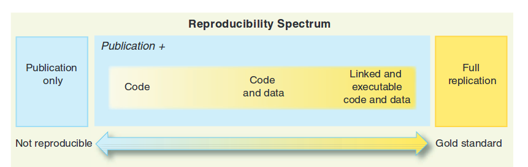
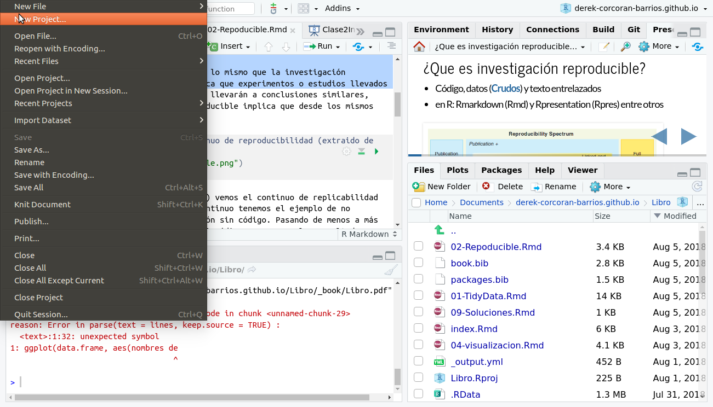
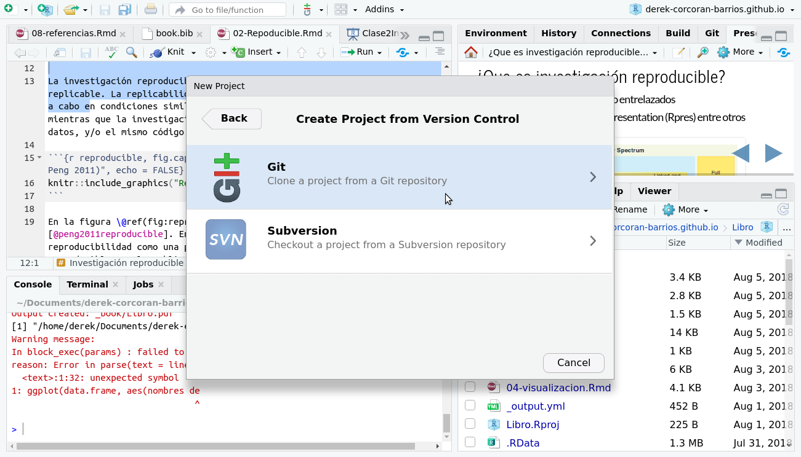
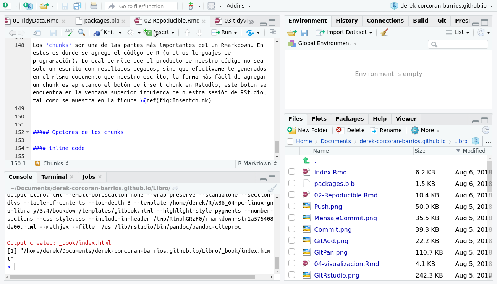

# Investigación reproducible {#reproducible}

## Paquetes necesarios para este capítulo

Para este capitulo necesitas tener instalado los paquetes *rmarkdown*, *knitr* y *stargazer*

En este capítulo explicaremos que es la investigación reproducible, y como aplicarla usando github, y los paquetes *rmarkdown* [@Allaire2018] y *knitr* [@xie2015]. Además aprenderemos a usar tablas usando *knitr* [@xie2015] y *stargazer* [@hlavak2018]

Recuerda que este libro es un apoyo para el curso BIO4022, puedes seguir la clase de este curso en este [link](https://derek-corcoran-barrios.github.io/Clase2/Clase2InvestigacionReproducible), y en cuanto el video de la clase este disponible encontrarás un link aca.

## Investigación reproducible

La investigación reproducible no es lo mismo que la investigación replicable. La replicabilidad implica que experimentos o estudios llevados a cabo en condiciones similares nos llevarán a conclusiones similares, mientras que la investigación reproducible implica que desde los mismos datos, y/o el mismo código.

```{r reproducible, fig.cap= "Continuo de reproducibilidad (extraido de Peng 2011)", echo = FALSE, out.width='80%', fig.asp=.75, fig.align='center'}

```

En la figura \@ref(fig:reproducible) vemos el continuo de replicabilidad [@peng2011reproducible]. En este continuo tenemos el ejemplo de no reproducibilidad como una publicación sin código. Pasando de menos a más reproducible por la publicación y el código que genero los resultados y gráficos; seguido por la publicación, el código y los datos que generan los resultados y gráficos; y por último código, datos y texto entrelazados de forma tal que al correr el código obtenemos exactamente la mismma publicación que leimos.

Esto tiene muchas ventajas, incluyendo el que es más fácil aplicar exactamente los mismos metodos a otra base de datos, basta poner la nueva base de datos en el formato que tenía el autor de la primera publicación y podremos comparar los resultados.

Además en un momento en que la ciencia está basada cada vez más en bases de datos, se puede poner en el código la recolección y/o muestreo de datos.

## Guardando nuestro proyecto en github

### Que es github?

Github es una suerte de dropbox o google drive pensado para la investigación reproducible, en github cada proyecto es un *repositorio*. La mayoría de los investigadores que trabajan en investigación reproducible dejan todo su trabajo documentado en sus repositorios, lo cual permite interactuar con otros autores.

### creando un proyecto de github en RStudio

Para crear un proyecto en github presionamos **start a project** en la pagina inicial de nuestra cuenta como vemos en la figura \@ref(fig:Start)

```{r Start, echo = FALSE, fig.cap= "Para empezar un projecto en github, debes presionar Start a project en tu página de inicio", out.width='80%', fig.asp=.75, fig.align="center"}
knitr::include_graphics("StartAProject.png")
```

Luego crea un nombre unico, y sin cambiar nada más presiona **create repository** en el botón verde como vemos en la figura \@ref(fig:Name).


```{r Name, echo = FALSE, fig.cap= "Crea el nombre de tu repositorio y apreta el boton create repository", out.width='80%', fig.asp=.75, fig.align="center"}
knitr::include_graphics("NombreRepo.png")
```

Esto te llevará a una página donde te aparecera una url de tu nuevo repositorio como en la figura \@ref(fig:ssh)

```{r ssh, echo = FALSE, fig.cap= "El contenido del cuadro en el cual dice ssh es la url de tu repisitorio", out.width='80%', fig.asp=.75, fig.align='center'}
knitr::include_graphics("GitAdress.png")
```

Para incorporar tu proyecto en tu repositorio, lo primero que debes hacer es generar un proyecto en RStudio, para esto debes ir en el menú superior de *Rstudio* a *File > New Project > Git* como se ve en las figuras \@ref(fig:NewProject) y \@ref(fig:NewProject).  

```{r NewProject, echo = FALSE, fig.cap= "Menú para crear un proyecto nuevo", out.width='80%', fig.asp=.75, fig.align='center'}

```

```{r Git, echo = FALSE, fig.cap= "Seleccionar git dentro de las opciones", out.width='80%', fig.asp=.75, fig.align='center'}

```

Luego, seleccionar la ubicación del proyecto nuevo y pegar el url que aparece en la figura \@ref(fig:ssh) en el espacio que dice **Repository URL:** como muestra en la figura \@ref(fig:GitRstudio).

```{r GitRstudio, echo = FALSE, fig.cap= "Pegar el url del repositorio en el cuadro de dialogo Repository URL:", out.width='80%', fig.asp=.75, fig.align='center'}
knitr::include_graphics("GitRstudio.png")
```

Cuando tu proyecto de R ya este siguiendo los cambios en github, te aparecera una pestaña git dentro de la ventana superior derecha de tu sesión de RStudio, tal como vemos en la figura \@ref(fig:GitPan)

```{r GitPan, echo = FALSE, fig.cap= "Al incluir tu repositorio en tu sesión de Rstudio, aparecera la pestaña git en la ventana superior derecha", out.width='80%', fig.asp=.75, fig.align='center'}
knitr::include_graphics("GitPan.png")
```

### Los tres principales pasos de un repositorio

Github es todo un mundo, con muchas funciones, hay expertos en el uso de github, pero en este curso, nos enfocaremos en los 3 pasos principales de un repositorio, *Add*, *commit* y *push*. Para entender bien que significan cada uno de estos pasos tenemos que entender que existen dos repositorios en todo momento. Uno local (en tu computador) u otro remoto (en github.com). Los dos primeros pasos *Add* y commit, solo generan cambios en tu repositorio local. Mientras que *push*, salva los cambios al repositorio remoto.

#### git add

Esta función, es la que agrega archivos a tu repositorio local. Solo estos archivos serán guardados en github. Cuando tienes bases de datos mayores a 1 GB no es convenientes guardarlos en github, ya que si bién te dan repositorios ilimitados, el espacio de cada uno no lo es, en particular en cuanto a bases de datos. Para adicionar un archivo a tu repositorio tan solo debes selecionar los archivos en la pestaña git. Al hacer eso una letra A verde aparecera en vez de los dos signos de interrogación amarillos, como vemos en la figura \@ref(fig:Add). En este caso solo adicionamos al repositorio el archivo *Analisis.r* pero no el resto.

```{r Add, echo = FALSE, fig.cap= "Al incluir tu repositorio en tu sesión de Rstudio, aparecera la pestaña git en la ventana superior derecha", out.width='80%', fig.asp=.75, fig.align='center'}
knitr::include_graphics("GitAdd.png")
```

#### git commit

Cuando ocupas el comando *commit* estas guardando los cambios de los archivos que adicionaste, en tu repositorio local. Para hacer esto en Rstudio, en la misma pestaña de git, debes presionar el botón commit como vemos en la figura \@ref(fig:Commit). 

```{r Commit, echo = FALSE, fig.cap= "Para guardar los cambios en tu repositorio apretar commit en la pestaña git de la ventana superior derecha", out.width='80%', fig.asp=.75, fig.align='center'}
knitr::include_graphics("Commit.png")
```

Al presionar Commit, se abrira una ventana emergente, donde deberás escribir un mensaje que describa lo que guardaras. Una vez echo eso presiona commit nuevamente en la ventana emergente como aparece en la figura \@ref(fig:MensajeCommit).

```{r MensajeCommit, echo = FALSE, fig.cap= "Escribir un mensaje que recuerde los cambios que hiciste en la ventana emergente", out.width='80%', fig.asp=.75, fig.align='center'}
knitr::include_graphics("MensajeCommit.png")
```

#### git push

Finalmente *push* te permitirá guardar los cambios en tu repositorio remoto, lo cual asegura tus datos en la nube, y además lo hace disponible a otros investigadores. Luego de apretar commit en la ventana emergente (figura \@ref(fig:MensajeCommit)), podemos presionar *push* en la flecha verde de la ventana emergente como se ve el a figura \@ref(fig:push). Luego se nos pedira nuestro nombre de usuario y contraseña, y ya podemos revisar que nuestro repositorio esta online entrando a nuestra sesión de github.

```{r push, echo = FALSE, fig.cap= "Para guardar en el repositorio remoto apretar push en la ventana emergente", out.width='80%', fig.asp=.75, fig.align='center'}
knitr::include_graphics("Push.png")
```

## Reproducibilidad en R

Existen varios paquetes que permiten que hagamos investigación reproducible en `R`, pero sin duda los más relevantes son *rmarkdown* y *knitr*. Ambos paquetes funcionana en conjunto cuando generamos un archivo *Rmd* (Rmarkdown), en el cual ocupamos al mismo tiempo texto, código de R y otros elementos para generar un documento word, pdf, página web, presentación y/o aplicación web (fig \@ref(fig:Rmark)).

```{r Rmark, echo = FALSE, fig.cap= "El objetivo de Rmarkdown es el unir código de r con texto y datos para generar un documento reproducible", out.width='80%', fig.asp=.75, fig.align='center'}
knitr::include_graphics("Rmark.png")
```

### Creando un Rmarkdown

Para crear un archivo Rmarkdown, simplemente ve a el menu *File > New file > Rmarkdown* y con eso habrás creado un nuevo archivo *Rmd*, veremos en momentos algunos de los elementos más típicos de un arcchivo Rmarkdown.

#### Markdown

El markdown es la parte del archivo en que simplemente escribimos texto, aunque tiene algunos detalles para el formato como generar texto en negrita, cursiva, títulos y subtitulos. 

Para hacer que un texto este en **negrita**, deben ponerlo entre dos asteriscos `**negrita**`, para que un texto aparezca en *cursiva* debe estar entre asteriscos `*cursiva*`, otros ejemplos son los titulos de distintos niveles, los cuales se denotan con distintos números de `#`, así los siguientes 4 títulos o subtitulos:

## subtitulo 1 {-}

### subtítulo 2 {-}

#### subtítulo 3 {-}

##### subtítulo 4 {-}

se vería de la siguiente manera en el código

```{r, eval = FALSE}
## subtitulo 1

### subtítulo 2

#### subtítulo 3

##### subtítulo 4
```

#### Chunks

Los *chunks* son una de las partes más importantes del un Rmarkdown. En estos es donde se agrega el código de R (u otros lenguajes de programación). Lo cual permíte que el producto de nuestro código no sea solo un escrito con resultados pegados, sino que efectivamente generados en el mismo documento que nuestro escrito, la forma más fácil de agregar un chunk es apretando el botón de insert chunk en Rstudio, este boton se encuentra en la ventana superior izquierda de nuestra sesión de RStudio, tal como se muestra en la figura \@ref(fig:Insertchunk)

```{r Insertchunk, echo = FALSE, fig.cap= "Al apretar el botón insert chunk, aparecera un espacio en el cuál insertar código", out.width='80%', fig.asp=.75, fig.align='center'}

```

Al apretar este código aparecera un espacio, uno podría agregar un código como el que aparece a continuación, y vemos a continuación los resultados. 

````markdown
`r ''````{r}
library(tidyverse)
iris %>% group_by(Species) %>% summarize(Petal.Length = mean(Petal.length))
```
````


```{r, echo = FALSE}
iris %>% group_by(Species) %>% summarize(Petal.Length = mean(Petal.Length))
```


##### Opciones de los chunks

Existen muchas opciones para los chunks, una documentación completa podemos encontrarle en el siguiente [link](https://yihui.name/knitr/options/), pero acá mostraremos los más comunes:

+ *echo* = T o F muestro o no codigo
+ *message* = T o F muestra mensajes de paquetes
+ *warning* = T o F muestra advertencias 
+ *eval* = T o F evaluar o no el código
+ *cache* = T o F guarda o no el resultado

#### inline code

syntax for the latter is `` ``r ''`r R_CODE` ``, and it can be embedded inline with other document elements. R code chunks look like plain code blocks, but have `{r}` after the three backticks and (optionally) chunk options inside `{}`, e.g.,

#### Tablas en Rmarkdown
