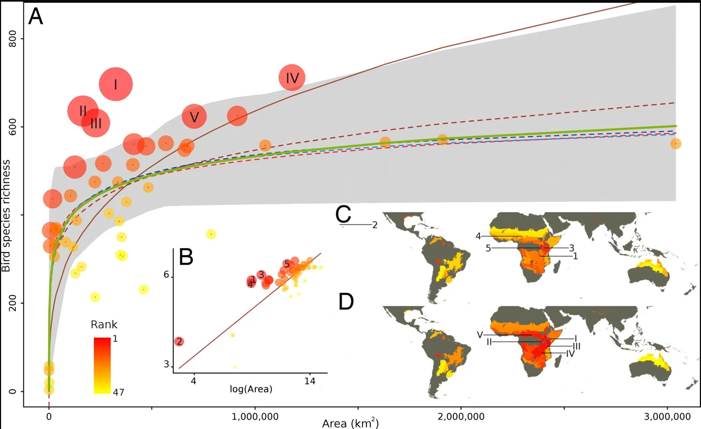

```{r setup, include=FALSE, cache=FALSE}
knitr::opts_chunk$set(echo = FALSE, cache = TRUE)
library(terra)
library(kableExtra)
library(tidyterra)
library(ggplot2)
library(geodata)
library(leaflet)
library(htmltools)
library(htmlwidgets)
```

## Brief recap


<div style="float: left; width: 40%;">
* Transform 14% of Denmark from agriculture to nature
* Maximize biodiversity and contiguity of nature areas
* At least 250,000 hectares of new forest promised 
* At least 140,000 hectares of wet areas
</div>

<div style="float: right; width: 60%;">
```{r SAR}

```

</div>

## Maximize biodiversity


* Species Richness, Phylogenetic diversity, Rarity

```{r Richness, include=FALSE}
Richness <- terra::rast("Richness_ForestDryRich.tif")

RichPlot <- ggplot() + geom_spatraster(data = Richness) + scale_fill_wiki_c(trans = scales::log1p_trans(), breaks = c(0, 10, 100)) + labs(title ="Forest Dry Rich", caption = "Richness") + theme_bw()
```

```{r RichPlot}
RichPlot
```


* One estimate per habitat type

## Summary of solution for all of Denmark

```{r tableSolution}
SummaryResults <- readxl::read_xlsx("SummaryResults.xlsx")
kbl(SummaryResults, digits = 2) |> kable_paper()
```


## All of Denmark

<!-- Leaflet CSS and JavaScript -->
<link rel="stylesheet" href="http://cdn.leafletjs.com/leaflet-0.7.5/leaflet.css" />
<script src="http://cdn.leafletjs.com/leaflet-0.7.5/leaflet.js"></script>

<style>
    body, table, tr, td, th, div, h1, h2, input { font-family: "Calibri", "Trebuchet MS", "Ubuntu", Serif; font-size: 11pt; }
    #map { position:absolute; top:0; bottom:0; width:90%; } /* full size */
    .ctl {
        padding: 2px 10px 2px 10px;
        background: white;
        background: rgba(255,255,255,0.9);
        box-shadow: 0 0 15px rgba(0,0,0,0.2);
        border-radius: 5px;
        text-align: right;
    }
    .title {
        font-size: 18pt;
        font-weight: bold;
    }
    .src {
        font-size: 10pt;
    }
    .legend {
        background: white;
        padding: 6px 8px;
        font-size: 12px;
        line-height: 18px;
        color: #555;
    }
    .legend i {
        width: 18px;
        height: 18px;
        float: left;
        margin-right: 8px;
        opacity: 0.7;
    }
</style>

<div id="map"></div>

<script>
/* **** Leaflet **** */
var DarkMatter = L.tileLayer('https://cartodb-basemaps-{s}.global.ssl.fastly.net/dark_all/{z}/{x}/{y}.png', {
    attribution: '&copy; <a href="https://carto.com/attributions">CARTO</a>'
});

// Base layers
var osm = L.tileLayer('http://{s}.tile.osm.org/{z}/{x}/{y}.png', {attribution: '&copy; <a href="http://osm.org/copyright">OpenStreetMap</a> contributors'});

var cartodb = L.tileLayer('http://{s}.basemaps.cartocdn.com/light_all/{z}/{x}/{y}.png', {attribution: '&copy; <a href="http://www.openstreetmap.org/copyright">OpenStreetMap</a> contributors, &copy; <a href="http://cartodb.com/attributions">CartoDB</a>'});

// White background
var white = L.tileLayer("data:image/png;base64,iVBORw0KGgoAAAANSUhEUgAAAQAAAAEAAQMAAABmvDolAAAAA1BMVEX///+nxBvIAAAAH0lEQVQYGe3BAQ0AAADCIPunfg43YAAAAAAAAAAA5wIhAAAB9aK9BAAAAABJRU5ErkJggg==");

// Overlay layers (TMS)
var lyr = L.tileLayer('./{z}/{x}/{y}.png', {tms: true, opacity: 0.7, attribution: ""});

// Map
var map = L.map('map', {
    center: [56.08179712158155, 11.738158813369875],
    zoom: 20,
    minZoom: 7,
    maxZoom: 20,
    layers: [osm]
});

var basemaps = {
    "OpenStreetMap": osm, 
    "CartoDB Positron": cartodb, 
    "Dark matter": DarkMatter, 
    "Without background": white
};

var overlaymaps = {
    "Layer": lyr
};

// Title
var title = L.control();
title.onAdd = function(map) {
    this._div = L.DomUtil.create('div', 'ctl title');
    this.update();
    return this._div;
};
title.update = function(props) {
    this._div.innerHTML = "Sols";
};
title.addTo(map);

// Note
var src = 'Generated by <a href="http://www.klokan.cz/projects/gdal2tiles/">GDAL2Tiles</a>, Copyright &copy; 2008 <a href="http://www.klokan.cz/">Klokan Petr Pridal</a>,  <a href="http://www.gdal.org/">GDAL</a> &amp; <a href="http://www.osgeo.org/">OSGeo</a> <a href="http://code.google.com/soc/">GSoC</a>';
var note = L.control({position: 'bottomleft'});
note.onAdd = function(map) {
    this._div = L.DomUtil.create('div', 'ctl src');
    this.update();
    return this._div;
};
note.update = function(props) {
    this._div.innerHTML = src;
};
note.addTo(map);

// Add base layers with collapsible control enabled
L.control.layers(basemaps, overlaymaps, {collapsed: true}).addTo(map);

// Fit to overlay bounds (SW and NE points with (lat, lon))
map.fitBounds([[54.350986203547414, 15.597242237512058], [57.81260803961569, 7.879075389227694]]);


// Add color scale legend
var colorScale = ["#01665e", "#35978f", "#80cdc1", "#c7eae5", "#f6e8c3", "#dfc27d", "#bf812d", "#8c510a"];
var categories = ["FDP", "FDR", "FWP", "FWR", "ODP", "ODR", "OWP", "OWR"];

var legend = L.control({position: 'bottomright'});

legend.onAdd = function(map) {
    var div = L.DomUtil.create('div', 'legend');
    // Loop through categories and colors to generate labels
    for (var i = 0; i < categories.length; i++) {
        div.innerHTML +=
            '<i style="background:' + colorScale[i] + '"></i> ' +
            categories[i] + '<br>';
    }
    return div;
};

legend.addTo(map);
</script>


# Most added nature


## Areas with the most added nature

```{r TopMost, cache=TRUE, include=FALSE}
library(terra)
library(geodata)
library(SpatioTemporalCont)

Current <- terra::rast("Template.tif") |>
  SpatioTemporalCont::generate_dummy_stack(Vars = c("FDP_N", "FDR_N", "FWP_N", "FWR_N", "ODP_N", "ODR_N", "OWP_N", "OWR_N "))

Solution <- terra::rast("Solution.tif") |>
  SpatioTemporalCont::generate_dummy_stack(Vars = c("FDP_N", "FDR_N", "FWP_N", "FWR_N", "ODP_N", "ODR_N", "OWP_N", "OWR_N "))

Communes <- geodata::gadm("denmark", level = 2, getwd()) |>
  terra::project(terra::crs(Solution)) |>
  tidyterra::select(NAME_2)

SolutionZonal <- zonal(Solution, Communes, "sum", na.rm=T)

CurrentZonal <- zonal(Current, Communes, "sum", na.rm=T)

Total <-  data.frame(Commune = Communes$NAME_2,
                     Current = rowSums(CurrentZonal, na.rm = T),
                     Solution = rowSums(SolutionZonal, na.rm = T)) |>
  dplyr::mutate(Prop_Change = ((Solution-Current)/Current)*100) |>
  dplyr::filter(Prop_Change > 10 & Prop_Change < Inf ) |>
  dplyr::slice_max(order_by = Prop_Change, n = 20) |>
  dplyr::slice_max(order_by = Solution, n = 6) |> 
  dplyr::mutate(Solution = (Solution*200*200)/1000000,
                Current = (Current*200*200)/1000000)
```

```{r TableMost}
kbl(Total, digits = 2, caption = "Top 6 communes on proportional change") |> 
  kableExtra::kable_paper()
```

* The selection process first ranks the top 20 communes by proportional change in open nature

* From those, top 6 based on the largest total area of newly added nature.

## Example 1

```{r Tests}

library(ggplot2)
library(tidyterra)

Current <- terra::rast("Template.tif") |> as.numeric()

Solution <- terra::rast("Solution.tif")

levels(Current) <- levels(Solution)

Communes <- geodata::gadm("denmark", level = 2, getwd()) |>
  terra::project(terra::crs(Solution)) |>
  tidyterra::select(NAME_2)


Test <- c(Current, Solution) |> magrittr::set_names(c("Before", "After")) |> terra::crop(tidyterra::filter(Communes, NAME_2 == Total$Commune[1]))

Test2 <- c(Current, Solution) |> magrittr::set_names(c("Before", "After")) |> terra::crop(tidyterra::filter(Communes, NAME_2 == Total$Commune[2])) |> terra::mask(tidyterra::filter(Communes, NAME_2 == Total$Commune[2]))

Test6 <- c(Current, Solution) |> magrittr::set_names(c("Before", "After")) |> terra::crop(tidyterra::filter(Communes, NAME_2 == Total$Commune[6])) |> terra::mask(tidyterra::filter(Communes, NAME_2 == Total$Commune[6]))


G2 <- ggplot() + geom_spatvector(data = tidyterra::filter(Communes, NAME_2 == Total$Commune[2])) + geom_spatraster(data = Test2)+ scale_fill_manual(name = "Current", values =  c("white","#01665e", "#35978f", "#80cdc1", "#c7eae5", "#f6e8c3", "#dfc27d",
                                                                                                                                                                            "#bf812d", "#8c510a"), na.value = "#00000000") + theme_dark() + facet_wrap(~lyr) + ggtitle(Total$Commune[[2]])

G1 <- ggplot() + geom_spatvector(data = tidyterra::filter(Communes, NAME_2 == Total$Commune[1])) + geom_spatraster(data = Test)+ scale_fill_manual(name = "Current", values =  c("white","#01665e", "#35978f", "#80cdc1", "#c7eae5", "#f6e8c3", "#dfc27d","#bf812d", "#8c510a"), na.value = "#00000000") + theme_dark() + facet_wrap(~lyr) + ggtitle(Total$Commune[1])

G6 <- ggplot() + geom_spatvector(data = tidyterra::filter(Communes, NAME_2 == Total$Commune[6])) + geom_spatraster(data = Test6)+ scale_fill_manual(name = "Current", values =  c("white","#01665e", "#35978f", "#80cdc1", "#c7eae5", "#f6e8c3", "#dfc27d","#bf812d", "#8c510a"), na.value = "#00000000") + theme_dark() + facet_wrap(~lyr)+ ggtitle(Total$Commune[6])
```

```{r plotBornholm}
G1
```

## Example 2

```{r plotAssens}
G2
```

## Example 3

```{r plotAarhus}
G6
```

# Most added Open

## Most added Open

```{r addedOpen, cache=TRUE, include=FALSE}
Current <- terra::rast("Template.tif") |>
  SpatioTemporalCont::generate_dummy_stack(Vars = c("ODP_N", "ODR_N", "OWP_N", "OWR_N "))

Solution <- terra::rast("Solution.tif") |>
  SpatioTemporalCont::generate_dummy_stack(Vars = c("ODP_N", "ODR_N", "OWP_N", "OWR_N "))

Communes <- geodata::gadm("denmark", level = 2, getwd()) |>
  terra::project(terra::crs(Solution)) |>
  tidyterra::select(NAME_2)

SolutionZonal <- zonal(Solution, Communes, "sum", na.rm=T)

CurrentZonal <- zonal(Current, Communes, "sum", na.rm=T)

Open <-  data.frame(Commune = Communes$NAME_2,
                     Current = rowSums(CurrentZonal, na.rm = T),
                     Solution = rowSums(SolutionZonal, na.rm = T)) |>
  dplyr::mutate(Prop_Change = ((Solution-Current)/Current)*100) |>
  dplyr::filter(Prop_Change > 10 & Prop_Change < Inf ) |>
  dplyr::slice_max(order_by = Prop_Change, n = 20) |>
  dplyr::slice_max(order_by = Solution, n = 6)
```

```{r TableMostOpen}
kbl(Open, digits = 2, caption = "Top 6 communes on proportional change open nature") |> 
  kableExtra::kable_paper()
```


* The selection process first ranks the top 20 communes by proportional change in open nature

* From those, top 6 based on the largest total area of newly added nature.

## Example 1

```{r Calc, cache=TRUE}
Current <- terra::rast("Template.tif") |> as.numeric()

Solution <- terra::rast("Solution.tif")

levels(Current) <- levels(Solution)


Test <- c(Current, Solution) |> magrittr::set_names(c("Before", "After")) |> terra::crop(tidyterra::filter(Communes, NAME_2 == Open$Commune[5])) |> terra::mask(tidyterra::filter(Communes, NAME_2 == Open$Commune[5]))


O1 <- ggplot() + geom_spatvector(data = tidyterra::filter(Communes, NAME_2 == Open$Commune[5])) + geom_spatraster(data = Test)+ scale_fill_manual(name = "Current", values =  c("white","#01665e", "#35978f", "#80cdc1", "#c7eae5", "#f6e8c3", "#dfc27d", "#bf812d", "#8c510a"), na.value = "#00000000") + theme_dark() + facet_wrap(~lyr) + ggtitle(Open$Commune[5])

Horsens <- c(Current, Solution) |> magrittr::set_names(c("Before", "After")) |> terra::crop(tidyterra::filter(Communes, NAME_2 == Open$Commune[4])) |> terra::mask(tidyterra::filter(Communes, NAME_2 == Open$Commune[4]))


O2 <- ggplot() + geom_spatvector(data = tidyterra::filter(Communes, NAME_2 == Open$Commune[4])) + geom_spatraster(data = Horsens)+ scale_fill_manual(name = "Current", values =  c("white","#01665e", "#35978f", "#80cdc1", "#c7eae5", "#f6e8c3", "#dfc27d",
                                                                                                                                                                          "#bf812d", "#8c510a"), na.value = "#00000000") + theme_dark() + facet_wrap(~lyr) + ggtitle(Open$Commune[4])
```


```{r plotOpen1}
O1
```

## Example 2

```{r plotOpen2}
O2
```

# Things to add

## New elements

Will have

* Carbon
* Private vs State

Nice to have later on

* Soil
* Restore natural areas

# Questions

# Equations

## Overall

$$\color{Red}{\text{Biodiversity} = \sum_{l}^L \sum_{c}^C \text{LD}_{l,c} \times \frac{\text{S}_{l,c} + \text{PD}_{l,c} + \text{R}_{l,c}}{3} \times \text{CC}_{c}}$$

$$\color{blue}{\text{Contiguity}_\text{New} =\text{Contiguity}[l,i,j] \times \text{CanChange}[i] \times \text{CanChange}[j]\times \text{LD}_{l,j}}$$

$$\color{green}{\text{Contiguity}_\text{Existing} =\text{Existingnature}[l,i] \times \text{LanduseDecision}[l,j] \times \text{CanChange}[j]}$$


