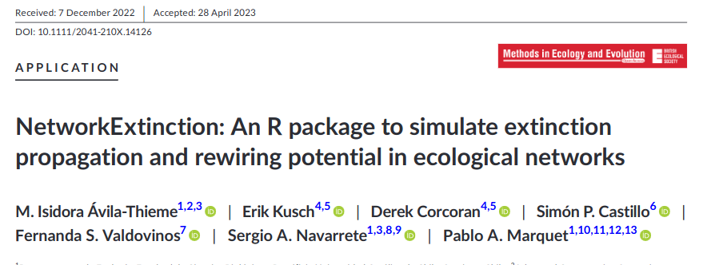
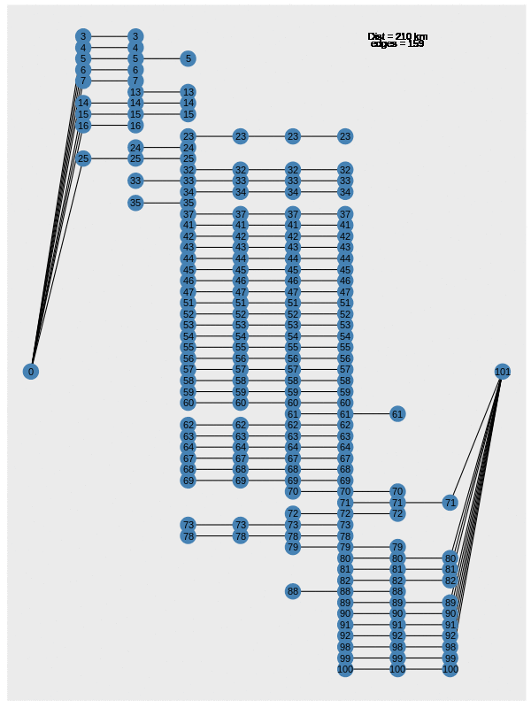
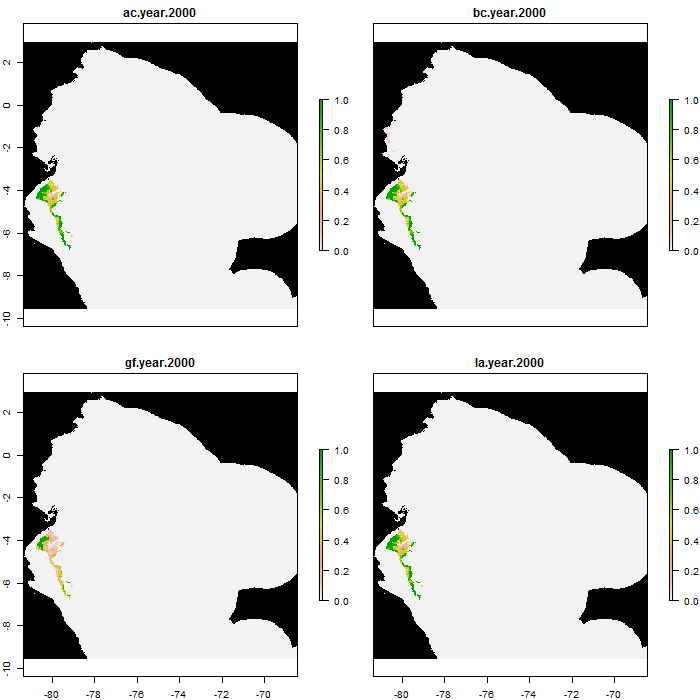

```{=html}
<style>
.forceBreak { -webkit-column-break-after: always; break-after: column; }
</style>
```
```{r setup, include=FALSE}
knitr::opts_chunk$set(echo = FALSE,
                      warning = F,
                      error = F,
                      message = F,
                      cache = F)
library(shiny)
library(tidyverse)
library(terra)
library(tidyterra)
library(plotly)
library(patchwork)
library(sf)
library(MuMIn)
library(lme4)
library(leaflet)
OptimalLong <- read_csv("SensitivityApp/OptimalLong.csv")
Sensitivity <- terra::rast("SensitivityApp/LocalSensitivity.tif")
names(Sensitivity) <- stringr::str_remove_all(names(Sensitivity),"Bonus_")

Solutions <- terra::rast("SensitivityApp/LocalSolutions.tif")
names(Solutions) <- names(Sensitivity)[1:nlyr(Solutions)]
```

# Future directions

## How to plan for futute landscapes {.smaller}

$\begin{align*} \text{Maximize} & = \text{Biodiversity} + \text{Resilience} + \text{Human dimension}\end{align*}$

> -   Biodiversity
>     -   Community composition and rarity
>     -   Phylogenetic Diversity
>     -   Functional diversity*
> -   Resilience
>     -   Contiguity (Area)
>     -   Stochastic components and Global Change Vulnerability
>     -   Network stability (Trophic and/or mutualistic)*
>     -   Ecosystem Functioning*
> -   Human dimension
>     -   Food and resource security (Eg. Renewable energy, water)
>     -   Minimize conflict*

# Biodiversity

## Maximize biodiversity

$$\max_{\text{ConservationIndex}} \sum_{l, c}^{L,C} \text{LanduseDecision}_{l, c} \cdot \text{S}_{l, c} \cdot \text{PD}_{l, c}\cdot \text{Rar}_{l, c}$$

```{r}
library(terra)
library(tidyterra)
library(leaflet)
AarhusSols <- terra::rast("AarhusSols.tif")
AarhusSols <- as.numeric(AarhusSols[[1]])
Pal <- colorBin(palette = c('#e41a1c','#377eb8','#4daf4a','#984ea3','#ff7f00','#ffff33','#a65628','#f781bf'), domain = values((AarhusSols)[[1]]), na.color = "transparent")
factor_labels <- c("ForestDryPoor", "ForestDryRich", "ForestWetPoor", "ForestWetRich", 
                   "OpenDryPoor", "OpenDryRich", "OpenWetPoor", "OpenWetRich") 

L <- leaflet(height = 300) |> addProviderTiles("CartoDB.DarkMatter") |> addRasterImage(AarhusSols[[1]], color = Pal, group = "0") |>
  addLegend(
  "bottomright",
  title = "Land Use",
  colors = c('#e41a1c','#377eb8','#4daf4a','#984ea3','#ff7f00','#ffff33','#a65628','#f781bf'),
  labels = factor_labels,
  opacity = 1
) 

L
```

# Resilience

## Resilience

> -   Resilience
>     -   Contiguity (Area)
>     -   Stochastic components and Global Change Vulnerability
>     -   Network stability (Trophic and/or mutualistic)*
>     -   Ecosystem Functioning*

$$\max_{\text{ObjectiveFunction}} \sum_{i, j} \text{DecisionVariable}_{l, i} \cdot \text{DecisionVariable}_{l, j} \cdot \text{Bonus}$$

## Example Landuse (Global contribution)

```{r}
library(readr)
Optimal <- read_table("OptimalAarhus.txt", 
    col_names = FALSE) |> 
  mutate_if(is.numeric, ~round(.x, digits = 2))

colnames(Optimal) <- c("Biodiversity", "Contiguity","ContiguityBonus")

OptimalLong <- Optimal |>
  tidyr::pivot_longer(Biodiversity:Contiguity, names_to = "Part", values_to = "Contribution")


G <- ggplot(OptimalLong, aes(x = ContiguityBonus, y = Contribution, group = Part)) + geom_path(aes(color = Part)) + theme_bw()
G <- plotly::ggplotly(G)

contiguity_index <- which(sapply(G$x$data, function(trace) trace$name == "Contiguity"))

G$x$data[[contiguity_index]]$visible <- "legendonly"

biodiversity_index <- which(sapply(G$x$data, function(trace) trace$name == "Biodiversity"))

# Get the range of the "Biodiversity" trace
x_range <- range(G$x$data[[biodiversity_index]]$x)
y_range <- range(G$x$data[[biodiversity_index]]$y)

# Set initial axis range based on "Biodiversity" trace
G$x$layout$xaxis$range <- x_range
G$x$layout$yaxis$range <- y_range
```

```{r}
library(terra)
library(tidyterra)
library(leaflet)
AarhusSols <- terra::rast("AarhusSols.tif")
AarhusSols <- as.numeric(AarhusSols[[1:4]])
Pal <- colorBin(palette = c('#e41a1c','#377eb8','#4daf4a','#984ea3','#ff7f00','#ffff33','#a65628','#f781bf'), domain = values((AarhusSols)[[1]]), na.color = "transparent")
factor_labels <- c("ForestDryPoor", "ForestDryRich", "ForestWetPoor", "ForestWetRich", 
                   "OpenDryPoor", "OpenDryRich", "OpenWetPoor", "OpenWetRich") 

L <- leaflet(height = 300) |> addProviderTiles("CartoDB.DarkMatter") |> addRasterImage(AarhusSols[[1]], color = Pal, group = "0") |>
  addRasterImage(AarhusSols[[2]], color = Pal, group = "0.05") |> addRasterImage(AarhusSols[[3]], color = Pal, group = "0.1") |>  addRasterImage(AarhusSols[[4]], color = Pal, group = "0.15") |>
  addLegend(
  "bottomright",
  title = "Land Use",
  colors = c('#e41a1c','#377eb8','#4daf4a','#984ea3','#ff7f00','#ffff33','#a65628','#f781bf'),
  labels = factor_labels,
  opacity = 1
) |> addLayersControl(
    baseGroups = c("0", "0.05", "0.1", "0.15"),
    options = layersControlOptions(collapsed = T)
  )
```

```{r}
htmltools::div(
  style = "display: flex; justify-content: space-between;",
  G,
  L
)
```

$\begin{align*} \text{Maximize} & = \text{Biodiversity} + \text{Resilience} \cdot \text{bonus}\end{align*}$

-   Trade-off

## Individual cell values (Local contribution)

```{r}
library(terra)
library(tidyterra)
library(leaflet)
library(manipulateWidget)
library(leaflet.minicharts)

# Load the raster data for the first map
AarhusSols <- terra::rast("AarhusSols.tif")
AarhusSols <- as.numeric(AarhusSols[[1:4]])
Pal1 <- colorBin(palette = c('#e41a1c','#377eb8','#4daf4a','#984ea3','#ff7f00','#ffff33','#a65628','#f781bf'), domain = values((AarhusSols)[[1]]), na.color = "transparent")
factor_labels1 <- c("ForestDryPoor", "ForestDryRich", "ForestWetPoor", "ForestWetRich", 
                    "OpenDryPoor", "OpenDryRich", "OpenWetPoor", "OpenWetRich") 

# Create the first leaflet map
L1 <- leaflet(height = 300) |> addProviderTiles("CartoDB.DarkMatter") |> 
  addRasterImage(AarhusSols[[1]], color = Pal1, group = "0") |>
  addRasterImage(AarhusSols[[2]], color = Pal1, group = "0.05") |>
  addRasterImage(AarhusSols[[3]], color = Pal1, group = "0.1") |>
  addRasterImage(AarhusSols[[4]], color = Pal1, group = "0.15") |>
  addLegend(
    "bottomright",
    title = "Land Use",
    colors = c('#e41a1c','#377eb8','#4daf4a','#984ea3','#ff7f00','#ffff33','#a65628','#f781bf'),
    labels = factor_labels1,
    opacity = 1
  ) |>
  addLayersControl(
    baseGroups = c("0", "0.05", "0.1", "0.15"),
    options = layersControlOptions(collapsed = T)
  )

# Load the raster data for the second map
AarhusLocals <- terra::rast("AarhusLocals.tif")
AarhusLocals <- as.numeric(AarhusLocals[[1:4]])
Pal2 <- colorBin(palette = c('#e41a1c','#377eb8','#4daf4a'), domain = c(1,2,3), na.color = "transparent")
factor_labels2 <- c("Biodiversity", "Contiguity", "Equal") 

# Create the second leaflet map
L2 <- leaflet(height = 300) |> addProviderTiles("CartoDB.DarkMatter") |> 
  addRasterImage(AarhusLocals[[1]], color = Pal2, group = "0") |>
  addRasterImage(AarhusLocals[[2]], color = Pal2, group = "0.05") |>
  addRasterImage(AarhusLocals[[3]], color = Pal2, group = "0.1") |>
  addRasterImage(AarhusLocals[[4]], color = Pal2, group = "0.15") |>
  addLegend(
    "bottomright",
    title = "Land Use",
    colors = c('#e41a1c','#377eb8','#4daf4a'),
    labels = factor_labels2,
    opacity = 1
  ) |>
  addLayersControl(
    baseGroups = c("0", "0.05", "0.1", "0.15"),
    options = layersControlOptions(collapsed = T)
  )

# Combine the leaflet maps
leafsync::sync(L1, L2, ncol = 2, sync = "all")
```

$\begin{align*} \text{Maximize} & = \text{Biodiversity}_c + \text{Resilience}_c\cdot \text{bonus}\end{align*}$

## Work in progress

* Stochasticity and climate change vulnerability

## Resilience in Networks {.columns-2}

-   Measures of network stability
-   Trophic and mutualistic
-   With rewiring potential hypothesis
-   Potential colaboration (Eva and Alejo)

<p class="forceBreak">

</p>

```{r}

```


## Network flow

::: {style="float: left; width: 40%;"}
-   Incorporating species dispersal (Species on the move)
-   Multiple scenarios
-   [Example report](https://static1.squarespace.com/static/57be0f8abebafb6d2e14828f/t/5d9cbb4d7c5b6d42d382e0ae/1570552656952/NorthernAndes_FinalPDF.pdf)
:::

::: {style="float: right; width: 60%;"}
```{r, out.width="60%"}

```
:::

## Geographic representation

```{r, out.width="60%"}

```


## Adding human dimension {.smaller}

```{r, out.height= "50%"}
library(DiagrammeR)
DiagrammeR("graph LR;
           A(Biodiversity)-->C(Human Dimension);
           B(Reslillence)-->C(Human Dimension);
           C(Human Dimension)-->C(Human Dimension)")
```

$$\begin{align*} \text{Maximize}  & =  \text{Biodiversity} + \text{Resilience} + \text{Human dimension}\end{align*}$$

> -   First iteration:
>     -   Economic yield and number of owners
> -   Second iteration:
>     -   Characterization of actors, who is in the areas of interest (Farmers, Home owners, private companies, municipalities, Frederik)
>     -   What are their interests
> -   Third iteration:
>     -   Interview them, what are their concerns (quantitative surveys, Q method, Maya, Pil, Sara)
>     -   add them to the optimization

# External colaborations

## External colaborations

-   Stochastic models in migration and optimization (Cristobal Quiñinao, Chile)
-   Trophic and Mutualistic networks (Isidora Ávila-Thieme, Chile, Erik Kusch, Norway)
