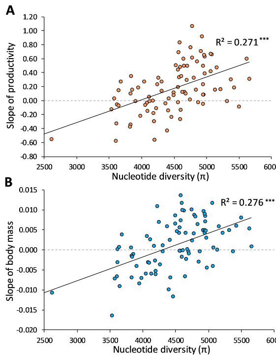

```{r setup, include=FALSE}
knitr::opts_chunk$set(echo = FALSE,
                      warning = FALSE,
                      message = FALSE,
                      error = FALSE,
                      cache = FALSE)

library(ggplot2)
library(tidyterra)
library(leaflet.minicharts)
library(leaflet)
library(plotly)
library(htmlwidgets)
library(leafpop)
library(tidyverse)
library(gganimate)
library(ggrepel)
library(terra)
library(sf)
library(viridis)
library(SpatioTemporalCont)
```

# Resilient Landscapes in Ecology

## Introduction

This document serves as a comprehensive companion to the presentation titled ["Resilient Landscapes in Ecology"](https://derek-corcoran-barrios.github.io/ResilientClass/ResilientPres.html#1). The presentation covers various aspects of ecological resilience, including definitions, examples, and practical applications.

## Resiliency in Ecology

Ecological resilience is a crucial concept in understanding how ecosystems respond to disturbances. As defined by Holling [@holling1973resilience], it refers to the time required for an ecosystem to return to equilibrium following a perturbation. Another perspective highlights the capacity of a system to absorb disturbance and reorganize while retaining its essential functions, structure, identity, and feedbacks.


## Resiliency Factors

The resiliency of an ecosystem is influenced by various factors such as fire, drought, disease, and more. It depends on the intensity, type, frequency, and how fast conditions change. 

In the following image you can see the difference of a system that is resilient, one that is not resilient and one that is resistant, showing how much a system is affected by a disturbance (resilient vs resistant) and weather it comes back to its original state (resilient vs non resiliant). Here we see how an attribute changes over time for ecosystems with different levels of resilience.

```{r, echo=FALSE}
simulate_abundance <- function(ecosystem, steady_state, stressor_start, stressor_duration, stressor_slope = -0.1, recovery_duration, recovery_slope = 0.1, top_recovery = 100, noise = 2) {
  time <- seq(1, (stressor_start + stressor_duration + recovery_duration))
  
  abundance <- c(rep(steady_state, stressor_start - 1),
                 steady_state * exp(stressor_slope * (1:stressor_duration)))
  
  Min <- min(abundance)
  
  Left <- length(time) - length(abundance)
  
  recovery <- c(Min * exp(recovery_slope * (1:Left)))
  
  recovery <- ifelse(recovery > top_recovery, top_recovery, recovery)
  
  abundance <- c(abundance, recovery)
  
  abundance <- abundance + rnorm(length(abundance), mean = 0, sd = noise)
  
  data.frame(time = time, ecosystem = rep(ecosystem, length(time)), abundance = abundance, stressor_duration = stressor_duration, stressor_slope = stressor_slope, recovery_slope = recovery_slope)
}

resistent <- simulate_abundance("resistent", steady_state = 100, stressor_start = 31, stressor_duration = 2, stressor_slope = -0.05, recovery_slope = 0.1,recovery_duration = 67)

resilient <- simulate_abundance("resilient", steady_state = 100, stressor_start = 31, stressor_duration = 10, recovery_duration = 59,  stressor_slope = -0.05, recovery_slope = 0.1)

non_resilient <- simulate_abundance("non-resilient", steady_state = 100, stressor_start = 31, stressor_duration = 10, recovery_duration = 59,  stressor_slope = -0.05, recovery_slope = 0.04,  top_recovery = 70)


all_data <- dplyr::bind_rows(resistent, resilient, non_resilient)

accumulate_by <- function(dat, var) {
  var <- lazyeval::f_eval(var, dat)
  lvls <- plotly:::getLevels(var)
  dats <- lapply(seq_along(lvls), function(x) {
    cbind(dat[var %in% lvls[seq(1, x)], ], frame = lvls[[x]])
  })
  dplyr::bind_rows(dats)
}


fig <- all_data
fig <- fig %>% accumulate_by(~time)

gg <- ggplot(fig, aes(x=time, y=abundance)) +
  geom_vline(xintercept = 30, lty = 2) +
  geom_path(aes(frame = frame, color = ecosystem)) + facet_grid(ecosystem~.) + theme_bw() + theme(legend.position = "none") + labs(y = "attribute")
gg <- ggplotly(gg)

gg <- gg %>% animation_opts(
  frame = 100, 
  transition = 0, 
  redraw = FALSE
)
gg <- gg %>% animation_slider(
  hide = T
)
gg <- gg %>% animation_button(
  x = 1, xanchor = "right", y = 0, yanchor = "bottom"
)
gg
```

### Key definitions


- **Resilient Ecosystems:** These are ecosystems that not only withstand disturbances (resistant) but also have the ability to recover and return to their original state after being affected. Resilient ecosystems exhibit a capacity to absorb disturbances and reorganize while retaining their essential functions, structure, and identity. 

- **Non-Resilient Ecosystems:** Unlike resilient ecosystems, non-resilient ecosystems struggle to recover and may experience long-lasting impacts from disturbances. They lack the ability to bounce back to their original state effectively.

- **Resistant Ecosystems:** Resistant ecosystems can withstand disturbances without undergoing significant changes. While they may resist the immediate impacts of a disturbance, they may not necessarily return to their original state after the disturbance is over.

## Importance of Resilience

One of the key motivations for studying ecological resilience is the rise of extreme weather events. Here we can see a visual representation of the number of natural disaster events over time, highlighting events such as droughts, floods, wildfires, extreme temperatures, and extreme weather courtesy of our world in data.

```{r, echo=FALSE}
knitr::include_url("https://ourworldindata.org/grapher/number-of-natural-disaster-events?time=1900..2023&facet=entity&uniformYAxis=0&country=Drought~Flood~Wildfire~Extreme+temperature~Extreme+weather")
```

## Nature-Based Solutions

An example of nature-based solutions (NBS) is presented using data from Mols Bjerge National Park. In the following map, you can see three different habitat types that have been compared where rewildling has or not happend.

```{r Mols}
Mols_SF <- read_csv("https://raw.githubusercontent.com/derek-corcoran-barrios/derek-corcoran-barrios.github.io/master/ResilientLandscapes/210201_Mols_PlantData%20.csv") %>%
  # Filter only size 10 in PlotSize
  dplyr::filter(PlotSize == 10.00, YEAR == 2017) %>% 
  dplyr::select("BlockNo",  "Latitude", "Longitude", 
"InitialHabitat") %>%
  distinct() %>% 
  st_as_sf(coords = c(3,2), crs = "+proj=longlat +ellps=WGS84 +datum=WGS84 +no_defs +towgs84=0,0,0") %>% 
  group_split(BlockNo) %>% 
  purrr::map(~sample_n(.x,size = 1)) %>% 
  reduce(bind_rows)

pal <- colorFactor(c('#66c2a5','#fc8d62','#8da0cb'), domain =c("Rangeland", "Forest", "Meadow"))


l <-leaflet(data = Mols_SF)  %>% 
  addCircleMarkers(popup = ~as.character(InitialHabitat), label = ~as.character(InitialHabitat), color = ~pal(InitialHabitat), opacity = 0.8) %>% addLegend("bottomright", pal = pal, values = ~InitialHabitat,
                                                                                                                                                            title = "Initial Habitat 2017",
                                                                                                                                                            opacity = 1) 

esri <- grep("^Esri", providers, value = TRUE)
esri <- esri[c(5,2,4,10)]

for (provider in esri) {
  l <- l %>% addProviderTiles(provider, group = provider)
}

l %>%
  addLayersControl(baseGroups = names(esri),
                   options = layersControlOptions(collapsed = TRUE)) %>%
  addMiniMap(tiles = esri[[4]], toggleDisplay = TRUE,
             position = "topleft")
```

We can see in the following figure that in the control area (where cows and horses have been allowed to graze) after a massive drought in 2018, diversity has recovered fully to pre-drought levels. On the other hand, we can see that in the treatment, where enclosures have not allowed for grazing, there is less resilient, and so far, the diversity has not returned to its base state.

```{r PredRichness, include=FALSE}
NewData <- download.file("https://github.com/derek-corcoran-barrios/derek-corcoran-barrios.github.io/raw/master/ResilientLandscapes/NewDataPlot.rds", "NewDataPlot.rds")

NewData <- readRDS("NewDataPlot.rds")

file.remove("NewDataPlot.rds")
```


```{r PredRichness2}
G <-ggplot(NewData, aes(x = Year, y = Predicted)) +
  geom_path(aes(color = treatment)) +
  facet_wrap(~initial_habitat) +
  theme_bw() +
  labs(y = "Alpha Diversity")

plotly::ggplotly(G)
```


## Genetic Diversity and Resilience

The presentation explores the relationship between genetic diversity and resilience. A study involving 10 generations of populations subjected to a novel stressor reveals that higher genetic diversity contributes to higher resilience.



## Ecological Resilience at the Landscape Level

The landscape-level perspective on ecological resilience considers interconnected dynamics, spatial heterogeneity, and overall ecosystem dynamics. Visual representations provide insights into how landscapes distribute resilience.


## On a Landscape

A simulation on a landscape scale is presented, comparing the abundance of resilient and non-resilient ecosystems over time. The accompanying map overlays these simulations on an actual landscape.

```{r PopupMap, echo=FALSE}
# Landscape simulation and map code
```

## Connectivity in Ecology

The importance of connectivity in maintaining biodiversity is emphasized. Visualizations depict the impact of habitat loss and fragmentation on population size, genetic diversity, and gene flow.


## Grassland Connectivity

The document also explores grassland connectivity using land use data. A spatial raster map illustrates the proportion of grassland in the landscape.

```{r GrasslandProp, echo=FALSE}
# Grassland connectivity code
```

## Area vs Diversity

The relationship between area and genetic diversity is investigated. A scatter plot with a regression line demonstrates how larger areas tend to support higher genetic diversity.

```{r areaDiv, echo=FALSE}
# Area vs Diversity plot code
```

## Heterogeneity in Habitats

Habitat heterogeneity is explored as a factor contributing to higher biodiversity. The 'rescue effect' and 'drainage effect' are discussed, and visual representations depict these concepts.


## Regulating Populations

The regulation of populations in heterogeneous landscapes is discussed, considering the impact of habitat heterogeneity, complementarity in vegetation responses, and the influence of livestock.


# In Practice

## Optimize Landscapes

The final section introduces practical applications, emphasizing the optimization of landscapes by incorporating biodiversity, connectivity, and genetic diversity.

```{r COG, echo=FALSE}
# Embedding an external interactive resource
```

## Conclusion

In conclusion, the presentation and this accompanying document provide a comprehensive exploration of resilient landscapes in ecology. The interactive elements, simulations, and visualizations contribute to a deeper understanding of the complex dynamics within ecosystems.

## References

The presentation draws from various sources, and the references are provided for further exploration.

