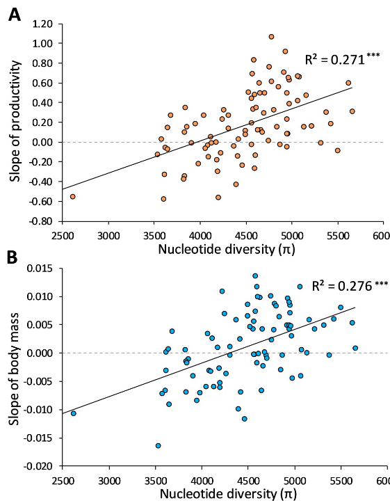

```{r setup, include=FALSE}
knitr::opts_chunk$set(echo = FALSE,
                      warning = FALSE,
                      message = FALSE,
                      error = FALSE,
                      cache = FALSE)

library(ggplot2)
library(tidyterra)
library(leaflet.minicharts)
library(leaflet)
library(plotly)
library(htmlwidgets)
library(leafpop)
library(tidyverse)
library(gganimate)
library(ggrepel)
library(terra)
library(sf)
library(viridis)
library(SpatioTemporalCont)
```

## Resiliency in ecology
::: {style="float: left; width: 40%;"}
* Time required for an ecosystem to return to an equilibrium or steady-state following a perturbation [@holling1973resilience]
* The capacity of a system to absorb disturbance and reorganize while undergoing change so as to still retain essentially the same function, structure, identity, and feedbacks
:::

::: {style="float: right; width: 60%;"}
```{r image, out.width="90%"}
knitr::include_graphics("https://www.researchgate.net/profile/Nathaniel-Ratcliff-2/publication/335750004/figure/fig1/AS:801975427940352@1568217250952/The-resilience-process-as-a-function-of-robustness-and-rapidity-Note-In-this-gure-it-is.ppm")
```
:::

## Resiliency

```{r, echo=FALSE}
simulate_abundance <- function(ecosystem, steady_state, stressor_start, stressor_duration, stressor_slope = -0.1, recovery_duration, recovery_slope = 0.1, top_recovery = 100, noise = 2) {
  time <- seq(1, (stressor_start + stressor_duration + recovery_duration))
  
  abundance <- c(rep(steady_state, stressor_start - 1),
                 steady_state * exp(stressor_slope * (1:stressor_duration)))
  
  Min <- min(abundance)
  
  Left <- length(time) - length(abundance)
  
  recovery <- c(Min * exp(recovery_slope * (1:Left)))
  
  recovery <- ifelse(recovery > top_recovery, top_recovery, recovery)
  
  abundance <- c(abundance, recovery)
  
  abundance <- abundance + rnorm(length(abundance), mean = 0, sd = noise)
  
  data.frame(time = time, ecosystem = rep(ecosystem, length(time)), abundance = abundance, stressor_duration = stressor_duration, stressor_slope = stressor_slope, recovery_slope = recovery_slope)
}

resistent <- simulate_abundance("resistent", steady_state = 100, stressor_start = 31, stressor_duration = 2, stressor_slope = -0.05, recovery_slope = 0.1,recovery_duration = 67)

resilient <- simulate_abundance("resilient", steady_state = 100, stressor_start = 31, stressor_duration = 10, recovery_duration = 59,  stressor_slope = -0.05, recovery_slope = 0.1)

non_resilient <- simulate_abundance("non-resilient", steady_state = 100, stressor_start = 31, stressor_duration = 10, recovery_duration = 59,  stressor_slope = -0.05, recovery_slope = 0.04,  top_recovery = 70)


all_data <- dplyr::bind_rows(resistent, resilient, non_resilient)

accumulate_by <- function(dat, var) {
  var <- lazyeval::f_eval(var, dat)
  lvls <- plotly:::getLevels(var)
  dats <- lapply(seq_along(lvls), function(x) {
    cbind(dat[var %in% lvls[seq(1, x)], ], frame = lvls[[x]])
  })
  dplyr::bind_rows(dats)
}


fig <- all_data
fig <- fig %>% accumulate_by(~time)

gg <- ggplot(fig, aes(x=time, y=abundance)) +
  geom_vline(xintercept = 30, lty = 2) +
  geom_path(aes(frame = frame, color = ecosystem)) + facet_grid(ecosystem~.) + theme_bw() + theme(legend.position = "none") + labs(y = "attribute")
gg <- ggplotly(gg)

gg <- gg %>% animation_opts(
  frame = 100, 
  transition = 0, 
  redraw = FALSE
)
gg <- gg %>% animation_slider(
  hide = T
)
gg <- gg %>% animation_button(
  x = 1, xanchor = "right", y = 0, yanchor = "bottom"
)
gg
```

## Example of nature based solutions

```{r Mols}
Mols_SF <- read_csv("https://raw.githubusercontent.com/derek-corcoran-barrios/derek-corcoran-barrios.github.io/master/ResilientLandscapes/210201_Mols_PlantData%20.csv") %>%
  # Filter only size 10 in PlotSize
  dplyr::filter(PlotSize == 10.00, YEAR == 2017) %>% 
  dplyr::select("BlockNo",  "Latitude", "Longitude", 
"InitialHabitat") %>%
  distinct() %>% 
  st_as_sf(coords = c(3,2), crs = "+proj=longlat +ellps=WGS84 +datum=WGS84 +no_defs +towgs84=0,0,0") %>% 
  group_split(BlockNo) %>% 
  purrr::map(~sample_n(.x,size = 1)) %>% 
  reduce(bind_rows)
```

* rewildling (NBS) vs enclousure

```{r, cache = FALSE}
pal <- colorFactor(c('#66c2a5','#fc8d62','#8da0cb'), domain =c("Rangeland", "Forest", "Meadow"))


l <-leaflet(data = Mols_SF)  %>% 
  addCircleMarkers(popup = ~as.character(InitialHabitat), label = ~as.character(InitialHabitat), color = ~pal(InitialHabitat), opacity = 0.8) %>% addLegend("bottomright", pal = pal, values = ~InitialHabitat,
                                                                                                                                                            title = "Initial Habitat 2017",
                                                                                                                                                            opacity = 1) 

esri <- grep("^Esri", providers, value = TRUE)
esri <- esri[c(5,2,4,10)]

for (provider in esri) {
  l <- l %>% addProviderTiles(provider, group = provider)
}

l %>%
  addLayersControl(baseGroups = names(esri),
                   options = layersControlOptions(collapsed = TRUE)) %>%
  addMiniMap(tiles = esri[[4]], toggleDisplay = TRUE,
             position = "topleft")
```

## Rewildilng Mols Bjerge National Park (cont)

```{r PredRichness, include=FALSE}
NewData <- download.file("https://github.com/derek-corcoran-barrios/derek-corcoran-barrios.github.io/raw/master/ResilientLandscapes/NewDataPlot.rds", "NewDataPlot.rds")

NewData <- readRDS("NewDataPlot.rds")

file.remove("NewDataPlot.rds")
```


```{r PredRichness2}
G <-ggplot(NewData, aes(x = Year, y = Predicted)) +
  geom_path(aes(color = treatment)) +
  facet_wrap(~initial_habitat) +
  theme_bw() +
  labs(y = "Alpha Diversity")

plotly::ggplotly(G)
```

## Higher genetic diversity higher resilience

::: {style="float: left; width: 40%;"}
* 10 generations of populations with novel stressor
* Different levels of genetic diversity
* Higher diversity higher resilience [@_rsted_2019]
:::

::: {style="float: left; width: 60%;"}

```{r geneticres, out.width="70%"}

```

:::

## Ecological Resilience at the Landscape Level: {.smaller}

::: {style="float: left; width: 38%;"}

* **Interconnected Dynamics**: Diverse ecosystems collectively respond to disturbances within landscape resilience.

* **Spatial Heterogeneity**: Considers resilience distribution across landscapes, emphasizing varied spatial patterns.

* **Ecosystem Dynamics**: Addresses overall configuration and interactions of interconnected ecosystems within the landscape.

:::

::: {style="float: right; width: 60%;"}

```{r heterogeneity, out.width="70%"}
knitr::include_graphics("https://www.researchgate.net/publication/344879263/figure/fig1/AS:1010015070584832@1617817766555/An-example-of-sites-distributed-in-a-heterogeneous-landscape-subject-to-various-forms-of.ppm")
```

:::

## On a landscape

```{r PopupMap}
Resilients <- list()
Plots <- list()
  
for(i in 1:30){
  Resilients[[i]] <- simulate_abundance("resilient", steady_state = 100, stressor_start = 31, stressor_duration = 10, recovery_duration = 59,  stressor_slope = -0.05, recovery_slope = 0.1)
  Plots[[i]] <- ggplot(Resilients[[i]], aes(x = time, y = abundance)) + geom_path() + theme_bw()
}

Resilients <- Resilients |> 
  purrr::reduce(dplyr::bind_rows)


Resilients_sum <- Resilients |> 
  summarise(abundance = sum(abundance), .by = time)


non_resilients <- list()

for(i in 1:5){
  non_resilients[[i]] <- simulate_abundance("non-resilient", steady_state = 100, stressor_start = 31, stressor_duration = 10, recovery_duration = 59,  stressor_slope = -0.05, recovery_slope = 0.04,  top_recovery = 70)
  Plots[[i + 30]] <- ggplot(non_resilients[[i]], aes(x = time, y = abundance)) + geom_path() + theme_bw()
}

non_resilients <- non_resilients |> 
  purrr::reduce(dplyr::bind_rows)


non_resilients_sum <- non_resilients |> 
  summarise(abundance = sum(abundance), .by = time)

Forest <- terra::rast("Forest.tif")


Forest_Int <- terra::rast("Forest_Int.tif")

Forest_Poly <- terra::ifel(Forest_Int == 1, 1, NA) |> 
  as.polygons() |> disagg()

Forest_Poly$area <- terra:::expanse(Forest_Poly, unit = "ha")

BigArea <- Forest_Poly[Forest_Poly$area == max(Forest_Poly$area),]


ContArea <- crop(Forest, BigArea)

set.seed(2024)
Sample <- spatSample(ContArea, 100, xy = TRUE, as.points = T) |> 
  tidyterra::slice_max(order_by = focal_mean, n = 35) |> 
  tidyterra::arrange(desc(focal_mean)) 

Sample$ID <- 1:nrow(Sample)

set.seed(2024)

Sample$Type <- sample(c("Resilient", "Non-resilient"), size = nrow(Sample), replace = T, prob = c(0.85, 0.15))

Sample <- Sample |> tidyterra::arrange(desc(Type))


Sample_sf <- terra::project(Sample, y = "epsg:4623")

Pal <- colorFactor(c("red", "blue"), domain = sort(Sample_sf$Type))


leaflet() |> addProviderTiles("Esri.WorldImagery") |> 
  addCircleMarkers(data = Sample_sf, radius = 3, color = ~Pal(Type), group = "pnt") |> 
  addPopupGraphs(Plots, group = "pnt", width = 200, height = 200)

```


## All together

```{r cumulative}
all <- dplyr::bind_rows(Resilients, non_resilients) |> 
  summarise(abundance = sum(abundance), .by = time)

# G <- plotly::ggplotly(ggplot(all, aes(x = time, y = abundance)) + geom_path() + theme_bw())
 
# G
 
fig <- all
fig <- fig %>% accumulate_by(~time)

gg <- ggplot(fig, aes(x=time, y=abundance)) +
  geom_vline(xintercept = 30, lty = 2) +
  geom_path(aes(frame = frame)) + theme_bw() + theme(legend.position = "none") + labs(y = "attribute")
gg <- ggplotly(gg)

gg <- gg %>% animation_opts(
  frame = 100, 
  transition = 0, 
  redraw = FALSE
)
gg <- gg %>% animation_slider(
  hide = T
)
gg <- gg %>% animation_button(
  x = 1, xanchor = "right", y = 0, yanchor = "bottom"
)
gg
```

# Connectivity

## Higher connectivity leads to higher diversity
::: {style="float: left; width: 40%;"}
* Habitat loss and fragmentation can have strong impacts on population size, genetic diversity and gene flow
:::

::: {style="float: right; width: 60%;"}
```{r figurepaper, out.width="60%"}
knitr::include_graphics("https://www.frontiersin.org/files/Articles/606222/fgene-11-606222-HTML/image_m/fgene-11-606222-g001.jpg")
```

[@Amaral_2021]

:::

## Connectivity vs Genetic diversity in europe

```{r, out.width="60%"}
knitr::include_graphics("https://media.springernature.com/lw685/springer-static/image/art%3A10.1007%2Fs10980-021-01292-w/MediaObjects/10980_2021_1292_Fig4_HTML.png?as=webp")
```

* Three species of herbs through Europe [@naaf2021sensitivity]
* France, Belgium, Germany, Sweden, and Estonia

## Current studies in Denmark

```{r diversityConnect}
lines <- terra::vect("Lines2500.shp") |> 
  terra::project(y = "epsg:4623")
Diversity <- read.csv("DiversityMap.csv") |> 
  dplyr::mutate(pi = 10*(pi/max(pi))) |> 
  terra::vect(geom = c("x", "y"), crs = "epsg:4326")

color_palette <- colorNumeric(
  palette = "YlGnBu",
  domain = Diversity$pi,
  reverse = T
)

leaflet() |>
    addProviderTiles("Esri.WorldImagery") |>
    addPolylines(data = lines, weight = 1, color = "red") |>
    addCircleMarkers(data = Diversity, radius = ~pi, fillOpacity = 0.8, color = ~color_palette(pi), popup = leafpop::popupTable(as.data.frame(Diversity))) |> addLegend(pal =  color_palette, values = Diversity$pi, title = "Genetic diversity", position  = "bottomleft")
```

## Grassland connectivity

```{r GrasslandProp, echo = F, cache= T}
data("Landuse_DK")

Landuse <- terra::unwrap(Landuse_DK)

Grassland <- calculate_prop(Landuse, Radius = 2000, Vars = "dry nature")

ggplot() + geom_spatraster(data= Grassland) + scale_fill_wiki_c(name = "Grassland") + theme_bw()
```

## Area vs diversity {.smaller}

```{r areaDiv}
Diverse <- read_csv("Diversity.csv") |> 
  dplyr::mutate(pi = pi/max(pi))
G <- ggplot(Diverse, aes(x = Area, y = pi)) + geom_smooth(method = "lm") + geom_point() + theme_bw()+ labs(x = "Area [ha]", y = "Genetic diversity")
plotly::ggplotly(G) 
```
# Heterogeneity

## Higher heterogeneity higher diversity {.smaller}

::: {style="float: left; width: 40%;"}
* **Habitat Dynamics**: Impact of habitat fragmentation and eutrophication on biodiversity.

* **Mechanisms at Play**: Explores the 'rescue effect' for rapid recolonization and the 'drainage effect' for stabilizing biodiversity in meta-food-webs.

* **Biodiversity Promotion**: Higher biodiversity in heterogeneous landscapes, landscape heterogeneity in promoting biodiversity [@Ryser_2021].

:::

::: {style="float: right; width: 50%;"}

```{r rescue, out.width="90%"}

knitr::include_graphics("https://media.springernature.com/full/springer-static/image/art%3A10.1038%2Fs41467-021-24877-0/MediaObjects/41467_2021_24877_Fig1_HTML.png?as=webp")

```


:::

## Regulating populations {.smaller}

::: {style="float: left; width: 40%;"}

* **Habitat Heterogeneity**: Habitat heterogeneity, allows wild ungulates to mitigate fluctuations in plant production by utilizing diverse resources throughout the year.

* **Complementarity in Vegetation Responses**: Complementarity effect among different vegetation types, increasing food availability predictability across years for ungulates.

* **Livestock Influence**: Dual impact of domestic ungulates, positive effects on wild ungulate density at lower abundances but negative effects at higher densities [@Giralt_Rueda_2023].

:::

::: {style="float: right; width: 50%;"}

```{r rescue2, out.width="90%"}

knitr::include_graphics("https://ars.els-cdn.com/content/image/1-s2.0-S0048969723034496-gr1.jpg")

```


:::

# In practice

## Optimize landscapes

* Including biodiversity, connectivity and genetic diversity (Corcoran et al. in prep)

```{r COG}
knitr::include_url("https://derek-corcoran-barrios.github.io/COG/TestCOG2.html", height = "1000px")
```


## References

<style>
slides > slide { overflow: scroll; }
slides > slide:not(.nobackground):after {
  content: '';
}
</style>
