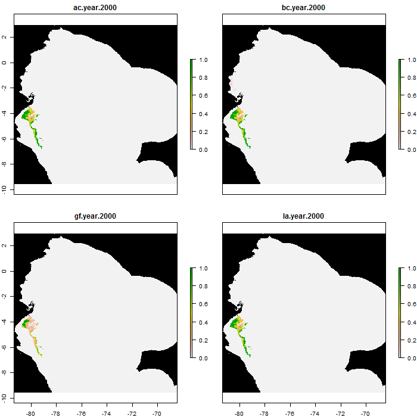

<style>
.forceBreak { -webkit-column-break-after: always; break-after: column; }
</style>


```{r setup, include=FALSE}
knitr::opts_chunk$set(echo = FALSE,
                      warning = F,
                      error = F,
                      message = F,
                      cache = F)
library(shiny)
library(tidyverse)
library(terra)
library(tidyterra)
library(plotly)
library(patchwork)
library(sf)
library(MuMIn)
library(lme4)
library(leaflet)
OptimalLong <- read_csv("SensitivityApp/OptimalLong.csv")
Sensitivity <- terra::rast("SensitivityApp/LocalSensitivity.tif")
names(Sensitivity) <- stringr::str_remove_all(names(Sensitivity),"Bonus_")

Solutions <- terra::rast("SensitivityApp/LocalSolutions.tif")
names(Solutions) <- names(Sensitivity)[1:nlyr(Solutions)]
```

## Introduction

* Grew up surrounded by nature and farming in Patagonia
* Field Work Ecologist -> Work with stakeholders -> Landscape modeling -> Data Science 
* Focus on transdisciplinarity


```{r}
library(htmltools)

# Replace 'image1.jpg' and 'image2.jpg' with the actual file paths or URLs of your images
image1 <- "images/Guanaco.jpg"
image2 <- "images/test.png"

# Creating HTML code to display images side by side
html_code <- div(
  style = "display: flex; justify-content: space-between;",
  img(src = image1, width = "48%"),
  img(src = image2, width = "48%")
)

html_code
```

# Two scales of resilience

# Local resilience

## Rewildilng Mols Bjerge National Park (Local) {.smaller}

* Return from a disturbance

```{r, cache = T}
Mols_SF <- read_csv("210201_Mols_PlantData .csv") %>%
  # Filter only size 10 in PlotSize
  dplyr::filter(PlotSize == 10.00, YEAR == 2017) %>% 
  dplyr::select("BlockNo",  "Latitude", "Longitude", 
"InitialHabitat") %>%
  distinct() %>% 
  st_as_sf(coords = c(3,2), crs = "+proj=longlat +ellps=WGS84 +datum=WGS84 +no_defs +towgs84=0,0,0") %>% 
  group_split(BlockNo) %>% 
  purrr::map(~sample_n(.x,size = 1)) %>% 
  reduce(bind_rows)
```

* rewildling (NBS) vs enclousure

```{r, cache = FALSE}

pal <- colorFactor(c('#66c2a5','#fc8d62','#8da0cb'), domain =c("Rangeland", "Forest", "Meadow"))


l <-leaflet(data = Mols_SF)  %>% 
  addCircleMarkers(popup = ~as.character(InitialHabitat), label = ~as.character(InitialHabitat), color = ~pal(InitialHabitat), opacity = 0.8) %>% addLegend("bottomright", pal = pal, values = ~InitialHabitat,
                                                                                                                                                            title = "Initial Habitat 2017",
                                                                                                                                                            opacity = 1) 

esri <- grep("^Esri", providers, value = TRUE)
esri <- esri[c(5,2,4,10)]

for (provider in esri) {
  l <- l %>% addProviderTiles(provider, group = provider)
}

l %>%
  addLayersControl(baseGroups = names(esri),
                   options = layersControlOptions(collapsed = TRUE)) %>%
  addMiniMap(tiles = esri[[4]], toggleDisplay = TRUE,
             position = "topleft")
```

## Rewildilng Mols Bjerge National Park (cont)

```{r PredRichness}
NewData <- readRDS("NewDataPlot.rds")

G <-ggplot(NewData, aes(x = Year, y = Predicted)) +
  geom_path(aes(color = treatment)) +
  facet_wrap(~initial_habitat) +
  theme_bw() +
  labs(y = "Alpha Diversity")

plotly::ggplotly(G)
```


## Resilience in Networks {.columns-2}

* Measures of network stability
* Trophic and mutualistic 
* With rewiring potential hypothesis
* Potential colaboration (Dr. Liesbeth Bakker)

<p class="forceBreak"></p>

```{r}
knitr::include_graphics("images/NetworkExtinctionImg.png")
```

```{r}

```

# Landscape and temporal scale

## Landscape and temporal scale

<div style="float: left; width: 40%;">
* Systematic conservation planning
* What areas are irreplaceable
* How do we manage for climate change
* Optimization of resilient landscapes
* Network flow (more on this later)
</div>

<div style="float: right; width: 60%;">
```{r}

```
</div>

## Learning from the past

<div style="float: left; width: 40%;">
* Who, when, why, and where became extinct (Villavicencio, N., Corcoran, D., & Marquet, P. 2019)

```{r, out.height=400}

```
</div>

<div style="float: right; width: 60%;">
```{r, out.height="80%", out.width="80%"}

```
</div>

## Future resilience (SPARC)

* Spatial Planning for Area Conservation in Response to Climate Change (SPARC) 
* SPARC is coordinated by Conservation International and involves scientists and policy experts from over 20 institutions across the tropics
* Neotropical Coordinator/Project Researcher 

```{r, out.height="60%", out.width="30%"}

```

## Future resilience

* We use all of this to take decisions about the future (Hannah, L., Roehrdanz, P.R., Marquet, P.A., Enquist, B.J., Midgley, G., Foden, W., Lovett, J.C., Corlett, R.T., Corcoran, D., Butchart, S.H. and Boyle, B., 2020)

```{r}
library(htmltools)

# Replace 'image1.jpg' and 'image2.jpg' with the actual file paths or URLs of your images
image1 <- "images/image2.gif"
image2 <- "images/image6.gif"

# Creating HTML code to display images side by side
html_code <- div(
  style = "display: flex; justify-content: space-between;",
  img(src = image1, width = "48%"),
  img(src = image2, width = "48%")
)

html_code
```

## Network flow

<div style="float: left; width: 40%;">
* Incorporating species dispersal (Species on the move)
* Considering Food security
* Quadratic [Network flow](https://youtu.be/u0ccCJn0wZg) (Currently suppervising PhD student in South Africa)
* Multiple scenarios
* Possible collaboration with Dr. Anouschka Hof
* [Example report](https://static1.squarespace.com/static/57be0f8abebafb6d2e14828f/t/5d9cbb4d7c5b6d42d382e0ae/1570552656952/NorthernAndes_FinalPDF.pdf)
</div>

<div style="float: right; width: 60%;">
```{r, out.width="60%"}
knitr::include_graphics("images/image1.gif")
```
</div>

## Geographic representation

```{r, out.width="60%"}

```


# Future directions

## How to plan for futute landscapes {.smaller}

$\begin{align*} \text{Maximize}  & =  \text{Biodiversity} + \text{Resilience} + \text{Human dimension}\end{align*}$ 

>- Biodiversity
>   - Community composition and rarity
>   - Phylogenetic Diversity
>   - Functional diversity
>- Resilience
>   - Contiguity (Area)
>   - Ecosystem Functioning and Global Change Vulnerability
>   - Network stability (Trophic and/or mutualistic)
>   - Stochastic components
>- Human dimension
>   - Food and resource security (Eg. Renewable energy, water)
>   - Minimize conflict

## Example Landuse (Global contribution)


```{r}
library(readr)
Optimal <- read_table("OptimalAarhus.txt", 
    col_names = FALSE) |> 
  mutate_if(is.numeric, ~round(.x, digits = 2))

colnames(Optimal) <- c("Biodiversity", "Contiguity","ContiguityBonus")

OptimalLong <- Optimal |>
  tidyr::pivot_longer(Biodiversity:Contiguity, names_to = "Part", values_to = "Contribution")


G <- ggplot(OptimalLong, aes(x = ContiguityBonus, y = Contribution, group = Part)) + geom_path(aes(color = Part)) + theme_bw()
G <- plotly::ggplotly(G)

contiguity_index <- which(sapply(G$x$data, function(trace) trace$name == "Contiguity"))

G$x$data[[contiguity_index]]$visible <- "legendonly"

biodiversity_index <- which(sapply(G$x$data, function(trace) trace$name == "Biodiversity"))

# Get the range of the "Biodiversity" trace
x_range <- range(G$x$data[[biodiversity_index]]$x)
y_range <- range(G$x$data[[biodiversity_index]]$y)

# Set initial axis range based on "Biodiversity" trace
G$x$layout$xaxis$range <- x_range
G$x$layout$yaxis$range <- y_range
```


```{r}
library(terra)
library(tidyterra)
library(leaflet)
AarhusSols <- terra::rast("AarhusSols.tif")
AarhusSols <- as.numeric(AarhusSols[[1:4]])
Pal <- colorBin(palette = c('#e41a1c','#377eb8','#4daf4a','#984ea3','#ff7f00','#ffff33','#a65628','#f781bf'), domain = values((AarhusSols)[[1]]), na.color = "transparent")
factor_labels <- c("ForestDryPoor", "ForestDryRich", "ForestWetPoor", "ForestWetRich", 
                   "OpenDryPoor", "OpenDryRich", "OpenWetPoor", "OpenWetRich") 

L <- leaflet(height = 300) |> addProviderTiles("CartoDB.DarkMatter") |> addRasterImage(AarhusSols[[1]], color = Pal, group = "0") |>
  addRasterImage(AarhusSols[[2]], color = Pal, group = "0.05") |> addRasterImage(AarhusSols[[3]], color = Pal, group = "0.1") |>  addRasterImage(AarhusSols[[4]], color = Pal, group = "0.15") |>
  addLegend(
  "bottomright",
  title = "Land Use",
  colors = c('#e41a1c','#377eb8','#4daf4a','#984ea3','#ff7f00','#ffff33','#a65628','#f781bf'),
  labels = factor_labels,
  opacity = 1
) |> addLayersControl(
    baseGroups = c("0", "0.05", "0.1", "0.15"),
    options = layersControlOptions(collapsed = T)
  )
```


```{r}
htmltools::div(
  style = "display: flex; justify-content: space-between;",
  G,
  L
)
```


$\begin{align*} \text{Maximize}  & =  \text{Biodiversity} + \text{Resilience} \cdot \text{bonus}\end{align*}$

* 14% of Denmark's agriculture to nature
* Trade-off

## Individual cell values (Local contribution)

```{r}
library(terra)
library(tidyterra)
library(leaflet)
library(manipulateWidget)
library(leaflet.minicharts)

# Load the raster data for the first map
AarhusSols <- terra::rast("AarhusSols.tif")
AarhusSols <- as.numeric(AarhusSols[[1:4]])
Pal1 <- colorBin(palette = c('#e41a1c','#377eb8','#4daf4a','#984ea3','#ff7f00','#ffff33','#a65628','#f781bf'), domain = values((AarhusSols)[[1]]), na.color = "transparent")
factor_labels1 <- c("ForestDryPoor", "ForestDryRich", "ForestWetPoor", "ForestWetRich", 
                    "OpenDryPoor", "OpenDryRich", "OpenWetPoor", "OpenWetRich") 

# Create the first leaflet map
L1 <- leaflet(height = 300) |> addProviderTiles("CartoDB.DarkMatter") |> 
  addRasterImage(AarhusSols[[1]], color = Pal1, group = "0") |>
  addRasterImage(AarhusSols[[2]], color = Pal1, group = "0.05") |>
  addRasterImage(AarhusSols[[3]], color = Pal1, group = "0.1") |>
  addRasterImage(AarhusSols[[4]], color = Pal1, group = "0.15") |>
  addLegend(
    "bottomright",
    title = "Land Use",
    colors = c('#e41a1c','#377eb8','#4daf4a','#984ea3','#ff7f00','#ffff33','#a65628','#f781bf'),
    labels = factor_labels1,
    opacity = 1
  ) |>
  addLayersControl(
    baseGroups = c("0", "0.05", "0.1", "0.15"),
    options = layersControlOptions(collapsed = T)
  )

# Load the raster data for the second map
AarhusLocals <- terra::rast("AarhusLocals.tif")
AarhusLocals <- as.numeric(AarhusLocals[[1:4]])
Pal2 <- colorBin(palette = c('#e41a1c','#377eb8','#4daf4a'), domain = c(1,2,3), na.color = "transparent")
factor_labels2 <- c("Biodiversity", "Contiguity", "Equal") 

# Create the second leaflet map
L2 <- leaflet(height = 300) |> addProviderTiles("CartoDB.DarkMatter") |> 
  addRasterImage(AarhusLocals[[1]], color = Pal2, group = "0") |>
  addRasterImage(AarhusLocals[[2]], color = Pal2, group = "0.05") |>
  addRasterImage(AarhusLocals[[3]], color = Pal2, group = "0.1") |>
  addRasterImage(AarhusLocals[[4]], color = Pal2, group = "0.15") |>
  addLegend(
    "bottomright",
    title = "Land Use",
    colors = c('#e41a1c','#377eb8','#4daf4a'),
    labels = factor_labels2,
    opacity = 1
  ) |>
  addLayersControl(
    baseGroups = c("0", "0.05", "0.1", "0.15"),
    options = layersControlOptions(collapsed = T)
  )

# Combine the leaflet maps
leafsync::sync(L1, L2, ncol = 2, sync = "all")
```

$\begin{align*} \text{Maximize}  & =  \text{Biodiversity}_c + \text{Resilience}_c\cdot \text{bonus}\end{align*}$

## Adding human dimension {.smaller}

```{r, out.height= "50%"}
library(DiagrammeR)
DiagrammeR("graph LR;
           A(Biodiversity)-->C(Human Dimension);
           B(Reslillence)-->C(Human Dimension);
           C(Human Dimension)-->C(Human Dimension)")
```

$$\begin{align*} \text{Maximize}  & =  \text{Biodiversity} + \text{Resilience} + \text{Human dimension}\end{align*}$$

> - First iteration: 
>    - Economic yield and number of owners
> - Second iteration:
>    - Characterization of actors, who is in the areas of interest (Farmers, Home owners, private companies, municipalities)
>    - What are their interests
> - Third iteration:
>     - Interview them, what are their concerns (quantitative surveys, Q method, Dr. Arjen Buijs)
>     - add them to the optimization

# External colaborations

## External colaborations

* Spatial Optimization (Wendy Foden, South Africa; Patrick Roherdanz, USA; Signe Normand, Denmark; Pablo Marquet, Chile)
* Numerical optimization (Roberto Cominetti, Chile)
* Stochastic models in migration and optimization (Cristobal Quiñinao, Chile)
* Biodiversity datasets (Brian Enquist, USA)
* Trophic and Mutualistic networks (Isidora Ávila-Thieme, Chile)
* Human Dimension (Giorgia Graells, Chile; Pil Pedersen, Denmark)
* Paleoecology (Natalia Villavicencio, Chile)

# Questions
