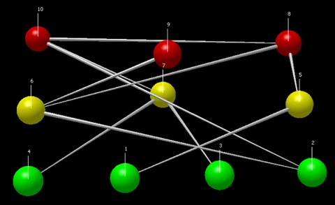
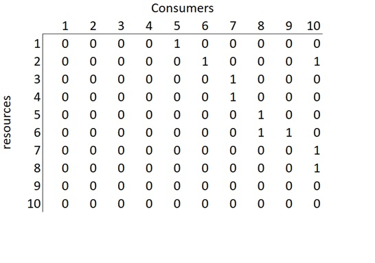

Website of Derek Corcoran Data Scientist

```{r, echo=FALSE}

```

Derek was born in Punta Arenas, the southernmost city of Chile, in 1981. He studied Biological Sciences at Concepción University of Chile and obtained his bachelor degree at 2006. During 2008, he began a PhD in Ecology at Catholic University of Chile. In 2010, he came back to Punta Arenas to develop his PhD research about the [North American beaver invasion](https://cienciaustral.com/nuestro-trabajo-cientifico/research/invasion-castor-norteamericano-en-patagonia/). Studying beaver’s distribution modeling, he started to develop his quantitative skills within the R software environment.

Then in 2015, during a Postdoctoral position in the University of Missouri, he investigated the occupancy of 12 bat species in the Sierra Nevada and which variables better explained their occupancy. Both experimental design and data analysis, allowed him to implement new systems of quantitative analysis, creating an R package called [*DiversityOcupancy*](http://rpubs.com/derek_corcoran/DiversityOccupancy). At the same time, through collaborations he started his research in quantitative analysis in sport, which allowed him to create a [basketball spatial model](https://derek-corcoran-barrios.github.io/about.html) considering the pairwise comparison of teams offensive and defensive spatial configuration and performance.

Today, he is working at Catholic University of Chile in his second postdoctoral position. He is part of two projects which try to establish a model of maximization of conservation of species [considering climate change](http://www.sparc-website.org/) while minimizing the land required to incorporate to the global network of protected area using network flow optimization and collaborating with mathematicians. Equally important, he has been teaching [R courses](https://derek-corcoran-barrios.github.io/CursoR.html) for PhD students in the same University, looking forward to build up new modules for teaching R for researchers and develop an online course of R with the Postgraduate Department.

Derek is the co-founder of [Ciencia Austral](https://cienciaustral.com/), an environmental consultancy based in Punta Arenas focused in scientific advisory and education. Here, he has worked in projects about beaver eradication, sustainable harvesting of guanacos, ecosystem services of dung beetles, and data science, learning not only R, but also Python and AMPL.

<!--chapter:end:index.Rmd-->

---
title: "Project description"
---

We have created this site to share the results of our spatial analysis of the game of basketball with the public. The general concept behind this research project was to build a predictive model for the outcome of National Basketball Association (NBA) games based on the offensive and defensive matchup between teams. In order to do this, we examined around one million shots (about five years of data) by pairing up the offensive and defensive shot charts for every team in the NBA against all other opponents. From this, we have managed to build a machine learning algorithm which can be used for analysis such as:


- Predicting the spread for [every NBA game](https://derek-corcoran-barrios.github.io/Projection.html).
- Estimating the impact that trades have on expected outcome and performance for teams
- Spatially analyzing the locations where teams perform well on offense and defense using [shot charts](https://derek-corcoran-barrios.github.io/ShotCharts.html).
- Calculating our own [spatial power rankings](https://derek-corcoran-barrios.github.io/Rating.html) and [team stats](https://derek-corcoran-barrios.github.io/TeamStats.html)
- Finding key points where teams are able to improve matchups against other teams
- And much much more… From all of this, we hope to show how using spatial analysis can provide more critical insights into the nature of NBA games.

<!--chapter:end:about.Rmd-->

---
title: "BlogHome"
output: html_document
---


```{r setup, include=FALSE}
knitr::opts_chunk$set(echo = FALSE, cache = TRUE, warning = FALSE, message = FALSE)
```

## [Does the recent Bulls winning streak mean something?](https://derek-corcoran-barrios.github.io/Mirotic)

*December 20th, 2017*

```{r}
library(dplyr)
library(lubridate)
library(SpatialBall2)
library(gridExtra)
library(ggplot2)
Season2018 <- readRDS("Season2018.rds")
NM <- filter(Season2018, GAME_DATE >= dmy("8/12/2017"))
WONM <- filter(Season2018, GAME_DATE < dmy("8/12/2017"))
```

### Shot charts with and without Nikola Mirotic

Since Nikola, has just played 6 games, there's too few shots to make a passable shot chart of Chicago with him, so we will have to rely on team stats to figure what is going on.

```{r, fig.width=6, fig.height=12}
Without <- OffShotSeasonGraphTeam(Seasondata = WONM, team = "Chi") + ggtitle("Offensive without Mirotic")
With <- OffShotSeasonGraphTeam(Seasondata = NM, team = "Chi", quant = 0.05)+ ggtitle("Offensive with Mirotic")

grid.arrange(Without, With, ncol = 1)
```
[Read more...](https://derek-corcoran-barrios.github.io/Mirotic)

## [The first team ever to shoot more than half their shots beyond the three point line](https://derek-corcoran-barrios.github.io/Blog)

*December 2nd, 2017*

For while we`ve been wondering if there is such a thing as too many three pointers for a team. Well we can keep asking ourselves that, as today December the second of 2017, The Rockets are shooting an NBA all-time record 53% of their shots from three point range, followed by last season's Rockets with 46%. Third place is held by last year’s Cavs team, with 40%, a 13% difference. And it's not even close to the second, just compare this years Rockets shot chart with 2001 NBA Champions LA Lakers, it's a completely different sport!

```{r}
knitr::include_graphics("https://derek-corcoran-barrios.github.io/Blog_files/figure-html/unnamed-chunk-3-1.png")
```

[Read more...](https://derek-corcoran-barrios.github.io/Blog)

<!--chapter:end:BlogHome.Rmd-->

---
output: html_document
---

```{r setup, include=FALSE}
knitr::opts_chunk$set(echo = FALSE, warning = FALSE, message = FALSE, cache = TRUE)
```


```{r load packs}
if (!require("pacman")) install.packages("pacman")
pacman::p_load(tidyverse, DT, stringr, purrr, dplyr, ggplot2, plotly)
```


```{r getting stats, echo=FALSE}
Season2018 <- readRDS("Season2018.rds")
TeamStats2018 <- Season2018 %>% mutate(EVENT_TYPE = make.names(EVENT_TYPE), SHOT_TYPE = str_replace(SHOT_TYPE, " Field Goal", ""))  %>% group_by(TEAM_NAME, SHOT_TYPE, EVENT_TYPE) %>% dplyr::summarise(N = n()) %>% spread(key = EVENT_TYPE, value = N) %>% split(.$SHOT_TYPE) %>%  map(~mutate(.x, ShotPct = round(Made.Shot/(Made.Shot +Missed.Shot), 3), Total = Made.Shot + Missed.Shot))

Points <- c("2Pts", "3Pts")

for(i in 1:length(TeamStats2018)){
  colnames(TeamStats2018[[i]])[2:6] <- paste0(colnames(TeamStats2018[[i]])[2:6], Points[i])
}

TeamStats2018 <- TeamStats2018 %>% reduce(merge) %>% select(-SHOT_TYPE2Pts, -SHOT_TYPE3Pts, -Made.Shot2Pts, -Made.Shot3Pts, -Missed.Shot2Pts, -Missed.Shot3Pts) %>% mutate(TotalShots = Total2Pts + Total3Pts) %>% mutate(PercentageOf2s = round(Total2Pts/TotalShots,2),PercentageOf3s = round(Total3Pts/TotalShots, 2)) %>% select(-TotalShots, -Total2Pts, -Total3Pts)
Teams <- unique(Season2018$TEAM_NAME)

Prop <- data.frame(TEAM_NAME = Teams , PropShot = NA)

for(i in 1:30){
Offa <- dplyr::filter(Season2018, HTM == Teams[i] | VTM == Teams[i])
Prop$PropShot[i] <- round(nrow(dplyr::filter(Offa, TEAM_NAME == Teams[i]))/nrow(dplyr::filter(Offa,TEAM_NAME != Teams[i])),3)
}

TeamStats2018 <- full_join(TeamStats2018, Prop) %>% mutate(PPS = round((ShotPct2Pts*2*PercentageOf2s)+(ShotPct3Pts*3*PercentageOf3s),3)) %>% mutate(AdjPPS = round((PPS * PropShot),3)) %>% mutate(Season = 2018)
```

```{r MakeTable, echo=FALSE}
TeamStats2018 <- TeamStats2018
```

```{r, cache = TRUE}
pacman::p_load(tidyverse, DT, stringr, purrr, dplyr)
library(SpatialBall2)

Season2001 <- readRDS("Season2001.rds")
TeamStats2001 <- Season2001 %>% mutate(EVENT_TYPE = make.names(EVENT_TYPE), SHOT_TYPE = str_replace(SHOT_TYPE, " Field Goal", ""))  %>% group_by(TEAM_NAME, SHOT_TYPE, EVENT_TYPE) %>% dplyr::summarise(N = n()) %>% spread(key = EVENT_TYPE, value = N) %>% split(.$SHOT_TYPE) %>%  map(~mutate(.x, ShotPct = round(Made.Shot/(Made.Shot +Missed.Shot), 3), Total = Made.Shot + Missed.Shot))

Points <- c("2Pts", "3Pts")

for(i in 1:length(TeamStats2001)){
  colnames(TeamStats2001[[i]])[2:6] <- paste0(colnames(TeamStats2001[[i]])[2:6], Points[i])
}

TeamStats2001 <- TeamStats2001 %>% reduce(merge) %>% select(-SHOT_TYPE2Pts, -SHOT_TYPE3Pts, -Made.Shot2Pts, -Made.Shot3Pts, -Missed.Shot2Pts, -Missed.Shot3Pts) %>% mutate(TotalShots = Total2Pts + Total3Pts) %>% mutate(PercentageOf2s = round(Total2Pts/TotalShots,2),PercentageOf3s = round(Total3Pts/TotalShots, 2)) %>% select(-TotalShots, -Total2Pts, -Total3Pts)
Teams <- unique(Season2001$TEAM_NAME)

Prop <- data.frame(TEAM_NAME = Teams , PropShot = NA)

for(i in 1:length(Teams)){
  Offa <- dplyr::filter(Season2001, HTM == Teams[i] | VTM == Teams[i])
  Prop$PropShot[i] <- round(nrow(dplyr::filter(Offa, TEAM_NAME == Teams[i]))/nrow(dplyr::filter(Offa,TEAM_NAME != Teams[i])),3)
}

TeamStats2001 <- full_join(TeamStats2001, Prop) %>% mutate(PPS = round((ShotPct2Pts*2*PercentageOf2s)+(ShotPct3Pts*3*PercentageOf3s),3)) %>% mutate(AdjPPS = round((PPS * PropShot),3)) %>% mutate(Season = 2001)

TeamStats2001 <- TeamStats2001

data("season2017")
Season2017 <- season2017
TeamStats2017 <- Season2017 %>% mutate(EVENT_TYPE = make.names(EVENT_TYPE), SHOT_TYPE = str_replace(SHOT_TYPE, " Field Goal", ""))  %>% group_by(TEAM_NAME, SHOT_TYPE, EVENT_TYPE) %>% dplyr::summarise(N = n()) %>% spread(key = EVENT_TYPE, value = N) %>% split(.$SHOT_TYPE) %>%  map(~mutate(.x, ShotPct = round(Made.Shot/(Made.Shot +Missed.Shot), 3), Total = Made.Shot + Missed.Shot))

Points <- c("2Pts", "3Pts")

for(i in 1:length(TeamStats2017)){
  colnames(TeamStats2017[[i]])[2:6] <- paste0(colnames(TeamStats2017[[i]])[2:6], Points[i])
}

TeamStats2017 <- TeamStats2017 %>% reduce(merge) %>% select(-SHOT_TYPE2Pts, -SHOT_TYPE3Pts, -Made.Shot2Pts, -Made.Shot3Pts, -Missed.Shot2Pts, -Missed.Shot3Pts) %>% mutate(TotalShots = Total2Pts + Total3Pts) %>% mutate(PercentageOf2s = round(Total2Pts/TotalShots,2),PercentageOf3s = round(Total3Pts/TotalShots, 2)) %>% select(-TotalShots, -Total2Pts, -Total3Pts)
Teams <- unique(Season2017$TEAM_NAME)

Prop <- data.frame(TEAM_NAME = Teams , PropShot = NA)

for(i in 1:length(Teams)){
  Offa <- dplyr::filter(Season2017, HTM == Teams[i] | VTM == Teams[i])
  Prop$PropShot[i] <- round(nrow(dplyr::filter(Offa, TEAM_NAME == Teams[i]))/nrow(dplyr::filter(Offa,TEAM_NAME != Teams[i])),3)
}

TeamStats2017 <- full_join(TeamStats2017, Prop) %>% mutate(PPS = round((ShotPct2Pts*2*PercentageOf2s)+(ShotPct3Pts*3*PercentageOf3s),3)) %>% mutate(AdjPPS = round((PPS * PropShot),3)) %>% mutate(Season = 2017)

TeamStats2017 <- TeamStats2017


pacman::p_load(tidyverse, DT, stringr, purrr, dplyr)

Season2016 <- readRDS("shotDataTotal2016.rds")
TeamStats2016 <- Season2016 %>% mutate(EVENT_TYPE = make.names(EVENT_TYPE), SHOT_TYPE = str_replace(SHOT_TYPE, " Field Goal", ""))  %>% group_by(TEAM_NAME, SHOT_TYPE, EVENT_TYPE) %>% dplyr::summarise(N = n()) %>% spread(key = EVENT_TYPE, value = N) %>% split(.$SHOT_TYPE) %>%  map(~mutate(.x, ShotPct = round(Made.Shot/(Made.Shot +Missed.Shot), 3), Total = Made.Shot + Missed.Shot))

Points <- c("2Pts", "3Pts")

for(i in 1:length(TeamStats2016)){
  colnames(TeamStats2016[[i]])[2:6] <- paste0(colnames(TeamStats2016[[i]])[2:6], Points[i])
}

TeamStats2016 <- TeamStats2016 %>% reduce(merge) %>% select(-SHOT_TYPE2Pts, -SHOT_TYPE3Pts, -Made.Shot2Pts, -Made.Shot3Pts, -Missed.Shot2Pts, -Missed.Shot3Pts) %>% mutate(TotalShots = Total2Pts + Total3Pts) %>% mutate(PercentageOf2s = round(Total2Pts/TotalShots,2),PercentageOf3s = round(Total3Pts/TotalShots, 2)) %>% select(-TotalShots, -Total2Pts, -Total3Pts)
Teams <- unique(Season2016$TEAM_NAME)

Prop <- data.frame(TEAM_NAME = Teams , PropShot = NA)

for(i in 1:length(Teams)){
  Offa <- dplyr::filter(Season2016, HTM == Teams[i] | VTM == Teams[i])
  Prop$PropShot[i] <- round(nrow(dplyr::filter(Offa, TEAM_NAME == Teams[i]))/nrow(dplyr::filter(Offa,TEAM_NAME != Teams[i])),3)
}

TeamStats2016 <- full_join(TeamStats2016, Prop) %>% mutate(PPS = round((ShotPct2Pts*2*PercentageOf2s)+(ShotPct3Pts*3*PercentageOf3s),3)) %>% mutate(AdjPPS = round((PPS * PropShot),3))%>% mutate(Season = 2016)

TeamStats2016 <- TeamStats2016

pacman::p_load(tidyverse, DT, stringr, purrr, dplyr)

Season2015 <- readRDS("shotDataTotal2015.rds")
TeamStats2015 <- Season2015 %>% mutate(EVENT_TYPE = make.names(EVENT_TYPE), SHOT_TYPE = str_replace(SHOT_TYPE, " Field Goal", ""))  %>% group_by(TEAM_NAME, SHOT_TYPE, EVENT_TYPE) %>% dplyr::summarise(N = n()) %>% spread(key = EVENT_TYPE, value = N) %>% split(.$SHOT_TYPE) %>%  map(~mutate(.x, ShotPct = round(Made.Shot/(Made.Shot +Missed.Shot), 3), Total = Made.Shot + Missed.Shot))

Points <- c("2Pts", "3Pts")

for(i in 1:length(TeamStats2015)){
  colnames(TeamStats2015[[i]])[2:6] <- paste0(colnames(TeamStats2015[[i]])[2:6], Points[i])
}

TeamStats2015 <- TeamStats2015 %>% reduce(merge) %>% select(-SHOT_TYPE2Pts, -SHOT_TYPE3Pts, -Made.Shot2Pts, -Made.Shot3Pts, -Missed.Shot2Pts, -Missed.Shot3Pts) %>% mutate(TotalShots = Total2Pts + Total3Pts) %>% mutate(PercentageOf2s = round(Total2Pts/TotalShots,2),PercentageOf3s = round(Total3Pts/TotalShots, 2)) %>% select(-TotalShots, -Total2Pts, -Total3Pts)
Teams <- unique(Season2015$TEAM_NAME)

Prop <- data.frame(TEAM_NAME = Teams , PropShot = NA)

for(i in 1:length(Teams)){
  Offa <- dplyr::filter(Season2015, HTM == Teams[i] | VTM == Teams[i])
  Prop$PropShot[i] <- round(nrow(dplyr::filter(Offa, TEAM_NAME == Teams[i]))/nrow(dplyr::filter(Offa,TEAM_NAME != Teams[i])),3)
}

TeamStats2015 <- full_join(TeamStats2015, Prop) %>% mutate(PPS = round((ShotPct2Pts*2*PercentageOf2s)+(ShotPct3Pts*3*PercentageOf3s),3)) %>% mutate(AdjPPS = round((PPS * PropShot),3))%>% mutate(Season = 2015)

TeamStats2015 <- TeamStats2015


```


```{r}
library(plotly)
TeamStats <- rbind(TeamStats2001, TeamStats2018)
TeamStats <- rbind(TeamStats, TeamStats2017)
TeamStats <- rbind(TeamStats, TeamStats2016)
TeamStats <- rbind(TeamStats, TeamStats2015)
TeamStats <- arrange(TeamStats, desc(PercentageOf3s))


p <- ggplot(TeamStats, aes(x = PercentageOf3s, y = PPS)) + geom_point() + geom_smooth(method = "lm") + ggtitle("Figure 1") + geom_text(aes(label=TEAM_NAME),hjust=0, vjust=0) + xlab("Proportion of shots that are 3pts")
 
```

## The first team ever to shoot more than half their shots beyond the three point line

For while we`ve been wondering if there is such a thing as too many three pointers for a team. Well we can keep asking ourselves that, as today December the second of 2017, The Rockets are shooting an NBA all-time record 53% of their shots from three point range, followed by last season's Rockets with 46%. Third place is held by last year’s Cavs team, with 40%, a 13% difference. And it's not even close to the second, just compare this years Rockets shot chart with 2001 NBA Champions LA Lakers, it's a completely different sport!

```{r}
library(SpatialBall)
library(gridExtra)
a <- SpatialBall::OffShotSeasonGraphTeam(Seasondata = Season2018, team = "Hou")
b <- SpatialBall::OffShotSeasonGraphTeam(Seasondata = Season2001, team = "Lal")

grid.arrange(a,b, ncol =2)

```

In the plot and table bellow we can see that this year the Rockets are shooting `r TeamStats$PercentageOf3s[1]*100` % of their shots from the three point range, followed by the same team of last year. The third place, is last year's Cavs team, with `r TeamStats$PercentageOf3s[3]*100` %, that is a `r TeamStats$PercentageOf3s[1]*100 -TeamStats$PercentageOf3s[3]*100`% difference!!

### Why keep jacking up threes?

Does this make any sense? As we see in figure 1, there is a positive relationship between the percentage of shots a team takes that are three pointers with their points per shot. Actually, if we don't count the Golden State Warriors teams from 2016, 2017 and this year incarnation of the team, this year Rockets team has the highest Point per shot mark in the last 5 years at `r TeamStats$PPS[1]`, while making only `r TeamStats$ShotPct3Pts[1]*100`% of them.


```{r}
ggplotly(p)
```

### What would happend if the warriors shot as many threes as the Rockets

As told above, this year warriors are the top team in the last 5 years in Points per shot making `r dplyr::filter(TeamStats, TEAM_NAME == "GSW" & Season == 2018)$PPS` points per shot. They are making an efficient `r dplyr::filter(TeamStats, TEAM_NAME == "GSW" & Season == 2018)$ShotPct3Pts*100`% of their three pointers and an outstanding `r dplyr::filter(TeamStats, TEAM_NAME == "GSW" & Season == 2018)$ShotPct2Pts*100`% of their two pointers. But what would happen if they shot they same proportion of their shots form the three point line as the Rockets did?

Well, they would change their PPS to `r round((dplyr::filter(TeamStats, TEAM_NAME == "GSW" & Season == 2018)$ShotPct3Pts*3*dplyr::filter(TeamStats, TEAM_NAME == "Hou" & Season == 2018)$PercentageOf3s) + (dplyr::filter(TeamStats, TEAM_NAME == "GSW" & Season == 2018)$ShotPct2Pts*2*dplyr::filter(TeamStats, TEAM_NAME == "Hou" & Season == 2018)$PercentageOf2s),3)` which is an increment, but no by so much.


```{r}
DT::datatable(TeamStats)
```

### Is there any downsides on shooting this many three pointers?

If we look at the proportion of shots a team takes as a proportion of the number of shots their opponent takes as shown in the formula bellow, we see in the following graph (figure 2) that the more threes you take, the less proportions of shots you take. The other team gets more second chances, but the slope of that tendency is a lot lower than the one in Figure 1. That is, usually the proportion of shots you loose by taking more threes is more than offset by the increase in points per shots. 

$$PropShot =\frac{ShotsTaken_{Offense}}{ShotsAllowed_{Defense}}$$

On the other hand, it can still change the outcome of a match. If you see in this years [team stats](https://derek-corcoran-barrios.github.io/TeamStats.html), you will see that even when Golden State has the higher Points per shot in the NBA, it only takes `r dplyr::filter(TeamStats, TEAM_NAME == "GSW" & Season == 2018)$PropShot` shots per every opponent shot. That is why we added the column AdjPPS, which is basically the Points per shot you take adjusted by the proportion of shots taken in a match. 

```{r}

prop <- ggplot(TeamStats, aes(x = PropShot, y = PercentageOf3s)) + geom_point() + geom_smooth(method = "lm") + ggtitle("Figure 2") + geom_text(aes(label=TEAM_NAME),hjust=0, vjust=0) + xlab("Shots taken/shots taken by opponent") + ylab("Proportion of shots that are 3pts")

ggplotly(prop)

```


<!--chapter:end:Blog.Rmd-->

---
title: "Curso de R"
author: "Derek Corcoran"
output: html_document
---

```{r setup, include=FALSE}
knitr::opts_chunk$set(echo = TRUE)
```

# BIO 4022. Análisis y manipulación de datos en R

### En el inicio se encuentra:

- Read me file, explicación del contenido de este repositorio
- El pdf con el temario y evaluación del curso

### En la carpeta  de cada clase se encuentra:

- el archivo Rpres y HTML correspondiente a cada clase 
- Los datos, figuras o links utilizados para cada clase

# Links a las Clases en html

- Antes de empezar, si no has utilizado R anteriormente por favor revisa este 
  [Video](https://youtu.be/w6L7Ye18yPE) y realiza las primeras 7 lecciones de 
  *R Programming* en Swirl
- [Clase 1](https://derek-corcoran-barrios.github.io/Clase1/Clase1TidyData)
- [Clase 2](http://rpubs.com/derek_corcoran/Clase2). También puedes ver el video de la clase.

<iframe width="560" height="315" src="https://www.youtube.com/embed/Ft6r7pD_eSs" frameborder="0" allowfullscreen></iframe>

- [Clase 3](http://rpubs.com/derek_corcoran/Clase3). También puedes ver el video de la clase.
    + Video que muestra como [realizar](https://youtu.be/lDp5OJzeG34) el ejercicio 3 de la clase.
    
<iframe width="560" height="315" src="https://www.youtube.com/embed/5tjCeFb2oSk" frameborder="0" allowfullscreen></iframe>

- [Clase 4](http://rpubs.com/derek_corcoran/Clase4). También puedes ver el [video](https://youtu.be/miqDWpVEMRg) de la clase.


- [Clase 5](http://rpubs.com/derek_corcoran/Clase5). También puedes ver el [video](https://youtu.be/bvzi88XRq4c) de la clase.
- [Clase 6](http://rpubs.com/derek_corcoran/Clase6). También puedes ver el [video](https://youtu.be/nGb2__ksaho) de la clase.
- [Clase 7](http://rpubs.com/derek_corcoran/Clase7). También puedes ver el [video](https://youtu.be/_deboekuWt0) de la clase.

# Evaluaciones

* Pueden ver en este [link](http://rpubs.com/derek_corcoran/NotasBIO4022_2_2017) la evaluación de la primera tarea.
* En este [link](http://rpubs.com/derek_corcoran/Eval2) pueden ver la evaluación de la segunda tarea
* Finalmente en este [link](http://rpubs.com/derek_corcoran/NotasBIO4022_2_final2017) se encuentran las notas finales.

<!--chapter:end:CursoR.Rmd-->

---
title: "Donde vivir"
output: html_document
---

```{r setup, include=FALSE}
knitr::opts_chunk$set(echo = TRUE)
```

<iframe src="https://derek-corcoran.shinyapps.io/WhereShouldYouLive/?showcase=0" width="1000" height="1600px">
</iframe>


<!--chapter:end:DondeVivir.Rmd-->

---
title: "Sismos en Chile"
output: html_document
---


```{r setup, include=FALSE}
knitr::opts_chunk$set(echo = FALSE)
knitr::opts_chunk$set(message = FALSE)
knitr::opts_chunk$set(warning=FALSE)
```

```{r, message=FALSE, echo=FALSE, warning=FALSE}
if (!require("pacman")) install.packages("pacman")
pacman::p_load(ggmap, ggplot2, dplyr, readr, leaflet, dygraphs, xts, lubridate, geojsonio, stringr)
```

```{r, echo=FALSE, warning=FALSE, cache=FALSE}
Earthquakes <- read_csv("https://earthquake.usgs.gov/earthquakes/feed/v1.0/summary/2.5_month.csv")

Earthquakes$time <- lubridate::with_tz(Earthquakes$time, tz = "America/Santiago")
Chile <- as.data.frame(dplyr::filter(Earthquakes, latitude < -17 &  latitude >  -60 & longitude < -65 & longitude > -75))
Last <- max(dplyr::filter(Chile, mag >= ifelse(max(Chile$mag) < 6,max(Chile$mag), 6))$time)
```

Desde el `r strftime(min(Earthquakes$time), format="%d-%m-%Y", usetz = FALSE)` al `r strftime(max(Earthquakes$time), format="%d-%m-%Y", usetz = FALSE)`, han habido `r NROW(dplyr::filter(Chile, mag >= ifelse(max(Chile$mag) < 6,max(Chile$mag), 6)))` sismos sobre magnitud `r ifelse(max(Chile$mag) < 6,max(Chile$mag), 6)` en Chile y sus cercanias. Estos han ocurrido en las localidades de `r str_replace(str_replace(dplyr::filter(Chile, mag >= ifelse(max(Chile$mag) < 6,max(Chile$mag), 6))$place, "km", " kms al"), "of", "de")`.

El temblor sobre grado `r ifelse(max(Chile$mag) < 6,max(Chile$mag), 6)`, mas reciente ocurrio en `r strftime(max(dplyr::filter(Chile, mag >= ifelse(max(Chile$mag) < 6,max(Chile$mag), 6))$time), format="%d-%m-%Y", usetz = FALSE)`, y desde esa fecha han ocurrido un total de `r nrow(dplyr::filter(Chile, time >= Last))` sismos. 

En el siguiente mapa interactivo, se ven todos los temblores del último año, en este se encuentran en rojo, todos los temblores con una magnitud sobre 6 en la escala de richter y en azul bajo 6. Si te posas sobre cada circulo te mostrará la magnitud de este temblor, y si haces click sobre un circulo, aparecerá el día y hora en que este temblor ocurrio.

```{r, message=FALSE, echo=FALSE, warning=FALSE, fig.cap= "Sismos ocurridos en el mundo en los últimos 30 días con magnitud sobre 2.5 (Datos extraidos de USGS))"}
plaques <- geojsonio::geojson_read("https://raw.githubusercontent.com/fraxen/tectonicplates/master/GeoJSON/PB2002_boundaries.json", what = "sp")

MAG <- as.numeric(Earthquakes$mag)^1.3
pal <- colorFactor(c("navy", "red"), domain = c("> 6", "< 6"))
QK <- ifelse(Earthquakes$mag >= 6, "> 6", "< 6")
leaflet(data = Earthquakes) %>% addTiles() %>% addPolylines(data = plaques)%>% setView(-71.0382679, -36, zoom = 4) %>%
    addCircleMarkers(~longitude, ~latitude, popup = ~as.character(time), label = ~as.character(mag), fillOpacity = 0.5, radius = MAG, color = ~pal(QK))  
#%>%  addLegend(position= "topright", pal = pal, values= ~QK, title = "Magnitud")
```

En la siguiente serie de tiempo, se muestran los temblores del ultimo mes, la linea punteada roja muestra el último sismo sobre `r ifelse(max(Chile$mag) < 6,max(Chile$mag), 6)` que ha ocurrido.

```{r, message=FALSE, echo=FALSE, warning=FALSE}
dyUnzoom <-function(dygraph) {
  dyPlugin(
    dygraph = dygraph,
    name = "Unzoom",
    path = system.file("plugins/unzoom.js", package = "dygraphs")
  )
}
Earthquakes <- dplyr::filter(Earthquakes, latitude < -17 &  latitude >  -60 & longitude < -65 & longitude > -75)
Earthquakes <- as.data.frame(Earthquakes)
TimeSeries <- xts(Earthquakes[,c("mag")],Earthquakes[,"time"])
dygraph(TimeSeries, main = "Sismos ultimos 30 dias en Chile", ylab = "Magnitud") %>% dyRangeSelector() %>%  dyOptions(drawPoints = TRUE, pointSize = 2) %>% dyHighlight(highlightCircleSize = 5) %>% dyLegend("follow") %>% dyUnzoom() %>% dyEvent(Last, "Ultimo evento", labelLoc = "bottom", color ="red")
```


<!--chapter:end:Earthquake.Rmd-->

---
title: "Does the recent Bulls winning streak mean something?"
author: "Derek Corcoran and Nick Watanabe"
date: "December 20, 2017"
output: html_document
---

```{r setup, include=FALSE}
knitr::opts_chunk$set(echo = FALSE, cache = TRUE, warning = FALSE, message = FALSE)
```


```{r}
library(dplyr)
library(lubridate)
library(SpatialBall2)
library(gridExtra)
library(ggplot2)
Season2018 <- readRDS("Season2018.rds")
NM <- filter(Season2018, GAME_DATE >= dmy("8/12/2017"))
WONM <- filter(Season2018, GAME_DATE < dmy("8/12/2017"))
```

### Shot charts with and without Nikola Mirotic

Since Nikola Mirotic has just played 6 games, there are too few shots to make a passable shot chart for the Chicago Bulls with him, so we will have to rely on team stats to figure what is going on.

```{r, fig.width=6, fig.height=12}
Without <- OffShotSeasonGraphTeam(Seasondata = WONM, team = "Chi") + ggtitle("Offensive without Mirotic")
With <- OffShotSeasonGraphTeam(Seasondata = NM, team = "Chi", quant = 0.05)+ ggtitle("Offensive with Mirotic")

grid.arrange(Without, With, ncol = 1)
```

### Stats without Nikola Mirotic

As seen in the table below, before Nikola Mirotic came back, the Bulls ranked 27th in the league in Adjusted points per shot (APPS), and then moved to a more respectable 14th after his return. The defense has not changed all that much, but they improved a tick going from being 15th to 13th in adjusted points allowed per shot.

```{r}
statsWONM <- SpatialBall2::TeamStats(WONM)
```


```{r}
statsWONM[[1]]$Rank <- 1:30
statsWONM[[2]]$Rank <- 1:30


knitr::kable(dplyr::filter(statsWONM[[1]], TEAM_NAME == "Chi"))
knitr::kable(dplyr::filter(statsWONM[[2]], DefTeam == "Chi"))
```

### Stats with Nikola Mirotic

```{r}
statsNM <- SpatialBall2::TeamStats(NM)
```


```{r}
statsNM[[1]]$Rank <- 1:30
statsNM[[2]]$Rank <- 1:30


knitr::kable(dplyr::filter(statsNM[[1]], TEAM_NAME == "Chi"))
knitr::kable(dplyr::filter(statsNM[[2]], DefTeam == "Chi"))
```

Chicago has diminished the percentage of 3-point shots taken since Mirotic came back, moving from 36% of their shots being taken from beyond the arc to only 26%. Overall, the main change for them has been the shooting efficiency, as their 2-point shooting percentage rose from 45.7% to 51.5% and their 3-point pct from 34.2% to 38.2%.

```{r}
SpatialBall2::PointShotSeasonGraphPlayer(Seasondata = Season2018, player = "Nikola Mirotic", kernel = FALSE) + ggtitle("Shots taken by Mirotic")
```


In this season, Mirotic is shooting an effective field goal percentage of 63%, while having a career 51.1% eFG%. This includes him making over 50% of his 3’s, when he is a career 35.5% 3-point shooter. All this while having a 28% usage rate, the highest in his career by far, and shooting all over the court as we see above. If Mirotic can maintain this level of production and efficiency, the Bulls could certainly have a better season than predicted. However, all this points to an unsustainable efficiency, and a possible regression to the mean for the Nikola and the Bulls. 

```{r}
knitr::include_graphics("https://upload.wikimedia.org/wikipedia/commons/3/34/Nikola_Mirotic_%2816240996134%29.jpg")
```


<!--chapter:end:Mirotic.Rmd-->

---
title: "El problema de los alergenos en Chile"
author: "Derek Corcoran"
output: html_document
bibliography: bibliography.bib
csl: nature.csl
---

### Resumen

Santiago de Chile, es una de las ciudades del país con mayor contaminación de aire. Pese a esto los planificadores urbanos de la zona, no han planificado el plantar vegetación urbana acorde a esta situación. Sinó que al contrario, han elegido plantar árboles exóticos con producción excesiva de polen, llegando a veces a valores de hasta 3000 particulas de polen por metro cúbico, siendo que 70, es considerado un nivel muy alto. Se comparan los niveles de alergenos para Santiago con los de Valparaiso y Talca, y se demuestra que Santiago es la ciudad que se ha planificado peor en cuanto a los árboles que se han plantado en la región, y que esto podría estar afectando tanto el bienestar de los ciudadanos de Santiago, como su economía debido a gastos en antihistamínicos.

### Introducción

Dentro de los parámetros deseados del diseño de espacios verdes urbanos tomando en cuenta las alergias, se encuentran, el plantar gran diversidad de especies para evitar picos altos de polinización de una especie única, el no plantar especies exóticas para evitar exponer a la población urbana a nuevos agentes alergenos, y en el caso de tratarse de especies dioicas, no plantar individuos masculinos para evitar el polen [@carinanos2011urban]. En la población mundial entre el 10 y el 30 porciento de la población es alergica[@berger2003overview].

Si bien en santiago se ha determinado que los árboles hen beneficiado la calidad del aire [@escobedo2008analyzing], la elección de las especies plantadas pueden tener un costo económico y social altisimo para la ciudadania, en Estados Unidos, se han estimado costos económicos directos e indirectos de 4912 dolares anuales por persona [@o2004burden]. Los costos directos concideran medicamentos, hospitalizaciones entre otras. En tanto que los costos indirectos incluyen menor aprendisaje y rendimiento, e incluso en un 25% de los alergicos, perdida de días de trabajo o escuela [@tanner1999effect], además de bajas de autoestima y/o disminución de la vida social y deportiva, llevando al sedentarismo [@fineman2002burden]. 

Según el Instituto de Salud Publica de Chile, tan solo entre julio 2015 y julio 2016 se vendieron 6.265.562 de antialérgicos en el país.


### Resultados

#### Santiago
```{r setup, include=FALSE}
knitr::opts_chunk$set(echo = FALSE, warning = FALSE, message = FALSE)
```

En el siguiente gráfico, vemos que en los últimos 15 años (2002 al 2017), santiago ha tenido ciclos en los cuales los niveles más altos de polen se encuentran principalemnte en los meses de Septiembre y Ocutbre y destaca dentro de los volumenes de polen el Platano oriental (*Platanus orientalis*) que puede generar hasta 3000 particulas de polen por metro cúbico, siendo este considerado en niveles altos de alergia cuando llega a 70. 

```{r}
if (!require("pacman")) install.packages("pacman")
pacman::p_load(rvest, lubridate, stringr, dplyr, ggplot2, tidyr, dygraphs, xts)


Alergia <- readRDS("Alergia.rds")

TimeSeries1 <- xts(Alergia[,c("platano_oriental")],Alergia[,"Fechas"])
TimeSeries2 <- xts(Alergia[,c("arboles_total")],Alergia[,"Fechas"])
TimeSeries3 <- xts(Alergia[,c("pastos")],Alergia[,"Fechas"])

TimeSeries <- cbind(TimeSeries1, TimeSeries2)
TimeSeries <- cbind(TimeSeries, TimeSeries3)
colnames(TimeSeries) <- c("Platano Oriental", "Arboles total", "Pastos")

dyUnzoom <-function(dygraph) {
  dyPlugin(
    dygraph = dygraph,
    name = "Unzoom",
    path = system.file("plugins/unzoom.js", package = "dygraphs")
  )
}

dygraph(TimeSeries , ylab = "Particulas de polen/m³ de aire") %>% dyRangeSelector() %>%  dyOptions(drawPoints = TRUE, pointSize = 2) %>% dyHighlight(highlightCircleSize = 5) %>% dyLegend("always") %>% dyUnzoom()  %>% dyOptions(stackedGraph = TRUE)

```

```{r}
Weekly <- Alergia %>% select(Semana, platano_oriental) %>%group_by(Semana) %>% summarise_all(funs(mean, sd, max, min)) 


p <- ggplot(Weekly, aes(x = Semana, y = mean))+  geom_ribbon(aes(ymax = max, ymin = min, fill = "red")) + geom_ribbon(aes(ymax = mean + sd, ymin = mean - sd, fill = "blue"), alpha = 1) + geom_line() + scale_fill_manual(name = "leyenda", values = c("blue", "red"), labels = c('Error estándar','Extremos')) + ylab("polen de platano oriental /m³ de aire") + theme_classic()  + theme(legend.position="bottom") + scale_x_continuous(breaks=seq(from = 2.5, to = 49.5, by = 4), labels = c("Ene", "Feb", "Mar", "Abr", "May", "Jun", "Jul", "Ago", "Sep", "Oct", "Nov", "Dic"))
```

Para el siguiente gráfico, debido a que distintas plantas generan distintos niveles de alergia, estandarizamos los niveles de polen, debido ha esto, cada vez que en el gráfico se sobrepase la linea punteada roja, estamos ante niveles altos de alergia, si el valor llega a dos, significa que tenemos a el doble un nivel ya cosiderado alto. Los valores que se muestran para santiago son en las lineas los promedios desde el 2002, y en el colores la desviación estadard de la media.

```{r}
Weekly2 <- Alergia %>% select(Semana, platano_oriental, arboles_total, pastos) %>% mutate(platano_oriental = platano_oriental/70, arboles_total = arboles_total/100, pastos = pastos/25) %>% gather(key = Especie, value = Polen, -Semana) %>%group_by(Semana, Especie) %>% summarise_if(is.numeric, funs(mean, sd, max, min))
Weekly2 <- as.data.frame(Weekly2)

ggplot(Weekly2, aes(x = Semana, y = mean))+  geom_ribbon(aes(ymax = mean + sd, ymin = mean - sd, fill = Especie), alpha = 0.5) + geom_line(aes(lty = Especie)) + ylab("Nivel estandarizado de polen") + xlab("Mes") + theme_classic()  + theme(legend.position="bottom") + scale_x_continuous(breaks=seq(from = 2.5, to = 49.5, by = 4), labels = c("Ene", "Feb", "Mar", "Abr", "May", "Jun", "Jul", "Ago", "Sep", "Oct", "Nov", "Dic")) + geom_hline(yintercept = 1, lty=2, color = "red") + annotate("text", x = 8, y = 2, label = "Niveles altos de polen", color = "red")

```

Se observa como si bién en noviembre y diciembre, los pastos llegan a niveles altos de alregenos, mayormente no sobrepasan por mucho ese nivel, mientras que el platano oriental llega, en septiembreme, en promedio a estar 13.6 veces sobre niveles considerados altos.

#### Comparación con otras ciudades de Chile

```{r}
Valpo <- readRDS("Valpo.rds")
Alergia <- readRDS("Alergia.rds")
Talca <- readRDS("Talca.rds")

AlergiaTotal <- Alergia %>% mutate(Santiago = (arboles_total/100) + (platano_oriental/70) + (pastos/25)) %>% select(Fechas,Anno, Mes, Semana, Santiago)

ValpoTotal <-  Valpo %>% mutate(Valparaiso = (arboles_total/100) + (platano_oriental/70) + (pastos/25)) %>% select(Anno, Mes, Semana, Valparaiso)

TalcaTotal <-  Talca %>% mutate(Talca = (arboles_total/100) + (platano_oriental/70) + (pastos/25)) %>% select(Anno, Mes, Semana, Talca)

PolenTotal <- full_join(AlergiaTotal, ValpoTotal)
PolenTotal <- full_join(PolenTotal, TalcaTotal)
PolenTotal <- PolenTotal[complete.cases(PolenTotal),]

SUMMAR <- PolenTotal %>% select(Mes, Santiago, Valparaiso, Talca) %>%group_by(Mes) %>% dplyr::summarise_all(funs(mean))

Stgo  <- xts(PolenTotal[,c("Santiago")],PolenTotal[,"Fechas"])

ValpoT  <- xts(PolenTotal[,c("Valparaiso")],PolenTotal[,"Fechas"])

TalcaT <- xts(PolenTotal[,c("Talca")],PolenTotal[,"Fechas"])

PolenTotal <- cbind(Stgo, ValpoT)
PolenTotal <- cbind(PolenTotal, TalcaT)
colnames(PolenTotal)<- c("Santiago", "Valparaiso", "Talca")

dyUnzoom <-function(dygraph) {
  dyPlugin(
    dygraph = dygraph,
    name = "Unzoom",
    path = system.file("plugins/unzoom.js", package = "dygraphs")
  )
}

dygraph(PolenTotal , ylab = "polen total /m³ de aire") %>% dyRangeSelector() %>%  dyOptions(drawPoints = TRUE, pointSize = 2) %>% dyHighlight(highlightCircleSize = 5) %>% dyLegend("always") %>% dyUnzoom()  %>% dyOptions(stackedGraph = TRUE)%>% dyLimit(1, color = "red")

```


```{r}
knitr::kable(SUMMAR)
```

## Bibliografía

<!--chapter:end:Polen.Rmd-->

---
title: "NBA Projections 2018 season"
output: html_document
---

```{r setup, include=FALSE}
knitr::opts_chunk$set(echo = TRUE, cache = TRUE)
```


These are the projected standings predicted by our spatial-based algorithm as of `r format(Sys.time(), '%d %B, %Y')`

```{r Shotscrub, echo=FALSE, message=FALSE, warning=FALSE}
if (!require("pacman")) install.packages("pacman")

pacman::p_load(rjson, grid, gridExtra, png, RCurl, ggplot2, jpeg, hexbin, sp, knitr, dplyr, lubridate, purrr)

by_team <- readRDS("by_team.rds")
Season2018 <- readRDS("Season2018.rds")
startScrape <- format((max(Season2018$GAME_DATE)), '%m/%d/%Y')

teamID <- by_team$team_id
teamName <- by_team$team_city
Season2018b <- list()


shotURLtotal <- paste("http://stats.nba.com/stats/shotchartdetail?CFID=33&CFPARAMS=2017-18&ContextFilter=&ContextMeasure=FGA&DateFrom=", startScrape ,"&DateTo=&GameID=&GameSegment=&LastNGames=0&LeagueID=00&Location=&MeasureType=Base&Month=0&OpponentTeamID=0&Outcome=&PaceAdjust=N&PerMode=PerGame&Period=0&PlayerID=0&PlusMinus=N&Position=&Rank=N&RookieYear=&Season=2017-18&SeasonSegment=&SeasonType=Regular+Season&TeamID=0&VsConference=&VsDivision=&mode=Advanced&showDetails=0&showShots=1&showZones=0&PlayerPosition=", sep = "")

# import from JSON
Season2018b <- fromJSON(file = shotURLtotal, method="C")
Names <- Season2018b$resultSets[[1]][[2]]
# unlist shot data, save into a data frame
Season2018b <- data.frame(matrix(unlist(Season2018b$resultSets[[1]][[3]]), ncol = 24, byrow = TRUE))

colnames(Season2018b) <- Names


# covert x and y coordinates into numeric
Season2018b$LOC_X <- as.numeric(as.character(Season2018b$LOC_X))
Season2018b$LOC_Y <- as.numeric(as.character(Season2018b$LOC_Y))


Season2018b$TEAM_NAME <- gsub("Detroit Pistons", "Det", Season2018b$TEAM_NAME)
Season2018b$TEAM_NAME <- gsub("Atlanta Hawks", "Atl", Season2018b$TEAM_NAME)
Season2018b$TEAM_NAME <- gsub("Chicago Bulls", "Chi", Season2018b$TEAM_NAME)
Season2018b$TEAM_NAME <- gsub("Boston Celtics", "Bos", Season2018b$TEAM_NAME)
Season2018b$TEAM_NAME <- gsub("Cleveland Cavaliers", "Cle", Season2018b$TEAM_NAME)
Season2018b$TEAM_NAME <- gsub("New Orleans Pelicans", "NO", Season2018b$TEAM_NAME)
Season2018b$TEAM_NAME <- gsub("Golden State Warriors", "GSW", Season2018b$TEAM_NAME)
Season2018b$TEAM_NAME <- gsub("Orlando Magic", "ORL", Season2018b$TEAM_NAME)
Season2018b$TEAM_NAME <- gsub("Washington Wizards", "Was", Season2018b$TEAM_NAME)
Season2018b$TEAM_NAME <- gsub("Philadelphia 76ers", "Phi", Season2018b$TEAM_NAME)
Season2018b$TEAM_NAME <- gsub("Brooklyn Nets", "Bkn", Season2018b$TEAM_NAME)
Season2018b$TEAM_NAME <- gsub("Utah Jazz", "Uta", Season2018b$TEAM_NAME)
Season2018b$TEAM_NAME <- gsub("Miami Heat", "Mia", Season2018b$TEAM_NAME)
Season2018b$TEAM_NAME <- gsub("Charlotte Hornets", "Cha", Season2018b$TEAM_NAME)
Season2018b$TEAM_NAME <- gsub("Toronto Raptors", "Tor", Season2018b$TEAM_NAME)
Season2018b$TEAM_NAME <- gsub("Indiana Pacers", "Ind", Season2018b$TEAM_NAME)
Season2018b$TEAM_NAME <- gsub("Houston Rockets", "Hou", Season2018b$TEAM_NAME)
Season2018b$TEAM_NAME <- gsub("Denver Nuggets", "Den", Season2018b$TEAM_NAME)
Season2018b$TEAM_NAME <- gsub("Memphis Grizzlies", "Mem", Season2018b$TEAM_NAME)
Season2018b$TEAM_NAME <- gsub("New York Knicks", "NY", Season2018b$TEAM_NAME)
Season2018b$TEAM_NAME <- gsub("Milwaukee Bucks", "Mil", Season2018b$TEAM_NAME)
Season2018b$TEAM_NAME <- gsub("Oklahoma City Thunder", "Okc", Season2018b$TEAM_NAME)
Season2018b$TEAM_NAME <- gsub("San Antonio Spurs", "Sas", Season2018b$TEAM_NAME)
Season2018b$TEAM_NAME <- gsub("Dallas Mavericks", "Dal", Season2018b$TEAM_NAME)
Season2018b$TEAM_NAME <- gsub("Phoenix Suns", "Pho", Season2018b$TEAM_NAME)
Season2018b$TEAM_NAME <- gsub("Portland Trail Blazers", "Por", Season2018b$TEAM_NAME)
Season2018b$TEAM_NAME <- gsub("LA Clippers", "Lac", Season2018b$TEAM_NAME)
Season2018b$TEAM_NAME <- gsub("Sacramento Kings", "Sac", Season2018b$TEAM_NAME)
Season2018b$TEAM_NAME <- gsub("Los Angeles Lakers", "Lal", Season2018b$TEAM_NAME)
Season2018b$TEAM_NAME <- gsub("Minnesota Timberwolves", "Min", Season2018b$TEAM_NAME)


####HOME VISITOR


Season2018b$HTM <- gsub("DET", "Det", Season2018b$HTM)
Season2018b$HTM <- gsub("ATL", "Atl", Season2018b$HTM)
Season2018b$HTM <- gsub("CHI", "Chi", Season2018b$HTM)
Season2018b$HTM <- gsub("BOS", "Bos", Season2018b$HTM)
Season2018b$HTM <- gsub("CLE", "Cle", Season2018b$HTM)
Season2018b$HTM <- gsub("NOP", "NO", Season2018b$HTM)
Season2018b$HTM <- gsub("GSW", "GSW", Season2018b$HTM)
Season2018b$HTM <- gsub("ORL", "ORL", Season2018b$HTM)
Season2018b$HTM <- gsub("WAS", "Was", Season2018b$HTM)
Season2018b$HTM <- gsub("PHI", "Phi", Season2018b$HTM)
Season2018b$HTM <- gsub("BKN", "Bkn", Season2018b$HTM)
Season2018b$HTM <- gsub("UTA", "Uta", Season2018b$HTM)
Season2018b$HTM <- gsub("MIA", "Mia", Season2018b$HTM)
Season2018b$HTM <- gsub("CHA", "Cha", Season2018b$HTM)
Season2018b$HTM <- gsub("TOR", "Tor", Season2018b$HTM)
Season2018b$HTM <- gsub("IND", "Ind", Season2018b$HTM)
Season2018b$HTM <- gsub("HOU", "Hou", Season2018b$HTM)
Season2018b$HTM <- gsub("DEN", "Den", Season2018b$HTM)
Season2018b$HTM <- gsub("MEM", "Mem", Season2018b$HTM)
Season2018b$HTM <- gsub("NYK", "NY", Season2018b$HTM)
Season2018b$HTM <- gsub("MIL", "Mil", Season2018b$HTM)
Season2018b$HTM <- gsub("OKC", "Okc", Season2018b$HTM)
Season2018b$HTM <- gsub("SAS", "Sas", Season2018b$HTM)
Season2018b$HTM <- gsub("DAL", "Dal", Season2018b$HTM)
Season2018b$HTM <- gsub("PHX", "Pho", Season2018b$HTM)
Season2018b$HTM <- gsub("POR", "Por", Season2018b$HTM)
Season2018b$HTM <- gsub("LAC", "Lac", Season2018b$HTM)
Season2018b$HTM <- gsub("SAC", "Sac", Season2018b$HTM)
Season2018b$HTM <- gsub("LAL", "Lal", Season2018b$HTM)
Season2018b$HTM <- gsub("MIN", "Min", Season2018b$HTM)

###Visitor


Season2018b$VTM <- gsub("DET", "Det", Season2018b$VTM)
Season2018b$VTM <- gsub("ATL", "Atl", Season2018b$VTM)
Season2018b$VTM <- gsub("CHI", "Chi", Season2018b$VTM)
Season2018b$VTM <- gsub("BOS", "Bos", Season2018b$VTM)
Season2018b$VTM <- gsub("CLE", "Cle", Season2018b$VTM)
Season2018b$VTM <- gsub("NOP", "NO", Season2018b$VTM)
Season2018b$VTM <- gsub("GSW", "GSW", Season2018b$VTM)
Season2018b$VTM <- gsub("ORL", "ORL", Season2018b$VTM)
Season2018b$VTM <- gsub("WAS", "Was", Season2018b$VTM)
Season2018b$VTM <- gsub("PHI", "Phi", Season2018b$VTM)
Season2018b$VTM <- gsub("BKN", "Bkn", Season2018b$VTM)
Season2018b$VTM <- gsub("UTA", "Uta", Season2018b$VTM)
Season2018b$VTM <- gsub("MIA", "Mia", Season2018b$VTM)
Season2018b$VTM <- gsub("CHA", "Cha", Season2018b$VTM)
Season2018b$VTM <- gsub("TOR", "Tor", Season2018b$VTM)
Season2018b$VTM <- gsub("IND", "Ind", Season2018b$VTM)
Season2018b$VTM <- gsub("HOU", "Hou", Season2018b$VTM)
Season2018b$VTM <- gsub("DEN", "Den", Season2018b$VTM)
Season2018b$VTM <- gsub("MEM", "Mem", Season2018b$VTM)
Season2018b$VTM <- gsub("NYK", "NY", Season2018b$VTM)
Season2018b$VTM <- gsub("MIL", "Mil", Season2018b$VTM)
Season2018b$VTM <- gsub("OKC", "Okc", Season2018b$VTM)
Season2018b$VTM <- gsub("SAS", "Sas", Season2018b$VTM)
Season2018b$VTM <- gsub("DAL", "Dal", Season2018b$VTM)
Season2018b$VTM <- gsub("PHX", "Pho", Season2018b$VTM)
Season2018b$VTM <- gsub("POR", "Por", Season2018b$VTM)
Season2018b$VTM <- gsub("LAC", "Lac", Season2018b$VTM)
Season2018b$VTM <- gsub("SAC", "Sac", Season2018b$VTM)
Season2018b$VTM <- gsub("LAL", "Lal", Season2018b$VTM)
Season2018b$VTM <- gsub("MIN", "Min", Season2018b$VTM)
Season2018b$GAME_DATE <- ymd(Season2018b$GAME_DATE)

Season2018 <- full_join(Season2018, Season2018b)

```


```{r schedulescrub, echo=FALSE, message=FALSE, warning=FALSE, cache=TRUE}

pacman::p_load(XML, lubridate, rvest, dplyr)
#Gather data

Months <- c("october", "november", "december", "january", "february", "march", "april")
Years <- c(2018)
URLs <- list()
for(i in 1:length(Years)){
  URLs[[i]] <- paste("http://www.basketball-reference.com/leagues/NBA_", Years[i],"_games-", Months,".html", sep = "")
}

URLs <- do.call("c", URLs)
URLs <- data.frame(URLs = URLs, Year = as.numeric(gsub("\\D", "", URLs)))
URLs$URLs <- as.character(URLs$URLs)
schedule <- list()
# import from JSON

for(i in 1:nrow(URLs)){
  schedule[[i]] <- read_html(URLs$URLs[i])%>% html_table(fill=TRUE)%>% .[[1]]
}

schedule <- do.call("rbind", schedule)

schedule$Date <- mdy(as.character(schedule$Date))
schedule[,4] <- as.numeric(as.character(schedule[,4]))
schedule[,6] <- as.numeric(as.character(schedule[,6]))


schedule$Season <- 2018


schedule[,3] <- gsub("Detroit Pistons", "Det", schedule[,3])
schedule[,3] <- gsub("Atlanta Hawks", "Atl", schedule[,3])
schedule[,3] <- gsub("Chicago Bulls", "Chi", schedule[,3])
schedule[,3] <- gsub("Boston Celtics", "Bos", schedule[,3])
schedule[,3] <- gsub("Cleveland Cavaliers", "Cle", schedule[,3])
schedule[,3] <- gsub("New Orleans Pelicans", "NO", schedule[,3])
schedule[,3] <- gsub("Golden State Warriors", "GSW", schedule[,3])
schedule[,3] <- gsub("Orlando Magic", "ORL", schedule[,3])
schedule[,3] <- gsub("Washington Wizards", "Was", schedule[,3])
schedule[,3] <- gsub("Philadelphia 76ers", "Phi", schedule[,3])
schedule[,3] <- gsub("Brooklyn Nets", "Bkn", schedule[,3])
schedule[,3] <- gsub("Utah Jazz", "Uta", schedule[,3])
schedule[,3] <- gsub("Miami Heat", "Mia", schedule[,3])
schedule[,3] <- gsub("Charlotte Hornets", "Cha", schedule[,3])
schedule[,3] <- gsub("Toronto Raptors", "Tor", schedule[,3])
schedule[,3] <- gsub("Indiana Pacers", "Ind", schedule[,3])
schedule[,3] <- gsub("Houston Rockets", "Hou", schedule[,3])
schedule[,3] <- gsub("Denver Nuggets", "Den", schedule[,3])
schedule[,3] <- gsub("Memphis Grizzlies", "Mem", schedule[,3])
schedule[,3] <- gsub("New York Knicks", "NY", schedule[,3])
schedule[,3] <- gsub("Milwaukee Bucks", "Mil", schedule[,3])
schedule[,3] <- gsub("Oklahoma City Thunder", "Okc", schedule[,3])
schedule[,3] <- gsub("San Antonio Spurs", "Sas", schedule[,3])
schedule[,3] <- gsub("Dallas Mavericks", "Dal", schedule[,3])
schedule[,3] <- gsub("Phoenix Suns", "Pho", schedule[,3])
schedule[,3] <- gsub("Portland Trail Blazers", "Por", schedule[,3])
schedule[,3] <- gsub("Los Angeles Clippers", "Lac", schedule[,3])
schedule[,3] <- gsub("Sacramento Kings", "Sac", schedule[,3])
schedule[,3] <- gsub("Los Angeles Lakers", "Lal", schedule[,3])
schedule[,3] <- gsub("Minnesota Timberwolves", "Min", schedule[,3])
schedule[,3] <- gsub("Charlotte Bobcats", "Cha", schedule[,3])
schedule[,3]<- gsub("New Orleans Hornets", "NO", schedule[,3])


schedule[,5] <- gsub("Detroit Pistons", "Det", schedule[,5])
schedule[,5] <- gsub("Atlanta Hawks", "Atl", schedule[,5])
schedule[,5] <- gsub("Chicago Bulls", "Chi", schedule[,5])
schedule[,5] <- gsub("Boston Celtics", "Bos", schedule[,5])
schedule[,5] <- gsub("Cleveland Cavaliers", "Cle", schedule[,5])
schedule[,5] <- gsub("New Orleans Pelicans", "NO", schedule[,5])
schedule[,5] <- gsub("Golden State Warriors", "GSW", schedule[,5])
schedule[,5] <- gsub("Orlando Magic", "ORL", schedule[,5])
schedule[,5] <- gsub("Washington Wizards", "Was", schedule[,5])
schedule[,5] <- gsub("Philadelphia 76ers", "Phi", schedule[,5])
schedule[,5] <- gsub("Brooklyn Nets", "Bkn", schedule[,5])
schedule[,5] <- gsub("Utah Jazz", "Uta", schedule[,5])
schedule[,5] <- gsub("Miami Heat", "Mia", schedule[,5])
schedule[,5] <- gsub("Charlotte Hornets", "Cha", schedule[,5])
schedule[,5] <- gsub("Toronto Raptors", "Tor", schedule[,5])
schedule[,5] <- gsub("Indiana Pacers", "Ind", schedule[,5])
schedule[,5] <- gsub("Houston Rockets", "Hou", schedule[,5])
schedule[,5] <- gsub("Denver Nuggets", "Den", schedule[,5])
schedule[,5] <- gsub("Memphis Grizzlies", "Mem", schedule[,5])
schedule[,5] <- gsub("New York Knicks", "NY", schedule[,5])
schedule[,5] <- gsub("Milwaukee Bucks", "Mil", schedule[,5])
schedule[,5] <- gsub("Oklahoma City Thunder", "Okc", schedule[,5])
schedule[,5] <- gsub("San Antonio Spurs", "Sas", schedule[,5])
schedule[,5] <- gsub("Dallas Mavericks", "Dal", schedule[,5])
schedule[,5] <- gsub("Phoenix Suns", "Pho", schedule[,5])
schedule[,5] <- gsub("Portland Trail Blazers", "Por", schedule[,5])
schedule[,5] <- gsub("Los Angeles Clippers", "Lac", schedule[,5])
schedule[,5] <- gsub("Sacramento Kings", "Sac", schedule[,5])
schedule[,5] <- gsub("Los Angeles Lakers", "Lal", schedule[,5])
schedule[,5] <- gsub("Minnesota Timberwolves", "Min", schedule[,5])
schedule[,5] <- gsub("Charlotte Bobcats", "Cha", schedule[,5])
schedule[,5]<- gsub("New Orleans Hornets", "NO", schedule[,5])

```

```{r simulatingGames, echo=FALSE, message=FALSE, warning=FALSE}
pacman::p_load(SpatialBall2, dplyr,XML, lubridate, rvest)

colnames(schedule) <- c("Date", "Start..ET.","VTM", "PTS_Visitor", "HTM", "PTS_Home", "X", "X2", "X3","Notes", "Season")

schedule <- dplyr::select(schedule, Date, VTM, PTS_Visitor, HTM, PTS_Home, Season)

future_games <- schedule[schedule$Date >= Sys.Date(),]


results <- list()
for(i in 1:nrow(future_games)){
  results[[i]] <- Get_Apps(HomeTeam = future_games$HTM[i], VisitorTeam = future_games$VTM[i], Seasondata = Season2018)
  message(paste("simulating", i ,"of", nrow(future_games)))
}

results <- do.call(rbind, results)

future_games <- cbind(future_games, results)

future_games$Home <- ifelse(future_games$spread < 0, "W", "L")

future_games$Visit <- ifelse(future_games$spread > 0, "W", "L")


Home <- cbind(future_games$HTM, future_games$Home)

colnames(Home) <- c("Team", "Result")

Visit <- cbind(future_games$VTM, future_games$Visit)

colnames(Visit) <- c("Team", "Result")

AddedStand <- data.frame(rbind(Home, Visit))
#Wins
AddedStand_W <- dplyr::filter(AddedStand, Result == "W")

AddedStand_W <- group_by(AddedStand_W, Team)

AddedStand_W <- dplyr::summarize(AddedStand_W, W = n())

#Loses

AddedStand_L <- dplyr::filter(AddedStand, Result == "L")

AddedStand_L <- group_by(AddedStand_L, Team)

AddedStand_L <- dplyr::summarize(AddedStand_L, L = n())

AddedStand <- merge.data.frame(AddedStand_W, AddedStand_L, all = TRUE)


#####Standing scraper

Standings <- "http://www.basketball-reference.com/leagues/NBA_2018.html"

Standings <- read_html(Standings)%>% html_table(fill=TRUE)%>% .[1:2]

Standings <- list(Western = Standings[[2]], Eastern = Standings[[1]])
Standings[[1]]$Conference <- c("West")

Standings[[2]]$Conference <- c("East")

colnames(Standings[[1]]) <- c("Team", "Current-W", "Current-L", "pct", "GB", "PS/G", "PA/G", "SRS", "Conference")

colnames(Standings[[2]]) <- c("Team", "Current-W", "Current-L", "pct", "GB", "PS/G", "PA/G", "SRS", "Conference")


Standings <- rbind(Standings[[1]], Standings[[2]])

Standings <- Standings[,c(1,2,3,9)]

Standings$Team <- gsub("76ers", "Phi", Standings$Team)


Standings$Team <- gsub("(?<=\\b[A-Z])[^A-Z]+", "", Standings$Team, perl = TRUE)

Standings$Team <- gsub("DP", "Det", Standings$Team)
Standings$Team<- gsub("AH", "Atl", Standings$Team)
Standings$Team <- gsub("CB", "Chi", Standings$Team)
Standings$Team<- gsub("BC", "Bos", Standings$Team)
Standings$Team<- gsub("CC", "Cle", Standings$Team)
Standings$Team<- gsub("NOP", "NO", Standings$Team)
Standings$Team<- gsub("OM", "ORL", Standings$Team)
Standings$Team<- gsub("WW", "Was", Standings$Team)
Standings$Team<- gsub("BN", "Bkn", Standings$Team)
Standings$Team<- gsub("UJ", "Uta", Standings$Team)
Standings$Team<- gsub("MH", "Mia", Standings$Team)
Standings$Team<- gsub("CH", "Cha", Standings$Team)
Standings$Team<- gsub("TR", "Tor", Standings$Team)
Standings$Team<- gsub("IP", "Ind", Standings$Team)
Standings$Team<- gsub("HR", "Hou", Standings$Team)
Standings$Team<- gsub("DN", "Den", Standings$Team)
Standings$Team<- gsub("MG", "Mem", Standings$Team)
Standings$Team<- gsub("NYK", "NY", Standings$Team)
Standings$Team<- gsub("MB", "Mil", Standings$Team)
Standings$Team<- gsub("OCT", "Okc", Standings$Team)
Standings$Team<- gsub("SAS", "Sas", Standings$Team)
Standings$Team<- gsub("DM", "Dal", Standings$Team)
Standings$Team<- gsub("PS", "Pho", Standings$Team)
Standings$Team<- gsub("PTB", "Por", Standings$Team)
Standings$Team<- gsub("LAC", "Lac", Standings$Team)
Standings$Team<- gsub("SK", "Sac", Standings$Team)
Standings$Team<- gsub("LAL", "Lal", Standings$Team)
Standings$Team<- gsub("MT", "Min", Standings$Team)
Standings$Team<- gsub("PP", "Phi", Standings$Team)

ProjStand <- merge.data.frame(Standings, AddedStand, all = TRUE)

ProjStand[,2] <- as.numeric(as.character(ProjStand[,2]))
ProjStand[,3] <- as.numeric(as.character(ProjStand[,3]))


ProjStand$W <- ProjStand$`Current-W`+ProjStand$W
ProjStand$L <- ProjStand$`Current-L`+ProjStand$L


colnames(ProjStand) <- c("Team", "Current-W", "Current-L", "Conference", "Projected-W", "Projected-L")

ProjStand$`Projected-L`<- ifelse(is.na(ProjStand$`Projected-L`), ProjStand$`Current-L`, ProjStand$`Projected-L`)

ProjStand$`Projected-W`<- ifelse(is.na(ProjStand$`Projected-W`), ProjStand$`Current-W`, ProjStand$`Projected-W`)

ProjStand <- arrange(ProjStand, Conference,desc(`Projected-W`))


ProjStandW <- dplyr::filter(ProjStand, Conference == "West")

ProjStandE <- dplyr::filter(ProjStand, Conference == "East")
```

## Eastern Conference Standings

```{r, echo=FALSE, message=FALSE, warning=FALSE}
#options(DT.options = list(pageLength = 20, language = list(search = 'Filter:')))
#knitr::kable(ProjStandE)
ProjStandE <- ProjStandE %>% mutate_if(is.numeric, funs(round(., 3)))
DT::datatable(ProjStandE,  options = list(
  autoWidth = TRUE, pageLength = 15
))
```


## Western Conference Standings

```{r, echo=FALSE, message=FALSE, warning=FALSE}
#knitr::kable(ProjStandW)
ProjStandW <- ProjStandW %>% mutate_if(is.numeric, funs(round(., 3)))
DT::datatable(ProjStandW,  options = list(
  autoWidth = TRUE, pageLength = 15
))


```

## Game predictions

In the table below we present the predicted spread for every NBA game played on `r format(Sys.time(), '%d %B, %Y')`

```{r, echo=FALSE, message=FALSE, warning=FALSE}
#knitr::kable(dplyr::filter(future_games[,c(1,2,4,9,10,11)], Date == Sys.Date()), digits = 3)
future_games$spread <- round(future_games$spread, 2)
DT::datatable(dplyr::filter(future_games[,c(1,2,4,9,11,10)], Date == Sys.Date()),  options = list(
  autoWidth = TRUE, pageLength = 30
))
#write.csv(x = dplyr::filter(future_games, Date == Sys.Date()), file =   paste("Future_games", Sys.Date(),".csv", sep = ""))
#saveRDS(dplyr::filter(future_games, Date == Sys.Date()),  paste("Future_games", Sys.Date(),".rds", sep = ""))
saveRDS(Season2018, "Season2018.rds")
```

<!--chapter:end:Projection.Rmd-->

---
title: "The evolution of the Raptors"
author: "Derek Corcoran and Nick Watanabe"
date: "December 28, 2017"
output: html_document
---

```{r setup, include=FALSE}
knitr::opts_chunk$set(echo = FALSE, cache = TRUE, warning = FALSE, message = FALSE)
```

```{r}
library(dplyr)
library(lubridate)
library(SpatialBall2)
library(gridExtra)
library(ggplot2)
Season2018 <- readRDS("Season2018.rds")
data(season2017)
```


## Offense


```{r}
stats2018 <- TeamStats(Season2018)
stats2017 <- TeamStats(season2017)
stats2018[[1]]$Rank <- 1:30
stats2018[[2]]$Rank <- 1:30
stats2017[[1]]$Rank <- 1:30
stats2017[[2]]$Rank <- 1:30

```

```{r}
knitr::kable(dplyr::filter(stats2018[[1]], TEAM_NAME == "Tor"))
knitr::kable(dplyr::filter(stats2017[[1]], TEAM_NAME == "Tor"))
```


```{r}
OffShotSeasonGraphTeam(Seasondata = Season2018, team = "Tor")
OffShotSeasonGraphTeam(Seasondata = season2017, team = "Tor")
```

## Defense

```{r}
knitr::kable(dplyr::filter(stats2018[[2]], DefTeam == "Tor"))
knitr::kable(dplyr::filter(stats2017[[2]], DefTeam == "Tor"))

```


```{r}
DefShotSeasonGraphTeam(Seasondata = Season2018, team = "Tor")
DefShotSeasonGraphTeam(Seasondata = season2017, team = "Tor")
```


## DeRozan?

```{r}
PointShotSeasonGraphPlayer(Season2018, player = "Kyle Lowry")
PointShotSeasonGraphPlayer(season2017, player = "Kyle Lowry")
```

<!--chapter:end:Raptors.Rmd-->

---
title: "Season Rating"
output: html_document
---

```{r setup, include=FALSE}
knitr::opts_chunk$set(echo = FALSE, message = FALSE, warning = FALSE, cache = TRUE)
```
 
These are the rankings for teams based on our spatial-based algorithm as of `r format(Sys.time(), '%d %B, %Y')`

```{r, results='hide'}
library(SpatialBall)
library(dplyr)
Season2018 <- readRDS("Season2018.rds")
Rank <- SpatialRating(Seasondata = Season2018)
Rank <- Rank %>% mutate_if(is.numeric, funs(round(., 3)))
```


```{r}
DT::datatable(Rank,  options = list(
  autoWidth = TRUE, pageLength = 30
))
```


<!--chapter:end:Rating.Rmd-->

---
title: "Team shot charts"
author: "Derek Corcoran"
output: html_document
---

<iframe src="https://derek-corcoran.shinyapps.io/ShotCharts/?showcase=0" width="1000" height="1600px">
</iframe>

<!--chapter:end:ShotCharts.Rmd-->

---
title: "Starting to use the Spatialball package"
author: "Derek Corcoran, and Nicholas Watanabe"
date: "`r Sys.Date()`"
output:
      html_document:
        fig_caption: yes
        toc: true
        toc_depth: 3 
        number_sections: true 
---

```{r setup, include = FALSE}
knitr::opts_chunk$set(
  collapse = TRUE,
  comment = "#>",
  warning = FALSE,
  message = FALSE, 
  cache = TRUE
)
```

# Introduction

The Spatialball project was developed to analyze and visualize spatial data in the NBA. We can separate the Spatialball functions into three groups:

* Data scraping
* Data visualization
* Data analysis

The *SpatialBall* package has only the visualization capabilities of the project, and it has been thought mainly as a demo, and it comes with the full dataset of the 2016-17 season. The full software version was build for reasearch and consultancy. Its documentation can be found [here](https://derek-corcoran-barrios.github.io/Starting.html), if you want to ask about the *SpatialBall2* package you can e-mail Derek Corcoran (derek.corcoran.barrios@gmail.com) or Nick Watanabe (nickwatanabe8@gmail.com) 


```{r}
library(SpatialBall)
```

## Data visualization

We have three levels of data visualization with graphs at the player, team, and league level. We will go into detail in each of those categories. First for players and all other levels of visualization we have shot charts. In our shot charts (see Fig. 1 as an example) the color scheme will be a scale of the points per shot or percentage depending on the options you choose. The size of the hexagon in shot charts represents the frequency of the shots taken, by the league, team or player, with bigger hexagons meaning a higher frequency of shots. Now we will go in detail into each of the visualizations available in our package.

### Player level visualization

#### Player shot charts

For any given player that played in the league on a given season, you can build shot charts. The main function to do that is *ShotSeasonGraphPlayer*, in its most basic configuration, you only need to use the parameters *Seasondata* and the name of the player, as seen in figure 1.

```{r, fig.height= 5, fig.width=6, fig.cap="Figure 1. Shot chart of Stephen Curry"}
data("season2017")
ShotSeasonGraphPlayer(season2017, player = "Stephen Curry")
```


If you change the type parameter from "PPS" (Points Per Shot), which is the default, to "PCT" (Percentage of shots made), the color scale of the hexagon will change to reflect that, as seen in figure 2.

```{r, fig.height= 5, fig.width=6, fig.cap="Figure 2. Shot chart of Stephen Curry showing the percentage of shots made"}
ShotSeasonGraphPlayer(season2017, player = "Stephen Curry", type = "PCT")
```

#### Player point shot charts

When it's eary in the season, or a player does not shot to much, making a frequency based shot chart might not be the best visualization tool. For that, we created the *PointShotSeasonGraphPlayer*. This function creates a shot chart for a player on a given season plotting a point for each taken shot separating by colors mades and misses, Also, you can add a kernel of the frequency of usage of areas. For example here is the "traditional" shot chart of Kyle Singler (Figure 3).

```{r, fig.height= 5, fig.width=6, fig.cap="Figure 3. Shot chart of Kyle Singler"}
ShotSeasonGraphPlayer(season2017, player = "Kyle Singler")
```

He only took 83 shots during the 2016-17 season, in that case, it might be better to plot every shot and a kernel of the most active areas for that player (Figure 4)

```{r, fig.height= 5, fig.width=6, fig.cap="Figure 4. Shot chart of Kyle Singler, point and kernel"}
PointShotSeasonGraphPlayer(season2017, player = "Kyle Singler")
```

We can show only the made shots as shown in figure 5, and/or remove the kernel as shown in figure 6.

```{r, fig.height= 5, fig.width=6, fig.cap="Figure 5. Shot chart of Kyle Singler, point and kernel, only made shots"}
PointShotSeasonGraphPlayer(season2017, player = "Kyle Singler", Type = "Made")
```

```{r, fig.height= 6, fig.width=6, fig.cap="Figure 6. Shot chart of Kyle Singler, points only, only made shots"}
PointShotSeasonGraphPlayer(season2017, player = "Kyle Singler", Type = "Made", kernel = FALSE)
```


### Team level visualization

#### Offensive shot charts

This shot charts are made from the shots that the selected team has taken. The function to make team offensive shotcharts is *OffShotSeasonGraphTeam*, where in the most basic option for this function, you only have to provide the *Seasondata* and the *team* parameters. As an example of these, lets plot the offensive shot chart of the Golden State Warriors from the 2016-17 season with the data included in the package.

```{r, fig.height= 5, fig.width=6, fig.cap="Figure 7. Offensive Shot chart of the Golden State Warriors"}
data("season2017")
OffShotSeasonGraphTeam(season2017, team = "GSW")
```

A we saw, the default graph has a color legend that varies according to the points per shot (PPS) of the team. This can be changed by changing the type parameter from `"PPS"` to `"PCT"` as follows.

```{r, fig.height= 5, fig.width=6, fig.cap="Figure 7. Offensive Shot chart of the Golden State Warriors, percentage of shots made"}
data("season2017")
OffShotSeasonGraphTeam(season2017, team = "GSW", type = "PCT")
```

#### Defensive shot charts

Similar to the offensive shot charts, here we visualize the Points per shot or percentage allowed by the team we choose to graph, using the function *DefShotSeasonGraphTeam*. Similar to the functions *OffShotSeasonGraphTeam* and *ShotSeasonGraphPlayer*, this function allows the user to choose to visualize the shot chart with a Points per Shot ot Percentage scale as seen in figure 8.

```{r, fig.height= 5, fig.width=6, fig.cap="Figure 8. Offensive Shot chart of the Golden State Warriors, percentage of shots made"}
data("season2017")
DefShotSeasonGraphTeam(season2017, team = "Sas", type = "PCT")
```


### League level visualization

The *ShotSeasonGraph* function takes an NBA season object and makes a shot chart of all the shots takes through that regular season. You can choose to either plot the results based on Points per Shot or on Shooting Percentage, as in all previous functions. This function is exemplified in figure 12.

```{r, fig.height= 5, fig.width=6, fig.cap="Figure 12. Shot chart of the Whole 2017 Season"}
data("season2017")
ShotSeasonGraph(season2017, quant = 0.4)
```

<!--chapter:end:SpatialBall.Rmd-->

---
title: "Starting to use the Spatialball2 package"
author: "Derek Corcoran, and Nicholas Watanabe"
date: "`r Sys.Date()`"
output:
      html_document:
        fig_caption: yes
        toc: true
        toc_depth: 3 
        number_sections: true 
---

```{r setup, include = FALSE}
knitr::opts_chunk$set(
  collapse = TRUE,
  comment = "#>",
  warning = FALSE,
  message = FALSE, 
  cache = TRUE
)
```

#Introduction

The **SpatialBall2** package was developed to analyze and visualize spatial data in the NBA. We can separate the Spatialball functions into three groups:

* Data scraping
* Data visualization
* Data analysis


```{r}
library(SpatialBall2)
```

## Data scraping

The *Seasonscrape* function, downloads data from the NBA.stats.com site the information needed for all the visualizations and analyses made in this package. You can request different seasons, and limit it to a range of dates, select if you want to analyse Regular season, playoffs, preseason, etc.

As an example on how to scrape data from the 2017-18 for a given date is shown bellow.

```{r}
SeasonData2018 <- Seasonscrape(season = "2017-18", Start = "12/05/2017", End = "12/07/2017")
```

The only parameter that is mandatory for this function is season. If you only fill that parameter, you will get all the data from the regular season of the year you requested.

## Data visualization

We have three levels of data visualization with graphs at the player, team, and league level. We will go into detail in each of those categories. First for players and all other levels of visualization we have shot charts. In our shot charts (see Fig. 1 as an example) the color scheme will be a scale of the points per shot or percentage depending on the options you choose. The size of the hexagon in shot charts represents the frequency of the shots taken, by the league, team or player, with bigger hexagons meaning a higher frequency of shots. Now we will go in detail into each of the visualizations available in our package.

### Player level visualization

#### Player shot charts

For any given player that played in the league on a given season, you can build shot charts. The main function to do that is *ShotSeasonGraphPlayer*, in its most basic configuration, you only need to use the parameters *Seasondata* and the name of the player, as seen in figure 1.

```{r, fig.height= 5, fig.width=6, fig.cap="Figure 1. Shot chart of Stephen Curry"}
data("season2017")
ShotSeasonGraphPlayer(season2017, player = "Stephen Curry")
```


If you change the type parameter from "PPS" (Points Per Shot), which is the default, to "PCT" (Percentage of shots made), the color scale of the hexagon will change to reflect that, as seen in figure 2.

```{r, fig.height= 5, fig.width=6, fig.cap="Figure 2. Shot chart of Stephen Curry showing the percentage of shots made"}
ShotSeasonGraphPlayer(season2017, player = "Stephen Curry", type = "PCT")
```

#### Player point shot charts

When it's early in the season, or a player does not shot to much, making a frequency based shot chart might not be the best visualization tool. For that, we created the *PointShotSeasonGraphPlayer*. This function creates a shot chart for a player on a given season plotting a point for each taken shot separating by colors made and misses, Also, you can add a kernel of the frequency of usage of areas. For example here is the "traditional" shot chart of Kyle Singler (Figure 3).

```{r, fig.height= 5, fig.width=6, fig.cap="Figure 3. Shot chart of Kyle Singler"}
data("season2017")
ShotSeasonGraphPlayer(season2017, player = "Kyle Singler")
```

He only took 83 shots during the 2016-17 season, in that case, it might be better to plot every shot and a kernel of the most active areas for that player (Figure 4)

```{r, fig.height= 5, fig.width=6, fig.cap="Figure 4. Shot chart of Kyle Singler, point and kernel"}
PointShotSeasonGraphPlayer(season2017, player = "Kyle Singler")
```

We can show only the made shots as shown in figure 5, and/or remove the kernel as shown in figure 6.

```{r, fig.height= 5, fig.width=6, fig.cap="Figure 5. Shot chart of Kyle Singler, point and kernel, only made shots"}
PointShotSeasonGraphPlayer(season2017, player = "Kyle Singler", Type = "Made")
```

```{r, fig.height= 6, fig.width=6, fig.cap="Figure 6. Shot chart of Kyle Singler, points only, only made shots"}
PointShotSeasonGraphPlayer(season2017, player = "Kyle Singler", Type = "Made", kernel = FALSE)
```


### Team level visualization

#### Offensive shot charts

This shot charts are made from the shots that the selected team has taken. The function to make team offensive shotcharts is *OffShotSeasonGraphTeam*, where in the most basic option for this function, you only have to provide the *Seasondata* and the *team* parameters. As an example of these, lets plot the offensive shot chart of the Golden State Warriors from the 2016-17 season with the data included in the package.

```{r, fig.height= 5, fig.width=6, fig.cap="Figure 7. Offensive Shot chart of the Golden State Warriors"}
OffShotSeasonGraphTeam(season2017, team = "GSW")
```

A we saw, the default graph has a color legend that varies according to the points per shot (PPS) of the team. This can be changed by changing the type parameter from `"PPS"` to `"PCT"` as follows.

```{r, fig.height= 5, fig.width=6, fig.cap="Figure 8. Offensive Shot chart of the Golden State Warriors, percentage of shots made"}
data("season2017")
OffShotSeasonGraphTeam(season2017, team = "GSW", type = "PCT")
```

#### Defensive shot charts

Similar to the offensive shot charts, here we visualize the Points per shot or percentage allowed by the team we choose to graph, using the function *DefShotSeasonGraphTeam*. Similar to the functions *OffShotSeasonGraphTeam* and *ShotSeasonGraphPlayer*, this function allows the user to choose to visualize the shot chart with a Points per Shot or Percentage scale as seen in figure 8.

```{r, fig.height= 5, fig.width=6, fig.cap="Figure 9. Offensive Shot chart of the Golden State Warriors, percentage of shots made"}
data("season2017")
DefShotSeasonGraphTeam(season2017, team = "Sas", type = "PCT")
```

#### Comparative shot charts

The function to visually compare two teams it’s called *ShotComparisonGraph*, and it uses our comparative shot charts, in this example we have Miami against Houston. In the top row we see the defensive shot chart of the Heat, the Offensive Shot Chart of the rockets, and the net Shot Chart of the expected points per Shot over average when Rockets offense faces the Heat Defense. This plot takes into account both the shot frequency attempted by the offense and defense and assumes that the shot frequency for each area in the court will be an in-between frequency. At points where the hexagons are blue, the defense is allowing fewer points than average and the offense is scoring fewer points than average, and the inverse is true for red hexagons. Conversely the bottom row shows what happens when the Heat attacks and the Rockets defend.

```{r, fig.height= 5, fig.width=10, fig.cap="Figure 10. Comparative shot chart of 2016-17 Miami Heat against Houston Rockets"}
ShotComparisonGraph(HomeTeam = "Hou", VisitorTeam = "Mia", Seasondata = season2017)
```

We can focus on the areas where the offensive team is favored by adding to the code the *focus = “plus”* command, as follows, which will change only the last column of the graph.

```{r, fig.height= 5, fig.width=10, fig.cap="Figure 11. Comparative shot chart of 2016-17 Miami Heat against Houston Rockets, focusing in the areas where the attack has the advantage"}
ShotComparisonGraph(HomeTeam = "Hou", VisitorTeam = "Mia", Seasondata = season2017, focus = "plus")
```

### League level visualization

The *ShotSeasonGraph* function takes an NBA season object and makes a shot chart of all the shots takes through that regular season. You can choose to either plot the results based on Points per Shot or on Shooting Percentage, as in all previous functions. This function is exemplified in figure 12.

```{r, fig.height= 5, fig.width=6, fig.cap="Figure 12. Shot chart of the Whole 2017 Season"}
data("season2017")
ShotSeasonGraph(season2017, quant = 0.4)
```

## Data analysis

###Offensive and defensive team stats

The *TeamStats* function are the basis of the table shown in [this link](https://derek-corcoran-barrios.github.io/TeamStats.html) which is updated daily. The only parameter needed for this function is the *Seasondata* parameter, which can be extracted from the *Seasonscrape* function. As shown in tables 1 (Offensive stats) and 2 (Defensive stats).

```{r}
data("season2017")
Stats2017 <- TeamStats(Seasondata = season2017)
```

In the offensive shot stats we see the shooting percentage of 2 pointers and 3 pointers, also the percentage of shots taken that are 2 pointers and 3 pointers, the points per shots that a team makes. The shot-proportion, which is the amount of shots taken by a team for each shot taken by their opponents, and the adjusted points per shot, which is the points per shot adjusted by the shot-proportion.

```{r, echo=FALSE}
knitr::kable(Stats2017[[1]], caption = "Offensive team stats")
```

In the defensive shot stats we see the shooting percentage of 2 pointers and 3 pointers allowed, also the percentage of shots taken that are 2 pointers and 3 pointers taken by opponents, the points per shots that a the opponent makes. The shot-proportion, which is the amount of shots taken by the opponent for each shot taken by the team, and the adjusted points per shot, which is the points per shot adjusted by the shot-proportion.

```{r, echo=FALSE}
knitr::kable(Stats2017[[2]], caption = "Defensive team stats")
```

### Spread prediction

The function Get_Apps will analyse the pairwise spatial components of the teams involved in the game proposed and using our algorithm based on Boosted Regression Trees will predict the spread of the game, as an example we will show the predicted spread for Charlotte playing against Boston at Home and on the road:

```{r}
data("season2017")
Get_Apps(HomeTeam = "Cha", VisitorTeam = "Bos", Seasondata = season2017)
```

```{r}
Get_Apps(HomeTeam = "Bos", VisitorTeam = "Cha", Seasondata = season2017)
```

### Spatial Rating

Finally our function SpatialRating will calculate the offensive, defensive and net rating for every team, with the shots to the date during the season.

```{r}
knitr::kable(SpatialRating(Seasondata = season2017))
```

## Upcoming functions

We are working on improved spread predictions and a function for trade analysis. There are options for Season projections as seen [here](https://derek-corcoran-barrios.github.io/Projection.html).

<!--chapter:end:Starting.Rmd-->

---
title: "Team Stats"
output: html_document
---

```{r setup, include=FALSE}
knitr::opts_chunk$set(echo = FALSE, cache = TRUE, message = FALSE, warning = FALSE)
```

## NBA stats updated on `r Sys.Date()`

```{r load packs}
if (!require("pacman")) install.packages("pacman")
pacman::p_load(tidyverse, DT, stringr, purrr)
```

## Offensive team stats


```{r getting stats, echo=FALSE}
Season2018 <- readRDS("Season2018.rds")
TeamStats <- Season2018 %>% mutate(EVENT_TYPE = make.names(EVENT_TYPE), SHOT_TYPE = str_replace(SHOT_TYPE, " Field Goal", ""))  %>% group_by(TEAM_NAME, SHOT_TYPE, EVENT_TYPE) %>% dplyr::summarise(N = n()) %>% spread(key = EVENT_TYPE, value = N) %>% split(.$SHOT_TYPE) %>%  map(~mutate(.x, ShotPct = round(Made.Shot/(Made.Shot +Missed.Shot), 3), Total = Made.Shot + Missed.Shot))

Points <- c("2Pts", "3Pts")

for(i in 1:length(TeamStats)){
  colnames(TeamStats[[i]])[2:6] <- paste0(colnames(TeamStats[[i]])[2:6], Points[i])
}

TeamStats <- TeamStats %>% reduce(merge) %>% select(-SHOT_TYPE2Pts, -SHOT_TYPE3Pts, -Made.Shot2Pts, -Made.Shot3Pts, -Missed.Shot2Pts, -Missed.Shot3Pts) %>% mutate(TotalShots = Total2Pts + Total3Pts) %>% mutate(PercentageOf2s = round(Total2Pts/TotalShots,2),PercentageOf3s = round(Total3Pts/TotalShots, 2)) %>% select(-TotalShots, -Total2Pts, -Total3Pts)
Teams <- unique(Season2018$TEAM_NAME)

Prop <- data.frame(TEAM_NAME = Teams , PropShot = NA)

for(i in 1:30){
Offa <- dplyr::filter(Season2018, HTM == Teams[i] | VTM == Teams[i])
Prop$PropShot[i] <- round(nrow(dplyr::filter(Offa, TEAM_NAME == Teams[i]))/nrow(dplyr::filter(Offa,TEAM_NAME != Teams[i])),3)
}

TeamStats <- full_join(TeamStats, Prop) %>% mutate(PPS = round((ShotPct2Pts*2*PercentageOf2s)+(ShotPct3Pts*3*PercentageOf3s),3)) %>% mutate(AdjPPS = round((PPS * PropShot),3)) %>% arrange(desc(AdjPPS))
```

```{r MakeTable, echo=FALSE}
DT::datatable(TeamStats,  options = list(
  autoWidth = TRUE, pageLength = 30))
```


## Defensive team stats


```{r Defstats, echo=FALSE}
Season2018 <- readRDS("Season2018.rds")
TeamStats <- Season2018 %>% mutate(EVENT_TYPE = make.names(EVENT_TYPE), SHOT_TYPE = str_replace(SHOT_TYPE, " Field Goal", ""))  

TeamStats$DefTeam <-NA

for (i in 1:nrow(TeamStats)){
  TeamStats$DefTeam[i] <- c(TeamStats$HTM[i],TeamStats$VTM[i])[c(TeamStats$HTM[i],TeamStats$VTM[i]) != TeamStats$TEAM_NAME[i]]
}

Prop <- data.frame(DefTeam = Teams , PropShot = NA)

for(i in 1:30){
Defa <- dplyr::filter(TeamStats, HTM == Teams[i] | VTM == Teams[i])
Prop$PropShot[i] <- round(nrow(dplyr::filter(Defa, DefTeam == Teams[i]))/nrow(dplyr::filter(Defa,DefTeam != Teams[i])),3)
}


TeamStats <- TeamStats %>% group_by(DefTeam, SHOT_TYPE, EVENT_TYPE) %>% dplyr::summarise(N = n()) %>% spread(key = EVENT_TYPE, value = N) %>% split(.$SHOT_TYPE) %>%  map(~mutate(.x, ShotPct = round(Made.Shot/(Made.Shot +Missed.Shot), 3), Total = Made.Shot + Missed.Shot))

Points <- c("2Pts", "3Pts")

for(i in 1:length(TeamStats)){
  colnames(TeamStats[[i]])[2:6] <- paste0(colnames(TeamStats[[i]])[2:6], Points[i])
}

TeamStats <- TeamStats %>% reduce(merge) %>% select(-SHOT_TYPE2Pts, -SHOT_TYPE3Pts, -Made.Shot2Pts, -Made.Shot3Pts, -Missed.Shot2Pts, -Missed.Shot3Pts) %>% mutate(TotalShots = Total2Pts + Total3Pts) %>% mutate(PercentageOf2s = round(Total2Pts/TotalShots,2),PercentageOf3s = round(Total3Pts/TotalShots, 2)) %>% select(-TotalShots, -Total2Pts, -Total3Pts)
Teams <- unique(Season2018$TEAM_NAME)

TeamStats <- full_join(TeamStats, Prop) %>% mutate(PPS = round((ShotPct2Pts*2*PercentageOf2s)+(ShotPct3Pts*3*PercentageOf3s),3)) %>% mutate(AdjPPS = round((PPS * PropShot),3)) %>% arrange(AdjPPS)
```

```{r DefTable, echo=FALSE}
DT::datatable(TeamStats,  options = list(
  autoWidth = TRUE, pageLength = 30))
```

<!--chapter:end:TeamStats.Rmd-->

---
title: "How to use the NetworExtinction Package"
author: "Isidora Avila and Derek Corcoran"
date: "`r Sys.Date()`"
output: 
      html_document:
        fig_caption: yes
        toc: true
        toc_depth: 3 
        number_sections: true 
bibliography: biblio.bib

---
```{r setup, include = FALSE}
knitr::opts_chunk$set(
  collapse = TRUE,
  comment = "#>"
)
knitr::opts_chunk$set(fig.width=6, fig.height=4)
knitr::opts_chunk$set(cache = TRUE, message = FALSE, warning = FALSE)
```

#Introduction

The objectives of the *NetworkExtinction* package is to analyze and visualize the topology of food-webs and its responses to the simulated extinction of species.

The main indexes used for these analyzes are: 

1. Number of nodes: Total number of species in the network [@dunne2002food].

2. Number of links: Number of trophic relationships represented in the food web [@dunne2002food].

3. Connectance: Proportion of all possible trophic links that are completed [@dunne2002food].

4. Primary removals: It occurs when the researcher intentionally removes one species, simulating a single extinction.

5. Secondary extinctions: A secondary extinction occurs when a non-basal species loses all of its prey items due to the removal of another species. In this context, basal species can experience primary removal, but not secondary extinctions [@dunne2002food].

6. Total extinctions: The sum of primary removal and secondary extinctions in one simulation.

This package was built with a total of six functions. There are four functions to analyze the cascading effect of extinctions in a food-web, one function to plot the results of any of the extinction analysis, and another to analize the degree distribution in the network.

Functions to analyze the cascading effect of extinctions are the following:

* *Mostconnected:* To simulate extinctions from the most connected species to less connected in the network.

* *ExtinctionOrder:* To simulate extinctions in a customized order.  

* *RandomExtinctions:* To develop a null hypothesis by generating random orders of simulated extinctions.

* *CompareExtinctions:* To compare the observed secondary extinctions with the expected secondary extinction generated by random extinction.


The function to plot results is:

* *ExtinctionPlot:* To plot the results of any of the extinction functions

The function to analize the degree distribution is:

* *degree_distribution:* To test if the degrees in the network follow a power law, exponential, or truncated distribution.

## How to install the package

As any package in cran the *install.packages* function can be used to intall de *NetworkExtinction* package as shown in the following code.

```{r, eval=FALSE}
install.packages(NetworkExtinction)
library(NetworkExtinction)
```

## How to represent a food-web in R

The first step to make any analysis in the *NetworkExtinction* package is to build a representation of a food-web, using the network package [@butts2008network].

In order to create a network object you can start with a matrix or an edgelist object (for more details see the [network package vignette]((https://cran.r-project.org/web/packages/network/vignettes/networkVignette.pdf))).

As an example of how to build a food-web we will explain how to create the network shown in figure 1.

 


This network has ten nodes where each node represents one species. Here, four nodes are basal species (primary producers, from sp.1 to sp.4), three nodes are intermediate (primary consumers, from sp.5 to sp.7), and the remaining three are top predators (from sp.8 to sp.10).

In order to build an interaction matrix (Figure 2) that represent the food-web, we create a square matrix with a column and a row representing each species. Columns represent the consumers and the rows the resources, where 1 represents a trophic interaction and 0 its absence. Note that in the columns, the first four species only have zeros because they are not consumers. For example, if we look at species 7, it feeds on species 4 and 3. In order to represent that, we would go to column 7 and put a 1 in rows 3 and 4.



The following code is an example of how to build the matrix in figure 2 using R:

```{r}
a<- matrix(c(0, 0, 0, 0, 0, 0, 0, 0, 0, 0, 0, 0, 0, 0, 0, 0, 0, 0, 0, 0, 0, 0, 0, 0, 0, 0, 0, 0, 0, 0, 0, 0, 0, 0, 0, 0, 0, 0, 0, 0, 1, 0, 0, 0, 0, 0, 0, 0, 0, 0, 0, 1, 0, 0, 0, 0, 0, 0, 0, 0, 0, 0, 1, 1, 0, 0, 0, 0, 0, 0, 0, 0, 0, 0, 1, 1, 0, 0, 0, 0, 0, 0, 0, 0, 0, 1, 0, 0, 0, 0, 0, 1, 0, 0, 0, 0, 1, 1, 0, 0),nrow=10, ncol=10)

a
```

Once the matrix is ready, we use the *as.network* function from the *network* package to build a network object.

```{r}
library(network)
net <- as.network(a, loops = TRUE)
net
```


# Functions

## Extinctions functions 

### Extinctions from most to less conected species in the network

The *Mostconnected* function sorts the species from the most connected node to the least connected node, using total degree. Then, it removes the most connected node in the network, simulating its extinction, and recalculates the topological indexes of the network and counts how many species have indegree 0 (secondary extinction), not considering primary producers. Then, it removes the nodes that were secondarily extinct in the previous step and recalculates which node is the new most connected species. This step is repeated until the number of links in the network is zero [@sole2001complexity; @dunne2002food; @dunne2009cascading].

```{r, eval=FALSE}
library(NetworkExtinction)
data("net")
Mostconnected(Network = net)
```

```{r, echo=FALSE, message=FALSE}
library(NetworkExtinction)
data("net")
knitr::kable(Mostconnected(Network = net), caption = "Table 1: The resulting dataframe of the Mostconnected function")
```

The result of this function is the dataframe shown in table 1. The first column called *Spp* indicates the order in which the species were removed simulating an extinction. The column *Secondary_extinctions* represents the numbers of species that become extinct given that they do not have any food items left in the food-web, while the *AccSecondaryExtinction* column represents the accumulated secondary extinctions. (To plot the results, see function *ExtinctionPlot*.)

```{r, fig.cap="Figure 3. The graph shows the number of accumulated secondary extinctions that occur when removing species from the most to the least connected species"}
data("net")
history <- Mostconnected(Network = net)
ExtinctionPlot(History = history, Variable = "AccSecondaryExtinction")

```


### Extinctions using a customized order

The *ExtinctionOrder* function takes a network and extinguishes nodes using a customized order. Then, it calculates the topological network indexes and the secondary extinctions.

```{r, eval=FALSE}
data("net")
ExtinctionOrder(Network = net, Order = c(2,4,7))
```

```{r, echo=FALSE}
data("net")
knitr::kable(ExtinctionOrder(Network = net, Order = c(2,4,7))$DF, caption = "Table 2: The resulting dataframe of the ExtinctionOrder function")
```

```{r, echo=FALSE, fig.cap= "Figure 4. The graph shows the number of accumulated secondary extinctions that occur when removing species in a custom order. In this example species 2 is removed followed by 4 and lastly species 7 is removed"}
data("net")
ExtinctionOrder(Network = net, Order = c(2,4,7))$Graph
```

The results of this function are a dataframe with the topological indexes of the network calculated from each extinction step (Table 2), and a plot that shows the number of accumulated secondary extinctions that occured with each removed node (Figure 4).

### Random extinction

The *RandomExtinctions* function generates n random extinction orders, determined by the argument *nsim*. The first result of this function is a dataframe (table 3). The column *NumExt* represents the number of species removed, *AccSecondaryExtinction* is the average number of secondary extinctions for each species removed, and *SdAccSecondaryExtinction* is its standard deviation. The second result is a graph (figure 5), where the x axis is the number of species removed and the y axis is the number of accumulated secondary extinctions. The solid line is the average number of secondary extinctions for every simulated primary extinction, and the red area represents the mean $\pm$ the standard deviation of the simulations.

```{r, eval = FALSE}
data(net)
RandomExtinctions(Network= net, nsim= 500)
```

```{r, echo = FALSE}
data(net)
set.seed(123)
Test <- RandomExtinctions(Network= net, nsim= 500)
knitr::kable(Test$sims, caption = "Table 3: The resulting dataframe of the RandomExtinctions function")
```

```{r, echo = FALSE, fig.cap= "Figure 5. The resulting graph of the RandomExtinctions function"}
data(net)
set.seed(123)
Test$graph
```

 
###Comparison of Null hypothesis with other extinction histories

The *RandomExtinctons* function generates a null hypothesis for us to compare it with either an extinction history generated by the *ExtinctionOrder* function or the *Mostconnected* function. In order to compare the expected extinctions developed by our null hypothesis with the observed extinction history, we developed the *CompareExtinctions* function. The way to use this last function is to first create the extinction history and the null hypothesis, and then the *CompareExtinctins* function to compare both extinction histories.

```{r,message=FALSE, warning=FALSE}
data("net")
History <- ExtinctionOrder(Network = net, Order = c(1,2,3,4,5,6,7,8,9,10))

set.seed(2)
NullHyp <- RandomExtinctions(Network = net, nsim = 500)

Comparison <- CompareExtinctions(Nullmodel = NullHyp, Hypothesis = History)
```

The first result will be a graph (Figue 6) with a dashed line showing the observed extinction history and a solid line showing the expected value of secondary extinctions randomly generated. 

The second result will be a Test object which will show the goodness of fit statistics of the comparison. In this case, since the p value is `r round(Comparison$Test$p.value, 2)` which is larger than 0.05, we consider that the generated extinction history is significantly different than the null hypothesis.

```{r, echo=FALSE, fig.cap= "Figure 6. The resulting graph of the CompareExtinctions function, where the dashed line shows the observed extinction history, and a solid line shows the expected value of secondary extinctions originated at random"}
Comparison$graph
```


```{r, warning= FALSE}
Comparison$Test
```

## Plotting the extinction histories of a network

The *ExtinctionPlot* function takes a NetworkTopology class object and plots the index of interest after every extinction. By default, the function plots the number of accumulated secondary extinctions after every primary extinction (Figure 7), but any of the indexes can be ploted with the function by changing the Variable argument (Figure 8).

```{r, fig.cap= "Figure 7. Example of the use of the ExtinctionPlot function showing the accumulated secondary extinctions against number of extinctions"}
data(net)
history <- Mostconnected(Network = net)
ExtinctionPlot(History = history)
```

```{r, fig.cap= "Figure 8. Another example of the use of the ExtinctionPlot function showing the number of links per species against number of extinctions"}
ExtinctionPlot(History = history, Variable = "LinksPerSpecies")

```


## Degree distribution function

The *degree_distribution* function calculates the cumulative distribution of the number of links that each species in the food network has [@estrada2007food]. Then, the observed distribution is fitted to the exponential, power-law and truncated power-law distribution models.  

The results of this function are shown in figure 9 and table 4. The graph shows the observed degree distribution in a log-log scale fitting the three models mentioned above, for this example we use an example dataset of Chilean litoral rocky shores [@kefi2015network].
The table shows the fitted model information ordered by descending AIC, that is, the model in the first row is the most probable distribution, followed by the second an finally the third distribution in this case (Table 3), the Exponential distribution would be the best model, followed by the Power-law and finally the Truncated power-law model.

```{r, eval=FALSE}
data("chilean_intertidal")
degree_distribution(chilean_intertidal, name = "Test")
```

```{r, echo=FALSE}
data("chilean_intertidal")
Dist <- degree_distribution(chilean_intertidal, name = "Test")
```

```{r, echo = FALSE, fig.cap= "Figure 9: Fitted vs observed values of the degree distribution. The black line and points show the observed values, the red, green and blue lines show the fitted values for the Exponential, power law and trucated distribution, respectively"}
Dist$graph
```

```{r, echo = FALSE}
knitr::kable(Dist$models, caption = "Table 4: Model selection analysis")
```

The main objective of fitting the cumulative distribution of the degrees to those models, is to determine if the vulnerability of the network to the removal of the most connected species is related to their degree distribution. Networks that follow a power law distribution are very vulnerable to the removal of the most connected nodes, while networks that follow exponential degree distribution are less vulnerable to the removal of the most connected nodes [see @albert2002statistical, @dunne2002food, @estrada2007food, @de2013topological].

#Bibliography

<!--chapter:end:VignetteNetworkExt.Rmd-->

